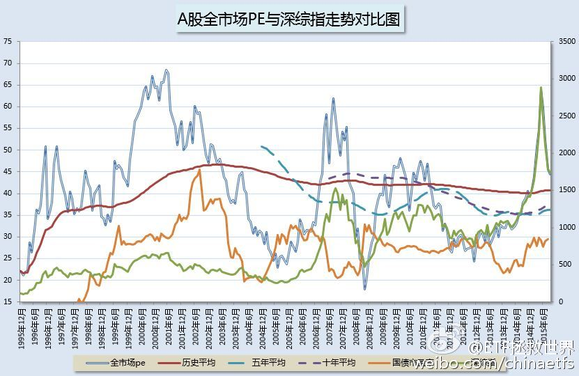
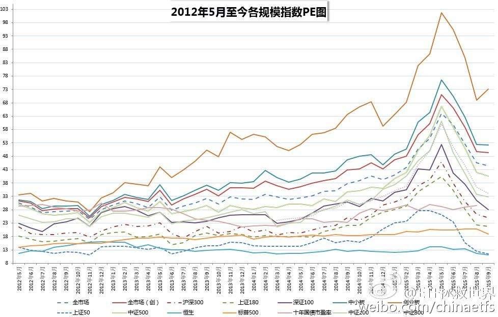
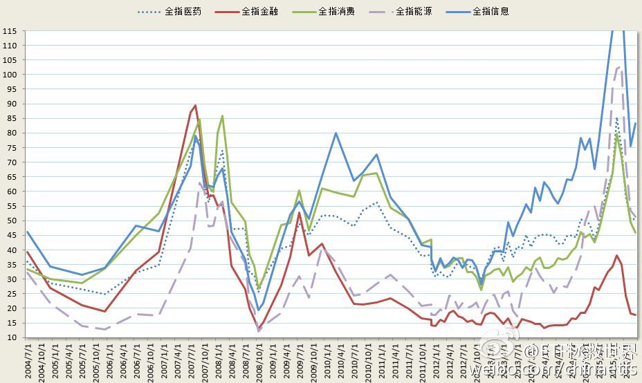
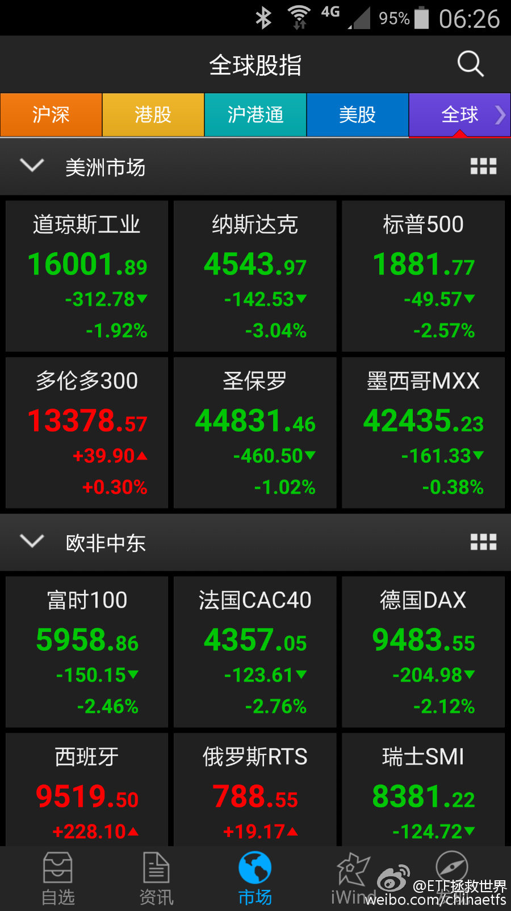
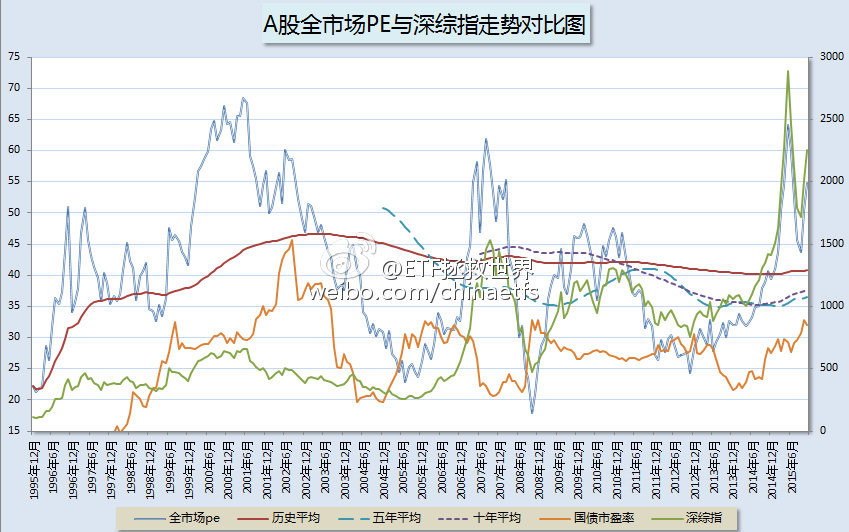
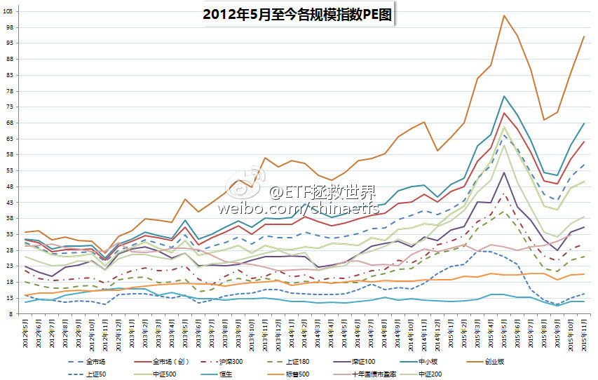
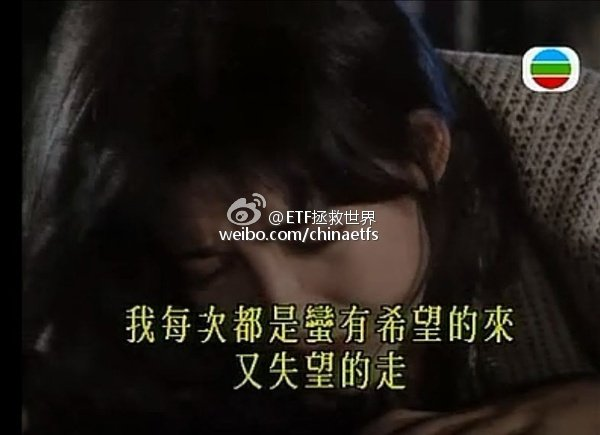

ETF拯救世界 (5687069307) @
2015-09-28 17:21:25 Mon  
url: https://weibo.com/5687069307/CCDU9CU5r

新开微博，万象更新。也没什么送给大家的，送大家几张今天的估值图吧 ​​​

转发[41]  评论[263]  赞[217] 

+++++++++++++++++++++++++++++++++++++++++++++++++++++

图片：

======================================================

ETF拯救世界 (5687069307) @
2015-09-29 06:30:45 Tue  
url: https://weibo.com/5687069307/CCJ4y5pAY

今天的第一个问题是，美帝如此脆弱，我们的73倍pe神创会继续NB吗。第二个问题是，还有两个交易日，哪些指数会给我们etf计划开枪的机会？ ​​​

转发[3]  评论[62]  赞[77] 

+++++++++++++++++++++++++++++++++++++++++++++++++++++

图片：

======================================================

ETF拯救世界 (5687069307) @
2015-09-29 10:26:05 Tue  
url: https://weibo.com/5687069307/CCKC4EnwI

持股的人不要总是嘲笑谩骂持币的投资者。这样一个恒时高估的赌场，大部分时间持币有何过错？在估值高企的时候，这些人卖出筹码，拿着现金，等着价值回归。他们在高位的卖出，没有伤害任何人。因为，真正的价... http://t.cn/RyCnScN ​​​

转发[19]  评论[67]  赞[83] 

======================================================

ETF拯救世界 (5687069307) @
2015-09-29 11:31:02 Tue  
url: https://weibo.com/5687069307/CCL2r1DKs

大概从10年前起，就开始有意识的收集市场极端情况下的新闻报道。真的特别有意思。最近几年，用的是印象笔记，也挺好用。下面，把我收集的几条5、6月份的新闻报道给大家分享一下。我们一起看看，当绝大多数人... http://t.cn/RyC1nsx ​​​

转发[38]  评论[77]  赞[97] 

======================================================

ETF拯救世界 (5687069307) @
2015-09-29 13:01:25 Tue  
url: https://weibo.com/5687069307/CCLD828EG

我去，居然有大户打赏了！早知道早就来微博了！这么多年少说少赚了100块……我会更加努力的。么么哒。  ​​​

转发[4]  评论[66]  赞[89] 

======================================================

ETF拯救世界 (5687069307) @
2015-09-30 10:27:34 Wed  
url: https://weibo.com/5687069307/CCU3aroq9

国家队连着两天猛拉券商制造人气，可惜还是不能带动整个市场的人气。“中国散户不行。” 操盘手在新盛大厦楼下的吸烟区忧郁的说。 ​​​

转发[1]  评论[29]  赞[64] 

======================================================

ETF拯救世界 (5687069307) @
2015-09-30 10:36:02 Wed  
url: https://weibo.com/5687069307/CCU6Br16z

我的一位老朋友，美国总统克林顿刚才给我打了一个电话：“我的浦发银行还有3%就解套了，感谢你国” ​​​

转发[0]  评论[32]  赞[67] 

======================================================

ETF拯救世界 (5687069307) @
2015-09-30 15:14:14 Wed  
url: https://weibo.com/5687069307/CCVVx7DZg

月线四连跌 硝烟弥漫，哀嚎遍野。 10月，拿起你的武器，准备2-3发子弹。 最重要的是 10月6日 记得开手机 ​​​

转发[3]  评论[62]  赞[74] 

+++++++++++++++++++++++++++++++++++++++++++++++++++++

图片：

======================================================

ETF拯救世界 (5687069307) @
2015-10-01 08:55:11 Thu  
url: https://weibo.com/5687069307/CD2SakA0a

展开这个话题前，让我们先来看看这个星球上最伟大的投资家对指数投资的看法：被称为“股神”的巴菲特从不荐股，也从不预测市场走势，但是许多投资者都知道巴菲特唯一推荐过的投资品种就是指数基金。在2008年... http://t.cn/Ry0UvY3 ​​​

转发[86]  评论[87]  赞[101] 

======================================================

ETF拯救世界 (5687069307) @
2015-10-06 20:30:51 Tue  
url: https://weibo.com/5687069307/CDSz1iuFK

2015年10月ETF计划... http://t.cn/RyTGCtm ​​​

转发[49]  评论[77]  赞[95] 

======================================================

ETF拯救世界 (5687069307) @
2015-10-20 14:25:07 Tue  
url: https://weibo.com/5687069307/D00HcCuZB

其实死等深度价值也是不理智的。在不贵的时候，控制仓位慢慢买是个不错的选择。 //@佐罗投资札记:回复@若愚之人74:这就是多数人亏钱的根本原因，没有耐心等待，急于赚快钱！ //@若愚之人74:等到头发都快白了也没见到深度价值出现，反而越涨越高，心也越来越不淡定了。

------------------------------------------------------
转推：
>  @厚恩投资张延昆 (1078779184)
>  2015-10-20 12:47:51 Tue  
>  url: https:/weibo.com/1078779184/D003Ir7Zw/

>  【#投资历史#】价值投资的核心就是买便宜货1.如果昂贵，即便是未来成长，当前价格也可能透支厉害。2.未来成长速度不同，当前价格是贵还是贱，就千差万别。因此，须以保守态度来定性分析企业，不给成长以过多估值加分，严守格雷厄姆安全边际教诲，这是普通投资人最好护城河：价值为本，定性成长随缘。 ​​​

转发[15]  评论[26]  赞[50] 

======================================================

ETF拯救世界 (5687069307) @
2015-10-23 12:08:17 Fri  
url: https://weibo.com/5687069307/D0s59cr6m

吃着火锅，谈笑风生，把钱赚了。 http://t.cn/RUzWYfI ​​​

转发[80]  评论[88]  赞[117] 

======================================================

ETF拯救世界 (5687069307) @
2015-10-30 08:53:09 Fri  
url: https://weibo.com/5687069307/D1uNq53jH

不管生一个也好，两个也好，真心希望父母们把孩子们生下来就好好养。尽量多陪陪孩子，尽量多教孩子一些仁义理智信的做人道理，不要就是把孩子送到钢琴英语奥数各种班然后出去拼命赚钱或者花天酒地……人口素... http://t.cn/RUcLuvk ​​​

转发[9]  评论[22]  赞[88] 

======================================================

ETF拯救世界 (5687069307) @
2015-11-01 10:20:30 Sun  
url: https://weibo.com/5687069307/D1OdRDVWS

2015年11月ETF计划 http://t.cn/RUIhTX4 ​​​

转发[28]  评论[46]  赞[83] 

======================================================

ETF拯救世界 (5687069307) @
2015-11-07 10:40:23 Sat  
url: https://weibo.com/5687069307/D2IUViDq2

@ETF拯救世界:一晚上过去，大家情绪都平复点了吧。咱们一起推演一下IPO新政实施后会发生的事情： 1、打新者会不会大量配置股票充当打新门票 之前每次IPO，都会冻结上万亿的资金。即使在情绪高涨的5000点，场外也有这么多资金虎视眈眈... 分享自@雪球 http://t.cn/RUKipwr ​​​

转发[24]  评论[31]  赞[54] 

======================================================

ETF拯救世界 (5687069307) @
2015-11-13 09:37:20 Fri  
url: https://weibo.com/5687069307/D3D4j2lzg

我知道，在微博这种地方提示风险不会讨好，但我还是想贴张图。中小、创业，逆天了。 ​​​

转发[18]  评论[58]  赞[80] 

+++++++++++++++++++++++++++++++++++++++++++++++++++++

图片：

======================================================

ETF拯救世界 (5687069307) @
2015-11-18 05:06:02 Wed  
url: https://weibo.com/5687069307/D4mqFkI3n

几年前1860清仓持有7年的黄金后，这货居然跌了快一半了。现在么，依然不出手。

------------------------------------------------------
转推：
>  @ ()
>  2015-11-18 01:24:03 Wed  
>  url: 

>  抱歉，作者已设置仅展示半年内微博，此微博已不可见。 ​​​

转发[24]  评论[29]  赞[41] 

======================================================

ETF拯救世界 (5687069307) @
2015-11-18 13:27:54 Wed  
url: https://weibo.com/5687069307/D4pInxST8

回复@辟话: 2011年8月21，清仓黄金，价格1875。11个交易日后，黄金见到1921历史高点，暴跌至今。全过程请见：http://t.cn/RUnAdRp //@辟话:老大，当时你是根据什么依据买的黄金，说出来，第一是学习，第二是借鉴。

------------------------------------------------------
转推：
>  @ ()
>  2015-11-18 01:24:03 Wed  
>  url: 

>  抱歉，作者已设置仅展示半年内微博，此微博已不可见。 ​​​

转发[12]  评论[30]  赞[33] 

======================================================

ETF拯救世界 (5687069307) @
2015-11-19 00:13:00 Thu  
url: https://weibo.com/5687069307/D4tWet24O

我不信大霄不知道现在股市的真实估值水平。有些话如果不能说，可以选择不说话。很多人很相信你，未来，他们会怎样？

------------------------------------------------------
转推：
>  @ ()
>  2015-11-18 23:13:45 Wed  
>  url: 

>  抱歉，作者已设置仅展示半年内微博，此微博已不可见。 ​​​

转发[2]  评论[28]  赞[40] 

======================================================

ETF拯救世界 (5687069307) @
2015-11-19 00:15:30 Thu  
url: https://weibo.com/5687069307/D4tXf6xSJ

分指数。上证 300等几乎不可能。中小创业500之类有机会

------------------------------------------------------
转推：
>  @ ()
>  2015-11-18 22:50:44 Wed  
>  url: 

>  该账号因被投诉违反《微博社区公约》的相关规定，现已无法查看。查看帮助 https://kefu.weibo.com/faqdetail?id=13216

转发[1]  评论[11]  赞[33] 

======================================================

ETF拯救世界 (5687069307) @
2015-11-19 10:53:07 Thu  
url: https://weibo.com/5687069307/D4y82CANO

“多空机制不均衡”——这么说现在与股在前比，是均衡了还是更加不均衡了呢

------------------------------------------------------
转推：
>  @ ()
>  2015-11-19 10:45:55 Thu  
>  url: 

>  抱歉，此微博已被作者删除。查看帮助：http://t.cn/Rfd3rQV

转发[3]  评论[11]  赞[25] 

======================================================

ETF拯救世界 (5687069307) @
2015-11-19 11:08:30 Thu  
url: https://weibo.com/5687069307/D4yei0tsO

有个睿智的老人说，如果你加入一个牌局，十分钟后还不知道哪个对手是傻瓜，那么，你就是那个傻瓜——谁能想到，A股很多人连对手是谁都没看清就out了。 A股这个赌局中，你知道谁是傻瓜，你要赚谁的钱吗？ ​​​

转发[18]  评论[35]  赞[66] 

======================================================

ETF拯救世界 (5687069307) @
2015-11-20 09:12:49 Fri  
url: https://weibo.com/5687069307/D4GTPmaHz

选取了历史上几个国家估值特别高，第一波股灾后的图形，找找哪个是A股？ 并没有那么容易看出来吧。昨天有朋友在文章后面评论，总感觉有股力量在下面托着，好像总也跌不下去。是的，除了伟大zj的力量，更伟大... http://t.cn/RUm005D ​​​

转发[57]  评论[40]  赞[78] 

======================================================

ETF拯救世界 (5687069307) @
2015-11-27 17:33:58 Fri  
url: https://weibo.com/5687069307/D5OaID9PR

该提示的风险最近这段时间天天说说了有几十篇，现在说也没有任何意义了。看到的朋友算是有缘吧。考虑了一下下一步的重点布局。首先，A类看来价格依然坚挺，现在的价位，有肉，但塞牙缝都不够。有些高估指数... http://t.cn/RUdGo7Y ​​​

转发[18]  评论[43]  赞[70] 

======================================================

ETF拯救世界 (5687069307) @
2015-11-30 09:25:26 Mon  
url: https://weibo.com/5687069307/D6dfUDlsc

还是那句话，大宵这个位置强力唱多，未来英名不保是其次，会让很多粉丝赔了大钱才是最大的问题。大宵，珍重。

------------------------------------------------------
转推：
>  @ ()
>  2015-11-30 09:17:35 Mon  
>  url: 

>  抱歉，作者已设置仅展示半年内微博，此微博已不可见。 ​​​

转发[8]  评论[32]  赞[38] 

======================================================

ETF拯救世界 (5687069307) @
2015-11-30 10:20:44 Mon  
url: https://weibo.com/5687069307/D6dCmqiIp

个人非常不认可有些人所谓的“股灾3.0”的说法。主要原因在于一些权重股或者二线蓝筹的估值情况与5、6月份非常不同。想让他们再连续跌停难度很大。也就是说，指数方面不会连续出现暴跌。大多数股票应该是以... http://t.cn/RUePnlS ​​​

转发[34]  评论[28]  赞[78] 

======================================================

ETF拯救世界 (5687069307) @
2015-11-30 17:05:56 Mon  
url: https://weibo.com/5687069307/D6ggPybmC

本月ETF计划买入一份 http://t.cn/RUeoofB ​​​

转发[20]  评论[51]  赞[59] 

======================================================

ETF拯救世界 (5687069307) @
2015-12-03 09:04:14 Thu  
url: https://weibo.com/5687069307/D6FoO9Cq7

钱，在很多人眼里看得比天还重，然而有些人并不这么认为。不要以自己的思维去揣度别人。实际上，我也不支持给孩子留过多的财产。你以为是对他好，实际上大概率是害了他。

------------------------------------------------------
转推：
>  @ ()
>  2015-12-03 00:43:46 Thu  
>  url: 

>  该账号因被投诉违反《微博社区公约》的相关规定，现已无法查看。查看帮助 https://kefu.weibo.com/faqdetail?id=13216

转发[4]  评论[25]  赞[46] 

======================================================

ETF拯救世界 (5687069307) @
2015-12-08 14:56:17 Tue  
url: https://weibo.com/5687069307/D7sQbdHmU

每天看着A股的起起伏伏，总能感觉到一丝秋意。 说真的，现在这个时点，几千万人的痛苦并未真正开始，然而，他们还活在梦中。 ​​​

转发[11]  评论[39]  赞[73] 

+++++++++++++++++++++++++++++++++++++++++++++++++++++

图片：

======================================================

ETF拯救世界 (5687069307) @
2015-12-11 07:30:20 Fri  
url: https://weibo.com/5687069307/D7ScEFAYr

刚才在电梯里，听到大佬的马仔在打电话： “……琛哥说，上面逼得他很紧……谁帐户资产增加了，谁就是内鬼……总之你要记住，如果有人经历了股灾，却没有赔钱，那么，他可能就是下一个……” ​​​

转发[18]  评论[34]  赞[55] 

======================================================

ETF拯救世界 (5687069307) @
2015-12-11 10:59:11 Fri  
url: https://weibo.com/5687069307/D7TzqAQ7d

不要怕，不会一路暴跌。大概率是让你欲走还留欲罢还休，都跑了还得了。明明感觉每天没怎么跌，一段时间打开账户后缩水一大半。要我说，崩盘暴跌一点都不可怕，很容易就暴涨拉回。温水煮青蛙才是绝大多数人的噩梦。当然，他们很久以后才会明白过来。

------------------------------------------------------
转推：
>  @ETF拯救世界 (5687069307)
>  2015-11-30 10:20:44 Mon  
>  url: https:/weibo.com/5687069307/D6dCmqiIp/

>  个人非常不认可有些人所谓的“股灾3.0”的说法。主要原因在于一些权重股或者二线蓝筹的估值情况与5、6月份非常不同。想让他们再连续跌停难度很大。也就是说，指数方面不会连续出现暴跌。大多数股票应该是以... http://t.cn/RUePnlS ​​​

转发[17]  评论[35]  赞[49] 

======================================================

ETF拯救世界 (5687069307) @
2015-12-11 14:30:09 Fri  
url: https://weibo.com/5687069307/D7UX40ITV

“快跑啊，里面在打人啊” 咚咚咚…… “别跑啦，里面在发钱，跑得快的还有美女送啊” 咚咚咚……“快回去啊，跑得快的那几个被打成猪头啦” 咚咚咚……“又发钱啦！！！” …… “去你大爷的，打死他” 不是喜剧，不是悲剧。是一出荒诞剧。 ​​​

转发[1]  评论[31]  赞[52] 

======================================================

ETF拯救世界 (5687069307) @
2015-12-21 13:03:21 Mon  
url: https://weibo.com/5687069307/D9qENng3n

他凭一己之力，把一个市值数千亿上市公司的董事长从雪山上、哈佛中、三线小明星身边，拉回办公室，开始为公司前途奔波；他让资本市场价值投资之火重新燃烧，让那些不重视公司市值的蓝筹股大股东不安。你可以不喜欢他，但他是最励志的卖菜哥。(对老百姓有好处的事，就是我们要做的——他如是说。) ​​​

转发[115]  评论[49]  赞[107] 

======================================================

ETF拯救世界 (5687069307) @
2015-12-23 11:40:37 Wed  
url: https://weibo.com/5687069307/D9IYdhoNg

12月22日收盘进入过去十年估值最高10%区域的指数是全市场PE、中小板PE、创业板PE、全指医药PE、全指信息PE。一个指数的估值是否进入过去十年最高10%区域，具有非常非常重要的意义。通常情况下，某个指数进入... http://t.cn/R4Gh10J ​​​

转发[85]  评论[64]  赞[70] 

======================================================

ETF拯救世界 (5687069307) @
2015-12-24 10:30:52 Thu  
url: https://weibo.com/5687069307/D9RWojt6f

大宵，你再这样以后会有人跳楼的。

------------------------------------------------------
转推：
>  @ ()
>  2015-12-24 10:18:40 Thu  
>  url: 

>  抱歉，此微博已被作者删除。查看帮助：http://t.cn/Rfd3rQV

转发[1]  评论[21]  赞[28] 

======================================================

ETF拯救世界 (5687069307) @
2015-12-24 10:42:50 Thu  
url: https://weibo.com/5687069307/D9S1fsdRf

据说，长得帅的都拿着利润跑了。长得丑的已经准备开始骂zjh了。 ​​​

转发[6]  评论[32]  赞[48] 

======================================================

ETF拯救世界 (5687069307) @
2015-12-30 09:36:15 Wed  
url: https://weibo.com/5687069307/DaM9cv73q

本月卖出一份、买入一份、补入一份 http://t.cn/R4f52Th ​​​

转发[22]  评论[44]  赞[69] 

======================================================

ETF拯救世界 (5687069307) @
2015-12-31 15:46:16 Thu  
url: https://weibo.com/5687069307/DaXZTdG21

祝大家身体健康、2016新年快乐；祝大家2016保住本金的前提下，能够赚大钱，发大财。 http://t.cn/R4Mbp1T ​​​

转发[3]  评论[44]  赞[84] 

======================================================

