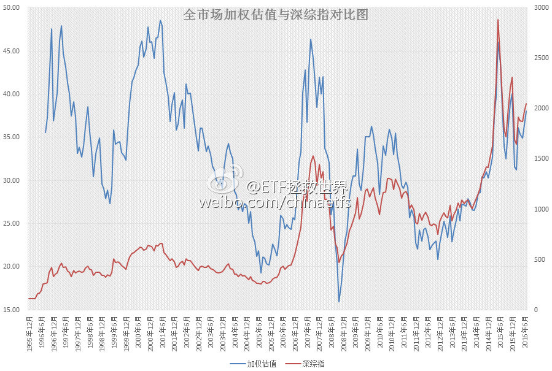

ETF拯救世界 (5687069307) @
2016-07-01 11:31:16 Fri  
url: https://weibo.com/5687069307/DCLxfDfc7

发布了头条文章：《2016年7月ETF计划：一周年，所有品种盈利 》 http://t.cn/R5RSuG3 ​​​

转发[37]  评论[29]  赞[115] 

======================================================

ETF拯救世界 (5687069307) @
2016-07-14 18:45:14 Thu  
url: https://weibo.com/5687069307/DEMVQzRBC

自研外部数据加权A股全市场估值。历史四次大顶，40-45是危险区域，45以上是拔腿就跑区域，不跑就死——97、01、07、15。现在，38.02 ​​​

转发[82]  评论[65]  赞[110] 

+++++++++++++++++++++++++++++++++++++++++++++++++++++

图片：

======================================================

ETF拯救世界 (5687069307) @
2016-07-18 18:07:41 Mon  
url: https://weibo.com/5687069307/DFooBCK5U

80后单身年收入30万，已婚65万可进top 1%，你进了没有？

------------------------------------------------------
转推：
>  @21世纪经济报道 (1651428902)
>  2016-07-17 16:19:52 Sun  
>  url: https:/weibo.com/1651428902/DFeglhXkK/

>  【月薪多少才算80后佼佼者？】前段时间，“月薪多少才能撑起一个家”的话题戳中了不少人的泪点，而这其中最为感同身受的，就是80后。那么，月薪多少才算80后佼佼者？80后在婚姻、事业、学历、幸福感方面又有着怎样的数据结论？http://t.cn/RthnaKD ​​​

转发[4]  评论[30]  赞[23] 

======================================================

ETF拯救世界 (5687069307) @
2016-07-21 08:12:20 Thu  
url: https://weibo.com/5687069307/DFMMri3VO

一部分人先富起来，做到了

------------------------------------------------------
转推：
>  @ ()
>  2016-07-21 08:07:02 Thu  
>  url: 

>  该账号因被投诉违反法律法规和《微博社区公约》的相关规定，现已无法查看。查看帮助 https://kefu.weibo.com/faqdetail?id=13216

转发[22]  评论[15]  赞[37] 

======================================================

ETF拯救世界 (5687069307) @
2016-07-24 18:35:59 Sun  
url: https://weibo.com/5687069307/E0lGKeoqo

很多人出门在外，眼中只有两种人:对自己有用的人和多余的人。怎么可能为了多余的人把行李拿下来呢……

------------------------------------------------------
转推：
>  @北京头条 (1644948230)
>  2016-07-24 14:30:03 Sun  
>  url: https:/weibo.com/1644948230/E0k4V9EUp/

>  【太LOW了 ……无语……[衰]】网友 @拷扁橄榄 爆料，上海地铁11号线车厢里两名女乘客发生激烈争执，其中一位甚至动了手。起因是动手的女乘客将行李放在了座位上，占据了一个座位，并因此与要求将行李放在地上乘客发生了冲突。 http://t.cn/Rty7HGq ​​​

转发[2]  评论[15]  赞[28] 

======================================================

ETF拯救世界 (5687069307) @
2016-07-26 08:34:04 Tue  
url: https://weibo.com/5687069307/E0ABqc5HE

2016年7月25日重要股东增减持数据：

增持3家3次，共增持953万，其中康力电梯一家增持943万，其它两家分别为8.4万和1.9万。

减持27家33次，共减持4.96亿。

过去一个月净减持310亿。算是正常。这个速度一年也只减持3、4000亿吧。群众扛得住。 ​​​

转发[7]  评论[19]  赞[36] 

======================================================

