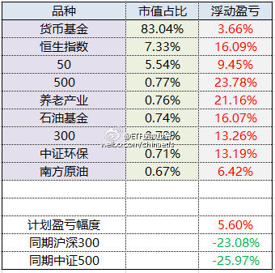
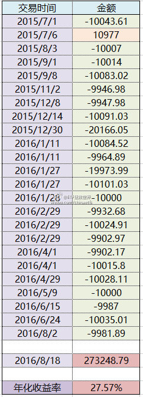
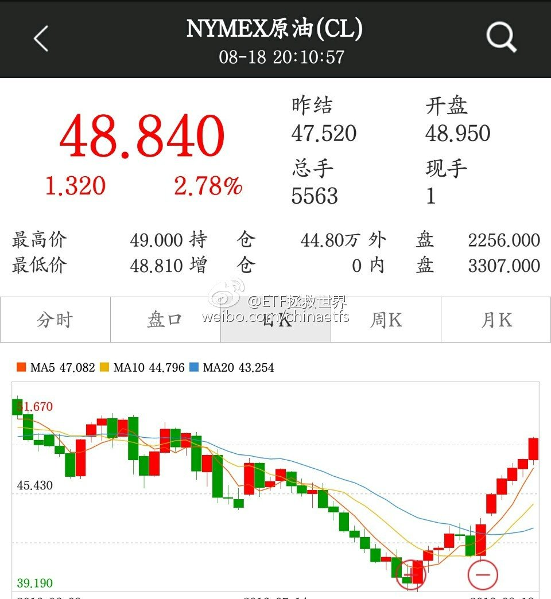
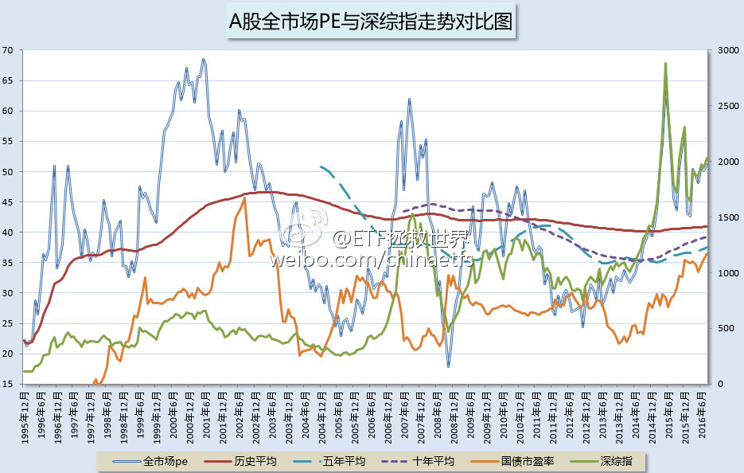

ETF拯救世界 (5687069307) @
2016-08-06 12:23:57 Sat  
url: https://weibo.com/5687069307/E2hOc3hUZ

大宵风格再次明显改变，又发生了什么。[doge]

------------------------------------------------------
转推：
>  @ ()
>  2016-08-06 11:15:59 Sat  
>  url: 

>  抱歉，作者已设置仅展示半年内微博，此微博已不可见。 ​​​

转发[4]  评论[22]  赞[32] 

======================================================

ETF拯救世界 (5687069307) @
2016-08-07 08:41:17 Sun  
url: https://weibo.com/5687069307/E2pMiyWpM

发布了头条文章：《2016年8月ETF计划：买入三份》 http://t.cn/RtKviY8 ​​​

转发[64]  评论[42]  赞[106] 

======================================================

ETF拯救世界 (5687069307) @
2016-08-17 10:55:12 Wed  
url: https://weibo.com/5687069307/E3WVDueM5

这个剧必须看一遍了

------------------------------------------------------
转推：
>  @ ()
>  2016-08-16 13:32:58 Tue  
>  url: 

>  该账号因被投诉违反《微博社区公约》的相关规定，现已无法查看。查看帮助 https://kefu.weibo.com/faqdetail?id=13216

转发[24]  评论[16]  赞[22] 

======================================================

ETF拯救世界 (5687069307) @
2016-08-18 10:11:27 Thu  
url: https://weibo.com/5687069307/E464n1tRW

我想问问，有多少朋友是只在微博关注我了？其它的地方，比如雪球没有关注。如果这样的朋友多，我以后争取多在微博发言，把发在其它地方的成果也发到这里。评论一下我看看有多少…… ​​​

转发[5]  评论[232]  赞[198] 

======================================================

ETF拯救世界 (5687069307) @
2016-08-18 11:51:41 Thu  
url: https://weibo.com/5687069307/E46J3ndw8

2015年7月至今，ETF计划150份总收益率为图一。

所有品种盈利，最高盈利24%，最低盈利品种这个月买入的盈利6%。实际上，如果闲置资金买理财、债券等稍微高一些的品种，总收益也远远不止这个数。这里闲置资金取收益率最低的货基。

同期A股整体下跌25%左右。

第二张图是已买入权益类品种的年化收益率。 ​​​

转发[29]  评论[38]  赞[71] 

+++++++++++++++++++++++++++++++++++++++++++++++++++++

图片：

======================================================

ETF拯救世界 (5687069307) @
2016-08-18 13:34:36 Thu  
url: https://weibo.com/5687069307/E47oPnJsB

回复@麦城太守:我建议可以看看各个券商的增强货基。比如平安的灵活宝，华泰的资金货币增强。收益都在3.5%左右，比普通货基高不少 //@麦城太守:E大 ，请教下，您买的货币基金是哪个？谢谢

------------------------------------------------------
转推：
>  @ETF拯救世界 (5687069307)
>  2016-08-18 11:51:41 Thu  
>  url: https:/weibo.com/5687069307/E46J3ndw8/

>  2015年7月至今，ETF计划150份总收益率为图一。
>  
>  所有品种盈利，最高盈利24%，最低盈利品种这个月买入的盈利6%。实际上，如果闲置资金买理财、债券等稍微高一些的品种，总收益也远远不止这个数。这里闲置资金取收益率最低的货基。
>  
>  同期A股整体下跌25%左右。
>  
>  第二张图是已买入权益类品种的年化收益率。 ​​​

转发[12]  评论[18]  赞[36] 

======================================================

ETF拯救世界 (5687069307) @
2016-08-19 08:30:02 Fri  
url: https://weibo.com/5687069307/E4ePH5IYv

18天，20%涨幅。

一年过去了，etf计划买到了多少次底部你注意过吗。

别急，更多的底部在前方。 http://t.cn/RU1tUzL ​​​

转发[4]  评论[36]  赞[69] 

+++++++++++++++++++++++++++++++++++++++++++++++++++++

图片：

======================================================

ETF拯救世界 (5687069307) @
2016-08-23 17:05:20 Tue  
url: https://weibo.com/5687069307/E4TUQv6J1

如果天朝有80%的人出门，时时刻刻注意不给别人添麻烦，实在不得已添了麻烦就赶紧说声不好意思，那么每个人的幸福指数恐怕要提升300%。可惜，大多数人的理念是：“我舒服就行，如果造成你不舒服关我屁事。”

------------------------------------------------------
转推：
>  @ ()
>  2016-08-23 09:41:17 Tue  
>  url: 

>  抱歉，作者已设置仅展示半年内微博，此微博已不可见。 ​​​

转发[4]  评论[19]  赞[36] 

======================================================

ETF拯救世界 (5687069307) @
2016-08-25 11:34:52 Thu  
url: https://weibo.com/5687069307/E5aBHzSoE

现在的情况真的和2002年太像了。

注意02年十年期国债市盈率（橘黄色）与估值的对应关系，再看现在。有一个共同点都是前一年股市疯涨估值疯狂后，利率水平大幅下降，全市场估值再度疯涨。A股有史以来仅此两次。这次之所以没有像07年一样一路下去，固然有某些资金维稳的原因，无风险利率不断下降也有很 ​​​

转发[60]  评论[59]  赞[70] 

+++++++++++++++++++++++++++++++++++++++++++++++++++++

图片：

======================================================

ETF拯救世界 (5687069307) @
2016-08-31 10:28:33 Wed  
url: https://weibo.com/5687069307/E64JLsBw2

投资来说，首先要有自信。相信自己的理念，进而相信自己的策略和体系。

这种相信不是天生的。首先要学习，学习什么？学习科学的历史数据，学习真正成功大师的一言一行和建议。通过了解历史，了解成功者背后的逻辑，一点一点建立正确的理念，策略和体系。然后通过做正确的事情不断获得胜利，继而进一步 ​​​

转发[67]  评论[64]  赞[111] 

======================================================

