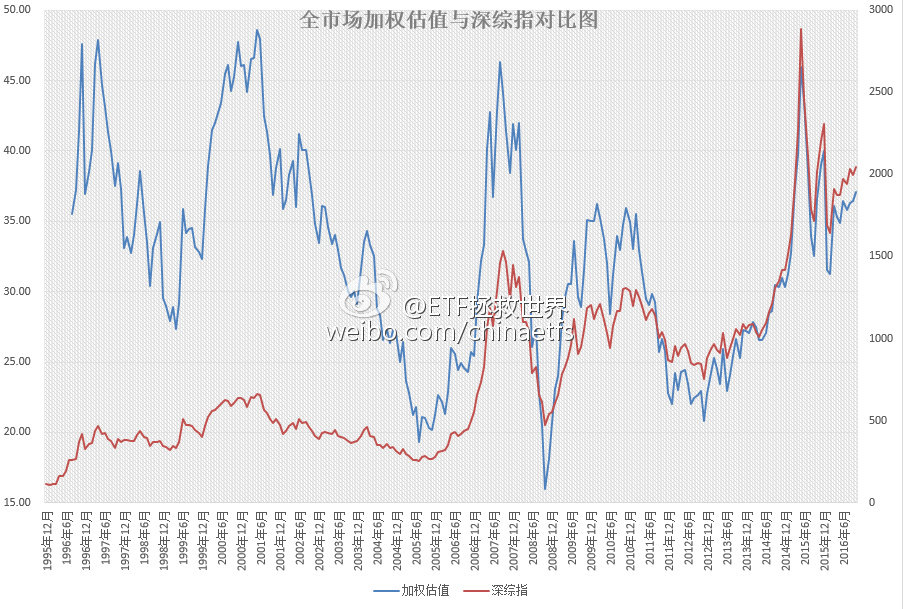

ETF拯救世界 (5687069307) @
2016-10-12 09:33:09 Wed  
url: https://weibo.com/5687069307/Ecsk809uy

昨天收盘后，综合外部宏观数据加权的A股全市场估值图。

月末计算首次突破37。有心的朋友应该记得，40（去年12月底）就是危险区域，45（去年5、6月；2007年10月；1997、2001）不跑会被打的亲妈都不认识。

这个位置，比五年平均高26%，比十年平均高21%。处在过去五年最贵的86.6%，过去十年最贵的84.1% ​​​

转发[42]  评论[51]  赞[67] 

+++++++++++++++++++++++++++++++++++++++++++++++++++++

图片：

======================================================

ETF拯救世界 (5687069307) @
2016-10-13 12:55:29 Thu  
url: https://weibo.com/5687069307/EcD4L4Uqp

非常好，这很中国。此例一开，以后谁家贫困，家里有绝症病人，就可以照猫画虎，为家人赚到百万遗产。这个国家，这样纵容破坏规矩的人，到底什么时候从上到下能守规矩？！[怒骂]

------------------------------------------------------
转推：
>  @澎湃新闻 (5044281310)
>  2016-10-13 08:27:49 Thu  
>  url: https:/weibo.com/5044281310/EcBk74CAD/

>  【北京被虎咬伤女子发声：因晕车下车，园方救援不力索赔200多万】7月，赵女士在八达岭野生动物园虎园下车时，被老虎拖走，其母追赶时遭老虎撕咬死亡。昨天，赵女士讲述事发经过：①爱人开车不熟练，自己有点晕车，提出换自己开车，所以下车去驾驶室，并不是网传的吵架。②当天人很多，售票处说要限流， ​​​ http://mapi/005vnhZYgw1f8qc4qd5gug30ax06rkjo

转发[5]  评论[12]  赞[30] 

======================================================

ETF拯救世界 (5687069307) @
2016-10-13 19:32:36 Thu  
url: https://weibo.com/5687069307/EcFFXd9UD

“从来”不闯红灯。[doge]

------------------------------------------------------
转推：
>  @一手Video (5943595658)
>  2016-10-13 18:27:41 Thu  
>  url: https:/weibo.com/5943595658/EcFfBafBO/

>  #被老虎咬伤当事人首发声#【13分钟连线被虎咬伤赵女士②：谁该负责？】“我承认我们有错，作为成年人，对危险辨识不清，但谁都会犯错。“赵女士认为主要责任在园方，动物园在警示游客、救援，以及向游客灌输安全意识方面都存在不足。她称，自己是个守规则的人，从来不闯红灯。http://t.cn/RVcZz9D ​​​

转发[3]  评论[9]  赞[17] 

======================================================

ETF拯救世界 (5687069307) @
2016-10-20 12:44:42 Thu  
url: https://weibo.com/5687069307/EdGZQyiuV

赌一块钱，这个新闻会反转。因为这个说法政治不正确……

------------------------------------------------------
转推：
>  @ ()
>  2016-10-20 11:07:43 Thu  
>  url: 

>  抱歉，作者已设置仅展示半年内微博，此微博已不可见。 ​​​

转发[1]  评论[23]  赞[26] 

======================================================

ETF拯救世界 (5687069307) @
2016-10-23 20:46:03 Sun  
url: https://weibo.com/5687069307/EecqJ6Siq

……

------------------------------------------------------
转推：
>  @蓝鲸财经记者工作平台 (1885454921)
>  2016-10-23 14:32:25 Sun  
>  url: https:/weibo.com/1885454921/Ee9Z4imDP/

>  【三星爆炸门还没完！Note7起火原因尚未查明，S7又爆炸了】23日讯，一位在美国某运营商工作的读者爆料称，有顾客拿着台爆炸燃损的三星Galaxy S7 edge手机来店里抱怨求偿。这名用户称，手机收到两周，是自己将换新版的Note 7退回之后更换的，但没想到却发生了爆炸事故。 http://t.cn/RVOANHD ​​​

转发[0]  评论[18]  赞[12] 

======================================================

ETF拯救世界 (5687069307) @
2016-10-31 07:29:09 Mon  
url: https://weibo.com/5687069307/EfkDeBC3h

彩礼这种东西，是典型的农业社会特征。没有社会化养老，也没有儿子在身边的家庭式养老，就必须有这样一笔养老金回馈。解决方法只能是现代化的社会养老。

------------------------------------------------------
转推：
>  @商业周刊中文版 (2462605080)
>  2016-10-30 20:28:03 Sun  
>  url: https:/weibo.com/2462605080/EfgiTtmdT/

>  【人民日报：天价彩礼成农民小康路上的一大拦路虎】这些年农村结婚彩礼不断加码，有互相攀比因素，更多是观念陈旧，认为嫁出去的女儿“泼出去的水”，养了20年，彩礼是回报。天价彩礼成农民小康路上的一大拦路虎，挑战公序良俗，恶化农村社会风气，加剧家庭矛盾，影响农村稳定。（人民日报） ​​​

转发[2]  评论[16]  赞[28] 

======================================================

