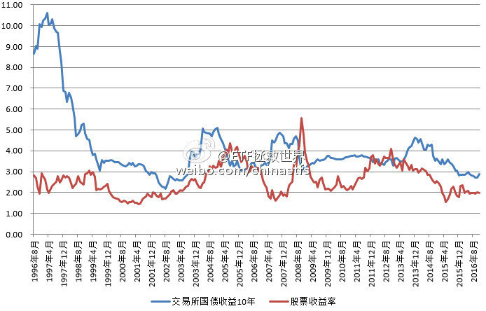
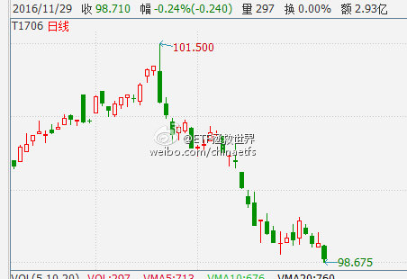
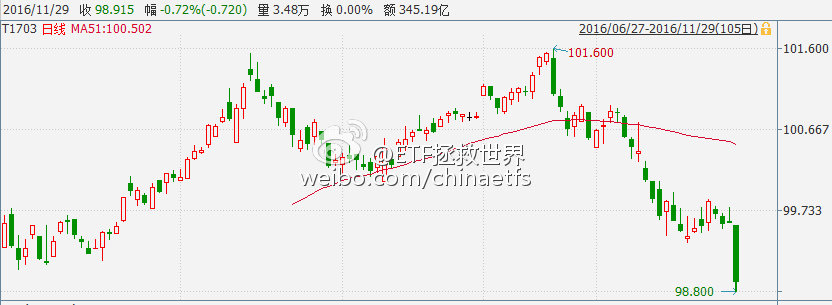
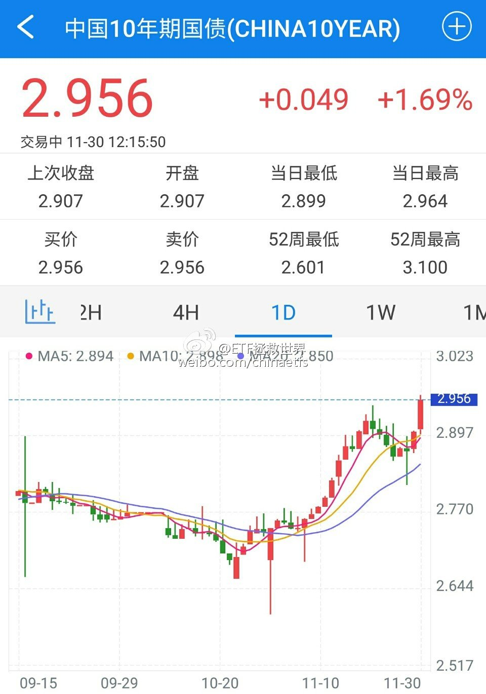

ETF拯救世界 (5687069307) @
2016-01-04 11:28:21 Mon  
url: https://weibo.com/5687069307/Dby1bvHiE

现在最头疼的，应该是保监会的BOSS们 ​​​

转发[1]  评论[15]  赞[27] 

======================================================

ETF拯救世界 (5687069307) @
2016-01-04 11:48:26 Mon  
url: https://weibo.com/5687069307/Dby9l6Bvj

这是一盘大棋，很少有人能看懂：熔断机制会大大提高本国居民的劳动生产率——几千万股民看盘的时间竟然会减少几个小时。终于，本国人均劳动生产率由美国的1/12，上升到1/11。利国利民。 ​​​

转发[4]  评论[23]  赞[41] 

======================================================

ETF拯救世界 (5687069307) @
2016-01-04 13:42:17 Mon  
url: https://weibo.com/5687069307/DbyTychWV

大宵，我开微博以来只发了40多篇。其中三篇是转发你的。我再说第三次，你这样搞下去，会有很多小散赔的非常惨，你的书也卖不好的！

------------------------------------------------------
转推：
>  @ ()
>  2016-01-04 13:25:23 Mon  
>  url: 

>  抱歉，作者已设置仅展示半年内微博，此微博已不可见。 ​​​

转发[6]  评论[28]  赞[60] 

======================================================

ETF拯救世界 (5687069307) @
2016-01-05 08:49:29 Tue  
url: https://weibo.com/5687069307/DbGpcpaC8

装睡的人你永远叫不醒

------------------------------------------------------
转推：
>  @闲趣至简 (1356373560)
>  2016-01-04 21:28:21 Mon  
>  url: https:/weibo.com/1356373560/DbBWJsZGA/

>  市场的大神们巳经提示了风险，自己还是要去涉险，罪过呀！@ETF拯救世界 ​​​

转发[6]  评论[22]  赞[32] 

======================================================

ETF拯救世界 (5687069307) @
2016-01-05 16:56:09 Tue  
url: https://weibo.com/5687069307/DbJAJDHdT

今日下跌后，过去十年估值最高的10%区域指数没有任何变化。但有一只指数进入过去十年估值最低的10%区域：上证50。过去十年该指数进入最低区域的月份为（时间顺序）：1111、1112、1207、1208、1209、1210、1211、1306、1307、1508、1509、1601。值得注意的是，该指数包含的周期类较多。同时，低不代表涨

------------------------------------------------------
转推：
>  @ETF拯救世界 (5687069307)
>  2015-12-23 11:40:37 Wed  
>  url: https:/weibo.com/5687069307/D9IYdhoNg/

>  12月22日收盘进入过去十年估值最高10%区域的指数是全市场PE、中小板PE、创业板PE、全指医药PE、全指信息PE。一个指数的估值是否进入过去十年最高10%区域，具有非常非常重要的意义。通常情况下，某个指数进入... http://t.cn/R4Gh10J ​​​

转发[18]  评论[33]  赞[36] 

======================================================

ETF拯救世界 (5687069307) @
2016-01-07 10:14:52 Thu  
url: https://weibo.com/5687069307/DbZORaE6Y

其实最具摧毁力的，是有话语权的人不负责任。 //@ETF拯救世界:大宵，我开微博以来只发了40多篇。其中三篇是转发你的。我再说第三次，你这样搞下去，会有很多小散赔的非常惨，你的书也卖不好的！

------------------------------------------------------
转推：
>  @ ()
>  2016-01-04 13:25:23 Mon  
>  url: 

>  抱歉，作者已设置仅展示半年内微博，此微博已不可见。 ​​​

转发[1]  评论[22]  赞[41] 

======================================================

ETF拯救世界 (5687069307) @
2016-01-07 16:01:44 Thu  
url: https://weibo.com/5687069307/Dc25EjHl5

今日重要数据更新：今日大跌后，进入过去十年估值最高10%区域的指数减少为只剩两只：中小板PE、全指信息PE。也就是说，创业板ETF清仓的最佳时机已过！无数的机会摆在那里，不知大家是否珍惜了。

------------------------------------------------------
转推：
>  @ETF拯救世界 (5687069307)
>  2015-12-23 11:40:37 Wed  
>  url: https:/weibo.com/5687069307/D9IYdhoNg/

>  12月22日收盘进入过去十年估值最高10%区域的指数是全市场PE、中小板PE、创业板PE、全指医药PE、全指信息PE。一个指数的估值是否进入过去十年最高10%区域，具有非常非常重要的意义。通常情况下，某个指数进入... http://t.cn/R4Gh10J ​​​

转发[30]  评论[27]  赞[40] 

======================================================

ETF拯救世界 (5687069307) @
2016-01-07 20:42:58 Thu  
url: https://weibo.com/5687069307/Dc3VNDFwl

说实话，深交所的能力和水平非常非常不错。这次，再给深交所点个赞。不过，然并卵。

------------------------------------------------------
转推：
>  @ ()
>  2016-01-07 18:25:48 Thu  
>  url: 

>  该账号因被投诉违反《微博社区公约》的相关规定，现已无法查看。查看帮助 https://kefu.weibo.com/faqdetail?id=13216

转发[40]  评论[9]  赞[37] 

======================================================

ETF拯救世界 (5687069307) @
2016-01-07 21:18:59 Thu  
url: https://weibo.com/5687069307/Dc4aqdwPr

一个月后，噩梦模式开启。

------------------------------------------------------
转推：
>  @ETF拯救世界 (5687069307)
>  2015-12-08 14:56:17 Tue  
>  url: https:/weibo.com/5687069307/D7sQbdHmU/

>  每天看着A股的起起伏伏，总能感觉到一丝秋意。 说真的，现在这个时点，几千万人的痛苦并未真正开始，然而，他们还活在梦中。 ​​​

转发[5]  评论[34]  赞[32] 

======================================================

ETF拯救世界 (5687069307) @
2016-01-11 13:23:40 Mon  
url: https://weibo.com/5687069307/DcCLtwuO1

时至今日，说什么都晚了。大宵，珍重。

------------------------------------------------------
转推：
>  @ ()
>  2016-01-11 10:10:53 Mon  
>  url: 

>  抱歉，作者已设置仅展示半年内微博，此微博已不可见。 ​​​

转发[3]  评论[14]  赞[36] 

======================================================

ETF拯救世界 (5687069307) @
2016-01-11 13:55:40 Mon  
url: https://weibo.com/5687069307/DcCYsoKTR

突然发现这么大的新闻居然是老朋友发的。转发支持一个。

------------------------------------------------------
转推：
>  @ ()
>  2016-01-09 11:58:21 Sat  
>  url: 

>  抱歉，作者已设置仅展示半年内微博，此微博已不可见。 ​​​

转发[5]  评论[8]  赞[16] 

======================================================

ETF拯救世界 (5687069307) @
2016-01-11 15:04:19 Mon  
url: https://weibo.com/5687069307/DcDqkr8UA

意思是不是之前90%的人反对计划生育呢……

------------------------------------------------------
转推：
>  @新京报 (1644114654)
>  2016-01-11 13:07:18 Mon  
>  url: https:/weibo.com/1644114654/DcCEPjTEk/

>  【国家卫计委：中国#超8成人想生二孩#[晕]】全面二孩已开始实行。今日，国家卫生计生委相关负责人表示，根据生育意愿调查，80%以上的群众都是希望生育两个孩子，90%以上都非常支持赞同我们国家的全面两孩政策，全面两孩政策已经基本实现了群众生育意愿和国家生育政策的统一。http://t.cn/R4N2sAE ​​​

转发[7]  评论[12]  赞[39] 

======================================================

ETF拯救世界 (5687069307) @
2016-01-12 17:44:06 Tue  
url: https://weibo.com/5687069307/DcNTG6O2v

手机7寸的吧？这个好，显脸小。

------------------------------------------------------
转推：
>  @叶檀 (1233227211)
>  2016-01-12 17:40:02 Tue  
>  url: https:/weibo.com/1233227211/DcNS1xFwW/

>  今天的锵锵造型。。。 ​​​

转发[1]  评论[16]  赞[25] 

======================================================

ETF拯救世界 (5687069307) @
2016-01-13 08:28:09 Wed  
url: https://weibo.com/5687069307/DcTGvFsup

昨天收盘，我们自建估值模型计算的恒生指数估值已经跌入个位数，过去十年比现在低的月份只剩0810到0902的五个月。客观陈述，没有任何投资建议。今天天气不错。 ​​​

转发[15]  评论[60]  赞[64] 

======================================================

ETF拯救世界 (5687069307) @
2016-01-13 15:22:34 Wed  
url: https://weibo.com/5687069307/DcWoJ4NBj

有没有感觉越来越像了

------------------------------------------------------
转推：
>  @ETF拯救世界 (5687069307)
>  2015-11-20 09:12:49 Fri  
>  url: https:/weibo.com/5687069307/D4GTPmaHz/

>  选取了历史上几个国家估值特别高，第一波股灾后的图形，找找哪个是A股？ 并没有那么容易看出来吧。昨天有朋友在文章后面评论，总感觉有股力量在下面托着，好像总也跌不下去。是的，除了伟大zj的力量，更伟大... http://t.cn/RUm005D ​​​

转发[11]  评论[23]  赞[33] 

======================================================

ETF拯救世界 (5687069307) @
2016-01-13 15:51:56 Wed  
url: https://weibo.com/5687069307/DcWAEm2Dj

今日下跌后，进入过去十年估值最高10%区域的指数减少为一只！也就是只剩全指信息一只。也就是说，在2016年1月13日，中小板指数的最佳卖出时机已经过去。一切都晚了。

------------------------------------------------------
转推：
>  @ETF拯救世界 (5687069307)
>  2015-12-23 11:40:37 Wed  
>  url: https:/weibo.com/5687069307/D9IYdhoNg/

>  12月22日收盘进入过去十年估值最高10%区域的指数是全市场PE、中小板PE、创业板PE、全指医药PE、全指信息PE。一个指数的估值是否进入过去十年最高10%区域，具有非常非常重要的意义。通常情况下，某个指数进入... http://t.cn/R4Gh10J ​​​

转发[18]  评论[28]  赞[39] 

======================================================

ETF拯救世界 (5687069307) @
2016-01-15 12:55:13 Fri  
url: https://weibo.com/5687069307/DdehUmof2

回复@沉默的70后:你这么机智你们老师知道吗[doge]//@沉默的70后:买啥原油啊，直接进口美国据说不到2块一升的成品油啊。 还节省了炼油污染排放。

------------------------------------------------------
转推：
>  @ ()
>  2016-01-15 12:10:14 Fri  
>  url: 

>  抱歉，此微博已被作者删除。查看帮助：http://t.cn/Rfd3rQV

转发[5]  评论[13]  赞[27] 

======================================================

ETF拯救世界 (5687069307) @
2016-01-15 13:41:36 Fri  
url: https://weibo.com/5687069307/DdeAJyfGM

很多朋友现在非常迷茫。能做的不多，贴两张图，供您做个参考。  虽然整体不便宜，大部分股票还是贵，但有些股票真的就别割了，都焦了……毕竟确实不贵。短期情绪扛一扛，未来会很美好。当然，前提是你能分清手里的股票是不是真的好股票。 ​​​

转发[14]  评论[38]  赞[53] 

+++++++++++++++++++++++++++++++++++++++++++++++++++++

图片：

======================================================

ETF拯救世界 (5687069307) @
2016-01-18 17:06:35 Mon  
url: https://weibo.com/5687069307/DdIdqw5oI

截止今日收盘，两市2809家公司自由流通市值合计17.13万亿。 //@Newsfeed:没人知道最新的“自由流通市值”吗？注意不是流通市值！

------------------------------------------------------
转推：
>  @ ()
>  2016-01-18 16:32:55 Mon  
>  url: 

>  抱歉，此微博已被作者删除。查看帮助：http://t.cn/Rfd3rQV

转发[2]  评论[13]  赞[26] 

======================================================

ETF拯救世界 (5687069307) @
2016-01-19 13:11:27 Tue  
url: https://weibo.com/5687069307/DdQ6u81NJ

（文末增加ETF计划的未来）投资这件事，很多人希望找到一个股神，幻想只要跟着他投资，就能无往不利，从此日进斗金资产顺利嘉玲。我想说的是，他们想多了。这个世界，哪里得来的股神？ http://t.cn/R4HBbfy ​​​

转发[69]  评论[45]  赞[102] 

======================================================

ETF拯救世界 (5687069307) @
2016-01-20 10:56:14 Wed  
url: https://weibo.com/5687069307/DdYE651lo

那是不可能的。中国实际居民人均储蓄非常少，应该只有一万多块人民币。同时，30%的财富集中在1%的人手中。根本没有那么多人有30万去换外储。从股市上讲，80%的帐户里都不到10万块钱。

------------------------------------------------------
转推：
>  @ ()
>  2016-01-20 10:48:40 Wed  
>  url: 

>  该账号因被投诉违反《微博社区公约》的相关规定，现已无法查看。查看帮助 https://kefu.weibo.com/faqdetail?id=13216

转发[6]  评论[13]  赞[33] 

======================================================

ETF拯救世界 (5687069307) @
2016-01-21 11:29:02 Thu  
url: https://weibo.com/5687069307/De8hUeITq

“请赞赏我”

------------------------------------------------------
转推：
>  @创业家传媒 (1642482194)
>  2016-01-21 11:23:41 Thu  
>  url: https:/weibo.com/1642482194/De8fJrOJm/

>  【证监会副主席方星海：熔断不适合A股】今日，证监会副主席方星海在冬季达沃斯活动上接受采访时，承认熔断不适合中国市场。他表示“这不是一个适合中国市场的决策，监管者承认这一点。我们应该为监管者承认错误给予赞赏。”（新浪）http://t.cn/R48Eysy ​​​

转发[2]  评论[14]  赞[44] 

======================================================

ETF拯救世界 (5687069307) @
2016-01-21 15:13:44 Thu  
url: https://weibo.com/5687069307/De9L76nnm

对投资来说，最大的利好就是便宜，最大的利空就是贵。 http://t.cn/R48kfAo ​​​

转发[73]  评论[67]  赞[113] 

======================================================

ETF拯救世界 (5687069307) @
2016-01-22 12:05:27 Fri  
url: https://weibo.com/5687069307/DehXbpxmO

小方说的话句句在理，哪里有问题？希望能早日顺利上位。

------------------------------------------------------
转推：
>  @ ()
>  2016-01-22 11:36:57 Fri  
>  url: 

>  抱歉，作者已设置仅展示半年内微博，此微博已不可见。 ​​​

转发[3]  评论[13]  赞[18] 

======================================================

ETF拯救世界 (5687069307) @
2016-01-25 12:59:13 Mon  
url: https://weibo.com/5687069307/DeKAv1WdM

有没有详细数据放出来？

------------------------------------------------------
转推：
>  @ ()
>  2016-01-25 11:59:10 Mon  
>  url: 

>  抱歉，作者已设置仅展示半年内微博，此微博已不可见。 ​​​

转发[2]  评论[9]  赞[16] 

======================================================

ETF拯救世界 (5687069307) @
2016-01-25 18:11:59 Mon  
url: https://weibo.com/5687069307/DeMDsksHo

补完二级补一级。所以在我们这里，在哪里赌都是有人兜底的。不得不点赞。[doge]

------------------------------------------------------
转推：
>  @36氪 (1750070171)
>  2016-01-22 23:45:03 Fri  
>  url: https:/weibo.com/1750070171/Demx9nRkI/

>  快讯 | 【上海印发《天使投资风险补偿管理暂行办法》】1月21日下午消息，上海市科学技术委员会、上海市财政局和上海市发展和改革委员会印发了《上海市天使投资风险补偿管理暂行办法》。文件对种子期企业和初创型企业给予规定，详情：http://t.cn/RbQ8EXq ​​​

转发[5]  评论[15]  赞[23] 

======================================================

ETF拯救世界 (5687069307) @
2016-01-26 18:10:59 Tue  
url: https://weibo.com/5687069307/DeW3xrYIK

呵呵。信不信

------------------------------------------------------
转推：
>  @ETF拯救世界 (5687069307)
>  2015-11-20 09:12:49 Fri  
>  url: https:/weibo.com/5687069307/D4GTPmaHz/

>  选取了历史上几个国家估值特别高，第一波股灾后的图形，找找哪个是A股？ 并没有那么容易看出来吧。昨天有朋友在文章后面评论，总感觉有股力量在下面托着，好像总也跌不下去。是的，除了伟大zj的力量，更伟大... http://t.cn/RUm005D ​​​

转发[7]  评论[16]  赞[24] 

======================================================

ETF拯救世界 (5687069307) @
2016-01-26 20:36:35 Tue  
url: https://weibo.com/5687069307/DeX0DxNce

本月买3补1。文章很重要。 http://t.cn/RbmGdeW ​​​

转发[60]  评论[75]  赞[103] 

======================================================

ETF拯救世界 (5687069307) @
2016-01-27 09:22:46 Wed  
url: https://weibo.com/5687069307/Df21DjHzS

我突然有个想法，某天大宵说点位，如果连续几条骂他的评论少于500，那么大底可能就要到了。如果大宵连续五天不说点位，那么大底肯定就到了。 //@ETF拯救世界:大宵，你再这样以后会有人跳楼的。

------------------------------------------------------
转推：
>  @ ()
>  2015-12-24 10:18:40 Thu  
>  url: 

>  抱歉，此微博已被作者删除。查看帮助：http://t.cn/Rfd3rQV

转发[0]  评论[13]  赞[36] 

======================================================

ETF拯救世界 (5687069307) @
2016-01-27 12:51:10 Wed  
url: https://weibo.com/5687069307/Df3oehu4k

非常同意。市场的交给市场//@王福重:这次大跌后，证监会没出声，我要给它点赞👍。望再接再厉。

------------------------------------------------------
转推：
>  @ ()
>  2016-01-22 11:58:15 Fri  
>  url: 

>  抱歉，此微博已被作者删除。查看帮助：http://t.cn/Rfd3rQV

转发[2]  评论[10]  赞[34] 

======================================================

ETF拯救世界 (5687069307) @
2016-01-28 17:29:16 Thu  
url: https://weibo.com/5687069307/DfeDBhTY4

我们的ETF计划150份中，7个月过去只买了14份。我们像最出色的猎手一样在等。等什么？等这个充满疯子、傻子、骗子的地方冷却下来，让我们看清猎物，扣动扳机。现在，猎物渐渐地出来了。 http://t.cn/Rb3JN4J ​​​

转发[26]  评论[43]  赞[110] 

======================================================

ETF拯救世界 (5687069307) @
2016-01-29 05:05:30 Fri  
url: https://weibo.com/5687069307/DfjcctnzN

净瞎说大实话

------------------------------------------------------
转推：
>  @ ()
>  2016-01-29 00:07:26 Fri  
>  url: 

>  该账号因被投诉违反《微博社区公约》的相关规定，现已无法查看。查看帮助 https://kefu.weibo.com/faqdetail?id=13216

转发[4]  评论[13]  赞[18] 

======================================================

ETF拯救世界 (5687069307) @
2016-02-02 08:43:40 Tue  
url: https://weibo.com/5687069307/DfWkKoMVf

微博上那个大眼睛小男孩的照片！好戳心！一定要帮更多贫困家庭过个好年！我刚刚在#一起9加1#项目中捐款成功！请你也一起来帮帮他们吧。  http://t.cn/RbdZtFN ​​​

转发[0]  评论[4]  赞[33] 

======================================================

ETF拯救世界 (5687069307) @
2016-02-14 14:07:24 Sun  
url: https://weibo.com/5687069307/DhNA7366p

给他们在股市开个户就搞定——过年没钱回家，起码父母的路费钱保住了。

------------------------------------------------------
转推：
>  @ ()
>  2016-02-14 13:48:25 Sun  
>  url: 

>  抱歉，作者已设置仅展示半年内微博，此微博已不可见。 ​​​

转发[0]  评论[10]  赞[23] 

======================================================

ETF拯救世界 (5687069307) @
2016-02-21 02:43:42 Sun  
url: https://weibo.com/5687069307/DiN64bcbh

我参与了@向小田 发起的投票 【四位前证监会主席，你认为谁做得最好？】，我投给了“郭树清”这个选项。你也快来表态吧~

------------------------------------------------------
转推：
>  @ ()
>  2016-02-20 21:58:11 Sat  
>  url: 

>  抱歉，此微博已被作者删除。查看帮助：http://t.cn/Rfd3rQV

转发[0]  评论[3]  赞[13] 

======================================================

ETF拯救世界 (5687069307) @
2016-02-22 14:11:50 Mon  
url: https://weibo.com/5687069307/Dj11SDFGI

每次崩盘前散户都集体致富了啊。所以说如果你看到周围的人都致富了，就赶紧跑，准没错。 //@叶檀:什么时候散户集体致富过了？

------------------------------------------------------
转推：
>  @ ()
>  2016-02-22 07:22:02 Mon  
>  url: 

>  抱歉，此微博已被作者删除。查看帮助：http://t.cn/Rfd3rQV

转发[9]  评论[18]  赞[40] 

======================================================

ETF拯救世界 (5687069307) @
2016-02-28 16:04:19 Sun  
url: https://weibo.com/5687069307/DjWkwfAFZ

2016年3月ETF计划全文 http://t.cn/RG0jJsr ​​​

转发[35]  评论[34]  赞[79] 

======================================================

ETF拯救世界 (5687069307) @
2016-02-29 11:15:09 Mon  
url: https://weibo.com/5687069307/Dk3RDp0Oo

3月计划补充说明 http://t.cn/RGOViqa ​​​

转发[18]  评论[40]  赞[49] 

======================================================

ETF拯救世界 (5687069307) @
2016-03-08 18:58:32 Tue  
url: https://weibo.com/5687069307/DlkjHcbDJ

没错。不过是2015年6月前

------------------------------------------------------
转推：
>  @ ()
>  2016-03-08 13:11:04 Tue  
>  url: 

>  抱歉，作者已设置仅展示半年内微博，此微博已不可见。 ​​​

转发[1]  评论[10]  赞[33] 

======================================================

ETF拯救世界 (5687069307) @
2016-03-09 08:16:27 Wed  
url: https://weibo.com/5687069307/Dlpxzp8OQ

不同意。现在市场大致介于自我麻醉到绝望之间。大多数参与这个游戏的人远未绝望。我做过一个调查，4000多人投票，80%的人今年预期收益在15%以上。

------------------------------------------------------
转推：
>  @海宁犀牛 (1783658901)
>  2016-01-27 21:33:12 Wed  
>  url: https:/weibo.com/1783658901/Df6O7ACRu/

>  市场目前介于绝望和恐慌之间，远未投降。 ​​​

转发[32]  评论[22]  赞[42] 

======================================================

ETF拯救世界 (5687069307) @
2016-03-09 14:58:06 Wed  
url: https://weibo.com/5687069307/DlsaBhsmW

朋友，别觉得天天盯这种垃圾行情浪费了时间，不要焦虑，这真的没什么。  几个月后，你会发现不仅浪费了时间，账户里的钱也越来越少了。 ​​​

转发[4]  评论[21]  赞[77] 

======================================================

ETF拯救世界 (5687069307) @
2016-03-17 09:13:17 Thu  
url: https://weibo.com/5687069307/DmDkC7d5w

送给赚钱但依然痛苦的朋友一碗鲜鸡汤。 http://t.cn/RGrfOr8 ​​​

转发[38]  评论[32]  赞[90] 

======================================================

ETF拯救世界 (5687069307) @
2016-03-21 13:10:31 Mon  
url: https://weibo.com/5687069307/DngATllNs

再次提醒，计划仓位不要卖。

长线仓位不要总是想做差价，不贵的地方买了，就踏踏实实拿着。盘都不用看。

这就不是钱的事。这是对自己的一种训练。

现在买的少，正好加强训练。以后买的多，才能赚大钱。

现在涨最多的500也才15%而已，这不算挣钱。

任何大钱都是坚定持有才能赚来。切切。

为什么说 ​​​

转发[88]  评论[81]  赞[119] 

======================================================

ETF拯救世界 (5687069307) @
2016-03-22 10:05:27 Tue  
url: https://weibo.com/5687069307/DnoOgAn6n

昨天那篇随便写的东西，好好的顺了一下。 http://t.cn/RGkNvhb ​​​

转发[38]  评论[39]  赞[89] 

======================================================

ETF拯救世界 (5687069307) @
2016-03-28 21:03:33 Mon  
url: https://weibo.com/5687069307/DonGn7uuz

一年前是雇了司机的。//@向小田:半年前我坐公交车//@一辆空马车:田桑原来和我们一样要坐地铁上下班[doge]

------------------------------------------------------
转推：
>  @ ()
>  2016-03-28 17:57:49 Mon  
>  url: 

>  抱歉，此微博已被作者删除。查看帮助：http://t.cn/Rfd3rQV

转发[1]  评论[11]  赞[22] 

======================================================

ETF拯救世界 (5687069307) @
2016-04-01 13:25:45 Fri  
url: https://weibo.com/5687069307/DoWoxiv1j

对不起，微博的老乡们，我把你们给忘了。。第一时间看还是关注公众号吧。。 http://t.cn/RqAQW1W ​​​

转发[19]  评论[35]  赞[71] 

======================================================

ETF拯救世界 (5687069307) @
2016-04-01 19:28:28 Fri  
url: https://weibo.com/5687069307/DoYLLkALY

不解释。[doge]#运动就是坚持#日行20000步的我已经领取了一枚闪电侠超级勋章，等你来挑战！http://t.cn/RAieSKD ​​​

转发[0]  评论[11]  赞[29] 

+++++++++++++++++++++++++++++++++++++++++++++++++++++

图片：

======================================================

ETF拯救世界 (5687069307) @
2016-04-18 13:59:08 Mon  
url: https://weibo.com/5687069307/DrwSwDIbh

创业板与中小板指数的估值，已经进入了过去十年120个月中，最贵的10%。 http://t.cn/Rqoxrwu ​​​

转发[25]  评论[32]  赞[57] 

======================================================

ETF拯救世界 (5687069307) @
2016-04-19 18:20:27 Tue  
url: https://weibo.com/5687069307/DrI15Evpk

新鲜的小韭菜涨势喜人，大宵忍不住写下了爱的诗篇:“韭菜馅饺子，好吃。”大宵估值瞬间涨到了12亿。

------------------------------------------------------
转推：
>  @ ()
>  2016-04-19 15:46:22 Tue  
>  url: 

>  抱歉，作者已设置仅展示半年内微博，此微博已不可见。 ​​​

转发[2]  评论[15]  赞[40] 

======================================================

ETF拯救世界 (5687069307) @
2016-04-25 17:26:45 Mon  
url: https://weibo.com/5687069307/DsCehwxWT

很多人以为养老金进股市自己就能解套了。我建议你理智的想想：如果一个市场上，有养老金、国家队、大股东、公募、私募、散户……最不能亏钱的是谁？谁亏钱对国家来说最无所谓？想明白这个，就知道养老金入市对散户是好是坏了。还真把养老金当解放军来解放你了……

------------------------------------------------------
转推：
>  @ ()
>  2016-04-25 13:56:09 Mon  
>  url: 

>  抱歉，作者已设置仅展示半年内微博，此微博已不可见。 ​​​

转发[12]  评论[36]  赞[60] 

======================================================

ETF拯救世界 (5687069307) @
2016-04-29 09:10:28 Fri  
url: https://weibo.com/5687069307/DtaGPkqQb

本月买入两份；全面盈利；漫长冬天 http://t.cn/Rqj4tnZ ​​​

转发[15]  评论[32]  赞[69] 

======================================================

ETF拯救世界 (5687069307) @
2016-04-30 21:56:38 Sat  
url: https://weibo.com/5687069307/Dtp8j13ff

大庄家的一万多亿不知道能扛多久。这边一个月减持1400。

------------------------------------------------------
转推：
>  @AndrewXAndrew (1701816363)
>  2016-04-30 16:28:16 Sat  
>  url: https:/weibo.com/1701816363/DtmZ1h3eE/

>  据@界面，4月101家企业公布了减持公告，而增持的公司仅82家，减持数量再次超过增持数量；2016年1月持股5%以上大股东不得减持的规定到期后，已经连续三个月净减持，其中4月两市合计减持金额CNY 1400亿。另据安信策略之前测算2016年各月理论最大减持规模，6月达到CNY 3761亿，仅次于12月的CNY 4269亿。 ​​​

转发[10]  评论[21]  赞[28] 

======================================================

ETF拯救世界 (5687069307) @
2016-05-13 05:14:30 Fri  
url: https://weibo.com/5687069307/Dvh7ZuYWF

如果某国是市场经济国家，一定是市场经济的定义出了问题

------------------------------------------------------
转推：
>  @ ()
>  2016-05-13 01:29:08 Fri  
>  url: 

>  抱歉，作者已设置仅展示半年内微博，此微博已不可见。 ​​​

转发[6]  评论[21]  赞[34] 

======================================================

ETF拯救世界 (5687069307) @
2016-05-17 12:27:59 Tue  
url: https://weibo.com/5687069307/DvVFWexqh

办了三年签证，以后每年都会去转转。多看看别人是怎么生活的，很有意义。

------------------------------------------------------
转推：
>  @叶檀 (1233227211)
>  2016-05-16 21:43:55 Mon  
>  url: https:/weibo.com/1233227211/DvPT5nPge/

>  日本经济重心转变，不靠贸易靠服务，日本经济改结构。由于原油价格走低、企业拓展海外市场以及访日游客增加3大因素推动，日本2015年度经常项目盈余17.9752万亿日元，顺差额同比翻番，恢复至自2010年度顺差18.2万亿日元的最高水平。其中以中国人为中心的访日游客数，2015年为2135万人，旅游收支1.2万亿 ​​​

转发[4]  评论[19]  赞[35] 

======================================================

ETF拯救世界 (5687069307) @
2016-05-18 18:36:43 Wed  
url: https://weibo.com/5687069307/Dw7w67KE1

这是半年前，当时反弹正high。现在大家再去大宵微博看看，准不准？像写好了剧本一样。//@ETF拯救世界:还是那句话，大宵这个位置强力唱多，未来英名不保是其次，会让很多粉丝赔了大钱才是最大的问题。大宵，珍重。

------------------------------------------------------
转推：
>  @ ()
>  2015-11-30 09:17:35 Mon  
>  url: 

>  抱歉，作者已设置仅展示半年内微博，此微博已不可见。 ​​​

转发[4]  评论[15]  赞[27] 

======================================================

ETF拯救世界 (5687069307) @
2016-05-18 18:39:29 Wed  
url: https://weibo.com/5687069307/Dw7xdyjyN

肖主席让多少人资产嘉玲？有什么理由不怀念。

------------------------------------------------------
转推：
>  @ ()
>  2016-05-18 10:56:11 Wed  
>  url: 

>  抱歉，此微博已被作者删除。查看帮助：http://t.cn/Rfd3rQV

转发[0]  评论[5]  赞[24] 

======================================================

ETF拯救世界 (5687069307) @
2016-05-19 17:11:14 Thu  
url: https://weibo.com/5687069307/DwgnU26Hr

李总，截止一季度末，两市2851只个股一共被1亿6千7百1十4万个账户持有。按照每户3个股票计算，也有5300万股民是多头。你哪里会是最后一个？正是几千万多头，支撑了A股这样变态奇葩的估值体系啊。

------------------------------------------------------
转推：
>  @ ()
>  2016-05-19 15:19:33 Thu  
>  url: 

>  抱歉，作者已设置仅展示半年内微博，此微博已不可见。 ​​​

转发[1]  评论[10]  赞[25] 

======================================================

ETF拯救世界 (5687069307) @
2016-05-31 10:30:14 Tue  
url: https://weibo.com/5687069307/Dy2T5pDho

2016年6月操作计划如下：买入3份 http://t.cn/R5UteD8 ​​​

转发[19]  评论[24]  赞[55] 

======================================================

ETF拯救世界 (5687069307) @
2016-06-06 18:24:54 Mon  
url: https://weibo.com/5687069307/Dz0yJvANn

当时的大宵和现在好像不是一个人。发生了什么[doge]

------------------------------------------------------
转推：
>  @ ()
>  2015-06-05 08:11:29 Fri  
>  url: 

>  抱歉，作者已设置仅展示半年内微博，此微博已不可见。 ​​​

转发[24]  评论[23]  赞[22] 

======================================================

ETF拯救世界 (5687069307) @
2016-06-28 13:01:47 Tue  
url: https://weibo.com/5687069307/DCjQvnWGc

换身衣服就是权利的游戏

------------------------------------------------------
转推：
>  @ ()
>  2016-06-28 12:34:24 Tue  
>  url: 

>  抱歉，作者已设置仅展示半年内微博，此微博已不可见。 ​​​

转发[3]  评论[8]  赞[22] 

======================================================

ETF拯救世界 (5687069307) @
2016-07-01 11:31:16 Fri  
url: https://weibo.com/5687069307/DCLxfDfc7

发布了头条文章：《2016年7月ETF计划：一周年，所有品种盈利 》 http://t.cn/R5RSuG3 ​​​

转发[37]  评论[29]  赞[115] 

======================================================

ETF拯救世界 (5687069307) @
2016-07-14 18:45:14 Thu  
url: https://weibo.com/5687069307/DEMVQzRBC

自研外部数据加权A股全市场估值。历史四次大顶，40-45是危险区域，45以上是拔腿就跑区域，不跑就死——97、01、07、15。现在，38.02 ​​​

转发[82]  评论[65]  赞[110] 

+++++++++++++++++++++++++++++++++++++++++++++++++++++

图片：

======================================================

ETF拯救世界 (5687069307) @
2016-07-18 18:07:41 Mon  
url: https://weibo.com/5687069307/DFooBCK5U

80后单身年收入30万，已婚65万可进top 1%，你进了没有？

------------------------------------------------------
转推：
>  @21世纪经济报道 (1651428902)
>  2016-07-17 16:19:52 Sun  
>  url: https:/weibo.com/1651428902/DFeglhXkK/

>  【月薪多少才算80后佼佼者？】前段时间，“月薪多少才能撑起一个家”的话题戳中了不少人的泪点，而这其中最为感同身受的，就是80后。那么，月薪多少才算80后佼佼者？80后在婚姻、事业、学历、幸福感方面又有着怎样的数据结论？http://t.cn/RthnaKD ​​​

转发[4]  评论[30]  赞[23] 

======================================================

ETF拯救世界 (5687069307) @
2016-07-21 08:12:20 Thu  
url: https://weibo.com/5687069307/DFMMri3VO

一部分人先富起来，做到了

------------------------------------------------------
转推：
>  @ ()
>  2016-07-21 08:07:02 Thu  
>  url: 

>  该账号因被投诉违反法律法规和《微博社区公约》的相关规定，现已无法查看。查看帮助 https://kefu.weibo.com/faqdetail?id=13216

转发[22]  评论[15]  赞[37] 

======================================================

ETF拯救世界 (5687069307) @
2016-07-24 18:35:59 Sun  
url: https://weibo.com/5687069307/E0lGKeoqo

很多人出门在外，眼中只有两种人:对自己有用的人和多余的人。怎么可能为了多余的人把行李拿下来呢……

------------------------------------------------------
转推：
>  @北京头条 (1644948230)
>  2016-07-24 14:30:03 Sun  
>  url: https:/weibo.com/1644948230/E0k4V9EUp/

>  【太LOW了 ……无语……[衰]】网友 @拷扁橄榄 爆料，上海地铁11号线车厢里两名女乘客发生激烈争执，其中一位甚至动了手。起因是动手的女乘客将行李放在了座位上，占据了一个座位，并因此与要求将行李放在地上乘客发生了冲突。 http://t.cn/Rty7HGq ​​​

转发[2]  评论[15]  赞[28] 

======================================================

ETF拯救世界 (5687069307) @
2016-07-26 08:34:04 Tue  
url: https://weibo.com/5687069307/E0ABqc5HE

2016年7月25日重要股东增减持数据：

增持3家3次，共增持953万，其中康力电梯一家增持943万，其它两家分别为8.4万和1.9万。

减持27家33次，共减持4.96亿。

过去一个月净减持310亿。算是正常。这个速度一年也只减持3、4000亿吧。群众扛得住。 ​​​

转发[7]  评论[19]  赞[36] 

======================================================

ETF拯救世界 (5687069307) @
2016-08-06 12:23:57 Sat  
url: https://weibo.com/5687069307/E2hOc3hUZ

大宵风格再次明显改变，又发生了什么。[doge]

------------------------------------------------------
转推：
>  @ ()
>  2016-08-06 11:15:59 Sat  
>  url: 

>  抱歉，作者已设置仅展示半年内微博，此微博已不可见。 ​​​

转发[4]  评论[22]  赞[32] 

======================================================

ETF拯救世界 (5687069307) @
2016-08-07 08:41:17 Sun  
url: https://weibo.com/5687069307/E2pMiyWpM

发布了头条文章：《2016年8月ETF计划：买入三份》 http://t.cn/RtKviY8 ​​​

转发[64]  评论[42]  赞[106] 

======================================================

ETF拯救世界 (5687069307) @
2016-08-17 10:55:12 Wed  
url: https://weibo.com/5687069307/E3WVDueM5

这个剧必须看一遍了

------------------------------------------------------
转推：
>  @ ()
>  2016-08-16 13:32:58 Tue  
>  url: 

>  该账号因被投诉违反《微博社区公约》的相关规定，现已无法查看。查看帮助 https://kefu.weibo.com/faqdetail?id=13216

转发[24]  评论[16]  赞[22] 

======================================================

ETF拯救世界 (5687069307) @
2016-08-18 10:11:27 Thu  
url: https://weibo.com/5687069307/E464n1tRW

我想问问，有多少朋友是只在微博关注我了？其它的地方，比如雪球没有关注。如果这样的朋友多，我以后争取多在微博发言，把发在其它地方的成果也发到这里。评论一下我看看有多少…… ​​​

转发[5]  评论[232]  赞[198] 

======================================================

ETF拯救世界 (5687069307) @
2016-08-18 11:51:41 Thu  
url: https://weibo.com/5687069307/E46J3ndw8

2015年7月至今，ETF计划150份总收益率为图一。

所有品种盈利，最高盈利24%，最低盈利品种这个月买入的盈利6%。实际上，如果闲置资金买理财、债券等稍微高一些的品种，总收益也远远不止这个数。这里闲置资金取收益率最低的货基。

同期A股整体下跌25%左右。

第二张图是已买入权益类品种的年化收益率。 ​​​

转发[29]  评论[38]  赞[71] 

+++++++++++++++++++++++++++++++++++++++++++++++++++++

图片：

======================================================

ETF拯救世界 (5687069307) @
2016-08-18 13:34:36 Thu  
url: https://weibo.com/5687069307/E47oPnJsB

回复@麦城太守:我建议可以看看各个券商的增强货基。比如平安的灵活宝，华泰的资金货币增强。收益都在3.5%左右，比普通货基高不少 //@麦城太守:E大 ，请教下，您买的货币基金是哪个？谢谢

------------------------------------------------------
转推：
>  @ETF拯救世界 (5687069307)
>  2016-08-18 11:51:41 Thu  
>  url: https:/weibo.com/5687069307/E46J3ndw8/

>  2015年7月至今，ETF计划150份总收益率为图一。
>  
>  所有品种盈利，最高盈利24%，最低盈利品种这个月买入的盈利6%。实际上，如果闲置资金买理财、债券等稍微高一些的品种，总收益也远远不止这个数。这里闲置资金取收益率最低的货基。
>  
>  同期A股整体下跌25%左右。
>  
>  第二张图是已买入权益类品种的年化收益率。 ​​​

转发[12]  评论[18]  赞[36] 

======================================================

ETF拯救世界 (5687069307) @
2016-08-19 08:30:02 Fri  
url: https://weibo.com/5687069307/E4ePH5IYv

18天，20%涨幅。

一年过去了，etf计划买到了多少次底部你注意过吗。

别急，更多的底部在前方。 http://t.cn/RU1tUzL ​​​

转发[4]  评论[36]  赞[69] 

+++++++++++++++++++++++++++++++++++++++++++++++++++++

图片：

======================================================

ETF拯救世界 (5687069307) @
2016-08-23 17:05:20 Tue  
url: https://weibo.com/5687069307/E4TUQv6J1

如果天朝有80%的人出门，时时刻刻注意不给别人添麻烦，实在不得已添了麻烦就赶紧说声不好意思，那么每个人的幸福指数恐怕要提升300%。可惜，大多数人的理念是：“我舒服就行，如果造成你不舒服关我屁事。”

------------------------------------------------------
转推：
>  @ ()
>  2016-08-23 09:41:17 Tue  
>  url: 

>  抱歉，作者已设置仅展示半年内微博，此微博已不可见。 ​​​

转发[4]  评论[19]  赞[36] 

======================================================

ETF拯救世界 (5687069307) @
2016-08-25 11:34:52 Thu  
url: https://weibo.com/5687069307/E5aBHzSoE

现在的情况真的和2002年太像了。

注意02年十年期国债市盈率（橘黄色）与估值的对应关系，再看现在。有一个共同点都是前一年股市疯涨估值疯狂后，利率水平大幅下降，全市场估值再度疯涨。A股有史以来仅此两次。这次之所以没有像07年一样一路下去，固然有某些资金维稳的原因，无风险利率不断下降也有很 ​​​

转发[60]  评论[59]  赞[70] 

+++++++++++++++++++++++++++++++++++++++++++++++++++++

图片：

======================================================

ETF拯救世界 (5687069307) @
2016-08-31 10:28:33 Wed  
url: https://weibo.com/5687069307/E64JLsBw2

投资来说，首先要有自信。相信自己的理念，进而相信自己的策略和体系。

这种相信不是天生的。首先要学习，学习什么？学习科学的历史数据，学习真正成功大师的一言一行和建议。通过了解历史，了解成功者背后的逻辑，一点一点建立正确的理念，策略和体系。然后通过做正确的事情不断获得胜利，继而进一步 ​​​

转发[67]  评论[64]  赞[111] 

======================================================

ETF拯救世界 (5687069307) @
2016-09-07 14:06:27 Wed  
url: https://weibo.com/5687069307/E7a9GvQ7e

啊，忘了在微博发9月计划了，微博的乡亲们，对不起了……

http://t.cn/Rcb9DMI ​​​

转发[24]  评论[32]  赞[63] 

======================================================

ETF拯救世界 (5687069307) @
2016-09-12 15:21:51 Mon  
url: https://weibo.com/5687069307/E7VMM7B8D

明晚有可能开车。 ​​​

转发[0]  评论[43]  赞[56] 

======================================================

ETF拯救世界 (5687069307) @
2016-09-12 19:48:36 Mon  
url: https://weibo.com/5687069307/E7Xx3oWRq

哪有的事呢……

------------------------------------------------------
转推：
>  @ ()
>  2016-09-09 12:32:05 Fri  
>  url: 

>  抱歉，作者已设置仅展示半年内微博，此微博已不可见。 ​​​

转发[3]  评论[22]  赞[29] 

======================================================

ETF拯救世界 (5687069307) @
2016-09-13 21:45:55 Tue  
url: https://weibo.com/5687069307/E87JawgUW

开船了

http://t.cn/RcJVd5B ​​​

转发[26]  评论[29]  赞[63] 

======================================================

ETF拯救世界 (5687069307) @
2016-09-19 07:27:32 Mon  
url: https://weibo.com/5687069307/E8WFJoPjG

错。爆炒新股不是投资者的责任。在这个平均市盈率50多倍的市场人为将新股市盈率压到20倍上市，怎么可能不爆炒。控制新股首日涨幅，后面怎么可能不用无数涨停推波助澜？

------------------------------------------------------
转推：
>  @ ()
>  2016-09-19 07:13:53 Mon  
>  url: 

>  抱歉，作者已设置仅展示半年内微博，此微博已不可见。 ​​​

转发[3]  评论[10]  赞[35] 

======================================================

ETF拯救世界 (5687069307) @
2016-09-20 17:24:53 Tue  
url: https://weibo.com/5687069307/E9a0GuQMe

近期有不少朋友反馈，有人冒充我私信各位粉丝朋友进行各种诈骗活动。请朋友们认清我的ID，发现诸如“ETT拯救世界”之类的冒名顶替者，请立即举报。

99.9999%的情况下，我不会主动私信各位。敬请知悉。

另外想跟冒名顶替者说的是，您用做这些事情的精力干别的，没准早就成功了呢…… ​​​

转发[2]  评论[12]  赞[38] 

======================================================

ETF拯救世界 (5687069307) @
2016-09-29 10:40:51 Thu  
url: https://weibo.com/5687069307/Eaud9FP8c

十月计划今天中午提前发车。 ​​​

转发[2]  评论[21]  赞[46] 

======================================================

ETF拯救世界 (5687069307) @
2016-09-29 12:42:55 Thu  
url: https://weibo.com/5687069307/Eav0IeFqG

http://t.cn/RcrZSz2

转发[24]  评论[27]  赞[48] 

======================================================

ETF拯救世界 (5687069307) @
2016-10-12 09:33:09 Wed  
url: https://weibo.com/5687069307/Ecsk809uy

昨天收盘后，综合外部宏观数据加权的A股全市场估值图。

月末计算首次突破37。有心的朋友应该记得，40（去年12月底）就是危险区域，45（去年5、6月；2007年10月；1997、2001）不跑会被打的亲妈都不认识。

这个位置，比五年平均高26%，比十年平均高21%。处在过去五年最贵的86.6%，过去十年最贵的84.1% ​​​

转发[42]  评论[51]  赞[67] 

+++++++++++++++++++++++++++++++++++++++++++++++++++++

图片：

======================================================

ETF拯救世界 (5687069307) @
2016-10-13 12:55:29 Thu  
url: https://weibo.com/5687069307/EcD4L4Uqp

非常好，这很中国。此例一开，以后谁家贫困，家里有绝症病人，就可以照猫画虎，为家人赚到百万遗产。这个国家，这样纵容破坏规矩的人，到底什么时候从上到下能守规矩？！[怒骂]

------------------------------------------------------
转推：
>  @澎湃新闻 (5044281310)
>  2016-10-13 08:27:49 Thu  
>  url: https:/weibo.com/5044281310/EcBk74CAD/

>  【北京被虎咬伤女子发声：因晕车下车，园方救援不力索赔200多万】7月，赵女士在八达岭野生动物园虎园下车时，被老虎拖走，其母追赶时遭老虎撕咬死亡。昨天，赵女士讲述事发经过：①爱人开车不熟练，自己有点晕车，提出换自己开车，所以下车去驾驶室，并不是网传的吵架。②当天人很多，售票处说要限流， ​​​ http://mapi/005vnhZYgw1f8qc4qd5gug30ax06rkjo

转发[5]  评论[12]  赞[30] 

======================================================

ETF拯救世界 (5687069307) @
2016-10-13 19:32:36 Thu  
url: https://weibo.com/5687069307/EcFFXd9UD

“从来”不闯红灯。[doge]

------------------------------------------------------
转推：
>  @一手Video (5943595658)
>  2016-10-13 18:27:41 Thu  
>  url: https:/weibo.com/5943595658/EcFfBafBO/

>  #被老虎咬伤当事人首发声#【13分钟连线被虎咬伤赵女士②：谁该负责？】“我承认我们有错，作为成年人，对危险辨识不清，但谁都会犯错。“赵女士认为主要责任在园方，动物园在警示游客、救援，以及向游客灌输安全意识方面都存在不足。她称，自己是个守规则的人，从来不闯红灯。http://t.cn/RVcZz9D ​​​

转发[3]  评论[9]  赞[17] 

======================================================

ETF拯救世界 (5687069307) @
2016-10-20 12:44:42 Thu  
url: https://weibo.com/5687069307/EdGZQyiuV

赌一块钱，这个新闻会反转。因为这个说法政治不正确……

------------------------------------------------------
转推：
>  @ ()
>  2016-10-20 11:07:43 Thu  
>  url: 

>  抱歉，作者已设置仅展示半年内微博，此微博已不可见。 ​​​

转发[1]  评论[23]  赞[26] 

======================================================

ETF拯救世界 (5687069307) @
2016-10-23 20:46:03 Sun  
url: https://weibo.com/5687069307/EecqJ6Siq

……

------------------------------------------------------
转推：
>  @蓝鲸财经记者工作平台 (1885454921)
>  2016-10-23 14:32:25 Sun  
>  url: https:/weibo.com/1885454921/Ee9Z4imDP/

>  【三星爆炸门还没完！Note7起火原因尚未查明，S7又爆炸了】23日讯，一位在美国某运营商工作的读者爆料称，有顾客拿着台爆炸燃损的三星Galaxy S7 edge手机来店里抱怨求偿。这名用户称，手机收到两周，是自己将换新版的Note 7退回之后更换的，但没想到却发生了爆炸事故。 http://t.cn/RVOANHD ​​​

转发[0]  评论[18]  赞[12] 

======================================================

ETF拯救世界 (5687069307) @
2016-10-31 07:29:09 Mon  
url: https://weibo.com/5687069307/EfkDeBC3h

彩礼这种东西，是典型的农业社会特征。没有社会化养老，也没有儿子在身边的家庭式养老，就必须有这样一笔养老金回馈。解决方法只能是现代化的社会养老。

------------------------------------------------------
转推：
>  @商业周刊中文版 (2462605080)
>  2016-10-30 20:28:03 Sun  
>  url: https:/weibo.com/2462605080/EfgiTtmdT/

>  【人民日报：天价彩礼成农民小康路上的一大拦路虎】这些年农村结婚彩礼不断加码，有互相攀比因素，更多是观念陈旧，认为嫁出去的女儿“泼出去的水”，养了20年，彩礼是回报。天价彩礼成农民小康路上的一大拦路虎，挑战公序良俗，恶化农村社会风气，加剧家庭矛盾，影响农村稳定。（人民日报） ​​​

转发[2]  评论[16]  赞[28] 

======================================================

ETF拯救世界 (5687069307) @
2016-11-01 13:13:22 Tue  
url: https://weibo.com/5687069307/EfwjsoWcg

2016年11月，买入一份

http://t.cn/RVBa6kJ ​​​

转发[28]  评论[27]  赞[39] 

======================================================

ETF拯救世界 (5687069307) @
2016-11-02 09:08:14 Wed  
url: https://weibo.com/5687069307/EfE8sdQpO

回复@上头云:首先三季报不错，导致整体估值降低一些。其次，计划的买卖要考虑的因素非常多。这是一个资产配置的问题，展开讲要说非常多。简单的说，这个位置，在不断新高，安全垫越来越厚的计划中，买0.6%仓位，是没问题的。

------------------------------------------------------
转推：
>  @ETF拯救世界 (5687069307)
>  2016-11-01 13:13:22 Tue  
>  url: https:/weibo.com/5687069307/EfwjsoWcg/

>  2016年11月，买入一份
>  
>  http://t.cn/RVBa6kJ ​​​

转发[7]  评论[20]  赞[26] 

======================================================

ETF拯救世界 (5687069307) @
2016-11-15 17:23:11 Tue  
url: https://weibo.com/5687069307/EhFVO0dKG

大家晚上好。又到了月中，因为近期市场没有特殊的买卖机会出现，所以这周没有操作。目前计划整体收益率继续新高，达到6.69%，领先同期沪深300和中证500超过25%，所有持仓品种都是盈利状态。 祝各位资产继续不断增长，今天下班不堵车，月底见。[喵喵]（公众号误发了……） ​​​

转发[2]  评论[66]  赞[79] 

======================================================

ETF拯救世界 (5687069307) @
2016-11-18 10:47:55 Fri  
url: https://weibo.com/5687069307/Ei5CR7leD

仔细看这张图，有几点需要注意。

在资金极度泛滥的时候，会出现股债双牛。比如2002年之前，比如这两年；

在资金比较匮乏的时候，会出现股债双杀。比如2005，比如2011。

一般情况下，则会股债跷跷板。历史上三次股票收益率大于债券收益率的时候是2005、2008年底和2012年底。这就是三次A股大底，是财 ​​​

转发[90]  评论[70]  赞[74] 

+++++++++++++++++++++++++++++++++++++++++++++++++++++

图片：

======================================================

ETF拯救世界 (5687069307) @
2016-11-23 10:04:19 Wed  
url: https://weibo.com/5687069307/EiQtDzMGH

永远无法猜中人类的底线……

------------------------------------------------------
转推：
>  @人民网 (2286908003)
>  2016-11-23 09:41:54 Wed  
>  url: https:/weibo.com/2286908003/EiQkx9QsC/

>  【北京遭虎袭女游客：母亲下车救我属见义勇为】赵女士昨天起诉八达岭野生动物园，并向其索赔155.7万余元。她指出，在八达岭野生动物园未有效救助的情况下，没有法定救助义务的母亲下车施救，其性质应属于“见义勇为”，八达岭野生动物园应全部承担母亲的死亡赔偿。（京华时报）http://t.cn/RfoxITI ​​​

转发[31]  评论[23]  赞[29] 

======================================================

ETF拯救世界 (5687069307) @
2016-11-27 20:53:36 Sun  
url: https://weibo.com/5687069307/Ejwrb5tHC

http://t.cn/RflU9U7

转发[44]  评论[27]  赞[61] 

======================================================

ETF拯救世界 (5687069307) @
2016-11-28 18:22:03 Mon  
url: https://weibo.com/5687069307/EjES9srzY

以后会在这里多说一些投资的事情，还请各位关注的朋友不要觉得呱噪[doge]  ​​​

转发[8]  评论[277]  赞[218] 

======================================================

ETF拯救世界 (5687069307) @
2016-11-29 09:20:28 Tue  
url: https://weibo.com/5687069307/EjKKP2fCZ

发布了头条文章：《心平气和的说几句》 http://t.cn/RfTdq39 ​​​

转发[39]  评论[199]  赞[278] 

======================================================

ETF拯救世界 (5687069307) @
2016-11-29 09:48:44 Tue  
url: https://weibo.com/5687069307/EjKWigkTb

本月至今，两市重要股东净减持已经超过340亿（除万科中建）。390家，416亿。

两融方面，融资额增加560亿。杠杆赌徒继续接盘中。 ​​​

转发[4]  评论[40]  赞[45] 

======================================================

ETF拯救世界 (5687069307) @
2016-11-29 09:52:34 Tue  
url: https://weibo.com/5687069307/EjKXQCx8r

国债期货。不要持有高杠杆债基，切切。 ​​​

转发[7]  评论[53]  赞[67] 

+++++++++++++++++++++++++++++++++++++++++++++++++++++

图片：

======================================================

ETF拯救世界 (5687069307) @
2016-11-29 10:42:13 Tue  
url: https://weibo.com/5687069307/EjLi0etzj

今天，ETF计划中买的最多的A股ETF： 50在除权后依然上涨1%（过几天分红可以到账）。与此同时，继续有1700只股票下跌。

重仓持有下跌股票，和轻仓持有上涨的ETF，哪个好一点呢……

记住这样的时刻。下一轮牛市，绝对不要允许自己“赚了指数不赚钱”。非常重要。 ​​​

转发[14]  评论[100]  赞[105] 

======================================================

ETF拯救世界 (5687069307) @
2016-11-29 14:32:04 Tue  
url: https://weibo.com/5687069307/EjMNiwMwG

微博的朋友们，再说一次，微博有很多骗子会将我的昵称“ETF拯救世界”稍作修改，然后主动私信大家进行行骗。比如“ETT拯救世界”、“-ETF拯救世界”之类的。99.99%的情况我不会主动私信大家，如果大家收到了，可以点一下对方的头像看看粉丝数什么的对不对。

请大家一旦发现骗子马上举报不要犹豫！ ​​​

转发[3]  评论[34]  赞[57] 

======================================================

ETF拯救世界 (5687069307) @
2016-11-29 14:40:38 Tue  
url: https://weibo.com/5687069307/EjMQMdmN4

今天只有不到10%的股票跑赢50。

不解释 ​​​

转发[2]  评论[39]  赞[46] 

======================================================

ETF拯救世界 (5687069307) @
2016-11-29 15:02:22 Tue  
url: https://weibo.com/5687069307/EjMZBaJvi

债券是崩了。注意一个月前我发这篇东西的时候，债券的点位。

呵呵……

http://t.cn/RVKId1Z ​​​

转发[22]  评论[118]  赞[65] 

+++++++++++++++++++++++++++++++++++++++++++++++++++++

图片：

======================================================

ETF拯救世界 (5687069307) @
2016-11-30 09:42:14 Wed  
url: https://weibo.com/5687069307/EjUk9p9F5

国债期货不解释…… ​​​

转发[7]  评论[78]  赞[37] 

+++++++++++++++++++++++++++++++++++++++++++++++++++++

图片：

======================================================

ETF拯救世界 (5687069307) @
2016-11-30 12:21:53 Wed  
url: https://weibo.com/5687069307/EjVmXcsQ0

给力 ​​​

转发[6]  评论[37]  赞[34] 

+++++++++++++++++++++++++++++++++++++++++++++++++++++

图片：

======================================================

ETF拯救世界 (5687069307) @
2016-11-30 14:50:32 Wed  
url: https://weibo.com/5687069307/EjWliaqis

开车了啊 ​​​

转发[6]  评论[123]  赞[74] 

======================================================

ETF拯救世界 (5687069307) @
2016-12-01 09:04:24 Thu  
url: https://weibo.com/5687069307/Ek3vicJzM

各位早上好。祝各位未来资产像委内瑞拉指数一样，十年时间从18点涨到33000点。（18万变3.3亿）[doge] （而且还不通胀） ​​​

转发[11]  评论[69]  赞[99] 

+++++++++++++++++++++++++++++++++++++++++++++++++++++

图片：

======================================================

ETF拯救世界 (5687069307) @
2016-12-01 10:14:10 Thu  
url: https://weibo.com/5687069307/Ek3XC2bSy

一个有趣的现象是，很多大神在距离年底还有一个月的时候就开始晒收益。

有时候，这种现象值得警惕。这说明什么？说明大多数人开始赚钱了。 ​​​

转发[81]  评论[113]  赞[96] 

======================================================

ETF拯救世界 (5687069307) @
2016-12-01 11:27:34 Thu  
url: https://weibo.com/5687069307/Ek4rp7u1Q

钱越来越紧，大盘股依然涨。

融资余额一个月增加700多亿。  ​​​

转发[6]  评论[64]  赞[51] 

+++++++++++++++++++++++++++++++++++++++++++++++++++++

图片：

======================================================

ETF拯救世界 (5687069307) @
2016-12-01 12:35:39 Thu  
url: https://weibo.com/5687069307/Ek4T2pgGI

午饭这样吃会不会长寿(s7不爆炸的前提下)  ​​​

转发[1]  评论[157]  赞[92] 

+++++++++++++++++++++++++++++++++++++++++++++++++++++

图片：

======================================================

ETF拯救世界 (5687069307) @
2016-12-02 09:04:34 Fri  
url: https://weibo.com/5687069307/EkcVR9VSE

整个11月重要股东净减持290亿（除万科、中建）。减持395家，367亿。1-11月净减持1473亿（除万科中建）。减持1090家，2436亿。

11月速度明显加快。 ​​​

转发[4]  评论[48]  赞[46] 

======================================================

ETF拯救世界 (5687069307) @
2016-12-02 10:23:00 Fri  
url: https://weibo.com/5687069307/EkdrH4M1e

怎么讲，可以说是一个风向标——当每个人都得意洋洋的吹嘘自己业绩的时候，就要小心点了。

------------------------------------------------------
转推：
>  @ETF拯救世界 (5687069307)
>  2016-12-01 10:14:10 Thu  
>  url: https:/weibo.com/5687069307/Ek3XC2bSy/

>  一个有趣的现象是，很多大神在距离年底还有一个月的时候就开始晒收益。
>  
>  有时候，这种现象值得警惕。这说明什么？说明大多数人开始赚钱了。 ​​​

转发[39]  评论[41]  赞[65] 

======================================================

ETF拯救世界 (5687069307) @
2016-12-02 11:30:53 Fri  
url: https://weibo.com/5687069307/EkdTfjDDl

观察这个市场，中短期最好的角度有两个。一个是资金，一个是人性。百试不爽。除了对长期称重机——估值的研究，我特别喜欢研究这两个层面的东西。尤其是人性。仔细观察每个人的发言，不管是“大v”还是群众，从理性的角度分析、判断，发言背后隐藏的内容和心理，其乐无穷。

------------------------------------------------------
转推：
>  @ETF拯救世界 (5687069307)
>  2016-12-01 10:14:10 Thu  
>  url: https:/weibo.com/5687069307/Ek3XC2bSy/

>  一个有趣的现象是，很多大神在距离年底还有一个月的时候就开始晒收益。
>  
>  有时候，这种现象值得警惕。这说明什么？说明大多数人开始赚钱了。 ​​​

转发[29]  评论[73]  赞[88] 

======================================================

ETF拯救世界 (5687069307) @
2016-12-02 13:26:01 Fri  
url: https://weibo.com/5687069307/EkeDYznxq

今天中午连豆芽都没了。健身房一小时回来，只能吃这个。 ​​​

转发[0]  评论[68]  赞[64] 

+++++++++++++++++++++++++++++++++++++++++++++++++++++

图片：

======================================================

ETF拯救世界 (5687069307) @
2016-12-02 14:17:34 Fri  
url: https://weibo.com/5687069307/EkeYU7b9E

GJD的最大危害，是让很多人错以为自己能力很高。其实，如果不是GJD，他们早就爆仓了。

GJD的存在，让他们受的伤不那么深，又或者还能赚点钱。结果，他们会因为自信，投入更多，用以前的方法去投资。

结果……正常的市场，是应该让没有能力的投资者尽早离开，而不是当这些人亏了想要走的时候，发个红 ​​​

转发[6]  评论[58]  赞[53] 

======================================================

ETF拯救世界 (5687069307) @
2016-12-02 15:28:16 Fri  
url: https://weibo.com/5687069307/EkfrBgLIE

机会就是跌出来的。[doge] ​​​

转发[11]  评论[75]  赞[45] 

+++++++++++++++++++++++++++++++++++++++++++++++++++++

图片：

======================================================

ETF拯救世界 (5687069307) @
2016-12-03 16:18:48 Sat  
url: https://weibo.com/5687069307/EkpcBBBPb

回复@李大霄:天晴了？大宵的意思难道是之前……[doge]//@李大霄:天晴了……

------------------------------------------------------
转推：
>  @ ()
>  2016-12-03 10:36:27 Sat  
>  url: 

>  抱歉，此微博已被作者删除。查看帮助：http://t.cn/Rfd3rQV

转发[1]  评论[18]  赞[22] 

======================================================

ETF拯救世界 (5687069307) @
2016-12-03 19:50:35 Sat  
url: https://weibo.com/5687069307/EkqAzmVQu

呵呵，运气

------------------------------------------------------
转推：
>  @Redneck4sevens (2710183283)
>  2016-12-03 16:10:31 Sat  
>  url: https:/weibo.com/2710183283/Ekp9fhnsp/

>  短期来看，再次买在了最低，神预测的修大@ETF拯救世界 ​​​

转发[4]  评论[40]  赞[33] 

======================================================

ETF拯救世界 (5687069307) @
2016-12-04 12:27:20 Sun  
url: https://weibo.com/5687069307/Ekx7a4lsU

回复@竹林清风01:投资不敢不谦虚。什么时候觉得自己牛了，就一定会被市场教育//@竹林清风01:E大谦虚了，一次两次是运气，经常这样就不是了[钱]//@ETF拯救世界:呵呵，运气

------------------------------------------------------
转推：
>  @Redneck4sevens (2710183283)
>  2016-12-03 16:10:31 Sat  
>  url: https:/weibo.com/2710183283/Ekp9fhnsp/

>  短期来看，再次买在了最低，神预测的修大@ETF拯救世界 ​​​

转发[2]  评论[22]  赞[46] 

======================================================

ETF拯救世界 (5687069307) @
2016-12-05 09:38:59 Mon  
url: https://weibo.com/5687069307/EkFrjxvEo

一次次的事实证明，很多人认为自己投资能力牛逼的时候，就是快出事的时候了。与各位共勉。

------------------------------------------------------
转推：
>  @ETF拯救世界 (5687069307)
>  2016-12-01 10:14:10 Thu  
>  url: https:/weibo.com/5687069307/Ek3XC2bSy/

>  一个有趣的现象是，很多大神在距离年底还有一个月的时候就开始晒收益。
>  
>  有时候，这种现象值得警惕。这说明什么？说明大多数人开始赚钱了。 ​​​

转发[11]  评论[47]  赞[84] 

======================================================

ETF拯救世界 (5687069307) @
2016-12-05 11:13:27 Mon  
url: https://weibo.com/5687069307/EkG3F1Wtq

现在只剩一个悬念：下午GJD是否出场。这取决于主席是否希望为未来有可能的下跌背锅。 ​​​

转发[2]  评论[44]  赞[52] 

======================================================

ETF拯救世界 (5687069307) @
2016-12-05 13:54:39 Mon  
url: https://weibo.com/5687069307/EkH75AShm

再次提醒所有投资A股的朋友，利率是对股市走势影响非常非常重要的一个因素。

不仅指央行的基准利率，也包括各种无风险利率水平、债券利率水平等。

一定要关注。 ​​​

转发[58]  评论[95]  赞[119] 

======================================================

ETF拯救世界 (5687069307) @
2016-12-06 09:28:42 Tue  
url: https://weibo.com/5687069307/EkONDy9q1

分享图片 国债期货。 ​​​

转发[7]  评论[39]  赞[35] 

+++++++++++++++++++++++++++++++++++++++++++++++++++++

图片：

======================================================

ETF拯救世界 (5687069307) @
2016-12-06 10:04:40 Tue  
url: https://weibo.com/5687069307/EkP2eDjZc

呵呵，看看10月份的收益率，几乎到了历史最低附近了。难道现在这样不是正常的嘛 //@蓝鲸财经记者工作平台:一业内人士告诉小鲸：“好多不是回到解放前的问题了，加杠杆的已经处于亏损中，而且很多债没有流动性，最近最恐慌的是信用债。”

------------------------------------------------------
转推：
>  @蓝鲸财经记者工作平台 (1885454921)
>  2016-12-06 09:47:33 Tue  
>  url: https:/weibo.com/1885454921/EkOVi5AFj/

>  【鲸观察】@椒图炼丹炉：债券交易员浸淫在牛市氛围中一整年，正畅想今年的年终奖大礼包有多鼓呢，结果年底来这么一出，一下回到解放前[汗] ​​​

转发[2]  评论[40]  赞[28] 

======================================================

ETF拯救世界 (5687069307) @
2016-12-08 17:05:04 Thu  
url: https://weibo.com/5687069307/ElaDS7Ncg

德国30都赚钱了吧？这是计划里面最后一个在盈亏线上挣扎的品种。终于突破了。

做投资，要经常把自己想象成两种职业:

农夫和猎人。

做农夫，趁着冬天种子不贵的时候去多买点种子，保护好，在春天播种下去，然后施肥浇水，不要经常扒开泥土看看长得怎么样，也不要着急拔出来。安安静静到了秋天，拿起 ​​​

转发[50]  评论[104]  赞[121] 

======================================================

ETF拯救世界 (5687069307) @
2016-12-09 09:31:24 Fri  
url: https://weibo.com/5687069307/Elh6e1VU1

$华宝油气(SZ162411)$ $石油基金(SZ160416)$ 看着手里卖得只剩下不到5%的两个油基，对自己说，几个策略需要继续优化……继续努力吧。 ​​​

转发[5]  评论[36]  赞[63] 

======================================================

ETF拯救世界 (5687069307) @
2016-12-11 11:15:18 Sun  
url: https://weibo.com/5687069307/ElADocGet

你忘了我发过？这张图是定增解禁日期 http://t.cn/RIwWnEY //@电疗哥-泥踩:难怪某票今年业绩大增呢，懂了。[囧]哪位数据大咖，可以做一个月度解禁市值曲线图出来，也好对比一下。[思考]貌似以前有个地方可以查，忘记在哪儿了。[汗]

------------------------------------------------------
转推：
>  @ ()
>  2016-12-11 10:58:49 Sun  
>  url: 

>  抱歉，此微博已被作者删除。查看帮助：http://t.cn/Rfd3rQV

转发[7]  评论[15]  赞[21] 

======================================================

ETF拯救世界 (5687069307) @
2016-12-12 11:30:14 Mon  
url: https://weibo.com/5687069307/ElK9X0yw6

啊多么痛的领悟！

------------------------------------------------------
转推：
>  @ETF拯救世界 (5687069307)
>  2016-12-01 10:14:10 Thu  
>  url: https:/weibo.com/5687069307/Ek3XC2bSy/

>  一个有趣的现象是，很多大神在距离年底还有一个月的时候就开始晒收益。
>  
>  有时候，这种现象值得警惕。这说明什么？说明大多数人开始赚钱了。 ​​​

转发[12]  评论[40]  赞[67] 

======================================================

ETF拯救世界 (5687069307) @
2016-12-12 17:47:58 Mon  
url: https://weibo.com/5687069307/ElMDgERg5

回复@victoryhf:不会了。今年1月，有人在公众号质疑我，为什么恒生跌了10%。当时搞得我压力很大，所以1、2月本该加仓几个品种都没加。看着现在恒生赚20多个点，很不舒服，本来计划的朋友可以赚远比这个更多。从那以后，没有任何人能给我压力了。这是我自己的计划，一切按照应有的节奏进行。

------------------------------------------------------
转推：
>  @ETF拯救世界 (5687069307)
>  2016-12-01 10:14:10 Thu  
>  url: https:/weibo.com/5687069307/Ek3XC2bSy/

>  一个有趣的现象是，很多大神在距离年底还有一个月的时候就开始晒收益。
>  
>  有时候，这种现象值得警惕。这说明什么？说明大多数人开始赚钱了。 ​​​

转发[6]  评论[77]  赞[102] 

======================================================

ETF拯救世界 (5687069307) @
2016-12-15 08:36:27 Thu  
url: https://weibo.com/5687069307/EmbiTBZip

微博的乡亲们，又把你们忘了！开车！

http://t.cn/RIGBuuR ​​​

转发[23]  评论[75]  赞[107] 

======================================================

ETF拯救世界 (5687069307) @
2016-12-19 05:49:29 Mon  
url: https://weibo.com/5687069307/EmLV6uQCT

问:人活着到底为了什么？

我的想法:

我想人活着首先要追求快乐。但是快乐这东西有时候很矛盾，一些短期快乐会造成长期痛苦，这种快乐就算了。比如快感超过啪啪啪一千倍的吸毒，长期会很痛苦。这样的例子很多。追求长期的快乐其实需要大智慧。

然后是体验。成年后会觉得日子过得很快，也会总觉得没意 ​​​

转发[73]  评论[72]  赞[175] 

======================================================

ETF拯救世界 (5687069307) @
2016-12-19 08:11:31 Mon  
url: https://weibo.com/5687069307/EmMQLqM4r

好好注意一下最右边双向两车道的路口。左转的车在路口是如何自觉让出直行通道的。这份素质根本就不是道路规划能够解决的问题。

------------------------------------------------------
转推：
>  @萝卜报告 (5253090679)
>  2016-12-12 10:43:03 Mon  
>  url: https:/weibo.com/5253090679/ElJQNkXLn/

>  看国外学校是如何解决送孩子上学的堵路问题的[good]http://t.cn/RI2Csqa ​​​

转发[19]  评论[35]  赞[36] 

======================================================

ETF拯救世界 (5687069307) @
2016-12-20 08:40:21 Tue  
url: https://weibo.com/5687069307/EmWsXEBjk

刚看了一下账户，昨天赎回的理财都到账了，今天准备开干。各位预测一下各期逆回购今天能到多少？ ​​​

转发[1]  评论[26]  赞[33] 

======================================================

ETF拯救世界 (5687069307) @
2016-12-20 14:26:54 Tue  
url: https://weibo.com/5687069307/EmYJDa4Lp

今天的现金管理操作

做7天、14天，目的是锁定7天和14天的收益。14天可能错过年底的超高收益，但确定有半个月的7%左右。7天锁定了一周的收益，还有可能吃到年底的高收益。

毕竟不知道央妈会不会放水救市，所以先锁定。

讲真，7%年化已经秒杀几乎所有银行理财了，很满意。

短期1天和2天，则是为了保 ​​​

转发[24]  评论[46]  赞[70] 

+++++++++++++++++++++++++++++++++++++++++++++++++++++

图片：

======================================================

ETF拯救世界 (5687069307) @
2016-12-21 09:00:10 Wed  
url: https://weibo.com/5687069307/En61vkHv4

国海这件事，它扛不扛并不是关键。扛不扛都是短期的问题，中长期有两个问题要考虑：

第一，是国海事件引发债市下跌，还是债市下跌引发国海事件？这个因果关系不能乱。如果说解决了国海事件，就会解决债市以及整个金融市场的问题，恐怕不是这个逻辑。

第二，这件事会不会导致监管趋严，会不会导致机构 ​​​

转发[9]  评论[21]  赞[48] 

======================================================

ETF拯救世界 (5687069307) @
2016-12-21 19:56:50 Wed  
url: https://weibo.com/5687069307/Enak3hzzL

[doge]

------------------------------------------------------
转推：
>  @ ()
>  2016-12-21 19:55:39 Wed  
>  url: 

>  抱歉，作者已设置仅展示半年内微博，此微博已不可见。 ​​​

转发[3]  评论[21]  赞[16] 

======================================================

ETF拯救世界 (5687069307) @
2016-12-22 13:37:06 Thu  
url: https://weibo.com/5687069307/Enhgq0rQk

[doge] //@电疗哥-泥踩:“券商中国记者调查发现，京金联自今年7月份开始出现兑付危机，保守估计目前涉及已到期产品无法兑付的本息金额已高达10亿元以上。”——咋回事儿？[汗]

------------------------------------------------------
转推：
>  @ ()
>  2016-12-22 09:49:09 Thu  
>  url: 

>  抱歉，作者已设置仅展示半年内微博，此微博已不可见。 ​​​

转发[5]  评论[8]  赞[12] 

======================================================

ETF拯救世界 (5687069307) @
2016-12-23 01:02:25 Fri  
url: https://weibo.com/5687069307/EnlKA1A5P

根据历史经验，券商说2800-3600，就一定会低于2800或者高于3600。2017，拭目以待

------------------------------------------------------
转推：
>  @新浪证券 (1642585887)
>  2016-12-22 23:59:37 Thu  
>  url: https:/weibo.com/1642585887/Enll5rrqT/

>  【2017年券商投资策略会大全：中信等18家券商预测行情】“2017年度投资策略会”已接近尾声，涨跌策略预测、板块配置、个股推荐等成为年度投资策略报告的重头戏。这18家券商已经立字为据，来年这一天，让行情说话，看看哪家券商才是真言。http://t.cn/RICDWjo ​​​

转发[21]  评论[35]  赞[39] 

======================================================

ETF拯救世界 (5687069307) @
2016-12-23 14:20:40 Fri  
url: https://weibo.com/5687069307/EnqYAts0r

在这个市场上，你想取得一般人无法得到的收益，就要做一些别人做不到的事。

你可以比别人更狠，上更高的杠杆；你也可以比别人更有耐心，一定要等到最佳击球区才挥棒。

不然，你的信息、智力、资源、知识、努力程度跟大多数人一模一样，凭什么别人赔钱你赚钱呢？

凭你身材好吗。 ​​​

转发[49]  评论[70]  赞[107] 

======================================================

ETF拯救世界 (5687069307) @
2016-12-26 09:00:53 Mon  
url: https://weibo.com/5687069307/EnRahk0ZV

老公：终于盼到这一天了 //@电疗哥-泥踩:丢掉老公，重燃性福！[哈哈] //@庄雅婷: [蜡烛] //@Justin-GG:翻译一下左下角补刀：有时间瞎叨逼你咋不赶紧动手！

------------------------------------------------------
转推：
>  @Justin-GG (2310172775)
>  2016-12-26 00:41:07 Mon  
>  url: https:/weibo.com/2310172775/EnNTqjmZ3/

>  以提案各种家庭收纳技巧，以及提倡“断舍离”而深入主妇人心的杂志《croissant》发表了今年读者问卷调查结果————最想丢掉的是：老公[微笑] ​​​

转发[1]  评论[7]  赞[24] 

======================================================

ETF拯救世界 (5687069307) @
2016-12-26 10:41:41 Mon  
url: https://weibo.com/5687069307/EnRPc7nEI

太神奇了！

------------------------------------------------------
转推：
>  @ETF拯救世界 (5687069307)
>  2016-12-01 10:14:10 Thu  
>  url: https:/weibo.com/5687069307/Ek3XC2bSy/

>  一个有趣的现象是，很多大神在距离年底还有一个月的时候就开始晒收益。
>  
>  有时候，这种现象值得警惕。这说明什么？说明大多数人开始赚钱了。 ​​​

转发[2]  评论[11]  赞[35] 

======================================================

ETF拯救世界 (5687069307) @
2016-12-26 10:53:00 Mon  
url: https://weibo.com/5687069307/EnRTMERXI

主要是不喜欢赔钱啊

------------------------------------------------------
转推：
>  @挖龙脉的超级鹿鼎公 (3962719063)
>  2016-12-26 10:31:24 Mon  
>  url: https:/weibo.com/3962719063/EnRL1gH8G/

>  熊市耐得住性子拿的住现金的人有几个，俺关注的人中，也就@ETF拯救世界 @佐罗_厚恩投资 @天狼50陈浩 几个吧，还有3成现金，手上票平均红利超过5%，且现金流都是让俺满意满意的[哈哈] ​​​

转发[7]  评论[31]  赞[31] 

======================================================

ETF拯救世界 (5687069307) @
2016-12-27 12:20:41 Tue  
url: https://weibo.com/5687069307/Eo1TSh0an

发布了头条文章：《2016，继续感恩》 http://t.cn/RIQYQyi ​​​

转发[54]  评论[165]  赞[293] 

======================================================

ETF拯救世界 (5687069307) @
2016-12-30 08:54:01 Fri  
url: https://weibo.com/5687069307/EosPtzDmO

微博的乡亲们，这次没忘了你们~最好还是关注公众号（chinaetfs），最快。

http://t.cn/RI1CvlY ​​​

转发[14]  评论[37]  赞[48] 

======================================================

ETF拯救世界 (5687069307) @
2016-12-30 14:10:14 Fri  
url: https://weibo.com/5687069307/EouTPrIgy

图片评论  哎………………………… http://t.cn/RIBYGKW

------------------------------------------------------
转推：
>  @ ()
>  2016-12-30 10:13:03 Fri  
>  url: 

>  该账号因被投诉违反《微博社区公约》的相关规定，现已无法查看。查看帮助 https://kefu.weibo.com/faqdetail?id=13216

转发[6]  评论[18]  赞[29] 

======================================================

