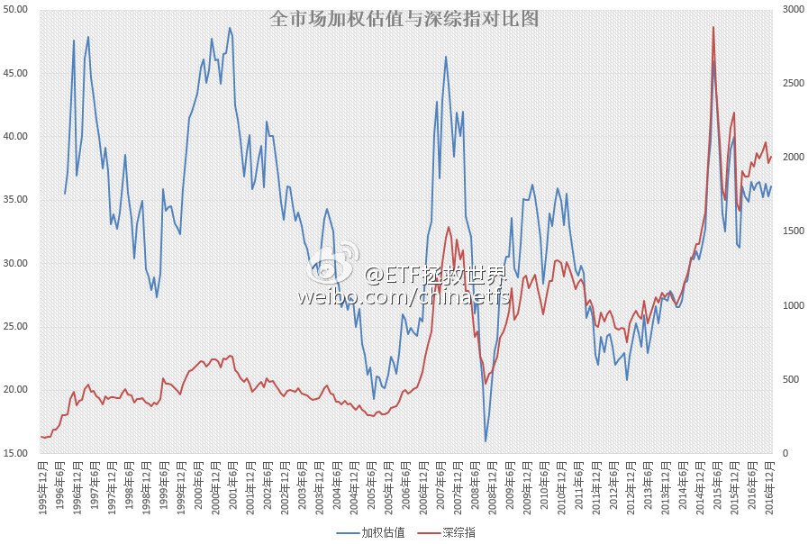

ETF拯救世界 (5687069307) @
2017-01-01 00:57:33 Sun  
url: https://weibo.com/5687069307/EoIz4tjKi

朋友们，新年快乐。这一年，一切都会更好。 ​​​

转发[6]  评论[80]  赞[148] 

======================================================

ETF拯救世界 (5687069307) @
2017-01-06 10:38:07 Fri  
url: https://weibo.com/5687069307/Epxvd29bt

微博独家福利 [doge] 别的地方不发。 ​​​

转发[32]  评论[99]  赞[112] 

+++++++++++++++++++++++++++++++++++++++++++++++++++++

图片：

======================================================

ETF拯救世界 (5687069307) @
2017-01-06 14:47:10 Fri  
url: https://weibo.com/5687069307/Epz8j35Jp

能不能请协和的真专家说清楚，雾霾和PM2.5，到底对人体，尤其是孩子有什么伤害？还是说没有伤害？不能光辟谣不普及知识啊。

------------------------------------------------------
转推：
>  @北京协和医院 (1654801402)
>  2017-01-06 14:21:07 Fri  
>  url: https:/weibo.com/1654801402/EpyXIFls8/

>  #微博辟谣#这两天，“协和某大夫”关于雾霾的说法在微博和微信圈传疯了，感谢网友们对“协和医生说什么都是对”的认可，不过我们还是来听听真名真姓的协和专家怎么说[酷]——
>  呼吸内科的田欣伦副教授表示，“吸入身体和肺里的雾霾永远排不出去”的说法是没有科学依据的，目前的研究表明，雾霾对慢性呼 ​​​

转发[3]  评论[17]  赞[19] 

======================================================

ETF拯救世界 (5687069307) @
2017-01-11 17:50:03 Wed  
url: https://weibo.com/5687069307/Eqlt0DQdR

心疼丫丫[可怜][悲伤][泪]

------------------------------------------------------
转推：
>  @ ()
>  2017-01-10 12:18:00 Tue  
>  url: 

>  抱歉，此微博已被作者删除。查看帮助：http://t.cn/Rfd3rQV

转发[0]  评论[22]  赞[15] 

======================================================

ETF拯救世界 (5687069307) @
2017-01-12 13:37:02 Thu  
url: https://weibo.com/5687069307/EqteOhBKp

未来几年，某个时间段，很多很多人可能会体会到的一种绝望是：

满地黄金钻石，没钱买了。 ​​​

转发[32]  评论[59]  赞[86] 

======================================================

ETF拯救世界 (5687069307) @
2017-01-12 15:10:41 Thu  
url: https://weibo.com/5687069307/EqtQPnf8m

回复@行者-EnglishBreaker:这么说吧。去年重要股东减持大概在2500亿，新股发行后，连续打板接盘的资金得上千亿吧。然后是印花税、券商佣金。最重要的是定增减持。这几年定增大概超过2万亿。2015年光上半年重要股东减持就超过5000亿。你算一算，需要多少股民的小账户才能填满这些资金？

------------------------------------------------------
转推：
>  @ETF拯救世界 (5687069307)
>  2017-01-12 13:37:02 Thu  
>  url: https:/weibo.com/5687069307/EqteOhBKp/

>  未来几年，某个时间段，很多很多人可能会体会到的一种绝望是：
>  
>  满地黄金钻石，没钱买了。 ​​​

转发[13]  评论[15]  赞[31] 

======================================================

ETF拯救世界 (5687069307) @
2017-01-13 14:03:35 Fri  
url: https://weibo.com/5687069307/EqCQ5tyMD

2017年第二发已经开车了。 ​​​

转发[2]  评论[36]  赞[57] 

======================================================

ETF拯救世界 (5687069307) @
2017-01-16 09:38:46 Mon  
url: https://weibo.com/5687069307/Er3o5fUrE

贴估值图这个动作，是不是太狠了……

------------------------------------------------------
转推：
>  @ETF拯救世界 (5687069307)
>  2017-01-06 10:38:07 Fri  
>  url: https:/weibo.com/5687069307/Epxvd29bt/

>  微博独家福利 [doge] 别的地方不发。 ​​​

转发[10]  评论[46]  赞[45] 

======================================================

ETF拯救世界 (5687069307) @
2017-01-16 15:52:40 Mon  
url: https://weibo.com/5687069307/Er5PQzfAI

预先通知一下，如果24、25日不比现在高，可以准备4-5份资金。 ​​​

转发[10]  评论[51]  赞[69] 

======================================================

ETF拯救世界 (5687069307) @
2017-01-17 13:21:24 Tue  
url: https://weibo.com/5687069307/EregWD0Tm

瞧这意思，要准备十份？

------------------------------------------------------
转推：
>  @ETF拯救世界 (5687069307)
>  2017-01-16 15:52:40 Mon  
>  url: https:/weibo.com/5687069307/Er5PQzfAI/

>  预先通知一下，如果24、25日不比现在高，可以准备4-5份资金。 ​​​

转发[5]  评论[41]  赞[36] 

======================================================

ETF拯救世界 (5687069307) @
2017-01-18 15:53:43 Wed  
url: https://weibo.com/5687069307/EroHgzcLd

今天，创业板即将跌入历史最贵的60%区域。什么节奏？幸福来得如此突然。全市场等权/外部数据加权全部达到2016年2月以来最低。幸福哭了。

2017，我感觉有戏。 ​​​

转发[12]  评论[59]  赞[95] 

======================================================

ETF拯救世界 (5687069307) @
2017-01-25 09:25:30 Wed  
url: https://weibo.com/5687069307/Esq9am1vb

微博的乡亲们，开车了。

http://t.cn/RxbDcGc ​​​

转发[16]  评论[72]  赞[73] 

======================================================

ETF拯救世界 (5687069307) @
2017-01-26 10:03:54 Thu  
url: https://weibo.com/5687069307/EszPfvsKe

各位朋友，大家过年好！

提前给大家拜个年，祝各位新年身体健康、财源广进、万事如意！ 

然而，几句祝福并不是发这条消息的主要目的。我主要是想说，明天咱们发！红！包！ 

明天，也就是大年三十下午17:08，公众号会推送一张红包口令图片（推送后也会在微博贴出，不过看微博可能就慢一点）。大家准 ​​​

转发[2]  评论[91]  赞[104] 

======================================================

