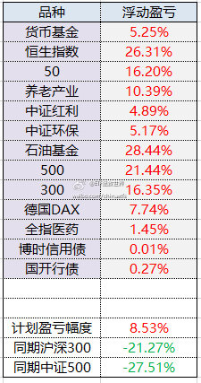
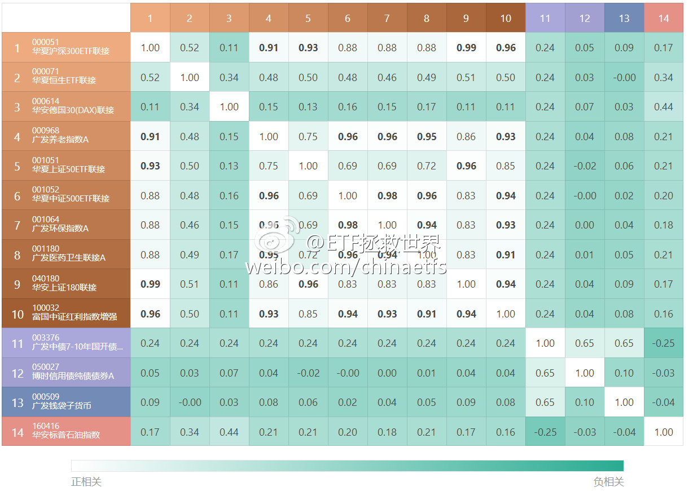
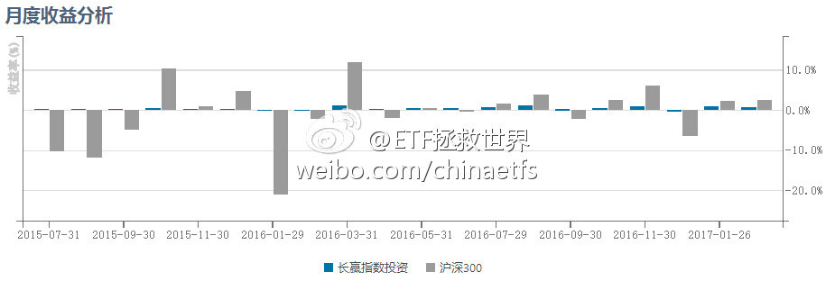
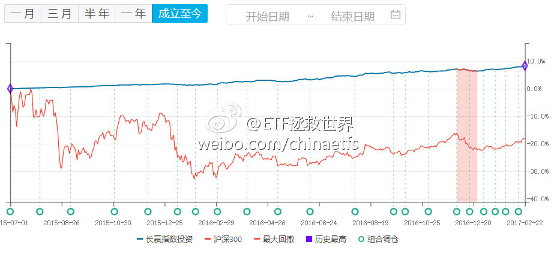
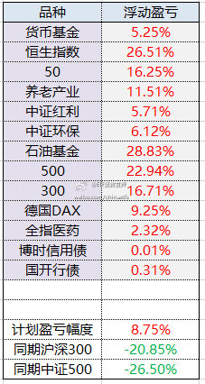
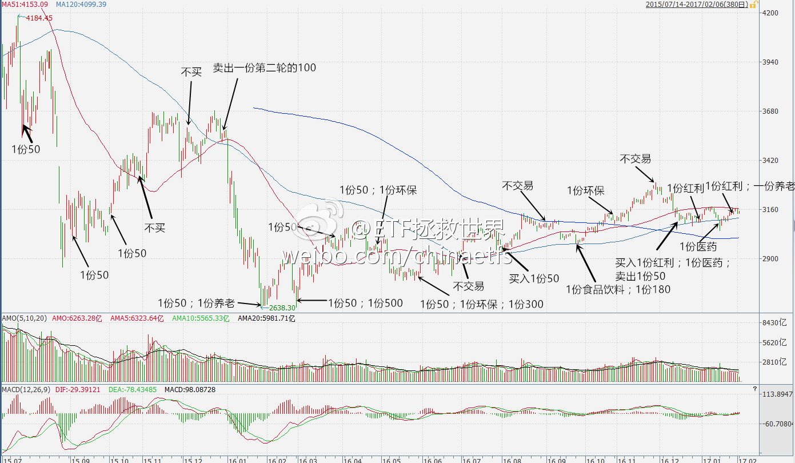

ETF拯救世界 (5687069307) @
2017-02-07 11:36:29 Tue  
url: https://weibo.com/5687069307/EupyN44Sq

看他的样子平平无奇……[doge]

------------------------------------------------------
转推：
>  @金融界网 (1955512572)
>  2017-02-07 11:05:50 Tue  
>  url: https:/weibo.com/1955512572/EupmluiLg/

>  为什么有钱人都爱扯蛋，撒贝宁对马云做出了一个我想做的表情，这个表情我给满分。分享图片 ​​​

转发[10]  评论[18]  赞[26] 

======================================================

ETF拯救世界 (5687069307) @
2017-02-10 14:03:52 Fri  
url: https://weibo.com/5687069307/EuSO6kox9

问：

“E大，请教您几个问题：
1、关于恒生指数、恒生国企指数，雪球我喜欢的几位股市赢家都判断进入牛市了，认为港股全球低估且持续了足够长时间，现在价值回归即将进入大牛。您的看法如何？

2、一个宽基指数有时会低估10-20年，在其低估期间可能会出现一种情况：即某一时间点的指数，在10年百分位 ​​​

转发[97]  评论[73]  赞[161] 

======================================================

ETF拯救世界 (5687069307) @
2017-02-15 10:07:44 Wed  
url: https://weibo.com/5687069307/EvCoJACbT

乡亲们，开车了。

http://t.cn/RJ0BxFI ​​​

转发[24]  评论[51]  赞[75] 

======================================================

ETF拯救世界 (5687069307) @
2017-02-19 20:13:38 Sun  
url: https://weibo.com/5687069307/Ewi4F0Vlr

谁能想到，我胡汉三又回来了！

这次待半年，全是微博独家了这次…… ​​​

转发[12]  评论[257]  赞[268] 

======================================================

ETF拯救世界 (5687069307) @
2017-02-20 09:38:33 Mon  
url: https://weibo.com/5687069307/EwnlniKgF

发布了头条文章：《一些小感悟（一）》 http://t.cn/RJBEtcU ​​​

转发[35]  评论[132]  赞[206] 

======================================================

ETF拯救世界 (5687069307) @
2017-02-20 09:56:51 Mon  
url: https://weibo.com/5687069307/EwnsNEkpI

恒生ETF本人将继续坚定持有（极小仓位做动态平衡）。

在一个上涨趋势中，正常人根本没法预计到底会涨到哪里。所以这种并非极端高估的地方，咱们能做的只能是持有手中极度便宜的筹码，适当做些动态平衡。

正常情况下，长远看，指数一定是不断新高。相比于坐电梯可能带来的波动风险，更大的风险，是随 ​​​

转发[73]  评论[101]  赞[105] 

======================================================

ETF拯救世界 (5687069307) @
2017-02-20 10:23:18 Mon  
url: https://weibo.com/5687069307/EwnDxptn2

回复@Simon_Mia:个人认为你首先要抛弃的是“预测”的想法。我个人浅见，投资不能预测，只能靠概率下注。赢得概率低不下注，赢的概率高下重注。我的投资系统里，是随着“估值”的下降，就会认为买入赢的概率比较高，会逐渐加大买入力度。所以你的问题我总结，应该是估值越低，加仓力度越大。

------------------------------------------------------
转推：
>  @ETF拯救世界 (5687069307)
>  2017-02-20 09:56:51 Mon  
>  url: https:/weibo.com/5687069307/EwnsNEkpI/

>  恒生ETF本人将继续坚定持有（极小仓位做动态平衡）。
>  
>  在一个上涨趋势中，正常人根本没法预计到底会涨到哪里。所以这种并非极端高估的地方，咱们能做的只能是持有手中极度便宜的筹码，适当做些动态平衡。
>  
>  正常情况下，长远看，指数一定是不断新高。相比于坐电梯可能带来的波动风险，更大的风险，是随 ​​​

转发[9]  评论[25]  赞[47] 

======================================================

ETF拯救世界 (5687069307) @
2017-02-20 10:35:09 Mon  
url: https://weibo.com/5687069307/EwnIly5ze

回复@四维:这个根本原因还是你没有对公司正确估值，不知道值多少钱，所以拿不住。这也是投资个股特别难的一个原因。你很难判断一家公司到底什么时候便宜，什么时候贵。所以我们另辟蹊径，研究指数估值。于是，世界瞬间明亮起来了。

------------------------------------------------------
转推：
>  @ETF拯救世界 (5687069307)
>  2017-02-20 09:56:51 Mon  
>  url: https:/weibo.com/5687069307/EwnsNEkpI/

>  恒生ETF本人将继续坚定持有（极小仓位做动态平衡）。
>  
>  在一个上涨趋势中，正常人根本没法预计到底会涨到哪里。所以这种并非极端高估的地方，咱们能做的只能是持有手中极度便宜的筹码，适当做些动态平衡。
>  
>  正常情况下，长远看，指数一定是不断新高。相比于坐电梯可能带来的波动风险，更大的风险，是随 ​​​

转发[19]  评论[14]  赞[48] 

======================================================

ETF拯救世界 (5687069307) @
2017-02-20 10:40:51 Mon  
url: https://weibo.com/5687069307/EwnKFr5i0

回复@mydxkl:个股代表的是背后的公司。每一家公司都在经历不同的成长阶段，出生，快速成长，稳定，衰退……每一个阶段的估值都不应该相同。再加上不同行业的估值也不同，还有公司产品、管理层、科技发展……对个股估值真的特别特别难。难度远超一般人的想象。所以投资个股，如果是看估值最好一眼看胖瘦

------------------------------------------------------
转推：
>  @ETF拯救世界 (5687069307)
>  2017-02-20 09:56:51 Mon  
>  url: https:/weibo.com/5687069307/EwnsNEkpI/

>  恒生ETF本人将继续坚定持有（极小仓位做动态平衡）。
>  
>  在一个上涨趋势中，正常人根本没法预计到底会涨到哪里。所以这种并非极端高估的地方，咱们能做的只能是持有手中极度便宜的筹码，适当做些动态平衡。
>  
>  正常情况下，长远看，指数一定是不断新高。相比于坐电梯可能带来的波动风险，更大的风险，是随 ​​​

转发[6]  评论[32]  赞[41] 

======================================================

ETF拯救世界 (5687069307) @
2017-02-20 13:59:23 Mon  
url: https://weibo.com/5687069307/Ewp3flGtw

看了一下，现在的重要股东减持真的比前几个月少很多了。

2月至今，只有40亿左右的净减持。

减持是10家，80亿。客观的说，跟以前比，不多。看了眼去年11月，前20天减持家数321家，减持金额210亿。

所以价格降下来了，重要股东减持冲动才会减少。而不是用各种手段去限制。

越高估，跑得越快~慢慢的股 ​​​

转发[6]  评论[29]  赞[62] 

======================================================

ETF拯救世界 (5687069307) @
2017-02-20 14:10:56 Mon  
url: https://weibo.com/5687069307/Ewp7W5jOV

提醒各位，逆回购价格起来了。 ​​​

转发[2]  评论[61]  赞[62] 

======================================================

ETF拯救世界 (5687069307) @
2017-02-20 15:18:26 Mon  
url: https://weibo.com/5687069307/EwpzkCcHu

计划继续新高。

持仓品种中，持仓量前三的恒生新高，50和红利即将新高。其他品种距离新高还比较远。

唯一的问题是仓位较低，但模型给出的仓位就是这么多，只能严格执行。觉得自己仓位低的朋友，就像一直说的一样，完全可以把计划中的货基仓位换成任何想持有的品种~ ​​​

转发[14]  评论[93]  赞[77] 

+++++++++++++++++++++++++++++++++++++++++++++++++++++

图片：

======================================================

ETF拯救世界 (5687069307) @
2017-02-20 16:29:05 Mon  
url: https://weibo.com/5687069307/Ewq20zF65

回复@非衣海王山而:赶紧举报。。这种太多了。以后哪位朋友碰到这种冒牌货就赶紧举报啊。 //@非衣海王山而:微博有个：ETF拯救世界i  和  ETF-拯救世界-  不是你的小号吧？好像在骗人，E大赶紧管管。

------------------------------------------------------
转推：
>  @ETF拯救世界 (5687069307)
>  2017-02-20 15:18:26 Mon  
>  url: https:/weibo.com/5687069307/EwpzkCcHu/

>  计划继续新高。
>  
>  持仓品种中，持仓量前三的恒生新高，50和红利即将新高。其他品种距离新高还比较远。
>  
>  唯一的问题是仓位较低，但模型给出的仓位就是这么多，只能严格执行。觉得自己仓位低的朋友，就像一直说的一样，完全可以把计划中的货基仓位换成任何想持有的品种~ ​​​

转发[4]  评论[25]  赞[34] 

======================================================

ETF拯救世界 (5687069307) @
2017-02-21 09:01:54 Tue  
url: https://weibo.com/5687069307/EwwwZBLeL

图一：截至目前，计划持仓品种的相关性分析。

图二：第三轮开始的20个月以来，18个月取得正收益。 ​​​

转发[28]  评论[82]  赞[102] 

+++++++++++++++++++++++++++++++++++++++++++++++++++++

图片：

======================================================

ETF拯救世界 (5687069307) @
2017-02-21 10:23:46 Tue  
url: https://weibo.com/5687069307/Ewx4e6xhd

A股现在已经有3100多只股票了。在可预见的2-3年内，恐怕总量有可能突破4000只。

再过几年，5000只股票也许不是梦。

这样，炒股票的人也许会面临从未碰到过的危险：你买的股票，有可能十年、二十年都不涨。

A股之所以长年高估，就是因为钱多，自由流通的股票太少。随着IPO解禁，定增解禁，IPO上市， ​​​

转发[91]  评论[99]  赞[143] 

======================================================

ETF拯救世界 (5687069307) @
2017-02-21 14:38:21 Tue  
url: https://weibo.com/5687069307/EwyJyEyXO

今天 养老产业399812 接过50红利的大旗继续领涨。

我本人非常喜欢这个指数。它是一个“消费+医药+娱乐”的NB指数，代表未来发展的方向。更何况，它是我最喜欢的等权编制。这样，平安人寿这样的大家伙就无法让它步履蹒跚了。 ​​​

转发[57]  评论[121]  赞[134] 

======================================================

ETF拯救世界 (5687069307) @
2017-02-22 08:57:14 Wed  
url: https://weibo.com/5687069307/EwFVBaNUp

昨天跟一个做期货的朋友聊天。

哥们开奔驰，拉顺风车（[喵喵][doge]），已婚。有一天拉到一个从上海来北京也不知道出差还是玩的姑娘。

然后就情投意合了，Hotel California，此处略去500字。

姑娘说，好喜欢你，你离婚我就跟你在一起。

哥们感觉爱情呼叫转移到自己这里了，马上回家跟发妻离婚。然 ​​​

转发[17]  评论[168]  赞[66] 

======================================================

ETF拯救世界 (5687069307) @
2017-02-22 09:22:14 Wed  
url: https://weibo.com/5687069307/EwG5KdKXF

回复@奥斯特洛夫大柴夫斯基:德国那边已经新高了。513030还有点折价。计划里的品种基本上都在走向新高的路上 //@奥斯特洛夫大柴夫斯基:德国30  今天高开...............................牛逼

------------------------------------------------------
转推：
>  @ETF拯救世界 (5687069307)
>  2017-02-22 08:57:14 Wed  
>  url: https:/weibo.com/5687069307/EwFVBaNUp/

>  昨天跟一个做期货的朋友聊天。
>  
>  哥们开奔驰，拉顺风车（[喵喵][doge]），已婚。有一天拉到一个从上海来北京也不知道出差还是玩的姑娘。
>  
>  然后就情投意合了，Hotel California，此处略去500字。
>  
>  姑娘说，好喜欢你，你离婚我就跟你在一起。
>  
>  哥们感觉爱情呼叫转移到自己这里了，马上回家跟发妻离婚。然 ​​​

转发[6]  评论[33]  赞[33] 

======================================================

ETF拯救世界 (5687069307) @
2017-02-22 11:13:22 Wed  
url: https://weibo.com/5687069307/EwGOR4nWe

讲真，为了一点信用卡积分，和“低价”租房就把特首关20个月，还真是有点震惊的……

------------------------------------------------------
转推：
>  @ ()
>  2017-02-22 11:03:36 Wed  
>  url: 

>  该账号因被投诉违反《微博社区公约》的相关规定，现已无法查看。查看帮助 https://kefu.weibo.com/faqdetail?id=13216

转发[6]  评论[60]  赞[39] 

======================================================

ETF拯救世界 (5687069307) @
2017-02-23 09:14:03 Thu  
url: https://weibo.com/5687069307/EwPsV9YAj

小时候都听过“龟兔赛跑”的故事。长大了，很多人就忘了。

无论市场怎么波动、如何暴跌，净值曲线一路向上。找到机会果断出击，买了就要赢，就要赚。

当然了，现在的这点收益率，并不是我们追求的。时候未到而已。

三年不鸣，不鸣则已，一鸣惊人。

爆发式的增长，你我终究会看到。 ​​​

转发[33]  评论[105]  赞[97] 

+++++++++++++++++++++++++++++++++++++++++++++++++++++

图片：

======================================================

ETF拯救世界 (5687069307) @
2017-02-23 10:04:21 Thu  
url: https://weibo.com/5687069307/EwPNl4fWT

回复@小国诸侯:感觉错误。是因为来微博，关注的人少了十万，说话自由，放飞自我了。 //@小国诸侯:E大最近话多了，怎么我觉得你内心不平静了[黑线]

------------------------------------------------------
转推：
>  @ETF拯救世界 (5687069307)
>  2017-02-23 09:14:03 Thu  
>  url: https:/weibo.com/5687069307/EwPsV9YAj/

>  小时候都听过“龟兔赛跑”的故事。长大了，很多人就忘了。
>  
>  无论市场怎么波动、如何暴跌，净值曲线一路向上。找到机会果断出击，买了就要赢，就要赚。
>  
>  当然了，现在的这点收益率，并不是我们追求的。时候未到而已。
>  
>  三年不鸣，不鸣则已，一鸣惊人。
>  
>  爆发式的增长，你我终究会看到。 ​​​

转发[4]  评论[46]  赞[46] 

======================================================

ETF拯救世界 (5687069307) @
2017-02-23 11:05:19 Thu  
url: https://weibo.com/5687069307/EwQc5cFYS

回复@领悟ing_皮妹儿:证券B，分级基金里面的激进子基金。长期持有必死无疑。正常市场情况下，最多6、7年死一次。碰上大牛市上折后死的更快。下折是净值跌到0.25就要4份合并成1份，然后从1块钱继续跌，跌倒0.25再合一次。长期看，死无葬身之地。优势是牛市涨得好，自带1-5倍杠杆。咱们买的没这这个问题

------------------------------------------------------
转推：
>  @ETF拯救世界 (5687069307)
>  2017-02-23 09:14:03 Thu  
>  url: https:/weibo.com/5687069307/EwPsV9YAj/

>  小时候都听过“龟兔赛跑”的故事。长大了，很多人就忘了。
>  
>  无论市场怎么波动、如何暴跌，净值曲线一路向上。找到机会果断出击，买了就要赢，就要赚。
>  
>  当然了，现在的这点收益率，并不是我们追求的。时候未到而已。
>  
>  三年不鸣，不鸣则已，一鸣惊人。
>  
>  爆发式的增长，你我终究会看到。 ​​​

转发[13]  评论[41]  赞[38] 

======================================================

ETF拯救世界 (5687069307) @
2017-02-23 13:16:55 Thu  
url: https://weibo.com/5687069307/EwR3v5oBY

$159938 广发医药  你终于舍得动动了，孽障。 ​​​

转发[5]  评论[31]  赞[49] 

======================================================

ETF拯救世界 (5687069307) @
2017-02-23 13:28:02 Thu  
url: https://weibo.com/5687069307/EwR80B215

回复@上头云:不是。我已经说过无数次了，每个人的仓位都一定要设计到“涨跌都舒服”的程度。因为每个人情况不同，我不可能给大家设计仓位。但是各位朋友自己应该知道，什么仓位是自己“涨跌都舒服”的。我自己的仓位很舒服，所以我涨跌都高兴。不高兴的只有一种情况，每天心电图一样的走势。

------------------------------------------------------
转推：
>  @ETF拯救世界 (5687069307)
>  2017-02-23 13:16:55 Thu  
>  url: https:/weibo.com/5687069307/EwR3v5oBY/

>  $159938 广发医药  你终于舍得动动了，孽障。 ​​​

转发[3]  评论[19]  赞[34] 

======================================================

ETF拯救世界 (5687069307) @
2017-02-23 13:39:03 Thu  
url: https://weibo.com/5687069307/EwRcu5fHR

为什么总能买到阶段底，看起来真是个谜。

注意医药的买入点 ​​​

转发[24]  评论[107]  赞[93] 

+++++++++++++++++++++++++++++++++++++++++++++++++++++

图片：

======================================================

ETF拯救世界 (5687069307) @
2017-02-24 09:46:09 Fri  
url: https://weibo.com/5687069307/EwZ6rxDia

“股票是长期来看收益率最多的投资品种”。这句著名的名言，从超长期来看，是对的。可惜，从中短期来看，未必如此。这个中短期的概念，有可能会长达10年。

比如说上证指数和沪深300，不要说你买在07年最高点的6000点，就说你是07年4月买入，那时候也就3000多点，到现在，依然没赚什么钱。要知道，十年 ​​​

转发[52]  评论[98]  赞[122] 

======================================================

ETF拯救世界 (5687069307) @
2017-02-24 09:49:56 Fri  
url: https://weibo.com/5687069307/EwZ7ZirWQ

$全指医药 sh000991$   1月16日买入计划的朋友，可以说是股神了。 ​​​

转发[6]  评论[71]  赞[50] 

======================================================

ETF拯救世界 (5687069307) @
2017-02-24 10:11:37 Fri  
url: https://weibo.com/5687069307/EwZgMukOL

养老和医药这种，未来两个月非常关键。因为年报+季报披露了。能不能多买点，就看未来这两个月。今天养老继续给力。2月计划买入品种。

------------------------------------------------------
转推：
>  @ETF拯救世界 (5687069307)
>  2017-02-21 14:38:21 Tue  
>  url: https:/weibo.com/5687069307/EwyJyEyXO/

>  今天 养老产业399812 接过50红利的大旗继续领涨。
>  
>  我本人非常喜欢这个指数。它是一个“消费+医药+娱乐”的NB指数，代表未来发展的方向。更何况，它是我最喜欢的等权编制。这样，平安人寿这样的大家伙就无法让它步履蹒跚了。 ​​​

转发[11]  评论[70]  赞[66] 

======================================================

ETF拯救世界 (5687069307) @
2017-02-27 10:05:41 Mon  
url: https://weibo.com/5687069307/ExrvRv8sK

如果是投资类的音频栏目，各位最想听的是哪方面的内容？ ​​​

转发[14]  评论[224]  赞[73] 

======================================================

ETF拯救世界 (5687069307) @
2017-02-27 15:48:03 Mon  
url: https://weibo.com/5687069307/ExtKPtf8c

很多朋友关心这个月能不能开车。其实我也很关心，不过得看明天收盘后的估值，然后放入模型，再看能不能开。

如果不弄清楚车况路况，闭着眼睛开，很容易翻车。

毕竟开车也要遵守基本投资法丫。

从今天的情况看，可开可不开，边缘状态吧。 ​​​

转发[11]  评论[88]  赞[78] 

======================================================

ETF拯救世界 (5687069307) @
2017-02-28 09:23:06 Tue  
url: https://weibo.com/5687069307/ExAF4E8a5

我回答了@穿越30年 的问题，问题价值￥49.00，欢迎大家围观~如果提问人可以拿回大部分费用，以后就继续回答…… http://t.cn/Ri5Re26 ​​​

转发[480]  评论[274]  赞[348] 

======================================================

ETF拯救世界 (5687069307) @
2017-02-28 09:49:38 Tue  
url: https://weibo.com/5687069307/ExAPQrhES

回复@Yanb丶:提问的朋友能挣钱，这就最好了。我特别希望提问的朋友能挣钱，这样大家就会想一些真正的好问题来提问。有了好问题才会有好回答，围观的朋友也会真的受益。 //@Yanb丶:估计还能提问题的赚钱。。。

------------------------------------------------------
转推：
>  @ETF拯救世界 (5687069307)
>  2017-02-28 09:23:06 Tue  
>  url: https:/weibo.com/5687069307/ExAF4E8a5/

>  我回答了@穿越30年 的问题，问题价值￥49.00，欢迎大家围观~如果提问人可以拿回大部分费用，以后就继续回答…… http://t.cn/Ri5Re26 ​​​

转发[7]  评论[13]  赞[19] 

======================================================

ETF拯救世界 (5687069307) @
2017-02-28 09:59:13 Tue  
url: https://weibo.com/5687069307/ExATJxVvQ

一个问题，完美闭环，皆大欢喜。各位看了分享，积了善缘。[耶] ​​​

转发[8]  评论[35]  赞[121] 

+++++++++++++++++++++++++++++++++++++++++++++++++++++

图片：

======================================================

ETF拯救世界 (5687069307) @
2017-02-28 10:42:29 Tue  
url: https://weibo.com/5687069307/ExBbj11Ny

如果不大跌，就别跌。否则这车可开可不开弄得很尴尬。 ​​​

转发[2]  评论[64]  赞[50] 

======================================================

ETF拯救世界 (5687069307) @
2017-02-28 15:27:51 Tue  
url: https://weibo.com/5687069307/ExD3870sy

恒生估值已经到了2013年2月以来最高。

这个情况持有是没问题的，但现在还在忽悠别人去买港股的人，不厚道。 ​​​

转发[17]  评论[66]  赞[87] 

======================================================

ETF拯救世界 (5687069307) @
2017-02-28 17:06:31 Tue  
url: https://weibo.com/5687069307/ExDHb5niT

回复@Ponder735:早上开的问答，现在有21个问题。我想了想，以后最多每两天回答一个问题。主要是替朋友们的钱袋子着想……毕竟1块钱…… //@Ponder735:E大就回答一个吗，看来我要的答案又没有了[二哈]

------------------------------------------------------
转推：
>  @ETF拯救世界 (5687069307)
>  2017-02-28 09:23:06 Tue  
>  url: https:/weibo.com/5687069307/ExAF4E8a5/

>  我回答了@穿越30年 的问题，问题价值￥49.00，欢迎大家围观~如果提问人可以拿回大部分费用，以后就继续回答…… http://t.cn/Ri5Re26 ​​​

转发[3]  评论[31]  赞[24] 

======================================================

