ETF拯救世界 (5687069307) @
2017-04-01 13:00:03 Sat  
url: https://weibo.com/5687069307/ECtL1wyPp

谁还没看过可以去看看。

http://t.cn/R6WnOj9 ​​​

转发[79]  评论[58]  赞[87] 

======================================================

ETF拯救世界 (5687069307) @
2017-04-04 09:08:31 Tue  
url: https://weibo.com/5687069307/ECUwxkiwZ

[doge]  ​​​

转发[4]  评论[125]  赞[128] 

+++++++++++++++++++++++++++++++++++++++++++++++++++++

图片：

======================================================

ETF拯救世界 (5687069307) @
2017-04-05 10:23:22 Wed  
url: https://weibo.com/5687069307/ED4rpBGFs

什么意思。4月挖个坑让咱们计划上了车然后继续涨啊。 ​​​

转发[7]  评论[83]  赞[73] 

======================================================

ETF拯救世界 (5687069307) @
2017-04-05 13:57:06 Wed  
url: https://weibo.com/5687069307/ED5QarRXM

回复@BestJayChou:我居然相信了！@最高人民检察院 //@BestJayChou:大家好，我是汉东省京州市副市长丁义珍，由于被侯亮平那个猢狲追查只能逃亡洛杉矶。现在准备东山再起回国把孙猴子碾成齑粉，然而机票钱还差50人民币的燃油费，希望各位同志能给我打50块钱，丁某他日必有重谢。

------------------------------------------------------
转推：
>  @ ()
>  2017-04-05 13:51:41 Wed  
>  url: 

>  抱歉，作者已设置仅展示半年内微博，此微博已不可见。 ​​​

转发[2]  评论[18]  赞[16] 

======================================================

ETF拯救世界 (5687069307) @
2017-04-06 09:16:47 Thu  
url: https://weibo.com/5687069307/EDdqT2rYJ

新高总是好的。 ​​​

转发[4]  评论[52]  赞[85] 

+++++++++++++++++++++++++++++++++++++++++++++++++++++

图片：
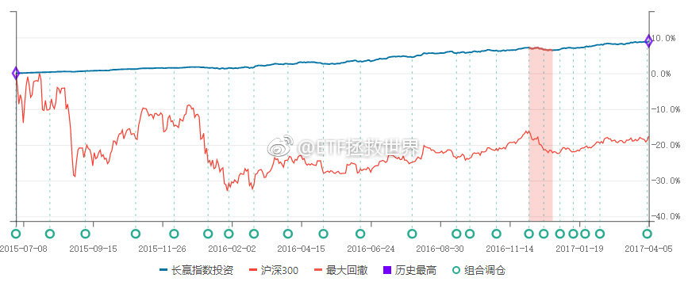
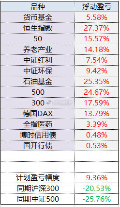

======================================================

ETF拯救世界 (5687069307) @
2017-04-07 08:40:09 Fri  
url: https://weibo.com/5687069307/EDmCvEQWf

s7最后一帖……一早上掉地上三次屏终于碎了。

真是有点舍不得。好看好用。各种顺手。

只好先用家里的mate9了。水果8什么时候出啊。[泪] ​​​

转发[0]  评论[66]  赞[33] 

======================================================

ETF拯救世界 (5687069307) @
2017-04-07 08:45:51 Fri  
url: https://weibo.com/5687069307/EDmEPebK2

讲真真的很耐摔。摔了十几次终于... ​​​

转发[0]  评论[58]  赞[27] 

+++++++++++++++++++++++++++++++++++++++++++++++++++++

图片：
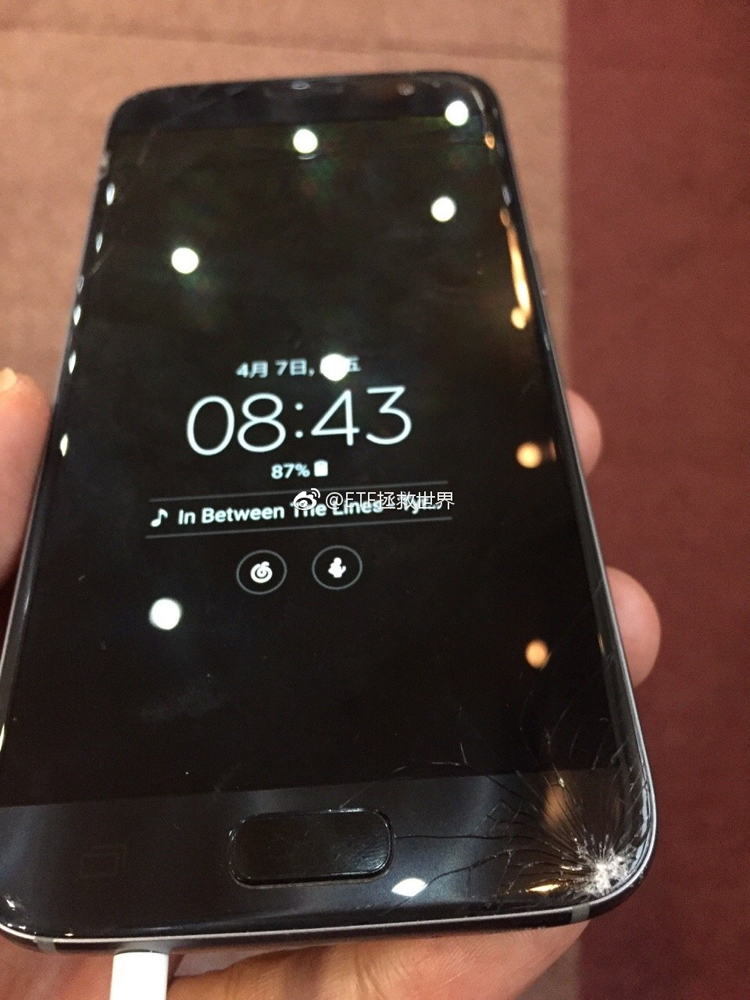
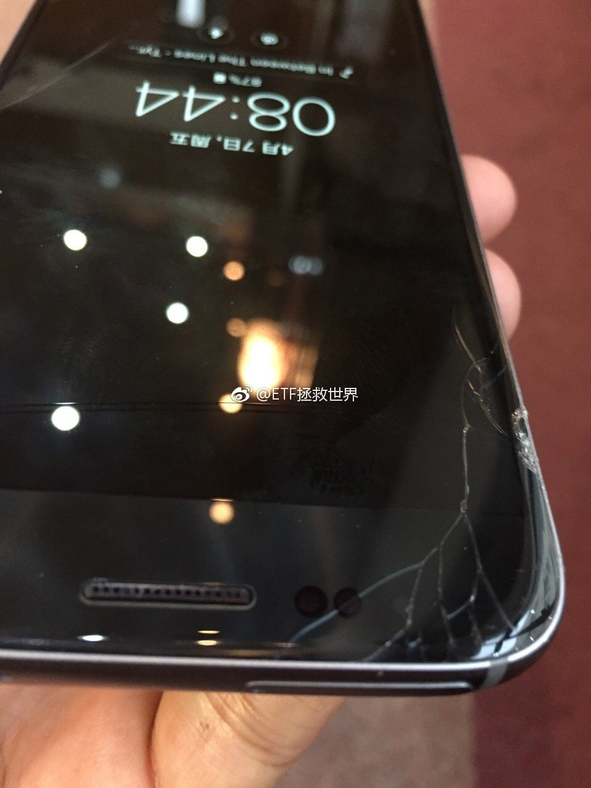

======================================================

ETF拯救世界 (5687069307) @
2017-04-07 10:09:34 Fri  
url: https://weibo.com/5687069307/EDncO76hf

3000（或者3100）到3300之间用ETF做网格应该是很靠谱的。

GJD信誉保证。跟着GJD有肉吃。 ​​​

转发[108]  评论[81]  赞[103] 

======================================================

ETF拯救世界 (5687069307) @
2017-04-07 10:45:45 Fri  
url: https://weibo.com/5687069307/EDnruuuw7

石油黄金已经有所反应了

------------------------------------------------------
转推：
>  @ ()
>  2017-04-07 09:26:58 Fri  
>  url: 

>  抱歉，作者已设置仅展示半年内微博，此微博已不可见。 ​​​

转发[7]  评论[17]  赞[19] 

======================================================

ETF拯救世界 (5687069307) @
2017-04-07 10:49:39 Fri  
url: https://weibo.com/5687069307/EDnt5epfS

回复@用户5747769897:如果做油气网格的，在现价附近有卖出收网的可以先不卖。这种突发事件造成亚洲盘油价上涨，还没有体现在油气的净值中。现在油气的盘面也没有反应出来。所以可以再高一点再收网。//@用户5747769897:又想起了最近挂的0.599的未成交价格。

------------------------------------------------------
转推：
>  @ ()
>  2017-04-07 09:26:58 Fri  
>  url: 

>  抱歉，作者已设置仅展示半年内微博，此微博已不可见。 ​​​

转发[4]  评论[27]  赞[28] 

======================================================

ETF拯救世界 (5687069307) @
2017-04-07 11:06:25 Fri  
url: https://weibo.com/5687069307/EDnzSxQc6

打新门票 醉了 ​​​

转发[0]  评论[34]  赞[46] 

+++++++++++++++++++++++++++++++++++++++++++++++++++++

图片：
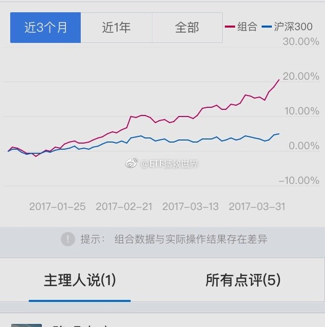

======================================================

ETF拯救世界 (5687069307) @
2017-04-07 13:32:04 Fri  
url: https://weibo.com/5687069307/EDox0bZNn

$中证环保 sh000827$妹想到 ​​​

转发[2]  评论[39]  赞[36] 

======================================================

ETF拯救世界 (5687069307) @
2017-04-07 17:04:24 Fri  
url: https://weibo.com/5687069307/EDpVby3Vo

回复@hello_39900:找到适合你自己的路。你可以加大仓位，或者去定投。我的路适合我自己。经过十年三轮牛熊的实践，资产从没有大幅回撤，同时赚到了很多人一辈子也不可能赚到的钱。所以我没有理由改变，依然还会按照我自己的节奏去投资。我不会因为一时的涨跌怀疑自己，很多东西不是每个人都能看懂。

------------------------------------------------------
转推：
>  @ETF拯救世界 (5687069307)
>  2017-04-07 10:09:34 Fri  
>  url: https:/weibo.com/5687069307/EDncO76hf/

>  3000（或者3100）到3300之间用ETF做网格应该是很靠谱的。
>  
>  GJD信誉保证。跟着GJD有肉吃。 ​​​

转发[4]  评论[33]  赞[64] 

======================================================

ETF拯救世界 (5687069307) @
2017-04-08 06:13:31 Sat  
url: https://weibo.com/5687069307/EDv5ulNHi

知道北京多少年没有完成供地计划了吗。听其言观其行吧

------------------------------------------------------
转推：
>  @财联社APP (2868676035)
>  2017-04-07 21:43:44 Fri  
>  url: https:/weibo.com/2868676035/EDrKzzLdR/

>  【厉害了！5年内北京供地可建住宅150万套】据《北京电视台》消息，今日市政府批准《北京市2017-2021年及2017年度住宅用地供应计划》，本市计划今后五年供应住宅用地6000公顷，其中国有建设用地5000公顷，集体建设用地1000公顷，以保障150万套住房建设需求。 ​​​

转发[5]  评论[28]  赞[39] 

======================================================

ETF拯救世界 (5687069307) @
2017-04-09 15:32:42 Sun  
url: https://weibo.com/5687069307/EDIaY5opa

哈哈哈，偶然翻到熔断前一周的微博。谁能想到，zjh不光挨骂，大boss都被干掉了。当时你跑了没有？

------------------------------------------------------
转推：
>  @ETF拯救世界 (5687069307)
>  2015-12-24 10:42:50 Thu  
>  url: https:/weibo.com/5687069307/D9S1fsdRf/

>  据说，长得帅的都拿着利润跑了。长得丑的已经准备开始骂zjh了。 ​​​

转发[1]  评论[46]  赞[46] 

======================================================

ETF拯救世界 (5687069307) @
2017-04-10 10:05:37 Mon  
url: https://weibo.com/5687069307/EDPsHn0Ep

博时信用债又要分红了。望周知。

另外，分完了以后不要再有诸如“为什么我的软件上显示亏损和你的统计不一样”这样的疑问了。

心累。 ​​​

转发[1]  评论[39]  赞[58] 

======================================================

ETF拯救世界 (5687069307) @
2017-04-10 10:24:07 Mon  
url: https://weibo.com/5687069307/EDPAcuFR6

吃炫迈了 ​​​

转发[0]  评论[42]  赞[56] 

+++++++++++++++++++++++++++++++++++++++++++++++++++++

图片：
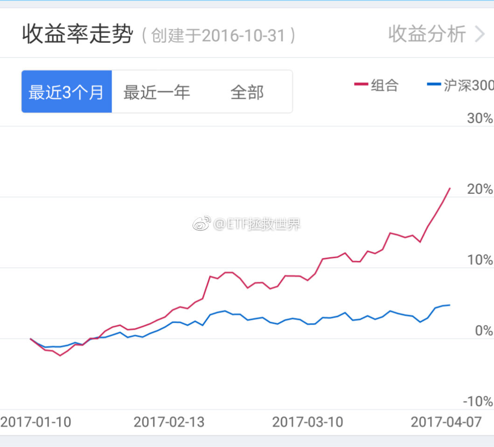

======================================================

ETF拯救世界 (5687069307) @
2017-04-10 14:27:27 Mon  
url: https://weibo.com/5687069307/EDRaYgQqL

10号了。[哼] ​​​

转发[2]  评论[66]  赞[42] 

======================================================

ETF拯救世界 (5687069307) @
2017-04-11 10:29:39 Tue  
url: https://weibo.com/5687069307/EDZ2WtcFU

黑天鹅的意思是你想不到的风险。所有人都在说的风险其实不是黑天鹅。

黑天鹅也没那么多，很多年会出一只。但真的出来了就是疯狂屠杀。 ​​​

转发[11]  评论[33]  赞[52] 

======================================================

ETF拯救世界 (5687069307) @
2017-04-11 10:43:23 Tue  
url: https://weibo.com/5687069307/EDZ8wcaba

十几年的经验来看，每次价值回归的路径都不同，没有一次重样的。

这次会用什么方式回归？

无论用什么方式回归，一定会回归。

没点信仰就别玩股票了。 ​​​

转发[29]  评论[88]  赞[89] 

======================================================

ETF拯救世界 (5687069307) @
2017-04-11 13:28:45 Tue  
url: https://weibo.com/5687069307/EE0dDB707

个人认为3200以上GJD应该不会动手。否则几十个点的空间太小了。一个想法，不一定对。

------------------------------------------------------
转推：
>  @ETF拯救世界 (5687069307)
>  2017-04-07 10:09:34 Fri  
>  url: https:/weibo.com/5687069307/EDncO76hf/

>  3000（或者3100）到3300之间用ETF做网格应该是很靠谱的。
>  
>  GJD信誉保证。跟着GJD有肉吃。 ​​​

转发[1]  评论[59]  赞[30] 

======================================================

ETF拯救世界 (5687069307) @
2017-04-11 14:56:56 Tue  
url: https://weibo.com/5687069307/EE0Nr48Gg

图做的好看。

------------------------------------------------------
转推：
>  @ETF九哥 (6120454334)
>  2017-04-11 14:52:12 Tue  
>  url: https:/weibo.com/6120454334/EE0Lw1zDZ/

>  logging,月初@ETF拯救世界 发了一车，加了广发医药发现excel代码存在问题。今天终于改好了，再发一图。有信仰，才能有未来。 ​​​

转发[4]  评论[18]  赞[31] 

======================================================

ETF拯救世界 (5687069307) @
2017-04-11 18:36:27 Tue  
url: https://weibo.com/5687069307/EE2exzrtE

丁义珍如果被赶下来，电视剧拍五集就够了。上了飞机坐下又被轰下来真是太坑了！

------------------------------------------------------
转推：
>  @ ()
>  2017-04-11 16:37:07 Tue  
>  url: 

>  抱歉，此微博已被作者删除。查看帮助：http://t.cn/Rfd3rQV

转发[3]  评论[27]  赞[22] 

======================================================

ETF拯救世界 (5687069307) @
2017-04-12 12:26:32 Wed  
url: https://weibo.com/5687069307/EE9eSkSlP

回复@冰泉流夏:是。这就是所谓的“时间换空间”//@冰泉流夏:昨天看到一篇文章，去年财报出来中证500营收还是利润涨了20%，这样股价不变过两年是不是也可以回归正常估值[捂脸]不太懂这些…

------------------------------------------------------
转推：
>  @ETF拯救世界 (5687069307)
>  2017-04-11 10:43:23 Tue  
>  url: https:/weibo.com/5687069307/EDZ8wcaba/

>  十几年的经验来看，每次价值回归的路径都不同，没有一次重样的。
>  
>  这次会用什么方式回归？
>  
>  无论用什么方式回归，一定会回归。
>  
>  没点信仰就别玩股票了。 ​​​

转发[7]  评论[25]  赞[30] 

======================================================

ETF拯救世界 (5687069307) @
2017-04-12 13:43:28 Wed  
url: https://weibo.com/5687069307/EE9K71pUv

下午去面试招人，不看盘了。预测一下，收盘涨跌幅不超过0.5%。

欢迎打脸。[doge] ​​​

转发[1]  评论[75]  赞[46] 

======================================================

ETF拯救世界 (5687069307) @
2017-04-12 16:12:37 Wed  
url: https://weibo.com/5687069307/EEaIEEWeS

打新门票这样，中不中新股都无所谓了……

[doge] ​​​

转发[2]  评论[32]  赞[40] 

+++++++++++++++++++++++++++++++++++++++++++++++++++++

图片：
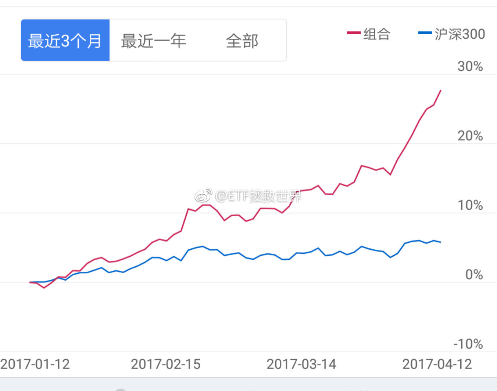

======================================================

ETF拯救世界 (5687069307) @
2017-04-12 16:18:55 Wed  
url: https://weibo.com/5687069307/EEaLd2frl

面试8个人，5个从银行出来的。

银行怎么了！

[摊手] ​​​

转发[4]  评论[57]  赞[48] 

======================================================

ETF拯救世界 (5687069307) @
2017-04-12 16:31:41 Wed  
url: https://weibo.com/5687069307/EEaQog7AN

今天数据出来了。如果明天不大涨，明晚强行开车。

滴滴~~有搭顺风车的吗！ ​​​

转发[9]  评论[180]  赞[138] 

======================================================

ETF拯救世界 (5687069307) @
2017-04-13 03:52:05 Thu  
url: https://weibo.com/5687069307/EEfiz7LP2

某机构出完货就特停，是不是太不地道了？还能怎么玩？

------------------------------------------------------
转推：
>  @财联社APP (2868676035)
>  2017-04-12 22:06:50 Wed  
>  url: https:/weibo.com/2868676035/EEd2r3EOf/

>  【雄安概念股集体停牌】财联社12日讯，金隅股份、韩建河山、唐山港、保变电气、华夏幸福等雄安概念股发表公告称，因股价异动，13日起停牌核查。小财注：稍前，渤海股份、京汉股份、先河环保、中化岩土、河北宣工、冀东水泥、冀东装备、巨力索具、创业环保等多只雄安概念股都发布公告，停牌核查。 ​​​

转发[5]  评论[39]  赞[35] 

======================================================

ETF拯救世界 (5687069307) @
2017-04-13 10:33:42 Thu  
url: https://weibo.com/5687069307/EEhVAb2bP

截至今日，有1696家公司披露年报。

其中证金位列十大股东的有220只。汇金资管位列十大股东的有500只。

三季报这两个数字分别是468只和896只。

由于年报还有小一半没有披露，可以看出，GJD依然没有撤退，甚至辗转腾挪可能加仓了。 ​​​

转发[18]  评论[42]  赞[39] 

======================================================

ETF拯救世界 (5687069307) @
2017-04-13 10:50:52 Thu  
url: https://weibo.com/5687069307/EEi2ybXMX

这会带来两个问题。第一，始终无法价值回归。看估值图就可以知道，2015年以来这样的，长时间全市场高估的情况几乎在历史上没有发生过。一万多亿资金在里面托盘的结果。第二，没法上涨。估值高不容易涨，另外大涨就会带来GJD的打压。所以股民很难赚钱。当然，选好股票可以。问题是，你选的出来吗。

------------------------------------------------------
转推：
>  @ETF拯救世界 (5687069307)
>  2017-04-13 10:33:42 Thu  
>  url: https:/weibo.com/5687069307/EEhVAb2bP/

>  截至今日，有1696家公司披露年报。
>  
>  其中证金位列十大股东的有220只。汇金资管位列十大股东的有500只。
>  
>  三季报这两个数字分别是468只和896只。
>  
>  由于年报还有小一半没有披露，可以看出，GJD依然没有撤退，甚至辗转腾挪可能加仓了。 ​​​

转发[9]  评论[57]  赞[41] 

======================================================

ETF拯救世界 (5687069307) @
2017-04-13 11:15:18 Thu  
url: https://weibo.com/5687069307/EEict4kR9

关于“选股票”的数据。

今年至今，沪深300上涨6%左右。上海上涨5%，深圳4%，创业板下跌2%。

同期，去掉新股，上涨股票1303只，占比44%。涨幅超过沪深300的股票780只，占比26%。

也就是说，随机买股票的话，有74%的机会跑不赢大盘。或者说，有74%炒股的人跑不赢大盘。

一将功成万骨枯。看着别人炒 ​​​

转发[12]  评论[82]  赞[78] 

======================================================

ETF拯救世界 (5687069307) @
2017-04-14 09:37:37 Fri  
url: https://weibo.com/5687069307/EEqZjqV0n

今天你最想对GJD说的一句话是（   ）。（15分） ​​​

转发[5]  评论[124]  赞[23] 

======================================================

ETF拯救世界 (5687069307) @
2017-04-14 10:29:24 Fri  
url: https://weibo.com/5687069307/EErkkykoF

最近骗子越来越多了。我再说一次，我100%不会私信各位谈什么个股。只要出现这种人马上举报！各位认清认证和粉丝数量~

------------------------------------------------------
转推：
>  @ETF拯救世界 (5687069307)
>  2016-11-29 14:32:04 Tue  
>  url: https:/weibo.com/5687069307/EjMNiwMwG/

>  微博的朋友们，再说一次，微博有很多骗子会将我的昵称“ETF拯救世界”稍作修改，然后主动私信大家进行行骗。比如“ETT拯救世界”、“-ETF拯救世界”之类的。99.99%的情况我不会主动私信大家，如果大家收到了，可以点一下对方的头像看看粉丝数什么的对不对。
>  
>  请大家一旦发现骗子马上举报不要犹豫！ ​​​

转发[0]  评论[10]  赞[25] 

======================================================

ETF拯救世界 (5687069307) @
2017-04-14 10:30:48 Fri  
url: https://weibo.com/5687069307/EErkU12aE

四月第二次计划，买入一份。差点又把微博的乡亲们忘了。

http://t.cn/RXyepwo ​​​

转发[7]  评论[50]  赞[50] 

======================================================

ETF拯救世界 (5687069307) @
2017-04-14 10:59:48 Fri  
url: https://weibo.com/5687069307/EErwFx56s

好问题才有好回答啊。我回答了 @用户oixkqdt7wt 的问题，问题价值￥88.00，大家快来花1元围观~ http://t.cn/RXzhnHg ​​​

转发[348]  评论[162]  赞[348] 

======================================================

ETF拯救世界 (5687069307) @
2017-04-14 11:15:24 Fri  
url: https://weibo.com/5687069307/EErD0yswW

配置银行股打新的朋友已经在骂人了吧……

$民生银行 sh600016$ ​​​

转发[21]  评论[83]  赞[39] 

======================================================

ETF拯救世界 (5687069307) @
2017-04-14 13:27:29 Fri  
url: https://weibo.com/5687069307/EEsuCgRws

今天跌这么多，尾盘一定会动手了。sigh。有人做庄真的太难玩了。

------------------------------------------------------
转推：
>  @ETF拯救世界 (5687069307)
>  2017-04-14 09:37:37 Fri  
>  url: https:/weibo.com/5687069307/EEqZjqV0n/

>  今天你最想对GJD说的一句话是（   ）。（15分） ​​​

转发[0]  评论[68]  赞[34] 

======================================================

ETF拯救世界 (5687069307) @
2017-04-14 14:54:29 Fri  
url: https://weibo.com/5687069307/EEt3VATr2

Wonderful songs《Asher Book - Here With You》 http://t.cn/RfV2Hkt 

[馋嘴] ​​​

转发[2]  评论[50]  赞[41] 

======================================================

ETF拯救世界 (5687069307) @
2017-04-14 15:39:40 Fri  
url: https://weibo.com/5687069307/EEtmhcJK1

今天估值出来了。感动一刚。 ​​​

转发[2]  评论[75]  赞[60] 

======================================================

ETF拯救世界 (5687069307) @
2017-04-15 05:39:54 Sat  
url: https://weibo.com/5687069307/EEyRjoA3N

回复@大师别冲动:当时我买了15万上汽赚到75万算失败吗。当时博客全程直播。他说银行我就跟他说银行啊。//@大师别冲动:回复@ETF拯救世界:09年那种行情，一倍是失败的好吧

------------------------------------------------------
转推：
>  @ETF拯救世界 (5687069307)
>  2017-04-14 11:15:24 Fri  
>  url: https:/weibo.com/5687069307/EErD0yswW/

>  配置银行股打新的朋友已经在骂人了吧……
>  
>  $民生银行 sh600016$ ​​​

转发[1]  评论[52]  赞[41] 

======================================================

ETF拯救世界 (5687069307) @
2017-04-17 08:54:59 Mon  
url: https://weibo.com/5687069307/EESZv4189

幼儿园英语外教居然是印度人。

可以说是诈骗了吧。

[哼] ​​​

转发[15]  评论[69]  赞[51] 

======================================================

ETF拯救世界 (5687069307) @
2017-04-17 09:36:44 Mon  
url: https://weibo.com/5687069307/EETgrv8S0

占小便宜吃大亏。

一条生活经验，不一定对。 ​​​

转发[0]  评论[26]  赞[41] 

======================================================

ETF拯救世界 (5687069307) @
2017-04-17 09:43:04 Mon  
url: https://weibo.com/5687069307/EETj16Ogj

一般早盘GJD不动手的原因……

收盘跌幅不会超过1%！赌一块钱。 ​​​

转发[6]  评论[27]  赞[36] 

+++++++++++++++++++++++++++++++++++++++++++++++++++++

图片：
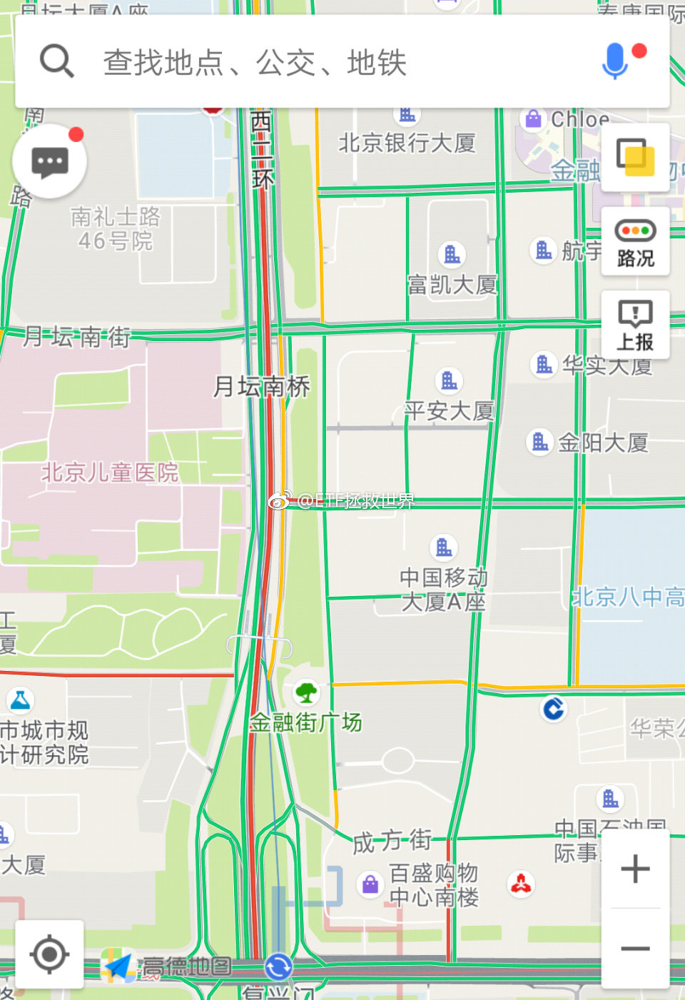

======================================================

ETF拯救世界 (5687069307) @
2017-04-17 09:50:05 Mon  
url: https://weibo.com/5687069307/EETlRt9DP

各位，这里有个观点：

全市场不敢说，现在一万多亿GJD在里面拼命护盘，所以我不敢说。

但是某些板块如果有机会下跌20%-30%以上，那么我们未来十年在A股较好的收益率就可以保证了。（如果用时间杀空间，也不用20%以上，但时间要好几年）

下跌永远是机会。所有人都知道这点，但为什么只有少数人能抓住 ​​​

转发[35]  评论[83]  赞[100] 

======================================================

ETF拯救世界 (5687069307) @
2017-04-17 10:00:14 Mon  
url: https://weibo.com/5687069307/EETpZ6xpy

$养老产业 sz399812$   红了，什么鬼 ​​​

转发[0]  评论[40]  赞[28] 

======================================================

ETF拯救世界 (5687069307) @
2017-04-17 10:52:54 Mon  
url: https://weibo.com/5687069307/EETLmoquc

问自己一个问题，测试一下自己的投资心理成熟度：

如果现在到月底，月中买的养老产业下跌5%，你会不会觉得自己月中高高兴兴买入该指数是一个sb行为，很后悔。

同样到月底，养老指数上涨5%，你会不会觉得自己买太少了是sb行为，很后悔。

每个人都问问自己，看看自己是否成熟。 ​​​

转发[11]  评论[134]  赞[59] 

======================================================

ETF拯救世界 (5687069307) @
2017-04-17 11:31:06 Mon  
url: https://weibo.com/5687069307/EEU0Scyvj

今天计划跌幅应该不超过0.2%。而两市指数跌幅在1.x%以上。

个股不用说了，接近100只跌停，400多只跌幅在5%以上，一半跌幅超过2%。

指数投资与风险控制的意义，可能很多朋友要5-10年以后才能真的理解。 ​​​

转发[14]  评论[35]  赞[54] 

======================================================

ETF拯救世界 (5687069307) @
2017-04-17 11:36:38 Mon  
url: https://weibo.com/5687069307/EEU3742s0

哈哈，我打算试试。薅某队羊毛。

------------------------------------------------------
转推：
>  @ETF拯救世界 (5687069307)
>  2017-04-07 10:09:34 Fri  
>  url: https:/weibo.com/5687069307/EDncO76hf/

>  3000（或者3100）到3300之间用ETF做网格应该是很靠谱的。
>  
>  GJD信誉保证。跟着GJD有肉吃。 ​​​

转发[3]  评论[27]  赞[39] 

======================================================

ETF拯救世界 (5687069307) @
2017-04-17 13:20:56 Mon  
url: https://weibo.com/5687069307/EEUJrCEJi

小股票这周如果起不来，基本趋势就完全歇菜了。

如果这样，等了两年，小股票的坑，我们准备开始慢慢填了。

[微笑] ​​​

转发[13]  评论[42]  赞[63] 

======================================================

ETF拯救世界 (5687069307) @
2017-04-17 13:47:03 Mon  
url: https://weibo.com/5687069307/EEUU37EkF

回复@最累的时候已过去:你看看中证1000。$中证1000 sh000852$  可以这么说，24个月以来，玩小股票的80%以上的人都埋在坑里一直没爬出来。//@最累的时候已过去:中小创的坑才刚开挖，还没埋进去多少人，不急着填[笑cry]

------------------------------------------------------
转推：
>  @ETF拯救世界 (5687069307)
>  2017-04-17 13:20:56 Mon  
>  url: https:/weibo.com/5687069307/EEUJrCEJi/

>  小股票这周如果起不来，基本趋势就完全歇菜了。
>  
>  如果这样，等了两年，小股票的坑，我们准备开始慢慢填了。
>  
>  [微笑] ​​​

转发[5]  评论[17]  赞[15] 

======================================================

ETF拯救世界 (5687069307) @
2017-04-17 14:05:23 Mon  
url: https://weibo.com/5687069307/EEV1ul2rh

转需//@硬核黄桃:it出轨是大保健么。。//@泼墨C: 羡慕全职妈妈的生活！//@京鲁蔡: 金融狗为码农背锅多年，终于得以翻身了

------------------------------------------------------
转推：
>  @ ()
>  2017-04-17 13:32:38 Mon  
>  url: 

>  该账号因被投诉违反法律法规和《微博社区公约》的相关规定，现已无法查看。查看帮助 https://kefu.weibo.com/faqdetail?id=13216

转发[12]  评论[18]  赞[12] 

======================================================

ETF拯救世界 (5687069307) @
2017-04-17 14:21:09 Mon  
url: https://weibo.com/5687069307/EEV7TcNA4

为什么很多人投资总是会有一种深深的“焦虑感”？永远怕“踏空”，害怕被资本市场财富的快车抛下。

很大原因，是因为在社交媒体上，看到太多“成功”的案例。似乎所有人，除了自己，都在赚钱，赚大钱。

其实事实未必如此。

一个原因是，大多数，或者绝大多数人会选出自己赚的比较多的品种拿出来说。 ​​​

转发[62]  评论[84]  赞[93] 

======================================================

ETF拯救世界 (5687069307) @
2017-04-17 15:01:19 Mon  
url: https://weibo.com/5687069307/EEVoc8knj

完成任务，收工。有钱，任性。

------------------------------------------------------
转推：
>  @ETF拯救世界 (5687069307)
>  2017-04-17 09:43:04 Mon  
>  url: https:/weibo.com/5687069307/EETj16Ogj/

>  一般早盘GJD不动手的原因……
>  
>  收盘跌幅不会超过1%！赌一块钱。 ​​​

转发[1]  评论[34]  赞[37] 

======================================================

ETF拯救世界 (5687069307) @
2017-04-17 15:45:44 Mon  
url: https://weibo.com/5687069307/EEVGdBYrB

今天的估值相当给力。这样跌几天，弄不好要加车啊。 ​​​

转发[11]  评论[86]  赞[75] 

======================================================

ETF拯救世界 (5687069307) @
2017-04-17 16:39:56 Mon  
url: https://weibo.com/5687069307/EEW2dDAJK

回复@义无反顾:会。一个平衡的自然环境中，突然出现了一个庞然大物，生态改变了。空间、时间发生了不同以往的紊乱。那么想要在新环境下生存下去，就要想办法适应环境。不断调整、不断适应，才能活得长久。当然，基本原则不会放弃，否则就没有了生存的基础。

------------------------------------------------------
转推：
>  @ETF拯救世界 (5687069307)
>  2017-04-17 15:45:44 Mon  
>  url: https:/weibo.com/5687069307/EEVGdBYrB/

>  今天的估值相当给力。这样跌几天，弄不好要加车啊。 ​​​

转发[7]  评论[15]  赞[56] 

======================================================

ETF拯救世界 (5687069307) @
2017-04-18 08:26:47 Tue  
url: https://weibo.com/5687069307/EF2ey81yp

昨天计划净值下跌0.02%，20%多仓位……风控的意义。

------------------------------------------------------
转推：
>  @ETF拯救世界 (5687069307)
>  2017-04-17 11:31:06 Mon  
>  url: https:/weibo.com/5687069307/EEU0Scyvj/

>  今天计划跌幅应该不超过0.2%。而两市指数跌幅在1.x%以上。
>  
>  个股不用说了，接近100只跌停，400多只跌幅在5%以上，一半跌幅超过2%。
>  
>  指数投资与风险控制的意义，可能很多朋友要5-10年以后才能真的理解。 ​​​

转发[4]  评论[25]  赞[54] 

======================================================

ETF拯救世界 (5687069307) @
2017-04-18 10:00:48 Tue  
url: https://weibo.com/5687069307/EF2QI8LO4

$兴业银行 sh601166$   $民生银行 sh600016$   又堵车了？每天这么玩有意思没有啊。

------------------------------------------------------
转推：
>  @ETF拯救世界 (5687069307)
>  2017-04-17 09:43:04 Mon  
>  url: https:/weibo.com/5687069307/EETj16Ogj/

>  一般早盘GJD不动手的原因……
>  
>  收盘跌幅不会超过1%！赌一块钱。 ​​​

转发[3]  评论[27]  赞[18] 

======================================================

ETF拯救世界 (5687069307) @
2017-04-18 10:49:24 Tue  
url: https://weibo.com/5687069307/EF3aruy3h

月中买的 $养老产业 sz399812$  又开始赚钱了…… ​​​

转发[1]  评论[43]  赞[39] 

======================================================

ETF拯救世界 (5687069307) @
2017-04-18 12:01:01 Tue  
url: https://weibo.com/5687069307/EF3Dvo13m

可能要停牌了

------------------------------------------------------
转推：
>  @ ()
>  2017-04-18 11:37:53 Tue  
>  url: 

>  抱歉，作者已设置仅展示半年内微博，此微博已不可见。 ​​​

转发[4]  评论[29]  赞[16] 

======================================================

ETF拯救世界 (5687069307) @
2017-04-18 13:37:52 Tue  
url: https://weibo.com/5687069307/EF4gOzzNv

刚有个朋友跟我说，房子卖早了，少赚了一波，求安慰。又问我，如果是我，会不会懊恼？

我想了想，感觉自己应该会觉得有点可惜，少赚了一些钱。但不会懊恼。

就像股票一样。高的地方没有卖，低的地方没有买。很多曾经“关注”过的股票，品种，没买，然后火箭一样上涨。会不会懊恼？

并不会。

因为那 ​​​

转发[90]  评论[120]  赞[193] 

======================================================

ETF拯救世界 (5687069307) @
2017-04-18 14:06:34 Tue  
url: https://weibo.com/5687069307/EF4st67mn

竞猜：两点半，他来不来。他的爱，还在不在？//@ETF拯救世界:$兴业银行 sh601166$   $民生银行 sh600016$   又堵车了？每天这么玩有意思没有啊。

------------------------------------------------------
转推：
>  @ETF拯救世界 (5687069307)
>  2017-04-17 09:43:04 Mon  
>  url: https:/weibo.com/5687069307/EETj16Ogj/

>  一般早盘GJD不动手的原因……
>  
>  收盘跌幅不会超过1%！赌一块钱。 ​​​

转发[1]  评论[44]  赞[20] 

======================================================

ETF拯救世界 (5687069307) @
2017-04-18 14:33:29 Tue  
url: https://weibo.com/5687069307/EF4DojK2V

如果有个平行宇宙，在那个宇宙中，参考计划的朋友自己炒股。

那你现在看到那边的自己，可能会很有意思。可能赚更多，也可能悲剧了。

所以我鼓励朋友们可以参考计划的同时自己炒股。挖掘自己的天分。不要束缚自己。 ​​​

转发[5]  评论[109]  赞[55] 

======================================================

ETF拯救世界 (5687069307) @
2017-04-18 16:36:07 Tue  
url: https://weibo.com/5687069307/EF5rarJIz

今天数据出来了。想加车，怎么办，谁来劝劝我。 ​​​

转发[14]  评论[231]  赞[99] 

======================================================

ETF拯救世界 (5687069307) @
2017-04-19 08:49:49 Wed  
url: https://weibo.com/5687069307/EFbOorsZZ

回复@Leo老雷:也不能说绝大多数吧。大多数走不到最后是肯定的。不是主观不想走到最后，而是走的过程中不断产生“怀疑”。比如仓位不高的时候突然大涨，比如后期仓位很重的时候依然不断跌。大多数人幻想的一路轻仓最后超级大底一把梭哈满仓然后就是赚大钱的事情大概率不会发生。成功的投资注定是反人性

------------------------------------------------------
转推：
>  @ETF拯救世界 (5687069307)
>  2017-04-18 16:36:07 Tue  
>  url: https:/weibo.com/5687069307/EF5rarJIz/

>  今天数据出来了。想加车，怎么办，谁来劝劝我。 ​​​

转发[8]  评论[34]  赞[54] 

======================================================

ETF拯救世界 (5687069307) @
2017-04-19 09:18:17 Wed  
url: https://weibo.com/5687069307/EFbZWEHNG

没脸见人，好几天没新高了。

人生没有希望了一刚。 ​​​

转发[2]  评论[36]  赞[39] 

+++++++++++++++++++++++++++++++++++++++++++++++++++++

图片：
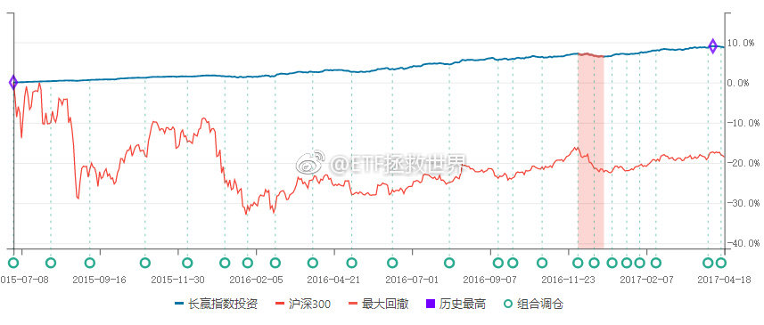

======================================================

ETF拯救世界 (5687069307) @
2017-04-19 09:32:45 Wed  
url: https://weibo.com/5687069307/EFc5P5IEM

竞猜，几点上班。时间最接近的赢。有大礼包。 ​​​

转发[5]  评论[184]  赞[37] 

======================================================

ETF拯救世界 (5687069307) @
2017-04-19 09:41:53 Wed  
url: https://weibo.com/5687069307/EFc9wCwo9

$162411  油气4月计划别忘了。 ​​​

转发[5]  评论[50]  赞[39] 

======================================================

ETF拯救世界 (5687069307) @
2017-04-19 09:48:26 Wed  
url: https://weibo.com/5687069307/EFccbwsDP

回头再看发帖时间，对照K线。尤其是中小、创业、1000的k线。2015年以来的估值图神迹在继续……

------------------------------------------------------
转推：
>  @ETF拯救世界 (5687069307)
>  2017-03-21 15:54:32 Tue  
>  url: https:/weibo.com/5687069307/EAPco7pao/

>  热腾腾的加权估值新鲜出炉。
>  
>  今天收盘后的数据，是2015年12月第三轮熔断前以来，按月计算加权估值最高的时候。
>  
>  大概是36.x。我个人不太相信会升到40以上，那将是另一次灾难的开始。不过，怎么说呢，金融市场的事谁说的准。真到了40以上，等着看热闹就对了。 ​​​

转发[3]  评论[26]  赞[35] 

======================================================

ETF拯救世界 (5687069307) @
2017-04-19 09:54:50 Wed  
url: https://weibo.com/5687069307/EFceMzYzJ

回复@用户5178306551:我发这条微博之前只有3万手……//@用户5178306551:21W手怎么买

------------------------------------------------------
转推：
>  @ETF拯救世界 (5687069307)
>  2017-04-19 09:41:53 Wed  
>  url: https:/weibo.com/5687069307/EFc9wCwo9/

>  $162411  油气4月计划别忘了。 ​​​

转发[0]  评论[32]  赞[27] 

======================================================

ETF拯救世界 (5687069307) @
2017-04-19 10:15:47 Wed  
url: https://weibo.com/5687069307/EFcnilVb4

我想大概谈谈对市场的一些看法。

最近这段时间，中小创跌幅巨大，大多数，70-80%的股票不断下跌。而一些明星股则不断上涨，这是价值回归么。

我不这么看。

这是熊市某个阶段的一个特征。客观因素是资金少，只能在局部制造热点，公募也好私募也好，大家抱团取暖做几个品种而已。

对，有些股票确实是 ​​​

转发[51]  评论[63]  赞[114] 

======================================================

ETF拯救世界 (5687069307) @
2017-04-19 10:30:59 Wed  
url: https://weibo.com/5687069307/EFctsmHaC

计划最终能赚多少我说不好，因为要看未来怎么走。

但有一件事我从2015年7月开始就很有信心，那就是没有一个人会死。无论风浪有多大，无论怎么血流成河。

如果所有人都一定要死，我们也会是最后一批倒下的。经过那么多年，那么多次的严冬，我有这个信心。

这也是我敢于公布这份投资计划的原因。 ​​​

转发[11]  评论[81]  赞[124] 

======================================================

ETF拯救世界 (5687069307) @
2017-04-19 11:11:31 Wed  
url: https://weibo.com/5687069307/EFcJUrJKn

$中证1000 sh000852$   看了看k线，鬼知道这两年中小股票经历了什么……

别急，快了。我们来接盘。 ​​​

转发[1]  评论[39]  赞[63] 

======================================================

ETF拯救世界 (5687069307) @
2017-04-19 11:54:57 Wed  
url: https://weibo.com/5687069307/EFd1xsFwv

截至昨日收盘，本年至今跌幅最大的股票已经跌了53%，腰斩。

跌幅大于10%的股票有1024（-_-b）只，占34%。

下跌的股票有1922只，占64%。

有人非说现在是慢牛，这叫什么牛市？现在只是个别明星股和权重股拉升掩盖下的慢熊某个阶段而已好吗。 ​​​

转发[11]  评论[63]  赞[74] 

======================================================

ETF拯救世界 (5687069307) @
2017-04-19 13:25:12 Wed  
url: https://weibo.com/5687069307/EFdCaC45X

一万多亿GJD最大的问题是什么？是由于托市，造成了本来应该在2015年明白自己炒股水平不怎么样的人觉得自己是股神。

他们会觉得自己之前的投资策略没错。本来应该建立起来的风险意识完全被忽略。

当然，最后只能是白白浪费了几年时间，还会比当时痛痛快快跌到位的话赔的更多。 ​​​

转发[9]  评论[72]  赞[69] 

======================================================

ETF拯救世界 (5687069307) @
2017-04-19 14:41:23 Wed  
url: https://weibo.com/5687069307/EFe763qFE

13:40。请最接近的朋友在自己评论下面@ 我。说送就送。

------------------------------------------------------
转推：
>  @ETF拯救世界 (5687069307)
>  2017-04-19 09:32:45 Wed  
>  url: https:/weibo.com/5687069307/EFc5P5IEM/

>  竞猜，几点上班。时间最接近的赢。有大礼包。 ​​​

转发[0]  评论[56]  赞[41] 

======================================================

ETF拯救世界 (5687069307) @
2017-04-20 05:18:45 Thu  
url: https://weibo.com/5687069307/EFjRdtSrr

昨天场外申购油气的厉害了 ​​​

转发[11]  评论[118]  赞[51] 

+++++++++++++++++++++++++++++++++++++++++++++++++++++

图片：
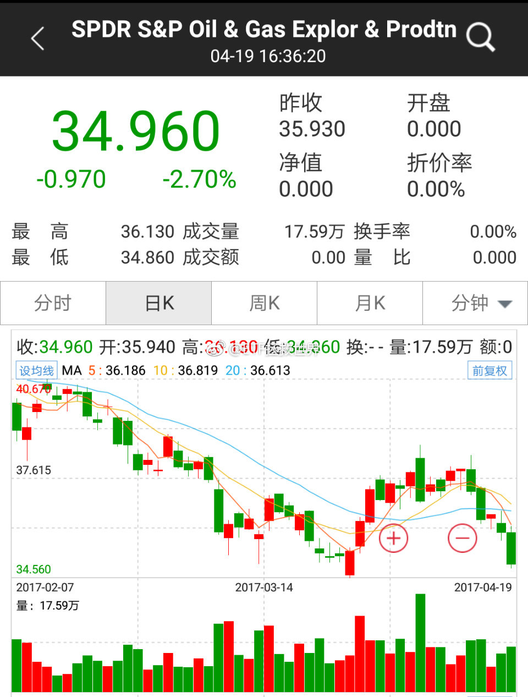

======================================================

ETF拯救世界 (5687069307) @
2017-04-20 09:16:59 Thu  
url: https://weibo.com/5687069307/EFlpV4A8N

今日华宝油气预估净值0.599，场内交易的朋友可以以这个为参考。

------------------------------------------------------
转推：
>  @ETF拯救世界 (5687069307)
>  2017-04-20 05:18:45 Thu  
>  url: https:/weibo.com/5687069307/EFjRdtSrr/

>  昨天场外申购油气的厉害了 ​​​

转发[3]  评论[65]  赞[49] 

======================================================

ETF拯救世界 (5687069307) @
2017-04-20 09:55:57 Thu  
url: https://weibo.com/5687069307/EFlFJvpjy

朋友们投资要记住这几个字：人弃我取，人取我予。

风水轮流转。

现在不断新高豪气冲天的，还去追，未来给你赚大钱的机会就不多；

现在跌跌不休没人待见的，才是未来的金矿所在。

节奏，注意节奏。 ​​​

转发[31]  评论[55]  赞[98] 

======================================================

ETF拯救世界 (5687069307) @
2017-04-20 10:07:29 Thu  
url: https://weibo.com/5687069307/EFlKpFl5J

一年多过去了，第三轮计划资产搭配的雏形终于有点样子了。接下来就是不断的加加减减。品种还差一个贵金属，海外还差一个美股，也基本就全了。

太难了。买点不贵的东西太难了！ ​​​

转发[17]  评论[55]  赞[80] 

======================================================

ETF拯救世界 (5687069307) @
2017-04-20 10:33:57 Thu  
url: https://weibo.com/5687069307/EFlVa0KoX

我建议朋友们有空的时候可以去看看A股的历史。不用太久，就从2000年开始看。

尤其是2002以后，A股是如何走的，每个阶段都发生了什么。

看到2003-2004，你会发现跟现在蜜汁相似，非常眼熟。“五朵金花”。

再往后看，看到2005。这里就是最关键了。看看2005之后，什么板块，什么股票在那样的史无前例 ​​​

转发[111]  评论[89]  赞[142] 

======================================================

ETF拯救世界 (5687069307) @
2017-04-20 10:47:38 Thu  
url: https://weibo.com/5687069307/EFm0Ig4Bs

$全指医药 sh000991$ 不出所料。 ​​​

转发[3]  评论[22]  赞[54] 

======================================================

ETF拯救世界 (5687069307) @
2017-04-20 11:02:05 Thu  
url: https://weibo.com/5687069307/EFm6A0L86

计划三月高位没买，四月买的三个品种到现在这一刻都没有亏损。可以说完美避开这波下跌。

再往前看，所有“不买”的月份之后都是大跌。所以以后哪个月计划“不买”，就得留点神……

有点艺术的感觉没有。 ​​​​

转发[14]  评论[49]  赞[92] 

+++++++++++++++++++++++++++++++++++++++++++++++++++++

图片：
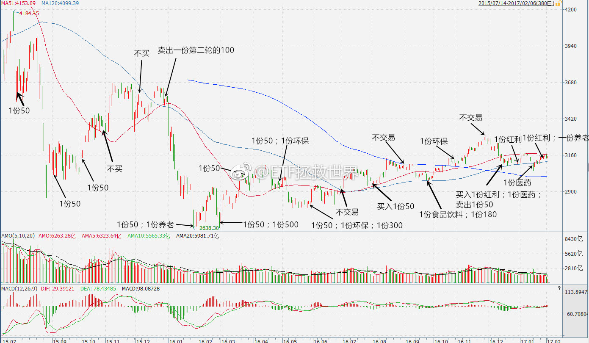

======================================================

ETF拯救世界 (5687069307) @
2017-04-20 11:15:58 Thu  
url: https://weibo.com/5687069307/EFmcdeVNO

就像A股上一轮牛市其实从2012年11月就开始了而不是大多数认为的2014年三季度开始一样，现在的指数也根本不能代表A股的性质。

今天上证下跌0.13%，深成上涨0.21%。其实，现在上涨的家数是900家，下跌的家数却有2000多家。

有很多类似的误区，各位要知道怎么甄别。指数没跌，很多朋友手里的股票已经跌 ​​​

转发[22]  评论[65]  赞[83] 

======================================================

ETF拯救世界 (5687069307) @
2017-04-20 13:34:37 Thu  
url: https://weibo.com/5687069307/EFn6v2dlM

白马：你追不追？不追？我继续涨给你看。还不追？我继续涨。追啦？duang，归你了！

------------------------------------------------------
转推：
>  @投鱼问道 (1888116862)
>  2017-02-10 10:20:51 Fri  
>  url: https:/weibo.com/1888116862/EuRlA3CeX/

>  【重要规律】多年悟出的A股16字：抱团取暖、敌进我退、广场赌博、击鼓传花
>  【抱团取暖】：公募等有最低持仓80%左右的要求，股市再跌也不能清仓，不得不找一些股抱团取暖，即使不涨，也不能跌，典型如白马股，茅台等，每逢股市弱势，总有一些股很坚挺，就是公募抱团在自己玩。
>  【敌进我退】：是指游资和 ​​​

转发[23]  评论[40]  赞[70] 

======================================================

ETF拯救世界 (5687069307) @
2017-04-20 13:52:03 Thu  
url: https://weibo.com/5687069307/EFndzgDq0

最近话比较多，因为有些事只有在这时候说才有用，有些朋友才能听懂。比如下面这句：

买的稍微高点，你还有钱，想多买，摊低成本，没错。这也是我们计划的精髓之一。

但你要注意，不要0.62买的，0.6就要补仓摊低。你这样买，扛不过熊市。因为你爸爸不是李嘉诚，你也不是央行印钞机。你没那么多钱补。
 ​​​

转发[90]  评论[164]  赞[168] 

======================================================

ETF拯救世界 (5687069307) @
2017-04-20 14:08:20 Thu  
url: https://weibo.com/5687069307/EFnkb4GMS

截至昨日收盘，年初至今有2020只股票下跌，占比67.63%。

跌幅超过10%的股票有1135只，占比38%。

上涨超过10%股票有407只，占比13.63%。

中位数是下跌5.99%。好一个“慢牛”。 ​​​

转发[5]  评论[45]  赞[62] 

======================================================

ETF拯救世界 (5687069307) @
2017-04-20 15:31:29 Thu  
url: https://weibo.com/5687069307/EFnRVv4Lk

创业板估值已经回到2014年10月。沧海桑田，2年半过去，一个轮回。

继续吧。前路依然漫漫。 ​​​

转发[9]  评论[61]  赞[71] 

======================================================

ETF拯救世界 (5687069307) @
2017-04-20 20:09:43 Thu  
url: https://weibo.com/5687069307/EFpGRq6jH

再撑一周，月末那次计划四份以上不是梦。

估计一次就把那些整天担心踏空的朋友病都治好了。 ​​​

转发[34]  评论[131]  赞[94] 

+++++++++++++++++++++++++++++++++++++++++++++++++++++

图片：

======================================================

ETF拯救世界 (5687069307) @
2017-04-20 22:29:24 Thu  
url: https://weibo.com/5687069307/EFqByAG5r

[doge] ​​​

转发[1]  评论[86]  赞[51] 

+++++++++++++++++++++++++++++++++++++++++++++++++++++

图片：
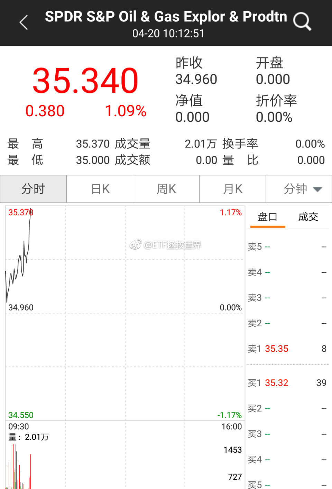

======================================================

ETF拯救世界 (5687069307) @
2017-04-21 09:11:26 Fri  
url: https://weibo.com/5687069307/EFuOashvm

还有五个交易日，周四晚开车。其实你仔细想想，有什么所谓啊。涨多了咱们就少买点，跌多了就多买点。是你的就是你的，跑不掉。不是你的你非去抓，结局很可能是→

------------------------------------------------------
转推：
>  @ETF拯救世界 (5687069307)
>  2017-04-20 20:09:43 Thu  
>  url: https:/weibo.com/5687069307/EFpGRq6jH/

>  再撑一周，月末那次计划四份以上不是梦。
>  
>  估计一次就把那些整天担心踏空的朋友病都治好了。 ​​​

转发[5]  评论[61]  赞[66] 

======================================================

ETF拯救世界 (5687069307) @
2017-04-21 13:15:33 Fri  
url: https://weibo.com/5687069307/EFwpg0Xuo

最重要的是，保持敬畏之心。

市场先生虽然时而狂躁时而畏惧，要敬畏他。时时刻刻小心翼翼，如履薄冰。

觉得自己最NB，大杀四方，通吃天下，倒霉的日子也就不远了。

人无百日好，花无百日红。得意之时更要谦虚一些。

方能长赢。 ​​​

转发[17]  评论[61]  赞[94] 

======================================================

ETF拯救世界 (5687069307) @
2017-04-21 13:30:06 Fri  
url: https://weibo.com/5687069307/EFwv9uaTy

很多朋友的问题其实是看的太近。

“你这么少仓位，这两个月涨了5%你没赚到吧。牛市来啦。你踏空啦”

或者

“你买这么多4不4傻。中国股市再也好不了了，金融危机来了！股市崩盘了！以后没人炒股了！你看看跌了多少了！”

主要原因就是看得近。

看得近的原因是站得比较低。当然，还有一种可能是眼镜 ​​​

转发[20]  评论[50]  赞[91] 

======================================================

ETF拯救世界 (5687069307) @
2017-04-21 13:51:41 Fri  
url: https://weibo.com/5687069307/EFwDUCqf3

再说一个，未来几年，甚至十年真正能赚大钱的东西，不是现在频创新高的那些“白马”。

而是目前正在阴跌暴跌跌跌不休的东西里面。也许还没到位，还不够便宜，但是就在里面。

一个想法，不一定对。 ​​​

转发[23]  评论[78]  赞[123] 

======================================================

ETF拯救世界 (5687069307) @
2017-04-21 14:29:02 Fri  
url: https://weibo.com/5687069307/EFwT4Bwnv

回复@青兔眼迷离:没有了。以后也不会有了。有不同声音的都被我拉黑了。来微博几个月，已经拉黑5个人了。[doge]//@青兔眼迷离:虽然百分之百的赞同，还是希望评论里有不一样的声音[爱你]

------------------------------------------------------
转推：
>  @ETF拯救世界 (5687069307)
>  2017-04-21 13:15:33 Fri  
>  url: https:/weibo.com/5687069307/EFwpg0Xuo/

>  最重要的是，保持敬畏之心。
>  
>  市场先生虽然时而狂躁时而畏惧，要敬畏他。时时刻刻小心翼翼，如履薄冰。
>  
>  觉得自己最NB，大杀四方，通吃天下，倒霉的日子也就不远了。
>  
>  人无百日好，花无百日红。得意之时更要谦虚一些。
>  
>  方能长赢。 ​​​

转发[1]  评论[51]  赞[64] 

======================================================

ETF拯救世界 (5687069307) @
2017-04-21 15:16:28 Fri  
url: https://weibo.com/5687069307/EFxckoWhM

建行纸黄金纸白银可以挂单30天，而且现在貌似点差有优惠。做贵金属的可以考虑。

白银不要玩场内的161226，损耗太高。 黄金用518880倒是可以。 ​​​

转发[18]  评论[67]  赞[51] 

======================================================

ETF拯救世界 (5687069307) @
2017-04-21 16:06:12 Fri  
url: https://weibo.com/5687069307/EFxww8t0J

4份应该没问题，除非下周前四天会大涨。如果继续大跌，5份以上也有可能。总之下周开始先准备周五用的4份资金是合适的。

------------------------------------------------------
转推：
>  @ETF拯救世界 (5687069307)
>  2017-04-20 20:09:43 Thu  
>  url: https:/weibo.com/5687069307/EFpGRq6jH/

>  再撑一周，月末那次计划四份以上不是梦。
>  
>  估计一次就把那些整天担心踏空的朋友病都治好了。 ​​​

转发[12]  评论[109]  赞[60] 

======================================================

ETF拯救世界 (5687069307) @
2017-04-24 08:40:49 Mon  
url: https://weibo.com/5687069307/EFWTe40Az

还有四个交易日一刚！ ​​​

转发[0]  评论[40]  赞[41] 

======================================================

ETF拯救世界 (5687069307) @
2017-04-24 09:32:56 Mon  
url: https://weibo.com/5687069307/EFXensmYB

很多朋友第一次体会到其他人在哭自己在准备买入的感觉。

怎么讲，这就是投资。 ​​​

转发[7]  评论[24]  赞[61] 

======================================================

ETF拯救世界 (5687069307) @
2017-04-24 09:35:42 Mon  
url: https://weibo.com/5687069307/EFXfvcHFr

有意思的是，今天计划净值依然不会少多少。

$159920   $513030  $162411

资产配置。 ​​​

转发[4]  评论[13]  赞[39] 

======================================================

ETF拯救世界 (5687069307) @
2017-04-24 09:38:07 Mon  
url: https://weibo.com/5687069307/EFXgu3MuI

再次更新：如果有暴跌，随时会开车。//@ETF拯救世界:4份应该没问题，除非下周前四天会大涨。如果继续大跌，5份以上也有可能。总之下周开始先准备周五用的4份资金是合适的。

------------------------------------------------------
转推：
>  @ETF拯救世界 (5687069307)
>  2017-04-20 20:09:43 Thu  
>  url: https:/weibo.com/5687069307/EFpGRq6jH/

>  再撑一周，月末那次计划四份以上不是梦。
>  
>  估计一次就把那些整天担心踏空的朋友病都治好了。 ​​​

转发[6]  评论[52]  赞[45] 

======================================================

ETF拯救世界 (5687069307) @
2017-04-24 09:46:51 Mon  
url: https://weibo.com/5687069307/EFXk1yTBM

该发生的一定会发生。这不是因为什么人说了什么。

就像每天日出日落，就像每年春夏秋冬。

掌握了日夜更替四季轮换的规律，就不会因为不见五指的黑夜和寒冷的凛冬心生恐惧。

你就会知道，凛冬虽至，终有一日盛夏要回来。你也会知道，盛夏虽好，也要为凛冬准备粮食才能扛得过去。

只看眼前，觉得盛夏 ​​​

转发[33]  评论[87]  赞[116] 

======================================================

ETF拯救世界 (5687069307) @
2017-04-24 10:42:39 Mon  
url: https://weibo.com/5687069307/F00em4fHZ

如果我们的投资体系（仅指计划这个策略）是一个军队或者一支球队，那么你能想到的，它的防守体系中的破绽是什么？

在这个防守体系中，有可能会出什么问题导致这场战争或者这场比赛我们会输？ ​​​

转发[42]  评论[171]  赞[64] 

======================================================

ETF拯救世界 (5687069307) @
2017-04-24 11:12:11 Mon  
url: https://weibo.com/5687069307/F00qlf2S8

说点不开心的让你们开心一下：

去年7月我买的20多只门票股中，有两只已经跌了30%，今天补仓了。

这两只赔了总资产的0.15%了。

[doge]

别只看买的大部分都是大赚的，那些赔钱的只是你不知道而已。[doge]

最重要的，不是会不会受伤。所有人都会受伤。关键是，受的伤是不是致命的。以及，伤好了之后 ​​​

转发[9]  评论[59]  赞[59] 

+++++++++++++++++++++++++++++++++++++++++++++++++++++

图片：
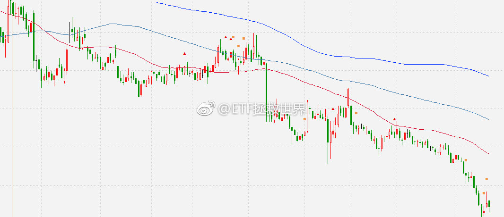
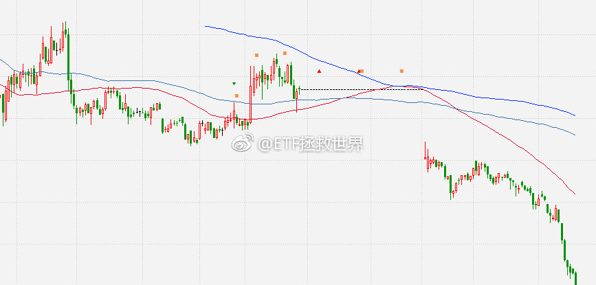

======================================================

ETF拯救世界 (5687069307) @
2017-04-24 11:22:34 Mon  
url: https://weibo.com/5687069307/F00uypE80

大家一定要记住这个问题。若干时间以后，我会把这条微博挖出来。“估值体系”没有用了，是大多数朋友的疑虑。没错，到了体系告诉我们“这已经是大底”的时候，会有更多的人这么想。这也是大多数人不敢大手笔买入的原因。“这次不一样”。

------------------------------------------------------
转推：
>  @ETF拯救世界 (5687069307)
>  2017-04-24 10:42:39 Mon  
>  url: https:/weibo.com/5687069307/F00em4fHZ/

>  如果我们的投资体系（仅指计划这个策略）是一个军队或者一支球队，那么你能想到的，它的防守体系中的破绽是什么？
>  
>  在这个防守体系中，有可能会出什么问题导致这场战争或者这场比赛我们会输？ ​​​

转发[23]  评论[39]  赞[52] 

======================================================

ETF拯救世界 (5687069307) @
2017-04-24 11:37:27 Mon  
url: https://weibo.com/5687069307/F00AB7129

深成B会不会跌到1毛。一个问题。 ​​​

转发[22]  评论[54]  赞[42] 

======================================================

ETF拯救世界 (5687069307) @
2017-04-24 11:48:29 Mon  
url: https://weibo.com/5687069307/F00F4AIZk

准备极小仓位试试。相信GJD。相信D。

------------------------------------------------------
转推：
>  @ETF拯救世界 (5687069307)
>  2017-04-07 10:09:34 Fri  
>  url: https:/weibo.com/5687069307/EDncO76hf/

>  3000（或者3100）到3300之间用ETF做网格应该是很靠谱的。
>  
>  GJD信誉保证。跟着GJD有肉吃。 ​​​

转发[1]  评论[37]  赞[32] 

======================================================

ETF拯救世界 (5687069307) @
2017-04-24 13:32:34 Mon  
url: https://weibo.com/5687069307/F01lk8u8I

$513030  闹哪样 ​​​

转发[1]  评论[14]  赞[16] 

======================================================

ETF拯救世界 (5687069307) @
2017-04-24 13:34:40 Mon  
url: https://weibo.com/5687069307/F01mb2aOv

什么值得买和三只松鼠居然要上创业板了。

不讨论这两家公司好不好，这个节奏，我感觉未来创业板有希望了，长期来看。 ​​​

转发[7]  评论[56]  赞[60] 

======================================================

ETF拯救世界 (5687069307) @
2017-04-24 14:01:47 Mon  
url: https://weibo.com/5687069307/F01xbk4Vw

全面给力。

现金是垃圾？ ​​​

转发[1]  评论[34]  赞[50] 

+++++++++++++++++++++++++++++++++++++++++++++++++++++

图片：
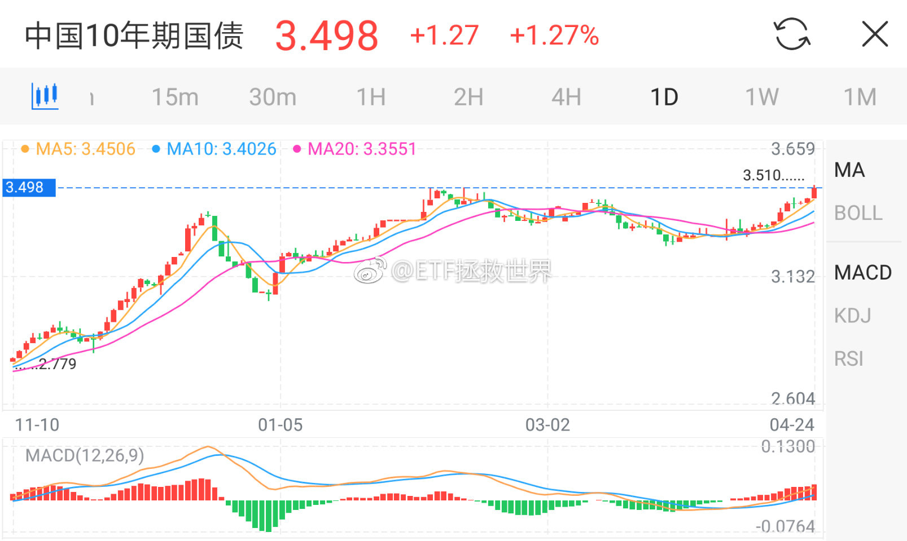

======================================================

ETF拯救世界 (5687069307) @
2017-04-24 14:22:17 Mon  
url: https://weibo.com/5687069307/F01FvdsY5

好孩子。

------------------------------------------------------
转推：
>  @ETF拯救世界 (5687069307)
>  2017-04-24 13:32:34 Mon  
>  url: https:/weibo.com/5687069307/F01lk8u8I/

>  $513030  闹哪样 ​​​

转发[0]  评论[14]  赞[34] 

======================================================

ETF拯救世界 (5687069307) @
2017-04-24 14:43:53 Mon  
url: https://weibo.com/5687069307/F01OgFk27

操盘手看着你们这些想薅羊毛的散户露出蜜汁微笑 http://t.cn/RXly9Md

------------------------------------------------------
转推：
>  @阿信gg (1804541182)
>  2017-04-24 14:41:31 Mon  
>  url: https:/weibo.com/1804541182/F01NjfvbA/

>  gjd旷班今天@ETF拯救世界 ​​​

转发[3]  评论[47]  赞[40] 

======================================================

ETF拯救世界 (5687069307) @
2017-04-24 14:54:24 Mon  
url: https://weibo.com/5687069307/F01Sxo8Gi

今天的估值将会特别NB。一个预感，不一定对。 ​​​

转发[7]  评论[154]  赞[111] 

======================================================

ETF拯救世界 (5687069307) @
2017-04-25 09:49:13 Tue  
url: https://weibo.com/5687069307/F09jaajgX

真的开始价值回归了。

百感交集。

有信念，太重要。 ​​​

转发[5]  评论[109]  赞[120] 

======================================================

ETF拯救世界 (5687069307) @
2017-04-25 10:38:57 Tue  
url: https://weibo.com/5687069307/F09DlysP6

$159920  又快新高了 ​​​

转发[1]  评论[90]  赞[54] 

======================================================

ETF拯救世界 (5687069307) @
2017-04-25 15:40:40 Tue  
url: https://weibo.com/5687069307/F0bBP8g3w

今天医药估值再创三年新低。

如果医药有机会进入历史最低区域，我说句话，负责任的讲：

在这个品种上，未来某个时间点，我们赚到15%-20%以上的年化收益是极大概率的事情。

就看是不是有这个运气了。 ​​​

转发[60]  评论[162]  赞[145] 

======================================================

ETF拯救世界 (5687069307) @
2017-04-25 17:17:27 Tue  
url: https://weibo.com/5687069307/F0cf6gcX0

历史将记住这条微博。为什么资本市场的一幕幕总是不断重复？//@椒图炼丹炉:传说中的价值投资，学习下。

------------------------------------------------------
转推：
>  @但斌 (1249424622)
>  2017-04-25 16:45:35 Tue  
>  url: https:/weibo.com/1249424622/F0c2aen7y/

>  有朋友问茅台年底高度？我回复：按2018预估业绩25倍市盈率，年底500以上，不排除600以上概率；在不打战，没有动荡，没有大的经济危机的前提下，茅台给30倍估值是非常正常的。这还没考虑提价等因素，所以到年底600收市，一点不惊讶！坦然接受！”（备注：仅是个人观点，不一定对！投资有风险，须谨慎！ ​​​

转发[18]  评论[77]  赞[37] 

======================================================

ETF拯救世界 (5687069307) @
2017-04-25 18:07:46 Tue  
url: https://weibo.com/5687069307/F0czwqhHq

回复@请输入昵称_昵称:高弹性的以后多着呢。信息、证券、军工。你还怕没有赚大钱的品种？医药是长线品种。提供长期稳定高收益的。别急，好戏在后头。

------------------------------------------------------
转推：
>  @ETF拯救世界 (5687069307)
>  2017-04-25 15:40:40 Tue  
>  url: https:/weibo.com/5687069307/F0bBP8g3w/

>  今天医药估值再创三年新低。
>  
>  如果医药有机会进入历史最低区域，我说句话，负责任的讲：
>  
>  在这个品种上，未来某个时间点，我们赚到15%-20%以上的年化收益是极大概率的事情。
>  
>  就看是不是有这个运气了。 ​​​

转发[28]  评论[75]  赞[73] 

======================================================

ETF拯救世界 (5687069307) @
2017-04-25 22:49:16 Tue  
url: https://weibo.com/5687069307/F0epMvtrg

未来计划的轨迹是这样的:

熊市收集便宜筹码。争取在最黑暗的时候拿到足够的筹码，同时不亏损。如果无法避免亏损，尽量将亏损维持在15%以内。

然后在牛市中资产飞跃，收割。

继续新一轮收集筹码。

所以在每轮熊市底部，收益率注定不会好看。我无法想象熊市底部做到不亏损的同时收益率高还能拿到足够 ​​​

转发[46]  评论[127]  赞[122] 

+++++++++++++++++++++++++++++++++++++++++++++++++++++

图片：
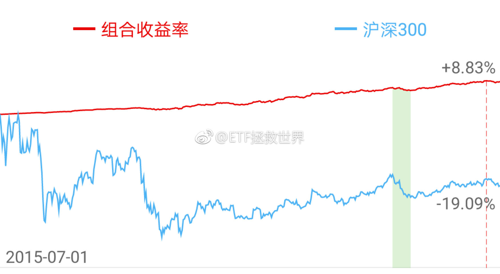

======================================================

ETF拯救世界 (5687069307) @
2017-04-26 06:22:58 Wed  
url: https://weibo.com/5687069307/F0hnWkx1F

各位又买在阶段最低，一厘都不差

[doge] ​​​

转发[2]  评论[72]  赞[92] 

+++++++++++++++++++++++++++++++++++++++++++++++++++++

图片：
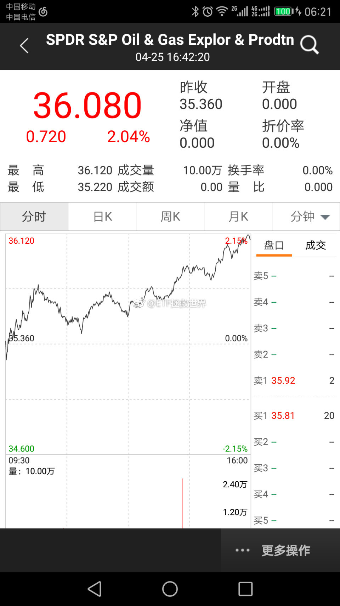

======================================================

ETF拯救世界 (5687069307) @
2017-04-26 09:50:39 Wed  
url: https://weibo.com/5687069307/F0iKf2dqB

说出来你可能不信，我越来越喜欢创业板了。再来一波进场捡筹码。 ​​​

转发[13]  评论[48]  赞[75] 

======================================================

ETF拯救世界 (5687069307) @
2017-04-26 10:00:12 Wed  
url: https://weibo.com/5687069307/F0iO7ieHz

参照纳斯达克，大致在2030前后吧，创业板回到4000点没问题。然后2030-2040创业板会有一个比较好的收益率。所以从买入到2030，收益率是多少取决于你的买入价格。比如现在买，13年后回到4000，赚一倍，复利大概5.x%。买得越低，年化会越高一点。

------------------------------------------------------
转推：
>  @ETF拯救世界 (5687069307)
>  2017-04-26 09:50:39 Wed  
>  url: https:/weibo.com/5687069307/F0iKf2dqB/

>  说出来你可能不信，我越来越喜欢创业板了。再来一波进场捡筹码。 ​​​

转发[11]  评论[34]  赞[56] 

======================================================

ETF拯救世界 (5687069307) @
2017-04-26 10:14:23 Wed  
url: https://weibo.com/5687069307/F0iTSu05O

接上条，做个小数学游戏。

如果2030年4月26日，创业板可以回到4000点。那么是这样的：

你

2017年4月26日1812点买入，到那时年化收益率是6.28%；

2017年5月26日1700点买入，则年化上升到6.84%；

如果在2017年底，1500点买入，则年化就有8.28%。

如果年底不知道发生什么黑天鹅居然跌到了1000点，那 ​​​

转发[43]  评论[70]  赞[83] 

======================================================

ETF拯救世界 (5687069307) @
2017-04-26 10:47:01 Wed  
url: https://weibo.com/5687069307/F0j77pxEk

提前发车是不是非常精确。你们感受一下。 ​​​

转发[5]  评论[54]  赞[93] 

======================================================

ETF拯救世界 (5687069307) @
2017-04-26 11:17:50 Wed  
url: https://weibo.com/5687069307/F0jjD4K4U

是不是要打脸了！怎么办，是不是要开始骂641了！是直接骂还是要走什么程序？没骂过，求带！

------------------------------------------------------
转推：
>  @ETF拯救世界 (5687069307)
>  2017-04-26 10:47:01 Wed  
>  url: https:/weibo.com/5687069307/F0j77pxEk/

>  提前发车是不是非常精确。你们感受一下。 ​​​

转发[0]  评论[33]  赞[42] 

======================================================

ETF拯救世界 (5687069307) @
2017-04-26 11:24:30 Wed  
url: https://weibo.com/5687069307/F0jmkzvCh

根据我的几个中期趋势技术判断模型，几个小指数于上周，几个稍大的指数于本周相继进入下跌趋势。

当然，技术始终只是一种辅助手段。投资不能靠k线和技术图形指标。辅助一下而已。

技术破位的意思，也只是说下跌的概率会比较大，而已。 ​​​

转发[24]  评论[79]  赞[84] 

======================================================

ETF拯救世界 (5687069307) @
2017-04-26 15:45:54 Wed  
url: https://weibo.com/5687069307/F0l4rapkQ

一季报业绩超密集披露。估值变化太大了。

近期极有可能加车。一两份就够了。 ​​​

转发[15]  评论[123]  赞[125] 

======================================================

ETF拯救世界 (5687069307) @
2017-04-27 08:02:12 Thu  
url: https://weibo.com/5687069307/F0rsIptJs

出门了没？ ​​​

转发[5]  评论[153]  赞[126] 

+++++++++++++++++++++++++++++++++++++++++++++++++++++

图片：

======================================================

ETF拯救世界 (5687069307) @
2017-04-27 08:27:00 Thu  
url: https://weibo.com/5687069307/F0rCMvve8

[微笑] ​​​

转发[5]  评论[45]  赞[41] 

+++++++++++++++++++++++++++++++++++++++++++++++++++++

图片：
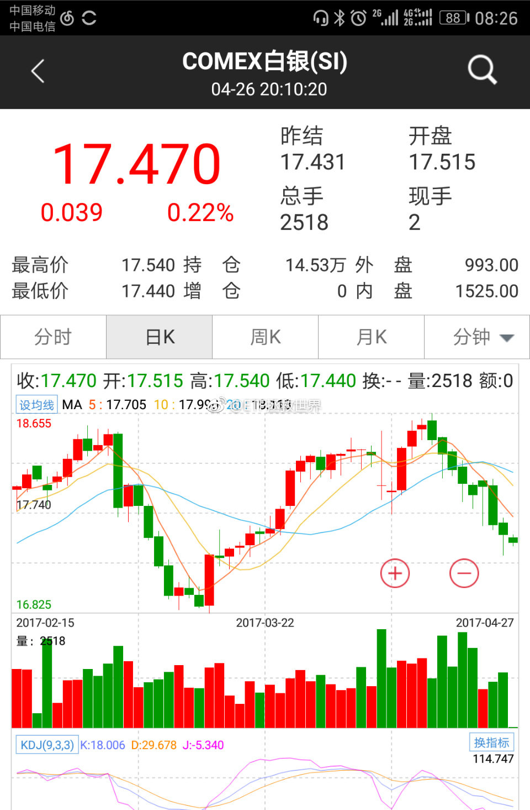

======================================================

ETF拯救世界 (5687069307) @
2017-04-27 09:13:09 Thu  
url: https://weibo.com/5687069307/F0rVw6HhB

转发微博

------------------------------------------------------
转推：
>  @财联社APP (2868676035)
>  2017-04-27 09:11:43 Thu  
>  url: https:/weibo.com/2868676035/F0rUWlAIn/

>  4月26日，安邦保险集团董事长吴小晖在安邦保险总部同记者谈到安邦开启的2.0战略是养老和医疗。当天披露的2016年报显示，安邦人寿总资产规模升至1.45万亿，海外保险资产规模首次超过国内保险资产， 成为真正意义上具有全球竞争力的中国保险公司。（新京报） ​​​

转发[2]  评论[12]  赞[21] 

======================================================

ETF拯救世界 (5687069307) @
2017-04-27 09:26:53 Thu  
url: https://weibo.com/5687069307/F0s15tj5x

一年内底部可见。钦定了。 ​​​

转发[47]  评论[93]  赞[125] 

======================================================

ETF拯救世界 (5687069307) @
2017-04-27 09:31:45 Thu  
url: https://weibo.com/5687069307/F0s348mbe

2016年1月27日，大盘收于2735点。现在是3131点，上涨14.48%。

同期下跌股票1027只，占比37%。

跌幅最大的股票跌了75%。

股票中位数上涨8%。

真相。 ​​​

转发[4]  评论[19]  赞[54] 

======================================================

ETF拯救世界 (5687069307) @
2017-04-27 09:42:43 Thu  
url: https://weibo.com/5687069307/F0s7w7R4D

“现金是空气。”

体会更深了吧。 ​​​​

道理说再多有时候是没用的，经历过一次，才懂。 ​​​

转发[9]  评论[28]  赞[78] 

======================================================

ETF拯救世界 (5687069307) @
2017-04-27 09:47:47 Thu  
url: https://weibo.com/5687069307/F0s9ztE2V

$中证1000 sh000852$   这两年，是小盘股的梦魇时分。

太惨了。

别急，我们是援军，在路上（慢慢走）。 ​​​

转发[2]  评论[24]  赞[58] 

======================================================

ETF拯救世界 (5687069307) @
2017-04-27 09:57:09 Thu  
url: https://weibo.com/5687069307/F0sdnfZ3M

潜水雪球，看到方老板每天买10万指数基金。各位可以用这个实例观摩一下熊市中过于频繁买入的后果。

慢慢体会一下“定期”交易的奥妙所在。 ​​​

转发[60]  评论[84]  赞[85] 

======================================================

ETF拯救世界 (5687069307) @
2017-04-27 10:03:56 Thu  
url: https://weibo.com/5687069307/F0sg8l9vC

回复@金玉满堂彩红:我想中午开怎么破。//@金玉满堂彩红:今天这情况，晚上要加开了吧

------------------------------------------------------
转推：
>  @ETF拯救世界 (5687069307)
>  2017-04-27 08:02:12 Thu  
>  url: https:/weibo.com/5687069307/F0rsIptJs/

>  出门了没？ ​​​

转发[1]  评论[116]  赞[51] 

======================================================

ETF拯救世界 (5687069307) @
2017-04-27 10:33:28 Thu  
url: https://weibo.com/5687069307/F0ss7fXyC

很多人看到的是指数下跌和股票崩盘。

sorry，我看到的是未来年化收益率一个点一个点往上蹦。

金融投资风险很大，对眼前一片迷雾的人来说。 ​​​

转发[27]  评论[69]  赞[92] 

======================================================

ETF拯救世界 (5687069307) @
2017-04-27 10:49:18 Thu  
url: https://weibo.com/5687069307/F0syyc59o

回复@kuya55:我们不是抄底，不是这个思路。是根据概率计算仓位配置。现在计划仓位只有13个点，对于现在的概率来说太低了。要尽快加到合适的位置。//@kuya55:E大，因为买的是指数其实也就多跌一两个点，现在就加买是不是有点急了。 还是咱们这次150份的仓位还不够重呢

------------------------------------------------------
转推：
>  @ETF拯救世界 (5687069307)
>  2017-04-27 10:33:28 Thu  
>  url: https:/weibo.com/5687069307/F0ss7fXyC/

>  很多人看到的是指数下跌和股票崩盘。
>  
>  sorry，我看到的是未来年化收益率一个点一个点往上蹦。
>  
>  金融投资风险很大，对眼前一片迷雾的人来说。 ​​​

转发[12]  评论[40]  赞[45] 

======================================================

ETF拯救世界 (5687069307) @
2017-04-27 10:55:31 Thu  
url: https://weibo.com/5687069307/F0sB49S9H

……从2007年的沙黾农开始，我就有一个坚定的信念：在金融市场上，杀伤力最大的是大v。一次次验证。

------------------------------------------------------
转推：
>  @ETF拯救世界 (5687069307)
>  2017-04-24 11:37:27 Mon  
>  url: https:/weibo.com/5687069307/F00AB7129/

>  深成B会不会跌到1毛。一个问题。 ​​​

转发[18]  评论[78]  赞[71] 

======================================================

ETF拯救世界 (5687069307) @
2017-04-27 13:26:25 Thu  
url: https://weibo.com/5687069307/F0tAjznaY

GJD的心理底线是3100，确认了。连续第二次暴跌跌破拉回。

------------------------------------------------------
转推：
>  @ETF拯救世界 (5687069307)
>  2017-04-07 10:09:34 Fri  
>  url: https:/weibo.com/5687069307/EDncO76hf/

>  3000（或者3100）到3300之间用ETF做网格应该是很靠谱的。
>  
>  GJD信誉保证。跟着GJD有肉吃。 ​​​

转发[12]  评论[41]  赞[60] 

======================================================

ETF拯救世界 (5687069307) @
2017-04-27 13:46:04 Thu  
url: https://weibo.com/5687069307/F0tIibgD9

回复@且慢管家:截止今日所有披露年报的公司中：证金进入十大股东的有336家公司，汇金进入十大股东的有911家公司。不含各类券商、基金的救市资管产品。与上个季度相比，没有什么变化。但持仓个股有变动，个股持仓仓位也有增减。//@且慢管家:#投资达人说# 说到底 GJD到底都是些什么人呢

------------------------------------------------------
转推：
>  @ETF拯救世界 (5687069307)
>  2017-04-07 10:09:34 Fri  
>  url: https:/weibo.com/5687069307/EDncO76hf/

>  3000（或者3100）到3300之间用ETF做网格应该是很靠谱的。
>  
>  GJD信誉保证。跟着GJD有肉吃。 ​​​

转发[4]  评论[21]  赞[26] 

======================================================

ETF拯救世界 (5687069307) @
2017-04-27 14:44:33 Thu  
url: https://weibo.com/5687069307/F0u625ffJ

不让买就不买了。散了啊。 ​​​

转发[3]  评论[78]  赞[57] 

======================================================

ETF拯救世界 (5687069307) @
2017-04-27 15:07:29 Thu  
url: https://weibo.com/5687069307/F0ufl9dsj

回复@小狗上马路:老司机：提前开车又对了。（明天不要打脸[doge]）//@小狗上马路:我们定投的三份，今天都盈利了哇

------------------------------------------------------
转推：
>  @ETF拯救世界 (5687069307)
>  2017-04-27 14:44:33 Thu  
>  url: https:/weibo.com/5687069307/F0u625ffJ/

>  不让买就不买了。散了啊。 ​​​

转发[1]  评论[30]  赞[47] 

======================================================

ETF拯救世界 (5687069307) @
2017-04-27 21:33:46 Thu  
url: https://weibo.com/5687069307/F0wM7B0by

其实我的计划没必要和任何人解释。

三月没买，四月买了两份A股，五月买四份。三个月加起来一共买了六份，不到4%。

总A股仓位才15%。

不解释。每个人的情况本来就不同。买自己想买的东西就行了。 ​​​

转发[8]  评论[180]  赞[122] 

======================================================

ETF拯救世界 (5687069307) @
2017-04-28 06:05:10 Fri  
url: https://weibo.com/5687069307/F0A7I3G9j

继续新高。

熊市，震荡市，不亏损少亏损的情况下，尽量多的收集筹码。

这句话说来简单，做起来并不容易。

早了，大幅亏损。晚了，望牛兴叹。

时间，空间的艺术。

继续保持买入的所有权益品种盈利。仓位继续增长，未来的盛宴不会缺席。

未来的回撤会更大，不在乎。到这个市场上来玩，不是为了保本 ​​​

转发[16]  评论[105]  赞[118] 

+++++++++++++++++++++++++++++++++++++++++++++++++++++

图片：
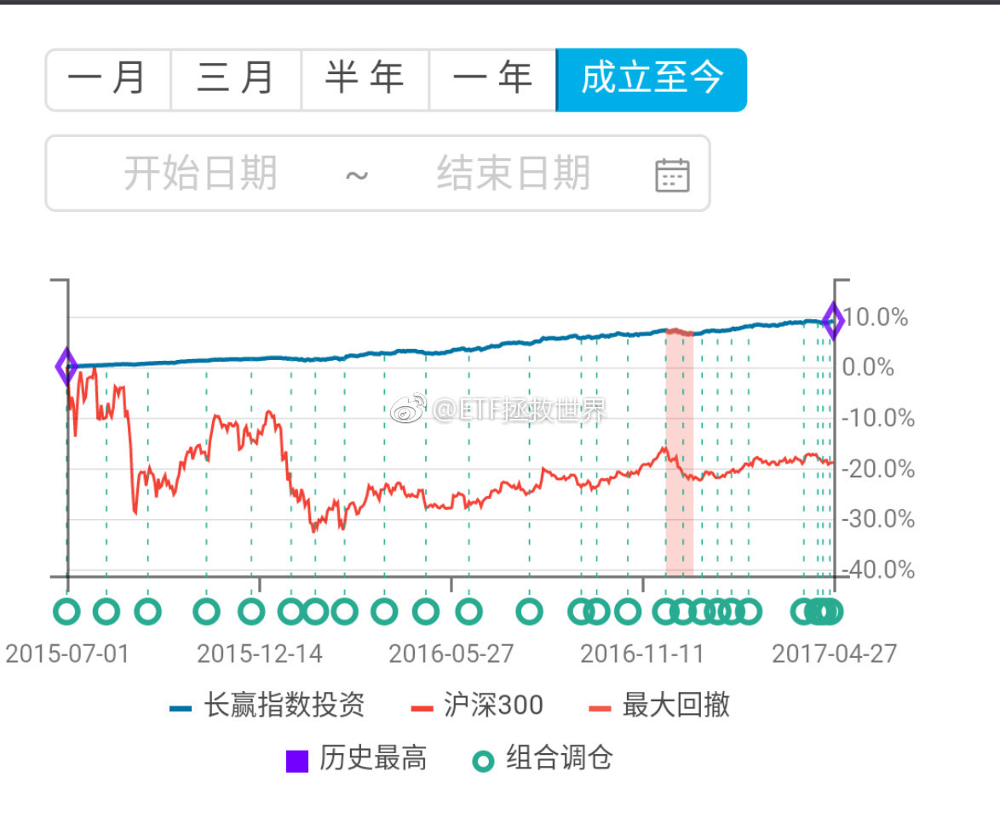

======================================================

ETF拯救世界 (5687069307) @
2017-04-28 10:30:50 Fri  
url: https://weibo.com/5687069307/F0BRxyPaH

为什么要这样对我。为什么。 

没天理了。 ​​​

转发[2]  评论[92]  赞[44] 

+++++++++++++++++++++++++++++++++++++++++++++++++++++

图片：
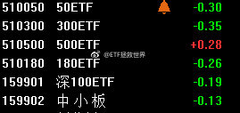

======================================================

ETF拯救世界 (5687069307) @
2017-04-28 10:43:51 Fri  
url: https://weibo.com/5687069307/F0BWPCvPZ

继续打预防针：

随着仓位逐渐加大，未来如果出现各种预料之中，预料之外的下跌，市值会减少。只要记住两件事。

你手里的东西，是指数。公司可能由好变坏，由坏退市，指数不会。中国最好的几百家公司都在你的手中，无论怎么跌，不用怕。

第二是，我们的投资方式，会把成本控制在非常低的水平。一定不 ​​​

转发[123]  评论[137]  赞[165] 

======================================================

ETF拯救世界 (5687069307) @
2017-04-28 11:37:19 Fri  
url: https://weibo.com/5687069307/F0Cix0eMW

$恒生指数 hkHSI$  居然默默的新高了。 ​​​

转发[1]  评论[35]  赞[49] 

======================================================

ETF拯救世界 (5687069307) @
2017-04-28 13:39:44 Fri  
url: https://weibo.com/5687069307/F0D6drNJ8

发布了头条文章：《500开车+500历史收益率更新》 http://t.cn/RXupeCs ​​​

转发[160]  评论[230]  赞[302] 

======================================================

ETF拯救世界 (5687069307) @
2017-04-28 15:07:19 Fri  
url: https://weibo.com/5687069307/F0DFLzqIN

回复@黄晨在新浪:2012年估值最低时候买入，到2015年估值最高的时候，年化收益率74%。注意，是年化。当然，这种收益率没人回从头吃到尾。只是一个理论上可以赚到的钱而已。//@黄晨在新浪:奇怪，没有人猜底部买入的部分在15年高点的年化收益率？我猜50%

------------------------------------------------------
转推：
>  @ETF拯救世界 (5687069307)
>  2017-04-28 13:39:44 Fri  
>  url: https:/weibo.com/5687069307/F0D6drNJ8/

>  发布了头条文章：《500开车+500历史收益率更新》 http://t.cn/RXupeCs ​​​

转发[25]  评论[37]  赞[48] 

======================================================

ETF拯救世界 (5687069307) @
2017-04-28 16:54:17 Fri  
url: https://weibo.com/5687069307/F0EnbtPG7

回复@rapuzal2016:建议你看看我2012年11月和2015年5月的文章。你会发现，并不是回头看，而是一直在向前看。[舔屏]//@rapuzal2016:回头看处处是黄金，底部顶部一目了然，往前呢？

------------------------------------------------------
转推：
>  @ETF拯救世界 (5687069307)
>  2017-04-28 13:39:44 Fri  
>  url: https:/weibo.com/5687069307/F0D6drNJ8/

>  发布了头条文章：《500开车+500历史收益率更新》 http://t.cn/RXupeCs ​​​

转发[14]  评论[46]  赞[56] 

======================================================

