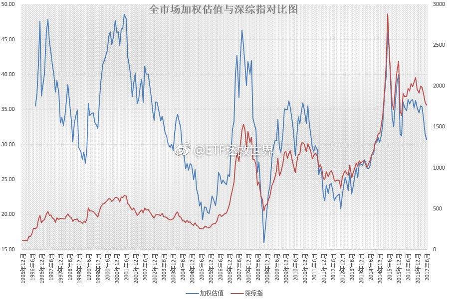
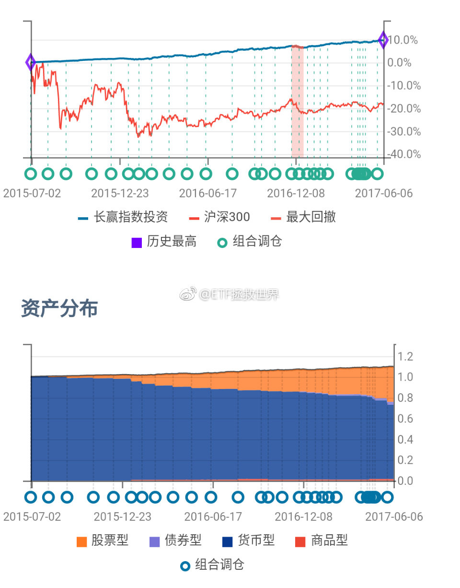
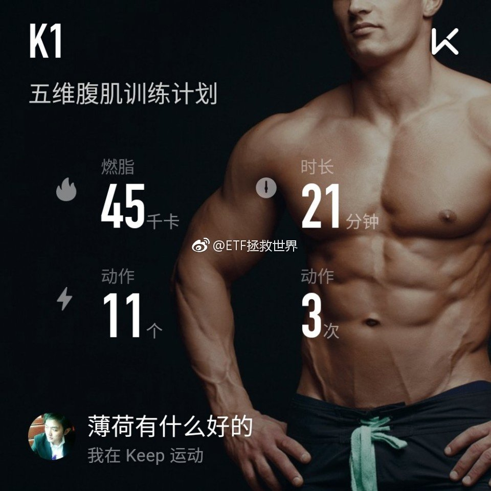
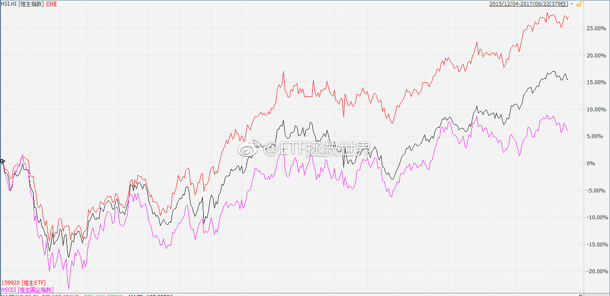
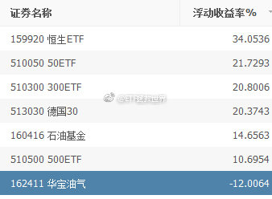
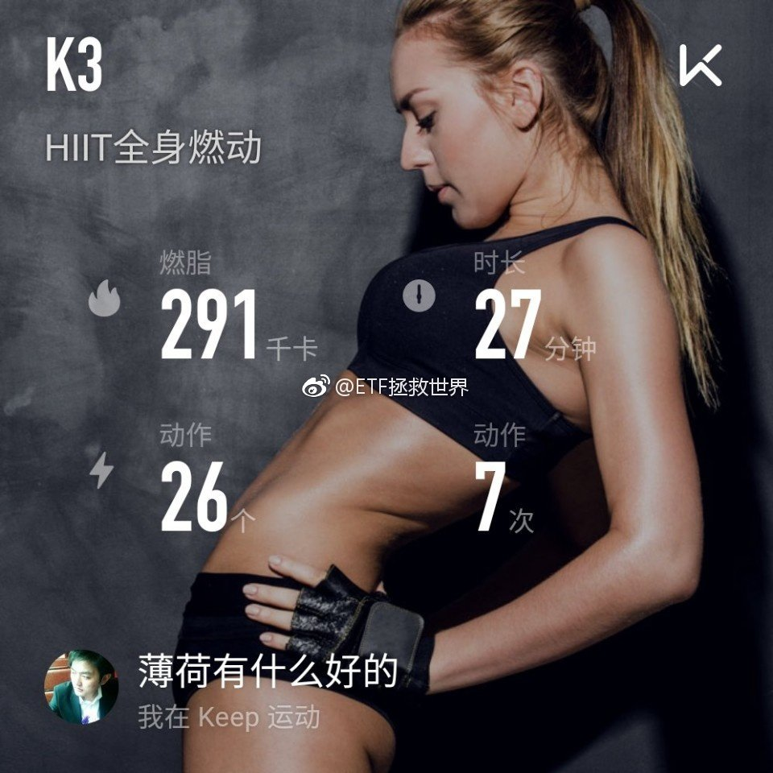
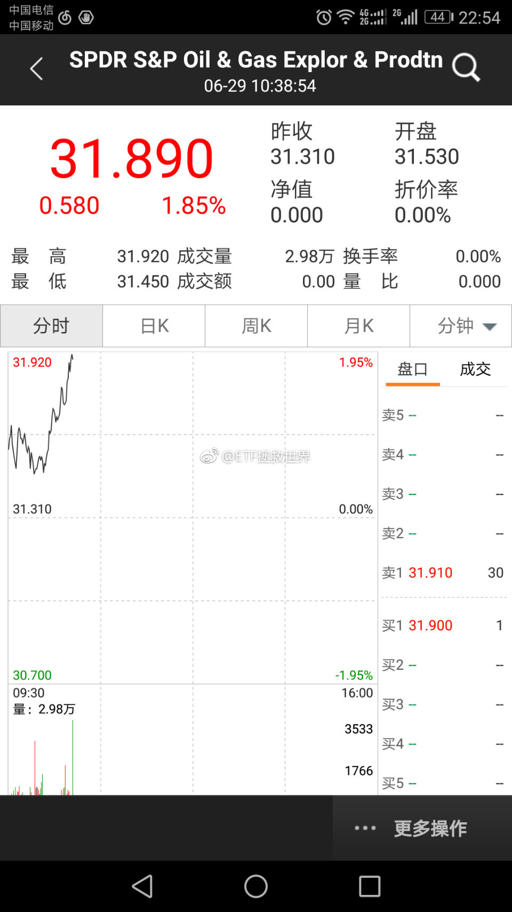

ETF拯救世界 (5687069307) @
2017-06-01 08:52:28 Thu  
url: https://weibo.com/5687069307/F5LKurHVD

今天不聊了。病了，发烧。

[生病] ​​​

转发[6]  评论[523]  赞[71] 

======================================================

ETF拯救世界 (5687069307) @
2017-06-01 16:20:01 Thu  
url: https://weibo.com/5687069307/F5OGa4lhs

-“兄弟，喝水不？”

-痛苦的摇摇头

-“吃水果不？”

-继续摇头

-“今天小股票暴跌了！”

-“哎……身体不舒服，高兴不起来”

-“呦，刚过去那小护士真漂亮啊”

-“扶，扶我起来看看！”

……

今天，正式进入建仓区域。漫漫征途，走完一半了。 ​​​

转发[11]  评论[179]  赞[179] 

======================================================

ETF拯救世界 (5687069307) @
2017-06-02 08:42:33 Fri  
url: https://weibo.com/5687069307/F5V6YdE1Y

人间奇迹！39°高烧一天痊愈！全靠各位的祝福加持！感恩！比心！ ​​​

转发[1]  评论[156]  赞[330] 

+++++++++++++++++++++++++++++++++++++++++++++++++++++

图片：

======================================================

ETF拯救世界 (5687069307) @
2017-06-02 09:04:42 Fri  
url: https://weibo.com/5687069307/F5VfXvgOl

昨天没有新高。哼！ [哼]

送各位一张外部数据加权估值图。从历史经验看，本月，最迟下月，可能有一次级别比较大的反弹。当然，反弹之后…… ​​​

转发[99]  评论[97]  赞[157] 

+++++++++++++++++++++++++++++++++++++++++++++++++++++

图片：

======================================================

ETF拯救世界 (5687069307) @
2017-06-02 10:39:37 Fri  
url: https://weibo.com/5687069307/F5VSuhGs5

这样每天一两个点的跌，恐怕等不到15号了 ​​​

转发[19]  评论[117]  赞[120] 

======================================================

ETF拯救世界 (5687069307) @
2017-06-02 12:57:03 Fri  
url: https://weibo.com/5687069307/F5WMhl8Hq

很难想象出台重大政策之前不进行必要的调研——尤其是在熔断之后。

------------------------------------------------------
转推：
>  @ ()
>  2017-06-02 12:53:37 Fri  
>  url: 

>  该账号因被投诉违反《微博社区公约》的相关规定，现已无法查看。查看帮助 https://kefu.weibo.com/faqdetail?id=13216

转发[8]  评论[46]  赞[61] 

======================================================

ETF拯救世界 (5687069307) @
2017-06-05 09:40:03 Mon  
url: https://weibo.com/5687069307/F6nLNufqf

资本市场是一套非常复杂的系统。不能简单的以线性思维去理解。

减少，甚至暂停IPO会否让A股转牛？也许有人会这么认为。但事实上，恐怕有很多人会因为无新可打而撕票，导致股票价格更加快速的下行。

A股市场的平衡是非常微妙的，是各种因素交织在一起产生的结果。任何一根稻草都有可能压垮这份平衡。 ​​​

转发[10]  评论[61]  赞[120] 

======================================================

ETF拯救世界 (5687069307) @
2017-06-05 10:33:18 Mon  
url: https://weibo.com/5687069307/F6o7pAEOE

今天组合中的50、红利、恒生等下跌。但是最近布局的500、养老等上涨。虽然权重还不够高，无法抵消大股票下跌带来的影响，但能减小跌幅。

这就是配置的作用。大类配置之内的小类配置。即使是A股内部，大股票、小股票的走势差别通常都会非常非常大。做好配置，可以保证组合波动性降低，同时取得更好的收 ​​​

转发[26]  评论[80]  赞[174] 

======================================================

ETF拯救世界 (5687069307) @
2017-06-05 15:44:27 Mon  
url: https://weibo.com/5687069307/F6q9I9qe5

聊聊你人生中最大的乐趣是什么吧。最好是个什么具体的事情，聊聊为什么这件事有意思。

如果最大的乐趣是特别隐私不能说的，就说说排名第二的……

有时候也会觉得人生还挺乏味的。 ​​​

转发[15]  评论[437]  赞[117] 

======================================================

ETF拯救世界 (5687069307) @
2017-06-06 06:33:04 Tue  
url: https://weibo.com/5687069307/F6vYoBl7l

23号买完债券以后，连涨7天了 [doge] ​​​

转发[16]  评论[77]  赞[144] 

+++++++++++++++++++++++++++++++++++++++++++++++++++++

图片：

======================================================

ETF拯救世界 (5687069307) @
2017-06-06 09:54:23 Tue  
url: https://weibo.com/5687069307/F6xi7qkCC

回复@Mr_L0ne:在我的投资体系中，没有割肉这个环节。所有投资必须赢利。为了实现这个目标，就要围绕它设计所有策略。另外，做所有投资之前，第一步一定是压力测试。测试最坏的情况下自己能否承受，无论是心理还是资金。所以每次计划中，紧跟着品种的一定是一个括号（最大下跌幅度xx%）。

------------------------------------------------------
转推：
>  @ETF拯救世界 (5687069307)
>  2017-06-06 06:33:04 Tue  
>  url: https:/weibo.com/5687069307/F6vYoBl7l/

>  23号买完债券以后，连涨7天了 [doge] ​​​

转发[10]  评论[31]  赞[69] 

======================================================

ETF拯救世界 (5687069307) @
2017-06-06 09:59:03 Tue  
url: https://weibo.com/5687069307/F6xk0rQu2

在本人的投资体系中，不会出现“我去，套了这么多该怎么办，割肉还是补仓？”“哎呦不错哦，赚了好多了，现在是该止盈还是加仓？”

永远不会。

点击买入按钮之前，所有可能出现的情况都已经沙盘推演过。针对各种未来，都已经有了相应的对策。某个可能真的发生了，按照预先设计的方案实施即可。

所以 ​​​

转发[30]  评论[60]  赞[154] 

======================================================

ETF拯救世界 (5687069307) @
2017-06-06 10:14:09 Tue  
url: https://weibo.com/5687069307/F6xq8rn0t

所以整个投资系统是一个世界观的问题了。也是一个非常宏大的体系。

首先是判断。根据各种数据各种信息用理性、经验、模型判断现在的世界是什么状态。

然后是交易体系。将判断的结果代入交易体系。包括各种交易策略、心理建设等等。

然后是实施。包括产品选择，包括资产配置模型的应用。

整个体系是 ​​​

转发[43]  评论[133]  赞[186] 

======================================================

ETF拯救世界 (5687069307) @
2017-06-06 17:55:00 Tue  
url: https://weibo.com/5687069307/F6ArcdGpn

槽点很多，A股市场的水深不见底啊。

------------------------------------------------------
转推：
>  @ ()
>  2017-06-06 17:37:43 Tue  
>  url: 

>  抱歉，由于作者设置，你暂时没有这条微博的查看权限哦。查看帮助：http://t.cn/RfdBWwP ​​​

转发[10]  评论[58]  赞[55] 

======================================================

ETF拯救世界 (5687069307) @
2017-06-07 06:47:51 Wed  
url: https://weibo.com/5687069307/F6FuTcNus

继续，不要停…… ​​​

转发[7]  评论[212]  赞[114] 

+++++++++++++++++++++++++++++++++++++++++++++++++++++

图片：

======================================================

ETF拯救世界 (5687069307) @
2017-06-07 09:30:21 Wed  
url: https://weibo.com/5687069307/F6GyRbnn6

历史的角度看，今天容易暴跌。看看这次灵不灵。 ​​​

转发[9]  评论[85]  赞[81] 

======================================================

ETF拯救世界 (5687069307) @
2017-06-07 10:08:28 Wed  
url: https://weibo.com/5687069307/F6GOkk44S

接下来的一年我希望……我回答了 @蔚蓝不是薇蓝 的问题，问题价值￥88.00，大家快来花1元围观~ http://t.cn/RSOZ0oC ​​​

转发[101]  评论[163]  赞[229] 

======================================================

ETF拯救世界 (5687069307) @
2017-06-07 10:14:14 Wed  
url: https://weibo.com/5687069307/F6GQFnd7v

既然这样的话，月中应该就不买了。回头再看看六月第一次买六份，感受一下……节奏。

------------------------------------------------------
转推：
>  @ETF拯救世界 (5687069307)
>  2017-06-02 10:39:37 Fri  
>  url: https:/weibo.com/5687069307/F5VSuhGs5/

>  这样每天一两个点的跌，恐怕等不到15号了 ​​​

转发[14]  评论[42]  赞[64] 

======================================================

ETF拯救世界 (5687069307) @
2017-06-07 10:27:18 Wed  
url: https://weibo.com/5687069307/F6GVYyLma

回复@恶人假mm:如果每次都能在底部买入，小反弹后立即新高。时间久了，会有一种自信。投资这件事，成功和失败都会成为一种习惯。习惯了成功，就大概率会不断成功。要保持舒服的状态。//@恶人假mm:仓位舒服了[笑而不语]

------------------------------------------------------
转推：
>  @ETF拯救世界 (5687069307)
>  2017-06-02 10:39:37 Fri  
>  url: https:/weibo.com/5687069307/F5VSuhGs5/

>  这样每天一两个点的跌，恐怕等不到15号了 ​​​

转发[6]  评论[13]  赞[48] 

======================================================

ETF拯救世界 (5687069307) @
2017-06-07 10:28:50 Wed  
url: https://weibo.com/5687069307/F6GWB0Qh6

回复@JUNSOO寻:套路很深。只看了开头的朋友再看一遍吧……//@JUNSOO寻:回复@ETF拯救世界:真的只看了开头，没有看到空白下面的“认真”回答[允悲]

------------------------------------------------------
转推：
>  @ETF拯救世界 (5687069307)
>  2017-06-07 10:08:28 Wed  
>  url: https:/weibo.com/5687069307/F6GOkk44S/

>  接下来的一年我希望……我回答了 @蔚蓝不是薇蓝 的问题，问题价值￥88.00，大家快来花1元围观~ http://t.cn/RSOZ0oC ​​​

转发[2]  评论[20]  赞[28] 

======================================================

ETF拯救世界 (5687069307) @
2017-06-07 10:54:50 Wed  
url: https://weibo.com/5687069307/F6H79sXe1

$510500 

$养老产业 sz399812$

$159938  

未来某一天你会在这些品种上赚多少，现在大多数人根本意识不到。 ​​​

转发[44]  评论[88]  赞[95] 

======================================================

ETF拯救世界 (5687069307) @
2017-06-07 11:31:09 Wed  
url: https://weibo.com/5687069307/F6HlTcRuv

回复@litterwitch:错在自己和错在他人，这不仅是思维方式的转变，更是未来会做得如何的关键。错在他人，就是自己没错，所以永远不会进步。错在自己和策略，就有查漏补缺的可能，未来只会越来越好。没有完美的世界，我们要思考的应该是怎么在这个不完美的世界做好自己该做的，赚到该赚的。

------------------------------------------------------
转推：
>  @ETF拯救世界 (5687069307)
>  2017-06-07 10:54:50 Wed  
>  url: https:/weibo.com/5687069307/F6H79sXe1/

>  $510500 
>  
>  $养老产业 sz399812$
>  
>  $159938  
>  
>  未来某一天你会在这些品种上赚多少，现在大多数人根本意识不到。 ​​​

转发[10]  评论[31]  赞[61] 

======================================================

ETF拯救世界 (5687069307) @
2017-06-07 13:13:44 Wed  
url: https://weibo.com/5687069307/F6I1xb20N

[污]  不知道是不是就是这波。  高度的话，指数幅度不知道，全市场估值可能有10%的空间

------------------------------------------------------
转推：
>  @ETF拯救世界 (5687069307)
>  2017-06-02 09:04:42 Fri  
>  url: https:/weibo.com/5687069307/F5VfXvgOl/

>  昨天没有新高。哼！ [哼]
>  
>  送各位一张外部数据加权估值图。从历史经验看，本月，最迟下月，可能有一次级别比较大的反弹。当然，反弹之后…… ​​​

转发[22]  评论[58]  赞[61] 

======================================================

ETF拯救世界 (5687069307) @
2017-06-07 13:38:37 Wed  
url: https://weibo.com/5687069307/F6IbD2DPk

今天500涨幅超过2%，50不到1%。印证了之前说的：小股票不是不行了，只是市场偏好现在不在小股票而已。5、6月我们开始加仓500，未来还会买创业。我坚信下一轮一定还是小股票涨得好，而且会比大股票涨得好很多。千万不要相信那些什么涨得好就吹什么的人……只有那些下跌的才是未来的金矿。

------------------------------------------------------
转推：
>  @ETF拯救世界 (5687069307)
>  2017-05-24 13:26:21 Wed  
>  url: https:/weibo.com/5687069307/F4A7HcWJd/

>  有人说，注册制了，以后中小股票不行了。只有大蓝筹，白马会涨了。
>  
>  以后看见谁这样YY，可以自动取关。
>  
>  美国是注册制，纽交所和纳斯达克股票加起来超过6000只。下图是大盘股为主的标普500和中小股票组成的罗素2000走势。黑罗素，红标普。
>  
>  长期看，依然是中小指数涨的好。
>  
>  各位，中小股票跌的时候就 ​​​

转发[26]  评论[101]  赞[123] 

======================================================

ETF拯救世界 (5687069307) @
2017-06-07 14:52:24 Wed  
url: https://weibo.com/5687069307/F6IFzyPT0

看完这个的感觉，没想指责那些路人和肇事司机。只是想了好几遍，如果是自己过这样的马路；如果自己是两辆车的司机；如果自己过路看到这样的事，该怎么办。

------------------------------------------------------
转推：
>  @袁启聪 (1548674942)
>  2017-06-07 11:07:45 Wed  
>  url: https:/weibo.com/1548674942/F6Hcof3sw/

>  这个视频，看得想哭，已经无力生气[泪][泪]  中国的公路生态，是炼狱[骷髅][骷髅] http://t.cn/RSOVk2q ​​​

转发[35]  评论[110]  赞[34] 

======================================================

ETF拯救世界 (5687069307) @
2017-06-07 15:31:43 Wed  
url: https://weibo.com/5687069307/F6IVxdZAT

今年魔咒正式破解了！

------------------------------------------------------
转推：
>  @ETF拯救世界 (5687069307)
>  2017-06-07 09:30:21 Wed  
>  url: https:/weibo.com/5687069307/F6GyRbnn6/

>  历史的角度看，今天容易暴跌。看看这次灵不灵。 ​​​

转发[5]  评论[119]  赞[71] 

======================================================

ETF拯救世界 (5687069307) @
2017-06-08 07:25:54 Thu  
url: https://weibo.com/5687069307/F6PaQ52Yo

就喜欢波动这么大的你[亲亲]

------------------------------------------------------
转推：
>  @ ()
>  2017-06-08 04:46:15 Thu  
>  url: 

>  抱歉，作者已设置仅展示半年内微博，此微博已不可见。 ​​​

转发[5]  评论[120]  赞[73] 

======================================================

ETF拯救世界 (5687069307) @
2017-06-08 09:48:21 Thu  
url: https://weibo.com/5687069307/F6Q6F0m4l

一个反弹，咱们的$养老产业 sz399812$基金净值已经创出一年半新高了。

也就是说，过去我们买入的所有动作都是盈利的。

祝各位赚钱快乐。 ​​​

转发[8]  评论[61]  赞[110] 

======================================================

ETF拯救世界 (5687069307) @
2017-06-08 10:00:36 Thu  
url: https://weibo.com/5687069307/F6QbD9HUg

从现在开始，我给自己立个规矩，也通知一下各位。

ETF计划这个组合：

第一，是我自己的投资组合，买卖的时候公开一下而已，不是给谁的投资建议，更不是要带谁投资。感兴趣的朋友可以参考，赚了你不用给我提成，赔了也别BB。

第二，我再说一次，这是个组合。一个组合的构建一定是有各种考虑。我能保 ​​​

转发[25]  评论[324]  赞[375] 

======================================================

ETF拯救世界 (5687069307) @
2017-06-08 10:50:14 Thu  
url: https://weibo.com/5687069307/F6QvMfNrT

$全指医药 sh000991$  

30年后大家买药的钱就靠它了。[doge]

目前有4%。希望配到8%-10%。 ​​​

转发[21]  评论[86]  赞[110] 

======================================================

ETF拯救世界 (5687069307) @
2017-06-08 11:04:00 Thu  
url: https://weibo.com/5687069307/F6QBmygRD

回复@天影198:不是抄错了。这个例子应该是：高考的时候抄旁边卷子考上985了，结果埋怨对方：你的英语怎么没考好？总分高有什么用，单科差了！

------------------------------------------------------
转推：
>  @ETF拯救世界 (5687069307)
>  2017-06-08 10:00:36 Thu  
>  url: https:/weibo.com/5687069307/F6QbD9HUg/

>  从现在开始，我给自己立个规矩，也通知一下各位。
>  
>  ETF计划这个组合：
>  
>  第一，是我自己的投资组合，买卖的时候公开一下而已，不是给谁的投资建议，更不是要带谁投资。感兴趣的朋友可以参考，赚了你不用给我提成，赔了也别BB。
>  
>  第二，我再说一次，这是个组合。一个组合的构建一定是有各种考虑。我能保 ​​​

转发[2]  评论[28]  赞[91] 

======================================================

ETF拯救世界 (5687069307) @
2017-06-08 11:14:34 Thu  
url: https://weibo.com/5687069307/F6QFEvMh8

投资要布局的，应该是以后的钻石黄金，而不是现在的。

比如2016年初的50和恒生，比如近期我们一直买买买的医药和养老。

有些行为可能看起来很奇怪，为什么要买一堆不涨的垃圾。涨得那么好的，所有人都说还要涨很多的好东西我们为什么不追？

对，不追。我们要做的是等别人追的时候卖给他们。 ​​​

转发[42]  评论[57]  赞[163] 

======================================================

ETF拯救世界 (5687069307) @
2017-06-08 11:22:29 Thu  
url: https://weibo.com/5687069307/F6QIREkmv

“指数涨得慢”是特别特别匪夷所思的一句话。

就不说300、500这样的宽基了，牛市至少有70%的人跟不上。就说今天医药，两市超过全指医药涨幅的股票只有694，占比23.65%。

绝大多数人哪里来的自信说指数涨幅跟不上自己选的股票的？少部分天才当然例外了~ ​​​

转发[14]  评论[55]  赞[131] 

======================================================

ETF拯救世界 (5687069307) @
2017-06-08 14:29:42 Thu  
url: https://weibo.com/5687069307/F6RWRit9f

今天股票上涨下跌家数是1:2

然而，组合又要新高了，好无聊。[哼]

昨天的养老基金之后，今天的红利也应该快买入后新高了。恒生因为汇率问题这几天差了点没有新高，没事。

当然，还在收集筹码阶段，涨不涨的无所谓。不过赚钱，帐户刷新高总是好事啊。 ​​​

转发[5]  评论[87]  赞[113] 

======================================================

ETF拯救世界 (5687069307) @
2017-06-08 14:57:07 Thu  
url: https://weibo.com/5687069307/F6S7Ze9xu

回复@栖凤林学园:其实你说的就是之前几轮计划熊转牛那几天的状态。这个情况怎么说呢，没有经历过的人很难懂。现在仓位低，无论是浮亏还是迅速开始盈利都不那么明显。某一天绝大多数人才会真的懂——你很难和一个**描述**的感觉……

------------------------------------------------------
转推：
>  @ETF拯救世界 (5687069307)
>  2017-06-08 14:29:42 Thu  
>  url: https:/weibo.com/5687069307/F6RWRit9f/

>  今天股票上涨下跌家数是1:2
>  
>  然而，组合又要新高了，好无聊。[哼]
>  
>  昨天的养老基金之后，今天的红利也应该快买入后新高了。恒生因为汇率问题这几天差了点没有新高，没事。
>  
>  当然，还在收集筹码阶段，涨不涨的无所谓。不过赚钱，帐户刷新高总是好事啊。 ​​​

转发[3]  评论[45]  赞[56] 

======================================================

ETF拯救世界 (5687069307) @
2017-06-08 15:55:39 Thu  
url: https://weibo.com/5687069307/F6SvKgoXZ

目前的情况就尴尬了。

一个是zjh大量IPO导致下跌的说法恐怕要坐实了：减少几家iPO居然大反弹！

二个是韩经济学家的资本市场野生国师地位恐怕要坐实了。另一个，头衔还要加上为民请命的大侠。将来发动群众的能力不容小觑。

未来更有趣了！ ​​​

转发[6]  评论[70]  赞[111] 

======================================================

ETF拯救世界 (5687069307) @
2017-06-09 09:42:18 Fri  
url: https://weibo.com/5687069307/F6ZuHFLcT

辛辛苦苦低价买的东西，不要因为上涨了一点就轻易卖掉。

——《旧约.长赢启示录第九章》 ​​​

转发[26]  评论[109]  赞[178] 

======================================================

ETF拯救世界 (5687069307) @
2017-06-09 09:49:18 Fri  
url: https://weibo.com/5687069307/F6Zxxs2JS

如果把计划的恒生+50+医药+养老+红利这几个权重最高的品种单列出来看，你肯定想不到今天有将近2000只股票是下跌的。。。 ​​​

转发[15]  评论[33]  赞[103] 

======================================================

ETF拯救世界 (5687069307) @
2017-06-09 09:58:33 Fri  
url: https://weibo.com/5687069307/F6ZBijMXn

50、红利、养老基金继续新高。 ​​​

转发[2]  评论[51]  赞[105] 

======================================================

ETF拯救世界 (5687069307) @
2017-06-09 10:07:48 Fri  
url: https://weibo.com/5687069307/F6ZF3tzCL

有一个也是比较大概率的经验，随便说说。

那就是如果某个品种创了52周新高，不要着急卖。大概率后面会发生让你很惊喜的事情。

当然了，大概率不代表必然发生。只是概率大一点而已。 ​​​

转发[35]  评论[92]  赞[129] 

======================================================

ETF拯救世界 (5687069307) @
2017-06-09 14:49:50 Fri  
url: https://weibo.com/5687069307/F71vxcseL

500也一言不合就起飞啊。都表现不错。反弹继续ing。

------------------------------------------------------
转推：
>  @ETF拯救世界 (5687069307)
>  2017-06-09 09:49:18 Fri  
>  url: https:/weibo.com/5687069307/F6Zxxs2JS/

>  如果把计划的恒生+50+医药+养老+红利这几个权重最高的品种单列出来看，你肯定想不到今天有将近2000只股票是下跌的。。。 ​​​

转发[8]  评论[19]  赞[72] 

======================================================

ETF拯救世界 (5687069307) @
2017-06-09 14:53:47 Fri  
url: https://weibo.com/5687069307/F71x8buZH

回复@北溟有鱼-1997:去年初咱们买了500，飞了一年，还不是跌回来继续让咱们买？该是你的就是你的，跑不了。不是你的，着急也没用。//@北溟有鱼-1997:真不愿意500飞，再等点吧。E大路子接受，就是想跌//@ETF拯救世界:500也一言不合就起飞啊。都表现不错。反弹继续ing。

------------------------------------------------------
转推：
>  @ETF拯救世界 (5687069307)
>  2017-06-09 09:49:18 Fri  
>  url: https:/weibo.com/5687069307/F6Zxxs2JS/

>  如果把计划的恒生+50+医药+养老+红利这几个权重最高的品种单列出来看，你肯定想不到今天有将近2000只股票是下跌的。。。 ​​​

转发[5]  评论[41]  赞[62] 

======================================================

ETF拯救世界 (5687069307) @
2017-06-12 09:56:29 Mon  
url: https://weibo.com/5687069307/F7rRWxY6B

发布了头条文章：《今天各大成分股调整样本股，对我们影响较大的有》 http://t.cn/RSueXR6 ​​​

转发[31]  评论[53]  赞[141] 

======================================================

ETF拯救世界 (5687069307) @
2017-06-12 10:06:55 Mon  
url: https://weibo.com/5687069307/F7rWbglRV

回复@LSWIYY:归属消费电子、休闲用品、酒店旅游、教育、文化传媒、药品零售、乳品、家庭用品、医药卫生、人寿保险、互联网软件等行业的股票纳入养老产业。//@LSWIYY:我好像看到了一些意想不到的公司…好奇原来这些公司划分到养老指数的依据是什么……

------------------------------------------------------
转推：
>  @ETF拯救世界 (5687069307)
>  2017-06-12 09:56:29 Mon  
>  url: https:/weibo.com/5687069307/F7rRWxY6B/

>  发布了头条文章：《今天各大成分股调整样本股，对我们影响较大的有》 http://t.cn/RSueXR6 ​​​

转发[8]  评论[9]  赞[45] 

======================================================

ETF拯救世界 (5687069307) @
2017-06-12 10:11:12 Mon  
url: https://weibo.com/5687069307/F7rXV9Lzb

这一网等的时间那是相当长了…… ​​​

转发[17]  评论[69]  赞[114] 

+++++++++++++++++++++++++++++++++++++++++++++++++++++

图片：

======================================================

ETF拯救世界 (5687069307) @
2017-06-12 11:19:25 Mon  
url: https://weibo.com/5687069307/F7spBCWTJ

醉了，敢情拉上去就是让我的网格最高点卖出呢……

------------------------------------------------------
转推：
>  @ETF拯救世界 (5687069307)
>  2017-06-12 10:11:12 Mon  
>  url: https:/weibo.com/5687069307/F7rXV9Lzb/

>  这一网等的时间那是相当长了…… ​​​

转发[7]  评论[48]  赞[77] 

======================================================

ETF拯救世界 (5687069307) @
2017-06-13 07:57:12 Tue  
url: https://weibo.com/5687069307/F7Aw1xepH

回复@许小敏2013:很正常。我买的所有品种都要赚钱。这是最基本的要求。//@许小敏2013:债券盈利了🙏//@ETF拯救世界:醉了，敢情拉上去就是让我的网格最高点卖出呢……

------------------------------------------------------
转推：
>  @ETF拯救世界 (5687069307)
>  2017-06-12 10:11:12 Mon  
>  url: https:/weibo.com/5687069307/F7rXV9Lzb/

>  这一网等的时间那是相当长了…… ​​​

转发[2]  评论[24]  赞[61] 

======================================================

ETF拯救世界 (5687069307) @
2017-06-13 08:49:39 Tue  
url: https://weibo.com/5687069307/F7ARjvsGQ

计划目前买过15个品种，两只浮亏。一个4%的建信500，一个7%的华宝油气。这两个品种仓位非常低，加起来只有1.2%。

目前基本上布局已经比较完整了。大、中市值的A股，好的行业，港股，德国，债券，原油都有所布局。当然仓位还没有配置完毕。

其实在金融市场想要亏损，是挺难的一件事。是吧。 ​​​

转发[24]  评论[179]  赞[167] 

+++++++++++++++++++++++++++++++++++++++++++++++++++++

图片：

======================================================

ETF拯救世界 (5687069307) @
2017-06-13 13:40:02 Tue  
url: https://weibo.com/5687069307/F7CLbjaNy

有朋友经常说，嗯，投资方式不错，只是不适合本金少的。

听起来好像是本金少就容易赚快钱、大钱一样。

其实就我的感受，越有钱的人，金融投资的时候越不“着急”。而越不着急的人，通常赚大钱的概率反而更大。比如浮亏了不着急在底部止损，比如浮盈了不着急在上升过程中落袋为安。

那么本金少怎么办 ​​​

转发[50]  评论[126]  赞[186] 

======================================================

ETF拯救世界 (5687069307) @
2017-06-13 14:13:34 Tue  
url: https://weibo.com/5687069307/F7CYNbHPl

中证500ETF第一次买入是2016年2月29日。第二次是2017年5月23日。

感受一下…… ​​​

转发[10]  评论[103]  赞[148] 

======================================================

ETF拯救世界 (5687069307) @
2017-06-14 09:16:55 Wed  
url: https://weibo.com/5687069307/F7KsSt3W2

后台有11个没有回答的付费提问。其中4个与房地产有关。

说明什么。 ​​​

转发[3]  评论[110]  赞[69] 

======================================================

ETF拯救世界 (5687069307) @
2017-06-14 10:44:29 Wed  
url: https://weibo.com/5687069307/F7L2qgIDy

在证券市场投资，我个人认为，要有个经常性的逆向反思。这是我自己提出的一个概念，名字也没想好，就先这么叫。

也就是说，你观察历史就知道，没人能够长期的辉煌，在资本市场。比如说在牛市NB的，熊市中就会特别惨。熊市中特别稳的，牛市中很难赚很多。

这就是所谓的盈亏同源。

因为成功会带来惯性 ​​​

转发[87]  评论[126]  赞[209] 

+++++++++++++++++++++++++++++++++++++++++++++++++++++

图片：

======================================================

ETF拯救世界 (5687069307) @
2017-06-14 13:49:36 Wed  
url: https://weibo.com/5687069307/F7Mfz0bxr

15号将至，又挖坑。好烦。

就烦这种不知道是送钱还是送命的坑。 ​​​

转发[4]  评论[106]  赞[119] 

======================================================

ETF拯救世界 (5687069307) @
2017-06-14 17:46:31 Wed  
url: https://weibo.com/5687069307/F7NNJ8vc6

今天下午看到且慢上了一个新功能，叫做计划的“补仓提醒”。

简单来说，这个功能解决了很多参考计划朋友的一个痛点，就是看到计划的时间比较晚，之前的到底该不该补，什么时候补，多少钱补，完全不知道。如果盲目追高，那就完全背离了我们的投资理念。

然后很多朋友来问我，我是真的没有精力去计算之 ​​​

转发[33]  评论[134]  赞[139] 

======================================================

ETF拯救世界 (5687069307) @
2017-06-15 10:02:08 Thu  
url: https://weibo.com/5687069307/F7UbJfcsU

今天一个人看着我的身份证说，怎么岁月在你脸上没有留下痕迹啊。

如果不是因为对方是男的，我就误会了。 ​​​

转发[2]  评论[107]  赞[116] 

======================================================

ETF拯救世界 (5687069307) @
2017-06-15 10:26:29 Thu  
url: https://weibo.com/5687069307/F7UlCpOYE

小确幸……

------------------------------------------------------
转推：
>  @ETF拯救世界 (5687069307)
>  2017-06-12 10:11:12 Mon  
>  url: https:/weibo.com/5687069307/F7rXV9Lzb/

>  这一网等的时间那是相当长了…… ​​​

转发[1]  评论[28]  赞[54] 

======================================================

ETF拯救世界 (5687069307) @
2017-06-15 11:06:57 Thu  
url: https://weibo.com/5687069307/F7UC2oLmB

利率是影响资产价格最重要的因素之一。 ​​​

转发[11]  评论[36]  赞[80] 

======================================================

ETF拯救世界 (5687069307) @
2017-06-15 11:16:52 Thu  
url: https://weibo.com/5687069307/F7UG438HH

今天创业板（+1.8%），50（-0.6%）。大也好，小也好，我坚信没有不好的品种，只有不好的价格。“小股票不行了”就是扯淡。就像2013、2014年小股票走牛一年半后大股票纹丝不动一样，那时候的大股票也不是不行了，只是在等时机而已。

------------------------------------------------------
转推：
>  @ETF拯救世界 (5687069307)
>  2017-05-24 13:26:21 Wed  
>  url: https:/weibo.com/5687069307/F4A7HcWJd/

>  有人说，注册制了，以后中小股票不行了。只有大蓝筹，白马会涨了。
>  
>  以后看见谁这样YY，可以自动取关。
>  
>  美国是注册制，纽交所和纳斯达克股票加起来超过6000只。下图是大盘股为主的标普500和中小股票组成的罗素2000走势。黑罗素，红标普。
>  
>  长期看，依然是中小指数涨的好。
>  
>  各位，中小股票跌的时候就 ​​​

转发[11]  评论[26]  赞[64] 

======================================================

ETF拯救世界 (5687069307) @
2017-06-15 11:23:19 Thu  
url: https://weibo.com/5687069307/F7UIGjAqS

其实行业值得关注的就那么几大类：

消费（必要、可选）、医药、能源、信息、金融。

面对不同的经济周期，可以在不同的行业上进行重点切换。

包括大盘股、小盘股，在不同周期也有不同的表现。

不要在品种上涨的时候吹得天花乱坠，也不要在什么品种跌的很多的时候再踩上几脚。

锦上添花易，雪中送炭 ​​​

转发[131]  评论[73]  赞[150] 

======================================================

ETF拯救世界 (5687069307) @
2017-06-15 11:35:23 Thu  
url: https://weibo.com/5687069307/F7UNA1Jja

日本大学生毕业只有1800美元？我印象中东京人均年收入是30万啊。比较诡异的是，人均30万收入的东京，房价好像和北京差不多。日本卖房还是按照使用面积卖的。

------------------------------------------------------
转推：
>  @蓝鲸TMT网 (3866012793)
>  2017-06-15 11:32:03 Thu  
>  url: https:/weibo.com/3866012793/F7UMduojS/

>  【美大学毕业月薪买6部iPhone7 中国一部买不起】6月15日讯，中国大学毕业生平均月工资不到4000元，不够买一部最便宜的iPhone7。相比之下，美大学毕业生月薪3950美元左右，可买6部32G版iPhone7，后者在美售价649美元。日本大学毕业生平均月薪1800美元，按美元计算是中国的3倍以上。(新浪财经) ​​​​

转发[8]  评论[41]  赞[39] 

======================================================

ETF拯救世界 (5687069307) @
2017-06-15 11:51:10 Thu  
url: https://weibo.com/5687069307/F7UTZrN1v

回复@悠哉主人76:这些我都清楚啊。北京过去十年的土地供应量就在我电脑的excel里。至于说全国人民的北京，据我所知东京也是日本极少的人口持续流入的城市。我只是说一个事实，没有表明自己的任何看法。房地产的事情，我不说，不代表很多东西我不知道。至于合理不合理，还是交给时间吧。我们都还不够老

------------------------------------------------------
转推：
>  @蓝鲸TMT网 (3866012793)
>  2017-06-15 11:32:03 Thu  
>  url: https:/weibo.com/3866012793/F7UMduojS/

>  【美大学毕业月薪买6部iPhone7 中国一部买不起】6月15日讯，中国大学毕业生平均月工资不到4000元，不够买一部最便宜的iPhone7。相比之下，美大学毕业生月薪3950美元左右，可买6部32G版iPhone7，后者在美售价649美元。日本大学毕业生平均月薪1800美元，按美元计算是中国的3倍以上。(新浪财经) ​​​​

转发[3]  评论[45]  赞[59] 

======================================================

ETF拯救世界 (5687069307) @
2017-06-15 20:40:29 Thu  
url: https://weibo.com/5687069307/F7YmPCBRI

每日打卡 ​​​

转发[1]  评论[72]  赞[141] 

+++++++++++++++++++++++++++++++++++++++++++++++++++++

图片：

======================================================

ETF拯救世界 (5687069307) @
2017-06-16 09:29:42 Fri  
url: https://weibo.com/5687069307/F83p3EqVY

哈哈哈哈哈，看今天的新闻了吗。深交所说四月底开始大资金开始买小股票了。最近小股票开始涨，这种新闻就多了。涨之前干嘛去了。大多数人永远是被舆论引导着接盘的。

------------------------------------------------------
转推：
>  @ETF拯救世界 (5687069307)
>  2017-05-24 13:26:21 Wed  
>  url: https:/weibo.com/5687069307/F4A7HcWJd/

>  有人说，注册制了，以后中小股票不行了。只有大蓝筹，白马会涨了。
>  
>  以后看见谁这样YY，可以自动取关。
>  
>  美国是注册制，纽交所和纳斯达克股票加起来超过6000只。下图是大盘股为主的标普500和中小股票组成的罗素2000走势。黑罗素，红标普。
>  
>  长期看，依然是中小指数涨的好。
>  
>  各位，中小股票跌的时候就 ​​​

转发[11]  评论[97]  赞[103] 

======================================================

ETF拯救世界 (5687069307) @
2017-06-16 21:30:15 Fri  
url: https://weibo.com/5687069307/F887x5ybi

每日打卡 (2)

这图不是我！[doge]

今天一边看黄磊的深夜食堂一边完成的。作为一个看了几季日版深夜食堂的观众，怎么港，黄磊这版翻拍得确实很一般。 ​​​

转发[1]  评论[54]  赞[77] 

+++++++++++++++++++++++++++++++++++++++++++++++++++++

图片：

======================================================

ETF拯救世界 (5687069307) @
2017-06-17 21:49:41 Sat  
url: https://weibo.com/5687069307/F8hFV2VhS

每日打卡(3)

今天练有氧。试了试keep的跑步训练课程，快慢交替，所以整体速度很慢。

能不能坚持打卡一年？ ​​​

转发[0]  评论[49]  赞[92] 

+++++++++++++++++++++++++++++++++++++++++++++++++++++

图片：

======================================================

ETF拯救世界 (5687069307) @
2017-06-18 17:58:33 Sun  
url: https://weibo.com/5687069307/F8pABmmN6

每日打卡(4)

这个运动量太大了 ​​​

转发[0]  评论[36]  赞[90] 

+++++++++++++++++++++++++++++++++++++++++++++++++++++

图片：

======================================================

ETF拯救世界 (5687069307) @
2017-06-19 09:51:51 Mon  
url: https://weibo.com/5687069307/F8vPxvaOY

0602最低点那天发的微博，从那天起反弹到今天半个多月了。一切都在按照剧本走。高度的话，是估值升十几个点，长度呢？按照之前的概率，应该不会在6月结束的。结束在七月或者八月吧。这不是预测，是通过观察历史得出的一点猜测而已。

------------------------------------------------------
转推：
>  @ETF拯救世界 (5687069307)
>  2017-06-02 09:04:42 Fri  
>  url: https:/weibo.com/5687069307/F5VfXvgOl/

>  昨天没有新高。哼！ [哼]
>  
>  送各位一张外部数据加权估值图。从历史经验看，本月，最迟下月，可能有一次级别比较大的反弹。当然，反弹之后…… ​​​

转发[12]  评论[42]  赞[107] 

======================================================

ETF拯救世界 (5687069307) @
2017-06-19 11:46:10 Mon  
url: https://weibo.com/5687069307/F8wzWqgLD

500才是坠吼的，以后你们就知道了！ ​​​

转发[11]  评论[81]  赞[104] 

======================================================

ETF拯救世界 (5687069307) @
2017-06-19 13:18:51 Mon  
url: https://weibo.com/5687069307/F8xbz4oXY

根据历史，做一些中短期的猜测，并不是为了指导投资。

而是对未来可能出现的情况做个预判，有个准备。

有些事情真的发生了，就不会惊慌失措。

当然，真的用来指导投资，也不是不行。不过更要根据概率来下注。中短期的概率，可就并不那么一定很准确了。 ​​​

转发[5]  评论[28]  赞[95] 

======================================================

ETF拯救世界 (5687069307) @
2017-06-19 14:53:35 Mon  
url: https://weibo.com/5687069307/F8xO1noSc

今天能不能新高是个谜，拭目以待吧。 ​​​

转发[9]  评论[50]  赞[94] 

======================================================

ETF拯救世界 (5687069307) @
2017-06-19 16:02:14 Mon  
url: https://weibo.com/5687069307/F8yfT7Mdk

回复@独自消遣的圆稻糕:过气了！怎么办，是不是要搞点大新闻出来了。//@独自消遣的圆稻糕:E大微博最近的评论数量好少，以前都七八十，现在才二三十

------------------------------------------------------
转推：
>  @ETF拯救世界 (5687069307)
>  2017-06-19 14:53:35 Mon  
>  url: https:/weibo.com/5687069307/F8xO1noSc/

>  今天能不能新高是个谜，拭目以待吧。 ​​​

转发[7]  评论[171]  赞[119] 

======================================================

ETF拯救世界 (5687069307) @
2017-06-19 20:31:05 Mon  
url: https://weibo.com/5687069307/F8A10nfDN

每日打卡(5)

继续练胸。

看到评论里不少朋友也开始锻炼了，很好。看看咱们谁坚持的时间长。

[haha] ​​​

转发[1]  评论[65]  赞[116] 

+++++++++++++++++++++++++++++++++++++++++++++++++++++

图片：

======================================================

ETF拯救世界 (5687069307) @
2017-06-20 09:28:38 Tue  
url: https://weibo.com/5687069307/F8F6CaN0m

回复@zoey__小白:“还没红就过气”，扎心了。 http://t.cn/Rob6UNn //@zoey__小白:在E大的调教下大家可能都更淡定了吧 但是为了拯救还没红就过气的E大必须要冒泡 http://t.cn/RoUEzcP //@ETF拯救世界:回复@独自消遣的圆稻糕:过气了！怎么办，是不是要搞点大新闻出来了。

------------------------------------------------------
转推：
>  @ETF拯救世界 (5687069307)
>  2017-06-19 14:53:35 Mon  
>  url: https:/weibo.com/5687069307/F8xO1noSc/

>  今天能不能新高是个谜，拭目以待吧。 ​​​

转发[2]  评论[33]  赞[57] 

======================================================

ETF拯救世界 (5687069307) @
2017-06-20 09:31:22 Tue  
url: https://weibo.com/5687069307/F8F7J2Dd4

$159920  新高。 ​​​

转发[25]  评论[25]  赞[58] 

======================================================

ETF拯救世界 (5687069307) @
2017-06-20 09:36:21 Tue  
url: https://weibo.com/5687069307/F8F9KBvOS

呵呵。

------------------------------------------------------
转推：
>  @ETF拯救世界 (5687069307)
>  2017-06-19 11:46:10 Mon  
>  url: https:/weibo.com/5687069307/F8wzWqgLD/

>  500才是坠吼的，以后你们就知道了！ ​​​

转发[0]  评论[18]  赞[58] 

======================================================

ETF拯救世界 (5687069307) @
2017-06-20 09:54:36 Tue  
url: https://weibo.com/5687069307/F8Fh9ut9s

回复@老猪穿裤衩:关于杠杆，我提个思路。随着价格的下跌，估值的下降，指数基金仓位应该越来越高。继续下降，则可以加杠杆。比如H ETF换成HB，比如融资买入。指数反弹后，估值上升，则将杠杆卸掉。比如HB换HETF，比如卖掉融资品种。当然，具体操作起来是高难度动作，一两句说不清。

------------------------------------------------------
转推：
>  @ETF拯救世界 (5687069307)
>  2017-06-20 09:31:22 Tue  
>  url: https:/weibo.com/5687069307/F8F7J2Dd4/

>  $159920  新高。 ​​​

转发[22]  评论[45]  赞[78] 

======================================================

ETF拯救世界 (5687069307) @
2017-06-20 10:30:48 Tue  
url: https://weibo.com/5687069307/F8FvQvuu3

谁能想到，日经225年度收盘价20年新高了。我大概估了一下，如果按照估值避开90年代泡沫投资该指数，到今天能赚不少。

无数的例子都证明了一件事： ​​​

转发[9]  评论[164]  赞[112] 

======================================================

ETF拯救世界 (5687069307) @
2017-06-20 21:18:52 Tue  
url: https://weibo.com/5687069307/F8JKTybqG

每日打卡(6)

今天腹肌。感觉量有点小，一会再加一组别的。

加油各位。 ​​​

转发[0]  评论[16]  赞[55] 

+++++++++++++++++++++++++++++++++++++++++++++++++++++

图片：

======================================================

ETF拯救世界 (5687069307) @
2017-06-20 21:46:53 Tue  
url: https://weibo.com/5687069307/F8JWgzXlR

每日打卡(6)2

说到做到。

没有新高的日子必须加练啊。 ​​​

转发[0]  评论[21]  赞[66] 

+++++++++++++++++++++++++++++++++++++++++++++++++++++

图片：

======================================================

ETF拯救世界 (5687069307) @
2017-06-20 23:05:29 Tue  
url: https://weibo.com/5687069307/F8KsajTmX

现在应该高兴还是害怕？

问问自己。

如果高兴，再问问自己，有没有做好最坏的准备。 ​​​

转发[21]  评论[143]  赞[84] 

+++++++++++++++++++++++++++++++++++++++++++++++++++++

图片：

======================================================

ETF拯救世界 (5687069307) @
2017-06-21 09:04:56 Wed  
url: https://weibo.com/5687069307/F8OnuoBkg

割韭菜的镰刀又多了一把。你猜猜对谁来说是利好？[微笑]

------------------------------------------------------
转推：
>  @ ()
>  2017-06-21 08:30:15 Wed  
>  url: 

>  抱歉，作者已设置仅展示半年内微博，此微博已不可见。 ​​​

转发[3]  评论[37]  赞[50] 

======================================================

ETF拯救世界 (5687069307) @
2017-06-21 09:07:08 Wed  
url: https://weibo.com/5687069307/F8OonCLKV

“未来可能会将大约450只大盘股和中盘股股票纳入MSCI指数”。中证500是坠吼的，还记不记得？//@蓝鲸财经记者工作平台:【鲸滚动】6月21日讯，MSCI明晟表示，未来可能会将大约450只大盘股和中盘股股票纳入MSCI指数。

------------------------------------------------------
转推：
>  @蓝鲸财经记者工作平台 (1885454921)
>  2017-06-21 08:42:59 Wed  
>  url: https:/weibo.com/1885454921/F8OeAs3Nx/

>  鲸播报：这222只A股成功纳入MSCI，百亿美元驰援。(澎湃) ​​​

转发[21]  评论[32]  赞[44] 

======================================================

ETF拯救世界 (5687069307) @
2017-06-21 09:18:00 Wed  
url: https://weibo.com/5687069307/F8OsNk69P

你知不知道什么时候持仓的品种下跌你会毫无感觉？

是你已经知道它有多少概率下跌，然后一直等着它的发生。

下跌怎么会是风险呢。没有下跌，超额利润无从谈起。

当然，最关键的，是你点击买入的时候，想得更多的是未来有多好，还是未来会有多坏。 ​​​

转发[25]  评论[62]  赞[75] 

+++++++++++++++++++++++++++++++++++++++++++++++++++++

图片：

======================================================

ETF拯救世界 (5687069307) @
2017-06-21 09:48:36 Wed  
url: https://weibo.com/5687069307/F8OFdkR1G

回复@furiming:溢价一个多点你套利要亏死的。//@furiming:回复@kettle798:去场外申购，场内卖出套利

------------------------------------------------------
转推：
>  @ETF拯救世界 (5687069307)
>  2017-06-20 23:05:29 Tue  
>  url: https:/weibo.com/5687069307/F8KsajTmX/

>  现在应该高兴还是害怕？
>  
>  问问自己。
>  
>  如果高兴，再问问自己，有没有做好最坏的准备。 ​​​

转发[10]  评论[23]  赞[21] 

======================================================

ETF拯救世界 (5687069307) @
2017-06-21 10:26:31 Wed  
url: https://weibo.com/5687069307/F8OUBw2m3

上次咱们买了国开债指数后，18个交易日涨了15个交易日。

买的那天是最低点。 [微笑] ​​​

转发[6]  评论[59]  赞[131] 

======================================================

ETF拯救世界 (5687069307) @
2017-06-21 10:57:47 Wed  
url: https://weibo.com/5687069307/F8P7ipqyl

回复@跟风借势:这个确实判断不了。油价2012年见顶120美元，现在跌了5年跌到40出头。再跌5年也有可能，因为大类资产的涨跌周期都很长。但是没有牛市不代表没有机会。短期走势是没法预测，没有坏的品种，只有坏的价格和策略。

------------------------------------------------------
转推：
>  @ETF拯救世界 (5687069307)
>  2017-06-21 09:18:00 Wed  
>  url: https:/weibo.com/5687069307/F8OsNk69P/

>  你知不知道什么时候持仓的品种下跌你会毫无感觉？
>  
>  是你已经知道它有多少概率下跌，然后一直等着它的发生。
>  
>  下跌怎么会是风险呢。没有下跌，超额利润无从谈起。
>  
>  当然，最关键的，是你点击买入的时候，想得更多的是未来有多好，还是未来会有多坏。 ​​​

转发[12]  评论[23]  赞[48] 

======================================================

ETF拯救世界 (5687069307) @
2017-06-21 11:08:31 Wed  
url: https://weibo.com/5687069307/F8PbF6gaW

回复@徐L鑫:溢价不代表韭菜多。很多时候你没有发现吗，虽然溢价3.x%，但你如果真的敢去套利，晚上很可能一个大涨就把你埋进去了。不要小看市场，市场作为一个整体，要比绝大多数个人要聪明。要敬畏市场。市场先生虽然会疯狂，但大多数时间，它比你我都聪明。所以老巴说了13次：买指数基金。

------------------------------------------------------
转推：
>  @ETF拯救世界 (5687069307)
>  2017-06-20 23:05:29 Tue  
>  url: https:/weibo.com/5687069307/F8KsajTmX/

>  现在应该高兴还是害怕？
>  
>  问问自己。
>  
>  如果高兴，再问问自己，有没有做好最坏的准备。 ​​​

转发[6]  评论[41]  赞[64] 

======================================================

ETF拯救世界 (5687069307) @
2017-06-21 14:59:30 Wed  
url: https://weibo.com/5687069307/F8QHpm5Rc

医药反弹新高。除了恒生有点掉链子，都挺好。 ​​​

转发[1]  评论[19]  赞[77] 

======================================================

ETF拯救世界 (5687069307) @
2017-06-21 15:12:06 Wed  
url: https://weibo.com/5687069307/F8QMwqIPU

非常非常有意思。从6月2日起，我就从历史估值数据的角度跟大家探讨，这里恐怕会有一次反弹。指数涨幅不知道，估值涨幅在10%左右。当时等权估值39.x，我判断到43-44是历史大概率。时间的话，一两个月的长度应该是有的。

这一切都来源于历史数据。

即使这些观点重复了好几次，看起来不少朋友面对真正到 ​​​

转发[51]  评论[116]  赞[160] 

======================================================

ETF拯救世界 (5687069307) @
2017-06-21 18:08:32 Wed  
url: https://weibo.com/5687069307/F8RW8vSPx

今天晚上出去跑步会不会被冲走

😱 ​​​

转发[0]  评论[62]  赞[56] 

======================================================

ETF拯救世界 (5687069307) @
2017-06-21 22:56:07 Wed  
url: https://weibo.com/5687069307/F8TORDKp6

每日打卡(7)

传说中会有大雨的日子，怂在家里hiit了。

最难的一个训练项目。

坚持。

自由的身体，自由的精神，自由的财富。缺一不可。

身体，是最重要的。 ​​​

转发[5]  评论[40]  赞[93] 

+++++++++++++++++++++++++++++++++++++++++++++++++++++

图片：

======================================================

ETF拯救世界 (5687069307) @
2017-06-22 09:59:53 Thu  
url: https://weibo.com/5687069307/F8YaibXtk

近2000只股票下跌，好几只大指数52周新高了

“指数涨得慢” ​​​

转发[4]  评论[57]  赞[89] 

======================================================

ETF拯救世界 (5687069307) @
2017-06-22 10:13:43 Thu  
url: https://weibo.com/5687069307/F8YfUhjKC

计划开始建仓后，恒生指数（黑色）与恒生ETF（159920）和H股指数（紫色）的对比走势。

如果是2016年初开始参考计划的朋友，买入的159920收益率已经有45%-50%了。最差的也应该有35%以上了。 ​​​

转发[9]  评论[98]  赞[94] 

+++++++++++++++++++++++++++++++++++++++++++++++++++++

图片：

======================================================

ETF拯救世界 (5687069307) @
2017-06-22 10:46:23 Thu  
url: https://weibo.com/5687069307/F8YtajBPi

说起恒生的这个收益率，不是为了别的，主要是需要回头反思。无论一项投资成与败，都需要回头反思，这一步非常重要。

反思的第一点就是，分批投入的时候，第一笔买入价格并非特别严格一定要严重低估。我们的恒生第一笔事后看并不特别便宜，股灾3.0的时候第一笔买入浮亏可能超过10%。但这个你回头看重要 ​​​

转发[111]  评论[106]  赞[189] 

======================================================

ETF拯救世界 (5687069307) @
2017-06-22 10:53:13 Thu  
url: https://weibo.com/5687069307/F8YvWkat5

看不见这条？

------------------------------------------------------
转推：
>  @ETF拯救世界 (5687069307)
>  2017-06-22 10:46:23 Thu  
>  url: https:/weibo.com/5687069307/F8YtajBPi/

>  说起恒生的这个收益率，不是为了别的，主要是需要回头反思。无论一项投资成与败，都需要回头反思，这一步非常重要。
>  
>  反思的第一点就是，分批投入的时候，第一笔买入价格并非特别严格一定要严重低估。我们的恒生第一笔事后看并不特别便宜，股灾3.0的时候第一笔买入浮亏可能超过10%。但这个你回头看重要 ​​​

转发[7]  评论[30]  赞[54] 

======================================================

ETF拯救世界 (5687069307) @
2017-06-22 10:55:55 Thu  
url: https://weibo.com/5687069307/F8Yx2e2Dn

呵呵，你们看不到这条吗。哪个关键词被碰到了。 ​​​

转发[26]  评论[132]  赞[124] 

+++++++++++++++++++++++++++++++++++++++++++++++++++++

图片：

======================================================

ETF拯救世界 (5687069307) @
2017-06-22 13:56:34 Thu  
url: https://weibo.com/5687069307/F8ZImnEIc

虽然有2100只股票在下跌，但咱们今天继续新高应该没问题了。 ​​​

转发[5]  评论[30]  赞[73] 

======================================================

ETF拯救世界 (5687069307) @
2017-06-22 14:28:36 Thu  
url: https://weibo.com/5687069307/F8ZVmw64C

回复@淼淼人参:非常黑。//@淼淼人参:黑天鹅太多了，还是指数最好[舔屏]

------------------------------------------------------
转推：
>  @ETF拯救世界 (5687069307)
>  2017-06-22 13:56:34 Thu  
>  url: https:/weibo.com/5687069307/F8ZImnEIc/

>  虽然有2100只股票在下跌，但咱们今天继续新高应该没问题了。 ​​​

转发[3]  评论[12]  赞[36] 

======================================================

ETF拯救世界 (5687069307) @
2017-06-22 14:37:14 Thu  
url: https://weibo.com/5687069307/F8ZYREzXG

话说早了一刚。

------------------------------------------------------
转推：
>  @ETF拯救世界 (5687069307)
>  2017-06-22 13:56:34 Thu  
>  url: https:/weibo.com/5687069307/F8ZImnEIc/

>  虽然有2100只股票在下跌，但咱们今天继续新高应该没问题了。 ​​​

转发[0]  评论[31]  赞[43] 

======================================================

ETF拯救世界 (5687069307) @
2017-06-22 14:40:36 Thu  
url: https://weibo.com/5687069307/F900evanC

我觉得现阶段我存在的最大意义，是让很多朋友涨了高兴，跌了更高兴。

在A股怎么都特幸福，可以说花多少钱都买不来啊…… ​​​

转发[9]  评论[107]  赞[198] 

======================================================

ETF拯救世界 (5687069307) @
2017-06-22 15:08:59 Thu  
url: https://weibo.com/5687069307/F90bL1Fq7

回复@时间把对方都给遗忘了:[doge]//@时间把对方都给遗忘了:怎么不是英大证券首席[允悲][允悲][允悲]

------------------------------------------------------
转推：
>  @亟兮般若 (1769469393)
>  2017-06-21 22:26:18 Wed  
>  url: https:/weibo.com/1769469393/F8TCLtCVn/

>  我只能呵呵了[允悲][允悲][允悲][允悲][允悲] ​​​

转发[3]  评论[16]  赞[30] 

======================================================

ETF拯救世界 (5687069307) @
2017-06-22 15:47:05 Thu  
url: https://weibo.com/5687069307/F90rdAwl8

如果这样跌几天，月末必然发车。决不食言。 ​​​

转发[9]  评论[118]  赞[155] 

======================================================

ETF拯救世界 (5687069307) @
2017-06-22 20:43:50 Thu  
url: https://weibo.com/5687069307/F92nFvrzP

每日打卡(8)

不知不觉坚持一周了。

努力！奋斗！[doge] ​​​

转发[0]  评论[25]  赞[106] 

+++++++++++++++++++++++++++++++++++++++++++++++++++++

图片：

======================================================

ETF拯救世界 (5687069307) @
2017-06-23 09:31:20 Fri  
url: https://weibo.com/5687069307/F97pcowRY

1、无风不起浪

2、上次没事不代表这次也没事。“上次跪了结果又涨很多”。没错，但是也许下次跪了就得趴下了。套路就是这么深，防不胜防。 ​​​

转发[3]  评论[37]  赞[86] 

======================================================

ETF拯救世界 (5687069307) @
2017-06-23 09:37:12 Fri  
url: https://weibo.com/5687069307/F97rA6GS5

万达和复星都是养老指数成分股。加起来占1/40的仓位！ ​​​

转发[2]  评论[27]  赞[64] 

======================================================

ETF拯救世界 (5687069307) @
2017-06-23 09:39:59 Fri  
url: https://weibo.com/5687069307/F97sIbBTA

还有一周就开始挖坑？每次都这样我真的会不好意思了啊。

------------------------------------------------------
转推：
>  @ETF拯救世界 (5687069307)
>  2017-06-22 15:47:05 Thu  
>  url: https:/weibo.com/5687069307/F90rdAwl8/

>  如果这样跌几天，月末必然发车。决不食言。 ​​​

转发[2]  评论[20]  赞[67] 

======================================================

ETF拯救世界 (5687069307) @
2017-06-23 09:47:46 Fri  
url: https://weibo.com/5687069307/F97vS4Xu8

特别不理解的是：

某股票去年底22元。最高涨到33。一个大利空跌到31，纷纷去抢：“挖坑了快抢啊。大好的投资机会”。

过去几个月22-31之间比现在便宜多了你怎么不去买呢？因为到过33，所以31就是特别有价值了？ ​​​

转发[14]  评论[52]  赞[94] 

======================================================

ETF拯救世界 (5687069307) @
2017-06-23 09:58:41 Fri  
url: https://weibo.com/5687069307/F97Aj9iNV

不停的有朋友问我，加不加油气加不加油气。我以为跌了多少呢，打开计划帐户一看……

这张图是我自己计划场内买入的部分。油气这不刚12%吗，这点就沉不住气了？场内场外加起来买了快20个品种了，只有一个仓位0.6%的才跌了12%有什么好怕的啊。

别催我，也别问。我有自己的节奏。 ​​​

转发[14]  评论[72]  赞[118] 

+++++++++++++++++++++++++++++++++++++++++++++++++++++

图片：

======================================================

ETF拯救世界 (5687069307) @
2017-06-23 10:18:26 Fri  
url: https://weibo.com/5687069307/F97IjCtgs

关于补仓，再说两条应该对很多朋友有用的吧。

第一个是买入品种浮亏，补仓区间不要太小。尤其是重仓补，不要跌个百分之几就补，最后会很麻烦。你不差那几个点的成本，如果真能涨起来，少赚不了多少。要补就把区间拉大，能真的有效降低成本，还安全。

对于一些不能确定估值的，或者个股，我自己的补仓 ​​​

转发[123]  评论[97]  赞[192] 

======================================================

ETF拯救世界 (5687069307) @
2017-06-23 11:23:14 Fri  
url: https://weibo.com/5687069307/F988CrnGy

下跌不会死人，反弹才会。 ​​​

转发[30]  评论[25]  赞[98] 

======================================================

ETF拯救世界 (5687069307) @
2017-06-23 11:27:57 Fri  
url: https://weibo.com/5687069307/F98axtT2q

回复@蓝图806:不对啊，剧本上至少应该是下个月啊。什么情况，演员开始自己发挥了！导演不答应。//@蓝图806:瀑布的感觉......

------------------------------------------------------
转推：
>  @ETF拯救世界 (5687069307)
>  2017-06-23 11:23:14 Fri  
>  url: https:/weibo.com/5687069307/F988CrnGy/

>  下跌不会死人，反弹才会。 ​​​

转发[7]  评论[16]  赞[44] 

======================================================

ETF拯救世界 (5687069307) @
2017-06-23 11:31:00 Fri  
url: https://weibo.com/5687069307/F98bM1QJk

15号不买入，相信现在不会有人有意见了吧。

很多事也许你当时不知道为什么，但终有一天会知道的。别急。 ​​​

转发[4]  评论[42]  赞[99] 

======================================================

ETF拯救世界 (5687069307) @
2017-06-23 11:46:09 Fri  
url: https://weibo.com/5687069307/F98hVfU2K

哈哈哈哈……你的钱都被谁赚走了系列。

------------------------------------------------------
转推：
>  @网易财经 (1974561081)
>  2017-06-23 11:45:03 Fri  
>  url: https:/weibo.com/1974561081/F98htpeyA/

>  #网易新闻# 【"国家队"二季度以来浮盈784亿 12只股成产蛋金鸡】编者按：二季度以来，A股市场先抑后扬，整体宽幅震荡，在二季度接近尾声之际，以证金、汇金为代表的“国家队”持仓股表现和账面情况受到投资者的关注。《证券日报》市场研究中心根据同花顺数据统计发现，二季度以来，“国家队”持仓的1122 ​​​

转发[8]  评论[29]  赞[49] 

======================================================

ETF拯救世界 (5687069307) @
2017-06-23 13:06:15 Fri  
url: https://weibo.com/5687069307/F98Or4ErK

[污]//@ETF拯救世界:还有一周就开始挖坑？每次都这样我真的会不好意思了啊。

------------------------------------------------------
转推：
>  @ETF拯救世界 (5687069307)
>  2017-06-22 15:47:05 Thu  
>  url: https:/weibo.com/5687069307/F90rdAwl8/

>  如果这样跌几天，月末必然发车。决不食言。 ​​​

转发[1]  评论[63]  赞[68] 

======================================================

ETF拯救世界 (5687069307) @
2017-06-23 22:26:43 Fri  
url: https://weibo.com/5687069307/F9ctVsFzI

每日打卡(9)

新高的日子就练一组吧。[doge] ​​​

转发[0]  评论[32]  赞[102] 

+++++++++++++++++++++++++++++++++++++++++++++++++++++

图片：

======================================================

ETF拯救世界 (5687069307) @
2017-06-24 21:46:29 Sat  
url: https://weibo.com/5687069307/F9lE5FbTi

每日打卡(10)

运动应该是最能提现“付出就有回报”的事情。

坚持，就会跑得更快，更远，肌肉更加强壮，更有力量。

其它事情就未必如此。财富，感情，学习，事业……有时候需要天分，有时候需要缘分，有时候需要机遇。

话说变速跑什么的最刺激了！ ​​​

转发[7]  评论[42]  赞[101] 

+++++++++++++++++++++++++++++++++++++++++++++++++++++

图片：

======================================================

ETF拯救世界 (5687069307) @
2017-06-25 23:24:53 Sun  
url: https://weibo.com/5687069307/F9vIx2xLp

每日打卡(11)

六月二日在京东买的书终于到了。

今天一直在看白话版的二十四史。不知不觉一看表居然23点了。赶紧再练一组胸。

说好了每天坚持，差一天，一时，一秒都不算数。

多看点历史总是好的。 ​​​

转发[0]  评论[45]  赞[84] 

+++++++++++++++++++++++++++++++++++++++++++++++++++++

图片：

======================================================

ETF拯救世界 (5687069307) @
2017-06-26 09:13:20 Mon  
url: https://weibo.com/5687069307/F9zzogUDi

校园霸凌全世界各个国家都有。但帝都学校能到这样的程度确实再次超越我的想象。难道法律真的无法制裁这样的小人渣吗？ @平安北京

------------------------------------------------------
转推：
>  @爱吃慕斯吗 (6289913698)
>  2017-06-25 14:15:08 Sun  
>  url: https:/weibo.com/6289913698/F9s7o5vU5/

>  #延庆二中霸凌事件# 主要事情经过：昨晚延庆人朋友圈微信群曝光出一个一分多钟的视频，视频中一个身穿延庆二中校服的男生蹲在学校厕所坑位旁，视频中传出欺凌者逼迫他吃坑中粪便的声音，男生不从，他们先是在言语上进行威胁，其中一位欺凌者说“你连尿都喝过了”，可见，这已经不是这位男生第一次受凌 ​​​

转发[14]  评论[69]  赞[35] 

======================================================

ETF拯救世界 (5687069307) @
2017-06-26 09:56:59 Mon  
url: https://weibo.com/5687069307/F9zR6i4Ia

回复@litterwitch:从我儿子能听懂话的时候，我就几乎每天都会向他灌输：“记住，爸爸妈妈是爱你的。永远会支持你。无论你遇到什么事，跟我们说，我们一定保护你，帮助你。”现在孩子刚4岁，还没发现谁欺负他。如果我知道有人欺负他，一定鼓励他反抗。绝不允许他欺负别人，也绝不能让别的孩子欺负。

------------------------------------------------------
转推：
>  @爱吃慕斯吗 (6289913698)
>  2017-06-25 14:15:08 Sun  
>  url: https:/weibo.com/6289913698/F9s7o5vU5/

>  #延庆二中霸凌事件# 主要事情经过：昨晚延庆人朋友圈微信群曝光出一个一分多钟的视频，视频中一个身穿延庆二中校服的男生蹲在学校厕所坑位旁，视频中传出欺凌者逼迫他吃坑中粪便的声音，男生不从，他们先是在言语上进行威胁，其中一位欺凌者说“你连尿都喝过了”，可见，这已经不是这位男生第一次受凌 ​​​

转发[6]  评论[64]  赞[86] 

======================================================

ETF拯救世界 (5687069307) @
2017-06-26 10:04:06 Mon  
url: https://weibo.com/5687069307/F9zTZnJcM

呵呵，按照剧本演的演员才是好演员。//@ETF拯救世界:回复@蓝图806:不对啊，剧本上至少应该是下个月啊。什么情况，演员开始自己发挥了！导演不答应。//@蓝图806:瀑布的感觉......

------------------------------------------------------
转推：
>  @ETF拯救世界 (5687069307)
>  2017-06-23 11:23:14 Fri  
>  url: https:/weibo.com/5687069307/F988CrnGy/

>  下跌不会死人，反弹才会。 ​​​

转发[1]  评论[40]  赞[60] 

======================================================

ETF拯救世界 (5687069307) @
2017-06-26 14:28:45 Mon  
url: https://weibo.com/5687069307/F9BDpt6ag

无论涨跌周四都会发车。不同的是会发不同的车而已。[摊手] ​​​

转发[5]  评论[111]  赞[130] 

======================================================

ETF拯救世界 (5687069307) @
2017-06-26 14:46:56 Mon  
url: https://weibo.com/5687069307/F9BKNarIe

分享图片 ​​​

转发[1]  评论[32]  赞[115] 

+++++++++++++++++++++++++++++++++++++++++++++++++++++

图片：

======================================================

ETF拯救世界 (5687069307) @
2017-06-26 14:48:44 Mon  
url: https://weibo.com/5687069307/F9BLwmTrA

$510500  未来将是最好的。就像今天一样。 ​​​

转发[10]  评论[57]  赞[126] 

======================================================

ETF拯救世界 (5687069307) @
2017-06-26 15:47:09 Mon  
url: https://weibo.com/5687069307/F9C9er6b7

家长成年没有？为什么不能连坐。

------------------------------------------------------
转推：
>  @平安北京延庆 (3645726762)
>  2017-06-26 12:34:34 Mon  
>  url: https:/weibo.com/3645726762/F9AT43YSI/

>  [话筒] ​​​

转发[9]  评论[83]  赞[79] 

======================================================

ETF拯救世界 (5687069307) @
2017-06-26 23:20:01 Mon  
url: https://weibo.com/5687069307/F9F73fCbh

每日打卡(12)

又翻了一遍万历十五年才开始锻炼，又晚了。 ​​​

转发[1]  评论[38]  赞[92] 

+++++++++++++++++++++++++++++++++++++++++++++++++++++

图片：

======================================================

ETF拯救世界 (5687069307) @
2017-06-27 09:39:04 Tue  
url: https://weibo.com/5687069307/F9JakemrQ

$159938 折价一个点，废柴。 ​​​

转发[1]  评论[25]  赞[56] 

======================================================

ETF拯救世界 (5687069307) @
2017-06-27 09:51:06 Tue  
url: https://weibo.com/5687069307/F9JfdptnM

打算卖出的跌，打算买入的涨。是不是逗我呢。就这么几天都控制不住你记几了。

------------------------------------------------------
转推：
>  @ETF拯救世界 (5687069307)
>  2017-06-26 14:28:45 Mon  
>  url: https:/weibo.com/5687069307/F9BDpt6ag/

>  无论涨跌周四都会发车。不同的是会发不同的车而已。[摊手] ​​​

转发[2]  评论[26]  赞[60] 

======================================================

ETF拯救世界 (5687069307) @
2017-06-27 09:55:02 Tue  
url: https://weibo.com/5687069307/F9JgO4wKJ

今天持仓品种盈利绝对额新高的：恒生、养老、红利、医药、500。

不要随意卖掉手里的好东西。这句话重要到每天说可以说一辈子。 ​​​

转发[10]  评论[60]  赞[125] 

======================================================

ETF拯救世界 (5687069307) @
2017-06-27 10:19:48 Tue  
url: https://weibo.com/5687069307/F9JqRfTg1

医药养老终于起来了。

你有没有发现一个问题，那就是我们买入的东西，从来都绝对不会是市场的热点。甚至是被市场遗弃的“垃圾”。

有意思的是，几个月后，它就会变成被追捧的好东西。

我们买了50、恒生、180、300几个月后，他们才开始显露王者之风。同样的，我们现在买的东西，不要急，早晚会爆发。 ​​​

转发[25]  评论[140]  赞[164] 

======================================================

ETF拯救世界 (5687069307) @
2017-06-27 15:19:37 Tue  
url: https://weibo.com/5687069307/F9Loylm10

垃圾券商14:59打电话说申购200万某货基持有十天就给补贴2000块钱。我听明白了一看表15:01了。

这种事情不知道就算了，知道了但是薅不到就特别气愤。辣鸡！

[怒]

1/3的S8没了！ [怒] ​​​

转发[9]  评论[100]  赞[102] 

======================================================

ETF拯救世界 (5687069307) @
2017-06-27 17:26:41 Tue  
url: https://weibo.com/5687069307/F9Me8dIip

回复@做而论道725:记不记得巴菲特在香港请盖茨吃饭，从兜里掏出麦当劳打折券的故事。还有我给你们推荐的《邻家》里面，那些资产超过600万美元的富豪，为了200美元的回报，坐那回答半天问题。我可以拿比羊毛多不少的钱帮助山里的孩子，但也会非常懊悔没把握住这样薅羊毛的机会。很难解释。。。

------------------------------------------------------
转推：
>  @ETF拯救世界 (5687069307)
>  2017-06-27 15:19:37 Tue  
>  url: https:/weibo.com/5687069307/F9Loylm10/

>  垃圾券商14:59打电话说申购200万某货基持有十天就给补贴2000块钱。我听明白了一看表15:01了。
>  
>  这种事情不知道就算了，知道了但是薅不到就特别气愤。辣鸡！
>  
>  [怒]
>  
>  1/3的S8没了！ [怒] ​​​

转发[4]  评论[41]  赞[75] 

======================================================

ETF拯救世界 (5687069307) @
2017-06-27 17:57:34 Tue  
url: https://weibo.com/5687069307/F9MqFiRuU

人生赢家系列:

我那个有六套房的邻居，大女儿刚被北大元培预录取了。 ​​​

转发[7]  评论[67]  赞[125] 

======================================================

ETF拯救世界 (5687069307) @
2017-06-27 20:34:15 Tue  
url: https://weibo.com/5687069307/F9NsgmO8o

回复@V坚持W到底V:太棒了。向你们致敬。有什么可以帮忙的还可以联系我。[赞]//@V坚持W到底V:@ETF拯救世界  E大 我和小伙伴资助的9位高三贫困学子都考上本科了 3位一本6位二本 通知您一声 您去年也捐书过 广西横县的

------------------------------------------------------
转推：
>  @ETF拯救世界 (5687069307)
>  2017-06-27 17:57:34 Tue  
>  url: https:/weibo.com/5687069307/F9MqFiRuU/

>  人生赢家系列:
>  
>  我那个有六套房的邻居，大女儿刚被北大元培预录取了。 ​​​

转发[4]  评论[15]  赞[122] 

======================================================

ETF拯救世界 (5687069307) @
2017-06-27 21:10:41 Tue  
url: https://weibo.com/5687069307/F9NH2Dtby

每日打卡(13)

开始的时候觉得每天坚持还挺困难的。

现在13天过去，好像有点成为习惯的感觉。 ​​​

转发[1]  评论[30]  赞[91] 

+++++++++++++++++++++++++++++++++++++++++++++++++++++

图片：

======================================================

ETF拯救世界 (5687069307) @
2017-06-28 07:57:51 Wed  
url: https://weibo.com/5687069307/F9RVJC2ez

http://t.cn/RiPeu2A 

[鲜花]

猫宁 ​​​

转发[2]  评论[66]  赞[62] 

======================================================

ETF拯救世界 (5687069307) @
2017-06-28 09:37:07 Wed  
url: https://weibo.com/5687069307/F9SA20CH6

计划：算了这个月不买了涨这么多。
大盘：来嘛别走嘛我跌一跌。

计划：好吧，终于跌了我准备来一发。
大盘：呵呵我又涨了你咬我啊。

计划：…… ​​​

转发[5]  评论[130]  赞[151] 

======================================================

ETF拯救世界 (5687069307) @
2017-06-28 14:17:32 Wed  
url: https://weibo.com/5687069307/F9UpQEODB

今天在雪球看到一个晒半年收益的帖子。评论点赞前几名都是30%以上的收益，还有100%的。

我看了一下数据，除掉新股，年初以来涨幅在30%以上的股票是145只，占比4.85%。上涨的股票是733只，占比是24.54%。

基本上按照常理来说，如果能取得30%以上的收益，就是战胜95%的人。如果能取得正收益，就是战胜7 ​​​

转发[7]  评论[48]  赞[61] 

======================================================

ETF拯救世界 (5687069307) @
2017-06-28 14:19:56 Wed  
url: https://weibo.com/5687069307/F9UqPd2l9

对了，还有2个数据，一半股票的跌幅超过12%。有33%的股票跌幅超过20%。

------------------------------------------------------
转推：
>  @ETF拯救世界 (5687069307)
>  2017-06-28 14:17:32 Wed  
>  url: https:/weibo.com/5687069307/F9UpQEODB/

>  今天在雪球看到一个晒半年收益的帖子。评论点赞前几名都是30%以上的收益，还有100%的。
>  
>  我看了一下数据，除掉新股，年初以来涨幅在30%以上的股票是145只，占比4.85%。上涨的股票是733只，占比是24.54%。
>  
>  基本上按照常理来说，如果能取得30%以上的收益，就是战胜95%的人。如果能取得正收益，就是战胜7 ​​​

转发[3]  评论[15]  赞[40] 

======================================================

ETF拯救世界 (5687069307) @
2017-06-28 14:28:17 Wed  
url: https://weibo.com/5687069307/F9UudjBdQ

今年上半年A股个行情，在我心目中10%-15%收益率应该是最厉害的。

8%-10%是比较出色。

5%-8%是干得不错。

低于5%，高于15%我并不喜欢。

关键要结合历史收益率曲线。大起大落没有意义。去年满仓满融配40%，今年继续满仓满融赚30%还没回本呢。稳中求进，把财富一点点装进自己的口袋。弱市收集筹码的时 ​​​

转发[23]  评论[161]  赞[120] 

======================================================

ETF拯救世界 (5687069307) @
2017-06-28 21:20:55 Wed  
url: https://weibo.com/5687069307/F9XbHti3j

每日打卡(14)

两周了，现在做这组轻松多了。

坚持。 ​​​

转发[0]  评论[29]  赞[83] 

+++++++++++++++++++++++++++++++++++++++++++++++++++++

图片：

======================================================

ETF拯救世界 (5687069307) @
2017-06-29 08:26:01 Thu  
url: https://weibo.com/5687069307/Fa1xFn2zb

昨天是不是哪个富婆给我做广告了。怎么公众号单日新关注人数比平时多了一倍。 ​​​

转发[3]  评论[100]  赞[95] 

======================================================

ETF拯救世界 (5687069307) @
2017-06-29 09:00:03 Thu  
url: https://weibo.com/5687069307/Fa1Lu0Z30

上半年门票没中几只，选的门票股倒是涨了30%。扎心了老铁。 ​​​

转发[4]  评论[42]  赞[78] 

+++++++++++++++++++++++++++++++++++++++++++++++++++++

图片：

======================================================

ETF拯救世界 (5687069307) @
2017-06-29 09:54:50 Thu  
url: https://weibo.com/5687069307/Fa27IsgrQ

回复@不愿做韭菜的小散:昨天说的是整体收益率啊。我的股票仓位只有十几个点，也就是说上半年股票对整体收益率贡献也就3点多。//@不愿做韭菜的小散:昨天说炒a挣10%.是厉害的，今天说自己挣30%.套路啊

------------------------------------------------------
转推：
>  @ETF拯救世界 (5687069307)
>  2017-06-29 09:00:03 Thu  
>  url: https:/weibo.com/5687069307/Fa1Lu0Z30/

>  上半年门票没中几只，选的门票股倒是涨了30%。扎心了老铁。 ​​​

转发[3]  评论[33]  赞[43] 

======================================================

ETF拯救世界 (5687069307) @
2017-06-29 10:46:57 Thu  
url: https://weibo.com/5687069307/Fa2sS8GUi

无论是公募也好，私募也好。每次都是上一个阶段表现最好的有大量资金去申购。

这些资金到底是怎么想的。是不是觉得会一直好下去？

买主动基金我给个建议：

观察3-5年，无论牛熊，每个阶段都在前1/4的，多买几个。 ​​​

转发[32]  评论[75]  赞[127] 

======================================================

ETF拯救世界 (5687069307) @
2017-06-29 11:48:14 Thu  
url: https://weibo.com/5687069307/Fa2RKjhmK

晚上要开车的品种涨了1%。你能体会我的feel吗。

[NO]

是不是在逗我。 ​​​

转发[7]  评论[147]  赞[88] 

======================================================

ETF拯救世界 (5687069307) @
2017-06-29 17:21:47 Thu  
url: https://weibo.com/5687069307/Fa538li5H

回复@欧特熊-:不会//@欧特熊-:你不会早一两天开车吗？

------------------------------------------------------
转推：
>  @ETF拯救世界 (5687069307)
>  2017-06-29 11:48:14 Thu  
>  url: https:/weibo.com/5687069307/Fa2RKjhmK/

>  晚上要开车的品种涨了1%。你能体会我的feel吗。
>  
>  [NO]
>  
>  是不是在逗我。 ​​​

转发[2]  评论[43]  赞[45] 

======================================================

ETF拯救世界 (5687069307) @
2017-06-29 18:57:11 Thu  
url: https://weibo.com/5687069307/Fa5FReXya

嘀嘀 ​​​

转发[9]  评论[188]  赞[147] 

======================================================

ETF拯救世界 (5687069307) @
2017-06-29 21:54:25 Thu  
url: https://weibo.com/5687069307/Fa6PN4o9v

每日打卡(15)

坚持，然后形成习惯，然后融入血液改变人生 ​​​

转发[0]  评论[16]  赞[83] 

+++++++++++++++++++++++++++++++++++++++++++++++++++++

图片：

======================================================

ETF拯救世界 (5687069307) @
2017-06-29 22:55:14 Thu  
url: https://weibo.com/5687069307/Fa7eu14qE

奶一口 ​​​

转发[0]  评论[101]  赞[80] 

+++++++++++++++++++++++++++++++++++++++++++++++++++++

图片：

======================================================

ETF拯救世界 (5687069307) @
2017-06-30 11:30:17 Fri  
url: https://weibo.com/5687069307/FacaXmDKl

消失了一上午，奥森跑步去了…… ​​​

转发[1]  评论[78]  赞[118] 

+++++++++++++++++++++++++++++++++++++++++++++++++++++

图片：

======================================================

ETF拯救世界 (5687069307) @
2017-06-30 13:43:22 Fri  
url: https://weibo.com/5687069307/Fad2YuIUd

$创业板指 sz399006$  是不是搞事情，要红？ ​​​

转发[6]  评论[32]  赞[42] 

======================================================

ETF拯救世界 (5687069307) @
2017-06-30 13:46:25 Fri  
url: https://weibo.com/5687069307/Fad4dkvYS

今天布局完成后，以后A股任何板块，我是说任何，上涨，我们的组合都会受益。

这是相当惬意的一件事。 ​​​

转发[5]  评论[50]  赞[92] 

======================================================

ETF拯救世界 (5687069307) @
2017-06-30 13:52:44 Fri  
url: https://weibo.com/5687069307/Fad6MgKox

2015年8月，我在雪球写过一篇文章。里面有一段写过我自己最喜欢的几个指数。今天，终于布局完成了大部分。

真难啊，整整两年。

接下来就是择机加仓，择机把没有的继续补上。

非常舒服，你舒服不舒服？

-----------------------

3、我的知己们

我也有投资股票，但从不会在雪球谈论。做为一家公司 ​​​

转发[147]  评论[87]  赞[197] 

======================================================

ETF拯救世界 (5687069307) @
2017-06-30 13:53:49 Fri  
url: https://weibo.com/5687069307/Fad7dqbhc

醉了！为什么！

------------------------------------------------------
转推：
>  @ETF拯救世界 (5687069307)
>  2017-06-30 13:43:22 Fri  
>  url: https:/weibo.com/5687069307/Fad2YuIUd/

>  $创业板指 sz399006$  是不是搞事情，要红？ ​​​

转发[4]  评论[26]  赞[37] 

======================================================

ETF拯救世界 (5687069307) @
2017-06-30 14:01:39 Fri  
url: https://weibo.com/5687069307/FadaovOS7

宽基里面除了我们的500，涨幅第一。绝望了。[污]//@ETF拯救世界:醉了！为什么！

------------------------------------------------------
转推：
>  @ETF拯救世界 (5687069307)
>  2017-06-30 13:43:22 Fri  
>  url: https:/weibo.com/5687069307/Fad2YuIUd/

>  $创业板指 sz399006$  是不是搞事情，要红？ ​​​

转发[3]  评论[32]  赞[41] 

======================================================

ETF拯救世界 (5687069307) @
2017-06-30 14:42:15 Fri  
url: https://weibo.com/5687069307/FadqSoKzE

超过500了。//@ETF拯救世界:宽基里面除了我们的500，涨幅第一。绝望了。[污]//@ETF拯救世界:醉了！为什么！

------------------------------------------------------
转推：
>  @ETF拯救世界 (5687069307)
>  2017-06-30 13:43:22 Fri  
>  url: https:/weibo.com/5687069307/Fad2YuIUd/

>  $创业板指 sz399006$  是不是搞事情，要红？ ​​​

转发[1]  评论[29]  赞[49] 

======================================================

ETF拯救世界 (5687069307) @
2017-06-30 14:56:43 Fri  
url: https://weibo.com/5687069307/FadwKqcdM

今天沪深300下跌，但是我们这几个月持续布局的医药 养老 500etf新高。

好节奏的要点就是提前量。在市场没有热炒之前先慢慢布局进去。

我们不追热点，因为热点我们已经买过了。

[微笑]

我们买的，永远是下一个热点。等着别人来抬轿。 ​​​

转发[15]  评论[86]  赞[203] 

======================================================

