ETF拯救世界 (5687069307) @
2017-07-01 21:53:23 Sat  
url: https://weibo.com/5687069307/FapGn3Hf7

每日打卡(16)

昨天上午跑了十公里，晚上就没有打卡。今天继续！ ​​​

转发[1]  评论[36]  赞[87] 

+++++++++++++++++++++++++++++++++++++++++++++++++++++

图片：
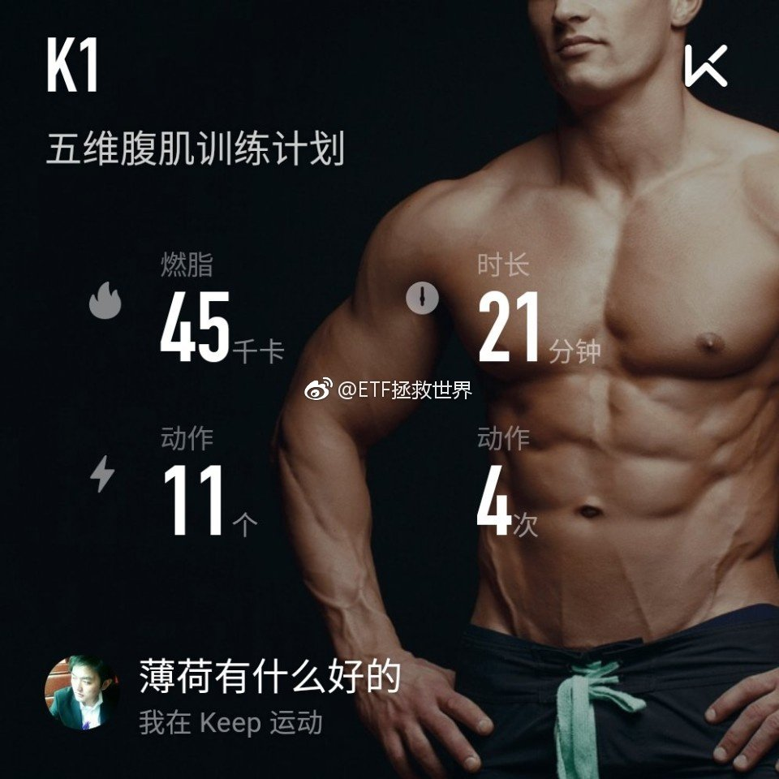

======================================================

ETF拯救世界 (5687069307) @
2017-07-02 16:47:27 Sun  
url: https://weibo.com/5687069307/Fax6GA2pY

每日打卡(17)

晚上有事，下午先练了 ​​​

转发[0]  评论[27]  赞[83] 

+++++++++++++++++++++++++++++++++++++++++++++++++++++

图片：

======================================================

ETF拯救世界 (5687069307) @
2017-07-03 09:09:13 Mon  
url: https://weibo.com/5687069307/FaDxbAVtV

恭喜国家队！棒棒哒！

------------------------------------------------------
转推：
>  @财联社APP (2868676035)
>  2017-07-03 07:53:52 Mon  
>  url: https:/weibo.com/2868676035/FaD2Bnp03/

>  【受益于低估值大蓝筹和白马股大涨 “国家队”基金上半年平均收益近9%】财联社3日讯，数据显示，截至6月30日，5只“国家队”基金今年以来平均复权单位净值增长率为8.64%，远超同类型的灵活配置型基金3.52%收益，其中，嘉实新机遇收益率最高，为11.13%。从业绩归因来看，偏爱家电、消费、银行等白马股是 ​​​

转发[2]  评论[23]  赞[49] 

======================================================

ETF拯救世界 (5687069307) @
2017-07-03 09:37:28 Mon  
url: https://weibo.com/5687069307/FaDIEuvvb

$创业板指 sz399006$   anyway，奶一口先。 ​​​

转发[6]  评论[24]  赞[52] 

======================================================

ETF拯救世界 (5687069307) @
2017-07-03 09:48:51 Mon  
url: https://weibo.com/5687069307/FaDNhaTpO

50、300下跌。医药、500持仓市值新高。

面对别人的忽悠——“虽然涨了很多，盛宴刚刚开始。继续看好涨到xxx。”——即使买不到以后的热点，你至少可以不被忽悠接盘。 ​​​

转发[8]  评论[23]  赞[89] 

======================================================

ETF拯救世界 (5687069307) @
2017-07-03 09:53:34 Mon  
url: https://weibo.com/5687069307/FaDPbCYQN

宽基涨幅第一。我能怎么办，我也很无奈呀。[doge]

------------------------------------------------------
转推：
>  @ETF拯救世界 (5687069307)
>  2017-07-03 09:37:28 Mon  
>  url: https:/weibo.com/5687069307/FaDIEuvvb/

>  $创业板指 sz399006$   anyway，奶一口先。 ​​​

转发[5]  评论[36]  赞[68] 

======================================================

ETF拯救世界 (5687069307) @
2017-07-03 11:10:13 Mon  
url: https://weibo.com/5687069307/FaEkiC6Ti

收盘来个1%就精彩了。//@ETF拯救世界:宽基涨幅第一。我能怎么办，我也很无奈呀。[doge]

------------------------------------------------------
转推：
>  @ETF拯救世界 (5687069307)
>  2017-07-03 09:37:28 Mon  
>  url: https:/weibo.com/5687069307/FaDIEuvvb/

>  $创业板指 sz399006$   anyway，奶一口先。 ​​​

转发[4]  评论[27]  赞[52] 

======================================================

ETF拯救世界 (5687069307) @
2017-07-03 11:20:35 Mon  
url: https://weibo.com/5687069307/FaEow8ayV

创业板50已经1%了。创业板0.87。//@ETF拯救世界:收盘来个1%就精彩了。//@ETF拯救世界:宽基涨幅第一。我能怎么办，我也很无奈呀。[doge]

------------------------------------------------------
转推：
>  @ETF拯救世界 (5687069307)
>  2017-07-03 09:37:28 Mon  
>  url: https:/weibo.com/5687069307/FaDIEuvvb/

>  $创业板指 sz399006$   anyway，奶一口先。 ​​​

转发[0]  评论[11]  赞[53] 

======================================================

ETF拯救世界 (5687069307) @
2017-07-03 11:22:34 Mon  
url: https://weibo.com/5687069307/FaEpjuhlK

如果啊，我是说如果。创业板涨一阵，那些昨天还说价值投资时代来临的人，会不会改口说成长投资才是王道呢。 ​​​

转发[2]  评论[52]  赞[97] 

======================================================

ETF拯救世界 (5687069307) @
2017-07-03 11:51:27 Mon  
url: https://weibo.com/5687069307/FaEB2mg43

节奏。

这两个字重点掌握一下。

划线。 ​​​

转发[4]  评论[59]  赞[116] 

======================================================

ETF拯救世界 (5687069307) @
2017-07-03 15:02:58 Mon  
url: https://weibo.com/5687069307/FaFQM915O

0.99%。[哼]//@ETF拯救世界:收盘来个1%就精彩了。//@ETF拯救世界:宽基涨幅第一。我能怎么办，我也很无奈呀。[doge]

------------------------------------------------------
转推：
>  @ETF拯救世界 (5687069307)
>  2017-07-03 09:37:28 Mon  
>  url: https:/weibo.com/5687069307/FaDIEuvvb/

>  $创业板指 sz399006$   anyway，奶一口先。 ​​​

转发[1]  评论[47]  赞[76] 

======================================================

ETF拯救世界 (5687069307) @
2017-07-03 16:42:20 Mon  
url: https://weibo.com/5687069307/FaGv6zM2Q

只要人人都献出一点爱，世界就是美好的春天！ ​​​

转发[3]  评论[94]  赞[183] 

+++++++++++++++++++++++++++++++++++++++++++++++++++++

图片：
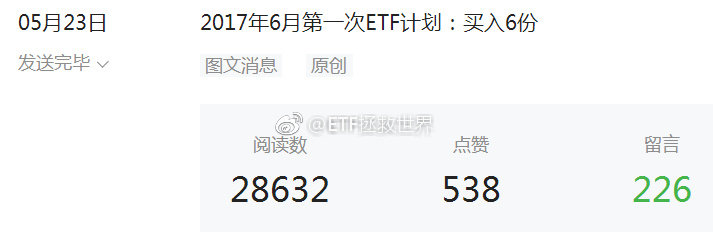
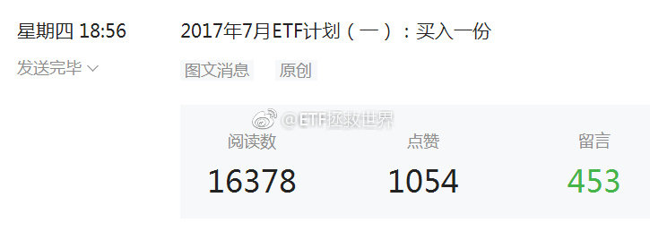

======================================================

ETF拯救世界 (5687069307) @
2017-07-03 21:26:07 Mon  
url: https://weibo.com/5687069307/FaImi1T4O

每日打卡(18)

18天了，加油！ ​​​

转发[0]  评论[26]  赞[101] 

+++++++++++++++++++++++++++++++++++++++++++++++++++++

图片：
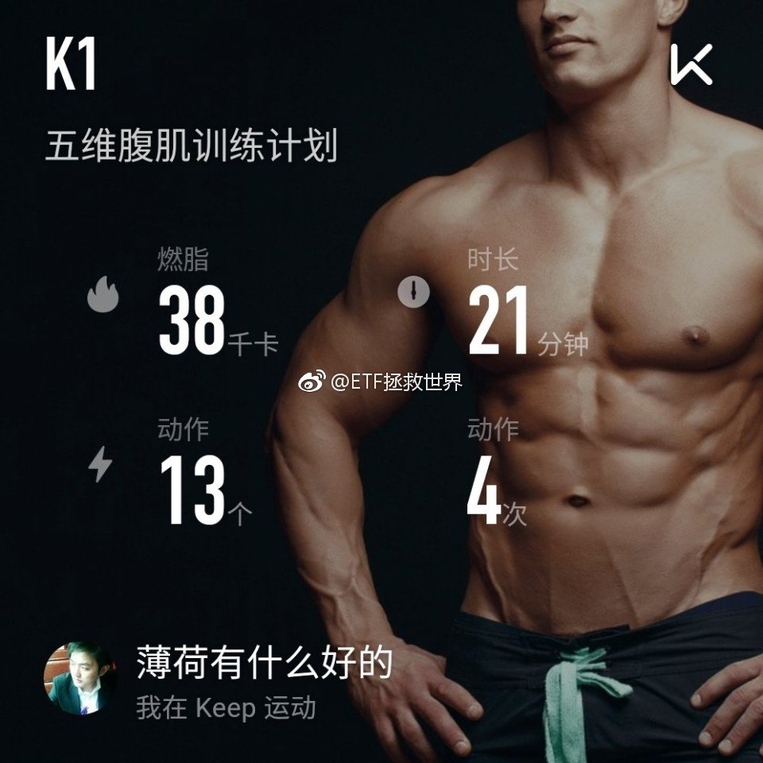

======================================================

ETF拯救世界 (5687069307) @
2017-07-04 08:15:26 Tue  
url: https://weibo.com/5687069307/FaMBR78iW

建信500还差0.1%浮盈。之后浮亏品种就剩油气一个。

账户里面一片红色的感觉不错吧。

a股是个聚宝盆。 ​​​

转发[10]  评论[46]  赞[101] 

======================================================

ETF拯救世界 (5687069307) @
2017-07-04 08:27:38 Tue  
url: https://weibo.com/5687069307/FaMGO8pbp

回复@奥斯特洛夫大柴夫斯基:再说第一万次，我的仓位很适合我寄几，很舒服，谁觉得仓位不够就加到舒服。因为不跌没法低位买东西，就不高兴，这样特别不成熟。市场不是为某个人开的，有自己的规律，不会按照某个人的愿望运行。我们要做的是认清局势，适应市场，趋利避害，然后赚钱。

------------------------------------------------------
转推：
>  @ETF拯救世界 (5687069307)
>  2017-07-04 08:15:26 Tue  
>  url: https:/weibo.com/5687069307/FaMBR78iW/

>  建信500还差0.1%浮盈。之后浮亏品种就剩油气一个。
>  
>  账户里面一片红色的感觉不错吧。
>  
>  a股是个聚宝盆。 ​​​

转发[7]  评论[35]  赞[102] 

======================================================

ETF拯救世界 (5687069307) @
2017-07-04 10:19:27 Tue  
url: https://weibo.com/5687069307/FaNqc5jdZ

回复@pennilessmillionaire:好简单嘅！关注我的朋友里面，广东的朋友最多！第二是北京，第三是上海。肥肠亲切一刚。//@pennilessmillionaire:E大，你为什么一会儿学广东话，一会儿学上海话，难道是一种咒语，说了股市就朝希望的方向走了么[doge]

------------------------------------------------------
转推：
>  @ETF拯救世界 (5687069307)
>  2017-07-04 08:15:26 Tue  
>  url: https:/weibo.com/5687069307/FaMBR78iW/

>  建信500还差0.1%浮盈。之后浮亏品种就剩油气一个。
>  
>  账户里面一片红色的感觉不错吧。
>  
>  a股是个聚宝盆。 ​​​

转发[2]  评论[63]  赞[66] 

======================================================

ETF拯救世界 (5687069307) @
2017-07-04 10:24:40 Tue  
url: https://weibo.com/5687069307/FaNsjeuJB

其实对于理财这件事，果然是经济发达的地方还是更加重视的。

关注我的朋友来自哪里：

然后妹子只有31%。还有0.09%是未知的。

苹果安卓大概是4:6 ​​​

转发[4]  评论[124]  赞[84] 

+++++++++++++++++++++++++++++++++++++++++++++++++++++

图片：
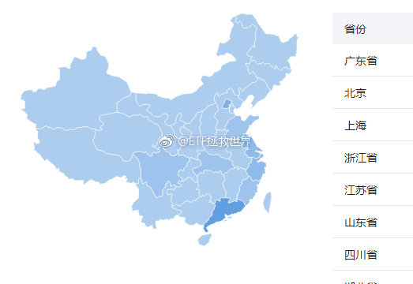
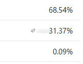

======================================================

ETF拯救世界 (5687069307) @
2017-07-04 10:36:49 Tue  
url: https://weibo.com/5687069307/FaNxfmZJE

公众号关注我的朋友数量按城市排名。找出你寄几…… ​​​

转发[3]  评论[334]  赞[116] 

+++++++++++++++++++++++++++++++++++++++++++++++++++++

图片：
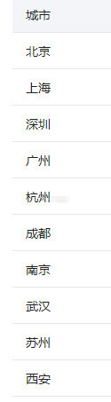

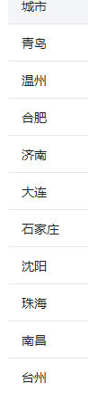

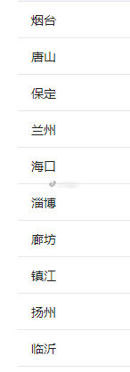

======================================================

ETF拯救世界 (5687069307) @
2017-07-04 14:10:23 Tue  
url: https://weibo.com/5687069307/FaOVVunY2

跌这么多，都开心了吧。不过讲真，如果不跌，7月肯定没法买A股了。 ​​​

转发[19]  评论[79]  赞[112] 

======================================================

ETF拯救世界 (5687069307) @
2017-07-04 15:41:39 Tue  
url: https://weibo.com/5687069307/FaPwYksoU

回复@王英蕖:最好不要碰161226，有损耗。我更喜欢用银行纸白银做白银网格//@王英蕖:ETF老师，今天白银基金161226跌到0.895，创了15.12.1日以来新低，但期货沪银主力离那时的价格还差得很远，请问老师怎么看，能撒网吗。

------------------------------------------------------
转推：
>  @ETF拯救世界 (5687069307)
>  2017-07-04 14:10:23 Tue  
>  url: https:/weibo.com/5687069307/FaOVVunY2/

>  跌这么多，都开心了吧。不过讲真，如果不跌，7月肯定没法买A股了。 ​​​

转发[12]  评论[47]  赞[56] 

======================================================

ETF拯救世界 (5687069307) @
2017-07-04 21:54:32 Tue  
url: https://weibo.com/5687069307/FaRYjEhsv

每日打卡(19)

今天又是变速跑。闷热，出了很多汗。

看起来很简单的事，坚持起来并不那么容易。坚持。 ​​​

转发[9]  评论[67]  赞[109] 

+++++++++++++++++++++++++++++++++++++++++++++++++++++

图片：
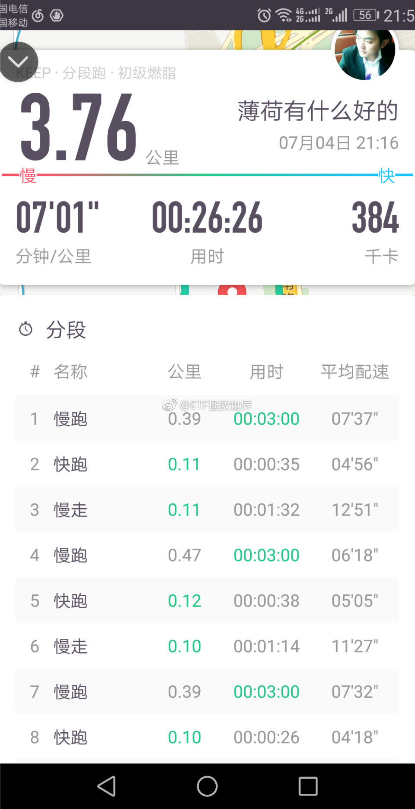

======================================================

ETF拯救世界 (5687069307) @
2017-07-05 14:00:53 Wed  
url: https://weibo.com/5687069307/FaYizg01V

回复@l12238:http://t.cn/RKvJ9Q7 //@l12238:E大对增强型指数基金怎么看？

------------------------------------------------------
转推：
>  @ETF拯救世界 (5687069307)
>  2017-07-04 21:54:32 Tue  
>  url: https:/weibo.com/5687069307/FaRYjEhsv/

>  每日打卡(19)
>  
>  今天又是变速跑。闷热，出了很多汗。
>  
>  看起来很简单的事，坚持起来并不那么容易。坚持。 ​​​

转发[8]  评论[15]  赞[36] 

======================================================

ETF拯救世界 (5687069307) @
2017-07-05 14:23:21 Wed  
url: https://weibo.com/5687069307/FaYrGyGgf

$创业板指 sz399006$被  $温氏股份 sz300498$   玩残了…… ​​​

转发[0]  评论[33]  赞[43] 

======================================================

ETF拯救世界 (5687069307) @
2017-07-05 14:25:16 Wed  
url: https://weibo.com/5687069307/FaYst1wmK

原谅我笑出来了……//@华尔街见闻APP:【北京：李彦宏乘无人驾驶汽车上五环 交警已介入调查】今天下午，北青报记者拨打122电话咨询相关情况，工作人员表示，交管部门已经获悉相关情况，正在就此展开调查。有交管局内部人士称，现行法规并不允许无人驾驶上路。

------------------------------------------------------
转推：
>  @ ()
>  2017-07-05 11:24:15 Wed  
>  url: 

>  抱歉，此微博已被作者删除。查看帮助：http://t.cn/Rfd3rQV

转发[8]  评论[28]  赞[47] 

======================================================

ETF拯救世界 (5687069307) @
2017-07-05 21:50:33 Wed  
url: https://weibo.com/5687069307/Fb1ncDEHH

每日打卡(20)

20天了。继续练胸。 ​​​

转发[0]  评论[28]  赞[84] 

+++++++++++++++++++++++++++++++++++++++++++++++++++++

图片：

======================================================

ETF拯救世界 (5687069307) @
2017-07-06 09:41:42 Thu  
url: https://weibo.com/5687069307/Fb61RsZO0

$创业板指 sz399006$   开始新高 ​​​

转发[23]  评论[18]  赞[47] 

======================================================

ETF拯救世界 (5687069307) @
2017-07-06 09:54:10 Thu  
url: https://weibo.com/5687069307/Fb66VgpjN

我想到了$温氏股份 sz300498$  很垃圾，没想到这么垃圾。

应该买$创业板50 sz399673$  的。 ​​​

转发[14]  评论[34]  赞[43] 

======================================================

ETF拯救世界 (5687069307) @
2017-07-06 09:57:40 Thu  
url: https://weibo.com/5687069307/Fb68liOTF

回复@RobinAmos:温氏影响了我们的$创业板指 sz399006$  我这里从来不讨论股票。//@RobinAmos:你跟老股民了？

------------------------------------------------------
转推：
>  @ETF拯救世界 (5687069307)
>  2017-07-06 09:54:10 Thu  
>  url: https:/weibo.com/5687069307/Fb66VgpjN/

>  我想到了$温氏股份 sz300498$  很垃圾，没想到这么垃圾。
>  
>  应该买$创业板50 sz399673$  的。 ​​​

转发[0]  评论[14]  赞[26] 

======================================================

ETF拯救世界 (5687069307) @
2017-07-06 10:04:46 Thu  
url: https://weibo.com/5687069307/Fb6be6YHq

到第一个卖猪肉卖鸡肉的，是怎么混到创业板的，到现在我还是没想明白。还占了第一大权重，表脸。 ​​​

转发[17]  评论[37]  赞[50] 

======================================================

ETF拯救世界 (5687069307) @
2017-07-06 10:16:47 Thu  
url: https://weibo.com/5687069307/Fb6g6mkOE

回复@请移除:一般我的股票跌到30%就补仓了。虽然我的规则是30%、60%、90%补仓，但实际上到目前为止，没有任何一次在60%的地方补过仓。也只有10%的股票跌到了30%。。//@请移除:之前亏损20%+的股，今天终于翻红1个多点了，心累，还是跟E大好，涨跌自由

------------------------------------------------------
转推：
>  @ETF拯救世界 (5687069307)
>  2017-07-06 10:04:46 Thu  
>  url: https:/weibo.com/5687069307/Fb6be6YHq/

>  到第一个卖猪肉卖鸡肉的，是怎么混到创业板的，到现在我还是没想明白。还占了第一大权重，表脸。 ​​​

转发[15]  评论[13]  赞[40] 

======================================================

ETF拯救世界 (5687069307) @
2017-07-06 10:23:05 Thu  
url: https://weibo.com/5687069307/Fb6iF39OX

$创业板指 sz399006$ 和 $创业板50 sz399673$  涨幅差一半了。这很有可能是未来牛市中它们最终的涨幅差距。

指数的编制规则太重要了。这也是为什么我比较喜欢养老产业这样等权的指数。当然，等权指数也有问题。但不至于太差。

温氏对$创业板指 sz399006$ 的副作用，绝不亚于当年中石油对上证指数的危 ​​​

转发[20]  评论[45]  赞[52] 

======================================================

ETF拯救世界 (5687069307) @
2017-07-06 10:30:25 Thu  
url: https://weibo.com/5687069307/Fb6lDqdD8

回复@阳光小赖子:别人都不关注的时候关注、别人开始关注的时候关注、别人关注很久了才开始关注。是三种投资模式。分别对应不同的投资特质。可以体会一下。//@阳光小赖子:发现自从E大发出开车信号后，评论创业板的声音不断。之前几乎没有。影响力啊，影响力！

------------------------------------------------------
转推：
>  @ETF拯救世界 (5687069307)
>  2017-07-06 09:41:42 Thu  
>  url: https:/weibo.com/5687069307/Fb61RsZO0/

>  $创业板指 sz399006$   开始新高 ​​​

转发[20]  评论[13]  赞[41] 

======================================================

ETF拯救世界 (5687069307) @
2017-07-06 10:32:57 Thu  
url: https://weibo.com/5687069307/Fb6mFinty

创业板指数在我们买入的4个交易日内，涨幅在宽基指数中第一的日期是两天。

也就是说，咱们买了以后，它是最强的。 ​​​

转发[2]  评论[16]  赞[54] 

======================================================

ETF拯救世界 (5687069307) @
2017-07-06 10:38:29 Thu  
url: https://weibo.com/5687069307/Fb6oUs8ar

回复@我是一个圆豆包:不一定。过早的开始关注或者开始买入，也许会有不小的浮亏。最佳买点当然是别人开始关注的时候买。但这个对投资人的要求可以说是非常非常高，一般人做不到。所以一般人应该做的，是考虑如何在控制亏损的情况下，比别人早一点买入未来别人会抢的东西。

------------------------------------------------------
转推：
>  @ETF拯救世界 (5687069307)
>  2017-07-06 09:41:42 Thu  
>  url: https:/weibo.com/5687069307/Fb61RsZO0/

>  $创业板指 sz399006$   开始新高 ​​​

转发[10]  评论[16]  赞[46] 

======================================================

ETF拯救世界 (5687069307) @
2017-07-06 10:43:49 Thu  
url: https://weibo.com/5687069307/Fb6r4CkNS

金融投资一定程度上是一种博弈过程。一个东西是真的好还是假的好，有时候并不重要。重要的是别人是不是会认为它好。

即使你是所谓的价值投资者，你想赢利，也需要别人认可你喜欢的公司。这就是为什么那些“白马绩优股”并没有什么太大的变化，却可以由几年前的无人问津变成万人追捧。“大烂臭”到“皇 ​​​

转发[19]  评论[39]  赞[102] 

======================================================

ETF拯救世界 (5687069307) @
2017-07-06 10:49:32 Thu  
url: https://weibo.com/5687069307/Fb6toubj8

然而$510500 依然是我的最爱…… 坠吼的始终是你 ​​​

转发[4]  评论[37]  赞[83] 

======================================================

ETF拯救世界 (5687069307) @
2017-07-06 11:34:50 Thu  
url: https://weibo.com/5687069307/Fb6LMca8e

一口毒奶一刚。

------------------------------------------------------
转推：
>  @ETF拯救世界 (5687069307)
>  2017-07-06 09:41:42 Thu  
>  url: https:/weibo.com/5687069307/Fb61RsZO0/

>  $创业板指 sz399006$   开始新高 ​​​

转发[1]  评论[41]  赞[57] 

======================================================

ETF拯救世界 (5687069307) @
2017-07-06 22:59:15 Thu  
url: https://weibo.com/5687069307/FbbfArdcz

每日打卡(21)

21天，习惯可以养成了 ​​​

转发[0]  评论[18]  赞[71] 

+++++++++++++++++++++++++++++++++++++++++++++++++++++

图片：

======================================================

ETF拯救世界 (5687069307) @
2017-07-07 08:22:38 Fri  
url: https://weibo.com/5687069307/FbeWgrq9f

万万没想到！闪崩10%！以后每次要挂两格了！ ​​​

转发[6]  评论[62]  赞[47] 

+++++++++++++++++++++++++++++++++++++++++++++++++++++

图片：
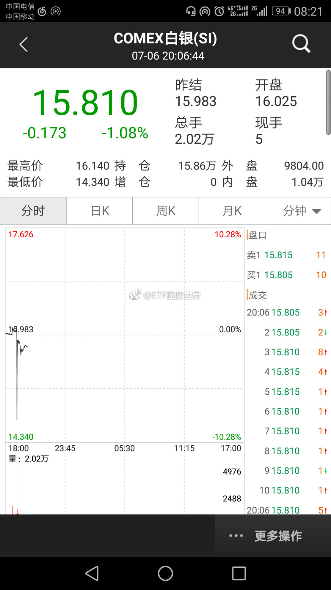

======================================================

ETF拯救世界 (5687069307) @
2017-07-07 08:32:07 Fri  
url: https://weibo.com/5687069307/Fbf07bU1p

论提前挂单的重要性。以后每次同时买卖挂两格。 ​​​

转发[4]  评论[77]  赞[42] 

+++++++++++++++++++++++++++++++++++++++++++++++++++++

图片：

======================================================

ETF拯救世界 (5687069307) @
2017-07-07 09:28:10 Fri  
url: https://weibo.com/5687069307/FbfmRAsle

今早的白银应该是乌龙指。让咱们捡了个便宜。说起来乌龙指，这十几年我印象最深的是这件，听EE讲讲古。

我印象中是2007年上半年。江苏一哥们，印象中是个大叔。不知道为什么在海尔权证上挂了1厘的单。结果市价0.7元的海尔权证真的跌到了1厘，大概率是谁乌龙指了。

大叔花了800多块钱，拿走了70多万的 ​​​

转发[8]  评论[61]  赞[74] 

======================================================

ETF拯救世界 (5687069307) @
2017-07-07 09:34:17 Fri  
url: https://weibo.com/5687069307/FbfplzqIZ

又被吃了？

------------------------------------------------------
转推：
>  @ETF拯救世界 (5687069307)
>  2017-07-07 09:28:10 Fri  
>  url: https:/weibo.com/5687069307/FbfmRAsle/

>  今早的白银应该是乌龙指。让咱们捡了个便宜。说起来乌龙指，这十几年我印象最深的是这件，听EE讲讲古。
>  
>  我印象中是2007年上半年。江苏一哥们，印象中是个大叔。不知道为什么在海尔权证上挂了1厘的单。结果市价0.7元的海尔权证真的跌到了1厘，大概率是谁乌龙指了。
>  
>  大叔花了800多块钱，拿走了70多万的 ​​​

转发[0]  评论[17]  赞[29] 

======================================================

ETF拯救世界 (5687069307) @
2017-07-07 09:45:19 Fri  
url: https://weibo.com/5687069307/FbftPkyMK

赴美。

------------------------------------------------------
转推：
>  @新浪科技 (1642634100)
>  2017-07-07 08:09:14 Fri  
>  url: https:/weibo.com/1642634100/FbeQPh5Xo/

>  #科技鲜闻# 【独家！贾跃亭赴美专注造车：10亿美元融资生死线】洛杉矶消息人士向新浪科技确认，贾跃亭在加州时间周二晚上（北京时间周三中午 ）抵达美国洛杉矶，次日会见乐视汽车和法乐第未来团队。抵达洛杉矶后，贾跃亭昨日通过微博，宣布自己会“承担全部的责任，尽责到底”。http://t.cn/RKZrGKF ​​​

转发[3]  评论[25]  赞[27] 

======================================================

ETF拯救世界 (5687069307) @
2017-07-07 09:51:04 Fri  
url: https://weibo.com/5687069307/Fbfwa5M5k

有时候一些不起眼的小事，会引起惊涛骇浪。

只是当时人们根本意识不到而已。

压垮骆驼的最后一根稻草。

信心。 ​​​

转发[2]  评论[80]  赞[88] 

======================================================

ETF拯救世界 (5687069307) @
2017-07-07 13:21:06 Fri  
url: https://weibo.com/5687069307/FbgTpxQtS

$510500  坠吼的 ​​​

转发[8]  评论[36]  赞[76] 

======================================================

ETF拯救世界 (5687069307) @
2017-07-07 14:06:48 Fri  
url: https://weibo.com/5687069307/FbhbXAT5f

其实大多数人在股市上赚不到钱的原因是本来就没钱。

着急赚钱，拿不住，害怕坐电梯。所以低位买了牛股随时卖飞。再追下一个风头正劲的牛股。

这么说吧。你有1000万，拿出10%，100万，各种众所周知的大白马，或者有前途的指数，低位买进去。买了就扔那不看，怎么涨都不看。想想不卖是不是容易得多。 ​​​

转发[25]  评论[55]  赞[115] 

======================================================

ETF拯救世界 (5687069307) @
2017-07-07 14:21:38 Fri  
url: https://weibo.com/5687069307/FbhhZ9Iku

今天奶的还阔一。持有的是少了点，以后会多的，I promise。毕竟是最爱。不过其实未来最赚钱的另有其指，并不是它。

------------------------------------------------------
转推：
>  @ETF拯救世界 (5687069307)
>  2017-07-07 13:21:06 Fri  
>  url: https:/weibo.com/5687069307/FbgTpxQtS/

>  $510500  坠吼的 ​​​

转发[6]  评论[43]  赞[68] 

======================================================

ETF拯救世界 (5687069307) @
2017-07-07 14:32:57 Fri  
url: https://weibo.com/5687069307/FbhmA0a4l

为什么说中证500最好，因为它代表真正的A股，甚至是中国的经济。

看好A股看好中国，就是中证500。

前面那些大家伙和后面那些垃圾股都不能。 ​​​

转发[41]  评论[60]  赞[169] 

======================================================

ETF拯救世界 (5687069307) @
2017-07-07 22:37:16 Fri  
url: https://weibo.com/5687069307/Fbkxa6G2o

每日打卡(22)

坚持 ​​​

转发[1]  评论[33]  赞[94] 

+++++++++++++++++++++++++++++++++++++++++++++++++++++

图片：

======================================================

ETF拯救世界 (5687069307) @
2017-07-08 22:26:31 Sat  
url: https://weibo.com/5687069307/FbtTijQWC

每日打卡(23)

十天没有HIIT了。依然非常酸爽 ​​​

转发[0]  评论[25]  赞[87] 

+++++++++++++++++++++++++++++++++++++++++++++++++++++

图片：
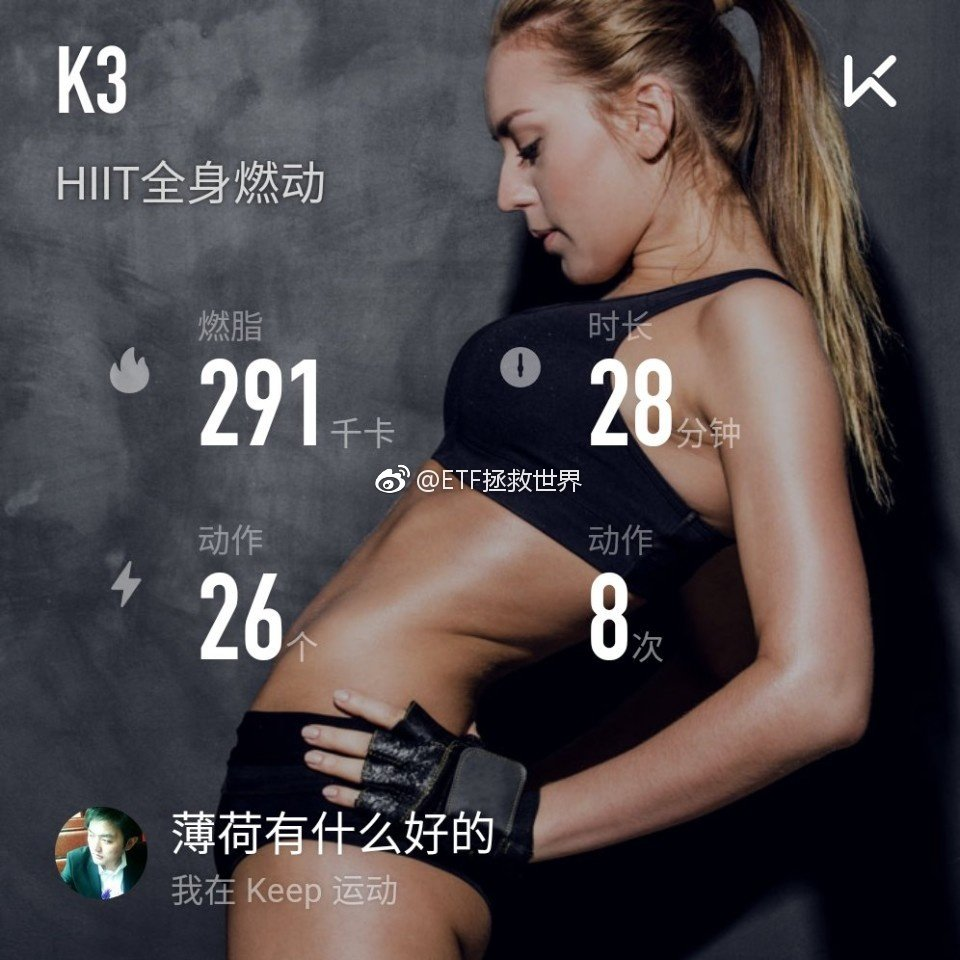

======================================================

ETF拯救世界 (5687069307) @
2017-07-10 09:55:17 Mon  
url: https://weibo.com/5687069307/FbHPmpMv4

昨天有事，没打卡，我有罪。

补偿措施：

1、吃一天草。总热量不超过800大卡

2、晚上做两组。如果今天有暴跌做三组。

[允悲] ​​​

转发[2]  评论[85]  赞[92] 

+++++++++++++++++++++++++++++++++++++++++++++++++++++

图片：
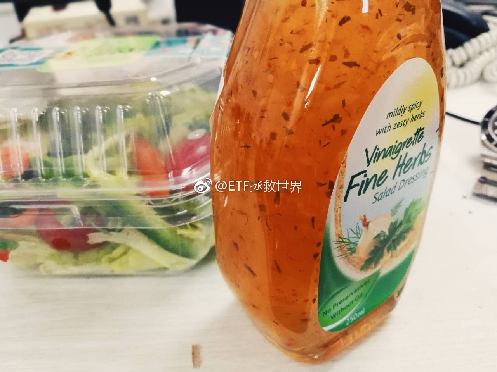

======================================================

ETF拯救世界 (5687069307) @
2017-07-10 15:23:58 Mon  
url: https://weibo.com/5687069307/FbJYM9Ex4

今天只有2000家公司下跌，平均跌幅不到0.5%，还是两组。

------------------------------------------------------
转推：
>  @ETF拯救世界 (5687069307)
>  2017-07-10 09:55:17 Mon  
>  url: https:/weibo.com/5687069307/FbHPmpMv4/

>  昨天有事，没打卡，我有罪。
>  
>  补偿措施：
>  
>  1、吃一天草。总热量不超过800大卡
>  
>  2、晚上做两组。如果今天有暴跌做三组。
>  
>  [允悲] ​​​

转发[0]  评论[61]  赞[47] 

======================================================

ETF拯救世界 (5687069307) @
2017-07-10 22:08:19 Mon  
url: https://weibo.com/5687069307/FbMCTnGHi

每日打卡(24)

第一组，现在去做第二组 ​​​

转发[0]  评论[12]  赞[56] 

+++++++++++++++++++++++++++++++++++++++++++++++++++++

图片：

======================================================

ETF拯救世界 (5687069307) @
2017-07-10 22:36:49 Mon  
url: https://weibo.com/5687069307/FbMOswDRl

每日打卡(25)

感觉不错。 ​​​

转发[8]  评论[21]  赞[75] 

+++++++++++++++++++++++++++++++++++++++++++++++++++++

图片：

======================================================

ETF拯救世界 (5687069307) @
2017-07-11 10:44:22 Tue  
url: https://weibo.com/5687069307/FbRzN4fFv

回复@CZ梦想:不一定啊。你看到的是指数涨，我看到的是2000只股票在下跌。这样跌下去，全市场估值会降低，当然可以买了~就看跌多少了。//@CZ梦想:这个涨法又不能开车了[泪]

------------------------------------------------------
转推：
>  @ETF拯救世界 (5687069307)
>  2017-07-10 22:36:49 Mon  
>  url: https:/weibo.com/5687069307/FbMOswDRl/

>  每日打卡(25)
>  
>  感觉不错。 ​​​

转发[5]  评论[16]  赞[43] 

======================================================

ETF拯救世界 (5687069307) @
2017-07-11 10:47:10 Tue  
url: https://weibo.com/5687069307/FbRAVnqD5

回复@紫玉生烟雨江南:各大公司都已经以30%-40%的跌幅下调乐视估值了。现在开始买创业基本乐视的雷已经少了至少一半了——以它退市来估算的话。//@紫玉生烟雨江南:但是创业板50里乐视网占比更高。。。关于乐视网对我们的创业板指数的影响，E大怎么看？

------------------------------------------------------
转推：
>  @ETF拯救世界 (5687069307)
>  2017-07-06 09:54:10 Thu  
>  url: https:/weibo.com/5687069307/Fb66VgpjN/

>  我想到了$温氏股份 sz300498$  很垃圾，没想到这么垃圾。
>  
>  应该买$创业板50 sz399673$  的。 ​​​

转发[7]  评论[24]  赞[37] 

======================================================

ETF拯救世界 (5687069307) @
2017-07-11 11:09:08 Tue  
url: https://weibo.com/5687069307/FbRJPESmC

这种新闻真的没法评论。这帮人到底怎么想的，百思不得其解。

------------------------------------------------------
转推：
>  @时间视频 (6250824982)
>  2017-07-10 17:02:57 Mon  
>  url: https:/weibo.com/6250824982/FbKCXsDbo/

>  【"暴走团"占据主路暴走遭车冲撞致1死2伤 女司机：大意了】7月8日，山东临沂一“暴走团”占据主路内侧车道行走，一辆出租车从后方撞入人群，致1死2伤。肇事女出租车司机董某称“大意了”。有网友质疑，“暴走团”在机动车道上行走，应承担部分责任。临沂警方通报称，司机董某现已被刑拘。 ​​​

转发[6]  评论[40]  赞[19] 

======================================================

ETF拯救世界 (5687069307) @
2017-07-11 11:16:17 Tue  
url: https://weibo.com/5687069307/FbRMJApLr

回复@西山居:跌的时候全是鬼故事，涨的时候哪里都好。当然，如果没有利空，一个品种也不会跌。问题在于，有利空然后跌的时候不买，以后就只能去做接盘侠了。刚买了一份，0.6%，不急，等着捡钻石。

------------------------------------------------------
转推：
>  @ETF拯救世界 (5687069307)
>  2017-07-06 09:54:10 Thu  
>  url: https:/weibo.com/5687069307/Fb66VgpjN/

>  我想到了$温氏股份 sz300498$  很垃圾，没想到这么垃圾。
>  
>  应该买$创业板50 sz399673$  的。 ​​​

转发[4]  评论[36]  赞[59] 

======================================================

ETF拯救世界 (5687069307) @
2017-07-11 14:43:38 Tue  
url: https://weibo.com/5687069307/FbT8U2cAr

恒生+50+红利+300+180新高，各位账户都不会太难看。谁能想到，有2400只股票在下跌。 ​​​

转发[8]  评论[71]  赞[120] 

======================================================

ETF拯救世界 (5687069307) @
2017-07-11 15:45:46 Tue  
url: https://weibo.com/5687069307/FbTy7slVK

数据出来了。感动哭了，再这样跌两天月中必须发车。 ​​​

转发[4]  评论[119]  赞[146] 

======================================================

ETF拯救世界 (5687069307) @
2017-07-11 21:58:32 Tue  
url: https://weibo.com/5687069307/FbVZq5lY9

每日打卡(26)

玩点新鲜的：击碎一切阻拦我们收集便宜筹码的敌人。[拳头] ​​​

转发[0]  评论[16]  赞[86] 

+++++++++++++++++++++++++++++++++++++++++++++++++++++

图片：

======================================================

ETF拯救世界 (5687069307) @
2017-07-11 23:30:36 Tue  
url: https://weibo.com/5687069307/FbWANmAP9

应该是这几年最悲催的中签。估计赚的钱还没有过年给各位发的红包多。

[doge] ​​​

转发[0]  评论[75]  赞[99] 

+++++++++++++++++++++++++++++++++++++++++++++++++++++

图片：
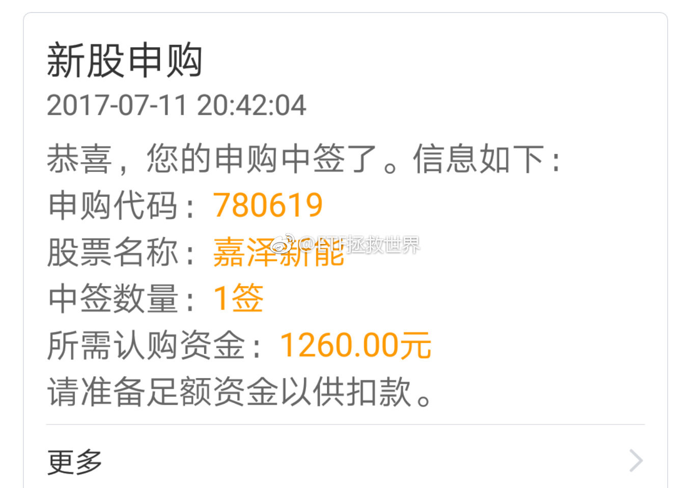

======================================================

ETF拯救世界 (5687069307) @
2017-07-12 08:59:38 Wed  
url: https://weibo.com/5687069307/Fc0jLtGZq

这个问题收费时效也过了，一块钱都舍不得花的朋友可以免费看了……哈哈哈……

http://t.cn/RKxRock ​​​

转发[75]  评论[47]  赞[57] 

======================================================

ETF拯救世界 (5687069307) @
2017-07-12 09:06:59 Wed  
url: https://weibo.com/5687069307/Fc0mL7ce3

回复@依小然-:立个flag，如果创业板指数还能跌20%-30%。那么到那个地方全仓买入（最好在两融账户做担保品买入），然后就什么都不用干，未来十年等着赚大钱吧。//@依小然-:创业板要去新低了吗 E大

------------------------------------------------------
转推：
>  @ETF拯救世界 (5687069307)
>  2017-07-12 08:59:38 Wed  
>  url: https:/weibo.com/5687069307/Fc0jLtGZq/

>  这个问题收费时效也过了，一块钱都舍不得花的朋友可以免费看了……哈哈哈……
>  
>  http://t.cn/RKxRock ​​​

转发[43]  评论[53]  赞[48] 

======================================================

ETF拯救世界 (5687069307) @
2017-07-12 09:34:26 Wed  
url: https://weibo.com/5687069307/Fc0xTkb8J

我自己呢，本身也会付费看付费问答。不过到现在为止只看一个人的，是感觉很有趣。跟投资无关的。看他东西的时候，我经常会想，如果他出了书我一定会买。

这个时候我才真的明白，为什么总有朋友给我评论说，出书吧，一定买。

最近我经常在想，这个世界的美好事物，其实绝大多数是跟商业有关的。

对于 ​​​

转发[5]  评论[79]  赞[116] 

======================================================

ETF拯救世界 (5687069307) @
2017-07-12 09:40:15 Wed  
url: https://weibo.com/5687069307/Fc0Afzx76

$159920  新高不卖是我的一条投资原则。 ​​​

转发[14]  评论[44]  赞[73] 

======================================================

ETF拯救世界 (5687069307) @
2017-07-12 10:19:25 Wed  
url: https://weibo.com/5687069307/Fc0Q9EmWk

又是2300家下跌。敢不敢再跌2天。[抱抱_旧]

------------------------------------------------------
转推：
>  @ETF拯救世界 (5687069307)
>  2017-07-11 15:45:46 Tue  
>  url: https:/weibo.com/5687069307/FbTy7slVK/

>  数据出来了。感动哭了，再这样跌两天月中必须发车。 ​​​

转发[0]  评论[30]  赞[72] 

======================================================

ETF拯救世界 (5687069307) @
2017-07-12 10:58:15 Wed  
url: https://weibo.com/5687069307/Fc15UAZsl

提请注意，从5月底到现在，1.5个月，只买了0.6%。

如果这个月中不发车，就是整整两个月只买了0.6%。

也就是说，如果跌下去，我们再次会让过一个小顶部。

[微笑] ​​​

转发[5]  评论[42]  赞[78] 

======================================================

ETF拯救世界 (5687069307) @
2017-07-12 11:08:06 Wed  
url: https://weibo.com/5687069307/Fc19Ut8wc

回复@蛋卷基金:蛋姐你爆个照，我每天转发你一条微博，你说吼不吼，大家一定非常兹瓷啊。//@蛋卷基金:蛋姐只能日刷存在感300遍[喵喵]

------------------------------------------------------
转推：
>  @ETF拯救世界 (5687069307)
>  2017-07-12 10:58:15 Wed  
>  url: https:/weibo.com/5687069307/Fc15UAZsl/

>  提请注意，从5月底到现在，1.5个月，只买了0.6%。
>  
>  如果这个月中不发车，就是整整两个月只买了0.6%。
>  
>  也就是说，如果跌下去，我们再次会让过一个小顶部。
>  
>  [微笑] ​​​

转发[1]  评论[30]  赞[55] 

======================================================

ETF拯救世界 (5687069307) @
2017-07-12 11:18:48 Wed  
url: https://weibo.com/5687069307/Fc1efFaq6

“都是别人的错”系列。怎么港，这辈子也就这样了。

------------------------------------------------------
转推：
>  @ ()
>  2017-07-12 11:16:26 Wed  
>  url: 

>  抱歉，作者已设置仅展示半年内微博，此微博已不可见。 ​​​

转发[4]  评论[19]  赞[26] 

======================================================

ETF拯救世界 (5687069307) @
2017-07-12 11:23:42 Wed  
url: https://weibo.com/5687069307/Fc1gfcOld

惊了，能不能到3000围观。

------------------------------------------------------
转推：
>  @ETF拯救世界 (5687069307)
>  2017-07-12 08:59:38 Wed  
>  url: https:/weibo.com/5687069307/Fc0jLtGZq/

>  这个问题收费时效也过了，一块钱都舍不得花的朋友可以免费看了……哈哈哈……
>  
>  http://t.cn/RKxRock ​​​

转发[15]  评论[30]  赞[50] 

======================================================

ETF拯救世界 (5687069307) @
2017-07-12 11:38:06 Wed  
url: https://weibo.com/5687069307/Fc1m5t1EB

继续吃草，绿色的 ​​​

转发[2]  评论[56]  赞[80] 

+++++++++++++++++++++++++++++++++++++++++++++++++++++

图片：
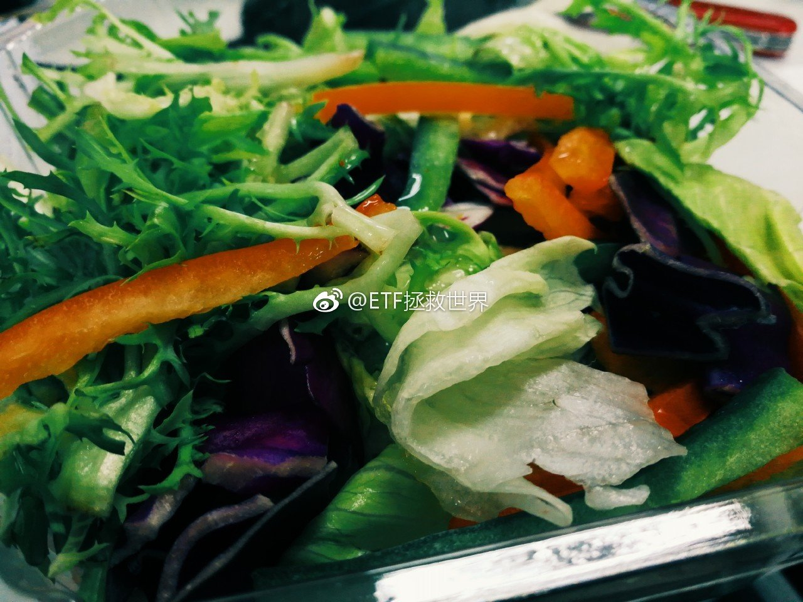

======================================================

ETF拯救世界 (5687069307) @
2017-07-12 14:37:04 Wed  
url: https://weibo.com/5687069307/Fc2wJorKR

还是免费的受欢迎一刚。//@ETF拯救世界:惊了，能不能到3000围观。

------------------------------------------------------
转推：
>  @ETF拯救世界 (5687069307)
>  2017-07-12 08:59:38 Wed  
>  url: https:/weibo.com/5687069307/Fc0jLtGZq/

>  这个问题收费时效也过了，一块钱都舍不得花的朋友可以免费看了……哈哈哈……
>  
>  http://t.cn/RKxRock ​​​

转发[5]  评论[25]  赞[34] 

======================================================

ETF拯救世界 (5687069307) @
2017-07-12 14:50:28 Wed  
url: https://weibo.com/5687069307/Fc2CavKVY

居然红了。//@ETF拯救世界:回复@依小然-:立个flag，如果创业板指数还能跌20%-30%。那么到那个地方全仓买入（最好在两融账户做担保品买入），然后就什么都不用干，未来十年等着赚大钱吧。//@依小然-:创业板要去新低了吗 E大

------------------------------------------------------
转推：
>  @ETF拯救世界 (5687069307)
>  2017-07-12 08:59:38 Wed  
>  url: https:/weibo.com/5687069307/Fc0jLtGZq/

>  这个问题收费时效也过了，一块钱都舍不得花的朋友可以免费看了……哈哈哈……
>  
>  http://t.cn/RKxRock ​​​

转发[6]  评论[52]  赞[40] 

======================================================

ETF拯救世界 (5687069307) @
2017-07-12 22:00:41 Wed  
url: https://weibo.com/5687069307/Fc5qNjwLE

每日打卡(27)

继续。出汗很舒服 ​​​

转发[0]  评论[30]  赞[73] 

+++++++++++++++++++++++++++++++++++++++++++++++++++++

图片：

======================================================

ETF拯救世界 (5687069307) @
2017-07-13 09:09:08 Thu  
url: https://weibo.com/5687069307/Fc9O80Btg

惊了，4000妥妥的。//@ETF拯救世界:惊了，能不能到3000围观。

------------------------------------------------------
转推：
>  @ETF拯救世界 (5687069307)
>  2017-07-12 08:59:38 Wed  
>  url: https:/weibo.com/5687069307/Fc0jLtGZq/

>  这个问题收费时效也过了，一块钱都舍不得花的朋友可以免费看了……哈哈哈……
>  
>  http://t.cn/RKxRock ​​​

转发[0]  评论[28]  赞[38] 

======================================================

ETF拯救世界 (5687069307) @
2017-07-13 09:30:37 Thu  
url: https://weibo.com/5687069307/Fc9WQqQru

其实有时候我说的可能有些朋友不是很理解。但是如果一年、两年后你再回头去看，就会有更深的体会。

------------------------------------------------------
转推：
>  @ETF拯救世界 (5687069307)
>  2017-07-12 09:40:15 Wed  
>  url: https:/weibo.com/5687069307/Fc0Afzx76/

>  $159920  新高不卖是我的一条投资原则。 ​​​

转发[7]  评论[21]  赞[58] 

======================================================

ETF拯救世界 (5687069307) @
2017-07-13 09:48:04 Thu  
url: https://weibo.com/5687069307/Fca3VhylX

“让利润奔跑”是一件说起来很简单，其实很难的事。

买了就亏的话，长期持有就很简单。因为很少有人愿意亏损卖出持仓。

而像我们这样，因为对成本要求特别严格，所以绝大部分品种买了就赚，然后一路走高，这时候拿着就特别难。

落袋为安，是绝大多数人的希望。

但是没有10%、30%、70%……哪里来的1 ​​​

转发[112]  评论[123]  赞[207] 

======================================================

ETF拯救世界 (5687069307) @
2017-07-13 10:16:34 Thu  
url: https://weibo.com/5687069307/FcafuptTF

回复@圈儿-恩蔷:其实不用苛求自己一定要卖在山顶上。记住老巴投资中石油的例子就可以。1.6成本，12清仓，然后涨到21，被逼在CCTV认错。谁能买在最低卖在最高？谁也不行。那是传说。只要吃到中间大部分利润就足够了。

------------------------------------------------------
转推：
>  @ETF拯救世界 (5687069307)
>  2017-07-13 09:48:04 Thu  
>  url: https:/weibo.com/5687069307/Fca3VhylX/

>  “让利润奔跑”是一件说起来很简单，其实很难的事。
>  
>  买了就亏的话，长期持有就很简单。因为很少有人愿意亏损卖出持仓。
>  
>  而像我们这样，因为对成本要求特别严格，所以绝大部分品种买了就赚，然后一路走高，这时候拿着就特别难。
>  
>  落袋为安，是绝大多数人的希望。
>  
>  但是没有10%、30%、70%……哪里来的1 ​​​

转发[15]  评论[32]  赞[59] 

======================================================

ETF拯救世界 (5687069307) @
2017-07-13 11:04:51 Thu  
url: https://weibo.com/5687069307/Fcaz5a5sZ

回复@xinhua_sz:再次提醒，所有冒充我主动私信各位的，全都是 大 骗 子。一定要擦亮眼睛，看清楚，不要上当。骗子太多，我举报不过来。//@xinhua_sz:E大，有个名字叫 ETF--拯救世界 的，问我QQ多少，拉我进实盘。兴奋得我小心脏蹦跶蹦跶的。忽然发现名字不对，唉~~

------------------------------------------------------
转推：
>  @ETF拯救世界 (5687069307)
>  2017-07-13 09:48:04 Thu  
>  url: https:/weibo.com/5687069307/Fca3VhylX/

>  “让利润奔跑”是一件说起来很简单，其实很难的事。
>  
>  买了就亏的话，长期持有就很简单。因为很少有人愿意亏损卖出持仓。
>  
>  而像我们这样，因为对成本要求特别严格，所以绝大部分品种买了就赚，然后一路走高，这时候拿着就特别难。
>  
>  落袋为安，是绝大多数人的希望。
>  
>  但是没有10%、30%、70%……哪里来的1 ​​​

转发[0]  评论[30]  赞[36] 

======================================================

ETF拯救世界 (5687069307) @
2017-07-13 13:31:02 Thu  
url: https://weibo.com/5687069307/FcbwqFP9b

回复@godshan:今年如果你只看50，会觉得好牛啊。看300，会觉得也很不错。但你要看500、看1000、看创业，这些代表90%股票的指数，你会发现熊一直没走。就像我不认可2012年底到2014年中之前，小股票撒欢的涨，A股是熊市的说法一样，我也不认可现在是牛市。我只看大多数股票的走势，大多数股票好才是牛市

------------------------------------------------------
转推：
>  @ETF拯救世界 (5687069307)
>  2017-07-13 09:48:04 Thu  
>  url: https:/weibo.com/5687069307/Fca3VhylX/

>  “让利润奔跑”是一件说起来很简单，其实很难的事。
>  
>  买了就亏的话，长期持有就很简单。因为很少有人愿意亏损卖出持仓。
>  
>  而像我们这样，因为对成本要求特别严格，所以绝大部分品种买了就赚，然后一路走高，这时候拿着就特别难。
>  
>  落袋为安，是绝大多数人的希望。
>  
>  但是没有10%、30%、70%……哪里来的1 ​​​

转发[11]  评论[33]  赞[76] 

======================================================

ETF拯救世界 (5687069307) @
2017-07-13 14:44:48 Thu  
url: https://weibo.com/5687069307/Fcc0ndq5D

回复@BR芭斯罗缤:也是醉了。知道我犹豫不决就来这么一出。玩我呢。//@BR芭斯罗缤:今晚滴滴有望[鼓掌]

------------------------------------------------------
转推：
>  @ETF拯救世界 (5687069307)
>  2017-07-13 09:48:04 Thu  
>  url: https:/weibo.com/5687069307/Fca3VhylX/

>  “让利润奔跑”是一件说起来很简单，其实很难的事。
>  
>  买了就亏的话，长期持有就很简单。因为很少有人愿意亏损卖出持仓。
>  
>  而像我们这样，因为对成本要求特别严格，所以绝大部分品种买了就赚，然后一路走高，这时候拿着就特别难。
>  
>  落袋为安，是绝大多数人的希望。
>  
>  但是没有10%、30%、70%……哪里来的1 ​​​

转发[0]  评论[48]  赞[46] 

======================================================

ETF拯救世界 (5687069307) @
2017-07-13 17:25:04 Thu  
url: https://weibo.com/5687069307/Fcd3q8Z9Y

今天不发车。这个月中发不发最终看明天确定。

散了散了啊，别围着了。 ​​​

转发[1]  评论[91]  赞[113] 

+++++++++++++++++++++++++++++++++++++++++++++++++++++

图片：

======================================================

ETF拯救世界 (5687069307) @
2017-07-13 22:02:48 Thu  
url: https://weibo.com/5687069307/FceS9DQuF

每日打卡(28)

累，坚持 ​​​

转发[1]  评论[9]  赞[73] 

+++++++++++++++++++++++++++++++++++++++++++++++++++++

图片：

======================================================

ETF拯救世界 (5687069307) @
2017-07-14 09:04:08 Fri  
url: https://weibo.com/5687069307/FcjcADeku

回复@colorful木木:没有人会是“完美”的，爱一个人就要接受他的全部~更何况，你心目中的完美，在别人眼里也许是一文不值。你眼中的优点，在别人眼里是天大的缺点呢。

------------------------------------------------------
转推：
>  @ETF拯救世界 (5687069307)
>  2017-07-13 09:48:04 Thu  
>  url: https:/weibo.com/5687069307/Fca3VhylX/

>  “让利润奔跑”是一件说起来很简单，其实很难的事。
>  
>  买了就亏的话，长期持有就很简单。因为很少有人愿意亏损卖出持仓。
>  
>  而像我们这样，因为对成本要求特别严格，所以绝大部分品种买了就赚，然后一路走高，这时候拿着就特别难。
>  
>  落袋为安，是绝大多数人的希望。
>  
>  但是没有10%、30%、70%……哪里来的1 ​​​

转发[4]  评论[19]  赞[52] 

======================================================

ETF拯救世界 (5687069307) @
2017-07-14 09:35:48 Fri  
url: https://weibo.com/5687069307/Fcjprl1g0

你们不要整天盼着暴跌。

第一个，金融市场的主基调和常态永远是稳定的。不稳定是非常态。非常态就是说只在极少时间会出现，那这样你天天盼着，不出现，就很失望。人生就不幸福。

第二个，现在是什么时间点你也不看看，对于全世界几乎最有能力把控金融市场的***来说，是不会允许现在有巨大波动的。

 ​​​

转发[18]  评论[56]  赞[114] 

======================================================

ETF拯救世界 (5687069307) @
2017-07-14 09:45:11 Fri  
url: https://weibo.com/5687069307/FcjtfrLZ7

博时债又分红了。还不错。拿现金就可以。 ​​​

转发[3]  评论[26]  赞[69] 

======================================================

ETF拯救世界 (5687069307) @
2017-07-14 09:46:20 Fri  
url: https://weibo.com/5687069307/FcjtIo7wV

最近看很多人开始买银行保险之类的。据说是市场最“最后的价值洼地”。

听起来还蛮耳熟的。

看了看，不少品种快新高了。

人性永不变啊。 ​​​

转发[21]  评论[82]  赞[97] 

======================================================

ETF拯救世界 (5687069307) @
2017-07-14 11:34:54 Fri  
url: https://weibo.com/5687069307/FckbMwE2U

回复@二维码aaaaaaaaaaaa:要说就得说全了，否则容易误会。去年底卖出最后一网油气网格本金后，我说，“记得留利润长期持有，不到60不卖。60以上多少卖看自己本事”。留利润，划重点。

------------------------------------------------------
转推：
>  @ETF拯救世界 (5687069307)
>  2017-07-14 09:46:20 Fri  
>  url: https:/weibo.com/5687069307/FcjtIo7wV/

>  最近看很多人开始买银行保险之类的。据说是市场最“最后的价值洼地”。
>  
>  听起来还蛮耳熟的。
>  
>  看了看，不少品种快新高了。
>  
>  人性永不变啊。 ​​​

转发[8]  评论[26]  赞[54] 

======================================================

ETF拯救世界 (5687069307) @
2017-07-14 13:20:20 Fri  
url: https://weibo.com/5687069307/FckSA2e56

回复@nearbythere:是跟计划吗。一份，0.6%份额，跌10%，亏损0.06%。至于那么悲伤吗……//@nearbythere:真是悲伤的一课，深陷油气十个点

------------------------------------------------------
转推：
>  @ETF拯救世界 (5687069307)
>  2017-07-14 09:46:20 Fri  
>  url: https:/weibo.com/5687069307/FcjtIo7wV/

>  最近看很多人开始买银行保险之类的。据说是市场最“最后的价值洼地”。
>  
>  听起来还蛮耳熟的。
>  
>  看了看，不少品种快新高了。
>  
>  人性永不变啊。 ​​​

转发[0]  评论[33]  赞[53] 

======================================================

ETF拯救世界 (5687069307) @
2017-07-14 13:35:16 Fri  
url: https://weibo.com/5687069307/FckYDzcua

第三轮计划开始以来，40多次买入中，有13次左右是买了就没有发生任何下跌的——就是说，买了就涨，是最低点。

另外的三十多次，是买了会有下跌，然而有的是跌一点又涨了，有的是低位补仓然后赚了。目前到现在，16个品种有3个品种浮亏中。

分别是

持仓0.6%的500增强，浮亏0.04%；

持仓0.6%的创业浮 ​​​

转发[11]  评论[117]  赞[132] 

======================================================

ETF拯救世界 (5687069307) @
2017-07-14 13:51:10 Fri  
url: https://weibo.com/5687069307/Fcl5608qg

回复@陈小脱:错了，私募基金经理如果净值不跌，就没事。谁管你买的品种里有没有大跌的。我现在面临的是任何品种有问题都会有人不开心。哪怕仓位再小，哪怕整体昨天还在创新高。//@陈小脱:想想那些私募基金经理，每天要面对多少质疑啊[允悲]

------------------------------------------------------
转推：
>  @ETF拯救世界 (5687069307)
>  2017-07-14 13:35:16 Fri  
>  url: https:/weibo.com/5687069307/FckYDzcua/

>  第三轮计划开始以来，40多次买入中，有13次左右是买了就没有发生任何下跌的——就是说，买了就涨，是最低点。
>  
>  另外的三十多次，是买了会有下跌，然而有的是跌一点又涨了，有的是低位补仓然后赚了。目前到现在，16个品种有3个品种浮亏中。
>  
>  分别是
>  
>  持仓0.6%的500增强，浮亏0.04%；
>  
>  持仓0.6%的创业浮 ​​​

转发[1]  评论[50]  赞[56] 

======================================================

ETF拯救世界 (5687069307) @
2017-07-14 14:09:55 Fri  
url: https://weibo.com/5687069307/FclcHzVKK

其实我也很理解各种声音。为什么？因为参考计划的朋友风险承受能力差十倍，可是却参考同一个计划，这本身就非常不科学。

面对同样的计划，有朋友会觉得太二了这么保守；有朋友会觉得太可怕了买这么多了（这个应该是未来大跌后很多人会有的想法）。有朋友整个组合净值下跌30%面无惧色，有朋友组合净值 ​​​

转发[9]  评论[225]  赞[123] 

======================================================

ETF拯救世界 (5687069307) @
2017-07-14 14:30:09 Fri  
url: https://weibo.com/5687069307/FclkV2yoc

刚才回测了一下，创业板etf 159915 如果从 2015年6月15日开始，以不带任何技巧的每个月15日无脑定投，到现在亏损多少？

16%。

要知道它从那天起到现在跌了53%。

你信不信它还会跌53%？我真的不信。

所以我用比每个月无脑买入高级n倍的方式去投资它，相信极端情况也会把浮亏幅度控制的很不错。 ​​​

转发[22]  评论[156]  赞[182] 

======================================================

ETF拯救世界 (5687069307) @
2017-07-14 22:09:00 Fri  
url: https://weibo.com/5687069307/FcoladPWY

每日打卡(29)

又来打了。这组很奇怪，做的时候不觉得累，做完了肌肉疼三天。 ​​​

转发[0]  评论[28]  赞[84] 

+++++++++++++++++++++++++++++++++++++++++++++++++++++

图片：

======================================================

ETF拯救世界 (5687069307) @
2017-07-15 21:01:09 Sat  
url: https://weibo.com/5687069307/Fcxk7s1jk

每日打卡(30)

今日无话。坚持。 ​​​

转发[0]  评论[29]  赞[80] 

+++++++++++++++++++++++++++++++++++++++++++++++++++++

图片：

======================================================

ETF拯救世界 (5687069307) @
2017-07-16 23:02:02 Sun  
url: https://weibo.com/5687069307/FcHxGlFxw

每日打卡(31)

聚会回来，很累不想动。还是坚持做完，不过有几个动作不太标准。

坚持。 ​​​

转发[0]  评论[30]  赞[86] 

+++++++++++++++++++++++++++++++++++++++++++++++++++++

图片：
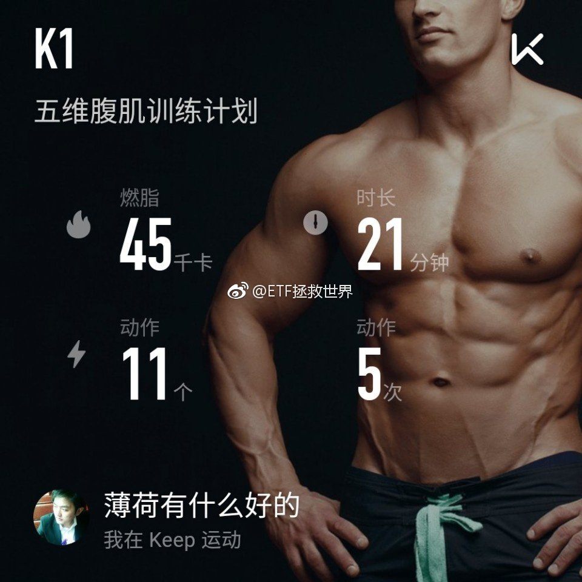

======================================================

ETF拯救世界 (5687069307) @
2017-07-17 09:40:51 Mon  
url: https://weibo.com/5687069307/FcLIYD1dg

怎么样，是不是要做点什么。 ​​​

转发[1]  评论[109]  赞[93] 

======================================================

ETF拯救世界 (5687069307) @
2017-07-17 09:44:49 Mon  
url: https://weibo.com/5687069307/FcLKB86K6

呵呵哒，7月份的尾巴，你是狮子座……剧本早就写好了，照着演就对了。//@ETF拯救世界:回复@蓝图806:不对啊，剧本上至少应该是下个月啊。什么情况，演员开始自己发挥了！导演不答应。//@蓝图806:瀑布的感觉......

------------------------------------------------------
转推：
>  @ETF拯救世界 (5687069307)
>  2017-06-23 11:23:14 Fri  
>  url: https:/weibo.com/5687069307/F988CrnGy/

>  下跌不会死人，反弹才会。 ​​​

转发[2]  评论[36]  赞[62] 

======================================================

ETF拯救世界 (5687069307) @
2017-07-17 09:54:13 Mon  
url: https://weibo.com/5687069307/FcLOpcMpY

不同于5月底的一次六份，过去50多天，计划只买了一份。

原因吗，你现在知道了。

下次买几份？ ​​​

转发[6]  评论[77]  赞[113] 

======================================================

ETF拯救世界 (5687069307) @
2017-07-17 10:04:07 Mon  
url: https://weibo.com/5687069307/FcLSqhRu9

再次提醒大家，没有不好的品种，只有不好的价格。别人说什么并不重要，因为大多数人都是错的。

价格低就是最大的利好，对于满把现金的你来说，下跌的东西才是坠吼的。

不要理会别人怎么说！买便宜货。 ​​​

转发[29]  评论[63]  赞[159] 

======================================================

ETF拯救世界 (5687069307) @
2017-07-17 10:17:43 Mon  
url: https://weibo.com/5687069307/FcLXWtPWA

A股赚大钱的，只有10%的人。

想要成为这10%的人，除了你有内幕消息，做老鼠仓那些不正当的路子，一定是要做一些一般人看不懂、瞧不起、做不到的事。

有很多条路可以赚大钱。趋势价值量化……都可以。关键就在于，一定是绝大多数人都做不到的。

什么事绝大多数人做不到，你做到了，基本就成功一半了 ​​​

转发[37]  评论[78]  赞[122] 

======================================================

ETF拯救世界 (5687069307) @
2017-07-17 11:00:17 Mon  
url: https://weibo.com/5687069307/FcMfdF1dJ

回复@观音山上拜观音:我也想啊。肥肠可惜，只能收盘才有数据可跑。人生不如意事十之八九。//@观音山上拜观音:大大，应该在跑数据，现在😊！

------------------------------------------------------
转推：
>  @ETF拯救世界 (5687069307)
>  2017-07-17 10:17:43 Mon  
>  url: https:/weibo.com/5687069307/FcLXWtPWA/

>  A股赚大钱的，只有10%的人。
>  
>  想要成为这10%的人，除了你有内幕消息，做老鼠仓那些不正当的路子，一定是要做一些一般人看不懂、瞧不起、做不到的事。
>  
>  有很多条路可以赚大钱。趋势价值量化……都可以。关键就在于，一定是绝大多数人都做不到的。
>  
>  什么事绝大多数人做不到，你做到了，基本就成功一半了 ​​​

转发[3]  评论[15]  赞[44] 

======================================================

ETF拯救世界 (5687069307) @
2017-07-17 11:16:14 Mon  
url: https://weibo.com/5687069307/FcMlHeZH8

今天计划弄不好又新高了……

拉50没意见，求放过中小创。 ​​​

转发[3]  评论[39]  赞[67] 

======================================================

ETF拯救世界 (5687069307) @
2017-07-17 11:21:12 Mon  
url: https://weibo.com/5687069307/FcMnIf0gI

回复@疯狂为乐此不疲:我更愿意说，离我们大量布局越来越近了。//@疯狂为乐此不疲:中小创完蛋了吗[泪][泪][泪][泪][泪]

------------------------------------------------------
转推：
>  @ETF拯救世界 (5687069307)
>  2017-07-17 11:16:14 Mon  
>  url: https:/weibo.com/5687069307/FcMlHeZH8/

>  今天计划弄不好又新高了……
>  
>  拉50没意见，求放过中小创。 ​​​

转发[1]  评论[39]  赞[82] 

======================================================

ETF拯救世界 (5687069307) @
2017-07-17 13:27:00 Mon  
url: https://weibo.com/5687069307/FcNcM5AA1

最近不少朋友在我的评论里留言：中小股票业绩大幅下降，怎么办？

我一再跟大家说，不要轻易相信任何人的说法。要有独立的判断能力。别人说中小股票业绩下降，你也跟着嚷嚷，这样不行。

2017年半年度A股业绩到底如何，8月底自然见到分晓。目前刚开始披露。

如果按照业绩预报来说，是这样的：

已经发 ​​​

转发[29]  评论[80]  赞[178] 

======================================================

ETF拯救世界 (5687069307) @
2017-07-17 14:07:18 Mon  
url: https://weibo.com/5687069307/FcNt8dhPI

滴滴。

还有一小时，希望不要被干。 ​​​

转发[4]  评论[126]  赞[107] 

======================================================

ETF拯救世界 (5687069307) @
2017-07-17 14:35:20 Mon  
url: https://weibo.com/5687069307/FcNEvBH71

很有意思。6月2日根据估值数据判断的反弹时间，高度，都没问题。反弹在7月结束，高度是7月7日的43.xx。之前反弹起来不舒服的朋友，现在应该反思一下。真的。想清楚了，对你自己未来的投资有很大的好处。

------------------------------------------------------
转推：
>  @ETF拯救世界 (5687069307)
>  2017-06-21 15:12:06 Wed  
>  url: https:/weibo.com/5687069307/F8QMwqIPU/

>  非常非常有意思。从6月2日起，我就从历史估值数据的角度跟大家探讨，这里恐怕会有一次反弹。指数涨幅不知道，估值涨幅在10%左右。当时等权估值39.x，我判断到43-44是历史大概率。时间的话，一两个月的长度应该是有的。
>  
>  这一切都来源于历史数据。
>  
>  即使这些观点重复了好几次，看起来不少朋友面对真正到 ​​​

转发[12]  评论[36]  赞[78] 

======================================================

ETF拯救世界 (5687069307) @
2017-07-17 14:52:53 Mon  
url: https://weibo.com/5687069307/FcNLDmXZ4

另外，如果这样持续两周。或者说接下来基本横盘然后有几天下台阶，那么可以肯定的是，月末又要大笔进货了。弄不好是过去两年力度最大的一次。 ​​​

转发[11]  评论[87]  赞[159] 

======================================================

ETF拯救世界 (5687069307) @
2017-07-17 15:25:57 Mon  
url: https://weibo.com/5687069307/FcNZ3qozN

数据跑出来了。

今天开一份，少了。 [微笑] ​​​

转发[40]  评论[79]  赞[82] 

======================================================

ETF拯救世界 (5687069307) @
2017-07-17 15:30:03 Mon  
url: https://weibo.com/5687069307/FcO0IyND4

2015年6月以来，今日开始（如果不再反弹），A股的熊市正式进入下半场。也就是说……是时候开始为下一轮资产飞跃收集筹码了——真正的开始收集筹码。

------------------------------------------------------
转推：
>  @ETF拯救世界 (5687069307)
>  2017-07-17 15:25:57 Mon  
>  url: https:/weibo.com/5687069307/FcNZ3qozN/

>  数据跑出来了。
>  
>  今天开一份，少了。 [微笑] ​​​

转发[32]  评论[116]  赞[145] 

======================================================

ETF拯救世界 (5687069307) @
2017-07-17 17:47:31 Mon  
url: https://weibo.com/5687069307/FcOUwbbi5

再扯个淡吧。由于本次反弹力度比较弱，只是反弹到预期的下沿，所以接下来还会有一次力度非常非常大的反弹。力度之大甚至会让人认为是牛市又来了。反弹开始的位置在加权27-29之间。结束位置在34-36之间。目前是多少，30.xx。

------------------------------------------------------
转推：
>  @ETF拯救世界 (5687069307)
>  2017-06-02 09:04:42 Fri  
>  url: https:/weibo.com/5687069307/F5VfXvgOl/

>  昨天没有新高。哼！ [哼]
>  
>  送各位一张外部数据加权估值图。从历史经验看，本月，最迟下月，可能有一次级别比较大的反弹。当然，反弹之后…… ​​​

转发[47]  评论[135]  赞[126] 

======================================================

ETF拯救世界 (5687069307) @
2017-07-17 21:22:49 Mon  
url: https://weibo.com/5687069307/FcQjUjwaf

每日打卡(31)

今天来一组HIIT。希望总在前方。 ​​​

转发[0]  评论[16]  赞[63] 

+++++++++++++++++++++++++++++++++++++++++++++++++++++

图片：
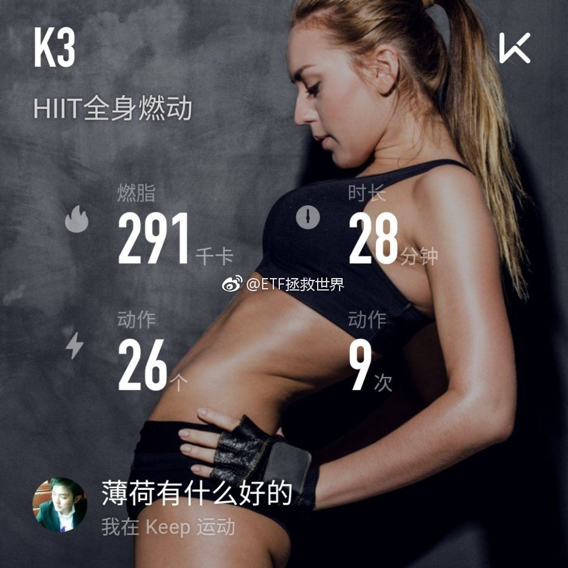

======================================================

ETF拯救世界 (5687069307) @
2017-07-17 21:43:34 Mon  
url: https://weibo.com/5687069307/FcQskqtJ7

差一点了。希望明早起床已经成交。 ​​​

转发[1]  评论[28]  赞[57] 

+++++++++++++++++++++++++++++++++++++++++++++++++++++

图片：
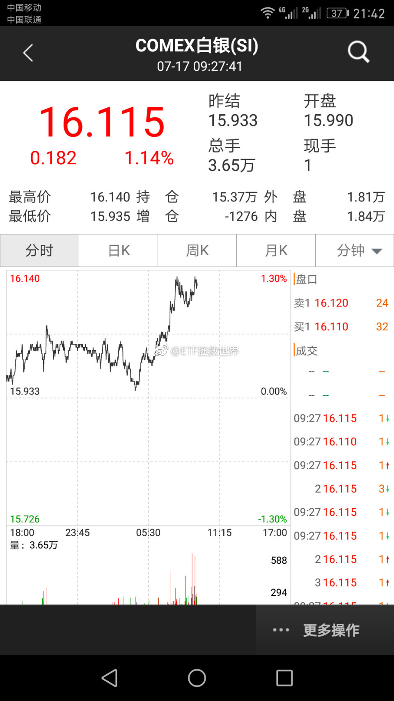

======================================================

ETF拯救世界 (5687069307) @
2017-07-18 08:15:35 Tue  
url: https://weibo.com/5687069307/FcUARhHrD

回复@乔科男:公众号chinaetfs//@乔科男:E大，请问1份是什么概念？怎样根据个人资产状况确定一份是多少？

------------------------------------------------------
转推：
>  @ETF拯救世界 (5687069307)
>  2017-07-17 15:25:57 Mon  
>  url: https:/weibo.com/5687069307/FcNZ3qozN/

>  数据跑出来了。
>  
>  今天开一份，少了。 [微笑] ​​​

转发[0]  评论[8]  赞[24] 

======================================================

ETF拯救世界 (5687069307) @
2017-07-18 08:53:14 Tue  
url: https://weibo.com/5687069307/FcUQ9he83

昨天一跌，16个品种中浮亏的增加到5只，多了三只，主要是这几个月建仓的品种。已买入品种年化收益率也降至16%。昨天总收益率跌0.3x%。

说说你的想法。 ​​​

转发[7]  评论[136]  赞[78] 

======================================================

ETF拯救世界 (5687069307) @
2017-07-18 09:21:27 Tue  
url: https://weibo.com/5687069307/FcV1Bm9BG

回复@乔木:不，第二场战役已经走了一半了。这是我2015年7月的一篇东西，目前的走势可以说完全在两年前的预料之中。不会太远了。http://t.cn/RKH8yMT //@乔木:局部战事失利，整体战争胜利。三大战役即将展开

------------------------------------------------------
转推：
>  @ETF拯救世界 (5687069307)
>  2017-07-18 08:53:14 Tue  
>  url: https:/weibo.com/5687069307/FcUQ9he83/

>  昨天一跌，16个品种中浮亏的增加到5只，多了三只，主要是这几个月建仓的品种。已买入品种年化收益率也降至16%。昨天总收益率跌0.3x%。
>  
>  说说你的想法。 ​​​

转发[3]  评论[26]  赞[57] 

======================================================

ETF拯救世界 (5687069307) @
2017-07-18 09:57:03 Tue  
url: https://weibo.com/5687069307/FcVg3iMAw

老司机说一句：控制节奏。 ​​​

转发[2]  评论[34]  赞[114] 

======================================================

ETF拯救世界 (5687069307) @
2017-07-18 10:08:44 Tue  
url: https://weibo.com/5687069307/FcVkNhXpT

趋势一旦形成，轻易不要去判断拐点。通常来讲，趋势延续的时间会超过大多数人的想象。

衔远山，吞长江，浩浩汤汤，横无际涯。

通常来讲，你要知道来势汹汹的敌人到底是真的雄兵百万，还是徒有其表，只是纸老虎。

面对有实力的敌人，不妨腾挪躲闪，保存自家实力。毕竟你我只是这个生态系统中的小蚂蚁 ​​​

转发[57]  评论[92]  赞[228] 

======================================================

ETF拯救世界 (5687069307) @
2017-07-18 11:08:50 Tue  
url: https://weibo.com/5687069307/FcVJbApx5

医药如果能7000点买入，那么未来十年十倍是起点。

一个忽悠，不一定对。 ​​​

转发[35]  评论[124]  赞[169] 

======================================================

ETF拯救世界 (5687069307) @
2017-07-18 13:09:39 Tue  
url: https://weibo.com/5687069307/FcWwedyDo

年初至今，3005只股票中

中位数是跌幅17.78%；

跌幅超过20%的有1341只；

跌幅超过30%的有695只；

跌幅最大的67%。

上涨的626只，占20.83%；

涨幅超过10%的有355只，占11.81%；

涨幅超过20%的有201只，占6.69%。

正所谓九死一生。今年大部分炒股的朋友所受到的伤害，在座的各位恐怕无法体会。 ​​​

转发[21]  评论[72]  赞[141] 

======================================================

ETF拯救世界 (5687069307) @
2017-07-18 20:39:17 Tue  
url: https://weibo.com/5687069307/FcZsJuAKj

每日打卡(32)

坚持。为了健康。 ​​​

转发[0]  评论[32]  赞[97] 

+++++++++++++++++++++++++++++++++++++++++++++++++++++

图片：

======================================================

ETF拯救世界 (5687069307) @
2017-07-19 09:51:10 Wed  
url: https://weibo.com/5687069307/Fd4Ea77IM

$恒生指数 hkHSI$   这样的话，用不了多久就要平衡一下了。 ​​​

转发[2]  评论[97]  赞[105] 

======================================================

ETF拯救世界 (5687069307) @
2017-07-19 20:59:39 Wed  
url: https://weibo.com/5687069307/Fd91v1zDu

每日打卡(33)

坚持。今天事情多，没有时间泡微博。估计这几天都没太多时间。

锻炼的时间总要挤出来。身体最重要。 ​​​

转发[0]  评论[29]  赞[130] 

+++++++++++++++++++++++++++++++++++++++++++++++++++++

图片：

======================================================

ETF拯救世界 (5687069307) @
2017-07-20 10:40:32 Thu  
url: https://weibo.com/5687069307/FdeoHd5jp

无论你持有的品种（每一只，不是组合）怎么跌，底部到来的时候，想尽办法将浮亏保持在10%-15%之间。

如果能够做到，在资本市场你不会死，还会赚很多。 ​​​

转发[53]  评论[105]  赞[185] 

======================================================

ETF拯救世界 (5687069307) @
2017-07-20 13:47:24 Thu  
url: https://weibo.com/5687069307/FdfCxCWsG

50、300、红利、恒生。新高不卖。至少是绝大多数仓位不要卖，利润让它飞。

500、创业、医药、养老……以后的金矿，越跌越买，逢低就买，尽量低位多攒筹码。

保持廉价筹码越来越多的前提下，市值不断新高。就像你有个农场，有几块地的粮食熟了，有几块还在播种，交替进行，然后你的地和种子越来越多。 ​​​

转发[81]  评论[75]  赞[230] 

======================================================

ETF拯救世界 (5687069307) @
2017-07-20 14:20:39 Thu  
url: https://weibo.com/5687069307/FdfQ2uw3P

有没有人：

周一大跌：我靠，轻仓好有道理。神了。

反弹两天：我靠，是不是踏空了。应该满仓的！ ​​​

转发[5]  评论[142]  赞[175] 

======================================================

ETF拯救世界 (5687069307) @
2017-07-20 21:46:40 Thu  
url: https://weibo.com/5687069307/FdiL52pe5

每日打卡(34)

今天做两组。一组不够了。 ​​​

转发[0]  评论[49]  赞[100] 

+++++++++++++++++++++++++++++++++++++++++++++++++++++

图片：

======================================================

ETF拯救世界 (5687069307) @
2017-07-21 22:27:23 Fri  
url: https://weibo.com/5687069307/Fdss6k1TY

每日打卡(35)

k3的腹肌撕裂者进阶做完毫无感觉。怎么办，怎么进步。

今天忙，没有说话。大家怎么样。 ​​​

转发[1]  评论[42]  赞[61] 

+++++++++++++++++++++++++++++++++++++++++++++++++++++

图片：

======================================================

ETF拯救世界 (5687069307) @
2017-07-21 22:33:58 Fri  
url: https://weibo.com/5687069307/FdsuMopun

呵呵呵，成交了，不容易。继续挂#突然开心# ​​​

转发[1]  评论[54]  赞[82] 

+++++++++++++++++++++++++++++++++++++++++++++++++++++

图片：
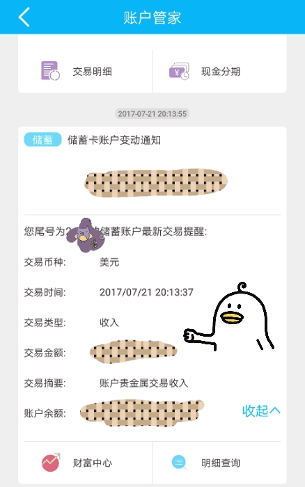

======================================================

ETF拯救世界 (5687069307) @
2017-07-21 22:52:25 Fri  
url: https://weibo.com/5687069307/FdsCgjKKq

会不会给咱们继续买的机会 ​​​

转发[4]  评论[67]  赞[90] 

+++++++++++++++++++++++++++++++++++++++++++++++++++++

图片：
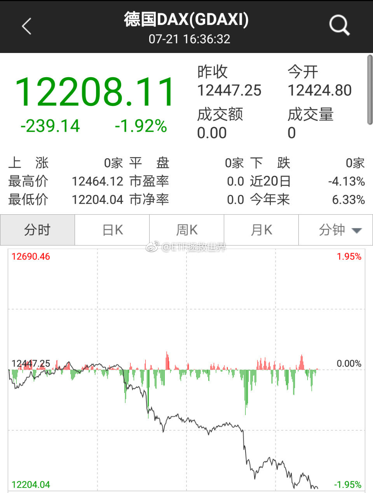

======================================================

ETF拯救世界 (5687069307) @
2017-07-22 23:54:58 Sat  
url: https://weibo.com/5687069307/FdCs9g24H

每日打卡(36)

今天是有点晚 ​​​

转发[0]  评论[20]  赞[82] 

+++++++++++++++++++++++++++++++++++++++++++++++++++++

图片：

======================================================

ETF拯救世界 (5687069307) @
2017-07-23 20:21:19 Sun  
url: https://weibo.com/5687069307/FdKtV1yqI

每日打卡(37)

坚持。 ​​​

转发[0]  评论[30]  赞[92] 

+++++++++++++++++++++++++++++++++++++++++++++++++++++

图片：

======================================================

ETF拯救世界 (5687069307) @
2017-07-24 09:54:00 Mon  
url: https://weibo.com/5687069307/FdPNNgaj6

这两个数字都不准。实际情况目前创业板指应该还是比纳指贵50%以上。不过从各自最近十年估值纵向来看，纳指确实高，创业板确实不高（也不便宜）。只希望创业板继续暴跌，让我们捡到真正便宜的好东西。

------------------------------------------------------
转推：
>  @ ()
>  2017-07-24 08:59:16 Mon  
>  url: 

>  抱歉，此微博已被作者删除。查看帮助：http://t.cn/Rfd3rQV

转发[10]  评论[65]  赞[111] 

======================================================

ETF拯救世界 (5687069307) @
2017-07-24 21:05:37 Mon  
url: https://weibo.com/5687069307/FdUcp4Ad8

每日打卡(38)

今天一位健身好几个月的朋友发了几张照片给我，看了感觉时光逆流回到最美好的那年。

更美好的人，事，生活和自己，激励我们不断往前，根本停不下来。

今天这组不错，难度高了不少。 ​​​

转发[0]  评论[26]  赞[101] 

+++++++++++++++++++++++++++++++++++++++++++++++++++++

图片：
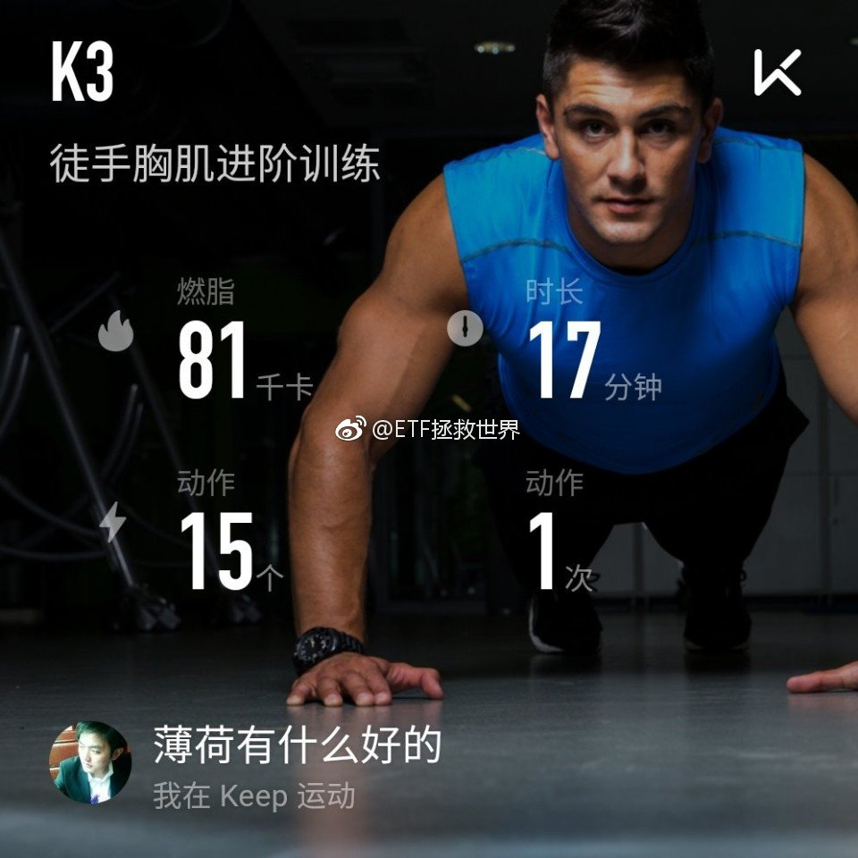

======================================================

ETF拯救世界 (5687069307) @
2017-07-25 06:42:29 Tue  
url: https://weibo.com/5687069307/FdXYyijMb

继续新高。三只浮亏。说起来你不信，我喜欢浮亏的品种。 ​​​

转发[28]  评论[119]  赞[160] 

+++++++++++++++++++++++++++++++++++++++++++++++++++++

图片：
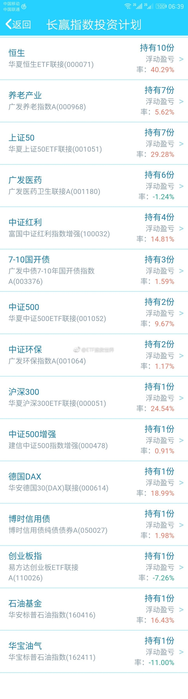

======================================================

ETF拯救世界 (5687069307) @
2017-07-25 14:02:39 Tue  
url: https://weibo.com/5687069307/Fe0RdqLTT

还有4天，又挖坑？每次都这样，怪不好意思的。 ​​​

转发[52]  评论[93]  赞[134] 

======================================================

ETF拯救世界 (5687069307) @
2017-07-25 22:24:34 Tue  
url: https://weibo.com/5687069307/Fe48WtPJM

每日打卡(39)

来点新鲜的。这个不错，有点累。 ​​​

转发[0]  评论[13]  赞[68] 

+++++++++++++++++++++++++++++++++++++++++++++++++++++

图片：
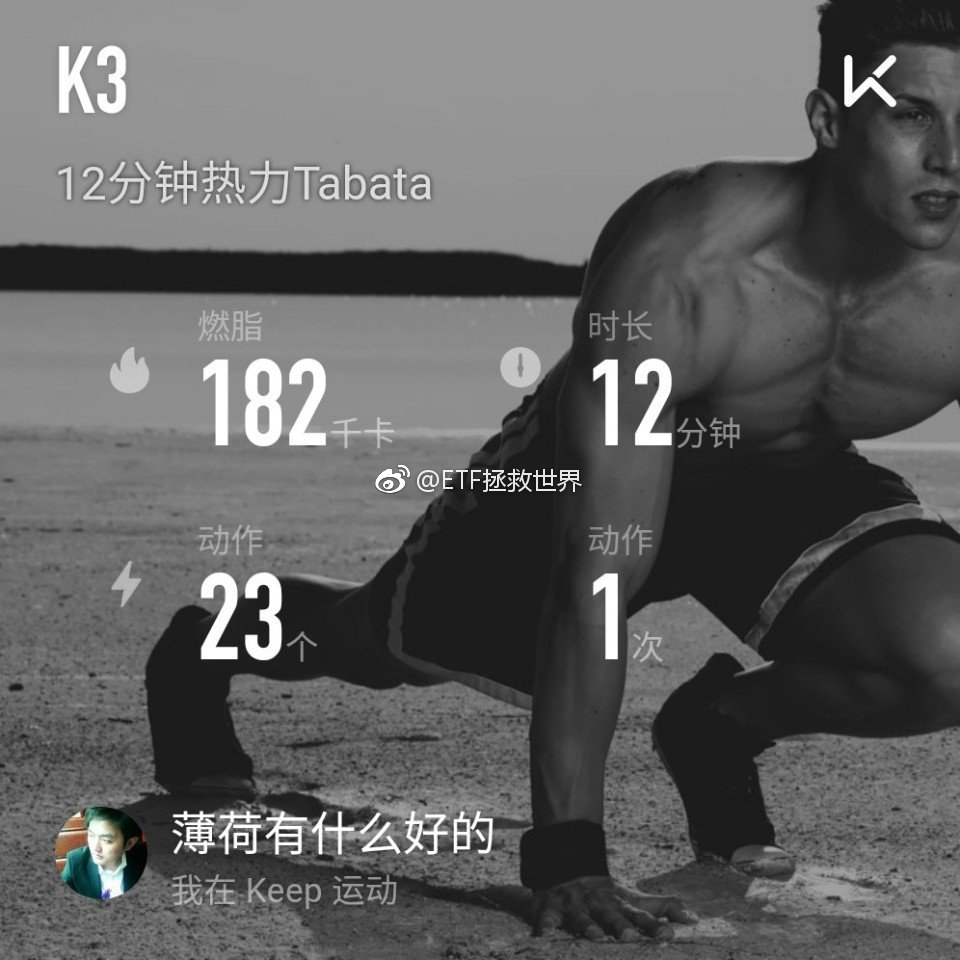

======================================================

ETF拯救世界 (5687069307) @
2017-07-26 05:46:06 Wed  
url: https://weibo.com/5687069307/Fe72acLXe

你们也来了。挺好，继续买。

------------------------------------------------------
转推：
>  @全景网 (1752549400)
>  2017-07-25 22:38:37 Tue  
>  url: https:/weibo.com/1752549400/Fe4eEeYYB/

>  【证金公司首次现身创业板十大股东】截至7月25日最新数据，证金公司出现在了两家创业板公司的十大股东之中，分别是昆仑万维和苏交科，二季度大举买入2312.53万股和962.49万股，持股占比2%和1.66%，而且证金公司成了昆仑万维的第一大流通股东。重要的是，这是证金公司史上第一次重仓买入创业板股票，并 ​​​

转发[5]  评论[45]  赞[72] 

======================================================

ETF拯救世界 (5687069307) @
2017-07-26 09:38:48 Wed  
url: https://weibo.com/5687069307/Fe8yCgL0m

$159920  可能是很多朋友第一个拿了一年多，赚了50%的品种。（有些朋友是40%）

亏损的时候坚定持有很简单，盈利的时候呢，就没那么简单了。

这一年多，一路鼓励大家坚定持有。到今天，总算有个好结果。 ​​​

转发[10]  评论[74]  赞[132] 

======================================================

ETF拯救世界 (5687069307) @
2017-07-26 09:58:09 Wed  
url: https://weibo.com/5687069307/Fe8GtgYFw

分别的日子不会太远了。

------------------------------------------------------
转推：
>  @ETF拯救世界 (5687069307)
>  2017-07-26 09:38:48 Wed  
>  url: https:/weibo.com/5687069307/Fe8yCgL0m/

>  $159920  可能是很多朋友第一个拿了一年多，赚了50%的品种。（有些朋友是40%）
>  
>  亏损的时候坚定持有很简单，盈利的时候呢，就没那么简单了。
>  
>  这一年多，一路鼓励大家坚定持有。到今天，总算有个好结果。 ​​​

转发[3]  评论[54]  赞[79] 

======================================================

ETF拯救世界 (5687069307) @
2017-07-26 11:15:34 Wed  
url: https://weibo.com/5687069307/Fe9bTp55S

谁也不能阻挡价值回归。谢谢！

------------------------------------------------------
转推：
>  @ETF拯救世界 (5687069307)
>  2017-07-25 14:02:39 Tue  
>  url: https:/weibo.com/5687069307/Fe0RdqLTT/

>  还有4天，又挖坑？每次都这样，怪不好意思的。 ​​​

转发[47]  评论[60]  赞[98] 

======================================================

ETF拯救世界 (5687069307) @
2017-07-26 13:07:39 Wed  
url: https://weibo.com/5687069307/Fe9VoaZpd

这样的天气，难道不是应该在北海划船，在奥森跑步吗。

我为什么还在看上证指数。

失败的人生！ ​​​

转发[4]  评论[38]  赞[75] 

======================================================

ETF拯救世界 (5687069307) @
2017-07-26 13:15:51 Wed  
url: https://weibo.com/5687069307/Fe9YIrlh9

回复@风萧索ma:我是按照创业板指从现在开始再下跌60%的幅度准备整个投资创业板策略的。您看这个幅度还行吗。如果还是小，我改成70%也没问题啊。//@风萧索ma:你有一个很大的问题，就是形而上学，现在抄海量ipo创业板的底，无离是送死。不能用历史去判断正在改革的A股市场。

------------------------------------------------------
转推：
>  @ETF拯救世界 (5687069307)
>  2017-07-25 14:02:39 Tue  
>  url: https:/weibo.com/5687069307/Fe0RdqLTT/

>  还有4天，又挖坑？每次都这样，怪不好意思的。 ​​​

转发[45]  评论[31]  赞[53] 

======================================================

ETF拯救世界 (5687069307) @
2017-07-26 13:30:49 Wed  
url: https://weibo.com/5687069307/Fea4NcZJo

有图为证。当然，已经跌了8%了。 ​​​

转发[5]  评论[40]  赞[67] 

+++++++++++++++++++++++++++++++++++++++++++++++++++++

图片：
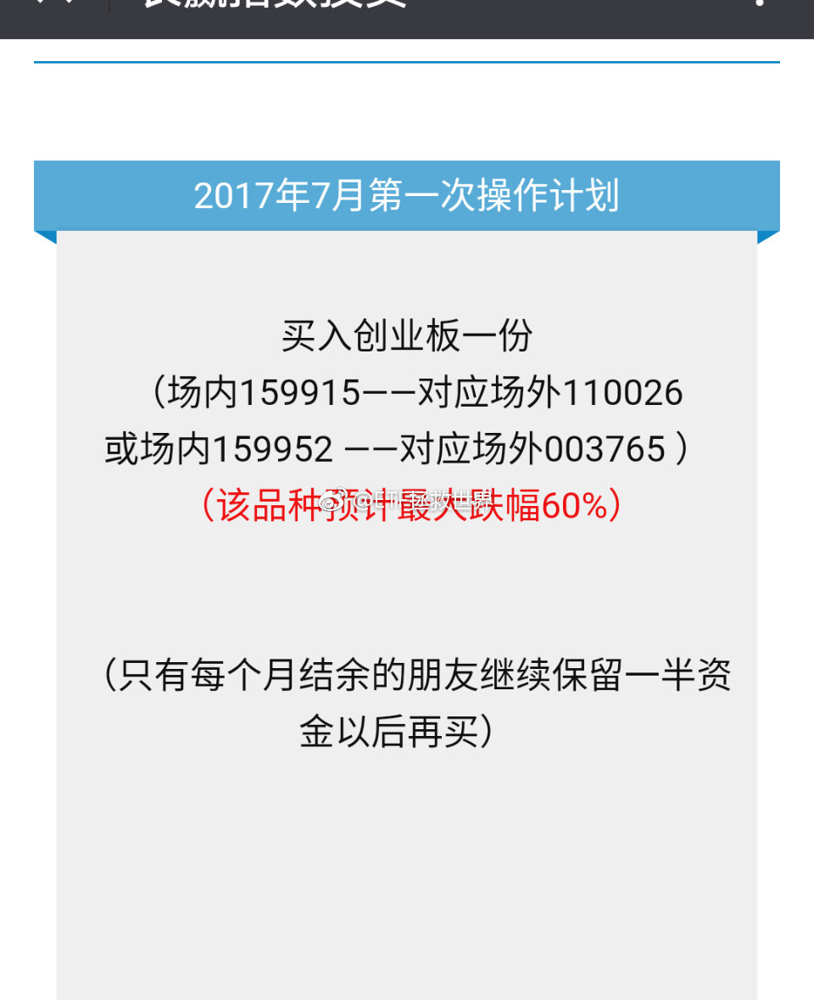

======================================================

ETF拯救世界 (5687069307) @
2017-07-26 13:45:42 Wed  
url: https://weibo.com/5687069307/FeaaPzVaA

各位做投资，我的一点经验，一定要怀着一种近乎“慈善”的心态去做。

首先要找到“好人”。也就是以后一定会好的品种，不能说随便一个烂股票你也去做慈善，那不行。过两天把你的钱卷走退市了。

然后就是“行善”。什么叫行善，就是它落魄的时候去帮他。给他钱，越落魄给越多。那，因为他是好的品种， ​​​

转发[67]  评论[94]  赞[206] 

======================================================

ETF拯救世界 (5687069307) @
2017-07-26 13:50:14 Wed  
url: https://weibo.com/5687069307/FeacFDR9w

千万别发明汽车，拉黄包车的骆驼祥子失业怎么办！//@叶檀:回复@莉香猫苑美国短毛猫:白痴理论，你们不扔垃圾，他们可以养花浇水，就是素质不高的人太多，服务无法升级。照你这么说，农民感谢你吃饭，以前用厕所东西当肥料，还要感谢上厕所？//@莉香猫苑美国短毛猫:不扔垃圾他们不就失业了

------------------------------------------------------
转推：
>  @叶檀 (1233227211)
>  2017-07-26 12:51:29 Wed  
>  url: https:/weibo.com/1233227211/Fe9OPhbIF/

>  少扔垃圾，少扔垃圾，用机器扫地，用机器扫地 ​​​

转发[1]  评论[13]  赞[44] 

======================================================

ETF拯救世界 (5687069307) @
2017-07-26 14:25:41 Wed  
url: https://weibo.com/5687069307/Fear44r78

回复@wander0403:以创业板现在的情况看，应该类比的是2008年的上证3000点而非6124点。3000点开始买错不错？以后来的1600点来看（又下跌50%），错了。但如果能一路买到1600点，将成本控制在2000点左右，似乎又没错。投资的未来是混沌的。做大概率正确的事，减少预测，减少预测指导行动，方成正果。

------------------------------------------------------
转推：
>  @ETF拯救世界 (5687069307)
>  2017-07-25 14:02:39 Tue  
>  url: https:/weibo.com/5687069307/Fe0RdqLTT/

>  还有4天，又挖坑？每次都这样，怪不好意思的。 ​​​

转发[43]  评论[81]  赞[98] 

======================================================

ETF拯救世界 (5687069307) @
2017-07-26 14:35:47 Wed  
url: https://weibo.com/5687069307/FeavatqI7

跑差不多了。去哪儿了？追漂亮50去了~

------------------------------------------------------
转推：
>  @财联社APP (2868676035)
>  2017-07-26 14:32:34 Wed  
>  url: https:/weibo.com/2868676035/FeatRdMC8/

>  WIND统计数据显示，截至2016年底，公募基金共持有571只创业板个股，持仓市值总计为2610亿元。但截至2017年上半年，创业板则共计有342只个股为公募基金所持有，持仓市值仅为1057亿元。 ​​​

转发[5]  评论[23]  赞[57] 

======================================================

ETF拯救世界 (5687069307) @
2017-07-26 16:50:01 Wed  
url: https://weibo.com/5687069307/FebnEfO5d

回复@wander0403:你还是在讨论预测。这个弯你转不过来，根本就没法讨论。记住，我的原则是，不预测，只根据概率配置资产。做大概率会赢的事，同时对极端小概率事件也有准备。也就是发生任何事情都不会死，然后大概率赢。至于你说的预测涨跌，与我的思维模式不是一个层面的。

------------------------------------------------------
转推：
>  @ETF拯救世界 (5687069307)
>  2017-07-25 14:02:39 Tue  
>  url: https:/weibo.com/5687069307/Fe0RdqLTT/

>  还有4天，又挖坑？每次都这样，怪不好意思的。 ​​​

转发[22]  评论[38]  赞[54] 

======================================================

ETF拯救世界 (5687069307) @
2017-07-26 16:56:33 Wed  
url: https://weibo.com/5687069307/FebqisVTg

回复@wander0403:如果你的投资世界中，只有“满仓”和“空仓”两种选择，那么你说的没错。可惜，我的投资世界中有至少100种选择。我根据概率不同，投入不同的资金，进行资产配置。因为我知道，概率大不意味着一定赢，再小的概率也不意味着不发生。不要极端，不要过于自信，尊重市场，不要预测。

------------------------------------------------------
转推：
>  @ETF拯救世界 (5687069307)
>  2017-07-25 14:02:39 Tue  
>  url: https:/weibo.com/5687069307/Fe0RdqLTT/

>  还有4天，又挖坑？每次都这样，怪不好意思的。 ​​​

转发[9]  评论[45]  赞[61] 

======================================================

ETF拯救世界 (5687069307) @
2017-07-26 17:05:45 Wed  
url: https://weibo.com/5687069307/Febu2b5Q3

回复@wander0403:较大亏损？亲，你到底知不知道我们在干什么。我们买的十六个品种只有三个浮亏。浮亏大于2%的只有两只，这两只加起来仓位不到1.2%。亏损幅度不到0.1%。这么说，我说了半天其实是在跟一个什么都不知道的朋友扯淡呢。有点后悔。[污]

------------------------------------------------------
转推：
>  @ETF拯救世界 (5687069307)
>  2017-07-25 14:02:39 Tue  
>  url: https:/weibo.com/5687069307/Fe0RdqLTT/

>  还有4天，又挖坑？每次都这样，怪不好意思的。 ​​​

转发[2]  评论[64]  赞[70] 

======================================================

ETF拯救世界 (5687069307) @
2017-07-26 19:13:24 Wed  
url: https://weibo.com/5687069307/FecjQrWR4

回复@风声边界617:要小心，把握度。有时候直接拉黑了……//@风声边界617:知道了肿么引起e大滴注意，必须要唱反调[允悲]

------------------------------------------------------
转推：
>  @ETF拯救世界 (5687069307)
>  2017-07-25 14:02:39 Tue  
>  url: https:/weibo.com/5687069307/Fe0RdqLTT/

>  还有4天，又挖坑？每次都这样，怪不好意思的。 ​​​

转发[0]  评论[28]  赞[45] 

======================================================

ETF拯救世界 (5687069307) @
2017-07-26 21:16:44 Wed  
url: https://weibo.com/5687069307/Fed7Uio7O

每日打卡（40）

随便跑跑，很舒服。 ​​​

转发[2]  评论[66]  赞[92] 

+++++++++++++++++++++++++++++++++++++++++++++++++++++

图片：
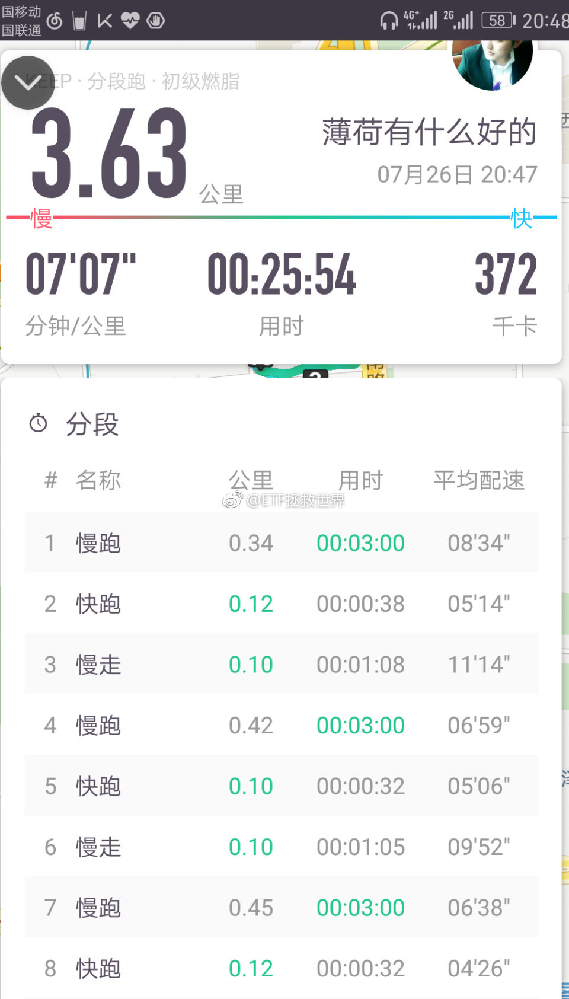
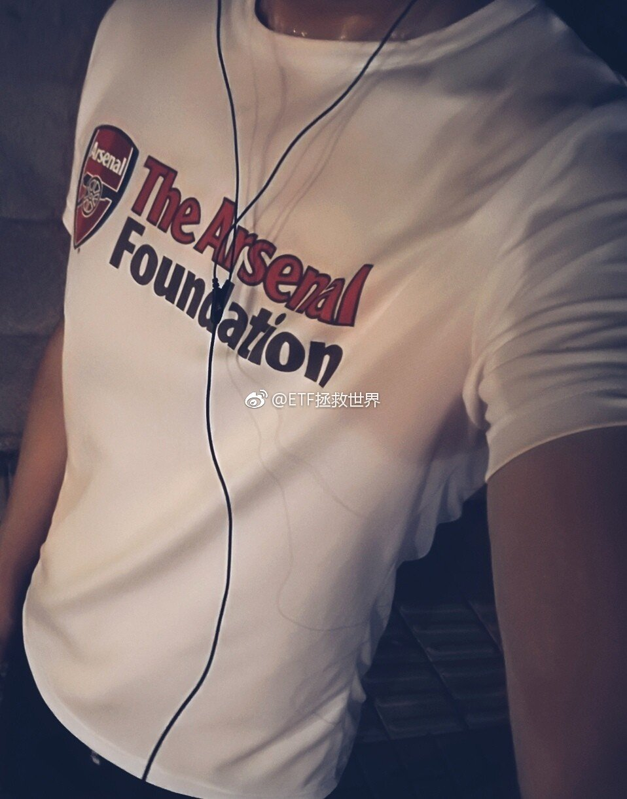

======================================================

ETF拯救世界 (5687069307) @
2017-07-26 21:37:04 Wed  
url: https://weibo.com/5687069307/Fedga6USI

儿子幼儿园要开足球课，刚上中班。四岁，是不是太小了。别踢成罗圈腿了。

游泳轮滑钢琴跆拳道也开始上课了，现在的孩子真幸福啊。 ​​​

转发[1]  评论[109]  赞[107] 

======================================================

ETF拯救世界 (5687069307) @
2017-07-27 09:32:43 Thu  
url: https://weibo.com/5687069307/FehWE6mnO

2015年，你越买越涨，随便买随便涨，怎么买都涨。结果……

2017年，买了不涨，有的还在跌。越跌越买，跌越多买越多，结果会是？

未来和时间会给我们答案。 ​​​

转发[23]  评论[28]  赞[98] 

======================================================

ETF拯救世界 (5687069307) @
2017-07-27 09:38:41 Thu  
url: https://weibo.com/5687069307/FehZ49skk

回复@wenxinyutao:下轮牛市不会是所有股票都涨。可以参考最近半年的50和300。所以，很多炒股的人，下一轮牛市基本上吃不到什么，“赚了股票不赚钱”。指数投资就不同。//@wenxinyutao:以目前A股的扩容速度，即便来大牛市，会不会也是涨幅有限呢

------------------------------------------------------
转推：
>  @ETF拯救世界 (5687069307)
>  2017-07-27 09:32:43 Thu  
>  url: https:/weibo.com/5687069307/FehWE6mnO/

>  2015年，你越买越涨，随便买随便涨，怎么买都涨。结果……
>  
>  2017年，买了不涨，有的还在跌。越跌越买，跌越多买越多，结果会是？
>  
>  未来和时间会给我们答案。 ​​​

转发[11]  评论[18]  赞[58] 

======================================================

ETF拯救世界 (5687069307) @
2017-07-27 10:03:43 Thu  
url: https://weibo.com/5687069307/Fei9ecdGs

回复@小动物爱好者:以现在的情况看不会超过5份。当然，如果这几天坑挖的深了就不好说了。//@小动物爱好者:啥时候发车？大概几份

------------------------------------------------------
转推：
>  @ETF拯救世界 (5687069307)
>  2017-07-27 09:32:43 Thu  
>  url: https:/weibo.com/5687069307/FehWE6mnO/

>  2015年，你越买越涨，随便买随便涨，怎么买都涨。结果……
>  
>  2017年，买了不涨，有的还在跌。越跌越买，跌越多买越多，结果会是？
>  
>  未来和时间会给我们答案。 ​​​

转发[0]  评论[21]  赞[52] 

======================================================

ETF拯救世界 (5687069307) @
2017-07-27 10:15:24 Thu  
url: https://weibo.com/5687069307/FeidYaBLk

$恒生指数 hkHSI$   已经接近第一个再平衡阈值。 ​​​

转发[4]  评论[33]  赞[49] 

======================================================

ETF拯救世界 (5687069307) @
2017-07-27 10:37:38 Thu  
url: https://weibo.com/5687069307/FeimZzBR2

$ 159915 为什么要这样。 ​​​

转发[1]  评论[49]  赞[53] 

======================================================

ETF拯救世界 (5687069307) @
2017-07-27 10:47:57 Thu  
url: https://weibo.com/5687069307/FeirbiXpj

创业板贵么。创业板大多数股票都贵，但$创业板指 sz399006$ 未必。

即使不跌，明年此时估值也就30多倍。30多倍的创业板指买一点怕什么？

140倍的时候不说贵，30多倍说贵？

公募都跑了，GJD开始买了，个人投资者，又没有排名压力，不买便宜货难道去接盘机构炒起来的大白马吗。呵呵哒。

还差几天就要 ​​​

转发[22]  评论[83]  赞[98] 

======================================================

ETF拯救世界 (5687069307) @
2017-07-27 11:03:46 Thu  
url: https://weibo.com/5687069307/FeixBjBBD

市场走势，尤其是中短期走势真的无法预测。我们要做的就是停止预测，根据概率下注。

就这么简单。

概率！！！ ​​​

转发[38]  评论[65]  赞[148] 

======================================================

ETF拯救世界 (5687069307) @
2017-07-27 13:30:44 Thu  
url: https://weibo.com/5687069307/Fejvg0FnC

今天计划又要新高了。我们慢慢的买了那么多不涨的东西，还在不停的创新高。

至于说有些东西买得到买不到，得之我幸，不得我命。不必强求。得到了未必好，得不到也不一定是坏事。 ​​​

转发[7]  评论[37]  赞[121] 

======================================================

ETF拯救世界 (5687069307) @
2017-07-27 13:42:35 Thu  
url: https://weibo.com/5687069307/FejA4oXAl

回复@双树下的和尚1:证金不买真正的聪明资金也会开始关注创业板。A股有20%聪明资金，其中10%因为各种情况变傻了，比如绝大部分公募。其它的聪明资金不停的在市场上寻找机会，哪里低就流向哪里。等大多数人反应过来，别人已经布局完毕。

------------------------------------------------------
转推：
>  @ETF拯救世界 (5687069307)
>  2017-07-27 11:03:46 Thu  
>  url: https:/weibo.com/5687069307/FeixBjBBD/

>  市场走势，尤其是中短期走势真的无法预测。我们要做的就是停止预测，根据概率下注。
>  
>  就这么简单。
>  
>  概率！！！ ​​​

转发[15]  评论[24]  赞[66] 

======================================================

ETF拯救世界 (5687069307) @
2017-07-27 14:07:22 Thu  
url: https://weibo.com/5687069307/FejK7BOEw

回复@Carreylovebook:怎么讲，拍的很舒服……//@Carreylovebook:回复@且慢管家:大家都急不可耐了哈，但感觉E大仍是  闲坐小窗读周易，不知春去几多时，发车时有种优雅与豪情并存的睿智[赞]

------------------------------------------------------
转推：
>  @ETF拯救世界 (5687069307)
>  2017-07-27 11:03:46 Thu  
>  url: https:/weibo.com/5687069307/FeixBjBBD/

>  市场走势，尤其是中短期走势真的无法预测。我们要做的就是停止预测，根据概率下注。
>  
>  就这么简单。
>  
>  概率！！！ ​​​

转发[2]  评论[55]  赞[91] 

======================================================

ETF拯救世界 (5687069307) @
2017-07-27 21:56:25 Thu  
url: https://weibo.com/5687069307/FemOvDW4x

每日打卡(41)

今天没什么特别的。随便练练腹肌，哄儿子睡觉，再去看会书。相当平凡的一天啊。 ​​​

转发[2]  评论[47]  赞[76] 

+++++++++++++++++++++++++++++++++++++++++++++++++++++

图片：

======================================================

ETF拯救世界 (5687069307) @
2017-07-27 22:20:38 Thu  
url: https://weibo.com/5687069307/FemYlgLVo

回复@注册只为看E大:恭喜！！！//@注册只为看E大:今天对我很特别，当爹啦，小名多米，求祝福[噢耶][噢耶]

------------------------------------------------------
转推：
>  @ETF拯救世界 (5687069307)
>  2017-07-27 21:56:25 Thu  
>  url: https:/weibo.com/5687069307/FemOvDW4x/

>  每日打卡(41)
>  
>  今天没什么特别的。随便练练腹肌，哄儿子睡觉，再去看会书。相当平凡的一天啊。 ​​​

转发[1]  评论[21]  赞[64] 

======================================================

ETF拯救世界 (5687069307) @
2017-07-28 06:17:30 Fri  
url: https://weibo.com/5687069307/Feq5U37pf

请神容易送神难，不走了，一起嗨

------------------------------------------------------
转推：
>  @财联社APP (2868676035)
>  2017-07-28 04:17:20 Fri  
>  url: https:/weibo.com/2868676035/Fepj829ro/

>  【国家队现身24只个股 华策影视等3只个股获增持】财联社28日讯，截至昨日，共有64家公司披露2017年中报，其中23家公司前十大流通股股东中出现证金公司或汇金公司等国家队的身影。另外，出版传媒股权变动公告也显示，截至二季度末，汇金公司持有该股993.42万股，为其第二大流通股股东。上述首批24只国家 ​​​

转发[9]  评论[32]  赞[54] 

======================================================

ETF拯救世界 (5687069307) @
2017-07-28 09:32:56 Fri  
url: https://weibo.com/5687069307/FernebAhT

回复@xndp:其实我希望都是绿的。各位也应该有这个觉悟才是。//@xndp:爽啊，跟车的8份全线翻红。益达威武霸气//@ETF拯救世界:请神容易送神难，不走了，一起嗨

------------------------------------------------------
转推：
>  @财联社APP (2868676035)
>  2017-07-28 04:17:20 Fri  
>  url: https:/weibo.com/2868676035/Fepj829ro/

>  【国家队现身24只个股 华策影视等3只个股获增持】财联社28日讯，截至昨日，共有64家公司披露2017年中报，其中23家公司前十大流通股股东中出现证金公司或汇金公司等国家队的身影。另外，出版传媒股权变动公告也显示，截至二季度末，汇金公司持有该股993.42万股，为其第二大流通股股东。上述首批24只国家 ​​​

转发[4]  评论[24]  赞[48] 

======================================================

ETF拯救世界 (5687069307) @
2017-07-28 09:46:49 Fri  
url: https://weibo.com/5687069307/FersRtmlV

回复@随记心情:黑什么呢。涨了不好吗，你手里有啊。赚钱了还不高兴。少？现在创业板还能跌多少我不知道，但是目前开始再来个大牛市的概率并不高，总有机会买。心态调整好，每天都是好日子。昨天市值又新高，多好啊。//@随记心情:昨天看到创业板涨那么多，脸黑了一天[坏笑][坏笑][坏笑]

------------------------------------------------------
转推：
>  @财联社APP (2868676035)
>  2017-07-28 04:17:20 Fri  
>  url: https:/weibo.com/2868676035/Fepj829ro/

>  【国家队现身24只个股 华策影视等3只个股获增持】财联社28日讯，截至昨日，共有64家公司披露2017年中报，其中23家公司前十大流通股股东中出现证金公司或汇金公司等国家队的身影。另外，出版传媒股权变动公告也显示，截至二季度末，汇金公司持有该股993.42万股，为其第二大流通股股东。上述首批24只国家 ​​​

转发[3]  评论[39]  赞[56] 

======================================================

ETF拯救世界 (5687069307) @
2017-07-28 16:01:28 Fri  
url: https://weibo.com/5687069307/FetUW5U9k

GJD全面买入创业板的节奏。这是要干嘛。就不能让我们踏踏实实的捡点东西吗。

------------------------------------------------------
转推：
>  @巨潮资讯网 (2239792910)
>  2017-07-28 15:59:46 Fri  
>  url: https:/weibo.com/2239792910/FetUfexEl/

>  【东方财富：中报业绩同比降逾两成 汇金增持1125万股】东方财富发布2017年半年度报告，营业总收入10.94亿元，同比减少6.17%；归属于上市公司股东的净利润2.60亿元，同比减少22.77%；基本每股收益0.0609元。截止6月底，公司股东户数由一季度末的187739户，增加至207,289户，汇金公司在第二季度增持了112 ​​​

转发[3]  评论[19]  赞[40] 

======================================================

ETF拯救世界 (5687069307) @
2017-07-28 16:02:13 Fri  
url: https://weibo.com/5687069307/FetVeEWmu

内什么，周日，微信，不见不散。 ​​​​

转发[4]  评论[101]  赞[146] 

======================================================

ETF拯救世界 (5687069307) @
2017-07-28 16:10:38 Fri  
url: https://weibo.com/5687069307/FetYEzaVy

回复@如梦惊鸿:当然是原谅他啦。（你敢不原谅GJD？）//@如梦惊鸿:有人来抢地盘，老大咋办？//@ETF拯救世界:GJD全面买入创业板的节奏。这是要干嘛。就不能让我们踏踏实实的捡点东西吗。

------------------------------------------------------
转推：
>  @巨潮资讯网 (2239792910)
>  2017-07-28 15:59:46 Fri  
>  url: https:/weibo.com/2239792910/FetUfexEl/

>  【东方财富：中报业绩同比降逾两成 汇金增持1125万股】东方财富发布2017年半年度报告，营业总收入10.94亿元，同比减少6.17%；归属于上市公司股东的净利润2.60亿元，同比减少22.77%；基本每股收益0.0609元。截止6月底，公司股东户数由一季度末的187739户，增加至207,289户，汇金公司在第二季度增持了112 ​​​

转发[1]  评论[23]  赞[38] 

======================================================

ETF拯救世界 (5687069307) @
2017-07-28 18:07:09 Fri  
url: https://weibo.com/5687069307/FeuJX3CA0

回复@石头里的虫子:心疼心疼我。累一周了，让我周末晚上休息休息。//@石头里的虫子:吊人胃口啊，今晚见不好啊。

------------------------------------------------------
转推：
>  @ETF拯救世界 (5687069307)
>  2017-07-28 16:02:13 Fri  
>  url: https:/weibo.com/5687069307/FetVeEWmu/

>  内什么，周日，微信，不见不散。 ​​​​

转发[1]  评论[62]  赞[87] 

======================================================

ETF拯救世界 (5687069307) @
2017-07-28 21:17:10 Fri  
url: https://weibo.com/5687069307/FevZ50iNi

每日打卡(42)

坚持。 ​​​

转发[0]  评论[19]  赞[93] 

+++++++++++++++++++++++++++++++++++++++++++++++++++++

图片：

======================================================

ETF拯救世界 (5687069307) @
2017-07-29 21:27:37 Sat  
url: https://weibo.com/5687069307/FeFtP7HWy

现在福建人日签美签自由行已经很难了。看来，以后……

------------------------------------------------------
转推：
>  @澎湃新闻 (5044281310)
>  2017-07-29 21:14:03 Sat  
>  url: https:/weibo.com/5044281310/FeFojeb2m/

>  【在日失联福建女教师留给父母亲笔信：感谢养育，要开始新生活】据《中国日报》7月29日援引日本《北海道新闻》报道称，在北海道失联的福建小学教师危秋洁的父亲危华先，已于28日晚飞抵北海道，在当地警方陪同下，到危秋洁曾经在札幌中央区住过的旅馆，发现了一封她留给家人的道别信。危秋洁的朋友对澎 ​​​ http://mapi/005vnhZYgy1fi12d7mgw1j30go07yn40

转发[1]  评论[37]  赞[29] 

======================================================

ETF拯救世界 (5687069307) @
2017-07-30 22:03:48 Sun  
url: https://weibo.com/5687069307/FeP904l3X

每日打卡(43)

昨天晚上没时间，今天补上，两组 ​​​

转发[0]  评论[10]  赞[58] 

+++++++++++++++++++++++++++++++++++++++++++++++++++++

图片：

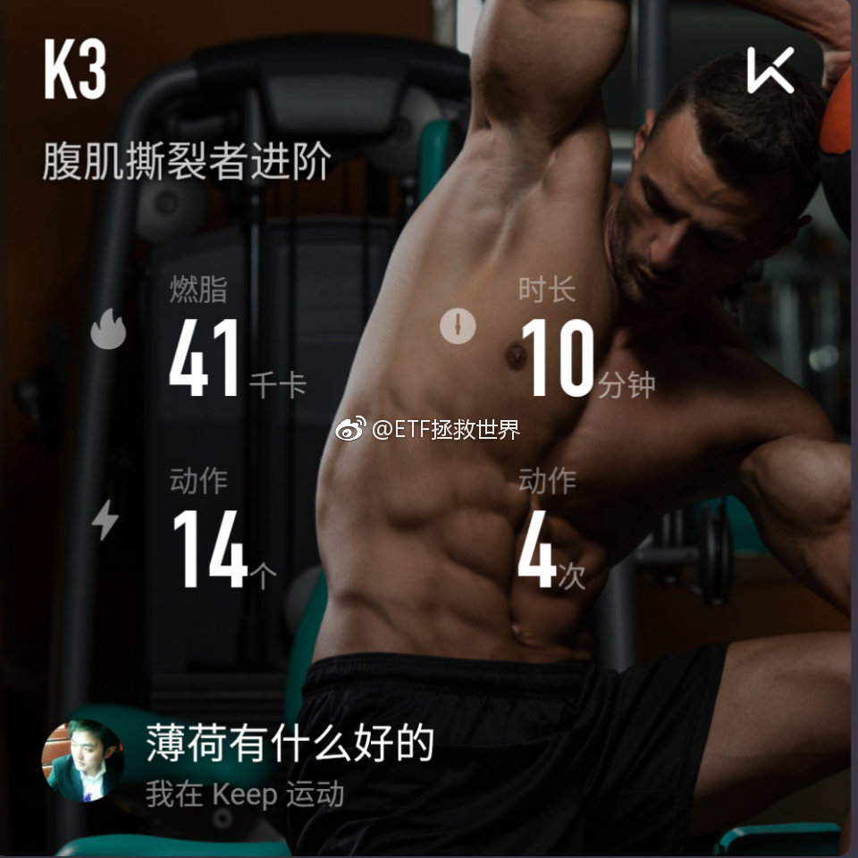

======================================================

ETF拯救世界 (5687069307) @
2017-07-30 22:06:15 Sun  
url: https://weibo.com/5687069307/FeP9Zvhq8

回复@圣善周闻宗:我都没研究，真不少。//@圣善周闻宗:影响很大的啊，E大的发车。研究了一下养老的二季报规模的变化，大致判断每份跟车金额约为3-4KW的样子。这第三轮计划估计最终能撬动上百亿的资金吧……//@ETF拯救世界:回复@石头里的虫子:心疼心疼我。累一周了，让我周末晚上休息休息。

------------------------------------------------------
转推：
>  @ETF拯救世界 (5687069307)
>  2017-07-28 16:02:13 Fri  
>  url: https:/weibo.com/5687069307/FetVeEWmu/

>  内什么，周日，微信，不见不散。 ​​​​

转发[0]  评论[51]  赞[62] 

======================================================

ETF拯救世界 (5687069307) @
2017-07-31 09:48:06 Mon  
url: https://weibo.com/5687069307/FeTKSh9AG

今天最完美的是恒生大涨，医药创业暴跌。

GJD的兄弟们帮帮忙撒。 ​​​

转发[20]  评论[75]  赞[102] 

======================================================

ETF拯救世界 (5687069307) @
2017-07-31 11:03:20 Mon  
url: https://weibo.com/5687069307/FeUfpuqFQ

危机不危机的，不好说。不过可以肯定的是，以美股为代表的一大部分资产，以现价买入，未来十年的收益率会特别差。

------------------------------------------------------
转推：
>  @ ()
>  2017-07-31 11:00:04 Mon  
>  url: 

>  抱歉，作者已设置仅展示半年内微博，此微博已不可见。 ​​​

转发[5]  评论[15]  赞[54] 

======================================================

ETF拯救世界 (5687069307) @
2017-07-31 11:21:55 Mon  
url: https://weibo.com/5687069307/FeUmXeP4S

一口毒奶再次精准的喝在了最低点。[doge]

------------------------------------------------------
转推：
>  @ETF拯救世界 (5687069307)
>  2017-07-31 09:48:06 Mon  
>  url: https:/weibo.com/5687069307/FeTKSh9AG/

>  今天最完美的是恒生大涨，医药创业暴跌。
>  
>  GJD的兄弟们帮帮忙撒。 ​​​

转发[4]  评论[46]  赞[68] 

======================================================

ETF拯救世界 (5687069307) @
2017-07-31 12:00:11 Mon  
url: https://weibo.com/5687069307/FeUCuhHUg

现在养老+医药的仓位大概超过9%了。这个仓位特别舒服，真的，每次看到这两个就感觉舒服。

谁能体会我的feel。 ​​​

转发[14]  评论[50]  赞[126] 

======================================================

ETF拯救世界 (5687069307) @
2017-07-31 12:04:55 Mon  
url: https://weibo.com/5687069307/FeUEpj9nA

养老最新成分股，喜欢。

中信国安 综合
海虹控股 医药生物
上海医药 医药生物
贵州百灵 医药生物
吉林敖东 医药生物
同仁堂 医药生物
贝达药业 医药生物
华兰生物 医药生物
上海莱士 医药生物
九州通 医药生物
东阿阿胶 医药生物
通化东宝 医药生物
信立泰 医药生物
必康股份 医药生物
步长制药 医药 ​​​

转发[43]  评论[40]  赞[111] 

======================================================

ETF拯救世界 (5687069307) @
2017-07-31 14:24:19 Mon  
url: https://weibo.com/5687069307/FeVyZqpBD

恒生指数第二大成分股。

------------------------------------------------------
转推：
>  @ ()
>  2017-07-31 14:05:51 Mon  
>  url: 

>  抱歉，作者已设置仅展示半年内微博，此微博已不可见。 ​​​

转发[3]  评论[14]  赞[46] 

======================================================

ETF拯救世界 (5687069307) @
2017-07-31 14:50:30 Mon  
url: https://weibo.com/5687069307/FeVJCoPEw

$510500  最吼的。

比较可惜的是，17号那天中午发车，当天估值数据拿不到，考虑了半天没有加500。

还是希望有机会多买点。目前只有3份。 ​​​

转发[23]  评论[48]  赞[81] 

======================================================

ETF拯救世界 (5687069307) @
2017-07-31 15:01:43 Mon  
url: https://weibo.com/5687069307/FeVOazGE5

今天算不错。恒生大涨，创业没动，医药小涨。  恒生指数我能理解的最高点位大致在29500-30000点之间。超过30000点基本就是不理解区域了。  我不理解当然不代表不会继续涨。不过可以肯定的是，超过30000要再平衡一次。然后剩下的就不会再动了。

------------------------------------------------------
转推：
>  @ETF拯救世界 (5687069307)
>  2017-07-31 09:48:06 Mon  
>  url: https:/weibo.com/5687069307/FeTKSh9AG/

>  今天最完美的是恒生大涨，医药创业暴跌。
>  
>  GJD的兄弟们帮帮忙撒。 ​​​

转发[9]  评论[26]  赞[85] 

======================================================

ETF拯救世界 (5687069307) @
2017-07-31 16:59:16 Mon  
url: https://weibo.com/5687069307/FeWzT0A2M

回复@匿称5:如果一两万本金的话，我建议不要把主要精力放在投资上，尽快提升职业技能，多赚点本金再把一部分精力放到投资上。切切。//@匿称5:回复@宏伟9888:是这么回事吗？为何除以150，如果一两万本金那一份岂不是太少

------------------------------------------------------
转推：
>  @ETF拯救世界 (5687069307)
>  2017-07-31 14:50:30 Mon  
>  url: https:/weibo.com/5687069307/FeVJCoPEw/

>  $510500  最吼的。
>  
>  比较可惜的是，17号那天中午发车，当天估值数据拿不到，考虑了半天没有加500。
>  
>  还是希望有机会多买点。目前只有3份。 ​​​

转发[18]  评论[29]  赞[55] 

======================================================

ETF拯救世界 (5687069307) @
2017-07-31 17:13:04 Mon  
url: https://weibo.com/5687069307/FeWFuwTpV

回复@从容淡定2003:图片评论 某人上午发给我的。当然，这种应该不是大多数…… http://t.cn/R9V7LHp //@从容淡定2003:很好奇，大家一份有多少钱呢?//@ETF拯救世界:回复@匿称5:如果一两万本金的话，我建议不要把主要精力放在投资上，尽快提升职业技能，多赚点本金再把一部分精力放到投资上。切切。

------------------------------------------------------
转推：
>  @ETF拯救世界 (5687069307)
>  2017-07-31 14:50:30 Mon  
>  url: https:/weibo.com/5687069307/FeVJCoPEw/

>  $510500  最吼的。
>  
>  比较可惜的是，17号那天中午发车，当天估值数据拿不到，考虑了半天没有加500。
>  
>  还是希望有机会多买点。目前只有3份。 ​​​

转发[8]  评论[129]  赞[68] 

======================================================

ETF拯救世界 (5687069307) @
2017-07-31 21:55:22 Mon  
url: https://weibo.com/5687069307/FeYw4pTjX

每日打卡(44)

难度不小。坚持。累。 ​​​

转发[0]  评论[20]  赞[87] 

+++++++++++++++++++++++++++++++++++++++++++++++++++++

图片：
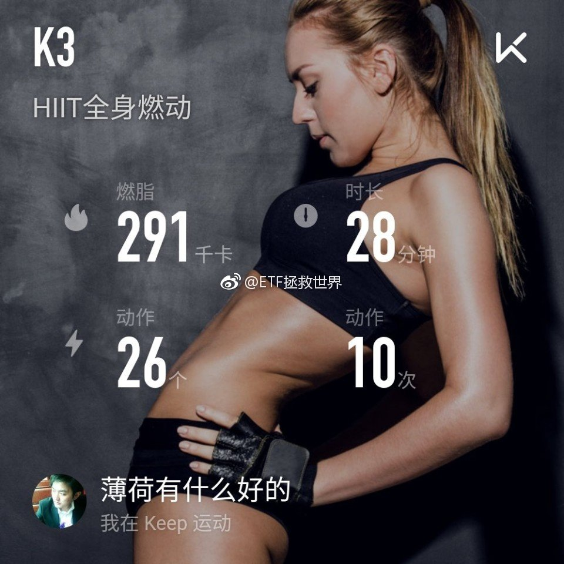

======================================================

