ETF拯救世界 (5687069307) @
2017-08-01 09:38:10 Tue  
url: https://weibo.com/5687069307/Ff37l833n

每天新高并不新鲜。问题是我们买了一堆接近几年新低，或者是根本没涨的东西，同时还在每天新高，这就有意思了。 ​​​

转发[11]  评论[86]  赞[118] 

======================================================

ETF拯救世界 (5687069307) @
2017-08-01 10:24:14 Tue  
url: https://weibo.com/5687069307/Ff3q2DThf

回复@益盟1898:我从2010年开始在博客公开我的投资计划，7年后，也就是这几个月推荐朋友可以关注且慢，这样补仓什么的会比较方便。我是想请问你一句，我骗你什么了？你注册了好几个微博号不停的发这个，想说明什么？来，说出你的想法。你说的有道理的话，我会立即停止公布计划，自己玩。好吗？

------------------------------------------------------
转推：
>  @ETF拯救世界 (5687069307)
>  2017-08-01 09:38:10 Tue  
>  url: https:/weibo.com/5687069307/Ff37l833n/

>  每天新高并不新鲜。问题是我们买了一堆接近几年新低，或者是根本没涨的东西，同时还在每天新高，这就有意思了。 ​​​

转发[7]  评论[50]  赞[38] 

======================================================

ETF拯救世界 (5687069307) @
2017-08-01 10:28:51 Tue  
url: https://weibo.com/5687069307/Ff3rUsJDA

回复@北溟有鱼-1997:已经拉黑了。注册了新号继续来刷。没办法。我这个人最怕烦，雪球烦我就躲到微博，微博烦我就不再刷微博。什么时候微信烦我就关微信号。不知道这样的话，这位朋友是不是可以满意？//@北溟有鱼-1997:E大，直接拉黑之，这种鸟人，不搭理

------------------------------------------------------
转推：
>  @ETF拯救世界 (5687069307)
>  2017-08-01 09:38:10 Tue  
>  url: https:/weibo.com/5687069307/Ff37l833n/

>  每天新高并不新鲜。问题是我们买了一堆接近几年新低，或者是根本没涨的东西，同时还在每天新高，这就有意思了。 ​​​

转发[0]  评论[33]  赞[42] 

======================================================

ETF拯救世界 (5687069307) @
2017-08-01 10:37:21 Tue  
url: https://weibo.com/5687069307/Ff3vmFKHl

回复@白宇:我刚搜了益盟。原来是卖炒股软件的。这就明白了。我不评论了。//@白宇:益盟的名字啊，故意来热度的，E大你回复他就上当了啊

------------------------------------------------------
转推：
>  @ETF拯救世界 (5687069307)
>  2017-08-01 09:38:10 Tue  
>  url: https:/weibo.com/5687069307/Ff37l833n/

>  每天新高并不新鲜。问题是我们买了一堆接近几年新低，或者是根本没涨的东西，同时还在每天新高，这就有意思了。 ​​​

转发[4]  评论[17]  赞[36] 

======================================================

ETF拯救世界 (5687069307) @
2017-08-01 10:48:43 Tue  
url: https://weibo.com/5687069307/Ff3zYpHaS

回复@zq2204686:成功了？我估计这里99%的朋友这辈子也不会用它们的任何东西了吧。//@zq2204686:他成功了，我今天知道有益盟这个东西了//@ETF拯救世界:回复@白宇:我刚搜了益盟。原来是卖炒股软件的。这就明白了。我不评论了。//@白宇:益盟的名字啊，故意来热度的，E大你回复他就上当了啊

------------------------------------------------------
转推：
>  @ETF拯救世界 (5687069307)
>  2017-08-01 09:38:10 Tue  
>  url: https:/weibo.com/5687069307/Ff37l833n/

>  每天新高并不新鲜。问题是我们买了一堆接近几年新低，或者是根本没涨的东西，同时还在每天新高，这就有意思了。 ​​​

转发[3]  评论[57]  赞[53] 

======================================================

ETF拯救世界 (5687069307) @
2017-08-01 11:07:12 Tue  
url: https://weibo.com/5687069307/Ff3HtvY0z

没事了没事了，知道是专业喷子就ok了，呐，做人呢，开心最重要。要不要我煮碗面给你吃？

打开账户看看，又新高了。多开心！ ​​​

转发[2]  评论[32]  赞[113] 

======================================================

ETF拯救世界 (5687069307) @
2017-08-01 11:10:36 Tue  
url: https://weibo.com/5687069307/Ff3IQAq78

回复@龙飞1807576:我就不喜欢吵架啊。怎么办。回去就得吵。你不跟别人吵，别人也要找你吵。烦死我了。

------------------------------------------------------
转推：
>  @ETF拯救世界 (5687069307)
>  2017-08-01 09:38:10 Tue  
>  url: https:/weibo.com/5687069307/Ff37l833n/

>  每天新高并不新鲜。问题是我们买了一堆接近几年新低，或者是根本没涨的东西，同时还在每天新高，这就有意思了。 ​​​

转发[1]  评论[27]  赞[49] 

======================================================

ETF拯救世界 (5687069307) @
2017-08-01 11:12:35 Tue  
url: https://weibo.com/5687069307/Ff3JFcEkS

最近恒生ETF涨幅还是小了。主要是人民币汇率问题，否则已经突破2015年那疯狂溢价的几天了。

恒生是个好东西。真的。以后有机会还得买。 ​​​

转发[4]  评论[54]  赞[109] 

======================================================

ETF拯救世界 (5687069307) @
2017-08-01 13:30:47 Tue  
url: https://weibo.com/5687069307/Ff4DL8cvM

也就是说，0.1%的人群占据了30%的财富？

------------------------------------------------------
转推：
>  @网易财经 (1974561081)
>  2017-08-01 13:21:03 Tue  
>  url: https:/weibo.com/1974561081/Ff4zO9H6f/

>  #网易新闻# 【中国高净值人士11年翻3番 高净值人群有多少人？】近日，招商银行私人银行团队联手贝恩公司发布《2017中国私人财富报告》，报告显示2016年中国高净值人士有158万人，而在2006年这一数据仅为18万人，11年间中国高净值人群规模翻了三番还多。其中，可投资资产超过一亿元的超高净值人群规模约 ​​​

转发[2]  评论[48]  赞[32] 

======================================================

ETF拯救世界 (5687069307) @
2017-08-01 14:20:42 Tue  
url: https://weibo.com/5687069307/Ff4Y1hvbv

总看到有人说，满仓了满仓了，赚多少多少。其实呢，他没说的是股票账户之外还有多少钱。

想起前一段方丈每天买10万人民币沪深300，很多人感觉砸锅卖铁抄底。然后前几天说要弄个私募，自己投1000万美元。也就是说，人家至少还有1000万美元现金的。

刚看了那个财富报告，高净值富人现在大概有15%的可投 ​​​

转发[31]  评论[91]  赞[195] 

======================================================

ETF拯救世界 (5687069307) @
2017-08-01 14:57:50 Tue  
url: https://weibo.com/5687069307/Ff5d5BZpg

回复@刘泽瑜31881:A股最多7-8了。还要分仓位给其它资产啊。其他资产可不一定比A股差。看看美股，看看港股。//@刘泽瑜31881:e大哥您觉得咱们这次计划最理想仓位是多少？八成？

------------------------------------------------------
转推：
>  @ETF拯救世界 (5687069307)
>  2017-08-01 14:20:42 Tue  
>  url: https:/weibo.com/5687069307/Ff4Y1hvbv/

>  总看到有人说，满仓了满仓了，赚多少多少。其实呢，他没说的是股票账户之外还有多少钱。
>  
>  想起前一段方丈每天买10万人民币沪深300，很多人感觉砸锅卖铁抄底。然后前几天说要弄个私募，自己投1000万美元。也就是说，人家至少还有1000万美元现金的。
>  
>  刚看了那个财富报告，高净值富人现在大概有15%的可投 ​​​

转发[6]  评论[32]  赞[65] 

======================================================

ETF拯救世界 (5687069307) @
2017-08-01 21:18:05 Tue  
url: https://weibo.com/5687069307/Ff7Hr6XVS

回复@Nbacxk:一声叹息。//@Nbacxk:蛋卷也在抄e的作业了//@ETF拯救世界:回复@刘泽瑜31881:A股最多7-8了。还要分仓位给其它资产啊。其他资产可不一定比A股差。看看美股，看看港股。//@刘泽瑜31881:e大哥您觉得咱们这次计划最理想仓位是多少？八成？

------------------------------------------------------
转推：
>  @ETF拯救世界 (5687069307)
>  2017-08-01 14:20:42 Tue  
>  url: https:/weibo.com/5687069307/Ff4Y1hvbv/

>  总看到有人说，满仓了满仓了，赚多少多少。其实呢，他没说的是股票账户之外还有多少钱。
>  
>  想起前一段方丈每天买10万人民币沪深300，很多人感觉砸锅卖铁抄底。然后前几天说要弄个私募，自己投1000万美元。也就是说，人家至少还有1000万美元现金的。
>  
>  刚看了那个财富报告，高净值富人现在大概有15%的可投 ​​​

转发[2]  评论[20]  赞[36] 

======================================================

ETF拯救世界 (5687069307) @
2017-08-01 21:22:07 Tue  
url: https://weibo.com/5687069307/Ff7J4rr4D

每日打卡(45)

今天情绪不高。再来个激烈的出出汗。

最近在研究马斯洛需求。自我实现是什么意思。好像感觉自己没追求了。 ​​​

转发[1]  评论[64]  赞[85] 

+++++++++++++++++++++++++++++++++++++++++++++++++++++

图片：
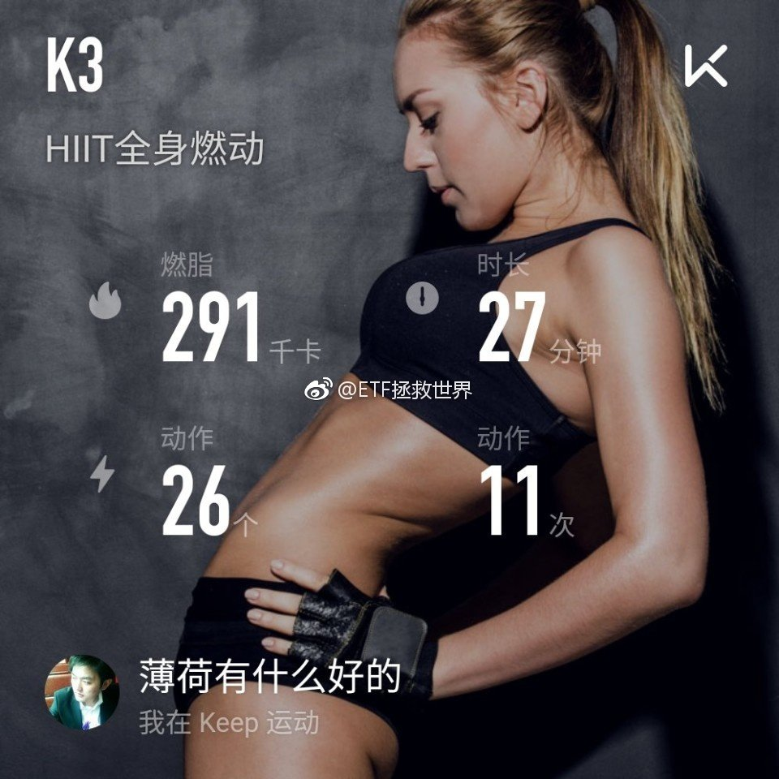

======================================================

ETF拯救世界 (5687069307) @
2017-08-02 09:06:50 Wed  
url: https://weibo.com/5687069307/Ffcl7zHhm

世界上真的很少有C罗这么拼的球员。真的很拼。从小拼到现在。楷模。//@屈宏斌:C 罗都这么拼，中国球员们还不赶紧苦练?

------------------------------------------------------
转推：
>  @C罗吧官方微博 (2014164950)
>  2017-08-01 18:35:45 Tue  
>  url: https:/weibo.com/2014164950/Ff6DxDC5s/

>  #C罗# 更新：Hard work and dedication. 🏃💦🇵🇹 ​​​

转发[4]  评论[19]  赞[53] 

======================================================

ETF拯救世界 (5687069307) @
2017-08-02 09:23:34 Wed  
url: https://weibo.com/5687069307/FfcrUmvD0

已投入部分年化收益率超过19%。

交易过的17个品种浮亏3个，一个浮亏0.5 一个4% 一个8%

第一轮股灾开始，最大回撤0.7%。

控制风险，一路稳进，必成大业。 ​​​

转发[30]  评论[62]  赞[132] 

+++++++++++++++++++++++++++++++++++++++++++++++++++++

图片：
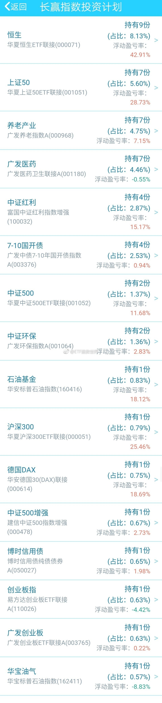

======================================================

ETF拯救世界 (5687069307) @
2017-08-02 09:52:14 Wed  
url: https://weibo.com/5687069307/FfcDxFvyt

技术不难实现，我家扫地机器人就能自己找电源充电。。问题是，这个充电线造型太酷了，好像在看科幻电影啊。

------------------------------------------------------
转推：
>  @蓝鲸TMT网 (3866012793)
>  2017-08-02 09:44:59 Wed  
>  url: https:/weibo.com/3866012793/FfcAB1BM5/

>  【特斯拉的无人充电新技术】Model S充电器，可自动寻找充电孔充电，完全无人化....看看，未来加油、充电的岗位都可能要失业了http://t.cn/RKF20vn ​​​

转发[11]  评论[27]  赞[32] 

======================================================

ETF拯救世界 (5687069307) @
2017-08-02 09:57:53 Wed  
url: https://weibo.com/5687069307/FfcFPtp4r

回复@我是一个圆豆包:他们的估值应该是直接wind拿的吧，和我计算的差异很大。大致看看应该问题不大。//@我是一个圆豆包:E大～对且慢推出的每日估值怎么看呀～可以作为计划外投资的参考吗[哈哈]

------------------------------------------------------
转推：
>  @蓝鲸TMT网 (3866012793)
>  2017-08-02 09:44:59 Wed  
>  url: https:/weibo.com/3866012793/FfcAB1BM5/

>  【特斯拉的无人充电新技术】Model S充电器，可自动寻找充电孔充电，完全无人化....看看，未来加油、充电的岗位都可能要失业了http://t.cn/RKF20vn ​​​

转发[4]  评论[12]  赞[20] 

======================================================

ETF拯救世界 (5687069307) @
2017-08-02 09:59:35 Wed  
url: https://weibo.com/5687069307/FfcGwCgUQ

回复@victoryhf:嗯。观察记录你自己的心态。到了最慌乱要挤着上车的时候，基本就到时间了。//@victoryhf:这两天，涨的发慌[允悲][允悲][允悲][允悲]

------------------------------------------------------
转推：
>  @ETF拯救世界 (5687069307)
>  2017-08-02 09:23:34 Wed  
>  url: https:/weibo.com/5687069307/FfcrUmvD0/

>  已投入部分年化收益率超过19%。
>  
>  交易过的17个品种浮亏3个，一个浮亏0.5 一个4% 一个8%
>  
>  第一轮股灾开始，最大回撤0.7%。
>  
>  控制风险，一路稳进，必成大业。 ​​​

转发[3]  评论[19]  赞[44] 

======================================================

ETF拯救世界 (5687069307) @
2017-08-02 10:19:15 Wed  
url: https://weibo.com/5687069307/FfcOvBqQV

这次网格谁做了？2轮了，大肉啊。

------------------------------------------------------
转推：
>  @ETF拯救世界 (5687069307)
>  2017-04-07 10:09:34 Fri  
>  url: https:/weibo.com/5687069307/EDncO76hf/

>  3000（或者3100）到3300之间用ETF做网格应该是很靠谱的。
>  
>  GJD信誉保证。跟着GJD有肉吃。 ​​​

转发[11]  评论[24]  赞[73] 

======================================================

ETF拯救世界 (5687069307) @
2017-08-02 10:20:58 Wed  
url: https://weibo.com/5687069307/FfcPd1LQp

发帖后的5.11最低点是3016，今天最高是3300。GJD操盘技术可以说相当精准了。关键是，咱们提前预判到了……//@ETF拯救世界:这次网格谁做了？2轮了，大肉啊。

------------------------------------------------------
转推：
>  @ETF拯救世界 (5687069307)
>  2017-04-07 10:09:34 Fri  
>  url: https:/weibo.com/5687069307/EDncO76hf/

>  3000（或者3100）到3300之间用ETF做网格应该是很靠谱的。
>  
>  GJD信誉保证。跟着GJD有肉吃。 ​​​

转发[8]  评论[41]  赞[89] 

======================================================

ETF拯救世界 (5687069307) @
2017-08-02 13:51:26 Wed  
url: https://weibo.com/5687069307/FfecDqxE4

2015年11月，有人在雪球发了一个“荒岛10年”的帖子。意思是如果让你去一个荒岛10年，你愿意买哪些股票。

然后，我发了这样一个帖子。

http://t.cn/R9xgd4Z

其中关键的地方在这两段：

“1、首先，我会要求给我两年时间配置。因为现在有的标的太高，回到正常价格我才放心。否则投个好多年结果不赚钱 ​​​

转发[116]  评论[78]  赞[122] 

======================================================

ETF拯救世界 (5687069307) @
2017-08-02 13:58:50 Wed  
url: https://weibo.com/5687069307/FfefE9jIV

好吧，又确认了一下昨天的数据，养老也没达标，也是差一点……各个指数达到建仓区间的上沿其实就可以建仓。不过大肉还是在下沿附近吃。你看50和恒生，后来也是又跌了十几个点才止跌，肉才叫大。所以，各个品种如果能到30左右，咱们下一轮爆发就基本没问题了。

------------------------------------------------------
转推：
>  @ETF拯救世界 (5687069307)
>  2017-08-02 13:51:26 Wed  
>  url: https:/weibo.com/5687069307/FfecDqxE4/

>  2015年11月，有人在雪球发了一个“荒岛10年”的帖子。意思是如果让你去一个荒岛10年，你愿意买哪些股票。
>  
>  然后，我发了这样一个帖子。
>  
>  http://t.cn/R9xgd4Z
>  
>  其中关键的地方在这两段：
>  
>  “1、首先，我会要求给我两年时间配置。因为现在有的标的太高，回到正常价格我才放心。否则投个好多年结果不赚钱 ​​​

转发[20]  评论[18]  赞[75] 

======================================================

ETF拯救世界 (5687069307) @
2017-08-02 14:11:52 Wed  
url: https://weibo.com/5687069307/FfekVBaRA

投资这件事吧，谁也不可能永远做的特别好。区别是有些人对的次数多一点，有些人少一点，有些人没对过。

关键一点，在于你对目前的状况有个清晰的认识，对未来的发展有个模糊的判断。认识和判断大体上不错，那长期看就不会错。

比如有些东西目前涨的凶，有些跌的猛。你就得知道大致上是否合理。涨跌的 ​​​

转发[56]  评论[63]  赞[173] 

======================================================

ETF拯救世界 (5687069307) @
2017-08-02 15:49:27 Wed  
url: https://weibo.com/5687069307/FfeYy1RAR

回复@四只-小熊:我从没有把瀑布界定在哪个指数上。我说的是A股整体。只要A股估值到了我之前说的地方，瀑布就有非常大概率。目前？目前几千只中小股票不停跌，怎么会瀑布。//@四只-小熊:回复@ETF拯救世界:您觉得上证50还会有瀑布吗？

------------------------------------------------------
转推：
>  @ETF拯救世界 (5687069307)
>  2017-08-02 14:11:52 Wed  
>  url: https:/weibo.com/5687069307/FfekVBaRA/

>  投资这件事吧，谁也不可能永远做的特别好。区别是有些人对的次数多一点，有些人少一点，有些人没对过。
>  
>  关键一点，在于你对目前的状况有个清晰的认识，对未来的发展有个模糊的判断。认识和判断大体上不错，那长期看就不会错。
>  
>  比如有些东西目前涨的凶，有些跌的猛。你就得知道大致上是否合理。涨跌的 ​​​

转发[2]  评论[9]  赞[37] 

======================================================

ETF拯救世界 (5687069307) @
2017-08-02 16:01:54 Wed  
url: https://weibo.com/5687069307/Fff3ADZvO

回复@四只-小熊:20？低于35我会把医药仓位配置到预计最大的80%。谢谢！要笑醒了！//@四只-小熊:广发医药看了下，pe基本都还比较高吧。低于20的几乎没有。是不是离底部还很远，谢谢

------------------------------------------------------
转推：
>  @ETF拯救世界 (5687069307)
>  2017-07-31 12:00:11 Mon  
>  url: https:/weibo.com/5687069307/FeUCuhHUg/

>  现在养老+医药的仓位大概超过9%了。这个仓位特别舒服，真的，每次看到这两个就感觉舒服。
>  
>  谁能体会我的feel。 ​​​

转发[8]  评论[44]  赞[65] 

======================================================

ETF拯救世界 (5687069307) @
2017-08-02 17:23:44 Wed  
url: https://weibo.com/5687069307/FffAOgt0M

这就是A股的未来。大概是10-15年以后吧。

------------------------------------------------------
转推：
>  @ ()
>  2017-08-02 17:16:07 Wed  
>  url: 

>  该账号因被投诉违反《微博社区公约》的相关规定，现已无法查看。查看帮助 https://kefu.weibo.com/faqdetail?id=13216

转发[10]  评论[23]  赞[52] 

======================================================

ETF拯救世界 (5687069307) @
2017-08-02 17:52:43 Wed  
url: https://weibo.com/5687069307/FffMztkcH

哈哈哈哈//@月半月巴白勺木兆://@猪蹄蹄小朋友:回复@郝瑞:真·上等人，副处级以上，潘家园SVIP，中华只抽白盒的，写字台右手边抽屉里有三万多块钱超市卡。微信签名档：上善若水，厚德载物。//@郝瑞:那听民乐的呢

------------------------------------------------------
转推：
>  @小李飞貂儿 (1677574270)
>  2017-08-01 19:45:11 Tue  
>  url: https:/weibo.com/1677574270/Ff75Jcqz7/

>  认真反省了一下。
>  前几年收入挺高的时候，听的是爵士。
>  这两年穷成后摇跟英伦了。
>  得努力工作了，不然迟早堕落成民谣。 ​​​

转发[4]  评论[8]  赞[32] 

======================================================

ETF拯救世界 (5687069307) @
2017-08-02 18:08:58 Wed  
url: https://weibo.com/5687069307/FffTaqA5d

回复@Holzpuppe:特别正确。布局完成后，阳光沙滩享受人生或者积极进取打拼事业，几个月看看账户。对于绝大多数普通人，是最吼的投资路径。

------------------------------------------------------
转推：
>  @ ()
>  2017-08-02 17:16:07 Wed  
>  url: 

>  该账号因被投诉违反《微博社区公约》的相关规定，现已无法查看。查看帮助 https://kefu.weibo.com/faqdetail?id=13216

转发[4]  评论[24]  赞[71] 

======================================================

ETF拯救世界 (5687069307) @
2017-08-02 21:53:38 Wed  
url: https://weibo.com/5687069307/FfhmmpE2j

每日打卡(46)

简单做一组，相当于休息了 ​​​

转发[0]  评论[9]  赞[73] 

+++++++++++++++++++++++++++++++++++++++++++++++++++++

图片：

======================================================

ETF拯救世界 (5687069307) @
2017-08-03 09:59:47 Thu  
url: https://weibo.com/5687069307/Ffm76uKDv

$创业板指 sz399006$  总是蠢蠢欲动。 ​​​

转发[32]  评论[21]  赞[56] 

======================================================

ETF拯救世界 (5687069307) @
2017-08-03 10:34:14 Thu  
url: https://weibo.com/5687069307/Ffml5sWfL

投资不要带成见。

创业板跌得多了，就不是垃圾。跌得再多一点，就是金子。再跌，就是真正的钻石。

永远把成本控制在最低价的10%-15%之内，谁也杀不死你。相反，财富会滚滚而来。

低买，高卖。简简单单的四个字，过去，现在，将来，永远都会是做生意和投资的奥义。

可惜，大多数人，真的参不透。 ​​​

转发[60]  评论[54]  赞[155] 

======================================================

ETF拯救世界 (5687069307) @
2017-08-03 10:45:52 Thu  
url: https://weibo.com/5687069307/FfmpOlm6Q

回复@木木不哭木木:最爱。我最近几乎每天都在买，已经买到了总资产的5%。这对我来说已经是很不小的一个仓位了。再跌，就会进入低估区域。买入的力度会加大。//@木木不哭木木:医药最近在调整，挺好的，给我们慢慢买入的机会。

------------------------------------------------------
转推：
>  @ETF拯救世界 (5687069307)
>  2017-08-03 09:59:47 Thu  
>  url: https:/weibo.com/5687069307/Ffm76uKDv/

>  $创业板指 sz399006$  总是蠢蠢欲动。 ​​​

转发[29]  评论[27]  赞[35] 

======================================================

ETF拯救世界 (5687069307) @
2017-08-03 10:50:12 Thu  
url: https://weibo.com/5687069307/FfmrzlZl1

果然创50还是比创指弹性大。未来，它在我们的计划中。 ​​​

转发[3]  评论[21]  赞[74] 

======================================================

ETF拯救世界 (5687069307) @
2017-08-03 10:58:25 Thu  
url: https://weibo.com/5687069307/FfmuUwf7d

回复@zq2204686:计划也有四个多点医药了啊！我金融资产70%做计划。//@zq2204686:回复@ETF拯救世界:您说的是计划外的吗？敢问您计划外资金占总资金多少比例？

------------------------------------------------------
转推：
>  @ETF拯救世界 (5687069307)
>  2017-08-03 09:59:47 Thu  
>  url: https:/weibo.com/5687069307/Ffm76uKDv/

>  $创业板指 sz399006$  总是蠢蠢欲动。 ​​​

转发[1]  评论[5]  赞[32] 

======================================================

ETF拯救世界 (5687069307) @
2017-08-03 11:01:22 Thu  
url: https://weibo.com/5687069307/Ffmw6mIGI

回复@做而论道725:我金融资产95%在资本市场，其它5%要留着急用。资本市场的70%放在计划里。看东西要看清楚，记牢，不能瞎记，更不能乱讲。//@做而论道725:益达你95%不是都在计划里了么？每天都买没啥资金了吧。。

------------------------------------------------------
转推：
>  @ETF拯救世界 (5687069307)
>  2017-08-03 09:59:47 Thu  
>  url: https:/weibo.com/5687069307/Ffm76uKDv/

>  $创业板指 sz399006$  总是蠢蠢欲动。 ​​​

转发[18]  评论[26]  赞[52] 

======================================================

ETF拯救世界 (5687069307) @
2017-08-03 11:22:40 Thu  
url: https://weibo.com/5687069307/FfmEKpjXC

回复@立方根2013:我会把我认为最稳妥最安全的投资公布出来供有缘人参考。至于剩下的，不一定适合所有人，也不一定能那么稳妥的赚钱。所以我不会说。//@立方根2013:好奇另外25%不知道怎么安排的?

------------------------------------------------------
转推：
>  @ETF拯救世界 (5687069307)
>  2017-08-03 09:59:47 Thu  
>  url: https:/weibo.com/5687069307/Ffm76uKDv/

>  $创业板指 sz399006$  总是蠢蠢欲动。 ​​​

转发[6]  评论[67]  赞[79] 

======================================================

ETF拯救世界 (5687069307) @
2017-08-03 13:24:44 Thu  
url: https://weibo.com/5687069307/FfnsilEXI

有没有人投资的时候，涨的时候觉得没有满仓赚的少，跌的时候觉得拿的太多没法在低位补仓又赚少了。 ​​​

转发[8]  评论[54]  赞[83] 

======================================================

ETF拯救世界 (5687069307) @
2017-08-03 13:41:07 Thu  
url: https://weibo.com/5687069307/FfnyWw9jq

现在的情况，怎么说，各位，真的很舒服。你可能不理解。

真的一天比一天好。可以说现在是2015年以来最好的时候。为什么，看看中证1000或者创业板就知道了。

除了那2、300只“蓝筹”，绝大部分股票大幅度回归价值。虽然现在只回归了一半，但几乎每周，每个月都在继续回归。

什么意思呢。

意思是，真 ​​​

转发[83]  评论[227]  赞[277] 

======================================================

ETF拯救世界 (5687069307) @
2017-08-04 17:45:31 Fri  
url: https://weibo.com/5687069307/FfyAE4uQj

有点私事耽误，这几天没时间锻炼，刷微博甚至研究投资了。

不过没什么大问题，各位勿念。

人生不如意事十之八九，过几天去拜拜，也祝各位一生平安。 ​​​

转发[9]  评论[375]  赞[224] 

======================================================

ETF拯救世界 (5687069307) @
2017-08-05 21:05:51 Sat  
url: https://weibo.com/5687069307/FfJkskft4

每日打卡 (47)

再次出发。落下的两天尽快补上。 ​​​

转发[1]  评论[48]  赞[122] 

+++++++++++++++++++++++++++++++++++++++++++++++++++++

图片：

======================================================

ETF拯救世界 (5687069307) @
2017-08-06 10:59:26 Sun  
url: https://weibo.com/5687069307/FfOMO9k8k

每日打卡（48）

开始还债。 ​​​

转发[0]  评论[28]  赞[85] 

+++++++++++++++++++++++++++++++++++++++++++++++++++++

图片：

======================================================

ETF拯救世界 (5687069307) @
2017-08-06 22:35:43 Sun  
url: https://weibo.com/5687069307/FfTlqz2US

每日打卡(49)

搞定，睡觉。 ​​​

转发[0]  评论[16]  赞[82] 

+++++++++++++++++++++++++++++++++++++++++++++++++++++

图片：
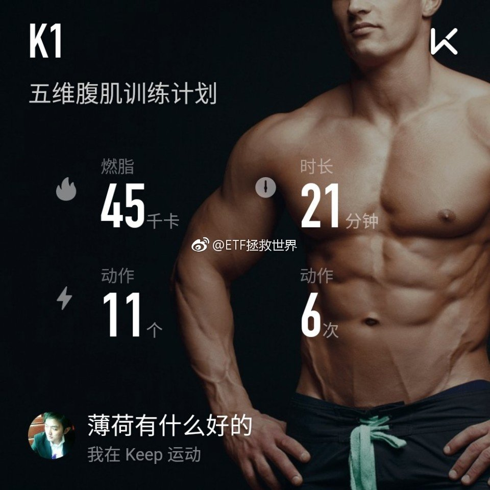

======================================================

ETF拯救世界 (5687069307) @
2017-08-07 09:29:52 Mon  
url: https://weibo.com/5687069307/FfXCX0OBz

回复@E三舀:屏幕效果不用说，应该是地表最强吧。拍照和s7好像差不多。系统就那么回事，没什么特别好的，据说是负优化。屏占比特别大，手机拿着觉得挺小，屏幕大，长。我手指算很长了，单手拿着大拇指摸不到状态栏。手机拿着手感好，适合对视觉触觉要求高的朋友。//@E三舀:哇！s8用几天谈谈好用不[太阳]

------------------------------------------------------
转推：
>  @ETF拯救世界 (5687069307)
>  2017-08-04 17:45:31 Fri  
>  url: https:/weibo.com/5687069307/FfyAE4uQj/

>  有点私事耽误，这几天没时间锻炼，刷微博甚至研究投资了。
>  
>  不过没什么大问题，各位勿念。
>  
>  人生不如意事十之八九，过几天去拜拜，也祝各位一生平安。 ​​​

转发[5]  评论[11]  赞[29] 

======================================================

ETF拯救世界 (5687069307) @
2017-08-07 09:53:29 Mon  
url: https://weibo.com/5687069307/FfXMxhdAT

回复@木木不哭木木:投资其实就是这么简单。别人都说不好，你就想想看看是不是真的不好。别人都不要你就买点。别人抢你就卖点。//@木木不哭木木:哇创业板大涨，漂亮50近期一直跌，投资就是要雪中送炭哇。

------------------------------------------------------
转推：
>  @ETF拯救世界 (5687069307)
>  2017-08-04 17:45:31 Fri  
>  url: https:/weibo.com/5687069307/FfyAE4uQj/

>  有点私事耽误，这几天没时间锻炼，刷微博甚至研究投资了。
>  
>  不过没什么大问题，各位勿念。
>  
>  人生不如意事十之八九，过几天去拜拜，也祝各位一生平安。 ​​​

转发[4]  评论[17]  赞[62] 

======================================================

ETF拯救世界 (5687069307) @
2017-08-07 10:59:12 Mon  
url: https://weibo.com/5687069307/FfYdda9Be

简单。保持90cm以下腰围；BMI小于18；头发出门前洗干净弄整齐（如果还有）；不戴金链子，不穿船鞋，不穿紧身衣（即使身材特好），尽量不穿短袖衬衣。这是外在，至于内在气质的话，多看书不知道还来不来得及。

------------------------------------------------------
转推：
>  @ ()
>  2017-08-06 21:17:27 Sun  
>  url: 

>  抱歉，作者已设置仅展示半年内微博，此微博已不可见。 ​​​

转发[15]  评论[55]  赞[59] 

======================================================

ETF拯救世界 (5687069307) @
2017-08-07 11:08:49 Mon  
url: https://weibo.com/5687069307/FfYh77dN7

嗯嗯，那就修改一下：体脂率不高于18。短袖衬衣的话，不要穿这种……总之短袖衬衣一言难尽。 http://t.cn/R9OH4iB 

------------------------------------------------------
转推：
>  @ ()
>  2017-08-06 21:17:27 Sun  
>  url: 

>  抱歉，作者已设置仅展示半年内微博，此微博已不可见。 ​​​

转发[1]  评论[19]  赞[32] 

======================================================

ETF拯救世界 (5687069307) @
2017-08-07 11:18:12 Mon  
url: https://weibo.com/5687069307/FfYkVuuaw

很多朋友疑惑的短袖衬衣，我想下面这张图包含了很多内容，可以研究一下。。

穿对了还ok，穿不好真的有问题。当然，省 部 级以上领导除外。 ​​​

转发[2]  评论[58]  赞[61] 

+++++++++++++++++++++++++++++++++++++++++++++++++++++

图片：

======================================================

ETF拯救世界 (5687069307) @
2017-08-07 22:26:30 Mon  
url: https://weibo.com/5687069307/Fg2IbqJzC

每日打卡(50)

坚持也没那么难。一个是为了健康。应该是为了不那么油腻。[doge] ​​​

转发[1]  评论[19]  赞[73] 

+++++++++++++++++++++++++++++++++++++++++++++++++++++

图片：

======================================================

ETF拯救世界 (5687069307) @
2017-08-08 09:16:21 Tue  
url: https://weibo.com/5687069307/Fg6XXrjdY

坚持是有效的。 ​​​

转发[0]  评论[38]  赞[86] 

+++++++++++++++++++++++++++++++++++++++++++++++++++++

图片：
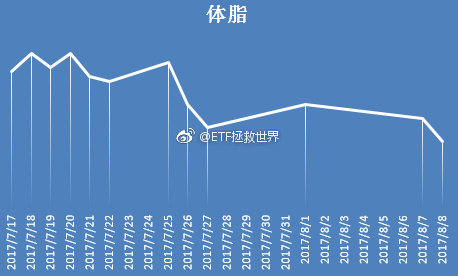

======================================================

ETF拯救世界 (5687069307) @
2017-08-08 09:34:05 Tue  
url: https://weibo.com/5687069307/Fg759FRwI

其实我感觉吧，普通男性，体脂，15-20就够了。要求高点的，12-20。

其实长期投资收益率也一样。几十年的周期来看，有12%就很好了。15%-20%基本就是神级操作。 ​​​

转发[18]  评论[43]  赞[80] 

+++++++++++++++++++++++++++++++++++++++++++++++++++++

图片：
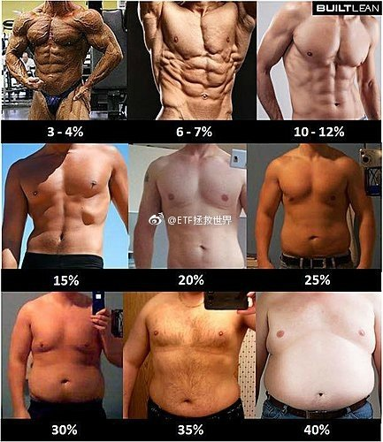

======================================================

ETF拯救世界 (5687069307) @
2017-08-08 10:08:56 Tue  
url: https://weibo.com/5687069307/Fg7jjftDf

回复@关键时刻屌无力:是的，不建议炒股，买房靠谱。毕竟房价永远涨。另外问一句，您那7成贷款是无息的吗？//@关键时刻屌无力:新来的，问个问题，每年要求12%收益率那直接全投资房产不就好了，3成首付每年涨4%就够了，房子每年涨4％应该很简单吧还省时省力。

------------------------------------------------------
转推：
>  @ETF拯救世界 (5687069307)
>  2017-08-08 09:34:05 Tue  
>  url: https:/weibo.com/5687069307/Fg759FRwI/

>  其实我感觉吧，普通男性，体脂，15-20就够了。要求高点的，12-20。
>  
>  其实长期投资收益率也一样。几十年的周期来看，有12%就很好了。15%-20%基本就是神级操作。 ​​​

转发[3]  评论[35]  赞[57] 

======================================================

ETF拯救世界 (5687069307) @
2017-08-08 10:44:58 Tue  
url: https://weibo.com/5687069307/Fg7xVylUl

$创业板指 sz399006$   奶一下。不要涨。刚买了2份。 ​​​

转发[4]  评论[32]  赞[49] 

======================================================

ETF拯救世界 (5687069307) @
2017-08-08 10:55:07 Tue  
url: https://weibo.com/5687069307/Fg7C3aFzd

重申一下关于未来的几个小观点：

第一，对于大多数股票来说，下跌只是走了一半而已。也可能是60%。总之还有至少一小半没跌完，要继续跌。

第二，债券会先于股票见底。目测债券也还有一定的跌幅。如果十年国债能到4，会大量买入。几个月后会换入股票。

未来会有人特别痛苦，套的痛不欲生。更远的未来 ​​​

转发[193]  评论[128]  赞[248] 

======================================================

ETF拯救世界 (5687069307) @
2017-08-08 11:20:10 Tue  
url: https://weibo.com/5687069307/Fg7MdrGIN

是不是失败了。

------------------------------------------------------
转推：
>  @ETF拯救世界 (5687069307)
>  2017-08-08 10:44:58 Tue  
>  url: https:/weibo.com/5687069307/Fg7xVylUl/

>  $创业板指 sz399006$   奶一下。不要涨。刚买了2份。 ​​​

转发[0]  评论[11]  赞[30] 

======================================================

ETF拯救世界 (5687069307) @
2017-08-08 11:21:09 Tue  
url: https://weibo.com/5687069307/Fg7MCgwnb

$温氏股份 sz300498$   万万没想到，通胀预期下，被嫌弃的创业板第一重仓股温氏爆发了…… ​​​

转发[2]  评论[18]  赞[44] 

======================================================

ETF拯救世界 (5687069307) @
2017-08-08 11:53:21 Tue  
url: https://weibo.com/5687069307/Fg7ZGt7xx

回复@天狼星爱吐槽:你有没有把一些“黑天鹅”类的突发事件放进未来推演中？未来其实是相当模糊的，无论是“GJD”还是黑天鹅。但我感觉，可能会发生一些GJD也撑不住的事，导致迅速价值回归。瞎猜的。

------------------------------------------------------
转推：
>  @ETF拯救世界 (5687069307)
>  2017-08-08 10:55:07 Tue  
>  url: https:/weibo.com/5687069307/Fg7C3aFzd/

>  重申一下关于未来的几个小观点：
>  
>  第一，对于大多数股票来说，下跌只是走了一半而已。也可能是60%。总之还有至少一小半没跌完，要继续跌。
>  
>  第二，债券会先于股票见底。目测债券也还有一定的跌幅。如果十年国债能到4，会大量买入。几个月后会换入股票。
>  
>  未来会有人特别痛苦，套的痛不欲生。更远的未来 ​​​

转发[6]  评论[26]  赞[64] 

======================================================

ETF拯救世界 (5687069307) @
2017-08-08 13:37:41 Tue  
url: https://weibo.com/5687069307/Fg8G2cQ1M

50赚钱也就算了，创业板也赚钱了。谁能想到。节奏。

------------------------------------------------------
转推：
>  @ETF拯救世界 (5687069307)
>  2017-08-08 10:44:58 Tue  
>  url: https:/weibo.com/5687069307/Fg7xVylUl/

>  $创业板指 sz399006$   奶一下。不要涨。刚买了2份。 ​​​

转发[1]  评论[13]  赞[47] 

======================================================

ETF拯救世界 (5687069307) @
2017-08-08 13:42:10 Tue  
url: https://weibo.com/5687069307/Fg8HR91fZ

一条小鱼 ​​​

转发[2]  评论[38]  赞[59] 

+++++++++++++++++++++++++++++++++++++++++++++++++++++

图片：
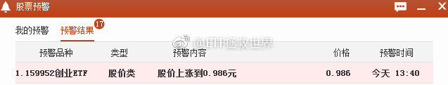

======================================================

ETF拯救世界 (5687069307) @
2017-08-08 15:10:46 Tue  
url: https://weibo.com/5687069307/Fg9hOyFXY

门票盘/计划盘 一起新高。说到最后，不停的赚钱/市值新高才是最终目标。结合极低的回撤幅度，就更完美了。 ​​​

转发[2]  评论[26]  赞[87] 

======================================================

ETF拯救世界 (5687069307) @
2017-08-08 15:50:01 Tue  
url: https://weibo.com/5687069307/Fg9xKot3E

[微笑] ​​​

转发[21]  评论[50]  赞[66] 

+++++++++++++++++++++++++++++++++++++++++++++++++++++

图片：
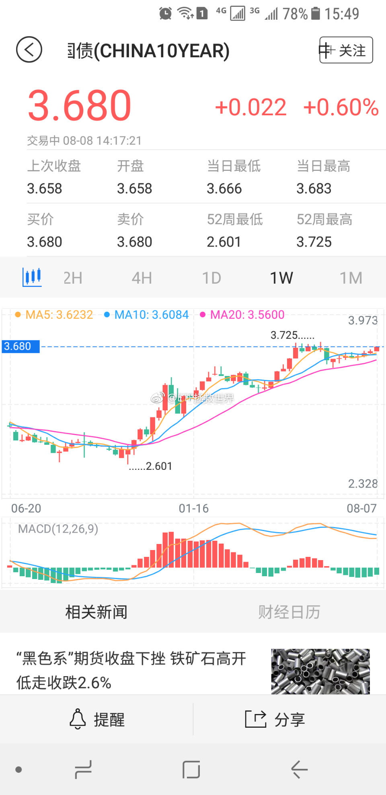

======================================================

ETF拯救世界 (5687069307) @
2017-08-08 21:21:08 Tue  
url: https://weibo.com/5687069307/FgbI9iVhx

每日打卡(51)

今天做两组，债还完了。坚持。 ​​​

转发[2]  评论[24]  赞[49] 

+++++++++++++++++++++++++++++++++++++++++++++++++++++

图片：

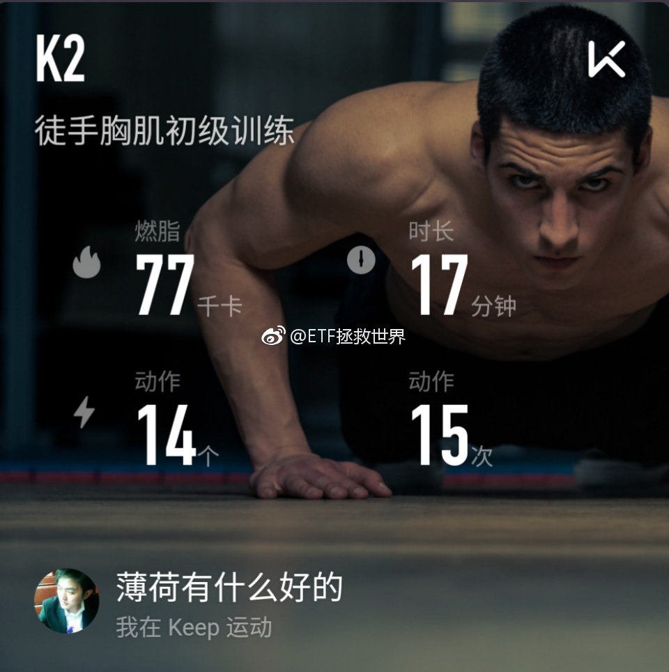

======================================================

ETF拯救世界 (5687069307) @
2017-08-08 21:24:29 Tue  
url: https://weibo.com/5687069307/FgbJvtGeC

回复@江湖人称再议哥:还是不要给这样的预期。碰上债券牛市一年17%可以，万一很久没有呢。还是不要有太高预期，基础配置就可以。//@江湖人称再议哥:回复@DX_XDZz:14年17%左右 15年10%左右 国开债指数 好像记得是这样

------------------------------------------------------
转推：
>  @ETF拯救世界 (5687069307)
>  2017-08-08 15:50:01 Tue  
>  url: https:/weibo.com/5687069307/Fg9xKot3E/

>  [微笑] ​​​

转发[13]  评论[21]  赞[40] 

======================================================

ETF拯救世界 (5687069307) @
2017-08-09 05:22:01 Wed  
url: https://weibo.com/5687069307/FgeRl9W4f

回复@俪俪LilyYan:一定要保重！也希望在四川的朋友们都平安！[加油]

------------------------------------------------------
转推：
>  @ETF拯救世界 (5687069307)
>  2017-08-08 21:21:08 Tue  
>  url: https:/weibo.com/5687069307/FgbI9iVhx/

>  每日打卡(51)
>  
>  今天做两组，债还完了。坚持。 ​​​

转发[1]  评论[16]  赞[52] 

======================================================

ETF拯救世界 (5687069307) @
2017-08-09 08:57:10 Wed  
url: https://weibo.com/5687069307/FgggFt1if

回球球了。

微博也会继续和大家一起玩~放心各位~ ​​​

转发[1]  评论[77]  赞[132] 

======================================================

ETF拯救世界 (5687069307) @
2017-08-09 09:56:18 Wed  
url: https://weibo.com/5687069307/FggEFAXGX

回复@野狗菜:3%是债息。但是你要注意，债券的价格会变化的。所以2016年下半年买入债基的很多人现在都亏了不少，为什么，价格下跌了。同理，当价格上涨的时候，债息+价格收益，这个赚多少都有可能。710国开债08年涨11%；14年涨14%就是这个道理。

------------------------------------------------------
转推：
>  @ETF拯救世界 (5687069307)
>  2017-08-08 15:50:01 Tue  
>  url: https:/weibo.com/5687069307/Fg9xKot3E/

>  [微笑] ​​​

转发[10]  评论[12]  赞[34] 

======================================================

ETF拯救世界 (5687069307) @
2017-08-09 10:00:44 Wed  
url: https://weibo.com/5687069307/FggGsCBXM

憋说话，用心去感受。医药长期低迷是不可能的。//@ETF拯救世界:回复@木木不哭木木:最爱。我最近几乎每天都在买，已经买到了总资产的5%。这对我来说已经是很不小的一个仓位了。再跌，就会进入低估区域。买入的力度会加大。//@木木不哭木木:医药最近在调整，挺好的，给我们慢慢买入的机会。

------------------------------------------------------
转推：
>  @ETF拯救世界 (5687069307)
>  2017-08-03 09:59:47 Thu  
>  url: https:/weibo.com/5687069307/Ffm76uKDv/

>  $创业板指 sz399006$  总是蠢蠢欲动。 ​​​

转发[2]  评论[24]  赞[48] 

======================================================

ETF拯救世界 (5687069307) @
2017-08-09 10:16:01 Wed  
url: https://weibo.com/5687069307/FggMFF3Ta

创业也好，养老也好，医药也好……

最近这几个月我们大力买入的品种，都是为“未来”布局。什么是未来？未来不是明天，下周，下个月。而是明年，三年、五年、甚至十年后。

为明天或者下周布局很简单，买强势就行。但我们不会，我们就买弱的。非常弱，特别弱，超弱的。

即使这么弱，我们持仓也都是盈 ​​​

转发[24]  评论[81]  赞[133] 

======================================================

ETF拯救世界 (5687069307) @
2017-08-09 11:05:35 Wed  
url: https://weibo.com/5687069307/Fgh6NiNQW

2000多家下跌，又新高了什么鬼 ​​​

转发[0]  评论[26]  赞[74] 

======================================================

ETF拯救世界 (5687069307) @
2017-08-09 11:14:01 Wed  
url: https://weibo.com/5687069307/FghadpjiB

本月中的品种已经有点眉目了。应该是有个新大类品种纳入囊中。 ​​​

转发[5]  评论[100]  赞[122] 

======================================================

ETF拯救世界 (5687069307) @
2017-08-09 11:49:53 Wed  
url: https://weibo.com/5687069307/FghoM91tA

[doge] SO?

------------------------------------------------------
转推：
>  @蓝鲸TMT网 (3866012793)
>  2017-08-09 10:50:09 Wed  
>  url: https:/weibo.com/3866012793/Fgh0wFfFe/

>  【强生宣布HIV疫苗临床试验结果：志愿者100%产生抗体】强生公司宣布了全球首次HIV疫苗人体临床试验结果，这一多中心、随机、安慰剂对照、双盲的1/2a期临床试验招募了393位健康志愿者，志愿者来自美国、卢旺达、乌干达、南非和泰国，结果显示，志愿者对HIV疫苗耐受性良好，且100%产生了对抗HIV的抗体。 ​​​

转发[5]  评论[20]  赞[31] 

======================================================

ETF拯救世界 (5687069307) @
2017-08-09 13:31:10 Wed  
url: https://weibo.com/5687069307/Fgi3T71Fn

17个品种两个浮亏。浮亏超过5%的只有一个，市值占比0.5%。

怎么办，投资好难。 ​​​​[允悲] ​​​

转发[1]  评论[26]  赞[78] 

======================================================

ETF拯救世界 (5687069307) @
2017-08-09 13:42:47 Wed  
url: https://weibo.com/5687069307/Fgi8Bk3Vp

$159938  目前计划的第二大并列重仓基金。

无论如何，不管发生什么，除非买的时候就是为了做波段，否则不要卖。不要卖。不要卖。

说三遍。 ​​​

转发[64]  评论[52]  赞[99] 

======================================================

ETF拯救世界 (5687069307) @
2017-08-09 13:48:27 Wed  
url: https://weibo.com/5687069307/FgiaU3sU4

说真的，科学这件事，不要说的太绝对。曾经人们认为地球、太阳是宇宙的中心。世界上没有什么不可能，只能说，以人类目前的科学水平，没有发现地震与地震云有关而已。面对这个世界，大家都应该敬畏和谦虚。

------------------------------------------------------
转推：
>  @中国地震台网速报 (1904228041)
>  2017-08-08 23:19:12 Tue  
>  url: https:/weibo.com/1904228041/Fgcu4rtqf/

>  云，和地震没有关联！！！ ​​​

转发[3]  评论[26]  赞[97] 

======================================================

ETF拯救世界 (5687069307) @
2017-08-09 13:53:03 Wed  
url: https://weibo.com/5687069307/FgicLxXQi

回复@小韭菜V:想梭就梭，要梭的漂亮。//@小韭菜V:老大:我想梭哈!

------------------------------------------------------
转推：
>  @ETF拯救世界 (5687069307)
>  2017-08-09 13:42:47 Wed  
>  url: https:/weibo.com/5687069307/Fgi8Bk3Vp/

>  $159938  目前计划的第二大并列重仓基金。
>  
>  无论如何，不管发生什么，除非买的时候就是为了做波段，否则不要卖。不要卖。不要卖。
>  
>  说三遍。 ​​​

转发[0]  评论[7]  赞[40] 

======================================================

ETF拯救世界 (5687069307) @
2017-08-09 13:58:32 Wed  
url: https://weibo.com/5687069307/Fgif090uC

回复@奥斯特洛夫大柴夫斯基:保守-激进，我的建议仓位是21-48//@奥斯特洛夫大柴夫斯基:现在50%的仓位，继续等，希望能加仓位到150%（个人根据E大做的个性化调整方案）。

------------------------------------------------------
转推：
>  @ETF拯救世界 (5687069307)
>  2017-08-09 13:42:47 Wed  
>  url: https:/weibo.com/5687069307/Fgi8Bk3Vp/

>  $159938  目前计划的第二大并列重仓基金。
>  
>  无论如何，不管发生什么，除非买的时候就是为了做波段，否则不要卖。不要卖。不要卖。
>  
>  说三遍。 ​​​

转发[7]  评论[16]  赞[40] 

======================================================

ETF拯救世界 (5687069307) @
2017-08-09 14:17:03 Wed  
url: https://weibo.com/5687069307/FgimvxtH3

谁还记得一年前的 $国证食品 sz399396$ 

[拜拜] ​​​

转发[4]  评论[62]  赞[58] 

======================================================

ETF拯救世界 (5687069307) @
2017-08-09 14:26:48 Wed  
url: https://weibo.com/5687069307/Fgiqtqqdn

有些朋友觉得我每天强调心态，强调收益率，强调坚定持有，每天说，说太多，都是废话。

其实，可能是他不知道就是因为我这样，多少朋友的恒生才能坚定拿到50%+。多少朋友才能坚定持有各种盈利品种，才能面对下跌心态平和。

有些事，其实并不那么简单。 ​​​

转发[19]  评论[134]  赞[270] 

======================================================

ETF拯救世界 (5687069307) @
2017-08-09 17:36:48 Wed  
url: https://weibo.com/5687069307/FgjFB6oeR

最喜欢丁磊。freestyle！用心做事！产品好！不吹NB！清流。//@八大山债人:。。。。 //@钟鸿钧://@子柳:潘老板：我看到门口有人穿西装。 丁老板：那是保安。

------------------------------------------------------
转推：
>  @网易新闻客户端 (1974808274)
>  2017-08-09 16:51:56 Wed  
>  url: https:/weibo.com/1974808274/FgjnnnBrw/

>  潘老板：你们平时上班都穿这样呀？
>  丁老板：不然呢？ ​​​

转发[4]  评论[30]  赞[53] 

======================================================

ETF拯救世界 (5687069307) @
2017-08-09 17:42:39 Wed  
url: https://weibo.com/5687069307/FgjHXBFnn

回复@iloveyounow:网易老板。曾经的中国首富。你看，低调到很多人都不认识。就喜欢低调的实力派！//@iloveyounow:回复@ETF拯救世界:他是做什麼的//@八大山债人:。。。。 //@钟鸿钧://@子柳:潘老板：我看到门口有人穿西装。 丁老板：那是保安。

------------------------------------------------------
转推：
>  @网易新闻客户端 (1974808274)
>  2017-08-09 16:51:56 Wed  
>  url: https:/weibo.com/1974808274/FgjnnnBrw/

>  潘老板：你们平时上班都穿这样呀？
>  丁老板：不然呢？ ​​​

转发[6]  评论[48]  赞[44] 

======================================================

ETF拯救世界 (5687069307) @
2017-08-09 20:11:55 Wed  
url: https://weibo.com/5687069307/FgkGycFf3

讲真，想骂人。为什么。

------------------------------------------------------
转推：
>  @ETF拯救世界 (5687069307)
>  2017-08-09 11:14:01 Wed  
>  url: https:/weibo.com/5687069307/FghadpjiB/

>  本月中的品种已经有点眉目了。应该是有个新大类品种纳入囊中。 ​​​

转发[1]  评论[75]  赞[53] 

======================================================

ETF拯救世界 (5687069307) @
2017-08-09 22:15:07 Wed  
url: https://weibo.com/5687069307/FgluytVT0

每日打卡(52)

今天累，来个轻松的 ​​​

转发[0]  评论[15]  赞[61] 

+++++++++++++++++++++++++++++++++++++++++++++++++++++

图片：

======================================================

ETF拯救世界 (5687069307) @
2017-08-09 22:44:03 Wed  
url: https://weibo.com/5687069307/FglGih1HD

美股十年最高估值已经持续几个月了。无论崩不崩，从现在算，未来十年收益会很低。

------------------------------------------------------
转推：
>  @ ()
>  2017-08-09 22:04:21 Wed  
>  url: 

>  抱歉，作者已设置仅展示半年内微博，此微博已不可见。 ​​​

转发[8]  评论[37]  赞[68] 

======================================================

ETF拯救世界 (5687069307) @
2017-08-10 09:35:11 Thu  
url: https://weibo.com/5687069307/FgpWBs2n9

回复@Tony_RUC:肯定是赚钱了，至少在1%左右。你并不熟悉普通投资者的心态。一个品种浮亏，回本后马上就想卖出，害怕再次浮亏，坐过山车。所以我会在回本的时候提醒：不要卖。//@Tony_RUC:根本没涨，卖啥卖啊，老大………没赚钱啊！

------------------------------------------------------
转推：
>  @ETF拯救世界 (5687069307)
>  2017-08-09 13:42:47 Wed  
>  url: https:/weibo.com/5687069307/Fgi8Bk3Vp/

>  $159938  目前计划的第二大并列重仓基金。
>  
>  无论如何，不管发生什么，除非买的时候就是为了做波段，否则不要卖。不要卖。不要卖。
>  
>  说三遍。 ​​​

转发[36]  评论[22]  赞[53] 

======================================================

ETF拯救世界 (5687069307) @
2017-08-10 09:40:38 Thu  
url: https://weibo.com/5687069307/FgpYNANP0

回复@xeon_xiaohai:没有。同一类别的小类资产总量绝不超过20%。比如50和300是一个小类，医药和养老算一个小类，石油基金和华宝油气算一个//@xeon_xiaohai:E大，每个品种购买的份数有上限吗，如果有的话上限是多少份？

------------------------------------------------------
转推：
>  @ETF拯救世界 (5687069307)
>  2017-08-09 13:42:47 Wed  
>  url: https:/weibo.com/5687069307/Fgi8Bk3Vp/

>  $159938  目前计划的第二大并列重仓基金。
>  
>  无论如何，不管发生什么，除非买的时候就是为了做波段，否则不要卖。不要卖。不要卖。
>  
>  说三遍。 ​​​

转发[31]  评论[27]  赞[55] 

======================================================

ETF拯救世界 (5687069307) @
2017-08-10 09:54:29 Thu  
url: https://weibo.com/5687069307/Fgq4qARrI

醉了，除了仓位低的两个，都是红的。

我再说一次，计划里的任何品种，未来，某一天，浮亏十几个点，一点点都不用担心。千万不要随便卖。因为牛市来了，一周两周就分分钟盈利。这话说过很多次，还要再说。 ​​​

转发[33]  评论[44]  赞[97] 

+++++++++++++++++++++++++++++++++++++++++++++++++++++

图片：
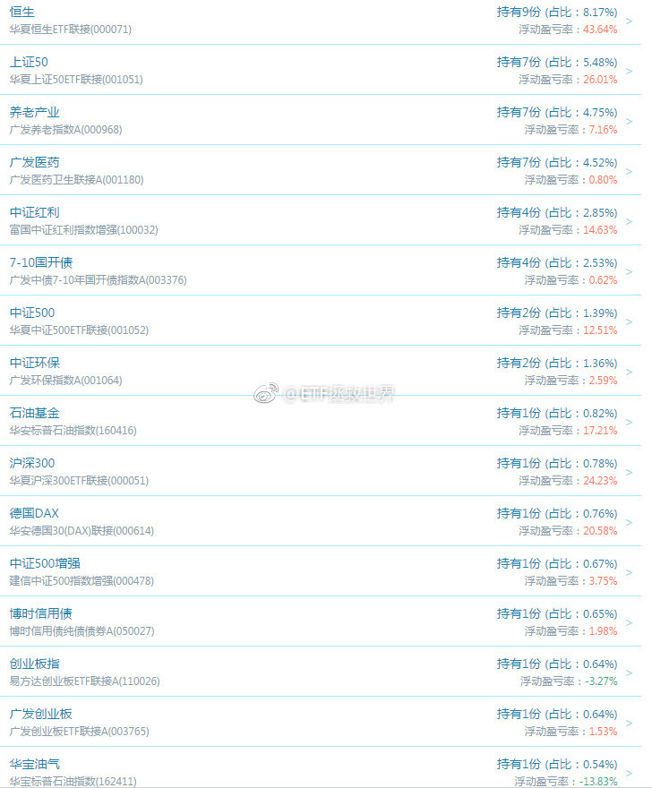

======================================================

ETF拯救世界 (5687069307) @
2017-08-10 09:57:19 Thu  
url: https://weibo.com/5687069307/Fgq5A9sz9

回复@刘泽瑜31881:有些话我说过不止一次。仓位是适合我的，也是适合一部分朋友的，但不是适合所有朋友的。觉得低的，我买一份可以买两份甚至三份。我不能让所有朋友感到舒服。//@刘泽瑜31881:我觉得现在不是浮亏的问题而是有可能仓位问题！

------------------------------------------------------
转推：
>  @ETF拯救世界 (5687069307)
>  2017-08-10 09:54:29 Thu  
>  url: https:/weibo.com/5687069307/Fgq4qARrI/

>  醉了，除了仓位低的两个，都是红的。
>  
>  我再说一次，计划里的任何品种，未来，某一天，浮亏十几个点，一点点都不用担心。千万不要随便卖。因为牛市来了，一周两周就分分钟盈利。这话说过很多次，还要再说。 ​​​

转发[7]  评论[21]  赞[51] 

======================================================

ETF拯救世界 (5687069307) @
2017-08-10 10:09:59 Thu  
url: https://weibo.com/5687069307/FgqaJhT2u

回复@chrismixxx:我说的是正常情况下。比如2015年7月分级A那种情况，我会100%买入。然而那种情况几年才能碰到一次。正常情况下，这是我的原则。非极端情况下，我对自己没那么大的信心——非常看好的一定会大涨。我相信也没有几个人能总是看好就肯定涨。长期来看，不可能。

------------------------------------------------------
转推：
>  @ETF拯救世界 (5687069307)
>  2017-08-09 13:42:47 Wed  
>  url: https:/weibo.com/5687069307/Fgi8Bk3Vp/

>  $159938  目前计划的第二大并列重仓基金。
>  
>  无论如何，不管发生什么，除非买的时候就是为了做波段，否则不要卖。不要卖。不要卖。
>  
>  说三遍。 ​​​

转发[6]  评论[19]  赞[49] 

======================================================

ETF拯救世界 (5687069307) @
2017-08-10 10:24:20 Thu  
url: https://weibo.com/5687069307/Fgqgy2zIc

一个消息：恒生已经低于我们31号的卖出价格了。

[doge] ​​​

转发[0]  评论[49]  赞[94] 

======================================================

ETF拯救世界 (5687069307) @
2017-08-10 11:21:03 Thu  
url: https://weibo.com/5687069307/FgqDzjcyR

很多，我不是说所有啊，很多上涨时候觉得仓位低的朋友，三根，或者两根阴线，就会觉得仓位有点高。 ​​​

转发[8]  评论[51]  赞[104] 

======================================================

ETF拯救世界 (5687069307) @
2017-08-10 11:49:22 Thu  
url: https://weibo.com/5687069307/FgqP3FS2A

不要高兴太早，还有5天。 ​​​

转发[4]  评论[22]  赞[55] 

======================================================

ETF拯救世界 (5687069307) @
2017-08-10 11:56:56 Thu  
url: https://weibo.com/5687069307/FgqS8kjxO

回复@石头里的虫子:是哦，其实还有2个半工作日。14、15日随机发车//@石头里的虫子:三个工作日。

------------------------------------------------------
转推：
>  @ETF拯救世界 (5687069307)
>  2017-08-10 11:49:22 Thu  
>  url: https:/weibo.com/5687069307/FgqP3FS2A/

>  不要高兴太早，还有5天。 ​​​

转发[1]  评论[8]  赞[40] 

======================================================

ETF拯救世界 (5687069307) @
2017-08-10 12:08:30 Thu  
url: https://weibo.com/5687069307/FgqWPolaL

你给的价格太高，人家当然要套现。没人买，跌到大股东不愿意套的时候，自然就没人套了，甚至还会增持。维持股市高价格高估值，让股民高位用这些垃圾价格炒来炒去，是解决问题的方法？

------------------------------------------------------
转推：
>  @叶檀 (1233227211)
>  2017-08-10 11:58:29 Thu  
>  url: https:/weibo.com/1233227211/FgqSLCMQV/

>  参加网易经济学家年会，跟水皮先生辩（交）论（流），不必停止IPO，要应对的是套现 ​​​

转发[7]  评论[26]  赞[65] 

======================================================

ETF拯救世界 (5687069307) @
2017-08-10 21:02:38 Thu  
url: https://weibo.com/5687069307/FgurDggMY

每日打卡(53)

这组认真做还是有点酸爽的。 ​​​

转发[0]  评论[16]  赞[75] 

+++++++++++++++++++++++++++++++++++++++++++++++++++++

图片：

======================================================

ETF拯救世界 (5687069307) @
2017-08-11 08:07:29 Fri  
url: https://weibo.com/5687069307/FgyNvf0oV

看热闹的同时，是时候找一些合适的美元资产了

------------------------------------------------------
转推：
>  @和讯网 (2000961721)
>  2017-08-11 07:31:02 Fri  
>  url: https:/weibo.com/2000961721/FgyyHqp9M/

>  【人民币一周上涨1% 空头踩踏、对冲基金止损离场 】 本周人民币兑美元涨幅已接近1%，连续突破6.72、6.7、6.68、6.66等多个关口，面对人民币汇率如此凌厉的涨势，持有人民币空单的对冲基金再也坐不住了。对冲基金平仓空头头寸止损离场。http://t.cn/R9nHz8q ​​​

转发[12]  评论[61]  赞[82] 

======================================================

ETF拯救世界 (5687069307) @
2017-08-11 09:26:10 Fri  
url: https://weibo.com/5687069307/Fgzjr3Y3W

呵呵哒。[笑而不语]//@华尔街见闻APP:香港恒生指数开盘跌1.6%，至27000.43点

------------------------------------------------------
转推：
>  @ ()
>  2017-08-11 09:22:19 Fri  
>  url: 

>  抱歉，作者已设置仅展示半年内微博，此微博已不可见。 ​​​

转发[11]  评论[26]  赞[59] 

======================================================

ETF拯救世界 (5687069307) @
2017-08-11 10:27:07 Fri  
url: https://weibo.com/5687069307/FgzIaEGJj

创业和医药红了 ​​​

转发[4]  评论[17]  赞[73] 

======================================================

ETF拯救世界 (5687069307) @
2017-08-11 10:31:24 Fri  
url: https://weibo.com/5687069307/FgzJUtLsS

什么意思呢。注意，这个月初是卖掉一份恒生，买医药和创业。 [doge]

------------------------------------------------------
转推：
>  @ETF拯救世界 (5687069307)
>  2017-08-11 10:27:07 Fri  
>  url: https:/weibo.com/5687069307/FgzIaEGJj/

>  创业和医药红了 ​​​

转发[1]  评论[16]  赞[60] 

======================================================

ETF拯救世界 (5687069307) @
2017-08-11 10:33:11 Fri  
url: https://weibo.com/5687069307/FgzKE2FQx

回复@强尼大木覀:“哎我跟你说，我捡了1万块钱”。“高兴个屁啊，你又没捡1000万能买套房。有什么好高兴的？”//@强尼大木覀:就卖了一份，大仓位还是继续持有的啊，为什么跌了这么高兴呢？//@ETF拯救世界:呵呵哒。[笑而不语]//@华尔街见闻APP:香港恒生指数开盘跌1.6%，至27000.43点

------------------------------------------------------
转推：
>  @ ()
>  2017-08-11 09:22:19 Fri  
>  url: 

>  抱歉，作者已设置仅展示半年内微博，此微博已不可见。 ​​​

转发[10]  评论[22]  赞[55] 

======================================================

ETF拯救世界 (5687069307) @
2017-08-11 10:44:53 Fri  
url: https://weibo.com/5687069307/FgzPo2e9g

很有意思。可能就是思维模式不同吧。

比如之前，我们提前发车低位买过一个品种。然后下一次发车文章中我会说真好，如果按照正常发车时间买会比较贵。

有人就会评论说，高兴什么呢？长期来看不是应该忽略这点涨幅吗。

这个其实我就很不理解了。我买东西当然是越便宜越好。能便宜一分一毛都好，何况几 ​​​

转发[2]  评论[72]  赞[120] 

======================================================

ETF拯救世界 (5687069307) @
2017-08-11 10:47:20 Fri  
url: https://weibo.com/5687069307/FgzQo3ecu

回复@纯香芥末:我告诉你未来吧。这也是计划中所有品种的共同未来：拿着的仓位跌下去了，然后再回到下跌的起点，你会发现，神奇的，赚的比跌之前多多了！//@纯香芥末:虽然我跟的晚没买到恒生，也是担心这要跌了不起来，手里还有那么多咋办，只能等以后再来看节奏了，现在还看不懂

------------------------------------------------------
转推：
>  @ ()
>  2017-08-11 09:22:19 Fri  
>  url: 

>  抱歉，作者已设置仅展示半年内微博，此微博已不可见。 ​​​

转发[8]  评论[33]  赞[68] 

======================================================

ETF拯救世界 (5687069307) @
2017-08-11 11:16:44 Fri  
url: https://weibo.com/5687069307/FgA2jp0O0

回复@一场清风一场秋梦:不敢当，心领了！//@一场清风一场秋梦:回复@石头里的虫子:不，女儿和自己一起送了

------------------------------------------------------
转推：
>  @ETF拯救世界 (5687069307)
>  2017-08-11 10:44:53 Fri  
>  url: https:/weibo.com/5687069307/FgzPo2e9g/

>  很有意思。可能就是思维模式不同吧。
>  
>  比如之前，我们提前发车低位买过一个品种。然后下一次发车文章中我会说真好，如果按照正常发车时间买会比较贵。
>  
>  有人就会评论说，高兴什么呢？长期来看不是应该忽略这点涨幅吗。
>  
>  这个其实我就很不理解了。我买东西当然是越便宜越好。能便宜一分一毛都好，何况几 ​​​

转发[0]  评论[14]  赞[53] 

======================================================

ETF拯救世界 (5687069307) @
2017-08-11 11:20:13 Fri  
url: https://weibo.com/5687069307/FgA3J8XYg

[微笑] ​​​

转发[4]  评论[74]  赞[126] 

+++++++++++++++++++++++++++++++++++++++++++++++++++++

图片：
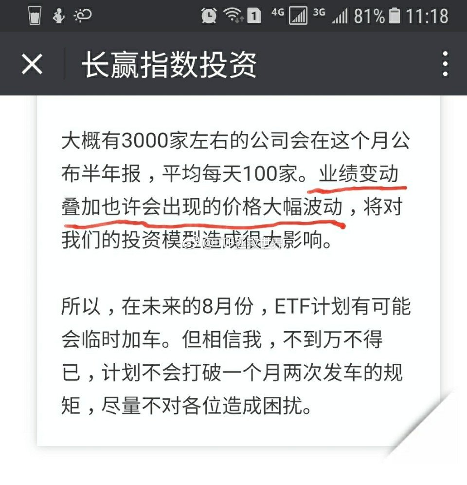

======================================================

ETF拯救世界 (5687069307) @
2017-08-11 14:38:54 Fri  
url: https://weibo.com/5687069307/FgBmndo68

看了眼即时估值数据，也没有太令人惊喜。

我估计月底的车才是最值得期待的！ ​​​

转发[14]  评论[83]  赞[119] 

======================================================

ETF拯救世界 (5687069307) @
2017-08-11 14:55:17 Fri  
url: https://weibo.com/5687069307/FgBt1kKwR

如果这个月买十份以上，会不会惊讶。

------------------------------------------------------
转推：
>  @ETF拯救世界 (5687069307)
>  2017-08-11 14:38:54 Fri  
>  url: https:/weibo.com/5687069307/FgBmndo68/

>  看了眼即时估值数据，也没有太令人惊喜。
>  
>  我估计月底的车才是最值得期待的！ ​​​

转发[11]  评论[225]  赞[195] 

======================================================

ETF拯救世界 (5687069307) @
2017-08-11 23:28:43 Fri  
url: https://weibo.com/5687069307/FgEPqn3aG

每日打卡（54）

周末比较放纵，晚了点。 ​​​

转发[0]  评论[21]  赞[95] 

+++++++++++++++++++++++++++++++++++++++++++++++++++++

图片：

======================================================

ETF拯救世界 (5687069307) @
2017-08-12 23:56:20 Sat  
url: https://weibo.com/5687069307/FgOr8cLYw

喝多了。

半个月白练了[拜拜] ​​​

转发[4]  评论[96]  赞[155] 

======================================================

ETF拯救世界 (5687069307) @
2017-08-13 22:06:54 Sun  
url: https://weibo.com/5687069307/FgX9dkYxs

每日打卡（55）

还债。两组。 ​​​

转发[0]  评论[17]  赞[84] 

+++++++++++++++++++++++++++++++++++++++++++++++++++++

图片：

======================================================

ETF拯救世界 (5687069307) @
2017-08-14 09:23:30 Mon  
url: https://weibo.com/5687069307/Fh1zQaPoN

回复@俪俪LilyYan:一年喝不了两次。遇到正确的人，可以喝。//@俪俪LilyYan:意外，我以为的EE是烟酒不沾、干干净净的谦谦美男子～～

------------------------------------------------------
转推：
>  @ETF拯救世界 (5687069307)
>  2017-08-12 23:56:20 Sat  
>  url: https:/weibo.com/5687069307/FgOr8cLYw/

>  喝多了。
>  
>  半个月白练了[拜拜] ​​​

转发[0]  评论[46]  赞[61] 

======================================================

ETF拯救世界 (5687069307) @
2017-08-14 09:33:03 Mon  
url: https://weibo.com/5687069307/Fh1DIsjFB

只要涨幅可以接受，今晚会先发一车。 ​​​

转发[2]  评论[115]  赞[155] 

======================================================

ETF拯救世界 (5687069307) @
2017-08-14 14:06:49 Mon  
url: https://weibo.com/5687069307/Fh3qQ97O7

表脸[挖鼻]//@ETF拯救世界:如果这个月买十份以上，会不会惊讶。

------------------------------------------------------
转推：
>  @ETF拯救世界 (5687069307)
>  2017-08-11 14:38:54 Fri  
>  url: https:/weibo.com/5687069307/FgBmndo68/

>  看了眼即时估值数据，也没有太令人惊喜。
>  
>  我估计月底的车才是最值得期待的！ ​​​

转发[2]  评论[39]  赞[61] 

======================================================

ETF拯救世界 (5687069307) @
2017-08-14 14:12:35 Mon  
url: https://weibo.com/5687069307/Fh3tbvUdT

回复@求财不劫色:因为我们买了//@求财不劫色:益达，创业板今天吃药了吗？[允悲]//@ETF拯救世界:表脸[挖鼻]//@ETF拯救世界:如果这个月买十份以上，会不会惊讶。

------------------------------------------------------
转推：
>  @ETF拯救世界 (5687069307)
>  2017-08-11 14:38:54 Fri  
>  url: https:/weibo.com/5687069307/FgBmndo68/

>  看了眼即时估值数据，也没有太令人惊喜。
>  
>  我估计月底的车才是最值得期待的！ ​​​

转发[1]  评论[49]  赞[70] 

======================================================

ETF拯救世界 (5687069307) @
2017-08-14 22:50:49 Mon  
url: https://weibo.com/5687069307/Fh6Rx6S4h

每日打卡（56）

时间不够用 ​​​

转发[0]  评论[13]  赞[63] 

+++++++++++++++++++++++++++++++++++++++++++++++++++++

图片：

======================================================

ETF拯救世界 (5687069307) @
2017-08-15 09:39:07 Tue  
url: https://weibo.com/5687069307/Fhb6G49ye

坐山观虎斗 ​​​

转发[4]  评论[37]  赞[73] 

======================================================

ETF拯救世界 (5687069307) @
2017-08-15 09:49:32 Tue  
url: https://weibo.com/5687069307/FhbaUsd0d

回复@2014不疾而速:我不敢想象，也不希望创业板在这里有大幅度反弹。如果那样，不光没有牛市，还会有更大的灾难发生。//@2014不疾而速:50和创业板，到底谁是新的王者呢

------------------------------------------------------
转推：
>  @ETF拯救世界 (5687069307)
>  2017-08-15 09:39:07 Tue  
>  url: https:/weibo.com/5687069307/Fhb6G49ye/

>  坐山观虎斗 ​​​

转发[2]  评论[35]  赞[73] 

======================================================

ETF拯救世界 (5687069307) @
2017-08-15 09:59:07 Tue  
url: https://weibo.com/5687069307/FhbeNhvys

今天账户又新高了，高兴，送电影票。

也是因为大家这几个月一直在微博和我互动，也很辛苦，哈哈。下面这个是微博的粉丝互动排行榜，我不知道算法是什么，反正就按这个来吧。

送排名第一的朋友两张电影票。请48小时之内和我联系。如果放弃或者不联系就顺延到排行第二的朋友，以此类推。

任何电影都可 ​​​

转发[7]  评论[217]  赞[166] 

+++++++++++++++++++++++++++++++++++++++++++++++++++++

图片：
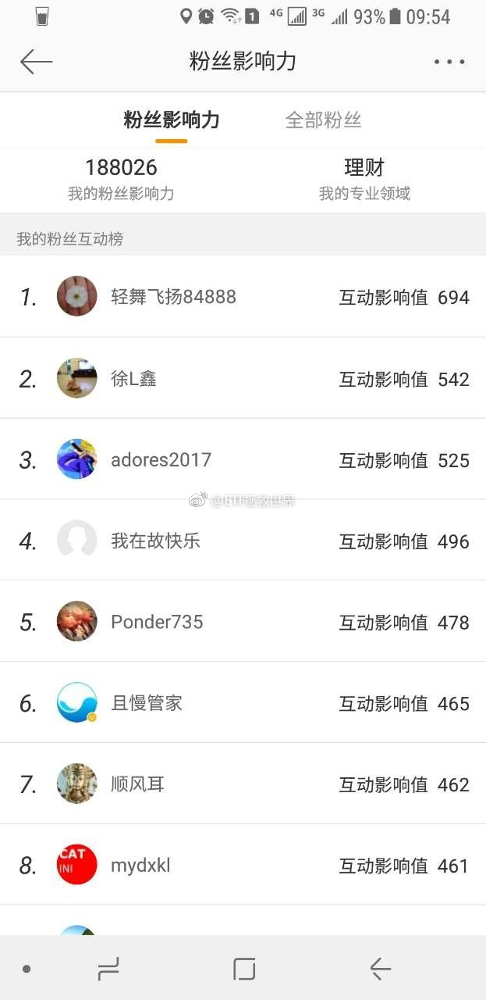

======================================================

ETF拯救世界 (5687069307) @
2017-08-15 11:00:33 Tue  
url: https://weibo.com/5687069307/FhbDJkApw

关于有些朋友不停的说华宝油气与油价走势不符。只说两点，加个图，以后不用再讨论。

第一，油气跟踪的不是油价本身，原油没有办法像黄金ETF一样持有现货，因为它不易保存。解决的办法两个，一个是跟踪期货，比如南方油。但是换期有损耗，我不敢长期持有。第二个是跟踪上游或者全产业链公司，比如xop和 ​​​

转发[88]  评论[112]  赞[149] 

+++++++++++++++++++++++++++++++++++++++++++++++++++++

图片：
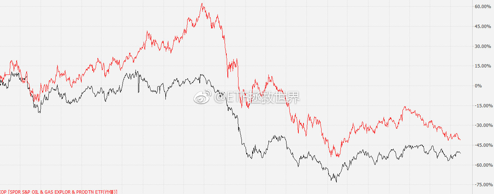

======================================================

ETF拯救世界 (5687069307) @
2017-08-15 11:07:36 Tue  
url: https://weibo.com/5687069307/FhbGBd1rH

回复@CZ梦想:油气一路跌下来，总是有人不停的催加仓。催什么呢。你知不知道为什么有些人会在一个品种上赔很多？因为跌一点就加，跌一点就加。本来就买了一点，跌10%就已经加到70%仓位了。结果呢？duang，又跌了70%。翻不了身了。下跌加仓是有节奏的，不要催，该加自然会加。

------------------------------------------------------
转推：
>  @ETF拯救世界 (5687069307)
>  2017-08-15 11:00:33 Tue  
>  url: https:/weibo.com/5687069307/FhbDJkApw/

>  关于有些朋友不停的说华宝油气与油价走势不符。只说两点，加个图，以后不用再讨论。
>  
>  第一，油气跟踪的不是油价本身，原油没有办法像黄金ETF一样持有现货，因为它不易保存。解决的办法两个，一个是跟踪期货，比如南方油。但是换期有损耗，我不敢长期持有。第二个是跟踪上游或者全产业链公司，比如xop和 ​​​

转发[18]  评论[88]  赞[135] 

======================================================

ETF拯救世界 (5687069307) @
2017-08-15 13:23:42 Tue  
url: https://weibo.com/5687069307/FhczPCMX5

自己找吧。 ​​​

转发[5]  评论[181]  赞[122] 

+++++++++++++++++++++++++++++++++++++++++++++++++++++

图片：
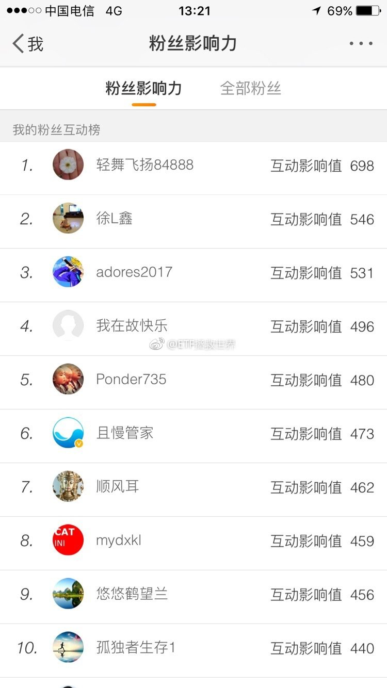
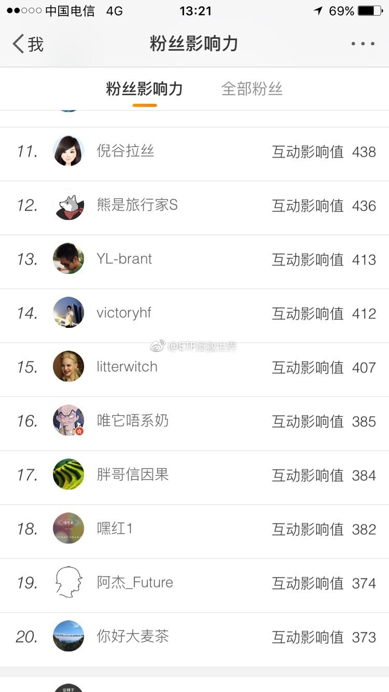
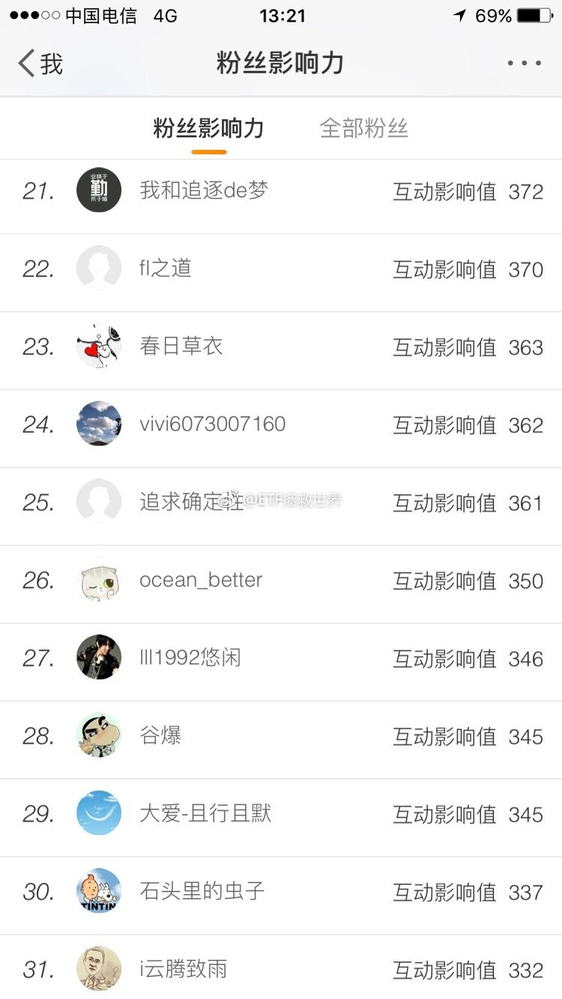
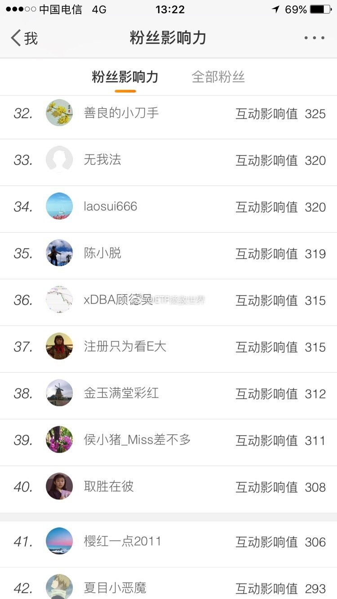
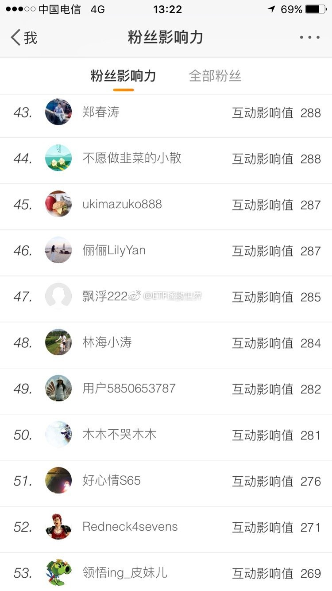
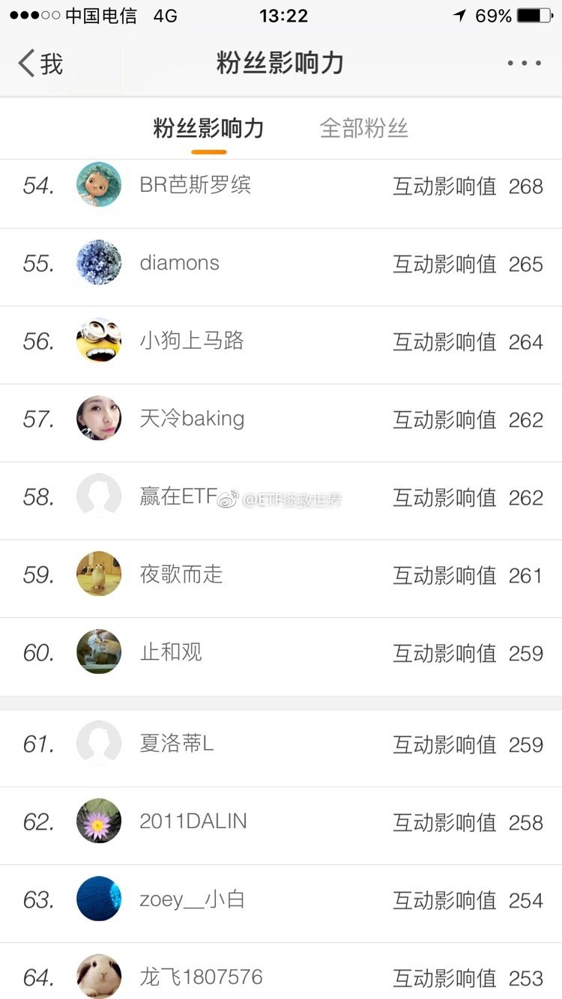
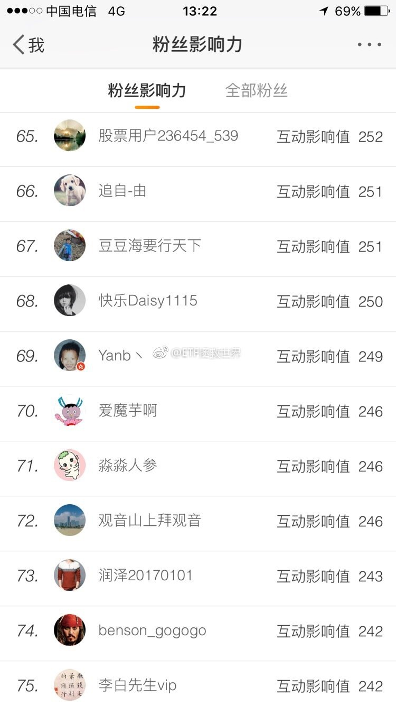
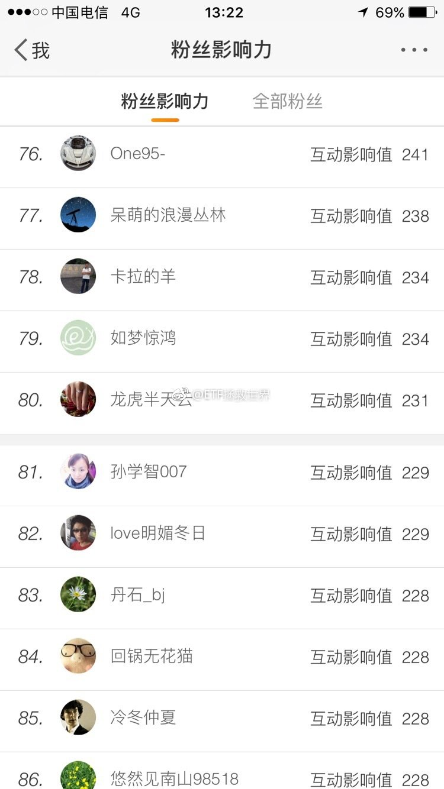
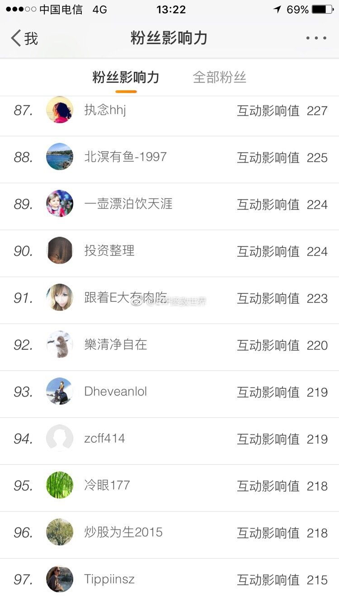

======================================================

ETF拯救世界 (5687069307) @
2017-08-15 16:29:51 Tue  
url: https://weibo.com/5687069307/FhdNoFKff

回复@就爱喝X:过年红包发了好几千，你跟我说没有两张电影票好 [允悲]//@就爱喝X:比过年的红包好

------------------------------------------------------
转推：
>  @ETF拯救世界 (5687069307)
>  2017-08-15 09:59:07 Tue  
>  url: https:/weibo.com/5687069307/FhbeNhvys/

>  今天账户又新高了，高兴，送电影票。
>  
>  也是因为大家这几个月一直在微博和我互动，也很辛苦，哈哈。下面这个是微博的粉丝互动排行榜，我不知道算法是什么，反正就按这个来吧。
>  
>  送排名第一的朋友两张电影票。请48小时之内和我联系。如果放弃或者不联系就顺延到排行第二的朋友，以此类推。
>  
>  任何电影都可 ​​​

转发[1]  评论[51]  赞[63] 

======================================================

ETF拯救世界 (5687069307) @
2017-08-15 22:50:19 Tue  
url: https://weibo.com/5687069307/FhghPebQz

每日打卡（57）

今天累，这组相当于休息了。坚持 ​​​

转发[0]  评论[16]  赞[80] 

+++++++++++++++++++++++++++++++++++++++++++++++++++++

图片：

======================================================

ETF拯救世界 (5687069307) @
2017-08-16 09:20:43 Wed  
url: https://weibo.com/5687069307/FhkpHyWe6

“【国家队新进增持46股 27家为中小创公司】截至昨日，共有573家公司披露2017年半年报业绩，有175家公司前十大流通股股东中出现以证金、汇金等为代表的国家队身影。其中，有46家公司股票被国家队新进或增持，有27家公司是中小板和创业板的股票，占比近六成。（中国证券网） ​​​​”-非临时性

------------------------------------------------------
转推：
>  @ ()
>  2017-08-15 22:01:33 Tue  
>  url: 

>  抱歉，此微博已被作者删除。查看帮助：http://t.cn/Rfd3rQV

转发[5]  评论[63]  赞[67] 

======================================================

ETF拯救世界 (5687069307) @
2017-08-16 09:49:21 Wed  
url: https://weibo.com/5687069307/FhkBkgPah

$创业板指 sz399006$   差不多得了。 ​​​

转发[0]  评论[86]  赞[86] 

======================================================

ETF拯救世界 (5687069307) @
2017-08-16 11:40:28 Wed  
url: https://weibo.com/5687069307/FhlkqxGAL

遇到瓶颈了。最近吃吃喝喝，锻炼也不够。需要反省了。 ​​​

转发[0]  评论[76]  赞[73] 

+++++++++++++++++++++++++++++++++++++++++++++++++++++

图片：
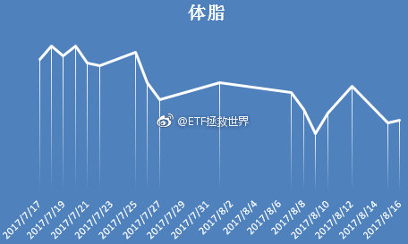

======================================================

ETF拯救世界 (5687069307) @
2017-08-16 13:44:27 Wed  
url: https://weibo.com/5687069307/Fhm8KConE

全都买的指数基金。然而，所有指数都没新高，组合又新高了。

神奇。 ​​​

转发[2]  评论[114]  赞[159] 

======================================================

ETF拯救世界 (5687069307) @
2017-08-16 15:07:18 Wed  
url: https://weibo.com/5687069307/FhmGnDOFI

今年门票盘36%了。做了那么多年指数，选股技术没有退化 ​​​

转发[0]  评论[95]  赞[161] 

+++++++++++++++++++++++++++++++++++++++++++++++++++++

图片：
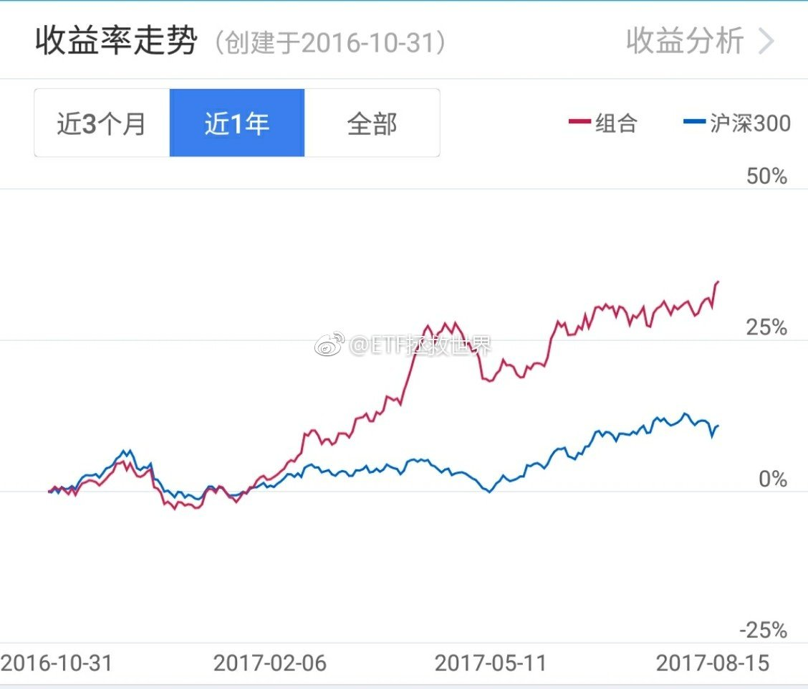

======================================================

ETF拯救世界 (5687069307) @
2017-08-16 16:48:17 Wed  
url: https://weibo.com/5687069307/FhnlntJds

看了这个，突然感到非常幸运：我只是莫名其妙的被人喷而已，这个老板莫名其妙被人捅了！我可以说捡了很多条命了。

------------------------------------------------------
转推：
>  @澎湃新闻 (5044281310)
>  2017-08-16 16:30:03 Wed  
>  url: https:/weibo.com/5044281310/FhndYcTTC/

>  【取单起争执，外卖员捅死店老板后自杀】http://t.cn/RChWLSj 8月11日，陕西西安铁炉庙村附近，一外卖员因拿错饭不肯换回与店老板起争执。外卖员刀捅店老板及其岳父，店老板不治去世，随后外卖员自杀身亡。目前，案件还在调查中。陕西广播电视台http://t.cn/RChWLSl ​​​

转发[9]  评论[62]  赞[43] 

======================================================

ETF拯救世界 (5687069307) @
2017-08-16 20:10:32 Wed  
url: https://weibo.com/5687069307/FhoFsEhhR

哈哈，喜欢就好。还写了这么多。以后还有福利送给各位。

------------------------------------------------------
转推：
>  @轻舞飞扬84888 (5371903014)
>  2017-08-16 19:37:58 Wed  
>  url: https:/weibo.com/5371903014/FhosfiEfB/

>  @ETF拯救世界 
>  老大，谢谢你！电影很好看，今天过得很愉快！🌹🌹🌹
>  这真是个美好的一天。在众多学习的同学中，侥幸得到了老大滴奖励--两张电影票，看了很棒的一场电影，渡过了很愉快的一个下午，非常开心，很是欢喜。
>  跟着老大学习快一年，收益良多，学到了很多宝贵的投资知识。
>  最最重要的是-- ​​​

转发[2]  评论[55]  赞[111] 

======================================================

ETF拯救世界 (5687069307) @
2017-08-16 21:18:03 Wed  
url: https://weibo.com/5687069307/Fhp6S7zt3

每日打卡（58）

快两个月了。坚持。 ​​​

转发[0]  评论[14]  赞[70] 

+++++++++++++++++++++++++++++++++++++++++++++++++++++

图片：
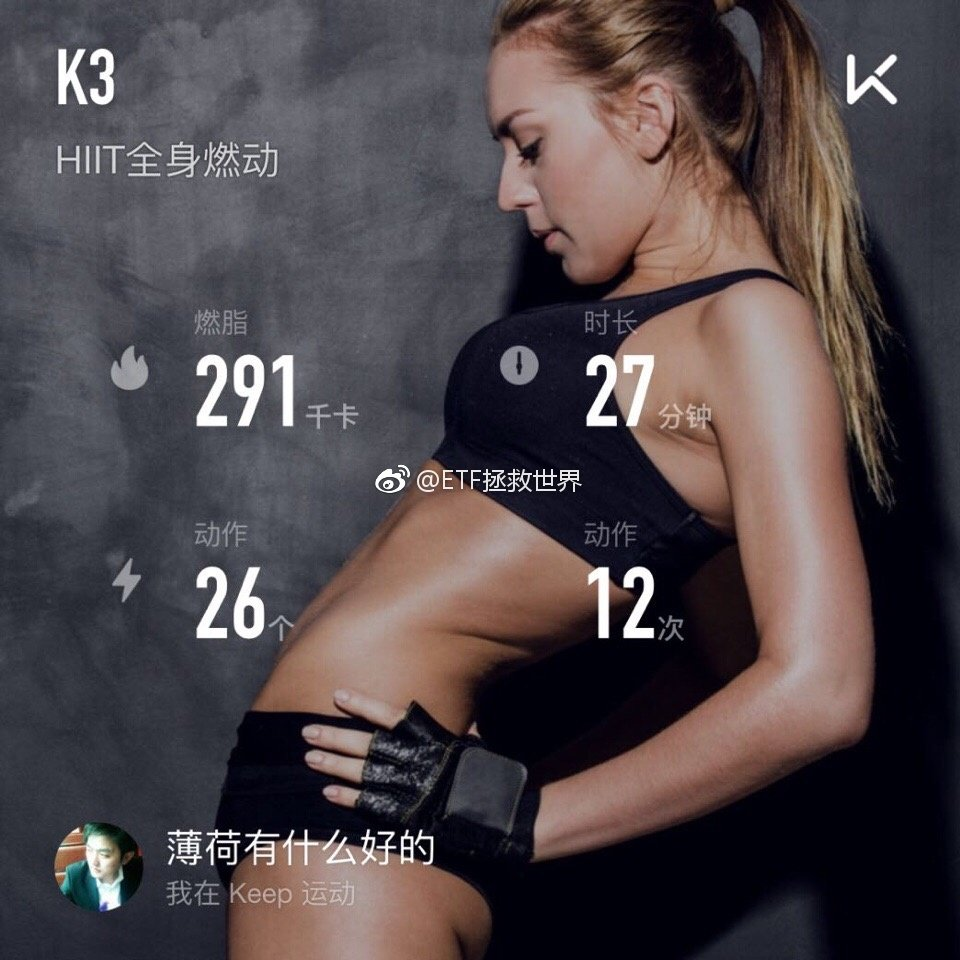

======================================================

ETF拯救世界 (5687069307) @
2017-08-16 21:21:01 Wed  
url: https://weibo.com/5687069307/Fhp85aEMI

回复@-反清复明-:神片！再推一次。//@-反清复明-:自从看了e大介绍的荒蛮故事后，一直夹起尾巴做人。//@ETF拯救世界:看了这个，突然感到非常幸运：我只是莫名其妙的被人喷而已，这个老板莫名其妙被人捅了！我可以说捡了很多条命了。

------------------------------------------------------
转推：
>  @澎湃新闻 (5044281310)
>  2017-08-16 16:30:03 Wed  
>  url: https:/weibo.com/5044281310/FhndYcTTC/

>  【取单起争执，外卖员捅死店老板后自杀】http://t.cn/RChWLSj 8月11日，陕西西安铁炉庙村附近，一外卖员因拿错饭不肯换回与店老板起争执。外卖员刀捅店老板及其岳父，店老板不治去世，随后外卖员自杀身亡。目前，案件还在调查中。陕西广播电视台http://t.cn/RChWLSl ​​​

转发[3]  评论[36]  赞[36] 

======================================================

ETF拯救世界 (5687069307) @
2017-08-17 10:08:46 Thu  
url: https://weibo.com/5687069307/Fhu9HBD25

回复@ETF一言不合就开车:算是降低成本吧。但是你支付宝买的很难转入证券账户继续套//@ETF一言不合就开车:益达，我在股票账户卖出华宝油气，再在支付宝买入相同价钱的华宝油气算套利吗//@ETF拯救世界:回复@-反清复明-:神片！再推一次。//@-反清复明-:自从看了e大介绍的荒蛮故事后，一直夹起尾巴做人。

------------------------------------------------------
转推：
>  @澎湃新闻 (5044281310)
>  2017-08-16 16:30:03 Wed  
>  url: https:/weibo.com/5044281310/FhndYcTTC/

>  【取单起争执，外卖员捅死店老板后自杀】http://t.cn/RChWLSj 8月11日，陕西西安铁炉庙村附近，一外卖员因拿错饭不肯换回与店老板起争执。外卖员刀捅店老板及其岳父，店老板不治去世，随后外卖员自杀身亡。目前，案件还在调查中。陕西广播电视台http://t.cn/RChWLSl ​​​

转发[0]  评论[7]  赞[25] 

======================================================

ETF拯救世界 (5687069307) @
2017-08-17 10:10:39 Thu  
url: https://weibo.com/5687069307/Fhuat968J

套利华宝油气要特别注意，2、3个点的空间最好别套。如果是场内申购，申购费就1.2%。晚上随便一涨就吃大亏了。我曾经在有5%空间的时候套了一次，结果晚上涨了6%。可以说相当悲惨了。

——老司机的真实经验。 ​​​

转发[15]  评论[61]  赞[106] 

======================================================

ETF拯救世界 (5687069307) @
2017-08-17 10:15:07 Thu  
url: https://weibo.com/5687069307/FhuchtSOE

各位可以注意观察，这个市场上的人有多么有意思。

就拿我们布局的几个品种说，从2015年底开始的恒生和50、一个多月前的创业板，我们第一次买入后都有十几个点的下跌空间。越跌看空的人越多，而且有无数理由看空，听起来真的都非常合理。

然而，几根阳线出来，大多数人空翻多。看好的理由听起来更合理 ​​​

转发[40]  评论[106]  赞[178] 

======================================================

ETF拯救世界 (5687069307) @
2017-08-17 10:35:46 Thu  
url: https://weibo.com/5687069307/FhukFez5Q

虽然这两个月在买创业板，但我真的不认为这里会是创业板一个不可错过的超级大底。很难想象在这个位置会有创业板牛市。

我不太相信。 ​​​

转发[14]  评论[87]  赞[128] 

======================================================

ETF拯救世界 (5687069307) @
2017-08-17 11:32:08 Thu  
url: https://weibo.com/5687069307/FhuHyb9GK

毒奶名不虚传，就问你服不服。

------------------------------------------------------
转推：
>  @ETF拯救世界 (5687069307)
>  2017-08-17 10:35:46 Thu  
>  url: https:/weibo.com/5687069307/FhukFez5Q/

>  虽然这两个月在买创业板，但我真的不认为这里会是创业板一个不可错过的超级大底。很难想象在这个位置会有创业板牛市。
>  
>  我不太相信。 ​​​

转发[1]  评论[41]  赞[76] 

======================================================

ETF拯救世界 (5687069307) @
2017-08-17 11:56:36 Thu  
url: https://weibo.com/5687069307/FhuRtpM0i

骗子多如牛毛，每天跟我举报的朋友也不计其数。不过看到这个我笑了。再说一次，我没那个闲工夫主动私信大家为大家看股票！也没兴趣弄群加QQ什么的。这么LOW的事儿能是我干得出来的吗你们说！

------------------------------------------------------
转推：
>  @YL-brant (2168589061)
>  2017-08-17 11:51:02 Thu  
>  url: https:/weibo.com/2168589061/FhuPdjMDb/

>  正确回答不是应该和我说"你真他妈的能吹牛逼"么？@ETF拯救世界  @徐大宝儿_ http://t.cn/RywXHP1 ​​​

转发[2]  评论[65]  赞[88] 

======================================================

ETF拯救世界 (5687069307) @
2017-08-17 13:31:56 Thu  
url: https://weibo.com/5687069307/Fhvuasnlr

短短半个月时间，受人追捧的漂亮50黯然神伤，遭人唾弃的创业板强势上行。

各位，雪中送炭这种事，还是要多做才好，会有好报。 ​​​

转发[8]  评论[89]  赞[166] 

======================================================

ETF拯救世界 (5687069307) @
2017-08-17 14:10:23 Thu  
url: https://weibo.com/5687069307/FhvJMbjpt

发布了头条文章：《重温7、8月计划中关于创业板的两段话》 。重温一下，可能更有感触。 http://t.cn/RCZkmsZ ​​​

转发[66]  评论[121]  赞[280] 

======================================================

ETF拯救世界 (5687069307) @
2017-08-17 22:04:22 Thu  
url: https://weibo.com/5687069307/FhyQakzUk

每日打卡（59）

天气凉快，慢慢跑五公里，出点汗很舒服。

很多事情都是在跑步时想清楚想明白的。跑步的时候是一天之中难得能专心思考的时间。

跑完心情不错。 ​​​

转发[1]  评论[57]  赞[98] 

+++++++++++++++++++++++++++++++++++++++++++++++++++++

图片：
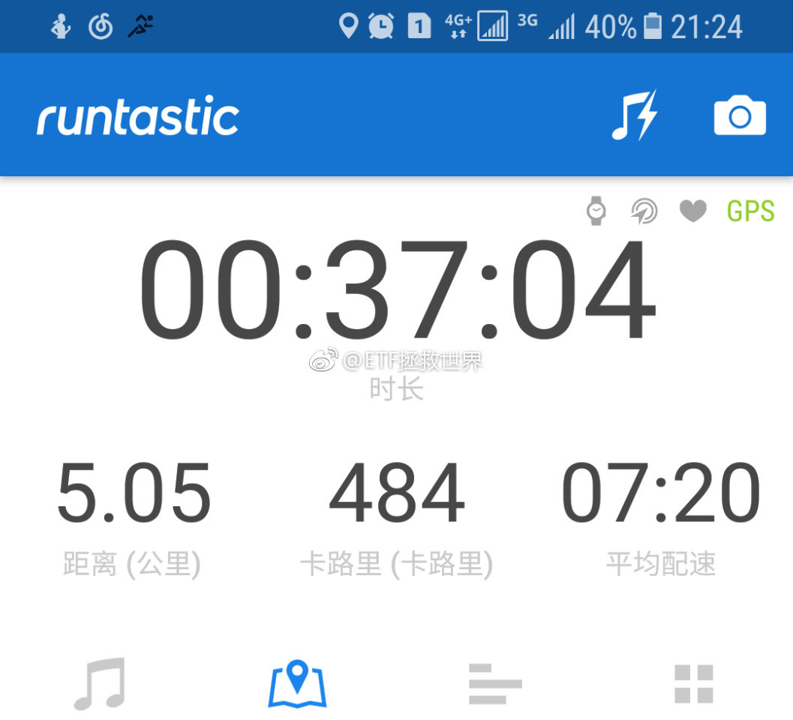

======================================================

ETF拯救世界 (5687069307) @
2017-08-17 22:41:34 Thu  
url: https://weibo.com/5687069307/Fhz5gusVX

港真，是不是瘦了。这60天没白练啊。 ​​​

转发[16]  评论[135]  赞[239] 

+++++++++++++++++++++++++++++++++++++++++++++++++++++

图片：

======================================================

ETF拯救世界 (5687069307) @
2017-08-17 23:01:37 Thu  
url: https://weibo.com/5687069307/FhzdpuXif

回复@诸天_星辰:你看看我发的微博。我是三个手机一起用。这个世界上还有没有一点信任了。//@诸天_星辰:乍用苹果手机呢？是本人吗

------------------------------------------------------
转推：
>  @ETF拯救世界 (5687069307)
>  2017-08-17 22:41:34 Thu  
>  url: https:/weibo.com/5687069307/Fhz5gusVX/

>  港真，是不是瘦了。这60天没白练啊。 ​​​

转发[0]  评论[69]  赞[83] 

======================================================

ETF拯救世界 (5687069307) @
2017-08-18 09:23:56 Fri  
url: https://weibo.com/5687069307/FhDi0dZs2

全球资产价格高估。很多人赚了钱分不清楚到底是能力还是运气。总有一天现实会让大家都分清。

另外，一定要警惕某段时间表现特别好的。包括品种，包括投资人。很少很少有一直表现特别好的，一段时间特别好，可能预示着灾难要来临。当然，你要真能碰上总是表现特别好的，那真是运气爆棚了。

永远保持在 ​​​

转发[22]  评论[98]  赞[211] 

======================================================

ETF拯救世界 (5687069307) @
2017-08-18 10:37:30 Fri  
url: https://weibo.com/5687069307/FhDLRwL3C

未来美国+德国会占到10%或15%。

然而目前的情况，何时能买完还是个未知数。太难了。 ​​​

转发[12]  评论[64]  赞[91] 

======================================================

ETF拯救世界 (5687069307) @
2017-08-18 10:41:14 Fri  
url: https://weibo.com/5687069307/FhDNnrlYk

谁能想到，如果去年十月买入标普500ETF,持有到现在居然没赚钱。 ​​​

转发[12]  评论[33]  赞[73] 

======================================================

ETF拯救世界 (5687069307) @
2017-08-18 10:59:44 Fri  
url: https://weibo.com/5687069307/FhDUTuwtp

回复@石头里的虫子:去年12月疯狂溢价你为什么不卖呢//@石头里的虫子:我是2014年买入博时标普500的，虽然赚钱了，但是看上去年化也没有多少。

------------------------------------------------------
转推：
>  @ETF拯救世界 (5687069307)
>  2017-08-18 10:41:14 Fri  
>  url: https:/weibo.com/5687069307/FhDNnrlYk/

>  谁能想到，如果去年十月买入标普500ETF,持有到现在居然没赚钱。 ​​​

转发[7]  评论[18]  赞[44] 

======================================================

ETF拯救世界 (5687069307) @
2017-08-18 11:18:50 Fri  
url: https://weibo.com/5687069307/FhE2DEiJ3

个人体会，投资最重要的是确定性。

金融投资当然是不确定的，但是可以通过品种+组合+策略的方式最大限度消除不确定性，提高确定性。

巴菲特说，投资最重要的两点，第一保本，第二看第一条，体现的就是要确定。

杠杆压独赢成了当然发家致富，输了一了百了。一将功成万骨枯，你看到的英雄脚下有无数冤 ​​​

转发[56]  评论[63]  赞[134] 

======================================================

ETF拯救世界 (5687069307) @
2017-08-18 11:25:07 Fri  
url: https://weibo.com/5687069307/FhE5clKbi

回复@我在故快乐:去年那种情况，不要有点溢价就着急卖。只要额度受限，疯狂拉升，就拿着。我在雪球有个组合可以看看，当时是12月6日1.8卖出，1.3日1.46接回来。赚了几十个点的差价。碰到大机会就要想办法多赚点。//@我在故快乐:嗯，我的早卖了。

------------------------------------------------------
转推：
>  @ETF拯救世界 (5687069307)
>  2017-08-18 10:41:14 Fri  
>  url: https:/weibo.com/5687069307/FhDNnrlYk/

>  谁能想到，如果去年十月买入标普500ETF,持有到现在居然没赚钱。 ​​​

转发[3]  评论[15]  赞[54] 

======================================================

ETF拯救世界 (5687069307) @
2017-08-18 13:12:38 Fri  
url: https://weibo.com/5687069307/FhEMPdH4A

回复@冬_zi_zinedineZidane:不亏不是目的，就像你开车不是为了不出事故，而是抵达目的地。但你首先要保证不能出车祸。好好体会一下。//@冬_zi_zinedineZidane:有个小疑问，如果我只要求不亏，那我何必进入市场呢？

------------------------------------------------------
转推：
>  @ETF拯救世界 (5687069307)
>  2017-08-18 11:18:50 Fri  
>  url: https:/weibo.com/5687069307/FhE2DEiJ3/

>  个人体会，投资最重要的是确定性。
>  
>  金融投资当然是不确定的，但是可以通过品种+组合+策略的方式最大限度消除不确定性，提高确定性。
>  
>  巴菲特说，投资最重要的两点，第一保本，第二看第一条，体现的就是要确定。
>  
>  杠杆压独赢成了当然发家致富，输了一了百了。一将功成万骨枯，你看到的英雄脚下有无数冤 ​​​

转发[4]  评论[35]  赞[91] 

======================================================

ETF拯救世界 (5687069307) @
2017-08-18 13:46:06 Fri  
url: https://weibo.com/5687069307/FhF0qgEl5

55%的家庭没有或几乎没有储蓄。  收入前10%的家庭储蓄率为60.6%，其储蓄金额占到了总储蓄额的74.9%。  收入前5%的家庭储蓄率是70%，在总储蓄中占比61.6%。  也就是说，收入最高的5%的家庭，每新增收入10000元就会存上7000元！

------------------------------------------------------
转推：
>  @ ()
>  2017-08-18 13:40:29 Fri  
>  url: 

>  抱歉，此微博已被作者删除。查看帮助：http://t.cn/Rfd3rQV

转发[27]  评论[54]  赞[86] 

======================================================

ETF拯救世界 (5687069307) @
2017-08-18 13:54:22 Fri  
url: https://weibo.com/5687069307/FhF3M1s7a

根据刚才那个报告和之前招行的报告，中国5%-10%的人占据了70%的财富应该问题不大了。 ​​​

转发[21]  评论[65]  赞[77] 

======================================================

ETF拯救世界 (5687069307) @
2017-08-18 15:27:36 Fri  
url: https://weibo.com/5687069307/FhFFCdQoR

回复@微微清风0:凭本事借的钱为什么要还？？？//@微微清风0:回复@倪谷拉丝:这年头的人我是服了，为了钱都不要脸了，我家一亲戚借我几万块，06年借的，到现在一分没还[泪]

------------------------------------------------------
转推：
>  @ETF拯救世界 (5687069307)
>  2017-08-18 13:54:22 Fri  
>  url: https:/weibo.com/5687069307/FhF3M1s7a/

>  根据刚才那个报告和之前招行的报告，中国5%-10%的人占据了70%的财富应该问题不大了。 ​​​

转发[4]  评论[65]  赞[66] 

======================================================

ETF拯救世界 (5687069307) @
2017-08-18 16:38:13 Fri  
url: https://weibo.com/5687069307/FhG8hDAPG

回复@俪俪LilyYan:“最近钱全套在股市了，跟人买ETF，全套了。你看，就是这个华宝油气。借5万？家里就剩5000了，拿走吧。先用着。”10%，就当丢了。//@俪俪LilyYan:回复@倪谷拉丝:不借的话，亲戚没得做。借了的话，最后要钱翻脸同样做不来亲戚，而且钱也没了，划不来啊

------------------------------------------------------
转推：
>  @ETF拯救世界 (5687069307)
>  2017-08-18 13:54:22 Fri  
>  url: https:/weibo.com/5687069307/FhF3M1s7a/

>  根据刚才那个报告和之前招行的报告，中国5%-10%的人占据了70%的财富应该问题不大了。 ​​​

转发[4]  评论[123]  赞[103] 

======================================================

ETF拯救世界 (5687069307) @
2017-08-18 22:02:57 Fri  
url: https://weibo.com/5687069307/FhIg5t6WZ

每日打卡（60）

累 ​​​

转发[0]  评论[20]  赞[93] 

+++++++++++++++++++++++++++++++++++++++++++++++++++++

图片：

======================================================

ETF拯救世界 (5687069307) @
2017-08-19 08:30:01 Sat  
url: https://weibo.com/5687069307/FhMmCbNDP

每日打卡(61)

晚上不知道有没有时间，早上先来一组。神清气爽有没有。 ​​​

转发[0]  评论[32]  赞[107] 

+++++++++++++++++++++++++++++++++++++++++++++++++++++

图片：

======================================================

ETF拯救世界 (5687069307) @
2017-08-20 19:14:34 Sun  
url: https://weibo.com/5687069307/Fi00Jwuua

每日打卡（62）

keep改版了。坚持 ​​​

转发[0]  评论[40]  赞[89] 

+++++++++++++++++++++++++++++++++++++++++++++++++++++

图片：

======================================================

ETF拯救世界 (5687069307) @
2017-08-21 15:19:36 Mon  
url: https://weibo.com/5687069307/Fi7TRfp7M

托大家的福，刚知道什么是中年人的四宝。

保温杯？有时候我出门确实带。不过不是温水，我一直不喜欢喝温水。如果长时间出去玩，我会往保温杯里放不少冰水，或者冰的三得利乌龙茶。如果是长途开车，会带上车载冰箱放冰水……

啤酒肚也还没有。也希望这辈子都别有。

手串？我是不理解为什么会带这个。 ​​​

转发[6]  评论[177]  赞[104] 

+++++++++++++++++++++++++++++++++++++++++++++++++++++

图片：
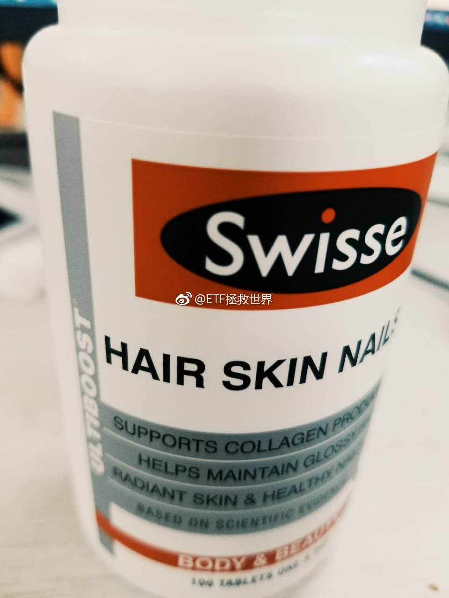

======================================================

ETF拯救世界 (5687069307) @
2017-08-21 15:42:23 Mon  
url: https://weibo.com/5687069307/Fi836uGh6

创业板业绩增长也是醉了。最近涨这么多，估值还降了…… ​​​

转发[7]  评论[66]  赞[108] 

======================================================

ETF拯救世界 (5687069307) @
2017-08-21 16:47:27 Mon  
url: https://weibo.com/5687069307/Fi8tw6BvH

北京不少离婚是因为房子，买、卖。办完了就复婚了……

------------------------------------------------------
转推：
>  @数据分析研究者 (5628021879)
>  2016-08-29 19:18:39 Mon  
>  url: https:/weibo.com/5628021879/E5PlWkoCs/

>  【从上海人为买房急离婚看房价与离婚率之间的关系 】8月29日，上海徐汇区民政局离婚登记处被前来办理离婚的市民挤爆，离婚的人群从早上7点多开始在此排队。下午4时，本该16:30才下班的离婚登记处采取了临时“封闭”措施。这一切缘于上海地产将于近期展开新一轮调控的传闻。于传闻发酵多日之后，今日下 ​​​

转发[1]  评论[18]  赞[36] 

======================================================

ETF拯救世界 (5687069307) @
2017-08-21 17:06:43 Mon  
url: https://weibo.com/5687069307/Fi8Bl390O

回复@俪俪LilyYan:这话也不对了。2万多甚至可以买到欧米茄了，当然要在国外买。好歹也算是个一等二类的牌子了。//@俪俪LilyYan:回复@kaka涛:一两万只能考虑石英表

------------------------------------------------------
转推：
>  @ETF拯救世界 (5687069307)
>  2017-08-21 15:19:36 Mon  
>  url: https:/weibo.com/5687069307/Fi7TRfp7M/

>  托大家的福，刚知道什么是中年人的四宝。
>  
>  保温杯？有时候我出门确实带。不过不是温水，我一直不喜欢喝温水。如果长时间出去玩，我会往保温杯里放不少冰水，或者冰的三得利乌龙茶。如果是长途开车，会带上车载冰箱放冰水……
>  
>  啤酒肚也还没有。也希望这辈子都别有。
>  
>  手串？我是不理解为什么会带这个。 ​​​

转发[1]  评论[35]  赞[37] 

======================================================

ETF拯救世界 (5687069307) @
2017-08-22 09:09:56 Tue  
url: https://weibo.com/5687069307/FieUj8V4R

组合中第一权重的恒生、50，以及后面的红利、300这些这几个月的强势指数，并没有新高；

医药、养老、创业这些这几个月弱势或者平衡的，刚刚从阶段底部区域开始反弹；

油气甚至还在新低；

然而，昨天组合又双叒叕新高了。

且慢统计，95%以上跟车的朋友都盈利了。（另外5%怎么会不盈利的……）

这难 ​​​

转发[30]  评论[71]  赞[131] 

======================================================

ETF拯救世界 (5687069307) @
2017-08-22 09:18:00 Tue  
url: https://weibo.com/5687069307/FieXA8JjZ

回复@鄧哈哈要举高高:chinaetfs 。用过都说好。//@鄧哈哈要举高高:E大能发下微信公众号么？

------------------------------------------------------
转推：
>  @ETF拯救世界 (5687069307)
>  2017-08-22 09:09:56 Tue  
>  url: https:/weibo.com/5687069307/FieUj8V4R/

>  组合中第一权重的恒生、50，以及后面的红利、300这些这几个月的强势指数，并没有新高；
>  
>  医药、养老、创业这些这几个月弱势或者平衡的，刚刚从阶段底部区域开始反弹；
>  
>  油气甚至还在新低；
>  
>  然而，昨天组合又双叒叕新高了。
>  
>  且慢统计，95%以上跟车的朋友都盈利了。（另外5%怎么会不盈利的……）
>  
>  这难 ​​​

转发[1]  评论[29]  赞[73] 

======================================================

ETF拯救世界 (5687069307) @
2017-08-22 09:30:25 Tue  
url: https://weibo.com/5687069307/Fif2Cq9gx

回复@阿尔法和欧米迦:盼着低估，这个没错。谁都希望抄到大底。但你要知道，客观世界可不是按照我们的意愿运行的。我们要去主动的适应这个客观的世界，而不是等着世界来迎合我们。所以我们要有自己的坚持，同时要灵活的应变。做好发生各种情况的准备，并根据变化，计算各种可能发生的概率，根据概率下注

------------------------------------------------------
转推：
>  @ETF拯救世界 (5687069307)
>  2017-08-22 09:09:56 Tue  
>  url: https:/weibo.com/5687069307/FieUj8V4R/

>  组合中第一权重的恒生、50，以及后面的红利、300这些这几个月的强势指数，并没有新高；
>  
>  医药、养老、创业这些这几个月弱势或者平衡的，刚刚从阶段底部区域开始反弹；
>  
>  油气甚至还在新低；
>  
>  然而，昨天组合又双叒叕新高了。
>  
>  且慢统计，95%以上跟车的朋友都盈利了。（另外5%怎么会不盈利的……）
>  
>  这难 ​​​

转发[5]  评论[23]  赞[70] 

======================================================

ETF拯救世界 (5687069307) @
2017-08-22 09:42:34 Tue  
url: https://weibo.com/5687069307/Fif7yjvZX

现在还在喊港股有极大投资价值的都是坏人。 ​​​

转发[234]  评论[43]  赞[111] 

======================================================

ETF拯救世界 (5687069307) @
2017-08-22 09:46:07 Tue  
url: https://weibo.com/5687069307/Fif8Zz5WC

回复@小白兔的照妖镜:腾讯TTM PE已经50倍了，比创业板还高。还怎么靠。。//@小白兔的照妖镜:E大，你说港股和大佬A会不会估值靠拢？

------------------------------------------------------
转推：
>  @ETF拯救世界 (5687069307)
>  2017-08-22 09:42:34 Tue  
>  url: https:/weibo.com/5687069307/Fif7yjvZX/

>  现在还在喊港股有极大投资价值的都是坏人。 ​​​

转发[3]  评论[6]  赞[48] 

======================================================

ETF拯救世界 (5687069307) @
2017-08-22 09:50:31 Tue  
url: https://weibo.com/5687069307/FifaMlh82

还是那个观点，恒生29500以上会继续减。

------------------------------------------------------
转推：
>  @ETF拯救世界 (5687069307)
>  2017-08-22 09:42:34 Tue  
>  url: https:/weibo.com/5687069307/Fif7yjvZX/

>  现在还在喊港股有极大投资价值的都是坏人。 ​​​

转发[218]  评论[20]  赞[47] 

======================================================

ETF拯救世界 (5687069307) @
2017-08-22 09:52:54 Tue  
url: https://weibo.com/5687069307/FifbKll47

回复@孤独者生存1:转需。//@孤独者生存1:E哥，今天的逆回购，7天和14天的到4.7了。

------------------------------------------------------
转推：
>  @ETF拯救世界 (5687069307)
>  2017-08-22 09:42:34 Tue  
>  url: https:/weibo.com/5687069307/Fif7yjvZX/

>  现在还在喊港股有极大投资价值的都是坏人。 ​​​

转发[0]  评论[9]  赞[38] 

======================================================

ETF拯救世界 (5687069307) @
2017-08-22 09:53:28 Tue  
url: https://weibo.com/5687069307/FifbZ8IjU

回复@求财不劫色:放过它！医药还是个孩子！//@求财不劫色:什么时候医药才能减呢？//@ETF拯救世界:还是那个观点，恒生29500以上会继续减。

------------------------------------------------------
转推：
>  @ETF拯救世界 (5687069307)
>  2017-08-22 09:42:34 Tue  
>  url: https:/weibo.com/5687069307/Fif7yjvZX/

>  现在还在喊港股有极大投资价值的都是坏人。 ​​​

转发[200]  评论[23]  赞[56] 

======================================================

ETF拯救世界 (5687069307) @
2017-08-22 09:56:33 Tue  
url: https://weibo.com/5687069307/Fifdeg3JA

说正经的吧。以目前的情况，医药满仓点位是7000，减仓区域是12000-13000。这几个数字每年增加500-1000点。//@ETF拯救世界:回复@求财不劫色:放过它！医药还是个孩子！//@求财不劫色:什么时候医药才能减呢？//@ETF拯救世界:还是那个观点，恒生29500以上会继续减。

------------------------------------------------------
转推：
>  @ETF拯救世界 (5687069307)
>  2017-08-22 09:42:34 Tue  
>  url: https:/weibo.com/5687069307/Fif7yjvZX/

>  现在还在喊港股有极大投资价值的都是坏人。 ​​​

转发[199]  评论[63]  赞[105] 

======================================================

ETF拯救世界 (5687069307) @
2017-08-22 10:10:38 Tue  
url: https://weibo.com/5687069307/FifiWwBQs

回复@石头里的虫子:“5~10年不用的资金，可以忍受较大回撤”。如果这个条件成立，没有什么股票组合是不行的。试问在座的各位，能忍受整体资金回撤30%以上的，好几年不回本的有几位。

------------------------------------------------------
转推：
>  @ETF拯救世界 (5687069307)
>  2017-08-22 09:42:34 Tue  
>  url: https:/weibo.com/5687069307/Fif7yjvZX/

>  现在还在喊港股有极大投资价值的都是坏人。 ​​​

转发[8]  评论[73]  赞[86] 

======================================================

ETF拯救世界 (5687069307) @
2017-08-22 11:13:50 Tue  
url: https://weibo.com/5687069307/FifIAw6Dy

不错。下一步应该是积极参与到混改中来，助国企解困一臂之力。

------------------------------------------------------
转推：
>  @蓝鲸财经记者工作平台 (1885454921)
>  2017-08-22 11:10:02 Tue  
>  url: https:/weibo.com/1885454921/FifH3qWAy/

>  【鲸播报：宗庆后称民企是从严治党受益者 500员工递入党申请书】8月22日讯，宗庆后表示，企业和政府关系更“清”了。不少民营企业不再把精力花在做好与政府部门的“公关工作”，搞吃吃喝喝，搞迎来送往上。如今，企业党组织向心力日益凸显，年轻人向党组织靠拢的热情也不断被激发出来。 ​​​

转发[3]  评论[50]  赞[68] 

======================================================

ETF拯救世界 (5687069307) @
2017-08-22 21:38:07 Tue  
url: https://weibo.com/5687069307/FijNZC0kX

每日打卡（63）

昨天有事没练。这几天就补上。 ​​​

转发[1]  评论[26]  赞[78] 

+++++++++++++++++++++++++++++++++++++++++++++++++++++

图片：

======================================================

ETF拯救世界 (5687069307) @
2017-08-23 08:33:59 Wed  
url: https://weibo.com/5687069307/Fio6dtxIt

又那什么了。 ​​​

转发[0]  评论[54]  赞[72] 

======================================================

ETF拯救世界 (5687069307) @
2017-08-23 09:49:46 Wed  
url: https://weibo.com/5687069307/FioAYjhy2

创业板至今披露的中报，业绩真是不错啊。4不4还得买 ​​​

转发[13]  评论[35]  赞[65] 

======================================================

ETF拯救世界 (5687069307) @
2017-08-23 10:02:23 Wed  
url: https://weibo.com/5687069307/FioG6eL2H

回复@Constance康斯坦丝:真正的smart money，从不扯淡，就是干。

------------------------------------------------------
转推：
>  @ETF拯救世界 (5687069307)
>  2017-08-23 09:49:46 Wed  
>  url: https:/weibo.com/5687069307/FioAYjhy2/

>  创业板至今披露的中报，业绩真是不错啊。4不4还得买 ​​​

转发[11]  评论[11]  赞[49] 

======================================================

ETF拯救世界 (5687069307) @
2017-08-23 10:10:19 Wed  
url: https://weibo.com/5687069307/FioJjpgL8

来，我来告诉各位，什么是真正的smart money。

那是2015年7月前的汇金，比我强到不知道哪里去了。我在15年3、4月就卖的7788，人家5月才撤。再看建仓时间。你不服？

这才是联合收割机，跟着dang，有肉吃。

当然，15年7月以后，就变成工具了。那以后的操作，就不能代表他们操盘手真正的水平了。 ​​ ​​​

转发[41]  评论[61]  赞[115] 

+++++++++++++++++++++++++++++++++++++++++++++++++++++

图片：
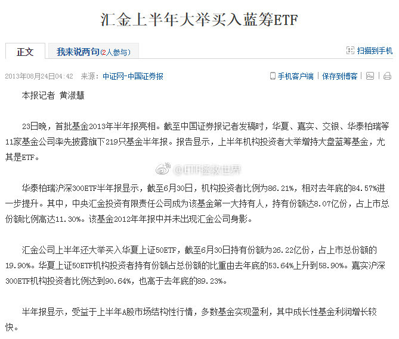
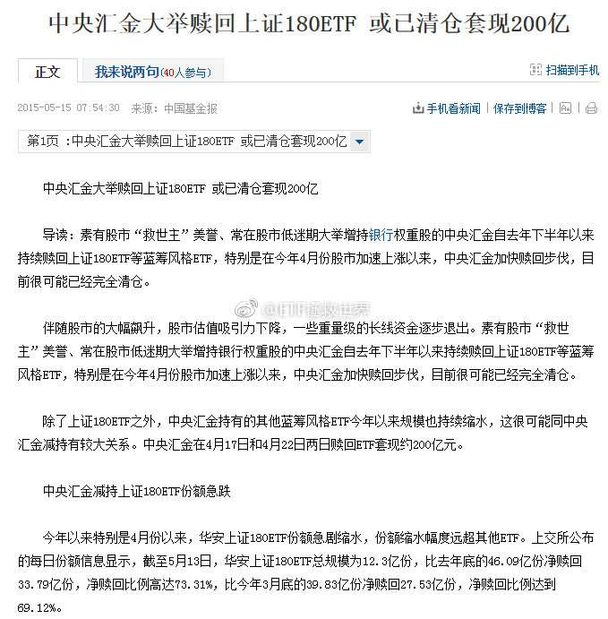

======================================================

ETF拯救世界 (5687069307) @
2017-08-23 10:17:04 Wed  
url: https://weibo.com/5687069307/FioM3jp7P

回复@股市少先队员:最近10-15年，看不到15倍的创业板。20倍都很难见到。//@股市少先队员:方丈说十倍十五倍市盈率才定投创业板，算不算原教旨夹头，e大则么看？[憧憬]//@ETF拯救世界:回复@Constance康斯坦丝:真正的smart money，从不扯淡，就是干。

------------------------------------------------------
转推：
>  @ETF拯救世界 (5687069307)
>  2017-08-23 09:49:46 Wed  
>  url: https:/weibo.com/5687069307/FioAYjhy2/

>  创业板至今披露的中报，业绩真是不错啊。4不4还得买 ​​​

转发[6]  评论[12]  赞[49] 

======================================================

ETF拯救世界 (5687069307) @
2017-08-23 10:21:39 Wed  
url: https://weibo.com/5687069307/FioNVaohk

回复@猪的钉耙:昨天纳斯达克26。腾讯50。阿里60。特斯拉亏损。凭什么给国内创业板10-15倍？拍脑袋可不行啊。//@猪的钉耙:回复@股市少先队员:美股小盘股都有20倍估值//@ETF拯救世界:回复@Constance康斯坦丝:真正的smart money，从不扯淡，就是干。

------------------------------------------------------
转推：
>  @ETF拯救世界 (5687069307)
>  2017-08-23 09:49:46 Wed  
>  url: https:/weibo.com/5687069307/FioAYjhy2/

>  创业板至今披露的中报，业绩真是不错啊。4不4还得买 ​​​

转发[1]  评论[9]  赞[51] 

======================================================

ETF拯救世界 (5687069307) @
2017-08-23 10:23:44 Wed  
url: https://weibo.com/5687069307/FioOL9SwG

我表个态。创业板我自己计算的估值到25倍就打满它的仓位。最多可以给到10%-15%。如果到20倍就给到20%。

那时候可能是金融危机又来了。 ​​​

转发[45]  评论[68]  赞[118] 

======================================================

ETF拯救世界 (5687069307) @
2017-08-23 10:26:26 Wed  
url: https://weibo.com/5687069307/FioPR9nsp

回复@edinlu:历史最低32。//@edinlu:创业历史上从没到过25倍吧？

------------------------------------------------------
转推：
>  @ETF拯救世界 (5687069307)
>  2017-08-23 10:23:44 Wed  
>  url: https:/weibo.com/5687069307/FioOL9SwG/

>  我表个态。创业板我自己计算的估值到25倍就打满它的仓位。最多可以给到10%-15%。如果到20倍就给到20%。
>  
>  那时候可能是金融危机又来了。 ​​​

转发[11]  评论[29]  赞[50] 

======================================================

ETF拯救世界 (5687069307) @
2017-08-23 11:01:52 Wed  
url: https://weibo.com/5687069307/Fip4fe0oa

还有一周，要不要奶一下？ ​​​

转发[5]  评论[47]  赞[79] 

======================================================

ETF拯救世界 (5687069307) @
2017-08-23 11:05:57 Wed  
url: https://weibo.com/5687069307/Fip5TsN5T

来一个：这样跌几天，我们月末就买（）份

------------------------------------------------------
转推：
>  @ETF拯救世界 (5687069307)
>  2017-08-23 11:01:52 Wed  
>  url: https:/weibo.com/5687069307/Fip4fe0oa/

>  还有一周，要不要奶一下？ ​​​

转发[4]  评论[99]  赞[87] 

======================================================

ETF拯救世界 (5687069307) @
2017-08-23 14:09:56 Wed  
url: https://weibo.com/5687069307/FiqizurxW

可以说百发百中了。//@ETF拯救世界:来一个：这样跌几天，我们月末就买（）份

------------------------------------------------------
转推：
>  @ETF拯救世界 (5687069307)
>  2017-08-23 11:01:52 Wed  
>  url: https:/weibo.com/5687069307/Fip4fe0oa/

>  还有一周，要不要奶一下？ ​​​

转发[2]  评论[34]  赞[65] 

======================================================

ETF拯救世界 (5687069307) @
2017-08-23 14:39:30 Wed  
url: https://weibo.com/5687069307/FiquA8XwB

操盘功力神出鬼没。这股市绝了。

------------------------------------------------------
转推：
>  @ETF拯救世界 (5687069307)
>  2017-04-07 10:09:34 Fri  
>  url: https:/weibo.com/5687069307/EDncO76hf/

>  3000（或者3100）到3300之间用ETF做网格应该是很靠谱的。
>  
>  GJD信誉保证。跟着GJD有肉吃。 ​​​

转发[4]  评论[46]  赞[82] 

======================================================

ETF拯救世界 (5687069307) @
2017-08-24 10:01:36 Thu  
url: https://weibo.com/5687069307/Fiy6h20PR

想说点什么。但是理智告诉我不能说。[闭嘴] ​​​

转发[0]  评论[157]  赞[124] 

======================================================

ETF拯救世界 (5687069307) @
2017-08-24 11:20:26 Thu  
url: https://weibo.com/5687069307/FiyCgCu5a

确认了。 ​​​

转发[1]  评论[62]  赞[85] 

+++++++++++++++++++++++++++++++++++++++++++++++++++++

图片：

======================================================

ETF拯救世界 (5687069307) @
2017-08-24 11:23:30 Thu  
url: https://weibo.com/5687069307/FiyDw3DyW

可以说相当贴切了。//@挖龙脉的鹿鼎公://@晓雨闻铃: 回复@沉甸甸的人:[允悲]//@沉甸甸的人:这段子太他妈绝了//@晓雨闻铃:和A股救市差不多？

------------------------------------------------------
转推：
>  @北京人不知道的北京事儿 (1662214194)
>  2017-08-23 21:58:07 Wed  
>  url: https:/weibo.com/1662214194/FitmCfx03/

>  【小猪火场中获救 半年后被主人做成香肠送给消防员】今年2月，英国威尔特郡一农场发生火灾，农场内2头母猪、18头小猪仔被消防员救出。不过，侥幸逃生的小猪们完全没有料到自己的命运——半年后被主人做成香肠，送给当时救援的消防员以示感谢。消防员们表示，香肠“味道好极了”。 ​​​

转发[25]  评论[21]  赞[56] 

======================================================

ETF拯救世界 (5687069307) @
2017-08-24 11:39:59 Thu  
url: https://weibo.com/5687069307/FiyKcAI9V

学历的最大作用是个筛选器。帮助用人单位成本最低的把很大一批人筛选掉。不是说被筛掉的人里面没有能力强的，而是要把他们找出来成本太高了。

------------------------------------------------------
转推：
>  @共青团福建省委 (2730549204)
>  2017-08-24 11:25:32 Thu  
>  url: https:/weibo.com/2730549204/FiyElqOaX/

>  【“学历不重要”是个大骗局，却总有人深信不疑】这两天，网上又掀起了一波关于学历的讨论，因为两段视频。一个是HR分析：为什么大企业只招名校毕业生？另一个是考研名师张雪峰的演讲：大学生究竟该不该考研？作者说，总有人喜欢拿无知当个性，拿没文化当真性情，自己没学历没成功就算了，还吹捧着“读 ​​​

转发[47]  评论[32]  赞[92] 

======================================================

ETF拯救世界 (5687069307) @
2017-08-24 13:56:07 Thu  
url: https://weibo.com/5687069307/FizDt87NL

成长跑赢价值，价值跑赢成长，都是阶段性的。与经济周期也有关系。有空研究研究这个，会发现也很有意思。

------------------------------------------------------
转推：
>  @ ()
>  2017-08-24 13:51:26 Thu  
>  url: 

>  该账号因被投诉违反《微博社区公约》的相关规定，现已无法查看。查看帮助 https://kefu.weibo.com/faqdetail?id=13216

转发[9]  评论[12]  赞[43] 

======================================================

ETF拯救世界 (5687069307) @
2017-08-24 14:10:36 Thu  
url: https://weibo.com/5687069307/FizJlbqNq

讲真，这两年，2015年7月以后这一轮买入，由于有大家都知道的因素，真的特别难。

不过我坚信，不买贵的东西，是对自己财富的负责，也是取得长期良好收益率的基础。

不知道未来会怎样，但是，做正确的事，结果大概率就不会差。 ​​​

转发[15]  评论[42]  赞[148] 

======================================================

ETF拯救世界 (5687069307) @
2017-08-24 14:17:41 Thu  
url: https://weibo.com/5687069307/FizMdnaG4

我不知道这次还能不能回到3000或者3100了。如果又回去了，大概率就是最后一次了。如果不跌破3000或者3100，又起来，就不会再有机会回去了。跌破了，就会有超级大机会。

------------------------------------------------------
转推：
>  @ETF拯救世界 (5687069307)
>  2017-04-07 10:09:34 Fri  
>  url: https:/weibo.com/5687069307/EDncO76hf/

>  3000（或者3100）到3300之间用ETF做网格应该是很靠谱的。
>  
>  GJD信誉保证。跟着GJD有肉吃。 ​​​

转发[33]  评论[78]  赞[113] 

======================================================

ETF拯救世界 (5687069307) @
2017-08-24 14:33:44 Thu  
url: https://weibo.com/5687069307/FizSJkSfx

讲真，既然这么一个庞然大物在市场里玩，做为微生物的我们，就得想想它到底要干嘛。

把池塘里的大鳄，大鱼小虾和微生物都吃掉吗？当然肯定不是。没有那个必要，而且，还指着这些生物为企业融资，降低企业债务和杠杆贡献力量，都吃了怎么行。

这个庞然大物最大的作用是让市场稳定。或者说，看起来是稳 ​​​

转发[52]  评论[95]  赞[169] 

======================================================

ETF拯救世界 (5687069307) @
2017-08-24 15:18:17 Thu  
url: https://weibo.com/5687069307/FiAaOqXi8

没看过《夺命金》吧。推荐没看过的朋友都看看，我个人还挺喜欢的。//@且慢管家:#理财# 银行销售理财产品需要录音，录视频 interesting[doge]

------------------------------------------------------
转推：
>  @蓝鲸财经记者工作平台 (1885454921)
>  2017-08-23 19:32:58 Wed  
>  url: https:/weibo.com/1885454921/FispH7cK4/

>  【8月23日周三《新闻联播》要闻八条】 ​​​

转发[2]  评论[34]  赞[50] 

======================================================

ETF拯救世界 (5687069307) @
2017-08-24 17:25:59 Thu  
url: https://weibo.com/5687069307/FiB0Ebm7R

回复@hdhsbajicjsiisidjsioajshdic:你大概根本没看懂我在说什么。我们没有买上证，上证也不具代表性，但是操控市场的人只看它。所以我们就观察它。这么说，你懂了吗。//@hdhsbajicjsiisidjsioajshdic:上证指数不具市场代表性和你买的不是上证指数，那就不要拿它来说事了

------------------------------------------------------
转推：
>  @ETF拯救世界 (5687069307)
>  2017-04-07 10:09:34 Fri  
>  url: https:/weibo.com/5687069307/EDncO76hf/

>  3000（或者3100）到3300之间用ETF做网格应该是很靠谱的。
>  
>  GJD信誉保证。跟着GJD有肉吃。 ​​​

转发[6]  评论[27]  赞[62] 

======================================================

ETF拯救世界 (5687069307) @
2017-08-24 17:41:35 Thu  
url: https://weibo.com/5687069307/FiB6Yzowe

太听话了……

------------------------------------------------------
转推：
>  @ ()
>  2017-08-24 17:22:23 Thu  
>  url: 

>  抱歉，作者已设置仅展示半年内微博，此微博已不可见。 ​​​

转发[8]  评论[30]  赞[36] 

======================================================

ETF拯救世界 (5687069307) @
2017-08-24 20:09:57 Thu  
url: https://weibo.com/5687069307/FiC5crAFL

每日打卡（64）

先把昨天的债还上，一会再来一组 ​​​

转发[0]  评论[9]  赞[63] 

+++++++++++++++++++++++++++++++++++++++++++++++++++++

图片：

======================================================

ETF拯救世界 (5687069307) @
2017-08-24 20:40:29 Thu  
url: https://weibo.com/5687069307/FiChB0ZpJ

每日打卡（65）

练得很舒服，还欠一天，周末还 ​​​

转发[0]  评论[11]  赞[76] 

+++++++++++++++++++++++++++++++++++++++++++++++++++++

图片：

======================================================

ETF拯救世界 (5687069307) @
2017-08-25 10:40:11 Fri  
url: https://weibo.com/5687069307/FiHMqw5f1

再一次3300止步。  一鼓作气再而衰三而竭。  不过，下一次再次回到这里，就没有什么可以阻挡了。

------------------------------------------------------
转推：
>  @ETF拯救世界 (5687069307)
>  2017-04-07 10:09:34 Fri  
>  url: https:/weibo.com/5687069307/EDncO76hf/

>  3000（或者3100）到3300之间用ETF做网格应该是很靠谱的。
>  
>  GJD信誉保证。跟着GJD有肉吃。 ​​​

转发[9]  评论[50]  赞[82] 

======================================================

ETF拯救世界 (5687069307) @
2017-08-25 10:45:28 Fri  
url: https://weibo.com/5687069307/FiHOzsRE2

两融魔咒 ​​​

转发[11]  评论[71]  赞[97] 

+++++++++++++++++++++++++++++++++++++++++++++++++++++

图片：
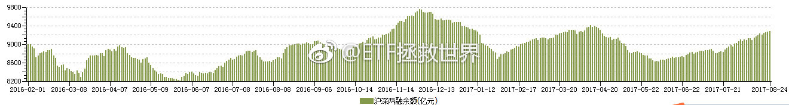

======================================================

ETF拯救世界 (5687069307) @
2017-08-25 14:07:55 Fri  
url: https://weibo.com/5687069307/FiJ8KljBw

突破了，就踏踏实实持有手里的东西。像上面微博说的，一个区间不可能长期存在。总有突破的那一天，综合要考虑的是时间、空间和价值的转换。

有朋友问，追不追？

如果是新朋友，以后可以慢慢交流。如果是老朋友，还是请立即取关吧。看我的东西白看啊。

一直在说，持仓要做到“涨跌都舒服”。根据概率 ​​​

转发[65]  评论[151]  赞[174] 

======================================================

ETF拯救世界 (5687069307) @
2017-08-25 15:26:47 Fri  
url: https://weibo.com/5687069307/FiJELt2Q6

回复@亚历山大-棕地:哦？那我再推荐一个：《遗愿清单 The Bucket List》。另外，继续送电影票。请上次排名第二的联系我！我记得是 @徐L鑫 ？不过这次只有一张了！//@亚历山大-棕地:E神，你推荐的电影比书更靠谱，夺命金和荒蛮故事都挺好看。

------------------------------------------------------
转推：
>  @ETF拯救世界 (5687069307)
>  2017-08-25 14:07:55 Fri  
>  url: https:/weibo.com/5687069307/FiJ8KljBw/

>  突破了，就踏踏实实持有手里的东西。像上面微博说的，一个区间不可能长期存在。总有突破的那一天，综合要考虑的是时间、空间和价值的转换。
>  
>  有朋友问，追不追？
>  
>  如果是新朋友，以后可以慢慢交流。如果是老朋友，还是请立即取关吧。看我的东西白看啊。
>  
>  一直在说，持仓要做到“涨跌都舒服”。根据概率 ​​​

转发[10]  评论[56]  赞[62] 

======================================================

ETF拯救世界 (5687069307) @
2017-08-25 15:39:01 Fri  
url: https://weibo.com/5687069307/FiJJJ6y9j

负责任的说，如果下周几天不会连续大涨，月底会开车。而且不止一辆，不止一辆A股权益类。

今天数据出来，变化不是很大。毕竟暴涨的就是那1、200只，大部分股票都是小涨，叠加业绩增加，月底有的搞。

这一条毒不毒，要看下周几天的走势了。 ​​​

转发[6]  评论[128]  赞[175] 

======================================================

ETF拯救世界 (5687069307) @
2017-08-25 18:27:31 Fri  
url: https://weibo.com/5687069307/FiKQ7qYyA

已经快买成第一重仓etf了[doge]

------------------------------------------------------
转推：
>  @ ()
>  2017-08-25 15:30:39 Fri  
>  url: 

>  该账号因被投诉违反《微博社区公约》的相关规定，现已无法查看。查看帮助 https://kefu.weibo.com/faqdetail?id=13216

转发[15]  评论[46]  赞[98] 

======================================================

ETF拯救世界 (5687069307) @
2017-08-25 21:18:23 Fri  
url: https://weibo.com/5687069307/FiLXu3jdz

每日打卡（66）

轻松做完，过周末 ​​​

转发[0]  评论[25]  赞[82] 

+++++++++++++++++++++++++++++++++++++++++++++++++++++

图片：

======================================================

ETF拯救世界 (5687069307) @
2017-08-26 21:44:26 Sat  
url: https://weibo.com/5687069307/FiVyxF1AY

每日打卡（67）

今天出去聚会，大吃大喝。回来以后感觉不舒服。吃惯了清淡的东西，吃太荤的就难受。

出去跑一跑，练练腹肌，等于白练。还是得管住嘴啊。 ​​​

转发[2]  评论[38]  赞[65] 

+++++++++++++++++++++++++++++++++++++++++++++++++++++

图片：

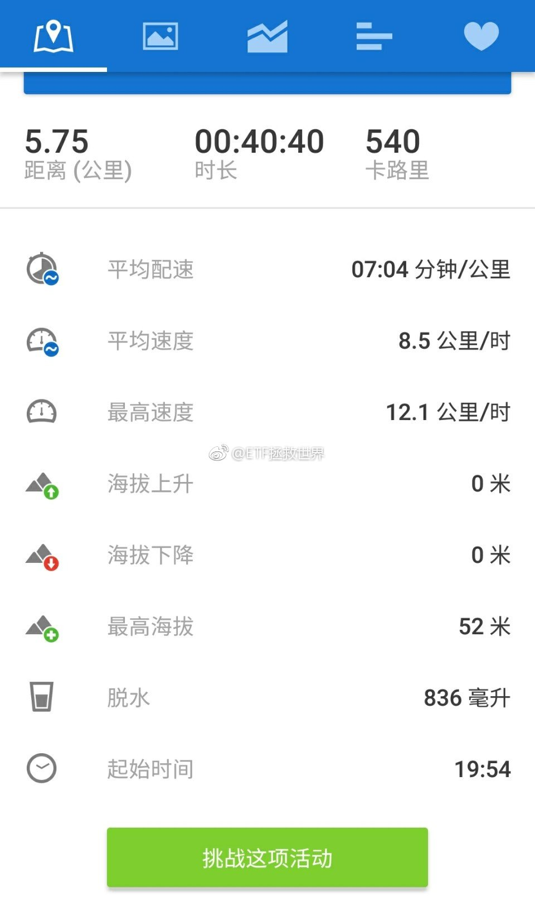

======================================================

ETF拯救世界 (5687069307) @
2017-08-26 22:10:18 Sat  
url: https://weibo.com/5687069307/FiVJ3fqFz

回复@mydxkl:这样骗子是不是没法复制了//@mydxkl:@ETF拯救世界 头像+1是啥意思[疑问]

------------------------------------------------------
转推：
>  @ETF拯救世界 (5687069307)
>  2017-08-26 21:44:26 Sat  
>  url: https:/weibo.com/5687069307/FiVyxF1AY/

>  每日打卡（67）
>  
>  今天出去聚会，大吃大喝。回来以后感觉不舒服。吃惯了清淡的东西，吃太荤的就难受。
>  
>  出去跑一跑，练练腹肌，等于白练。还是得管住嘴啊。 ​​​

转发[1]  评论[50]  赞[68] 

======================================================

ETF拯救世界 (5687069307) @
2017-08-27 19:50:33 Sun  
url: https://weibo.com/5687069307/Fj4eP85TV

GJD，棒棒的……救市资金账本:券商第2批资金退出 国家队公募赚374亿 http://t.cn/RCEwL5u ​​​

转发[7]  评论[35]  赞[69] 

======================================================

ETF拯救世界 (5687069307) @
2017-08-27 19:55:52 Sun  
url: https://weibo.com/5687069307/Fj4gYnkxU

哈哈，不好意思，这次只有一张。以后有机会继续给大家送电影票~昨天我也去电影院看了两部。星际特工情节很一般，但是画面真的太炫了。想象力丰富，可以试试imax。极盗车神个人不喜欢，只给2星。

------------------------------------------------------
转推：
>  @徐小包s (5848291651)
>  2017-08-27 14:21:56 Sun  
>  url: https:/weibo.com/5848291651/Fj25qCq4D/

>  ‌作为第二名，居然也有电影票，我很幸运，也很意外，再次感谢@ETF拯救世界  赠票，建议以后也可以多谈谈投资之外的话题。抛开的爱国主义情怀，《战狼2》确实也是值得一看的。但电影，你永远不知道它为什么会火，为什么会红，天时，地利，人和吧。看完这部电影，让我想起巴菲特说的一句话，"我很幸运。 ​​​

转发[1]  评论[25]  赞[47] 

======================================================

ETF拯救世界 (5687069307) @
2017-08-27 20:35:05 Sun  
url: https://weibo.com/5687069307/Fj4wTlR2S

每日打卡（68）

70天过去，每天练练已经成习惯了。时间过得真快啊。 ​​​

转发[1]  评论[33]  赞[102] 

+++++++++++++++++++++++++++++++++++++++++++++++++++++

图片：

======================================================

ETF拯救世界 (5687069307) @
2017-08-28 09:55:52 Mon  
url: https://weibo.com/5687069307/Fj9LVB9gC

今天 $创业板指 sz399006$  也不错。无论手里的东西涨还是不涨，好好拿着就行了。不要随意卖出做差价。 ​​​

转发[6]  评论[55]  赞[111] 

======================================================

ETF拯救世界 (5687069307) @
2017-08-28 10:23:09 Mon  
url: https://weibo.com/5687069307/Fj9X0kDXW

A股不会出现“慢牛”。因为只要指数有突破，大家就会焦急地问：是不是牛市来了？

如果还在涨，那么在场外探头探脑的人就会冲进去。然后财富效应开始扩散。然后有更多不关心这个市场的人开始进入。

问题的症结在于：如果你知道会有牛市，那你会不会等着慢慢进来？

不会的。绝大多数人会焦急的冲进来 ​​​

转发[62]  评论[97]  赞[209] 

======================================================

ETF拯救世界 (5687069307) @
2017-08-28 11:06:59 Mon  
url: https://weibo.com/5687069307/FjaeNnvUk

虽然买了这个，但讲真，我不信短期有多大空间。如果有，那一定会股灾。

------------------------------------------------------
转推：
>  @ETF拯救世界 (5687069307)
>  2017-08-28 09:55:52 Mon  
>  url: https:/weibo.com/5687069307/Fj9LVB9gC/

>  今天 $创业板指 sz399006$  也不错。无论手里的东西涨还是不涨，好好拿着就行了。不要随意卖出做差价。 ​​​

转发[1]  评论[46]  赞[89] 

======================================================

ETF拯救世界 (5687069307) @
2017-08-28 11:31:36 Mon  
url: https://weibo.com/5687069307/FjaoN3ep8

从一开始的恒生、50、300，到后来的红利、500、医药养老、创业等等。这一路布局，希望大家感受到的，是逢低买入资产等待别人给你抬轿子的乐趣。而不是别人买完了我们再去追热点。

不停的扫描市场上能监控到的品种，发现出现有价值的就开始买入。这种投资方式，要比不停的追逐热点不停切换，我个人认为 ​​​

转发[80]  评论[108]  赞[216] 

======================================================

ETF拯救世界 (5687069307) @
2017-08-28 12:32:09 Mon  
url: https://weibo.com/5687069307/FjaNmga3u

回复@半生流离醉:跟你说一条十几年的经验。只要一个品种不差，横的越久，涨得越高。最好再横几年//@半生流离醉:这种办法很稳。就是医药还趴在地上。。。[哼]

------------------------------------------------------
转推：
>  @ETF拯救世界 (5687069307)
>  2017-08-28 11:31:36 Mon  
>  url: https:/weibo.com/5687069307/FjaoN3ep8/

>  从一开始的恒生、50、300，到后来的红利、500、医药养老、创业等等。这一路布局，希望大家感受到的，是逢低买入资产等待别人给你抬轿子的乐趣。而不是别人买完了我们再去追热点。
>  
>  不停的扫描市场上能监控到的品种，发现出现有价值的就开始买入。这种投资方式，要比不停的追逐热点不停切换，我个人认为 ​​​

转发[21]  评论[75]  赞[123] 

======================================================

ETF拯救世界 (5687069307) @
2017-08-29 09:18:21 Tue  
url: https://weibo.com/5687069307/FjiXclsiQ

一大早就收钱怪不好意思的。

[doge] ​​​

转发[3]  评论[77]  赞[111] 

+++++++++++++++++++++++++++++++++++++++++++++++++++++

图片：
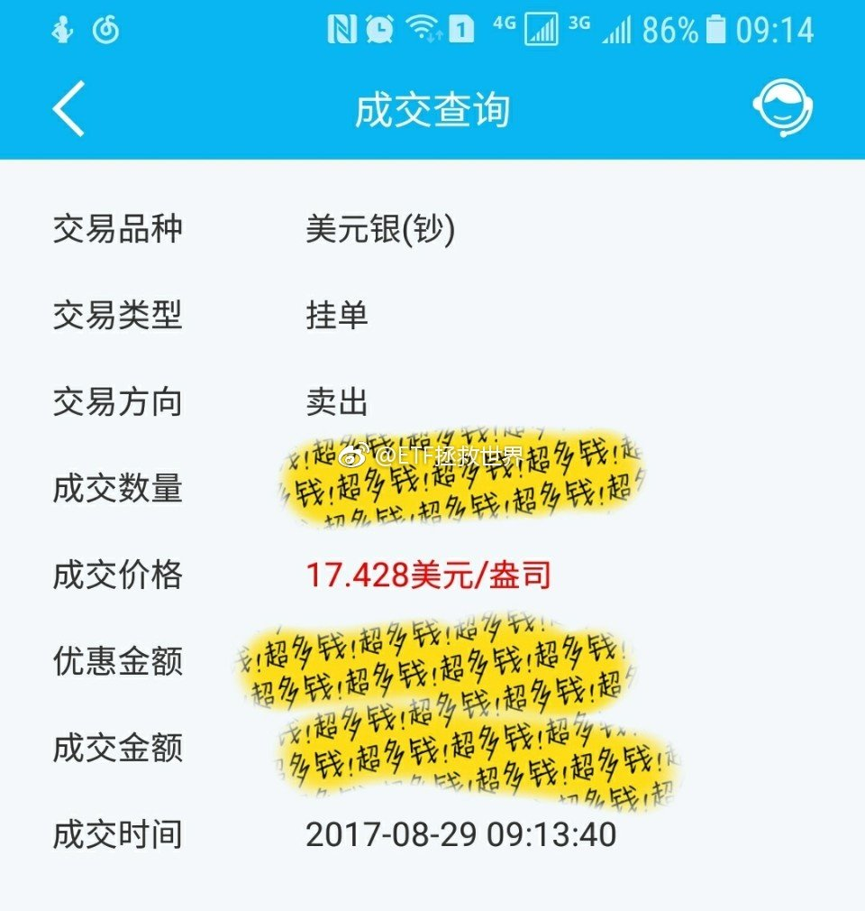

======================================================

ETF拯救世界 (5687069307) @
2017-08-29 10:45:23 Tue  
url: https://weibo.com/5687069307/FjjwwuSOi

回复@Jamborvan:因为我有美元需要赚钱~//@Jamborvan:建行的美元银点差反而大于人民币银，所以为什么买美元银呢？

------------------------------------------------------
转推：
>  @ETF拯救世界 (5687069307)
>  2017-08-29 09:18:21 Tue  
>  url: https:/weibo.com/5687069307/FjiXclsiQ/

>  一大早就收钱怪不好意思的。
>  
>  [doge] ​​​

转发[1]  评论[13]  赞[42] 

======================================================

ETF拯救世界 (5687069307) @
2017-08-29 10:49:23 Tue  
url: https://weibo.com/5687069307/Fjjy9zKJt

“他不止一次明确表态，乐视是扎根中国的民族品牌，他是土生土长的中国企业家，他本人永远都是中国人。”其实我认为吧，人的信用很重要。“下周回国”言犹在耳呢。

------------------------------------------------------
转推：
>  @ ()
>  2017-08-29 10:03:32 Tue  
>  url: 

>  抱歉，作者已设置仅展示半年内微博，此微博已不可见。 ​​​

转发[6]  评论[34]  赞[61] 

======================================================

ETF拯救世界 (5687069307) @
2017-08-29 11:14:56 Tue  
url: https://weibo.com/5687069307/FjjIwgqbR

回复@梦之彼方2082:有升值就有贬值，很正常。另外，我还有欧元日元英镑。不必担心~//@梦之彼方2082:美元贬值最近挺厉害的[喵喵]

------------------------------------------------------
转推：
>  @ETF拯救世界 (5687069307)
>  2017-08-29 09:18:21 Tue  
>  url: https:/weibo.com/5687069307/FjiXclsiQ/

>  一大早就收钱怪不好意思的。
>  
>  [doge] ​​​

转发[0]  评论[26]  赞[54] 

======================================================

ETF拯救世界 (5687069307) @
2017-08-29 17:17:23 Tue  
url: https://weibo.com/5687069307/Fjm5Dygqt

“身上的味道是喷洒了大量劣质香水”。扎心了。

------------------------------------------------------
转推：
>  @澎湃新闻 (5044281310)
>  2017-08-29 17:11:23 Tue  
>  url: https:/weibo.com/5044281310/Fjm3cvQI1/

>  【南京地铁一“口罩男”以拍照为由强行搂抱女生，已被警方控制】8月28日、29日，有众多网友在微博中称，在南京新街口地下通道，有一位戴口罩的男子，以拍照为由，占女生便宜。更有网友反映此男子身上还有奇怪的味道，闻着有点头晕。8月29日，南京地铁警方回应称，目前该男子已被警方控制，他本人供述抱 ​​​ http://mapi/005vnhZYgy1fj0pk6vrm2j30go0l67i1

转发[0]  评论[20]  赞[30] 

======================================================

ETF拯救世界 (5687069307) @
2017-08-29 20:56:05 Tue  
url: https://weibo.com/5687069307/Fjnwpo98W

哈哈哈哈哈哈哈哈。太NB了。还有没有王法了……

------------------------------------------------------
转推：
>  @互联网的那点事 (1627825392)
>  2017-08-29 16:34:32 Tue  
>  url: https:/weibo.com/1627825392/FjlOfBf2J/

>  【贾跃亭姐弟已收回对乐视网全部借款】乐视网上半年年报显示，贾跃亭贾跃芳姐弟之前套现时承诺借给乐视网的无息借款总计74亿，然而最高峰时贾氏姐弟借给乐视网不超过30亿，2016年底，只剩下4亿多，到了2017年6月30日竟已全部抽走。 ​​​

转发[11]  评论[50]  赞[49] 

======================================================

ETF拯救世界 (5687069307) @
2017-08-29 21:54:18 Tue  
url: https://weibo.com/5687069307/FjnU2r3FM

每日打卡（69）

昨天有事没有锻炼，今天补上。

每天时间真的不够用。几本书一直说看，始终没有时间。很多想做的事也没做。

尽量多做一些事情吧。 ​​​

转发[1]  评论[39]  赞[92] 

+++++++++++++++++++++++++++++++++++++++++++++++++++++

图片：

======================================================

ETF拯救世界 (5687069307) @
2017-08-30 10:23:47 Wed  
url: https://weibo.com/5687069307/FjsOfEAVL

$创业板指 sz399006$ 又搞事情 ​​​

转发[2]  评论[74]  赞[101] 

======================================================

ETF拯救世界 (5687069307) @
2017-08-30 16:38:32 Wed  
url: https://weibo.com/5687069307/FjvgmzG0a

回复@XDrX:要看看当初减持的时候说把几十亿免息借给公司5年这个承诺有没有法律效力了。//@XDrX:贾跃亭做的事情没违反王法吧？//@ETF拯救世界:哈哈哈哈哈哈哈哈。太NB了。还有没有王法了……

------------------------------------------------------
转推：
>  @互联网的那点事 (1627825392)
>  2017-08-29 16:34:32 Tue  
>  url: https:/weibo.com/1627825392/FjlOfBf2J/

>  【贾跃亭姐弟已收回对乐视网全部借款】乐视网上半年年报显示，贾跃亭贾跃芳姐弟之前套现时承诺借给乐视网的无息借款总计74亿，然而最高峰时贾氏姐弟借给乐视网不超过30亿，2016年底，只剩下4亿多，到了2017年6月30日竟已全部抽走。 ​​​

转发[4]  评论[18]  赞[32] 

======================================================

ETF拯救世界 (5687069307) @
2017-08-30 16:46:57 Wed  
url: https://weibo.com/5687069307/FjvjMtcgP

回复@守正v出奇:明晚开车。今天有可能推送一篇别的，不确定。//@守正v出奇:e大这是 写完开车稿了吗？ 还是等晚上中报全部披露以后跑下数据在发车？//@ETF拯救世界:回复@XDrX:要看看当初减持的时候说把几十亿免息借给公司5年这个承诺有没有法律效力了。//@XDrX:贾跃亭做的事情没违反王法吧？

------------------------------------------------------
转推：
>  @互联网的那点事 (1627825392)
>  2017-08-29 16:34:32 Tue  
>  url: https:/weibo.com/1627825392/FjlOfBf2J/

>  【贾跃亭姐弟已收回对乐视网全部借款】乐视网上半年年报显示，贾跃亭贾跃芳姐弟之前套现时承诺借给乐视网的无息借款总计74亿，然而最高峰时贾氏姐弟借给乐视网不超过30亿，2016年底，只剩下4亿多，到了2017年6月30日竟已全部抽走。 ​​​

转发[2]  评论[56]  赞[75] 

======================================================

ETF拯救世界 (5687069307) @
2017-08-30 22:07:54 Wed  
url: https://weibo.com/5687069307/Fjxq3tYny

每日打卡（70）

练完睡觉，晚安！ ​​​

转发[0]  评论[23]  赞[76] 

+++++++++++++++++++++++++++++++++++++++++++++++++++++

图片：

======================================================

ETF拯救世界 (5687069307) @
2017-08-31 09:08:39 Thu  
url: https://weibo.com/5687069307/FjBKfkGc2

坚持债券会先于股票几个月见底的观点。 ​​​

转发[100]  评论[95]  赞[149] 

+++++++++++++++++++++++++++++++++++++++++++++++++++++

图片：
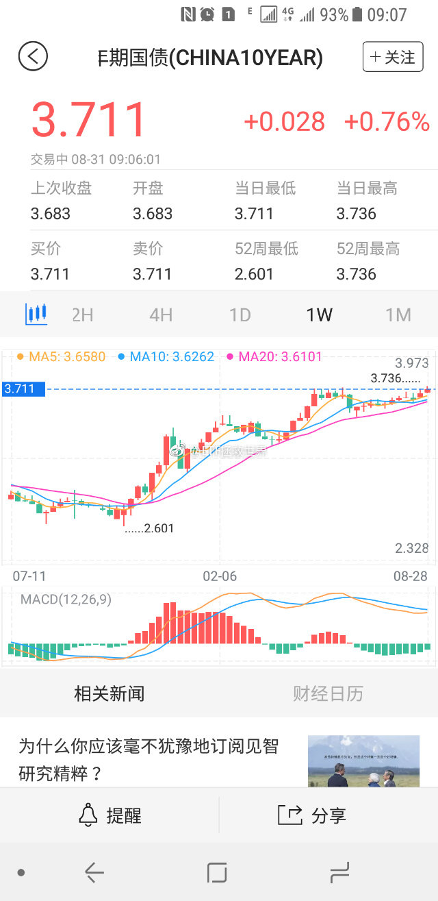

======================================================

ETF拯救世界 (5687069307) @
2017-08-31 10:34:22 Thu  
url: https://weibo.com/5687069307/FjCj34mFf

要不要说点什么 ​​​

转发[1]  评论[206]  赞[131] 

======================================================

ETF拯救世界 (5687069307) @
2017-08-31 13:37:59 Thu  
url: https://weibo.com/5687069307/FjDvzEPPI

$创业板指 sz399006$ 别人都跌你得瑟什么？[哼] ​​​

转发[1]  评论[52]  赞[82] 

======================================================

ETF拯救世界 (5687069307) @
2017-08-31 15:08:11 Thu  
url: https://weibo.com/5687069307/FjE6bF3FC

最近有点不顺啊。早上车还蹭了。一个门进去一小条，没露漆，4s报价2000……

外面修理厂钣金靠谱吗。

一定尽快要去拜拜了。好久没去了。 ​​​

转发[1]  评论[116]  赞[64] 

======================================================

ETF拯救世界 (5687069307) @
2017-08-31 15:37:04 Thu  
url: https://weibo.com/5687069307/FjEhUyaOV

这个写的还是不够震撼。十年前在天涯看过一个描写里面生活的帖子。看完那个我就暗暗发誓，永远也不要犯事儿进去。真的，各位，遵纪守法呀！//@买买提X:伙食不错~

------------------------------------------------------
转推：
>  @ ()
>  2017-08-27 22:29:30 Sun  
>  url: 

>  抱歉，由于作者设置，你暂时没有这条微博的查看权限哦。查看帮助：http://t.cn/RfdBWwP ​​​

转发[14]  评论[59]  赞[60] 

======================================================

ETF拯救世界 (5687069307) @
2017-08-31 22:32:49 Thu  
url: https://weibo.com/5687069307/FjH0FjmyJ

最后一个浮亏品种。我就静静的看着怎么变成浮盈。 ​​​

转发[2]  评论[137]  赞[134] 

+++++++++++++++++++++++++++++++++++++++++++++++++++++

图片：
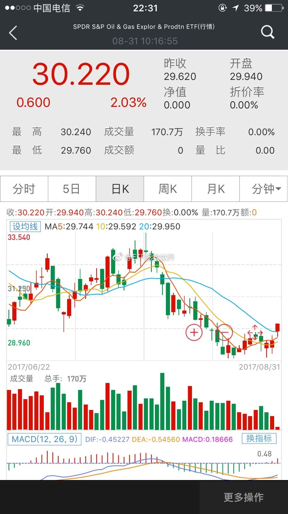

======================================================

