ETF拯救世界 (5687069307) @
2017-09-01 13:09:13 Fri  
url: https://weibo.com/5687069307/FjMKozEtg

今天下跌的股票比上涨的多。谁能想到，$中证500 sz399905$  涨了接近1%。

天妒英才啊！ ​​​

转发[22]  评论[53]  赞[71] 

======================================================

ETF拯救世界 (5687069307) @
2017-09-01 13:28:59 Fri  
url: https://weibo.com/5687069307/FjMSqda5i

8月过去了。9月呢，如果还是维持现状或者继续上涨，那么我们在A股几乎不会有什么动作了。

涨涨跌跌，仓位舒服，看戏即可。

至于说，如果有较大幅度下跌的话，那就是另一回事了。 ​​​

转发[2]  评论[39]  赞[102] 

======================================================

ETF拯救世界 (5687069307) @
2017-09-01 13:56:13 Fri  
url: https://weibo.com/5687069307/FjN3tpqsI

$创业板指 sz399006$   犀利。反弹新高。 ​​​

转发[6]  评论[29]  赞[69] 

======================================================

ETF拯救世界 (5687069307) @
2017-09-01 15:18:00 Fri  
url: https://weibo.com/5687069307/FjNAFvnvW

回复@理性耐心:讲真，如果是长线持仓，场内品种对我来说只有一个方面有吸引力，那就是可以做两融担保品。如果这个品种做不了担保品，我会优先买场外。毕竟有些品种流动性有问题。以后卖出的时候会怎样，说不好啊。//@理性耐心:回复@Gaius_Chang:我也觉得场外更省心，场内容易动来动去

------------------------------------------------------
转推：
>  @ETF拯救世界 (5687069307)
>  2017-09-01 13:09:13 Fri  
>  url: https:/weibo.com/5687069307/FjMKozEtg/

>  今天下跌的股票比上涨的多。谁能想到，$中证500 sz399905$  涨了接近1%。
>  
>  天妒英才啊！ ​​​

转发[20]  评论[36]  赞[55] 

======================================================

ETF拯救世界 (5687069307) @
2017-09-01 15:21:43 Fri  
url: https://weibo.com/5687069307/FjNCbv1er

回复@MyCaptainLu:其实都差不多。最近有几个B类货基，就是以前大资金才能买的门槛降低了，可以试试。收益率能稍微高点。//@MyCaptainLu:E大，能麻烦推荐个货基么，华宝兴业现金宝如何～谢啦

------------------------------------------------------
转推：
>  @ETF拯救世界 (5687069307)
>  2017-09-01 13:09:13 Fri  
>  url: https:/weibo.com/5687069307/FjMKozEtg/

>  今天下跌的股票比上涨的多。谁能想到，$中证500 sz399905$  涨了接近1%。
>  
>  天妒英才啊！ ​​​

转发[4]  评论[17]  赞[48] 

======================================================

ETF拯救世界 (5687069307) @
2017-09-01 15:25:49 Fri  
url: https://weibo.com/5687069307/FjNDQiVTS

回复@谷爆:其实，牛市如果份额少的基金会送大红包。广发医药2015年曾经大幅溢价到3块钱！当然现在不可能了，毕竟咱们大部队进来了……//@谷爆:牛市卖出场内的应该没流到性问题吧？以E神的作风，熊市是不会割肉只会加仓的呀！[酷]

------------------------------------------------------
转推：
>  @ETF拯救世界 (5687069307)
>  2017-09-01 13:09:13 Fri  
>  url: https:/weibo.com/5687069307/FjMKozEtg/

>  今天下跌的股票比上涨的多。谁能想到，$中证500 sz399905$  涨了接近1%。
>  
>  天妒英才啊！ ​​​

转发[4]  评论[22]  赞[53] 

======================================================

ETF拯救世界 (5687069307) @
2017-09-01 15:46:20 Fri  
url: https://weibo.com/5687069307/FjNMaysNA

回复@盖盖87:赚钱比赔钱好，是不是？买了比没有强，对不对？做人要学会开心呀。再让你回到当初，你会在一个月前重仓创业板吗。如果不会，就开开心心的接受吧~//@盖盖87:创业板真是猪一样的队友 买了就再也跌不下来了 坑爹 不给加仓机会啊

------------------------------------------------------
转推：
>  @ETF拯救世界 (5687069307)
>  2017-09-01 13:56:13 Fri  
>  url: https:/weibo.com/5687069307/FjN3tpqsI/

>  $创业板指 sz399006$   犀利。反弹新高。 ​​​

转发[2]  评论[32]  赞[88] 

======================================================

ETF拯救世界 (5687069307) @
2017-09-02 08:47:58 Sat  
url: https://weibo.com/5687069307/FjUsR38PJ

没什么意思 ​​​

转发[1]  评论[53]  赞[94] 

+++++++++++++++++++++++++++++++++++++++++++++++++++++

图片：

======================================================

ETF拯救世界 (5687069307) @
2017-09-02 15:03:03 Sat  
url: https://weibo.com/5687069307/FjWV6avj6

每日打卡（71）

这是补前两天的。太忙了，真是抽不出时间。今天补上。晚上再做今天的。 ​​​

转发[0]  评论[37]  赞[99] 

+++++++++++++++++++++++++++++++++++++++++++++++++++++

图片：

======================================================

ETF拯救世界 (5687069307) @
2017-09-03 19:42:55 Sun  
url: https://weibo.com/5687069307/Fk8bc7tqi

每日打卡（72）

昨天晚上有事出去没有练，今天补上。

在微博打卡的最大好处，是这么多朋友看着，更能督促自己坚持下去。我相信要不是每天打卡，恐怕无法坚持每天练一次。 ​​​

转发[1]  评论[38]  赞[118] 

+++++++++++++++++++++++++++++++++++++++++++++++++++++

图片：

======================================================

ETF拯救世界 (5687069307) @
2017-09-04 08:49:43 Mon  
url: https://weibo.com/5687069307/Fkdkyqylj

有些人真的是毫无底线，一次次突破我对人类无底线的认知。

抄袭不仅从形式、策略开始，甚至进一步到了抄袭具体品种的境地。我真是目瞪口呆.gif。

讲真，哪怕你有一点自己的东西，我都敬你是一条汉子。我从没有听说过无脑搬运工可以成功的。

一次次的晓之以理动之以情，毫无作用。

很好，继续。

人 ​​​

转发[7]  评论[141]  赞[133] 

======================================================

ETF拯救世界 (5687069307) @
2017-09-04 09:43:16 Mon  
url: https://weibo.com/5687069307/FkdGibVz6

$中证500 sz399905$  醉了。第一个翻红 ​​​

转发[1]  评论[23]  赞[76] 

======================================================

ETF拯救世界 (5687069307) @
2017-09-04 10:05:06 Mon  
url: https://weibo.com/5687069307/FkdP9wH4E

几乎所有的指数都是红的，然后跌的股票比涨的多。

太神奇了！ ​​​

转发[3]  评论[41]  赞[105] 

======================================================

ETF拯救世界 (5687069307) @
2017-09-04 10:48:38 Mon  
url: https://weibo.com/5687069307/Fke6PchAL

$中证500 sz399905$  已经奶绿了。 $创业板指 sz399006$  要不要来一口。 ​​​

转发[0]  评论[23]  赞[70] 

======================================================

ETF拯救世界 (5687069307) @
2017-09-04 11:02:23 Mon  
url: https://weibo.com/5687069307/FkecpfIcm

$中证环保 sh000827$   [doge] ​​​

转发[0]  评论[44]  赞[91] 

======================================================

ETF拯救世界 (5687069307) @
2017-09-04 16:12:14 Mon  
url: https://weibo.com/5687069307/FkgeaFj5I

希望加油干到月中[doge]

------------------------------------------------------
转推：
>  @巨潮资讯网 (2239792910)
>  2017-09-04 15:59:55 Mon  
>  url: https:/weibo.com/2239792910/Fkg9aEvLe/

>  【人民币汇率升破6.54关口】9月4日，人民币汇率继续强势上涨，一举突破6.54关口，下午3点35分，在岸、离岸人民币对美元分别报6.5310，6.5383。 ​​​

转发[7]  评论[36]  赞[59] 

======================================================

ETF拯救世界 (5687069307) @
2017-09-04 16:44:47 Mon  
url: https://weibo.com/5687069307/Fkgro46cK

回复@游历在二级市场:不一样。etf或者lof交易没有印花税，佣金没有5块门槛，最低一毛钱佣金。指数涨基金肯定涨，不会赚了指数不赚钱。//@游历在二级市场:请问159915买卖和股票一样吗，手续费一样吗//@ETF拯救世界:希望加油干到月中[doge]

------------------------------------------------------
转推：
>  @巨潮资讯网 (2239792910)
>  2017-09-04 15:59:55 Mon  
>  url: https:/weibo.com/2239792910/Fkg9aEvLe/

>  【人民币汇率升破6.54关口】9月4日，人民币汇率继续强势上涨，一举突破6.54关口，下午3点35分，在岸、离岸人民币对美元分别报6.5310，6.5383。 ​​​

转发[2]  评论[21]  赞[50] 

======================================================

ETF拯救世界 (5687069307) @
2017-09-04 18:50:27 Mon  
url: https://weibo.com/5687069307/FkhgonWFh

我的评论里拒绝出现广告。一次删除，两次拉黑。不好意思。因为我无法鉴别，对不住了。//@ETF拯救世界:回复@游历在二级市场:不一样。etf或者lof交易没有印花税，佣金没有5块门槛，最低一毛钱佣金。指数涨基金肯定涨，不会赚了指数不赚钱。//@游历在二级市场:请问159915买卖和股票一样吗，手续费一样吗

------------------------------------------------------
转推：
>  @巨潮资讯网 (2239792910)
>  2017-09-04 15:59:55 Mon  
>  url: https:/weibo.com/2239792910/Fkg9aEvLe/

>  【人民币汇率升破6.54关口】9月4日，人民币汇率继续强势上涨，一举突破6.54关口，下午3点35分，在岸、离岸人民币对美元分别报6.5310，6.5383。 ​​​

转发[1]  评论[20]  赞[57] 

======================================================

ETF拯救世界 (5687069307) @
2017-09-04 21:46:42 Mon  
url: https://weibo.com/5687069307/FkipW1jqm

每日打卡（73）

还是这个最酸爽 ​​​

转发[0]  评论[17]  赞[80] 

+++++++++++++++++++++++++++++++++++++++++++++++++++++

图片：
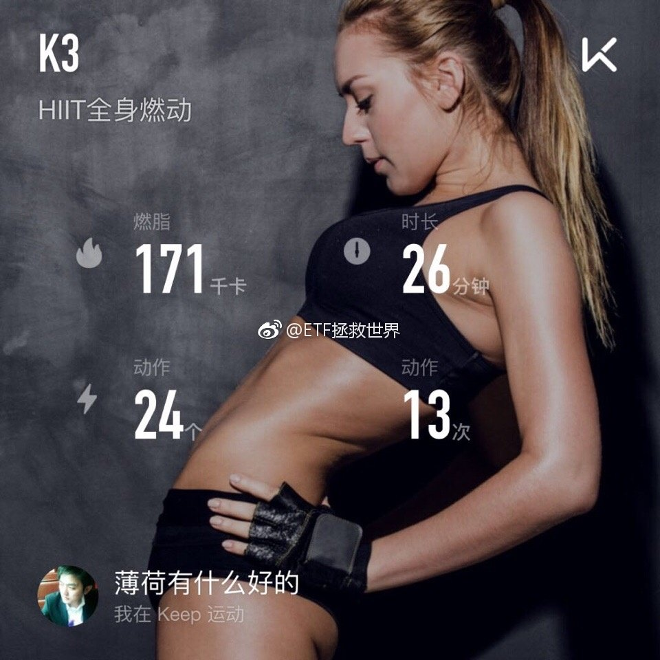

======================================================

ETF拯救世界 (5687069307) @
2017-09-05 07:59:24 Tue  
url: https://weibo.com/5687069307/FkmqD907J

民营赌场//@落魄的三叔:韭菜是属于国家的珍贵战略资源，你们这些搞ICO的是真活够了。//@债券搬砖狗://@水獭otter:无论什么都能做成庞氏骗局，这是中国人的秉性和数量决定的。旁氏骗局多一层不得了。

------------------------------------------------------
转推：
>  @ ()
>  2017-08-18 17:17:01 Fri  
>  url: 

>  抱歉，作者已设置仅展示半年内微博，此微博已不可见。 ​​​

转发[19]  评论[28]  赞[43] 

======================================================

ETF拯救世界 (5687069307) @
2017-09-05 08:52:40 Tue  
url: https://weibo.com/5687069307/FkmMfriii

有人哭的时候就要好好想想有什么机会让未来的自己笑

------------------------------------------------------
转推：
>  @ ()
>  2017-09-05 08:34:43 Tue  
>  url: 

>  抱歉，作者已设置仅展示半年内微博，此微博已不可见。 ​​​

转发[13]  评论[25]  赞[69] 

======================================================

ETF拯救世界 (5687069307) @
2017-09-05 08:57:03 Tue  
url: https://weibo.com/5687069307/FkmO2fGxU

回复@津一一:我花钱充会员，换头像，就是为了各位不再受骗啊。我力所能及就这样了！//@津一一:大E，又出现骗子了，拉我进实盘，头像和你的完全一样，没有+1//@ETF拯救世界:民营赌场//@落魄的三叔:韭菜是属于国家的珍贵战略资源，你们这些搞ICO的是真活够了。//@债券搬砖狗:

------------------------------------------------------
转推：
>  @ ()
>  2017-08-18 17:17:01 Fri  
>  url: 

>  抱歉，作者已设置仅展示半年内微博，此微博已不可见。 ​​​

转发[8]  评论[35]  赞[70] 

======================================================

ETF拯救世界 (5687069307) @
2017-09-05 10:37:44 Tue  
url: https://weibo.com/5687069307/FknsTypXC

不要涨一点就心急火燎大牛一去不回头，跌一点就心惊胆战跌到2000套十年。

轻松一点。高高兴兴把钱赚了不好吗。 ​​​

转发[30]  评论[55]  赞[137] 

======================================================

ETF拯救世界 (5687069307) @
2017-09-05 10:58:47 Tue  
url: https://weibo.com/5687069307/FknBrlCGz

现在知道什么叫弱周期了吧。

$全指医药 sh000991$ 

就是人家跌它不跌。当然，人家涨的时候它也不动。

[NO] ​​​

转发[8]  评论[52]  赞[108] 

======================================================

ETF拯救世界 (5687069307) @
2017-09-05 11:42:05 Tue  
url: https://weibo.com/5687069307/FknT0ttqT

今天继续吃草。好久没吃了。 ​​​

转发[0]  评论[60]  赞[101] 

+++++++++++++++++++++++++++++++++++++++++++++++++++++

图片：

======================================================

ETF拯救世界 (5687069307) @
2017-09-05 14:41:02 Tue  
url: https://weibo.com/5687069307/Fkp3EmW2B

这是一个被监控的微博

------------------------------------------------------
转推：
>  @ETF拯救世界 (5687069307)
>  2017-09-05 10:58:47 Tue  
>  url: https:/weibo.com/5687069307/FknBrlCGz/

>  现在知道什么叫弱周期了吧。
>  
>  $全指医药 sh000991$ 
>  
>  就是人家跌它不跌。当然，人家涨的时候它也不动。
>  
>  [NO] ​​​

转发[2]  评论[31]  赞[68] 

======================================================

ETF拯救世界 (5687069307) @
2017-09-05 14:59:57 Tue  
url: https://weibo.com/5687069307/Fkpbl390h

回复@马甲5544:我的仓位非常舒服啊。一点都没有害怕踏空害怕浪费子弹的感觉。每天账户新高，不知道多开心啊。//@马甲5544:老大  现在这行情是不是最磨人   不加怕踏空  加了怕浪费子弹 在踏空与空梭间  你选哪个//@ETF拯救世界:这是一个被监控的微博

------------------------------------------------------
转推：
>  @ETF拯救世界 (5687069307)
>  2017-09-05 10:58:47 Tue  
>  url: https:/weibo.com/5687069307/FknBrlCGz/

>  现在知道什么叫弱周期了吧。
>  
>  $全指医药 sh000991$ 
>  
>  就是人家跌它不跌。当然，人家涨的时候它也不动。
>  
>  [NO] ​​​

转发[1]  评论[19]  赞[58] 

======================================================

ETF拯救世界 (5687069307) @
2017-09-05 15:07:46 Tue  
url: https://weibo.com/5687069307/FkpevdZnA

干干净净的多好  ​​​

转发[6]  评论[69]  赞[131] 

+++++++++++++++++++++++++++++++++++++++++++++++++++++

图片：
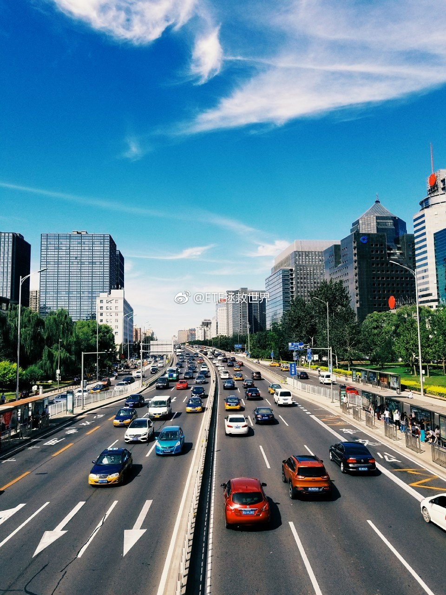

======================================================

ETF拯救世界 (5687069307) @
2017-09-05 15:20:57 Tue  
url: https://weibo.com/5687069307/FkpjRoa42

回复@用户5454135590:好心态源于仓位舒服。仓位舒服源于对概率判断的自信。对概率判断的自信源于历史的成功以及知识。也就是说，没有成功过，没有知识，对未来会怎样完全没有概念，那是不可能有好的心态的。只能人云亦云~//@用户5454135590:请教E大，好的心态是如何练就的

------------------------------------------------------
转推：
>  @ETF拯救世界 (5687069307)
>  2017-09-05 10:37:44 Tue  
>  url: https:/weibo.com/5687069307/FknsTypXC/

>  不要涨一点就心急火燎大牛一去不回头，跌一点就心惊胆战跌到2000套十年。
>  
>  轻松一点。高高兴兴把钱赚了不好吗。 ​​​

转发[21]  评论[53]  赞[119] 

======================================================

ETF拯救世界 (5687069307) @
2017-09-06 08:59:29 Wed  
url: https://weibo.com/5687069307/FkwfvmuX6

因为最近有不少事，于公于私，各种事情牵扯精力，今天开始不会再像之前频繁的与各位互动。

还是会发东西，没那么频繁。

每日打卡会不会继续不好说，主要是没有精力了。

人生充满意外。没事的时候总是不满足平淡的日子，有事了又想平安是福。

希望一生平安。 ​​​

转发[13]  评论[483]  赞[306] 

======================================================

ETF拯救世界 (5687069307) @
2017-09-11 10:11:56 Mon  
url: https://weibo.com/5687069307/FlhRov3bi

$中证环保 sh000827$   还是不错的。 ​​​

转发[24]  评论[101]  赞[142] 

======================================================

ETF拯救世界 (5687069307) @
2017-09-11 11:26:48 Mon  
url: https://weibo.com/5687069307/FlilNsjaj

回复@炒股为生2015:一定发。目标已锁定。//@炒股为生2015:@ETF拯救世界 E大，照这样下去，月中有发车的可能吗？[二哈]

------------------------------------------------------
转推：
>  @ETF拯救世界 (5687069307)
>  2017-09-11 10:11:56 Mon  
>  url: https:/weibo.com/5687069307/FlhRov3bi/

>  $中证环保 sh000827$   还是不错的。 ​​​

转发[1]  评论[42]  赞[87] 

======================================================

ETF拯救世界 (5687069307) @
2017-09-11 11:51:07 Mon  
url: https://weibo.com/5687069307/FlivFcmmf

坚持不懈的每周一吃草。

绿油油的。 ​​​

转发[4]  评论[42]  赞[93] 

+++++++++++++++++++++++++++++++++++++++++++++++++++++

图片：

======================================================

ETF拯救世界 (5687069307) @
2017-09-11 12:12:46 Mon  
url: https://weibo.com/5687069307/FliEs2uSS

太难吃了。有多难吃？吃到一半哭出来了。剩下的一半扔了。[doge]

------------------------------------------------------
转推：
>  @ETF拯救世界 (5687069307)
>  2017-09-11 11:51:07 Mon  
>  url: https:/weibo.com/5687069307/FlivFcmmf/

>  坚持不懈的每周一吃草。
>  
>  绿油油的。 ​​​

转发[3]  评论[106]  赞[113] 

======================================================

ETF拯救世界 (5687069307) @
2017-09-11 13:45:41 Mon  
url: https://weibo.com/5687069307/FljgahE2h

怎么还没完了。

------------------------------------------------------
转推：
>  @ETF拯救世界 (5687069307)
>  2017-09-11 10:11:56 Mon  
>  url: https:/weibo.com/5687069307/FlhRov3bi/

>  $中证环保 sh000827$   还是不错的。 ​​​

转发[17]  评论[39]  赞[57] 

======================================================

ETF拯救世界 (5687069307) @
2017-09-11 14:21:18 Mon  
url: https://weibo.com/5687069307/FljuCwjJv

$中证500 sz399905$   一轮下探后，又回到了前期高点。手里的筹码比4月多了三份。所以，中证500的市值又新高了。

怕什么坐电梯？不要怕。涨了好，跌了更好，可以让你多买，然后再次回来的时候，你又新高了。

一个品种是这样，整个账户也是这样。多少年后，指数就算一点都没涨，你的账户也是永远上行 ​​​

转发[35]  评论[73]  赞[141] 

======================================================

ETF拯救世界 (5687069307) @
2017-09-11 14:39:44 Mon  
url: https://weibo.com/5687069307/FljC6p8pH

一个月前大家都炒蓝筹。你也炒，结果就是一个多月价格没动，50、300。

你另辟蹊径，知道风格总会轮动，价值总会回归，买入不受欢迎的品种，结果就是赚的还不错。

时间、空间。对不同品种在不同的时间布局，闪转腾挪，最终完成终极的资产配置。

路不好走，有人设置了重重路障。但只要每一步都走得不 ​​​

转发[35]  评论[60]  赞[169] 

======================================================

ETF拯救世界 (5687069307) @
2017-09-11 15:02:46 Mon  
url: https://weibo.com/5687069307/FljLssdUk

回复@木木不哭木木:在我的投资体系中，只要买入的是指数产品，就永远不会发生亏损卖出这件事。永远不会。任何指数品种都一定要给它折腾盈利了才算完，铁律。//@木木不哭木木:港真，前些时日环保赔的时候真的是差点卖了，涨回来点就想卖了怕又跌回去，还好心态慢慢转变了

------------------------------------------------------
转推：
>  @ETF拯救世界 (5687069307)
>  2017-09-11 10:11:56 Mon  
>  url: https:/weibo.com/5687069307/FlhRov3bi/

>  $中证环保 sh000827$   还是不错的。 ​​​

转发[14]  评论[43]  赞[103] 

======================================================

ETF拯救世界 (5687069307) @
2017-09-11 16:14:14 Mon  
url: https://weibo.com/5687069307/Flkesxuan

37了，基本没有谈过恋爱，没怎么跟女人接触过，碰上一个美女，实在放不下。从看离婚协议书的88万开始，悲剧就已经上演……年轻的时候还是要多出去玩玩，多见识一下。最后，不要跟人品有问题的人来往，真的，因为你不知道他的底线在哪里，非常危险。

------------------------------------------------------
转推：
>  @张牧歌 (3760068067)
>  2017-09-10 22:43:39 Sun  
>  url: https:/weibo.com/3760068067/Fldm1m0pH/

>  天才程序员之死，被骗自杀的事件始末被还原，短短109天从认识到结婚到离婚，展示完整的消费记录，看着触目惊心！ 请善待程序猿这个稀有物种吧！http://t.cn/Rpx7G1W ​​​

转发[26]  评论[103]  赞[77] 

======================================================

ETF拯救世界 (5687069307) @
2017-09-11 19:25:03 Mon  
url: https://weibo.com/5687069307/FlltUx9IO

回复@木车亻:五七年可能不会亏，但是你要考虑一下几年后回头看收益率会不会满意。//@木车亻:e大 请教下 举例比如恒生前后发车十几份了价格也多次不同 是不是长期看比如五年七年每份买入的价格都不会亏损?因为我个人感觉以您的买入基准比平常人严格许多，随便一个节点的发车长期都没啥风险。

------------------------------------------------------
转推：
>  @ETF拯救世界 (5687069307)
>  2017-09-11 10:11:56 Mon  
>  url: https:/weibo.com/5687069307/FlhRov3bi/

>  $中证环保 sh000827$   还是不错的。 ​​​

转发[0]  评论[30]  赞[47] 

======================================================

ETF拯救世界 (5687069307) @
2017-09-11 21:40:25 Mon  
url: https://weibo.com/5687069307/FlmmQFhk3

每日打卡（74）

事情还没有解决，但生活还要继续，身体还要锻炼。坚持。 ​​​

转发[0]  评论[63]  赞[140] 

+++++++++++++++++++++++++++++++++++++++++++++++++++++

图片：

======================================================

ETF拯救世界 (5687069307) @
2017-09-12 09:38:43 Tue  
url: https://weibo.com/5687069307/Flr4qjkD9

$中证环保 sh000827$  没有意思。差不多行了。 ​​​

转发[1]  评论[28]  赞[64] 

======================================================

ETF拯救世界 (5687069307) @
2017-09-12 09:45:45 Tue  
url: https://weibo.com/5687069307/Flr7h2n4U

为什么大多数人投资会赔钱呢。

$格力电器 sz000651$   这么大的牛股，涨这么多，只回调了十几个点，获利筹码只剩38%了。

大多数人就是追，不停的追高，一旦股票或者指数回调，就是赔钱。

好股票还可以，以后会涨回去。很多股票就涨不回去，就套了。

涨回去的好股票，也不一定挣钱。因为可能在回调 ​​​

转发[14]  评论[56]  赞[94] 

======================================================

ETF拯救世界 (5687069307) @
2017-09-12 09:51:24 Tue  
url: https://weibo.com/5687069307/Flr9zaqOL

这个月买的$中证环保 sh000827$ 和$中证500 sz399905$  都不错 ​​​

转发[1]  评论[21]  赞[76] 

======================================================

ETF拯救世界 (5687069307) @
2017-09-12 10:06:57 Tue  
url: https://weibo.com/5687069307/FlrfS43rZ

看看环保，再回头看月初的这段话，是不是会更有感触？发布了头条文章：《买跌&追涨》 http://t.cn/RpoRiiX ​​​

转发[99]  评论[101]  赞[236] 

======================================================

ETF拯救世界 (5687069307) @
2017-09-12 10:15:03 Tue  
url: https://weibo.com/5687069307/Flrj9DCqn

回复@铅笔小小新:现在这样想的人还不够多。再等等。再多一点，就会发生一些有趣的事。//@铅笔小小新:E大，有没有可能真变慢牛了？

------------------------------------------------------
转推：
>  @ETF拯救世界 (5687069307)
>  2017-09-12 10:06:57 Tue  
>  url: https:/weibo.com/5687069307/FlrfS43rZ/

>  看看环保，再回头看月初的这段话，是不是会更有感触？发布了头条文章：《买跌&追涨》 http://t.cn/RpoRiiX ​​​

转发[12]  评论[45]  赞[69] 

======================================================

ETF拯救世界 (5687069307) @
2017-09-12 10:54:29 Tue  
url: https://weibo.com/5687069307/FlrzaxYxq

回复@西风将起:两融余额昨天突破9700亿。如果行情还是这样，两周内必然突破10000亿。上次1万亿是2016年1月。叠加多因素，有趣的事不会太远。本人投资从不会因为涨了跌了影响判断，只会根据常识、数据来判断。//@西风将起:看来e大还是不看好这轮啊

------------------------------------------------------
转推：
>  @ETF拯救世界 (5687069307)
>  2017-09-12 10:06:57 Tue  
>  url: https:/weibo.com/5687069307/FlrfS43rZ/

>  看看环保，再回头看月初的这段话，是不是会更有感触？发布了头条文章：《买跌&追涨》 http://t.cn/RpoRiiX ​​​

转发[9]  评论[28]  赞[71] 

======================================================

ETF拯救世界 (5687069307) @
2017-09-12 11:08:22 Tue  
url: https://weibo.com/5687069307/FlrEOnFjQ

回复@HZ小山1998:2份计划让你担心成这样？2份加起来一共1.3%。浮亏10%就是浮亏0.13%。其它十几个品种的盈利都没法让你舒服点？马上停止参考计划，立即，马上，为你好。//@HZ小山1998:回复@ETF拯救世界:当然跟计划了，不然怎么会投那么少[允悲]

------------------------------------------------------
转推：
>  @ETF拯救世界 (5687069307)
>  2017-09-12 10:06:57 Tue  
>  url: https:/weibo.com/5687069307/FlrfS43rZ/

>  看看环保，再回头看月初的这段话，是不是会更有感触？发布了头条文章：《买跌&追涨》 http://t.cn/RpoRiiX ​​​

转发[1]  评论[27]  赞[58] 

======================================================

ETF拯救世界 (5687069307) @
2017-09-12 11:18:19 Tue  
url: https://weibo.com/5687069307/FlrIQqiFA

做投资，看价格，涨跌，做决定，是最不可靠的。

要看的不是屏幕里软件商红红绿绿的走势，而是背后代表的含义。涨了跌了并不重要，重要的是其他的信息。

否则，你只能看到过去和现在，却看不到未来。

然而未来才是你能否赚钱的关键。即使看不清未来，也要看清现在。真的很重要。记住，现在，不是红红 ​​​

转发[47]  评论[93]  赞[181] 

======================================================

ETF拯救世界 (5687069307) @
2017-09-12 13:52:19 Tue  
url: https://weibo.com/5687069307/FlsJm3Adk

今天这么精彩，你可能没想到2000只股票是下跌的。 ​​​

转发[6]  评论[136]  赞[153] 

======================================================

ETF拯救世界 (5687069307) @
2017-09-12 21:52:00 Tue  
url: https://weibo.com/5687069307/FlvS3vDR3

每日打卡（75）

今天看了一篇东西，说的是连续三十天做一件事，养成好的习惯。比如走一万步，比如物归原位，比如写几百字的日记。

你最想连续做三十天，养成的好习惯是什么？ ​​​

转发[1]  评论[85]  赞[79] 

+++++++++++++++++++++++++++++++++++++++++++++++++++++

图片：

======================================================

ETF拯救世界 (5687069307) @
2017-09-13 09:44:22 Wed  
url: https://weibo.com/5687069307/FlAxdhEdj

跟超短线的说长线价值投资？//@八大山债人:别想了，补税能补死 //@老马自奋蹄:苏享龙做互联网创业，搞好了就可在新三板上市，是最好的成长股，想不明白此女，正常的逻辑应该是找到一头大奶牛，呵护他，可以每天挤奶，干嘛把牛杀了吃肉。。。研究生怎么读的？

------------------------------------------------------
转推：
>  @老马自奋蹄 (1807436544)
>  2017-09-13 05:19:41 Wed  
>  url: https:/weibo.com/1807436544/FlyNM42dm/

>  转：可怕的IT屠妇?! http://t.cn/RpJY1Sm ​​​

转发[19]  评论[30]  赞[44] 

======================================================

ETF拯救世界 (5687069307) @
2017-09-13 10:17:52 Wed  
url: https://weibo.com/5687069307/FlAKO4Ex3

来了。就是上次说的，他的减持承诺，将资金无偿借给上市公司是否有法律效力的问题。//@财联社APP:乐视2017年半年报显示，已向贾跃亭归还全部借款。

------------------------------------------------------
转推：
>  @财联社APP (2868676035)
>  2017-09-13 10:07:17 Wed  
>  url: https:/weibo.com/2868676035/FlAGvv3yy/

>  【深交所高度关注贾跃亭减持资金承诺履行情况，向乐视网下发关注函】深交所12日下发关注函称，贾跃亭承诺将减持所得资金全部借予上市公司使用，自收到上市公司还款之日起六个月内，贾跃亭将还款所得资金全部用于增持乐视网股份。公司2017年半年报显示，公司已向贾跃亭归还全部借款。深交所要求乐视网及 ​​​

转发[2]  评论[19]  赞[31] 

======================================================

ETF拯救世界 (5687069307) @
2017-09-13 10:21:37 Wed  
url: https://weibo.com/5687069307/FlAMkhW6L

重仓满仓的也不用太担心，收盘大概率还会拉回去。毕竟，现在，稳定是第一位。

还有30多天，很多人觉得这30多天是安全的。我倒认为恐怕要打点提前量。大家都那时候跑就跑不掉了。

当然，对咱们的计划来说，这些都是无所谓的事情。只是会影响我们继续建仓的速度而已。 ​​​

转发[7]  评论[69]  赞[93] 

======================================================

ETF拯救世界 (5687069307) @
2017-09-13 10:25:48 Wed  
url: https://weibo.com/5687069307/FlAO1wSEt

回复@你好大麦茶:我倒是能理解。人家就是来骗一把短线的，现在给你两个选择。第一，几个月可以赚1千万，潇洒自由，可以去找真爱。第二，跟一个自己一点点都不喜欢的男人每天睡在一个床上，看着就难受的那种。未来？现在赚钱的创业公司未来还不一定怎么样。人财两失不是不可能。那么，你选哪条路。

------------------------------------------------------
转推：
>  @老马自奋蹄 (1807436544)
>  2017-09-13 05:19:41 Wed  
>  url: https:/weibo.com/1807436544/FlyNM42dm/

>  转：可怕的IT屠妇?! http://t.cn/RpJY1Sm ​​​

转发[11]  评论[24]  赞[41] 

======================================================

ETF拯救世界 (5687069307) @
2017-09-13 11:53:30 Wed  
url: https://weibo.com/5687069307/FlBnCw1bF

不过这件事呢，到现在为止一直是单方面的陈述。具体的真实情况，再等等看吧。毕竟到现在另一方一句话都没说。

------------------------------------------------------
转推：
>  @老马自奋蹄 (1807436544)
>  2017-09-13 05:19:41 Wed  
>  url: https:/weibo.com/1807436544/FlyNM42dm/

>  转：可怕的IT屠妇?! http://t.cn/RpJY1Sm ​​​

转发[7]  评论[28]  赞[31] 

======================================================

ETF拯救世界 (5687069307) @
2017-09-13 17:44:42 Wed  
url: https://weibo.com/5687069307/FlDGb27nG

今天开始，一切恢复正常。

人善天不欺。

谢谢。 ​​​

转发[5]  评论[279]  赞[474] 

======================================================

ETF拯救世界 (5687069307) @
2017-09-13 22:13:13 Wed  
url: https://weibo.com/5687069307/FlFralmNn

每日打卡（76）

感受肌肉的硬度，拒绝油腻。 ​​​

转发[0]  评论[20]  赞[74] 

+++++++++++++++++++++++++++++++++++++++++++++++++++++

图片：

======================================================

ETF拯救世界 (5687069307) @
2017-09-13 22:37:53 Wed  
url: https://weibo.com/5687069307/FlFBbaOmu

这两个如果组合起来…… ​​​

转发[6]  评论[73]  赞[88] 

+++++++++++++++++++++++++++++++++++++++++++++++++++++

图片：

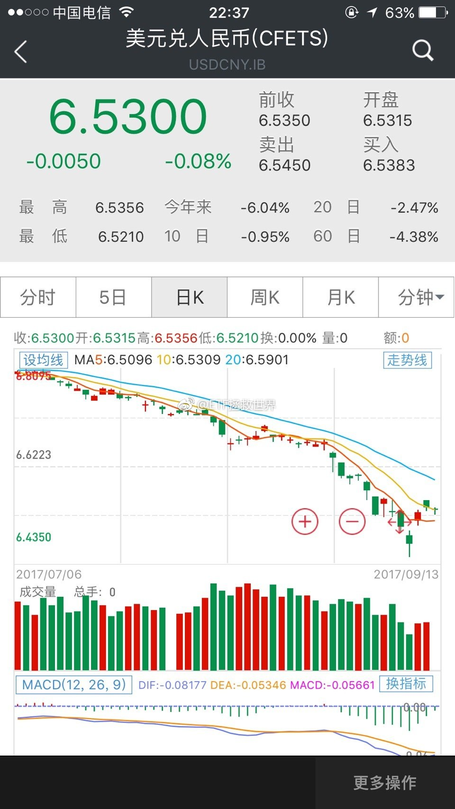

======================================================

ETF拯救世界 (5687069307) @
2017-09-14 09:02:57 Thu  
url: https://weibo.com/5687069307/FlJGTmCtS

不急，继续看。所谓“精彩的故事”就是要跌宕起伏，意料之外的桥段不断出现。生活远比文学精彩啊。//@Beck1010:@ETF拯救世界 e大，反转了……

------------------------------------------------------
转推：
>  @教授曰 (2427019967)
>  2017-09-13 19:27:45 Wed  
>  url: https:/weibo.com/2427019967/FlEm0dNy2/

>  【程序员被前妻翟欣欣逼死事件更多反转：印度官方呼吁打击wephone国际诈骗软件报道曝光】3人小微公司暴利模式：盗窃电信运营商话费；免费打电话，付费修改来电号码，台湾、福建、印度、阿拉伯国际电信诈骗团伙专用软件。忘了去年被福建电信诈骗团伙骗去学费逼迫致死的山东贫苦女大学生徐玉玉了吗？ ​​​

转发[9]  评论[43]  赞[37] 

======================================================

ETF拯救世界 (5687069307) @
2017-09-14 09:49:49 Thu  
url: https://weibo.com/5687069307/FlJZUDZ42

$中证环保 sh000827$  港真，不错。 ​​​

转发[3]  评论[36]  赞[72] 

======================================================

ETF拯救世界 (5687069307) @
2017-09-14 09:56:24 Thu  
url: https://weibo.com/5687069307/FlK2AsXsI

回复@用户6314452932:开。//@用户6314452932:老大，今晚开车吗？

------------------------------------------------------
转推：
>  @ETF拯救世界 (5687069307)
>  2017-09-14 09:49:49 Thu  
>  url: https:/weibo.com/5687069307/FlJZUDZ42/

>  $中证环保 sh000827$  港真，不错。 ​​​

转发[2]  评论[75]  赞[97] 

======================================================

ETF拯救世界 (5687069307) @
2017-09-14 11:34:10 Thu  
url: https://weibo.com/5687069307/FlKGh1YM3

一个经验：

共享单车前面的筐里不要放东西。

一支LAMY，一个记事本。忘了拿了。

就在刚才。

[拜拜]

光顾着刷微博扯淡了。

[哼] ​​​

转发[11]  评论[210]  赞[93] 

======================================================

ETF拯救世界 (5687069307) @
2017-09-14 14:06:25 Thu  
url: https://weibo.com/5687069307/FlLG4lQqc

呵呵哒，别想骗我今晚买a股。图样了！ ​​​

转发[47]  评论[108]  赞[150] 

======================================================

ETF拯救世界 (5687069307) @
2017-09-15 11:22:14 Fri  
url: https://weibo.com/5687069307/FlU1VmkES

圣诞节有没有地陪。  ​​​

转发[0]  评论[84]  赞[83] 

======================================================

ETF拯救世界 (5687069307) @
2017-09-15 14:08:21 Fri  
url: https://weibo.com/5687069307/FlV7mft4p

没有相对较大的调整，计划不会再加A股了。怎么讲，现在就是鸡肋时间。

------------------------------------------------------
转推：
>  @ETF拯救世界 (5687069307)
>  2017-09-14 14:06:25 Thu  
>  url: https:/weibo.com/5687069307/FlLG4lQqc/

>  呵呵哒，别想骗我今晚买a股。图样了！ ​​​

转发[43]  评论[67]  赞[121] 

======================================================

ETF拯救世界 (5687069307) @
2017-09-15 15:26:56 Fri  
url: https://weibo.com/5687069307/FlVDfqyXQ

通常来讲，很多投资者有一个心理误区，那就是，看着一个暴涨的品种，不停的告诉自己，哎呀，我之前明明看过这个品种啊，好可惜啊，如果我买了就发财了啊。

其实呢，你看过的品种有几百个。但你只是挑了最牛的那个出来后悔。

更后悔的是，我买过呀，涨了一点就卖了呀，如果我不卖……

是啊，如果。如 ​​​

转发[63]  评论[95]  赞[183] 

======================================================

ETF拯救世界 (5687069307) @
2017-09-15 15:52:40 Fri  
url: https://weibo.com/5687069307/FlVNH9mu6

回复@幸福猪兜仔:我没懂。你明明是进步了，为什么难受？你“彻底参悟”了，那就说明有很大进步。那么下一次你就能赚大钱，哭什么？证券市场是你人生中能遇到的，机会最多的地方。几乎每天每个月每年都有机会。你有能力，还怕没机会？我实在是不理解啊，进步了还难受是为什么。

------------------------------------------------------
转推：
>  @ETF拯救世界 (5687069307)
>  2017-09-14 14:06:25 Thu  
>  url: https:/weibo.com/5687069307/FlLG4lQqc/

>  呵呵哒，别想骗我今晚买a股。图样了！ ​​​

转发[25]  评论[15]  赞[76] 

======================================================

ETF拯救世界 (5687069307) @
2017-09-15 15:57:37 Fri  
url: https://weibo.com/5687069307/FlVPHvPVh

回复@爱花的老猫:似乎也不能用“够”来形容。我很喜欢老巴说的“能力圈”概念。每个人注定有自己的能力圈，不能在自己的圈子里天天看着别人的圈子赚钱眼红。90年代纳斯达克疯涨多少倍，老巴一个子儿都没赚到，你说他后悔不后悔，哭不哭？有没有人所有股票都懂，所有大牛都赚到呢？这是一个终极问题。

------------------------------------------------------
转推：
>  @ETF拯救世界 (5687069307)
>  2017-09-15 15:26:56 Fri  
>  url: https:/weibo.com/5687069307/FlVDfqyXQ/

>  通常来讲，很多投资者有一个心理误区，那就是，看着一个暴涨的品种，不停的告诉自己，哎呀，我之前明明看过这个品种啊，好可惜啊，如果我买了就发财了啊。
>  
>  其实呢，你看过的品种有几百个。但你只是挑了最牛的那个出来后悔。
>  
>  更后悔的是，我买过呀，涨了一点就卖了呀，如果我不卖……
>  
>  是啊，如果。如 ​​​

转发[5]  评论[23]  赞[67] 

======================================================

ETF拯救世界 (5687069307) @
2017-09-15 16:07:05 Fri  
url: https://weibo.com/5687069307/FlVTxFeYj

回复@灵感源泉--8066:在现在这个时代，钱真的不难找。没钱的，雪球做个收益高回撤小的组合，找机会发个私募，做得好了规模会越来越大，分分钟几个亿可以执掌。然而有能力的人才是真正稀缺的，很多人会高估了自己的能力。钱是聪明的，自然会自己去寻找有能力的人。//@灵感源泉--8066:因为有机会没钱

------------------------------------------------------
转推：
>  @ETF拯救世界 (5687069307)
>  2017-09-14 14:06:25 Thu  
>  url: https:/weibo.com/5687069307/FlLG4lQqc/

>  呵呵哒，别想骗我今晚买a股。图样了！ ​​​

转发[19]  评论[19]  赞[95] 

======================================================

ETF拯救世界 (5687069307) @
2017-09-15 16:16:31 Fri  
url: https://weibo.com/5687069307/FlVXnyUXt

回复@nfbbc:很多人管理别人的钱，通常来讲，特点是会更加激进。因为只有赚得多，才能分得多。亏了，又不是自己的钱，无所谓。很多时候讲情怀听起来特别可笑，但确实特别重要。真正的把别人的钱当成自己的，对别人的信任心存感激，用加倍的努力回报信任，确实已经特别难得了。

------------------------------------------------------
转推：
>  @ETF拯救世界 (5687069307)
>  2017-09-14 14:06:25 Thu  
>  url: https:/weibo.com/5687069307/FlLG4lQqc/

>  呵呵哒，别想骗我今晚买a股。图样了！ ​​​

转发[10]  评论[43]  赞[149] 

======================================================

ETF拯救世界 (5687069307) @
2017-09-15 23:04:27 Fri  
url: https://weibo.com/5687069307/FlYCXhFW4

每日打卡（77）

这段时间欠了几次打卡，周末会一次补齐。坚持！ ​​​

转发[1]  评论[18]  赞[97] 

+++++++++++++++++++++++++++++++++++++++++++++++++++++

图片：

======================================================

ETF拯救世界 (5687069307) @
2017-09-16 23:04:57 Sat  
url: https://weibo.com/5687069307/Fm83EuUiP

每日打卡（78）

今天忙了一天，先来两组 ​​​

转发[0]  评论[23]  赞[91] 

+++++++++++++++++++++++++++++++++++++++++++++++++++++

图片：

======================================================

ETF拯救世界 (5687069307) @
2017-09-17 19:29:41 Sun  
url: https://weibo.com/5687069307/Fmg4M4sYm

每日打卡（79）

今天撸三组。继续还债。 ​​​

转发[0]  评论[26]  赞[112] 

+++++++++++++++++++++++++++++++++++++++++++++++++++++

图片：

======================================================

ETF拯救世界 (5687069307) @
2017-09-18 10:22:48 Mon  
url: https://weibo.com/5687069307/FmlVi7ZuX

持仓品种都没有新高，账户继续每天新高ing。

amazing。 ​​​

转发[11]  评论[77]  赞[143] 

======================================================

ETF拯救世界 (5687069307) @
2017-09-18 10:32:43 Mon  
url: https://weibo.com/5687069307/FmlZjtmwF

我认为，情商是一种同理心。懂得站在对方的角度思考问题的人就是情商高，做出来的事就会让别人舒服。与忽悠之类恐怕不是一回事~

------------------------------------------------------
转推：
>  @ ()
>  2017-09-18 10:18:13 Mon  
>  url: 

>  抱歉，此微博已被作者删除。查看帮助：http://t.cn/Rfd3rQV

转发[15]  评论[41]  赞[131] 

======================================================

ETF拯救世界 (5687069307) @
2017-09-18 13:18:16 Mon  
url: https://weibo.com/5687069307/Fmn4vBTLt

整件事大概有个脉络了。

女方从事某种职业，通过各种方式认识有钱人，不为结婚，可以短期内赚不少钱。

然后通过网站认识了男方，像之前一样，各种奢侈品各种大额消费。不同的是，这次男方很认真，要结婚。女方感到有些棘手了。

结婚前一天，女方跟男方说自己结过婚，要看离婚协议拿88万。本来想就此 ​​​

转发[16]  评论[101]  赞[109] 

======================================================

ETF拯救世界 (5687069307) @
2017-09-18 16:10:11 Mon  
url: https://weibo.com/5687069307/FmocieTb9

$恒生指数 hkHSI$  距离下一次再平衡点位，29500越来越近了。

如果到时候美元涨一波就可以说完美了。当然，不涨也没ok啦。 ​​​

转发[5]  评论[56]  赞[104] 

======================================================

ETF拯救世界 (5687069307) @
2017-09-18 22:57:00 Mon  
url: https://weibo.com/5687069307/FmqRq8g2G

每日打卡（80）

失去才知道珍惜，失而复得是最幸福，好好珍惜已经有的。今天累，做一组简单的。 ​​​

转发[2]  评论[21]  赞[82] 

+++++++++++++++++++++++++++++++++++++++++++++++++++++

图片：

======================================================

ETF拯救世界 (5687069307) @
2017-09-19 05:22:06 Tue  
url: https://weibo.com/5687069307/FmtnJ5Hyo

完美的一天 ​​​

转发[6]  评论[57]  赞[111] 

+++++++++++++++++++++++++++++++++++++++++++++++++++++

图片：

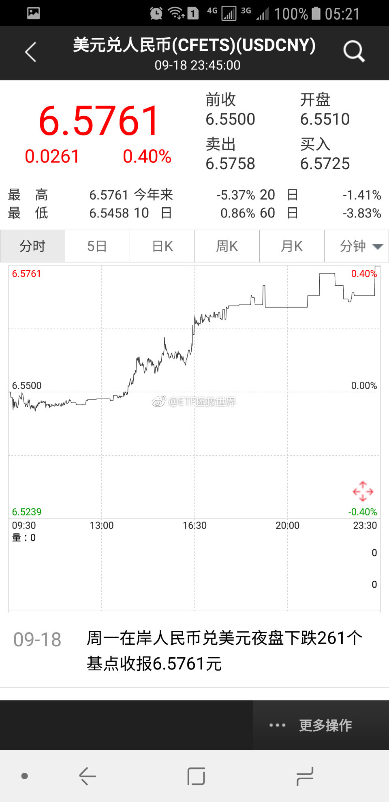

======================================================

ETF拯救世界 (5687069307) @
2017-09-19 06:40:13 Tue  
url: https://weibo.com/5687069307/FmtTriLjF

几周前浮亏15%的油气，现在浮亏3个多点。

我说过很多次，通过各种方法将成本控制好，别说趋势反转，就是一个小反弹也分分钟开始盈利。

任何指数品种，任何，都会做成盈利。绝不允许亏损卖出这样的事情发生。

只有一种可能变成悲剧，就是底部你被吓得不敢买或者卖出了。 ​​​

转发[17]  评论[155]  赞[157] 

======================================================

ETF拯救世界 (5687069307) @
2017-09-19 09:22:17 Tue  
url: https://weibo.com/5687069307/FmuXdEQE1

回复@化工_达人:场内现在折价1.6%。再加上今天净值又涨1%。如果场内买的时候有点溢价，你算算是不是差不多3个多点。//@化工_达人:我浮亏6.67%，场内买的。3个点不太可能吧[傻眼]

------------------------------------------------------
转推：
>  @ETF拯救世界 (5687069307)
>  2017-09-19 06:40:13 Tue  
>  url: https:/weibo.com/5687069307/FmtTriLjF/

>  几周前浮亏15%的油气，现在浮亏3个多点。
>  
>  我说过很多次，通过各种方法将成本控制好，别说趋势反转，就是一个小反弹也分分钟开始盈利。
>  
>  任何指数品种，任何，都会做成盈利。绝不允许亏损卖出这样的事情发生。
>  
>  只有一种可能变成悲剧，就是底部你被吓得不敢买或者卖出了。 ​​​

转发[1]  评论[24]  赞[57] 

======================================================

ETF拯救世界 (5687069307) @
2017-09-19 09:45:09 Tue  
url: https://weibo.com/5687069307/Fmv6vm1PA

广发养老的净值已经快回到第三轮熔断前了。计划的几个重仓品种开始蠢蠢欲动。

所以，要买就买表现不好的，然后让手里表现好的去飞，一定是没错。 ​​​

转发[19]  评论[66]  赞[148] 

======================================================

ETF拯救世界 (5687069307) @
2017-09-19 10:13:30 Tue  
url: https://weibo.com/5687069307/Fmvi0D8Vf

太毒了！！！

------------------------------------------------------
转推：
>  @ETF拯救世界 (5687069307)
>  2017-09-19 09:45:09 Tue  
>  url: https:/weibo.com/5687069307/Fmv6vm1PA/

>  广发养老的净值已经快回到第三轮熔断前了。计划的几个重仓品种开始蠢蠢欲动。
>  
>  所以，要买就买表现不好的，然后让手里表现好的去飞，一定是没错。 ​​​

转发[1]  评论[33]  赞[93] 

======================================================

ETF拯救世界 (5687069307) @
2017-09-19 15:05:02 Tue  
url: https://weibo.com/5687069307/Fmxcm1kbf

回复@一小九K:12000亿是我能想到的极限。超过这个，恐怕有点问题了。我相当怀疑管理层会让两融余额到这个数字。//@一小九K:老大，两融余额逼近万亿，是不是风险已经很近了...

------------------------------------------------------
转推：
>  @ETF拯救世界 (5687069307)
>  2017-09-19 09:45:09 Tue  
>  url: https:/weibo.com/5687069307/Fmv6vm1PA/

>  广发养老的净值已经快回到第三轮熔断前了。计划的几个重仓品种开始蠢蠢欲动。
>  
>  所以，要买就买表现不好的，然后让手里表现好的去飞，一定是没错。 ​​​

转发[5]  评论[33]  赞[72] 

======================================================

ETF拯救世界 (5687069307) @
2017-09-19 21:01:54 Tue  
url: https://weibo.com/5687069307/FmzxcjfPu

每日打卡（81）

练得很舒服。要加量了吧？ ​​​

转发[0]  评论[24]  赞[90] 

+++++++++++++++++++++++++++++++++++++++++++++++++++++

图片：

======================================================

ETF拯救世界 (5687069307) @
2017-09-20 09:17:52 Wed  
url: https://weibo.com/5687069307/FmElVs8Fz

谢谢。

------------------------------------------------------
转推：
>  @财联社APP (2868676035)
>  2017-09-20 09:16:52 Wed  
>  url: https:/weibo.com/2868676035/FmElwkCpM/

>  【要闻：人民币中间价下调140点 连续两日调贬】财联社20日讯，人民币兑美元中间价报6.5670，下调140点。前一交易日中间价报6.5423。http://t.cn/R0v8X43 ​​​

转发[3]  评论[19]  赞[65] 

======================================================

ETF拯救世界 (5687069307) @
2017-09-20 09:33:38 Wed  
url: https://weibo.com/5687069307/FmEskgNBP

这两年计划交易的18个品种，就剩这两个了。

赔钱为什么这么难。为什么。

[doge] ​​​

转发[11]  评论[95]  赞[124] 

+++++++++++++++++++++++++++++++++++++++++++++++++++++

图片：

======================================================

ETF拯救世界 (5687069307) @
2017-09-20 10:32:22 Wed  
url: https://weibo.com/5687069307/FmEQakU2h

回复@夜雨梧桐2010:赔钱和傻是两个范畴的概念好吗。//@夜雨梧桐2010:ee，我来帮你，借点钱给我，我不还，你就赔了......

------------------------------------------------------
转推：
>  @ETF拯救世界 (5687069307)
>  2017-09-20 09:33:38 Wed  
>  url: https:/weibo.com/5687069307/FmEskgNBP/

>  这两年计划交易的18个品种，就剩这两个了。
>  
>  赔钱为什么这么难。为什么。
>  
>  [doge] ​​​

转发[1]  评论[33]  赞[76] 

======================================================

ETF拯救世界 (5687069307) @
2017-09-20 13:36:10 Wed  
url: https://weibo.com/5687069307/FmG2M1zAt

其实我特别怀疑是不是有朋友上过当。如果所有朋友都没有上过当，这些骗子注册这么多号，每天这么弄，又没效果，4不4傻啊。

------------------------------------------------------
转推：
>  @ETF小迷妹 (2698010970)
>  2017-09-20 13:29:20 Wed  
>  url: https:/weibo.com/2698010970/FmFZZFVbS/

>  激动得差点上了高仿的当@ETF拯救世界 ​​​

转发[3]  评论[78]  赞[60] 

======================================================

ETF拯救世界 (5687069307) @
2017-09-20 14:05:17 Wed  
url: https://weibo.com/5687069307/FmGeAvxtS

有现金的注意一下逆回购了。长短结合。 ​​​

转发[2]  评论[31]  赞[93] 

======================================================

ETF拯救世界 (5687069307) @
2017-09-20 14:12:39 Wed  
url: https://weibo.com/5687069307/FmGhA5dZ5

回复@happymami:如果是目前这样，明确的说，月底不会开A股的车了。//@happymami:大盘跌不下去吗？昨天跌了，今天又涨上来[允悲]，不知月底还能开车不？

------------------------------------------------------
转推：
>  @ETF小迷妹 (2698010970)
>  2017-09-20 13:29:20 Wed  
>  url: https:/weibo.com/2698010970/FmFZZFVbS/

>  激动得差点上了高仿的当@ETF拯救世界 ​​​

转发[1]  评论[27]  赞[54] 

======================================================

ETF拯救世界 (5687069307) @
2017-09-20 21:51:51 Wed  
url: https://weibo.com/5687069307/FmJhXwQ6c

每日打卡（82）

打算加个每天走一万步的新指标。 ​​​

转发[0]  评论[27]  赞[92] 

+++++++++++++++++++++++++++++++++++++++++++++++++++++

图片：

======================================================

ETF拯救世界 (5687069307) @
2017-09-21 00:04:26 Thu  
url: https://weibo.com/5687069307/FmK9MxHpZ

一口 ​​​

转发[0]  评论[38]  赞[81] 

+++++++++++++++++++++++++++++++++++++++++++++++++++++

图片：

======================================================

ETF拯救世界 (5687069307) @
2017-09-21 07:45:42 Thu  
url: https://weibo.com/5687069307/FmNb0EVbt

别人说什么，重要吗。 ​​​

转发[3]  评论[76]  赞[114] 

+++++++++++++++++++++++++++++++++++++++++++++++++++++

图片：

======================================================

ETF拯救世界 (5687069307) @
2017-09-21 08:43:59 Thu  
url: https://weibo.com/5687069307/FmNyFaF2S

明年上半年坐这个去趟迪斯尼。

------------------------------------------------------
转推：
>  @澎湃新闻 (5044281310)
>  2017-09-21 08:39:22 Thu  
>  url: https:/weibo.com/5044281310/FmNwNmrlx/

>  【时速提高至350公里，复兴号京沪间只需4小时28分】9月21日起，“复兴号”动车组即将在京沪高铁提速至350公里时速运行。中国成为世界上高铁商业运营速度最高的国家。澎湃新闻第一时间体验“全球最快”。 http://t.cn/R0z9pdh . ​​​

转发[3]  评论[29]  赞[49] 

======================================================

ETF拯救世界 (5687069307) @
2017-09-21 08:45:37 Thu  
url: https://weibo.com/5687069307/FmNzlc7nS

留着这张存单可能会发财

------------------------------------------------------
转推：
>  @ ()
>  2017-09-21 08:25:29 Thu  
>  url: 

>  抱歉，作者已设置仅展示半年内微博，此微博已不可见。 ​​​

转发[9]  评论[36]  赞[58] 

======================================================

ETF拯救世界 (5687069307) @
2017-09-21 09:05:04 Thu  
url: https://weibo.com/5687069307/FmNHeepX6

回复@Beck1010:事实是据说70%炒股的人是赔钱的//@Beck1010:如果买股票的话是不是就已经发了[坏笑]//@ETF拯救世界:留着这张存单可能会发财

------------------------------------------------------
转推：
>  @ ()
>  2017-09-21 08:25:29 Thu  
>  url: 

>  抱歉，作者已设置仅展示半年内微博，此微博已不可见。 ​​​

转发[1]  评论[22]  赞[38] 

======================================================

ETF拯救世界 (5687069307) @
2017-09-21 09:52:25 Thu  
url: https://weibo.com/5687069307/FmO0rBxeA

某个品种已经进入瞄准镜了。还有一周。 ​​​

转发[8]  评论[95]  赞[138] 

======================================================

ETF拯救世界 (5687069307) @
2017-09-21 10:11:33 Thu  
url: https://weibo.com/5687069307/FmO8diE38

谁能想到，又新高了。好像A股怎么走和我们的账户关系也不是太大了。

组合，组合。 ​​​

转发[3]  评论[63]  赞[135] 

======================================================

ETF拯救世界 (5687069307) @
2017-09-21 11:24:09 Thu  
url: https://weibo.com/5687069307/FmOBGDzf0

回复@你好大麦茶:拍卖午餐吧。1400起拍。能不能拍到2万//@你好大麦茶:回复@徐L鑫:组团求偶遇[嘻嘻]//@ETF拯救世界:明年上半年坐这个去趟迪斯尼。

------------------------------------------------------
转推：
>  @澎湃新闻 (5044281310)
>  2017-09-21 08:39:22 Thu  
>  url: https:/weibo.com/5044281310/FmNwNmrlx/

>  【时速提高至350公里，复兴号京沪间只需4小时28分】9月21日起，“复兴号”动车组即将在京沪高铁提速至350公里时速运行。中国成为世界上高铁商业运营速度最高的国家。澎湃新闻第一时间体验“全球最快”。 http://t.cn/R0z9pdh . ​​​

转发[0]  评论[35]  赞[52] 

======================================================

ETF拯救世界 (5687069307) @
2017-09-21 11:25:19 Thu  
url: https://weibo.com/5687069307/FmOC9zwn2

$中证红利 sz399922$  组合中的A股指数总算有新高的了 ​​​

转发[21]  评论[30]  赞[66] 

======================================================

ETF拯救世界 (5687069307) @
2017-09-21 11:29:51 Thu  
url: https://weibo.com/5687069307/FmOE0dk9k

这其实就是国外历次危机中的场景：贷款80%，然后房价跌30%，不仅首付跌没了，欠银行的钱比房子市值还多。最悲惨的是，因为经济不好，失业了。当然，我朝不会出现这样的情况。毕竟房价永远涨。//@挖龙脉的鹿鼎公:[允悲]杠杆大了，经不起回撤

------------------------------------------------------
转推：
>  @ ()
>  2017-09-20 12:28:40 Wed  
>  url: 

>  抱歉，作者已设置仅展示半年内微博，此微博已不可见。 ​​​

转发[19]  评论[38]  赞[58] 

======================================================

ETF拯救世界 (5687069307) @
2017-09-21 12:19:48 Thu  
url: https://weibo.com/5687069307/FmOYhfZS5

回复@用户5850653787:没必要。之前两年都是恒生涨的好，未来也许H跌的少呢。//@用户5850653787:老大，我手里有十份的恒生国企指数基金，想现在换到恒生指数基金，您觉得怎么样？还是只换一半?慢慢换，每次换一份[求关注]非常希望能被翻牌子，不翻也依然爱你[哈哈]

------------------------------------------------------
转推：
>  @ETF拯救世界 (5687069307)
>  2017-09-21 11:25:19 Thu  
>  url: https:/weibo.com/5687069307/FmOC9zwn2/

>  $中证红利 sz399922$  组合中的A股指数总算有新高的了 ​​​

转发[20]  评论[17]  赞[48] 

======================================================

ETF拯救世界 (5687069307) @
2017-09-21 14:30:12 Thu  
url: https://weibo.com/5687069307/FmPPcod9A

回复@bigblue83:爱跌不跌，我不看了。维稳还有一个月，相信依然是波澜不惊。看腻了，爱谁谁，跌也不买。//@bigblue83:如果这样跌一周，又可以搞a了

------------------------------------------------------
转推：
>  @ETF拯救世界 (5687069307)
>  2017-09-21 09:52:25 Thu  
>  url: https:/weibo.com/5687069307/FmO0rBxeA/

>  某个品种已经进入瞄准镜了。还有一周。 ​​​

转发[5]  评论[20]  赞[66] 

======================================================

ETF拯救世界 (5687069307) @
2017-09-21 14:52:08 Thu  
url: https://weibo.com/5687069307/FmPY6opog

拼命死扛，扛到两融余额1.2万亿以上，最终崩的一塌糊涂。谁负责呢，又抓一批？

操盘的恐怕得掂量掂量吧。 ​​​

转发[6]  评论[52]  赞[98] 

======================================================

ETF拯救世界 (5687069307) @
2017-09-21 15:57:00 Thu  
url: https://weibo.com/5687069307/FmQoqBSCO

[太开心] ​​​

转发[6]  评论[90]  赞[72] 

+++++++++++++++++++++++++++++++++++++++++++++++++++++

图片：
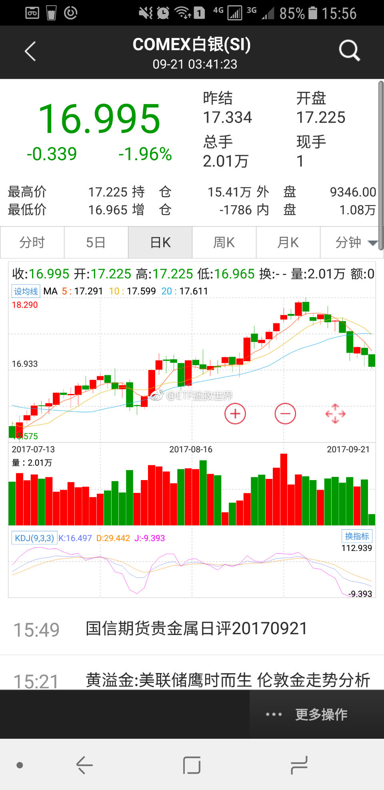

======================================================

ETF拯救世界 (5687069307) @
2017-09-21 21:28:41 Thu  
url: https://weibo.com/5687069307/FmSz41Zoo

回复@葫芦岛心灵的旅途:不要长期持有，有损耗//@葫芦岛心灵的旅途:请叫益达，161226跟踪效果如何?

------------------------------------------------------
转推：
>  @ETF拯救世界 (5687069307)
>  2017-09-21 15:57:00 Thu  
>  url: https:/weibo.com/5687069307/FmQoqBSCO/

>  [太开心] ​​​

转发[1]  评论[11]  赞[43] 

======================================================

ETF拯救世界 (5687069307) @
2017-09-21 22:27:19 Thu  
url: https://weibo.com/5687069307/FmSWRoQxF

每日打卡（83）

这几天有点感冒，做点轻松的。 ​​​

转发[0]  评论[32]  赞[79] 

+++++++++++++++++++++++++++++++++++++++++++++++++++++

图片：

======================================================

ETF拯救世界 (5687069307) @
2017-09-22 09:17:50 Fri  
url: https://weibo.com/5687069307/FmXcWiHa4

刚刚得到的最新消息，2015年7月以来，买的18个品种只剩一个浮亏1%了。

只要系统和策略科学合理，在资本市场挣钱是没什么难度的。

不赔钱只是第一步，想要赚的多，还有曲折的路要走。但是在正确的路上一直走下去，光明也就不远了。 ​​​

转发[20]  评论[74]  赞[136] 

+++++++++++++++++++++++++++++++++++++++++++++++++++++

图片：

======================================================

ETF拯救世界 (5687069307) @
2017-09-22 09:32:06 Fri  
url: https://weibo.com/5687069307/FmXiHzjKd

呵呵，跌也不买。看你能跌到哪里。。//@ETF拯救世界:回复@bigblue83:爱跌不跌，我不看了。维稳还有一个月，相信依然是波澜不惊。看腻了，爱谁谁，跌也不买。//@bigblue83:如果这样跌一周，又可以搞a了

------------------------------------------------------
转推：
>  @ETF拯救世界 (5687069307)
>  2017-09-21 09:52:25 Thu  
>  url: https:/weibo.com/5687069307/FmO0rBxeA/

>  某个品种已经进入瞄准镜了。还有一周。 ​​​

转发[1]  评论[12]  赞[45] 

======================================================

ETF拯救世界 (5687069307) @
2017-09-22 09:48:16 Fri  
url: https://weibo.com/5687069307/FmXpgrVfc

回复@潇者_水清深也:现实会告诉我们答案。//@潇者_水清深也:E大，今天所有大佬（高善文，姜超等）全部看多了，怎么看啊//@ETF拯救世界:回复@用户5850653787:没必要。之前两年都是恒生涨的好，未来也许H跌的少呢。

------------------------------------------------------
转推：
>  @ETF拯救世界 (5687069307)
>  2017-09-21 11:25:19 Thu  
>  url: https:/weibo.com/5687069307/FmOC9zwn2/

>  $中证红利 sz399922$  组合中的A股指数总算有新高的了 ​​​

转发[16]  评论[15]  赞[47] 

======================================================

ETF拯救世界 (5687069307) @
2017-09-22 09:55:05 Fri  
url: https://weibo.com/5687069307/FmXs1wxHz

很多事情，对人，对事，都可以灵活处理。不能过于拘泥于某种刻板的教条。

但关键一点，要有比较坚定的世界观。或者说，标准，底线。

投资当然也是如此。买入，持有，卖出，构成了投资的全过程。无论是做哪个动作，最基本的投资世界观和标准不能变。这个标准不应该是涨了还是跌了，也不应该是别人说什 ​​​

转发[26]  评论[53]  赞[137] 

======================================================

ETF拯救世界 (5687069307) @
2017-09-22 09:59:32 Fri  
url: https://weibo.com/5687069307/FmXtPyI8D

怎么看待互联网上每天扑面而来的信息和新闻？

比较关键的一点是要有独立思考的能力。

新闻和信息，很多时候是假的。另一些时候虽然是真的，然而只是真相的一部分。

有些人的观点不正确，是因为他本身能力有欠缺。然而有些人是故意说一些不正确的观点，也许是为了利益，也许是被逼无奈。

所以独立思 ​​​

转发[93]  评论[63]  赞[167] 

======================================================

ETF拯救世界 (5687069307) @
2017-09-22 10:11:20 Fri  
url: https://weibo.com/5687069307/FmXyCuGLo

回复@溪南烟树:未雨绸缪。之前已经出过一份。目前大概是8%的仓位。8%是一个关键仓位，在一个组合中，低于8%很难对组合净值产生影响。无论是正面还是负面。综合来看，目前恒生的8%还算是ok。如果能到29500，还会继续卖出。不到的话，持有就ok了。

------------------------------------------------------
转推：
>  @ETF拯救世界 (5687069307)
>  2017-09-21 11:25:19 Thu  
>  url: https:/weibo.com/5687069307/FmOC9zwn2/

>  $中证红利 sz399922$  组合中的A股指数总算有新高的了 ​​​

转发[14]  评论[13]  赞[44] 

======================================================

ETF拯救世界 (5687069307) @
2017-09-22 10:16:04 Fri  
url: https://weibo.com/5687069307/FmXAxBkdE

回复@安全投资稳健增长:算是今年的失误之一。这个一定要认真反省，升级策略。//@安全投资稳健增长:没有持有互联网相关的指数，会不会有点遗憾？

------------------------------------------------------
转推：
>  @ETF拯救世界 (5687069307)
>  2017-09-22 09:59:32 Fri  
>  url: https:/weibo.com/5687069307/FmXtPyI8D/

>  怎么看待互联网上每天扑面而来的信息和新闻？
>  
>  比较关键的一点是要有独立思考的能力。
>  
>  新闻和信息，很多时候是假的。另一些时候虽然是真的，然而只是真相的一部分。
>  
>  有些人的观点不正确，是因为他本身能力有欠缺。然而有些人是故意说一些不正确的观点，也许是为了利益，也许是被逼无奈。
>  
>  所以独立思 ​​​

转发[50]  评论[35]  赞[57] 

======================================================

ETF拯救世界 (5687069307) @
2017-09-22 10:36:28 Fri  
url: https://weibo.com/5687069307/FmXIP97a3

回复@IT曼尼爵:不一样。比如说，融创或者比特币。就是涨一万倍我都毫无感觉。因为那是不可把握的，是自己能力圈之外的。中概互联则不同，腾讯、阿里、京东，都是我比较喜欢的公司，他们组成的指数没有买入，对我来说，是遗憾。策略需要升级。只有不断升级和进步才能立于不败之地。

------------------------------------------------------
转推：
>  @ETF拯救世界 (5687069307)
>  2017-09-22 09:59:32 Fri  
>  url: https:/weibo.com/5687069307/FmXtPyI8D/

>  怎么看待互联网上每天扑面而来的信息和新闻？
>  
>  比较关键的一点是要有独立思考的能力。
>  
>  新闻和信息，很多时候是假的。另一些时候虽然是真的，然而只是真相的一部分。
>  
>  有些人的观点不正确，是因为他本身能力有欠缺。然而有些人是故意说一些不正确的观点，也许是为了利益，也许是被逼无奈。
>  
>  所以独立思 ​​​

转发[20]  评论[34]  赞[92] 

======================================================

ETF拯救世界 (5687069307) @
2017-09-22 10:50:26 Fri  
url: https://weibo.com/5687069307/FmXOubrtm

回复@文小陈c:放心。纳斯达克，美国消费，美国医疗，标普，全部都在我们的监控范围内。美国未来在我们的组合配置中会有不小的比例。//@文小陈c:美国缩表会影响美股吗？如果美股高位崩盘，那是不是有机会入手美国上市的中国it巨头的指数？

------------------------------------------------------
转推：
>  @ETF拯救世界 (5687069307)
>  2017-09-22 09:59:32 Fri  
>  url: https:/weibo.com/5687069307/FmXtPyI8D/

>  怎么看待互联网上每天扑面而来的信息和新闻？
>  
>  比较关键的一点是要有独立思考的能力。
>  
>  新闻和信息，很多时候是假的。另一些时候虽然是真的，然而只是真相的一部分。
>  
>  有些人的观点不正确，是因为他本身能力有欠缺。然而有些人是故意说一些不正确的观点，也许是为了利益，也许是被逼无奈。
>  
>  所以独立思 ​​​

转发[9]  评论[30]  赞[86] 

======================================================

ETF拯救世界 (5687069307) @
2017-09-22 11:15:50 Fri  
url: https://weibo.com/5687069307/FmXYNEU0H

回复@仰望幸福45134:“次新”是一个概念，不是一个行业、市值或价值构成的指数。概念指数一般来说我们不会投资，但你想玩的话，据我的经验，熊市末期买入熊市中上市的，没有炒过的次新股，会在接下来的牛市中发大财。其它阶段我就不清楚了。

------------------------------------------------------
转推：
>  @ETF拯救世界 (5687069307)
>  2017-09-22 09:59:32 Fri  
>  url: https:/weibo.com/5687069307/FmXtPyI8D/

>  怎么看待互联网上每天扑面而来的信息和新闻？
>  
>  比较关键的一点是要有独立思考的能力。
>  
>  新闻和信息，很多时候是假的。另一些时候虽然是真的，然而只是真相的一部分。
>  
>  有些人的观点不正确，是因为他本身能力有欠缺。然而有些人是故意说一些不正确的观点，也许是为了利益，也许是被逼无奈。
>  
>  所以独立思 ​​​

转发[25]  评论[37]  赞[65] 

======================================================

ETF拯救世界 (5687069307) @
2017-09-22 11:52:59 Fri  
url: https://weibo.com/5687069307/FmYdSzX2w

回复@秦雪晖23333:有啊，都拉黑了啊。[并不简单]//@秦雪晖23333:我总感觉这样不好，没人骂E大，这不真实，老大懂我意思吗

------------------------------------------------------
转推：
>  @ETF拯救世界 (5687069307)
>  2017-09-22 09:17:50 Fri  
>  url: https:/weibo.com/5687069307/FmXcWiHa4/

>  刚刚得到的最新消息，2015年7月以来，买的18个品种只剩一个浮亏1%了。
>  
>  只要系统和策略科学合理，在资本市场挣钱是没什么难度的。
>  
>  不赔钱只是第一步，想要赚的多，还有曲折的路要走。但是在正确的路上一直走下去，光明也就不远了。 ​​​

转发[8]  评论[22]  赞[47] 

======================================================

ETF拯救世界 (5687069307) @
2017-09-22 11:53:39 Fri  
url: https://weibo.com/5687069307/FmYe9727z

双卡+微信双开。如果能实现这两个，就不用每天带两个手机了！

------------------------------------------------------
转推：
>  @ ()
>  2017-09-22 11:52:32 Fri  
>  url: 

>  抱歉，此微博已被作者删除。查看帮助：http://t.cn/Rfd3rQV

转发[0]  评论[66]  赞[52] 

======================================================

ETF拯救世界 (5687069307) @
2017-09-22 12:54:47 Fri  
url: https://weibo.com/5687069307/FmYCY362f

回复@石头里的虫子:骂完了马上打赏999//@石头里的虫子:大家集思广益一下，怎么样才能骂了E大又不被拉黑。//@ETF拯救世界:回复@秦雪晖23333:有啊，都拉黑了啊。[并不简单]//@秦雪晖23333:我总感觉这样不好，没人骂E大，这不真实，老大懂我意思吗

------------------------------------------------------
转推：
>  @ETF拯救世界 (5687069307)
>  2017-09-22 09:17:50 Fri  
>  url: https:/weibo.com/5687069307/FmXcWiHa4/

>  刚刚得到的最新消息，2015年7月以来，买的18个品种只剩一个浮亏1%了。
>  
>  只要系统和策略科学合理，在资本市场挣钱是没什么难度的。
>  
>  不赔钱只是第一步，想要赚的多，还有曲折的路要走。但是在正确的路上一直走下去，光明也就不远了。 ​​​

转发[6]  评论[23]  赞[52] 

======================================================

ETF拯救世界 (5687069307) @
2017-09-22 13:21:12 Fri  
url: https://weibo.com/5687069307/FmYNGCpv6

回复@fouvy:2010年-2015年3、4月，是ETF计划第二轮的持续时间。基本上到了当年4月第二轮的持仓品种就卖的差不多了。到2015年7月开始，第三轮计划正式开始。所以没有2015年初以来这个概念~//@fouvy:2015年年初以来呢...//@ETF拯救世界:回复@石头里的虫子:骂完了马上打赏999

------------------------------------------------------
转推：
>  @ETF拯救世界 (5687069307)
>  2017-09-22 09:17:50 Fri  
>  url: https:/weibo.com/5687069307/FmXcWiHa4/

>  刚刚得到的最新消息，2015年7月以来，买的18个品种只剩一个浮亏1%了。
>  
>  只要系统和策略科学合理，在资本市场挣钱是没什么难度的。
>  
>  不赔钱只是第一步，想要赚的多，还有曲折的路要走。但是在正确的路上一直走下去，光明也就不远了。 ​​​

转发[4]  评论[63]  赞[69] 

======================================================

ETF拯救世界 (5687069307) @
2017-09-23 11:11:30 Sat  
url: https://weibo.com/5687069307/Fn7ny3v6W

回复@rose6289707516:其实日本也不小了。在欧洲只比法国稍小，大于英国德国了。日本人做事是太认真了。//@rose6289707516:日本是小，可也有一亿多的人口，更拥挤，还是有没有心管的问题

------------------------------------------------------
转推：
>  @ ()
>  2017-09-20 12:01:03 Wed  
>  url: 

>  抱歉，此微博已被作者删除。查看帮助：http://t.cn/Rfd3rQV

转发[34]  评论[35]  赞[59] 

======================================================

ETF拯救世界 (5687069307) @
2017-09-23 19:26:03 Sat  
url: https://weibo.com/5687069307/FnaChhdht

这几天感冒没法打卡了。以后补吧。

[生病] ​​​

转发[0]  评论[110]  赞[69] 

======================================================

ETF拯救世界 (5687069307) @
2017-09-24 13:10:43 Sun  
url: https://weibo.com/5687069307/FnhAqtX7b

转发。希望开车的朋友都引以为戒吧。前车这样并线，就算这次后车让了，以后也总有不让的，还是会出事，弄不好命没了。后车虽然无责，但其实也没必要，踩一脚刹车就完了。别的不说，修车、处理事故就够麻烦，何必给自己找事。要重温《蛮荒故事》啊。

------------------------------------------------------
转推：
>  @北京人不知道的北京事儿 (1662214194)
>  2017-09-24 10:51:39 Sun  
>  url: https:/weibo.com/1662214194/FngFYjEnU/

>  昨儿发生的一起交通事故，该怎么定责引起大量网友争论。。。这事儿你怎么看？[思考]http://t.cn/R05LtLf ​​​

转发[19]  评论[43]  赞[57] 

======================================================

ETF拯救世界 (5687069307) @
2017-09-24 13:33:18 Sun  
url: https://weibo.com/5687069307/FnhJB0AWM

回复@施大威:你这个太不恰当了。当然，你要把别人上你老婆和踩一脚刹车等同起来，那我也是没什么好说了。你好好想想，这两个是一个性质的事情吗。

------------------------------------------------------
转推：
>  @北京人不知道的北京事儿 (1662214194)
>  2017-09-24 10:51:39 Sun  
>  url: https:/weibo.com/1662214194/FngFYjEnU/

>  昨儿发生的一起交通事故，该怎么定责引起大量网友争论。。。这事儿你怎么看？[思考]http://t.cn/R05LtLf ​​​

转发[0]  评论[17]  赞[25] 

======================================================

ETF拯救世界 (5687069307) @
2017-09-24 13:46:51 Sun  
url: https://weibo.com/5687069307/FnhP6fL1U

回复@施大威:我遇到这种事，当然也会不爽，但一定会减速让行。我告诉你为什么，因为我不知道撞上去我或者对方会死还是残。就为了教育并线不守规矩的人搭上我的命？不好意思，我的命很值钱，家人还需要我，我还没活够。您愿意您请便。

------------------------------------------------------
转推：
>  @北京人不知道的北京事儿 (1662214194)
>  2017-09-24 10:51:39 Sun  
>  url: https:/weibo.com/1662214194/FngFYjEnU/

>  昨儿发生的一起交通事故，该怎么定责引起大量网友争论。。。这事儿你怎么看？[思考]http://t.cn/R05LtLf ​​​

转发[9]  评论[49]  赞[73] 

======================================================

ETF拯救世界 (5687069307) @
2017-09-25 08:44:48 Mon  
url: https://weibo.com/5687069307/FnpgZiWcr

列宁同志已经不咳嗽了，他已经不发烧了！ ​​​

转发[4]  评论[67]  赞[114] 

======================================================

ETF拯救世界 (5687069307) @
2017-09-25 09:03:00 Mon  
url: https://weibo.com/5687069307/Fnponiofn

回复@观音山上拜观音:是啊，我也很期待。到现在我都不知道该开哪辆车。//@观音山上拜观音:再休息四天，我们就要飙车了。

------------------------------------------------------
转推：
>  @ETF拯救世界 (5687069307)
>  2017-09-25 08:44:48 Mon  
>  url: https:/weibo.com/5687069307/FnpgZiWcr/

>  列宁同志已经不咳嗽了，他已经不发烧了！ ​​​

转发[0]  评论[24]  赞[50] 

======================================================

ETF拯救世界 (5687069307) @
2017-09-25 09:37:19 Mon  
url: https://weibo.com/5687069307/FnpCj3IlQ

金陵玉树莺声晓，秦淮水榭花开早，谁知道容易冰消！

眼看他起朱楼，眼看他宴宾客，眼看他楼塌了。 ​​​

转发[5]  评论[39]  赞[93] 

======================================================

ETF拯救世界 (5687069307) @
2017-09-25 09:45:38 Mon  
url: https://weibo.com/5687069307/FnpFGf7T0

$全指医药 sh000991$   弱周期 ​​​

转发[7]  评论[23]  赞[35] 

======================================================

ETF拯救世界 (5687069307) @
2017-09-25 09:54:31 Mon  
url: https://weibo.com/5687069307/FnpJhEKrW

回复@阿杰_Future:那我念一句清代的唱词，莫非还是五阿哥穿越回来的吗！//@阿杰_Future:与青春有关的日子 的经典桥段, 老大你暴露年龄了噢[嘻嘻]

------------------------------------------------------
转推：
>  @ETF拯救世界 (5687069307)
>  2017-09-25 08:44:48 Mon  
>  url: https:/weibo.com/5687069307/FnpgZiWcr/

>  列宁同志已经不咳嗽了，他已经不发烧了！ ​​​

转发[2]  评论[15]  赞[41] 

======================================================

ETF拯救世界 (5687069307) @
2017-09-25 10:18:05 Mon  
url: https://weibo.com/5687069307/FnpSRfXYq

回复@乐悠悠水柔柔:基本是。大家可以申购试试。反正中的机会几乎没有。[doge]//@乐悠悠水柔柔:e大，今天雨虹可转债真的是无风险吗？//@ETF拯救世界:回复@阿杰_Future:那我念一句清代的唱词，莫非还是五阿哥穿越回来的吗！

------------------------------------------------------
转推：
>  @ETF拯救世界 (5687069307)
>  2017-09-25 08:44:48 Mon  
>  url: https:/weibo.com/5687069307/FnpgZiWcr/

>  列宁同志已经不咳嗽了，他已经不发烧了！ ​​​

转发[1]  评论[22]  赞[38] 

======================================================

ETF拯救世界 (5687069307) @
2017-09-25 10:21:15 Mon  
url: https://weibo.com/5687069307/FnpU895n7

4不4抱团取暖的标的转到咱们这儿来了。[doge]

------------------------------------------------------
转推：
>  @ETF拯救世界 (5687069307)
>  2017-09-25 09:45:38 Mon  
>  url: https:/weibo.com/5687069307/FnpFGf7T0/

>  $全指医药 sh000991$   弱周期 ​​​

转发[1]  评论[24]  赞[51] 

======================================================

ETF拯救世界 (5687069307) @
2017-09-25 11:02:43 Mon  
url: https://weibo.com/5687069307/FnqaXuTIN

申购转债的正确姿势 ​​​

转发[8]  评论[36]  赞[50] 

+++++++++++++++++++++++++++++++++++++++++++++++++++++

图片：
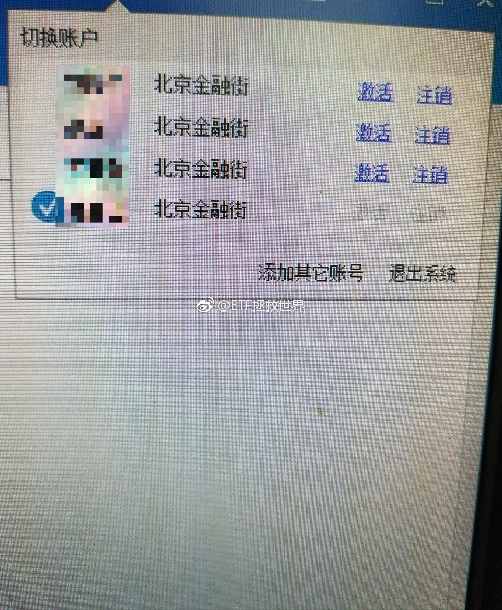

======================================================

ETF拯救世界 (5687069307) @
2017-09-25 11:06:05 Mon  
url: https://weibo.com/5687069307/FnqckDtqb

友情提示，目前逆回购7天收益率最高。可用日5.357，可取日5。

可以放一部分。 ​​​

转发[4]  评论[33]  赞[58] 

======================================================

ETF拯救世界 (5687069307) @
2017-09-25 11:09:02 Mon  
url: https://weibo.com/5687069307/Fnqdx6W7O

回复@幸福猪兜仔:4天跌了15%，是不是给你机会进了。43的话，现在买入有几十个点的收益了。//@幸福猪兜仔:我估计今年的8月30号左右，融创就可以涨到43元以上[允悲][泪][二哈]，然后就可以找益达的指数基金去当接盘侠，老大，你说是不是很开心啦[允悲][泪][二哈]

------------------------------------------------------
转推：
>  @ETF拯救世界 (5687069307)
>  2017-09-18 10:22:48 Mon  
>  url: https:/weibo.com/5687069307/FmlVi7ZuX/

>  持仓品种都没有新高，账户继续每天新高ing。
>  
>  amazing。 ​​​

转发[2]  评论[15]  赞[35] 

======================================================

ETF拯救世界 (5687069307) @
2017-09-25 11:10:15 Mon  
url: https://weibo.com/5687069307/Fnqe1zDhV

回复@天冰冰天:我说的可用日是10月9日，可取日是10月10日，也就是从现在到这两天的年化收益率。这种错误我不会犯的。。//@天冰冰天:七天到下周一，到期时间点节中，整个十一钱躺账户里要错过了吧

------------------------------------------------------
转推：
>  @ETF拯救世界 (5687069307)
>  2017-09-25 11:06:05 Mon  
>  url: https:/weibo.com/5687069307/FnqckDtqb/

>  友情提示，目前逆回购7天收益率最高。可用日5.357，可取日5。
>  
>  可以放一部分。 ​​​

转发[0]  评论[0]  赞[0] 

======================================================

ETF拯救世界 (5687069307) @
2017-09-25 11:23:30 Mon  
url: https://weibo.com/5687069307/Fnqjpag8A

回复@恶人假mm:你如果全中我借钱给你。利润对半分。//@恶人假mm:下了个1000万的单，不会全中吧[允悲]

------------------------------------------------------
转推：
>  @ETF拯救世界 (5687069307)
>  2017-09-25 11:02:43 Mon  
>  url: https:/weibo.com/5687069307/FnqaXuTIN/

>  申购转债的正确姿势 ​​​

转发[1]  评论[27]  赞[43] 

======================================================

ETF拯救世界 (5687069307) @
2017-09-25 11:30:54 Mon  
url: https://weibo.com/5687069307/FnqmpiQUt

回复@神毕希嫣:今天很简单，申购072271。每个人都能申购10万股，不要钱，中了才缴款。风险收益吗，破发的可能性不大，中了的话，赚也就赚个蚊子腿……//@神毕希嫣:e大，科普一下转债玩法啦

------------------------------------------------------
转推：
>  @ETF拯救世界 (5687069307)
>  2017-09-25 11:02:43 Mon  
>  url: https:/weibo.com/5687069307/FnqaXuTIN/

>  申购转债的正确姿势 ​​​

转发[4]  评论[30]  赞[34] 

======================================================

ETF拯救世界 (5687069307) @
2017-09-25 11:33:39 Mon  
url: https://weibo.com/5687069307/Fnqnwuy1S

嗯哼。 ​​​

转发[0]  评论[27]  赞[35] 

+++++++++++++++++++++++++++++++++++++++++++++++++++++

图片：

======================================================

ETF拯救世界 (5687069307) @
2017-09-25 11:40:50 Mon  
url: https://weibo.com/5687069307/FnqqrA0La

讲真，我用过n部智能机里面，mate9真的是很有特点的，有几个点我比较喜欢。一个是续航特别强！我用过最强的。第二是音质很不错。不知道为什么，比s8好，跟苹果不分上下吧。缺点是屏幕不好，总感觉有拖影。第二是工业设计不行，笨，重。我比较看重工业设计。看看mate10会不会好看点。

------------------------------------------------------
转推：
>  @财联社APP (2868676035)
>  2017-09-25 11:35:12 Mon  
>  url: https:/weibo.com/2868676035/Fnqo9u1hA/

>  【华为举行麒麟970国内媒体沟通会 晶体管密度达苹果A11的1.28倍】25日上午，华为在北京举行了麒麟970芯片的媒体沟通会，这是继公司在IFA（2017柏林国际消费类电子展览会）上发布过该芯片后，首次在国内进行该芯片的宣讲。本次沟通会主题为“智汇”，源于“笃学笃行，智汇于芯”，华为表示这体现了海思 ​​​

转发[2]  评论[42]  赞[50] 

======================================================

ETF拯救世界 (5687069307) @
2017-09-25 11:58:07 Mon  
url: https://weibo.com/5687069307/FnqxsgOXZ

关于那个变道的吧，昨天说了两句，还让人给怼了……

怎么讲呢。

前车肯定有责任，这个不用说。咱们开车的，也都很痛恨这种人。问题就在于，从我自己的角度讲，如果是后车，会怎么对待这件事。包括从我亲人和朋友的角度出发。

有人说，大快人心啊，终于有人治这样的路霸了。不这样以后他不知道怎么开 ​​​

转发[12]  评论[74]  赞[126] 

======================================================

ETF拯救世界 (5687069307) @
2017-09-25 13:06:39 Mon  
url: https://weibo.com/5687069307/FnqZgq3Hw

回复@BR芭斯罗缤:枪毙五分钟//@BR芭斯罗缤:回复@happymami:啥后果？[哈哈]//@ETF拯救世界:回复@神毕希嫣:今天很简单，申购072271。每个人都能申购10万股，不要钱，中了才缴款。风险收益吗，破发的可能性不大，中了的话，赚也就赚个蚊子腿……//@神毕希嫣:e大，科普一下转债玩法啦

------------------------------------------------------
转推：
>  @ETF拯救世界 (5687069307)
>  2017-09-25 11:02:43 Mon  
>  url: https:/weibo.com/5687069307/FnqaXuTIN/

>  申购转债的正确姿势 ​​​

转发[1]  评论[11]  赞[32] 

======================================================

ETF拯救世界 (5687069307) @
2017-09-25 13:31:29 Mon  
url: https://weibo.com/5687069307/Fnr9m2zkT

不过说真的，如果拿枪逼着我一定要买股票，选择是：

1、PE个位数的房地产股

2、包含PE60倍阿里巴巴、54倍腾讯、42倍百度、36倍新浪、18倍网易、负数京东的中概互联指数。

我会买后者。

…… ​​​

转发[0]  评论[0]  赞[0] 

======================================================

ETF拯救世界 (5687069307) @
2017-09-25 13:37:09 Mon  
url: https://weibo.com/5687069307/FnrbEqbtx

还是不会买。不用费力气勾引我了。//@ETF拯救世界:没有相对较大的调整，计划不会再加A股了。怎么讲，现在就是鸡肋时间。

------------------------------------------------------
转推：
>  @ETF拯救世界 (5687069307)
>  2017-09-14 14:06:25 Thu  
>  url: https:/weibo.com/5687069307/FlLG4lQqc/

>  呵呵哒，别想骗我今晚买a股。图样了！ ​​​

转发[9]  评论[20]  赞[50] 

======================================================

ETF拯救世界 (5687069307) @
2017-09-25 14:06:00 Mon  
url: https://weibo.com/5687069307/FnrnmrHur

差不多行了，别嘚瑟。慢慢来好吗。

------------------------------------------------------
转推：
>  @ETF拯救世界 (5687069307)
>  2017-09-25 09:45:38 Mon  
>  url: https:/weibo.com/5687069307/FnpFGf7T0/

>  $全指医药 sh000991$   弱周期 ​​​

转发[0]  评论[11]  赞[50] 

======================================================

ETF拯救世界 (5687069307) @
2017-09-25 14:41:30 Mon  
url: https://weibo.com/5687069307/FnrBM3gPM

还……是……不……买……//@ETF拯救世界:还是不会买。不用费力气勾引我了。//@ETF拯救世界:没有相对较大的调整，计划不会再加A股了。怎么讲，现在就是鸡肋时间。

------------------------------------------------------
转推：
>  @ETF拯救世界 (5687069307)
>  2017-09-14 14:06:25 Thu  
>  url: https:/weibo.com/5687069307/FlLG4lQqc/

>  呵呵哒，别想骗我今晚买a股。图样了！ ​​​

转发[0]  评论[21]  赞[46] 

======================================================

ETF拯救世界 (5687069307) @
2017-09-25 14:52:37 Mon  
url: https://weibo.com/5687069307/FnrGhx2nf

29号之前，我少说两句可能比较好。 ​​​

转发[6]  评论[79]  赞[106] 

======================================================

ETF拯救世界 (5687069307) @
2017-09-25 16:41:14 Mon  
url: https://weibo.com/5687069307/FnsonrQh8

美元债买少了？嗷~~一声昏古起了。

------------------------------------------------------
转推：
>  @ ()
>  2017-09-25 16:31:51 Mon  
>  url: 

>  抱歉，此微博已被作者删除。查看帮助：http://t.cn/Rfd3rQV

转发[7]  评论[40]  赞[63] 

======================================================

ETF拯救世界 (5687069307) @
2017-09-25 18:20:25 Mon  
url: https://weibo.com/5687069307/Fnt2DcvaS

回复@宁志忠:不熊咱们怎么买剩下的二十份？//@宁志忠:e大，创业板怎么熊了？//@ETF拯救世界:美元债买少了？嗷~~一声昏古起了。

------------------------------------------------------
转推：
>  @ ()
>  2017-09-25 16:31:51 Mon  
>  url: 

>  抱歉，此微博已被作者删除。查看帮助：http://t.cn/Rfd3rQV

转发[5]  评论[15]  赞[33] 

======================================================

ETF拯救世界 (5687069307) @
2017-09-25 18:31:31 Mon  
url: https://weibo.com/5687069307/Fnt78tyVI

回复@BuBu蛇:极限可以给佢15个巴仙//@BuBu蛇:E大，创业板的顶配会是多少份呢？//@ETF拯救世界:回复@宁志忠:不熊咱们怎么买剩下的二十份？//@宁志忠:e大，创业板怎么熊了？//@ETF拯救世界:美元债买少了？嗷~~一声昏古起了。

------------------------------------------------------
转推：
>  @ ()
>  2017-09-25 16:31:51 Mon  
>  url: 

>  抱歉，此微博已被作者删除。查看帮助：http://t.cn/Rfd3rQV

转发[0]  评论[0]  赞[0] 

======================================================

ETF拯救世界 (5687069307) @
2017-09-25 19:16:44 Mon  
url: https://weibo.com/5687069307/FntpulxsG

非常平稳！

------------------------------------------------------
转推：
>  @ ()
>  2017-09-25 19:11:57 Mon  
>  url: 

>  抱歉，此微博已被作者删除。查看帮助：http://t.cn/Rfd3rQV

转发[0]  评论[19]  赞[42] 

======================================================

ETF拯救世界 (5687069307) @
2017-09-25 20:01:15 Mon  
url: https://weibo.com/5687069307/FntHyyWYE

据说汽油车要被淘汰了 ​​​

转发[4]  评论[57]  赞[72] 

+++++++++++++++++++++++++++++++++++++++++++++++++++++

图片：

======================================================

ETF拯救世界 (5687069307) @
2017-09-25 21:28:49 Mon  
url: https://weibo.com/5687069307/Fnuh6mUWx

[并不简单] ​​​

转发[4]  评论[53]  赞[71] 

+++++++++++++++++++++++++++++++++++++++++++++++++++++

图片：
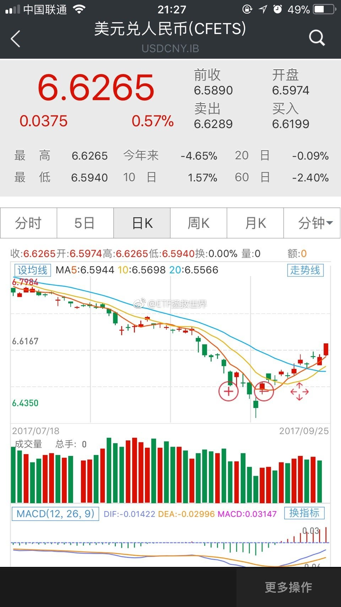

======================================================

ETF拯救世界 (5687069307) @
2017-09-25 22:54:26 Mon  
url: https://weibo.com/5687069307/FnuPR8OAJ

睡觉去了。明早看看跳不跳。 ​​​

转发[1]  评论[23]  赞[59] 

+++++++++++++++++++++++++++++++++++++++++++++++++++++

图片：

======================================================

ETF拯救世界 (5687069307) @
2017-09-26 05:51:45 Tue  
url: https://weibo.com/5687069307/FnxzfdYOM

投资是不是很有意思。

不完全是钱的问题。感受一下。 ​​​

转发[10]  评论[84]  赞[115] 

+++++++++++++++++++++++++++++++++++++++++++++++++++++

图片：

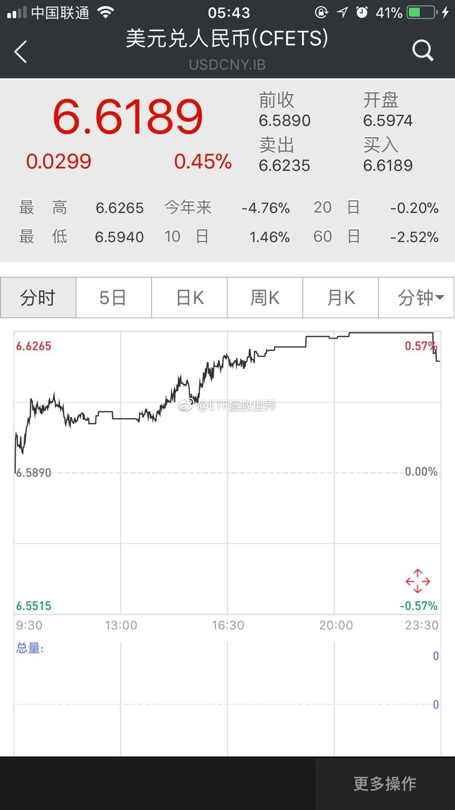

======================================================

ETF拯救世界 (5687069307) @
2017-09-26 08:29:09 Tue  
url: https://weibo.com/5687069307/FnyB8gO9o

很多投资者看不上趋势分析。其实无数次量化分析表明，动量因子是最有效的因子之一。当然，能不能用好动量就看每个人的修为了。//@数据分析研究者:是的，不单单是价格，其实均线无处不在，市净率，市盈率，成交量...都有自己的均线

------------------------------------------------------
转推：
>  @数据分析研究者 (5628021879)
>  2017-09-26 08:02:27 Tue  
>  url: https:/weibo.com/5628021879/FnyqijlHF/

>  昨晚自研看盘系统观察了一下恒大，不少指标较发出了预警提示。比如市净率，日线9/21开始有5日EMA均线兰色入顶提示，周线自上周起连续出现全均线入顶提示，月线是本月开始出现全均线入顶提示。综合看，周线调整可能才开始，月线要结合周线调整力度观察。分析指标应用解释见：http://t.cn/R0JDper
>   ​​ ​​​

转发[14]  评论[27]  赞[49] 

======================================================

ETF拯救世界 (5687069307) @
2017-09-26 08:50:43 Tue  
url: https://weibo.com/5687069307/FnyJSrw5f

回复@wuhaowei12345:你怎么知道我有多少仓位？呵呵。[酷]//@wuhaowei12345:就哪点仓位，晚上11点看看，早上5点看看。兄也真不容易啊

------------------------------------------------------
转推：
>  @ETF拯救世界 (5687069307)
>  2017-09-26 05:51:45 Tue  
>  url: https:/weibo.com/5687069307/FnxzfdYOM/

>  投资是不是很有意思。
>  
>  不完全是钱的问题。感受一下。 ​​​

转发[2]  评论[30]  赞[41] 

======================================================

ETF拯救世界 (5687069307) @
2017-09-26 08:55:53 Tue  
url: https://weibo.com/5687069307/FnyLYsfPS

一个建议啊，对别人的投资体系投资策略一知半解的话还是不要说话了。

一直说，我本人的金融资产有70%放在计划里。之前那个问答也说得很清楚，这70%中的未使用部分会做各种投资，甚至还举了油气网格的例子。

我只会把最最保险的ETF计划拿出来与大家一起投资，其它的，不会说。不是别的原因，是风险大 ​​​

转发[17]  评论[54]  赞[132] 

======================================================

ETF拯救世界 (5687069307) @
2017-09-26 09:00:21 Tue  
url: https://weibo.com/5687069307/FnyNO1jdI

没看过的看吧。免费。

------------------------------------------------------
转推：
>  @ETF拯救世界 (5687069307)
>  2017-03-24 11:09:41 Fri  
>  url: https:/weibo.com/5687069307/EBfCg1fLX/

>  讲真，我自己感觉这回答值1块钱。我回答了 @晴儿小小 的问题，问题价值￥79.00，大家快来花1元围观~ http://t.cn/R6GYZGs ​​​

转发[14]  评论[13]  赞[64] 

======================================================

ETF拯救世界 (5687069307) @
2017-09-26 09:11:02 Tue  
url: https://weibo.com/5687069307/FnyS8yXLh

如果你在厨房里看见一只蟑螂……

------------------------------------------------------
转推：
>  @挖龙脉的超级鹿鼎公 (3962719063)
>  2017-09-26 09:09:50 Tue  
>  url: https:/weibo.com/3962719063/FnyREaXpc/

>  据说某浓眉大眼的房产公司借的钱违约了，没钱还债，不过还好，只是东北的分部，资金量也只有几亿，不过在东北还有极大存货和土地卖不掉 ​​​

转发[10]  评论[34]  赞[46] 

======================================================

ETF拯救世界 (5687069307) @
2017-09-26 09:24:18 Tue  
url: https://weibo.com/5687069307/FnyXwdpos

还有三天而已，为什么要涨。好不容易看中的品种。

[泪] ​​​

转发[4]  评论[45]  赞[56] 

======================================================

ETF拯救世界 (5687069307) @
2017-09-26 10:03:28 Tue  
url: https://weibo.com/5687069307/Fnzdqe8gK

竞猜：几点上班。 ​​​​

标的：金融、两油 ​​​

转发[2]  评论[47]  赞[67] 

======================================================

ETF拯救世界 (5687069307) @
2017-09-26 10:06:46 Tue  
url: https://weibo.com/5687069307/FnzeLhjeJ

回复@ironsoul0:7天又过5.5了。这几天有没有希望中期过6？//@ironsoul0:逆回购上来了

------------------------------------------------------
转推：
>  @ETF拯救世界 (5687069307)
>  2017-09-26 09:24:18 Tue  
>  url: https:/weibo.com/5687069307/FnyXwdpos/

>  还有三天而已，为什么要涨。好不容易看中的品种。
>  
>  [泪] ​​​

转发[2]  评论[11]  赞[33] 

======================================================

ETF拯救世界 (5687069307) @
2017-09-26 10:08:53 Tue  
url: https://weibo.com/5687069307/FnzfCacGY

回复@这个月亮有什么好:我说的永远是可用日年化收益。不是“7天”，而是到资金可用日。//@这个月亮有什么好:好像算一下 七天期占用资金13天  ，不如货币基金赚得多//@ETF拯救世界:回复@ironsoul0:7天又过5.5了。这几天有没有希望中期过6？//@ironsoul0:逆回购上来了

------------------------------------------------------
转推：
>  @ETF拯救世界 (5687069307)
>  2017-09-26 09:24:18 Tue  
>  url: https:/weibo.com/5687069307/FnyXwdpos/

>  还有三天而已，为什么要涨。好不容易看中的品种。
>  
>  [泪] ​​​

转发[1]  评论[5]  赞[36] 

======================================================

ETF拯救世界 (5687069307) @
2017-09-26 10:11:58 Tue  
url: https://weibo.com/5687069307/FnzgRfuph

目前GC004和GC007 到10.9年化收益都过5.6%了。需要的可以放一部分。再留一部分看明后天有没有大肉。 ​​​

转发[7]  评论[19]  赞[52] 

======================================================

ETF拯救世界 (5687069307) @
2017-09-26 10:13:29 Tue  
url: https://weibo.com/5687069307/FnzhugEY1

到10.9可用都过6%。到10-10可取是5.6%。

------------------------------------------------------
转推：
>  @ETF拯救世界 (5687069307)
>  2017-09-26 10:11:58 Tue  
>  url: https:/weibo.com/5687069307/FnzgRfuph/

>  目前GC004和GC007 到10.9年化收益都过5.6%了。需要的可以放一部分。再留一部分看明后天有没有大肉。 ​​​

转发[3]  评论[20]  赞[59] 

======================================================

ETF拯救世界 (5687069307) @
2017-09-26 12:04:31 Tue  
url: https://weibo.com/5687069307/FnA0y919u

早上上班的路上，我还美滋滋的想着月底开车的品种，计划着买多少，风险平价，资产配置……

几个小时过去，什么玩意啊！人类最大的问题就是想太多了吧！ ​​​

转发[6]  评论[43]  赞[102] 

======================================================

ETF拯救世界 (5687069307) @
2017-09-26 12:08:19 Tue  
url: https://weibo.com/5687069307/FnA26fbHE

回复@-反清复明-:图片评论 http://t.cn/R067bTW //@-反清复明-:E大以前是不能奶，以后想也不行了

------------------------------------------------------
转推：
>  @ETF拯救世界 (5687069307)
>  2017-09-26 12:04:31 Tue  
>  url: https:/weibo.com/5687069307/FnA0y919u/

>  早上上班的路上，我还美滋滋的想着月底开车的品种，计划着买多少，风险平价，资产配置……
>  
>  几个小时过去，什么玩意啊！人类最大的问题就是想太多了吧！ ​​​

转发[3]  评论[27]  赞[55] 

======================================================

ETF拯救世界 (5687069307) @
2017-09-26 13:46:53 Tue  
url: https://weibo.com/5687069307/FnAG5CQzW

回复@圣善周闻宗:上周重要股东净减持17亿，正常。政策卡的死，又是敏感期。//@圣善周闻宗:有个问题，E大能否解答一下，最近股市行情这么好，大小非减持情况如何了呢？//@ETF拯救世界:回复@-反清复明-:图片评论 http://t.cn/R067bTW //@-反清复明-:E大以前是不能奶，以后想也不行了

------------------------------------------------------
转推：
>  @ETF拯救世界 (5687069307)
>  2017-09-26 12:04:31 Tue  
>  url: https:/weibo.com/5687069307/FnA0y919u/

>  早上上班的路上，我还美滋滋的想着月底开车的品种，计划着买多少，风险平价，资产配置……
>  
>  几个小时过去，什么玩意啊！人类最大的问题就是想太多了吧！ ​​​

转发[1]  评论[5]  赞[35] 

======================================================

ETF拯救世界 (5687069307) @
2017-09-26 13:48:52 Tue  
url: https://weibo.com/5687069307/FnAGUbBwV

我真的笑出来了啊。港真，有点把持不住了呢。//@ETF拯救世界:还是不会买。不用费力气勾引我了。//@ETF拯救世界:没有相对较大的调整，计划不会再加A股了。怎么讲，现在就是鸡肋时间。

------------------------------------------------------
转推：
>  @ETF拯救世界 (5687069307)
>  2017-09-14 14:06:25 Thu  
>  url: https:/weibo.com/5687069307/FlLG4lQqc/

>  呵呵哒，别想骗我今晚买a股。图样了！ ​​​

转发[5]  评论[14]  赞[43] 

======================================================

ETF拯救世界 (5687069307) @
2017-09-26 13:53:54 Tue  
url: https://weibo.com/5687069307/FnAIWDhXl

回复@litterwitch:7以上全部放掉。有再高也不要了。都是命。//@litterwitch:7天逆回购飙升啊//@ETF拯救世界:我真的笑出来了啊。港真，有点把持不住了呢。//@ETF拯救世界:还是不会买。不用费力气勾引我了。

------------------------------------------------------
转推：
>  @ETF拯救世界 (5687069307)
>  2017-09-14 14:06:25 Thu  
>  url: https:/weibo.com/5687069307/FlLG4lQqc/

>  呵呵哒，别想骗我今晚买a股。图样了！ ​​​

转发[3]  评论[18]  赞[35] 

======================================================

ETF拯救世界 (5687069307) @
2017-09-26 14:03:18 Tue  
url: https://weibo.com/5687069307/FnAMLm1FL

回复@i云腾致雨:有花堪折直须折，莫待无花空折枝//@i云腾致雨:不是越高越好吗？//@ETF拯救世界:回复@litterwitch:7以上全部放掉。有再高也不要了。都是命。//@litterwitch:7天逆回购飙升啊//@ETF拯救世界:我真的笑出来了啊。港真，有点把持不住了呢。

------------------------------------------------------
转推：
>  @ETF拯救世界 (5687069307)
>  2017-09-14 14:06:25 Thu  
>  url: https:/weibo.com/5687069307/FlLG4lQqc/

>  呵呵哒，别想骗我今晚买a股。图样了！ ​​​

转发[1]  评论[19]  赞[55] 

======================================================

ETF拯救世界 (5687069307) @
2017-09-26 15:42:49 Tue  
url: https://weibo.com/5687069307/FnBr9C740

回复@小韭菜V:也没有完全达到预期，因为买的还不够多。//@小韭菜V:回复@ETF拯救世界:回头一看，E大又说对了。

------------------------------------------------------
转推：
>  @ETF拯救世界 (5687069307)
>  2017-09-11 14:21:18 Mon  
>  url: https:/weibo.com/5687069307/FljuCwjJv/

>  $中证500 sz399905$   一轮下探后，又回到了前期高点。手里的筹码比4月多了三份。所以，中证500的市值又新高了。
>  
>  怕什么坐电梯？不要怕。涨了好，跌了更好，可以让你多买，然后再次回来的时候，你又新高了。
>  
>  一个品种是这样，整个账户也是这样。多少年后，指数就算一点都没涨，你的账户也是永远上行 ​​​

转发[7]  评论[46]  赞[54] 

======================================================

ETF拯救世界 (5687069307) @
2017-09-27 10:50:49 Wed  
url: https://weibo.com/5687069307/FnIX8bT8R

回复@恶人假mm:[doge]//@恶人假mm:今天8.2卖了点[笑而不语]//@ETF拯救世界:回复@litterwitch:7以上全部放掉。有再高也不要了。都是命。//@litterwitch:7天逆回购飙升啊//@ETF拯救世界:我真的笑出来了啊。港真，有点把持不住了呢。//@ETF拯救世界:还是不会买。不用费力气勾引我了。

------------------------------------------------------
转推：
>  @ETF拯救世界 (5687069307)
>  2017-09-14 14:06:25 Thu  
>  url: https:/weibo.com/5687069307/FlLG4lQqc/

>  呵呵哒，别想骗我今晚买a股。图样了！ ​​​

转发[0]  评论[41]  赞[37] 

======================================================

ETF拯救世界 (5687069307) @
2017-09-27 11:16:50 Wed  
url: https://weibo.com/5687069307/FnJ7HjBL8

回复@且慢管家:但是如果想自己单买计划里已经有的，在且慢里可以自己加车。//@且慢管家:回复@桃枝么么:您好 暂时不能购买单支基金 只能买基金组合//@ETF拯救世界:回复@小韭菜V:也没有完全达到预期，因为买的还不够多。//@小韭菜V:回复@ETF拯救世界:回头一看，E大又说对了。

------------------------------------------------------
转推：
>  @ETF拯救世界 (5687069307)
>  2017-09-11 14:21:18 Mon  
>  url: https:/weibo.com/5687069307/FljuCwjJv/

>  $中证500 sz399905$   一轮下探后，又回到了前期高点。手里的筹码比4月多了三份。所以，中证500的市值又新高了。
>  
>  怕什么坐电梯？不要怕。涨了好，跌了更好，可以让你多买，然后再次回来的时候，你又新高了。
>  
>  一个品种是这样，整个账户也是这样。多少年后，指数就算一点都没涨，你的账户也是永远上行 ​​​

转发[1]  评论[17]  赞[38] 

======================================================

ETF拯救世界 (5687069307) @
2017-09-27 12:06:44 Wed  
url: https://weibo.com/5687069307/FnJrXcTmW

蛮荒故事现实版。再想想前几天的视频。

------------------------------------------------------
转推：
>  @新京报我们视频 (6124642021)
>  2017-09-26 21:53:03 Tue  
>  url: https:/weibo.com/6124642021/FnDRr5ODS/

>  【两车发生剐蹭 男子发狂驾车冲撞乘车者致1儿童身亡】9月24日，郑州一男子驾车撞人，连续7次加速撞击，致1儿童死亡。据死者舅舅告诉记者，事发因两车剐蹭引发纠纷所致。监控视频记录下全过程：http://t.cn/R0allg6 @新京报 ​​​

转发[3]  评论[42]  赞[41] 

======================================================

ETF拯救世界 (5687069307) @
2017-09-28 08:06:22 Thu  
url: https://weibo.com/5687069307/FnRiS4MOC

这样不好。爬得越快，摔得更惨。

一步三回头，进二退一才是我的最爱。 ​​​

转发[2]  评论[59]  赞[86] 

+++++++++++++++++++++++++++++++++++++++++++++++++++++

图片：

======================================================

ETF拯救世界 (5687069307) @
2017-09-28 09:34:38 Thu  
url: https://weibo.com/5687069307/FnRSHD2YZ

今晚开新车。 ​​​

转发[4]  评论[181]  赞[218] 

+++++++++++++++++++++++++++++++++++++++++++++++++++++

图片：

======================================================

ETF拯救世界 (5687069307) @
2017-09-28 10:49:57 Thu  
url: https://weibo.com/5687069307/FnSngy8Uo

谁还记得 $国证食品 sz399396$   [doge] ​​​

转发[1]  评论[99]  赞[82] 

======================================================

ETF拯救世界 (5687069307) @
2017-09-28 11:41:35 Thu  
url: https://weibo.com/5687069307/FnSIe9kb4

开个车，出门。高高兴兴。谁知道一家孩子没了，一家故意杀人被抓了。蛮荒故事。是不是很荒唐？一点都不荒唐，每天这样的事情都在上演。各位，出门在外，注意安全。

------------------------------------------------------
转推：
>  @平安郑州 (2055648745)
>  2017-09-28 10:00:06 Thu  
>  url: https:/weibo.com/2055648745/FnS3374Wt/

>  #警情通报#[话筒]我市郑东新区普惠路与福禄街交叉口发生一起刑事案件，犯罪嫌疑人徐某因涉嫌故意杀人已被警方刑拘。 ​​​

转发[11]  评论[32]  赞[68] 

======================================================

ETF拯救世界 (5687069307) @
2017-09-28 13:34:48 Thu  
url: https://weibo.com/5687069307/FnTsbhoWF

回复@漓江大雨:我认为能。性格当然有天生的成分，但而更多的可以通过一些方式来改变。比如读书，比如多一些阅历。明白一些道理，看过一些是非，多一份顾虑，很多时候脾气就好了。所以很多人年轻的时候脾气暴躁到了中年以后就会好很多。

------------------------------------------------------
转推：
>  @平安郑州 (2055648745)
>  2017-09-28 10:00:06 Thu  
>  url: https:/weibo.com/2055648745/FnS3374Wt/

>  #警情通报#[话筒]我市郑东新区普惠路与福禄街交叉口发生一起刑事案件，犯罪嫌疑人徐某因涉嫌故意杀人已被警方刑拘。 ​​​

转发[4]  评论[17]  赞[62] 

======================================================

ETF拯救世界 (5687069307) @
2017-09-28 14:40:20 Thu  
url: https://weibo.com/5687069307/FnTSN5wIr

这个广告里的某家公司2007年发行的基金，目前净值0.75。十年过去了，赔了25%。穷人辛辛苦苦攒点钱，就忽悠进来然后这么糟蹋，这，合适吗。

------------------------------------------------------
转推：
>  @ ()
>  2017-09-28 12:06:58 Thu  
>  url: 

>  抱歉，作者已设置仅展示半年内微博，此微博已不可见。 ​​​

转发[39]  评论[51]  赞[64] 

======================================================

ETF拯救世界 (5687069307) @
2017-09-28 14:55:37 Thu  
url: https://weibo.com/5687069307/FnTYZslW0

回复@打猎为生的少爷:回购10%。我哭了！//@打猎为生的少爷:回购是疯了吗？//@ETF拯救世界:这个广告里的某家公司2007年发行的基金，目前净值0.75。十年过去了，赔了25%。穷人辛辛苦苦攒点钱，就忽悠进来然后这么糟蹋，这，合适吗。

------------------------------------------------------
转推：
>  @ ()
>  2017-09-28 12:06:58 Thu  
>  url: 

>  抱歉，作者已设置仅展示半年内微博，此微博已不可见。 ​​​

转发[2]  评论[39]  赞[31] 

======================================================

ETF拯救世界 (5687069307) @
2017-09-28 15:21:04 Thu  
url: https://weibo.com/5687069307/FnU9kpcEl

回复@滚滚磨刀门:拉黑你 [并不简单]//@滚滚磨刀门:我买到了11％的，顶我上去，让我在E大面前嘚瑟一下！！！[笑而不语][笑而不语][笑而不语]//@ETF拯救世界:回复@打猎为生的少爷:回购10%。我哭了！//@打猎为生的少爷:回购是疯了吗？

------------------------------------------------------
转推：
>  @ ()
>  2017-09-28 12:06:58 Thu  
>  url: 

>  抱歉，作者已设置仅展示半年内微博，此微博已不可见。 ​​​

转发[1]  评论[21]  赞[35] 

======================================================

ETF拯救世界 (5687069307) @
2017-09-28 15:51:29 Thu  
url: https://weibo.com/5687069307/FnUlFqrnj

这是我第一条被删的微博。诡异的是，是5月份发的。什么内容我都忘了，看提示应该是关于涨跌家数的数据分析。

这是有人举报了还是什么情况？数据分析也要删？以后可以发什么。

其实发不发微博我根本无所谓。就是想知道边界，别因为发微博闹出什么乱子就不好了。 ​​​

转发[2]  评论[87]  赞[66] 

+++++++++++++++++++++++++++++++++++++++++++++++++++++

图片：

======================================================

ETF拯救世界 (5687069307) @
2017-09-28 19:47:36 Thu  
url: https://weibo.com/5687069307/FnVTv9blA

是不是搞事情 ​​​

转发[3]  评论[88]  赞[95] 

+++++++++++++++++++++++++++++++++++++++++++++++++++++

图片：
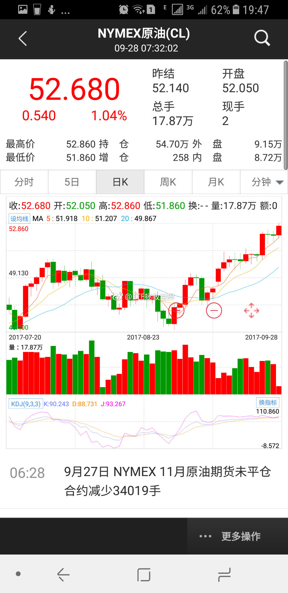

======================================================

ETF拯救世界 (5687069307) @
2017-09-28 21:59:13 Thu  
url: https://weibo.com/5687069307/FnWKVEkC0

醉了。公众号只能显示100条留言，结果有500多条在后台。  微博随便评论全都能显示，结果只有几十条评论……  微博药丸。  （这条是不是又要被删了） ​​​

转发[1]  评论[105]  赞[133] 

======================================================

ETF拯救世界 (5687069307) @
2017-09-28 22:28:17 Thu  
url: https://weibo.com/5687069307/FnWWJBhAq

不错，可惜没有美利坚合众国、霓虹、大不列颠及北爱尔兰联合王国、大德意志啊。可以说并不全面。[并不简单]

------------------------------------------------------
转推：
>  @且慢管家 (6186312580)
>  2017-09-28 21:16:36 Thu  
>  url: https:/weibo.com/6186312580/FnWtDhxke/

>  #投资#您的家乡有没有被ETF计划点亮呢？@ETF拯救世界 http://t.cn/R0WyOu2 ​​​

转发[23]  评论[132]  赞[169] 

======================================================

ETF拯救世界 (5687069307) @
2017-09-29 10:22:13 Fri  
url: https://weibo.com/5687069307/Fo1Cw8blI

$全指医药 sh000991$  我是真希望它多震荡几年。 ​​​

转发[0]  评论[117]  赞[117] 

======================================================

ETF拯救世界 (5687069307) @
2017-09-29 21:27:54 Fri  
url: https://weibo.com/5687069307/Fo5YIqWRI

每日打卡（84） 

基本痊愈了。今天开始继续每天打卡。 ​​​

转发[2]  评论[60]  赞[139] 

+++++++++++++++++++++++++++++++++++++++++++++++++++++

图片：

======================================================

ETF拯救世界 (5687069307) @
2017-09-30 09:03:31 Sat  
url: https://weibo.com/5687069307/Foax4fQej

回复@董无为G:第一个呢，不少人的粉丝数其实很有问题。看评论数量就知道。第二个呢，最近这两年计划确实是稳步增长，慢慢的不停新高。但这并不是ETF计划的常态。某个时间段，疯起来连我都怕啊。现在还是播种阶段。到了夏天狂热，秋天收获的时候再看吧~

------------------------------------------------------
转推：
>  @ETF拯救世界 (5687069307)
>  2017-09-29 21:27:54 Fri  
>  url: https:/weibo.com/5687069307/Fo5YIqWRI/

>  每日打卡（84） 
>  
>  基本痊愈了。今天开始继续每天打卡。 ​​​

转发[1]  评论[68]  赞[132] 

======================================================

ETF拯救世界 (5687069307) @
2017-09-30 22:12:30 Sat  
url: https://weibo.com/5687069307/FofHjwBdi

每日打卡（85）

坚持。 ​​​

转发[2]  评论[57]  赞[129] 

+++++++++++++++++++++++++++++++++++++++++++++++++++++

图片：
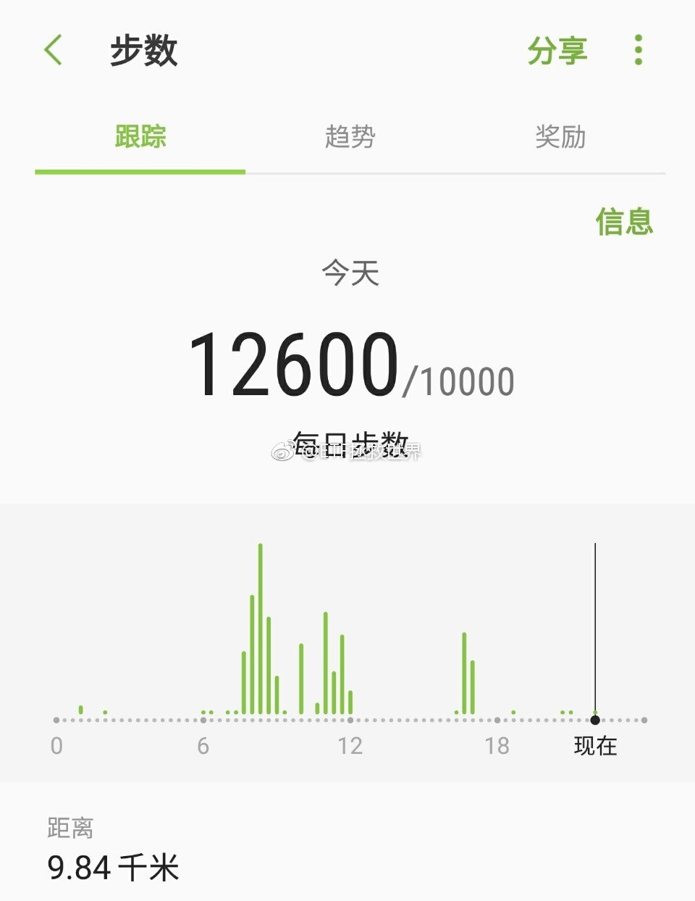
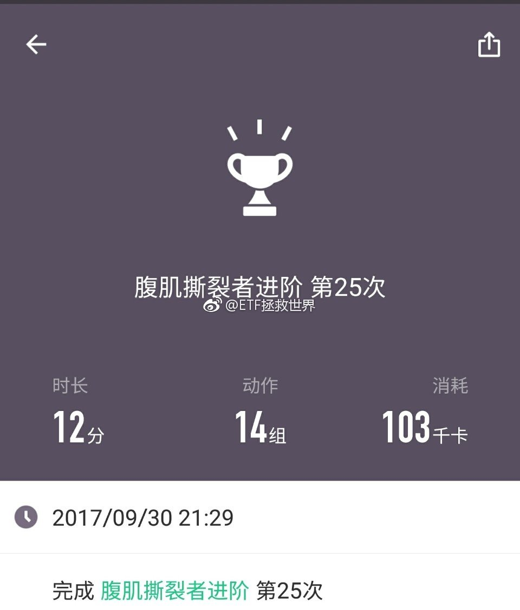

======================================================

