ETF拯救世界 (5687069307) @
2017-10-01 22:09:07 Sun  
url: https://weibo.com/5687069307/Fop6rj4y1

每日打卡（86）

各位双节快乐！长假都打算怎么过？ ​​​

转发[2]  评论[114]  赞[120] 

+++++++++++++++++++++++++++++++++++++++++++++++++++++

图片：

======================================================

ETF拯救世界 (5687069307) @
2017-10-03 23:02:45 Tue  
url: https://weibo.com/5687069307/FoIjcvygh

每日打卡（87）

昨天出去浪，没有打卡…… ​​​

转发[0]  评论[44]  赞[90] 

+++++++++++++++++++++++++++++++++++++++++++++++++++++

图片：
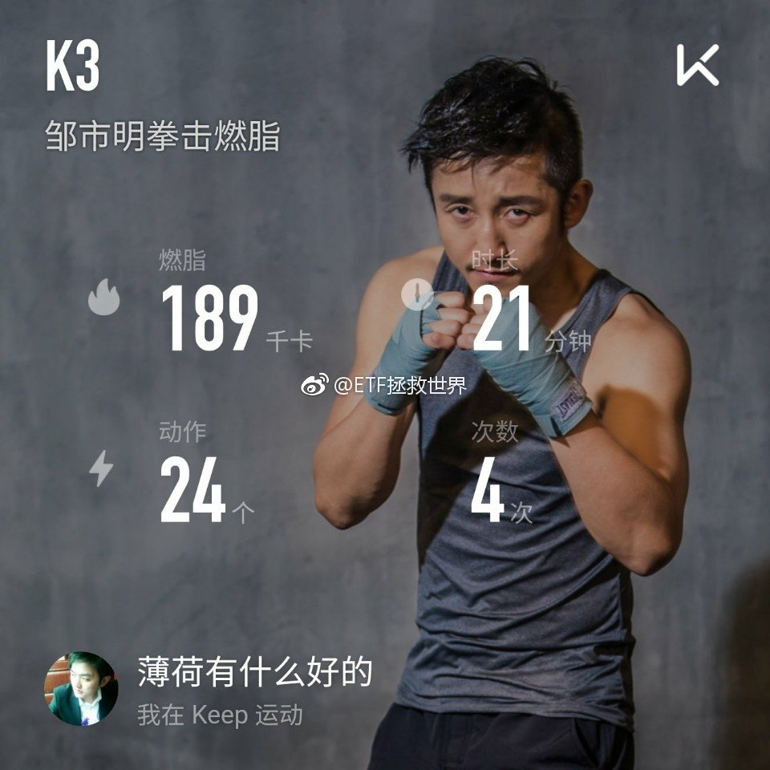

======================================================

ETF拯救世界 (5687069307) @
2017-10-04 20:56:12 Wed  
url: https://weibo.com/5687069307/FoQUkA077

每日打卡（88）

各位中秋快乐！给逮嘎拜个晚年！祝逮嘎年年有今日，岁岁有今朝！

今天大家是在外面浪还是在家里浪？哪里浪都好，开心最重要……

没法一一回复各位，心意都感受到了……

除了每天一万步，要不要加个每天n分钟平板支撑？不过不想给自己太大压力…… ​​​

转发[0]  评论[84]  赞[139] 

+++++++++++++++++++++++++++++++++++++++++++++++++++++

图片：

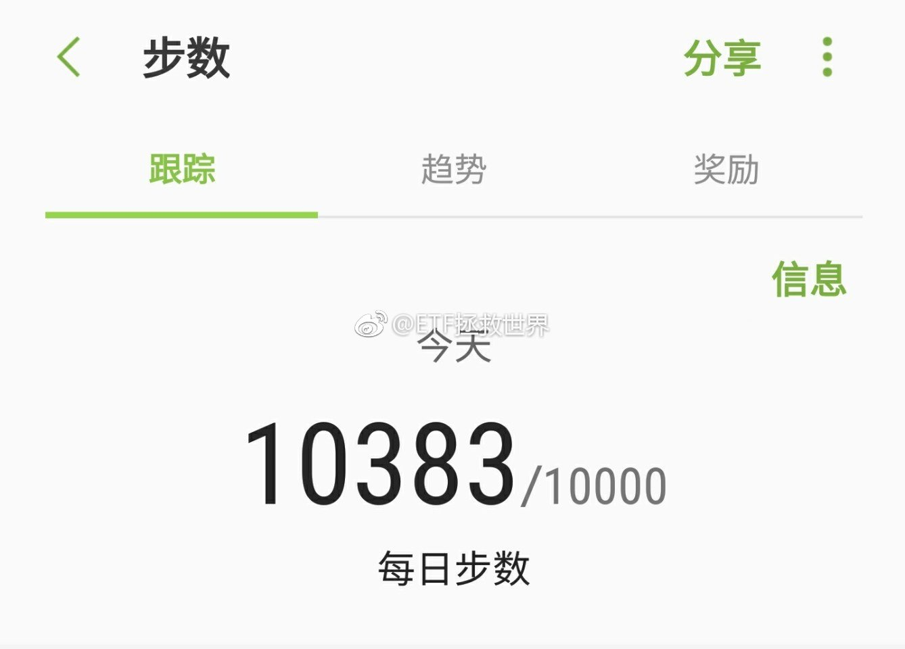

======================================================

ETF拯救世界 (5687069307) @
2017-10-04 21:52:16 Wed  
url: https://weibo.com/5687069307/FoRh67s9J

为什么这样的人可以上路，为什么？！

------------------------------------------------------
转推：
>  @新浪视频 (1640601392)
>  2017-10-04 10:10:16 Wed  
>  url: https:/weibo.com/1640601392/FoMG9fJnP/

>  【高速路逆行引四车连环撞 女司机哀叹要赔三辆车】3日，沪渝高速荆州段，一名女子驾车在高速路上调头逆行，导致四车连环相撞。行车记录仪显示，女驾驶员一直在说逆行是不对的，但为图一时方便还是冒险操作，事发后女子惊呼“完了，完了 ，我要赔三辆车”。http://t.cn/R0kipQM ​​​

转发[7]  评论[53]  赞[35] 

======================================================

ETF拯救世界 (5687069307) @
2017-10-05 21:02:46 Thu  
url: https://weibo.com/5687069307/Fp0nuxEnq

每日打卡（89）

多做两组。开始玩平板。

今天在看《银河基地》，还是没有《三体》震撼呐。 ​​​

转发[1]  评论[34]  赞[93] 

+++++++++++++++++++++++++++++++++++++++++++++++++++++

图片：

======================================================

ETF拯救世界 (5687069307) @
2017-10-06 20:03:23 Fri  
url: https://weibo.com/5687069307/Fp9pT6JXs

每日打卡（90）

说话假期就快过完了。今天又出去浪了，然后去剪头发。有没有跟我一样很讨厌剪头发的，抱紧我……

昨天有朋友评论，平板支撑做不过谁，就不做了。这很有意思。

其实呢，咱们这种群众体育运动，目的是什么呢。跟谁竞赛吗。我觉得，肯定不是啊。很简单，就是为了强身健体，每天都比昨天 ​​​

转发[7]  评论[90]  赞[183] 

+++++++++++++++++++++++++++++++++++++++++++++++++++++

图片：

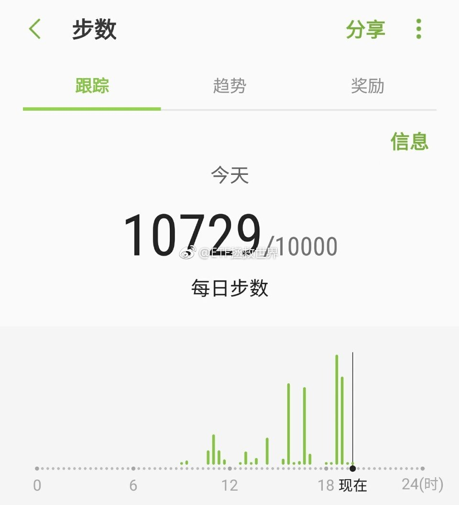

======================================================

ETF拯救世界 (5687069307) @
2017-10-09 09:43:05 Mon  
url: https://weibo.com/5687069307/FpxDB6lJ7

不用着急“逃顶”。也不用忙着“补仓”。

仓位舒舒服服的享受资产不断新高是坠吼的。

看着买卖双方擦肩而过互骂“sb”，是一种乐趣。 ​​​

转发[11]  评论[46]  赞[142] 

======================================================

ETF拯救世界 (5687069307) @
2017-10-09 10:01:34 Mon  
url: https://weibo.com/5687069307/FpxL6g2eH

谁能想到 ​​​

转发[8]  评论[40]  赞[70] 

+++++++++++++++++++++++++++++++++++++++++++++++++++++

图片：

======================================================

ETF拯救世界 (5687069307) @
2017-10-09 10:05:31 Mon  
url: https://weibo.com/5687069307/FpxMHvu2L

别说那么多买点先 ​​​

转发[4]  评论[48]  赞[80] 

+++++++++++++++++++++++++++++++++++++++++++++++++++++

图片：

======================================================

ETF拯救世界 (5687069307) @
2017-10-09 10:11:53 Mon  
url: https://weibo.com/5687069307/FpxPhkpMX

$全指医药 sh000991$ 是不是良心发现了。 ​​​

转发[6]  评论[39]  赞[93] 

======================================================

ETF拯救世界 (5687069307) @
2017-10-09 14:26:53 Mon  
url: https://weibo.com/5687069307/FpzuNd6J6

大家好，给大家介绍一下，这是我们的大庄家 ​​​

转发[0]  评论[39]  赞[102] 

======================================================

ETF拯救世界 (5687069307) @
2017-10-09 14:41:53 Mon  
url: https://weibo.com/5687069307/FpzAT6YQE

不要脸，又涨这么多，继续买！

------------------------------------------------------
转推：
>  @ETF拯救世界 (5687069307)
>  2017-10-09 10:05:31 Mon  
>  url: https:/weibo.com/5687069307/FpxMHvu2L/

>  别说那么多买点先 ​​​

转发[2]  评论[46]  赞[65] 

======================================================

ETF拯救世界 (5687069307) @
2017-10-09 21:56:24 Mon  
url: https://weibo.com/5687069307/FpCrfti1l

每日打卡（91）

每天资产不断新高，锻炼的数据也持续增长。

每天都比昨天好。只有一个没办法：

又老了一天。[拜拜] ​​​

转发[0]  评论[33]  赞[113] 

+++++++++++++++++++++++++++++++++++++++++++++++++++++

图片：

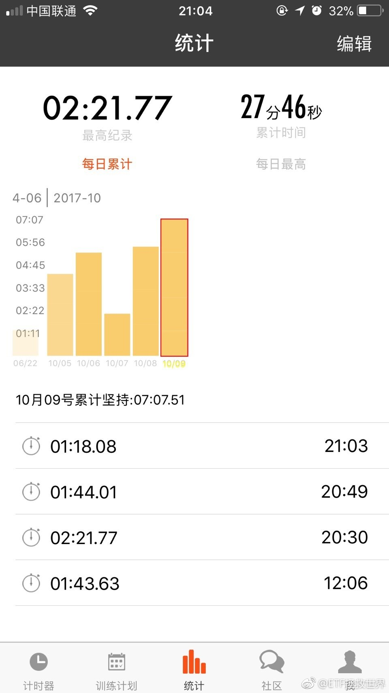

======================================================

ETF拯救世界 (5687069307) @
2017-10-10 08:54:49 Tue  
url: https://weibo.com/5687069307/FpGKvbsyG

行为经济学，行为金融学，我跟你讲，非常有搞头。尤其是对我们这些投资指数的人来说。

------------------------------------------------------
转推：
>  @网易财经 (1974561081)
>  2017-10-09 18:56:03 Mon  
>  url: https:/weibo.com/1974561081/FpBg34ULn/

>  #网易新闻# 【揭秘2017诺奖得主理查德·塞勒对行为经济学的贡献】塞勒于1974年在罗彻斯特大学获得经济学博士学位，他将自己第一个研究方向确定为行为经济学，并对人类生活的货币价值做出理论研究。也是从那时开始，塞勒养成了收集经济学中反常现象的习惯，而这些有趣反常行为来源正是其同事或亲朋好友。 ​​​

转发[17]  评论[44]  赞[83] 

======================================================

ETF拯救世界 (5687069307) @
2017-10-10 09:33:55 Tue  
url: https://weibo.com/5687069307/FpH0ncPbb

$全指医药 sh000991$   二话不说奶一口先 ​​​

转发[2]  评论[17]  赞[55] 

======================================================

ETF拯救世界 (5687069307) @
2017-10-10 09:36:56 Tue  
url: https://weibo.com/5687069307/FpH1AuQyt

$全指医药 sh000991$讲真，你不涨点，我都替你不好意思了…… ​​​

转发[2]  评论[18]  赞[57] 

+++++++++++++++++++++++++++++++++++++++++++++++++++++

图片：
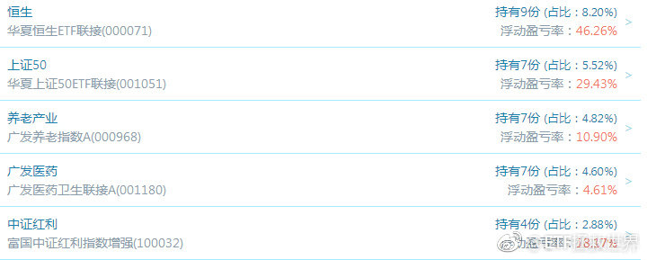

======================================================

ETF拯救世界 (5687069307) @
2017-10-10 09:46:16 Tue  
url: https://weibo.com/5687069307/FpH5o3kXm

对了，还有$养老产业 sz399812$  。哥俩其实是表兄弟。计划里面，加起来快10%仓位了。

------------------------------------------------------
转推：
>  @ETF拯救世界 (5687069307)
>  2017-10-10 09:36:56 Tue  
>  url: https:/weibo.com/5687069307/FpH1AuQyt/

>  $全指医药 sh000991$讲真，你不涨点，我都替你不好意思了…… ​​​

转发[0]  评论[13]  赞[49] 

======================================================

ETF拯救世界 (5687069307) @
2017-10-10 09:51:45 Tue  
url: https://weibo.com/5687069307/FpH7BpJQF

各位，我想大家已经无数次见证一个事实，那就是不停的买入“差”的品种，会有好结果。

终有一天，差的会被追捧。雪中送炭是个特别好的事情。原因在于，你只要付出很少，就能拿到很多。当筹码被开始争抢，你的财富就会每天新高，不断增长。

做个好人。 ​​​

转发[27]  评论[58]  赞[137] 

======================================================

ETF拯救世界 (5687069307) @
2017-10-10 09:55:28 Tue  
url: https://weibo.com/5687069307/FpH97rDdc

什么情况，毒奶过期了？再奶一口。

------------------------------------------------------
转推：
>  @ETF拯救世界 (5687069307)
>  2017-10-10 09:33:55 Tue  
>  url: https:/weibo.com/5687069307/FpH0ncPbb/

>  $全指医药 sh000991$   二话不说奶一口先 ​​​

转发[0]  评论[19]  赞[56] 

======================================================

ETF拯救世界 (5687069307) @
2017-10-10 10:00:45 Tue  
url: https://weibo.com/5687069307/FpHbgpZSx

$中证医疗 sz399989$  这个弹性更大，相对估值低。只是绝对估值太高了，实在没法下手。希望未来有机会买一些。 ​​​

转发[5]  评论[25]  赞[68] 

======================================================

ETF拯救世界 (5687069307) @
2017-10-10 10:04:57 Tue  
url: https://weibo.com/5687069307/FpHcYaDdX

$广发医药 溢价了。胆大的可以套利。 ​​​

转发[1]  评论[55]  赞[85] 

======================================================

ETF拯救世界 (5687069307) @
2017-10-10 11:07:03 Tue  
url: https://weibo.com/5687069307/FpHCb2PYc

10月到北京来看认真的雪

------------------------------------------------------
转推：
>  @ ()
>  2017-10-10 10:25:03 Tue  
>  url: 

>  抱歉，作者已设置仅展示半年内微博，此微博已不可见。 ​​​

转发[2]  评论[27]  赞[44] 

======================================================

ETF拯救世界 (5687069307) @
2017-10-10 11:26:40 Tue  
url: https://weibo.com/5687069307/FpHK8xhig

今天开始披露三季报。绝大多数公司都是15号之后披露，15号之前只有23家公司。

所以月中应该没什么特别的机会，本月底就非常有意思了。 ​​​

转发[8]  评论[31]  赞[100] 

======================================================

ETF拯救世界 (5687069307) @
2017-10-10 11:33:32 Tue  
url: https://weibo.com/5687069307/FpHMVmbd6

研究群众，理解群众的行为轨迹。在疯狂的时候与群众一起狂欢，在群众意识到危险之前抽身离去。在群众心灰意冷的时候，回到群众中，隐姓埋名。从群众中来，到群众中去。

------------------------------------------------------
转推：
>  @数据分析研究者 (5628021879)
>  2017-10-10 11:28:31 Tue  
>  url: https:/weibo.com/5628021879/FpHKT9QB4/

>  “群众从未渴求过真理，他们对不合口味的证据视而不见。假如谬误对他们有诱惑力，他们更愿意崇拜谬误。谁向他们提供幻觉，谁就可以轻易地成为他们的主人；谁摧毁他们的幻觉，谁就会成为他们的牺牲品。” ——《乌合之众》 ​​​​

转发[69]  评论[52]  赞[147] 

======================================================

ETF拯救世界 (5687069307) @
2017-10-10 12:09:29 Tue  
url: https://weibo.com/5687069307/FpI1wbq8L

去库存，群众加杠杆——房子换到群众手中——锁定二手房买卖——推出长效机制。 ​​​

转发[28]  评论[81]  赞[129] 

======================================================

ETF拯救世界 (5687069307) @
2017-10-10 13:24:39 Tue  
url: https://weibo.com/5687069307/FpIw1A8L5

自信、模糊规避、心理账户、认知误差、记忆误差、锚定、羊群旅鼠。

认识行为金融，规避错误，利用错误。 ​​​

转发[12]  评论[24]  赞[106] 

======================================================

ETF拯救世界 (5687069307) @
2017-10-10 13:48:12 Tue  
url: https://weibo.com/5687069307/FpIFAnsCK

$中证医疗 sz399989$   跌了半年，一天就涨回来了。这就是证券投资。

证券投资所积累的财富，是跳跃式的。不要因为某段时间，可能是几个月，可能是几年，成绩不好，就放弃。“要知道几年没赚钱还不如存银行”，这种想法肥肠不正确。

三年不开张，开张吃三年。

这些话不是扯淡，不是鸡汤，以后你就知 ​​​

转发[47]  评论[65]  赞[148] 

======================================================

ETF拯救世界 (5687069307) @
2017-10-10 14:27:44 Tue  
url: https://weibo.com/5687069307/FpIVDhu3B

实不相瞒，又新高了。[并不简单]

计划买入部分年化快突破20%了。 ​​​

转发[3]  评论[61]  赞[144] 

======================================================

ETF拯救世界 (5687069307) @
2017-10-10 14:39:44 Tue  
url: https://weibo.com/5687069307/FpJ0vidDn

不要管什么“非理性”，不要管什么“不合理”。死死拿住你的低价筹码，不要卖出。医药刚动一动，才涨了多少？

电梯，过山车？无所谓。不要卖，让利润奔跑，享受利润，就这么简单。真的跌了，继续买，下次涨回来就赚更多。

不要妄想你有能力做差价。

不要预测明天的价格，你的成本很低，记住这个。 ​​​

转发[53]  评论[109]  赞[228] 

======================================================

ETF拯救世界 (5687069307) @
2017-10-10 18:30:42 Tue  
url: https://weibo.com/5687069307/FpKwfALIq

醉了，闹哪样 ​​​

转发[4]  评论[37]  赞[62] 

+++++++++++++++++++++++++++++++++++++++++++++++++++++

图片：
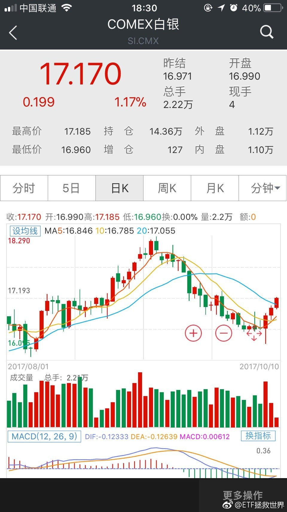

======================================================

ETF拯救世界 (5687069307) @
2017-10-10 19:59:04 Tue  
url: https://weibo.com/5687069307/FpL67ttIr

再涨一点就能出了。4不4有点快啊。

------------------------------------------------------
转推：
>  @ETF拯救世界 (5687069307)
>  2017-10-09 10:01:34 Mon  
>  url: https:/weibo.com/5687069307/FpxL6g2eH/

>  谁能想到 ​​​

转发[0]  评论[37]  赞[59] 

======================================================

ETF拯救世界 (5687069307) @
2017-10-10 21:49:35 Tue  
url: https://weibo.com/5687069307/FpLOYD4aw

回复@用户6073012591:wind金融终端机构版//@用户6073012591:回复@雲中漫步_1117:谢谢，跟我用万德的有些不同

------------------------------------------------------
转推：
>  @ETF拯救世界 (5687069307)
>  2017-10-10 18:30:42 Tue  
>  url: https:/weibo.com/5687069307/FpKwfALIq/

>  醉了，闹哪样 ​​​

转发[3]  评论[19]  赞[40] 

======================================================

ETF拯救世界 (5687069307) @
2017-10-10 22:19:53 Tue  
url: https://weibo.com/5687069307/FpM1hjPeW

每日打卡（92）

感受肌肉。坚持。 ​​​

转发[0]  评论[19]  赞[107] 

+++++++++++++++++++++++++++++++++++++++++++++++++++++

图片：

======================================================

ETF拯救世界 (5687069307) @
2017-10-11 09:51:30 Wed  
url: https://weibo.com/5687069307/FpQy0ne4y

一个字，不要卖。

踏踏实实赚钱。 ​​​

转发[2]  评论[80]  赞[141] 

======================================================

ETF拯救世界 (5687069307) @
2017-10-11 10:06:41 Wed  
url: https://weibo.com/5687069307/FpQEarNwP

$全指医药 sh000991$  $养老产业 sz399812$ 

可以奶一口了吧——

涨的不错啊。 ​​​

转发[6]  评论[29]  赞[80] 

======================================================

ETF拯救世界 (5687069307) @
2017-10-11 10:11:16 Wed  
url: https://weibo.com/5687069307/FpQG1nAkY

识别泡沫，享受泡沫，在泡沫破灭之前悄悄撤退。

不要识别出泡沫就撤退。

独乐乐不如众乐乐。 ​​​

转发[20]  评论[43]  赞[151] 

======================================================

ETF拯救世界 (5687069307) @
2017-10-11 10:47:55 Wed  
url: https://weibo.com/5687069307/FpQUTB5PX

$国证食品 sz399396$   感觉有点伤 ​​​

转发[3]  评论[52]  赞[64] 

======================================================

ETF拯救世界 (5687069307) @
2017-10-11 10:52:51 Wed  
url: https://weibo.com/5687069307/FpQWUlt4s

回复@石头里的虫子: 只因为在人群中多看了你一眼 再也没能忘掉你的容颜//@石头里的虫子:当年8800点的时候我多看了两眼。

------------------------------------------------------
转推：
>  @ETF拯救世界 (5687069307)
>  2017-10-11 10:47:55 Wed  
>  url: https:/weibo.com/5687069307/FpQUTB5PX/

>  $国证食品 sz399396$   感觉有点伤 ​​​

转发[0]  评论[33]  赞[61] 

======================================================

ETF拯救世界 (5687069307) @
2017-10-11 14:49:07 Wed  
url: https://weibo.com/5687069307/FpSuOeKOl

10:04，最高点一口毒奶，服不服。

------------------------------------------------------
转推：
>  @ETF拯救世界 (5687069307)
>  2017-10-11 10:06:41 Wed  
>  url: https:/weibo.com/5687069307/FpQEarNwP/

>  $全指医药 sh000991$  $养老产业 sz399812$ 
>  
>  可以奶一口了吧——
>  
>  涨的不错啊。 ​​​

转发[4]  评论[43]  赞[66] 

======================================================

ETF拯救世界 (5687069307) @
2017-10-11 15:01:38 Wed  
url: https://weibo.com/5687069307/FpSzTdQJ8

好了，2000只股票下跌，继续新高。

今天幅度肯定比前两天小很多了。

没什么意思。看看晚上白银和原油有没有搞头。 ​​​

转发[1]  评论[36]  赞[96] 

======================================================

ETF拯救世界 (5687069307) @
2017-10-11 15:05:58 Wed  
url: https://weibo.com/5687069307/FpSBEgKYv

还有没有没看过的。对了，这个答案中的打新组合，半年过去净值涨了不少。今天继续新高，年初至今40%……新股没中几只，门票还不错 http://t.cn/ROiTEQG

------------------------------------------------------
转推：
>  @ETF拯救世界 (5687069307)
>  2017-03-24 11:09:41 Fri  
>  url: https:/weibo.com/5687069307/EBfCg1fLX/

>  讲真，我自己感觉这回答值1块钱。我回答了 @晴儿小小 的问题，问题价值￥79.00，大家快来花1元围观~ http://t.cn/R6GYZGs ​​​

转发[16]  评论[50]  赞[85] 

======================================================

ETF拯救世界 (5687069307) @
2017-10-12 09:43:38 Thu  
url: https://weibo.com/5687069307/FpZVjgjfG

又咁样？//@ETF拯救世界:10:04，最高点一口毒奶，服不服。

------------------------------------------------------
转推：
>  @ETF拯救世界 (5687069307)
>  2017-10-11 10:06:41 Wed  
>  url: https:/weibo.com/5687069307/FpQEarNwP/

>  $全指医药 sh000991$  $养老产业 sz399812$ 
>  
>  可以奶一口了吧——
>  
>  涨的不错啊。 ​​​

转发[3]  评论[23]  赞[55] 

======================================================

ETF拯救世界 (5687069307) @
2017-10-12 09:50:07 Thu  
url: https://weibo.com/5687069307/FpZXWEAvl

回复@蓝图806:关注我的朋友里面有17.48%是广东的，给讲讲。//@蓝图806:“咁”，念啥？是啥意思？E大的词汇真丰富，跟着E大即学会了投资，也学会了不少字。//@ETF拯救世界:又咁样？//@ETF拯救世界:10:04，最高点一口毒奶，服不服。

------------------------------------------------------
转推：
>  @ETF拯救世界 (5687069307)
>  2017-10-11 10:06:41 Wed  
>  url: https:/weibo.com/5687069307/FpQEarNwP/

>  $全指医药 sh000991$  $养老产业 sz399812$ 
>  
>  可以奶一口了吧——
>  
>  涨的不错啊。 ​​​

转发[0]  评论[32]  赞[50] 

======================================================

ETF拯救世界 (5687069307) @
2017-10-12 10:22:05 Thu  
url: https://weibo.com/5687069307/Fq0aUnhfP

博时债又要分红了。 ​​​

转发[1]  评论[39]  赞[89] 

======================================================

ETF拯救世界 (5687069307) @
2017-10-12 11:12:03 Thu  
url: https://weibo.com/5687069307/Fq0vcitpG

买买买

------------------------------------------------------
转推：
>  @ ()
>  2017-10-11 21:53:49 Wed  
>  url: 

>  抱歉，作者已设置仅展示半年内微博，此微博已不可见。 ​​​

转发[4]  评论[54]  赞[63] 

======================================================

ETF拯救世界 (5687069307) @
2017-10-12 14:42:29 Thu  
url: https://weibo.com/5687069307/Fq1SCa9vF

未来20天，跌幅到0.5%的时候买入300ETF，等那谁他们拉，然后卖出，算不算一种策略。 ​​​

转发[7]  评论[88]  赞[166] 

======================================================

ETF拯救世界 (5687069307) @
2017-10-12 22:13:59 Thu  
url: https://weibo.com/5687069307/Fq4PSpkhx

每日打卡（93）

天凉好个秋。 ​​​

转发[0]  评论[18]  赞[105] 

+++++++++++++++++++++++++++++++++++++++++++++++++++++

图片：
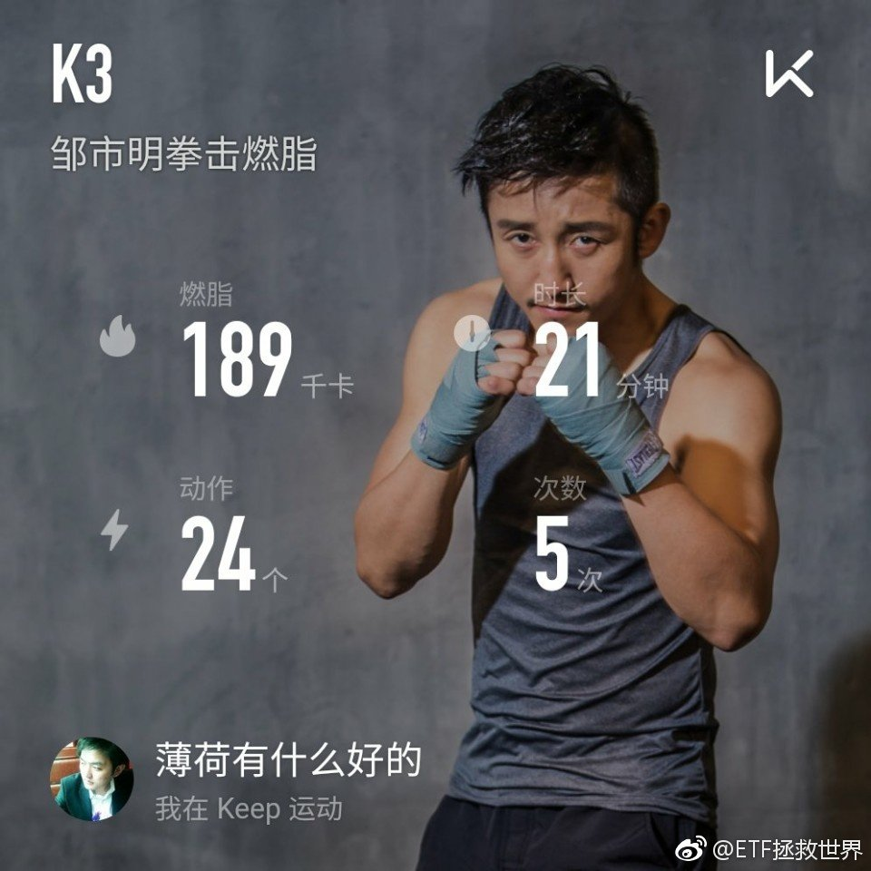
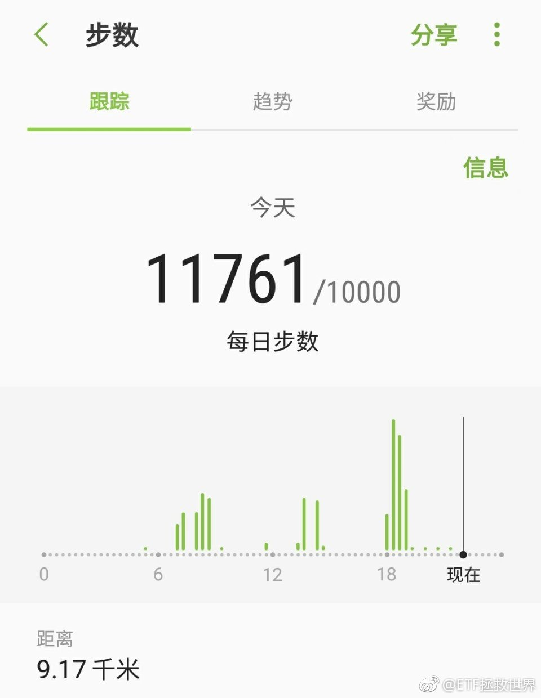

======================================================

ETF拯救世界 (5687069307) @
2017-10-13 09:41:45 Fri  
url: https://weibo.com/5687069307/Fq9l38Kzu

连续两天毒奶在全天最高点，一分钟都不差。今天收兵，不奶了。随便吧。//@ETF拯救世界:又咁样？//@ETF拯救世界:10:04，最高点一口毒奶，服不服。

------------------------------------------------------
转推：
>  @ETF拯救世界 (5687069307)
>  2017-10-11 10:06:41 Wed  
>  url: https:/weibo.com/5687069307/FpQEarNwP/

>  $全指医药 sh000991$  $养老产业 sz399812$ 
>  
>  可以奶一口了吧——
>  
>  涨的不错啊。 ​​​

转发[1]  评论[59]  赞[54] 

======================================================

ETF拯救世界 (5687069307) @
2017-10-13 10:19:10 Fri  
url: https://weibo.com/5687069307/Fq9AegqGn

特别悲伤地说一句，养老可能是最后一块相对洼地了。

难道…… ​​​

转发[5]  评论[86]  赞[89] 

======================================================

ETF拯救世界 (5687069307) @
2017-10-13 11:00:57 Fri  
url: https://weibo.com/5687069307/Fq9RbBp4P

加起来接近10%，已经足够影响组合表现了。 ​​​

转发[0]  评论[25]  赞[89] 

+++++++++++++++++++++++++++++++++++++++++++++++++++++

图片：

======================================================

ETF拯救世界 (5687069307) @
2017-10-13 11:08:44 Fri  
url: https://weibo.com/5687069307/Fq9Uly1BJ

三个字，不要卖。你的成本很低，踏踏实实拿着。不要怕过山车，即使过山车，下次回来你赚更多。

这话说过好多次，回头看看，是不是正确的？没错，过山车好几次，每次回来是不是利润增加一大截？

拿着。 ​​​

转发[51]  评论[104]  赞[166] 

======================================================

ETF拯救世界 (5687069307) @
2017-10-13 13:04:07 Fri  
url: https://weibo.com/5687069307/FqaFbk3IR

婆媳关系不和是2016年离婚第三顺位的原因。//@八大山债人:吐槽下而已。。。不算什么大事，生活不容易吐槽还不让？ //@中国羊肉:真实生活

------------------------------------------------------
转推：
>  @ ()
>  2017-10-13 11:51:06 Fri  
>  url: 

>  抱歉，作者已设置仅展示半年内微博，此微博已不可见。 ​​​

转发[1]  评论[54]  赞[34] 

======================================================

ETF拯救世界 (5687069307) @
2017-10-13 13:25:52 Fri  
url: https://weibo.com/5687069307/FqaO0zivx

总有东西可买

------------------------------------------------------
转推：
>  @ ()
>  2017-10-13 13:22:59 Fri  
>  url: 

>  抱歉，作者已设置仅展示半年内微博，此微博已不可见。 ​​​

转发[6]  评论[43]  赞[78] 

======================================================

ETF拯救世界 (5687069307) @
2017-10-13 13:43:28 Fri  
url: https://weibo.com/5687069307/FqaV9xHYL

别的指数都刷刷的涨，上证就是±0.01%。

到底是怎么做到的，内谁他们也太神奇了吧喂！ ​​​

转发[1]  评论[26]  赞[65] 

======================================================

ETF拯救世界 (5687069307) @
2017-10-13 13:52:44 Fri  
url: https://weibo.com/5687069307/FqaYUFvyU

$中证环保 sh000827$   今天是你，请开始你的表演。 ​​​

转发[1]  评论[30]  赞[86] 

======================================================

ETF拯救世界 (5687069307) @
2017-10-13 14:45:18 Fri  
url: https://weibo.com/5687069307/FqbkgbVcO

还差一哆嗦。五天，五个多点。 ​​​

转发[2]  评论[48]  赞[82] 

+++++++++++++++++++++++++++++++++++++++++++++++++++++

图片：
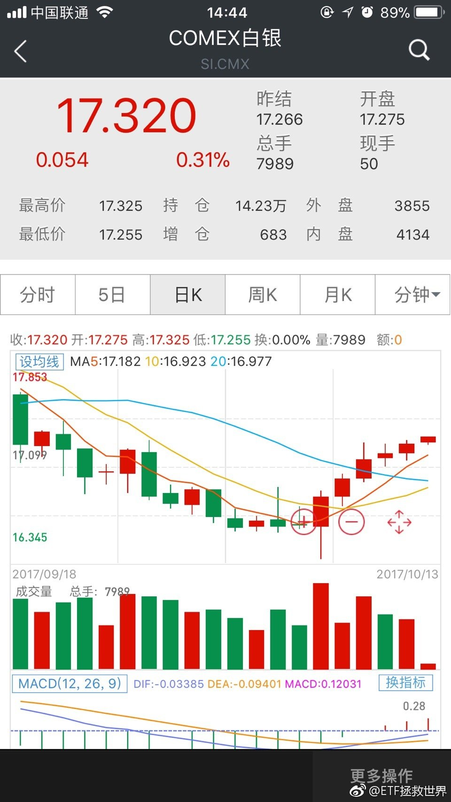

======================================================

ETF拯救世界 (5687069307) @
2017-10-13 16:21:06 Fri  
url: https://weibo.com/5687069307/FqbX8vzjx

周末开车。

1-2份。 ​​​

转发[1]  评论[129]  赞[191] 

======================================================

ETF拯救世界 (5687069307) @
2017-10-13 16:42:55 Fri  
url: https://weibo.com/5687069307/Fqc5Zv3TK

今天看到一句话：如果你2010年用买iphone得钱买比特币，那么现在你已经有2亿了。。看完这句话，我整个人都不好了。。

------------------------------------------------------
转推：
>  @蓝鲸TMT网 (3866012793)
>  2017-10-13 16:41:14 Fri  
>  url: https:/weibo.com/3866012793/Fqc5jfx0G/

>  【比特币价格再创新高逼近4万元 业内人士称“看不懂”】13日讯，据欧洲比特币交易网站Bitstamp报价，比特币当日最高价达5846.43美元，逼近人民币4万元，再创币价新高。截至发稿前，比特币价格略有回落，跌至5495.25美元。当前比特币价格已经较年初上涨4倍有余。“最近这个涨幅，我也看不懂了，”一位比 ​​​

转发[23]  评论[58]  赞[76] 

======================================================

ETF拯救世界 (5687069307) @
2017-10-13 17:13:50 Fri  
url: https://weibo.com/5687069307/FqcixxTSl

回复@litterwitch:我倒没有不好。我这个人不喜欢后悔过去，我想的是这样的案例有什么值得吸取的经验。怎么才能抓住下一次机会。而且大概有些想法了。//@litterwitch:原来你也有心态不好的时候，来，让我们给你按摩按摩！

------------------------------------------------------
转推：
>  @蓝鲸TMT网 (3866012793)
>  2017-10-13 16:41:14 Fri  
>  url: https:/weibo.com/3866012793/Fqc5jfx0G/

>  【比特币价格再创新高逼近4万元 业内人士称“看不懂”】13日讯，据欧洲比特币交易网站Bitstamp报价，比特币当日最高价达5846.43美元，逼近人民币4万元，再创币价新高。截至发稿前，比特币价格略有回落，跌至5495.25美元。当前比特币价格已经较年初上涨4倍有余。“最近这个涨幅，我也看不懂了，”一位比 ​​​

转发[3]  评论[44]  赞[57] 

======================================================

ETF拯救世界 (5687069307) @
2017-10-13 22:08:27 Fri  
url: https://weibo.com/5687069307/Fqee8ouLM

搞定 http://t.cn/RO07YMp

------------------------------------------------------
转推：
>  @ETF拯救世界 (5687069307)
>  2017-10-09 10:01:34 Mon  
>  url: https:/weibo.com/5687069307/FpxL6g2eH/

>  谁能想到 ​​​

转发[4]  评论[51]  赞[80] 

======================================================

ETF拯救世界 (5687069307) @
2017-10-13 22:20:32 Fri  
url: https://weibo.com/5687069307/Fqej274v9

今天在外面浪，没法打卡了。人生充满意外啊。 ​​​

转发[0]  评论[82]  赞[114] 

======================================================

ETF拯救世界 (5687069307) @
2017-10-15 21:55:37 Sun  
url: https://weibo.com/5687069307/FqwZUrDKv

每日打卡（94）

很少出去喝酒，周五喝一场，周六缓一天。没事还是少喝比较好。

这个月5号开始平板支撑，基本每天做，加起来快一个小时了。每天一点进步，积累起来就很可观。 ​​​

转发[1]  评论[34]  赞[132] 

+++++++++++++++++++++++++++++++++++++++++++++++++++++

图片：

======================================================

ETF拯救世界 (5687069307) @
2017-10-16 10:34:01 Mon  
url: https://weibo.com/5687069307/FqBXKluXu

2400只股票下跌，净值依然在涨，资产配置。

$恒生指数 hkHSI$   距离下次再平衡的区间越来越近了。 ​​​

转发[4]  评论[36]  赞[109] 

======================================================

ETF拯救世界 (5687069307) @
2017-10-16 10:57:14 Mon  
url: https://weibo.com/5687069307/FqC7b66kB

[并不简单] ​​​

转发[9]  评论[29]  赞[77] 

+++++++++++++++++++++++++++++++++++++++++++++++++++++

图片：
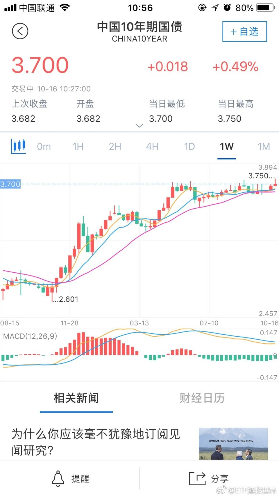

======================================================

ETF拯救世界 (5687069307) @
2017-10-16 11:00:27 Mon  
url: https://weibo.com/5687069307/FqC8t9Ht8

未来债券配置路线图：

4-4.5会配置到大概10%-15%。 4.5-5会配置到15-20。

如果可以到5以上，会配置到30%——而且是30%杠杆债基。

07年底我重仓配置债券的时候，十年期国债收益率也只是4.8而已。 ​​​

转发[126]  评论[139]  赞[177] 

======================================================

ETF拯救世界 (5687069307) @
2017-10-16 11:30:42 Mon  
url: https://weibo.com/5687069307/FqCkKE3xt

本人万分支持上证指数的稳定。不过可不可以放手中小股，让他们价值回归。

叠加三季报，真心想月底能买点东西呢！ ​​​

转发[1]  评论[41]  赞[140] 

======================================================

ETF拯救世界 (5687069307) @
2017-10-16 13:27:44 Mon  
url: https://weibo.com/5687069307/FqD6g9Oo9

太有面子了！昨天说半年安全，就这么搞事情。可以说非常开心！ ​​​

转发[2]  评论[58]  赞[115] 

+++++++++++++++++++++++++++++++++++++++++++++++++++++

图片：

======================================================

ETF拯救世界 (5687069307) @
2017-10-16 14:03:39 Mon  
url: https://weibo.com/5687069307/FqDkQ1aBE

潮水退去才知道谁在裸泳。

太经典了。这句话。 ​​​

转发[2]  评论[34]  赞[113] 

======================================================

ETF拯救世界 (5687069307) @
2017-10-16 14:57:01 Mon  
url: https://weibo.com/5687069307/FqDGv2wgx

$518880 都赚钱了吧。是不是又全红了。。 ​​​

转发[0]  评论[24]  赞[98] 

======================================================

ETF拯救世界 (5687069307) @
2017-10-16 15:09:37 Mon  
url: https://weibo.com/5687069307/FqDLC7fPE

坚持这个结论。债券会先见底。所以，热烈的盼望着4%以上。我的资金饥渴难耐了。如果能够更高，那我会做梦都笑出来。

------------------------------------------------------
转推：
>  @ETF拯救世界 (5687069307)
>  2017-08-31 09:08:39 Thu  
>  url: https:/weibo.com/5687069307/FjBKfkGc2/

>  坚持债券会先于股票几个月见底的观点。 ​​​

转发[73]  评论[41]  赞[88] 

======================================================

ETF拯救世界 (5687069307) @
2017-10-16 15:20:45 Mon  
url: https://weibo.com/5687069307/FqDQ8d0Wf

回复@i云腾致雨:这个道理非常简单。首先债券有利息。就算它5%好了。其次债券价格会跌，那么未来就会涨。净价从90涨到100就是11%（事实上有可能更多）。加上利息就有16%。再加点杠杆，你说会赚多少。07年底我买债券都是70几块，最后回到90多，别人-60%，你+30%多的感觉非常酸爽。

------------------------------------------------------
转推：
>  @ETF拯救世界 (5687069307)
>  2017-08-31 09:08:39 Thu  
>  url: https:/weibo.com/5687069307/FjBKfkGc2/

>  坚持债券会先于股票几个月见底的观点。 ​​​

转发[25]  评论[55]  赞[91] 

======================================================

ETF拯救世界 (5687069307) @
2017-10-16 15:25:11 Mon  
url: https://weibo.com/5687069307/FqDRVC1ii

回复@ysm小鱼:不过我不希望各位期望太高。降低预期，目前来看，已持有的部分长期年化能有7-8就已经不错。先不要太兴奋。毕竟价格不够低。//@ysm小鱼:本来没鸡冻的，现在也开始瑟瑟地鸡冻了[二哈]

------------------------------------------------------
转推：
>  @ETF拯救世界 (5687069307)
>  2017-08-31 09:08:39 Thu  
>  url: https:/weibo.com/5687069307/FjBKfkGc2/

>  坚持债券会先于股票几个月见底的观点。 ​​​

转发[3]  评论[46]  赞[67] 

======================================================

ETF拯救世界 (5687069307) @
2017-10-16 18:39:45 Mon  
url: https://weibo.com/5687069307/FqF8Ufadg

回复@E大关门大弟子-铁蛋:不信我就发一张[并不简单]//@E大关门大弟子-铁蛋:回复@ETF拯救世界:就服你[阴险]

------------------------------------------------------
转推：
>  @ETF拯救世界 (5687069307)
>  2017-10-16 13:27:44 Mon  
>  url: https:/weibo.com/5687069307/FqD6g9Oo9/

>  太有面子了！昨天说半年安全，就这么搞事情。可以说非常开心！ ​​​

转发[0]  评论[16]  赞[50] 

======================================================

ETF拯救世界 (5687069307) @
2017-10-16 21:55:56 Mon  
url: https://weibo.com/5687069307/FqGqxDVeS

每日打卡（95）

快100天了。 ​​​

转发[0]  评论[9]  赞[83] 

+++++++++++++++++++++++++++++++++++++++++++++++++++++

图片：

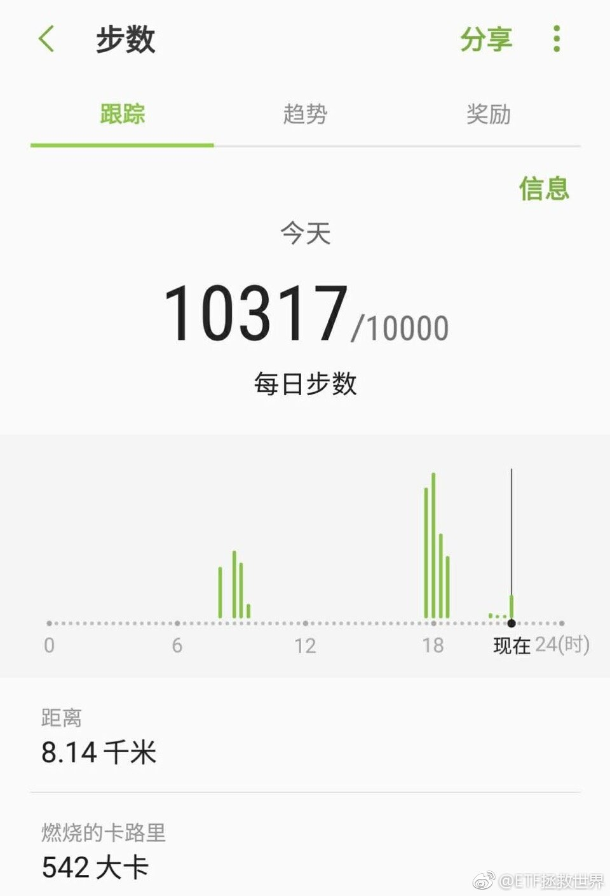

======================================================

ETF拯救世界 (5687069307) @
2017-10-16 22:02:31 Mon  
url: https://weibo.com/5687069307/FqGtd8Grn

好好涨，别掉链子。睡觉去了。 ​​​

转发[0]  评论[31]  赞[89] 

+++++++++++++++++++++++++++++++++++++++++++++++++++++

图片：

======================================================

ETF拯救世界 (5687069307) @
2017-10-17 09:21:05 Tue  
url: https://weibo.com/5687069307/FqKUDfyv9

少说话，多吃饭，安全第一。 ​​​

转发[1]  评论[34]  赞[122] 

======================================================

ETF拯救世界 (5687069307) @
2017-10-17 10:02:10 Tue  
url: https://weibo.com/5687069307/FqLbjb2qx

已经锁定杠杆率在135-140的债基了。能不能买，就看市场给不给机会了。

两年50%。债券也可以这么风骚的。 ​​​

转发[33]  评论[96]  赞[192] 

+++++++++++++++++++++++++++++++++++++++++++++++++++++

图片：

======================================================

ETF拯救世界 (5687069307) @
2017-10-17 14:09:18 Tue  
url: https://weibo.com/5687069307/FqMNDi6OZ

回复@守正v出奇:ZJH的104号令《公开募集证券投资基金运作管理办法》规定，公募债基杠杆率不得高于140。2016年8月开始执行。之前可以上到200，现在，140顶天了。哎。//@守正v出奇:还有杠杆率更高的吗？e大

------------------------------------------------------
转推：
>  @ETF拯救世界 (5687069307)
>  2017-10-17 10:02:10 Tue  
>  url: https:/weibo.com/5687069307/FqLbjb2qx/

>  已经锁定杠杆率在135-140的债基了。能不能买，就看市场给不给机会了。
>  
>  两年50%。债券也可以这么风骚的。 ​​​

转发[10]  评论[24]  赞[51] 

======================================================

ETF拯救世界 (5687069307) @
2017-10-17 14:20:54 Tue  
url: https://weibo.com/5687069307/FqMSl1qWC

又跌回去了。什么情况，是不是控盘华尔街了。//@ETF拯救世界:搞定 http://t.cn/RO07YMp

------------------------------------------------------
转推：
>  @ETF拯救世界 (5687069307)
>  2017-10-09 10:01:34 Mon  
>  url: https:/weibo.com/5687069307/FpxL6g2eH/

>  谁能想到 ​​​

转发[0]  评论[22]  赞[50] 

======================================================

ETF拯救世界 (5687069307) @
2017-10-17 14:24:28 Tue  
url: https://weibo.com/5687069307/FqMTN5LbA

在风险平价的体系中，债券上杠杆是必须的。因为它本身收益率略低，上了杠杆才有可能为组合贡献足够的收益。

各位生活在一个美好的时代。各种指数基金的出现，为资产配置这件事解决了最大的问题。要知道几年前要做到全面的资产配置简直像做梦一样。

举例来说，我2005年想买黄金，还要跑到商场去买实物 ​​​

转发[28]  评论[90]  赞[122] 

======================================================

ETF拯救世界 (5687069307) @
2017-10-17 14:45:28 Tue  
url: https://weibo.com/5687069307/FqN2j8tVi

回复@mydxkl:以前毫无办法。其实现在买油气也是没办法的办法。原油不易保存，投资现货品种基本不可能。期货不可以长期持有。比较麻烦。//@mydxkl:远古时代想投资石油，要跑到油田拉2卡车么[嘻嘻]

------------------------------------------------------
转推：
>  @ETF拯救世界 (5687069307)
>  2017-10-17 14:24:28 Tue  
>  url: https:/weibo.com/5687069307/FqMTN5LbA/

>  在风险平价的体系中，债券上杠杆是必须的。因为它本身收益率略低，上了杠杆才有可能为组合贡献足够的收益。
>  
>  各位生活在一个美好的时代。各种指数基金的出现，为资产配置这件事解决了最大的问题。要知道几年前要做到全面的资产配置简直像做梦一样。
>  
>  举例来说，我2005年想买黄金，还要跑到商场去买实物 ​​​

转发[4]  评论[25]  赞[58] 

======================================================

ETF拯救世界 (5687069307) @
2017-10-17 21:33:08 Tue  
url: https://weibo.com/5687069307/FqPHMjVdB

每日打卡（96）

今天比较简单。量不太够。 ​​​

转发[0]  评论[29]  赞[97] 

+++++++++++++++++++++++++++++++++++++++++++++++++++++

图片：

======================================================

ETF拯救世界 (5687069307) @
2017-10-18 11:27:47 Wed  
url: https://weibo.com/5687069307/FqVaz4iTP

$全指医药 sh000991$ $养老产业 sz399812$ 

事情还没有结束。 ​​​

转发[84]  评论[40]  赞[106] 

======================================================

ETF拯救世界 (5687069307) @
2017-10-18 13:04:14 Wed  
url: https://weibo.com/5687069307/FqVNIhXNq

恐慌了？[并不简单]

------------------------------------------------------
转推：
>  @ ()
>  2017-10-18 10:28:24 Wed  
>  url: 

>  抱歉，作者已设置仅展示半年内微博，此微博已不可见。 ​​​

转发[2]  评论[14]  赞[51] 

======================================================

ETF拯救世界 (5687069307) @
2017-10-18 13:19:06 Wed  
url: https://weibo.com/5687069307/FqVTKlDHB

走向新高。

------------------------------------------------------
转推：
>  @ETF拯救世界 (5687069307)
>  2017-10-18 11:27:47 Wed  
>  url: https:/weibo.com/5687069307/FqVaz4iTP/

>  $全指医药 sh000991$ $养老产业 sz399812$ 
>  
>  事情还没有结束。 ​​​

转发[1]  评论[11]  赞[60] 

======================================================

ETF拯救世界 (5687069307) @
2017-10-18 13:20:52 Wed  
url: https://weibo.com/5687069307/FqVUsDoGU

$养老产业 sz399812$ 

今天他们立功了。 ​​​

转发[15]  评论[27]  赞[70] 

+++++++++++++++++++++++++++++++++++++++++++++++++++++

图片：
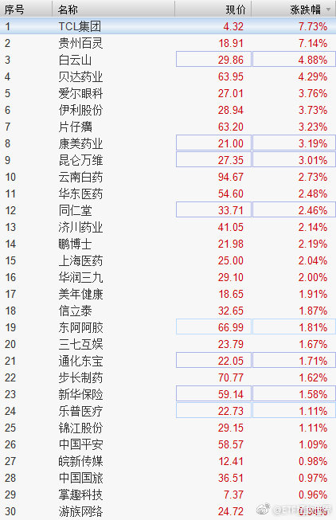

======================================================

ETF拯救世界 (5687069307) @
2017-10-18 13:32:54 Wed  
url: https://weibo.com/5687069307/FqVZlwXgX

回复@摩尔金融:我理解啊，咱们这一辈老了的时候，恐怕vr ar都已经是日常生活了。娱乐传媒算养老没毛病。“选取涉及酒店旅游、文化传媒、医药卫生、人寿保险等养老相关业务的上市公司股票作为成份股”//@摩尔金融:掌趣科技和游族网络也算养老产业吗？

------------------------------------------------------
转推：
>  @ETF拯救世界 (5687069307)
>  2017-10-18 13:20:52 Wed  
>  url: https:/weibo.com/5687069307/FqVUsDoGU/

>  $养老产业 sz399812$ 
>  
>  今天他们立功了。 ​​​

转发[7]  评论[7]  赞[60] 

======================================================

ETF拯救世界 (5687069307) @
2017-10-18 13:34:52 Wed  
url: https://weibo.com/5687069307/FqW09dMFb

养老产业的选股范围：“属消费电子、休闲用品、酒店旅游、教育、文化传
媒、药品零售、乳品、家庭用品、医药卫生、人寿保险、互联网软件”。 ​​​

转发[47]  评论[25]  赞[98] 

======================================================

ETF拯救世界 (5687069307) @
2017-10-18 13:44:17 Wed  
url: https://weibo.com/5687069307/FqW3Yc8Dp

回复@怪叔叔窝窝001:这里面大部分都是“弱周期”。毕竟，经济再差也得吃药。何况，有时候经济越差，娱乐业越好。为什么呢，毕竟及经济差了不能买车，但打开游戏花几十块钱玩一晚上网游看一场电影还是最实惠的。//@怪叔叔窝窝001:经济失去活力 还能有多大的发展

------------------------------------------------------
转推：
>  @ETF拯救世界 (5687069307)
>  2017-10-18 13:34:52 Wed  
>  url: https:/weibo.com/5687069307/FqW09dMFb/

>  养老产业的选股范围：“属消费电子、休闲用品、酒店旅游、教育、文化传
>  媒、药品零售、乳品、家庭用品、医药卫生、人寿保险、互联网软件”。 ​​​

转发[10]  评论[16]  赞[59] 

======================================================

ETF拯救世界 (5687069307) @
2017-10-18 13:49:07 Wed  
url: https://weibo.com/5687069307/FqW5VCA7k

如果你统计过A股上市以来涨幅最大的股票，恐怕十个里面有七个都是泛“消费”和“医药”。

美国也是如此，最牛的是菲利普莫里斯，干嘛的，烟草。然后宝洁麦当劳辉瑞两个可乐迪士尼……

我坚信未来30年A股在泛消费和医药里面也会有特大长牛股产生。而这两个板块指数也将继续非常牛。

如果有机会重仓买 ​​​

转发[80]  评论[66]  赞[107] 

======================================================

ETF拯救世界 (5687069307) @
2017-10-18 13:55:39 Wed  
url: https://weibo.com/5687069307/FqW8AdQaN

包括这些年美股也是啊。亚马逊、苹果、奈飞，你很难说他们是消费公司还是科技公司吧。刚有朋友说人工智能，我的意思，不要急。等有一家公司真的开发出让你花钱去不断消费的产品，再买它不迟，至少涨5年吧。当然，短线高手例外。概念就可以随便炒了。

------------------------------------------------------
转推：
>  @ETF拯救世界 (5687069307)
>  2017-10-18 13:49:07 Wed  
>  url: https:/weibo.com/5687069307/FqW5VCA7k/

>  如果你统计过A股上市以来涨幅最大的股票，恐怕十个里面有七个都是泛“消费”和“医药”。
>  
>  美国也是如此，最牛的是菲利普莫里斯，干嘛的，烟草。然后宝洁麦当劳辉瑞两个可乐迪士尼……
>  
>  我坚信未来30年A股在泛消费和医药里面也会有特大长牛股产生。而这两个板块指数也将继续非常牛。
>  
>  如果有机会重仓买 ​​​

转发[15]  评论[10]  赞[81] 

======================================================

ETF拯救世界 (5687069307) @
2017-10-18 13:59:37 Wed  
url: https://weibo.com/5687069307/FqWac7SRI

上港哪里有直播谁知道？

------------------------------------------------------
转推：
>  @9号李毅大帝 (2018220685)
>  2017-10-18 13:55:28 Wed  
>  url: https:/weibo.com/2018220685/FqW8vuQOI/

>  大道之行，天下为公！祝福我们的祖国繁荣昌盛，祝福中国的足球越来越好，更祝福今天的上海上港能够在客场全身而退晋级亚冠决赛！ ​​​

转发[0]  评论[24]  赞[37] 

======================================================

ETF拯救世界 (5687069307) @
2017-10-18 14:02:51 Wed  
url: https://weibo.com/5687069307/FqWbvk5Kg

门票组合今年41%了。然而三季报披露到今天一只也没选出来。

模型真的很严格！ ​​​

转发[9]  评论[47]  赞[83] 

======================================================

ETF拯救世界 (5687069307) @
2017-10-18 14:15:42 Wed  
url: https://weibo.com/5687069307/FqWgJaTP3

对于为什么不“重仓”这种问题。从2016年的恒生到后来的一些品种，一直都会有这种疑问。

了解我的朋友都知道，恒生我本身建仓的时候有十几个点，会比计划多一点。计划少一些的原因各位也都知道了。但这个不是关键。

关键在于，我恐怕永远也不会买到很多朋友理念中的“重仓”。因为我给一个品种最大最 ​​​

转发[91]  评论[110]  赞[217] 

======================================================

ETF拯救世界 (5687069307) @
2017-10-18 14:26:10 Wed  
url: https://weibo.com/5687069307/FqWkYsSzL

回复@D8奇迹:其实年初至今只有900只股票，也就是30%的股票上涨，70%下跌。1221只跌幅超过15%，不要太伤心。。。//@D8奇迹:回复@实体化的幽灵:拉仇恨吗？！俺今年门票收益-15%，而且一个新股都没中。真他妈的FUCK egg

------------------------------------------------------
转推：
>  @ETF拯救世界 (5687069307)
>  2017-10-18 14:02:51 Wed  
>  url: https:/weibo.com/5687069307/FqWbvk5Kg/

>  门票组合今年41%了。然而三季报披露到今天一只也没选出来。
>  
>  模型真的很严格！ ​​​

转发[5]  评论[28]  赞[64] 

======================================================

ETF拯救世界 (5687069307) @
2017-10-18 15:43:57 Wed  
url: https://weibo.com/5687069307/FqWQxwc6e

回复@就看E大啦啦啦:不用看那个组合。我经常忘了在那里调仓，那是补上个月忘了调的。//@就看E大啦啦啦:E大怎么突然调仓了500？//@ETF拯救世界:回复@D8奇迹:其实年初至今只有900只股票，也就是30%的股票上涨，70%下跌。1221只跌幅超过15%，不要太伤心。。。

------------------------------------------------------
转推：
>  @ETF拯救世界 (5687069307)
>  2017-10-18 14:02:51 Wed  
>  url: https:/weibo.com/5687069307/FqWbvk5Kg/

>  门票组合今年41%了。然而三季报披露到今天一只也没选出来。
>  
>  模型真的很严格！ ​​​

转发[1]  评论[20]  赞[58] 

======================================================

ETF拯救世界 (5687069307) @
2017-10-18 21:43:32 Wed  
url: https://weibo.com/5687069307/FqZcumcYN

每日打卡（97）

坚持。 ​​​

转发[0]  评论[12]  赞[97] 

+++++++++++++++++++++++++++++++++++++++++++++++++++++

图片：

======================================================

ETF拯救世界 (5687069307) @
2017-10-19 09:47:07 Thu  
url: https://weibo.com/5687069307/Fr3Wcm7gd

每天这么浪，会不会累。

------------------------------------------------------
转推：
>  @ETF拯救世界 (5687069307)
>  2017-10-18 11:27:47 Wed  
>  url: https:/weibo.com/5687069307/FqVaz4iTP/

>  $全指医药 sh000991$ $养老产业 sz399812$ 
>  
>  事情还没有结束。 ​​​

转发[67]  评论[17]  赞[69] 

======================================================

ETF拯救世界 (5687069307) @
2017-10-19 09:50:18 Thu  
url: https://weibo.com/5687069307/Fr3Xu8oPk

写在反弹新高：我再说一次，不要卖。不要卖。不要卖。坐电梯不可怕，可怕的是轻易卖掉超廉价筹码。//@ETF拯救世界:每天这么浪，会不会累。

------------------------------------------------------
转推：
>  @ETF拯救世界 (5687069307)
>  2017-10-18 11:27:47 Wed  
>  url: https:/weibo.com/5687069307/FqVaz4iTP/

>  $全指医药 sh000991$ $养老产业 sz399812$ 
>  
>  事情还没有结束。 ​​​

转发[61]  评论[50]  赞[91] 

======================================================

ETF拯救世界 (5687069307) @
2017-10-19 10:04:25 Thu  
url: https://weibo.com/5687069307/Fr43djy0C

目前这个阶段，整体思路是：

不停的寻找便宜货。总有东西会跌，跌到位了就开始买。买了以后，如果继续跌，就继续买。如果不跌，就放好了，藏起来，几年后拿出来数钱。

就酱。很简单，粗暴，有效。 ​​​

转发[49]  评论[81]  赞[231] 

======================================================

ETF拯救世界 (5687069307) @
2017-10-19 10:21:21 Thu  
url: https://weibo.com/5687069307/Fr4a6kvyQ

通常来讲，国债利率倒挂，消费、医药这种板块走强，都预示着_____。

不要多说话，懂就行了。 ​​​

转发[32]  评论[107]  赞[156] 

======================================================

ETF拯救世界 (5687069307) @
2017-10-19 10:29:15 Thu  
url: https://weibo.com/5687069307/Fr4diB4a5

不知道有没有人注意，8月底之后的50天计划买了五份，只有一份A股。 ​​​

转发[3]  评论[32]  赞[125] 

======================================================

ETF拯救世界 (5687069307) @
2017-10-19 10:42:45 Thu  
url: https://weibo.com/5687069307/Fr4iMsf5W

如果某天临时加车，不要意外。

世界充满惊喜。 ​​​

转发[4]  评论[118]  赞[203] 

======================================================

ETF拯救世界 (5687069307) @
2017-10-19 10:43:07 Thu  
url: https://weibo.com/5687069307/Fr4iVfnUx

谢谢。我们的美元债又……

------------------------------------------------------
转推：
>  @巨潮资讯网 (2239792910)
>  2017-10-19 10:42:03 Thu  
>  url: https:/weibo.com/2239792910/Fr4iuEE5x/

>  【19日人民币对美元中间价下跌102点】10月19日人民币对美元中间价下跌102点，报6.6093。中国人民银行日前发布的《2017年人民币国际化报告》表示，下一步，人民银行将继续坚持汇率市场化改革方向，进一步完善人民币汇率市场化形成机制，逐步增强汇率弹性，保持人民币在全球货币体系中的稳定地位。 ​​​

转发[1]  评论[22]  赞[84] 

======================================================

ETF拯救世界 (5687069307) @
2017-10-19 11:24:39 Thu  
url: https://weibo.com/5687069307/Fr4zN2rB3

嗯哼 ​​​

转发[2]  评论[44]  赞[73] 

+++++++++++++++++++++++++++++++++++++++++++++++++++++

图片：
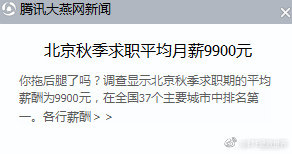

======================================================

ETF拯救世界 (5687069307) @
2017-10-19 14:23:19 Thu  
url: https://weibo.com/5687069307/Fr5KjeReZ

别扛了，跟着休息休息吧。连续两天超过2500只下跌了。。//@ETF拯救世界:每天这么浪，会不会累。

------------------------------------------------------
转推：
>  @ETF拯救世界 (5687069307)
>  2017-10-18 11:27:47 Wed  
>  url: https:/weibo.com/5687069307/FqVaz4iTP/

>  $全指医药 sh000991$ $养老产业 sz399812$ 
>  
>  事情还没有结束。 ​​​

转发[4]  评论[16]  赞[59] 

======================================================

ETF拯救世界 (5687069307) @
2017-10-19 14:27:24 Thu  
url: https://weibo.com/5687069307/Fr5LYjYn8

回复@Coreline:反正昨天新高了。今天不好说。//@Coreline:是不是我们每天都新高啊//@ETF拯救世界:别扛了，跟着休息休息吧。连续两天超过2500只下跌了。。//@ETF拯救世界:每天这么浪，会不会累。

------------------------------------------------------
转推：
>  @ETF拯救世界 (5687069307)
>  2017-10-18 11:27:47 Wed  
>  url: https:/weibo.com/5687069307/FqVaz4iTP/

>  $全指医药 sh000991$ $养老产业 sz399812$ 
>  
>  事情还没有结束。 ​​​

转发[3]  评论[11]  赞[48] 

======================================================

ETF拯救世界 (5687069307) @
2017-10-19 14:51:00 Thu  
url: https://weibo.com/5687069307/Fr5Vykzwd

回复@醉翁得意:跌了还不到1%吧。如果买了0.6%，就是浮亏不到0.006%。您要太紧张就卖了吧。不跌我们怎么买剩下的4%。。。//@醉翁得意:黄金etf怎么一直在跌//@ETF拯救世界:回复@Coreline:反正昨天新高了。今天不好说。//@Coreline:是不是我们每天都新高啊

------------------------------------------------------
转推：
>  @ETF拯救世界 (5687069307)
>  2017-10-18 11:27:47 Wed  
>  url: https:/weibo.com/5687069307/FqVaz4iTP/

>  $全指医药 sh000991$ $养老产业 sz399812$ 
>  
>  事情还没有结束。 ​​​

转发[2]  评论[17]  赞[68] 

======================================================

ETF拯救世界 (5687069307) @
2017-10-19 15:07:17 Thu  
url: https://weibo.com/5687069307/Fr629wIk5

还有多少人认为我买一份，也就是0.6%就是看好这个品种会涨的……有这种错觉的立即停止参考。 ​​​

转发[8]  评论[59]  赞[107] 

======================================================

ETF拯救世界 (5687069307) @
2017-10-19 15:26:24 Thu  
url: https://weibo.com/5687069307/Fr69UAjUj

今天全市场数据有点好。[笑而不语] ​​​

转发[4]  评论[53]  赞[116] 

======================================================

ETF拯救世界 (5687069307) @
2017-10-19 15:58:00 Thu  
url: https://weibo.com/5687069307/Fr6mK71Mn

回复@Tippiinsz:不到29500就跌不要脸。[笑而不语]//@Tippiinsz:恒生跌了550点[笑而不语]

------------------------------------------------------
转推：
>  @ETF拯救世界 (5687069307)
>  2017-10-19 15:26:24 Thu  
>  url: https:/weibo.com/5687069307/Fr69UAjUj/

>  今天全市场数据有点好。[笑而不语] ​​​

转发[1]  评论[10]  赞[60] 

======================================================

ETF拯救世界 (5687069307) @
2017-10-20 01:47:49 Fri  
url: https://weibo.com/5687069307/Frae9fZqI

[哼] ​​​

转发[0]  评论[56]  赞[68] 

======================================================

ETF拯救世界 (5687069307) @
2017-10-20 09:38:59 Fri  
url: https://weibo.com/5687069307/FrdjoqAa6

刚才删了一条昨天的微博。

不议论别人，咱们做好自己的投资。 ​​​

转发[0]  评论[75]  赞[193] 

======================================================

ETF拯救世界 (5687069307) @
2017-10-20 22:09:19 Fri  
url: https://weibo.com/5687069307/FridXhX0j

每日打卡（98）

今天有点忙，一天没说话。

坚持。 ​​​

转发[0]  评论[32]  赞[107] 

+++++++++++++++++++++++++++++++++++++++++++++++++++++

图片：

======================================================

ETF拯救世界 (5687069307) @
2017-10-21 21:14:25 Sat  
url: https://weibo.com/5687069307/FrriarEb0

每日打卡（99）

周末要到一万步真心不容易。 ​​​

转发[1]  评论[33]  赞[109] 

+++++++++++++++++++++++++++++++++++++++++++++++++++++

图片：

======================================================

ETF拯救世界 (5687069307) @
2017-10-23 09:45:50 Mon  
url: https://weibo.com/5687069307/FrFDFhYLa

继续新高。

------------------------------------------------------
转推：
>  @ETF拯救世界 (5687069307)
>  2017-10-18 11:27:47 Wed  
>  url: https:/weibo.com/5687069307/FqVaz4iTP/

>  $全指医药 sh000991$ $养老产业 sz399812$ 
>  
>  事情还没有结束。 ​​​

转发[8]  评论[20]  赞[80] 

======================================================

ETF拯救世界 (5687069307) @
2017-10-23 09:49:29 Mon  
url: https://weibo.com/5687069307/FrFF9sWfp

回复@求财不劫色:这个要看时间。如果极短时间内50%也可以能走。如果时间长了，十倍可能都不卖。时间，空间的艺术。//@求财不劫色:不翻倍不走[爱你]//@ETF拯救世界:继续新高。

------------------------------------------------------
转推：
>  @ETF拯救世界 (5687069307)
>  2017-10-18 11:27:47 Wed  
>  url: https:/weibo.com/5687069307/FqVaz4iTP/

>  $全指医药 sh000991$ $养老产业 sz399812$ 
>  
>  事情还没有结束。 ​​​

转发[7]  评论[21]  赞[96] 

======================================================

ETF拯救世界 (5687069307) @
2017-10-23 10:04:15 Mon  
url: https://weibo.com/5687069307/FrFL8B0kc

投资中有些事情是必然会发生的。或者说吧，极大概率发生。

空间的向上或者向下。

只是时间不确定。那么我们就想办法让时间成为我们的朋友。坚定信念，在还没有发生的时候多积累。

然后继续与时间做朋友，等着就行了。

哪里不会点哪里，so easy。 ​​​

转发[35]  评论[71]  赞[158] 

======================================================

ETF拯救世界 (5687069307) @
2017-10-23 10:34:57 Mon  
url: https://weibo.com/5687069307/FrFXBDSzB

继续说。不要卖。//@ETF拯救世界:写在反弹新高：我再说一次，不要卖。不要卖。不要卖。坐电梯不可怕，可怕的是轻易卖掉超廉价筹码。//@ETF拯救世界:每天这么浪，会不会累。

------------------------------------------------------
转推：
>  @ETF拯救世界 (5687069307)
>  2017-10-18 11:27:47 Wed  
>  url: https:/weibo.com/5687069307/FqVaz4iTP/

>  $全指医药 sh000991$ $养老产业 sz399812$ 
>  
>  事情还没有结束。 ​​​

转发[55]  评论[53]  赞[92] 

======================================================

ETF拯救世界 (5687069307) @
2017-10-23 10:47:00 Mon  
url: https://weibo.com/5687069307/FrG2ua4lN

实不相瞒，医药指数能玩一辈子。 ​​​

转发[27]  评论[124]  赞[213] 

======================================================

ETF拯救世界 (5687069307) @
2017-10-23 11:53:02 Mon  
url: https://weibo.com/5687069307/FrGtiEOjm

回复@9BtJ5EMR4:每一个十倍都是从1%，3%，7%，40%，200%……开始的。刚刚发芽就拔掉，永远无法变成参天大树。买入很严格，一旦买入成功，卖出会更严格。

------------------------------------------------------
转推：
>  @ETF拯救世界 (5687069307)
>  2017-10-18 11:27:47 Wed  
>  url: https:/weibo.com/5687069307/FqVaz4iTP/

>  $全指医药 sh000991$ $养老产业 sz399812$ 
>  
>  事情还没有结束。 ​​​

转发[20]  评论[39]  赞[150] 

======================================================

ETF拯救世界 (5687069307) @
2017-10-23 13:32:52 Mon  
url: https://weibo.com/5687069307/FrH7Oh62p

回复@微微清风0:众筹50万册我就开始写……[笑而不语]//@微微清风0:紧跟E大就好，E大书什么时候能出啊@ETF拯救世界

------------------------------------------------------
转推：
>  @ETF拯救世界 (5687069307)
>  2017-10-23 10:04:15 Mon  
>  url: https:/weibo.com/5687069307/FrFL8B0kc/

>  投资中有些事情是必然会发生的。或者说吧，极大概率发生。
>  
>  空间的向上或者向下。
>  
>  只是时间不确定。那么我们就想办法让时间成为我们的朋友。坚定信念，在还没有发生的时候多积累。
>  
>  然后继续与时间做朋友，等着就行了。
>  
>  哪里不会点哪里，so easy。 ​​​

转发[2]  评论[104]  赞[124] 

======================================================

ETF拯救世界 (5687069307) @
2017-10-23 14:13:08 Mon  
url: https://weibo.com/5687069307/FrHoa800q

券商的弹性真的很大。我们什么时候可以开始买？我也挺期待。 ​​​

转发[5]  评论[37]  赞[121] 

======================================================

ETF拯救世界 (5687069307) @
2017-10-23 14:34:19 Mon  
url: https://weibo.com/5687069307/FrHwLerCr

均值回归。//@ETF拯救世界:继续说。不要卖。//@ETF拯救世界:写在反弹新高：我再说一次，不要卖。不要卖。不要卖。坐电梯不可怕，可怕的是轻易卖掉超廉价筹码。//@ETF拯救世界:每天这么浪，会不会累。

------------------------------------------------------
转推：
>  @ETF拯救世界 (5687069307)
>  2017-10-18 11:27:47 Wed  
>  url: https:/weibo.com/5687069307/FqVaz4iTP/

>  $全指医药 sh000991$ $养老产业 sz399812$ 
>  
>  事情还没有结束。 ​​​

转发[2]  评论[32]  赞[70] 

======================================================

ETF拯救世界 (5687069307) @
2017-10-23 14:55:56 Mon  
url: https://weibo.com/5687069307/FrHFxc8aV

经典的“短贷长投”//@椒图炼丹炉:都是宿命, sigh

------------------------------------------------------
转推：
>  @蓝鲸财经记者工作平台 (1885454921)
>  2017-10-23 14:05:03 Mon  
>  url: https:/weibo.com/1885454921/FrHkSwhfA/

>  【鲸播报：周小川关于居民加杠杆措辞变化背后的秘密】10月23日讯，周小川关于居民杠杆率应该有质量的提高，以及要重点防止明斯基时刻，引发市场的热议。我们只有把这两点以及此前首次明确金融稳定发展委员会工作重点结合起来，才能更好的理解周小川讲话的意义。(财联社) http://t.cn/RW5Cqbq ​​​

转发[11]  评论[28]  赞[62] 

======================================================

ETF拯救世界 (5687069307) @
2017-10-23 21:45:15 Mon  
url: https://weibo.com/5687069307/FrKlG4evh

每日打卡（100）

第一百天。坚持不容易。努力。 ​​​

转发[2]  评论[33]  赞[165] 

+++++++++++++++++++++++++++++++++++++++++++++++++++++

图片：
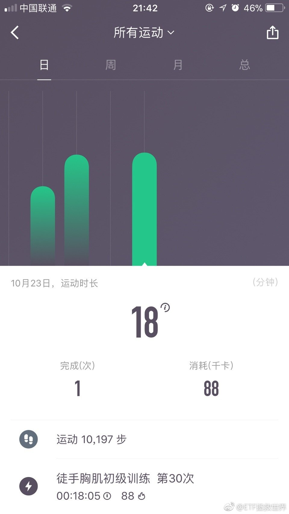

======================================================

ETF拯救世界 (5687069307) @
2017-10-24 09:03:39 Tue  
url: https://weibo.com/5687069307/FrON2p9yA

最近有不少朋友在微博关注我，但是好像看不懂我每天在嘚嘚什么。

答案是：公众号：chinaetfs ​​​

转发[4]  评论[25]  赞[117] 

======================================================

ETF拯救世界 (5687069307) @
2017-10-24 09:06:01 Tue  
url: https://weibo.com/5687069307/FrONZtLcX

好几天没上，今天一登录，突破50000了。

2017年

1024 ​​​

转发[1]  评论[35]  赞[132] 

+++++++++++++++++++++++++++++++++++++++++++++++++++++

图片：

======================================================

ETF拯救世界 (5687069307) @
2017-10-24 09:26:49 Tue  
url: https://weibo.com/5687069307/FrOWrnGyt

快月底了，那什么也开完了，给个机会吧，得唔得？ ​​​

转发[2]  评论[61]  赞[136] 

======================================================

ETF拯救世界 (5687069307) @
2017-10-24 10:55:35 Tue  
url: https://weibo.com/5687069307/FrPwtkZou

指数红红火火，又是2500只下跌。。 ​​​

转发[2]  评论[37]  赞[107] 

======================================================

ETF拯救世界 (5687069307) @
2017-10-24 12:31:15 Tue  
url: https://weibo.com/5687069307/FrQ9jlnoI

转需。

------------------------------------------------------
转推：
>  @ ()
>  2017-10-24 11:30:25 Tue  
>  url: 

>  抱歉，作者已设置仅展示半年内微博，此微博已不可见。 ​​​

转发[47]  评论[49]  赞[63] 

======================================================

ETF拯救世界 (5687069307) @
2017-10-24 14:15:51 Tue  
url: https://weibo.com/5687069307/FrQPLfk6N

$恒生指数 hkHSI$  不到29500你就这样搞，不厚道了。[哼] ​​​

转发[3]  评论[46]  赞[82] 

======================================================

ETF拯救世界 (5687069307) @
2017-10-24 21:23:11 Tue  
url: https://weibo.com/5687069307/FrTDdniqr

每日打卡（101）

坚持。 ​​​

转发[0]  评论[24]  赞[99] 

+++++++++++++++++++++++++++++++++++++++++++++++++++++

图片：

======================================================

ETF拯救世界 (5687069307) @
2017-10-25 07:15:33 Wed  
url: https://weibo.com/5687069307/FrXvFj5VT

咱们的海外债买入后的最近21个交易日中只有三天下跌，几乎每天都在涨。 ​​​

转发[4]  评论[99]  赞[211] 

======================================================

ETF拯救世界 (5687069307) @
2017-10-25 10:42:39 Wed  
url: https://weibo.com/5687069307/FrYRJ9WPD

不要卖。//@ETF拯救世界:继续说。不要卖。//@ETF拯救世界:写在反弹新高：我再说一次，不要卖。不要卖。不要卖。坐电梯不可怕，可怕的是轻易卖掉超廉价筹码。//@ETF拯救世界:每天这么浪，会不会累。

------------------------------------------------------
转推：
>  @ETF拯救世界 (5687069307)
>  2017-10-18 11:27:47 Wed  
>  url: https:/weibo.com/5687069307/FqVaz4iTP/

>  $全指医药 sh000991$ $养老产业 sz399812$ 
>  
>  事情还没有结束。 ​​​

转发[23]  评论[104]  赞[93] 

======================================================

ETF拯救世界 (5687069307) @
2017-10-25 13:23:29 Wed  
url: https://weibo.com/5687069307/FrZUZA7K5

讲真，我不信那谁他们会不继续玩几天。

要面子。 ​​​

转发[6]  评论[25]  赞[83] 

======================================================

ETF拯救世界 (5687069307) @
2017-10-25 13:28:10 Wed  
url: https://weibo.com/5687069307/FrZWUnNFj

回复@圣善周闻宗:有点兴奋。//@圣善周闻宗:今天十债貌似要崩了，E大怎么看？

------------------------------------------------------
转推：
>  @ETF拯救世界 (5687069307)
>  2017-10-25 13:23:29 Wed  
>  url: https:/weibo.com/5687069307/FrZUZA7K5/

>  讲真，我不信那谁他们会不继续玩几天。
>  
>  要面子。 ​​​

转发[3]  评论[13]  赞[60] 

======================================================

ETF拯救世界 (5687069307) @
2017-10-25 13:41:51 Wed  
url: https://weibo.com/5687069307/Fs02slJ28

就像一场战争。真的，你好好想想，是不是。

敌人强大的时候，不要硬怼。

先把我们的主力部队隐藏好，然后派出高科技的无人机全方位扫描敌军的布阵。

派出小股部队不断的攻击敌人最薄弱的环节。除非不出手，一出手就要攻城略地，结硬寨，轻易不会再丢。

一口一口蚕食敌人的势力。在敌我双方力量天平 ​​​

转发[35]  评论[79]  赞[188] 

======================================================

ETF拯救世界 (5687069307) @
2017-10-25 13:58:57 Wed  
url: https://weibo.com/5687069307/Fs09oCR3s

医药今年涨幅7.85%，这一个月就涨了6.5%。

再说一次，证券投资不是每个月，每年平均增长多少多少。而是可能几个月几年没动静，突然爆发赚一下就把几年的钱赚了。

所以最重要是低位收集筹码，然后耐心等。不要用过去的成绩看未来，而是要用未来的眼睛看现在。 ​​​

转发[62]  评论[65]  赞[207] 

======================================================

ETF拯救世界 (5687069307) @
2017-10-25 14:11:58 Wed  
url: https://weibo.com/5687069307/Fs0eGkaRn

4不4要冲11000了。//@ETF拯救世界:不要卖。//@ETF拯救世界:继续说。不要卖。//@ETF拯救世界:写在反弹新高：我再说一次，不要卖。不要卖。不要卖。坐电梯不可怕，可怕的是轻易卖掉超廉价筹码。//@ETF拯救世界:每天这么浪，会不会累。

------------------------------------------------------
转推：
>  @ETF拯救世界 (5687069307)
>  2017-10-18 11:27:47 Wed  
>  url: https:/weibo.com/5687069307/FqVaz4iTP/

>  $全指医药 sh000991$ $养老产业 sz399812$ 
>  
>  事情还没有结束。 ​​​

转发[5]  评论[18]  赞[67] 

======================================================

ETF拯救世界 (5687069307) @
2017-10-25 14:47:49 Wed  
url: https://weibo.com/5687069307/Fs0terZo8

159938折价0.4%。

做市商，你们的良心难道不会痛吗。 ​​​

转发[4]  评论[15]  赞[68] 

======================================================

ETF拯救世界 (5687069307) @
2017-10-25 14:57:08 Wed  
url: https://weibo.com/5687069307/Fs0x16HnR

一切按照剧本走 ​​​

转发[11]  评论[61]  赞[101] 

+++++++++++++++++++++++++++++++++++++++++++++++++++++

图片：

======================================================

ETF拯救世界 (5687069307) @
2017-10-25 15:02:27 Wed  
url: https://weibo.com/5687069307/Fs0zaDLRs

拉上去了。良心发现。

------------------------------------------------------
转推：
>  @ETF拯救世界 (5687069307)
>  2017-10-25 14:47:49 Wed  
>  url: https:/weibo.com/5687069307/Fs0terZo8/

>  159938折价0.4%。
>  
>  做市商，你们的良心难道不会痛吗。 ​​​

转发[1]  评论[13]  赞[83] 

======================================================

ETF拯救世界 (5687069307) @
2017-10-26 08:42:02 Thu  
url: https://weibo.com/5687069307/Fs7vftLxD

现在计划歌单里的好歌已经排好队蠢蠢欲动了。

然而一次只放一首。得多久才能放完啊。[并不简单] ​​​

转发[2]  评论[90]  赞[155] 

======================================================

ETF拯救世界 (5687069307) @
2017-10-26 09:52:40 Thu  
url: https://weibo.com/5687069307/Fs7XW6wpB

11000是不是内定了。//@ETF拯救世界:4不4要冲11000了。//@ETF拯救世界:不要卖。//@ETF拯救世界:继续说。不要卖。//@ETF拯救世界:写在反弹新高：我再说一次，不要卖。不要卖。不要卖。坐电梯不可怕，可怕的是轻易卖掉超廉价筹码。//@ETF拯救世界:每天这么浪，会不会累。

------------------------------------------------------
转推：
>  @ETF拯救世界 (5687069307)
>  2017-10-18 11:27:47 Wed  
>  url: https:/weibo.com/5687069307/FqVaz4iTP/

>  $全指医药 sh000991$ $养老产业 sz399812$ 
>  
>  事情还没有结束。 ​​​

转发[4]  评论[21]  赞[63] 

======================================================

ETF拯救世界 (5687069307) @
2017-10-26 10:16:10 Thu  
url: https://weibo.com/5687069307/Fs87t4FaH

回复@就看E大啦啦啦:估值没有到我说的34，为什么要绝望的等？你这个心态太差了，仓位远不是涨跌都舒服吧。//@就看E大啦啦啦:感觉等瀑布等得好绝望啊//@ETF拯救世界:11000是不是内定了。//@ETF拯救世界:4不4要冲11000了。//@ETF拯救世界:不要卖。//@ETF拯救世界:继续说。不要卖。

------------------------------------------------------
转推：
>  @ETF拯救世界 (5687069307)
>  2017-10-18 11:27:47 Wed  
>  url: https:/weibo.com/5687069307/FqVaz4iTP/

>  $全指医药 sh000991$ $养老产业 sz399812$ 
>  
>  事情还没有结束。 ​​​

转发[3]  评论[19]  赞[57] 

======================================================

ETF拯救世界 (5687069307) @
2017-10-26 10:22:40 Thu  
url: https://weibo.com/5687069307/Fs8a6axtv

回复@Ponder735:心态是买入之前设计好的，不是买入被套之后安慰自己啊。这完全不一样好吗。//@Ponder735:E大，之前不懂，被油气网格深套，心态如何调整[允悲]//@ETF拯救世界:回复@就看E大啦啦啦:估值没有到我说的34，为什么要绝望的等？你这个心态太差了，仓位远不是涨跌都舒服吧。

------------------------------------------------------
转推：
>  @ETF拯救世界 (5687069307)
>  2017-10-18 11:27:47 Wed  
>  url: https:/weibo.com/5687069307/FqVaz4iTP/

>  $全指医药 sh000991$ $养老产业 sz399812$ 
>  
>  事情还没有结束。 ​​​

转发[0]  评论[11]  赞[66] 

======================================================

ETF拯救世界 (5687069307) @
2017-10-26 10:28:46 Thu  
url: https://weibo.com/5687069307/Fs8cA8xbU

点击“买入”按钮前，需要想明白，自己为什么要买这个品种，用什么策略交易，最差会怎样，最好会怎样。跌了怎么做，跌多少做什么。涨了怎么做，涨多少做什么。现在买入，涨的概率大还是跌的概率大。

所有的一切都是买入之前就已经计划好的，而不是买入之后发生了再去考虑。

至于仓位，最重要的是不要 ​​​

转发[129]  评论[115]  赞[229] 

======================================================

ETF拯救世界 (5687069307) @
2017-10-26 11:03:54 Thu  
url: https://weibo.com/5687069307/Fs8qQinXC

回复@执念hhj:每只都可以搞。//@执念hhj:e大 第二只可转债来了 搞吗@ETF拯救世界 🤓

------------------------------------------------------
转推：
>  @ETF拯救世界 (5687069307)
>  2017-10-26 10:28:46 Thu  
>  url: https:/weibo.com/5687069307/Fs8cA8xbU/

>  点击“买入”按钮前，需要想明白，自己为什么要买这个品种，用什么策略交易，最差会怎样，最好会怎样。跌了怎么做，跌多少做什么。涨了怎么做，涨多少做什么。现在买入，涨的概率大还是跌的概率大。
>  
>  所有的一切都是买入之前就已经计划好的，而不是买入之后发生了再去考虑。
>  
>  至于仓位，最重要的是不要 ​​​

转发[1]  评论[24]  赞[66] 

======================================================

ETF拯救世界 (5687069307) @
2017-10-26 14:43:55 Thu  
url: https://weibo.com/5687069307/Fs9S9cauC

其实2015年之前，我在市场上最喜欢干的一件事，是追踪市场上那些“聪明”钱的动向。

你不能不承认，真的有一些钱特别敏感，特别有预见性。比如一些先行板块真的每次都在涨跌之前就有所动作。比如一些资金真的能大底建仓大顶跑掉。

这些信息，从新闻、资料、甚至盘面都能找到蛛丝马迹。

2015年7月以 ​​​

转发[23]  评论[72]  赞[149] 

======================================================

ETF拯救世界 (5687069307) @
2017-10-26 21:36:31 Thu  
url: https://weibo.com/5687069307/FsczCueQW

每日打卡（102）

这两天有点咳嗽，运动量小了不少 ​​​

转发[0]  评论[79]  赞[100] 

+++++++++++++++++++++++++++++++++++++++++++++++++++++

图片：

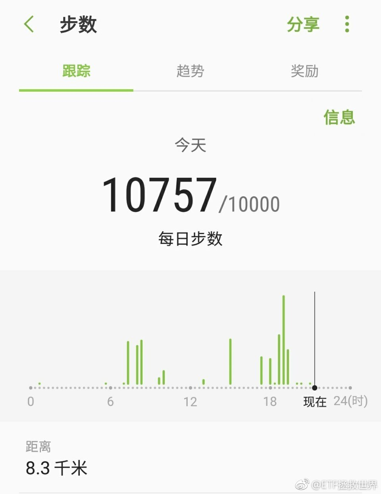

======================================================

ETF拯救世界 (5687069307) @
2017-10-27 11:35:17 Fri  
url: https://weibo.com/5687069307/Fsi44DoG8

我有个大胆的想法 ​​​

转发[6]  评论[161]  赞[151] 

======================================================

ETF拯救世界 (5687069307) @
2017-10-27 12:36:34 Fri  
url: https://weibo.com/5687069307/FsisXaeyV

滴滴 ​​​

转发[15]  评论[181]  赞[146] 

======================================================

ETF拯救世界 (5687069307) @
2017-10-27 13:43:08 Fri  
url: https://weibo.com/5687069307/FsiTYjd77

不觉得券商走得很有意思吗 ​​​

转发[6]  评论[50]  赞[75] 

======================================================

ETF拯救世界 (5687069307) @
2017-10-27 14:10:13 Fri  
url: https://weibo.com/5687069307/Fsj4Y1OYO

都在说油腻的中年男人。说起来，我是有个关于年龄关于状态的目标吧。

38岁，算是我的同龄人，差不了几岁，严格一点说是中年人了吧。

肌肉，精气神。努力的方向。

所以其实跟年龄无关，看你自己怎么活吧。。 ​​​

转发[5]  评论[92]  赞[108] 

+++++++++++++++++++++++++++++++++++++++++++++++++++++

图片：
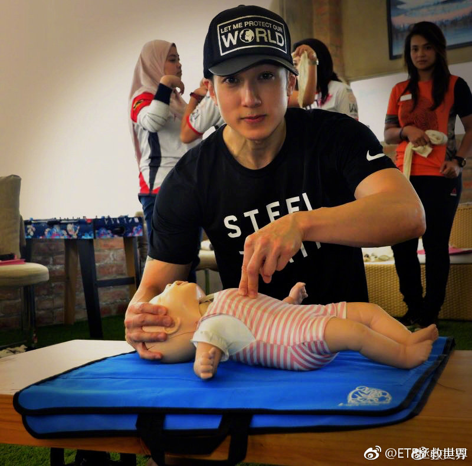

======================================================

ETF拯救世界 (5687069307) @
2017-10-27 14:11:59 Fri  
url: https://weibo.com/5687069307/Fsj5GhVWH

回复@BuBu蛇:有人想让你看到的，并非是真相。真相在转角，在幕后，不要被欺骗。总有蛛丝马迹，豁然开朗。聪明人总是有的，找到他们，观察。//@BuBu蛇:回复@益达铁粉一路莲花:说是牛市，就是不涨券商股[允悲]

------------------------------------------------------
转推：
>  @ETF拯救世界 (5687069307)
>  2017-10-27 13:43:08 Fri  
>  url: https:/weibo.com/5687069307/FsiTYjd77/

>  不觉得券商走得很有意思吗 ​​​

转发[2]  评论[30]  赞[84] 

======================================================

ETF拯救世界 (5687069307) @
2017-10-27 15:23:32 Fri  
url: https://weibo.com/5687069307/FsjyJ0nGu

厉害了 ​​​

转发[4]  评论[73]  赞[115] 

+++++++++++++++++++++++++++++++++++++++++++++++++++++

图片：

======================================================

ETF拯救世界 (5687069307) @
2017-10-27 15:41:14 Fri  
url: https://weibo.com/5687069307/FsjFUiWVa

今天数据出来了。弄不好过几天要加车。三季报+2000多只股票持续下跌的威力。

不一定。 ​​​

转发[9]  评论[132]  赞[238] 

======================================================

ETF拯救世界 (5687069307) @
2017-10-28 09:17:05 Sat  
url: https://weibo.com/5687069307/FsqAtwXjS

高抛低吸。这二十年来，社保管理人也好，汇金也好，一直有高人操盘。这次gjd也不例外。

------------------------------------------------------
转推：
>  @东方财富网 (1801487174)
>  2017-10-28 04:37:46 Sat  
>  url: https:/weibo.com/1801487174/FsoL6q7T1/

>  【“国家队”基金权益投资占比降至低位】随着基金三季报披露完毕，五只“国家队”基金投资路线浮出水面。相较二季度，五只基金均调低权益投资占基金总资产比例至低位。截至三季度末，华夏新经济权益投资占基金总资产比例从72.52%下调至56.83%；嘉实新机遇从53.47%下降至36.77%；易方达瑞惠从21.23%下降 ​​​

转发[21]  评论[43]  赞[96] 

======================================================

ETF拯救世界 (5687069307) @
2017-10-28 10:32:26 Sat  
url: https://weibo.com/5687069307/Fsr54383L

回复@如梦惊鸿:讲真，比我高。2012年底我重仓买入，汇金是2013上半年大量买入50 300 180ETF，买入时机差不多。但是2015我是三月份就跑的差不多了，汇金是4月5月才大量减持，多赚了不少。以他们的体量，只能说真的有水平。后来护盘的汇金已经不是以前那个了。//@如梦惊鸿:和E大比水平怎么样？

------------------------------------------------------
转推：
>  @东方财富网 (1801487174)
>  2017-10-28 04:37:46 Sat  
>  url: https:/weibo.com/1801487174/FsoL6q7T1/

>  【“国家队”基金权益投资占比降至低位】随着基金三季报披露完毕，五只“国家队”基金投资路线浮出水面。相较二季度，五只基金均调低权益投资占基金总资产比例至低位。截至三季度末，华夏新经济权益投资占基金总资产比例从72.52%下调至56.83%；嘉实新机遇从53.47%下降至36.77%；易方达瑞惠从21.23%下降 ​​​

转发[9]  评论[93]  赞[105] 

======================================================

ETF拯救世界 (5687069307) @
2017-10-30 11:45:08 Mon  
url: https://weibo.com/5687069307/FsKpz9NAR

有可能了

------------------------------------------------------
转推：
>  @ETF拯救世界 (5687069307)
>  2017-10-27 15:41:14 Fri  
>  url: https:/weibo.com/5687069307/FsjFUiWVa/

>  今天数据出来了。弄不好过几天要加车。三季报+2000多只股票持续下跌的威力。
>  
>  不一定。 ​​​

转发[0]  评论[56]  赞[123] 

======================================================

ETF拯救世界 (5687069307) @
2017-10-30 11:51:47 Mon  
url: https://weibo.com/5687069307/FsKsgoE1t

再说一次观点。这轮债券会先见底。有人说股市不是见底了吗。呵呵。//@ETF拯救世界:坚持这个结论。债券会先见底。所以，热烈的盼望着4%以上。我的资金饥渴难耐了。如果能够更高，那我会做梦都笑出来。

------------------------------------------------------
转推：
>  @ETF拯救世界 (5687069307)
>  2017-08-31 09:08:39 Thu  
>  url: https:/weibo.com/5687069307/FjBKfkGc2/

>  坚持债券会先于股票几个月见底的观点。 ​​​

转发[18]  评论[42]  赞[102] 

======================================================

ETF拯救世界 (5687069307) @
2017-10-30 11:56:25 Mon  
url: https://weibo.com/5687069307/FsKu97qzu

今天油气涨，A股跌。再看看本月发车文章中关于平滑周期的论述。 ​​​

转发[5]  评论[59]  赞[138] 

======================================================

ETF拯救世界 (5687069307) @
2017-10-30 12:41:13 Mon  
url: https://weibo.com/5687069307/FsKMkmXZW

这几天，有几个方面的信息，要综合分析。

第一个是走势。券商近期走得非常渣。要知道券商一向是市场温度计。说明有些smart money在做事。

第二个是季报。有媒体也已经统计了，GJD减持不少。包括委托给基金公司的几个ww定向基金。个中缘由值得玩味。

第三个是品种。最近非常明显的有些大股票，主要是 ​​​

转发[61]  评论[71]  赞[200] 

======================================================

ETF拯救世界 (5687069307) @
2017-10-30 13:13:36 Mon  
url: https://weibo.com/5687069307/FsKZtmKGN

朋友送了个紫砂壶，有没有懂的，指教一下，该怎么用。有什么规矩吗。 ​​​

转发[1]  评论[80]  赞[79] 

======================================================

ETF拯救世界 (5687069307) @
2017-10-30 13:46:44 Mon  
url: https://weibo.com/5687069307/FsLcVh3Mp

国债期货。你信不信，今天又要放水了。 ​​​

转发[5]  评论[35]  赞[91] 

+++++++++++++++++++++++++++++++++++++++++++++++++++++

图片：
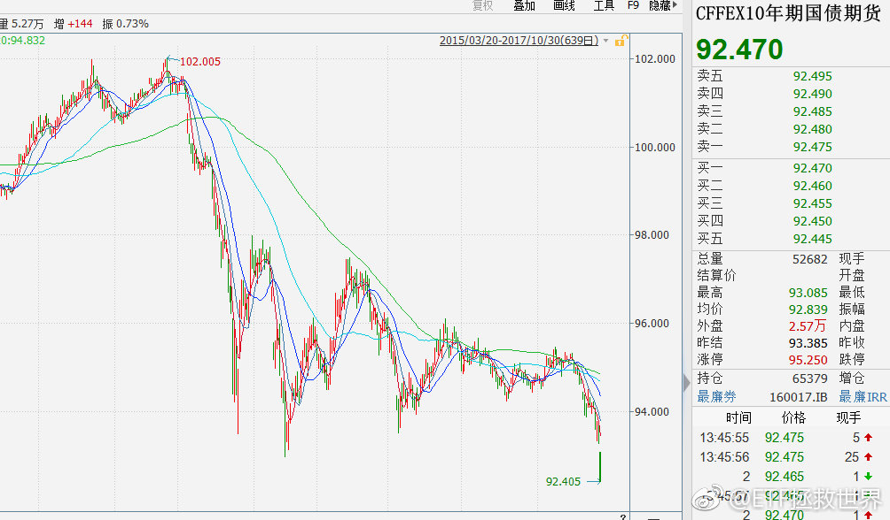

======================================================

ETF拯救世界 (5687069307) @
2017-10-30 13:51:54 Mon  
url: https://weibo.com/5687069307/FsLf1g73y

很多人高估了自己的风险承受能力。危机来临后，才发现自己的财富的风险敞口有多大。自己也没有原来想象中对波动那么无所谓。

可惜，晚了。 ​​​

转发[10]  评论[53]  赞[153] 

======================================================

ETF拯救世界 (5687069307) @
2017-10-30 15:01:00 Mon  
url: https://weibo.com/5687069307/FsLH4erTK

今天计划收益率预计下跌0.1x%。不会新高了。

都别嘚瑟了，关灯吃面吧。 ​​​

转发[2]  评论[87]  赞[112] 

======================================================

ETF拯救世界 (5687069307) @
2017-10-30 15:23:31 Mon  
url: https://weibo.com/5687069307/FsLQd0iXj

今日数据：全市场估值2014年2月以来最低。 ​​​

转发[30]  评论[116]  赞[170] 

======================================================

ETF拯救世界 (5687069307) @
2017-10-30 15:42:13 Mon  
url: https://weibo.com/5687069307/FsLXO0PfO

sorry，写错了，2014年12月………………

------------------------------------------------------
转推：
>  @ETF拯救世界 (5687069307)
>  2017-10-30 15:23:31 Mon  
>  url: https:/weibo.com/5687069307/FsLQd0iXj/

>  今日数据：全市场估值2014年2月以来最低。 ​​​

转发[14]  评论[57]  赞[111] 

======================================================

ETF拯救世界 (5687069307) @
2017-10-30 16:05:57 Mon  
url: https://weibo.com/5687069307/FsM7qCeX0

估值数据“完全不对”。上次有人说这句话，我记得是2014年的雪球。

2012年11月28日，中小板创业板见底的前一天，我在雪球发了全市场估值见底的帖子。之后一年多就没再去雪球。

2013年底还是2014年，有个人把我那个帖子挖了出来，转了，引起了一些议论。然后我就又开始在雪球发言。

当然，那时候也会 ​​​

转发[66]  评论[160]  赞[411] 

======================================================

ETF拯救世界 (5687069307) @
2017-10-30 16:56:11 Mon  
url: https://weibo.com/5687069307/FsMrPjpe8

回复@一味7:2016年1月30日，中证1000是7385点，今天该指数收盘7574点。将近两年过去，这1000只股票的业绩增长是多少？放眼全市场3405只股票，比当时低很奇怪吗？难道你看上证和沪深300讨论全市场？//@一味7:我就问  今天估值比2016/01/30还低？

------------------------------------------------------
转推：
>  @ETF拯救世界 (5687069307)
>  2017-10-30 16:05:57 Mon  
>  url: https:/weibo.com/5687069307/FsM7qCeX0/

>  估值数据“完全不对”。上次有人说这句话，我记得是2014年的雪球。
>  
>  2012年11月28日，中小板创业板见底的前一天，我在雪球发了全市场估值见底的帖子。之后一年多就没再去雪球。
>  
>  2013年底还是2014年，有个人把我那个帖子挖了出来，转了，引起了一些议论。然后我就又开始在雪球发言。
>  
>  当然，那时候也会 ​​​

转发[18]  评论[26]  赞[87] 

======================================================

ETF拯救世界 (5687069307) @
2017-10-30 17:14:55 Mon  
url: https://weibo.com/5687069307/FsMzqhD6d

回复@一味7:2016年1月底至今，当时的2795只股票中，上涨的是1621只，下跌1172只。算上利润增长，A股全市场估值真的是下降了。//@一味7:@ETF拯救世界 e大 我错了， 我看上证 深成指都涨了25% ，比中证1000的话  我就无话可说，估计e大的估值体系是等权的，

------------------------------------------------------
转推：
>  @ETF拯救世界 (5687069307)
>  2017-10-30 16:05:57 Mon  
>  url: https:/weibo.com/5687069307/FsM7qCeX0/

>  估值数据“完全不对”。上次有人说这句话，我记得是2014年的雪球。
>  
>  2012年11月28日，中小板创业板见底的前一天，我在雪球发了全市场估值见底的帖子。之后一年多就没再去雪球。
>  
>  2013年底还是2014年，有个人把我那个帖子挖了出来，转了，引起了一些议论。然后我就又开始在雪球发言。
>  
>  当然，那时候也会 ​​​

转发[13]  评论[18]  赞[66] 

======================================================

ETF拯救世界 (5687069307) @
2017-10-30 17:23:31 Mon  
url: https://weibo.com/5687069307/FsMCUyXWG

回复@豆豆海要行天下:说出来你不信，中证500三季报平均利润增幅超过20%。//@豆豆海要行天下:利润增长非常厉害，我看三季报很多公司都在百分之几十的同比增速。这样估值就会下降很快。 再这样，明年说不定可以买更多[挤眼]

------------------------------------------------------
转推：
>  @ETF拯救世界 (5687069307)
>  2017-10-30 16:05:57 Mon  
>  url: https:/weibo.com/5687069307/FsM7qCeX0/

>  估值数据“完全不对”。上次有人说这句话，我记得是2014年的雪球。
>  
>  2012年11月28日，中小板创业板见底的前一天，我在雪球发了全市场估值见底的帖子。之后一年多就没再去雪球。
>  
>  2013年底还是2014年，有个人把我那个帖子挖了出来，转了，引起了一些议论。然后我就又开始在雪球发言。
>  
>  当然，那时候也会 ​​​

转发[8]  评论[52]  赞[102] 

======================================================

ETF拯救世界 (5687069307) @
2017-10-30 21:00:07 Mon  
url: https://weibo.com/5687069307/FsO2PwtbW

每日打卡（103）

咳嗽好多了，开始恢复训练 ​​​

转发[0]  评论[82]  赞[148] 

+++++++++++++++++++++++++++++++++++++++++++++++++++++

图片：

======================================================

ETF拯救世界 (5687069307) @
2017-10-31 10:33:16 Tue  
url: https://weibo.com/5687069307/FsTmTgEFe

有时候呢，补仓太快是赔钱利器之一。

节奏。很重要。 ​​​

转发[46]  评论[159]  赞[220] 

======================================================

ETF拯救世界 (5687069307) @
2017-10-31 10:56:40 Tue  
url: https://weibo.com/5687069307/FsTwocr6R

截至昨天为止，今年上涨的股票821只，下跌2139只。

上涨的股票不到28%。

同时，全市场利润增速维持在10%左右。

此消彼长。 ​​​

转发[12]  评论[52]  赞[125] 

======================================================

ETF拯救世界 (5687069307) @
2017-10-31 11:25:09 Tue  
url: https://weibo.com/5687069307/FsTHXkxvt

说买就买不扯淡。 http://t.cn/RWeBO54 //@ETF拯救世界:买买买

------------------------------------------------------
转推：
>  @ ()
>  2017-10-11 21:53:49 Wed  
>  url: 

>  抱歉，作者已设置仅展示半年内微博，此微博已不可见。 ​​​

转发[1]  评论[60]  赞[106] 

======================================================

ETF拯救世界 (5687069307) @
2017-10-31 11:32:53 Tue  
url: https://weibo.com/5687069307/FsTL63Z1f

谁还记得汽车是个强周期行业。

------------------------------------------------------
转推：
>  @日经中文网 (2478163131)
>  2017-10-31 11:32:02 Tue  
>  url: https:/weibo.com/2478163131/FsTKKdswr/

>  【比亚迪7～9月纯利润同比减少23%】7～9月销售额增长3.8%，但政府环保车补贴减少影响了利润。预计全年纯利润将减少15～25%…http://t.cn/RWedDgZ ​​​

转发[6]  评论[54]  赞[86] 

======================================================

ETF拯救世界 (5687069307) @
2017-10-31 14:45:23 Tue  
url: https://weibo.com/5687069307/FsV1e58iw

一只股票，让多少人的命运为之改变。真的NB。J

------------------------------------------------------
转推：
>  @ ()
>  2017-10-31 14:43:52 Tue  
>  url: 

>  抱歉，作者已设置仅展示半年内微博，此微博已不可见。 ​​​

转发[19]  评论[45]  赞[66] 

======================================================

ETF拯救世界 (5687069307) @
2017-10-31 15:20:37 Tue  
url: https://weibo.com/5687069307/FsVfx8I49

回复@夏洛蒂L:我不懂融创也不懂乐视，但我懂人。J和S是一类人。不是说人品，而是敢干的那股劲。翻翻S的履历就可以知道，真的敢干，不输J。包括投资他们股票的人。球球上的，你会发现，投资他们股票的人和这两个人其实是一类人。敢干！错了就死，对了就发！

------------------------------------------------------
转推：
>  @ ()
>  2017-10-31 14:43:52 Tue  
>  url: 

>  抱歉，作者已设置仅展示半年内微博，此微博已不可见。 ​​​

转发[10]  评论[74]  赞[77] 

======================================================

ETF拯救世界 (5687069307) @
2017-10-31 20:08:16 Tue  
url: https://weibo.com/5687069307/FsX8hv9oA

每日打卡（104）

坚持。健康是最大的幸福。 ​​​

转发[10]  评论[35]  赞[139] 

+++++++++++++++++++++++++++++++++++++++++++++++++++++

图片：

======================================================

