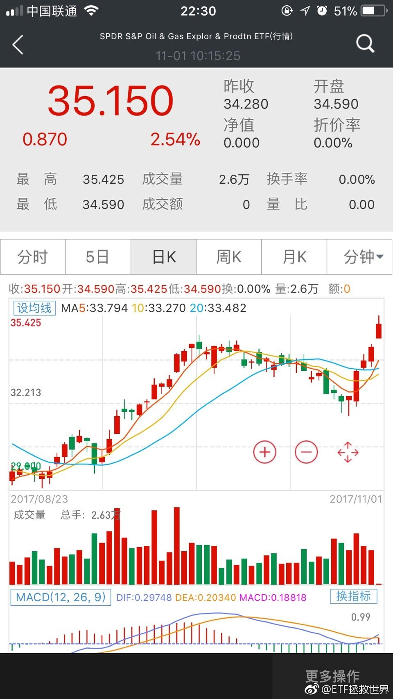
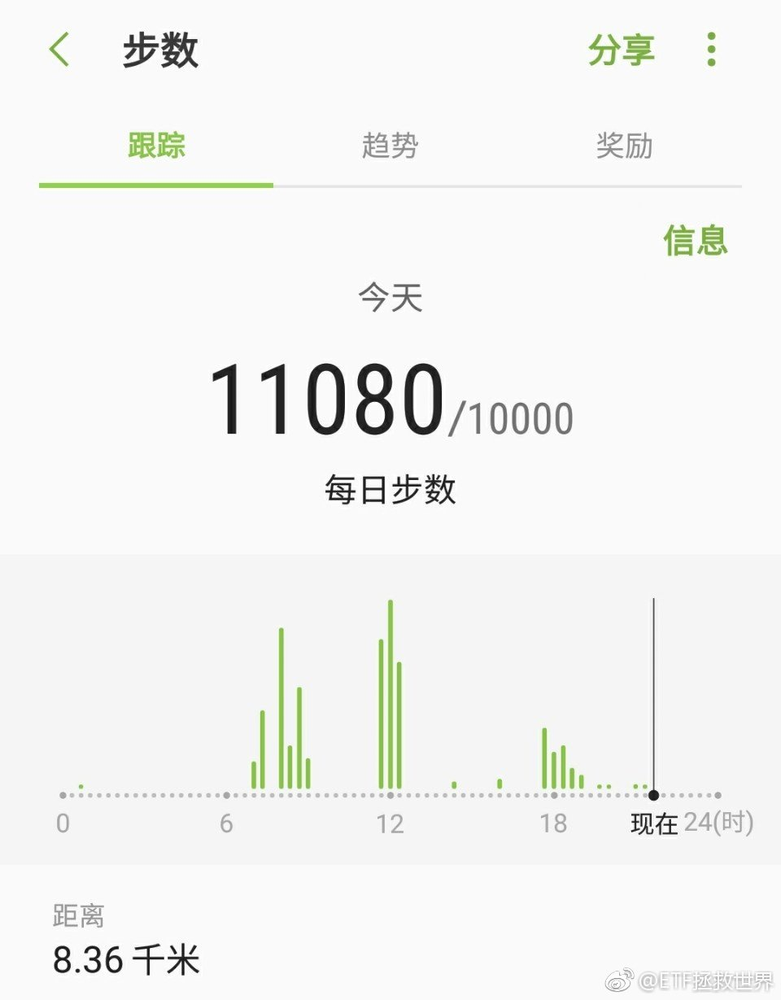
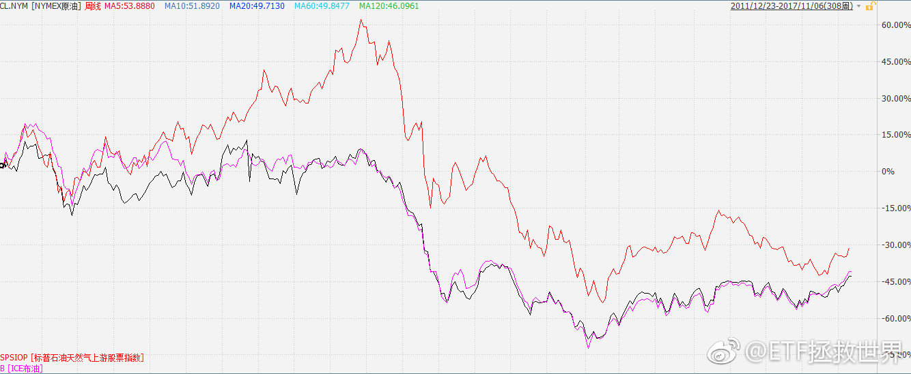
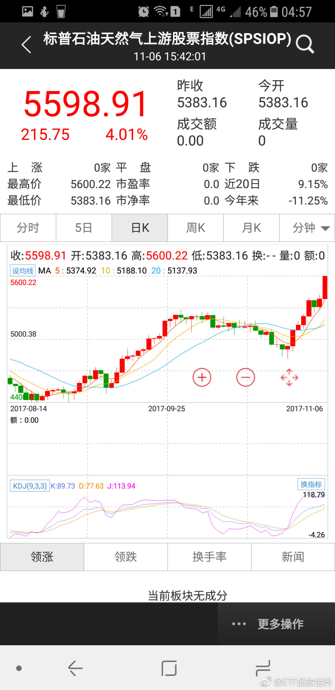
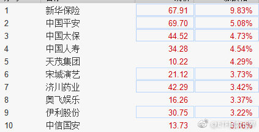
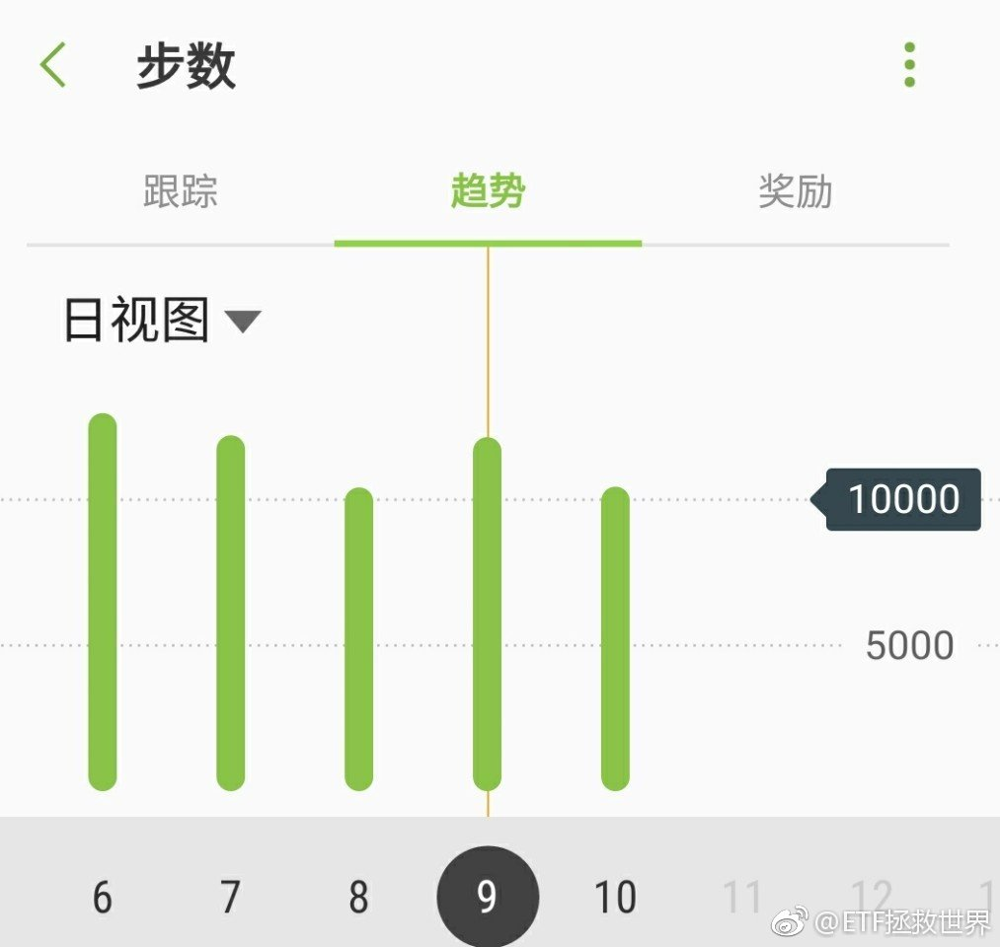
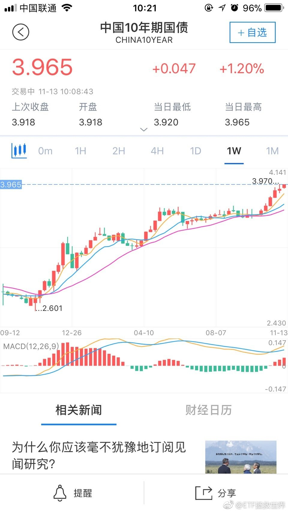
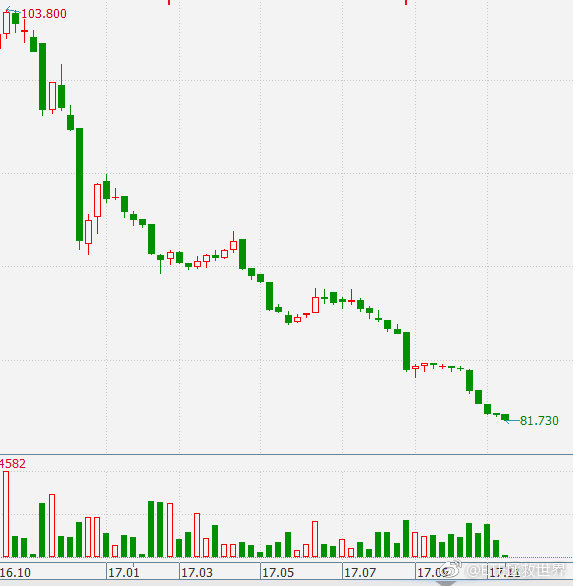
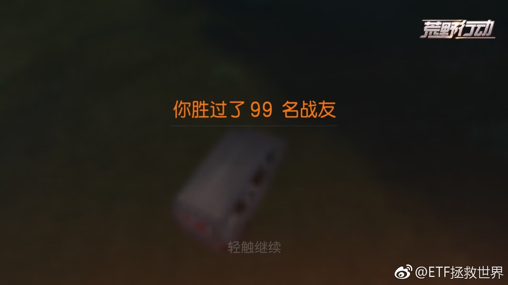
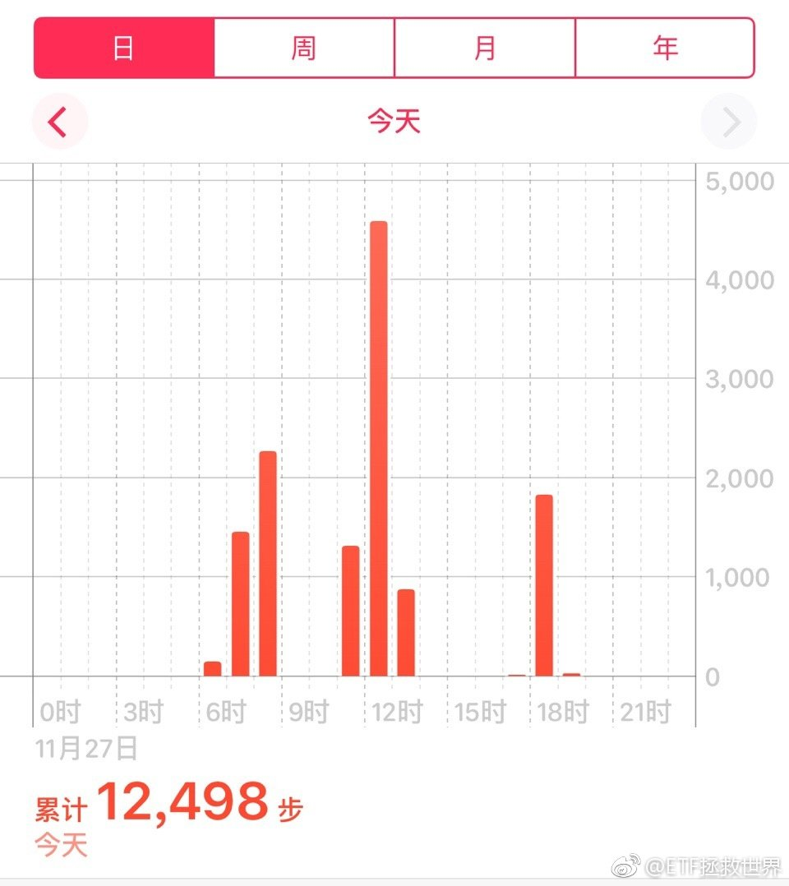

ETF拯救世界 (5687069307) @
2017-11-01 06:27:46 Wed  
url: https://weibo.com/5687069307/Ft1bJEUYn

回复@钱小彪:帮转，有没有明白的//@钱小彪:e大，您粉丝能人多，能不能帮我转发问下，家里的儿子，二周岁半，过敏性咳嗽两个月整了，每星期都去医院配点药吃吃，然后稍微好一点，但是一直不断根，有有啥好的办法，

------------------------------------------------------
转推：
>  @ETF拯救世界 (5687069307)
>  2017-10-31 20:08:16 Tue  
>  url: https:/weibo.com/5687069307/FsX8hv9oA/

>  每日打卡（104）
>  
>  坚持。健康是最大的幸福。 ​​​

转发[3]  评论[95]  赞[50] 

======================================================

ETF拯救世界 (5687069307) @
2017-11-01 07:36:56 Wed  
url: https://weibo.com/5687069307/Ft1DOpxwi

抄底资金是谁，具体展开讲讲[并不简单]

------------------------------------------------------
转推：
>  @ ()
>  2017-11-01 06:40:14 Wed  
>  url: 

>  抱歉，作者已设置仅展示半年内微博，此微博已不可见。 ​​​

转发[2]  评论[43]  赞[65] 

======================================================

ETF拯救世界 (5687069307) @
2017-11-01 08:49:04 Wed  
url: https://weibo.com/5687069307/Ft275B4ya

再下调30%，就可以在薯片开盘前买重仓基金套利了。相信会有抄底达人进去护盘的。

------------------------------------------------------
转推：
>  @蓝鲸财经记者工作平台 (1885454921)
>  2017-11-01 08:22:04 Wed  
>  url: https:/weibo.com/1885454921/Ft1W8kkqh/

>  【鲸快讯：IPO财务造假质疑再起乐视网 估值遭22家基金公司集体下调】11月1日讯，继7月对乐视网下调估值后，昨日，包括华安、招商等数十家基金公司集体发出下调乐视网估值的公告，普遍按7.82元估值，即在此前按停牌前收盘价三个跌停估值的基础上，进一步下调30%。(每经) ​​​

转发[5]  评论[30]  赞[63] 

======================================================

ETF拯救世界 (5687069307) @
2017-11-01 09:10:44 Wed  
url: https://weibo.com/5687069307/Ft2fT6Lmq

回复@抓住牛尾:所以我说的是“开盘前”，严格的说是“复牌前”。不能买早了。//@抓住牛尾:万一退市了呢[笑cry]//@ETF拯救世界:再下调30%，就可以在薯片开盘前买重仓基金套利了。相信会有抄底达人进去护盘的。

------------------------------------------------------
转推：
>  @蓝鲸财经记者工作平台 (1885454921)
>  2017-11-01 08:22:04 Wed  
>  url: https:/weibo.com/1885454921/Ft1W8kkqh/

>  【鲸快讯：IPO财务造假质疑再起乐视网 估值遭22家基金公司集体下调】11月1日讯，继7月对乐视网下调估值后，昨日，包括华安、招商等数十家基金公司集体发出下调乐视网估值的公告，普遍按7.82元估值，即在此前按停牌前收盘价三个跌停估值的基础上，进一步下调30%。(每经) ​​​

转发[1]  评论[17]  赞[41] 

======================================================

ETF拯救世界 (5687069307) @
2017-11-01 09:49:46 Wed  
url: https://weibo.com/5687069307/Ft2vJkmfa

$162411 华宝油气。

6月以来买入的人全都解套了。

投资，淡定一点。指数，死不了人。 ​​​

转发[6]  评论[78]  赞[170] 

======================================================

ETF拯救世界 (5687069307) @
2017-11-01 10:06:20 Wed  
url: https://weibo.com/5687069307/Ft2CrC2tb

回复@万物之一马:补之前忘了买的。//@万物之一马:E大雪球上的调仓是计划吗[疑问]

------------------------------------------------------
转推：
>  @ETF拯救世界 (5687069307)
>  2017-11-01 09:49:46 Wed  
>  url: https:/weibo.com/5687069307/Ft2vJkmfa/

>  $162411 华宝油气。
>  
>  6月以来买入的人全都解套了。
>  
>  投资，淡定一点。指数，死不了人。 ​​​

转发[2]  评论[21]  赞[71] 

======================================================

ETF拯救世界 (5687069307) @
2017-11-01 13:04:16 Wed  
url: https://weibo.com/5687069307/Ft3MGa7wa

1992年买日经指数的，终于解套了。。。

如果当时是30岁，现在已经55岁。

刚才算了一下，如果每年年底定投，25年过去，收益率有63%，年化3.多，不到4%。是不是很渣。

是的。但你不知道的是，2011年，总收益-35%。买了将近20年还亏35%你造那种感觉吗。

所以，最重要的，千万不能买贵。如果贵的时候不 ​​​

转发[90]  评论[81]  赞[198] 

======================================================

ETF拯救世界 (5687069307) @
2017-11-01 13:24:30 Wed  
url: https://weibo.com/5687069307/Ft3UTgz70

回复@浪子大哥201605:我估计不会破产。老爷子很聪明，应该也会赚很多。不过我估计有可能会进去。//@浪子大哥201605:回复@小韭菜V:巴菲特在中国，早就破产了！

------------------------------------------------------
转推：
>  @ETF拯救世界 (5687069307)
>  2017-11-01 13:04:16 Wed  
>  url: https:/weibo.com/5687069307/Ft3MGa7wa/

>  1992年买日经指数的，终于解套了。。。
>  
>  如果当时是30岁，现在已经55岁。
>  
>  刚才算了一下，如果每年年底定投，25年过去，收益率有63%，年化3.多，不到4%。是不是很渣。
>  
>  是的。但你不知道的是，2011年，总收益-35%。买了将近20年还亏35%你造那种感觉吗。
>  
>  所以，最重要的，千万不能买贵。如果贵的时候不 ​​​

转发[6]  评论[27]  赞[90] 

======================================================

ETF拯救世界 (5687069307) @
2017-11-01 18:35:51 Wed  
url: https://weibo.com/5687069307/Ft5Xgwd8E

港股没有涨跌停。我真怕某些股票一天就是-20%、-30%。。。 ​​​

转发[3]  评论[51]  赞[98] 

======================================================

ETF拯救世界 (5687069307) @
2017-11-01 19:30:54 Wed  
url: https://weibo.com/5687069307/Ft6jC5VJY

回复@用户6266731368:在所有平台里面，微博关注人数是涨的最慢的……//@用户6266731368:粉丝涨的好快啊，我来微博的时候才2.2万，现在3.2了[微笑][微笑][微笑]

------------------------------------------------------
转推：
>  @ETF拯救世界 (5687069307)
>  2017-11-01 18:35:51 Wed  
>  url: https:/weibo.com/5687069307/Ft5Xgwd8E/

>  港股没有涨跌停。我真怕某些股票一天就是-20%、-30%。。。 ​​​

转发[0]  评论[39]  赞[70] 

======================================================

ETF拯救世界 (5687069307) @
2017-11-01 22:31:54 Wed  
url: https://weibo.com/5687069307/Ft7v56jLa

不好的时候，所有人都嫌弃。

朋友们记住这一刻。没有永远垃圾的品种。 ​​​

转发[14]  评论[69]  赞[121] 

+++++++++++++++++++++++++++++++++++++++++++++++++++++

图片：

======================================================

ETF拯救世界 (5687069307) @
2017-11-01 23:05:38 Wed  
url: https://weibo.com/5687069307/Ft7IMllHa

回复@哑巴唱歌_yj4:毕竟毒奶啊。//@哑巴唱歌_yj4:明天一早醒来说不定翻绿了[阴险]

------------------------------------------------------
转推：
>  @ETF拯救世界 (5687069307)
>  2017-11-01 22:31:54 Wed  
>  url: https:/weibo.com/5687069307/Ft7v56jLa/

>  不好的时候，所有人都嫌弃。
>  
>  朋友们记住这一刻。没有永远垃圾的品种。 ​​​

转发[0]  评论[5]  赞[45] 

======================================================

ETF拯救世界 (5687069307) @
2017-11-01 23:06:35 Wed  
url: https://weibo.com/5687069307/Ft7Ja1C2r

回复@卖火柴的下不微粒:第一次都很紧张。有经验就好了……//@卖火柴的下不微粒:回复@ETF拯救世界:我跟着你操作的第一个品种就这货，上一波跟的胆战心惊。这一波下来就轻松多了，只遗憾油价没跌太多就回头了

------------------------------------------------------
转推：
>  @ETF拯救世界 (5687069307)
>  2017-11-01 22:31:54 Wed  
>  url: https:/weibo.com/5687069307/Ft7v56jLa/

>  不好的时候，所有人都嫌弃。
>  
>  朋友们记住这一刻。没有永远垃圾的品种。 ​​​

转发[1]  评论[16]  赞[58] 

======================================================

ETF拯救世界 (5687069307) @
2017-11-01 23:17:23 Wed  
url: https://weibo.com/5687069307/Ft7NxwaJo

真.毒奶，睡觉去了…… ​​​

转发[4]  评论[55]  赞[80] 

======================================================

ETF拯救世界 (5687069307) @
2017-11-02 08:38:49 Thu  
url: https://weibo.com/5687069307/Ftbtqxhr2

功力减退了。迷茫，苦闷，人生没了方向。  像没有脚的鸟，不停的飞，飞得累了就睡在风里，没有根基。  毒奶不灵，生命的意义是什么。  退博了。  [并不简单]

------------------------------------------------------
转推：
>  @ETF拯救世界 (5687069307)
>  2017-11-01 23:17:23 Wed  
>  url: https:/weibo.com/5687069307/Ft7NxwaJo/

>  真.毒奶，睡觉去了…… ​​​

转发[3]  评论[105]  赞[95] 

======================================================

ETF拯救世界 (5687069307) @
2017-11-02 09:11:14 Thu  
url: https://weibo.com/5687069307/FtbGAFERs

回复@当投资成为一种爱好:刚退票。想起去年五月份，不敢走了。 http://t.cn/RlZYBLR //@当投资成为一种爱好:看来E大需要出国旅游放松一下了[可爱]//@ETF拯救世界:功力减退了。迷茫，苦闷，人生没了方向。  像没有脚的鸟，不停的飞，飞得累了就睡在风里，没有根基。  毒奶不灵，生命的意义是什么。  退博了。  [并不简单]

------------------------------------------------------
转推：
>  @ETF拯救世界 (5687069307)
>  2017-11-01 23:17:23 Wed  
>  url: https:/weibo.com/5687069307/Ft7NxwaJo/

>  真.毒奶，睡觉去了…… ​​​

转发[1]  评论[30]  赞[51] 

======================================================

ETF拯救世界 (5687069307) @
2017-11-02 09:24:50 Thu  
url: https://weibo.com/5687069307/FtbM6zB7f

来了 ​​​

转发[0]  评论[47]  赞[94] 

+++++++++++++++++++++++++++++++++++++++++++++++++++++

图片：

======================================================

ETF拯救世界 (5687069307) @
2017-11-02 09:33:56 Thu  
url: https://weibo.com/5687069307/FtbPNxCwT

我不信GJD会看着两融继续往上冲。

XG下去了，LSY这么聪明，能不吸取教训吗。 ​​​

转发[5]  评论[34]  赞[82] 

======================================================

ETF拯救世界 (5687069307) @
2017-11-02 09:38:22 Thu  
url: https://weibo.com/5687069307/FtbRBet7A

4不4要加一车呢。 ​​​

转发[2]  评论[131]  赞[156] 

======================================================

ETF拯救世界 (5687069307) @
2017-11-02 10:24:10 Thu  
url: https://weibo.com/5687069307/FtcabFHGO

券商继续跪，两融不停加。冰与火的世界。分歧很大啊。 ​​​

转发[40]  评论[37]  赞[87] 

======================================================

ETF拯救世界 (5687069307) @
2017-11-02 10:29:30 Thu  
url: https://weibo.com/5687069307/Ftccm9SmX

回复@xDBA顾德吴:我的观点是，券商并不是券商，不能去分析券商的估值。券商就是牛熊市。高弹性的“大盘指数”。我会买，但是会在接近底部区域，左侧右侧都有可能。但不是现在。//@xDBA顾德吴:大e胸，证券etf干不干？

------------------------------------------------------
转推：
>  @ETF拯救世界 (5687069307)
>  2017-11-02 10:24:10 Thu  
>  url: https:/weibo.com/5687069307/FtcabFHGO/

>  券商继续跪，两融不停加。冰与火的世界。分歧很大啊。 ​​​

转发[32]  评论[50]  赞[103] 

======================================================

ETF拯救世界 (5687069307) @
2017-11-02 13:42:42 Thu  
url: https://weibo.com/5687069307/FtdsM8ozo

滴~~~~~~~~ ​​​

转发[7]  评论[210]  赞[186] 

======================================================

ETF拯救世界 (5687069307) @
2017-11-02 14:27:23 Thu  
url: https://weibo.com/5687069307/FtdKUtE0L

目前仓位已经非常合适。除非有较明显下跌，否则应该不会再买。

涨也好，跌也好。踏踏实实看戏了。 ​​​

转发[8]  评论[130]  赞[203] 

======================================================

ETF拯救世界 (5687069307) @
2017-11-02 21:43:47 Thu  
url: https://weibo.com/5687069307/FtgC30Hb7

每日打卡（105）

坚持。 ​​​

转发[1]  评论[32]  赞[122] 

+++++++++++++++++++++++++++++++++++++++++++++++++++++

图片：

======================================================

ETF拯救世界 (5687069307) @
2017-11-03 09:55:51 Fri  
url: https://weibo.com/5687069307/Ftlpc8C4F

从我的体系看，昨天A股（注意，我说的是A股全体，不是那两三百只涨得好的）正式进入2015年以来价值回归的下半场。

这一路走来，各种因素干扰，真的不容易。

如果这一次有机会回到谷底，那就是再一次资产飞跃的时候。也是2012年底以来，第一次大机会。

未来的路不会好走，也许会有惊涛骇浪。不过各位 ​​​

转发[123]  评论[224]  赞[329] 

======================================================

ETF拯救世界 (5687069307) @
2017-11-03 10:46:57 Fri  
url: https://weibo.com/5687069307/FtlJWnZsS

谢谢昨天打赏请我喝咖啡的朋友。

今天北京特别冷，晒着太阳喝着热咖啡真的舒服，谢谢！ ​​​

转发[4]  评论[63]  赞[194] 

+++++++++++++++++++++++++++++++++++++++++++++++++++++

图片：

======================================================

ETF拯救世界 (5687069307) @
2017-11-03 11:43:25 Fri  
url: https://weibo.com/5687069307/Ftm6QsyIJ

就是轮回，没什么新鲜的。该发生的一定会发生。

低买高卖，一轮轮，一次次。就是这么简单。 ​​​

转发[11]  评论[33]  赞[158] 

======================================================

ETF拯救世界 (5687069307) @
2017-11-03 11:53:49 Fri  
url: https://weibo.com/5687069307/Ftmb5b9Dd

回复@几乎不上:答案非常简单。就两个字：概率。你可以去研究一下计划的A股部分仓位。以及最近我们加仓的品种，所有品种，归一下类。归根结底是概率二字。

------------------------------------------------------
转推：
>  @ETF拯救世界 (5687069307)
>  2017-11-03 09:55:51 Fri  
>  url: https:/weibo.com/5687069307/Ftlpc8C4F/

>  从我的体系看，昨天A股（注意，我说的是A股全体，不是那两三百只涨得好的）正式进入2015年以来价值回归的下半场。
>  
>  这一路走来，各种因素干扰，真的不容易。
>  
>  如果这一次有机会回到谷底，那就是再一次资产飞跃的时候。也是2012年底以来，第一次大机会。
>  
>  未来的路不会好走，也许会有惊涛骇浪。不过各位 ​​​

转发[9]  评论[12]  赞[81] 

======================================================

ETF拯救世界 (5687069307) @
2017-11-03 11:57:26 Fri  
url: https://weibo.com/5687069307/FtmcxAgUn

看看仓位，真的舒服。朋友们，安详，温暖。

PEACE！ ​​​

转发[98]  评论[58]  赞[160] 

======================================================

ETF拯救世界 (5687069307) @
2017-11-03 12:48:31 Fri  
url: https://weibo.com/5687069307/FtmxhBxRa

回复@高级装逼师:个股不仅是会不会退市的问题。最关键的，你能确定牛市你的股票涨吗。赚了指数不赚钱的事情可不是少数。//@高级装逼师:给老婆已经打了预防针了，最多浮亏50%，毫无压力。永不退市，怕啥子，个股无法这么冷静

------------------------------------------------------
转推：
>  @ETF拯救世界 (5687069307)
>  2017-11-03 11:57:26 Fri  
>  url: https:/weibo.com/5687069307/FtmcxAgUn/

>  看看仓位，真的舒服。朋友们，安详，温暖。
>  
>  PEACE！ ​​​

转发[91]  评论[22]  赞[89] 

======================================================

ETF拯救世界 (5687069307) @
2017-11-03 13:19:02 Fri  
url: https://weibo.com/5687069307/FtmJFgGYu

回复@请输入昵称_昵称:不可能。中证500极限大致是4500点，最多下跌30%。医药极限7500点，25%。大盘指数更是有人护盘，不会那么多。上面两个点位如果真的能到，我会融资买入。人生能有几回搏。//@请输入昵称_昵称:年底钱紧啦！该调整一波了吗？真希望跌倒一千点[嘻嘻]

------------------------------------------------------
转推：
>  @ETF拯救世界 (5687069307)
>  2017-11-03 11:57:26 Fri  
>  url: https:/weibo.com/5687069307/FtmcxAgUn/

>  看看仓位，真的舒服。朋友们，安详，温暖。
>  
>  PEACE！ ​​​

转发[84]  评论[50]  赞[112] 

======================================================

ETF拯救世界 (5687069307) @
2017-11-03 13:31:23 Fri  
url: https://weibo.com/5687069307/FtmOGb5VF

指数好在哪呢。

好在只要金融市场不死，GJ没问题，你就敢越跌越买。因为早晚会涨，必然会。

股票，说真的，一般人，你敢？？？

行业变迁，企业兴衰。我看，股票真的跌下去，除了个别的一些真正大概率长青的公司，绝大部分公司恐怕很难全部身家押注。

即使敢，牛市来了，指数肯定涨。你押注的股票就 ​​​

转发[50]  评论[65]  赞[184] 

======================================================

ETF拯救世界 (5687069307) @
2017-11-03 13:37:00 Fri  
url: https://weibo.com/5687069307/FtmQYiVPa

回复@嘿红1:2005-2007，两年6倍。2008-2010，两年2倍。2012-2015，三年三倍。这就叫做资产飞跃。A股是个神奇的地方，是金矿。//@嘿红1:好好奇资产飞跃是什么样子的[思考]

------------------------------------------------------
转推：
>  @ETF拯救世界 (5687069307)
>  2017-11-03 09:55:51 Fri  
>  url: https:/weibo.com/5687069307/Ftlpc8C4F/

>  从我的体系看，昨天A股（注意，我说的是A股全体，不是那两三百只涨得好的）正式进入2015年以来价值回归的下半场。
>  
>  这一路走来，各种因素干扰，真的不容易。
>  
>  如果这一次有机会回到谷底，那就是再一次资产飞跃的时候。也是2012年底以来，第一次大机会。
>  
>  未来的路不会好走，也许会有惊涛骇浪。不过各位 ​​​

转发[26]  评论[62]  赞[121] 

======================================================

ETF拯救世界 (5687069307) @
2017-11-03 14:23:48 Fri  
url: https://weibo.com/5687069307/Ftn9XxpHy

回复@ETF是什么:不是这么算的。人家问什么叫飞跃，我是说这几次就叫飞跃//@ETF是什么:12年36倍，真是6//@ETF拯救世界:回复@嘿红1:2005-2007，两年6倍。2008-2010，两年2倍。2012-2015，三年三倍。这就叫做资产飞跃。A股是个神奇的地方，是金矿。//@嘿红1:好好奇资产飞跃是什么样子的[思考]

------------------------------------------------------
转推：
>  @ETF拯救世界 (5687069307)
>  2017-11-03 09:55:51 Fri  
>  url: https:/weibo.com/5687069307/Ftlpc8C4F/

>  从我的体系看，昨天A股（注意，我说的是A股全体，不是那两三百只涨得好的）正式进入2015年以来价值回归的下半场。
>  
>  这一路走来，各种因素干扰，真的不容易。
>  
>  如果这一次有机会回到谷底，那就是再一次资产飞跃的时候。也是2012年底以来，第一次大机会。
>  
>  未来的路不会好走，也许会有惊涛骇浪。不过各位 ​​​

转发[7]  评论[33]  赞[76] 

======================================================

ETF拯救世界 (5687069307) @
2017-11-03 15:29:30 Fri  
url: https://weibo.com/5687069307/FtnACwjiG

全市场外部数据加权2014年12月以来，首次跌破31。

总算看到希望了。 ​​​

转发[88]  评论[128]  赞[185] 

======================================================

ETF拯救世界 (5687069307) @
2017-11-03 15:41:49 Fri  
url: https://weibo.com/5687069307/FtnFCpRLs

对了，说一下，2012年11月底，是20.82。2008年10月底是15.96

------------------------------------------------------
转推：
>  @ETF拯救世界 (5687069307)
>  2017-11-03 15:29:30 Fri  
>  url: https:/weibo.com/5687069307/FtnACwjiG/

>  全市场外部数据加权2014年12月以来，首次跌破31。
>  
>  总算看到希望了。 ​​​

转发[46]  评论[83]  赞[139] 

======================================================

ETF拯救世界 (5687069307) @
2017-11-03 18:49:35 Fri  
url: https://weibo.com/5687069307/FtoTPFllH

回复@龙与天空之城:上证和沪深300还有规律？没了。人家让收在多少就多少啊。还好3000只中小股票他们不管//@龙与天空之城:e大，上证会再跌破3300不？

------------------------------------------------------
转推：
>  @ETF拯救世界 (5687069307)
>  2017-11-03 15:29:30 Fri  
>  url: https:/weibo.com/5687069307/FtnACwjiG/

>  全市场外部数据加权2014年12月以来，首次跌破31。
>  
>  总算看到希望了。 ​​​

转发[8]  评论[21]  赞[92] 

======================================================

ETF拯救世界 (5687069307) @
2017-11-03 19:48:40 Fri  
url: https://weibo.com/5687069307/FtphOApLS

利好 $中证环保 sh000827$ [doge]

------------------------------------------------------
转推：
>  @ ()
>  2017-11-03 19:07:13 Fri  
>  url: 

>  抱歉，作者已设置仅展示半年内微博，此微博已不可见。 ​​​

转发[6]  评论[58]  赞[103] 

======================================================

ETF拯救世界 (5687069307) @
2017-11-05 11:38:54 Sun  
url: https://weibo.com/5687069307/FtEW0oC8z

哪里报名？在线等。

------------------------------------------------------
转推：
>  @ ()
>  2017-11-05 11:37:30 Sun  
>  url: 

>  抱歉，此微博已被作者删除。查看帮助：http://t.cn/Rfd3rQV

转发[14]  评论[52]  赞[87] 

======================================================

ETF拯救世界 (5687069307) @
2017-11-05 11:40:09 Sun  
url: https://weibo.com/5687069307/FtEWwlIZS

不要停，请继续

------------------------------------------------------
转推：
>  @ ()
>  2017-11-05 11:35:21 Sun  
>  url: 

>  抱歉，此微博已被作者删除。查看帮助：http://t.cn/Rfd3rQV

转发[3]  评论[38]  赞[81] 

======================================================

ETF拯救世界 (5687069307) @
2017-11-05 19:31:51 Sun  
url: https://weibo.com/5687069307/FtI1Za7L2

这下骗子没法冒充我行骗了吧。 ​​​

转发[0]  评论[73]  赞[197] 

+++++++++++++++++++++++++++++++++++++++++++++++++++++

图片：

======================================================

ETF拯救世界 (5687069307) @
2017-11-05 19:54:58 Sun  
url: https://weibo.com/5687069307/FtIbni1SH

每日打卡（106）

其实这几天都运动了，忘了发微博了…… ​​​

转发[2]  评论[18]  赞[96] 

+++++++++++++++++++++++++++++++++++++++++++++++++++++

图片：

======================================================

ETF拯救世界 (5687069307) @
2017-11-05 20:52:34 Sun  
url: https://weibo.com/5687069307/FtIyKkMP6

回复@透明海湾:昨天的。最好不要没理由的怀疑我，因为我很讨厌说假话。一个谎言要用无数谎言去掩盖，很累，我没兴趣。 http://t.cn/RliIl55 //@透明海湾:不信，有数据证实吗？

------------------------------------------------------
转推：
>  @ETF拯救世界 (5687069307)
>  2017-11-05 19:54:58 Sun  
>  url: https:/weibo.com/5687069307/FtIbni1SH/

>  每日打卡（106）
>  
>  其实这几天都运动了，忘了发微博了…… ​​​

转发[1]  评论[50]  赞[83] 

======================================================

ETF拯救世界 (5687069307) @
2017-11-06 09:18:52 Mon  
url: https://weibo.com/5687069307/FtNrFzzmE

SPSIOP（油气的基准指数），从过去几年看，是能够与美油布油同步的。特点是弹性比油价要大很多。

这一轮弹性确实差了点。接下来要不然就是油价回来，要不然就是SPSIOP跟上。谁知道呢，看着呗。

不过还是那句话，别因为某个品种一时表现不好就否认它。今天的卢瑟可能就是明天的温拿。 ​​​

转发[13]  评论[49]  赞[118] 

+++++++++++++++++++++++++++++++++++++++++++++++++++++

图片：

======================================================

ETF拯救世界 (5687069307) @
2017-11-06 10:08:46 Mon  
url: https://weibo.com/5687069307/FtNLVE0oR

好久没见你嘚瑟了。甚念。

$全指医药 sh000991$ ​​​

转发[34]  评论[33]  赞[101] 

======================================================

ETF拯救世界 (5687069307) @
2017-11-06 10:28:47 Mon  
url: https://weibo.com/5687069307/FtNU3t4cB

其实这个阶段医药涨不了多少。某些时期，医药消费这样的股票嘚瑟，并不是什么太好的现象。拿着吧。以后会有好的时候的。

------------------------------------------------------
转推：
>  @ETF拯救世界 (5687069307)
>  2017-11-06 10:08:46 Mon  
>  url: https:/weibo.com/5687069307/FtNLVE0oR/

>  好久没见你嘚瑟了。甚念。
>  
>  $全指医药 sh000991$ ​​​

转发[5]  评论[59]  赞[103] 

======================================================

ETF拯救世界 (5687069307) @
2017-11-06 13:02:03 Mon  
url: https://weibo.com/5687069307/FtOUgyRQE

M头还是新高。琢磨不透你啊真是。

------------------------------------------------------
转推：
>  @ETF拯救世界 (5687069307)
>  2017-11-06 10:08:46 Mon  
>  url: https:/weibo.com/5687069307/FtNLVE0oR/

>  好久没见你嘚瑟了。甚念。
>  
>  $全指医药 sh000991$ ​​​

转发[26]  评论[25]  赞[68] 

======================================================

ETF拯救世界 (5687069307) @
2017-11-06 13:30:52 Mon  
url: https://weibo.com/5687069307/FtP5XmxAh

一根阳线干掉七天下跌。朋友们，长期持有的意义。慢慢你就真的明白了。//@ETF拯救世界:M头还是新高。琢磨不透你啊真是。

------------------------------------------------------
转推：
>  @ETF拯救世界 (5687069307)
>  2017-11-06 10:08:46 Mon  
>  url: https:/weibo.com/5687069307/FtNLVE0oR/

>  好久没见你嘚瑟了。甚念。
>  
>  $全指医药 sh000991$ ​​​

转发[24]  评论[36]  赞[91] 

======================================================

ETF拯救世界 (5687069307) @
2017-11-06 13:37:42 Mon  
url: https://weibo.com/5687069307/FtP8JCNmP

银行是不是被抛弃了。 ​​​

转发[4]  评论[70]  赞[104] 

======================================================

ETF拯救世界 (5687069307) @
2017-11-06 14:52:52 Mon  
url: https://weibo.com/5687069307/FtPDf5vvW

13000之前不考虑卖出。成本低，踏踏实实拿着就是坠吼的。能不能到无所谓。//@ETF拯救世界:一根阳线干掉七天下跌。朋友们，长期持有的意义。慢慢你就真的明白了。//@ETF拯救世界:M头还是新高。琢磨不透你啊真是。

------------------------------------------------------
转推：
>  @ETF拯救世界 (5687069307)
>  2017-11-06 10:08:46 Mon  
>  url: https:/weibo.com/5687069307/FtNLVE0oR/

>  好久没见你嘚瑟了。甚念。
>  
>  $全指医药 sh000991$ ​​​

转发[20]  评论[42]  赞[70] 

======================================================

ETF拯救世界 (5687069307) @
2017-11-06 15:09:24 Mon  
url: https://weibo.com/5687069307/FtPJXa6zW

回复@mydxkl:不过有时候我说话也很随意。没准以后12500就卖点也未可知。。//@mydxkl:[doge]记在小本子上//@ETF拯救世界:13000之前不考虑卖出。成本低，踏踏实实拿着就是坠吼的。能不能到无所谓。//@ETF拯救世界:一根阳线干掉七天下跌。朋友们，长期持有的意义。慢慢你就真的明白了。

------------------------------------------------------
转推：
>  @ETF拯救世界 (5687069307)
>  2017-11-06 10:08:46 Mon  
>  url: https:/weibo.com/5687069307/FtNLVE0oR/

>  好久没见你嘚瑟了。甚念。
>  
>  $全指医药 sh000991$ ​​​

转发[9]  评论[31]  赞[62] 

======================================================

ETF拯救世界 (5687069307) @
2017-11-06 15:38:27 Mon  
url: https://weibo.com/5687069307/FtPVKbRLD

又涨回去了。每次跌破31就回去。在这个位置真的有很强支撑啊。

------------------------------------------------------
转推：
>  @ETF拯救世界 (5687069307)
>  2017-11-03 15:29:30 Fri  
>  url: https:/weibo.com/5687069307/FtnACwjiG/

>  全市场外部数据加权2014年12月以来，首次跌破31。
>  
>  总算看到希望了。 ​​​

转发[11]  评论[66]  赞[115] 

======================================================

ETF拯救世界 (5687069307) @
2017-11-06 21:01:17 Mon  
url: https://weibo.com/5687069307/FtS2MsASm

每日打卡（107）

坚持 ​​​

转发[0]  评论[26]  赞[112] 

+++++++++++++++++++++++++++++++++++++++++++++++++++++

图片：

======================================================

ETF拯救世界 (5687069307) @
2017-11-07 04:59:31 Tue  
url: https://weibo.com/5687069307/FtVaTy2SW

[酷] 提款机名不虚传 ​​​

转发[13]  评论[117]  赞[186] 

+++++++++++++++++++++++++++++++++++++++++++++++++++++

图片：

======================================================

ETF拯救世界 (5687069307) @
2017-11-07 07:44:07 Tue  
url: https://weibo.com/5687069307/FtWfI6yFW

比我持仓成本低10%买入会赚很多的规律再次应验…… ​​​

转发[7]  评论[68]  赞[154] 

======================================================

ETF拯救世界 (5687069307) @
2017-11-07 08:40:17 Tue  
url: https://weibo.com/5687069307/FtWCv5mCk

你需要的是正确的“气质”(temperament)，你要有能力让自己不受他人看法左右。  讲真，想要赚钱就应该明白，别人的看法一点都不重要。尤其是大多数人一致的看法//@佐罗_厚恩投资:转发微博

------------------------------------------------------
转推：
>  @ ()
>  2017-11-06 23:37:26 Mon  
>  url: 

>  该账号因被投诉违反《微博社区公约》的相关规定，现已无法查看。查看帮助 https://kefu.weibo.com/faqdetail?id=13216

转发[32]  评论[30]  赞[101] 

======================================================

ETF拯救世界 (5687069307) @
2017-11-07 09:37:17 Tue  
url: https://weibo.com/5687069307/FtWZE471Z

$养老产业 sz399812$   今天轮到你了？ ​​​

转发[15]  评论[46]  赞[75] 

======================================================

ETF拯救世界 (5687069307) @
2017-11-07 09:54:22 Tue  
url: https://weibo.com/5687069307/FtX6zDHS1

回复@chelsea就这个:坚信传媒有一天会疯到爸妈都不认识。//@chelsea就这个:其实还是医药在涨，传媒就那样了

------------------------------------------------------
转推：
>  @ETF拯救世界 (5687069307)
>  2017-11-07 09:37:17 Tue  
>  url: https:/weibo.com/5687069307/FtWZE471Z/

>  $养老产业 sz399812$   今天轮到你了？ ​​​

转发[12]  评论[60]  赞[95] 

======================================================

ETF拯救世界 (5687069307) @
2017-11-07 13:32:45 Tue  
url: https://weibo.com/5687069307/FtYxe8Ic1

回复@沉着的好猎人:多谢晒！我会继续努力的！//@沉着的好猎人:好毒 够毒 真毒[嘻嘻]

------------------------------------------------------
转推：
>  @ETF拯救世界 (5687069307)
>  2017-11-07 09:37:17 Tue  
>  url: https:/weibo.com/5687069307/FtWZE471Z/

>  $养老产业 sz399812$   今天轮到你了？ ​​​

转发[0]  评论[38]  赞[82] 

======================================================

ETF拯救世界 (5687069307) @
2017-11-07 17:59:44 Tue  
url: https://weibo.com/5687069307/Fu0hAoMyx

抓了十几个，不敢放了。//@买买提X:啥意思，一会审核那么松，一会又那么严。还是把有问题的都集中审。

------------------------------------------------------
转推：
>  @摩尔金融 (5242156161)
>  2017-11-07 16:42:36 Tue  
>  url: https:/weibo.com/5242156161/FtZMhk5gK/

>  【IPO再次掀被否潮】2017年11月7日，今天三家主板IPO发审会，全部被否，成都尼毕鲁（摩根士丹利华鑫+金杜+安永华明）、云南神农农业产业集团（光大+金杜+中审众环）、山东玻纤集团（国信+国浩+山东和信），净利润均过亿 ​​​

转发[6]  评论[24]  赞[65] 

======================================================

ETF拯救世界 (5687069307) @
2017-11-07 20:58:37 Tue  
url: https://weibo.com/5687069307/Fu1scwzMe

荒野行动有没有高手带。试着玩了两天都是躲到最后被干掉……

------------------------------------------------------
转推：
>  @蓝鲸财经记者工作平台 (1885454921)
>  2017-11-07 20:45:46 Tue  
>  url: https:/weibo.com/1885454921/Fu1mYFzvu/

>  【鲸播报：争夺“大逃杀”】11月7日讯,尽管不曾挑明，早早抢先发布吃鸡手游的网易和小米，已认定这场“吃鸡狂欢”是弯道超车腾讯的机会。实际上，在10月拿到版号并在11月迅速上线后，网易《荒野行动》、《终结者2：审判日》与《小米枪战》已相继将腾讯的《王者荣耀》从App Store免费榜第一拉下。(界面) ​​​

转发[0]  评论[36]  赞[49] 

======================================================

ETF拯救世界 (5687069307) @
2017-11-07 22:10:01 Tue  
url: https://weibo.com/5687069307/Fu1Vb8q6Y

太可惜了，弹夹空了，没打死对方…… ​​​

转发[1]  评论[47]  赞[87] 

+++++++++++++++++++++++++++++++++++++++++++++++++++++

图片：

======================================================

ETF拯救世界 (5687069307) @
2017-11-07 22:43:16 Tue  
url: https://weibo.com/5687069307/Fu28FCDJy

每日打卡（108）

累，做完睡觉去了。 ​​​

转发[1]  评论[10]  赞[92] 

+++++++++++++++++++++++++++++++++++++++++++++++++++++

图片：

======================================================

ETF拯救世界 (5687069307) @
2017-11-08 09:16:43 Wed  
url: https://weibo.com/5687069307/Fu6hNcg7p

电子游戏啊，估计绝大多数男性都玩过吧。

从小就玩，最喜欢经营类游戏。玩到大学的时候，有空会给游戏杂志写稿子赚零花钱。后来做了个游戏网站，赚过美国寄过来的广告支票。后来网站卖给一个曾经的大网站了，现在该大网站已经倒了。这可能是我的“第一桶金”，其实不太多，不过对于一个20岁出头的年轻 ​​​

转发[11]  评论[107]  赞[163] 

======================================================

ETF拯救世界 (5687069307) @
2017-11-08 09:45:35 Wed  
url: https://weibo.com/5687069307/Fu6tva8CE

两融再次突破万亿。上次在一万亿以上是2016年1月14日。

几个时间节点。

最高点事2015年6月17日的22620。另一个节点是2015年12月31日的11742。也就是说，现在已经无限接近熔断前的数据了。

系好安全带，看赌徒疯吧。 ​​​

转发[45]  评论[86]  赞[137] 

======================================================

ETF拯救世界 (5687069307) @
2017-11-08 09:57:04 Wed  
url: https://weibo.com/5687069307/Fu6ya9gkl

$中证环保 sh000827$   奶一下不犯法吧。 ​​​

转发[0]  评论[24]  赞[84] 

======================================================

ETF拯救世界 (5687069307) @
2017-11-08 10:03:31 Wed  
url: https://weibo.com/5687069307/Fu6AMEZXr

$中证传媒 sz399971$   是不是被监控了。//@ETF拯救世界:回复@chelsea就这个:坚信传媒有一天会疯到爸妈都不认识。//@chelsea就这个:其实还是医药在涨，传媒就那样了

------------------------------------------------------
转推：
>  @ETF拯救世界 (5687069307)
>  2017-11-07 09:37:17 Tue  
>  url: https:/weibo.com/5687069307/FtWZE471Z/

>  $养老产业 sz399812$   今天轮到你了？ ​​​

转发[0]  评论[37]  赞[60] 

======================================================

ETF拯救世界 (5687069307) @
2017-11-08 10:23:07 Wed  
url: https://weibo.com/5687069307/Fu6IK9Q3l

$养老产业 sz399812$   新高。拿住了。踏踏实实的。 ​​​

转发[4]  评论[64]  赞[108] 

======================================================

ETF拯救世界 (5687069307) @
2017-11-08 11:34:55 Wed  
url: https://weibo.com/5687069307/Fu7bSsWbL

刚才看了看，计划部分A+港股的仓位已经有接近40%。如果各位自己也买一些其他的，仓位已经不算低了。

仓位呢，舒服最重要。也不要太着急下车，有人送钱你就多呆一会。不急。 ​​​

转发[11]  评论[60]  赞[149] 

======================================================

ETF拯救世界 (5687069307) @
2017-11-08 14:33:57 Wed  
url: https://weibo.com/5687069307/Fu8myqauk

非常明智。砸一砸。否则情绪起来了，就再也控制不住了。高手在操盘。不过有没有用，不好说。毕竟鱼七秒。

------------------------------------------------------
转推：
>  @ETF拯救世界 (5687069307)
>  2017-11-08 09:45:35 Wed  
>  url: https:/weibo.com/5687069307/Fu6tva8CE/

>  两融再次突破万亿。上次在一万亿以上是2016年1月14日。
>  
>  几个时间节点。
>  
>  最高点事2015年6月17日的22620。另一个节点是2015年12月31日的11742。也就是说，现在已经无限接近熔断前的数据了。
>  
>  系好安全带，看赌徒疯吧。 ​​​

转发[9]  评论[36]  赞[96] 

======================================================

ETF拯救世界 (5687069307) @
2017-11-08 14:42:33 Wed  
url: https://weibo.com/5687069307/Fu8q34Roz

回复@吉利可爱:送个明牌给你，01918，据说要涨到8848。一个谣言，不一定对。[doge]//@吉利可爱:有无可能出现翻倍呢？现在涨个百分之几十不过瘾

------------------------------------------------------
转推：
>  @ETF拯救世界 (5687069307)
>  2017-11-08 11:34:55 Wed  
>  url: https:/weibo.com/5687069307/Fu7bSsWbL/

>  刚才看了看，计划部分A+港股的仓位已经有接近40%。如果各位自己也买一些其他的，仓位已经不算低了。
>  
>  仓位呢，舒服最重要。也不要太着急下车，有人送钱你就多呆一会。不急。 ​​​

转发[5]  评论[68]  赞[91] 

======================================================

ETF拯救世界 (5687069307) @
2017-11-09 13:33:51 Thu  
url: https://weibo.com/5687069307/FuhoEEQcC

一天发行100亿限购基金这个事情，已经作为标志性事件被我收到印象笔记了。 ​​​

转发[19]  评论[66]  赞[128] 

======================================================

ETF拯救世界 (5687069307) @
2017-11-09 13:44:04 Thu  
url: https://weibo.com/5687069307/FuhsO5nRA

因为这只是个别现象，和07年还是有区别。我感兴趣的是，这个基金经理之前业绩不错，募集这么多钱，之后表现会如何。现在因为业绩好买的人收益率会怎么样。

------------------------------------------------------
转推：
>  @ETF拯救世界 (5687069307)
>  2017-11-09 13:33:51 Thu  
>  url: https:/weibo.com/5687069307/FuhoEEQcC/

>  一天发行100亿限购基金这个事情，已经作为标志性事件被我收到印象笔记了。 ​​​

转发[8]  评论[28]  赞[72] 

======================================================

ETF拯救世界 (5687069307) @
2017-11-09 14:08:56 Thu  
url: https://weibo.com/5687069307/FuhCTztv1

雪球深圳嘉年华我有50张票，有人要去吗。要去的跟我说啊。送票。 ​​​

转发[9]  评论[123]  赞[92] 

======================================================

ETF拯救世界 (5687069307) @
2017-11-09 14:15:39 Thu  
url: https://weibo.com/5687069307/FuhFCANdN

留言要去的我会发个领票链接。每个人一张，自觉点啊。别多领~~留点机会给别人~

------------------------------------------------------
转推：
>  @ETF拯救世界 (5687069307)
>  2017-11-09 14:08:56 Thu  
>  url: https:/weibo.com/5687069307/FuhCTztv1/

>  雪球深圳嘉年华我有50张票，有人要去吗。要去的跟我说啊。送票。 ​​​

转发[1]  评论[78]  赞[79] 

======================================================

ETF拯救世界 (5687069307) @
2017-11-09 14:35:27 Thu  
url: https://weibo.com/5687069307/FuhNF9OhN

相信我没错的。[并不简单]

------------------------------------------------------
转推：
>  @ETF拯救世界 (5687069307)
>  2017-11-08 10:23:07 Wed  
>  url: https:/weibo.com/5687069307/Fu6IK9Q3l/

>  $养老产业 sz399812$   新高。拿住了。踏踏实实的。 ​​​

转发[0]  评论[42]  赞[116] 

======================================================

ETF拯救世界 (5687069307) @
2017-11-09 15:02:17 Thu  
url: https://weibo.com/5687069307/FuhYykXue

前两天买的500+环保又是几个点了吧。 ​​​

转发[1]  评论[62]  赞[143] 

======================================================

ETF拯救世界 (5687069307) @
2017-11-09 15:04:23 Thu  
url: https://weibo.com/5687069307/FuhZpervw

好了，刚才要的我都私信了。我看还有10张，赠票链接是这里，谁要就抢吧。抢完就没了。

------------------------------------------------------
转推：
>  @ETF拯救世界 (5687069307)
>  2017-11-09 14:08:56 Thu  
>  url: https:/weibo.com/5687069307/FuhCTztv1/

>  雪球深圳嘉年华我有50张票，有人要去吗。要去的跟我说啊。送票。 ​​​

转发[1]  评论[52]  赞[87] 

======================================================

ETF拯救世界 (5687069307) @
2017-11-10 10:08:12 Fri  
url: https://weibo.com/5687069307/FuptGjFq3

$中证环保 sh000827$  是不是又买在阶段低点了 ​​​

转发[2]  评论[63]  赞[147] 

======================================================

ETF拯救世界 (5687069307) @
2017-11-10 11:12:46 Fri  
url: https://weibo.com/5687069307/FupTTeMuT

又新高了。听我的，拿住了。不要卖。

------------------------------------------------------
转推：
>  @ETF拯救世界 (5687069307)
>  2017-11-08 10:23:07 Wed  
>  url: https:/weibo.com/5687069307/Fu6IK9Q3l/

>  $养老产业 sz399812$   新高。拿住了。踏踏实实的。 ​​​

转发[0]  评论[81]  赞[134] 

======================================================

ETF拯救世界 (5687069307) @
2017-11-10 13:37:38 Fri  
url: https://weibo.com/5687069307/FuqQH0imb

$中证环保 sh000827$   新高。不要动。踏踏实实拿着。 ​​​

转发[4]  评论[30]  赞[94] 

======================================================

ETF拯救世界 (5687069307) @
2017-11-10 13:42:18 Fri  
url: https://weibo.com/5687069307/FuqSzFn5I

你肯定想不到今天有1800只股票是下跌的。。。只有1400只上涨。。。 ​​​

转发[3]  评论[50]  赞[122] 

======================================================

ETF拯救世界 (5687069307) @
2017-11-10 14:10:41 Fri  
url: https://weibo.com/5687069307/Fur46vaTr

今天养老涨幅贡献前十位。 ​​​

转发[4]  评论[28]  赞[118] 

+++++++++++++++++++++++++++++++++++++++++++++++++++++

图片：

======================================================

ETF拯救世界 (5687069307) @
2017-11-10 14:15:06 Fri  
url: https://weibo.com/5687069307/Fur5TDg7w

银行真的是拼了命的砸了。兴业现在获利筹码只剩27%了。。 ​​​

转发[6]  评论[90]  赞[143] 

======================================================

ETF拯救世界 (5687069307) @
2017-11-10 21:09:37 Fri  
url: https://weibo.com/5687069307/FutO9kxqr

每日打卡（109）

又有两天忘了打卡了。一直在坚持。 ​​​

转发[0]  评论[39]  赞[135] 

+++++++++++++++++++++++++++++++++++++++++++++++++++++

图片：

======================================================

ETF拯救世界 (5687069307) @
2017-11-12 20:22:26 Sun  
url: https://weibo.com/5687069307/FuMlZrl45

每日打卡（110）

坚持。双十一买的至少一半东西都不是真正需要的吧。 ​​​

转发[1]  评论[74]  赞[109] 

+++++++++++++++++++++++++++++++++++++++++++++++++++++

图片：

======================================================

ETF拯救世界 (5687069307) @
2017-11-13 09:51:07 Mon  
url: https://weibo.com/5687069307/FuREeBb7L

$恒生指数 hkHSI$  加油。 ​​​

转发[0]  评论[28]  赞[85] 

======================================================

ETF拯救世界 (5687069307) @
2017-11-13 10:18:33 Mon  
url: https://weibo.com/5687069307/FuRPmxjJn

红红火火的指数，又是2000家下跌…… ​​​

转发[0]  评论[25]  赞[86] 

======================================================

ETF拯救世界 (5687069307) @
2017-11-13 10:21:41 Mon  
url: https://weibo.com/5687069307/FuRQE75CN

这是最好的时代，也是最坏的时代 ​​​

转发[10]  评论[53]  赞[120] 

+++++++++++++++++++++++++++++++++++++++++++++++++++++

图片：

======================================================

ETF拯救世界 (5687069307) @
2017-11-13 10:44:48 Mon  
url: https://weibo.com/5687069307/FuS02bRxR

你别看2000家下跌，创业板和中小板指涨得可不错。 ​​​

转发[9]  评论[17]  赞[80] 

======================================================

ETF拯救世界 (5687069307) @
2017-11-13 10:47:39 Mon  
url: https://weibo.com/5687069307/FuS1bp9Xe

提醒一下，这条带狗头了啊！//@ETF拯救世界:回复@吉利可爱:送个明牌给你，01918，据说要涨到8848。一个谣言，不一定对。[doge]//@吉利可爱:有无可能出现翻倍呢？现在涨个百分之几十不过瘾

------------------------------------------------------
转推：
>  @ETF拯救世界 (5687069307)
>  2017-11-08 11:34:55 Wed  
>  url: https:/weibo.com/5687069307/Fu7bSsWbL/

>  刚才看了看，计划部分A+港股的仓位已经有接近40%。如果各位自己也买一些其他的，仓位已经不算低了。
>  
>  仓位呢，舒服最重要。也不要太着急下车，有人送钱你就多呆一会。不急。 ​​​

转发[1]  评论[31]  赞[68] 

======================================================

ETF拯救世界 (5687069307) @
2017-11-13 11:10:43 Mon  
url: https://weibo.com/5687069307/FuSay3rpT

国债个券，一年时间，惨不忍睹。

不知道有没有机会见6字头。如果有，几年够吃了。 ​​​

转发[38]  评论[60]  赞[109] 

+++++++++++++++++++++++++++++++++++++++++++++++++++++

图片：

======================================================

ETF拯救世界 (5687069307) @
2017-11-13 11:16:14 Mon  
url: https://weibo.com/5687069307/FuScNcZFW

未必。这个图是标普500和罗素2000（相当于中证500）的走势对比。可以看出2000比标普500强很多。最近A股这种只有100多家大涨特涨是极不正常的。 http://t.cn/RjyY8oL 

------------------------------------------------------
转推：
>  @ETF拯救世界 (5687069307)
>  2017-11-13 10:44:48 Mon  
>  url: https:/weibo.com/5687069307/FuS02bRxR/

>  你别看2000家下跌，创业板和中小板指涨得可不错。 ​​​

转发[3]  评论[12]  赞[60] 

======================================================

ETF拯救世界 (5687069307) @
2017-11-13 11:17:41 Mon  
url: https://weibo.com/5687069307/FuSdnhniL

回复@elktwo:（100-60）/60=老铁双击66.66%。不加杠杆的情况下。//@elktwo:贫穷限制了我的想象力，谁能告诉我大概有多少收益[二哈]

------------------------------------------------------
转推：
>  @ETF拯救世界 (5687069307)
>  2017-11-13 11:10:43 Mon  
>  url: https:/weibo.com/5687069307/FuSay3rpT/

>  国债个券，一年时间，惨不忍睹。
>  
>  不知道有没有机会见6字头。如果有，几年够吃了。 ​​​

转发[22]  评论[36]  赞[71] 

======================================================

ETF拯救世界 (5687069307) @
2017-11-13 11:22:52 Mon  
url: https://weibo.com/5687069307/FuSftCgei

其实一直以来沪深300走势都没有中证500好，这一轮的转折点出现在今年5月。

也就是说，300走得比500好，也就半年而已。然而所有人都认为“价值投资进入了一个新阶段”。

P新阶段，风格轮换而已。以前不断的发生，未来还会发生。无论是中国美国都是如此。

第二张图是罗素2000与标普500的对比。美国也 ​​​

转发[42]  评论[67]  赞[127] 

+++++++++++++++++++++++++++++++++++++++++++++++++++++

图片：

======================================================

ETF拯救世界 (5687069307) @
2017-11-13 11:30:47 Mon  
url: https://weibo.com/5687069307/FuSiH2AYY

回复@李贤1985_319:是的。多长时间会回到100很重要。如果30年回去，也就4.x收益率。一年回去，就一年赚这么多。不懂别瞎买个券，切切。//@李贤1985_319:16国债19，票息3.27，30年,现价81.73，相当于票息4.0了。[哈哈]//@ETF拯救世界:回复@elktwo:（100-60）/60=老铁双击66.66%。不加杠杆的情况下。

------------------------------------------------------
转推：
>  @ETF拯救世界 (5687069307)
>  2017-11-13 11:10:43 Mon  
>  url: https:/weibo.com/5687069307/FuSay3rpT/

>  国债个券，一年时间，惨不忍睹。
>  
>  不知道有没有机会见6字头。如果有，几年够吃了。 ​​​

转发[9]  评论[42]  赞[78] 

======================================================

ETF拯救世界 (5687069307) @
2017-11-13 14:59:30 Mon  
url: https://weibo.com/5687069307/FuTFpn04P

$中证环保 sh000827$  悠着点好吗。 ​​​

转发[26]  评论[27]  赞[80] 

======================================================

ETF拯救世界 (5687069307) @
2017-11-13 15:01:40 Mon  
url: https://weibo.com/5687069307/FuTGi5Dfk

回复@林海小涛:停了一下，我们就蹭上去了。蹭在次低点的一天。//@林海小涛:停不下来的感觉！

------------------------------------------------------
转推：
>  @ETF拯救世界 (5687069307)
>  2017-11-13 14:59:30 Mon  
>  url: https:/weibo.com/5687069307/FuTFpn04P/

>  $中证环保 sh000827$  悠着点好吗。 ​​​

转发[22]  评论[23]  赞[76] 

======================================================

ETF拯救世界 (5687069307) @
2017-11-13 15:55:55 Mon  
url: https://weibo.com/5687069307/FuU2jgXKU

回复@樱红一点2011:现在可以说已经到4了//@樱红一点2011:E大10月16日说的，这么快。 未来债券配置路线图：  4-4.5会配置到大概10%-15%。 4.5-5会配置到15-20。  如果可以到5以上，会配置到30%——而且是30%杠杆债基。  07年底我重仓配置债券的时候，十年期国债收益率也只是4.8而已。 ​​​

------------------------------------------------------
转推：
>  @ETF拯救世界 (5687069307)
>  2017-11-13 14:59:30 Mon  
>  url: https:/weibo.com/5687069307/FuTFpn04P/

>  $中证环保 sh000827$  悠着点好吗。 ​​​

转发[21]  评论[66]  赞[104] 

======================================================

ETF拯救世界 (5687069307) @
2017-11-14 09:25:03 Tue  
url: https://weibo.com/5687069307/Fv0U9v7KI

前两天买了个群晖的NAS，昨天到货。试用了一下，真的不错。

以前用的云盘，360好用。前两年挂了，现在只剩百度云盘了。感觉还是用自己的私有云踏实一点。

科技改变生活啊。 ​​​

转发[11]  评论[95]  赞[106] 

======================================================

ETF拯救世界 (5687069307) @
2017-11-14 09:48:24 Tue  
url: https://weibo.com/5687069307/Fv13CyAE2

回复@forhonor1225:不是就进去，是开始进。区别大了。买到现在才6%，这6%浮亏不到1%。没人能买到最低。几个月后4.5%的时候，也会有人说我4%进早了的。//@forhonor1225:你3.6的时候就进去，早了点吧//@ETF拯救世界:回复@樱红一点2011:现在可以说已经到4了

------------------------------------------------------
转推：
>  @ETF拯救世界 (5687069307)
>  2017-11-13 14:59:30 Mon  
>  url: https:/weibo.com/5687069307/FuTFpn04P/

>  $中证环保 sh000827$  悠着点好吗。 ​​​

转发[3]  评论[26]  赞[66] 

======================================================

ETF拯救世界 (5687069307) @
2017-11-14 09:54:28 Tue  
url: https://weibo.com/5687069307/Fv166fsrC

可能很多人还不明白概率与配置资产的关系，总是会幻想所有钱一把梭哈在最低。

我的理念不是这样的。

国债这一轮收益率最低在16年10月的2.6%。那个位置我认为毫无配置价值。

跌到3.5%，我认为有一定配置价值，所以给它1%的仓位。因为那个位置，收益率虽然不够高，但是已经脱离极低的区域，给1%就是可 ​​​

转发[95]  评论[124]  赞[201] 

======================================================

ETF拯救世界 (5687069307) @
2017-11-14 10:03:14 Tue  
url: https://weibo.com/5687069307/Fv19EqB7f

真的带狗头了啊！//@ETF拯救世界:提醒一下，这条带狗头了啊！//@ETF拯救世界:回复@吉利可爱:送个明牌给你，01918，据说要涨到8848。一个谣言，不一定对。[doge]//@吉利可爱:有无可能出现翻倍呢？现在涨个百分之几十不过瘾

------------------------------------------------------
转推：
>  @ETF拯救世界 (5687069307)
>  2017-11-08 11:34:55 Wed  
>  url: https:/weibo.com/5687069307/Fu7bSsWbL/

>  刚才看了看，计划部分A+港股的仓位已经有接近40%。如果各位自己也买一些其他的，仓位已经不算低了。
>  
>  仓位呢，舒服最重要。也不要太着急下车，有人送钱你就多呆一会。不急。 ​​​

转发[0]  评论[12]  赞[50] 

======================================================

ETF拯救世界 (5687069307) @
2017-11-14 10:06:43 Tue  
url: https://weibo.com/5687069307/Fv1b4aBW0

回复@窝子面串串香:是。必须质疑我我才会发干货。但是这个质疑的度很难拿捏。力度大了就拉黑了。。//@窝子面串串香:哈哈，喜欢看E大的解释，这样我们可以多学一点知识[可爱][可爱]

------------------------------------------------------
转推：
>  @ETF拯救世界 (5687069307)
>  2017-11-14 09:54:28 Tue  
>  url: https:/weibo.com/5687069307/Fv166fsrC/

>  可能很多人还不明白概率与配置资产的关系，总是会幻想所有钱一把梭哈在最低。
>  
>  我的理念不是这样的。
>  
>  国债这一轮收益率最低在16年10月的2.6%。那个位置我认为毫无配置价值。
>  
>  跌到3.5%，我认为有一定配置价值，所以给它1%的仓位。因为那个位置，收益率虽然不够高，但是已经脱离极低的区域，给1%就是可 ​​​

转发[8]  评论[38]  赞[81] 

======================================================

ETF拯救世界 (5687069307) @
2017-11-14 10:23:42 Tue  
url: https://weibo.com/5687069307/Fv1hXqy8H

其实有些股票，极具庄股特征。绝大多数筹码被锁定了，然后随便干。

不知道会是怎样的结局。 ​​​

转发[4]  评论[55]  赞[107] 

======================================================

ETF拯救世界 (5687069307) @
2017-11-14 11:16:16 Tue  
url: https://weibo.com/5687069307/Fv1DiE9jj

扣除原来汇金就持有的国有银行股权，估计有一万多亿是2015年后买的。

------------------------------------------------------
转推：
>  @ ()
>  2017-11-14 11:14:45 Tue  
>  url: 

>  抱歉，作者已设置仅展示半年内微博，此微博已不可见。 ​​​

转发[19]  评论[17]  赞[62] 

======================================================

ETF拯救世界 (5687069307) @
2017-11-14 11:21:50 Tue  
url: https://weibo.com/5687069307/Fv1Fyqlxr

“涨跌都舒服”这个度不容易拿捏。

只有很少人可以做到。大多数人只是涨了舒服，或者跌了舒服。更有人涨跌都不舒服。

一个想法，可能有点对。 ​​​

转发[11]  评论[72]  赞[158] 

======================================================

ETF拯救世界 (5687069307) @
2017-11-14 11:59:26 Tue  
url: https://weibo.com/5687069307/Fv1UPbPoF

回复@梦之彼方2082:我粗浅的分析，未来这部分会想办法转给社保基金。最终还是全民得利。基本是割了有钱炒股的（伪）中产阶级韭菜，反哺全体人民（主要是贫困阶层受益）。//@梦之彼方2082:各个领域与民争利，为啥不分点红呢？[喵喵]

------------------------------------------------------
转推：
>  @ ()
>  2017-11-14 11:14:45 Tue  
>  url: 

>  抱歉，作者已设置仅展示半年内微博，此微博已不可见。 ​​​

转发[6]  评论[32]  赞[80] 

======================================================

ETF拯救世界 (5687069307) @
2017-11-14 13:09:01 Tue  
url: https://weibo.com/5687069307/Fv2n3FPqB

朋友们，party正式开始了。

先看到4.5。 ​​​

转发[35]  评论[238]  赞[204] 

+++++++++++++++++++++++++++++++++++++++++++++++++++++

图片：

======================================================

ETF拯救世界 (5687069307) @
2017-11-14 14:13:46 Tue  
url: https://weibo.com/5687069307/Fv2NliDu4

有个坏消息告诉大家。

今天不能新高了。[并不简单] ​​​

转发[7]  评论[112]  赞[169] 

======================================================

ETF拯救世界 (5687069307) @
2017-11-14 16:32:27 Tue  
url: https://weibo.com/5687069307/Fv3HDmmFv

回复@hxyjlgdx:没搞错吧。这两个一个浮亏0.25%，一个浮盈0.43%。跌的好厉害从何而来？算不算造谣。//@hxyjlgdx:回复@glay_lee:之前跟车的广发纯债和博时信用债跌得好厉害[泪][泪][泪]

------------------------------------------------------
转推：
>  @ETF拯救世界 (5687069307)
>  2017-11-14 13:09:01 Tue  
>  url: https:/weibo.com/5687069307/Fv2n3FPqB/

>  朋友们，party正式开始了。
>  
>  先看到4.5。 ​​​

转发[5]  评论[98]  赞[83] 

======================================================

ETF拯救世界 (5687069307) @
2017-11-14 21:09:24 Tue  
url: https://weibo.com/5687069307/Fv5w3bvFF

一言不合就那什么了。 ​​​

转发[4]  评论[183]  赞[169] 

======================================================

ETF拯救世界 (5687069307) @
2017-11-15 10:20:27 Wed  
url: https://weibo.com/5687069307/FvaH8sb1t

$恒生指数 hkHSI$  不要脸 ​​​

转发[0]  评论[190]  赞[123] 

======================================================

ETF拯救世界 (5687069307) @
2017-11-16 09:27:56 Thu  
url: https://weibo.com/5687069307/FvjMjeMoO

180分红了。第二轮的老朋友还有一部分。 ​​​

转发[1]  评论[69]  赞[109] 

======================================================

ETF拯救世界 (5687069307) @
2017-11-16 10:59:07 Thu  
url: https://weibo.com/5687069307/FvknkmprH

怎么又开始嘚瑟了。$全指医药 sh000991$ ​​​

转发[2]  评论[29]  赞[97] 

======================================================

ETF拯救世界 (5687069307) @
2017-11-16 13:42:10 Thu  
url: https://weibo.com/5687069307/FvlrvA7C6

又是1900多家下跌。今年个股太惨了。 ​​​

转发[5]  评论[38]  赞[121] 

======================================================

ETF拯救世界 (5687069307) @
2017-11-16 14:33:43 Thu  
url: https://weibo.com/5687069307/FvlMr2vvn

最近公众号每天都增加300多关注的。怎么回事，是不是有富婆给我买粉了。 ​​​

转发[4]  评论[100]  赞[154] 

======================================================

ETF拯救世界 (5687069307) @
2017-11-16 14:34:48 Thu  
url: https://weibo.com/5687069307/FvlMSdHGT

痛痛快快创个新高不行吗。磨磨唧唧的不像个男人。

------------------------------------------------------
转推：
>  @ETF拯救世界 (5687069307)
>  2017-11-16 10:59:07 Thu  
>  url: https:/weibo.com/5687069307/FvknkmprH/

>  怎么又开始嘚瑟了。$全指医药 sh000991$ ​​​

转发[0]  评论[26]  赞[91] 

======================================================

ETF拯救世界 (5687069307) @
2017-11-16 14:44:31 Thu  
url: https://weibo.com/5687069307/FvlQOBqzI

真的。医药，500这样的。怎么港，我真的特别希望能到一次真的低估。

我会买很多很多很多，然后就不看了。再看就是下次牛市一把割。

太喜欢了。 ​​​

转发[25]  评论[105]  赞[177] 

======================================================

ETF拯救世界 (5687069307) @
2017-11-16 15:05:53 Thu  
url: https://weibo.com/5687069307/FvlZuoCUG

你猜我会在什么时候买券商指数。 ​​​

转发[16]  评论[173]  赞[171] 

======================================================

ETF拯救世界 (5687069307) @
2017-11-16 21:07:29 Thu  
url: https://weibo.com/5687069307/FvomgmHra

每日打卡（111）

两天没练，朋友们各种督促！哪能港，特别好！继续监督！

做三组。 ​​​

转发[0]  评论[44]  赞[141] 

+++++++++++++++++++++++++++++++++++++++++++++++++++++

图片：

======================================================

ETF拯救世界 (5687069307) @
2017-11-17 09:46:37 Fri  
url: https://weibo.com/5687069307/Fvtkoy13R

又是2400家下跌。今年上涨的股票不到800只了。超过2300只下跌。

奇葩啊。 ​​​

转发[3]  评论[36]  赞[104] 

======================================================

ETF拯救世界 (5687069307) @
2017-11-17 10:01:40 Fri  
url: https://weibo.com/5687069307/FvtqvlFjb

我不知道这次会怎样。目前已经进入全市场杀估值下半场，如果按照以往的经验，情况会比较惨烈。

然而风雨之后自然是彩虹。凤凰涅槃，浴火重生。

怕就怕凤凰涅槃的火刚点起来就让人给吹灭了。然后凤凰无法涅槃，茫茫阴跌，漫无止境。 ​​​

转发[47]  评论[90]  赞[169] 

======================================================

ETF拯救世界 (5687069307) @
2017-11-17 10:27:00 Fri  
url: https://weibo.com/5687069307/FvtANjtnz

回复@梦之彼方2082:拉不拉银行保险恒瑞茅台我一点都不care。只是求放过中小盘股，不要拉，让他们价值回归。拜托GJD了！//@梦之彼方2082:银行股又变成夜壶，想砸就砸，想拉就拉[围观]

------------------------------------------------------
转推：
>  @ETF拯救世界 (5687069307)
>  2017-11-17 10:01:40 Fri  
>  url: https:/weibo.com/5687069307/FvtqvlFjb/

>  我不知道这次会怎样。目前已经进入全市场杀估值下半场，如果按照以往的经验，情况会比较惨烈。
>  
>  然而风雨之后自然是彩虹。凤凰涅槃，浴火重生。
>  
>  怕就怕凤凰涅槃的火刚点起来就让人给吹灭了。然后凤凰无法涅槃，茫茫阴跌，漫无止境。 ​​​

转发[15]  评论[28]  赞[95] 

======================================================

ETF拯救世界 (5687069307) @
2017-11-17 10:36:46 Fri  
url: https://weibo.com/5687069307/FvtEKfEWb

回复@有水有风才有浪:一大半。目前A股+港股一共才30%。剩下的持仓部分都是债券石油黄金。还有一半以上现金，可以说兵强马壮就等干了。//@有水有风才有浪:因为我们有一半的部队在静静等待，也相信时钟会摆在应有的轨迹上。

------------------------------------------------------
转推：
>  @ETF拯救世界 (5687069307)
>  2017-11-17 10:01:40 Fri  
>  url: https:/weibo.com/5687069307/FvtqvlFjb/

>  我不知道这次会怎样。目前已经进入全市场杀估值下半场，如果按照以往的经验，情况会比较惨烈。
>  
>  然而风雨之后自然是彩虹。凤凰涅槃，浴火重生。
>  
>  怕就怕凤凰涅槃的火刚点起来就让人给吹灭了。然后凤凰无法涅槃，茫茫阴跌，漫无止境。 ​​​

转发[3]  评论[25]  赞[97] 

======================================================

ETF拯救世界 (5687069307) @
2017-11-17 11:26:36 Fri  
url: https://weibo.com/5687069307/FvtYYFNBy

如何界定“牛熊”是一件有意思的事情。

很多人认为上一轮牛市是从2014年7月开始。当然不是。他们只看上证和沪深300了。

2012年11月29，我发出那篇见底文章之后的第二天，A股最广大的中小股票就开始了轰轰烈烈的大牛市。

2013年，沪深300下跌7.65%；上证指数下跌6.7%。但你不知道的，可能是中证500上 ​​​

转发[127]  评论[119]  赞[256] 

======================================================

ETF拯救世界 (5687069307) @
2017-11-17 11:37:36 Fri  
url: https://weibo.com/5687069307/Fvu3sa6BT

回复@雨落江南ing:这个数据相当不靠谱。目前中证100在5年27%，10年38%，PB分别是37%39%的地方。它最大的问题是绝对估值较高，目前我还不买。你这个数据来源有问题，不用算一看就知道不对啊。//@雨落江南ing:中证1000从历史估值区间来看已经是处于最低位了，E大觉得还需要回归到什么程度？

------------------------------------------------------
转推：
>  @ETF拯救世界 (5687069307)
>  2017-11-17 10:01:40 Fri  
>  url: https:/weibo.com/5687069307/FvtqvlFjb/

>  我不知道这次会怎样。目前已经进入全市场杀估值下半场，如果按照以往的经验，情况会比较惨烈。
>  
>  然而风雨之后自然是彩虹。凤凰涅槃，浴火重生。
>  
>  怕就怕凤凰涅槃的火刚点起来就让人给吹灭了。然后凤凰无法涅槃，茫茫阴跌，漫无止境。 ​​​

转发[4]  评论[57]  赞[75] 

======================================================

ETF拯救世界 (5687069307) @
2017-11-17 13:57:44 Fri  
url: https://weibo.com/5687069307/FvuYkehD6

求高抬贵手不要拉。 ​​​

转发[4]  评论[82]  赞[142] 

+++++++++++++++++++++++++++++++++++++++++++++++++++++

图片：

======================================================

ETF拯救世界 (5687069307) @
2017-11-17 14:07:18 Fri  
url: https://weibo.com/5687069307/Fvv2d6NCa

今天2900只下跌。我们的组合港股、50、黄金、石油贡献正收益，对冲其它品种下跌。债券未知。

估计净值减少0.1%。配置的力量。 ​​​

转发[6]  评论[47]  赞[136] 

======================================================

ETF拯救世界 (5687069307) @
2017-11-17 14:12:40 Fri  
url: https://weibo.com/5687069307/Fvv4o49hJ

有人说50,300没事。

第一个呢，我就没见过抱团取暖最后有好结果的。

第二个，设想一下，中证500比沪深300还便宜了，聪明的资金会不会去买中证500。要知道利润增速500比300高。包括债券如果收益率真的超过股票了，聪明的资金会不会去买债券。

看吧。谁知道呢。 ​​​

转发[37]  评论[127]  赞[166] 

======================================================

ETF拯救世界 (5687069307) @
2017-11-17 15:44:11 Fri  
url: https://weibo.com/5687069307/FvvFxbwxh

开会回来一看大盘笑尿了。 ​​​

转发[6]  评论[64]  赞[132] 

======================================================

ETF拯救世界 (5687069307) @
2017-11-17 15:45:39 Fri  
url: https://weibo.com/5687069307/FvvG85ATU

今日数据：全市场估值降至2014年9月以来新低。 ​​​

转发[21]  评论[93]  赞[201] 

======================================================

ETF拯救世界 (5687069307) @
2017-11-17 16:08:32 Fri  
url: https://weibo.com/5687069307/FvvPqlwQo

回复@用户6244991818:这样三、四天，A股至少十车起。//@用户6244991818:这样跌，月底可以发几车了？！[微笑]

------------------------------------------------------
转推：
>  @ETF拯救世界 (5687069307)
>  2017-11-17 14:12:40 Fri  
>  url: https:/weibo.com/5687069307/Fvv4o49hJ/

>  有人说50,300没事。
>  
>  第一个呢，我就没见过抱团取暖最后有好结果的。
>  
>  第二个，设想一下，中证500比沪深300还便宜了，聪明的资金会不会去买中证500。要知道利润增速500比300高。包括债券如果收益率真的超过股票了，聪明的资金会不会去买债券。
>  
>  看吧。谁知道呢。 ​​​

转发[3]  评论[75]  赞[103] 

======================================================

ETF拯救世界 (5687069307) @
2017-11-17 16:22:29 Fri  
url: https://weibo.com/5687069307/FvvV54qNo

回复@熊是旅行家S:如果真的暴力反弹了就拉黑你。[并不简单]//@熊是旅行家S:下周一暴力反弹[doge]//@ETF拯救世界:回复@用户6244991818:这样三、四天，A股至少十车起。//@用户6244991818:这样跌，月底可以发几车了？！[微笑]

------------------------------------------------------
转推：
>  @ETF拯救世界 (5687069307)
>  2017-11-17 14:12:40 Fri  
>  url: https:/weibo.com/5687069307/Fvv4o49hJ/

>  有人说50,300没事。
>  
>  第一个呢，我就没见过抱团取暖最后有好结果的。
>  
>  第二个，设想一下，中证500比沪深300还便宜了，聪明的资金会不会去买中证500。要知道利润增速500比300高。包括债券如果收益率真的超过股票了，聪明的资金会不会去买债券。
>  
>  看吧。谁知道呢。 ​​​

转发[1]  评论[60]  赞[80] 

======================================================

ETF拯救世界 (5687069307) @
2017-11-17 18:06:52 Fri  
url: https://weibo.com/5687069307/FvwBs095y

回复@telestone:不可能，我刚看了一下，我的账户少了0.1x%。疯了，一xxxx没了。好痛苦，好无助，抱紧我。[污]//@telestone:今天跌成这样，账户资金竟然没怎么变。感谢E大

------------------------------------------------------
转推：
>  @ETF拯救世界 (5687069307)
>  2017-11-17 15:44:11 Fri  
>  url: https:/weibo.com/5687069307/FvvFxbwxh/

>  开会回来一看大盘笑尿了。 ​​​

转发[2]  评论[64]  赞[97] 

======================================================

ETF拯救世界 (5687069307) @
2017-11-17 18:21:18 Fri  
url: https://weibo.com/5687069307/FvwHj8JBi

今天512100谁挂0.819发财了。这种好事真的可遇不可求。 ​​​

转发[5]  评论[87]  赞[130] 

======================================================

ETF拯救世界 (5687069307) @
2017-11-18 21:39:26 Sat  
url: https://weibo.com/5687069307/FvHqe9yF5

每日打卡（112）

坚持 ​​​

转发[0]  评论[19]  赞[133] 

+++++++++++++++++++++++++++++++++++++++++++++++++++++

图片：

======================================================

ETF拯救世界 (5687069307) @
2017-11-19 09:48:22 Sun  
url: https://weibo.com/5687069307/FvMc6fR2w

太不容易了[doge] ​​​

转发[2]  评论[66]  赞[194] 

+++++++++++++++++++++++++++++++++++++++++++++++++++++

图片：

======================================================

ETF拯救世界 (5687069307) @
2017-11-19 18:35:01 Sun  
url: https://weibo.com/5687069307/FvPDS0YAp

说真的，还是挺吃惊的。搞不懂你们……这样一篇我写完觉得很一般差点没发的文章，评论数居然创新高了……可惜只能放出一百多条，有很多精彩的评论啊。 ​​​

转发[4]  评论[138]  赞[189] 

+++++++++++++++++++++++++++++++++++++++++++++++++++++

图片：

======================================================

ETF拯救世界 (5687069307) @
2017-11-20 08:58:51 Mon  
url: https://weibo.com/5687069307/FvViv2POv

距离月末还有11天，9个交易日。

到时候能买1份还是10份，港真，要看命。

不过，坚持正确的路，运气总不会差。 ​​​

转发[28]  评论[92]  赞[185] 

======================================================

ETF拯救世界 (5687069307) @
2017-11-20 09:31:42 Mon  
url: https://weibo.com/5687069307/FvVvPwXhD

根据历史经验看，杀估值的下半场会特别惨烈。

当然，现在情况特殊，历史经验还管用不管用就不知道喽。

继续维持债券先于股市几个月见底的观点不变。 ​​​

转发[93]  评论[110]  赞[199] 

======================================================

ETF拯救世界 (5687069307) @
2017-11-20 09:57:46 Mon  
url: https://weibo.com/5687069307/FvVGptLal

油气 黄金。

只有这种时候，才会体会不相关性的重要性。 ​​​

转发[9]  评论[50]  赞[170] 

======================================================

ETF拯救世界 (5687069307) @
2017-11-20 10:28:35 Mon  
url: https://weibo.com/5687069307/FvVSVay1r

回复@万里浮云无股也呻吟:因为你每天这样补，钱真的会不够。不信可以试试~//@万里浮云无股也呻吟:发车为什么总是要到月底？

------------------------------------------------------
转推：
>  @ETF拯救世界 (5687069307)
>  2017-11-20 09:31:42 Mon  
>  url: https:/weibo.com/5687069307/FvVvPwXhD/

>  根据历史经验看，杀估值的下半场会特别惨烈。
>  
>  当然，现在情况特殊，历史经验还管用不管用就不知道喽。
>  
>  继续维持债券先于股市几个月见底的观点不变。 ​​​

转发[16]  评论[46]  赞[89] 

======================================================

ETF拯救世界 (5687069307) @
2017-11-20 11:08:50 Mon  
url: https://weibo.com/5687069307/FvW9fuJPh

每次看到大跌就生怕买不到最低点害怕错过一个亿心急火燎冲进去的，举个手我看看。 ​​​

转发[26]  评论[225]  赞[417] 

======================================================

ETF拯救世界 (5687069307) @
2017-11-20 11:21:21 Mon  
url: https://weibo.com/5687069307/FvWel6nHr

“老司机”之所以受到尊重，不是因为他吃的盐比你走的路还多，也不是因为他很油腻，更不是因为他腰不好。

而是因为他经验丰富。

经验丰富很重要。

一个感想，不一定对。 ​​​

转发[13]  评论[75]  赞[193] 

======================================================

ETF拯救世界 (5687069307) @
2017-11-20 11:43:22 Mon  
url: https://weibo.com/5687069307/FvWnhc1vM

从这个月开始，没有结余，“（只有每个月结余的朋友继续保留一半资金以后再买）”，这个已经不适用了。

已经可以把结余全部投入。但是，之前保留的，继续保留。

已经进入level 2。level 3的时候再用它们。 ​​​

转发[48]  评论[166]  赞[263] 

======================================================

ETF拯救世界 (5687069307) @
2017-11-20 14:02:29 Mon  
url: https://weibo.com/5687069307/FvXhK7ZEP

回复@龙与天空之城:讲两点：第一很多人喜欢抄底。跌了就抄。各种原因吧。第二，很少有不断暴跌的下跌，那会导致谁都跑不了。大跌小反弹，弄得你心里痒痒的进去接盘，有人才能跑。一点经验，不到一定对。我无所谓，低了就按节奏买~

------------------------------------------------------
转推：
>  @ETF拯救世界 (5687069307)
>  2017-11-20 11:43:22 Mon  
>  url: https:/weibo.com/5687069307/FvWnhc1vM/

>  从这个月开始，没有结余，“（只有每个月结余的朋友继续保留一半资金以后再买）”，这个已经不适用了。
>  
>  已经可以把结余全部投入。但是，之前保留的，继续保留。
>  
>  已经进入level 2。level 3的时候再用它们。 ​​​

转发[21]  评论[43]  赞[111] 

======================================================

ETF拯救世界 (5687069307) @
2017-11-20 14:44:29 Mon  
url: https://weibo.com/5687069307/FvXyNa4Yp

今天盘中有一个摸到了历史最低区域……收盘又回去了。辣鸡。。 ​​​

转发[14]  评论[106]  赞[140] 

======================================================

ETF拯救世界 (5687069307) @
2017-11-20 15:07:13 Mon  
url: https://weibo.com/5687069307/FvXI1fzSJ

回复@1203gxp:区域。不是点。最低点到进入最低区域之间还有20%左右。我不是说一定会跌到最低点，再加上还有业绩增长的因素。我只是说，最低点和最低区域还是有分别的。

------------------------------------------------------
转推：
>  @ETF拯救世界 (5687069307)
>  2017-11-20 14:44:29 Mon  
>  url: https:/weibo.com/5687069307/FvXyNa4Yp/

>  今天盘中有一个摸到了历史最低区域……收盘又回去了。辣鸡。。 ​​​

转发[8]  评论[47]  赞[109] 

======================================================

ETF拯救世界 (5687069307) @
2017-11-20 20:27:25 Mon  
url: https://weibo.com/5687069307/FvZNZjL5A

每日打卡（113）

好好锻炼，活得长一点…… ​​​

转发[1]  评论[59]  赞[163] 

+++++++++++++++++++++++++++++++++++++++++++++++++++++

图片：

======================================================

ETF拯救世界 (5687069307) @
2017-11-21 09:49:53 Tue  
url: https://weibo.com/5687069307/Fw53In7VL

$恒生指数 hkHSI$  这个已经到了我认知的范围上限了。

手里的继续坚定持有即可。 ​​​

转发[35]  评论[59]  赞[104] 

======================================================

ETF拯救世界 (5687069307) @
2017-11-21 09:54:27 Tue  
url: https://weibo.com/5687069307/Fw55ziTG9

回复@kkds:那是你理解错了网格和做T的意义。如果你把你的持仓分成两部分，一部分长期持有，一部分波段。足以应对震荡和长牛两种市场。如果你把所有资金都去做网格和波段，当然会错失长牛。这是开始操作前就应该知道的。//@kkds:现在看起来，做网格或者做T降低成本，是多么傻的事情。

------------------------------------------------------
转推：
>  @ETF拯救世界 (5687069307)
>  2017-11-21 09:49:53 Tue  
>  url: https:/weibo.com/5687069307/Fw53In7VL/

>  $恒生指数 hkHSI$  这个已经到了我认知的范围上限了。
>  
>  手里的继续坚定持有即可。 ​​​

转发[32]  评论[53]  赞[121] 

======================================================

ETF拯救世界 (5687069307) @
2017-11-21 10:01:17 Tue  
url: https://weibo.com/5687069307/Fw58kEY6X

回复@背着新水壶去上学:巴菲特70年代以来只有3年亏损，如何解释？我本人2005年以来没有一年亏损，自信赚到的钱超过95%以上的人，“必须忍受大的亏损和回撤”从何谈起？

------------------------------------------------------
转推：
>  @ETF拯救世界 (5687069307)
>  2017-11-21 09:49:53 Tue  
>  url: https:/weibo.com/5687069307/Fw53In7VL/

>  $恒生指数 hkHSI$  这个已经到了我认知的范围上限了。
>  
>  手里的继续坚定持有即可。 ​​​

转发[4]  评论[41]  赞[120] 

======================================================

ETF拯救世界 (5687069307) @
2017-11-21 10:23:22 Tue  
url: https://weibo.com/5687069307/Fw5hj8T2Y

$512880 证券ETF 这个弹性太好了。未来会是一把尖刀。庖丁解牛。 ​​​

转发[15]  评论[107]  赞[199] 

======================================================

ETF拯救世界 (5687069307) @
2017-11-21 13:42:43 Tue  
url: https://weibo.com/5687069307/Fw6AdpYST

又是2300下跌，给A股价值投资者们点赞！ ​​​

转发[4]  评论[58]  赞[204] 

======================================================

ETF拯救世界 (5687069307) @
2017-11-21 14:31:21 Tue  
url: https://weibo.com/5687069307/Fw6TXk90q

你想多了~今年香港中盘精选指数涨了39%，涨幅还大于大盘指数恒生指数，人家没有28分化啊。反倒是A股，同样的中盘指数中证500今年只得2.77%嘅涨幅，相比沪深300的27%可以说非常油腻了~

------------------------------------------------------
转推：
>  @ ()
>  2017-11-21 11:13:05 Tue  
>  url: 

>  抱歉，此微博已被作者删除。查看帮助：http://t.cn/Rfd3rQV

转发[4]  评论[28]  赞[90] 

======================================================

ETF拯救世界 (5687069307) @
2017-11-21 14:47:54 Tue  
url: https://weibo.com/5687069307/Fw70FD2MU

今年A股是这样的：由大到小，可以说非常有规律。

中证100上涨36%；

中证200上涨12%；

中证500上涨2.8%；

中证1000下跌14%。

1000之后的不用看了，一定是跌的更惨。因为全市场中位数下跌18%以上。

所以今年是只要你大就ok。

嗯哼。 ​​​

转发[40]  评论[75]  赞[164] 

======================================================

ETF拯救世界 (5687069307) @
2017-11-21 17:21:07 Tue  
url: https://weibo.com/5687069307/Fw80Rvpb2

手中3%的国开债瑟瑟发抖 [并不简单]

——周二（11月21日），债市延续弱势，期债低开宽幅震荡多数合约勉强收红，银行间现券收益率大幅上行，国开调整甚于国债，10年期国开活跃券170215收益率一度上行超9bp，收益率创2014年9月17日以来新高；资金面趋紧，主要回购利率多数上行。 ​​​

转发[14]  评论[90]  赞[147] 

======================================================

ETF拯救世界 (5687069307) @
2017-11-22 09:25:22 Wed  
url: https://weibo.com/5687069307/FwekghJ3s

回复@老纳法号破戒:悲剧不会特别远了。踏踏实实看戏吧。手里的筹码平衡之后拿着就行了。//@老纳法号破戒:恒生破30000了

------------------------------------------------------
转推：
>  @ETF拯救世界 (5687069307)
>  2017-11-21 17:21:07 Tue  
>  url: https:/weibo.com/5687069307/Fw80Rvpb2/

>  手中3%的国开债瑟瑟发抖 [并不简单]
>  
>  ——周二（11月21日），债市延续弱势，期债低开宽幅震荡多数合约勉强收红，银行间现券收益率大幅上行，国开调整甚于国债，10年期国开活跃券170215收益率一度上行超9bp，收益率创2014年9月17日以来新高；资金面趋紧，主要回购利率多数上行。 ​​​

转发[3]  评论[39]  赞[77] 

======================================================

ETF拯救世界 (5687069307) @
2017-11-22 09:43:30 Wed  
url: https://weibo.com/5687069307/FwerCdiFq

回复@用户5995797387:50、300涨得好。为什么不买呢。[费解]//@用户5995797387:最近中证500 医药 环保指数涨不起来 心里闷闷的//@ETF拯救世界:回复@老纳法号破戒:悲剧不会特别远了。踏踏实实看戏吧。手里的筹码平衡之后拿着就行了。//@老纳法号破戒:恒生破30000了

------------------------------------------------------
转推：
>  @ETF拯救世界 (5687069307)
>  2017-11-21 17:21:07 Tue  
>  url: https:/weibo.com/5687069307/Fw80Rvpb2/

>  手中3%的国开债瑟瑟发抖 [并不简单]
>  
>  ——周二（11月21日），债市延续弱势，期债低开宽幅震荡多数合约勉强收红，银行间现券收益率大幅上行，国开调整甚于国债，10年期国开活跃券170215收益率一度上行超9bp，收益率创2014年9月17日以来新高；资金面趋紧，主要回购利率多数上行。 ​​​

转发[0]  评论[41]  赞[66] 

======================================================

ETF拯救世界 (5687069307) @
2017-11-22 09:56:04 Wed  
url: https://weibo.com/5687069307/FwewImbCa

很多朋友不理解一件事。

我的体系中，不是买了不涨，而是因为不涨才买。

这个逻辑关系不能错。我们的组合中，现在涨幅大的50、300、红利，包括差一点没买到的180、食品饮料，都是在他们非常落魄的时候我们才出手。而且也不是一买就涨。特别有意思的是，他们弱的时间越长，我们买的越多，最后赚的才越 ​​​

转发[73]  评论[119]  赞[199] 

======================================================

ETF拯救世界 (5687069307) @
2017-11-22 10:10:45 Wed  
url: https://weibo.com/5687069307/FweCG2MZP

说时迟那时快，小盘这就拉起来了。。

------------------------------------------------------
转推：
>  @ETF拯救世界 (5687069307)
>  2017-11-22 09:56:04 Wed  
>  url: https:/weibo.com/5687069307/FwewImbCa/

>  很多朋友不理解一件事。
>  
>  我的体系中，不是买了不涨，而是因为不涨才买。
>  
>  这个逻辑关系不能错。我们的组合中，现在涨幅大的50、300、红利，包括差一点没买到的180、食品饮料，都是在他们非常落魄的时候我们才出手。而且也不是一买就涨。特别有意思的是，他们弱的时间越长，我们买的越多，最后赚的才越 ​​​

转发[2]  评论[34]  赞[98] 

======================================================

ETF拯救世界 (5687069307) @
2017-11-22 11:44:15 Wed  
url: https://weibo.com/5687069307/FwfeD54kp

回复@谷入峰出888:周期品种特别好，赚起来和赔得一样快。赚的前提是判断对转折点。未来也未必一定不买，但不会是重点布局，因为转折点真的不容易把握。//@谷入峰出888:请教E大，有色也不涨，为啥咱不买？

------------------------------------------------------
转推：
>  @ETF拯救世界 (5687069307)
>  2017-11-22 09:56:04 Wed  
>  url: https:/weibo.com/5687069307/FwewImbCa/

>  很多朋友不理解一件事。
>  
>  我的体系中，不是买了不涨，而是因为不涨才买。
>  
>  这个逻辑关系不能错。我们的组合中，现在涨幅大的50、300、红利，包括差一点没买到的180、食品饮料，都是在他们非常落魄的时候我们才出手。而且也不是一买就涨。特别有意思的是，他们弱的时间越长，我们买的越多，最后赚的才越 ​​​

转发[11]  评论[25]  赞[88] 

======================================================

ETF拯救世界 (5687069307) @
2017-11-22 13:46:00 Wed  
url: https://weibo.com/5687069307/Fwg230oFR

我觉得吧，月底3-5份应该是起步吧。。 ​​​

转发[5]  评论[142]  赞[245] 

======================================================

ETF拯救世界 (5687069307) @
2017-11-22 13:57:31 Wed  
url: https://weibo.com/5687069307/Fwg6IzZMU

今天连300都撑不住了，就剩50嘚瑟了。

A股慢牛这种事是不存在的。一把炒到头就是宿命。几年的事情几个月干完大家都踏实。 ​​​

转发[10]  评论[60]  赞[198] 

======================================================

ETF拯救世界 (5687069307) @
2017-11-22 14:09:17 Wed  
url: https://weibo.com/5687069307/FwgbuBpDw

十年国开债已经快5%了。坚定债市将先于股市见底的判断。

国债期货跌幅再度扩大，10年期债主力合约跌0.56%，5年期债主力合约跌0.32%；政策性金融债现券收益率加速上行，10年期国开活跃券170215收益率上行12bp报4.91%。 ​​​​

转发[35]  评论[175]  赞[214] 

======================================================

ETF拯救世界 (5687069307) @
2017-11-22 21:52:14 Wed  
url: https://weibo.com/5687069307/FwjdpisUG

每日打卡（114）

坚持有可能成功。放弃一定失败。 ​​​

转发[1]  评论[29]  赞[164] 

+++++++++++++++++++++++++++++++++++++++++++++++++++++

图片：

======================================================

ETF拯救世界 (5687069307) @
2017-11-23 06:25:54 Thu  
url: https://weibo.com/5687069307/FwmzUfsmg

回复@Penguin是个好麻麻:有可能是。千万别给他钱买基金。真的，一分钱都别给啊。//@Penguin是个好麻麻:E大，我老公已经完全被你洗脑了。晚上没事就抓着我，给我科普etf十年十倍拯救世界的计划。告诉我，你不是骗子也不是传销组织，对吗😶

------------------------------------------------------
转推：
>  @ETF拯救世界 (5687069307)
>  2017-11-22 14:09:17 Wed  
>  url: https:/weibo.com/5687069307/FwgbuBpDw/

>  十年国开债已经快5%了。坚定债市将先于股市见底的判断。
>  
>  国债期货跌幅再度扩大，10年期债主力合约跌0.56%，5年期债主力合约跌0.32%；政策性金融债现券收益率加速上行，10年期国开活跃券170215收益率上行12bp报4.91%。 ​​​​

转发[8]  评论[104]  赞[96] 

======================================================

ETF拯救世界 (5687069307) @
2017-11-23 06:37:58 Thu  
url: https://weibo.com/5687069307/FwmENkR1h

我自认对人性还是有点了解的。

这事误解猜疑还是其次，赚钱了没几个人谢谢你，浮亏了一堆人跳出来骂是跑不了的。

这个都有心理准备。

这轮是必须做完了，下一轮可能就不公布了。本来就是自己的交易计划，何必贴出来让别人看呢。 ​​​

转发[11]  评论[620]  赞[292] 

======================================================

ETF拯救世界 (5687069307) @
2017-11-23 09:31:04 Thu  
url: https://weibo.com/5687069307/FwnN45SU6

“传销是指组织者发展人员，通过对被发展人员以其直接或者间接发展的人员数量或者业绩为依据计算和给付报酬，或者要求被发展人员以交纳一定费用为条件取得加入资格等方式获得财富的违法行为。传销的本质是“庞氏骗局”，即以后来者的钱发前面人的收益。

新型传销：不限制人身自由，不收身份证手机，不 ​​​

转发[7]  评论[159]  赞[129] 

======================================================

ETF拯救世界 (5687069307) @
2017-11-23 09:42:48 Thu  
url: https://weibo.com/5687069307/FwnRPlNom

只有2600家下跌。力度真的差点意思啊。

惨烈的下半场给点力得唔得！ ​​​

转发[4]  评论[110]  赞[175] 

======================================================

ETF拯救世界 (5687069307) @
2017-11-23 10:11:31 Thu  
url: https://weibo.com/5687069307/Fwo3tsqdq

别看各位现在这么盼着跌。

真到了凛冬已至的时候，恐怕大多数人拿着手里浮亏不少的品种躲在角落瑟瑟发抖，真不一定还敢继续大笔买入。

因为那个时候市场上会有各种利空围绕在你身边。

没经历过的人不要轻易说自己不会怕。

到时候你才知道自己是个普通人。

不信你记着这条微博到时候翻翻看。 ​​​

转发[151]  评论[337]  赞[376] 

======================================================

ETF拯救世界 (5687069307) @
2017-11-23 10:45:28 Thu  
url: https://weibo.com/5687069307/Fwohglfom

回复@谢家妮子的微博:是，各位可以关注了！现在资金面非常紧，有可能有好机会。//@谢家妮子的微博:益达，该逆回购了吧，月底了[嘻嘻]

------------------------------------------------------
转推：
>  @ETF拯救世界 (5687069307)
>  2017-11-23 09:42:48 Thu  
>  url: https:/weibo.com/5687069307/FwnRPlNom/

>  只有2600家下跌。力度真的差点意思啊。
>  
>  惨烈的下半场给点力得唔得！ ​​​

转发[0]  评论[19]  赞[78] 

======================================================

ETF拯救世界 (5687069307) @
2017-11-23 10:55:31 Thu  
url: https://weibo.com/5687069307/FwollhU4i

为什么要定时交易。

我告诉你真正的原因。

那就是资本市场的中短期不可预测性。

我们的任务，是把手中有限的资源，最合理优化的分配到“低估”品种上。如果“觉得”，又或者是根据“数据”，只要便宜就买，贵了就卖，很可能买卖都在半山腰。

金融交易不是数学题。便宜了就不会跌，贵了就不会涨？不 ​​​

转发[320]  评论[346]  赞[525] 

======================================================

ETF拯救世界 (5687069307) @
2017-11-23 13:43:19 Thu  
url: https://weibo.com/5687069307/Fwprsau5l

忍不住奶一口。还有四个交易日。

------------------------------------------------------
转推：
>  @ETF拯救世界 (5687069307)
>  2017-11-20 08:58:51 Mon  
>  url: https:/weibo.com/5687069307/FvViv2POv/

>  距离月末还有11天，9个交易日。
>  
>  到时候能买1份还是10份，港真，要看命。
>  
>  不过，坚持正确的路，运气总不会差。 ​​​

转发[21]  评论[81]  赞[134] 

======================================================

ETF拯救世界 (5687069307) @
2017-11-23 13:58:42 Thu  
url: https://weibo.com/5687069307/FwpxHymKl

十年期国债过4%了。我是按照过5%准备的。如果再高，就稍微有点超出我的预计了。 ​​​

转发[49]  评论[40]  赞[135] 

======================================================

ETF拯救世界 (5687069307) @
2017-11-23 14:08:43 Thu  
url: https://weibo.com/5687069307/FwpBLjVTS

回复@颜_祖:在我的投资生涯中，国债破5只在2004年见过一次。2013年都没到5。在之前的99年我还没入市。真的是十几二十年才会碰到的一次机会。//@颜_祖:一辈子一次的机会这两年碰到好几次了[笑cry]

------------------------------------------------------
转推：
>  @ETF拯救世界 (5687069307)
>  2017-11-23 13:58:42 Thu  
>  url: https:/weibo.com/5687069307/FwpxHymKl/

>  十年期国债过4%了。我是按照过5%准备的。如果再高，就稍微有点超出我的预计了。 ​​​

转发[40]  评论[25]  赞[93] 

======================================================

ETF拯救世界 (5687069307) @
2017-11-23 14:15:10 Thu  
url: https://weibo.com/5687069307/FwpEnxPmC

另外说一下，如果通胀起来，利率升高，债券跌10年。股市也会十年不涨。那时候最好的投资品是黄金之类的东西。未来会怎样还要盯紧点。//@ETF拯救世界:回复@颜_祖:在我的投资生涯中，国债破5只在2004年见过一次。2013年都没到5。在之前的99年我还没入市。真的是十几二十年才会碰到的一次机会。

------------------------------------------------------
转推：
>  @ETF拯救世界 (5687069307)
>  2017-11-23 13:58:42 Thu  
>  url: https:/weibo.com/5687069307/FwpxHymKl/

>  十年期国债过4%了。我是按照过5%准备的。如果再高，就稍微有点超出我的预计了。 ​​​

转发[26]  评论[64]  赞[133] 

======================================================

ETF拯救世界 (5687069307) @
2017-11-23 14:23:42 Thu  
url: https://weibo.com/5687069307/FwpHQm79Z

其实我真的想不出来接下来GJD护盘要怎么护。

平安已经是地球市值第一的保险公司了。茅台700。银行也一年翻番。还继续往上冲吗。

贫穷限制了我的想象力。看GJD的了。 ​​​

转发[9]  评论[83]  赞[173] 

======================================================

ETF拯救世界 (5687069307) @
2017-11-23 14:32:38 Thu  
url: https://weibo.com/5687069307/FwpLteV4R

这两年来，A股（我是说A股，不是沪深300），基本按照预期在运行。当然，由于有一万多亿那什么在里面，比之前两次多了很多波折。

今年这一波几十只一百多只大蓝筹的行情，当然不能说全是GJD的原因。根本原因当然是2016年2月估值够低，当月50、恒生、红利都是历史最低估值区域。

但GJD是非常重要的因素 ​​​

转发[146]  评论[150]  赞[288] 

======================================================

ETF拯救世界 (5687069307) @
2017-11-23 14:53:52 Thu  
url: https://weibo.com/5687069307/FwpU5rZaS

真诚不忽悠。

------------------------------------------------------
转推：
>  @ETF拯救世界 (5687069307)
>  2017-11-20 09:31:42 Mon  
>  url: https:/weibo.com/5687069307/FvVvPwXhD/

>  根据历史经验看，杀估值的下半场会特别惨烈。
>  
>  当然，现在情况特殊，历史经验还管用不管用就不知道喽。
>  
>  继续维持债券先于股市几个月见底的观点不变。 ​​​

转发[5]  评论[66]  赞[194] 

======================================================

ETF拯救世界 (5687069307) @
2017-11-23 15:13:25 Thu  
url: https://weibo.com/5687069307/Fwq21sXEA

说点让你们开心的：

我手里有只股票跌回2010年的价格了…… ​​​

转发[3]  评论[108]  赞[199] 

======================================================

ETF拯救世界 (5687069307) @
2017-11-23 15:16:47 Thu  
url: https://weibo.com/5687069307/Fwq3ogTCO

至少看评论，大家心态都非常好，仓位也很合适。

我很欣慰。到目前为止。每天叨叨没白费。 ​​​

转发[8]  评论[293]  赞[445] 

======================================================

ETF拯救世界 (5687069307) @
2017-11-24 09:04:10 Fri  
url: https://weibo.com/5687069307/Fwx2DlWtP

到现在，整件事不知道如何评论。我只希望有机会知道事实的真相。有机会吗，希望有。

------------------------------------------------------
转推：
>  @ ()
>  2017-11-23 23:58:06 Thu  
>  url: 

>  抱歉，作者已设置仅展示半年内微博，此微博已不可见。 ​​​

转发[9]  评论[59]  赞[86] 

======================================================

ETF拯救世界 (5687069307) @
2017-11-24 09:24:16 Fri  
url: https://weibo.com/5687069307/FwxaNzAuh

想让大盘连续暴跌然后你进去抄底的朋友省省吧。。

很少出现连续暴跌的。谁都跑不了。一个大跌，呼啦啦都跑了。然后往回拉。让你觉得又有希望了，正常调整，追进去，然后再跌。

所以最关键的，自己的持仓成本不能高。成本高了，拿也拿不住，赚不到钱。跌了就套，套了就不割肉，越赔越多。 ​​​

转发[40]  评论[114]  赞[186] 

======================================================

ETF拯救世界 (5687069307) @
2017-11-24 10:06:26 Fri  
url: https://weibo.com/5687069307/FwxrV1jiv

跌了两天而已，涨了几个月的大牛股五粮液的获利筹码只剩70%了。30%已经被套。

追涨，为什么要追涨。我真的不懂。 ​​​

转发[32]  评论[60]  赞[158] 

======================================================

ETF拯救世界 (5687069307) @
2017-11-24 10:11:14 Fri  
url: https://weibo.com/5687069307/FwxtS85Jo

其实昨天看了那个关于传销的定义，我感觉有些人真的有点像。。

就是自己买了以后不顾价格可劲吹，比自己成本高好多了还继续看好，忽悠买入。

这跟传销其实差不太多。

计划就不同，你只可能比我买的低，不可能比我高。多好，你们都比我赚得多。 ​​​

转发[6]  评论[87]  赞[209] 

======================================================

ETF拯救世界 (5687069307) @
2017-11-24 10:49:18 Fri  
url: https://weibo.com/5687069307/FwxJjxVni

今天大盘股叛变革命了。300比500跌的多不少。 ​​​

转发[3]  评论[108]  赞[162] 

======================================================

ETF拯救世界 (5687069307) @
2017-11-24 14:40:59 Fri  
url: https://weibo.com/5687069307/FwzfmaDuq

“错过这次抄底就再也没有机会发财了。”一个很普遍的想法。生活，全是套路。//@且慢管家:我觉得这条微博 今天还可以重新发一次 @ETF拯救世界 //@且慢管家: 今天的行情 抄底的钱我都准备好了 眼看就要下单了 突然想到应该看看E大怎么说 于是。。。

------------------------------------------------------
转推：
>  @ETF拯救世界 (5687069307)
>  2017-11-20 11:08:50 Mon  
>  url: https:/weibo.com/5687069307/FvW9fuJPh/

>  每次看到大跌就生怕买不到最低点害怕错过一个亿心急火燎冲进去的，举个手我看看。 ​​​

转发[14]  评论[49]  赞[134] 

======================================================

ETF拯救世界 (5687069307) @
2017-11-24 14:45:37 Fri  
url: https://weibo.com/5687069307/FwzheyBEW

京东方的获利盘只剩27%了。。高位，大换手，杀人利器。

------------------------------------------------------
转推：
>  @ETF拯救世界 (5687069307)
>  2017-11-24 10:06:26 Fri  
>  url: https:/weibo.com/5687069307/FwxrV1jiv/

>  跌了两天而已，涨了几个月的大牛股五粮液的获利筹码只剩70%了。30%已经被套。
>  
>  追涨，为什么要追涨。我真的不懂。 ​​​

转发[24]  评论[49]  赞[121] 

======================================================

ETF拯救世界 (5687069307) @
2017-11-24 18:59:21 Fri  
url: https://weibo.com/5687069307/FwAWeezQr

回复@长乐未央200204:看看美股指数和恒生，dax。波动小吗。//@长乐未央200204:E大请教一下，都说和国际接轨后，有些票会涨几倍，有些票会跌很多，那相互抵消后，会不会指数波动变窄呢//@ETF拯救世界:京东方的获利盘只剩27%了。。高位，大换手，杀人利器。

------------------------------------------------------
转推：
>  @ETF拯救世界 (5687069307)
>  2017-11-24 10:06:26 Fri  
>  url: https:/weibo.com/5687069307/FwxrV1jiv/

>  跌了两天而已，涨了几个月的大牛股五粮液的获利筹码只剩70%了。30%已经被套。
>  
>  追涨，为什么要追涨。我真的不懂。 ​​​

转发[5]  评论[40]  赞[91] 

======================================================

ETF拯救世界 (5687069307) @
2017-11-24 22:48:21 Fri  
url: https://weibo.com/5687069307/FwCrb9vPD

每日打卡（115）

坚持。 ​​​

转发[0]  评论[34]  赞[176] 

+++++++++++++++++++++++++++++++++++++++++++++++++++++

图片：

======================================================

ETF拯救世界 (5687069307) @
2017-11-26 17:46:39 Sun  
url: https://weibo.com/5687069307/FwTjIdZk1

每日打卡（116）

理智，客观，很难。 ​​​

转发[1]  评论[41]  赞[141] 

+++++++++++++++++++++++++++++++++++++++++++++++++++++

图片：

======================================================

ETF拯救世界 (5687069307) @
2017-11-27 08:06:01 Mon  
url: https://weibo.com/5687069307/FwYWwEJUs

4.5至少摸一下吧。能见到5就是十年不遇的机会。

------------------------------------------------------
转推：
>  @ ()
>  2017-11-27 08:02:08 Mon  
>  url: 

>  抱歉，此微博已被作者删除。查看帮助：http://t.cn/Rfd3rQV

转发[5]  评论[62]  赞[116] 

======================================================

ETF拯救世界 (5687069307) @
2017-11-27 09:21:27 Mon  
url: https://weibo.com/5687069307/FwZr9fu5v

记住一件事。

一个品种跌得越厉害，说这个品种“再也没有希望，再也涨不起来”的人越多。这是当然了，不是越来越多人看跌，它也不会跌这么多。

但你自己心里要有一个标杆。不要听别人的。你真觉得那些涨时看好跌时看跌的人赚了多少钱吗。

别人都不看好，你就应该好好研究这个品种了。

你以为什么叫 ​​​

转发[59]  评论[102]  赞[193] 

======================================================

ETF拯救世界 (5687069307) @
2017-11-27 09:46:58 Mon  
url: https://weibo.com/5687069307/FwZBviYGy

对了，公众号被人举报了。这两天没法提前发车。各位也不用惦记了。

[微笑]

我没有任何想说的了。 ​​​

转发[16]  评论[488]  赞[148] 

======================================================

ETF拯救世界 (5687069307) @
2017-11-27 10:30:32 Mon  
url: https://weibo.com/5687069307/FwZTbC3nZ

没事，别担心，过两天就好了。不会耽误发车的~~~

接近六万人关注，保不齐有一两个脑子有问题的。。祝他平安快乐吧。。。 ​​​

转发[27]  评论[243]  赞[362] 

======================================================

ETF拯救世界 (5687069307) @
2017-11-27 13:07:55 Mon  
url: https://weibo.com/5687069307/Fx0V4lQ0x

懂的讲讲，保险公司第三者为什么不赔。这种情况保一百万三者够不够//@饭统戴老板://@张-帆上海: 你爸那只是一条命，我这房可是我二十多年的梦啊！//@八哥专用:想起老赖的嘴脸，就知道这眼泪完全不值得同情//@绿油油的蓝：你爸那只是一条命，我这房可是我二十多年的梦啊！[摊手]

------------------------------------------------------
转推：
>  @我的厕所读物 (5126427168)
>  2017-11-27 11:07:51 Mon  
>  url: https:/weibo.com/5126427168/Fx08kET6F/

>  唐山黄淑芬的女儿接受采访了，目前黄淑芬被拘留，女儿采访时哭着说：车是车祸以后买的，房贷每个月6000多，我们一直积极的在给他筹钱，我觉得我们家比一般人家还要穷一点。其实她的眼泪很难让人同情，车祸发生两年，一句道歉都没有，别人生命垂危，她家只给了1000块钱，冷漠且自私http://t.cn/RYctvgY ​​​

转发[8]  评论[45]  赞[35] 

======================================================

ETF拯救世界 (5687069307) @
2017-11-27 13:18:36 Mon  
url: https://weibo.com/5687069307/Fx0Zpzx8M

中证500跌幅只有300的10%。创业板还涨了。 ​​​

转发[42]  评论[21]  赞[97] 

======================================================

ETF拯救世界 (5687069307) @
2017-11-27 13:25:20 Mon  
url: https://weibo.com/5687069307/Fx128wucx

回复@DX3906-2023:放弃预测，根据概率下注。这是在赌场长赢的唯一选择。//@DX3906-2023:风格切换了，快点买入创业板指数啦，哈哈哈哈

------------------------------------------------------
转推：
>  @ETF拯救世界 (5687069307)
>  2017-11-27 13:18:36 Mon  
>  url: https:/weibo.com/5687069307/Fx0Zpzx8M/

>  中证500跌幅只有300的10%。创业板还涨了。 ​​​

转发[7]  评论[8]  赞[99] 

======================================================

ETF拯救世界 (5687069307) @
2017-11-27 13:34:00 Mon  
url: https://weibo.com/5687069307/Fx15Ff3yJ

每天补，钱不够。这几天有没有一点体会了。我的很多东西，你第一次看可能会毫无感觉。有了经验以后再回头看，才能看懂我在说什么~//@ETF拯救世界:回复@万里浮云无股也呻吟:因为你每天这样补，钱真的会不够。不信可以试试~//@万里浮云无股也呻吟:发车为什么总是要到月底？

------------------------------------------------------
转推：
>  @ETF拯救世界 (5687069307)
>  2017-11-20 09:31:42 Mon  
>  url: https:/weibo.com/5687069307/FvVvPwXhD/

>  根据历史经验看，杀估值的下半场会特别惨烈。
>  
>  当然，现在情况特殊，历史经验还管用不管用就不知道喽。
>  
>  继续维持债券先于股市几个月见底的观点不变。 ​​​

转发[11]  评论[55]  赞[118] 

======================================================

ETF拯救世界 (5687069307) @
2017-11-27 13:40:03 Mon  
url: https://weibo.com/5687069307/Fx187p1Ro

回复@tobyli11:我对未来不判断。不过如果大盘股每天这样跌，那真有可能未来继续涨。谁性价比高我就喜欢谁~

------------------------------------------------------
转推：
>  @ETF拯救世界 (5687069307)
>  2017-11-24 10:06:26 Fri  
>  url: https:/weibo.com/5687069307/FwxrV1jiv/

>  跌了两天而已，涨了几个月的大牛股五粮液的获利筹码只剩70%了。30%已经被套。
>  
>  追涨，为什么要追涨。我真的不懂。 ​​​

转发[1]  评论[15]  赞[83] 

======================================================

ETF拯救世界 (5687069307) @
2017-11-27 13:58:46 Mon  
url: https://weibo.com/5687069307/Fx1fI6Jux

回复@安妮的花圃:其实你可以好好想想，这四点是不是有关联性。可以说是相辅相成的，都弄明白了，一套比较完善的体系就呼之欲出了。

------------------------------------------------------
转推：
>  @ETF拯救世界 (5687069307)
>  2017-11-27 10:30:32 Mon  
>  url: https:/weibo.com/5687069307/FwZTbC3nZ/

>  没事，别担心，过两天就好了。不会耽误发车的~~~
>  
>  接近六万人关注，保不齐有一两个脑子有问题的。。祝他平安快乐吧。。。 ​​​

转发[2]  评论[15]  赞[71] 

======================================================

ETF拯救世界 (5687069307) @
2017-11-27 14:10:13 Mon  
url: https://weibo.com/5687069307/Fx1kmgOSw

还有2个交易日，顶住。。。//@ETF拯救世界:忍不住奶一口。还有四个交易日。

------------------------------------------------------
转推：
>  @ETF拯救世界 (5687069307)
>  2017-11-20 08:58:51 Mon  
>  url: https:/weibo.com/5687069307/FvViv2POv/

>  距离月末还有11天，9个交易日。
>  
>  到时候能买1份还是10份，港真，要看命。
>  
>  不过，坚持正确的路，运气总不会差。 ​​​

转发[16]  评论[45]  赞[95] 

======================================================

ETF拯救世界 (5687069307) @
2017-11-27 14:23:42 Mon  
url: https://weibo.com/5687069307/Fx1pPrm0K

回复@年轻的小飞侠:几乎没见过这种情况。一般来说也就是利润增加多一点，少一点的区别。如果大部分公司利润都下降，那中国经济就已经出大问题了。何况你说的，“大幅”。//@年轻的小飞侠:E大有个问题一直想问,如果下个季报出来后,市场业绩差,PE反弹,大幅提高,怎么办?

------------------------------------------------------
转推：
>  @ETF拯救世界 (5687069307)
>  2017-11-20 08:58:51 Mon  
>  url: https:/weibo.com/5687069307/FvViv2POv/

>  距离月末还有11天，9个交易日。
>  
>  到时候能买1份还是10份，港真，要看命。
>  
>  不过，坚持正确的路，运气总不会差。 ​​​

转发[6]  评论[17]  赞[67] 

======================================================

ETF拯救世界 (5687069307) @
2017-11-27 14:37:20 Mon  
url: https://weibo.com/5687069307/Fx1vmx5yA

太毒了。。。。。。

------------------------------------------------------
转推：
>  @ETF拯救世界 (5687069307)
>  2017-11-27 13:18:36 Mon  
>  url: https:/weibo.com/5687069307/Fx0Zpzx8M/

>  中证500跌幅只有300的10%。创业板还涨了。 ​​​

转发[31]  评论[52]  赞[111] 

======================================================

ETF拯救世界 (5687069307) @
2017-11-27 14:50:14 Mon  
url: https://weibo.com/5687069307/Fx1ABjQlr

获利盘还剩19%了。越牛的股票，有时候杀人越猛。不要追短线涨幅过猛的，大多数情况是有效的建议。//@ETF拯救世界:京东方的获利盘只剩27%了。。高位，大换手，杀人利器。

------------------------------------------------------
转推：
>  @ETF拯救世界 (5687069307)
>  2017-11-24 10:06:26 Fri  
>  url: https:/weibo.com/5687069307/FwxrV1jiv/

>  跌了两天而已，涨了几个月的大牛股五粮液的获利筹码只剩70%了。30%已经被套。
>  
>  追涨，为什么要追涨。我真的不懂。 ​​​

转发[9]  评论[26]  赞[98] 

======================================================

ETF拯救世界 (5687069307) @
2017-11-27 15:20:38 Mon  
url: https://weibo.com/5687069307/Fx1MWkKaH

今天有个朋友，跟我说，你太能躲了。吃鸡游戏一共才杀了14个人，然而有50%多的场次进前十了（每场一百多人参战）。

是的，我看了看，基本上一半时间我会想尽办法扛到前4、5名。最后圈子太小，手残，杀不死别人，很少拿第一。

但我一半时间都会是前五，战胜95%的人。

想了想，这跟咱们“即使全市场都 ​​​

转发[13]  评论[117]  赞[225] 

======================================================

ETF拯救世界 (5687069307) @
2017-11-27 17:18:12 Mon  
url: https://weibo.com/5687069307/Fx2yF4pfm

嗯。老百姓挣的多了利好水电。为什么，因为有钱会买好的音响和耳机。各位有所不知，水电站发的电，听起来虽然声底偏冷，但解析度高，声音通透。据说中国最好的水电是三峡发的电，用三峡发的电听音乐，可以说是一种人生享受，尤其是女声。火电不行，听起来有煤烟味。[并不简单]

------------------------------------------------------
转推：
>  @挖龙脉的超级鹿鼎公 (3962719063)
>  2017-11-27 16:13:35 Mon  
>  url: https:/weibo.com/3962719063/Fx28qFqPv/

>  虽然回撤不少，不过心情挺好，想通一件事情，中国劳动力市场供应大幅减少的时候，人力资本肯定会大幅度上升，北京的低端事件是冰山一角，而水电肯定是其中的获益者之一，当然最获利的应该是机器人行业。医药虽然好，可是医保没钱的话，估计医药好不到那里去，所以不懂就不懂吧，毕竟年级大了，学习能力 ​​​

转发[19]  评论[117]  赞[139] 

======================================================

ETF拯救世界 (5687069307) @
2017-11-27 20:56:05 Mon  
url: https://weibo.com/5687069307/Fx3Z6cuPP

每日打卡（117）

坚持。下个月开始每周至少两次夜跑。 ​​​

转发[0]  评论[63]  赞[161] 

+++++++++++++++++++++++++++++++++++++++++++++++++++++

图片：

======================================================

ETF拯救世界 (5687069307) @
2017-11-28 09:35:57 Tue  
url: https://weibo.com/5687069307/Fx8Xx2tzg

好多朋友说看到我发的什么东西了，什么要的都给了。

我没发啊。是什么？难道我被盗号了？ ​​​

转发[0]  评论[62]  赞[73] 

======================================================

ETF拯救世界 (5687069307) @
2017-11-28 09:42:47 Tue  
url: https://weibo.com/5687069307/Fx90jifxX

你们看到的是不是这条。为什么20天前的又都跑出来了。微博抽风了。。//@ETF拯救世界:好了，刚才要的我都私信了。我看还有10张，赠票链接是这里，谁要就抢吧。抢完就没了。

------------------------------------------------------
转推：
>  @ETF拯救世界 (5687069307)
>  2017-11-09 14:08:56 Thu  
>  url: https:/weibo.com/5687069307/FuhCTztv1/

>  雪球深圳嘉年华我有50张票，有人要去吗。要去的跟我说啊。送票。 ​​​

转发[0]  评论[20]  赞[48] 

======================================================

ETF拯救世界 (5687069307) @
2017-11-28 09:44:38 Tue  
url: https://weibo.com/5687069307/Fx913lqrj

今天是真的了。小盘股反弹了。。再来一口。//@ETF拯救世界:太毒了。。。。。。

------------------------------------------------------
转推：
>  @ETF拯救世界 (5687069307)
>  2017-11-27 13:18:36 Mon  
>  url: https:/weibo.com/5687069307/Fx0Zpzx8M/

>  中证500跌幅只有300的10%。创业板还涨了。 ​​​

转发[30]  评论[34]  赞[78] 

======================================================

ETF拯救世界 (5687069307) @
2017-11-28 09:58:01 Tue  
url: https://weibo.com/5687069307/Fx96tzJJC

回复@圣善周闻宗:没有任何人能阻挡足够低的品种涨，也没人能阻挡太高的品种跌。当然，现在还都不是这样的情况。//@圣善周闻宗:现在分化真厉害，但我反正不信641会让50崩，500上……//@ETF拯救世界:今天是真的了。小盘股反弹了。。再来一口。//@ETF拯救世界:太毒了。。。。。。

------------------------------------------------------
转推：
>  @ETF拯救世界 (5687069307)
>  2017-11-27 13:18:36 Mon  
>  url: https:/weibo.com/5687069307/Fx0Zpzx8M/

>  中证500跌幅只有300的10%。创业板还涨了。 ​​​

转发[29]  评论[10]  赞[78] 

======================================================

ETF拯救世界 (5687069307) @
2017-11-28 10:05:37 Tue  
url: https://weibo.com/5687069307/Fx99zn91u

回复@elktwo:原理是，你赔一点，我赔一点。换换手，大家都赔得少一点。一个人从头赔到尾不厚道。//@elktwo:反弹一下 再埋一部分人[二哈]//@ETF拯救世界:回复@圣善周闻宗:没有任何人能阻挡足够低的品种涨，也没人能阻挡太高的品种跌。当然，现在还都不是这样的情况。

------------------------------------------------------
转推：
>  @ETF拯救世界 (5687069307)
>  2017-11-27 13:18:36 Mon  
>  url: https:/weibo.com/5687069307/Fx0Zpzx8M/

>  中证500跌幅只有300的10%。创业板还涨了。 ​​​

转发[23]  评论[37]  赞[86] 

======================================================

ETF拯救世界 (5687069307) @
2017-11-28 11:12:05 Tue  
url: https://weibo.com/5687069307/Fx9AybKxz

回复@瘦肉丸1:我能想到的极限基本就是40%了。这里说的是估值，不是指数。全市场指数（不是上证或者沪深300）的话，过一年就少跌10%吧。极限不一定到，意思是到了我也不惊讶，有预案。//@瘦肉丸1:对了，e大，根据历史情况，是否全市场还需要再跌25到35%

------------------------------------------------------
转推：
>  @ETF拯救世界 (5687069307)
>  2017-11-27 13:18:36 Mon  
>  url: https:/weibo.com/5687069307/Fx0Zpzx8M/

>  中证500跌幅只有300的10%。创业板还涨了。 ​​​

转发[19]  评论[33]  赞[83] 

======================================================

ETF拯救世界 (5687069307) @
2017-11-28 11:23:41 Tue  
url: https://weibo.com/5687069307/Fx9FgoBHh

回复@万里浮云无股也呻吟:我告诉你吧。能坚持到最后的不到30%。每次都一样，绝不会不一样。未来要经历的痛苦很多人根本没有意识到。//@万里浮云无股也呻吟:我总觉得这一次哪不一样，总不可能那么多人同时赚到

------------------------------------------------------
转推：
>  @ETF拯救世界 (5687069307)
>  2017-11-27 13:18:36 Mon  
>  url: https:/weibo.com/5687069307/Fx0Zpzx8M/

>  中证500跌幅只有300的10%。创业板还涨了。 ​​​

转发[6]  评论[70]  赞[94] 

======================================================

ETF拯救世界 (5687069307) @
2017-11-28 11:24:28 Tue  
url: https://weibo.com/5687069307/Fx9FzCi4y

回复@Vincent_锐:雪球主要的作用是增长人生经验了。//@Vincent_锐:请教E总，雪球到底还有没有好人？还值得去吗

------------------------------------------------------
转推：
>  @ETF拯救世界 (5687069307)
>  2017-11-27 13:18:36 Mon  
>  url: https:/weibo.com/5687069307/Fx0Zpzx8M/

>  中证500跌幅只有300的10%。创业板还涨了。 ​​​

转发[0]  评论[47]  赞[88] 

======================================================

ETF拯救世界 (5687069307) @
2017-11-28 13:09:24 Tue  
url: https://weibo.com/5687069307/Fxama79Di

$恒生指数 hkHSI$   您又回来了？不能再涨了，再涨要出大事了。 ​​​

转发[1]  评论[24]  赞[81] 

======================================================

ETF拯救世界 (5687069307) @
2017-11-28 13:30:35 Tue  
url: https://weibo.com/5687069307/FxauLtVzr

$中证500 sz399905$  …… ​​​

转发[24]  评论[87]  赞[98] 

======================================================

ETF拯救世界 (5687069307) @
2017-11-28 15:12:41 Tue  
url: https://weibo.com/5687069307/Fxbad5r6W

回复@Damon_cn:我建行手机app有个快贷，我看给了30万额度，利率才6.x，随借随还能提现，多好啊。让他去借呗。。借钱这事，借了就做好要不回来的准备吧。实在关系好，就给1/10，做好要不回来的心理准备就行了。

------------------------------------------------------
转推：
>  @ETF拯救世界 (5687069307)
>  2017-11-28 13:30:35 Tue  
>  url: https:/weibo.com/5687069307/FxauLtVzr/

>  $中证500 sz399905$  …… ​​​

转发[12]  评论[93]  赞[89] 

======================================================

ETF拯救世界 (5687069307) @
2017-11-28 19:14:37 Tue  
url: https://weibo.com/5687069307/FxcKppDV9

有个不得力的下属是种罪。

回家。。 ​​​

转发[4]  评论[122]  赞[130] 

======================================================

ETF拯救世界 (5687069307) @
2017-11-28 21:06:08 Tue  
url: https://weibo.com/5687069307/FxdtG3Ez5

这车开的太难了。有人专门设路障啊

------------------------------------------------------
转推：
>  @蓝鲸财经记者工作平台 (1885454921)
>  2017-11-28 19:49:46 Tue  
>  url: https:/weibo.com/1885454921/FxcYG66DO/

>  【鲸快讯：监管窗口指导大单买卖 业内称属“日常操作”不意外】11月28日讯，今日有消息称，公募基金接到窗口指导，“当日被限制净卖出，大单卖出行为被禁止。”当日下午，北京上海深圳多家基金公司人士证实了该消息。(一财) ​​​

转发[7]  评论[91]  赞[115] 

======================================================

ETF拯救世界 (5687069307) @
2017-11-29 09:06:48 Wed  
url: https://weibo.com/5687069307/Fxicc9bQ0

每次看到标普500新高，我就想起这句话。

------------------------------------------------------
转推：
>  @ETF拯救世界 (5687069307)
>  2017-05-25 22:24:52 Thu  
>  url: https:/weibo.com/5687069307/F4N4LAjm8/

>  我准备以后写本家训传给后人，第一条就是：
>  
>  永远不要做空美股。 ​​​

转发[11]  评论[43]  赞[132] 

======================================================

ETF拯救世界 (5687069307) @
2017-11-29 10:16:22 Wed  
url: https://weibo.com/5687069307/FxiEqCgRC

中午发还是晚上发，这，是个问题。 ​​​

转发[8]  评论[148]  赞[163] 

======================================================

ETF拯救世界 (5687069307) @
2017-11-29 10:17:30 Wed  
url: https://weibo.com/5687069307/FxiETh3Xy

说好的窗口指导在哪里。难道又被坑了！

活着好难。 ​​​

转发[4]  评论[53]  赞[119] 

======================================================

ETF拯救世界 (5687069307) @
2017-11-29 10:51:41 Wed  
url: https://weibo.com/5687069307/FxiSM4WbV

净瞎搞。万一劲儿使大了地球偏离运行轨道飞到银河系外面怎么办。我的指数基金不就赔光了，可以说非常辣鸡的建议了。//@且慢管家:扇到哪去？1500万人同时？相同方向？强大风压？[摊手]脑子是个好东西呀！

------------------------------------------------------
转推：
>  @蓝鲸财经记者工作平台 (1885454921)
>  2017-11-29 10:01:30 Wed  
>  url: https:/weibo.com/1885454921/FxiyowraL/

>  【鲸播报：“煽扇除霾”专利申请人 称坚信有用 研究除霾方法已有七八年】11月29日讯，冬天北京雾霾锁城时，1500万人同时手持除霾扇，在相同时间内向相同方向“煽动”，建立起强大风压，迫使带有雾霾颗粒的空气向同一方向流动起来，这种风力将首都刚刚形成的轻度雾霾移出北京城，并避免重度雾霾发生。 ​​​

转发[3]  评论[42]  赞[78] 

======================================================

ETF拯救世界 (5687069307) @
2017-11-29 10:53:32 Wed  
url: https://weibo.com/5687069307/FxiTw8DxC

回复@Mansteingeneral: 也许可以吧，不过我不买。为什么，看图。 http://t.cn/RYJWRYV //@Mansteingeneral:中证军工指数跌的好惨，可以下手抄底么？

------------------------------------------------------
转推：
>  @ETF拯救世界 (5687069307)
>  2017-11-29 10:16:22 Wed  
>  url: https:/weibo.com/5687069307/FxiEqCgRC/

>  中午发还是晚上发，这，是个问题。 ​​​

转发[6]  评论[35]  赞[79] 

======================================================

ETF拯救世界 (5687069307) @
2017-11-29 11:03:00 Wed  
url: https://weibo.com/5687069307/FxiXmjmbd

…… ​​​

转发[5]  评论[65]  赞[101] 

+++++++++++++++++++++++++++++++++++++++++++++++++++++

图片：

======================================================

ETF拯救世界 (5687069307) @
2017-11-29 11:08:46 Wed  
url: https://weibo.com/5687069307/FxiZI0MkT

回复@飞奔ING蜗牛:图片评论 http://t.cn/RYJYdaF //@飞奔ING蜗牛:回复@拿螺丝戳你:这句是哪里的对白？

------------------------------------------------------
转推：
>  @ETF拯救世界 (5687069307)
>  2017-11-29 11:03:00 Wed  
>  url: https:/weibo.com/5687069307/FxiXmjmbd/

>  …… ​​​

转发[1]  评论[61]  赞[74] 

======================================================

ETF拯救世界 (5687069307) @
2017-11-29 13:17:49 Wed  
url: https://weibo.com/5687069307/FxjQ5bRE2

很多事更多线索出现之前，先不要急着认定结论。

独立思考。 ​​​

转发[5]  评论[89]  赞[156] 

======================================================

ETF拯救世界 (5687069307) @
2017-11-29 14:21:06 Wed  
url: https://weibo.com/5687069307/FxkfLx9nw

有你的。

------------------------------------------------------
转推：
>  @ETF拯救世界 (5687069307)
>  2017-11-28 13:30:35 Tue  
>  url: https:/weibo.com/5687069307/FxauLtVzr/

>  $中证500 sz399905$  …… ​​​

转发[2]  评论[48]  赞[80] 

======================================================

ETF拯救世界 (5687069307) @
2017-11-29 14:45:33 Wed  
url: https://weibo.com/5687069307/FxkpH5DGR

买的时候差一两个点不要太在意。何况只是n/150。

卖的时候精明一点，几天就可能差20%。

卖才是关键。 ​​​

转发[31]  评论[77]  赞[225] 

======================================================

ETF拯救世界 (5687069307) @
2017-11-29 14:56:32 Wed  
url: https://weibo.com/5687069307/Fxku9kjg6

……国开债也来？感受到世界深深的恶意。

------------------------------------------------------
转推：
>  @ ()
>  2017-11-29 14:55:11 Wed  
>  url: 

>  抱歉，作者已设置仅展示半年内微博，此微博已不可见。 ​​​

转发[7]  评论[97]  赞[109] 

======================================================

ETF拯救世界 (5687069307) @
2017-11-29 22:25:10 Wed  
url: https://weibo.com/5687069307/FxnqfwS8A

分享单曲http://t.cn/RY63vKF（@网易云音乐）

今天的背景音乐。来自owl city。曾经很喜欢的歌手，霉霉前男友（之一）。曲风清新，几首经典的都不错。缺点是不耐听。 ​​​

转发[6]  评论[50]  赞[128] 

======================================================

ETF拯救世界 (5687069307) @
2017-11-30 08:31:45 Thu  
url: https://weibo.com/5687069307/FxrosCZT7

回复@炒股为生2015:我的还差几分钱。可恶的银行点差。//@炒股为生2015:@ETF拯救世界 E大，白银撒网啦！[嘻嘻]

------------------------------------------------------
转推：
>  @ETF拯救世界 (5687069307)
>  2017-11-29 22:25:10 Wed  
>  url: https:/weibo.com/5687069307/FxnqfwS8A/

>  分享单曲http://t.cn/RY63vKF（@网易云音乐）
>  
>  今天的背景音乐。来自owl city。曾经很喜欢的歌手，霉霉前男友（之一）。曲风清新，几首经典的都不错。缺点是不耐听。 ​​​

转发[1]  评论[48]  赞[69] 

======================================================

ETF拯救世界 (5687069307) @
2017-11-30 09:33:22 Thu  
url: https://weibo.com/5687069307/FxrNtppo0

$恒生指数 hkHSI$   低于29500了。短期还是中期呢。 ​​​

转发[141]  评论[31]  赞[90] 

======================================================

ETF拯救世界 (5687069307) @
2017-11-30 09:45:43 Thu  
url: https://weibo.com/5687069307/FxrSue4gF

不怕打脸，虽然距离当时又涨了1000点，我还是这么说。

------------------------------------------------------
转推：
>  @ETF拯救世界 (5687069307)
>  2017-08-22 09:42:34 Tue  
>  url: https:/weibo.com/5687069307/Fif7yjvZX/

>  现在还在喊港股有极大投资价值的都是坏人。 ​​​

转发[4]  评论[38]  赞[109] 

======================================================

ETF拯救世界 (5687069307) @
2017-11-30 10:22:47 Thu  
url: https://weibo.com/5687069307/Fxs7wtFaV

公众号文章留言过600，一个新纪录。可惜只能放出来100个。。 ​​​

转发[2]  评论[90]  赞[222] 

+++++++++++++++++++++++++++++++++++++++++++++++++++++

图片：

======================================================

ETF拯救世界 (5687069307) @
2017-11-30 11:23:28 Thu  
url: https://weibo.com/5687069307/Fxswagb6t

回复@xDBA顾德吴:有几个点位吧。一个是29500，属于我能认知的最高区域了。从估值和其它方面看都是如此。第二个是27500以下，算是回到正常区域了。到22000左右以下，是比较低估，极限低位是16000，再低我就又不理解了。这些点位每年都要往上加几百点。

------------------------------------------------------
转推：
>  @ETF拯救世界 (5687069307)
>  2017-11-30 09:33:22 Thu  
>  url: https:/weibo.com/5687069307/FxrNtppo0/

>  $恒生指数 hkHSI$   低于29500了。短期还是中期呢。 ​​​

转发[133]  评论[59]  赞[86] 

======================================================

ETF拯救世界 (5687069307) @
2017-11-30 13:00:29 Thu  
url: https://weibo.com/5687069307/Fxt9yd7jP

回复@没有星星的夜34_404:我的扯淡从来不会指导我的投资，这大概就是我一直活的不错的原因吧……所有操作只依据体系//@没有星星的夜34_404:那e大手里的恒生为什么还不清完

------------------------------------------------------
转推：
>  @ETF拯救世界 (5687069307)
>  2017-11-30 09:33:22 Thu  
>  url: https:/weibo.com/5687069307/FxrNtppo0/

>  $恒生指数 hkHSI$   低于29500了。短期还是中期呢。 ​​​

转发[2]  评论[20]  赞[79] 

======================================================

ETF拯救世界 (5687069307) @
2017-11-30 13:29:27 Thu  
url: https://weibo.com/5687069307/FxtlizEw2

港真，现在仓位真的舒服。涨跌随意，波澜不惊。

最近特别舒服的原因，是距离底部真的越来越近了。虽然后面可能非常惨烈。

但是，终于又要飞了。2年多了。 ​​​

转发[51]  评论[96]  赞[180] 

======================================================

ETF拯救世界 (5687069307) @
2017-11-30 13:35:06 Thu  
url: https://weibo.com/5687069307/FxtnB08Sn

回复@淡水无痕空间_4uf:有个经验。历史上特别便宜的几次，都是有非常恐慌的情绪，有特别的事发生。所以特别便宜不会出现在歌舞升平的时候。咱们一起看看下次会出什么事导致满地钻石的出现。//@淡水无痕空间_4uf:有个预感，外围股市的下跌有可能带来一次恐慌！

------------------------------------------------------
转推：
>  @ETF拯救世界 (5687069307)
>  2017-11-30 13:29:27 Thu  
>  url: https:/weibo.com/5687069307/FxtlizEw2/

>  港真，现在仓位真的舒服。涨跌随意，波澜不惊。
>  
>  最近特别舒服的原因，是距离底部真的越来越近了。虽然后面可能非常惨烈。
>  
>  但是，终于又要飞了。2年多了。 ​​​

转发[24]  评论[47]  赞[99] 

======================================================

ETF拯救世界 (5687069307) @
2017-11-30 14:15:07 Thu  
url: https://weibo.com/5687069307/FxtDPEUF5

回复@默言76467:08年不用说，金融危机。1213国内流动性枯竭，欧债美债危机。欧猪五国差不多要破产了。//@默言76467:E大，能说说当时特别恐慌的事是啥？[可爱]

------------------------------------------------------
转推：
>  @ETF拯救世界 (5687069307)
>  2017-11-30 13:29:27 Thu  
>  url: https:/weibo.com/5687069307/FxtlizEw2/

>  港真，现在仓位真的舒服。涨跌随意，波澜不惊。
>  
>  最近特别舒服的原因，是距离底部真的越来越近了。虽然后面可能非常惨烈。
>  
>  但是，终于又要飞了。2年多了。 ​​​

转发[8]  评论[39]  赞[98] 

======================================================

ETF拯救世界 (5687069307) @
2017-11-30 14:48:39 Thu  
url: https://weibo.com/5687069307/FxtRrDHIg

这个时候最重要的是节奏。既要保证狂风暴雨中人不死，又要保证大底之前拿到足够的筹码。

度要把握好。节奏。一点经验。 ​​​

转发[24]  评论[78]  赞[222] 

======================================================

ETF拯救世界 (5687069307) @
2017-11-30 14:59:43 Thu  
url: https://weibo.com/5687069307/FxtVWC5Ym

回复@mimi86822824:因为都在预期内啊。//@mimi86822824:E大真真是任凭风吹浪打，胜似闲庭信步

------------------------------------------------------
转推：
>  @ETF拯救世界 (5687069307)
>  2017-11-30 14:48:39 Thu  
>  url: https:/weibo.com/5687069307/FxtRrDHIg/

>  这个时候最重要的是节奏。既要保证狂风暴雨中人不死，又要保证大底之前拿到足够的筹码。
>  
>  度要把握好。节奏。一点经验。 ​​​

转发[5]  评论[29]  赞[127] 

======================================================

ETF拯救世界 (5687069307) @
2017-11-30 16:53:30 Thu  
url: https://weibo.com/5687069307/FxuG7yA1c

想哭，为什么是今天。

国债期货午后持续走强，连续两日大涨，创一个月新高；现券先抑后扬，收益率小幅下行。分析人士指出，近日做多情绪有所升温，但基本面和政策面仍看不到支持债市反转契机。 ​​​

转发[4]  评论[136]  赞[139] 

======================================================

