ETF拯救世界 (5687069307) @
2017-12-01 09:48:54 Fri  
url: https://weibo.com/5687069307/FxBkgxDSF

2011年初，我在第二轮q&a里面写过这样一句话：

“我们不需要股市涨，只需要波动。即使20、30年后上证还在3000点，也能挣钱。我无法给出一个准确的预期收益率，我只能说长期来看，这个计划很安全并能取得高收益。”

现在将近7年过去了。上证3300点，涨了10%。我们真的赚了非常多，而且几乎没有回撤过 ​​​

转发[44]  评论[108]  赞[198] 

======================================================

ETF拯救世界 (5687069307) @
2017-12-01 09:51:11 Fri  
url: https://weibo.com/5687069307/FxBlcanXn

$恒生指数 hkHSI$ 

快跌破29000了 ​​​

转发[0]  评论[14]  赞[62] 

======================================================

ETF拯救世界 (5687069307) @
2017-12-01 09:58:43 Fri  
url: https://weibo.com/5687069307/FxBogcyu7

回复@颜_祖:你这就是造谣了。。2001年，我还是学生。你这个造谣转发500次就报警给你抓起来。。//@颜_祖:[二哈]我只知道2001年你就两套房，股票九十多万，存款二十多万，坐标北京，那年我刚考上大学[悲伤]

------------------------------------------------------
转推：
>  @ETF拯救世界 (5687069307)
>  2017-12-01 09:48:54 Fri  
>  url: https:/weibo.com/5687069307/FxBkgxDSF/

>  2011年初，我在第二轮q&a里面写过这样一句话：
>  
>  “我们不需要股市涨，只需要波动。即使20、30年后上证还在3000点，也能挣钱。我无法给出一个准确的预期收益率，我只能说长期来看，这个计划很安全并能取得高收益。”
>  
>  现在将近7年过去了。上证3300点，涨了10%。我们真的赚了非常多，而且几乎没有回撤过 ​​​

转发[2]  评论[57]  赞[73] 

======================================================

ETF拯救世界 (5687069307) @
2017-12-01 10:01:12 Fri  
url: https://weibo.com/5687069307/FxBpgx00j

$中证环保 sh000827$   难道昨天是…… ​​​

转发[0]  评论[87]  赞[98] 

======================================================

ETF拯救世界 (5687069307) @
2017-12-01 10:30:17 Fri  
url: https://weibo.com/5687069307/FxBB4tQfl

$创业板50 sz399673$   猛。

说未来小股票没戏的人，呵呵。

现在还不算最便宜，反弹都这么猛。你能想象一旦真的便宜后，会怎么涨？

总有人用几个月的表现判断未来。看得太短，毫无希望。 ​​​

转发[25]  评论[68]  赞[139] 

======================================================

ETF拯救世界 (5687069307) @
2017-12-01 11:06:59 Fri  
url: https://weibo.com/5687069307/FxBPYtIss

回复@丌天大圣:一颗赛艇//@丌天大圣:回复@丌天大圣:久立可转债已破发@ETF拯救世界

------------------------------------------------------
转推：
>  @ETF拯救世界 (5687069307)
>  2017-12-01 10:30:17 Fri  
>  url: https:/weibo.com/5687069307/FxBB4tQfl/

>  $创业板50 sz399673$   猛。
>  
>  说未来小股票没戏的人，呵呵。
>  
>  现在还不算最便宜，反弹都这么猛。你能想象一旦真的便宜后，会怎么涨？
>  
>  总有人用几个月的表现判断未来。看得太短，毫无希望。 ​​​

转发[3]  评论[45]  赞[70] 

======================================================

ETF拯救世界 (5687069307) @
2017-12-01 12:40:32 Fri  
url: https://weibo.com/5687069307/FxCrWn7vY

回复@用户5567945807:不用我每天说吧。那么多骗子，那么多问我是不是我的，我一个个说不过来啊。最重要的，我会low到那个地步吗//@用户5567945807:E大，带我操作，是你么//@ETF拯救世界:回复@丌天大圣:一颗赛艇//@丌天大圣:回复@丌天大圣:久立可转债已破发@ETF拯救世界

------------------------------------------------------
转推：
>  @ETF拯救世界 (5687069307)
>  2017-12-01 10:30:17 Fri  
>  url: https:/weibo.com/5687069307/FxBB4tQfl/

>  $创业板50 sz399673$   猛。
>  
>  说未来小股票没戏的人，呵呵。
>  
>  现在还不算最便宜，反弹都这么猛。你能想象一旦真的便宜后，会怎么涨？
>  
>  总有人用几个月的表现判断未来。看得太短，毫无希望。 ​​​

转发[0]  评论[35]  赞[69] 

======================================================

ETF拯救世界 (5687069307) @
2017-12-01 12:46:35 Fri  
url: https://weibo.com/5687069307/FxCuoyJOO

这件事处理不好，全国老赖数量将井喷。有样学样。

------------------------------------------------------
转推：
>  @ ()
>  2017-12-01 12:31:48 Fri  
>  url: 

>  抱歉，作者已设置仅展示半年内微博，此微博已不可见。 ​​​

转发[11]  评论[60]  赞[103] 

======================================================

ETF拯救世界 (5687069307) @
2017-12-01 18:07:31 Fri  
url: https://weibo.com/5687069307/FxEAFf2kk

回复@唐僧用飃柔:10000%不靠谱。不建议3-5年要用的钱跟车。否则以后会后悔//@唐僧用飃柔:由于双十一剁手消费太多导致这次没钱跟车，E大你说用工行融e贷贷款跟车靠谱吗？年利率大概6个点

------------------------------------------------------
转推：
>  @ETF拯救世界 (5687069307)
>  2017-12-01 10:30:17 Fri  
>  url: https:/weibo.com/5687069307/FxBB4tQfl/

>  $创业板50 sz399673$   猛。
>  
>  说未来小股票没戏的人，呵呵。
>  
>  现在还不算最便宜，反弹都这么猛。你能想象一旦真的便宜后，会怎么涨？
>  
>  总有人用几个月的表现判断未来。看得太短，毫无希望。 ​​​

转发[5]  评论[149]  赞[89] 

======================================================

ETF拯救世界 (5687069307) @
2017-12-02 18:24:07 Sat  
url: https://weibo.com/5687069307/FxO7TBO0I

每日打卡（118）

坚持。

今天看了《解忧杂货店》。出版好几年了，终于看了。

故事虽然精妙，但看完不舒服。

现在很不喜欢这样关于时间的故事。 ​​​

转发[0]  评论[84]  赞[113] 

+++++++++++++++++++++++++++++++++++++++++++++++++++++

图片：

======================================================

ETF拯救世界 (5687069307) @
2017-12-03 20:33:20 Sun  
url: https://weibo.com/5687069307/FxYoQkOfK

今天我在4s店，亲眼看见一个女司机倒车直接撞后面一个站着的保安身上了。第一次看到这样的情况，讲真还是挺震撼的。就是有点不理解，一个是不是有倒车雷达吗怎么会撞上。第二是这样为什么敢开车出门……

------------------------------------------------------
转推：
>  @ ()
>  2017-12-03 14:56:13 Sun  
>  url: 

>  抱歉，作者已设置仅展示半年内微博，此微博已不可见。 ​​​

转发[7]  评论[59]  赞[57] 

======================================================

ETF拯救世界 (5687069307) @
2017-12-03 21:41:37 Sun  
url: https://weibo.com/5687069307/FxYQyDS5X

刚才那条微博不是贴标签啊。只是客观叙述一下。。。实际上到底是女司机开车靠谱还是男司机靠谱，没有客观数据，所以我不敢胡说。

不过我亲身经历的事情。有一次我车挺地下车库，左前方是一条减速带。然后一天早上有人给我打电话，说把我车撞了。我想停车库怎么撞的呢。

下去一看，整个左边从头到后面 ​​​

转发[5]  评论[106]  赞[165] 

======================================================

ETF拯救世界 (5687069307) @
2017-12-04 09:26:32 Mon  
url: https://weibo.com/5687069307/Fy3sGwqNr

$恒生指数 hkHSI$ 

跌破29000。[笑而不语] ​​​

转发[7]  评论[14]  赞[67] 

======================================================

ETF拯救世界 (5687069307) @
2017-12-04 09:35:11 Mon  
url: https://weibo.com/5687069307/Fy3wczg8x

27500，正常区域。出发吧！//@ETF拯救世界:回复@xDBA顾德吴:有几个点位吧。一个是29500，属于我能认知的最高区域了。从估值和其它方面看都是如此。第二个是27500以下，算是回到正常区域了。到22000左右以下，是比较低估，极限低位是16000，再低我就又不理解了。这些点位每年都要往上加几百点。

------------------------------------------------------
转推：
>  @ETF拯救世界 (5687069307)
>  2017-11-30 09:33:22 Thu  
>  url: https:/weibo.com/5687069307/FxrNtppo0/

>  $恒生指数 hkHSI$   低于29500了。短期还是中期呢。 ​​​

转发[49]  评论[28]  赞[64] 

======================================================

ETF拯救世界 (5687069307) @
2017-12-04 09:36:18 Mon  
url: https://weibo.com/5687069307/Fy3wE2Hh9

8848获利筹码只剩55%了。这个股票换手虽然低，但是在高位几个月了，基本上接盘的都吃饱了。。。 ​​​

转发[79]  评论[63]  赞[97] 

======================================================

ETF拯救世界 (5687069307) @
2017-12-04 09:38:53 Mon  
url: https://weibo.com/5687069307/Fy3xHlvnn

$中证500 sz399905$   2300只下跌，就你能！嘚瑟。 ​​​

转发[1]  评论[20]  赞[78] 

======================================================

ETF拯救世界 (5687069307) @
2017-12-04 09:54:37 Mon  
url: https://weibo.com/5687069307/Fy3E5k06R

无论如何，做好极度深寒的准备就ok。

冬天不可怕，可是冬天有可能死人。死的都是没有准备的人。

你知道冬天也许很冷，砍好柴火，准备好羽绒被，弄好热可可。别人瑟瑟发抖的时候你在烧着火盖着被子喝热可可。

虽然你的庄稼也冻死不少，但你知道熬过去了春天会更好。 ​​​

转发[60]  评论[75]  赞[203] 

======================================================

ETF拯救世界 (5687069307) @
2017-12-04 09:59:39 Mon  
url: https://weibo.com/5687069307/Fy3G88PTl

太毒了！

不看了。。 ​​​

转发[2]  评论[48]  赞[127] 

======================================================

ETF拯救世界 (5687069307) @
2017-12-04 13:53:43 Mon  
url: https://weibo.com/5687069307/Fy5d8riFC

又是2500只下跌。今年所有股票跌幅中位数已经接近18.5%了。

上涨股票711只，23%。

77%下跌。

价值回归依然在路上。 ​​​

转发[10]  评论[42]  赞[131] 

======================================================

ETF拯救世界 (5687069307) @
2017-12-04 14:17:51 Mon  
url: https://weibo.com/5687069307/Fy5mWg74L

回复@天狼星爱吐槽:少年，做好所有的准备，可以活得久一些。——来自伏地魔的劝告。//@天狼星爱吐槽:E大，您的分析我都很认同，但现在国家强力调控之下，原先的那种深度熊市、遍地是黄金的机会很难出现了。

------------------------------------------------------
转推：
>  @ETF拯救世界 (5687069307)
>  2017-12-04 09:54:37 Mon  
>  url: https:/weibo.com/5687069307/Fy3E5k06R/

>  无论如何，做好极度深寒的准备就ok。
>  
>  冬天不可怕，可是冬天有可能死人。死的都是没有准备的人。
>  
>  你知道冬天也许很冷，砍好柴火，准备好羽绒被，弄好热可可。别人瑟瑟发抖的时候你在烧着火盖着被子喝热可可。
>  
>  虽然你的庄稼也冻死不少，但你知道熬过去了春天会更好。 ​​​

转发[21]  评论[32]  赞[91] 

======================================================

ETF拯救世界 (5687069307) @
2017-12-04 14:27:32 Mon  
url: https://weibo.com/5687069307/Fy5qRpuIA

3.0,3.2的分级A终于又要见8字头了。

其实我真的对分级A特别有感情。真的。

2013和2015两波，可以说为我的资产积累起到了很大的作用。

特别是2015年7月，一直到现在，那都是我在资本市场赚钱最多的一个月。

希望有机会再搞。 ​​​

转发[30]  评论[137]  赞[165] 

======================================================

ETF拯救世界 (5687069307) @
2017-12-04 16:46:10 Mon  
url: https://weibo.com/5687069307/Fy6l8i9i5

回复@吃货神圣不可侵犯:极度低估是扯淡。那是因为他们没有以前的数据。//@吃货神圣不可侵犯:E大，请问下有的软件估值显示中证1000现在极度低估，很有投资价值。但是很多APP并未把中证1000纳入估值表（例如集思录）  ，请问下到底哪个正确呀[跪了]

------------------------------------------------------
转推：
>  @ETF拯救世界 (5687069307)
>  2017-12-04 09:54:37 Mon  
>  url: https:/weibo.com/5687069307/Fy3E5k06R/

>  无论如何，做好极度深寒的准备就ok。
>  
>  冬天不可怕，可是冬天有可能死人。死的都是没有准备的人。
>  
>  你知道冬天也许很冷，砍好柴火，准备好羽绒被，弄好热可可。别人瑟瑟发抖的时候你在烧着火盖着被子喝热可可。
>  
>  虽然你的庄稼也冻死不少，但你知道熬过去了春天会更好。 ​​​

转发[15]  评论[16]  赞[73] 

======================================================

ETF拯救世界 (5687069307) @
2017-12-04 16:48:54 Mon  
url: https://weibo.com/5687069307/Fy6mfcoMK

2008和2012都不到30，现在40多，怎么可能极度低估！//@ETF拯救世界:回复@吃货神圣不可侵犯:极度低估是扯淡。那是因为他们没有以前的数据。

------------------------------------------------------
转推：
>  @ETF拯救世界 (5687069307)
>  2017-12-04 09:54:37 Mon  
>  url: https:/weibo.com/5687069307/Fy3E5k06R/

>  无论如何，做好极度深寒的准备就ok。
>  
>  冬天不可怕，可是冬天有可能死人。死的都是没有准备的人。
>  
>  你知道冬天也许很冷，砍好柴火，准备好羽绒被，弄好热可可。别人瑟瑟发抖的时候你在烧着火盖着被子喝热可可。
>  
>  虽然你的庄稼也冻死不少，但你知道熬过去了春天会更好。 ​​​

转发[12]  评论[43]  赞[93] 

======================================================

ETF拯救世界 (5687069307) @
2017-12-05 10:39:41 Tue  
url: https://weibo.com/5687069307/FydmSjECF

又破了，再奶一口续命。。

------------------------------------------------------
转推：
>  @ETF拯救世界 (5687069307)
>  2017-12-04 09:26:32 Mon  
>  url: https:/weibo.com/5687069307/Fy3sGwqNr/

>  $恒生指数 hkHSI$ 
>  
>  跌破29000。[笑而不语] ​​​

转发[6]  评论[37]  赞[84] 

======================================================

ETF拯救世界 (5687069307) @
2017-12-05 11:09:47 Tue  
url: https://weibo.com/5687069307/Fydz5AOLE

又是2600家下跌。

开不开心。 ​​​

转发[3]  评论[112]  赞[159] 

======================================================

ETF拯救世界 (5687069307) @
2017-12-05 11:14:41 Tue  
url: https://weibo.com/5687069307/FydB5sjxL

回复@安妮的花圃:可能会补回之前卖掉的啊。如果回到便宜区域，还可能继续买呢。//@安妮的花圃:@ETF拯救世界  恒生回到正常范围内，对计划很重要吗？//@ETF拯救世界:又破了，再奶一口续命。。

------------------------------------------------------
转推：
>  @ETF拯救世界 (5687069307)
>  2017-12-04 09:26:32 Mon  
>  url: https:/weibo.com/5687069307/Fy3sGwqNr/

>  $恒生指数 hkHSI$ 
>  
>  跌破29000。[笑而不语] ​​​

转发[5]  评论[42]  赞[79] 

======================================================

ETF拯救世界 (5687069307) @
2017-12-05 13:38:00 Tue  
url: https://weibo.com/5687069307/Fyexgcd30

有10%的人已经开始明白了。

------------------------------------------------------
转推：
>  @ETF拯救世界 (5687069307)
>  2017-11-23 10:11:31 Thu  
>  url: https:/weibo.com/5687069307/Fwo3tsqdq/

>  别看各位现在这么盼着跌。
>  
>  真到了凛冬已至的时候，恐怕大多数人拿着手里浮亏不少的品种躲在角落瑟瑟发抖，真不一定还敢继续大笔买入。
>  
>  因为那个时候市场上会有各种利空围绕在你身边。
>  
>  没经历过的人不要轻易说自己不会怕。
>  
>  到时候你才知道自己是个普通人。
>  
>  不信你记着这条微博到时候翻翻看。 ​​​

转发[5]  评论[56]  赞[124] 

======================================================

ETF拯救世界 (5687069307) @
2017-12-05 13:42:23 Tue  
url: https://weibo.com/5687069307/Fyez28Zgw

其实很多人不懂“惨烈”的含义。

------------------------------------------------------
转推：
>  @ETF拯救世界 (5687069307)
>  2017-11-20 09:31:42 Mon  
>  url: https:/weibo.com/5687069307/FvVvPwXhD/

>  根据历史经验看，杀估值的下半场会特别惨烈。
>  
>  当然，现在情况特殊，历史经验还管用不管用就不知道喽。
>  
>  继续维持债券先于股市几个月见底的观点不变。 ​​​

转发[26]  评论[90]  赞[109] 

======================================================

ETF拯救世界 (5687069307) @
2017-12-05 14:08:10 Tue  
url: https://weibo.com/5687069307/FyeJv3jFX

回复@广羽叁的微博:再说最后一次。港股今年的香港中小指数涨了30%多，比恒生指数高。美国中小指数罗素2000这几年涨幅大于标普500。现在A股中小股票的问题是还比较贵。某天跌到位，飞起来吓死你，还有那些说“彻底完蛋的”追涨杀跌分子。

------------------------------------------------------
转推：
>  @ETF拯救世界 (5687069307)
>  2017-11-20 09:31:42 Mon  
>  url: https:/weibo.com/5687069307/FvVvPwXhD/

>  根据历史经验看，杀估值的下半场会特别惨烈。
>  
>  当然，现在情况特殊，历史经验还管用不管用就不知道喽。
>  
>  继续维持债券先于股市几个月见底的观点不变。 ​​​

转发[13]  评论[45]  赞[116] 

======================================================

ETF拯救世界 (5687069307) @
2017-12-05 14:41:36 Tue  
url: https://weibo.com/5687069307/FyeX4iHXt

我非常感谢GJD现在的策略。

拉住200只，任由3000只下跌。

总比2015拉住2000只，好得多。

真的。现在这样特别好。

感恩。

打折季是不是快来了。 ​​​

转发[11]  评论[74]  赞[139] 

======================================================

ETF拯救世界 (5687069307) @
2017-12-05 14:42:51 Tue  
url: https://weibo.com/5687069307/FyeXAcLzL

回复@小狗上马路:现在远算不上地板吧。//@小狗上马路:真的挺惨的，地板下面还有地下室，还有地狱，地狱也还分十八层//@ETF拯救世界:其实很多人不懂“惨烈”的含义。

------------------------------------------------------
转推：
>  @ETF拯救世界 (5687069307)
>  2017-11-20 09:31:42 Mon  
>  url: https:/weibo.com/5687069307/FvVvPwXhD/

>  根据历史经验看，杀估值的下半场会特别惨烈。
>  
>  当然，现在情况特殊，历史经验还管用不管用就不知道喽。
>  
>  继续维持债券先于股市几个月见底的观点不变。 ​​​

转发[5]  评论[28]  赞[69] 

======================================================

ETF拯救世界 (5687069307) @
2017-12-05 14:45:59 Tue  
url: https://weibo.com/5687069307/FyeYQygPT

回复@snh48-潘驴邓小闲:分化。其中100只很惨，100只继续好。这不是算命，是2003-2004年表现特别好那10%的下场。//@snh48-潘驴邓小闲:求e大算个命，这200只以后会怎么样[思考]

------------------------------------------------------
转推：
>  @ETF拯救世界 (5687069307)
>  2017-12-05 14:41:36 Tue  
>  url: https:/weibo.com/5687069307/FyeX4iHXt/

>  我非常感谢GJD现在的策略。
>  
>  拉住200只，任由3000只下跌。
>  
>  总比2015拉住2000只，好得多。
>  
>  真的。现在这样特别好。
>  
>  感恩。
>  
>  打折季是不是快来了。 ​​​

转发[6]  评论[17]  赞[80] 

======================================================

ETF拯救世界 (5687069307) @
2017-12-05 14:50:32 Tue  
url: https://weibo.com/5687069307/Fyf0HcTDW

$中证1000 sh000852$ 

2015年2月以来新低。然而这并不是最小的股票。中证1000是除沪深300+中证500外最大的1000只股票。

这三个板块加起来1800只，还有更小的1500只，其实更惨。

知道操盘手的厉害了吧。 ​​​

转发[25]  评论[58]  赞[118] 

======================================================

ETF拯救世界 (5687069307) @
2017-12-05 15:21:02 Tue  
url: https://weibo.com/5687069307/Fyfd4xi6s

回复@闲人的日常:一切按照节奏。如果能进入下一档位，就会尽快补足该档位的部分基础仓位。如果还不能进入，则会有节奏的缓慢建仓。//@闲人的日常:月中多来几车咯？

------------------------------------------------------
转推：
>  @ETF拯救世界 (5687069307)
>  2017-12-05 14:50:32 Tue  
>  url: https:/weibo.com/5687069307/Fyf0HcTDW/

>  $中证1000 sh000852$ 
>  
>  2015年2月以来新低。然而这并不是最小的股票。中证1000是除沪深300+中证500外最大的1000只股票。
>  
>  这三个板块加起来1800只，还有更小的1500只，其实更惨。
>  
>  知道操盘手的厉害了吧。 ​​​

转发[7]  评论[16]  赞[93] 

======================================================

ETF拯救世界 (5687069307) @
2017-12-05 15:25:40 Tue  
url: https://weibo.com/5687069307/FyfeXgQv0

今天全市场估值2014年8月以来最低。 ​​​

转发[47]  评论[82]  赞[233] 

======================================================

ETF拯救世界 (5687069307) @
2017-12-05 15:29:14 Tue  
url: https://weibo.com/5687069307/FyfgpnZgg

这么看月中搞不好有大巴。

------------------------------------------------------
转推：
>  @ETF拯救世界 (5687069307)
>  2017-12-05 15:25:40 Tue  
>  url: https:/weibo.com/5687069307/FyfeXgQv0/

>  今天全市场估值2014年8月以来最低。 ​​​

转发[21]  评论[218]  赞[270] 

======================================================

ETF拯救世界 (5687069307) @
2017-12-05 22:21:54 Tue  
url: https://weibo.com/5687069307/FyhXUbBIU

每日打卡（119）

开始跑步。今天只跑了四公里，休闲式跑步。 ​​​

转发[0]  评论[49]  赞[168] 

+++++++++++++++++++++++++++++++++++++++++++++++++++++

图片：
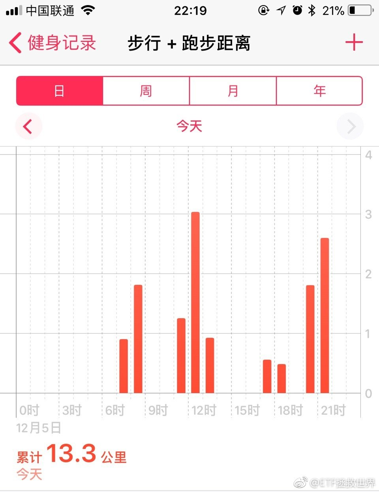

======================================================

ETF拯救世界 (5687069307) @
2017-12-06 10:47:18 Wed  
url: https://weibo.com/5687069307/FymQteFEs

不奶不行了。。。//@ETF拯救世界:回复@xDBA顾德吴:有几个点位吧。一个是29500，属于我能认知的最高区域了。从估值和其它方面看都是如此。第二个是27500以下，算是回到正常区域了。到22000左右以下，是比较低估，极限低位是16000，再低我就又不理解了。这些点位每年都要往上加几百点。

------------------------------------------------------
转推：
>  @ETF拯救世界 (5687069307)
>  2017-11-30 09:33:22 Thu  
>  url: https:/weibo.com/5687069307/FxrNtppo0/

>  $恒生指数 hkHSI$   低于29500了。短期还是中期呢。 ​​​

转发[14]  评论[35]  赞[85] 

======================================================

ETF拯救世界 (5687069307) @
2017-12-06 11:04:46 Wed  
url: https://weibo.com/5687069307/FymXxEWym

从恒生整个的过程，大家就应该对未来有个大致的理解了。

计划就是这样，不可能买在最低。恒生etf最低0.944，计划的成本大概是1左右。也就是距离最低是6%，实现了我们离最低15%最好10%以内的预期。

然后一路坚定持有。在1.5附近减持了两次，实现了高抛低吸。但我们也不可能卖在最高，也不会全部卖出。 ​​​

转发[91]  评论[131]  赞[223] 

======================================================

ETF拯救世界 (5687069307) @
2017-12-06 11:05:58 Wed  
url: https://weibo.com/5687069307/FymY27DwX

不过我还是不理解那些叫着恒生低估，在29000以上还在忽悠买入的人是怎么想的。

------------------------------------------------------
转推：
>  @ETF拯救世界 (5687069307)
>  2017-12-06 11:04:46 Wed  
>  url: https:/weibo.com/5687069307/FymXxEWym/

>  从恒生整个的过程，大家就应该对未来有个大致的理解了。
>  
>  计划就是这样，不可能买在最低。恒生etf最低0.944，计划的成本大概是1左右。也就是距离最低是6%，实现了我们离最低15%最好10%以内的预期。
>  
>  然后一路坚定持有。在1.5附近减持了两次，实现了高抛低吸。但我们也不可能卖在最高，也不会全部卖出。 ​​​

转发[21]  评论[37]  赞[86] 

======================================================

ETF拯救世界 (5687069307) @
2017-12-06 11:47:26 Wed  
url: https://weibo.com/5687069307/FyneS6jGk

回复@古力果ra:我这里是说指数的，你跟我说股票？你说有没有问题？//@古力果ra:港股个股低估的一大把   有问题？//@ETF拯救世界:不过我还是不理解那些叫着恒生低估，在29000以上还在忽悠买入的人是怎么想的。

------------------------------------------------------
转推：
>  @ETF拯救世界 (5687069307)
>  2017-12-06 11:04:46 Wed  
>  url: https:/weibo.com/5687069307/FymXxEWym/

>  从恒生整个的过程，大家就应该对未来有个大致的理解了。
>  
>  计划就是这样，不可能买在最低。恒生etf最低0.944，计划的成本大概是1左右。也就是距离最低是6%，实现了我们离最低15%最好10%以内的预期。
>  
>  然后一路坚定持有。在1.5附近减持了两次，实现了高抛低吸。但我们也不可能卖在最高，也不会全部卖出。 ​​​

转发[2]  评论[9]  赞[71] 

======================================================

ETF拯救世界 (5687069307) @
2017-12-06 11:49:50 Wed  
url: https://weibo.com/5687069307/FynfQq8XC

回复@双树下的和尚1:我告诉你一件事，任何东西涨起来都会有无数理由解释它，并认为会继续好下去。反之亦然。有一些会成真，大部分是悲剧。

------------------------------------------------------
转推：
>  @ETF拯救世界 (5687069307)
>  2017-12-06 11:04:46 Wed  
>  url: https:/weibo.com/5687069307/FymXxEWym/

>  从恒生整个的过程，大家就应该对未来有个大致的理解了。
>  
>  计划就是这样，不可能买在最低。恒生etf最低0.944，计划的成本大概是1左右。也就是距离最低是6%，实现了我们离最低15%最好10%以内的预期。
>  
>  然后一路坚定持有。在1.5附近减持了两次，实现了高抛低吸。但我们也不可能卖在最高，也不会全部卖出。 ​​​

转发[15]  评论[16]  赞[100] 

======================================================

ETF拯救世界 (5687069307) @
2017-12-06 12:03:38 Wed  
url: https://weibo.com/5687069307/FynlrDaqK

回复@女儿培养日记:全部卖掉就犯了一个最致命的错误：预判。不用预判，根据概率执行策略//@女儿培养日记:E大，既然知道很高了，不卖掉的逻辑是什么?_?

------------------------------------------------------
转推：
>  @ETF拯救世界 (5687069307)
>  2017-12-06 11:04:46 Wed  
>  url: https:/weibo.com/5687069307/FymXxEWym/

>  从恒生整个的过程，大家就应该对未来有个大致的理解了。
>  
>  计划就是这样，不可能买在最低。恒生etf最低0.944，计划的成本大概是1左右。也就是距离最低是6%，实现了我们离最低15%最好10%以内的预期。
>  
>  然后一路坚定持有。在1.5附近减持了两次，实现了高抛低吸。但我们也不可能卖在最高，也不会全部卖出。 ​​​

转发[13]  评论[50]  赞[126] 

======================================================

ETF拯救世界 (5687069307) @
2017-12-06 14:13:22 Wed  
url: https://weibo.com/5687069307/Fyoc6sTkB

[并不简单]  ​​​

转发[2]  评论[54]  赞[80] 

======================================================

ETF拯救世界 (5687069307) @
2017-12-06 14:19:26 Wed  
url: https://weibo.com/5687069307/Fyoezy2qo

后悔了，怎么忘了拉个顺风车过来……

------------------------------------------------------
转推：
>  @ETF拯救世界 (5687069307)
>  2017-12-06 14:13:22 Wed  
>  url: https:/weibo.com/5687069307/Fyoc6sTkB/

>  [并不简单] http://t.cn/R2VX2og ​​​

转发[1]  评论[41]  赞[86] 

======================================================

ETF拯救世界 (5687069307) @
2017-12-06 14:47:17 Wed  
url: https://weibo.com/5687069307/FyopS9ORt

再说一次，谁看不起小股票，下波牛市至少少赚一半 ​​​

转发[51]  评论[69]  赞[208] 

======================================================

ETF拯救世界 (5687069307) @
2017-12-06 14:52:15 Wed  
url: https://weibo.com/5687069307/FyorT9Q57

回复@peng75106:银行纸白银要什么成交量//@peng75106:@ETF拯救世界  这几天白银怎么基本上没有成交量[可怜]，已经被套住了

------------------------------------------------------
转推：
>  @ETF拯救世界 (5687069307)
>  2017-12-06 14:47:17 Wed  
>  url: https:/weibo.com/5687069307/FyopS9ORt/

>  再说一次，谁看不起小股票，下波牛市至少少赚一半 ​​​

转发[1]  评论[17]  赞[89] 

======================================================

ETF拯救世界 (5687069307) @
2017-12-06 15:16:11 Wed  
url: https://weibo.com/5687069307/FyoBBn2AO

暴力反弹，有人松口气，有人不开心。

这两种人都是仓位不对。 ​​​

转发[14]  评论[121]  赞[212] 

======================================================

ETF拯救世界 (5687069307) @
2017-12-07 07:50:10 Thu  
url: https://weibo.com/5687069307/Fyv73kx0I

回复@唐僧用飃柔:股价短期涨跌更多是情绪因素。而且一年翻番了跌点不是很正常吗。毕竟五六十倍估值。//@唐僧用飃柔:E大，特别想知道你怎么看阿里和腾讯这几天连续的暴跌，公司基本面没出问题，仅仅是特朗普税改案通过，为什么会对我们中国的科技巨头造成这么大影响呢？

------------------------------------------------------
转推：
>  @ETF拯救世界 (5687069307)
>  2017-12-06 15:16:11 Wed  
>  url: https:/weibo.com/5687069307/FyoBBn2AO/

>  暴力反弹，有人松口气，有人不开心。
>  
>  这两种人都是仓位不对。 ​​​

转发[3]  评论[24]  赞[91] 

======================================================

ETF拯救世界 (5687069307) @
2017-12-07 07:52:02 Thu  
url: https://weibo.com/5687069307/Fyv7OEmCw

回复@渝夏夜的微风-hc:特别好。这种言论很多的时候，就是你all in的时候。还不够多。//@渝夏夜的微风-hc:E大，雪球有大V在说创业板跌到25倍都不是底，不能以过去创业板的估值为锚，创业板只值10PE。怪吓人啊！

------------------------------------------------------
转推：
>  @ETF拯救世界 (5687069307)
>  2017-12-06 14:47:17 Wed  
>  url: https:/weibo.com/5687069307/FyopS9ORt/

>  再说一次，谁看不起小股票，下波牛市至少少赚一半 ​​​

转发[11]  评论[50]  赞[127] 

======================================================

ETF拯救世界 (5687069307) @
2017-12-07 09:31:42 Thu  
url: https://weibo.com/5687069307/FyvMh5EvE

一张图告诉你为什么a股上午没人管 ​​​

转发[8]  评论[77]  赞[181] 

+++++++++++++++++++++++++++++++++++++++++++++++++++++

图片：
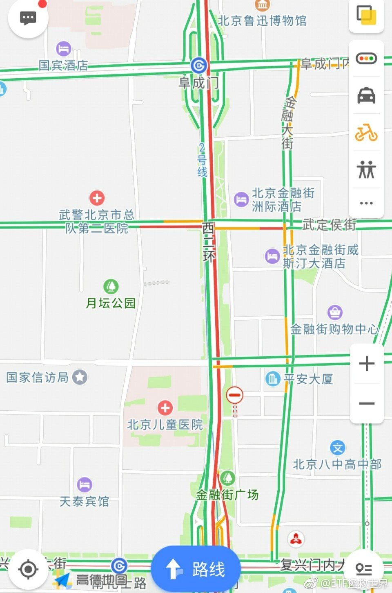

======================================================

ETF拯救世界 (5687069307) @
2017-12-07 10:22:10 Thu  
url: https://weibo.com/5687069307/Fyw6Kt2Lm

获利比例剩50%了……

------------------------------------------------------
转推：
>  @ETF拯救世界 (5687069307)
>  2017-12-04 09:36:18 Mon  
>  url: https:/weibo.com/5687069307/Fy3wE2Hh9/

>  8848获利筹码只剩55%了。这个股票换手虽然低，但是在高位几个月了，基本上接盘的都吃饱了。。。 ​​​

转发[39]  评论[28]  赞[84] 

======================================================

ETF拯救世界 (5687069307) @
2017-12-07 10:58:14 Thu  
url: https://weibo.com/5687069307/Fywlp9AFi

即将跌破28000。//@ETF拯救世界:27500，正常区域。出发吧！

------------------------------------------------------
转推：
>  @ETF拯救世界 (5687069307)
>  2017-11-30 09:33:22 Thu  
>  url: https:/weibo.com/5687069307/FxrNtppo0/

>  $恒生指数 hkHSI$   低于29500了。短期还是中期呢。 ​​​

转发[33]  评论[30]  赞[77] 

======================================================

ETF拯救世界 (5687069307) @
2017-12-07 13:51:21 Thu  
url: https://weibo.com/5687069307/FyxtFBbZZ

回复@纯香芥末:急什么？仓位不够就加仓啊。有什么急的。不是很懂。//@纯香芥末:不按套路走了呢，市场最近屡屡翻红，债市也走红，有点纳闷会不会牛市要来啦不跌啦，好捉急啊//@ETF拯救世界:即将跌破28000。//@ETF拯救世界:27500，正常区域。出发吧！

------------------------------------------------------
转推：
>  @ETF拯救世界 (5687069307)
>  2017-11-30 09:33:22 Thu  
>  url: https:/weibo.com/5687069307/FxrNtppo0/

>  $恒生指数 hkHSI$   低于29500了。短期还是中期呢。 ​​​

转发[1]  评论[34]  赞[70] 

======================================================

ETF拯救世界 (5687069307) @
2017-12-07 14:08:11 Thu  
url: https://weibo.com/5687069307/FyxAv1UnN

这一个月多发了两篇文章，关注人数加快了不少。

我特别奇怪的是微博，为什么关注人数增加的这么慢。是所有平台里面最慢的。是不是用微博的人少。 ​​​

转发[2]  评论[147]  赞[130] 

+++++++++++++++++++++++++++++++++++++++++++++++++++++

图片：

======================================================

ETF拯救世界 (5687069307) @
2017-12-07 14:22:25 Thu  
url: https://weibo.com/5687069307/FyxGhuu93

回复@_沧海中的一粟:你说了我才去看，相当感慨。我觉得且慢可以把我的ETF计划从首页拿下来了。  @且慢管家//@_沧海中的一粟:益达，且慢推出的那个指数定投，你觉得怎样？//@ETF拯救世界:即将跌破28000。//@ETF拯救世界:27500，正常区域。出发吧！

------------------------------------------------------
转推：
>  @ETF拯救世界 (5687069307)
>  2017-11-30 09:33:22 Thu  
>  url: https:/weibo.com/5687069307/FxrNtppo0/

>  $恒生指数 hkHSI$   低于29500了。短期还是中期呢。 ​​​

转发[29]  评论[118]  赞[67] 

======================================================

ETF拯救世界 (5687069307) @
2017-12-07 14:26:46 Thu  
url: https://weibo.com/5687069307/FyxI37AEs

回复@蜜蜂猴子葡萄蝙蝠:问题是我还在玩呢。这就比较尴尬了。//@蜜蜂猴子葡萄蝙蝠:估计且慢是怕E大以后不跟他们玩了, 所以自己也搞了一个//@ETF拯救世界:回复@_沧海中的一粟:你说了我才去看，相当感慨。我觉得且慢可以把我的ETF计划从首页拿下来了。  @且慢管家

------------------------------------------------------
转推：
>  @ETF拯救世界 (5687069307)
>  2017-11-30 09:33:22 Thu  
>  url: https:/weibo.com/5687069307/FxrNtppo0/

>  $恒生指数 hkHSI$   低于29500了。短期还是中期呢。 ​​​

转发[16]  评论[194]  赞[78] 

======================================================

ETF拯救世界 (5687069307) @
2017-12-07 14:46:07 Thu  
url: https://weibo.com/5687069307/FyxPTt8Xc

无论是上涨还是下跌，给市场时间。

你看，今天一拉，有人又不淡定了，有人又要着急冲进去。

时间都不用太多，一个小时，真相毕露。

趋势形成后，想要改变极其困难。不要急，给时间。 ​​​

转发[19]  评论[141]  赞[224] 

======================================================

ETF拯救世界 (5687069307) @
2017-12-07 17:37:15 Thu  
url: https://weibo.com/5687069307/FyyXmfKgs

今天晚上去跑步还是写篇东西，这是个问题。 ​​​

转发[4]  评论[190]  赞[245] 

======================================================

ETF拯救世界 (5687069307) @
2017-12-07 23:23:57 Thu  
url: https://weibo.com/5687069307/FyBe5xyEr

已经400多条留言了，看不完了，睡觉去了。明天再看。。 ​​​

转发[0]  评论[74]  赞[175] 

+++++++++++++++++++++++++++++++++++++++++++++++++++++

图片：
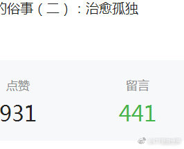

======================================================

ETF拯救世界 (5687069307) @
2017-12-08 06:34:17 Fri  
url: https://weibo.com/5687069307/FyE2L48SI

配置的意义 ​​​

转发[14]  评论[107]  赞[181] 

+++++++++++++++++++++++++++++++++++++++++++++++++++++

图片：
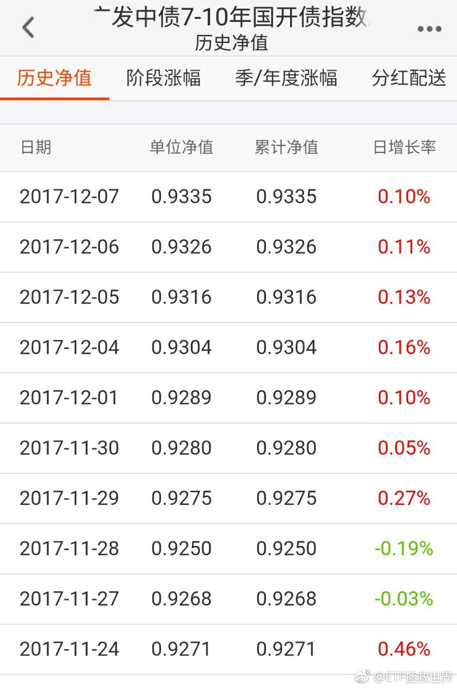

======================================================

ETF拯救世界 (5687069307) @
2017-12-08 09:16:39 Fri  
url: https://weibo.com/5687069307/FyF6F7qsg

回复@Doraven:是这样的。我不是说现在债券挣了多少钱。我是说最近股票调整很大，而债券在上涨，会为组合平滑收益。今年国开债跌了7%，我们浮亏0.7%。我自认为成本控制的不错。未来上涨的时候，会吃到所有上涨收益。挺好。//@Doraven:啊，e大，22号那一天跌了挺多的，为什么不放上来

------------------------------------------------------
转推：
>  @ETF拯救世界 (5687069307)
>  2017-12-08 06:34:17 Fri  
>  url: https:/weibo.com/5687069307/FyE2L48SI/

>  配置的意义 ​​​

转发[7]  评论[28]  赞[122] 

======================================================

ETF拯救世界 (5687069307) @
2017-12-08 09:22:11 Fri  
url: https://weibo.com/5687069307/FyF8TElEn

哈哈哈，妹子真的好饿。

------------------------------------------------------
转推：
>  @澎湃新闻 (5044281310)
>  2017-12-07 12:38:56 Thu  
>  url: https:/weibo.com/5044281310/Fyx0gFD9W/

>  【空姐“偷吃”多份剩余餐食：被停飞调查】http://t.cn/RYreqcY 近日，一段“空姐吃多份飞机餐”的视频热传。12月7日，乌鲁木齐航空公司回应视频中的空姐确为公司乘务员，未按规定处理剩余餐食，试吃数份被拍下。目前已被给予停飞调查处分。（视频来源：综合网络）http://t.cn/RYreqcT ​​​

转发[4]  评论[44]  赞[56] 

======================================================

ETF拯救世界 (5687069307) @
2017-12-08 09:56:10 Fri  
url: https://weibo.com/5687069307/FyFmHs6Kr

养老最近真的稳。这个月还涨了1.6%…… ​​​

转发[3]  评论[85]  赞[168] 

======================================================

ETF拯救世界 (5687069307) @
2017-12-08 11:12:22 Fri  
url: https://weibo.com/5687069307/FyFRDdY2S

黄金又入坑了！虽然只有0.6%……

再来一把“虽然买了很弱的品种但是就是能把你玩盈利”的操作吧…… ​​​

转发[5]  评论[183]  赞[197] 

======================================================

ETF拯救世界 (5687069307) @
2017-12-10 21:37:48 Sun  
url: https://weibo.com/5687069307/Fz2OugVc4

每日打卡（120）

最近事情多，坚持的不好。要改。 ​​​

转发[1]  评论[37]  赞[147] 

+++++++++++++++++++++++++++++++++++++++++++++++++++++

图片：

======================================================

ETF拯救世界 (5687069307) @
2017-12-11 09:47:53 Mon  
url: https://weibo.com/5687069307/Fz7APnitJ

今天调整各大成分指数的成分股。

有些指数变化较小，有些指数可以说相当大。

月中要开跟前几个月不同的车了。 ​​​

转发[4]  评论[97]  赞[195] 

======================================================

ETF拯救世界 (5687069307) @
2017-12-11 10:02:11 Mon  
url: https://weibo.com/5687069307/Fz7GDgWwJ

快4%了。是不是跌不动了。

------------------------------------------------------
转推：
>  @ETF拯救世界 (5687069307)
>  2017-12-08 09:56:10 Fri  
>  url: https:/weibo.com/5687069307/FyFmHs6Kr/

>  养老最近真的稳。这个月还涨了1.6%…… ​​​

转发[0]  评论[26]  赞[94] 

======================================================

ETF拯救世界 (5687069307) @
2017-12-11 10:33:41 Mon  
url: https://weibo.com/5687069307/Fz7Tq5XPH

$养老产业 sz399812$   之前一路都在说，不要卖。结果回调5%。你会不会想，还不如卖了，再买回来，成本降低5%，多好啊。

你事后看，这样简直完美。问题在于，你能做到吗。卖在最高点，买回在最低点？

且不说一来一回手续费有多少，就说这个时机的把握，能做到？

买了成本不高的品种，最重要的就不是 ​​​

转发[72]  评论[110]  赞[244] 

======================================================

ETF拯救世界 (5687069307) @
2017-12-11 11:15:41 Mon  
url: https://weibo.com/5687069307/Fz8atlYgK

永辉也是养老成分股，敢不敢复牌！

------------------------------------------------------
转推：
>  @ETF拯救世界 (5687069307)
>  2017-12-11 10:33:41 Mon  
>  url: https:/weibo.com/5687069307/Fz7Tq5XPH/

>  $养老产业 sz399812$   之前一路都在说，不要卖。结果回调5%。你会不会想，还不如卖了，再买回来，成本降低5%，多好啊。
>  
>  你事后看，这样简直完美。问题在于，你能做到吗。卖在最高点，买回在最低点？
>  
>  且不说一来一回手续费有多少，就说这个时机的把握，能做到？
>  
>  买了成本不高的品种，最重要的就不是 ​​​

转发[2]  评论[27]  赞[94] 

======================================================

ETF拯救世界 (5687069307) @
2017-12-11 11:24:38 Mon  
url: https://weibo.com/5687069307/Fz8e6gGzh

距离留言1000不会太远了吧。每次只能放出来100条。 ​​​

转发[1]  评论[68]  赞[164] 

+++++++++++++++++++++++++++++++++++++++++++++++++++++

图片：
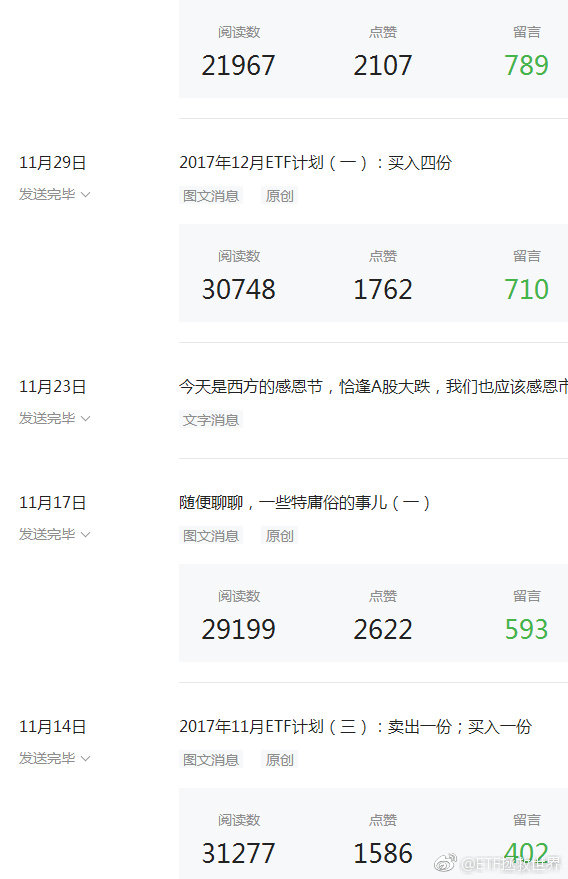

======================================================

ETF拯救世界 (5687069307) @
2017-12-11 13:24:24 Mon  
url: https://weibo.com/5687069307/Fz90IcZp8

弄不好又变自行车了//@ETF拯救世界:这么看月中搞不好有大巴。

------------------------------------------------------
转推：
>  @ETF拯救世界 (5687069307)
>  2017-12-05 15:25:40 Tue  
>  url: https:/weibo.com/5687069307/FyfeXgQv0/

>  今天全市场估值2014年8月以来最低。 ​​​

转发[11]  评论[112]  赞[142] 

======================================================

ETF拯救世界 (5687069307) @
2017-12-11 15:24:13 Mon  
url: https://weibo.com/5687069307/Fz9Nm3AvG

全国统筹了。怎么港，幻想未来有多少养老金入市救灾的可以歇歇了。以后养老金结余比较多的广东北京等地，还要去扶贫，怎么来救你……

------------------------------------------------------
转推：
>  @蓝鲸财经记者工作平台 (1885454921)
>  2017-12-11 15:20:53 Mon  
>  url: https:/weibo.com/1885454921/Fz9LZw19w/

>  鲸快讯：12月11日讯，从人社部内部人士处获悉，养老保险“全国统筹方案正在制定之中，即将出台”。(中国经营报) ​​​

转发[22]  评论[74]  赞[101] 

======================================================

ETF拯救世界 (5687069307) @
2017-12-11 15:56:06 Mon  
url: https://weibo.com/5687069307/Fza0i14Ko

历史确实如此。未来不好说。咱们有幸见证书上才见过的历史了。

------------------------------------------------------
转推：
>  @ ()
>  2017-12-11 11:56:32 Mon  
>  url: 

>  抱歉，此微博已被作者删除。查看帮助：http://t.cn/Rfd3rQV

转发[28]  评论[46]  赞[112] 

======================================================

ETF拯救世界 (5687069307) @
2017-12-12 08:50:20 Tue  
url: https://weibo.com/5687069307/FzgDYjj88

消费医药和信息技术一定会继续增加，最后两者加起来能超过至少50%。

------------------------------------------------------
转推：
>  @ ()
>  2017-12-12 07:40:28 Tue  
>  url: 

>  抱歉，作者已设置仅展示半年内微博，此微博已不可见。 ​​​

转发[36]  评论[33]  赞[100] 

======================================================

ETF拯救世界 (5687069307) @
2017-12-12 09:03:46 Tue  
url: https://weibo.com/5687069307/FzgJq6nw4

回复@啊肥豪啊:不会。这是我们国家经济发展阶段的大概率走向。医药消费信息科技会在未来占据越来越大的比重。这个不是均值回归的问题了。//@啊肥豪啊:e大，刚好看过雪球上您转的黄若谷的文章有个疑问，倘若A股最近10年信息医药消费表现比较好，那相对来说，未来10年是否将能源工业类的比重增大

------------------------------------------------------
转推：
>  @ ()
>  2017-12-12 07:40:28 Tue  
>  url: 

>  抱歉，作者已设置仅展示半年内微博，此微博已不可见。 ​​​

转发[12]  评论[16]  赞[68] 

======================================================

ETF拯救世界 (5687069307) @
2017-12-12 09:06:45 Tue  
url: https://weibo.com/5687069307/FzgKD9zS1

某个行业在股市中市值占比不断减少，不代表这个行业一定无法跑出大牛股。有些股票在萎缩的行业中成长的非常好。

同样，一个行业市值占比越来越大，也不必然投资者能赚到很多钱。

其实如果BATJ之类的公司都在国内上市，国内的科技信息产业市值占比要比现在高很多了…… ​​​

转发[10]  评论[38]  赞[125] 

======================================================

ETF拯救世界 (5687069307) @
2017-12-12 10:00:32 Tue  
url: https://weibo.com/5687069307/Fzh6su5hD

人类有时候是没有底线的。

------------------------------------------------------
转推：
>  @xyl125cn (5687091757)
>  2017-12-12 09:45:36 Tue  
>  url: https:/weibo.com/5687091757/Fzh0oBavc/

>  @ETF拯救世界  ,E大，这个人复制你的话，在“知识星球”上收费 http://t.cn/R2d2aBp ​​​

转发[2]  评论[106]  赞[104] 

======================================================

ETF拯救世界 (5687069307) @
2017-12-12 10:07:18 Tue  
url: https://weibo.com/5687069307/Fzh9cDetT

确认了，月中发车保时捷。 ​​​

转发[7]  评论[155]  赞[268] 

+++++++++++++++++++++++++++++++++++++++++++++++++++++

图片：

======================================================

ETF拯救世界 (5687069307) @
2017-12-12 10:23:53 Tue  
url: https://weibo.com/5687069307/FzhfWsFpI

reits和金融时报100指数是我需要的。

------------------------------------------------------
转推：
>  @ ()
>  2017-12-12 10:14:51 Tue  
>  url: 

>  抱歉，此微博已被作者删除。查看帮助：http://t.cn/Rfd3rQV

转发[6]  评论[30]  赞[107] 

======================================================

ETF拯救世界 (5687069307) @
2017-12-12 11:32:01 Tue  
url: https://weibo.com/5687069307/FzhHAEfRu

今天在雪球看了一个文章，苹果1980年上市的。

其实那时候苹果已经是万众瞩目了。非常火爆。

谁能想到，24年后，2004年，才是它真正长牛之旅的起步点。之前一直起起伏伏。

急什么，很多事急也急不来。

今天又看了一篇文章，关于国民公公的。也是着急，要几年内资产怎样怎样，空手套白狼。反正到现在 ​​​

转发[16]  评论[50]  赞[145] 

======================================================

ETF拯救世界 (5687069307) @
2017-12-12 13:24:36 Tue  
url: https://weibo.com/5687069307/FzirioaTm

完了，怎么都这么说了。一般来讲大家前一年底预期的东西，第二年会啪啪打脸。

------------------------------------------------------
转推：
>  @ ()
>  2017-12-12 13:22:02 Tue  
>  url: 

>  抱歉，作者已设置仅展示半年内微博，此微博已不可见。 ​​​

转发[7]  评论[19]  赞[70] 

======================================================

ETF拯救世界 (5687069307) @
2017-12-12 13:32:19 Tue  
url: https://weibo.com/5687069307/FziuqhVax

回复@mimi86822824:新低好啊。为什么。因为新低之后还是新低。[doge]//@mimi86822824:证券指数半年新低了，哈哈同花顺881157//@ETF拯救世界:完了，怎么都这么说了。一般来讲大家前一年底预期的东西，第二年会啪啪打脸。

------------------------------------------------------
转推：
>  @ ()
>  2017-12-12 13:22:02 Tue  
>  url: 

>  抱歉，作者已设置仅展示半年内微博，此微博已不可见。 ​​​

转发[2]  评论[9]  赞[69] 

======================================================

ETF拯救世界 (5687069307) @
2017-12-12 13:38:37 Tue  
url: https://weibo.com/5687069307/FziwYD21j

这一波涨价去库存不知道库存去的怎么样了。居民加杠杆加到什么程度了，大家手里还有多少钱。

------------------------------------------------------
转推：
>  @挖龙脉的超级鹿鼎公 (3962719063)
>  2017-12-12 13:09:51 Tue  
>  url: https:/weibo.com/3962719063/FzililpBE/

>  也许我是经历过中国楼市两拨大跌的少数人之一，97-03年的广州，11年至今的温州 ​​​

转发[21]  评论[58]  赞[79] 

======================================================

ETF拯救世界 (5687069307) @
2017-12-12 14:17:50 Tue  
url: https://weibo.com/5687069307/FziMTytcG

回复@英德美加:其实这个说法和股市高点有人买入就有人卖出赚到钱一样。两个考虑方向，第一，卖房的人会不会离开这个游戏。买家加杠杆买了卖家的房。卖家拿到钱加杠杆换更大更好的房。最终谁都没钱，都加了杠杆。第二，钱最终流入了谁的手中。

------------------------------------------------------
转推：
>  @挖龙脉的超级鹿鼎公 (3962719063)
>  2017-12-12 13:09:51 Tue  
>  url: https:/weibo.com/3962719063/FzililpBE/

>  也许我是经历过中国楼市两拨大跌的少数人之一，97-03年的广州，11年至今的温州 ​​​

转发[6]  评论[11]  赞[54] 

======================================================

ETF拯救世界 (5687069307) @
2017-12-12 14:19:17 Tue  
url: https://weibo.com/5687069307/FziNudkqT

回复@小狗上马路:04、09年初。不跌我是不会买的，第二套是金融危机中。//@小狗上马路:E哥的房子都是05年买下的吗？//@ETF拯救世界:这一波涨价去库存不知道库存去的怎么样了。居民加杠杆加到什么程度了，大家手里还有多少钱。

------------------------------------------------------
转推：
>  @挖龙脉的超级鹿鼎公 (3962719063)
>  2017-12-12 13:09:51 Tue  
>  url: https:/weibo.com/3962719063/FzililpBE/

>  也许我是经历过中国楼市两拨大跌的少数人之一，97-03年的广州，11年至今的温州 ​​​

转发[4]  评论[18]  赞[65] 

======================================================

ETF拯救世界 (5687069307) @
2017-12-12 14:25:41 Tue  
url: https://weibo.com/5687069307/FziQ5hbPu

我的一个表妹家，父母这些年买了三套房。其实真的很厉害，收入也不高，一直买。

去年卖了一套，然后表妹老公家也卖了一套，加了几百万贷款，又买了一套280平米的大平层。

过去十几年，所有卖房离开游戏的都是输家。所以我怀疑有多少卖家会卖了房离开。恐怕没多少。一般都是置换更好的或者学区房，继 ​​​

转发[20]  评论[87]  赞[116] 

======================================================

ETF拯救世界 (5687069307) @
2017-12-12 14:51:43 Tue  
url: https://weibo.com/5687069307/Fzj0EkM6p

今天多嘴了。不谈房地产了，没别的原因，就是因为不懂。不懂的事不瞎说。能力圈外。好在今天也没说什么，就是讲了讲身边的事……

------------------------------------------------------
转推：
>  @ETF拯救世界 (5687069307)
>  2017-12-12 14:25:41 Tue  
>  url: https:/weibo.com/5687069307/FziQ5hbPu/

>  我的一个表妹家，父母这些年买了三套房。其实真的很厉害，收入也不高，一直买。
>  
>  去年卖了一套，然后表妹老公家也卖了一套，加了几百万贷款，又买了一套280平米的大平层。
>  
>  过去十几年，所有卖房离开游戏的都是输家。所以我怀疑有多少卖家会卖了房离开。恐怕没多少。一般都是置换更好的或者学区房，继 ​​​

转发[2]  评论[20]  赞[73] 

======================================================

ETF拯救世界 (5687069307) @
2017-12-12 14:53:01 Tue  
url: https://weibo.com/5687069307/Fzj1b94of

回复@披头士披头士:04年刚10岁。哪有那么多钱买两套。[doge]//@披头士披头士:还以为E大两套房子都是04年买的呢，09年抄底，👍//@ETF拯救世界:回复@小狗上马路:04、09年初。不跌我是不会买的，第二套是金融危机中。//@小狗上马路:E哥的房子都是05年买下的吗？

------------------------------------------------------
转推：
>  @挖龙脉的超级鹿鼎公 (3962719063)
>  2017-12-12 13:09:51 Tue  
>  url: https:/weibo.com/3962719063/FzililpBE/

>  也许我是经历过中国楼市两拨大跌的少数人之一，97-03年的广州，11年至今的温州 ​​​

转发[1]  评论[43]  赞[69] 

======================================================

ETF拯救世界 (5687069307) @
2017-12-12 14:56:29 Tue  
url: https://weibo.com/5687069307/Fzj2AjAfV

脸都丢尽了。[污]//@ETF拯救世界:弄不好又变自行车了//@ETF拯救世界:这么看月中搞不好有大巴。

------------------------------------------------------
转推：
>  @ETF拯救世界 (5687069307)
>  2017-12-05 15:25:40 Tue  
>  url: https:/weibo.com/5687069307/FyfeXgQv0/

>  今天全市场估值2014年8月以来最低。 ​​​

转发[5]  评论[135]  赞[135] 

======================================================

ETF拯救世界 (5687069307) @
2017-12-12 21:55:56 Tue  
url: https://weibo.com/5687069307/FzlMQe28D

每日打卡（121）

今天太冷了，不到10000 ​​​

转发[0]  评论[23]  赞[125] 

+++++++++++++++++++++++++++++++++++++++++++++++++++++

图片：

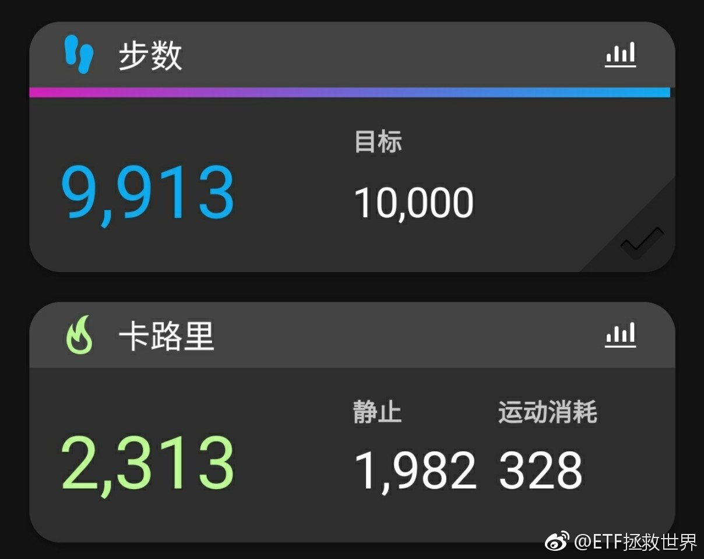

======================================================

ETF拯救世界 (5687069307) @
2017-12-13 09:05:10 Wed  
url: https://weibo.com/5687069307/FzqauldKc

我已经不敢想象20年后这世界是什么样子了。

------------------------------------------------------
转推：
>  @老马自奋蹄 (1807436544)
>  2017-12-13 07:53:27 Wed  
>  url: https:/weibo.com/1807436544/FzpHndjim/

>  台球机器人，动作稳健，什么时候跟丁俊晖比一场(http://t.cn/RT4kUTl ) ​​​

转发[24]  评论[34]  赞[72] 

======================================================

ETF拯救世界 (5687069307) @
2017-12-13 09:26:17 Wed  
url: https://weibo.com/5687069307/Fzqj3CrPD

回复@你好大麦茶:肯定比保姆对你好，没准还能给你定制一个小鲜肉帅哥的机器人伺候你。一个想法，不一定对。//@你好大麦茶:等我老了，希望陪在我身边的机器人对我好点//@ETF拯救世界:我已经不敢想象20年后这世界是什么样子了。

------------------------------------------------------
转推：
>  @老马自奋蹄 (1807436544)
>  2017-12-13 07:53:27 Wed  
>  url: https:/weibo.com/1807436544/FzpHndjim/

>  台球机器人，动作稳健，什么时候跟丁俊晖比一场(http://t.cn/RT4kUTl ) ​​​

转发[7]  评论[30]  赞[69] 

======================================================

ETF拯救世界 (5687069307) @
2017-12-13 10:14:52 Wed  
url: https://weibo.com/5687069307/FzqCM98xv

不过也不用太乐观。你想想吧，20年前，跟现在有什么实质性变化没有，没有。

科技遇到瓶颈很久了。

20年前，1997，也能上网。就是网速慢了点。电脑，有区别吗，没区别。硬盘内存小了点，屏幕小了点，也就这样。

手机变成能触摸的了，网站变成app了。没有什么实质性的发展。

家里，洗衣机电视电冰箱 ​​​

转发[20]  评论[138]  赞[144] 

======================================================

ETF拯救世界 (5687069307) @
2017-12-13 10:49:42 Wed  
url: https://weibo.com/5687069307/FzqQUwC4N

券商什么时候可以买。

很有挑战性的问题。 ​​​

转发[38]  评论[51]  赞[104] 

======================================================

ETF拯救世界 (5687069307) @
2017-12-13 10:55:31 Wed  
url: https://weibo.com/5687069307/FzqTh7KxL

勿忘国耻。//@向小田://@树蛙盒盒盒盒:一觉醒来看到这篇文章很难受，勿忘国耻，铭记历史

------------------------------------------------------
转推：
>  @ ()
>  2017-12-13 01:05:43 Wed  
>  url: 

>  抱歉，作者已设置仅展示半年内微博，此微博已不可见。 ​​​

转发[11]  评论[17]  赞[90] 

======================================================

ETF拯救世界 (5687069307) @
2017-12-13 11:00:06 Wed  
url: https://weibo.com/5687069307/FzqV8lqTQ

券商，一定是左侧一部分右侧一部分。难点在于，多少仓位给左侧，多少右侧。左侧的火候如何拿捏，节奏如何把握。弹性太大的品种要考虑清楚。

------------------------------------------------------
转推：
>  @ETF拯救世界 (5687069307)
>  2017-12-13 10:49:42 Wed  
>  url: https:/weibo.com/5687069307/FzqQUwC4N/

>  券商什么时候可以买。
>  
>  很有挑战性的问题。 ​​​

转发[29]  评论[43]  赞[109] 

======================================================

ETF拯救世界 (5687069307) @
2017-12-13 11:18:15 Wed  
url: https://weibo.com/5687069307/Fzr2uwPRq

行业，我的预计，未来20年是这样的。

首先大消费还是最赚钱不用说。日常消费+医药医疗。医药医疗市值占比会加大，继续跑大牛股，所以行业指基我们肯定要配一部分。娱乐业也包含在里面。据说steam一半玩家都是中国的。

金融领域都不会死，20年后肯定都在，不过应该有分化。保险应该还可以，券商波动大 ​​​

转发[250]  评论[155]  赞[261] 

======================================================

ETF拯救世界 (5687069307) @
2017-12-13 11:27:36 Wed  
url: https://weibo.com/5687069307/Fzr6j0zgE

回复@lasting8888:A股的军工都是伪军工。哪里有波音/洛克希德马丁那样的公司……概念炒一炒就好了……//@lasting8888:回复@天影198:第三次世界大战的时候  军工会超乎想象

------------------------------------------------------
转推：
>  @ETF拯救世界 (5687069307)
>  2017-12-13 11:18:15 Wed  
>  url: https:/weibo.com/5687069307/Fzr2uwPRq/

>  行业，我的预计，未来20年是这样的。
>  
>  首先大消费还是最赚钱不用说。日常消费+医药医疗。医药医疗市值占比会加大，继续跑大牛股，所以行业指基我们肯定要配一部分。娱乐业也包含在里面。据说steam一半玩家都是中国的。
>  
>  金融领域都不会死，20年后肯定都在，不过应该有分化。保险应该还可以，券商波动大 ​​​

转发[6]  评论[20]  赞[71] 

======================================================

ETF拯救世界 (5687069307) @
2017-12-13 11:40:50 Wed  
url: https://weibo.com/5687069307/FzrbFF9If

回复@小宝_霸霸:地产股的走势要看房地产行业的情况了。具体我不好说，我只能说，未来20年房地产股票的价格波动会非常非常非常大……大概率。//@小宝_霸霸:谢指点，地产呢益达哥？

------------------------------------------------------
转推：
>  @ETF拯救世界 (5687069307)
>  2017-12-13 11:18:15 Wed  
>  url: https:/weibo.com/5687069307/Fzr2uwPRq/

>  行业，我的预计，未来20年是这样的。
>  
>  首先大消费还是最赚钱不用说。日常消费+医药医疗。医药医疗市值占比会加大，继续跑大牛股，所以行业指基我们肯定要配一部分。娱乐业也包含在里面。据说steam一半玩家都是中国的。
>  
>  金融领域都不会死，20年后肯定都在，不过应该有分化。保险应该还可以，券商波动大 ​​​

转发[10]  评论[32]  赞[74] 

======================================================

ETF拯救世界 (5687069307) @
2017-12-13 15:06:00 Wed  
url: https://weibo.com/5687069307/FzswWwlPN

人生不如意十之八九。

健康活着就好。

能不能抄到底都是缘分……[并不简单] ​​​

转发[13]  评论[48]  赞[156] 

======================================================

ETF拯救世界 (5687069307) @
2017-12-13 15:10:42 Wed  
url: https://weibo.com/5687069307/FzsyR1dIY

但是有一个没问题的，就是只要反弹，一定比大盘指数先创新高。大盘指数回到高点，就一定比上次高点时候赚得多。跌的时候跌的还少，这就是魅力所在。。。。

------------------------------------------------------
转推：
>  @ETF拯救世界 (5687069307)
>  2017-12-13 15:06:00 Wed  
>  url: https:/weibo.com/5687069307/FzswWwlPN/

>  人生不如意十之八九。
>  
>  健康活着就好。
>  
>  能不能抄到底都是缘分……[并不简单] ​​​

转发[5]  评论[38]  赞[136] 

======================================================

ETF拯救世界 (5687069307) @
2017-12-13 17:14:15 Wed  
url: https://weibo.com/5687069307/Fztn0dwMn

回复@ssss坐看云起:哈哈，翻出来了。今年真的太特殊了，大盘指数和实际A股大多数股票的走势。无论如何，我监测超过十年，今年居然让分析师们说对了……//@ssss坐看云起:益达，看来这次郭嘉队给分析师们助攻了

------------------------------------------------------
转推：
>  @新浪证券 (1642585887)
>  2016-12-22 23:59:37 Thu  
>  url: https:/weibo.com/1642585887/Enll5rrqT/

>  【2017年券商投资策略会大全：中信等18家券商预测行情】“2017年度投资策略会”已接近尾声，涨跌策略预测、板块配置、个股推荐等成为年度投资策略报告的重头戏。这18家券商已经立字为据，来年这一天，让行情说话，看看哪家券商才是真言。http://t.cn/RICDWjo ​​​

转发[4]  评论[17]  赞[57] 

======================================================

ETF拯救世界 (5687069307) @
2017-12-13 17:23:37 Wed  
url: https://weibo.com/5687069307/FztqNFoWe

讲真，你们两个站在我面前，我真的会脸盲……

------------------------------------------------------
转推：
>  @澎湃新闻 (5044281310)
>  2017-12-13 17:20:03 Wed  
>  url: https:/weibo.com/5044281310/Fztpm9QpA/

>  【女子买两部苹果手机，均被女同事面部解锁】http://t.cn/RTMsSUd 近日，江苏南京的颜女士先后买了两部iPhone X手机，却均能被一位非亲属关系的女同事面部解锁。她担心手机的安全问题。苹果店工作人员表示这是个案如不满意可退货。（视频来源：江苏网络电视台）http://t.cn/RTMsSUg ​​​

转发[7]  评论[32]  赞[59] 

======================================================

ETF拯救世界 (5687069307) @
2017-12-13 21:17:39 Wed  
url: https://weibo.com/5687069307/FzuXNqP9B

每日打卡（122）

刚才出去跑了一公里，呼吸肺疼，太冷了。老老实实回来享受暖气了 ​​​

转发[0]  评论[54]  赞[102] 

+++++++++++++++++++++++++++++++++++++++++++++++++++++

图片：

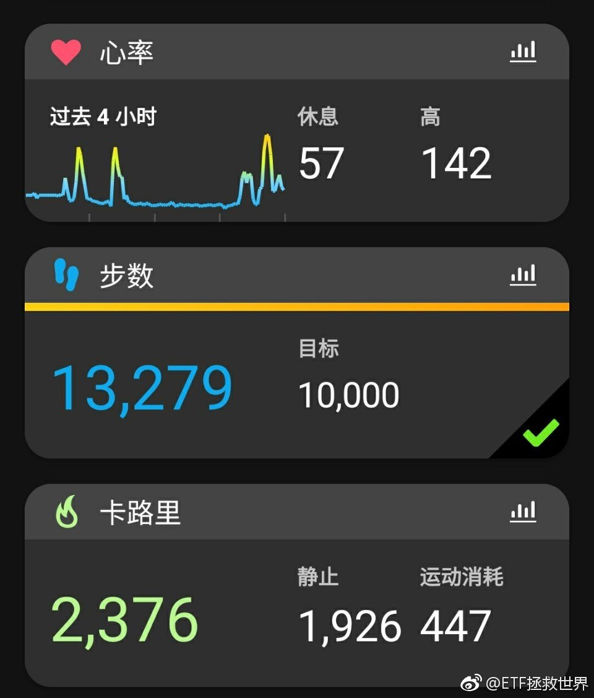

======================================================

ETF拯救世界 (5687069307) @
2017-12-14 05:39:13 Thu  
url: https://weibo.com/5687069307/FzyfnFhaB

辣鸡

差几厘

[泪] ​​​

转发[1]  评论[57]  赞[74] 

+++++++++++++++++++++++++++++++++++++++++++++++++++++

图片：
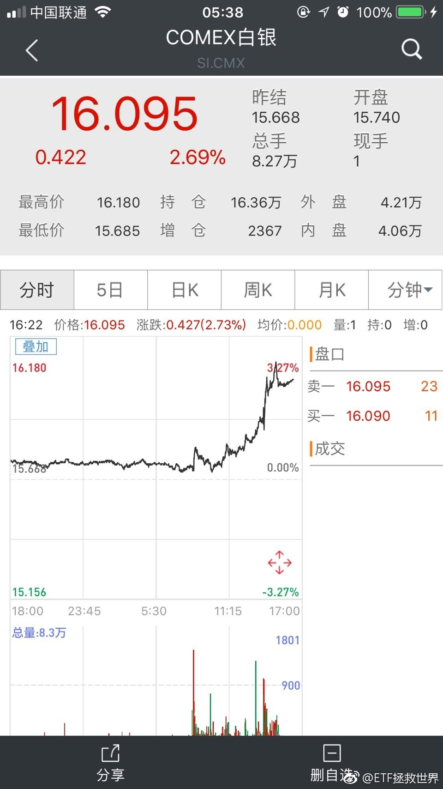

======================================================

ETF拯救世界 (5687069307) @
2017-12-14 08:44:51 Thu  
url: https://weibo.com/5687069307/FzzsK1qF9

突然发现最近看好中小股票的人多起来了。怎么办。需不需要继续逆向。

------------------------------------------------------
转推：
>  @ETF拯救世界 (5687069307)
>  2017-12-06 14:47:17 Wed  
>  url: https:/weibo.com/5687069307/FyopS9ORt/

>  再说一次，谁看不起小股票，下波牛市至少少赚一半 ​​​

转发[19]  评论[41]  赞[85] 

======================================================

ETF拯救世界 (5687069307) @
2017-12-14 09:01:55 Thu  
url: https://weibo.com/5687069307/FzzzF4vgY

有没有用群晖的朋友。

我的群晖同步盘，也就是cloud station driver文件夹里面，总是自动生成很多0字节的文件。非常讨厌。怎么设置才能让它消失。 ​​​

转发[2]  评论[43]  赞[42] 

+++++++++++++++++++++++++++++++++++++++++++++++++++++

图片：
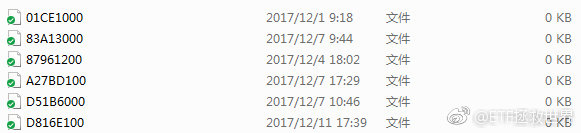

======================================================

ETF拯救世界 (5687069307) @
2017-12-14 09:04:52 Thu  
url: https://weibo.com/5687069307/FzzARy2Tq

回复@取个名字真TMTMD难:有区别的。很多小盘股肯定是不行了，没那么多钱去炒它们。但是中小盘股里有好东西，现在很多人开始发掘这个了。我们的创业板指数可以说是最好的100只创业板指数，500指数算是最好的500只中盘指数。这跟那些三无的垃圾完全不同。

------------------------------------------------------
转推：
>  @ETF拯救世界 (5687069307)
>  2017-12-06 14:47:17 Wed  
>  url: https:/weibo.com/5687069307/FyopS9ORt/

>  再说一次，谁看不起小股票，下波牛市至少少赚一半 ​​​

转发[17]  评论[26]  赞[95] 

======================================================

ETF拯救世界 (5687069307) @
2017-12-14 09:27:30 Thu  
url: https://weibo.com/5687069307/FzzK2jQSz

被那么多人看到的风险就不是风险。真正的风险来自于非常不起眼的地方。突然长大，引爆全场，花火般美丽。//@曹增辉:转发微博

------------------------------------------------------
转推：
>  @21世纪经济报道 (1651428902)
>  2017-12-14 07:37:22 Thu  
>  url: https:/weibo.com/1651428902/Fzz1lfyjM/

>  【钟伟：国人将要面对的灰犀牛】包括精英阶层在内的许多国民可能会面临这种感慨，即中国经济日益繁荣，民众生活显著提升，但也会面临这样的困惑，世界越来越精彩，挣大钱却越来越艰难。为什么？http://t.cn/RTJm4pP ​​​

转发[18]  评论[29]  赞[92] 

======================================================

ETF拯救世界 (5687069307) @
2017-12-14 09:53:08 Thu  
url: https://weibo.com/5687069307/FzzUs3lRo

干不干 ​​​

转发[2]  评论[262]  赞[210] 

======================================================

ETF拯救世界 (5687069307) @
2017-12-14 11:06:14 Thu  
url: https://weibo.com/5687069307/FzAo7pZlE

可能是借了现金贷。

------------------------------------------------------
转推：
>  @蓝鲸TMT网 (3866012793)
>  2017-12-14 11:02:26 Thu  
>  url: https:/weibo.com/3866012793/FzAmAhjt5/

>  【贾跃亭妻子刷卡额度2000元 却开万元月薪请家教】贾跃亭在接受采访时曾说“小薇的卡被冻结，只能刷2000块”可如今额度两千的甘薇，却要出万元月薪为孩子聘英语家教。据悉贾跃亭已被法院列入了“老赖”名单，根据规定“老赖”的子女不可以就读高收费私立学校。（每日经济新闻） ​​​

转发[4]  评论[59]  赞[75] 

======================================================

ETF拯救世界 (5687069307) @
2017-12-14 13:23:02 Thu  
url: https://weibo.com/5687069307/FzBhEeX9N

券商股是这样的。

你把成本控制好，五年不赚钱，没事。踏踏实实的。

然后一年150%，年化妥妥超过巴菲特。

所以最关键两点，成本不要高+踏踏实实拿着等牛来。 ​​​

转发[61]  评论[167]  赞[238] 

======================================================

ETF拯救世界 (5687069307) @
2017-12-14 14:10:41 Thu  
url: https://weibo.com/5687069307/FzBAZkCFY

中证500跌幅0.1%，券商指数跌幅1.7%。

不骗你，真的特别凶残。一定要做好心理准备。 ​​​

转发[10]  评论[92]  赞[182] 

======================================================

ETF拯救世界 (5687069307) @
2017-12-14 15:25:51 Thu  
url: https://weibo.com/5687069307/FzC5v3ROZ

开个会回来538了，晚上回家慢慢看吧…… ​​​

转发[0]  评论[57]  赞[149] 

+++++++++++++++++++++++++++++++++++++++++++++++++++++

图片：
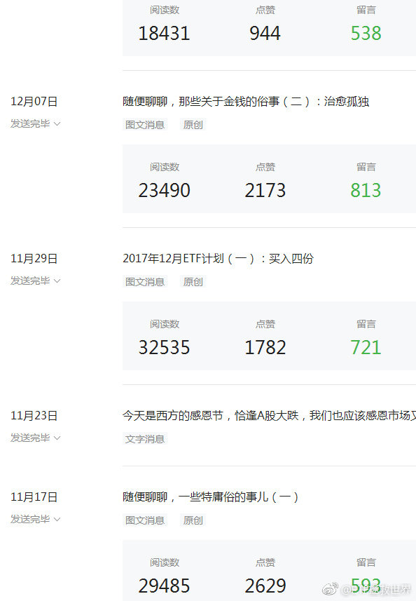

======================================================

ETF拯救世界 (5687069307) @
2017-12-14 16:09:27 Thu  
url: https://weibo.com/5687069307/FzCnceu6I

很多事情啊，讲个分寸。度把握好了什么都好说，度把握不好容易出事。

我这里啊，一直其乐融融。开玩笑什么也都没事。不过开玩笑的时候还是要有分寸，否则引起其他人反感就没必要了。每天糟心事儿还不够多啊，还来网上添堵。

所以以后就都客气点吧。不然您哪天突然没法跟大家交流了就可惜了。 ​​​

转发[5]  评论[102]  赞[236] 

======================================================

ETF拯救世界 (5687069307) @
2017-12-15 08:57:09 Fri  
url: https://weibo.com/5687069307/FzIYdjGrv

8848配股是非常合理的。从公司和老孙的角度来讲，非常合理，符合一贯作风。 ​​​

转发[3]  评论[60]  赞[101] 

======================================================

ETF拯救世界 (5687069307) @
2017-12-15 09:50:04 Fri  
url: https://weibo.com/5687069307/FzJjHqeZF

$证券公司 sz399975$   我认为360-400点应该是极限底部了…… ​​​

转发[180]  评论[122]  赞[136] 

======================================================

ETF拯救世界 (5687069307) @
2017-12-15 10:11:19 Fri  
url: https://weibo.com/5687069307/FzJskem13

不用看了，下次买入是600点了。。。

------------------------------------------------------
转推：
>  @ETF拯救世界 (5687069307)
>  2017-12-15 09:50:04 Fri  
>  url: https:/weibo.com/5687069307/FzJjHqeZF/

>  $证券公司 sz399975$   我认为360-400点应该是极限底部了…… ​​​

转发[17]  评论[45]  赞[94] 

======================================================

ETF拯救世界 (5687069307) @
2017-12-15 10:16:13 Fri  
url: https://weibo.com/5687069307/FzJuk5S0O

有些数学知识在投资里面还是很重要的。比如这个。

你在1800点买入证券指数，到400点是亏损78%。

那你等到腰斩，900点买入，觉得很安全了吧，到400点亏损是56%。

控制风险永远是投资的第一课。 ​​​

转发[45]  评论[98]  赞[186] 

======================================================

ETF拯救世界 (5687069307) @
2017-12-15 11:12:04 Fri  
url: https://weibo.com/5687069307/FzJQZbVzJ

再来做一道数学题。

800点买入证券指数，跌一半，400点再买入同样的金额。

你的成本是533，而不是你想象的600。

如果回到800点，你的盈利是50%。

如果800点就不贵，最后涨回1800，那么你的盈利是237%。 ​​​

转发[185]  评论[125]  赞[178] 

======================================================

ETF拯救世界 (5687069307) @
2017-12-15 11:16:47 Fri  
url: https://weibo.com/5687069307/FzJSTBRko

延伸：如果800点买入1份，400点买入2份，则你的成本会直线下降至480。回到800你的盈利是67%。这个结论可以说是我们整个体系的core。

------------------------------------------------------
转推：
>  @ETF拯救世界 (5687069307)
>  2017-12-15 11:12:04 Fri  
>  url: https:/weibo.com/5687069307/FzJQZbVzJ/

>  再来做一道数学题。
>  
>  800点买入证券指数，跌一半，400点再买入同样的金额。
>  
>  你的成本是533，而不是你想象的600。
>  
>  如果回到800点，你的盈利是50%。
>  
>  如果800点就不贵，最后涨回1800，那么你的盈利是237%。 ​​​

转发[97]  评论[75]  赞[157] 

======================================================

ETF拯救世界 (5687069307) @
2017-12-15 11:26:02 Fri  
url: https://weibo.com/5687069307/FzJWErSkC

回复@核电牛奶:问题在于如果真的到了400，你，或者你的家人，或者你的客户，能否承受攒了一辈子的资产瞬间减少了50%，如果此时需要用钱则是灭顶之灾。所以“认为800不贵”不应该是买完的理由。解决这个问题，需要用概率+配置来解决。

------------------------------------------------------
转推：
>  @ETF拯救世界 (5687069307)
>  2017-12-15 11:12:04 Fri  
>  url: https:/weibo.com/5687069307/FzJQZbVzJ/

>  再来做一道数学题。
>  
>  800点买入证券指数，跌一半，400点再买入同样的金额。
>  
>  你的成本是533，而不是你想象的600。
>  
>  如果回到800点，你的盈利是50%。
>  
>  如果800点就不贵，最后涨回1800，那么你的盈利是237%。 ​​​

转发[25]  评论[66]  赞[126] 

======================================================

ETF拯救世界 (5687069307) @
2017-12-15 13:20:59 Fri  
url: https://weibo.com/5687069307/FzKHjmTLY

……

------------------------------------------------------
转推：
>  @ETF拯救世界 (5687069307)
>  2017-12-15 09:50:04 Fri  
>  url: https:/weibo.com/5687069307/FzJjHqeZF/

>  $证券公司 sz399975$   我认为360-400点应该是极限底部了…… ​​​

转发[3]  评论[17]  赞[56] 

======================================================

ETF拯救世界 (5687069307) @
2017-12-15 13:23:21 Fri  
url: https://weibo.com/5687069307/FzKIh5w27

是不是有人监控我微博！专门来打脸的！站出来！我现在就打电话摇银儿！

------------------------------------------------------
转推：
>  @财联社APP (2868676035)
>  2017-12-15 13:21:56 Fri  
>  url: https:/weibo.com/2868676035/FzKHGDNf5/

>  【快讯：券商股午后异动拉升】财联社12月15日讯，券商股午后异动拉升。截至发稿，第一创业、华鑫股份、宝硕股份、国盛金控、山西证券、浙商证券、财通证券等个股均有拉升。 ​​​

转发[2]  评论[63]  赞[114] 

======================================================

ETF拯救世界 (5687069307) @
2017-12-15 13:54:36 Fri  
url: https://weibo.com/5687069307/FzKUXmMOz

把概率和预测混为一谈的人，可以说完全不理解基于概率的投资体系。

预测是，我预测未来要涨还是跌，根据这个做出投资决策。

概率是，我不知道未来涨还是跌。但我会想办法计算涨跌的概率。然后根据涨跌概率，再加上预期盈利与预期亏损的因子，做出最佳（系统设计者自认为）仓位配置。在这种情况下，风 ​​​

转发[159]  评论[148]  赞[211] 

======================================================

ETF拯救世界 (5687069307) @
2017-12-15 14:06:13 Fri  
url: https://weibo.com/5687069307/FzKZG96ix

举例证券行业指数。把模型简化，如果我在800点买入，配置0.6%。如果我认为它最大的下跌幅度是50%，则我最多会损失0.3%。如果上涨，涨100%，只会赚0.6%。这时候根据各种模型计算涨跌的可能性，然后把预期收益放入模型。显然，损失0.3%绝对可以接受。但是只赚0.6%不可以。下跌概率小时即可加仓。

------------------------------------------------------
转推：
>  @ETF拯救世界 (5687069307)
>  2017-12-15 13:54:36 Fri  
>  url: https:/weibo.com/5687069307/FzKUXmMOz/

>  把概率和预测混为一谈的人，可以说完全不理解基于概率的投资体系。
>  
>  预测是，我预测未来要涨还是跌，根据这个做出投资决策。
>  
>  概率是，我不知道未来涨还是跌。但我会想办法计算涨跌的概率。然后根据涨跌概率，再加上预期盈利与预期亏损的因子，做出最佳（系统设计者自认为）仓位配置。在这种情况下，风 ​​​

转发[21]  评论[42]  赞[106] 

======================================================

ETF拯救世界 (5687069307) @
2017-12-15 14:08:17 Fri  
url: https://weibo.com/5687069307/FzL0waTkm

回复@红枫0825:你坐在那里想概率，当然是主观的。如果我用很多数据和模型去支撑呢。如果你说，历史数据对判断未来概率毫无用处，那我也就没话说啦。主观因素会有，投资本来就是科学+艺术。但基础是科学。

------------------------------------------------------
转推：
>  @ETF拯救世界 (5687069307)
>  2017-12-15 13:54:36 Fri  
>  url: https:/weibo.com/5687069307/FzKUXmMOz/

>  把概率和预测混为一谈的人，可以说完全不理解基于概率的投资体系。
>  
>  预测是，我预测未来要涨还是跌，根据这个做出投资决策。
>  
>  概率是，我不知道未来涨还是跌。但我会想办法计算涨跌的概率。然后根据涨跌概率，再加上预期盈利与预期亏损的因子，做出最佳（系统设计者自认为）仓位配置。在这种情况下，风 ​​​

转发[18]  评论[18]  赞[94] 

======================================================

ETF拯救世界 (5687069307) @
2017-12-15 14:17:50 Fri  
url: https://weibo.com/5687069307/FzL4o5YQV

我估计除了听消息，任何投资方式都是与概率有关，只是很多人没有意识到而已。

价值投资不是概率吗。当然是了。拼命研究报表，找到好的企业，排除差的，这就是提高成功概率的方法。是不是找到好企业就没有失败的概率了？当然不是。所以这时候买入一组好企业，成功的概率就大幅增加。

趋势投资不是吗？ ​​​

转发[60]  评论[81]  赞[174] 

======================================================

ETF拯救世界 (5687069307) @
2017-12-15 14:34:09 Fri  
url: https://weibo.com/5687069307/FzLb0A3bp

其实我想问的是，为什么那个行人要在马路上走。旁边不是明明有人行道吗。

------------------------------------------------------
转推：
>  @澎湃新闻 (5044281310)
>  2017-12-15 14:30:38 Fri  
>  url: https:/weibo.com/5044281310/FzL9AeIzv/

>  【父母没空接，12岁女孩独自骑车撞死人】http://t.cn/RToVgR9 12月13日，江苏淮安一名年仅12岁的女孩独自骑电动车将一路人撞倒致死。其父称，家中有两个孩子无法同时接送，就让大女儿自己骑车上学。按相关规定，骑行电动车须年满16周岁，骑车女孩父亲作为监护人将承担责任。（视频来源：江苏网络广播电 ​​​

转发[4]  评论[21]  赞[43] 

======================================================

ETF拯救世界 (5687069307) @
2017-12-15 14:38:16 Fri  
url: https://weibo.com/5687069307/FzLcGfZ3A

回复@炒股为生2015:讲了0.5%的东西。//@炒股为生2015:这帮人，下跌行情在这套E大的投资方法呢？@ETF拯救世界 E大，小心这帮人学会了抄你的底[哈哈]

------------------------------------------------------
转推：
>  @ETF拯救世界 (5687069307)
>  2017-12-15 14:17:50 Fri  
>  url: https:/weibo.com/5687069307/FzL4o5YQV/

>  我估计除了听消息，任何投资方式都是与概率有关，只是很多人没有意识到而已。
>  
>  价值投资不是概率吗。当然是了。拼命研究报表，找到好的企业，排除差的，这就是提高成功概率的方法。是不是找到好企业就没有失败的概率了？当然不是。所以这时候买入一组好企业，成功的概率就大幅增加。
>  
>  趋势投资不是吗？ ​​​

转发[2]  评论[26]  赞[78] 

======================================================

ETF拯救世界 (5687069307) @
2017-12-15 14:41:44 Fri  
url: https://weibo.com/5687069307/FzLe5tmFx

回复@披头士披头士:变形警车珀利说的啊！你敢不听？//@披头士披头士:所以我们家孩子问我为什么她只能坐安全座椅不能坐副驾驶的时候，我应该如何回答她？//@ETF拯救世界:其实我想问的是，为什么那个行人要在马路上走。旁边不是明明有人行道吗。

------------------------------------------------------
转推：
>  @澎湃新闻 (5044281310)
>  2017-12-15 14:30:38 Fri  
>  url: https:/weibo.com/5044281310/FzL9AeIzv/

>  【父母没空接，12岁女孩独自骑车撞死人】http://t.cn/RToVgR9 12月13日，江苏淮安一名年仅12岁的女孩独自骑电动车将一路人撞倒致死。其父称，家中有两个孩子无法同时接送，就让大女儿自己骑车上学。按相关规定，骑行电动车须年满16周岁，骑车女孩父亲作为监护人将承担责任。（视频来源：江苏网络广播电 ​​​

转发[1]  评论[20]  赞[42] 

======================================================

ETF拯救世界 (5687069307) @
2017-12-15 15:31:29 Fri  
url: https://weibo.com/5687069307/FzLyhpFLn

惊呆了。刚才有个新的研究发现：

如果今天你持仓的品种下跌5%，那么你明天需要涨5.26个巴仙才能回本。

神秘的数学！感觉去麻省理工教数学已经绰绰有余了。 ​​​

转发[11]  评论[121]  赞[202] 

======================================================

ETF拯救世界 (5687069307) @
2017-12-16 20:35:51 Sat  
url: https://weibo.com/5687069307/FzWYkmdzU

每日打卡（123）

坚持 ​​​

转发[0]  评论[34]  赞[150] 

+++++++++++++++++++++++++++++++++++++++++++++++++++++

图片：

======================================================

ETF拯救世界 (5687069307) @
2017-12-17 22:11:42 Sun  
url: https://weibo.com/5687069307/FA71J1UEU

每日打卡（124）

随便跑七公里。跑步的时候能静下来想很多事。 ​​​

转发[3]  评论[73]  赞[166] 

+++++++++++++++++++++++++++++++++++++++++++++++++++++

图片：
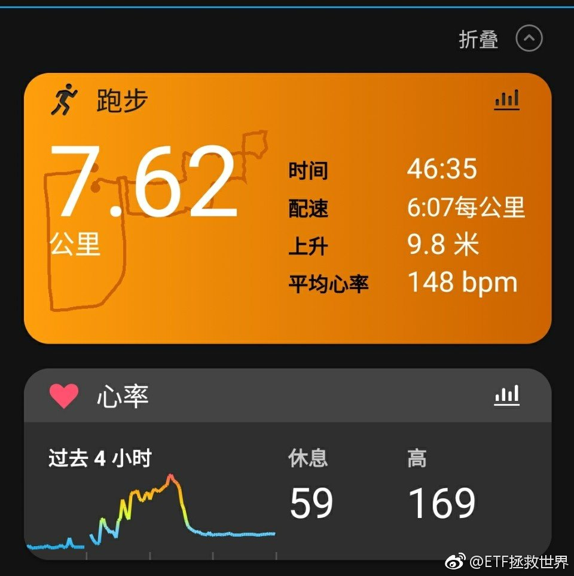

======================================================

ETF拯救世界 (5687069307) @
2017-12-18 10:31:22 Mon  
url: https://weibo.com/5687069307/FAbRXxYVs

44%//@ETF拯救世界:获利比例剩50%了……

------------------------------------------------------
转推：
>  @ETF拯救世界 (5687069307)
>  2017-12-04 09:36:18 Mon  
>  url: https:/weibo.com/5687069307/Fy3wE2Hh9/

>  8848获利筹码只剩55%了。这个股票换手虽然低，但是在高位几个月了，基本上接盘的都吃饱了。。。 ​​​

转发[35]  评论[30]  赞[70] 

======================================================

ETF拯救世界 (5687069307) @
2017-12-18 11:00:50 Mon  
url: https://weibo.com/5687069307/FAc3UAHLm

回复@不想長珍珠的蚌:不是不看好。毕竟我不懂。我害怕的是太过疯狂的企业家和投资者。这里只是做个记录而已。//@不想長珍珠的蚌:e大为啥不看好融创，就是因为涨了5倍，估值过高吗//@ETF拯救世界:44%//@ETF拯救世界:获利比例剩50%了……

------------------------------------------------------
转推：
>  @ETF拯救世界 (5687069307)
>  2017-12-04 09:36:18 Mon  
>  url: https:/weibo.com/5687069307/Fy3wE2Hh9/

>  8848获利筹码只剩55%了。这个股票换手虽然低，但是在高位几个月了，基本上接盘的都吃饱了。。。 ​​​

转发[1]  评论[28]  赞[78] 

======================================================

ETF拯救世界 (5687069307) @
2017-12-18 12:41:10 Mon  
url: https://weibo.com/5687069307/FAcIDgwLs

回复@鸡架熊:据说身体好的人心率会低一些。一个观点，不一定对。//@鸡架熊:静息状态下，心率不到60？！是不是问题啊

------------------------------------------------------
转推：
>  @ETF拯救世界 (5687069307)
>  2017-12-17 22:11:42 Sun  
>  url: https:/weibo.com/5687069307/FA71J1UEU/

>  每日打卡（124）
>  
>  随便跑七公里。跑步的时候能静下来想很多事。 ​​​

转发[1]  评论[51]  赞[61] 

======================================================

ETF拯救世界 (5687069307) @
2017-12-18 12:55:11 Mon  
url: https://weibo.com/5687069307/FAcOk5wf0

“他丫的”是哪儿的话？前面不要加“他”。中间可以加“挺”，就是“丫挺（轻读）的”或者“丫嗯（连读）的”……当然，最好不要乱用这个，这是骂人的，用不好很尴尬。不过无论如何，“他丫的”这样的说法简直不能忍……//@佐罗_厚恩投资://@梧桐爱隐形:区块链，这次弄明白了[哈哈]

------------------------------------------------------
转推：
>  @ ()
>  2017-12-18 10:17:00 Mon  
>  url: 

>  抱歉，此微博已被作者删除。查看帮助：http://t.cn/Rfd3rQV

转发[5]  评论[27]  赞[49] 

======================================================

ETF拯救世界 (5687069307) @
2017-12-18 13:31:22 Mon  
url: https://weibo.com/5687069307/FAd31a8j0

2400只下跌。

cool。 ​​​

转发[23]  评论[40]  赞[95] 

======================================================

ETF拯救世界 (5687069307) @
2017-12-18 13:42:45 Mon  
url: https://weibo.com/5687069307/FAd7DqBmH

回复@奥斯特洛夫大柴夫斯基:谁人背后无人说,谁人背后不说人。无所谓啊~好了遭人嫉妒，差了让人瞧不起；忠厚人家说你傻，精明了人家说你奸；冷淡了大伙儿说你傲，热情了群众说你浪！走在前头儿挨闷棍儿，走在后头儿全没份儿！

------------------------------------------------------
转推：
>  @ETF拯救世界 (5687069307)
>  2017-12-18 13:31:22 Mon  
>  url: https:/weibo.com/5687069307/FAd31a8j0/

>  2400只下跌。
>  
>  cool。 ​​​

转发[17]  评论[39]  赞[162] 

======================================================

ETF拯救世界 (5687069307) @
2017-12-18 13:48:36 Mon  
url: https://weibo.com/5687069307/FAda0zUaE

回复@_ideast:我觉得半个月到6.5-7以上应该能见到吧。//@_ideast:老大，12月下旬了，逆回购最近如何操作最优？还是搞点银行理财，收益也可以

------------------------------------------------------
转推：
>  @ETF拯救世界 (5687069307)
>  2017-12-18 13:31:22 Mon  
>  url: https:/weibo.com/5687069307/FAd31a8j0/

>  2400只下跌。
>  
>  cool。 ​​​

转发[1]  评论[15]  赞[70] 

======================================================

ETF拯救世界 (5687069307) @
2017-12-18 14:24:15 Mon  
url: https://weibo.com/5687069307/FAdou0QL5

控制节奏。 ​​​

转发[23]  评论[30]  赞[119] 

======================================================

ETF拯救世界 (5687069307) @
2017-12-18 14:29:08 Mon  
url: https://weibo.com/5687069307/FAdqthvhu

回复@万里浮云无股也呻吟:中证500极限30%-35%吧。再多我就理解不了了。//@万里浮云无股也呻吟:中小板怎么的还有一半以上的跌幅，对吧

------------------------------------------------------
转推：
>  @ETF拯救世界 (5687069307)
>  2017-12-18 14:24:15 Mon  
>  url: https:/weibo.com/5687069307/FAdou0QL5/

>  控制节奏。 ​​​

转发[11]  评论[39]  赞[87] 

======================================================

ETF拯救世界 (5687069307) @
2017-12-18 14:52:58 Mon  
url: https://weibo.com/5687069307/FAdA8uB7H

回复@我在故快乐:也因为你的仓位合适了。//@我在故快乐:这几次大跌没加车冲动了，看来看老大微博还是有作用的。

------------------------------------------------------
转推：
>  @ETF拯救世界 (5687069307)
>  2017-12-18 14:24:15 Mon  
>  url: https:/weibo.com/5687069307/FAdou0QL5/

>  控制节奏。 ​​​

转发[2]  评论[13]  赞[74] 

======================================================

ETF拯救世界 (5687069307) @
2017-12-18 15:02:11 Mon  
url: https://weibo.com/5687069307/FAdDSrN5n

真的喜欢小马哥和东哥的面相。主要是眼神。

------------------------------------------------------
转推：
>  @华梨子 (1916255521)
>  2017-12-18 14:45:11 Mon  
>  url: https:/weibo.com/1916255521/FAdwYyUBG/

>  http://t.cn/RTTXw3f 网友说：阿里太可怕，抱团取暖。[笑cry] ​​​

转发[6]  评论[31]  赞[69] 

======================================================

ETF拯救世界 (5687069307) @
2017-12-18 15:26:26 Mon  
url: https://weibo.com/5687069307/FAdNIAONr

2017年，我的遗愿清单上又增加了一项新的内容。

“探索1%的地球。” ​​​

转发[1]  评论[43]  赞[122] 

+++++++++++++++++++++++++++++++++++++++++++++++++++++

图片：

======================================================

ETF拯救世界 (5687069307) @
2017-12-18 17:10:15 Mon  
url: https://weibo.com/5687069307/FAetRFBJr

回复@LEVELEEE:是的。时间换空间。//@LEVELEEE:回复@ETF拯救世界:要是明年能有20%利润增速，又不涨不跌，是不是就没多大下跌空间了？

------------------------------------------------------
转推：
>  @ETF拯救世界 (5687069307)
>  2017-12-18 14:24:15 Mon  
>  url: https:/weibo.com/5687069307/FAdou0QL5/

>  控制节奏。 ​​​

转发[2]  评论[22]  赞[90] 

======================================================

ETF拯救世界 (5687069307) @
2017-12-18 21:00:07 Mon  
url: https://weibo.com/5687069307/FAfZayJN3

这就是传说中的羊群了//@林萍在日本:一呼百应[doge]//@頑俞渝羭諭蝓貐://@本杰努布:羊：人类太好逗了 我们能逗她一天。

------------------------------------------------------
转推：
>  @ ()
>  2017-12-18 18:29:42 Mon  
>  url: 

>  抱歉，作者已设置仅展示半年内微博，此微博已不可见。 ​​​

转发[183]  评论[23]  赞[74] 

======================================================

ETF拯救世界 (5687069307) @
2017-12-19 10:13:43 Tue  
url: https://weibo.com/5687069307/FAlbifVAl

37%//@ETF拯救世界:44%//@ETF拯救世界:获利比例剩50%了……

------------------------------------------------------
转推：
>  @ETF拯救世界 (5687069307)
>  2017-12-04 09:36:18 Mon  
>  url: https:/weibo.com/5687069307/Fy3wE2Hh9/

>  8848获利筹码只剩55%了。这个股票换手虽然低，但是在高位几个月了，基本上接盘的都吃饱了。。。 ​​​

转发[32]  评论[30]  赞[66] 

======================================================

ETF拯救世界 (5687069307) @
2017-12-19 10:23:35 Tue  
url: https://weibo.com/5687069307/FAlfiaRdD

雾霾有人骂，天气好了还是有人骂……

------------------------------------------------------
转推：
>  @ ()
>  2017-12-18 23:27:44 Mon  
>  url: 

>  抱歉，作者已设置仅展示半年内微博，此微博已不可见。 ​​​

转发[1]  评论[26]  赞[49] 

======================================================

ETF拯救世界 (5687069307) @
2017-12-19 10:45:11 Tue  
url: https://weibo.com/5687069307/FAlo3Apxw

$养老产业 sz399812$   真的稳 ​​​

转发[4]  评论[27]  赞[93] 

======================================================

ETF拯救世界 (5687069307) @
2017-12-19 10:48:05 Tue  
url: https://weibo.com/5687069307/FAlpeA2v1

$证券公司 sz399975$   不想骂你，自觉点 ​​​

转发[1]  评论[36]  赞[93] 

======================================================

ETF拯救世界 (5687069307) @
2017-12-19 14:15:25 Tue  
url: https://weibo.com/5687069307/FAmLonPhR

我知道很多朋友心里都很着急，为什么不断波动就是不涨/不跌。赚不到大钱。

真的不用急。股票不敢说，好的指数，它们的成分股每一天都在为你挣钱。业绩在不断上升，价值也越来越大。

价格不涨，急什么。证券投资就是这样，三年不涨，一涨吃三年。现在的大牛股平安，08-2014一分钱都没涨，六年啊。而且 ​​​

转发[152]  评论[156]  赞[265] 

======================================================

ETF拯救世界 (5687069307) @
2017-12-19 14:40:05 Tue  
url: https://weibo.com/5687069307/FAmVpaBPN

回复@布RUCE:一定先于大盘新高。就这么决定了。//@布RUCE:好久没有新高了[哼]

------------------------------------------------------
转推：
>  @ETF拯救世界 (5687069307)
>  2017-12-19 14:15:25 Tue  
>  url: https:/weibo.com/5687069307/FAmLonPhR/

>  我知道很多朋友心里都很着急，为什么不断波动就是不涨/不跌。赚不到大钱。
>  
>  真的不用急。股票不敢说，好的指数，它们的成分股每一天都在为你挣钱。业绩在不断上升，价值也越来越大。
>  
>  价格不涨，急什么。证券投资就是这样，三年不涨，一涨吃三年。现在的大牛股平安，08-2014一分钱都没涨，六年啊。而且 ​​​

转发[46]  评论[12]  赞[81] 

======================================================

ETF拯救世界 (5687069307) @
2017-12-19 14:44:27 Tue  
url: https://weibo.com/5687069307/FAmXb5bIZ

回复@O_Zhong_O:06-07几乎所有指数两年六倍。12-15创业板2年多接近7倍。同期医药三倍，500是4倍。就凭中国人这种赌性，我相信下个牛市恐怕要比12-15更疯狂。//@O_Zhong_O:指数也能几年不涨，然后一下翻好几倍吗？一个问题，不一定提得好[doge]

------------------------------------------------------
转推：
>  @ETF拯救世界 (5687069307)
>  2017-12-19 14:15:25 Tue  
>  url: https:/weibo.com/5687069307/FAmLonPhR/

>  我知道很多朋友心里都很着急，为什么不断波动就是不涨/不跌。赚不到大钱。
>  
>  真的不用急。股票不敢说，好的指数，它们的成分股每一天都在为你挣钱。业绩在不断上升，价值也越来越大。
>  
>  价格不涨，急什么。证券投资就是这样，三年不涨，一涨吃三年。现在的大牛股平安，08-2014一分钱都没涨，六年啊。而且 ​​​

转发[27]  评论[50]  赞[99] 

======================================================

ETF拯救世界 (5687069307) @
2017-12-19 14:49:58 Tue  
url: https://weibo.com/5687069307/FAmZpFlZr

上面两条微博可以连起来看。

0607之所以翻6倍，是因为01-05跌了整整4年多。

12-15之所以那么多小指数暴涨几倍，正是因为之前07-12/13跌了5、6年（有过一次大反弹）。

任何大行情都是要把大多数人的信心、耐心磨没了才会产生。要不然，那么多人一起抄底赚大钱？做梦呢。 ​​​

转发[65]  评论[74]  赞[134] 

======================================================

ETF拯救世界 (5687069307) @
2017-12-19 14:57:21 Tue  
url: https://weibo.com/5687069307/FAn2qbG07

回复@木木不哭木木:不能机械看。但风格轮换是所有证券市场都会存在的现象。轮换不仅与时间空间有关，还与行情的性质、经济周期有关。不过有一点，哪里便宜点哪里，提前埋伏，等风来。风来了继续埋伏便宜的。所以计划有两年+50%的品种，也有刚开始布局的品种。

------------------------------------------------------
转推：
>  @ETF拯救世界 (5687069307)
>  2017-12-19 14:49:58 Tue  
>  url: https:/weibo.com/5687069307/FAmZpFlZr/

>  上面两条微博可以连起来看。
>  
>  0607之所以翻6倍，是因为01-05跌了整整4年多。
>  
>  12-15之所以那么多小指数暴涨几倍，正是因为之前07-12/13跌了5、6年（有过一次大反弹）。
>  
>  任何大行情都是要把大多数人的信心、耐心磨没了才会产生。要不然，那么多人一起抄底赚大钱？做梦呢。 ​​​

转发[14]  评论[31]  赞[86] 

======================================================

ETF拯救世界 (5687069307) @
2017-12-19 15:22:51 Tue  
url: https://weibo.com/5687069307/FAncLlCnF

回复@5ive55555:都是定折吧。//@5ive55555:@5ive55555: E大 能不能请教一下您怎么看今天很多分级a大跌 或者什么原因导致的 唔该晒

------------------------------------------------------
转推：
>  @ETF拯救世界 (5687069307)
>  2017-12-19 14:49:58 Tue  
>  url: https:/weibo.com/5687069307/FAmZpFlZr/

>  上面两条微博可以连起来看。
>  
>  0607之所以翻6倍，是因为01-05跌了整整4年多。
>  
>  12-15之所以那么多小指数暴涨几倍，正是因为之前07-12/13跌了5、6年（有过一次大反弹）。
>  
>  任何大行情都是要把大多数人的信心、耐心磨没了才会产生。要不然，那么多人一起抄底赚大钱？做梦呢。 ​​​

转发[1]  评论[15]  赞[58] 

======================================================

ETF拯救世界 (5687069307) @
2017-12-19 23:26:27 Tue  
url: https://weibo.com/5687069307/FAqn3v5Lx

大宵是资本市场揣着明白装糊涂第一人。

------------------------------------------------------
转推：
>  @蓝鲸财经记者工作平台 (1885454921)
>  2017-12-19 18:47:24 Tue  
>  url: https:/weibo.com/1885454921/FAoxN7n1J/

>  【鲸视频:李大霄谈投资逻辑 跟着国家走吃喝啥都有 国家叫买股就买股】在2018网易经济学家年会上,李大霄表示,我的核心逻辑,就是“做好人,买好股,得好报”。国家叫我们买股票就买股票,国家叫我们买房子就买房子。什么时候叫我们买房子?房贷七折,就是叫我们买房子;什么时候叫我们买股票呢?股市发不出去的 ​​​

转发[16]  评论[50]  赞[84] 

======================================================

ETF拯救世界 (5687069307) @
2017-12-19 23:33:19 Tue  
url: https://weibo.com/5687069307/FAqpR0Fe8

每日打卡（125）

都要健康 ​​​

转发[0]  评论[13]  赞[111] 

+++++++++++++++++++++++++++++++++++++++++++++++++++++

图片：

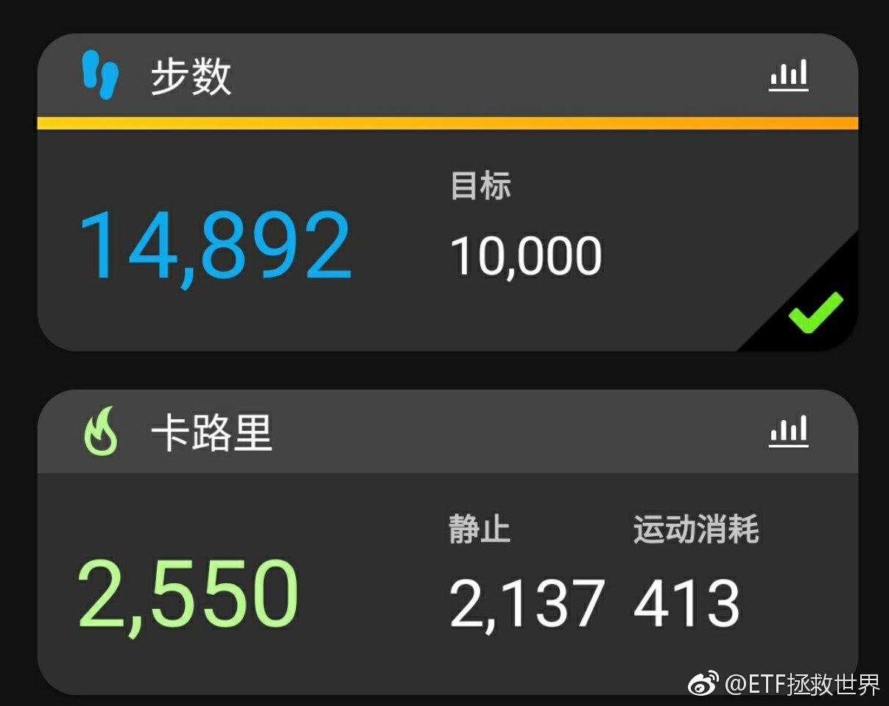

======================================================

ETF拯救世界 (5687069307) @
2017-12-20 08:57:41 Wed  
url: https://weibo.com/5687069307/FAu6UyGv6

就看法院的了。如果葫芦僧乱判葫芦案，恐怕就是下一个彭宇案，会影响深远。

------------------------------------------------------
转推：
>  @ ()
>  2017-12-20 08:13:20 Wed  
>  url: 

>  抱歉，作者已设置仅展示半年内微博，此微博已不可见。 ​​​

转发[8]  评论[27]  赞[36] 

======================================================

ETF拯救世界 (5687069307) @
2017-12-20 09:16:53 Wed  
url: https://weibo.com/5687069307/FAueID9Lo

回复@Mili:这事的事实众说纷纭。我不评论案情本身。我是说，彭宇案的传播对中国社会造成的巨大的影响。我说的是影响，而非真相。真相，也许永远会被埋葬。

------------------------------------------------------
转推：
>  @ ()
>  2017-12-20 08:13:20 Wed  
>  url: 

>  抱歉，作者已设置仅展示半年内微博，此微博已不可见。 ​​​

转发[3]  评论[22]  赞[32] 

======================================================

ETF拯救世界 (5687069307) @
2017-12-20 09:49:17 Wed  
url: https://weibo.com/5687069307/FAurRfHJi

信任两个字在当今这个年代已经非常难得。

所以如果有人信你，最好珍惜。

别人因你而亏损，当然可以一句“大家都是成年人，不要做巨婴”而推的干净，然而其实未必可以那么简单。

所以我坚持一个原则，任何计划里的品种，绝不建议高于我的成本价买入。我不会说自己1块买的，到了1.5还说值值值。你只可 ​​​

转发[24]  评论[124]  赞[366] 

======================================================

ETF拯救世界 (5687069307) @
2017-12-20 09:59:46 Wed  
url: https://weibo.com/5687069307/FAuw78cZ2

稳。忍不住奶一口

------------------------------------------------------
转推：
>  @ETF拯救世界 (5687069307)
>  2017-12-19 10:45:11 Tue  
>  url: https:/weibo.com/5687069307/FAlo3Apxw/

>  $养老产业 sz399812$   真的稳 ​​​

转发[3]  评论[24]  赞[67] 

======================================================

ETF拯救世界 (5687069307) @
2017-12-20 10:13:28 Wed  
url: https://weibo.com/5687069307/FAuBGiamr

回复@蜀行天下:意念盘，无需操作。类似于暗物质与气功的结合体。无形无色无味，但当量相当于一万多亿资金在操盘……//@蜀行天下:每次看到你说奶一口我都要深思一段时间，这又是什么操作，我会不会错过一个亿//@ETF拯救世界:稳。忍不住奶一口

------------------------------------------------------
转推：
>  @ETF拯救世界 (5687069307)
>  2017-12-19 10:45:11 Tue  
>  url: https:/weibo.com/5687069307/FAlo3Apxw/

>  $养老产业 sz399812$   真的稳 ​​​

转发[2]  评论[32]  赞[77] 

======================================================

ETF拯救世界 (5687069307) @
2017-12-20 10:18:32 Wed  
url: https://weibo.com/5687069307/FAuDJkEdN

$证券公司 sz399975$   够狠。跌破753就是700见了。然后就是我们的补仓点位，600…… ​​​

转发[45]  评论[61]  赞[109] 

======================================================

ETF拯救世界 (5687069307) @
2017-12-20 10:39:35 Wed  
url: https://weibo.com/5687069307/FAuMi3lQA

我该说什么呢。 ​​​

转发[7]  评论[117]  赞[43] 

+++++++++++++++++++++++++++++++++++++++++++++++++++++

图片：

======================================================

ETF拯救世界 (5687069307) @
2017-12-20 10:51:54 Wed  
url: https://weibo.com/5687069307/FAuRhrkMP

都不对。我就两个字：反弹！ [并不简单]

------------------------------------------------------
转推：
>  @ETF拯救世界 (5687069307)
>  2017-12-20 10:39:35 Wed  
>  url: https:/weibo.com/5687069307/FAuMi3lQA/

>  我该说什么呢。 ​​​

转发[0]  评论[24]  赞[64] 

======================================================

ETF拯救世界 (5687069307) @
2017-12-20 10:59:14 Wed  
url: https://weibo.com/5687069307/FAuUg82pI

回复@小祝Joochill:是的。再说我这个ID，“ETF拯救世界”，意思是指数基金能够让很多炒股不赚钱的人改变投资命运，而非某个人可以拯救世界，我还没那么二……主语是ETF……//@小祝Joochill:这个人语文学的不好，连E大的名字里主语是什么都没有弄清楚……

------------------------------------------------------
转推：
>  @ETF拯救世界 (5687069307)
>  2017-12-20 10:39:35 Wed  
>  url: https:/weibo.com/5687069307/FAuMi3lQA/

>  我该说什么呢。 ​​​

转发[3]  评论[27]  赞[65] 

======================================================

ETF拯救世界 (5687069307) @
2017-12-20 11:20:27 Wed  
url: https://weibo.com/5687069307/FAv2S4FSW

回复@枫93:不会的。我不信一个在村里用50块钱和芙蓉王贿选村长的治疗半身不遂的无证中医会来跟计划……//@枫93:搜了Ｅ大  冒牌货 用了Ｅ大头像冒牌的有18个[doge][doge][doge]他是不是被冒牌的骗了 来找正版的Ｅ大报复了呢 搞错了人呢[污]

------------------------------------------------------
转推：
>  @ETF拯救世界 (5687069307)
>  2017-12-20 10:39:35 Wed  
>  url: https:/weibo.com/5687069307/FAuMi3lQA/

>  我该说什么呢。 ​​​

转发[1]  评论[37]  赞[66] 

======================================================

ETF拯救世界 (5687069307) @
2017-12-20 12:51:29 Wed  
url: https://weibo.com/5687069307/FAvDP4LBC

回复@i云腾致雨:不可能[doge]//@i云腾致雨:E大心态为什么这么好？别人找的女朋友比你的漂亮，也不嫉妒？[允悲]

------------------------------------------------------
转推：
>  @ETF拯救世界 (5687069307)
>  2017-12-20 09:49:17 Wed  
>  url: https:/weibo.com/5687069307/FAurRfHJi/

>  信任两个字在当今这个年代已经非常难得。
>  
>  所以如果有人信你，最好珍惜。
>  
>  别人因你而亏损，当然可以一句“大家都是成年人，不要做巨婴”而推的干净，然而其实未必可以那么简单。
>  
>  所以我坚持一个原则，任何计划里的品种，绝不建议高于我的成本价买入。我不会说自己1块买的，到了1.5还说值值值。你只可 ​​​

转发[2]  评论[43]  赞[103] 

======================================================

ETF拯救世界 (5687069307) @
2017-12-20 13:28:17 Wed  
url: https://weibo.com/5687069307/FAvSKtMaj

35%。最近这个区间是成交稀少区。还有大量成本在18左右的筹码。//@ETF拯救世界:37%//@ETF拯救世界:44%//@ETF拯救世界:获利比例剩50%了……

------------------------------------------------------
转推：
>  @ETF拯救世界 (5687069307)
>  2017-12-04 09:36:18 Mon  
>  url: https:/weibo.com/5687069307/Fy3wE2Hh9/

>  8848获利筹码只剩55%了。这个股票换手虽然低，但是在高位几个月了，基本上接盘的都吃饱了。。。 ​​​

转发[30]  评论[17]  赞[64] 

======================================================

ETF拯救世界 (5687069307) @
2017-12-20 14:15:37 Wed  
url: https://weibo.com/5687069307/FAwbYf12e

好歹也得反弹一波涨个10%换换手吧……//@ETF拯救世界:35%。最近这个区间是成交稀少区。还有大量成本在18左右的筹码。//@ETF拯救世界:37%//@ETF拯救世界:44%//@ETF拯救世界:获利比例剩50%了……

------------------------------------------------------
转推：
>  @ETF拯救世界 (5687069307)
>  2017-12-04 09:36:18 Mon  
>  url: https:/weibo.com/5687069307/Fy3wE2Hh9/

>  8848获利筹码只剩55%了。这个股票换手虽然低，但是在高位几个月了，基本上接盘的都吃饱了。。。 ​​​

转发[27]  评论[12]  赞[50] 

======================================================

ETF拯救世界 (5687069307) @
2017-12-20 14:24:07 Wed  
url: https://weibo.com/5687069307/FAwfq94xS

回复@豆丁没事:不会。仓位非常巴适。不用着急加车，月底正点开车。//@豆丁没事:E神，这周会发车吗//@ETF拯救世界:好歹也得反弹一波涨个10%换换手吧……//@ETF拯救世界:35%。最近这个区间是成交稀少区。还有大量成本在18左右的筹码。//@ETF拯救世界:37%//@ETF拯救世界:44%

------------------------------------------------------
转推：
>  @ETF拯救世界 (5687069307)
>  2017-12-04 09:36:18 Mon  
>  url: https:/weibo.com/5687069307/Fy3wE2Hh9/

>  8848获利筹码只剩55%了。这个股票换手虽然低，但是在高位几个月了，基本上接盘的都吃饱了。。。 ​​​

转发[1]  评论[26]  赞[69] 

======================================================

ETF拯救世界 (5687069307) @
2017-12-20 14:43:42 Wed  
url: https://weibo.com/5687069307/FAwnn3qZt

回复@李贤1985_319:不是看到。是极限跌幅。跌到400我不吃惊。就酱。//@李贤1985_319:在雪球很多人都说证券指数已经到了底部区域，e兄看到600，甚至能到500的理由是什么呢🤔🙏。

------------------------------------------------------
转推：
>  @ETF拯救世界 (5687069307)
>  2017-12-20 10:18:32 Wed  
>  url: https:/weibo.com/5687069307/FAuDJkEdN/

>  $证券公司 sz399975$   够狠。跌破753就是700见了。然后就是我们的补仓点位，600…… ​​​

转发[3]  评论[15]  赞[64] 

======================================================

ETF拯救世界 (5687069307) @
2017-12-20 14:51:15 Wed  
url: https://weibo.com/5687069307/FAwqr40hD

回复@李贤1985_319:http://t.cn/RT3hDdC //@李贤1985_319:在雪球很多人都说证券指数已经到了底部区域，e兄看到600，甚至能到500的理由是什么呢🤔🙏。

------------------------------------------------------
转推：
>  @ETF拯救世界 (5687069307)
>  2017-12-20 10:18:32 Wed  
>  url: https:/weibo.com/5687069307/FAuDJkEdN/

>  $证券公司 sz399975$   够狠。跌破753就是700见了。然后就是我们的补仓点位，600…… ​​​

转发[9]  评论[22]  赞[95] 

======================================================

ETF拯救世界 (5687069307) @
2017-12-20 15:58:52 Wed  
url: https://weibo.com/5687069307/FAwRSwflE

500估值又新低了。

人生美好。 ​​​

转发[11]  评论[89]  赞[196] 

======================================================

ETF拯救世界 (5687069307) @
2017-12-20 16:05:37 Wed  
url: https://weibo.com/5687069307/FAwUD1etc

回复@老股民穿越牛熊:不是看，我是算。我每天都算，跑程序跑20分钟。源数据出来第一时间就算。算估值是我人生中第三大最爱干的事。你咬我呀。[笑而不语] 一会儿就拉黑。//@老股民穿越牛熊:你每天看估值累不累？心态不好 慢慢练心态吧！

------------------------------------------------------
转推：
>  @ETF拯救世界 (5687069307)
>  2017-12-20 15:58:52 Wed  
>  url: https:/weibo.com/5687069307/FAwRSwflE/

>  500估值又新低了。
>  
>  人生美好。 ​​​

转发[3]  评论[65]  赞[152] 

======================================================

ETF拯救世界 (5687069307) @
2017-12-20 16:11:12 Wed  
url: https://weibo.com/5687069307/FAwWT2OoM

“我先拉黑你”，佢话。

我笑喷了。拉黑不拉黑谁care啊。我根本就不想看你的微博好吗……蜜汁自信……

跑到别人微博评论里说，我要拉黑你。这是一种什么精神…… 我都唔知你系边个…… ​​​

转发[3]  评论[113]  赞[179] 

======================================================

ETF拯救世界 (5687069307) @
2017-12-21 06:24:36 Thu  
url: https://weibo.com/5687069307/FACxhq5b1

……

------------------------------------------------------
转推：
>  @ ()
>  2017-12-21 05:53:24 Thu  
>  url: 

>  抱歉，此微博已被作者删除。查看帮助：http://t.cn/Rfd3rQV

转发[0]  评论[40]  赞[48] 

======================================================

ETF拯救世界 (5687069307) @
2017-12-21 06:34:23 Thu  
url: https://weibo.com/5687069307/FACBfeaV8

相当完美的区间波动 ​​​

转发[2]  评论[48]  赞[97] 

+++++++++++++++++++++++++++++++++++++++++++++++++++++

图片：

======================================================

ETF拯救世界 (5687069307) @
2017-12-21 09:45:38 Thu  
url: https://weibo.com/5687069307/FADQSwOXI

看看是不是有机会加仓美元债。[并不简单]//@华尔街见闻APP:在岸人民币创3月来新高

------------------------------------------------------
转推：
>  @ ()
>  2017-12-20 16:56:03 Wed  
>  url: 

>  抱歉，此微博已被作者删除。查看帮助：http://t.cn/Rfd3rQV

转发[14]  评论[28]  赞[72] 

======================================================

ETF拯救世界 (5687069307) @
2017-12-21 10:11:42 Thu  
url: https://weibo.com/5687069307/FAE1swq1L

$证券公司 sz399975$  新低。下跌空间打开了 ​​​

转发[32]  评论[41]  赞[109] 

======================================================

ETF拯救世界 (5687069307) @
2017-12-21 10:15:26 Thu  
url: https://weibo.com/5687069307/FAE2YaLBB

回复@5DONY:其实我不想说，怕很多朋友会误入歧途：2012年11月底，我买了中证500b。但是各位，分级B非常微妙，不是那么简单加杠杆，要叠加时间因素，长期会死。以后如果有机会再说吧。//@5DONY:E大，有些品种如果确实极限底会考虑上杠杠吗？比如买入分级B

------------------------------------------------------
转推：
>  @ ()
>  2017-12-20 16:56:03 Wed  
>  url: 

>  抱歉，此微博已被作者删除。查看帮助：http://t.cn/Rfd3rQV

转发[11]  评论[29]  赞[77] 

======================================================

ETF拯救世界 (5687069307) @
2017-12-21 10:47:05 Thu  
url: https://weibo.com/5687069307/FAEfP7NBM

回复@星渚:早吗。我买的那天是历史最低。那天相当有趣，如果按照上午的跌幅就要下折了，结果下午拉升，没有下折，5倍杠杆，开始上涨。收盘一算，进入历史最低区域。写了那篇文章。那天真的值得纪念。//@星渚:老大买的有点早，不过肯定是小比例的，作为冲锋队用的。

------------------------------------------------------
转推：
>  @ ()
>  2017-12-20 16:56:03 Wed  
>  url: 

>  抱歉，此微博已被作者删除。查看帮助：http://t.cn/Rfd3rQV

转发[3]  评论[16]  赞[57] 

======================================================

ETF拯救世界 (5687069307) @
2017-12-21 10:49:39 Thu  
url: https://weibo.com/5687069307/FAEgRzyoj

回复@Yanb丶:[并不简单] 就问你服不服//@Yanb丶:毒奶界唯你最强

------------------------------------------------------
转推：
>  @ETF拯救世界 (5687069307)
>  2017-12-21 10:11:42 Thu  
>  url: https:/weibo.com/5687069307/FAE1swq1L/

>  $证券公司 sz399975$  新低。下跌空间打开了 ​​​

转发[3]  评论[25]  赞[74] 

======================================================

ETF拯救世界 (5687069307) @
2017-12-21 11:02:57 Thu  
url: https://weibo.com/5687069307/FAEmg1KCV

这就是“弹性”。应该还不到时候。到时候它会让你目瞪口呆。。//@ETF拯救世界:回复@Yanb丶:[并不简单] 就问你服不服//@Yanb丶:毒奶界唯你最强

------------------------------------------------------
转推：
>  @ETF拯救世界 (5687069307)
>  2017-12-21 10:11:42 Thu  
>  url: https:/weibo.com/5687069307/FAE1swq1L/

>  $证券公司 sz399975$  新低。下跌空间打开了 ​​​

转发[2]  评论[42]  赞[87] 

======================================================

ETF拯救世界 (5687069307) @
2017-12-21 13:54:36 Thu  
url: https://weibo.com/5687069307/FAFtW9ruU

快回去了。

------------------------------------------------------
转推：
>  @ETF拯救世界 (5687069307)
>  2017-12-11 10:33:41 Mon  
>  url: https:/weibo.com/5687069307/Fz7Tq5XPH/

>  $养老产业 sz399812$   之前一路都在说，不要卖。结果回调5%。你会不会想，还不如卖了，再买回来，成本降低5%，多好啊。
>  
>  你事后看，这样简直完美。问题在于，你能做到吗。卖在最高点，买回在最低点？
>  
>  且不说一来一回手续费有多少，就说这个时机的把握，能做到？
>  
>  买了成本不高的品种，最重要的就不是 ​​​

转发[2]  评论[28]  赞[98] 

======================================================

ETF拯救世界 (5687069307) @
2017-12-21 14:59:51 Thu  
url: https://weibo.com/5687069307/FAFUqufPm

如期而至。。//@ETF拯救世界:好歹也得反弹一波涨个10%换换手吧……//@ETF拯救世界:35%。最近这个区间是成交稀少区。还有大量成本在18左右的筹码。//@ETF拯救世界:37%//@ETF拯救世界:44%//@ETF拯救世界:获利比例剩50%了……

------------------------------------------------------
转推：
>  @ETF拯救世界 (5687069307)
>  2017-12-04 09:36:18 Mon  
>  url: https:/weibo.com/5687069307/Fy3wE2Hh9/

>  8848获利筹码只剩55%了。这个股票换手虽然低，但是在高位几个月了，基本上接盘的都吃饱了。。。 ​​​

转发[22]  评论[17]  赞[69] 

======================================================

ETF拯救世界 (5687069307) @
2017-12-21 17:09:27 Thu  
url: https://weibo.com/5687069307/FAGL1xHpG

回复@用户6244991818:可以。目前50、300、180、100、500、广发医药、恒生、黄金、H、中小、创业等ETF全都支持融资买入啊。//@用户6244991818:问个弱弱的问题:指数基金可以抵押融资，但融来的资买不了指数基金。e大说的低点融资，是用来干嘛？//@ETF拯救世界:如期而至。。

------------------------------------------------------
转推：
>  @ETF拯救世界 (5687069307)
>  2017-12-04 09:36:18 Mon  
>  url: https:/weibo.com/5687069307/Fy3wE2Hh9/

>  8848获利筹码只剩55%了。这个股票换手虽然低，但是在高位几个月了，基本上接盘的都吃饱了。。。 ​​​

转发[21]  评论[44]  赞[84] 

======================================================

ETF拯救世界 (5687069307) @
2017-12-21 22:55:05 Thu  
url: https://weibo.com/5687069307/FAJ1jFR6u

每日打卡（126）

两组其实量不够 ​​​

转发[0]  评论[20]  赞[96] 

+++++++++++++++++++++++++++++++++++++++++++++++++++++

图片：
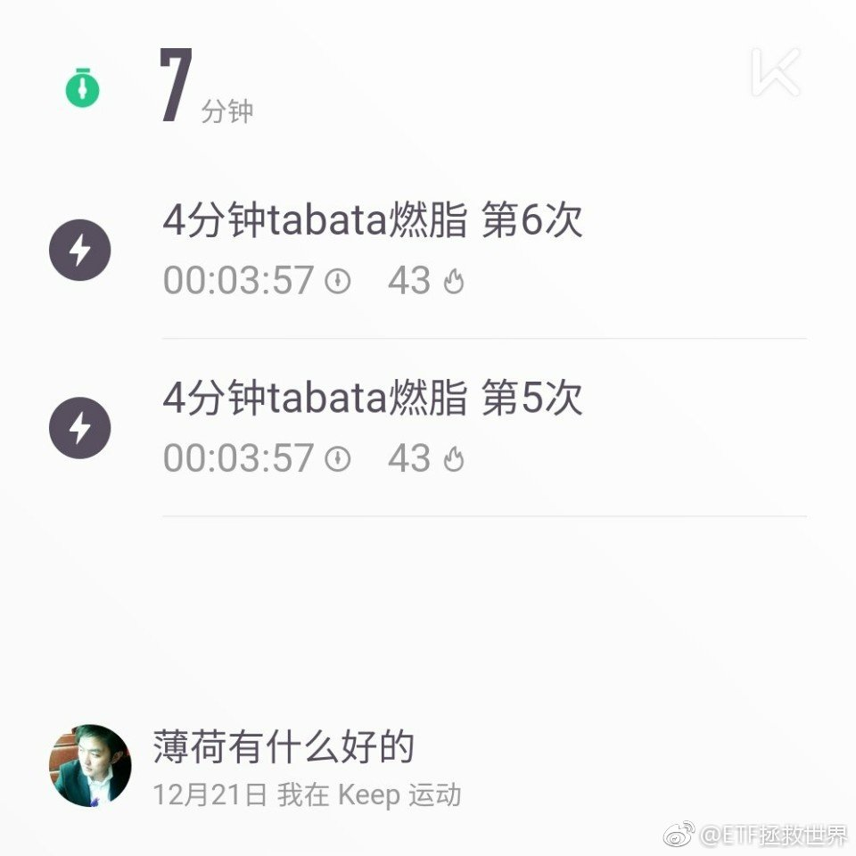
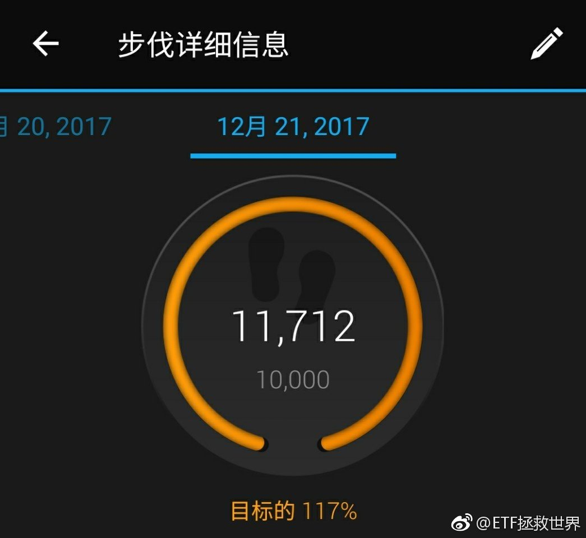

======================================================

ETF拯救世界 (5687069307) @
2017-12-22 06:36:48 Fri  
url: https://weibo.com/5687069307/FAM2Jk9Bg

有波动就有利润，提款机 ​​​

转发[14]  评论[130]  赞[157] 

+++++++++++++++++++++++++++++++++++++++++++++++++++++

图片：
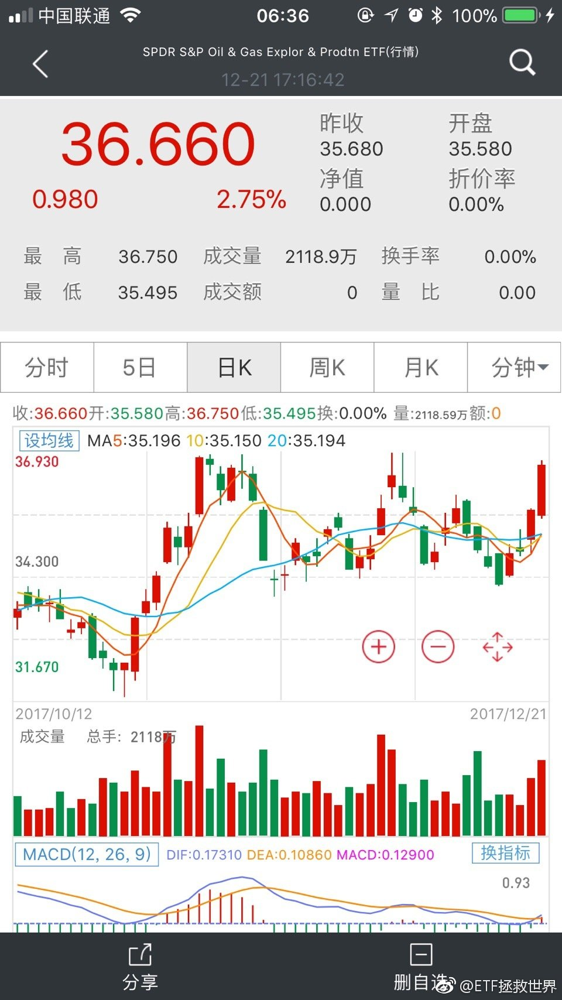

======================================================

ETF拯救世界 (5687069307) @
2017-12-22 11:01:16 Fri  
url: https://weibo.com/5687069307/FANM4DcAj

回复@April·D·S:品种很多。各国etf、各种久期的国债etf，reits，tips。总能挖出来能买的。//@April·D·S:回复@ETF拯救世界: 钱又要回一部分到雪盈了，之前在投机做空，好不容易决定不做空了，回归A股了，E大要做美股ETF了[允悲] 但美股目前高估中，E大也只是研究还不会买对吧?

------------------------------------------------------
转推：
>  @ETF拯救世界 (5687069307)
>  2017-12-22 06:36:48 Fri  
>  url: https:/weibo.com/5687069307/FAM2Jk9Bg/

>  有波动就有利润，提款机 ​​​

转发[7]  评论[39]  赞[82] 

======================================================

ETF拯救世界 (5687069307) @
2017-12-22 13:17:31 Fri  
url: https://weibo.com/5687069307/FAOFnz8PK

$全指医药 sh000991$  风是不是吹到医药了。 ​​​

转发[14]  评论[19]  赞[75] 

======================================================

ETF拯救世界 (5687069307) @
2017-12-22 13:30:58 Fri  
url: https://weibo.com/5687069307/FAOKQaAN1

回复@诸葛不亮_若如初见:给咱们抬轿子？？？//@诸葛不亮_若如初见:雪球公众号已经快一个月连续推医药了，还有我关注的别的财经类，平均两天一篇推荐医药股和医药指数的文章

------------------------------------------------------
转推：
>  @ETF拯救世界 (5687069307)
>  2017-12-22 13:17:31 Fri  
>  url: https:/weibo.com/5687069307/FAOFnz8PK/

>  $全指医药 sh000991$  风是不是吹到医药了。 ​​​

转发[0]  评论[16]  赞[70] 

======================================================

ETF拯救世界 (5687069307) @
2017-12-22 13:48:44 Fri  
url: https://weibo.com/5687069307/FAOS3dodO

回复@观海听山:今年基金超级低配医药股。就这样医药好歹今年也没跌，当然涨幅和沪深300没法比。我坚定看好这个行业。长期的看好。//@观海听山:除了那几个龙头，其它大多数医药股还是不行

------------------------------------------------------
转推：
>  @ETF拯救世界 (5687069307)
>  2017-12-22 13:17:31 Fri  
>  url: https:/weibo.com/5687069307/FAOFnz8PK/

>  $全指医药 sh000991$  风是不是吹到医药了。 ​​​

转发[6]  评论[22]  赞[81] 

======================================================

ETF拯救世界 (5687069307) @
2017-12-22 13:52:26 Fri  
url: https://weibo.com/5687069307/FAOTyjqBl

回复@Maggie的夏至:就当历史书看吧……怎么投资上面没有，只是告诉你那个金融危机发生了什么。//@Maggie的夏至:正要补充书呢看到你雪球上发的《大而不倒》。好看吗？推荐不

------------------------------------------------------
转推：
>  @ETF拯救世界 (5687069307)
>  2017-12-22 13:17:31 Fri  
>  url: https:/weibo.com/5687069307/FAOFnz8PK/

>  $全指医药 sh000991$  风是不是吹到医药了。 ​​​

转发[2]  评论[10]  赞[67] 

======================================================

ETF拯救世界 (5687069307) @
2017-12-22 14:41:26 Fri  
url: https://weibo.com/5687069307/FAPdrpA41

[拜拜] 退博了。

------------------------------------------------------
转推：
>  @ETF拯救世界 (5687069307)
>  2017-12-22 13:17:31 Fri  
>  url: https:/weibo.com/5687069307/FAOFnz8PK/

>  $全指医药 sh000991$  风是不是吹到医药了。 ​​​

转发[4]  评论[78]  赞[95] 

======================================================

ETF拯救世界 (5687069307) @
2017-12-22 15:17:01 Fri  
url: https://weibo.com/5687069307/FAPrT24SD

10年期债主力T1803收涨0.40%，创近10月27日以来新高新高；5年期债主力TF1803涨0.22%，创10月26日新高。

国泰君安表示，中短期来看，目前长端利率水平已经充分透支了利空预期，随着未来1-2个季度名义GDP回落、对监管恐慌的平抑，债市大概率将会迎来一轮级别比较大的熊市反弹，10年国债和国开收益率有望 ​​​

转发[13]  评论[39]  赞[106] 

======================================================

ETF拯救世界 (5687069307) @
2017-12-22 17:22:47 Fri  
url: https://weibo.com/5687069307/FAQgW3RNd

回复@linsuozhang2009:中文网路上当然是我的最准，还用说吗。[doge]//@linsuozhang2009:回复@卢泽森Samuel:每个大V和且慢的估值算法不见得一样，都只是为了自己的投资体系服务，没有谁对谁错或者准不准确的问题

------------------------------------------------------
转推：
>  @ETF拯救世界 (5687069307)
>  2017-12-04 09:36:18 Mon  
>  url: https:/weibo.com/5687069307/Fy3wE2Hh9/

>  8848获利筹码只剩55%了。这个股票换手虽然低，但是在高位几个月了，基本上接盘的都吃饱了。。。 ​​​

转发[2]  评论[67]  赞[152] 

======================================================

ETF拯救世界 (5687069307) @
2017-12-23 10:54:06 Sat  
url: https://weibo.com/5687069307/FAX9EBTFy

回复@飞雨的魔法袋:[哼]//@飞雨的魔法袋:白银昨晚成交了[鼓掌]//@ETF拯救世界:回复@linsuozhang2009:中文网路上当然是我的最准，还用说吗。[doge]//@linsuozhang2009:回复@卢泽森Samuel:每个大V和且慢的估值算法不见得一样，都只是为了自己的投资体系服务，没有谁对谁错或者准不准确的问题

------------------------------------------------------
转推：
>  @ETF拯救世界 (5687069307)
>  2017-12-04 09:36:18 Mon  
>  url: https:/weibo.com/5687069307/Fy3wE2Hh9/

>  8848获利筹码只剩55%了。这个股票换手虽然低，但是在高位几个月了，基本上接盘的都吃饱了。。。 ​​​

转发[1]  评论[19]  赞[54] 

======================================================

ETF拯救世界 (5687069307) @
2017-12-23 11:02:35 Sat  
url: https://weibo.com/5687069307/FAXd6gYDw

a股，原油，白银，债券，美/德，相关度都很低。再加上汇率因素，此消彼长可以不断盈利。

a股内部，也有各种风格切换。

全天候赚钱，长短结合，稳定，持续盈利，就是我们投资体系的核心思想。 ​​​

转发[90]  评论[179]  赞[299] 

======================================================

ETF拯救世界 (5687069307) @
2017-12-23 14:50:10 Sat  
url: https://weibo.com/5687069307/FAYHu5BYa

很多要二胎的都是接近中年了。不少都是老婆辞职看孩子，男方工作一旦有什么问题……

------------------------------------------------------
转推：
>  @水木社区官微 (2149648625)
>  2017-12-23 08:38:31 Sat  
>  url: https:/weibo.com/2149648625/FAWgDfDlR/

>  老公正经历中年失业，做老婆的该咋办？ ​​​

转发[21]  评论[105]  赞[85] 

======================================================

ETF拯救世界 (5687069307) @
2017-12-23 18:28:40 Sat  
url: https://weibo.com/5687069307/FB08aCtcM

很多人事事都要听父母的，根本原因在于经济依赖，还不能独立，需要父母资助。

这个没办法，既然拿人家的钱，就要听人家的话。否则，就自己多挣点，自己的事就能自己拿主意了。 ​​​

转发[15]  评论[130]  赞[256] 

======================================================

ETF拯救世界 (5687069307) @
2017-12-24 07:21:44 Sun  
url: https://weibo.com/5687069307/FB5bXw0xS

75年人口出生高峰，90年房地产股市大崩盘

------------------------------------------------------
转推：
>  @网易财经 (1974561081)
>  2017-12-23 16:04:25 Sat  
>  url: https:/weibo.com/1974561081/FAZbCu8HZ/

>  #网易财经# 【仅94万！日本今年新生人口数创历史新低】日本厚生劳动省22日公布的人口动态统计数据估算值显示，今年日本新出生人口数将仅为94.1万人，创下1899年有统计数据以来的最低值。同时，今年新婚情侣数为60.7万对，也创战后新低。http://t.cn/RHPHkey ​​​

转发[8]  评论[55]  赞[89] 

======================================================

ETF拯救世界 (5687069307) @
2017-12-25 10:34:52 Mon  
url: https://weibo.com/5687069307/FBfSRh7Ae

相信老司机没错的……新低意味着不断的大概率新低。新高同理……

------------------------------------------------------
转推：
>  @ETF拯救世界 (5687069307)
>  2017-12-21 10:11:42 Thu  
>  url: https:/weibo.com/5687069307/FAE1swq1L/

>  $证券公司 sz399975$  新低。下跌空间打开了 ​​​

转发[23]  评论[49]  赞[154] 

======================================================

ETF拯救世界 (5687069307) @
2017-12-25 10:40:57 Mon  
url: https://weibo.com/5687069307/FBfVjn1Af

回复@初夏拾穗的少年:我没法给你建议啊。我自己投资指数基金，绝对不会止损。第一它一定会涨回去，因为第二点。第二点就是我买的成本一定不高。//@初夏拾穗的少年:原有的基金要不要止损呢？已经跌了百分之十了。益达，怎么办？

------------------------------------------------------
转推：
>  @ETF拯救世界 (5687069307)
>  2017-12-21 10:11:42 Thu  
>  url: https:/weibo.com/5687069307/FAE1swq1L/

>  $证券公司 sz399975$  新低。下跌空间打开了 ​​​

转发[6]  评论[22]  赞[100] 

======================================================

ETF拯救世界 (5687069307) @
2017-12-25 10:42:34 Mon  
url: https://weibo.com/5687069307/FBfVYa6hG

说起来各位可能不信，我对2018年充满信心。即使明年此时没有大赚，也大概率已经把大部分筹码买进去了。

三年了，差不多了。 ​​​

转发[32]  评论[155]  赞[356] 

======================================================

ETF拯救世界 (5687069307) @
2017-12-25 11:29:41 Mon  
url: https://weibo.com/5687069307/FBgf6kJKT

2700只下跌。还有3天。给个面子啊 ​​​

转发[0]  评论[54]  赞[161] 

======================================================

ETF拯救世界 (5687069307) @
2017-12-25 11:30:57 Mon  
url: https://weibo.com/5687069307/FBgfCaNK7

回复@马甲不停:12月11日成分股调整。红利调整了20%的成分股，估值暴降。醉了。//@马甲不停:麻烦请教一个问题，上一期计划中，重新购买一份中证红利？这个逻辑是因为调仓，估值下降的缘故嘛，所有购买一份中证红利。

------------------------------------------------------
转推：
>  @ETF拯救世界 (5687069307)
>  2017-12-25 10:42:34 Mon  
>  url: https:/weibo.com/5687069307/FBfVYa6hG/

>  说起来各位可能不信，我对2018年充满信心。即使明年此时没有大赚，也大概率已经把大部分筹码买进去了。
>  
>  三年了，差不多了。 ​​​

转发[3]  评论[38]  赞[109] 

======================================================

ETF拯救世界 (5687069307) @
2017-12-25 14:14:29 Mon  
url: https://weibo.com/5687069307/FBhjZxy2G

越来越觉得，成功的投资需要信仰。

无论客观环境发生什么变化，无论别人称赞还是诋毁你，坚持信仰才有可能成功。

当然，信仰不等于迂腐不化，更不等于刻舟求剑。术要与时俱进，道万变不离其宗。 ​​​

转发[37]  评论[86]  赞[349] 

======================================================

ETF拯救世界 (5687069307) @
2017-12-25 15:10:19 Mon  
url: https://weibo.com/5687069307/FBhGEzUbl

中证1000+创业板综即将新低。

这意味着，3300只股票中，100多只在高位，700多只反弹到高点的一半左右。其它的2500只都快新低了。

这也与每天基本上都是2000-2500只股票下跌一致。

[并不简单] ​​​

转发[21]  评论[75]  赞[215] 

======================================================

ETF拯救世界 (5687069307) @
2017-12-25 21:50:12 Mon  
url: https://weibo.com/5687069307/FBkiY9Loe

每日打卡（127）

坚持很不容易。 ​​​

转发[0]  评论[26]  赞[186] 

+++++++++++++++++++++++++++++++++++++++++++++++++++++

图片：

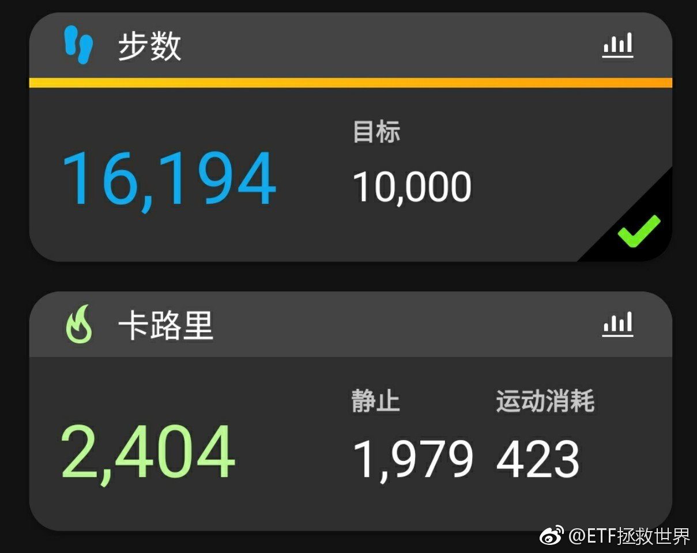

======================================================

ETF拯救世界 (5687069307) @
2017-12-26 10:42:12 Tue  
url: https://weibo.com/5687069307/FBpmk9GxN

那位举报的仁兄又出动了。每次到了月底发车的时候他就来一下。

真的NB，人类。

我还是开个头条号对冲一下风险吧。。万一哪天公众号让那哥们儿给玩歇菜了怎么办。 ​​​

转发[2]  评论[211]  赞[122] 

+++++++++++++++++++++++++++++++++++++++++++++++++++++

图片：

======================================================

ETF拯救世界 (5687069307) @
2017-12-26 10:56:20 Tue  
url: https://weibo.com/5687069307/FBps40hMu

现在回头看这个，有没有一点新的体会。

------------------------------------------------------
转推：
>  @ETF拯救世界 (5687069307)
>  2017-11-23 10:55:31 Thu  
>  url: https:/weibo.com/5687069307/FwollhU4i/

>  为什么要定时交易。
>  
>  我告诉你真正的原因。
>  
>  那就是资本市场的中短期不可预测性。
>  
>  我们的任务，是把手中有限的资源，最合理优化的分配到“低估”品种上。如果“觉得”，又或者是根据“数据”，只要便宜就买，贵了就卖，很可能买卖都在半山腰。
>  
>  金融交易不是数学题。便宜了就不会跌，贵了就不会涨？不 ​​​

转发[13]  评论[37]  赞[141] 

======================================================

ETF拯救世界 (5687069307) @
2017-12-26 11:08:29 Tue  
url: https://weibo.com/5687069307/FBpwZu6Rj

回复@josephtang:送你个大保健得唔得嘅？[哼]//@josephtang:回复@ETF拯救世界:益达，指数又反弹了，我要心理按摩。[笑cry][笑cry]//@ETF拯救世界:现在回头看这个，有没有一点新的体会。

------------------------------------------------------
转推：
>  @ETF拯救世界 (5687069307)
>  2017-11-23 10:55:31 Thu  
>  url: https:/weibo.com/5687069307/FwollhU4i/

>  为什么要定时交易。
>  
>  我告诉你真正的原因。
>  
>  那就是资本市场的中短期不可预测性。
>  
>  我们的任务，是把手中有限的资源，最合理优化的分配到“低估”品种上。如果“觉得”，又或者是根据“数据”，只要便宜就买，贵了就卖，很可能买卖都在半山腰。
>  
>  金融交易不是数学题。便宜了就不会跌，贵了就不会涨？不 ​​​

转发[5]  评论[58]  赞[95] 

======================================================

ETF拯救世界 (5687069307) @
2017-12-26 13:32:02 Tue  
url: https://weibo.com/5687069307/FBqtfwLtY

回复@Yoran_咩咩咩:真的有些品种可能这样，所以炒个股要小心//@Yoran_咩咩咩:咋不能图片评论，现在别的财经博主评论下面都是a股必然港股化僵尸化，还有说必须要认清a股未来丧失流动性的先决战略再去选股。吓得我还是来e大这按摩心灵吧[可怜]//@ETF拯救世界:回复@josephtang:送你个大保健得唔得嘅？[哼]

------------------------------------------------------
转推：
>  @ETF拯救世界 (5687069307)
>  2017-11-23 10:55:31 Thu  
>  url: https:/weibo.com/5687069307/FwollhU4i/

>  为什么要定时交易。
>  
>  我告诉你真正的原因。
>  
>  那就是资本市场的中短期不可预测性。
>  
>  我们的任务，是把手中有限的资源，最合理优化的分配到“低估”品种上。如果“觉得”，又或者是根据“数据”，只要便宜就买，贵了就卖，很可能买卖都在半山腰。
>  
>  金融交易不是数学题。便宜了就不会跌，贵了就不会涨？不 ​​​

转发[2]  评论[15]  赞[72] 

======================================================

ETF拯救世界 (5687069307) @
2017-12-26 14:21:04 Tue  
url: https://weibo.com/5687069307/FBqNaa8pE

长短结合逆回购搞起来！ ​​​

转发[7]  评论[107]  赞[155] 

======================================================

ETF拯救世界 (5687069307) @
2017-12-27 04:05:41 Wed  
url: https://weibo.com/5687069307/FBwbSfEhM

突破了 ​​​

转发[2]  评论[89]  赞[130] 

+++++++++++++++++++++++++++++++++++++++++++++++++++++

图片：
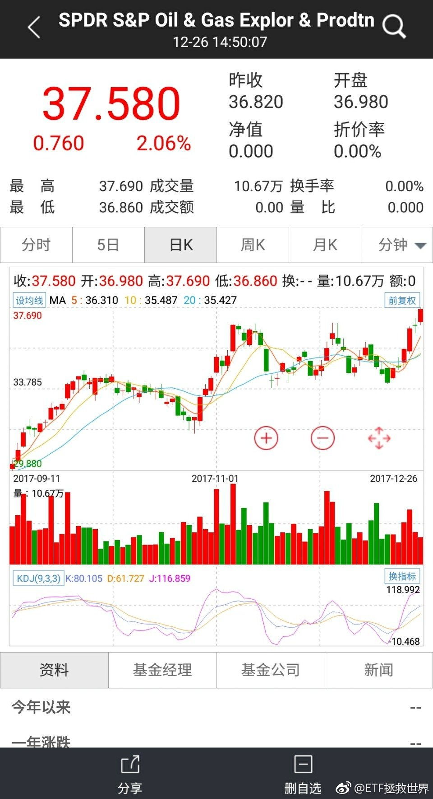

======================================================

ETF拯救世界 (5687069307) @
2017-12-27 08:07:53 Wed  
url: https://weibo.com/5687069307/FBxMbmRU7

回复@灰涩柳丁:别人说什么一点都不重要。金融投资不是投票产生赢家。//@灰涩柳丁:还记得在某论坛那时还被好多人质疑了[跪了]

------------------------------------------------------
转推：
>  @ETF拯救世界 (5687069307)
>  2017-12-27 04:05:41 Wed  
>  url: https:/weibo.com/5687069307/FBwbSfEhM/

>  突破了 ​​​

转发[1]  评论[27]  赞[112] 

======================================================

ETF拯救世界 (5687069307) @
2017-12-27 10:02:15 Wed  
url: https://weibo.com/5687069307/FBywBrOE7

逆回购长短结合搞起来！ ​​​

转发[5]  评论[44]  赞[95] 

======================================================

ETF拯救世界 (5687069307) @
2017-12-27 10:20:12 Wed  
url: https://weibo.com/5687069307/FByDTAGDl

回复@o我有一只猫:元旦后的话，3、4、7都可以。1月2、3回到账户。7会多一天。14天收益率少，但多吃7天。//@o我有一只猫:今天搞哪个结算到元旦节后的啊？

------------------------------------------------------
转推：
>  @ETF拯救世界 (5687069307)
>  2017-12-27 10:02:15 Wed  
>  url: https:/weibo.com/5687069307/FBywBrOE7/

>  逆回购长短结合搞起来！ ​​​

转发[3]  评论[17]  赞[60] 

======================================================

ETF拯救世界 (5687069307) @
2017-12-27 10:22:07 Wed  
url: https://weibo.com/5687069307/FByEFpa65

港真，14天我预期在6.5以上都好满意嘅，没想到给了8%。我都好中意解个系场！ ​​​

转发[15]  评论[41]  赞[87] 

======================================================

ETF拯救世界 (5687069307) @
2017-12-27 10:24:44 Wed  
url: https://weibo.com/5687069307/FByFJjkcU

回复@Sebastian-Canton:哪能港，肉身还没去过广东……//@Sebastian-Canton:E大广东人？

------------------------------------------------------
转推：
>  @ETF拯救世界 (5687069307)
>  2017-12-27 10:22:07 Wed  
>  url: https:/weibo.com/5687069307/FByEFpa65/

>  港真，14天我预期在6.5以上都好满意嘅，没想到给了8%。我都好中意解个系场！ ​​​

转发[1]  评论[26]  赞[56] 

======================================================

ETF拯救世界 (5687069307) @
2017-12-27 10:33:10 Wed  
url: https://weibo.com/5687069307/FByJ9uUYL

8.6。贫穷限制了我的想象力，今天没钱了！

------------------------------------------------------
转推：
>  @ETF拯救世界 (5687069307)
>  2017-12-27 10:22:07 Wed  
>  url: https:/weibo.com/5687069307/FByEFpa65/

>  港真，14天我预期在6.5以上都好满意嘅，没想到给了8%。我都好中意解个系场！ ​​​

转发[10]  评论[21]  赞[67] 

======================================================

ETF拯救世界 (5687069307) @
2017-12-27 10:36:57 Wed  
url: https://weibo.com/5687069307/FByKGDwQT

9.05。哭出来了。//@ETF拯救世界:8.6。贫穷限制了我的想象力，今天没钱了！

------------------------------------------------------
转推：
>  @ETF拯救世界 (5687069307)
>  2017-12-27 10:22:07 Wed  
>  url: https:/weibo.com/5687069307/FByEFpa65/

>  港真，14天我预期在6.5以上都好满意嘅，没想到给了8%。我都好中意解个系场！ ​​​

转发[8]  评论[145]  赞[82] 

======================================================

ETF拯救世界 (5687069307) @
2017-12-27 11:26:24 Wed  
url: https://weibo.com/5687069307/FBz4KCbkp

长久期国债个券崩的一塌糊涂。 ​​​

转发[2]  评论[22]  赞[99] 

======================================================

ETF拯救世界 (5687069307) @
2017-12-27 11:39:17 Wed  
url: https://weibo.com/5687069307/FBz9Zrjb4

我说14天你们说1、3、4、7，鸡同鸭讲……//@ETF拯救世界:9.05。哭出来了。//@ETF拯救世界:8.6。贫穷限制了我的想象力，今天没钱了！

------------------------------------------------------
转推：
>  @ETF拯救世界 (5687069307)
>  2017-12-27 10:22:07 Wed  
>  url: https:/weibo.com/5687069307/FByEFpa65/

>  港真，14天我预期在6.5以上都好满意嘅，没想到给了8%。我都好中意解个系场！ ​​​

转发[6]  评论[64]  赞[78] 

======================================================

ETF拯救世界 (5687069307) @
2017-12-27 13:56:37 Wed  
url: https://weibo.com/5687069307/FBA3Js4Ta

如果你的油气网格赚了，逆回购卖了好价格，同时指数又跌了，过两天还能买到便宜货。

别嘚瑟。

低调。

木秀于林风必摧之。毕竟长者说过…… ​​​

转发[13]  评论[77]  赞[189] 

======================================================

ETF拯救世界 (5687069307) @
2017-12-27 14:01:31 Wed  
url: https://weibo.com/5687069307/FBA5J0sDf

是，刚才有朋友说还有白银。我就不跟你们一起开心了，毕竟这波差几厘没买到。

是时候进化策略了。[并不简单] ​​​

转发[3]  评论[44]  赞[105] 

======================================================

ETF拯救世界 (5687069307) @
2017-12-27 14:51:09 Wed  
url: https://weibo.com/5687069307/FBApS0QD9

有些蓝筹看看前期低点能否撑住。撑不住就大概率是M了。

不懂技术，瞎说。 ​​​

转发[1]  评论[43]  赞[124] 

======================================================

ETF拯救世界 (5687069307) @
2017-12-27 15:04:06 Wed  
url: https://weibo.com/5687069307/FBAv81zim

我估计，这里95%的朋友没有过满地便宜货，满地金子钻石等你捡的经历。

怎么讲，几年一次，捡的时候感觉很复杂，五味杂陈。

主要是每次都会嫌弃自己钱太少。 ​​​

转发[50]  评论[156]  赞[212] 

======================================================

ETF拯救世界 (5687069307) @
2017-12-27 15:07:12 Wed  
url: https://weibo.com/5687069307/FBAwnDlvT

回复@Cubic_N:那么容易让你猜到就不叫金融市场了。所以，有花堪折直须折，莫待花落空折枝//@Cubic_N:@ETF拯救世界 E大如何评价逆回购今日尾盘跌的一塌糊涂，不是一般收盘暴力拉升么[允悲]//@ETF拯救世界:我说14天你们说1、3、4、7，鸡同鸭讲……//@ETF拯救世界:9.05。哭出来了。

------------------------------------------------------
转推：
>  @ETF拯救世界 (5687069307)
>  2017-12-27 10:22:07 Wed  
>  url: https:/weibo.com/5687069307/FByEFpa65/

>  港真，14天我预期在6.5以上都好满意嘅，没想到给了8%。我都好中意解个系场！ ​​​

转发[1]  评论[14]  赞[86] 

======================================================

ETF拯救世界 (5687069307) @
2017-12-27 15:10:53 Wed  
url: https://weibo.com/5687069307/FBAxSsqUX

到时候我的评论里会有两种主流论调，信不信由你，我在这里先预判一下：1、情况与以往不同了，数据策略都失效了，不能再像以前一样了。现在根本不是底。2、A股完蛋了，边缘化了，永远也不会好了。销户吧。

------------------------------------------------------
转推：
>  @ETF拯救世界 (5687069307)
>  2017-12-27 15:04:06 Wed  
>  url: https:/weibo.com/5687069307/FBAv81zim/

>  我估计，这里95%的朋友没有过满地便宜货，满地金子钻石等你捡的经历。
>  
>  怎么讲，几年一次，捡的时候感觉很复杂，五味杂陈。
>  
>  主要是每次都会嫌弃自己钱太少。 ​​​

转发[22]  评论[82]  赞[162] 

======================================================

ETF拯救世界 (5687069307) @
2017-12-27 15:30:47 Wed  
url: https://weibo.com/5687069307/FBAFXiAht

今天真是个骗局。好像跌了多少似的，其实是大股票跌得多。全市场居然没有新低。

辣鸡。

明天看情况是中午或者晚上开车吧。大跌就中午开，不跌就晚上开。妥妥的。 ​​​

转发[6]  评论[108]  赞[262] 

======================================================

ETF拯救世界 (5687069307) @
2017-12-27 17:16:01 Wed  
url: https://weibo.com/5687069307/FBBmFwmXI

钱宝什么的不了解。据说收益率很高，有50%？

我有个观点，跟你说无风险收益率在10%以上的，都要小心点。越高越要小心，因为这不科学。

当然，这说的是正常时期。 ​​​

转发[8]  评论[84]  赞[168] 

======================================================

ETF拯救世界 (5687069307) @
2017-12-27 18:36:22 Wed  
url: https://weibo.com/5687069307/FBBThAJX2

炒股票有什么问题。我告诉你有什么问题。

最大的问题是不确定性。

绝大多数人根本不知道一个股票到底值多少钱。涨起来了要不要卖掉。卖掉了会不会涨的更高，不卖会不会跌下去。

其实对于短期波动，我相信大多数人也能够不在乎。但问题是你根本不知道它是短期波动还是这一下去就回不来了。

所以不知 ​​​

转发[102]  评论[150]  赞[288] 

======================================================

ETF拯救世界 (5687069307) @
2017-12-27 22:35:38 Wed  
url: https://weibo.com/5687069307/FBDsouli9

每日打卡（128）

坚持！ ​​​

转发[0]  评论[17]  赞[144] 

+++++++++++++++++++++++++++++++++++++++++++++++++++++

图片：

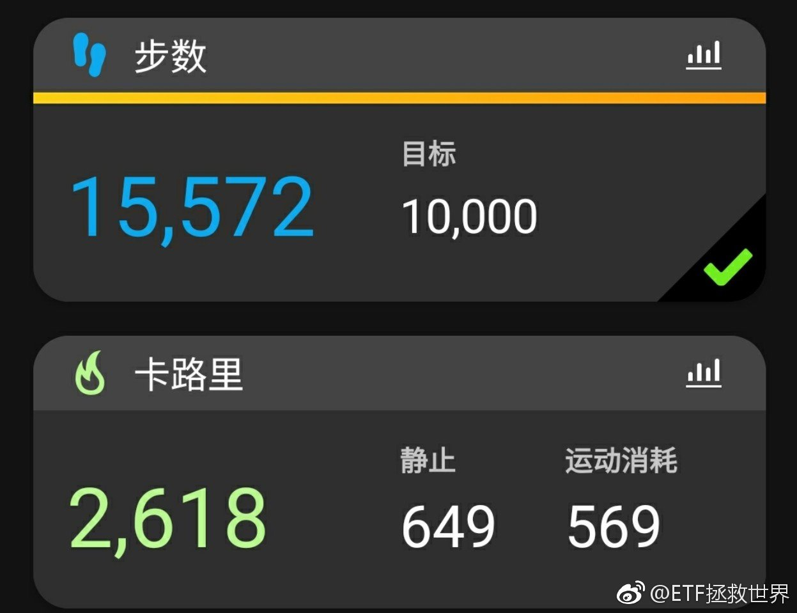

======================================================

ETF拯救世界 (5687069307) @
2017-12-28 08:23:13 Thu  
url: https://weibo.com/5687069307/FBHiUrvV4

儿子幼儿园弄了台造雪机弄一院子雪给孩子们玩…… ​​​

转发[0]  评论[103]  赞[214] 

======================================================

ETF拯救世界 (5687069307) @
2017-12-28 09:35:56 Thu  
url: https://weibo.com/5687069307/FBHMq7R7P

今天转了最后一笔钱进账户。最终决战一把逆回购…… ​​​

转发[10]  评论[283]  赞[241] 

======================================================

ETF拯救世界 (5687069307) @
2017-12-29 09:47:00 Fri  
url: https://weibo.com/5687069307/FBRhpAU4q

$中证红利 sz399922$你这么稳，奶一口算了。 ​​​

转发[0]  评论[75]  赞[126] 

======================================================

ETF拯救世界 (5687069307) @
2017-12-29 13:05:25 Fri  
url: https://weibo.com/5687069307/FBSzWcRtL

随着仓位逐渐加大，持仓品种也相对全面，2018应该更加从容了。

价值，成长，大盘，小盘，低波，高波都有，没那么焦虑了吧。

踏踏实实的。 ​​​

转发[8]  评论[72]  赞[212] 

======================================================

ETF拯救世界 (5687069307) @
2017-12-29 13:34:55 Fri  
url: https://weibo.com/5687069307/FBSLV64Dd

压力位的压力好强。能过去吗//@ETF拯救世界:好歹也得反弹一波涨个10%换换手吧……//@ETF拯救世界:35%。最近这个区间是成交稀少区。还有大量成本在18左右的筹码。//@ETF拯救世界:37%//@ETF拯救世界:44%//@ETF拯救世界:获利比例剩50%了……

------------------------------------------------------
转推：
>  @ETF拯救世界 (5687069307)
>  2017-12-04 09:36:18 Mon  
>  url: https:/weibo.com/5687069307/Fy3wE2Hh9/

>  8848获利筹码只剩55%了。这个股票换手虽然低，但是在高位几个月了，基本上接盘的都吃饱了。。。 ​​​

转发[1]  评论[10]  赞[67] 

======================================================

ETF拯救世界 (5687069307) @
2017-12-29 13:36:51 Fri  
url: https://weibo.com/5687069307/FBSMHyZse

虽然人少，但力量大…… ​​​

转发[2]  评论[58]  赞[197] 

+++++++++++++++++++++++++++++++++++++++++++++++++++++

图片：
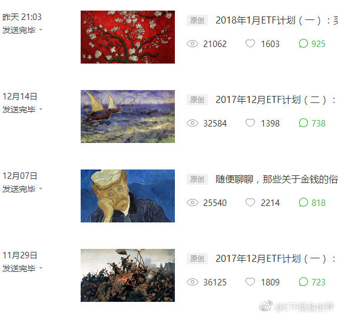

======================================================

ETF拯救世界 (5687069307) @
2017-12-29 13:47:49 Fri  
url: https://weibo.com/5687069307/FBSR8CvWs

纽约突破60。布油已经66。

“石油要被淘汰了” ​​​

转发[2]  评论[82]  赞[142] 

+++++++++++++++++++++++++++++++++++++++++++++++++++++

图片：
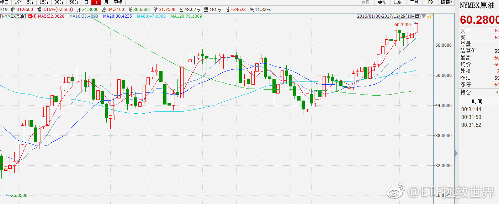

======================================================

ETF拯救世界 (5687069307) @
2017-12-29 15:01:52 Fri  
url: https://weibo.com/5687069307/FBTldfhHv

两个0.74%。  [允悲] ​​​

转发[1]  评论[148]  赞[172] 

======================================================

ETF拯救世界 (5687069307) @
2017-12-31 09:38:00 Sun  
url: https://weibo.com/5687069307/FCa4Km5g2

今年最后一天，抽空好好算算账吧。

账户太多，乱七八糟。昨天扔了几大袋东西，今天弄清楚账户资产。清清爽爽的进入2018！ ​​​

转发[5]  评论[126]  赞[177] 

+++++++++++++++++++++++++++++++++++++++++++++++++++++

图片：
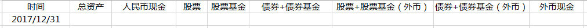

======================================================

ETF拯救世界 (5687069307) @
2017-12-31 14:17:36 Sun  
url: https://weibo.com/5687069307/FCbUeAgQO

回复@拓跋笑笑:有缘的都看到了！[doge]//@拓跋笑笑:我错过了什么？再发一次，亲爱的e，来吧，来吧，秀18岁照片啦😄

------------------------------------------------------
转推：
>  @ETF拯救世界 (5687069307)
>  2017-12-31 09:38:00 Sun  
>  url: https:/weibo.com/5687069307/FCa4Km5g2/

>  今年最后一天，抽空好好算算账吧。
>  
>  账户太多，乱七八糟。昨天扔了几大袋东西，今天弄清楚账户资产。清清爽爽的进入2018！ ​​​

转发[1]  评论[80]  赞[85] 

======================================================

ETF拯救世界 (5687069307) @
2017-12-31 23:10:37 Sun  
url: https://weibo.com/5687069307/FCfoAullE

2017就要过去了。这一年发生不少事，有好的有坏的，也有虚惊一场的。

无论如何，把它们都留在2017了。

2018新的开始。

希望所有人都健健康康。希望自己坚持健身效果明显。希望大家都赚很多钱。

新年快乐！心想事成！ 

2018你有什么心愿？ ​​​

转发[14]  评论[353]  赞[522] 

======================================================

