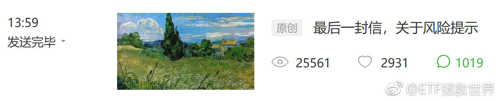
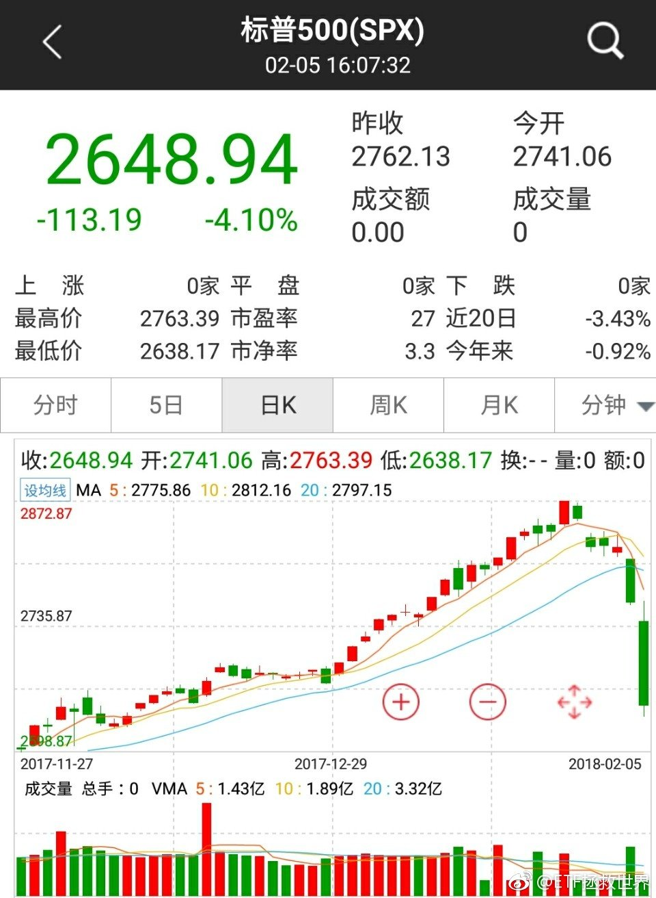
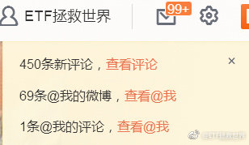
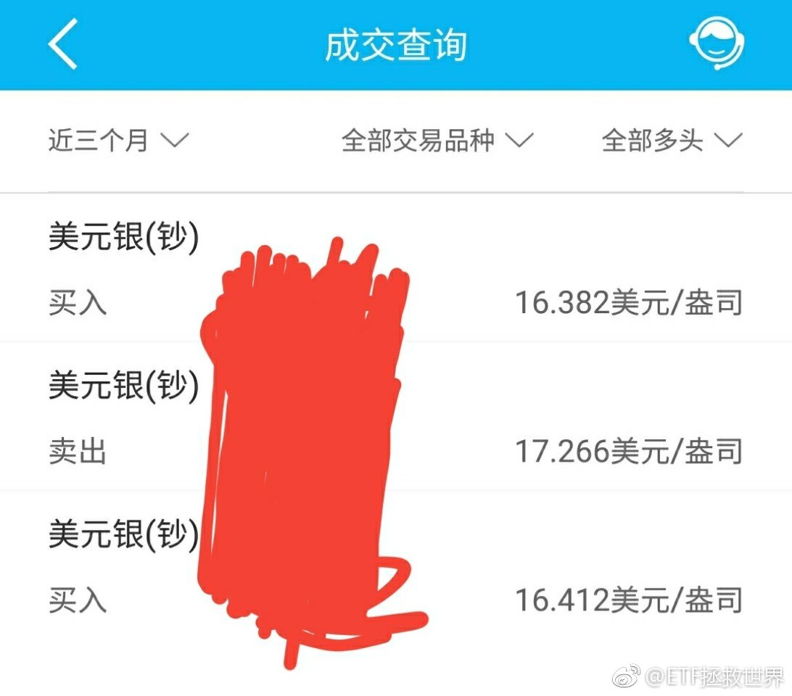
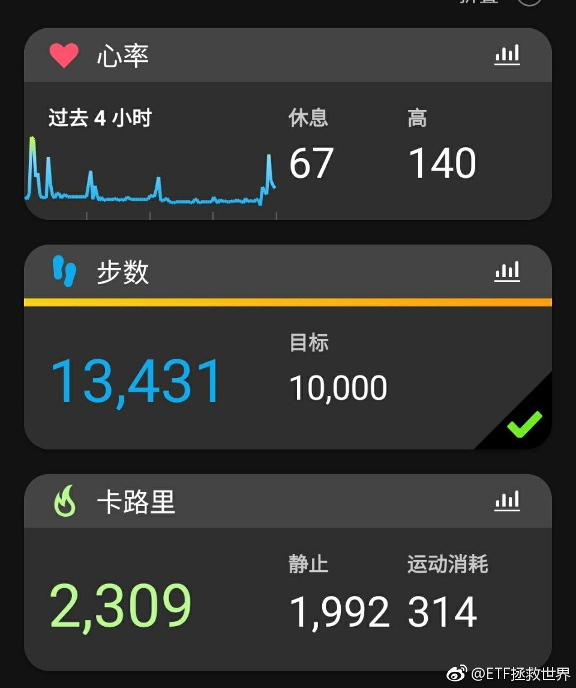
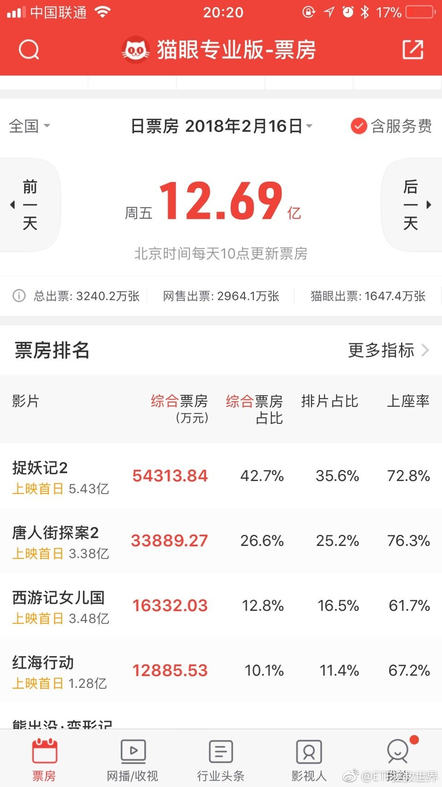
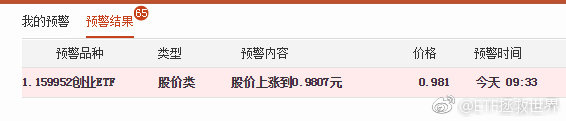

ETF拯救世界 (5687069307) @
2018-02-01 08:37:27 Thu  
url: https://weibo.com/5687069307/G13TJjJUT

回复@Halle噜呀:有人在行动。

------------------------------------------------------
转推：
>  @ETF拯救世界 (5687069307)
>  2018-01-31 22:51:51 Wed  
>  url: https:/weibo.com/5687069307/G1042AXG1/

>  每日打卡（171）
>  
>  坚持 ​​​

转发[0]  评论[24]  赞[54] 

======================================================

ETF拯救世界 (5687069307) @
2018-02-01 09:08:11 Thu  
url: https://weibo.com/5687069307/G146cBNMb

回复@文森特isALLIN:你说的哪个股指？1月24日计划与沪深300同创新高，之后沪深300下跌2.6%，计划回撤1.18%。其它指数，中证500低于9月高点10%，中证1000更是在昨天创出三年新低。你说的是哪个指数？//@文森特isALLIN:e大，最近股指不是涨了好多嘛？为啥咱们的计划一直在跌呢？

------------------------------------------------------
转推：
>  @ETF拯救世界 (5687069307)
>  2018-01-31 10:51:45 Wed  
>  url: https:/weibo.com/5687069307/G0VlKiyNb/

>  喷了。包括今天计划最近三天下跌幅度分别是0.5、0.2、0.3。
>  
>  太凶残了吧！要知道生扛三轮股灾最大跌幅也不过0.72%。
>  
>  瑟瑟发抖的我准备晚上发车加仓了…… ​​​

转发[1]  评论[33]  赞[62] 

======================================================

ETF拯救世界 (5687069307) @
2018-02-01 09:40:05 Thu  
url: https://weibo.com/5687069307/G14ja5NFr

基本上从这个月起，只要没有大幅反弹，计划应该就开始进入“真正”的建仓期了。

之前的算是少量配置期。

目前这个区域，自从2014年6月突破后，4年后才回来，真的很不容易。

可以买买买了。

不过也不要特别乐观。上一轮在2011年9月跌入这个区域后，三年后的2014年才再次突破，这么长的时间，可以说 ​​​

转发[91]  评论[159]  赞[299] 

======================================================

ETF拯救世界 (5687069307) @
2018-02-01 09:58:59 Thu  
url: https://weibo.com/5687069307/G14qPwLLz

昨天评论707条，有83.5%是吐槽买的太少的。

图样。

你们对资本市场的风险根本一无所知…… ​​​

转发[53]  评论[120]  赞[251] 

======================================================

ETF拯救世界 (5687069307) @
2018-02-01 10:25:19 Thu  
url: https://weibo.com/5687069307/G14BwCIFu

回复@yedn:没有这么多。大量的恒生油黄金债券。我这里说的是A股。

------------------------------------------------------
转推：
>  @ETF拯救世界 (5687069307)
>  2018-02-01 09:40:05 Thu  
>  url: https:/weibo.com/5687069307/G14ja5NFr/

>  基本上从这个月起，只要没有大幅反弹，计划应该就开始进入“真正”的建仓期了。
>  
>  之前的算是少量配置期。
>  
>  目前这个区域，自从2014年6月突破后，4年后才回来，真的很不容易。
>  
>  可以买买买了。
>  
>  不过也不要特别乐观。上一轮在2011年9月跌入这个区域后，三年后的2014年才再次突破，这么长的时间，可以说 ​​​

转发[0]  评论[9]  赞[76] 

======================================================

ETF拯救世界 (5687069307) @
2018-02-01 10:52:57 Thu  
url: https://weibo.com/5687069307/G14MKeVMA

中证1000如果到4500-5000我不会吃惊。跌破4500会比较出乎我的意料。

------------------------------------------------------
转推：
>  @ETF拯救世界 (5687069307)
>  2018-01-31 14:15:07 Wed  
>  url: https:/weibo.com/5687069307/G0WGixusn/

>  中证1000三年新低了。这才是真正的中国股市，而不是那几十一百多只集中力量办大事做上去的股票。
>  
>  几千万股民买的是其它3000只不断创出新低的股票。大多数人正在承受估值回归的痛苦。
>  
>  没办法，买的太贵了，不容易赚钱。这就是金融投资的铁律。 ​​​

转发[50]  评论[37]  赞[87] 

======================================================

ETF拯救世界 (5687069307) @
2018-02-01 10:55:34 Thu  
url: https://weibo.com/5687069307/G14NO6VT2

回复@人-丑-就-要-多-读-书:不是要到。再说一次，我不预测，预测不了。只是说4500-5000我不吃惊，也做好了应对策略，在预期之内。超过了就超出我的预期了。//@人-丑-就-要-多-读-书:现在6669，我没看错吧，要到5000？[污]

------------------------------------------------------
转推：
>  @ETF拯救世界 (5687069307)
>  2018-01-31 14:15:07 Wed  
>  url: https:/weibo.com/5687069307/G0WGixusn/

>  中证1000三年新低了。这才是真正的中国股市，而不是那几十一百多只集中力量办大事做上去的股票。
>  
>  几千万股民买的是其它3000只不断创出新低的股票。大多数人正在承受估值回归的痛苦。
>  
>  没办法，买的太贵了，不容易赚钱。这就是金融投资的铁律。 ​​​

转发[7]  评论[13]  赞[68] 

======================================================

ETF拯救世界 (5687069307) @
2018-02-01 10:58:36 Thu  
url: https://weibo.com/5687069307/G14P1pvIS

回复@菜猫时代:30%并不可怕。这个幅度，完全可以把总成本控制在距离底部10%-15%的区域。之后就是关上账户几年后打开数钱。这是说指数。个股我可不敢说，弄不好有些股票永远也涨不起来了。//@菜猫时代:可能还有2000点，30%，太可怕了。

------------------------------------------------------
转推：
>  @ETF拯救世界 (5687069307)
>  2018-01-31 14:15:07 Wed  
>  url: https:/weibo.com/5687069307/G0WGixusn/

>  中证1000三年新低了。这才是真正的中国股市，而不是那几十一百多只集中力量办大事做上去的股票。
>  
>  几千万股民买的是其它3000只不断创出新低的股票。大多数人正在承受估值回归的痛苦。
>  
>  没办法，买的太贵了，不容易赚钱。这就是金融投资的铁律。 ​​​

转发[28]  评论[14]  赞[86] 

======================================================

ETF拯救世界 (5687069307) @
2018-02-01 11:02:30 Thu  
url: https://weibo.com/5687069307/G14QCqFri

回复@马甲不停:2月有可能随时发车。目前的情况来看。昨天不是说了吗，弄不好情人节有大礼包。//@马甲不停:今天是不是再多增加一份？[微笑]

------------------------------------------------------
转推：
>  @ETF拯救世界 (5687069307)
>  2018-01-31 14:15:07 Wed  
>  url: https:/weibo.com/5687069307/G0WGixusn/

>  中证1000三年新低了。这才是真正的中国股市，而不是那几十一百多只集中力量办大事做上去的股票。
>  
>  几千万股民买的是其它3000只不断创出新低的股票。大多数人正在承受估值回归的痛苦。
>  
>  没办法，买的太贵了，不容易赚钱。这就是金融投资的铁律。 ​​​

转发[20]  评论[27]  赞[95] 

======================================================

ETF拯救世界 (5687069307) @
2018-02-01 11:10:11 Thu  
url: https://weibo.com/5687069307/G14TJrrja

好久没有买医药和养老了吧。你看这不就回来了。不用急，该买肯定买，这两个加起来至少要20%仓位呢。 ​​​

转发[17]  评论[70]  赞[178] 

======================================================

ETF拯救世界 (5687069307) @
2018-02-01 11:19:23 Thu  
url: https://weibo.com/5687069307/G14Xt4rJC

记住，2年前恒生浮亏超过10%。现在60%+

哪个品种浮亏超过这个再操心吧。别有点波动就急得不得了。

记住，你买的是指数，不会死。你还有很多很多钱没买下去，以后成本会很低，会赚钱的。 ​​​

转发[48]  评论[161]  赞[318] 

======================================================

ETF拯救世界 (5687069307) @
2018-02-01 14:00:45 Thu  
url: https://weibo.com/5687069307/G160XFIdq

回复@mp86pgd:你为什么会这么机智。清华毕业的吧！//@mp86pgd:我改成了红跌绿涨，现在看见红色也就美滋滋了

------------------------------------------------------
转推：
>  @ETF拯救世界 (5687069307)
>  2018-02-01 11:19:23 Thu  
>  url: https:/weibo.com/5687069307/G14Xt4rJC/

>  记住，2年前恒生浮亏超过10%。现在60%+
>  
>  哪个品种浮亏超过这个再操心吧。别有点波动就急得不得了。
>  
>  记住，你买的是指数，不会死。你还有很多很多钱没买下去，以后成本会很低，会赚钱的。 ​​​

转发[1]  评论[34]  赞[103] 

======================================================

ETF拯救世界 (5687069307) @
2018-02-01 14:01:51 Thu  
url: https://weibo.com/5687069307/G161q5wyh

回复@python路:每天少好几万。谁能安慰一下我。//@python路:e大千万级资金，这几天回撤也有几十万，还时不时安慰几万块钱小散，佩服佩服[作揖]

------------------------------------------------------
转推：
>  @ETF拯救世界 (5687069307)
>  2018-02-01 11:19:23 Thu  
>  url: https:/weibo.com/5687069307/G14Xt4rJC/

>  记住，2年前恒生浮亏超过10%。现在60%+
>  
>  哪个品种浮亏超过这个再操心吧。别有点波动就急得不得了。
>  
>  记住，你买的是指数，不会死。你还有很多很多钱没买下去，以后成本会很低，会赚钱的。 ​​​

转发[2]  评论[104]  赞[160] 

======================================================

ETF拯救世界 (5687069307) @
2018-02-01 14:54:51 Thu  
url: https://weibo.com/5687069307/G16mVjAW7

随时准备开车。留几份现金没错的//@ETF拯救世界:回复@马甲不停:2月有可能随时发车。目前的情况来看。昨天不是说了吗，弄不好情人节有大礼包。//@马甲不停:今天是不是再多增加一份？[微笑]

------------------------------------------------------
转推：
>  @ETF拯救世界 (5687069307)
>  2018-01-31 14:15:07 Wed  
>  url: https:/weibo.com/5687069307/G0WGixusn/

>  中证1000三年新低了。这才是真正的中国股市，而不是那几十一百多只集中力量办大事做上去的股票。
>  
>  几千万股民买的是其它3000只不断创出新低的股票。大多数人正在承受估值回归的痛苦。
>  
>  没办法，买的太贵了，不容易赚钱。这就是金融投资的铁律。 ​​​

转发[15]  评论[52]  赞[91] 

======================================================

ETF拯救世界 (5687069307) @
2018-02-01 15:10:35 Thu  
url: https://weibo.com/5687069307/G16tjhcUE

回复@小涛子大人:你有点能体会到我20121128的感受了//@小涛子大人:收盘手已经激动得颤抖了，能生在这个时代太好了//@ETF拯救世界:随时准备开车。留几份现金没错的//@ETF拯救世界:回复@马甲不停:2月有可能随时发车。目前的情况来看。昨天不是说了吗，弄不好情人节有大礼包。

------------------------------------------------------
转推：
>  @ETF拯救世界 (5687069307)
>  2018-01-31 14:15:07 Wed  
>  url: https:/weibo.com/5687069307/G0WGixusn/

>  中证1000三年新低了。这才是真正的中国股市，而不是那几十一百多只集中力量办大事做上去的股票。
>  
>  几千万股民买的是其它3000只不断创出新低的股票。大多数人正在承受估值回归的痛苦。
>  
>  没办法，买的太贵了，不容易赚钱。这就是金融投资的铁律。 ​​​

转发[9]  评论[33]  赞[74] 

======================================================

ETF拯救世界 (5687069307) @
2018-02-01 15:19:07 Thu  
url: https://weibo.com/5687069307/G16wM7rDl

700多条留言了……我先不看了，跑数据去了。

数据如果特别好就加车。反正如果不反弹，情人节那车肯定不会小。 ​​​

转发[18]  评论[58]  赞[154] 

+++++++++++++++++++++++++++++++++++++++++++++++++++++

图片：

======================================================

ETF拯救世界 (5687069307) @
2018-02-01 15:27:41 Thu  
url: https://weibo.com/5687069307/G16AfuDDk

全市场出来了，2014年6月以来新低。我有个想法。

------------------------------------------------------
转推：
>  @ETF拯救世界 (5687069307)
>  2018-02-01 15:19:07 Thu  
>  url: https:/weibo.com/5687069307/G16wM7rDl/

>  700多条留言了……我先不看了，跑数据去了。
>  
>  数据如果特别好就加车。反正如果不反弹，情人节那车肯定不会小。 ​​​

转发[13]  评论[147]  赞[191] 

======================================================

ETF拯救世界 (5687069307) @
2018-02-01 15:45:57 Thu  
url: https://weibo.com/5687069307/G16HFj03X

怎么说呢。就是那种感觉吧。

姑娘们，想买的包包，漂亮衣服。男人们想买的各种3C产品，汽车。一直想买，等了两三年，终于开始打折了。已经6折了。三折就在不远处。

就是这种感觉。体会一下。 ​​​

转发[22]  评论[177]  赞[361] 

======================================================

ETF拯救世界 (5687069307) @
2018-02-01 19:55:35 Thu  
url: https://weibo.com/5687069307/G18kZtZwi

1000多条，一条条看完了。

行了，以后不会受到噪音干扰，一个字，就是干。 ​​​

转发[3]  评论[234]  赞[490] 

+++++++++++++++++++++++++++++++++++++++++++++++++++++

图片：

======================================================

ETF拯救世界 (5687069307) @
2018-02-02 09:41:48 Fri  
url: https://weibo.com/5687069307/G1dKm5dxc

节奏是艺术。

------------------------------------------------------
转推：
>  @ETF拯救世界 (5687069307)
>  2018-02-01 09:58:59 Thu  
>  url: https:/weibo.com/5687069307/G14qPwLLz/

>  昨天评论707条，有83.5%是吐槽买的太少的。
>  
>  图样。
>  
>  你们对资本市场的风险根本一无所知…… ​​​

转发[44]  评论[78]  赞[122] 

======================================================

ETF拯救世界 (5687069307) @
2018-02-02 09:47:45 Fri  
url: https://weibo.com/5687069307/G1dMLCp3T

回复@0瞎晃悠0:不会连续下跌的。要吸引一部分人冲进去接盘抢反弹，然后才能继续跌。这个位置，暴跌没有大事，阴跌才会跌透。//@0瞎晃悠0:求教：之前说提到过大概6-9个月，看这架势5月底之前是不是就差不多了？//@ETF拯救世界:节奏是艺术。

------------------------------------------------------
转推：
>  @ETF拯救世界 (5687069307)
>  2018-02-01 09:58:59 Thu  
>  url: https:/weibo.com/5687069307/G14qPwLLz/

>  昨天评论707条，有83.5%是吐槽买的太少的。
>  
>  图样。
>  
>  你们对资本市场的风险根本一无所知…… ​​​

转发[16]  评论[66]  赞[102] 

======================================================

ETF拯救世界 (5687069307) @
2018-02-02 10:34:15 Fri  
url: https://weibo.com/5687069307/G1e5E5RU8

反弹了就踏实了，不考虑加车了。该干嘛干嘛去吧都。。 ​​​

转发[35]  评论[101]  赞[149] 

======================================================

ETF拯救世界 (5687069307) @
2018-02-02 10:55:28 Fri  
url: https://weibo.com/5687069307/G1eeg2RVe

回复@后生天天uping:估值比2016年同样的点位已经下降25%了。这就是指数投资只要买的不贵就极大概率会赚钱的重要原因之一。如果再过两年指数点位还不动，就是历史最低估值！//@后生天天uping:回复@小涛子大人:几乎是16年的水平了

------------------------------------------------------
转推：
>  @ETF拯救世界 (5687069307)
>  2018-02-02 10:34:15 Fri  
>  url: https:/weibo.com/5687069307/G1e5E5RU8/

>  反弹了就踏实了，不考虑加车了。该干嘛干嘛去吧都。。 ​​​

转发[30]  评论[48]  赞[111] 

======================================================

ETF拯救世界 (5687069307) @
2018-02-02 11:17:34 Fri  
url: https://weibo.com/5687069307/G1ene6MOy

回复@Cubic_N:都在考虑中。所以信息已经远远低于中枢为什么我们还没买//@Cubic_N:E大你的模型中会考虑估值中枢的变化吗？国内的经济发展和债务现状已经不容乐观了呀[笑cry]

------------------------------------------------------
转推：
>  @ETF拯救世界 (5687069307)
>  2018-02-02 10:34:15 Fri  
>  url: https:/weibo.com/5687069307/G1e5E5RU8/

>  反弹了就踏实了，不考虑加车了。该干嘛干嘛去吧都。。 ​​​

转发[5]  评论[38]  赞[102] 

======================================================

ETF拯救世界 (5687069307) @
2018-02-02 13:56:44 Fri  
url: https://weibo.com/5687069307/G1fpPvH6Z

喷了，情人节的礼包得多大啊。 ​​​

转发[37]  评论[145]  赞[193] 

======================================================

ETF拯救世界 (5687069307) @
2018-02-02 13:59:15 Fri  
url: https://weibo.com/5687069307/G1fqR3uss

我四岁儿子昨天晚上跟我说：“XX（女）在校车上抱着我的胳膊，靠着我。”“为什么？”“她可能喜欢我。”“你说什么？”“我没说什么，挺舒服的。”“……”

------------------------------------------------------
转推：
>  @ ()
>  2018-02-02 13:51:03 Fri  
>  url: 

>  抱歉，作者已设置仅展示半年内微博，此微博已不可见。 ​​​

转发[8]  评论[88]  赞[131] 

======================================================

ETF拯救世界 (5687069307) @
2018-02-02 14:55:10 Fri  
url: https://weibo.com/5687069307/G1fNyaBhe

回复@glay_lee:没有调低预期，本来就给它的预期配置少，买2%了，不会再买太多了，接下来的会用于将它的成本降低到最低点10-15以内

------------------------------------------------------
转推：
>  @ETF拯救世界 (5687069307)
>  2018-02-02 13:56:44 Fri  
>  url: https:/weibo.com/5687069307/G1fpPvH6Z/

>  喷了，情人节的礼包得多大啊。 ​​​

转发[1]  评论[22]  赞[92] 

======================================================

ETF拯救世界 (5687069307) @
2018-02-02 16:46:25 Fri  
url: https://weibo.com/5687069307/G1gwHCOHP

回复@协和雪碧:给你打气，环保PE已经到了2012年底最低值附近了。我不敢说它不会大跌了，总之你长期拿这个价格不会赔钱。我有这个自信。拿着吧。忘了它就行了……//@协和雪碧:回复@BuBu蛇:是我错了… 提前加仓了，现在套的想哭

------------------------------------------------------
转推：
>  @ETF拯救世界 (5687069307)
>  2018-02-02 13:56:44 Fri  
>  url: https:/weibo.com/5687069307/G1fpPvH6Z/

>  喷了，情人节的礼包得多大啊。 ​​​

转发[18]  评论[66]  赞[142] 

======================================================

ETF拯救世界 (5687069307) @
2018-02-02 16:57:55 Fri  
url: https://weibo.com/5687069307/G1gBneYF4

回复@LEVELEEE:还没低于当时，不过接近了。我买哪个都是有节奏的。各位也可以从环保上体会一下未来也许会出现的情况，也就是说，我们建仓基本完毕了，又跌了10%，做个心理准备。当然环保还没完……

------------------------------------------------------
转推：
>  @ETF拯救世界 (5687069307)
>  2018-02-02 13:56:44 Fri  
>  url: https:/weibo.com/5687069307/G1fpPvH6Z/

>  喷了，情人节的礼包得多大啊。 ​​​

转发[7]  评论[50]  赞[135] 

======================================================

ETF拯救世界 (5687069307) @
2018-02-04 21:41:11 Sun  
url: https://weibo.com/5687069307/G1BjlpBeD

每日打卡（142）

明天崩不崩。痛快点，大家都很忙的。 ​​​

转发[0]  评论[108]  赞[170] 

+++++++++++++++++++++++++++++++++++++++++++++++++++++

图片：

======================================================

ETF拯救世界 (5687069307) @
2018-02-05 09:52:09 Mon  
url: https://weibo.com/5687069307/G1G63grGl

不要催，不要问。节奏我会控制好。就酱。//@ETF拯救世界:节奏是艺术。

------------------------------------------------------
转推：
>  @ETF拯救世界 (5687069307)
>  2018-02-01 09:58:59 Thu  
>  url: https:/weibo.com/5687069307/G14qPwLLz/

>  昨天评论707条，有83.5%是吐槽买的太少的。
>  
>  图样。
>  
>  你们对资本市场的风险根本一无所知…… ​​​

转发[3]  评论[97]  赞[200] 

======================================================

ETF拯救世界 (5687069307) @
2018-02-05 10:17:59 Mon  
url: https://weibo.com/5687069307/G1GgwprlC

买也好卖也好，永远问问自己舒服不舒服。也就是目前的情况下跌30%和上涨50%，舒服不舒服。 ​​​

转发[26]  评论[74]  赞[193] 

======================================================

ETF拯救世界 (5687069307) @
2018-02-05 10:35:23 Mon  
url: https://weibo.com/5687069307/G1GnADXQT

五粮液下跌快20%了。

所谓价值股就可以闭眼买入，这种思维被不断灌输进很多人的思维中。

很多人这几个月突然发现以前不赚钱是因为没有买入“价值股”，现在终于找到了一条赚钱的终极之路。

上涨的时候买入短期会很舒服。因为上涨趋势中，你怎么买都会赚钱。但是趋势一旦改变，你就会欲哭无泪。

下 ​​​

转发[69]  评论[123]  赞[237] 

======================================================

ETF拯救世界 (5687069307) @
2018-02-05 11:01:37 Mon  
url: https://weibo.com/5687069307/G1GyfotO2

回复@linsuozhang2009:是啊。中证红利，2018年才突破2007年的高点，2009-2014五年没有任何涨幅，其中几年时间横盘不动。试问2014年初会有几个人看好它。要知道07年的高点中证500在2010年就突破了，那时候红利还不到07年高点的一半。没有策略是全时万能的。

------------------------------------------------------
转推：
>  @ETF拯救世界 (5687069307)
>  2018-02-05 10:17:59 Mon  
>  url: https:/weibo.com/5687069307/G1GgwprlC/

>  买也好卖也好，永远问问自己舒服不舒服。也就是目前的情况下跌30%和上涨50%，舒服不舒服。 ​​​

转发[13]  评论[35]  赞[110] 

======================================================

ETF拯救世界 (5687069307) @
2018-02-05 13:40:53 Mon  
url: https://weibo.com/5687069307/G1HAT9wUh

其实很多时候，我们看的鸡汤都将“努力”忽悠的有点过分了。

人这一辈子，运气其实同样重要，很多时候甚至更重要。

比如中证500，咱们如果可以在4500买到，那就是运气极好的。5000以下也不错，可以说未来5-10年的不错收益率可以保证了。

当然，努力也非常重要，否则运气来了的时候也抓不住。运气走 ​​​

转发[59]  评论[114]  赞[190] 

======================================================

ETF拯救世界 (5687069307) @
2018-02-05 13:48:32 Mon  
url: https://weibo.com/5687069307/G1HDZv13I

回复@请输入昵称_昵称:2008年我的博客，那时候我刚7岁：http://t.cn/RlVkVsf //@请输入昵称_昵称:最近流行一命二运三风水四积阴德五读书，几千年传下来有点道理

------------------------------------------------------
转推：
>  @ETF拯救世界 (5687069307)
>  2018-02-05 13:40:53 Mon  
>  url: https:/weibo.com/5687069307/G1HAT9wUh/

>  其实很多时候，我们看的鸡汤都将“努力”忽悠的有点过分了。
>  
>  人这一辈子，运气其实同样重要，很多时候甚至更重要。
>  
>  比如中证500，咱们如果可以在4500买到，那就是运气极好的。5000以下也不错，可以说未来5-10年的不错收益率可以保证了。
>  
>  当然，努力也非常重要，否则运气来了的时候也抓不住。运气走 ​​​

转发[7]  评论[50]  赞[103] 

======================================================

ETF拯救世界 (5687069307) @
2018-02-05 14:50:35 Mon  
url: https://weibo.com/5687069307/G1I3baq3m

如果医药这次有机会到理想区域，未来恐怕就不是5-10年的问题了，而是10-15甚至20年不用担心金融投资收益率……

在一般情况下，至少不会差。如果碰上疯牛慢牛，收益率就会很棒。只是不知道有没有这个机会，都是天意。

这是一个2005-2015十年二十倍的指数…… ​​​

转发[109]  评论[106]  赞[191] 

======================================================

ETF拯救世界 (5687069307) @
2018-02-05 14:59:19 Mon  
url: https://weibo.com/5687069307/G1I6JkDd9

回复@静待晚秋:医药现在的估值比2005年高67%……如果以那个标准的话，不用急。不过那个情况真的太难得了。//@静待晚秋:意思是医药有可能下来，[笑而不语]我还没上医药车呢。

------------------------------------------------------
转推：
>  @ETF拯救世界 (5687069307)
>  2018-02-05 14:50:35 Mon  
>  url: https:/weibo.com/5687069307/G1I3baq3m/

>  如果医药这次有机会到理想区域，未来恐怕就不是5-10年的问题了，而是10-15甚至20年不用担心金融投资收益率……
>  
>  在一般情况下，至少不会差。如果碰上疯牛慢牛，收益率就会很棒。只是不知道有没有这个机会，都是天意。
>  
>  这是一个2005-2015十年二十倍的指数…… ​​​

转发[53]  评论[24]  赞[83] 

======================================================

ETF拯救世界 (5687069307) @
2018-02-05 15:32:06 Mon  
url: https://weibo.com/5687069307/G1Ik26bhp

今日最新数据，全指医药估值跌回2013年6月水平。也就是说近五年最低。（绝对值依然不低）你们都没有意识到目前大部分股票每天这么跌到底意味着什么。美丽新世界。//@ETF拯救世界:回复@静待晚秋:医药现在的估值比2005年高67%……如果以那个标准的话，不用急。不过那个情况真的太难得了。

------------------------------------------------------
转推：
>  @ETF拯救世界 (5687069307)
>  2018-02-05 14:50:35 Mon  
>  url: https:/weibo.com/5687069307/G1I3baq3m/

>  如果医药这次有机会到理想区域，未来恐怕就不是5-10年的问题了，而是10-15甚至20年不用担心金融投资收益率……
>  
>  在一般情况下，至少不会差。如果碰上疯牛慢牛，收益率就会很棒。只是不知道有没有这个机会，都是天意。
>  
>  这是一个2005-2015十年二十倍的指数…… ​​​

转发[39]  评论[120]  赞[184] 

======================================================

ETF拯救世界 (5687069307) @
2018-02-05 22:05:37 Mon  
url: https://weibo.com/5687069307/G1KTL8HJv

每日打卡（143）

越来越近了 ​​​

转发[1]  评论[36]  赞[112] 

+++++++++++++++++++++++++++++++++++++++++++++++++++++

图片：

======================================================

ETF拯救世界 (5687069307) @
2018-02-06 06:13:12 Tue  
url: https://weibo.com/5687069307/G1O5F9O0k

美国证 监会干嘛吃的，为什么不组织花旗高盛筹集资金救市。

美联储为什么不投两万亿美金买道琼斯30。

我看美国不行，迟早药丸。 ​​​

转发[30]  评论[75]  赞[160] 

+++++++++++++++++++++++++++++++++++++++++++++++++++++

图片：

======================================================

ETF拯救世界 (5687069307) @
2018-02-06 06:18:54 Tue  
url: https://weibo.com/5687069307/G1O7Z8jb0

回复@葫芦岛心灵的旅途:你这个想法非常大胆。负责任的告诉你，如果真的如此，必提前开卡车//@葫芦岛心灵的旅途:迟早要买，我们也要买。 一个想法，不一定对。 中午跌狠了，有车加吗，比如中正500跌4%[喵喵][喵喵][喵喵][喵喵]

------------------------------------------------------
转推：
>  @ETF拯救世界 (5687069307)
>  2018-02-06 06:13:12 Tue  
>  url: https:/weibo.com/5687069307/G1O5F9O0k/

>  美国证 监会干嘛吃的，为什么不组织花旗高盛筹集资金救市。
>  
>  美联储为什么不投两万亿美金买道琼斯30。
>  
>  我看美国不行，迟早药丸。 ​​​

转发[14]  评论[60]  赞[104] 

======================================================

ETF拯救世界 (5687069307) @
2018-02-06 08:21:22 Tue  
url: https://weibo.com/5687069307/G1OVH5cGw

回复@不畏雾霾遮望眼:我反手就给你一…………张车票

------------------------------------------------------
转推：
>  @ETF拯救世界 (5687069307)
>  2018-02-06 06:13:12 Tue  
>  url: https:/weibo.com/5687069307/G1O5F9O0k/

>  美国证 监会干嘛吃的，为什么不组织花旗高盛筹集资金救市。
>  
>  美联储为什么不投两万亿美金买道琼斯30。
>  
>  我看美国不行，迟早药丸。 ​​​

转发[2]  评论[22]  赞[67] 

======================================================

ETF拯救世界 (5687069307) @
2018-02-06 08:51:42 Tue  
url: https://weibo.com/5687069307/G1P80joGB

回复@用户6099242654:昨日505只标普500成分股中，有两只上涨。503只下跌。1946只罗素2000成分股中，87只上涨。//@用户6099242654:谁能来一个美股上涨跟下跌股票的比例？//@ETF拯救世界:回复@葫芦岛心灵的旅途:你这个想法非常大胆。负责任的告诉你，如果真的如此，必提前开卡车

------------------------------------------------------
转推：
>  @ETF拯救世界 (5687069307)
>  2018-02-06 06:13:12 Tue  
>  url: https:/weibo.com/5687069307/G1O5F9O0k/

>  美国证 监会干嘛吃的，为什么不组织花旗高盛筹集资金救市。
>  
>  美联储为什么不投两万亿美金买道琼斯30。
>  
>  我看美国不行，迟早药丸。 ​​​

转发[5]  评论[64]  赞[79] 

======================================================

ETF拯救世界 (5687069307) @
2018-02-06 10:39:39 Tue  
url: https://weibo.com/5687069307/G1PPP3TYh

我急需开发一个盘中可以计算估值的工具。 ​​​

转发[9]  评论[148]  赞[214] 

======================================================

ETF拯救世界 (5687069307) @
2018-02-06 10:54:38 Tue  
url: https://weibo.com/5687069307/G1PVU9KJY

再复习一次。现在有没有新的感悟，尤其是性子比较急的朋友。

------------------------------------------------------
转推：
>  @ETF拯救世界 (5687069307)
>  2017-11-23 10:55:31 Thu  
>  url: https:/weibo.com/5687069307/FwollhU4i/

>  为什么要定时交易。
>  
>  我告诉你真正的原因。
>  
>  那就是资本市场的中短期不可预测性。
>  
>  我们的任务，是把手中有限的资源，最合理优化的分配到“低估”品种上。如果“觉得”，又或者是根据“数据”，只要便宜就买，贵了就卖，很可能买卖都在半山腰。
>  
>  金融交易不是数学题。便宜了就不会跌，贵了就不会涨？不 ​​​

转发[26]  评论[94]  赞[189] 

======================================================

ETF拯救世界 (5687069307) @
2018-02-06 11:18:11 Tue  
url: https://weibo.com/5687069307/G1Q5sfXQ6

想干，但是数据要15:30才算出来。中午试着弄一下盘中数据吧。不知道准不准。

------------------------------------------------------
转推：
>  @ETF拯救世界 (5687069307)
>  2018-02-06 10:39:39 Tue  
>  url: https:/weibo.com/5687069307/G1PPP3TYh/

>  我急需开发一个盘中可以计算估值的工具。 ​​​

转发[5]  评论[102]  赞[160] 

======================================================

ETF拯救世界 (5687069307) @
2018-02-06 12:12:36 Tue  
url: https://weibo.com/5687069307/G1Qryub1d

干了。先不看留言了，出去走走。去吹吹风……//@ETF拯救世界:想干，但是数据要15:30才算出来。中午试着弄一下盘中数据吧。不知道准不准。

------------------------------------------------------
转推：
>  @ETF拯救世界 (5687069307)
>  2018-02-06 10:39:39 Tue  
>  url: https:/weibo.com/5687069307/G1PPP3TYh/

>  我急需开发一个盘中可以计算估值的工具。 ​​​

转发[2]  评论[97]  赞[144] 

======================================================

ETF拯救世界 (5687069307) @
2018-02-06 12:45:51 Tue  
url: https://weibo.com/5687069307/G1QF33Ev4

回复@天影198:瞧瞧人家……//@天影198:中午出去吃泰国菜，想着EE还要在办公室算数据，想给你带个外卖🍗//@ETF拯救世界:想干，但是数据要15:30才算出来。中午试着弄一下盘中数据吧。不知道准不准。

------------------------------------------------------
转推：
>  @ETF拯救世界 (5687069307)
>  2018-02-06 10:39:39 Tue  
>  url: https:/weibo.com/5687069307/G1PPP3TYh/

>  我急需开发一个盘中可以计算估值的工具。 ​​​

转发[1]  评论[49]  赞[102] 

======================================================

ETF拯救世界 (5687069307) @
2018-02-06 13:07:42 Tue  
url: https://weibo.com/5687069307/G1QNUBpRJ

159938场内不要溢价抢！！！ ​​​

转发[3]  评论[110]  赞[130] 

======================================================

ETF拯救世界 (5687069307) @
2018-02-06 13:16:26 Tue  
url: https://weibo.com/5687069307/G1QRs9PYE

有没有闻到恐慌的气息。

别人的，你自己的。 ​​​

转发[50]  评论[199]  赞[185] 

======================================================

ETF拯救世界 (5687069307) @
2018-02-06 13:51:47 Tue  
url: https://weibo.com/5687069307/G1R5OeJfN

再说一次，指数基金不会死。而且我们买的都至少是不贵，有的已经算是便宜。给时间，一定会有好结果。第二，还有很多资金，会尽量将成本控制的比较低。第三，我相信绝大多数人每天减少的资产不会比我多。踏踏实实的。多大点事儿啊……

------------------------------------------------------
转推：
>  @ETF拯救世界 (5687069307)
>  2018-02-06 13:16:26 Tue  
>  url: https:/weibo.com/5687069307/G1QRs9PYE/

>  有没有闻到恐慌的气息。
>  
>  别人的，你自己的。 ​​​

转发[42]  评论[109]  赞[201] 

======================================================

ETF拯救世界 (5687069307) @
2018-02-06 13:56:55 Tue  
url: https://weibo.com/5687069307/G1R7TmGL5

NO！！！ ​​​

转发[3]  评论[137]  赞[111] 

======================================================

ETF拯救世界 (5687069307) @
2018-02-06 14:29:15 Tue  
url: https://weibo.com/5687069307/G1Rl18HbW

回复@我在故快乐:讲真，现在还远没到拼信仰的时候……//@我在故快乐:将来会加倍还给我们的，在这个时候，就是有没有信仰，能不能坚持执行的事了。

------------------------------------------------------
转推：
>  @ETF拯救世界 (5687069307)
>  2018-02-06 13:16:26 Tue  
>  url: https:/weibo.com/5687069307/G1QRs9PYE/

>  有没有闻到恐慌的气息。
>  
>  别人的，你自己的。 ​​​

转发[18]  评论[50]  赞[101] 

======================================================

ETF拯救世界 (5687069307) @
2018-02-06 14:41:18 Tue  
url: https://weibo.com/5687069307/G1RpUhgqh

今天这是管不了了还是撒手不管了……很放纵的感觉啊。 ​​​

转发[11]  评论[122]  赞[162] 

======================================================

ETF拯救世界 (5687069307) @
2018-02-06 14:53:00 Tue  
url: https://weibo.com/5687069307/G1RuEBvYD

回复@Chaos怒了:500跌20%-25%我已经满仓。说到做到，做不到发一万块红包给你们。//@Chaos怒了:我估算500再跌20%-30%才到拼信仰的时候[摊手]//@ETF拯救世界:回复@我在故快乐:讲真，现在还远没到拼信仰的时候……

------------------------------------------------------
转推：
>  @ETF拯救世界 (5687069307)
>  2018-02-06 13:16:26 Tue  
>  url: https:/weibo.com/5687069307/G1QRs9PYE/

>  有没有闻到恐慌的气息。
>  
>  别人的，你自己的。 ​​​

转发[17]  评论[126]  赞[163] 

======================================================

ETF拯救世界 (5687069307) @
2018-02-06 15:08:12 Tue  
url: https://weibo.com/5687069307/G1RAPyN68

回复@冷饮疯子:明天要有几百家停牌了。//@冷饮疯子:411家跌停，108比3015[二哈]

------------------------------------------------------
转推：
>  @ETF拯救世界 (5687069307)
>  2018-02-06 14:41:18 Tue  
>  url: https:/weibo.com/5687069307/G1RpUhgqh/

>  今天这是管不了了还是撒手不管了……很放纵的感觉啊。 ​​​

转发[3]  评论[37]  赞[116] 

======================================================

ETF拯救世界 (5687069307) @
2018-02-06 15:29:33 Tue  
url: https://weibo.com/5687069307/G1RJutXzq

今天的数据感动到想哭。 ​​​

转发[10]  评论[276]  赞[367] 

======================================================

ETF拯救世界 (5687069307) @
2018-02-06 17:40:18 Tue  
url: https://weibo.com/5687069307/G1SAz4pb9

今天分级A大涨……

------------------------------------------------------
转推：
>  @ETF拯救世界 (5687069307)
>  2018-01-26 14:03:32 Fri  
>  url: https:/weibo.com/5687069307/G0bt7gKME/

>  分级A跌的我又开始感兴趣了。2年多了，好想它们 ​​​

转发[20]  评论[70]  赞[159] 

======================================================

ETF拯救世界 (5687069307) @
2018-02-07 09:28:25 Wed  
url: https://weibo.com/5687069307/G1YNptYIL

回复@小小的nananana:昨天只是一个预演。各位。好好体会一下昨天自己的心情，自己做了些什么。是害怕的卖出还是高兴地买入。这个预演对未来也许会出现的极度黑暗之下自己该怎么做有很大帮助。一点点累积正确的经验，不断进步。不要总是犯同样的错误。//@小小的nananana:益达，这次择时太给力啦！

------------------------------------------------------
转推：
>  @ETF拯救世界 (5687069307)
>  2018-01-26 14:03:32 Fri  
>  url: https:/weibo.com/5687069307/G0bt7gKME/

>  分级A跌的我又开始感兴趣了。2年多了，好想它们 ​​​

转发[16]  评论[94]  赞[176] 

======================================================

ETF拯救世界 (5687069307) @
2018-02-07 09:33:03 Wed  
url: https://weibo.com/5687069307/G1YPhAf2v

有时候当时的感觉是无比黑暗再无希望，其实到了事后再想，都是风轻云淡。

但是这种感觉你自己不体会一次并不能理解。 ​​​

转发[24]  评论[128]  赞[292] 

======================================================

ETF拯救世界 (5687069307) @
2018-02-07 10:48:31 Wed  
url: https://weibo.com/5687069307/G1ZjV13nG

美帝甩锅了：你A下跌与我无关 ​​​

转发[4]  评论[85]  赞[196] 

======================================================

ETF拯救世界 (5687069307) @
2018-02-07 11:01:56 Wed  
url: https://weibo.com/5687069307/G1ZpmsgPY

真的很感慨，也很感动。

等了几年，又一次资产飞跃的机会要来了。

耐心真的是优质特征。 ​​​

转发[54]  评论[250]  赞[458] 

======================================================

ETF拯救世界 (5687069307) @
2018-02-07 13:41:19 Wed  
url: https://weibo.com/5687069307/G20s3r2ic

吃顿饭回来这样了，不知道从何看起…… ​​​

转发[1]  评论[74]  赞[132] 

+++++++++++++++++++++++++++++++++++++++++++++++++++++

图片：

======================================================

ETF拯救世界 (5687069307) @
2018-02-07 14:10:57 Wed  
url: https://weibo.com/5687069307/G20E5hOT6

……原来你竟然是这样的五粮液……

------------------------------------------------------
转推：
>  @ETF拯救世界 (5687069307)
>  2018-02-05 10:35:23 Mon  
>  url: https:/weibo.com/5687069307/G1GnADXQT/

>  五粮液下跌快20%了。
>  
>  所谓价值股就可以闭眼买入，这种思维被不断灌输进很多人的思维中。
>  
>  很多人这几个月突然发现以前不赚钱是因为没有买入“价值股”，现在终于找到了一条赚钱的终极之路。
>  
>  上涨的时候买入短期会很舒服。因为上涨趋势中，你怎么买都会赚钱。但是趋势一旦改变，你就会欲哭无泪。
>  
>  下 ​​​

转发[8]  评论[26]  赞[96] 

======================================================

ETF拯救世界 (5687069307) @
2018-02-07 14:58:45 Wed  
url: https://weibo.com/5687069307/G20Xugh08

为什么感觉队里的兄弟有点破罐子破摔了。

爱谁谁，不管了。 ​​​

转发[8]  评论[150]  赞[210] 

======================================================

ETF拯救世界 (5687069307) @
2018-02-07 16:54:20 Wed  
url: https://weibo.com/5687069307/G21Ip7CYb

这种情况会越来越多的。中小股票跌了这么多年，终有一天会被价值发现。投资者不发现，公司就自己发现。

------------------------------------------------------
转推：
>  @财联社APP (2868676035)
>  2018-02-07 16:48:29 Wed  
>  url: https:/weibo.com/2868676035/G21G1BLLE/

>  兔宝宝：公司决定以自有资金回购公司股份，回购的股份将予以注销并相应减少注册资本，回购价格为不超过15元/股，回购的资金总额不低于1亿元，最高不超过3亿元。 ​​​

转发[14]  评论[35]  赞[103] 

======================================================

ETF拯救世界 (5687069307) @
2018-02-07 17:09:47 Wed  
url: https://weibo.com/5687069307/G21OFCRH2

回复@幸福呱呱:大家注意！我不是说兔宝宝好！也不知道这次回购安的什么心。我是说，跌的太低了，回购和增持会越来越多的。价值发现。。。绝不谈个股！//@幸福呱呱:E大能带着炒股吗？新手这就开账户去[挤眼][挤眼]

------------------------------------------------------
转推：
>  @财联社APP (2868676035)
>  2018-02-07 16:48:29 Wed  
>  url: https:/weibo.com/2868676035/G21G1BLLE/

>  兔宝宝：公司决定以自有资金回购公司股份，回购的股份将予以注销并相应减少注册资本，回购价格为不超过15元/股，回购的资金总额不低于1亿元，最高不超过3亿元。 ​​​

转发[6]  评论[36]  赞[84] 

======================================================

ETF拯救世界 (5687069307) @
2018-02-08 07:36:17 Thu  
url: https://weibo.com/5687069307/G27uo5joQ

价投命短的积累钱少，都没法成名。复利导致最后十年可能赚到所有财产的90%。//@买买提X:这个不懂，老外的说法是做长线价值投资的长寿~

------------------------------------------------------
转推：
>  @甫学进 (1202022692)
>  2018-02-07 19:28:46 Wed  
>  url: https:/weibo.com/1202022692/G22J5EFBB/

>  练字健康长寿@鸡毛蒜皮与鸡毛蒜皮 @朱毅 很有道理。
>  古往今来，绝大数书法家均为高寿。如唐代欧阳询85岁，柳公权88岁，明代文征明90岁，历史上四个帝王书家梁武帝萧衍86岁，武则天82岁，宋高宗赵构81岁，乾隆89岁。东汉以来,约有150位书法家，平均年龄为71岁。明清两代人的平圴寿命为33岁,但书法家的寿 ​​​

转发[12]  评论[41]  赞[90] 

======================================================

ETF拯救世界 (5687069307) @
2018-02-08 08:52:35 Thu  
url: https://weibo.com/5687069307/G27Zmccbg

最近白银波动也小了，一个月成交一笔…… ​​​

转发[3]  评论[65]  赞[74] 

+++++++++++++++++++++++++++++++++++++++++++++++++++++

图片：

======================================================

ETF拯救世界 (5687069307) @
2018-02-08 09:27:02 Thu  
url: https://weibo.com/5687069307/G28dkwn8q

年度私募冠军很少有善终的。不信把近十年私募冠军拿出来看看。第一没什么好，长期保持在前30%的才是最棒的

------------------------------------------------------
转推：
>  @ ()
>  2018-02-08 09:20:24 Thu  
>  url: 

>  抱歉，此微博已被作者删除。查看帮助：http://t.cn/Rfd3rQV

转发[11]  评论[21]  赞[87] 

======================================================

ETF拯救世界 (5687069307) @
2018-02-08 09:50:05 Thu  
url: https://weibo.com/5687069307/G28mGz3Fy

前天难道又是阶段最低 ​​​

转发[3]  评论[122]  赞[149] 

======================================================

ETF拯救世界 (5687069307) @
2018-02-08 10:57:00 Thu  
url: https://weibo.com/5687069307/G28NRcHuC

第一，场内场外我每次都写得清清楚楚，代码都有，自己选。第二，如果让我说，大部分人其实适合场外。目前我们的ETF市场不成熟，很多品种交易量承受不了我们这么多人同时交易的需求。第三，每个品种都有它的仓位配比上限。环保本身给的仓位就不会很大，所以不会看见跌就买。说过很多次了。

------------------------------------------------------
转推：
>  @GeForce (2109434382)
>  2018-02-08 10:26:00 Thu  
>  url: https:/weibo.com/2109434382/G28Bh6vr6/

>  E大，有两个问题想请教您。长赢计划中持仓的中证环保指数，较买入时均价跌幅已达14%以上，均值已创历史新低，2月第二次发车中怎么不考虑买入此指数。是否因此基金规模较小且成立时间较短;还是估值发生变化有进一步下跌的可能而不考虑加仓？@ETF拯救世界  @且慢管家  
>  
>  且慢中买入的都是场外基金，可E大 ​​​

转发[26]  评论[61]  赞[105] 

======================================================

ETF拯救世界 (5687069307) @
2018-02-08 11:16:56 Thu  
url: https://weibo.com/5687069307/G28VWEqdn

回复@沙柳垂钓:你从哪儿拿的数据。跟我自己算的不同。另外，进入历史最低15%就要重仓这种说法合理吗。不合理。一叶障目了。我买东西要考虑的因素非常多，历史区间因素只占14.89%的比重。

------------------------------------------------------
转推：
>  @GeForce (2109434382)
>  2018-02-08 10:26:00 Thu  
>  url: https:/weibo.com/2109434382/G28Bh6vr6/

>  E大，有两个问题想请教您。长赢计划中持仓的中证环保指数，较买入时均价跌幅已达14%以上，均值已创历史新低，2月第二次发车中怎么不考虑买入此指数。是否因此基金规模较小且成立时间较短;还是估值发生变化有进一步下跌的可能而不考虑加仓？@ETF拯救世界  @且慢管家  
>  
>  且慢中买入的都是场外基金，可E大 ​​​

转发[6]  评论[34]  赞[81] 

======================================================

ETF拯救世界 (5687069307) @
2018-02-08 11:17:20 Thu  
url: https://weibo.com/5687069307/G28W73Dko

回复@吃货的幸福味道:不关注公众号 chinaetfs 的都不是真爱。//@吃货的幸福味道:每次有写场内场外代码吗？没的看到啊，只看到场外的代码，我是在且慢上看的

------------------------------------------------------
转推：
>  @GeForce (2109434382)
>  2018-02-08 10:26:00 Thu  
>  url: https:/weibo.com/2109434382/G28Bh6vr6/

>  E大，有两个问题想请教您。长赢计划中持仓的中证环保指数，较买入时均价跌幅已达14%以上，均值已创历史新低，2月第二次发车中怎么不考虑买入此指数。是否因此基金规模较小且成立时间较短;还是估值发生变化有进一步下跌的可能而不考虑加仓？@ETF拯救世界  @且慢管家  
>  
>  且慢中买入的都是场外基金，可E大 ​​​

转发[0]  评论[48]  赞[109] 

======================================================

ETF拯救世界 (5687069307) @
2018-02-08 11:29:35 Thu  
url: https://weibo.com/5687069307/G2915bV5l

怎么搞的。是不是参加冬奥会去了。

------------------------------------------------------
转推：
>  @ETF拯救世界 (5687069307)
>  2018-02-07 14:58:45 Wed  
>  url: https:/weibo.com/5687069307/G20Xugh08/

>  为什么感觉队里的兄弟有点破罐子破摔了。
>  
>  爱谁谁，不管了。 ​​​

转发[3]  评论[81]  赞[108] 

======================================================

ETF拯救世界 (5687069307) @
2018-02-08 12:15:13 Thu  
url: https://weibo.com/5687069307/G29jBtpIA

回复@中江笑天:金融危机可能。没有金融危机30%到头了。做投资就怕涨起来信心百倍，跌下去感觉无限深渊。//@中江笑天:E大，深圳交易所公布的中小板平均市盈率现在是38倍，极度低估时曾经到过18倍。从这个指数看市场如果极端情况下还有可能下跌50%，请教您怎么看？感觉您比俺更乐观。

------------------------------------------------------
转推：
>  @ETF拯救世界 (5687069307)
>  2018-02-07 11:01:56 Wed  
>  url: https:/weibo.com/5687069307/G1ZpmsgPY/

>  真的很感慨，也很感动。
>  
>  等了几年，又一次资产飞跃的机会要来了。
>  
>  耐心真的是优质特征。 ​​​

转发[11]  评论[59]  赞[120] 

======================================================

ETF拯救世界 (5687069307) @
2018-02-08 14:15:00 Thu  
url: https://weibo.com/5687069307/G2a6e6Aex

谁能想到这么快！

------------------------------------------------------
转推：
>  @ETF拯救世界 (5687069307)
>  2018-01-25 11:18:26 Thu  
>  url: https:/weibo.com/5687069307/G00XC3BZQ/

>  不少人会在“价值投资元年”之后，在一些“蓝筹股”上套3-5年 ​​​

转发[8]  评论[87]  赞[171] 

======================================================

ETF拯救世界 (5687069307) @
2018-02-08 15:53:28 Thu  
url: https://weibo.com/5687069307/G2aKc59q9

我反思了一下，最近总是黑“蓝筹股”也是不对的。

毕竟无论是恒生、50还是红利，都只有15、16倍的估值，绝对值来讲真的没那么贵。也就是说，它们的成分股，大部分并不会让你套3-5年。

有些“蓝筹股”还是会套。这个也没办法。

我只希望红利继续压一压，咱们继续买。总体看，大盘、价值股配置的还是 ​​​

转发[12]  评论[84]  赞[228] 

======================================================

ETF拯救世界 (5687069307) @
2018-02-08 21:53:04 Thu  
url: https://weibo.com/5687069307/G2d69dibk

每日打卡（144）

快过年了 ​​​

转发[0]  评论[23]  赞[141] 

+++++++++++++++++++++++++++++++++++++++++++++++++++++

图片：

======================================================

ETF拯救世界 (5687069307) @
2018-02-09 05:38:29 Fri  
url: https://weibo.com/5687069307/G2g94gXqV

很多人会慢慢感受到风险的真正含义，节奏是最重要的。//@ETF拯救世界:节奏是艺术。

------------------------------------------------------
转推：
>  @ETF拯救世界 (5687069307)
>  2018-02-01 09:58:59 Thu  
>  url: https:/weibo.com/5687069307/G14qPwLLz/

>  昨天评论707条，有83.5%是吐槽买的太少的。
>  
>  图样。
>  
>  你们对资本市场的风险根本一无所知…… ​​​

转发[17]  评论[61]  赞[157] 

======================================================

ETF拯救世界 (5687069307) @
2018-02-09 06:10:06 Fri  
url: https://weibo.com/5687069307/G2glUjI9j

回复@事以理成:现在看要不了这么多。最多最多五份。没到扫射区域//@事以理成:帅帅的益大，情人节大礼包准备10份够不够？年前资金紧张，要提前预留出来。[坏笑]//@ETF拯救世界:很多人会慢慢感受到风险的真正含义，节奏是最重要的。//@ETF拯救世界:节奏是艺术。

------------------------------------------------------
转推：
>  @ETF拯救世界 (5687069307)
>  2018-02-01 09:58:59 Thu  
>  url: https:/weibo.com/5687069307/G14qPwLLz/

>  昨天评论707条，有83.5%是吐槽买的太少的。
>  
>  图样。
>  
>  你们对资本市场的风险根本一无所知…… ​​​

转发[2]  评论[145]  赞[132] 

======================================================

ETF拯救世界 (5687069307) @
2018-02-09 08:40:14 Fri  
url: https://weibo.com/5687069307/G2hkPxTNO

回复@罗司徒:是啊。现在这么跌你要做空美股吗。任何时候我都不做空。//@罗司徒:前段时间还说永远不要做空美股，享受泡沫[二哈][doge]//@ETF拯救世界:很多人会慢慢感受到风险的真正含义，节奏是最重要的。//@ETF拯救世界:节奏是艺术。

------------------------------------------------------
转推：
>  @ETF拯救世界 (5687069307)
>  2018-02-01 09:58:59 Thu  
>  url: https:/weibo.com/5687069307/G14qPwLLz/

>  昨天评论707条，有83.5%是吐槽买的太少的。
>  
>  图样。
>  
>  你们对资本市场的风险根本一无所知…… ​​​

转发[6]  评论[206]  赞[128] 

======================================================

ETF拯救世界 (5687069307) @
2018-02-09 11:55:37 Fri  
url: https://weibo.com/5687069307/G2iC9bzLV

又开了一上午会。 ​​​

转发[3]  评论[90]  赞[148] 

======================================================

ETF拯救世界 (5687069307) @
2018-02-09 12:12:28 Fri  
url: https://weibo.com/5687069307/G2iIZbbSr

先别说那么多，又是300多条评论没看了。

我就说两个字，冷静。

然后再想，指数不会死。我们买的不高，会回去的。还有很多钱，可以买到便宜货了。三折那种。

冷静了吧。

踏踏实实看戏，执行策略。 ​​​

转发[21]  评论[72]  赞[213] 

======================================================

ETF拯救世界 (5687069307) @
2018-02-09 12:16:50 Fri  
url: https://weibo.com/5687069307/G2iKKufwT

至于要不要提前开车，对不起，没到时间，还有两个交易日，我没理由破坏规矩。到时候可能更高，也可能更低。除非今天数据出来特别NB，我周日晚上加车，否则还是按时。

------------------------------------------------------
转推：
>  @ETF拯救世界 (5687069307)
>  2018-02-09 12:12:28 Fri  
>  url: https:/weibo.com/5687069307/G2iIZbbSr/

>  先别说那么多，又是300多条评论没看了。
>  
>  我就说两个字，冷静。
>  
>  然后再想，指数不会死。我们买的不高，会回去的。还有很多钱，可以买到便宜货了。三折那种。
>  
>  冷静了吧。
>  
>  踏踏实实看戏，执行策略。 ​​​

转发[8]  评论[66]  赞[204] 

======================================================

ETF拯救世界 (5687069307) @
2018-02-09 13:08:22 Fri  
url: https://weibo.com/5687069307/G2j5FooiI

先准备十份，能不能用得上我不知道。 ​​​

转发[17]  评论[239]  赞[344] 

======================================================

ETF拯救世界 (5687069307) @
2018-02-09 13:50:43 Fri  
url: https://weibo.com/5687069307/G2jmRxiNv

回复@ETF拯救世界:兜兜转转一个多月，终于回到我能理解的29500下方。感谢市场。

------------------------------------------------------
转推：
>  @ETF拯救世界 (5687069307)
>  2017-11-30 09:33:22 Thu  
>  url: https:/weibo.com/5687069307/FxrNtppo0/

>  $恒生指数 hkHSI$   低于29500了。短期还是中期呢。 ​​​

转发[0]  评论[71]  赞[133] 

======================================================

ETF拯救世界 (5687069307) @
2018-02-09 14:42:18 Fri  
url: https://weibo.com/5687069307/G2jHOeiLe

今天真的没时间看评论了。一天都很忙。这种时候要做正事了。 ​​​

转发[2]  评论[110]  赞[229] 

======================================================

ETF拯救世界 (5687069307) @
2018-02-09 17:07:11 Fri  
url: https://weibo.com/5687069307/G2kEC35mS

今天NB了。1%资产蒸发了。

1%！！！！其实是1点多！

有没有人抱抱安慰一下。[抱抱] ​​​

转发[11]  评论[432]  赞[424] 

======================================================

ETF拯救世界 (5687069307) @
2018-02-11 09:11:50 Sun  
url: https://weibo.com/5687069307/G2AoF3uJm

上班的打个卡，互相安慰一下。

不开盘为什么要上班！ ​​​

转发[4]  评论[299]  赞[522] 

======================================================

ETF拯救世界 (5687069307) @
2018-02-11 10:29:38 Sun  
url: https://weibo.com/5687069307/G2AUelvD1

我刚才想到一件事。

其实我特别想看看各地的朋友是怎么过年的。吃什么啊，玩什么啊，有什么有意思的事儿啊。要不咱们创建一个话题，各位把过年的照片都发到自己的微博上，然后加个话题，让我眼馋一下，哈哈。

然后我选一个觉得最好的，送一本达里奥的《原则》给你……如果好的照片多也许还有别的礼物 ​​​

转发[6]  评论[113]  赞[204] 

======================================================

ETF拯救世界 (5687069307) @
2018-02-11 19:45:34 Sun  
url: https://weibo.com/5687069307/G2ExTkZCv

#ee开心过年#   超赞啊朋友们！今天外面忙了一天，回来看到这么多朋友已经开始发照片了。感觉到年味了！

直接点上面这个话题就可以看。自己发的微博加上 #ee开心过年#  别人就都能看到~~ ​​​

转发[0]  评论[27]  赞[121] 

======================================================

ETF拯救世界 (5687069307) @
2018-02-11 22:51:54 Sun  
url: https://weibo.com/5687069307/G2FLwwzCH

每日打卡（145）

看雪球，觉得私募锁定五年才合理。就是不知道有没有人买了…… ​​​

转发[0]  评论[39]  赞[94] 

+++++++++++++++++++++++++++++++++++++++++++++++++++++

图片：

======================================================

ETF拯救世界 (5687069307) @
2018-02-12 09:11:35 Mon  
url: https://weibo.com/5687069307/G2JP3oaZB

为什么我一直想去一次山西呢……今年必须去。

------------------------------------------------------
转推：
>  @ ()
>  2018-02-11 21:18:50 Sun  
>  url: 

>  抱歉，此微博已被作者删除。查看帮助：http://t.cn/Rfd3rQV

转发[2]  评论[62]  赞[91] 

======================================================

ETF拯救世界 (5687069307) @
2018-02-12 09:13:56 Mon  
url: https://weibo.com/5687069307/G2JQ0tQi0

一定要找个时间自驾周游一圈，请各位带我去吃当地最好吃的好东西了。

------------------------------------------------------
转推：
>  @ ()
>  2018-02-11 20:31:38 Sun  
>  url: 

>  该账号因被投诉违反《微博社区公约》的相关规定，现已无法查看。查看帮助 https://kefu.weibo.com/faqdetail?id=13216

转发[2]  评论[89]  赞[120] 

======================================================

ETF拯救世界 (5687069307) @
2018-02-12 09:20:18 Mon  
url: https://weibo.com/5687069307/G2JSACY0K

月中发车是这样，如果继续大跌就今天发。如果反弹了就明天白天或者晚上发。就酱 ​​​

转发[6]  评论[129]  赞[224] 

======================================================

ETF拯救世界 (5687069307) @
2018-02-12 09:30:05 Mon  
url: https://weibo.com/5687069307/G2JWz5Qfi

2008年，我为什么会一直到9、10月开始买，11、12月才把绝大多数仓位买进去。

说起来你可能不信，那时候我看趋势。

我的一套判断趋势的方法，在上涨/下跌趋势非常明显的时候特别好用，震荡市不好用。

迄今为止，主要以趋势为投资依据，只有2008年一年。但那次真的救命了。其它的时间，是价值为主，趋 ​​​

转发[65]  评论[105]  赞[253] 

======================================================

ETF拯救世界 (5687069307) @
2018-02-12 09:36:24 Mon  
url: https://weibo.com/5687069307/G2JZ7qQzc

微博上都是自己人，有些话可以说的稍微明白一点。

对于资管机构来说，公募还好点，尤其是私募。天生的有重仓满仓的冲动。因为客户的资金对于资金管理人员来说，其实是免费的杠杆。只有赚得越多，他们才能提成越高。

但是就像人和人不同，私募和私募也不同。有一部分私募是真的希望与客户双赢，以为客 ​​​

转发[46]  评论[140]  赞[322] 

======================================================

ETF拯救世界 (5687069307) @
2018-02-12 10:34:30 Mon  
url: https://weibo.com/5687069307/G2KmIrSL0

回复@我是子轩的爸爸:这就是相信自己主观能力还是相信自己的策略。这不是分裂，是一种选择。//@我是子轩的爸爸:张老师刚刚发文说，本周大买特买沪深300指数基金c端抄底。而他的二八策略上周五刚刚清了。也蛮“人格分裂”啊。做投资真不容易。

------------------------------------------------------
转推：
>  @ETF拯救世界 (5687069307)
>  2018-02-12 09:30:05 Mon  
>  url: https:/weibo.com/5687069307/G2JWz5Qfi/

>  2008年，我为什么会一直到9、10月开始买，11、12月才把绝大多数仓位买进去。
>  
>  说起来你可能不信，那时候我看趋势。
>  
>  我的一套判断趋势的方法，在上涨/下跌趋势非常明显的时候特别好用，震荡市不好用。
>  
>  迄今为止，主要以趋势为投资依据，只有2008年一年。但那次真的救命了。其它的时间，是价值为主，趋 ​​​

转发[14]  评论[12]  赞[87] 

======================================================

ETF拯救世界 (5687069307) @
2018-02-12 10:36:38 Mon  
url: https://weibo.com/5687069307/G2KnAfxBf

回复@落宾:是的。我一不撕逼，二不炒作，你想在微博的茫茫人海中找到我很难。所以一定是真爱才会关注我……//@落宾:老大，微博上反倒基本都是您的粉丝居多？有点难以置信，微博是比雪球更开放的平台哦

------------------------------------------------------
转推：
>  @ETF拯救世界 (5687069307)
>  2018-02-12 09:36:24 Mon  
>  url: https:/weibo.com/5687069307/G2JZ7qQzc/

>  微博上都是自己人，有些话可以说的稍微明白一点。
>  
>  对于资管机构来说，公募还好点，尤其是私募。天生的有重仓满仓的冲动。因为客户的资金对于资金管理人员来说，其实是免费的杠杆。只有赚得越多，他们才能提成越高。
>  
>  但是就像人和人不同，私募和私募也不同。有一部分私募是真的希望与客户双赢，以为客 ​​​

转发[2]  评论[80]  赞[216] 

======================================================

ETF拯救世界 (5687069307) @
2018-02-12 10:40:59 Mon  
url: https://weibo.com/5687069307/G2Kplg4Rr

回复@谢日_40447:我会设计完善自己的策略，然后在科学执行的时候加一点点艺术。肯定不会自己的策略要求我买，我自己卖。我不相信自己，因为我有喜怒哀乐。我更相信没有感情的机械化策略。//@谢日_40447:e大，主观能力和策略哪个更重要

------------------------------------------------------
转推：
>  @ETF拯救世界 (5687069307)
>  2018-02-12 09:30:05 Mon  
>  url: https:/weibo.com/5687069307/G2JWz5Qfi/

>  2008年，我为什么会一直到9、10月开始买，11、12月才把绝大多数仓位买进去。
>  
>  说起来你可能不信，那时候我看趋势。
>  
>  我的一套判断趋势的方法，在上涨/下跌趋势非常明显的时候特别好用，震荡市不好用。
>  
>  迄今为止，主要以趋势为投资依据，只有2008年一年。但那次真的救命了。其它的时间，是价值为主，趋 ​​​

转发[10]  评论[61]  赞[161] 

======================================================

ETF拯救世界 (5687069307) @
2018-02-12 14:47:18 Mon  
url: https://weibo.com/5687069307/G2M1kqynB

涨一天牛市来了，跌一天瑟瑟发抖。

这是病，得治。

不要怕抄不到底。多那么两三个点的成本，毫无所谓。一个是放到长期来看不重要。一个是卖的时候晚一周就能多十个点的收益。

还是按节奏，大概率明天发车。 ​​​

转发[31]  评论[165]  赞[318] 

======================================================

ETF拯救世界 (5687069307) @
2018-02-12 16:14:09 Mon  
url: https://weibo.com/5687069307/G2MAzxcDW

我A收盘后你跳，辣鸡。

------------------------------------------------------
转推：
>  @财联社APP (2868676035)
>  2018-02-12 16:12:41 Mon  
>  url: https:/weibo.com/2868676035/G2MzYACf5/

>  香港恒生指数2月12日收盘下跌47.79点，跌幅0.16%，报29459.63点。 ​​​

转发[0]  评论[35]  赞[96] 

======================================================

ETF拯救世界 (5687069307) @
2018-02-12 17:59:45 Mon  
url: https://weibo.com/5687069307/G2NhrdUC4

利好保险股，参保率将大大增加。别问我为什么这么想，因为我已经开始找合适的补充医疗保险了……有没有懂的推荐一下……

------------------------------------------------------
转推：
>  @ ()
>  2018-02-12 17:51:37 Mon  
>  url: 

>  抱歉，此微博已被作者删除。查看帮助：http://t.cn/Rfd3rQV

转发[38]  评论[176]  赞[122] 

======================================================

ETF拯救世界 (5687069307) @
2018-02-13 09:01:05 Tue  
url: https://weibo.com/5687069307/G2Tbio3LE

回复@讨厌抱怨:巴菲特会一直买到成为大股东，然后进入董事会改造或者维持公司。华盛顿邮报如此，富国如此，盖可也是如此。买错了就重组，比如哈萨维。//@讨厌抱怨:不知道怎么做到比ceo还了解公司的

------------------------------------------------------
转推：
>  @ ()
>  2018-02-13 07:50:51 Tue  
>  url: 

>  抱歉，此微博已被作者删除。查看帮助：http://t.cn/Rfd3rQV

转发[12]  评论[71]  赞[114] 

======================================================

ETF拯救世界 (5687069307) @
2018-02-13 11:32:25 Tue  
url: https://weibo.com/5687069307/G2UaI3Etg

大卡车变独轮车了，各位，开车了…… ​​​

转发[8]  评论[194]  赞[326] 

======================================================

ETF拯救世界 (5687069307) @
2018-02-13 13:39:38 Tue  
url: https://weibo.com/5687069307/G2V0m4xvo

玩儿我呢4不4.[哼]

------------------------------------------------------
转推：
>  @ETF拯救世界 (5687069307)
>  2018-02-13 11:32:25 Tue  
>  url: https:/weibo.com/5687069307/G2UaI3Etg/

>  大卡车变独轮车了，各位，开车了…… ​​​

转发[1]  评论[107]  赞[153] 

======================================================

ETF拯救世界 (5687069307) @
2018-02-13 22:03:04 Tue  
url: https://weibo.com/5687069307/G2YiHensz

每日打卡（146）

今天有没有虚度。 ​​​

转发[1]  评论[25]  赞[148] 

+++++++++++++++++++++++++++++++++++++++++++++++++++++

图片：

======================================================

ETF拯救世界 (5687069307) @
2018-02-14 09:15:38 Wed  
url: https://weibo.com/5687069307/G32HGoIF4

看见这个我想起来有一次在张家界爬山，下大雨，到山上全身湿透了，又饿又冷。山上有个饭馆，只有辣菜。从不吃辣的我，就着那些辣菜吃了三碗米饭……从此开始能吃辣了。。

------------------------------------------------------
转推：
>  @你好大麦茶 (6013821801)
>  2018-02-13 22:43:39 Tue  
>  url: https:/weibo.com/6013821801/G2YzatsJm/

>  #ee开心过年#湖南腊肉，山里冬笋肉片汤，油炸小鱼，围炉夜话，开启养猪模式 ​​​

转发[1]  评论[58]  赞[141] 

======================================================

ETF拯救世界 (5687069307) @
2018-02-14 09:40:49 Wed  
url: https://weibo.com/5687069307/G32RUxDqx

#ee开心过年# 校车上小姑娘抱着的就是他，别让他跑了！ ​​​

转发[14]  评论[341]  赞[703] 

+++++++++++++++++++++++++++++++++++++++++++++++++++++

图片：

======================================================

ETF拯救世界 (5687069307) @
2018-02-14 14:42:26 Wed  
url: https://weibo.com/5687069307/G34Ql9T7M

至少昨天开车比今天强。人生中的小确幸……

------------------------------------------------------
转推：
>  @ETF拯救世界 (5687069307)
>  2018-02-13 11:32:25 Tue  
>  url: https:/weibo.com/5687069307/G2UaI3Etg/

>  大卡车变独轮车了，各位，开车了…… ​​​

转发[1]  评论[63]  赞[191] 

======================================================

ETF拯救世界 (5687069307) @
2018-02-14 17:07:09 Wed  
url: https://weibo.com/5687069307/G35N57KSs

没杀过。晕血的朋友不要点进这个话题了，又是杀鸡又是杀羊的场面太刺激了。虽然红色是好兆头……哈哈。

------------------------------------------------------
转推：
>  @长睫毛的小都 (3672139510)
>  2018-02-14 12:47:01 Wed  
>  url: https:/weibo.com/3672139510/G345tyez8/

>  #ee开心过年#又在媳妇儿家过年。每年来陕西，性格豪爽却从没有杀过鸡的岳父都会指派姐夫捉鸡、杀鸡，几年下来，姐夫也是一个杀鸡的好手。E大杀过🐔吗？[馋嘴][笑而不语] ​​​

转发[4]  评论[15]  赞[47] 

======================================================

ETF拯救世界 (5687069307) @
2018-02-14 17:31:09 Wed  
url: https://weibo.com/5687069307/G35WP4kOh

回复@渝夏夜的微风-hc:我个人认为大家都是地球生物链的，吃来吃去都好正常嘅！唯一一点，不要虐待，一击致命，不要为了变态的快感虐待动物。//@渝夏夜的微风-hc:关于杀生和吃肉，e大怎么想的？我不想杀生，但做好的肉摆上桌又忍不住吃，我就告诉自己，只为了营养吃肉，不能浪费，不能吃多

------------------------------------------------------
转推：
>  @长睫毛的小都 (3672139510)
>  2018-02-14 12:47:01 Wed  
>  url: https:/weibo.com/3672139510/G345tyez8/

>  #ee开心过年#又在媳妇儿家过年。每年来陕西，性格豪爽却从没有杀过鸡的岳父都会指派姐夫捉鸡、杀鸡，几年下来，姐夫也是一个杀鸡的好手。E大杀过🐔吗？[馋嘴][笑而不语] ​​​

转发[3]  评论[33]  赞[104] 

======================================================

ETF拯救世界 (5687069307) @
2018-02-15 10:06:16 Thu  
url: https://weibo.com/5687069307/G3csJpNZy

亲们，别忘了看公众号消息呀。 ​​​

转发[3]  评论[425]  赞[456] 

======================================================

ETF拯救世界 (5687069307) @
2018-02-15 19:03:48 Thu  
url: https://weibo.com/5687069307/G3fYVln2z

哈哈，2、3分钟之内就抢完了。厉害了你们。抢到的朋友来说说抢了多少。

祝大家新春大吉，资产嘉玲！过年去了！ ​​​

转发[10]  评论[466]  赞[301] 

======================================================

ETF拯救世界 (5687069307) @
2018-02-15 19:42:09 Thu  
url: https://weibo.com/5687069307/G3geuqCeb

回复@刘新锋96829:10分钟是红包包好到抢完的时间。我提前8分钟1852包好红包，然后1900发提示开始，1902抢完。。//@刘新锋96829:怎么两分钟就没了，提示又说10分钟抢完。

------------------------------------------------------
转推：
>  @ETF拯救世界 (5687069307)
>  2018-02-15 19:03:48 Thu  
>  url: https:/weibo.com/5687069307/G3fYVln2z/

>  哈哈，2、3分钟之内就抢完了。厉害了你们。抢到的朋友来说说抢了多少。
>  
>  祝大家新春大吉，资产嘉玲！过年去了！ ​​​

转发[0]  评论[103]  赞[126] 

======================================================

ETF拯救世界 (5687069307) @
2018-02-16 10:32:40 Fri  
url: https://weibo.com/5687069307/G3m3WwxLc

哈哈，不错。为什么每个菜上都放两片胡萝卜……

------------------------------------------------------
转推：
>  @宝宝的妈2017 (2093270082)
>  2018-02-15 21:51:26 Thu  
>  url: https:/weibo.com/2093270082/G3h4Y5f7Z/

>  #ee开心过年# ​​​

转发[0]  评论[24]  赞[69] 

======================================================

ETF拯救世界 (5687069307) @
2018-02-16 10:37:22 Fri  
url: https://weibo.com/5687069307/G3m5RFAnj

这个要学习。我也很喜欢烤东西……

------------------------------------------------------
转推：
>  @ ()
>  2018-02-15 05:02:12 Thu  
>  url: 

>  抱歉，此微博已被作者删除。查看帮助：http://t.cn/Rfd3rQV

转发[7]  评论[16]  赞[86] 

======================================================

ETF拯救世界 (5687069307) @
2018-02-16 13:36:25 Fri  
url: https://weibo.com/5687069307/G3ngwFLcy

别吃了，说你呢！[挖鼻] ​​​

转发[3]  评论[96]  赞[176] 

======================================================

ETF拯救世界 (5687069307) @
2018-02-16 20:44:12 Fri  
url: https://weibo.com/5687069307/G3q4aEV7Y

每日打卡（147）

螳臂挡车 ​​​

转发[0]  评论[33]  赞[178] 

+++++++++++++++++++++++++++++++++++++++++++++++++++++

图片：

======================================================

ETF拯救世界 (5687069307) @
2018-02-20 17:34:00 Tue  
url: https://weibo.com/5687069307/G40wXqizE

看了看评论的贴图，怎么讲，这样拥挤的旅游倒贴我钱我都不去……加点钱境外游多好，最讨厌人多的地方。

------------------------------------------------------
转推：
>  @石言呓语 (1420099171)
>  2018-02-20 13:02:28 Tue  
>  url: https:/weibo.com/1420099171/G3YKK7Yri/

>  一天游客4万多人，乐山大佛几乎被挤哭。 而成都宽窄巷子这几天根本挤不进去，熊猫基地每天要迎接超过8万以上的游客被熊猫参观。自贡灯会也是人山人海。今年春节，四川成为了第一旅游目的地，另外广州和重庆也是人满为患。这些城市的美食比美景更有知名度，美食会不会是以后家庭旅游的第一目标？ ​​​

转发[7]  评论[67]  赞[111] 

======================================================

ETF拯救世界 (5687069307) @
2018-02-21 22:15:27 Wed  
url: https://weibo.com/5687069307/G4bNHaRvz

每日打卡（148）

有时候练了忘了打卡。

明天赌场又要开门啦。 ​​​

转发[0]  评论[42]  赞[159] 

+++++++++++++++++++++++++++++++++++++++++++++++++++++

图片：

======================================================

ETF拯救世界 (5687069307) @
2018-02-22 09:51:28 Thu  
url: https://weibo.com/5687069307/G4gmd44hT

看着好吃啊。

------------------------------------------------------
转推：
>  @ ()
>  2018-02-21 18:05:59 Wed  
>  url: 

>  抱歉，由于作者设置，你暂时没有这条微博的查看权限哦。查看帮助：http://t.cn/RfdBJrG ​​​

转发[1]  评论[5]  赞[40] 

======================================================

ETF拯救世界 (5687069307) @
2018-02-22 09:51:58 Thu  
url: https://weibo.com/5687069307/G4gmpv0Au

棒。有机会一定去看看。

------------------------------------------------------
转推：
>  @NGLS1212 (2248683167)
>  2018-02-21 12:18:16 Wed  
>  url: https:/weibo.com/2248683167/G47TitrdM/

>  #ee开心过年# 空气清新，人烟稀少，心情美丽！ http://t.cn/z82Yo0J ​​​

转发[6]  评论[10]  赞[40] 

======================================================

ETF拯救世界 (5687069307) @
2018-02-22 09:52:57 Thu  
url: https://weibo.com/5687069307/G4gmOh4WM

前几张貌似是个奥莱。喜欢逛美国的奥莱……

------------------------------------------------------
转推：
>  @幸福角落儿真的好 (2691043014)
>  2018-02-21 00:46:01 Wed  
>  url: https:/weibo.com/2691043014/G43mjpWl1/

>  #ee开心过年# 在我美丽的大中华乡村过大年，初二飞🇺🇸迈阿密，天空蓝蓝，气温舒适，最关键是人不多，轻松自在[可爱]遥祝E大和E粉们新年快乐！跟着E大做投资很幸运也很幸福！[赞][可爱] http://t.cn/RGoajS0 ​​​

转发[1]  评论[7]  赞[41] 

======================================================

ETF拯救世界 (5687069307) @
2018-02-22 09:54:07 Thu  
url: https://weibo.com/5687069307/G4gnhxNjr

棒！新疆菜是我的最爱之一

------------------------------------------------------
转推：
>  @贾小满的留白 (3028257722)
>  2018-02-20 17:42:00 Tue  
>  url: https:/weibo.com/3028257722/G40AcBqJf/

>  #ee开心过年#欢迎E大来新疆[太开心] http://t.cn/R6zd3GS ​​​

转发[1]  评论[14]  赞[56] 

======================================================

ETF拯救世界 (5687069307) @
2018-02-22 09:58:57 Thu  
url: https://weibo.com/5687069307/G4gpfiTox

为什么看着看着，看饿了。本来想禁食两天的！

------------------------------------------------------
转推：
>  @素心看世界 (1796239184)
>  2018-02-16 15:14:15 Fri  
>  url: https:/weibo.com/1796239184/G3nUfkNhv/

>  #ee开心过年# ​​​

转发[0]  评论[12]  赞[50] 

======================================================

ETF拯救世界 (5687069307) @
2018-02-22 10:00:41 Thu  
url: https://weibo.com/5687069307/G4gpXmUUn

饺子包的很有特点！

------------------------------------------------------
转推：
>  @兔纸加了个油 (2063862211)
>  2018-02-16 10:36:58 Fri  
>  url: https:/weibo.com/2063862211/G3m5HiSny/

>  #ee开心过年#  ​​​爸妈第一次来美国陪我们过年，年夜饭档次提升了N倍，新年快乐，资产加0 http://t.cn/Ry8wja7 ​​​

转发[2]  评论[13]  赞[61] 

======================================================

ETF拯救世界 (5687069307) @
2018-02-22 11:26:15 Thu  
url: https://weibo.com/5687069307/G4gYFEhFF

回复@循环的风景:这轮调整接近最低点的地方开两次车，买了4份。别人在割肉，你在买买买。计划应该能先于所有指数创出新高。至于说买的够不够多，继续看看再说。//@循环的风景:一涨就感觉上不了车了[允悲]//@ETF拯救世界:饺子包的很有特点！

------------------------------------------------------
转推：
>  @兔纸加了个油 (2063862211)
>  2018-02-16 10:36:58 Fri  
>  url: https:/weibo.com/2063862211/G3m5HiSny/

>  #ee开心过年#  ​​​爸妈第一次来美国陪我们过年，年夜饭档次提升了N倍，新年快乐，资产加0 http://t.cn/Ry8wja7 ​​​

转发[0]  评论[58]  赞[115] 

======================================================

ETF拯救世界 (5687069307) @
2018-02-22 15:25:34 Thu  
url: https://weibo.com/5687069307/G4ixP4jpU

谁一个月前这样说：“我们现在正处在黄金时期。通货膨胀不是问题。增长是好的，一切都非常好，税收法律的变化带来了巨大的刺激。美国公司减税将进一步推动经济和股市进入第九个好年头。在这种背景下，达里奥说持有现金而不是投资风险资产，如股票，可能是一个错误的策略，可能会使投资者损失。”[doge]

------------------------------------------------------
转推：
>  @ ()
>  2018-02-22 15:06:21 Thu  
>  url: 

>  抱歉，作者已设置仅展示半年内微博，此微博已不可见。 ​​​

转发[7]  评论[23]  赞[68] 

======================================================

ETF拯救世界 (5687069307) @
2018-02-22 15:34:40 Thu  
url: https://weibo.com/5687069307/G4iBw0cFD

回复@胜兵先胜Alvin:其实主要还是看他做了什么，而不是说了什么。有没有可能声东击西，明修栈道，也有可能。继续观察。//@胜兵先胜Alvin:我最近还在读他的《原则》。但是从最近他的几个言谈和行为来看，桥水很没有原则啊

------------------------------------------------------
转推：
>  @ ()
>  2018-02-22 15:06:21 Thu  
>  url: 

>  抱歉，作者已设置仅展示半年内微博，此微博已不可见。 ​​​

转发[1]  评论[17]  赞[66] 

======================================================

ETF拯救世界 (5687069307) @
2018-02-22 22:03:51 Thu  
url: https://weibo.com/5687069307/G4l9u5VZM

每日打卡（149）

其实还做了深蹲 ​​​

转发[0]  评论[39]  赞[156] 

+++++++++++++++++++++++++++++++++++++++++++++++++++++

图片：

======================================================

ETF拯救世界 (5687069307) @
2018-02-23 10:51:14 Fri  
url: https://weibo.com/5687069307/G4qaXEJX6

目前仓位已经很合适了。除非A股整体估值下降到下一个区间，否则不会再大幅加仓。 ​​​

转发[6]  评论[123]  赞[305] 

======================================================

ETF拯救世界 (5687069307) @
2018-02-24 11:13:16 Sat  
url: https://weibo.com/5687069307/G4zKoydTE

老百姓还是不富裕，毕竟发展中国家。东京人均收入是30万人民币。美国是五万多美元。然而房价差的不多了

------------------------------------------------------
转推：
>  @网易财经 (1974561081)
>  2018-02-24 10:41:17 Sat  
>  url: https:/weibo.com/1974561081/G4zxqhZJa/

>  #网易财经# 【2017年谁挣钱最多？京沪人均可支配收入逼近6万元】国家统计局近日公布了31个省份2017年居民人均可支配收入。数据显示，10省份人均可支配收入超过全国水平。上海、北京2017年居民人均可支配收入逼近6万元大关，上海以58987.96元位居全国首位。 http://t.cn/RE2o5rI @网易新闻客户端  ​​​

转发[17]  评论[66]  赞[103] 

======================================================

ETF拯救世界 (5687069307) @
2018-02-24 20:01:19 Sat  
url: https://weibo.com/5687069307/G4DcK5eDr

每日打卡（160）

今天看了红海行动，很燃，这几年我唯一给五星的国产片。

激发男性荷尔蒙。以后每天要加一组运动了。

如果你也喜欢，可以再去看看疯狂的麦克斯，MAD MAX 4，同样很燃。 ​​​

转发[3]  评论[34]  赞[119] 

+++++++++++++++++++++++++++++++++++++++++++++++++++++

图片：

======================================================

ETF拯救世界 (5687069307) @
2018-02-24 20:10:14 Sat  
url: https://weibo.com/5687069307/G4DgmiZRH

回复@ETF未来式:我给战狼二的打分。 http://t.cn/REyojSu //@ETF未来式:和战狼2相比哪个更好哟

------------------------------------------------------
转推：
>  @ETF拯救世界 (5687069307)
>  2018-02-24 20:01:19 Sat  
>  url: https:/weibo.com/5687069307/G4DcK5eDr/

>  每日打卡（160）
>  
>  今天看了红海行动，很燃，这几年我唯一给五星的国产片。
>  
>  激发男性荷尔蒙。以后每天要加一组运动了。
>  
>  如果你也喜欢，可以再去看看疯狂的麦克斯，MAD MAX 4，同样很燃。 ​​​

转发[0]  评论[25]  赞[57] 

======================================================

ETF拯救世界 (5687069307) @
2018-02-24 20:23:19 Sat  
url: https://weibo.com/5687069307/G4DlFu0UN

红海 唐人街 捉妖同日上映。第一天无论票房还是排片，红海都远远落后，甚至比不上女儿国。

再看今天。红海已经连续第二天逆袭拿到单日冠军。这完全是口碑的逆袭。

好东西就是好东西，人民是有分辨能力的。好不好，时间会给出答案。 ​​​

转发[7]  评论[93]  赞[145] 

+++++++++++++++++++++++++++++++++++++++++++++++++++++

图片：

======================================================

ETF拯救世界 (5687069307) @
2018-02-26 08:04:52 Mon  
url: https://weibo.com/5687069307/G4RmVr5v0

不想让别人听到的话，最好不要说。 ​​​

转发[7]  评论[62]  赞[215] 

======================================================

ETF拯救世界 (5687069307) @
2018-02-26 09:14:08 Mon  
url: https://weibo.com/5687069307/G4RP36n78

我的观点：任何投资品种，不会死的那种，从最高价跌到20%-32%就是极限大底。一般32%就是非常不错了，极限品种会到20%，那就是钻石底。比如上一波比特币，从2万到6000，正好30%。个人认为，房价也是如此。

------------------------------------------------------
转推：
>  @ ()
>  2018-02-26 08:50:42 Mon  
>  url: 

>  抱歉，作者已设置仅展示半年内微博，此微博已不可见。 ​​​

转发[168]  评论[143]  赞[129] 

======================================================

ETF拯救世界 (5687069307) @
2018-02-26 09:25:54 Mon  
url: https://weibo.com/5687069307/G4RTPcm97

回复@无忧正走向人生巅峰:两个问题，第一，说说怎么了。第二，我是什么人设。//@无忧正走向人生巅峰:益达别说比特币  不然人设要崩塌

------------------------------------------------------
转推：
>  @ ()
>  2018-02-26 08:50:42 Mon  
>  url: 

>  抱歉，作者已设置仅展示半年内微博，此微博已不可见。 ​​​

转发[0]  评论[17]  赞[56] 

======================================================

ETF拯救世界 (5687069307) @
2018-02-26 09:41:41 Mon  
url: https://weibo.com/5687069307/G4S0e3XXY

回复@终生专注交易和养生:谢谢你帮我用实例完美论证了我的结论。虽然是因为你没有好好看我说了什么吧。//@终生专注交易和养生:你没见过日本房价跌幅，70%，你也没见过香港房价跌幅65%，你没见过2008年A股跌幅80%吗

------------------------------------------------------
转推：
>  @ ()
>  2018-02-26 08:50:42 Mon  
>  url: 

>  抱歉，作者已设置仅展示半年内微博，此微博已不可见。 ​​​

转发[5]  评论[38]  赞[70] 

======================================================

ETF拯救世界 (5687069307) @
2018-02-26 09:48:07 Mon  
url: https://weibo.com/5687069307/G4S2Q0psB

即使在相对擅长的领域，我也会错。太正常了，谁不会错？谁要说自己不会错谁就是傻子，或者骗子。

“错”的原因，一方面是因为自己的眼界和知识所局限，一方面是整个人类的认知水平所限——也就是说，其实绝大多数人都是错的，你也跑不了。

错了很正常。不过有两点需要注意：

第一，你犯的错会不会让 ​​​

转发[33]  评论[69]  赞[206] 

======================================================

ETF拯救世界 (5687069307) @
2018-02-26 09:58:40 Mon  
url: https://weibo.com/5687069307/G4S77hBjL

回复@wander0403:说美股。2000年纳指最高点5132,2002年最低点1160，是最高点的22.6%。完美。这里说的是极限，并不是说每次都会跌到。注意审题。

------------------------------------------------------
转推：
>  @ ()
>  2018-02-26 08:50:42 Mon  
>  url: 

>  抱歉，作者已设置仅展示半年内微博，此微博已不可见。 ​​​

转发[7]  评论[6]  赞[67] 

======================================================

ETF拯救世界 (5687069307) @
2018-02-26 10:08:11 Mon  
url: https://weibo.com/5687069307/G4SaYCW1G

回复@王冠every:到不到不是我们要考虑的。不能死等到，也不能判断肯定到不了。我们要考虑的是：如果到了30%或者20%，我们不会死，或者说，你能接受这样的损失。按照这个原则，布局。向死而生，会过的很幸福。

------------------------------------------------------
转推：
>  @ ()
>  2018-02-26 08:50:42 Mon  
>  url: 

>  抱歉，作者已设置仅展示半年内微博，此微博已不可见。 ​​​

转发[31]  评论[34]  赞[95] 

======================================================

ETF拯救世界 (5687069307) @
2018-02-26 10:25:05 Mon  
url: https://weibo.com/5687069307/G4ShQe9xN

回复@厉欧:估值跌幅肯定不重要，因为与时间有关。另外，估值没有一个“必然”的区间。你觉得20很低，可能会继续到10，又可能到5。所以要从很多维度去考虑，找到一个大概率的共振区间。当所有维度都指向一个地方，那个地方恐怕就很值得关注了。

------------------------------------------------------
转推：
>  @ ()
>  2018-02-26 08:50:42 Mon  
>  url: 

>  抱歉，作者已设置仅展示半年内微博，此微博已不可见。 ​​​

转发[17]  评论[25]  赞[77] 

======================================================

ETF拯救世界 (5687069307) @
2018-02-26 10:53:56 Mon  
url: https://weibo.com/5687069307/G4Stydbjq

回复@关耳人圭:我看过一千多部电影。真的觉得不错的才会推荐……//@关耳人圭:看了益达推荐昨天去看了红海行动~震撼啊！

------------------------------------------------------
转推：
>  @ETF拯救世界 (5687069307)
>  2018-02-24 20:23:19 Sat  
>  url: https:/weibo.com/5687069307/G4DlFu0UN/

>  红海 唐人街 捉妖同日上映。第一天无论票房还是排片，红海都远远落后，甚至比不上女儿国。
>  
>  再看今天。红海已经连续第二天逆袭拿到单日冠军。这完全是口碑的逆袭。
>  
>  好东西就是好东西，人民是有分辨能力的。好不好，时间会给出答案。 ​​​

转发[2]  评论[21]  赞[67] 

======================================================

ETF拯救世界 (5687069307) @
2018-02-26 10:59:43 Mon  
url: https://weibo.com/5687069307/G4SvTxyLT

对，我想了想，有朋友提示的没错。我确实不能100%确认比特币不会死。90%也不能。所以这里用比特币的例子并不十分合适。虽然这次确实是30%……

------------------------------------------------------
转推：
>  @ ()
>  2018-02-26 08:50:42 Mon  
>  url: 

>  抱歉，作者已设置仅展示半年内微博，此微博已不可见。 ​​​

转发[2]  评论[16]  赞[54] 

======================================================

ETF拯救世界 (5687069307) @
2018-02-26 11:21:25 Mon  
url: https://weibo.com/5687069307/G4SEHBtX9

三星的系统慢问题不解决不会再买了。虽然屏幕和相机真的太棒了……一个好点的系统对三星来说就这么难吗，真的不理解啊。

------------------------------------------------------
转推：
>  @日经中文网 (2478163131)
>  2018-02-26 11:01:22 Mon  
>  url: https:/weibo.com/2478163131/G4SwzhO3l/

>  【三星3月16日上市Galaxy S9】
>  
>   在移动通信展览会“世界移动通信大会（MWC）”开幕之前，韩国三星电子发布消息称，将于3月16日发售最新款智能手机“Galaxy S9”。除了新增自身开发的人脸创作3D表情功能之外，还提高了摄像头的性能。受电池起火问题的影响，三星2017年没有发布新款智能手机，其希望 ​​​

转发[6]  评论[108]  赞[71] 

======================================================

ETF拯救世界 (5687069307) @
2018-02-26 15:20:47 Mon  
url: https://weibo.com/5687069307/G4UdRxFkc

回复@长风破浪100:我说三星系统慢不会再买了也是吹捧三星？另外提醒你，台湾不是国家，是地区。另外，我觉得日本很多方面不错，不少值得我们学习的地方。建议你有空也去走走看看。//@长风破浪100:E大作为公众大V，其实言行还是应该检点一点。上次说日本和台湾这两个国家。这次又吹捧三星。

------------------------------------------------------
转推：
>  @日经中文网 (2478163131)
>  2018-02-26 11:01:22 Mon  
>  url: https:/weibo.com/2478163131/G4SwzhO3l/

>  【三星3月16日上市Galaxy S9】
>  
>   在移动通信展览会“世界移动通信大会（MWC）”开幕之前，韩国三星电子发布消息称，将于3月16日发售最新款智能手机“Galaxy S9”。除了新增自身开发的人脸创作3D表情功能之外，还提高了摄像头的性能。受电池起火问题的影响，三星2017年没有发布新款智能手机，其希望 ​​​

转发[0]  评论[81]  赞[97] 

======================================================

ETF拯救世界 (5687069307) @
2018-02-26 16:04:00 Mon  
url: https://weibo.com/5687069307/G4Uvpw4lx

除了不理解为什么对谈恋爱也没有欲望以外，竟然有点羡慕这样的低欲望生活……

------------------------------------------------------
转推：
>  @挖龙脉的超级鹿鼎公 (3962719063)
>  2018-02-26 15:34:42 Mon  
>  url: https:/weibo.com/3962719063/G4Ujw1Kac/

>  日本国立社会保障与人口问题研究所的调查报告：
>  日本18至34岁女性中，有39%还是处女，日本18至34岁的男性中，有36%是“童子身”
>  调查报告还显示：
>  18岁至34岁的女性中，有一半人没有男朋友；
>  在35岁至39岁的年龄段中有26%的女性和28%的男性从未有过性经验；
>  而日本34岁以下的女性的处女率达到40%； ​ ​​​

转发[31]  评论[82]  赞[90] 

======================================================

ETF拯救世界 (5687069307) @
2018-02-27 08:16:58 Tue  
url: https://weibo.com/5687069307/G50SkAH6H

投资中可能遇到的情景是可以穷举的，所以如果一个投资者把每一个情景出现的时候的决策原则都提前想好，面临决策的时候只需要针对当时当地特定的情景进行模式识别，然后按事先设定的准则行事，其决策的准确度和效率都会大大提高。而这一套决策准则在经过现实生活中不同的决策情境的测试考验中不断改进和 ​​​

转发[70]  评论[98]  赞[161] 

======================================================

ETF拯救世界 (5687069307) @
2018-02-27 09:20:53 Tue  
url: https://weibo.com/5687069307/G51ihgo2h

当年你那么红！拿点钱跟投计划也不会破产了。怎么港，暴发户一般来说很难守住财。中了彩票，几百万，三五七年也就败光了。因为什么，因为不知道怎么理财啊。

------------------------------------------------------
转推：
>  @环球市场播报 (1640337222)
>  2018-02-27 08:20:17 Tue  
>  url: https:/weibo.com/1640337222/G50TFBLiX/

>  【美说唱歌手50 Cent已破产 靠比特币赚钱纯属吹牛】50 Cent承认，有关自己2014年一张专辑接受比特币付款从而赚了800万美元的说法纯属吹牛，自己从未拥有过任何比特币。事实上，这位歌手早已破产。相关报道出现后，他觉得对自己的形象或品牌有利无害，因此采取了默认态度，甚至在社交媒体上进行吹嘘。 ​​​

转发[7]  评论[28]  赞[80] 

======================================================

ETF拯救世界 (5687069307) @
2018-02-27 09:23:46 Tue  
url: https://weibo.com/5687069307/G51jrkKpF

回复@glay_lee:一本书，能有一两句话让你提高境界就值了。就像一次旅行，有一两张满意的照片就不错了……//@glay_lee:略有失望，但是对其中的心理学和脑科学的分析感兴趣，原则五步法也比较实用。其他的感觉一般。

------------------------------------------------------
转推：
>  @ETF拯救世界 (5687069307)
>  2018-02-27 08:16:58 Tue  
>  url: https:/weibo.com/5687069307/G50SkAH6H/

>  投资中可能遇到的情景是可以穷举的，所以如果一个投资者把每一个情景出现的时候的决策原则都提前想好，面临决策的时候只需要针对当时当地特定的情景进行模式识别，然后按事先设定的准则行事，其决策的准确度和效率都会大大提高。而这一套决策准则在经过现实生活中不同的决策情境的测试考验中不断改进和 ​​​

转发[21]  评论[19]  赞[59] 

======================================================

ETF拯救世界 (5687069307) @
2018-02-27 09:32:09 Tue  
url: https://weibo.com/5687069307/G51mR0vKW

尤其是老外的书。你们发现没有。其实一本书，基本上两三句话，最多一页就能说清楚的事，他能写一本书。特别神奇，真的。全是各种案例，各种废话。神了！//@ETF拯救世界:回复@glay_lee:一本书，能有一两句话让你提高境界就值了。就像一次旅行，有一两张满意的照片就不错了……

------------------------------------------------------
转推：
>  @ETF拯救世界 (5687069307)
>  2018-02-27 08:16:58 Tue  
>  url: https:/weibo.com/5687069307/G50SkAH6H/

>  投资中可能遇到的情景是可以穷举的，所以如果一个投资者把每一个情景出现的时候的决策原则都提前想好，面临决策的时候只需要针对当时当地特定的情景进行模式识别，然后按事先设定的准则行事，其决策的准确度和效率都会大大提高。而这一套决策准则在经过现实生活中不同的决策情境的测试考验中不断改进和 ​​​

转发[16]  评论[79]  赞[112] 

======================================================

ETF拯救世界 (5687069307) @
2018-02-27 09:38:02 Tue  
url: https://weibo.com/5687069307/G51pf03q8

悲剧了。预警报出来了，该卖了，结果找不到哪个账户买的了。

前一段时间每天各种策略买太多，忘了记账了…… ​​​

转发[75]  评论[92]  赞[124] 

+++++++++++++++++++++++++++++++++++++++++++++++++++++

图片：

======================================================

ETF拯救世界 (5687069307) @
2018-02-27 09:46:33 Tue  
url: https://weibo.com/5687069307/G51sHdu3J

不瞒你说，月底唯一可以买的就是传媒了。

结果它又这样。

什么意思，不让买了是吗。 ​​​

转发[128]  评论[64]  赞[125] 

======================================================

ETF拯救世界 (5687069307) @
2018-02-27 10:28:27 Tue  
url: https://weibo.com/5687069307/G51JHyL3K

很多人买“蓝筹股”、“绩优股”，不仅没有考虑到短期涨幅过大接盘的问题，更没有考虑到历史的进程。也就是说，这些过去的蓝筹股，随着经济环境的转变，是否还是未来的“蓝筹股”？ ​​​

转发[15]  评论[28]  赞[141] 

======================================================

ETF拯救世界 (5687069307) @
2018-02-27 10:44:16 Tue  
url: https://weibo.com/5687069307/G51Q7fhLV

删了，还是坚持不说股票。 ​​​

转发[4]  评论[25]  赞[98] 

======================================================

ETF拯救世界 (5687069307) @
2018-02-27 11:17:45 Tue  
url: https://weibo.com/5687069307/G523HFCks

回复@Paul6_chicago:这次只到4，有点意外。我偏向于认为可以到4.5或者5以上。不过看样子今天我们的国内债券就都可以盈利了……//@Paul6_chicago:E大，十年国债算是到底了吗？@ETF拯救世界

------------------------------------------------------
转推：
>  @ETF拯救世界 (5687069307)
>  2018-02-27 09:46:33 Tue  
>  url: https:/weibo.com/5687069307/G51sHdu3J/

>  不瞒你说，月底唯一可以买的就是传媒了。
>  
>  结果它又这样。
>  
>  什么意思，不让买了是吗。 ​​​

转发[5]  评论[20]  赞[68] 

======================================================

ETF拯救世界 (5687069307) @
2018-02-27 11:40:59 Tue  
url: https://weibo.com/5687069307/G52d8suf8

回复@良民博博:看你自己的策略。是长线还是短线，是吃波动还是吃长牛。//@良民博博:我也有创业etf啊，这么快就到卖的季节了？

------------------------------------------------------
转推：
>  @ETF拯救世界 (5687069307)
>  2018-02-27 10:44:16 Tue  
>  url: https:/weibo.com/5687069307/G51Q7fhLV/

>  删了，还是坚持不说股票。 ​​​

转发[2]  评论[4]  赞[55] 

======================================================

ETF拯救世界 (5687069307) @
2018-02-27 12:57:06 Tue  
url: https://weibo.com/5687069307/G52I2tIOE

回复@carol_张:从前两次计划的情况看，基本是建仓期两三年，持有期两三年，卖出期半年到一年//@carol_张:e大，刚开始在且慢上跟您买，且慢的补仓策略就是低于您的建仓价就建议补仓。那么请教您的长赢策略只有买进，从来不卖出吗？

------------------------------------------------------
转推：
>  @ETF拯救世界 (5687069307)
>  2018-02-27 09:38:02 Tue  
>  url: https:/weibo.com/5687069307/G51pf03q8/

>  悲剧了。预警报出来了，该卖了，结果找不到哪个账户买的了。
>  
>  前一段时间每天各种策略买太多，忘了记账了…… ​​​

转发[41]  评论[37]  赞[99] 

======================================================

ETF拯救世界 (5687069307) @
2018-02-27 13:10:55 Tue  
url: https://weibo.com/5687069307/G52NEhV0I

回复@carol_张:不出意外今年内搞定//@carol_张:回复@ETF拯救世界:谢谢答复。我看您的计划15年8月建仓，差不多2年半了，建仓79份，建仓进度不算快。是否这次周期会有所拉长呢。或者后面加速。。。？

------------------------------------------------------
转推：
>  @ETF拯救世界 (5687069307)
>  2018-02-27 09:38:02 Tue  
>  url: https:/weibo.com/5687069307/G51pf03q8/

>  悲剧了。预警报出来了，该卖了，结果找不到哪个账户买的了。
>  
>  前一段时间每天各种策略买太多，忘了记账了…… ​​​

转发[22]  评论[32]  赞[86] 

======================================================

ETF拯救世界 (5687069307) @
2018-02-27 13:28:12 Tue  
url: https://weibo.com/5687069307/G52UEAW4E

回复@吃瓜群众不腰疼:不是杞人忧天。做投资当然要把所有情况考虑清楚。盲目的乐观非常要命。但也不要盲目悲观。把最差的情况作为参数放入你的体系，保证最坏情况发生的时候你还活着就可以。当然你要说A股完了，那买指数也完了。不过如果那种情况发生，你的钱除非换成美元黄金，不然放在哪里都一样。

------------------------------------------------------
转推：
>  @ETF拯救世界 (5687069307)
>  2018-02-27 09:38:02 Tue  
>  url: https:/weibo.com/5687069307/G51pf03q8/

>  悲剧了。预警报出来了，该卖了，结果找不到哪个账户买的了。
>  
>  前一段时间每天各种策略买太多，忘了记账了…… ​​​

转发[12]  评论[14]  赞[69] 

======================================================

ETF拯救世界 (5687069307) @
2018-02-27 13:40:57 Tue  
url: https://weibo.com/5687069307/G52ZPun1d

十年后，你回头看，A股指数投资，赚钱不是问题。

问题是，收益率。

有可能收益率很低。

所以我们要极力避免这种情况的发生。怎么避免，就是尽量买的便宜一点。

中证500，目前的点位大概是2015年2月的点位。这三年，大概只有不到30个交易日价格低于目前。也就是说，过去三年你除了这几十个交易日， ​​​

转发[74]  评论[117]  赞[226] 

======================================================

ETF拯救世界 (5687069307) @
2018-02-27 13:52:01 Tue  
url: https://weibo.com/5687069307/G534krXMx

获利盘还剩12%。基本上绝大多数筹码都集中在30-40之间，形成密集成交区。这只股票是观察本轮港股牛市的标杆。

------------------------------------------------------
转推：
>  @ETF拯救世界 (5687069307)
>  2017-12-04 09:36:18 Mon  
>  url: https:/weibo.com/5687069307/Fy3wE2Hh9/

>  8848获利筹码只剩55%了。这个股票换手虽然低，但是在高位几个月了，基本上接盘的都吃饱了。。。 ​​​

转发[9]  评论[27]  赞[83] 

======================================================

ETF拯救世界 (5687069307) @
2018-02-27 14:07:12 Tue  
url: https://weibo.com/5687069307/G53av9uOO

你一生都要从错误中学习。对于大多数普通人来说，要需要学会平衡自己的投资组合，保持投资健康。 ——我们正在做的事。

------------------------------------------------------
转推：
>  @ ()
>  2018-02-27 13:52:46 Tue  
>  url: 

>  抱歉，此微博已被作者删除。查看帮助：http://t.cn/Rfd3rQV

转发[23]  评论[15]  赞[93] 

======================================================

ETF拯救世界 (5687069307) @
2018-02-27 14:11:26 Tue  
url: https://weibo.com/5687069307/G53cdunvh

辣鸡……$中证传媒 sz399971$

------------------------------------------------------
转推：
>  @ETF拯救世界 (5687069307)
>  2018-02-27 09:46:33 Tue  
>  url: https:/weibo.com/5687069307/G51sHdu3J/

>  不瞒你说，月底唯一可以买的就是传媒了。
>  
>  结果它又这样。
>  
>  什么意思，不让买了是吗。 ​​​

转发[119]  评论[20]  赞[73] 

======================================================

ETF拯救世界 (5687069307) @
2018-02-27 14:35:07 Tue  
url: https://weibo.com/5687069307/G53lPec8n

回复@小小牛XY:在这个区域，它们的仓位基本差不多了。再加仓，要下一个区域。//@小小牛XY:可惜，之前广发医药，养老产业都挺低的。。。//@ETF拯救世界:辣鸡……$中证传媒 sz399971$

------------------------------------------------------
转推：
>  @ETF拯救世界 (5687069307)
>  2018-02-27 09:46:33 Tue  
>  url: https:/weibo.com/5687069307/G51sHdu3J/

>  不瞒你说，月底唯一可以买的就是传媒了。
>  
>  结果它又这样。
>  
>  什么意思，不让买了是吗。 ​​​

转发[116]  评论[19]  赞[70] 

======================================================

ETF拯救世界 (5687069307) @
2018-02-27 15:28:24 Tue  
url: https://weibo.com/5687069307/G53Hsubt8

回复@请输入昵称_昵称:说得真好啊。[doge]//@请输入昵称_昵称:得意时不张狂，末路时不慌张---e大语。[可爱]//@ETF拯救世界:回复@小小牛XY:在这个区域，它们的仓位基本差不多了。再加仓，要下一个区域。//@小小牛XY:可惜，之前广发医药，养老产业都挺低的。。。

------------------------------------------------------
转推：
>  @ETF拯救世界 (5687069307)
>  2018-02-27 09:46:33 Tue  
>  url: https:/weibo.com/5687069307/G51sHdu3J/

>  不瞒你说，月底唯一可以买的就是传媒了。
>  
>  结果它又这样。
>  
>  什么意思，不让买了是吗。 ​​​

转发[3]  评论[8]  赞[79] 

======================================================

ETF拯救世界 (5687069307) @
2018-02-27 16:04:33 Tue  
url: https://weibo.com/5687069307/G53W8gld3

回复@gyf9422:券商=全市场杠杆指数。所以券商好的投资机会是全市场在最低区间。更好的投资机会是从最低区间开始突破时。（价值69.3万的一句话）

------------------------------------------------------
转推：
>  @ETF拯救世界 (5687069307)
>  2018-02-27 09:46:33 Tue  
>  url: https:/weibo.com/5687069307/G51sHdu3J/

>  不瞒你说，月底唯一可以买的就是传媒了。
>  
>  结果它又这样。
>  
>  什么意思，不让买了是吗。 ​​​

转发[105]  评论[136]  赞[245] 

======================================================

ETF拯救世界 (5687069307) @
2018-02-27 21:51:41 Tue  
url: https://weibo.com/5687069307/G56d1B2sW

很多人看PB投资券商指数。呵呵，你们不知道，真正的熊市券商的坑有多大，净资产会减少多少。看，资产减值了一个。

------------------------------------------------------
转推：
>  @巨潮资讯网 (2239792910)
>  2018-02-27 16:48:07 Tue  
>  url: https:/weibo.com/2239792910/G54dOgPDh/

>  【西部证券：计提质押股票“乐视网”融出资金资产减值准备4.39亿】西部证券2017年营收为31.7亿元，同比下降6.94%；净利为7.36亿元，同比下降34.52%。净利减少幅度较大的主要原因为计提金融资产减值准备较多所致。公司进行了单项金融资产减值测试，信用交易业务质押股票“乐视网”融出资金本金作为单项 ​​​

转发[29]  评论[39]  赞[88] 

======================================================

ETF拯救世界 (5687069307) @
2018-02-27 21:55:36 Tue  
url: https://weibo.com/5687069307/G56eCjE0I

每日打卡（161）

坚持。明天会很忙 ​​​

转发[0]  评论[14]  赞[95] 

+++++++++++++++++++++++++++++++++++++++++++++++++++++

图片：

======================================================

ETF拯救世界 (5687069307) @
2018-02-27 22:07:23 Tue  
url: https://weibo.com/5687069307/G56joEgYx

投资股市部分不会超过30%。另外没听说过哪个机构要建仓满世界嚷嚷我要建仓了//@亟兮般若:果然是社保来了[允悲][允悲][允悲][允悲]

------------------------------------------------------
转推：
>  @央视财经 (2258727970)
>  2018-02-27 21:21:59 Tue  
>  url: https:/weibo.com/2258727970/G560YiwBo/

>  【大消息！人社部：逾2800亿元地方养老金已到账并开始投资】昨天，人社部副部长游钧新闻发布会上表示，去年基本养老保险基金投资运营稳步推进，北京、安徽等10个省市签署了4400亿元的委托投资合同，2831.5亿元资金已经到账并开始投资。 http://t.cn/REfAL2x ​​​

转发[18]  评论[38]  赞[89] 

======================================================

ETF拯救世界 (5687069307) @
2018-02-28 09:06:22 Wed  
url: https://weibo.com/5687069307/G5aCSBVQW

回复@手机用户2828591421:我人微言轻，就算喊卖房加杠杆买入也不会影响市场。超大机构就不同了，买什么东西一定是静悄悄建仓。否则成本会大涨。除非这个机构主要目的不是赚钱。显然社保基金是要赚钱的//@手机用户2828591421:E大不就是满世界嚷嚷要建仓了吗

------------------------------------------------------
转推：
>  @央视财经 (2258727970)
>  2018-02-27 21:21:59 Tue  
>  url: https:/weibo.com/2258727970/G560YiwBo/

>  【大消息！人社部：逾2800亿元地方养老金已到账并开始投资】昨天，人社部副部长游钧新闻发布会上表示，去年基本养老保险基金投资运营稳步推进，北京、安徽等10个省市签署了4400亿元的委托投资合同，2831.5亿元资金已经到账并开始投资。 http://t.cn/REfAL2x ​​​

转发[9]  评论[21]  赞[68] 

======================================================

ETF拯救世界 (5687069307) @
2018-02-28 09:31:09 Wed  
url: https://weibo.com/5687069307/G5aMWqH2h

潮水退去，才知道谁在洗澡。 ​​​

转发[1]  评论[37]  赞[132] 

======================================================

ETF拯救世界 (5687069307) @
2018-02-28 09:42:18 Wed  
url: https://weibo.com/5687069307/G5aRt5yih

今天3 6 0市值4000多亿。在美国退市前600多亿。公司没变，市值增加6倍多。

大型魔幻现场。 ​​​

转发[34]  评论[47]  赞[163] 

======================================================

ETF拯救世界 (5687069307) @
2018-02-28 09:56:33 Wed  
url: https://weibo.com/5687069307/G5aXg7zTM

长期看，大概率赚大钱的股票就是：

吃 喝 玩 乐

还可以加上

生 老 病 死

其它的，阶段性玩玩。 ​​​

转发[112]  评论[102]  赞[209] 

======================================================

ETF拯救世界 (5687069307) @
2018-02-28 10:26:16 Wed  
url: https://weibo.com/5687069307/G5b9jrhtO

大股票好的时候，有人会告诉你小股票再也没戏了，大股票一定会溢价的。

小股票好的时候，有人告诉你大烂臭死定了，永远不会涨。

之所以这么说，是因为有人傻，还有人就是坏。

始终应该用客观的角度去看待问题。均值会回归，低买高卖，永远不会错。

别人说什么没那么重要。 ​​​

转发[114]  评论[87]  赞[227] 

======================================================

ETF拯救世界 (5687069307) @
2018-02-28 11:02:51 Wed  
url: https://weibo.com/5687069307/G5bo9xuWE

$中证传媒 sz399971$SXXX…… ​​​

转发[1]  评论[37]  赞[81] 

======================================================

ETF拯救世界 (5687069307) @
2018-02-28 11:14:52 Wed  
url: https://weibo.com/5687069307/G5bt2t4Qs

跌停。市值减少10%。

------------------------------------------------------
转推：
>  @ETF拯救世界 (5687069307)
>  2018-02-28 09:42:18 Wed  
>  url: https:/weibo.com/5687069307/G5aRt5yih/

>  今天3 6 0市值4000多亿。在美国退市前600多亿。公司没变，市值增加6倍多。
>  
>  大型魔幻现场。 ​​​

转发[2]  评论[11]  赞[65] 

======================================================

ETF拯救世界 (5687069307) @
2018-02-28 11:32:44 Wed  
url: https://weibo.com/5687069307/G5bAitUAE

回复@用户6258578557:建议，不要在估值高的地方买入太多筹码。那样很难摊低成本，最终很难有好收益。目前创业板又回到40多倍了。这个我个人认为不便宜。如果是我我会暂停投入，以后再继续买。//@用户6258578557:回复@ETF改变生活:17年六月定投到现在，创业还亏两个点，纠结去留！

------------------------------------------------------
转推：
>  @ETF拯救世界 (5687069307)
>  2018-02-28 10:26:16 Wed  
>  url: https:/weibo.com/5687069307/G5b9jrhtO/

>  大股票好的时候，有人会告诉你小股票再也没戏了，大股票一定会溢价的。
>  
>  小股票好的时候，有人告诉你大烂臭死定了，永远不会涨。
>  
>  之所以这么说，是因为有人傻，还有人就是坏。
>  
>  始终应该用客观的角度去看待问题。均值会回归，低买高卖，永远不会错。
>  
>  别人说什么没那么重要。 ​​​

转发[59]  评论[21]  赞[81] 

======================================================

ETF拯救世界 (5687069307) @
2018-02-28 11:35:24 Wed  
url: https://weibo.com/5687069307/G5bBniYmV

很多品种的双头做的好漂亮。 ​​​

转发[4]  评论[29]  赞[90] 

======================================================

ETF拯救世界 (5687069307) @
2018-02-28 11:43:47 Wed  
url: https://weibo.com/5687069307/G5bELCYQE

回复@mtuo2001:新来的吧。定投基金的可以取关我了。//@mtuo2001:你这就是判断大盘走势了，那我不如做股票，基金搞个定投算了，长期持有，又做股票又做基金，还上班就忙不过来

------------------------------------------------------
转推：
>  @ETF拯救世界 (5687069307)
>  2018-02-28 10:26:16 Wed  
>  url: https:/weibo.com/5687069307/G5b9jrhtO/

>  大股票好的时候，有人会告诉你小股票再也没戏了，大股票一定会溢价的。
>  
>  小股票好的时候，有人告诉你大烂臭死定了，永远不会涨。
>  
>  之所以这么说，是因为有人傻，还有人就是坏。
>  
>  始终应该用客观的角度去看待问题。均值会回归，低买高卖，永远不会错。
>  
>  别人说什么没那么重要。 ​​​

转发[4]  评论[15]  赞[70] 

======================================================

ETF拯救世界 (5687069307) @
2018-02-28 11:45:27 Wed  
url: https://weibo.com/5687069307/G5bFrAULR

回复@童言无忌Orz:这么说吧，如果一定要继续投，那也可以。不过最好在便宜的时候加倍投，那样收益率还能高点。30-35以下加倍吧。//@童言无忌Orz:请问E大觉得创业板多少倍是合适的呢，我也在定投创业板

------------------------------------------------------
转推：
>  @ETF拯救世界 (5687069307)
>  2018-02-28 10:26:16 Wed  
>  url: https:/weibo.com/5687069307/G5b9jrhtO/

>  大股票好的时候，有人会告诉你小股票再也没戏了，大股票一定会溢价的。
>  
>  小股票好的时候，有人告诉你大烂臭死定了，永远不会涨。
>  
>  之所以这么说，是因为有人傻，还有人就是坏。
>  
>  始终应该用客观的角度去看待问题。均值会回归，低买高卖，永远不会错。
>  
>  别人说什么没那么重要。 ​​​

转发[16]  评论[25]  赞[66] 

======================================================

ETF拯救世界 (5687069307) @
2018-02-28 11:46:39 Wed  
url: https://weibo.com/5687069307/G5bFWolYr

回复@放弃围脖放弃治疗:苹果是农业股好吗。当我们白痴啊。可笑。拉黑你。//@放弃围脖放弃治疗:要不巴菲特怎么那么爱食品股呢~什么喜诗糖果 DQ 可口可乐 亨氏 现在还重仓苹果[doge]

------------------------------------------------------
转推：
>  @ETF拯救世界 (5687069307)
>  2018-02-28 09:56:33 Wed  
>  url: https:/weibo.com/5687069307/G5aXg7zTM/

>  长期看，大概率赚大钱的股票就是：
>  
>  吃 喝 玩 乐
>  
>  还可以加上
>  
>  生 老 病 死
>  
>  其它的，阶段性玩玩。 ​​​

转发[4]  评论[26]  赞[90] 

======================================================

ETF拯救世界 (5687069307) @
2018-02-28 11:59:30 Wed  
url: https://weibo.com/5687069307/G5bL9iGTK

回复@mtuo2001:举个例子吧。180ETF。如果你从2007年6月开始定投，那时候价格与现在一样。那么11年过去，你的收益率是48%。还不如买货币基金。你真的能接受这样的结果吗。如果是去年2月，你十年收益率只有28%。每年不到3%。你确定没问题？这还是低估指数，你知道定投太多高估指数十年后有多惨吗？

------------------------------------------------------
转推：
>  @ETF拯救世界 (5687069307)
>  2018-02-28 10:26:16 Wed  
>  url: https:/weibo.com/5687069307/G5b9jrhtO/

>  大股票好的时候，有人会告诉你小股票再也没戏了，大股票一定会溢价的。
>  
>  小股票好的时候，有人告诉你大烂臭死定了，永远不会涨。
>  
>  之所以这么说，是因为有人傻，还有人就是坏。
>  
>  始终应该用客观的角度去看待问题。均值会回归，低买高卖，永远不会错。
>  
>  别人说什么没那么重要。 ​​​

转发[17]  评论[44]  赞[121] 

======================================================

ETF拯救世界 (5687069307) @
2018-02-28 12:53:12 Wed  
url: https://weibo.com/5687069307/G5c6XuKsO

自从在美国知道美国房子每年那么多房产税后，我就不吐槽咱们的70年了。其实都是一个意思。

------------------------------------------------------
转推：
>  @老曾阿牛 (2635695961)
>  2018-02-28 11:41:15 Wed  
>  url: https:/weibo.com/2635695961/G5bDKrFEe/

>  真实的美国房产投资案例：之前我微博介绍过，大家可以到我的微博首页去搜索一下，现在给大家更新一下最新情况。
>  
>  我们一家2011年全家去美国留学，包括我和我老二都是拿留学签证去的，在坐标为大纽约地区、距离曼哈顿45分钟的车程地方，以180万的价格买了栋450平米房子，前后都可以看见大海，后面还是公 ​​​

转发[31]  评论[29]  赞[81] 

======================================================

ETF拯救世界 (5687069307) @
2018-02-28 13:32:40 Wed  
url: https://weibo.com/5687069307/G5cmYDIaL

出去办事了，下午不用刷微博了。 ​​​

转发[3]  评论[153]  赞[179] 

======================================================

