ETF拯救世界 (5687069307) @
2018-05-01 10:52:28 Tue  
url: https://weibo.com/5687069307/GeBOK8Q2I

其实我想知道，如果我家被偷，我要拦住小偷，小偷拿棒球棒要揍我，邻居来帮我抓小偷，打了小偷。我和邻居是犯法吗。如果是犯法，也就是说小偷跑了就没事了，因为没人会因为几串香蕉被通缉

------------------------------------------------------
转推：
>  @ ()
>  2018-05-01 10:12:39 Tue  
>  url: 

>  抱歉，作者已设置仅展示半年内微博，此微博已不可见。 ​​​

转发[13]  评论[105]  赞[84] 

======================================================

ETF拯救世界 (5687069307) @
2018-05-02 09:17:05 Wed  
url: https://weibo.com/5687069307/GeKCw5D08

希望美元走一波，美元债也动一动。

------------------------------------------------------
转推：
>  @ ()
>  2018-05-02 09:16:22 Wed  
>  url: 

>  抱歉，作者已设置仅展示半年内微博，此微博已不可见。 ​​​

转发[1]  评论[20]  赞[94] 

======================================================

ETF拯救世界 (5687069307) @
2018-05-02 09:34:59 Wed  
url: https://weibo.com/5687069307/GeKJMoqOO

浓眉大眼的阿胶也快跌停了。

救救蓝筹股。[哼] ​​​

转发[22]  评论[36]  赞[128] 

======================================================

ETF拯救世界 (5687069307) @
2018-05-02 09:41:06 Wed  
url: https://weibo.com/5687069307/GeKMgoNbn

回复@慎独慎入慎犬儒:不好意思，全指医药即将新高了！//@慎独慎入慎犬儒:片子癀，云南白药！如果这波药酒事件能把医药指数拉下来就笑死了！！！

------------------------------------------------------
转推：
>  @ETF拯救世界 (5687069307)
>  2018-05-02 09:34:59 Wed  
>  url: https:/weibo.com/5687069307/GeKJMoqOO/

>  浓眉大眼的阿胶也快跌停了。
>  
>  救救蓝筹股。[哼] ​​​

转发[2]  评论[7]  赞[91] 

======================================================

ETF拯救世界 (5687069307) @
2018-05-02 09:42:02 Wed  
url: https://weibo.com/5687069307/GeKMEimUr

回复@ETF信徒者:1月的时候，你有没有感受到一种氛围。就是价投们的狂欢。有没有一种寒冷的感觉。如果你有，就能先知先觉了。我有。//@ETF信徒者:价值元年坑了多少散户，E大我想问一下，如何才能做到先知先觉，而不是被坑杀了，才发现自己被人卖了还在帮别人数钱[二哈][二哈][二哈]

------------------------------------------------------
转推：
>  @ETF拯救世界 (5687069307)
>  2018-05-02 09:34:59 Wed  
>  url: https:/weibo.com/5687069307/GeKJMoqOO/

>  浓眉大眼的阿胶也快跌停了。
>  
>  救救蓝筹股。[哼] ​​​

转发[10]  评论[21]  赞[115] 

======================================================

ETF拯救世界 (5687069307) @
2018-05-02 09:46:07 Wed  
url: https://weibo.com/5687069307/GeKOiwtqP

$全指医药 sh000991$   记住，新高不卖。

拿着上涨的东西不要随便乱跑。 ​​​

转发[34]  评论[39]  赞[146] 

======================================================

ETF拯救世界 (5687069307) @
2018-05-02 09:56:18 Wed  
url: https://weibo.com/5687069307/GeKSqo1co

$159938  基金率先新高。不卖。

一支穿云箭，千军万马来相见。等超级大机构、机构、价投、散户，依次接盘后我们再撤。 ​​​

转发[9]  评论[28]  赞[186] 

======================================================

ETF拯救世界 (5687069307) @
2018-05-02 09:59:23 Wed  
url: https://weibo.com/5687069307/GeKTG7xZi

回复@疯吹了无痕:热门是因为真的好还是宣传工作做得好？先回答这个问题再讨论。//@疯吹了无痕:e大，能不能谈谈对现在雪球热门的指数基金的看法，比如红机机会501029，500行业中性低波动003318等。

------------------------------------------------------
转推：
>  @ETF拯救世界 (5687069307)
>  2018-05-02 09:46:07 Wed  
>  url: https:/weibo.com/5687069307/GeKOiwtqP/

>  $全指医药 sh000991$   记住，新高不卖。
>  
>  拿着上涨的东西不要随便乱跑。 ​​​

转发[11]  评论[29]  赞[88] 

======================================================

ETF拯救世界 (5687069307) @
2018-05-02 10:04:22 Wed  
url: https://weibo.com/5687069307/GeKVI2V2v

回复@岁月静好啊好:这你就错了。你知道有多少人害怕坐电梯在上涨的时候不停的卖出吗。这才是普通正常人的反应。//@岁月静好啊好:不用说的吧，e帅，涨的时候没有想卖的。

------------------------------------------------------
转推：
>  @ETF拯救世界 (5687069307)
>  2018-05-02 09:46:07 Wed  
>  url: https:/weibo.com/5687069307/GeKOiwtqP/

>  $全指医药 sh000991$   记住，新高不卖。
>  
>  拿着上涨的东西不要随便乱跑。 ​​​

转发[16]  评论[29]  赞[113] 

======================================================

ETF拯救世界 (5687069307) @
2018-05-02 10:13:32 Wed  
url: https://weibo.com/5687069307/GeKZqvkr1

一个品种，十年、二十年，如果涨的很好，你能拿住，恭喜你，能赚很多。

比这更出色的，是你能吃到大波段。也就是高点附近卖出，低点附近买入。十年有2、3次，那你的收益率会出现暴击。十年过去，你已经封神。

比如全指医药，2005-2015涨了20倍。是2000%！然而你如果能做好2个波段，30-50倍妥妥的。记 ​​​

转发[121]  评论[156]  赞[347] 

+++++++++++++++++++++++++++++++++++++++++++++++++++++

图片：

======================================================

ETF拯救世界 (5687069307) @
2018-05-02 10:50:52 Wed  
url: https://weibo.com/5687069307/GeLezwEWF

再说一次，消费、医药强，代表环境不好，因为这些都是所谓的“防守股”。

所以，接下来不要太乐观。当然，对我们来说是好事，业绩增长+估值降低，底部区域会更加快速的到来。

就等不知道出什么事砸出来的大坑了。 ​​​

转发[70]  评论[101]  赞[293] 

======================================================

ETF拯救世界 (5687069307) @
2018-05-02 11:03:06 Wed  
url: https://weibo.com/5687069307/GeLjy7PQl

回复@索亚VEXX:价格和市场被严格控制的东西有什么好谈的。。也谈不了。//@索亚VEXX:益达 想听听你关于楼市的看法。其实我把楼市也用股市标准衡量，房租多少年够房价就是他的市盈率，现在看好多城市的楼市市盈率也40-50了。

------------------------------------------------------
转推：
>  @ETF拯救世界 (5687069307)
>  2018-05-02 10:50:52 Wed  
>  url: https:/weibo.com/5687069307/GeLezwEWF/

>  再说一次，消费、医药强，代表环境不好，因为这些都是所谓的“防守股”。
>  
>  所以，接下来不要太乐观。当然，对我们来说是好事，业绩增长+估值降低，底部区域会更加快速的到来。
>  
>  就等不知道出什么事砸出来的大坑了。 ​​​

转发[2]  评论[29]  赞[108] 

======================================================

ETF拯救世界 (5687069307) @
2018-05-02 11:57:49 Wed  
url: https://weibo.com/5687069307/GeLFKrnZI

回复@冬_zi_zinedineZidane:我的意思是，先定义“热门”。到底是讨论的人多，还是买的人多，还是表现好，区分对待。当然，从我的角度讲，我最讨厌的东西就是“热门”。我喜欢买冷门的东西，越冷越喜欢。//@冬_zi_zinedineZidane:E大言下之意，就是它们的热门是宣传做得好？

------------------------------------------------------
转推：
>  @ETF拯救世界 (5687069307)
>  2018-05-02 09:46:07 Wed  
>  url: https:/weibo.com/5687069307/GeKOiwtqP/

>  $全指医药 sh000991$   记住，新高不卖。
>  
>  拿着上涨的东西不要随便乱跑。 ​​​

转发[4]  评论[14]  赞[92] 

======================================================

ETF拯救世界 (5687069307) @
2018-05-02 12:01:29 Wed  
url: https://weibo.com/5687069307/GeLHeCqR9

有没有发现被撒狗粮的战友们没有一个开心的……

------------------------------------------------------
转推：
>  @ ()
>  2018-05-02 11:44:36 Wed  
>  url: 

>  抱歉，作者已设置仅展示半年内微博，此微博已不可见。 ​​​

转发[7]  评论[18]  赞[73] 

======================================================

ETF拯救世界 (5687069307) @
2018-05-02 12:09:16 Wed  
url: https://weibo.com/5687069307/GeLKpcXUx

回复@好心情S65:如果分级基金消失，按照净值处理AB，那么A……然后B……自己发挥想象吧。//@好心情S65:益达，今天分级A怎么个意思，要出啥大事了吗？//@ETF拯救世界:有没有发现被撒狗粮的战友们没有一个开心的……

------------------------------------------------------
转推：
>  @ ()
>  2018-05-02 11:44:36 Wed  
>  url: 

>  抱歉，作者已设置仅展示半年内微博，此微博已不可见。 ​​​

转发[5]  评论[21]  赞[66] 

======================================================

ETF拯救世界 (5687069307) @
2018-05-02 12:43:09 Wed  
url: https://weibo.com/5687069307/GeLYaeXLf

回复@润泽20170101:下一篇公众号文章就写电梯吧。“那些年，我追过的女孩……”不是，打错字了，“那些年，我坐过的电梯……”//@润泽20170101:电梯比套牢还恐怖，thats me！！！每天过来读圣经，希望不要害怕。

------------------------------------------------------
转推：
>  @ETF拯救世界 (5687069307)
>  2018-05-02 09:46:07 Wed  
>  url: https:/weibo.com/5687069307/GeKOiwtqP/

>  $全指医药 sh000991$   记住，新高不卖。
>  
>  拿着上涨的东西不要随便乱跑。 ​​​

转发[9]  评论[40]  赞[123] 

======================================================

ETF拯救世界 (5687069307) @
2018-05-02 12:57:21 Wed  
url: https://weibo.com/5687069307/GeM3Vujvx

回复@ZhangJimmy:电梯就是，永远在最低层和最高层之间波动。你如果在高层不下去，就会被带到底层。然后周而复始，只有波动，没有突破。很多人害怕自己持有的品种也会这样，所以总是希望低位买入，高位卖出。想法是没错，可是如果判断错了，你坐的不是电梯，而是火箭，你下去以后它就飞了，那就非常惨了

------------------------------------------------------
转推：
>  @ETF拯救世界 (5687069307)
>  2018-05-02 09:46:07 Wed  
>  url: https:/weibo.com/5687069307/GeKOiwtqP/

>  $全指医药 sh000991$   记住，新高不卖。
>  
>  拿着上涨的东西不要随便乱跑。 ​​​

转发[7]  评论[20]  赞[118] 

======================================================

ETF拯救世界 (5687069307) @
2018-05-02 13:13:16 Wed  
url: https://weibo.com/5687069307/GeManCNai

我最近在想一件事。

目前A股全市场估值即将进入低估区域。就像之前两次，没有意外。

但进入低估，只是说下跌空间不大，并不一定是要涨。在一个区间震荡几年，也很正常。如果这样，那么几年不挣钱恐怕也没什么意思。

所以，我考虑在计划里用一小部分资金公布一个吃波段的附加策略。还没想好，只是有 ​​​

转发[37]  评论[304]  赞[697] 

======================================================

ETF拯救世界 (5687069307) @
2018-05-02 13:51:32 Wed  
url: https://weibo.com/5687069307/GeMpVafZM

球球上有一位 @方舟88 ，429还在发帖，突然就去了。虽然不是很熟悉，但也经常看到他的帖子，真的很震惊。

非常惋惜，一路走好。

还有之前的大v @樱桃之王，也是突然之间说没就没了。

年纪都不大，三四十岁。

其它的养生之道就不必说了，活在世上意外也很多说不过来。只是一点，各位，在这个市场上 ​​​

转发[39]  评论[119]  赞[275] 

======================================================

ETF拯救世界 (5687069307) @
2018-05-02 14:01:32 Wed  
url: https://weibo.com/5687069307/GeMtYkKzB

还有一个，想做的事情赶紧做。别等。 ​​​

转发[12]  评论[96]  赞[249] 

======================================================

ETF拯救世界 (5687069307) @
2018-05-02 15:56:46 Wed  
url: https://weibo.com/5687069307/GeNeKmMDA

回复@飞雨的魔法袋:你居然当真了。很明显是小说啊。//@飞雨的魔法袋:回复@奥斯特洛夫大柴夫斯基:元神这么认真的炒股和生活，这次他太惨了，笑不出来。

------------------------------------------------------
转推：
>  @ETF拯救世界 (5687069307)
>  2018-05-02 13:51:32 Wed  
>  url: https:/weibo.com/5687069307/GeMpVafZM/

>  球球上有一位 @方舟88 ，429还在发帖，突然就去了。虽然不是很熟悉，但也经常看到他的帖子，真的很震惊。
>  
>  非常惋惜，一路走好。
>  
>  还有之前的大v @樱桃之王，也是突然之间说没就没了。
>  
>  年纪都不大，三四十岁。
>  
>  其它的养生之道就不必说了，活在世上意外也很多说不过来。只是一点，各位，在这个市场上 ​​​

转发[3]  评论[15]  赞[84] 

======================================================

ETF拯救世界 (5687069307) @
2018-05-02 16:16:53 Wed  
url: https://weibo.com/5687069307/GeNmUxtrV

你们可能没有注意过，雪球上的卖惨文评论量特别高。不仅是大v的，哪怕是没有一个粉丝，只要写的够惨，评论也特别多。

我想，有三个原因。

第一，好为人师。你会看到评论里很多人指导发帖人应该怎么投资。这是一种人类的本能，挡不住。尤其是炒股的人，在社会上基本没有地位。在家里也不受待见，好不 ​​​

转发[17]  评论[122]  赞[284] 

======================================================

ETF拯救世界 (5687069307) @
2018-05-02 21:07:41 Wed  
url: https://weibo.com/5687069307/GePgWDZG7

每日打卡（184）

前两天身体不舒服，没有锻炼。

这个月要加强力量训练，月底去学冲浪，印度洋，有浪！想做的就要做。

人生目标增加了一个，腰围保持85厘米以下。 ​​​

转发[2]  评论[61]  赞[213] 

+++++++++++++++++++++++++++++++++++++++++++++++++++++

图片：

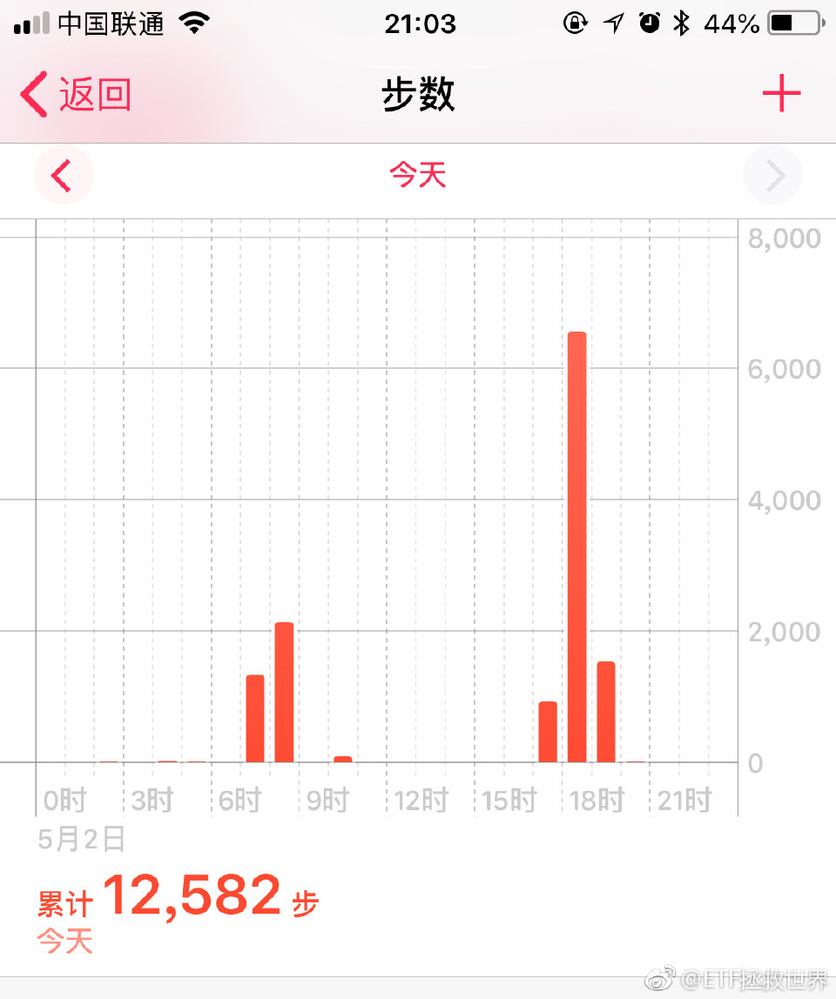

======================================================

ETF拯救世界 (5687069307) @
2018-05-03 09:29:42 Thu  
url: https://weibo.com/5687069307/GeU87DPtL

上次说可转债有人买了吗 ​​​

转发[13]  评论[69]  赞[99] 

+++++++++++++++++++++++++++++++++++++++++++++++++++++

图片：
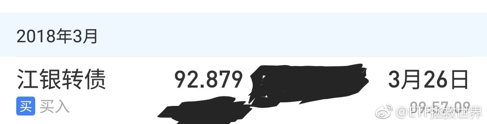

======================================================

ETF拯救世界 (5687069307) @
2018-05-03 09:38:25 Thu  
url: https://weibo.com/5687069307/GeUbFzmbn

球球跟我撕过的大v有三个。现在一个深成B挂了，一个……就不说了。

还剩一个。[doge] ​​​

转发[3]  评论[92]  赞[170] 

======================================================

ETF拯救世界 (5687069307) @
2018-05-03 09:41:21 Thu  
url: https://weibo.com/5687069307/GeUcRoM8O

回复@不戒唐:我不会买，太贵。我买东西不是因为有钱，或者这个东西出了。而是因为：那个东西值得买。//@不戒唐:工银瑞信印度市场基金发售。。。

------------------------------------------------------
转推：
>  @ETF拯救世界 (5687069307)
>  2018-05-03 09:29:42 Thu  
>  url: https:/weibo.com/5687069307/GeU87DPtL/

>  上次说可转债有人买了吗 ​​​

转发[10]  评论[9]  赞[88] 

======================================================

ETF拯救世界 (5687069307) @
2018-05-03 09:48:12 Thu  
url: https://weibo.com/5687069307/GeUfE13L6

分级基金真的是太好太好的投资品种了。真的太好了。赚好多钱。

为什么说它好，因为它能够计算。能够通过计算知道价值和如何交易的品种都是最好的品种。确定性极高。

为什么要干掉这么好的品种？？？？？

欲哭无泪。 ​​​

转发[12]  评论[58]  赞[155] 

======================================================

ETF拯救世界 (5687069307) @
2018-05-03 09:50:22 Thu  
url: https://weibo.com/5687069307/GeUgwmsK7

加车模式启动。发车时间临时改为每周评估。 ​​​

转发[32]  评论[163]  赞[445] 

======================================================

ETF拯救世界 (5687069307) @
2018-05-03 10:10:00 Thu  
url: https://weibo.com/5687069307/GeUourQSC

记住，想办法，活下去。 ​​​

转发[21]  评论[38]  赞[195] 

======================================================

ETF拯救世界 (5687069307) @
2018-05-03 10:14:19 Thu  
url: https://weibo.com/5687069307/GeUqfq8Jo

今天券商+油气+黄金+债券+dax立功了 ​​​

转发[2]  评论[23]  赞[181] 

======================================================

ETF拯救世界 (5687069307) @
2018-05-03 10:28:59 Thu  
url: https://weibo.com/5687069307/GeUwcbGHj

回复@利利亚斯的守门人:先看看效果吧。dax这两年不是很好。在国内买个靠谱的QDII指基真的很难。//@利利亚斯的守门人:这就是个坑！先前官方小编还在雪球上说不是fof，打开招募说明是一看，就是fof，那也就算了，tmd还收1.6%的管理费。老老实实做一个跟踪msci印度的基金对他们好像很困难的样子。

------------------------------------------------------
转推：
>  @ETF拯救世界 (5687069307)
>  2018-05-03 09:29:42 Thu  
>  url: https:/weibo.com/5687069307/GeU87DPtL/

>  上次说可转债有人买了吗 ​​​

转发[2]  评论[13]  赞[63] 

======================================================

ETF拯救世界 (5687069307) @
2018-05-03 10:38:58 Thu  
url: https://weibo.com/5687069307/GeUAf4HWE

回复@秦雪晖23333:我倒不认为这种整数关口有什么用。2005年跌破1000点，中金喊出700目标位，结果不是998见底。我认为更关键的是趋势。目前趋势稀烂很多人还在幻想大牛市马上来……目前就是先保命，收集筹码，等待戈多。

------------------------------------------------------
转推：
>  @ETF拯救世界 (5687069307)
>  2018-05-03 10:10:00 Thu  
>  url: https:/weibo.com/5687069307/GeUourQSC/

>  记住，想办法，活下去。 ​​​

转发[11]  评论[44]  赞[165] 

======================================================

ETF拯救世界 (5687069307) @
2018-05-03 11:25:05 Thu  
url: https://weibo.com/5687069307/GeUSY6sMB

从现在起，各位做好心理准备，迎接漫漫阴跌吧。没什么大问题，解决心理问题以后逢低布局就可以。

最主要是心理问题。所有希望都被磨平后的麻木与绝望是需要警惕的。 ​​​

转发[235]  评论[157]  赞[358] 

======================================================

ETF拯救世界 (5687069307) @
2018-05-03 11:41:32 Thu  
url: https://weibo.com/5687069307/GeUZE3Sjs

回复@Terry张_:万一你说的“底部”不到就开始涨了呢。目前的仓位，是我的体系根据概率计算出的，我自认为合理的仓位。可以应对跌到你说的底部，也可以应对突然开始上涨。未来是未知的，模糊的，没有一定会发生的，只能根据概率下注。

------------------------------------------------------
转推：
>  @ETF拯救世界 (5687069307)
>  2018-05-03 11:25:05 Thu  
>  url: https:/weibo.com/5687069307/GeUSY6sMB/

>  从现在起，各位做好心理准备，迎接漫漫阴跌吧。没什么大问题，解决心理问题以后逢低布局就可以。
>  
>  最主要是心理问题。所有希望都被磨平后的麻木与绝望是需要警惕的。 ​​​

转发[11]  评论[19]  赞[134] 

======================================================

ETF拯救世界 (5687069307) @
2018-05-03 11:43:44 Thu  
url: https://weibo.com/5687069307/GeV0xlHGb

回复@陈治鸣:就是因为反弹了我才说的。这就是阴跌的特征啊。波动0.x%。给你点希望，然后再跌0.x%。什么叫阴？就是跌了很久很久你发现根本没跌多少。这种最讨厌，完全就是用时间换空间。//@陈治鸣:刚说完就开始涨，几个意思啊

------------------------------------------------------
转推：
>  @ETF拯救世界 (5687069307)
>  2018-05-03 11:25:05 Thu  
>  url: https:/weibo.com/5687069307/GeUSY6sMB/

>  从现在起，各位做好心理准备，迎接漫漫阴跌吧。没什么大问题，解决心理问题以后逢低布局就可以。
>  
>  最主要是心理问题。所有希望都被磨平后的麻木与绝望是需要警惕的。 ​​​

转发[14]  评论[37]  赞[126] 

======================================================

ETF拯救世界 (5687069307) @
2018-05-03 12:00:18 Thu  
url: https://weibo.com/5687069307/GeV7gh6An

手机如果没有太大突破，出货量应该会没那么高成长了。这个时候上市很合适。我还是很欣赏雷军的。 ​​​

转发[7]  评论[32]  赞[151] 

======================================================

ETF拯救世界 (5687069307) @
2018-05-03 12:17:05 Thu  
url: https://weibo.com/5687069307/GeVe4vkoN

回复@伊闼基:小米的东西合适的话我都愿意试试。我现场听过一次雷军关于新国货的演讲。//@伊闼基:小米牌空调，你买不买？@ETF拯救世界

------------------------------------------------------
转推：
>  @ETF拯救世界 (5687069307)
>  2018-05-03 12:00:18 Thu  
>  url: https:/weibo.com/5687069307/GeV7gh6An/

>  手机如果没有太大突破，出货量应该会没那么高成长了。这个时候上市很合适。我还是很欣赏雷军的。 ​​​

转发[3]  评论[41]  赞[101] 

======================================================

ETF拯救世界 (5687069307) @
2018-05-03 13:47:24 Thu  
url: https://weibo.com/5687069307/GeVOJtPSt

一个品种到底有什么价值，咱们做投资应该心里门儿清才行。

比如有的品种，只有交易价值，没有长期持有价值。什么品种，比如黄金，油之类的。就是持有大波段。

有的品种可以超长期持有，收益还会不错。比如宽基或者好行业的指数基金。ETF。

如果你把有些有交易价值的品种当做长期价值品种持有，有时 ​​​

转发[120]  评论[147]  赞[311] 

======================================================

ETF拯救世界 (5687069307) @
2018-05-03 14:06:01 Thu  
url: https://weibo.com/5687069307/GeVWi52oI

谁能想到650点浮亏十几个点的券商到700点只浮亏3%了。

再说一次，计划里的任何品种，我说的是任何，我都会尽量将成本控制在最低价格的10%-15%之内。牛市来临后，1-2周变成浮盈，之后开始爆发。那时候你才会发现，之前不论多长时间的等待都是值的。 ​​​

转发[40]  评论[165]  赞[453] 

======================================================

ETF拯救世界 (5687069307) @
2018-05-04 08:39:48 Fri  
url: https://weibo.com/5687069307/Gf3emDVdK

上午有事。不用刷了。 ​​​

转发[0]  评论[112]  赞[227] 

+++++++++++++++++++++++++++++++++++++++++++++++++++++

图片：
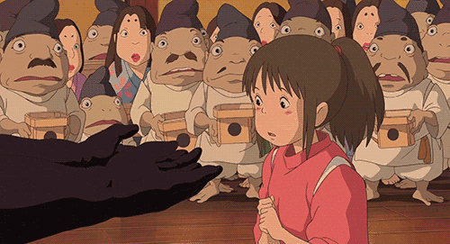

======================================================

ETF拯救世界 (5687069307) @
2018-05-04 11:01:42 Fri  
url: https://weibo.com/5687069307/Gf49YkuWY

$全指医药 sh000991$   记住，新高不卖。不 要 卖！ ​​​

转发[26]  评论[67]  赞[194] 

======================================================

ETF拯救世界 (5687069307) @
2018-05-04 11:10:19 Fri  
url: https://weibo.com/5687069307/Gf4dtboeI

你现在回头看，2月6日的临时加车 $全指医药 sh000991$ 

你就会明白，危机的时候出手干会有什么后果。别人心惊胆战疯狂卖出的时候，你去接盘的结果。

这次没有大笔扫货，不用着急。会有那一天，一次次正反馈应该会把你教育的坚强一点。扫货日不会太远。 ​​​

转发[17]  评论[73]  赞[207] 

+++++++++++++++++++++++++++++++++++++++++++++++++++++

图片：

======================================================

ETF拯救世界 (5687069307) @
2018-05-04 11:30:10 Fri  
url: https://weibo.com/5687069307/Gf4lwy7h0

别人家的粉丝。 [拜拜]

------------------------------------------------------
转推：
>  @网易财经 (1974561081)
>  2018-05-04 10:33:56 Fri  
>  url: https:/weibo.com/1974561081/Gf3YHsD7l/

>  【“为所欲为”四个字就是这么写的】范冰冰的弟弟@范丞丞Adam0616 在微博上发了个付费照片，要想看照片先要付60元，结果有8万人付款，一觉醒来赚了480万！[允悲] @来去之间 来总是不是找到了新的利润增长点了！ ​​​（via.互联网那点事儿） ​​​

转发[14]  评论[76]  赞[104] 

======================================================

ETF拯救世界 (5687069307) @
2018-05-04 11:42:22 Fri  
url: https://weibo.com/5687069307/Gf4qtBPhb

这1444444444是什么意思。

活得越久，越知道活着的可贵。在金融市场，只要不死，不受重伤，资产稳步增加，爆发，增加，爆发，这样循环，最终结果都会很好。

违背一些基本的原则，巨幅波动，真的很危险。不知道哪次就彻底埋进去了。

所以有人说，不要在意回撤，满仓干，永远满仓。说实话，我无法认同 ​​​

转发[32]  评论[72]  赞[183] 

+++++++++++++++++++++++++++++++++++++++++++++++++++++

图片：

======================================================

ETF拯救世界 (5687069307) @
2018-05-04 12:32:08 Fri  
url: https://weibo.com/5687069307/Gf4KGblgx

回复@芷蓝风:逢年过节还发红包的事了解一下。（包括38节）//@芷蓝风:别人家的偶像向粉丝收钱，我家偶像授之以渔又授之以鱼，感觉跟对了人!//@ETF拯救世界:别人家的粉丝。 [拜拜]

------------------------------------------------------
转推：
>  @网易财经 (1974561081)
>  2018-05-04 10:33:56 Fri  
>  url: https:/weibo.com/1974561081/Gf3YHsD7l/

>  【“为所欲为”四个字就是这么写的】范冰冰的弟弟@范丞丞Adam0616 在微博上发了个付费照片，要想看照片先要付60元，结果有8万人付款，一觉醒来赚了480万！[允悲] @来去之间 来总是不是找到了新的利润增长点了！ ​​​（via.互联网那点事儿） ​​​

转发[1]  评论[67]  赞[186] 

======================================================

ETF拯救世界 (5687069307) @
2018-05-04 13:16:30 Fri  
url: https://weibo.com/5687069307/Gf52GzC8C

实在忍不住的，等13000可以平衡一点。之前不卖，坐电梯也无所谓。

------------------------------------------------------
转推：
>  @ETF拯救世界 (5687069307)
>  2018-05-04 11:01:42 Fri  
>  url: https:/weibo.com/5687069307/Gf49YkuWY/

>  $全指医药 sh000991$   记住，新高不卖。不 要 卖！ ​​​

转发[23]  评论[33]  赞[138] 

======================================================

ETF拯救世界 (5687069307) @
2018-05-04 13:28:26 Fri  
url: https://weibo.com/5687069307/Gf57x6mko

回复@很多话不想说:每种花开放的时间不同。我们持仓的品种都会有疯狂的时候，不信走着瞧。//@很多话不想说:终于轮到医药火一把了//@ETF拯救世界:实在忍不住的，等13000可以平衡一点。之前不卖，坐电梯也无所谓。

------------------------------------------------------
转推：
>  @ETF拯救世界 (5687069307)
>  2018-05-04 11:01:42 Fri  
>  url: https:/weibo.com/5687069307/Gf49YkuWY/

>  $全指医药 sh000991$   记住，新高不卖。不 要 卖！ ​​​

转发[11]  评论[20]  赞[128] 

======================================================

ETF拯救世界 (5687069307) @
2018-05-04 13:33:03 Fri  
url: https://weibo.com/5687069307/Gf59ozGk0

大家注意观察，媒体、大v什么时候开始集体吹医药。 ​​​

转发[11]  评论[56]  赞[195] 

======================================================

ETF拯救世界 (5687069307) @
2018-05-04 13:34:07 Fri  
url: https://weibo.com/5687069307/Gf59Psf0y

回复@酩酊大醉的三藏:500和环保满打满算正式开始投不到2年，大概也就1年。这就花儿也谢了？没做好3、5年不涨的准备不要投资。//@酩酊大醉的三藏:等中证500跟环保已经等得花都谢了。。。//@ETF拯救世界:回复@很多话不想说:每种花开放的时间不同。我们持仓的品种都会有疯狂的时候，不信走着瞧。

------------------------------------------------------
转推：
>  @ETF拯救世界 (5687069307)
>  2018-05-04 11:01:42 Fri  
>  url: https:/weibo.com/5687069307/Gf49YkuWY/

>  $全指医药 sh000991$   记住，新高不卖。不 要 卖！ ​​​

转发[6]  评论[21]  赞[154] 

======================================================

ETF拯救世界 (5687069307) @
2018-05-04 13:38:23 Fri  
url: https://weibo.com/5687069307/Gf5bzFpsL

回复@出去走走吧365:你好好翻翻我的微博。再看看发车记录，是谁在医药最黑暗的时候一车一车买成第一重仓。这叫吹？拉黑不送。//@出去走走吧365:你在吹

------------------------------------------------------
转推：
>  @ETF拯救世界 (5687069307)
>  2018-05-04 13:33:03 Fri  
>  url: https:/weibo.com/5687069307/Gf59ozGk0/

>  大家注意观察，媒体、大v什么时候开始集体吹医药。 ​​​

转发[2]  评论[46]  赞[177] 

======================================================

ETF拯救世界 (5687069307) @
2018-05-04 13:45:18 Fri  
url: https://weibo.com/5687069307/Gf5enoB6Q

全指医药第三轮计划发车全纪录。 ​​​

转发[16]  评论[99]  赞[321] 

+++++++++++++++++++++++++++++++++++++++++++++++++++++

图片：
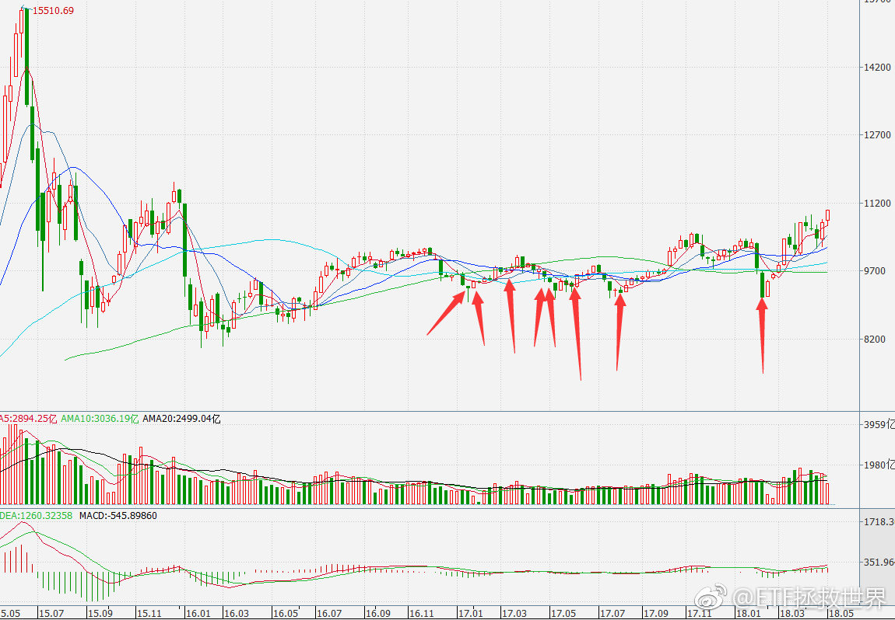

======================================================

ETF拯救世界 (5687069307) @
2018-05-04 13:53:17 Fri  
url: https://weibo.com/5687069307/Gf5hCkvgx

第三轮计划50买入全纪录 ​​​

转发[15]  评论[70]  赞[279] 

+++++++++++++++++++++++++++++++++++++++++++++++++++++

图片：

======================================================

ETF拯救世界 (5687069307) @
2018-05-04 13:56:57 Fri  
url: https://weibo.com/5687069307/Gf5j6u1Bs

第三轮计划恒生ETF买入全纪录 

谁还记得恒生浮亏10%的时候有人在公众号埋怨我的事。 ​​​

转发[28]  评论[131]  赞[328] 

+++++++++++++++++++++++++++++++++++++++++++++++++++++

图片：
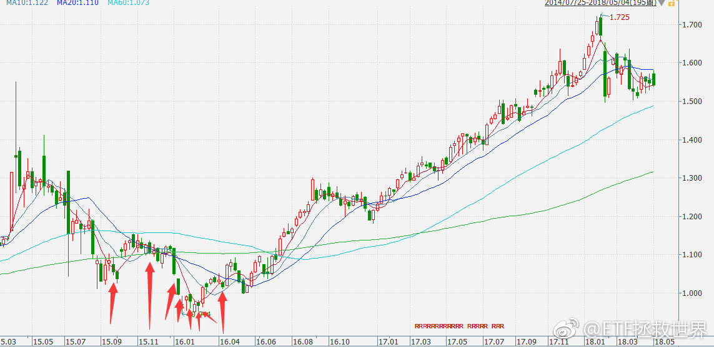

======================================================

ETF拯救世界 (5687069307) @
2018-05-04 14:06:19 Fri  
url: https://weibo.com/5687069307/Gf5mUmdjJ

这是浮亏的券商，你有多害怕 ​​​

转发[15]  评论[138]  赞[267] 

+++++++++++++++++++++++++++++++++++++++++++++++++++++

图片：

======================================================

ETF拯救世界 (5687069307) @
2018-05-04 14:29:32 Fri  
url: https://weibo.com/5687069307/Gf5wlqHc1

是不是又要我毒奶护盘了。

------------------------------------------------------
转推：
>  @ETF拯救世界 (5687069307)
>  2018-05-03 09:50:22 Thu  
>  url: https:/weibo.com/5687069307/GeUgwmsK7/

>  加车模式启动。发车时间临时改为每周评估。 ​​​

转发[16]  评论[62]  赞[196] 

======================================================

ETF拯救世界 (5687069307) @
2018-05-04 14:31:55 Fri  
url: https://weibo.com/5687069307/Gf5xitu8P

回复@行走世间一只喵:不是记仇。我估计绝大多数人体会不到我的心情。自己的计划公布出来，愿意参考的，他浮亏一点来埋怨你。后面赚50%一个谢字都不会说。心情很复杂。//@行走世间一只喵:记仇哈哈

------------------------------------------------------
转推：
>  @ETF拯救世界 (5687069307)
>  2018-05-04 13:56:57 Fri  
>  url: https:/weibo.com/5687069307/Gf5j6u1Bs/

>  第三轮计划恒生ETF买入全纪录 
>  
>  谁还记得恒生浮亏10%的时候有人在公众号埋怨我的事。 ​​​

转发[10]  评论[252]  赞[375] 

======================================================

ETF拯救世界 (5687069307) @
2018-05-04 15:20:03 Fri  
url: https://weibo.com/5687069307/Gf5QQ0j9F

回复@点滴的过往:我从来不推荐别人投资股市。虽然我自己赚了很多，但我从来不忽悠任何人入市。我也不会给跨越房地产股市的跨大类建议。前提是，你自己希望投资股市的话，我的看法就是科学的投资指数基金胜面会非常大。所以，一旦发生任何影响股市整体的大事件，我也认为，指数比个体公司抗击打能力强。

------------------------------------------------------
转推：
>  @ETF拯救世界 (5687069307)
>  2018-05-03 09:50:22 Thu  
>  url: https:/weibo.com/5687069307/GeUgwmsK7/

>  加车模式启动。发车时间临时改为每周评估。 ​​​

转发[11]  评论[88]  赞[334] 

======================================================

ETF拯救世界 (5687069307) @
2018-05-05 20:13:36 Sat  
url: https://weibo.com/5687069307/GfhcuaozO

每日打卡（185）

前两天都练了，没有贴到微博。今天练不了了，爬了一天山 ​​​

转发[5]  评论[64]  赞[244] 

+++++++++++++++++++++++++++++++++++++++++++++++++++++

图片：

======================================================

ETF拯救世界 (5687069307) @
2018-05-06 11:01:01 Sun  
url: https://weibo.com/5687069307/Gfn0Gf4Kj

回复@沙杨_Destiny:这样也行？太可怕了。不管去哪玩，最重要是人少。人多的话，再好的地方我也不喜欢。这里比较小众，人少，风景也不错。日常爬爬可以考虑。//@沙杨_Destiny:百度识图到了，这是北京房山圣莲山的莲子峰[哈哈][喵喵][思考]

------------------------------------------------------
转推：
>  @ETF拯救世界 (5687069307)
>  2018-05-05 20:13:36 Sat  
>  url: https:/weibo.com/5687069307/GfhcuaozO/

>  每日打卡（185）
>  
>  前两天都练了，没有贴到微博。今天练不了了，爬了一天山 ​​​

转发[2]  评论[35]  赞[121] 

======================================================

ETF拯救世界 (5687069307) @
2018-05-06 22:39:37 Sun  
url: https://weibo.com/5687069307/GfrAfsmsF

每日打卡（186）

睡觉 ​​​

转发[1]  评论[26]  赞[131] 

+++++++++++++++++++++++++++++++++++++++++++++++++++++

图片：
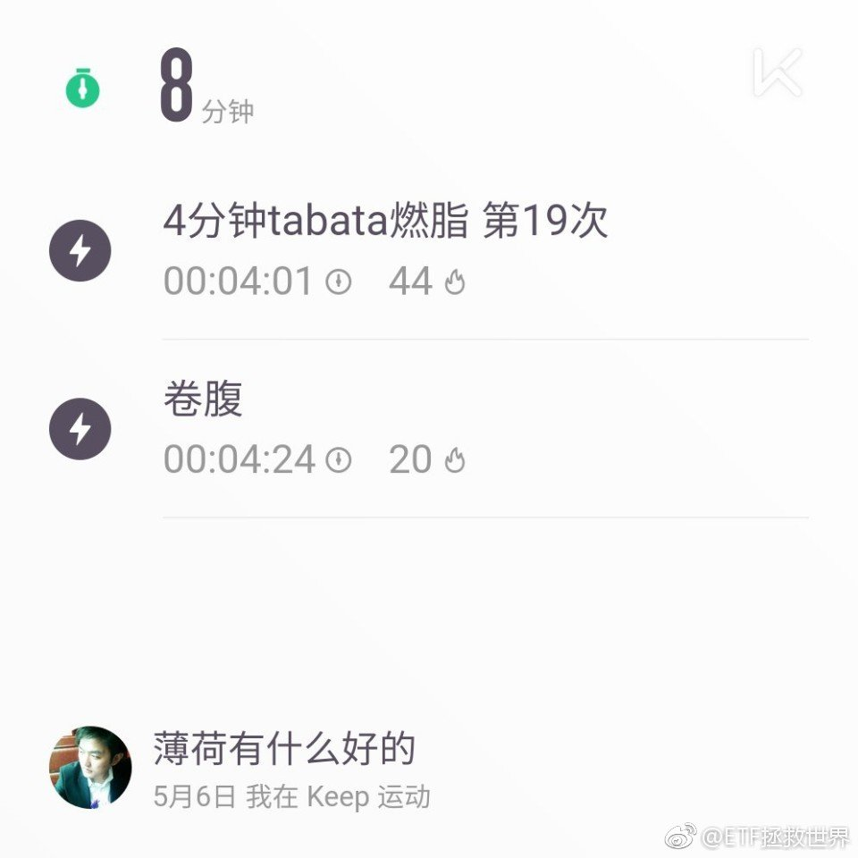

======================================================

ETF拯救世界 (5687069307) @
2018-05-07 09:40:24 Mon  
url: https://weibo.com/5687069307/GfvUsAzsK

$全指医药 sh000991$  继续新高。不用我嘱咐了吧。

记住，赚钱的时候千万别赚了三瓜两枣就着急卖掉。那样，你一辈子也发不了大财。

对一次两次，终究有一次后悔莫及。 ​​​

转发[81]  评论[79]  赞[213] 

======================================================

ETF拯救世界 (5687069307) @
2018-05-07 09:47:07 Mon  
url: https://weibo.com/5687069307/GfvXccwNI

回复@ETF信徒者:我没那么乐观。短期飚的话，我能理解的点位是13500-14000吧。以后每年增加900点。//@ETF信徒者:坚决拿住，坐等到15000

------------------------------------------------------
转推：
>  @ETF拯救世界 (5687069307)
>  2018-05-07 09:40:24 Mon  
>  url: https:/weibo.com/5687069307/GfvUsAzsK/

>  $全指医药 sh000991$  继续新高。不用我嘱咐了吧。
>  
>  记住，赚钱的时候千万别赚了三瓜两枣就着急卖掉。那样，你一辈子也发不了大财。
>  
>  对一次两次，终究有一次后悔莫及。 ​​​

转发[42]  评论[43]  赞[125] 

======================================================

ETF拯救世界 (5687069307) @
2018-05-07 09:53:14 Mon  
url: https://weibo.com/5687069307/GfvZFvp8q

再回头看去年10月的微博，感受是不是更深了。医药中间过山车了，跌很深，几乎到了我们的成本。然后我们果断加仓，现在回来了，蹦的更高，而且因为加仓，赚的比之前多很多。不要怕过山车，怕什么？跌了就买，以后赚更多。指数是向上的。轻易不要跑。

------------------------------------------------------
转推：
>  @ETF拯救世界 (5687069307)
>  2017-10-13 11:08:44 Fri  
>  url: https:/weibo.com/5687069307/Fq9Uly1BJ/

>  三个字，不要卖。你的成本很低，踏踏实实拿着。不要怕过山车，即使过山车，下次回来你赚更多。
>  
>  这话说过好多次，回头看看，是不是正确的？没错，过山车好几次，每次回来是不是利润增加一大截？
>  
>  拿着。 ​​​

转发[25]  评论[73]  赞[223] 

======================================================

ETF拯救世界 (5687069307) @
2018-05-07 10:55:42 Mon  
url: https://weibo.com/5687069307/Gfwp1AAfI

别惦记了。干正经事儿去吧。正常发车。//@ETF拯救世界:是不是又要我毒奶护盘了。

------------------------------------------------------
转推：
>  @ETF拯救世界 (5687069307)
>  2018-05-03 09:50:22 Thu  
>  url: https:/weibo.com/5687069307/GeUgwmsK7/

>  加车模式启动。发车时间临时改为每周评估。 ​​​

转发[2]  评论[66]  赞[136] 

======================================================

ETF拯救世界 (5687069307) @
2018-05-07 11:24:22 Mon  
url: https://weibo.com/5687069307/GfwAFamzD

你要感受一下计划“第一重仓”的威力。

16年以后，计划第一重仓是恒生+50。结果你知道了。

到今年初，第一重仓变成医药+养老（50%医药股），结果你也知道了。

现在第一重仓变成500（500+增强）。第二重仓是红利。 ​​​

转发[42]  评论[198]  赞[290] 

======================================================

ETF拯救世界 (5687069307) @
2018-05-07 11:34:51 Mon  
url: https://weibo.com/5687069307/GfwEUpgLH

安迪，安迪是你吗安迪！ http://t.cn/RuFPe95

------------------------------------------------------
转推：
>  @ ()
>  2018-05-07 10:11:36 Mon  
>  url: 

>  抱歉，作者已设置仅展示半年内微博，此微博已不可见。 ​​​

转发[2]  评论[44]  赞[93] 

======================================================

ETF拯救世界 (5687069307) @
2018-05-07 13:30:23 Mon  
url: https://weibo.com/5687069307/GfxpO3j7l

比较遗憾的是，本来打算下次买入的某品种今天暴涨。

人生就是这样啊。 ​​​

转发[6]  评论[125]  赞[172] 

======================================================

ETF拯救世界 (5687069307) @
2018-05-07 13:33:36 Mon  
url: https://weibo.com/5687069307/Gfxr7ktEp

500目前是除创业板外所有宽基指数涨幅第一。

------------------------------------------------------
转推：
>  @ETF拯救世界 (5687069307)
>  2018-05-07 11:24:22 Mon  
>  url: https:/weibo.com/5687069307/GfwAFamzD/

>  你要感受一下计划“第一重仓”的威力。
>  
>  16年以后，计划第一重仓是恒生+50。结果你知道了。
>  
>  到今年初，第一重仓变成医药+养老（50%医药股），结果你也知道了。
>  
>  现在第一重仓变成500（500+增强）。第二重仓是红利。 ​​​

转发[7]  评论[56]  赞[176] 

======================================================

ETF拯救世界 (5687069307) @
2018-05-07 14:42:21 Mon  
url: https://weibo.com/5687069307/GfxT22U0X

光头光脚新高，哪有理由不持有。当然短期涨幅过大回调消化也很正常。你的浮盈越来越大，那种小波动就不会在意了。所以我跟你说什么人最容易卖，就是在成本附近波动的时候。一会亏一会赚。真的赚了几十个点就无所谓了。

------------------------------------------------------
转推：
>  @ETF拯救世界 (5687069307)
>  2018-05-07 09:40:24 Mon  
>  url: https:/weibo.com/5687069307/GfvUsAzsK/

>  $全指医药 sh000991$  继续新高。不用我嘱咐了吧。
>  
>  记住，赚钱的时候千万别赚了三瓜两枣就着急卖掉。那样，你一辈子也发不了大财。
>  
>  对一次两次，终究有一次后悔莫及。 ​​​

转发[18]  评论[58]  赞[187] 

======================================================

ETF拯救世界 (5687069307) @
2018-05-07 14:55:15 Mon  
url: https://weibo.com/5687069307/GfxYgdWTF

养老还差3%新高，废柴。 ​​​

转发[7]  评论[62]  赞[147] 

======================================================

ETF拯救世界 (5687069307) @
2018-05-07 15:09:37 Mon  
url: https://weibo.com/5687069307/Gfy45zZfk

发帖日至今下跌20%了。学习好的讲讲什么时候可以买。

------------------------------------------------------
转推：
>  @ETF拯救世界 (5687069307)
>  2018-03-22 09:34:01 Thu  
>  url: https:/weibo.com/5687069307/G8wd21cxW/

>  腾讯，60倍PE。未来五年看，真的能有特别好的收益率吗。
>  
>  学习了。 ​​​

转发[26]  评论[70]  赞[137] 

======================================================

ETF拯救世界 (5687069307) @
2018-05-07 15:11:55 Mon  
url: https://weibo.com/5687069307/Gfy51vljX

回复@hei-jude:难道还有人不知道公众号  chinaetfs 的吗！//@hei-jude:最近才有一笔资金，益达指导一下如何跟车呀。。。。还没看懂具体是指那只

------------------------------------------------------
转推：
>  @ETF拯救世界 (5687069307)
>  2018-05-07 09:40:24 Mon  
>  url: https:/weibo.com/5687069307/GfvUsAzsK/

>  $全指医药 sh000991$  继续新高。不用我嘱咐了吧。
>  
>  记住，赚钱的时候千万别赚了三瓜两枣就着急卖掉。那样，你一辈子也发不了大财。
>  
>  对一次两次，终究有一次后悔莫及。 ​​​

转发[0]  评论[23]  赞[84] 

======================================================

ETF拯救世界 (5687069307) @
2018-05-07 15:50:37 Mon  
url: https://weibo.com/5687069307/GfykK5dzm

回复@半生流离醉:sorry，我没质疑。没那个能力。我是把融创当成观察情绪的一面镜子。融创是这几年我见过最有代表性的镜子了。//@半生流离醉:20%不算什么吧。你一直质疑的融创，也没怎么跌啊。熊市跌20%算很不错了吧。

------------------------------------------------------
转推：
>  @ETF拯救世界 (5687069307)
>  2018-03-22 09:34:01 Thu  
>  url: https:/weibo.com/5687069307/G8wd21cxW/

>  腾讯，60倍PE。未来五年看，真的能有特别好的收益率吗。
>  
>  学习了。 ​​​

转发[14]  评论[16]  赞[107] 

======================================================

ETF拯救世界 (5687069307) @
2018-05-07 16:18:28 Mon  
url: https://weibo.com/5687069307/Gfyw2lOOd

我发现，还是有朋友是这样。就是，自己持有的品种，别人稍微有点质疑，有时候连质疑都算不上就不开心，不高兴。

哪能港，这样真的好吗。

我是无所谓的。我买什么东西，买的再多，你说它不好我都完全不care。因为对这个东西我心里有底，你说什么我一点都不在乎。因为我知道我比你强，强者会在乎弱者的 ​​​

转发[30]  评论[153]  赞[396] 

======================================================

ETF拯救世界 (5687069307) @
2018-05-07 23:01:12 Mon  
url: https://weibo.com/5687069307/GfB9v71IA

每日打卡（187）

又睡晚了。 ​​​

转发[1]  评论[25]  赞[119] 

+++++++++++++++++++++++++++++++++++++++++++++++++++++

图片：

======================================================

ETF拯救世界 (5687069307) @
2018-05-08 06:27:24 Tue  
url: https://weibo.com/5687069307/GfE4Cqefv

回复@CZ梦想:是的。在沪深300再涨15%才能新高的情况下，我们还差2%。没什么，新高是计划的常态。//@CZ梦想:整体又快新高了，@ETF拯救世界

------------------------------------------------------
转推：
>  @ETF拯救世界 (5687069307)
>  2018-05-07 14:55:15 Mon  
>  url: https:/weibo.com/5687069307/GfxYgdWTF/

>  养老还差3%新高，废柴。 ​​​

转发[4]  评论[28]  赞[126] 

======================================================

ETF拯救世界 (5687069307) @
2018-05-08 06:30:32 Tue  
url: https://weibo.com/5687069307/GfE5TCnfU

回复@我有大头:我现在绝对不会买。我买东西不是因为有了或者有钱，而是因为值得买。再说一次。//@我有大头:印度基金E大有没有考虑//@ETF拯救世界:回复@CZ梦想:是的。在沪深300再涨15%才能新高的情况下，我们还差2%。没什么，新高是计划的常态。//@CZ梦想:整体又快新高了，@ETF拯救世界

------------------------------------------------------
转推：
>  @ETF拯救世界 (5687069307)
>  2018-05-07 14:55:15 Mon  
>  url: https:/weibo.com/5687069307/GfxYgdWTF/

>  养老还差3%新高，废柴。 ​​​

转发[3]  评论[59]  赞[142] 

======================================================

ETF拯救世界 (5687069307) @
2018-05-08 11:48:13 Tue  
url: https://weibo.com/5687069307/GfGaQ9np9

又来吃煎饺了。今天不吃韭菜的，吃牛肉馅 ​​​

转发[2]  评论[86]  赞[240] 

+++++++++++++++++++++++++++++++++++++++++++++++++++++

图片：

======================================================

ETF拯救世界 (5687069307) @
2018-05-08 12:22:08 Tue  
url: https://weibo.com/5687069307/GfGoBw2iO

哪能港，浓眉大眼的上海人也打架？

------------------------------------------------------
转推：
>  @澎湃新闻 (5044281310)
>  2018-05-08 12:17:03 Tue  
>  url: https:/weibo.com/5044281310/GfGmxgAwj/

>  【上海公布高架捉对厮打男女处罚：一男子拘十日另一男子拘五日】 http://t.cn/R3hZoRK 5月7日11时10分许，上海警方接报警称，延安路高架西向东方向近西藏南路下匝道处有两辆小客车停于道路中间，随车人员（共4人）互相扭打。接报后，民警迅速到场将4人带回调查。目前，违法人员顾某（男、红色小客车驾 ​​​

转发[6]  评论[47]  赞[75] 

======================================================

ETF拯救世界 (5687069307) @
2018-05-08 13:11:51 Tue  
url: https://weibo.com/5687069307/GfGIMFReR

今天两市交易的3200只股票中，跑赢50的510只，占比16%。

跑赢红利的920只，占比29%。 ​​​

转发[12]  评论[67]  赞[230] 

======================================================

ETF拯救世界 (5687069307) @
2018-05-08 16:06:45 Tue  
url: https://weibo.com/5687069307/GfHRMgNKk

回复@等风来zc:这届北京基民不行。//@等风来zc:支付宝显示今年基金收益率1.93%，竟然超过92.4%的北京基民[doge]

------------------------------------------------------
转推：
>  @ETF拯救世界 (5687069307)
>  2018-05-08 13:11:51 Tue  
>  url: https:/weibo.com/5687069307/GfGIMFReR/

>  今天两市交易的3200只股票中，跑赢50的510只，占比16%。
>  
>  跑赢红利的920只，占比29%。 ​​​

转发[3]  评论[67]  赞[128] 

======================================================

ETF拯救世界 (5687069307) @
2018-05-08 18:28:25 Tue  
url: https://weibo.com/5687069307/GfINhroCG

有8位数金融资产多吗。绝大多数时候你会觉得还可以，买东西不用太考虑价格，追求品质，生活的还算愉快。

但是不要浏览帝都链家网站。哪怕是换房升级，你也会发现，你其实是个穷人…… ​​​

转发[28]  评论[282]  赞[310] 

======================================================

ETF拯救世界 (5687069307) @
2018-05-08 22:30:23 Tue  
url: https://weibo.com/5687069307/GfKnuE38q

今天跑步了，不练了 ​​​

转发[1]  评论[42]  赞[177] 

+++++++++++++++++++++++++++++++++++++++++++++++++++++

图片：

======================================================

ETF拯救世界 (5687069307) @
2018-05-09 09:10:19 Wed  
url: https://weibo.com/5687069307/GfOzeADYS

男生洗个澡快的五分钟就行了吧。至于一个月连五分钟都腾不出来吗。。

------------------------------------------------------
转推：
>  @ ()
>  2018-05-09 06:40:02 Wed  
>  url: 

>  抱歉，作者已设置仅展示半年内微博，此微博已不可见。 ​​​

转发[13]  评论[78]  赞[61] 

======================================================

ETF拯救世界 (5687069307) @
2018-05-09 09:17:03 Wed  
url: https://weibo.com/5687069307/GfOBYxCej

$162411 下一压力位是16年底的0.78了。

计划的两份先拿稳，网格继续做起来。 ​​​

转发[14]  评论[187]  赞[226] 

======================================================

ETF拯救世界 (5687069307) @
2018-05-09 10:11:45 Wed  
url: https://weibo.com/5687069307/GfOYbfVXh

计划的油气应该是又一次正反馈。

当年曾经出现过-15%的情况，这是第三轮计划最大的浮亏。当然，只有一份。

然后补仓，然后暴力反转，然后现在盈利接近18%，年化20多个点。今天已经52周新高了，未来会涨多少还不知道。

这样的事情未来会一再发生。就是这么简单。买的贵点，毫无所谓。控制住总成本， ​​​

转发[60]  评论[181]  赞[331] 

======================================================

ETF拯救世界 (5687069307) @
2018-05-09 13:21:07 Wed  
url: https://weibo.com/5687069307/GfQd2Cc5a

回复@Rinderbraten:最怕你这样话说不清楚的。没有他说的付费专栏，是回答过两个微博付费问题，现在已经可以免费看了。//@Rinderbraten:回复@木头队长:付费专栏里面可以免费看，我替老大回答了

------------------------------------------------------
转推：
>  @ETF拯救世界 (5687069307)
>  2018-05-09 10:11:45 Wed  
>  url: https:/weibo.com/5687069307/GfOYbfVXh/

>  计划的油气应该是又一次正反馈。
>  
>  当年曾经出现过-15%的情况，这是第三轮计划最大的浮亏。当然，只有一份。
>  
>  然后补仓，然后暴力反转，然后现在盈利接近18%，年化20多个点。今天已经52周新高了，未来会涨多少还不知道。
>  
>  这样的事情未来会一再发生。就是这么简单。买的贵点，毫无所谓。控制住总成本， ​​​

转发[0]  评论[32]  赞[119] 

======================================================

ETF拯救世界 (5687069307) @
2018-05-09 14:04:14 Wed  
url: https://weibo.com/5687069307/GfQuy0u2I

我想到一个问题。

大家身边有没有之前买了好几套房，然后这几年卖出一两套拿着钱去享受生活的。

我身边的多套房持有者，有卖的。卖了的都是继续买更大更贵贷款更多的房子。而且是各种手段规避政策，离婚什么的。

好像很少听说谁把房卖了就不再买的。都是越买越多。 好像绝大多数人都是纸面富贵。 ​​​

转发[210]  评论[324]  赞[290] 

======================================================

ETF拯救世界 (5687069307) @
2018-05-09 15:05:34 Wed  
url: https://weibo.com/5687069307/GfQTrkEah

回复@用户y49f7o7jj4:这我不能说。我只能透露一点，下轮牛市的涨幅相当粗俗。//@用户y49f7o7jj4:老大，来碗精神鸡汤吧，说说下次牛市能翻倍不？

------------------------------------------------------
转推：
>  @ETF拯救世界 (5687069307)
>  2018-05-09 14:04:14 Wed  
>  url: https:/weibo.com/5687069307/GfQuy0u2I/

>  我想到一个问题。
>  
>  大家身边有没有之前买了好几套房，然后这几年卖出一两套拿着钱去享受生活的。
>  
>  我身边的多套房持有者，有卖的。卖了的都是继续买更大更贵贷款更多的房子。而且是各种手段规避政策，离婚什么的。
>  
>  好像很少听说谁把房卖了就不再买的。都是越买越多。 好像绝大多数人都是纸面富贵。 ​​​

转发[78]  评论[87]  赞[161] 

======================================================

ETF拯救世界 (5687069307) @
2018-05-09 15:34:52 Wed  
url: https://weibo.com/5687069307/GfR5kABmq

回复@用户y49f7o7jj4:极大概率能。历史上阴跌时间最长的是2001-2005，整整4年。然后是2007-2012，也是4年，不过中间大幅反弹过，好过很多。这一轮2015至今已经3年。本来极有希望在一年内见到大底。问题在于目前有GJD一两万亿资金维稳，市场始终无法价值回归，只能靠时间换空间。但最晚也不会超过2020。

------------------------------------------------------
转推：
>  @ETF拯救世界 (5687069307)
>  2018-05-09 14:04:14 Wed  
>  url: https:/weibo.com/5687069307/GfQuy0u2I/

>  我想到一个问题。
>  
>  大家身边有没有之前买了好几套房，然后这几年卖出一两套拿着钱去享受生活的。
>  
>  我身边的多套房持有者，有卖的。卖了的都是继续买更大更贵贷款更多的房子。而且是各种手段规避政策，离婚什么的。
>  
>  好像很少听说谁把房卖了就不再买的。都是越买越多。 好像绝大多数人都是纸面富贵。 ​​​

转发[67]  评论[99]  赞[177] 

======================================================

ETF拯救世界 (5687069307) @
2018-05-09 16:07:59 Wed  
url: https://weibo.com/5687069307/GfRiMbcWq

对于“时间换空间”，我用一个例子你就懂了。

2016年5月，深综指与目前大致差不多。当时月末全市场外部数据加权估值是35倍。

今天是27倍，下降了大概22%。

等权下降更多，降了28%。

那我告诉你，两年后深综指如果还是这个点位，按照这个增速，加权估值将降至21倍。知道21倍是什么意思吗，是2012年1 ​​​

转发[111]  评论[164]  赞[325] 

======================================================

ETF拯救世界 (5687069307) @
2018-05-09 16:24:44 Wed  
url: https://weibo.com/5687069307/GfRpzzPWR

回复@April·D·S:我测算最近几年A股上市公司利润增长去掉统计局通胀数据也有9-11%的增速。我有一套房子现在大概8-9万，我很怀疑未来它能否每年涨10%。7年后20万一平米？我的贫穷限制了我的想象。

------------------------------------------------------
转推：
>  @ETF拯救世界 (5687069307)
>  2018-05-09 14:04:14 Wed  
>  url: https:/weibo.com/5687069307/GfQuy0u2I/

>  我想到一个问题。
>  
>  大家身边有没有之前买了好几套房，然后这几年卖出一两套拿着钱去享受生活的。
>  
>  我身边的多套房持有者，有卖的。卖了的都是继续买更大更贵贷款更多的房子。而且是各种手段规避政策，离婚什么的。
>  
>  好像很少听说谁把房卖了就不再买的。都是越买越多。 好像绝大多数人都是纸面富贵。 ​​​

转发[23]  评论[98]  赞[143] 

======================================================

ETF拯救世界 (5687069307) @
2018-05-09 17:06:16 Wed  
url: https://weibo.com/5687069307/GfRGr185D

回复@裁缝跑路:怎么可能10%。你好好想想，除了房子，什么东西每年涨10%了？好多东西比10年前还便宜了。很多人觉得钱不够花了，一个是房子，一个是自己消费升级了。老想用买地摊包的钱买PRADA怎么可能。如果消费不升级，看看东西能比十年前贵多少。//@裁缝跑路:通胀怎么算的 说是一年有10%

------------------------------------------------------
转推：
>  @ETF拯救世界 (5687069307)
>  2018-05-09 14:04:14 Wed  
>  url: https:/weibo.com/5687069307/GfQuy0u2I/

>  我想到一个问题。
>  
>  大家身边有没有之前买了好几套房，然后这几年卖出一两套拿着钱去享受生活的。
>  
>  我身边的多套房持有者，有卖的。卖了的都是继续买更大更贵贷款更多的房子。而且是各种手段规避政策，离婚什么的。
>  
>  好像很少听说谁把房卖了就不再买的。都是越买越多。 好像绝大多数人都是纸面富贵。 ​​​

转发[8]  评论[126]  赞[134] 

======================================================

ETF拯救世界 (5687069307) @
2018-05-10 09:36:26 Thu  
url: https://weibo.com/5687069307/GfYaleDGT

$162411   随时受不了 ​​​

转发[43]  评论[79]  赞[174] 

======================================================

ETF拯救世界 (5687069307) @
2018-05-10 09:48:29 Thu  
url: https://weibo.com/5687069307/GfYfepfND

回复@日照雷门peter:个股不论，只说指数品种。人气越低迷，看好的人越少，表现越差，利空越多，机构越低配——就是最大的利好。不要听媒体和大v忽悠强势品种，那是在找接盘侠。我们要做的是买垃圾，被别人忽悠起来以后卖给接盘侠。

------------------------------------------------------
转推：
>  @ETF拯救世界 (5687069307)
>  2018-05-10 09:36:26 Thu  
>  url: https:/weibo.com/5687069307/GfYaleDGT/

>  $162411   随时受不了 ​​​

转发[40]  评论[52]  赞[230] 

======================================================

ETF拯救世界 (5687069307) @
2018-05-10 10:18:23 Thu  
url: https://weibo.com/5687069307/GfYrmpzsh

$全指医药 sh000991$   又内什么了。千万别内什么。 ​​​

转发[29]  评论[53]  赞[186] 

======================================================

ETF拯救世界 (5687069307) @
2018-05-10 10:32:20 Thu  
url: https://weibo.com/5687069307/GfYx24HAs

$养老产业 sz399812$   新高稳不稳。学习好的讲讲。 ​​​

转发[0]  评论[64]  赞[166] 

======================================================

ETF拯救世界 (5687069307) @
2018-05-10 11:05:27 Thu  
url: https://weibo.com/5687069307/GfYKtplJU

回复@我和猪猪一起生活:等媒体、大v和自媒体的消息。。//@我和猪猪一起生活:佩琪，这两天看到银河，华福之类的券商开始吹医药了[笑cry]

------------------------------------------------------
转推：
>  @ETF拯救世界 (5687069307)
>  2018-05-10 10:18:23 Thu  
>  url: https:/weibo.com/5687069307/GfYrmpzsh/

>  $全指医药 sh000991$   又内什么了。千万别内什么。 ​​​

转发[5]  评论[64]  赞[143] 

======================================================

ETF拯救世界 (5687069307) @
2018-05-10 14:02:14 Thu  
url: https://weibo.com/5687069307/GfZUeitWf

不知道为什么最近又开始WW了。 ​​​

转发[3]  评论[55]  赞[133] 

======================================================

ETF拯救世界 (5687069307) @
2018-05-10 14:10:52 Thu  
url: https://weibo.com/5687069307/GfZXLgdnM

A股就是这样，炒什么都是一把到底。简单粗暴，不讲节奏。

------------------------------------------------------
转推：
>  @ETF拯救世界 (5687069307)
>  2018-05-10 10:18:23 Thu  
>  url: https:/weibo.com/5687069307/GfYrmpzsh/

>  $全指医药 sh000991$   又内什么了。千万别内什么。 ​​​

转发[20]  评论[22]  赞[122] 

======================================================

ETF拯救世界 (5687069307) @
2018-05-10 14:16:33 Thu  
url: https://weibo.com/5687069307/Gg002uIJz

回复@蜀中弟子:很明显啊，GJD当时正在打开交易软件准备下单了。这都预判不出来还炒股？！//@蜀中弟子:e大，请靠诉我你为什么这么牛逼，你发这条微博的时候盘面还在一路向下，发了之后立马反转了，从哪些指标判断的呢

------------------------------------------------------
转推：
>  @ETF拯救世界 (5687069307)
>  2018-05-10 14:02:14 Thu  
>  url: https:/weibo.com/5687069307/GfZUeitWf/

>  不知道为什么最近又开始WW了。 ​​​

转发[1]  评论[37]  赞[140] 

======================================================

ETF拯救世界 (5687069307) @
2018-05-10 14:31:09 Thu  
url: https://weibo.com/5687069307/Gg05Y50ow

回复@草籽素:想出就出，舒服最重要。//@草籽素:20点了，医药油气都想出了[拜拜]//@ETF拯救世界:A股就是这样，炒什么都是一把到底。简单粗暴，不讲节奏。

------------------------------------------------------
转推：
>  @ETF拯救世界 (5687069307)
>  2018-05-10 10:18:23 Thu  
>  url: https:/weibo.com/5687069307/GfYrmpzsh/

>  $全指医药 sh000991$   又内什么了。千万别内什么。 ​​​

转发[1]  评论[32]  赞[102] 

======================================================

ETF拯救世界 (5687069307) @
2018-05-10 14:39:25 Thu  
url: https://weibo.com/5687069307/Gg09kqZVo

今天大概率继续光头，温和放量，可以说很舒服了。//@ETF拯救世界:A股就是这样，炒什么都是一把到底。简单粗暴，不讲节奏。

------------------------------------------------------
转推：
>  @ETF拯救世界 (5687069307)
>  2018-05-10 10:18:23 Thu  
>  url: https:/weibo.com/5687069307/GfYrmpzsh/

>  $全指医药 sh000991$   又内什么了。千万别内什么。 ​​​

转发[15]  评论[112]  赞[162] 

======================================================

ETF拯救世界 (5687069307) @
2018-05-10 21:43:37 Thu  
url: https://weibo.com/5687069307/Gg2Vvkvs7

每日打卡（188）

昨天锻炼了，没贴。今天跑步了，不练了 ​​​

转发[2]  评论[105]  赞[196] 

+++++++++++++++++++++++++++++++++++++++++++++++++++++

图片：

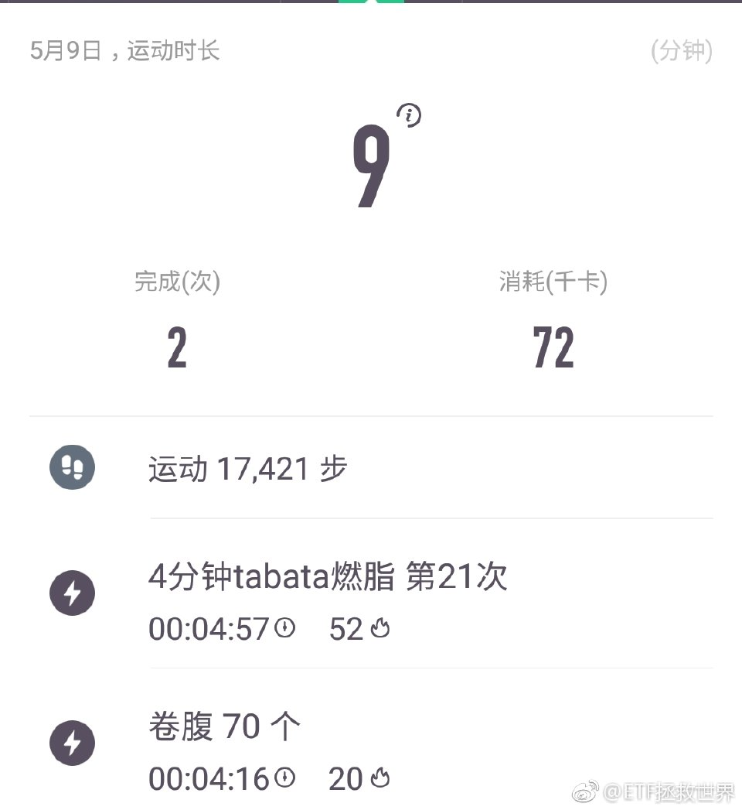

======================================================

ETF拯救世界 (5687069307) @
2018-05-11 09:35:47 Fri  
url: https://weibo.com/5687069307/Gg7AzdR3f

我觉得是不是应该调整调整了。这么拉上去不是事儿啊。//@ETF拯救世界:今天大概率继续光头，温和放量，可以说很舒服了。//@ETF拯救世界:A股就是这样，炒什么都是一把到底。简单粗暴，不讲节奏。

------------------------------------------------------
转推：
>  @ETF拯救世界 (5687069307)
>  2018-05-10 10:18:23 Thu  
>  url: https:/weibo.com/5687069307/GfYrmpzsh/

>  $全指医药 sh000991$   又内什么了。千万别内什么。 ​​​

转发[9]  评论[74]  赞[113] 

======================================================

ETF拯救世界 (5687069307) @
2018-05-11 09:41:28 Fri  
url: https://weibo.com/5687069307/Gg7CSz6Ng

目前$全指医药 sh000991$  与2015年12月底的点位差不多，但是估值已经从当时的69倍下降到41倍。

这就是成长的力量。这就是指数为什么长期看一定会向上的原因。 ​​​

转发[21]  评论[53]  赞[215] 

======================================================

ETF拯救世界 (5687069307) @
2018-05-11 09:49:16 Fri  
url: https://weibo.com/5687069307/Gg7G2rGSe

这几个月每天都说不要卖，现在有点懂了吧。我发的东西你当时不一定懂，几个月几年后再回头看才能明白。

------------------------------------------------------
转推：
>  @ETF拯救世界 (5687069307)
>  2018-04-12 11:14:37 Thu  
>  url: https:/weibo.com/5687069307/GbIQhdUab/

>  $全指医药 sh000991$   不要卖 ​​​

转发[6]  评论[62]  赞[169] 

======================================================

ETF拯救世界 (5687069307) @
2018-05-11 09:54:25 Fri  
url: https://weibo.com/5687069307/Gg7I8ta0k

总是忍不住卖掉上涨品种的朋友，我告诉你一个秘诀：

下次买场外基金试试。

眼不见为净。 ​​​

转发[25]  评论[90]  赞[243] 

======================================================

ETF拯救世界 (5687069307) @
2018-05-11 09:59:06 Fri  
url: https://weibo.com/5687069307/Gg7K2rd4B

回复@没人知道我是谁2011:你知道为什么很多人能在房子上赚钱吗。因为房子交易太麻烦了。如果房子也是有个市场每天开盘，点一下就卖出，90%的人拿不住非自住房。//@没人知道我是谁2011:是啊，所以我尽量买场外，感受区别太大了，这好像有生理上的原因。

------------------------------------------------------
转推：
>  @ETF拯救世界 (5687069307)
>  2018-05-11 09:54:25 Fri  
>  url: https:/weibo.com/5687069307/Gg7I8ta0k/

>  总是忍不住卖掉上涨品种的朋友，我告诉你一个秘诀：
>  
>  下次买场外基金试试。
>  
>  眼不见为净。 ​​​

转发[11]  评论[65]  赞[180] 

======================================================

ETF拯救世界 (5687069307) @
2018-05-11 10:41:42 Fri  
url: https://weibo.com/5687069307/Gg81krvma

感受一下。 [doge] ​​​

转发[15]  评论[68]  赞[208] 

+++++++++++++++++++++++++++++++++++++++++++++++++++++

图片：
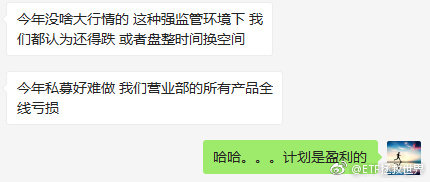

======================================================

ETF拯救世界 (5687069307) @
2018-05-11 10:58:56 Fri  
url: https://weibo.com/5687069307/Gg88kdJ8M

回复@你说吧___:我觉得不会。第三轮是从2015年7月初开始的，我公布的是长线投资计划，我自己还做了各种其他投资。比如分级A当时几个月赚了几十个点。如果我做私募，从2015年7月至今，收益率至少在70%以上。我很难相信这样的几乎不回撤，收益率又高的还要被喷。另外，评价一个组合，还是要经过一轮牛熊

------------------------------------------------------
转推：
>  @ETF拯救世界 (5687069307)
>  2018-05-11 10:41:42 Fri  
>  url: https:/weibo.com/5687069307/Gg81krvma/

>  感受一下。 [doge] ​​​

转发[6]  评论[35]  赞[181] 

======================================================

ETF拯救世界 (5687069307) @
2018-05-11 11:14:57 Fri  
url: https://weibo.com/5687069307/Gg8ePgcr7

还挺听话的。第一调整目标位10500吧。悠着点才对啊。//@ETF拯救世界:我觉得是不是应该调整调整了。这么拉上去不是事儿啊。//@ETF拯救世界:今天大概率继续光头，温和放量，可以说很舒服了。//@ETF拯救世界:A股就是这样，炒什么都是一把到底。简单粗暴，不讲节奏。

------------------------------------------------------
转推：
>  @ETF拯救世界 (5687069307)
>  2018-05-10 10:18:23 Thu  
>  url: https:/weibo.com/5687069307/GfYrmpzsh/

>  $全指医药 sh000991$   又内什么了。千万别内什么。 ​​​

转发[4]  评论[51]  赞[161] 

======================================================

ETF拯救世界 (5687069307) @
2018-05-11 14:02:50 Fri  
url: https://weibo.com/5687069307/Gg9kYe507

已经连续三天了。市场快速下跌的时候就拉起来。

咱们一起看看，这样的后果会怎样。观察。 ​​​

转发[6]  评论[86]  赞[219] 

======================================================

ETF拯救世界 (5687069307) @
2018-05-11 15:01:22 Fri  
url: https://weibo.com/5687069307/Gg9IJdHeP

谢谢队里的兄弟们，毕竟快15号了。 ​​​

转发[4]  评论[77]  赞[256] 

======================================================

ETF拯救世界 (5687069307) @
2018-05-11 15:30:22 Fri  
url: https://weibo.com/5687069307/Gg9Uv6wnj

有没有懂心理学的朋友帮我分析一下我的症状：

为什么我看到那些猛吹热门股，猛吹几年已经涨了几十倍上百倍还能再涨无限倍的人总是特别厌恶，特别特别不喜欢。包括大盘。明明已经涨到天上奇贵无比了还要吹黄金十年。

这个症状可能已经有十年了。我自己觉得可能是一种心理疾病，有没有懂的帮我分析分析 ​​​

转发[19]  评论[249]  赞[219] 

======================================================

ETF拯救世界 (5687069307) @
2018-05-11 17:02:50 Fri  
url: https://weibo.com/5687069307/Ggaw26H2n

为什么说十年呢。因为我第一次感觉自己有这个问题，是2007年。那时候有个叫沙 黾 农的，可能是当时新浪博客力推的吧。总之粉丝特别多，他就在一路说黄金十年，几万点。最高点也是，08年也是，结果当然不用说。当时我就非常气愤，都不看看数据吗？然而当时有种无力感，就是没人听你在说什么，更没人信你

------------------------------------------------------
转推：
>  @ETF拯救世界 (5687069307)
>  2018-05-11 15:30:22 Fri  
>  url: https:/weibo.com/5687069307/Gg9Uv6wnj/

>  有没有懂心理学的朋友帮我分析一下我的症状：
>  
>  为什么我看到那些猛吹热门股，猛吹几年已经涨了几十倍上百倍还能再涨无限倍的人总是特别厌恶，特别特别不喜欢。包括大盘。明明已经涨到天上奇贵无比了还要吹黄金十年。
>  
>  这个症状可能已经有十年了。我自己觉得可能是一种心理疾病，有没有懂的帮我分析分析 ​​​

转发[7]  评论[127]  赞[212] 

======================================================

ETF拯救世界 (5687069307) @
2018-05-11 17:20:44 Fri  
url: https://weibo.com/5687069307/GgaDis6iX

周末公众号必须发篇文章。无论写点什么，你可以监督。做不到的话请我吃饭。 ​​​

转发[7]  评论[261]  赞[567] 

======================================================

ETF拯救世界 (5687069307) @
2018-05-11 23:48:50 Fri  
url: https://weibo.com/5687069307/GgdaPDWYn

每日打卡（189）

今天是早上跑步。 ​​​

转发[1]  评论[37]  赞[202] 

+++++++++++++++++++++++++++++++++++++++++++++++++++++

图片：
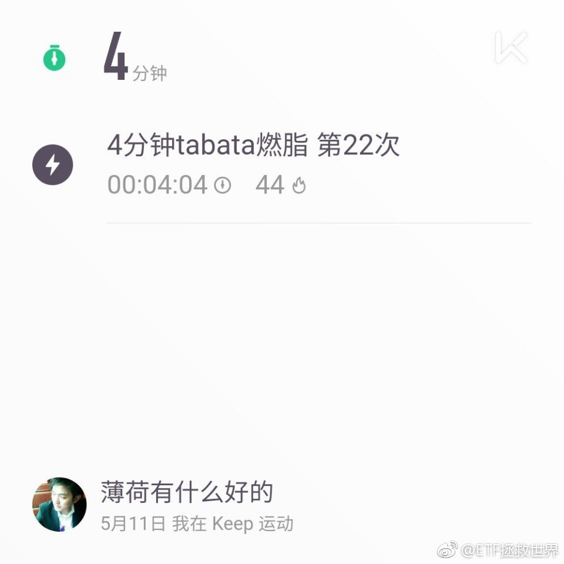

======================================================

ETF拯救世界 (5687069307) @
2018-05-13 21:50:13 Sun  
url: https://weibo.com/5687069307/GgvfG2yCL

有点感冒，今天先不练了 ​​​

转发[1]  评论[163]  赞[176] 

======================================================

ETF拯救世界 (5687069307) @
2018-05-14 12:04:35 Mon  
url: https://weibo.com/5687069307/GgAQsAGzr

没事，基本好了。这几天很忙。 ​​​

转发[0]  评论[97]  赞[340] 

======================================================

ETF拯救世界 (5687069307) @
2018-05-14 14:38:38 Mon  
url: https://weibo.com/5687069307/GgBQZs7tQ

周末实地调研一圈，才发现北京房价去年3月以来真的跌了。核心地区，学区跌的少一点，十个点左右。越往外跌得越多，3环就跌了20%。再往外就不知道了。

目前看影响二手市场的因素主要是信贷政策，真的是釜底抽薪。杠杆降下来很多人就买不起了。 ​​​

转发[20]  评论[281]  赞[334] 

======================================================

ETF拯救世界 (5687069307) @
2018-05-15 10:04:59 Tue  
url: https://weibo.com/5687069307/GgJupybuA

$全指医药 sh000991$   什么也不用说了吧。

在写东西。 ​​​

转发[4]  评论[244]  赞[310] 

======================================================

ETF拯救世界 (5687069307) @
2018-05-15 14:14:57 Tue  
url: https://weibo.com/5687069307/GgL7SguVn

什么意思，中午发车也会被截胡？ ​​​

转发[3]  评论[161]  赞[221] 

======================================================

ETF拯救世界 (5687069307) @
2018-05-15 14:42:02 Tue  
url: https://weibo.com/5687069307/GgLiRE7sU

$中证传媒 sz399971$   你们这帮操盘的心不会痛吗。 ​​​

转发[4]  评论[168]  赞[205] 

======================================================

ETF拯救世界 (5687069307) @
2018-05-15 16:00:21 Tue  
url: https://weibo.com/5687069307/GgLOFdqNy

医药20+了。未来A股所有品种都会有20+，而且只是起步。

投资应该是很快乐的一件事。 ​​​

转发[54]  评论[132]  赞[359] 

======================================================

ETF拯救世界 (5687069307) @
2018-05-15 16:52:08 Tue  
url: https://weibo.com/5687069307/GgM9G0Pue

回复@奇葩一朵一朵:这个结论现在不够稳。如果跌到我希望的4500-5000，这个实现的概率就非常非常大。而且不需要五年。//@奇葩一朵一朵:e大，现在买中证500，五年后是不是大概率15%的年化[阴险]@ETF拯救世界

------------------------------------------------------
转推：
>  @ETF拯救世界 (5687069307)
>  2018-05-15 16:00:21 Tue  
>  url: https:/weibo.com/5687069307/GgLOFdqNy/

>  医药20+了。未来A股所有品种都会有20+，而且只是起步。
>  
>  投资应该是很快乐的一件事。 ​​​

转发[44]  评论[37]  赞[148] 

======================================================

ETF拯救世界 (5687069307) @
2018-05-15 17:01:11 Tue  
url: https://weibo.com/5687069307/GgMdm8F74

刚才我看这几张图，你有没有发现特别像非洲草原上的鬣狗。一群小鬣狗在猎物体力不支的时候一起冲上去大吃一顿……

对方有力气的时候，只是找机会咬一口就跑，然后很长时间不动，静静等机会。

机会来了就一顿咬。

感受一下。小红剪头。 ​​​

转发[30]  评论[98]  赞[206] 

+++++++++++++++++++++++++++++++++++++++++++++++++++++

图片：

======================================================

ETF拯救世界 (5687069307) @
2018-05-15 17:22:25 Tue  
url: https://weibo.com/5687069307/GgMlY8jWo

回复@橄榄树_枝:不知道，看命。因为我不知道下轮牛市什么时候来，最终幅度有多少，我们能坚持到哪里。我只能尽量把自己的成本压到力所能及的最低，无论未来发生什么都掌握主动权。//@橄榄树_枝:老大，未来牛市高位卖出后，本轮计划年化大概能到多少？

------------------------------------------------------
转推：
>  @ETF拯救世界 (5687069307)
>  2018-05-15 16:00:21 Tue  
>  url: https:/weibo.com/5687069307/GgLOFdqNy/

>  医药20+了。未来A股所有品种都会有20+，而且只是起步。
>  
>  投资应该是很快乐的一件事。 ​​​

转发[25]  评论[35]  赞[197] 

======================================================

ETF拯救世界 (5687069307) @
2018-05-15 17:55:48 Tue  
url: https://weibo.com/5687069307/GgMzwdbbs

回复@梦之彼方2082:上次在目前估值是2013年12月，这5.5年涨了61%。这应该就是你说的“正常收益”。碰到牛市的话，是2年后涨了205%。这就是你说的“意外之财”

------------------------------------------------------
转推：
>  @ETF拯救世界 (5687069307)
>  2018-05-15 16:00:21 Tue  
>  url: https:/weibo.com/5687069307/GgLOFdqNy/

>  医药20+了。未来A股所有品种都会有20+，而且只是起步。
>  
>  投资应该是很快乐的一件事。 ​​​

转发[14]  评论[55]  赞[202] 

======================================================

ETF拯救世界 (5687069307) @
2018-05-16 09:21:27 Wed  
url: https://weibo.com/5687069307/GgSDen3DI

活久见。A股的韭菜就是好割。

------------------------------------------------------
转推：
>  @ETF拯救世界 (5687069307)
>  2018-02-28 09:42:18 Wed  
>  url: https:/weibo.com/5687069307/G5aRt5yih/

>  今天3 6 0市值4000多亿。在美国退市前600多亿。公司没变，市值增加6倍多。
>  
>  大型魔幻现场。 ​​​

转发[10]  评论[57]  赞[155] 

======================================================

ETF拯救世界 (5687069307) @
2018-05-16 09:40:44 Wed  
url: https://weibo.com/5687069307/GgSL4c9LS

回复@vivi6073007160:当然。任何与合作有关的事，都要看人品。这个世界上没有神圣的人，不能要求别人一尘不染。但有一点，一定要有底线。没有底线的人，一定要离得越远越好。//@vivi6073007160:三六零现在缺钱吗？买股票是不是也看看人品

------------------------------------------------------
转推：
>  @ETF拯救世界 (5687069307)
>  2018-02-28 09:42:18 Wed  
>  url: https:/weibo.com/5687069307/G5aRt5yih/

>  今天3 6 0市值4000多亿。在美国退市前600多亿。公司没变，市值增加6倍多。
>  
>  大型魔幻现场。 ​​​

转发[7]  评论[24]  赞[155] 

======================================================

ETF拯救世界 (5687069307) @
2018-05-16 09:53:05 Wed  
url: https://weibo.com/5687069307/GgSQ4qn66

$全指医药 sh000991$   即使你NB的在上周四卖掉，躲过周五的暴跌。然而如果你周五周一没有买回来，现在还是少赚了。

那么你一直持有到周四卖掉，周五周一买回来的概率有多大呢。

操作一次收益率增加了多少呢。买不回来的概率多大呢。

这就是投资。 ​​​

转发[21]  评论[68]  赞[234] 

======================================================

ETF拯救世界 (5687069307) @
2018-05-16 10:04:44 Wed  
url: https://weibo.com/5687069307/GgSUOutcW

2007年也有人说“死了都不卖”。结果真的死了。

我经常说不要卖，与那个截然不同。昨天贴的图你也能看出来，我们的品种都是底部辛辛苦苦收集到的廉价筹码，这样的操作是大机构级别的收集筹码形态，不是追高暴涨品种拿到的。

既然收集筹码这么辛苦，赚一二十个点就走吗。那不是我的目标。

成本低，品 ​​​

转发[66]  评论[108]  赞[357] 

======================================================

ETF拯救世界 (5687069307) @
2018-05-16 10:07:15 Wed  
url: https://weibo.com/5687069307/GgSVPpHwD

另外，我与很多人不同的是，涨起来了我就不会吹还有多好，还能涨多少，空间还很大，暗示你现在买可以赚很多。我做不到这样的事，我希望你们成本都比我低，我赔了你们都在赚才好。我不希望忽悠任何人帮我抬轿子。看着那种人我都生气……

------------------------------------------------------
转推：
>  @ETF拯救世界 (5687069307)
>  2018-05-16 10:04:44 Wed  
>  url: https:/weibo.com/5687069307/GgSUOutcW/

>  2007年也有人说“死了都不卖”。结果真的死了。
>  
>  我经常说不要卖，与那个截然不同。昨天贴的图你也能看出来，我们的品种都是底部辛辛苦苦收集到的廉价筹码，这样的操作是大机构级别的收集筹码形态，不是追高暴涨品种拿到的。
>  
>  既然收集筹码这么辛苦，赚一二十个点就走吗。那不是我的目标。
>  
>  成本低，品 ​​​

转发[13]  评论[84]  赞[348] 

======================================================

ETF拯救世界 (5687069307) @
2018-05-16 10:57:05 Wed  
url: https://weibo.com/5687069307/GgTg3u3p1

恭喜  $全指医药 sh000991$  喜提新高。

左手事业，右手家庭，幸福人生！ ​​​

转发[26]  评论[63]  赞[246] 

======================================================

ETF拯救世界 (5687069307) @
2018-05-16 11:07:16 Wed  
url: https://weibo.com/5687069307/GgTkbFS8i

回复@韩跑跑走一走:正常的生理反应。很多人吓得已经点击卖出了。//@韩跑跑走一走:这么拉，我有点害怕啊。。。

------------------------------------------------------
转推：
>  @ETF拯救世界 (5687069307)
>  2018-05-16 10:57:05 Wed  
>  url: https:/weibo.com/5687069307/GgTg3u3p1/

>  恭喜  $全指医药 sh000991$  喜提新高。
>  
>  左手事业，右手家庭，幸福人生！ ​​​

转发[15]  评论[30]  赞[114] 

======================================================

ETF拯救世界 (5687069307) @
2018-05-16 11:11:30 Wed  
url: https://weibo.com/5687069307/GgTlUDtgt

投资这件事，要自始至终都是反人性的。

买入，持有，卖出。全都是。

只有做到一般人做不到的事，才能赚到一般人赚不到的钱。 ​​​

转发[58]  评论[68]  赞[370] 

======================================================

ETF拯救世界 (5687069307) @
2018-05-16 11:17:04 Wed  
url: https://weibo.com/5687069307/GgToapMMM

回复@stealstar612:不知道你是什么品种。你这么高开始，年化15%不容易。//@stealstar612:我打算浮盈45%左右才会分批卖出。2015年7月最高点开始定投，坚持了快3年，不可能平均年率15%都不到就卖出的。//@ETF拯救世界:回复@韩跑跑走一走:正常的生理反应。很多人吓得已经点击卖出了。

------------------------------------------------------
转推：
>  @ETF拯救世界 (5687069307)
>  2018-05-16 10:57:05 Wed  
>  url: https:/weibo.com/5687069307/GgTg3u3p1/

>  恭喜  $全指医药 sh000991$  喜提新高。
>  
>  左手事业，右手家庭，幸福人生！ ​​​

转发[13]  评论[48]  赞[115] 

======================================================

ETF拯救世界 (5687069307) @
2018-05-16 13:16:13 Wed  
url: https://weibo.com/5687069307/GgUax4DON

回复@梁小雨:第三轮是最高点开始的。因为那时候第二轮正式结束//@梁小雨:回复@终于找到在哪改名字:而且，他是最高点开始的，Ｅ大是股灾后开始的，再加上计划的科学性…这样的差距不是一点点//@ETF拯救世界:回复@stealstar612:不知道你是什么品种。你这么高开始，年化15%不容易。

------------------------------------------------------
转推：
>  @ETF拯救世界 (5687069307)
>  2018-05-16 10:57:05 Wed  
>  url: https:/weibo.com/5687069307/GgTg3u3p1/

>  恭喜  $全指医药 sh000991$  喜提新高。
>  
>  左手事业，右手家庭，幸福人生！ ​​​

转发[0]  评论[20]  赞[114] 

======================================================

ETF拯救世界 (5687069307) @
2018-05-16 13:36:03 Wed  
url: https://weibo.com/5687069307/GgUiAaLet

$养老产业 sz399812$ 新高。

该说的每天都说，不说了。好好享受吧。 ​​​

转发[5]  评论[48]  赞[177] 

======================================================

ETF拯救世界 (5687069307) @
2018-05-16 13:45:55 Wed  
url: https://weibo.com/5687069307/GgUmAnEoJ

看评论就知道，即使底部能买够，也至少有一半的人要浪费牛市。

无论你卖对多少次，一次错误就会大幅拉低你的收益率。

这是训练。 ​​​

转发[34]  评论[146]  赞[373] 

======================================================

ETF拯救世界 (5687069307) @
2018-05-17 09:30:33 Thu  
url: https://weibo.com/5687069307/Gh27qygYd

$162411  开始挑战2016年高点。 ​​​

转发[1]  评论[52]  赞[162] 

======================================================

ETF拯救世界 (5687069307) @
2018-05-17 09:39:30 Thu  
url: https://weibo.com/5687069307/Gh2b42qQ1

我来告诉你一个残酷的事实，为什么你拿不住上涨的品种：

因为你穷。

[并不简单] ​​​

转发[260]  评论[303]  赞[715] 

======================================================

ETF拯救世界 (5687069307) @
2018-05-17 09:52:38 Thu  
url: https://weibo.com/5687069307/Gh2gom1xv

回复@观音山上拜观音:不需要这份钱迅速增值改善生活，就能拿得住。今天看了一个新闻，说有人找回20年前的股票1500变成50万，大概一个意思。总想快进快出抓住每一个机会，就不容易拿住。

------------------------------------------------------
转推：
>  @ETF拯救世界 (5687069307)
>  2018-05-17 09:39:30 Thu  
>  url: https:/weibo.com/5687069307/Gh2b42qQ1/

>  我来告诉你一个残酷的事实，为什么你拿不住上涨的品种：
>  
>  因为你穷。
>  
>  [并不简单] ​​​

转发[14]  评论[46]  赞[201] 

======================================================

ETF拯救世界 (5687069307) @
2018-05-17 11:20:43 Thu  
url: https://weibo.com/5687069307/Gh2Q99YPr

昨天评论里说是不是牛市来了，感觉不会跌了的朋友。

有没有又感觉熊市来了，感觉很难再涨了。

不要感觉，不要预判。用数据分析概率。 ​​​

转发[20]  评论[159]  赞[311] 

======================================================

ETF拯救世界 (5687069307) @
2018-05-17 13:23:30 Thu  
url: https://weibo.com/5687069307/Gh3DZqtj5

回复@年轻的真的:有可能结束了啊，什么都有可能发生。但是这跟我们长期持有没有任何关系。//@年轻的真的:前两天，趋势交易的奶爸发文说医药行情到头了！[允悲]

------------------------------------------------------
转推：
>  @ETF拯救世界 (5687069307)
>  2018-05-17 11:20:43 Thu  
>  url: https:/weibo.com/5687069307/Gh2Q99YPr/

>  昨天评论里说是不是牛市来了，感觉不会跌了的朋友。
>  
>  有没有又感觉熊市来了，感觉很难再涨了。
>  
>  不要感觉，不要预判。用数据分析概率。 ​​​

转发[0]  评论[31]  赞[128] 

======================================================

ETF拯救世界 (5687069307) @
2018-05-17 13:44:40 Thu  
url: https://weibo.com/5687069307/Gh3MzCAzc

趋势交易也没什么不好，只要你会用。2008年我没赔钱，我说实话，是趋势救了我。

就凭这一张图。

因为根据价值，6000跌到3000怎么也要进去了，可是趋势明明白白是不行。最后干到1600。

但是趋势不是根本。是参考。我们买卖一个东西，根本还是那个东西值多少钱。这才是做生意的根本。

而且，趋势有时 ​​​

转发[133]  评论[190]  赞[259] 

+++++++++++++++++++++++++++++++++++++++++++++++++++++

图片：
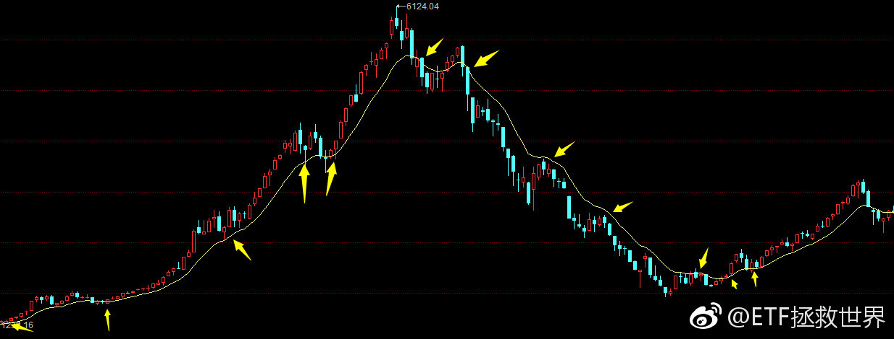

======================================================

ETF拯救世界 (5687069307) @
2018-05-17 14:35:42 Thu  
url: https://weibo.com/5687069307/Gh47iqdhK

里面有个人，不然哪用那么大的柜子。怎么讲，弄个铁壳子躲在里面贴膜，这生意很好做了，一个月赚一万。推荐给缺钱的朋友。

------------------------------------------------------
转推：
>  @新财富杂志 (1708922835)
>  2018-05-17 14:29:09 Thu  
>  url: https:/weibo.com/1708922835/Gh44Dcvl0/

>  【祖传贴膜要失业了！贴膜机器人上线 轻松月入过万】"无气泡、无失误、4分钟精准贴膜"...近日，一台方形机器人现身长沙理工大学云塘校区，扫描二维码付款就能贴膜，且能识别一百多种主流手机型号。发明人透露，机器人一个月能收入1.5万元。网友：贴膜小哥哭晕在天桥…[喵喵][喵喵]http://t.cn/R3pZNLk ​​​

转发[7]  评论[71]  赞[116] 

======================================================

ETF拯救世界 (5687069307) @
2018-05-17 14:55:01 Thu  
url: https://weibo.com/5687069307/Gh4f8comA

$160416  石油基金已经回到2014年的价格了…… ​​​

转发[7]  评论[27]  赞[143] 

======================================================

ETF拯救世界 (5687069307) @
2018-05-17 15:06:36 Thu  
url: https://weibo.com/5687069307/Gh4jQ843n

回复@佩清06587:比计划多点，但也不多。是真的买少了。这个品种我2016年就在雪球说过，比较后悔没有在计划里继续再买一份。到现在为止第三轮计划只后悔这个。如果勉强的话还可以加上那次限价的食品饮料……//@佩清06587:回复@谷爆:你的是一点点，别人的很多的[二哈]

------------------------------------------------------
转推：
>  @ETF拯救世界 (5687069307)
>  2018-05-17 14:55:01 Thu  
>  url: https:/weibo.com/5687069307/Gh4f8comA/

>  $160416  石油基金已经回到2014年的价格了…… ​​​

转发[3]  评论[31]  赞[114] 

======================================================

ETF拯救世界 (5687069307) @
2018-05-17 15:51:26 Thu  
url: https://weibo.com/5687069307/Gh4C243vh

从今天的数据看，现在买印度还不如买沪深300。上证50比它便宜一半。

比两年前贵了60%。

我反正不会买。 ​​​

转发[11]  评论[51]  赞[182] 

======================================================

ETF拯救世界 (5687069307) @
2018-05-17 16:38:48 Thu  
url: https://weibo.com/5687069307/Gh4Vg1Ncc

回复@饿鱼000:2008年5月，上证3400点，当时全市场外部数据加权估值是32倍。一个月后跌到2700点，该数据是26倍。最低是10月的16倍，1700点。今天收盘是27倍。//@饿鱼000:请教E大，当年指数从6000到3000时，市盈率大概在什么位置？

------------------------------------------------------
转推：
>  @ETF拯救世界 (5687069307)
>  2018-05-17 13:44:40 Thu  
>  url: https:/weibo.com/5687069307/Gh3MzCAzc/

>  趋势交易也没什么不好，只要你会用。2008年我没赔钱，我说实话，是趋势救了我。
>  
>  就凭这一张图。
>  
>  因为根据价值，6000跌到3000怎么也要进去了，可是趋势明明白白是不行。最后干到1600。
>  
>  但是趋势不是根本。是参考。我们买卖一个东西，根本还是那个东西值多少钱。这才是做生意的根本。
>  
>  而且，趋势有时 ​​​

转发[26]  评论[54]  赞[117] 

======================================================

ETF拯救世界 (5687069307) @
2018-05-17 16:39:49 Thu  
url: https://weibo.com/5687069307/Gh4VG39zY

回复@E7ic:我说的是估值，不是指数。至于为什么指数与估值同步，我就不知道了。没有研究过印度30的成长性。//@E7ic:为嘛指数极值波动60%就是贵了60%，印度不成长嘛？

------------------------------------------------------
转推：
>  @ETF拯救世界 (5687069307)
>  2018-05-17 15:51:26 Thu  
>  url: https:/weibo.com/5687069307/Gh4C243vh/

>  从今天的数据看，现在买印度还不如买沪深300。上证50比它便宜一半。
>  
>  比两年前贵了60%。
>  
>  我反正不会买。 ​​​

转发[5]  评论[29]  赞[122] 

======================================================

ETF拯救世界 (5687069307) @
2018-05-17 21:53:56 Thu  
url: https://weibo.com/5687069307/Gh6ZauPmr

做波段非常合适 ​​​

转发[10]  评论[89]  赞[194] 

+++++++++++++++++++++++++++++++++++++++++++++++++++++

图片：

======================================================

ETF拯救世界 (5687069307) @
2018-05-18 07:35:18 Fri  
url: https://weibo.com/5687069307/GhaN9t79a

回复@你在红楼我在西游V:这种事情会不断发生。所以我说，在很差的时候不要再听这种言论。当然，很少有人能做到。慢慢训练吧

------------------------------------------------------
转推：
>  @ETF拯救世界 (5687069307)
>  2018-05-17 21:53:56 Thu  
>  url: https:/weibo.com/5687069307/Gh6ZauPmr/

>  做波段非常合适 ​​​

转发[4]  评论[45]  赞[140] 

======================================================

ETF拯救世界 (5687069307) @
2018-05-18 09:58:49 Fri  
url: https://weibo.com/5687069307/GhbJoCgHf

这就是阴跌。其实阴跌最大的伤害是让你丧失希望，其它的倒也无所谓。账面市值可以通过各种办法保住。熊市不是没机会，尽量不赔钱。赔一点也没事。最重要的是要保持希望。

------------------------------------------------------
转推：
>  @ETF拯救世界 (5687069307)
>  2018-05-03 11:25:05 Thu  
>  url: https:/weibo.com/5687069307/GeUSY6sMB/

>  从现在起，各位做好心理准备，迎接漫漫阴跌吧。没什么大问题，解决心理问题以后逢低布局就可以。
>  
>  最主要是心理问题。所有希望都被磨平后的麻木与绝望是需要警惕的。 ​​​

转发[43]  评论[67]  赞[210] 

======================================================

ETF拯救世界 (5687069307) @
2018-05-18 10:01:35 Fri  
url: https://weibo.com/5687069307/GhbKwqSR9

回复@ss游鱼:没有就没有呗。每个人都有自己的命运，改变不了。我管得了这么多吗？我只能做好我自己的事。//@ss游鱼:问题是，你能坚持，跟随的人有能力耐心坚持？

------------------------------------------------------
转推：
>  @ETF拯救世界 (5687069307)
>  2018-05-03 11:25:05 Thu  
>  url: https:/weibo.com/5687069307/GeUSY6sMB/

>  从现在起，各位做好心理准备，迎接漫漫阴跌吧。没什么大问题，解决心理问题以后逢低布局就可以。
>  
>  最主要是心理问题。所有希望都被磨平后的麻木与绝望是需要警惕的。 ​​​

转发[20]  评论[99]  赞[227] 

======================================================

ETF拯救世界 (5687069307) @
2018-05-18 10:11:34 Fri  
url: https://weibo.com/5687069307/GhbOA9MHc

回复@ss游鱼:我就想问你你想让我怎么做？该说的我从2015年开始就每次发车都说：熊市可能3-5年，每次品种也有最大下跌幅度，30%-50%。每次都提醒可能会很黑暗。我还应该做什么，您指教一下？现在几乎所有品种都赚钱，还会有这种质疑。我不敢想象真的最黑暗的时候会有怎样的声音。

------------------------------------------------------
转推：
>  @ETF拯救世界 (5687069307)
>  2018-05-03 11:25:05 Thu  
>  url: https:/weibo.com/5687069307/GeUSY6sMB/

>  从现在起，各位做好心理准备，迎接漫漫阴跌吧。没什么大问题，解决心理问题以后逢低布局就可以。
>  
>  最主要是心理问题。所有希望都被磨平后的麻木与绝望是需要警惕的。 ​​​

转发[6]  评论[89]  赞[171] 

======================================================

ETF拯救世界 (5687069307) @
2018-05-18 10:15:39 Fri  
url: https://weibo.com/5687069307/GhbQemCZo

回复@ss游鱼:好的。为了避免你影响我情绪导致恒生大底的事再次发生，拉黑不见，拜拜了您呐。//@ss游鱼:回复@ETF拯救世界:你有信心就好哈。可能我对接下来比较悲观。没有，只是我个人想法而已。你按照理念就好了。

------------------------------------------------------
转推：
>  @ETF拯救世界 (5687069307)
>  2018-05-03 11:25:05 Thu  
>  url: https:/weibo.com/5687069307/GeUSY6sMB/

>  从现在起，各位做好心理准备，迎接漫漫阴跌吧。没什么大问题，解决心理问题以后逢低布局就可以。
>  
>  最主要是心理问题。所有希望都被磨平后的麻木与绝望是需要警惕的。 ​​​

转发[8]  评论[97]  赞[212] 

======================================================

ETF拯救世界 (5687069307) @
2018-05-18 10:22:36 Fri  
url: https://weibo.com/5687069307/GhbT3koT8

商品的周期，一般都是大周期。多大，很多时候需要用十年这个周期去衡量。

稍微给点耐心。 ​​​

转发[52]  评论[65]  赞[227] 

======================================================

ETF拯救世界 (5687069307) @
2018-05-18 10:42:19 Fri  
url: https://weibo.com/5687069307/Ghc13ujcD

毒奶功力还在。 ​​​

转发[72]  评论[42]  赞[174] 

======================================================

ETF拯救世界 (5687069307) @
2018-05-18 11:15:09 Fri  
url: https://weibo.com/5687069307/GhcenFhnx

回复@Terry张_:会有影响。会调整策略参数应对。//@Terry张_:@ETF拯救世界 E大，现在减少千亿美元的贸易逆差已成定局，那意味着将会大量进口外国产品，或减少出口，拿这个对上市企业盈利肯定有大影响吧？这个变量会对估值产生影响吗？谢谢

------------------------------------------------------
转推：
>  @ETF拯救世界 (5687069307)
>  2018-05-18 10:42:19 Fri  
>  url: https:/weibo.com/5687069307/Ghc13ujcD/

>  毒奶功力还在。 ​​​

转发[71]  评论[19]  赞[131] 

======================================================

ETF拯救世界 (5687069307) @
2018-05-18 11:17:25 Fri  
url: https://weibo.com/5687069307/GhcfjgSyU

回复@waslj0603:对很多人来说，坑是灾难。对另一些人来说，坑里有钻石。区别在于，你是否对随时可能会出现的坑做好思想准备，以及，坑真的出现后，你是否准备好了挖钻石的铲子。//@waslj0603:油气最多时亏了20个点，网格和套利现在盈利40几个点[拜拜]

------------------------------------------------------
转推：
>  @ETF拯救世界 (5687069307)
>  2018-05-18 10:22:36 Fri  
>  url: https:/weibo.com/5687069307/GhbT3koT8/

>  商品的周期，一般都是大周期。多大，很多时候需要用十年这个周期去衡量。
>  
>  稍微给点耐心。 ​​​

转发[27]  评论[38]  赞[183] 

======================================================

ETF拯救世界 (5687069307) @
2018-05-18 11:31:54 Fri  
url: https://weibo.com/5687069307/GhclbEnPR

回复@Terry张_:我分享一个经验，那就是每天看财经新闻，你会发现每天都在危机中。至少过去十几年，几乎没有一天是没事的。其实到最后，真的没事。哪怕有过百年不遇金融危机。自己坚持一些原则，比如没有大的杠杆，保持现金流，适度保守，分散投资，危机中敢于买入，最后结果都不会太差。视野还是要放远

------------------------------------------------------
转推：
>  @ETF拯救世界 (5687069307)
>  2018-05-18 10:42:19 Fri  
>  url: https:/weibo.com/5687069307/Ghc13ujcD/

>  毒奶功力还在。 ​​​

转发[64]  评论[124]  赞[381] 

======================================================

ETF拯救世界 (5687069307) @
2018-05-18 13:21:05 Fri  
url: https://weibo.com/5687069307/Ghd3utkKY

目前计划里面，大盘价值股建仓大概一半了，中盘医药大概一半，小盘信息消费发达国家等不到10%，很舒服。 ​​​

转发[9]  评论[106]  赞[267] 

======================================================

ETF拯救世界 (5687069307) @
2018-05-18 14:41:44 Fri  
url: https://weibo.com/5687069307/GhdAevpiI

$中证传媒 sz399971$   人家中石油带着上证涨你来什么劲…… ​​​

转发[26]  评论[55]  赞[166] 

======================================================

ETF拯救世界 (5687069307) @
2018-05-18 15:17:36 Fri  
url: https://weibo.com/5687069307/GhdONhfrw

今天可能涨0.3%-0.4%。以这个仓位，基本跟上全市场涨幅了。毕竟今天还有1000多只股票下跌。

还有不到1%就又新高了。总而言之上涨下跌都ok的状态是最好的。像上午那位担心未来而空仓，一点都不敢买的，碰到上涨心态很容易失衡。心态完了就都完了。 ​​​

转发[15]  评论[90]  赞[281] 

======================================================

ETF拯救世界 (5687069307) @
2018-05-18 16:54:18 Fri  
url: https://weibo.com/5687069307/Ghes2DF3O

低调的重要性怎么强调都不为过。真的。

------------------------------------------------------
转推：
>  @ ()
>  2018-05-18 16:47:01 Fri  
>  url: 

>  抱歉，作者已设置仅展示半年内微博，此微博已不可见。 ​​​

转发[22]  评论[123]  赞[227] 

======================================================

ETF拯救世界 (5687069307) @
2018-05-19 19:40:05 Sat  
url: https://weibo.com/5687069307/GhoXPxKW4

回复@年轻的真的:所以开车的，低位应该买油气对冲油价上涨。弄不好十年二十年油钱赚出来了。现在就别追了。

------------------------------------------------------
转推：
>  @ETF拯救世界 (5687069307)
>  2018-05-18 14:41:44 Fri  
>  url: https:/weibo.com/5687069307/GhdAevpiI/

>  $中证传媒 sz399971$   人家中石油带着上证涨你来什么劲…… ​​​

转发[22]  评论[76]  赞[178] 

======================================================

ETF拯救世界 (5687069307) @
2018-05-21 09:40:09 Mon  
url: https://weibo.com/5687069307/GhDTjorm6

回复@羊样佯徉烊蛘珜垟眻:我不敢奶。我还是挺希望它涨的。因为给它的仓位已经配置的差不多了，基本不会再买太多了。ps，你这个头像怎么回事。//@羊样佯徉烊蛘珜垟眻:今天环保要飞车……[doge]

------------------------------------------------------
转推：
>  @ETF拯救世界 (5687069307)
>  2018-05-18 14:41:44 Fri  
>  url: https:/weibo.com/5687069307/GhdAevpiI/

>  $中证传媒 sz399971$   人家中石油带着上证涨你来什么劲…… ​​​

转发[8]  评论[30]  赞[114] 

======================================================

ETF拯救世界 (5687069307) @
2018-05-21 09:47:58 Mon  
url: https://weibo.com/5687069307/GhDWurETV

账户利润在奔跑。还差0.5%新高。

做A股为什么会赔钱，不懂。 ​​​

转发[3]  评论[48]  赞[223] 

======================================================

ETF拯救世界 (5687069307) @
2018-05-21 09:50:20 Mon  
url: https://weibo.com/5687069307/GhDXrxDMH

回复@不可思议的暖:月初错过一次买入机会。不过下一波热点大概率不是它。//@不可思议的暖:e大消费指数还没到开始可以开始买入的位置吗？//@ETF拯救世界:回复@羊样佯徉烊蛘珜垟眻:我不敢奶。我还是挺希望它涨的。因为给它的仓位已经配置的差不多了，基本不会再买太多了。ps，你这个头像怎么回事。

------------------------------------------------------
转推：
>  @ETF拯救世界 (5687069307)
>  2018-05-18 14:41:44 Fri  
>  url: https:/weibo.com/5687069307/GhdAevpiI/

>  $中证传媒 sz399971$   人家中石油带着上证涨你来什么劲…… ​​​

转发[5]  评论[40]  赞[102] 

======================================================

ETF拯救世界 (5687069307) @
2018-05-21 10:41:25 Mon  
url: https://weibo.com/5687069307/GhEibeTnT

怀疑人生了 ​​​

转发[83]  评论[54]  赞[175] 

+++++++++++++++++++++++++++++++++++++++++++++++++++++

图片：

======================================================

ETF拯救世界 (5687069307) @
2018-05-21 10:53:22 Mon  
url: https://weibo.com/5687069307/GhEn23g3F

回复@狂奔笨狼:500是坠吼的宽基。以后就知道了。//@狂奔笨狼:500也要怀疑人生[笑cry][笑cry]

------------------------------------------------------
转推：
>  @ETF拯救世界 (5687069307)
>  2018-05-21 10:41:25 Mon  
>  url: https:/weibo.com/5687069307/GhEibeTnT/

>  怀疑人生了 ​​​

转发[78]  评论[40]  赞[137] 

======================================================

ETF拯救世界 (5687069307) @
2018-05-21 11:04:27 Mon  
url: https://weibo.com/5687069307/GhErx4qxm

回复@年轻的真的:未来赚钱的格局中，一定是宽基赚钱最多，因为配置的最多。涨幅不一定是最大，但主力一定是宽基。其它的角色不一样。有医药这样在弱市中挣分的，也有在牛市中狂奔的。可以说非常舒服。//@年轻的真的:懂e大的意思了，500肯定是未来e家军赚钱的一支劲旅！

------------------------------------------------------
转推：
>  @ETF拯救世界 (5687069307)
>  2018-05-21 10:41:25 Mon  
>  url: https:/weibo.com/5687069307/GhEibeTnT/

>  怀疑人生了 ​​​

转发[73]  评论[37]  赞[152] 

======================================================

ETF拯救世界 (5687069307) @
2018-05-21 11:16:03 Mon  
url: https://weibo.com/5687069307/GhEweEQDc

回复@大叔爱吃素:500不一定狂奔。它能保证跟上牛市的涨幅，这已经非常难能可贵。牛市中至少有一半股票涨幅跟不上指数。军工和信息狂奔的概率非常大。//@大叔爱吃素:请问E大，牛市狂奔的品种，除了证券，创业板，中证500外，还有其他的么？

------------------------------------------------------
转推：
>  @ETF拯救世界 (5687069307)
>  2018-05-21 10:41:25 Mon  
>  url: https:/weibo.com/5687069307/GhEibeTnT/

>  怀疑人生了 ​​​

转发[43]  评论[67]  赞[156] 

======================================================

ETF拯救世界 (5687069307) @
2018-05-21 13:36:35 Mon  
url: https://weibo.com/5687069307/GhFrh5LRb

场内 $162411 油气居然溢价了。群众情绪转变的很快。 ​​​

转发[4]  评论[32]  赞[182] 

======================================================

ETF拯救世界 (5687069307) @
2018-05-21 13:38:06 Mon  
url: https://weibo.com/5687069307/GhFrTc4dp

人生啊，就是一个麻烦接一个麻烦。

解决麻烦去了。 ​​​

转发[5]  评论[107]  赞[246] 

======================================================

ETF拯救世界 (5687069307) @
2018-05-21 19:21:50 Mon  
url: https://weibo.com/5687069307/GhHHq2BUM

如果这样，分级b，尤其是深成b要死人了//@时光精致:分级的玩法消失。。。

------------------------------------------------------
转推：
>  @财联社APP (2868676035)
>  2018-05-21 18:41:03 Mon  
>  url: https:/weibo.com/2868676035/GhHqRw8cC/

>  【基金公司人士：监管要求6月30日之前分级基金要转型成指数基金】财联社5月21日讯，从多家基金公司获悉，关于分级基金有了进一步的窗口指导，其中关键的一点就是分级的存续期可能不会等到2020年底了。有基金公司人士表示，"最近确实接到了通知，要求在6月30日之前分级基金要转型，转型成指数基金。"（ ​​​

转发[19]  评论[84]  赞[113] 

======================================================

ETF拯救世界 (5687069307) @
2018-05-22 06:31:48 Tue  
url: https://weibo.com/5687069307/GhM5mfDld

持有才能赚钱 ​​​

转发[13]  评论[117]  赞[281] 

+++++++++++++++++++++++++++++++++++++++++++++++++++++

图片：
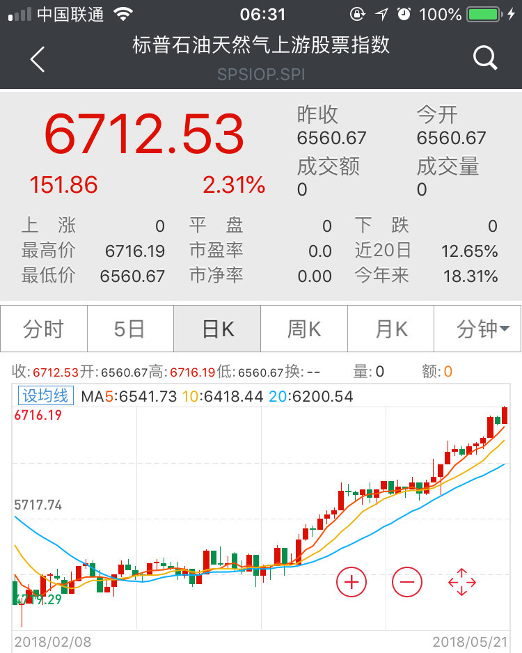

======================================================

ETF拯救世界 (5687069307) @
2018-05-22 09:33:53 Tue  
url: https://weibo.com/5687069307/GhNhgqNiO

连续剧，第二季开始了。

------------------------------------------------------
转推：
>  @ ()
>  2018-05-21 18:17:48 Mon  
>  url: 

>  抱歉，此微博已被作者删除。查看帮助：http://t.cn/Rfd3rQV

转发[4]  评论[51]  赞[70] 

======================================================

ETF拯救世界 (5687069307) @
2018-05-22 09:47:05 Tue  
url: https://weibo.com/5687069307/GhNmCyWdR

$150023 深成B ，一声叹息。

老朋友都知道，两年前我跟一位分级专家有过关于分级基金的一些争论。这位分级专家后来到我的aeb组合下面留言，说没有他的组合做得好。

后来他的一个组合做的确实不错，最高做到了2。

后来，就没有后来了。豪赌深成B，近乎满仓，组合自最高点即将腰斩，目前净值1.11。另 ​​​

转发[41]  评论[116]  赞[230] 

======================================================

ETF拯救世界 (5687069307) @
2018-05-22 09:50:05 Tue  
url: https://weibo.com/5687069307/GhNnQdu11

回复@股市少先队员:我建议你下个抖音。我昨天下了一个，看了几个化妆视频。暗下决心，以后再也不相信美女了。除非看过卸妆后的样子……//@股市少先队员:欣欣长相是我心中的女神//@ETF拯救世界:连续剧，第二季开始了。

------------------------------------------------------
转推：
>  @ ()
>  2018-05-21 18:17:48 Mon  
>  url: 

>  抱歉，此微博已被作者删除。查看帮助：http://t.cn/Rfd3rQV

转发[1]  评论[33]  赞[83] 

======================================================

ETF拯救世界 (5687069307) @
2018-05-22 09:52:12 Tue  
url: https://weibo.com/5687069307/GhNoHpm4t

$全指医药 sh000991$   又来？随时受不了。 ​​​

转发[1]  评论[41]  赞[150] 

======================================================

ETF拯救世界 (5687069307) @
2018-05-22 10:14:58 Tue  
url: https://weibo.com/5687069307/GhNxWE9iB

回复@nfbbc:不一定。我怎么想找机会买点呢//@nfbbc:益达，现在是不是分级B都最好不要碰了？

------------------------------------------------------
转推：
>  @ETF拯救世界 (5687069307)
>  2018-05-22 09:47:05 Tue  
>  url: https:/weibo.com/5687069307/GhNmCyWdR/

>  $150023 深成B ，一声叹息。
>  
>  老朋友都知道，两年前我跟一位分级专家有过关于分级基金的一些争论。这位分级专家后来到我的aeb组合下面留言，说没有他的组合做得好。
>  
>  后来他的一个组合做的确实不错，最高做到了2。
>  
>  后来，就没有后来了。豪赌深成B，近乎满仓，组合自最高点即将腰斩，目前净值1.11。另 ​​​

转发[7]  评论[30]  赞[117] 

======================================================

ETF拯救世界 (5687069307) @
2018-05-22 10:17:03 Tue  
url: https://weibo.com/5687069307/GhNyN0tFW

医药什么时候离场？一个是之前说的点位，一个是判断一下现在是什么人在买。

超级大机构？价投机构？趋势机构？散户？接盘侠？ ​​​

转发[95]  评论[63]  赞[227] 

======================================================

ETF拯救世界 (5687069307) @
2018-05-22 10:34:25 Tue  
url: https://weibo.com/5687069307/GhNFQ0xcZ

2200只股票下跌，计划依然顽强的扛着红色…… ​​​

转发[1]  评论[28]  赞[207] 

======================================================

ETF拯救世界 (5687069307) @
2018-05-22 10:37:27 Tue  
url: https://weibo.com/5687069307/GhNH3Bd7V

回复@做而论道725:我观测的数据分这几个大类：估值、资金、情绪、趋势。作为参数放入体系做配置。

------------------------------------------------------
转推：
>  @ETF拯救世界 (5687069307)
>  2018-05-22 10:17:03 Tue  
>  url: https:/weibo.com/5687069307/GhNyN0tFW/

>  医药什么时候离场？一个是之前说的点位，一个是判断一下现在是什么人在买。
>  
>  超级大机构？价投机构？趋势机构？散户？接盘侠？ ​​​

转发[58]  评论[71]  赞[182] 

======================================================

ETF拯救世界 (5687069307) @
2018-05-22 13:10:08 Tue  
url: https://weibo.com/5687069307/GhOH2whIG

竞猜:养老医药谁先新高 ​​​

转发[40]  评论[89]  赞[149] 

======================================================

ETF拯救世界 (5687069307) @
2018-05-22 13:50:08 Tue  
url: https://weibo.com/5687069307/GhOXhhl4x

不知道为什么，我看到“mi boy”这个词组就觉得很好笑…… ​​​

转发[1]  评论[37]  赞[114] 

======================================================

ETF拯救世界 (5687069307) @
2018-05-22 14:33:00 Tue  
url: https://weibo.com/5687069307/GhPeGpTf7

太激烈了……

------------------------------------------------------
转推：
>  @ETF拯救世界 (5687069307)
>  2018-05-22 13:10:08 Tue  
>  url: https:/weibo.com/5687069307/GhOH2whIG/

>  竞猜:养老医药谁先新高 ​​​

转发[36]  评论[23]  赞[113] 

======================================================

ETF拯救世界 (5687069307) @
2018-05-22 14:39:52 Tue  
url: https://weibo.com/5687069307/GhPhsElpY

养老赢了。新高。如果今天收光头阳线就更好。为什么我很重视新高？因为新高代表趋势。//@ETF拯救世界:太激烈了……

------------------------------------------------------
转推：
>  @ETF拯救世界 (5687069307)
>  2018-05-22 13:10:08 Tue  
>  url: https:/weibo.com/5687069307/GhOH2whIG/

>  竞猜:养老医药谁先新高 ​​​

转发[35]  评论[54]  赞[175] 

======================================================

ETF拯救世界 (5687069307) @
2018-05-22 15:00:49 Tue  
url: https://weibo.com/5687069307/GhPpY7Ero

今天医药+养老全部新高+光头收盘。形态非常好。还是老话，新高不卖。谁要是连指数基金都拿不住，那就更不要说股票了。可以说你在股市赚大钱的希望微乎其微了。//@ETF拯救世界:养老赢了。新高。如果今天收光头阳线就更好。为什么我很重视新高？因为新高代表趋势。//@ETF拯救世界:太激烈了……

------------------------------------------------------
转推：
>  @ETF拯救世界 (5687069307)
>  2018-05-22 13:10:08 Tue  
>  url: https:/weibo.com/5687069307/GhOH2whIG/

>  竞猜:养老医药谁先新高 ​​​

转发[22]  评论[66]  赞[237] 

======================================================

ETF拯救世界 (5687069307) @
2018-05-22 15:23:18 Tue  
url: https://weibo.com/5687069307/GhPz60p9f

沪深300距离新高还有10%。计划还差0.5%。如果自己有些波段策略的朋友账户早就新高了。

市场怎么走不重要，重要的是账户里面钱越来越多。 ​​​

转发[14]  评论[122]  赞[253] 

+++++++++++++++++++++++++++++++++++++++++++++++++++++

图片：
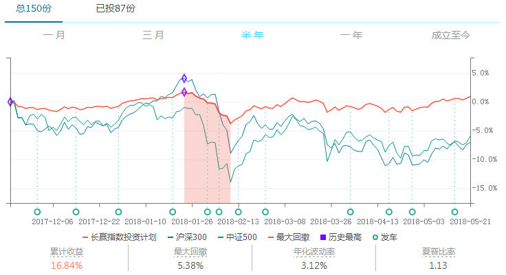

======================================================

ETF拯救世界 (5687069307) @
2018-05-23 09:07:26 Wed  
url: https://weibo.com/5687069307/GhWx1weea

0607年大牛股吉恩镍业谁还记得。

要退市了。

几万人挂了。如果像美国一样，每年退市的比上市的多，估计垃圾小盘股就很少有人敢炒了。 ​​​

转发[18]  评论[58]  赞[196] 

======================================================

ETF拯救世界 (5687069307) @
2018-05-23 09:31:20 Wed  
url: https://weibo.com/5687069307/GhWGIwsQI

$150023  能见1字头么 ​​​

转发[27]  评论[41]  赞[117] 

======================================================

ETF拯救世界 (5687069307) @
2018-05-23 09:36:15 Wed  
url: https://weibo.com/5687069307/GhWIIm5tw

$全指医药 sh000991$   新高不卖懂不啦。 ​​​

转发[1]  评论[31]  赞[153] 

======================================================

ETF拯救世界 (5687069307) @
2018-05-23 09:39:33 Wed  
url: https://weibo.com/5687069307/GhWK42CsR

回复@佩奇带我飞:手里那些现在平平无奇的，未来也将变成明星。我不急，谁急谁就卖掉不涨的去追涨的……

------------------------------------------------------
转推：
>  @ETF拯救世界 (5687069307)
>  2018-05-23 09:07:26 Wed  
>  url: https:/weibo.com/5687069307/GhWx1weea/

>  0607年大牛股吉恩镍业谁还记得。
>  
>  要退市了。
>  
>  几万人挂了。如果像美国一样，每年退市的比上市的多，估计垃圾小盘股就很少有人敢炒了。 ​​​

转发[4]  评论[15]  赞[133] 

======================================================

ETF拯救世界 (5687069307) @
2018-05-23 09:44:34 Wed  
url: https://weibo.com/5687069307/GhWM6bz7f

新高不卖这四个字，说起来简单，你得想明白背后的道理。

一个品种上涨的过程中，会有无数新高，也会有最后一个新高。你并不知道今天的新高是不是最后一个，但是根据概率，是最后一个的并不大。

投资是概率学，你要根据概率投资，选择大概率的事情做。也许医药今天就是最后一个新高，今天就可能开始跌 ​​​

转发[184]  评论[161]  赞[299] 

======================================================

ETF拯救世界 (5687069307) @
2018-05-23 09:55:25 Wed  
url: https://weibo.com/5687069307/GhWQuzD0h

回复@韩跑跑走一走:除了周期股指数，任何指数都是如此。无非是有的行业弱周期，有的行业波动大，有的增速快有的慢而已。还有就是，牛市来了某些行业容易被炒作。所以绝大多数指数都长期永远向上。这就是投资指数的获利确定性。当然，不能买贵。

------------------------------------------------------
转推：
>  @ETF拯救世界 (5687069307)
>  2018-05-23 09:44:34 Wed  
>  url: https:/weibo.com/5687069307/GhWM6bz7f/

>  新高不卖这四个字，说起来简单，你得想明白背后的道理。
>  
>  一个品种上涨的过程中，会有无数新高，也会有最后一个新高。你并不知道今天的新高是不是最后一个，但是根据概率，是最后一个的并不大。
>  
>  投资是概率学，你要根据概率投资，选择大概率的事情做。也许医药今天就是最后一个新高，今天就可能开始跌 ​​​

转发[28]  评论[29]  赞[154] 

======================================================

ETF拯救世界 (5687069307) @
2018-05-23 09:56:45 Wed  
url: https://weibo.com/5687069307/GhWR2hbls

回复@蓝图806:投资也好，做人也好，都尽量留些余地，留点钱给别人赚。你吃中间大部分，有人吃底部，有人吃最高，大家都开开心心多好。所有钱都你挣，不怕遭人嫉妒折寿啊。。

------------------------------------------------------
转推：
>  @ETF拯救世界 (5687069307)
>  2018-05-23 09:44:34 Wed  
>  url: https:/weibo.com/5687069307/GhWM6bz7f/

>  新高不卖这四个字，说起来简单，你得想明白背后的道理。
>  
>  一个品种上涨的过程中，会有无数新高，也会有最后一个新高。你并不知道今天的新高是不是最后一个，但是根据概率，是最后一个的并不大。
>  
>  投资是概率学，你要根据概率投资，选择大概率的事情做。也许医药今天就是最后一个新高，今天就可能开始跌 ​​​

转发[34]  评论[34]  赞[194] 

======================================================

ETF拯救世界 (5687069307) @
2018-05-23 10:17:03 Wed  
url: https://weibo.com/5687069307/GhWZhvp1T

回复@stealstar612:悟性不够。新高不卖正是因为不追求卖在最高这个贪念，你好好领悟一下。//@stealstar612:所以，这不是与新高不卖有点矛盾吗？余量留在哪？

------------------------------------------------------
转推：
>  @ETF拯救世界 (5687069307)
>  2018-05-23 09:44:34 Wed  
>  url: https:/weibo.com/5687069307/GhWM6bz7f/

>  新高不卖这四个字，说起来简单，你得想明白背后的道理。
>  
>  一个品种上涨的过程中，会有无数新高，也会有最后一个新高。你并不知道今天的新高是不是最后一个，但是根据概率，是最后一个的并不大。
>  
>  投资是概率学，你要根据概率投资，选择大概率的事情做。也许医药今天就是最后一个新高，今天就可能开始跌 ​​​

转发[19]  评论[35]  赞[145] 

======================================================

ETF拯救世界 (5687069307) @
2018-05-23 10:27:00 Wed  
url: https://weibo.com/5687069307/GhX3jsA3Z

为什么说“每年跑赢最强指数”是梦中的事？我举几个例子给你。

2013年，很多人认为是熊市，因为那年沪深300下跌6个多点。但你知道涨幅最高的指数涨了多少吗？

就是现在的辣鸡中证传媒，那年，传媒暴涨102%。创业板也涨了79%

你能跑赢吗？这种情况，我对自己的要求，当年赚30%-40%就已经很满意。大概 ​​​

转发[130]  评论[169]  赞[340] 

======================================================

ETF拯救世界 (5687069307) @
2018-05-23 10:50:00 Wed  
url: https://weibo.com/5687069307/GhXcEEUox

这里又引申出一条有意思的推论：如果上面的涨幅是股票涨幅，我相信很多人会觉得很牛。那么，你在3000只股票里找到一只这样涨幅的股票容易，还是在30只指数里找到一只这样的指数容易？又是概率题，可惜，很多人脑子里的指数，只是上证那个辣鸡。

------------------------------------------------------
转推：
>  @ETF拯救世界 (5687069307)
>  2018-05-23 10:27:00 Wed  
>  url: https:/weibo.com/5687069307/GhX3jsA3Z/

>  为什么说“每年跑赢最强指数”是梦中的事？我举几个例子给你。
>  
>  2013年，很多人认为是熊市，因为那年沪深300下跌6个多点。但你知道涨幅最高的指数涨了多少吗？
>  
>  就是现在的辣鸡中证传媒，那年，传媒暴涨102%。创业板也涨了79%
>  
>  你能跑赢吗？这种情况，我对自己的要求，当年赚30%-40%就已经很满意。大概 ​​​

转发[40]  评论[69]  赞[244] 

======================================================

ETF拯救世界 (5687069307) @
2018-05-23 14:05:01 Wed  
url: https://weibo.com/5687069307/GhYtOtAcd

担心牛市来了还没买够的朋友又踏实了吧。

不要急，一切都是最好的安排。

这个市场会把最好的机会留给最独立的思想者。做的和大多数人一样，注定也是大多数人的命运。 ​​​

转发[22]  评论[111]  赞[396] 

======================================================

ETF拯救世界 (5687069307) @
2018-05-23 14:10:26 Wed  
url: https://weibo.com/5687069307/GhYw1jEh7

回复@慈禧太后的微博:老佛爷说了算//@慈禧太后的微博:牛市还要几年吧，按照中国股市尿性

------------------------------------------------------
转推：
>  @ETF拯救世界 (5687069307)
>  2018-05-23 14:05:01 Wed  
>  url: https:/weibo.com/5687069307/GhYtOtAcd/

>  担心牛市来了还没买够的朋友又踏实了吧。
>  
>  不要急，一切都是最好的安排。
>  
>  这个市场会把最好的机会留给最独立的思想者。做的和大多数人一样，注定也是大多数人的命运。 ​​​

转发[1]  评论[42]  赞[161] 

======================================================

ETF拯救世界 (5687069307) @
2018-05-23 20:27:21 Wed  
url: https://weibo.com/5687069307/Gi0Z0gsT3

月底去学冲浪的计划泡汤了。我和孩子病都没好。不知道预定的酒店飞机票能拿回多少钱，还好我机智的买了无理由取消险……

过几天汇报一下保险有没有顺利理赔……

冲浪还是要学的，希望6月能成行！ ​​​

转发[5]  评论[296]  赞[345] 

======================================================

ETF拯救世界 (5687069307) @
2018-05-24 08:56:54 Thu  
url: https://weibo.com/5687069307/Gi5Tf1K51

局面的几个采访可以看看。电视剧都不敢这么拍。

------------------------------------------------------
转推：
>  @局面 (6294930327)
>  2018-05-23 15:05:15 Wed  
>  url: https:/weibo.com/6294930327/GhYSgm0kq/

>  【#局面专访##程序员苏享茂之死#01：苏享茂自杀前14小时 与翟欣欣沟通细节披露】2017年9月7日凌晨，WePhone创始人苏享茂跳楼身亡，留下遗书称自杀与前妻翟欣欣有关，引发舆论关注。此后，节目组多次联系翟欣欣方，其律师表示翟暂不接受采访。关于苏享茂自杀的真正原因，翟苏之间到底是什么样的关系，一 ​​​

转发[23]  评论[38]  赞[90] 

======================================================

ETF拯救世界 (5687069307) @
2018-05-24 09:24:07 Thu  
url: https://weibo.com/5687069307/Gi64iiAJ6

回复@用户6452827406:你这个400买不买两可了。保险一个人就得150。我订单可能得理赔上万，所以还比较值。//@用户6452827406:益达还有这种保险吗，我前几天退机票要了400元呢，什么保险这么好

------------------------------------------------------
转推：
>  @ETF拯救世界 (5687069307)
>  2018-05-23 20:27:21 Wed  
>  url: https:/weibo.com/5687069307/Gi0Z0gsT3/

>  月底去学冲浪的计划泡汤了。我和孩子病都没好。不知道预定的酒店飞机票能拿回多少钱，还好我机智的买了无理由取消险……
>  
>  过几天汇报一下保险有没有顺利理赔……
>  
>  冲浪还是要学的，希望6月能成行！ ​​​

转发[3]  评论[32]  赞[103] 

======================================================

ETF拯救世界 (5687069307) @
2018-05-24 11:59:36 Thu  
url: https://weibo.com/5687069307/Gi75oz7zN

马蓉那件事，其实并没有给我太多意外的感觉。虽然无耻，但也算是合理范围内。不爱一个人，但因为其它原因，跟他结婚，跟他生了孩子。然后爱上了另一个人。

翟欣欣这个真的让我感到有点震撼。人坏起来确实是没有边际没有底线的。

谋财害命，也真的是要把你榨干才罢休。

别说男主傻，单纯。可能只是因 ​​​

转发[160]  评论[375]  赞[691] 

======================================================

ETF拯救世界 (5687069307) @
2018-05-24 12:42:41 Thu  
url: https://weibo.com/5687069307/Gi7mTmrGl

还有两条经验分享一下。

一个是不露富。你很难分清对方是爱你的钱还是爱你的人。

第二是切忌交浅言深。刚刚交往几个月，就把公司的情况全都说出来，这是致命的问题。

不知道该说什么，就别说。

沉默是金。 ​​​

转发[70]  评论[84]  赞[354] 

======================================================

ETF拯救世界 (5687069307) @
2018-05-24 13:43:26 Thu  
url: https://weibo.com/5687069307/Gi7LydKT8

再说一次，一定要做好长期抗战的心理准备。其他的问题不大，关键是心理准备。希望，意志，最重要。一切尽在掌握。

------------------------------------------------------
转推：
>  @ETF拯救世界 (5687069307)
>  2018-05-03 11:25:05 Thu  
>  url: https:/weibo.com/5687069307/GeUSY6sMB/

>  从现在起，各位做好心理准备，迎接漫漫阴跌吧。没什么大问题，解决心理问题以后逢低布局就可以。
>  
>  最主要是心理问题。所有希望都被磨平后的麻木与绝望是需要警惕的。 ​​​

转发[54]  评论[93]  赞[269] 

======================================================

ETF拯救世界 (5687069307) @
2018-05-24 14:02:39 Thu  
url: https://weibo.com/5687069307/Gi7TmgNof

回复@金顶佛光:L的平底时间越长，未来爆发就越猛烈越持久。//@金顶佛光:会不会长期L型//@ETF拯救世界:再说一次，一定要做好长期抗战的心理准备。其他的问题不大，关键是心理准备。希望，意志，最重要。一切尽在掌握。

------------------------------------------------------
转推：
>  @ETF拯救世界 (5687069307)
>  2018-05-03 11:25:05 Thu  
>  url: https:/weibo.com/5687069307/GeUSY6sMB/

>  从现在起，各位做好心理准备，迎接漫漫阴跌吧。没什么大问题，解决心理问题以后逢低布局就可以。
>  
>  最主要是心理问题。所有希望都被磨平后的麻木与绝望是需要警惕的。 ​​​

转发[15]  评论[49]  赞[173] 

======================================================

ETF拯救世界 (5687069307) @
2018-05-24 14:08:16 Thu  
url: https://weibo.com/5687069307/Gi7VDeP6z

据我所知，球球某著名私募最近已经全面建仓医药了。

按顺序来，别急。 ​​​

转发[14]  评论[109]  赞[325] 

======================================================

ETF拯救世界 (5687069307) @
2018-05-24 14:24:40 Thu  
url: https://weibo.com/5687069307/Gi82hF57o

很多事情，提前说，你会觉得可笑。

很久以后，明白真相的你，眼泪掉下来。 ​​​

转发[14]  评论[164]  赞[400] 

======================================================

ETF拯救世界 (5687069307) @
2018-05-25 13:19:51 Fri  
url: https://weibo.com/5687069307/Gih2tsZzG

$全指医药 sh000991$ 你身边的散户开始买医药了吗。

新高。 ​​​

转发[6]  评论[192]  赞[247] 

======================================================

ETF拯救世界 (5687069307) @
2018-05-25 14:50:29 Fri  
url: https://weibo.com/5687069307/GihDgirZp

传媒高点下来跌了70%，持仓部分浮亏4个多点，这就叫跌成狗？

以后有让我感觉在发牢骚的直接拉黑。 ​​​

转发[137]  评论[233]  赞[451] 

======================================================

ETF拯救世界 (5687069307) @
2018-05-25 15:00:01 Fri  
url: https://weibo.com/5687069307/GihH8B56Z

你知道指数跌70%你买，如果它回到高点你赚多少吗。

是233%。

当年我买上汽的时候是6块。我朋友是几个月前36买的。我跟他说，等你回本我赚500%。

当然最后我没赚500%，只赚了400%。

但是你无论如何几乎不可能买在最低点。指数从最高点跌70%-80%，已经是大底区域了。80%，几乎是极限。 ​​​

转发[66]  评论[180]  赞[427] 

======================================================

ETF拯救世界 (5687069307) @
2018-05-25 15:10:32 Fri  
url: https://weibo.com/5687069307/GihLp4FdT

拉上证和沪深300没事。决定我们仓位的是全市场。

只要全市场大多数股票调整，仓位就有的加。 ​​​

转发[25]  评论[125]  赞[336] 

======================================================

ETF拯救世界 (5687069307) @
2018-05-25 19:59:20 Fri  
url: https://weibo.com/5687069307/GijEDiQil

我在这里说一下，不要在我的评论里为有些网站做广告。

我对某些网站很不喜欢。整个思路抄我的，拿去卖钱。甚至通过某些方式知道我的最新分析思路，几个月后又改头换面出现在网站上开始卖钱。

我不喜欢，但我没有说过什么。但是，如果再有人在我的评论里给他们做广告，我一定删掉。发现第二次马上拉黑 ​​​

转发[7]  评论[191]  赞[520] 

======================================================

ETF拯救世界 (5687069307) @
2018-05-27 07:22:45 Sun  
url: https://weibo.com/5687069307/GixywlAhb

大部分被撞的没有遵守交通规则是一个，但我还有一个感想:千万不要对开车的人有太多信任，因为你不知道他是喝酒了吸毒了或者根本不会开车，过马路的时候一定小心，不要把希望寄托在司机会及时刹车上!

------------------------------------------------------
转推：
>  @ ()
>  2018-05-26 14:32:39 Sat  
>  url: 

>  该账号因被投诉违反《微博社区公约》的相关规定，现已无法查看。查看帮助 https://kefu.weibo.com/faqdetail?id=13216

转发[105]  评论[98]  赞[260] 

======================================================

ETF拯救世界 (5687069307) @
2018-05-27 11:53:02 Sun  
url: https://weibo.com/5687069307/GizkegZIx

独立思考，对绝大多数人来说，很难

------------------------------------------------------
转推：
>  @月风_投资笔记 (1670659923)
>  2018-05-27 02:29:47 Sun  
>  url: https:/weibo.com/1670659923/GivDBu9fo/

>  发布了头条文章：《当正义的科普专家开始“作恶”》  http://t.cn/R1UYT5V ​​​

转发[45]  评论[75]  赞[172] 

======================================================

ETF拯救世界 (5687069307) @
2018-05-28 09:02:21 Mon  
url: https://weibo.com/5687069307/GiHDrx5Zk

回复@纯棉纱布毛毯海绵弹床:这是谁跟你说的？2008年危机的时候多少机构找老爷子要钱，当时手里有钱的没几个人，他手里有过百亿美元。最后买了渊源很深的高盛可转债，事后大赚一笔。现在他手里还有几百亿美元等着买好东西。所谓满仓穿越牛熊这样的说法骗骗小白就算了，谁信谁傻。

------------------------------------------------------
转推：
>  @ETF拯救世界 (5687069307)
>  2018-05-25 15:10:32 Fri  
>  url: https:/weibo.com/5687069307/GihLp4FdT/

>  拉上证和沪深300没事。决定我们仓位的是全市场。
>  
>  只要全市场大多数股票调整，仓位就有的加。 ​​​

转发[12]  评论[39]  赞[176] 

======================================================

ETF拯救世界 (5687069307) @
2018-05-28 09:29:22 Mon  
url: https://weibo.com/5687069307/GiHOpskKV

独立思考难不难，真的很难。透过表面看本质更难。

说起满仓穿越牛熊这个，我想起一个事情，有些感想分享一下。

前几天我在某财经论坛看到老板发帖说，从来都是满仓，08年也满仓，15年也满仓。

这个事情你就要好好琢磨琢磨了。首先，在没有证据证明别人在说瞎话的时候，我都是默认对方是诚实的人。也 ​​​

转发[84]  评论[153]  赞[405] 

======================================================

ETF拯救世界 (5687069307) @
2018-05-28 09:38:53 Mon  
url: https://weibo.com/5687069307/GiHSh6sPq

$162411  油气这样的品种不做波段真是暴殄天物…… ​​​

转发[10]  评论[80]  赞[225] 

======================================================

ETF拯救世界 (5687069307) @
2018-05-28 10:45:35 Mon  
url: https://weibo.com/5687069307/GiIjlbFrB

温习一下。

------------------------------------------------------
转推：
>  @ETF拯救世界 (5687069307)
>  2017-06-23 11:23:14 Fri  
>  url: https:/weibo.com/5687069307/F988CrnGy/

>  下跌不会死人，反弹才会。 ​​​

转发[15]  评论[59]  赞[186] 

======================================================

ETF拯救世界 (5687069307) @
2018-05-28 11:28:35 Mon  
url: https://weibo.com/5687069307/GiIAOdQPn

回复@雪顶的酥糖:绝大多数涨上去以后买的现在的结果是？反弹以后买入的会死。//@雪顶的酥糖:E大你是在毒奶吗？去年说完这句话，大盘向上了。//@ETF拯救世界:温习一下。

------------------------------------------------------
转推：
>  @ETF拯救世界 (5687069307)
>  2017-06-23 11:23:14 Fri  
>  url: https:/weibo.com/5687069307/F988CrnGy/

>  下跌不会死人，反弹才会。 ​​​

转发[11]  评论[35]  赞[127] 

======================================================

ETF拯救世界 (5687069307) @
2018-05-28 11:50:35 Mon  
url: https://weibo.com/5687069307/GiIJJ2idI

[doge]

------------------------------------------------------
转推：
>  @ ()
>  2018-05-28 11:08:33 Mon  
>  url: 

>  根据相关法律法规和政策，该微博已被删除。查看帮助：http://t.cn/Rfd1A92

转发[9]  评论[71]  赞[60] 

======================================================

ETF拯救世界 (5687069307) @
2018-05-28 13:57:17 Mon  
url: https://weibo.com/5687069307/GiJza0cDS

$全指医药 sh000991$ $养老产业 sz399812$ 

双双新高。现在是等群众入场拉一波成交量。  ​​​

转发[10]  评论[93]  赞[222] 

======================================================

ETF拯救世界 (5687069307) @
2018-05-28 15:34:22 Mon  
url: https://weibo.com/5687069307/GiKcz7pZy

立个flag。

两年内，计划内将出现除50/300/医药/养老外，其它A股指数基金+50%的情况。可能不止一只。

但是

我不知道是谁…… ​​​

转发[57]  评论[200]  赞[328] 

======================================================

ETF拯救世界 (5687069307) @
2018-05-28 16:10:17 Mon  
url: https://weibo.com/5687069307/GiKr9o137

回复@ch506:你要知道，一个品种，涨不涨，涨多少，群众基础也很重要。既然它还没涨就这么多人推，可想而知以后涨起来忽悠的人会有多少。这是好事。//@ch506:回复@求财不劫色:我发现500现在到处有人在推荐，公众号，券商客户经理，QQ群，都在推荐，俺们的500会不会被玩坏啊[doge]

------------------------------------------------------
转推：
>  @ETF拯救世界 (5687069307)
>  2018-05-28 15:34:22 Mon  
>  url: https:/weibo.com/5687069307/GiKcz7pZy/

>  立个flag。
>  
>  两年内，计划内将出现除50/300/医药/养老外，其它A股指数基金+50%的情况。可能不止一只。
>  
>  但是
>  
>  我不知道是谁…… ​​​

转发[15]  评论[25]  赞[135] 

======================================================

ETF拯救世界 (5687069307) @
2018-05-28 16:16:38 Mon  
url: https://weibo.com/5687069307/GiKtIAkBs

回复@你在红楼我在西游V:有可能。也有可能下降。每年两次调整成分股是指数估值大幅变动的日子。下次是6.11，很多指数要换。//@你在红楼我在西游V:指数的成分股调整对我们计划有什么影响？会不会调入估值比较高的上市公司，让我们的指数估值有所抬升。

------------------------------------------------------
转推：
>  @ETF拯救世界 (5687069307)
>  2018-05-28 15:34:22 Mon  
>  url: https:/weibo.com/5687069307/GiKcz7pZy/

>  立个flag。
>  
>  两年内，计划内将出现除50/300/医药/养老外，其它A股指数基金+50%的情况。可能不止一只。
>  
>  但是
>  
>  我不知道是谁…… ​​​

转发[12]  评论[20]  赞[106] 

======================================================

ETF拯救世界 (5687069307) @
2018-05-28 17:00:00 Mon  
url: https://weibo.com/5687069307/GiKLkujiv

回复@B-B-Y:我不同意你这种说法。涨到100的85倍的恒瑞和360都进了50，能好到哪儿。相反，好些跌到姥姥家跌的他妈都不认识的股票从300自然落入500，我觉得特别好。哪怕有几个垃圾，n/500怕什么……

------------------------------------------------------
转推：
>  @ETF拯救世界 (5687069307)
>  2018-05-28 15:34:22 Mon  
>  url: https:/weibo.com/5687069307/GiKcz7pZy/

>  立个flag。
>  
>  两年内，计划内将出现除50/300/医药/养老外，其它A股指数基金+50%的情况。可能不止一只。
>  
>  但是
>  
>  我不知道是谁…… ​​​

转发[6]  评论[32]  赞[165] 

======================================================

ETF拯救世界 (5687069307) @
2018-05-28 17:55:23 Mon  
url: https://weibo.com/5687069307/GiL7O0md2

最近内敛的小马哥出镜次数明显多了，为什么。//@曹增辉:[good][good]

------------------------------------------------------
转推：
>  @大佬时间 (6279804563)
>  2018-05-28 12:55:29 Mon  
>  url: https:/weibo.com/6279804563/GiJa57WLO/

>  【马化腾：赋能太霸道 腾讯希望做助手 用也可以不用也行】5月28日，在2018数博会的数字经济高端对话上，马化腾表示过去虽然腾讯在谈赋能，但最近发现很多企业并不接受赋能，今后腾讯希望做助手。“如果赋能的话你好像是上帝视角，在命令别人做事，太霸道了。” http://t.cn/R15D4DU ​​​

转发[4]  评论[34]  赞[71] 

======================================================

ETF拯救世界 (5687069307) @
2018-05-28 20:00:19 Mon  
url: https://weibo.com/5687069307/GiLWw0mcC

哈哈哈京腔标准，毕竟看编辑部故事学的中文//@斯库里:这位太君要是偷地雷的，那也就让他偷了。[允悲]

------------------------------------------------------
转推：
>  @大爱宜昌 (1254175274)
>  2018-05-20 20:24:44 Sun  
>  url: https:/weibo.com/1254175274/GhyGs8ORm/

>  #袁楚皓[超话]# #北京老外图鉴# 每个人都觉得老外越来越多，但数据却说，在北京的老外真的越来越少。我们选择把这些还在北京的老外拍了下来，做成了《北京老外图鉴》。第一期是一个叫小松洋大的日本人，一张嘴是地道北京口音，喜欢听大张伟，吃铜涮肉。但最近他因为“户口”，正在被迫逃离北京。 ​​​

转发[8]  评论[25]  赞[71] 

======================================================

ETF拯救世界 (5687069307) @
2018-05-29 09:41:49 Tue  
url: https://weibo.com/5687069307/GiRjXw065

$全指医药 sh000991$   $养老产业 sz399812$ 

随时受不了。

瞎卖的人已经哭晕在厕所。 ​​​

转发[3]  评论[74]  赞[154] 

======================================================

ETF拯救世界 (5687069307) @
2018-05-29 09:48:13 Tue  
url: https://weibo.com/5687069307/GiRmyBWVs

回复@Godric_Chang:很多朋友已经开始独立思考了。这是非常关键的一步。//@Godric_Chang:还记得那阵全雪球都在吹红利，各种分析，现在开始轮换到医药了...

------------------------------------------------------
转推：
>  @ETF拯救世界 (5687069307)
>  2018-05-29 09:41:49 Tue  
>  url: https:/weibo.com/5687069307/GiRjXw065/

>  $全指医药 sh000991$   $养老产业 sz399812$ 
>  
>  随时受不了。
>  
>  瞎卖的人已经哭晕在厕所。 ​​​

转发[2]  评论[14]  赞[120] 

======================================================

ETF拯救世界 (5687069307) @
2018-05-29 09:49:33 Tue  
url: https://weibo.com/5687069307/GiRn5D911

一年后的爆款，不会是医药也不会是消费，而是目前不受待见的那些渣渣辉。 ​​​

转发[31]  评论[129]  赞[291] 

======================================================

ETF拯救世界 (5687069307) @
2018-05-29 10:21:49 Tue  
url: https://weibo.com/5687069307/GiRAciLEv

有些“价值蓝筹股”已经崩盘的节奏了。

------------------------------------------------------
转推：
>  @ETF拯救世界 (5687069307)
>  2018-01-25 11:18:26 Thu  
>  url: https:/weibo.com/5687069307/G00XC3BZQ/

>  不少人会在“价值投资元年”之后，在一些“蓝筹股”上套3-5年 ​​​

转发[6]  评论[55]  赞[147] 

======================================================

ETF拯救世界 (5687069307) @
2018-05-29 10:42:09 Tue  
url: https://weibo.com/5687069307/GiRIrrMKM

一把干到目标位？慢慢涨不好吗//@ETF拯救世界:回复@ETF信徒者:我没那么乐观。短期飚的话，我能理解的点位是13500-14000吧。以后每年增加900点。//@ETF信徒者:坚决拿住，坐等到15000

------------------------------------------------------
转推：
>  @ETF拯救世界 (5687069307)
>  2018-05-07 09:40:24 Mon  
>  url: https:/weibo.com/5687069307/GfvUsAzsK/

>  $全指医药 sh000991$  继续新高。不用我嘱咐了吧。
>  
>  记住，赚钱的时候千万别赚了三瓜两枣就着急卖掉。那样，你一辈子也发不了大财。
>  
>  对一次两次，终究有一次后悔莫及。 ​​​

转发[9]  评论[33]  赞[121] 

======================================================

ETF拯救世界 (5687069307) @
2018-05-29 10:56:33 Tue  
url: https://weibo.com/5687069307/GiROiklPR

最近两年携程出了不少事。但这次订单取消我对携程还是挺满意的。

酒店定的时候就写清楚不可取消，但是携程还是要了病历什么的去跟酒店协调，最后一分不差都退了。

现在就是扣了去程的几千块机票，大部分费用已经非常及时的退回来了。这几千块机票正在走无理由取消险的流程，应该也没问题。携程说保险 ​​​

转发[4]  评论[64]  赞[250] 

======================================================

ETF拯救世界 (5687069307) @
2018-05-29 11:10:02 Tue  
url: https://weibo.com/5687069307/GiRTLyrq8

去年的价值大蓝筹也好，今年的医药也好，都是一样的。资金不够，抱团取暖，找到一个突破点大家猛干。

心里得明白是怎么回事。

全面牛市目前不现实，轮动找乐子吧。 ​​​

转发[98]  评论[73]  赞[280] 

======================================================

ETF拯救世界 (5687069307) @
2018-05-29 11:33:06 Tue  
url: https://weibo.com/5687069307/GiS38dQGY

回复@你在红楼我在西游V:你如果想每年就赚7%-11%，那就是企业增长+通胀。如果你想12%-24%，多出来的就是别人的口袋。如果你想24%+，那就得去找骗子了。//@你在红楼我在西游V:益达，我们的收益主要来源于企业的成长，还是别人的口袋？

------------------------------------------------------
转推：
>  @ETF拯救世界 (5687069307)
>  2018-05-29 11:10:02 Tue  
>  url: https:/weibo.com/5687069307/GiRTLyrq8/

>  去年的价值大蓝筹也好，今年的医药也好，都是一样的。资金不够，抱团取暖，找到一个突破点大家猛干。
>  
>  心里得明白是怎么回事。
>  
>  全面牛市目前不现实，轮动找乐子吧。 ​​​

转发[42]  评论[42]  赞[193] 

======================================================

ETF拯救世界 (5687069307) @
2018-05-29 11:36:28 Tue  
url: https://weibo.com/5687069307/GiS4v4DGu

如果你能不被别人忽悠，基本就告别赔钱了。

如果你能在别人忽悠之前买入，赚钱就不难了。

不做坏事也可以赚钱。 ​​​

转发[27]  评论[73]  赞[258] 

======================================================

ETF拯救世界 (5687069307) @
2018-05-29 11:51:00 Tue  
url: https://weibo.com/5687069307/GiSaowhIW

回复@bittersweet4:我看了看，招行2014年以来的涨幅分别是：77%；14%；2%；72%。今年下跌1.72%。已经很强了。涨这么多，调整调整太正常了。//@bittersweet4:E大。。。银行股怎么这么个鸟样

------------------------------------------------------
转推：
>  @ETF拯救世界 (5687069307)
>  2018-05-29 11:10:02 Tue  
>  url: https:/weibo.com/5687069307/GiRTLyrq8/

>  去年的价值大蓝筹也好，今年的医药也好，都是一样的。资金不够，抱团取暖，找到一个突破点大家猛干。
>  
>  心里得明白是怎么回事。
>  
>  全面牛市目前不现实，轮动找乐子吧。 ​​​

转发[7]  评论[41]  赞[137] 

======================================================

ETF拯救世界 (5687069307) @
2018-05-29 14:37:46 Tue  
url: https://weibo.com/5687069307/GiTg5pAuT

$全指医药 sh000991$   非常差的形态 ​​​

转发[3]  评论[91]  赞[176] 

======================================================

ETF拯救世界 (5687069307) @
2018-05-29 14:49:10 Tue  
url: https://weibo.com/5687069307/GiTkIjuST

最强势指数如果崩盘，那就是信心彻底崩溃。 ​​​

转发[18]  评论[160]  赞[312] 

======================================================

ETF拯救世界 (5687069307) @
2018-05-29 15:21:21 Tue  
url: https://weibo.com/5687069307/GiTxMjW1L

今天净值大幅回撤0.5%，目瞪口呆，心如刀割，摸一摸眼角，有眼泪流下来。 ​​​

转发[5]  评论[192]  赞[356] 

======================================================

ETF拯救世界 (5687069307) @
2018-05-29 16:04:52 Tue  
url: https://weibo.com/5687069307/GiTPrmA6W

立个flag，5000点买满500仓位。 ​​​

转发[169]  评论[294]  赞[482] 

======================================================

ETF拯救世界 (5687069307) @
2018-05-30 09:32:26 Wed  
url: https://weibo.com/5687069307/Gj0GDF0we

买了一大堆货等着MSCI的老油条们接货的人已经懵了。 ​​​

转发[4]  评论[49]  赞[190] 

======================================================

ETF拯救世界 (5687069307) @
2018-05-30 09:33:21 Wed  
url: https://weibo.com/5687069307/Gj0H1m225

竞猜：GJD今天动手不动手。 ​​​

转发[7]  评论[105]  赞[143] 

======================================================

ETF拯救世界 (5687069307) @
2018-05-30 09:34:44 Wed  
url: https://weibo.com/5687069307/Gj0HAwhOn

回复@萍萍姐的小屋:我不发。[doge]//@萍萍姐的小屋:这就要看E大发不发车了！[doge]

------------------------------------------------------
转推：
>  @ETF拯救世界 (5687069307)
>  2018-05-30 09:33:21 Wed  
>  url: https:/weibo.com/5687069307/Gj0H1m225/

>  竞猜：GJD今天动手不动手。 ​​​

转发[1]  评论[28]  赞[121] 

======================================================

ETF拯救世界 (5687069307) @
2018-05-30 09:36:26 Wed  
url: https://weibo.com/5687069307/Gj0IhmOPY

回复@笨鸡互啄:敌若动我乱动。//@笨鸡互啄:敌不动我动

------------------------------------------------------
转推：
>  @ETF拯救世界 (5687069307)
>  2018-05-30 09:33:21 Wed  
>  url: https:/weibo.com/5687069307/Gj0H1m225/

>  竞猜：GJD今天动手不动手。 ​​​

转发[1]  评论[35]  赞[112] 

======================================================

ETF拯救世界 (5687069307) @
2018-05-30 09:49:59 Wed  
url: https://weibo.com/5687069307/Gj0NM77EE

就你们这点定力，08年和1213年可能会被黄土埋了脖子。

别吵吵，看戏。

咱们的部队是进场定乾坤的，不是胸口写个勇和敌人大乱斗无谓牺牲用的。 ​​​

转发[28]  评论[109]  赞[343] 

======================================================

ETF拯救世界 (5687069307) @
2018-05-30 09:56:56 Wed  
url: https://weibo.com/5687069307/Gj0QB0RTf

回复@家有八妹:首先我一直很淡定。其次跟仓位有关，我们的仓位已经上去了，不用那么着急买。你已经有一部分部队下去打仗了，赢了也会分很多战利品了，还急什么。//@家有八妹:大家有没有发现这次调整e大很冷静？说明力度不小啊

------------------------------------------------------
转推：
>  @ETF拯救世界 (5687069307)
>  2018-05-30 09:49:59 Wed  
>  url: https:/weibo.com/5687069307/Gj0NM77EE/

>  就你们这点定力，08年和1213年可能会被黄土埋了脖子。
>  
>  别吵吵，看戏。
>  
>  咱们的部队是进场定乾坤的，不是胸口写个勇和敌人大乱斗无谓牺牲用的。 ​​​

转发[6]  评论[30]  赞[145] 

======================================================

ETF拯救世界 (5687069307) @
2018-05-30 10:03:28 Wed  
url: https://weibo.com/5687069307/Gj0TfjRn9

另外，加不加车，你得考虑清楚你的策略。

我们的策略就是月底。充其量提前一天。今天是2天，这不合规矩。

不合规矩的意思就是“主观判断”。我不希望自己的投资中有太多主观判断。我希望能严格遵守一套体系。如果我遵守体系，成本高了点，没问题，因为我遵守体系了。我很自豪。

如果我主观判断，错 ​​​

转发[106]  评论[191]  赞[360] 

======================================================

ETF拯救世界 (5687069307) @
2018-05-30 10:16:49 Wed  
url: https://weibo.com/5687069307/Gj0YFfKfw

回复@hei-jude:强势品种第一次回调不用太害怕。很多一直等着上车的人会利用这次回调冲进去。//@hei-jude:现在医药又涨了，什么情况？资金还是没有别的去处

------------------------------------------------------
转推：
>  @ETF拯救世界 (5687069307)
>  2018-05-30 10:03:28 Wed  
>  url: https:/weibo.com/5687069307/Gj0TfjRn9/

>  另外，加不加车，你得考虑清楚你的策略。
>  
>  我们的策略就是月底。充其量提前一天。今天是2天，这不合规矩。
>  
>  不合规矩的意思就是“主观判断”。我不希望自己的投资中有太多主观判断。我希望能严格遵守一套体系。如果我遵守体系，成本高了点，没问题，因为我遵守体系了。我很自豪。
>  
>  如果我主观判断，错 ​​​

转发[40]  评论[55]  赞[151] 

======================================================

ETF拯救世界 (5687069307) @
2018-05-30 10:43:15 Wed  
url: https://weibo.com/5687069307/Gj19ooi5L

拿券商PEPB说事儿的，只能说还没入门。 ​​​

转发[20]  评论[95]  赞[183] 

======================================================

ETF拯救世界 (5687069307) @
2018-05-30 11:01:53 Wed  
url: https://weibo.com/5687069307/Gj1gY0pdz

回复@老高GG:很多人的问题是对最差的情况想象的太好了。//@老高GG:399975果然有像400点进发的趋势哈

------------------------------------------------------
转推：
>  @ETF拯救世界 (5687069307)
>  2018-05-30 10:43:15 Wed  
>  url: https:/weibo.com/5687069307/Gj19ooi5L/

>  拿券商PEPB说事儿的，只能说还没入门。 ​​​

转发[6]  评论[38]  赞[120] 

======================================================

ETF拯救世界 (5687069307) @
2018-05-30 11:12:43 Wed  
url: https://weibo.com/5687069307/Gj1lm6K6F

回复@卖萌货微博:好的。here we go！//@卖萌货微博:微博也换个头像吧 。。//@ETF拯救世界:回复@老高GG:很多人的问题是对最差的情况想象的太好了。//@老高GG:399975果然有像400点进发的趋势哈

------------------------------------------------------
转推：
>  @ETF拯救世界 (5687069307)
>  2018-05-30 10:43:15 Wed  
>  url: https:/weibo.com/5687069307/Gj19ooi5L/

>  拿券商PEPB说事儿的，只能说还没入门。 ​​​

转发[1]  评论[52]  赞[122] 

======================================================

ETF拯救世界 (5687069307) @
2018-05-30 11:32:44 Wed  
url: https://weibo.com/5687069307/Gj1ttAqTQ

今天更惨，0.7%了。生活好难。

------------------------------------------------------
转推：
>  @ETF拯救世界 (5687069307)
>  2018-05-29 15:21:21 Tue  
>  url: https:/weibo.com/5687069307/GiTxMjW1L/

>  今天净值大幅回撤0.5%，目瞪口呆，心如刀割，摸一摸眼角，有眼泪流下来。 ​​​

转发[1]  评论[106]  赞[209] 

======================================================

ETF拯救世界 (5687069307) @
2018-05-30 11:39:38 Wed  
url: https://weibo.com/5687069307/Gj1whlLNh

公众号9万了。

一个月三、四篇，这么多不容易。 ​​​

转发[1]  评论[123]  赞[468] 

+++++++++++++++++++++++++++++++++++++++++++++++++++++

图片：

======================================================

ETF拯救世界 (5687069307) @
2018-05-30 13:05:27 Wed  
url: https://weibo.com/5687069307/Gj2578SEP

我相信gjd下午会动手。不为别的，只因为面子最重要。  ​​​

转发[5]  评论[106]  赞[237] 

======================================================

ETF拯救世界 (5687069307) @
2018-05-30 13:43:43 Wed  
url: https://weibo.com/5687069307/Gj2kE8koj

你们谁有抖音号，能不能贴出来。我去看看各位的表演……还挺好奇的…… ​​​

转发[1]  评论[77]  赞[152] 

======================================================

ETF拯救世界 (5687069307) @
2018-05-30 14:30:24 Wed  
url: https://weibo.com/5687069307/Gj2DBkhw6

未来会怎么走，我第一信价值，第二信趋势，第三信占卜，第四信天象，第五信大v。

什么？我也是红v？

没错，我的判断不如占卜和天象…… ​​​

转发[14]  评论[84]  赞[229] 

======================================================

ETF拯救世界 (5687069307) @
2018-05-30 14:34:33 Wed  
url: https://weibo.com/5687069307/Gj2FhkzFC

回复@-刘大遥-:我今天反向奶了两次，用心良苦谁能懂。//@-刘大遥-:今天益达没有奶，哈哈啊哈

------------------------------------------------------
转推：
>  @ETF拯救世界 (5687069307)
>  2018-05-30 14:30:24 Wed  
>  url: https:/weibo.com/5687069307/Gj2DBkhw6/

>  未来会怎么走，我第一信价值，第二信趋势，第三信占卜，第四信天象，第五信大v。
>  
>  什么？我也是红v？
>  
>  没错，我的判断不如占卜和天象…… ​​​

转发[0]  评论[64]  赞[159] 

======================================================

ETF拯救世界 (5687069307) @
2018-05-30 15:00:02 Wed  
url: https://weibo.com/5687069307/Gj2PCvdUf

今天损失0.9%。真的牛了。

今天所有A股涨幅中位数是下跌4%。感谢。 ​​​

转发[12]  评论[179]  赞[258] 

======================================================

ETF拯救世界 (5687069307) @
2018-05-30 15:08:29 Wed  
url: https://weibo.com/5687069307/Gj2T3hHqo

前几天，有朋友在评论里说，感觉跌不下去了。

然后，就这样了。

这不是第一次了。为什么，这特别有意思。

第一，“感觉”靠谱不靠谱。

第二，很多人的感觉如果差不多，那么会不会很容易出现相反的未来。

第三，相反的未来与很多人的感觉，是不是互为因果的。 ​​​

转发[23]  评论[116]  赞[242] 

======================================================

ETF拯救世界 (5687069307) @
2018-05-30 15:17:45 Wed  
url: https://weibo.com/5687069307/Gj2WOr7jN

回复@zshixin:sorry，在这个市场上，你跟别人思维一样，就会被割。//@zshixin:跟着e大买几年的话，估计思维都跟常人不一样了

------------------------------------------------------
转推：
>  @ETF拯救世界 (5687069307)
>  2018-05-30 15:00:02 Wed  
>  url: https:/weibo.com/5687069307/Gj2PCvdUf/

>  今天损失0.9%。真的牛了。
>  
>  今天所有A股涨幅中位数是下跌4%。感谢。 ​​​

转发[5]  评论[95]  赞[182] 

======================================================

ETF拯救世界 (5687069307) @
2018-05-30 16:47:40 Wed  
url: https://weibo.com/5687069307/Gj3xjjMqg

看了一圈，发现居然没什么可以买的。悲哀了。 ​​​

转发[6]  评论[195]  赞[267] 

======================================================

ETF拯救世界 (5687069307) @
2018-05-30 17:26:20 Wed  
url: https://weibo.com/5687069307/Gj3N0mXtM

做发车文章的表格图表好烦。

招个助理算了。

条件：差不多就行。

报酬：业界无竞争力 ​​​

转发[9]  评论[379]  赞[426] 

======================================================

ETF拯救世界 (5687069307) @
2018-05-31 00:18:17 Thu  
url: https://weibo.com/5687069307/Gj6udpb9z

谢谢！ ​​​

转发[4]  评论[163]  赞[335] 

+++++++++++++++++++++++++++++++++++++++++++++++++++++

图片：

======================================================

ETF拯救世界 (5687069307) @
2018-05-31 13:22:04 Thu  
url: https://weibo.com/5687069307/GjbCm6aJV

无耻！ ​​​

转发[6]  评论[151]  赞[182] 

======================================================

ETF拯救世界 (5687069307) @
2018-05-31 13:41:31 Thu  
url: https://weibo.com/5687069307/GjbKfskW0

我是开玩笑说大盘。但好多朋友评论DJ，我得去了解一下怎么回事……

------------------------------------------------------
转推：
>  @ETF拯救世界 (5687069307)
>  2018-05-31 13:22:04 Thu  
>  url: https:/weibo.com/5687069307/GjbCm6aJV/

>  无耻！ ​​​

转发[2]  评论[64]  赞[143] 

======================================================

ETF拯救世界 (5687069307) @
2018-05-31 14:03:48 Thu  
url: https://weibo.com/5687069307/GjbTii1pT

是这样了。所以第一波暴跌别怕，强势品种会有人“抄底”。下面关键是看能否尽快有效新高。看戏。//@ETF拯救世界:回复@hei-jude:强势品种第一次回调不用太害怕。很多一直等着上车的人会利用这次回调冲进去。//@hei-jude:现在医药又涨了，什么情况？资金还是没有别的去处

------------------------------------------------------
转推：
>  @ETF拯救世界 (5687069307)
>  2018-05-30 10:03:28 Wed  
>  url: https:/weibo.com/5687069307/Gj0TfjRn9/

>  另外，加不加车，你得考虑清楚你的策略。
>  
>  我们的策略就是月底。充其量提前一天。今天是2天，这不合规矩。
>  
>  不合规矩的意思就是“主观判断”。我不希望自己的投资中有太多主观判断。我希望能严格遵守一套体系。如果我遵守体系，成本高了点，没问题，因为我遵守体系了。我很自豪。
>  
>  如果我主观判断，错 ​​​

转发[17]  评论[44]  赞[152] 

======================================================

ETF拯救世界 (5687069307) @
2018-05-31 14:33:55 Thu  
url: https://weibo.com/5687069307/Gjc5wvMq4

对了，昨天那个说要招助理的啊。怎么回事。

评论几百个还有好多私信。我就不一一回了，回不过来……

各种学习好工作好的，各种E啊F什么的我也看不懂，还有推荐前女友的是怎么回事……

反正就是感谢各位支持和信任吧。我也对以后如果自己做点什么事能免费使用劳动力有信心了。。

然后这次的话，我还 ​​​

转发[2]  评论[94]  赞[281] 

======================================================

ETF拯救世界 (5687069307) @
2018-05-31 15:29:01 Thu  
url: https://weibo.com/5687069307/GjcrSEUoP

特么是不是逗我呢。一年多没买300了，第一次买就涨幅宽基第一？

冷静，冷静…… ​​​

转发[6]  评论[141]  赞[248] 

+++++++++++++++++++++++++++++++++++++++++++++++++++++

图片：
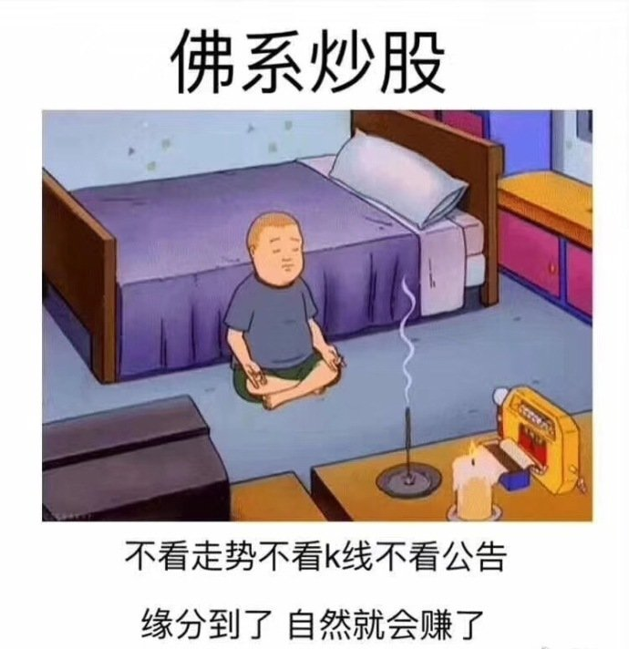

======================================================

ETF拯救世界 (5687069307) @
2018-05-31 16:03:45 Thu  
url: https://weibo.com/5687069307/GjcFZ3jvR

怎么办。我怎么感觉，如果未来真的有极限底，会被我们买起来的。

一份而已啊。 ​​​

转发[11]  评论[211]  赞[268] 

+++++++++++++++++++++++++++++++++++++++++++++++++++++

图片：
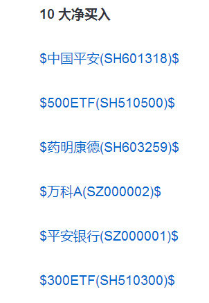

======================================================

ETF拯救世界 (5687069307) @
2018-05-31 16:48:29 Thu  
url: https://weibo.com/5687069307/GjcY8xjvn

从年初的大蓝筹，到现在的医药。这一路你应该特别清楚的看到，一个品种在没有启动，或者启动涨的不多的时候，是如何无人问津。

随着涨幅越来越大，推荐看好的人越来越多。基金公司、券商、媒体、大v开始群体看好。

推荐的人越来越多，理由越来越充分。然后，推动价格继续上涨。

做为一个理性投资者 ​​​

转发[68]  评论[196]  赞[421] 

======================================================

