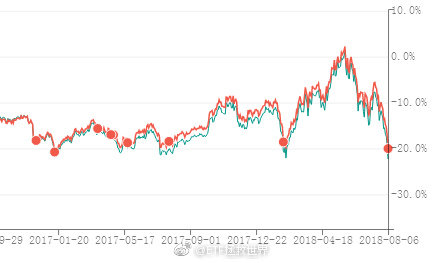
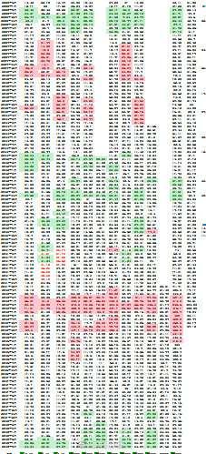
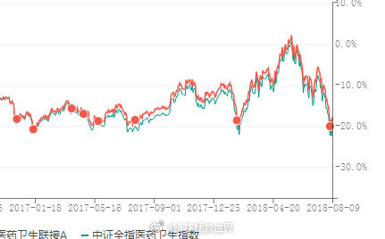
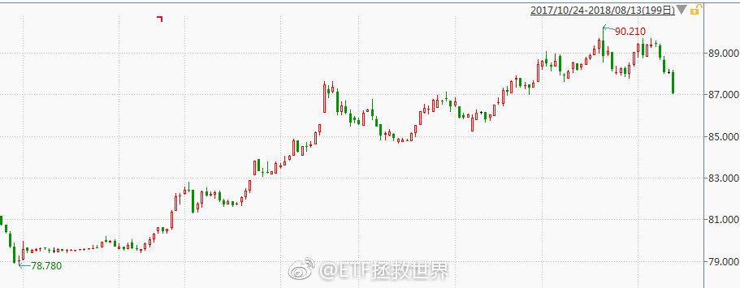
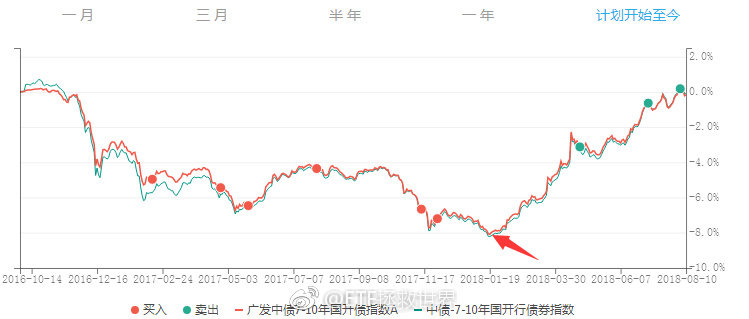
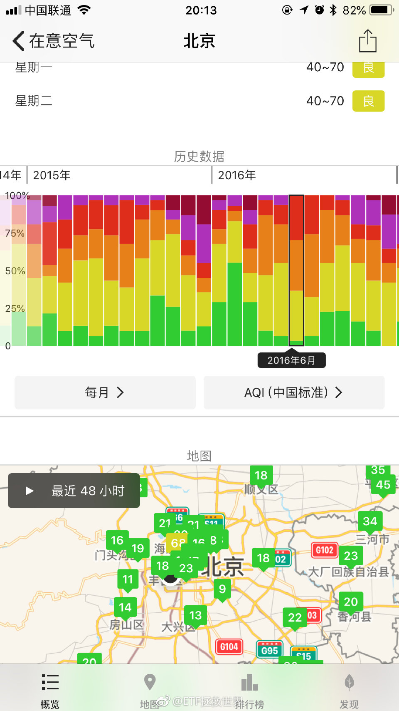
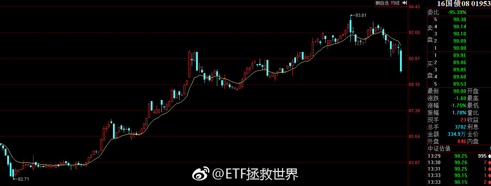
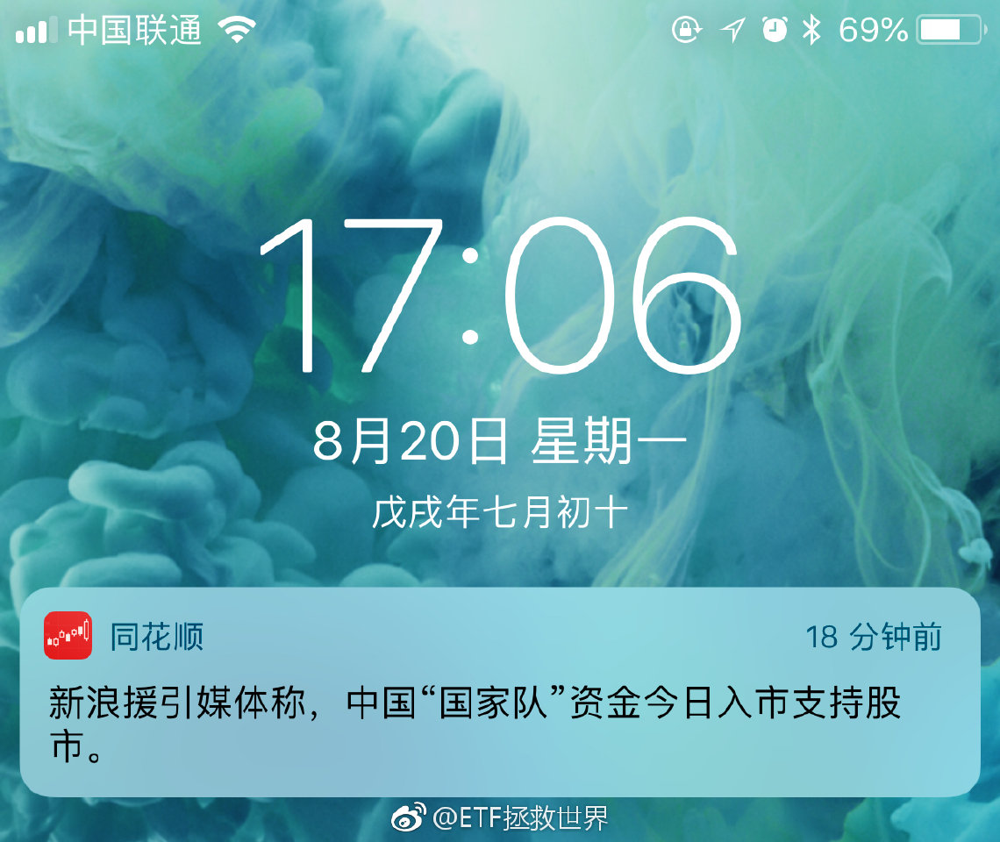

ETF拯救世界 (5687069307) @
2018-08-01 09:37:48 Wed  
url: https://weibo.com/5687069307/GsAE6p0IC

哥儿俩每天轮着凉……//@ETF拯救世界:两只股票春风得意的时候，买入者极度乐观的情绪，没买的人极度焦躁，这是非常生动的一课，各位应该好好回顾，好好体会。与价值无关，情绪。

------------------------------------------------------
转推：
>  @ETF拯救世界 (5687069307)
>  2018-07-17 10:23:32 Tue  
>  url: https:/weibo.com/5687069307/Gqjxe62DI/

>  我这半年多关注的8848和腾讯，不是说对这两家公司有什么看法，我是在观察情绪。
>  
>  这两家公司在持续暴涨的时候，带了很多很多情绪。尤其是前者。很多人因为没买后悔的夜不能寐，很多人买了抱持坚定信念可以再涨好几倍。
>  
>  一家公司，一个行业，到底是不是真的能预判五年、十年后？
>  
>  很难讲。前几天看到一 ​​​

转发[7]  评论[52]  赞[162] 

======================================================

ETF拯救世界 (5687069307) @
2018-08-01 10:20:07 Wed  
url: https://weibo.com/5687069307/GsAVih4Nj

7月财新中国制造业PMI录得50.8 创八个月新低。产出增速、新订单增速均出现放缓，新出口订单指数创25个月以来最低，通胀压力减弱，制造业景气度温和走弱。 ​​​

转发[9]  评论[89]  赞[224] 

======================================================

ETF拯救世界 (5687069307) @
2018-08-01 12:03:53 Wed  
url: https://weibo.com/5687069307/GsBBpefN7

谁的手比较快？ ​​​

转发[6]  评论[212]  赞[296] 

======================================================

ETF拯救世界 (5687069307) @
2018-08-01 13:29:51 Wed  
url: https://weibo.com/5687069307/GsCaizeYU

太乐观的人可能要挂一批。 ​​​

转发[3]  评论[49]  赞[229] 

======================================================

ETF拯救世界 (5687069307) @
2018-08-01 13:31:40 Wed  
url: https://weibo.com/5687069307/GsCb2jvOu

另外，没有经历过0405,08,1112的朋友们，现在可以用心去体会危机的感觉了。 ​​​

转发[9]  评论[140]  赞[262] 

======================================================

ETF拯救世界 (5687069307) @
2018-08-01 13:46:11 Wed  
url: https://weibo.com/5687069307/GsCgVAMxP

节奏就是，上周没发车，今天发一车。如果下次是月中发车，那么就是一个月只发了一车。

代表我的态度了。

节奏，节奏。 ​​​

转发[14]  评论[88]  赞[305] 

======================================================

ETF拯救世界 (5687069307) @
2018-08-01 13:54:05 Wed  
url: https://weibo.com/5687069307/GsCk8qJFw

乐观的人早就满仓被套了。悲观的人在逃跑。

我们拿着现金在捡辣鸡。 ​​​

转发[14]  评论[108]  赞[371] 

======================================================

ETF拯救世界 (5687069307) @
2018-08-01 14:32:18 Wed  
url: https://weibo.com/5687069307/GsCzEe1ZB

各大指数开始考验前期低点。

前期低点有多重要，现在已经不用我说了吧 ​​​

转发[14]  评论[106]  赞[314] 

======================================================

ETF拯救世界 (5687069307) @
2018-08-01 14:39:46 Wed  
url: https://weibo.com/5687069307/GsCCGw2jg

现在想，那些买CDR基金的人非常明智了。

虽然CDR黄了，连货基收益都拿不到。但是不赔当赚，可以说大赢家了。

就是不知道几年封闭期以后什么样。 ​​​

转发[8]  评论[110]  赞[283] 

======================================================

ETF拯救世界 (5687069307) @
2018-08-02 09:40:47 Thu  
url: https://weibo.com/5687069307/GsK5OCueX

惨！ ​​​

转发[2]  评论[98]  赞[198] 

======================================================

ETF拯救世界 (5687069307) @
2018-08-02 09:44:15 Thu  
url: https://weibo.com/5687069307/GsK7enF9w

还是那句话，注意节奏。

你家不是开矿的，也做不到很多人“昨天涨的时候满仓了，今天明天跌了继续加仓”那样 ​​​

转发[12]  评论[75]  赞[248] 

======================================================

ETF拯救世界 (5687069307) @
2018-08-02 09:49:47 Thu  
url: https://weibo.com/5687069307/GsK9tjYHH

今天是一块凉。//@ETF拯救世界:哥儿俩每天轮着凉……//@ETF拯救世界:两只股票春风得意的时候，买入者极度乐观的情绪，没买的人极度焦躁，这是非常生动的一课，各位应该好好回顾，好好体会。与价值无关，情绪。

------------------------------------------------------
转推：
>  @ETF拯救世界 (5687069307)
>  2018-07-17 10:23:32 Tue  
>  url: https:/weibo.com/5687069307/Gqjxe62DI/

>  我这半年多关注的8848和腾讯，不是说对这两家公司有什么看法，我是在观察情绪。
>  
>  这两家公司在持续暴涨的时候，带了很多很多情绪。尤其是前者。很多人因为没买后悔的夜不能寐，很多人买了抱持坚定信念可以再涨好几倍。
>  
>  一家公司，一个行业，到底是不是真的能预判五年、十年后？
>  
>  很难讲。前几天看到一 ​​​

转发[1]  评论[16]  赞[121] 

======================================================

ETF拯救世界 (5687069307) @
2018-08-02 09:56:29 Thu  
url: https://weibo.com/5687069307/GsKcbF4TL

来，各位，投个票。我观察一下情绪。微博直接有投票，不像球球那么麻烦点赞了。

我发起了一个投票 【面对A股，你现在的情绪是】http://t.cn/RemSyo3 ​​​

转发[2641]  评论[3557]  赞[198] 

======================================================

ETF拯救世界 (5687069307) @
2018-08-02 10:00:33 Thu  
url: https://weibo.com/5687069307/GsKdQeVjV

在这样跌下去，未来会赚多少我已经没有概念了……

钻石底真的越来越近了…… ​​​

转发[33]  评论[328]  赞[473] 

======================================================

ETF拯救世界 (5687069307) @
2018-08-02 10:13:52 Thu  
url: https://weibo.com/5687069307/GsKjfkMMk

我说过很多次，在A股，你太乐观会死的很快，太悲观赚不到什么钱。

这句话可能以前你不太在意，现在越来越对前半句有体会了。然后，几年后，你会发现后半句更绝了。 ​​​

转发[80]  评论[172]  赞[466] 

======================================================

ETF拯救世界 (5687069307) @
2018-08-02 10:30:55 Thu  
url: https://weibo.com/5687069307/GsKqb00xD

开会。 ​​​

转发[0]  评论[82]  赞[210] 

======================================================

ETF拯救世界 (5687069307) @
2018-08-02 11:24:00 Thu  
url: https://weibo.com/5687069307/GsKLHEMfs

现在各位回头想，几个月前鹅厂南非大股东巨额减持，总裁刘炽平减持100万股，他们才是大玩家。 ​​​

转发[13]  评论[49]  赞[310] 

======================================================

ETF拯救世界 (5687069307) @
2018-08-02 11:25:32 Thu  
url: https://weibo.com/5687069307/GsKMl138M

每周发车模式再次恢复运行。 ​​​

转发[8]  评论[148]  赞[524] 

======================================================

ETF拯救世界 (5687069307) @
2018-08-02 11:47:15 Thu  
url: https://weibo.com/5687069307/GsKV934Kd

刚才看见有个评论说，“股市是你家开的啊”

特别有意思。为什么，因为这句话这几年经常在我脑子里响起，因为三年前球球上也有个人这么说。

“股市是你家开的啊，你说跌就跌？踏空狗。”

三年过去，踏空狗活得很好。不知道那位仁兄还好吗。 ​​​

转发[8]  评论[77]  赞[332] 

======================================================

ETF拯救世界 (5687069307) @
2018-08-02 11:50:56 Thu  
url: https://weibo.com/5687069307/GsKWEcAc8

“未来会赚多少没概念”是什么意思？

投资指数，能赚多少，正常情况下是有概念的。不会超过一定范围。比如买的低，长期长期可能6%-15%。

但是低到一定地步，就没概念了。甚至可能两三年年化可以50%，已经不能用常理推断。

什么都不懂就来喷，悲哀。 ​​​

转发[52]  评论[116]  赞[353] 

======================================================

ETF拯救世界 (5687069307) @
2018-08-02 11:55:50 Thu  
url: https://weibo.com/5687069307/GsKYDnO51

军工信息归位日，A股见底时

------------------------------------------------------
转推：
>  @ ()
>  2018-08-02 11:36:04 Thu  
>  url: 

>  抱歉，作者已设置仅展示半年内微博，此微博已不可见。 ​​​

转发[69]  评论[169]  赞[319] 

======================================================

ETF拯救世界 (5687069307) @
2018-08-02 13:04:14 Thu  
url: https://weibo.com/5687069307/GsLqoBpAU

[哼] ​​​

转发[2]  评论[178]  赞[420] 

+++++++++++++++++++++++++++++++++++++++++++++++++++++

图片：

======================================================

ETF拯救世界 (5687069307) @
2018-08-02 13:25:54 Thu  
url: https://weibo.com/5687069307/GsLzc6Zh6

500开始挑战我做人的底线了。

4600-4700 ​​​

转发[29]  评论[303]  赞[482] 

======================================================

ETF拯救世界 (5687069307) @
2018-08-02 16:37:52 Thu  
url: https://weibo.com/5687069307/GsMP74MmM

今天开始，A股进入过去二十年第四次“持有股票优于持有债券”的时期。

上一次该时期是2012-2013。 ​​​

转发[153]  评论[272]  赞[603] 

======================================================

ETF拯救世界 (5687069307) @
2018-08-02 16:42:32 Thu  
url: https://weibo.com/5687069307/GsMR0rPA6

环保指数估值即将跌破20倍。

[鄙视] ​​​

转发[32]  评论[116]  赞[367] 

======================================================

ETF拯救世界 (5687069307) @
2018-08-02 18:10:34 Thu  
url: https://weibo.com/5687069307/GsNqK3bPV

有道理是有道理，但如果自己低位买入，赚了几倍还不停再看高几倍极力宣扬还是低估，很多事情就很难说清了。你可以说跟的人没脑子，自作自受，但吹票的人未免少了一些同理心以及善良。

------------------------------------------------------
转推：
>  @挖龙脉的超级鹿鼎公 (3962719063)
>  2018-08-02 16:14:45 Thu  
>  url: https:/weibo.com/3962719063/GsMFJf1aR/

>  好有道理 ​​​

转发[14]  评论[58]  赞[317] 

======================================================

ETF拯救世界 (5687069307) @
2018-08-02 18:23:54 Thu  
url: https://weibo.com/5687069307/GsNw9mEv6

这么说吧。

我一直看到有一种论调：别人说股票是别人的权利，再怎么吹，你是成年人，你愿意跟，赔多少也是你自己的事。正好让那些不适合股市的人赔光，走人。

这样的说法，看起来有点道理，但我始终始终无法接受。

那么，买P2P的人是不是也应该自作自受？被忽悠瘸了买保健品的大爷大妈呢？被电信诈 ​​​

转发[35]  评论[276]  赞[744] 

======================================================

ETF拯救世界 (5687069307) @
2018-08-03 09:07:10 Fri  
url: https://weibo.com/5687069307/GsTiFt8lm

鹅厂怎么也得反弹个10%吧……这个数字怎么算出来的，蒙的。 ​​​

转发[68]  评论[64]  赞[176] 

======================================================

ETF拯救世界 (5687069307) @
2018-08-03 09:40:39 Fri  
url: https://weibo.com/5687069307/GsTwgftqV

低调一点多好。

------------------------------------------------------
转推：
>  @ ()
>  2018-08-03 09:00:30 Fri  
>  url: 

>  抱歉，此微博已被作者删除。查看帮助：http://t.cn/Rfd3rQV

转发[0]  评论[32]  赞[100] 

======================================================

ETF拯救世界 (5687069307) @
2018-08-03 10:09:52 Fri  
url: https://weibo.com/5687069307/GsTI7nbY8

时间，空间。

牛市或者熊市，必须给时间。每天买，家里不是开矿的，你没那么多钱。

给了时间，空间就会拉开。熊市成本会大幅降低，牛市利润会飞速增长。

节奏。 ​​​

转发[85]  评论[163]  赞[371] 

======================================================

ETF拯救世界 (5687069307) @
2018-08-03 10:14:26 Fri  
url: https://weibo.com/5687069307/GsTJYmf90

浓眉大眼的白酒也跳。

没法活了。 ​​​

转发[8]  评论[45]  赞[194] 

======================================================

ETF拯救世界 (5687069307) @
2018-08-03 10:17:23 Fri  
url: https://weibo.com/5687069307/GsTLawznw

美帝企业，苹果这样的，挣了钱，好多现金，回购股票，流通股本减少，每股价值提升，股价上涨，股民管理层一起笑哈哈。

我朝某些企业，赚了大钱，现金几百亿，也不回购也不好好分红，又没有什么资本支出，低息借给地方政府。

差距有点大啊。 ​​​

转发[16]  评论[91]  赞[273] 

======================================================

ETF拯救世界 (5687069307) @
2018-08-03 10:32:16 Fri  
url: https://weibo.com/5687069307/GsTRdfqvG

很多人的信心已经处在崩溃边缘了。 ​​​

转发[12]  评论[241]  赞[328] 

======================================================

ETF拯救世界 (5687069307) @
2018-08-03 10:57:14 Fri  
url: https://weibo.com/5687069307/GsU1lqsDx

1月26日，恒生见顶前一天。

被骂的狗血喷头。

太可惜了，我没法在雪球再做情绪测试了。

那才是测试群众情绪的最佳场所。

当时看到48000的v是群众心中的神。

http://t.cn/Red6Uws ​​​

转发[24]  评论[116]  赞[237] 

======================================================

ETF拯救世界 (5687069307) @
2018-08-03 11:05:33 Fri  
url: https://weibo.com/5687069307/GsU4IFdLD

不会见到0字头吧！0.0xx……

------------------------------------------------------
转推：
>  @ETF拯救世界 (5687069307)
>  2018-05-23 09:31:20 Wed  
>  url: https:/weibo.com/5687069307/GhWGIwsQI/

>  $150023  能见1字头么 ​​​

转发[26]  评论[40]  赞[122] 

======================================================

ETF拯救世界 (5687069307) @
2018-08-03 11:10:33 Fri  
url: https://weibo.com/5687069307/GsU6KvGbJ

回复@安小之18:指数就是股票组成的，这个说法不觉得很可笑吗。宽基+高弹性指数秒杀大多数股票。另外，你以为股票涨10倍，拿着的人能赚多少？我不会告诉你70%炒股的人牛市也赔钱的……//@安小之18:E大，对于“牛市中指数没有股票盈利多”这种说法你怎么看？

------------------------------------------------------
转推：
>  @ETF拯救世界 (5687069307)
>  2018-05-23 09:31:20 Wed  
>  url: https:/weibo.com/5687069307/GhWGIwsQI/

>  $150023  能见1字头么 ​​​

转发[19]  评论[53]  赞[159] 

======================================================

ETF拯救世界 (5687069307) @
2018-08-03 11:17:28 Fri  
url: https://weibo.com/5687069307/GsU9zcpX9

回复@路上有只羊:我有种感觉，球球是鼓励或者说默许喷子的。没有喷子就没有流量。流量才是最重要的。这个我没有什么证据，只是自己的感觉。真正有价值的东西，一定是与大多数人的思考结果不同的，一定很多人不同意。球球对逆向思维是扼杀状态。

------------------------------------------------------
转推：
>  @ETF拯救世界 (5687069307)
>  2018-08-03 10:57:14 Fri  
>  url: https:/weibo.com/5687069307/GsU1lqsDx/

>  1月26日，恒生见顶前一天。
>  
>  被骂的狗血喷头。
>  
>  太可惜了，我没法在雪球再做情绪测试了。
>  
>  那才是测试群众情绪的最佳场所。
>  
>  当时看到48000的v是群众心中的神。
>  
>  http://t.cn/Red6Uws ​​​

转发[12]  评论[105]  赞[223] 

======================================================

ETF拯救世界 (5687069307) @
2018-08-03 11:30:38 Fri  
url: https://weibo.com/5687069307/GsUeUnhSz

回复@Elainealry:再稳一稳。让美元债再飞一飞。//@Elainealry:离岸汇率已经破6.9了我们要做点什么吗[哈哈][哈哈][哈哈]

------------------------------------------------------
转推：
>  @ETF拯救世界 (5687069307)
>  2018-08-03 10:57:14 Fri  
>  url: https:/weibo.com/5687069307/GsU1lqsDx/

>  1月26日，恒生见顶前一天。
>  
>  被骂的狗血喷头。
>  
>  太可惜了，我没法在雪球再做情绪测试了。
>  
>  那才是测试群众情绪的最佳场所。
>  
>  当时看到48000的v是群众心中的神。
>  
>  http://t.cn/Red6Uws ​​​

转发[4]  评论[46]  赞[167] 

======================================================

ETF拯救世界 (5687069307) @
2018-08-03 13:11:33 Fri  
url: https://weibo.com/5687069307/GsUTRfa5p

回复@阿奕长官:不好意思，我没法预测哪里是反弹高位。你知道谁有这个能力吗。//@阿奕长官:E大，请教一下:我基本上按您发车全部跟了全指医药001180，现在这个品种盈利从几千跌回到几百，为什么当初没有发指令高位卖了低位再买？这个问题您在策略中怎么考虑的？谢谢

------------------------------------------------------
转推：
>  @ETF拯救世界 (5687069307)
>  2018-08-03 10:14:26 Fri  
>  url: https:/weibo.com/5687069307/GsTJYmf90/

>  浓眉大眼的白酒也跳。
>  
>  没法活了。 ​​​

转发[4]  评论[95]  赞[161] 

======================================================

ETF拯救世界 (5687069307) @
2018-08-03 13:25:01 Fri  
url: https://weibo.com/5687069307/GsUZktBgo

还剩7%，给不给面子。

------------------------------------------------------
转推：
>  @ETF拯救世界 (5687069307)
>  2018-08-03 09:07:10 Fri  
>  url: https:/weibo.com/5687069307/GsTiFt8lm/

>  鹅厂怎么也得反弹个10%吧……这个数字怎么算出来的，蒙的。 ​​​

转发[1]  评论[16]  赞[124] 

======================================================

ETF拯救世界 (5687069307) @
2018-08-03 13:31:04 Fri  
url: https://weibo.com/5687069307/GsV1Nhh5Y

刚才那位朋友的问题，我不是没有解决办法。而是暂时没有用到计划里。

接下来我准备尝试用一下。可能下次发车就会用。可以部分的解决波动利润问题。 ​​​

转发[3]  评论[82]  赞[270] 

======================================================

ETF拯救世界 (5687069307) @
2018-08-03 13:38:23 Fri  
url: https://weibo.com/5687069307/GsV4Ll2DP

小米，年轻人第一支被套的股票……

------------------------------------------------------
转推：
>  @小米公司陈曦 (2651381433)
>  2018-06-22 10:54:12 Fri  
>  url: https:/weibo.com/2651381433/Gmw3gaYeG/

>  联交所第一支同股不同权的股票[鼓掌][鼓掌][鼓掌]
>  股票代码：1810（18年上市，10年创立）
>  年轻人的第一支股票，亲爱的米粉们，账户开好了吗[偷笑][偷笑] ​​​

转发[32]  评论[51]  赞[191] 

======================================================

ETF拯救世界 (5687069307) @
2018-08-03 14:02:52 Fri  
url: https://weibo.com/5687069307/GsVeHrXb0

喷了。谁能想到真有可能见4字头了。当时可是800多点啊。最高是1800。

------------------------------------------------------
转推：
>  @ETF拯救世界 (5687069307)
>  2017-12-15 09:50:04 Fri  
>  url: https:/weibo.com/5687069307/FzJjHqeZF/

>  $证券公司 sz399975$   我认为360-400点应该是极限底部了…… ​​​

转发[27]  评论[65]  赞[211] 

======================================================

ETF拯救世界 (5687069307) @
2018-08-03 14:11:28 Fri  
url: https://weibo.com/5687069307/GsVibs9xy

其实绝大多数人来投资股票，最大的问题是两点：

第一，是买之前没想到过自己会赔。

第二，是想到自己会赔，但没想到买的东西会跌这么多。

也就是预期不够。预期不够就没有应对策略，没有应对策略，最坏的事情发生了就一脸懵逼。

如果你对最坏的情况已经有了预期（比如，该品种目前买入最大下跌幅度 ​​​

转发[127]  评论[228]  赞[378] 

======================================================

ETF拯救世界 (5687069307) @
2018-08-03 14:51:51 Fri  
url: https://weibo.com/5687069307/GsVyzCb7G

太坏了，又骗了多少人进去一锅焖了…… ​​​

转发[5]  评论[142]  赞[271] 

======================================================

ETF拯救世界 (5687069307) @
2018-08-03 15:46:11 Fri  
url: https://weibo.com/5687069307/GsVUDanuI

养老产业估值已经跌破2008年10月金融危机大底。

然而，军工信息依然高高高高在上。

好气哦。 ​​​

转发[74]  评论[184]  赞[295] 

======================================================

ETF拯救世界 (5687069307) @
2018-08-03 16:06:22 Fri  
url: https://weibo.com/5687069307/GsW2PbfR0

看了看自选股。开始杀白马了。

这就是熊市。通杀。

苍天饶过谁。 ​​​

转发[16]  评论[65]  赞[300] 

======================================================

ETF拯救世界 (5687069307) @
2018-08-03 16:09:50 Fri  
url: https://weibo.com/5687069307/GsW4elVJz

回复@悠然见南山98518:500即将跌破2012年底。开始杀向08年。//@悠然见南山98518:可能除了军工信息，其它的都接近或超过12年的低，不知猜的如何[二哈]

------------------------------------------------------
转推：
>  @ETF拯救世界 (5687069307)
>  2018-08-03 15:46:11 Fri  
>  url: https:/weibo.com/5687069307/GsVUDanuI/

>  养老产业估值已经跌破2008年10月金融危机大底。
>  
>  然而，军工信息依然高高高高在上。
>  
>  好气哦。 ​​​

转发[16]  评论[45]  赞[161] 

======================================================

ETF拯救世界 (5687069307) @
2018-08-03 16:16:10 Fri  
url: https://weibo.com/5687069307/GsW6OcLdw

回复@flight09:军工2015年估值是220倍，了解一下。//@flight09:我看了下军工指数从3040高点到现在的902，估值还是很高么[泪]

------------------------------------------------------
转推：
>  @ETF拯救世界 (5687069307)
>  2018-08-03 15:46:11 Fri  
>  url: https:/weibo.com/5687069307/GsVUDanuI/

>  养老产业估值已经跌破2008年10月金融危机大底。
>  
>  然而，军工信息依然高高高高在上。
>  
>  好气哦。 ​​​

转发[11]  评论[49]  赞[142] 

======================================================

ETF拯救世界 (5687069307) @
2018-08-03 16:27:18 Fri  
url: https://weibo.com/5687069307/GsWbk1w44

回复@fight2021:从下往上数第二层。//@fight2021:如果共五层地狱，那么现在我们在哪一层？

------------------------------------------------------
转推：
>  @ETF拯救世界 (5687069307)
>  2018-08-03 15:46:11 Fri  
>  url: https:/weibo.com/5687069307/GsVUDanuI/

>  养老产业估值已经跌破2008年10月金融危机大底。
>  
>  然而，军工信息依然高高高高在上。
>  
>  好气哦。 ​​​

转发[9]  评论[92]  赞[207] 

======================================================

ETF拯救世界 (5687069307) @
2018-08-03 16:39:46 Fri  
url: https://weibo.com/5687069307/GsWgnw6N4

“满仓穿越牛熊”。

“持有好公司，不在意股价波动。”

[悲伤] ​​​

转发[20]  评论[188]  赞[341] 

======================================================

ETF拯救世界 (5687069307) @
2018-08-03 16:59:43 Fri  
url: https://weibo.com/5687069307/GsWotwSHQ

也就是在微博。如果在球球我说这些能被喷到北极去……感谢你们不喷之恩。（其实是喷的都拉黑了）

------------------------------------------------------
转推：
>  @ETF拯救世界 (5687069307)
>  2018-08-03 16:39:46 Fri  
>  url: https:/weibo.com/5687069307/GsWgnw6N4/

>  “满仓穿越牛熊”。
>  
>  “持有好公司，不在意股价波动。”
>  
>  [悲伤] ​​​

转发[8]  评论[137]  赞[409] 

======================================================

ETF拯救世界 (5687069307) @
2018-08-03 20:13:20 Fri  
url: https://weibo.com/5687069307/GsXF4xVQe

央妈如约出手，6.9。[微笑]//@ETF拯救世界:我相信央妈不会允许到7。6.9附近会有动作

------------------------------------------------------
转推：
>  @ ()
>  2018-07-30 11:45:15 Mon  
>  url: 

>  抱歉，此微博已被作者删除。查看帮助：http://t.cn/Rfd3rQV

转发[3]  评论[97]  赞[240] 

======================================================

ETF拯救世界 (5687069307) @
2018-08-04 08:29:10 Sat  
url: https://weibo.com/5687069307/Gt2tK8Ga2

还没散呢？ ​​​

转发[5]  评论[108]  赞[167] 

+++++++++++++++++++++++++++++++++++++++++++++++++++++

图片：

======================================================

ETF拯救世界 (5687069307) @
2018-08-05 17:58:22 Sun  
url: https://weibo.com/5687069307/GtfDhh9X1

想写点什么，打开电脑坐了半天觉得现在也没什么好写的。

锻炼去了…… ​​​

转发[1]  评论[131]  赞[340] 

======================================================

ETF拯救世界 (5687069307) @
2018-08-05 22:02:30 Sun  
url: https://weibo.com/5687069307/GthenrZDT

最近一段时间，各位在网上看东西的时候，要更加客观理性。

理性很难。别人疯狂的时候，或者别人恐惧的时候，理性都很重要。

这个世界上没有天堂，每个国家每个地区都有自己的问题。不要粉饰太平，也不要杞人忧天。

再次提醒，无论看到什么，都要客观，理性，独立思考。

独立思考！你看到的，未必是 ​​​

转发[44]  评论[141]  赞[306] 

======================================================

ETF拯救世界 (5687069307) @
2018-08-05 22:06:11 Sun  
url: https://weibo.com/5687069307/GthfSdA42

回复@Yoran_咩咩咩:说说你身边的崩溃和苦日子的例子。不要听说的，说说真实发生的。//@Yoran_咩咩咩:各种经济奔溃，各种苦日子刚开始，说实话好难

------------------------------------------------------
转推：
>  @ETF拯救世界 (5687069307)
>  2018-08-05 22:02:30 Sun  
>  url: https:/weibo.com/5687069307/GthenrZDT/

>  最近一段时间，各位在网上看东西的时候，要更加客观理性。
>  
>  理性很难。别人疯狂的时候，或者别人恐惧的时候，理性都很重要。
>  
>  这个世界上没有天堂，每个国家每个地区都有自己的问题。不要粉饰太平，也不要杞人忧天。
>  
>  再次提醒，无论看到什么，都要客观，理性，独立思考。
>  
>  独立思考！你看到的，未必是 ​​​

转发[11]  评论[134]  赞[131] 

======================================================

ETF拯救世界 (5687069307) @
2018-08-05 22:20:11 Sun  
url: https://weibo.com/5687069307/GthlyrxU0

有没有你关注的人，之前一直信心满满的满仓满融，最近开始有点含糊，甚至真的减仓的。 ​​​

转发[13]  评论[161]  赞[242] 

======================================================

ETF拯救世界 (5687069307) @
2018-08-05 23:00:32 Sun  
url: https://weibo.com/5687069307/GthBVqti1

每日打卡（196）

刚才看了看计划，今年净值下跌5%了。

多少年都没赔钱了，今年要开荤？年底前要翻身！ ​​​

转发[8]  评论[57]  赞[256] 

+++++++++++++++++++++++++++++++++++++++++++++++++++++

图片：

======================================================

ETF拯救世界 (5687069307) @
2018-08-05 23:24:41 Sun  
url: https://weibo.com/5687069307/GthLJfnKi

曾经在威尼斯的码头上坐了一个小时看云。威尼斯真的美，有机会要去看看。

------------------------------------------------------
转推：
>  @路凡夫 (5992159621)
>  2018-08-05 20:10:03 Sun  
>  url: https:/weibo.com/5992159621/GtguJaVSl/

>  威尼斯水城的落日跟余晖http://t.cn/Rmfdnws ​​​

转发[41]  评论[57]  赞[214] 

======================================================

ETF拯救世界 (5687069307) @
2018-08-06 09:01:56 Mon  
url: https://weibo.com/5687069307/Gtly2vGmP

我回忆了一下，发现自己对某个去过地方的印象，居然很大程度上不是来自于那里的景色和历史，而是来自于那里的人。

接触到的人好，对那里就有很好的印象。接触到的人一般，印象就会很差。

目前来说，印象最好的是，说出来政治很不正确的美国和日本。

美国老百姓是真的热情，有礼貌，甚至有点，用我们 ​​​

转发[74]  评论[211]  赞[371] 

======================================================

ETF拯救世界 (5687069307) @
2018-08-06 09:16:33 Mon  
url: https://weibo.com/5687069307/GtlDY83yR

这周随时发车。2车以上。不会超过5车。 ​​​

转发[6]  评论[96]  赞[325] 

======================================================

ETF拯救世界 (5687069307) @
2018-08-06 09:21:07 Mon  
url: https://weibo.com/5687069307/GtlFP5BIi

论加强锻炼的重要性。//@新京报我们视频:交警：你要skr止啊[doge]//@-强说着忧愁的孩子-:累死skr人

------------------------------------------------------
转推：
>  @新京报我们视频 (6124642021)
>  2018-08-03 23:21:08 Fri  
>  url: https:/weibo.com/6124642021/GsYTiEc2e/

>  【#史上最无力的逃逸# 司机遇查龟速逃跑 交警一路陪跑：“要不歇会？”】8月2日，湖北襄阳，一名男子遇到交警检查时，打开车门下车就往收费站外跑。
>  交警：“你跑得过我吗？来来来来，给我跑！”
>  男子：拿着手机提了一下裤子，继续跑……
>  交警：就你这体格还跟我跑？停下吧
>  男子：我坐会，歇口气。 ​​​

转发[11]  评论[17]  赞[75] 

======================================================

ETF拯救世界 (5687069307) @
2018-08-06 09:34:32 Mon  
url: https://weibo.com/5687069307/GtlLgyLJ3

强势股开始补跌。熊市进入新阶段了。 ​​​

转发[12]  评论[81]  赞[293] 

======================================================

ETF拯救世界 (5687069307) @
2018-08-06 10:02:03 Mon  
url: https://weibo.com/5687069307/GtlWrrfz7

想为国护盘，然，国不给机会。那么我们就等着吧。

------------------------------------------------------
转推：
>  @ETF拯救世界 (5687069307)
>  2018-08-06 09:16:33 Mon  
>  url: https:/weibo.com/5687069307/GtlDY83yR/

>  这周随时发车。2车以上。不会超过5车。 ​​​

转发[1]  评论[98]  赞[231] 

======================================================

ETF拯救世界 (5687069307) @
2018-08-06 10:34:22 Mon  
url: https://weibo.com/5687069307/Gtm9ynbLA

帮两位关注我的朋友转两条消息，我没有亲自查证过，但我想还是帮个忙。请各位自行分辨吧。

祝福他们。

一个是走失的孩子：

http://t.cn/RD25bLR

一个是一位病人：

http://t.cn/RD2Co3U ​​​

转发[48]  评论[82]  赞[142] 

======================================================

ETF拯救世界 (5687069307) @
2018-08-06 10:36:31 Mon  
url: https://weibo.com/5687069307/GtmaqoO91

一年过去，医药满仓点位上升至7700点。//@ETF拯救世界:说正经的吧。以目前的情况，医药满仓点位是7000，减仓区域是12000-13000。这几个数字每年增加500-1000点。//@ETF拯救世界:回复@求财不劫色:放过它！医药还是个孩子！//@求财不劫色:什么时候医药才能减呢？

------------------------------------------------------
转推：
>  @ETF拯救世界 (5687069307)
>  2017-08-22 09:42:34 Tue  
>  url: https:/weibo.com/5687069307/Fif7yjvZX/

>  现在还在喊港股有极大投资价值的都是坏人。 ​​​

转发[107]  评论[179]  赞[216] 

======================================================

ETF拯救世界 (5687069307) @
2018-08-06 10:47:16 Mon  
url: https://weibo.com/5687069307/GtmeN7NAj

GUO:还是你们来吧。 ​​​

转发[1]  评论[156]  赞[269] 

======================================================

ETF拯救世界 (5687069307) @
2018-08-06 13:00:28 Mon  
url: https://weibo.com/5687069307/Gtn6Qx6ct

滴滴！！！ ​​​

转发[16]  评论[226]  赞[310] 

======================================================

ETF拯救世界 (5687069307) @
2018-08-06 13:23:36 Mon  
url: https://weibo.com/5687069307/GtngfylBH

回复@小饺子ww:刚才下楼吃饭有很多滴滴邦邦恰恰恰，比过去三年见过的总数还多……//@小饺子ww:滴滴～邦邦～恰恰恰～[doge]

------------------------------------------------------
转推：
>  @ETF拯救世界 (5687069307)
>  2018-08-06 13:00:28 Mon  
>  url: https:/weibo.com/5687069307/Gtn6Qx6ct/

>  滴滴！！！ ​​​

转发[1]  评论[49]  赞[126] 

======================================================

ETF拯救世界 (5687069307) @
2018-08-06 13:32:56 Mon  
url: https://weibo.com/5687069307/Gtnk2cAHz

要拉回去？中午发车都不行了？以后收盘前十分钟？ ​​​

转发[2]  评论[130]  赞[237] 

======================================================

ETF拯救世界 (5687069307) @
2018-08-06 14:04:37 Mon  
url: https://weibo.com/5687069307/GtnwTs6MK

指数好歹是有底的。

3000多只股票里面，至少有2000多只的底真的不知道在哪儿了。。 ​​​

转发[14]  评论[61]  赞[240] 

======================================================

ETF拯救世界 (5687069307) @
2018-08-06 14:07:16 Mon  
url: https://weibo.com/5687069307/GtnxYcL50

真.股灾。 ​​​

转发[2]  评论[109]  赞[264] 

======================================================

ETF拯救世界 (5687069307) @
2018-08-06 14:21:38 Mon  
url: https://weibo.com/5687069307/GtnDNDqKD

信心已经完全崩盘了。

本来以为自己可以坚定持仓的开始卖了。 ​​​

转发[15]  评论[126]  赞[321] 

======================================================

ETF拯救世界 (5687069307) @
2018-08-06 14:26:36 Mon  
url: https://weibo.com/5687069307/GtnFOBuFH

A股历史上，20倍以下的中证500，只在金融危机最底部的那个月出现过一次。

2008年10月。

7年后，它从1500点，涨到了12000点。涨幅700%。

难道这次会再次创造奇迹吗。又能见到1字头了？

感谢资本市场。 ​​​

转发[235]  评论[259]  赞[372] 

======================================================

ETF拯救世界 (5687069307) @
2018-08-06 14:34:42 Mon  
url: https://weibo.com/5687069307/GtnJ6rIdZ

是不是有一批私募要挂了 ​​​

转发[3]  评论[76]  赞[216] 

======================================================

ETF拯救世界 (5687069307) @
2018-08-06 14:36:10 Mon  
url: https://weibo.com/5687069307/GtnJHq0PW

回复@爱编程的猫:目前28//@爱编程的猫:期待 E 大全市场估值 25 倍以下的战斗檄文[馋嘴]

------------------------------------------------------
转推：
>  @ETF拯救世界 (5687069307)
>  2018-08-06 14:26:36 Mon  
>  url: https:/weibo.com/5687069307/GtnFOBuFH/

>  A股历史上，20倍以下的中证500，只在金融危机最底部的那个月出现过一次。
>  
>  2008年10月。
>  
>  7年后，它从1500点，涨到了12000点。涨幅700%。
>  
>  难道这次会再次创造奇迹吗。又能见到1字头了？
>  
>  感谢资本市场。 ​​​

转发[107]  评论[76]  赞[177] 

======================================================

ETF拯救世界 (5687069307) @
2018-08-06 15:09:27 Mon  
url: https://weibo.com/5687069307/GtnXdq3KW

回复@风声边界617:4-10个月内必然走出大底区域。最佳建仓时机就剩几个月了。//@风声边界617:益达总结下，黑夜还要多久[泪]//@ETF拯救世界:回复@爱编程的猫:目前28//@爱编程的猫:期待 E 大全市场估值 25 倍以下的战斗檄文[馋嘴]

------------------------------------------------------
转推：
>  @ETF拯救世界 (5687069307)
>  2018-08-06 14:26:36 Mon  
>  url: https:/weibo.com/5687069307/GtnFOBuFH/

>  A股历史上，20倍以下的中证500，只在金融危机最底部的那个月出现过一次。
>  
>  2008年10月。
>  
>  7年后，它从1500点，涨到了12000点。涨幅700%。
>  
>  难道这次会再次创造奇迹吗。又能见到1字头了？
>  
>  感谢资本市场。 ​​​

转发[85]  评论[161]  赞[259] 

======================================================

ETF拯救世界 (5687069307) @
2018-08-06 15:10:53 Mon  
url: https://weibo.com/5687069307/GtnXNeEfl

回复@从容淡定2003:这就是为什么只要买的够低，指数投资是极大概率挣钱的。至于挣多少，要看你买的多低，以及未来会有多疯狂了。尤其后者，更是随缘了。。//@从容淡定2003:7年前的20倍和今年的20倍相比，指数涨了不少呀

------------------------------------------------------
转推：
>  @ETF拯救世界 (5687069307)
>  2018-08-06 14:26:36 Mon  
>  url: https:/weibo.com/5687069307/GtnFOBuFH/

>  A股历史上，20倍以下的中证500，只在金融危机最底部的那个月出现过一次。
>  
>  2008年10月。
>  
>  7年后，它从1500点，涨到了12000点。涨幅700%。
>  
>  难道这次会再次创造奇迹吗。又能见到1字头了？
>  
>  感谢资本市场。 ​​​

转发[29]  评论[53]  赞[198] 

======================================================

ETF拯救世界 (5687069307) @
2018-08-06 15:31:11 Mon  
url: https://weibo.com/5687069307/Gto624r2F

无论现在的你是什么情绪。

很多年以后回头看，你都会感谢现在坚持买入的自己。 ​​​

转发[76]  评论[339]  赞[675] 

======================================================

ETF拯救世界 (5687069307) @
2018-08-06 16:04:40 Mon  
url: https://weibo.com/5687069307/GtojCA4C3

离开了，依然还会有痕迹…… ​​​

转发[10]  评论[171]  赞[318] 

+++++++++++++++++++++++++++++++++++++++++++++++++++++

图片：

======================================================

ETF拯救世界 (5687069307) @
2018-08-06 17:16:59 Mon  
url: https://weibo.com/5687069307/GtoMYvPjG

前面两个孩子……没了。想说一句，各位父母们，带孩子出门的时候都长点心吧。

------------------------------------------------------
转推：
>  @ETF拯救世界 (5687069307)
>  2018-08-06 10:34:22 Mon  
>  url: https:/weibo.com/5687069307/Gtm9ynbLA/

>  帮两位关注我的朋友转两条消息，我没有亲自查证过，但我想还是帮个忙。请各位自行分辨吧。
>  
>  祝福他们。
>  
>  一个是走失的孩子：
>  
>  http://t.cn/RD25bLR
>  
>  一个是一位病人：
>  
>  http://t.cn/RD2Co3U ​​​

转发[5]  评论[77]  赞[116] 

======================================================

ETF拯救世界 (5687069307) @
2018-08-07 08:14:26 Tue  
url: https://weibo.com/5687069307/GtuFfw0Z4

估计不少公司的质押要爆了 ​​​

转发[6]  评论[130]  赞[266] 

======================================================

ETF拯救世界 (5687069307) @
2018-08-07 09:32:27 Tue  
url: https://weibo.com/5687069307/GtvaV7gGY

反弹了吗。如果是，医药每次都买在最低点是什么鬼。 ​​​

转发[34]  评论[126]  赞[259] 

======================================================

ETF拯救世界 (5687069307) @
2018-08-07 09:37:26 Tue  
url: https://weibo.com/5687069307/GtvcX0mE6

回复@風灬忘川水:暴跌的熊市是送钱，暴涨的牛市是送命。听起来很sb的话，懂的人才会赚钱。//@風灬忘川水:还好昨天把医药补的差不多了，养老也补完了，美滋滋

------------------------------------------------------
转推：
>  @ETF拯救世界 (5687069307)
>  2018-08-07 09:32:27 Tue  
>  url: https:/weibo.com/5687069307/GtvaV7gGY/

>  反弹了吗。如果是，医药每次都买在最低点是什么鬼。 ​​​

转发[27]  评论[84]  赞[251] 

======================================================

ETF拯救世界 (5687069307) @
2018-08-07 10:00:34 Tue  
url: https://weibo.com/5687069307/GtvmktBxg

A股 ​​​

转发[81]  评论[115]  赞[222] 

+++++++++++++++++++++++++++++++++++++++++++++++++++++

图片：

======================================================

ETF拯救世界 (5687069307) @
2018-08-07 10:13:33 Tue  
url: https://weibo.com/5687069307/GtvrBgItr

目前A股正在向05/12年狂奔。马上就到了。能撑住就撑住，撑不住就08年。

要知道08年可是全球金融海啸，经济危机。那时候美国德国英国估值只有10倍。现在美帝在23-28。

如果好好的真的冲向08年，真是非常神奇了。到底是情绪的错杀还是资本市场先行指标发挥作用了？

拭目以待吧。总之，各位在经历一个 ​​​

转发[98]  评论[363]  赞[490] 

======================================================

ETF拯救世界 (5687069307) @
2018-08-07 11:42:23 Tue  
url: https://weibo.com/5687069307/Gtw1F0txs

养老产业，目前点位与2015年1月，2016年2月基本一致。

然而，2015年1月估值49倍，2016年2月估值38倍。

目前，只有25倍。

我个人不太相信2年后还是这个点位，如果这样，估值会到15倍左右。无论如何我也不信。因为这是一个增长在十几个点的优质指数。

如果真的有机会到20以下买入，我相信未来十年收 ​​​

转发[181]  评论[250]  赞[356] 

======================================================

ETF拯救世界 (5687069307) @
2018-08-07 11:55:34 Tue  
url: https://weibo.com/5687069307/Gtw71akVx

目前养老80只成分股有十只披露或预披露半年报，只有一只永辉利润下降，8只利润增长在20%以上，6只在40%以上。当然，全部披露后，我估计也就10%-15%之间吧。但已经相当不错了。个人认为，该指数极限跌幅给15%-23%比较合理。那里是钻石区域。

------------------------------------------------------
转推：
>  @ETF拯救世界 (5687069307)
>  2018-08-07 11:42:23 Tue  
>  url: https:/weibo.com/5687069307/Gtw1F0txs/

>  养老产业，目前点位与2015年1月，2016年2月基本一致。
>  
>  然而，2015年1月估值49倍，2016年2月估值38倍。
>  
>  目前，只有25倍。
>  
>  我个人不太相信2年后还是这个点位，如果这样，估值会到15倍左右。无论如何我也不信。因为这是一个增长在十几个点的优质指数。
>  
>  如果真的有机会到20以下买入，我相信未来十年收 ​​​

转发[65]  评论[140]  赞[223] 

======================================================

ETF拯救世界 (5687069307) @
2018-08-07 13:02:45 Tue  
url: https://weibo.com/5687069307/Gtwyh1aNY

相信很多人心中现在有一个终极疑问:

是不是反转了？我是不是要踏空了？ ​​​

转发[11]  评论[180]  赞[283] 

======================================================

ETF拯救世界 (5687069307) @
2018-08-07 13:40:36 Tue  
url: https://weibo.com/5687069307/GtwNEiN9v

谁能想到，第二天就想跟自己说thank you了。

------------------------------------------------------
转推：
>  @ETF拯救世界 (5687069307)
>  2018-08-06 15:31:11 Mon  
>  url: https:/weibo.com/5687069307/Gto624r2F/

>  无论现在的你是什么情绪。
>  
>  很多年以后回头看，你都会感谢现在坚持买入的自己。 ​​​

转发[4]  评论[57]  赞[264] 

======================================================

ETF拯救世界 (5687069307) @
2018-08-07 13:50:44 Tue  
url: https://weibo.com/5687069307/GtwRL07wc

医药买点。

也许这就是缘份吧…… ​​​

转发[14]  评论[114]  赞[336] 

+++++++++++++++++++++++++++++++++++++++++++++++++++++

图片：

======================================================

ETF拯救世界 (5687069307) @
2018-08-07 14:04:40 Tue  
url: https://weibo.com/5687069307/GtwXprJV2

目前的仓位情况是这样的。

A股大致在50%左右。趋势如果真的改变，会右侧买入十个点左右。加起来是60个点左右。

境外的部分加起来十个点左右。其它转债之类的全都算上，一共70多个点。还有点债油等等。

所以现金部分大概也就20个点左右吧。

这是说如果就此反转，不会出现钻石底的情况，有20%会没机 ​​​

转发[91]  评论[238]  赞[398] 

======================================================

ETF拯救世界 (5687069307) @
2018-08-07 14:15:39 Tue  
url: https://weibo.com/5687069307/Gtx1S3wLn

之前忧心忡忡的朋友，涨几天你的所有担忧就都没了。趋势一反转，所有人的担忧都没了。

好像突然之间所有问题都解决了。

什么叫情绪，你将会有深刻的体会。 ​​​

转发[102]  评论[99]  赞[364] 

======================================================

ETF拯救世界 (5687069307) @
2018-08-07 14:20:25 Tue  
url: https://weibo.com/5687069307/Gtx3OkUk1

非常尴尬了。500一天就反弹了两个多点。这样下去，说话就到波段卖出位置了。

然而连7天都没有，时间不够啊。 ​​​

转发[7]  评论[137]  赞[297] 

======================================================

ETF拯救世界 (5687069307) @
2018-08-07 15:10:46 Tue  
url: https://weibo.com/5687069307/Gtxof5vt4

不要预测。反弹还是反转，不要预测。你预测不了。

昨天收盘，全市场顺利回到历史最低区域。未来发生任何事情都有可能，不要预测。一方面是逢低就买，一方面叫做顺势而为。不要把自己的意志强加在市场上。

有些行业的估值低到可耻。甚至已经低于2008。这些行业来说，就此开始涨也没什么意外。

所以在 ​​​

转发[82]  评论[187]  赞[396] 

======================================================

ETF拯救世界 (5687069307) @
2018-08-07 15:20:45 Tue  
url: https://weibo.com/5687069307/Gtxsier8c

昨天的BGM意义重大。 ​​​

转发[1]  评论[148]  赞[308] 

======================================================

ETF拯救世界 (5687069307) @
2018-08-07 17:40:53 Tue  
url: https://weibo.com/5687069307/GtynaF6Tx

看网上那些调侃A股十年不涨的段子，笑笑就行了，你千万别当真。

A股不是不涨。昨天说的，中证500从2008年到2015年，7年涨了700%，比美帝最牛的纳斯达克牛多了。

A股是有自己的特点，就是行情来了，快，猛。别人十年的事儿，它两年就干完了。

橘生淮南则为枳。很多人看了点美帝价投写的书就来照搬， ​​​

转发[267]  评论[322]  赞[630] 

======================================================

ETF拯救世界 (5687069307) @
2018-08-07 20:05:25 Tue  
url: https://weibo.com/5687069307/GtzjQrg7z

我的车里有把锤子，在儿童座椅下面。跟儿子说了，哪天被困在车里用这个敲玻璃。不知道他能不能敲开，舍不得实战演习……

------------------------------------------------------
转推：
>  @澎湃新闻 (5044281310)
>  2018-08-07 18:27:53 Tue  
>  url: https:/weibo.com/5044281310/GtyGfwiKD/

>  【四川南充7岁男孩正午时被父母遗忘车内，高温窒息而亡】8月5日中午，四川省南充市南部县火峰乡，明明父母带着他开车出去办事，回家途中，一直将他忘记在车内，等到最终发现他时，孩子横躺在后排座上，手指甲、嘴唇发青，经120抢救无效死亡。医生称孩子“属于窒息死亡，主要是高温引起。”事发时正值晌 ​​​

转发[15]  评论[135]  赞[151] 

======================================================

ETF拯救世界 (5687069307) @
2018-08-08 09:06:00 Wed  
url: https://weibo.com/5687069307/GtEqGb1d0

车里面放锤子，教孩子怎么砸窗户这件事，是一道防线。

并不是说有了这道防线就不用每次下车时候一定要把孩子带下来。

跟投资一样，你不知道会发生什么意外。但是要尽量做好发生意外的准备，即使发生能预计到最坏的事，也要安全。

一道防线，两道防线。把能想到的最坏的情况都想到，然后用策略去解决 ​​​

转发[20]  评论[74]  赞[241] 

======================================================

ETF拯救世界 (5687069307) @
2018-08-08 09:12:10 Wed  
url: https://weibo.com/5687069307/GtEtblDz8

颈椎非常不舒服。还有救吗 ​​​

转发[21]  评论[439]  赞[139] 

======================================================

ETF拯救世界 (5687069307) @
2018-08-08 09:28:06 Wed  
url: https://weibo.com/5687069307/GtEzEhItR

刚才看了看雪球，已经有大v开始跑了。在2700多点。开始跑了，准备清仓了。

不止一个。

开始散播悲观言论的更多。

球球啊，球球。观察情绪太棒的地方了！ ​​​

转发[28]  评论[168]  赞[342] 

======================================================

ETF拯救世界 (5687069307) @
2018-08-08 09:46:52 Wed  
url: https://weibo.com/5687069307/GtEHgweSn

回复@研究病毒的chan:你这个结论有依据吗？//@研究病毒的chan:散户越来越自信，大V和机构越来越恐慌，为啥呢？

------------------------------------------------------
转推：
>  @ETF拯救世界 (5687069307)
>  2018-08-08 09:28:06 Wed  
>  url: https:/weibo.com/5687069307/GtEzEhItR/

>  刚才看了看雪球，已经有大v开始跑了。在2700多点。开始跑了，准备清仓了。
>  
>  不止一个。
>  
>  开始散播悲观言论的更多。
>  
>  球球啊，球球。观察情绪太棒的地方了！ ​​​

转发[3]  评论[70]  赞[124] 

======================================================

ETF拯救世界 (5687069307) @
2018-08-08 10:02:58 Wed  
url: https://weibo.com/5687069307/GtENNBbbl

其实我想看看，现在开始看空的人，在2015年5月是怎么说的。

如果在5000点看多，2700开始看空，那就可以毫无疑问的断言，是水货。

不管文章写得多漂亮。

注意，我说的是开始看空。如果从4000多一路看空下来，是另一回事。和2700、2800开始看空不一样。 ​​​

转发[18]  评论[125]  赞[243] 

======================================================

ETF拯救世界 (5687069307) @
2018-08-08 10:09:07 Wed  
url: https://weibo.com/5687069307/GtEQiubkH

各位一定要注意，所谓的机构和机构也是不同的。

我只关注超级大机构的动向。比如险资，比如2015年前的汇金。他们才是真正的价值投资者。

公募整体没有关注的价值，有一小部分可以关注。

私募整体没有观测价值。为什么，因为绝大多数私募都有清盘线。85或者80、75就清盘了。这种时候，他即使看多也不 ​​​

转发[134]  评论[208]  赞[365] 

======================================================

ETF拯救世界 (5687069307) @
2018-08-08 10:20:26 Wed  
url: https://weibo.com/5687069307/GtEUTjm0e

回复@十里堡彭于晏:当年中信证券自营业务巨亏30亿，整个自营部门解散。//@十里堡彭于晏:就是，别迷信机构，机构亏钱的多了去了。

------------------------------------------------------
转推：
>  @ETF拯救世界 (5687069307)
>  2018-08-08 10:09:07 Wed  
>  url: https:/weibo.com/5687069307/GtEQiubkH/

>  各位一定要注意，所谓的机构和机构也是不同的。
>  
>  我只关注超级大机构的动向。比如险资，比如2015年前的汇金。他们才是真正的价值投资者。
>  
>  公募整体没有关注的价值，有一小部分可以关注。
>  
>  私募整体没有观测价值。为什么，因为绝大多数私募都有清盘线。85或者80、75就清盘了。这种时候，他即使看多也不 ​​​

转发[14]  评论[44]  赞[150] 

======================================================

ETF拯救世界 (5687069307) @
2018-08-08 11:09:49 Wed  
url: https://weibo.com/5687069307/GtFeW9lXm

到今天为止，只有10%的公司披露半年报。

有一半的公司会在最后一周披露。所以下半月估值变动将非常明显。有些板块会自然下降5%以上。

这个月还是很关键的 ​​​

转发[18]  评论[67]  赞[288] 

======================================================

ETF拯救世界 (5687069307) @
2018-08-08 11:13:53 Wed  
url: https://weibo.com/5687069307/GtFgAoacE

有一个品种其实已经不贵了，但是趋势真的太差了。是刚刚从强转弱的那种差。

所以这次还是选择了没有买入。对于大多数心理承受能力差的朋友来说，这样的破位所带来的跌幅恐怕很难接受。希望最近有机会买入。

是我最喜欢的六个品种之一。这个买了以后，六个里面就剩一个了。 ​​​

转发[109]  评论[411]  赞[346] 

======================================================

ETF拯救世界 (5687069307) @
2018-08-08 13:57:52 Wed  
url: https://weibo.com/5687069307/GtGl9y347

我看有人讨论a股利润下降的问题。过去几个季度是这样的。

按照我的计算，2017年前三季度全市场利润增长12%左右，全年增长12%左右。

2018年一季度全市场利润增长7-8%左右，增速比17年下滑了。半年报目前披露和预披露的400多家，增速是15%左右。这个不能算数，因为一般是好公司会先披露。半年报全部的 ​​​

转发[40]  评论[85]  赞[237] 

======================================================

ETF拯救世界 (5687069307) @
2018-08-08 14:04:48 Wed  
url: https://weibo.com/5687069307/GtGnXA2VU

又看了一眼，2017年一季度全市场增长是16%左右。也就是说最近几个季度确实增速在下降。

------------------------------------------------------
转推：
>  @ETF拯救世界 (5687069307)
>  2018-08-08 13:57:52 Wed  
>  url: https:/weibo.com/5687069307/GtGl9y347/

>  我看有人讨论a股利润下降的问题。过去几个季度是这样的。
>  
>  按照我的计算，2017年前三季度全市场利润增长12%左右，全年增长12%左右。
>  
>  2018年一季度全市场利润增长7-8%左右，增速比17年下滑了。半年报目前披露和预披露的400多家，增速是15%左右。这个不能算数，因为一般是好公司会先披露。半年报全部的 ​​​

转发[8]  评论[23]  赞[148] 

======================================================

ETF拯救世界 (5687069307) @
2018-08-08 14:13:19 Wed  
url: https://weibo.com/5687069307/GtGrq8tr5

资本市场其实非常敏感。我个人认为最敏感的市场是债市，然后就是股市了。

股市大多数时间是比较理智的，能大致反映上市公司的情况。

所以，不要过于乐观，这一路满仓满融抄底我并不认同。但也绝对没必要太悲观。目前的下跌已经反映了很多坏的预期。

还是那句话，控制节奏，捡辣鸡。乐观的人死得早， ​​​

转发[103]  评论[116]  赞[317] 

======================================================

ETF拯救世界 (5687069307) @
2018-08-08 14:16:31 Wed  
url: https://weibo.com/5687069307/GtGsItkFj

昨天弄错了，其实这才是A股 ​​​

转发[9]  评论[68]  赞[236] 

+++++++++++++++++++++++++++++++++++++++++++++++++++++

图片：

======================================================

ETF拯救世界 (5687069307) @
2018-08-08 14:29:51 Wed  
url: https://weibo.com/5687069307/GtGy8bc58

回复@我叫你一声你敢答应嘛233:我不怕被打脸。大多数指数再跌20%就是世纪铁底。我不是说一定跌到，而是说最差也就这样了。钦定了。//@我叫你一声你敢答应嘛233:啥时候是个底？

------------------------------------------------------
转推：
>  @ETF拯救世界 (5687069307)
>  2018-08-08 14:13:19 Wed  
>  url: https:/weibo.com/5687069307/GtGrq8tr5/

>  资本市场其实非常敏感。我个人认为最敏感的市场是债市，然后就是股市了。
>  
>  股市大多数时间是比较理智的，能大致反映上市公司的情况。
>  
>  所以，不要过于乐观，这一路满仓满融抄底我并不认同。但也绝对没必要太悲观。目前的下跌已经反映了很多坏的预期。
>  
>  还是那句话，控制节奏，捡辣鸡。乐观的人死得早， ​​​

转发[47]  评论[131]  赞[291] 

======================================================

ETF拯救世界 (5687069307) @
2018-08-08 14:52:00 Wed  
url: https://weibo.com/5687069307/GtGH7sKCj

为了多买点辣鸡，我决定note9暂时不买了。消费降级。

共克时艰。 ​​​

转发[13]  评论[365]  赞[551] 

======================================================

ETF拯救世界 (5687069307) @
2018-08-08 15:12:50 Wed  
url: https://weibo.com/5687069307/GtGPzFINF

送大家一张图。看颜色即可。最近十年的行业估值图。

绿色是低估，红色是高估。

第一波绿色是08年。第二波是12-13年。第三波就是现在。

红色第一波是09-10。第二波是14-15。

一图胜千言，我不用说太多。

这次会不同？

每次都有人说，这次不同。

其实，没什么不同。

2012年至今，6年了。 ​​​

转发[170]  评论[491]  赞[518] 

+++++++++++++++++++++++++++++++++++++++++++++++++++++

图片：

======================================================

ETF拯救世界 (5687069307) @
2018-08-08 17:22:06 Wed  
url: https://weibo.com/5687069307/GtHG33fBW

赶紧跌。卖好多了等着买回来呢。

------------------------------------------------------
转推：
>  @ ()
>  2018-08-08 16:39:31 Wed  
>  url: 

>  抱歉，作者已设置仅展示半年内微博，此微博已不可见。 ​​​

转发[9]  评论[56]  赞[216] 

======================================================

ETF拯救世界 (5687069307) @
2018-08-09 09:43:10 Thu  
url: https://weibo.com/5687069307/GtO6gj3Rx

这个区域还在怕的人，这辈子在金融市场也就那样了。 ​​​

转发[90]  评论[121]  赞[373] 

======================================================

ETF拯救世界 (5687069307) @
2018-08-09 09:48:07 Thu  
url: https://weibo.com/5687069307/GtO8hgmXt

回复@郑弯弯直直:市场底部区域，就是要不停的震荡，涨涨跌跌，洗掉所有不坚定的人。最后几根大阴线干掉那些假装坚定的，最后崩溃的，然后，嘿嘿嘿。//@郑弯弯直直:昨天拉50 能源股 砸全指信息 创业板使劲跌 今天反过来：弹能源股猛砸 全指信息猛拉… 感觉几乎每天都这样 。[汗]

------------------------------------------------------
转推：
>  @ETF拯救世界 (5687069307)
>  2018-08-09 09:43:10 Thu  
>  url: https:/weibo.com/5687069307/GtO6gj3Rx/

>  这个区域还在怕的人，这辈子在金融市场也就那样了。 ​​​

转发[35]  评论[80]  赞[225] 

======================================================

ETF拯救世界 (5687069307) @
2018-08-09 09:49:26 Thu  
url: https://weibo.com/5687069307/GtO8O5N18

回复@愿苍天举剑:不好意思，我这个大区域得4个月以上。您明年再来吧。//@愿苍天举剑:话说那么绝对干嘛。过一个月再来看

------------------------------------------------------
转推：
>  @ETF拯救世界 (5687069307)
>  2018-08-09 09:43:10 Thu  
>  url: https:/weibo.com/5687069307/GtO6gj3Rx/

>  这个区域还在怕的人，这辈子在金融市场也就那样了。 ​​​

转发[14]  评论[61]  赞[178] 

======================================================

ETF拯救世界 (5687069307) @
2018-08-09 09:58:09 Thu  
url: https://weibo.com/5687069307/GtOclDaOg

新关注我的朋友，现在看我的言论，觉得我是个多头。

老朋友都知道，2015年上半年开始我在球球做为空头代表天天被人骂，骂到关评论。

一个人，低位看多，高位依然看多，不难。一个人，高位看空，低位继续看空，也不难。

难的是高位看空，低位看多。

体会一下。 ​​​

转发[24]  评论[145]  赞[480] 

======================================================

ETF拯救世界 (5687069307) @
2018-08-09 10:03:46 Thu  
url: https://weibo.com/5687069307/GtOeCykLq

回复@陈诺-2009:非常奇怪。目前今年计划浮亏4、5个点。但我强烈感觉年底会转正。我的感觉准不准，就在此一战了。如果不准，我准备第32次封博了。//@陈诺-2009:之前E大说对今年实现正收益是很有信心的，四个月后让别人来追高[喵喵]

------------------------------------------------------
转推：
>  @ETF拯救世界 (5687069307)
>  2018-08-09 09:43:10 Thu  
>  url: https:/weibo.com/5687069307/GtO6gj3Rx/

>  这个区域还在怕的人，这辈子在金融市场也就那样了。 ​​​

转发[11]  评论[75]  赞[219] 

======================================================

ETF拯救世界 (5687069307) @
2018-08-09 10:04:50 Thu  
url: https://weibo.com/5687069307/GtOf423q9

到没到10%。这么听话好烦哦。[doge]

------------------------------------------------------
转推：
>  @ETF拯救世界 (5687069307)
>  2018-08-03 09:07:10 Fri  
>  url: https:/weibo.com/5687069307/GsTiFt8lm/

>  鹅厂怎么也得反弹个10%吧……这个数字怎么算出来的，蒙的。 ​​​

转发[0]  评论[30]  赞[164] 

======================================================

ETF拯救世界 (5687069307) @
2018-08-09 10:12:51 Thu  
url: https://weibo.com/5687069307/GtOiiDp3i

情绪这个东西，你真的没法说。羊群，旅鼠，乌合之众。你不经历一次，你不知道这都是什么意思。

大事，什么是大事。有人说目前的情况坏过08年。我拜托你，2008年是什么情况了，强烈建议去看看保尔森和盖特纳的回忆录。

什么是大事，2011年欧洲多少国家都要关门破产了。欧元都快挂了。

但你回头看，哪 ​​​

转发[119]  评论[225]  赞[379] 

======================================================

ETF拯救世界 (5687069307) @
2018-08-09 10:18:13 Thu  
url: https://weibo.com/5687069307/GtOkul95q

回复@RobinAmos:讲真，美国是想和你好好做生意，多占点便宜而已。这么大的贸易伙伴，弄死你？另外，让美国搞一搞，长远看，也许我们很多事情会变得更好。这个不能往深处说了。//@RobinAmos:这些国家没被美国搞

------------------------------------------------------
转推：
>  @ETF拯救世界 (5687069307)
>  2018-08-09 10:12:51 Thu  
>  url: https:/weibo.com/5687069307/GtOiiDp3i/

>  情绪这个东西，你真的没法说。羊群，旅鼠，乌合之众。你不经历一次，你不知道这都是什么意思。
>  
>  大事，什么是大事。有人说目前的情况坏过08年。我拜托你，2008年是什么情况了，强烈建议去看看保尔森和盖特纳的回忆录。
>  
>  什么是大事，2011年欧洲多少国家都要关门破产了。欧元都快挂了。
>  
>  但你回头看，哪 ​​​

转发[16]  评论[64]  赞[271] 

======================================================

ETF拯救世界 (5687069307) @
2018-08-09 10:24:29 Thu  
url: https://weibo.com/5687069307/GtOn2obZJ

你知道为什么要洗掉不坚定的人吗。

因为这些人特别讨厌。

涨一涨他们就卖，弄得根本涨不动。——一个队伍里有思想不统一的，队伍根本没有战斗力了。

所以市场先生一琢磨，干脆在底部把他们洗出去。弄得他们一抄底就套，一抄底就套。最后套的不敢抄了，市场先生带着意志坚定的队友向着东北方向出发了 ​​​

转发[73]  评论[221]  赞[423] 

======================================================

ETF拯救世界 (5687069307) @
2018-08-09 10:47:28 Thu  
url: https://weibo.com/5687069307/GtOwmp67u

第一次波段操作目前为止非常顺利。能不能顺利出掉看看运气如何。 ​​​

转发[4]  评论[88]  赞[310] 

======================================================

ETF拯救世界 (5687069307) @
2018-08-09 10:49:22 Thu  
url: https://weibo.com/5687069307/GtOx8fgjE

回复@下一个春天2015:对这种真的只能拉黑了。大家说是不是。//@下一个春天2015:昨天不是说指数下跌20%吗，又变了啊

------------------------------------------------------
转推：
>  @ETF拯救世界 (5687069307)
>  2018-08-09 10:24:29 Thu  
>  url: https:/weibo.com/5687069307/GtOn2obZJ/

>  你知道为什么要洗掉不坚定的人吗。
>  
>  因为这些人特别讨厌。
>  
>  涨一涨他们就卖，弄得根本涨不动。——一个队伍里有思想不统一的，队伍根本没有战斗力了。
>  
>  所以市场先生一琢磨，干脆在底部把他们洗出去。弄得他们一抄底就套，一抄底就套。最后套的不敢抄了，市场先生带着意志坚定的队友向着东北方向出发了 ​​​

转发[3]  评论[143]  赞[351] 

======================================================

ETF拯救世界 (5687069307) @
2018-08-09 10:53:35 Thu  
url: https://weibo.com/5687069307/GtOyQlPTi

真服了，这句话说得还不够清楚是吗？语文是看拉丁语教材自学的？//@ETF拯救世界: 回复@我叫你一声你敢答应嘛233:我不怕被打脸。大多数指数再跌20%就是世纪铁底。我不是说一定跌到，而是说最差也就这样了。钦定了。//@我叫你一声你敢答应嘛233:啥时候是个底？

------------------------------------------------------
转推：
>  @ETF拯救世界 (5687069307)
>  2018-08-08 14:13:19 Wed  
>  url: https:/weibo.com/5687069307/GtGrq8tr5/

>  资本市场其实非常敏感。我个人认为最敏感的市场是债市，然后就是股市了。
>  
>  股市大多数时间是比较理智的，能大致反映上市公司的情况。
>  
>  所以，不要过于乐观，这一路满仓满融抄底我并不认同。但也绝对没必要太悲观。目前的下跌已经反映了很多坏的预期。
>  
>  还是那句话，控制节奏，捡辣鸡。乐观的人死得早， ​​​

转发[7]  评论[110]  赞[208] 

======================================================

ETF拯救世界 (5687069307) @
2018-08-09 13:16:46 Thu  
url: https://weibo.com/5687069307/GtPuXzAQf

别的指数都奔3%甚至4%了，辣鸡上证只有不到2%。

这就是上证 ​​​

转发[35]  评论[104]  赞[254] 

======================================================

ETF拯救世界 (5687069307) @
2018-08-09 13:56:18 Thu  
url: https://weibo.com/5687069307/GtPL0tw0I

做投资，少看那些喜欢讲宏观的人写的东西。

文章写得漂亮，大趋势，大转折。未来三五七年宏观经济走势门儿清，前后五百年大势运筹帷幄。

说真的，对你的投资没有任何卵用。甚至副作用极大。

金融投资，就回到金融投资的本质。公司、行业、资金、情绪、政策、策略、体系。有的没的看那么多你挣不到钱 ​​​

转发[171]  评论[225]  赞[426] 

======================================================

ETF拯救世界 (5687069307) @
2018-08-09 13:59:37 Thu  
url: https://weibo.com/5687069307/GtPMm8nAB

回复@巍在旦夕:未来牛市更牛。就看能买多少了。//@巍在旦夕:全指信息真牛

------------------------------------------------------
转推：
>  @ETF拯救世界 (5687069307)
>  2018-08-09 13:16:46 Thu  
>  url: https:/weibo.com/5687069307/GtPuXzAQf/

>  别的指数都奔3%甚至4%了，辣鸡上证只有不到2%。
>  
>  这就是上证 ​​​

转发[18]  评论[41]  赞[147] 

======================================================

ETF拯救世界 (5687069307) @
2018-08-09 14:08:57 Thu  
url: https://weibo.com/5687069307/GtPQ9lyKe

回复@老张不高兴:怎么定义便宜呢。已经有1/3，接近1000家公司PE不到20倍了，真的一点都买不了吗。也不至于吧。太图便宜也是一种病，只能去拼夕夕买东西了。//@老张不高兴:已经跌了不少可还是不便宜，难道只能右侧买入了//@ETF拯救世界:回复@巍在旦夕:未来牛市更牛。就看能买多少了。

------------------------------------------------------
转推：
>  @ETF拯救世界 (5687069307)
>  2018-08-09 13:16:46 Thu  
>  url: https:/weibo.com/5687069307/GtPuXzAQf/

>  别的指数都奔3%甚至4%了，辣鸡上证只有不到2%。
>  
>  这就是上证 ​​​

转发[9]  评论[38]  赞[159] 

======================================================

ETF拯救世界 (5687069307) @
2018-08-09 14:19:42 Thu  
url: https://weibo.com/5687069307/GtPUvpdyh

今年计划浮亏幅度收窄至3.x%。如果涨上去，将先于所有指数创出新高。//@ETF拯救世界:回复@陈诺-2009:非常奇怪。目前今年计划浮亏4、5个点。但我强烈感觉年底会转正。我的感觉准不准，就在此一战了。如果不准，我准备第32次封博了。

------------------------------------------------------
转推：
>  @ETF拯救世界 (5687069307)
>  2018-08-09 09:43:10 Thu  
>  url: https:/weibo.com/5687069307/GtO6gj3Rx/

>  这个区域还在怕的人，这辈子在金融市场也就那样了。 ​​​

转发[6]  评论[47]  赞[194] 

======================================================

ETF拯救世界 (5687069307) @
2018-08-09 14:29:49 Thu  
url: https://weibo.com/5687069307/GtPYCoruf

回复@日天小清新丶:或者这么说吧。如果文章里面有逻辑，有数据，可以看过程，少看结论。如果逻辑数据都没有就不用看了。//@日天小清新丶:一直很喜欢看海通宏观姜超的文章，现在，决定不看了

------------------------------------------------------
转推：
>  @ETF拯救世界 (5687069307)
>  2018-08-09 13:56:18 Thu  
>  url: https:/weibo.com/5687069307/GtPL0tw0I/

>  做投资，少看那些喜欢讲宏观的人写的东西。
>  
>  文章写得漂亮，大趋势，大转折。未来三五七年宏观经济走势门儿清，前后五百年大势运筹帷幄。
>  
>  说真的，对你的投资没有任何卵用。甚至副作用极大。
>  
>  金融投资，就回到金融投资的本质。公司、行业、资金、情绪、政策、策略、体系。有的没的看那么多你挣不到钱 ​​​

转发[13]  评论[29]  赞[159] 

======================================================

ETF拯救世界 (5687069307) @
2018-08-09 14:37:26 Thu  
url: https://weibo.com/5687069307/GtQ1HzN2t

今天中证500涨幅超过2.6%，全市场涨幅超过它的股票只有1100只，不到1/3。

创业板涨幅3.7%，涨幅超过它的股票有550只，占比16%。

如果是大股票行情，那么超过沪深300或者上证50的股票更少。

你何德何能认为自己的股票在牛市上涨中一定能超过指数？讲真，有50%概率超过就不错了。

何况，股票你还拿不 ​​​

转发[89]  评论[388]  赞[500] 

======================================================

ETF拯救世界 (5687069307) @
2018-08-10 09:07:15 Fri  
url: https://weibo.com/5687069307/GtXibuNvx

回复@ppott2017:祝早日康复。虽然这个问题我之前总是在说，但有些事情突然发生也没办法。真的要用钱，那就只能卖掉。我的体系中，唯一不确定的就是无法预判牛市什么时候来，所以最好用闲钱。另外，商业医疗或者重疾险真的挺有必要的。再次祝早日康复！

------------------------------------------------------
转推：
>  @ETF拯救世界 (5687069307)
>  2018-08-09 14:37:26 Thu  
>  url: https:/weibo.com/5687069307/GtQ1HzN2t/

>  今天中证500涨幅超过2.6%，全市场涨幅超过它的股票只有1100只，不到1/3。
>  
>  创业板涨幅3.7%，涨幅超过它的股票有550只，占比16%。
>  
>  如果是大股票行情，那么超过沪深300或者上证50的股票更少。
>  
>  你何德何能认为自己的股票在牛市上涨中一定能超过指数？讲真，有50%概率超过就不错了。
>  
>  何况，股票你还拿不 ​​​

转发[7]  评论[39]  赞[147] 

======================================================

ETF拯救世界 (5687069307) @
2018-08-10 09:16:25 Fri  
url: https://weibo.com/5687069307/GtXlTFdwP

有人问今年-10%怎么办那个，你们回答的都没到点子上。

关键问题在于：仓位控制，资产配置。

他从今年开始参考，我估计仓位也就30%-35%。持仓部分下跌10%，也就是总资产损失了3%多一点。

今年大盘下跌20%多，股票中位数下跌20%多。

为什么第二轮计划我要把资产分成50份，第三轮分成150份。就是因为 ​​​

转发[54]  评论[196]  赞[479] 

======================================================

ETF拯救世界 (5687069307) @
2018-08-10 09:18:22 Fri  
url: https://weibo.com/5687069307/GtXmHkd7s

回复@老刘想长胖:另外，给他点赞的8个人也全部拉黑。//@老刘想长胖:跟投长赢半年以来收益-10%，我该怎么办

------------------------------------------------------
转推：
>  @ETF拯救世界 (5687069307)
>  2018-08-09 14:37:26 Thu  
>  url: https:/weibo.com/5687069307/GtQ1HzN2t/

>  今天中证500涨幅超过2.6%，全市场涨幅超过它的股票只有1100只，不到1/3。
>  
>  创业板涨幅3.7%，涨幅超过它的股票有550只，占比16%。
>  
>  如果是大股票行情，那么超过沪深300或者上证50的股票更少。
>  
>  你何德何能认为自己的股票在牛市上涨中一定能超过指数？讲真，有50%概率超过就不错了。
>  
>  何况，股票你还拿不 ​​​

转发[3]  评论[124]  赞[190] 

======================================================

ETF拯救世界 (5687069307) @
2018-08-10 09:53:53 Fri  
url: https://weibo.com/5687069307/GtXB6zJNl

好了，事情我自己处理。咱们还是说正事。又到了每日一吹的时间：

医药又来？又买到最低了？

$全指医药 sh000991$ ​​​

转发[11]  评论[201]  赞[402] 

+++++++++++++++++++++++++++++++++++++++++++++++++++++

图片：

======================================================

ETF拯救世界 (5687069307) @
2018-08-10 10:18:29 Fri  
url: https://weibo.com/5687069307/GtXL616rz

其实在微博大多数拉黑，不是什么别的原因，是因为我不想让不理性的抱怨影响我的心态。

当年恒生的一幕我不希望再发生。

还请多担待了。 ​​​

转发[7]  评论[221]  赞[638] 

======================================================

ETF拯救世界 (5687069307) @
2018-08-10 10:46:34 Fri  
url: https://weibo.com/5687069307/GtXWuvq0v

目前养老+医药的仓位已经12%了。距离15%-20%的最终目标其实并不远了。

还要给最差情况的7700-7800留一些余地。所以基本上医药这块各位可以稳了。

经过前几天的大跌，相信大多数人也都补到这个仓位了。踏踏实实的都。 ​​​

转发[66]  评论[246]  赞[370] 

======================================================

ETF拯救世界 (5687069307) @
2018-08-10 11:12:48 Fri  
url: https://weibo.com/5687069307/GtY79dbgD

回复@一想调味剂116:不用急，趋势这么差。说起下跌，A股从来不会让我们失望。//@一想调味剂116:后悔死了，周一周三各买了一份，还想着更低的

------------------------------------------------------
转推：
>  @ETF拯救世界 (5687069307)
>  2018-08-10 10:46:34 Fri  
>  url: https:/weibo.com/5687069307/GtXWuvq0v/

>  目前养老+医药的仓位已经12%了。距离15%-20%的最终目标其实并不远了。
>  
>  还要给最差情况的7700-7800留一些余地。所以基本上医药这块各位可以稳了。
>  
>  经过前几天的大跌，相信大多数人也都补到这个仓位了。踏踏实实的都。 ​​​

转发[17]  评论[124]  赞[286] 

======================================================

ETF拯救世界 (5687069307) @
2018-08-10 13:25:09 Fri  
url: https://weibo.com/5687069307/GtYYQtkOf

今天看到一篇文章，说鹅厂已经赶不上互联网的发展了，4g 5g没有入口。

真是墙倒众人推，破鼓万人捶啊。半年前都干嘛去了呢。

任何东西都是这样，跌下去就各种理由差，涨上去就各种理由好。 ​​​

转发[13]  评论[64]  赞[255] 

======================================================

ETF拯救世界 (5687069307) @
2018-08-10 13:35:26 Fri  
url: https://weibo.com/5687069307/GtZ32g4F6

截至今日，13家养老产业成分股披露或预披露中报。

12家利润增加（只有永辉一家下降），超过10%的11家，超过20%的10家，超过40%的7家。

恒瑞这种增加20%的只能排在第10位。

剩下的60多家给点力。 ​​​

转发[10]  评论[48]  赞[206] 

======================================================

ETF拯救世界 (5687069307) @
2018-08-10 14:19:26 Fri  
url: https://weibo.com/5687069307/GtZkTpGzw

回复@23RRRR:还是有差距的。如果2016年8月15日第一次开始投资中证500指数，到目前为止共投资24次，收益率-18.03%。计划持有18份，收益率大致是-14%左右。以后计划每次投入都会比定时定额更加快速拉低成本。//@23RRRR:回复@戒不了你MZ:中证500亏了10多个点，大概跟计划收益差不多

------------------------------------------------------
转推：
>  @ETF拯救世界 (5687069307)
>  2018-08-09 13:16:46 Thu  
>  url: https:/weibo.com/5687069307/GtPuXzAQf/

>  别的指数都奔3%甚至4%了，辣鸡上证只有不到2%。
>  
>  这就是上证 ​​​

转发[8]  评论[31]  赞[125] 

======================================================

ETF拯救世界 (5687069307) @
2018-08-10 14:25:53 Fri  
url: https://weibo.com/5687069307/GtZnvDHWX

回复@做而论道725:我没有把做波段的一份算进来。如果算进来收益率还会高一些。//@做而论道725:益达，数据有出入？中证6份，建信11份，富国一份，903一份，500类资产应该是19份吧

------------------------------------------------------
转推：
>  @ETF拯救世界 (5687069307)
>  2018-08-09 13:16:46 Thu  
>  url: https:/weibo.com/5687069307/GtPuXzAQf/

>  别的指数都奔3%甚至4%了，辣鸡上证只有不到2%。
>  
>  这就是上证 ​​​

转发[0]  评论[9]  赞[124] 

======================================================

ETF拯救世界 (5687069307) @
2018-08-10 14:29:37 Fri  
url: https://weibo.com/5687069307/GtZp1CGuZ

500其实算是买的一般的，原因很多。因为之前没有什么可以买的时候，我都是默认买500的。

50就威武很多了。

我们的上证50是2015年8月开始买第一次。如果那个时候开始定投到现在，投资37次，收益率7%。

我们的收益率是22%。

这个问题其实就牵扯到我打算在锦囊里说的“节奏”问题。

定时定额投资，很 ​​​

转发[50]  评论[153]  赞[317] 

======================================================

ETF拯救世界 (5687069307) @
2018-08-10 14:39:36 Fri  
url: https://weibo.com/5687069307/GtZt59Ge1

下周有一个愿望，500C顺利的以好价格出掉。大家一起感受一下波段的乐趣。

我希望周收益率可以到6%-8%左右。 ​​​

转发[7]  评论[204]  赞[499] 

======================================================

ETF拯救世界 (5687069307) @
2018-08-10 15:49:29 Fri  
url: https://weibo.com/5687069307/GtZVsbaQq

现在各种政策转向太快了。前几年还严控，现在要鼓励了。真是防不胜防啊。

------------------------------------------------------
转推：
>  @ ()
>  2018-08-10 15:12:48 Fri  
>  url: 

>  抱歉，作者已设置仅展示半年内微博，此微博已不可见。 ​​​

转发[12]  评论[118]  赞[156] 

======================================================

ETF拯救世界 (5687069307) @
2018-08-10 16:18:00 Fri  
url: https://weibo.com/5687069307/Gu071n5P6

同学们有没有开电动车的讲讲是不是这样啊。

------------------------------------------------------
转推：
>  @ ()
>  2018-08-10 14:09:47 Fri  
>  url: 

>  抱歉，作者已设置仅展示半年内微博，此微博已不可见。 ​​​

转发[18]  评论[136]  赞[110] 

======================================================

ETF拯救世界 (5687069307) @
2018-08-10 17:52:09 Fri  
url: https://weibo.com/5687069307/Gu0Jfaos6

哈哈哈。你可以骗我，但注意次数。

------------------------------------------------------
转推：
>  @ ()
>  2018-08-10 17:16:55 Fri  
>  url: 

>  抱歉，作者已设置仅展示半年内微博，此微博已不可见。 ​​​

转发[3]  评论[43]  赞[181] 

======================================================

ETF拯救世界 (5687069307) @
2018-08-10 21:46:12 Fri  
url: https://weibo.com/5687069307/Gu2geFhX7

欧洲又要危机？ ​​​

转发[1]  评论[138]  赞[270] 

======================================================

ETF拯救世界 (5687069307) @
2018-08-11 18:59:35 Sat  
url: https://weibo.com/5687069307/GuaB6t0iq

2016年2月，降低二套首付比例，时任央行行长表示，“从宏观层面看，中国若想控制杠杆率，关键还是要看如何应对企业杠杆率过高的问题。从总量上来讲，个人消费贷款的杠杆率不太高。个人住房贷款占银行总贷款中的比重还是相对偏低的”居民加杠杆开始。

------------------------------------------------------
转推：
>  @新财富杂志 (1708922835)
>  2018-08-11 18:35:03 Sat  
>  url: https:/weibo.com/1708922835/Guar9b6P7/

>  【逐年统计家庭债务攀升率，房价已到不遏制不行程度！】家庭债务问题其实已经非常严重，逼近家庭部门能承受的极限，对消费已形成挤出效应，致使消费增速连续7年下滑、企业经营活力下降并被动加杠杆，严重拖累了结构性去杠杆的进程和经济发展。更严重的是，该负面效应已经溢出到了企业和金融系统，加剧 ​​​

转发[21]  评论[157]  赞[202] 

======================================================

ETF拯救世界 (5687069307) @
2018-08-12 21:36:12 Sun  
url: https://weibo.com/5687069307/Gul3bacy7

回复@快乐行者9:你因为对方是少妇头像才撩了半个月吧！再次提醒大家，我不会主动私信任何人，没有群，不指导操作，不要上当！

------------------------------------------------------
转推：
>  @ETF拯救世界 (5687069307)
>  2018-01-16 17:17:40 Tue  
>  url: https:/weibo.com/5687069307/FEDVh1F3k/

>  你们这些骗子，你们都是大垃圾。我第一次在公开场合骂人。
>  
>  你爸你妈把你生出来就是让你骗人的吗？你有手有脚一定要靠骗人挣钱吗？
>  
>  别人辛辛苦苦挣点钱容易吗？你不怕遭雷劈？？？不怕生孩子没有生殖器？
>  
>  我们一起诅咒你！
>  
>  各位朋友，大家自己也要提高警惕啊！我已经发过很多次提示了，那些主动联系 ​​​

转发[3]  评论[41]  赞[122] 

======================================================

ETF拯救世界 (5687069307) @
2018-08-13 09:28:48 Mon  
url: https://weibo.com/5687069307/GupIpmdtT

15号发车，欧洲也来助攻？ ​​​

转发[3]  评论[99]  赞[323] 

======================================================

ETF拯救世界 (5687069307) @
2018-08-13 09:36:04 Mon  
url: https://weibo.com/5687069307/GupLmBhDC

价投普遍不相信趋势。

其实，趋势都好重要嘅！ ​​​

转发[16]  评论[83]  赞[333] 

======================================================

ETF拯救世界 (5687069307) @
2018-08-13 09:48:56 Mon  
url: https://weibo.com/5687069307/GupQArdVY

所谓价值，所谓趋势，左侧右侧，其实就像当年华山派剑宗气宗之争。

争什么呢，挣钱才是王道啊。

价值就不会出问题吗？未来的公司，未来的行业，未来的世界，你能那么确定？一旦看错，几十年就浪费了。别说那些成功的人，那些没有成功的价投十倍于他们。

趋势就不会出问题吗？明明已经巨便宜了还在杀 ​​​

转发[89]  评论[238]  赞[498] 

======================================================

ETF拯救世界 (5687069307) @
2018-08-13 11:17:57 Mon  
url: https://weibo.com/5687069307/GuqqIClhh

回复@业余定投者:调整仓位到不慌为止。//@业余定投者:说实话我有点心慌慌

------------------------------------------------------
转推：
>  @ETF拯救世界 (5687069307)
>  2018-08-13 09:48:56 Mon  
>  url: https:/weibo.com/5687069307/GupQArdVY/

>  所谓价值，所谓趋势，左侧右侧，其实就像当年华山派剑宗气宗之争。
>  
>  争什么呢，挣钱才是王道啊。
>  
>  价值就不会出问题吗？未来的公司，未来的行业，未来的世界，你能那么确定？一旦看错，几十年就浪费了。别说那些成功的人，那些没有成功的价投十倍于他们。
>  
>  趋势就不会出问题吗？明明已经巨便宜了还在杀 ​​​

转发[3]  评论[80]  赞[193] 

======================================================

ETF拯救世界 (5687069307) @
2018-08-13 13:36:49 Mon  
url: https://weibo.com/5687069307/Gurl5o3yo

国开债是不是又卖在高点了。[doge] ​​​

转发[1]  评论[52]  赞[251] 

+++++++++++++++++++++++++++++++++++++++++++++++++++++

图片：

======================================================

ETF拯救世界 (5687069307) @
2018-08-13 13:53:13 Mon  
url: https://weibo.com/5687069307/GurrKc0S8

国开债这一轮总体来说还可以，没犯什么大错。不过，在箭头这个地方为什么没买呢。

想不起来了。

是不是在等4.5？下次得注意。 ​​​

转发[19]  评论[80]  赞[205] 

+++++++++++++++++++++++++++++++++++++++++++++++++++++

图片：

======================================================

ETF拯救世界 (5687069307) @
2018-08-13 13:58:39 Mon  
url: https://weibo.com/5687069307/GurtX0e6A

怎么涨回去了。

表脸。

说好一起到白头，你却偷偷焗了油。

辣鸡。 ​​​

转发[6]  评论[64]  赞[296] 

======================================================

ETF拯救世界 (5687069307) @
2018-08-13 14:03:44 Mon  
url: https://weibo.com/5687069307/Gurw1cUGR

回复@shimeihaojie:我对这次500c首战告捷还是挺看好的。奶一口。//@shimeihaojie:下午500可能会翻红，要不要出500C呀。[哆啦A梦吃惊]

------------------------------------------------------
转推：
>  @ETF拯救世界 (5687069307)
>  2018-08-13 13:53:13 Mon  
>  url: https:/weibo.com/5687069307/GurrKc0S8/

>  国开债这一轮总体来说还可以，没犯什么大错。不过，在箭头这个地方为什么没买呢。
>  
>  想不起来了。
>  
>  是不是在等4.5？下次得注意。 ​​​

转发[2]  评论[37]  赞[170] 

======================================================

ETF拯救世界 (5687069307) @
2018-08-13 14:33:41 Mon  
url: https://weibo.com/5687069307/GurIapAyZ

500c风骚的买入点。如果卖出点是阶段高点就完美了。 ​​​

转发[17]  评论[141]  赞[378] 

+++++++++++++++++++++++++++++++++++++++++++++++++++++

图片：

======================================================

ETF拯救世界 (5687069307) @
2018-08-13 16:06:54 Mon  
url: https://weibo.com/5687069307/Gusk0maAt

回复@天生歌者不唱歌:哪有的事儿呢。[doge]//@天生歌者不唱歌:回复@ETF拯救世界:我不信[doge]每次蒙这么准，一定是国家队里有人

------------------------------------------------------
转推：
>  @ETF拯救世界 (5687069307)
>  2018-08-13 14:33:41 Mon  
>  url: https:/weibo.com/5687069307/GurIapAyZ/

>  500c风骚的买入点。如果卖出点是阶段高点就完美了。 ​​​

转发[2]  评论[129]  赞[213] 

======================================================

ETF拯救世界 (5687069307) @
2018-08-14 13:42:25 Tue  
url: https://weibo.com/5687069307/GuANRrMnb

还真没反弹到10%就回来了。看看能不能守住前期低点吧。大热门真的要离远一点。股票如此，人也是如此。

------------------------------------------------------
转推：
>  @ETF拯救世界 (5687069307)
>  2018-08-03 09:07:10 Fri  
>  url: https:/weibo.com/5687069307/GsTiFt8lm/

>  鹅厂怎么也得反弹个10%吧……这个数字怎么算出来的，蒙的。 ​​​

转发[62]  评论[86]  赞[219] 

======================================================

ETF拯救世界 (5687069307) @
2018-08-14 13:50:04 Tue  
url: https://weibo.com/5687069307/GuAQXzfGP

有没有想在球球出名的朋友。我送你一条经验贴士。

经验来自于我连续观察超过十年的大v。

经验就是，看多。

强烈看多，极具浪漫主义，革命色彩的看多。总有一天你的东西会涨，涨的时候继续看多。

而且看多的程度要天马行空。

比如2015年5月要看到上证30000点。比如2018年2月要看到恒指几个月内到40 ​​​

转发[23]  评论[172]  赞[328] 

======================================================

ETF拯救世界 (5687069307) @
2018-08-14 14:18:08 Tue  
url: https://weibo.com/5687069307/GuB2m26f4

一直惦记恒生的朋友们，你们的机会来了。

24000开始入货。 ​​​

转发[71]  评论[166]  赞[407] 

======================================================

ETF拯救世界 (5687069307) @
2018-08-14 14:31:07 Tue  
url: https://weibo.com/5687069307/GuB7CwtKE

有没有感觉暗流涌动。 ​​​

转发[3]  评论[165]  赞[301] 

======================================================

ETF拯救世界 (5687069307) @
2018-08-14 20:22:16 Tue  
url: https://weibo.com/5687069307/GuDq9xRKt

有没有发现，很久没人吐槽PM2.5了。

反正就我的体会，这两年北京的空气有改善。看了看数据，确实如此。

希望越来越好吧。 ​​​

转发[7]  评论[83]  赞[175] 

+++++++++++++++++++++++++++++++++++++++++++++++++++++

图片：

======================================================

ETF拯救世界 (5687069307) @
2018-08-14 20:54:32 Tue  
url: https://weibo.com/5687069307/GuDDffBTi

回复@比神还N:我建议下个“在意空气”软件，比较一下比如石家庄等城市与前几年的变化，然后再骂。客观的用数据说话比用情绪好一点//@比神还N:尼玛比的，北京好了，周边还是那么垃圾，空气越来越差，曰。

------------------------------------------------------
转推：
>  @ETF拯救世界 (5687069307)
>  2018-08-14 20:22:16 Tue  
>  url: https:/weibo.com/5687069307/GuDq9xRKt/

>  有没有发现，很久没人吐槽PM2.5了。
>  
>  反正就我的体会，这两年北京的空气有改善。看了看数据，确实如此。
>  
>  希望越来越好吧。 ​​​

转发[2]  评论[24]  赞[94] 

======================================================

ETF拯救世界 (5687069307) @
2018-08-14 20:58:11 Tue  
url: https://weibo.com/5687069307/GuDEJsVV4

这是石家庄的1718与1314对比。

当然，有人还会说，为了空气好，很多工厂停工了。

是啊，大家都想什么都不变然后空气变好了，可能吗。 ​​​

转发[1]  评论[74]  赞[166] 

+++++++++++++++++++++++++++++++++++++++++++++++++++++

图片：

======================================================

ETF拯救世界 (5687069307) @
2018-08-14 23:08:34 Tue  
url: https://weibo.com/5687069307/GuEvFfasO

浓眉大眼的中概股也崩了 ​​​

转发[6]  评论[101]  赞[295] 

======================================================

ETF拯救世界 (5687069307) @
2018-08-15 10:06:08 Wed  
url: https://weibo.com/5687069307/GuIOz4Ezo

新低没守住。继续寻底吧。//@ETF拯救世界:还真没反弹到10%就回来了。看看能不能守住前期低点吧。大热门真的要离远一点。股票如此，人也是如此。

------------------------------------------------------
转推：
>  @ETF拯救世界 (5687069307)
>  2018-08-03 09:07:10 Fri  
>  url: https:/weibo.com/5687069307/GsTiFt8lm/

>  鹅厂怎么也得反弹个10%吧……这个数字怎么算出来的，蒙的。 ​​​

转发[52]  评论[163]  赞[203] 

======================================================

ETF拯救世界 (5687069307) @
2018-08-15 13:20:34 Wed  
url: https://weibo.com/5687069307/GuK5ua2Jx

刚收到内部消息，

股灾了！（绝密） ​​​

转发[30]  评论[427]  赞[495] 

======================================================

ETF拯救世界 (5687069307) @
2018-08-15 15:09:41 Wed  
url: https://weibo.com/5687069307/GuKNM6enT

回复@战场男舞神:你可能没弄清楚公募和私募的区别。公募基金跑路的话，那个时候基本上你的银行存款也不会太安全了。第二，我没有推荐你什么，我是把自己的操作公布出来。各位自己做投资，我真的希望能了解一下最最最基本的金融知识。如果连最基本的东西都不懂，我真心不希望你来看我的计划。

------------------------------------------------------
转推：
>  @ETF拯救世界 (5687069307)
>  2018-08-15 13:20:34 Wed  
>  url: https:/weibo.com/5687069307/GuK5ua2Jx/

>  刚收到内部消息，
>  
>  股灾了！（绝密） ​​​

转发[6]  评论[66]  赞[198] 

======================================================

ETF拯救世界 (5687069307) @
2018-08-15 15:14:25 Wed  
url: https://weibo.com/5687069307/GuKPHavfm

再次重申：

1：我不说任何股票，防止道德风险；

2：我不说任何主动基金，防止老鼠仓，防止道德风险；

3：我不投资小规模公募基金公司发行的指数基金产品，只投最大的那几家。

如果在中国的金融市场上，华夏 南方 易方达 广发 富国 华安这些最大的，管理几万亿资产，管理中国社保 养老基金，管理无 ​​​

转发[70]  评论[172]  赞[443] 

======================================================

ETF拯救世界 (5687069307) @
2018-08-15 15:19:51 Wed  
url: https://weibo.com/5687069307/GuKRUlE4S

回复@守夜人201:是的。钱根本就不在基金公司，它倒是想拿着钱跑呢。也可能是跟托管银行一起跑吧。//@守夜人201:公募基金采取双受托模式，基金公司负责投资运作，托管银行负责保障募集资金安全。基金公司怎么跑路？跑啥路？

------------------------------------------------------
转推：
>  @ETF拯救世界 (5687069307)
>  2018-08-15 15:14:25 Wed  
>  url: https:/weibo.com/5687069307/GuKPHavfm/

>  再次重申：
>  
>  1：我不说任何股票，防止道德风险；
>  
>  2：我不说任何主动基金，防止老鼠仓，防止道德风险；
>  
>  3：我不投资小规模公募基金公司发行的指数基金产品，只投最大的那几家。
>  
>  如果在中国的金融市场上，华夏 南方 易方达 广发 富国 华安这些最大的，管理几万亿资产，管理中国社保 养老基金，管理无 ​​​

转发[12]  评论[100]  赞[181] 

======================================================

ETF拯救世界 (5687069307) @
2018-08-15 17:45:47 Wed  
url: https://weibo.com/5687069307/GuLP8ms5c

6.9附近开始出货说到做到

------------------------------------------------------
转推：
>  @ ()
>  2018-08-15 17:33:50 Wed  
>  url: 

>  该账号因被投诉违反《微博社区公约》的相关规定，现已无法查看。查看帮助 https://kefu.weibo.com/faqdetail?id=13216

转发[16]  评论[48]  赞[147] 

======================================================

ETF拯救世界 (5687069307) @
2018-08-15 18:06:52 Wed  
url: https://weibo.com/5687069307/GuLXH4mMr

回复@98号元素:这里会有一场争夺战//@98号元素:E大，扔个骰子，觉得汇率会破7吗？[doge]//@ETF拯救世界:6.9附近开始出货说到做到

------------------------------------------------------
转推：
>  @ ()
>  2018-08-15 17:33:50 Wed  
>  url: 

>  该账号因被投诉违反《微博社区公约》的相关规定，现已无法查看。查看帮助 https://kefu.weibo.com/faqdetail?id=13216

转发[12]  评论[43]  赞[118] 

======================================================

ETF拯救世界 (5687069307) @
2018-08-15 21:34:45 Wed  
url: https://weibo.com/5687069307/GuNk57X2V

明天鹅厂会怎样？我真佩服南非大股东和市场先生

------------------------------------------------------
转推：
>  @ETF拯救世界 (5687069307)
>  2018-03-22 09:34:01 Thu  
>  url: https:/weibo.com/5687069307/G8wd21cxW/

>  腾讯，60倍PE。未来五年看，真的能有特别好的收益率吗。
>  
>  学习了。 ​​​

转发[5]  评论[100]  赞[222] 

======================================================

ETF拯救世界 (5687069307) @
2018-08-16 09:06:32 Thu  
url: https://weibo.com/5687069307/GuRQRmGis

今天会不会很刺激？

惊不惊喜，开不开心？

猜不到吧！ ​​​

转发[39]  评论[202]  赞[287] 

======================================================

ETF拯救世界 (5687069307) @
2018-08-16 09:18:04 Thu  
url: https://weibo.com/5687069307/GuRVyu8UT

回复@佳峻爸2013:据我观察球球上，只要有v说大奇迹日，事后看，通常都是又一波暴跌的起点。不信你们去看看。//@佳峻爸2013:大奇迹日！

------------------------------------------------------
转推：
>  @ETF拯救世界 (5687069307)
>  2018-08-16 09:06:32 Thu  
>  url: https:/weibo.com/5687069307/GuRQRmGis/

>  今天会不会很刺激？
>  
>  惊不惊喜，开不开心？
>  
>  猜不到吧！ ​​​

转发[7]  评论[32]  赞[171] 

======================================================

ETF拯救世界 (5687069307) @
2018-08-16 09:19:40 Thu  
url: https://weibo.com/5687069307/GuRWcntpt

回复@dotajjyy:不会太远了。即将进入真正的十年大底区域。//@dotajjyy:E大什么时候才是底

------------------------------------------------------
转推：
>  @ETF拯救世界 (5687069307)
>  2018-08-16 09:06:32 Thu  
>  url: https:/weibo.com/5687069307/GuRQRmGis/

>  今天会不会很刺激？
>  
>  惊不惊喜，开不开心？
>  
>  猜不到吧！ ​​​

转发[14]  评论[80]  赞[225] 

======================================================

ETF拯救世界 (5687069307) @
2018-08-16 09:22:41 Thu  
url: https://weibo.com/5687069307/GuRXpDVzI

新低和新高真的一定要重视。尤其是突破/跌破平台后的。一个经验，免费分享。价值388.68万。//@ETF拯救世界:新低没守住。继续寻底吧。//@ETF拯救世界:还真没反弹到10%就回来了。看看能不能守住前期低点吧。大热门真的要离远一点。股票如此，人也是如此。

------------------------------------------------------
转推：
>  @ETF拯救世界 (5687069307)
>  2018-08-03 09:07:10 Fri  
>  url: https:/weibo.com/5687069307/GsTiFt8lm/

>  鹅厂怎么也得反弹个10%吧……这个数字怎么算出来的，蒙的。 ​​​

转发[44]  评论[115]  赞[224] 

======================================================

ETF拯救世界 (5687069307) @
2018-08-16 10:00:13 Thu  
url: https://weibo.com/5687069307/GuScEDiCA

围观一下。确认了，是专门过来黑的。不知道谁派来的。记录：2018年8月16日，上证2690点，“投资指数基金是骗局”//回复@战场男舞神:感觉你和这帮粉丝的言行 完全就是个传销诈骗组织嘛 我也没说啥就问了下风险 瞧你们各个那猴急洗白的样 被人骗了 还傻乎乎的帮人数钱

------------------------------------------------------
转推：
>  @ETF拯救世界 (5687069307)
>  2018-08-15 13:20:34 Wed  
>  url: https:/weibo.com/5687069307/GuK5ua2Jx/

>  刚收到内部消息，
>  
>  股灾了！（绝密） ​​​

转发[5]  评论[137]  赞[186] 

======================================================

ETF拯救世界 (5687069307) @
2018-08-16 10:18:32 Thu  
url: https://weibo.com/5687069307/GuSk5Ekrl

回复@yaoyan02:失望什么。如果市场短期走势你可以预测到，那就不叫市场了。市场总是会出乎你的意料。所以别预测，看市场表演。猜不到吧！//@yaoyan02:有点失望

------------------------------------------------------
转推：
>  @ETF拯救世界 (5687069307)
>  2018-08-16 09:06:32 Thu  
>  url: https:/weibo.com/5687069307/GuRQRmGis/

>  今天会不会很刺激？
>  
>  惊不惊喜，开不开心？
>  
>  猜不到吧！ ​​​

转发[6]  评论[56]  赞[177] 

======================================================

ETF拯救世界 (5687069307) @
2018-08-16 10:27:50 Thu  
url: https://weibo.com/5687069307/GuSnRDIkK

再说一次：

一轮熊市，只有一个真正的“大底”，只有一个真正的“大奇迹日”。

在那之前，会有300-1200个假底。

你可以想想，在不断的新低中，今天是“大底”的可能性是多大？

你要做的，是放弃“抄底”的思维。想办法让自己的筹码分布在一个底部“区域”。

因为如果你一定要抄底，则很可能把大部 ​​​

转发[153]  评论[343]  赞[501] 

======================================================

ETF拯救世界 (5687069307) @
2018-08-16 10:58:11 Thu  
url: https://weibo.com/5687069307/GuSAcalUx

全指医药截至今日有76家公司披露/预披露半年报。

其中17家利润下降，58只上升。48只升10%以上，39只升20%以上，30只升30%以上。

依然很强。 ​​​

转发[24]  评论[72]  赞[298] 

======================================================

ETF拯救世界 (5687069307) @
2018-08-16 11:06:59 Thu  
url: https://weibo.com/5687069307/GuSDLbpGt

看了一眼第三轮计划以来，A股的股票涨跌幅。

2015年7月1日以来，截止昨天收盘：

2744只股票中：

285只上涨，占比10.39%。

涨幅超过20%的181只，占比6.6%。

2459只股票下跌，可以说惨不忍睹。

跌幅超过60%的是890只，占比32%。也就是说，1/3的股票下跌超过60%。

86只股票下跌超过80%。可以说如果 ​​​

转发[137]  评论[156]  赞[285] 

======================================================

ETF拯救世界 (5687069307) @
2018-08-16 11:16:17 Thu  
url: https://weibo.com/5687069307/GuSHxtN7K

回复@finalphoenix00:http://t.cn/RDsstvm //@finalphoenix00:所以普通人在A股到底能不能赚钱？

------------------------------------------------------
转推：
>  @ETF拯救世界 (5687069307)
>  2018-08-16 11:06:59 Thu  
>  url: https:/weibo.com/5687069307/GuSDLbpGt/

>  看了一眼第三轮计划以来，A股的股票涨跌幅。
>  
>  2015年7月1日以来，截止昨天收盘：
>  
>  2744只股票中：
>  
>  285只上涨，占比10.39%。
>  
>  涨幅超过20%的181只，占比6.6%。
>  
>  2459只股票下跌，可以说惨不忍睹。
>  
>  跌幅超过60%的是890只，占比32%。也就是说，1/3的股票下跌超过60%。
>  
>  86只股票下跌超过80%。可以说如果 ​​​

转发[48]  评论[66]  赞[229] 

======================================================

ETF拯救世界 (5687069307) @
2018-08-16 11:26:49 Thu  
url: https://weibo.com/5687069307/GuSLOgoL7

回复@开心快乐追求:第一，大部分人赔就是因为文章中说的牛市进来熊市出去。你反着做怎么不赔？第二，你一定要在熊市建仓的时候说不赚钱，我也没办法。好在我从2010年开始在博客公布第二轮计划，到2015年几十位朋友一共赚了5000多万这件事正好回答你的问题。

------------------------------------------------------
转推：
>  @ETF拯救世界 (5687069307)
>  2018-08-16 11:06:59 Thu  
>  url: https:/weibo.com/5687069307/GuSDLbpGt/

>  看了一眼第三轮计划以来，A股的股票涨跌幅。
>  
>  2015年7月1日以来，截止昨天收盘：
>  
>  2744只股票中：
>  
>  285只上涨，占比10.39%。
>  
>  涨幅超过20%的181只，占比6.6%。
>  
>  2459只股票下跌，可以说惨不忍睹。
>  
>  跌幅超过60%的是890只，占比32%。也就是说，1/3的股票下跌超过60%。
>  
>  86只股票下跌超过80%。可以说如果 ​​​

转发[18]  评论[73]  赞[220] 

======================================================

ETF拯救世界 (5687069307) @
2018-08-16 11:31:37 Thu  
url: https://weibo.com/5687069307/GuSNL7c02

2010年开始的第二轮计划，到2012年的时候一定是没有赚钱。好在那时候看的人也少，参考的人也少，都是真正懂投资的，杂音也少，没人抱怨什么。

最后大家一起爆发，一起开心在2015年吃完大餐买单之前起身走人。再去下一家饭馆开始等着上菜。

不像现在，关注的人多了，各种埋怨在熊市里为什么没有赚大钱 ​​​

转发[23]  评论[338]  赞[650] 

======================================================

ETF拯救世界 (5687069307) @
2018-08-16 14:43:39 Thu  
url: https://weibo.com/5687069307/GuU3HB1XM

双汇怎么跌停了。

是不是浓眉大眼的食品饮料也开始补跌了。 ​​​

转发[31]  评论[89]  赞[170] 

======================================================

ETF拯救世界 (5687069307) @
2018-08-16 14:47:16 Thu  
url: https://weibo.com/5687069307/GuU5axrsy

回复@放开我我要工作:有没有完全安全的股票。我看，没有。连鹅厂这种都有风险。食品饮料，医药是典型的弱周期，依然随时出事。更不要讲强周期了。结论是：指数大法好！//@放开我我要工作:猪瘟到了双汇郑州工厂了

------------------------------------------------------
转推：
>  @ETF拯救世界 (5687069307)
>  2018-08-16 14:43:39 Thu  
>  url: https:/weibo.com/5687069307/GuU3HB1XM/

>  双汇怎么跌停了。
>  
>  是不是浓眉大眼的食品饮料也开始补跌了。 ​​​

转发[22]  评论[41]  赞[197] 

======================================================

ETF拯救世界 (5687069307) @
2018-08-16 14:51:52 Thu  
url: https://weibo.com/5687069307/GuU72pkof

回复@金魚草_:什么时候确实不知道。不过这种走势，不跌就罢了，一旦开始跌，没个3、5、7年缓不过来。理由是什么？没有，蒙的。//@金魚草_:长江电力 何时补跌？

------------------------------------------------------
转推：
>  @ETF拯救世界 (5687069307)
>  2018-08-16 14:43:39 Thu  
>  url: https:/weibo.com/5687069307/GuU3HB1XM/

>  双汇怎么跌停了。
>  
>  是不是浓眉大眼的食品饮料也开始补跌了。 ​​​

转发[4]  评论[49]  赞[148] 

======================================================

ETF拯救世界 (5687069307) @
2018-08-16 15:12:15 Thu  
url: https://weibo.com/5687069307/GuUfjqlQM

你可能没发现，越是大熊市，突然爆出来的利空就越多。

2008年金融危机就金融危机吧，突然出来一个三聚氰胺。伊利马上被干到地狱里了。

利空叠加利空，各种坏消息越来越多。

要不然你以为为什么2008年10月最后一根大阴线一个月居然跌了25%？要知道之前11个月已经跌了63%了！ ​​​

转发[77]  评论[153]  赞[257] 

======================================================

ETF拯救世界 (5687069307) @
2018-08-16 15:15:20 Thu  
url: https://weibo.com/5687069307/GuUgz6OIf

回复@唐僧用飃柔:不是，你算错了。跌63%的基础上，再跌25%，是72%……//@唐僧用飃柔:所以合计跌了88％，跌的这么厉害啊

------------------------------------------------------
转推：
>  @ETF拯救世界 (5687069307)
>  2018-08-16 15:12:15 Thu  
>  url: https:/weibo.com/5687069307/GuUfjqlQM/

>  你可能没发现，越是大熊市，突然爆出来的利空就越多。
>  
>  2008年金融危机就金融危机吧，突然出来一个三聚氰胺。伊利马上被干到地狱里了。
>  
>  利空叠加利空，各种坏消息越来越多。
>  
>  要不然你以为为什么2008年10月最后一根大阴线一个月居然跌了25%？要知道之前11个月已经跌了63%了！ ​​​

转发[15]  评论[43]  赞[145] 

======================================================

ETF拯救世界 (5687069307) @
2018-08-16 15:26:59 Thu  
url: https://weibo.com/5687069307/GuUlieE2r

其实我建议各位也去关注一些可以被证明经历过至少2轮以上牛熊，并且可以被证明两轮过后活的很好赚了不少钱的人。

你可以看看他们现在是怎么做的。

我觉得大多数这样的人，还是会有一些共性的。也许投资方法，投资标的不是太一样。但总是有些共同点的。比如对收益/风险的判断等等。 ​​​

转发[36]  评论[197]  赞[313] 

======================================================

ETF拯救世界 (5687069307) @
2018-08-16 16:03:48 Thu  
url: https://weibo.com/5687069307/GuUAfdy3v

[偷笑]

------------------------------------------------------
转推：
>  @ ()
>  2018-08-16 15:23:50 Thu  
>  url: 

>  抱歉，作者已设置仅展示半年内微博，此微博已不可见。 ​​​

转发[6]  评论[47]  赞[165] 

======================================================

ETF拯救世界 (5687069307) @
2018-08-16 16:20:19 Thu  
url: https://weibo.com/5687069307/GuUGWFUyS

对本轮熊市，我暂时会将预期极限放在2005和2012年的低值上。这两个时间的低值是一致的。

当然我也会对2008年的情况做出准备。

但是如果真的连2008年的低值都撑不住，我就没有概念会到哪里了。

现在？急什么，连2005和2012都没到呢。 ​​​

转发[226]  评论[291]  赞[431] 

======================================================

ETF拯救世界 (5687069307) @
2018-08-17 09:58:23 Fri  
url: https://weibo.com/5687069307/Gv1CpsZ4E

如果可以7700点附近买入医药，那未来5-10年关上账户等着数钱就对了。 ​​​

转发[333]  评论[409]  赞[534] 

======================================================

ETF拯救世界 (5687069307) @
2018-08-17 11:41:57 Fri  
url: https://weibo.com/5687069307/Gv2irEnRO

一上午没看盘，嗬，又坑杀一批抢反弹的啊。

想起年初很多公众号的文章：

“先生，这是牛市。牛市就是要解决问题的。”

[疑问][疑问][疑问] ​​​

转发[54]  评论[212]  赞[297] 

======================================================

ETF拯救世界 (5687069307) @
2018-08-17 13:17:54 Fri  
url: https://weibo.com/5687069307/Gv2Vo6JWW

看了眼账户，太惨了，想去卖血。

大平层变老破小了。 ​​​

转发[2]  评论[122]  赞[274] 

======================================================

ETF拯救世界 (5687069307) @
2018-08-17 13:21:58 Fri  
url: https://weibo.com/5687069307/Gv2X2FA1k

回复@ETF是什么:照你这个，军工还得跌75%，太狠了！//@ETF是什么:跌多了为什么我觉得银行证券5-10pe，医药消费环保10-15pe，科技军工15-20pe才是合理估值，现在有些行业估值太高了

------------------------------------------------------
转推：
>  @ETF拯救世界 (5687069307)
>  2018-08-17 11:41:57 Fri  
>  url: https:/weibo.com/5687069307/Gv2irEnRO/

>  一上午没看盘，嗬，又坑杀一批抢反弹的啊。
>  
>  想起年初很多公众号的文章：
>  
>  “先生，这是牛市。牛市就是要解决问题的。”
>  
>  [疑问][疑问][疑问] ​​​

转发[47]  评论[38]  赞[125] 

======================================================

ETF拯救世界 (5687069307) @
2018-08-17 13:32:55 Fri  
url: https://weibo.com/5687069307/Gv31u30N1

刚才看评论里有人去别人的公众号问计划的事。公众号居然还洋洋洒洒说一大篇。

要是问我，我根本不会解释和按摩。

所有别人暴跌之后才开始做的按摩，我下跌前就提醒过一万次了。我的配置也完全能够应对这个级别的下跌。

现在慌？我不会劝。因为第一，你没好好看我的东西，你根本不理解我在做什么。

 ​​​

转发[11]  评论[160]  赞[308] 

======================================================

ETF拯救世界 (5687069307) @
2018-08-17 13:51:53 Fri  
url: https://weibo.com/5687069307/Gv39bxsZK

股债双杀。 ​​​

转发[7]  评论[50]  赞[156] 

+++++++++++++++++++++++++++++++++++++++++++++++++++++

图片：

======================================================

ETF拯救世界 (5687069307) @
2018-08-17 13:57:25 Fri  
url: https://weibo.com/5687069307/Gv3br6oaj

不过话说回来——

三年多，300下跌接近30%，500下跌超过40%，我们才买了50%A股仓位，大量仓位还是最近买的，除了A股其它买的所有品种除了黄金都在挣钱，计划整体依然在盈利，这种情况，如果还吓得到处问：

你真的真的真的不太适合做权益类金融投资。

我是说真的。 ​​​

转发[35]  评论[114]  赞[277] 

======================================================

ETF拯救世界 (5687069307) @
2018-08-17 14:01:57 Fri  
url: https://weibo.com/5687069307/Gv3dhoqgG

另外，今年300下跌19%，500下跌23%，我们的计划下跌5.8%。这可是有60%以上权益仓位的状况下取得的成绩。你知道这代表什么样的风控水平吗？这还吓成这样，真的赶紧离开！

------------------------------------------------------
转推：
>  @ETF拯救世界 (5687069307)
>  2018-08-17 13:57:25 Fri  
>  url: https:/weibo.com/5687069307/Gv3br6oaj/

>  不过话说回来——
>  
>  三年多，300下跌接近30%，500下跌超过40%，我们才买了50%A股仓位，大量仓位还是最近买的，除了A股其它买的所有品种除了黄金都在挣钱，计划整体依然在盈利，这种情况，如果还吓得到处问：
>  
>  你真的真的真的不太适合做权益类金融投资。
>  
>  我是说真的。 ​​​

转发[18]  评论[56]  赞[194] 

======================================================

ETF拯救世界 (5687069307) @
2018-08-17 14:03:40 Fri  
url: https://weibo.com/5687069307/Gv3dYfnHP

今晚写篇公众号，清洗一下。//@ETF拯救世界:另外，今年300下跌19%，500下跌23%，我们的计划下跌5.8%。这可是有60%以上权益仓位的状况下取得的成绩。你知道这代表什么样的风控水平吗？这还吓成这样，真的赶紧离开！

------------------------------------------------------
转推：
>  @ETF拯救世界 (5687069307)
>  2018-08-17 13:57:25 Fri  
>  url: https:/weibo.com/5687069307/Gv3br6oaj/

>  不过话说回来——
>  
>  三年多，300下跌接近30%，500下跌超过40%，我们才买了50%A股仓位，大量仓位还是最近买的，除了A股其它买的所有品种除了黄金都在挣钱，计划整体依然在盈利，这种情况，如果还吓得到处问：
>  
>  你真的真的真的不太适合做权益类金融投资。
>  
>  我是说真的。 ​​​

转发[1]  评论[64]  赞[227] 

======================================================

ETF拯救世界 (5687069307) @
2018-08-17 14:04:44 Fri  
url: https://weibo.com/5687069307/Gv3epadtG

回复@浅小染86129:这样的情况下周必有车。//@浅小染86129:支持益达，8月的车发完了吗？[允悲]//@ETF拯救世界:另外，今年300下跌19%，500下跌23%，我们的计划下跌5.8%。这可是有60%以上权益仓位的状况下取得的成绩。你知道这代表什么样的风控水平吗？这还吓成这样，真的赶紧离开！

------------------------------------------------------
转推：
>  @ETF拯救世界 (5687069307)
>  2018-08-17 13:57:25 Fri  
>  url: https:/weibo.com/5687069307/Gv3br6oaj/

>  不过话说回来——
>  
>  三年多，300下跌接近30%，500下跌超过40%，我们才买了50%A股仓位，大量仓位还是最近买的，除了A股其它买的所有品种除了黄金都在挣钱，计划整体依然在盈利，这种情况，如果还吓得到处问：
>  
>  你真的真的真的不太适合做权益类金融投资。
>  
>  我是说真的。 ​​​

转发[6]  评论[49]  赞[178] 

======================================================

ETF拯救世界 (5687069307) @
2018-08-17 14:18:57 Fri  
url: https://weibo.com/5687069307/Gv3kaFWyh

回复@23RRRR:军工信息不死，牛市不来。//@23RRRR:e大军工多少会考虑开始进[偷笑]//@ETF拯救世界:回复@ETF是什么:照你这个，军工还得跌75%，太狠了！//@ETF是什么:跌多了为什么我觉得银行证券5-10pe，医药消费环保10-15pe，科技军工15-20pe才是合理估值，现在有些行业估值太高了

------------------------------------------------------
转推：
>  @ETF拯救世界 (5687069307)
>  2018-08-17 11:41:57 Fri  
>  url: https:/weibo.com/5687069307/Gv2irEnRO/

>  一上午没看盘，嗬，又坑杀一批抢反弹的啊。
>  
>  想起年初很多公众号的文章：
>  
>  “先生，这是牛市。牛市就是要解决问题的。”
>  
>  [疑问][疑问][疑问] ​​​

转发[39]  评论[64]  赞[146] 

======================================================

ETF拯救世界 (5687069307) @
2018-08-17 14:25:09 Fri  
url: https://weibo.com/5687069307/Gv3mH2HeP

军工，2008年最低20倍。2012年最低33倍。

现在，50倍。

我倒不是说它不会继续炒，但我肯定不会去买50倍的指数。我不知道它成长性有多高，还是说只是炒概念？

不好意思，我真不喜欢炒概念。那么多人也承受不起这个风险。这个钱赚不到我认了。 ​​​

转发[73]  评论[167]  赞[257] 

======================================================

ETF拯救世界 (5687069307) @
2018-08-17 14:37:56 Fri  
url: https://weibo.com/5687069307/Gv3rSvxSK

咱们8800的食品是不是又有机会了！ ​​​

转发[15]  评论[89]  赞[247] 

======================================================

ETF拯救世界 (5687069307) @
2018-08-17 14:43:59 Fri  
url: https://weibo.com/5687069307/Gv3ul2xb7

上次有这样的经历，还是2011/2012。

时光荏苒。日子过得太快了。

一转眼我都23了。 ​​​

转发[11]  评论[147]  赞[389] 

======================================================

ETF拯救世界 (5687069307) @
2018-08-17 14:48:36 Fri  
url: https://weibo.com/5687069307/Gv3wd9eMN

我看，周末要开个会了。

那个谁谁谁，班子的同志都通知一下。 ​​​

转发[8]  评论[143]  赞[381] 

======================================================

ETF拯救世界 (5687069307) @
2018-08-17 14:54:41 Fri  
url: https://weibo.com/5687069307/Gv3yGv8if

我想了一下。大家都是正常人，有没经历过的，慌也是正常。不过，你看是不是等破了05和12的底再慌。最好破了08的底再慌。那时候我也蒙圈了，没见过啊。那时候大家再抱一块哆嗦也不迟。现在一切都在正常范围内，几年一次，慌什么。

------------------------------------------------------
转推：
>  @ETF拯救世界 (5687069307)
>  2018-08-16 16:20:19 Thu  
>  url: https:/weibo.com/5687069307/GuUGWFUyS/

>  对本轮熊市，我暂时会将预期极限放在2005和2012年的低值上。这两个时间的低值是一致的。
>  
>  当然我也会对2008年的情况做出准备。
>  
>  但是如果真的连2008年的低值都撑不住，我就没有概念会到哪里了。
>  
>  现在？急什么，连2005和2012都没到呢。 ​​​

转发[32]  评论[171]  赞[335] 

======================================================

ETF拯救世界 (5687069307) @
2018-08-17 15:11:29 Fri  
url: https://weibo.com/5687069307/Gv3Fv2nil

刚才有朋友问我，这么低了，是谁在卖。

除了那些主动卖的，也就是吓傻了的，心理和外界压力承受不住的等等人，还有很多人是——

不得不卖。

比如，公募私募基金。很多人赎回，不得不卖。前几天梁大师在球球就说了，很多人要赎回。其实更多的私募没说，现在肯定是赎回大于申购。所以他们必须卖，拿了 ​​​

转发[173]  评论[349]  赞[454] 

======================================================

ETF拯救世界 (5687069307) @
2018-08-17 15:31:59 Fri  
url: https://weibo.com/5687069307/Gv3NPej0Q

好多人问现在离0512还有多远。今天收盘最新数据，距离05/12平均值还差11%。这不是上证，是全市场。另外，考虑业绩增长，不跌的话一年多左右也就差不多到了。你要知道，这可是过去20年最便宜的第二和第三。目前是最便宜第四阶段。第一当之无愧的08。这次能不能当个冠军？

------------------------------------------------------
转推：
>  @ETF拯救世界 (5687069307)
>  2018-08-16 16:20:19 Thu  
>  url: https:/weibo.com/5687069307/GuUGWFUyS/

>  对本轮熊市，我暂时会将预期极限放在2005和2012年的低值上。这两个时间的低值是一致的。
>  
>  当然我也会对2008年的情况做出准备。
>  
>  但是如果真的连2008年的低值都撑不住，我就没有概念会到哪里了。
>  
>  现在？急什么，连2005和2012都没到呢。 ​​​

转发[86]  评论[159]  赞[270] 

======================================================

ETF拯救世界 (5687069307) @
2018-08-17 15:42:29 Fri  
url: https://weibo.com/5687069307/Gv3S56ISh

环保和传媒这两个货即将双双跌破20倍。

2015年，一个80倍一个120倍。

喷了。 ​​​

转发[56]  评论[198]  赞[390] 

======================================================

ETF拯救世界 (5687069307) @
2018-08-17 15:50:08 Fri  
url: https://weibo.com/5687069307/Gv3Vbv0BT

很多人不知道，意识不到，自己已经站在第一次财富飞跃的起点不远处。

至少从空间来讲，不远了。

我就不同了，我都飞四次了。

[并不简单]

像第三次一样，我会写一篇东西，纪念那个起点。 ​​​

转发[150]  评论[465]  赞[686] 

+++++++++++++++++++++++++++++++++++++++++++++++++++++

图片：

======================================================

ETF拯救世界 (5687069307) @
2018-08-17 17:48:40 Fri  
url: https://weibo.com/5687069307/Gv4HirCs8

为什么印度30可以

比上证50贵131%；

比沪深300贵44%；

比中证500贵27%。

要知道，那是30指数哦。按理说跟50对标才对。

目前英/德/美/澳/新，基本都在17-22倍之间。

西/意/法稍低，在13-15。

A股50-500标段，从全球对比也不贵了。

我倒是真的好奇，很多人每年都在悲观的悲观未来到底是什么样子 ​​​

转发[33]  评论[202]  赞[319] 

======================================================

ETF拯救世界 (5687069307) @
2018-08-17 22:31:08 Fri  
url: https://weibo.com/5687069307/Gv6xX67Jq

回复@wz郑小厨:明天吧，别等了。。今天没时间写了//@wz郑小厨:在等文章呢，有多少人和我一样的//@ETF拯救世界:回复@乔松狡童:结束了。等消息吧。//@乔松狡童:神了，马上就开。 http://t.cn/Rk2YcJC

------------------------------------------------------
转推：
>  @ETF拯救世界 (5687069307)
>  2018-08-17 14:48:36 Fri  
>  url: https:/weibo.com/5687069307/Gv3wd9eMN/

>  我看，周末要开个会了。
>  
>  那个谁谁谁，班子的同志都通知一下。 ​​​

转发[0]  评论[59]  赞[186] 

======================================================

ETF拯救世界 (5687069307) @
2018-08-18 11:06:44 Sat  
url: https://weibo.com/5687069307/GvbuEnWu5

哈哈哈哈，微博上只有大宵能让我开心笑出声了//@李大霄:本来不想继续了，可有这么多人的力挺，我就继续坚持一下吧//@股道热肠也://@但斌:请继续！//@李大霄:[心]

------------------------------------------------------
转推：
>  @ ()
>  2018-08-18 06:02:18 Sat  
>  url: 

>  抱歉，作者已设置仅展示半年内微博，此微博已不可见。 ​​​

转发[6]  评论[85]  赞[197] 

======================================================

ETF拯救世界 (5687069307) @
2018-08-18 13:48:32 Sat  
url: https://weibo.com/5687069307/GvcykfQTs

不行了，1600评论一个小时看了一半。先休息休息，一会再看剩下的。。 ​​​

转发[2]  评论[171]  赞[426] 

+++++++++++++++++++++++++++++++++++++++++++++++++++++

图片：

======================================================

ETF拯救世界 (5687069307) @
2018-08-18 18:23:13 Sat  
url: https://weibo.com/5687069307/GvelPeRcF

如果周末不捣乱，周一不大幅反弹，会加3-5份。

希望老爷们这几天好好休息休息，不要再救市了！A股从2015年惨到2018就是救出来的。

市场的东西，就让市场来定价好吗。 ​​​

转发[73]  评论[364]  赞[727] 

======================================================

ETF拯救世界 (5687069307) @
2018-08-20 09:37:48 Mon  
url: https://weibo.com/5687069307/GvtLxEJNz

保守的乐观。

不保守，会死的快。不乐观，这辈子也就这样了。

至少前半句你现在懂了。后半句还要用时间来验证。

节奏，节奏！ ​​​

转发[123]  评论[107]  赞[355] 

======================================================

ETF拯救世界 (5687069307) @
2018-08-20 09:40:14 Mon  
url: https://weibo.com/5687069307/GvtMx91bP

如果今天强力反弹就不买了。涨跌随意。

------------------------------------------------------
转推：
>  @ETF拯救世界 (5687069307)
>  2018-08-18 18:23:13 Sat  
>  url: https:/weibo.com/5687069307/GvelPeRcF/

>  如果周末不捣乱，周一不大幅反弹，会加3-5份。
>  
>  希望老爷们这几天好好休息休息，不要再救市了！A股从2015年惨到2018就是救出来的。
>  
>  市场的东西，就让市场来定价好吗。 ​​​

转发[28]  评论[74]  赞[188] 

======================================================

ETF拯救世界 (5687069307) @
2018-08-20 09:44:37 Mon  
url: https://weibo.com/5687069307/GvtOj3h0X

回复@龙水六队:一点都不高深。告诉你原则：每周最多只能买一次。能懂吗？我估计你还是不懂。是不是还是太高深了？//@龙水六队:故意，上星期五买不就好了吗，假装莫测高深//@ETF拯救世界:如果今天强力反弹就不买了。涨跌随意。

------------------------------------------------------
转推：
>  @ETF拯救世界 (5687069307)
>  2018-08-18 18:23:13 Sat  
>  url: https:/weibo.com/5687069307/GvelPeRcF/

>  如果周末不捣乱，周一不大幅反弹，会加3-5份。
>  
>  希望老爷们这几天好好休息休息，不要再救市了！A股从2015年惨到2018就是救出来的。
>  
>  市场的东西，就让市场来定价好吗。 ​​​

转发[21]  评论[88]  赞[191] 

======================================================

ETF拯救世界 (5687069307) @
2018-08-20 09:49:18 Mon  
url: https://weibo.com/5687069307/GvtQcCSQS

回复@胡鹏171:非常非常乐观了可以说。这是计划体系最乐观的情况。每周一次。如果这周还买，将是第三轮计划三年来第一次一个月买四次！//@胡鹏171:原来是一个月只能买一次，一周一次已经够乐观了

------------------------------------------------------
转推：
>  @ETF拯救世界 (5687069307)
>  2018-08-18 18:23:13 Sat  
>  url: https:/weibo.com/5687069307/GvelPeRcF/

>  如果周末不捣乱，周一不大幅反弹，会加3-5份。
>  
>  希望老爷们这几天好好休息休息，不要再救市了！A股从2015年惨到2018就是救出来的。
>  
>  市场的东西，就让市场来定价好吗。 ​​​

转发[8]  评论[43]  赞[203] 

======================================================

ETF拯救世界 (5687069307) @
2018-08-20 09:52:19 Mon  
url: https://weibo.com/5687069307/GvtRqzp8o

为什么要定时间？比如一个月，两周或者一周。

因为，无论熊市还是牛市，又或者是震荡市，你要给行情发展以时间。今天买，明天买，除非你有极强的现金流，否则撑不了多少久。然后你会发现，熊市买在半山腰以上，牛市卖在半山腰以下。

用一些策略，强制自己忍一忍。时间就是一个角度。空间也是一个角度 ​​​

转发[245]  评论[398]  赞[698] 

======================================================

ETF拯救世界 (5687069307) @
2018-08-20 10:12:57 Mon  
url: https://weibo.com/5687069307/GvtZOojmk

截至今天，医药有1/3公司披露预披露半年报，业绩增长继续维持20%以上。

养老有1/4公布，维持20%以上。

养老如果按照一季报的业绩增长看，目前PEG已经小于1。

厉害了。 ​​​

转发[33]  评论[184]  赞[350] 

======================================================

ETF拯救世界 (5687069307) @
2018-08-20 11:15:06 Mon  
url: https://weibo.com/5687069307/Gvup34CRw

当然是干了 ​​​

转发[9]  评论[224]  赞[360] 

======================================================

ETF拯救世界 (5687069307) @
2018-08-20 11:32:09 Mon  
url: https://weibo.com/5687069307/GvuvXwj3q

是不是逗我呢。[摊手]

------------------------------------------------------
转推：
>  @ETF拯救世界 (5687069307)
>  2018-08-20 11:15:06 Mon  
>  url: https:/weibo.com/5687069307/Gvup34CRw/

>  当然是干了 ​​​

转发[6]  评论[409]  赞[268] 

======================================================

ETF拯救世界 (5687069307) @
2018-08-20 16:00:23 Mon  
url: https://weibo.com/5687069307/GvwgQ2u3a

刚有朋友告诉我，在某投资论坛看到有人在议论我。没仔细看，反正就是各个角度各种喷吧。但是有两条比较诡异。

第一条说我是装逼犯，为什么，因为我否定了所有除指数投资外的所有投资方式。

我去。什么鬼？我不知道说了多少遍，无论是价值、趋势、个股、衍生品，我认为都没有什么优劣之分。只是适合的 ​​​

转发[23]  评论[490]  赞[604] 

======================================================

ETF拯救世界 (5687069307) @
2018-08-20 16:16:02 Mon  
url: https://weibo.com/5687069307/GvwncckTE

另外，我的感觉，很多人是在以“神”的标准来要求别人。

熊市，不可以有任何亏损。牛市，要完全追上指数，甚至要比指数多赚很多才行。否则就是“连指数涨幅都比不上的辣鸡”。无论任何时候，你都一定要做的特别好。做的特别好也不行，你的名字取得太辣鸡。我看着不顺眼。名字也没什么可以喷的？为什么 ​​​

转发[15]  评论[185]  赞[452] 

======================================================

ETF拯救世界 (5687069307) @
2018-08-20 16:24:26 Mon  
url: https://weibo.com/5687069307/GvwqBqcDR

我看有好多朋友今天跳车了。其实没什么必要吧。

差那么零点几个百分点不至于的。当然，过几天是可能更低，熊市嘛。

不过反正我觉得总想买到最低也是一种病。。 ​​​

转发[45]  评论[393]  赞[602] 

======================================================

ETF拯救世界 (5687069307) @
2018-08-20 17:07:22 Mon  
url: https://weibo.com/5687069307/GvwI1sHAR

有句话不知当讲不当讲 ​​​

转发[16]  评论[279]  赞[337] 

+++++++++++++++++++++++++++++++++++++++++++++++++++++

图片：

======================================================

ETF拯救世界 (5687069307) @
2018-08-20 21:13:12 Mon  
url: https://weibo.com/5687069307/GvyjOwsCm

//@月风_投资笔记: 保险机构开始左侧买入了，这种思路框架毕竟我太熟悉了。

------------------------------------------------------
转推：
>  @财联社APP (2868676035)
>  2018-08-20 20:57:22 Mon  
>  url: https:/weibo.com/2868676035/GvydnzGlV/

>  ​【主流保险机构确认今日加仓 每家规模在数亿元】财联社8月20日讯，上证报获悉，主流保险机构参与了主力资金8月20日的“精彩表演”。多家大型保险公司确认已在当日加仓，加仓标的包括沪深300指数、中证500指数及金融股，每家的加仓规模有数亿元。 ​​​

转发[33]  评论[124]  赞[250] 

======================================================

ETF拯救世界 (5687069307) @
2018-08-21 06:03:57 Tue  
url: https://weibo.com/5687069307/GvBNf3kPx

看微博好像宏观马上就要崩了，各种公司举步维艰。看上市公司半年报平均增长15%+。

感觉是两个世界。 ​​​

转发[36]  评论[233]  赞[485] 

======================================================

ETF拯救世界 (5687069307) @
2018-08-21 09:34:39 Tue  
url: https://weibo.com/5687069307/GvDaLjY9m

金融市场就是轮回。

潮起潮落。

不仅能看到价格的涨跌，均值的回归。还能看到各种生旦净末丑的表演。

你说多有意思。

可以说是世界第三有意思的事情了。 ​​​

转发[26]  评论[97]  赞[290] 

======================================================

ETF拯救世界 (5687069307) @
2018-08-21 09:50:29 Tue  
url: https://weibo.com/5687069307/GvDhchQO8

目前仓位50%+了。基本上都是价值仓位。

目前看，50有可能第一个进趋势仓位？看戏。

舒服。 ​​​

转发[39]  评论[135]  赞[287] 

======================================================

ETF拯救世界 (5687069307) @
2018-08-21 10:14:06 Tue  
url: https://weibo.com/5687069307/GvDqMfxWD

今年A股股票下跌中位数33%……

1100只下跌超过40%。

445只下跌超过50%。

下跌最多的是90%…… ​​​

转发[44]  评论[65]  赞[225] 

======================================================

ETF拯救世界 (5687069307) @
2018-08-21 10:30:30 Tue  
url: https://weibo.com/5687069307/GvDxr1y1l

回复@光O君:“会买养老的女孩运气总不会差”//@光O君:昨天养老又买在低点了！？？

------------------------------------------------------
转推：
>  @ETF拯救世界 (5687069307)
>  2018-08-21 09:50:29 Tue  
>  url: https:/weibo.com/5687069307/GvDhchQO8/

>  目前仓位50%+了。基本上都是价值仓位。
>  
>  目前看，50有可能第一个进趋势仓位？看戏。
>  
>  舒服。 ​​​

转发[1]  评论[54]  赞[175] 

======================================================

ETF拯救世界 (5687069307) @
2018-08-21 10:33:16 Tue  
url: https://weibo.com/5687069307/GvDyyqF0S

回复@古铜色的林奇罗曼史:最多8成。最多。//@古铜色的林奇罗曼史:E大，最终A股仓位会占到多大比例，七成？八成？@ETF拯救世界

------------------------------------------------------
转推：
>  @ETF拯救世界 (5687069307)
>  2018-08-21 09:50:29 Tue  
>  url: https:/weibo.com/5687069307/GvDhchQO8/

>  目前仓位50%+了。基本上都是价值仓位。
>  
>  目前看，50有可能第一个进趋势仓位？看戏。
>  
>  舒服。 ​​​

转发[19]  评论[43]  赞[148] 

======================================================

ETF拯救世界 (5687069307) @
2018-08-21 10:35:04 Tue  
url: https://weibo.com/5687069307/GvDzhjM9J

突然想到，那些拿着下跌50%股票的人，看到你们这样为了0.x%百分点跳车可能会气哭吧。——身在福中不知福啊。

------------------------------------------------------
转推：
>  @ETF拯救世界 (5687069307)
>  2018-08-20 16:24:26 Mon  
>  url: https:/weibo.com/5687069307/GvwqBqcDR/

>  我看有好多朋友今天跳车了。其实没什么必要吧。
>  
>  差那么零点几个百分点不至于的。当然，过几天是可能更低，熊市嘛。
>  
>  不过反正我觉得总想买到最低也是一种病。。 ​​​

转发[6]  评论[130]  赞[260] 

======================================================

ETF拯救世界 (5687069307) @
2018-08-21 10:45:26 Tue  
url: https://weibo.com/5687069307/GvDDuyeRc

不管昨天险资入场消息是真是假，也不管是否是被要求入场。

显而易见的是，目前的A股，总体不贵，一部分股票肉眼可见的便宜。

真正的大资金，超级大机构，在这里不开始买，一定是不合格的。

你正在做的事情，极大概率是和超级大机构步调一致的事。

2013年我看到汇 金重仓买入50 180就意识到这个问题 ​​​

转发[113]  评论[237]  赞[382] 

======================================================

ETF拯救世界 (5687069307) @
2018-08-21 11:00:35 Tue  
url: https://weibo.com/5687069307/GvDJE34mC

回复@风邪尘66828:2015年后已经没用了。股灾后它们作为救 市资金进来，已经掺杂太多其它的因素，不是以前只考虑投资收益的问题了。再看hj已经没有意义。//@风邪尘66828:益达，怎么看汇金的资金布局时间呢

------------------------------------------------------
转推：
>  @ETF拯救世界 (5687069307)
>  2018-08-21 10:45:26 Tue  
>  url: https:/weibo.com/5687069307/GvDDuyeRc/

>  不管昨天险资入场消息是真是假，也不管是否是被要求入场。
>  
>  显而易见的是，目前的A股，总体不贵，一部分股票肉眼可见的便宜。
>  
>  真正的大资金，超级大机构，在这里不开始买，一定是不合格的。
>  
>  你正在做的事情，极大概率是和超级大机构步调一致的事。
>  
>  2013年我看到汇 金重仓买入50 180就意识到这个问题 ​​​

转发[15]  评论[34]  赞[165] 

======================================================

ETF拯救世界 (5687069307) @
2018-08-21 11:08:00 Tue  
url: https://weibo.com/5687069307/GvDMEunWv

不要跌一跌就世界末日，涨一涨就牛市来了。

不成熟。

淡定点。世界不会太坏，也不会太好。便宜了就买点，贵了就卖点。踏踏实实，舒舒服服。

再大的利空，回头看，也就那么回事。如果你回头看发现真的完蛋了，那你担心也没用不是吗。 ​​​

转发[54]  评论[236]  赞[451] 

======================================================

ETF拯救世界 (5687069307) @
2018-08-21 12:35:57 Tue  
url: https://weibo.com/5687069307/GvEmm1ZRZ

我能怎么办，只好转发让他出名啦。这辈子最讨厌不遵守规则的人

------------------------------------------------------
转推：
>  @北京人不知道的北京事儿 (1662214194)
>  2018-08-21 11:40:42 Tue  
>  url: https:/weibo.com/1662214194/GvDZVqLb4/

>  【拜托大家帮忙转发扩散！看看谁认识它？[衰]】@用户56678394 ：今天早上开往北京南站的G334次列车上，这男的死霸着这个靠窗的座位，不肯坐到自己车票上的座位，被他强占了座位的姑娘只能站着劝他，他竟然还趾高气昂的对人家姑娘说：“谁规定一定要按号入座？现在你有三个选择：要么你自己站着，要么你 ​​​

转发[403]  评论[195]  赞[301] 

======================================================

ETF拯救世界 (5687069307) @
2018-08-21 16:22:53 Tue  
url: https://weibo.com/5687069307/GvFQsFc3a

非常神奇的是今天全市场估值只涨了一点点点。

业绩披露期真是有意思。 ​​​

转发[59]  评论[130]  赞[288] 

======================================================

ETF拯救世界 (5687069307) @
2018-08-21 16:41:55 Tue  
url: https://weibo.com/5687069307/GvFYc0tCL

回复@追求确定性2:我现在说这个可能很多人觉得我是s*，但未来A股也会创出n年长牛的记录。希望微博关门之前能见到，留个纪念。

------------------------------------------------------
转推：
>  @ETF拯救世界 (5687069307)
>  2018-08-21 16:22:53 Tue  
>  url: https:/weibo.com/5687069307/GvFQsFc3a/

>  非常神奇的是今天全市场估值只涨了一点点点。
>  
>  业绩披露期真是有意思。 ​​​

转发[49]  评论[116]  赞[270] 

======================================================

ETF拯救世界 (5687069307) @
2018-08-21 17:01:32 Tue  
url: https://weibo.com/5687069307/GvG69tCWT

回复@无所谓1816:不急，刚50%+仓位，还有很多钱，大伙都盼着跌呢。//@无所谓1816:你别急，年底再下结论也不算晚。毛衣大战还没有开始作用。  年底你很可能看到业绩公布，越跌估值越高

------------------------------------------------------
转推：
>  @ETF拯救世界 (5687069307)
>  2018-08-21 16:22:53 Tue  
>  url: https:/weibo.com/5687069307/GvFQsFc3a/

>  非常神奇的是今天全市场估值只涨了一点点点。
>  
>  业绩披露期真是有意思。 ​​​

转发[17]  评论[73]  赞[188] 

======================================================

ETF拯救世界 (5687069307) @
2018-08-21 17:15:36 Tue  
url: https://weibo.com/5687069307/GvGbS6Eec

今天

沪深300 +1.8%
中证500 +1.2%
50 +1.5%
医药 +3.2%
养老 +2.5%
创业 +1.5%
消费 +3%
红利 +1.3%

全部A股涨幅中位数是：

0.8%。

也就是说从全部股民的角度讲，买股票一半概率低于0.8，一半概率高于0.8。

“牛市买指数不如炒股赚钱多。”

？？？？？

牛市中的“赚了指数不赚钱”也了解一下。 ​​​

转发[50]  评论[155]  赞[326] 

======================================================

ETF拯救世界 (5687069307) @
2018-08-21 21:52:07 Tue  
url: https://weibo.com/5687069307/GvI06DwVp

手机，电动车，芯片

------------------------------------------------------
转推：
>  @财联社APP (2868676035)
>  2018-08-21 21:35:36 Tue  
>  url: https:/weibo.com/2868676035/GvHTowx5E/

>  ​【董明珠芯片团队曝光：格力电器10亿元注册集成电路全资子公司】财联社8月21日讯，近日，格力电器进军芯片行业的说法有了实际行动。国家企业信用信息公示系统显示，2018年8月14日，珠海零边界集成电路有限公司成立，注册资本达10亿元，经营范围为半导体、集成电路、芯片、电子元器件、电子产品的设计 ​​​

转发[7]  评论[45]  赞[125] 

======================================================

ETF拯救世界 (5687069307) @
2018-08-21 21:52:54 Tue  
url: https://weibo.com/5687069307/GvI0q7KMf

回复@饿鱼000:08年美股最低十倍，目前23-27//@饿鱼000:一直很好奇，美股的十年长牛行情，估值是一直保持着正常估值吗？还是pc  pb也有暴涨的时候？//@ETF拯救世界:回复@追求确定性2:我现在说这个可能很多人觉得我是s*，但未来A股也会创出n年长牛的记录。希望微博关门之前能见到，留个纪念。

------------------------------------------------------
转推：
>  @ETF拯救世界 (5687069307)
>  2018-08-21 16:22:53 Tue  
>  url: https:/weibo.com/5687069307/GvFQsFc3a/

>  非常神奇的是今天全市场估值只涨了一点点点。
>  
>  业绩披露期真是有意思。 ​​​

转发[9]  评论[27]  赞[139] 

======================================================

ETF拯救世界 (5687069307) @
2018-08-21 21:53:53 Tue  
url: https://weibo.com/5687069307/GvI0OBqTl

回复@观音山上拜观音:我在ins关注她了，她经常贴照片//@观音山上拜观音:刚看了e大的网易博客，作为回馈@ETF拯救世界 http://t.cn/RkS2C2u //@ETF拯救世界:回复@无所谓1816:不急，刚50%+仓位，还有很多钱，大伙都盼着跌呢。

------------------------------------------------------
转推：
>  @ETF拯救世界 (5687069307)
>  2018-08-21 16:22:53 Tue  
>  url: https:/weibo.com/5687069307/GvFQsFc3a/

>  非常神奇的是今天全市场估值只涨了一点点点。
>  
>  业绩披露期真是有意思。 ​​​

转发[7]  评论[98]  赞[136] 

======================================================

ETF拯救世界 (5687069307) @
2018-08-21 22:25:43 Tue  
url: https://weibo.com/5687069307/GvIdJF434

每日打卡（196）

正式恢复训练。 ​​​

转发[0]  评论[64]  赞[310] 

+++++++++++++++++++++++++++++++++++++++++++++++++++++

图片：

======================================================

ETF拯救世界 (5687069307) @
2018-08-22 09:30:00 Wed  
url: https://weibo.com/5687069307/GvMznbuzt

高盛策略师本·斯奈德（Ben Snider）在周一的“对冲基金趋势监测”报告中表示，今年截至8月17日，股票型对冲基金平均下跌1%，而标准普尔500指数的涨幅为8%。

——美国收取高昂管理费的对冲基金继续被指数碾压。 ​​​

转发[18]  评论[167]  赞[372] 

======================================================

ETF拯救世界 (5687069307) @
2018-08-22 16:33:09 Wed  
url: https://weibo.com/5687069307/GvPl8sw0g

今日A股全市场估值再创2012年11月以来新低。 ​​​

转发[214]  评论[420]  赞[783] 

======================================================

ETF拯救世界 (5687069307) @
2018-08-23 07:03:51 Thu  
url: https://weibo.com/5687069307/GvV2y5Gy2

再加老百姓就真没钱消费了

------------------------------------------------------
转推：
>  @ ()
>  2018-08-22 22:47:11 Wed  
>  url: 

>  抱歉，作者已设置仅展示半年内微博，此微博已不可见。 ​​​

转发[19]  评论[93]  赞[170] 

======================================================

ETF拯救世界 (5687069307) @
2018-08-23 07:21:53 Thu  
url: https://weibo.com/5687069307/GvV9RANl2

截至今日，养老产业80家成分股中有33家披露半年报。

33家中只有5家利润下降。

静态PEG已经=1……当然剩下的40多家业绩不会这么好。我估计整体增速在15%+。

还有8天。 ​​​

转发[99]  评论[197]  赞[331] 

======================================================

ETF拯救世界 (5687069307) @
2018-08-23 08:09:23 Thu  
url: https://weibo.com/5687069307/GvVt9v4Pb

接受道歉，但建议五年不能坐高铁。或者尽快把这样的惩罚措施纳入法律法规，严格执行

------------------------------------------------------
转推：
>  @北京人不知道的北京事儿 (1662214194)
>  2018-08-23 08:03:42 Thu  
>  url: https:/weibo.com/1662214194/GvVqQcLsF/

>  【高铁“霸座”男子夜晚录道歉视频：深表悔恨和自责 并对当事人和全国人民道歉】8月22日晚，高铁“霸座”男子的孙某录制道歉视频称，对霸占座位一事深表悔恨和自责，向当事人和全国人民表示诚挚道歉。此前8月21日上午，济南开往北京南站的G334次列车上，他霸占一位刚毕业女生的座位，乘务员与其沟通， ​​​

转发[40]  评论[94]  赞[256] 

======================================================

ETF拯救世界 (5687069307) @
2018-08-23 08:37:07 Thu  
url: https://weibo.com/5687069307/GvVEpaz8l

回复@o米幂:如果没有惩罚，相信我，这个人一辈子都会这样，甚至变本加厉。如果这样的事情没有受到惩罚，会有无数人学习他。素质的提高不仅靠教育，还要靠惩罚

------------------------------------------------------
转推：
>  @北京人不知道的北京事儿 (1662214194)
>  2018-08-23 08:03:42 Thu  
>  url: https:/weibo.com/1662214194/GvVqQcLsF/

>  【高铁“霸座”男子夜晚录道歉视频：深表悔恨和自责 并对当事人和全国人民道歉】8月22日晚，高铁“霸座”男子的孙某录制道歉视频称，对霸占座位一事深表悔恨和自责，向当事人和全国人民表示诚挚道歉。此前8月21日上午，济南开往北京南站的G334次列车上，他霸占一位刚毕业女生的座位，乘务员与其沟通， ​​​

转发[21]  评论[130]  赞[358] 

======================================================

ETF拯救世界 (5687069307) @
2018-08-23 10:15:57 Thu  
url: https://weibo.com/5687069307/GvWivEWCB

太便宜了，随时受不了 ​​​

转发[10]  评论[262]  赞[405] 

======================================================

ETF拯救世界 (5687069307) @
2018-08-23 12:28:32 Thu  
url: https://weibo.com/5687069307/GvXakmyQj

谁能想到原来是跌的受不了了

------------------------------------------------------
转推：
>  @ETF拯救世界 (5687069307)
>  2018-08-23 10:15:57 Thu  
>  url: https:/weibo.com/5687069307/GvWivEWCB/

>  太便宜了，随时受不了 ​​​

转发[3]  评论[71]  赞[218] 

======================================================

ETF拯救世界 (5687069307) @
2018-08-23 12:41:35 Thu  
url: https://weibo.com/5687069307/GvXfDfTJz

交朋友，做生意，结婚，一定要找有底线的人。一个人的底线接触久了，会体现在一言一行中。劝各位离没有底线的人远一点，真的，是为自己好。否则早晚倒霉。

------------------------------------------------------
转推：
>  @北京人不知道的北京事儿 (1662214194)
>  2018-08-23 12:18:08 Thu  
>  url: https:/weibo.com/1662214194/GvX67tS3L/

>  高铁“霸座男”孙博士还有这事儿呢？网友私信：2016年在北京海淀，孙博士伪造房东委托书，把租来的房又租给了好几个租客，拿了租客们的钱，也不给房东交房租，玩儿人间蒸发。。。导致房东直接找到租客们要钱，租客们最后费尽千辛万苦找到孙博士的家，把他扭送到派出所，博士这才把钱吐出来。。。[摊手] ​​​

转发[87]  评论[87]  赞[266] 

======================================================

ETF拯救世界 (5687069307) @
2018-08-23 13:08:33 Thu  
url: https://weibo.com/5687069307/GvXqA4lNJ

回复@sashanana:不是缺钱，很明显，做这种事对他来说是一种乐趣。我怀疑这个人童年有过阴影。//@sashanana:这个博士是有多缺钱才会如此算计

------------------------------------------------------
转推：
>  @北京人不知道的北京事儿 (1662214194)
>  2018-08-23 12:18:08 Thu  
>  url: https:/weibo.com/1662214194/GvX67tS3L/

>  高铁“霸座男”孙博士还有这事儿呢？网友私信：2016年在北京海淀，孙博士伪造房东委托书，把租来的房又租给了好几个租客，拿了租客们的钱，也不给房东交房租，玩儿人间蒸发。。。导致房东直接找到租客们要钱，租客们最后费尽千辛万苦找到孙博士的家，把他扭送到派出所，博士这才把钱吐出来。。。[摊手] ​​​

转发[12]  评论[72]  赞[144] 

======================================================

ETF拯救世界 (5687069307) @
2018-08-23 14:01:03 Thu  
url: https://weibo.com/5687069307/GvXLTa9Kd

太舒服了，你舒服不舒服。 ​​​

转发[2]  评论[121]  赞[224] 

======================================================

ETF拯救世界 (5687069307) @
2018-08-23 14:05:54 Thu  
url: https://weibo.com/5687069307/GvXNRfwNA

回复@Eyo-Tan:凭能力借的钱为什么要还？做为借出方，应该有的觉悟是：借给亲戚朋友钱就该当丢了……//@Eyo-Tan:有些人是真恶心，我就遇到个一人：刚开始TMD成天兄弟兄弟的，借了钱就开始玩失踪，电话不接，信息不回，各种借口。涉及到钱财方面的真的不能信任何人，搞到现在好像我在求着他还钱一样

------------------------------------------------------
转推：
>  @北京人不知道的北京事儿 (1662214194)
>  2018-08-23 12:18:08 Thu  
>  url: https:/weibo.com/1662214194/GvX67tS3L/

>  高铁“霸座男”孙博士还有这事儿呢？网友私信：2016年在北京海淀，孙博士伪造房东委托书，把租来的房又租给了好几个租客，拿了租客们的钱，也不给房东交房租，玩儿人间蒸发。。。导致房东直接找到租客们要钱，租客们最后费尽千辛万苦找到孙博士的家，把他扭送到派出所，博士这才把钱吐出来。。。[摊手] ​​​

转发[12]  评论[31]  赞[86] 

======================================================

ETF拯救世界 (5687069307) @
2018-08-23 14:14:05 Thu  
url: https://weibo.com/5687069307/GvXRba7ZK

回复@李国辉00650:对。只要借，我就没打算要回来了。能还意外之喜，不能还意料之中。否则不仅钱没了，亲戚朋友也没了。所以，我，轻易不跟亲戚朋友有金钱来往。//@李国辉00650:你借给亲戚朋友的钱就当丢了？

------------------------------------------------------
转推：
>  @北京人不知道的北京事儿 (1662214194)
>  2018-08-23 12:18:08 Thu  
>  url: https:/weibo.com/1662214194/GvX67tS3L/

>  高铁“霸座男”孙博士还有这事儿呢？网友私信：2016年在北京海淀，孙博士伪造房东委托书，把租来的房又租给了好几个租客，拿了租客们的钱，也不给房东交房租，玩儿人间蒸发。。。导致房东直接找到租客们要钱，租客们最后费尽千辛万苦找到孙博士的家，把他扭送到派出所，博士这才把钱吐出来。。。[摊手] ​​​

转发[9]  评论[40]  赞[111] 

======================================================

ETF拯救世界 (5687069307) @
2018-08-23 14:32:01 Thu  
url: https://weibo.com/5687069307/GvXYslTVo

硕士毕业论文：《法治建设中的法律与道德》 喷了。

------------------------------------------------------
转推：
>  @北京人不知道的北京事儿 (1662214194)
>  2018-08-23 14:18:55 Thu  
>  url: https:/weibo.com/1662214194/GvXT8Czwa/

>  高铁“霸座男”孙博士的那些事儿又来了，他同校同学也站出来爆料了！在校发有诱惑性质的流氓传单和相亲广告、硕转博考试作弊被抓，烂人还真不是偶尔烂一次。。。还有，图一给姑娘打码的那句话，这孙博士简直就是人渣中的人渣！！[怒]等核实汇总完连证据一并发出！ ​​​

转发[318]  评论[92]  赞[139] 

======================================================

ETF拯救世界 (5687069307) @
2018-08-23 14:53:41 Thu  
url: https://weibo.com/5687069307/GvY7g8Nob

再说一条拒绝借钱的终极方法吧。

你去球球，经常有那种卖惨帖，里面会有账户截图。你找个惨的，赔80% 那种，把图存下来。以后有人借钱，你不想借就发给他。。或者你自己找个假交易软件弄一张，还能带你的名字，那些大v能把账户P的赚钱，你为什么不能P赔钱？

一般这种图发过去，说被套了，就没人借了 ​​​

转发[86]  评论[137]  赞[248] 

======================================================

ETF拯救世界 (5687069307) @
2018-08-23 15:03:52 Thu  
url: https://weibo.com/5687069307/GvYbo5W1N

回复@大明190736:029和880特点不同。大盘股牛的时候880牛，小盘股牛的时候029占优势。你记住这点就能把握了。场外的032优势是长期跑赢基准，真的服了。不知道怎么具体增强策略是怎么做的。厉害。

------------------------------------------------------
转推：
>  @ETF拯救世界 (5687069307)
>  2018-08-23 14:53:41 Thu  
>  url: https:/weibo.com/5687069307/GvY7g8Nob/

>  再说一条拒绝借钱的终极方法吧。
>  
>  你去球球，经常有那种卖惨帖，里面会有账户截图。你找个惨的，赔80% 那种，把图存下来。以后有人借钱，你不想借就发给他。。或者你自己找个假交易软件弄一张，还能带你的名字，那些大v能把账户P的赚钱，你为什么不能P赔钱？
>  
>  一般这种图发过去，说被套了，就没人借了 ​​​

转发[67]  评论[106]  赞[162] 

======================================================

ETF拯救世界 (5687069307) @
2018-08-23 16:02:46 Thu  
url: https://weibo.com/5687069307/GvYzixOxV

回复@黄连树:呵呵。//@黄连树:回复@远见至胜:百度是没有的。。益达这里很可能算错了，实话实说。虽然暂时不影响大局势的判断。

------------------------------------------------------
转推：
>  @ETF拯救世界 (5687069307)
>  2018-08-23 07:21:53 Thu  
>  url: https:/weibo.com/5687069307/GvV9RANl2/

>  截至今日，养老产业80家成分股中有33家披露半年报。
>  
>  33家中只有5家利润下降。
>  
>  静态PEG已经=1……当然剩下的40多家业绩不会这么好。我估计整体增速在15%+。
>  
>  还有8天。 ​​​

转发[9]  评论[63]  赞[90] 

======================================================

ETF拯救世界 (5687069307) @
2018-08-23 16:15:36 Thu  
url: https://weibo.com/5687069307/GvYEvd3yV

谁再在我的评论里给网站做广告一律拉黑。

抄我的思路就算了还来做广告。 ​​​

转发[9]  评论[154]  赞[359] 

======================================================

ETF拯救世界 (5687069307) @
2018-08-23 19:10:25 Thu  
url: https://weibo.com/5687069307/GvZNt6GBP

“以后上车大家想坐哪儿就可以坐哪儿”。神了！

------------------------------------------------------
转推：
>  @ ()
>  2018-08-23 19:04:27 Thu  
>  url: 

>  抱歉，作者已设置仅展示半年内微博，此微博已不可见。 ​​​

转发[30]  评论[123]  赞[146] 

======================================================

ETF拯救世界 (5687069307) @
2018-08-23 19:17:26 Thu  
url: https://weibo.com/5687069307/GvZQjajSs

回复@徐小自言自语者:@ETF拯救世界: 世界不是白的你就要在肮脏的猪圈里生活？身边的肮脏事多就是你也去干脏事的借口？辣鸡。//@徐小自言自语者:不违法就是不违法，哪那么多矫情，不要以为世界理应是白色的，看看自己身边那么多肮脏事吧，能别那么玻璃表吗？

------------------------------------------------------
转推：
>  @ ()
>  2018-08-23 19:04:27 Thu  
>  url: 

>  抱歉，作者已设置仅展示半年内微博，此微博已不可见。 ​​​

转发[7]  评论[88]  赞[215] 

======================================================

ETF拯救世界 (5687069307) @
2018-08-23 19:46:24 Thu  
url: https://weibo.com/5687069307/Gw024bOWG

有一次去美国，在纽瓦克机场，航班有问题，我去咨询台问。

咨询台前，排了很多人，我和同伴觉得自己的这个问题比较简单，一句话就能解决我们的疑惑，就直接去最前面工作人员那里问。

我至今还记得那个黑人女性工作人员是怎么用坚定的眼神和语气告诉我们，去排队。大家都在排队，你们也要排。

后来有 ​​​

转发[74]  评论[244]  赞[625] 

======================================================

ETF拯救世界 (5687069307) @
2018-08-23 19:52:39 Thu  
url: https://weibo.com/5687069307/Gw04C1VSg

回复@站在空气稀薄地带:一个社会普遍不遵守规矩，没有契约意识，会让社会运行成本大大提高。每个人都会活得特别累，时时刻刻提放别人占自己便宜，想办法占别人便宜。累！

------------------------------------------------------
转推：
>  @ETF拯救世界 (5687069307)
>  2018-08-23 19:46:24 Thu  
>  url: https:/weibo.com/5687069307/Gw024bOWG/

>  有一次去美国，在纽瓦克机场，航班有问题，我去咨询台问。
>  
>  咨询台前，排了很多人，我和同伴觉得自己的这个问题比较简单，一句话就能解决我们的疑惑，就直接去最前面工作人员那里问。
>  
>  我至今还记得那个黑人女性工作人员是怎么用坚定的眼神和语气告诉我们，去排队。大家都在排队，你们也要排。
>  
>  后来有 ​​​

转发[30]  评论[102]  赞[346] 

======================================================

ETF拯救世界 (5687069307) @
2018-08-24 07:59:15 Fri  
url: https://weibo.com/5687069307/Gw4Px2rlt

回复@追求确定性2:我还想跟富国讨论一下他们的增强策略呢，人家能告诉我吗。巴菲特能告诉我他怎么估值的吗。自己提出要求别人就要回答这是什么思维？//@追求确定性2:民间科学家对陈景润说你的论证有些小问题，不介意讨论一下吧，真理越辩越明嘛。//@ETF拯救世界:回复@黄连树:呵呵。

------------------------------------------------------
转推：
>  @ETF拯救世界 (5687069307)
>  2018-08-23 07:21:53 Thu  
>  url: https:/weibo.com/5687069307/GvV9RANl2/

>  截至今日，养老产业80家成分股中有33家披露半年报。
>  
>  33家中只有5家利润下降。
>  
>  静态PEG已经=1……当然剩下的40多家业绩不会这么好。我估计整体增速在15%+。
>  
>  还有8天。 ​​​

转发[7]  评论[67]  赞[191] 

======================================================

ETF拯救世界 (5687069307) @
2018-08-24 09:00:34 Fri  
url: https://weibo.com/5687069307/Gw5epswGW

老铁们，我再说点扎心的。

你在网上看到的帖子，或者十几二十块买到的书。99.99%不是真正赚大钱的人的核心策略。

智商不用太高就应该能明白这个。

巴菲特会写书告诉你怎么评估企业价值买卖点怎么把握吗，优秀的量化基金经理会把策略公式给你吗，索罗斯会告诉你怎么根据宏观数据和事件交易吗。

不会 ​​​

转发[445]  评论[654]  赞[1070] 

======================================================

ETF拯救世界 (5687069307) @
2018-08-24 09:12:09 Fri  
url: https://weibo.com/5687069307/Gw5j7rlGR

回复@把球传给三秒后的自己:第二轮计划2012年11月大力买入4.5份（等于现在的13.5份），买后仓位达到82%。几个月后大蓝筹新低继续买入，仓位超过90%。当时只有A股仓位。这些都有公开记录。//@把球传给三秒后的自己:请问一下益达，上一轮熊市的时候，指数etf仓位有多少啊？

------------------------------------------------------
转推：
>  @ETF拯救世界 (5687069307)
>  2018-08-24 09:00:34 Fri  
>  url: https:/weibo.com/5687069307/Gw5epswGW/

>  老铁们，我再说点扎心的。
>  
>  你在网上看到的帖子，或者十几二十块买到的书。99.99%不是真正赚大钱的人的核心策略。
>  
>  智商不用太高就应该能明白这个。
>  
>  巴菲特会写书告诉你怎么评估企业价值买卖点怎么把握吗，优秀的量化基金经理会把策略公式给你吗，索罗斯会告诉你怎么根据宏观数据和事件交易吗。
>  
>  不会 ​​​

转发[61]  评论[65]  赞[167] 

======================================================

ETF拯救世界 (5687069307) @
2018-08-24 09:26:46 Fri  
url: https://weibo.com/5687069307/Gw5p3lnav

中概出什么事了吗。阿里为什么放量大阴线。 ​​​

转发[4]  评论[85]  赞[171] 

======================================================

ETF拯救世界 (5687069307) @
2018-08-24 09:42:08 Fri  
url: https://weibo.com/5687069307/Gw5vhuaIJ

回复@李国辉00650:有啊，未来我们会买啊。再多跌点就买了[doge]//@李国辉00650:中概对我们有影响么？开不了港股

------------------------------------------------------
转推：
>  @ETF拯救世界 (5687069307)
>  2018-08-24 09:26:46 Fri  
>  url: https:/weibo.com/5687069307/Gw5p3lnav/

>  中概出什么事了吗。阿里为什么放量大阴线。 ​​​

转发[1]  评论[24]  赞[146] 

======================================================

ETF拯救世界 (5687069307) @
2018-08-24 10:08:04 Fri  
url: https://weibo.com/5687069307/Gw5FP9HeS

木老师v5，写的真不错……

------------------------------------------------------
转推：
>  @ ()
>  2018-08-23 20:56:54 Thu  
>  url: 

>  该账号因被投诉违反《微博社区公约》的相关规定，现已无法查看。查看帮助 https://kefu.weibo.com/faqdetail?id=13216

转发[23]  评论[55]  赞[108] 

======================================================

ETF拯救世界 (5687069307) @
2018-08-24 10:10:22 Fri  
url: https://weibo.com/5687069307/Gw5GKtIFl

回复@胡适199510:分数不会低，但绝对不适合新手。我估计90%的新手看不完前100页。//@胡适199510:@ETF拯救世界 E大，请教，格雷厄姆的《证券分析》给几分？对新手适合吗？

------------------------------------------------------
转推：
>  @ETF拯救世界 (5687069307)
>  2018-08-24 09:00:34 Fri  
>  url: https:/weibo.com/5687069307/Gw5epswGW/

>  老铁们，我再说点扎心的。
>  
>  你在网上看到的帖子，或者十几二十块买到的书。99.99%不是真正赚大钱的人的核心策略。
>  
>  智商不用太高就应该能明白这个。
>  
>  巴菲特会写书告诉你怎么评估企业价值买卖点怎么把握吗，优秀的量化基金经理会把策略公式给你吗，索罗斯会告诉你怎么根据宏观数据和事件交易吗。
>  
>  不会 ​​​

转发[12]  评论[69]  赞[137] 

======================================================

ETF拯救世界 (5687069307) @
2018-08-24 10:36:45 Fri  
url: https://weibo.com/5687069307/Gw5RstrVM

更新：37家公布业绩，6家下滑。多了一个华谊。整体增速依然维持在20%+。

------------------------------------------------------
转推：
>  @ETF拯救世界 (5687069307)
>  2018-08-23 07:21:53 Thu  
>  url: https:/weibo.com/5687069307/GvV9RANl2/

>  截至今日，养老产业80家成分股中有33家披露半年报。
>  
>  33家中只有5家利润下降。
>  
>  静态PEG已经=1……当然剩下的40多家业绩不会这么好。我估计整体增速在15%+。
>  
>  还有8天。 ​​​

转发[47]  评论[30]  赞[154] 

======================================================

ETF拯救世界 (5687069307) @
2018-08-24 10:45:40 Fri  
url: https://weibo.com/5687069307/Gw5V55bXD

回复@阿艇哥:我建议你看看创业板中小板中证500医药这些除了大盘蓝筹起飞的时间。我可以告诉你：2012年11月28日。波澜壮阔的几倍大牛市开始了。

------------------------------------------------------
转推：
>  @ETF拯救世界 (5687069307)
>  2018-08-24 09:00:34 Fri  
>  url: https:/weibo.com/5687069307/Gw5epswGW/

>  老铁们，我再说点扎心的。
>  
>  你在网上看到的帖子，或者十几二十块买到的书。99.99%不是真正赚大钱的人的核心策略。
>  
>  智商不用太高就应该能明白这个。
>  
>  巴菲特会写书告诉你怎么评估企业价值买卖点怎么把握吗，优秀的量化基金经理会把策略公式给你吗，索罗斯会告诉你怎么根据宏观数据和事件交易吗。
>  
>  不会 ​​​

转发[44]  评论[60]  赞[173] 

======================================================

ETF拯救世界 (5687069307) @
2018-08-24 10:52:49 Fri  
url: https://weibo.com/5687069307/Gw5XZ0yDz

你说这是谁呢，盘中一次次的往上拉。拉的太做作了。 ​​​

转发[1]  评论[98]  赞[228] 

======================================================

ETF拯救世界 (5687069307) @
2018-08-24 11:09:03 Fri  
url: https://weibo.com/5687069307/Gw64z238B

回复@天生歌者不唱歌:2014年之前，小股票已经走了接近2年大牛市了，大股票却一路低迷。为什么那两年价投被说成夹头。蓝筹被说成“烂臭”。此一时彼一时，人们太注重最近发生的事了。//@天生歌者不唱歌:愚钝的我，在这条微博之前还一直以为蓝筹和中小盘是一起跌到最低的[汗]我想太多了

------------------------------------------------------
转推：
>  @ETF拯救世界 (5687069307)
>  2018-08-24 09:00:34 Fri  
>  url: https:/weibo.com/5687069307/Gw5epswGW/

>  老铁们，我再说点扎心的。
>  
>  你在网上看到的帖子，或者十几二十块买到的书。99.99%不是真正赚大钱的人的核心策略。
>  
>  智商不用太高就应该能明白这个。
>  
>  巴菲特会写书告诉你怎么评估企业价值买卖点怎么把握吗，优秀的量化基金经理会把策略公式给你吗，索罗斯会告诉你怎么根据宏观数据和事件交易吗。
>  
>  不会 ​​​

转发[21]  评论[83]  赞[169] 

======================================================

ETF拯救世界 (5687069307) @
2018-08-24 13:21:29 Fri  
url: https://weibo.com/5687069307/Gw6WkepBp

下周要上右侧仓位吗。

好刺激啊。 ​​​

转发[8]  评论[179]  赞[278] 

======================================================

ETF拯救世界 (5687069307) @
2018-08-24 13:44:39 Fri  
url: https://weibo.com/5687069307/Gw75Jcv9J

确认趋势转折的一个标志是大部分宽基/行业趋势走好。

目前没有任何宽基及行业走好，所以不用着急。价值仓位已经买的差不多了，所以更不用急。 ​​​

转发[120]  评论[194]  赞[298] 

======================================================

ETF拯救世界 (5687069307) @
2018-08-24 13:50:05 Fri  
url: https://weibo.com/5687069307/Gw77W2L0V

万万没想到涨了一天全指金融就要盈利了。[doge] ​​​

转发[3]  评论[43]  赞[229] 

======================================================

ETF拯救世界 (5687069307) @
2018-08-24 13:58:08 Fri  
url: https://weibo.com/5687069307/Gw7bcrD6e

是不是底呀，是不是反转了呀，抄不抄啊。

累不累啊。

便宜了你就买，根据便宜的程度，多买点或者少买点。

买到一定地步就停，为可能出现的黑天鹅做点准备。

再然后就静静的等着。

趋势不是一天反转的，从大底那天到大幅拉升至少有几个月时间让你上车。

急什么啊？

我是没见过见底后一路就涨上去 ​​​

转发[136]  评论[285]  赞[429] 

======================================================

ETF拯救世界 (5687069307) @
2018-08-24 14:35:07 Fri  
url: https://weibo.com/5687069307/Gw7qdgv2j

回复@monster的垃圾场:你错把估值当成唯一了。估值低不代表不会跌，反之亦然。何况500估值还是比50高啊。//@monster的垃圾场:为啥中证500现在这个估值下，还在跑输上证50

------------------------------------------------------
转推：
>  @ETF拯救世界 (5687069307)
>  2018-08-24 13:58:08 Fri  
>  url: https:/weibo.com/5687069307/Gw7bcrD6e/

>  是不是底呀，是不是反转了呀，抄不抄啊。
>  
>  累不累啊。
>  
>  便宜了你就买，根据便宜的程度，多买点或者少买点。
>  
>  买到一定地步就停，为可能出现的黑天鹅做点准备。
>  
>  再然后就静静的等着。
>  
>  趋势不是一天反转的，从大底那天到大幅拉升至少有几个月时间让你上车。
>  
>  急什么啊？
>  
>  我是没见过见底后一路就涨上去 ​​​

转发[9]  评论[45]  赞[140] 

======================================================

ETF拯救世界 (5687069307) @
2018-08-24 14:39:42 Fri  
url: https://weibo.com/5687069307/Gw7s57sT7

说时迟那时快，手起韭落……涨跌家数1:2

------------------------------------------------------
转推：
>  @ETF拯救世界 (5687069307)
>  2018-08-24 13:58:08 Fri  
>  url: https:/weibo.com/5687069307/Gw7bcrD6e/

>  是不是底呀，是不是反转了呀，抄不抄啊。
>  
>  累不累啊。
>  
>  便宜了你就买，根据便宜的程度，多买点或者少买点。
>  
>  买到一定地步就停，为可能出现的黑天鹅做点准备。
>  
>  再然后就静静的等着。
>  
>  趋势不是一天反转的，从大底那天到大幅拉升至少有几个月时间让你上车。
>  
>  急什么啊？
>  
>  我是没见过见底后一路就涨上去 ​​​

转发[8]  评论[42]  赞[148] 

======================================================

ETF拯救世界 (5687069307) @
2018-08-24 14:44:58 Fri  
url: https://weibo.com/5687069307/Gw7udrSgq

回复@早起拜瓶迁晚睡读益达:你离他远一点，他怎么也打不到你。所以，管不住手的就别看。//@早起拜瓶迁晚睡读益达:最近是左右打脸行情，打完左边打右边，拉上去掉下来拉上去又掉下来，揉搓韭菜包饺子[二哈]//@ETF拯救世界:说时迟那时快，手起韭落……涨跌家数1:2

------------------------------------------------------
转推：
>  @ETF拯救世界 (5687069307)
>  2018-08-24 13:58:08 Fri  
>  url: https:/weibo.com/5687069307/Gw7bcrD6e/

>  是不是底呀，是不是反转了呀，抄不抄啊。
>  
>  累不累啊。
>  
>  便宜了你就买，根据便宜的程度，多买点或者少买点。
>  
>  买到一定地步就停，为可能出现的黑天鹅做点准备。
>  
>  再然后就静静的等着。
>  
>  趋势不是一天反转的，从大底那天到大幅拉升至少有几个月时间让你上车。
>  
>  急什么啊？
>  
>  我是没见过见底后一路就涨上去 ​​​

转发[6]  评论[33]  赞[132] 

======================================================

ETF拯救世界 (5687069307) @
2018-08-24 15:07:32 Fri  
url: https://weibo.com/5687069307/Gw7Dnn769

按现有的条文，可能确实顶格也就这样处理了……这样的事例其实是提高全民素质的一个好机会，千万别像昨天说的“只是道德问题”那样处理，那就彻底完蛋了。

------------------------------------------------------
转推：
>  @蓝鲸财经记者工作平台 (1885454921)
>  2018-08-24 14:50:19 Fri  
>  url: https:/weibo.com/1885454921/Gw7wnB03Z/

>  高铁"座霸"男被处治安罚款200元，记入铁路征信体系，在一定期限内被限制购票乘坐火车。(人民网) ​​​

转发[11]  评论[92]  赞[223] 

======================================================

ETF拯救世界 (5687069307) @
2018-08-24 15:27:18 Fri  
url: https://weibo.com/5687069307/Gw7LopknK

今日再新低。虽然只比22日低了0.03……

------------------------------------------------------
转推：
>  @ETF拯救世界 (5687069307)
>  2018-08-22 16:33:09 Wed  
>  url: https:/weibo.com/5687069307/GvPl8sw0g/

>  今日A股全市场估值再创2012年11月以来新低。 ​​​

转发[121]  评论[97]  赞[262] 

======================================================

ETF拯救世界 (5687069307) @
2018-08-24 15:35:19 Fri  
url: https://weibo.com/5687069307/Gw7OEezvK

下周如果没有大的意外，会有两个新品种。

A股基本上就齐了。 ​​​

转发[16]  评论[352]  赞[535] 

======================================================

ETF拯救世界 (5687069307) @
2018-08-25 15:47:21 Sat  
url: https://weibo.com/5687069307/Gwhk2dFGb

你说揍人家就算了，还说人家“老”娘们，工作人员妹子受到了十二万点暴击

------------------------------------------------------
转推：
>  @新浪视频 (1640601392)
>  2018-08-25 13:15:03 Sat  
>  url: https:/weibo.com/1640601392/GwgkcuvjE/

>  【上海迪士尼一男孩插队被制止 家长诸多袒护 男孩破口大骂“揍老娘们”[怒]】8月21日，上海迪士尼乐园的飞跃地平线项目排队处，一名10岁左右男孩插队，工作人员发现后劝阻。男孩家长一直诸多借口进行袒护。面对劝阻，男孩态度恶劣，破口大骂工作人员“揍老娘们”，情绪激动，打算对工作人员动手。[哼]  ​​​

转发[16]  评论[148]  赞[141] 

======================================================

ETF拯救世界 (5687069307) @
2018-08-27 08:46:26 Mon  
url: https://weibo.com/5687069307/Gwxqaygfc

更新：41家企业公布，8家下滑，依然保持20%+。医药157家公布，37家下滑，15%+//@ETF拯救世界:更新：37家公布业绩，6家下滑。多了一个华谊。整体增速依然维持在20%+。

------------------------------------------------------
转推：
>  @ETF拯救世界 (5687069307)
>  2018-08-23 07:21:53 Thu  
>  url: https:/weibo.com/5687069307/GvV9RANl2/

>  截至今日，养老产业80家成分股中有33家披露半年报。
>  
>  33家中只有5家利润下降。
>  
>  静态PEG已经=1……当然剩下的40多家业绩不会这么好。我估计整体增速在15%+。
>  
>  还有8天。 ​​​

转发[42]  评论[40]  赞[169] 

======================================================

ETF拯救世界 (5687069307) @
2018-08-27 08:54:30 Mon  
url: https://weibo.com/5687069307/GwxtrAjAN

从整个A股看，目前公布半年报的1900多家里面，有1/3业绩下滑。总体增速保持在13%+。估计全部公布完毕后也就8%-10%。这个速度也算是合理的。 ​​​

转发[52]  评论[52]  赞[233] 

======================================================

ETF拯救世界 (5687069307) @
2018-08-27 09:06:27 Mon  
url: https://weibo.com/5687069307/Gwxyi341L

回复@国民偶像superIQer:500目前280家公布，27%业绩下降，增速在15%+。估计全出来以后在11左右吧。//@国民偶像superIQer:益达 500的增速预计有多少？

------------------------------------------------------
转推：
>  @ETF拯救世界 (5687069307)
>  2018-08-27 08:54:30 Mon  
>  url: https:/weibo.com/5687069307/GwxtrAjAN/

>  从整个A股看，目前公布半年报的1900多家里面，有1/3业绩下滑。总体增速保持在13%+。估计全部公布完毕后也就8%-10%。这个速度也算是合理的。 ​​​

转发[26]  评论[26]  赞[158] 

======================================================

ETF拯救世界 (5687069307) @
2018-08-27 09:19:02 Mon  
url: https://weibo.com/5687069307/GwxDp8O4f

一句话告诉你低位投资指数为什么大概率会赚钱：

低估值买入，未来估值不变的情况下，成分股业绩每年增长，带动指数自然上扬，你赚到指数增长+分红的钱（=全收益指数）

低估值买入，未来有牛市，那么，你赚到的是利润增长带动的指数自然增长+分红+估值增长的双击。比如牛市中估值从20涨到40，那么你赚 ​​​

转发[300]  评论[347]  赞[477] 

======================================================

ETF拯救世界 (5687069307) @
2018-08-27 09:38:07 Mon  
url: https://weibo.com/5687069307/GwxL9jnEA

还是少说点那些有的没的，多说点投资吧…… ​​​

转发[0]  评论[42]  赞[253] 

======================================================

ETF拯救世界 (5687069307) @
2018-08-27 09:45:21 Mon  
url: https://weibo.com/5687069307/GwxO5kkPc

总说美股涨了十年多NB多NB的，A股不行不行不能买，真的不是傻就是坏。

2008年标普500最低666点，你知道这个点位是多少年前的吗。

是1996年2月。

12年，没涨。

这才有了后面的十年长牛。

如果那时候美国人也喷十二年不涨辣鸡不能投了，各种吐槽，能赚到后面十年的钱？

今天中证500全收益指数和07 ​​​

转发[120]  评论[367]  赞[324] 

======================================================

ETF拯救世界 (5687069307) @
2018-08-27 09:52:07 Mon  
url: https://weibo.com/5687069307/GwxQPwuLu

回复@ETF信徒者:然后你注意，多少多少年不创新高的后面，全都是波澜壮阔的大牛市！波浪壮阔的大牛市后面，都是多少多少年不新高！

------------------------------------------------------
转推：
>  @ETF拯救世界 (5687069307)
>  2018-08-27 09:45:21 Mon  
>  url: https:/weibo.com/5687069307/GwxO5kkPc/

>  总说美股涨了十年多NB多NB的，A股不行不行不能买，真的不是傻就是坏。
>  
>  2008年标普500最低666点，你知道这个点位是多少年前的吗。
>  
>  是1996年2月。
>  
>  12年，没涨。
>  
>  这才有了后面的十年长牛。
>  
>  如果那时候美国人也喷十二年不涨辣鸡不能投了，各种吐槽，能赚到后面十年的钱？
>  
>  今天中证500全收益指数和07 ​​​

转发[26]  评论[51]  赞[218] 

======================================================

ETF拯救世界 (5687069307) @
2018-08-27 10:22:15 Mon  
url: https://weibo.com/5687069307/Gwy34mlsl

精准数字：

2005-2018年，东二环内，南三环，房子大概涨幅都在十倍左右。

年化19%。

当然，房子大多数人是上杠杆的。所以实际收益率会更高。

未来十三年，我不敢想象还能涨10倍……

就看未来十年什么资产会涨幅比较大了。 ​​​

转发[44]  评论[94]  赞[218] 

======================================================

ETF拯救世界 (5687069307) @
2018-08-27 10:27:01 Mon  
url: https://weibo.com/5687069307/Gwy4Zpgcd

回复@谷入峰出888:全指医药指数这个区间正好涨幅也是10倍。2015年到过20倍。//@谷入峰出888:同期除沪指以外的指数涨幅也不小！

------------------------------------------------------
转推：
>  @ETF拯救世界 (5687069307)
>  2018-08-27 10:22:15 Mon  
>  url: https:/weibo.com/5687069307/Gwy34mlsl/

>  精准数字：
>  
>  2005-2018年，东二环内，南三环，房子大概涨幅都在十倍左右。
>  
>  年化19%。
>  
>  当然，房子大多数人是上杠杆的。所以实际收益率会更高。
>  
>  未来十三年，我不敢想象还能涨10倍……
>  
>  就看未来十年什么资产会涨幅比较大了。 ​​​

转发[13]  评论[45]  赞[162] 

======================================================

ETF拯救世界 (5687069307) @
2018-08-27 11:01:44 Mon  
url: https://weibo.com/5687069307/Gwyj5wWBh

三年衰神 $中证传媒 sz399971$ 今日逆袭

逆袭半天也是好的。

该指数计划持仓部分收益率再次回到-15%之内……毕竟三年跌了73%要求也不能太高…… ​​​

转发[5]  评论[47]  赞[207] 

======================================================

ETF拯救世界 (5687069307) @
2018-08-27 11:18:31 Mon  
url: https://weibo.com/5687069307/GwypTqVQY

今年计划收益率再次拉回到-5%以内了。

还是觉得今年能正收益。

为什么。

蒙的。 ​​​

转发[4]  评论[53]  赞[250] 

======================================================

ETF拯救世界 (5687069307) @
2018-08-27 11:24:39 Mon  
url: https://weibo.com/5687069307/GwysokDDW

回复@O_Zhong_O:3000新高差不多。为什么，是个谜。//@O_Zhong_O:回到3000点，今年跟的计划就创新高了，为什么 ？

------------------------------------------------------
转推：
>  @ETF拯救世界 (5687069307)
>  2018-08-27 11:18:31 Mon  
>  url: https:/weibo.com/5687069307/GwypTqVQY/

>  今年计划收益率再次拉回到-5%以内了。
>  
>  还是觉得今年能正收益。
>  
>  为什么。
>  
>  蒙的。 ​​​

转发[1]  评论[22]  赞[158] 

======================================================

ETF拯救世界 (5687069307) @
2018-08-27 11:27:50 Mon  
url: https://weibo.com/5687069307/GwytG4XlE

高考可能是咱们这片土地上最公平的事情了，相对来说。你要说各省之间还是不公平那也确实是，但好歹不会牵扯到财富，power之类的。

如果这块都要改，那就真把大部分阶层上升的机会堵死了。 ​​​

转发[18]  评论[106]  赞[335] 

======================================================

ETF拯救世界 (5687069307) @
2018-08-27 11:31:07 Mon  
url: https://weibo.com/5687069307/Gwyv0vBqI

评论里说涨了不开心的，不要抱怨了。赶紧把仓位加到涨跌都舒服的状态。

成熟起来，别像个孩子一样。 ​​​

转发[8]  评论[157]  赞[400] 

======================================================

ETF拯救世界 (5687069307) @
2018-08-27 13:20:51 Mon  
url: https://weibo.com/5687069307/GwzdyvO91

有点舒服 [笑而不语]  ​​​

转发[2]  评论[67]  赞[232] 

======================================================

ETF拯救世界 (5687069307) @
2018-08-27 14:02:11 Mon  
url: https://weibo.com/5687069307/Gwzulh7Kq

之前各种大事小事担心的各位，是不是涨了一天就觉得没那么严重了？

2%而已，涨20%你就会觉得天下太平什么事都没了。

这就是人性，心理。

真的，没那么好也没那么坏。

踏踏实实的。

看远点，指数会不断新高的。 ​​​

转发[43]  评论[103]  赞[328] 

======================================================

ETF拯救世界 (5687069307) @
2018-08-27 14:28:40 Mon  
url: https://weibo.com/5687069307/GwzF5x9T0

回复@Henry00:反转怎么了。真反转趋势仓位加好踏踏实实等资产升值啊。没懂有什么担心的。。//@Henry00:有人担心反转了[doge]

------------------------------------------------------
转推：
>  @ETF拯救世界 (5687069307)
>  2018-08-27 14:02:11 Mon  
>  url: https:/weibo.com/5687069307/Gwzulh7Kq/

>  之前各种大事小事担心的各位，是不是涨了一天就觉得没那么严重了？
>  
>  2%而已，涨20%你就会觉得天下太平什么事都没了。
>  
>  这就是人性，心理。
>  
>  真的，没那么好也没那么坏。
>  
>  踏踏实实的。
>  
>  看远点，指数会不断新高的。 ​​​

转发[2]  评论[34]  赞[185] 

======================================================

ETF拯救世界 (5687069307) @
2018-08-27 14:29:44 Mon  
url: https://weibo.com/5687069307/GwzFw9XMX

回复@Terry张_:第一，反弹还是反转和我们每个人的仓位，判断，毫无关系。市场不会听我们的。第二，世界上没有100%的事。//@Terry张_:还没买够，坚信这只是反弹，不是反转。

------------------------------------------------------
转推：
>  @ETF拯救世界 (5687069307)
>  2018-08-27 14:02:11 Mon  
>  url: https:/weibo.com/5687069307/Gwzulh7Kq/

>  之前各种大事小事担心的各位，是不是涨了一天就觉得没那么严重了？
>  
>  2%而已，涨20%你就会觉得天下太平什么事都没了。
>  
>  这就是人性，心理。
>  
>  真的，没那么好也没那么坏。
>  
>  踏踏实实的。
>  
>  看远点，指数会不断新高的。 ​​​

转发[13]  评论[37]  赞[219] 

======================================================

ETF拯救世界 (5687069307) @
2018-08-27 14:32:46 Mon  
url: https://weibo.com/5687069307/GwzGKm3eo

放弃主观判断，对很多人来说真的太难了。

做一个只会执行程序，不主观臆断的机器人不是那么简单的。 ​​​

转发[35]  评论[100]  赞[357] 

======================================================

ETF拯救世界 (5687069307) @
2018-08-27 14:36:51 Mon  
url: https://weibo.com/5687069307/GwzIpdWEg

一天过后，今年计划收益率能不能收回到-4%以内？

在A股赔钱很难的。[doge] ​​​

转发[14]  评论[148]  赞[412] 

======================================================

ETF拯救世界 (5687069307) @
2018-08-27 15:50:09 Mon  
url: https://weibo.com/5687069307/GwAca1A1m

回复@猪一样的青年:这届博友不行。//@猪一样的青年:为啥今天评论数比较少呢

------------------------------------------------------
转推：
>  @ETF拯救世界 (5687069307)
>  2018-08-27 14:36:51 Mon  
>  url: https:/weibo.com/5687069307/GwzIpdWEg/

>  一天过后，今年计划收益率能不能收回到-4%以内？
>  
>  在A股赔钱很难的。[doge] ​​​

转发[4]  评论[181]  赞[323] 

======================================================

ETF拯救世界 (5687069307) @
2018-08-27 20:06:34 Mon  
url: https://weibo.com/5687069307/GwBSeE03i

[蜡烛][蜡烛][蜡烛] 谁能想到，我最喜欢的动画片是《樱桃小丸子》（凤凰卫视台湾配音版》……感谢作者，一路走好。

------------------------------------------------------
转推：
>  @ ()
>  2018-08-27 19:11:43 Mon  
>  url: 

>  抱歉，作者已设置仅展示半年内微博，此微博已不可见。 ​​​

转发[35]  评论[120]  赞[263] 

======================================================

ETF拯救世界 (5687069307) @
2018-08-28 06:44:19 Tue  
url: https://weibo.com/5687069307/GwG36htGQ

超过半仓跌幅只有指数的1/4，是个谜 ​​​

转发[26]  评论[138]  赞[430] 

+++++++++++++++++++++++++++++++++++++++++++++++++++++

图片：

======================================================

ETF拯救世界 (5687069307) @
2018-08-28 09:02:12 Tue  
url: https://weibo.com/5687069307/GwGX3CtgA

更新：58家公布，19家下滑，整体增速下降至13%+。果然是越往后公布越烂。医药保持15%+。//@ETF拯救世界:更新：41家企业公布，8家下滑，依然保持20%+。医药157家公布，37家下滑，15%+//@ETF拯救世界:更新：37家公布业绩，6家下滑。多了一个华谊。整体增速依然维持在20%+。

------------------------------------------------------
转推：
>  @ETF拯救世界 (5687069307)
>  2018-08-23 07:21:53 Thu  
>  url: https:/weibo.com/5687069307/GvV9RANl2/

>  截至今日，养老产业80家成分股中有33家披露半年报。
>  
>  33家中只有5家利润下降。
>  
>  静态PEG已经=1……当然剩下的40多家业绩不会这么好。我估计整体增速在15%+。
>  
>  还有8天。 ​​​

转发[33]  评论[33]  赞[142] 

======================================================

ETF拯救世界 (5687069307) @
2018-08-28 09:04:15 Tue  
url: https://weibo.com/5687069307/GwGXTFsUX

更新：500是330家公布，整体保持15%+。A股有2/3已经公布，整体维持在12%+。//@ETF拯救世界:回复@国民偶像superIQer:500目前280家公布，27%业绩下降，增速在15%+。估计全出来以后在11左右吧。//@国民偶像superIQer:益达 500的增速预计有多少？

------------------------------------------------------
转推：
>  @ETF拯救世界 (5687069307)
>  2018-08-27 08:54:30 Mon  
>  url: https:/weibo.com/5687069307/GwxtrAjAN/

>  从整个A股看，目前公布半年报的1900多家里面，有1/3业绩下滑。总体增速保持在13%+。估计全部公布完毕后也就8%-10%。这个速度也算是合理的。 ​​​

转发[14]  评论[38]  赞[148] 

======================================================

ETF拯救世界 (5687069307) @
2018-08-28 09:17:12 Tue  
url: https://weibo.com/5687069307/GwH3aeOuX

飞了，天意。

------------------------------------------------------
转推：
>  @ETF拯救世界 (5687069307)
>  2018-08-24 15:35:19 Fri  
>  url: https:/weibo.com/5687069307/Gw7OEezvK/

>  下周如果没有大的意外，会有两个新品种。
>  
>  A股基本上就齐了。 ​​​

转发[0]  评论[87]  赞[182] 

======================================================

ETF拯救世界 (5687069307) @
2018-08-28 09:20:16 Tue  
url: https://weibo.com/5687069307/GwH4p2uld

创业50ETF今年以来份额增加了十倍，从3亿到37亿。有意思的是创业50目前37家半年报公布出来，利润增长还不到10%，甚至远低于全市场。

估值目前又是奔40去了。

凭什么啊。 ​​​

转发[28]  评论[91]  赞[231] 

======================================================

ETF拯救世界 (5687069307) @
2018-08-28 09:27:41 Tue  
url: https://weibo.com/5687069307/GwH7ptVlw

5月10号还在历史新高，今年涨幅超过100%。

谁能想到3个月过去持有的话市值还剩10%。还卖不出去。

炒股风险太大了。不重仓赚不了什么钱，重仓了踩雷一辈子就这样了。。 ​​​

转发[50]  评论[102]  赞[231] 

+++++++++++++++++++++++++++++++++++++++++++++++++++++

图片：

======================================================

ETF拯救世界 (5687069307) @
2018-08-28 09:49:43 Tue  
url: https://weibo.com/5687069307/GwHgm8X2b

回复@牡丹亭集小言:这就是群众基础。不要怀疑牛市会不会来，要相信国人的赌性。你信不信，我信。他们只是在等待50%的涨幅……//@牡丹亭集小言:办公室里的讨论变成了，不要买房，现在拿钱买股票闭着眼睛买都能躺赢[失望]

------------------------------------------------------
转推：
>  @ETF拯救世界 (5687069307)
>  2018-08-28 09:27:41 Tue  
>  url: https:/weibo.com/5687069307/GwH7ptVlw/

>  5月10号还在历史新高，今年涨幅超过100%。
>  
>  谁能想到3个月过去持有的话市值还剩10%。还卖不出去。
>  
>  炒股风险太大了。不重仓赚不了什么钱，重仓了踩雷一辈子就这样了。。 ​​​

转发[14]  评论[52]  赞[171] 

======================================================

ETF拯救世界 (5687069307) @
2018-08-28 09:51:41 Tue  
url: https://weibo.com/5687069307/GwHha4yGS

回复@突然想要换名字:中证红利最好增速也就在10%左右。它基本不会太高增长。因为大量分红的企业已经是成熟期了。另外，它长期估值低，基本上也不可能是高成长股票组成的。。//@突然想要换名字:我猜红利应该是最好的吧？

------------------------------------------------------
转推：
>  @ETF拯救世界 (5687069307)
>  2018-08-23 07:21:53 Thu  
>  url: https:/weibo.com/5687069307/GvV9RANl2/

>  截至今日，养老产业80家成分股中有33家披露半年报。
>  
>  33家中只有5家利润下降。
>  
>  静态PEG已经=1……当然剩下的40多家业绩不会这么好。我估计整体增速在15%+。
>  
>  还有8天。 ​​​

转发[23]  评论[88]  赞[180] 

======================================================

ETF拯救世界 (5687069307) @
2018-08-28 11:05:02 Tue  
url: https://weibo.com/5687069307/GwHKVotMR

最近看电器，之前一直感觉国产白电已经领先世界了。怎么一看某排行排在前面的基本还全是日韩的货啊。。

洗衣机   LG 松下 三星 日立 博世 西门子

冰箱   松下  LG  日立 三星 夏普  三菱 东芝 博世

怎么回事。是排行榜不行还是咱们的机器不行。 ​​​

转发[33]  评论[272]  赞[170] 

======================================================

ETF拯救世界 (5687069307) @
2018-08-28 11:10:33 Tue  
url: https://weibo.com/5687069307/GwHNaj0x5

回复@凯文山姆日记:窗式空调我看排行是LG 通用家电 海尔 北极牌 费里希 格力 肯摩尔，都什么鬼。//@凯文山姆日记:空调是啥情况？

------------------------------------------------------
转推：
>  @ETF拯救世界 (5687069307)
>  2018-08-28 11:05:02 Tue  
>  url: https:/weibo.com/5687069307/GwHKVotMR/

>  最近看电器，之前一直感觉国产白电已经领先世界了。怎么一看某排行排在前面的基本还全是日韩的货啊。。
>  
>  洗衣机   LG 松下 三星 日立 博世 西门子
>  
>  冰箱   松下  LG  日立 三星 夏普  三菱 东芝 博世
>  
>  怎么回事。是排行榜不行还是咱们的机器不行。 ​​​

转发[10]  评论[24]  赞[88] 

======================================================

ETF拯救世界 (5687069307) @
2018-08-28 11:11:35 Tue  
url: https://weibo.com/5687069307/GwHNAiCvE

中央空调：大金 三菱电机 日立 东芝 特灵 三菱重工 麦克维尔 美的 格力。//@ETF拯救世界:回复@凯文山姆日记:窗式空调我看排行是LG 通用家电 海尔 北极牌 费里希 格力 肯摩尔，都什么鬼。//@凯文山姆日记:空调是啥情况？

------------------------------------------------------
转推：
>  @ETF拯救世界 (5687069307)
>  2018-08-28 11:05:02 Tue  
>  url: https:/weibo.com/5687069307/GwHKVotMR/

>  最近看电器，之前一直感觉国产白电已经领先世界了。怎么一看某排行排在前面的基本还全是日韩的货啊。。
>  
>  洗衣机   LG 松下 三星 日立 博世 西门子
>  
>  冰箱   松下  LG  日立 三星 夏普  三菱 东芝 博世
>  
>  怎么回事。是排行榜不行还是咱们的机器不行。 ​​​

转发[7]  评论[117]  赞[120] 

======================================================

ETF拯救世界 (5687069307) @
2018-08-28 13:42:46 Tue  
url: https://weibo.com/5687069307/GwIMWpcva

为什么感觉传媒在咱们最后一次加仓后有点风骚。 ​​​

转发[0]  评论[130]  赞[379] 

======================================================

ETF拯救世界 (5687069307) @
2018-08-28 21:16:55 Tue  
url: https://weibo.com/5687069307/GwLLhrM6x

每日打卡（197）

坚持。每天坚持就会成为习惯。 ​​​

转发[0]  评论[52]  赞[298] 

+++++++++++++++++++++++++++++++++++++++++++++++++++++

图片：

======================================================

ETF拯救世界 (5687069307) @
2018-08-29 10:23:22 Wed  
url: https://weibo.com/5687069307/GwQUvztnU

看了昨天昆山的那个视频，明白了几件事：

第一，小时候不知道为什么浩南哥要把手和刀绑在一起，现在懂了。

第二，性格决定命运是真的。

第三，以后在外面要别太嚣张，要猥琐一点活得会比较久…… ​​​

转发[27]  评论[255]  赞[263] 

+++++++++++++++++++++++++++++++++++++++++++++++++++++

图片：

======================================================

ETF拯救世界 (5687069307) @
2018-08-29 11:37:57 Wed  
url: https://weibo.com/5687069307/GwRoN6xwd

在网上，有一种人投资是永远不会输的。

就是满仓买入。涨了赚大钱，跌了可以借到钱，融资，或者卖房子，再跌就卖第二套继续补。

最后涨了就又成了传奇…… ​​​

转发[20]  评论[113]  赞[251] 

======================================================

ETF拯救世界 (5687069307) @
2018-08-29 11:43:24 Wed  
url: https://weibo.com/5687069307/GwRr0egA2

这段子真的好笑。//@夏阿:厉害了，百度。//@床上的Alice:百度大傻逼//@文森特动物园:......//@牙签Ginger:可怕//@此梗有毒:转发

------------------------------------------------------
转推：
>  @七点半的独角戏 (3334372892)
>  2018-08-29 10:19:25 Wed  
>  url: https:/weibo.com/3334372892/GwQSUhWeU/

>  我因为写了一条讽刺百度的段子，被百度告了。
>  
>  事情的大概过程是这样：
>  1.今年五月份我写了一条关于百度的段子（图1），只存在了不到三天微博就被屏蔽，当时没有想太多。
>  2.八月份，我突然收到了法院的传票，才知道百度把我告了。
>  3.百度的诉讼请求主要是两点：让我微博置顶道歉30天;赔偿百度损失500万 ​​​

转发[105]  评论[38]  赞[99] 

======================================================

ETF拯救世界 (5687069307) @
2018-08-29 11:45:47 Wed  
url: https://weibo.com/5687069307/GwRrXCcQI

“show me the money”虐电脑没什么了不起，怎么把有限的资源玩好才是咱们做投资最重要的事。

------------------------------------------------------
转推：
>  @ETF拯救世界 (5687069307)
>  2018-08-29 11:37:57 Wed  
>  url: https:/weibo.com/5687069307/GwRoN6xwd/

>  在网上，有一种人投资是永远不会输的。
>  
>  就是满仓买入。涨了赚大钱，跌了可以借到钱，融资，或者卖房子，再跌就卖第二套继续补。
>  
>  最后涨了就又成了传奇…… ​​​

转发[9]  评论[64]  赞[188] 

======================================================

ETF拯救世界 (5687069307) @
2018-08-29 14:02:42 Wed  
url: https://weibo.com/5687069307/GwSlxnG8O

每天上微博就感觉进入了大型魔幻现场。不懂你们为什么要追什么宫斗剧，这才是最精彩的好吗。好人！最后的主任也比较魔幻有没有。

------------------------------------------------------
转推：
>  @ ()
>  2018-08-29 06:35:04 Wed  
>  url: 

>  抱歉，作者已设置仅展示半年内微博，此微博已不可见。 ​​​

转发[39]  评论[86]  赞[161] 

======================================================

ETF拯救世界 (5687069307) @
2018-08-29 14:27:09 Wed  
url: https://weibo.com/5687069307/GwSvsxUy5

所以你看，一个反弹你着什么急。

不要预判，反弹还是反转。你让市场自己走，走出来你就知道了。你判断了就会错，错了就会赔钱。 ​​​

转发[24]  评论[117]  赞[346] 

======================================================

ETF拯救世界 (5687069307) @
2018-08-29 15:41:55 Wed  
url: https://weibo.com/5687069307/GwSZOfE8w

谁能想到2015年115倍的创业板已经快跌破30倍了。

那时候买创业板股票的，80%的人20年内真的很难回本了。 ​​​

转发[176]  评论[141]  赞[277] 

======================================================

ETF拯救世界 (5687069307) @
2018-08-29 15:56:19 Wed  
url: https://weibo.com/5687069307/GwT5F7YBf

回复@六六的名单:我个人推荐易方达的app e钱包，买它们的货币基金易现金增利货币B。目前年化还在4.1x。比余额宝的2.x强。央行新规之前，赎回1000万都能即时到账。新规后赎回第二天7点前到账。我不用的现金都扔在里面。//@六六的名单:现金除了放到余额宝还有什么比较合适的存放途径？

------------------------------------------------------
转推：
>  @ETF拯救世界 (5687069307)
>  2018-08-29 15:41:55 Wed  
>  url: https:/weibo.com/5687069307/GwSZOfE8w/

>  谁能想到2015年115倍的创业板已经快跌破30倍了。
>  
>  那时候买创业板股票的，80%的人20年内真的很难回本了。 ​​​

转发[112]  评论[193]  赞[265] 

======================================================

ETF拯救世界 (5687069307) @
2018-08-29 16:06:10 Wed  
url: https://weibo.com/5687069307/GwT9EpE58

回复@钟情嘟嘟哇:一个品种风险大不大你得看它的价格/价值，就是俗称的估值。没有不好的品种，只有不好的价格。创业板便宜了那才是钻石矿。//@钟情嘟嘟哇:创业板根本就不敢看，风险太大了

------------------------------------------------------
转推：
>  @ETF拯救世界 (5687069307)
>  2018-08-29 15:41:55 Wed  
>  url: https:/weibo.com/5687069307/GwSZOfE8w/

>  谁能想到2015年115倍的创业板已经快跌破30倍了。
>  
>  那时候买创业板股票的，80%的人20年内真的很难回本了。 ​​​

转发[32]  评论[98]  赞[181] 

======================================================

ETF拯救世界 (5687069307) @
2018-08-29 17:17:18 Wed  
url: https://weibo.com/5687069307/GwTCwtZTT

回复@从前有个酱油叫小明:如果那样我会被微博销号的你信吗。没人知道是我自己写机器人程序评论还是别人。都这么干我就死了。//@从前有个酱油叫小明:回复@苏黎世投机者:我就说一句，老铁，机器人能不能分享一下，我也想抢沙发，以后老大下边评论都是机器人多棒[good]

------------------------------------------------------
转推：
>  @ETF拯救世界 (5687069307)
>  2018-08-29 15:41:55 Wed  
>  url: https:/weibo.com/5687069307/GwSZOfE8w/

>  谁能想到2015年115倍的创业板已经快跌破30倍了。
>  
>  那时候买创业板股票的，80%的人20年内真的很难回本了。 ​​​

转发[0]  评论[49]  赞[125] 

======================================================

ETF拯救世界 (5687069307) @
2018-08-29 17:40:36 Wed  
url: https://weibo.com/5687069307/GwTLZ4A7g

回复@麦粒珠珠:40倍买的五年内肯定解套了。至少五年内一定有解套的机会。//@麦粒珠珠:40倍左右买了被套的20年内还能解套吗[允悲]//@ETF拯救世界:回复@钟情嘟嘟哇:一个品种风险大不大你得看它的价格/价值，就是俗称的估值。没有不好的品种，只有不好的价格。创业板便宜了那才是钻石矿。

------------------------------------------------------
转推：
>  @ETF拯救世界 (5687069307)
>  2018-08-29 15:41:55 Wed  
>  url: https:/weibo.com/5687069307/GwSZOfE8w/

>  谁能想到2015年115倍的创业板已经快跌破30倍了。
>  
>  那时候买创业板股票的，80%的人20年内真的很难回本了。 ​​​

转发[11]  评论[60]  赞[153] 

======================================================

ETF拯救世界 (5687069307) @
2018-08-29 20:34:30 Wed  
url: https://weibo.com/5687069307/GwUUzlY4n

刚又有人评论里喷我。

奇怪了，有人满仓满融跟我有什么关系，怪我？

如果不是计划这样一份一份的买，多少人早就满仓被套了，能像现在一样指数跌了40%我们才半仓？那些从3500就忽悠大家满仓的你不去喷，来喷我？

真是为了喷已经脸都不要了。

请为我们操心的这位朋友放心，即使所有人都要死，我们也 ​​​

转发[18]  评论[262]  赞[546] 

======================================================

ETF拯救世界 (5687069307) @
2018-08-30 10:31:47 Thu  
url: https://weibo.com/5687069307/Gx0oqgAzg

熊市中空仓，呵呵，说起来容易。

别说你能精确判断熊市，就说稍微有个反弹你心里不慌？我真不信。

慌了追不追？

大家可以想象一下，真的空仓会不会舒服。 ​​​

转发[26]  评论[288]  赞[472] 

======================================================

ETF拯救世界 (5687069307) @
2018-08-30 14:11:06 Thu  
url: https://weibo.com/5687069307/Gx1PruvLj

这种情况还是少说话好。

你不怕这么关键的时候一张嘴就给奶上去了吗。 ​​​

转发[1]  评论[157]  赞[322] 

======================================================

ETF拯救世界 (5687069307) @
2018-08-30 14:39:59 Thu  
url: https://weibo.com/5687069307/Gx21am0fb

8月20日最低点加仓后，十天过去，一波上涨，咱们一分钱都没追。

该买了，又跌回来了。

是不是运气挺好的。

乘胜追击再主动择一下时，明天也许买也许不买。明天或者下周一吧。看明天上午的情况。 ​​​

转发[15]  评论[157]  赞[306] 

======================================================

ETF拯救世界 (5687069307) @
2018-08-30 14:46:32 Thu  
url: https://weibo.com/5687069307/Gx23Pgo9f

回复@鹅鹅鹅2898345891:什么时候我升级了。组织上同意了吗。//@鹅鹅鹅2898345891:f大够淡定

------------------------------------------------------
转推：
>  @ETF拯救世界 (5687069307)
>  2018-08-30 14:39:59 Thu  
>  url: https:/weibo.com/5687069307/Gx21am0fb/

>  8月20日最低点加仓后，十天过去，一波上涨，咱们一分钱都没追。
>  
>  该买了，又跌回来了。
>  
>  是不是运气挺好的。
>  
>  乘胜追击再主动择一下时，明天也许买也许不买。明天或者下周一吧。看明天上午的情况。 ​​​

转发[0]  评论[72]  赞[166] 

======================================================

ETF拯救世界 (5687069307) @
2018-08-30 14:48:35 Thu  
url: https://weibo.com/5687069307/Gx24FjqyI

回复@蜜糖即砒霜:没懂。打开跌停之前你已经准备下单了还是看人家涨停了才觉得应该买？我还可惜错过高圆圆了呢。//@蜜糖即砒霜:可惜错过了长生今天的涨停板[泪]

------------------------------------------------------
转推：
>  @ETF拯救世界 (5687069307)
>  2018-08-30 14:39:59 Thu  
>  url: https:/weibo.com/5687069307/Gx21am0fb/

>  8月20日最低点加仓后，十天过去，一波上涨，咱们一分钱都没追。
>  
>  该买了，又跌回来了。
>  
>  是不是运气挺好的。
>  
>  乘胜追击再主动择一下时，明天也许买也许不买。明天或者下周一吧。看明天上午的情况。 ​​​

转发[5]  评论[88]  赞[209] 

======================================================

ETF拯救世界 (5687069307) @
2018-08-30 15:27:51 Thu  
url: https://weibo.com/5687069307/Gx2kB4rZy

震惊！再创六年新低！比24日低了0.18！当然，距离2012年11月还差2……//@ETF拯救世界:今日再新低。虽然只比22日低了0.03……

------------------------------------------------------
转推：
>  @ETF拯救世界 (5687069307)
>  2018-08-22 16:33:09 Wed  
>  url: https:/weibo.com/5687069307/GvPl8sw0g/

>  今日A股全市场估值再创2012年11月以来新低。 ​​​

转发[106]  评论[81]  赞[218] 

======================================================

ETF拯救世界 (5687069307) @
2018-08-30 15:41:10 Thu  
url: https://weibo.com/5687069307/Gx2q0vofN

回复@wangrui2885_89213:不知道。不过要到08年，还差8……[doge]//@wangrui2885_89213:那也就是说大盘还要再跌15%才行？//@ETF拯救世界:震惊！再创六年新低！比24日低了0.18！当然，距离2012年11月还差2……//@ETF拯救世界:今日再新低。虽然只比22日低了0.03……

------------------------------------------------------
转推：
>  @ETF拯救世界 (5687069307)
>  2018-08-22 16:33:09 Wed  
>  url: https:/weibo.com/5687069307/GvPl8sw0g/

>  今日A股全市场估值再创2012年11月以来新低。 ​​​

转发[86]  评论[47]  赞[151] 

======================================================

ETF拯救世界 (5687069307) @
2018-08-30 16:02:33 Thu  
url: https://weibo.com/5687069307/Gx2yGi27R

回复@为锅接盘:一般来说，A股历史上很少很少出现“全市场利润下降”。最多是增速下降。比如好的年份增长15%，坏的年份增长5%。所以很难出现估值变高，通常是变低快一些慢一些。//@为锅接盘:第三季度估摸着业绩都不会太好，这样的话估值会被动抬高吧。

------------------------------------------------------
转推：
>  @ETF拯救世界 (5687069307)
>  2018-08-22 16:33:09 Wed  
>  url: https:/weibo.com/5687069307/GvPl8sw0g/

>  今日A股全市场估值再创2012年11月以来新低。 ​​​

转发[77]  评论[53]  赞[161] 

======================================================

ETF拯救世界 (5687069307) @
2018-08-30 16:13:47 Thu  
url: https://weibo.com/5687069307/Gx2DfnsXg

回复@桃李麻辣烫:全市场破净简直是不可想象了。历史最低2005和2008都只是1.5而已。//@桃李麻辣烫:E大，我认为，这个不需要多解释，他们好多人等着危机来呢[doge]  对于这些人来说，全市场等权破净他们也不会买，他们比谁都贪婪

------------------------------------------------------
转推：
>  @ETF拯救世界 (5687069307)
>  2018-08-22 16:33:09 Wed  
>  url: https:/weibo.com/5687069307/GvPl8sw0g/

>  今日A股全市场估值再创2012年11月以来新低。 ​​​

转发[56]  评论[56]  赞[149] 

======================================================

ETF拯救世界 (5687069307) @
2018-08-30 16:23:14 Thu  
url: https://weibo.com/5687069307/Gx2H4C3Tv

回复@Lo_诗和远方:立个flag，真能到1.5我上20%-30%杠杆。到1我上50%。//@Lo_诗和远方:万一破了呢，现在很悲观。//@ETF拯救世界:回复@桃李麻辣烫:全市场破净简直是不可想象了。历史最低2005和2008都只是1.5而已。

------------------------------------------------------
转推：
>  @ETF拯救世界 (5687069307)
>  2018-08-22 16:33:09 Wed  
>  url: https:/weibo.com/5687069307/GvPl8sw0g/

>  今日A股全市场估值再创2012年11月以来新低。 ​​​

转发[39]  评论[94]  赞[188] 

======================================================

ETF拯救世界 (5687069307) @
2018-08-30 16:30:39 Thu  
url: https://weibo.com/5687069307/Gx2K5nSf5

可能很多人对全市场破净没有概念。

这么说吧，现在全市场还在2以上。如果要破净，不考虑增长，意味着大多数股票还要跌一半以上。

也意味着上证很有可能跌破1500点。中证500铁定跌破2500点。

我还可以告诉你，标普500PB是3以上，德国英国都在2以上，俄罗斯接近3，印度接近4。

所以说全市场破净，或 ​​​

转发[123]  评论[173]  赞[314] 

======================================================

ETF拯救世界 (5687069307) @
2018-08-30 16:35:26 Thu  
url: https://weibo.com/5687069307/Gx2M1BVGf

全市场破净，那其实想做实业的人根本没必要自己开公司了。直接去买行业的上市公司多好。行业龙头，比净资产还便宜，何必要辛辛苦苦再自己开公司？

------------------------------------------------------
转推：
>  @ETF拯救世界 (5687069307)
>  2018-08-30 16:30:39 Thu  
>  url: https:/weibo.com/5687069307/Gx2K5nSf5/

>  可能很多人对全市场破净没有概念。
>  
>  这么说吧，现在全市场还在2以上。如果要破净，不考虑增长，意味着大多数股票还要跌一半以上。
>  
>  也意味着上证很有可能跌破1500点。中证500铁定跌破2500点。
>  
>  我还可以告诉你，标普500PB是3以上，德国英国都在2以上，俄罗斯接近3，印度接近4。
>  
>  所以说全市场破净，或 ​​​

转发[30]  评论[83]  赞[221] 

======================================================

ETF拯救世界 (5687069307) @
2018-08-30 17:34:15 Thu  
url: https://weibo.com/5687069307/Gx39U7ErO

回复@山前水后0769:你说A股100家公司有假账我信，200、300家也没准。500、700家也不是一点可能没有。但你说3300家公司都做假账？那还不赶紧销户？//@山前水后0769:就怕净资产有水分或者有毒，一个突然巨亏就打没了，甚至会破产退市

------------------------------------------------------
转推：
>  @ETF拯救世界 (5687069307)
>  2018-08-30 16:30:39 Thu  
>  url: https:/weibo.com/5687069307/Gx2K5nSf5/

>  可能很多人对全市场破净没有概念。
>  
>  这么说吧，现在全市场还在2以上。如果要破净，不考虑增长，意味着大多数股票还要跌一半以上。
>  
>  也意味着上证很有可能跌破1500点。中证500铁定跌破2500点。
>  
>  我还可以告诉你，标普500PB是3以上，德国英国都在2以上，俄罗斯接近3，印度接近4。
>  
>  所以说全市场破净，或 ​​​

转发[7]  评论[78]  赞[195] 

======================================================

ETF拯救世界 (5687069307) @
2018-08-30 17:50:56 Thu  
url: https://weibo.com/5687069307/Gx3gGgnIS

每天看两次，每次4小时。

------------------------------------------------------
转推：
>  @ ()
>  2018-08-30 17:07:00 Thu  
>  url: 

>  抱歉，作者已设置仅展示半年内微博，此微博已不可见。 ​​​

转发[2]  评论[54]  赞[199] 

======================================================

ETF拯救世界 (5687069307) @
2018-08-31 08:45:37 Fri  
url: https://weibo.com/5687069307/Gx97PjbEh

回复@Scout上善若水:没什么关联。可是以他的文学素养，想在一句话中更好的骂出你妹 你妈，同时表达出谁喷我谁是随地大小便很难，只好这样组织语言了//@Scout上善若水:回复@guru8:应该理解为，妈妈和妹妹对他说不能大小便，两个人的语气是不一样的。只是这有什么关联吗……确实需要去语文老师那回炉

------------------------------------------------------
转推：
>  @ ()
>  2018-08-30 23:51:26 Thu  
>  url: 

>  抱歉，此微博已被删除。查看帮助：http://t.cn/8sYl7Qb

转发[4]  评论[33]  赞[81] 

======================================================

ETF拯救世界 (5687069307) @
2018-08-31 09:15:28 Fri  
url: https://weibo.com/5687069307/Gx9jWqs4V

今天会很刺激啊。 ​​​

转发[4]  评论[118]  赞[249] 

======================================================

ETF拯救世界 (5687069307) @
2018-08-31 09:20:41 Fri  
url: https://weibo.com/5687069307/Gx9m3hWCk

鹅厂又要凉。所以你看，很多人总是高瞻远瞩的计算某公司未来十年能有多少收入，多少利润，多少现金流，多少折现。

其实有时候真的很虚。随随便便一个政 策的改变，你就歇了。

更何况，高科技领域的东西，真的能一直好下去吗。你说子弹不行，那会不会下一个大炮或者火箭就行了？

很难说吧。

不判断 ​​​

转发[19]  评论[102]  赞[221] 

======================================================

ETF拯救世界 (5687069307) @
2018-08-31 09:31:12 Fri  
url: https://weibo.com/5687069307/Gx9qkn2mB

浓眉大眼的伊利怎么也…… ​​​

转发[2]  评论[58]  赞[160] 

======================================================

ETF拯救世界 (5687069307) @
2018-08-31 09:41:48 Fri  
url: https://weibo.com/5687069307/Gx9uDcUOQ

[doge] ​​​

转发[18]  评论[61]  赞[189] 

+++++++++++++++++++++++++++++++++++++++++++++++++++++

图片：

======================================================

ETF拯救世界 (5687069307) @
2018-08-31 09:52:02 Fri  
url: https://weibo.com/5687069307/Gx9yMyWl4

我再说句可能招人烦的话。

其实大多数人，80%或者90%的人吧，不适合为别人做资产管理。

也可能你自己做的还行，但你也很有可能不适合给别人管理资产。更别说有好多人自己做的也根本不行。

所以，如果私募平台不管不顾只想多发展几个人来自己这里发私募，多募集资金，其实对于投资者来讲毫无好处。作 ​​​

转发[25]  评论[166]  赞[339] 

======================================================

ETF拯救世界 (5687069307) @
2018-08-31 10:02:28 Fri  
url: https://weibo.com/5687069307/Gx9D1izmM

回复@asekiyoshi:如果时光可以倒流，问你08年的三聚的伊利，13年塑化剂的茅台，你该不该买？坏消息对于投资者来讲才是最好的消息。//@asekiyoshi:今天养老中了好几枪，游戏，假药，伊利

------------------------------------------------------
转推：
>  @ETF拯救世界 (5687069307)
>  2018-08-31 09:41:48 Fri  
>  url: https:/weibo.com/5687069307/Gx9uDcUOQ/

>  [doge] ​​​

转发[15]  评论[70]  赞[170] 

======================================================

ETF拯救世界 (5687069307) @
2018-08-31 10:19:16 Fri  
url: https://weibo.com/5687069307/Gx9JQ7gih

之前说过，我们的价值仓位已经买了很大了，不急着继续大力买。毕竟你家不是开矿的，资源有限，不像别人是无限资源买买买。好钢用在刀刃上。

趋势方面。

截至目前，所有指数趋势全部向下。本来有一只本周有突破的可能，但这两天又跌回下降趋势。各指数压力线压力极强，很难突破。所以趋势仓位也不会买 ​​​

转发[164]  评论[194]  赞[341] 

======================================================

ETF拯救世界 (5687069307) @
2018-08-31 10:32:06 Fri  
url: https://weibo.com/5687069307/Gx9P2t8e9

回复@LaOldCat:2008年伊利跌了67%，2013年 茅台跌了45%。你觉得鹅厂现在遭遇了当年这两家公司的困境了？我刚才那条说的是高科技企业，伊利和茅台是高科技？阅读理解能力需要提高。//@LaOldCat:e大，小粉关注你很久了，可你现在又是在教育刚才发了鹅厂那条的自己吗[允悲]正反面都是你的立场，根本不败啊

------------------------------------------------------
转推：
>  @ETF拯救世界 (5687069307)
>  2018-08-31 09:41:48 Fri  
>  url: https:/weibo.com/5687069307/Gx9uDcUOQ/

>  [doge] ​​​

转发[1]  评论[33]  赞[115] 

======================================================

ETF拯救世界 (5687069307) @
2018-08-31 10:47:39 Fri  
url: https://weibo.com/5687069307/Gx9Vmk7iv

回复@愿赌服输K:无限现金流在这个区域每半个月买一次红利 300增强 500 医药 消费。之后视情况再增加创业和信息//@愿赌服输K:非杠精 只是想问一下E大 假如有无限现金流现在应该怎么买可以收益最大化

------------------------------------------------------
转推：
>  @ETF拯救世界 (5687069307)
>  2018-08-31 10:19:16 Fri  
>  url: https:/weibo.com/5687069307/Gx9JQ7gih/

>  之前说过，我们的价值仓位已经买了很大了，不急着继续大力买。毕竟你家不是开矿的，资源有限，不像别人是无限资源买买买。好钢用在刀刃上。
>  
>  趋势方面。
>  
>  截至目前，所有指数趋势全部向下。本来有一只本周有突破的可能，但这两天又跌回下降趋势。各指数压力线压力极强，很难突破。所以趋势仓位也不会买 ​​​

转发[119]  评论[237]  赞[275] 

======================================================

ETF拯救世界 (5687069307) @
2018-08-31 11:55:31 Fri  
url: https://weibo.com/5687069307/GxamUB7ut

回复@Henry00:且不说股票本身的问题，这样的，监管层怎么可能允许它爆炒。随时干你，敢火中取栗的可以说是人中龙凤了。//@Henry00:长生跌停了，昨天后悔没买的哪位不知道还后悔么[挖鼻]

------------------------------------------------------
转推：
>  @ETF拯救世界 (5687069307)
>  2018-08-31 09:15:28 Fri  
>  url: https:/weibo.com/5687069307/Gx9jWqs4V/

>  今天会很刺激啊。 ​​​

转发[0]  评论[31]  赞[137] 

======================================================

ETF拯救世界 (5687069307) @
2018-08-31 12:03:32 Fri  
url: https://weibo.com/5687069307/Gxaqa8viM

喷了。以前我的数据、文章、计划，还有那什么被抄也就算了。

昨天发现已经发展到微博也被抄了。

而且是一个字不差的抄啊。

厉害了我的中文网路！ ​​​

转发[4]  评论[164]  赞[297] 

======================================================

ETF拯救世界 (5687069307) @
2018-08-31 12:09:14 Fri  
url: https://weibo.com/5687069307/GxastmvhR

非常谨慎孙宏斌……

------------------------------------------------------
转推：
>  @财联社APP (2868676035)
>  2018-08-31 11:38:41 Fri  
>  url: https:/weibo.com/2868676035/Gxag4w9Na/

>  【孙宏斌 ：买融创股票可能会比买我们的房子空间大很多】融创孙宏斌表示：我们投哪个城市，你如果不住，就没必要买，还是买我们股票吧！中国城市房地产发展很不均衡，有的城市在调控前，就已经涨到很高位，我们还是会优先考虑房价比较低的城市，我们还是会很谨慎地投资。买股票可能会比买我们的房子， ​​​

转发[5]  评论[47]  赞[154] 

======================================================

ETF拯救世界 (5687069307) @
2018-08-31 13:45:33 Fri  
url: https://weibo.com/5687069307/Gxb5zkOdJ

回复@天生歌者不唱歌:这么良心的平台难道不应该支持一下，以后都在且慢申购吗。[doge]//@天生歌者不唱歌:回复@舍豆:基金现在手续费和管理费很低了，能拿出来分的已经很少了，而且蚂蚁财富那里分流特别严重，且慢的客户还是少数

------------------------------------------------------
转推：
>  @ETF拯救世界 (5687069307)
>  2018-08-31 09:52:02 Fri  
>  url: https:/weibo.com/5687069307/Gx9yMyWl4/

>  我再说句可能招人烦的话。
>  
>  其实大多数人，80%或者90%的人吧，不适合为别人做资产管理。
>  
>  也可能你自己做的还行，但你也很有可能不适合给别人管理资产。更别说有好多人自己做的也根本不行。
>  
>  所以，如果私募平台不管不顾只想多发展几个人来自己这里发私募，多募集资金，其实对于投资者来讲毫无好处。作 ​​​

转发[2]  评论[66]  赞[184] 

======================================================

ETF拯救世界 (5687069307) @
2018-08-31 13:51:06 Fri  
url: https://weibo.com/5687069307/Gxb7P52Lv

我说且慢良心，同意不同意。可以回想两件事。

第一个，当年合宜申购的时候。是不是全网热推，每家销售机构都在抢销售份额。

且慢发了个东西，跟你说，我们这里申购也可以，但是去兴全网站上申购费率更合适。

第二个，当年独角兽基金申购的时候。是不是全网热推，每家销售机构都在奋力宣传。

且慢发 ​​​

转发[36]  评论[269]  赞[790] 

======================================================

ETF拯救世界 (5687069307) @
2018-08-31 15:28:09 Fri  
url: https://weibo.com/5687069307/GxbLdjPi1

回复@李蕾_小兽:明天肯定不跌。跌了请你吃饭。//@李蕾_小兽:e大今天不加仓，估计明天还的跌呀

------------------------------------------------------
转推：
>  @ETF拯救世界 (5687069307)
>  2018-08-31 13:51:06 Fri  
>  url: https:/weibo.com/5687069307/Gxb7P52Lv/

>  我说且慢良心，同意不同意。可以回想两件事。
>  
>  第一个，当年合宜申购的时候。是不是全网热推，每家销售机构都在抢销售份额。
>  
>  且慢发了个东西，跟你说，我们这里申购也可以，但是去兴全网站上申购费率更合适。
>  
>  第二个，当年独角兽基金申购的时候。是不是全网热推，每家销售机构都在奋力宣传。
>  
>  且慢发 ​​​

转发[0]  评论[82]  赞[218] 

======================================================

ETF拯救世界 (5687069307) @
2018-08-31 16:18:26 Fri  
url: https://weibo.com/5687069307/Gxc5CA6qu

根据历史经验，最终的底部，还缺少一根月线大阴线……

历史还会重演吗？ ​​​

转发[323]  评论[137]  赞[333] 

======================================================

ETF拯救世界 (5687069307) @
2018-08-31 16:22:42 Fri  
url: https://weibo.com/5687069307/Gxc7mvL7L

2019年起，劳务报酬、稿酬、特许权使用费将合并计算个税。[拜拜]

------------------------------------------------------
转推：
>  @北京人不知道的北京事儿 (1662214194)
>  2018-08-31 15:36:02 Fri  
>  url: https:/weibo.com/1662214194/GxbOpBkyY/

>  新个税法通过！起征点每月5000元，10月1日起实施。戳图二看看你要交多少税？[摊手] ​​​

转发[24]  评论[50]  赞[138] 

======================================================

ETF拯救世界 (5687069307) @
2018-08-31 16:25:28 Fri  
url: https://weibo.com/5687069307/Gxc8tC7E6

回复@黄连树:2005年5月8.5%，2008年10月25%，2012年11月创业板12%，2013年6月沪深300是15%。//@黄连树:过去熊市的月度大阴线出现在几月？

------------------------------------------------------
转推：
>  @ETF拯救世界 (5687069307)
>  2018-08-31 16:18:26 Fri  
>  url: https:/weibo.com/5687069307/Gxc5CA6qu/

>  根据历史经验，最终的底部，还缺少一根月线大阴线……
>  
>  历史还会重演吗？ ​​​

转发[200]  评论[68]  赞[152] 

======================================================

ETF拯救世界 (5687069307) @
2018-08-31 16:29:25 Fri  
url: https://weibo.com/5687069307/Gxca5uTmJ

回复@挖龙脉的超级鹿鼎公:94年7月下跌29%是最低。96年12月下跌13%；96-99一直涨没感觉99是熊市，全年上涨19%。05年5月下跌8%。//@挖龙脉的超级鹿鼎公:这个不一定，96年,99年，05年都没有

------------------------------------------------------
转推：
>  @ETF拯救世界 (5687069307)
>  2018-08-31 16:18:26 Fri  
>  url: https:/weibo.com/5687069307/Gxc5CA6qu/

>  根据历史经验，最终的底部，还缺少一根月线大阴线……
>  
>  历史还会重演吗？ ​​​

转发[19]  评论[43]  赞[161] 

======================================================

ETF拯救世界 (5687069307) @
2018-08-31 16:33:29 Fri  
url: https://weibo.com/5687069307/GxcbJrXPC

不过中证500已经连跌五个月，本月下跌7%，估值是过去13年第三低。点位逼近我的理解极限4600-4700。半年报利润增速11%+。

综上，空间真的不会太大了。 ​​​

转发[99]  评论[201]  赞[402] 

======================================================

ETF拯救世界 (5687069307) @
2018-08-31 17:58:43 Fri  
url: https://weibo.com/5687069307/GxcKko8qE

回复@asekiyoshi:资本利得出来A股将再跌30%。我不太相信会出这个。房产我都信，不信这个。//@asekiyoshi:内部消息，资本利得税与房产税一起开征

------------------------------------------------------
转推：
>  @ETF拯救世界 (5687069307)
>  2018-08-31 16:33:29 Fri  
>  url: https:/weibo.com/5687069307/GxcbJrXPC/

>  不过中证500已经连跌五个月，本月下跌7%，估值是过去13年第三低。点位逼近我的理解极限4600-4700。半年报利润增速11%+。
>  
>  综上，空间真的不会太大了。 ​​​

转发[19]  评论[132]  赞[218] 

======================================================

