ETF拯救世界 (5687069307) @
2018-09-01 18:26:01 Sat  
url: https://weibo.com/5687069307/GxmlUzAON

影响中国的案例。[good] 利好A股。[doge]

------------------------------------------------------
转推：
>  @昆山公安 (1799408092)
>  2018-09-01 17:05:22 Sat  
>  url: https:/weibo.com/1799408092/GxlPazpWe/

>  #微发布# 2018年8月27日昆山市震川路于海明致刘海龙死亡案，备受社会舆论关注。公安机关经过缜密侦查，并商请检察机关提前介入，现就该案件调查处理情况予以通报。http://t.cn/RF9orDS ​​​

转发[20]  评论[167]  赞[538] 

======================================================

ETF拯救世界 (5687069307) @
2018-09-02 23:21:40 Sun  
url: https://weibo.com/5687069307/GxxIpl89b

这种事先别急着表态。先看看是什么情况。 ​​​

转发[2]  评论[61]  赞[200] 

======================================================

ETF拯救世界 (5687069307) @
2018-09-02 23:43:13 Sun  
url: https://weibo.com/5687069307/GxxR9yFfd

每日打卡（198）

英雄难过美人关。 ​​​

转发[0]  评论[21]  赞[147] 

+++++++++++++++++++++++++++++++++++++++++++++++++++++

图片：

======================================================

ETF拯救世界 (5687069307) @
2018-09-03 00:32:02 Mon  
url: https://weibo.com/5687069307/GxyaXAzT6

阿里做空榜第三位，腾讯游戏控总量，东哥出事。

中概……[笑而不语] ​​​

转发[9]  评论[87]  赞[279] 

======================================================

ETF拯救世界 (5687069307) @
2018-09-03 09:34:29 Mon  
url: https://weibo.com/5687069307/GxBJ9n7r7

你觉得婚内出轨是不是确认渣男渣女，展开讲讲。

还是三石和查尔斯张潇洒啊，也不结婚，没有什么道德顾虑。。 ​​​

转发[10]  评论[199]  赞[179] 

======================================================

ETF拯救世界 (5687069307) @
2018-09-03 09:41:03 Mon  
url: https://weibo.com/5687069307/GxBLOyQbr

今天会发车，想逆回购的可以忍忍。

我先去做图了…… ​​​

转发[4]  评论[112]  赞[336] 

======================================================

ETF拯救世界 (5687069307) @
2018-09-03 09:41:38 Mon  
url: https://weibo.com/5687069307/GxBM3kXzD

PS：周五的择时看起来又对了。

------------------------------------------------------
转推：
>  @ETF拯救世界 (5687069307)
>  2018-09-03 09:41:03 Mon  
>  url: https:/weibo.com/5687069307/GxBLOyQbr/

>  今天会发车，想逆回购的可以忍忍。
>  
>  我先去做图了…… ​​​

转发[0]  评论[46]  赞[203] 

======================================================

ETF拯救世界 (5687069307) @
2018-09-03 09:46:38 Mon  
url: https://weibo.com/5687069307/GxBO5f0Os

回复@ETF信徒者:奶茶我觉得也就那么回事。想想佟丽娅和张雨绮吧……臭男人没一个好东西。[doge]

------------------------------------------------------
转推：
>  @ETF拯救世界 (5687069307)
>  2018-09-03 09:34:29 Mon  
>  url: https:/weibo.com/5687069307/GxBJ9n7r7/

>  你觉得婚内出轨是不是确认渣男渣女，展开讲讲。
>  
>  还是三石和查尔斯张潇洒啊，也不结婚，没有什么道德顾虑。。 ​​​

转发[2]  评论[73]  赞[139] 

======================================================

ETF拯救世界 (5687069307) @
2018-09-03 09:50:44 Mon  
url: https://weibo.com/5687069307/GxBPKm4CU

有人说我的择时是蒙的。

呵呵呵。

真的是蒙的。 ​​​

转发[3]  评论[109]  赞[284] 

======================================================

ETF拯救世界 (5687069307) @
2018-09-03 09:55:23 Mon  
url: https://weibo.com/5687069307/GxBRDEAcl

回复@i云腾致雨:抖音昨晚已关注。//@i云腾致雨:蒋娉婷觉得怎么样？[挤眼]//@ETF拯救世界:回复@ETF信徒者:奶茶我觉得也就那么回事。想想佟丽娅和张雨绮吧……臭男人没一个好东西。[doge]

------------------------------------------------------
转推：
>  @ETF拯救世界 (5687069307)
>  2018-09-03 09:34:29 Mon  
>  url: https:/weibo.com/5687069307/GxBJ9n7r7/

>  你觉得婚内出轨是不是确认渣男渣女，展开讲讲。
>  
>  还是三石和查尔斯张潇洒啊，也不结婚，没有什么道德顾虑。。 ​​​

转发[0]  评论[72]  赞[95] 

======================================================

ETF拯救世界 (5687069307) @
2018-09-03 11:26:49 Mon  
url: https://weibo.com/5687069307/GxCsKjSmC

群众想象力还是不行。既然没犯法，我怎么感觉应该把奥迪搬走。

------------------------------------------------------
转推：
>  @网易财经 (1974561081)
>  2018-09-03 11:25:45 Mon  
>  url: https:/weibo.com/1974561081/GxCsjte3t/

>  【货车侧翻万斤蜜桃遭哄抢 民警劝阻被大妈反呛：我犯法了吗？】8月31日，山东德州，一辆装载桃子的货车与一奥迪轿车相撞，现场一片狼藉。民警赶到时，有20多名群众正在抢桃，面对劝阻，一女子竟说：“我犯法了吗？”警方表示，哄抢财物的可以处5日以上10日以下的拘留，并处500元罚款，如情节构成犯罪， ​​​

转发[11]  评论[89]  赞[148] 

======================================================

ETF拯救世界 (5687069307) @
2018-09-03 12:43:38 Mon  
url: https://weibo.com/5687069307/GxCXVrKOe

回复@anonymity_somebody:自我管理非常严格，任何碰触禁忌的东西从不评论，不转发。人微言轻，活着还能为社会做点贡献。感受一下。//@anonymity_somebody:E大, 我有点担心, 万一你哪天不小心碰到暗雷, 被封号了咋办? [衰]

------------------------------------------------------
转推：
>  @网易财经 (1974561081)
>  2018-09-03 11:25:45 Mon  
>  url: https:/weibo.com/1974561081/GxCsjte3t/

>  【货车侧翻万斤蜜桃遭哄抢 民警劝阻被大妈反呛：我犯法了吗？】8月31日，山东德州，一辆装载桃子的货车与一奥迪轿车相撞，现场一片狼藉。民警赶到时，有20多名群众正在抢桃，面对劝阻，一女子竟说：“我犯法了吗？”警方表示，哄抢财物的可以处5日以上10日以下的拘留，并处500元罚款，如情节构成犯罪， ​​​

转发[4]  评论[35]  赞[158] 

======================================================

ETF拯救世界 (5687069307) @
2018-09-03 13:13:16 Mon  
url: https://weibo.com/5687069307/GxD9Xhnqp

我看，这波熊市的低点可以降级对标2008了。

未来所有策略围绕这个预期来做。

再低的话我就不知道用哪个预期了。A股历史上还没出现过。 ​​​

转发[286]  评论[192]  赞[375] 

======================================================

ETF拯救世界 (5687069307) @
2018-09-03 13:20:19 Mon  
url: https://weibo.com/5687069307/GxDcNCWbN

不过有几个指数居然已经有走好的趋势。

50  金融  券商。

这个要周五才能确认。 ​​​

转发[27]  评论[107]  赞[257] 

======================================================

ETF拯救世界 (5687069307) @
2018-09-03 13:46:47 Mon  
url: https://weibo.com/5687069307/GxDnyBnfA

什么玩意儿…… ​​​

转发[1]  评论[109]  赞[178] 

+++++++++++++++++++++++++++++++++++++++++++++++++++++

图片：

======================================================

ETF拯救世界 (5687069307) @
2018-09-03 14:09:42 Mon  
url: https://weibo.com/5687069307/GxDwRqVhE

搞什么，500要红？

我只是举个例子啊，亲！ ​​​

转发[11]  评论[204]  赞[232] 

+++++++++++++++++++++++++++++++++++++++++++++++++++++

图片：

======================================================

ETF拯救世界 (5687069307) @
2018-09-03 14:29:46 Mon  
url: https://weibo.com/5687069307/GxDF0ph25

20号一幕重现。

是巧合，一定是巧合。 ​​​

转发[1]  评论[149]  赞[251] 

======================================================

ETF拯救世界 (5687069307) @
2018-09-03 14:39:50 Mon  
url: https://weibo.com/5687069307/GxDJ5AAHt

想要放逐自己。

浪漫的土耳其，还有东京和巴黎。

人生不如意。

天意难违。

退博算了。 ​​​

转发[4]  评论[127]  赞[215] 

======================================================

ETF拯救世界 (5687069307) @
2018-09-03 15:00:50 Mon  
url: https://weibo.com/5687069307/GxDRCeIXo

300: -0.38%

500: +0.5%

中概：-x%。

单方面宣布择时成功。 [拜拜] ​​​

转发[6]  评论[165]  赞[464] 

======================================================

ETF拯救世界 (5687069307) @
2018-09-03 15:32:44 Mon  
url: https://weibo.com/5687069307/GxE4z6TGD

我选的BGM一开始听觉得还挺好听的。

单曲循环反复听之后发现，更好听了。 ​​​

转发[4]  评论[112]  赞[355] 

======================================================

ETF拯救世界 (5687069307) @
2018-09-03 22:01:03 Mon  
url: https://weibo.com/5687069307/GxGCbjLuu

看了这个新闻，我问五岁的儿子，爸爸玩的打仗游戏可以跳窗户，你能跳吗。他说不可以，会流血会死。那是网络里制造出来的，不是真的。——五岁啊。十三还不明白？

------------------------------------------------------
转推：
>  @ ()
>  2018-09-03 21:29:02 Mon  
>  url: 

>  抱歉，作者已设置仅展示半年内微博，此微博已不可见。 ​​​

转发[42]  评论[142]  赞[200] 

======================================================

ETF拯救世界 (5687069307) @
2018-09-04 09:33:08 Tue  
url: https://weibo.com/5687069307/GxL96hbKh

昨天跳车的朋友伸出你的手，让我看到你~~ ​​​

转发[11]  评论[221]  赞[308] 

======================================================

ETF拯救世界 (5687069307) @
2018-09-04 09:40:33 Tue  
url: https://weibo.com/5687069307/GxLc6FH8Y

“价投不择时”

真能扯淡。

巴菲特盯了30多年才开始入手买可乐和沃尔玛。

有钱就瞎买那叫败家子。 ​​​

转发[34]  评论[77]  赞[306] 

======================================================

ETF拯救世界 (5687069307) @
2018-09-04 09:44:54 Tue  
url: https://weibo.com/5687069307/GxLdRFBvD

我跟你说，为什么要严格遵守规矩。

因为，如果你遵守规矩，做错了，那是规矩的问题。

如果你不遵守规矩，自作聪明，做错了，那是自己的问题。

做错了，你怪规矩不行，心里会很舒服。自己错了，怪自己，觉得自己是废柴，自信心没了，什么都没了。

成功是一种习惯，失败也是。

规矩长期出错，可以修 ​​​

转发[116]  评论[181]  赞[413] 

======================================================

ETF拯救世界 (5687069307) @
2018-09-04 09:47:36 Tue  
url: https://weibo.com/5687069307/GxLeYg5Ib

回复@会走路的鲨鱼儿:蒙的。//@会走路的鲨鱼儿:好像又开在阶段低点了。[doge]

------------------------------------------------------
转推：
>  @ETF拯救世界 (5687069307)
>  2018-09-04 09:40:33 Tue  
>  url: https:/weibo.com/5687069307/GxLc6FH8Y/

>  “价投不择时”
>  
>  真能扯淡。
>  
>  巴菲特盯了30多年才开始入手买可乐和沃尔玛。
>  
>  有钱就瞎买那叫败家子。 ​​​

转发[5]  评论[33]  赞[156] 

======================================================

ETF拯救世界 (5687069307) @
2018-09-04 10:06:48 Tue  
url: https://weibo.com/5687069307/GxLmLpQ3p

慢慢磨吧。牛市早晚会来，只是不知道什么时候。

钱少的你急什么，多给点时间你多投入一点以后赚的更多。

钱多的你更不需要急了。钱那么多你急什么！ ​​​

转发[30]  评论[186]  赞[529] 

======================================================

ETF拯救世界 (5687069307) @
2018-09-04 10:43:46 Tue  
url: https://weibo.com/5687069307/GxLBLBIO1

国债什么时候买回来。 ​​​

转发[4]  评论[56]  赞[205] 

+++++++++++++++++++++++++++++++++++++++++++++++++++++

图片：

======================================================

ETF拯救世界 (5687069307) @
2018-09-04 11:05:30 Tue  
url: https://weibo.com/5687069307/GxLKABR20

军工继续炒，那就继续跌。//@ETF拯救世界:回复@23RRRR:军工信息不死，牛市不来。//@23RRRR:e大军工多少会考虑开始进[偷笑]//@ETF拯救世界:回复@ETF是什么:照你这个，军工还得跌75%，太狠了！

------------------------------------------------------
转推：
>  @ETF拯救世界 (5687069307)
>  2018-08-17 11:41:57 Fri  
>  url: https:/weibo.com/5687069307/Gv2irEnRO/

>  一上午没看盘，嗬，又坑杀一批抢反弹的啊。
>  
>  想起年初很多公众号的文章：
>  
>  “先生，这是牛市。牛市就是要解决问题的。”
>  
>  [疑问][疑问][疑问] ​​​

转发[12]  评论[58]  赞[155] 

======================================================

ETF拯救世界 (5687069307) @
2018-09-04 11:37:31 Tue  
url: https://weibo.com/5687069307/GxLXB0wik

下午出去视察工作，勿念 ​​​

转发[6]  评论[221]  赞[366] 

+++++++++++++++++++++++++++++++++++++++++++++++++++++

图片：

======================================================

ETF拯救世界 (5687069307) @
2018-09-04 15:22:12 Tue  
url: https://weibo.com/5687069307/GxNqNcgnl

老司机的车不要随便跳。一个想法，不一定对

------------------------------------------------------
转推：
>  @ETF拯救世界 (5687069307)
>  2018-09-04 09:33:08 Tue  
>  url: https:/weibo.com/5687069307/GxL96hbKh/

>  昨天跳车的朋友伸出你的手，让我看到你~~ ​​​

转发[2]  评论[125]  赞[314] 

======================================================

ETF拯救世界 (5687069307) @
2018-09-04 15:27:29 Tue  
url: https://weibo.com/5687069307/GxNsVzS1C

回复@唐僧用飃柔:哪有的事呢[doge]//@唐僧用飃柔:又去主持国家队救市工作了

------------------------------------------------------
转推：
>  @ETF拯救世界 (5687069307)
>  2018-09-04 11:37:31 Tue  
>  url: https:/weibo.com/5687069307/GxLXB0wik/

>  下午出去视察工作，勿念 ​​​

转发[2]  评论[72]  赞[161] 

======================================================

ETF拯救世界 (5687069307) @
2018-09-04 17:50:16 Tue  
url: https://weibo.com/5687069307/GxOoT4bjl

最近有一个苦恼，就是感觉好像没什么想吃的东西了。

人生第五大乐趣没了。

聊聊你最爱吃的东西。具体点，比如xx卖的xx。。 ​​​

转发[31]  评论[505]  赞[224] 

======================================================

ETF拯救世界 (5687069307) @
2018-09-04 18:43:34 Tue  
url: https://weibo.com/5687069307/GxOKwjvbY

转型情感博主怎么样。现在有个情感博主离婚了，空了个位子出来，是不是可以试试。

据说男性情感博主受欢迎。

毕竟现在这情况财经博主没前途了。 ​​​

转发[8]  评论[186]  赞[339] 

======================================================

ETF拯救世界 (5687069307) @
2018-09-04 19:31:36 Tue  
url: https://weibo.com/5687069307/GxP419I7n

回复@乔木:我想了半天，没想清楚这个是情感问题还是财经问题，我用哪个身份回答你比较妥当？//@乔木:没钱女朋友要分手怎么办[允悲]

------------------------------------------------------
转推：
>  @ETF拯救世界 (5687069307)
>  2018-09-04 18:43:34 Tue  
>  url: https:/weibo.com/5687069307/GxOKwjvbY/

>  转型情感博主怎么样。现在有个情感博主离婚了，空了个位子出来，是不是可以试试。
>  
>  据说男性情感博主受欢迎。
>  
>  毕竟现在这情况财经博主没前途了。 ​​​

转发[0]  评论[23]  赞[153] 

======================================================

ETF拯救世界 (5687069307) @
2018-09-04 19:33:03 Tue  
url: https://weibo.com/5687069307/GxP4C9YAI

回复@唐僧用飃柔:新女朋友还是新手机？//@唐僧用飃柔:女朋友把我手机摔坏了，最近打算换个新的，有什么推荐的吗？

------------------------------------------------------
转推：
>  @ETF拯救世界 (5687069307)
>  2018-09-04 18:43:34 Tue  
>  url: https:/weibo.com/5687069307/GxOKwjvbY/

>  转型情感博主怎么样。现在有个情感博主离婚了，空了个位子出来，是不是可以试试。
>  
>  据说男性情感博主受欢迎。
>  
>  毕竟现在这情况财经博主没前途了。 ​​​

转发[2]  评论[69]  赞[248] 

======================================================

ETF拯救世界 (5687069307) @
2018-09-04 22:22:29 Tue  
url: https://weibo.com/5687069307/GxQbnuq07

不要嘴炮，以实际行动支持东哥 ​​​

转发[6]  评论[62]  赞[213] 

+++++++++++++++++++++++++++++++++++++++++++++++++++++

图片：
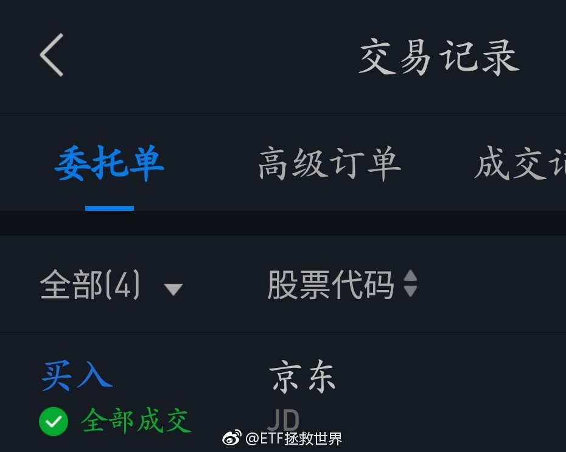

======================================================

ETF拯救世界 (5687069307) @
2018-09-04 22:27:26 Tue  
url: https://weibo.com/5687069307/GxQdocLQM

回复@Kart老万:今天申购中概，美股部分几只价格是明天凌晨美股收盘的价格。腾讯是今天白天港股

------------------------------------------------------
转推：
>  @ETF拯救世界 (5687069307)
>  2018-09-04 22:22:29 Tue  
>  url: https:/weibo.com/5687069307/GxQbnuq07/

>  不要嘴炮，以实际行动支持东哥 ​​​

转发[2]  评论[16]  赞[137] 

======================================================

ETF拯救世界 (5687069307) @
2018-09-04 22:51:40 Tue  
url: https://weibo.com/5687069307/GxQne4jTi

为什么喜欢京东，支持东哥。

是一种感激之情吧。

之前我也说过，没有京东之前，自己是怎么在中关村买电脑买的非常不开心。还得大老远搬回家。更别说质量，假货等等问题了。

这对于一个热衷于3C的男人是多么痛苦的事。

有了京东，一切相关烦恼都没了。

是，无论是京东还是东哥，肯定有各种问题。你 ​​​

转发[17]  评论[176]  赞[423] 

======================================================

ETF拯救世界 (5687069307) @
2018-09-05 08:56:20 Wed  
url: https://weibo.com/5687069307/GxUkEnYhf

有朋友跟我说，球球有位大V的基金净值跌破0.5了。

这种时候不要去嘲笑挖苦别人。落井下石不是什么好品质。

最重要的是，你能从别人失败的例子上学到什么。经验，不是一定要自己犯错才能取得。

这件事，从头到尾，可以总结的东西特别多。而且还不仅仅是投资本身的问题。

我只说一点，以后你看到满仓 ​​​

转发[53]  评论[282]  赞[438] 

======================================================

ETF拯救世界 (5687069307) @
2018-09-05 10:34:47 Wed  
url: https://weibo.com/5687069307/GxUYCsoaH

现在很多私募不设预警线和清盘线。

很多人说，因为是价值投资，没道理越跌越卖。设了预警和清盘线就没法价投了。

其实，清盘和预警对私募投资者来说，是挺重要的一个保护措施。

为什么。

因为私募基金对于私募基金经来说，是一个免费的杠杆。赚的越多，分的越多。所以他们天生有重仓满仓把净值做上 ​​​

转发[32]  评论[143]  赞[301] 

======================================================

ETF拯救世界 (5687069307) @
2018-09-05 12:40:16 Wed  
url: https://weibo.com/5687069307/GxVNylCuP

下午还出去不出去了。 ​​​

转发[1]  评论[92]  赞[194] 

======================================================

ETF拯救世界 (5687069307) @
2018-09-05 12:42:29 Wed  
url: https://weibo.com/5687069307/GxVOsuA7w

目前仓位很合适。稍微放缓发车节奏。等空间。 ​​​

转发[209]  评论[130]  赞[381] 

======================================================

ETF拯救世界 (5687069307) @
2018-09-05 14:18:17 Wed  
url: https://weibo.com/5687069307/GxWrl4M4H

谁能想到鹅厂也被东哥拖下水了。

鹅厂最近也是屋漏偏逢连夜雨。年初的利好怎么变成利空了。

游戏强劲+大范围投资其他公司…… ​​​

转发[5]  评论[46]  赞[197] 

======================================================

ETF拯救世界 (5687069307) @
2018-09-05 14:26:57 Wed  
url: https://weibo.com/5687069307/GxWuRemKq

熬过熊市的诀窍就是少动。还有，要动也要讲节奏。

你去翻2015年开始的第三轮。会发现，最多一个月动一次。有时候一个月动不了一次，两个月才上一次。动也是买1、2份

后来有时候一个月两次，三次。

上个月一个月四次。

频率加快，份数也在逐渐增加。

但是最多也就一个月四次。乱动不行。否则左边脸 ​​​

转发[142]  评论[330]  赞[437] 

======================================================

ETF拯救世界 (5687069307) @
2018-09-05 16:39:08 Wed  
url: https://weibo.com/5687069307/GxXmvvLyh

又跌！破产了，各位，再会！不要炒股！流着泪说。

------------------------------------------------------
转推：
>  @ ()
>  2018-09-05 16:26:32 Wed  
>  url: 

>  抱歉，作者已设置仅展示半年内微博，此微博已不可见。 ​​​

转发[4]  评论[84]  赞[164] 

======================================================

ETF拯救世界 (5687069307) @
2018-09-05 16:42:15 Wed  
url: https://weibo.com/5687069307/GxXnM9PBA

回复@何纯-员外郎:新低。因为总是新低就不说了。下次再说就是跌破2012年11月。意味着，再往前就是2008年11月了。太刺激了吧也。//@何纯-员外郎:E哥，估值新低吗？

------------------------------------------------------
转推：
>  @ETF拯救世界 (5687069307)
>  2018-09-05 14:26:57 Wed  
>  url: https:/weibo.com/5687069307/GxWuRemKq/

>  熬过熊市的诀窍就是少动。还有，要动也要讲节奏。
>  
>  你去翻2015年开始的第三轮。会发现，最多一个月动一次。有时候一个月动不了一次，两个月才上一次。动也是买1、2份
>  
>  后来有时候一个月两次，三次。
>  
>  上个月一个月四次。
>  
>  频率加快，份数也在逐渐增加。
>  
>  但是最多也就一个月四次。乱动不行。否则左边脸 ​​​

转发[19]  评论[91]  赞[194] 

======================================================

ETF拯救世界 (5687069307) @
2018-09-05 17:45:57 Wed  
url: https://weibo.com/5687069307/GxXND9QCT

我再说一次，在我的评论里悲观可以。

说这次比2008更严重，也可以。

但是，好歹跌破我的预期你再来悲观好吗。

现在连我的底线都没碰，甚至还有25%的下跌预期准备，你天天跟我说会差到跌破08。纳尼？

我立个flag，全市场pb不会破1.5。

1.5我就满仓+30%-50%的杠杆。这个杠杆率还能再撑55%-70%下跌不 ​​​

转发[94]  评论[298]  赞[526] 

======================================================

ETF拯救世界 (5687069307) @
2018-09-05 17:57:14 Wed  
url: https://weibo.com/5687069307/GxXSdtrJ4

最近一定要控制节奏。不要太急，不要太激进。现在战场上战况混乱，先拿着手里的筹码认真观察一下。

------------------------------------------------------
转推：
>  @ETF拯救世界 (5687069307)
>  2018-09-05 12:42:29 Wed  
>  url: https:/weibo.com/5687069307/GxVOsuA7w/

>  目前仓位很合适。稍微放缓发车节奏。等空间。 ​​​

转发[172]  评论[139]  赞[344] 

======================================================

ETF拯救世界 (5687069307) @
2018-09-06 06:36:28 Thu  
url: https://weibo.com/5687069307/Gy2QnDieS

为了让大家了解炒股的风险，一觉醒来京东已经巨亏几百美元。

怎么办。今天早餐只能喝自来水了。

炒股害死人，不要炒股。血淋淋的教训。

众筹今天的午饭，一会发支付宝账号。[失望] ​​​

转发[49]  评论[165]  赞[434] 

======================================================

ETF拯救世界 (5687069307) @
2018-09-06 06:54:14 Thu  
url: https://weibo.com/5687069307/Gy2XB2gVC

如果东哥真的是qj，我会认为他很渣，当然不会支持他犯法。

这个当然还能拎得清。 ​​​

转发[3]  评论[141]  赞[239] 

======================================================

ETF拯救世界 (5687069307) @
2018-09-06 08:35:39 Thu  
url: https://weibo.com/5687069307/Gy3CLboV9

刚才认真看了看，美股账户资产占金融资产一个多不到两个点。

其中一半是美元现金，一半权益里面大部分是各国ETF。

其它是美股港股。包括京东网易AMD再生元四只股票。 

感谢 外 管 局和纽约花旗，美元汇不出去救了我…… ​​​

转发[17]  评论[110]  赞[225] 

======================================================

ETF拯救世界 (5687069307) @
2018-09-06 09:19:22 Thu  
url: https://weibo.com/5687069307/Gy3Uv0Km6

今天会不会继续新低。//@ETF拯救世界:继续新低。老这么跌也不是事儿，还不反弹反弹换换手？//@ETF拯救世界:继续新低

------------------------------------------------------
转推：
>  @ETF拯救世界 (5687069307)
>  2018-03-22 09:34:01 Thu  
>  url: https:/weibo.com/5687069307/G8wd21cxW/

>  腾讯，60倍PE。未来五年看，真的能有特别好的收益率吗。
>  
>  学习了。 ​​​

转发[4]  评论[39]  赞[123] 

======================================================

ETF拯救世界 (5687069307) @
2018-09-06 09:38:43 Thu  
url: https://weibo.com/5687069307/Gy42mi23y

未来牛市中最好笑的一句话是什么。

“赚了指数不赚钱。”

……

你直接买指数不就完了吗。。 ​​​

转发[27]  评论[36]  赞[227] 

======================================================

ETF拯救世界 (5687069307) @
2018-09-06 09:40:15 Thu  
url: https://weibo.com/5687069307/Gy42Z0Clt

现在最好笑的一句话是什么：A股还有牛市。[打脸]

------------------------------------------------------
转推：
>  @ETF拯救世界 (5687069307)
>  2018-09-06 09:38:43 Thu  
>  url: https:/weibo.com/5687069307/Gy42mi23y/

>  未来牛市中最好笑的一句话是什么。
>  
>  “赚了指数不赚钱。”
>  
>  ……
>  
>  你直接买指数不就完了吗。。 ​​​

转发[13]  评论[34]  赞[166] 

======================================================

ETF拯救世界 (5687069307) @
2018-09-06 09:41:34 Thu  
url: https://weibo.com/5687069307/Gy43w5G6i

这是今天我收藏进资本市场日记的第一条新闻。

------------------------------------------------------
转推：
>  @全景网 (1752549400)
>  2018-09-06 07:56:43 Thu  
>  url: https:/weibo.com/1752549400/Gy3mXkyM1/

>  【私募平均仓位创近三年新低 机构仓位指标或成反向指标】私募排排网的最新统计数据显示，私募当前的平均仓位为52.61%，其中34.23%的私募处于半仓以下，私募的平均仓位处于近3年的最低水平。据了解，私募群体减仓观望情绪浓重，61.26%的基金经理表示会维持现有仓位不变。从连续的统计数据来看，机构仓位 ​​​

转发[66]  评论[85]  赞[192] 

======================================================

ETF拯救世界 (5687069307) @
2018-09-06 09:50:42 Thu  
url: https://weibo.com/5687069307/Gy47e1vU2

给你们看看我今年收集的，我觉得有意义的新闻。

附赠2015年的。

有价值的东西都在公开信息里，看你能不能识别了。 ​​​

转发[255]  评论[289]  赞[334] 

+++++++++++++++++++++++++++++++++++++++++++++++++++++

图片：
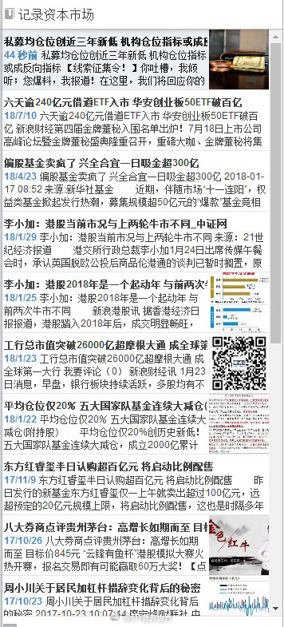
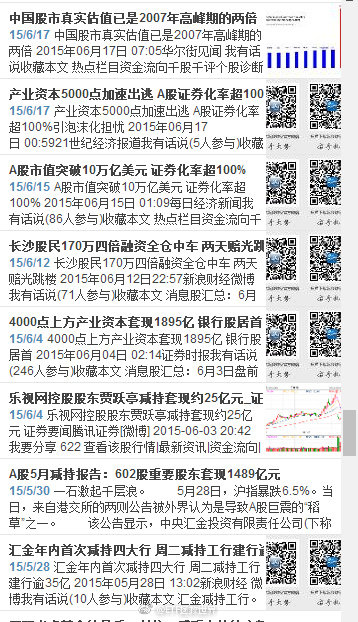

======================================================

ETF拯救世界 (5687069307) @
2018-09-06 10:17:10 Thu  
url: https://weibo.com/5687069307/Gy4hY3bjg

1月：李小加：港股牛市开始，与07年不同。四天后恒指见大顶。1月，GJD大幅减仓，仓位降到20%。A股见大顶，至今下跌25%。1月，合宜一天吸金300亿。目前净值0.83。

------------------------------------------------------
转推：
>  @ETF拯救世界 (5687069307)
>  2018-09-06 09:50:42 Thu  
>  url: https:/weibo.com/5687069307/Gy47e1vU2/

>  给你们看看我今年收集的，我觉得有意义的新闻。
>  
>  附赠2015年的。
>  
>  有价值的东西都在公开信息里，看你能不能识别了。 ​​​

转发[52]  评论[97]  赞[161] 

======================================================

ETF拯救世界 (5687069307) @
2018-09-06 10:19:39 Thu  
url: https://weibo.com/5687069307/Gy4iY45Df

回复@观音山上拜观音:那条新闻是2014年的。我是2015年收录。//@观音山上拜观音:15/5/18汇金买入蓝筹ETF，那时候不是应该卖出吗？

------------------------------------------------------
转推：
>  @ETF拯救世界 (5687069307)
>  2018-09-06 09:50:42 Thu  
>  url: https:/weibo.com/5687069307/Gy47e1vU2/

>  给你们看看我今年收集的，我觉得有意义的新闻。
>  
>  附赠2015年的。
>  
>  有价值的东西都在公开信息里，看你能不能识别了。 ​​​

转发[17]  评论[47]  赞[120] 

======================================================

ETF拯救世界 (5687069307) @
2018-09-06 10:44:03 Thu  
url: https://weibo.com/5687069307/Gy4sSrwtr

1月，两融余额在11000亿，目前8500亿。仅此一项，趋势扭转后就能带来1500-2000亿资金。

私募仓位30%，涨起来后又有几千亿资金。公募机构以及你的亲戚朋友都是低仓位，或者已经离开股市。

市场缺的并不是资金。 ​​​

转发[337]  评论[172]  赞[235] 

+++++++++++++++++++++++++++++++++++++++++++++++++++++

图片：

======================================================

ETF拯救世界 (5687069307) @
2018-09-06 10:52:23 Thu  
url: https://weibo.com/5687069307/Gy4wgdeNp

回复@因为迷茫所以仰望星空:两融余额历史上2014年9月首次突破6000亿，至今从未跌破。2015年5-6月最高峰突破2万亿。//@因为迷茫所以仰望星空:两融余额会不会跌破6000亿呢

------------------------------------------------------
转推：
>  @ETF拯救世界 (5687069307)
>  2018-09-06 10:44:03 Thu  
>  url: https:/weibo.com/5687069307/Gy4sSrwtr/

>  1月，两融余额在11000亿，目前8500亿。仅此一项，趋势扭转后就能带来1500-2000亿资金。
>  
>  私募仓位30%，涨起来后又有几千亿资金。公募机构以及你的亲戚朋友都是低仓位，或者已经离开股市。
>  
>  市场缺的并不是资金。 ​​​

转发[263]  评论[51]  赞[109] 

======================================================

ETF拯救世界 (5687069307) @
2018-09-06 10:59:10 Thu  
url: https://weibo.com/5687069307/Gy4z13bxz

回复@老顾例外:我只看融资余额/自由流通总市值（不是流通市值）。我这里有过去7年所有的比例数据。至于m2，房价，股市总市值，参考意义不大。//@老顾例外:两融是个绝对量， 要结合M2，房价总市值， 和股市总市值来看。 百分比更有意义

------------------------------------------------------
转推：
>  @ETF拯救世界 (5687069307)
>  2018-09-06 10:44:03 Thu  
>  url: https:/weibo.com/5687069307/Gy4sSrwtr/

>  1月，两融余额在11000亿，目前8500亿。仅此一项，趋势扭转后就能带来1500-2000亿资金。
>  
>  私募仓位30%，涨起来后又有几千亿资金。公募机构以及你的亲戚朋友都是低仓位，或者已经离开股市。
>  
>  市场缺的并不是资金。 ​​​

转发[235]  评论[108]  赞[132] 

======================================================

ETF拯救世界 (5687069307) @
2018-09-06 11:03:38 Thu  
url: https://weibo.com/5687069307/Gy4APAyiC

回复@hongapplenju:代表自由流通的市值里，有多少市值是被杠杆资金操控。杠杆资金比例越大，闪崩的风险越大。2015年5，A股杠杆资金比例全世界股市最高。比第二名高很多很多。//@hongapplenju:融资余额/自由流通总市值这个值，代表的是，入场意愿开启之后的拉升能力？

------------------------------------------------------
转推：
>  @ETF拯救世界 (5687069307)
>  2018-09-06 10:44:03 Thu  
>  url: https:/weibo.com/5687069307/Gy4sSrwtr/

>  1月，两融余额在11000亿，目前8500亿。仅此一项，趋势扭转后就能带来1500-2000亿资金。
>  
>  私募仓位30%，涨起来后又有几千亿资金。公募机构以及你的亲戚朋友都是低仓位，或者已经离开股市。
>  
>  市场缺的并不是资金。 ​​​

转发[132]  评论[122]  赞[123] 

======================================================

ETF拯救世界 (5687069307) @
2018-09-06 11:13:19 Thu  
url: https://weibo.com/5687069307/Gy4EL7xJa

回复@my_skying:不一样。举例，中石油集团持有的中石油股票是可流通的流通市值。但实际上它不会卖，所以不是自由流通市值。//@my_skying:自由流通和流通不一样吗，有没有课代表解释下[跪了]

------------------------------------------------------
转推：
>  @ETF拯救世界 (5687069307)
>  2018-09-06 10:44:03 Thu  
>  url: https:/weibo.com/5687069307/Gy4sSrwtr/

>  1月，两融余额在11000亿，目前8500亿。仅此一项，趋势扭转后就能带来1500-2000亿资金。
>  
>  私募仓位30%，涨起来后又有几千亿资金。公募机构以及你的亲戚朋友都是低仓位，或者已经离开股市。
>  
>  市场缺的并不是资金。 ​​​

转发[26]  评论[55]  赞[115] 

======================================================

ETF拯救世界 (5687069307) @
2018-09-06 11:15:22 Thu  
url: https://weibo.com/5687069307/Gy4FAsTtT

回复@老高GG:干货很多，目前已经说了将近1%了。//@老高GG:又上干货了 笔记本记录下来//@ETF拯救世界:回复@hongapplenju:代表自由流通的市值里，有多少市值是被杠杆资金操控。杠杆资金比例越大，闪崩的风险越大。2015年5，A股杠杆资金比例全世界股市最高。比第二名高很多很多。

------------------------------------------------------
转推：
>  @ETF拯救世界 (5687069307)
>  2018-09-06 10:44:03 Thu  
>  url: https:/weibo.com/5687069307/Gy4sSrwtr/

>  1月，两融余额在11000亿，目前8500亿。仅此一项，趋势扭转后就能带来1500-2000亿资金。
>  
>  私募仓位30%，涨起来后又有几千亿资金。公募机构以及你的亲戚朋友都是低仓位，或者已经离开股市。
>  
>  市场缺的并不是资金。 ​​​

转发[75]  评论[56]  赞[137] 

======================================================

ETF拯救世界 (5687069307) @
2018-09-06 11:24:23 Thu  
url: https://weibo.com/5687069307/Gy4Jg0Tah

回复@老高GG:目前A股自由流通市值18.5万亿。8500亿两融余额占比4.6%。2015年6月A股自由流通市值26.6万亿，2万亿两融余额占比7.5%，最高应该是超过8%。//@老高GG:@ETF拯救世界 如何把自由流通市值从流通市值里算出来？股票实在太多了[允悲]//@ETF拯救世界:回复@老高GG:干货很多，目前已经说了将近1%了。

------------------------------------------------------
转推：
>  @ETF拯救世界 (5687069307)
>  2018-09-06 10:44:03 Thu  
>  url: https:/weibo.com/5687069307/Gy4sSrwtr/

>  1月，两融余额在11000亿，目前8500亿。仅此一项，趋势扭转后就能带来1500-2000亿资金。
>  
>  私募仓位30%，涨起来后又有几千亿资金。公募机构以及你的亲戚朋友都是低仓位，或者已经离开股市。
>  
>  市场缺的并不是资金。 ​​​

转发[42]  评论[95]  赞[122] 

======================================================

ETF拯救世界 (5687069307) @
2018-09-06 11:26:47 Thu  
url: https://weibo.com/5687069307/Gy4Ke2SUE

你们觉得咱们8800得国证食品到底还有没有希望买到…… ​​​

转发[23]  评论[121]  赞[220] 

======================================================

ETF拯救世界 (5687069307) @
2018-09-06 11:44:56 Thu  
url: https://weibo.com/5687069307/Gy4RB7Tk1

一张图告诉你谁在卖。//@厚恩投资张延昆://@夜道:[伤心]//@不懂不做:炒股风险大,杠杆更要命……

------------------------------------------------------
转推：
>  @信用集 (2698193575)
>  2018-09-04 20:21:44 Tue  
>  url: https:/weibo.com/2698193575/GxPomDj9f/

>  融资炒股三年……太惨了 ​​​

转发[66]  评论[137]  赞[192] 

======================================================

ETF拯救世界 (5687069307) @
2018-09-06 13:46:50 Thu  
url: https://weibo.com/5687069307/Gy5F4mYrX

回复@ETF拯救世界:今天周五。如果最后一小时没有逆转，基本上弱势很确定。节奏一定要控制好。//@ETF拯救世界:最近一定要控制节奏。不要太急，不要太激进。现在战场上战况混乱，先拿着手里的筹码认真观察一下。

------------------------------------------------------
转推：
>  @ETF拯救世界 (5687069307)
>  2018-09-05 12:42:29 Wed  
>  url: https:/weibo.com/5687069307/GxVOsuA7w/

>  目前仓位很合适。稍微放缓发车节奏。等空间。 ​​​

转发[26]  评论[95]  赞[134] 

======================================================

ETF拯救世界 (5687069307) @
2018-09-06 13:55:23 Thu  
url: https://weibo.com/5687069307/Gy5IxstOU

穿越日期定错了！//@ETF拯救世界:回复@ETF拯救世界:今天周五。如果最后一小时没有逆转，基本上弱势很确定。节奏一定要控制好。//@ETF拯救世界:最近一定要控制节奏。不要太急，不要太激进。现在战场上战况混乱，先拿着手里的筹码认真观察一下。

------------------------------------------------------
转推：
>  @ETF拯救世界 (5687069307)
>  2018-09-05 12:42:29 Wed  
>  url: https:/weibo.com/5687069307/GxVOsuA7w/

>  目前仓位很合适。稍微放缓发车节奏。等空间。 ​​​

转发[3]  评论[84]  赞[157] 

======================================================

ETF拯救世界 (5687069307) @
2018-09-06 14:22:30 Thu  
url: https://weibo.com/5687069307/Gy5Ty5YlR

如果一会不反弹，今天pb在2-2.03之间了。 ​​​

转发[143]  评论[112]  赞[243] 

======================================================

ETF拯救世界 (5687069307) @
2018-09-06 14:30:52 Thu  
url: https://weibo.com/5687069307/Gy5WWqYHo

然而，成年人的世界里没有如果。一秒都不差。

------------------------------------------------------
转推：
>  @ETF拯救世界 (5687069307)
>  2018-09-06 14:22:30 Thu  
>  url: https:/weibo.com/5687069307/Gy5Ty5YlR/

>  如果一会不反弹，今天pb在2-2.03之间了。 ​​​

转发[128]  评论[60]  赞[169] 

======================================================

ETF拯救世界 (5687069307) @
2018-09-06 15:15:04 Thu  
url: https://weibo.com/5687069307/Gy6eT0iBp

高难度拉升——反弹一半，让你猜猜能不能进2.03。辣鸡操盘手……//@ETF拯救世界:然而，成年人的世界里没有如果。一秒都不差。

------------------------------------------------------
转推：
>  @ETF拯救世界 (5687069307)
>  2018-09-06 14:22:30 Thu  
>  url: https:/weibo.com/5687069307/Gy5Ty5YlR/

>  如果一会不反弹，今天pb在2-2.03之间了。 ​​​

转发[123]  评论[20]  赞[121] 

======================================================

ETF拯救世界 (5687069307) @
2018-09-06 15:18:29 Thu  
url: https://weibo.com/5687069307/Gy6ghcVZ2

回复@爱探险的公伯千雁:1.5-2。A股钻石区域。我定义的。//@爱探险的公伯千雁:pb进入2以内，是不是就是进入钻石区域了？//@ETF拯救世界:高难度拉升——反弹一半，让你猜猜能不能进2.03。辣鸡操盘手……//@ETF拯救世界:然而，成年人的世界里没有如果。一秒都不差。

------------------------------------------------------
转推：
>  @ETF拯救世界 (5687069307)
>  2018-09-06 14:22:30 Thu  
>  url: https:/weibo.com/5687069307/Gy5Ty5YlR/

>  如果一会不反弹，今天pb在2-2.03之间了。 ​​​

转发[118]  评论[116]  赞[191] 

======================================================

ETF拯救世界 (5687069307) @
2018-09-06 15:26:25 Thu  
url: https://weibo.com/5687069307/Gy6juqlPJ

没到。散了吧。明日再战。

------------------------------------------------------
转推：
>  @ETF拯救世界 (5687069307)
>  2018-09-06 14:22:30 Thu  
>  url: https:/weibo.com/5687069307/Gy5Ty5YlR/

>  如果一会不反弹，今天pb在2-2.03之间了。 ​​​

转发[1]  评论[84]  赞[185] 

======================================================

ETF拯救世界 (5687069307) @
2018-09-06 16:31:36 Thu  
url: https://weibo.com/5687069307/Gy6JXermN

回复@LOOKING-In-your-eyes:我相信真正的超长线大资金现在一定是在布局。包括一部分外资，包括险资，其中就会有社保。就我这十几年对超级大机构的观察，几乎可以确定他们99%在干活。//@LOOKING-In-your-eyes:有消息说社保基金抄底了，是底部特征吗

------------------------------------------------------
转推：
>  @ETF拯救世界 (5687069307)
>  2018-09-06 14:22:30 Thu  
>  url: https:/weibo.com/5687069307/Gy5Ty5YlR/

>  如果一会不反弹，今天pb在2-2.03之间了。 ​​​

转发[56]  评论[178]  赞[279] 

======================================================

ETF拯救世界 (5687069307) @
2018-09-06 17:45:23 Thu  
url: https://weibo.com/5687069307/Gy7dTy4jO

又有写东西的感觉了，周末想写。

不过可能没时间，我打算去大草原放飞一下自我……

随缘吧。

爱你。

以上。 ​​​

转发[8]  评论[213]  赞[402] 

======================================================

ETF拯救世界 (5687069307) @
2018-09-06 19:04:38 Thu  
url: https://weibo.com/5687069307/Gy7K47FFS

学习了

------------------------------------------------------
转推：
>  @ ()
>  2018-09-03 10:29:00 Mon  
>  url: 

>  抱歉，作者已设置仅展示半年内微博，此微博已不可见。 ​​​

转发[6]  评论[31]  赞[84] 

======================================================

ETF拯救世界 (5687069307) @
2018-09-06 19:51:19 Thu  
url: https://weibo.com/5687069307/Gy831iloW

回复@象牙塔事:刚看了十分钟，gja脸上的肉毒杆菌看不下去了//@象牙塔事:@ETF拯救世界TBV新剧   ETF拯救世界 编剧[允悲][允悲][嘻嘻] http://t.cn/RsUgon5 

------------------------------------------------------
转推：
>  @ETF拯救世界 (5687069307)
>  2018-09-06 14:22:30 Thu  
>  url: https:/weibo.com/5687069307/Gy5Ty5YlR/

>  如果一会不反弹，今天pb在2-2.03之间了。 ​​​

转发[1]  评论[40]  赞[127] 

======================================================

ETF拯救世界 (5687069307) @
2018-09-07 07:19:11 Fri  
url: https://weibo.com/5687069307/GycydvQhz

很多男人认为没有小鲜肉姑娘们就会爱上自己这种油腻男人了。

其实并不会好吧…… ​​​

转发[11]  评论[173]  赞[289] 

======================================================

ETF拯救世界 (5687069307) @
2018-09-07 09:30:05 Fri  
url: https://weibo.com/5687069307/GydpmhOTA

个人认为，养老金一定不会够用。即使现在整体来看够用，5-10年内也将大范围不够用。

三个方法延缓或者解决。

第一，加征。就是最近在干的。反对声音很大。

第二，延长退休年龄。还没干，可以预见的是反对声音会更大。

第三，国企增加分红，转入养老金。或者说，国企国有部分股权划转养老金。

我们 ​​​

转发[61]  评论[262]  赞[324] 

======================================================

ETF拯救世界 (5687069307) @
2018-09-07 09:35:10 Fri  
url: https://weibo.com/5687069307/GydrpAQRK

回复@上山下乡的芝士青年:日本人均寿命全世界第二，80多岁吧，还好。另一位邻居男性人均年龄67也打算65退休呢……//@上山下乡的芝士青年:隔壁日本已经打算延迟到70岁退休了瑟瑟发抖……

------------------------------------------------------
转推：
>  @ETF拯救世界 (5687069307)
>  2018-09-07 09:30:05 Fri  
>  url: https:/weibo.com/5687069307/GydpmhOTA/

>  个人认为，养老金一定不会够用。即使现在整体来看够用，5-10年内也将大范围不够用。
>  
>  三个方法延缓或者解决。
>  
>  第一，加征。就是最近在干的。反对声音很大。
>  
>  第二，延长退休年龄。还没干，可以预见的是反对声音会更大。
>  
>  第三，国企增加分红，转入养老金。或者说，国企国有部分股权划转养老金。
>  
>  我们 ​​​

转发[8]  评论[23]  赞[127] 

======================================================

ETF拯救世界 (5687069307) @
2018-09-07 09:37:53 Fri  
url: https://weibo.com/5687069307/GydswbdKW

回复@球鞋酱Sneaker:看6，他脸上也打东西了。。//@球鞋酱Sneaker:听说此大叔最近比较火[doge] http://t.cn/Rs510YY

------------------------------------------------------
转推：
>  @ETF拯救世界 (5687069307)
>  2018-09-07 07:19:11 Fri  
>  url: https:/weibo.com/5687069307/GycydvQhz/

>  很多男人认为没有小鲜肉姑娘们就会爱上自己这种油腻男人了。
>  
>  其实并不会好吧…… ​​​

转发[0]  评论[33]  赞[100] 

======================================================

ETF拯救世界 (5687069307) @
2018-09-07 09:40:12 Fri  
url: https://weibo.com/5687069307/Gydtsnhyh

最近一直在说，股市什么都不缺，利润增长不缺，资金不缺，估值不缺，缺的就是信心。 ​​​

转发[15]  评论[69]  赞[279] 

======================================================

ETF拯救世界 (5687069307) @
2018-09-07 09:51:14 Fri  
url: https://weibo.com/5687069307/GydxWbsXH

今天如果不是惊天大暴涨，趋势依然是down。（今天周五没错了吧）//@ETF拯救世界:回复@ETF拯救世界:今天周五。如果最后一小时没有逆转，基本上弱势很确定。节奏一定要控制好。//@ETF拯救世界:最近一定要控制节奏。不要太急，不要太激进。现在战场上战况混乱，先拿着手里的筹码认真观察一下。

------------------------------------------------------
转推：
>  @ETF拯救世界 (5687069307)
>  2018-09-05 12:42:29 Wed  
>  url: https:/weibo.com/5687069307/GxVOsuA7w/

>  目前仓位很合适。稍微放缓发车节奏。等空间。 ​​​

转发[20]  评论[80]  赞[171] 

======================================================

ETF拯救世界 (5687069307) @
2018-09-07 10:01:43 Fri  
url: https://weibo.com/5687069307/GydCc0BW2

回复@卖面条的麦当劳叔叔:涨停不好吗，最近账户很受伤。计划年度下跌也6个多点了。差不多行了。//@卖面条的麦当劳叔叔:别说了[doge][doge][doge]再奶要涨停了//@ETF拯救世界:今天如果不是惊天大暴涨，趋势依然是down。（今天周五没错了吧）

------------------------------------------------------
转推：
>  @ETF拯救世界 (5687069307)
>  2018-09-05 12:42:29 Wed  
>  url: https:/weibo.com/5687069307/GxVOsuA7w/

>  目前仓位很合适。稍微放缓发车节奏。等空间。 ​​​

转发[3]  评论[56]  赞[155] 

======================================================

ETF拯救世界 (5687069307) @
2018-09-07 11:00:07 Fri  
url: https://weibo.com/5687069307/GydZU5cct

特别需要注意的是，高位持有五年，没有好收益，不代表低位买入，五年后没有好收益。问题来了，鹅厂多少钱买入，持有五年会有好收益。指数投资也是一个道理，指数十年不涨，不代表你赚不到钱。

------------------------------------------------------
转推：
>  @ETF拯救世界 (5687069307)
>  2018-03-22 09:34:01 Thu  
>  url: https:/weibo.com/5687069307/G8wd21cxW/

>  腾讯，60倍PE。未来五年看，真的能有特别好的收益率吗。
>  
>  学习了。 ​​​

转发[33]  评论[64]  赞[192] 

======================================================

ETF拯救世界 (5687069307) @
2018-09-07 11:07:52 Fri  
url: https://weibo.com/5687069307/Gye32vrRL

回复@云锦Thues:每天跟你说永远满仓，然后开个基金组合留20%现金……言行不一的人是我特别害怕的。实话。//@云锦Thues:去年雪球上跟着方丈护盘的那些人，都沉了，连方丈也没法护盘贴了…

------------------------------------------------------
转推：
>  @ETF拯救世界 (5687069307)
>  2018-03-22 09:34:01 Thu  
>  url: https:/weibo.com/5687069307/G8wd21cxW/

>  腾讯，60倍PE。未来五年看，真的能有特别好的收益率吗。
>  
>  学习了。 ​​​

转发[13]  评论[59]  赞[186] 

======================================================

ETF拯救世界 (5687069307) @
2018-09-07 11:24:47 Fri  
url: https://weibo.com/5687069307/Gye9Ul9PN

一张图每天贴都很合适。

------------------------------------------------------
转推：
>  @ETF拯救世界 (5687069307)
>  2018-08-07 10:00:34 Tue  
>  url: https:/weibo.com/5687069307/GtvmktBxg/

>  A股 ​​​

转发[55]  评论[65]  赞[144] 

======================================================

ETF拯救世界 (5687069307) @
2018-09-07 11:32:31 Fri  
url: https://weibo.com/5687069307/Gyed32zK8

前几天某论坛的人喷我，一条罪名是：一会价值一会趋势。挺搞笑的，放在古代他就是剑宗气宗打架时候的小炮灰。内外兼修不可以吗？一定要把自己的视野放那么窄？//@ETF拯救世界:今天如果不是惊天大暴涨，趋势依然是down。（今天周五没错了吧）

------------------------------------------------------
转推：
>  @ETF拯救世界 (5687069307)
>  2018-09-05 12:42:29 Wed  
>  url: https:/weibo.com/5687069307/GxVOsuA7w/

>  目前仓位很合适。稍微放缓发车节奏。等空间。 ​​​

转发[9]  评论[99]  赞[226] 

======================================================

ETF拯救世界 (5687069307) @
2018-09-07 11:34:55 Fri  
url: https://weibo.com/5687069307/Gyee1C8xV

回复@陶陶滔滔涛:军工信息不死，牛市不来。这就是我的信条。//@陶陶滔滔涛:厉害了，军工，信息，传媒闪崩//@ETF拯救世界:一张图每天贴都很合适。

------------------------------------------------------
转推：
>  @ETF拯救世界 (5687069307)
>  2018-08-07 10:00:34 Tue  
>  url: https:/weibo.com/5687069307/GtvmktBxg/

>  A股 ​​​

转发[45]  评论[247]  赞[277] 

======================================================

ETF拯救世界 (5687069307) @
2018-09-10 10:28:42 Mon  
url: https://weibo.com/5687069307/GyG4DiMrj

现在回去翻这样的帖子，心里还是会堵得慌：

为什么几个月后看起来正确的东西，当时要被这么多辣鸡喷。为什么辣鸡可以有权利喷比它高很多的人。

微博也有辣鸡喷，我直接拉黑了。

http://t.cn/Red6Uws ​​​

转发[9]  评论[160]  赞[333] 

======================================================

ETF拯救世界 (5687069307) @
2018-09-10 10:38:19 Mon  
url: https://weibo.com/5687069307/GyG8xkdYJ

对于投资，很多人最主要的问题是视野不够开阔。

比如，看估值，就只看估值。恒生便宜啊，H便宜啊，上杠杆啊，五倍啊，年内涨到48000啊。

投资是综合的。不是看看估值就可以搞定的。

恒生指数是一个波动极大的指数，这点很多人根本就没有意识到。它的波动幅度其实不输于A股。 ​​​

转发[75]  评论[154]  赞[315] 

======================================================

ETF拯救世界 (5687069307) @
2018-09-10 10:40:45 Mon  
url: https://weibo.com/5687069307/GyG9wu6U1

信息挂了，军工还在扛啊。 ​​​

转发[8]  评论[70]  赞[252] 

======================================================

ETF拯救世界 (5687069307) @
2018-09-10 10:43:38 Mon  
url: https://weibo.com/5687069307/GyGaHcrBg

可以的，奶到HK去了。

------------------------------------------------------
转推：
>  @ETF拯救世界 (5687069307)
>  2018-09-10 10:38:19 Mon  
>  url: https:/weibo.com/5687069307/GyG8xkdYJ/

>  对于投资，很多人最主要的问题是视野不够开阔。
>  
>  比如，看估值，就只看估值。恒生便宜啊，H便宜啊，上杠杆啊，五倍啊，年内涨到48000啊。
>  
>  投资是综合的。不是看看估值就可以搞定的。
>  
>  恒生指数是一个波动极大的指数，这点很多人根本就没有意识到。它的波动幅度其实不输于A股。 ​​​

转发[6]  评论[28]  赞[166] 

======================================================

ETF拯救世界 (5687069307) @
2018-09-10 11:01:32 Mon  
url: https://weibo.com/5687069307/GyGhXul5d

谁能想到有望成真。

------------------------------------------------------
转推：
>  @ETF拯救世界 (5687069307)
>  2017-12-15 09:50:04 Fri  
>  url: https:/weibo.com/5687069307/FzJjHqeZF/

>  $证券公司 sz399975$   我认为360-400点应该是极限底部了…… ​​​

转发[33]  评论[46]  赞[188] 

======================================================

ETF拯救世界 (5687069307) @
2018-09-10 11:03:51 Mon  
url: https://weibo.com/5687069307/GyGiUjxah

回复@leletuzi:没有意外的话是周五。除非这几天特大暴跌。//@leletuzi:这周准备发车吗//@ETF拯救世界:谁能想到有望成真。

------------------------------------------------------
转推：
>  @ETF拯救世界 (5687069307)
>  2017-12-15 09:50:04 Fri  
>  url: https:/weibo.com/5687069307/FzJjHqeZF/

>  $证券公司 sz399975$   我认为360-400点应该是极限底部了…… ​​​

转发[16]  评论[71]  赞[190] 

======================================================

ETF拯救世界 (5687069307) @
2018-09-10 11:40:10 Mon  
url: https://weibo.com/5687069307/GyGxDlaDK

如果这个月来一根长阴，那么，这个月，最多下个月，也就差不多见底了。

时间差点，空间就够了。 ​​​

转发[90]  评论[250]  赞[487] 

======================================================

ETF拯救世界 (5687069307) @
2018-09-10 13:20:13 Mon  
url: https://weibo.com/5687069307/GyHcfz0Jp

4690。$中证500 sz399905$   我的理解极限。

再低，就是500的钻石底。 ​​​

转发[94]  评论[235]  赞[305] 

======================================================

ETF拯救世界 (5687069307) @
2018-09-10 13:32:51 Mon  
url: https://weibo.com/5687069307/GyHhnxcjB

对标08，确认。第一个目标是08/05和2012的中间值。全市场PB 1.7倍。

------------------------------------------------------
转推：
>  @ETF拯救世界 (5687069307)
>  2018-09-03 13:13:16 Mon  
>  url: https:/weibo.com/5687069307/GxD9Xhnqp/

>  我看，这波熊市的低点可以降级对标2008了。
>  
>  未来所有策略围绕这个预期来做。
>  
>  再低的话我就不知道用哪个预期了。A股历史上还没出现过。 ​​​

转发[218]  评论[133]  赞[253] 

======================================================

ETF拯救世界 (5687069307) @
2018-09-10 13:42:40 Mon  
url: https://weibo.com/5687069307/GyHlmynrp

一般来讲，一个指数，相同估值的情况下，会有一个比较固定的未来收益率。综合来看，正常买入，年化5%-11%是合理的。

但是如果你买的过高，就赚不到这个钱。会很低，甚至持有20年是负的。

相反，如果你买的特别便宜，则会很大概率超过这个收益率。

现在，特别便宜的情况，越来越近了。 ​​​

转发[74]  评论[156]  赞[342] 

======================================================

ETF拯救世界 (5687069307) @
2018-09-10 13:47:58 Mon  
url: https://weibo.com/5687069307/GyHnw7KvU

中证500，目前的点位与2014年9月基本相同。也就是说，4年没涨。

然而，它的估值已经从4年前的35倍降至目前的21倍。

你买的高，持有4年不挣钱，很正常。虽然中间翻过一倍。

如果未来四年还是不涨，那么估值将从21倍降至12倍。

我告诉你，我不信。

不然，4年后你把这条微博翻出来打我的脸。

4年后 ​​​

转发[106]  评论[239]  赞[414] 

======================================================

ETF拯救世界 (5687069307) @
2018-09-10 13:57:52 Mon  
url: https://weibo.com/5687069307/GyHrxeZ9s

想尽办法不让股价跌下去。重组。//@ETF拯救世界:果然，看了一眼大事记，5.8有股权激励。“本计划所采用的激励形式为限制性股票，其股票来源为美的集团向激励对象定向发行新股。价格28.77”。5.22回购预案。

------------------------------------------------------
转推：
>  @巨潮资讯网 (2239792910)
>  2018-07-31 15:55:50 Tue  
>  url: https:/weibo.com/2239792910/GstH3uu1o/

>  【美的集团：已耗资约8亿元回购1672万股股份】截止7月31日，美的集团以集中竞价方式回购股份1672万股，占公司截止7月30日总股本的0.2519%，最高成交价为48.40元/股，最低成交价为47.02元/股，支付的总金额约8亿元。 ​​​

转发[8]  评论[19]  赞[116] 

======================================================

ETF拯救世界 (5687069307) @
2018-09-10 14:08:00 Mon  
url: https://weibo.com/5687069307/GyHvEc6Qa

讲真，谁来都要扒你一层皮。。

------------------------------------------------------
转推：
>  @ ()
>  2018-09-10 14:00:38 Mon  
>  url: 

>  该账号因被投诉违反《微博社区公约》的相关规定，现已无法查看。查看帮助 https://kefu.weibo.com/faqdetail?id=13216

转发[5]  评论[32]  赞[128] 

======================================================

ETF拯救世界 (5687069307) @
2018-09-10 14:20:01 Mon  
url: https://weibo.com/5687069307/GyHAwuKLP

从历史看，如果这个月可以干10%以上，基本就差不多了//@ETF拯救世界:回复@黄连树:2005年5月8.5%，2008年10月25%，2012年11月创业板12%，2013年6月沪深300是15%。//@黄连树:过去熊市的月度大阴线出现在几月？

------------------------------------------------------
转推：
>  @ETF拯救世界 (5687069307)
>  2018-08-31 16:18:26 Fri  
>  url: https:/weibo.com/5687069307/Gxc5CA6qu/

>  根据历史经验，最终的底部，还缺少一根月线大阴线……
>  
>  历史还会重演吗？ ​​​

转发[169]  评论[115]  赞[180] 

======================================================

ETF拯救世界 (5687069307) @
2018-09-10 14:23:57 Mon  
url: https://weibo.com/5687069307/GyHC7uVWv

回复@云易冷:中证500指数设立以来，只有2008年10月低于现在了……//@云易冷:08年10月也太可怕了吧，股民们不得被吓破胆？[二哈]//@ETF拯救世界:从历史看，如果这个月可以干10%以上，基本就差不多了

------------------------------------------------------
转推：
>  @ETF拯救世界 (5687069307)
>  2018-08-31 16:18:26 Fri  
>  url: https:/weibo.com/5687069307/Gxc5CA6qu/

>  根据历史经验，最终的底部，还缺少一根月线大阴线……
>  
>  历史还会重演吗？ ​​​

转发[21]  评论[110]  赞[187] 

======================================================

ETF拯救世界 (5687069307) @
2018-09-10 14:50:58 Mon  
url: https://weibo.com/5687069307/GyHN5qVBE

不错，光脚。毫无反抗，继续！ ​​​

转发[5]  评论[53]  赞[264] 

======================================================

ETF拯救世界 (5687069307) @
2018-09-10 14:53:21 Mon  
url: https://weibo.com/5687069307/GyHO3oRQB

我毛估估，今天pb破2。到达2012年11月28日数值。

答案30分钟后揭晓。 ​​​

转发[64]  评论[181]  赞[331] 

======================================================

ETF拯救世界 (5687069307) @
2018-09-10 15:27:30 Mon  
url: https://weibo.com/5687069307/GyI1ViKNp

想多了，没破。依然没到2012年底部。继续吧。

------------------------------------------------------
转推：
>  @ETF拯救世界 (5687069307)
>  2018-09-10 14:53:21 Mon  
>  url: https:/weibo.com/5687069307/GyHO3oRQB/

>  我毛估估，今天pb破2。到达2012年11月28日数值。
>  
>  答案30分钟后揭晓。 ​​​

转发[45]  评论[65]  赞[194] 

======================================================

ETF拯救世界 (5687069307) @
2018-09-10 15:29:01 Mon  
url: https://weibo.com/5687069307/GyI2xptB6

现在你们能想到2005年和2008年是什么样的世界了吗。1.5！//@ETF拯救世界:想多了，没破。依然没到2012年底部。继续吧。

------------------------------------------------------
转推：
>  @ETF拯救世界 (5687069307)
>  2018-09-10 14:53:21 Mon  
>  url: https:/weibo.com/5687069307/GyHO3oRQB/

>  我毛估估，今天pb破2。到达2012年11月28日数值。
>  
>  答案30分钟后揭晓。 ​​​

转发[38]  评论[132]  赞[181] 

======================================================

ETF拯救世界 (5687069307) @
2018-09-10 16:07:22 Mon  
url: https://weibo.com/5687069307/GyIi6bHM6

回复@还没入门:不用回到高点。你现在又不是高点投。距离2015年，大部分指数已经跌了60%以上了。当年日本在这个位置大波段也有好几轮了。//@还没入门:就怕郭嘉走一段弯路，个人就耽误了一生。日本股票指数几十年也没回到高点。//@ETF拯救世界:现在你们能想到2005年和2008年是什么样的世界了吗。1.5！

------------------------------------------------------
转推：
>  @ETF拯救世界 (5687069307)
>  2018-09-10 14:53:21 Mon  
>  url: https:/weibo.com/5687069307/GyHO3oRQB/

>  我毛估估，今天pb破2。到达2012年11月28日数值。
>  
>  答案30分钟后揭晓。 ​​​

转发[11]  评论[88]  赞[199] 

======================================================

ETF拯救世界 (5687069307) @
2018-09-10 16:20:39 Mon  
url: https://weibo.com/5687069307/GyInun86G

一位网友私信的，帮他问问。能帮就帮一把。 ​​​

转发[20]  评论[220]  赞[260] 

+++++++++++++++++++++++++++++++++++++++++++++++++++++

图片：
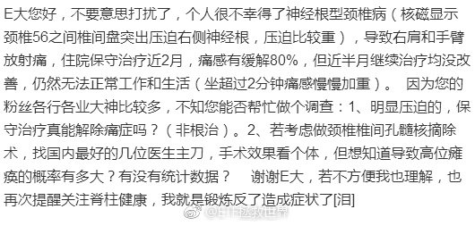

======================================================

ETF拯救世界 (5687069307) @
2018-09-11 07:36:26 Tue  
url: https://weibo.com/5687069307/GyOncmvFP

30%破净是A股绝对大底，就是不知道能不能到了……

------------------------------------------------------
转推：
>  @财联社APP (2868676035)
>  2018-09-11 07:25:14 Tue  
>  url: https:/weibo.com/2868676035/GyOiF6Pcn/

>  ​【破净股数量增至267只 已在可交易股票中占比近8%】财联社9月11日讯，在大盘持续下行中，市场破净个股数量创下历史新高。截至昨日收盘，沪深两市共有267只个股股价跌破每股净资产，在两市所有可交易股票中占比近8%。分析人士认为，在经历了前期的深度调整之后，A股市场的整体估值水平已经处于历史低 ​​​

转发[117]  评论[197]  赞[277] 

======================================================

ETF拯救世界 (5687069307) @
2018-09-11 08:57:56 Tue  
url: https://weibo.com/5687069307/GyOUhmJD2

回复@老顾例外:千万别因为我死扛。这一轮熊市下来a股整体跌幅超过50%，你浮亏5%就扛不住了，真的不要再扛，立即抽身离去再也不要回来。我是认真的。股市不是适合所有人的地方//@老顾例外:有点绝望了， -5%  ， 没有E大的话，自己很难坚持了。

------------------------------------------------------
转推：
>  @财联社APP (2868676035)
>  2018-09-11 07:25:14 Tue  
>  url: https:/weibo.com/2868676035/GyOiF6Pcn/

>  ​【破净股数量增至267只 已在可交易股票中占比近8%】财联社9月11日讯，在大盘持续下行中，市场破净个股数量创下历史新高。截至昨日收盘，沪深两市共有267只个股股价跌破每股净资产，在两市所有可交易股票中占比近8%。分析人士认为，在经历了前期的深度调整之后，A股市场的整体估值水平已经处于历史低 ​​​

转发[41]  评论[406]  赞[289] 

======================================================

ETF拯救世界 (5687069307) @
2018-09-11 11:50:41 Tue  
url: https://weibo.com/5687069307/GyQ2pgSgs

忙了一上午 ​​​

转发[15]  评论[134]  赞[241] 

======================================================

ETF拯救世界 (5687069307) @
2018-09-11 12:21:36 Tue  
url: https://weibo.com/5687069307/GyQeXBFx5

回复@韩跑跑走一走:前几天我看了一个知乎问题:长期不上班会怎样。90%的人会空虚，甚至有抑郁的。//@韩跑跑走一走:整天忙啊忙啊，我们人生的意义在哪里。。。

------------------------------------------------------
转推：
>  @ETF拯救世界 (5687069307)
>  2018-09-11 11:50:41 Tue  
>  url: https:/weibo.com/5687069307/GyQ2pgSgs/

>  忙了一上午 ​​​

转发[13]  评论[107]  赞[197] 

======================================================

ETF拯救世界 (5687069307) @
2018-09-11 12:37:14 Tue  
url: https://weibo.com/5687069307/GyQliDzIN

回复@老顾例外:闲庭信步是因为这样的局面我已经经历过三次，这是第四次。最坏会怎样，之后会怎样，心里大概有谱。放心，明明白白经历两次以后，你也会有谱的。踏踏实实的。指数不会死

------------------------------------------------------
转推：
>  @财联社APP (2868676035)
>  2018-09-11 07:25:14 Tue  
>  url: https:/weibo.com/2868676035/GyOiF6Pcn/

>  ​【破净股数量增至267只 已在可交易股票中占比近8%】财联社9月11日讯，在大盘持续下行中，市场破净个股数量创下历史新高。截至昨日收盘，沪深两市共有267只个股股价跌破每股净资产，在两市所有可交易股票中占比近8%。分析人士认为，在经历了前期的深度调整之后，A股市场的整体估值水平已经处于历史低 ​​​

转发[24]  评论[80]  赞[260] 

======================================================

ETF拯救世界 (5687069307) @
2018-09-11 13:20:35 Tue  
url: https://weibo.com/5687069307/GyQCTBj4V

“2002年获哈佛大学硕士学位，同年入职高盛亚洲。2008年晋升为高盛亚洲区执行董事，凭借努力，逐步晋升为高盛亚洲区董事总经理。”你们猜这说的是谁。//@华尔街见闻APP:投行薪水高，容易吸引年轻人

------------------------------------------------------
转推：
>  @见闻企业家 (6450245751)
>  2018-09-11 12:51:33 Tue  
>  url: https:/weibo.com/6450245751/GyQr76yF0/

>  【柳传志：年轻人第一份工作不要去投行，这样不扎实】柳传志接受@财约你 专访时表示，自己十分认同新希望集团董事长刘永好的观点：年轻人不要一出来工作就做投行，虽然收入高，但是不扎实，最好是在企业里摸爬滚打过再去做投资，这样比较沉稳 http://t.cn/Rs1UcDP ​​​

转发[19]  评论[59]  赞[128] 

======================================================

ETF拯救世界 (5687069307) @
2018-09-11 13:22:16 Tue  
url: https://weibo.com/5687069307/GyQDA9wkx

谁能想到当时460，半年后已经即将跌破300……

------------------------------------------------------
转推：
>  @ETF拯救世界 (5687069307)
>  2018-03-22 09:34:01 Thu  
>  url: https:/weibo.com/5687069307/G8wd21cxW/

>  腾讯，60倍PE。未来五年看，真的能有特别好的收益率吗。
>  
>  学习了。 ​​​

转发[156]  评论[43]  赞[177] 

======================================================

ETF拯救世界 (5687069307) @
2018-09-11 13:28:37 Tue  
url: https://weibo.com/5687069307/GyQG9FJfC

偶然又翻到了当时的这个帖子。幸亏及时叫停，否则将是不亚于中石油的惨案。

然而这样的事情都是怎么决策的。百思不得其解。就像好好的深成指，40只成分股，一定要在中小股票暴涨之后，换成500只成分股，从此一蹶不振。

为什么这么喜欢追最近表现好的东西？从上到下都喜欢？ ​​​

转发[55]  评论[125]  赞[236] 

+++++++++++++++++++++++++++++++++++++++++++++++++++++

图片：
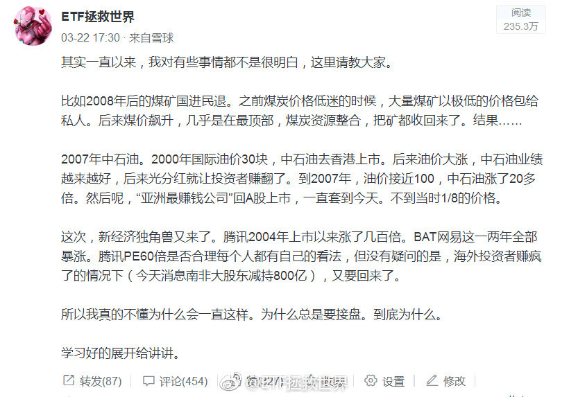

======================================================

ETF拯救世界 (5687069307) @
2018-09-11 13:45:48 Tue  
url: https://weibo.com/5687069307/GyQN8zHs5

回复@崔梓夜:没懂这个月配置中概互联有什么问题？帖子是3月发的，当时所有中概股全部在高位。现在网易腰斩，京东腾讯下跌30%，配置0.6%仓位有问题吗。我还要继续买到5%呢。//@崔梓夜:回复@ETF拯救世界:应该是想问你，为什么发中概互联网的车吧

------------------------------------------------------
转推：
>  @ETF拯救世界 (5687069307)
>  2018-09-11 13:28:37 Tue  
>  url: https:/weibo.com/5687069307/GyQG9FJfC/

>  偶然又翻到了当时的这个帖子。幸亏及时叫停，否则将是不亚于中石油的惨案。
>  
>  然而这样的事情都是怎么决策的。百思不得其解。就像好好的深成指，40只成分股，一定要在中小股票暴涨之后，换成500只成分股，从此一蹶不振。
>  
>  为什么这么喜欢追最近表现好的东西？从上到下都喜欢？ ​​​

转发[8]  评论[52]  赞[141] 

======================================================

ETF拯救世界 (5687069307) @
2018-09-11 13:49:30 Tue  
url: https://weibo.com/5687069307/GyQODlGPd

基金发行越“冷”，越是投资的好时候。反之亦然。

2007年四只QDII发行。当日每只热销百亿，摇号配售。到现在还有净值不到0.5的。

年初的合宜之类的就不用说了。还有前两年热发的定增基金。

前几天看说，有基金发行就卖出去2.5万。你就知道这是投资的黄金时刻了。

抢热门永远没什么好下场。 ​​​

转发[100]  评论[206]  赞[344] 

======================================================

ETF拯救世界 (5687069307) @
2018-09-11 13:59:50 Tue  
url: https://weibo.com/5687069307/GyQSPmhO8

我用一句话解答“为什么明知下跌还要买”

两个字：概率。

你永远也不可能绝对性的预测未来的涨跌。所以你要用概率来判断。最主要的应用就是根据概率布置仓位。

比如这个月买中概，如果未来我打算给5%-6%的仓位，那么买入0.6%大概就是10%。

10%你可以大概理解为：我认为它有90%的概率继续跌，10%的 ​​​

转发[311]  评论[402]  赞[562] 

======================================================

ETF拯救世界 (5687069307) @
2018-09-11 14:07:10 Tue  
url: https://weibo.com/5687069307/GyQVO5gpW

中概互联这些公司，本身并没有太大问题。哪怕一家有，做为一个整体也没太大问题。

但是，非常关键的是，随着他们这个群体在国民经济生活中的重要性越来越大，真正的问题就出现了。

这个我不多解释，懂的自然懂。

所以，要不就是公私合营，要不就是想办法把你弄得小一点，分拆或者其它方法。

永远也 ​​​

转发[59]  评论[174]  赞[298] 

======================================================

ETF拯救世界 (5687069307) @
2018-09-11 14:18:45 Tue  
url: https://weibo.com/5687069307/GyR0vrKxw

再说一次。//@ETF拯救世界:最近一定要控制节奏。不要太急，不要太激进。现在战场上战况混乱，先拿着手里的筹码认真观察一下。

------------------------------------------------------
转推：
>  @ETF拯救世界 (5687069307)
>  2018-09-05 12:42:29 Wed  
>  url: https:/weibo.com/5687069307/GxVOsuA7w/

>  目前仓位很合适。稍微放缓发车节奏。等空间。 ​​​

转发[156]  评论[114]  赞[255] 

======================================================

ETF拯救世界 (5687069307) @
2018-09-11 14:36:15 Tue  
url: https://weibo.com/5687069307/GyR7C0ths

关于概率的选择题：

1：有30%的概率下跌20%。

2：有70%的概率上涨无限。

你选哪个。你应该好好问问自己。 ​​​

转发[53]  评论[191]  赞[336] 

======================================================

ETF拯救世界 (5687069307) @
2018-09-11 14:53:10 Tue  
url: https://weibo.com/5687069307/GyRetuXth

回复@纸上的长河:对每个人来说是不同的。有人害怕第一个发生，所以不买。有人不怕第一个，害怕第二个发生自己手里没东西，所以买。你好好体会一下。//@纸上的长河:回复@小牛乐乐吧:小伙子你没看出来这2个选项是一样的吗？[doge]

------------------------------------------------------
转推：
>  @ETF拯救世界 (5687069307)
>  2018-09-11 14:36:15 Tue  
>  url: https:/weibo.com/5687069307/GyR7C0ths/

>  关于概率的选择题：
>  
>  1：有30%的概率下跌20%。
>  
>  2：有70%的概率上涨无限。
>  
>  你选哪个。你应该好好问问自己。 ​​​

转发[19]  评论[79]  赞[230] 

======================================================

ETF拯救世界 (5687069307) @
2018-09-11 16:25:03 Tue  
url: https://weibo.com/5687069307/GyRPM3hfR

汽车是真正的周期股。这个，林奇在第一本书里就开宗明义的告诉你了。

然而，只有当你一个上升周期赚几倍，或者一个下降周期赔得只剩20%的时候，才会真的懂。

当然，这个周期，一般人很难把握。太多人把汽车当成成长股或者价值股了。都不是。它是周期股。

BTW，感谢那次“捷达换宝马”。 ​​​

转发[134]  评论[274]  赞[405] 

======================================================

ETF拯救世界 (5687069307) @
2018-09-12 08:06:16 Wed  
url: https://weibo.com/5687069307/GyXZOqAyv

刚看到有人说，我把前几年操作分级A/B之类的收益也算进第二轮计划了，这就算是造谣了吧。

如果我把分级的收益也算入计划那计划收益率可以简单再x2。2015年7-8月分级赚了40%多，如果加到计划上会让计划总收益变成17倍。更不要说之前的分级b了。

但这样玩有意思吗？计划就是计划，只有指数基金，只有ET ​​​

转发[47]  评论[231]  赞[296] 

+++++++++++++++++++++++++++++++++++++++++++++++++++++

图片：
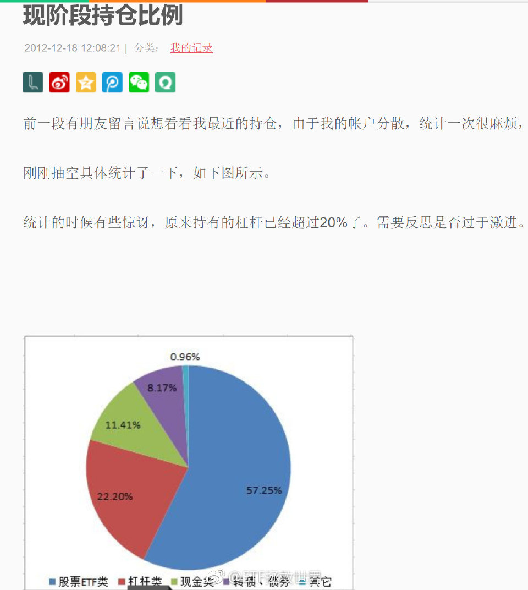

======================================================

ETF拯救世界 (5687069307) @
2018-09-12 09:09:27 Wed  
url: https://weibo.com/5687069307/GyYpsqSRr

我想拉黑两个凑个吉祥数…… ​​​

转发[2]  评论[154]  赞[281] 

+++++++++++++++++++++++++++++++++++++++++++++++++++++

图片：

======================================================

ETF拯救世界 (5687069307) @
2018-09-12 09:29:48 Wed  
url: https://weibo.com/5687069307/GyYxIxQoU

我相信长期关注我的朋友，无论是从0910开始，还是2015开始的，都能很清楚一件事，那就是：

我，就是个不折不扣的水货！

低位唱空，高位唱多！低位卖出，高位买入！08、12卖出，07、15买入！低位买分级A，高位接盘分级B！每天预测不停打脸！每次买入都在高位！

各种操作一塌糊涂，股票、指数、黄金、 ​​​

转发[22]  评论[661]  赞[403] 

======================================================

ETF拯救世界 (5687069307) @
2018-09-12 09:46:18 Wed  
url: https://weibo.com/5687069307/GyYEpEJ7f

至于第三轮的预期收益率，我每篇文章上面都写得清清楚楚：“无法预测”

你可以控制自己的成本，但不可能预测自己的收益率。你知道五年后，十年后各个指数多少点？谁能预测？谁说能谁就是骗子或者傻子。

我们能做的，只能是尽量在低位多买点便宜货。然后等着。小富由俭，大富在天。老天爷给你一个2年7 ​​​

转发[29]  评论[205]  赞[368] 

======================================================

ETF拯救世界 (5687069307) @
2018-09-12 09:59:57 Wed  
url: https://weibo.com/5687069307/GyYJXkrUZ

军工这么NB，你说A股能涨吗…… ​​​

转发[16]  评论[89]  赞[256] 

======================================================

ETF拯救世界 (5687069307) @
2018-09-12 10:05:35 Wed  
url: https://weibo.com/5687069307/GyYMfbnql

深成已经-4%了。再来6%基本就是我定义的“长阴”了。。如果一个月-15%，那就确认了。

------------------------------------------------------
转推：
>  @ETF拯救世界 (5687069307)
>  2018-09-10 11:40:10 Mon  
>  url: https:/weibo.com/5687069307/GyGxDlaDK/

>  如果这个月来一根长阴，那么，这个月，最多下个月，也就差不多见底了。
>  
>  时间差点，空间就够了。 ​​​

转发[33]  评论[93]  赞[280] 

======================================================

ETF拯救世界 (5687069307) @
2018-09-12 10:08:59 Wed  
url: https://weibo.com/5687069307/GyYNCB2kx

新低不要着急买。控制好节奏。你家没矿，也不可能像别人一样无限借钱，无限现金流。把已有的资源分配好。不骄不躁，徐而图之。//@ETF拯救世界:再说一次。//@ETF拯救世界:最近一定要控制节奏。不要太急，不要太激进。现在战场上战况混乱，先拿着手里的筹码认真观察一下。

------------------------------------------------------
转推：
>  @ETF拯救世界 (5687069307)
>  2018-09-05 12:42:29 Wed  
>  url: https:/weibo.com/5687069307/GxVOsuA7w/

>  目前仓位很合适。稍微放缓发车节奏。等空间。 ​​​

转发[134]  评论[135]  赞[316] 

======================================================

ETF拯救世界 (5687069307) @
2018-09-12 10:20:59 Wed  
url: https://weibo.com/5687069307/GyYSv979H

再扛两天不好吗……//@ETF拯救世界:新低不要着急买。控制好节奏。你家没矿，也不可能像别人一样无限借钱，无限现金流。把已有的资源分配好。不骄不躁，徐而图之。//@ETF拯救世界:再说一次。

------------------------------------------------------
转推：
>  @ETF拯救世界 (5687069307)
>  2018-09-05 12:42:29 Wed  
>  url: https:/weibo.com/5687069307/GxVOsuA7w/

>  目前仓位很合适。稍微放缓发车节奏。等空间。 ​​​

转发[41]  评论[110]  赞[244] 

======================================================

ETF拯救世界 (5687069307) @
2018-09-12 11:00:00 Wed  
url: https://weibo.com/5687069307/GyZ8l6aj8

回复@小五雀雀:富国红利2008年底成立。你2009年1月第一次投入，到现在，将近十年，总收益率58%。年化可以说非常一般。如果未来在这种市场环境下你退休，恐怕非常有问题。我坚决反对简单定投。尤其是A股。

------------------------------------------------------
转推：
>  @ETF拯救世界 (5687069307)
>  2018-09-05 12:42:29 Wed  
>  url: https:/weibo.com/5687069307/GxVOsuA7w/

>  目前仓位很合适。稍微放缓发车节奏。等空间。 ​​​

转发[32]  评论[114]  赞[257] 

======================================================

ETF拯救世界 (5687069307) @
2018-09-12 11:10:06 Wed  
url: https://weibo.com/5687069307/GyZcrbNg3

回复@梦游鱼生活在路上:当然不是。一开始我以为你真的是随口一说。但我看完你所有的评论，知道你是有备而来要搞事情了。我当然可以告诉你我在2005-2007/08-09,2010-2015，每个阶段的收益率。但是我告诉你后，你会不会要求看历史交易做出证明？我还是可以给你看，你会不会接着要求看交易截图？

------------------------------------------------------
转推：
>  @ETF拯救世界 (5687069307)
>  2018-09-12 08:06:16 Wed  
>  url: https:/weibo.com/5687069307/GyXZOqAyv/

>  刚看到有人说，我把前几年操作分级A/B之类的收益也算进第二轮计划了，这就算是造谣了吧。
>  
>  如果我把分级的收益也算入计划那计划收益率可以简单再x2。2015年7-8月分级赚了40%多，如果加到计划上会让计划总收益变成17倍。更不要说之前的分级b了。
>  
>  但这样玩有意思吗？计划就是计划，只有指数基金，只有ET ​​​

转发[4]  评论[178]  赞[182] 

======================================================

ETF拯救世界 (5687069307) @
2018-09-12 11:31:36 Wed  
url: https://weibo.com/5687069307/GyZl9kNzL

回复@William_SZ:http://t.cn/RnL7KjX 可以看2015年的交易记录。//@William_SZ:2015年7-8月正是股灾吧，E大怎么做到分级赚了40%多的？

------------------------------------------------------
转推：
>  @ETF拯救世界 (5687069307)
>  2018-09-12 08:06:16 Wed  
>  url: https:/weibo.com/5687069307/GyXZOqAyv/

>  刚看到有人说，我把前几年操作分级A/B之类的收益也算进第二轮计划了，这就算是造谣了吧。
>  
>  如果我把分级的收益也算入计划那计划收益率可以简单再x2。2015年7-8月分级赚了40%多，如果加到计划上会让计划总收益变成17倍。更不要说之前的分级b了。
>  
>  但这样玩有意思吗？计划就是计划，只有指数基金，只有ET ​​​

转发[5]  评论[93]  赞[155] 

======================================================

ETF拯救世界 (5687069307) @
2018-09-12 11:51:03 Wed  
url: https://weibo.com/5687069307/GyZt3h4qK

各位朋友都应该了解的，是投资的世界中，没有任何时候都牛逼的投资者。过去没有，现在没有，未来也没有。

潮起潮落，河东河西。一浪接一浪，没有人能永立潮头。

只要你能做到长期看，不犯大错，熊市不赔或者极少亏损，牛市尽量跟上。就ok。至于一些小错误，好好总结，有机会修正就修正，实在修正不了 ​​​

转发[159]  评论[434]  赞[856] 

======================================================

ETF拯救世界 (5687069307) @
2018-09-12 14:38:31 Wed  
url: https://weibo.com/5687069307/Gz0z2a8FO

控制好节奏。没多大点事。//@ETF拯救世界:新低不要着急买。控制好节奏。你家没矿，也不可能像别人一样无限借钱，无限现金流。把已有的资源分配好。不骄不躁，徐而图之。//@ETF拯救世界:再说一次。

------------------------------------------------------
转推：
>  @ETF拯救世界 (5687069307)
>  2018-09-05 12:42:29 Wed  
>  url: https:/weibo.com/5687069307/GxVOsuA7w/

>  目前仓位很合适。稍微放缓发车节奏。等空间。 ​​​

转发[19]  评论[183]  赞[341] 

======================================================

ETF拯救世界 (5687069307) @
2018-09-12 15:17:38 Wed  
url: https://weibo.com/5687069307/Gz0OUe9Nr

各位放心，我没空为这点破事儿生气。。一大堆事儿呢。

今天五岁的儿子跟我说爱上幼儿园同班女孩了，悲喜交加啊！都哪儿学的乱七八糟的！

另外，做为帝都学区房接盘侠的我要开始装修了，有没有靠谱的全屋定制品牌介绍一下。 ​​​

转发[28]  评论[432]  赞[489] 

======================================================

ETF拯救世界 (5687069307) @
2018-09-12 15:33:12 Wed  
url: https://weibo.com/5687069307/Gz0VdntVR

今天全市场PB再创6年新低，但依然没有跌破2，更没有破2012年11月底……

太顽强了。主要原因就是部分股票依然被不断炒作。

我的观点是，都死踏实了才见底。 ​​​

转发[46]  评论[170]  赞[464] 

======================================================

ETF拯救世界 (5687069307) @
2018-09-12 16:23:28 Wed  
url: https://weibo.com/5687069307/Gz1fDiyHz

真的非常有意思。

从过去二十年的情况看，发达国家股市估值基本是步调一致的。比如2008年，美德英大致都在10倍左右。

2011年欧债危机的时候，大家都在13左右。

到了2015年，三个国家都在21-23。

2015年后开始分化。

现在，只有美国一路上扬，维持历史高位22。德国英国已经回落到16、17的历史平均 ​​​

转发[77]  评论[225]  赞[400] 

======================================================

ETF拯救世界 (5687069307) @
2018-09-12 16:35:30 Wed  
url: https://weibo.com/5687069307/Gz1kvydlg

没想到我都走了，大家还是这么有情有义。我真的非常感谢各位。虽然我知道很多圈我的朋友也没有来微博，也看不到这个。。

又得奖了。当然是老规矩，奖品还是送给大家。我无功不受禄。我先联系一下点赞评论最多的安娜，看她要不要。如果不要，我想个办法选一位微博粉丝送出。。虽然没有上次的华为手机好 ​​​

转发[7]  评论[276]  赞[546] 

======================================================

ETF拯救世界 (5687069307) @
2018-09-12 17:06:22 Wed  
url: https://weibo.com/5687069307/Gz1x2qYcS

回复@songxin6691:大家可千万别听我的乱割。我能说，军工是目前所有指数里唯一趋势走好的吗……太诡异了……//@songxin6691:军工再次益达喷，拿着睡不着，刚割肉了点换成了中证养老和富国500！

------------------------------------------------------
转推：
>  @ETF拯救世界 (5687069307)
>  2018-09-12 09:59:57 Wed  
>  url: https:/weibo.com/5687069307/GyYJXkrUZ/

>  军工这么NB，你说A股能涨吗…… ​​​

转发[5]  评论[95]  赞[213] 

======================================================

ETF拯救世界 (5687069307) @
2018-09-13 10:43:15 Thu  
url: https://weibo.com/5687069307/Gz8s1E7ML

喷了，大型诈骗现场 ​​​

转发[5]  评论[207]  赞[368] 

======================================================

ETF拯救世界 (5687069307) @
2018-09-13 11:04:55 Thu  
url: https://weibo.com/5687069307/Gz8AP9ULV

是这个点位。

------------------------------------------------------
转推：
>  @ETF拯救世界 (5687069307)
>  2018-08-17 09:58:23 Fri  
>  url: https:/weibo.com/5687069307/Gv1CpsZ4E/

>  如果可以7700点附近买入医药，那未来5-10年关上账户等着数钱就对了。 ​​​

转发[46]  评论[198]  赞[399] 

======================================================

ETF拯救世界 (5687069307) @
2018-09-13 11:15:19 Thu  
url: https://weibo.com/5687069307/Gz8F2EXQ0

害怕的，想想三聚的伊利，塑化剂的茅台。

超额利润不会风和日丽让你拿到。 ​​​

转发[21]  评论[242]  赞[512] 

======================================================

ETF拯救世界 (5687069307) @
2018-09-13 15:28:56 Thu  
url: https://weibo.com/5687069307/GzajZzA3y

又忙了一下午。

反弹一个点有没有人觉得牛市来了。[笑而不语] ​​​

转发[8]  评论[258]  赞[427] 

======================================================

ETF拯救世界 (5687069307) @
2018-09-13 21:07:38 Thu  
url: https://weibo.com/5687069307/Gzcxt1DdA

太幸运的时候，得告诉自己别嘚瑟，别得意忘形。

福兮祸所伏，祸兮福所倚。

人生的不同其实就是几个关键点的选择。

选对了顺风顺水，选错了坎坎坷坷。

一方面只能寄望自己能够选对，一方面多行善事多积福德，还有什么更好的办法吗。 ​​​

转发[93]  评论[321]  赞[673] 

======================================================

ETF拯救世界 (5687069307) @
2018-09-14 13:24:45 Fri  
url: https://weibo.com/5687069307/GziW541Xb

这几天看到几句话，很有感触，与君共享。

第一句叫做，除了死，都是小事。

第二句叫做，每个磨难都是命中注定，要欣然接受它们。

最近各种事情顺利的出奇，让我不免心生惶恐。居安思危，预先做一些未来遇到挫折的心理建设…… ​​​

转发[92]  评论[227]  赞[429] 

======================================================

ETF拯救世界 (5687069307) @
2018-09-14 13:35:12 Fri  
url: https://weibo.com/5687069307/Gzj0k1Dyf

中午发车也不保险了。怎么办，14:58发吗！ ​​​

转发[7]  评论[190]  赞[266] 

======================================================

ETF拯救世界 (5687069307) @
2018-09-14 14:41:10 Fri  
url: https://weibo.com/5687069307/Gzjr67pYv

我叫你一声军工你敢答应吗！$中证军工 sz399967$

------------------------------------------------------
转推：
>  @ETF拯救世界 (5687069307)
>  2018-09-10 10:40:45 Mon  
>  url: https:/weibo.com/5687069307/GyG9wu6U1/

>  信息挂了，军工还在扛啊。 ​​​

转发[3]  评论[60]  赞[211] 

======================================================

ETF拯救世界 (5687069307) @
2018-09-14 14:45:55 Fri  
url: https://weibo.com/5687069307/Gzjt1uAlO

宽基里面的创业。行业里面的军工信息，再加上医疗（不是医药）。

只要这几个就地伏法，A股必见大底。如果这几个依然炒，那就是遥遥无期。

道理很简单，大底就是大家都要死。几个小丑在旁边蹦跶那可不行。 ​​​

转发[279]  评论[239]  赞[382] 

======================================================

ETF拯救世界 (5687069307) @
2018-09-14 14:51:54 Fri  
url: https://weibo.com/5687069307/GzjvscCQ6

不过讲真，创业也还行了。PE今天收盘应该不到30了。3年前是120倍。最妖孽的是军工。2008年19倍的它，现在依然57倍真让人瑟瑟发抖呢。炒吧，谁让市场最大呢。

------------------------------------------------------
转推：
>  @ETF拯救世界 (5687069307)
>  2018-09-14 14:45:55 Fri  
>  url: https:/weibo.com/5687069307/Gzjt1uAlO/

>  宽基里面的创业。行业里面的军工信息，再加上医疗（不是医药）。
>  
>  只要这几个就地伏法，A股必见大底。如果这几个依然炒，那就是遥遥无期。
>  
>  道理很简单，大底就是大家都要死。几个小丑在旁边蹦跶那可不行。 ​​​

转发[127]  评论[117]  赞[219] 

======================================================

ETF拯救世界 (5687069307) @
2018-09-14 15:13:10 Fri  
url: https://weibo.com/5687069307/GzjE5B01b

回复@不戒唐:2015年6月9日至今，创业板股票下跌中位数68%，也就是只剩下32%。下跌70%的占44%，下跌80%的占15%，最高跌幅98%。投入1万元，还剩200块，嘤嘤嘤。//@不戒唐:15年以来创业板已经跌的只剩下34％了。。。

------------------------------------------------------
转推：
>  @ETF拯救世界 (5687069307)
>  2018-09-14 14:45:55 Fri  
>  url: https:/weibo.com/5687069307/Gzjt1uAlO/

>  宽基里面的创业。行业里面的军工信息，再加上医疗（不是医药）。
>  
>  只要这几个就地伏法，A股必见大底。如果这几个依然炒，那就是遥遥无期。
>  
>  道理很简单，大底就是大家都要死。几个小丑在旁边蹦跶那可不行。 ​​​

转发[65]  评论[61]  赞[166] 

======================================================

ETF拯救世界 (5687069307) @
2018-09-14 15:16:16 Fri  
url: https://weibo.com/5687069307/GzjFll5HA

回复@benson_gogogo:指数合用。股票不合用。那个跌98%的已经退市了。//@benson_gogogo:是否适用跌70%就是底，跌80%就是大底？//@ETF拯救世界:回复@不戒唐:2015年6月9日至今，创业板股票下跌中位数68%，也就是只剩下32%。下跌70%的占44%，下跌80%的占15%，最高跌幅98%。投入1万元，还剩200块，嘤嘤嘤。

------------------------------------------------------
转推：
>  @ETF拯救世界 (5687069307)
>  2018-09-14 14:45:55 Fri  
>  url: https:/weibo.com/5687069307/Gzjt1uAlO/

>  宽基里面的创业。行业里面的军工信息，再加上医疗（不是医药）。
>  
>  只要这几个就地伏法，A股必见大底。如果这几个依然炒，那就是遥遥无期。
>  
>  道理很简单，大底就是大家都要死。几个小丑在旁边蹦跶那可不行。 ​​​

转发[18]  评论[32]  赞[156] 

======================================================

ETF拯救世界 (5687069307) @
2018-09-14 15:17:18 Fri  
url: https://weibo.com/5687069307/GzjFLgTGL

回复@远方诗集:你这样想就错过了2012-2015创业板6倍的涨幅。。//@远方诗集:回复@ETF拯救世界:创业不到20以下真的没胆买啊[泪]

------------------------------------------------------
转推：
>  @ETF拯救世界 (5687069307)
>  2018-09-14 14:45:55 Fri  
>  url: https:/weibo.com/5687069307/Gzjt1uAlO/

>  宽基里面的创业。行业里面的军工信息，再加上医疗（不是医药）。
>  
>  只要这几个就地伏法，A股必见大底。如果这几个依然炒，那就是遥遥无期。
>  
>  道理很简单，大底就是大家都要死。几个小丑在旁边蹦跶那可不行。 ​​​

转发[20]  评论[43]  赞[179] 

======================================================

ETF拯救世界 (5687069307) @
2018-09-14 15:26:44 Fri  
url: https://weibo.com/5687069307/GzjJBc6iq

回复@贰我也:思路正确。2000-2002纳斯达克下跌80%。成就了后面的800%。惨才是好东西。//@贰我也:这是超级大熊，未来应有大牛//@ETF拯救世界: 回复@不戒唐:2015年6月9日至今，创业板股票下跌中位数68%，也就是只剩下32%。下跌70%的占44%，下跌80%的占15%，最高跌幅98%。投入1万元，还剩200块，嘤嘤嘤。

------------------------------------------------------
转推：
>  @ETF拯救世界 (5687069307)
>  2018-09-14 14:45:55 Fri  
>  url: https:/weibo.com/5687069307/Gzjt1uAlO/

>  宽基里面的创业。行业里面的军工信息，再加上医疗（不是医药）。
>  
>  只要这几个就地伏法，A股必见大底。如果这几个依然炒，那就是遥遥无期。
>  
>  道理很简单，大底就是大家都要死。几个小丑在旁边蹦跶那可不行。 ​​​

转发[27]  评论[77]  赞[214] 

======================================================

ETF拯救世界 (5687069307) @
2018-09-14 15:43:23 Fri  
url: https://weibo.com/5687069307/GzjQlzBoN

现在宽基里面，未来收益率低于十年期国债的，只有中小板和创业板了……

其它指数未来收益率全部高于十年期国债。

现在，买债券长期看绝对跑不赢买便宜指数了。 ​​​

转发[94]  评论[142]  赞[323] 

======================================================

ETF拯救世界 (5687069307) @
2018-09-14 15:54:22 Fri  
url: https://weibo.com/5687069307/GzjUOd8Z7

开始看留言，真是个挑战！

每次只能放100条，实在抱歉了~ ​​​

转发[7]  评论[113]  赞[294] 

+++++++++++++++++++++++++++++++++++++++++++++++++++++

图片：

======================================================

ETF拯救世界 (5687069307) @
2018-09-14 17:15:35 Fri  
url: https://weibo.com/5687069307/GzkrM56Bl

有传言说平安主动投资资管部门集体解散。转型指数基金定投和量化。

[doge][doge][doge]

真假不知道。

但是指数投资99.36%概率是未来机构转型方向之一。

其中原因很复杂，我不想说。没空。 ​​​

转发[39]  评论[163]  赞[331] 

======================================================

ETF拯救世界 (5687069307) @
2018-09-14 17:45:29 Fri  
url: https://weibo.com/5687069307/GzkDUpC9K

回复@携风牧云:你有所不知。2014的深成和现在的不是一只。当时是40只低估大蓝筹，2015年高位换成了500只疯狂中小创。

------------------------------------------------------
转推：
>  @ETF拯救世界 (5687069307)
>  2018-09-14 15:43:23 Fri  
>  url: https:/weibo.com/5687069307/GzjQlzBoN/

>  现在宽基里面，未来收益率低于十年期国债的，只有中小板和创业板了……
>  
>  其它指数未来收益率全部高于十年期国债。
>  
>  现在，买债券长期看绝对跑不赢买便宜指数了。 ​​​

转发[23]  评论[108]  赞[220] 

======================================================

ETF拯救世界 (5687069307) @
2018-09-17 08:43:22 Mon  
url: https://weibo.com/5687069307/GzJnm6Zdy

新的一周！人生有无限可能，充满变化！

唯一不变的是继续在A股赔钱。

真好。 ​​​

转发[12]  评论[145]  赞[550] 

======================================================

ETF拯救世界 (5687069307) @
2018-09-17 09:25:42 Mon  
url: https://weibo.com/5687069307/GzJEx2p5E

我又认真看了看这一轮计划的情况，也没弄懂有什么可吐槽的。毕竟权益仓位已经那么大了，怎么可能一点都不跌啊。

总体看，熊市能不赔钱，保住上一轮牛市的收益，建立好仓位，等待下一轮牛市爆发。这就是总思路。到目前为止也做到了。要知道指数已经跌了将近50%了，保持盈利并不容易。

我是想不到更好 ​​​

转发[45]  评论[169]  赞[481] 

+++++++++++++++++++++++++++++++++++++++++++++++++++++

图片：
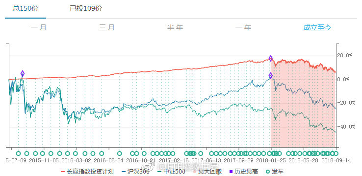
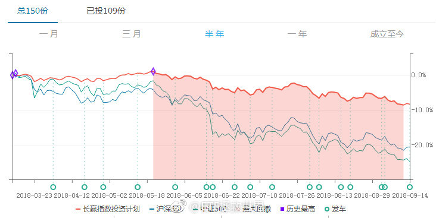

======================================================

ETF拯救世界 (5687069307) @
2018-09-17 09:33:22 Mon  
url: https://weibo.com/5687069307/GzJHEjhkl

知道为什么只买一份了吧…… ​​​

转发[5]  评论[157]  赞[366] 

======================================================

ETF拯救世界 (5687069307) @
2018-09-17 10:11:15 Mon  
url: https://weibo.com/5687069307/GzJX1eMdw

最近三年，中证1000的跌幅是20%，17%，31%。

算上2015年下半年的19%跌幅，已经下跌了3年半。

最高点至今累计跌幅68%。

A股毫无疑问的处在一个底部区域。只是不知道这个区域到最低精确到还有多少跌幅，这个区域还要持续多久。

我们面对的恐怕是未来十年A股最大的机会。 ​​​

转发[88]  评论[203]  赞[397] 

======================================================

ETF拯救世界 (5687069307) @
2018-09-17 10:31:59 Mon  
url: https://weibo.com/5687069307/GzK5royRY

之前说对标08年。我给几个如果真的到08年大底，各指数的预期跌幅。心里有个数。

全市场：28%左右。

沪深300：26%左右。

中证500：17%左右。

中小板：43%左右。

中证1000：30%左右。

医药：10%左右。

消费：11%左右。

军工：61%左右。

信息：49%左右。

红利：24%左右。

这是以2008年金融危机 ​​​

转发[639]  评论[505]  赞[506] 

======================================================

ETF拯救世界 (5687069307) @
2018-09-17 10:34:43 Mon  
url: https://weibo.com/5687069307/GzK6yhUMh

另外，恒生是26%左右。标普500是53%。

------------------------------------------------------
转推：
>  @ETF拯救世界 (5687069307)
>  2018-09-17 10:31:59 Mon  
>  url: https:/weibo.com/5687069307/GzK5royRY/

>  之前说对标08年。我给几个如果真的到08年大底，各指数的预期跌幅。心里有个数。
>  
>  全市场：28%左右。
>  
>  沪深300：26%左右。
>  
>  中证500：17%左右。
>  
>  中小板：43%左右。
>  
>  中证1000：30%左右。
>  
>  医药：10%左右。
>  
>  消费：11%左右。
>  
>  军工：61%左右。
>  
>  信息：49%左右。
>  
>  红利：24%左右。
>  
>  这是以2008年金融危机 ​​​

转发[81]  评论[91]  赞[203] 

======================================================

ETF拯救世界 (5687069307) @
2018-09-17 10:46:16 Mon  
url: https://weibo.com/5687069307/GzKbf0I9R

但是各位要注意，这个要跟时间结合。时间拖得越久，这个跌幅就越难达到。比如，全市场利润增长如果有10%，那么横盘三年就见底了。

------------------------------------------------------
转推：
>  @ETF拯救世界 (5687069307)
>  2018-09-17 10:31:59 Mon  
>  url: https:/weibo.com/5687069307/GzK5royRY/

>  之前说对标08年。我给几个如果真的到08年大底，各指数的预期跌幅。心里有个数。
>  
>  全市场：28%左右。
>  
>  沪深300：26%左右。
>  
>  中证500：17%左右。
>  
>  中小板：43%左右。
>  
>  中证1000：30%左右。
>  
>  医药：10%左右。
>  
>  消费：11%左右。
>  
>  军工：61%左右。
>  
>  信息：49%左右。
>  
>  红利：24%左右。
>  
>  这是以2008年金融危机 ​​​

转发[140]  评论[89]  赞[219] 

======================================================

ETF拯救世界 (5687069307) @
2018-09-17 10:53:19 Mon  
url: https://weibo.com/5687069307/GzKe6DqNh

回复@陈治鸣:大部分指数的2012年底都已经被干掉了，除了那几个辣鸡……全市场只差一步之遥。//@陈治鸣:12年的底破了吗？//@ETF拯救世界:但是各位要注意，这个要跟时间结合。时间拖得越久，这个跌幅就越难达到。比如，全市场利润增长如果有10%，那么横盘三年就见底了。

------------------------------------------------------
转推：
>  @ETF拯救世界 (5687069307)
>  2018-09-17 10:31:59 Mon  
>  url: https:/weibo.com/5687069307/GzK5royRY/

>  之前说对标08年。我给几个如果真的到08年大底，各指数的预期跌幅。心里有个数。
>  
>  全市场：28%左右。
>  
>  沪深300：26%左右。
>  
>  中证500：17%左右。
>  
>  中小板：43%左右。
>  
>  中证1000：30%左右。
>  
>  医药：10%左右。
>  
>  消费：11%左右。
>  
>  军工：61%左右。
>  
>  信息：49%左右。
>  
>  红利：24%左右。
>  
>  这是以2008年金融危机 ​​​

转发[28]  评论[84]  赞[196] 

======================================================

ETF拯救世界 (5687069307) @
2018-09-17 11:09:45 Mon  
url: https://weibo.com/5687069307/GzKkM0xcO

一个月过去，这个点位提升到7800点左右。

------------------------------------------------------
转推：
>  @ETF拯救世界 (5687069307)
>  2018-08-17 09:58:23 Fri  
>  url: https:/weibo.com/5687069307/Gv1CpsZ4E/

>  如果可以7700点附近买入医药，那未来5-10年关上账户等着数钱就对了。 ​​​

转发[118]  评论[140]  赞[296] 

======================================================

ETF拯救世界 (5687069307) @
2018-09-17 11:52:10 Mon  
url: https://weibo.com/5687069307/GzKBYFM5S

刚才看了看，最近12个月里面，中证500只有一个月是上涨的。

这种事情最近一次发生是2016年2月以前的恒生指数。之前十个月只有一个月上涨。之后涨了83%。

就缺最后一根大阴线了。 ​​​

转发[60]  评论[198]  赞[471] 

======================================================

ETF拯救世界 (5687069307) @
2018-09-17 12:51:30 Mon  
url: https://weibo.com/5687069307/GzL04rHoX

翻了一下各指数历史，今年到现在为止是过去十几年，除2008、2011外最惨的一年了。

颇有赶超2011成为第二惨的态势。

如果你满仓，那确实比较难受。但如果你手里还有钱，那就是越惨越好。不信，你看看08和11年之后就知道了。 ​​​

转发[48]  评论[229]  赞[425] 

======================================================

ETF拯救世界 (5687069307) @
2018-09-17 13:43:58 Mon  
url: https://weibo.com/5687069307/GzLln0EKv

确认了一下，还能再战三百回合。 ​​​

转发[56]  评论[62]  赞[303] 

+++++++++++++++++++++++++++++++++++++++++++++++++++++

图片：

======================================================

ETF拯救世界 (5687069307) @
2018-09-17 13:49:09 Mon  
url: https://weibo.com/5687069307/GzLnthIDl

$全指信息 sh000993$   信息挂的很彻底。军工真顽强啊。今年涨跌幅榜居然还是前三。 ​​​

转发[17]  评论[51]  赞[197] 

======================================================

ETF拯救世界 (5687069307) @
2018-09-17 13:57:56 Mon  
url: https://weibo.com/5687069307/GzLr2AGtq

回复@一指洞天机:全市场PB破2。A股历史只在2005、2008、2012年出现过三次。第四次很有可能就是在最近几天了。//@一指洞天机:大家，破2是个什么意思？

------------------------------------------------------
转推：
>  @ETF拯救世界 (5687069307)
>  2018-09-17 13:43:58 Mon  
>  url: https:/weibo.com/5687069307/GzLln0EKv/

>  确认了一下，还能再战三百回合。 ​​​

转发[51]  评论[127]  赞[257] 

======================================================

ETF拯救世界 (5687069307) @
2018-09-17 14:37:14 Mon  
url: https://weibo.com/5687069307/GzLGZkVcr

回复@asekiyoshi:可能是我眼花了。我看wind给的TTM PE是136倍。140倍吧。//@asekiyoshi:科大讯飞作为全球领先的人工智能公司，为什么市场只给不到14倍估值，比FAANG低那么多？

------------------------------------------------------
转推：
>  @ETF拯救世界 (5687069307)
>  2018-09-17 13:49:09 Mon  
>  url: https:/weibo.com/5687069307/GzLnthIDl/

>  $全指信息 sh000993$   信息挂的很彻底。军工真顽强啊。今年涨跌幅榜居然还是前三。 ​​​

转发[2]  评论[69]  赞[149] 

======================================================

ETF拯救世界 (5687069307) @
2018-09-17 15:03:25 Mon  
url: https://weibo.com/5687069307/GzLRCkjAY

回复@jklsadly:股市做为一个整体，和个股、公司不同。很难出现利润大幅增长，同样，也很难出现整体利润下降。大概过去二十年，只有不到5年出现过小幅下降。之后就会继续增长。如果上市公司业绩持续下降，那基本上就是大问题了。

------------------------------------------------------
转推：
>  @ETF拯救世界 (5687069307)
>  2018-09-17 10:31:59 Mon  
>  url: https:/weibo.com/5687069307/GzK5royRY/

>  之前说对标08年。我给几个如果真的到08年大底，各指数的预期跌幅。心里有个数。
>  
>  全市场：28%左右。
>  
>  沪深300：26%左右。
>  
>  中证500：17%左右。
>  
>  中小板：43%左右。
>  
>  中证1000：30%左右。
>  
>  医药：10%左右。
>  
>  消费：11%左右。
>  
>  军工：61%左右。
>  
>  信息：49%左右。
>  
>  红利：24%左右。
>  
>  这是以2008年金融危机 ​​​

转发[67]  评论[64]  赞[186] 

======================================================

ETF拯救世界 (5687069307) @
2018-09-17 15:15:52 Mon  
url: https://weibo.com/5687069307/GzLWG4TVx

回复@温暖的港湾12345:我刚看了一眼，2008年金融危机，上市公司利润增长依然在5%+。2009年更是暴增至25%+。//@温暖的港湾12345:上市公司再怎么样也是各行各业的龙头或者行业领先地位企业，要是上市公司都不行，那这经济也。。。

------------------------------------------------------
转推：
>  @ETF拯救世界 (5687069307)
>  2018-09-17 10:31:59 Mon  
>  url: https:/weibo.com/5687069307/GzK5royRY/

>  之前说对标08年。我给几个如果真的到08年大底，各指数的预期跌幅。心里有个数。
>  
>  全市场：28%左右。
>  
>  沪深300：26%左右。
>  
>  中证500：17%左右。
>  
>  中小板：43%左右。
>  
>  中证1000：30%左右。
>  
>  医药：10%左右。
>  
>  消费：11%左右。
>  
>  军工：61%左右。
>  
>  信息：49%左右。
>  
>  红利：24%左右。
>  
>  这是以2008年金融危机 ​​​

转发[39]  评论[44]  赞[166] 

======================================================

ETF拯救世界 (5687069307) @
2018-09-17 15:20:24 Mon  
url: https://weibo.com/5687069307/GzLYvza2m

大家都是江湖儿女，何须如此客气！请了！

------------------------------------------------------
转推：
>  @新浪视频 (1640601392)
>  2018-09-17 15:10:49 Mon  
>  url: https:/weibo.com/1640601392/GzLUCtM4k/

>  【暖心！公交司机斑马线礼让小学生 男孩拱手回礼致谢[心]】9月12日山东，董师傅驾驶501路公交车到斑马线处时，看到由于车流量较大，男孩要过马路却被车流赶了回来，董师傅急忙减速，在斑马线前停下，摆手示意男孩先过，男孩一边通过一边抱拳致谢，董师傅也同样微笑着抱拳回敬。 http://t.cn/EvoRgTJ ​​​

转发[17]  评论[50]  赞[276] 

======================================================

ETF拯救世界 (5687069307) @
2018-09-17 15:27:29 Mon  
url: https://weibo.com/5687069307/GzM1o3YC2

回复@愉悦老爹:喷了，2。//@愉悦老爹:破2了吗？E兄。//@ETF拯救世界:回复@温暖的港湾12345:我刚看了一眼，2008年金融危机，上市公司利润增长依然在5%+。2009年更是暴增至25%+。

------------------------------------------------------
转推：
>  @ETF拯救世界 (5687069307)
>  2018-09-17 10:31:59 Mon  
>  url: https:/weibo.com/5687069307/GzK5royRY/

>  之前说对标08年。我给几个如果真的到08年大底，各指数的预期跌幅。心里有个数。
>  
>  全市场：28%左右。
>  
>  沪深300：26%左右。
>  
>  中证500：17%左右。
>  
>  中小板：43%左右。
>  
>  中证1000：30%左右。
>  
>  医药：10%左右。
>  
>  消费：11%左右。
>  
>  军工：61%左右。
>  
>  信息：49%左右。
>  
>  红利：24%左右。
>  
>  这是以2008年金融危机 ​​​

转发[24]  评论[137]  赞[238] 

======================================================

ETF拯救世界 (5687069307) @
2018-09-17 15:46:39 Mon  
url: https://weibo.com/5687069307/GzM9az6BR

奖品人家已经收到了，没拿到的记得春节抢红包   http://t.cn/Evok0yE

------------------------------------------------------
转推：
>  @ETF拯救世界 (5687069307)
>  2018-09-12 16:35:30 Wed  
>  url: https:/weibo.com/5687069307/Gz1kvydlg/

>  没想到我都走了，大家还是这么有情有义。我真的非常感谢各位。虽然我知道很多圈我的朋友也没有来微博，也看不到这个。。
>  
>  又得奖了。当然是老规矩，奖品还是送给大家。我无功不受禄。我先联系一下点赞评论最多的安娜，看她要不要。如果不要，我想个办法选一位微博粉丝送出。。虽然没有上次的华为手机好 ​​​

转发[1]  评论[104]  赞[273] 

======================================================

ETF拯救世界 (5687069307) @
2018-09-17 21:28:57 Mon  
url: https://weibo.com/5687069307/GzOo73SYc

我再说一次，我从来没有鼓励过任何人投资股市。

我从来不会像很多人一样宣传，“长期来看股票是收益率最高的品种。”因为我知道，即使真的收益率高，非理性的大多数人根本也不可能赚钱。他们就是牛市冲进来接盘的。

这种反人性的游戏不要对普通人宣传。

只是如果你对股市投资有兴趣，我认为通过一些 ​​​

转发[45]  评论[233]  赞[526] 

======================================================

ETF拯救世界 (5687069307) @
2018-09-18 08:51:34 Tue  
url: https://weibo.com/5687069307/GzSRayXXm

打吧。人家都把你按在地上抽你嘴巴，还警告你不能还手，你还真一点反抗都没有就认怂？ ​​​

转发[9]  评论[128]  赞[307] 

======================================================

ETF拯救世界 (5687069307) @
2018-09-18 09:00:41 Tue  
url: https://weibo.com/5687069307/GzSUSxIsI

回复@步青云AAA:没事，股票翻番就回本了……//@步青云AAA:买股票亏了50%，指数亏了10%。早知道就不要买股票了[允悲]

------------------------------------------------------
转推：
>  @ETF拯救世界 (5687069307)
>  2018-09-17 21:28:57 Mon  
>  url: https:/weibo.com/5687069307/GzOo73SYc/

>  我再说一次，我从来没有鼓励过任何人投资股市。
>  
>  我从来不会像很多人一样宣传，“长期来看股票是收益率最高的品种。”因为我知道，即使真的收益率高，非理性的大多数人根本也不可能赚钱。他们就是牛市冲进来接盘的。
>  
>  这种反人性的游戏不要对普通人宣传。
>  
>  只是如果你对股市投资有兴趣，我认为通过一些 ​​​

转发[4]  评论[25]  赞[157] 

======================================================

ETF拯救世界 (5687069307) @
2018-09-18 09:24:57 Tue  
url: https://weibo.com/5687069307/GzT4Jzgbl

再说一次，控制节奏。//@ETF拯救世界:新低不要着急买。控制好节奏。你家没矿，也不可能像别人一样无限借钱，无限现金流。把已有的资源分配好。不骄不躁，徐而图之。//@ETF拯救世界:再说一次。

------------------------------------------------------
转推：
>  @ETF拯救世界 (5687069307)
>  2018-09-05 12:42:29 Wed  
>  url: https:/weibo.com/5687069307/GxVOsuA7w/

>  目前仓位很合适。稍微放缓发车节奏。等空间。 ​​​

转发[46]  评论[64]  赞[220] 

======================================================

ETF拯救世界 (5687069307) @
2018-09-18 09:33:20 Tue  
url: https://weibo.com/5687069307/GzT88zkD6

回复@fang宝贝在路上:其实吧，要写有很多写的。比如我早就想把微博上的东西定期归拢一下，贴出来的同时认真展开说说。因为微博说不透。还有把以前博客的东西也整理一下做个回顾点评。还有我每天的投资日记，可以把几年前的放出来。一直没做，一个是太忙，一个是懒，没什么动力……

------------------------------------------------------
转推：
>  @ETF拯救世界 (5687069307)
>  2018-09-05 12:42:29 Wed  
>  url: https:/weibo.com/5687069307/GxVOsuA7w/

>  目前仓位很合适。稍微放缓发车节奏。等空间。 ​​​

转发[6]  评论[84]  赞[243] 

======================================================

ETF拯救世界 (5687069307) @
2018-09-18 09:44:22 Tue  
url: https://weibo.com/5687069307/GzTcC3FPo

帮一位私信我的网友问个问题：

女生，大三。学校某有点地位的老师经常找各种借口请她和另一位女生吃饭。还会有一些比较轻浮的举动，但还未上升到可以举报和报警的那个地步。

请问：

这两位女生该怎么彻底拒绝老师的饭局。怎么彻底让老师断绝可以超出师生关系的幻想。

注意，轻易不能影响师生关系， ​​​

转发[8]  评论[247]  赞[132] 

======================================================

ETF拯救世界 (5687069307) @
2018-09-18 09:55:02 Tue  
url: https://weibo.com/5687069307/GzTgWkGj5

我观察球球上几个前期暴跌的私募，最近一两周净值平稳了很多，应该是减仓了……

说好的一起满仓到白头，你却偷偷焗了油。 ​​​

转发[13]  评论[51]  赞[336] 

======================================================

ETF拯救世界 (5687069307) @
2018-09-18 09:57:36 Tue  
url: https://weibo.com/5687069307/GzThZ2j0U

回复@欢欢在山上追:可说呢。我可以假扮男朋友啊。就是怕姐弟恋显得不真实。[doge]//@欢欢在山上追:怎么没人说吃饭的时候带上E大呢

------------------------------------------------------
转推：
>  @ETF拯救世界 (5687069307)
>  2018-09-18 09:44:22 Tue  
>  url: https:/weibo.com/5687069307/GzTcC3FPo/

>  帮一位私信我的网友问个问题：
>  
>  女生，大三。学校某有点地位的老师经常找各种借口请她和另一位女生吃饭。还会有一些比较轻浮的举动，但还未上升到可以举报和报警的那个地步。
>  
>  请问：
>  
>  这两位女生该怎么彻底拒绝老师的饭局。怎么彻底让老师断绝可以超出师生关系的幻想。
>  
>  注意，轻易不能影响师生关系， ​​​

转发[1]  评论[56]  赞[149] 

======================================================

ETF拯救世界 (5687069307) @
2018-09-18 10:06:25 Tue  
url: https://weibo.com/5687069307/GzTlz0FBY

回复@墨白113:因为你想不到的事：50已经比2008年底还便宜了。50最低点是2016年1月。//@墨白113:E大，请问你怎么没有列出上证50对标2008年估值差距值呢？上证50就是不破位，想买到好难啊//@ETF拯救世界:再说一次，控制节奏。

------------------------------------------------------
转推：
>  @ETF拯救世界 (5687069307)
>  2018-09-05 12:42:29 Wed  
>  url: https:/weibo.com/5687069307/GxVOsuA7w/

>  目前仓位很合适。稍微放缓发车节奏。等空间。 ​​​

转发[22]  评论[79]  赞[183] 

======================================================

ETF拯救世界 (5687069307) @
2018-09-18 10:49:32 Tue  
url: https://weibo.com/5687069307/GzTD3okb6

$150023   0.15了……………… ​​​

转发[8]  评论[61]  赞[188] 

======================================================

ETF拯救世界 (5687069307) @
2018-09-18 11:03:24 Tue  
url: https://weibo.com/5687069307/GzTIGF8c6

总有人说：

指数投资，赶上日本那样的怎么办呀。

拜托了好吗，人家日本从08年到现在涨了240%，又快创1991年以来28年新高了好吗。

日本怎么了日本……比你强多了好吗。。

关键在于，现在又不是2015年5月，你怕什么。有的指数已经跌了76%了，日本最惨时候也就跌80%。 ​​​

转发[59]  评论[110]  赞[305] 

======================================================

ETF拯救世界 (5687069307) @
2018-09-18 11:15:16 Tue  
url: https://weibo.com/5687069307/GzTNvs98A

特别狂傲的人最后都失败了。

不然你给我举个反例。 ​​​

转发[16]  评论[111]  赞[233] 

======================================================

ETF拯救世界 (5687069307) @
2018-09-18 11:17:01 Tue  
url: https://weibo.com/5687069307/GzTOduTZX

$中证军工 sz399967$   是不是要还债了。赶紧的。你不趴下兄弟们都起不来。 ​​​

转发[2]  评论[35]  赞[194] 

======================================================

ETF拯救世界 (5687069307) @
2018-09-18 11:23:58 Tue  
url: https://weibo.com/5687069307/GzTR24EwT

回复@Am_Nobody:不错了，心算一下，年化13%了。要知道日本存银行可基本是0利率。。//@Am_Nobody:十年240%[微笑]

------------------------------------------------------
转推：
>  @ETF拯救世界 (5687069307)
>  2018-09-18 11:03:24 Tue  
>  url: https:/weibo.com/5687069307/GzTIGF8c6/

>  总有人说：
>  
>  指数投资，赶上日本那样的怎么办呀。
>  
>  拜托了好吗，人家日本从08年到现在涨了240%，又快创1991年以来28年新高了好吗。
>  
>  日本怎么了日本……比你强多了好吗。。
>  
>  关键在于，现在又不是2015年5月，你怕什么。有的指数已经跌了76%了，日本最惨时候也就跌80%。 ​​​

转发[18]  评论[39]  赞[156] 

======================================================

ETF拯救世界 (5687069307) @
2018-09-18 11:28:06 Tue  
url: https://weibo.com/5687069307/GzTSInRnX

回复@首体南路也没人:参看我昨天的帖子。跌到历史估值最低，中小板还要跌40%。等中小板跌过历史最低依然止不住再来说这些吧。

------------------------------------------------------
转推：
>  @ETF拯救世界 (5687069307)
>  2018-09-18 11:15:16 Tue  
>  url: https:/weibo.com/5687069307/GzTNvs98A/

>  特别狂傲的人最后都失败了。
>  
>  不然你给我举个反例。 ​​​

转发[10]  评论[17]  赞[144] 

======================================================

ETF拯救世界 (5687069307) @
2018-09-18 11:31:44 Tue  
url: https://weibo.com/5687069307/GzTUc1XyQ

是这样没错了。 ​​​

转发[11]  评论[87]  赞[240] 

======================================================

ETF拯救世界 (5687069307) @
2018-09-18 11:36:43 Tue  
url: https://weibo.com/5687069307/GzTWdi4Es

第一目标位1.7。静态需要全市场下跌15%，但下个月三季报就披露完毕了，毛估估10%吧。第一钻石大底目标位。如果跌破，就是绝对钻石大底目标位。1.5-1.6。在那个地方我除了生活费和右侧资金，一分钱也不会留了//@ETF拯救世界:对标08，确认。第一个目标是08/05和2012的中间值。全市场PB 1.7倍。

------------------------------------------------------
转推：
>  @ETF拯救世界 (5687069307)
>  2018-09-03 13:13:16 Mon  
>  url: https:/weibo.com/5687069307/GxD9Xhnqp/

>  我看，这波熊市的低点可以降级对标2008了。
>  
>  未来所有策略围绕这个预期来做。
>  
>  再低的话我就不知道用哪个预期了。A股历史上还没出现过。 ​​​

转发[163]  评论[203]  赞[292] 

======================================================

ETF拯救世界 (5687069307) @
2018-09-18 12:07:55 Tue  
url: https://weibo.com/5687069307/GzU8SpVpi

回复@dreamjoy6:加杠杆这件事，不是说不行。但是要注意资金的性质和杠杆率。杠杆率320%就很危险了你懂的。//@dreamjoy6:E大，等你右侧时我加杠杆可以吗？@ETF拯救世界

------------------------------------------------------
转推：
>  @ETF拯救世界 (5687069307)
>  2018-09-03 13:13:16 Mon  
>  url: https:/weibo.com/5687069307/GxD9Xhnqp/

>  我看，这波熊市的低点可以降级对标2008了。
>  
>  未来所有策略围绕这个预期来做。
>  
>  再低的话我就不知道用哪个预期了。A股历史上还没出现过。 ​​​

转发[15]  评论[41]  赞[135] 

======================================================

ETF拯救世界 (5687069307) @
2018-09-18 12:12:09 Tue  
url: https://weibo.com/5687069307/GzUaB5BxM

回复@金融专业小能手:过去十年M2从47万亿涨到168万亿了解一下？何况无论多少只股票，横向纵向综合对比给出合理估值并没有什么不同。//@金融专业小能手:3500只股票和1000支股票的时候比估值？猪越来越多，猪肉肯定便宜这道理都不懂

------------------------------------------------------
转推：
>  @ETF拯救世界 (5687069307)
>  2018-09-03 13:13:16 Mon  
>  url: https:/weibo.com/5687069307/GxD9Xhnqp/

>  我看，这波熊市的低点可以降级对标2008了。
>  
>  未来所有策略围绕这个预期来做。
>  
>  再低的话我就不知道用哪个预期了。A股历史上还没出现过。 ​​​

转发[14]  评论[39]  赞[169] 

======================================================

ETF拯救世界 (5687069307) @
2018-09-18 12:20:28 Tue  
url: https://weibo.com/5687069307/GzUdXEAr8

另外我再说一句，预测大底这种事其实没有什么意义。

筹码的买入和卖出，重要的是区域。底部区域布局，顶部区域卖出。一个区域上下一二十个点是正常范围。最后的那个大顶点位和大底点位没意义。你买不到也卖不到。

给出一个极限位置，只是对极限情况有个准备。有个预案。不是说预测一定到，或者到了才 ​​​

转发[132]  评论[223]  赞[415] 

======================================================

ETF拯救世界 (5687069307) @
2018-09-18 12:45:25 Tue  
url: https://weibo.com/5687069307/GzUo6ezcV

别人家的粉丝。[doge]

------------------------------------------------------
转推：
>  @澎湃新闻 (5044281310)
>  2018-09-18 12:26:03 Tue  
>  url: https:/weibo.com/5044281310/GzUgeDs1I/

>  【杭州二胎妈妈：丈夫一个月打赏女主播十几万元，钱要得回来吗】9月15日晚，杭州的周女士称：“最近发现老公在网上给女主播送了很多礼物，有三四万块钱。后来那个女主播加了他微信，两个人聊天内容很暧昧。她还让老公投资一个化妆品代理，又花了7万块。算起来前后一个多月时间里，给那个女的刷了10多万 ​​​

转发[7]  评论[102]  赞[148] 

======================================================

ETF拯救世界 (5687069307) @
2018-09-18 13:34:30 Tue  
url: https://weibo.com/5687069307/GzUI1mfGU

什么意思又想让我把小尾巴改回来吗表脸。

------------------------------------------------------
转推：
>  @ETF拯救世界 (5687069307)
>  2018-09-18 11:31:44 Tue  
>  url: https:/weibo.com/5687069307/GzTUc1XyQ/

>  是这样没错了。 ​​​

转发[2]  评论[38]  赞[149] 

======================================================

ETF拯救世界 (5687069307) @
2018-09-18 13:37:45 Tue  
url: https://weibo.com/5687069307/GzUJldhyD

现在你可以不买，但是如果你还在卖只能说你脑子有包了。 ​​​

转发[21]  评论[94]  赞[301] 

======================================================

ETF拯救世界 (5687069307) @
2018-09-18 14:03:21 Tue  
url: https://weibo.com/5687069307/GzUTJrara

全市场PB2真的是比较敏感的一个地方。//@ETF拯救世界:回复@愉悦老爹:喷了，2。//@愉悦老爹:破2了吗？E兄。//@ETF拯救世界:回复@温暖的港湾12345:我刚看了一眼，2008年金融危机，上市公司利润增长依然在5%+。2009年更是暴增至25%+。

------------------------------------------------------
转推：
>  @ETF拯救世界 (5687069307)
>  2018-09-17 10:31:59 Mon  
>  url: https:/weibo.com/5687069307/GzK5royRY/

>  之前说对标08年。我给几个如果真的到08年大底，各指数的预期跌幅。心里有个数。
>  
>  全市场：28%左右。
>  
>  沪深300：26%左右。
>  
>  中证500：17%左右。
>  
>  中小板：43%左右。
>  
>  中证1000：30%左右。
>  
>  医药：10%左右。
>  
>  消费：11%左右。
>  
>  军工：61%左右。
>  
>  信息：49%左右。
>  
>  红利：24%左右。
>  
>  这是以2008年金融危机 ​​​

转发[15]  评论[57]  赞[155] 

======================================================

ETF拯救世界 (5687069307) @
2018-09-18 14:15:20 Tue  
url: https://weibo.com/5687069307/GzUYB5TNz

我跟你说啊。

你看，昨天说了，今年已经是近十年，除了2008,2011最惨的第三年。

但是，你去问问经历过2011年的人，那年虽然股债双杀，虽然跌幅比今年还大，但你问问他们，或者问问自己，现在对当时的痛苦还记得多少？

我相信没多少了。更别提2015赚大钱的时候。2011的痛苦可以说完全不记得了。

甚 ​​​

转发[103]  评论[182]  赞[414] 

======================================================

ETF拯救世界 (5687069307) @
2018-09-18 14:22:08 Tue  
url: https://weibo.com/5687069307/GzV1muzKl

小尾巴先不改了。纪念那几个小时的钻石坑……//@ETF拯救世界:什么意思又想让我把小尾巴改回来吗表脸。

------------------------------------------------------
转推：
>  @ETF拯救世界 (5687069307)
>  2018-09-18 11:31:44 Tue  
>  url: https:/weibo.com/5687069307/GzTUc1XyQ/

>  是这样没错了。 ​​​

转发[1]  评论[53]  赞[167] 

======================================================

ETF拯救世界 (5687069307) @
2018-09-18 14:37:07 Tue  
url: https://weibo.com/5687069307/GzV7rcurU

如果继续反弹，周五加两个趋势品种。放心，踏空不了，多大点事儿。 ​​​

转发[67]  评论[82]  赞[309] 

======================================================

ETF拯救世界 (5687069307) @
2018-09-18 14:40:15 Tue  
url: https://weibo.com/5687069307/GzV8IrzNG

回复@沪宁线上的男人:根本没必要。你心里明白很多事，急着和不明白的人争论，只是第一等级。再高一级，是静静的看着那些人犯错。不是你不想帮，是帮他们是浪费时间。

------------------------------------------------------
转推：
>  @ETF拯救世界 (5687069307)
>  2018-09-18 13:37:45 Tue  
>  url: https:/weibo.com/5687069307/GzUJldhyD/

>  现在你可以不买，但是如果你还在卖只能说你脑子有包了。 ​​​

转发[10]  评论[19]  赞[188] 

======================================================

ETF拯救世界 (5687069307) @
2018-09-18 14:41:01 Tue  
url: https://weibo.com/5687069307/GzV91lBnu

谁能想到，7月份加的那份50还在赚钱呢…… ​​​

转发[4]  评论[77]  赞[238] 

======================================================

ETF拯救世界 (5687069307) @
2018-09-18 14:46:14 Tue  
url: https://weibo.com/5687069307/GzVb98Xgk

回复@怡子_59052:涨跌都不怕。买个指数基金而已，站着把钱挣了，多大点事儿啊。//@怡子_59052:好爽，星期五可以上车了。以前没E大时，越跌越怕，现在越跌越期待可以买[坏笑]

------------------------------------------------------
转推：
>  @ETF拯救世界 (5687069307)
>  2018-09-18 14:37:07 Tue  
>  url: https:/weibo.com/5687069307/GzV7rcurU/

>  如果继续反弹，周五加两个趋势品种。放心，踏空不了，多大点事儿。 ​​​

转发[3]  评论[24]  赞[183] 

======================================================

ETF拯救世界 (5687069307) @
2018-09-18 14:46:44 Tue  
url: https://weibo.com/5687069307/GzVblyLiL

回复@一壹y:谁能想到为了照顾大家的心情我即将拉黑你呢……//@一壹y:谁能想到，之前没买，7月份一次性补齐的现在红了......

------------------------------------------------------
转推：
>  @ETF拯救世界 (5687069307)
>  2018-09-18 14:41:01 Tue  
>  url: https:/weibo.com/5687069307/GzV91lBnu/

>  谁能想到，7月份加的那份50还在赚钱呢…… ​​​

转发[1]  评论[110]  赞[276] 

======================================================

ETF拯救世界 (5687069307) @
2018-09-18 15:02:01 Tue  
url: https://weibo.com/5687069307/GzVhxDVz2

一个字，舒服。

周五有没有机会干一票？ ​​​

转发[15]  评论[100]  赞[215] 

+++++++++++++++++++++++++++++++++++++++++++++++++++++

图片：

======================================================

ETF拯救世界 (5687069307) @
2018-09-18 15:10:13 Tue  
url: https://weibo.com/5687069307/GzVkSciJ1

回复@奔跑的月光儿:我记得是“江湖救急”。是不是记错了？记得的同学补充一下。顺便说一句，这片子的节奏我很喜欢。但是香港江湖片节奏最喜欢的是“枪火”。配乐和节奏太喜欢了！百看不厌。几个主演也特别棒。//@奔跑的月光儿:为啥我关注的点是，这个是啥电影来着[二哈][允悲]

------------------------------------------------------
转推：
>  @ETF拯救世界 (5687069307)
>  2018-09-18 15:02:01 Tue  
>  url: https:/weibo.com/5687069307/GzVhxDVz2/

>  一个字，舒服。
>  
>  周五有没有机会干一票？ ​​​

转发[7]  评论[70]  赞[125] 

======================================================

ETF拯救世界 (5687069307) @
2018-09-18 15:27:15 Tue  
url: https://weibo.com/5687069307/GzVrN27lp

回复@一地鸡毛_26863:哈哈。因为他对我的体系不了解，这样说很正常。就像之前jsl说一会价值一会趋势是辣鸡一样。简单说两句。我的持仓里面，大部分是根据价值投入。小部分是趋势。我很难解释为什么，三个字黑天鹅吧。最大跌幅是每次计划里都有的，这是深入我骨髓的思考方式也是价值部分投入的节奏参考

------------------------------------------------------
转推：
>  @ETF拯救世界 (5687069307)
>  2018-09-18 14:37:07 Tue  
>  url: https:/weibo.com/5687069307/GzV7rcurU/

>  如果继续反弹，周五加两个趋势品种。放心，踏空不了，多大点事儿。 ​​​

转发[19]  评论[57]  赞[189] 

======================================================

ETF拯救世界 (5687069307) @
2018-09-18 15:28:19 Tue  
url: https://weibo.com/5687069307/GzVsdzkSZ

11年股债双杀，连分级A都暴跌，不是年底回暖当年真的要亏。//@挖龙脉的超级鹿鼎公:11年确实真心难做，比08年难做太多了，那年疯狂做T，才保住不亏本[摊手]

------------------------------------------------------
转推：
>  @ETF拯救世界 (5687069307)
>  2018-09-18 14:15:20 Tue  
>  url: https:/weibo.com/5687069307/GzUYB5TNz/

>  我跟你说啊。
>  
>  你看，昨天说了，今年已经是近十年，除了2008,2011最惨的第三年。
>  
>  但是，你去问问经历过2011年的人，那年虽然股债双杀，虽然跌幅比今年还大，但你问问他们，或者问问自己，现在对当时的痛苦还记得多少？
>  
>  我相信没多少了。更别提2015赚大钱的时候。2011的痛苦可以说完全不记得了。
>  
>  甚 ​​​

转发[11]  评论[38]  赞[165] 

======================================================

ETF拯救世界 (5687069307) @
2018-09-18 15:37:29 Tue  
url: https://weibo.com/5687069307/GzVvWlQ0I

接上面，再说“预判”

不好意思，我从没说过我可以预判市场的走势。我预判不了。我只能根据概率下注。

价值是一种概率，趋势同样是。你不要因为你是价投就看不起趋势。大到这个宇宙，再到每个国家的运势，小到一个人的命运，都有趋势。顺势而为是一种大智慧。当然了，“势”很难判断，同时，我们来做 ​​​

转发[137]  评论[256]  赞[431] 

======================================================

ETF拯救世界 (5687069307) @
2018-09-18 15:43:57 Tue  
url: https://weibo.com/5687069307/GzVyzegvg

另外，我在各种论坛看了几年，有个体会，说出来你感受一下。

就是很多时候，我们觉得某个人很牛，值得关注，其实是因为他的思路和自己一样。比如我看多，某个人也拼命看多，我就会觉得他有水平。反之，我看多的时候你看空，我感觉你就是辣鸡。

如果我以前喜欢的人改变了看法，我看多他突然开始看空， ​​​

转发[108]  评论[196]  赞[458] 

======================================================

ETF拯救世界 (5687069307) @
2018-09-18 16:57:49 Tue  
url: https://weibo.com/5687069307/GzW2y8obh

回复@携风牧云:“趋势”其实就是国外量化策略中很重要的“动量”因子。这个因子是经过长期测试极为有效的量化因子之一。可惜，价投会说这是追涨杀跌的辣鸡……

------------------------------------------------------
转推：
>  @ETF拯救世界 (5687069307)
>  2018-09-18 14:37:07 Tue  
>  url: https:/weibo.com/5687069307/GzV7rcurU/

>  如果继续反弹，周五加两个趋势品种。放心，踏空不了，多大点事儿。 ​​​

转发[33]  评论[63]  赞[199] 

======================================================

ETF拯救世界 (5687069307) @
2018-09-18 17:00:38 Tue  
url: https://weibo.com/5687069307/GzW3H1eqY

回复@求财不劫色:2015年崩溃前我是空头少赚了一点被人骂，现在是多头赔了一点又被人骂。可以说很难做人了。。

------------------------------------------------------
转推：
>  @ETF拯救世界 (5687069307)
>  2018-09-18 15:43:57 Tue  
>  url: https:/weibo.com/5687069307/GzVyzegvg/

>  另外，我在各种论坛看了几年，有个体会，说出来你感受一下。
>  
>  就是很多时候，我们觉得某个人很牛，值得关注，其实是因为他的思路和自己一样。比如我看多，某个人也拼命看多，我就会觉得他有水平。反之，我看多的时候你看空，我感觉你就是辣鸡。
>  
>  如果我以前喜欢的人改变了看法，我看多他突然开始看空， ​​​

转发[22]  评论[47]  赞[246] 

======================================================

ETF拯救世界 (5687069307) @
2018-09-18 17:14:30 Tue  
url: https://weibo.com/5687069307/GzW9k1gyq

回复@梁小雨:肯定当初没关注我球球。这个数据我从2015年就开始跟踪，并根据这个倒计时了2016年初的熔断股灾。但是目前没意义了，因为解禁股也不能随便卖了。//@梁小雨:回复@梁小雨:E大看一下这个数据有没有意义？ http://t.cn/EvWJVWe 

------------------------------------------------------
转推：
>  @ETF拯救世界 (5687069307)
>  2018-09-18 15:43:57 Tue  
>  url: https:/weibo.com/5687069307/GzVyzegvg/

>  另外，我在各种论坛看了几年，有个体会，说出来你感受一下。
>  
>  就是很多时候，我们觉得某个人很牛，值得关注，其实是因为他的思路和自己一样。比如我看多，某个人也拼命看多，我就会觉得他有水平。反之，我看多的时候你看空，我感觉你就是辣鸡。
>  
>  如果我以前喜欢的人改变了看法，我看多他突然开始看空， ​​​

转发[8]  评论[24]  赞[163] 

======================================================

ETF拯救世界 (5687069307) @
2018-09-18 17:32:22 Tue  
url: https://weibo.com/5687069307/GzWgzsnSv

回复@混在中国2012:今天话是有点密，但没感觉有营养啊。。都是随口一说……//@混在中国2012:谢谢今天这么多有营养的分享，让我学到了很多。

------------------------------------------------------
转推：
>  @ETF拯救世界 (5687069307)
>  2018-09-18 14:37:07 Tue  
>  url: https:/weibo.com/5687069307/GzV7rcurU/

>  如果继续反弹，周五加两个趋势品种。放心，踏空不了，多大点事儿。 ​​​

转发[4]  评论[49]  赞[208] 

======================================================

ETF拯救世界 (5687069307) @
2018-09-18 17:50:00 Tue  
url: https://weibo.com/5687069307/GzWnJgE3p

“没人能干得倒我”。惊呆了。//@见闻实时新闻:马云辟谣被迫离职退休：不存在的，没有人能干得倒我

------------------------------------------------------
转推：
>  @ ()
>  2018-09-18 16:56:22 Tue  
>  url: 

>  抱歉，此微博已被作者删除。查看帮助：http://t.cn/Rfd3rQV

转发[5]  评论[74]  赞[203] 

======================================================

ETF拯救世界 (5687069307) @
2018-09-19 09:47:32 Wed  
url: https://weibo.com/5687069307/GA2EoFLgy

回复@天外飞钳:是。日本央行买ETF简直丧心病狂，不输那什么。//@天外飞钳:日本是全靠央行在买买买，快到头了。//@ETF拯救世界:回复@Am_Nobody:不错了，心算一下，年化13%了。要知道日本存银行可基本是0利率。。//@Am_Nobody:十年240%[微笑]

------------------------------------------------------
转推：
>  @ETF拯救世界 (5687069307)
>  2018-09-18 11:03:24 Tue  
>  url: https:/weibo.com/5687069307/GzTIGF8c6/

>  总有人说：
>  
>  指数投资，赶上日本那样的怎么办呀。
>  
>  拜托了好吗，人家日本从08年到现在涨了240%，又快创1991年以来28年新高了好吗。
>  
>  日本怎么了日本……比你强多了好吗。。
>  
>  关键在于，现在又不是2015年5月，你怕什么。有的指数已经跌了76%了，日本最惨时候也就跌80%。 ​​​

转发[6]  评论[32]  赞[132] 

======================================================

ETF拯救世界 (5687069307) @
2018-09-19 10:02:34 Wed  
url: https://weibo.com/5687069307/GA2KuA8ic

一想起持仓、现金、仓位、目前股市的情况，心里就感到特别特别舒服是怎么回事。 ​​​

转发[24]  评论[116]  赞[328] 

======================================================

ETF拯救世界 (5687069307) @
2018-09-19 10:16:07 Wed  
url: https://weibo.com/5687069307/GA2Q0d4rq

回复@微言200112:金融圈太乱了！但是！试问，各位，哪个圈不乱你们说说。//@微言200112:方正饭局，E大怎么看

------------------------------------------------------
转推：
>  @ETF拯救世界 (5687069307)
>  2018-09-19 10:02:34 Wed  
>  url: https:/weibo.com/5687069307/GA2KuA8ic/

>  一想起持仓、现金、仓位、目前股市的情况，心里就感到特别特别舒服是怎么回事。 ​​​

转发[5]  评论[60]  赞[176] 

======================================================

ETF拯救世界 (5687069307) @
2018-09-19 10:16:23 Wed  
url: https://weibo.com/5687069307/GA2Q6oabt

回复@紧跟E大:周五是关键的时间窗口。//@紧跟E大:金融地产和上证50有走出趋势的趋势？

------------------------------------------------------
转推：
>  @ETF拯救世界 (5687069307)
>  2018-09-19 10:02:34 Wed  
>  url: https:/weibo.com/5687069307/GA2KuA8ic/

>  一想起持仓、现金、仓位、目前股市的情况，心里就感到特别特别舒服是怎么回事。 ​​​

转发[4]  评论[37]  赞[161] 

======================================================

ETF拯救世界 (5687069307) @
2018-09-19 10:18:35 Wed  
url: https://weibo.com/5687069307/GA2QZD18Y

回复@J-ToveLo:真好。拉黑你。[拜拜]//@J-ToveLo:新人  两天时间 补了61份 想起来就特别舒服 怎么回事

------------------------------------------------------
转推：
>  @ETF拯救世界 (5687069307)
>  2018-09-19 10:02:34 Wed  
>  url: https:/weibo.com/5687069307/GA2KuA8ic/

>  一想起持仓、现金、仓位、目前股市的情况，心里就感到特别特别舒服是怎么回事。 ​​​

转发[2]  评论[84]  赞[230] 

======================================================

ETF拯救世界 (5687069307) @
2018-09-19 10:29:02 Wed  
url: https://weibo.com/5687069307/GA2VfefZj

为什么不要预判股市走势，这就是例子。要么你就根据价值高抛低吸，要不就等趋势走出来顺势而为。不断预测未来涨跌，不断预测高点低点，并根据预测交易，能挣钱就见鬼了。//@亟兮般若:还记得2014年[允悲]也是靠这个看多的突然看空，我才敢开多一年啊[允悲][允悲]//@丛林岗小学生:[允悲]

------------------------------------------------------
转推：
>  @小树的自我修养 (2099431383)
>  2018-09-18 12:46:21 Tue  
>  url: https:/weibo.com/2099431383/GzUotAlNl/

>  #卦哥家[超话]#特大利好！🐶哥翻空@亟兮般若 ​​​

转发[35]  评论[76]  赞[198] 

======================================================

ETF拯救世界 (5687069307) @
2018-09-19 10:35:25 Wed  
url: https://weibo.com/5687069307/GA2XPFI6C

我有个疑问，前几天到处发帖抱怨参考我的计划浮亏几个点的人，

以后赚钱了，

他会不会到处发帖感谢我呢。

我觉得会。你们觉得呢。毕竟是个人啊！ ​​​

转发[7]  评论[283]  赞[551] 

======================================================

ETF拯救世界 (5687069307) @
2018-09-19 10:45:03 Wed  
url: https://weibo.com/5687069307/GA31Jm2U9

今天最垃圾的辣鸡，有一天会变成闪瞎大家氪金狗眼的明星。

一个品种，如果你买了，等了五年，四年赔钱，第五年突然翻番，这是不是一笔好投资？

前四年所有人觉得是辣鸡，第五年你变成了巴菲特。

你变了吗？品种变了吗？谁都没变。

复利是这样的。

1涨1倍是2。2再涨1倍变成了4。4再涨1倍变成了8。8 ​​​

转发[47]  评论[250]  赞[426] 

======================================================

ETF拯救世界 (5687069307) @
2018-09-19 12:28:20 Wed  
url: https://weibo.com/5687069307/GA3HEveIo

刚看了一眼，500目前仓位已经占13%+了。对于单一品种来说，这个仓位已经不小了。一般单一品种配置最多也就给15%-20%。

无论是继续下探还是趋势转折，都不会加太多了。我估计最多再加6-7份吧。最多了。 ​​​

转发[138]  评论[264]  赞[470] 

======================================================

ETF拯救世界 (5687069307) @
2018-09-19 16:52:42 Wed  
url: https://weibo.com/5687069307/GA5qYnQ1J

回复@热爱过后:为什么一定要有巨头。无论是中国还是美国，历史上看都是小盘股弹性更大。上证就是中石油进去后一蹶不振的。//@热爱过后:回复@swimingcat:按500的编制方法 公司一旦大了就会调出500进入到300  这里面是不会有巨头的

------------------------------------------------------
转推：
>  @ETF拯救世界 (5687069307)
>  2018-09-19 12:28:20 Wed  
>  url: https:/weibo.com/5687069307/GA3HEveIo/

>  刚看了一眼，500目前仓位已经占13%+了。对于单一品种来说，这个仓位已经不小了。一般单一品种配置最多也就给15%-20%。
>  
>  无论是继续下探还是趋势转折，都不会加太多了。我估计最多再加6-7份吧。最多了。 ​​​

转发[16]  评论[71]  赞[240] 

======================================================

ETF拯救世界 (5687069307) @
2018-09-20 07:38:26 Thu  
url: https://weibo.com/5687069307/GAbeug7HQ

回复@多余的余2011:举个例子，2013年50 300跌十几个点，传媒涨超100%。买一只，你那只不被市场喜欢，可能十年不涨，了解一下。//@多余的余2011:既然指数终归能涨起来，又是定投不怕下跌，为何不单买一个指数而要配置很多很多的基金呢？

------------------------------------------------------
转推：
>  @ETF拯救世界 (5687069307)
>  2018-09-19 12:28:20 Wed  
>  url: https:/weibo.com/5687069307/GA3HEveIo/

>  刚看了一眼，500目前仓位已经占13%+了。对于单一品种来说，这个仓位已经不小了。一般单一品种配置最多也就给15%-20%。
>  
>  无论是继续下探还是趋势转折，都不会加太多了。我估计最多再加6-7份吧。最多了。 ​​​

转发[63]  评论[82]  赞[217] 

======================================================

ETF拯救世界 (5687069307) @
2018-09-20 07:43:17 Thu  
url: https://weibo.com/5687069307/GAbgsmDcb

到现在，还有很多人觉得指数就是上证，所有指数都差不多。

事实是，每年A股最好最差指数涨幅差距都有至少几十个点。 ​​​

转发[27]  评论[75]  赞[284] 

======================================================

ETF拯救世界 (5687069307) @
2018-09-20 07:50:12 Thu  
url: https://weibo.com/5687069307/GAbjgnmHX

回复@柏川俊:深研和涨不涨没关系。你把一个指数研究的再透，市场不喜欢它就涨不起来//@柏川俊:低估分散不深研VS集中深研//@ETF拯救世界:回复@多余的余2011:举个例子，2013年50 300跌十几个点，传媒涨超100%。买一只，你那只不被市场喜欢，可能十年不涨，了解一下。

------------------------------------------------------
转推：
>  @ETF拯救世界 (5687069307)
>  2018-09-19 12:28:20 Wed  
>  url: https:/weibo.com/5687069307/GA3HEveIo/

>  刚看了一眼，500目前仓位已经占13%+了。对于单一品种来说，这个仓位已经不小了。一般单一品种配置最多也就给15%-20%。
>  
>  无论是继续下探还是趋势转折，都不会加太多了。我估计最多再加6-7份吧。最多了。 ​​​

转发[31]  评论[38]  赞[187] 

======================================================

ETF拯救世界 (5687069307) @
2018-09-20 07:51:40 Thu  
url: https://weibo.com/5687069307/GAbjRjuTl

再说一句很重要的:

指数基金不是目的，是手段。是做资产配置的最佳手段。

了解一下。 ​​​

转发[91]  评论[156]  赞[405] 

======================================================

ETF拯救世界 (5687069307) @
2018-09-20 08:39:10 Thu  
url: https://weibo.com/5687069307/GAbD990Zk

回复@ETF信徒者:计划下跌6%，被人发帖喷死[哼][委屈]//@ETF信徒者:格上理财8月份的业绩快报显示，今年以来大型私募业绩遭“通杀”。赵军的淡水泉投资、石波的尚雅投资、明达资产等知名私募今年亏损达20%，朱雀投资、源乐晟资产、翼虎投资、民森投资等亏损超15%，百亿股票私募中竟然没有一家是盈利的。

------------------------------------------------------
转推：
>  @ETF拯救世界 (5687069307)
>  2018-09-19 12:28:20 Wed  
>  url: https:/weibo.com/5687069307/GA3HEveIo/

>  刚看了一眼，500目前仓位已经占13%+了。对于单一品种来说，这个仓位已经不小了。一般单一品种配置最多也就给15%-20%。
>  
>  无论是继续下探还是趋势转折，都不会加太多了。我估计最多再加6-7份吧。最多了。 ​​​

转发[10]  评论[65]  赞[169] 

======================================================

ETF拯救世界 (5687069307) @
2018-09-20 08:55:49 Thu  
url: https://weibo.com/5687069307/GAbJTz7Uu

回复@不要慌我来接盘:军工2008年19倍了解一下。现在将近60。//@不要慌我来接盘:回复@-反清复明-:那为什么军工的pe一直那么高？即使在历史最低位的时候

------------------------------------------------------
转推：
>  @ETF拯救世界 (5687069307)
>  2018-09-20 07:51:40 Thu  
>  url: https:/weibo.com/5687069307/GAbjRjuTl/

>  再说一句很重要的:
>  
>  指数基金不是目的，是手段。是做资产配置的最佳手段。
>  
>  了解一下。 ​​​

转发[26]  评论[42]  赞[137] 

======================================================

ETF拯救世界 (5687069307) @
2018-09-20 09:00:32 Thu  
url: https://weibo.com/5687069307/GAbLOlUld

融资一直在减少。目前已经低于16年初，回到14年了。较最高点两万多亿下降将近2/3了

------------------------------------------------------
转推：
>  @挖龙脉的超级鹿鼎公 (3962719063)
>  2018-09-20 08:54:16 Thu  
>  url: https:/weibo.com/3962719063/GAbJgBxpv/

>  昨日两市合计8328.55亿元，较前一交易日减少29.32亿元。
>  ----------------------
>  一涨就跑路族 ​​​

转发[25]  评论[43]  赞[163] 

======================================================

ETF拯救世界 (5687069307) @
2018-09-20 09:07:26 Thu  
url: https://weibo.com/5687069307/GAbOCa5Qp

回复@不说的树:别。你买肯定有买的原因，别因为我说就卖。便宜并不一定涨，贵了也不一定跌。便宜和贵只是投资的一个维度而已。不符合我的要求不一定不符合你的。//@不说的树:持有军工屡被点名的瑟瑟发抖，准备趁这波反弹抛了[允悲]

------------------------------------------------------
转推：
>  @ETF拯救世界 (5687069307)
>  2018-09-20 07:51:40 Thu  
>  url: https:/weibo.com/5687069307/GAbjRjuTl/

>  再说一句很重要的:
>  
>  指数基金不是目的，是手段。是做资产配置的最佳手段。
>  
>  了解一下。 ​​​

转发[10]  评论[26]  赞[162] 

======================================================

ETF拯救世界 (5687069307) @
2018-09-20 09:13:04 Thu  
url: https://weibo.com/5687069307/GAbQTFxM7

冷萃咖啡是不是骗局？

喝起来和美式没有任何区别，然后还贵了9块钱。

咖啡界的世纪大骗局今天被我揭穿了。 ​​​

转发[5]  评论[112]  赞[227] 

======================================================

ETF拯救世界 (5687069307) @
2018-09-20 09:18:16 Thu  
url: https://weibo.com/5687069307/GAbT0wzIw

其实我估计绝大多数人都想不到，投资指数基金，最大的难题并不是买。买很简单，低估买，趋势转折买。成本能差多少，差不了多少，因为无论怎么跌都是有底的。成本控制在底部区域不难。

难的是卖。

涨起来可是没有天花板的。

这已经第三轮了，我还没把卖的问题完全琢磨清楚。无论什么样的策略，总是不 ​​​

转发[210]  评论[370]  赞[432] 

======================================================

ETF拯救世界 (5687069307) @
2018-09-20 09:33:31 Thu  
url: https://weibo.com/5687069307/GAbZcoBGc

回复@湘江边上2018:那你赶上0607就惨了。1200点成本，涨到2400点。眼睁睁看着涨到6100点。5900点回来接盘确认了。//@湘江边上2018:翻番就跑了，管他再涨多少呢

------------------------------------------------------
转推：
>  @ETF拯救世界 (5687069307)
>  2018-09-20 09:18:16 Thu  
>  url: https:/weibo.com/5687069307/GAbT0wzIw/

>  其实我估计绝大多数人都想不到，投资指数基金，最大的难题并不是买。买很简单，低估买，趋势转折买。成本能差多少，差不了多少，因为无论怎么跌都是有底的。成本控制在底部区域不难。
>  
>  难的是卖。
>  
>  涨起来可是没有天花板的。
>  
>  这已经第三轮了，我还没把卖的问题完全琢磨清楚。无论什么样的策略，总是不 ​​​

转发[51]  评论[59]  赞[190] 

======================================================

ETF拯救世界 (5687069307) @
2018-09-20 09:37:25 Thu  
url: https://weibo.com/5687069307/GAc0MbEha

回复@adores2017:说不难的一定是骗子。巴菲特买中石油，1.6成本跌到1.3最低。拿到12清仓，又眼睁睁涨到21。被人抓到cctv逼老爷子承认卖错了。。//@adores2017:第一次听到E大说难[笑cry]

------------------------------------------------------
转推：
>  @ETF拯救世界 (5687069307)
>  2018-09-20 09:18:16 Thu  
>  url: https:/weibo.com/5687069307/GAbT0wzIw/

>  其实我估计绝大多数人都想不到，投资指数基金，最大的难题并不是买。买很简单，低估买，趋势转折买。成本能差多少，差不了多少，因为无论怎么跌都是有底的。成本控制在底部区域不难。
>  
>  难的是卖。
>  
>  涨起来可是没有天花板的。
>  
>  这已经第三轮了，我还没把卖的问题完全琢磨清楚。无论什么样的策略，总是不 ​​​

转发[36]  评论[61]  赞[184] 

======================================================

ETF拯救世界 (5687069307) @
2018-09-20 10:03:11 Thu  
url: https://weibo.com/5687069307/GAcbf9lRX

太喜欢长期国债了，这波动不输给A股。 ​​​

转发[17]  评论[66]  赞[260] 

+++++++++++++++++++++++++++++++++++++++++++++++++++++

图片：
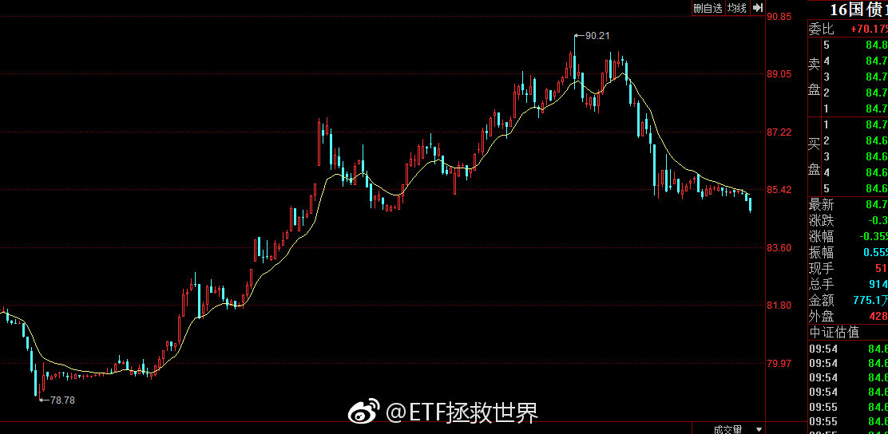

======================================================

ETF拯救世界 (5687069307) @
2018-09-20 10:14:04 Thu  
url: https://weibo.com/5687069307/GAcfF2lWB

回复@ffxua:我0607是4000多点清仓，眼睁睁看到6100。当然，08年买债券等于赚回了4000多到6100的利润，然后指数跌到1600了。整个过程和2015年3、4月下车买分级A，股灾中赚回牛市利润同时毫发无损是一模一样……

------------------------------------------------------
转推：
>  @ETF拯救世界 (5687069307)
>  2018-09-20 09:18:16 Thu  
>  url: https:/weibo.com/5687069307/GAbT0wzIw/

>  其实我估计绝大多数人都想不到，投资指数基金，最大的难题并不是买。买很简单，低估买，趋势转折买。成本能差多少，差不了多少，因为无论怎么跌都是有底的。成本控制在底部区域不难。
>  
>  难的是卖。
>  
>  涨起来可是没有天花板的。
>  
>  这已经第三轮了，我还没把卖的问题完全琢磨清楚。无论什么样的策略，总是不 ​​​

转发[40]  评论[73]  赞[249] 

======================================================

ETF拯救世界 (5687069307) @
2018-09-20 10:19:08 Thu  
url: https://weibo.com/5687069307/GAchInN9X

我忘了以前说没说过了。投资这件事，不亏损，少亏损的意义远超你的想象。

一道简单的数学题：

第一年涨40%，第二年跌20%，如此往复，与每年涨6%谁赚得更多？

答案是每年6%赚得更多。因为别看前一种情况涨40%，跌只有20%，但长期下去，这样的账户收益率也只有5个多点而已。这与一般人直观的感觉，也 ​​​

转发[123]  评论[180]  赞[351] 

======================================================

ETF拯救世界 (5687069307) @
2018-09-20 10:27:15 Thu  
url: https://weibo.com/5687069307/GAcl0yxKe

回复@智慧家666:中石油巴菲特一直买到除集团外的第二大股东，赚了几十亿美元。然而同一只股票A股套了几十万人。没有坏品种，只有坏价格。//@智慧家666:1.6-23什么概念   我去  14.375倍

------------------------------------------------------
转推：
>  @ETF拯救世界 (5687069307)
>  2018-09-20 09:18:16 Thu  
>  url: https:/weibo.com/5687069307/GAbT0wzIw/

>  其实我估计绝大多数人都想不到，投资指数基金，最大的难题并不是买。买很简单，低估买，趋势转折买。成本能差多少，差不了多少，因为无论怎么跌都是有底的。成本控制在底部区域不难。
>  
>  难的是卖。
>  
>  涨起来可是没有天花板的。
>  
>  这已经第三轮了，我还没把卖的问题完全琢磨清楚。无论什么样的策略，总是不 ​​​

转发[18]  评论[31]  赞[204] 

======================================================

ETF拯救世界 (5687069307) @
2018-09-20 10:41:57 Thu  
url: https://weibo.com/5687069307/GAcqYx92F

刚看了一眼，2015年7月第三轮计划开始以来：

432只股票基金中，收益率超过计划的29只，排名百分比6.71%。收益率为正的68只，84%亏损。

1001只配置型基金中，收益率超过计划的249只，排名百分比24.88%。其中收益率为正的358只，64%亏损。

随着计划仓位越来越重，未来的上涨中一定会大幅度超越绝大多 ​​​

转发[37]  评论[152]  赞[344] 

======================================================

ETF拯救世界 (5687069307) @
2018-09-20 10:56:27 Thu  
url: https://weibo.com/5687069307/GAcwRuDTK

回复@我叫何有才的秘密:不是，我下午出去办事就不发微博了……一天的额度上午就用光了。//@我叫何有才的秘密:E大今天发言频率要创记录了，我掐指一算明天要有大卡车[doge][doge][doge]

------------------------------------------------------
转推：
>  @ETF拯救世界 (5687069307)
>  2018-09-20 10:41:57 Thu  
>  url: https:/weibo.com/5687069307/GAcqYx92F/

>  刚看了一眼，2015年7月第三轮计划开始以来：
>  
>  432只股票基金中，收益率超过计划的29只，排名百分比6.71%。收益率为正的68只，84%亏损。
>  
>  1001只配置型基金中，收益率超过计划的249只，排名百分比24.88%。其中收益率为正的358只，64%亏损。
>  
>  随着计划仓位越来越重，未来的上涨中一定会大幅度超越绝大多 ​​​

转发[2]  评论[29]  赞[167] 

======================================================

ETF拯救世界 (5687069307) @
2018-09-20 10:57:51 Thu  
url: https://weibo.com/5687069307/GAcxqAPIf

回复@天才布衣:这种结论不要在熊市下。一个品种一个组合好不好，你至少要在一个牛熊轮回后下结论。你不能因为牛市收益率高就觉得NB，也不能在熊市收益率低就觉得辣鸡。//@天才布衣:哦，那看来买主动的公募基金可能还不如银行理财了

------------------------------------------------------
转推：
>  @ETF拯救世界 (5687069307)
>  2018-09-20 10:19:08 Thu  
>  url: https:/weibo.com/5687069307/GAchInN9X/

>  我忘了以前说没说过了。投资这件事，不亏损，少亏损的意义远超你的想象。
>  
>  一道简单的数学题：
>  
>  第一年涨40%，第二年跌20%，如此往复，与每年涨6%谁赚得更多？
>  
>  答案是每年6%赚得更多。因为别看前一种情况涨40%，跌只有20%，但长期下去，这样的账户收益率也只有5个多点而已。这与一般人直观的感觉，也 ​​​

转发[15]  评论[25]  赞[206] 

======================================================

ETF拯救世界 (5687069307) @
2018-09-20 11:17:08 Thu  
url: https://weibo.com/5687069307/GAcFg7gHo

再发今天最后一条：

无论是选主动公募还是私募，有一种坚决不能买，就是在某个周期里排名特别靠后的。比如后25%或者30%。任何周期里排名这么靠后的都不能买。

排名第一的最好别买，激进。很可能接下来的周期就要吃瘪。大概率变成最差了。前5%-前10%的不是说一定不能买，多看两个周期。

也就是说，表 ​​​

转发[185]  评论[335]  赞[477] 

======================================================

ETF拯救世界 (5687069307) @
2018-09-21 09:37:41 Fri  
url: https://weibo.com/5687069307/GAlrnvYFc

中国互联基本也回来了。

你发现没有。

只要不买A股，我们买什么都赚钱。[doge] ​​​

转发[7]  评论[107]  赞[379] 

======================================================

ETF拯救世界 (5687069307) @
2018-09-21 10:00:18 Fri  
url: https://weibo.com/5687069307/GAlAzfipb

一个酒一个色。

太危险了！ ​​​

转发[11]  评论[103]  赞[241] 

======================================================

ETF拯救世界 (5687069307) @
2018-09-21 10:17:37 Fri  
url: https://weibo.com/5687069307/GAlHBaviP

军工磨磨唧唧不像个男人。

你一下子整5%能咋地？

别逼我打电话摇银儿…… ​​​

转发[6]  评论[60]  赞[261] 

======================================================

ETF拯救世界 (5687069307) @
2018-09-21 10:21:15 Fri  
url: https://weibo.com/5687069307/GAlJ46BMB

回复@monster的垃圾场:无语什么。你没有50吗。我有8份，很开心。你为什么不开心。//@monster的垃圾场:500天天跑输50。无语

------------------------------------------------------
转推：
>  @ETF拯救世界 (5687069307)
>  2018-09-21 10:17:37 Fri  
>  url: https:/weibo.com/5687069307/GAlHBaviP/

>  军工磨磨唧唧不像个男人。
>  
>  你一下子整5%能咋地？
>  
>  别逼我打电话摇银儿…… ​​​

转发[1]  评论[139]  赞[222] 

======================================================

ETF拯救世界 (5687069307) @
2018-09-21 11:46:21 Fri  
url: https://weibo.com/5687069307/GAmhCqvtJ

太坏了。这谁啊这么坏。想骂人。 ​​​

转发[6]  评论[100]  赞[242] 

======================================================

ETF拯救世界 (5687069307) @
2018-09-21 11:58:39 Fri  
url: https://weibo.com/5687069307/GAmmBx6IZ

写完文章发现突然大幅拉升。如果是这样稍微等回调也行。不等也可以。自己定吧。一两个点的事。

------------------------------------------------------
转推：
>  @ETF拯救世界 (5687069307)
>  2018-09-21 11:46:21 Fri  
>  url: https:/weibo.com/5687069307/GAmhCqvtJ/

>  太坏了。这谁啊这么坏。想骂人。 ​​​

转发[4]  评论[142]  赞[282] 

======================================================

ETF拯救世界 (5687069307) @
2018-09-21 13:36:15 Fri  
url: https://weibo.com/5687069307/GAn0dkd22

今天跳车不算错。 ​​​

转发[27]  评论[275]  赞[339] 

======================================================

ETF拯救世界 (5687069307) @
2018-09-21 14:10:29 Fri  
url: https://weibo.com/5687069307/GAne7hZG6

为什么  @飘仙的日记  这么讨厌那谁。

http://t.cn/EvDJVqD ​​​

转发[20]  评论[85]  赞[163] 

======================================================

ETF拯救世界 (5687069307) @
2018-09-21 14:15:50 Fri  
url: https://weibo.com/5687069307/GAngi6dXD

天妒英才 ​​​

转发[3]  评论[190]  赞[274] 

======================================================

ETF拯救世界 (5687069307) @
2018-09-21 15:01:23 Fri  
url: https://weibo.com/5687069307/GAnyMg3Gg

服了，50+金融是今天最猛的两只。

到底是闹哪样啊亲。别这么玩好吗。 ​​​

转发[5]  评论[165]  赞[289] 

======================================================

ETF拯救世界 (5687069307) @
2018-09-21 15:09:45 Fri  
url: https://weibo.com/5687069307/GAnCaEIVi

不用急。趋势变一个我们加一个。还有十几个品种未来可以加。

另外，这么强势的拉升，回调是大概率。跳车的可以到时候加，我也会提醒。

没跳的也没事。两个点。不是大问题。做好会回调的准备就行了。

所以你看，下跌可怕么。一点都不可怕。满世界的利空，涨两天就全没了。

这就是股市。以前这样，现 ​​​

转发[65]  评论[224]  赞[475] 

======================================================

ETF拯救世界 (5687069307) @
2018-09-21 15:11:55 Fri  
url: https://weibo.com/5687069307/GAnD3jFFd

谁能想到，今天全市场股票涨幅大于50和300的只有不到10%。

涨幅大于500的大概1/3。

牛市来了指数涨幅没股票大？

你得多自信才能认为自己一定能选出比指数涨幅大的股票啊。 ​​​

转发[33]  评论[119]  赞[352] 

======================================================

ETF拯救世界 (5687069307) @
2018-09-21 15:38:37 Fri  
url: https://weibo.com/5687069307/GAnNTinPG

开始看留言。只有20分钟时间。 ​​​

转发[0]  评论[150]  赞[216] 

======================================================

ETF拯救世界 (5687069307) @
2018-09-21 16:43:24 Fri  
url: https://weibo.com/5687069307/GAoebxNm4

回复@霸气的april:必须卖啊。不卖跌回去了就亏了！[并不简单]//@霸气的april:我的500飘红了[坏笑] 好想卖啊

------------------------------------------------------
转推：
>  @ETF拯救世界 (5687069307)
>  2018-09-21 15:11:55 Fri  
>  url: https:/weibo.com/5687069307/GAnD3jFFd/

>  谁能想到，今天全市场股票涨幅大于50和300的只有不到10%。
>  
>  涨幅大于500的大概1/3。
>  
>  牛市来了指数涨幅没股票大？
>  
>  你得多自信才能认为自己一定能选出比指数涨幅大的股票啊。 ​​​

转发[3]  评论[61]  赞[163] 

======================================================

ETF拯救世界 (5687069307) @
2018-09-21 16:49:43 Fri  
url: https://weibo.com/5687069307/GAogKt7yp

转发微博

------------------------------------------------------
转推：
>  @且慢管家 (6186312580)
>  2018-09-21 16:47:14 Fri  
>  url: https:/weibo.com/6186312580/GAofK9pSw/

>  不知道大家知不知道，铁锤是我们捡来的，一直以为她是先天性心肌肥厚，这次绝育的时候发现之前是误诊，实际上铁锤是有先天性心包疝，第一张图是铁锤的情况介绍，第二张是诊断书，第三张和第四张是彩超。医生说动手术有一定的风险，所以在此求助靠谱的宠物医生，有没有好的建议，谢谢大家[心] ​​​

转发[2]  评论[14]  赞[98] 

======================================================

ETF拯救世界 (5687069307) @
2018-09-21 17:13:19 Fri  
url: https://weibo.com/5687069307/GAoqkslCD

回复@CloudRobot的梦呓:你不冤，我说要敬畏市场就把我拉黑了。一脸懵逼的我。//@CloudRobot的梦呓:我好像没有说什么，黄就把我拉黑了[允悲][二哈]

------------------------------------------------------
转推：
>  @ETF拯救世界 (5687069307)
>  2018-09-21 14:10:29 Fri  
>  url: https:/weibo.com/5687069307/GAne7hZG6/

>  为什么  @飘仙的日记  这么讨厌那谁。
>  
>  http://t.cn/EvDJVqD ​​​

转发[5]  评论[64]  赞[160] 

======================================================

ETF拯救世界 (5687069307) @
2018-09-21 17:41:41 Fri  
url: https://weibo.com/5687069307/GAoBQlGsK

今年计划浮亏能不能回到5%以内就看今晚了！

超过60%仓位指数怎么做到跌幅只有300的1/3和500的接近1/5的到底。服了。[doge]

PS：同期300跌幅15%；500跌幅23%。

我还是认为今年亏不了。 ​​​

转发[21]  评论[119]  赞[354] 

======================================================

ETF拯救世界 (5687069307) @
2018-09-21 18:07:08 Fri  
url: https://weibo.com/5687069307/GAoMbfKjX

回复@种竹子的:你这是需要让我精确定义股市的时间和空间，我没这个能力。你打听到了记得回来跟我说一声啊。//@种竹子的:e总，什么时候能回钻石底？急。

------------------------------------------------------
转推：
>  @ETF拯救世界 (5687069307)
>  2018-09-21 17:41:41 Fri  
>  url: https:/weibo.com/5687069307/GAoBQlGsK/

>  今年计划浮亏能不能回到5%以内就看今晚了！
>  
>  超过60%仓位指数怎么做到跌幅只有300的1/3和500的接近1/5的到底。服了。[doge]
>  
>  PS：同期300跌幅15%；500跌幅23%。
>  
>  我还是认为今年亏不了。 ​​​

转发[2]  评论[30]  赞[214] 

======================================================

ETF拯救世界 (5687069307) @
2018-09-21 18:13:55 Fri  
url: https://weibo.com/5687069307/GAoOVpznw

我看，很多人依然无法停止对市场的预测。比如，跌到多少点，什么时候能转折。

你能不能换个思维方式。

将市场和你持仓的品种最差的空间情况推演出来，然后推演最差的时间。也就是，时间空间最差的情况预计到。

然后做压力测试。然后根据概率分配仓位。

未来你 我 任何人都没法预测。更别提精准的定 ​​​

转发[303]  评论[442]  赞[679] 

======================================================

ETF拯救世界 (5687069307) @
2018-09-23 09:32:51 Sun  
url: https://weibo.com/5687069307/GAEgq6LbI

需要学会在口水中游泳。还是觉得有点恶心。现在能想到的，没有口水的唯一方法就是隐形，让吐口水的人找不到你。

------------------------------------------------------
转推：
>  @蓝鲸财经记者工作平台 (1885454921)
>  2018-09-23 09:09:51 Sun  
>  url: https:/weibo.com/1885454921/GAE75fvAn/

>  【鲸视频：“马云转移1200亿财产”造谣者道歉称系草率拼贴 ，被别有用心者利用[并不简单]】9月20日马云在2018夏季达沃斯论坛上公开回应“转移1200亿家产”传言。9月21日，最早在网上传播此遥言的微博用户“珂南二世”，发微博向马云和阿里巴巴道歉称，系草率拼贴，被别有用心利用。  ​​​

转发[8]  评论[96]  赞[177] 

======================================================

ETF拯救世界 (5687069307) @
2018-09-23 17:52:20 Sun  
url: https://weibo.com/5687069307/GAHxa2N1S

其实吧。歧视难道不是人类的通病吗。

别说别人，咱们这一圈邻国哪个不被咱们歧视。那些侮辱性的称呼我就不说了。

就说咱们自己，30多个省难道不是转圈鄙视吗。哪个省的人敢说自己没被别的省人歧视过？

别说省之间了，一个省还互相鄙视呢。就我所知，不是有些省南部就看不上北部的吗。

还有，不开地 ​​​

转发[54]  评论[239]  赞[617] 

======================================================

ETF拯救世界 (5687069307) @
2018-09-24 19:59:24 Mon  
url: https://weibo.com/5687069307/GARNertnG

谢谢大家私信和评论里的中秋祝福，没法一一回复，请见谅。

也祝各位中秋快乐！[太开心][亲亲][爱你][鲜花][心][作揖][奥特曼][haha] ​​​

转发[2]  评论[341]  赞[1064] 

======================================================

ETF拯救世界 (5687069307) @
2018-09-25 11:06:31 Tue  
url: https://weibo.com/5687069307/GAXJreBrQ

$全指金融 sh000992$  5090点跳车的可以上车。

------------------------------------------------------
转推：
>  @ETF拯救世界 (5687069307)
>  2018-09-21 13:36:15 Fri  
>  url: https:/weibo.com/5687069307/GAn0dkd22/

>  今天跳车不算错。 ​​​

转发[19]  评论[232]  赞[440] 

======================================================

ETF拯救世界 (5687069307) @
2018-09-25 15:20:08 Tue  
url: https://weibo.com/5687069307/GAZonhyo1

这一天天瞎忙的，正经事发微博都耽误了。 ​​​

转发[5]  评论[196]  赞[485] 

======================================================

ETF拯救世界 (5687069307) @
2018-09-26 09:34:40 Wed  
url: https://weibo.com/5687069307/GB6yEtZSl

踏踏实实拿着。等抬轿。

虽然抬轿的还不知道在哪儿吧。 ​​​

转发[33]  评论[117]  赞[343] 

======================================================

ETF拯救世界 (5687069307) @
2018-09-26 10:06:06 Wed  
url: https://weibo.com/5687069307/GB6LpcS3c

其实各位真的要心怀感激之情了。

这样五年一遇的大底部，真的是咱们积攒廉价筹码的黄金坑。这一次出去后，下次就要等很多年了。当然，这次还要多久出去还不知道。

但这不重要。就是现在能让咱们买这些便宜货，就谢天谢地谢人了。

换个角度想，就像北京11万一平米的房子，打了5折变成5万多了。你说你 ​​​

转发[68]  评论[170]  赞[425] 

======================================================

ETF拯救世界 (5687069307) @
2018-09-26 10:18:11 Wed  
url: https://weibo.com/5687069307/GB6QjeL2I

回复@TB-ETF:如果你有10万，可以给它拉到涨停！不，5万就够了……//@TB-ETF:今天159940，怎么像停牌一样？益达@ETF拯救世界

------------------------------------------------------
转推：
>  @ETF拯救世界 (5687069307)
>  2018-09-26 10:06:06 Wed  
>  url: https:/weibo.com/5687069307/GB6LpcS3c/

>  其实各位真的要心怀感激之情了。
>  
>  这样五年一遇的大底部，真的是咱们积攒廉价筹码的黄金坑。这一次出去后，下次就要等很多年了。当然，这次还要多久出去还不知道。
>  
>  但这不重要。就是现在能让咱们买这些便宜货，就谢天谢地谢人了。
>  
>  换个角度想，就像北京11万一平米的房子，打了5折变成5万多了。你说你 ​​​

转发[3]  评论[24]  赞[146] 

======================================================

ETF拯救世界 (5687069307) @
2018-09-26 10:24:23 Wed  
url: https://weibo.com/5687069307/GB6SPj6Bw

说时迟那时快，抬轿的来了，么么哒。

------------------------------------------------------
转推：
>  @ETF拯救世界 (5687069307)
>  2018-09-26 09:34:40 Wed  
>  url: https:/weibo.com/5687069307/GB6yEtZSl/

>  踏踏实实拿着。等抬轿。
>  
>  虽然抬轿的还不知道在哪儿吧。 ​​​

转发[20]  评论[51]  赞[216] 

======================================================

ETF拯救世界 (5687069307) @
2018-09-26 10:31:36 Wed  
url: https://weibo.com/5687069307/GB6VL0EZb

大指数方面，目前价值仓位布置的差不多了。趋势仓位也进了一次，之后还有机会再进一点。基本上就配齐了。

大指数仓位包括50、300、红利、金融。

踏踏实实的，多大点儿事儿。 ​​​

转发[85]  评论[150]  赞[291] 

======================================================

ETF拯救世界 (5687069307) @
2018-09-26 10:38:02 Wed  
url: https://weibo.com/5687069307/GB6YmjmD4

刚看了一下，目前大指数仓位19.89%，简直完美。标准以及经典的配置比例完成了！

------------------------------------------------------
转推：
>  @ETF拯救世界 (5687069307)
>  2018-09-26 10:31:36 Wed  
>  url: https:/weibo.com/5687069307/GB6VL0EZb/

>  大指数方面，目前价值仓位布置的差不多了。趋势仓位也进了一次，之后还有机会再进一点。基本上就配齐了。
>  
>  大指数仓位包括50、300、红利、金融。
>  
>  踏踏实实的，多大点儿事儿。 ​​​

转发[38]  评论[87]  赞[231] 

======================================================

ETF拯救世界 (5687069307) @
2018-09-26 10:41:48 Wed  
url: https://weibo.com/5687069307/GB6ZTsyPS

回复@狒狒女侠小马甲:我的这些“专业术语”什么书上都没有……类似于个性化的天王盖地虎。

------------------------------------------------------
转推：
>  @ETF拯救世界 (5687069307)
>  2018-09-26 09:34:40 Wed  
>  url: https:/weibo.com/5687069307/GB6yEtZSl/

>  踏踏实实拿着。等抬轿。
>  
>  虽然抬轿的还不知道在哪儿吧。 ​​​

转发[18]  评论[23]  赞[161] 

======================================================

ETF拯救世界 (5687069307) @
2018-09-26 11:00:01 Wed  
url: https://weibo.com/5687069307/GB77iqgNL

感受一下周围。是不是有人开始说牛市来了情绪开始激动起来了。认真感受。记住。

------------------------------------------------------
转推：
>  @ETF拯救世界 (5687069307)
>  2018-08-07 14:15:39 Tue  
>  url: https:/weibo.com/5687069307/Gtx1S3wLn/

>  之前忧心忡忡的朋友，涨几天你的所有担忧就都没了。趋势一反转，所有人的担忧都没了。
>  
>  好像突然之间所有问题都解决了。
>  
>  什么叫情绪，你将会有深刻的体会。 ​​​

转发[29]  评论[86]  赞[228] 

======================================================

ETF拯救世界 (5687069307) @
2018-09-26 11:01:31 Wed  
url: https://weibo.com/5687069307/GB77TBHxH

再说一次，不要看不起50。

50，只要你会玩，真的是神器。

但前提是你会玩。长期持有可不行。波段神器。 ​​​

转发[101]  评论[135]  赞[343] 

======================================================

ETF拯救世界 (5687069307) @
2018-09-26 11:08:22 Wed  
url: https://weibo.com/5687069307/GB7aFxSmw

回复@卤水凤凰:A股几乎没有。因为群众情绪波动太大，导致市场波动极大。在高位不卖出简直是暴殄天物了。//@卤水凤凰:有没有可以无脑长期持有的品种呢？

------------------------------------------------------
转推：
>  @ETF拯救世界 (5687069307)
>  2018-09-26 11:01:31 Wed  
>  url: https:/weibo.com/5687069307/GB77TBHxH/

>  再说一次，不要看不起50。
>  
>  50，只要你会玩，真的是神器。
>  
>  但前提是你会玩。长期持有可不行。波段神器。 ​​​

转发[40]  评论[53]  赞[207] 

======================================================

ETF拯救世界 (5687069307) @
2018-09-26 11:13:28 Wed  
url: https://weibo.com/5687069307/GB7cKp36q

学习好的讲一讲，再也不许新建了，现在的会怎样。来自接盘侠的疑问。

------------------------------------------------------
转推：
>  @北京人不知道的北京事儿 (1662214194)
>  2018-09-26 10:55:02 Wed  
>  url: https:/weibo.com/1662214194/GB75gaTYQ/

>  【北京东西城区禁止新建商品房、医院、诊所、酒店、写字楼 副中心通州禁建机场】
>  
>  北京东城区、西城区：禁止新建纯商品住宅类项目；禁止新设医院、门诊部和诊所；禁止新建酒店、写字楼等大型公建项目。
>  
>  朝阳、海淀、丰台、石景山四区：东、西、北五环路和南四环路以内，禁止新建酒店、写字楼等大型公 ​​​

转发[18]  评论[70]  赞[125] 

======================================================

ETF拯救世界 (5687069307) @
2018-09-26 11:31:14 Wed  
url: https://weibo.com/5687069307/GB7jXxV1F

回复@o米幂:2050年我都40多岁了，想想真可怕啊。//@o米幂:把时间放远一点，想一下2050年的雄安//@ETF拯救世界:学习好的讲一讲，再也不许新建了，现在的会怎样。来自接盘侠的疑问。

------------------------------------------------------
转推：
>  @北京人不知道的北京事儿 (1662214194)
>  2018-09-26 10:55:02 Wed  
>  url: https:/weibo.com/1662214194/GB75gaTYQ/

>  【北京东西城区禁止新建商品房、医院、诊所、酒店、写字楼 副中心通州禁建机场】
>  
>  北京东城区、西城区：禁止新建纯商品住宅类项目；禁止新设医院、门诊部和诊所；禁止新建酒店、写字楼等大型公建项目。
>  
>  朝阳、海淀、丰台、石景山四区：东、西、北五环路和南四环路以内，禁止新建酒店、写字楼等大型公 ​​​

转发[3]  评论[68]  赞[143] 

======================================================

ETF拯救世界 (5687069307) @
2018-09-26 11:48:49 Wed  
url: https://weibo.com/5687069307/GB7r69z6l

回复@幸福摩天轮啊轮:不要猜。制定应对所有可能的投资策略，然后执行。靠猜走势赚不到钱//@幸福摩天轮啊轮:是不是反弹几天就可以割韭菜了，之后跌得比之前还深？一轮牛熊都没经历过的小白yy一下//@ETF拯救世界:感受一下周围。是不是有人开始说牛市来了情绪开始激动起来了。认真感受。记住。

------------------------------------------------------
转推：
>  @ETF拯救世界 (5687069307)
>  2018-08-07 14:15:39 Tue  
>  url: https:/weibo.com/5687069307/Gtx1S3wLn/

>  之前忧心忡忡的朋友，涨几天你的所有担忧就都没了。趋势一反转，所有人的担忧都没了。
>  
>  好像突然之间所有问题都解决了。
>  
>  什么叫情绪，你将会有深刻的体会。 ​​​

转发[11]  评论[38]  赞[192] 

======================================================

ETF拯救世界 (5687069307) @
2018-09-26 12:55:41 Wed  
url: https://weibo.com/5687069307/GB7Sf1OqG

未雨绸缪是对的，但不要对未来太过焦虑。

80%的焦虑没有意义。船到桥头自然直，直不了的焦虑也没用。

尽量考虑清楚细节，做好准备，然后听天由命。 ​​​

转发[62]  评论[92]  赞[385] 

======================================================

ETF拯救世界 (5687069307) @
2018-09-26 13:16:28 Wed  
url: https://weibo.com/5687069307/GB80FFRcD

这一波两笔加仓，一笔最低点当天，一笔启动日。如果第二笔下午不暴涨就是完美了 ​​​

转发[11]  评论[82]  赞[301] 

+++++++++++++++++++++++++++++++++++++++++++++++++++++

图片：
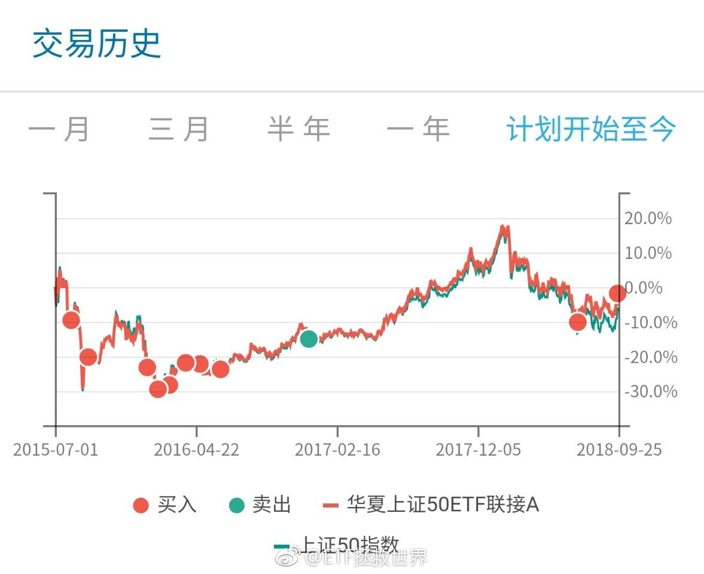

======================================================

ETF拯救世界 (5687069307) @
2018-09-26 13:42:25 Wed  
url: https://weibo.com/5687069307/GB8bd2SEF

目前涨幅大于50的股票有366只，跑输股票占比90%。 ​​​

转发[5]  评论[32]  赞[224] 

======================================================

ETF拯救世界 (5687069307) @
2018-09-26 13:45:34 Wed  
url: https://weibo.com/5687069307/GB8cufqfz

无论涨跌周五又有几只趋势仓位可以加。

踏踏实实的，多大点事儿啊。

踏空？呵呵哒。

不过讲真，现金只剩35份了。子弹也不多了。 ​​​

转发[38]  评论[95]  赞[314] 

======================================================

ETF拯救世界 (5687069307) @
2018-09-26 13:51:46 Wed  
url: https://weibo.com/5687069307/GB8f0dJKU

什么叫做追涨杀跌和接盘？

一波行情，如果涨幅200%。你在100%，150%，190%追进去，那叫追涨，接盘。

你在比最低点上涨5%的地方买进去也叫接盘？

那什么不叫接盘，最低点才不叫接盘？

对别人要求有点高。 ​​​

转发[37]  评论[92]  赞[314] 

======================================================

ETF拯救世界 (5687069307) @
2018-09-26 14:12:49 Wed  
url: https://weibo.com/5687069307/GB8nynhDC

回复@骑着乌龟看海198605:什么时候才能不再预测呢。来，有来的预案。不来，有不来的。爱来不来。我预测不了。不过我认为大概率会来。要不空间，要不时间。//@骑着乌龟看海198605:E大，是否意味着钻石底不会来了？

------------------------------------------------------
转推：
>  @ETF拯救世界 (5687069307)
>  2018-09-26 13:45:34 Wed  
>  url: https:/weibo.com/5687069307/GB8cufqfz/

>  无论涨跌周五又有几只趋势仓位可以加。
>  
>  踏踏实实的，多大点事儿啊。
>  
>  踏空？呵呵哒。
>  
>  不过讲真，现金只剩35份了。子弹也不多了。 ​​​

转发[22]  评论[32]  赞[206] 

======================================================

ETF拯救世界 (5687069307) @
2018-09-26 14:14:51 Wed  
url: https://weibo.com/5687069307/GB8ond0BV

有人说500辣鸡。

你知道今天有66%的股票连500都没跑赢吗。你知道今天有1/3的股票还在下跌吗。 ​​​

转发[16]  评论[46]  赞[273] 

======================================================

ETF拯救世界 (5687069307) @
2018-09-26 14:30:56 Wed  
url: https://weibo.com/5687069307/GB8uU1Ibv

回复@江苏红石:案例：根据主观预测进行操作。供大家思考。无论卖出是对是错，这种交易模式的问题在哪里。//@江苏红石:回复@ETF拯救世界:向E大汇报下：前几日，我脑子坏掉了，把心爱的159938医药在1.2时减了半仓，当时觉得医药政策的利空会让它到1.0以下吧。。呜呜呜[悲伤][悲伤][悲伤]

------------------------------------------------------
转推：
>  @ETF拯救世界 (5687069307)
>  2018-09-26 09:34:40 Wed  
>  url: https:/weibo.com/5687069307/GB6yEtZSl/

>  踏踏实实拿着。等抬轿。
>  
>  虽然抬轿的还不知道在哪儿吧。 ​​​

转发[13]  评论[69]  赞[175] 

======================================================

ETF拯救世界 (5687069307) @
2018-09-26 14:37:16 Wed  
url: https://weibo.com/5687069307/GB8xtidfk

很多朋友没有明白一件事：

在股市上：

你认为的利好，未必会涨。你认为的利空，未必会跌。

推而广之：

大家认为的利好，未必会涨。大家认为的利空，未必会跌。

再推而广之：

你认为的小事，可能会是搅动世界的蝴蝶翅膀。你认为的大事，可能是历史长河中毫不起眼的尘埃。

“你认为”，并不重要。 ​​​

转发[114]  评论[239]  赞[464] 

======================================================

ETF拯救世界 (5687069307) @
2018-09-26 15:11:26 Wed  
url: https://weibo.com/5687069307/GB8LlaOzj

回复@梁小雨:今天涨跌家数对比是1870:1343。股票下跌很正常。指数方面，所有都在涨。无论大小指数。喷了。//@梁小雨:看看我手里的股票、还有中的新股今天居然跌得面目全非[汗]

------------------------------------------------------
转推：
>  @ETF拯救世界 (5687069307)
>  2018-09-26 14:14:51 Wed  
>  url: https:/weibo.com/5687069307/GB8ond0BV/

>  有人说500辣鸡。
>  
>  你知道今天有66%的股票连500都没跑赢吗。你知道今天有1/3的股票还在下跌吗。 ​​​

转发[6]  评论[64]  赞[229] 

======================================================

ETF拯救世界 (5687069307) @
2018-09-27 08:43:17 Thu  
url: https://weibo.com/5687069307/GBfEhDlmi

我觉得，微博这种被一位博主拉黑就禁止评论三天也不合理。

最好改成被3-5个10万粉丝以上的博主拉黑，禁止评论1-3个月比较合理。

如果球球是这样，估计也不会有那么多人被喷子喷走了。 ​​​

转发[3]  评论[60]  赞[258] 

======================================================

ETF拯救世界 (5687069307) @
2018-09-27 09:23:51 Thu  
url: https://weibo.com/5687069307/GBfUKevsR

A股指数基金的普及，以及纳入各种国际指数，是我预期中未来的长期特大牛市的资金基础之一。

持续十年以上的牛市对未来的A股来说不是梦。

当然，涨十年可能幅度也不会很夸张。有可能十年涨幅还没0607两年大…… ​​​

转发[51]  评论[211]  赞[408] 

======================================================

ETF拯救世界 (5687069307) @
2018-09-27 11:30:28 Thu  
url: https://weibo.com/5687069307/GBgK9aJBE

明天又到了关键日。几个指数目前很微妙，可上可下。

也没几个钱了，还剩25%，无所谓了。慢慢耗着吧。 ​​​

转发[24]  评论[117]  赞[345] 

======================================================

ETF拯救世界 (5687069307) @
2018-09-27 13:48:04 Thu  
url: https://weibo.com/5687069307/GBhE0mzWO

股票这玩意吧，你看别人买什么也去买，其实风险很大。

就像你看人家去走钢丝高空飞人你也去一样危险。

我观察的一个高手，收益率很高。但是他强力推的几个股票，你买了拿到现在巨亏的很多。

不是说人家不靠谱，而是说你没有人家的技术。

今天一只又暴跌50%。

但是人家赚了很多。

所以跟股票真的 ​​​

转发[25]  评论[102]  赞[292] 

======================================================

ETF拯救世界 (5687069307) @
2018-09-27 14:01:11 Thu  
url: https://weibo.com/5687069307/GBhJk87Rv

回复@勤奋happyfire:不对。每一个人的风险承受能力和预期收益率以及各种情况都不同。不要看别人，问问自己。跌50%和涨50%现在舒服不舒服。舒服就不要改变。

------------------------------------------------------
转推：
>  @ETF拯救世界 (5687069307)
>  2018-09-27 11:30:28 Thu  
>  url: https:/weibo.com/5687069307/GBgK9aJBE/

>  明天又到了关键日。几个指数目前很微妙，可上可下。
>  
>  也没几个钱了，还剩25%，无所谓了。慢慢耗着吧。 ​​​

转发[5]  评论[24]  赞[169] 

======================================================

ETF拯救世界 (5687069307) @
2018-09-27 14:21:18 Thu  
url: https://weibo.com/5687069307/GBhRuh0s9

风骚的50难道又要红。

2800家下跌。 ​​​

转发[2]  评论[50]  赞[227] 

======================================================

ETF拯救世界 (5687069307) @
2018-09-27 14:46:30 Thu  
url: https://weibo.com/5687069307/GBi1Ioo9E

咱这么算吧。

沪深300是300只。+中证500是800只。再加中证1000，一共1800只。

光300只涨，肯定不是牛市。真牛市至少得这800只甚至1800只一直涨吧。

但是，注意，现在可是有3551只A股。

所以，你要说有1/3甚至一半股票变成一潭死水，甚至很多变成仙股，是真有可能的。

炒股的，只能寄希望于自己拿 ​​​

转发[63]  评论[115]  赞[294] 

======================================================

ETF拯救世界 (5687069307) @
2018-09-27 14:52:27 Thu  
url: https://weibo.com/5687069307/GBi48bs8j

但是，有人所谓的“未来就是跟美股一样，是大盘股的天下，小盘股全完了”这种论调不仅无知，简直就是扯淡。

过去十年罗素2000小盘股指数和标普500和道琼斯工业的对比。

小盘股，永远不要看不起小盘股。无论是香港，美国，还是A股。

记住这个。

垃圾股和小盘股可不是一个概念。 ​​​

转发[102]  评论[137]  赞[353] 

+++++++++++++++++++++++++++++++++++++++++++++++++++++

图片：
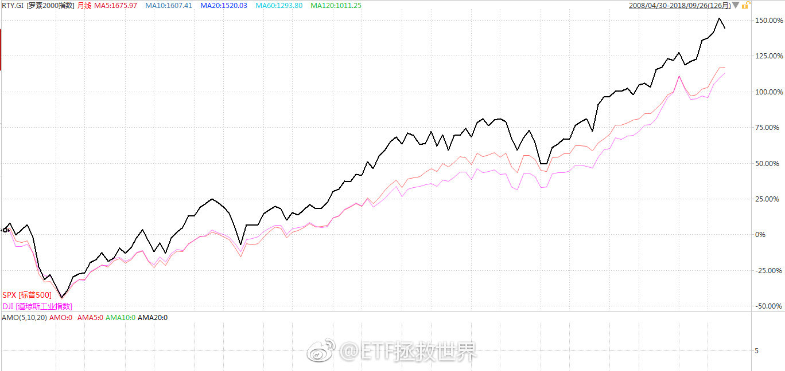

======================================================

ETF拯救世界 (5687069307) @
2018-09-27 16:49:15 Thu  
url: https://weibo.com/5687069307/GBiPxqGZo

等你。

------------------------------------------------------
转推：
>  @财联社APP (2868676035)
>  2018-09-27 16:24:19 Thu  
>  url: https:/weibo.com/2868676035/GBiFq7EWC/

>  【富时罗素CEO：中国股票未来有望在富时新兴市场指数占过半权重】财联社9月27日讯，富时罗素首席执行官麦思平表示，富时罗素的最终目标是全面纳入中国A股，未来中国股票（包括A股以及非A股中国股票）有望在富时新兴市场指数中占到50%以上的权重，在富时环球指数中占到6.5%的权重。 ​​​

转发[8]  评论[33]  赞[198] 

======================================================

ETF拯救世界 (5687069307) @
2018-09-27 18:32:29 Thu  
url: https://weibo.com/5687069307/GBjvrr6n7

消费降级太可怕了，突然发现已经一年没买新手机了……

想买又不知道买哪个，好像都没什么特别的，不换又腻了…… ​​​

转发[6]  评论[216]  赞[310] 

======================================================

ETF拯救世界 (5687069307) @
2018-09-27 22:16:06 Thu  
url: https://weibo.com/5687069307/GBkYd4RS9

刚看了一眼，仅美股市场上跟踪标普500指数的ETF规模就超过4万亿人民币。 ​​​

转发[11]  评论[40]  赞[253] 

======================================================

ETF拯救世界 (5687069307) @
2018-09-27 22:23:02 Thu  
url: https://weibo.com/5687069307/GBl11oIeP

回复@Benphen:十年 二十年 三十年 两者的对比结果都不同。我要说明的是美股小盘股不像很多人说的不行。大盘股或小盘股都会有阶段性表现更佳的情况。这就是为什么经典资产配置中美股要同时配置大小盘股。

------------------------------------------------------
转推：
>  @ETF拯救世界 (5687069307)
>  2018-09-27 14:52:27 Thu  
>  url: https:/weibo.com/5687069307/GBi48bs8j/

>  但是，有人所谓的“未来就是跟美股一样，是大盘股的天下，小盘股全完了”这种论调不仅无知，简直就是扯淡。
>  
>  过去十年罗素2000小盘股指数和标普500和道琼斯工业的对比。
>  
>  小盘股，永远不要看不起小盘股。无论是香港，美国，还是A股。
>  
>  记住这个。
>  
>  垃圾股和小盘股可不是一个概念。 ​​​

转发[23]  评论[31]  赞[208] 

======================================================

ETF拯救世界 (5687069307) @
2018-09-27 22:29:08 Thu  
url: https://weibo.com/5687069307/GBl3v6amK

我建议各位，无论看到谁说什么东西，都先去求证一下到底是不是，不要别人家说个结论你就随便信以为真。

很多人大概都没弄懂什么叫港股化就天天跟着别人喊A股要港股化。别人说美股小盘股不行你也跟着说。打开软件看看，长期，分阶段，多看几个大小盘指数，都看看再说。

要独立思考啊，朋友们。 ​​​

转发[35]  评论[121]  赞[460] 

======================================================

ETF拯救世界 (5687069307) @
2018-09-28 10:50:42 Fri  
url: https://weibo.com/5687069307/GBpUvcHkI

嘀嘀。

我出去办事了。这一天给我整的，开个车四脚朝天了。 ​​​

转发[6]  评论[182]  赞[402] 

======================================================

ETF拯救世界 (5687069307) @
2018-09-28 11:24:34 Fri  
url: https://weibo.com/5687069307/GBq8g0HrS

别再说“未来变成日本怎么办”了，人家三十年新高了

------------------------------------------------------
转推：
>  @ ()
>  2018-09-28 11:07:08 Fri  
>  url: 

>  抱歉，此微博已被作者删除。查看帮助：http://t.cn/Rfd3rQV

转发[15]  评论[50]  赞[238] 

======================================================

ETF拯救世界 (5687069307) @
2018-09-28 13:07:35 Fri  
url: https://weibo.com/5687069307/GBqO4jn8z

又来？

心好累。 ​​​

转发[4]  评论[105]  赞[250] 

======================================================

ETF拯救世界 (5687069307) @
2018-09-28 13:32:32 Fri  
url: https://weibo.com/5687069307/GBqYbjI5m

如果没有今天的大涨，300的形态是最完美的趋势转折最佳买点。

涨了就差很多了。稍微有点追高，不完美。 ​​​

转发[20]  评论[100]  赞[315] 

======================================================

ETF拯救世界 (5687069307) @
2018-09-28 13:34:23 Fri  
url: https://weibo.com/5687069307/GBqYW0Ait

回复@haoren17:评论也要关上以后。//@haoren17:创业板没怎么涨[喵喵]

------------------------------------------------------
转推：
>  @ETF拯救世界 (5687069307)
>  2018-09-28 13:07:35 Fri  
>  url: https:/weibo.com/5687069307/GBqO4jn8z/

>  又来？
>  
>  心好累。 ​​​

转发[1]  评论[53]  赞[179] 

======================================================

ETF拯救世界 (5687069307) @
2018-09-28 14:49:25 Fri  
url: https://weibo.com/5687069307/GBrtouuWG

好了，不要涨也不要跌，就这样静静的收盘。

答应我。 ​​​

转发[5]  评论[85]  赞[344] 

======================================================

ETF拯救世界 (5687069307) @
2018-09-28 15:01:24 Fri  
url: https://weibo.com/5687069307/GBrygbuQP

我去买杯咖啡，回来开始看留言。

500多条，还可以。一个小时就看完了。[挖鼻] ​​​

转发[6]  评论[100]  赞[326] 

======================================================

ETF拯救世界 (5687069307) @
2018-09-28 15:28:23 Fri  
url: https://weibo.com/5687069307/GBrJdgggd

回复@Costolo:人家辛辛苦苦一个字一个字打出来的留言，你连看都懒得看吗//@Costolo:为什么这么认真，观察情绪吗？

------------------------------------------------------
转推：
>  @ETF拯救世界 (5687069307)
>  2018-09-28 15:01:24 Fri  
>  url: https:/weibo.com/5687069307/GBrygbuQP/

>  我去买杯咖啡，回来开始看留言。
>  
>  500多条，还可以。一个小时就看完了。[挖鼻] ​​​

转发[3]  评论[104]  赞[407] 

======================================================

ETF拯救世界 (5687069307) @
2018-09-28 17:18:10 Fri  
url: https://weibo.com/5687069307/GBsrM5xjZ

50除非出现回调，否则绝不会再买。它已经脱离我定义的可买入区域。 ​​​

转发[48]  评论[234]  赞[448] 

======================================================

ETF拯救世界 (5687069307) @
2018-09-29 10:26:05 Sat  
url: https://weibo.com/5687069307/GBzb0pz6W

有人吗，都干嘛呢。我在刷数据…… ​​​

转发[4]  评论[547]  赞[604] 

======================================================

ETF拯救世界 (5687069307) @
2018-09-29 13:20:43 Sat  
url: https://weibo.com/5687069307/GBAjTgKnF

我看出来了，第一，今天都很闲，而且赌场不开门更闲了。我国社会劳动生产率急需提高。第二，说正经的没人回复，说不正经的大家都很开心的冒泡了。

------------------------------------------------------
转推：
>  @ETF拯救世界 (5687069307)
>  2018-09-29 10:26:05 Sat  
>  url: https:/weibo.com/5687069307/GBzb0pz6W/

>  有人吗，都干嘛呢。我在刷数据…… ​​​

转发[1]  评论[95]  赞[267] 

======================================================

ETF拯救世界 (5687069307) @
2018-09-29 13:54:16 Sat  
url: https://weibo.com/5687069307/GBAxvtREd

问个正经的吧。

橱柜台面客观原因不能太高，主要是窗台低了点，所以可能13套的洗碗机塞不进去。8套的是不是真的就不好用。有没有用8套的朋友展开讲讲。

要真不行台面做高点也勉强可以。 ​​​

转发[25]  评论[197]  赞[191] 

======================================================

ETF拯救世界 (5687069307) @
2018-09-29 15:28:08 Sat  
url: https://weibo.com/5687069307/GBB9BB3uG

搞定了同学们，原来今年西门子新款真的是矮一些可以放入正常橱柜。不能做高台的原因已经说了，是窗台低。现在解决了。不过因为是国产的，不知道和以前西班牙进口的质量有多大区别。

------------------------------------------------------
转推：
>  @ETF拯救世界 (5687069307)
>  2018-09-29 13:54:16 Sat  
>  url: https:/weibo.com/5687069307/GBAxvtREd/

>  问个正经的吧。
>  
>  橱柜台面客观原因不能太高，主要是窗台低了点，所以可能13套的洗碗机塞不进去。8套的是不是真的就不好用。有没有用8套的朋友展开讲讲。
>  
>  要真不行台面做高点也勉强可以。 ​​​

转发[6]  评论[102]  赞[199] 

======================================================

ETF拯救世界 (5687069307) @
2018-09-30 11:21:53 Sun  
url: https://weibo.com/5687069307/GBIY9nxXv

北京银行T+0理财今天还能做到3.9%……给力了…… ​​​

转发[20]  评论[104]  赞[175] 

======================================================

ETF拯救世界 (5687069307) @
2018-09-30 11:47:26 Sun  
url: https://weibo.com/5687069307/GBJ8wmDdu

回复@季明jimmy:北京的是R2.今天开始计息。我很少买理财，以后可以考虑买一部分。T+0赎回也比现在货基方便多了。//@季明jimmy:招行有3.9。不过是R3风险，R2风险的是3.5

------------------------------------------------------
转推：
>  @ETF拯救世界 (5687069307)
>  2018-09-30 11:21:53 Sun  
>  url: https:/weibo.com/5687069307/GBIY9nxXv/

>  北京银行T+0理财今天还能做到3.9%……给力了…… ​​​

转发[12]  评论[21]  赞[112] 

======================================================

ETF拯救世界 (5687069307) @
2018-09-30 11:49:40 Sun  
url: https://weibo.com/5687069307/GBJ9quJWG

回复@黄土地的吃货姐:我182，太太168。感觉还可以吧，不算矮。//@黄土地的吃货姐:楼主家个子不高[感冒][感冒][感冒][感冒][感冒][感冒][感冒][感冒][感冒][感冒][感冒][感冒][笑cry]

------------------------------------------------------
转推：
>  @ETF拯救世界 (5687069307)
>  2018-09-29 13:54:16 Sat  
>  url: https:/weibo.com/5687069307/GBAxvtREd/

>  问个正经的吧。
>  
>  橱柜台面客观原因不能太高，主要是窗台低了点，所以可能13套的洗碗机塞不进去。8套的是不是真的就不好用。有没有用8套的朋友展开讲讲。
>  
>  要真不行台面做高点也勉强可以。 ​​​

转发[0]  评论[108]  赞[183] 

======================================================

ETF拯救世界 (5687069307) @
2018-09-30 12:34:06 Sun  
url: https://weibo.com/5687069307/GBJrsld4e

回复@醉翁得意:我买了十几年货基没听说过出事，银行理财倒是有出问题的。所以建议大家还是研究清楚再买。//@醉翁得意:银行理财和货币基金有什么区别，风险大吗？//@ETF拯救世界:回复@季明jimmy:北京的是R2.今天开始计息。我很少买理财，以后可以考虑买一部分。T+0赎回也比现在货基方便多了。

------------------------------------------------------
转推：
>  @ETF拯救世界 (5687069307)
>  2018-09-30 11:21:53 Sun  
>  url: https:/weibo.com/5687069307/GBIY9nxXv/

>  北京银行T+0理财今天还能做到3.9%……给力了…… ​​​

转发[6]  评论[76]  赞[173] 

======================================================

ETF拯救世界 (5687069307) @
2018-09-30 20:04:29 Sun  
url: https://weibo.com/5687069307/GBMohqTxk

校长肯定有不对的地方，但是也得教育孩子一件重要的事：不要嘴贱。以后会少吃很多亏……

------------------------------------------------------
转推：
>  @新浪视频 (1640601392)
>  2018-09-30 18:21:03 Sun  
>  url: https:/weibo.com/1640601392/GBLIiaUaT/

>  #微热议#【男生因叫副校长外号遭连扇耳光 家长索赔2万】近日，江西吉安一名12岁男生因叫了副校长外号被连扇耳光。有在场的同学称副校长当时坐在其身上，连扇了20多个耳光。被打学生家长提出了两万元的补偿，副校长称自己只打了两三下，对两万元的补偿也表示无法接受。http://t.cn/EPFuycV ​​​

转发[3]  评论[60]  赞[145] 

======================================================

