ETF拯救世界 (5687069307) @
2018-10-01 08:45:21 Mon  
url: https://weibo.com/5687069307/GBRn6qkZj

今天是这几天假期唯一有点空闲时间的。

有没有人在？聊5毛钱的。

财经情感美食健身家居博主同时在线！ ​​​

转发[53]  评论[806]  赞[587] 

+++++++++++++++++++++++++++++++++++++++++++++++++++++

图片：

======================================================

ETF拯救世界 (5687069307) @
2018-10-01 18:17:20 Mon  
url: https://weibo.com/5687069307/GBV7hkIjS

为什么说脸看起来像170的？把脸挡上像不像182（其实是181.5）

------------------------------------------------------
转推：
>  @ETF拯救世界 (5687069307)
>  2017-05-08 11:46:40 Mon  
>  url: https:/weibo.com/5687069307/F28Di4OKn/

>  准备起床，r u ok?
>  
>  [doge] http://t.cn/z8fYx9X ​​​

转发[6]  评论[293]  赞[560] 

======================================================

ETF拯救世界 (5687069307) @
2018-10-04 14:15:41 Thu  
url: https://weibo.com/5687069307/GClOGlnZw

2000年是6.5，2006年是5。5以上应该可以开始干了。到时候可以在美股关注$债券20+美公债指数ETF-iSharesBarcla TLT$ $美超长国债ETF EDV$

------------------------------------------------------
转推：
>  @ ()
>  2018-10-04 12:44:24 Thu  
>  url: 

>  抱歉，此微博已被作者删除。查看帮助：http://t.cn/Rfd3rQV

转发[79]  评论[81]  赞[188] 

======================================================

ETF拯救世界 (5687069307) @
2018-10-04 15:03:56 Thu  
url: https://weibo.com/5687069307/GCm8h8UmC

回复@lizard周:如果到80年代的水平，美股要彻底崩盘十年以上//@lizard周:图片评论 http://t.cn/Ehi4zA8 //@ETF拯救世界:2000年是6.5，2006年是5。5以上应该可以开始干了。到时候可以在美股关注$债券20+美公债指数ETF-iSharesBarcla TLT$ $美超长国债ETF EDV$

------------------------------------------------------
转推：
>  @ ()
>  2018-10-04 12:44:24 Thu  
>  url: 

>  抱歉，此微博已被作者删除。查看帮助：http://t.cn/Rfd3rQV

转发[27]  评论[45]  赞[145] 

======================================================

ETF拯救世界 (5687069307) @
2018-10-04 16:38:51 Thu  
url: https://weibo.com/5687069307/GCmKNi3hB

有朋友不停在评论问恒生。早就说了，下次加仓在23000-24000，随着时间推移增加。目前的情况都在理解范围内。恒生的不理解点位很低，我就不说了

------------------------------------------------------
转推：
>  @ETF拯救世界 (5687069307)
>  2018-08-14 14:18:08 Tue  
>  url: https:/weibo.com/5687069307/GuB2m26f4/

>  一直惦记恒生的朋友们，你们的机会来了。
>  
>  24000开始入货。 ​​​

转发[40]  评论[57]  赞[259] 

======================================================

ETF拯救世界 (5687069307) @
2018-10-04 16:48:26 Thu  
url: https://weibo.com/5687069307/GCmOGsJTX

在跟五岁的儿子玩小黄人大富翁。

玩的过程倒没问题，问题是我跟他进一步定义解释资产和现金流的含义他好像有点懵。

过两年再说吧……先好好玩游戏。[并不简单] ​​​

转发[14]  评论[115]  赞[345] 

+++++++++++++++++++++++++++++++++++++++++++++++++++++

图片：

======================================================

ETF拯救世界 (5687069307) @
2018-10-04 22:30:53 Thu  
url: https://weibo.com/5687069307/GCp3H6ucG

有没有知道的帮个忙 ​​​

转发[14]  评论[69]  赞[154] 

+++++++++++++++++++++++++++++++++++++++++++++++++++++

图片：

======================================================

ETF拯救世界 (5687069307) @
2018-10-05 08:13:57 Fri  
url: https://weibo.com/5687069307/GCsSlmS1J

这就是我没弄江浙沪相亲会的原因……

------------------------------------------------------
转推：
>  @新浪视频 (1640601392)
>  2018-10-04 18:46:45 Thu  
>  url: https:/weibo.com/1640601392/GCnAIpifF/

>  【继《1818黄金眼》之后 浙江6频道又一个快乐源泉[允悲]】听说，作为正宗的浙江人，必须把《1818黄金眼》《钱塘老娘舅》《相亲才会赢》都看完才能睡觉？今天介绍的这档《相亲才会赢》，顾名思义是一档相亲节目，而今天这期讲的是一个疑点重重的海归男。
>  整期节目就是见证海归男的人设被一一拆穿的过程 ​​​

转发[13]  评论[84]  赞[141] 

======================================================

ETF拯救世界 (5687069307) @
2018-10-05 20:23:23 Fri  
url: https://weibo.com/5687069307/GCxEraez4

最新消息最新消息，苹果把钱退了。 http://t.cn/EhNIenG

------------------------------------------------------
转推：
>  @ETF拯救世界 (5687069307)
>  2018-10-04 22:30:53 Thu  
>  url: https:/weibo.com/5687069307/GCp3H6ucG/

>  有没有知道的帮个忙 ​​​

转发[2]  评论[30]  赞[180] 

======================================================

ETF拯救世界 (5687069307) @
2018-10-05 20:28:25 Fri  
url: https://weibo.com/5687069307/GCxGtmNEH

我跟大家说一件这个月我见到最神奇的事。

参加某抽奖活动，两百人参加，随机选观众抽出一个三等奖。是个女士中奖。

主持人让她抽二等奖，结果她抽出了自己。（买的多抽奖机会就多）

主持人继续让她抽一等奖，结果她又抽出了自己。

惊了。

如果排除有猫腻的可能，这位的运气是不是好的过分了。

后 ​​​

转发[5]  评论[132]  赞[249] 

======================================================

ETF拯救世界 (5687069307) @
2018-10-08 08:42:50 Mon  
url: https://weibo.com/5687069307/GCVlzbs1v

赌场终于要重启了。生活充满激情。

你十一假期都干嘛了，碰到什么不开心的事了？说出来让大家开心开心。 ​​​

转发[2]  评论[198]  赞[342] 

======================================================

ETF拯救世界 (5687069307) @
2018-10-08 09:02:22 Mon  
url: https://weibo.com/5687069307/GCVtuytkp

降准之后，A股怎么走。

大部分人猜测都是错的。不信你走着看。

我的意思，没必要猜。因为没有意义。

不过要密切观察。看看每次大事件是不是催化剂。 ​​​

转发[28]  评论[71]  赞[320] 

======================================================

ETF拯救世界 (5687069307) @
2018-10-08 09:35:32 Mon  
url: https://weibo.com/5687069307/GCVGXkoMu

说你回来你就得回来。那次跳车的可以补了。//@ETF拯救世界:$全指金融 sh000992$  5090点跳车的可以上车。

------------------------------------------------------
转推：
>  @ETF拯救世界 (5687069307)
>  2018-09-21 13:36:15 Fri  
>  url: https:/weibo.com/5687069307/GAn0dkd22/

>  今天跳车不算错。 ​​​

转发[5]  评论[98]  赞[239] 

======================================================

ETF拯救世界 (5687069307) @
2018-10-08 09:54:49 Mon  
url: https://weibo.com/5687069307/GCVOMxvte

雷老板说小米首日买的能赚一倍。那就是17-34。

现价是13，到34能赚160%。

现在的问题是有多少人会相信雷老板了。 ​​​

转发[12]  评论[71]  赞[261] 

======================================================

ETF拯救世界 (5687069307) @
2018-10-08 10:13:49 Mon  
url: https://weibo.com/5687069307/GCVWuE2BA

千万不要让自己的资产和组合大幅亏损。比如跌到0.4。

真的需要很多很多年才能恢复元气，同时，长期收益率会非常平庸。

最重要的，说明自己的体系风控系统几乎没有。 ​​​

转发[53]  评论[123]  赞[393] 

======================================================

ETF拯救世界 (5687069307) @
2018-10-08 10:30:09 Mon  
url: https://weibo.com/5687069307/GCW37Du0F

即将破300//@ETF拯救世界:谁能想到当时460，半年后已经即将跌破300……

------------------------------------------------------
转推：
>  @ETF拯救世界 (5687069307)
>  2018-03-22 09:34:01 Thu  
>  url: https:/weibo.com/5687069307/G8wd21cxW/

>  腾讯，60倍PE。未来五年看，真的能有特别好的收益率吗。
>  
>  学习了。 ​​​

转发[147]  评论[40]  赞[207] 

======================================================

ETF拯救世界 (5687069307) @
2018-10-08 10:42:51 Mon  
url: https://weibo.com/5687069307/GCW8hn7aB

风和日丽的日子里，总是在准备过冬的人经常会被别人嘲笑保守，胆小。

凛冬来临的时候，你才会知道，活着才是最重要的。

在这个市场上，活下去。无论发生什么，都活下去。只要活着，就有希望。

你在温暖的小屋里，盖着毛毯，喝着热可可的时候，永远也体会不到外面大雪中即将冻僵的人是什么感觉。 ​​​

转发[42]  评论[156]  赞[473] 

======================================================

ETF拯救世界 (5687069307) @
2018-10-08 11:06:20 Mon  
url: https://weibo.com/5687069307/GCWhOmj8p

有没有学习好的说说，鹅厂每天回购的股票是注销吗。 ​​​

转发[5]  评论[103]  赞[220] 

======================================================

ETF拯救世界 (5687069307) @
2018-10-08 14:16:44 Mon  
url: https://weibo.com/5687069307/GCXx6nYKm

（股市）

------------------------------------------------------
转推：
>  @ ()
>  2018-10-08 11:46:16 Mon  
>  url: 

>  该账号因被投诉违反《微博社区公约》的相关规定，现已无法查看。查看帮助 https://kefu.weibo.com/faqdetail?id=13216

转发[7]  评论[28]  赞[107] 

======================================================

ETF拯救世界 (5687069307) @
2018-10-08 14:23:50 Mon  
url: https://weibo.com/5687069307/GCXzYzqFi

回复@用户y49f7o7jj4:因为这是熊市//@用户y49f7o7jj4:为啥涨起来很难，跌起来很容易啊！//@ETF拯救世界:（股市）

------------------------------------------------------
转推：
>  @ ()
>  2018-10-08 11:46:16 Mon  
>  url: 

>  该账号因被投诉违反《微博社区公约》的相关规定，现已无法查看。查看帮助 https://kefu.weibo.com/faqdetail?id=13216

转发[3]  评论[19]  赞[123] 

======================================================

ETF拯救世界 (5687069307) @
2018-10-08 14:31:12 Mon  
url: https://weibo.com/5687069307/GCXCY8IyB

这个月三季报出完。如果全月大跌，基本进入钻石底区域没悬念 ​​​

转发[74]  评论[176]  赞[449] 

======================================================

ETF拯救世界 (5687069307) @
2018-10-08 15:02:28 Mon  
url: https://weibo.com/5687069307/GCXPF1ohc

光脚长阴，大概率不会止跌。 ​​​

转发[28]  评论[147]  赞[413] 

======================================================

ETF拯救世界 (5687069307) @
2018-10-08 15:13:02 Mon  
url: https://weibo.com/5687069307/GCXTXgYLv

回复@树欲静风仍不止:先到了历史最低再说吧。目前离历史最低还有30%呢。真破了历史最低再说调低的事儿也不晚。//@树欲静风仍不止:E大，现在是赌的国运，是否钻石底的区域还要调低下。

------------------------------------------------------
转推：
>  @ETF拯救世界 (5687069307)
>  2018-10-08 14:31:12 Mon  
>  url: https:/weibo.com/5687069307/GCXCY8IyB/

>  这个月三季报出完。如果全月大跌，基本进入钻石底区域没悬念 ​​​

转发[35]  评论[24]  赞[192] 

======================================================

ETF拯救世界 (5687069307) @
2018-10-08 15:19:26 Mon  
url: https://weibo.com/5687069307/GCXWxFRU4

回复@BaoZha008:PB 28%，PE 30%。//@BaoZha008:不是20%的吗？//@ETF拯救世界:回复@树欲静风仍不止:先到了历史最低再说吧。目前离历史最低还有30%呢。真破了历史最低再说调低的事儿也不晚。//@树欲静风仍不止:E大，现在是赌的国运，是否钻石底的区域还要调低下。

------------------------------------------------------
转推：
>  @ETF拯救世界 (5687069307)
>  2018-10-08 14:31:12 Mon  
>  url: https:/weibo.com/5687069307/GCXCY8IyB/

>  这个月三季报出完。如果全月大跌，基本进入钻石底区域没悬念 ​​​

转发[29]  评论[90]  赞[242] 

======================================================

ETF拯救世界 (5687069307) @
2018-10-09 10:56:27 Tue  
url: https://weibo.com/5687069307/GD5EipTFI

$中证军工 sz399967$  军工不死，牛市不来。

在路上了。 ​​​

转发[22]  评论[182]  赞[475] 

======================================================

ETF拯救世界 (5687069307) @
2018-10-09 17:11:52 Tue  
url: https://weibo.com/5687069307/GD86Gc3KG

生活啊，总是在意想不到的地方给你点小意外。

其实也好，一直太顺绝对不是好事。

别想太多，努力解决。谋事在人，成事在天。

人生啊，一颗赛艇。 ​​​

转发[15]  评论[110]  赞[402] 

======================================================

ETF拯救世界 (5687069307) @
2018-10-09 17:42:18 Tue  
url: https://weibo.com/5687069307/GD8j26JvC

谁能想到，东城区落户还要入户调查，看是否实际居住了。

正在改水电的我一脸懵逼……

控制中心城区人口的任务很重啊。 ​​​

转发[3]  评论[151]  赞[314] 

======================================================

ETF拯救世界 (5687069307) @
2018-10-10 10:40:04 Wed  
url: https://weibo.com/5687069307/GDeY93E6U

每天除了自选指数和自选股还得关注阿娇。

好累。

[doge] ​​​

转发[7]  评论[135]  赞[272] 

======================================================

ETF拯救世界 (5687069307) @
2018-10-10 11:22:26 Wed  
url: https://weibo.com/5687069307/GDfflcMni

止不住了。新低之后大概率……//@ETF拯救世界:即将破300//@ETF拯救世界:谁能想到当时460，半年后已经即将跌破300……

------------------------------------------------------
转推：
>  @ETF拯救世界 (5687069307)
>  2018-03-22 09:34:01 Thu  
>  url: https:/weibo.com/5687069307/G8wd21cxW/

>  腾讯，60倍PE。未来五年看，真的能有特别好的收益率吗。
>  
>  学习了。 ​​​

转发[137]  评论[50]  赞[171] 

======================================================

ETF拯救世界 (5687069307) @
2018-10-10 11:25:45 Wed  
url: https://weibo.com/5687069307/GDfgGv1NC

7800左右我会一次配满医药仓位。再立个flag。//@ETF拯救世界:一个月过去，这个点位提升到7800点左右。

------------------------------------------------------
转推：
>  @ETF拯救世界 (5687069307)
>  2018-08-17 09:58:23 Fri  
>  url: https:/weibo.com/5687069307/Gv1CpsZ4E/

>  如果可以7700点附近买入医药，那未来5-10年关上账户等着数钱就对了。 ​​​

转发[77]  评论[123]  赞[339] 

======================================================

ETF拯救世界 (5687069307) @
2018-10-10 11:29:31 Wed  
url: https://weibo.com/5687069307/GDfidmtMh

7800的医药指数，可能是你人生中第一个10倍指数。 ​​​

转发[444]  评论[274]  赞[589] 

======================================================

ETF拯救世界 (5687069307) @
2018-10-10 12:37:11 Wed  
url: https://weibo.com/5687069307/GDfJGzCjI

今天看到球球推送了一个头条，叫做“有500万是不是要去专职炒股”

文章写了很多字，算了很多账，我也没仔细看。

我想是这样。

这个问题其实很简单，非常简单。你就运用你小学知识算一道题。

“在不影响你投资收益的情况下，你做一份你喜欢的工作带来的年收入，占500万的百分之多少”

什么意思呢。 ​​​

转发[613]  评论[498]  赞[1257] 

======================================================

ETF拯救世界 (5687069307) @
2018-10-10 12:45:02 Wed  
url: https://weibo.com/5687069307/GDfMS1iLi

回复@E大头号粉丝:是这个意思。500万其实很难讲能让你衣食无忧。但是足以让你有底气选一份自己喜欢的工作做。

------------------------------------------------------
转推：
>  @ETF拯救世界 (5687069307)
>  2018-10-10 12:37:11 Wed  
>  url: https:/weibo.com/5687069307/GDfJGzCjI/

>  今天看到球球推送了一个头条，叫做“有500万是不是要去专职炒股”
>  
>  文章写了很多字，算了很多账，我也没仔细看。
>  
>  我想是这样。
>  
>  这个问题其实很简单，非常简单。你就运用你小学知识算一道题。
>  
>  “在不影响你投资收益的情况下，你做一份你喜欢的工作带来的年收入，占500万的百分之多少”
>  
>  什么意思呢。 ​​​

转发[11]  评论[30]  赞[199] 

======================================================

ETF拯救世界 (5687069307) @
2018-10-10 13:01:59 Wed  
url: https://weibo.com/5687069307/GDfTKpMND

我看有人说，我就什么都不爱干。

我觉得基本是不可能的。每个人一定有自己喜欢干的事。

如果没有经济压力，你又能做一件自己喜欢做，又会得到别人认可和喜欢的事，我相信一定会比你瘫在家里追电视剧让你感觉更好。

比如明朝就有皇帝喜欢做木匠活。不上朝天天在家做木匠活。我敢说这哥们木匠活肯定做 ​​​

转发[59]  评论[163]  赞[422] 

======================================================

ETF拯救世界 (5687069307) @
2018-10-10 13:08:46 Wed  
url: https://weibo.com/5687069307/GDfWvbCk0

我想知道手术中唤醒会不会疼……

------------------------------------------------------
转推：
>  @新浪视频 (1640601392)
>  2018-10-10 12:45:23 Wed  
>  url: https:/weibo.com/1640601392/GDfN0zXiS/

>  【浙江25岁设计师脑内长肿瘤，开颅手术时医生将其唤醒竟唱起了张韶涵的歌[吃瓜]】开颅手术中，患者突然醒来吟唱张韶涵的歌《遗失的美好》，岂不吓人？近日，浙江省人民医院实施了一例术中唤醒手术，术中患者唱歌帮助医生精确切除肿瘤，保护其语言功能。http://t.cn/E7As5mq ​​​

转发[3]  评论[58]  赞[99] 

======================================================

ETF拯救世界 (5687069307) @
2018-10-10 14:04:31 Wed  
url: https://weibo.com/5687069307/GDgj8uQHa

回复@ETF改变生活:2%也有3000万人了……这就是为什么大家觉得有钱人好多。绝对数是真的多，但是98%的人，十几亿人其实都是普通人啊。//@ETF改变生活:看到一个文章，说不算固定财产，有100万现金或者迅速变现的，属于全国2%的人

------------------------------------------------------
转推：
>  @ETF拯救世界 (5687069307)
>  2018-10-10 12:37:11 Wed  
>  url: https:/weibo.com/5687069307/GDfJGzCjI/

>  今天看到球球推送了一个头条，叫做“有500万是不是要去专职炒股”
>  
>  文章写了很多字，算了很多账，我也没仔细看。
>  
>  我想是这样。
>  
>  这个问题其实很简单，非常简单。你就运用你小学知识算一道题。
>  
>  “在不影响你投资收益的情况下，你做一份你喜欢的工作带来的年收入，占500万的百分之多少”
>  
>  什么意思呢。 ​​​

转发[24]  评论[53]  赞[154] 

======================================================

ETF拯救世界 (5687069307) @
2018-10-10 14:16:36 Wed  
url: https://weibo.com/5687069307/GDgo2uPQL

回复@易风云61:大部分集中在广东、北京、江浙沪。分布的其实也还行，主要是比较集中出现在网上就会引起很多人焦虑了。。//@易风云61:这3000万人可能都住的很近[笑cry]

------------------------------------------------------
转推：
>  @ETF拯救世界 (5687069307)
>  2018-10-10 12:37:11 Wed  
>  url: https:/weibo.com/5687069307/GDfJGzCjI/

>  今天看到球球推送了一个头条，叫做“有500万是不是要去专职炒股”
>  
>  文章写了很多字，算了很多账，我也没仔细看。
>  
>  我想是这样。
>  
>  这个问题其实很简单，非常简单。你就运用你小学知识算一道题。
>  
>  “在不影响你投资收益的情况下，你做一份你喜欢的工作带来的年收入，占500万的百分之多少”
>  
>  什么意思呢。 ​​​

转发[10]  评论[31]  赞[165] 

======================================================

ETF拯救世界 (5687069307) @
2018-10-10 14:27:19 Wed  
url: https://weibo.com/5687069307/GDgso3kuU

金融市场真是刺激啊。

3年前130倍估值的传媒，现在估值只剩19倍了。

价格跌了76%，估值下降85%…… ​​​

转发[51]  评论[150]  赞[400] 

======================================================

ETF拯救世界 (5687069307) @
2018-10-10 15:19:00 Wed  
url: https://weibo.com/5687069307/GDgNmtpkH

鹅是不是又搞事情，1.8%了又。 ​​​

转发[1]  评论[54]  赞[211] 

======================================================

ETF拯救世界 (5687069307) @
2018-10-10 15:25:46 Wed  
url: https://weibo.com/5687069307/GDgQ6ECNK

涨的越好的股票，在它身上赔钱的人就会比赚钱的人多好几倍。

很神奇吧。 ​​​

转发[28]  评论[68]  赞[311] 

======================================================

ETF拯救世界 (5687069307) @
2018-10-10 15:40:22 Wed  
url: https://weibo.com/5687069307/GDgW2hec9

问各位一事儿。

现在人工是什么行情。

帝都，普通文员，做一些简单的office操作和编辑工作，处理一些杂事。大专就够了，五险一金。

关键得人品好，有职业道德，不该说的不说。

这种税后多少一位。 ​​​

转发[7]  评论[372]  赞[237] 

======================================================

ETF拯救世界 (5687069307) @
2018-10-11 07:18:56 Thu  
url: https://weibo.com/5687069307/GDn50bdrg

喷了，要不要这么听话。周二刚说完。 ​​​

转发[164]  评论[385]  赞[690] 

+++++++++++++++++++++++++++++++++++++++++++++++++++++

图片：

======================================================

ETF拯救世界 (5687069307) @
2018-10-11 09:37:22 Thu  
url: https://weibo.com/5687069307/GDnZbFL6m

醉了，不会腰斩吧//@ETF拯救世界:止不住了。新低之后大概率……//@ETF拯救世界:即将破300//@ETF拯救世界:谁能想到当时460，半年后已经即将跌破300……

------------------------------------------------------
转推：
>  @ETF拯救世界 (5687069307)
>  2018-03-22 09:34:01 Thu  
>  url: https:/weibo.com/5687069307/G8wd21cxW/

>  腾讯，60倍PE。未来五年看，真的能有特别好的收益率吗。
>  
>  学习了。 ​​​

转发[133]  评论[74]  赞[177] 

======================================================

ETF拯救世界 (5687069307) @
2018-10-11 09:42:31 Thu  
url: https://weibo.com/5687069307/GDo1hFzyR

回复@你好大麦茶:今天A股正式进入钻石坑。（E首发）//@你好大麦茶:E大，这是正式进入钻石坑了吧？//@ETF拯救世界:醉了，不会腰斩吧//@ETF拯救世界:止不住了。新低之后大概率……//@ETF拯救世界:即将破300//@ETF拯救世界:谁能想到当时460，半年后已经即将跌破300……

------------------------------------------------------
转推：
>  @ETF拯救世界 (5687069307)
>  2018-03-22 09:34:01 Thu  
>  url: https:/weibo.com/5687069307/G8wd21cxW/

>  腾讯，60倍PE。未来五年看，真的能有特别好的收益率吗。
>  
>  学习了。 ​​​

转发[129]  评论[391]  赞[523] 

======================================================

ETF拯救世界 (5687069307) @
2018-10-11 10:14:58 Thu  
url: https://weibo.com/5687069307/GDoes9CNP

8848先斩为敬了。

------------------------------------------------------
转推：
>  @ETF拯救世界 (5687069307)
>  2018-07-17 10:23:32 Tue  
>  url: https:/weibo.com/5687069307/Gqjxe62DI/

>  我这半年多关注的8848和腾讯，不是说对这两家公司有什么看法，我是在观察情绪。
>  
>  这两家公司在持续暴涨的时候，带了很多很多情绪。尤其是前者。很多人因为没买后悔的夜不能寐，很多人买了抱持坚定信念可以再涨好几倍。
>  
>  一家公司，一个行业，到底是不是真的能预判五年、十年后？
>  
>  很难讲。前几天看到一 ​​​

转发[4]  评论[67]  赞[211] 

======================================================

ETF拯救世界 (5687069307) @
2018-10-11 10:32:29 Thu  
url: https://weibo.com/5687069307/GDolz16PW

这个月能不能干一根10%以上的大阴线？如果能，三个月内90%概率见大底。//@ETF拯救世界:从历史看，如果这个月可以干10%以上，基本就差不多了//@ETF拯救世界:回复@黄连树:2005年5月8.5%，2008年10月25%，2012年11月创业板12%，2013年6月沪深300是15%。//@黄连树:过去熊市的月度大阴线出现在几月？

------------------------------------------------------
转推：
>  @ETF拯救世界 (5687069307)
>  2018-08-31 16:18:26 Fri  
>  url: https:/weibo.com/5687069307/Gxc5CA6qu/

>  根据历史经验，最终的底部，还缺少一根月线大阴线……
>  
>  历史还会重演吗？ ​​​

转发[100]  评论[163]  赞[310] 

======================================================

ETF拯救世界 (5687069307) @
2018-10-11 10:52:27 Thu  
url: https://weibo.com/5687069307/GDotFEekX

看来今天不写一篇文章不行了。

估计很多朋友已经要崩了。 ​​​

转发[15]  评论[454]  赞[622] 

======================================================

ETF拯救世界 (5687069307) @
2018-10-11 10:59:43 Thu  
url: https://weibo.com/5687069307/GDowBCT5N

深成已经连跌9个月，如果最后再来一根10%以上的大阴线。

未来的画面太美我已经不能想象了。 ​​​

转发[111]  评论[117]  赞[469] 

======================================================

ETF拯救世界 (5687069307) @
2018-10-11 11:02:13 Thu  
url: https://weibo.com/5687069307/GDoxDdeO0

中证500最近13个月只涨了1个月。物极必反。各位看戏吧。

------------------------------------------------------
转推：
>  @ETF拯救世界 (5687069307)
>  2018-10-11 10:59:43 Thu  
>  url: https:/weibo.com/5687069307/GDowBCT5N/

>  深成已经连跌9个月，如果最后再来一根10%以上的大阴线。
>  
>  未来的画面太美我已经不能想象了。 ​​​

转发[79]  评论[336]  赞[474] 

======================================================

ETF拯救世界 (5687069307) @
2018-10-11 13:03:03 Thu  
url: https://weibo.com/5687069307/GDpkG76Tz

回复@小河51888:我今天缩水几十万，没什么感觉。为什么不高兴？剩下的钱可以买到更便宜的啊。留着那些现金不就是为了现在吗？叶公好龙？//@小河51888:心疼死了，看到那么多人很快乐，我只能说你们仓位不重，如果也买了100多份，还这么欢乐那就是每份钱太少了。

------------------------------------------------------
转推：
>  @ETF拯救世界 (5687069307)
>  2018-10-11 10:59:43 Thu  
>  url: https:/weibo.com/5687069307/GDowBCT5N/

>  深成已经连跌9个月，如果最后再来一根10%以上的大阴线。
>  
>  未来的画面太美我已经不能想象了。 ​​​

转发[29]  评论[186]  赞[371] 

======================================================

ETF拯救世界 (5687069307) @
2018-10-11 13:08:06 Thu  
url: https://weibo.com/5687069307/GDpmJaARM

再警告一次，有抱怨的直接拉黑。

我这一天天要处理的事情那么多，资产也在缩水，又没收你管理费又不要你提成，没空听你哔哔。

觉得难受就自己炒股去，试试到时候你还敢不敢打开账户看。

[鄙视] ​​​

转发[8]  评论[517]  赞[879] 

======================================================

ETF拯救世界 (5687069307) @
2018-10-11 14:29:16 Thu  
url: https://weibo.com/5687069307/GDpTGdBV1

给大家交个底吧。

今天肯定破2了。我的预期极限是1.5左右。

如果再低，我就没有预案躺下装死了。

虽然已经比95%以上的人保守了，但如果真发生也没办法。

没装过死，不过应该也不难。估计眼睛一闭一睁也就过去了…… ​​​

转发[214]  评论[436]  赞[669] 

======================================================

ETF拯救世界 (5687069307) @
2018-10-11 14:36:35 Thu  
url: https://weibo.com/5687069307/GDpWE1uqu

回复@myaspiration:有三次。05 08 12。12年只破了一天。05之后两年七倍，08之后半年一倍。12之后中小股票三年7倍//@myaspiration:历史上有几次破2

------------------------------------------------------
转推：
>  @ETF拯救世界 (5687069307)
>  2018-10-11 14:29:16 Thu  
>  url: https:/weibo.com/5687069307/GDpTGdBV1/

>  给大家交个底吧。
>  
>  今天肯定破2了。我的预期极限是1.5左右。
>  
>  如果再低，我就没有预案躺下装死了。
>  
>  虽然已经比95%以上的人保守了，但如果真发生也没办法。
>  
>  没装过死，不过应该也不难。估计眼睛一闭一睁也就过去了…… ​​​

转发[123]  评论[285]  赞[416] 

======================================================

ETF拯救世界 (5687069307) @
2018-10-11 15:43:18 Thu  
url: https://weibo.com/5687069307/GDqnIDSfZ

今天=

2005年3月

3个月后，998。 ​​​

转发[180]  评论[555]  赞[680] 

======================================================

ETF拯救世界 (5687069307) @
2018-10-11 16:33:37 Thu  
url: https://weibo.com/5687069307/GDqI9a4GO

个人认为，暂停IPO不会太远了。 ​​​

转发[36]  评论[294]  赞[563] 

======================================================

ETF拯救世界 (5687069307) @
2018-10-12 07:32:56 Fri  
url: https://weibo.com/5687069307/GDwBbc1nr

这种人我不拉黑了。拍照留念。

为什么，

知道他为什么肉疼吗。因为以前我说最大跌幅的时候，他不当回事，认为不可能。不做压力测试，结果真的发生了，崩溃了。

咱们对目前的情况早就做好准备，从心态到仓位。他永远不会理解，再跌20%也在我们的预期中，也有应对预案，也不会崩。

他只是以为别人都 ​​​

转发[25]  评论[486]  赞[539] 

+++++++++++++++++++++++++++++++++++++++++++++++++++++

图片：
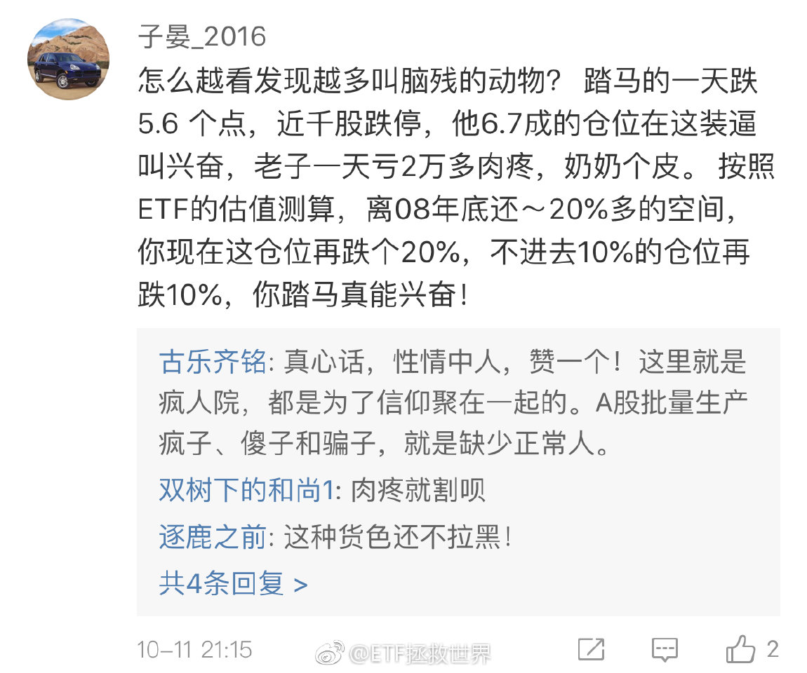

======================================================

ETF拯救世界 (5687069307) @
2018-10-12 14:35:01 Fri  
url: https://weibo.com/5687069307/GDzmvfQhI

别看指数涨的热热闹闹，今天涨跌家数对比是1300:2100 ​​​

转发[6]  评论[165]  赞[364] 

======================================================

ETF拯救世界 (5687069307) @
2018-10-12 15:09:08 Fri  
url: https://weibo.com/5687069307/GDzAlD1dN

有人问我什么时候会上杠杆。

目前是1.8x。

大概在1.6左右会开始上。

策略方面，大概就是钻石区域加杠杆，到了黄金边缘清掉。吃一小段。

杠杆率方面，不会超过30%。也就是1.3。30%的话，计算下来，要跌70%才会挂。我不太相信到了1.6还能跌70%……所以基本性命无忧。

一个参考。

杠杆这个东西，能 ​​​

转发[249]  评论[357]  赞[520] 

======================================================

ETF拯救世界 (5687069307) @
2018-10-12 15:15:35 Fri  
url: https://weibo.com/5687069307/GDzCYce2o

谁能想到呢。

------------------------------------------------------
转推：
>  @ETF拯救世界 (5687069307)
>  2017-12-15 09:50:04 Fri  
>  url: https:/weibo.com/5687069307/FzJjHqeZF/

>  $证券公司 sz399975$   我认为360-400点应该是极限底部了…… ​​​

转发[43]  评论[147]  赞[231] 

======================================================

ETF拯救世界 (5687069307) @
2018-10-12 15:47:21 Fri  
url: https://weibo.com/5687069307/GDzPRutL0

今天继续下降。

快破1.8了。 ​​​

转发[35]  评论[172]  赞[423] 

======================================================

ETF拯救世界 (5687069307) @
2018-10-12 16:08:18 Fri  
url: https://weibo.com/5687069307/GDzYmDZLb

挡在500和1000前面的，只有2008年10月了……谁能想到，连1000这种小指数都杀向20倍了…… ​​​

转发[37]  评论[144]  赞[378] 

======================================================

ETF拯救世界 (5687069307) @
2018-10-12 16:41:28 Fri  
url: https://weibo.com/5687069307/GDAbPr6sd

回复@龙水六队:目前券商指数占计划仓位的1.68%，浮亏23%，如果跌到350点，我会把浮亏变成18%以内。你信吗。当然，以你的那什么，肯定想不通，来，一起等着见证奇迹的时刻……//@龙水六队:别删贴，极限了你也没有应对之策 在A股亏钱是很难的事吗//@ETF拯救世界:谁能想到呢。

------------------------------------------------------
转推：
>  @ETF拯救世界 (5687069307)
>  2017-12-15 09:50:04 Fri  
>  url: https:/weibo.com/5687069307/FzJjHqeZF/

>  $证券公司 sz399975$   我认为360-400点应该是极限底部了…… ​​​

转发[21]  评论[103]  赞[284] 

======================================================

ETF拯救世界 (5687069307) @
2018-10-12 16:54:12 Fri  
url: https://weibo.com/5687069307/GDAh00EVH

这三年来，300+500平均跌幅接近40%，全部A股股票跌幅中位数-56%，44%的股票跌幅超过60%，五只股票里就有一只跌幅超过70%。上涨的股票只占8.3%。

千股跌停的股灾不知道多少轮。

同期，我的计划还在盈利。最大回撤12%。

注意，这是在A股几乎已经跌到了最便宜时候的成绩。

A股当然很难赔钱。在这个熊 ​​​

转发[131]  评论[446]  赞[980] 

+++++++++++++++++++++++++++++++++++++++++++++++++++++

图片：
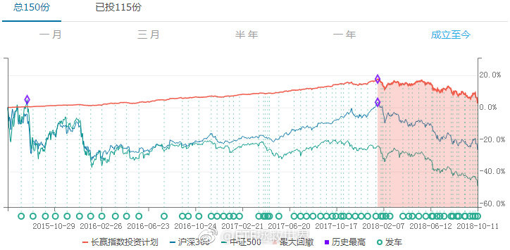

======================================================

ETF拯救世界 (5687069307) @
2018-10-12 17:14:23 Fri  
url: https://weibo.com/5687069307/GDApc0pUJ

A股是辣鸡吗，美股是天堂吗。

万万没想到的是，其实……

十六年过去，美股才追上A股。

美股看起来容易赚钱是因为波动小，长牛。你什么时候进去都很容易解套。

A股波动太大，散户又容易牛市追涨，熊市杀跌，所以赔钱得多。

但你只要反过来做，牛市卖出，熊市买入，你获利的机会，以及获利的幅度， ​​​

转发[177]  评论[288]  赞[662] 

+++++++++++++++++++++++++++++++++++++++++++++++++++++

图片：
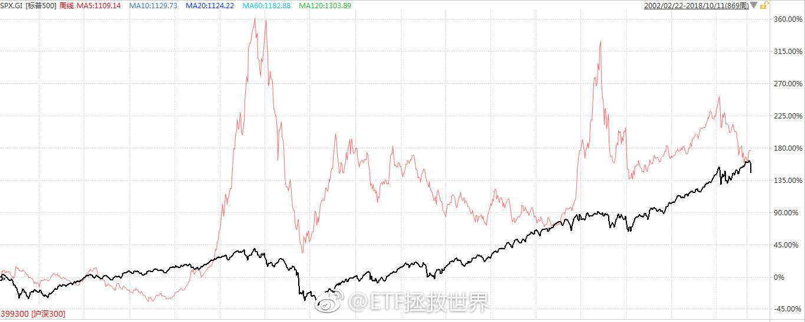
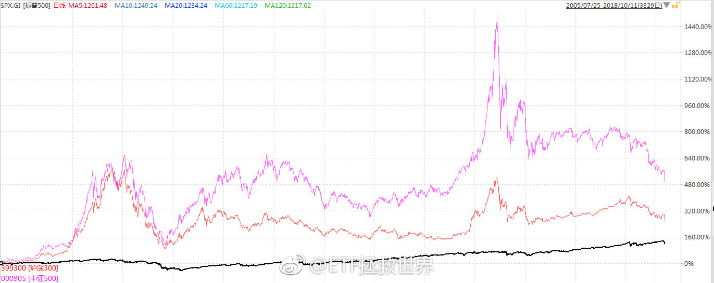

======================================================

ETF拯救世界 (5687069307) @
2018-10-13 22:53:12 Sat  
url: https://weibo.com/5687069307/GDM3dfjvG

为什么会这么忙。

我希望明年开始，过一段特别悠闲的日子。

每天无所事事的放浪形骸。 ​​​

转发[9]  评论[258]  赞[649] 

======================================================

ETF拯救世界 (5687069307) @
2018-10-15 09:41:14 Mon  
url: https://weibo.com/5687069307/GDZIKhgnI

这几天忙得没空看评论。现在，看还是不看，是个问题……估计今天也没时间了。

中午还得嘀嘀呢。

今天别涨好吗！ ​​​

转发[1]  评论[177]  赞[371] 

+++++++++++++++++++++++++++++++++++++++++++++++++++++

图片：

======================================================

ETF拯救世界 (5687069307) @
2018-10-15 09:59:39 Mon  
url: https://weibo.com/5687069307/GDZQdj00U

真 辣鸡。

今天的一个品种1%+了。 ​​​

转发[13]  评论[346]  赞[358] 

======================================================

ETF拯救世界 (5687069307) @
2018-10-15 15:02:51 Mon  
url: https://weibo.com/5687069307/GE1Pi9eH0

全指医药历史上从没出现过月线五连跌。见证历史了。 ​​​

转发[63]  评论[195]  赞[447] 

======================================================

ETF拯救世界 (5687069307) @
2018-10-15 15:14:10 Mon  
url: https://weibo.com/5687069307/GE1TSFHSV

上周五两市融资额已经不到8000亿。

2014年11月以来首次跌破8000亿。

最高是2015年6月的23000亿。

2013年底是3400亿。

2012年底是856亿。

这些融资客也快撑不住了。 ​​​

转发[96]  评论[154]  赞[315] 

======================================================

ETF拯救世界 (5687069307) @
2018-10-15 15:19:14 Mon  
url: https://weibo.com/5687069307/GE1VWiUIi

很多人卖，是真的没办法了。有些是强制平仓，有些是杠杆上的太大撑不住了。

还有各种质押之类的。

2015年的市场是杠杆牛。之所以涨到了历史从没有过的高位，是因为加了不知道多少杠杆。

现在是去杠杆。很明显已经是杀过头了。手里的钱不要急，节奏还需要继续控制。 ​​​

转发[60]  评论[192]  赞[470] 

======================================================

ETF拯救世界 (5687069307) @
2018-10-15 15:28:13 Mon  
url: https://weibo.com/5687069307/GE1ZAlI9j

今天收盘，1.7x

------------------------------------------------------
转推：
>  @ETF拯救世界 (5687069307)
>  2018-10-12 15:09:08 Fri  
>  url: https:/weibo.com/5687069307/GDzAlD1dN/

>  有人问我什么时候会上杠杆。
>  
>  目前是1.8x。
>  
>  大概在1.6左右会开始上。
>  
>  策略方面，大概就是钻石区域加杠杆，到了黄金边缘清掉。吃一小段。
>  
>  杠杆率方面，不会超过30%。也就是1.3。30%的话，计算下来，要跌70%才会挂。我不太相信到了1.6还能跌70%……所以基本性命无忧。
>  
>  一个参考。
>  
>  杠杆这个东西，能 ​​​

转发[70]  评论[342]  赞[486] 

======================================================

ETF拯救世界 (5687069307) @
2018-10-16 07:17:38 Tue  
url: https://weibo.com/5687069307/GE8cXBRTG

一般人真的不要轻易尝试满仓穿越牛熊。当然，我这样说在球球就是ZZ不正确。//@挖龙脉的超级鹿鼎公:[坏笑]

------------------------------------------------------
转推：
>  @ ()
>  2018-10-15 22:38:18 Mon  
>  url: 

>  该账号因被投诉违反法律法规和《微博社区公约》的相关规定，现已无法查看。查看帮助 https://kefu.weibo.com/faqdetail?id=13216

转发[32]  评论[77]  赞[225] 

======================================================

ETF拯救世界 (5687069307) @
2018-10-16 08:14:14 Tue  
url: https://weibo.com/5687069307/GE8zVz6cn

回复@feefine:现金分红//@feefine:益达，博时信用纯债预计18号要分红了，分红方式咱们E部队选哪个呢？@ETF拯救世界//@ETF拯救世界:一般人真的不要轻易尝试满仓穿越牛熊。当然，我这样说在球球就是ZZ不正确。//@挖龙脉的超级鹿鼎公:[坏笑]

------------------------------------------------------
转推：
>  @ ()
>  2018-10-15 22:38:18 Mon  
>  url: 

>  该账号因被投诉违反法律法规和《微博社区公约》的相关规定，现已无法查看。查看帮助 https://kefu.weibo.com/faqdetail?id=13216

转发[3]  评论[7]  赞[115] 

======================================================

ETF拯救世界 (5687069307) @
2018-10-16 08:15:38 Tue  
url: https://weibo.com/5687069307/GE8Av2TSc

回复@终于找到在哪改名字:计划整体是一个基金的话。你再看看收益率是多少？我辛辛苦苦做好仓位配置。你不能只看已经买的//@终于找到在哪改名字:那个时间开始跟车的收益率应该差不多，不要打我//@ETF拯救世界:一般人真的不要轻易尝试满仓穿越牛熊。当然，我这样说在球球就是ZZ不正确。

------------------------------------------------------
转推：
>  @ ()
>  2018-10-15 22:38:18 Mon  
>  url: 

>  该账号因被投诉违反法律法规和《微博社区公约》的相关规定，现已无法查看。查看帮助 https://kefu.weibo.com/faqdetail?id=13216

转发[12]  评论[43]  赞[179] 

======================================================

ETF拯救世界 (5687069307) @
2018-10-16 08:17:48 Tue  
url: https://weibo.com/5687069307/GE8BnmGE8

四月至今跌20%跟计划差不多这种话从何讲起呢？ ​​​

转发[11]  评论[93]  赞[253] 

+++++++++++++++++++++++++++++++++++++++++++++++++++++

图片：

======================================================

ETF拯救世界 (5687069307) @
2018-10-16 08:27:32 Tue  
url: https://weibo.com/5687069307/GE8FklitV

这几天看见很多人说要跌到1500  1000

这些人和2015年高喊30000点的神棍有何区别？ ​​​

转发[25]  评论[127]  赞[421] 

======================================================

ETF拯救世界 (5687069307) @
2018-10-16 09:00:13 Tue  
url: https://weibo.com/5687069307/GE8SBiIIt

刚才有朋友说，在大底区域，八成仓位和满仓是不是差别不大了。

一定程度没错，但是没有考虑几个因素。

第一是极值的出现。极值很难出现，二十年一两次，但也是有概率。要做准备。

第二是心理因素。我做的配置一定是适合绝大多数人应对可能出现的绝大多数情况。能让大多数人在最差的情况下也不会崩溃 ​​​

转发[60]  评论[210]  赞[335] 

+++++++++++++++++++++++++++++++++++++++++++++++++++++

图片：

======================================================

ETF拯救世界 (5687069307) @
2018-10-16 09:48:50 Tue  
url: https://weibo.com/5687069307/GE9ckkJGg

很多人说历史数据是刻舟求剑，也有人说未来会不同。

说几个数，同不同的凑合看吧。做个参考。

目前的全市场pb，是从1995年至今23年276个月中：

从低到高第十四位。

低于现在的十三个月，有十二个月出现在2005-2006。2006年以后至今十二年，只有2008年10月的1664低于现在。

我说是钻石坑，不过分吧 ​​​

转发[235]  评论[185]  赞[433] 

======================================================

ETF拯救世界 (5687069307) @
2018-10-16 09:53:30 Tue  
url: https://weibo.com/5687069307/GE9edjl5F

但是有一件事各位也要理解，就是价值短期内通常与价格无关。也就是说，特别贵了还可能涨，特别低了也可能跌。很多人就死在认为很便宜了然后孤注一掷加满杠杆，最后在旅鼠的践踏中挂了……研究贵还是便宜，目的是保证自己买在低位区域，卖在高位区域而已。

------------------------------------------------------
转推：
>  @ETF拯救世界 (5687069307)
>  2018-10-16 09:48:50 Tue  
>  url: https:/weibo.com/5687069307/GE9ckkJGg/

>  很多人说历史数据是刻舟求剑，也有人说未来会不同。
>  
>  说几个数，同不同的凑合看吧。做个参考。
>  
>  目前的全市场pb，是从1995年至今23年276个月中：
>  
>  从低到高第十四位。
>  
>  低于现在的十三个月，有十二个月出现在2005-2006。2006年以后至今十二年，只有2008年10月的1664低于现在。
>  
>  我说是钻石坑，不过分吧 ​​​

转发[64]  评论[89]  赞[293] 

======================================================

ETF拯救世界 (5687069307) @
2018-10-16 09:55:39 Tue  
url: https://weibo.com/5687069307/GE9f5ovUV

$证券公司 sz399975$   谢谢啊 ​​​

转发[16]  评论[49]  赞[224] 

======================================================

ETF拯救世界 (5687069307) @
2018-10-16 10:07:48 Tue  
url: https://weibo.com/5687069307/GE9k1yBqY

回复@寻不到的背影l:你说得对。前提是你在三年前知道这三年股市暴跌60%。同时，未来你还能再最底部抄底进去，一点都不能买高，否则你的15%瞬间没了。问问自己，能吗。//@寻不到的背影l:回复@bruce天是你吗:三年银行理财都有15%+了

------------------------------------------------------
转推：
>  @ETF拯救世界 (5687069307)
>  2018-10-16 09:48:50 Tue  
>  url: https:/weibo.com/5687069307/GE9ckkJGg/

>  很多人说历史数据是刻舟求剑，也有人说未来会不同。
>  
>  说几个数，同不同的凑合看吧。做个参考。
>  
>  目前的全市场pb，是从1995年至今23年276个月中：
>  
>  从低到高第十四位。
>  
>  低于现在的十三个月，有十二个月出现在2005-2006。2006年以后至今十二年，只有2008年10月的1664低于现在。
>  
>  我说是钻石坑，不过分吧 ​​​

转发[17]  评论[84]  赞[224] 

======================================================

ETF拯救世界 (5687069307) @
2018-10-16 10:10:54 Tue  
url: https://weibo.com/5687069307/GE9lia6sI

回复@南耕:券商指数从最高点跌下来跌幅超过74%。如果这个价位收盘，我们的持仓浮亏17%。昨天买了，今天涨了，为什么不谢？做人知道感恩，人生会变得有趣得多。一个建议。//@南耕:证券亏成这样，还谢？

------------------------------------------------------
转推：
>  @ETF拯救世界 (5687069307)
>  2018-10-16 09:55:39 Tue  
>  url: https:/weibo.com/5687069307/GE9f5ovUV/

>  $证券公司 sz399975$   谢谢啊 ​​​

转发[10]  评论[85]  赞[302] 

======================================================

ETF拯救世界 (5687069307) @
2018-10-16 10:15:59 Tue  
url: https://weibo.com/5687069307/GE9nlbpxN

$证券公司 sz399975$ 

券商指数我们的平均成本。如果再跌，未来我们的成本会继续下降。

我倒是想问问，有些人是不是惦记着所有品种都买在最低点才算做的好？ ​​​

转发[34]  评论[115]  赞[345] 

+++++++++++++++++++++++++++++++++++++++++++++++++++++

图片：

======================================================

ETF拯救世界 (5687069307) @
2018-10-16 10:22:02 Tue  
url: https://weibo.com/5687069307/GE9pO1TWt

传媒也一样。账面浮亏稍微大了点，但其实咱们的成本是这里。

你恐怕没想到吧。 ​​​

转发[26]  评论[96]  赞[346] 

+++++++++++++++++++++++++++++++++++++++++++++++++++++

图片：
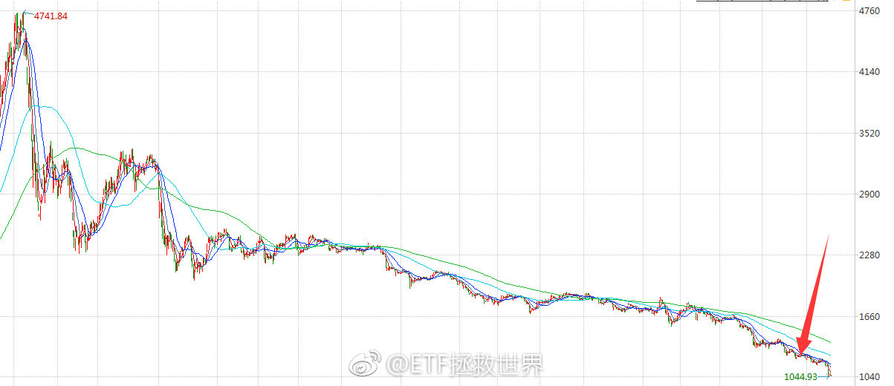

======================================================

ETF拯救世界 (5687069307) @
2018-10-16 10:25:39 Tue  
url: https://weibo.com/5687069307/GE9rh2wud

医药的成本是这样的。 ​​​

转发[26]  评论[90]  赞[331] 

+++++++++++++++++++++++++++++++++++++++++++++++++++++

图片：

======================================================

ETF拯救世界 (5687069307) @
2018-10-16 10:32:41 Tue  
url: https://weibo.com/5687069307/GE9u82hpe

这是几只500基金的平均成本位置。

你不站得高一点，看得多一点，永远不知道真相是什么。

这是几只浮亏较大的品种，个人认为已经很不错了。总体看，更不用说，第三轮计划的成本完全控制住了。 ​​​

转发[31]  评论[134]  赞[374] 

+++++++++++++++++++++++++++++++++++++++++++++++++++++

图片：

======================================================

ETF拯救世界 (5687069307) @
2018-10-16 10:53:53 Tue  
url: https://weibo.com/5687069307/GE9CJm5xU

那些盈利品种的成本位置就不放了。没意思。

最后放一个第三轮计划开始以来目前的持仓总成本，未来还会继续下降。看完这些图你就应该知道，我们的成本控制在熊市底部区域是确定的。当然，是不是底部区域你现在不知道，几年后就知道了。

所以，除非A股永远不会再涨，否则，你怎么可能不挣钱。

如果你 ​​​

转发[38]  评论[116]  赞[360] 

+++++++++++++++++++++++++++++++++++++++++++++++++++++

图片：
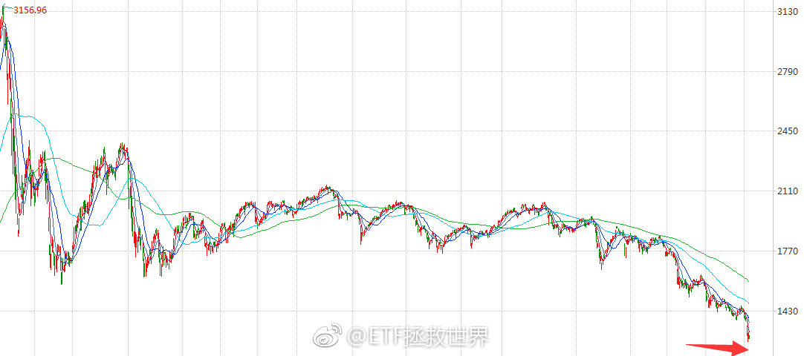

======================================================

ETF拯救世界 (5687069307) @
2018-10-16 11:00:40 Tue  
url: https://weibo.com/5687069307/GE9Ftw68G

本月主要指数跌幅已经10%以上了。如果能到20%，基本没问题了。至少会有一波特别强烈的反弹。//@ETF拯救世界:这个月能不能干一根10%以上的大阴线？如果能，三个月内90%概率见大底。//@ETF拯救世界:从历史看，如果这个月可以干10%以上，基本就差不多了

------------------------------------------------------
转推：
>  @ETF拯救世界 (5687069307)
>  2018-08-31 16:18:26 Fri  
>  url: https:/weibo.com/5687069307/Gxc5CA6qu/

>  根据历史经验，最终的底部，还缺少一根月线大阴线……
>  
>  历史还会重演吗？ ​​​

转发[41]  评论[107]  赞[291] 

======================================================

ETF拯救世界 (5687069307) @
2018-10-16 11:05:19 Tue  
url: https://weibo.com/5687069307/GE9Hnc3HB

真的，别不信。

------------------------------------------------------
转推：
>  @ETF拯救世界 (5687069307)
>  2018-09-11 16:25:03 Tue  
>  url: https:/weibo.com/5687069307/GyRPM3hfR/

>  汽车是真正的周期股。这个，林奇在第一本书里就开宗明义的告诉你了。
>  
>  然而，只有当你一个上升周期赚几倍，或者一个下降周期赔得只剩20%的时候，才会真的懂。
>  
>  当然，这个周期，一般人很难把握。太多人把汽车当成成长股或者价值股了。都不是。它是周期股。
>  
>  BTW，感谢那次“捷达换宝马”。 ​​​

转发[23]  评论[87]  赞[251] 

======================================================

ETF拯救世界 (5687069307) @
2018-10-16 12:00:13 Tue  
url: https://weibo.com/5687069307/GEa3EyZiN

谁能想到这么快就达成了。1.7即将到位……再说一次，08以及05就是我认识中的极限位置。再低，我没见过，也没有预案了。直接买完躺下享受市场的蹂躏……

------------------------------------------------------
转推：
>  @ETF拯救世界 (5687069307)
>  2018-09-03 13:13:16 Mon  
>  url: https:/weibo.com/5687069307/GxD9Xhnqp/

>  我看，这波熊市的低点可以降级对标2008了。
>  
>  未来所有策略围绕这个预期来做。
>  
>  再低的话我就不知道用哪个预期了。A股历史上还没出现过。 ​​​

转发[59]  评论[171]  赞[340] 

======================================================

ETF拯救世界 (5687069307) @
2018-10-16 12:02:52 Tue  
url: https://weibo.com/5687069307/GEa4Jn4bv

冯绍峰已经40了。（保养得真不错）

------------------------------------------------------
转推：
>  @ ()
>  2018-10-16 11:33:09 Tue  
>  url: 

>  抱歉，作者已设置仅展示半年内微博，此微博已不可见。 ​​​

转发[8]  评论[60]  赞[141] 

======================================================

ETF拯救世界 (5687069307) @
2018-10-16 12:14:00 Tue  
url: https://weibo.com/5687069307/GEa9faWJU

截至今日，40多家公司公布三季报。平均利润增幅在15%+。

最终情况要等最后一周，有2000多家公司都在那一周公布。 ​​​

转发[77]  评论[55]  赞[254] 

======================================================

ETF拯救世界 (5687069307) @
2018-10-16 12:25:44 Tue  
url: https://weibo.com/5687069307/GEae0FUmP

回复@豆花鸵鸟动:还记得这个吗。http://t.cn/RxS1TkL 现在，就是18。//@豆花鸵鸟动:E大请问您如何看待现在500的点位

------------------------------------------------------
转推：
>  @ETF拯救世界 (5687069307)
>  2018-10-16 12:14:00 Tue  
>  url: https:/weibo.com/5687069307/GEa9faWJU/

>  截至今日，40多家公司公布三季报。平均利润增幅在15%+。
>  
>  最终情况要等最后一周，有2000多家公司都在那一周公布。 ​​​

转发[51]  评论[83]  赞[232] 

======================================================

ETF拯救世界 (5687069307) @
2018-10-16 12:44:46 Tue  
url: https://weibo.com/5687069307/GEalK0sk3

回复@法国梧桐树NJ:增速下滑还是利润下降？这个还是不同的。增速下滑很正常，经济都有周期。整体利润下降就比较麻烦了。历史上几乎没有出现过整体利润下降。//@法国梧桐树NJ:根据业绩预报，创业板三季报业绩增长大幅下滑

------------------------------------------------------
转推：
>  @ETF拯救世界 (5687069307)
>  2018-10-16 12:14:00 Tue  
>  url: https:/weibo.com/5687069307/GEa9faWJU/

>  截至今日，40多家公司公布三季报。平均利润增幅在15%+。
>  
>  最终情况要等最后一周，有2000多家公司都在那一周公布。 ​​​

转发[15]  评论[22]  赞[171] 

======================================================

ETF拯救世界 (5687069307) @
2018-10-16 12:45:56 Tue  
url: https://weibo.com/5687069307/GEamddKur

回复@Tony身价不过亿不娶赵丽颖:节哀……要不你考虑一下热巴或者娜扎？//@Tony身价不过亿不娶赵丽颖:我怎么办？//@ETF拯救世界:冯绍峰已经40了。（保养得真不错）

------------------------------------------------------
转推：
>  @ ()
>  2018-10-16 11:33:09 Tue  
>  url: 

>  抱歉，作者已设置仅展示半年内微博，此微博已不可见。 ​​​

转发[4]  评论[47]  赞[140] 

======================================================

ETF拯救世界 (5687069307) @
2018-10-16 12:56:59 Tue  
url: https://weibo.com/5687069307/GEaqHhiDW

现在什么也不用说了。心理素质差的就关上账户。好的就继续看盘。

等着——买——等着——买——等着——等着。

也就这样了。等吧。 ​​​

转发[36]  评论[142]  赞[474] 

======================================================

ETF拯救世界 (5687069307) @
2018-10-16 12:58:35 Tue  
url: https://weibo.com/5687069307/GEarm5bWR

为什么我没有这样的邻居。感觉专业知识过硬素质高修养好……

------------------------------------------------------
转推：
>  @北京人不知道的北京事儿 (1662214194)
>  2018-10-16 12:53:43 Tue  
>  url: https:/weibo.com/1662214194/GEapnqDCE/

>  转自网友，中国好邻居。。。[允悲][允悲] ​​​

转发[23]  评论[51]  赞[291] 

======================================================

ETF拯救世界 (5687069307) @
2018-10-16 13:18:33 Tue  
url: https://weibo.com/5687069307/GEazruhQQ

不用怕，不到最后一天，你不知道今年是赚钱还是赔钱。。

那年，我到11月末还在赔钱，谁能想到呢。 ​​​

转发[22]  评论[127]  赞[417] 

+++++++++++++++++++++++++++++++++++++++++++++++++++++

图片：
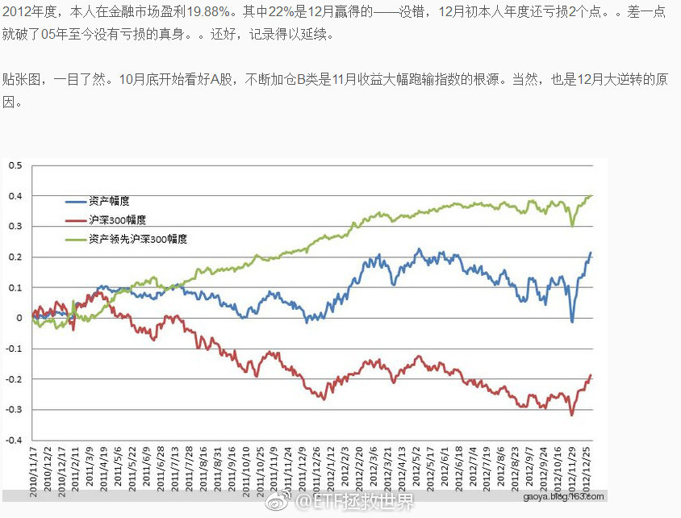

======================================================

ETF拯救世界 (5687069307) @
2018-10-16 13:47:48 Tue  
url: https://weibo.com/5687069307/GEaLkbP64

忙死了……阿娇要爆啊。

------------------------------------------------------
转推：
>  @ETF拯救世界 (5687069307)
>  2018-10-10 10:40:04 Wed  
>  url: https:/weibo.com/5687069307/GDeY93E6U/

>  每天除了自选指数和自选股还得关注阿娇。
>  
>  好累。
>  
>  [doge] ​​​

转发[1]  评论[145]  赞[214] 

======================================================

ETF拯救世界 (5687069307) @
2018-10-16 13:53:01 Tue  
url: https://weibo.com/5687069307/GEaNrmALk

159938场内溢价3%。有条件的朋友可以场内外套利。 ​​​

转发[12]  评论[137]  赞[271] 

======================================================

ETF拯救世界 (5687069307) @
2018-10-16 14:09:14 Tue  
url: https://weibo.com/5687069307/GEaU1sEji

这一次，A股的水分会被挤得比历史上任何一次都干。

现在各位经历的，是几十年也很少会出现的伟大时刻。现在的这个情况，未来会在很多年里被无数人回忆。 ​​​

转发[155]  评论[379]  赞[675] 

======================================================

ETF拯救世界 (5687069307) @
2018-10-16 14:30:10 Tue  
url: https://weibo.com/5687069307/GEb2wk1pT

目前债券也没什么持有价值了。下次发车会至少卖掉一半。

子弹，还有不少呢。死不了。 ​​​

转发[111]  评论[100]  赞[362] 

======================================================

ETF拯救世界 (5687069307) @
2018-10-16 14:34:44 Tue  
url: https://weibo.com/5687069307/GEb4njtKh

回复@牛牛s:不会。我估计1.75差不多破了。//@牛牛s:E大全市场PB今天破1.7了吧？

------------------------------------------------------
转推：
>  @ETF拯救世界 (5687069307)
>  2018-10-16 14:30:10 Tue  
>  url: https:/weibo.com/5687069307/GEb2wk1pT/

>  目前债券也没什么持有价值了。下次发车会至少卖掉一半。
>  
>  子弹，还有不少呢。死不了。 ​​​

转发[71]  评论[35]  赞[181] 

======================================================

ETF拯救世界 (5687069307) @
2018-10-16 14:35:06 Tue  
url: https://weibo.com/5687069307/GEb4wpp1w

回复@老衲成全了师太:不要加场内。溢价太多。要买就买场外。//@老衲成全了师太:全指医药，忍不住了，想加肿么办。

------------------------------------------------------
转推：
>  @ETF拯救世界 (5687069307)
>  2018-10-16 14:30:10 Tue  
>  url: https:/weibo.com/5687069307/GEb2wk1pT/

>  目前债券也没什么持有价值了。下次发车会至少卖掉一半。
>  
>  子弹，还有不少呢。死不了。 ​​​

转发[22]  评论[125]  赞[214] 

======================================================

ETF拯救世界 (5687069307) @
2018-10-16 14:45:40 Tue  
url: https://weibo.com/5687069307/GEb8OlXJf

回复@Insulation_NS:我其实挺希望有个别人看不到的小花园，咱们大家在里面扯淡。在微博虽然已经不算引人注意了，但别人暴亏的时候咱们这样让人看到也不好……//@Insulation_NS:刚看了球球网友收集的大v爆亏的帖子，怎么感觉外面血雨腥风，这里云淡风轻呢。。

------------------------------------------------------
转推：
>  @ETF拯救世界 (5687069307)
>  2018-10-16 14:30:10 Tue  
>  url: https:/weibo.com/5687069307/GEb2wk1pT/

>  目前债券也没什么持有价值了。下次发车会至少卖掉一半。
>  
>  子弹，还有不少呢。死不了。 ​​​

转发[6]  评论[159]  赞[297] 

======================================================

ETF拯救世界 (5687069307) @
2018-10-16 14:48:33 Tue  
url: https://weibo.com/5687069307/GEb9Z4Ceo

一个字儿都不用改……

------------------------------------------------------
转推：
>  @ETF拯救世界 (5687069307)
>  2018-10-08 15:02:28 Mon  
>  url: https:/weibo.com/5687069307/GCXPF1ohc/

>  光脚长阴，大概率不会止跌。 ​​​

转发[10]  评论[197]  赞[366] 

======================================================

ETF拯救世界 (5687069307) @
2018-10-16 15:30:20 Tue  
url: https://weibo.com/5687069307/GEbqWsrTJ

没到1.75。//@ETF拯救世界:回复@牛牛s:不会。我估计1.75差不多破了。//@牛牛s:E大全市场PB今天破1.7了吧？

------------------------------------------------------
转推：
>  @ETF拯救世界 (5687069307)
>  2018-10-16 14:30:10 Tue  
>  url: https:/weibo.com/5687069307/GEb2wk1pT/

>  目前债券也没什么持有价值了。下次发车会至少卖掉一半。
>  
>  子弹，还有不少呢。死不了。 ​​​

转发[60]  评论[54]  赞[194] 

======================================================

ETF拯救世界 (5687069307) @
2018-10-16 15:32:42 Tue  
url: https://weibo.com/5687069307/GEbrU7vxE

医药指数2004年以来估值最低。

同时碰到了7800我的心理预期位。

从今天起，支撑和估值对医药已经无效了。只剩下情绪了。 ​​​

转发[114]  评论[379]  赞[627] 

======================================================

ETF拯救世界 (5687069307) @
2018-10-16 16:11:08 Tue  
url: https://weibo.com/5687069307/GEbHvfOVn

说个数据吧。

今年，A股股票下跌中位数是38%。

上涨的股票只有5%。

每五只股票里面就有一只腰斩。

真的十年没见过这样的情况了。

网上各种爆仓此起彼伏……

计划也扛不住了，今年下跌了11%…… ​​​

转发[160]  评论[292]  赞[546] 

======================================================

ETF拯救世界 (5687069307) @
2018-10-16 17:57:58 Tue  
url: https://weibo.com/5687069307/GEcoRBq9m

这个月一直没有更新理财软件的收盘价。刚才深呼吸做好心理准备收了一下。

几辆xx没了。

真好。。。 ​​​

转发[12]  评论[282]  赞[468] 

======================================================

ETF拯救世界 (5687069307) @
2018-10-17 08:32:30 Wed  
url: https://weibo.com/5687069307/GEi7QuQcy

回复@减肥吧狗子达:股市反映的不是现在，而是未来。当你看到知更鸟时，春天已经过去了。//@减肥吧狗子达:目前这个金融形式，你们凭什么认为2个月后会有好转？

------------------------------------------------------
转推：
>  @ETF拯救世界 (5687069307)
>  2018-10-16 16:11:08 Tue  
>  url: https:/weibo.com/5687069307/GEbHvfOVn/

>  说个数据吧。
>  
>  今年，A股股票下跌中位数是38%。
>  
>  上涨的股票只有5%。
>  
>  每五只股票里面就有一只腰斩。
>  
>  真的十年没见过这样的情况了。
>  
>  网上各种爆仓此起彼伏……
>  
>  
>  计划也扛不住了，今年下跌了11%…… ​​​

转发[91]  评论[250]  赞[371] 

======================================================

ETF拯救世界 (5687069307) @
2018-10-17 09:46:28 Wed  
url: https://weibo.com/5687069307/GEiBRsMPy

你好好想想，这几年的鬼故事。

港股边缘化，石油完蛋了……

哪次不是那些墙头草在最低谷的时候吓破了胆出来制造恐慌气息？

结果呢。

你用三年前20% 30%的价格买打折指数，还吓得哆哩哆嗦，能挣钱？

不要一错再错。干点以后让自己骄傲的事。 ​​​

转发[62]  评论[374]  赞[604] 

======================================================

ETF拯救世界 (5687069307) @
2018-10-17 11:28:31 Wed  
url: https://weibo.com/5687069307/GEjhhhJZJ

我说你们这么着急买的是家里有矿吗。

不好意思，我有我的节奏。时间空间都很严格。

你想买就买呗。别催我。 ​​​

转发[17]  评论[192]  赞[493] 

======================================================

ETF拯救世界 (5687069307) @
2018-10-17 11:35:47 Wed  
url: https://weibo.com/5687069307/GEjkevipf

“医药指数以后不行了”

96倍的时候，不说；80倍的时候，不说，60倍、50倍、40倍的时候，不说……

终于，快跌破20倍了——

“医药指数以后不行了”

excellent！ ​​​

转发[102]  评论[247]  赞[558] 

======================================================

ETF拯救世界 (5687069307) @
2018-10-17 12:08:52 Wed  
url: https://weibo.com/5687069307/GEjxFePgn

“只看历史是刻舟求剑”

那当然了，还用说吗？

咱们是只看历史吗。呵呵。。

我告儿你，只看历史的人，在自己认为的低位已经满仓甚至加杠杆干进去了。现在有一半已经爆仓了。

咱们呢。你也经常来看我的东西，还没发现一个有趣的现象？

我经常会对一些指数提出一些“理解极限”的说法，然而，你还没 ​​​

转发[91]  评论[270]  赞[692] 

======================================================

ETF拯救世界 (5687069307) @
2018-10-17 12:25:35 Wed  
url: https://weibo.com/5687069307/GEjEs16Iv

前几天说的事基本搞定了。

现在去落实。如果最终成功，今天下午或晚上，最迟不超过24点，发红包。

力度和程序跟过年时候差不多。

公众号发。

碰到贵人了。

另外，跟大家说，再困难的事情，不要放弃。努力。只要有一丝希望就去努力。 ​​​

转发[19]  评论[341]  赞[659] 

======================================================

ETF拯救世界 (5687069307) @
2018-10-17 12:38:26 Wed  
url: https://weibo.com/5687069307/GEjJFhuZE

回复@E三舀:我是借钱给大家发红包。333%仓位痛苦不堪彻夜不眠泪流满面持有中。//@E三舀:恭喜恭喜，红包就算了哦，熊市，留着多买点

------------------------------------------------------
转推：
>  @ETF拯救世界 (5687069307)
>  2018-10-17 12:25:35 Wed  
>  url: https:/weibo.com/5687069307/GEjEs16Iv/

>  前几天说的事基本搞定了。
>  
>  现在去落实。如果最终成功，今天下午或晚上，最迟不超过24点，发红包。
>  
>  力度和程序跟过年时候差不多。
>  
>  公众号发。
>  
>  碰到贵人了。
>  
>  另外，跟大家说，再困难的事情，不要放弃。努力。只要有一丝希望就去努力。 ​​​

转发[7]  评论[52]  赞[207] 

======================================================

ETF拯救世界 (5687069307) @
2018-10-17 12:43:14 Wed  
url: https://weibo.com/5687069307/GEjLBunoN

回复@老伯其实很年轻:人和人差距太大了。别人杠杆被套每天收几千打赏，我杠杆被套被你们嘲笑。退博算了。//@老伯其实很年轻:[允悲]益达你能不能别这么搞笑，受不鸟了，肚子疼//@ETF拯救世界:回复@E三舀:我是借钱给大家发红包。333%仓位痛苦不堪彻夜不眠泪流满面持有中。

------------------------------------------------------
转推：
>  @ETF拯救世界 (5687069307)
>  2018-10-17 12:25:35 Wed  
>  url: https:/weibo.com/5687069307/GEjEs16Iv/

>  前几天说的事基本搞定了。
>  
>  现在去落实。如果最终成功，今天下午或晚上，最迟不超过24点，发红包。
>  
>  力度和程序跟过年时候差不多。
>  
>  公众号发。
>  
>  碰到贵人了。
>  
>  另外，跟大家说，再困难的事情，不要放弃。努力。只要有一丝希望就去努力。 ​​​

转发[0]  评论[57]  赞[251] 

======================================================

ETF拯救世界 (5687069307) @
2018-10-17 12:47:02 Wed  
url: https://weibo.com/5687069307/GEjNablud

回复@902yuyu:你造吗，自从关注我的人多了，我都不敢开玩笑了。。。每次说话都得想半天看会不会被很多朋友误解。。//@902yuyu:E大，333%的仓位，加了杠杠啊，您告诉过我们不要加杠杠的//@ETF拯救世界:回复@E三舀:我是借钱给大家发红包。333%仓位痛苦不堪彻夜不眠泪流满面持有中。

------------------------------------------------------
转推：
>  @ETF拯救世界 (5687069307)
>  2018-10-17 12:25:35 Wed  
>  url: https:/weibo.com/5687069307/GEjEs16Iv/

>  前几天说的事基本搞定了。
>  
>  现在去落实。如果最终成功，今天下午或晚上，最迟不超过24点，发红包。
>  
>  力度和程序跟过年时候差不多。
>  
>  公众号发。
>  
>  碰到贵人了。
>  
>  另外，跟大家说，再困难的事情，不要放弃。努力。只要有一丝希望就去努力。 ​​​

转发[5]  评论[144]  赞[330] 

======================================================

ETF拯救世界 (5687069307) @
2018-10-17 16:06:02 Wed  
url: https://weibo.com/5687069307/GEl5Vx2SM

我的一点想法，

钱这个东西，财聚财散，如同流水，不要太精明。

一个不能贪。有些钱来得容易，未必是好事。如果再加上胃口越来越大，你的命未必能承受。

第二个要善于散。有了什么大家都分分。别老想着占别人便宜，多让别人占占便宜真挺好的。

时也运也命也。时势，命数，运气。好的时候少一点嘚瑟 ​​​

转发[156]  评论[345]  赞[958] 

======================================================

ETF拯救世界 (5687069307) @
2018-10-17 16:53:46 Wed  
url: https://weibo.com/5687069307/GElpj1wFo

回复@Flyingmarxback:我是真的挺佩服他。各方面都很出色的人，居然没听过什么绯闻，没什么负面。经常有人看到他坐地铁，菜市场买菜，还在马路上清理被风吹倒的树。跟结发妻恩爱这么多年，最后把财富都捐了。服。

------------------------------------------------------
转推：
>  @ETF拯救世界 (5687069307)
>  2018-10-17 16:06:02 Wed  
>  url: https:/weibo.com/5687069307/GEl5Vx2SM/

>  我的一点想法，
>  
>  钱这个东西，财聚财散，如同流水，不要太精明。
>  
>  一个不能贪。有些钱来得容易，未必是好事。如果再加上胃口越来越大，你的命未必能承受。
>  
>  第二个要善于散。有了什么大家都分分。别老想着占别人便宜，多让别人占占便宜真挺好的。
>  
>  时也运也命也。时势，命数，运气。好的时候少一点嘚瑟 ​​​

转发[15]  评论[70]  赞[372] 

======================================================

ETF拯救世界 (5687069307) @
2018-10-17 17:47:02 Wed  
url: https://weibo.com/5687069307/GElKVnxMu

小气的人身体容易不好。

所以没事儿别老是小肚鸡肠的，今天看这个不好，明天看那个不顺眼。别人混得好了你嫉妒，别人混的差了你嘲笑。

少琢磨人，多琢磨事儿。

反正我观察一些老是叨叨别人的人，容易生大病。。真的。。

也算是自我鞭策的一条微博吧…… ​​​

转发[85]  评论[138]  赞[569] 

======================================================

ETF拯救世界 (5687069307) @
2018-10-17 18:37:59 Wed  
url: https://weibo.com/5687069307/GEm5Bxb5w

支付宝红包还是只能包300个。麻烦死了。。还是发3个，一共900个。我原来是想发2000个。 ​​​

转发[3]  评论[78]  赞[354] 

======================================================

ETF拯救世界 (5687069307) @
2018-10-17 18:43:49 Wed  
url: https://weibo.com/5687069307/GEm7Yout8

不会太早。9点-10点之间吧。别报太大希望。。人太多，几率不会太大。。一会见。 ​​​

转发[2]  评论[129]  赞[354] 

======================================================

ETF拯救世界 (5687069307) @
2018-10-17 20:41:21 Wed  
url: https://weibo.com/5687069307/GEmTGhA82

快抢！貌似大家手都很慢！

喷了。除了且慢，第一个和第三个简直只要输入就有的拿。。 ​​​

转发[8]  评论[269]  赞[310] 

======================================================

ETF拯救世界 (5687069307) @
2018-10-17 20:44:41 Wed  
url: https://weibo.com/5687069307/GEmV2aCDw

好了抢完了散了散了啊。

------------------------------------------------------
转推：
>  @ETF拯救世界 (5687069307)
>  2018-10-17 20:41:21 Wed  
>  url: https:/weibo.com/5687069307/GEmTGhA82/

>  快抢！貌似大家手都很慢！
>  
>  喷了。除了且慢，第一个和第三个简直只要输入就有的拿。。 ​​​

转发[3]  评论[287]  赞[336] 

======================================================

ETF拯救世界 (5687069307) @
2018-10-17 20:59:53 Wed  
url: https://weibo.com/5687069307/GEn1cAH0F

要不以后我开始接广告吧。赚到钱给各位发红包……[doge] ​​​

转发[3]  评论[417]  赞[904] 

======================================================

ETF拯救世界 (5687069307) @
2018-10-18 12:43:28 Thu  
url: https://weibo.com/5687069307/GEtcdcwim

回复@ETF拯救世界:这个月要不要挑战一下08年呢//@ETF拯救世界:回复@黄连树:2005年5月8.5%，2008年10月25%，2012年11月创业板12%，2013年6月沪深300是15%。

------------------------------------------------------
转推：
>  @ETF拯救世界 (5687069307)
>  2018-08-31 16:18:26 Fri  
>  url: https:/weibo.com/5687069307/Gxc5CA6qu/

>  根据历史经验，最终的底部，还缺少一根月线大阴线……
>  
>  历史还会重演吗？ ​​​

转发[44]  评论[464]  赞[454] 

======================================================

ETF拯救世界 (5687069307) @
2018-10-18 15:52:53 Thu  
url: https://weibo.com/5687069307/GEur5udkp

又在外面跑一天……一小时后算算到多少了，一会汇报//@ETF拯救世界:没到1.75。//@ETF拯救世界:回复@牛牛s:不会。我估计1.75差不多破了。//@牛牛s:E大全市场PB今天破1.7了吧？

------------------------------------------------------
转推：
>  @ETF拯救世界 (5687069307)
>  2018-10-16 14:30:10 Tue  
>  url: https:/weibo.com/5687069307/GEb2wk1pT/

>  目前债券也没什么持有价值了。下次发车会至少卖掉一半。
>  
>  子弹，还有不少呢。死不了。 ​​​

转发[49]  评论[173]  赞[323] 

======================================================

ETF拯救世界 (5687069307) @
2018-10-18 16:34:37 Thu  
url: https://weibo.com/5687069307/GEuI1EWgT

即将跌破1.7。1.6近在眼前。2008年底快到了。//@ETF拯救世界:又在外面跑一天……一小时后算算到多少了，一会汇报//@ETF拯救世界:没到1.75。//@ETF拯救世界:回复@牛牛s:不会。我估计1.75差不多破了。//@牛牛s:E大全市场PB今天破1.7了吧？

------------------------------------------------------
转推：
>  @ETF拯救世界 (5687069307)
>  2018-10-16 14:30:10 Tue  
>  url: https:/weibo.com/5687069307/GEb2wk1pT/

>  目前债券也没什么持有价值了。下次发车会至少卖掉一半。
>  
>  子弹，还有不少呢。死不了。 ​​​

转发[43]  评论[222]  赞[429] 

======================================================

ETF拯救世界 (5687069307) @
2018-10-18 16:59:22 Thu  
url: https://weibo.com/5687069307/GEuS4zAB7

来，朋友们。写个评论，真实的描述一下你现在对于股市，对于自己账户的情况的感想。

真实点，没事。激动，淡定，慌张都没有所谓正确和错误。 ​​​

转发[131]  评论[2957]  赞[933] 

======================================================

ETF拯救世界 (5687069307) @
2018-10-19 13:17:47 Fri  
url: https://weibo.com/5687069307/GECQDb6SK

人在呢人在呢。

这几天又累病了……没事，小感冒。 ​​​

转发[5]  评论[492]  赞[555] 

======================================================

ETF拯救世界 (5687069307) @
2018-10-19 13:54:05 Fri  
url: https://weibo.com/5687069307/GED5mukZG

那些浮亏大点的品种，你浮亏个十几二十个点，吓得心惊胆战真没必要。

第一，你还有现金摊低成本。

第二，你看着一天就涨3%，别说牛市了，随便一个反弹你就盈利了。再反弹一点就比你存余额宝三年挣得多了。怕什么啊。

更别提浮亏小的了。

再说一次，现在是钻石坑！几乎是A股市场历史最低，别干傻事 ​​​

转发[75]  评论[327]  赞[622] 

======================================================

ETF拯救世界 (5687069307) @
2018-10-19 14:18:35 Fri  
url: https://weibo.com/5687069307/GEDfjcPyx

我个人啊，建议你们不要鼓励现在要清仓的人坚定持有。

手上品种浮亏几个点到十几二十个点不等，根据开始的时间不同，总盈利从正的到浮亏十几个点都有。

但如果才浮亏这么点就压力巨大，扛不住了，我说你们也别劝。

不是每个人都适合金融市场。一点点浮亏就如灭顶之灾，加上不够理性，在这种时候，很 ​​​

转发[69]  评论[274]  赞[718] 

======================================================

ETF拯救世界 (5687069307) @
2018-10-19 15:00:57 Fri  
url: https://weibo.com/5687069307/GEDwvnzE4

你得清楚在这种钻石底到底是什么人还在卖。

第一个是融资、质押这种杠杆爆仓了。没办法在卖。

第二个是能力、经验、心理素质不行的人。真是被账户被各种言论吓破胆了。这种人很多，毕竟70%都是散户。

第三是有风控要求的资金。私募啊之类的，也是没办法。必须卖。

你说你一个个人投资者，又没人看 ​​​

转发[230]  评论[511]  赞[865] 

======================================================

ETF拯救世界 (5687069307) @
2018-10-19 16:55:50 Fri  
url: https://weibo.com/5687069307/GEEh8qsnm

其实我一直有个疑问，有没有学医的朋友说说。到底是心脏病导致人很容易激动，还是人经常很激动导致心脏病。。反正我知道几个脾气急的心脏都不太好。。

------------------------------------------------------
转推：
>  @北京人不知道的北京事儿 (1662214194)
>  2018-10-19 16:23:37 Fri  
>  url: https:/weibo.com/1662214194/GEE43B9mh/

>  【摩托车手与的哥争执病发身亡：在特警队工作】近日，黑龙江哈尔滨，“摩托车手与的哥起争执心脏病发身亡，的哥被批捕”引发网友关注。哈医大一院相关人员表示，死者为特警中队一院分队辅警。特警中队证实，死者此前在队里工作。
>  
>  事件回看：出租车司机滕某停车后，一摩托车驾驶员追上来踢打车门，认为 ​​​

转发[14]  评论[255]  赞[141] 

======================================================

ETF拯救世界 (5687069307) @
2018-10-22 09:27:56 Mon  
url: https://weibo.com/5687069307/GF3COwHDt

如果这么涨，这周的车就很难发了。只能等月底了。

钻石底难道真的稍纵即逝吗。

都是缘分啊。 ​​​

转发[18]  评论[152]  赞[399] 

======================================================

ETF拯救世界 (5687069307) @
2018-10-22 09:32:37 Mon  
url: https://weibo.com/5687069307/GF3EJ58Lm

在极度便宜或者极度贵的区域，任何事件——货币或者财政政策、又或者是针对股市的特定政策，都有可能是行情改变的催化剂。这也是大家说A股是“政策市”的原因。其实不是政策市，而是催化剂发生作用了。

------------------------------------------------------
转推：
>  @正直的磊哥 (1771474495)
>  2018-10-22 09:25:24 Mon  
>  url: https:/weibo.com/1771474495/GF3BNkpiG/

>  这周末，各类媒体说的最多的就是政策底。按照历史经验，所谓政策底都是虚的，也没有一次熊市大底是靠官员用嘴吹出来的。跌这么久了，空间也大了，出超跌反弹是很正常的。我还是之前的观点，只看反弹不谈底。真正见大底，还早得很 ​​​

转发[64]  评论[84]  赞[298] 

======================================================

ETF拯救世界 (5687069307) @
2018-10-22 09:33:12 Mon  
url: https://weibo.com/5687069307/GF3EXvUVy

$证券公司 sz399975$  15日加仓的券商引发舒适的感觉。 ​​​

转发[686]  评论[92]  赞[370] 

======================================================

ETF拯救世界 (5687069307) @
2018-10-22 09:46:10 Mon  
url: https://weibo.com/5687069307/GF3Ke4XHX

谁能想到，两天过去，券商的浮亏已经收窄到10%以内了。你要知道这个指数跌了70%多。以前我跟你说，你的那点浮亏，牛市来了，两周就会转盈利，然后就是资产飞跃之旅。你不信，现在有点信了吗。记住，熊市只要做到不亏或者少亏，同时拿够筹码，你就是未来的王者。

------------------------------------------------------
转推：
>  @ETF拯救世界 (5687069307)
>  2018-10-22 09:33:12 Mon  
>  url: https:/weibo.com/5687069307/GF3EXvUVy/

>  $证券公司 sz399975$  15日加仓的券商引发舒适的感觉。 ​​​

转发[119]  评论[124]  赞[385] 

======================================================

ETF拯救世界 (5687069307) @
2018-10-22 09:57:41 Mon  
url: https://weibo.com/5687069307/GF3OTDm6L

我的建议就是停止预测。低了就买，高了就卖。一切按照策略和模型走。机械执行。不要掺杂主观判断。

这几乎是生存下去的唯一方式。 ​​​

转发[99]  评论[131]  赞[587] 

======================================================

ETF拯救世界 (5687069307) @
2018-10-22 10:02:59 Mon  
url: https://weibo.com/5687069307/GF3R3cbfN

又开回来了。真好……

------------------------------------------------------
转推：
>  @ETF拯救世界 (5687069307)
>  2018-10-16 17:57:58 Tue  
>  url: https:/weibo.com/5687069307/GEcoRBq9m/

>  这个月一直没有更新理财软件的收盘价。刚才深呼吸做好心理准备收了一下。
>  
>  几辆xx没了。
>  
>  真好。。。 ​​​

转发[0]  评论[46]  赞[305] 

======================================================

ETF拯救世界 (5687069307) @
2018-10-22 10:03:59 Mon  
url: https://weibo.com/5687069307/GF3RsBiKa

如果你表演一下指数涨停，让新朋友们都看看，我也没什么意见。。。

------------------------------------------------------
转推：
>  @ETF拯救世界 (5687069307)
>  2018-10-22 09:33:12 Mon  
>  url: https:/weibo.com/5687069307/GF3EXvUVy/

>  $证券公司 sz399975$  15日加仓的券商引发舒适的感觉。 ​​​

转发[476]  评论[125]  赞[317] 

======================================================

ETF拯救世界 (5687069307) @
2018-10-22 10:10:35 Mon  
url: https://weibo.com/5687069307/GF3U8mGEk

“牛市指数涨幅不行”

喷了，今天跑赢300+500的股票不到1/3。更不用说券商这种直冲涨停的指数了。

看不起牛市指数的人是多有信心自己能买到并且坚定持有超级大牛股啊…… ​​​

转发[32]  评论[111]  赞[415] 

======================================================

ETF拯救世界 (5687069307) @
2018-10-22 10:17:20 Mon  
url: https://weibo.com/5687069307/GF3WSj2xE

熊市不会死人。

反弹也不会死人——只要你不重仓追。

你重仓追的话，反弹会死人。 ​​​

转发[42]  评论[178]  赞[415] 

======================================================

ETF拯救世界 (5687069307) @
2018-10-22 10:39:51 Mon  
url: https://weibo.com/5687069307/GF4614uwO

有几年没看见指数涨停了。来，朋友们一起来看牛魔王……//@ETF拯救世界:如果你表演一下指数涨停，让新朋友们都看看，我也没什么意见。。。

------------------------------------------------------
转推：
>  @ETF拯救世界 (5687069307)
>  2018-10-22 09:33:12 Mon  
>  url: https:/weibo.com/5687069307/GF3EXvUVy/

>  $证券公司 sz399975$  15日加仓的券商引发舒适的感觉。 ​​​

转发[455]  评论[132]  赞[318] 

======================================================

ETF拯救世界 (5687069307) @
2018-10-22 10:47:58 Mon  
url: https://weibo.com/5687069307/GF49jyY0F

回复@江河之走:下一次牛市是科技信息股领衔的牛市。//@江河之走:哪些指数为牛市利器?创业板?传媒?证券?信息?还有吗？//@ETF拯救世界:有几年没看见指数涨停了。来，朋友们一起来看牛魔王……//@ETF拯救世界:如果你表演一下指数涨停，让新朋友们都看看，我也没什么意见。。。

------------------------------------------------------
转推：
>  @ETF拯救世界 (5687069307)
>  2018-10-22 09:33:12 Mon  
>  url: https:/weibo.com/5687069307/GF3EXvUVy/

>  $证券公司 sz399975$  15日加仓的券商引发舒适的感觉。 ​​​

转发[425]  评论[101]  赞[280] 

======================================================

ETF拯救世界 (5687069307) @
2018-10-22 10:51:09 Mon  
url: https://weibo.com/5687069307/GF4aBDTTa

回复@扮布丁的马甲:我们不能阻止任何人在底部丧失希望，做出非理性的事。因为这才是正常的人性。//@扮布丁的马甲:不知道前两天清仓的那位朋友是何感想，太可惜了！//@ETF拯救世界:如果你表演一下指数涨停，让新朋友们都看看，我也没什么意见。。。

------------------------------------------------------
转推：
>  @ETF拯救世界 (5687069307)
>  2018-10-22 09:33:12 Mon  
>  url: https:/weibo.com/5687069307/GF3EXvUVy/

>  $证券公司 sz399975$  15日加仓的券商引发舒适的感觉。 ​​​

转发[8]  评论[52]  赞[241] 

======================================================

ETF拯救世界 (5687069307) @
2018-10-22 11:02:49 Mon  
url: https://weibo.com/5687069307/GF4fl4x5g

回复@沐阳的夏:情绪不稳定来源于“意外”。无论是意外的喜还是悲。资本市场这点波动都在意料之中，当然也就没有什么不稳定。//@沐阳的夏:E大是不是天生就是情绪稳定之人？

------------------------------------------------------
转推：
>  @ETF拯救世界 (5687069307)
>  2018-10-22 09:33:12 Mon  
>  url: https:/weibo.com/5687069307/GF3EXvUVy/

>  $证券公司 sz399975$  15日加仓的券商引发舒适的感觉。 ​​​

转发[69]  评论[61]  赞[266] 

======================================================

ETF拯救世界 (5687069307) @
2018-10-22 11:12:02 Mon  
url: https://weibo.com/5687069307/GF4j509KF

万万没想到1810跌下来的指数在500多点已经快回本了。

------------------------------------------------------
转推：
>  @ETF拯救世界 (5687069307)
>  2018-10-16 10:15:59 Tue  
>  url: https:/weibo.com/5687069307/GE9nlbpxN/

>  $证券公司 sz399975$ 
>  
>  券商指数我们的平均成本。如果再跌，未来我们的成本会继续下降。
>  
>  我倒是想问问，有些人是不是惦记着所有品种都买在最低点才算做的好？ ​​​

转发[10]  评论[103]  赞[308] 

======================================================

ETF拯救世界 (5687069307) @
2018-10-22 11:20:07 Mon  
url: https://weibo.com/5687069307/GF4mmzwob

回复@从来就没听说过什么人民:很多人评价指数只看过去和现在，我买什么看的是未来。500不会让我失望。//@从来就没听说过什么人民:中证500今天也扬眉吐气了一把，涨幅终于超过50和300了

------------------------------------------------------
转推：
>  @ETF拯救世界 (5687069307)
>  2018-10-22 09:33:12 Mon  
>  url: https:/weibo.com/5687069307/GF3EXvUVy/

>  $证券公司 sz399975$  15日加仓的券商引发舒适的感觉。 ​​​

转发[53]  评论[195]  赞[354] 

======================================================

ETF拯救世界 (5687069307) @
2018-10-22 14:57:55 Mon  
url: https://weibo.com/5687069307/GF5MLDsz5

回复@---青年润之:我很纳闷你们怎么做到的。不算今天目前持仓的几个500跌幅是31/22/15/8，怎么做到综合下跌29的？//@---青年润之:回复@Ulquiorra-L:-29.78%[微笑]//@ETF拯救世界:回复@从来就没听说过什么人民:很多人评价指数只看过去和现在，我买什么看的是未来。500不会让我失望。

------------------------------------------------------
转推：
>  @ETF拯救世界 (5687069307)
>  2018-10-22 09:33:12 Mon  
>  url: https:/weibo.com/5687069307/GF3EXvUVy/

>  $证券公司 sz399975$  15日加仓的券商引发舒适的感觉。 ​​​

转发[36]  评论[169]  赞[190] 

======================================================

ETF拯救世界 (5687069307) @
2018-10-22 15:25:37 Mon  
url: https://weibo.com/5687069307/GF5Y0tDsD

回复@百里陌香:你这个信心消磨，要看是什么信心。如果总是认为未来一年翻番三年十倍，趁早该干嘛干嘛去别耽误时间。如果是长期预期就是10%-15%，前期多投入几年也没关系，就当零存整取了，这有什么消磨的。没准最后还能有个惊喜。

------------------------------------------------------
转推：
>  @ETF拯救世界 (5687069307)
>  2018-10-22 09:33:12 Mon  
>  url: https:/weibo.com/5687069307/GF3EXvUVy/

>  $证券公司 sz399975$  15日加仓的券商引发舒适的感觉。 ​​​

转发[30]  评论[173]  赞[323] 

======================================================

ETF拯救世界 (5687069307) @
2018-10-23 08:38:43 Tue  
url: https://weibo.com/5687069307/GFcJlhdwN

回复@渝夏夜的微风-hc:理性的钱知道现在该干什么。

------------------------------------------------------
转推：
>  @ETF拯救世界 (5687069307)
>  2018-10-22 09:33:12 Mon  
>  url: https:/weibo.com/5687069307/GF3EXvUVy/

>  $证券公司 sz399975$  15日加仓的券商引发舒适的感觉。 ​​​

转发[3]  评论[67]  赞[208] 

======================================================

ETF拯救世界 (5687069307) @
2018-10-23 09:33:43 Tue  
url: https://weibo.com/5687069307/GFd5FoCCC

昨天场外申购券商指数，今天场内卖出，又是一个3%的套利空间。

当然，马后炮并没什么x用……下次也不一定有用，万一今天跌了呢。 ​​​

转发[46]  评论[122]  赞[310] 

======================================================

ETF拯救世界 (5687069307) @
2018-10-23 09:54:02 Tue  
url: https://weibo.com/5687069307/GFddUgpgR

回复@年轻人老了0_0:我当然说的是原来场内就持有的。我说的很清楚，降低持仓成本。你说的叫做裸套，我说的是降低已经持有的持仓成本。我做的各种套利基本都不会裸套。

------------------------------------------------------
转推：
>  @ETF拯救世界 (5687069307)
>  2018-10-23 09:33:43 Tue  
>  url: https:/weibo.com/5687069307/GFd5FoCCC/

>  昨天场外申购券商指数，今天场内卖出，又是一个3%的套利空间。
>  
>  当然，马后炮并没什么x用……下次也不一定有用，万一今天跌了呢。 ​​​

转发[15]  评论[30]  赞[196] 

======================================================

ETF拯救世界 (5687069307) @
2018-10-23 10:15:48 Tue  
url: https://weibo.com/5687069307/GFdmKqUVd

到今天才400多家披露三季报。剩下的3100多家都会集中在之后的一周。影响应该不会太大。

已披露的增长依然在15%+。不过一般来说先披露的都是成绩好的。 ​​​

转发[11]  评论[37]  赞[311] 

======================================================

ETF拯救世界 (5687069307) @
2018-10-23 10:28:38 Tue  
url: https://weibo.com/5687069307/GFdrXqgeL

你必须意识到一个问题：

现阶段，在股票市场，吃公司长期盈利增长当然也是很重要的，但并不是最重要的。

目前这种散户持仓量占70%的蛮荒时代，利润最大的地方在于熊市中的估值极低到牛市中的估值极高之间的价格波动。

体会一下。 ​​​

转发[115]  评论[205]  赞[558] 

======================================================

ETF拯救世界 (5687069307) @
2018-10-23 11:03:08 Tue  
url: https://weibo.com/5687069307/GFdFXx1Ol

食品和消费已经把昨天的涨幅全吃掉了。

急什么急。踏踏实实的有你买的时候。弄不好这周还能发一车。 ​​​

转发[10]  评论[152]  赞[504] 

======================================================

ETF拯救世界 (5687069307) @
2018-10-23 12:37:57 Tue  
url: https://weibo.com/5687069307/GFeirDuhc

包场了。电影业是不是药丸 ​​​

转发[6]  评论[190]  赞[327] 

+++++++++++++++++++++++++++++++++++++++++++++++++++++

图片：

======================================================

ETF拯救世界 (5687069307) @
2018-10-23 13:43:03 Tue  
url: https://weibo.com/5687069307/GFeIRwyeh

总有人问我为什么还不买消费。

消费板块整体看确实不贵了。

但是占据极大权重比例的白酒，它们的形态，看起来就让我觉得害怕。

你可以说我是看图说话的渣渣。但我是真的怕，始终没法说服自己去买这样形态的品种。

最关键是主流消费指数的白酒权重太太太太大了。茅台和五粮液就占30%…… ​​​

转发[103]  评论[228]  赞[441] 

======================================================

ETF拯救世界 (5687069307) @
2018-10-23 14:44:36 Tue  
url: https://weibo.com/5687069307/GFf7R7ubA

回复@夏炆:不不不，你误会了。我不懂白酒，不知道有没有泡沫。我只是说这个形态我看着害怕而已。茅台啊，腾讯啊，肯定都是好公司，只是太疯了总要降降火。//@夏炆:天天喊白酒泡沫，结果年年涨

------------------------------------------------------
转推：
>  @ETF拯救世界 (5687069307)
>  2018-10-23 13:43:03 Tue  
>  url: https:/weibo.com/5687069307/GFeIRwyeh/

>  总有人问我为什么还不买消费。
>  
>  消费板块整体看确实不贵了。
>  
>  但是占据极大权重比例的白酒，它们的形态，看起来就让我觉得害怕。
>  
>  你可以说我是看图说话的渣渣。但我是真的怕，始终没法说服自己去买这样形态的品种。
>  
>  最关键是主流消费指数的白酒权重太太太太大了。茅台和五粮液就占30%…… ​​​

转发[12]  评论[64]  赞[226] 

======================================================

ETF拯救世界 (5687069307) @
2018-10-23 16:22:03 Tue  
url: https://weibo.com/5687069307/GFfLq3BMl

回复@汤汤汤绅士:对了，同样提醒一下，千万别因为我瞎扯淡就去卖掉你喜欢的白酒……我真的不懂白酒，纯瞎说的。//@汤汤汤绅士:E大当初怼腾讯也有质疑的，E大也是这样谦逊温和的态度，然后腾讯就... ...[doge]

------------------------------------------------------
转推：
>  @ETF拯救世界 (5687069307)
>  2018-10-23 13:43:03 Tue  
>  url: https:/weibo.com/5687069307/GFeIRwyeh/

>  总有人问我为什么还不买消费。
>  
>  消费板块整体看确实不贵了。
>  
>  但是占据极大权重比例的白酒，它们的形态，看起来就让我觉得害怕。
>  
>  你可以说我是看图说话的渣渣。但我是真的怕，始终没法说服自己去买这样形态的品种。
>  
>  最关键是主流消费指数的白酒权重太太太太大了。茅台和五粮液就占30%…… ​​​

转发[2]  评论[59]  赞[218] 

======================================================

ETF拯救世界 (5687069307) @
2018-10-23 18:54:15 Tue  
url: https://weibo.com/5687069307/GFgLbAoXZ

问问学习好的（酒鬼）朋友，除了白酒，你觉得什么酒（具体品牌，系列），怎么喝比较好喝。

最好是口感好，喝完有微醺的感觉，让人放松，又不会头疼不会难受不会吐的那种…… ​​​

转发[21]  评论[457]  赞[257] 

======================================================

ETF拯救世界 (5687069307) @
2018-10-23 19:06:50 Tue  
url: https://weibo.com/5687069307/GFgQikcev

欧亚今天全部暴跌啊。美国德国有机会配齐了。 ​​​

转发[8]  评论[140]  赞[459] 

======================================================

ETF拯救世界 (5687069307) @
2018-10-24 09:56:17 Wed  
url: https://weibo.com/5687069307/GFmFkdYRG

$162411  油气什么时候接回来。 ​​​

转发[33]  评论[76]  赞[234] 

+++++++++++++++++++++++++++++++++++++++++++++++++++++

图片：

======================================================

ETF拯救世界 (5687069307) @
2018-10-24 10:04:42 Wed  
url: https://weibo.com/5687069307/GFmIK3NYR

$五粮液 sz000858$   怎么回事。

------------------------------------------------------
转推：
>  @ETF拯救世界 (5687069307)
>  2018-10-23 13:43:03 Tue  
>  url: https:/weibo.com/5687069307/GFeIRwyeh/

>  总有人问我为什么还不买消费。
>  
>  消费板块整体看确实不贵了。
>  
>  但是占据极大权重比例的白酒，它们的形态，看起来就让我觉得害怕。
>  
>  你可以说我是看图说话的渣渣。但我是真的怕，始终没法说服自己去买这样形态的品种。
>  
>  最关键是主流消费指数的白酒权重太太太太大了。茅台和五粮液就占30%…… ​​​

转发[9]  评论[53]  赞[171] 

======================================================

ETF拯救世界 (5687069307) @
2018-10-24 10:22:56 Wed  
url: https://weibo.com/5687069307/GFmQ8DPnf

回复@会飞的小鸟飞在天:长期大概75%拟合度。不保证每天走势一样，也不保证中期没有幅度偏差。但已经是交易原油可以长期持有的最好品种了。//@会飞的小鸟飞在天:原油价格与油气指数有什么关系吗？

------------------------------------------------------
转推：
>  @ETF拯救世界 (5687069307)
>  2018-10-24 09:56:17 Wed  
>  url: https:/weibo.com/5687069307/GFmFkdYRG/

>  $162411  油气什么时候接回来。 ​​​

转发[22]  评论[33]  赞[175] 

======================================================

ETF拯救世界 (5687069307) @
2018-10-24 10:23:51 Wed  
url: https://weibo.com/5687069307/GFmQw1sTA

$证券公司 sz399975$   这哥们永远有一颗不安分、躁动的心。 ​​​

转发[4]  评论[30]  赞[230] 

======================================================

ETF拯救世界 (5687069307) @
2018-10-24 10:28:15 Wed  
url: https://weibo.com/5687069307/GFmSixmnj

又想起前几天在评论里喷我券商的那哥们了。

真的是，最黑暗的时候，人就容易崩溃。要知道他之前还是不停给我点赞转发问答的人呢。

最黑暗的时候崩溃了，来喷我了。第二天券商开始发飙，几天时间15%+了，直奔20%+。

在你撑不住的时候，再坚持一下，很可能就是一个关键点了。 ​​​

转发[22]  评论[193]  赞[489] 

======================================================

ETF拯救世界 (5687069307) @
2018-10-24 10:47:01 Wed  
url: https://weibo.com/5687069307/GFmZUFdjp

再说一次，长阴跌破平台创新低的品种别着急重仓买。不买也行，一点点买也行。总之是有点凶险。 ​​​

转发[118]  评论[181]  赞[410] 

======================================================

ETF拯救世界 (5687069307) @
2018-10-24 11:03:55 Wed  
url: https://weibo.com/5687069307/GFn6McwTz

券商从最高点跌下来到现在跌幅70%。计划持仓部分浮亏只剩6%。除非你一辈子不涨，否则赚钱是不是钦定了。 ​​​

转发[32]  评论[102]  赞[390] 

======================================================

ETF拯救世界 (5687069307) @
2018-10-24 11:27:48 Wed  
url: https://weibo.com/5687069307/GFngteHtC

回复@asekiyoshi:在日本股市30年新高的时候？绝了。现在不批英国不批新兴市场，批什么日本……//@asekiyoshi:报告，日股ETF要上市了

------------------------------------------------------
转推：
>  @ETF拯救世界 (5687069307)
>  2018-10-24 11:03:55 Wed  
>  url: https:/weibo.com/5687069307/GFn6McwTz/

>  券商从最高点跌下来到现在跌幅70%。计划持仓部分浮亏只剩6%。除非你一辈子不涨，否则赚钱是不是钦定了。 ​​​

转发[14]  评论[50]  赞[250] 

======================================================

ETF拯救世界 (5687069307) @
2018-10-24 11:29:55 Wed  
url: https://weibo.com/5687069307/GFnhkpHpw

多年以后，很多人才会意识到，在钻石坑里买指数基金是多么确定性赚钱的一件事……

在坑里的时候能明白这个的，很少。 ​​​

转发[83]  评论[224]  赞[608] 

======================================================

ETF拯救世界 (5687069307) @
2018-10-24 11:52:38 Wed  
url: https://weibo.com/5687069307/GFnqyuLfl

回复@linjinkel:坏了，扬声器不出声了。看了看新的max，凭什么啊就卖11000。也没多好啊。我给大家发几千红包没什么感觉，让我花一万多买个手机还是下不去手，毕竟就用一年……//@linjinkel:啥情况，不在坑里iPhone了[吃瓜]

------------------------------------------------------
转推：
>  @ETF拯救世界 (5687069307)
>  2018-10-24 11:29:55 Wed  
>  url: https:/weibo.com/5687069307/GFnhkpHpw/

>  多年以后，很多人才会意识到，在钻石坑里买指数基金是多么确定性赚钱的一件事……
>  
>  在坑里的时候能明白这个的，很少。 ​​​

转发[2]  评论[130]  赞[265] 

======================================================

ETF拯救世界 (5687069307) @
2018-10-24 16:41:12 Wed  
url: https://weibo.com/5687069307/GFpjGdJS5

可怕的不是yyx，而是这些家长。

------------------------------------------------------
转推：
>  @ ()
>  2018-10-24 12:22:55 Wed  
>  url: 

>  抱歉，作者已设置仅展示半年内微博，此微博已不可见。 ​​​

转发[35]  评论[211]  赞[193] 

======================================================

ETF拯救世界 (5687069307) @
2018-10-25 06:42:33 Thu  
url: https://weibo.com/5687069307/GFuPbnEMZ

清仓两个月后你终于懂了吧 ​​​

转发[18]  评论[163]  赞[466] 

+++++++++++++++++++++++++++++++++++++++++++++++++++++

图片：

======================================================

ETF拯救世界 (5687069307) @
2018-10-25 06:48:55 Thu  
url: https://weibo.com/5687069307/GFuRLAjIm

美股不断新高的时候我不怕打脸 ​​​

转发[87]  评论[122]  赞[364] 

+++++++++++++++++++++++++++++++++++++++++++++++++++++

图片：
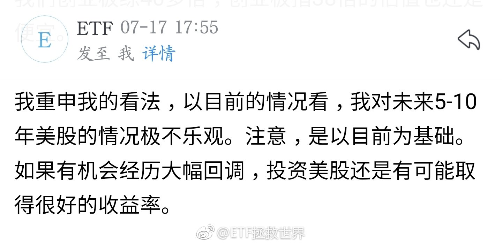

======================================================

ETF拯救世界 (5687069307) @
2018-10-25 08:45:07 Thu  
url: https://weibo.com/5687069307/GFvCW3WMf

有些朋友真敢想……美股跌40%概率极低极低。

有20%-30%我们就会配置不少了。 ​​​

转发[44]  评论[163]  赞[388] 

======================================================

ETF拯救世界 (5687069307) @
2018-10-25 08:50:33 Thu  
url: https://weibo.com/5687069307/GFvF98TEz

回复@颓废的猪头_Ju:可以送。古琦或者香奈儿。有人要吗。//@颓废的猪头_Ju:老大早呀[嘻嘻]昨晚我梦到你兼职美妆博主抽奖送香水了[允悲][允悲][允悲]

------------------------------------------------------
转推：
>  @ETF拯救世界 (5687069307)
>  2018-10-25 06:48:55 Thu  
>  url: https:/weibo.com/5687069307/GFuRLAjIm/

>  美股不断新高的时候我不怕打脸 ​​​

转发[5]  评论[278]  赞[293] 

======================================================

ETF拯救世界 (5687069307) @
2018-10-25 12:05:56 Thu  
url: https://weibo.com/5687069307/GFwWry1LH

我一直没明白的，是高位的时候，为什么在球球看空会被喷。

比如2015年A股，比如2018年初的大白马、港股。

喷起来都不走流程的，直接喷。然后还有很多人给喷的人点赞。

无论你用多少数据多少理由，以及事后事实如何证明你对了，下次依然喷你。

上次喷你的人，根本不会过来说声不好意思，喷错了。

 ​​​

转发[23]  评论[257]  赞[517] 

======================================================

ETF拯救世界 (5687069307) @
2018-10-25 12:29:55 Thu  
url: https://weibo.com/5687069307/GFx6bfyWg

一直很尊敬雷总。可惜上市的时候公司高管集体猛吹股价有些让人失望。

------------------------------------------------------
转推：
>  @ ()
>  2018-10-25 12:20:03 Thu  
>  url: 

>  抱歉，作者已设置仅展示半年内微博，此微博已不可见。 ​​​

转发[5]  评论[64]  赞[150] 

======================================================

ETF拯救世界 (5687069307) @
2018-10-25 12:49:36 Thu  
url: https://weibo.com/5687069307/GFxeb4mAS

一个奇怪的现象

以前你觉得8000的手机不便宜。然后出了一款11000的，你再回头看8000那款——不贵啊。

是不是就像买股票。

从1块涨到800你都不敢买，觉得越来越贵。然后突然从800跌到700你觉得我去好值，买啊。 ​​​

转发[111]  评论[195]  赞[346] 

======================================================

ETF拯救世界 (5687069307) @
2018-10-25 12:51:43 Thu  
url: https://weibo.com/5687069307/GFxf2gNjc

回复@取个名字都要v:非常奇怪，我看头条的喷子一点点点点都不生气，还有点想笑……//@取个名字都要v:今日头条喷子才多，e大那篇钻石底的文章，下面百分之九十都是在喷。[允悲]

------------------------------------------------------
转推：
>  @ETF拯救世界 (5687069307)
>  2018-10-25 12:05:56 Thu  
>  url: https:/weibo.com/5687069307/GFwWry1LH/

>  我一直没明白的，是高位的时候，为什么在球球看空会被喷。
>  
>  比如2015年A股，比如2018年初的大白马、港股。
>  
>  喷起来都不走流程的，直接喷。然后还有很多人给喷的人点赞。
>  
>  无论你用多少数据多少理由，以及事后事实如何证明你对了，下次依然喷你。
>  
>  上次喷你的人，根本不会过来说声不好意思，喷错了。
>  
>   ​​​

转发[0]  评论[68]  赞[178] 

======================================================

ETF拯救世界 (5687069307) @
2018-10-25 14:04:42 Thu  
url: https://weibo.com/5687069307/GFxIErmOn

回复@兰亭序-lbh:不是。出货还要再拉起来。最高800，跌到600，多数人还是不敢买。再拉到750，这时候接盘的就冲进来了。所以历史大顶大多数都是M。右边的高点会比左边的低一点。不信你翻翻。//@兰亭序-lbh:庄家是不是就是利用这种心理出货的？！

------------------------------------------------------
转推：
>  @ETF拯救世界 (5687069307)
>  2018-10-25 12:49:36 Thu  
>  url: https:/weibo.com/5687069307/GFxeb4mAS/

>  一个奇怪的现象
>  
>  以前你觉得8000的手机不便宜。然后出了一款11000的，你再回头看8000那款——不贵啊。
>  
>  是不是就像买股票。
>  
>  从1块涨到800你都不敢买，觉得越来越贵。然后突然从800跌到700你觉得我去好值，买啊。 ​​​

转发[73]  评论[94]  赞[258] 

======================================================

ETF拯救世界 (5687069307) @
2018-10-25 14:32:40 Thu  
url: https://weibo.com/5687069307/GFxU0ltIL

躁动的券商。

------------------------------------------------------
转推：
>  @ETF拯救世界 (5687069307)
>  2018-10-24 10:23:51 Wed  
>  url: https:/weibo.com/5687069307/GFmQw1sTA/

>  $证券公司 sz399975$   这哥们永远有一颗不安分、躁动的心。 ​​​

转发[2]  评论[60]  赞[230] 

======================================================

ETF拯救世界 (5687069307) @
2018-10-25 15:01:35 Thu  
url: https://weibo.com/5687069307/GFy5K7QlH

$证券公司 sz399975$  从浮亏超过20%到浮亏4%，只用了5个交易日。

再说一次，不要怕你那十几二十几个点的浮亏。指数基金，牛市来了，1-3周之内就能盈利。

也不要说买了几年赚的太少。那是因为熊市。牛市来了，每一周都能提高3%年化收益率。

那么，牛市什么时候来？

重要吗。

钻石坑里多捡点钻石才 ​​​

转发[60]  评论[214]  赞[465] 

======================================================

ETF拯救世界 (5687069307) @
2018-10-25 15:17:42 Thu  
url: https://weibo.com/5687069307/GFyci9X8F

发布会看完了，别的不说，价格太厚道了。是不是买一个玩玩。

------------------------------------------------------
转推：
>  @小米手机 (2202387347)
>  2018-10-16 10:00:03 Tue  
>  url: https:/weibo.com/2202387347/GE9gSxNJj/

>  两年前，小米MIX开创全面屏时代，
>  两年后，小米MIX 3 再探索，不止为全面屏而来！
>  
>  #小米MIX3#新品发布会，10月25日，北京见。
>  转发微博，抽送 1 台新品手机。 ​​​

转发[16]  评论[124]  赞[195] 

======================================================

ETF拯救世界 (5687069307) @
2018-10-25 15:56:35 Thu  
url: https://weibo.com/5687069307/GFys4d2Ip

三季报披露至今，已经有1/3医药企业披露业绩。

20%+。

于是导致了估值继续创出历史新低。

这个熊市，牛x死了！ ​​​

转发[32]  评论[176]  赞[493] 

======================================================

ETF拯救世界 (5687069307) @
2018-10-25 17:34:16 Thu  
url: https://weibo.com/5687069307/GFz5Inv1P

今天信息已经回到，怎么说呢，不能说便宜，已经可以接受的地步了。

只剩军工了。 ​​​

转发[56]  评论[121]  赞[404] 

======================================================

ETF拯救世界 (5687069307) @
2018-10-25 17:40:26 Thu  
url: https://weibo.com/5687069307/GFz8dzknc

美元债准备再出一波了。

------------------------------------------------------
转推：
>  @ ()
>  2018-10-25 16:01:02 Thu  
>  url: 

>  抱歉，此微博已被作者删除。查看帮助：http://t.cn/Rfd3rQV

转发[7]  评论[101]  赞[265] 

======================================================

ETF拯救世界 (5687069307) @
2018-10-26 08:43:09 Fri  
url: https://weibo.com/5687069307/GFF2Df67I

回复@保守的乐观主义者:2008年底，它和军工都是19-20。没想到吧。//@保守的乐观主义者:求教，信息历史上便宜过吗？[思考]

------------------------------------------------------
转推：
>  @ETF拯救世界 (5687069307)
>  2018-10-25 17:34:16 Thu  
>  url: https:/weibo.com/5687069307/GFz5Inv1P/

>  今天信息已经回到，怎么说呢，不能说便宜，已经可以接受的地步了。
>  
>  只剩军工了。 ​​​

转发[35]  评论[89]  赞[236] 

======================================================

ETF拯救世界 (5687069307) @
2018-10-26 09:06:47 Fri  
url: https://weibo.com/5687069307/GFFcdsgtT

舒服。

每次看到账户和仓位就是这种感觉。

就是那种，闻到刚刚暴晒过被子味道的感觉。（据说那是螨虫尸体的味道） ​​​

转发[14]  评论[139]  赞[444] 

======================================================

ETF拯救世界 (5687069307) @
2018-10-26 09:55:39 Fri  
url: https://weibo.com/5687069307/GFFw3iry0

有个几千万，一般的吃喝玩乐很难折腾干净。就怕你瞎投资，那就真的有可能从头开始了……//@老道消息:天王是被股楼双杀

------------------------------------------------------
转推：
>  @ ()
>  2018-10-26 00:37:57 Fri  
>  url: 

>  抱歉，作者已设置仅展示半年内微博，此微博已不可见。 ​​​

转发[15]  评论[48]  赞[252] 

======================================================

ETF拯救世界 (5687069307) @
2018-10-26 09:59:27 Fri  
url: https://weibo.com/5687069307/GFFxBlgXU

$中证500 sz399905$   这才是500应该有的样子。。 ​​​

转发[3]  评论[53]  赞[252] 

======================================================

ETF拯救世界 (5687069307) @
2018-10-26 10:22:30 Fri  
url: https://weibo.com/5687069307/GFFGXrvkp

出去办事。中午不涨会发一小车。 ​​​

转发[1]  评论[143]  赞[324] 

======================================================

ETF拯救世界 (5687069307) @
2018-10-26 11:02:06 Fri  
url: https://weibo.com/5687069307/GFFX1tcGF

切切

------------------------------------------------------
转推：
>  @ETF拯救世界 (5687069307)
>  2018-10-24 10:47:01 Wed  
>  url: https:/weibo.com/5687069307/GFmZUFdjp/

>  再说一次，长阴跌破平台创新低的品种别着急重仓买。不买也行，一点点买也行。总之是有点凶险。 ​​​

转发[12]  评论[55]  赞[229] 

======================================================

ETF拯救世界 (5687069307) @
2018-10-26 11:21:54 Fri  
url: https://weibo.com/5687069307/GFG53FmZM

考虑到下周二或者三就要发下个月的大车，再三权衡，今天就不发了，否则节奏有问题，太频繁。

手机这个事情听我解释…本来想去店里修修扬声器结果看了看max觉得还行就买了。但是用了用确实没发现有什么特别的…凑合用吧。

人生在世话别说太满，世事难料… ​​​

转发[13]  评论[301]  赞[485] 

======================================================

ETF拯救世界 (5687069307) @
2018-10-26 12:03:17 Fri  
url: https://weibo.com/5687069307/GFGlSf1Nc

没有恒生的朋友不用急，我相信买回来的机会不会太远了 ​​​

转发[18]  评论[160]  赞[458] 

+++++++++++++++++++++++++++++++++++++++++++++++++++++

图片：
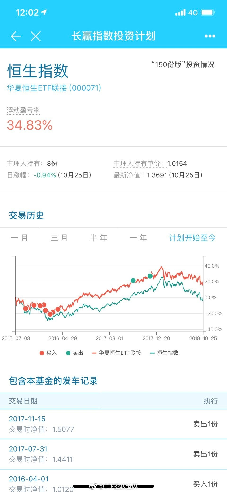

======================================================

ETF拯救世界 (5687069307) @
2018-10-26 13:09:43 Fri  
url: https://weibo.com/5687069307/GFGMPwUBL

再好的股票也禁不住好多人一块吹。

不一定对。 ​​​

转发[12]  评论[132]  赞[354] 

======================================================

ETF拯救世界 (5687069307) @
2018-10-26 15:05:34 Fri  
url: https://weibo.com/5687069307/GFHxRsfrr

解释一下这条。价格很高的时候买入，五年也许没有好的收益率。但只要公司好，价格跌下去，买入就有可能有好的收益率。比如，从高点算，五年后涨5%。年化每年不到1%。但如果跌了50%买入，涨起来收益率就有超过100%，三四年的年化是多少？但是，你得先确定，那到底是不是好公司，还能不能起来。

------------------------------------------------------
转推：
>  @ETF拯救世界 (5687069307)
>  2018-03-22 09:34:01 Thu  
>  url: https:/weibo.com/5687069307/G8wd21cxW/

>  腾讯，60倍PE。未来五年看，真的能有特别好的收益率吗。
>  
>  学习了。 ​​​

转发[26]  评论[70]  赞[271] 

======================================================

ETF拯救世界 (5687069307) @
2018-10-26 15:13:05 Fri  
url: https://weibo.com/5687069307/GFHAUzwop

回复@幸运翡翠wfyan:心算一下，3年100%大概年化26%左右，4年是19%左右。//@幸运翡翠wfyan:有课代表解析三四年的年化收益是多少吗？谢谢

------------------------------------------------------
转推：
>  @ETF拯救世界 (5687069307)
>  2018-03-22 09:34:01 Thu  
>  url: https:/weibo.com/5687069307/G8wd21cxW/

>  腾讯，60倍PE。未来五年看，真的能有特别好的收益率吗。
>  
>  学习了。 ​​​

转发[7]  评论[45]  赞[210] 

======================================================

ETF拯救世界 (5687069307) @
2018-10-26 15:34:59 Fri  
url: https://weibo.com/5687069307/GFHJNlTDv

喷了，全指消费估值创出2005年以来最低…… ​​​

转发[63]  评论[197]  赞[543] 

======================================================

ETF拯救世界 (5687069307) @
2018-10-26 17:09:16 Fri  
url: https://weibo.com/5687069307/GFIm4875G

帮昆山林志颖转发维权……

------------------------------------------------------
转推：
>  @ ()
>  2018-10-26 16:09:19 Fri  
>  url: 

>  抱歉，此微博已被作者删除。查看帮助：http://t.cn/Rfd3rQV

转发[18]  评论[62]  赞[201] 

======================================================

ETF拯救世界 (5687069307) @
2018-10-27 21:20:43 Sat  
url: https://weibo.com/5687069307/GFTqCE7qR

回复@家住在烟台:都学学[doge]//@家住在烟台:舔狗指南[doge][doge][doge] http://t.cn/EZjyA30

------------------------------------------------------
转推：
>  @北京人不知道的北京事儿 (1662214194)
>  2018-10-27 20:48:05 Sat  
>  url: https:/weibo.com/1662214194/GFTdnt77T/

>  网友投稿，北京某重点小学一年级班级家长群。。。你怎么看？[思考] ​​​

转发[91]  评论[182]  赞[176] 

======================================================

ETF拯救世界 (5687069307) @
2018-10-28 19:10:32 Sun  
url: https://weibo.com/5687069307/H04xXn91M

看静态估值是第一个层次。

看动态估值，也就是这个季度下个季度利润增长是第二个层次。

从第一到第二很容易。

难的是到第三个层次。

就是从更高的视角，看未来和现在。

不要再说利润增速下降。你现在看到的市场早就看到了，而且早就走出了提前量。

现在，就是看你能不能站在更高的地方看到第三个 ​​​

转发[105]  评论[263]  赞[480] 

======================================================

ETF拯救世界 (5687069307) @
2018-10-29 06:32:45 Mon  
url: https://weibo.com/5687069307/H090S7oE4

谁能想到吴彦祖也在为头发操心

------------------------------------------------------
转推：
>  @吳彥祖 (2345544584)
>  2018-10-28 21:03:31 Sun  
>  url: https:/weibo.com/2345544584/H05hOE5s5/

>  在我父親的錢包裡發現了這照片 。 這時候我一定是16歲左右 ？ 我希望我能把所有的頭髮都拿回來 。 ​​​

转发[20]  评论[82]  赞[202] 

======================================================

ETF拯救世界 (5687069307) @
2018-10-29 07:27:58 Mon  
url: https://weibo.com/5687069307/H09nhv9xY

如果你2008年四季度因为利润增速下降吓得不敢买入甚至离场，那么你就犯了大错。

再说一次，投资是投未来。看的远一点。一点就够了。 ​​​

转发[75]  评论[162]  赞[510] 

======================================================

ETF拯救世界 (5687069307) @
2018-10-29 09:19:21 Mon  
url: https://weibo.com/5687069307/H0a6uverC

今天食品饮料或者消费有没有可能再下一个台阶给咱们一个好价格。 ​​​

转发[5]  评论[45]  赞[297] 

======================================================

ETF拯救世界 (5687069307) @
2018-10-29 09:21:06 Mon  
url: https://weibo.com/5687069307/H0a7cvLDB

回购不注销都是耍流氓。 ​​​

转发[25]  评论[48]  赞[381] 

======================================================

ETF拯救世界 (5687069307) @
2018-10-29 09:24:29 Mon  
url: https://weibo.com/5687069307/H0a8ziTKO

这样下去我会不会被很多人怀恨在心……//@ETF拯救世界:$五粮液 sz000858$   怎么回事。

------------------------------------------------------
转推：
>  @ETF拯救世界 (5687069307)
>  2018-10-23 13:43:03 Tue  
>  url: https:/weibo.com/5687069307/GFeIRwyeh/

>  总有人问我为什么还不买消费。
>  
>  消费板块整体看确实不贵了。
>  
>  但是占据极大权重比例的白酒，它们的形态，看起来就让我觉得害怕。
>  
>  你可以说我是看图说话的渣渣。但我是真的怕，始终没法说服自己去买这样形态的品种。
>  
>  最关键是主流消费指数的白酒权重太太太太大了。茅台和五粮液就占30%…… ​​​

转发[8]  评论[53]  赞[249] 

======================================================

ETF拯救世界 (5687069307) @
2018-10-29 09:27:56 Mon  
url: https://weibo.com/5687069307/H0a9Z6jcN

谁能想到……

------------------------------------------------------
转推：
>  @ETF拯救世界 (5687069307)
>  2018-09-06 11:26:47 Thu  
>  url: https:/weibo.com/5687069307/Gy4Ke2SUE/

>  你们觉得咱们8800得国证食品到底还有没有希望买到…… ​​​

转发[8]  评论[43]  赞[233] 

======================================================

ETF拯救世界 (5687069307) @
2018-10-29 09:31:11 Mon  
url: https://weibo.com/5687069307/H0abilJAw

引出一个问题：到底技术图形是不是有用。是不是价投就不用看图了。很有趣的问题。

------------------------------------------------------
转推：
>  @ETF拯救世界 (5687069307)
>  2018-10-23 13:43:03 Tue  
>  url: https:/weibo.com/5687069307/GFeIRwyeh/

>  总有人问我为什么还不买消费。
>  
>  消费板块整体看确实不贵了。
>  
>  但是占据极大权重比例的白酒，它们的形态，看起来就让我觉得害怕。
>  
>  你可以说我是看图说话的渣渣。但我是真的怕，始终没法说服自己去买这样形态的品种。
>  
>  最关键是主流消费指数的白酒权重太太太太大了。茅台和五粮液就占30%…… ​​​

转发[18]  评论[73]  赞[284] 

======================================================

ETF拯救世界 (5687069307) @
2018-10-29 09:33:03 Mon  
url: https://weibo.com/5687069307/H0ac3lwQ6

//@ETF拯救世界: 你知道抱团取暖的问题是什么吗。是，谁都别跑。只要有跑的，大家都跑。都跑就没人接。其实我对蓝筹没有成见，但你们不能组团忽悠让别人给你们接盘吧，有点不地道。“价值投资元年”，老乡们，长点心眼吧。人家去年翻番了，吃饱了抹抹嘴要走，谁来买单？

------------------------------------------------------
转推：
>  @ETF拯救世界 (5687069307)
>  2017-11-23 14:32:38 Thu  
>  url: https:/weibo.com/5687069307/FwpLteV4R/

>  这两年来，A股（我是说A股，不是沪深300），基本按照预期在运行。当然，由于有一万多亿那什么在里面，比之前两次多了很多波折。
>  
>  今年这一波几十只一百多只大蓝筹的行情，当然不能说全是GJD的原因。根本原因当然是2016年2月估值够低，当月50、恒生、红利都是历史最低估值区域。
>  
>  但GJD是非常重要的因素 ​​​

转发[46]  评论[77]  赞[310] 

======================================================

ETF拯救世界 (5687069307) @
2018-10-29 09:38:51 Mon  
url: https://weibo.com/5687069307/H0aepAR70

没有任何公司是“完美”的，“不可错过”的，“确认前途无限”的。

只有买的够低才可能赚钱。任何公司暴涨后你去接盘，大概率都是悲剧。

好公司，也要好价格。拒绝别人的高位忽悠，起码能不赔钱。 ​​​

转发[94]  评论[156]  赞[506] 

======================================================

ETF拯救世界 (5687069307) @
2018-10-29 10:12:38 Mon  
url: https://weibo.com/5687069307/H0as7skYn

但是，消费不会死。而且会很好。

医药，消费。依然是我的最爱。

问题只是什么时候买而已…… ​​​

转发[41]  评论[131]  赞[514] 

======================================================

ETF拯救世界 (5687069307) @
2018-10-29 10:22:57 Mon  
url: https://weibo.com/5687069307/H0awjcz8k

看清楚一个人是水平高还是运气好，要很多很多年。

太多人把运气当成水平了。然后就会发生巨额的价值毁灭。 ​​​

转发[31]  评论[128]  赞[510] 

======================================================

ETF拯救世界 (5687069307) @
2018-10-29 11:30:18 Mon  
url: https://weibo.com/5687069307/H0aXE8VVM

朋友们，除了少吃多运动，心情和情绪真的很重要。

别的我没法说，但至少千万别因为金融投资情绪低落甚至抑郁。别搞得压力很大。

A股开开心心就能把钱挣了。如果开心太难，至少要很平静。这个需要你自己的心理调节，更需要你的持仓能让你很平静。

钱这东西，多了更好，暂时少一点也不是太大问题。身 ​​​

转发[98]  评论[297]  赞[858] 

======================================================

ETF拯救世界 (5687069307) @
2018-10-29 13:39:30 Mon  
url: https://weibo.com/5687069307/H0bO5pdDN

食品饮料会不会跌停。

券商刚涨停没几天。 ​​​

转发[9]  评论[68]  赞[286] 

======================================================

ETF拯救世界 (5687069307) @
2018-10-29 13:46:46 Mon  
url: https://weibo.com/5687069307/H0bR21okb

如果所有人对某个品种期望很高，越来越高，高的没谱，导致不停的涨。

那么，如果达不到大家的期望，这事儿就麻烦了。

反过来。

如果大家对某个品种预期特别差。完蛋一样的差，导致不停的跌。

结果，居然没那么差，最后居然还挺好。

嗯。 ​​​

转发[65]  评论[196]  赞[422] 

======================================================

ETF拯救世界 (5687069307) @
2018-10-29 14:38:08 Mon  
url: https://weibo.com/5687069307/H0cbT9azk

帮转。学习好的说说。我记得N年前我也有一次突然听不到了，过一会就好了。去医院查也没查出什么。

------------------------------------------------------
转推：
>  @用户6804940831 (6804940831)
>  2018-10-29 14:22:58 Mon  
>  url: https:/weibo.com/6804940831/H0c5JjpiR/

>  上周三晚上，捏鼻往耳朵鼓气，第二天一早发现，左耳听力下降了，伴有耳鸣耳闷，去医院检查，做个检查发现都正常，医生说是突发性性耳聋(神经性)，挂了4天的点滴，依旧无好转，耳闷有所缓解，但听力下降明显，@ETF拯救世界，请E大帮忙问问有什么好的治疗方法，谢谢🙏 ​​​

转发[7]  评论[103]  赞[140] 

======================================================

ETF拯救世界 (5687069307) @
2018-10-29 15:01:30 Mon  
url: https://weibo.com/5687069307/H0clnc8yg

食品光脚长阴。明天不出意外大概率还是…… ​​​

转发[10]  评论[94]  赞[409] 

======================================================

ETF拯救世界 (5687069307) @
2018-10-29 15:13:36 Mon  
url: https://weibo.com/5687069307/H0cqhwSrF

又想去旅游了。[喵喵] ​​​

转发[3]  评论[118]  赞[375] 

======================================================

ETF拯救世界 (5687069307) @
2018-10-29 15:28:56 Mon  
url: https://weibo.com/5687069307/H0cwvqRBE

截至今日，医药PEG 1.21。全指消费PEG 2。 ​​​

转发[93]  评论[103]  赞[385] 

======================================================

ETF拯救世界 (5687069307) @
2018-10-29 15:43:25 Mon  
url: https://weibo.com/5687069307/H0cCo2zr4

500是1.38。

------------------------------------------------------
转推：
>  @ETF拯救世界 (5687069307)
>  2018-10-29 15:28:56 Mon  
>  url: https:/weibo.com/5687069307/H0cwvqRBE/

>  截至今日，医药PEG 1.21。全指消费PEG 2。 ​​​

转发[54]  评论[167]  赞[398] 

======================================================

ETF拯救世界 (5687069307) @
2018-10-30 07:23:37 Tue  
url: https://weibo.com/5687069307/H0iM10AAb

又跌3%。

有些品种按月拿，有些品种按年拿。动不动就“拿一辈子穿越牛熊”的，几乎没有。不是说品种不好，而是经常会很疯狂，别人疯了就先给别人，正常了再拿回来。

这个品种什么时候买回来？ ​​​

转发[47]  评论[152]  赞[411] 

+++++++++++++++++++++++++++++++++++++++++++++++++++++

图片：

======================================================

ETF拯救世界 (5687069307) @
2018-10-30 09:23:57 Tue  
url: https://weibo.com/5687069307/H0jyQze0T

现在的媒体和某些人简直是一点点点点节操都没有了。

人家平安的公告，是：

“将根据资本市场、公司股价的波动和变化，回购公司公开发行的境内、境外股份，回购总额不超过公司发行总股本的10%。”

不超过10%。划重点。

别有用心的人一定要解读成回购千亿。理由是什么，理由是平安市值万亿。

太坏了 ​​​

转发[27]  评论[74]  赞[333] 

======================================================

ETF拯救世界 (5687069307) @
2018-10-30 09:28:34 Tue  
url: https://weibo.com/5687069307/H0jAJl5eY

我决定，今天在市场上大笔增持指数基金，总金额不超过1000亿元人民币。包括场内ETF以及场外指基。

共克时艰。 ​​​

转发[58]  评论[170]  赞[659] 

======================================================

ETF拯救世界 (5687069307) @
2018-10-30 09:33:58 Tue  
url: https://weibo.com/5687069307/H0jCVf6CY

今天会买4-5份。宽基为主。

现在市场上有钱&敢买的人已经极其稀少了。 ​​​

转发[23]  评论[305]  赞[635] 

======================================================

ETF拯救世界 (5687069307) @
2018-10-30 09:48:28 Tue  
url: https://weibo.com/5687069307/H0jIObB60

万万没想到快腰斩了。如果腰斩的地方买入，回到最高点你就赚1倍。如果最高点算，五年不涨，你的收益率也会很棒。但鹅厂腰斩是不是好价格，我不知道……

------------------------------------------------------
转推：
>  @ETF拯救世界 (5687069307)
>  2018-03-22 09:34:01 Thu  
>  url: https:/weibo.com/5687069307/G8wd21cxW/

>  腾讯，60倍PE。未来五年看，真的能有特别好的收益率吗。
>  
>  学习了。 ​​​

转发[21]  评论[57]  赞[265] 

======================================================

ETF拯救世界 (5687069307) @
2018-10-30 10:31:14 Tue  
url: https://weibo.com/5687069307/H0k0aoHTE

再给半天时间ok？ ​​​

转发[9]  评论[131]  赞[292] 

======================================================

ETF拯救世界 (5687069307) @
2018-10-30 10:36:57 Tue  
url: https://weibo.com/5687069307/H0k2uAaNv

fxxx。今天要买的一个品种从-1%到+1%了。

------------------------------------------------------
转推：
>  @ETF拯救世界 (5687069307)
>  2018-10-30 10:31:14 Tue  
>  url: https:/weibo.com/5687069307/H0k0aoHTE/

>  再给半天时间ok？ ​​​

转发[5]  评论[129]  赞[219] 

======================================================

ETF拯救世界 (5687069307) @
2018-10-30 11:04:35 Tue  
url: https://weibo.com/5687069307/H0kdHxLrk

我的1000亿威力不小。强行开车。

------------------------------------------------------
转推：
>  @ETF拯救世界 (5687069307)
>  2018-10-30 09:28:34 Tue  
>  url: https:/weibo.com/5687069307/H0jAJl5eY/

>  我决定，今天在市场上大笔增持指数基金，总金额不超过1000亿元人民币。包括场内ETF以及场外指基。
>  
>  共克时艰。 ​​​

转发[8]  评论[168]  赞[420] 

======================================================

ETF拯救世界 (5687069307) @
2018-10-30 11:57:28 Tue  
url: https://weibo.com/5687069307/H0kzauWte

滴滴！

第三轮史无前例の六车！ ​​​

转发[44]  评论[696]  赞[856] 

======================================================

ETF拯救世界 (5687069307) @
2018-10-30 14:43:25 Tue  
url: https://weibo.com/5687069307/H0lEwCT5i

喷了，真的假的。 ​​​

转发[2]  评论[99]  赞[258] 

+++++++++++++++++++++++++++++++++++++++++++++++++++++

图片：

======================================================

ETF拯救世界 (5687069307) @
2018-10-30 15:33:46 Tue  
url: https://weibo.com/5687069307/H0lYY4aIK

谁能想到还差两个多点就要盈利了呢…… ​​​

转发[13]  评论[119]  赞[305] 

+++++++++++++++++++++++++++++++++++++++++++++++++++++

图片：
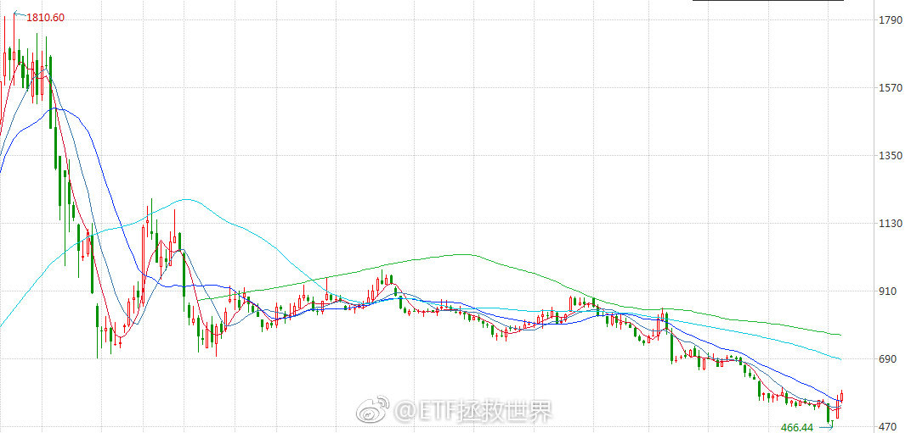

======================================================

ETF拯救世界 (5687069307) @
2018-10-30 16:01:34 Tue  
url: https://weibo.com/5687069307/H0mafpQQm

这么跌，是又有什么利空了吗……//@ETF拯救世界:万万没想到快腰斩了。如果腰斩的地方买入，回到最高点你就赚1倍。如果最高点算，五年不涨，你的收益率也会很棒。但鹅厂腰斩是不是好价格，我不知道……

------------------------------------------------------
转推：
>  @ETF拯救世界 (5687069307)
>  2018-03-22 09:34:01 Thu  
>  url: https:/weibo.com/5687069307/G8wd21cxW/

>  腾讯，60倍PE。未来五年看，真的能有特别好的收益率吗。
>  
>  学习了。 ​​​

转发[2]  评论[48]  赞[213] 

======================================================

ETF拯救世界 (5687069307) @
2018-10-30 17:27:20 Tue  
url: https://weibo.com/5687069307/H0mJ4lAwN

史上第一次，发车微博评论超过公众号留言了……

------------------------------------------------------
转推：
>  @ETF拯救世界 (5687069307)
>  2018-10-30 11:57:28 Tue  
>  url: https:/weibo.com/5687069307/H0kzauWte/

>  滴滴！
>  
>  第三轮史无前例の六车！ ​​​

转发[5]  评论[129]  赞[441] 

======================================================

ETF拯救世界 (5687069307) @
2018-10-30 20:22:15 Tue  
url: https://weibo.com/5687069307/H0nS3CyN8

谢谢，曾经给了我那么美好的时光。 ​​​

转发[14]  评论[192]  赞[714] 

======================================================

ETF拯救世界 (5687069307) @
2018-10-31 09:41:21 Wed  
url: https://weibo.com/5687069307/H0t6pEECr

不管是哪里，以前的博客也好，到现在的微博也好公众号也好球球也好，有料的人和水货难道不是一眼就能看出来吗。

交易系统有点缺陷，或者经验不足，或者一时得失，那都不算是水货。水货是真的水，经常引经据典说什么都热热闹闹，又或者喊打喊杀大开大合，其实水的不得了，一眼就能看出来。

我的问题是 ​​​

转发[22]  评论[262]  赞[386] 

======================================================

ETF拯救世界 (5687069307) @
2018-10-31 09:52:23 Wed  
url: https://weibo.com/5687069307/H0taTpC1C

现在A股仓位接近63%，加上港股超过70%，再加上可转债逼近75%。这样的仓位即使牛市来了你也不会落后。甚至有机会跑赢。为什么这么说到时候就知道。

所以已经买的7788了，不要再担心踏空。踏踏实实的看戏。毕竟还没到极限，不用那么急一分不剩的杀进去。

多舒服啊。 ​​​

转发[60]  评论[174]  赞[454] 

======================================================

ETF拯救世界 (5687069307) @
2018-10-31 09:58:14 Wed  
url: https://weibo.com/5687069307/H0tdgANda

回复@DM_Eric:我真的很震惊——你居然还没有习惯这样的日常操作。//@DM_Eric:真的，很想问你为什么昨天你知道要发车的！！如此牛逼！！[doge]

------------------------------------------------------
转推：
>  @ETF拯救世界 (5687069307)
>  2018-10-31 09:52:23 Wed  
>  url: https:/weibo.com/5687069307/H0taTpC1C/

>  现在A股仓位接近63%，加上港股超过70%，再加上可转债逼近75%。这样的仓位即使牛市来了你也不会落后。甚至有机会跑赢。为什么这么说到时候就知道。
>  
>  所以已经买的7788了，不要再担心踏空。踏踏实实的看戏。毕竟还没到极限，不用那么急一分不剩的杀进去。
>  
>  多舒服啊。 ​​​

转发[5]  评论[101]  赞[344] 

======================================================

ETF拯救世界 (5687069307) @
2018-10-31 10:18:29 Wed  
url: https://weibo.com/5687069307/H0tluipD2

想写点东西吹一波择时，但是想了想决定收盘以后再吹。 ​​​

转发[12]  评论[354]  赞[636] 

======================================================

ETF拯救世界 (5687069307) @
2018-10-31 12:59:57 Wed  
url: https://weibo.com/5687069307/H0up1Bgrx

神秘力量加持完毕，稳了。 ​​​

转发[28]  评论[162]  赞[674] 

+++++++++++++++++++++++++++++++++++++++++++++++++++++

图片：
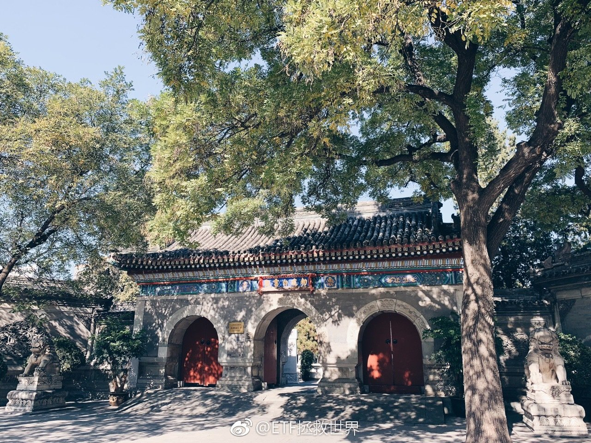

======================================================

ETF拯救世界 (5687069307) @
2018-10-31 13:48:54 Wed  
url: https://weibo.com/5687069307/H0uITws9L

不由你不信

------------------------------------------------------
转推：
>  @ETF拯救世界 (5687069307)
>  2018-10-31 12:59:57 Wed  
>  url: https:/weibo.com/5687069307/H0up1Bgrx/

>  神秘力量加持完毕，稳了。 ​​​

转发[10]  评论[136]  赞[449] 

======================================================

ETF拯救世界 (5687069307) @
2018-10-31 18:03:05 Wed  
url: https://weibo.com/5687069307/H0wo4EMMs

10月结束了，立个flag，11月收红。

如果错了呢。

二话不说，

删帖。 ​​​

转发[55]  评论[423]  赞[946] 

======================================================

