ETF拯救世界 (5687069307) @
2019-03-01 08:48:09 Fri  
url: https://weibo.com/5687069307/HiRsUgee6

检测牛熊的一个标准是：

市场对消息的反应。

熊市中，再好的利好都没用。牛市中，好消息坏消息都会引发上涨。

今天就是一个很好的观察窗口。 ​​​

转发[232]  评论[221]  赞[640] 

======================================================

ETF拯救世界 (5687069307) @
2019-03-01 08:55:15 Fri  
url: https://weibo.com/5687069307/HiRvNipfW

回复@愿赌服输K:“高管扎堆减持”和“商誉爆雷”一样，都是媒体和大V赚你眼球的新闻。你有没有认真研究过到底有多少家公司减持，占全部公司总数的百分之多少，减持总额是总市值的多少？//@愿赌服输K:高管扎堆减持算利空，明晟提高系数算利好，这种情况该咋办

------------------------------------------------------
转推：
>  @ETF拯救世界 (5687069307)
>  2019-03-01 08:48:09 Fri  
>  url: https:/weibo.com/5687069307/HiRsUgee6/

>  检测牛熊的一个标准是：
>  
>  市场对消息的反应。
>  
>  熊市中，再好的利好都没用。牛市中，好消息坏消息都会引发上涨。
>  
>  今天就是一个很好的观察窗口。 ​​​

转发[42]  评论[61]  赞[360] 

======================================================

ETF拯救世界 (5687069307) @
2019-03-01 08:59:25 Fri  
url: https://weibo.com/5687069307/HiRxsEqID

再次提醒各位，看到任何新闻，都要心里面打个问号。如果有兴趣，就去深入研究一下实际的数据。

就像去年所谓的商誉爆雷，大家都说天塌了。结果我研究一下爆雷的公司还不到A股10%，而且是一次性减值，明年业绩大概率都翻番的上涨，到底在怕什么？怕一年的业绩下降？

所谓高管减持也一样。一两百家公司 ​​​

转发[156]  评论[176]  赞[702] 

======================================================

ETF拯救世界 (5687069307) @
2019-03-01 09:11:21 Fri  
url: https://weibo.com/5687069307/HiRCknRCO

回复@兔子遇见了蛇:谁跟你说他肯定知道还会不会到2500，请立即取关。多看的话有害无益。//@兔子遇见了蛇:E大，还能到2500吗

------------------------------------------------------
转推：
>  @ETF拯救世界 (5687069307)
>  2019-03-01 08:59:25 Fri  
>  url: https:/weibo.com/5687069307/HiRxsEqID/

>  再次提醒各位，看到任何新闻，都要心里面打个问号。如果有兴趣，就去深入研究一下实际的数据。
>  
>  就像去年所谓的商誉爆雷，大家都说天塌了。结果我研究一下爆雷的公司还不到A股10%，而且是一次性减值，明年业绩大概率都翻番的上涨，到底在怕什么？怕一年的业绩下降？
>  
>  所谓高管减持也一样。一两百家公司 ​​​

转发[5]  评论[48]  赞[357] 

======================================================

ETF拯救世界 (5687069307) @
2019-03-01 09:53:38 Fri  
url: https://weibo.com/5687069307/HiRTuavQi

石锤了。

是猴市。 ​​​

转发[31]  评论[240]  赞[688] 

======================================================

ETF拯救世界 (5687069307) @
2019-03-01 09:57:41 Fri  
url: https://weibo.com/5687069307/HiRV86KRn

昨天计划不操作，A股很不高兴。 ​​​

转发[0]  评论[66]  赞[483] 

======================================================

ETF拯救世界 (5687069307) @
2019-03-01 10:13:45 Fri  
url: https://weibo.com/5687069307/HiS1EEcnY

观察一个人有没有赚过大钱的标准之一，就是看他在赚钱的时候能不能拿的住。

90%准。 ​​​

转发[106]  评论[207]  赞[872] 

======================================================

ETF拯救世界 (5687069307) @
2019-03-01 10:57:23 Fri  
url: https://weibo.com/5687069307/HiSjmpz8l

券商什么时候可以切换成别的品种。

很考验技术了。 ​​​

转发[16]  评论[315]  赞[715] 

======================================================

ETF拯救世界 (5687069307) @
2019-03-01 13:57:28 Fri  
url: https://weibo.com/5687069307/HiTusDfr1

太猴了！都不敢说话了！说完下一分钟就打脸！匿了！周末愉快！[爱你]

------------------------------------------------------
转推：
>  @ETF拯救世界 (5687069307)
>  2019-03-01 09:53:38 Fri  
>  url: https:/weibo.com/5687069307/HiRTuavQi/

>  石锤了。
>  
>  是猴市。 ​​​

转发[7]  评论[158]  赞[537] 

======================================================

ETF拯救世界 (5687069307) @
2019-03-01 15:07:44 Fri  
url: https://weibo.com/5687069307/HiTWYARQv

150距离新高一步之遥。从第三轮算，相当于接近6000点了 ​​​

转发[9]  评论[234]  赞[620] 

======================================================

ETF拯救世界 (5687069307) @
2019-03-01 16:46:55 Fri  
url: https://weibo.com/5687069307/HiUBfbXyn

从数据看，本次进入钻石坑是十月，二月出坑，持续四个月。

基本与历次熊市大坑持续时间差不多。

历史上还没出现过出坑后马上又跌回去的情况，这次能不能出现？自行判断吧。 ​​​

转发[214]  评论[424]  赞[755] 

======================================================

ETF拯救世界 (5687069307) @
2019-03-01 16:51:04 Fri  
url: https://weibo.com/5687069307/HiUCVaYrH

在股市最大的悲剧莫过于此。最低点。

说实话，我不可能给出任何建议了。

投资的钱，必须三五年不动，切切。 ​​​

转发[43]  评论[301]  赞[521] 

+++++++++++++++++++++++++++++++++++++++++++++++++++++

图片：
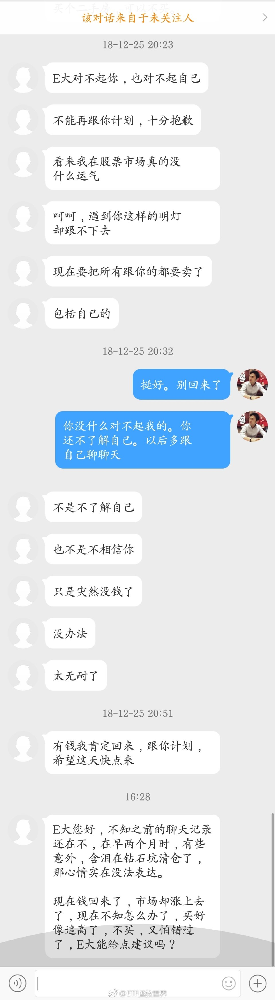

======================================================

ETF拯救世界 (5687069307) @
2019-03-01 18:24:04 Fri  
url: https://weibo.com/5687069307/HiVeG7OEC

回复@A夜如故:低位不敢买，涨起来了觉得赚少了，把存款拿出来当然多了一大笔了……//@A夜如故:到处看人回来一大笔钱，想问是哪里出现捡钱的地方么，坐等答案

------------------------------------------------------
转推：
>  @ETF拯救世界 (5687069307)
>  2019-03-01 16:51:04 Fri  
>  url: https:/weibo.com/5687069307/HiUCVaYrH/

>  在股市最大的悲剧莫过于此。最低点。
>  
>  说实话，我不可能给出任何建议了。
>  
>  投资的钱，必须三五年不动，切切。 ​​​

转发[12]  评论[156]  赞[323] 

======================================================

ETF拯救世界 (5687069307) @
2019-03-01 18:25:04 Fri  
url: https://weibo.com/5687069307/HiVf5fFHX

回复@小艾哦520:不是。12年12月以后，只是一两百只大盘股继续熊市。大多数股票已经开始伟大的牛市征程了。//@小艾哦520:e大2012年11月和2013年6月，不是出坑又进坑吗？

------------------------------------------------------
转推：
>  @ETF拯救世界 (5687069307)
>  2019-03-01 16:46:55 Fri  
>  url: https:/weibo.com/5687069307/HiUBfbXyn/

>  从数据看，本次进入钻石坑是十月，二月出坑，持续四个月。
>  
>  基本与历次熊市大坑持续时间差不多。
>  
>  历史上还没出现过出坑后马上又跌回去的情况，这次能不能出现？自行判断吧。 ​​​

转发[26]  评论[61]  赞[331] 

======================================================

ETF拯救世界 (5687069307) @
2019-03-01 18:52:42 Fri  
url: https://weibo.com/5687069307/HiVqiueS7

回复@小饺子ww:你再把责任推到别人身上，这辈子也不会有任何进步。建议你好好考虑一下自己的话合适不合适//@小饺子ww:四个月……之前不是说持续四个月到一年吗，我就没着急补啊……

------------------------------------------------------
转推：
>  @ETF拯救世界 (5687069307)
>  2019-03-01 16:46:55 Fri  
>  url: https:/weibo.com/5687069307/HiUBfbXyn/

>  从数据看，本次进入钻石坑是十月，二月出坑，持续四个月。
>  
>  基本与历次熊市大坑持续时间差不多。
>  
>  历史上还没出现过出坑后马上又跌回去的情况，这次能不能出现？自行判断吧。 ​​​

转发[16]  评论[225]  赞[459] 

======================================================

ETF拯救世界 (5687069307) @
2019-03-01 20:08:09 Fri  
url: https://weibo.com/5687069307/HiVUV3PrQ

[doge] ​​​

转发[5]  评论[400]  赞[691] 

+++++++++++++++++++++++++++++++++++++++++++++++++++++

图片：

======================================================

ETF拯救世界 (5687069307) @
2019-03-02 15:44:02 Sat  
url: https://weibo.com/5687069307/Hj3Cd8W3m

很多人给我私信，都很着急，要把家里的钱都拿出来投入。

我没法为每个人量身定做资产配置方案。但我提醒两点。

第一，没什么投资经验的人面对资本市场做好压力测试，谨慎点。

第二，不要曲解我的言论。因为你会把别人的话按照自己的希望解读。以后有什么闪失不要来埋怨我。计划已经一个月没买任何东 ​​​

转发[86]  评论[378]  赞[773] 

======================================================

ETF拯救世界 (5687069307) @
2019-03-02 16:13:12 Sat  
url: https://weibo.com/5687069307/Hj3O37jpM

很多很多人都是莫名其妙多出来很多钱要投入。

要我说，根本不是新多出来，就是一个字，贪。

我已经看见一出悲剧将在未来某个时间段上演。

人性太可怕了。 ​​​

转发[171]  评论[597]  赞[983] 

======================================================

ETF拯救世界 (5687069307) @
2019-03-02 20:09:35 Sat  
url: https://weibo.com/5687069307/Hj5lZjaPR

终于又到财报季。已经有87家公布完毕，整个三月有1208家，所有公司4月底前公布完毕。

每天实时跟踪最新数据。

真相即将揭开。 ​​​

转发[23]  评论[164]  赞[684] 

======================================================

ETF拯救世界 (5687069307) @
2019-03-02 20:47:01 Sat  
url: https://weibo.com/5687069307/Hj5Bc1Ilu

我想请且慢把“调高每份资金”功能关闭。如果涨上去会越来越危险。如果你开始设计只有15万，高位你又拿150万来补仓。最终你的成本被那几份高位补入的拉到极高，最终所有的精心设计买卖点位全部泡汤，所有为了降低成本做的努力化为灰烬。

------------------------------------------------------
转推：
>  @ETF拯救世界 (5687069307)
>  2019-03-02 16:13:12 Sat  
>  url: https:/weibo.com/5687069307/Hj3O37jpM/

>  很多很多人都是莫名其妙多出来很多钱要投入。
>  
>  要我说，根本不是新多出来，就是一个字，贪。
>  
>  我已经看见一出悲剧将在未来某个时间段上演。
>  
>  人性太可怕了。 ​​​

转发[75]  评论[510]  赞[940] 

======================================================

ETF拯救世界 (5687069307) @
2019-03-03 11:15:40 Sun  
url: https://weibo.com/5687069307/HjbhMdLho

[doge]

------------------------------------------------------
转推：
>  @ ()
>  2019-03-03 11:15:02 Sun  
>  url: 

>  抱歉，作者已设置仅展示半年内微博，此微博已不可见。 ​​​

转发[14]  评论[106]  赞[268] 

======================================================

ETF拯救世界 (5687069307) @
2019-03-03 14:42:31 Sun  
url: https://weibo.com/5687069307/HjcDK7Vbb

不少美国人来中国领养残疾儿童。说真的，特别钦佩他们。堪称伟大。

------------------------------------------------------
转推：
>  @知世-搜狐 (6384589361)
>  2019-03-03 07:26:32 Sun  
>  url: https:/weibo.com/6384589361/Hj9MMevfu/

>  【被领养无眼睛8岁华裔女孩 在医院检查时用歌声驱散恐惧】8岁女孩Evie Hurst患有罕见的“无眼畸形症”，在4岁时被领养离开中国，现在美国密歇根州生活。Evie曾遭受许多创伤，并患有创伤后应激障碍，特别难以与医院和医生打交道。
>  今年2月，Evie疑似癫痫发作被送至医院接受脑部扫描，期间她又焦虑又害怕 ​​​

转发[65]  评论[155]  赞[703] 

======================================================

ETF拯救世界 (5687069307) @
2019-03-03 17:57:09 Sun  
url: https://weibo.com/5687069307/HjdUJBTTK

回复@尚书王华:孟老板虽然很希望规模更大，但对他来说最重要的是用户能赚钱。这点我非常坚信。这就是所谓的价值观。//@尚书王华:你这是考验孟老板啊[嘻嘻]

------------------------------------------------------
转推：
>  @ETF拯救世界 (5687069307)
>  2019-03-02 16:13:12 Sat  
>  url: https:/weibo.com/5687069307/Hj3O37jpM/

>  很多很多人都是莫名其妙多出来很多钱要投入。
>  
>  要我说，根本不是新多出来，就是一个字，贪。
>  
>  我已经看见一出悲剧将在未来某个时间段上演。
>  
>  人性太可怕了。 ​​​

转发[11]  评论[158]  赞[482] 

======================================================

ETF拯救世界 (5687069307) @
2019-03-04 09:27:21 Mon  
url: https://weibo.com/5687069307/Hjk0j6HfN

有人说因为在我微博评论里看到另一个人评论，然后去那个人微博，然后加了那个人收费群被骗。

第一，我建议大家擦亮眼睛。我不可能把所有评论里的广告都删干净，精力不够。以后我会更加严格，只要有一点广告嫌疑的都拉黑删评。（很多之前拉黑的已经在不停喷我了）但你自己也要多动脑子。很难相信为什么 ​​​

转发[12]  评论[117]  赞[435] 

======================================================

ETF拯救世界 (5687069307) @
2019-03-04 09:29:41 Mon  
url: https://weibo.com/5687069307/Hjk1fAPrd

野百合也有春天 $中证传媒 sz399971$

------------------------------------------------------
转推：
>  @ETF拯救世界 (5687069307)
>  2019-02-22 11:04:33 Fri  
>  url: https:/weibo.com/5687069307/HhOmMEAqp/

>  S的传媒已经回本，150的遥遥无期。[摊手]
>  
>  这指数是这波熊市最符合我“80%定律”的指数，之后会怎么走，大家都围观一下。 ​​​

转发[64]  评论[96]  赞[314] 

======================================================

ETF拯救世界 (5687069307) @
2019-03-04 09:50:04 Mon  
url: https://weibo.com/5687069307/Hjk9wgyz0

一口奶，半条命。泪两行，愁断肠。//@ETF拯救世界:野百合也有春天 $中证传媒 sz399971$

------------------------------------------------------
转推：
>  @ETF拯救世界 (5687069307)
>  2019-02-22 11:04:33 Fri  
>  url: https:/weibo.com/5687069307/HhOmMEAqp/

>  S的传媒已经回本，150的遥遥无期。[摊手]
>  
>  这指数是这波熊市最符合我“80%定律”的指数，之后会怎么走，大家都围观一下。 ​​​

转发[57]  评论[56]  赞[242] 

======================================================

ETF拯救世界 (5687069307) @
2019-03-04 09:54:20 Mon  
url: https://weibo.com/5687069307/HjkbfwcBY

回复@鸨哥o7o8:美女要是真的也行了，骗就骗了。全是抠脚大汉。气愤。[哼] 还有没有人管了！骗钱就算了还骗感情！[怒]//@鸨哥o7o8:别说qq加群，电话打过来，微信美女头像添加，真是够够的

------------------------------------------------------
转推：
>  @ETF拯救世界 (5687069307)
>  2019-03-04 09:27:21 Mon  
>  url: https:/weibo.com/5687069307/Hjk0j6HfN/

>  有人说因为在我微博评论里看到另一个人评论，然后去那个人微博，然后加了那个人收费群被骗。
>  
>  第一，我建议大家擦亮眼睛。我不可能把所有评论里的广告都删干净，精力不够。以后我会更加严格，只要有一点广告嫌疑的都拉黑删评。（很多之前拉黑的已经在不停喷我了）但你自己也要多动脑子。很难相信为什么 ​​​

转发[2]  评论[31]  赞[235] 

======================================================

ETF拯救世界 (5687069307) @
2019-03-04 09:55:53 Mon  
url: https://weibo.com/5687069307/HjkbT9x33

回复@谁喷益达我抽谁:等绝大多数人忍不住把最后一分钱买进去的时候。//@谁喷益达我抽谁:大盘这么涨下去，啥时候是个头啊！//@ETF拯救世界:一口奶，半条命。泪两行，愁断肠。//@ETF拯救世界:野百合也有春天 $中证传媒 sz399971$

------------------------------------------------------
转推：
>  @ETF拯救世界 (5687069307)
>  2019-02-22 11:04:33 Fri  
>  url: https:/weibo.com/5687069307/HhOmMEAqp/

>  S的传媒已经回本，150的遥遥无期。[摊手]
>  
>  这指数是这波熊市最符合我“80%定律”的指数，之后会怎么走，大家都围观一下。 ​​​

转发[30]  评论[73]  赞[273] 

======================================================

ETF拯救世界 (5687069307) @
2019-03-04 10:02:02 Mon  
url: https://weibo.com/5687069307/HjkeojEcF

回复@fantasy_happYness:踏踏实实地。轮动。牛市没有野百合。//@fantasy_happYness:老大，环保也喷了[doge]//@ETF拯救世界:一口奶，半条命。泪两行，愁断肠。//@ETF拯救世界:野百合也有春天 $中证传媒 sz399971$

------------------------------------------------------
转推：
>  @ETF拯救世界 (5687069307)
>  2019-02-22 11:04:33 Fri  
>  url: https:/weibo.com/5687069307/HhOmMEAqp/

>  S的传媒已经回本，150的遥遥无期。[摊手]
>  
>  这指数是这波熊市最符合我“80%定律”的指数，之后会怎么走，大家都围观一下。 ​​​

转发[20]  评论[42]  赞[240] 

======================================================

ETF拯救世界 (5687069307) @
2019-03-04 10:04:11 Mon  
url: https://weibo.com/5687069307/Hjkfg4suS

回复@可爱的wt-8178:我建议你变坏事为好事，以此事为契机，一举夺回家中的财政大权。同时，你已经有了未来决定财政大事时最好的论据。恭喜。

------------------------------------------------------
转推：
>  @ETF拯救世界 (5687069307)
>  2019-03-02 15:44:02 Sat  
>  url: https:/weibo.com/5687069307/Hj3Cd8W3m/

>  很多人给我私信，都很着急，要把家里的钱都拿出来投入。
>  
>  我没法为每个人量身定做资产配置方案。但我提醒两点。
>  
>  第一，没什么投资经验的人面对资本市场做好压力测试，谨慎点。
>  
>  第二，不要曲解我的言论。因为你会把别人的话按照自己的希望解读。以后有什么闪失不要来埋怨我。计划已经一个月没买任何东 ​​​

转发[19]  评论[50]  赞[273] 

======================================================

ETF拯救世界 (5687069307) @
2019-03-04 10:08:58 Mon  
url: https://weibo.com/5687069307/HjkhcjNSM

回复@米卡咖啡:继续暗中观察。随时汇报。over。//@米卡咖啡:看办公室里的人还在观望//@ETF拯救世界:回复@谁喷益达我抽谁:等绝大多数人忍不住把最后一分钱买进去的时候。//@谁喷益达我抽谁:大盘这么涨下去，啥时候是个头啊！//@ETF拯救世界:一口奶，半条命。泪两行，愁断肠。

------------------------------------------------------
转推：
>  @ETF拯救世界 (5687069307)
>  2019-02-22 11:04:33 Fri  
>  url: https:/weibo.com/5687069307/HhOmMEAqp/

>  S的传媒已经回本，150的遥遥无期。[摊手]
>  
>  这指数是这波熊市最符合我“80%定律”的指数，之后会怎么走，大家都围观一下。 ​​​

转发[13]  评论[69]  赞[337] 

======================================================

ETF拯救世界 (5687069307) @
2019-03-04 10:09:34 Mon  
url: https://weibo.com/5687069307/Hjkhs0fYW

回复@沐光2019:均值回归。//@沐光2019:请教E大，牛市里长江电力会怎么走，可否分析一下//@ETF拯救世界:回复@fantasy_happYness:踏踏实实地。轮动。牛市没有野百合。//@fantasy_happYness:老大，环保也喷了[doge]//@ETF拯救世界:一口奶，半条命。泪两行，愁断肠。

------------------------------------------------------
转推：
>  @ETF拯救世界 (5687069307)
>  2019-02-22 11:04:33 Fri  
>  url: https:/weibo.com/5687069307/HhOmMEAqp/

>  S的传媒已经回本，150的遥遥无期。[摊手]
>  
>  这指数是这波熊市最符合我“80%定律”的指数，之后会怎么走，大家都围观一下。 ​​​

转发[9]  评论[34]  赞[258] 

======================================================

ETF拯救世界 (5687069307) @
2019-03-04 10:14:23 Mon  
url: https://weibo.com/5687069307/Hjkjoxekh

再扎一次。

------------------------------------------------------
转推：
>  @ETF拯救世界 (5687069307)
>  2018-05-17 09:39:30 Thu  
>  url: https:/weibo.com/5687069307/Gh2b42qQ1/

>  我来告诉你一个残酷的事实，为什么你拿不住上涨的品种：
>  
>  因为你穷。
>  
>  [并不简单] ​​​

转发[41]  评论[133]  赞[496] 

======================================================

ETF拯救世界 (5687069307) @
2019-03-04 10:17:49 Mon  
url: https://weibo.com/5687069307/HjkkNrSKv

“经济和企业状况这么差，为什么股市会涨？"//@ETF拯救世界:回复@减肥吧狗子达:股市反映的不是现在，而是未来。当你看到知更鸟时，春天已经过去了。//@减肥吧狗子达:目前这个金融形式，你们凭什么认为2个月后会有好转？

------------------------------------------------------
转推：
>  @ETF拯救世界 (5687069307)
>  2018-10-16 16:11:08 Tue  
>  url: https:/weibo.com/5687069307/GEbHvfOVn/

>  说个数据吧。
>  
>  今年，A股股票下跌中位数是38%。
>  
>  上涨的股票只有5%。
>  
>  每五只股票里面就有一只腰斩。
>  
>  真的十年没见过这样的情况了。
>  
>  网上各种爆仓此起彼伏……
>  
>  
>  计划也扛不住了，今年下跌了11%…… ​​​

转发[42]  评论[73]  赞[314] 

======================================================

ETF拯救世界 (5687069307) @
2019-03-04 10:26:56 Mon  
url: https://weibo.com/5687069307/Hjkov1VBq

资本市场两大成功要素：

理性。信心。

没有理性只有信心，就是随波逐流的海草。

没有信心只有理性，就没有资格享受成功的快感。

什么都没有，

你不如把钱扔水里还能听个响。 ​​​

转发[164]  评论[155]  赞[603] 

======================================================

ETF拯救世界 (5687069307) @
2019-03-04 10:43:02 Mon  
url: https://weibo.com/5687069307/Hjkv1xwBG

对于年龄比较小的朋友，我的建议是，一方面理性消费，理性投资。一方面认真提高工作技能，或者开创副业，多挣钱，多积累本金。

有一两个牛市轮回，你就会发现你比身边与你之前同样状态的同龄人已经有钱了很多很多。

小富由己，大富在天。 ​​​

转发[161]  评论[274]  赞[892] 

======================================================

ETF拯救世界 (5687069307) @
2019-03-04 10:45:18 Mon  
url: https://weibo.com/5687069307/HjkvWA48A

回复@耐心是投资第一要素:你已经说了“都说”了，还用我分析吗。看绝大多数人，包括机构散户大v的言论，如果出奇一致，那就……//@耐心是投资第一要素:之前都说科创板利空创业板，可为啥年初至今创业板长的最多？E大能分析下吗？包括创业板未来，谢谢😜

------------------------------------------------------
转推：
>  @ETF拯救世界 (5687069307)
>  2019-03-04 10:26:56 Mon  
>  url: https:/weibo.com/5687069307/Hjkov1VBq/

>  资本市场两大成功要素：
>  
>  理性。信心。
>  
>  没有理性只有信心，就是随波逐流的海草。
>  
>  没有信心只有理性，就没有资格享受成功的快感。
>  
>  什么都没有，
>  
>  你不如把钱扔水里还能听个响。 ​​​

转发[37]  评论[46]  赞[296] 

======================================================

ETF拯救世界 (5687069307) @
2019-03-04 10:54:38 Mon  
url: https://weibo.com/5687069307/HjkzJwdZb

回复@whd9641:我真的不懂，为什么你们一定要解释所有上涨下跌。一定要解读清楚所有新闻。不这样真的赚不了钱吗？//@whd9641:科创板被解析为利好 指数又上涨 这是在牛市了吗?

------------------------------------------------------
转推：
>  @ETF拯救世界 (5687069307)
>  2019-03-04 10:26:56 Mon  
>  url: https:/weibo.com/5687069307/Hjkov1VBq/

>  资本市场两大成功要素：
>  
>  理性。信心。
>  
>  没有理性只有信心，就是随波逐流的海草。
>  
>  没有信心只有理性，就没有资格享受成功的快感。
>  
>  什么都没有，
>  
>  你不如把钱扔水里还能听个响。 ​​​

转发[26]  评论[101]  赞[367] 

======================================================

ETF拯救世界 (5687069307) @
2019-03-04 11:01:11 Mon  
url: https://weibo.com/5687069307/HjkCoqStU

要解读，这样解读才有价值，而不是人云亦云。发布了头条文章：《关于科创板，去年11.8的沙盘推演。》  http://t.cn/EIJ3EN1 ​​​

转发[282]  评论[201]  赞[1203] 

======================================================

ETF拯救世界 (5687069307) @
2019-03-04 11:12:21 Mon  
url: https://weibo.com/5687069307/HjkGVqjvN

不看了。每天多好几辆（）（）（），都不知道开哪辆出去了。[doge]

好好享受人生吧。每天开心点。 ​​​

转发[20]  评论[336]  赞[795] 

======================================================

ETF拯救世界 (5687069307) @
2019-03-04 11:42:27 Mon  
url: https://weibo.com/5687069307/HjkT95ELA

今天第三轮150新高了。

2010年第二轮计划的Q&A里面我就说，“现在上证3000点，哪怕10年后都是三千点，我相信我们的计划也能挣大钱”.

一语成谶。9年后真的还是3000点。但我们的第二轮计划赚了大钱牛市顶峰清仓后，第三轮计划现在也已经布局完毕，等待资产再次飞跃。

所以你赚钱不赚钱，和十年后二十 ​​​

转发[146]  评论[317]  赞[973] 

======================================================

ETF拯救世界 (5687069307) @
2019-03-04 11:46:51 Mon  
url: https://weibo.com/5687069307/HjkUWangn

回复@ETO拯救世界:震惊。牛市惊爆数万亿私房钱，我国GDP低估0.3个百分点。//@ETO拯救世界:回复@随记心路:我要笑死了，我老婆也自觉交代了三万块私房钱。

------------------------------------------------------
转推：
>  @ETF拯救世界 (5687069307)
>  2019-03-02 15:44:02 Sat  
>  url: https:/weibo.com/5687069307/Hj3Cd8W3m/

>  很多人给我私信，都很着急，要把家里的钱都拿出来投入。
>  
>  我没法为每个人量身定做资产配置方案。但我提醒两点。
>  
>  第一，没什么投资经验的人面对资本市场做好压力测试，谨慎点。
>  
>  第二，不要曲解我的言论。因为你会把别人的话按照自己的希望解读。以后有什么闪失不要来埋怨我。计划已经一个月没买任何东 ​​​

转发[13]  评论[122]  赞[521] 

======================================================

ETF拯救世界 (5687069307) @
2019-03-04 13:12:28 Mon  
url: https://weibo.com/5687069307/HjltFEBmy

大家说这是把仓位不重的锅甩给我了吗。

计划已经80%以上了啊，钻石底的文章也写了啊，自己不看怪我吗。 ​​​

转发[25]  评论[518]  赞[677] 

+++++++++++++++++++++++++++++++++++++++++++++++++++++

图片：
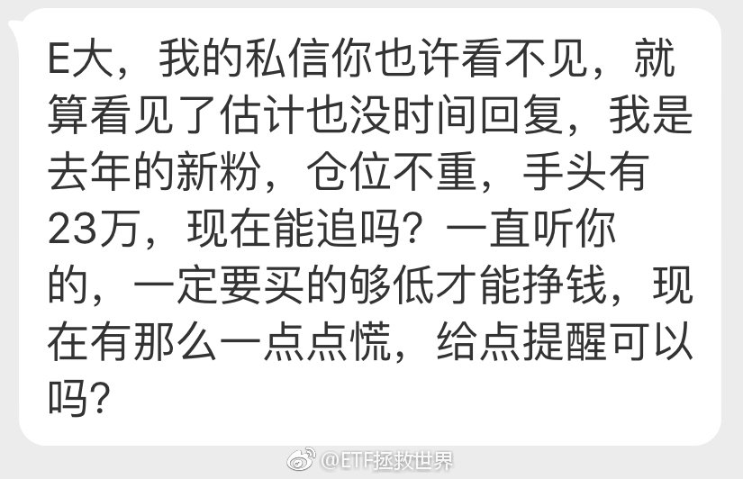

======================================================

ETF拯救世界 (5687069307) @
2019-03-04 13:27:21 Mon  
url: https://weibo.com/5687069307/HjlzJ0msq

太难了。

我的体会。

不知道你意下如何。 ​​​

转发[23]  评论[623]  赞[777] 

======================================================

ETF拯救世界 (5687069307) @
2019-03-04 15:25:56 Mon  
url: https://weibo.com/5687069307/HjmlRtx0m

温顺腼腆董明珠

------------------------------------------------------
转推：
>  @财联社APP (2868676035)
>  2019-03-04 15:16:45 Mon  
>  url: https:/weibo.com/2868676035/Hjmi8kGjD/

>  【怼美的、怼小米后 董明珠：我很温顺 不知道怎么得罪那么多人】格力电器董事长董明珠在最新一期凤凰卫视《领航者》节目中表示，自己的性格一直很温顺腼腆，所谓强悍只因管理企业要有规则，不管是谁都不允许破坏企业利益。“我也思考过为什么会得罪那么多人。” http://t.cn/EIiRHiZ ​​​

转发[28]  评论[155]  赞[356] 

======================================================

ETF拯救世界 (5687069307) @
2019-03-05 09:13:20 Tue  
url: https://weibo.com/5687069307/Hjtl7sbUt

沪伦通节奏放慢，与英国脱欧进程不明有很大关系。富时100指数基金迟迟不上也跟这个有关。希望多一点投资渠道。

------------------------------------------------------
转推：
>  @蓝鲸财经记者工作平台 (1885454921)
>  2019-03-05 09:05:00 Tue  
>  url: https:/weibo.com/1885454921/HjthJkQ5M/

>  易会满：股市上涨是市场行为，不好评论。沪伦通正在论证研究中。（证券时报） ​​​

转发[18]  评论[54]  赞[378] 

======================================================

ETF拯救世界 (5687069307) @
2019-03-05 09:19:34 Tue  
url: https://weibo.com/5687069307/HjtnE2dSD

打脸了。下午跳水，还差0.5没有新高…

可以开始计划送东西的事了。 ​​​

转发[15]  评论[341]  赞[575] 

+++++++++++++++++++++++++++++++++++++++++++++++++++++

图片：

======================================================

ETF拯救世界 (5687069307) @
2019-03-05 10:44:28 Tue  
url: https://weibo.com/5687069307/HjtW75KFN

今天中小盘这么嗨应该稳了吧[doge]

------------------------------------------------------
转推：
>  @ETF拯救世界 (5687069307)
>  2019-03-05 09:19:34 Tue  
>  url: https:/weibo.com/5687069307/HjtnE2dSD/

>  打脸了。下午跳水，还差0.5没有新高…
>  
>  可以开始计划送东西的事了。 ​​​

转发[4]  评论[132]  赞[409] 

======================================================

ETF拯救世界 (5687069307) @
2019-03-05 11:33:03 Tue  
url: https://weibo.com/5687069307/HjufOz1Gr

挣钱是为了更好的活着。

活着可不只是为了挣钱。

所以。

下午出去浪。 ​​​

转发[104]  评论[229]  赞[947] 

======================================================

ETF拯救世界 (5687069307) @
2019-03-05 12:47:28 Tue  
url: https://weibo.com/5687069307/HjuK2jDql

回复@木木咖啡:还用说吗，利好中证500 [doge]//@木木咖啡:E大，减税对股市有什么深远的影响吗？想听听你的一些见解

------------------------------------------------------
转推：
>  @ETF拯救世界 (5687069307)
>  2019-03-05 11:33:03 Tue  
>  url: https:/weibo.com/5687069307/HjufOz1Gr/

>  挣钱是为了更好的活着。
>  
>  活着可不只是为了挣钱。
>  
>  所以。
>  
>  下午出去浪。 ​​​

转发[76]  评论[110]  赞[455] 

======================================================

ETF拯救世界 (5687069307) @
2019-03-05 14:21:45 Tue  
url: https://weibo.com/5687069307/HjvmivGiT

回复@你活的好像一条狗啊:谁说的你找谁去告诉我干嘛。我一点都不关心别人怎么判断谢谢。我只告诉你一句话，天天猜顶的人和拿不住的一样，大概率没赚过大钱。//@你活的好像一条狗啊:E大，有人说大盘要见顶了[可怜]//@ETF拯救世界:回复@木木咖啡:还用说吗，利好中证500 [doge]

------------------------------------------------------
转推：
>  @ETF拯救世界 (5687069307)
>  2019-03-05 11:33:03 Tue  
>  url: https:/weibo.com/5687069307/HjufOz1Gr/

>  挣钱是为了更好的活着。
>  
>  活着可不只是为了挣钱。
>  
>  所以。
>  
>  下午出去浪。 ​​​

转发[50]  评论[57]  赞[342] 

======================================================

ETF拯救世界 (5687069307) @
2019-03-05 14:24:34 Tue  
url: https://weibo.com/5687069307/Hjvns5uV3

溜个弯儿还得继续奶，真烦[doge]

$中证500 sz399905$  ​​​

转发[4]  评论[135]  赞[443] 

======================================================

ETF拯救世界 (5687069307) @
2019-03-05 14:53:31 Tue  
url: https://weibo.com/5687069307/Hjvzcarac

大家知道哪儿有卖血的地方吗。

买游戏机还差2000块。在线等，挺急的。

[微笑]

世事无常。 ​​​

转发[8]  评论[254]  赞[538] 

======================================================

ETF拯救世界 (5687069307) @
2019-03-05 15:29:30 Tue  
url: https://weibo.com/5687069307/HjvNNxo3j

回复@牛牛s:我真的不懂你们投资为什么要跟别人聊。你要跟水平高的人聊就算了，跟一帮没在股市赚过钱的人聊什么呢。瞎聊也行，还正经的聊。还反驳？你来赚钱的还是争高低的？我真的不懂！！//@牛牛s:同事盈利20~30减仓，或者清仓了，落袋为安，别人说我傻，如何反驳[允悲]

------------------------------------------------------
转推：
>  @ETF拯救世界 (5687069307)
>  2019-03-05 11:33:03 Tue  
>  url: https:/weibo.com/5687069307/HjufOz1Gr/

>  挣钱是为了更好的活着。
>  
>  活着可不只是为了挣钱。
>  
>  所以。
>  
>  下午出去浪。 ​​​

转发[34]  评论[159]  赞[498] 

======================================================

ETF拯救世界 (5687069307) @
2019-03-05 15:45:07 Tue  
url: https://weibo.com/5687069307/HjvU8uTJ4

说真的，在股市有没有赚过大钱，不用多，你看他的言论一周或者半个月就明白了。

我很想系统总结一下真正赚过大钱和没赚过大钱只是因为能写字变成炒股界知名人士的特征。

但想了想，还是不写了。

太得罪人了。

但是大的点我可以说三个：

第一，历史顶部区域知道撤退。你别管走的早了点还是走的稍微 ​​​

转发[441]  评论[448]  赞[1119] 

======================================================

ETF拯救世界 (5687069307) @
2019-03-05 16:12:25 Tue  
url: https://weibo.com/5687069307/Hjw5dzwsc

回复@ffxua:水平非常高。因为一平旗帜鲜明的支持500，梁宏在我被人陷害的时候出来替我说话。[doge] 谁在关键时刻做了什么，我都记得。[微笑]//@ffxua:e大觉得一平和梁宏如何？

------------------------------------------------------
转推：
>  @ETF拯救世界 (5687069307)
>  2019-03-05 15:45:07 Tue  
>  url: https:/weibo.com/5687069307/HjvU8uTJ4/

>  说真的，在股市有没有赚过大钱，不用多，你看他的言论一周或者半个月就明白了。
>  
>  我很想系统总结一下真正赚过大钱和没赚过大钱只是因为能写字变成炒股界知名人士的特征。
>  
>  但想了想，还是不写了。
>  
>  太得罪人了。
>  
>  但是大的点我可以说三个：
>  
>  第一，历史顶部区域知道撤退。你别管走的早了点还是走的稍微 ​​​

转发[26]  评论[85]  赞[467] 

======================================================

ETF拯救世界 (5687069307) @
2019-03-05 16:19:36 Tue  
url: https://weibo.com/5687069307/Hjw88nvIT

一个人的本质，要到关键时刻才能显露出来。

你有了麻烦，有人幸灾乐祸，有人旁敲侧击，有人冷眼看戏。然而，还有人出手相助，有人仗义执言，有人暗中帮忙。

作为当事人，你要做的就是记住这些人。远离小人，然后有机会就报答帮过你的人。

尤其是远离小人，特别重要。因为离小人近一分，你未来倒霉的 ​​​

转发[116]  评论[190]  赞[903] 

======================================================

ETF拯救世界 (5687069307) @
2019-03-05 18:00:24 Tue  
url: https://weibo.com/5687069307/HjwN3aKWd

今日A股已经回到过去十个月最贵的时候。

谨慎乐观。情绪不要随着市场变化而有所波动。

理智。冷静。执行策略。

涨跌都舒服。切切。 ​​​

转发[77]  评论[186]  赞[666] 

======================================================

ETF拯救世界 (5687069307) @
2019-03-05 18:29:44 Tue  
url: https://weibo.com/5687069307/HjwYXlYrA

回复@风声边界617:噪音是关乎你信不信。观察情绪是让你看戏。你看科幻电影会相信里面的怪兽是真的吗？我没法再揉的更碎说的更明白了。//@风声边界617:一下是噪音，一下又要我们观察情绪，益达我要分裂了

------------------------------------------------------
转推：
>  @ETF拯救世界 (5687069307)
>  2019-03-05 15:45:07 Tue  
>  url: https:/weibo.com/5687069307/HjvU8uTJ4/

>  说真的，在股市有没有赚过大钱，不用多，你看他的言论一周或者半个月就明白了。
>  
>  我很想系统总结一下真正赚过大钱和没赚过大钱只是因为能写字变成炒股界知名人士的特征。
>  
>  但想了想，还是不写了。
>  
>  太得罪人了。
>  
>  但是大的点我可以说三个：
>  
>  第一，历史顶部区域知道撤退。你别管走的早了点还是走的稍微 ​​​

转发[16]  评论[38]  赞[298] 

======================================================

ETF拯救世界 (5687069307) @
2019-03-05 18:35:16 Tue  
url: https://weibo.com/5687069307/Hjx1ctB5r

另外，我还发现一个问题：

很多东西我自认为已经表达的非常明确了，但依然会有人用自己的理解去解释。

其实很多时候，大家都是用自己的“愿望”去解释别人的话。

解决方法，我想只能尽量少说话。或者，请你看我在计划里的操作。加仓就是上涨概率大，大力加仓就是上涨概率非常大。不买不卖就是正常。 ​​​

转发[98]  评论[229]  赞[608] 

======================================================

ETF拯救世界 (5687069307) @
2019-03-05 18:38:44 Tue  
url: https://weibo.com/5687069307/Hjx2CgRVK

回复@罗塞塔石:为什么用十个月？因为现在正是过去十个月，不是十一月，也不是十二个月最贵的时候。现在的人到底怎么回事？？？//@罗塞塔石:中正500估值历史来看还是很便宜。为什么用过去10个月的区间数据[并不简单][并不简单]

------------------------------------------------------
转推：
>  @ETF拯救世界 (5687069307)
>  2019-03-05 18:00:24 Tue  
>  url: https:/weibo.com/5687069307/HjwN3aKWd/

>  今日A股已经回到过去十个月最贵的时候。
>  
>  谨慎乐观。情绪不要随着市场变化而有所波动。
>  
>  理智。冷静。执行策略。
>  
>  涨跌都舒服。切切。 ​​​

转发[12]  评论[146]  赞[317] 

======================================================

ETF拯救世界 (5687069307) @
2019-03-05 18:52:19 Tue  
url: https://weibo.com/5687069307/Hjx87wTqi

回复@道法自然的芒果:11月第一次计划买入6份，第二次买入2份。12月第一次买入五分，1月第一次买入三份。短短两个月买入16份。你还想怎么样？平常都是每次一两份.//@道法自然的芒果:大力加仓的时候请用红色字体加粗高亮显示[可爱]，没记得之前有大力加仓的时候。

------------------------------------------------------
转推：
>  @ETF拯救世界 (5687069307)
>  2019-03-05 18:35:16 Tue  
>  url: https:/weibo.com/5687069307/Hjx1ctB5r/

>  另外，我还发现一个问题：
>  
>  很多东西我自认为已经表达的非常明确了，但依然会有人用自己的理解去解释。
>  
>  其实很多时候，大家都是用自己的“愿望”去解释别人的话。
>  
>  解决方法，我想只能尽量少说话。或者，请你看我在计划里的操作。加仓就是上涨概率大，大力加仓就是上涨概率非常大。不买不卖就是正常。 ​​​

转发[22]  评论[164]  赞[365] 

======================================================

ETF拯救世界 (5687069307) @
2019-03-05 19:09:00 Tue  
url: https://weibo.com/5687069307/HjxeU5Qi3

本月开始，创业板/中小板/中证1000的未来长期收益率已经比不上十年期国债。

但是请你理解，资本市场贵不代表马上会跌，便宜也不代表就会涨。

我只是陈述事实。你能不能只从陈述事实这个角度看我的发言？ ​​​

转发[99]  评论[210]  赞[719] 

======================================================

ETF拯救世界 (5687069307) @
2019-03-05 19:14:25 Tue  
url: https://weibo.com/5687069307/Hjxh5FBIM

今日收盘，深证100指数估值已经高于历史平均。 ​​​

转发[46]  评论[132]  赞[534] 

======================================================

ETF拯救世界 (5687069307) @
2019-03-05 20:43:03 Tue  
url: https://weibo.com/5687069307/HjxR4Fgtf

以前公众号基本是两个月增加一万关注者。这个月喷我的人太多了，以至于大量不明真相的群众涌入，不到20天就多了一万关注……

讲真，我真不希望用这个方式被关注啊。衰…… ​​​

转发[6]  评论[252]  赞[584] 

======================================================

ETF拯救世界 (5687069307) @
2019-03-05 22:47:14 Tue  
url: https://weibo.com/5687069307/HjyFtvmpe

每日打卡（7）

这几天没顾上打卡，今天正式恢复。

计划如期新高。距离20%还差一个点，看看谁的运气好。 ​​​

转发[6]  评论[198]  赞[604] 

+++++++++++++++++++++++++++++++++++++++++++++++++++++

图片：

======================================================

ETF拯救世界 (5687069307) @
2019-03-06 09:06:51 Wed  
url: https://weibo.com/5687069307/HjCIYCnrO

我有一事不明。

我最爱做的家务，是把脏了吧唧的锅碗瓢盆放到洗碗机里。放进去的这个过程就很享受。

等洗好了，打开洗碗机的门，一股特有的清香掺杂着湿润的热气扑面而来。拿出洗的晶莹剔透的餐具，心中更会感受到极大的快感。

我想知道，为什么人类对干净的东西特别喜欢？这里面有什么原理吗。 ​​​

转发[29]  评论[485]  赞[535] 

======================================================

ETF拯救世界 (5687069307) @
2019-03-06 09:14:55 Wed  
url: https://weibo.com/5687069307/HjCMgdaXw

我到底关注了一个摄影票友、一个业余木匠，还是一个房地产开发商？

------------------------------------------------------
转推：
>  @ ()
>  2019-03-06 09:00:09 Wed  
>  url: 

>  抱歉，作者已设置仅展示半年内微博，此微博已不可见。 ​​​

转发[10]  评论[98]  赞[230] 

======================================================

ETF拯救世界 (5687069307) @
2019-03-06 09:39:31 Wed  
url: https://weibo.com/5687069307/HjCWeCf0M

听我一句劝，暂时别追了。 ​​​

转发[16]  评论[286]  赞[834] 

======================================================

ETF拯救世界 (5687069307) @
2019-03-06 09:50:30 Wed  
url: https://weibo.com/5687069307/HjD0Hfval

以前都是你犹犹豫豫患得患失不知道到底该不该给别人抬轿子。一会儿抬起来一会儿放下钱没挣到累个半死。

现在一亿多人给你抬轿子，你的感受是______。 ​​​

转发[77]  评论[266]  赞[532] 

======================================================

ETF拯救世界 (5687069307) @
2019-03-06 09:54:25 Wed  
url: https://weibo.com/5687069307/HjD2icItM

再给个小贴士：

牛市行情结束的标志，就是在整个牛市中表现一般的大盘蓝筹股开始暴涨。这是因为资金实在没得炒了，只好去炒大蓝筹。那就意味着要歇菜了。

所以你观察一下，如果之前一直没涨的大蓝筹开始涨，那就小心点，盯紧点。 ​​​

转发[547]  评论[469]  赞[1033] 

======================================================

ETF拯救世界 (5687069307) @
2019-03-06 10:07:18 Wed  
url: https://weibo.com/5687069307/HjD7wlBuF

回复@做一支有思想的芦苇:赢了会所嫩模，输了你就是嫩模。//@做一支有思想的芦苇:会所嫩模受不了了

------------------------------------------------------
转推：
>  @ETF拯救世界 (5687069307)
>  2019-03-06 09:50:30 Wed  
>  url: https:/weibo.com/5687069307/HjD0Hfval/

>  以前都是你犹犹豫豫患得患失不知道到底该不该给别人抬轿子。一会儿抬起来一会儿放下钱没挣到累个半死。
>  
>  现在一亿多人给你抬轿子，你的感受是______。 ​​​

转发[3]  评论[100]  赞[384] 

======================================================

ETF拯救世界 (5687069307) @
2019-03-06 11:00:38 Wed  
url: https://weibo.com/5687069307/HjDt9zr3C

回复@梓溪20180316:拿不住股票是因为你不知道值多少。即使知道值多少也不知道它有没有资金照顾。即使知道有资金照顾也不知道公司会不会突然出问题。拿不住很正常。你没有多大责任。

------------------------------------------------------
转推：
>  @ETF拯救世界 (5687069307)
>  2019-03-06 09:50:30 Wed  
>  url: https:/weibo.com/5687069307/HjD0Hfval/

>  以前都是你犹犹豫豫患得患失不知道到底该不该给别人抬轿子。一会儿抬起来一会儿放下钱没挣到累个半死。
>  
>  现在一亿多人给你抬轿子，你的感受是______。 ​​​

转发[49]  评论[130]  赞[465] 

======================================================

ETF拯救世界 (5687069307) @
2019-03-06 11:41:19 Wed  
url: https://weibo.com/5687069307/HjDJG5355

今天写篇东西。 ​​​

转发[4]  评论[393]  赞[1180] 

======================================================

ETF拯救世界 (5687069307) @
2019-03-06 13:20:52 Wed  
url: https://weibo.com/5687069307/HjEo5icUu

规则已经想好了。送的人一定是真爱，辣鸡喷子一点点希望都没有。

同时，还有运气成分。

就等20%了。 ​​​

转发[24]  评论[1403]  赞[1626] 

+++++++++++++++++++++++++++++++++++++++++++++++++++++

图片：

======================================================

ETF拯救世界 (5687069307) @
2019-03-06 14:12:16 Wed  
url: https://weibo.com/5687069307/HjEIWDVdR

我持有的一只打新门票股从最低位涨上来130%了。

整个下跌过程中我坚持不懈的369补仓。

终于回本了。[微笑]

从第一次买到最低点跌了74%……而我第一次买的时候已经从最高点跌了45%了……

股票这玩意真神奇啊。

（我本人所有打新门票仓位加起来大概十几个点。目前持有40多只。） ​​​

转发[123]  评论[275]  赞[604] 

======================================================

ETF拯救世界 (5687069307) @
2019-03-06 14:32:17 Wed  
url: https://weibo.com/5687069307/HjER4tBft

回复@家里有肥鹅:我从没说过我不买个股。是最近6、7年不再公开谈论个股。谈论股票各种风险太大，没有意义。//@家里有肥鹅:e大，你不是不买个股的么？或者你不是不推荐买个股的么？我们不是玩指数的么？[思考]

------------------------------------------------------
转推：
>  @ETF拯救世界 (5687069307)
>  2019-03-06 14:12:16 Wed  
>  url: https:/weibo.com/5687069307/HjEIWDVdR/

>  我持有的一只打新门票股从最低位涨上来130%了。
>  
>  整个下跌过程中我坚持不懈的369补仓。
>  
>  终于回本了。[微笑]
>  
>  从第一次买到最低点跌了74%……而我第一次买的时候已经从最高点跌了45%了……
>  
>  股票这玩意真神奇啊。
>  
>  （我本人所有打新门票仓位加起来大概十几个点。目前持有40多只。） ​​​

转发[6]  评论[38]  赞[307] 

======================================================

ETF拯救世界 (5687069307) @
2019-03-06 14:40:56 Wed  
url: https://weibo.com/5687069307/HjEUAfzy2

公开谈论股票的各种风险非常非常大。不仅是波动风险，公司经营风险，甚至包括道德风险。

所以我绝对不会公开谈论任何股票。

2018年初，看打新门票组合，好像很不错。2017年涨了50%。但你能想到，组合里面有些股票大跌？你能想到，2018年组合收益率也大幅下降？

谈论十只股票，有8只表现好已经很NB。 ​​​

转发[46]  评论[163]  赞[460] 

+++++++++++++++++++++++++++++++++++++++++++++++++++++

图片：
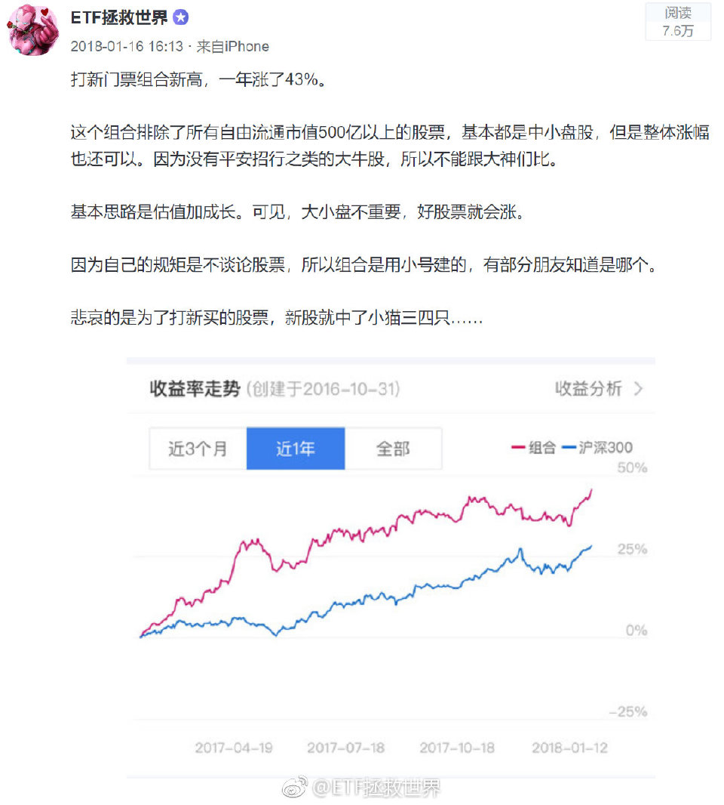

======================================================

ETF拯救世界 (5687069307) @
2019-03-06 14:48:54 Wed  
url: https://weibo.com/5687069307/HjEXPaLFS

500最近逆袭300。风水轮流转，千万别用最近的表现套未来。千万别300好的时候喷500,500好的时候喷300。雪中送炭才有好报。

------------------------------------------------------
转推：
>  @ETF拯救世界 (5687069307)
>  2019-02-01 09:53:19 Fri  
>  url: https:/weibo.com/5687069307/HeBVrxIfX/

>  今天500的涨幅是300的286%，50甚至跌了。
>  
>  但这并不代表什么。
>  
>  500也许还会继续跌。
>  
>  但在这个位置开始，未来5-10年500如果不出现至少一次年化10%甚至15%以上的时刻，我会比较惊讶。 ​​​

转发[48]  评论[75]  赞[486] 

======================================================

ETF拯救世界 (5687069307) @
2019-03-06 14:55:18 Wed  
url: https://weibo.com/5687069307/HjF0pBl3V

回复@航-YangZ:我不卖它也不敢跌啊 [doge]//@航-YangZ:券商又疯了//@ETF拯救世界:500最近逆袭300。风水轮流转，千万别用最近的表现套未来。千万别300好的时候喷500,500好的时候喷300。雪中送炭才有好报。

------------------------------------------------------
转推：
>  @ETF拯救世界 (5687069307)
>  2019-02-01 09:53:19 Fri  
>  url: https:/weibo.com/5687069307/HeBVrxIfX/

>  今天500的涨幅是300的286%，50甚至跌了。
>  
>  但这并不代表什么。
>  
>  500也许还会继续跌。
>  
>  但在这个位置开始，未来5-10年500如果不出现至少一次年化10%甚至15%以上的时刻，我会比较惊讶。 ​​​

转发[8]  评论[87]  赞[448] 

======================================================

ETF拯救世界 (5687069307) @
2019-03-06 15:03:00 Wed  
url: https://weibo.com/5687069307/HjF3xs6u9

当你的利润越来越多，现价逐渐远离你的成本线的时候，你是不是越来越踏实了？

如果每次刚刚回本就卖掉，然后继续买入被套，刚回本又卖。总是让价格在成本线周围，那你永远是心惊胆战，患得患失。

如果你盈利50%，那么回撤到40%怎么了？你心里不会有太大不舒服。然而如果是盈利5%到亏损5%，就会难过的 ​​​

转发[190]  评论[390]  赞[748] 

======================================================

ETF拯救世界 (5687069307) @
2019-03-06 15:17:46 Wed  
url: https://weibo.com/5687069307/HjF9xeknU

回复@时光匆匆飘逝:跟你说了远离噪音你不信。煎熬都是自找的。//@时光匆匆飘逝:真的是靠着E大的一路按摩才坚持到了现在，在2900点的时候关注的很多大V都开始看空，包括一位在1月5号之后精准抄底的老师也看空，当时真的内心非常煎熬

------------------------------------------------------
转推：
>  @ETF拯救世界 (5687069307)
>  2019-03-06 15:03:00 Wed  
>  url: https:/weibo.com/5687069307/HjF3xs6u9/

>  当你的利润越来越多，现价逐渐远离你的成本线的时候，你是不是越来越踏实了？
>  
>  如果每次刚刚回本就卖掉，然后继续买入被套，刚回本又卖。总是让价格在成本线周围，那你永远是心惊胆战，患得患失。
>  
>  如果你盈利50%，那么回撤到40%怎么了？你心里不会有太大不舒服。然而如果是盈利5%到亏损5%，就会难过的 ​​​

转发[12]  评论[72]  赞[333] 

======================================================

ETF拯救世界 (5687069307) @
2019-03-06 15:20:50 Wed  
url: https://weibo.com/5687069307/HjFaMhJkL

回复@昵称称称昵:今晚回答你。//@昵称称称昵:E大，首先声明我绝不是自己存款里有钱。早几天我把账户盈利拿给爸妈看，我妈给了我三十万要我操作，我该怎么办[允悲]

------------------------------------------------------
转推：
>  @ETF拯救世界 (5687069307)
>  2019-03-06 15:03:00 Wed  
>  url: https:/weibo.com/5687069307/HjF3xs6u9/

>  当你的利润越来越多，现价逐渐远离你的成本线的时候，你是不是越来越踏实了？
>  
>  如果每次刚刚回本就卖掉，然后继续买入被套，刚回本又卖。总是让价格在成本线周围，那你永远是心惊胆战，患得患失。
>  
>  如果你盈利50%，那么回撤到40%怎么了？你心里不会有太大不舒服。然而如果是盈利5%到亏损5%，就会难过的 ​​​

转发[13]  评论[347]  赞[505] 

======================================================

ETF拯救世界 (5687069307) @
2019-03-06 23:04:52 Wed  
url: https://weibo.com/5687069307/HjId8rWxM

每日打卡（8）

搞定。还差0.4%。别涨了，休息休息吧。[挖鼻] ​​​

转发[6]  评论[105]  赞[369] 

+++++++++++++++++++++++++++++++++++++++++++++++++++++

图片：

======================================================

ETF拯救世界 (5687069307) @
2019-03-06 23:44:12 Wed  
url: https://weibo.com/5687069307/HjIt650ab

九阳真经为什么在猴子肚子里？

喷了。 

还让张无忌碰上了。这概率低于上证涨到十万点吧。 ​​​

转发[4]  评论[134]  赞[466] 

======================================================

ETF拯救世界 (5687069307) @
2019-03-07 07:01:40 Thu  
url: https://weibo.com/5687069307/HjLkFc30z

到今天，已经为各位赚到超过十位数的利润。如果是私募，光管理费和提成就已经发了。

无论未来做的怎么样，希望有个好的结果。太难了。 ​​​

转发[50]  评论[625]  赞[1755] 

======================================================

ETF拯救世界 (5687069307) @
2019-03-07 08:13:59 Thu  
url: https://weibo.com/5687069307/HjLO17LVK

人类没有预测能力。所以凭“感觉”和“分析”，判断什么时候买什么时候卖，就特别不靠谱。

哪怕一直对，错一次就完了。关键是根本不可能一直对。

所以，只能依靠体系和策略，把自己约束起来。你要做的只能是设计体系和策略，然后执行，然后改进，然后继续执行。

对于普通人来说，基本没有别的长期胜 ​​​

转发[209]  评论[230]  赞[863] 

======================================================

ETF拯救世界 (5687069307) @
2019-03-07 09:14:44 Thu  
url: https://weibo.com/5687069307/HjMcG201j

想吸//@地刺Principle-First:一大口

------------------------------------------------------
转推：
>  @云吸猫小哥 (5340023314)
>  2019-03-06 11:00:51 Wed  
>  url: https:/weibo.com/5340023314/HjDtfyfBg/

>  这么可爱的爪爪谁不想吸！ ​​​

转发[18]  评论[113]  赞[254] 

======================================================

ETF拯救世界 (5687069307) @
2019-03-07 09:40:04 Thu  
url: https://weibo.com/5687069307/HjMmXnp4m

很多人是先有一个判断，然后再去观察市场。

其实他们做反了。

手里拿着榔头，看哪里都有钉子。

保持客观非常难。 ​​​

转发[116]  评论[97]  赞[537] 

======================================================

ETF拯救世界 (5687069307) @
2019-03-07 09:48:15 Thu  
url: https://weibo.com/5687069307/HjMqhmZSg

市场在某些时候会错的离谱。但是大多数时候，市场比绝大多数人聪明的多的多的多。否则“价值投资”就是伪命题。//@时光精致:对，然后觉得市场是错的、基本面是错的、政策是错的、赚钱的人都是错的……[酸][酸][酸]

------------------------------------------------------
转推：
>  @ETF拯救世界 (5687069307)
>  2019-03-07 09:40:04 Thu  
>  url: https:/weibo.com/5687069307/HjMmXnp4m/

>  很多人是先有一个判断，然后再去观察市场。
>  
>  其实他们做反了。
>  
>  手里拿着榔头，看哪里都有钉子。
>  
>  保持客观非常难。 ​​​

转发[34]  评论[43]  赞[337] 

======================================================

ETF拯救世界 (5687069307) @
2019-03-07 10:04:56 Thu  
url: https://weibo.com/5687069307/HjMx3eGtg

刚拿到一个数据：

到昨天，大致有3%的人清仓。有9%的人赎回90%以上。有12%的人赎回50%以上。有14%的人赎回30%以上。

（你们是不是误会了。30%以上含50%，90%和清仓啊。不是加起来！）

也就是说。有12%的人基本就是回本或者浮亏就跑了。

这个数据不知道该喜还是该忧。

有时候真的不知道人的命运是 ​​​

转发[116]  评论[602]  赞[578] 

======================================================

ETF拯救世界 (5687069307) @
2019-03-07 10:13:48 Thu  
url: https://weibo.com/5687069307/HjMAE1oAM

回复@翻滚的小飞龙:你猜。//@翻滚的小飞龙:是考虑做波段吧？顺便问E大个问题，计划中两份500C，什么时候出呢？

------------------------------------------------------
转推：
>  @ETF拯救世界 (5687069307)
>  2019-03-07 10:04:56 Thu  
>  url: https:/weibo.com/5687069307/HjMx3eGtg/

>  刚拿到一个数据：
>  
>  到昨天，大致有3%的人清仓。有9%的人赎回90%以上。有12%的人赎回50%以上。有14%的人赎回30%以上。
>  
>  （你们是不是误会了。30%以上含50%，90%和清仓啊。不是加起来！）
>  
>  也就是说。有12%的人基本就是回本或者浮亏就跑了。
>  
>  这个数据不知道该喜还是该忧。
>  
>  有时候真的不知道人的命运是 ​​​

转发[6]  评论[79]  赞[239] 

======================================================

ETF拯救世界 (5687069307) @
2019-03-07 10:25:15 Thu  
url: https://weibo.com/5687069307/HjMFj1tVr

回复@天方浩宇:有几份卖的早了点，不完美。下次继续努力。//@天方浩宇:e大我能问问债券的买点是怎么定的么？  回看了一下几只债券买的时间太nb了…//@ETF拯救世界:回复@翻滚的小飞龙:你猜。//@翻滚的小飞龙:是考虑做波段吧？顺便问E大个问题，计划中两份500C，什么时候出呢？

------------------------------------------------------
转推：
>  @ETF拯救世界 (5687069307)
>  2019-03-07 10:04:56 Thu  
>  url: https:/weibo.com/5687069307/HjMx3eGtg/

>  刚拿到一个数据：
>  
>  到昨天，大致有3%的人清仓。有9%的人赎回90%以上。有12%的人赎回50%以上。有14%的人赎回30%以上。
>  
>  （你们是不是误会了。30%以上含50%，90%和清仓啊。不是加起来！）
>  
>  也就是说。有12%的人基本就是回本或者浮亏就跑了。
>  
>  这个数据不知道该喜还是该忧。
>  
>  有时候真的不知道人的命运是 ​​​

转发[3]  评论[53]  赞[276] 

======================================================

ETF拯救世界 (5687069307) @
2019-03-07 10:27:17 Thu  
url: https://weibo.com/5687069307/HjMG7znFG

今天500又干掉300 1.6%。

……再去翻翻1月底我发的关于500的微博，你会对人性有更高一层的认识。 ​​​

转发[375]  评论[96]  赞[474] 

======================================================

ETF拯救世界 (5687069307) @
2019-03-07 10:31:33 Thu  
url: https://weibo.com/5687069307/HjMHRpJkv

滴滴。 ​​​

转发[2]  评论[243]  赞[458] 

======================================================

ETF拯救世界 (5687069307) @
2019-03-07 10:35:54 Thu  
url: https://weibo.com/5687069307/HjMJCrbZz

GJD是不是关注公众号了。 ​​​

转发[11]  评论[155]  赞[494] 

======================================================

ETF拯救世界 (5687069307) @
2019-03-07 10:46:42 Thu  
url: https://weibo.com/5687069307/HjMO0zDwy

回复@信仰诚可贵:第一，你看其他地方的估值我就不评价了。第二，估值只是观察市场的很小一方面，更别提和操作的关系。操作是策略和体系引发，而非估值。//@信仰诚可贵:看了昨天蛋卷的估值，500昨天刚进入合理估值区间，留券商，想不明白@ETF拯救世界

------------------------------------------------------
转推：
>  @ETF拯救世界 (5687069307)
>  2019-03-07 10:27:17 Thu  
>  url: https:/weibo.com/5687069307/HjMG7znFG/

>  今天500又干掉300 1.6%。
>  
>  ……再去翻翻1月底我发的关于500的微博，你会对人性有更高一层的认识。 ​​​

转发[32]  评论[146]  赞[384] 

======================================================

ETF拯救世界 (5687069307) @
2019-03-07 11:14:43 Thu  
url: https://weibo.com/5687069307/HjMZnmP2o

波段仓位出一份，其他的就踏踏实实拿着吧。卖一份焦虑情绪就小很多了吧？

舒服最重要。 ​​​

转发[29]  评论[332]  赞[670] 

======================================================

ETF拯救世界 (5687069307) @
2019-03-07 11:24:29 Thu  
url: https://weibo.com/5687069307/HjN3lb6ZY

券商40%了。是不是也该动动了。切换到哪个品种？

你猜。 ​​​

转发[17]  评论[642]  赞[698] 

======================================================

ETF拯救世界 (5687069307) @
2019-03-07 11:27:29 Thu  
url: https://weibo.com/5687069307/HjN4yzfe3

开始看留言，1400条。 ​​​

转发[2]  评论[226]  赞[609] 

======================================================

ETF拯救世界 (5687069307) @
2019-03-07 15:24:45 Thu  
url: https://weibo.com/5687069307/HjOCRxcuz

收盘跑赢2.3%

------------------------------------------------------
转推：
>  @ETF拯救世界 (5687069307)
>  2019-03-07 10:27:17 Thu  
>  url: https:/weibo.com/5687069307/HjMG7znFG/

>  今天500又干掉300 1.6%。
>  
>  ……再去翻翻1月底我发的关于500的微博，你会对人性有更高一层的认识。 ​​​

转发[12]  评论[98]  赞[500] 

======================================================

ETF拯救世界 (5687069307) @
2019-03-07 15:47:41 Thu  
url: https://weibo.com/5687069307/HjOMaCuhO

我有种不详的预感。今天会不会涨0.4%。

[污] ​​​

转发[4]  评论[326]  赞[592] 

======================================================

ETF拯救世界 (5687069307) @
2019-03-07 17:58:28 Thu  
url: https://weibo.com/5687069307/HjPDg6HTU

短短两个月，传媒估值从1字头涨到了3字头。 ​​​

转发[11]  评论[119]  赞[528] 

======================================================

ETF拯救世界 (5687069307) @
2019-03-07 18:12:04 Thu  
url: https://weibo.com/5687069307/HjPIMgZ43

即将爬出黄金坑。回到地面。

没什么好买了。不过与进入黄金坑之前没什么好买的不同之处在于，我们手里已经拿到了大量的廉价筹码。有没有好买的也无所谓了。

舒服。 ​​​

转发[82]  评论[209]  赞[755] 

======================================================

ETF拯救世界 (5687069307) @
2019-03-07 18:19:04 Thu  
url: https://weibo.com/5687069307/HjPLCpsG7

只有德国和英国依然有点销魂。

------------------------------------------------------
转推：
>  @ETF拯救世界 (5687069307)
>  2019-03-07 18:12:04 Thu  
>  url: https:/weibo.com/5687069307/HjPIMgZ43/

>  即将爬出黄金坑。回到地面。
>  
>  没什么好买了。不过与进入黄金坑之前没什么好买的不同之处在于，我们手里已经拿到了大量的廉价筹码。有没有好买的也无所谓了。
>  
>  舒服。 ​​​

转发[12]  评论[157]  赞[459] 

======================================================

ETF拯救世界 (5687069307) @
2019-03-07 19:08:43 Thu  
url: https://weibo.com/5687069307/HjQ5M3TEL

我觉得也不能这么说。大盘股小盘股的风格轮动在任何市场上都会存在。正是因为这两年“价值投资”深入人心，蓝筹们被疯狂追逐，小盘股被遗弃，才导致又一次轮回。

------------------------------------------------------
转推：
>  @挖龙脉的超级鹿鼎公 (3962719063)
>  2019-03-07 18:43:13 Thu  
>  url: https:/weibo.com/3962719063/HjPVqiUjh/

>  [允悲]A股用了三年教会投资者价值投资，然后再用一个月告诉大家价值投资是傻逼…… ​​​

转发[55]  评论[80]  赞[509] 

======================================================

ETF拯救世界 (5687069307) @
2019-03-07 19:27:24 Thu  
url: https://weibo.com/5687069307/HjQdmscFN

这条微博值很多钱。当时2500点。

------------------------------------------------------
转推：
>  @ETF拯救世界 (5687069307)
>  2019-01-21 09:57:43 Mon  
>  url: https:/weibo.com/5687069307/HcWfMd6AE/

>  便宜的时候，给你很多很多时间和机会让你慢慢布局，你因为各种利空不敢买，又或者是特别贪，希望跌到2200,2000,1500。
>  
>  涨起来了，贵了，你很着急。希望有个大回调自己好杀进去。
>  
>  不好意思，真正的牛市没有回调。即使有你也进不去。最后你进去了，恐怕涨不了多少就要是大顶了。
>  
>  这话还早，不过几年后 ​​​

转发[101]  评论[150]  赞[798] 

======================================================

ETF拯救世界 (5687069307) @
2019-03-07 19:52:29 Thu  
url: https://weibo.com/5687069307/HjQnxk7NB

以前每年3.8都会给各位美女发红包。今年由于众所周知的原因，不发了。但该送还是送，不过普惠式改成集中式，减少坏人中奖的机会。

明天会根据一定规则，选出一位女性朋友送出一份礼物。希望没有拿到礼物的朋友也都开开心心的。 ​​​

转发[11]  评论[582]  赞[1067] 

======================================================

ETF拯救世界 (5687069307) @
2019-03-08 05:06:35 Fri  
url: https://weibo.com/5687069307/HjU0riz5T

我们昨天上午已经减了。请首长放心。

------------------------------------------------------
转推：
>  @人民日报 (2803301701)
>  2019-03-07 21:42:27 Thu  
>  url: https:/weibo.com/2803301701/HjR6aCm6v/

>  #全国两会#今日汉字 ​​​

转发[13]  评论[229]  赞[721] 

======================================================

ETF拯救世界 (5687069307) @
2019-03-08 06:24:25 Fri  
url: https://weibo.com/5687069307/HjUw2u7vN

今天的节日礼物会送给这里面排名最靠前的女性朋友。我想这个榜单里有坏人的可能性不大。

至于送什么，我会和她商量。总之希望她满意。也希望这里所有的女性朋友节日快乐！ ​​​

转发[10]  评论[606]  赞[1266] 

+++++++++++++++++++++++++++++++++++++++++++++++++++++

图片：

======================================================

ETF拯救世界 (5687069307) @
2019-03-08 08:13:40 Fri  
url: https://weibo.com/5687069307/HjVeo12B9

我再说一次，这是骗子。说过很多次了。

我只有一个公众号 ：chinaetfs  长赢指数投资 ​​​

转发[9]  评论[259]  赞[419] 

+++++++++++++++++++++++++++++++++++++++++++++++++++++

图片：

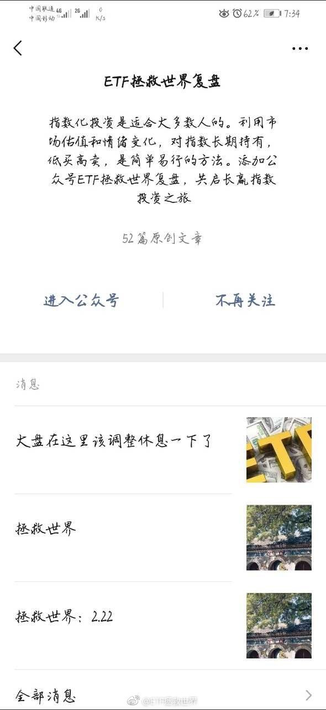

======================================================

ETF拯救世界 (5687069307) @
2019-03-08 09:20:37 Fri  
url: https://weibo.com/5687069307/HjVFyhned

第二题，卖出的这份什么价格买回来？

------------------------------------------------------
转推：
>  @ETF拯救世界 (5687069307)
>  2019-03-07 11:14:43 Thu  
>  url: https:/weibo.com/5687069307/HjMZnmP2o/

>  波段仓位出一份，其他的就踏踏实实拿着吧。卖一份焦虑情绪就小很多了吧？
>  
>  舒服最重要。 ​​​

转发[12]  评论[278]  赞[511] 

======================================================

ETF拯救世界 (5687069307) @
2019-03-08 09:26:24 Fri  
url: https://weibo.com/5687069307/HjVHUjHiv

$中证500 sz399905$ 

不会第一次出手卖就卖在阶段最高点了吧。

瞎蒙也可以？ ​​​

转发[28]  评论[359]  赞[842] 

======================================================

ETF拯救世界 (5687069307) @
2019-03-08 09:47:14 Fri  
url: https://weibo.com/5687069307/HjVQmsUfW

小贴士：

股票价格从1 2 3 4……涨到10，你一路不敢买。回调到9你认为很便宜了下手买入。

这样很危险。 ​​​

转发[160]  评论[318]  赞[972] 

======================================================

ETF拯救世界 (5687069307) @
2019-03-08 10:19:27 Fri  
url: https://weibo.com/5687069307/HjW3riAda

从各种信号看，这是一次牛市越来越明显。

短线波段仓位是吃波动和调节心态用的。各位长线仓位一定要攥紧了，这才是赚大钱的基础。 ​​​

转发[455]  评论[493]  赞[1114] 

======================================================

ETF拯救世界 (5687069307) @
2019-03-08 10:43:29 Fri  
url: https://weibo.com/5687069307/HjWdcsksJ

回复@fly小小牛:其中之一是观察全指信息。只有在真正的牛市中，科技板块才会领涨。//@fly小小牛:有啥信号📶，群情汹涌？

------------------------------------------------------
转推：
>  @ETF拯救世界 (5687069307)
>  2019-03-08 10:19:27 Fri  
>  url: https:/weibo.com/5687069307/HjW3riAda/

>  从各种信号看，这是一次牛市越来越明显。
>  
>  短线波段仓位是吃波动和调节心态用的。各位长线仓位一定要攥紧了，这才是赚大钱的基础。 ​​​

转发[224]  评论[205]  赞[550] 

======================================================

ETF拯救世界 (5687069307) @
2019-03-08 10:50:31 Fri  
url: https://weibo.com/5687069307/HjWg3epMH

熊市中消费（茅台代表）医药（18年下半年遭遇行业利空，之前表现非常好）公用事业（长电代表）表现好，牛市中科技板块表现好，里面的道理非常简单，不多说。

值得关注的，是目前行情演进至我整个周期模型中第二个阶段了。

进入第三阶段前，会买一个第二阶段表现不佳的品种。

但是尤其要注意的，是第 ​​​

转发[602]  评论[588]  赞[1102] 

======================================================

ETF拯救世界 (5687069307) @
2019-03-08 10:55:09 Fri  
url: https://weibo.com/5687069307/HjWhWcvr9

回复@以后做快乐健康的小女人:2015年5月，手上拿到1000万拆迁款。他不去买股票基金应该去干嘛呢？——有钱不是投资的理由，好机会才是！！！

------------------------------------------------------
转推：
>  @ETF拯救世界 (5687069307)
>  2019-03-08 10:19:27 Fri  
>  url: https:/weibo.com/5687069307/HjW3riAda/

>  从各种信号看，这是一次牛市越来越明显。
>  
>  短线波段仓位是吃波动和调节心态用的。各位长线仓位一定要攥紧了，这才是赚大钱的基础。 ​​​

转发[33]  评论[133]  赞[512] 

======================================================

ETF拯救世界 (5687069307) @
2019-03-08 13:13:54 Fri  
url: https://weibo.com/5687069307/HjXcfqrGS

今日锦鲤 @小静姐carol 选的是这个。

能让别人开心自己也会很开心。[嘻嘻] ​​​

转发[12]  评论[437]  赞[1054] 

+++++++++++++++++++++++++++++++++++++++++++++++++++++

图片：

======================================================

ETF拯救世界 (5687069307) @
2019-03-08 13:33:08 Fri  
url: https://weibo.com/5687069307/HjXk3qyKd

我个人希望这一份能和趋势仓位一起买回来。希望都是好的，未必能实现啊。给点力，大盘。

------------------------------------------------------
转推：
>  @ETF拯救世界 (5687069307)
>  2019-03-08 09:26:24 Fri  
>  url: https:/weibo.com/5687069307/HjVHUjHiv/

>  $中证500 sz399905$ 
>  
>  不会第一次出手卖就卖在阶段最高点了吧。
>  
>  瞎蒙也可以？ ​​​

转发[11]  评论[144]  赞[529] 

======================================================

ETF拯救世界 (5687069307) @
2019-03-08 13:47:06 Fri  
url: https://weibo.com/5687069307/HjXpIshvI

上涨趋势中，追高的人遇到调整很容易割肉。

割肉以后，又涨起来。追还是不追，就很尴尬。追了又跌，不追就一路涨。

当然，也有时候他们不割。那也行，不割就一路跌下去套死了。 ​​​

转发[82]  评论[190]  赞[721] 

======================================================

ETF拯救世界 (5687069307) @
2019-03-08 13:50:37 Fri  
url: https://weibo.com/5687069307/HjXr9pAR4

今天300又被500干了1.3%。全年已经落后500达到6%以上。//@ETF拯救世界:收盘跑赢2.3%

------------------------------------------------------
转推：
>  @ETF拯救世界 (5687069307)
>  2019-03-07 10:27:17 Thu  
>  url: https:/weibo.com/5687069307/HjMG7znFG/

>  今天500又干掉300 1.6%。
>  
>  ……再去翻翻1月底我发的关于500的微博，你会对人性有更高一层的认识。 ​​​

转发[6]  评论[106]  赞[484] 

======================================================

ETF拯救世界 (5687069307) @
2019-03-08 14:53:49 Fri  
url: https://weibo.com/5687069307/HjXQOlWPe

卖了一份而已，至于这么大反应吗…

------------------------------------------------------
转推：
>  @ETF拯救世界 (5687069307)
>  2019-03-07 10:35:54 Thu  
>  url: https:/weibo.com/5687069307/HjMJCrbZz/

>  GJD是不是关注公众号了。 ​​​

转发[6]  评论[326]  赞[639] 

======================================================

ETF拯救世界 (5687069307) @
2019-03-08 15:18:03 Fri  
url: https://weibo.com/5687069307/HjY0DDsDN

昨天收盘还差0.4，我的游戏机保住了…

不过，下次会更快到20%。 ​​​

转发[6]  评论[323]  赞[836] 

======================================================

ETF拯救世界 (5687069307) @
2019-03-08 18:28:17 Fri  
url: https://weibo.com/5687069307/HjZfRdUU3

计划这一个多月一分钱都没买。昨天甚至卖了一份，与去年11月一个月狂买13份完全不同。

很多朋友无论涨跌都很着急，完全没有必要。

节奏控制的很好，不会追高，更不会踏空，舞步不要乱。开开心心的把这支舞跳好。 ​​​

转发[51]  评论[560]  赞[1333] 

======================================================

ETF拯救世界 (5687069307) @
2019-03-09 08:23:12 Sat  
url: https://weibo.com/5687069307/Hk4IL4IeL

这件事特别诡异，简直是现实版的罗生门。继续关注。

------------------------------------------------------
转推：
>  @ ()
>  2019-03-08 21:57:53 Fri  
>  url: 

>  抱歉，作者已设置仅展示半年内微博，此微博已不可见。 ​​​

转发[21]  评论[83]  赞[272] 

======================================================

ETF拯救世界 (5687069307) @
2019-03-09 09:14:57 Sat  
url: https://weibo.com/5687069307/Hk53L3dvt

再说一次观点，从现在开始计算，2029年美股收盘点位涨幅将非常小，甚至有可能不涨。

------------------------------------------------------
转推：
>  @网易财经 (1974561081)
>  2019-03-09 07:48:27 Sat  
>  url: https:/weibo.com/1974561081/Hk4uDuJyL/

>  【牛市十周年前夕:标普5连跌 美股创年内最大周跌幅】 非农就业惨淡，全球经济担忧加剧。道指跌超20点，标普和纳指跌0.2%，三大指数本周均跌超2%，纳指终结十周连涨。科技、芯片、能源和热门中概股普跌，特斯拉涨近3%。互联网券商中概第一股富途证券IPO首日收涨近28%，盘中涨46%。美元结束七连涨，油价 ​​​

转发[134]  评论[211]  赞[514] 

======================================================

ETF拯救世界 (5687069307) @
2019-03-09 12:50:16 Sat  
url: https://weibo.com/5687069307/Hk6t9spRY

回复@随记心路:对啦。上证指数现在3000，十二年前6000，一半都没到。影响我们赚钱吗？毫无影响。资本市场精彩之处在于波动//@随记心路:意思是美股很可能会经历类似A股过去“十年不涨”的事情。但反过来，不代表未来十年美股不能赚钱。

------------------------------------------------------
转推：
>  @网易财经 (1974561081)
>  2019-03-09 07:48:27 Sat  
>  url: https:/weibo.com/1974561081/Hk4uDuJyL/

>  【牛市十周年前夕:标普5连跌 美股创年内最大周跌幅】 非农就业惨淡，全球经济担忧加剧。道指跌超20点，标普和纳指跌0.2%，三大指数本周均跌超2%，纳指终结十周连涨。科技、芯片、能源和热门中概股普跌，特斯拉涨近3%。互联网券商中概第一股富途证券IPO首日收涨近28%，盘中涨46%。美元结束七连涨，油价 ​​​

转发[47]  评论[140]  赞[489] 

======================================================

ETF拯救世界 (5687069307) @
2019-03-09 22:40:00 Sat  
url: https://weibo.com/5687069307/Hkakwwir0

帮关注我的朋友转发。但是再次提醒，想帮忙的朋友一定要调查清楚。我可以帮忙转发，但是没精力一个个核实。希望孩子早日康复。

------------------------------------------------------
转推：
>  @大白成长录 (3932994203)
>  2019-03-09 10:12:14 Sat  
>  url: https:/weibo.com/3932994203/Hk5r11bbW/

>  @ETF拯救世界 E大，我表妹家的小孩，才9岁，前天在学校突发脑溢血，现在在湖南儿童医院，已经脱离危险期，但是后期治疗费用较高，现在已经差不多筹集了三分之一的善款，想请E大帮忙转发这个轻松筹🙏🙏🙏http://t.cn/EMZfKZf ​​​

转发[18]  评论[87]  赞[254] 

======================================================

ETF拯救世界 (5687069307) @
2019-03-09 23:01:05 Sat  
url: https://weibo.com/5687069307/Hkat5vyjp

回复@低级工程师Rick:我不敢。会有人说我借推荐这个赚钱。什么都不做还祸从天上来，这种事我还是别干了。//@低级工程师Rick:看来E大也要适时地推荐大家买保险。

------------------------------------------------------
转推：
>  @大白成长录 (3932994203)
>  2019-03-09 10:12:14 Sat  
>  url: https:/weibo.com/3932994203/Hk5r11bbW/

>  @ETF拯救世界 E大，我表妹家的小孩，才9岁，前天在学校突发脑溢血，现在在湖南儿童医院，已经脱离危险期，但是后期治疗费用较高，现在已经差不多筹集了三分之一的善款，想请E大帮忙转发这个轻松筹🙏🙏🙏http://t.cn/EMZfKZf ​​​

转发[1]  评论[81]  赞[237] 

======================================================

ETF拯救世界 (5687069307) @
2019-03-09 23:07:02 Sat  
url: https://weibo.com/5687069307/Hkavv3Mou

有没有人看过《双瞳》？跟这个几乎一样。我强推的一部电影，个人非常喜欢！//@蓝鲸财经记者工作平台:硬核[允悲]//@霜叶:人生后花园，地下CBD……

------------------------------------------------------
转推：
>  @ ()
>  2019-03-09 19:44:52 Sat  
>  url: 

>  抱歉，作者已设置仅展示半年内微博，此微博已不可见。 ​​​

转发[13]  评论[185]  赞[252] 

======================================================

ETF拯救世界 (5687069307) @
2019-03-09 23:15:02 Sat  
url: https://weibo.com/5687069307/HkayKiqUK

不知道有没有可能有一种机制，就是众筹治病没问题。但是等你病好了，家庭收入也很稳定，甚至以后有钱了，有一种约束机制能让你把之前看病的钱还回来。可以还给以前捐给你的人，也可以捐给现在需要钱看病的人。

当然，还是给家里人配置保险最重要。

我觉得意外险+重疾险+医疗险应该是必备的吧。

另外 ​​​

转发[170]  评论[690]  赞[686] 

======================================================

ETF拯救世界 (5687069307) @
2019-03-10 20:04:38 Sun  
url: https://weibo.com/5687069307/HkiJY22Tu

锦鲤的东西已经收到了，虽然晚了两天…[鼓掌]

------------------------------------------------------
转推：
>  @静carolli (1771340031)
>  2019-03-10 19:46:37 Sun  
>  url: https:/weibo.com/1771340031/HkiCEaUIm/

>  幸运的我此刻太开心啦[锦鲤][偷乐]   男神E"御赐"中国红💄 在此，大家的账户翻着翻儿红咯！🚀 [好喜欢]  感恩E大🙏🙏🙏也祝福我们每一位好运💰 💰💰  @ETF拯救世界 ​​​

转发[4]  评论[292]  赞[1049] 

======================================================

ETF拯救世界 (5687069307) @
2019-03-11 09:58:28 Mon  
url: https://weibo.com/5687069307/Hkocq9WWf

开了也不一定操作，开了再说。 ​​​

转发[10]  评论[251]  赞[624] 

+++++++++++++++++++++++++++++++++++++++++++++++++++++

图片：
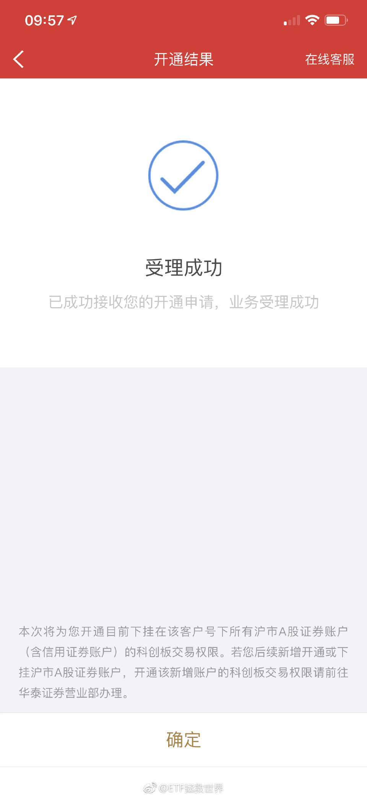
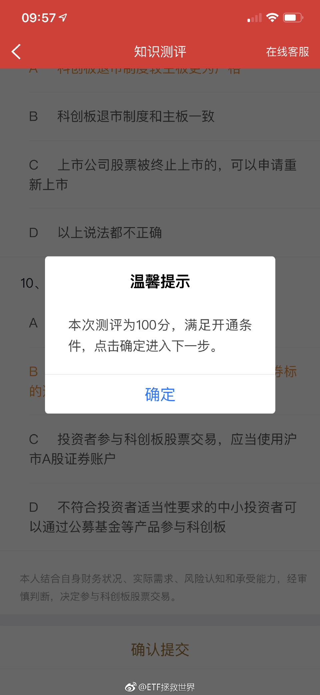

======================================================

ETF拯救世界 (5687069307) @
2019-03-11 11:16:44 Mon  
url: https://weibo.com/5687069307/HkoIbeIkx

回复@某小风-X-V:上涨趋势没有野百合。[doge]//@某小风-X-V:E大，环保起飞了[太开心]

------------------------------------------------------
转推：
>  @ETF拯救世界 (5687069307)
>  2019-03-11 09:58:28 Mon  
>  url: https:/weibo.com/5687069307/Hkocq9WWf/

>  开了也不一定操作，开了再说。 ​​​

转发[4]  评论[126]  赞[427] 

======================================================

ETF拯救世界 (5687069307) @
2019-03-11 13:39:47 Mon  
url: https://weibo.com/5687069307/HkpEffUPW

今天500涨幅又是300的一倍。各位，三个要点：均值回归，一致预期，均衡配置

------------------------------------------------------
转推：
>  @ETF拯救世界 (5687069307)
>  2019-03-07 10:27:17 Thu  
>  url: https:/weibo.com/5687069307/HjMG7znFG/

>  今天500又干掉300 1.6%。
>  
>  ……再去翻翻1月底我发的关于500的微博，你会对人性有更高一层的认识。 ​​​

转发[303]  评论[127]  赞[468] 

======================================================

ETF拯救世界 (5687069307) @
2019-03-11 13:42:26 Mon  
url: https://weibo.com/5687069307/HkpFk325k

回复@薏仁之梦:看一月底我关于500的微博以及评论//@薏仁之梦:一致预期能否深入谈谈？//@ETF拯救世界:今天500涨幅又是300的一倍。各位，三个要点：均值回归，一致预期，均衡配置

------------------------------------------------------
转推：
>  @ETF拯救世界 (5687069307)
>  2019-03-07 10:27:17 Thu  
>  url: https:/weibo.com/5687069307/HjMG7znFG/

>  今天500又干掉300 1.6%。
>  
>  ……再去翻翻1月底我发的关于500的微博，你会对人性有更高一层的认识。 ​​​

转发[20]  评论[22]  赞[277] 

======================================================

ETF拯救世界 (5687069307) @
2019-03-11 13:44:51 Mon  
url: https://weibo.com/5687069307/HkpGjbRfs

回复@草农123:红利起飞之日，大盘歇菜之时。//@草农123:医药今天也起飞了，就差红利啦//@ETF拯救世界:今天500涨幅又是300的一倍。各位，三个要点：均值回归，一致预期，均衡配置

------------------------------------------------------
转推：
>  @ETF拯救世界 (5687069307)
>  2019-03-07 10:27:17 Thu  
>  url: https:/weibo.com/5687069307/HjMG7znFG/

>  今天500又干掉300 1.6%。
>  
>  ……再去翻翻1月底我发的关于500的微博，你会对人性有更高一层的认识。 ​​​

转发[176]  评论[154]  赞[506] 

======================================================

ETF拯救世界 (5687069307) @
2019-03-11 13:46:29 Mon  
url: https://weibo.com/5687069307/HkpGY1mag

回复@_张人好:如果你不懂什么叫波段仓位，什么叫长期仓位，以后就别跟着买波段了。真的。//@_张人好:老大，什么时候买回来//@ETF拯救世界:回复@薏仁之梦:看一月底我关于500的微博以及评论//@薏仁之梦:一致预期能否深入谈谈？

------------------------------------------------------
转推：
>  @ETF拯救世界 (5687069307)
>  2019-03-07 10:27:17 Thu  
>  url: https:/weibo.com/5687069307/HjMG7znFG/

>  今天500又干掉300 1.6%。
>  
>  ……再去翻翻1月底我发的关于500的微博，你会对人性有更高一层的认识。 ​​​

转发[6]  评论[35]  赞[330] 

======================================================

ETF拯救世界 (5687069307) @
2019-03-11 13:58:19 Mon  
url: https://weibo.com/5687069307/HkpLLw68T

一场战争中，需要多兵种配合。地面部队，导弹部队，空中部队都有他们存在的意义。不是说这次战役某个兵种表现好，他就是王。不是，阶段不同，发挥的空间也不同。

另外，各个部队要完成的阶段使命也不同。有些部队在最危险的时候进来帮忙打，收获大量战利品就要撤，去继续坚守自己的阵地，不能从头打到 ​​​

转发[161]  评论[220]  赞[818] 

======================================================

ETF拯救世界 (5687069307) @
2019-03-11 14:07:30 Mon  
url: https://weibo.com/5687069307/HkpPuDsmI

一个市场中，某段时间两个宽基指数表现差异如此大（下面两根绿线），是非常不合理的。

有些人认为这两年表现好的就一定会继续表现好下去，我就认为相反，表现不好的有机会表现更好。更何况在任何市场，长期看都是小盘股表现更好一点。

这些都不是马后炮，而是一直在坚持的思路。 ​​​

转发[137]  评论[153]  赞[644] 

+++++++++++++++++++++++++++++++++++++++++++++++++++++

图片：

======================================================

ETF拯救世界 (5687069307) @
2019-03-11 14:27:23 Mon  
url: https://weibo.com/5687069307/HkpXzbwoa

其实投资风格这件事，与一个人的人生观和世界观密不可分。

你相信怎样会获得成功，你相信人与人之间本质的关系是怎样，你就会怎样去投资。 ​​​

转发[64]  评论[109]  赞[652] 

======================================================

ETF拯救世界 (5687069307) @
2019-03-11 14:30:20 Mon  
url: https://weibo.com/5687069307/HkpYLkeV7

如果你周五觉得自己仓位太高了，今天觉得自己仓位太低了。那么你95%是一个绝对不合格的投资者。

如果你周五大幅下跌后觉得自己仓位太高了大幅减仓，今天觉得自己仓位太低了大幅加仓，那你就1000%是一个绝对不合格的投资者。 ​​​

转发[50]  评论[180]  赞[707] 

======================================================

ETF拯救世界 (5687069307) @
2019-03-11 14:33:05 Mon  
url: https://weibo.com/5687069307/HkpZStkWT

回复@鼻血君89:包括你生活中碰到的绝大多数人吗。比如你的父母，你的妻儿，你的同事，你的朋友，你的业务合作伙伴。//@鼻血君89:以前我以为人与人之间大多数是合作关系，现在我认为人与人之间大多数是欺诈关系。

------------------------------------------------------
转推：
>  @ETF拯救世界 (5687069307)
>  2019-03-11 14:27:23 Mon  
>  url: https:/weibo.com/5687069307/HkpXzbwoa/

>  其实投资风格这件事，与一个人的人生观和世界观密不可分。
>  
>  你相信怎样会获得成功，你相信人与人之间本质的关系是怎样，你就会怎样去投资。 ​​​

转发[8]  评论[62]  赞[336] 

======================================================

ETF拯救世界 (5687069307) @
2019-03-11 14:36:26 Mon  
url: https://weibo.com/5687069307/Hkq1eFALm

觉得计划仓位低的朋友，我只想问一句：如果一个组合，只剩10%现金你还觉得仓位低，那么，你到底是有钱人还是没钱的人？

如果你是没钱的人，多那10%的仓位也改变不了你的命运。真的。多赚点钱比多加10%仓位有效得多。

如果你是有钱的人，只剩10%的现金了你还觉得低，那我建议你认真思考未来如何保住自 ​​​

转发[77]  评论[191]  赞[710] 

======================================================

ETF拯救世界 (5687069307) @
2019-03-11 14:43:28 Mon  
url: https://weibo.com/5687069307/Hkq46izxH

再说句你不信的。你这70%A股仓位+10%港股仓位+10%其它乱七八糟的组合，一轮行情下来跑赢90%经常满仓经常上蹿下跳经常追涨停板的人。

信不信由你。

最关键的是，你回撤还小。你说是不是见鬼了。 ​​​

转发[138]  评论[301]  赞[887] 

======================================================

ETF拯救世界 (5687069307) @
2019-03-11 15:15:38 Mon  
url: https://weibo.com/5687069307/Hkqh9kvvp

注意，我说的是，上蹿下跳做短线追涨停板的。如果牛市中长期持仓牛股，那收益率当然高。两个前提：找到牛股+长期持仓。做到了你就是成熟投资者，与我说的这种无关。

------------------------------------------------------
转推：
>  @ETF拯救世界 (5687069307)
>  2019-03-11 14:43:28 Mon  
>  url: https:/weibo.com/5687069307/Hkq46izxH/

>  再说句你不信的。你这70%A股仓位+10%港股仓位+10%其它乱七八糟的组合，一轮行情下来跑赢90%经常满仓经常上蹿下跳经常追涨停板的人。
>  
>  信不信由你。
>  
>  最关键的是，你回撤还小。你说是不是见鬼了。 ​​​

转发[42]  评论[71]  赞[460] 

======================================================

ETF拯救世界 (5687069307) @
2019-03-11 15:20:54 Mon  
url: https://weibo.com/5687069307/Hkqji1JKH

周末问了个保险的事，特别感谢很多朋友提供意见。无论是私信还是其他渠道，大概有几百条。每条我都会认真的看，但没法一一回复，请见谅。谢谢各位。

另外，我听说有好多朋友为了我的事到处咨询，包括去一些知名的保险公众号或者保险大V那里帮我了解情况。真的非常感谢。何德何能让各位如此费心，说实 ​​​

转发[8]  评论[162]  赞[887] 

======================================================

ETF拯救世界 (5687069307) @
2019-03-11 16:59:40 Mon  
url: https://weibo.com/5687069307/HkqXnpP3q

军工指数又60倍了。

长期增长有没有20%？

真.NB指数。 ​​​

转发[177]  评论[147]  赞[452] 

======================================================

ETF拯救世界 (5687069307) @
2019-03-11 17:08:13 Mon  
url: https://weibo.com/5687069307/Hkr0Qx3Xd

回复@铅笔小小新:今年军工涨幅还不如500，我后悔什么？就算涨幅比500大，我为什么要后悔？让我买50倍的指数，我宁愿把钱存在银行活期//@铅笔小小新:牛逼指数！E大有没有点后悔军工没有买？

------------------------------------------------------
转推：
>  @ETF拯救世界 (5687069307)
>  2019-03-11 16:59:40 Mon  
>  url: https:/weibo.com/5687069307/HkqXnpP3q/

>  军工指数又60倍了。
>  
>  长期增长有没有20%？
>  
>  真.NB指数。 ​​​

转发[28]  评论[58]  赞[379] 

======================================================

ETF拯救世界 (5687069307) @
2019-03-11 17:15:38 Mon  
url: https://weibo.com/5687069307/Hkr3RhQWc

回复@何故添黄伞201810:信息这一波最低31，军工最低42。而这两个指数历史最低只有19和20。我没必要放着一堆估值十几倍的指数不买，买它们。要说多少钱买，20多倍吧。//@何故添黄伞201810:e大，您认为军工、信息分别到了多少倍pe才有了入手的条件呢？

------------------------------------------------------
转推：
>  @ETF拯救世界 (5687069307)
>  2019-03-11 16:59:40 Mon  
>  url: https:/weibo.com/5687069307/HkqXnpP3q/

>  军工指数又60倍了。
>  
>  长期增长有没有20%？
>  
>  真.NB指数。 ​​​

转发[121]  评论[76]  赞[384] 

======================================================

ETF拯救世界 (5687069307) @
2019-03-11 17:18:05 Mon  
url: https://weibo.com/5687069307/Hkr4R2flE

贵的，牛市也许也会涨，甚至比便宜的涨的更凶。

但这个又是个世界观的问题：

是不是所有赚钱的事都可以做？有没有一些虽然赚钱，但你守住底线不做的事？

我有，所以有些事我不做。比如，买很贵的指数。

钱很重要，但是投资和做人的原则更重要。

有底线的人，再坏也坏不到哪儿去。如果你看不到一个 ​​​

转发[116]  评论[231]  赞[762] 

======================================================

ETF拯救世界 (5687069307) @
2019-03-11 17:45:50 Mon  
url: https://weibo.com/5687069307/Hkrg7yJjH

回复@深南椰风:现在已经没有任何指数在历史最低区域了。//@深南椰风:E大，现在环保是不是还在历史最低估值区域？//@ETF拯救世界:回复@何故添黄伞201810:信息这一波最低31，军工最低42。而这两个指数历史最低只有19和20。我没必要放着一堆估值十几倍的指数不买，买它们。要说多少钱买，20多倍吧。

------------------------------------------------------
转推：
>  @ETF拯救世界 (5687069307)
>  2019-03-11 16:59:40 Mon  
>  url: https:/weibo.com/5687069307/HkqXnpP3q/

>  军工指数又60倍了。
>  
>  长期增长有没有20%？
>  
>  真.NB指数。 ​​​

转发[30]  评论[88]  赞[396] 

======================================================

ETF拯救世界 (5687069307) @
2019-03-11 19:07:52 Mon  
url: https://weibo.com/5687069307/HkrNpANDq

为什么现在我拉黑人比以前多。因为真的，很多人什么都不懂，天天来我这里发出噪音。都是猪队友，最好的方法就是让他们离开队伍。你们去看看1月底关于500的微博下面的评论，现在能不能体会我的心情？

------------------------------------------------------
转推：
>  @ETF拯救世界 (5687069307)
>  2019-01-31 18:58:46 Thu  
>  url: https:/weibo.com/5687069307/Hew4m8oCM/

>  从现在开始，谁再没完没了的问500直接拉黑。
>  
>  担心你就卖掉，不担心就拿着这不到15%的仓位等风来。
>  
>  什么都不懂就去研究，看谁说不好就找谁报团儿去。
>  
>  跟这么一帮人做队友一起打仗真是见鬼了。 ​​​

转发[13]  评论[153]  赞[593] 

======================================================

ETF拯救世界 (5687069307) @
2019-03-11 19:10:04 Mon  
url: https://weibo.com/5687069307/HkrOj8zHw

回复@在路上30249:噩耗！！！心里很疼。不知道该说什么…我觉得剩下的钱，看看身后事还有没有需要用的。再剩下的捐给其它需要的孩子吧。让爱心传递下去。[泪]

------------------------------------------------------
转推：
>  @大白成长录 (3932994203)
>  2019-03-09 10:12:14 Sat  
>  url: https:/weibo.com/3932994203/Hk5r11bbW/

>  @ETF拯救世界 E大，我表妹家的小孩，才9岁，前天在学校突发脑溢血，现在在湖南儿童医院，已经脱离危险期，但是后期治疗费用较高，现在已经差不多筹集了三分之一的善款，想请E大帮忙转发这个轻松筹🙏🙏🙏http://t.cn/EMZfKZf ​​​

转发[8]  评论[130]  赞[300] 

======================================================

ETF拯救世界 (5687069307) @
2019-03-11 21:05:37 Mon  
url: https://weibo.com/5687069307/Hkszd4InU

有些朋友说，看着身边的人打板或者买了翻番股赚的很开心，心里也很羡慕…

我想说的是：为什么你不能跟朋友一起干？羡慕就去干啊，谁规定你只能用一种方式投资？ZJH还是XF规定了？我看都没有吧。个人投资者一个最大优势就是灵活，无拘无束，喜欢就去干！不要羡慕！加入他们！

我是真心这么建议。真的 ​​​

转发[49]  评论[208]  赞[532] 

======================================================

ETF拯救世界 (5687069307) @
2019-03-11 21:09:12 Mon  
url: https://weibo.com/5687069307/HksAFduVm

回复@昊昊-小迷妹:知道什么才是适合自己的最重要。结婚前各种类型的姑娘都谈谈恋爱试试，找到最合适的那个，幸福一辈子多好。何必随便娶个媳妇然后看着别人的老婆好？//@昊昊-小迷妹:曾经有过这样的想法，曾经也这么干过！！！回头看看还是觉得不太适合自己[悲伤][悲伤][悲伤]

------------------------------------------------------
转推：
>  @ETF拯救世界 (5687069307)
>  2019-03-11 21:05:37 Mon  
>  url: https:/weibo.com/5687069307/Hkszd4InU/

>  有些朋友说，看着身边的人打板或者买了翻番股赚的很开心，心里也很羡慕…
>  
>  我想说的是：为什么你不能跟朋友一起干？羡慕就去干啊，谁规定你只能用一种方式投资？ZJH还是XF规定了？我看都没有吧。个人投资者一个最大优势就是灵活，无拘无束，喜欢就去干！不要羡慕！加入他们！
>  
>  我是真心这么建议。真的 ​​​

转发[21]  评论[68]  赞[309] 

======================================================

ETF拯救世界 (5687069307) @
2019-03-11 21:15:10 Mon  
url: https://weibo.com/5687069307/HksD5iWDr

图片评论 http://t.cn/EMieygK

------------------------------------------------------
转推：
>  @否极泰董宝珍 (1179198244)
>  2019-03-11 21:13:13 Mon  
>  url: https:/weibo.com/1179198244/HksCifiSD/

>  我和助手对中国股市各行各业的市盈率进行了统计，发现剔除了市盈率最低的几个行业其他行业的市盈率都在30倍市盈率之上。普遍的上涨似乎缺乏估值依据。现在想做一个研究。计算剔除银行业和金融业后中国股市的整体市盈率，基本上想好的算法是把银行业的净利润，总市值从全部上市公司中减掉，然后再计算剔 ​​​

转发[105]  评论[148]  赞[439] 

======================================================

ETF拯救世界 (5687069307) @
2019-03-11 21:29:07 Mon  
url: https://weibo.com/5687069307/HksIKD2mN

回复@AEvolve不如守中:做了十年了//@AEvolve不如守中:完美，別人想到的，E大已經做到了//@ETF拯救世界:图片评论 http://t.cn/EMieygK

------------------------------------------------------
转推：
>  @否极泰董宝珍 (1179198244)
>  2019-03-11 21:13:13 Mon  
>  url: https:/weibo.com/1179198244/HksCifiSD/

>  我和助手对中国股市各行各业的市盈率进行了统计，发现剔除了市盈率最低的几个行业其他行业的市盈率都在30倍市盈率之上。普遍的上涨似乎缺乏估值依据。现在想做一个研究。计算剔除银行业和金融业后中国股市的整体市盈率，基本上想好的算法是把银行业的净利润，总市值从全部上市公司中减掉，然后再计算剔 ​​​

转发[35]  评论[83]  赞[418] 

======================================================

ETF拯救世界 (5687069307) @
2019-03-11 21:57:52 Mon  
url: https://weibo.com/5687069307/HksUq2VgH

每日打卡（9）

说真的，什么都是次要，身体最重要。

月底回归健身房。 ​​​

转发[9]  评论[79]  赞[512] 

+++++++++++++++++++++++++++++++++++++++++++++++++++++

图片：

======================================================

ETF拯救世界 (5687069307) @
2019-03-11 21:59:53 Mon  
url: https://weibo.com/5687069307/HksVfbJCk

回复@懵懂无知小屁股:比如胡歌杨洋王凯吴彦祖彭于晏鹿晗吴亦凡朱一龙是吧[挖鼻]//@懵懂无知小屁股:好想和各种男人都谈个恋爱，然后再选个合适的，也不用羡慕别人家的老公[笑cry]

------------------------------------------------------
转推：
>  @ETF拯救世界 (5687069307)
>  2019-03-11 21:05:37 Mon  
>  url: https:/weibo.com/5687069307/Hkszd4InU/

>  有些朋友说，看着身边的人打板或者买了翻番股赚的很开心，心里也很羡慕…
>  
>  我想说的是：为什么你不能跟朋友一起干？羡慕就去干啊，谁规定你只能用一种方式投资？ZJH还是XF规定了？我看都没有吧。个人投资者一个最大优势就是灵活，无拘无束，喜欢就去干！不要羡慕！加入他们！
>  
>  我是真心这么建议。真的 ​​​

转发[6]  评论[148]  赞[354] 

======================================================

ETF拯救世界 (5687069307) @
2019-03-12 09:25:35 Tue  
url: https://weibo.com/5687069307/Hkxpz2VSs

这十二个字让我明白为什么有人喷我微博聊电影和情人节了//@顾扯淡:气人有、笑人无、恨人富、望人穷

------------------------------------------------------
转推：
>  @ ()
>  2019-03-11 23:55:42 Mon  
>  url: 

>  抱歉，作者已设置仅展示半年内微博，此微博已不可见。 ​​​

转发[37]  评论[101]  赞[404] 

======================================================

ETF拯救世界 (5687069307) @
2019-03-12 09:35:02 Tue  
url: https://weibo.com/5687069307/HkxtoxDl4

传媒新高 医药新高 养老新高 环保新高 500新高

踏踏实实的拿着。你成本那么低。

好好享受赚钱的乐趣吧。 ​​​

转发[231]  评论[284]  赞[870] 

======================================================

ETF拯救世界 (5687069307) @
2019-03-12 09:45:34 Tue  
url: https://weibo.com/5687069307/HkxxFDREG

回复@炫风__AB:你这种心态非常好。指数基金完全可以当成一种收藏品，尤其是低位买入的长期仓位。除非极度高估，不要随便卖。//@炫风__AB:[允悲]有些人涨了就减仓了，但是我总感觉想多买些，不想卖，有点收集邮票那种感觉。就单纯想买了放着。

------------------------------------------------------
转推：
>  @ETF拯救世界 (5687069307)
>  2019-03-12 09:35:02 Tue  
>  url: https:/weibo.com/5687069307/HkxtoxDl4/

>  传媒新高 医药新高 养老新高 环保新高 500新高
>  
>  踏踏实实的拿着。你成本那么低。
>  
>  好好享受赚钱的乐趣吧。 ​​​

转发[156]  评论[117]  赞[613] 

======================================================

ETF拯救世界 (5687069307) @
2019-03-12 09:48:18 Tue  
url: https://weibo.com/5687069307/HkxyMsskY

默默的把我京东plus 1200-50的券领了…

总感觉这几天在劫难逃了。 ​​​

转发[6]  评论[437]  赞[862] 

======================================================

ETF拯救世界 (5687069307) @
2019-03-12 10:04:43 Tue  
url: https://weibo.com/5687069307/HkxFrBseC

回复@云在彼端119:千万别以为钻石坑买了就能赚大钱。上涨过程中死死拿住才是最大的考验。即使我天天这么说，依然有15%的人这一路不断卖出就是一个例子//@云在彼端119:周围有同事在低估的时候听别人建议买的股票，盈利了3个点卖出，果然对于普通人来说拿住是一个很难的事情

------------------------------------------------------
转推：
>  @ETF拯救世界 (5687069307)
>  2019-03-12 09:35:02 Tue  
>  url: https:/weibo.com/5687069307/HkxtoxDl4/

>  传媒新高 医药新高 养老新高 环保新高 500新高
>  
>  踏踏实实的拿着。你成本那么低。
>  
>  好好享受赚钱的乐趣吧。 ​​​

转发[88]  评论[187]  赞[605] 

======================================================

ETF拯救世界 (5687069307) @
2019-03-12 10:09:41 Tue  
url: https://weibo.com/5687069307/HkxHsyygY

各位看到80%定律的威力了吧…

------------------------------------------------------
转推：
>  @ETF拯救世界 (5687069307)
>  2019-02-22 11:04:33 Fri  
>  url: https:/weibo.com/5687069307/HhOmMEAqp/

>  S的传媒已经回本，150的遥遥无期。[摊手]
>  
>  这指数是这波熊市最符合我“80%定律”的指数，之后会怎么走，大家都围观一下。 ​​​

转发[39]  评论[135]  赞[614] 

======================================================

ETF拯救世界 (5687069307) @
2019-03-12 10:24:12 Tue  
url: https://weibo.com/5687069307/HkxNm93uG

一个数据：

如果一个品种跌80%买入，回到下跌前涨幅是400%。

为什么这一波上涨计划整体涨幅没有100%跟上指数，然而却早早先于所有指数不断创出新高？

因为熊市没有赔钱，同时回撤极小。每一个点的上涨都是新高利润。

有人说控制回撤没有意义。不好意思，我认为控制回撤是最重要的。还记得那道第一 ​​​

转发[343]  评论[404]  赞[1107] 

======================================================

ETF拯救世界 (5687069307) @
2019-03-12 11:10:53 Tue  
url: https://weibo.com/5687069307/Hky6iDNvG

赚的实在受不了的就关上软件出去走走。眼不见心不烦。

中午有没有人请我吃饭。 ​​​

转发[18]  评论[594]  赞[1101] 

======================================================

ETF拯救世界 (5687069307) @
2019-03-12 12:27:38 Tue  
url: https://weibo.com/5687069307/HkyBsAC8r

这种人怎么存下2万的

------------------------------------------------------
转推：
>  @新浪视频 (1640601392)
>  2019-03-12 10:23:28 Tue  
>  url: https:/weibo.com/1640601392/HkxN3tO8s/

>  【"国际友人"寄来一箱钱求保管 女子给了2万多元“运费”发现被骗】3月6日，南京李女士报警称被网上认识的“国际友人”骗了。一名外国人与她视频，自称账户遭冻结，有一箱叙利亚总统给的现金，请她帮忙保管。“快递公司”发来箱子和快递单照片，收了李女士2万多元“快递费”。万幸这笔钱被及时止付。 ​​​

转发[3]  评论[53]  赞[251] 

======================================================

ETF拯救世界 (5687069307) @
2019-03-12 12:32:08 Tue  
url: https://weibo.com/5687069307/HkyDi7IFC

回复@来自推特的网友:一旦金融资产超过1000万（有房），就只是数字了…//@来自推特的网友:一旦盈利超过50个点，就没什么感觉了[doge][doge]

------------------------------------------------------
转推：
>  @ETF拯救世界 (5687069307)
>  2019-03-12 09:35:02 Tue  
>  url: https:/weibo.com/5687069307/HkxtoxDl4/

>  传媒新高 医药新高 养老新高 环保新高 500新高
>  
>  踏踏实实的拿着。你成本那么低。
>  
>  好好享受赚钱的乐趣吧。 ​​​

转发[25]  评论[207]  赞[560] 

======================================================

ETF拯救世界 (5687069307) @
2019-03-12 13:01:47 Tue  
url: https://weibo.com/5687069307/HkyPjgLgs

$中证500 sz399905$ 这么疯，恐怕调整不会很温柔。

系好安全带准备刺激一下吧。 ​​​

转发[23]  评论[283]  赞[704] 

======================================================

ETF拯救世界 (5687069307) @
2019-03-12 13:16:34 Tue  
url: https://weibo.com/5687069307/HkyVjBQ0d

现在看又有新的体会吧。

2018，500连跌三年。

http://t.cn/RDsstvm ​​​

转发[177]  评论[327]  赞[1126] 

======================================================

ETF拯救世界 (5687069307) @
2019-03-12 16:54:05 Tue  
url: https://weibo.com/5687069307/HkAlBDUqB

截至今日，已披露的150家公司年报，四季度业绩增长平均增幅1%。 ​​​

转发[43]  评论[113]  赞[486] 

======================================================

ETF拯救世界 (5687069307) @
2019-03-12 17:03:45 Tue  
url: https://weibo.com/5687069307/HkApx5Y4k

对比数据：3季度是3%。去年四季度是0.6%。当然，今年还没披露完。披露完再说。

------------------------------------------------------
转推：
>  @ETF拯救世界 (5687069307)
>  2019-03-12 16:54:05 Tue  
>  url: https:/weibo.com/5687069307/HkAlBDUqB/

>  截至今日，已披露的150家公司年报，四季度业绩增长平均增幅1%。 ​​​

转发[27]  评论[187]  赞[458] 

======================================================

ETF拯救世界 (5687069307) @
2019-03-12 21:45:36 Tue  
url: https://weibo.com/5687069307/HkCfW5vOs

净值还没更新完。现在是1.1982。

[摊手] ​​​

转发[9]  评论[289]  赞[636] 

======================================================

ETF拯救世界 (5687069307) @
2019-03-12 22:49:20 Tue  
url: https://weibo.com/5687069307/HkCFO2TMI

1.1995。喷了。

------------------------------------------------------
转推：
>  @ETF拯救世界 (5687069307)
>  2019-03-12 21:45:36 Tue  
>  url: https:/weibo.com/5687069307/HkCfW5vOs/

>  净值还没更新完。现在是1.1982。
>  
>  [摊手] ​​​

转发[3]  评论[267]  赞[568] 

======================================================

ETF拯救世界 (5687069307) @
2019-03-13 07:21:53 Wed  
url: https://weibo.com/5687069307/HkG1QvcgA

跑赢沪深300的幅度增大至32%。

领先中证500的幅度缩小至54%。

如果可以让我把货基部分哪怕做做逆回购，总收益率也可以突破25%了。 ​​​

转发[58]  评论[146]  赞[681] 

+++++++++++++++++++++++++++++++++++++++++++++++++++++

图片：
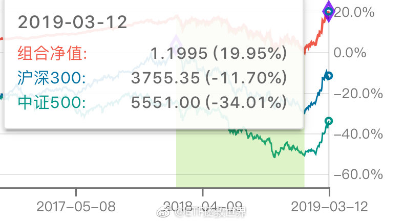

======================================================

ETF拯救世界 (5687069307) @
2019-03-13 07:30:09 Wed  
url: https://weibo.com/5687069307/HkG5czOWo

回复@你好大麦茶:也算为很多家庭幸福夫妻和睦做出了一点小小的贡献。//@你好大麦茶:我昨天把账户收益率给老公看，居然被评价为股神，谢谢E大，让小白成为了时间的朋友

------------------------------------------------------
转推：
>  @ETF拯救世界 (5687069307)
>  2019-03-13 07:21:53 Wed  
>  url: https:/weibo.com/5687069307/HkG1QvcgA/

>  跑赢沪深300的幅度增大至32%。
>  
>  领先中证500的幅度缩小至54%。
>  
>  如果可以让我把货基部分哪怕做做逆回购，总收益率也可以突破25%了。 ​​​

转发[23]  评论[108]  赞[507] 

======================================================

ETF拯救世界 (5687069307) @
2019-03-13 07:34:55 Wed  
url: https://weibo.com/5687069307/HkG78wVsC

还有一个数学问题大家也许没有考虑过。

如果过去你的收益率是500%，那么涨20%就变成了600%。

如果你过去的收益率是十倍，那么涨20%就变成了12倍，涨100%就是二十倍。再涨100%就是40倍。

这就是熊市不赔钱的魔力。 ​​​

转发[180]  评论[338]  赞[872] 

======================================================

ETF拯救世界 (5687069307) @
2019-03-13 08:37:58 Wed  
url: https://weibo.com/5687069307/HkGwJBD4N

回复@不再逃离1995:今天跌半年工资。踏踏实实的//@不再逃离1995:昨天收益3个月工资//@ETF拯救世界:回复@你好大麦茶:也算为很多家庭幸福夫妻和睦做出了一点小小的贡献。//@你好大麦茶:我昨天把账户收益率给老公看，居然被评价为股神，谢谢E大，让小白成为了时间的朋友

------------------------------------------------------
转推：
>  @ETF拯救世界 (5687069307)
>  2019-03-13 07:21:53 Wed  
>  url: https:/weibo.com/5687069307/HkG1QvcgA/

>  跑赢沪深300的幅度增大至32%。
>  
>  领先中证500的幅度缩小至54%。
>  
>  如果可以让我把货基部分哪怕做做逆回购，总收益率也可以突破25%了。 ​​​

转发[17]  评论[201]  赞[440] 

======================================================

ETF拯救世界 (5687069307) @
2019-03-13 09:15:46 Wed  
url: https://weibo.com/5687069307/HkGM574Gd

回复@早点起床吃早点:希望今年尤文夺冠//@早点起床吃早点:有看足球的吗？ 昨晚c罗好牛逼！足球界的益达

------------------------------------------------------
转推：
>  @ETF拯救世界 (5687069307)
>  2019-03-13 07:34:55 Wed  
>  url: https:/weibo.com/5687069307/HkG78wVsC/

>  还有一个数学问题大家也许没有考虑过。
>  
>  如果过去你的收益率是500%，那么涨20%就变成了600%。
>  
>  如果你过去的收益率是十倍，那么涨20%就变成了12倍，涨100%就是二十倍。再涨100%就是40倍。
>  
>  这就是熊市不赔钱的魔力。 ​​​

转发[5]  评论[111]  赞[379] 

======================================================

ETF拯救世界 (5687069307) @
2019-03-13 09:42:49 Wed  
url: https://weibo.com/5687069307/HkGX3B5Ve

东方不亮西方亮

$全指医药 sh000991$ ​​​

转发[1]  评论[146]  赞[527] 

======================================================

ETF拯救世界 (5687069307) @
2019-03-13 12:29:22 Wed  
url: https://weibo.com/5687069307/HkI2ECIrB

别老天天为了那点涨跌心惊胆战。

天气好没事出来溜达溜达多好。 ​​​

转发[19]  评论[396]  赞[1132] 

+++++++++++++++++++++++++++++++++++++++++++++++++++++

图片：

======================================================

ETF拯救世界 (5687069307) @
2019-03-13 15:12:26 Wed  
url: https://weibo.com/5687069307/HkJ6QlFdh

说半年就半年，童叟无欺//@ETF拯救世界:回复@不再逃离1995:今天跌半年工资。踏踏实实的//@不再逃离1995:昨天收益3个月工资//@ETF拯救世界:回复@你好大麦茶:也算为很多家庭幸福夫妻和睦做出了一点小小的贡献。

------------------------------------------------------
转推：
>  @ETF拯救世界 (5687069307)
>  2019-03-13 07:21:53 Wed  
>  url: https:/weibo.com/5687069307/HkG1QvcgA/

>  跑赢沪深300的幅度增大至32%。
>  
>  领先中证500的幅度缩小至54%。
>  
>  如果可以让我把货基部分哪怕做做逆回购，总收益率也可以突破25%了。 ​​​

转发[13]  评论[371]  赞[628] 

======================================================

ETF拯救世界 (5687069307) @
2019-03-14 05:39:28 Thu  
url: https://weibo.com/5687069307/HkOMM9nrl

十二年前英镑兑人民币是15。现在是8。目前富时100估值是15。非常遗憾，国内富时100产品依然没有上。

------------------------------------------------------
转推：
>  @ ()
>  2019-03-14 04:02:21 Thu  
>  url: 

>  抱歉，作者已设置仅展示半年内微博，此微博已不可见。 ​​​

转发[22]  评论[111]  赞[381] 

======================================================

ETF拯救世界 (5687069307) @
2019-03-14 06:01:47 Thu  
url: https://weibo.com/5687069307/HkOVPwrnl

回复@雲中漫步_1117:脱欧的事情搞定之前估计很难上。基金公司应该还是有自己的顾虑//@雲中漫步_1117:华宝好像报了一只，希望早点批下来//@ETF拯救世界:十二年前英镑兑人民币是15。现在是8。目前富时100估值是15。非常遗憾，国内富时100产品依然没有上。

------------------------------------------------------
转推：
>  @ ()
>  2019-03-14 04:02:21 Thu  
>  url: 

>  抱歉，作者已设置仅展示半年内微博，此微博已不可见。 ​​​

转发[7]  评论[50]  赞[324] 

======================================================

ETF拯救世界 (5687069307) @
2019-03-14 08:03:20 Thu  
url: https://weibo.com/5687069307/HkPJavWKT

中证500盈利预测。2018年会比2017年小幅下降（3%），但2019和2020会恢复高增长。

“越跌越贵”在2018年底看起来没错，但站的太低，看的太近。 ​​​

转发[159]  评论[145]  赞[710] 

+++++++++++++++++++++++++++++++++++++++++++++++++++++

图片：

======================================================

ETF拯救世界 (5687069307) @
2019-03-14 08:09:02 Thu  
url: https://weibo.com/5687069307/HkPLu7QmO

早上起来又发掘了一个新的判断顶部/底部区域指标。从过去十几年的情况看，准确性值得信赖。

准备加入观察判断系统。接下来就是看要给多大权重了。

每天进步一点，舒服。 ​​​

转发[61]  评论[263]  赞[1316] 

======================================================

ETF拯救世界 (5687069307) @
2019-03-14 08:19:21 Thu  
url: https://weibo.com/5687069307/HkPPFvvyy

回复@不停奔跑的笨狼:也不能只看总利润。EPS涨幅没有这么大，有增发摊薄因素。但是一定是越来越多，这也是指数基金一定越涨越高的根本基础//@不停奔跑的笨狼:2020年是2015年的3倍，那么问题来了，指数会到多少，不敢想象啊[允悲]

------------------------------------------------------
转推：
>  @ETF拯救世界 (5687069307)
>  2019-03-14 08:03:20 Thu  
>  url: https:/weibo.com/5687069307/HkPJavWKT/

>  中证500盈利预测。2018年会比2017年小幅下降（3%），但2019和2020会恢复高增长。
>  
>  “越跌越贵”在2018年底看起来没错，但站的太低，看的太近。 ​​​

转发[48]  评论[53]  赞[445] 

======================================================

ETF拯救世界 (5687069307) @
2019-03-14 08:33:19 Thu  
url: https://weibo.com/5687069307/HkPVld4cn

500历年分红总金额：

股息率不高，但总金额持续增加。10年涨了9倍。

未来10年还能涨9倍吗。 ​​​

转发[99]  评论[179]  赞[671] 

+++++++++++++++++++++++++++++++++++++++++++++++++++++

图片：

======================================================

ETF拯救世界 (5687069307) @
2019-03-14 08:45:06 Thu  
url: https://weibo.com/5687069307/HkQ07w67v

2007-2017年通胀是多少？

如果你不考虑房价，凭你的真实感受，你觉得通胀是多少？

你的衣食行，比十年前多了多少？注意：请排除你消费升级的因素。你不能十年前坐绿皮车，十年后坐商务舱告诉我出行成本增加了。 ​​​

转发[45]  评论[676]  赞[688] 

======================================================

ETF拯救世界 (5687069307) @
2019-03-14 11:30:20 Thu  
url: https://weibo.com/5687069307/HkR5bmKO2

这么跌我也不会买的。[微笑] ​​​

转发[16]  评论[447]  赞[1014] 

======================================================

ETF拯救世界 (5687069307) @
2019-03-14 13:44:28 Thu  
url: https://weibo.com/5687069307/HkRXDpU7U

今日教训：做事一定要认真。否则要用几倍的精力和时间弥补错误。 ​​​

转发[55]  评论[219]  赞[1015] 

======================================================

ETF拯救世界 (5687069307) @
2019-03-14 15:12:56 Thu  
url: https://weibo.com/5687069307/HkSxxDB5O

等待回调到位，剩下的车继续上。

有人说择时无效。

我不信。 ​​​

转发[62]  评论[1075]  赞[1652] 

======================================================

ETF拯救世界 (5687069307) @
2019-03-15 22:31:50 Fri  
url: https://weibo.com/5687069307/Hl4QbFatS

每日打卡（10）

一日不见如隔三秋啊各位。哈哈，今天比较忙，没上来给各位请安。

一切安好，勿念。 ​​​

转发[7]  评论[472]  赞[1103] 

+++++++++++++++++++++++++++++++++++++++++++++++++++++

图片：
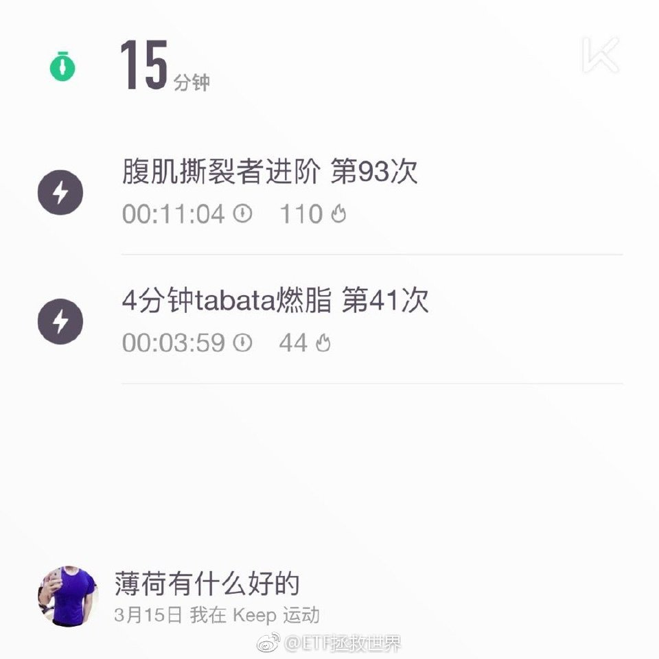

======================================================

ETF拯救世界 (5687069307) @
2019-03-17 19:48:31 Sun  
url: https://weibo.com/5687069307/HlmCTF2CF

第一，到底是无中生有还是夸大其辞，这个是不一样的。

第二，如果是无中生有造谣，必须依法严惩。造谣的人太可恨。

第三，如果是确有其事但是夸大其辞，就别掩盖真相。如果老百姓谁都不信了，那就真的麻烦了。 ​​​

转发[20]  评论[225]  赞[658] 

======================================================

ETF拯救世界 (5687069307) @
2019-03-18 09:38:19 Mon  
url: https://weibo.com/5687069307/Hls3I7a5l

最新计划资产配置图。给小助理们点个赞吧。 ​​​

转发[230]  评论[346]  赞[2300] 

+++++++++++++++++++++++++++++++++++++++++++++++++++++

图片：

======================================================

ETF拯救世界 (5687069307) @
2019-03-18 10:24:46 Mon  
url: https://weibo.com/5687069307/HlsmznPt5

回复@快乐行者85762:三级有可能买不同的啊。比如香港中小，又或者标普500纳斯达克美国医药美国消费//@快乐行者85762:是否能将海外新兴和海外成熟合并为海外，二级再分成是海外新兴和海外成熟，三级名为香港、德国、英国、美国等？

------------------------------------------------------
转推：
>  @ETF拯救世界 (5687069307)
>  2019-03-18 09:38:19 Mon  
>  url: https:/weibo.com/5687069307/Hls3I7a5l/

>  最新计划资产配置图。给小助理们点个赞吧。 ​​​

转发[36]  评论[29]  赞[452] 

======================================================

ETF拯救世界 (5687069307) @
2019-03-18 10:27:50 Mon  
url: https://weibo.com/5687069307/HlsnOfo0r

$全指医药 sh000991$ 反弹新高。 ​​​

转发[10]  评论[59]  赞[573] 

======================================================

ETF拯救世界 (5687069307) @
2019-03-18 10:34:42 Mon  
url: https://weibo.com/5687069307/HlsqAqNM6

朋友们，你们谁还记得去年医药虎落平阳的时候，那些看衰医药的人和文字吗。 ​​​

转发[23]  评论[210]  赞[720] 

======================================================

ETF拯救世界 (5687069307) @
2019-03-18 10:52:02 Mon  
url: https://weibo.com/5687069307/HlsxDbPmE

指数还没新高，账户已经新高了。不知道组合今天什么情况，瑟瑟发抖中。 ​​​

转发[18]  评论[187]  赞[691] 

======================================================

ETF拯救世界 (5687069307) @
2019-03-18 10:58:50 Mon  
url: https://weibo.com/5687069307/HlsAohV4A

回复@jackfish:一台嫌少？你还看见哪位不转发不评论白送了？别说批量了，一台的有吗？//@jackfish:大哥，貌似你就送一台游戏机啊，我还以为大批量采购呢@ETF拯救世界

------------------------------------------------------
转推：
>  @ETF拯救世界 (5687069307)
>  2019-03-18 10:52:02 Mon  
>  url: https:/weibo.com/5687069307/HlsxDbPmE/

>  指数还没新高，账户已经新高了。不知道组合今天什么情况，瑟瑟发抖中。 ​​​

转发[7]  评论[162]  赞[516] 

======================================================

ETF拯救世界 (5687069307) @
2019-03-18 11:13:24 Mon  
url: https://weibo.com/5687069307/HlsGiFRG2

看新闻感觉法国最近特别乱，结果一看cac40发现又快十年新高了。

不敢想象如果这样的情况发生在另一个国家，股市得跌成什么样…… ​​​

转发[10]  评论[95]  赞[498] 

======================================================

ETF拯救世界 (5687069307) @
2019-03-18 11:19:23 Mon  
url: https://weibo.com/5687069307/HlsIJqLSM

后悔没用，学到东西最重要。 ​​​

转发[24]  评论[130]  赞[566] 

+++++++++++++++++++++++++++++++++++++++++++++++++++++

图片：
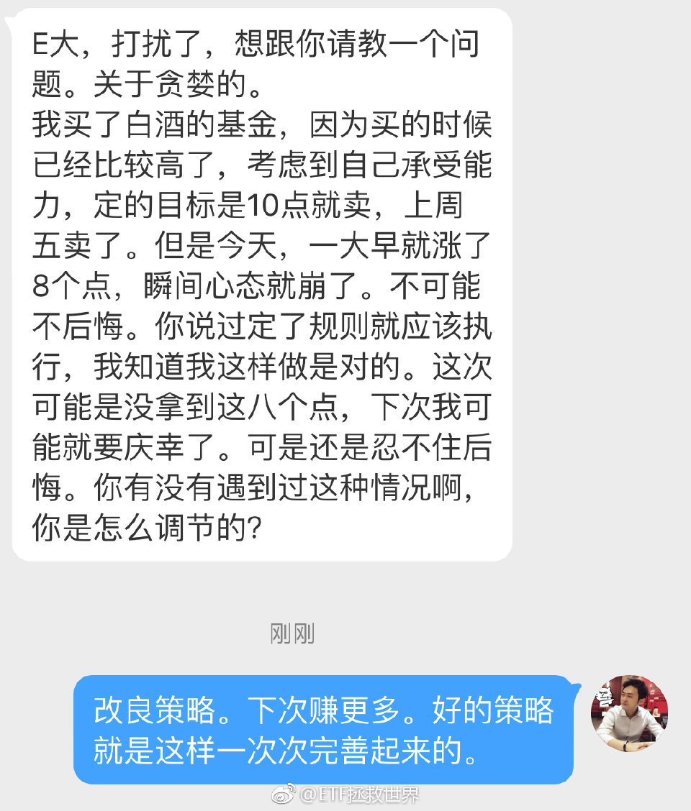

======================================================

ETF拯救世界 (5687069307) @
2019-03-18 11:32:03 Mon  
url: https://weibo.com/5687069307/HlsNSeVTD

法国人是很有意思的。看过一个60年代的法国片子，里面的法国人都穿着绿军装，戴着像章，拿着宝书上街搞斗争。

超赞的。 ​​​

转发[6]  评论[92]  赞[455] 

======================================================

ETF拯救世界 (5687069307) @
2019-03-18 11:41:25 Mon  
url: https://weibo.com/5687069307/HlsRG4LfD

年轻的时候我也经常后悔。因为做事做人很难完美，所以可想而知，后悔是经常的。

23岁以后，成熟了。后悔越来越少了。

后悔有什么用？没有任何任何用处。

第一重要是要明白当时自己就那个水平，那个高度，那个境界，只能做到那个地步。

第二是深入反思为什么做的不好，如果有机会，下次要做的更好。 ​​​

转发[293]  评论[457]  赞[1247] 

======================================================

ETF拯救世界 (5687069307) @
2019-03-18 13:07:12 Mon  
url: https://weibo.com/5687069307/HltquCvLO

几乎是最低点。那时候至今，反弹30%了。翻出来不是为了嘲笑或者打脸什么的。而是说，做投资要有信心。尤其是最低潮最落魄的时候，会有无数噪音。你要知道什么是对的什么是错的，要坚持下去。低位看跌，高位看涨很容易。你要反着做才行。

------------------------------------------------------
转推：
>  @ETF拯救世界 (5687069307)
>  2019-01-17 20:50:26 Thu  
>  url: https:/weibo.com/5687069307/HcoOJgi7P/

>  好心人很多，但是这种事我不需要关心。也别在一个指数暴跌后来救我，都管好自己。 ​​​

转发[85]  评论[171]  赞[705] 

======================================================

ETF拯救世界 (5687069307) @
2019-03-18 14:41:11 Mon  
url: https://weibo.com/5687069307/Hlu2E1OqU

保不住了。坦白了。

大家新高快乐！

具体礼物怎么送之后会有个正式说明。

不需要评论不需要转发不需要赞。真朋友直接领。 ​​​

转发[44]  评论[717]  赞[1635] 

======================================================

ETF拯救世界 (5687069307) @
2019-03-18 14:47:17 Mon  
url: https://weibo.com/5687069307/Hlu57ogmn

回复@feefine:你是我永远得不到也绝对不想得到的男人//@feefine:益达，我想让你得到我。

------------------------------------------------------
转推：
>  @ETF拯救世界 (5687069307)
>  2019-03-18 14:41:11 Mon  
>  url: https:/weibo.com/5687069307/Hlu2E1OqU/

>  保不住了。坦白了。
>  
>  大家新高快乐！
>  
>  具体礼物怎么送之后会有个正式说明。
>  
>  不需要评论不需要转发不需要赞。真朋友直接领。 ​​​

转发[3]  评论[127]  赞[521] 

======================================================

ETF拯救世界 (5687069307) @
2019-03-18 14:50:13 Mon  
url: https://weibo.com/5687069307/Hlu6jxVPr

回复@飘落依晨:传媒今年涨了37%。你说这话亏心不//@飘落依晨:中证传媒的表现真的失望 啊

------------------------------------------------------
转推：
>  @ETF拯救世界 (5687069307)
>  2019-03-18 14:41:11 Mon  
>  url: https:/weibo.com/5687069307/Hlu2E1OqU/

>  保不住了。坦白了。
>  
>  大家新高快乐！
>  
>  具体礼物怎么送之后会有个正式说明。
>  
>  不需要评论不需要转发不需要赞。真朋友直接领。 ​​​

转发[21]  评论[110]  赞[578] 

======================================================

ETF拯救世界 (5687069307) @
2019-03-18 15:04:50 Mon  
url: https://weibo.com/5687069307/Hlucfr3FR

300、500全都没有阶段新高，更别提2015年7月以来新高。

也就是说市场上绝大多数人都没有新高。

我们是怎么做到所有人又一次全部新高了。而且是再一次历史新高，不是全买余额宝的新高，是80%仓位的新高。

真是个迷啊。 ​​​

转发[31]  评论[289]  赞[861] 

======================================================

ETF拯救世界 (5687069307) @
2019-03-18 15:16:32 Mon  
url: https://weibo.com/5687069307/HlugZsSL3

说真的。你体会一下：

一场战争中，如果一方防守的时候固若金汤。怎么打都不会败，无论你如何狂轰滥炸都安然无恙……

进攻的时候，一步一个脚印，看着进攻速度不快，然而只要拿下的城池就再也不会丢掉。这样一座城一座城，一个村一个村蚕食……

你跟这样的军队打仗，有获胜的机会吗？ ​​​

转发[67]  评论[285]  赞[821] 

======================================================

ETF拯救世界 (5687069307) @
2019-03-18 15:50:03 Mon  
url: https://weibo.com/5687069307/HluuBnbxH

喜欢京东，一定要撑下去，别倒啊……

------------------------------------------------------
转推：
>  @ ()
>  2019-03-18 15:35:55 Mon  
>  url: 

>  抱歉，作者已设置仅展示半年内微博，此微博已不可见。 ​​​

转发[31]  评论[171]  赞[445] 

======================================================

ETF拯救世界 (5687069307) @
2019-03-18 16:10:24 Mon  
url: https://weibo.com/5687069307/HluCRa0Yr

谁能想到，2个月前21倍的养老现在也快30了。

为什么我们做什么事情都效率这么高。慢慢来不好吗。享受一下过程呀。 ​​​

转发[78]  评论[188]  赞[733] 

======================================================

ETF拯救世界 (5687069307) @
2019-03-18 16:31:32 Mon  
url: https://weibo.com/5687069307/HluLr6EWg

大家不要频繁逃顶，没有意义。

从历史上看，进入钻石坑后最短时间一次见顶也要一年。这样算至少也得2019年10月。

从估值看也远不到顶部定义。从趋势看更是持续处于上升趋势中。

不要想这么多。就是踏踏实实拿着。

你总想先逃顶然后再低位接回再赚一次，我只能说，如果你是上帝，你可以这么干。

拿 ​​​

转发[415]  评论[564]  赞[1201] 

======================================================

ETF拯救世界 (5687069307) @
2019-03-18 16:59:39 Mon  
url: https://weibo.com/5687069307/HluWQucdz

回复@hans2018_69617:劝你以后不要费事截屏。我不会删微博。我没说要一路向上，我没那个本事猜短期走势。我的意思是踏踏实实拿着廉价筹码赚大钱，中间怎么波动i don't care。还截屏，用来打脸的？//@hans2018_69617:我截屏 留待认证。如果现在不套人，后面还有行情吗？

------------------------------------------------------
转推：
>  @ETF拯救世界 (5687069307)
>  2019-03-18 16:31:32 Mon  
>  url: https:/weibo.com/5687069307/HluLr6EWg/

>  大家不要频繁逃顶，没有意义。
>  
>  从历史上看，进入钻石坑后最短时间一次见顶也要一年。这样算至少也得2019年10月。
>  
>  从估值看也远不到顶部定义。从趋势看更是持续处于上升趋势中。
>  
>  不要想这么多。就是踏踏实实拿着。
>  
>  你总想先逃顶然后再低位接回再赚一次，我只能说，如果你是上帝，你可以这么干。
>  
>  拿 ​​​

转发[18]  评论[224]  赞[602] 

======================================================

ETF拯救世界 (5687069307) @
2019-03-18 22:22:34 Mon  
url: https://weibo.com/5687069307/Hlx3Vp7OY

来了老弟！

------------------------------------------------------
转推：
>  @ ()
>  2019-03-18 22:02:40 Mon  
>  url: 

>  抱歉，作者已设置仅展示半年内微博，此微博已不可见。 ​​​

转发[31]  评论[234]  赞[560] 

======================================================

ETF拯救世界 (5687069307) @
2019-03-19 07:18:11 Tue  
url: https://weibo.com/5687069307/HlAzkzTvv

回复@TAE加拿大海参西洋参:估值只是观察市场的一个方面，更不是操作的主要依据。//@TAE加拿大海参西洋参:@ETF拯救世界 e大，有个问题：很多人贴出来的估值表都说明金融地产距离高点已经很近了，这时候不知道需要再平衡一次不？还是等到全市场高估的时候再考虑已经高估的指数的卖出？谢谢您的指教。

------------------------------------------------------
转推：
>  @ETF拯救世界 (5687069307)
>  2019-03-18 16:31:32 Mon  
>  url: https:/weibo.com/5687069307/HluLr6EWg/

>  大家不要频繁逃顶，没有意义。
>  
>  从历史上看，进入钻石坑后最短时间一次见顶也要一年。这样算至少也得2019年10月。
>  
>  从估值看也远不到顶部定义。从趋势看更是持续处于上升趋势中。
>  
>  不要想这么多。就是踏踏实实拿着。
>  
>  你总想先逃顶然后再低位接回再赚一次，我只能说，如果你是上帝，你可以这么干。
>  
>  拿 ​​​

转发[42]  评论[95]  赞[421] 

======================================================

ETF拯救世界 (5687069307) @
2019-03-19 07:20:37 Tue  
url: https://weibo.com/5687069307/HlAAjpMew

回复@蜀中弟子:朋友去年底送钱的多了，没几个人相信并且真的买。这也是他自己的运势到了//@蜀中弟子:回复@王温兔来一杯柳橙汁:你这朋友送的生日礼物可够大的，没事多请人家吃吃饭，白送好多钱啊

------------------------------------------------------
转推：
>  @ETF拯救世界 (5687069307)
>  2019-03-18 16:10:24 Mon  
>  url: https:/weibo.com/5687069307/HluCRa0Yr/

>  谁能想到，2个月前21倍的养老现在也快30了。
>  
>  为什么我们做什么事情都效率这么高。慢慢来不好吗。享受一下过程呀。 ​​​

转发[6]  评论[80]  赞[353] 

======================================================

ETF拯救世界 (5687069307) @
2019-03-19 07:49:13 Tue  
url: https://weibo.com/5687069307/HlALVgOyr

回复@给你买糖吗:没有为这个郁闷过。一般不借，借了就做好要不回来的准备了//@给你买糖吗:想问老大一个问题诶，老大试过借钱给别人要不回来的时候么[笑cry]就心里很憋屈…会怎么调节呢？按照：借给他的钱比不上一天的涨跌这样调节么

------------------------------------------------------
转推：
>  @ETF拯救世界 (5687069307)
>  2019-03-18 16:10:24 Mon  
>  url: https:/weibo.com/5687069307/HluCRa0Yr/

>  谁能想到，2个月前21倍的养老现在也快30了。
>  
>  为什么我们做什么事情都效率这么高。慢慢来不好吗。享受一下过程呀。 ​​​

转发[47]  评论[104]  赞[379] 

======================================================

ETF拯救世界 (5687069307) @
2019-03-19 09:18:01 Tue  
url: https://weibo.com/5687069307/HlBlYmsDS

回复@欲雨鱼鱼愉:行情总在犹豫中开始。如果所有人都认可牛市，那就是要见顶了//@欲雨鱼鱼愉:e大怎么看还有一批“技术派”认为没有震荡筑底的过程现在不是牛市的//@ETF拯救世界:回复@给你买糖吗:没有为这个郁闷过。一般不借，借了就做好要不回来的准备了

------------------------------------------------------
转推：
>  @ETF拯救世界 (5687069307)
>  2019-03-18 16:10:24 Mon  
>  url: https:/weibo.com/5687069307/HluCRa0Yr/

>  谁能想到，2个月前21倍的养老现在也快30了。
>  
>  为什么我们做什么事情都效率这么高。慢慢来不好吗。享受一下过程呀。 ​​​

转发[41]  评论[50]  赞[373] 

======================================================

ETF拯救世界 (5687069307) @
2019-03-19 09:21:56 Tue  
url: https://weibo.com/5687069307/HlBnz2NtB

回复@你好大麦茶:他在想要不要先跳车躲回调//@你好大麦茶:你都在车上了，还担心啥？就算再跌下去都可以继续买啊，计划里还有现金啊//@ETF拯救世界:回复@欲雨鱼鱼愉:行情总在犹豫中开始。如果所有人都认可牛市，那就是要见顶了

------------------------------------------------------
转推：
>  @ETF拯救世界 (5687069307)
>  2019-03-18 16:10:24 Mon  
>  url: https:/weibo.com/5687069307/HluCRa0Yr/

>  谁能想到，2个月前21倍的养老现在也快30了。
>  
>  为什么我们做什么事情都效率这么高。慢慢来不好吗。享受一下过程呀。 ​​​

转发[2]  评论[43]  赞[340] 

======================================================

ETF拯救世界 (5687069307) @
2019-03-19 09:24:04 Tue  
url: https://weibo.com/5687069307/HlBoqezGK

回复@i云腾致雨:你是不是对私募有什么误会？2015年以来几千个私募产品清盘。千万不要因为一个人的身份就认为他应该是什么样的//@i云腾致雨:跟踪一个大V，2000多点减仓到三成，但这两天要加到七成仓位，私募也高买低卖啊？[哼]

------------------------------------------------------
转推：
>  @ETF拯救世界 (5687069307)
>  2019-03-18 16:10:24 Mon  
>  url: https:/weibo.com/5687069307/HluCRa0Yr/

>  谁能想到，2个月前21倍的养老现在也快30了。
>  
>  为什么我们做什么事情都效率这么高。慢慢来不好吗。享受一下过程呀。 ​​​

转发[11]  评论[37]  赞[353] 

======================================================

ETF拯救世界 (5687069307) @
2019-03-19 09:28:25 Tue  
url: https://weibo.com/5687069307/HlBqc8WQB

回复@青山亦旧:你这又是贴标签了。私募里面也有牛人，而且比例肯定比散户多。只是不是所有私募都是牛人。//@青山亦旧:对了，私募就是干高买低卖的，谢谢了啊//@ETF拯救世界:回复@i云腾致雨:你是不是对私募有什么误会？2015年以来几千个私募产品清盘。千万不要因为一个人的身份就认为他应该是什么样的

------------------------------------------------------
转推：
>  @ETF拯救世界 (5687069307)
>  2019-03-18 16:10:24 Mon  
>  url: https:/weibo.com/5687069307/HluCRa0Yr/

>  谁能想到，2个月前21倍的养老现在也快30了。
>  
>  为什么我们做什么事情都效率这么高。慢慢来不好吗。享受一下过程呀。 ​​​

转发[4]  评论[42]  赞[426] 

======================================================

ETF拯救世界 (5687069307) @
2019-03-19 09:49:02 Tue  
url: https://weibo.com/5687069307/HlByyqyN2

下一次礼物压力位是 +50%。

送的东西应该是绝大多数人喜欢的。无论男女。价值也会比ps4高很多很多。

大家一起发功意念加成早日达成吧。 ​​​

转发[31]  评论[682]  赞[1611] 

======================================================

ETF拯救世界 (5687069307) @
2019-03-19 09:53:31 Tue  
url: https://weibo.com/5687069307/HlBAnk2su

$养老产业 sz399812$   反弹新高。 ​​​

转发[13]  评论[61]  赞[517] 

======================================================

ETF拯救世界 (5687069307) @
2019-03-19 10:10:33 Tue  
url: https://weibo.com/5687069307/HlBHio4LF

40%了。所有关注的指数排名第三。位列券商和信息后面。为什么有人的视野那么小。//@ETF拯救世界:回复@飘落依晨:传媒今年涨了37%。你说这话亏心不//@飘落依晨:中证传媒的表现真的失望 啊

------------------------------------------------------
转推：
>  @ETF拯救世界 (5687069307)
>  2019-03-18 14:41:11 Mon  
>  url: https:/weibo.com/5687069307/Hlu2E1OqU/

>  保不住了。坦白了。
>  
>  大家新高快乐！
>  
>  具体礼物怎么送之后会有个正式说明。
>  
>  不需要评论不需要转发不需要赞。真朋友直接领。 ​​​

转发[14]  评论[131]  赞[598] 

======================================================

ETF拯救世界 (5687069307) @
2019-03-19 10:33:54 Tue  
url: https://weibo.com/5687069307/HlBQM8aq9

差不多又到了该去拜拜的日子了。

以前去拜拜，无非是财神药王送子太岁拜一圈，希望所有家人和朋友身体健康，希望大家实现财务目标，孩子平平安安，给当值本命太岁问个好，最后在玉皇希望国泰民安，大家都能过太平日子。

今年要加一个程序，希望所有辣鸡阴险小人都不得好报。无论是现实世界的还是网上 ​​​

转发[26]  评论[493]  赞[1477] 

======================================================

ETF拯救世界 (5687069307) @
2019-03-19 15:48:12 Tue  
url: https://weibo.com/5687069307/HlDUliiIt

均衡配置有一点不好，就是今天这种情况你不知道组合到底是涨是跌…… ​​​

转发[67]  评论[430]  赞[859] 

======================================================

ETF拯救世界 (5687069307) @
2019-03-19 22:29:08 Tue  
url: https://weibo.com/5687069307/HlGx5qwT2

每日打卡（11）

也不知道说什么，祝大家今天做个好梦。 ​​​

转发[6]  评论[155]  赞[603] 

+++++++++++++++++++++++++++++++++++++++++++++++++++++

图片：

======================================================

ETF拯救世界 (5687069307) @
2019-03-20 08:33:27 Wed  
url: https://weibo.com/5687069307/HlKundd65

回复@风声边界617:不要看不起现在失意的朋友，记住，野百合也有春天。以后会买不少黄金。//@风声边界617:黄金etf连接份额小到可以忽略不计，收益基本没有，是不是可以考虑卖出用于增加其他份额的备用金作为改善计划的一种方案

------------------------------------------------------
转推：
>  @ETF拯救世界 (5687069307)
>  2019-03-19 15:48:12 Tue  
>  url: https:/weibo.com/5687069307/HlDUliiIt/

>  均衡配置有一点不好，就是今天这种情况你不知道组合到底是涨是跌…… ​​​

转发[40]  评论[207]  赞[610] 

======================================================

ETF拯救世界 (5687069307) @
2019-03-20 11:01:33 Wed  
url: https://weibo.com/5687069307/HlLsueJ4s

虽然你只有80%多的权益仓位。

但你的收益率比很多满仓上蹿下跳的人多。

这个你信不信。

不信算了。 ​​​

转发[116]  评论[256]  赞[848] 

======================================================

ETF拯救世界 (5687069307) @
2019-03-20 11:03:42 Wed  
url: https://weibo.com/5687069307/HlLtmD1KY

回复@是不及雨:生日快乐。也祝今天其它关注我的532位朋友（包括富婆买的僵尸粉）生日快乐！[心][蛋糕][鲜花][圣诞老人][haha]//@是不及雨:E大早呀 今天我生日[爱你]//@ETF拯救世界:回复@风声边界617:不要看不起现在失意的朋友，记住，野百合也有春天。以后会买不少黄金。

------------------------------------------------------
转推：
>  @ETF拯救世界 (5687069307)
>  2019-03-19 15:48:12 Tue  
>  url: https:/weibo.com/5687069307/HlDUliiIt/

>  均衡配置有一点不好，就是今天这种情况你不知道组合到底是涨是跌…… ​​​

转发[3]  评论[99]  赞[575] 

======================================================

ETF拯救世界 (5687069307) @
2019-03-20 11:08:07 Wed  
url: https://weibo.com/5687069307/HlLva3UhD

回复@兰州阿呆:有话好说，你先把刀放下。//@兰州阿呆:你说我儿子不是亲生的我都信！！！

------------------------------------------------------
转推：
>  @ETF拯救世界 (5687069307)
>  2019-03-20 11:01:33 Wed  
>  url: https:/weibo.com/5687069307/HlLsueJ4s/

>  虽然你只有80%多的权益仓位。
>  
>  但你的收益率比很多满仓上蹿下跳的人多。
>  
>  这个你信不信。
>  
>  不信算了。 ​​​

转发[3]  评论[92]  赞[493] 

======================================================

ETF拯救世界 (5687069307) @
2019-03-20 11:12:09 Wed  
url: https://weibo.com/5687069307/HlLwNpw3W

回复@RUSTY88888:大师们早已经把最好的一条路给我们指出来了，我们只要根据大师们的指引，结合自己的，以及本地市场的特点，建立一套成熟完善的投资体系，让它自动运行就可以了。//@RUSTY88888:益大，dalio说的和你的思路一样 http://t.cn/ExN5qnP

------------------------------------------------------
转推：
>  @ETF拯救世界 (5687069307)
>  2019-03-20 11:01:33 Wed  
>  url: https:/weibo.com/5687069307/HlLsueJ4s/

>  虽然你只有80%多的权益仓位。
>  
>  但你的收益率比很多满仓上蹿下跳的人多。
>  
>  这个你信不信。
>  
>  不信算了。 ​​​

转发[76]  评论[83]  赞[630] 

======================================================

ETF拯救世界 (5687069307) @
2019-03-20 11:30:47 Wed  
url: https://weibo.com/5687069307/HlLEm34dZ

在微博上，我讨论的投资心理学以及大的投资原则比较多。很少谈到投资体系的建设以及具体的投资策略。

这个，我想绝大多数朋友都能理解。

很多人把投资心理以及投资原则称之为“鸡汤”。我只能说你极度低估了它们的重要性。如果你的心理素质不够，又或者无法理解正确的投资原则，无法坚持，那么，即使 ​​​

转发[230]  评论[422]  赞[1182] 

======================================================

ETF拯救世界 (5687069307) @
2019-03-20 11:43:51 Wed  
url: https://weibo.com/5687069307/HlLJEBi9r

还有8个交易日，这个月能不能买点就看市场给不给面子了。 ​​​

转发[21]  评论[312]  赞[877] 

======================================================

ETF拯救世界 (5687069307) @
2019-03-20 16:08:59 Wed  
url: https://weibo.com/5687069307/HlNth8Zby

什么玩意儿，中午出门的时候跌的挺好，怎么几个小时以后再一看账户，比昨天还多了……辣鸡……

------------------------------------------------------
转推：
>  @ETF拯救世界 (5687069307)
>  2019-03-20 11:43:51 Wed  
>  url: https:/weibo.com/5687069307/HlLJEBi9r/

>  还有8个交易日，这个月能不能买点就看市场给不给面子了。 ​​​

转发[13]  评论[312]  赞[749] 

======================================================

ETF拯救世界 (5687069307) @
2019-03-21 10:11:12 Thu  
url: https://weibo.com/5687069307/HlUyy464q

新高之后大概率（ ）。

------------------------------------------------------
转推：
>  @ETF拯救世界 (5687069307)
>  2019-03-19 09:53:31 Tue  
>  url: https:/weibo.com/5687069307/HlBAnk2su/

>  $养老产业 sz399812$   反弹新高。 ​​​

转发[9]  评论[226]  赞[491] 

======================================================

ETF拯救世界 (5687069307) @
2019-03-21 10:19:55 Thu  
url: https://weibo.com/5687069307/HlUC5hnmU

没什么太多说的。

踏踏实实拿着。

因为平行世界中另一个拿不住的你根本赚不了几个大子。 ​​​

转发[17]  评论[150]  赞[691] 

======================================================

ETF拯救世界 (5687069307) @
2019-03-21 10:27:08 Thu  
url: https://weibo.com/5687069307/HlUF1k1PA

多账户上线了。讲真我也打算开一个多账户。你以为我没有年终奖吗……[doge]

------------------------------------------------------
转推：
>  @且慢管家 (6186312580)
>  2019-03-21 10:25:59 Thu  
>  url: https:/weibo.com/6186312580/HlUEylDPg/

>  早上好吖！今天没有人催我多账户了吧[喵喵]
>  
>  一个账户跟150份，一个账户跟S定投
>  
>  一个字：爽
>  
>  两个字：倍儿爽 ​​​

转发[14]  评论[139]  赞[542] 

======================================================

ETF拯救世界 (5687069307) @
2019-03-21 10:28:52 Thu  
url: https://weibo.com/5687069307/HlUFIu5DC

现在500涨幅所有宽基第一，涨幅是沪深300的10倍。

风骚的走位。 ​​​

转发[22]  评论[130]  赞[654] 

======================================================

ETF拯救世界 (5687069307) @
2019-03-21 10:30:57 Thu  
url: https://weibo.com/5687069307/HlUGzlVqJ

回复@反反复复--想做的事要去做:我们家的财务全部透明，不需要小金库。想买什么的话，不是车 房这种东西，也不用跟对方打招呼。//@反反复复--想做的事要去做:E大你有小金库吗[坏笑]

------------------------------------------------------
转推：
>  @且慢管家 (6186312580)
>  2019-03-21 10:25:59 Thu  
>  url: https:/weibo.com/6186312580/HlUEylDPg/

>  早上好吖！今天没有人催我多账户了吧[喵喵]
>  
>  一个账户跟150份，一个账户跟S定投
>  
>  一个字：爽
>  
>  两个字：倍儿爽 ​​​

转发[4]  评论[75]  赞[386] 

======================================================

ETF拯救世界 (5687069307) @
2019-03-21 10:45:07 Thu  
url: https://weibo.com/5687069307/HlUMj5x4Y

其实投资也能教会我们很多做人的道理吧。

不要做势利的人，不要追逐现在如日中天的品种。不要看轻那些暂时不得志的。

别人有难伸把手，等他富贵了就离远一点。

我又想到，那些因为一个投资者短期表现的好不好就追捧或者狂踩的人是真的非常不成熟。

投资，是马拉松。100米跑的快不快，一点都不重要 ​​​

转发[191]  评论[174]  赞[793] 

======================================================

ETF拯救世界 (5687069307) @
2019-03-21 10:49:51 Thu  
url: https://weibo.com/5687069307/HlUOetEuw

先于所有宽基创出新高。

------------------------------------------------------
转推：
>  @ETF拯救世界 (5687069307)
>  2019-03-21 10:28:52 Thu  
>  url: https:/weibo.com/5687069307/HlUFIu5DC/

>  现在500涨幅所有宽基第一，涨幅是沪深300的10倍。
>  
>  风骚的走位。 ​​​

转发[7]  评论[49]  赞[480] 

======================================================

ETF拯救世界 (5687069307) @
2019-03-21 10:53:10 Thu  
url: https://weibo.com/5687069307/HlUPAqHMI

回复@i云腾致雨:因为指数不会死。就像一个好吃懒做，吃喝嫖赌抽样样不缺的人，你还没完没了的帮助他？买指数你帮的是暂时落难的优秀青年。买股票你是在一帮乞丐里面找到20%值得帮的。//@i云腾致雨:但这个对指数适用，对股票不适用。[doge]

------------------------------------------------------
转推：
>  @ETF拯救世界 (5687069307)
>  2019-03-21 10:45:07 Thu  
>  url: https:/weibo.com/5687069307/HlUMj5x4Y/

>  其实投资也能教会我们很多做人的道理吧。
>  
>  不要做势利的人，不要追逐现在如日中天的品种。不要看轻那些暂时不得志的。
>  
>  别人有难伸把手，等他富贵了就离远一点。
>  
>  我又想到，那些因为一个投资者短期表现的好不好就追捧或者狂踩的人是真的非常不成熟。
>  
>  投资，是马拉松。100米跑的快不快，一点都不重要 ​​​

转发[49]  评论[58]  赞[469] 

======================================================

ETF拯救世界 (5687069307) @
2019-03-21 10:54:27 Thu  
url: https://weibo.com/5687069307/HlUQ6k0U0

回复@挖煤同学:你这种就别关注我了。真的。算我求求你了。//@挖煤同学:益达的500不是清了吗？？？？

------------------------------------------------------
转推：
>  @ETF拯救世界 (5687069307)
>  2019-03-21 10:28:52 Thu  
>  url: https:/weibo.com/5687069307/HlUFIu5DC/

>  现在500涨幅所有宽基第一，涨幅是沪深300的10倍。
>  
>  风骚的走位。 ​​​

转发[0]  评论[190]  赞[480] 

======================================================

ETF拯救世界 (5687069307) @
2019-03-21 11:08:07 Thu  
url: https://weibo.com/5687069307/HlUVEgPJT

记不记得之前有个人在某个论坛喷我，其中一条理由是低位卖掉两份恒生高位又接回来了。

所以喷子喷你，是任何事情都可以喷的。喷子的一大特点，就是可以把黑的喷成白的，白的喷成绿的。

我们的恒生指数在一年多赚了50多个点以后，在所有人极力看好恒指的时候，在大V看到几个月内涨到48000的时候，在李 ​​​

转发[41]  评论[330]  赞[745] 

======================================================

ETF拯救世界 (5687069307) @
2019-03-21 11:14:42 Thu  
url: https://weibo.com/5687069307/HlUYjr1by

回复@10年老矿工:这么会说话以后多说点。[doge]//@10年老矿工:哥们，你的难我们懂。别理这种人，把心放在女粉上好吗？[二哈][二哈][二哈][二哈]

------------------------------------------------------
转推：
>  @ETF拯救世界 (5687069307)
>  2019-03-21 11:08:07 Thu  
>  url: https:/weibo.com/5687069307/HlUVEgPJT/

>  记不记得之前有个人在某个论坛喷我，其中一条理由是低位卖掉两份恒生高位又接回来了。
>  
>  所以喷子喷你，是任何事情都可以喷的。喷子的一大特点，就是可以把黑的喷成白的，白的喷成绿的。
>  
>  我们的恒生指数在一年多赚了50多个点以后，在所有人极力看好恒指的时候，在大V看到几个月内涨到48000的时候，在李 ​​​

转发[3]  评论[98]  赞[486] 

======================================================

ETF拯救世界 (5687069307) @
2019-03-21 11:50:36 Thu  
url: https://weibo.com/5687069307/HlVcTEq7h

话说回来了，如果你有10000股某个品种，成本1块钱。1.5卖出其中1000股，1.6又买回来1000股。然后涨到2块。

我问你，你会觉得自己卖掉1000股又买回来的操作SB吗。

你肯定不会。

但如果是我这么做，就会被骂。

觉得别人小题大做是因为你没经历过。你也经历一次就懂了。 ​​​

转发[24]  评论[219]  赞[701] 

======================================================

ETF拯救世界 (5687069307) @
2019-03-21 12:05:42 Thu  
url: https://weibo.com/5687069307/HlVj1mwWM

看到有朋友问，“我们赚的到底是谁的钱呢”

到目前为止，第三轮计划赚的钱，70%是情绪的钱，30%是企业利润增长和通胀的钱。

所谓情绪的钱，就是别人兜里的了。

感受一下。 ​​​

转发[93]  评论[268]  赞[897] 

======================================================

ETF拯救世界 (5687069307) @
2019-03-21 13:36:12 Thu  
url: https://weibo.com/5687069307/HlVTLndRx

又有单日售罄的百亿基金进来给你抬轿子了。

一句话表达你的感受： ​​​

转发[49]  评论[480]  赞[685] 

======================================================

ETF拯救世界 (5687069307) @
2019-03-21 13:44:19 Thu  
url: https://weibo.com/5687069307/HlVX3gAmV

我特别不明白的是，为什么这些人要去抢热门基金？

到底为什么？

神奇。 ​​​

转发[117]  评论[305]  赞[567] 

======================================================

ETF拯救世界 (5687069307) @
2019-03-21 13:50:12 Thu  
url: https://weibo.com/5687069307/HlVZrinDw

在股市，有一种情况是很舒服。无论市场怎么走，都很舒服。

就是你现在这种情况。

舒服很重要，舒服就会做出更理性地决策。

不要把自己弄得非常被动。也就是，赌一个方向，当实际情况与你的预期越来越远，你就越来越被动。最终精神压力极大，导致做出更加错误的决定。

我说舒服最重要，你可能依然理 ​​​

转发[123]  评论[224]  赞[744] 

======================================================

ETF拯救世界 (5687069307) @
2019-03-21 13:58:07 Thu  
url: https://weibo.com/5687069307/HlW2EszoZ

喷了。

------------------------------------------------------
转推：
>  @Leonie梁 (1692290435)
>  2019-03-21 13:56:27 Thu  
>  url: https:/weibo.com/1692290435/HlW1YswQl/

>  麦大爷，哦对，现在应该是金大爷，您合适么……[并不简单][并不简单]@麦当劳 ​​​

转发[3]  评论[120]  赞[278] 

======================================================

ETF拯救世界 (5687069307) @
2019-03-21 15:47:51 Thu  
url: https://weibo.com/5687069307/HlWLcqzko

回复@可能是个最差的程序员了:早就新高了吧。现在是不断的新高再新高。还是那句话，2029年上证还是3000点的话，我们依然能赚很多。即使我们投的是指数基金……//@可能是个最差的程序员了:指数没新高，账户新高了，你说舒服不舒服

------------------------------------------------------
转推：
>  @ETF拯救世界 (5687069307)
>  2019-03-21 13:50:12 Thu  
>  url: https:/weibo.com/5687069307/HlVZrinDw/

>  在股市，有一种情况是很舒服。无论市场怎么走，都很舒服。
>  
>  就是你现在这种情况。
>  
>  舒服很重要，舒服就会做出更理性地决策。
>  
>  不要把自己弄得非常被动。也就是，赌一个方向，当实际情况与你的预期越来越远，你就越来越被动。最终精神压力极大，导致做出更加错误的决定。
>  
>  我说舒服最重要，你可能依然理 ​​​

转发[18]  评论[120]  赞[463] 

======================================================

ETF拯救世界 (5687069307) @
2019-03-21 16:09:56 Thu  
url: https://weibo.com/5687069307/HlWU9BPel

回复@从容淡定2003:大概率不会好。第一，基金经理均值回归。第二，规模大了不容易做好。第三，之所以热门就是因为市场环境热，市场热建仓有什么好下场。//@从容淡定2003:E大热门基金表现都不大好吗??

------------------------------------------------------
转推：
>  @ETF拯救世界 (5687069307)
>  2019-03-21 13:44:19 Thu  
>  url: https:/weibo.com/5687069307/HlVX3gAmV/

>  我特别不明白的是，为什么这些人要去抢热门基金？
>  
>  到底为什么？
>  
>  神奇。 ​​​

转发[56]  评论[123]  赞[497] 

======================================================

ETF拯救世界 (5687069307) @
2019-03-21 16:15:41 Thu  
url: https://weibo.com/5687069307/HlWWunAKo

回复@初学才会:良心在金钱面前是很难得的东西。更大的悖论是，太有良心反而会很难生存下去。//@初学才会:您还没看到这基金收费奇贵......不讲良心的那种贵。

------------------------------------------------------
转推：
>  @ETF拯救世界 (5687069307)
>  2019-03-21 13:44:19 Thu  
>  url: https:/weibo.com/5687069307/HlVX3gAmV/

>  我特别不明白的是，为什么这些人要去抢热门基金？
>  
>  到底为什么？
>  
>  神奇。 ​​​

转发[26]  评论[97]  赞[503] 

======================================================

ETF拯救世界 (5687069307) @
2019-03-21 16:16:44 Thu  
url: https://weibo.com/5687069307/HlWWV1n0C

太有价值了。时不时翻出来每次都有更深的体会对不对。

------------------------------------------------------
转推：
>  @ETF拯救世界 (5687069307)
>  2019-01-21 09:57:43 Mon  
>  url: https:/weibo.com/5687069307/HcWfMd6AE/

>  便宜的时候，给你很多很多时间和机会让你慢慢布局，你因为各种利空不敢买，又或者是特别贪，希望跌到2200,2000,1500。
>  
>  涨起来了，贵了，你很着急。希望有个大回调自己好杀进去。
>  
>  不好意思，真正的牛市没有回调。即使有你也进不去。最后你进去了，恐怕涨不了多少就要是大顶了。
>  
>  这话还早，不过几年后 ​​​

转发[102]  评论[216]  赞[862] 

======================================================

ETF拯救世界 (5687069307) @
2019-03-21 19:22:58 Thu  
url: https://weibo.com/5687069307/HlYavugYC

700亿。市场缺钱吗？一点都不缺。不知道有多少资金跃跃欲试要进来。当然，最终是什么结果，基本已经可以预见到了。

------------------------------------------------------
转推：
>  @ ()
>  2019-03-21 18:57:08 Thu  
>  url: 

>  抱歉，作者已设置仅展示半年内微博，此微博已不可见。 ​​​

转发[46]  评论[99]  赞[522] 

======================================================

ETF拯救世界 (5687069307) @
2019-03-21 19:36:39 Thu  
url: https://weibo.com/5687069307/HlYg41Esb

一家基金公司，无论公募还是私募，在大牛市中，越到疯狂的时候，按理说，越不应该再去募集资金投资。因为这时候长期看已经很难挣钱了。

然而，你讲良心，你不募集，别人会募集。你的规模会远远落后，最终甚至可能会被市场淘汰。

而在高点募集的基金，由于长期净值在1以下，不挣钱，很少有人会赎回， ​​​

转发[224]  评论[314]  赞[1251] 

======================================================

ETF拯救世界 (5687069307) @
2019-03-21 23:07:45 Thu  
url: https://weibo.com/5687069307/HlZDKnJmr

看了这张照片竟然有点想去流浪。

------------------------------------------------------
转推：
>  @ ()
>  2019-03-21 22:47:02 Thu  
>  url: 

>  抱歉，作者已设置仅展示半年内微博，此微博已不可见。 ​​​

转发[18]  评论[208]  赞[428] 

======================================================

ETF拯救世界 (5687069307) @
2019-03-22 07:27:02 Fri  
url: https://weibo.com/5687069307/Hm2Uphtjh

回复@V-EvanChen:还没到年底呢。继续看好戏。//@V-EvanChen:历史性的一天。老大牛逼。 谁能想到呢？

------------------------------------------------------
转推：
>  @ETF拯救世界 (5687069307)
>  2019-01-02 09:31:55 Wed  
>  url: https:/weibo.com/5687069307/Ha2XS4jRb/

>  我立个flag。
>  
>  2019年A股极大极大概率收红。不投机取巧，我说的是绝大多数指数。
>  
>  甚至，有可能涨幅不会太小。
>  
>  当然不排除中间继续挖坑，但年底看，形势一片大好。不是小好，是大好。 ​​​

转发[11]  评论[168]  赞[561] 

======================================================

ETF拯救世界 (5687069307) @
2019-03-22 11:26:50 Fri  
url: https://weibo.com/5687069307/Hm4tKboTg

喷了。为什么300涨的时候不行，跌的时候跌的多。

均值回归是金融投资第一铁律。信不信。 ​​​

转发[69]  评论[148]  赞[751] 

======================================================

ETF拯救世界 (5687069307) @
2019-03-22 11:47:10 Fri  
url: https://weibo.com/5687069307/Hm4BZDQ0X

回复@墨白ts:晒一晒。我非常不理解的是，我到底做什么说什么了要被这些人这么骂？到底为什么。//@墨白ts:然后你被抬进了棺材[二哈]

------------------------------------------------------
转推：
>  @ETF拯救世界 (5687069307)
>  2019-03-21 13:36:12 Thu  
>  url: https:/weibo.com/5687069307/HlVTLndRx/

>  又有单日售罄的百亿基金进来给你抬轿子了。
>  
>  一句话表达你的感受： ​​​

转发[18]  评论[514]  赞[307] 

======================================================

ETF拯救世界 (5687069307) @
2019-03-22 11:51:16 Fri  
url: https://weibo.com/5687069307/Hm4DF5fwK

回复@丁小佳的秘密基地:如果骂人不需要理由，他不是在浪费自己时间吗，不是在增加自己的业障吗，不是在增加自己的倒霉几率吗。为什么要干这种百害无一利的事？不理解//@丁小佳的秘密基地:为什么你会觉得骂人一定需要一个有逻辑的理由呢???

------------------------------------------------------
转推：
>  @ETF拯救世界 (5687069307)
>  2019-03-21 13:36:12 Thu  
>  url: https:/weibo.com/5687069307/HlVTLndRx/

>  又有单日售罄的百亿基金进来给你抬轿子了。
>  
>  一句话表达你的感受： ​​​

转发[6]  评论[193]  赞[365] 

======================================================

ETF拯救世界 (5687069307) @
2019-03-22 13:52:10 Fri  
url: https://weibo.com/5687069307/Hm5qJulVk

有人希望你倒霉你就要生活的更好才行啊。 ​​​

转发[24]  评论[477]  赞[1294] 

+++++++++++++++++++++++++++++++++++++++++++++++++++++

图片：

======================================================

ETF拯救世界 (5687069307) @
2019-03-22 14:12:58 Fri  
url: https://weibo.com/5687069307/Hm5zb3wTV

对每天新高的指数毫无抵抗力。

$全指医药 sh000991$ ​​​

转发[37]  评论[123]  赞[575] 

======================================================

ETF拯救世界 (5687069307) @
2019-03-22 14:27:17 Fri  
url: https://weibo.com/5687069307/Hm5EZhBBO

回复@1括囊无咎1:借您吉言，毕竟快到月底了//@1括囊无咎1:指数顶背离，大阴线随时将致，短线调整在所难免。l

------------------------------------------------------
转推：
>  @ETF拯救世界 (5687069307)
>  2019-03-22 14:12:58 Fri  
>  url: https:/weibo.com/5687069307/Hm5zb3wTV/

>  对每天新高的指数毫无抵抗力。
>  
>  $全指医药 sh000991$ ​​​

转发[6]  评论[136]  赞[486] 

======================================================

ETF拯救世界 (5687069307) @
2019-03-22 14:45:09 Fri  
url: https://weibo.com/5687069307/Hm5Mfj551

回复@魔魔O:包子也是另一种馒头，加了点馅而已…//@魔魔O:回复@ETF拯救世界:焦糖布丁不就是另一种形式的蒸蛋，加了牛奶和糖而已[并不简单]

------------------------------------------------------
转推：
>  @ETF拯救世界 (5687069307)
>  2019-03-22 13:52:10 Fri  
>  url: https:/weibo.com/5687069307/Hm5qJulVk/

>  有人希望你倒霉你就要生活的更好才行啊。 ​​​

转发[3]  评论[139]  赞[423] 

======================================================

ETF拯救世界 (5687069307) @
2019-03-22 21:52:44 Fri  
url: https://weibo.com/5687069307/Hm8zNjZCX

每日打卡（12）

坚持。各位周末快乐！毕竟你的资产今天又新高了。 ​​​

转发[5]  评论[170]  赞[650] 

+++++++++++++++++++++++++++++++++++++++++++++++++++++

图片：

======================================================

ETF拯救世界 (5687069307) @
2019-03-23 06:27:14 Sat  
url: https://weibo.com/5687069307/HmbWDykJe

[微笑]

总有人想把最后一分钱都买进去。

你知不知道未来会出现什么样的好机会？如果那个时候你手里没钱，不会遗憾吗？ ​​​

转发[82]  评论[390]  赞[920] 

+++++++++++++++++++++++++++++++++++++++++++++++++++++

图片：
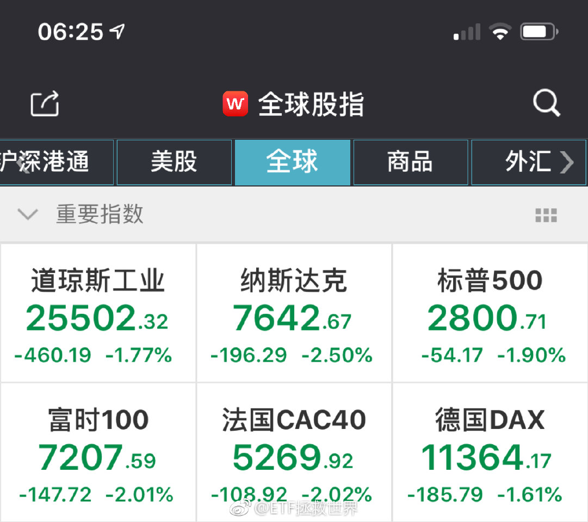

======================================================

ETF拯救世界 (5687069307) @
2019-03-23 07:57:35 Sat  
url: https://weibo.com/5687069307/Hmcxip368

黄赌毒不可沾 ​​​

转发[23]  评论[304]  赞[693] 

+++++++++++++++++++++++++++++++++++++++++++++++++++++

图片：

======================================================

ETF拯救世界 (5687069307) @
2019-03-23 08:08:24 Sat  
url: https://weibo.com/5687069307/HmcBHaFRc

学习了//@放牛归来再读书:牛//@一米单车一米路:高科技阿//@Zodzod_张浩 :牛逼...//@喷嚏网铂程 : //@YouTube精选 : 嗝屁屁，上天天[喵喵]//@暂许清欢 :真刺激，排排坐，勒脖脖[喵喵]

------------------------------------------------------
转推：
>  @YouTube精选 (2214257545)
>  2019-03-22 14:32:33 Fri  
>  url: https:/weibo.com/2214257545/Hm5H7DuYF/

>  国外小哥自制了一个精巧的老式弹簧捕鼠器，基于拥有400多年历史的法国设计，既简单又高效，一个晚上就抓了四只老鼠……看着监控镜头下的老鼠一个个上钩、一家人整整齐齐的样子，真是解气又想笑[doge]@柚子木字幕组 http://t.cn/ExBrJBn ​​​

转发[135]  评论[95]  赞[343] 

======================================================

ETF拯救世界 (5687069307) @
2019-03-23 09:17:05 Sat  
url: https://weibo.com/5687069307/Hmd3zw6OW

我不是很明白有股市为什么还要去赌博。

赚钱的快乐股市也有，关键是你能通过能力和经验的上升，赚钱的概率越来越大。股市还是有规律的，虽然运气也重要，但运气一般也能赚钱。

赌博有什么好？除了极个别项目，根本无法计算概率。如果不是庄家骗你，那就是全凭运气。靠运气发财？有可能，但是更大可能 ​​​

转发[307]  评论[266]  赞[724] 

======================================================

ETF拯救世界 (5687069307) @
2019-03-23 10:25:00 Sat  
url: https://weibo.com/5687069307/Hmdv9005B

回复@清香夜凝:20岁的人觉得40/50岁再发财就没意义了。等他们到了50岁，有好多钱了，大概就会发现，50岁发财真好啊。至少比穷到50岁好太多了。//@清香夜凝:不能暴富有什么用，人生苦短呀

------------------------------------------------------
转推：
>  @ETF拯救世界 (5687069307)
>  2019-03-23 09:17:05 Sat  
>  url: https:/weibo.com/5687069307/Hmd3zw6OW/

>  我不是很明白有股市为什么还要去赌博。
>  
>  赚钱的快乐股市也有，关键是你能通过能力和经验的上升，赚钱的概率越来越大。股市还是有规律的，虽然运气也重要，但运气一般也能赚钱。
>  
>  赌博有什么好？除了极个别项目，根本无法计算概率。如果不是庄家骗你，那就是全凭运气。靠运气发财？有可能，但是更大可能 ​​​

转发[84]  评论[111]  赞[550] 

======================================================

ETF拯救世界 (5687069307) @
2019-03-23 10:32:31 Sat  
url: https://weibo.com/5687069307/HmdyckRLz

回复@江两南:复利的魔力。但我不同意把钱都攒着不舍得花等到老了发财。年轻时候的那条裙子那个游戏，以后再有钱买再多也不会有当时的乐趣了//@江两南:巴菲特说了，我99%的钱都是在60岁以后赚到的。

------------------------------------------------------
转推：
>  @ETF拯救世界 (5687069307)
>  2019-03-23 09:17:05 Sat  
>  url: https:/weibo.com/5687069307/Hmd3zw6OW/

>  我不是很明白有股市为什么还要去赌博。
>  
>  赚钱的快乐股市也有，关键是你能通过能力和经验的上升，赚钱的概率越来越大。股市还是有规律的，虽然运气也重要，但运气一般也能赚钱。
>  
>  赌博有什么好？除了极个别项目，根本无法计算概率。如果不是庄家骗你，那就是全凭运气。靠运气发财？有可能，但是更大可能 ​​​

转发[52]  评论[229]  赞[621] 

======================================================

ETF拯救世界 (5687069307) @
2019-03-23 19:14:23 Sat  
url: https://weibo.com/5687069307/HmgY1d75S

回复@Mr-suson:跑赢指数这么简单吗？我在雪球关注的私募里面90%今年都没跑赢指数。更别说7456只公募基金中，今年只有238只跑赢中证500。我真不信有几个散户能跑赢全市场指数。//@Mr-suson:今年行情这么好，到现在还是亏或者跑不赢指数的是真该戒赌了！

------------------------------------------------------
转推：
>  @ETF拯救世界 (5687069307)
>  2019-03-23 09:17:05 Sat  
>  url: https:/weibo.com/5687069307/Hmd3zw6OW/

>  我不是很明白有股市为什么还要去赌博。
>  
>  赚钱的快乐股市也有，关键是你能通过能力和经验的上升，赚钱的概率越来越大。股市还是有规律的，虽然运气也重要，但运气一般也能赚钱。
>  
>  赌博有什么好？除了极个别项目，根本无法计算概率。如果不是庄家骗你，那就是全凭运气。靠运气发财？有可能，但是更大可能 ​​​

转发[127]  评论[116]  赞[503] 

======================================================

ETF拯救世界 (5687069307) @
2019-03-23 19:41:38 Sat  
url: https://weibo.com/5687069307/Hmh953BR3

回复@古道熹东:你觉得有几个人在牛市里能踏踏实实拿住不动？有20%吗？看看成交量。今天买明天卖，别说跟上指数了，有多少人赔钱你可能都想不到。//@古道熹东:到家都跑不赢那谁把钱赚去了呢？我觉得至少30-40%的申应该跑赢吧

------------------------------------------------------
转推：
>  @ETF拯救世界 (5687069307)
>  2019-03-23 09:17:05 Sat  
>  url: https:/weibo.com/5687069307/Hmd3zw6OW/

>  我不是很明白有股市为什么还要去赌博。
>  
>  赚钱的快乐股市也有，关键是你能通过能力和经验的上升，赚钱的概率越来越大。股市还是有规律的，虽然运气也重要，但运气一般也能赚钱。
>  
>  赌博有什么好？除了极个别项目，根本无法计算概率。如果不是庄家骗你，那就是全凭运气。靠运气发财？有可能，但是更大可能 ​​​

转发[54]  评论[71]  赞[416] 

======================================================

ETF拯救世界 (5687069307) @
2019-03-23 19:45:30 Sat  
url: https://weibo.com/5687069307/HmhaEerSx

回复@乐步女:你回头看，当然可以说今年满仓500就好。但是去年满仓可是要赔33%，今年涨成这样还没回本。远没有想象中那么简单。//@乐步女:那就直接买中证500

------------------------------------------------------
转推：
>  @ETF拯救世界 (5687069307)
>  2019-03-23 09:17:05 Sat  
>  url: https:/weibo.com/5687069307/Hmd3zw6OW/

>  我不是很明白有股市为什么还要去赌博。
>  
>  赚钱的快乐股市也有，关键是你能通过能力和经验的上升，赚钱的概率越来越大。股市还是有规律的，虽然运气也重要，但运气一般也能赚钱。
>  
>  赌博有什么好？除了极个别项目，根本无法计算概率。如果不是庄家骗你，那就是全凭运气。靠运气发财？有可能，但是更大可能 ​​​

转发[26]  评论[59]  赞[457] 

======================================================

ETF拯救世界 (5687069307) @
2019-03-23 19:49:59 Sat  
url: https://weibo.com/5687069307/Hmhct7vC9

回复@沙恩霍斯特号:更多的人是别人的股票涨的好，自己的不动。心里着急卖掉自己的去买别人的，结果原来的涨了，刚买的又买在山头了。真能做好追热点轮动的人没你想的这么多。

------------------------------------------------------
转推：
>  @ETF拯救世界 (5687069307)
>  2019-03-23 09:17:05 Sat  
>  url: https:/weibo.com/5687069307/Hmd3zw6OW/

>  我不是很明白有股市为什么还要去赌博。
>  
>  赚钱的快乐股市也有，关键是你能通过能力和经验的上升，赚钱的概率越来越大。股市还是有规律的，虽然运气也重要，但运气一般也能赚钱。
>  
>  赌博有什么好？除了极个别项目，根本无法计算概率。如果不是庄家骗你，那就是全凭运气。靠运气发财？有可能，但是更大可能 ​​​

转发[30]  评论[65]  赞[478] 

======================================================

ETF拯救世界 (5687069307) @
2019-03-23 20:08:40 Sat  
url: https://weibo.com/5687069307/Hmhk3hFdZ

A股自由流通市值是22万亿，今年A股成交额超过30万亿。也就是3个月时间，所有流通股票已经换手接近1.5次了。

你真以为有几个人能在牛市中拿着吃饱吃好？

别幻想了行吗？

我说大牛市中别说赚大钱了，不少人赔钱你肯定觉得非常不理解。但这就是事实。 ​​​

转发[314]  评论[228]  赞[718] 

======================================================

ETF拯救世界 (5687069307) @
2019-03-23 20:25:00 Sat  
url: https://weibo.com/5687069307/HmhqGgNiG

回复@天风3T:这些话我早就说过了。真的把我以前说的话认真翻一遍，能节省10年时间。//@天风3T:跟着买了一段时间，感觉本金还是很重要的，200块的证券涨了40%，感觉没什么多大意义，还是想办法提高自己的赚钱能力实在的多。

------------------------------------------------------
转推：
>  @ETF拯救世界 (5687069307)
>  2019-03-23 20:08:40 Sat  
>  url: https:/weibo.com/5687069307/Hmhk3hFdZ/

>  A股自由流通市值是22万亿，今年A股成交额超过30万亿。也就是3个月时间，所有流通股票已经换手接近1.5次了。
>  
>  你真以为有几个人能在牛市中拿着吃饱吃好？
>  
>  别幻想了行吗？
>  
>  我说大牛市中别说赚大钱了，不少人赔钱你肯定觉得非常不理解。但这就是事实。 ​​​

转发[30]  评论[165]  赞[469] 

======================================================

ETF拯救世界 (5687069307) @
2019-03-23 21:35:50 Sat  
url: https://weibo.com/5687069307/HmhTr0HqO

回复@ETF改变生活:我说的是“自由”流通市值。很多所谓的流通市值根本不流通，你研究的不够深入。//@ETF改变生活:算了下，流通市值是45.6万亿，e大怎么算的22万亿

------------------------------------------------------
转推：
>  @ETF拯救世界 (5687069307)
>  2019-03-23 20:08:40 Sat  
>  url: https:/weibo.com/5687069307/Hmhk3hFdZ/

>  A股自由流通市值是22万亿，今年A股成交额超过30万亿。也就是3个月时间，所有流通股票已经换手接近1.5次了。
>  
>  你真以为有几个人能在牛市中拿着吃饱吃好？
>  
>  别幻想了行吗？
>  
>  我说大牛市中别说赚大钱了，不少人赔钱你肯定觉得非常不理解。但这就是事实。 ​​​

转发[132]  评论[45]  赞[399] 

======================================================

ETF拯救世界 (5687069307) @
2019-03-23 21:39:50 Sat  
url: https://weibo.com/5687069307/HmhV37XWH

比如说，中石油集团持有中石油股票市值一万多亿。这一万多亿纸面上是流通市值，但根本不可能流通到市场上。这些股票就不是“自由流通市值”。要把所有真正流通的“流通市值”分离出来计算才准。

------------------------------------------------------
转推：
>  @ETF拯救世界 (5687069307)
>  2019-03-23 20:08:40 Sat  
>  url: https:/weibo.com/5687069307/Hmhk3hFdZ/

>  A股自由流通市值是22万亿，今年A股成交额超过30万亿。也就是3个月时间，所有流通股票已经换手接近1.5次了。
>  
>  你真以为有几个人能在牛市中拿着吃饱吃好？
>  
>  别幻想了行吗？
>  
>  我说大牛市中别说赚大钱了，不少人赔钱你肯定觉得非常不理解。但这就是事实。 ​​​

转发[52]  评论[79]  赞[499] 

======================================================

ETF拯救世界 (5687069307) @
2019-03-23 21:56:37 Sat  
url: https://weibo.com/5687069307/Hmi1S1wzl

回复@李大吉吉吉吉:我在2013年就写过一篇文章，论述当时建行流通市值只有300多亿，远比很多中小银行自由流通市值低，拉起来非常轻松。//@李大吉吉吉吉:对，比如五大行的大股东是不会卖的，实际流通市值不大

------------------------------------------------------
转推：
>  @ETF拯救世界 (5687069307)
>  2019-03-23 20:08:40 Sat  
>  url: https:/weibo.com/5687069307/Hmhk3hFdZ/

>  A股自由流通市值是22万亿，今年A股成交额超过30万亿。也就是3个月时间，所有流通股票已经换手接近1.5次了。
>  
>  你真以为有几个人能在牛市中拿着吃饱吃好？
>  
>  别幻想了行吗？
>  
>  我说大牛市中别说赚大钱了，不少人赔钱你肯定觉得非常不理解。但这就是事实。 ​​​

转发[49]  评论[118]  赞[524] 

======================================================

ETF拯救世界 (5687069307) @
2019-03-24 19:00:30 Sun  
url: https://weibo.com/5687069307/HmqiT5KUU

不看好未来十年收益不代表我要做空。 ​​​

转发[36]  评论[166]  赞[532] 

+++++++++++++++++++++++++++++++++++++++++++++++++++++

图片：

======================================================

ETF拯救世界 (5687069307) @
2019-03-24 19:59:13 Sun  
url: https://weibo.com/5687069307/HmqGIyslS

10% ​​​

转发[110]  评论[209]  赞[493] 

+++++++++++++++++++++++++++++++++++++++++++++++++++++

图片：

======================================================

ETF拯救世界 (5687069307) @
2019-03-24 20:01:11 Sun  
url: https://weibo.com/5687069307/HmqHvzgFQ

回复@yangmei的围脖:每周都有人中彩票头奖//@yangmei的围脖:蚂蚁里有个大v做空过

------------------------------------------------------
转推：
>  @ETF拯救世界 (5687069307)
>  2019-03-24 19:00:30 Sun  
>  url: https:/weibo.com/5687069307/HmqiT5KUU/

>  不看好未来十年收益不代表我要做空。 ​​​

转发[9]  评论[42]  赞[347] 

======================================================

ETF拯救世界 (5687069307) @
2019-03-24 20:14:52 Sun  
url: https://weibo.com/5687069307/HmqN47MZY

是不是骗局有一条硬核指标：是不是国家认可并监管的品种。

这个项目在证监 保监 银监有没有背书。公司有没有资质。这些都可以查。

有了监管层背书的标准化品种，不能说没有风险，但是是骗子的风险大大降低。剩下的交易风险可以用各种方法规避，骗子风险无法规避，唯一方法就是离得越远越好。

中国人 ​​​

转发[181]  评论[205]  赞[733] 

======================================================

ETF拯救世界 (5687069307) @
2019-03-24 20:18:26 Sun  
url: https://weibo.com/5687069307/HmqOvE9qK

我又想起来去年底说投资指数基金是传销那些人了。

这就是无知。 ​​​

转发[18]  评论[215]  赞[713] 

======================================================

ETF拯救世界 (5687069307) @
2019-03-25 08:06:43 Mon  
url: https://weibo.com/5687069307/Hmvs0jXcJ

回复@爽口苦菊:我会说，无论你选什么，以后不要后悔。想想自己真正要的是什么//@爽口苦菊:回复@开心快乐追求:如果e大看到肯定会说，买房。

------------------------------------------------------
转推：
>  @ETF拯救世界 (5687069307)
>  2019-03-24 20:18:26 Sun  
>  url: https:/weibo.com/5687069307/HmqOvE9qK/

>  我又想起来去年底说投资指数基金是传销那些人了。
>  
>  这就是无知。 ​​​

转发[4]  评论[50]  赞[398] 

======================================================

ETF拯救世界 (5687069307) @
2019-03-25 08:56:36 Mon  
url: https://weibo.com/5687069307/HmvMfBtFJ

招行不到5%的金葵花以上客户拥有80%以上的客户资产。 ​​​

转发[39]  评论[132]  赞[599] 

======================================================

ETF拯救世界 (5687069307) @
2019-03-25 09:03:41 Mon  
url: https://weibo.com/5687069307/HmvP7qBAa

今天A股还不调整吗。不过月底一定会发车，1-2车。 ​​​

转发[8]  评论[228]  赞[731] 

======================================================

ETF拯救世界 (5687069307) @
2019-03-25 09:27:30 Mon  
url: https://weibo.com/5687069307/HmvYNmvZC

不追涨是一种美德。

有钱还怕没有好的投资机会？

金融市场最不缺的就是机会。机会来了，最缺的是钱。

谁有钱谁才是话事人。 ​​​

转发[351]  评论[179]  赞[803] 

======================================================

ETF拯救世界 (5687069307) @
2019-03-25 09:30:33 Mon  
url: https://weibo.com/5687069307/Hmw028Z59

回复@郭佳宝dabao:跌下去68.36%的又不敢买了//@郭佳宝dabao:最近很多突然多出来很多钱的人机会来了！

------------------------------------------------------
转推：
>  @ETF拯救世界 (5687069307)
>  2019-03-25 09:27:30 Mon  
>  url: https:/weibo.com/5687069307/HmvYNmvZC/

>  不追涨是一种美德。
>  
>  有钱还怕没有好的投资机会？
>  
>  金融市场最不缺的就是机会。机会来了，最缺的是钱。
>  
>  谁有钱谁才是话事人。 ​​​

转发[21]  评论[61]  赞[354] 

======================================================

ETF拯救世界 (5687069307) @
2019-03-25 09:46:18 Mon  
url: https://weibo.com/5687069307/Hmw6q5l8D

回复@草农123:赶紧买啊。还不到60倍估值，历史最高210呢。//@草农123:军工这小伙子不错啊//@ETF拯救世界:回复@郭佳宝dabao:跌下去68.36%的又不敢买了//@郭佳宝dabao:最近很多突然多出来很多钱的人机会来了！

------------------------------------------------------
转推：
>  @ETF拯救世界 (5687069307)
>  2019-03-25 09:27:30 Mon  
>  url: https:/weibo.com/5687069307/HmvYNmvZC/

>  不追涨是一种美德。
>  
>  有钱还怕没有好的投资机会？
>  
>  金融市场最不缺的就是机会。机会来了，最缺的是钱。
>  
>  谁有钱谁才是话事人。 ​​​

转发[15]  评论[56]  赞[325] 

======================================================

ETF拯救世界 (5687069307) @
2019-03-25 10:02:11 Mon  
url: https://weibo.com/5687069307/HmwcSuZvd

一看就会，一做就废

------------------------------------------------------
转推：
>  @北京人不知道的北京事儿 (1662214194)
>  2019-03-23 22:31:28 Sat  
>  url: https:/weibo.com/1662214194/Hmig1jv6G/

>  打结技巧合集，总有一天用得上！果断收藏！[心]http://t.cn/ExDQU1V ​​​

转发[131]  评论[42]  赞[370] 

======================================================

ETF拯救世界 (5687069307) @
2019-03-25 10:06:43 Mon  
url: https://weibo.com/5687069307/HmweIA4So

回复@原农赋:说的太好了。可以不可以引申一下：做什么事情没有是否违背良心之分，只要赚钱。//@原农赋:犯不着冷嘲热讽军工，股票没有高低贵贱，只有盈亏//@ETF拯救世界:回复@草农123:赶紧买啊。还不到60倍估值，历史最高210呢。//@草农123:军工这小伙子不错啊

------------------------------------------------------
转推：
>  @ETF拯救世界 (5687069307)
>  2019-03-25 09:27:30 Mon  
>  url: https:/weibo.com/5687069307/HmvYNmvZC/

>  不追涨是一种美德。
>  
>  有钱还怕没有好的投资机会？
>  
>  金融市场最不缺的就是机会。机会来了，最缺的是钱。
>  
>  谁有钱谁才是话事人。 ​​​

转发[6]  评论[93]  赞[355] 

======================================================

ETF拯救世界 (5687069307) @
2019-03-25 10:23:48 Mon  
url: https://weibo.com/5687069307/HmwlEdi8Q

之前这位朋友问，买军工股的人哪里违背良心了？

他是没懂我的意思。

他说，买什么都可以，只要赚钱。

我说，那么是不是做什么事情都可以，哪怕违背良心，只要赚钱？

这是一个引申出去的推论，并非说买军工股违背良心。

再说大一点，这是人生观和价值观的不同。

我对于投资的价值观，就是特别贵的 ​​​

转发[147]  评论[247]  赞[875] 

======================================================

ETF拯救世界 (5687069307) @
2019-03-25 10:34:38 Mon  
url: https://weibo.com/5687069307/Hmwq2CqMH

毫无抵抗力！

------------------------------------------------------
转推：
>  @ETF拯救世界 (5687069307)
>  2019-03-22 14:12:58 Fri  
>  url: https:/weibo.com/5687069307/Hm5zb3wTV/

>  对每天新高的指数毫无抵抗力。
>  
>  $全指医药 sh000991$ ​​​

转发[12]  评论[39]  赞[349] 

======================================================

ETF拯救世界 (5687069307) @
2019-03-25 10:37:51 Mon  
url: https://weibo.com/5687069307/HmwrmcenC

回复@ksk2037:我再说一次，投资指数不是投资股票。你一只股票亏损买我都觉得没问题，但是一个指数50只个股平均PE 60倍，所有公司都有高速发展？实话实说，我认为那是一个梦。

------------------------------------------------------
转推：
>  @ETF拯救世界 (5687069307)
>  2019-03-25 10:23:48 Mon  
>  url: https:/weibo.com/5687069307/HmwlEdi8Q/

>  之前这位朋友问，买军工股的人哪里违背良心了？
>  
>  他是没懂我的意思。
>  
>  他说，买什么都可以，只要赚钱。
>  
>  我说，那么是不是做什么事情都可以，哪怕违背良心，只要赚钱？
>  
>  这是一个引申出去的推论，并非说买军工股违背良心。
>  
>  再说大一点，这是人生观和价值观的不同。
>  
>  我对于投资的价值观，就是特别贵的 ​​​

转发[43]  评论[57]  赞[520] 

======================================================

ETF拯救世界 (5687069307) @
2019-03-25 10:40:40 Mon  
url: https://weibo.com/5687069307/Hmwsv75r9

回复@Glimpse:怎么强了？今年还没跑赢中证500//@Glimpse:e大，为啥军工这么强，他不倒下，是不是牛市就还比较远？//@ETF拯救世界:毫无抵抗力！

------------------------------------------------------
转推：
>  @ETF拯救世界 (5687069307)
>  2019-03-22 14:12:58 Fri  
>  url: https:/weibo.com/5687069307/Hm5zb3wTV/

>  对每天新高的指数毫无抵抗力。
>  
>  $全指医药 sh000991$ ​​​

转发[10]  评论[85]  赞[376] 

======================================================

ETF拯救世界 (5687069307) @
2019-03-25 13:46:08 Mon  
url: https://weibo.com/5687069307/HmxFM9rWT

今天这么一涨还真超500了。破60，加油！//@ETF拯救世界:回复@Glimpse:怎么强了？今年还没跑赢中证500//@Glimpse:e大，为啥军工这么强，他不倒下，是不是牛市就还比较远？//@ETF拯救世界:毫无抵抗力！

------------------------------------------------------
转推：
>  @ETF拯救世界 (5687069307)
>  2019-03-22 14:12:58 Fri  
>  url: https:/weibo.com/5687069307/Hm5zb3wTV/

>  对每天新高的指数毫无抵抗力。
>  
>  $全指医药 sh000991$ ​​​

转发[4]  评论[59]  赞[375] 

======================================================

ETF拯救世界 (5687069307) @
2019-03-25 14:35:26 Mon  
url: https://weibo.com/5687069307/HmxZN9yV4

我希望照顾到每位朋友的情绪，让大家都感受到被我尊重和重视，但是因为人太多了，不可能所有人都照顾到。

包括私信啊，生日祝福啊，考试祝福啊，娶妻生子祝福啊等等。我看到的一定会回复，但有时候忙看不到也请见谅。我一定是尊重每位朋友的。

还有，就是如果我认为您和我的三观不合，或者不怀好意， ​​​

转发[31]  评论[391]  赞[1203] 

======================================================

ETF拯救世界 (5687069307) @
2019-03-25 17:02:50 Mon  
url: https://weibo.com/5687069307/HmyXCcb0b

确认了：A12芯片真的做多了。

------------------------------------------------------
转推：
>  @ ()
>  2019-03-25 16:23:25 Mon  
>  url: 

>  抱歉，作者已设置仅展示半年内微博，此微博已不可见。 ​​​

转发[7]  评论[69]  赞[276] 

======================================================

ETF拯救世界 (5687069307) @
2019-03-25 17:06:29 Mon  
url: https://weibo.com/5687069307/HmyZ696bR

回复@人嫌狗不耐:喷了。这里的朋友每位把账户里面收益最高的几个品种收益率截图发朋友圈都是大神吧。

------------------------------------------------------
转推：
>  @ETF拯救世界 (5687069307)
>  2019-03-25 14:35:26 Mon  
>  url: https:/weibo.com/5687069307/HmxZN9yV4/

>  我希望照顾到每位朋友的情绪，让大家都感受到被我尊重和重视，但是因为人太多了，不可能所有人都照顾到。
>  
>  包括私信啊，生日祝福啊，考试祝福啊，娶妻生子祝福啊等等。我看到的一定会回复，但有时候忙看不到也请见谅。我一定是尊重每位朋友的。
>  
>  还有，就是如果我认为您和我的三观不合，或者不怀好意， ​​​

转发[12]  评论[122]  赞[422] 

======================================================

ETF拯救世界 (5687069307) @
2019-03-25 20:34:40 Mon  
url: https://weibo.com/5687069307/HmAlBcbL8

越来越多的女性不因为经济原因结婚，男性的努力方向要更加多元了…

------------------------------------------------------
转推：
>  @ ()
>  2019-03-25 19:36:18 Mon  
>  url: 

>  抱歉，作者已设置仅展示半年内微博，此微博已不可见。 ​​​

转发[13]  评论[127]  赞[385] 

======================================================

ETF拯救世界 (5687069307) @
2019-03-26 08:21:07 Tue  
url: https://weibo.com/5687069307/HmEYlr4h4

我有一事不明：

为什么那么多人喜欢看特别堵心的电视剧。

刚看有人说看到某电视剧结局一直哭一直哭，一路看着也是一直气的不得了。

我是真不懂，为什么啊。爱看这种。

现实中的糟心事还不够多吗？还要在休闲的时候继续给自己添堵？

看点轻轻松松的又或者激烈刺激哪怕怪力乱神的放松一下不好吗。

 ​​​

转发[61]  评论[471]  赞[597] 

======================================================

ETF拯救世界 (5687069307) @
2019-03-26 08:24:36 Tue  
url: https://weibo.com/5687069307/HmEZLfkov

回复@捉迷藏music:首先你得有收益率最高的品种可晒。你有没有想过为什么那么多大神PS交易软件截图，修改成本价，不惜冒着身败名裂的风险作假？//@捉迷藏music:话说炒个股的，如果只把收益率最高的几笔交易晒出来也是大神吧？买彩票的、赌博的如果只把收益率最高的几次晒出来更是大神了[吃惊]

------------------------------------------------------
转推：
>  @ETF拯救世界 (5687069307)
>  2019-03-25 14:35:26 Mon  
>  url: https:/weibo.com/5687069307/HmxZN9yV4/

>  我希望照顾到每位朋友的情绪，让大家都感受到被我尊重和重视，但是因为人太多了，不可能所有人都照顾到。
>  
>  包括私信啊，生日祝福啊，考试祝福啊，娶妻生子祝福啊等等。我看到的一定会回复，但有时候忙看不到也请见谅。我一定是尊重每位朋友的。
>  
>  还有，就是如果我认为您和我的三观不合，或者不怀好意， ​​​

转发[6]  评论[50]  赞[337] 

======================================================

ETF拯救世界 (5687069307) @
2019-03-26 08:57:19 Tue  
url: https://weibo.com/5687069307/HmFd28LIO

我还有一事不明：

华为手机和格力空调是不是真的那么好。好到比其它国产品牌贵很多很多……

我是真的不懂，找明白人问问。 ​​​

转发[20]  评论[733]  赞[526] 

======================================================

ETF拯救世界 (5687069307) @
2019-03-26 10:07:43 Tue  
url: https://weibo.com/5687069307/HmFFCesqG

罚10万，关6个月，上征信，十年不许上高速，吊销驾照五年不许考。

------------------------------------------------------
转推：
>  @北京人不知道的北京事儿 (1662214194)
>  2019-03-26 09:56:20 Tue  
>  url: https:/weibo.com/1662214194/HmFAZChzO/

>  【专坑ETC车主！强行变道还倒车，花别人的钱上高速[弱]】最近，山东德州高速路段出现了一批专蹭ETC的车主。警方表示，此举十分危险，不仅影响了人身安全，还会造成追尾等严重交通事故。蹭ETC进入或离开高速的违规车辆将被拉入黑名单并无法通行全国高速；相关违规车辆在出高速时将按无卡进行处理：即按 ​​​

转发[28]  评论[95]  赞[350] 

======================================================

ETF拯救世界 (5687069307) @
2019-03-26 11:33:35 Tue  
url: https://weibo.com/5687069307/HmGett1Fi

你还有没有钱[嘻嘻] 耐心是美德。

------------------------------------------------------
转推：
>  @ETF拯救世界 (5687069307)
>  2019-03-25 09:27:30 Mon  
>  url: https:/weibo.com/5687069307/HmvYNmvZC/

>  不追涨是一种美德。
>  
>  有钱还怕没有好的投资机会？
>  
>  金融市场最不缺的就是机会。机会来了，最缺的是钱。
>  
>  谁有钱谁才是话事人。 ​​​

转发[22]  评论[373]  赞[746] 

======================================================

ETF拯救世界 (5687069307) @
2019-03-26 13:48:33 Tue  
url: https://weibo.com/5687069307/HmH7fwpwX

我能尽量做到不错过大底，不追在山顶，也能尽量做到波段仓位吃大波段。

但我没法做到全部筹码吃每一个小波段。

希望达到这个效果的立即取关，去找能做到的人关注吧。 ​​​

转发[143]  评论[158]  赞[895] 

======================================================

ETF拯救世界 (5687069307) @
2019-03-26 13:58:25 Tue  
url: https://weibo.com/5687069307/HmHbg6qgC

回复@solonblue:问题在于，你纠结和不纠结，结果有什么不同呢。可以抓住吗。//@solonblue:每次来这里看益达的帖子, 都提醒自己要有大格局 不要纠结几个点

------------------------------------------------------
转推：
>  @ETF拯救世界 (5687069307)
>  2019-03-26 13:48:33 Tue  
>  url: https:/weibo.com/5687069307/HmH7fwpwX/

>  我能尽量做到不错过大底，不追在山顶，也能尽量做到波段仓位吃大波段。
>  
>  但我没法做到全部筹码吃每一个小波段。
>  
>  希望达到这个效果的立即取关，去找能做到的人关注吧。 ​​​

转发[8]  评论[46]  赞[384] 

======================================================

ETF拯救世界 (5687069307) @
2019-03-26 14:02:20 Tue  
url: https://weibo.com/5687069307/HmHcQqIRe

回复@叨叨door:我的系统显示支撑在2900左右。如果能到，我们的右侧仓位会在那里上车。如果不能到——就算了呗。//@叨叨door:能跌破3000点么？

------------------------------------------------------
转推：
>  @ETF拯救世界 (5687069307)
>  2019-03-26 13:48:33 Tue  
>  url: https:/weibo.com/5687069307/HmH7fwpwX/

>  我能尽量做到不错过大底，不追在山顶，也能尽量做到波段仓位吃大波段。
>  
>  但我没法做到全部筹码吃每一个小波段。
>  
>  希望达到这个效果的立即取关，去找能做到的人关注吧。 ​​​

转发[88]  评论[128]  赞[572] 

======================================================

ETF拯救世界 (5687069307) @
2019-03-26 14:10:21 Tue  
url: https://weibo.com/5687069307/HmHg6z6Yv

回复@小贝和皮皮:因为说上证非常直观。如果我说300支撑位3600或者500支撑位5000，你真能反应过来要跌多少吗？//@小贝和皮皮:弱弱问一句，益达应该以前说过不要看沪指，因为失真，为啥支撑位还是依据护指，不是比如中证500

------------------------------------------------------
转推：
>  @ETF拯救世界 (5687069307)
>  2019-03-26 13:48:33 Tue  
>  url: https:/weibo.com/5687069307/HmH7fwpwX/

>  我能尽量做到不错过大底，不追在山顶，也能尽量做到波段仓位吃大波段。
>  
>  但我没法做到全部筹码吃每一个小波段。
>  
>  希望达到这个效果的立即取关，去找能做到的人关注吧。 ​​​

转发[29]  评论[51]  赞[474] 

======================================================

ETF拯救世界 (5687069307) @
2019-03-26 14:14:07 Tue  
url: https://weibo.com/5687069307/HmHhD7oIS

我们不能像有些人一样2400点瑟瑟发抖拿着现金嘟囔着世界末日就要来了；

也不能像有些人3100疯了一样拿着钞票加着杠杆往里面冲喊着大牛市。

我们永远冷静，永远客观。默默的看着疯子们潮起潮落，咱们弯腰捡钱。

就这么简单。

再次提醒，两个月没买了。

舒服。 ​​​

转发[88]  评论[194]  赞[934] 

======================================================

ETF拯救世界 (5687069307) @
2019-03-26 14:33:38 Tue  
url: https://weibo.com/5687069307/HmHpyvWcf

另外，鉴于这次波段操作比较成功，加上未来A股仓位继续上升，我会将波段仓位比重加大。用来应对未来也许会出现的波动大涨幅小的局面。

但是因为计划是一个长线计划，加上它的特殊性，不可能用太多笔墨在这上面，算是锦上添花吧。 ​​​

转发[56]  评论[224]  赞[919] 

======================================================

ETF拯救世界 (5687069307) @
2019-03-26 14:37:36 Tue  
url: https://weibo.com/5687069307/HmHraqoGF

回复@生如夏花Chp:今年计划出去玩一个多月。去一个遥远的国度。//@生如夏花Chp:益达中午说要出去旅游，下午就跳水，喷了

------------------------------------------------------
转推：
>  @ETF拯救世界 (5687069307)
>  2019-03-26 14:33:38 Tue  
>  url: https:/weibo.com/5687069307/HmHpyvWcf/

>  另外，鉴于这次波段操作比较成功，加上未来A股仓位继续上升，我会将波段仓位比重加大。用来应对未来也许会出现的波动大涨幅小的局面。
>  
>  但是因为计划是一个长线计划，加上它的特殊性，不可能用太多笔墨在这上面，算是锦上添花吧。 ​​​

转发[7]  评论[205]  赞[529] 

======================================================

ETF拯救世界 (5687069307) @
2019-03-26 15:27:10 Tue  
url: https://weibo.com/5687069307/HmHLhmE2R

万万没想到广告商已经不关心投广告的事了… ​​​

转发[29]  评论[226]  赞[598] 

+++++++++++++++++++++++++++++++++++++++++++++++++++++

图片：

======================================================

ETF拯救世界 (5687069307) @
2019-03-26 15:34:15 Tue  
url: https://weibo.com/5687069307/HmHO9Aifi

回复@Aircdre:每天十几个要打广告的回不过来//@Aircdre:E大就回人家个消息吧[笑cry]

------------------------------------------------------
转推：
>  @ETF拯救世界 (5687069307)
>  2019-03-26 15:27:10 Tue  
>  url: https:/weibo.com/5687069307/HmHLhmE2R/

>  万万没想到广告商已经不关心投广告的事了… ​​​

转发[13]  评论[104]  赞[364] 

======================================================

ETF拯救世界 (5687069307) @
2019-03-26 19:44:05 Tue  
url: https://weibo.com/5687069307/HmJrzkMu9

回复@小w今天吃鸡了吗:这个可以有。免费！//@小w今天吃鸡了吗:[乔治][乔治]可以打征婚广告吗 e大[嘻嘻][嘻嘻][嘻嘻][嘻嘻]//@ETF拯救世界:回复@Aircdre:每天十几个要打广告的回不过来//@Aircdre:E大就回人家个消息吧[笑cry]

------------------------------------------------------
转推：
>  @ETF拯救世界 (5687069307)
>  2019-03-26 15:27:10 Tue  
>  url: https:/weibo.com/5687069307/HmHLhmE2R/

>  万万没想到广告商已经不关心投广告的事了… ​​​

转发[7]  评论[94]  赞[273] 

======================================================

ETF拯救世界 (5687069307) @
2019-03-26 20:05:26 Tue  
url: https://weibo.com/5687069307/HmJAewbqE

回复@4-water:不好说。还有几十个喷子也天天刷，好姑娘让他们骗走了怎么办//@4-water:在这里征婚比较靠谱的 起码大家都踏踏实实的//@ETF拯救世界:回复@小w今天吃鸡了吗:这个可以有。免费！//@小w今天吃鸡了吗:[乔治][乔治]可以打征婚广告吗 e大[嘻嘻][嘻嘻][嘻嘻][嘻嘻]

------------------------------------------------------
转推：
>  @ETF拯救世界 (5687069307)
>  2019-03-26 15:27:10 Tue  
>  url: https:/weibo.com/5687069307/HmHLhmE2R/

>  万万没想到广告商已经不关心投广告的事了… ​​​

转发[4]  评论[233]  赞[391] 

======================================================

ETF拯救世界 (5687069307) @
2019-03-27 14:30:35 Wed  
url: https://weibo.com/5687069307/HmQOOhNrv

大道相通 ​​​

转发[50]  评论[149]  赞[530] 

+++++++++++++++++++++++++++++++++++++++++++++++++++++

图片：

======================================================

ETF拯救世界 (5687069307) @
2019-03-27 14:35:22 Wed  
url: https://weibo.com/5687069307/HmQQL8EsR

还有一条忘了说，不要在网上做喷子，否则孤老一生。

------------------------------------------------------
转推：
>  @ETF拯救世界 (5687069307)
>  2019-03-27 14:30:35 Wed  
>  url: https:/weibo.com/5687069307/HmQOOhNrv/

>  大道相通 ​​​

转发[36]  评论[78]  赞[449] 

======================================================

ETF拯救世界 (5687069307) @
2019-03-27 14:44:13 Wed  
url: https://weibo.com/5687069307/HmQUlBaCB

回复@ETF漂洋过海来看你:对。但是去年柳叶刀有篇论文，说84.6%的喷子*生活不协调。所以单身与否不是关键，关键是很痛苦的孤老终生…//@ETF漂洋过海来看你:喷子未必单身呢，施主…[doge]//@ETF拯救世界:还有一条忘了说，不要在网上做喷子，否则孤老一生。

------------------------------------------------------
转推：
>  @ETF拯救世界 (5687069307)
>  2019-03-27 14:30:35 Wed  
>  url: https:/weibo.com/5687069307/HmQOOhNrv/

>  大道相通 ​​​

转发[28]  评论[157]  赞[415] 

======================================================

ETF拯救世界 (5687069307) @
2019-03-27 19:05:07 Wed  
url: https://weibo.com/5687069307/HmSCf9ZA7

回复@HU傻胖:不知道你用笔电是干嘛用的。我用过的笔记本也算多了，mac pro，IBM，华硕，sony……然而我现在最喜欢用的居然是surface。如果不是它的平板模式真的有点差，简直值得推荐。当然，即使不是平板模式，也不适合玩游戏//@HU傻胖:请教各位，手提电脑，买哪个好一点

------------------------------------------------------
转推：
>  @ETF拯救世界 (5687069307)
>  2019-03-27 14:30:35 Wed  
>  url: https:/weibo.com/5687069307/HmQOOhNrv/

>  大道相通 ​​​

转发[18]  评论[163]  赞[289] 

======================================================

ETF拯救世界 (5687069307) @
2019-03-27 19:12:49 Wed  
url: https://weibo.com/5687069307/HmSFmFmQ0

刚才一位朋友私信我让我帮转提醒大家。学习了。

------------------------------------------------------
转推：
>  @ ()
>  2019-03-27 04:38:57 Wed  
>  url: 

>  抱歉，此微博已被作者删除。查看帮助：http://t.cn/Rfd3rQV

转发[245]  评论[174]  赞[567] 

======================================================

ETF拯救世界 (5687069307) @
2019-03-28 06:50:51 Thu  
url: https://weibo.com/5687069307/HmXeI1YHU

确认了，哥们是真的喜欢当老师

------------------------------------------------------
转推：
>  @新财富杂志 (1708922835)
>  2019-03-27 23:35:03 Wed  
>  url: https:/weibo.com/1708922835/HmUnOf8o8/

>  【马云最新演讲：决定你一生成就的，是这2件事】看到别人看不到的事，做别人不想做的事，你才能创造更多价值。而普通人如何做到这2点，才能在职业生涯中获得更多发展机会？马云说：敢不切实际地妄想，才敢不顾一切地努力；很傻很天真，一门心思做好一件事儿；看到别人看不到的事，做别人不想做的事，决 ​​​

转发[35]  评论[183]  赞[429] 

======================================================

ETF拯救世界 (5687069307) @
2019-03-28 10:46:35 Thu  
url: https://weibo.com/5687069307/HmYMo0fI1

买个门票股也这么糟心。

退博了。

[摊手] ​​​

转发[10]  评论[167]  赞[592] 

======================================================

ETF拯救世界 (5687069307) @
2019-03-28 10:49:13 Thu  
url: https://weibo.com/5687069307/HmYNsbtXI

忙了一上午。中午发车啊老铁们。 ​​​

转发[31]  评论[957]  赞[1430] 

======================================================

ETF拯救世界 (5687069307) @
2019-03-28 14:51:31 Thu  
url: https://weibo.com/5687069307/Hn0nO13wK

A股不跌到位，计划一分钱也不买。[笑而不语] ​​​

转发[26]  评论[407]  赞[1230] 

======================================================

ETF拯救世界 (5687069307) @
2019-03-28 19:12:59 Thu  
url: https://weibo.com/5687069307/Hn25W236Y

后悔没用，但是要努力改变结果！ ​​​

转发[25]  评论[415]  赞[686] 

+++++++++++++++++++++++++++++++++++++++++++++++++++++

图片：

======================================================

ETF拯救世界 (5687069307) @
2019-03-29 09:29:19 Fri  
url: https://weibo.com/5687069307/Hn7HweknQ

有10个人非常关心今天收盘点位…… ​​​

转发[2]  评论[242]  赞[639] 

======================================================

ETF拯救世界 (5687069307) @
2019-03-29 09:45:54 Fri  
url: https://weibo.com/5687069307/Hn7OfrZL1

$162411  油气是个乖孩子…… ​​​

转发[4]  评论[126]  赞[576] 

======================================================

ETF拯救世界 (5687069307) @
2019-03-29 10:32:15 Fri  
url: https://weibo.com/5687069307/Hn874nc3n

为什么我只敢买交易所的标准化产品，而且是不死的那种。

很简单。

其它品种投少了，改变不了什么，没有意义。投多了，风险太大。辛辛苦苦攒了十几年的钱瞬间就没了，这个我接受不了。

还是指数基金适合我。除非所有持有的1000家公司同时崩盘，除非交易所关门，否则就死不了。

死不了就有办法挣钱。 ​​​

转发[151]  评论[285]  赞[898] 

======================================================

ETF拯救世界 (5687069307) @
2019-03-29 10:37:09 Fri  
url: https://weibo.com/5687069307/Hn893AsHU

回复@薏仁之梦:德国买了就不要看了，十年后再说。//@薏仁之梦:请问E大，德国dax多少点进入高估呢？

------------------------------------------------------
转推：
>  @ETF拯救世界 (5687069307)
>  2019-03-29 10:32:15 Fri  
>  url: https:/weibo.com/5687069307/Hn874nc3n/

>  为什么我只敢买交易所的标准化产品，而且是不死的那种。
>  
>  很简单。
>  
>  其它品种投少了，改变不了什么，没有意义。投多了，风险太大。辛辛苦苦攒了十几年的钱瞬间就没了，这个我接受不了。
>  
>  还是指数基金适合我。除非所有持有的1000家公司同时崩盘，除非交易所关门，否则就死不了。
>  
>  死不了就有办法挣钱。 ​​​

转发[32]  评论[234]  赞[569] 

======================================================

ETF拯救世界 (5687069307) @
2019-03-29 11:39:45 Fri  
url: https://weibo.com/5687069307/Hn8yt7M8m

今年50%也不是不可能啊 ​​​

转发[14]  评论[336]  赞[920] 

======================================================

ETF拯救世界 (5687069307) @
2019-03-29 12:27:57 Fri  
url: https://weibo.com/5687069307/Hn8S1w4Ie

有了解的说说 ​​​

转发[12]  评论[216]  赞[333] 

+++++++++++++++++++++++++++++++++++++++++++++++++++++

图片：

======================================================

ETF拯救世界 (5687069307) @
2019-03-29 15:42:02 Fri  
url: https://weibo.com/5687069307/Hna8Oi2vH

继续。我们的医药

------------------------------------------------------
转推：
>  @ETF拯救世界 (5687069307)
>  2019-03-22 14:12:58 Fri  
>  url: https:/weibo.com/5687069307/Hm5zb3wTV/

>  对每天新高的指数毫无抵抗力。
>  
>  $全指医药 sh000991$ ​​​

转发[1]  评论[105]  赞[466] 

======================================================

ETF拯救世界 (5687069307) @
2019-03-29 15:44:37 Fri  
url: https://weibo.com/5687069307/Hna9Rl0EB

一张图告诉你为什么最近没有打卡 ​​​

转发[3]  评论[142]  赞[560] 

+++++++++++++++++++++++++++++++++++++++++++++++++++++

图片：

======================================================

ETF拯救世界 (5687069307) @
2019-03-29 16:04:00 Fri  
url: https://weibo.com/5687069307/HnahICKDn

回复@鸟语花香1227:初中谈恋爱是性早熟？我一直觉得很正常啊…//@鸟语花香1227:回复@小小6_6:大体就是孩子过早接触一些时尚，成人化的东西，易导致性早熟，所以现在小学初中不少谈恋爱的。性早熟并不都是吃出来的，心理早熟与现在的网络手机普及有很大关系。

------------------------------------------------------
转推：
>  @ETF拯救世界 (5687069307)
>  2019-03-29 12:27:57 Fri  
>  url: https:/weibo.com/5687069307/Hn8S1w4Ie/

>  有了解的说说 ​​​

转发[3]  评论[104]  赞[265] 

======================================================

ETF拯救世界 (5687069307) @
2019-03-29 16:12:26 Fri  
url: https://weibo.com/5687069307/Hnal92tWr

今天收盘点位3090，根据抽奖规则，请微信的“王赤峰”朋友在公众号给我发私信联系我，我要送你礼物。

有时候你不能不相信这个世界有天意这回事。他是打赏最多的人… ​​​

转发[8]  评论[410]  赞[1128] 

======================================================

ETF拯救世界 (5687069307) @
2019-03-29 17:44:07 Fri  
url: https://weibo.com/5687069307/HnaWmgcCY

装修的时候做了一套全屋定制，因为比较贵，怎么想都觉得要把钱赚回来。

然后就买了那家公司的股票。

后来跌了10%，也没在意。

今天一看，已经涨了40%了……赚了两套全屋定制的钱…… ​​​

转发[94]  评论[278]  赞[857] 

======================================================

ETF拯救世界 (5687069307) @
2019-03-29 18:28:52 Fri  
url: https://weibo.com/5687069307/HnbewnF89

回复@godreameng:这个思路没错。把经常消费的经常使用的公司做个组合，要比那些你根本不知道干嘛的热门股靠谱的多。当然，如果在钻石坑里买胜算就更大，还要看价值//@godreameng:我应该多配置点消费和医药，医疗股票。毕竟每年都要消费很多，花不少钱在医院。

------------------------------------------------------
转推：
>  @ETF拯救世界 (5687069307)
>  2019-03-29 17:44:07 Fri  
>  url: https:/weibo.com/5687069307/HnaWmgcCY/

>  装修的时候做了一套全屋定制，因为比较贵，怎么想都觉得要把钱赚回来。
>  
>  然后就买了那家公司的股票。
>  
>  后来跌了10%，也没在意。
>  
>  今天一看，已经涨了40%了……赚了两套全屋定制的钱…… ​​​

转发[48]  评论[104]  赞[486] 

======================================================

ETF拯救世界 (5687069307) @
2019-03-29 21:20:49 Fri  
url: https://weibo.com/5687069307/HncmjwoiG

以后不打卡keep了。找了个健身会所，请了私教，玩就玩的专业点。

以后每天11点前睡觉，美股不看了，命比钱重要…… ​​​

转发[12]  评论[253]  赞[1016] 

======================================================

ETF拯救世界 (5687069307) @
2019-03-29 21:37:57 Fri  
url: https://weibo.com/5687069307/Hncth1XC4

谢谢老铁，666 ​​​

转发[95]  评论[116]  赞[558] 

+++++++++++++++++++++++++++++++++++++++++++++++++++++

图片：

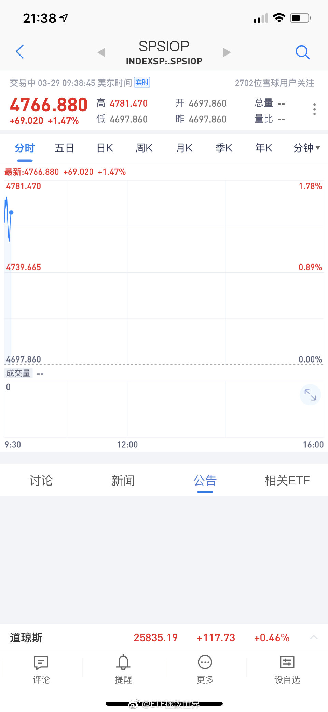

======================================================

ETF拯救世界 (5687069307) @
2019-03-29 21:54:53 Fri  
url: https://weibo.com/5687069307/HncA9nh5E

回复@Naywssl:没在150里面。记住，S里面的，跌的越狠越好。150已经没有什么力量去大幅补仓了。S不同。S的任何品种都应该希望暴跌。//@Naywssl:黄金跌了[跪了]

------------------------------------------------------
转推：
>  @ETF拯救世界 (5687069307)
>  2019-03-29 21:37:57 Fri  
>  url: https:/weibo.com/5687069307/Hncth1XC4/

>  谢谢老铁，666 ​​​

转发[82]  评论[75]  赞[427] 

======================================================

ETF拯救世界 (5687069307) @
2019-03-29 21:59:45 Fri  
url: https://weibo.com/5687069307/HncC80fM2

回复@小五雀雀:S是家里有矿无限投入型。任何大跌都没在怕的。150是资产配置型，讲究稳中求进，不断新高。//@小五雀雀:S是激进型[doge]//@ETF拯救世界:回复@Naywssl:没在150里面。记住，S里面的，跌的越狠越好。150已经没有什么力量去大幅补仓了。S不同。S的任何品种都应该希望暴跌。

------------------------------------------------------
转推：
>  @ETF拯救世界 (5687069307)
>  2019-03-29 21:37:57 Fri  
>  url: https:/weibo.com/5687069307/Hncth1XC4/

>  谢谢老铁，666 ​​​

转发[52]  评论[112]  赞[500] 

======================================================

ETF拯救世界 (5687069307) @
2019-03-30 07:28:14 Sat  
url: https://weibo.com/5687069307/HngkRFh5O

赚钱的附带效应，是帮很多朋友家庭更加幸福了…我是真的很高兴。

不过一定沟通好，以后某个时间段有波动利润下降，不要太在意，别影响夫妻关系… ​​​

转发[12]  评论[322]  赞[923] 

+++++++++++++++++++++++++++++++++++++++++++++++++++++

图片：

======================================================

ETF拯救世界 (5687069307) @
2019-03-30 11:23:58 Sat  
url: https://weibo.com/5687069307/HnhSyfrjY

回复@H_Old_En_me:回复的一个都没回到点上。请这位朋友注意，不同策略开始时间不同，年化收益的不同。我是在牛市最高点开始的，你再看看其它策略开始时间。建议你对比跑赢同期指数幅度判断//@H_Old_En_me:你们这么捧吗都。我看且慢策略里跑赢e大的好几个呢。

------------------------------------------------------
转推：
>  @ETF拯救世界 (5687069307)
>  2019-03-30 07:28:14 Sat  
>  url: https:/weibo.com/5687069307/HngkRFh5O/

>  赚钱的附带效应，是帮很多朋友家庭更加幸福了…我是真的很高兴。
>  
>  不过一定沟通好，以后某个时间段有波动利润下降，不要太在意，别影响夫妻关系… ​​​

转发[2]  评论[62]  赞[447] 

======================================================

ETF拯救世界 (5687069307) @
2019-03-30 11:37:07 Sat  
url: https://weibo.com/5687069307/HnhXTcszB

这么说吧，如果把计算计划收益率的时间前移两年，从第二轮计划开始算，那么至今6年总收益就会到180%+，年化收益率19%+。 同期沪深300涨幅58%，中证500涨幅53%。

但这样有意思吗？没意思。事后找个低点开始把数字做的好看了有什么意义？

把开始时间不同的策略放在一起比较年化收益率本来就是非常可笑 ​​​

转发[88]  评论[240]  赞[903] 

======================================================

ETF拯救世界 (5687069307) @
2019-03-30 11:52:15 Sat  
url: https://weibo.com/5687069307/Hni4279Tr

我其实不了解P平台，原来这是一个大平台，原来这么多V推荐过。

赚钱没错，但是要讲良心。 ​​​

转发[48]  评论[328]  赞[630] 

+++++++++++++++++++++++++++++++++++++++++++++++++++++

图片：

======================================================

ETF拯救世界 (5687069307) @
2019-03-30 11:56:32 Sat  
url: https://weibo.com/5687069307/Hni5M09Q4

回复@IVnHSnM:一个“粉丝”虽然只是屏幕上一个数字，一个二十万分之一的数字，但每个数字后面都是一个真实的家庭和一个家庭的血汗钱。想到这个，有些钱怎么可能去赚？//@IVnHSnM:你一直说的底线，有的钱不能赚。

------------------------------------------------------
转推：
>  @ETF拯救世界 (5687069307)
>  2019-03-30 11:52:15 Sat  
>  url: https:/weibo.com/5687069307/Hni4279Tr/

>  我其实不了解P平台，原来这是一个大平台，原来这么多V推荐过。
>  
>  赚钱没错，但是要讲良心。 ​​​

转发[18]  评论[260]  赞[906] 

======================================================

ETF拯救世界 (5687069307) @
2019-03-31 19:32:59 Sun  
url: https://weibo.com/5687069307/HnuvxsUtK

看了不少私信，一个感觉：

结婚一定要找三观一致的人。否则非常痛苦。

仅是金融投资一项，如果三观不同就能闹得鸡飞狗跳。

如果实在不能统一思想，就各管一部分钱吧。还是不行，就藏点私房钱自己投资。 ​​​

转发[60]  评论[372]  赞[814] 

======================================================

ETF拯救世界 (5687069307) @
2019-03-31 21:23:40 Sun  
url: https://weibo.com/5687069307/Hnvet48eg

那些等着经济走好再投资的人，终于等到数据走好了，股市却已经涨了三五十。

这话去年底我说，你可能不信。现在有没有一点理解了？

事情都变好再投资，凭什么你赚钱？凭什么啊。 ​​​

转发[220]  评论[192]  赞[861] 

======================================================

ETF拯救世界 (5687069307) @
2019-03-31 22:09:24 Sun  
url: https://weibo.com/5687069307/Hnvx2jjn0

回复@愿赌服输K:照你这么说，仓位控制和高抛低吸完全没有意义。只要不满仓就没资格和指数比，是这个意思吗。择时的胜利完全没有意义对吗

------------------------------------------------------
转推：
>  @ETF拯救世界 (5687069307)
>  2019-03-30 11:37:07 Sat  
>  url: https:/weibo.com/5687069307/HnhXTcszB/

>  这么说吧，如果把计算计划收益率的时间前移两年，从第二轮计划开始算，那么至今6年总收益就会到180%+，年化收益率19%+。 同期沪深300涨幅58%，中证500涨幅53%。
>  
>  但这样有意思吗？没意思。事后找个低点开始把数字做的好看了有什么意义？
>  
>  把开始时间不同的策略放在一起比较年化收益率本来就是非常可笑 ​​​

转发[3]  评论[39]  赞[340] 

======================================================

ETF拯救世界 (5687069307) @
2019-03-31 22:19:42 Sun  
url: https://weibo.com/5687069307/HnvBda8uO

有人说，熊市分批建仓不公平。我看，是他根本没有深入思考计划到底是什么。

我们的150可不是资金无限的买。而是限定资金，你完全可以把它当作一只基金。

你以为2015年最高区域卖掉第二轮没有风险吗？你以为那个时候卖就一定跑赢指数吗？不好意思，如果真的这样，为什么绝大多数人没跑？

就好像在300 ​​​

转发[181]  评论[238]  赞[794] 

======================================================

ETF拯救世界 (5687069307) @
2019-03-31 22:26:29 Sun  
url: https://weibo.com/5687069307/HnvDYdYVR

最可笑的是什么，最可笑的是2018见底以后，叉着腰说：

我把所有资金分成36个月，投三年收益率也不错啊。

喷了，你2015年的时候怎么不说分三年呢？我看你的资金根本就没跑出来才对吧。

不如你说说，从2019年开始，你的资金分成多少份定投好不好？ ​​​

转发[22]  评论[175]  赞[595] 

======================================================

