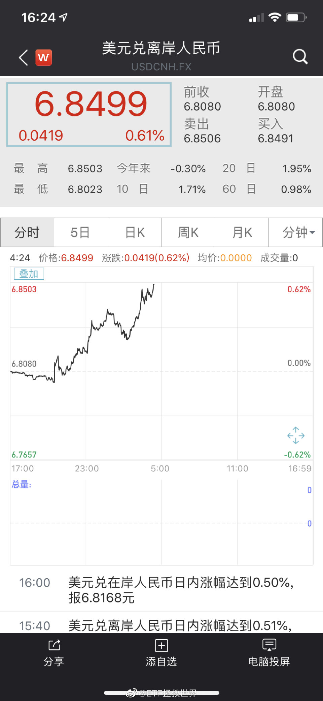
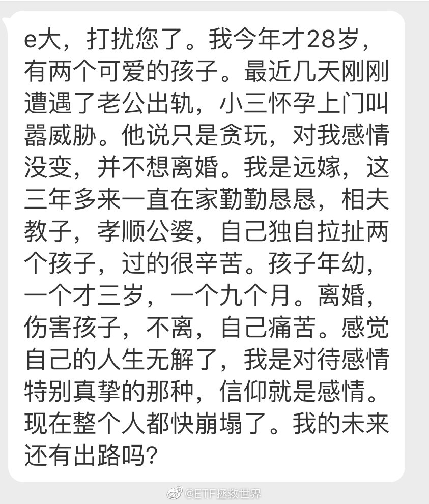
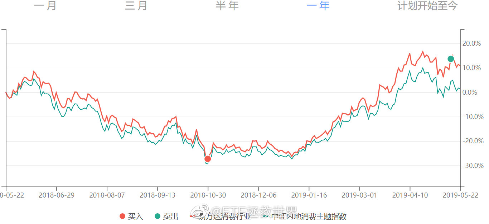
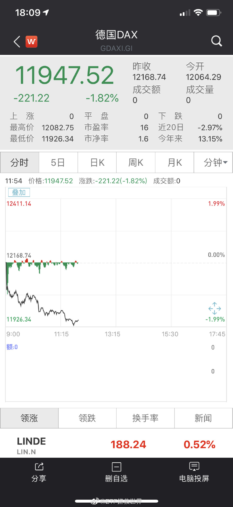
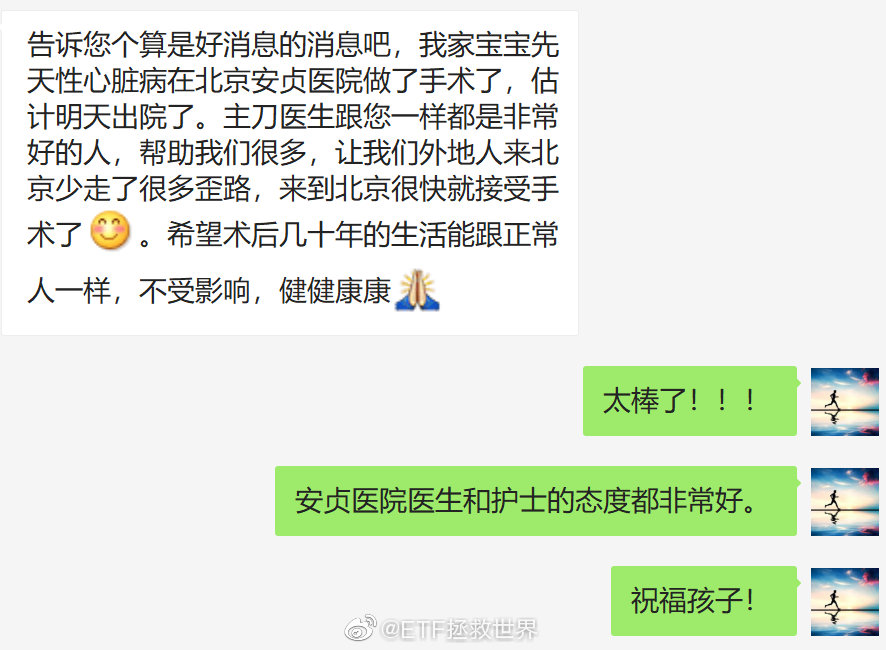

ETF拯救世界 (5687069307) @
2019-05-04 19:07:57 Sat  
url: https://weibo.com/5687069307/HsESgiQXR

好久不见啊各位，过节都干嘛了说来听听？ ​​​

转发[13]  评论[1107]  赞[989] 

======================================================

ETF拯救世界 (5687069307) @
2019-05-05 14:46:02 Sun  
url: https://weibo.com/5687069307/HsMArCatc

对于巴菲特和芒格的股东大会，我其实只想问，你们是怎么做到快一百岁了还那么有精神，脑子也还好用的。

至于他们投资的事情，看三本书一个合集就够了：

滚雪球

穷查理宝典

巴菲特估值逻辑

以及过去几十年致股东的信合集

说真的，我确实没从每年的大会以及问答环节得到什么新东西。当然可能是因为 ​​​

转发[321]  评论[303]  赞[899] 

======================================================

ETF拯救世界 (5687069307) @
2019-05-05 16:28:06 Sun  
url: https://weibo.com/5687069307/HsNfSjPR6

喷了，印象笔记一周全网收藏排行。大家都很爱学习啊… ​​​

转发[18]  评论[253]  赞[887] 

+++++++++++++++++++++++++++++++++++++++++++++++++++++

图片：

======================================================

ETF拯救世界 (5687069307) @
2019-05-06 08:57:04 Mon  
url: https://weibo.com/5687069307/HsTJiqfgw

今天支付宝积分怎么压你心里还没点数吗。 ​​​

转发[13]  评论[264]  赞[655] 

======================================================

ETF拯救世界 (5687069307) @
2019-05-06 09:28:55 Mon  
url: https://weibo.com/5687069307/HsTWe7DwQ

今天发《二》

正在作图，排版，BGM，封面。

非常应景。 ​​​

转发[4]  评论[303]  赞[1108] 

======================================================

ETF拯救世界 (5687069307) @
2019-05-06 10:14:56 Mon  
url: https://weibo.com/5687069307/HsUeU7FCM

学习历史从来都是有用的。

------------------------------------------------------
转推：
>  @ETF拯救世界 (5687069307)
>  2019-04-19 16:59:28 Fri  
>  url: https:/weibo.com/5687069307/HqmCFaLDd/

>  A股历史上除了2008年底开始的上涨，从未出现过类似这波行情的毫无回调的情况。
>  
>  果然历史没有简单重复的啊。 ​​​

转发[45]  评论[111]  赞[671] 

======================================================

ETF拯救世界 (5687069307) @
2019-05-06 10:22:44 Mon  
url: https://weibo.com/5687069307/HsUi4kskJ

我依然不相信会回到钻石坑。因为历史上真的没出现过，我认为这次概率也不大。

如果真回去了，留的那点现金就能派上用场了。 ​​​

转发[57]  评论[242]  赞[890] 

======================================================

ETF拯救世界 (5687069307) @
2019-05-06 10:32:52 Mon  
url: https://weibo.com/5687069307/HsUmbnQOn

本周极大概率可以买回上次卖出的500C。如果有机会，会加大波段仓位的配比，应对只有波幅没有涨幅的可能。 ​​​

转发[28]  评论[184]  赞[902] 

======================================================

ETF拯救世界 (5687069307) @
2019-05-06 10:54:10 Mon  
url: https://weibo.com/5687069307/HsUuP32Nm

太残暴了…… ​​​

转发[28]  评论[321]  赞[705] 

======================================================

ETF拯救世界 (5687069307) @
2019-05-06 10:57:03 Mon  
url: https://weibo.com/5687069307/HsUw042xJ

回复@ETF跟着E大笑哈哈:1月底以来，计划就买了一份A股，还卖了一份，你也应该想想为什么啊。//@ETF跟着E大笑哈哈:枯了。。。。黑车开多了，被埋得难受😖 😖😖😖

------------------------------------------------------
转推：
>  @ETF拯救世界 (5687069307)
>  2019-05-06 10:54:10 Mon  
>  url: https:/weibo.com/5687069307/HsUuP32Nm/

>  太残暴了…… ​​​

转发[15]  评论[283]  赞[520] 

======================================================

ETF拯救世界 (5687069307) @
2019-05-06 13:45:58 Mon  
url: https://weibo.com/5687069307/HsVCz2s6c

说说你现在看盘的真实感受。 ​​​

转发[28]  评论[1105]  赞[613] 

======================================================

ETF拯救世界 (5687069307) @
2019-05-06 14:08:47 Mon  
url: https://weibo.com/5687069307/HsVLP8OUP

怎么个意思，大盘要跌停吗。

A股投资者是真NB啊。 ​​​

转发[21]  评论[348]  赞[711] 

======================================================

ETF拯救世界 (5687069307) @
2019-05-06 14:27:12 Mon  
url: https://weibo.com/5687069307/HsVTj7crO

只要你不急，你就有机会赚大钱。涨上去就害怕踏空，最终很可能接盘的就是你。这些东西你每隔一年回头看一次，会有不同的领悟。

------------------------------------------------------
转推：
>  @ETF拯救世界 (5687069307)
>  2019-03-25 09:27:30 Mon  
>  url: https:/weibo.com/5687069307/HmvYNmvZC/

>  不追涨是一种美德。
>  
>  有钱还怕没有好的投资机会？
>  
>  金融市场最不缺的就是机会。机会来了，最缺的是钱。
>  
>  谁有钱谁才是话事人。 ​​​

转发[132]  评论[186]  赞[762] 

======================================================

ETF拯救世界 (5687069307) @
2019-05-06 14:41:20 Mon  
url: https://weibo.com/5687069307/HsVZ2fT3P

服了你们了，看你们的评论以为今天涨了6%。

也太欢乐了吧我说！今天你们账户都缩水了喂！ ​​​

转发[20]  评论[502]  赞[823] 

======================================================

ETF拯救世界 (5687069307) @
2019-05-06 17:04:20 Mon  
url: https://weibo.com/5687069307/HsWV54s1f

虽然国债今天止跌，但目前A股整体再次跌回到比债券值得买的区域，所以债券依然没有吸引力。充其量利率债只能作为风险对冲工具而已，长期收益率依然不行。

更别提那些优质指数和行业的值博率已经远大于债券。 ​​​

转发[57]  评论[114]  赞[571] 

======================================================

ETF拯救世界 (5687069307) @
2019-05-06 17:09:19 Mon  
url: https://weibo.com/5687069307/HsWX6jKDr

我应对暴跌的妙招：

不更新理财软件的收盘净值，假装自己依然不算穷人。[爱你] ​​​

转发[27]  评论[207]  赞[860] 

======================================================

ETF拯救世界 (5687069307) @
2019-05-06 17:25:06 Mon  
url: https://weibo.com/5687069307/HsX3vs6l9

再次提示：

某个不死品种暴跌后开始唱空甚至建议你割肉的，一定要特别关注。

赚钱全靠他了。

反着做就行。 ​​​

转发[110]  评论[292]  赞[954] 

======================================================

ETF拯救世界 (5687069307) @
2019-05-06 18:56:11 Mon  
url: https://weibo.com/5687069307/HsXEtBGVd

今日最新数据出炉，距离钻石边缘还有8%……出坑后就不会回去的历史会改变吗，拭目以待了。 ​​​

转发[92]  评论[275]  赞[982] 

======================================================

ETF拯救世界 (5687069307) @
2019-05-06 19:30:20 Mon  
url: https://weibo.com/5687069307/HsXSlbKm2

终于忙的差不多了，准备去看留言。一会各位可以去观摩一下，我估计会有一些策略具体问题我可能会回答。

今天大跌，看来大家心情一般，只有800多条留言…… ​​​

转发[5]  评论[168]  赞[748] 

======================================================

ETF拯救世界 (5687069307) @
2019-05-06 21:56:39 Mon  
url: https://weibo.com/5687069307/HsYPJB2ii

人家只跌1.2%。

这仗打的。 ​​​

转发[11]  评论[231]  赞[583] 

======================================================

ETF拯救世界 (5687069307) @
2019-05-07 07:25:22 Tue  
url: https://weibo.com/5687069307/Ht2yzvnKZ

一睁眼发现美股暴跌0.4%，深感欣慰。还好没有翻红——我生起气来捅自己7刀，你身上一点血都没溅到我就太没面子了吧。

越来越深刻的体会，玩A股的就是一帮神经病。

好消息是，你跟神经病在玩斗地主你说你有多幸福。 ​​​

转发[50]  评论[186]  赞[819] 

======================================================

ETF拯救世界 (5687069307) @
2019-05-07 07:29:34 Tue  
url: https://weibo.com/5687069307/Ht2Ahy5Sc

不知道到底是素质教育没跟上，还是乱扔烟头罚的不够狠。

------------------------------------------------------
转推：
>  @新浪视频 (1640601392)
>  2019-05-07 07:22:05 Tue  
>  url: https:/weibo.com/1640601392/Ht2xf2cJC/

>  【#地上一个烟头扣环卫7元#！烟头太多环卫大爷被气哭】5月4日，郑州一环卫大爷在地铁口扫烟头脸被气得通红，他称附近烟头大多是黑车司机扔的，发现1个烟头他要被罚7块钱，他曾1天被罚260元，而1天工资才86元。官方称没实施过这个规定，针对确实有人被扣罚这一情况将做再做核实调查。 ​​​

转发[15]  评论[80]  赞[241] 

======================================================

ETF拯救世界 (5687069307) @
2019-05-07 07:54:49 Tue  
url: https://weibo.com/5687069307/Ht2Kwz8Ss

你什么都可以不信，但这句话希望你相信。

目前这个位置，以及更低的位置，是值得坚定持有绝大多数指数基金的位置。

不要在意中短期的波动，那一点都不重要。除了给你提供波动利润外，没什么好在意的。

五年十年后你再回头看这篇微博会有恍如隔世的感觉。 ​​​

转发[247]  评论[265]  赞[1086] 

======================================================

ETF拯救世界 (5687069307) @
2019-05-07 08:12:13 Tue  
url: https://weibo.com/5687069307/Ht2RAtSdA

这是中证500全收益的走势图。不用更深奥的数据，你就能看出很多东西。

长期看，指数一定是向上，即使短期波动巨大。就算是被斥为“赚不到钱”的A股，也是如此。

底部不断抬高，顶部不断突破。

跌幅巨大的时候买入，若干时间后会取得非常好的收益。

怎么样才能让自己淡定起来？你站的高一点，看得远 ​​​

转发[356]  评论[238]  赞[677] 

+++++++++++++++++++++++++++++++++++++++++++++++++++++

图片：

======================================================

ETF拯救世界 (5687069307) @
2019-05-07 08:20:43 Tue  
url: https://weibo.com/5687069307/Ht2V2qU3i

本月我希望出现的，最完美的走势，是目前基础上再跌个3%-4%，持续到月底。

堪称完美。 ​​​

转发[57]  评论[250]  赞[863] 

======================================================

ETF拯救世界 (5687069307) @
2019-05-07 08:24:23 Tue  
url: https://weibo.com/5687069307/Ht2WwE94l

回复@阿狸你好帅:所谓估值带，以及按照估值带确定定投份数的策略，我已经不用很久了。这种方法有巨大缺陷。//@阿狸你好帅:刚刚看E大的博客 看到长赢的8个估值带 和仓位管理 不只是帅和聪明这么简单啊 http://t.cn/EoIkgqX

------------------------------------------------------
转推：
>  @ETF拯救世界 (5687069307)
>  2019-05-07 08:12:13 Tue  
>  url: https:/weibo.com/5687069307/Ht2RAtSdA/

>  这是中证500全收益的走势图。不用更深奥的数据，你就能看出很多东西。
>  
>  长期看，指数一定是向上，即使短期波动巨大。就算是被斥为“赚不到钱”的A股，也是如此。
>  
>  底部不断抬高，顶部不断突破。
>  
>  跌幅巨大的时候买入，若干时间后会取得非常好的收益。
>  
>  怎么样才能让自己淡定起来？你站的高一点，看得远 ​​​

转发[34]  评论[85]  赞[309] 

======================================================

ETF拯救世界 (5687069307) @
2019-05-07 09:00:04 Tue  
url: https://weibo.com/5687069307/Ht3b1cRhj

看图突然发现，2015年到现在居然已经四年了…太快了…

------------------------------------------------------
转推：
>  @ETF拯救世界 (5687069307)
>  2019-05-07 08:12:13 Tue  
>  url: https:/weibo.com/5687069307/Ht2RAtSdA/

>  这是中证500全收益的走势图。不用更深奥的数据，你就能看出很多东西。
>  
>  长期看，指数一定是向上，即使短期波动巨大。就算是被斥为“赚不到钱”的A股，也是如此。
>  
>  底部不断抬高，顶部不断突破。
>  
>  跌幅巨大的时候买入，若干时间后会取得非常好的收益。
>  
>  怎么样才能让自己淡定起来？你站的高一点，看得远 ​​​

转发[110]  评论[114]  赞[426] 

======================================================

ETF拯救世界 (5687069307) @
2019-05-07 10:29:11 Tue  
url: https://weibo.com/5687069307/Ht3LbnX6A

回复@烟花看烟火:第一，传媒一季报利润增加6%，五年百分位4%，十年百分位6%，PB五年十年百分位8%。第二，以后谁再拿不知道从哪儿看的数据来我这里问，我直接拉黑。你先问问是不是，再问怎么办行不行？第三，前有医药500，现有传媒，只要哪个指数跌，就会有人开始黑。我什么都不会说，时间会给出答案。

------------------------------------------------------
转推：
>  @ETF拯救世界 (5687069307)
>  2019-05-07 08:12:13 Tue  
>  url: https:/weibo.com/5687069307/Ht2RAtSdA/

>  这是中证500全收益的走势图。不用更深奥的数据，你就能看出很多东西。
>  
>  长期看，指数一定是向上，即使短期波动巨大。就算是被斥为“赚不到钱”的A股，也是如此。
>  
>  底部不断抬高，顶部不断突破。
>  
>  跌幅巨大的时候买入，若干时间后会取得非常好的收益。
>  
>  怎么样才能让自己淡定起来？你站的高一点，看得远 ​​​

转发[94]  评论[91]  赞[439] 

======================================================

ETF拯救世界 (5687069307) @
2019-05-07 10:33:33 Tue  
url: https://weibo.com/5687069307/Ht3MXlg2I

回复@上证五菱:不要神话百分位。百分位解决的是历史观看现在，解决不了投资者的未来。我说某个指标，不代表我只看某个指标。说的多不代表知道的多，说的少也不代表不懂。排名不能给，会引发歧义。//@上证五菱:e大大，目前按照综合百分位，能给个top10排名吗？

------------------------------------------------------
转推：
>  @ETF拯救世界 (5687069307)
>  2019-05-07 08:12:13 Tue  
>  url: https:/weibo.com/5687069307/Ht2RAtSdA/

>  这是中证500全收益的走势图。不用更深奥的数据，你就能看出很多东西。
>  
>  长期看，指数一定是向上，即使短期波动巨大。就算是被斥为“赚不到钱”的A股，也是如此。
>  
>  底部不断抬高，顶部不断突破。
>  
>  跌幅巨大的时候买入，若干时间后会取得非常好的收益。
>  
>  怎么样才能让自己淡定起来？你站的高一点，看得远 ​​​

转发[43]  评论[56]  赞[355] 

======================================================

ETF拯救世界 (5687069307) @
2019-05-07 10:39:59 Tue  
url: https://weibo.com/5687069307/Ht3PzxCs6

观察一个投资者的水平，很大程度上你要观察它在某个品种暴涨之后和暴跌之后的态度。

如果一个品种短期暴涨后，他依然在给暴涨找理由，告诉你还能涨10倍，现在还很便宜，赶紧买；

一个品种暴跌后，他头头是道分析半天，告诉你赶紧卖这东西不行，完蛋了。

我不能说他一定是水货，但如果这样的次数多了 ​​​

转发[112]  评论[242]  赞[933] 

======================================================

ETF拯救世界 (5687069307) @
2019-05-07 11:29:00 Tue  
url: https://weibo.com/5687069307/Ht49sEpjH

无论是买卖，你都最好有个理由。

什么理由都可以，只要是客观的，最好是可量化的。

“我觉得可以买/卖了”可不算。 ​​​

转发[78]  评论[184]  赞[796] 

======================================================

ETF拯救世界 (5687069307) @
2019-05-07 12:51:42 Tue  
url: https://weibo.com/5687069307/Ht4H2mKS2

如果家里没矿，没有无限可用现金流，就不要太着急。

控制节奏。

还是那句话，有时候有钱才是大爷。你手里的筹码不少了，不用那么急。 ​​​

转发[74]  评论[338]  赞[974] 

======================================================

ETF拯救世界 (5687069307) @
2019-05-07 17:44:49 Tue  
url: https://weibo.com/5687069307/Ht6C0uKmn

对喜欢看指数PE以及PE百分位的朋友，我不管你是从哪儿看，我给你一条贴士：

看PE的时候，同时观察PB、PS、PCF和股息率及它们的百分位。

你只看一个数据，港真有点naive。更何况有的数据错到离谱。错的原因不是计算错误，而是计算数据的人没有想清楚自己到底想得到的真相应该怎样获得。一句话形容，就 ​​​

转发[317]  评论[350]  赞[844] 

======================================================

ETF拯救世界 (5687069307) @
2019-05-07 17:55:22 Tue  
url: https://weibo.com/5687069307/Ht6Gi6BG6

也不要神化数据。数据只是代表一个概率。学会识别数据，只能让你的长期胜率增大，但不能保证你必胜，也不能保证你短期就一定赢。

认识世界要多维性的认识。从各个角度观察，然后将每个角度的概率综合，再去做出判断。

不要禁锢自己的思维，不断学习，不断扩展观察世界的角度，胜率才会增加。

当然， ​​​

转发[135]  评论[207]  赞[764] 

======================================================

ETF拯救世界 (5687069307) @
2019-05-07 20:25:44 Tue  
url: https://weibo.com/5687069307/Ht7Fjy4zh

前几天买了个大件，安装过程出了点问题。销售平台态度好到让我又一次被感动了。其实安装的问题跟他们也没关系。

另外听安装工人说，只有这个平台要求他们24小时内要跟客户确认安装时间，其他所有销售平台没有这个规定，厂家爱什么时候装什么时候装。

我有一种感觉不知道你们谁体会过，就是特想让它多 ​​​

转发[12]  评论[271]  赞[713] 

======================================================

ETF拯救世界 (5687069307) @
2019-05-08 08:18:10 Wed  
url: https://weibo.com/5687069307/Htckvb4NU

特别励志。不放弃就有可能出现奇迹。

------------------------------------------------------
转推：
>  @央视新闻 (2656274875)
>  2019-05-08 08:00:59 Wed  
>  url: https:/weibo.com/2656274875/Htcdx94eL/

>  【利物浦惊天逆转4-3淘汰巴萨 连续两年晋级欧冠决赛】欧冠半决赛次回合，利物浦在三名主力缺阵的情况下，在主场创造奇迹，4-0完胜巴萨，总比分4-3实现惊天逆转，连续两年晋级决赛！第7分钟和第79分钟，奥里吉梅开二度。第54分钟和第56分钟，下半场替补登场的维纳尔杜姆连入两球！转发祝贺！ ​​​

转发[43]  评论[119]  赞[381] 

======================================================

ETF拯救世界 (5687069307) @
2019-05-08 09:23:41 Wed  
url: https://weibo.com/5687069307/HtcL61lGo

还是那句话，不要急于加仓，你的仓位够，给时间和空间。

有钱是大爷。 ​​​

转发[113]  评论[191]  赞[831] 

======================================================

ETF拯救世界 (5687069307) @
2019-05-08 09:42:11 Wed  
url: https://weibo.com/5687069307/HtcSBoqpz

只针对150和S计划，其他每个人的情况我不知道也管不了。

------------------------------------------------------
转推：
>  @ETF拯救世界 (5687069307)
>  2019-05-08 09:23:41 Wed  
>  url: https:/weibo.com/5687069307/HtcL61lGo/

>  还是那句话，不要急于加仓，你的仓位够，给时间和空间。
>  
>  有钱是大爷。 ​​​

转发[10]  评论[83]  赞[448] 

======================================================

ETF拯救世界 (5687069307) @
2019-05-08 09:45:50 Wed  
url: https://weibo.com/5687069307/HtcU5iOVv

除了指数，一定要买个股，我建议普通投资者也别买乱七八糟各种概念。

就是八个字。

吃喝玩乐，生老病死。

在这里面找赚钱的概率大很多。 ​​​

转发[337]  评论[385]  赞[1204] 

======================================================

ETF拯救世界 (5687069307) @
2019-05-08 09:53:41 Wed  
url: https://weibo.com/5687069307/HtcXh1LeO

我有个问题，请学习好的同学帮着说说。

为什么利物浦这些年总能培养出牛人。跟皇马巴萨曼城之类买巨星不同，除了青训，他们买的球员来的时候都不那么牛，结果培养几年就出好多大牛。

到底为什么。这俱乐部是球探NB还是经理NB啊到底。 ​​​

转发[15]  评论[284]  赞[427] 

======================================================

ETF拯救世界 (5687069307) @
2019-05-08 10:09:26 Wed  
url: https://weibo.com/5687069307/Htd3FfHZL

回复@小新o_o晃晃悠悠:很难讲具体点位，随着时间这个点位会上移。所谓钻石坑，就是A股大多数股票已经跌到很值得买的区域。从历史以及全球的双重维度看，这个区域遍地钻石。//@小新o_o晃晃悠悠:请问下为啥说2800是钻石坑

------------------------------------------------------
转推：
>  @ETF拯救世界 (5687069307)
>  2019-05-08 09:23:41 Wed  
>  url: https:/weibo.com/5687069307/HtcL61lGo/

>  还是那句话，不要急于加仓，你的仓位够，给时间和空间。
>  
>  有钱是大爷。 ​​​

转发[65]  评论[225]  赞[570] 

======================================================

ETF拯救世界 (5687069307) @
2019-05-09 07:56:12 Thu  
url: https://weibo.com/5687069307/HtlC5amOt

最后一秒改变命运。只要不放弃就有希望！坚持！

------------------------------------------------------
转推：
>  @ ()
>  2019-05-09 05:10:29 Thu  
>  url: 

>  抱歉，作者已设置仅展示半年内微博，此微博已不可见。 ​​​

转发[31]  评论[86]  赞[362] 

======================================================

ETF拯救世界 (5687069307) @
2019-05-09 09:51:26 Thu  
url: https://weibo.com/5687069307/HtmmRqQ6H

节奏控制好

------------------------------------------------------
转推：
>  @ETF拯救世界 (5687069307)
>  2019-05-07 12:51:42 Tue  
>  url: https:/weibo.com/5687069307/Ht4H2mKS2/

>  如果家里没矿，没有无限可用现金流，就不要太着急。
>  
>  控制节奏。
>  
>  还是那句话，有时候有钱才是大爷。你手里的筹码不少了，不用那么急。 ​​​

转发[11]  评论[158]  赞[526] 

======================================================

ETF拯救世界 (5687069307) @
2019-05-09 10:08:01 Thu  
url: https://weibo.com/5687069307/HtmtAkYJT

什么叫活着最重要。

就是人家不让你聊，你就别聊。因为你的命在人家手里，一时痛快一时爽，好多人给你鼓掌，一会儿号没了，死了，什么也说不了了。

只要活着，就有希望。死了，什么都没了。 ​​​

转发[37]  评论[218]  赞[949] 

======================================================

ETF拯救世界 (5687069307) @
2019-05-09 10:21:46 Thu  
url: https://weibo.com/5687069307/HtmzamaHc

现在你回头再看，去年底大量买入后，从1月底以来不再投入A股（3月初卖出一份500，前几天买入一份传媒），只买德国、黄金、原油这一系列操作。

可能又会有不同的感受。 ​​​

转发[48]  评论[149]  赞[836] 

======================================================

ETF拯救世界 (5687069307) @
2019-05-09 10:24:37 Thu  
url: https://weibo.com/5687069307/HtmAk9i6N

我们每个人手中的资源都是有限的。如何在保证安全的情况下，尽量高效的利用好这些资源，是最大的挑战。

这几个月，甚至包括这一两年，S部分也为这些没有积蓄的朋友攒下了一大堆没有种下去的种子了。这个未来都会发芽开花，不用急，我能帮你攒下来，不追在高位，就能帮你把它在低位买进去。

多大点事 ​​​

转发[55]  评论[239]  赞[1012] 

======================================================

ETF拯救世界 (5687069307) @
2019-05-09 10:37:39 Thu  
url: https://weibo.com/5687069307/HtmFCrs41

回复@努力12367:过气了。（从来就没红过好吗）//@努力12367:为什么e大近两条发言总回复才100多点，以前没这么少啊。不少人跌怕了吗

------------------------------------------------------
转推：
>  @ETF拯救世界 (5687069307)
>  2019-05-09 10:24:37 Thu  
>  url: https:/weibo.com/5687069307/HtmAk9i6N/

>  我们每个人手中的资源都是有限的。如何在保证安全的情况下，尽量高效的利用好这些资源，是最大的挑战。
>  
>  这几个月，甚至包括这一两年，S部分也为这些没有积蓄的朋友攒下了一大堆没有种下去的种子了。这个未来都会发芽开花，不用急，我能帮你攒下来，不追在高位，就能帮你把它在低位买进去。
>  
>  多大点事 ​​​

转发[4]  评论[189]  赞[506] 

======================================================

ETF拯救世界 (5687069307) @
2019-05-09 10:39:48 Thu  
url: https://weibo.com/5687069307/HtmGuhofB

这一波上涨，长期持有搭配做网格就会非常舒服。否则电梯做一波就有可能心情有点不好。 ​​​

转发[36]  评论[197]  赞[686] 

======================================================

ETF拯救世界 (5687069307) @
2019-05-09 10:40:26 Thu  
url: https://weibo.com/5687069307/HtmGKwt92

不会成真吧。

------------------------------------------------------
转推：
>  @ETF拯救世界 (5687069307)
>  2019-05-07 08:20:43 Tue  
>  url: https:/weibo.com/5687069307/Ht2V2qU3i/

>  本月我希望出现的，最完美的走势，是目前基础上再跌个3%-4%，持续到月底。
>  
>  堪称完美。 ​​​

转发[8]  评论[214]  赞[649] 

======================================================

ETF拯救世界 (5687069307) @
2019-05-09 10:45:13 Thu  
url: https://weibo.com/5687069307/HtmIGuqRX

A股就是一帮神经病在玩。

他们1月认为A股值2400点，到了4月又认为值3300点，现在又觉得可能连2000都不值。

很多朋友也一样。

1月觉得70%仓位太高了，4月觉得太低了要上杠杆！5月又想，我要是空仓就好了。

喷了。 ​​​

转发[129]  评论[413]  赞[1039] 

======================================================

ETF拯救世界 (5687069307) @
2019-05-09 12:22:32 Thu  
url: https://weibo.com/5687069307/Htnmbv5gD

回复@舍予君有个新名字叫summer-books:有人希望市场稳一点。但这点钱短期未必能起什么作用。所谓一鼓作气再而衰三而竭。目前敌人火力正猛，硬刚未必是最好的选择。参照龙母的骑兵//@舍予君有个新名字叫summer-books:e大，小白提问，看到有新闻说百亿资金进入A股ETF，怎么看待这个呀？

------------------------------------------------------
转推：
>  @ETF拯救世界 (5687069307)
>  2019-05-09 10:45:13 Thu  
>  url: https:/weibo.com/5687069307/HtmIGuqRX/

>  A股就是一帮神经病在玩。
>  
>  他们1月认为A股值2400点，到了4月又认为值3300点，现在又觉得可能连2000都不值。
>  
>  很多朋友也一样。
>  
>  1月觉得70%仓位太高了，4月觉得太低了要上杠杆！5月又想，我要是空仓就好了。
>  
>  喷了。 ​​​

转发[14]  评论[67]  赞[403] 

======================================================

ETF拯救世界 (5687069307) @
2019-05-09 12:28:26 Thu  
url: https://weibo.com/5687069307/HtnoAqzTt

回复@落泠風:70份左右就是40%多仓位。你愿不愿意给2800点的A股40%仓位，答案在你心中//@落泠風:E大  新人刚看到长赢计划，现阶段按照且慢那个建底仓可以吗（推荐70份左右），也不是太高吧？各种500的只买比如富国可以吗，分成三个差不多的基金也没必要吧

------------------------------------------------------
转推：
>  @ETF拯救世界 (5687069307)
>  2019-04-13 16:40:50 Sat  
>  url: https:/weibo.com/5687069307/HprW7FRxL/

>  每天都有很多重复的问题，我统一回答一下，然后会置顶：
>  
>  第一：谨防骗子。
>  
>  我只有这一个微博账号。绝对不会主动私信你，更不会要带你操作股票。我没有任何股票或者投资群，绝对不会要求加你微信或者QQ。
>  
>  如果有类似情况，马上拉黑对方。
>  
>  分辨真假最简单的方式是把鼠标挪到头像上，看看对方有多少人 ​​​

转发[24]  评论[199]  赞[451] 

======================================================

ETF拯救世界 (5687069307) @
2019-05-09 15:34:40 Thu  
url: https://weibo.com/5687069307/HtoCbdxWS

震惊！在家养了一个月的伤，出门一看，新买的皮衣还没穿过就不能穿了，要直接穿短袖了！

还有没有天理了！

北京的春天比牛市还短！ ​​​

转发[2]  评论[233]  赞[704] 

======================================================

ETF拯救世界 (5687069307) @
2019-05-09 15:54:30 Thu  
url: https://weibo.com/5687069307/HtoKe3xoc

饮食清淡，不熬夜，保持心情愉快。

第四个未来十年愿望：

不脱发。

[亲亲] 

第三个是腰围保持90以下… ​​​

转发[14]  评论[257]  赞[620] 

======================================================

ETF拯救世界 (5687069307) @
2019-05-09 16:10:04 Thu  
url: https://weibo.com/5687069307/HtoQxwtjt

男的，保持发量，剪的利落点，身材练好点，穿有质感的白色或者浅蓝色衬衣

相亲成功率增加二十六个巴仙。 ​​​

转发[26]  评论[186]  赞[722] 

======================================================

ETF拯救世界 (5687069307) @
2019-05-09 16:23:59 Thu  
url: https://weibo.com/5687069307/HtoWc24YW

你以为港股跌起来会比较温柔，哪有的事儿呢。 

好在汇率有点对冲。 ​​​

转发[11]  评论[78]  赞[388] 

+++++++++++++++++++++++++++++++++++++++++++++++++++++

图片：

======================================================

ETF拯救世界 (5687069307) @
2019-05-09 16:43:53 Thu  
url: https://weibo.com/5687069307/Htp4gwwBg

这汽车吧，你遵守交规停一下等人家过去也行，不遵守交规踩一脚往前再上点让开也行，为什么要正好停在人家路线上……说回来这摩托车也不是善茬……

------------------------------------------------------
转推：
>  @北京人不知道的北京事儿 (1662214194)
>  2019-05-09 16:30:21 Thu  
>  url: https:/weibo.com/1662214194/HtoYM9TQg/

>  【你怎么看？[思考]】网友投稿：这是上午比较火的摩托车事件，女车主是车友群的，给我们看了她行车记录仪拍下视频，首先拐弯确实应该让直行没问题，但这种情况，摩托车算不算诚心碰撞的？视频看至少隔着几十米，到了路口为什么还要骑这么快？这到底该算谁的责任？[摊手]http://t.cn/EoQddPN ​​​

转发[22]  评论[96]  赞[169] 

======================================================

ETF拯救世界 (5687069307) @
2019-05-09 17:13:18 Thu  
url: https://weibo.com/5687069307/Htpgdou5B

回复@犬次郎不是二狗子:前几天看新闻不是说身高的一半吗…//@犬次郎不是二狗子:腰围不应该是80以下吗

------------------------------------------------------
转推：
>  @ETF拯救世界 (5687069307)
>  2019-05-09 15:54:30 Thu  
>  url: https:/weibo.com/5687069307/HtoKe3xoc/

>  饮食清淡，不熬夜，保持心情愉快。
>  
>  第四个未来十年愿望：
>  
>  不脱发。
>  
>  [亲亲] 
>  
>  第三个是腰围保持90以下… ​​​

转发[1]  评论[94]  赞[256] 

======================================================

ETF拯救世界 (5687069307) @
2019-05-09 18:43:16 Thu  
url: https://weibo.com/5687069307/HtpQJrXpj

回复@达令家grent:不好意思，我特喜欢看这种东西。因为能从里面学很多。这样，就不用自己亲自出事才能学了。//@达令家grent:人家犯事，我们少抄心

------------------------------------------------------
转推：
>  @北京人不知道的北京事儿 (1662214194)
>  2019-05-09 16:30:21 Thu  
>  url: https:/weibo.com/1662214194/HtoYM9TQg/

>  【你怎么看？[思考]】网友投稿：这是上午比较火的摩托车事件，女车主是车友群的，给我们看了她行车记录仪拍下视频，首先拐弯确实应该让直行没问题，但这种情况，摩托车算不算诚心碰撞的？视频看至少隔着几十米，到了路口为什么还要骑这么快？这到底该算谁的责任？[摊手]http://t.cn/EoQddPN ​​​

转发[11]  评论[68]  赞[258] 

======================================================

ETF拯救世界 (5687069307) @
2019-05-09 21:58:18 Thu  
url: https://weibo.com/5687069307/Htr7Te0o2

掐指一算，明天盘中各路豪杰聚齐，必有一番大战。

我选择吃瓜。

你们战完了我捡装备。 ​​​

转发[20]  评论[254]  赞[884] 

======================================================

ETF拯救世界 (5687069307) @
2019-05-09 22:13:11 Thu  
url: https://weibo.com/5687069307/HtrdWdopH

[doge]

------------------------------------------------------
转推：
>  @ ()
>  2019-05-09 18:37:42 Thu  
>  url: 

>  该账号因被投诉违反《微博社区公约》的相关规定，现已无法查看。查看帮助 https://kefu.weibo.com/faqdetail?id=13216

转发[15]  评论[48]  赞[283] 

======================================================

ETF拯救世界 (5687069307) @
2019-05-10 07:25:45 Fri  
url: https://weibo.com/5687069307/HtuQdur7r

昵称里带这些的博主，我一般不太敢关注，特有实力的除外：

大型猛兽猛禽类：

龙、虎、鹰、鳄、豹……

亲戚类：

哥、姐、叔、婶、二大爷、嫂子……

也不是说不好，就是有点想绕着走……个人喜好，又得罪人了…… ​​​

转发[22]  评论[296]  赞[559] 

======================================================

ETF拯救世界 (5687069307) @
2019-05-10 10:15:30 Fri  
url: https://weibo.com/5687069307/HtvX80qsU

先把安全垫做出来，免得中午群众情绪坏了摔得太狠。 ​​​

转发[92]  评论[214]  赞[655] 

======================================================

ETF拯救世界 (5687069307) @
2019-05-10 10:31:36 Fri  
url: https://weibo.com/5687069307/Htw3Exb9C

13：00-13：30才最精彩。

------------------------------------------------------
转推：
>  @ETF拯救世界 (5687069307)
>  2019-05-10 10:15:30 Fri  
>  url: https:/weibo.com/5687069307/HtvX80qsU/

>  先把安全垫做出来，免得中午群众情绪坏了摔得太狠。 ​​​

转发[64]  评论[210]  赞[523] 

======================================================

ETF拯救世界 (5687069307) @
2019-05-10 10:36:21 Fri  
url: https://weibo.com/5687069307/Htw5AccD9

回复@瀚海拾贝:随便猜不违法，根据猜去操作就犯罪了。//@瀚海拾贝:回复@芒果糯米鱼:减仓

------------------------------------------------------
转推：
>  @ETF拯救世界 (5687069307)
>  2019-05-10 10:15:30 Fri  
>  url: https:/weibo.com/5687069307/HtvX80qsU/

>  先把安全垫做出来，免得中午群众情绪坏了摔得太狠。 ​​​

转发[6]  评论[55]  赞[373] 

======================================================

ETF拯救世界 (5687069307) @
2019-05-10 10:46:11 Fri  
url: https://weibo.com/5687069307/Htw9zzJV0

这个市场上有三种人

精神病患者，医生，正常人。

正常人能赚多少钱，取决于精神病患者的多少。

精神病患者的多少，取决于行情的高低。

医生不希望精神病患者太多，因为太多就管不住了。但也不能没有，没有就失业了。

极少一部分精神病患者可以被治好，变成正常人（但并不是医生治好的，一般是自愈 ​​​

转发[208]  评论[359]  赞[961] 

======================================================

ETF拯救世界 (5687069307) @
2019-05-10 13:01:57 Fri  
url: https://weibo.com/5687069307/Htx2GjvEx

没懂，明明是确定的结果为什么大家好像刚知道。//@ETF拯救世界:13：00-13：30才最精彩。

------------------------------------------------------
转推：
>  @ETF拯救世界 (5687069307)
>  2019-05-10 10:15:30 Fri  
>  url: https:/weibo.com/5687069307/HtvX80qsU/

>  先把安全垫做出来，免得中午群众情绪坏了摔得太狠。 ​​​

转发[22]  评论[260]  赞[489] 

======================================================

ETF拯救世界 (5687069307) @
2019-05-10 13:22:05 Fri  
url: https://weibo.com/5687069307/HtxaR5qZi

就问你精彩不精彩//@ETF拯救世界:13：00-13：30才最精彩。

------------------------------------------------------
转推：
>  @ETF拯救世界 (5687069307)
>  2019-05-10 10:15:30 Fri  
>  url: https:/weibo.com/5687069307/HtvX80qsU/

>  先把安全垫做出来，免得中午群众情绪坏了摔得太狠。 ​​​

转发[29]  评论[348]  赞[657] 

======================================================

ETF拯救世界 (5687069307) @
2019-05-10 13:49:17 Fri  
url: https://weibo.com/5687069307/HtxlU1Sdu

回复@锦瑟_五十弦:可以，但没必要。可能号没了//@锦瑟_五十弦:老大把过程推演一遍更精彩！//@ETF拯救世界:就问你精彩不精彩//@ETF拯救世界:13：00-13：30才最精彩。

------------------------------------------------------
转推：
>  @ETF拯救世界 (5687069307)
>  2019-05-10 10:15:30 Fri  
>  url: https:/weibo.com/5687069307/HtvX80qsU/

>  先把安全垫做出来，免得中午群众情绪坏了摔得太狠。 ​​​

转发[9]  评论[116]  赞[454] 

======================================================

ETF拯救世界 (5687069307) @
2019-05-10 14:14:31 Fri  
url: https://weibo.com/5687069307/Htxw8qF6B

只有一句，无论多么绝望，这个位置以及更低的位置不要放弃希望，坚持。

就像利物浦和热刺一样。 ​​​

转发[61]  评论[364]  赞[1266] 

======================================================

ETF拯救世界 (5687069307) @
2019-05-10 16:13:18 Fri  
url: https://weibo.com/5687069307/HtyilE715

不考虑资源、背景、智商等因素，真想做成一件事，我觉得坚持可能是最重要的。

虽然吧，坚持了你也真不一定能成。毕竟成功需要很多因素，比如天赋、比如运气等等。

但是不坚持就毫无成功的希望。

在坚持很久还是没见到成功的时候，反复审视自己的路走的对不对，是不是跑偏了。如果发现自己走的路没错 ​​​

转发[169]  评论[394]  赞[1136] 

======================================================

ETF拯救世界 (5687069307) @
2019-05-10 22:25:07 Fri  
url: https://weibo.com/5687069307/HtAJhi7mn

珠市口的美福林包子我会怀念一辈子。外形和现在网红的西四包子差不多，不知道西四的是什么味，懒得排队…

------------------------------------------------------
转推：
>  @ ()
>  2019-05-10 20:21:36 Fri  
>  url: 

>  抱歉，作者已设置仅展示半年内微博，此微博已不可见。 ​​​

转发[9]  评论[123]  赞[326] 

======================================================

ETF拯救世界 (5687069307) @
2019-05-11 12:59:19 Sat  
url: https://weibo.com/5687069307/HtGs70bK7

回复@维京的孩子:你去问提出这个问题的人，为什么要来问我？他说好你就买，说不好你就卖就完了，不用来问我。

------------------------------------------------------
转推：
>  @ETF拯救世界 (5687069307)
>  2019-04-13 16:40:50 Sat  
>  url: https:/weibo.com/5687069307/HprW7FRxL/

>  每天都有很多重复的问题，我统一回答一下，然后会置顶：
>  
>  第一：谨防骗子。
>  
>  我只有这一个微博账号。绝对不会主动私信你，更不会要带你操作股票。我没有任何股票或者投资群，绝对不会要求加你微信或者QQ。
>  
>  如果有类似情况，马上拉黑对方。
>  
>  分辨真假最简单的方式是把鼠标挪到头像上，看看对方有多少人 ​​​

转发[4]  评论[47]  赞[295] 

======================================================

ETF拯救世界 (5687069307) @
2019-05-11 13:13:01 Sat  
url: https://weibo.com/5687069307/HtGxFchj5

刚才又有朋友来告诉我，哪个大V又在背后说我坏话了。

谢谢朋友们的关心，但以后真的不用告诉我。别人怎么说，我管不了，我也不关心。

我讨厌背后议论别人，讨厌背地里说人是非。对喜欢背后使坏给人下绊子的人，我一向有多远离多远，绝不让对方与我的生活产生任何交集。因为这种人最危险，谁走的近， ​​​

转发[31]  评论[231]  赞[792] 

======================================================

ETF拯救世界 (5687069307) @
2019-05-11 16:40:14 Sat  
url: https://weibo.com/5687069307/HtHTMljNE

跟有些人千方百计想多几个粉丝，多几个人关注，多几个人跟着他买不同，多点人关注我少点人关注我，我根本无所谓。

更多的人关注我当然开心，人之常情。但是人越来越少也无所谓。所以你在微博上看不到我宣传计划，从不尝试让更多的人参考计划，只是想到什么就写点什么当跟老朋友聊天了。你也看不到我公 ​​​

转发[49]  评论[481]  赞[1214] 

+++++++++++++++++++++++++++++++++++++++++++++++++++++

图片：

======================================================

ETF拯救世界 (5687069307) @
2019-05-11 17:04:52 Sat  
url: https://weibo.com/5687069307/HtI3MBRmj

这个聊天群的内容信息量非常非常大。

------------------------------------------------------
转推：
>  @ ()
>  2019-05-11 16:45:03 Sat  
>  url: 

>  抱歉，作者已设置仅展示半年内微博，此微博已不可见。 ​​​

转发[36]  评论[95]  赞[188] 

======================================================

ETF拯救世界 (5687069307) @
2019-05-11 17:12:52 Sat  
url: https://weibo.com/5687069307/HtI728z8R

回复@海狸克里特:第一，告诉他谁欺负你就打回去，打成什么样我都不会批评你，但你不许先欺负别人，否则我会让你很惨。第二，找老师了解情况，同时告诉老师孩子的描述，看看真相是什么。第三，与对方家长沟通，协商解决问题的办法。第四，如果都解决不了，就发微博请正义的各位主持公道…

------------------------------------------------------
转推：
>  @ ()
>  2019-05-11 16:45:03 Sat  
>  url: 

>  抱歉，作者已设置仅展示半年内微博，此微博已不可见。 ​​​

转发[29]  评论[143]  赞[296] 

======================================================

ETF拯救世界 (5687069307) @
2019-05-11 18:03:17 Sat  
url: https://weibo.com/5687069307/HtIruq4nm

理性真的很难。你看微博上的热门事件，就会有这种感觉。

理性不是冷血，理性只是希望更加接近事情的真相。

如果，我是说如果，真的如聊天群截图显示，男孩的家长和老师真的是第一次听说这个事情，老师马上请两位家长到学校解决问题，女孩家长带着刀去了，然后发生悲剧？

校园霸凌真的可恨。我小时候 ​​​

转发[32]  评论[219]  赞[649] 

======================================================

ETF拯救世界 (5687069307) @
2019-05-12 06:53:51 Sun  
url: https://weibo.com/5687069307/HtNugjLjx

在我的内心中，对个体的公平，以及事件真相是特别重要的。

我总是不希望好人蒙冤，不希望坏人逍遥法外。如果真的这样，我心里会非常不舒服。

我不知道那些对着新闻叫着“杀的好”的人，有没有想过，哪怕是1%的可能：

如果那个男孩真的如其他家长以及他父母同事所说，并不是个坏孩子，真的只是“抱着 ​​​

转发[38]  评论[248]  赞[700] 

======================================================

ETF拯救世界 (5687069307) @
2019-05-12 08:01:43 Sun  
url: https://weibo.com/5687069307/HtNVOz15O

以我个人的经历来看，小学、中学容易被欺负的有几类小朋友：

第一，身体或者智力方面有异于常人的地方。比如特别胖，特别矮，智商稍微有点低，体质比较弱等等。

我看过一个东西，说异于同类的个体，有些动物会将它们抛弃。这有利于保证整个物种的延续。有些受不到良好教育的小孩子其实更多体现的是动 ​​​

转发[87]  评论[259]  赞[567] 

======================================================

ETF拯救世界 (5687069307) @
2019-05-12 08:43:41 Sun  
url: https://weibo.com/5687069307/HtOcQlIqi

说起欺负人，想起一件真实的，有意思的小学时候的事。

我们班有一个手贱嘴贱的，经常被人欺负。但他也欺负别人，就是黑帮电影里那种总是受气的马仔类型吧。

有一天，隔壁班转来一个男生。非常帅。你知道新转学的有时候容易受欺负，更何况还是帅哥，班里的女生都说好帅。所以上面这哥们就去找人家茬了 ​​​

转发[11]  评论[184]  赞[463] 

======================================================

ETF拯救世界 (5687069307) @
2019-05-12 11:27:04 Sun  
url: https://weibo.com/5687069307/HtPha8ZK1

有一位券商的副总裁看到昨天微博，给我发了这样一句话。

我也想明白了，之所以有人不断跟你没完没了，就是把你当成标杆了，你才是他潜意识中最厉害的。只要干掉你，他认为自己就有可能登顶了。

喷了，可能吗。就算没我了怎么也轮不到你啊……光说人品就不可能是你啊……

一个人能做多大的事，不是看 ​​​

转发[44]  评论[138]  赞[820] 

+++++++++++++++++++++++++++++++++++++++++++++++++++++

图片：

======================================================

ETF拯救世界 (5687069307) @
2019-05-12 12:52:20 Sun  
url: https://weibo.com/5687069307/HtPPM16DI

前几天有朋友问的那个，所谓指数中的成分股会变动，所以以前的数据现在没意义了。这种说法，我不明白道理在哪里。

我是真的不明白。还让我发表看法。我发表什么看法啊。

是不是说一句除了沪深300其他所有指数都是辣鸡就可以了？

一个指数有进有出本来就非常正常。你现在买的标普500，道琼斯30，纳斯 ​​​

转发[130]  评论[174]  赞[783] 

======================================================

ETF拯救世界 (5687069307) @
2019-05-13 09:02:55 Mon  
url: https://weibo.com/5687069307/HtXL9dPSH

周五下午的四两拨千斤加情绪激动后，今天大概率认清现实回归理性吧。 ​​​

转发[11]  评论[182]  赞[795] 

======================================================

ETF拯救世界 (5687069307) @
2019-05-13 11:19:43 Mon  
url: https://weibo.com/5687069307/HtYEGk9Ca

现在有三个利空。

第一个，众所周知中长期会有压制作用。

第二个，开始有指数趋势再次变差。

第三个，目前看多的人太多，几乎找不到看空的。

继续暗中观察。 ​​​

转发[93]  评论[334]  赞[925] 

======================================================

ETF拯救世界 (5687069307) @
2019-05-13 15:42:25 Mon  
url: https://weibo.com/5687069307/Hu0nj3ONo

回复@withTink:我关注的人很杂。但不代表我一定认同对方或者喜欢对方。微博只是我观察这个世界的一个窗口而已。//@withTink:[汗]E大为啥还关注了凤姐

------------------------------------------------------
转推：
>  @ETF拯救世界 (5687069307)
>  2019-05-13 11:19:43 Mon  
>  url: https:/weibo.com/5687069307/HtYEGk9Ca/

>  现在有三个利空。
>  
>  第一个，众所周知中长期会有压制作用。
>  
>  第二个，开始有指数趋势再次变差。
>  
>  第三个，目前看多的人太多，几乎找不到看空的。
>  
>  继续暗中观察。 ​​​

转发[13]  评论[72]  赞[397] 

======================================================

ETF拯救世界 (5687069307) @
2019-05-13 15:58:57 Mon  
url: https://weibo.com/5687069307/Hu0u1pgcd

上一条吧，我说有几个利空。就有朋友蹦出来指责，甚至什么为了要更低筹码的话都出来了。

我想说的是，朋友啊，咱们能不能别这么狭隘，把眼界打开，把思想打开。

我最怕的就是禁锢思想。一旦形成什么思维定势，就不再思考，不再观察，然后永远不会提高。

观察这个世界，随时发现变化的问题而已啊。古 ​​​

转发[44]  评论[305]  赞[818] 

======================================================

ETF拯救世界 (5687069307) @
2019-05-13 16:10:06 Mon  
url: https://weibo.com/5687069307/Hu0yy80LT

这个有懂的吗？  

都不容易。 ​​​

转发[9]  评论[326]  赞[282] 

+++++++++++++++++++++++++++++++++++++++++++++++++++++

图片：

======================================================

ETF拯救世界 (5687069307) @
2019-05-13 16:37:49 Mon  
url: https://weibo.com/5687069307/Hu0JNd3dN

根据最新数据的A股仓位建议：

从保守到激进：

59.6%——79.6%。 ​​​

转发[83]  评论[311]  赞[811] 

======================================================

ETF拯救世界 (5687069307) @
2019-05-13 16:49:51 Mon  
url: https://weibo.com/5687069307/Hu0OG40ep

美股一季度利润下降。

我对美股才叫一年如一日的唱空好吗。

主要目的是真想买点便宜货啊…… ​​​

转发[54]  评论[100]  赞[690] 

======================================================

ETF拯救世界 (5687069307) @
2019-05-13 21:16:35 Mon  
url: https://weibo.com/5687069307/Hu2yWuxQw

回复@与魔鬼做对手的人:看空是看价值与价格的对比。做空在这之外还要加上时间。我把握不了时间因素，所以永不做空。//@与魔鬼做对手的人:你微博上说过你的家训是永不做空美股！

------------------------------------------------------
转推：
>  @ETF拯救世界 (5687069307)
>  2019-05-13 16:49:51 Mon  
>  url: https:/weibo.com/5687069307/Hu0OG40ep/

>  美股一季度利润下降。
>  
>  我对美股才叫一年如一日的唱空好吗。
>  
>  主要目的是真想买点便宜货啊…… ​​​

转发[39]  评论[90]  赞[432] 

======================================================

ETF拯救世界 (5687069307) @
2019-05-14 05:40:39 Tue  
url: https://weibo.com/5687069307/Hu5RxDfOq

美股一般情况自最高点调整幅度最多20%-30%。碰到经济危机会超过40%。

这里是让大家先有个概念。 ​​​

转发[162]  评论[245]  赞[907] 

======================================================

ETF拯救世界 (5687069307) @
2019-05-14 05:54:22 Tue  
url: https://weibo.com/5687069307/Hu5X743FC

想说说这次和去年下半年有什么不同，但不能说。各位好好看新闻好好思考一下。

交易的时候注意节奏。 ​​​

转发[103]  评论[588]  赞[1295] 

======================================================

ETF拯救世界 (5687069307) @
2019-05-14 09:07:17 Tue  
url: https://weibo.com/5687069307/Hu7dq0PFO

谁在买500都快买成最大ETF了

------------------------------------------------------
转推：
>  @张道达 (2032628220)
>  2019-05-14 09:00:03 Tue  
>  url: https:/weibo.com/2032628220/Hu7auhXzZ/

>  【从一基独大到双雄争霸 4000亿股票ETF市场迎巨变】随着上半年A股市场大小盘风格的切换和演绎，股票ETF市场龙头正在迎来巨变：连续四个年度稳居股票型ETF规模首位的华夏上证50ETF，今年冠军地位岌岌可危，南方中证500ETF年内规模激增百亿，以26亿元规模微小差距日益逼近。若A股市场大盘风格继续转向中 ​​​

转发[20]  评论[154]  赞[468] 

======================================================

ETF拯救世界 (5687069307) @
2019-05-14 09:43:09 Tue  
url: https://weibo.com/5687069307/Hu7rYrBzX

今天护盘的人这么多我们就不发车了 ​​​

转发[6]  评论[292]  赞[948] 

======================================================

ETF拯救世界 (5687069307) @
2019-05-14 17:06:49 Tue  
url: https://weibo.com/5687069307/Huam3A13k

明天来一次低买高卖。 ​​​

转发[35]  评论[374]  赞[929] 

======================================================

ETF拯救世界 (5687069307) @
2019-05-14 17:13:28 Tue  
url: https://weibo.com/5687069307/HuaoL8wkO

回复@shown龙:150有资源限制，必须卖出才能买入。S还没到卖出的时候。你就把S当零存整取就对了，放心。该卖的时候会卖的。//@shown龙:S版是不是没有卖出操作通知[汗] 从来没收到过啊

------------------------------------------------------
转推：
>  @ETF拯救世界 (5687069307)
>  2019-05-14 17:06:49 Tue  
>  url: https:/weibo.com/5687069307/Huam3A13k/

>  明天来一次低买高卖。 ​​​

转发[29]  评论[254]  赞[549] 

======================================================

ETF拯救世界 (5687069307) @
2019-05-15 12:18:57 Wed  
url: https://weibo.com/5687069307/HuhTIcV6C

突发：

BGM又不够用了。 ​​​

转发[3]  评论[228]  赞[579] 

======================================================

ETF拯救世界 (5687069307) @
2019-05-15 12:24:50 Wed  
url: https://weibo.com/5687069307/HuhW5zD7s

回复@Stark冰原狼2019:今天正点。另外卖出的一份今天涨得比买入的更多， 多好啊//@Stark冰原狼2019:回复@barryallen1:只是昨天说护盘很多没发车。今天涨起来了却不得不发车，有一点点择时失败的赶脚[doge]

------------------------------------------------------
转推：
>  @ETF拯救世界 (5687069307)
>  2019-05-14 17:06:49 Tue  
>  url: https:/weibo.com/5687069307/Huam3A13k/

>  明天来一次低买高卖。 ​​​

转发[7]  评论[335]  赞[610] 

======================================================

ETF拯救世界 (5687069307) @
2019-05-15 18:12:59 Wed  
url: https://weibo.com/5687069307/Hukdpy8g1

其实有些朋友啊，也许未必有什么恶意。有时候可能是开个不合时宜的玩笑，有时候可能是不太会说话，不过就会让一些不希望我被影响心情的朋友不高兴。

可能是因为责任心比较强，压力确实很大。有些朋友又要求特别高，比如“你为什么没有买在最低点”，“你为什么没有卖在最高点”，这样就有点难受。如果 ​​​

转发[25]  评论[463]  赞[1134] 

======================================================

ETF拯救世界 (5687069307) @
2019-05-16 09:36:57 Thu  
url: https://weibo.com/5687069307/Huqgs8Ari

我在想一个问题：

昨天卖出的内地消费，有多大几率在未来一年中自目前价格下跌10%-20%。 ​​​

转发[24]  评论[357]  赞[740] 

======================================================

ETF拯救世界 (5687069307) @
2019-05-16 18:16:11 Thu  
url: https://weibo.com/5687069307/HutFd4zLs

这个我想了半天也没有答案。大家有什么看法吗。 ​​​

转发[32]  评论[741]  赞[334] 

+++++++++++++++++++++++++++++++++++++++++++++++++++++

图片：

======================================================

ETF拯救世界 (5687069307) @
2019-05-16 19:16:27 Thu  
url: https://weibo.com/5687069307/Huu3FxaJK

结论：

男人靠不住。

尤其是人到中年突然开始健身的男人。

[怒] ​​​

转发[25]  评论[403]  赞[704] 

======================================================

ETF拯救世界 (5687069307) @
2019-05-16 21:38:04 Thu  
url: https://weibo.com/5687069307/HuuZ9szxe

转发微博

------------------------------------------------------
转推：
>  @瑞达利欧 (6529122212)
>  2019-05-16 21:27:03 Thu  
>  url: https:/weibo.com/6529122212/HuuUGlbAu/

>  #瑞达利欧的问答# 提问：债务周期叠加政治周期，历史上有出现过吗？
>  
>  回答：20世纪30年代至40年代是近代最大、最典型的大型债务周期与大型政治周期同时发生的例子（同时发生在国家内部和国家之间）。那时（正如现在）出现过下列这些情况：1) 债务问题； 2)利率接近0；所以3) 刺激措施必须以央行印钞和 ​​​

转发[38]  评论[81]  赞[253] 

======================================================

ETF拯救世界 (5687069307) @
2019-05-17 07:29:08 Fri  
url: https://weibo.com/5687069307/HuyR4ev0F

家里有点钱最重要是教育好孩子，否则黄赌毒分分钟给你败光…

------------------------------------------------------
转推：
>  @ ()
>  2019-05-15 20:58:03 Wed  
>  url: 

>  抱歉，由于作者设置，你暂时没有这条微博的查看权限哦。查看帮助：http://t.cn/RfdBWwP ​​​

转发[51]  评论[135]  赞[319] 

======================================================

ETF拯救世界 (5687069307) @
2019-05-17 08:24:32 Fri  
url: https://weibo.com/5687069307/HuzdynZmG

分享图片 ​​​

转发[14]  评论[92]  赞[460] 

+++++++++++++++++++++++++++++++++++++++++++++++++++++

图片：

======================================================

ETF拯救世界 (5687069307) @
2019-05-17 08:33:37 Fri  
url: https://weibo.com/5687069307/Huzhfo7h8

不确定永远是市场最不喜欢的。

最佳买点是好苗头出现的时候。

感情充沛对提高收益率没什么用。 ​​​

转发[84]  评论[179]  赞[800] 

======================================================

ETF拯救世界 (5687069307) @
2019-05-17 11:02:11 Fri  
url: https://weibo.com/5687069307/HuAfxFB2F

看看每天的新闻，什么变了。变得我有点不安。

------------------------------------------------------
转推：
>  @ETF拯救世界 (5687069307)
>  2019-05-14 05:54:22 Tue  
>  url: https:/weibo.com/5687069307/Hu5X743FC/

>  想说说这次和去年下半年有什么不同，但不能说。各位好好看新闻好好思考一下。
>  
>  交易的时候注意节奏。 ​​​

转发[38]  评论[288]  赞[605] 

======================================================

ETF拯救世界 (5687069307) @
2019-05-17 11:15:23 Fri  
url: https://weibo.com/5687069307/HuAkU5olH

最近四个月，实际上没有增加仓位。

500高卖低换传媒。

消费高卖低换300。

只加了一份低仓位可转债。

其它加了黄金油气Dax。

代表了我的态度。

目前仓位很合适，注意节奏。 ​​​

转发[44]  评论[272]  赞[734] 

======================================================

ETF拯救世界 (5687069307) @
2019-05-17 11:32:50 Fri  
url: https://weibo.com/5687069307/HuArZuEtu

每次晚上不关窗户都嗓子发炎然后感冒。

这是什么道理。因为晚上身体抵抗力弱吗。 ​​​

转发[19]  评论[521]  赞[421] 

======================================================

ETF拯救世界 (5687069307) @
2019-05-17 14:48:58 Fri  
url: https://weibo.com/5687069307/HuBJB5LrB

最近把这本书拿出来又翻了翻。 ​​​

转发[47]  评论[283]  赞[758] 

+++++++++++++++++++++++++++++++++++++++++++++++++++++

图片：

======================================================

ETF拯救世界 (5687069307) @
2019-05-17 17:30:39 Fri  
url: https://weibo.com/5687069307/HuCNe1Qzv

很多事情吧，我也没经历过，只能尽量多学习历史，然后多观察蛛丝马迹，大概做个判断。

但是目前的A股你让我卖，我真的不卖。我们持仓的品种平均不到2倍PB（2015年A股超过6PB），ROE在10%以上，卖了也没什么好买的。都是指数，又不会死。

剩余的资金，以及每个月的收入，要控制节奏投入。主要原因是仓 ​​​

转发[153]  评论[459]  赞[998] 

======================================================

ETF拯救世界 (5687069307) @
2019-05-17 18:25:25 Fri  
url: https://weibo.com/5687069307/HuD9sb6C6

我最不理解的就是动不动就“清仓”“满仓”。

你就算再不看好，留20%没事吧。A股就算腰斩你资产也只减少10%啊。

你0%仓位的代价是什么，是心神不宁坐卧不安以及经常性的挫败感以及长期看必然收益率降低的结果啊。 ​​​

转发[76]  评论[328]  赞[848] 

======================================================

ETF拯救世界 (5687069307) @
2019-05-17 18:35:55 Fri  
url: https://weibo.com/5687069307/HuDdIozmc

特 别 棒 ！ ！ ！//@曹增辉:赢了[跪了][跪了][跪了]

------------------------------------------------------
转推：
>  @这个微博有点婊 (3129816345)
>  2019-05-17 09:41:17 Fri  
>  url: https:/weibo.com/3129816345/HuzII00aM/

>  #毕业照挑战#听说这是某医学院的毕业照，还有谁[doge] ​​​

转发[37]  评论[129]  赞[330] 

======================================================

ETF拯救世界 (5687069307) @
2019-05-18 07:32:15 Sat  
url: https://weibo.com/5687069307/HuIiPnq9Q

[傻眼]

------------------------------------------------------
转推：
>  @ ()
>  2019-05-18 06:14:37 Sat  
>  url: 

>  抱歉，作者已设置仅展示半年内微博，此微博已不可见。 ​​​

转发[39]  评论[153]  赞[422] 

======================================================

ETF拯救世界 (5687069307) @
2019-05-18 11:08:44 Sat  
url: https://weibo.com/5687069307/HuJIHFbEk

周末没事学着做个大阪烧，工具不够，蛋黄酱挤的不好看。

是时候转型美食博主了。 ​​​

转发[1]  评论[365]  赞[1329] 

+++++++++++++++++++++++++++++++++++++++++++++++++++++

图片：

======================================================

ETF拯救世界 (5687069307) @
2019-05-19 10:16:09 Sun  
url: https://weibo.com/5687069307/HuSNR1iNX

台积电会怎么做？考验他们的时候到了。 ​​​

转发[24]  评论[388]  赞[686] 

======================================================

ETF拯救世界 (5687069307) @
2019-05-20 09:52:41 Mon  
url: https://weibo.com/5687069307/Hv24PaxG8

俾面 ​​​

转发[11]  评论[298]  赞[605] 

+++++++++++++++++++++++++++++++++++++++++++++++++++++

图片：

======================================================

ETF拯救世界 (5687069307) @
2019-05-20 11:02:52 Mon  
url: https://weibo.com/5687069307/Hv2xjnjD7

再说一次，手里有钱不是你投资的理由。

好机会才是。 ​​​

转发[188]  评论[3586]  赞[2061] 

======================================================

ETF拯救世界 (5687069307) @
2019-05-20 15:32:46 Mon  
url: https://weibo.com/5687069307/Hv4iS6Kuy

打开微博一看评论数吓我一跳，以为我红了。还好没有，松了一口气。

------------------------------------------------------
转推：
>  @ETF拯救世界 (5687069307)
>  2019-05-20 11:02:52 Mon  
>  url: https:/weibo.com/5687069307/Hv2xjnjD7/

>  再说一次，手里有钱不是你投资的理由。
>  
>  好机会才是。 ​​​

转发[19]  评论[1033]  赞[991] 

======================================================

ETF拯救世界 (5687069307) @
2019-05-20 20:23:00 Mon  
url: https://weibo.com/5687069307/Hv6cFtcC3

我总觉得美股不应该反应这么弱。 

是不是花街大佬们还没有意识到问题的严重性。 ​​​

转发[16]  评论[1061]  赞[983] 

======================================================

ETF拯救世界 (5687069307) @
2019-05-21 16:16:39 Tue  
url: https://weibo.com/5687069307/Hve1aBB73

一切都好，勿念。

就是忙。

今天过的怎么样？昨天你有什么特别的事发生吗，展开讲讲。 ​​​

转发[6]  评论[886]  赞[837] 

======================================================

ETF拯救世界 (5687069307) @
2019-05-21 18:43:36 Tue  
url: https://weibo.com/5687069307/HveYP2Iwq

这几天看到好几次评论里讨论“精神出轨”。

能不能精确的定义一下什么叫精神出轨，尤其是妹子们，你们觉得到底怎么样算精神出轨？ ​​​

转发[9]  评论[502]  赞[514] 

======================================================

ETF拯救世界 (5687069307) @
2019-05-21 20:55:31 Tue  
url: https://weibo.com/5687069307/HvfQn8M6W

华为这件事让我意识到一个虽然一直有意识但是从来没有系统考虑过的问题：

目前对我很重要的事情如果出现什么即使概率极低的不好的变化，我有没有plan B应对？

比如工作，比如投资，比如健康，比如很多同样重要的事。

如果没有，重大变化发生的时候就容易出问题。 ​​​

转发[140]  评论[563]  赞[1070] 

======================================================

ETF拯救世界 (5687069307) @
2019-05-22 08:59:04 Wed  
url: https://weibo.com/5687069307/HvkA3F1x5

前几天steam打折，买了一个叫做 冰汽时代 的游戏。

大意就是全球突然变冷，就像流浪地球那样。绝大多数人都挂了，你带着一帮人在英国北部开始建设家园，扛过最终的大寒潮就算胜利。

整个过程中，人民内部当然会不断的有质疑和反对出现。任何伟大的事业进行过程中，都一定会有。游戏中提供两个分支应 ​​​

转发[107]  评论[391]  赞[860] 

======================================================

ETF拯救世界 (5687069307) @
2019-05-22 10:16:41 Wed  
url: https://weibo.com/5687069307/Hvl5yyuFs

回复@小小6_6:玩游戏不能上瘾，要有自制力。玩游戏有好处，有些游戏甚至可以减压，比如消消乐，对健康还有好处。但是一旦上瘾玩物丧志就完蛋了。任何事情适度都是最重要的。//@小小6_6:别人玩游戏是玩物丧志，E玩游戏怎么觉得，哇，超帅，打折，哇，好酷[喵喵][喵喵][喵喵][爱你][爱你][爱你]

------------------------------------------------------
转推：
>  @ETF拯救世界 (5687069307)
>  2019-05-22 08:59:04 Wed  
>  url: https:/weibo.com/5687069307/HvkA3F1x5/

>  前几天steam打折，买了一个叫做 冰汽时代 的游戏。
>  
>  大意就是全球突然变冷，就像流浪地球那样。绝大多数人都挂了，你带着一帮人在英国北部开始建设家园，扛过最终的大寒潮就算胜利。
>  
>  整个过程中，人民内部当然会不断的有质疑和反对出现。任何伟大的事业进行过程中，都一定会有。游戏中提供两个分支应 ​​​

转发[13]  评论[220]  赞[463] 

======================================================

ETF拯救世界 (5687069307) @
2019-05-22 18:53:40 Wed  
url: https://weibo.com/5687069307/Hvotp8xxK

刚才有朋友跟我说，我的所有雪球文章都看不到了。

我几年前建过一个小号用户名和密码都忘了……也没法用小号上去看，谁帮我看看文章是不是都看不见了…… ​​​

转发[13]  评论[409]  赞[353] 

======================================================

ETF拯救世界 (5687069307) @
2019-05-22 19:00:57 Wed  
url: https://weibo.com/5687069307/HvowmAkmB

回复@waspjia:那就好。那就不麻烦各位帮我看了。要是以后真看不到了也挺可惜的。//@waspjia:不是你一个人，几乎所有人去年以前的帖子都看不到了。。。

------------------------------------------------------
转推：
>  @ETF拯救世界 (5687069307)
>  2019-05-22 18:53:40 Wed  
>  url: https:/weibo.com/5687069307/Hvotp8xxK/

>  刚才有朋友跟我说，我的所有雪球文章都看不到了。
>  
>  我几年前建过一个小号用户名和密码都忘了……也没法用小号上去看，谁帮我看看文章是不是都看不见了…… ​​​

转发[4]  评论[201]  赞[347] 

======================================================

ETF拯救世界 (5687069307) @
2019-05-23 09:32:26 Thu  
url: https://weibo.com/5687069307/Hvue60Lu5

不要情绪化，控制节奏。

这件事短期解决不了，也暂时没有看到有解决希望的信息。目前还处在不断出坏消息的阶段。

不到孤注一掷的时候，控制节奏。 ​​​

转发[73]  评论[428]  赞[1047] 

======================================================

ETF拯救世界 (5687069307) @
2019-05-23 10:21:43 Thu  
url: https://weibo.com/5687069307/Hvuy6ucsI

内地消费权重。

到底还有没有机会低位买回了。在线等，挺急的。 ​​​

转发[29]  评论[388]  赞[733] 

+++++++++++++++++++++++++++++++++++++++++++++++++++++

图片：

======================================================

ETF拯救世界 (5687069307) @
2019-05-23 11:15:47 Thu  
url: https://weibo.com/5687069307/HvuU3dk7p

台积电。[赞]

------------------------------------------------------
转推：
>  @ETF拯救世界 (5687069307)
>  2019-05-19 10:16:09 Sun  
>  url: https:/weibo.com/5687069307/HuSNR1iNX/

>  台积电会怎么做？考验他们的时候到了。 ​​​

转发[12]  评论[260]  赞[731] 

======================================================

ETF拯救世界 (5687069307) @
2019-05-23 13:36:23 Thu  
url: https://weibo.com/5687069307/HvvP7blyC

如果你发现每天早上睁开眼睛都有坏消息，那你就要控制节奏。这里面牵扯到很多问题，不仅仅是坏消息包含的内容，也有心理学的因素在内。

一个接一个的坏消息，对心理的打击要比所有坏消息一起出的力度要大得多。所以你就能看到对方接二连三的释放坏消息打击你，这不是他每天制造一个，而是早已经谋划好 ​​​

转发[392]  评论[479]  赞[1194] 

======================================================

ETF拯救世界 (5687069307) @
2019-05-23 13:51:43 Thu  
url: https://weibo.com/5687069307/HvvVl4bIM

说真的，我们真的应该在世界上多交几个朋友了。

------------------------------------------------------
转推：
>  @Panasonic松下中国 (1917281600)
>  2019-05-23 12:05:33 Thu  
>  url: https:/weibo.com/1917281600/Hvvefgepj/

>  严正声明 ​​​

转发[40]  评论[221]  赞[590] 

======================================================

ETF拯救世界 (5687069307) @
2019-05-23 14:29:28 Thu  
url: https://weibo.com/5687069307/HvwaF4iGx

回复@归来DFC:昨天收盘还差8%-9%左右。//@归来DFC:e大，这一次是不是真的要创历史跌回钻石坑了，距离很近了吧

------------------------------------------------------
转推：
>  @ETF拯救世界 (5687069307)
>  2019-05-23 13:36:23 Thu  
>  url: https:/weibo.com/5687069307/HvvP7blyC/

>  如果你发现每天早上睁开眼睛都有坏消息，那你就要控制节奏。这里面牵扯到很多问题，不仅仅是坏消息包含的内容，也有心理学的因素在内。
>  
>  一个接一个的坏消息，对心理的打击要比所有坏消息一起出的力度要大得多。所以你就能看到对方接二连三的释放坏消息打击你，这不是他每天制造一个，而是早已经谋划好 ​​​

转发[164]  评论[162]  赞[499] 

======================================================

ETF拯救世界 (5687069307) @
2019-05-23 14:43:55 Thu  
url: https://weibo.com/5687069307/HvwgwyGkR

朋友们，低调很重要。

真的。

闷声发大财才是大智慧。

我的第二条家训。 ​​​

转发[306]  评论[576]  赞[1558] 

======================================================

ETF拯救世界 (5687069307) @
2019-05-23 18:06:28 Thu  
url: https://weibo.com/5687069307/HvxAKlcI5

今天收盘后还有6%-8%左右的空间回到钻石坑。这样的状态再维持一周，月底必然有车。这种时候，不买不是中国人。[doge]//@ETF拯救世界:回复@归来DFC:昨天收盘还差8%-9%左右。//@归来DFC:e大，这一次是不是真的要创历史跌回钻石坑了，距离很近了吧

------------------------------------------------------
转推：
>  @ETF拯救世界 (5687069307)
>  2019-05-23 13:36:23 Thu  
>  url: https:/weibo.com/5687069307/HvvP7blyC/

>  如果你发现每天早上睁开眼睛都有坏消息，那你就要控制节奏。这里面牵扯到很多问题，不仅仅是坏消息包含的内容，也有心理学的因素在内。
>  
>  一个接一个的坏消息，对心理的打击要比所有坏消息一起出的力度要大得多。所以你就能看到对方接二连三的释放坏消息打击你，这不是他每天制造一个，而是早已经谋划好 ​​​

转发[119]  评论[245]  赞[727] 

======================================================

ETF拯救世界 (5687069307) @
2019-05-23 18:10:15 Thu  
url: https://weibo.com/5687069307/HvxChdpFn

德国人不行。[哼] ​​​

转发[8]  评论[123]  赞[418] 

+++++++++++++++++++++++++++++++++++++++++++++++++++++

图片：

======================================================

ETF拯救世界 (5687069307) @
2019-05-23 18:57:51 Thu  
url: https://weibo.com/5687069307/HvxVB7nCH

我不知道你相不相信历史数据。

即使不信，参考一下也好。

当然，历史未必等于未来。然而我愿意给你下面这几个数据，让你有个参考。

下面几张图，是中证500的PB/股息率/PS/PCF对应的未来一年收益率。纵轴是收益率，横轴是各项数据。

怎么看呢。很简单，就是当500的各项数据在某个数值的时候买入，可 ​​​

转发[1117]  评论[950]  赞[3134] 

+++++++++++++++++++++++++++++++++++++++++++++++++++++

图片：

======================================================

ETF拯救世界 (5687069307) @
2019-05-23 19:13:05 Thu  
url: https://weibo.com/5687069307/Hvy1N14ms

回复@一只汪迎面走来:非常有趣。投资这件事需要考虑若干个层面。一个是事情未来的发展，另一个层面是你要买东西的性价比。只关注哪个层面都不行。这个一定要认真体会一下。//@一只汪迎面走来:之前看到老大说今年毛衣的情况跟去年不一样，不知怎的竟然有点悲观，现在看到你这么说，我又放心了[允悲]

------------------------------------------------------
转推：
>  @ETF拯救世界 (5687069307)
>  2019-05-23 13:36:23 Thu  
>  url: https:/weibo.com/5687069307/HvvP7blyC/

>  如果你发现每天早上睁开眼睛都有坏消息，那你就要控制节奏。这里面牵扯到很多问题，不仅仅是坏消息包含的内容，也有心理学的因素在内。
>  
>  一个接一个的坏消息，对心理的打击要比所有坏消息一起出的力度要大得多。所以你就能看到对方接二连三的释放坏消息打击你，这不是他每天制造一个，而是早已经谋划好 ​​​

转发[41]  评论[92]  赞[468] 

======================================================

ETF拯救世界 (5687069307) @
2019-05-23 19:56:44 Thu  
url: https://weibo.com/5687069307/Hvyjv4pWN

我个人觉得吧

这场仗不管你愿意不愿意，已经开打了。

华为倒了，对每一个中国人都不会是好事。你说你跟华为没关系？南美的一个蝴蝶扇一下翅膀都能引起德克萨斯的龙卷风，怎么可能没关系？

产业链，税收，福利，这个国家的方向——是永远给别人做牛仔裤和打火机，还是能站的高一点……等等等等。

不 ​​​

转发[203]  评论[640]  赞[1737] 

======================================================

ETF拯救世界 (5687069307) @
2019-05-23 21:34:28 Thu  
url: https://weibo.com/5687069307/HvyXapimN

追剧。

------------------------------------------------------
转推：
>  @ ()
>  2019-05-23 20:54:45 Thu  
>  url: 

>  抱歉，由于作者设置，你暂时没有这条微博的查看权限哦。查看帮助：http://t.cn/RfdBWwP ​​​

转发[20]  评论[90]  赞[222] 

======================================================

ETF拯救世界 (5687069307) @
2019-05-23 21:38:46 Thu  
url: https://weibo.com/5687069307/HvyYVa1AL

要崩一起崩，拉上欧洲一起跳~~~

------------------------------------------------------
转推：
>  @财联社APP (2868676035)
>  2019-05-23 21:33:01 Thu  
>  url: https:/weibo.com/2868676035/HvyWA5aue/

>  美股开盘，三大股指集体低开，道指跌1%，纳指跌1.13%，标普500跌0.98%。中概股大幅低开，新浪跌11%，一季度广告业务增速下滑；微博跌11%，第二季度指引低于预期。 ​​​

转发[11]  评论[78]  赞[474] 

======================================================

ETF拯救世界 (5687069307) @
2019-05-23 21:44:29 Thu  
url: https://weibo.com/5687069307/Hvz1etkl4

油崩了。周末我赶紧把2.0发出来。正用得上。

不是不发。你看了就知道走心的东西多难写了。 ​​​

转发[23]  评论[246]  赞[1063] 

======================================================

ETF拯救世界 (5687069307) @
2019-05-23 21:48:15 Thu  
url: https://weibo.com/5687069307/Hvz2LkwRu

各位发生的好事都会让我很开心。

虽然不认识各位，但希望大家都能顺顺利利的。 ​​​

转发[6]  评论[174]  赞[1184] 

+++++++++++++++++++++++++++++++++++++++++++++++++++++

图片：

======================================================

ETF拯救世界 (5687069307) @
2019-05-23 22:03:47 Thu  
url: https://weibo.com/5687069307/Hvz94ha8a

中证500有这么好吗 [doge]

------------------------------------------------------
转推：
>  @ ()
>  2019-05-23 19:23:19 Thu  
>  url: 

>  抱歉，作者已设置仅展示半年内微博，此微博已不可见。 ​​​

转发[20]  评论[77]  赞[555] 

======================================================

ETF拯救世界 (5687069307) @
2019-05-23 22:08:27 Thu  
url: https://weibo.com/5687069307/HvzaXx1bj

关心了一天国家大事，要去休息了。

昨晚是这些年第一次睡足8小时，今天感觉很精神。无论在市场上资产如何波动，吃得好，睡得香才能说明你的投资是健康的。

每天为了那点波动心惊胆战涨跌都难受，那你就要好好审视一下自己的组合是不是合适了。

晚安。 ​​​

转发[27]  评论[270]  赞[876] 

======================================================

ETF拯救世界 (5687069307) @
2019-05-24 08:12:50 Fri  
url: https://weibo.com/5687069307/HvD8i1vlB

我相信加水就能跑的汽车是真的。有视频为证。

------------------------------------------------------
转推：
>  @ ()
>  2019-05-23 20:37:47 Thu  
>  url: 

>  抱歉，作者已设置仅展示半年内微博，此微博已不可见。 ​​​

转发[140]  评论[214]  赞[455] 

======================================================

ETF拯救世界 (5687069307) @
2019-05-24 10:24:15 Fri  
url: https://weibo.com/5687069307/HvDZCxQYc

买，没问题。但是目前这种情况，控制节奏的买。

同时不断问自己，最差情况再跌30%自己能不能扛住。能扛住就继续买，扛不住就停。 ​​​

转发[58]  评论[597]  赞[1102] 

======================================================

ETF拯救世界 (5687069307) @
2019-05-24 17:09:16 Fri  
url: https://weibo.com/5687069307/HvGE1fWHb

你说人这辈子，怎么才算活的值了。

就算马上离开这个世界也不遗憾。 ​​​

转发[62]  评论[990]  赞[831] 

======================================================

ETF拯救世界 (5687069307) @
2019-05-25 09:17:55 Sat  
url: https://weibo.com/5687069307/HvMZccXYx

某年生日随便拍的国家大剧院。 ​​​

转发[16]  评论[437]  赞[1398] 

+++++++++++++++++++++++++++++++++++++++++++++++++++++

图片：

======================================================

ETF拯救世界 (5687069307) @
2019-05-25 11:07:37 Sat  
url: https://weibo.com/5687069307/HvNHJi00c

回复@谜之牌手:新朋友吧。我这里不是舔。我们这是夸夸群。互相夸，互相吹捧，最后大家都觉得人生很美好，每个人的脸上都洋溢着幸福的笑容。//@谜之牌手:这都有人舔[费解]

------------------------------------------------------
转推：
>  @ETF拯救世界 (5687069307)
>  2019-05-25 09:17:55 Sat  
>  url: https:/weibo.com/5687069307/HvMZccXYx/

>  某年生日随便拍的国家大剧院。 ​​​

转发[3]  评论[202]  赞[776] 

======================================================

ETF拯救世界 (5687069307) @
2019-05-25 12:00:28 Sat  
url: https://weibo.com/5687069307/HvO3aEZQz

会夸人是一种能力，鲁迅说过，嘴甜的人运气不会差。

我本人很不喜欢带有极强目的性的吹捧，为了得到好处就努力拍马屁的人也很值得警惕。但如果你时不时给别人一点带有敬佩又或者鼓励的真心称赞，相信人生会顺利很多。

很多人说，我就是很直啊，他们家刚生的孩子确实不好看啊，他/她的发型/衣服/鞋子/ ​​​

转发[136]  评论[396]  赞[1059] 

======================================================

ETF拯救世界 (5687069307) @
2019-05-25 22:14:29 Sat  
url: https://weibo.com/5687069307/HvS4p9Mpn

很多事情确实要讲天分。不服不行。

摄影这两个字都不敢讲。只能说照相。从小学就开始，那时候就拿着单反拍。虽然只是个理光的低端机吧。

后来断断续续也一直没完全放下。但自己知道，拍的不行。

第一个肯定是没用心，没有完全把精力放在上面。主要是不够热爱。

第二个就是知道自己没有天分。主要是 ​​​

转发[28]  评论[377]  赞[1027] 

======================================================

ETF拯救世界 (5687069307) @
2019-05-26 19:21:36 Sun  
url: https://weibo.com/5687069307/Hw0mJau8W

微博新出了一个“粉丝群”。我本来想开一个试试，不好玩就随时关。

但我想了半天，也没想出来除了好玩，为什么要开这么一个群。你觉得弄个群有什么好处吗。 ​​​

转发[3]  评论[452]  赞[668] 

======================================================

ETF拯救世界 (5687069307) @
2019-05-26 21:49:19 Sun  
url: https://weibo.com/5687069307/Hw1kH4S0N

看完这个视频我骂了一句脏话

------------------------------------------------------
转推：
>  @ ()
>  2019-05-26 13:28:06 Sun  
>  url: 

>  抱歉，作者已设置仅展示半年内微博，此微博已不可见。 ​​​

转发[32]  评论[319]  赞[321] 

======================================================

ETF拯救世界 (5687069307) @
2019-05-27 15:32:08 Mon  
url: https://weibo.com/5687069307/Hw8i5el6L

年初想买台品牌PC，先看了联想，然后看了看其他牌子，最后根据性价比原则买了HP//@挖龙脉的超级鹿鼎公: 转发微博

------------------------------------------------------
转推：
>  @ ()
>  2019-05-25 22:16:08 Sat  
>  url: 

>  抱歉，作者已设置仅展示半年内微博，此微博已不可见。 ​​​

转发[69]  评论[327]  赞[479] 

======================================================

ETF拯救世界 (5687069307) @
2019-05-28 10:00:58 Tue  
url: https://weibo.com/5687069307/HwfyakLx3

NB你就冲过2940。

[怒] ​​​

转发[23]  评论[441]  赞[830] 

======================================================

ETF拯救世界 (5687069307) @
2019-05-28 14:41:54 Tue  
url: https://weibo.com/5687069307/Hwhoci6PJ

[爱你]

------------------------------------------------------
转推：
>  @ETF拯救世界 (5687069307)
>  2019-05-28 10:00:58 Tue  
>  url: https:/weibo.com/5687069307/HwfyakLx3/

>  NB你就冲过2940。
>  
>  [怒] ​​​

转发[6]  评论[424]  赞[596] 

======================================================

ETF拯救世界 (5687069307) @
2019-05-29 08:59:36 Wed  
url: https://weibo.com/5687069307/HwozKkNbt

球员归化不归化没什么大问题。归化球员当然有很多弊端，但有没有可能国足成绩好了激励更多孩子喜欢上足球开始踢球？什么都有可能。

我们足球不行问题很多，其中一个原因是踢球的孩子太少。我管不了别人，从我自己来说，会带孩子去体验各种运动，尤其是足球篮球。如果他喜欢，花多少钱都会培养，占几节 ​​​

转发[13]  评论[307]  赞[686] 

======================================================

ETF拯救世界 (5687069307) @
2019-05-29 14:47:36 Wed  
url: https://weibo.com/5687069307/HwqR08W7n

最近几天说话少，主要原因是目前状态混沌不清。

技术面，消息面都比较混沌。没有明显的趋势出现，价值的东西每天变化也不大，也没什么好说的。

目前这种情况，除非是专业投资者，否则建好仓位的朋友还是转移注意力做点更加有意义的事。 ​​​

转发[33]  评论[243]  赞[734] 

======================================================

ETF拯救世界 (5687069307) @
2019-05-29 14:54:21 Wed  
url: https://weibo.com/5687069307/HwqTK2Tno

今天最高2934。NB你就周五收盘站稳它。[微笑]

------------------------------------------------------
转推：
>  @ETF拯救世界 (5687069307)
>  2019-05-28 10:00:58 Tue  
>  url: https:/weibo.com/5687069307/HwfyakLx3/

>  NB你就冲过2940。
>  
>  [怒] ​​​

转发[8]  评论[129]  赞[524] 

======================================================

ETF拯救世界 (5687069307) @
2019-05-29 15:17:40 Wed  
url: https://weibo.com/5687069307/Hwr3cAXMz

我想啊，有些人要求一个贸易公司也进行高科技研发是不是过分了。人家就是做组装然后做贸易，别要求太高，它根本也没想过要做研发。主张做研发的内波人早就被清理出去了。你们生气是因为预期错配了。

当然，这个全球性的大贸易公司居然除了大中华区赚钱其他地区都赔钱这就很说不过去了。再看看价格，原 ​​​

转发[79]  评论[466]  赞[986] 

======================================================

ETF拯救世界 (5687069307) @
2019-05-29 18:48:24 Wed  
url: https://weibo.com/5687069307/HwsqK4Psz

我怎么就不信美股还能撑多久呢。 ​​​

转发[22]  评论[223]  赞[743] 

======================================================

ETF拯救世界 (5687069307) @
2019-05-29 21:49:23 Wed  
url: https://weibo.com/5687069307/HwtCd5qdS

WTF。//@财联社APP:【WiFi联盟、蓝牙联盟、JEDEC协会已恢复华为成员资格】继SD存储卡协会（SDA）之后，更多行业组织开始恢复华为会员资格。5月29日，记者发现，Wi-Fi联盟、蓝牙技术联盟和JEDEC协会（固态技术协会）等行业组织，均已恢复华为的成员资格。（澎湃）

------------------------------------------------------
转推：
>  @财联社APP (2868676035)
>  2019-05-29 12:59:14 Wed  
>  url: https:/weibo.com/2868676035/Hwq9125Mj/

>  【SD存储卡协会恢复华为成员资格】财联社5月29日讯，记者5月29日从SD存储卡标准的“SD协会”（SDA）的官网看到，该协会的成员名单中重新出现了“华为公司”的名字。这也意味着SD协会恢复了华为的成员资格。（澎湃） ​​​

转发[32]  评论[95]  赞[360] 

======================================================

ETF拯救世界 (5687069307) @
2019-05-29 22:05:07 Wed  
url: https://weibo.com/5687069307/HwtIAqywK

打仗就要打对方的软肋。节奏不能跟着对方走，要把对方引入自己的节奏。

打仗无论胜败，都不可能毫发无损。要真打就要做好有所牺牲的准备，无论是GJ还是个体，都要做好准备。

很多事，躲，是躲不过去的。当然要尽量不打，能谈尽量谈。但是躲不过去就得做好受伤的准备，抓住对方软肋狠狠的打。 ​​​

转发[65]  评论[207]  赞[743] 

======================================================

ETF拯救世界 (5687069307) @
2019-05-29 23:44:31 Wed  
url: https://weibo.com/5687069307/HwumWnq8K

这才像点样子。继续 http://t.cn/AiKTrgAt

------------------------------------------------------
转推：
>  @ETF拯救世界 (5687069307)
>  2019-05-29 18:48:24 Wed  
>  url: https:/weibo.com/5687069307/HwsqK4Psz/

>  我怎么就不信美股还能撑多久呢。 ​​​

转发[6]  评论[78]  赞[442] 

======================================================

ETF拯救世界 (5687069307) @
2019-05-29 23:50:29 Wed  
url: https://weibo.com/5687069307/HwupmePoO

我永远不会去蹦极的想法

源自于看过的一条蹦极绳子比蹦极高度长整个人拍在水泥地上的新闻

我是真不相信装备质量和操作装备的这帮人 ​​​

转发[27]  评论[216]  赞[725] 

======================================================

ETF拯救世界 (5687069307) @
2019-05-30 00:04:56 Thu  
url: https://weibo.com/5687069307/HwuvdFxp4

虽然我也养狗，但这个情况我个人认为一分钱都不应该赔。出门遛狗不拴着还有理了？车主倒霉，狗也倒霉，凭什么让罪魁祸首狗主人挣钱？这种稀泥要和到什么时候。

------------------------------------------------------
转推：
>  @你是我今生的奇遇 (2470936014)
>  2019-05-28 17:26:35 Tue  
>  url: https:/weibo.com/2470936014/Hwit2eP1r/

>  我5月24号礼拜天晚上正常行驶，突然跑出来一只没有牵绳的萨摩耶，然后我不小心把它撞死了，因为当时情况太突然了，我完全没反映过来。
>  我报了警，狗主人说宠物狗买来2000元，后续要火葬，还说养了三个月花了很多钱，是女儿的狗，主要要照顾女儿心情。要我总共赔3000块。我当时说最多赔个交强险2000元， ​​​

转发[50]  评论[171]  赞[481] 

======================================================

ETF拯救世界 (5687069307) @
2019-05-30 09:17:31 Thu  
url: https://weibo.com/5687069307/Hwy7w6Rpo

我怀疑今天要开车，但我没有证据。 ​​​

转发[38]  评论[425]  赞[916] 

======================================================

ETF拯救世界 (5687069307) @
2019-05-30 09:45:41 Thu  
url: https://weibo.com/5687069307/HwyiWESuw

还是那句话，买没问题，注意节奏。

保守到激进的A股仓位给60%-80%合适。最激进别超过90%，杠杆就更不用说了。 ​​​

转发[58]  评论[183]  赞[758] 

======================================================

ETF拯救世界 (5687069307) @
2019-05-30 10:39:11 Thu  
url: https://weibo.com/5687069307/HwyEFyMKo

一般@ 我的我都看不到，因为真的太多了。今天小慢转发才看到。帮优秀的姑娘一个忙，有想法的加油了！

------------------------------------------------------
转推：
>  @ ()
>  2019-05-30 09:21:09 Thu  
>  url: 

>  抱歉，此微博已被作者删除。查看帮助：http://t.cn/Rfd3rQV

转发[2]  评论[281]  赞[345] 

======================================================

ETF拯救世界 (5687069307) @
2019-05-30 10:49:24 Thu  
url: https://weibo.com/5687069307/HwyIOAEOC

贵市确实应该“普及科学知识”了。

------------------------------------------------------
转推：
>  @ ()
>  2019-05-30 10:00:08 Thu  
>  url: 

>  抱歉，此微博已被作者删除。查看帮助：http://t.cn/Rfd3rQV

转发[11]  评论[97]  赞[295] 

======================================================

ETF拯救世界 (5687069307) @
2019-05-30 11:54:42 Thu  
url: https://weibo.com/5687069307/Hwz9jyKEv

婚姻这个东西吧，也没什么发言权，毕竟只经历过一次，也不好给人瞎出什么主意。

不过啊，经常看到网上一些社会新闻下面，有些人总是说，你看，家暴了吧，还是不结婚好啊。你看，男的出轨了吧，还是不结婚好啊。等等。

其实吧，你知道，要上新闻，总是要非常特殊的情况才有机会。未婚的人，你得了解， ​​​

转发[107]  评论[360]  赞[967] 

======================================================

ETF拯救世界 (5687069307) @
2019-05-30 12:24:40 Thu  
url: https://weibo.com/5687069307/HwzludeWA

韩国，一个神奇的国度。这些年文化输出做的太好了，全亚洲迷妹众多。但了解得越深，越感觉这是一个很难让人尊重起来的国家。BTW，知耻能后勇吗，我们。

------------------------------------------------------
转推：
>  @PP体育 (1744957737)
>  2019-05-29 22:59:01 Wed  
>  url: https:/weibo.com/1744957737/Hwu4t3xZF/

>  来这撒野？？？#熊猫杯韩国球员脚踩奖杯# 
>  网曝熊猫杯#国青0-3韩国# 赛后，一名韩国球员脚踩冠军奖杯庆祝，ID为@冰河白冰 的比赛摄影师还爆料，有人甚至做撒尿动作！！！随后被看不下去的队友制止。赢球又如何，输掉的是人品和他人的尊重 ！或许还是太年轻？即将参加#欧冠终局之战# 的孙兴慜才是你们的 ​​​

转发[26]  评论[158]  赞[420] 

======================================================

ETF拯救世界 (5687069307) @
2019-05-30 13:22:05 Thu  
url: https://weibo.com/5687069307/HwzINecm6

关于那台PS4 Pro的后续。 ​​​

转发[8]  评论[389]  赞[1036] 

+++++++++++++++++++++++++++++++++++++++++++++++++++++

图片：

======================================================

ETF拯救世界 (5687069307) @
2019-05-30 18:08:53 Thu  
url: https://weibo.com/5687069307/HwBBcjzEd

北京的家长朋友，六一带孩子去哪儿玩比较好。

要求人少。最讨厌人多，最最最讨厌。人多出去玩还不如在家玩实况虐韩国人。

6岁孩子感兴趣的那种。 ​​​

转发[9]  评论[402]  赞[795] 

======================================================

ETF拯救世界 (5687069307) @
2019-05-30 21:29:31 Thu  
url: https://weibo.com/5687069307/HwCUDCF0m

第一位归化球员入选国家队，李可。

前阿森纳青年队队长，曾入选英格兰青年队。

母亲是华裔。

我觉得挺好，有什么不好的。 ​​​

转发[15]  评论[177]  赞[674] 

+++++++++++++++++++++++++++++++++++++++++++++++++++++

图片：

======================================================

ETF拯救世界 (5687069307) @
2019-05-31 09:05:20 Fri  
url: https://weibo.com/5687069307/HwHt4cJcR

出现第一条好消息前都要控制节奏。 ​​​

转发[46]  评论[458]  赞[1271] 

======================================================

ETF拯救世界 (5687069307) @
2019-05-31 14:25:08 Fri  
url: https://weibo.com/5687069307/HwJySf79T

相信我没错的[亲亲]

------------------------------------------------------
转推：
>  @ETF拯救世界 (5687069307)
>  2019-05-31 09:05:20 Fri  
>  url: https:/weibo.com/5687069307/HwHt4cJcR/

>  出现第一条好消息前都要控制节奏。 ​​​

转发[17]  评论[303]  赞[1213] 

======================================================

ETF拯救世界 (5687069307) @
2019-05-31 18:15:17 Fri  
url: https://weibo.com/5687069307/HwL4icSOK

全球一起跳，只剩黄金了。等黄金突破再继续买。 ​​​

转发[50]  评论[261]  赞[1009] 

======================================================

ETF拯救世界 (5687069307) @
2019-05-31 18:58:45 Fri  
url: https://weibo.com/5687069307/HwLlW4P0u

A国签证需要看近几年社交平台信息这个不奇怪。几年前就有过入境要看社交平台信息的事。（因此入境别国的时候我有朋友会把社交app都删掉。）

所以如果有想去那边的朋友，在社交媒体上发言应该要注意。

不过话说回来，不管去不去，在社交平台上说话都要注意。再延伸一下，在任何地方说话都要注意，甚至 ​​​

转发[43]  评论[216]  赞[1161] 

======================================================

ETF拯救世界 (5687069307) @
2019-05-31 21:30:19 Fri  
url: https://weibo.com/5687069307/HwMlsBFgR

你准备明天给自己买个什么玩具。 ​​​

转发[8]  评论[424]  赞[1014] 

======================================================

