ETF拯救世界 (5687069307) @
2020-03-01 10:38:56 Sun  
url: https://weibo.com/5687069307/Iwz9i50HF

刚才那条删了，不是各位想的那件事。

说说另一件事。刚才看新闻，据说不让人肉搜索了。

两年前吧，有个人在微博评论骂我的家人。我第一次在网上愤怒了，五分钟内通过自己的渠道以及神通广大的网友搞清楚他的真实身份。

他怕了，马上私信我道歉。

这事老朋友应该有印象。

现在好了，喷子可以随意喷 ​​​

转发[22]  评论[680]  赞[1946] 

======================================================

ETF拯救世界 (5687069307) @
2020-03-02 10:30:13 Mon  
url: https://weibo.com/5687069307/IwIwfnaC9

这条不知道为什么发不出去，截图看看吧 ​​​

转发[253]  评论[873]  赞[2476] 

+++++++++++++++++++++++++++++++++++++++++++++++++++++

图片：
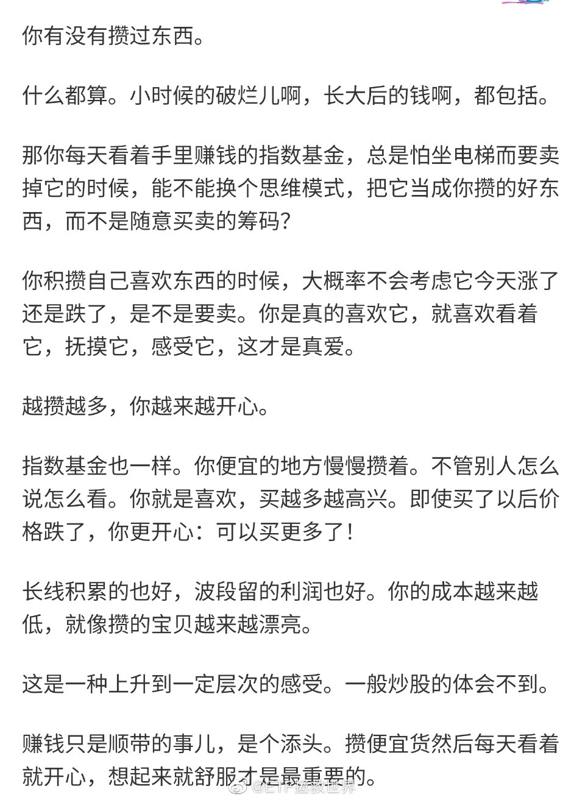

======================================================

ETF拯救世界 (5687069307) @
2020-03-02 10:39:06 Mon  
url: https://weibo.com/5687069307/IwIzR7Nnh

不瞒你说，买的金融已经快收复上周五的失地了，卖的创业板还很遥远。 ​​​

转发[10]  评论[504]  赞[1807] 

======================================================

ETF拯救世界 (5687069307) @
2020-03-02 13:55:27 Mon  
url: https://weibo.com/5687069307/IwJRyjdaW

只要你在大部分选择该向左还是向右的路口都没有选错，那么生活大概率是越来越好的。

就像大部分买卖都没错，账户资产就一定是越来越高。

所以最重要的是选择。选择又来源于世界观、性格，以及意志力。 ​​​

转发[108]  评论[569]  赞[2038] 

======================================================

ETF拯救世界 (5687069307) @
2020-03-02 15:54:32 Mon  
url: https://weibo.com/5687069307/IwKDTtV03

回复@左手跳舞的男人:我反对无脑“定投”//@左手跳舞的男人:最近定投的科技基猛跌，亏本了都，不想定投了，谁来给我点自信坚持下去。

------------------------------------------------------
转推：
>  @ETF拯救世界 (5687069307)
>  2020-03-02 10:30:13 Mon  
>  url: https:/weibo.com/5687069307/IwIwfnaC9/

>  这条不知道为什么发不出去，截图看看吧 ​​​

转发[32]  评论[247]  赞[1074] 

======================================================

ETF拯救世界 (5687069307) @
2020-03-02 16:04:28 Mon  
url: https://weibo.com/5687069307/IwKHVtP9P

巧了。

------------------------------------------------------
转推：
>  @ ()
>  2020-03-02 15:50:00 Mon  
>  url: 

>  抱歉，作者已设置仅展示半年内微博，此微博已不可见。 ​​​

转发[27]  评论[498]  赞[1473] 

======================================================

ETF拯救世界 (5687069307) @
2020-03-03 09:47:47 Tue  
url: https://weibo.com/5687069307/IwRFwl0nK

条件单触发后不成交收盘后就会失效，这个困扰不少朋友的问题，我第一时间发现并反映后，已经在专属版软件中升级修正了，我已经拿到测试版，非常好用。

以后只要不成交，无论是否被触发，条件单都会一直有效。真正做到设置一次，再也不操心。红缨枪升级到不卡壳的半自动步枪了。 ​​​

转发[37]  评论[774]  赞[2499] 

======================================================

ETF拯救世界 (5687069307) @
2020-03-03 10:01:12 Tue  
url: https://weibo.com/5687069307/IwRKY6LlC

关于仓位，还是这个区间。

------------------------------------------------------
转推：
>  @ETF拯救世界 (5687069307)
>  2020-02-29 12:00:40 Sat  
>  url: https:/weibo.com/5687069307/IwqfYb68Q/

>  昨天数据出来了，我反复观察认真思考，结论是这个位置我不会大幅减仓，即使还要大跌。因为我无法说服自己。
>  
>  目前保守——激进投资者的仓位在60%-80%之间，极度激进到90%，极度保守到50%是比较合适的。
>  
>  也就是说，再保守，也不应该低于半仓。 ​​​

转发[24]  评论[191]  赞[1005] 

======================================================

ETF拯救世界 (5687069307) @
2020-03-03 10:39:59 Tue  
url: https://weibo.com/5687069307/IwS0ImWBX

仓位实际上是一种概率。

你认为100%涨，就满仓。100%跌，就空仓。涨跌概率差不多，就半仓。70%会涨，就7成仓。

这个概率你应该通过估值，情绪，资金等状况分析得出。 ​​​

转发[241]  评论[417]  赞[1905] 

======================================================

ETF拯救世界 (5687069307) @
2020-03-03 10:54:07 Tue  
url: https://weibo.com/5687069307/IwS6rA6q9

创业板能不能突破前高是非常有趣的一个观察点。 ​​​

转发[24]  评论[485]  赞[1592] 

======================================================

ETF拯救世界 (5687069307) @
2020-03-03 19:38:03 Tue  
url: https://weibo.com/5687069307/IwVx7ixL2

如果谁家的粉丝把steam举报没了，我会黑他家偶像一万年。

不过话说，咱们是不是也得多点自信。那几个不存在的全球性大网站谣言多，不让上就算了。连游戏网站或者游戏服务器都要堵住是不是稍微有点过了。（PES2020一个足球游戏什么时候能解封？） ​​​

转发[16]  评论[424]  赞[2368] 

======================================================

ETF拯救世界 (5687069307) @
2020-03-03 20:11:12 Tue  
url: https://weibo.com/5687069307/IwVKzvG4O

喷了，dax30场内溢价接近6%。

场内QDII的折溢价真的是一个大问题。 ​​​

转发[27]  评论[259]  赞[1009] 

======================================================

ETF拯救世界 (5687069307) @
2020-03-03 20:24:04 Tue  
url: https://weibo.com/5687069307/IwVPN67Gw

红利目前的状态是：“怎么也不想卖，涨不涨都没关系”

创业板目前考虑的是：“什么时候清仓” ​​​

转发[63]  评论[337]  赞[1536] 

======================================================

ETF拯救世界 (5687069307) @
2020-03-03 21:08:17 Tue  
url: https://weibo.com/5687069307/IwW7JyKuu

今天看到一篇V的翻车贴，突然想到一个问题。特别神奇。老朋友有没有发现一个事实：

这几年，无缘无故怼我的那些V们，不是投资翻车就是自己出问题。或然率竟然高达95.78个巴仙！（剩下的4.22%大概正在翻车的路上）

相反，那些有事的时候帮我说话的V，竟然一个个风起云涌意气风发，投资也好，事业也好 ​​​

转发[63]  评论[714]  赞[3323] 

======================================================

ETF拯救世界 (5687069307) @
2020-03-03 21:33:52 Tue  
url: https://weibo.com/5687069307/IwWi7tapv

我有一个体会。

别人倒霉或者需要帮助的时候，你伸手帮一把。

没错，很多人不知道感恩，甚至有可能会有人恩将仇报。

但是没事，你不用在意那些人。你帮100个人，有20个人记得，其中10个一直惦记找机会报答你，准备滴水之恩涌泉相报，这就够了。你最终会受益。

这是不是听起来很功利，好像帮人就是 ​​​

转发[223]  评论[691]  赞[2979] 

======================================================

ETF拯救世界 (5687069307) @
2020-03-03 22:25:11 Tue  
url: https://weibo.com/5687069307/IwWCX4A9R

回复@qingqing55662015:救急不救穷。私人之间没有“借钱”这个说法。借出去了，你就得当成送出去了。所以送多少你要考虑好自己的情况。//@qingqing55662015:我怎么老碰到借钱不还，等我急着用钱又要不回来。还都是亲戚，心都凉了。

------------------------------------------------------
转推：
>  @ETF拯救世界 (5687069307)
>  2020-03-03 21:33:52 Tue  
>  url: https:/weibo.com/5687069307/IwWi7tapv/

>  我有一个体会。
>  
>  别人倒霉或者需要帮助的时候，你伸手帮一把。
>  
>  没错，很多人不知道感恩，甚至有可能会有人恩将仇报。
>  
>  但是没事，你不用在意那些人。你帮100个人，有20个人记得，其中10个一直惦记找机会报答你，准备滴水之恩涌泉相报，这就够了。你最终会受益。
>  
>  这是不是听起来很功利，好像帮人就是 ​​​

转发[39]  评论[261]  赞[1114] 

======================================================

ETF拯救世界 (5687069307) @
2020-03-04 10:43:55 Wed  
url: https://weibo.com/5687069307/Ix1sNDdGP

我对某些事件没有太多兴趣，不了解真相，所以不多说。

但是，如果你出事了，别人帮你作证，只是要求你别把自己的信息公开，结果你一转身把人家的身份证号，姓名，全都告知天下。

这，是什么性质的行为？

路转黑了。

另外，希望大家都能够就事论事。用不用某些品牌的手机，支不支持某个人，和爱不爱 ​​​

转发[35]  评论[453]  赞[1831] 

======================================================

ETF拯救世界 (5687069307) @
2020-03-04 11:18:50 Wed  
url: https://weibo.com/5687069307/Ix1GYr8kh

别人都跌，你金融这样尬涨，意思不大。 ​​​

转发[13]  评论[251]  赞[1271] 

======================================================

ETF拯救世界 (5687069307) @
2020-03-04 11:47:32 Wed  
url: https://weibo.com/5687069307/Ix1SCEcHq

2018年10月的判断。科技信息是牛市第一阶段。如果牛市继续，第二第三阶段将是金融和有色能源等周期股。//@ETF拯救世界: 回复@江河之走:下一次牛市是科技信息股领衔的牛市。//@江河之走:哪些指数为牛市利器?创业板?传媒?证券?信息?还有吗？//

------------------------------------------------------
转推：
>  @ETF拯救世界 (5687069307)
>  2018-10-22 09:33:12 Mon  
>  url: https:/weibo.com/5687069307/GF3EXvUVy/

>  $证券公司 sz399975$  15日加仓的券商引发舒适的感觉。 ​​​

转发[336]  评论[401]  赞[1207] 

======================================================

ETF拯救世界 (5687069307) @
2020-03-04 13:32:37 Wed  
url: https://weibo.com/5687069307/Ix2zhhj8T

芯片基金从1.1涨到1.4用了6个交易日。

从1.4跌到1.05也是6个交易日。

半个月，有人数钱离场，有人接盘站岗。 ​​​

转发[58]  评论[391]  赞[1684] 

======================================================

ETF拯救世界 (5687069307) @
2020-03-04 14:25:57 Wed  
url: https://weibo.com/5687069307/Ix2UVocM6

其实最近几个月申购科技基金的人，绝大多数没有什么投资信仰。如果说有，那就是一个：赚快钱。

所以当他们发现科技基金已经无法为他们赚快钱的时候，他们跑得比谁都快，因为没有信仰，不太会管自己买的东西到底值多少钱。

我不是说有投资信仰就高人一等。不是这个意思。我是说没有信仰的人其实很容易 ​​​

转发[66]  评论[424]  赞[1666] 

======================================================

ETF拯救世界 (5687069307) @
2020-03-04 14:33:22 Wed  
url: https://weibo.com/5687069307/Ix2XWaFeA

有些东西你拿着就是睡得很稳，不会担心太多，比如指数基金。

有些东西就不行，比如股票。

有些东西你想起来就开心，比如拿着的很便宜的指数基金。

有些东西就不行，想起来就糟心，不知道该卖还是继续拿着，比如很贵的指数基金。 ​​​

转发[75]  评论[598]  赞[2108] 

======================================================

ETF拯救世界 (5687069307) @
2020-03-04 15:09:06 Wed  
url: https://weibo.com/5687069307/Ix3crmyyA

回复@JYou-JasonKidd:别尬吹，都是蒙的。你还别不信，是真的蒙的。//@JYou-JasonKidd:e大您的调仓时机每次都让我觉得开了金手指一样，太稳了，您是不是王莽刘秀他们一伙的大魔导士，是你就眨眨眼[二哈][二哈][二哈]

------------------------------------------------------
转推：
>  @ETF拯救世界 (5687069307)
>  2018-10-22 09:33:12 Mon  
>  url: https:/weibo.com/5687069307/GF3EXvUVy/

>  $证券公司 sz399975$  15日加仓的券商引发舒适的感觉。 ​​​

转发[8]  评论[283]  赞[1118] 

======================================================

ETF拯救世界 (5687069307) @
2020-03-05 09:44:30 Thu  
url: https://weibo.com/5687069307/Ixavblgs2

有人在高呼焊死3000；有人在嘲笑；有人在骂；有人在哭。

你在想办法赚焊死—脱焊—焊死—脱焊…的钱。

这就是面对相同世界不同的反应，最终结局也就不同。 ​​​

转发[40]  评论[531]  赞[2020] 

======================================================

ETF拯救世界 (5687069307) @
2020-03-05 10:25:09 Thu  
url: https://weibo.com/5687069307/IxaLGjt7M

有两种问题不要再私信我了。

第一种是：

基金怎么买，买什么基金，什么叫etf。

我没有兴趣，没有精力，没有动力去做基金普及的工作。看我的东西，有一定金融知识基础，最好有几年交易经验的是最合适的。如果你没有，也不是不能看，前提是你先百度一下基础知识再来。

否则，取关我是最好的。我其实 ​​​

转发[30]  评论[531]  赞[1868] 

+++++++++++++++++++++++++++++++++++++++++++++++++++++

图片：

======================================================

ETF拯救世界 (5687069307) @
2020-03-05 10:42:07 Thu  
url: https://weibo.com/5687069307/IxaSzhbXK

辣鸡金融

$全指金融 sh000992$ ​​​

转发[11]  评论[256]  赞[1136] 

======================================================

ETF拯救世界 (5687069307) @
2020-03-05 10:51:12 Thu  
url: https://weibo.com/5687069307/IxaWfFMcW

神秘资金在跟车石锤了。 ​​​

转发[11]  评论[393]  赞[1640] 

======================================================

ETF拯救世界 (5687069307) @
2020-03-05 11:21:22 Thu  
url: https://weibo.com/5687069307/Ixb8v6xZ5

就第三轮计划未来的变化，有空会写一篇更详细的东西说说。 ​​​

转发[68]  评论[1002]  赞[3649] 

+++++++++++++++++++++++++++++++++++++++++++++++++++++

图片：
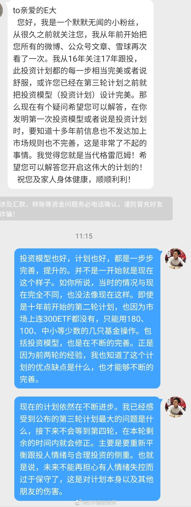

======================================================

ETF拯救世界 (5687069307) @
2020-03-05 11:33:29 Thu  
url: https://weibo.com/5687069307/Ixbdq3nWc

我劝你善良。

------------------------------------------------------
转推：
>  @ETF拯救世界 (5687069307)
>  2020-03-05 10:42:07 Thu  
>  url: https:/weibo.com/5687069307/IxaSzhbXK/

>  辣鸡金融
>  
>  $全指金融 sh000992$ ​​​

转发[5]  评论[178]  赞[982] 

======================================================

ETF拯救世界 (5687069307) @
2020-03-05 11:35:19 Thu  
url: https://weibo.com/5687069307/Ixbeas8rw

回复@狂狮爱不可:精神不正常不是高位截瘫。//@狂狮爱不可:回复@ETF拯救世界:你要是精神不正常，第四轮我去你家里给你端茶做饭。

------------------------------------------------------
转推：
>  @ETF拯救世界 (5687069307)
>  2020-03-05 11:21:22 Thu  
>  url: https:/weibo.com/5687069307/Ixb8v6xZ5/

>  就第三轮计划未来的变化，有空会写一篇更详细的东西说说。 ​​​

转发[18]  评论[407]  赞[1554] 

======================================================

ETF拯救世界 (5687069307) @
2020-03-05 13:17:33 Thu  
url: https://weibo.com/5687069307/IxbTF284Y

新高了没 ​​​

转发[9]  评论[628]  赞[1646] 

======================================================

ETF拯救世界 (5687069307) @
2020-03-05 14:13:39 Thu  
url: https://weibo.com/5687069307/Ixcgqxg7z

这次欧美有些国家的操作，如果发生在我们这里，已经被国内国外一起骂成筛子了。 ​​​

转发[27]  评论[265]  赞[2189] 

======================================================

ETF拯救世界 (5687069307) @
2020-03-05 14:22:06 Thu  
url: https://weibo.com/5687069307/IxcjRkvN1

很少有地方可以合理合法的利用别人的恐惧和贪婪赚钱。

股市就是其中一个。 ​​​

转发[85]  评论[344]  赞[2119] 

======================================================

ETF拯救世界 (5687069307) @
2020-03-05 16:13:41 Thu  
url: https://weibo.com/5687069307/Ixd39mHJW

今日数据：保守-激进投资者仓位55%-75%之间。极度激进85%，极度保守45%。

------------------------------------------------------
转推：
>  @ETF拯救世界 (5687069307)
>  2020-02-29 12:00:40 Sat  
>  url: https:/weibo.com/5687069307/IwqfYb68Q/

>  昨天数据出来了，我反复观察认真思考，结论是这个位置我不会大幅减仓，即使还要大跌。因为我无法说服自己。
>  
>  目前保守——激进投资者的仓位在60%-80%之间，极度激进到90%，极度保守到50%是比较合适的。
>  
>  也就是说，再保守，也不应该低于半仓。 ​​​

转发[54]  评论[490]  赞[1595] 

======================================================

ETF拯救世界 (5687069307) @
2020-03-05 19:42:40 Thu  
url: https://weibo.com/5687069307/IxepZ8RXz

关于仓位的问题，我说一下。

我每次说的统计完数据，建议仓位是多少多少，这只是从全市场估值方面得出的一个结论，并不是说一定要马上调整到这个仓位。

按照我的投资体系，这个仓位是一个“应有”仓位，然而应有并不是一定要马上就有，还要结合情绪，趋势等等因素。如果市场很强，仓位高了，可以稍微 ​​​

转发[235]  评论[635]  赞[2258] 

======================================================

ETF拯救世界 (5687069307) @
2020-03-06 09:37:00 Fri  
url: https://weibo.com/5687069307/IxjSDmLPM

叕新高了。

$全指医药 sh000991$ ​​​

转发[12]  评论[376]  赞[1267] 

======================================================

ETF拯救世界 (5687069307) @
2020-03-06 10:13:30 Fri  
url: https://weibo.com/5687069307/Ixk7s241h

中国互联网美妆销售第一人，只要不卖假货，挣这么多钱很合理。挣不到的没必要酸。

------------------------------------------------------
转推：
>  @ ()
>  2020-03-05 21:18:16 Thu  
>  url: 

>  抱歉，此微博已被作者删除。查看帮助：http://t.cn/Rfd3rQV

转发[65]  评论[470]  赞[2681] 

======================================================

ETF拯救世界 (5687069307) @
2020-03-06 10:27:06 Fri  
url: https://weibo.com/5687069307/IxkcYclYP

看着持仓里面涨幅很大的，拿的踏踏实实的品种，除了高兴，你应该问问自己，下次自己怎么才能坚持拿到赚这么多而不随意卖出。 ​​​

转发[39]  评论[827]  赞[2800] 

======================================================

ETF拯救世界 (5687069307) @
2020-03-06 21:49:23 Fri  
url: https://weibo.com/5687069307/IxoFUnjJQ

不知道这一波欧美能不能出现08危机12欧债那样的超级投资机会。 ​​​

转发[53]  评论[897]  赞[2954] 

======================================================

ETF拯救世界 (5687069307) @
2020-03-08 09:57:03 Sun  
url: https://weibo.com/5687069307/IxCRLpHGC

姑娘们领，男人领没有Jj ​​​

转发[2]  评论[346]  赞[1254] 

======================================================

ETF拯救世界 (5687069307) @
2020-03-08 10:00:32 Sun  
url: https://weibo.com/5687069307/IxCTbdYcd

姑娘们节日快乐！祝你们永远美丽，幸福！红包只能女性领，男人抢的没有JJ http://t.cn/A67DbDE0 ​​​

转发[25]  评论[1482]  赞[2359] 

======================================================

ETF拯救世界 (5687069307) @
2020-03-08 10:16:13 Sun  
url: https://weibo.com/5687069307/IxCZy0RQA

一个几块钱的红包就能让你测试一下自己的人格：

当没有人监督你的时候，为了得到利益，你是否会遵守规则？

是不是发现自己没有自以为的这么高尚。这些朋友能够掌握金钱和权力时，一定要好自为之啊。 ​​​

转发[18]  评论[594]  赞[1885] 

======================================================

ETF拯救世界 (5687069307) @
2020-03-08 18:26:06 Sun  
url: https://weibo.com/5687069307/IxGcocuUI

未来随时发车。如果时间紧的话就不会写文章了，直接发送文字。 ​​​

转发[35]  评论[1372]  赞[3229] 

======================================================

ETF拯救世界 (5687069307) @
2020-03-08 22:05:36 Sun  
url: https://weibo.com/5687069307/IxHDu7XAr

少看微博，看多了整个人会变得很丧。 ​​​

转发[17]  评论[566]  赞[1812] 

======================================================

ETF拯救世界 (5687069307) @
2020-03-09 08:40:36 Mon  
url: https://weibo.com/5687069307/IxLNejblU

今天要做点事了。不然对不起这个大时代。 ​​​

转发[50]  评论[1496]  赞[3771] 

======================================================

ETF拯救世界 (5687069307) @
2020-03-09 10:17:30 Mon  
url: https://weibo.com/5687069307/IxMqz2MHT

日元兑人民币汇率大涨，所以A股日经ETF跌幅收窄。 ​​​

转发[22]  评论[711]  赞[1847] 

======================================================

ETF拯救世界 (5687069307) @
2020-03-09 11:47:44 Mon  
url: https://weibo.com/5687069307/IxN1bC69v

车已发。不要问为什么买，为什么卖。我没兴趣没精力没意愿解释。 ​​​

转发[32]  评论[1076]  赞[2296] 

======================================================

ETF拯救世界 (5687069307) @
2020-03-09 12:05:33 Mon  
url: https://weibo.com/5687069307/IxN8q9Yhs

巴菲特当年重仓中石油H的价格除权应该在0.7-0.8之间。卖出价在7-8左右。

目前2.73。 ​​​

转发[59]  评论[189]  赞[1173] 

======================================================

ETF拯救世界 (5687069307) @
2020-03-09 12:11:24 Mon  
url: https://weibo.com/5687069307/IxNaNAxmn

回复@锅锅不是小火锅:没有，这跟发车没关系。我是想起来当年巴菲特中石油赚这么多，看看他的成本是多少。//@锅锅不是小火锅:所以E大还是忍不住解说了下～为了大家心里安稳跟车也是操碎了心

------------------------------------------------------
转推：
>  @ETF拯救世界 (5687069307)
>  2020-03-09 12:05:33 Mon  
>  url: https:/weibo.com/5687069307/IxN8q9Yhs/

>  巴菲特当年重仓中石油H的价格除权应该在0.7-0.8之间。卖出价在7-8左右。
>  
>  目前2.73。 ​​​

转发[14]  评论[72]  赞[784] 

======================================================

ETF拯救世界 (5687069307) @
2020-03-09 12:20:57 Mon  
url: https://weibo.com/5687069307/IxNeFw7HS

DAX大概在9000点左右的时候会配置完成。如果不到，就不完成。 ​​​

转发[97]  评论[346]  赞[1452] 

======================================================

ETF拯救世界 (5687069307) @
2020-03-09 12:27:12 Mon  
url: https://weibo.com/5687069307/IxNhd1UaK

回复@Kiwiwei19:早饭还没吃。跟打仗一样。//@Kiwiwei19:老大快吃饭去

------------------------------------------------------
转推：
>  @ETF拯救世界 (5687069307)
>  2020-03-09 12:20:57 Mon  
>  url: https:/weibo.com/5687069307/IxNeFw7HS/

>  DAX大概在9000点左右的时候会配置完成。如果不到，就不完成。 ​​​

转发[11]  评论[247]  赞[1062] 

======================================================

ETF拯救世界 (5687069307) @
2020-03-09 12:40:06 Mon  
url: https://weibo.com/5687069307/IxNmrsgla

再提示一下，今天的南方油不要场内买，目前大概已经溢价20%+了。除非今晚油价暴涨20%以上，否则场外申购就不会错。 ​​​

转发[37]  评论[677]  赞[1717] 

======================================================

ETF拯救世界 (5687069307) @
2020-03-09 13:48:11 Mon  
url: https://weibo.com/5687069307/IxNO52raL

网格表格已更新。 ​​​

转发[20]  评论[581]  赞[1408] 

======================================================

ETF拯救世界 (5687069307) @
2020-03-09 14:12:49 Mon  
url: https://weibo.com/5687069307/IxNY52Hel

今天只有一个愿望，晚上油价不要大幅反弹。 ​​​

转发[40]  评论[270]  赞[1389] 

======================================================

ETF拯救世界 (5687069307) @
2020-03-09 14:21:51 Mon  
url: https://weibo.com/5687069307/IxO1Kg9yj

我不懂啊，就问问。咱们能不能多买点30以下的原油，灌回大庆之类的油田留着以后用……会不会流走…… ​​​

转发[15]  评论[470]  赞[1792] 

======================================================

ETF拯救世界 (5687069307) @
2020-03-09 14:35:10 Mon  
url: https://weibo.com/5687069307/IxO79l0Ks

除了委内瑞拉，今年创业板涨幅全球第一。不仅正收益，还涨了将近20%。

所以我们先走一步了。 ​​​

转发[26]  评论[251]  赞[1780] 

======================================================

ETF拯救世界 (5687069307) @
2020-03-09 15:05:27 Mon  
url: https://weibo.com/5687069307/IxOjrnouV

跟大家说个最最极端的跌幅吧。

目前的A股全市场估值，大致与2008年6月相同。那之后上证到最低点又跌了39%。

再说一次，怕你阅读能力差，我再说一次。这不是我预计A股要跌40%，也不是我预计要发生jrwj。而是说08年那样的情况再发生一次的话，最差最差基本就是这个跌幅不会再差多少了。 ​​​

转发[169]  评论[697]  赞[1842] 

======================================================

ETF拯救世界 (5687069307) @
2020-03-09 15:15:30 Mon  
url: https://weibo.com/5687069307/IxOnwm3sY

本来我还想说芯片和半导体ETF十个交易日跌了30%。

后来一看原油一天就跌了30%。A股果然还是个弟弟啊。 ​​​

转发[38]  评论[278]  赞[1607] 

======================================================

ETF拯救世界 (5687069307) @
2020-03-09 15:37:25 Mon  
url: https://weibo.com/5687069307/IxOwpFNwP

这几个关键继续买入点位依然没变。分别是23000、21000、17000。//@ETF拯救世界:再给一个点位。如果真的搞大，让恒生崩到21000以下，是非常非常好的买入机会。我给个极限点位17000。万一真的到了，一把配满恒生指数，从那里算，不赚60个巴仙不再看。

------------------------------------------------------
转推：
>  @ETF拯救世界 (5687069307)
>  2019-08-26 10:08:35 Mon  
>  url: https:/weibo.com/5687069307/I3YBClttT/

>  预告一下。
>  
>  150会在23000以下买1-4份恒生。21000以下买4-10份。
>  
>  S会在23000以下持续买入。 ​​​

转发[284]  评论[405]  赞[1364] 

======================================================

ETF拯救世界 (5687069307) @
2020-03-09 16:05:26 Mon  
url: https://weibo.com/5687069307/IxOHN3onh

德国已经到了2012年11月以来最便宜。即将进入欧债危机底部区域。 ​​​

转发[106]  评论[350]  赞[1445] 

======================================================

ETF拯救世界 (5687069307) @
2020-03-09 16:17:47 Mon  
url: https://weibo.com/5687069307/IxOMNBCRv

各位目前经历的，是真正的资本市场大时代。级别大概是十年一次的。

没经历过之前87 97 08 的朋友，好好欣赏吧。

过一两年看现在，必将无限感慨。 ​​​

转发[356]  评论[817]  赞[3342] 

======================================================

ETF拯救世界 (5687069307) @
2020-03-09 16:19:10 Mon  
url: https://weibo.com/5687069307/IxONn4p7B

27-31，反弹15%了 [泪]

------------------------------------------------------
转推：
>  @ETF拯救世界 (5687069307)
>  2020-03-09 14:12:49 Mon  
>  url: https:/weibo.com/5687069307/IxNY52Hel/

>  今天只有一个愿望，晚上油价不要大幅反弹。 ​​​

转发[27]  评论[259]  赞[830] 

======================================================

ETF拯救世界 (5687069307) @
2020-03-09 16:41:49 Mon  
url: https://weibo.com/5687069307/IxOWytDPS

27-32,19%。辣鸡。//@ETF拯救世界:27-31，反弹15%了 [泪]

------------------------------------------------------
转推：
>  @ETF拯救世界 (5687069307)
>  2020-03-09 14:12:49 Mon  
>  url: https:/weibo.com/5687069307/IxNY52Hel/

>  今天只有一个愿望，晚上油价不要大幅反弹。 ​​​

转发[18]  评论[311]  赞[749] 

======================================================

ETF拯救世界 (5687069307) @
2020-03-09 17:40:35 Mon  
url: https://weibo.com/5687069307/IxPkq3VtJ

27-33，22%。闹呢。//@ETF拯救世界:27-32,19%。辣鸡。//@ETF拯救世界:27-31，反弹15%了 [泪]

------------------------------------------------------
转推：
>  @ETF拯救世界 (5687069307)
>  2020-03-09 14:12:49 Mon  
>  url: https:/weibo.com/5687069307/IxNY52Hel/

>  今天只有一个愿望，晚上油价不要大幅反弹。 ​​​

转发[10]  评论[275]  赞[732] 

======================================================

ETF拯救世界 (5687069307) @
2020-03-09 17:46:06 Mon  
url: https://weibo.com/5687069307/IxPmEkZ7E

查了一下，门票108。这点便宜没必要吧。

------------------------------------------------------
转推：
>  @ ()
>  2020-03-09 15:50:37 Mon  
>  url: 

>  该微博包含营销推广内容且未备案，根据《微博社区公约》的相关规定，该博文正在人工审核中。

转发[2]  评论[109]  赞[641] 

======================================================

ETF拯救世界 (5687069307) @
2020-03-09 17:58:55 Mon  
url: https://weibo.com/5687069307/IxPrRgrh4

回复@酣学者:如果是抢108的大米，你这么说我我认了。这是人挤人为了省108去逛景区。别说疫情了，就算没有疫情，为了省108门票钱，花几十块油钱然后这么挤着玩的舒服吗。//@酣学者:何不食肉糜//@ETF拯救世界:查了一下，门票108。这点便宜没必要吧。

------------------------------------------------------
转推：
>  @ ()
>  2020-03-09 15:50:37 Mon  
>  url: 

>  该微博包含营销推广内容且未备案，根据《微博社区公约》的相关规定，该博文正在人工审核中。

转发[0]  评论[95]  赞[755] 

======================================================

ETF拯救世界 (5687069307) @
2020-03-09 18:06:42 Mon  
url: https://weibo.com/5687069307/IxPv0C3C1

可能是个人性格原因吧。旅游，我最大的要求不是景色好，而是——

人少。

景色再好，人多我也绝对不去。去了也马上转头就走。

多少算多的不能忍受呢，大概就是人和人之间有1米以上距离吧。再近我就很不舒服了。

人生在世，最重要是舒服。不舒服的玩，感觉玩的没质量，不如在家呆着。 ​​​

转发[55]  评论[531]  赞[1761] 

======================================================

ETF拯救世界 (5687069307) @
2020-03-09 18:26:52 Mon  
url: https://weibo.com/5687069307/IxPDcx2CH

回复@CC咚呲哒呲:美股我测不出来。这个市场太诡异。//@CC咚呲哒呲:E大可以点评一下美股目测的最大跌幅吗

------------------------------------------------------
转推：
>  @ETF拯救世界 (5687069307)
>  2020-03-09 18:06:42 Mon  
>  url: https:/weibo.com/5687069307/IxPv0C3C1/

>  可能是个人性格原因吧。旅游，我最大的要求不是景色好，而是——
>  
>  人少。
>  
>  景色再好，人多我也绝对不去。去了也马上转头就走。
>  
>  多少算多的不能忍受呢，大概就是人和人之间有1米以上距离吧。再近我就很不舒服了。
>  
>  人生在世，最重要是舒服。不舒服的玩，感觉玩的没质量，不如在家呆着。 ​​​

转发[11]  评论[103]  赞[896] 

======================================================

ETF拯救世界 (5687069307) @
2020-03-09 18:39:01 Mon  
url: https://weibo.com/5687069307/IxPI86ojF

我们的十年国债收益率降至2.5%了。我记录的最低是2002年，到过2.1%。

国债目前除了避险属性，完全比不上投资好股票。 ​​​

转发[100]  评论[486]  赞[1848] 

======================================================

ETF拯救世界 (5687069307) @
2020-03-09 23:08:52 Mon  
url: https://weibo.com/5687069307/IxRtF65lC

明天看情况，如果合适，继续发车。 ​​​

转发[22]  评论[1151]  赞[3151] 

======================================================

ETF拯救世界 (5687069307) @
2020-03-10 09:55:41 Tue  
url: https://weibo.com/5687069307/IxVIcwP0w

欧美的数据还没更新，所以今天估计开不起来了。 ​​​

转发[9]  评论[517]  赞[1546] 

======================================================

ETF拯救世界 (5687069307) @
2020-03-10 10:13:14 Tue  
url: https://weibo.com/5687069307/IxVPkijTg

150的创业板绝大多数卖掉了，S清了。实际收益率40%-50%。

怎么说呢，如果之后继续涨，我也认了。最高已经到了65倍的创业板指，以后继续涨的这个钱我不配挣。 ​​​

转发[59]  评论[536]  赞[2271] 

======================================================

ETF拯救世界 (5687069307) @
2020-03-10 11:14:00 Tue  
url: https://weibo.com/5687069307/IxWdZv5Ic

中午收盘后，S先走一车。 ​​​

转发[14]  评论[832]  赞[1747] 

======================================================

ETF拯救世界 (5687069307) @
2020-03-10 11:36:06 Tue  
url: https://weibo.com/5687069307/IxWmXC2Uw

第一，双黄线。不过这个实际行车很难很难完全避免。第二，第一声喇叭不是“提醒”，而是“赶紧XX”。其实轻按一下提醒就行了。第三，第3、4声喇叭除了制造矛盾完全毫无意义。第四，报警了先罚你违章。第五，上传视频是因为不觉得自己错。

------------------------------------------------------
转推：
>  @ ()
>  2020-03-10 11:15:41 Tue  
>  url: 

>  抱歉，此微博已被作者删除。查看帮助：http://t.cn/Rfd3rQV

转发[25]  评论[179]  赞[714] 

======================================================

ETF拯救世界 (5687069307) @
2020-03-10 11:47:33 Tue  
url: https://weibo.com/5687069307/IxWrC2lvC

如果南油本身不掉链子，昨天那车已经浮盈7%。 ​​​

转发[17]  评论[487]  赞[1752] 

======================================================

ETF拯救世界 (5687069307) @
2020-03-10 11:51:54 Tue  
url: https://weibo.com/5687069307/IxWtnCfan

回复@大官渊铭:我在小区里开车，前面有人在机动车道上走我都不按喇叭，在后面慢慢跟着开。。。//@大官渊铭:不管女的对不对，第一声轻按就好，没必要跟野蛮人过不去，我们出去是办事，不为吵架

------------------------------------------------------
转推：
>  @ ()
>  2020-03-10 11:15:41 Tue  
>  url: 

>  抱歉，此微博已被作者删除。查看帮助：http://t.cn/Rfd3rQV

转发[10]  评论[212]  赞[647] 

======================================================

ETF拯救世界 (5687069307) @
2020-03-10 11:58:24 Tue  
url: https://weibo.com/5687069307/IxWw13JLd

我以前有一个同事，坐过一次他的车，除了在长安街上那段消停点，一路上喇叭就没断过。滴滴滴滴不停催骑车的走路的。我说你这么按人家不好，他说，怎么了，是不是他们仇富。

还是跟这位同事和其他几位去餐厅吃饭。不停的催服务员赶紧上菜，态度还特别特别不好。我心说，你们不怕服务员端菜的路上给你往 ​​​

转发[28]  评论[488]  赞[2330] 

======================================================

ETF拯救世界 (5687069307) @
2020-03-10 12:24:38 Tue  
url: https://weibo.com/5687069307/IxWGFc3yg

条件单继续提升。

近日又提了一个需求。

目前条件单是根据当天第一笔成交判断是否触发。这样容易造成挂单慢，无法成交。争取接下来根据9:25的集合竞价价格来判断是否触发，争取在开盘前单子就挂上，提高成交概率。

这个行不行。 ​​​

转发[26]  评论[816]  赞[2354] 

======================================================

ETF拯救世界 (5687069307) @
2020-03-10 14:37:13 Tue  
url: https://weibo.com/5687069307/IxXytAsKE

意思不大，散了吧。 ​​​

转发[5]  评论[668]  赞[2381] 

======================================================

ETF拯救世界 (5687069307) @
2020-03-10 22:12:54 Tue  
url: https://weibo.com/5687069307/Iy0xrjjSF

南油果然掉链子了。昨天油价跌27%，净值只下降了17%。那今天的反弹也大概率跟不上了。

我考虑了一下，这个也有我们的原因。规模不大，申购比较多。 ​​​

转发[26]  评论[438]  赞[1604] 

======================================================

ETF拯救世界 (5687069307) @
2020-03-10 22:35:33 Tue  
url: https://weibo.com/5687069307/Iy0GDjoQk

大概解释一下，是这样的。

指数基金一般都能跟上指数涨跌幅。南油我们也跟踪了好久，一直在观察短中长期跟踪效果，不能完全精准，但总体还可以。

昨天油价跌27%，基金净值跌17%，我估计，主要原因还是申购的资金太多了。一方面是我们申购，一方面还有套利的。

如果本身基金规模是3亿，其中2.95亿都 ​​​

转发[122]  评论[568]  赞[2308] 

======================================================

ETF拯救世界 (5687069307) @
2020-03-10 23:59:56 Tue  
url: https://weibo.com/5687069307/Iy1eTj0Q3

美股现价是一个十年强支撑。如果撑不住，十年上升趋势打破。

还是之前说过很多次的，我认为未来几年美股是波动市，不会有大的涨幅。2028-2029回头看，点位基本与现在差不太多。但是波动会很大，低位买入收益率还是会有保障的。 ​​​

转发[169]  评论[372]  赞[1989] 

======================================================

ETF拯救世界 (5687069307) @
2020-03-11 08:28:16 Wed  
url: https://weibo.com/5687069307/Iy4zdsAHC

昨天这个微博基本是美股最低点发的。发完了就拉起来。因为那真的是一个强支撑

------------------------------------------------------
转推：
>  @ETF拯救世界 (5687069307)
>  2020-03-10 23:59:56 Tue  
>  url: https:/weibo.com/5687069307/Iy1eTj0Q3/

>  美股现价是一个十年强支撑。如果撑不住，十年上升趋势打破。
>  
>  还是之前说过很多次的，我认为未来几年美股是波动市，不会有大的涨幅。2028-2029回头看，点位基本与现在差不太多。但是波动会很大，低位买入收益率还是会有保障的。 ​​​

转发[38]  评论[372]  赞[1767] 

======================================================

ETF拯救世界 (5687069307) @
2020-03-11 10:35:18 Wed  
url: https://weibo.com/5687069307/Iy5oMroPi

目前油气场内溢价30%。最好不要买溢价这么高的东西。 ​​​

转发[26]  评论[464]  赞[1505] 

======================================================

ETF拯救世界 (5687069307) @
2020-03-11 11:32:24 Wed  
url: https://weibo.com/5687069307/Iy5LXmUDP

150福特换奔驰。 ​​​

转发[14]  评论[664]  赞[1602] 

======================================================

ETF拯救世界 (5687069307) @
2020-03-11 11:41:25 Wed  
url: https://weibo.com/5687069307/Iy5PCluNw

我们的媒体采访，包括来国内开会的各种国外专家，都会说这些面儿上的，我们爱听的话。他们的真实想法，得听他们回去跟他们的媒体怎么说。

------------------------------------------------------
转推：
>  @央视新闻 (2656274875)
>  2020-03-11 11:35:20 Wed  
>  url: https:/weibo.com/2656274875/Iy5N9i0Wx/

>  【#意大利卫生部官员感谢中方树立榜样#】当地时间9日晚，中国多位专家会同世卫组织与意大利卫生部进行视频会议，介绍疫情防控经验。会后，意大利卫生部副部长表示，中国最先应对了新冠肺炎疫情，其抗击疫情的经验对世界来说非常重要。感谢中国，让我们迅速获知疫情信息、为我们树立了抗击疫情的榜样。 ​​​

转发[51]  评论[115]  赞[1940] 

======================================================

ETF拯救世界 (5687069307) @
2020-03-11 11:45:06 Wed  
url: https://weibo.com/5687069307/Iy5R77T7f

回复@彩云朵朵cll:智商情商都是负值的才会到别人家做客的时候说别人不好，说别人家刚生的孩子难看。当然，我这里倒是经常见到这样的人。//@彩云朵朵cll:我们是外人，人家回去跟内人才会说心里话的

------------------------------------------------------
转推：
>  @央视新闻 (2656274875)
>  2020-03-11 11:35:20 Wed  
>  url: https:/weibo.com/2656274875/Iy5N9i0Wx/

>  【#意大利卫生部官员感谢中方树立榜样#】当地时间9日晚，中国多位专家会同世卫组织与意大利卫生部进行视频会议，介绍疫情防控经验。会后，意大利卫生部副部长表示，中国最先应对了新冠肺炎疫情，其抗击疫情的经验对世界来说非常重要。感谢中国，让我们迅速获知疫情信息、为我们树立了抗击疫情的榜样。 ​​​

转发[15]  评论[73]  赞[609] 

======================================================

ETF拯救世界 (5687069307) @
2020-03-11 11:52:47 Wed  
url: https://weibo.com/5687069307/Iy5UemBcg

欧洲最大仓位给5%-10%。目前3%多一点，还有很大加仓空间。不急，看看历史性的钻石坑能不能砸出来。 ​​​

转发[71]  评论[666]  赞[2273] 

======================================================

ETF拯救世界 (5687069307) @
2020-03-11 12:58:12 Wed  
url: https://weibo.com/5687069307/Iy6kMvWCT

刚看到有朋友说，有人到处散发发车信息，尤其是在一些大平台上。

这就是公开计划的问题之一。按理说投资应该静悄悄的，尤其是买入的时候，根本不应该让人知道你买什么。

当然，基金比股票好很多。基金只会影响短期，长期还是会跟净值走。但是短期也受不了，尤其是现在QDII纷纷限购，弄大了以后谁都买 ​​​

转发[32]  评论[1183]  赞[3891] 

======================================================

ETF拯救世界 (5687069307) @
2020-03-11 13:37:52 Wed  
url: https://weibo.com/5687069307/Iy6AT3gve

两条场内交易信息：

第一，条件单新版已上线应用商店，可以更新。触发后不成交，条件单持续有效。

第二，场内LOF申购降至一折，套利成本更低。 ​​​

转发[51]  评论[476]  赞[1826] 

======================================================

ETF拯救世界 (5687069307) @
2020-03-11 13:41:57 Wed  
url: https://weibo.com/5687069307/Iy6CxzAG0

S买标普500而150不买的逻辑在于，S是无限现金流，跌幅大一些可以承受。

150资金有限，需要更合适的入场时机。 ​​​

转发[62]  评论[483]  赞[1914] 

======================================================

ETF拯救世界 (5687069307) @
2020-03-11 16:07:33 Wed  
url: https://weibo.com/5687069307/Iy7zEfyJ6

什么玩意儿。买什么什么反弹。 ​​​

转发[6]  评论[478]  赞[1737] 

======================================================

ETF拯救世界 (5687069307) @
2020-03-11 16:36:46 Wed  
url: https://weibo.com/5687069307/Iy7Lv9FDK

危机可怕不可怕。

非常可怕。

资产价格会大幅下跌。

但有一个有意思的问题不知道你是不是注意过。

在危机中买入，即使没有买在最低，几年后也赚好多。

回头看，危机都是好的投资机会。

当然，两个需要注意的。

第一，别上杠杆

第二，注意买入节奏 ​​​

转发[220]  评论[831]  赞[3086] 

======================================================

ETF拯救世界 (5687069307) @
2020-03-11 17:10:21 Wed  
url: https://weibo.com/5687069307/Iy7Z8dXlH

这几车之所以只发文字，不写文章，原因很简单：

BGM库存没了。 ​​​

转发[16]  评论[951]  赞[3105] 

======================================================

ETF拯救世界 (5687069307) @
2020-03-12 08:02:17 Thu  
url: https://weibo.com/5687069307/IydPaqCbn

四年多计划一分钱美股没买，这是真的要给买入机会了吗。[亲亲] ​​​

转发[26]  评论[884]  赞[3295] 

======================================================

ETF拯救世界 (5687069307) @
2020-03-12 09:55:19 Thu  
url: https://weibo.com/5687069307/Iyez36nSg

目前华宝油气场内溢价33%。场内持有油气的朋友，可以考虑卖出，然后场内申购（注意，不是场内购买，而是场内申购）160416石油基金跨品种套利。

两者虽然不是同一个品种，但高达30%以上的空间是值得做的。

注意，场内你卖了多少钱的油气，也要申购多少钱的石油基金。比如场内卖了10万，马上回头申购10 ​​​

转发[15]  评论[1554]  赞[2905] 

======================================================

ETF拯救世界 (5687069307) @
2020-03-12 10:08:35 Thu  
url: https://weibo.com/5687069307/IyeEqFHUx

去年8月定的第一目标位23000即将达到。23000以下的恒生进入可投资区域。在第二目标位21000，一直没有但是想买的朋友可以补仓一部分。17000是jrwj级别的大底。配满仓位。

------------------------------------------------------
转推：
>  @ETF拯救世界 (5687069307)
>  2019-08-26 10:08:35 Mon  
>  url: https:/weibo.com/5687069307/I3YBClttT/

>  预告一下。
>  
>  150会在23000以下买1-4份恒生。21000以下买4-10份。
>  
>  S会在23000以下持续买入。 ​​​

转发[299]  评论[607]  赞[1955] 

======================================================

ETF拯救世界 (5687069307) @
2020-03-12 10:56:37 Thu  
url: https://weibo.com/5687069307/IyeXVx3zt

本来有些投资机会是不应该大声说出来的。太多人参与，真正的一些相关好的投资机会也就没了。

只是心里确实想帮大家，内心抉择很久，还是选择了说一声。

越来越感觉这样的模式是不可以持久的。问题很多。 ​​​

转发[34]  评论[2058]  赞[6148] 

======================================================

ETF拯救世界 (5687069307) @
2020-03-12 13:11:17 Thu  
url: https://weibo.com/5687069307/IyfQAxYp1

第五车 ​​​

转发[5]  评论[922]  赞[2458] 

======================================================

ETF拯救世界 (5687069307) @
2020-03-12 16:00:40 Thu  
url: https://weibo.com/5687069307/IygXlBeDl

我们的卖出不代表一定会跌，很多时候只是我们需要钱去买更喜欢的东西而已。

毕竟，150资源有限。 ​​​

转发[29]  评论[454]  赞[2225] 

======================================================

ETF拯救世界 (5687069307) @
2020-03-12 16:06:50 Thu  
url: https://weibo.com/5687069307/IygZQsnUP

DAX摸到黄金坑边缘。距离钻石坑还有不到20%。 ​​​

转发[84]  评论[837]  赞[2759] 

======================================================

ETF拯救世界 (5687069307) @
2020-03-12 19:54:37 Thu  
url: https://weibo.com/5687069307/Iyiuj38Mp

南方油刚买了一车就干到暂停申购了。

太南了。 ​​​

转发[16]  评论[608]  赞[2126] 

======================================================

ETF拯救世界 (5687069307) @
2020-03-12 21:33:11 Thu  
url: https://weibo.com/5687069307/Iyj8jmmL0

这个月虽然连发五车，很热闹，但你仔细看，150其实是在减仓收回现金。

150

卖出创业板3份，中证500 1份，传媒1份，海外债1份。

买入金融1份，南方油1份，DAX 1份。

S也只是正常份数，之前几个月没买的留存资金都没有用。

节奏控制好，慢慢捡好东西。 ​​​

转发[47]  评论[440]  赞[1563] 

======================================================

ETF拯救世界 (5687069307) @
2020-03-12 21:39:48 Thu  
url: https://weibo.com/5687069307/Iyjb0lnuw

美股市场真的与其它所有市场都不同。很难很难计算它的大致买入点位。

这些年美股公司不断发债回购自己股票，导致市场不断上涨估值却没有跟着涨多少。这样的财务游戏导致完全无法用通用的方法分析它。 ​​​

转发[102]  评论[269]  赞[1388] 

======================================================

ETF拯救世界 (5687069307) @
2020-03-12 21:45:05 Thu  
url: https://weibo.com/5687069307/Iyjd917d7

欧洲 -10%。好吧，坦白了，没见过…… ​​​

转发[56]  评论[428]  赞[1968] 

======================================================

ETF拯救世界 (5687069307) @
2020-03-12 21:48:36 Thu  
url: https://weibo.com/5687069307/IyjezCSJh

想到了大波动，但真的没想到这么大……[拜拜]

------------------------------------------------------
转推：
>  @ETF拯救世界 (5687069307)
>  2020-01-02 10:46:21 Thu  
>  url: https:/weibo.com/5687069307/InAZ0ypgm/

>  今年是大波动这个判断是不是越来越靠谱了。
>  
>  如果全年大涨，就是又一个短命行情，明年又是万人坑。
>  
>  只有大幅波动才符合长牛慢牛的要求。 ​​​

转发[21]  评论[261]  赞[1334] 

======================================================

ETF拯救世界 (5687069307) @
2020-03-12 21:49:56 Thu  
url: https://weibo.com/5687069307/Iyjf71FdS

这一波下跌中，欧洲哪天出现+10%的反弹不用感到奇怪。

问题是，不知道哪天出现…… ​​​

转发[28]  评论[242]  赞[1420] 

======================================================

ETF拯救世界 (5687069307) @
2020-03-12 21:53:30 Thu  
url: https://weibo.com/5687069307/IyjgyB4q4

回复@这谁顶得住啊10000:当然要抄啊，新关注的？//@这谁顶得住啊10000:还敢抄底吗，

------------------------------------------------------
转推：
>  @ETF拯救世界 (5687069307)
>  2020-03-12 21:45:05 Thu  
>  url: https:/weibo.com/5687069307/Iyjd917d7/

>  欧洲 -10%。好吧，坦白了，没见过…… ​​​

转发[12]  评论[222]  赞[1224] 

======================================================

ETF拯救世界 (5687069307) @
2020-03-12 22:02:13 Thu  
url: https://weibo.com/5687069307/Iyjk6aCje

一个国家的宽基指数，之前说过，极限跌幅我给到80%。历史上有没有出现过，有。2000年后的纳斯达克和90年代后的日本，都在70多。

目前的情况与当时完全不同，当时它们都是70多倍市盈率开始跌的。

一般来说，从最高点跌50%，发达国家市场也就差不多了。现在看一下，都已经跌了20%多，走了一半了。

所 ​​​

转发[405]  评论[871]  赞[2524] 

======================================================

ETF拯救世界 (5687069307) @
2020-03-12 22:15:54 Thu  
url: https://weibo.com/5687069307/IyjpEnwgH

讲真，如果A股在这种情况下还能挺住不跌，我会越发觉得中国NB，中国人NB。 ​​​

转发[68]  评论[481]  赞[2379] 

======================================================

ETF拯救世界 (5687069307) @
2020-03-12 22:20:03 Thu  
url: https://weibo.com/5687069307/IyjrliA8s

回复@Pop-walker:我不是看空看多，我是说，我根本不知道该怎么去看美股。真的看不懂，所以150一分钱也没买。//@Pop-walker:所以E大是看空美股么？

------------------------------------------------------
转推：
>  @ETF拯救世界 (5687069307)
>  2020-03-12 21:39:48 Thu  
>  url: https:/weibo.com/5687069307/Iyjb0lnuw/

>  美股市场真的与其它所有市场都不同。很难很难计算它的大致买入点位。
>  
>  这些年美股公司不断发债回购自己股票，导致市场不断上涨估值却没有跟着涨多少。这样的财务游戏导致完全无法用通用的方法分析它。 ​​​

转发[21]  评论[140]  赞[991] 

======================================================

ETF拯救世界 (5687069307) @
2020-03-12 22:30:44 Thu  
url: https://weibo.com/5687069307/IyjvFBcmG

美元白银网格可以先暂停了。 ​​​

转发[421]  评论[369]  赞[1455] 

======================================================

ETF拯救世界 (5687069307) @
2020-03-12 22:33:16 Thu  
url: https://weibo.com/5687069307/IyjwHrxba

回复@丫丫背后的女人:黄金只在危机开始阶段有点作用。危机深入后，它所谓的避险属性就会失效。中后期只有国债和现金不跌，甚至最后只有现金不会跌。//@丫丫背后的女人:黄金避险属性完全失效[污]

------------------------------------------------------
转推：
>  @ETF拯救世界 (5687069307)
>  2020-03-12 22:30:44 Thu  
>  url: https:/weibo.com/5687069307/IyjvFBcmG/

>  美元白银网格可以先暂停了。 ​​​

转发[273]  评论[353]  赞[1352] 

======================================================

ETF拯救世界 (5687069307) @
2020-03-13 00:31:36 Fri  
url: https://weibo.com/5687069307/IykiJlSjC

今夜毫无睡意，只想看着你 ​​​

转发[20]  评论[551]  赞[2179] 

======================================================

ETF拯救世界 (5687069307) @
2020-03-13 01:03:30 Fri  
url: https://weibo.com/5687069307/IykvGuJda

每次美股把欧洲带的暴跌收盘以后，他自己开始反弹。太坏了。

没劲，走了。 ​​​

转发[14]  评论[411]  赞[1958] 

======================================================

ETF拯救世界 (5687069307) @
2020-03-13 07:18:56 Fri  
url: https://weibo.com/5687069307/IymY4yF2l

今天不会还能扛住吧…

------------------------------------------------------
转推：
>  @ETF拯救世界 (5687069307)
>  2020-03-12 22:15:54 Thu  
>  url: https:/weibo.com/5687069307/IyjpEnwgH/

>  讲真，如果A股在这种情况下还能挺住不跌，我会越发觉得中国NB，中国人NB。 ​​​

转发[29]  评论[1567]  赞[3019] 

======================================================

ETF拯救世界 (5687069307) @
2020-03-13 12:16:37 Fri  
url: https://weibo.com/5687069307/IyoUTBxsr

忙了一上午，加了7位数的网格，写东西，排版。

去喝杯咖啡。 ​​​

转发[19]  评论[1486]  赞[3820] 

======================================================

ETF拯救世界 (5687069307) @
2020-03-13 13:12:46 Fri  
url: https://weibo.com/5687069307/IyphGD3J9

什么玩意儿？？？发车的时候明明-6%，怎么喝杯咖啡-2%了？？？ ​​​

转发[14]  评论[719]  赞[1810] 

======================================================

ETF拯救世界 (5687069307) @
2020-03-13 13:18:39 Fri  
url: https://weibo.com/5687069307/Iypk4Exyp

7个月前定个点位，跌破就开始大幅反弹。只有一个原因：蒙的。//@ETF拯救世界:去年8月定的第一目标位23000即将达到。23000以下的恒生进入可投资区域。在第二目标位21000，一直没有但是想买的朋友可以补仓一部分。17000是jrwj级别的大底。配满仓位。

------------------------------------------------------
转推：
>  @ETF拯救世界 (5687069307)
>  2019-08-26 10:08:35 Mon  
>  url: https:/weibo.com/5687069307/I3YBClttT/

>  预告一下。
>  
>  150会在23000以下买1-4份恒生。21000以下买4-10份。
>  
>  S会在23000以下持续买入。 ​​​

转发[44]  评论[130]  赞[873] 

======================================================

ETF拯救世界 (5687069307) @
2020-03-13 13:20:31 Fri  
url: https://weibo.com/5687069307/IypkPDvdc

今晚的DAX大概率也要gg。撤不撤单你自己定吧。 ​​​

转发[18]  评论[723]  赞[1632] 

======================================================

ETF拯救世界 (5687069307) @
2020-03-13 13:23:45 Fri  
url: https://weibo.com/5687069307/Iypm9eEUX

回复@ok小片子:你提醒我了。突然一下就舒坦了。//@ok小片子:这就是你7位数的网格搞得啊e大！//@ETF拯救世界:7个月前定个点位，跌破就开始大幅反弹。只有一个原因：蒙的。

------------------------------------------------------
转推：
>  @ETF拯救世界 (5687069307)
>  2019-08-26 10:08:35 Mon  
>  url: https:/weibo.com/5687069307/I3YBClttT/

>  预告一下。
>  
>  150会在23000以下买1-4份恒生。21000以下买4-10份。
>  
>  S会在23000以下持续买入。 ​​​

转发[15]  评论[315]  赞[1045] 

======================================================

ETF拯救世界 (5687069307) @
2020-03-13 14:07:05 Fri  
url: https://weibo.com/5687069307/IypDKaQdz

纳闷了，这些人到底怎么想的。前面路口掉个头有多难。还有高速上倒车、逆行的。有一个算一个，全是辣鸡。

------------------------------------------------------
转推：
>  @北京人不知道的北京事儿 (1662214194)
>  2020-03-13 11:21:01 Fri  
>  url: https:/weibo.com/1662214194/IyoyksD5h/

>  【晋MYK982[话筒][衰]】网友投稿：北京清河附近的人行天桥上，这司机竟然把汽车开上来了！！非要走人行天桥，我说你要不离开我就报警了，这他才一边骂一边倒车。等我拍完离开的时候，远远看见他又开上去了。。。[怒][怒][怒] http://t.cn/A6zfUkAB ​​​

转发[10]  评论[185]  赞[737] 

======================================================

ETF拯救世界 (5687069307) @
2020-03-13 14:47:47 Fri  
url: https://weibo.com/5687069307/IypUg71ww

很简单，因为你们缺口罩，ZF才告诉你们不需要戴口罩，然后你们就信了。

------------------------------------------------------
转推：
>  @新浪视频 (1640601392)
>  2020-03-13 14:45:03 Fri  
>  url: https:/weibo.com/1640601392/IypT9ekoU/

>  【伦敦街头探访：#老外为什么不戴口罩#？】第一财经记者近日在伦敦采访时发现：很少看到戴口罩的行人。那么，老外们为什么不戴口罩呢？#意男子为防病毒套半径1米圆盘出门# #特朗普称确诊美国人不能上飞机回国# http://t.cn/A6zfRNjI ​​​

转发[31]  评论[379]  赞[1525] 

======================================================

ETF拯救世界 (5687069307) @
2020-03-13 17:48:14 Fri  
url: https://weibo.com/5687069307/Iyr5vvMMo

NT这次还算客观。//@饭统戴老板:Repost

------------------------------------------------------
转推：
>  @ ()
>  2020-03-13 16:17:27 Fri  
>  url: 

>  抱歉，作者已设置仅展示半年内微博，此微博已不可见。 ​​​

转发[62]  评论[83]  赞[659] 

======================================================

ETF拯救世界 (5687069307) @
2020-03-13 17:57:06 Fri  
url: https://weibo.com/5687069307/Iyr96hIxl

昨天美股的数据现在才出来。

希望今晚不要反弹太多，下周一还有的买。

另外，美国还好，欧洲真的太便宜了。这样的机会可能是十年才有一次的级别。 ​​​

转发[89]  评论[547]  赞[2002] 

======================================================

ETF拯救世界 (5687069307) @
2020-03-13 19:15:02 Fri  
url: https://weibo.com/5687069307/IyrEJsDQ2

反弹6%了。不想说话。

------------------------------------------------------
转推：
>  @ETF拯救世界 (5687069307)
>  2020-03-13 17:57:06 Fri  
>  url: https:/weibo.com/5687069307/Iyr96hIxl/

>  昨天美股的数据现在才出来。
>  
>  希望今晚不要反弹太多，下周一还有的买。
>  
>  另外，美国还好，欧洲真的太便宜了。这样的机会可能是十年才有一次的级别。 ​​​

转发[30]  评论[470]  赞[1300] 

======================================================

ETF拯救世界 (5687069307) @
2020-03-13 19:26:16 Fri  
url: https://weibo.com/5687069307/IyrJiyG5R

好吧，开始去看留言。你觉得3000+留言要看多久。 ​​​

转发[6]  评论[422]  赞[1609] 

+++++++++++++++++++++++++++++++++++++++++++++++++++++

图片：
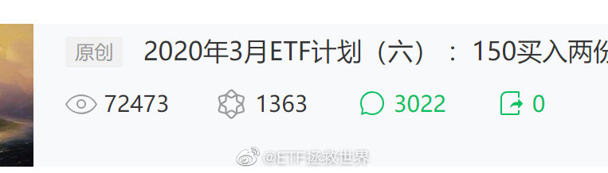

======================================================

ETF拯救世界 (5687069307) @
2020-03-13 20:21:50 Fri  
url: https://weibo.com/5687069307/Iys5Qw3mW

为什么最近两次都买在隔夜反弹上了呢。

我反思了一下。原来是我把买A股的经验套到隔夜上了。

也就是说，在隔夜的形态跌到我过去一定要买的形态时，我买入。这样在A股没问题，而且一买就是短期底部，可以吃反弹。但是隔夜这样操作，一买就买到第二天的反弹。实际上如果我们在欧洲操作，那就一定是昨天 ​​​

转发[88]  评论[475]  赞[1790] 

======================================================

ETF拯救世界 (5687069307) @
2020-03-13 20:29:40 Fri  
url: https://weibo.com/5687069307/Iys92curz

9%。想[泪]。求抱抱//@ETF拯救世界:反弹6%了。不想说话。

------------------------------------------------------
转推：
>  @ETF拯救世界 (5687069307)
>  2020-03-13 17:57:06 Fri  
>  url: https:/weibo.com/5687069307/Iyr96hIxl/

>  昨天美股的数据现在才出来。
>  
>  希望今晚不要反弹太多，下周一还有的买。
>  
>  另外，美国还好，欧洲真的太便宜了。这样的机会可能是十年才有一次的级别。 ​​​

转发[15]  评论[870]  赞[1684] 

======================================================

ETF拯救世界 (5687069307) @
2020-03-13 20:37:03 Fri  
url: https://weibo.com/5687069307/Iysc1u92J

其实钻石边缘成本高几个点也无所谓，问题是：

大幅反弹后肯定还要跌啊。啊。啊。

辣鸡。 ​​​

转发[36]  评论[777]  赞[2640] 

======================================================

ETF拯救世界 (5687069307) @
2020-03-13 21:33:25 Fri  
url: https://weibo.com/5687069307/IysyUa8TY

以后谁再说“欧美投资者成熟”，我就对他呵呵一笑。 ​​​

转发[50]  评论[539]  赞[2390] 

======================================================

ETF拯救世界 (5687069307) @
2020-03-13 21:49:52 Fri  
url: https://weibo.com/5687069307/IysFA984u

今天且慢补仓策略调整：

计划内所有盈利品种不再发出补仓提示。（之前是盈利交易不补仓）

一定要保证所有人拿到比我更低的成本。

进一步解释：

某个品种我买两次，第一次2块，第二次1块，均价1.5。目前1.6元。按照以前的逻辑，会让你补2块那次买入，因为比我的价格低。但现在不会建议补，因为目前 ​​​

转发[68]  评论[1370]  赞[3800] 

======================================================

ETF拯救世界 (5687069307) @
2020-03-14 09:37:44 Sat  
url: https://weibo.com/5687069307/IyxiUr0bE

结局不错。下周继续买，相信有机会。 ​​​

转发[26]  评论[1091]  赞[3632] 

======================================================

ETF拯救世界 (5687069307) @
2020-03-14 16:14:49 Sat  
url: https://weibo.com/5687069307/IyzU58ZZ8

说句实话，哪怕2周前，我万万想不到自己有机会买这么便宜的东西，甚至，有可能更便宜。

喷了。

你给我便宜，我就给你好评。 ​​​

转发[43]  评论[829]  赞[3620] 

======================================================

ETF拯救世界 (5687069307) @
2020-03-14 17:11:14 Sat  
url: https://weibo.com/5687069307/IyAgYDhFw

周一场内油气弄不好会涨停。但12日场内油气换申购石油基金的并不亏。

申购石油基金赚了30%差价，同时周五净值增加6%。

毛估估，油气净值再快速反弹40%，这次转换就无利可图了。 ​​​

转发[4]  评论[1051]  赞[3575] 

======================================================

ETF拯救世界 (5687069307) @
2020-03-15 07:28:01 Sun  
url: https://weibo.com/5687069307/IyFSKrcRW

有些我在微博上提示的投资机会，只限于当时。不能我当天提示，你第二天甚至第三天去操作，情况已经完全不同。

看微博的人水平千差万别，没法照顾到所有人。但有一个原则你记住就不会错：

如果你不懂，就不要做。 ​​​

转发[35]  评论[835]  赞[3377] 

======================================================

ETF拯救世界 (5687069307) @
2020-03-16 09:26:03 Mon  
url: https://weibo.com/5687069307/IyQ59vzDS

溢价40%的结果，就是净值涨22%，价格却不动。 ​​​

转发[28]  评论[499]  赞[1664] 

======================================================

ETF拯救世界 (5687069307) @
2020-03-16 09:39:47 Mon  
url: https://weibo.com/5687069307/IyQaJgoQC

看新闻，看这个那个分析宏观经济天下大势倒是没错，但你首先得有自己的独立判断力再看那些。否则，你就是随波逐流的旅鼠。

怎么办，很简单。闭上眼睛想自己的金融资产跌30%会不会崩溃。会，就减仓到不崩溃的仓位。不会，踏踏实实持有。别管那么多利好利空。

如果现在觉得跌30%不会不舒服，但是到时候 ​​​

转发[106]  评论[1241]  赞[3558] 

======================================================

ETF拯救世界 (5687069307) @
2020-03-16 15:21:15 Mon  
url: https://weibo.com/5687069307/IySpl5gOe

今天一单都没有成交，明日再战。 ​​​

转发[9]  评论[517]  赞[1782] 

======================================================

ETF拯救世界 (5687069307) @
2020-03-16 15:23:19 Mon  
url: https://weibo.com/5687069307/IySqathda

年初说的大幅波动是什么意思呢。

就是年底看，不是大阳线，也不是大阴线，而是长上影长下影的，实体很小的线。也就是说，虽然全年有过大涨，有过大跌，最终收盘点位与年初不会差太多。

这刚过了两个半月，还有十个月，看看吧。 ​​​

转发[112]  评论[530]  赞[2070] 

======================================================

ETF拯救世界 (5687069307) @
2020-03-16 16:10:13 Mon  
url: https://weibo.com/5687069307/IySJcEiZh

这个人以后再出去后，会无底线的有机会就黑🇨🇳是如何虐待她的

------------------------------------------------------
转推：
>  @澎湃新闻 (5044281310)
>  2020-03-16 15:29:03 Mon  
>  url: https:/weibo.com/5044281310/IySsvhVvd/

>  【#女子被隔离坚持要喝矿泉水#，民警：不是酒店】近日，一段发生在上海浦东某隔离点（某星级酒店）的视频曝光，一位海外回来被隔离的女子坚持要喝矿泉水，否则就活不下去。民警严肃指出：隔离区不是酒店，这边不是来旅游的！据悉，该隔离点物资保障充足，能满足被隔离人员基本生活需求。（视频来源：网 ​​​

转发[67]  评论[535]  赞[3082] 

======================================================

ETF拯救世界 (5687069307) @
2020-03-16 16:51:20 Mon  
url: https://weibo.com/5687069307/IySZTuaPT

DAX已经跌到强力支撑位，这个位置会继续买一份，仓位加到4%。 ​​​

转发[39]  评论[700]  赞[2046] 

======================================================

ETF拯救世界 (5687069307) @
2020-03-16 16:56:01 Mon  
url: https://weibo.com/5687069307/IyT1NmhBY

FQ到底违法不违法，我现在有点凌乱了。你懂法，你展开讲讲

------------------------------------------------------
转推：
>  @ ()
>  2020-03-16 16:47:35 Mon  
>  url: 

>  抱歉，作者已设置仅展示半年内微博，此微博已不可见。 ​​​

转发[16]  评论[417]  赞[1651] 

======================================================

ETF拯救世界 (5687069307) @
2020-03-16 20:59:19 Mon  
url: https://weibo.com/5687069307/IyUCyj5W0

说来也怪，现在看着指数涨跌10%竟然觉得很平常。 ​​​

转发[29]  评论[744]  赞[2921] 

======================================================

ETF拯救世界 (5687069307) @
2020-03-16 21:03:50 Mon  
url: https://weibo.com/5687069307/IyUEomHRW

16美元以上停的，目前12。依然不买。现在有钱可以买的东西很多，贵金属暂时不在清单上。

------------------------------------------------------
转推：
>  @ETF拯救世界 (5687069307)
>  2020-03-12 22:30:44 Thu  
>  url: https:/weibo.com/5687069307/IyjvFBcmG/

>  美元白银网格可以先暂停了。 ​​​

转发[35]  评论[533]  赞[1824] 

======================================================

ETF拯救世界 (5687069307) @
2020-03-17 07:04:03 Tue  
url: https://weibo.com/5687069307/IyYA113yE

最近评论里面害怕啊，难受啊，心痛啊之类的又开始多了。

在并不遥远的2018下半年，我还比较害怕看到这样的评论。一个是毕竟是参考我的计划浮亏了，心里很难受。一个是这样会严重影响其他人，就像病毒。恐慌蔓延，最终更多人清仓在谷底。

现在我心平气和看这些评论。我也不会再做很多金融心理方面的建 ​​​

转发[183]  评论[2318]  赞[5915] 

======================================================

ETF拯救世界 (5687069307) @
2020-03-17 10:48:43 Tue  
url: https://weibo.com/5687069307/Iz03cDECC

3分钟只有21条评论，过气小V不如狗。 ​​​

转发[43]  评论[1594]  赞[4052] 

+++++++++++++++++++++++++++++++++++++++++++++++++++++

图片：
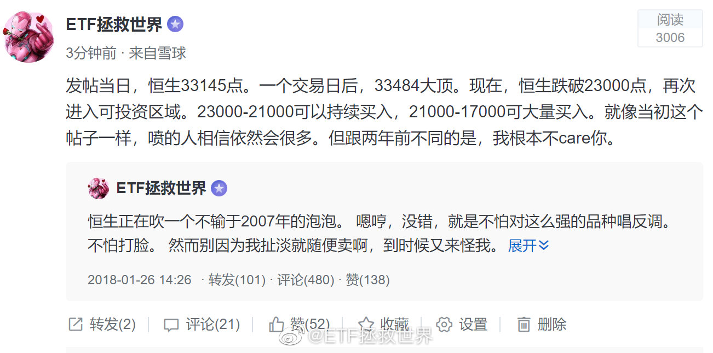

======================================================

ETF拯救世界 (5687069307) @
2020-03-17 13:47:04 Tue  
url: https://weibo.com/5687069307/Iz1dBrM6s

想在这样的日子里躺在草地上听歌。

闻着嫩绿色的香气。 ​​​

转发[17]  评论[865]  赞[3211] 

======================================================

ETF拯救世界 (5687069307) @
2020-03-17 15:50:00 Tue  
url: https://weibo.com/5687069307/Iz21uELGi

今日数据：

标普500可以开始慢慢买了。 ​​​

转发[82]  评论[629]  赞[2430] 

======================================================

ETF拯救世界 (5687069307) @
2020-03-17 15:54:53 Tue  
url: https://weibo.com/5687069307/Iz23tClCV

今日数据：

德国、日本已经极具投资价值。 ​​​

转发[493]  评论[1175]  赞[3440] 

======================================================

ETF拯救世界 (5687069307) @
2020-03-17 19:19:59 Tue  
url: https://weibo.com/5687069307/Iz3oJzCMT

（拜耳，DAX第五大成分股）

------------------------------------------------------
转推：
>  @拜耳中国 (2256993370)
>  2020-03-17 18:40:31 Tue  
>  url: https:/weibo.com/2256993370/Iz38Iac3t/

>  声明 ​​​

转发[35]  评论[409]  赞[1583] 

======================================================

ETF拯救世界 (5687069307) @
2020-03-17 20:23:25 Tue  
url: https://weibo.com/5687069307/Iz3OtvpQz

刚才看拜耳的资料，顺便看了一下第七大成分股阿迪达斯。

阿迪从2016年到今年初翻番用了3年多，谁能想到腰斩只用了两个月……但是这种做消费品的公司利润真高啊。 ​​​

转发[15]  评论[218]  赞[1300] 

======================================================

ETF拯救世界 (5687069307) @
2020-03-17 20:26:03 Tue  
url: https://weibo.com/5687069307/Iz3Pykv3G

官宣了，推迟到明年。

------------------------------------------------------
转推：
>  @ETF拯救世界 (5687069307)
>  2020-02-26 20:15:23 Wed  
>  url: https:/weibo.com/5687069307/Iw1dhy9qk/

>  这么说今年欧洲杯悬了。[悲伤] ​​​

转发[3]  评论[141]  赞[978] 

======================================================

ETF拯救世界 (5687069307) @
2020-03-17 20:42:54 Tue  
url: https://weibo.com/5687069307/Iz3Wo3p3s

每天都在更新对这个世界的认知。

人类太复杂了。 ​​​

转发[12]  评论[347]  赞[1955] 

======================================================

ETF拯救世界 (5687069307) @
2020-03-17 21:38:35 Tue  
url: https://weibo.com/5687069307/Iz4iZi6WZ

投资真的要选对入场和出场时机。即使如美股如此持续的长牛，如果你2000年高位入场，到2020的现在，20年也只能赚不超过60%。

年化不到3%。

今年高点标普500指数3400入场的，十年后收益率会是多少？之前说过好几次了，不多说。 ​​​

转发[111]  评论[373]  赞[1669] 

======================================================

ETF拯救世界 (5687069307) @
2020-03-17 22:17:10 Tue  
url: https://weibo.com/5687069307/Iz4yEh21m

投资指数，两个问题比较关键。做对了这辈子问题不大。

第一点，不能买贵。

第二点，高抛低吸。

听起来是不是废话。听起来像，但其实不是。好好品一下，然后把大部分精力放在这两个大方向上，细化策略，结局一定不会差。 ​​​

转发[340]  评论[613]  赞[2708] 

======================================================

ETF拯救世界 (5687069307) @
2020-03-17 22:23:21 Tue  
url: https://weibo.com/5687069307/Iz4Ba0klE

很难想象欧美连一次相当级别的反弹都没有。

应该有啊。 ​​​

转发[19]  评论[443]  赞[1865] 

======================================================

ETF拯救世界 (5687069307) @
2020-03-17 23:36:13 Tue  
url: https://weibo.com/5687069307/Iz54Jt83g

最近的一点感想。

说白了，人类，就得抱团。种族、血缘、地缘，甚至校友会等等，各种理由抱在一起。你不抱在一起，就会被别的喜欢抱在一起的欺负。因为资源是有限的，不可能每个人都过得很舒服，那就必然有人吃亏被欺负，有人占便宜。是不是听起来没有那么zz正确，但这就是事实。

有些人牧羊，喜欢外 ​​​

转发[207]  评论[512]  赞[2777] 

======================================================

ETF拯救世界 (5687069307) @
2020-03-17 23:56:07 Tue  
url: https://weibo.com/5687069307/Iz5cOmC1q

国内这帮QDII真是服了。弄个QDII，几千万刀外汇额度。干嘛呢？过家家呢。

真想做好就加把劲多申请点外汇额度啊。一天天就想追热点一下子发几十只科技基金，服了。 ​​​

转发[39]  评论[295]  赞[1934] 

======================================================

ETF拯救世界 (5687069307) @
2020-03-18 00:09:18 Wed  
url: https://weibo.com/5687069307/Iz5iac56n

你说美股这么搞，怎么买。这也太考验单日预判能力了吧。最近几天涨跌幅：

-7%；
+5%；
-5%；
-10%；
+9%；
-12%；
+6%。

发愁。 ​​​

转发[49]  评论[740]  赞[2136] 

======================================================

ETF拯救世界 (5687069307) @
2020-03-18 10:06:10 Wed  
url: https://weibo.com/5687069307/Iz9crdmWk

什么连累不连累的，只要你还是中国国籍，该回来就回来。如实上报身体情况，服从安排进行隔离，正常的中国人没人会嫌弃你们。

------------------------------------------------------
转推：
>  @观察者网 (1887344341)
>  2020-03-17 17:38:36 Tue  
>  url: https:/weibo.com/1887344341/Iz2JA0iCc/

>  在英留学生当下感受：左右为难，不想连累祖国，又怕客死他乡。@光明网http://t.cn/A6zOg4Wl ​​​

转发[44]  评论[261]  赞[1720] 

======================================================

ETF拯救世界 (5687069307) @
2020-03-18 10:28:09 Wed  
url: https://weibo.com/5687069307/Iz9lm5Amk

在组合中趁乱增加QDII还有一个原因。

即使疫情过去，ZM之间关系的问题。不展开说了。 ​​​

转发[18]  评论[308]  赞[1543] 

======================================================

ETF拯救世界 (5687069307) @
2020-03-18 10:49:03 Wed  
url: https://weibo.com/5687069307/Iz9tQ4bgr

其实洗碗机最大的作用不是少做点家务活，或者有助于改善家庭关系，

而是它洗的是真干净。

多干净，就是它可以把你的杯子啊、碗啊，变回刚买来时候的样子。（太贵重的餐具就别用它了，洗的劲儿太大，容易弄出划痕） ​​​

转发[66]  评论[956]  赞[2687] 

======================================================

ETF拯救世界 (5687069307) @
2020-03-18 12:20:01 Wed  
url: https://weibo.com/5687069307/Iza4LzJP8

行吧，都删了吧。男的女的，活着都不容易。

反正姑娘们你们知道我爱你们就够了。[爱你]

（男人再往我怀里钻拉黑警告[哼]） ​​​

转发[7]  评论[757]  赞[2326] 

======================================================

ETF拯救世界 (5687069307) @
2020-03-18 12:33:05 Wed  
url: https://weibo.com/5687069307/Izaa49K3r

欧美反弹的话力度应该在十几二十个点。

按照历史经验看的话。 ​​​

转发[44]  评论[379]  赞[1462] 

======================================================

ETF拯救世界 (5687069307) @
2020-03-18 13:28:31 Wed  
url: https://weibo.com/5687069307/Izawzr1cU

不要天天想着开车，说真的，你家没矿，不是无限现金流，不能天天开。

我开车有两个标准，第一时间，第二空间。时间和空间至少要拉开其一。否则筹码堆积在一个点位上，没有意义。前几天暴跌，我们进场买点，这个空间就差不多了。继续再等下一个时间或者空间。

你知不知道为什么第三轮四年了你还天天惦 ​​​

转发[330]  评论[924]  赞[2957] 

======================================================

ETF拯救世界 (5687069307) @
2020-03-18 14:09:56 Wed  
url: https://weibo.com/5687069307/IzaNnm8r9

恒生目前的思路，是下次加仓大概在21000左右。再加就是21000以下。

即使到了21000以下，150也不会买太多，仓位限制。

S也许会多买，无上限。你敢跌我就敢买。 ​​​

转发[132]  评论[542]  赞[2017] 

======================================================

ETF拯救世界 (5687069307) @
2020-03-18 14:25:00 Wed  
url: https://weibo.com/5687069307/IzaTv3hpF

韩国股市2018年2月历史新高，现在已经跌回2007年。

股票，只持有不卖绝对不行。买的贵了更不行。 ​​​

转发[107]  评论[414]  赞[1998] 

======================================================

ETF拯救世界 (5687069307) @
2020-03-18 15:24:37 Wed  
url: https://weibo.com/5687069307/IzbhHise0

分享图片 ​​​

转发[86]  评论[886]  赞[2994] 

+++++++++++++++++++++++++++++++++++++++++++++++++++++

图片：

======================================================

ETF拯救世界 (5687069307) @
2020-03-18 18:22:06 Wed  
url: https://weibo.com/5687069307/IzcrJB7VP

达里奥对中国不错，希望他没事。 ​​​

转发[26]  评论[456]  赞[2224] 

======================================================

ETF拯救世界 (5687069307) @
2020-03-19 07:54:55 Thu  
url: https://weibo.com/5687069307/IzhLF46Bg

美国国债也撑不住了 http://t.cn/A6zHyg6S //@ETF拯救世界:回复@丫丫背后的女人:黄金只在危机开始阶段有点作用。危机深入后，它所谓的避险属性就会失效。中后期只有国债和现金不跌，甚至最后只有现金不会跌。//@丫丫背后的女人:黄金避险属性完全失效[污]

------------------------------------------------------
转推：
>  @ETF拯救世界 (5687069307)
>  2020-03-12 22:30:44 Thu  
>  url: https:/weibo.com/5687069307/IyjvFBcmG/

>  美元白银网格可以先暂停了。 ​​​

转发[83]  评论[417]  赞[1364] 

======================================================

ETF拯救世界 (5687069307) @
2020-03-19 09:32:56 Thu  
url: https://weibo.com/5687069307/Iziprgi3d

桥水的全天候，在正常情况下问题不大。但是在极端情况下，除了现金所有资产都跌，那么这个策略也很难独善其身。

我一向认为，仓位管理非常重要。现金在组合中占的比重值得研究和重视。现金大多数时候确实会拖后腿，但关键时候可以保命。

我个人感觉，自己对于左侧的研究已经遇到天花板了。下一步要更 ​​​

转发[123]  评论[638]  赞[2728] 

======================================================

ETF拯救世界 (5687069307) @
2020-03-19 10:36:44 Thu  
url: https://weibo.com/5687069307/IziPl03QG

空间出来了。可以准备动一动了 ​​​

转发[23]  评论[1470]  赞[3513] 

======================================================

ETF拯救世界 (5687069307) @
2020-03-19 13:15:54 Thu  
url: https://weibo.com/5687069307/IzjRWFlJj

A股最后一个想买的品种距离买入目标位还剩7%。 ​​​

转发[24]  评论[515]  赞[1953] 

======================================================

ETF拯救世界 (5687069307) @
2020-03-19 13:41:45 Thu  
url: https://weibo.com/5687069307/Izk2r4DvX

不要忘记原则：未来几个月甚至一两年用于消费的钱，不要进股市。

最好只用3-5年的闲钱。

这样你才能不做傻事。 ​​​

转发[90]  评论[451]  赞[2134] 

======================================================

ETF拯救世界 (5687069307) @
2020-03-19 13:59:46 Thu  
url: https://weibo.com/5687069307/Izk9Ki6kS

2016年4月1日，我们结束了从2015年9月开始的恒生买入周期。

之后至今整整四年，除了两次高抛低吸，再无加码。

过程中最高收益率接近60%。

到了今天，2020年3月19，恒生跌回当初位置，我们再次加仓，在这个估值，技术都合适的时候。

一直想继续买，但依然等了四年。这份耐心，恐怕万里无一。 ​​​

转发[181]  评论[584]  赞[2333] 

======================================================

ETF拯救世界 (5687069307) @
2020-03-19 14:07:46 Thu  
url: https://weibo.com/5687069307/IzkcZvxbM

OH，NO！！！ ​​​

转发[14]  评论[423]  赞[1426] 

======================================================

ETF拯救世界 (5687069307) @
2020-03-19 14:12:07 Thu  
url: https://weibo.com/5687069307/IzkeLa8T6

算了，不看了。

人间不值得。 ​​​

转发[7]  评论[434]  赞[1636] 

======================================================

ETF拯救世界 (5687069307) @
2020-03-19 14:21:49 Thu  
url: https://weibo.com/5687069307/IzkiHgy2K

回复@ETF拯救世界:反弹2%了。所以交易就是要自己静悄悄的做。慢慢底部吸筹一天也ok。这什么玩意儿啊。//@ETF拯救世界:从发车位置反弹1%了。

------------------------------------------------------
转推：
>  @ETF拯救世界 (5687069307)
>  2020-03-19 14:07:46 Thu  
>  url: https:/weibo.com/5687069307/IzkcZvxbM/

>  OH，NO！！！ ​​​

转发[8]  评论[743]  赞[2082] 

======================================================

ETF拯救世界 (5687069307) @
2020-03-19 19:28:26 Thu  
url: https://weibo.com/5687069307/Izmj9q5hu

不是好消息

------------------------------------------------------
转推：
>  @ ()
>  2020-03-19 19:27:09 Thu  
>  url: 

>  抱歉，作者已设置仅展示半年内微博，此微博已不可见。 ​​​

转发[50]  评论[273]  赞[1336] 

======================================================

ETF拯救世界 (5687069307) @
2020-03-19 19:31:34 Thu  
url: https://weibo.com/5687069307/IzmkqCnoZ

被公司开了，工作类签证失效。出门在外一定多一事不如少一事，你不知道会引起什么后果

------------------------------------------------------
转推：
>  @央视新闻 (2656274875)
>  2020-03-19 16:33:57 Thu  
>  url: https:/weibo.com/2656274875/IzlakofSk/

>  【警方：#澳大利亚籍拒绝隔离女子被要求限期离境#】北京市公安局副局长潘绪宏：3月15日，北京朝阳公安分局接某小区卫生防疫工作人员报警称，一女子拒不配合社区防疫工作。经核查，梁某妍，女，47岁，澳大利亚籍。其行为在网上曝光后，所在公司对其辞退处理。18日，北京市公安局出入境管理局依据相关规 ​​​

转发[21]  评论[263]  赞[2184] 

======================================================

ETF拯救世界 (5687069307) @
2020-03-19 22:00:19 Thu  
url: https://weibo.com/5687069307/IzniNBfGL

美股，我盼你善良。

给点面子。 ​​​

转发[28]  评论[456]  赞[1759] 

======================================================

ETF拯救世界 (5687069307) @
2020-03-19 22:14:52 Thu  
url: https://weibo.com/5687069307/IznoI21xt

“美股三大股指集体翻红，纳指涨超2%，科技股强势大涨，特斯拉大涨超16%。”好吧，今天只要标普不涨超过2%，就还可以做朋友。

------------------------------------------------------
转推：
>  @ETF拯救世界 (5687069307)
>  2020-03-19 22:00:19 Thu  
>  url: https:/weibo.com/5687069307/IzniNBfGL/

>  美股，我盼你善良。
>  
>  给点面子。 ​​​

转发[17]  评论[574]  赞[1670] 

======================================================

ETF拯救世界 (5687069307) @
2020-03-20 09:58:34 Fri  
url: https://weibo.com/5687069307/Izs0lcIq2

跌几天金融危机，涨几天牛市回归。

说实话你是不是这样的。 ​​​

转发[29]  评论[676]  赞[2048] 

======================================================

ETF拯救世界 (5687069307) @
2020-03-20 10:18:13 Fri  
url: https://weibo.com/5687069307/Izs8jvq1O

从昨天发车时候开始算，恒生不到24小时已经反弹6%了。 ​​​

转发[25]  评论[365]  赞[1493] 

======================================================

ETF拯救世界 (5687069307) @
2020-03-20 10:21:04 Fri  
url: https://weibo.com/5687069307/Izs9tk3oT

回复@勇赶的心2000:这就很奇怪了。150的钱安排的明明白白，绝不会没钱。S之前有多少个月不买或者只买一半，等的就是现在加买。如果我加车，绝对不会默认家里有矿，一定是有车才加，怎么会没钱呢。//@勇赶的心2000:没钱跟了[哈哈]

------------------------------------------------------
转推：
>  @ETF拯救世界 (5687069307)
>  2020-03-20 10:18:13 Fri  
>  url: https:/weibo.com/5687069307/Izs8jvq1O/

>  从昨天发车时候开始算，恒生不到24小时已经反弹6%了。 ​​​

转发[10]  评论[275]  赞[1248] 

======================================================

ETF拯救世界 (5687069307) @
2020-03-20 10:23:22 Fri  
url: https://weibo.com/5687069307/IzsapgJrQ

昨天最低21139，距离我之前定义的第二大支撑线21000只差100点。当然，我真心希望能到最后一根支撑线17000。这就要看命了。

------------------------------------------------------
转推：
>  @ETF拯救世界 (5687069307)
>  2020-03-19 13:59:46 Thu  
>  url: https:/weibo.com/5687069307/Izk9Ki6kS/

>  2016年4月1日，我们结束了从2015年9月开始的恒生买入周期。
>  
>  之后至今整整四年，除了两次高抛低吸，再无加码。
>  
>  过程中最高收益率接近60%。
>  
>  到了今天，2020年3月19，恒生跌回当初位置，我们再次加仓，在这个估值，技术都合适的时候。
>  
>  一直想继续买，但依然等了四年。这份耐心，恐怕万里无一。 ​​​

转发[45]  评论[264]  赞[1277] 

======================================================

ETF拯救世界 (5687069307) @
2020-03-20 10:39:03 Fri  
url: https://weibo.com/5687069307/IzsgM4aA9

30000点的时候你觉得21000是个梦。

21000的时候你又觉得回到30000点是个梦。

其实都不是。 ​  ​ http://t.cn/A6t4S4Nj ​​​

转发[57]  评论[330]  赞[2034] 

======================================================

ETF拯救世界 (5687069307) @
2020-03-20 10:41:32 Fri  
url: https://weibo.com/5687069307/IzshMn79X

震惊，潘石屹被程序员盗号了。

------------------------------------------------------
转推：
>  @ ()
>  2020-03-20 10:30:36 Fri  
>  url: 

>  抱歉，作者已设置仅展示半年内微博，此微博已不可见。 ​​​

转发[14]  评论[180]  赞[736] 

======================================================

ETF拯救世界 (5687069307) @
2020-03-20 10:57:35 Fri  
url: https://weibo.com/5687069307/IzsoihTJW

流动性非常重要。对一家公司，一个国家甚至全球金融系统来说是如此，对你个人以及家庭来说更是如此。

现金，需要的时候能拿出来。非常关键。

正向的自由现金流很重要。最好保证每个月现金流入都大于流出。如果正向自由现金流能持续，买的又是没有杠杆的，不会死的，成本非常低的优质金融资产，那么其 ​​​

转发[166]  评论[544]  赞[2283] 

======================================================

ETF拯救世界 (5687069307) @
2020-03-20 14:06:57 Fri  
url: https://weibo.com/5687069307/IztDa0sVT

年前不是让人把我车追尾了吗，刚修好。今天我去取车，跟撞我那人说了，就有了这样的对话。

你说人和人之间要都是这样相处，解决事情，咱们活得是不是得幸福好多倍。 ​​​

转发[8]  评论[518]  赞[1974] 

+++++++++++++++++++++++++++++++++++++++++++++++++++++

图片：
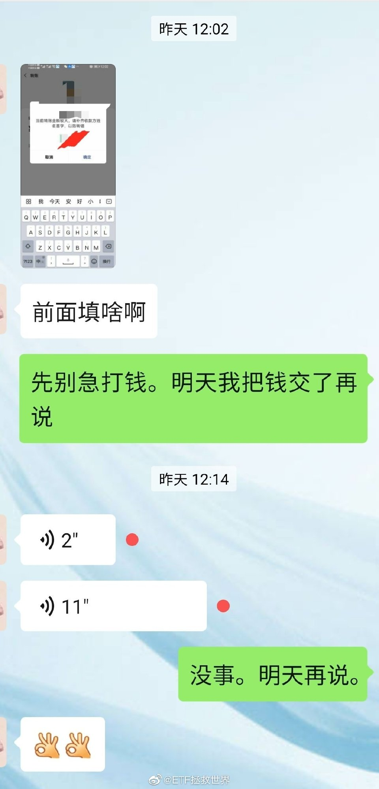

======================================================

ETF拯救世界 (5687069307) @
2020-03-20 15:34:43 Fri  
url: https://weibo.com/5687069307/IzucMvh31

什么是舒服，就是昨天买了恒生就舒服。

什么是不舒服，就是昨天没买。

别管以后跌不跌，至少周末能舒服两天…… ​​​

转发[26]  评论[825]  赞[2581] 

======================================================

ETF拯救世界 (5687069307) @
2020-03-20 15:54:20 Fri  
url: https://weibo.com/5687069307/IzukKhxQJ

震惊，老板不务正业，soho中国暴涨34%。//@ETF拯救世界:震惊，潘石屹被程序员盗号了。

------------------------------------------------------
转推：
>  @ ()
>  2020-03-20 10:30:36 Fri  
>  url: 

>  抱歉，作者已设置仅展示半年内微博，此微博已不可见。 ​​​

转发[6]  评论[120]  赞[759] 

======================================================

ETF拯救世界 (5687069307) @
2020-03-20 17:52:45 Fri  
url: https://weibo.com/5687069307/Izv6OkVHn

… ​​​

转发[30]  评论[582]  赞[2236] 

+++++++++++++++++++++++++++++++++++++++++++++++++++++

图片：
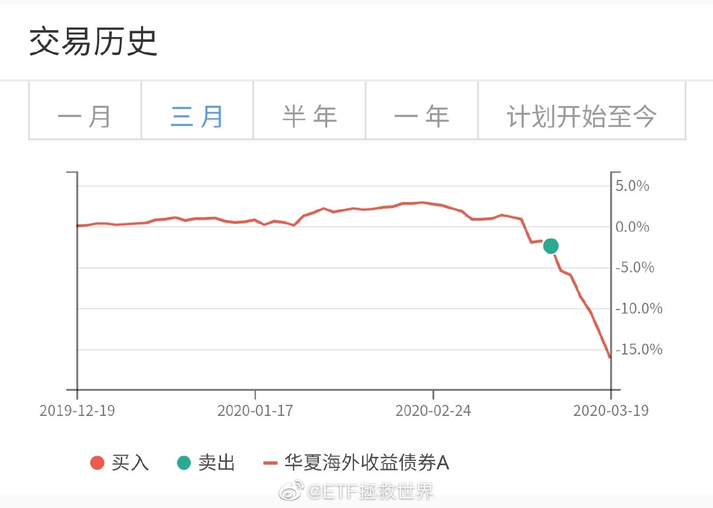

======================================================

ETF拯救世界 (5687069307) @
2020-03-20 19:58:22 Fri  
url: https://weibo.com/5687069307/IzvVNtB4g

今日新闻收藏：

“贵州茅台市值超可口可乐 五粮液超越百威”。

看了一下，上汽也超过奔驰 宝马了。 ​​​

转发[114]  评论[230]  赞[1661] 

======================================================

ETF拯救世界 (5687069307) @
2020-03-20 20:00:35 Fri  
url: https://weibo.com/5687069307/IzvWHl7px

这新闻给哥看笑了。

------------------------------------------------------
转推：
>  @央视新闻 (2656274875)
>  2020-03-20 18:06:58 Fri  
>  url: https:/weibo.com/2656274875/IzvcAaBfn/

>  【#耿爽说没收到美国所谓1亿援助#[摊手]】耿爽：美国政府官员在多个场合曾表示，将向包括中国在内的有关国家提供1亿美元的抗疫援助。别的国家是否收到我不清楚，但迄今为止中方从未收到以美国政府名义捐助的资金或物资。中方已正式回复美方，表示感谢，并请美方尽快将这笔物资捐助给更需要它的国家。  ​​​

转发[74]  评论[274]  赞[1619] 

======================================================

ETF拯救世界 (5687069307) @
2020-03-20 22:56:06 Fri  
url: https://weibo.com/5687069307/Izx5WD1Vi

意思不大，洗洗睡吧 ​​​

转发[0]  评论[254]  赞[1220] 

======================================================

ETF拯救世界 (5687069307) @
2020-03-20 23:03:02 Fri  
url: https://weibo.com/5687069307/Izx8KEMzM

感觉西方除了股市都不是很在意病毒

------------------------------------------------------
转推：
>  @微英国 (6269554188)
>  2020-03-20 16:21:38 Fri  
>  url: https:/weibo.com/6269554188/IzuvPh4ar/

>  #疫情下的英国#【#近半英国人认同政府抗疫方式#】Ipsos在英国的民调显示，49%的受调查者认为约翰逊政府应对疫情的方式很好，18-34岁的人中只有28%这么认为，65岁以上的人中则有70%支持。此外政府满意率达到48%，自2010年以来首次高于不满意率（41%）。调查于3月13日-16日期间进行。 via The Guardian ​​​

转发[19]  评论[255]  赞[1273] 

======================================================

ETF拯救世界 (5687069307) @
2020-03-20 23:53:15 Fri  
url: https://weibo.com/5687069307/Izxt8tNsj

再说一次，我这里不欢迎小白。

我没精力，没义务，没兴趣给你普及金融知识。为什么要买，为什么这么走，你不要问，我不回答。这是我自己的投资计划，为什么要给你做解释？ ​​​

转发[15]  评论[900]  赞[4138] 

======================================================

ETF拯救世界 (5687069307) @
2020-03-21 10:09:15 Sat  
url: https://weibo.com/5687069307/IzBvaDurQ

昨天又跌了3%

------------------------------------------------------
转推：
>  @ETF拯救世界 (5687069307)
>  2020-03-20 17:52:45 Fri  
>  url: https:/weibo.com/5687069307/Izv6OkVHn/

>  … ​​​

转发[11]  评论[287]  赞[1248] 

======================================================

ETF拯救世界 (5687069307) @
2020-03-21 10:27:57 Sat  
url: https://weibo.com/5687069307/IzBCLjefl

问原油类基金的，这是我们一直以来做的统计功课，免费送给你。

看得懂就看看，看不懂就别多说了。不喜欢原油以后你就别买，多大点事啊。 ​​​

转发[229]  评论[1089]  赞[3521] 

+++++++++++++++++++++++++++++++++++++++++++++++++++++

图片：
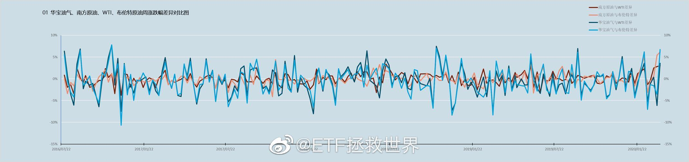
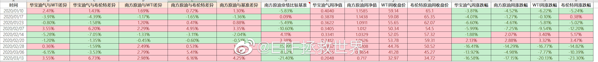

======================================================

ETF拯救世界 (5687069307) @
2020-03-23 10:17:32 Mon  
url: https://weibo.com/5687069307/IzUpwE0TJ

一定要控制节奏。

------------------------------------------------------
转推：
>  @ETF拯救世界 (5687069307)
>  2020-03-18 13:28:31 Wed  
>  url: https:/weibo.com/5687069307/Izawzr1cU/

>  不要天天想着开车，说真的，你家没矿，不是无限现金流，不能天天开。
>  
>  我开车有两个标准，第一时间，第二空间。时间和空间至少要拉开其一。否则筹码堆积在一个点位上，没有意义。前几天暴跌，我们进场买点，这个空间就差不多了。继续再等下一个时间或者空间。
>  
>  你知不知道为什么第三轮四年了你还天天惦 ​​​

转发[56]  评论[488]  赞[1776] 

======================================================

ETF拯救世界 (5687069307) @
2020-03-23 10:22:39 Mon  
url: https://weibo.com/5687069307/IzUrBtZRd

没有什么品种不会跌。如果别人跌的特别便宜，你还在高位，那么理性的投资者就会卖掉你去买便宜的。

所以最终大家都会跌。 ​​​

转发[139]  评论[604]  赞[2632] 

======================================================

ETF拯救世界 (5687069307) @
2020-03-23 13:33:41 Mon  
url: https://weibo.com/5687069307/IzVH99meX

看了一眼芯片指数基金跌了30%，心想有没有机会买点。

然后去看了看成分股估值，

90多倍。

行吧，打扰了。 ​​​

转发[118]  评论[451]  赞[2017] 

======================================================

ETF拯救世界 (5687069307) @
2020-03-23 14:49:24 Mon  
url: https://weibo.com/5687069307/IzWbSsc6b

什么时候买回来 ​​​

转发[23]  评论[365]  赞[1268] 

+++++++++++++++++++++++++++++++++++++++++++++++++++++

图片：
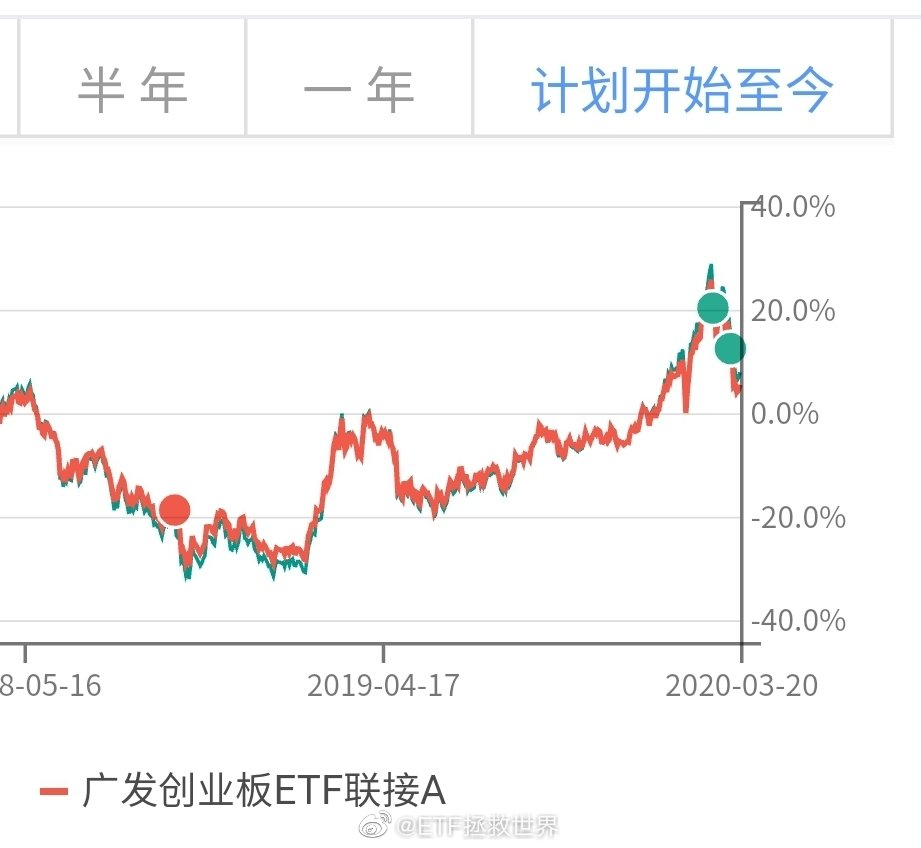

======================================================

ETF拯救世界 (5687069307) @
2020-03-23 14:56:29 Mon  
url: https://weibo.com/5687069307/IzWeKDFwz

有没有发现一件事。计划里面卖出的股票类指数，全部都能用更低的价格买回来。

有的时间长点，有的时间短点。 ​​​

转发[37]  评论[549]  赞[2509] 

======================================================

ETF拯救世界 (5687069307) @
2020-03-23 16:22:24 Mon  
url: https://weibo.com/5687069307/IzWND4ItA

如果DAX有效跌破8200，那就是最强的一根支撑破掉了。再往下是多少很难判断了。

要是一定一定要给个点位，那就是6200周围。问题是，这也太低了吧！

不过综合最近40年美国和英国的指数走势看，极限跌幅确实还有30%。这个真的是极限了，如果还止不住，那可能就是要全面推倒重来了。 ​​​

转发[581]  评论[684]  赞[2423] 

======================================================

ETF拯救世界 (5687069307) @
2020-03-23 20:42:15 Mon  
url: https://weibo.com/5687069307/IzYv6i1gf

从过去美股100年历史看，在大幅下跌后买入，无一例外会赚大钱。大幅是多少？从历史看，50%-80%就一定是属于大幅，且真实发生过。但你不能预期未来一定还能跌这么多，所以在差不多的时候可以开始慢慢买。目前距离最高点跌幅35%。

很多人说危机。危机真的很可怕，但是在危机的后半段开始买入，历史上都 ​​​

转发[231]  评论[691]  赞[2377] 

======================================================

ETF拯救世界 (5687069307) @
2020-03-24 08:54:22 Tue  
url: https://weibo.com/5687069307/IA3ih5Jbt

什么玩意儿涨这么点就熔断了//@财联社APP:日经225指数期货上涨触发熔断机制。//@财联社APP:日经225指数高开高走，涨幅扩大至4.18%。

------------------------------------------------------
转推：
>  @财联社APP (2868676035)
>  2020-03-24 08:03:01 Tue  
>  url: https:/weibo.com/2868676035/IA2XqiJue/

>  日经225指数高开1.89%。 ​​​

转发[14]  评论[428]  赞[1290] 

======================================================

ETF拯救世界 (5687069307) @
2020-03-24 13:39:48 Tue  
url: https://weibo.com/5687069307/IA5a8dHOP

好消息，跌了两天，已经降至85倍了。

------------------------------------------------------
转推：
>  @ETF拯救世界 (5687069307)
>  2020-03-23 13:33:41 Mon  
>  url: https:/weibo.com/5687069307/IzVH99meX/

>  看了一眼芯片指数基金跌了30%，心想有没有机会买点。
>  
>  然后去看了看成分股估值，
>  
>  90多倍。
>  
>  行吧，打扰了。 ​​​

转发[49]  评论[253]  赞[1192] 

======================================================

ETF拯救世界 (5687069307) @
2020-03-24 13:45:08 Tue  
url: https://weibo.com/5687069307/IA5ci7WQV

我其实有点好奇的，是高位那么多科技类指数基金成立，规模怎么也有几百亿了，他们是把谁的货接走了。 ​​​

转发[22]  评论[313]  赞[1401] 

======================================================

ETF拯救世界 (5687069307) @
2020-03-24 15:00:21 Tue  
url: https://weibo.com/5687069307/IA5GOFEEU

二月底开的条件单网格账户，目前浮亏2.3%。 ​​​

转发[19]  评论[520]  赞[1321] 

+++++++++++++++++++++++++++++++++++++++++++++++++++++

图片：
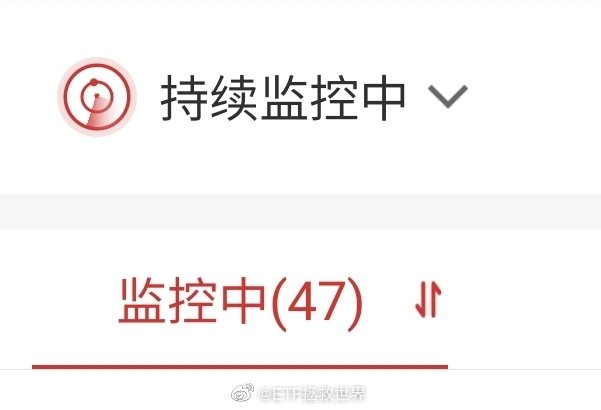

======================================================

ETF拯救世界 (5687069307) @
2020-03-24 16:07:32 Tue  
url: https://weibo.com/5687069307/IA685tlH4

DAX涨6%，目前9200。自低点8239反弹已经12%。大幅下跌后不反弹极其少见，即使29年也曾经大幅反弹。反弹之后何去何从就要继续观察了。

------------------------------------------------------
转推：
>  @ETF拯救世界 (5687069307)
>  2020-03-23 16:22:24 Mon  
>  url: https:/weibo.com/5687069307/IzWND4ItA/

>  如果DAX有效跌破8200，那就是最强的一根支撑破掉了。再往下是多少很难判断了。
>  
>  要是一定一定要给个点位，那就是6200周围。问题是，这也太低了吧！
>  
>  不过综合最近40年美国和英国的指数走势看，极限跌幅确实还有30%。这个真的是极限了，如果还止不住，那可能就是要全面推倒重来了。 ​​​

转发[86]  评论[183]  赞[1183] 

======================================================

ETF拯救世界 (5687069307) @
2020-03-24 16:25:25 Tue  
url: https://weibo.com/5687069307/IA6flxJah

感觉最近大家情绪都不高啊。怎么回事，有什么烦心事说出来听听。 ​​​

转发[35]  评论[2245]  赞[5332] 

======================================================

ETF拯救世界 (5687069307) @
2020-03-24 17:57:42 Tue  
url: https://weibo.com/5687069307/IA6QO8dFs

刚才那个烦恼的帖子，评论里的情况大概分这么几类：

事业、情感、婚姻、健康、亲子、投资。

前五类我先不说，以后有空展开谈谈我自己的看法。浮于表面，入木三分。

最后的投资，我先说两句。

我说你们那些为了坐电梯，为了利润减少或者由盈转亏就伤心难过的，行不行啊你们。

A股，哪怕你是在盈亏 ​​​

转发[156]  评论[1049]  赞[2280] 

======================================================

ETF拯救世界 (5687069307) @
2020-03-24 18:12:39 Tue  
url: https://weibo.com/5687069307/IA6WSijDf

回复@是周小满呀:震惊！基金小V粉丝群竟然发生这种事……当然是好事，但双方都要多了解对方再坠入爱河呀。//@是周小满呀:老大，我恋爱了，在E大的一个粉丝群，和你的女粉认识两天半恋爱了，谢谢你帮我做的铺垫，我们一切都好，就是坠入了爱河。 http://t.cn/A6tb0w3N

------------------------------------------------------
转推：
>  @ETF拯救世界 (5687069307)
>  2020-03-24 16:25:25 Tue  
>  url: https:/weibo.com/5687069307/IA6flxJah/

>  感觉最近大家情绪都不高啊。怎么回事，有什么烦心事说出来听听。 ​​​

转发[14]  评论[737]  赞[2400] 

======================================================

ETF拯救世界 (5687069307) @
2020-03-24 19:29:37 Tue  
url: https://weibo.com/5687069307/IA7s7vO6M

麒麟控股，日经225市值排名第47位的公司。市值18000亿日元，约合1150亿人民币。从事制造和销售酒精饮料和软饮料。

------------------------------------------------------
转推：
>  @日经中文网 (2478163131)
>  2020-03-24 11:23:38 Tue  
>  url: https:/weibo.com/2478163131/IA4gR97Vw/

>  【麒麟将在中国电商销售健康食品】麒麟将利用在中国销售芳珂健康食品的本地企业“中国国际医药卫生公司”的销售渠道。首先将销售营养保健品，每袋价格为189元（约3000日元），比日本国内价格（2200日元，不含税）高出3成…… http://t.cn/A6zFkuJv ​​​

转发[17]  评论[112]  赞[604] 

======================================================

ETF拯救世界 (5687069307) @
2020-03-24 19:32:11 Tue  
url: https://weibo.com/5687069307/IA7t9B8lB

奥运会顺延一年，欧洲杯顺延一年，为什么股市不能顺延一年？

我建议，明年年初，全球所有交易所把每个投资者的账户重置到今年年初，然后把所有股票价格和指数点位也重置，这样大家的财富都没损失，反正就是电脑系统操作一下的事儿。 ​​​

转发[15]  评论[260]  赞[1496] 

======================================================

ETF拯救世界 (5687069307) @
2020-03-24 19:33:39 Tue  
url: https://weibo.com/5687069307/IA7tKB1e6

日经225市值排名前二十的公司。说实话，大多数我还挺喜欢的。

第九的迅销就是优衣库。 ​​​

转发[76]  评论[289]  赞[1163] 

+++++++++++++++++++++++++++++++++++++++++++++++++++++

图片：
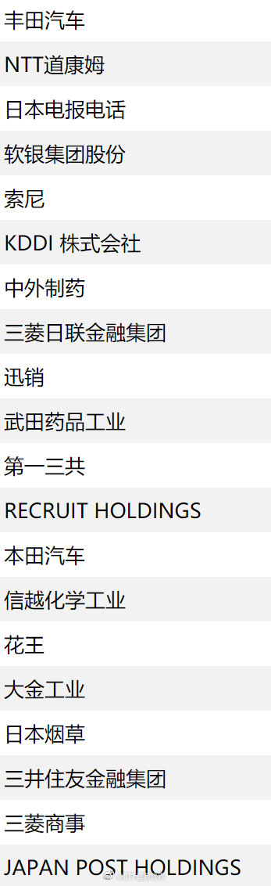

======================================================

ETF拯救世界 (5687069307) @
2020-03-24 19:49:19 Tue  
url: https://weibo.com/5687069307/IA7A74208

说起时间重置，想起小时候看过的一部日剧，《重返少年时》

男主的时间总是重置的故事，印象很深。他的记忆还在，所以买股票什么的发财了。

剧情什么的虽然好但最重要的是看完之后我就粉了仲间由纪惠几年…… ​​​

转发[9]  评论[271]  赞[1077] 

======================================================

ETF拯救世界 (5687069307) @
2020-03-24 20:34:55 Tue  
url: https://weibo.com/5687069307/IA7SCsKwz

不过说实话，各位手里始终应该保留一些现金类资产，其中一部分最好还是以美元形式存在。

这部分肯定不会有太好的收益，但是备一点总是没有坏处的。 ​​​

转发[85]  评论[467]  赞[2085] 

======================================================

ETF拯救世界 (5687069307) @
2020-03-24 21:20:45 Tue  
url: https://weibo.com/5687069307/IA8be2Q9A

7%了//@ETF拯救世界: DAX涨6%，目前9200。自低点8239反弹已经12%。大幅下跌后不反弹极其少见，即使29年也曾经大幅反弹。反弹之后何去何从就要继续观察了。

------------------------------------------------------
转推：
>  @ETF拯救世界 (5687069307)
>  2020-03-23 16:22:24 Mon  
>  url: https:/weibo.com/5687069307/IzWND4ItA/

>  如果DAX有效跌破8200，那就是最强的一根支撑破掉了。再往下是多少很难判断了。
>  
>  要是一定一定要给个点位，那就是6200周围。问题是，这也太低了吧！
>  
>  不过综合最近40年美国和英国的指数走势看，极限跌幅确实还有30%。这个真的是极限了，如果还止不住，那可能就是要全面推倒重来了。 ​​​

转发[39]  评论[145]  赞[842] 

======================================================

ETF拯救世界 (5687069307) @
2020-03-24 21:44:25 Tue  
url: https://weibo.com/5687069307/IA8kQ6b8N

即使有上涨，也暂时不要想太多反转之类的。先看反弹吧。 ​​​

转发[22]  评论[379]  赞[1798] 

======================================================

ETF拯救世界 (5687069307) @
2020-03-25 00:06:02 Wed  
url: https://weibo.com/5687069307/IA9gjnvyI

9%。你敢10%收盘让我开开眼，下次换车还支持你//@ETF拯救世界:7%了//@ETF拯救世界: DAX涨6%，目前9200。自低点8239反弹已经12%。大幅下跌后不反弹极其少见，即使29年也曾经大幅反弹。反弹之后何去何从就要继续观察了。

------------------------------------------------------
转推：
>  @ETF拯救世界 (5687069307)
>  2020-03-23 16:22:24 Mon  
>  url: https:/weibo.com/5687069307/IzWND4ItA/

>  如果DAX有效跌破8200，那就是最强的一根支撑破掉了。再往下是多少很难判断了。
>  
>  要是一定一定要给个点位，那就是6200周围。问题是，这也太低了吧！
>  
>  不过综合最近40年美国和英国的指数走势看，极限跌幅确实还有30%。这个真的是极限了，如果还止不住，那可能就是要全面推倒重来了。 ​​​

转发[23]  评论[256]  赞[882] 

======================================================

ETF拯救世界 (5687069307) @
2020-03-25 01:27:42 Wed  
url: https://weibo.com/5687069307/IA9Nswvbv

为了卖辆车，大可不必。//@ETF拯救世界:9%。你敢10%收盘让我开开眼，下次换车还支持你//@ETF拯救世界:7%了//@ETF拯救世界: DAX涨6%，目前9200。自低点8239反弹已经12%。大幅下跌后不反弹极其少见，即使29年也曾经大幅反弹。反弹之后何去何从就要继续观察了。

------------------------------------------------------
转推：
>  @ETF拯救世界 (5687069307)
>  2020-03-23 16:22:24 Mon  
>  url: https:/weibo.com/5687069307/IzWND4ItA/

>  如果DAX有效跌破8200，那就是最强的一根支撑破掉了。再往下是多少很难判断了。
>  
>  要是一定一定要给个点位，那就是6200周围。问题是，这也太低了吧！
>  
>  不过综合最近40年美国和英国的指数走势看，极限跌幅确实还有30%。这个真的是极限了，如果还止不住，那可能就是要全面推倒重来了。 ​​​

转发[13]  评论[235]  赞[863] 

======================================================

ETF拯救世界 (5687069307) @
2020-03-25 07:49:48 Wed  
url: https://weibo.com/5687069307/IAciypYUF

现在暂时依然是这个观点。

------------------------------------------------------
转推：
>  @ETF拯救世界 (5687069307)
>  2020-03-18 12:33:05 Wed  
>  url: https:/weibo.com/5687069307/Izaa49K3r/

>  欧美反弹的话力度应该在十几二十个点。
>  
>  按照历史经验看的话。 ​​​

转发[21]  评论[193]  赞[976] 

======================================================

ETF拯救世界 (5687069307) @
2020-03-25 08:12:20 Wed  
url: https://weibo.com/5687069307/IAcrHvMZh

有一个预感不知道对不对，今天条件单服务器可能要崩…

------------------------------------------------------
转推：
>  @ETF拯救世界 (5687069307)
>  2020-03-24 15:00:21 Tue  
>  url: https:/weibo.com/5687069307/IA5GOFEEU/

>  二月底开的条件单网格账户，目前浮亏2.3%。 ​​​

转发[10]  评论[227]  赞[859] 

======================================================

ETF拯救世界 (5687069307) @
2020-03-25 08:30:52 Wed  
url: https://weibo.com/5687069307/IAcze6lkm

上周最后一次买入，时间太紧，150和S各少买了一个东西。值得深刻反思。

可能需要更加强力的统计支持力度。 ​​​

转发[43]  评论[316]  赞[1543] 

======================================================

ETF拯救世界 (5687069307) @
2020-03-25 08:47:55 Wed  
url: https://weibo.com/5687069307/IAcG9ajBj

回复@ETF拯救世界之观海听涛:美股这个级别波动，上次是1929-1932。//@ETF拯救世界之观海听涛:E大，全球指数巨幅震荡的情况，历史上发生的次数多吗？

------------------------------------------------------
转推：
>  @ETF拯救世界 (5687069307)
>  2020-03-25 08:30:52 Wed  
>  url: https:/weibo.com/5687069307/IAcze6lkm/

>  上周最后一次买入，时间太紧，150和S各少买了一个东西。值得深刻反思。
>  
>  可能需要更加强力的统计支持力度。 ​​​

转发[22]  评论[126]  赞[973] 

======================================================

ETF拯救世界 (5687069307) @
2020-03-25 09:01:18 Wed  
url: https://weibo.com/5687069307/IAcLAhHLj

还说这个世界上没有超越目前科学能够理解的力量？

------------------------------------------------------
转推：
>  @ ()
>  2020-03-20 16:14:19 Fri  
>  url: 

>  抱歉，作者已设置仅展示半年内微博，此微博已不可见。 ​​​

转发[26]  评论[164]  赞[835] 

======================================================

ETF拯救世界 (5687069307) @
2020-03-25 09:19:08 Wed  
url: https://weibo.com/5687069307/IAcSOxXiU

//@caozenghui: //@小章鱼Iris:很棒的视频。谢谢每一个站出来的人，也谢谢带来这支视频的人 Merci de faire cette vidéo.

------------------------------------------------------
转推：
>  @ ()
>  2020-03-16 18:33:57 Mon  
>  url: 

>  抱歉，此微博已被作者删除。查看帮助：http://t.cn/Rfd3rQV

转发[122]  评论[97]  赞[626] 

======================================================

ETF拯救世界 (5687069307) @
2020-03-25 09:23:07 Wed  
url: https://weibo.com/5687069307/IAcUr24wz

友情提示：

如果ETF在9:25集合竞价的时候折溢价过多，即使到了你的条件价位，也可以暂停条件单。等待价格回到合理的水平再重开，这样可以增加一部分利润。

当然，不暂停也没有任何问题。 ​​​

转发[65]  评论[302]  赞[1161] 

======================================================

ETF拯救世界 (5687069307) @
2020-03-25 09:54:10 Wed  
url: https://weibo.com/5687069307/IAd72hvqU

收回一部分资金，安全垫更厚了，胸前的红领巾更鲜艳了。 ​​​

转发[12]  评论[565]  赞[2072] 

======================================================

ETF拯救世界 (5687069307) @
2020-03-25 11:23:08 Wed  
url: https://weibo.com/5687069307/IAdH9edb9

再找1-2位小助理

一年多前曾经发过一个招聘启事，找兼职小助理。后来经过三轮筛选，定了四位。这一年多来，这四位，包括之前的初代小助理，都非常认真、负责。我非常满意，大家也相处融洽。

现在工作量越来越大，几位小助理本身的生活情况也都在发生变化，所以人手不够了。需要再找一两位帮忙。

我 ​​​

转发[69]  评论[850]  赞[2485] 

+++++++++++++++++++++++++++++++++++++++++++++++++++++

图片：
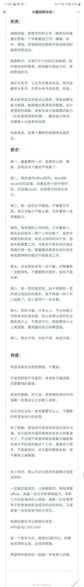

======================================================

ETF拯救世界 (5687069307) @
2020-03-25 12:33:17 Wed  
url: https://weibo.com/5687069307/IAe9Cx7o7

玉林有个情杀案，微博我就不转了，图片容易引起不适。

一定要拒绝黄赌毒，否则容易出事。

尽量洁身自好，除非实在控制不了……那也要再挣扎挣扎控制一下。 ​​​

转发[20]  评论[545]  赞[1869] 

======================================================

ETF拯救世界 (5687069307) @
2020-03-25 14:20:44 Wed  
url: https://weibo.com/5687069307/IAeRfc2K3

150的卖出，是因为需要资金买更好的东西。

S不卖，是因为无限现金流不需要卖，而且S还有之前省下的20多份储备资金根本没用。

在我这里，你永远不要说“没钱了”。不存在。 ​​​

转发[29]  评论[525]  赞[1890] 

======================================================

ETF拯救世界 (5687069307) @
2020-03-25 14:35:10 Wed  
url: https://weibo.com/5687069307/IAeX61Fm9

有人私信和评论我，嫌我脾气不好，说话不客气。

呵呵呵呵。对啊，我脾气不好，你赶紧走好吗。我不需要你关注，真的不需要。

你赶紧去找对你温柔的，说话客客气气的去关注好吗？相信我，如果你再交点钱买个课什么的，你得到的服务更好。

没有人是完美的人。我缺点很多，有些我愿意尽量改，有些我不愿 ​​​

转发[11]  评论[1024]  赞[3251] 

======================================================

ETF拯救世界 (5687069307) @
2020-03-25 15:14:14 Wed  
url: https://weibo.com/5687069307/IAfcX8bU4

我一直没明白，作协存在的意义是什么。

学习好的说说。 ​​​

转发[13]  评论[505]  赞[1678] 

======================================================

ETF拯救世界 (5687069307) @
2020-03-25 16:30:08 Wed  
url: https://weibo.com/5687069307/IAfHLbNhb

不说你不知道，DAX已经反弹22%了。 ​​​

转发[16]  评论[466]  赞[1808] 

======================================================

ETF拯救世界 (5687069307) @
2020-03-25 17:47:37 Wed  
url: https://weibo.com/5687069307/IAgddqNdf

美股现在确实不贵，但说接近08年金融危机时候水平不能同意。现在15，当时最低到过11以下。

------------------------------------------------------
转推：
>  @财联社APP (2868676035)
>  2020-03-25 17:22:01 Wed  
>  url: https:/weibo.com/2868676035/IAg2OCDLS/

>  【陈光明：美股不具备大幅下跌动力 现在是可以乐观一点的时候】近日国际金融市场动荡不安，未来应如何投资？陈光明认为，美股是从一个并不算离谱的高位上开始本轮下跌的。截至3月20日，标准普尔的P/E下行到15倍左右，而风险溢价率则大幅抬升至5.6%，已经接近2008年金融危机时的水平。所以，如果利率不 ​​​

转发[48]  评论[121]  赞[863] 

======================================================

ETF拯救世界 (5687069307) @
2020-03-25 17:54:15 Wed  
url: https://weibo.com/5687069307/IAgfU5zCJ

虽然对涨跌没有特别的情绪和希望，但我还是很希望欧美能再涨两天，让我的波段仓位能再出点…… ​​​

转发[8]  评论[342]  赞[1578] 

======================================================

ETF拯救世界 (5687069307) @
2020-03-25 18:44:51 Wed  
url: https://weibo.com/5687069307/IAgArnPAo

女王怎么办。

------------------------------------------------------
转推：
>  @ ()
>  2020-03-25 18:40:43 Wed  
>  url: 

>  抱歉，作者已设置仅展示半年内微博，此微博已不可见。 ​​​

转发[7]  评论[361]  赞[1332] 

======================================================

ETF拯救世界 (5687069307) @
2020-03-26 08:11:57 Thu  
url: https://weibo.com/5687069307/IAlS2zaUb

今天又是能够成交的一天吧。

上上下下怎么都好，让我不断完成交易就是好的德州扑克。 ​​​

转发[7]  评论[339]  赞[1522] 

======================================================

ETF拯救世界 (5687069307) @
2020-03-26 08:27:58 Thu  
url: https://weibo.com/5687069307/IAlYxFTW8

现在新闻媒体真的可以。昨天桥水倒了，今天桥水做空赚几十亿美元。

人家桥水是在欧洲做对冲，减少在多头上的损失。没你当初说的那么差，也没现在你说的这么NB。

这一把下来桥水毛估估也是损失一两百亿美元了。 ​​​

转发[34]  评论[217]  赞[1422] 

======================================================

ETF拯救世界 (5687069307) @
2020-03-26 09:58:29 Thu  
url: https://weibo.com/5687069307/IAmzhBQGU

$全指医药 sh000991$   感觉有被针对 ​​​

转发[3]  评论[168]  赞[825] 

======================================================

ETF拯救世界 (5687069307) @
2020-03-26 10:07:27 Thu  
url: https://weibo.com/5687069307/IAmCVDQhS

疯了，恒生再涨1厘不可以吗？

大家挂单要散开啊，不要挂在一起，谁也成交不了啊。 ​​​

转发[19]  评论[469]  赞[1656] 

======================================================

ETF拯救世界 (5687069307) @
2020-03-26 10:15:59 Thu  
url: https://weibo.com/5687069307/IAmGobVCV

波段交易策略当然能带来收益，但这个某些时候还不是最重要的。

最重要的是它会让你对下跌能够乐观接受甚至有些期盼。尤其是当实现一波收益后，你甚至盼着赶紧跌好让你再来一次，虽然你的长线持仓会有损失。

这种心态的改变会让你的状态变得极度舒适。投资的时候，状态是否舒适非常非常重要。不舒适就 ​​​

转发[218]  评论[392]  赞[1712] 

======================================================

ETF拯救世界 (5687069307) @
2020-03-26 10:21:00 Thu  
url: https://weibo.com/5687069307/IAmIqCYsY

困扰大多数投资人的无非就是几个痛点：

第一：什么时候入场，什么时候出场。

第二：长线持仓等着赚大钱，但是行情不断上下不断坐电梯怎么办。利润来了又走又来又走好难受。

第三：做波段有了利润就收割很舒服。但是卖了就涨清仓以后一飞冲天大牛市赚不了几个大子怎么办。

想办法解决这几个痛点，舒 ​​​

转发[351]  评论[409]  赞[1768] 

======================================================

ETF拯救世界 (5687069307) @
2020-03-26 10:39:13 Thu  
url: https://weibo.com/5687069307/IAmPPeXgZ

观察一个指数，食品饮料。

在我的趋势系统中，这个指数“应该”走弱已经9个月，但事实上，9个月来它并没有跌。而是几乎原地踏步几乎没有涨跌。

后续它怎么走，就非常有意思。要么就是我的系统有问题，我就会想办法改进。要么就是另一种情况。

提醒你：我不是看多或者看空，而是说出这个有意思的现象 ​​​

转发[79]  评论[338]  赞[1390] 

======================================================

ETF拯救世界 (5687069307) @
2020-03-26 11:10:43 Thu  
url: https://weibo.com/5687069307/IAn2Brkm3

ok了。下午更新表格，会有变化。

------------------------------------------------------
转推：
>  @ETF拯救世界 (5687069307)
>  2020-03-26 10:07:27 Thu  
>  url: https:/weibo.com/5687069307/IAmCVDQhS/

>  疯了，恒生再涨1厘不可以吗？
>  
>  大家挂单要散开啊，不要挂在一起，谁也成交不了啊。 ​​​

转发[11]  评论[611]  赞[1624] 

======================================================

ETF拯救世界 (5687069307) @
2020-03-26 14:08:48 Thu  
url: https://weibo.com/5687069307/IAocTcd6s

今天意思不大，散了吧。 ​​​

转发[10]  评论[665]  赞[1651] 

======================================================

ETF拯救世界 (5687069307) @
2020-03-27 09:37:10 Fri  
url: https://weibo.com/5687069307/IAvR87XH0

华宝单品种的“历史交易”功能太贴心了…刚发现的… ​​​

转发[32]  评论[353]  赞[1299] 

======================================================

ETF拯救世界 (5687069307) @
2020-03-27 09:49:54 Fri  
url: https://weibo.com/5687069307/IAvWiro9Z

我说的是这个地方，下面还会有这个品种的成交记录。别的券商好像没发现 http://t.cn/A6ZLr3qu

------------------------------------------------------
转推：
>  @ETF拯救世界 (5687069307)
>  2020-03-27 09:37:10 Fri  
>  url: https:/weibo.com/5687069307/IAvR87XH0/

>  华宝单品种的“历史交易”功能太贴心了…刚发现的… ​​​

转发[19]  评论[302]  赞[975] 

======================================================

ETF拯救世界 (5687069307) @
2020-03-27 10:25:42 Fri  
url: https://weibo.com/5687069307/IAwaPoknF

初筛简历的小助理快崩溃了，越看越多。看了两天还有500多封未读。 ​​​

转发[7]  评论[285]  赞[1404] 

======================================================

ETF拯救世界 (5687069307) @
2020-03-27 10:29:29 Fri  
url: https://weibo.com/5687069307/IAwcmy1rk

看了这个我想对那个要矿泉水的女孩说声对不起。

------------------------------------------------------
转推：
>  @ ()
>  2020-03-27 08:05:36 Fri  
>  url: 

>  抱歉，此微博已被作者删除。查看帮助：http://t.cn/Rfd3rQV

转发[14]  评论[212]  赞[1337] 

======================================================

ETF拯救世界 (5687069307) @
2020-03-27 10:35:19 Fri  
url: https://weibo.com/5687069307/IAweJoQ3v

其实很多时候，你对外人再好，他回去了也不一定说你好话。甚至一转身反咬一口也不新鲜。农夫与蛇。

对自己人好一点是最重要的。

说句不好听的，很多人骨子里就觉得洋大人高人一等。洋大人夸一句就沾沾自喜，骂一句就哆哆嗦嗦，没必要。

咱们自己的日子过好了比什么都强，让自己人舒舒服服，开开心心 ​​​

转发[63]  评论[317]  赞[2210] 

======================================================

ETF拯救世界 (5687069307) @
2020-03-27 10:51:39 Fri  
url: https://weibo.com/5687069307/IAwlmqePN

再说两句很多人可能不爱听的。

比如异国婚恋这个事情，其实有两个极端。

一个是，只要你是老外，我就使劲贴上去。能跟你谈恋爱或者结婚，哪怕鼓一次掌都特荣幸特开心。

第二个是，只要我看到你和老外，尤其是某些地区和国家的谈恋爱或者结婚，我就觉得你是辣鸡——中国还有3000万单身男性，你怎么能 ​​​

转发[53]  评论[405]  赞[1689] 

======================================================

ETF拯救世界 (5687069307) @
2020-03-27 11:06:44 Fri  
url: https://weibo.com/5687069307/IAwruqYYl

回复@z楠1988:只要他喜欢，我没意见。但我会跟他深入的谈一次，把该说的都让他知道。但是，PS：这个基本不可能，因为4岁上外教课的时候，遇到一个黑人女老师。他不喜欢，强烈要求换人……平常也喜欢肤色白的女孩，这是天生的……//@z楠1988:以后让你儿子娶个黑妹回来好不好？@ETF拯救世界

------------------------------------------------------
转推：
>  @ETF拯救世界 (5687069307)
>  2020-03-27 10:51:39 Fri  
>  url: https:/weibo.com/5687069307/IAwlmqePN/

>  再说两句很多人可能不爱听的。
>  
>  比如异国婚恋这个事情，其实有两个极端。
>  
>  一个是，只要你是老外，我就使劲贴上去。能跟你谈恋爱或者结婚，哪怕鼓一次掌都特荣幸特开心。
>  
>  第二个是，只要我看到你和老外，尤其是某些地区和国家的谈恋爱或者结婚，我就觉得你是辣鸡——中国还有3000万单身男性，你怎么能 ​​​

转发[4]  评论[150]  赞[894] 

======================================================

ETF拯救世界 (5687069307) @
2020-03-27 11:12:54 Fri  
url: https://weibo.com/5687069307/IAwtZgn2y

说到孩子的择偶我管不管，可能提问的人并不了解我对孩子的态度。

我认为，孩子是一个独立的个体。他不是我的附属。等他成年后，建立了相对成熟的三观，他的事情就可以自己做主。要做什么工作，要跟什么人谈恋爱，要和什么人结婚，那是他的事。我当然会有自己的意见和建议，但只是告诉他，给他参考，绝 ​​​

转发[112]  评论[389]  赞[2337] 

======================================================

ETF拯救世界 (5687069307) @
2020-03-27 11:27:40 Fri  
url: https://weibo.com/5687069307/IAwzZ3AN0

150仓位，很舒服，你舒服吗。

成熟市场还是少，希望再来一波再加点。 ​​​

转发[55]  评论[604]  赞[1776] 

+++++++++++++++++++++++++++++++++++++++++++++++++++++

图片：
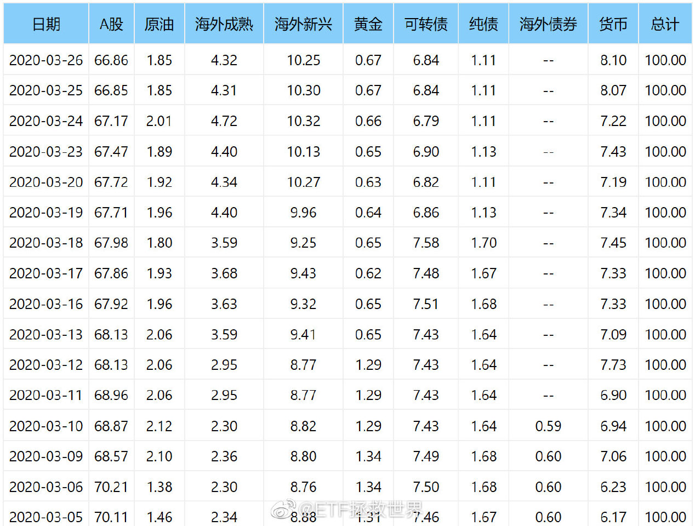

======================================================

ETF拯救世界 (5687069307) @
2020-03-27 14:26:50 Fri  
url: https://weibo.com/5687069307/IAxKHDwGK

我从来不相信“踏空”这个说法。只要你有钱，总有一天能买到想买的东西。资本市场上机会无穷无尽，还怕没机会？

怕的是机会来了你没钱了。 ​​​

转发[154]  评论[532]  赞[2566] 

======================================================

ETF拯救世界 (5687069307) @
2020-03-27 15:55:04 Fri  
url: https://weibo.com/5687069307/IAykwgytr

对面的情况越严重，以后甩锅给我们的动力越强。关系会越来越差。 ​​​

转发[33]  评论[551]  赞[3415] 

======================================================

ETF拯救世界 (5687069307) @
2020-03-27 23:25:24 Fri  
url: https://weibo.com/5687069307/IABhjhHgw

决定这个周末不上微博，不看新闻。闹心。

100级到150级难多了。 ​​​

转发[6]  评论[365]  赞[1512] 

+++++++++++++++++++++++++++++++++++++++++++++++++++++

图片：

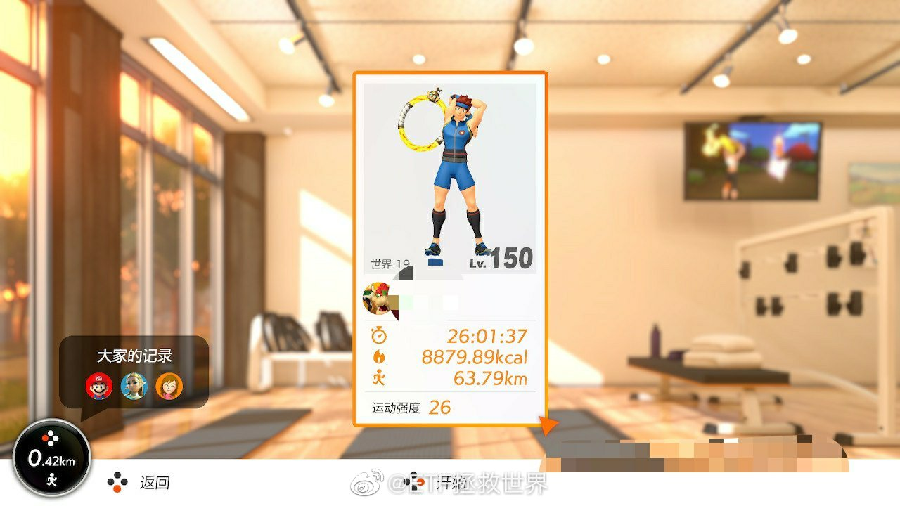
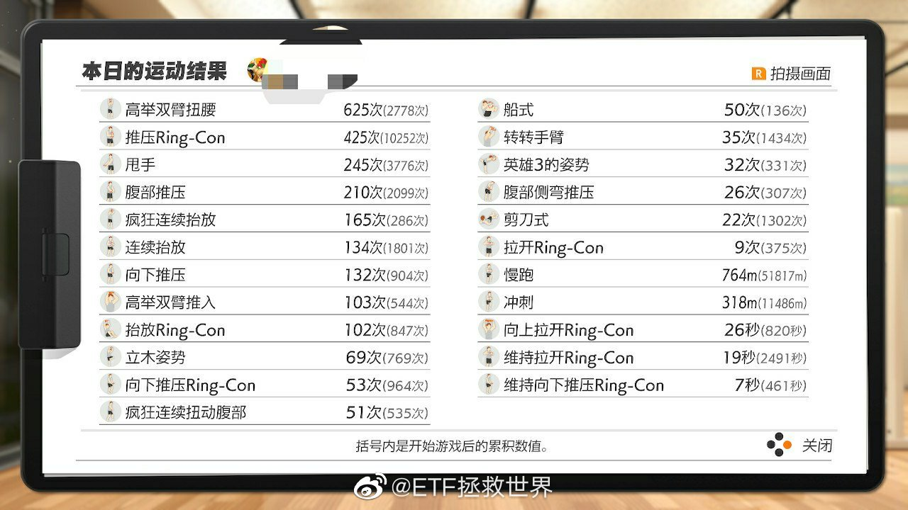

======================================================

ETF拯救世界 (5687069307) @
2020-03-28 17:49:55 Sat  
url: https://weibo.com/5687069307/IAIvDk23X

今天刚看到之前有人在评论里说网格表格错了。我解释一下。

没错。

首先看第一张说明。说明上已经说的很清楚了：

黄色是本次操作。白色为本次操作后立即设置的条件单。

再看第二张表格。

对于之前已经在0.816买入的朋友来说，今天在0.867出掉了。你当然不需要再次买回，而是要继续按照表格中的白色 ​​​

转发[311]  评论[969]  赞[2541] 

+++++++++++++++++++++++++++++++++++++++++++++++++++++

图片：
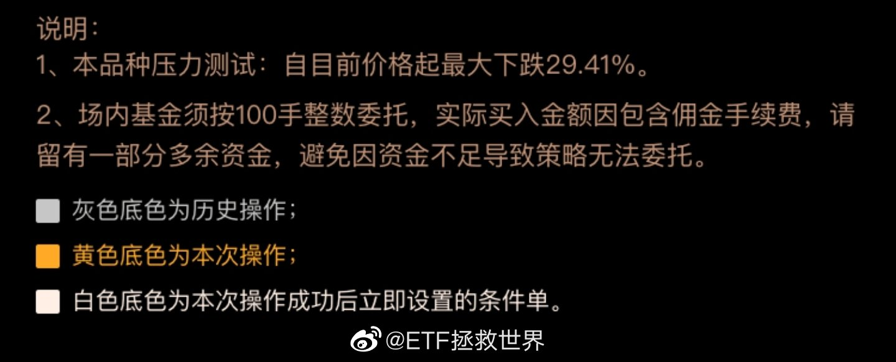
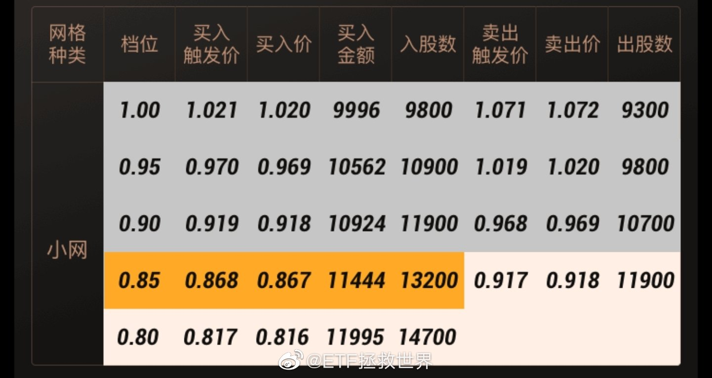

======================================================

ETF拯救世界 (5687069307) @
2020-03-29 12:31:34 Sun  
url: https://weibo.com/5687069307/IAPQV50xM

特别希望有一天我们的护士也能开奥迪上班。

------------------------------------------------------
转推：
>  @ ()
>  2020-03-29 12:06:24 Sun  
>  url: 

>  抱歉，作者已设置仅展示半年内微博，此微博已不可见。 ​​​

转发[98]  评论[526]  赞[2440] 

======================================================

ETF拯救世界 (5687069307) @
2020-03-29 12:46:19 Sun  
url: https://weibo.com/5687069307/IAPWUboTp

回复@萌巴哥元宝与呆巴哥喜蛋:哈哈哈哈哈哈哈。看到这条我真的笑了。祝你今后的生活能过的稍微顺心一点吧。//@萌巴哥元宝与呆巴哥喜蛋:我们的护士为什么要开奥迪上班，你歧视国产车啊？跪久了起不来了是吗//@ETF拯救世界:特别希望有一天我们的护士也能开奥迪上班。

------------------------------------------------------
转推：
>  @ ()
>  2020-03-29 12:06:24 Sun  
>  url: 

>  抱歉，作者已设置仅展示半年内微博，此微博已不可见。 ​​​

转发[24]  评论[275]  赞[940] 

======================================================

ETF拯救世界 (5687069307) @
2020-03-29 12:55:52 Sun  
url: https://weibo.com/5687069307/IAQ0MbwdU

上一个视频中的英国女护士开的是奥迪。那辆车外观动感时尚，操控感一流，油门、刹车踏感舒适。我开过。

国产车好不好我不敢妄加评论，只知道这辆奥迪目前售价不低，也挺好开。

护士这个职业不容易，工作环境不是很好，每天又要面对生老病死。所以我希望中国的护士，乃至其他劳动者都能提高收入，都能 ​​​

转发[19]  评论[773]  赞[2769] 

======================================================

ETF拯救世界 (5687069307) @
2020-03-29 23:09:25 Sun  
url: https://weibo.com/5687069307/IAU1Ov4ar

天下大乱的时候，每一条新闻、消息、文字，都应该更加审慎的对待。如果确实感兴趣，就多找几个信源多几个角度看看。

说实话，现在微博上任何消息我都不信了。或者说，在互联网看到的任何信息，都不会马上相信了。 ​​​

转发[44]  评论[243]  赞[1705] 

======================================================

ETF拯救世界 (5687069307) @
2020-03-29 23:17:36 Sun  
url: https://weibo.com/5687069307/IAU591xD8

回复@美人鱼丸-:你，还有129个给你点赞的，我不怕麻烦，全部拉黑。观点不同很正常，张嘴就喷粪你还是个人吗，你是粪车吧。//@美人鱼丸-:真特么有病 你不反过来想想在英国开奥迪才上得起医科大学//@ETF拯救世界:特别希望有一天我们的护士也能开奥迪上班。

------------------------------------------------------
转推：
>  @ ()
>  2020-03-29 12:06:24 Sun  
>  url: 

>  抱歉，作者已设置仅展示半年内微博，此微博已不可见。 ​​​

转发[7]  评论[357]  赞[1540] 

======================================================

ETF拯救世界 (5687069307) @
2020-03-29 23:35:50 Sun  
url: https://weibo.com/5687069307/IAUcxlUhO

重新设置了评论门槛，关注低于100天的朋友不能评论了。

感觉一下子会清净很多。反正之前一条微博一两千的评论也看不过来…… ​​​

转发[43]  评论[5566]  赞[4067] 

+++++++++++++++++++++++++++++++++++++++++++++++++++++

图片：
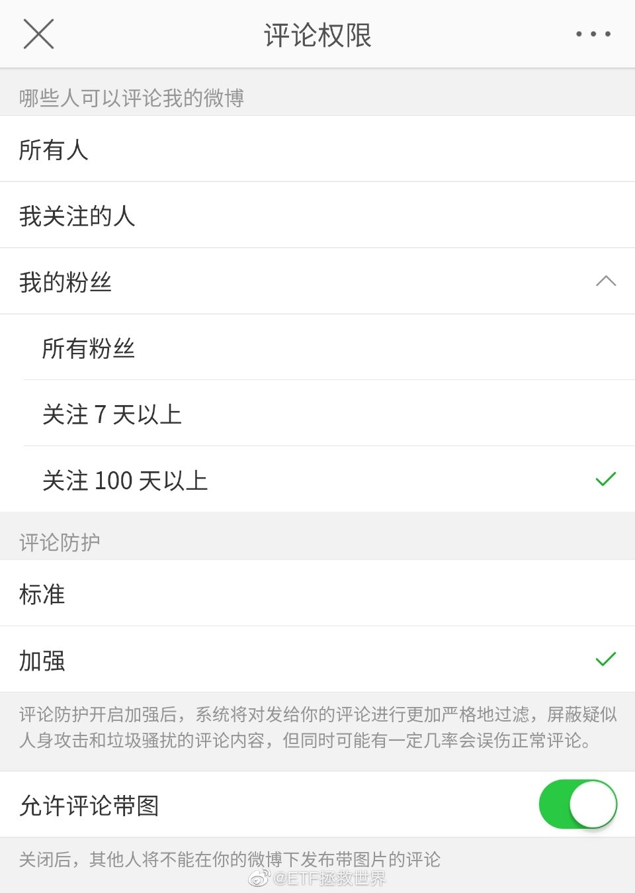

======================================================

ETF拯救世界 (5687069307) @
2020-03-30 09:09:54 Mon  
url: https://weibo.com/5687069307/IAXXyhVgf

“中证科技动量”翻译成白话的意思就是在科技股上追涨杀跌的指数。

------------------------------------------------------
转推：
>  @巨潮资讯网 (2239792910)
>  2020-03-30 08:23:58 Mon  
>  url: https:/weibo.com/2239792910/IAXEUg0tz/

>  【上交所：发布中证科技动量指数等8条指数】为进一步丰富指数体系，为投资者提供新的分析工具和投资标的，上海证券交易所和中证指数有限公司将于2020年4月21日正式发布中证科技动量指数、中证创新药30指数、中证东方红红利低波动指数、中证沪港深云计算产业指数、中证沪港深科技100指数、中证鹏华沪港 ​​​

转发[39]  评论[150]  赞[984] 

======================================================

ETF拯救世界 (5687069307) @
2020-03-30 09:16:22 Mon  
url: https://weibo.com/5687069307/IAY0b4cMT

？？？？？？？

------------------------------------------------------
转推：
>  @ETF拯救世界 (5687069307)
>  2020-03-29 23:35:50 Sun  
>  url: https:/weibo.com/5687069307/IAUcxlUhO/

>  重新设置了评论门槛，关注低于100天的朋友不能评论了。
>  
>  感觉一下子会清净很多。反正之前一条微博一两千的评论也看不过来…… ​​​

转发[10]  评论[1800]  赞[1994] 

======================================================

ETF拯救世界 (5687069307) @
2020-03-30 09:46:42 Mon  
url: https://weibo.com/5687069307/IAYcukxA2

日、美、欧QDII ETF/LOF都已经折价了。说明大家是真的不看好啊。之前都大幅溢价。 ​​​

转发[20]  评论[267]  赞[1285] 

======================================================

ETF拯救世界 (5687069307) @
2020-03-30 10:10:48 Mon  
url: https://weibo.com/5687069307/IAYmhg1Vj

谁再怀疑达尔文就把这张图扔给他。

------------------------------------------------------
转推：
>  @北京人不知道的北京事儿 (1662214194)
>  2020-03-30 09:54:00 Mon  
>  url: https:/weibo.com/1662214194/IAYfs8CeS/

>  网友投稿：北京元大都遗址公园的一家人。。。这要是树枝断了摔着了是不是还要公园赔？[衰] ​​​

转发[15]  评论[232]  赞[982] 

======================================================

ETF拯救世界 (5687069307) @
2020-03-30 10:27:47 Mon  
url: https://weibo.com/5687069307/IAYtaevEW

有些亚洲时间段QDII ETF的做市商是辣鸡。欧美隔夜你大幅折溢价就算了，亚洲段都是实时的你也弄这么大折溢价，要你做市何用？ ​​​

转发[10]  评论[219]  赞[1390] 

======================================================

ETF拯救世界 (5687069307) @
2020-03-30 10:51:33 Mon  
url: https://weibo.com/5687069307/IAYCOEemp

风险继续释放，不到80倍了！//@ETF拯救世界:好消息，跌了两天，已经降至85倍了。

------------------------------------------------------
转推：
>  @ETF拯救世界 (5687069307)
>  2020-03-23 13:33:41 Mon  
>  url: https:/weibo.com/5687069307/IzVH99meX/

>  看了一眼芯片指数基金跌了30%，心想有没有机会买点。
>  
>  然后去看了看成分股估值，
>  
>  90多倍。
>  
>  行吧，打扰了。 ​​​

转发[29]  评论[360]  赞[1471] 

======================================================

ETF拯救世界 (5687069307) @
2020-03-30 14:00:42 Mon  
url: https://weibo.com/5687069307/IAZRB1k84

今天日元/人民币大幅上涨。 ​​​

转发[5]  评论[168]  赞[1227] 

======================================================

ETF拯救世界 (5687069307) @
2020-03-30 14:49:51 Mon  
url: https://weibo.com/5687069307/IB0bxkiky

今天就这样吧。没有交易欲望，索然无味。下个月第一次发车也是随机的，不一定哪天了。

主要原因是目前各市场趋势不好，距离上次买入空间不够，不急，再看看。 ​​​

转发[21]  评论[527]  赞[2051] 

======================================================

ETF拯救世界 (5687069307) @
2020-03-31 09:32:14 Tue  
url: https://weibo.com/5687069307/IB7x76G9A

提款 ​​​

转发[11]  评论[463]  赞[1695] 

======================================================

ETF拯救世界 (5687069307) @
2020-03-31 09:57:59 Tue  
url: https://weibo.com/5687069307/IB7HzaTkv

同一个区间利润积累多了，就可以逐渐加大留存数量，为以后赚大钱多积累一些0成本的种子。

赚钱就是那么点事儿，低买高卖。用机械化的程序规范你的交易，克服恐惧和贪婪，不就成了吗。 ​​​

转发[99]  评论[339]  赞[2164] 

======================================================

ETF拯救世界 (5687069307) @
2020-03-31 10:35:05 Tue  
url: https://weibo.com/5687069307/IB7WCCTyW

有没有体会到一丢丢舒服的感觉。

涨跌都舒服内种。 ​​​

转发[8]  评论[500]  赞[2005] 

======================================================

ETF拯救世界 (5687069307) @
2020-03-31 21:20:46 Tue  
url: https://weibo.com/5687069307/IBcaI2zbe

刚看了一下记账软件，家里前三个月消费支出比去年减少了27%。

这样不行，要多买点东西支持国家提振内需。

明天打算看看罗老师的直播，看看有没有便宜划算的东西下手……就算买不到，就当听相声吧。 ​​​

转发[20]  评论[523]  赞[1978] 

======================================================

