ETF拯救世界 (5687069307) @
2020-04-01 10:16:38 Wed  
url: https://weibo.com/5687069307/IBhfDvlYW

综合考虑到目前仓位以及大环境等各方面因素，还是决定要么等空间，要么等趋势。所以月初一车还是暂时不发了。

保持舒服的状态。 ​​​

转发[221]  评论[573]  赞[2479] 

======================================================

ETF拯救世界 (5687069307) @
2020-04-01 14:37:15 Wed  
url: https://weibo.com/5687069307/IBiXqi9OR

回复@kkuu_a:沪深300相当于恒指17000的点位是3100点左右。//@kkuu_a:之前E大写过恒指23000-21000等策略，不知道对上证50和沪深300对应策略的点位是怎么样的

------------------------------------------------------
转推：
>  @ETF拯救世界 (5687069307)
>  2020-04-01 10:16:38 Wed  
>  url: https:/weibo.com/5687069307/IBhfDvlYW/

>  综合考虑到目前仓位以及大环境等各方面因素，还是决定要么等空间，要么等趋势。所以月初一车还是暂时不发了。
>  
>  保持舒服的状态。 ​​​

转发[138]  评论[152]  赞[947] 

======================================================

ETF拯救世界 (5687069307) @
2020-04-01 14:45:12 Wed  
url: https://weibo.com/5687069307/IBj0EiPMX

分时会骗人，但是K线的中期趋势一般不会。  在股市，理性确实比感性有用。

------------------------------------------------------
转推：
>  @ETF拯救世界 (5687069307)
>  2020-04-01 10:16:38 Wed  
>  url: https:/weibo.com/5687069307/IBhfDvlYW/

>  综合考虑到目前仓位以及大环境等各方面因素，还是决定要么等空间，要么等趋势。所以月初一车还是暂时不发了。
>  
>  保持舒服的状态。 ​​​

转发[47]  评论[123]  赞[1187] 

======================================================

ETF拯救世界 (5687069307) @
2020-04-01 14:51:24 Wed  
url: https://weibo.com/5687069307/IBj3a4sFI

晚上看罗老师直播的时候，我会同时打开值得买。如果有想买的东西，会搜一下历史低价，再看看值友们的评论。

没办法，我是个直男价投。如果我发现自己买东西价格没买在历史底部区域，心里会不舒服……

这跟有多少钱没关系，跟省多少钱也没关系，这类似于一个游戏吧。找便宜游戏。 ​​​

转发[67]  评论[433]  赞[2021] 

======================================================

ETF拯救世界 (5687069307) @
2020-04-01 18:49:49 Wed  
url: https://weibo.com/5687069307/IBkBWhBum

刚才看了一下，几个月过去，最下面的极限点位17000已经上升至17500左右。更容易达到了。//@ETF拯救世界:再给一个点位。如果真的搞大，让恒生崩到21000以下，是非常非常好的买入机会。我给个极限点位17000。万一真的到了，一把配满恒生指数，从那里算，不赚60个巴仙不再看。

------------------------------------------------------
转推：
>  @ETF拯救世界 (5687069307)
>  2019-08-26 10:08:35 Mon  
>  url: https:/weibo.com/5687069307/I3YBClttT/

>  预告一下。
>  
>  150会在23000以下买1-4份恒生。21000以下买4-10份。
>  
>  S会在23000以下持续买入。 ​​​

转发[324]  评论[236]  赞[1391] 

======================================================

ETF拯救世界 (5687069307) @
2020-04-01 21:53:57 Wed  
url: https://weibo.com/5687069307/IBlOFB83Q

第一次看带货直播，下次应该也不会再看了……还是看美股去吧…… ​​​

转发[18]  评论[272]  赞[1227] 

======================================================

ETF拯救世界 (5687069307) @
2020-04-01 22:13:34 Wed  
url: https://weibo.com/5687069307/IBlWDDIrN

喷了，只要值得买搜：低过老罗 …………哈哈哈

------------------------------------------------------
转推：
>  @ETF拯救世界 (5687069307)
>  2020-04-01 21:53:57 Wed  
>  url: https:/weibo.com/5687069307/IBlOFB83Q/

>  第一次看带货直播，下次应该也不会再看了……还是看美股去吧…… ​​​

转发[11]  评论[173]  赞[1092] 

======================================================

ETF拯救世界 (5687069307) @
2020-04-02 09:13:56 Thu  
url: https://weibo.com/5687069307/IBqgG8qgf

美股只在最低点买了一份，你以为在等什么。 ​​​

转发[7]  评论[311]  赞[1667] 

======================================================

ETF拯救世界 (5687069307) @
2020-04-02 09:30:51 Thu  
url: https://weibo.com/5687069307/IBqnxCNcO

日经又开始溢价了。神经病啊。 ​​​

转发[6]  评论[120]  赞[1029] 

======================================================

ETF拯救世界 (5687069307) @
2020-04-02 09:32:14 Thu  
url: https://weibo.com/5687069307/IBqo6xuAV

再说一次，看看你的账户，想象一下下跌30%，上涨50%会不会难受。会的话调整到不难受为止。

最好每周审视一下。那就是最适合你的仓位。 ​​​

转发[71]  评论[291]  赞[1742] 

======================================================

ETF拯救世界 (5687069307) @
2020-04-02 10:27:50 Thu  
url: https://weibo.com/5687069307/IBqKG1M9f

3.12日用油气换160416的朋友，不必着急换回去。目前油气依然溢价超过40%，而416几乎没有溢价。目前持有即可。 ​​​​

转发[0]  评论[469]  赞[2072] 

======================================================

ETF拯救世界 (5687069307) @
2020-04-02 12:24:35 Thu  
url: https://weibo.com/5687069307/IBrw43wXa

咖啡味儿酸奶不好喝，89块钱的65w口红充电器不错。

首批测评。

以上。 ​​​

转发[11]  评论[316]  赞[1336] 

======================================================

ETF拯救世界 (5687069307) @
2020-04-02 13:19:42 Thu  
url: https://weibo.com/5687069307/IBrSrprTh

怎么“粉丝可见”也不行了吗。我说的是持有即可，不要去追啊 ​​​

转发[7]  评论[284]  赞[1808] 

======================================================

ETF拯救世界 (5687069307) @
2020-04-02 14:06:14 Thu  
url: https://weibo.com/5687069307/IBsbkaMmt

消息灵通的说说真的假的。//@椒图火象: [good][good][good]

------------------------------------------------------
转推：
>  @Hedgie (1770123135)
>  2020-04-02 13:55:55 Thu  
>  url: https:/weibo.com/1770123135/IBs78osSn/

>  中国战略石油储备开始买了[good]昨天有消息说上个月抛售了1000亿美债。SPR三期正好2020年建成。咱们利用2015年价格战填满了二期，又利用2020年价格战填满三期，合计5亿多桶，节省数百亿美元！目前美国SPR只剩6亿桶。我国马上开建SPR四期，尽力狂买，目标10亿桶，万一开战够全国用180天。 ​​​

转发[29]  评论[132]  赞[841] 

======================================================

ETF拯救世界 (5687069307) @
2020-04-02 14:15:21 Thu  
url: https://weibo.com/5687069307/IBsf1rjno

人这一辈子，20多岁开始，做投资几十年，即使一开始就买不会死的品种，即使绝大多数投入都是成功的，也难免买到跌幅不小的。

一般来说我们这个体系很难因为某一个品种跌幅大就崩溃，因为已经体系保证了不会单一品种仓位过大。然而即使仓位小，暴跌后也不应该慌乱。

不能心里发慌眼睛一闭挥刀一斩从此 ​​​

转发[409]  评论[536]  赞[2408] 

======================================================

ETF拯救世界 (5687069307) @
2020-04-02 14:44:50 Thu  
url: https://weibo.com/5687069307/IBsqZoIFh

我几乎从来不分析单独的基金品种，不信你可以搜索一下我的雪球和微博历史发言。有时候提到，也是当时会有一些交易机会，做个提示，并不会长篇大论说谁好，推荐谁或者不推荐谁。

这样做有两个原因，第一个是怕有人说我和基金公司有猫腻。第二个是怕误导各位。

所以我几乎不分析，不评价任何基金品种， ​​​

转发[94]  评论[256]  赞[1643] 

======================================================

ETF拯救世界 (5687069307) @
2020-04-02 14:55:59 Thu  
url: https://weibo.com/5687069307/IBsvw8dSx

举个例子吧。

大家都知道我那次“捷达换宝马”的操作。2008年一辆捷达资金的买入，最终在上汽上面收获了不止一辆宝马的利润。

对于那次操作，各位可以去看当时的记录，没什么好说的。只是有一点我几乎没有说过，但是记忆异常深刻，在这里分享。

2009年初，那时候我已经买了很多上汽。但是就在那个风 ​​​

转发[410]  评论[551]  赞[3172] 

======================================================

ETF拯救世界 (5687069307) @
2020-04-02 22:40:33 Thu  
url: https://weibo.com/5687069307/IBvy5xwic

不知道为什么，今天很多人慌张的问：有石油开采公司申请破产了，是不是石油类基金都彻底完蛋了，要割肉吗？我就想起了这段往事。

------------------------------------------------------
转推：
>  @ETF拯救世界 (5687069307)
>  2020-04-02 14:55:59 Thu  
>  url: https:/weibo.com/5687069307/IBsvw8dSx/

>  举个例子吧。
>  
>  大家都知道我那次“捷达换宝马”的操作。2008年一辆捷达资金的买入，最终在上汽上面收获了不止一辆宝马的利润。
>  
>  对于那次操作，各位可以去看当时的记录，没什么好说的。只是有一点我几乎没有说过，但是记忆异常深刻，在这里分享。
>  
>  2009年初，那时候我已经买了很多上汽。但是就在那个风 ​​​

转发[55]  评论[255]  赞[1402] 

======================================================

ETF拯救世界 (5687069307) @
2020-04-03 09:53:53 Fri  
url: https://weibo.com/5687069307/IBzXohOWv

数据错误，并非历史最低

------------------------------------------------------
转推：
>  @财联社APP (2868676035)
>  2020-04-03 09:26:28 Fri  
>  url: https:/weibo.com/2868676035/IBzMgjdSr/

>  港股估值已历史最低：馅饼还是陷阱？（证券时报） ​​​

转发[40]  评论[160]  赞[1185] 

======================================================

ETF拯救世界 (5687069307) @
2020-04-03 10:10:33 Fri  
url: https://weibo.com/5687069307/IBA4a9OCx

油气换到416的部分，如果你一直在油气做网格，也需要算好幅度，该出网就出网。

走得再久，也不要忘了出发前的目标。 ​​​​

转发[0]  评论[309]  赞[1532] 

======================================================

ETF拯救世界 (5687069307) @
2020-04-03 10:14:53 Fri  
url: https://weibo.com/5687069307/IBA5UBRyC

有的人做投资，做着做着，就忘了当初自己制定的原则，忘了自己的交易策略。

就像有的人相处的时间久了，就会忘了自己为什么会爱上对方，为什么当初会那样坚定的在一起一样。 ​​​

转发[95]  评论[332]  赞[2074] 

======================================================

ETF拯救世界 (5687069307) @
2020-04-03 11:03:37 Fri  
url: https://weibo.com/5687069307/IBApHccDY

不得不说，西方男人追求姑娘的时候，整体上真的比我们嘴甜，说文雅点就是更浪漫……

那天在YT偶尔刷出一个FTM的唱歌视频，下面有个老外的英文评论当时我就震惊了，翻译过来大致是：

“什么？你问我唱的好不好？天呐，这简直是我听过最美妙的声音。你唱的歌曲里面，有我喜欢的，也有我不喜欢的。但是 ​​​

转发[113]  评论[453]  赞[2516] 

======================================================

ETF拯救世界 (5687069307) @
2020-04-03 11:27:46 Fri  
url: https://weibo.com/5687069307/IBAzvl28A

回复@ETF拯救了我:我不建议骗。就是不建议把别人的缺点硬吹成优点。而是要发现别人身上的闪光点，然后用让别人开心的方式表达出来。最重要是真诚。真诚与否一眼就能看出来。

------------------------------------------------------
转推：
>  @ETF拯救世界 (5687069307)
>  2020-04-03 11:03:37 Fri  
>  url: https:/weibo.com/5687069307/IBApHccDY/

>  不得不说，西方男人追求姑娘的时候，整体上真的比我们嘴甜，说文雅点就是更浪漫……
>  
>  那天在YT偶尔刷出一个FTM的唱歌视频，下面有个老外的英文评论当时我就震惊了，翻译过来大致是：
>  
>  “什么？你问我唱的好不好？天呐，这简直是我听过最美妙的声音。你唱的歌曲里面，有我喜欢的，也有我不喜欢的。但是 ​​​

转发[22]  评论[118]  赞[960] 

======================================================

ETF拯救世界 (5687069307) @
2020-04-03 14:42:01 Fri  
url: https://weibo.com/5687069307/IBBQljVrb

最高价卖出，第三天打折接回，这个效率还可以。 ​​​

转发[23]  评论[248]  赞[1245] 

======================================================

ETF拯救世界 (5687069307) @
2020-04-03 14:44:09 Fri  
url: https://weibo.com/5687069307/IBBRdqhuR

[委屈] 瑞幸合作款，我可能接了最后一批盘。最关键的是还不好喝。学习好的说说，有收藏价值吗，会升值吗。

------------------------------------------------------
转推：
>  @ETF拯救世界 (5687069307)
>  2020-04-02 12:24:35 Thu  
>  url: https:/weibo.com/5687069307/IBrw43wXa/

>  咖啡味儿酸奶不好喝，89块钱的65w口红充电器不错。
>  
>  首批测评。
>  
>  以上。 ​​​

转发[4]  评论[203]  赞[1081] 

======================================================

ETF拯救世界 (5687069307) @
2020-04-03 17:51:33 Fri  
url: https://weibo.com/5687069307/IBD5hath7

很多人担心瑞幸会对中概股整体有影响。有影响是正常的，但我并不太悲观。

第一，如果中概股整体被打压，给我们低价买入的机会不是正好。

第二，如果持续被压制出问题，促成中概加速回国内上市不更是好事？ ​​​

转发[37]  评论[242]  赞[1736] 

======================================================

ETF拯救世界 (5687069307) @
2020-04-03 19:28:59 Fri  
url: https://weibo.com/5687069307/IBDIPahCz

今晚自己烤鱼吃。

有点内味儿了。 ​​​

转发[6]  评论[462]  赞[2085] 

+++++++++++++++++++++++++++++++++++++++++++++++++++++

图片：
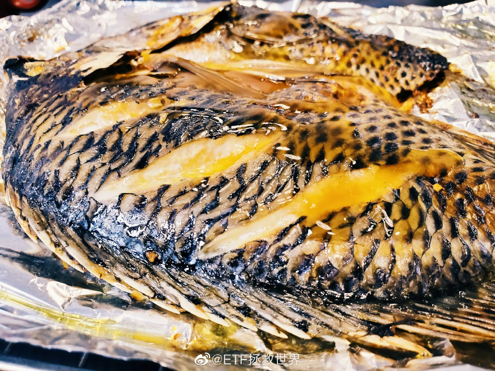

======================================================

ETF拯救世界 (5687069307) @
2020-04-03 22:34:59 Fri  
url: https://weibo.com/5687069307/IBEWk5Pkp

美国和欧洲会不会跌破前低很关键 ​​​

转发[16]  评论[246]  赞[1486] 

======================================================

ETF拯救世界 (5687069307) @
2020-04-04 00:13:48 Sat  
url: https://weibo.com/5687069307/IBFAqB5nR

[蜡烛][蜡烛][蜡烛]

愿逝者安息，天佑中华。 ​​​

转发[61]  评论[452]  赞[2636] 

======================================================

ETF拯救世界 (5687069307) @
2020-04-05 11:02:28 Sun  
url: https://weibo.com/5687069307/IBTgdDwMo

2020.4.5   晴   12℃

今日计划：

做研究；写东西；健身环；断食24小时；思考一件事；看一本日本推理小说。 ​​​

转发[14]  评论[461]  赞[2139] 

======================================================

ETF拯救世界 (5687069307) @
2020-04-05 13:42:41 Sun  
url: https://weibo.com/5687069307/IBUjgce9l

最近一段时间看微博，发现关注的绝大多数做投资的人，三观都挺正的。在大是大非面前，屁股不歪。

但是有些这几年红的，或者是曾经红过的“宏观经济大师”，什么事儿都能说两句的经济专家发表的某些言论，就让人非常反感。不是说不能批评，你不能颠倒黑白肆意抹黑。

以前我觉得以后孩子学什么都无所谓 ​​​

转发[57]  评论[295]  赞[1921] 

======================================================

ETF拯救世界 (5687069307) @
2020-04-05 14:19:20 Sun  
url: https://weibo.com/5687069307/IBUy89o7X

屯不屯粮食我不做建议，谁知道未来会怎样，买几袋放家里也没什么所谓，真空包装保质期也有一两年。但这位博主说的，关于浪费粮食的事情我非常赞同。先不要讨论粮食紧缺不紧缺，在座的每位能不能从今天开始把所有买的，做的食物吃干净不要浪费？做到这一点就等于粮食产量增加20%吧。

------------------------------------------------------
转推：
>  @范志红_原创营养信息 (1496878501)
>  2020-04-04 15:28:27 Sat  
>  url: https:/weibo.com/1496878501/IBLzGAmlB/

>  【不要囤粮】每次开会吃盒饭，都看到其中一半左右的大米饭被扔掉。疫情期间，因为减少了餐饮外食，减少了会议盒饭，我相信能省出来数量惊人的粮食。少喝点酒，少吃点高度加工的零食，又能省下大量的粮食。
>  
>  关键是，酒类和不健康食物虽然也是粮食做的，但去掉了粮食中的大部分维生素、矿物质和保健成分 ​​​

转发[50]  评论[243]  赞[1615] 

======================================================

ETF拯救世界 (5687069307) @
2020-04-05 16:15:04 Sun  
url: https://weibo.com/5687069307/IBVj6voN6

其实人生的乐趣之一，就是享受那些好的产品带来的愉悦感。

很有意思的，是有些最好的产品其实花不了多少钱。比如平常写字的中性笔，好像也叫签字笔的。

之前被带货的那款，10支9.9，确实真的便宜，好用不好用我也不知道，没用过。但实际上，公认的几乎是最好用的中性笔，也就十块钱左右一支。一般人 ​​​

转发[80]  评论[413]  赞[1804] 

======================================================

ETF拯救世界 (5687069307) @
2020-04-05 23:56:15 Sun  
url: https://weibo.com/5687069307/IBYkiz37T

看完了。3.5分吧。 ​​​

转发[5]  评论[178]  赞[692] 

+++++++++++++++++++++++++++++++++++++++++++++++++++++

图片：
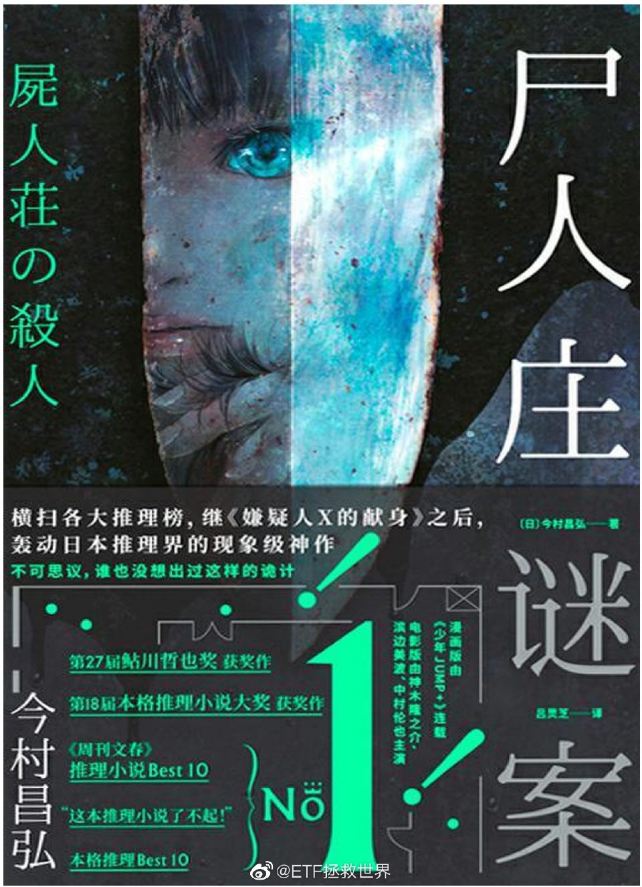

======================================================

ETF拯救世界 (5687069307) @
2020-04-06 12:17:12 Mon  
url: https://weibo.com/5687069307/IC3b3jZK8

年初说的送礼物，忙到今天才来得及统计。请公众号的以下朋友去公众号私信我拿礼物。

五篇评论沙发：（每位500元京东购物卡）
方枪枪、贺云仙、小火人、宁静致远、阳光

五篇评论第六（2.3大盘收盘个位数）：（每位500元京东购物卡）
Xswl、KWOK、黄鑫、想一想、hx

五篇打赏最多：（一位苹果airpods 2 ​​​

转发[7]  评论[343]  赞[1526] 

======================================================

ETF拯救世界 (5687069307) @
2020-04-06 16:15:19 Mon  
url: https://weibo.com/5687069307/IC4JHAAwg

一天又卖？

------------------------------------------------------
转推：
>  @ETF拯救世界 (5687069307)
>  2020-04-03 14:42:01 Fri  
>  url: https:/weibo.com/5687069307/IBBQljVrb/

>  最高价卖出，第三天打折接回，这个效率还可以。 ​​​

转发[3]  评论[156]  赞[921] 

======================================================

ETF拯救世界 (5687069307) @
2020-04-06 16:48:32 Mon  
url: https://weibo.com/5687069307/IC4Xc88q3

逆行扣3分，骂人能不能算寻衅滋事扣9分？

------------------------------------------------------
转推：
>  @北京人不知道的北京事儿 (1662214194)
>  2020-04-06 11:06:33 Mon  
>  url: https:/weibo.com/1662214194/IC2InlLPB/

>  网友投稿：北京昌平区水库路，一辆银色别克逆行，前面的车差点和它撞上，被迫压上自行车道给它让行。我没让，他摇下车窗骂我、对我吐痰还竖中指。。。京N333D1！这样的司机该怎么处罚？[摊手]http://t.cn/A6Z3thGm ​​​

转发[17]  评论[94]  赞[530] 

======================================================

ETF拯救世界 (5687069307) @
2020-04-06 22:29:02 Mon  
url: https://weibo.com/5687069307/IC7bowH1I

多大点事儿啊。 ​​​

转发[2]  评论[208]  赞[1209] 

======================================================

ETF拯救世界 (5687069307) @
2020-04-07 08:49:13 Tue  
url: https://weibo.com/5687069307/ICbf892DF

感觉这个病毒是有智慧的而且挺要面子——

你看不起我，我就给你颜色看看。你觉得我好欺负想要群体免疫，我就让你的BOSS进ICU。 

希望首相大人没事，希望中英友好。 ​​​

转发[19]  评论[218]  赞[1670] 

======================================================

ETF拯救世界 (5687069307) @
2020-04-07 09:16:06 Tue  
url: https://weibo.com/5687069307/ICbq2u2AS

某些etf的做市商，我劝你善良。不要搞太大折价。 ​​​

转发[4]  评论[120]  赞[1215] 

======================================================

ETF拯救世界 (5687069307) @
2020-04-07 09:33:10 Tue  
url: https://weibo.com/5687069307/ICbwY8OHO

现在是不是有了更深的体会。

------------------------------------------------------
转推：
>  @ETF拯救世界 (5687069307)
>  2019-12-09 10:30:04 Mon  
>  url: https:/weibo.com/5687069307/IjWCtuoaE/

>  市场免不了波动。我们身处其中，无法规避波动。
>  
>  那么，如何将波动为我所用，才是我们应该考虑的。
>  
>  而不是面对波动患得患失，心惊胆战，猜来猜去，底部丢筹码，顶部接盘。 ​​​

转发[28]  评论[110]  赞[1067] 

======================================================

ETF拯救世界 (5687069307) @
2020-04-07 09:46:58 Tue  
url: https://weibo.com/5687069307/ICbCzmcmg

有些只差一两厘没有成交的朋友，可能心情会比较沮丧，觉得不舒服。

这种事情，别说三分钟，一秒钟都不要沮丧。要不就坦然接受，要不就马上考虑后续怎么修正你自己的策略。是挂低一点，还是定个规则，比如几厘之内改手动。

慢慢的，适合你自己的策略就成型了。

沮丧，失望有什么用？P用都没有。这是 ​​​

转发[76]  评论[457]  赞[1942] 

======================================================

ETF拯救世界 (5687069307) @
2020-04-07 18:38:06 Tue  
url: https://weibo.com/5687069307/ICf69Bs8Q

海豚很聪明。所以我总有一种感觉，它们被关在水族馆一定比其它动物痛苦。

------------------------------------------------------
转推：
>  @扬子晚报 (1653603955)
>  2020-04-06 23:35:03 Mon  
>  url: https:/weibo.com/1653603955/IC7Cc6ct5/

>  【可爱到犯规！#树懒因行动缓慢被挑着参观水族馆# 海豚看到后竟效仿它倒立】近日，美国的一只名叫“Chico”的树懒到得克萨斯州立水族馆“包场”参观。由于让它自己闲逛会非常缓慢，因此工作人员让它挂在树枝上，并带着它逛水族馆。水族馆的海豚见到Chico后非常好奇，一只海豚甚至还效仿Chico做了一个倒 ​​​

转发[43]  评论[235]  赞[1239] 

======================================================

ETF拯救世界 (5687069307) @
2020-04-08 09:34:08 Wed  
url: https://weibo.com/5687069307/ICkXRex5X

17岁的时候喜欢喝摩卡、拿铁、星冰乐。

18岁了只喜欢黑咖啡。 ​​​

转发[14]  评论[437]  赞[1331] 

======================================================

ETF拯救世界 (5687069307) @
2020-04-08 11:13:48 Wed  
url: https://weibo.com/5687069307/IClCjlA6r

说真的，我特别支持每个人都有自己不同的思想。既然不同，那就一定有比较偏激的，有并不客观的。我认为都无所谓，那才是正常的。众口一词并不是什么好事。

但是，必须是表达自己的真实思维。如果一开始就为了达到目的编造谎言，就不能接受。

如果不能表达你的真实想法，可以闭嘴不说。为了达到目的说 ​​​

转发[34]  评论[187]  赞[1582] 

======================================================

ETF拯救世界 (5687069307) @
2020-04-08 11:31:08 Wed  
url: https://weibo.com/5687069307/IClJluKOw

回复@gaojialiang1:你在你自己微博骂我，我不会去你微博回骂啊。你随便骂。就像你可以在你家跟你媳妇说我的孩子难看。但你天天蹲我家门口对我说：“你儿子真难看，怎么这么难看，太难看了，中国最难看。”我还不能轰你走？//@gaojialiang1:同意，但有人骂你你不也拉黑他吗

------------------------------------------------------
转推：
>  @ETF拯救世界 (5687069307)
>  2020-04-08 11:13:48 Wed  
>  url: https:/weibo.com/5687069307/IClCjlA6r/

>  说真的，我特别支持每个人都有自己不同的思想。既然不同，那就一定有比较偏激的，有并不客观的。我认为都无所谓，那才是正常的。众口一词并不是什么好事。
>  
>  但是，必须是表达自己的真实思维。如果一开始就为了达到目的编造谎言，就不能接受。
>  
>  如果不能表达你的真实想法，可以闭嘴不说。为了达到目的说 ​​​

转发[6]  评论[117]  赞[913] 

======================================================

ETF拯救世界 (5687069307) @
2020-04-08 11:43:57 Wed  
url: https://weibo.com/5687069307/IClOyahXr

虽然有些专利很水，但量变到质变是可以期待的。

------------------------------------------------------
转推：
>  @ ()
>  2020-04-08 11:40:55 Wed  
>  url: 

>  抱歉，作者已设置仅展示半年内微博，此微博已不可见。 ​​​

转发[247]  评论[142]  赞[858] 

======================================================

ETF拯救世界 (5687069307) @
2020-04-08 13:06:12 Wed  
url: https://weibo.com/5687069307/ICmlW6Keq

上上下下不停的吃真的会感到不好意思

------------------------------------------------------
转推：
>  @ETF拯救世界 (5687069307)
>  2020-04-03 14:42:01 Fri  
>  url: https:/weibo.com/5687069307/IBBQljVrb/

>  最高价卖出，第三天打折接回，这个效率还可以。 ​​​

转发[11]  评论[204]  赞[1016] 

======================================================

ETF拯救世界 (5687069307) @
2020-04-08 13:06:59 Wed  
url: https://weibo.com/5687069307/ICmmg9O2y

今晚做个天妇罗。 ​​​

转发[4]  评论[140]  赞[1047] 

======================================================

ETF拯救世界 (5687069307) @
2020-04-08 13:26:13 Wed  
url: https://weibo.com/5687069307/ICmu4cZou

看到在座的各位都挣钱是我最高兴的事。

真心的。 ​​​

转发[11]  评论[406]  赞[2376] 

======================================================

ETF拯救世界 (5687069307) @
2020-04-08 14:15:21 Wed  
url: https://weibo.com/5687069307/ICmO0fVuY

做波段并不只是为了吃区间利润。也有另一个目的，即你买的品种趋势不好，中期会下跌。但下跌并非一路跌到底，中间会有无数反弹。

你把反弹利润吃到了，你的安全垫就加厚了。当品种持续下跌后，你买了很多筹码，但由于过程中不断吃反弹利润，成本持续降低，最终在底部区间你只是极少浮亏甚至没有浮亏。 ​​​

转发[243]  评论[277]  赞[1613] 

======================================================

ETF拯救世界 (5687069307) @
2020-04-08 14:30:07 Wed  
url: https://weibo.com/5687069307/ICmU0hAee

两天时间新留言就这么多了。中奖的朋友，如果我没回复你，再给我发条信息吧。已经淹没在人海中了。没事儿的朋友先别发信息给我了…… http://t.cn/A6Zsi36m

------------------------------------------------------
转推：
>  @ETF拯救世界 (5687069307)
>  2020-04-06 12:17:12 Mon  
>  url: https:/weibo.com/5687069307/IC3b3jZK8/

>  年初说的送礼物，忙到今天才来得及统计。请公众号的以下朋友去公众号私信我拿礼物。
>  
>  五篇评论沙发：（每位500元京东购物卡）
>  方枪枪、贺云仙、小火人、宁静致远、阳光
>  
>  五篇评论第六（2.3大盘收盘个位数）：（每位500元京东购物卡）
>  Xswl、KWOK、黄鑫、想一想、hx
>  
>  五篇打赏最多：（一位苹果airpods 2 ​​​

转发[2]  评论[38]  赞[577] 

======================================================

ETF拯救世界 (5687069307) @
2020-04-08 14:33:15 Wed  
url: https://weibo.com/5687069307/ICmVhazqF

成心是吧？[怒] http://t.cn/A6Zs6Cxf //@ETF拯救世界:两天时间新留言就这么多了。中奖的朋友，如果我没回复你，再给我发条信息吧。已经淹没在人海中了。没事儿的朋友先别发信息给我了…… http://t.cn/A6Zsi36m

------------------------------------------------------
转推：
>  @ETF拯救世界 (5687069307)
>  2020-04-06 12:17:12 Mon  
>  url: https:/weibo.com/5687069307/IC3b3jZK8/

>  年初说的送礼物，忙到今天才来得及统计。请公众号的以下朋友去公众号私信我拿礼物。
>  
>  五篇评论沙发：（每位500元京东购物卡）
>  方枪枪、贺云仙、小火人、宁静致远、阳光
>  
>  五篇评论第六（2.3大盘收盘个位数）：（每位500元京东购物卡）
>  Xswl、KWOK、黄鑫、想一想、hx
>  
>  五篇打赏最多：（一位苹果airpods 2 ​​​

转发[1]  评论[131]  赞[705] 

======================================================

ETF拯救世界 (5687069307) @
2020-04-08 16:44:54 Wed  
url: https://weibo.com/5687069307/ICnMIedxW

里面有好东西。

------------------------------------------------------
转推：
>  @ ()
>  2020-04-08 05:46:54 Wed  
>  url: 

>  抱歉，作者已设置仅展示半年内微博，此微博已不可见。 ​​​

转发[103]  评论[258]  赞[1194] 

======================================================

ETF拯救世界 (5687069307) @
2020-04-08 19:25:45 Wed  
url: https://weibo.com/5687069307/ICoPZzbTm

韩寒38了，看看这个身材，你还有什么理由不爬起来锻炼。//@落魄的三叔: 一方锻炼，八方点赞。//@月半日寸厨房:我要不要挑战一下？我年轻时五公里跑轻松进18分。现在轻松进40分[笑cry]。顺便减肥。点赞够100，我今年10月份吧，交作业。18分40吧。//@我没在石棱中:以前就是短跑运动员～三重门写的好像

------------------------------------------------------
转推：
>  @ ()
>  2020-04-08 18:22:58 Wed  
>  url: 

>  抱歉，作者已设置仅展示半年内微博，此微博已不可见。 ​​​

转发[45]  评论[216]  赞[1006] 

======================================================

ETF拯救世界 (5687069307) @
2020-04-08 19:55:48 Wed  
url: https://weibo.com/5687069307/ICp2c0JGx

消费又出爆款了。规律是什么来的？ ​​​

转发[53]  评论[232]  赞[1627] 

======================================================

ETF拯救世界 (5687069307) @
2020-04-08 22:48:33 Wed  
url: https://weibo.com/5687069307/ICqajhokx

看看湖北的朋友怎么说。

------------------------------------------------------
转推：
>  @ ()
>  2020-04-08 21:31:53 Wed  
>  url: 

>  抱歉，作者已设置仅展示半年内微博，此微博已不可见。 ​​​

转发[68]  评论[498]  赞[3653] 

======================================================

ETF拯救世界 (5687069307) @
2020-04-09 00:01:15 Thu  
url: https://weibo.com/5687069307/ICqDP0t9w

关于FF，最后再写两句，从此不再评论。

之前一直听说她以及她的日记。但是这两个月从资本市场到私人事务各种鸡飞狗跳，哪里有空去看那一篇篇巨长的日记，所以真的没有认真看过。但是知道被很多人骂，也有很多人支持。

今天知道日记结束后光速出版了英文版和德文版，结合目前海外对华舆论环境不佳的情 ​​​

转发[28]  评论[397]  赞[3197] 

======================================================

ETF拯救世界 (5687069307) @
2020-04-09 09:07:30 Thu  
url: https://weibo.com/5687069307/ICudxxA6w

再看看，那天是不是最低//@ETF拯救世界:不知道为什么，今天很多人慌张的问：有石油开采公司申请破产了，是不是石油类基金都彻底完蛋了，要割肉吗？我就想起了这段往事。

------------------------------------------------------
转推：
>  @ETF拯救世界 (5687069307)
>  2020-04-02 14:55:59 Thu  
>  url: https:/weibo.com/5687069307/IBsvw8dSx/

>  举个例子吧。
>  
>  大家都知道我那次“捷达换宝马”的操作。2008年一辆捷达资金的买入，最终在上汽上面收获了不止一辆宝马的利润。
>  
>  对于那次操作，各位可以去看当时的记录，没什么好说的。只是有一点我几乎没有说过，但是记忆异常深刻，在这里分享。
>  
>  2009年初，那时候我已经买了很多上汽。但是就在那个风 ​​​

转发[22]  评论[103]  赞[861] 

======================================================

ETF拯救世界 (5687069307) @
2020-04-09 09:12:58 Thu  
url: https://weibo.com/5687069307/ICufLgliy

很多时候你绝望了，也再坚持一下，也许希望就在一秒后。

有空再看看《迷雾》 ​​​

转发[68]  评论[207]  赞[1431] 

======================================================

ETF拯救世界 (5687069307) @
2020-04-09 09:39:39 Thu  
url: https://weibo.com/5687069307/ICuqACzRi

如果上个月场内油气换416，不做套利目前账面收益率大概是这样。套利的话可以上50%

如果没有换基本上没动。 ​​​

转发[0]  评论[523]  赞[2091] 

+++++++++++++++++++++++++++++++++++++++++++++++++++++

图片：
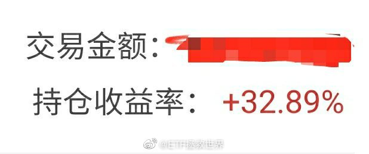

======================================================

ETF拯救世界 (5687069307) @
2020-04-09 10:35:42 Thu  
url: https://weibo.com/5687069307/ICuNllwqT

最新数据，全指医药已经不再便宜。持仓的拿住，最好不要再买了。 ​​​

转发[78]  评论[220]  赞[1429] 

======================================================

ETF拯救世界 (5687069307) @
2020-04-09 11:02:39 Thu  
url: https://weibo.com/5687069307/ICuYhtlH3

上方第一个压力位11600

------------------------------------------------------
转推：
>  @ETF拯救世界 (5687069307)
>  2020-04-09 10:35:42 Thu  
>  url: https:/weibo.com/5687069307/ICuNllwqT/

>  最新数据，全指医药已经不再便宜。持仓的拿住，最好不要再买了。 ​​​

转发[47]  评论[114]  赞[974] 

======================================================

ETF拯救世界 (5687069307) @
2020-04-09 11:42:40 Thu  
url: https://weibo.com/5687069307/ICvewuScw

今天意思不大，是不是就先散了。 ​​​

转发[3]  评论[180]  赞[1257] 

======================================================

ETF拯救世界 (5687069307) @
2020-04-09 13:21:20 Thu  
url: https://weibo.com/5687069307/ICvSA7E8m

不好意思我又回来了。

有一件挺感动的事儿。之前公众号拿到礼物的有一位“可爱的嘟嘟”，她跟我说，愿意把礼品转送给昨天在微博评论里的那位武汉博友 @PS晴晴 。 我答应了，那我就把airpods 2 耳机送给这位博友。我也会另外再送小礼物给可爱的嘟嘟。

每当我觉得这个世界黑暗的时候，总会有一些善良的 ​​​

转发[20]  评论[530]  赞[2913] 

+++++++++++++++++++++++++++++++++++++++++++++++++++++

图片：
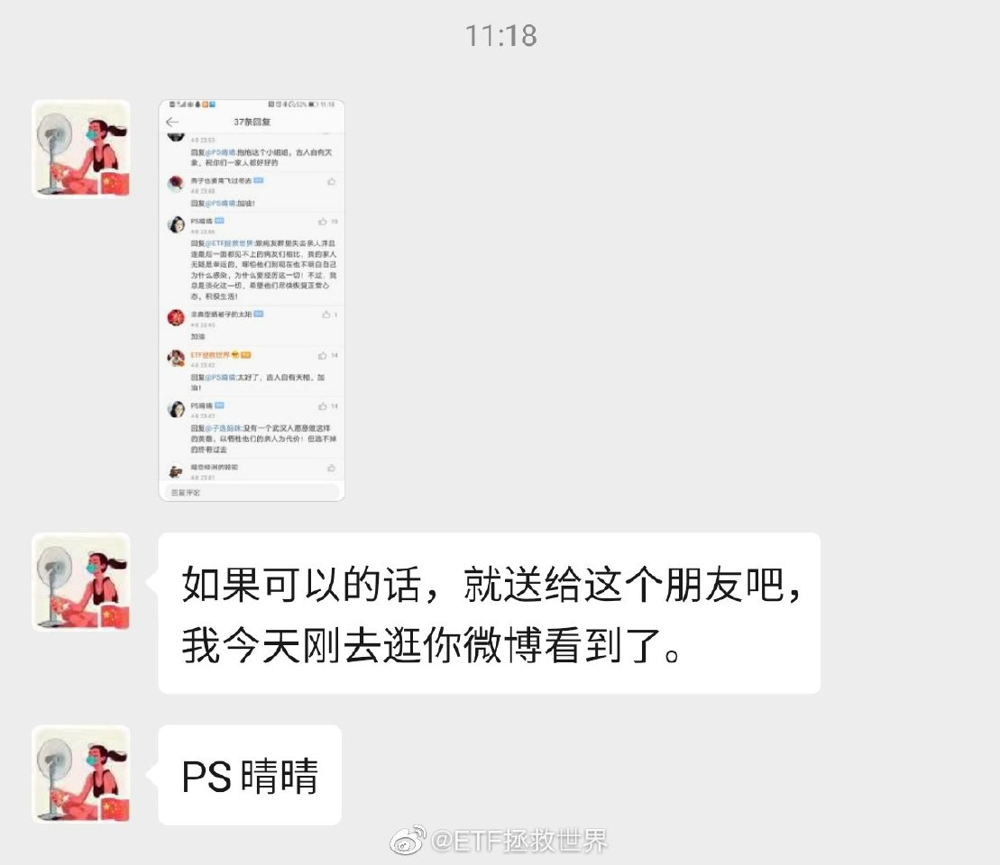

======================================================

ETF拯救世界 (5687069307) @
2020-04-09 15:15:42 Thu  
url: https://weibo.com/5687069307/ICwD0eAR0

回复@nwdslzxy:刚才确认了，凡是加群的都是骗子，不要加//@nwdslzxy:刚才自称华宝证券的客服打电话给我让我加入华宝证券的股票群，请问你们有接到类似电话吗？

------------------------------------------------------
转推：
>  @ETF拯救世界 (5687069307)
>  2020-04-09 13:21:20 Thu  
>  url: https:/weibo.com/5687069307/ICvSA7E8m/

>  不好意思我又回来了。
>  
>  有一件挺感动的事儿。之前公众号拿到礼物的有一位“可爱的嘟嘟”，她跟我说，愿意把礼品转送给昨天在微博评论里的那位武汉博友 @PS晴晴 。 我答应了，那我就把airpods 2 耳机送给这位博友。我也会另外再送小礼物给可爱的嘟嘟。
>  
>  每当我觉得这个世界黑暗的时候，总会有一些善良的 ​​​

转发[3]  评论[152]  赞[871] 

======================================================

ETF拯救世界 (5687069307) @
2020-04-09 22:14:17 Thu  
url: https://weibo.com/5687069307/ICzmUeZoG

最终最低点8255，没有有效跌破8200。目前点位10500，反弹28%。前方第一个大的压力位是11000，冲过去难度比较大。如果过不去回调，前期低点附近会有很强很强的支撑。

------------------------------------------------------
转推：
>  @ETF拯救世界 (5687069307)
>  2020-03-23 16:22:24 Mon  
>  url: https:/weibo.com/5687069307/IzWND4ItA/

>  如果DAX有效跌破8200，那就是最强的一根支撑破掉了。再往下是多少很难判断了。
>  
>  要是一定一定要给个点位，那就是6200周围。问题是，这也太低了吧！
>  
>  不过综合最近40年美国和英国的指数走势看，极限跌幅确实还有30%。这个真的是极限了，如果还止不住，那可能就是要全面推倒重来了。 ​​​

转发[197]  评论[213]  赞[1323] 

======================================================

ETF拯救世界 (5687069307) @
2020-04-09 23:17:20 Thu  
url: https://weibo.com/5687069307/ICzMuo8Jk

早点睡吧。钱是挣不完的。

头发要紧。 ​​​

转发[17]  评论[272]  赞[1677] 

======================================================

ETF拯救世界 (5687069307) @
2020-04-10 08:58:25 Fri  
url: https://weibo.com/5687069307/ICDAm1Hrm

设置好的反弹出货价，到了就果断出，一切按计划行事。

别一看涨了就抠抠索索又怕赚少了不舍得卖。大不了多留点。

别相信你的感觉，感觉在市场上是最没用的东西。 ​​​

转发[1128]  评论[281]  赞[1727] 

======================================================

ETF拯救世界 (5687069307) @
2020-04-10 09:11:59 Fri  
url: https://weibo.com/5687069307/ICDFRCJMm

2。恕我直言，对绝大多数人来说，不沾黄赌毒，不乱投资，45岁有2000万这辈子基本稳了。毕竟你不可能45岁任何事情都不干，以后一点钱赚不到。另外2000万买理财一年也有70万收入。300万美元在任何国家都是富人了。 50%的机会45岁一分钱都没有，这个太可怕了。概率降到30%我都不愿意尝试。

------------------------------------------------------
转推：
>  @ ()
>  2020-04-10 08:52:31 Fri  
>  url: 

>  抱歉，作者已设置仅展示半年内微博，此微博已不可见。 ​​​

转发[66]  评论[274]  赞[1292] 

======================================================

ETF拯救世界 (5687069307) @
2020-04-10 10:22:31 Fri  
url: https://weibo.com/5687069307/ICE8uluna

很多朋友不同意我说不要碰黄赌毒中的黄，觉得黄可以接受。

最近的新闻，大集团总裁，上市公司独董，碰了，挂了。人生就此改变。

很多事情不必亲身去尝试，每天看看新闻也能学到很多。

违法的“黄”，不碰为妙。有些不违法但是违背社会公序良俗的，也要慎重。 ​​​

转发[32]  评论[397]  赞[3035] 

======================================================

ETF拯救世界 (5687069307) @
2020-04-10 11:20:05 Fri  
url: https://weibo.com/5687069307/ICEvRqf97

第一波冲击被强力压制。//@ETF拯救世界:上方第一个压力位11600

------------------------------------------------------
转推：
>  @ETF拯救世界 (5687069307)
>  2020-04-09 10:35:42 Thu  
>  url: https:/weibo.com/5687069307/ICuNllwqT/

>  最新数据，全指医药已经不再便宜。持仓的拿住，最好不要再买了。 ​​​

转发[11]  评论[70]  赞[796] 

======================================================

ETF拯救世界 (5687069307) @
2020-04-10 11:31:39 Fri  
url: https://weibo.com/5687069307/ICEAyaBuQ

你们玩动 森的，会不会有一天突然服务器连不上了。 ​​​

转发[6]  评论[150]  赞[966] 

======================================================

ETF拯救世界 (5687069307) @
2020-04-10 11:32:40 Fri  
url: https://weibo.com/5687069307/ICEAXA8sp

为什么我感觉今天的直播销售额会大幅下降。 ​​​

转发[4]  评论[204]  赞[1210] 

======================================================

ETF拯救世界 (5687069307) @
2020-04-10 13:22:57 Fri  
url: https://weibo.com/5687069307/ICFjJaE4a

. ​​​

转发[79]  评论[364]  赞[1893] 

+++++++++++++++++++++++++++++++++++++++++++++++++++++

图片：
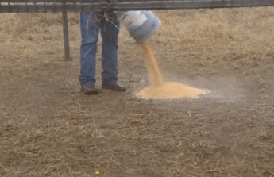

======================================================

ETF拯救世界 (5687069307) @
2020-04-10 18:07:07 Fri  
url: https://weibo.com/5687069307/ICHb4lBLI

有很多人，尤其是年轻人，特别害怕别人不知道自己的家庭背景，财务状况。所以才会出很多事儿，比如“你知道我是谁吗”“你知道我爸是谁吗”“信不信我用钱砸死你”。然后就挂了。

或者一到亲戚朋友同学聚会就怕别人看低自己，想尽办法吹。“啊，GWY，咱有银儿，包我身上”“马Y还是马HT？没问题，下个 ​​​

转发[126]  评论[515]  赞[2648] 

======================================================

ETF拯救世界 (5687069307) @
2020-04-11 20:17:14 Sat  
url: https://weibo.com/5687069307/ICRsnxWnM

回复@七月-阳光:第一，考虑全屋定制。收纳空间会大增。第二，二手房成交价与装修水平有一定关系。所以装的好点卖房的时候没准能赚回来，所以别弄太差//@七月-阳光:益达，之前装修房子有什么经验可以分享吗？

------------------------------------------------------
转推：
>  @ETF拯救世界 (5687069307)
>  2020-04-10 18:07:07 Fri  
>  url: https:/weibo.com/5687069307/ICHb4lBLI/

>  有很多人，尤其是年轻人，特别害怕别人不知道自己的家庭背景，财务状况。所以才会出很多事儿，比如“你知道我是谁吗”“你知道我爸是谁吗”“信不信我用钱砸死你”。然后就挂了。
>  
>  或者一到亲戚朋友同学聚会就怕别人看低自己，想尽办法吹。“啊，GWY，咱有银儿，包我身上”“马Y还是马HT？没问题，下个 ​​​

转发[48]  评论[157]  赞[1018] 

======================================================

ETF拯救世界 (5687069307) @
2020-04-12 19:41:18 Sun  
url: https://weibo.com/5687069307/ID0EisWLl

据说欣赏我的人最后都幸福了[doge] ​​​

转发[12]  评论[571]  赞[2373] 

+++++++++++++++++++++++++++++++++++++++++++++++++++++

图片：
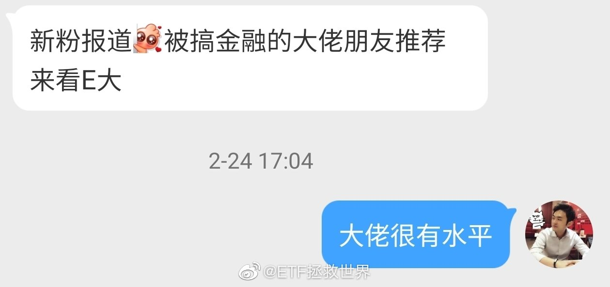
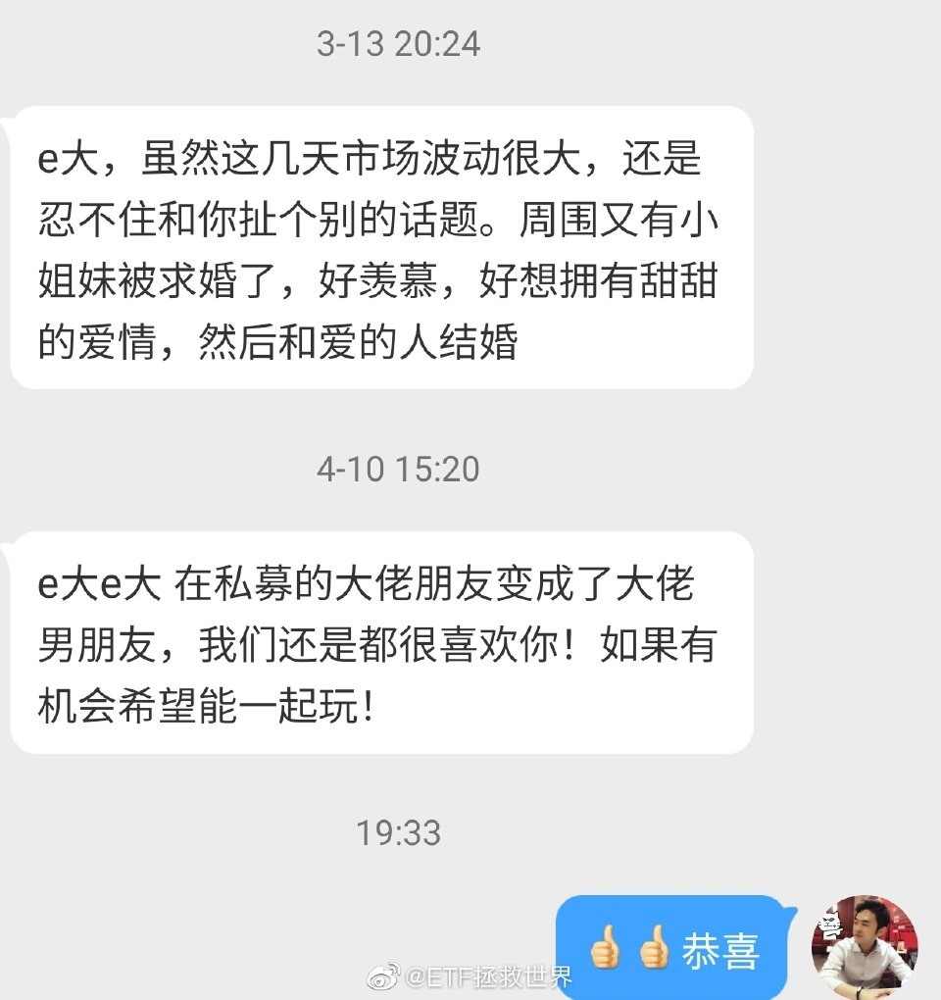

======================================================

ETF拯救世界 (5687069307) @
2020-04-13 09:37:10 Mon  
url: https://weibo.com/5687069307/ID67zF9fS

发车不发车，

第一我会考虑仓位

第二我会考虑现金流

第三我会考虑估值/趋势

第四我会考虑宏观环境

会有个综合判断。我要保证发生极端情况你心态不崩+还有钱买入。

所以发不发都不要问，不要催，不要急。你要觉得特别想交易就自己交易。 ​​​

转发[133]  评论[499]  赞[2469] 

======================================================

ETF拯救世界 (5687069307) @
2020-04-13 09:54:19 Mon  
url: https://weibo.com/5687069307/ID6ex8pfm

李佳琦微博送十瓶SKII神仙水居然有几十万转发评论。不懂，神仙水这么受姑娘们欢迎吗。

好吧，明年3.8送神仙水。没有任何转评赞要求，直接送。[太开心] ​​​

转发[23]  评论[1055]  赞[3680] 

======================================================

ETF拯救世界 (5687069307) @
2020-04-13 10:08:09 Mon  
url: https://weibo.com/5687069307/ID6k9esz2

有没有学习好的同学说说，如果这个公投真的通过了，加州真能独立吗。还是说这就是一出闹剧，即使通过了也不可能独立。

------------------------------------------------------
转推：
>  @ ()
>  2020-04-13 09:09:51 Mon  
>  url: 

>  抱歉，作者已设置仅展示半年内微博，此微博已不可见。 ​​​

转发[14]  评论[252]  赞[1156] 

======================================================

ETF拯救世界 (5687069307) @
2020-04-13 12:44:51 Mon  
url: https://weibo.com/5687069307/ID7lKxlcd

曾经有一位老人家说过，

ZZ就是把自己的人搞得多多的，把敌人的人搞得少少的。

怎么感觉现在到处点火，朋友（哪怕是面儿上的）越来越少了。

这样下去不行啊。只会让真正的敌人趁虚而入。 ​​​

转发[37]  评论[338]  赞[1793] 

======================================================

ETF拯救世界 (5687069307) @
2020-04-13 14:26:39 Mon  
url: https://weibo.com/5687069307/ID814sxPs

高管和幼女这件事，我臆测一下，背后是有一些东西我们还不知道的。三方都是如此。

但是，无论如何，无论如何，一个成年人，与14岁的女孩发生性行为，都是决不可饶恕的，一定要有牢狱之灾。我不懂法律，但我认为这就是人民群众的民意。

刚才看了个商业影响力的榜单，前几十位都没有东子。不胜唏嘘啊。 ​​​

转发[25]  评论[222]  赞[1866] 

======================================================

ETF拯救世界 (5687069307) @
2020-04-13 14:42:11 Mon  
url: https://weibo.com/5687069307/ID87npr2D

为什么我下不了决心给你们开个交友帖。我记得去年有个关注我的姑娘刚失恋想找个男朋友，我就帮着转了一下，结果有些人的评论就很不友善，挑人家这个那个的。其实我看人那姑娘多好啊，长得也挺好看，条件什么都挺好的。

所以我就怕人家说想找个男朋友，一堆人在底下说三道四品头论足，人家自己的微博平 ​​​

转发[4]  评论[351]  赞[1870] 

======================================================

ETF拯救世界 (5687069307) @
2020-04-13 15:00:04 Mon  
url: https://weibo.com/5687069307/ID8eE3jV7

无惊无险，又到三点。

欢乐的时光总是特别快，又到时间说白白。明儿见吧…… ​​​

转发[3]  评论[159]  赞[1425] 

======================================================

ETF拯救世界 (5687069307) @
2020-04-13 15:08:02 Mon  
url: https://weibo.com/5687069307/ID8hS3n7c

看了眼私信，好多朋友因为关注不到100天憋得难受想说话。

我把限制改成7天各位老朋友觉得怎么样。征求你的意见。看评论里面选项点赞数决定。 ​​​

转发[10]  评论[1193]  赞[9965] 

======================================================

ETF拯救世界 (5687069307) @
2020-04-14 11:27:11 Tue  
url: https://weibo.com/5687069307/IDggJ2q96

前一阵血雨腥风中，你买的美、德、日、港，全部赚钱了。

然而如果你在高位追芯片和5G，那大概率被套了。

所以，你应该喜欢暴跌还是暴涨，这是一个原则问题，你自己得清楚。 ​​​

转发[94]  评论[341]  赞[1988] 

======================================================

ETF拯救世界 (5687069307) @
2020-04-14 11:35:58 Tue  
url: https://weibo.com/5687069307/IDgki2QKL

回复@我是一只小毛驴从来也不怕:你5G赚了40%，是因为你买的低，是因为创业板跌了3、4年。我这个帖子的意思，不是在讨论品种，而是在讨论应该在哪里买。我掰开揉碎了，您再体会体会。//@我是一只小毛驴从来也不怕:5G赚了40%，这不是原则问题，是节奏问题

------------------------------------------------------
转推：
>  @ETF拯救世界 (5687069307)
>  2020-04-14 11:27:11 Tue  
>  url: https:/weibo.com/5687069307/IDggJ2q96/

>  前一阵血雨腥风中，你买的美、德、日、港，全部赚钱了。
>  
>  然而如果你在高位追芯片和5G，那大概率被套了。
>  
>  所以，你应该喜欢暴跌还是暴涨，这是一个原则问题，你自己得清楚。 ​​​

转发[15]  评论[147]  赞[1220] 

======================================================

ETF拯救世界 (5687069307) @
2020-04-14 17:27:37 Tue  
url: https://weibo.com/5687069307/IDiD1ozXg

来都来了，聊聊你今天过得怎么样。很舒服还是很糟心。

又或者只是普通糟心的一天。 ​​​

转发[25]  评论[1291]  赞[3223] 

======================================================

ETF拯救世界 (5687069307) @
2020-04-14 19:58:58 Tue  
url: https://weibo.com/5687069307/IDjCsDQWN

今天晚餐是三文鱼+乌冬面，配餐的是孤独美食家第三季。 ​​​

转发[6]  评论[276]  赞[1370] 

======================================================

ETF拯救世界 (5687069307) @
2020-04-14 22:41:17 Tue  
url: https://weibo.com/5687069307/IDkGluxG3

我说句可能要挨骂的话，我现在隐隐觉得，我们这边到处出征的人里面，有敌人的内鬼。

否则很难解释为什么现在这种尤其需要朋友的时候却到处挑事儿。

还有一句更可能挨骂的话：

有人歧视你，你很生气。但你有没有想过，你是不是也歧视别人了。

远的不说了，就咱们这一圈邻居，从南到北，从西到东，哪 ​​​

转发[88]  评论[374]  赞[2492] 

======================================================

ETF拯救世界 (5687069307) @
2020-04-14 23:04:19 Tue  
url: https://weibo.com/5687069307/IDkPGE2qm

其实我感觉，人类解决了生存问题后，最终的需求是尊严。

回想一下，咱们看过、听过的无数悲剧，是不是很大比例都是因为一方感到失去尊严、被蔑视才发生的。无论别人是富有还是贫穷，都不要随意践踏别人的尊严。很多时候，很多人，为了尊严冲动起来连命都可以不要。 ​​​

转发[58]  评论[191]  赞[1933] 

======================================================

ETF拯救世界 (5687069307) @
2020-04-15 09:51:14 Wed  
url: https://weibo.com/5687069307/IDp4h4Upv

医药基金突破2018年5月高点。自“救命底”以来上涨70%。 ​​​

转发[24]  评论[213]  赞[1412] 

======================================================

ETF拯救世界 (5687069307) @
2020-04-15 10:06:24 Wed  
url: https://weibo.com/5687069307/IDpaqyHb6

其实大家应该再回忆一下当时医药面临的大利空。以及在那样利空下无数人是如何继续看空的。

在下降趋势中看空，短期很容易对。因为趋势不好，你唱空赢的概率就大。但中长期看就未必。

如果你是一个真正的投资者，而不是一个嘴炮，你就应该考虑，利空是否已经反映在股价上，是否已经过度反应。利空会不 ​​​

转发[152]  评论[190]  赞[1416] 

======================================================

ETF拯救世界 (5687069307) @
2020-04-15 10:17:02 Wed  
url: https://weibo.com/5687069307/IDpeKBd6Z

目前医药已经运行到相对高估+牛市上升趋势阶段。

这个阶段非常难。难在它不是便宜的阶段，可以买可以安心持仓。它虽然是上升趋势，但随时会转头向下。这个区间考虑的不是加仓，而是如何动态平衡。

既然已经到了这个区间，就照例给一个区间上限。目前医药的区间上限是15500左右。这个点位是特大级超级 ​​​

转发[370]  评论[315]  赞[1822] 

======================================================

ETF拯救世界 (5687069307) @
2020-04-15 10:28:50 Wed  
url: https://weibo.com/5687069307/IDpjxfui7

想要消费券。怎么还不发。[哼] ​​​

转发[6]  评论[265]  赞[1054] 

======================================================

ETF拯救世界 (5687069307) @
2020-04-15 11:41:05 Wed  
url: https://weibo.com/5687069307/IDpMRrW9I

炎热的日子里，除了柠檬水，也可以试试黄瓜片泡水喝。

黄瓜削皮切片放入玻璃凉杯，灌入凉白开水，稍微放置就可以了。喜欢喝冰水的，可以放入冰箱或者加入冰块。

个人认为口感很好，很清爽。这是去热带地区旅游的时候跟当地人学的，分享给你，夏天可以试试。 ​​​

转发[49]  评论[318]  赞[1560] 

======================================================

ETF拯救世界 (5687069307) @
2020-04-15 12:37:44 Wed  
url: https://weibo.com/5687069307/IDq9Ra9FV

有没有部门能想办法找出是谁干的。这要是被栽赃的就太冤了。推上一转，不堪设想。//@留几手: 香港人干的[并不简单]//@五岳散人:卧槽，疯了吧这是……

------------------------------------------------------
转推：
>  @ ()
>  2020-04-15 11:22:50 Wed  
>  url: 

>  抱歉，此微博已被作者删除。查看帮助：http://t.cn/Rfd3rQV

转发[29]  评论[130]  赞[742] 

======================================================

ETF拯救世界 (5687069307) @
2020-04-15 13:08:11 Wed  
url: https://weibo.com/5687069307/IDqmdnBYS

看网络上有些人的论调确实让人无话好说。在他们的认知里，似乎其它国家，外资公司全都是靠中国养活的。没有中国似乎这些国家就要民不聊生，公司就要统统倒闭了。

谢谢你了，这么说80、90年代之前别人都没法活了。

中国对于世界确实非常重要，尤其是经济方面，对很多国家和外资公司来说都是如此。但绝 ​​​

转发[173]  评论[315]  赞[2224] 

======================================================

ETF拯救世界 (5687069307) @
2020-04-15 13:24:59 Wed  
url: https://weibo.com/5687069307/IDqt2uZs4

回复@em半导体me:我们现在依然穷。人均GDP只有一万美元，人均收入只有3万人民币，4000多美元。只有15%的人够5000元（700多美元）个税起征点。美国人均收入4万刀，28万人民币。东京人均收入30万人民币。差太远了。

------------------------------------------------------
转推：
>  @ETF拯救世界 (5687069307)
>  2020-04-15 13:08:11 Wed  
>  url: https:/weibo.com/5687069307/IDqmdnBYS/

>  看网络上有些人的论调确实让人无话好说。在他们的认知里，似乎其它国家，外资公司全都是靠中国养活的。没有中国似乎这些国家就要民不聊生，公司就要统统倒闭了。
>  
>  谢谢你了，这么说80、90年代之前别人都没法活了。
>  
>  中国对于世界确实非常重要，尤其是经济方面，对很多国家和外资公司来说都是如此。但绝 ​​​

转发[91]  评论[164]  赞[1367] 

======================================================

ETF拯救世界 (5687069307) @
2020-04-15 13:44:07 Wed  
url: https://weibo.com/5687069307/IDqANC8Yi

这两车没发，是因为A股仓位合适。目前的一点留存资金，我希望找机会多配置一些境外市场。 ​​​

转发[12]  评论[306]  赞[1971] 

======================================================

ETF拯救世界 (5687069307) @
2020-04-16 09:42:12 Thu  
url: https://weibo.com/5687069307/IDyr6oWb1

对于一般人来说：

第一轮牛熊市你会赚不到钱。因为你不知道宴席吃完了要赶紧走，最后你留下买单了。

第二轮牛熊市你会赚的少。因为这一轮你有了上一轮的教训，吃几口凉菜就走了，最后你可能蹲路边看别人吃大餐，也可能别人吃完你又回来买单了。

第三轮牛熊市，你会吃到大餐，并且在买单前悄悄离场逃 ​​​

转发[356]  评论[673]  赞[2798] 

======================================================

ETF拯救世界 (5687069307) @
2020-04-16 09:51:18 Thu  
url: https://weibo.com/5687069307/IDyuNrn5e

为什么我觉得这个长得像《独立日》里面美国总统的人更像美国总统应该是的样子……

------------------------------------------------------
转推：
>  @王又又 (6498373231)
>  2020-04-16 09:06:38 Thu  
>  url: https:/weibo.com/6498373231/IDycFCLej/

>  #美国疫情# 加州州长Gavin Newsom14号宣布，将向居住在加州的非法移民提供现金付款，加州政府将拨款7500万美元，一群慈善组织已承诺再提供5000万美元，总计1.25亿美元。向15万名成年人每人发500美元。
>  
>  美联社估计加州有200万非法移民。他们没有资格获得国会上个月批准的2.2万亿美元刺激计划中的直接付 ​​​

转发[16]  评论[121]  赞[656] 

======================================================

ETF拯救世界 (5687069307) @
2020-04-16 14:06:18 Thu  
url: https://weibo.com/5687069307/IDAaiCS0i

有朋友私信我说，怎么医药极限位最高才15500吗，2015年都到过了啊。各位要清楚，2015是一个非常特殊的年份，光正规两融就2万多亿，配资也有几万亿。当时医药市盈率超过100倍。那已经极度脱离正常情况了。当年的极限位应该在11000左右。如果下次还能来几万亿的杠杆，那我说的15500你就当没看见就行了。

------------------------------------------------------
转推：
>  @ETF拯救世界 (5687069307)
>  2020-04-15 10:17:02 Wed  
>  url: https:/weibo.com/5687069307/IDpeKBd6Z/

>  目前医药已经运行到相对高估+牛市上升趋势阶段。
>  
>  这个阶段非常难。难在它不是便宜的阶段，可以买可以安心持仓。它虽然是上升趋势，但随时会转头向下。这个区间考虑的不是加仓，而是如何动态平衡。
>  
>  既然已经到了这个区间，就照例给一个区间上限。目前医药的区间上限是15500左右。这个点位是特大级超级 ​​​

转发[52]  评论[112]  赞[891] 

======================================================

ETF拯救世界 (5687069307) @
2020-04-16 14:21:07 Thu  
url: https://weibo.com/5687069307/IDAgjyoSw

我说的“极限点位”，是我的投资体系中的一个趋势判断系统。这个极限点位未必不会破，就像2018年，医药我的极限点位是7800，跌破后又跌了10%才见底。因为有时候有极端情绪等等因素。

不会每次都那么精准，但一定是在那个点位周围的一个区域，不会偏离太多。 ​​​

转发[125]  评论[220]  赞[1349] 

+++++++++++++++++++++++++++++++++++++++++++++++++++++

图片：

======================================================

ETF拯救世界 (5687069307) @
2020-04-16 14:29:20 Thu  
url: https://weibo.com/5687069307/IDAjEmYcF

我觉得挺好。融合了中国传统的乡村、奇趣、宗教以及色彩的审美。不走寻常路，期待！

------------------------------------------------------
转推：
>  @新财富杂志 (1708922835)
>  2020-04-16 14:22:56 Thu  
>  url: https:/weibo.com/1708922835/IDAh3moBg/

>  【#恒大莲花状足球场#：许家印亲自构思，大家来感受一下[喵喵]】 4月16日讯 位于番禺区的广州首座世界级专业足球场已经进入开工阶段。该球场采用荷花造型，由许家印亲自构思。恒大以68亿元底价拿下广州番禺区谢村体育设施地块及产业地块。这个恒大新足球场项目占地近50万平方米，计容建面94.1998万平方 ​​​

转发[31]  评论[207]  赞[919] 

======================================================

ETF拯救世界 (5687069307) @
2020-04-17 08:36:45 Fri  
url: https://weibo.com/5687069307/IDHr2aBXY

谁能想到一年多过去，京东马上新高了。

------------------------------------------------------
转推：
>  @ETF拯救世界 (5687069307)
>  2018-09-06 06:36:28 Thu  
>  url: https:/weibo.com/5687069307/Gy2QnDieS/

>  为了让大家了解炒股的风险，一觉醒来京东已经巨亏几百美元。
>  
>  怎么办。今天早餐只能喝自来水了。
>  
>  炒股害死人，不要炒股。血淋淋的教训。
>  
>  众筹今天的午饭，一会发支付宝账号。[失望] ​​​

转发[23]  评论[128]  赞[923] 

======================================================

ETF拯救世界 (5687069307) @
2020-04-17 08:47:23 Fri  
url: https://weibo.com/5687069307/IDHvlDzah

今天公开品种有机会再收一网 ​​​

转发[11]  评论[307]  赞[1475] 

======================================================

ETF拯救世界 (5687069307) @
2020-04-17 09:43:29 Fri  
url: https://weibo.com/5687069307/IDHS7tl0F

还不离婚吗。这以后晚上能睡踏实吗。

------------------------------------------------------
转推：
>  @新浪视频 (1640601392)
>  2020-04-17 09:09:03 Fri  
>  url: https:/weibo.com/1640601392/IDHE984aM/

>  【妻子#把平底锅锁丈夫脚踝限制出门#】4月15日，青海西宁一男子睡醒后，发现右脚脚踝处有一把锁，锁上还挂着一口平底锅。该男子报警求助，消防员到场后，用破拆工具将锁取下。男子称，妻子和他吵架后，趁他睡着，用此方法限制他出门。@有料 http://t.cn/A6waobnw ​​​

转发[8]  评论[150]  赞[679] 

======================================================

ETF拯救世界 (5687069307) @
2020-04-17 09:47:04 Fri  
url: https://weibo.com/5687069307/IDHTAcJTS

有打印的可能吗。现在墨仓式打印机打印成本很低了。

------------------------------------------------------
转推：
>  @新浪视频 (1640601392)
>  2020-04-17 09:42:02 Fri  
>  url: https:/weibo.com/1640601392/IDHRx9YuQ/

>  【心疼孩子上网课伤眼 #妈妈为孩子手抄课本试卷#用光20支笔芯】湖北洪湖，张同学是一名6年级学生，在家上网课时需要长时间看电子屏。妈妈担心孩子视力，就为儿子抄写了所需的所有课文、练习题和试卷，用光了20支笔芯。@一手Video http://t.cn/A6wSUi0W ​​​

转发[23]  评论[177]  赞[782] 

======================================================

ETF拯救世界 (5687069307) @
2020-04-17 12:44:07 Fri  
url: https://weibo.com/5687069307/IDJ3rCO57

可以不喜欢，甚至可以吃，为什么要虐待。你大爷。

------------------------------------------------------
转推：
>  @北京人不知道的北京事儿 (1662214194)
>  2020-04-17 11:34:29 Fri  
>  url: https:/weibo.com/1662214194/IDIBb2XrR/

>  网友投稿，那个#用高压电电击泰迪虐狗#的男子，就是去年4月用开水烫狗后“道歉”的南通大学实习医生陈昱龙！[怒][怒]
>  
>  他曾说自己是虐狗人士。他喜欢自制各种刑具虐狗，用开水烫、灌芥末、灌水、灌酒精、高压电电击、用火烧，当狗狗奄奄一息时，再用冷水泼醒，看狗狗痛苦的挣扎，他就会感到兴奋。。。
>   ​​​

转发[33]  评论[324]  赞[950] 

======================================================

ETF拯救世界 (5687069307) @
2020-04-17 13:15:54 Fri  
url: https://weibo.com/5687069307/IDJgleBGz

谁再在评论里说跌了仓位高了，涨了仓位低了难受就拉黑。

你不懂舒服。 ​​​

转发[11]  评论[402]  赞[1847] 

======================================================

ETF拯救世界 (5687069307) @
2020-04-17 14:39:57 Fri  
url: https://weibo.com/5687069307/IDJOskvGW

我这个回答有可能被骂（你为什么要女方先注意自己的行为？难道不是男方的责任吗？），但还是贴出来。 ​​​

转发[22]  评论[549]  赞[2880] 

+++++++++++++++++++++++++++++++++++++++++++++++++++++

图片：
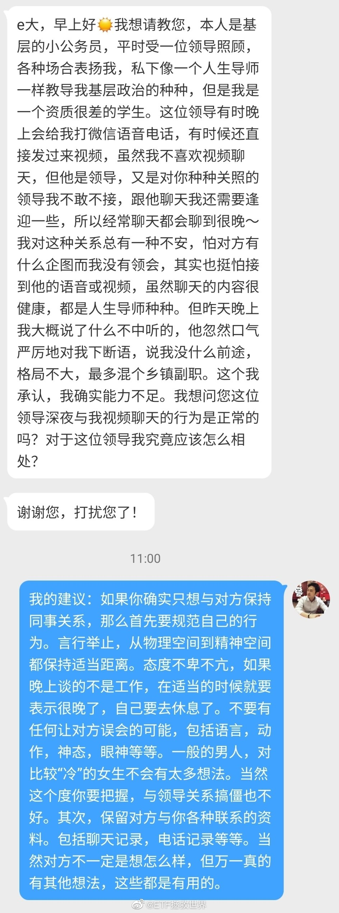

======================================================

ETF拯救世界 (5687069307) @
2020-04-18 08:36:10 Sat  
url: https://weibo.com/5687069307/IDQRihrUs

每天想着把最后一分钱杀进去的朋友看看。

------------------------------------------------------
转推：
>  @ ()
>  2020-04-18 07:55:33 Sat  
>  url: 

>  抱歉，作者已设置仅展示半年内微博，此微博已不可见。 ​​​

转发[148]  评论[219]  赞[1423] 

======================================================

ETF拯救世界 (5687069307) @
2020-04-18 19:59:36 Sat  
url: https://weibo.com/5687069307/IDVkHm76k

关于最近原油期货移仓的问题，说一下。

目前计划持仓的华宝油气（0.7%）以及石油基金（0.6%），没有移仓问题。两个基金是持有石油类上市公司股票。

持仓占比0.47%的南方原油是持有原油期货。这个会有移仓问题，但是由于持仓占比很小，不用太在意，尤其是单份持仓金额很少的朋友。

如果比例虽然小， ​​​

转发[224]  评论[518]  赞[1818] 

======================================================

ETF拯救世界 (5687069307) @
2020-04-18 20:21:31 Sat  
url: https://weibo.com/5687069307/IDVtB55lP

收到就好。不过听这位幸运儿说她把耳机送给老公用了。大家谈谈有什么感想。

------------------------------------------------------
转推：
>  @PS晴晴 (1245096207)
>  2020-04-17 14:01:47 Fri  
>  url: https:/weibo.com/1245096207/IDJyY0ht7/

>  @ETF拯救世界 礼物收到了，谢谢老大，谢谢可爱的嘟嘟，谢谢所有给了我关心祝福的善良的小天使们，祝大家越来越有钱，越来越有品！！！！ http://t.cn/R2WxQOQ ​​​

转发[3]  评论[225]  赞[1328] 

======================================================

ETF拯救世界 (5687069307) @
2020-04-18 20:58:10 Sat  
url: https://weibo.com/5687069307/IDVIthJfC

又一位成功人士倒在了男女关系上。 ​​​

转发[20]  评论[327]  赞[1833] 

======================================================

ETF拯救世界 (5687069307) @
2020-04-19 12:48:07 Sun  
url: https://weibo.com/5687069307/IE1W3tspH

这事情绝不止脑残这么简单。美国直接发钱到个人账户，还有失业保险，按理说不会活不下去。我从去年HK学到的就是：一般大规模YX后面都有力量在支持。是谁在支持民众与州政府对着干着急开工呢。//@挖龙脉的超级鹿鼎公: 转发微博

------------------------------------------------------
转推：
>  @何天恩 (1861477054)
>  2020-04-19 11:30:03 Sun  
>  url: https:/weibo.com/1861477054/IE1qn3bQR/

>  美丽的风景线！【美民众扛枪抗议封城 :宁愿死于新冠也要自由[允悲]】在美国多州发生了抗议居家令的聚集性活动。当地时间4月15日，在密歇根州首府兰辛市，数千名抗议者们将自己的车开到街上后熄火并待在车里，另有抗议者聚集在州议会大厦附近，反对州长格雷琴·惠特默此前颁布的居家令。拥堵路段超过1英 ​​​

转发[32]  评论[160]  赞[881] 

======================================================

ETF拯救世界 (5687069307) @
2020-04-19 13:46:32 Sun  
url: https://weibo.com/5687069307/IE2jLzubc

我对武术的幻觉是什么时候破灭的呢。

回想了一下，是十年前在猫扑看到的一段民国时期大师比武的录像。

从那一刻起，武侠小说和武侠电影我都不怎么看了。不是内个味儿了。 ​​​

转发[10]  评论[206]  赞[987] 

======================================================

ETF拯救世界 (5687069307) @
2020-04-19 17:10:13 Sun  
url: https://weibo.com/5687069307/IE3ErrECW

没事别玩这种东西。任何机械和人都有一定概率出问题。责任心不强的地方出问题的概率更大。这种高危游戏，出了问题就是挂。

------------------------------------------------------
转推：
>  @ ()
>  2020-04-19 16:43:29 Sun  
>  url: 

>  抱歉，作者已设置仅展示半年内微博，此微博已不可见。 ​​​

转发[44]  评论[181]  赞[856] 

======================================================

ETF拯救世界 (5687069307) @
2020-04-19 18:01:49 Sun  
url: https://weibo.com/5687069307/IE3Zo8Ndz

如何快速换算日元。看日剧或者买东西的时候经常会遇到这个问题。比如孤独美食家里面，一个肉串200日元，到底是多少人民币，看到的时候就会想知道。日元和美元或者欧元还不一样，还不是直接除个汇率6或者7就能算出来。

我一般这么算。就是用这个数字乘6，然后小数点左移两位。比如200日元，就是200*6=1 ​​​

转发[56]  评论[423]  赞[1407] 

======================================================

ETF拯救世界 (5687069307) @
2020-04-20 10:19:09 Mon  
url: https://weibo.com/5687069307/IEao5pM4Q

呵呵，指数报价都能错，喷了。 ​​​

转发[24]  评论[436]  赞[1484] 

======================================================

ETF拯救世界 (5687069307) @
2020-04-20 12:29:16 Mon  
url: https://weibo.com/5687069307/IEbeU5eU8

一方面是意识形态，一方面是潜意识中的人种歧视。

这两点导致了我们与对方在很多问题上不可能得到根本解决。 ​​​

转发[17]  评论[136]  赞[1236] 

======================================================

ETF拯救世界 (5687069307) @
2020-04-20 12:49:19 Mon  
url: https://weibo.com/5687069307/IEbn2u9e8

修正了。不公布一下错误的原因吗 ​​​

转发[5]  评论[183]  赞[1235] 

======================================================

ETF拯救世界 (5687069307) @
2020-04-20 14:40:29 Mon  
url: https://weibo.com/5687069307/IEc6adUcH

今天买卖都没有成交的。

怎么说呢，感觉生活过得没有滋味。 ​​​

转发[13]  评论[346]  赞[1442] 

======================================================

ETF拯救世界 (5687069307) @
2020-04-20 16:21:03 Mon  
url: https://weibo.com/5687069307/IEcKZ7JRV

不知道为什么，感觉看书比追剧有意思。这几年没有一部剧是完整看完的。看着看着就觉得不想继续看下去，也不是拍的不好没意思，就是耐不下心，看不下去。还是看书有意思。是不是送一台oasis2给爱看书的同学呢。

------------------------------------------------------
转推：
>  @央视新闻 (2656274875)
>  2020-04-20 14:17:09 Mon  
>  url: https:/weibo.com/2656274875/IEbWH3ucF/

>  【#2019年我国人均阅读纸质书4.65本# 你读了多少？】今天，第17次全国国民阅读调查结果发布。数据显示：①#2019年人均手机阅读时长每天超100分钟#；②我国成年国民人均纸质图书阅读量为4.65本，电子书阅读量为2.84本；③未成年人的人均图书阅读量为10.36本。怎样选择适合自己的书？如何读书？戳图↓转 ​​​

转发[108]  评论[845]  赞[1772] 

======================================================

ETF拯救世界 (5687069307) @
2020-04-21 07:39:20 Tue  
url: https://weibo.com/5687069307/IEiLIEoAm

记录一下负油价的历史。以后各位都有对后辈们吹牛的资本了

------------------------------------------------------
转推：
>  @网易财经 (1974561081)
>  2020-04-21 06:32:20 Tue  
>  url: https:/weibo.com/1974561081/IEikwz6pE/

>  在周一，市场又创下一项新纪录，这就是：美国5月份的西得州轻质原油期货WTI价格不仅创下了历史新低，并且还跌至了负值，最后收盘时下挫超过300%，收于-37.63美元每桶。可以说让所有人、包括华尔街上的交易员们都惊呼，这简直是前所未闻的行情走势。为什么会出现周一的暴跌？
>  
>  交易员陷入两难 被迫全线 ​​​

转发[379]  评论[238]  赞[1229] 

======================================================

ETF拯救世界 (5687069307) @
2020-04-21 07:55:52 Tue  
url: https://weibo.com/5687069307/IEiSqmSMc

没事还是别出门浪的好。买东西还是上京东淘宝吧…

------------------------------------------------------
转推：
>  @北京城这点事儿 (3275259063)
>  2020-04-20 15:17:15 Mon  
>  url: https:/weibo.com/3275259063/IEcl5oH0W/

>  #北京故事# ​​​

转发[15]  评论[86]  赞[600] 

======================================================

ETF拯救世界 (5687069307) @
2020-04-21 08:08:43 Tue  
url: https://weibo.com/5687069307/IEiXDFEXt

其实我觉得落叶落花都很好看，尤其秋天，满地银杏叶非常美。一定要及时扫是不是有其他专业方面的原因？

------------------------------------------------------
转推：
>  @新浪视频 (1640601392)
>  2020-04-20 20:45:04 Mon  
>  url: https:/weibo.com/1640601392/IEeu9eqIa/

>  【郑州#环卫工用扫把打花催落#：“咱也没办法，落地上扫不急罚100元”】4月17日，河南郑州，几名环卫用扫把狂打墙边的蔷薇花，花瓣白花花的落在地上一片。据环卫工说，因为这个花经常落花瓣，地上扫不急多了就会被拍照罚款，一次罚100元，而他们一天工作才挣七八十元。对此，郑州市执法局工作人员回应 ​​​

转发[12]  评论[160]  赞[726] 

======================================================

ETF拯救世界 (5687069307) @
2020-04-21 08:21:42 Tue  
url: https://weibo.com/5687069307/IEj2Uubfa

//@关雅荻RunningBravely:同意，敢不敢把东亚国家数据一并列出？→_→@胡茬茬1974：我用视频中这位女专家的统计方法，再找了些公开的数据算了一下，新冠肺炎造成的每十万死亡人口，美国11.24, 中国大陆 0.33, 中国台湾0.25, 日本0.187，韩国0.45 。  结论：东北亚儒家文化圈地区在新冠病毒面前的生存能

------------------------------------------------------
转推：
>  @YouTube精选 (2214257545)
>  2020-04-20 16:22:37 Mon  
>  url: https:/weibo.com/2214257545/IEcLD1Mhb/

>  昨天的特朗普疫情发布会，再一次让人领略到了白宫的傲慢与偏见。
>  
>  白宫新冠疫情防控协调员Deborah Birx在发布会上向公众展示了一张图——“各国新冠病毒（每十万人）致死数”排名：
>  
>  从图中可以看出（从上到下）——比利时每十万人中有45.2人死亡；意大利每十万人中有37.6人死亡；美国每十万人中有11.2 ​​​

转发[76]  评论[1]  赞[19] 

======================================================

ETF拯救世界 (5687069307) @
2020-04-21 09:42:37 Tue  
url: https://weibo.com/5687069307/IEjzL1Iau

这几个月仓位没有增加，但是如果你还有自由现金流，还是要继续积累现金。

一方面是把自己家庭的安全垫积累的厚一点，一方面是为了有可能拿到的更低资产价格做准备。

你得保证无论发生什么情况自己都活着，才能赚更多。也许未来你会看到有些现在激进的人赚很多，但你看不到的是他的身后有多少白骨。 ​​​

转发[166]  评论[462]  赞[2594] 

======================================================

ETF拯救世界 (5687069307) @
2020-04-21 17:29:36 Tue  
url: https://weibo.com/5687069307/IEmDjibPC

六月合约接力跌。

需求上不去，消耗无法加大，储油罐都满了，地底下的油呼呼呼往上冒。除非经济重启，否则很难解决。 ​​​

转发[30]  评论[376]  赞[2138] 

======================================================

ETF拯救世界 (5687069307) @
2020-04-21 18:26:02 Tue  
url: https://weibo.com/5687069307/IEn0daHkU

无论男女，结婚对象的智商都非常重要。没结婚的各位，真的，一定要记住。

------------------------------------------------------
转推：
>  @新浪视频 (1640601392)
>  2020-04-21 17:55:49 Tue  
>  url: https:/weibo.com/1640601392/IEmNWxXVl/

>  【育儿团队回应#婴儿疑似被训练趴睡时死亡#：其母购买的睡眠课程已停 直接死因并非趴睡】4月16日，一名新手妈妈在付费睡眠引导群提问，称小孩翻身趴着睡觉一直哭，想向群内的老师寻求帮助。群友答“不是大哭就没事”，然而约两小时后，这位妈妈在群内表示孩子嘴唇发紫，最终孩子因窒息不幸身亡。据悉， ​​​

转发[79]  评论[413]  赞[1492] 

======================================================

ETF拯救世界 (5687069307) @
2020-04-22 16:51:30 Wed  
url: https://weibo.com/5687069307/IEvOl1LrS

忙了一天。

你今天过得怎么样。 ​​​

转发[26]  评论[725]  赞[2062] 

======================================================

ETF拯救世界 (5687069307) @
2020-04-22 21:07:10 Wed  
url: https://weibo.com/5687069307/IExu759Ig

中行这次原油宝事件暴露了某些银行对于衍生品风控不过关。从现在开始，白银网格不仅是暂停，手上的两三格到价格出掉后也停止交易。

------------------------------------------------------
转推：
>  @ETF拯救世界 (5687069307)
>  2020-03-12 22:30:44 Thu  
>  url: https:/weibo.com/5687069307/IyjvFBcmG/

>  美元白银网格可以先暂停了。 ​​​

转发[70]  评论[338]  赞[1719] 

======================================================

ETF拯救世界 (5687069307) @
2020-04-23 08:28:37 Thu  
url: https://weibo.com/5687069307/IEBWIeqSu

之前已经建议过持仓南方油的朋友可以转托管场内卖出。昨天中行又爆雷，估计更多朋友会担心。已经与且慢沟通完毕，他们今天会做一个方便大家操作转托管的东西出来（之前步骤繁琐场外机构都如此），明天可以上线。整个流程我会非常具体的写一篇东西今晚或明早发布。致敬且慢，一切以客户利益为优先考虑。

------------------------------------------------------
转推：
>  @ETF拯救世界 (5687069307)
>  2020-04-18 19:59:36 Sat  
>  url: https:/weibo.com/5687069307/IDVkHm76k/

>  关于最近原油期货移仓的问题，说一下。
>  
>  目前计划持仓的华宝油气（0.7%）以及石油基金（0.6%），没有移仓问题。两个基金是持有石油类上市公司股票。
>  
>  持仓占比0.47%的南方原油是持有原油期货。这个会有移仓问题，但是由于持仓占比很小，不用太在意，尤其是单份持仓金额很少的朋友。
>  
>  如果比例虽然小， ​​​

转发[11]  评论[521]  赞[2326] 

======================================================

ETF拯救世界 (5687069307) @
2020-04-23 09:34:49 Thu  
url: https://weibo.com/5687069307/IECnAcK35

医药开始升温，热度持续增加。继续持仓，等待15000狂热或趋势变化。

------------------------------------------------------
转推：
>  @ETF拯救世界 (5687069307)
>  2020-04-15 10:17:02 Wed  
>  url: https:/weibo.com/5687069307/IDpeKBd6Z/

>  目前医药已经运行到相对高估+牛市上升趋势阶段。
>  
>  这个阶段非常难。难在它不是便宜的阶段，可以买可以安心持仓。它虽然是上升趋势，但随时会转头向下。这个区间考虑的不是加仓，而是如何动态平衡。
>  
>  既然已经到了这个区间，就照例给一个区间上限。目前医药的区间上限是15500左右。这个点位是特大级超级 ​​​

转发[32]  评论[125]  赞[1029] 

======================================================

ETF拯救世界 (5687069307) @
2020-04-23 09:37:27 Thu  
url: https://weibo.com/5687069307/IECoEFwSB

提醒一句，最近转托管的前后，各位不要到处议论。没有场内高溢价买入的对手盘，到时候各位转换后也无法高价卖出。为了你自己，不要与别人讨论，自己做。稍后我会把这几条设置为粉丝可见。

------------------------------------------------------
转推：
>  @ETF拯救世界 (5687069307)
>  2020-04-18 19:59:36 Sat  
>  url: https:/weibo.com/5687069307/IDVkHm76k/

>  关于最近原油期货移仓的问题，说一下。
>  
>  目前计划持仓的华宝油气（0.7%）以及石油基金（0.6%），没有移仓问题。两个基金是持有石油类上市公司股票。
>  
>  持仓占比0.47%的南方原油是持有原油期货。这个会有移仓问题，但是由于持仓占比很小，不用太在意，尤其是单份持仓金额很少的朋友。
>  
>  如果比例虽然小， ​​​

转发[0]  评论[460]  赞[1926] 

======================================================

ETF拯救世界 (5687069307) @
2020-04-23 09:48:35 Thu  
url: https://weibo.com/5687069307/IECtay1Yl

我不信有什么东西是多贵都值的。

你贵了我就卖，你便宜了我就买，免费的话我就给你好评。 ​​​

转发[19]  评论[220]  赞[1830] 

======================================================

ETF拯救世界 (5687069307) @
2020-04-23 10:44:09 Thu  
url: https://weibo.com/5687069307/IECPJ5a0e

好吧，跟着你们吃完瓜了。

不过我想说，最近我发现我也有一点黑眼圈了。但我是清白的！我都是在看美股！ ​​​

转发[9]  评论[495]  赞[2058] 

======================================================

ETF拯救世界 (5687069307) @
2020-04-23 14:48:08 Thu  
url: https://weibo.com/5687069307/IEEqL5qYn

瓜不瓜的其实我也不关心，跟我没关系。就是想说几句不知道会不会挨骂的话：

无论男女，约P没问题，现在也不是跳个舞就定流氓罪的年代了。

但是，不要欺骗你的男朋友或者女朋友。如果人家就是想认认真真和你谈恋爱，你要约P就别跟人家在一起。

更重要的是，婚后就别约了。结婚算是一种承诺，也是责任 ​​​

转发[39]  评论[372]  赞[2236] 

======================================================

ETF拯救世界 (5687069307) @
2020-04-23 15:15:26 Thu  
url: https://weibo.com/5687069307/IEEBQ9tpg

你觉得我说的对吗。 ​​​

转发[12]  评论[427]  赞[1988] 

+++++++++++++++++++++++++++++++++++++++++++++++++++++

图片：
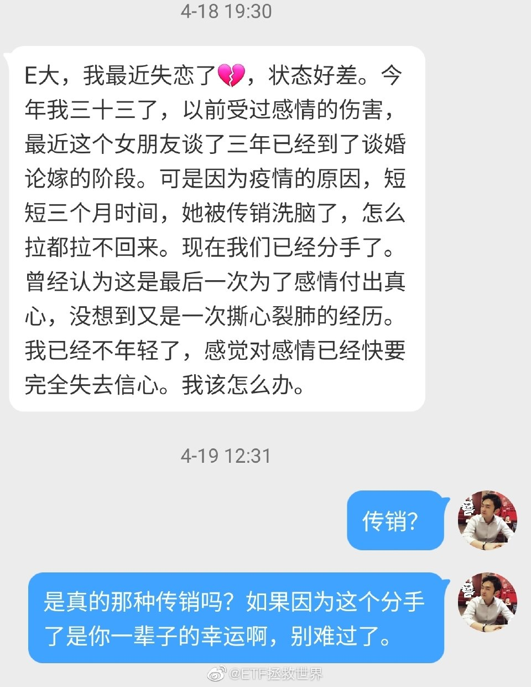

======================================================

ETF拯救世界 (5687069307) @
2020-04-23 19:12:55 Thu  
url: https://weibo.com/5687069307/IEGaf2bPO

不想当大厨的小偷不是好的蜘蛛侠。

------------------------------------------------------
转推：
>  @澎湃新闻 (5044281310)
>  2020-04-23 19:10:04 Thu  
>  url: https:/weibo.com/5044281310/IEG94FpC8/

>  【#小偷在业主家做饭#，被发现躲到28楼窗外】4月18日，重庆。高女士发现外出的邻居家亮着灯，怀疑进贼。民警到场发现小偷躲在28楼窗外，之前还在屋内做饭煮香肠，并打算过夜。目前，嫌疑人梅某被采取刑事强制措施。其交代自己手头紧，盯上家中无人且未反锁门的高层住户。（素材来源：相关人士） ​​​

转发[8]  评论[53]  赞[427] 

======================================================

ETF拯救世界 (5687069307) @
2020-04-23 19:17:54 Thu  
url: https://weibo.com/5687069307/IEGcg1vFa

私信看多了就会觉得找伴侣这件事，运气因素太大，不公平。

明明很多优质男女，却因为没有缘分碰不到一起。可能那个合适的人就住你隔壁小区你都不知道。

以前很喜欢的一部电影《向左走，向右走》。主要是因为喜欢男女主角，现在看的事情多了，想起来不胜唏嘘。 ​​​

转发[56]  评论[380]  赞[1556] 

+++++++++++++++++++++++++++++++++++++++++++++++++++++

图片：

======================================================

ETF拯救世界 (5687069307) @
2020-04-23 21:42:24 Thu  
url: https://weibo.com/5687069307/IEH8Ulsj2

弄了半天这一波下去就是为了杀中 行吗。

转场功能正在紧急开发，且慢都在加班，明早推送吧 ​​​​

转发[3]  评论[404]  赞[2076] 

+++++++++++++++++++++++++++++++++++++++++++++++++++++

图片：
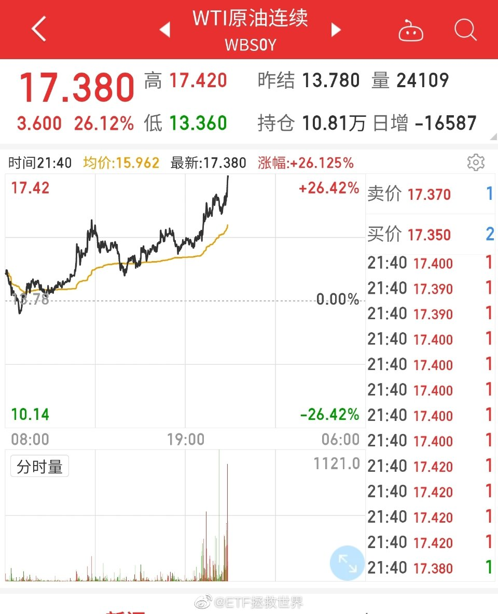

======================================================

ETF拯救世界 (5687069307) @
2020-04-23 23:43:40 Thu  
url: https://weibo.com/5687069307/IEHW8dXW7

今天已经有人把我的微博截图，在公众号洋洋洒洒写一篇文章做提示了。不仅如此，还有媒体转发。

我不能怪他。他也是为了吃饭，博眼球，博关注。

这种事情真的两难。我说，就会有很多人知道。我不说，大家也没法操作。

只能希望大家顺利。希望大家知道，我是真心希望各位都赚钱。我尽力了。 ​​​

转发[1]  评论[617]  赞[2790] 

======================================================

ETF拯救世界 (5687069307) @
2020-04-24 10:16:55 Fri  
url: https://weibo.com/5687069307/IEM5b0lQ9

中概，现在我们是不会买的。第一贵，第二有美国监管及ZZ风险。未来买不买？当然买。什么时候买？你猜。

------------------------------------------------------
转推：
>  @网易财经 (1974561081)
>  2020-04-24 09:58:03 Fri  
>  url: https:/weibo.com/1974561081/IELXvuWvd/

>  【SEC主席亲自下场 中概股审计再遭严监管？】4月22日， 美国证券交易委员会（SEC）主席克莱顿在接受媒体采访时称，“现在是机构投资者审查、重新平衡和评估其投资组合的时候。我们要提醒大家，当你看到新兴市场发行者披露信息时，它虽然看起来就像是美国本土发行者的报告，但这不是同一类投资。”他直 ​​​

转发[60]  评论[269]  赞[1162] 

======================================================

ETF拯救世界 (5687069307) @
2020-04-24 10:44:45 Fri  
url: https://weibo.com/5687069307/IEMgsFLQV

之前一直说的对不对。黄、赌、毒。尽量别碰。否则会很麻烦。

------------------------------------------------------
转推：
>  @新浪财经 (1638782947)
>  2020-04-24 10:39:42 Fri  
>  url: https:/weibo.com/1638782947/IEMepEMi7/

>  【#时间管理大师罗志祥# 他的出轨的成本有多高？多年吸金过亿】4月24日5点，#罗志祥道歉#，@羅志祥 向周扬青及所有被欺骗的女性道歉。早在2013年最吸金歌手榜单上，罗志祥狂赚6.1亿新台币（约合1.26亿元人民币），登上榜首位置。2014年，罗志祥进账约1.1亿元人民币，从榜单中看，当时，周杰伦的收入为1 ​​​

转发[12]  评论[167]  赞[781] 

======================================================

ETF拯救世界 (5687069307) @
2020-04-24 12:37:28 Fri  
url: https://weibo.com/5687069307/IEN0dr2rQ

无论你写的多么细致，多么全面，都会有人不看或者看不懂。

所以在设计产品流程的时候，都是按照最最粗心大意的人，阅读能力差的人的情况设计的。

饭已经不止喂到嘴里，还帮着托着腮帮子嚼一嚼。就差帮着咽下去了。 ​​​

转发[34]  评论[545]  赞[2103] 

======================================================

ETF拯救世界 (5687069307) @
2020-04-24 12:52:07 Fri  
url: https://weibo.com/5687069307/IEN6adhKb

感谢一下。 ​​​

转发[11]  评论[557]  赞[2883] 

+++++++++++++++++++++++++++++++++++++++++++++++++++++

图片：
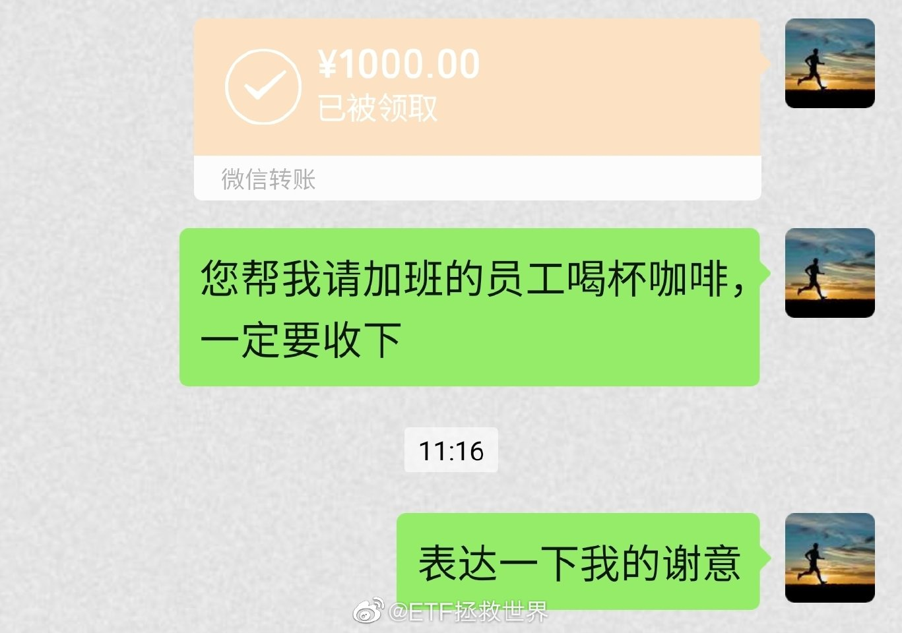

======================================================

ETF拯救世界 (5687069307) @
2020-04-24 14:36:32 Fri  
url: https://weibo.com/5687069307/IENMy2GtM

还有人留言质疑：你搞什么，好久不发文章，也不交易，真不知道在干什么。

我服了。一定要像自媒体一样每天发一篇追热点的文章；无论合适不合适，每个月都要发车让你买买买你才高兴吗。

不好意思，我不是自媒体，我也不需要每天用一篇推送留住读者或者吸引流量，我也不是“定投”。我爱什么时候写东西 ​​​

转发[20]  评论[890]  赞[3375] 

======================================================

ETF拯救世界 (5687069307) @
2020-04-24 17:21:25 Fri  
url: https://weibo.com/5687069307/IEORtChQe

前10%的家庭占有60%的金融资产。后40%的家庭只有5%的金融资产。后60%只有12%。

------------------------------------------------------
转推：
>  @新浪财经 (1638782947)
>  2020-04-24 13:39:35 Fri  
>  url: https:/weibo.com/1638782947/IENprcrUK/

>  【央行报告：样本内#收入最高10%家庭户均总资产1204万#】央行报告称，高收入家庭拥有更多资产。将家庭总收入从低到高排序，总收入最高20%家庭所拥有的总资产占全部样本家庭总资产的半数以上。其中，收入最高10%家庭户均总资产1204.8万元，是收入最低20%家庭户均总资产的13.7倍。http://t.cn/A6wdfYUa ​​​

转发[136]  评论[211]  赞[1325] 

======================================================

ETF拯救世界 (5687069307) @
2020-04-26 13:04:59 Sun  
url: https://weibo.com/5687069307/IF62nqFJX

有空去日本的朋友有机会可以去奈良跟小鹿们玩一玩，真的是美好的体验。再去旁边的东大寺转转，我也很喜欢。

------------------------------------------------------
转推：
>  @央视新闻 (2656274875)
>  2020-04-26 12:53:27 Sun  
>  url: https:/weibo.com/2656274875/IF5XHh5G6/

>  【#游客骤减日本奈良小鹿烦闷无聊#】紧急状态下的日本奈良，随着防控的加紧，游客急剧减少。喂食小鹿，是来访奈良公园的游客必打卡项目。而现在，有小鹿从公园跑到了市区中觅食。当地小鹿保护协会解释，小鹿在公园里有足够的草和树叶可以吃，跑到市区中可能是因为没有游客，心理上有些烦闷和无聊…… ​​​

转发[34]  评论[224]  赞[786] 

======================================================

ETF拯救世界 (5687069307) @
2020-04-26 18:55:23 Sun  
url: https://weibo.com/5687069307/IF8kBwRQ3

其实我已经看到未来的结果了。

如果这次转场后溢价消失无法顺利卖出，一定会有人跳出来嘲笑我。

咱们一起看看是哪些人会这么干。 ​​​​

转发[0]  评论[730]  赞[2386] 

======================================================

ETF拯救世界 (5687069307) @
2020-04-26 22:55:56 Sun  
url: https://weibo.com/5687069307/IF9Ufh8Yc

休息差不多了，开始看留言。 ​​​

转发[2]  评论[215]  赞[1165] 

======================================================

ETF拯救世界 (5687069307) @
2020-04-27 09:53:00 Mon  
url: https://weibo.com/5687069307/IFecX2usK

每天开盘的四个小时是人生美好时光之一。 ​​​

转发[13]  评论[252]  赞[1719] 

======================================================

ETF拯救世界 (5687069307) @
2020-04-27 10:09:47 Mon  
url: https://weibo.com/5687069307/IFejLikz2

想起一个需要叮嘱的，你要看我微博你就要理解：

我说不买，就是代表不买。不代表要把手里的卖出。只有说卖出才代表卖出。

我说不卖，也不代表可以买。只是代表不卖。

你始终要记住，对于一个品种，是有三种状态：买入、持有、卖出。

前几天我说某个品种不买，评论里有人说啊那我是不是要把手里的卖 ​​​

转发[39]  评论[545]  赞[2145] 

======================================================

ETF拯救世界 (5687069307) @
2020-04-27 11:24:37 Mon  
url: https://weibo.com/5687069307/IFeO8rvTK

他们两个天生一对。

------------------------------------------------------
转推：
>  @新浪视频 (1640601392)
>  2020-04-27 11:16:25 Mon  
>  url: https:/weibo.com/1640601392/IFeKOb4FC/

>  【女子在新西兰对男友称要“鱼死网破” 面临最高七年监禁无法回国[衰]】#威胁男友称鱼死网破将面临七年监禁# 去年5月，来自北京的郭小姐和相恋六年的男友去往新西兰旅游，但在飞机上两人因琐事发生争吵。之后在过海关时，男友称与她不识，随后郭小姐被遣返回国，男友康某则留在了新西兰亲戚家。10月8日 ​​​

转发[15]  评论[84]  赞[607] 

======================================================

ETF拯救世界 (5687069307) @
2020-04-27 11:46:12 Mon  
url: https://weibo.com/5687069307/IFeWTz6Jf

数码产品小贴士：

当你觉得手机用腻的时候，换个手机壳，又能撑1-2个月。 ​​​

转发[24]  评论[550]  赞[2509] 

======================================================

ETF拯救世界 (5687069307) @
2020-04-28 10:44:29 Tue  
url: https://weibo.com/5687069307/IFnYliZml

打开条件单惊呆了，买入立赚3%…… ​​​

转发[14]  评论[587]  赞[2081] 

======================================================

ETF拯救世界 (5687069307) @
2020-04-28 11:15:28 Tue  
url: https://weibo.com/5687069307/IFoaV8MIM

我对两个科技产品非常期待。

第一个是真正的无人驾驶。

第二个是极度真实的AR/VR系统。

希望10-15年内能实现。 ​​​

转发[33]  评论[300]  赞[1936] 

======================================================

ETF拯救世界 (5687069307) @
2020-04-28 16:42:29 Tue  
url: https://weibo.com/5687069307/IFqjEzpVa

截止目前，一季报全市场利润下降超过10%，最后可能会超过15%。

连一向生冷不忌的医药和食品饮料也下降了1%…… ​​​

转发[26]  评论[255]  赞[1402] 

======================================================

ETF拯救世界 (5687069307) @
2020-04-29 10:10:33 Wed  
url: https://weibo.com/5687069307/IFxb4aqLT

喷了。 ​​​

转发[2]  评论[176]  赞[920] 

======================================================

ETF拯救世界 (5687069307) @
2020-04-29 10:20:17 Wed  
url: https://weibo.com/5687069307/IFxf1sAFJ

之前害怕波动，现在特别喜欢的举手。

世界没变，但是你变了。你变了，整个世界就变了。 ​​​

转发[36]  评论[291]  赞[1688] 

======================================================

ETF拯救世界 (5687069307) @
2020-04-29 10:27:53 Wed  
url: https://weibo.com/5687069307/IFxi6EswF

但是我再提醒一下，不厌其烦的。

做波段你很开心，来来回回的赚。但你要明白，这不是赚大钱的路。

大钱是坚定持有中赚到的。这点你还不明白，以后就会懂。但是波段很必要，为什么？因为波段给你提供源源不断利润的同时，也能让你真正坚定持有未来赚大钱的仓位。

否则，不停的坐电梯，赚了——赔了— ​​​

转发[161]  评论[228]  赞[1463] 

======================================================

ETF拯救世界 (5687069307) @
2020-04-29 10:28:28 Wed  
url: https://weibo.com/5687069307/IFxilobdR

严正警示有用没用，2分钟后揭晓。 ​​​

转发[3]  评论[163]  赞[939] 

======================================================

ETF拯救世界 (5687069307) @
2020-04-29 10:35:27 Wed  
url: https://weibo.com/5687069307/IFxlaCDj3

刚才有个朋友问我，这种时候发公告，是不是为了不让持有人挣钱走，保持规模挣管理费？

我对他说，你胡说！人家那么大公司能这么龌龊吗。人家能不希望自己的持有人挣钱吗？难道所有持有人都赔钱人家才高兴吗？不可能。

我很生气，拉黑了这个朋友。 ​​​

转发[12]  评论[173]  赞[1232] 

======================================================

ETF拯救世界 (5687069307) @
2020-04-29 10:47:23 Wed  
url: https://weibo.com/5687069307/IFxq188tI

鲁迅说过：你不希望信任你家产品的人、理智的人赚钱。反而要帮助那些疯狂的人，这样对不对？

我想了想，这样做是对的。谁不喜欢疯子呢。理智的人go out.以后再也别见。 ​​​

转发[12]  评论[145]  赞[1199] 

======================================================

ETF拯救世界 (5687069307) @
2020-04-29 10:53:54 Wed  
url: https://weibo.com/5687069307/IFxsF8Csj

今天开始，在心中拉黑第一家公司。以后我再买他们家的产品我就是XX。

请各位监督。 ​​​

转发[24]  评论[404]  赞[1923] 

======================================================

ETF拯救世界 (5687069307) @
2020-04-29 11:17:43 Wed  
url: https://weibo.com/5687069307/IFxCkpKvw

两个品种已更新。 ​​​

转发[23]  评论[286]  赞[1336] 

======================================================

ETF拯救世界 (5687069307) @
2020-04-29 11:36:47 Wed  
url: https://weibo.com/5687069307/IFxK4gQgQ

你要说突如其来的事情发生了，情绪没有波动是不正常的。不过几分钟也应该就好了。

接下来就是考虑：

如何应对和处理，总结教训，不要再犯。 ​​​

转发[52]  评论[457]  赞[1637] 

======================================================

ETF拯救世界 (5687069307) @
2020-04-29 19:50:08 Wed  
url: https://weibo.com/5687069307/IFAYjFo15

人，在最巅峰的时候更要戒骄戒躁。越是顺风顺水的时候更要对其他人和善一些。

相反，不顺的时候反而不要卑躬屈膝，不要唯唯诺诺。

我的一点想法，分享给你。 ​​​

转发[274]  评论[281]  赞[2452] 

======================================================

ETF拯救世界 (5687069307) @
2020-04-29 19:52:21 Wed  
url: https://weibo.com/5687069307/IFAZdxyJ2

今晚做鳗鱼饭。

下饭菜是龙岭。 ​​​

转发[5]  评论[240]  赞[1186] 

======================================================

ETF拯救世界 (5687069307) @
2020-04-29 22:36:25 Wed  
url: https://weibo.com/5687069307/IFC3Os4yh

美股刚从ICU出来就去蹦迪了。 ​​​

转发[27]  评论[180]  赞[1340] 

======================================================

ETF拯救世界 (5687069307) @
2020-04-29 22:52:48 Wed  
url: https://weibo.com/5687069307/IFCatfWRC

那份标普500不好说什么时候出，但是DAX会在12000左右出一份//@ETF拯救世界:最终最低点8255，没有有效跌破8200。目前点位10500，反弹28%。前方第一个大的压力位是11000，冲过去难度比较大。如果过不去回调，前期低点附近会有很强很强的支撑。

------------------------------------------------------
转推：
>  @ETF拯救世界 (5687069307)
>  2020-03-23 16:22:24 Mon  
>  url: https:/weibo.com/5687069307/IzWND4ItA/

>  如果DAX有效跌破8200，那就是最强的一根支撑破掉了。再往下是多少很难判断了。
>  
>  要是一定一定要给个点位，那就是6200周围。问题是，这也太低了吧！
>  
>  不过综合最近40年美国和英国的指数走势看，极限跌幅确实还有30%。这个真的是极限了，如果还止不住，那可能就是要全面推倒重来了。 ​​​

转发[71]  评论[190]  赞[1062] 

======================================================

ETF拯救世界 (5687069307) @
2020-04-30 10:14:01 Thu  
url: https://weibo.com/5687069307/IFGCYdhsA

建议每天停牌3小时59分59秒提示风险。 ​​​

转发[11]  评论[395]  赞[1697] 

======================================================

ETF拯救世界 (5687069307) @
2020-04-30 11:39:38 Thu  
url: https://weibo.com/5687069307/IFHbJdDKB

听说有的平台今天终于开通转托管。

很欣慰，也算间接为平台进步做了一点自己微不足道的贡献…… ​​​

转发[16]  评论[313]  赞[1680] 

======================================================

ETF拯救世界 (5687069307) @
2020-04-30 11:55:30 Thu  
url: https://weibo.com/5687069307/IFHia9X4l

我觉得很多朋友还是没弄懂。

你转托管到场内，不是说一定要马上立即卖出。你持有到合适的时候卖也可以，这个我说了第三次了。

所以你转了只是多一个选择而已。不愿意卖的就持有。 ​​​

转发[21]  评论[204]  赞[1304] 

======================================================

ETF拯救世界 (5687069307) @
2020-04-30 12:02:22 Thu  
url: https://weibo.com/5687069307/IFHkXmpSC

刚看到有朋友在评论说有人收费阅读的事情。

我倒是觉得吧，作者也只是多给你一个选择，愿意付费看就付费，不愿意就看免费的。这倒不是什么原则性的问题。

只要读者付出的费用真的值回票价就可以。这个很关键。

不能要求每个人都免费输出。财务自由的人去工作可能是为了情怀和成就感，但你不能要求还 ​​​

转发[25]  评论[255]  赞[1721] 

======================================================

ETF拯救世界 (5687069307) @
2020-04-30 14:17:22 Thu  
url: https://weibo.com/5687069307/IFIdKgWw7

关于交易，大多数你听到的，说法一致的东西，都是噪音。 ​​​

转发[53]  评论[151]  赞[1384] 

======================================================

ETF拯救世界 (5687069307) @
2020-04-30 14:24:48 Thu  
url: https://weibo.com/5687069307/IFIgLBBg7

为什么说你的80%焦虑都是无意义的呢。

不瞒你说，若干年前我曾经因为专家说地球原油储量不够，只够用100年而辗转反侧，夜不能眠，担忧人类的未来。

万万没想到。几年时间，人类要为油太多没地方放发愁了。 ​​​

转发[107]  评论[282]  赞[2166] 

======================================================

ETF拯救世界 (5687069307) @
2020-04-30 14:39:13 Thu  
url: https://weibo.com/5687069307/IFImCaaih

今天你提款了吗 ​​​

转发[16]  评论[607]  赞[1701] 

======================================================

ETF拯救世界 (5687069307) @
2020-04-30 18:57:04 Thu  
url: https://weibo.com/5687069307/IFK3hdNZa

最近在看笔记本。

为什么觉得联想好像突然发力了。产品和性价比都很不错啊。 ​​​

转发[25]  评论[461]  赞[1264] 

======================================================

