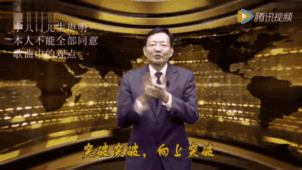
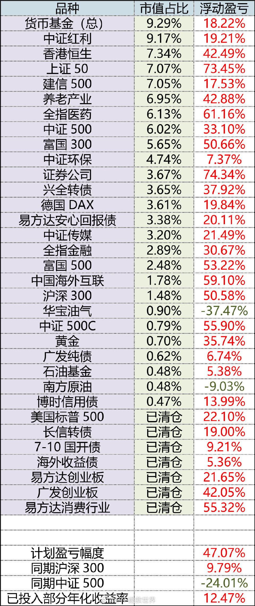
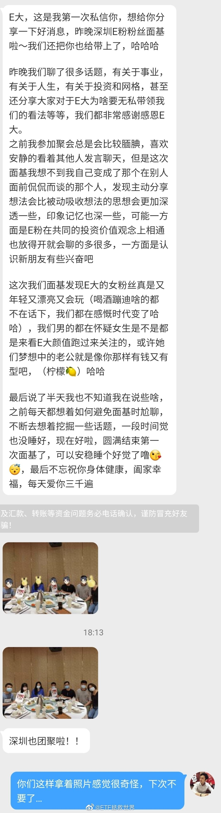

ETF拯救世界 (5687069307) @
2020-07-01 10:20:17 Wed  
url: https://weibo.com/5687069307/J99HYwfnp

除了你自己，这世上没有任何一个人或者物品可以跟随你一辈子。

有的长一点，有的短一点，最终都是生命中的过客。

所以有缘在一起的时候就要好好珍惜，感受人或者物品带给你的快乐。不愿失去就尽量争取。如果实在无法挽回的失去了，也不必太过痛苦。

一切最终都会离去，要接受这个事实。

————用 ​​​

转发[124]  评论[688]  赞[2225] 

======================================================

ETF拯救世界 (5687069307) @
2020-07-01 10:37:24 Wed  
url: https://weibo.com/5687069307/J99OVms45

音频节目有搞头吗。费了半天劲弄出来没人听就没意思了。

而且音频可以聊什么呢。到处都有的东西再做一次就是浪费生命。 ​​​

转发[11]  评论[791]  赞[1849] 

======================================================

ETF拯救世界 (5687069307) @
2020-07-01 11:19:33 Wed  
url: https://weibo.com/5687069307/J9a62t3Wk

不知道做一个理财软件要多少钱。

现在也有一些软件，不过大多数是记账而已。

记账只是最初级的。高级的应该是能记录你的所有场内场外金融交易，然后随时给出资产配置比例。

更高级的应该是根据你设定的理财目标，给出资产配置建议。

除此之外，还可以分析你的收入/消费行为，哪里做得好，哪里有问 ​​​

转发[67]  评论[776]  赞[1888] 

======================================================

ETF拯救世界 (5687069307) @
2020-07-01 11:30:52 Wed  
url: https://weibo.com/5687069307/J9aaD3WiS

今天还卖出的机构，觉悟都太低。 ​​​

转发[13]  评论[421]  赞[2297] 

======================================================

ETF拯救世界 (5687069307) @
2020-07-01 13:08:25 Wed  
url: https://weibo.com/5687069307/J9aOehhIg

希望红利和金融接力医药。百花齐放才是春。 ​​​

转发[30]  评论[514]  赞[2395] 

======================================================

ETF拯救世界 (5687069307) @
2020-07-01 14:49:24 Wed  
url: https://weibo.com/5687069307/J9btdh4z7

目前红利+50+300+金融仓位25.42%。极度舒服。

每天都能做到仓位舒服就对了。 ​​​

转发[52]  评论[881]  赞[2416] 

======================================================

ETF拯救世界 (5687069307) @
2020-07-01 15:16:10 Wed  
url: https://weibo.com/5687069307/J9bE4B81s

今天就到这儿，明儿见。

都要开开心心的。开心最重要！别人不能决定你的心情，只有你自己可以。 ​​​

转发[16]  评论[530]  赞[2321] 

======================================================

ETF拯救世界 (5687069307) @
2020-07-01 19:48:05 Wed  
url: https://weibo.com/5687069307/J9dqrBQQM

如果你认可我，请不要交钱给剽窃我文字拿去贩卖的那些人。

我的很多投资记录确实不卖，但有些朋友可能真的想看。我会考虑一个解决方法，不排除免费公开。

无论如何，不要花钱去买。因为那些剽窃的人是真正的人渣。请不要把你的钱给人渣。 ​​​

转发[19]  评论[956]  赞[3960] 

======================================================

ETF拯救世界 (5687069307) @
2020-07-02 00:08:40 Thu  
url: https://weibo.com/5687069307/J9f8dyjGL

还没睡的敢不敢说说你在干嘛。 ​​​

转发[17]  评论[1151]  赞[2494] 

======================================================

ETF拯救世界 (5687069307) @
2020-07-02 09:26:46 Thu  
url: https://weibo.com/5687069307/J9iMKwFuf

今日生活小贴士：

不要总想着贪便宜，很多时候贪小便宜吃大亏。

力所能及的范围内买最好的东西。 ​​​

转发[56]  评论[448]  赞[2115] 

======================================================

ETF拯救世界 (5687069307) @
2020-07-02 10:05:06 Thu  
url: https://weibo.com/5687069307/J9j2jm7ZA

之前很多人吐槽红利，说什么价值投资没戏了。

其实你知不知道，在2019年3、4月，创业板/医药这样近期大热门还被压在地板上摩擦的时候，富国红利净值几乎已经是历史最高了，挡在前面的只有2015年5月的几个交易日而已。

（创业板还需要涨66%才能回去）

人家早就回到股灾前了，怎么就不行了呢。

这就 ​​​

转发[285]  评论[517]  赞[1988] 

======================================================

ETF拯救世界 (5687069307) @
2020-07-02 10:13:35 Thu  
url: https://weibo.com/5687069307/J9j5KCHnv

回复@ghost0128:没什么好说的，不贵不便宜，趋势不错，拿着呗，别想它，就当丢了。//@ghost0128:益达，说说500吧，创新高了

------------------------------------------------------
转推：
>  @ETF拯救世界 (5687069307)
>  2020-07-02 10:05:06 Thu  
>  url: https:/weibo.com/5687069307/J9j2jm7ZA/

>  之前很多人吐槽红利，说什么价值投资没戏了。
>  
>  其实你知不知道，在2019年3、4月，创业板/医药这样近期大热门还被压在地板上摩擦的时候，富国红利净值几乎已经是历史最高了，挡在前面的只有2015年5月的几个交易日而已。
>  
>  （创业板还需要涨66%才能回去）
>  
>  人家早就回到股灾前了，怎么就不行了呢。
>  
>  这就 ​​​

转发[28]  评论[212]  赞[1192] 

======================================================

ETF拯救世界 (5687069307) @
2020-07-02 11:03:12 Thu  
url: https://weibo.com/5687069307/J9jpTnAms

两融余额4年半新高，赌徒回来了。 ​​​

转发[101]  评论[699]  赞[2477] 

======================================================

ETF拯救世界 (5687069307) @
2020-07-02 13:50:11 Thu  
url: https://weibo.com/5687069307/J9kvGfc38

很多人低位不买，涨起来后加杠杆买。

你说是不是很奇怪。

这么做生意能不赔吗。 ​​​

转发[144]  评论[518]  赞[2197] 

======================================================

ETF拯救世界 (5687069307) @
2020-07-02 14:18:34 Thu  
url: https://weibo.com/5687069307/J9kHcmVUq

回复@慕容婷菲:是啊。只有不涨你才能多买，只有多买未来才能多赚。但是很多人总也想不明白这个简单的道理。//@慕容婷菲:这两天很深刻的体会到益达说的熊市越长对投资越有利，只可惜跟车完，自己买的股票时机也没把握好。好想这个下跌的行情持续长一点呀

------------------------------------------------------
转推：
>  @ETF拯救世界 (5687069307)
>  2020-07-02 13:50:11 Thu  
>  url: https:/weibo.com/5687069307/J9kvGfc38/

>  很多人低位不买，涨起来后加杠杆买。
>  
>  你说是不是很奇怪。
>  
>  这么做生意能不赔吗。 ​​​

转发[66]  评论[162]  赞[1169] 

======================================================

ETF拯救世界 (5687069307) @
2020-07-02 14:27:11 Thu  
url: https://weibo.com/5687069307/J9kKGERJs

我最不理解“空仓”的人。

空仓意味着你认为100%会跌。

哪怕只有1%的机会涨，你也至少应该买个1%吧？

不，人家就空仓。

喷了，这得对自己的预知能力多自信啊。 ​​​

转发[140]  评论[372]  赞[1906] 

======================================================

ETF拯救世界 (5687069307) @
2020-07-02 14:33:49 Thu  
url: https://weibo.com/5687069307/J9kNo0Etb

既然杠杆已经开始加了，下一步就是观察你周围之前对股市没有兴趣的人什么时候开始聊股市。

开始聊是一个信号，但不是关键的信号。更重要的是他们什么时候真的拿钱入市。

拿钱入市很重要，但还不是最关键的信号。

最关键的信号是他们什么时候开始吹赚了多少钱同时向你推荐股票或者基金，这就有点危险 ​​​

转发[941]  评论[1119]  赞[5542] 

======================================================

ETF拯救世界 (5687069307) @
2020-07-02 15:07:14 Thu  
url: https://weibo.com/5687069307/J9l0WBDTB

与很多人的雄心壮志不同，我对自己的要求已经说了十几年了，那就是：

熊市不赔钱，牛市尽量跟上指数涨幅。

对，没有要求自己牛市远超指数（300+500）涨幅，就是大概跟上80%、90%就行。所以如果你对自己要求很高，希望赚的远超指数，请不要再关注我。

第三轮，熊市不赔钱又做到了。至于牛市是不是能 ​​​

转发[243]  评论[1108]  赞[4514] 

======================================================

ETF拯救世界 (5687069307) @
2020-07-02 19:00:31 Thu  
url: https://weibo.com/5687069307/J9mxDuWsf

这几天给且慢录了一小段音频，给几位朋友听了一下，反应都不错，都说大部分关注我的朋友会喜欢。

过几天且慢应该会放出来。

因为没录过，所以过程中也觉得很新鲜有意思。所以我在想如果大多数人听过后真觉得有搞头，然后等我懒癌症状轻一点以后多录一些，找个平台放上去。

没什么别的目的，如果有人 ​​​

转发[20]  评论[1563]  赞[3721] 

======================================================

ETF拯救世界 (5687069307) @
2020-07-02 19:49:34 Thu  
url: https://weibo.com/5687069307/J9mRyj0vs

其实新冠就是外星人的先遣部队。//@割肉艺术家2020: //@大麦哲伦星系的水兵月:结合之前新墨西哥州的剧情，所以下半年要上演外星人入侵剧情了吗？然后外星人被新冠灭掉……？

------------------------------------------------------
转推：
>  @ ()
>  2020-07-02 17:37:13 Thu  
>  url: 

>  抱歉，作者已设置仅展示半年内微博，此微博已不可见。 ​​​

转发[26]  评论[212]  赞[766] 

======================================================

ETF拯救世界 (5687069307) @
2020-07-03 09:41:16 Fri  
url: https://weibo.com/5687069307/J9sj8ijvm

现在回头看，有没有比当时懂一点。

------------------------------------------------------
转推：
>  @ETF拯救世界 (5687069307)
>  2020-05-08 10:38:12 Fri  
>  url: https:/weibo.com/5687069307/J0WKr7dXh/

>  我看到有人说：我买的xxx三年了还没挣钱怎么办。
>  
>  有些话我说过无数次了，再说一次。
>  
>  权益类投资，你以为是存银行或者买理财吗。资产每年以固定的斜率上升？
>  
>  三年不开张，开张吃三年。你以为是乱说？
>  
>  贵州茅台，你从08年定投到14年，几乎都赚不到钱。中间还有无数坑。2014年你看着创业板2年多已经翻 ​​​

转发[113]  评论[412]  赞[1576] 

======================================================

ETF拯救世界 (5687069307) @
2020-07-03 09:59:49 Fri  
url: https://weibo.com/5687069307/J9sqFwI6W

网格新加的那个指数看来终究是买不到了。 ​​​

转发[8]  评论[454]  赞[1553] 

======================================================

ETF拯救世界 (5687069307) @
2020-07-03 10:03:10 Fri  
url: https://weibo.com/5687069307/J9ss1tuEY

有朋友内心充满焦灼：赚了几十个点了，卖不卖啊。

跌的时候反而没那么焦虑。

每个人的情况不同，没有一个标准答案。所以你不要问我，也不要问任何人，问你自己。

问问自己，从现在开始，涨36.7%，跌31.85%，哪种情况会后悔。如果是涨了会后悔，就不要动或者加仓。如果跌了会后悔，那就减仓。

加减 ​​​

转发[139]  评论[526]  赞[1851] 

======================================================

ETF拯救世界 (5687069307) @
2020-07-03 10:08:42 Fri  
url: https://weibo.com/5687069307/J9sugCSxC

刚开始做投资的时候，你会上蹿下跳，心惊胆战每一天。

等你因缘际会入了门，会忍不住想去劝那些上蹿下跳的人跟你一起入门。

再往前走，你会不想再劝任何人，只是觉得上蹿下跳有点可笑。

最终，你不会再关心别人怎么做，只会冷静淡然的独自走在投资这条开满鲜花的路上。 ​​​

转发[206]  评论[900]  赞[2849] 

======================================================

ETF拯救世界 (5687069307) @
2020-07-03 10:49:25 Fri  
url: https://weibo.com/5687069307/J9sKNq4Dr

医药：“我还行，再扶我起来看看” ​​​

转发[10]  评论[545]  赞[2159] 

======================================================

ETF拯救世界 (5687069307) @
2020-07-03 11:05:55 Fri  
url: https://weibo.com/5687069307/J9sRv8Njy

养老净值5年新高。 ​​​

转发[12]  评论[322]  赞[1915] 

======================================================

ETF拯救世界 (5687069307) @
2020-07-03 11:11:10 Fri  
url: https://weibo.com/5687069307/J9sTCF9nt

落霞与孤鹜齐飞 ，秋水共长天一色 ​​​

转发[11]  评论[474]  赞[2204] 

======================================================

ETF拯救世界 (5687069307) @
2020-07-03 11:14:54 Fri  
url: https://weibo.com/5687069307/J9sV8z7iB

一切的不淡定都来自于你对未知未来的恐惧。 ​​​

转发[76]  评论[539]  赞[2780] 

======================================================

ETF拯救世界 (5687069307) @
2020-07-03 12:47:56 Fri  
url: https://weibo.com/5687069307/J9twU8n6h

你可能不知道，最后一次买的那份券商，收益率已经超过80%了。

那是最近6年最低的一天，那是名副其实的钻石坑。 ​​​

转发[34]  评论[834]  赞[3071] 

======================================================

ETF拯救世界 (5687069307) @
2020-07-03 14:07:02 Fri  
url: https://weibo.com/5687069307/J9u313oSZ

308/1588连专科都上不了…山东考大学真难啊

------------------------------------------------------
转推：
>  @央视新闻 (2656274875)
>  2020-07-03 13:44:05 Fri  
>  url: https:/weibo.com/2656274875/J9tTH9Z9X/

>  【#山东通报苟晶反映被顶替上学情况# #苟晶原班主任被采取强制措施# #山东苟晶事件15人被处理# 苟晶1997年未填志愿选择复读，成绩被冒用】2020年6月24日，山东省纪委监委机关、省教育厅、省公安厅等部门单位组成的工作专班，与济宁市、任城区有关单位一起，对苟晶反映的“连续两年被冒名顶替上学”等问 ​​​

转发[31]  评论[455]  赞[1139] 

======================================================

ETF拯救世界 (5687069307) @
2020-07-03 16:43:11 Fri  
url: https://weibo.com/5687069307/J9v4ogfP9

分享图片 ​​​

转发[36]  评论[558]  赞[1928] 

+++++++++++++++++++++++++++++++++++++++++++++++++++++

图片：

======================================================

ETF拯救世界 (5687069307) @
2020-07-03 17:56:44 Fri  
url: https://weibo.com/5687069307/J9vyfg4dD

这篇文章很久前写的。告诉我，最重要的那三个字是什么

------------------------------------------------------
转推：
>  @且慢管家 (6186312580)
>  2020-07-03 17:45:17 Fri  
>  url: https:/weibo.com/6186312580/J9vtBaBEN/

>  #且慢分享# E大：“我几乎所有的财富，都来自于耐心。 而我最大的损失，也是因为没有耐心。 ”http://t.cn/A6ywjigj ​​​

转发[302]  评论[1266]  赞[3313] 

======================================================

ETF拯救世界 (5687069307) @
2020-07-04 09:40:55 Sat  
url: https://weibo.com/5687069307/J9BJumMGJ

“就算我夸大其词了，你又损失了什么，你们又损失了什么。”这个人意识中是没有正义的，只有“利益”。衡量一切的标准就是利益，没有其它。

------------------------------------------------------
转推：
>  @想要自由的鲤鱼王 (7269848330)
>  2020-07-03 22:06:02 Fri  
>  url: https:/weibo.com/7269848330/J9xbr6tW0/

>  苟晶本人对于夸大其词的回应  承认自己一开始发表的言论确实有夸大其词 ，并表示：你又损失了什么呢？ 你们又损失了什么呢？ 网友表示：请给我们的同情心和正义感一份交代。 你怎么看？苟晶质问那些质疑她的人：你为谁工作？ 那么苟晶此次选择在这个时候站出来发声是否也有背后的因素呢？ [疑问]#苟晶# ​​​

转发[168]  评论[381]  赞[1501] 

======================================================

ETF拯救世界 (5687069307) @
2020-07-04 09:50:37 Sat  
url: https://weibo.com/5687069307/J9BNqm2eC

回复@路过秋天的少年:看这段视频前我甚至觉得为了干掉坏人，用一些手段是可以接受的。但她这个态度让我恶心了。//@路过秋天的少年:一个人受欺负了的时候，正义解决不了问题的时候，估计大多数人都会选择非正规途径来解决。除非愿意默默承受被欺负。

------------------------------------------------------
转推：
>  @想要自由的鲤鱼王 (7269848330)
>  2020-07-03 22:06:02 Fri  
>  url: https:/weibo.com/7269848330/J9xbr6tW0/

>  苟晶本人对于夸大其词的回应  承认自己一开始发表的言论确实有夸大其词 ，并表示：你又损失了什么呢？ 你们又损失了什么呢？ 网友表示：请给我们的同情心和正义感一份交代。 你怎么看？苟晶质问那些质疑她的人：你为谁工作？ 那么苟晶此次选择在这个时候站出来发声是否也有背后的因素呢？ [疑问]#苟晶# ​​​

转发[50]  评论[312]  赞[1429] 

======================================================

ETF拯救世界 (5687069307) @
2020-07-04 10:01:23 Sat  
url: https://weibo.com/5687069307/J9BRNjsgW

话说回来，对坏人，一定要狠。用各种合法的手段干掉他。

如果坏人不死，好人就要被欺负。

没有犯错的人被欺负，是不公平的。公平非常非常重要。

不要做坏人，也不能做被任意欺负的老实人。 ​​​

转发[80]  评论[408]  赞[2236] 

======================================================

ETF拯救世界 (5687069307) @
2020-07-04 11:53:39 Sat  
url: https://weibo.com/5687069307/J9CBmAXDJ

想放下一切，爱谁谁，开车去大西北。

越来越想。 ​​​

转发[29]  评论[1027]  赞[2650] 

======================================================

ETF拯救世界 (5687069307) @
2020-07-04 18:40:33 Sat  
url: https://weibo.com/5687069307/J9FgwxGVm

一定要严惩。另外，系安全带。

------------------------------------------------------
转推：
>  @北京人不知道的北京事儿 (1662214194)
>  2020-07-04 16:17:19 Sat  
>  url: https:/weibo.com/1662214194/J9Eko7uDa/

>  昨晚10点半北京房山京良路，一40岁男子酒后驾驶一辆丰田SUV逆行，正面撞上一辆正常行驶的奔驰，车上是一家三口，最终车里的小孩和父亲抢救无效死亡[蜡烛][蜡烛]。。。相撞后这男的非但没救人还弃车逃离现场，今天凌晨2点被警方抓获！血液酒精含量105. 4mg/100ml！！这样的畜生不判死刑天理难容！！！ ​​​

转发[53]  评论[269]  赞[915] 

======================================================

ETF拯救世界 (5687069307) @
2020-07-05 12:01:29 Sun  
url: https://weibo.com/5687069307/J9M533KTI

正常是这样。 http://t.cn/A6yUlavt

------------------------------------------------------
转推：
>  @ ()
>  2020-07-05 10:17:24 Sun  
>  url: 

>  抱歉，作者已设置仅展示半年内微博，此微博已不可见。 ​​​

转发[28]  评论[344]  赞[1334] 

======================================================

ETF拯救世界 (5687069307) @
2020-07-05 14:04:44 Sun  
url: https://weibo.com/5687069307/J9MT4fmvp

大周末的，闲着也是闲着，打开公众号看看也挺好的。 ​​​

转发[13]  评论[1138]  赞[3272] 

======================================================

ETF拯救世界 (5687069307) @
2020-07-05 17:42:37 Sun  
url: https://weibo.com/5687069307/J9OjvsGGf

我不是说谨慎不好。

但做人，总是要乐观打底，谨慎行事。

如果总是悲观，永远担心崩盘，股票不敢买，基金不敢投，甚至好多年过去一直希望房子崩盘也不敢入手，最终恐怕就离财富渐行渐远了。

很多时候，网上悲观的论调会很吃香。乐观一点就会被嘲笑为鸡汤。

这个世界黑暗的一面很黑，但其实光明的一 ​​​

转发[213]  评论[706]  赞[2941] 

======================================================

ETF拯救世界 (5687069307) @
2020-07-05 21:59:36 Sun  
url: https://weibo.com/5687069307/J9PZOCyhO

转发微博

------------------------------------------------------
转推：
>  @风闻社区 (6508016609)
>  2020-07-05 12:09:03 Sun  
>  url: https:/weibo.com/6508016609/J9M874TwK/

>  “港区国安法”就像一面大镜子：支持中国的和反对中国的
>  @后沙月光本尊 ：
>  一，非洲国家基本上都支持中国；
>  
>  二，伊斯兰世界几乎全部支持中国；
>  
>  三，G7集团成员国除了意大利，全部反对中国；
>  
>  四，波罗地海三国及西欧、北欧国家反对中国；
>  
>  五，亚洲地区除了日本，所有国家或者支持，或者不反对。
>  
>  六 ​​​

转发[110]  评论[167]  赞[1103] 

======================================================

ETF拯救世界 (5687069307) @
2020-07-06 09:26:16 Mon  
url: https://weibo.com/5687069307/J9UuxzuMd

到哪步了。

------------------------------------------------------
转推：
>  @ETF拯救世界 (5687069307)
>  2020-07-02 14:33:49 Thu  
>  url: https:/weibo.com/5687069307/J9kNo0Etb/

>  既然杠杆已经开始加了，下一步就是观察你周围之前对股市没有兴趣的人什么时候开始聊股市。
>  
>  开始聊是一个信号，但不是关键的信号。更重要的是他们什么时候真的拿钱入市。
>  
>  拿钱入市很重要，但还不是最关键的信号。
>  
>  最关键的信号是他们什么时候开始吹赚了多少钱同时向你推荐股票或者基金，这就有点危险 ​​​

转发[63]  评论[644]  赞[1843] 

======================================================

ETF拯救世界 (5687069307) @
2020-07-06 09:35:01 Mon  
url: https://weibo.com/5687069307/J9Uy5r8ez

你看看现在拔地而起的几个品种，一天涨一年的理财收益，“三年不开张，开张吃三年”。所以急什么，花开自有时。

------------------------------------------------------
转推：
>  @ETF拯救世界 (5687069307)
>  2020-05-08 10:38:12 Fri  
>  url: https:/weibo.com/5687069307/J0WKr7dXh/

>  我看到有人说：我买的xxx三年了还没挣钱怎么办。
>  
>  有些话我说过无数次了，再说一次。
>  
>  权益类投资，你以为是存银行或者买理财吗。资产每年以固定的斜率上升？
>  
>  三年不开张，开张吃三年。你以为是乱说？
>  
>  贵州茅台，你从08年定投到14年，几乎都赚不到钱。中间还有无数坑。2014年你看着创业板2年多已经翻 ​​​

转发[101]  评论[369]  赞[2349] 

======================================================

ETF拯救世界 (5687069307) @
2020-07-06 09:44:30 Mon  
url: https://weibo.com/5687069307/J9UBWpXXD

我说的很多话一开始你都不信。觉得我是为有些持仓品种涨幅不好找借口，又或者是熊市忽悠你买入不安好心。

时间长了你才会发现，原来都是真的。

但也晚了。

缘分很重要。 ​​​

转发[45]  评论[745]  赞[2279] 

======================================================

ETF拯救世界 (5687069307) @
2020-07-06 09:58:18 Mon  
url: https://weibo.com/5687069307/J9UHxo9jW

有些人深谙“价值投资”之道。

群众一买他就卖，说着“别人贪婪我恐惧”，总想让群众为他买单。

殊不知，人民群众才是历史的书写者。

所以，群众情绪刚开始激动起来的时候，不要逆行，容易被踩死。 ​​​

转发[126]  评论[430]  赞[2324] 

======================================================

ETF拯救世界 (5687069307) @
2020-07-06 10:02:52 Mon  
url: https://weibo.com/5687069307/J9UJogH0Z

其实我们来投资，不要在人群中被潮流，被七嘴八舌裹挟着一会向北，一会向南。你的脑子会乱，腿也会不听使唤。

你要找一个很高的地方坐好，看着下面的人和市场。你站的高了，才能看清更大的战场。站得越高，看的越全面。 ​​​

转发[185]  评论[472]  赞[2688] 

======================================================

ETF拯救世界 (5687069307) @
2020-07-06 10:22:25 Mon  
url: https://weibo.com/5687069307/J9URkAQVE

回复@归舟听雨:你说对了。所以不要问为什么涨，也不要听分析师分析为什么涨，他们只是因为涨了往回找理由。短期不要问为什么，执行自己的投资策略就完事。

------------------------------------------------------
转推：
>  @ETF拯救世界 (5687069307)
>  2020-07-06 10:02:52 Mon  
>  url: https:/weibo.com/5687069307/J9UJogH0Z/

>  其实我们来投资，不要在人群中被潮流，被七嘴八舌裹挟着一会向北，一会向南。你的脑子会乱，腿也会不听使唤。
>  
>  你要找一个很高的地方坐好，看着下面的人和市场。你站的高了，才能看清更大的战场。站得越高，看的越全面。 ​​​

转发[57]  评论[142]  赞[1314] 

======================================================

ETF拯救世界 (5687069307) @
2020-07-06 10:29:46 Mon  
url: https://weibo.com/5687069307/J9UUjiLRP

经过我用matlab严谨分析，得出结论：

虽然有三、四十万在公众号和微博关注我的人，其实其中只有不超过5000人是真把我当朋友的。

其他人都是看热闹顺带着捡点钱……

1%吧。 ​​​

转发[64]  评论[2566]  赞[4861] 

======================================================

ETF拯救世界 (5687069307) @
2020-07-06 11:20:45 Mon  
url: https://weibo.com/5687069307/J9Vf0hTpn

意思不大，不看了。

挣点钱别大惊小怪，别嘚瑟。

中午买点好吃的奖励一下自己就行。 ​​​

转发[66]  评论[824]  赞[2914] 

======================================================

ETF拯救世界 (5687069307) @
2020-07-06 11:49:16 Mon  
url: https://weibo.com/5687069307/J9VqA3sbX

回复@原上孤烟:你就顺着他说，夸他，让他请你吃好吃的。你什么都没损失，朋友高兴了，你吃到好吃的了，其实你也没少挣。所有人都开心。但你要跟他说你挣得比他多，他不高兴，没准还要让你请客，多不好。

------------------------------------------------------
转推：
>  @ETF拯救世界 (5687069307)
>  2020-07-06 11:20:45 Mon  
>  url: https:/weibo.com/5687069307/J9Vf0hTpn/

>  意思不大，不看了。
>  
>  挣点钱别大惊小怪，别嘚瑟。
>  
>  中午买点好吃的奖励一下自己就行。 ​​​

转发[23]  评论[190]  赞[1149] 

======================================================

ETF拯救世界 (5687069307) @
2020-07-06 12:03:31 Mon  
url: https://weibo.com/5687069307/J9Vwmw6uI

回复@原上孤烟:[微笑] 一切尽在掌握。//@原上孤烟:回复@ETF拯救世界:为了缓解尴尬的气氛，我说你这半个月的操作还是很犀利的，朋友说改天请我吃饭，交流交流，神了😂

------------------------------------------------------
转推：
>  @ETF拯救世界 (5687069307)
>  2020-07-06 11:20:45 Mon  
>  url: https:/weibo.com/5687069307/J9Vf0hTpn/

>  意思不大，不看了。
>  
>  挣点钱别大惊小怪，别嘚瑟。
>  
>  中午买点好吃的奖励一下自己就行。 ​​​

转发[8]  评论[236]  赞[1245] 

======================================================

ETF拯救世界 (5687069307) @
2020-07-06 13:37:50 Mon  
url: https://weibo.com/5687069307/J9W8EdVQV

做好心理准备，一亿股神即将出现。 ​​​

转发[54]  评论[634]  赞[2873] 

======================================================

ETF拯救世界 (5687069307) @
2020-07-06 14:01:40 Mon  
url: https://weibo.com/5687069307/J9Wikkxu8

回复@Qripretty_Origimal:不知道。不过2015年6月至今，A股跌幅中位数是55%。只有15%的股票是上涨的。如果当时被套的人高抛低吸都解套了，那就没有亏钱的了。//@Qripretty_Origimal:是不是现在市场上就没有亏钱的了。。。

------------------------------------------------------
转推：
>  @ETF拯救世界 (5687069307)
>  2020-07-06 13:37:50 Mon  
>  url: https:/weibo.com/5687069307/J9W8EdVQV/

>  做好心理准备，一亿股神即将出现。 ​​​

转发[19]  评论[127]  赞[946] 

======================================================

ETF拯救世界 (5687069307) @
2020-07-06 14:17:49 Mon  
url: https://weibo.com/5687069307/J9WoShSDt

两融余额再次突破12000亿。

上次上升趋势中突破12000亿是2015年3月，上次反弹趋势中突破12000亿是2015年11月。

自己品味一下。 ​​​

转发[217]  评论[374]  赞[2201] 

======================================================

ETF拯救世界 (5687069307) @
2020-07-06 14:19:33 Mon  
url: https://weibo.com/5687069307/J9WpA4h45

关于市场本身的钱/股比例数据需要关注两个。

一个是两融余额，一个是大股东减持数量。 ​​​

转发[411]  评论[533]  赞[2641] 

======================================================

ETF拯救世界 (5687069307) @
2020-07-06 14:43:36 Mon  
url: https://weibo.com/5687069307/J9Wzle6Nr

看到这样的我就[怒]

有个女儿疼都疼不过来，还这样。[哼] ​​​

转发[40]  评论[799]  赞[3276] 

+++++++++++++++++++++++++++++++++++++++++++++++++++++

图片：

======================================================

ETF拯救世界 (5687069307) @
2020-07-06 14:58:59 Mon  
url: https://weibo.com/5687069307/J9WFAgLAS

如果孩子对自己不好，那就18岁GD，自己去养活自己。我也不需要你养老。

就此一条标准。

因为男女对孩子态度有区别的，都是辣鸡。 ​​​

转发[23]  评论[359]  赞[2363] 

======================================================

ETF拯救世界 (5687069307) @
2020-07-06 15:17:51 Mon  
url: https://weibo.com/5687069307/J9WNfc465

收盘了，人很空虚。 ​​​

转发[30]  评论[897]  赞[3361] 

======================================================

ETF拯救世界 (5687069307) @
2020-07-06 16:05:20 Mon  
url: https://weibo.com/5687069307/J9X6w6bFp

可以给自己买点一直想买的小礼物。拿在手里摸一摸。

开心最重要。 ​​​

转发[34]  评论[1406]  赞[4108] 

======================================================

ETF拯救世界 (5687069307) @
2020-07-07 09:03:06 Tue  
url: https://weibo.com/5687069307/Ja3LD4KLA

未来，在微博上，我尽量不再对走势发表看法，也不再对各位操作做什么建议。

虽然我一直尽量明确，几乎不会模棱两可，但因为人太多，理解能力千差万别。还有人会将我的话强行理解为自己潜意识中的判断。为了避免误会，我还是少说。

至于建议就更是如此。我鼓励你“拿住”，虽然也许中长期看没问题，但 ​​​

转发[32]  评论[948]  赞[3047] 

+++++++++++++++++++++++++++++++++++++++++++++++++++++

图片：

======================================================

ETF拯救世界 (5687069307) @
2020-07-07 09:34:07 Tue  
url: https://weibo.com/5687069307/Ja3YdqBWt

股市经典问题：

“都赚钱了，谁赔了？”

问这个问题的，未来你会知道，别急。 ​​​

转发[60]  评论[596]  赞[2353] 

======================================================

ETF拯救世界 (5687069307) @
2020-07-07 09:52:51 Tue  
url: https://weibo.com/5687069307/Ja45P3Ea0

其实做投资久了，你就会发现这件事跟其他事一样。

想要做好，必不可少的一个东西叫做“信念”。

没有信念，没有梦想，没有坚持，什么都做不好。

做投资也是如此。没有信念，波动两下就被洗下去了。赚什么钱。 ​​​

转发[193]  评论[624]  赞[2673] 

======================================================

ETF拯救世界 (5687069307) @
2020-07-07 10:30:22 Tue  
url: https://weibo.com/5687069307/Ja4l3aTpT

昨天那条关于女儿的微博评论里，有位朋友说，

“社会规则就是这样的。我爸爸不把财产分给我姐姐，但我姐夫的爸爸会把财产给姐夫，最后都是一样的”

我想说，这是狗屁的社会规则！

如果我有女儿，我才不会管这bull shit社会规则。我只知道，她是我的女儿，我不会因为她老公拿到老公家里的财产，就不 ​​​

转发[102]  评论[926]  赞[4039] 

======================================================

ETF拯救世界 (5687069307) @
2020-07-07 10:58:05 Tue  
url: https://weibo.com/5687069307/Ja4wiyeYB

两融余额12418。这样涨下去，2-3天就能突破13000亿。

上次上升趋势中首次突破13000亿是2015年3月。 ​​​

转发[162]  评论[603]  赞[2861] 

======================================================

ETF拯救世界 (5687069307) @
2020-07-07 13:10:23 Tue  
url: https://weibo.com/5687069307/Ja5o0b82K

意……意思……不……大……吧…… ​​​

转发[8]  评论[494]  赞[2148] 

======================================================

ETF拯救世界 (5687069307) @
2020-07-07 13:28:52 Tue  
url: https://weibo.com/5687069307/Ja5vvdZlX

记住，舒服最重要。

如果实在实在特别难受，就卖点。

多大点事儿。你买股票也不是只买100股，买基金也不是只买10块钱。总有余地让你稍微卖点。

总之要让自己舒服。

无论对错，记住经验教训，以后就做的更好了。

赚点钱不至于的，多大点事儿啊。一天天上蹿下跳的，中华复兴还指望你呢。 ​​​

转发[50]  评论[680]  赞[2665] 

======================================================

ETF拯救世界 (5687069307) @
2020-07-07 15:29:32 Tue  
url: https://weibo.com/5687069307/Ja6iu0cti

高考前半年，我开始找人大附的退休老师补某个弱科。

一开始一起上课的有七位同学，到最后一节课只剩我一个人。

这次补课效果太好，导致这门课成绩比一模高了几十分，总成绩突飞猛进。

也正因为总成绩上去了，居然正好踩到母校的调档线，一分不差。

从那以后我就明白一件事，影响我一生，

努力，坚 ​​​

转发[133]  评论[582]  赞[3714] 

======================================================

ETF拯救世界 (5687069307) @
2020-07-07 16:04:34 Tue  
url: https://weibo.com/5687069307/Ja6wHtD3E

还有印象很深的是高三跟女朋友在不上课的下午去公园。

坐在长椅上我认真看书，她不停捣乱，真讨厌。[doge] ​​​

转发[8]  评论[871]  赞[3772] 

======================================================

ETF拯救世界 (5687069307) @
2020-07-07 17:10:11 Tue  
url: https://weibo.com/5687069307/Ja6Xl3waE

震惊，我和孟岩的高中直线距离几百米。 ​​​

转发[9]  评论[599]  赞[2961] 

======================================================

ETF拯救世界 (5687069307) @
2020-07-07 18:29:13 Tue  
url: https://weibo.com/5687069307/Ja7tqdupF

我想来想去，还是建议你去试试。别浪费了这么好的行情。真的。我这里未必是你的最优选择。趁着年轻闲着也是闲着，试试呗。

------------------------------------------------------
转推：
>  @ETF拯救世界 (5687069307)
>  2020-06-23 17:10:26 Tue  
>  url: https:/weibo.com/5687069307/J7YYueBMw/

>  强烈建议做指数的时候也玩个股。
>  
>  这样你就不会在未来觉得自己是个被指数投资耽误的股神了。会减少很多焦躁的情绪。
>  
>  毕竟，每天几十只涨停，如果你炒股，没准隔三差五就能买到。 ​​​

转发[25]  评论[630]  赞[2100] 

======================================================

ETF拯救世界 (5687069307) @
2020-07-07 19:45:36 Tue  
url: https://weibo.com/5687069307/Ja7Yqsbkw

送你700分，你去清华第一学期考完试就会退学。还是踏踏实实拿着700万过朴实无华且枯燥的日子吧。

------------------------------------------------------
转推：
>  @北京人不知道的北京事儿 (1662214194)
>  2020-07-07 19:40:14 Tue  
>  url: https:/weibo.com/1662214194/Ja7Wf4aul/

>  高考700分和存款700万，你选哪个？[摊手] http://t.cn/A6ytxhwG ​​​

转发[23]  评论[504]  赞[1623] 

======================================================

ETF拯救世界 (5687069307) @
2020-07-07 21:47:49 Tue  
url: https://weibo.com/5687069307/Ja8M1B3uM

建信今天又跑赢0.8%。最近算是知耻后勇了 ​​​

转发[6]  评论[351]  赞[1948] 

======================================================

ETF拯救世界 (5687069307) @
2020-07-08 06:08:46 Wed  
url: https://weibo.com/5687069307/Jac3mqg9C

特别神奇，为什么都喜欢买新基金。

------------------------------------------------------
转推：
>  @ ()
>  2020-07-08 06:05:23 Wed  
>  url: 

>  抱歉，作者已设置仅展示半年内微博，此微博已不可见。 ​​​

转发[129]  评论[585]  赞[1530] 

======================================================

ETF拯救世界 (5687069307) @
2020-07-08 09:34:34 Wed  
url: https://weibo.com/5687069307/JadoTBhK2

既然底部买好了，也涨起来了，现阶段你要做的就是观察。

观察市场、数据、其他人的情绪、新闻中隐藏的信息。

观察寻找一切有助于你判断的蛛丝马迹 ​​​

转发[157]  评论[700]  赞[3157] 

======================================================

ETF拯救世界 (5687069307) @
2020-07-08 09:52:49 Wed  
url: https://weibo.com/5687069307/Jadwj2Uyq

转发微博

------------------------------------------------------
转推：
>  @ ()
>  2020-07-08 04:59:20 Wed  
>  url: 

>  该账号因被投诉违反法律法规和《微博社区公约》的相关规定，现已无法查看。查看帮助 https://kefu.weibo.com/faqdetail?id=13216

转发[315]  评论[185]  赞[1454] 

======================================================

ETF拯救世界 (5687069307) @
2020-07-08 10:11:40 Wed  
url: https://weibo.com/5687069307/JadDXBzOe

果然牛市来了。最近几天，gzh和微博关注人数都在暴增。

无数人私信在问150和S还能不能跟了。

其实周日已经说的很清楚，再说一次。

不能了。

除非后面大幅下跌，也许我还会在两个策略上少量加仓。否则我对你的买入建仓已经没有任何价值。我对你买什么也没有任何建议。

而且说句实话，我不喜欢市场 ​​​

转发[173]  评论[1506]  赞[4156] 

======================================================

ETF拯救世界 (5687069307) @
2020-07-08 10:23:14 Wed  
url: https://weibo.com/5687069307/JadIF1xOt

回复@我有只叫多多的猫:上班摸鱼才是赚老板的钱。每天日夜无休忙工作是帮老板赚钱。[doge]//@我有只叫多多的猫:回复@遇见你温柔如初:你不上班的吗[喵喵]每天住在微博老板给饭吃吗[doge]

------------------------------------------------------
转推：
>  @ETF拯救世界 (5687069307)
>  2020-07-08 10:11:40 Wed  
>  url: https:/weibo.com/5687069307/JadDXBzOe/

>  果然牛市来了。最近几天，gzh和微博关注人数都在暴增。
>  
>  无数人私信在问150和S还能不能跟了。
>  
>  其实周日已经说的很清楚，再说一次。
>  
>  不能了。
>  
>  除非后面大幅下跌，也许我还会在两个策略上少量加仓。否则我对你的买入建仓已经没有任何价值。我对你买什么也没有任何建议。
>  
>  而且说句实话，我不喜欢市场 ​​​

转发[34]  评论[220]  赞[1242] 

======================================================

ETF拯救世界 (5687069307) @
2020-07-08 10:35:31 Wed  
url: https://weibo.com/5687069307/JadNDuYhY

牛市小贴士：

跟着新手买，新手买什么你买什么，赚的最多。

不要跟老手。一个个缩头缩脑的没出息。 ​​​

转发[75]  评论[626]  赞[3664] 

======================================================

ETF拯救世界 (5687069307) @
2020-07-08 10:51:31 Wed  
url: https://weibo.com/5687069307/JadU8dB1J

500，i了。[心] ​​​

转发[23]  评论[658]  赞[2406] 

======================================================

ETF拯救世界 (5687069307) @
2020-07-08 14:08:17 Wed  
url: https://weibo.com/5687069307/Jafc04YbO

“指数不能买，涨的太慢。” ​​​

转发[17]  评论[674]  赞[2461] 

======================================================

ETF拯救世界 (5687069307) @
2020-07-08 14:42:55 Wed  
url: https://weibo.com/5687069307/Jafq3vpXJ

还有没买的小礼物赶紧买。明天跌了就没理由买了。 ​​​

转发[15]  评论[687]  赞[2248] 

======================================================

ETF拯救世界 (5687069307) @
2020-07-08 14:44:23 Wed  
url: https://weibo.com/5687069307/JafqErOkL

震惊。关注的一个每天看空中国的博主突然说股票大幅盈利了。 ​​​

转发[15]  评论[464]  赞[2466] 

======================================================

ETF拯救世界 (5687069307) @
2020-07-08 15:50:19 Wed  
url: https://weibo.com/5687069307/JafRqa6Yd

与很多牛人不同，我不知道明天、下周、下个月怎么走。

但这丝毫不影响我赚钱。

这话说过无数次了。我希望你真正理解。

对我来说，只有一个指标是最核心的：值博率。

目前的值博率，大致回到了5:5的阶段。也就是说涨跌概率差不多。这种时候一动不如一静，踏实持仓，等待值博率变化再动。

对了，钻 ​​​

转发[267]  评论[841]  赞[3985] 

======================================================

ETF拯救世界 (5687069307) @
2020-07-08 20:25:53 Wed  
url: https://weibo.com/5687069307/JahFgvxmM

提醒一下，如果家里有人炒股，怎么炒都可以，一定盯紧了让他/她不要融资。包括两融和场外配资、跟亲戚朋友借钱等。

自己的钱，除非股票退市，否则好歹能剩下点。如果借钱去干，赔光了不说还要倒欠，很多年会很苦。

其他人不用管，因为你管了可能被埋怨，最后朋友都没得做。管自己家里人即可。 ​​​

转发[140]  评论[586]  赞[3083] 

======================================================

ETF拯救世界 (5687069307) @
2020-07-08 20:41:11 Wed  
url: https://weibo.com/5687069307/JahLtxuBl

有个常年喷我的把这条翻出来在私信里骂我。我自己转出来。首先，我想问问有几个人看不懂这条是个段子。第二，就算我预测短期行情了，错了，啊打脸好疼……慢着，我大幅减仓了还是清仓了？150计划80%多的仓位赚嗨了，S等于满仓啊。我就喜欢看着喷子明明很讨厌我还要看着我赚钱看着我跟大家每天开开心心

------------------------------------------------------
转推：
>  @ETF拯救世界 (5687069307)
>  2020-05-27 15:04:14 Wed  
>  url: https:/weibo.com/5687069307/J3RBRl6CC/

>  大涨是不可能的，这几个月都不可能的。涨一天跌一天，又没有大行情，就是吃吃波段，做做老娘舅才能维持的了生活这样子。 ​​​

转发[8]  评论[615]  赞[2581] 

======================================================

ETF拯救世界 (5687069307) @
2020-07-08 22:12:48 Wed  
url: https://weibo.com/5687069307/JaimFw6EA

富国红利还差1.5%就会创出历史新高。

是2015年5200点以来的历史新高。

为什么一个品种一段时间表现不好就会被喷，就会被说成是辣鸡？

人性。 ​​​

转发[79]  评论[543]  赞[2825] 

======================================================

ETF拯救世界 (5687069307) @
2020-07-09 00:37:21 Thu  
url: https://weibo.com/5687069307/Jajjl6jDP

虽然很想看，但我就是不会点下载。真没必要用这种方式推广软件，这样做做不大的。

------------------------------------------------------
转推：
>  @ ()
>  2020-07-08 20:09:05 Wed  
>  url: 

>  抱歉，作者已设置仅展示半年内微博，此微博已不可见。 ​​​

转发[16]  评论[344]  赞[1327] 

======================================================

ETF拯救世界 (5687069307) @
2020-07-09 08:12:03 Thu  
url: https://weibo.com/5687069307/JamhU2GuR

有点像王丽坤是怎么回事

------------------------------------------------------
转推：
>  @ ()
>  2020-07-08 12:11:30 Wed  
>  url: 

>  抱歉，作者已设置仅展示半年内微博，此微博已不可见。 ​​​

转发[14]  评论[361]  赞[970] 

======================================================

ETF拯救世界 (5687069307) @
2020-07-09 08:27:55 Thu  
url: https://weibo.com/5687069307/JamolfQUI

7月8日晚间，证监会一则大消息，引发市场热议。突然公布严查场外配资，曝光258家非法场外配资平台机构名单！近期还将再曝光100多家。

------------------------------------------------------
转推：
>  @ETF拯救世界 (5687069307)
>  2020-07-08 20:25:53 Wed  
>  url: https:/weibo.com/5687069307/JahFgvxmM/

>  提醒一下，如果家里有人炒股，怎么炒都可以，一定盯紧了让他/她不要融资。包括两融和场外配资、跟亲戚朋友借钱等。
>  
>  自己的钱，除非股票退市，否则好歹能剩下点。如果借钱去干，赔光了不说还要倒欠，很多年会很苦。
>  
>  其他人不用管，因为你管了可能被埋怨，最后朋友都没得做。管自己家里人即可。 ​​​

转发[40]  评论[228]  赞[1530] 

======================================================

ETF拯救世界 (5687069307) @
2020-07-09 09:24:40 Thu  
url: https://weibo.com/5687069307/JamLnhe09

如何知道牛市成色足不足：

看利空出现的时候市场如何反应。 ​​​

转发[155]  评论[356]  赞[1890] 

======================================================

ETF拯救世界 (5687069307) @
2020-07-09 09:30:22 Thu  
url: https://weibo.com/5687069307/JamNGEh1h

回复@崔111112:这你就有所不知了。知不知道2007年有一首爆红歌曲叫做《死了都不卖》//@崔111112:现在人好像普遍比原来聪明了，比原来能拿能扛，不知道以后会不会比原来跌的更惨

------------------------------------------------------
转推：
>  @ETF拯救世界 (5687069307)
>  2020-07-09 09:24:40 Thu  
>  url: https:/weibo.com/5687069307/JamLnhe09/

>  如何知道牛市成色足不足：
>  
>  看利空出现的时候市场如何反应。 ​​​

转发[21]  评论[102]  赞[980] 

======================================================

ETF拯救世界 (5687069307) @
2020-07-09 09:44:19 Thu  
url: https://weibo.com/5687069307/JamTlFzcl

牛市就是教育你每一次卖出都是错的。

绝大部分人形成统一的认识后，变化就发生了。 ​​​

转发[185]  评论[454]  赞[2416] 

======================================================

ETF拯救世界 (5687069307) @
2020-07-09 09:57:44 Thu  
url: https://weibo.com/5687069307/JamYNoKRt

恨人有，笑人无。

看到别人倒霉比自己发财或者保持身体健康还开心。（人生最大心愿是别人都倒霉）

以圣人的标准要求别人。

不会从别人身上学习优点，喜欢仔细研究别人的每一句话然后从里面挑毛病。

长得丑。

这是我研究喷子后总结的几条心得。还请斧正。 ​​​

转发[54]  评论[590]  赞[2192] 

======================================================

ETF拯救世界 (5687069307) @
2020-07-09 10:18:56 Thu  
url: https://weibo.com/5687069307/Jan7p8RFp

医药距离“救命底”上涨110%。

距离15500重压线还有5.9%。 ​​​

转发[141]  评论[255]  赞[1705] 

======================================================

ETF拯救世界 (5687069307) @
2020-07-09 10:26:51 Thu  
url: https://weibo.com/5687069307/JanaCgMHN

关键时刻的历史回顾//@ETF拯救世界: 回复@牙神111:我投资一个指数不会连基本面都不看。我对医药的策略中，已经考虑过去三十年日本医药行业变化的样本，考虑目前各国医药行业估值，考虑政策面影响。我不说，不代表我不知道。只看估值更是对我的极大误解。//@牙神111:E大，医药的估值基础已发生重大变化

------------------------------------------------------
转推：
>  @ETF拯救世界 (5687069307)
>  2018-12-06 13:04:56 Thu  
>  url: https:/weibo.com/5687069307/H5XOVqDBb/

>  $全指医药 sh000991$   看来还能继续买啊。 ​​​

转发[51]  评论[149]  赞[1177] 

======================================================

ETF拯救世界 (5687069307) @
2020-07-09 10:27:29 Thu  
url: https://weibo.com/5687069307/JanaSxlSP

钻石坑里，有人医药套了10%哭了。//@ETF拯救世界: 回复@美味o果冻o:巴菲特所有重仓股票买入后平均下跌都超过20%-30%。不影响最后他赚很多钱。9%仓位，浮亏10%，总浮亏0.9%。哭个屁……//@美味o果冻o:[允悲]医药已经套了10%多了

------------------------------------------------------
转推：
>  @ETF拯救世界 (5687069307)
>  2018-12-20 09:43:48 Thu  
>  url: https:/weibo.com/5687069307/H84ueEhRr/

>  控制节奏。一切尽在掌握。 ​​​

转发[23]  评论[138]  赞[1141] 

======================================================

ETF拯救世界 (5687069307) @
2020-07-09 10:29:10 Thu  
url: https://weibo.com/5687069307/Janbz2SOR

后来仓位到了12%。第一大行业仓。

------------------------------------------------------
转推：
>  @ETF拯救世界 (5687069307)
>  2018-12-17 10:11:59 Mon  
>  url: https:/weibo.com/5687069307/H7CobBT5D/

>  评论里没完没了问医药的那些人我跟你说几点，你能理解就理解，不能理解赶紧取关走人。
>  
>  第一，医药是我最看好的行业。
>  
>  第二，目前计划内医药仓位9个多点（医药6%+养老3%），目标仓位最大给15%-20%。不跌我们永远没机会配满。
>  
>  第三，目前医药估值过去十三年新低。
>  
>  第四，目前医药跌至十三年大趋势下 ​​​

转发[56]  评论[126]  赞[1259] 

======================================================

ETF拯救世界 (5687069307) @
2020-07-09 10:30:41 Thu  
url: https://weibo.com/5687069307/Jancb9eyu

“医药指数不行了”

------------------------------------------------------
转推：
>  @ETF拯救世界 (5687069307)
>  2018-10-17 11:35:47 Wed  
>  url: https:/weibo.com/5687069307/GEjkevipf/

>  “医药指数以后不行了”
>  
>  96倍的时候，不说；80倍的时候，不说，60倍、50倍、40倍的时候，不说……
>  
>  终于，快跌破20倍了——
>  
>  “医药指数以后不行了”
>  
>  excellent！ ​​​

转发[34]  评论[276]  赞[1609] 

======================================================

ETF拯救世界 (5687069307) @
2020-07-09 10:46:30 Thu  
url: https://weibo.com/5687069307/JaniAzzRr

只是想说明，独立思考真的很难很难。一个人跟所有人对抗不止需要勇气，更需要自信。

另外还有一点体会。

看一个人投资是否成熟，要看他是高位看空，低位看多；还是永远看多或者永远看空。这不是一个层次的思路。

最可怕的，是高位看多，低位突然改变逻辑看空。又或者是低位看空，高位突然转换思维方 ​​​

转发[204]  评论[418]  赞[2861] 

======================================================

ETF拯救世界 (5687069307) @
2020-07-09 10:51:40 Thu  
url: https://weibo.com/5687069307/JankGyNKq

今日营业结束。

享受生活，不能简单活着。

明儿见。 ​​​

转发[10]  评论[752]  赞[2899] 

======================================================

ETF拯救世界 (5687069307) @
2020-07-09 17:48:02 Thu  
url: https://weibo.com/5687069307/Jaq3HlIG0

股市涨了，连情感私信都没了。

充分说明当你有钱了，损失个把男/女朋友才不会放在心上呢。 ​​​

转发[101]  评论[1406]  赞[5133] 

======================================================

ETF拯救世界 (5687069307) @
2020-07-10 08:32:24 Fri  
url: https://weibo.com/5687069307/JavQECIC4

不在一个channel上，玩笑真的不能乱开。 ​​​

转发[7]  评论[432]  赞[1921] 

======================================================

ETF拯救世界 (5687069307) @
2020-07-10 09:58:15 Fri  
url: https://weibo.com/5687069307/Jawpvkg7u

看着60%、70%+有点拿不住的举手。 ​​​

转发[20]  评论[1404]  赞[4404] 

======================================================

ETF拯救世界 (5687069307) @
2020-07-10 10:14:16 Fri  
url: https://weibo.com/5687069307/Jaww0E5J9

两融余额13265，用了2个交易日。上次上升趋势中突破14000亿是2015年3月。目前的趋势看，如果不跌，突破14000亿用不了一周。

------------------------------------------------------
转推：
>  @ETF拯救世界 (5687069307)
>  2020-07-07 10:58:05 Tue  
>  url: https:/weibo.com/5687069307/Ja4wiyeYB/

>  两融余额12418。这样涨下去，2-3天就能突破13000亿。
>  
>  上次上升趋势中首次突破13000亿是2015年3月。 ​​​

转发[69]  评论[245]  赞[1757] 

======================================================

ETF拯救世界 (5687069307) @
2020-07-10 10:19:46 Fri  
url: https://weibo.com/5687069307/JawyeECI1

广发纯债能改的都改成再投资。博时债也是。 ​​​

转发[14]  评论[586]  赞[1864] 

======================================================

ETF拯救世界 (5687069307) @
2020-07-10 10:50:39 Fri  
url: https://weibo.com/5687069307/JawKMjCeN

40w了。

老说不在乎有多少人关注，但其实关注的人多还是比人少开心。也没别的，说白了就是虚荣心，幼稚。

18岁，倒也能理解。

2015年发出第一条微博到现在5年，富婆断断续续给买的高科技带评论带转发带点赞粉丝已经399999个了。什么都不说了，比心富婆，[心]你。

没错。其实这个微博只有你一个真实 ​​​

转发[220]  评论[9059]  赞[6676] 

+++++++++++++++++++++++++++++++++++++++++++++++++++++

图片：

======================================================

ETF拯救世界 (5687069307) @
2020-07-10 11:48:06 Fri  
url: https://weibo.com/5687069307/Jax85z9UN

今天卸车的收益率以及配置图。 ​​​

转发[120]  评论[862]  赞[3057] 

+++++++++++++++++++++++++++++++++++++++++++++++++++++

图片：

======================================================

ETF拯救世界 (5687069307) @
2020-07-10 13:57:33 Fri  
url: https://weibo.com/5687069307/JaxYE238U

知行合一。15500前面我先卸一车。后面再涨就不是我的价值趋势系统能解释的了。当然，这就跟我的价值趋势系统只能解释到低点在7800，结果跌到6900一样，系统不一定什么时候都那么准。剩下的持仓就看缘分了。

------------------------------------------------------
转推：
>  @ETF拯救世界 (5687069307)
>  2020-07-09 10:18:56 Thu  
>  url: https:/weibo.com/5687069307/Jan7p8RFp/

>  医药距离“救命底”上涨110%。
>  
>  距离15500重压线还有5.9%。 ​​​

转发[79]  评论[331]  赞[1933] 

======================================================

ETF拯救世界 (5687069307) @
2020-07-10 14:19:13 Fri  
url: https://weibo.com/5687069307/Jay7qAE4G

中证医疗PB已经超过10倍，创业板指PB即将到达10倍。

这两个指数依然在狂飙。

不得不佩服人民群众。 ​​​

转发[118]  评论[427]  赞[2471] 

======================================================

ETF拯救世界 (5687069307) @
2020-07-10 14:35:20 Fri  
url: https://weibo.com/5687069307/JaydYf4JC

兄弟们，如果你碰到这种情况，会怎么做。 ​​​

转发[80]  评论[2204]  赞[6642] 

+++++++++++++++++++++++++++++++++++++++++++++++++++++

图片：

======================================================

ETF拯救世界 (5687069307) @
2020-07-11 08:11:03 Sat  
url: https://weibo.com/5687069307/JaF8uC5jb

恭喜@陈炳男啊 等100名用户等额平分【1688元现金】。微博官方唯一抽奖工具@微博抽奖平台 对本次抽奖进行监督，结果公正有效。公示链接：http://t.cn/A6yiRhw0

------------------------------------------------------
转推：
>  @ETF拯救世界 (5687069307)
>  2020-07-10 10:50:39 Fri  
>  url: https:/weibo.com/5687069307/JawKMjCeN/

>  40w了。
>  
>  老说不在乎有多少人关注，但其实关注的人多还是比人少开心。也没别的，说白了就是虚荣心，幼稚。
>  
>  18岁，倒也能理解。
>  
>  2015年发出第一条微博到现在5年，富婆断断续续给买的高科技带评论带转发带点赞粉丝已经399999个了。什么都不说了，比心富婆，[心]你。
>  
>  没错。其实这个微博只有你一个真实 ​​​

转发[10]  评论[613]  赞[1434] 

======================================================

ETF拯救世界 (5687069307) @
2020-07-11 21:30:41 Sat  
url: https://weibo.com/5687069307/JaKn3Cy6x

真好。

不要放弃希望，一切都会好起来！ ​​​

转发[29]  评论[670]  赞[3485] 

+++++++++++++++++++++++++++++++++++++++++++++++++++++

图片：

======================================================

ETF拯救世界 (5687069307) @
2020-07-12 08:08:51 Sun  
url: https://weibo.com/5687069307/JaOy6dyln

晃了十秒钟

------------------------------------------------------
转推：
>  @北京人不知道的北京事儿 (1662214194)
>  2020-07-12 07:33:43 Sun  
>  url: https:/weibo.com/1662214194/JaOjPt1dt/

>  【#唐山5.1级地震系周边5年内最大地震#！】刚刚6时38分，河北唐山市古冶区发生5.1级地震！据中国地震台网速报目录，震中周边200公里内近5年来发生3级以上地震共17次，最大地震是本次地震。。。河北、北京、天津均有震感！你感觉强烈吗？[伤心]
>  
>  #唐山5.1级地震# http://t.cn/A6yXmZHH ​​​

转发[15]  评论[307]  赞[566] 

======================================================

ETF拯救世界 (5687069307) @
2020-07-12 08:25:54 Sun  
url: https://weibo.com/5687069307/JaOF0zl7w

不瞒你说，我有两个小的三层包。

一个里面放各种证件。户口本毕业证房本医保卡等等。

另一个里面放金银细软。外币手表银行卡首饰等等。

可以五秒钟拿起来就走。 ​​​

转发[75]  评论[667]  赞[2406] 

======================================================

ETF拯救世界 (5687069307) @
2020-07-12 09:04:09 Sun  
url: https://weibo.com/5687069307/JaOUxAyqa

顺便安利还有一种专门放电子产品的，出去玩、出差的时候特别好用。 ​​​

转发[32]  评论[404]  赞[1760] 

+++++++++++++++++++++++++++++++++++++++++++++++++++++

图片：

======================================================

ETF拯救世界 (5687069307) @
2020-07-12 10:52:49 Sun  
url: https://weibo.com/5687069307/JaPCE88N7

生活小贴士：

喝胶囊咖啡的时候额外加半杯奶。（黑咖啡除外） ​​​

转发[17]  评论[374]  赞[1306] 

======================================================

ETF拯救世界 (5687069307) @
2020-07-13 09:56:36 Mon  
url: https://weibo.com/5687069307/JaYGktdYi

野百合也有春天。 ​​​

转发[11]  评论[293]  赞[1653] 

======================================================

ETF拯救世界 (5687069307) @
2020-07-13 10:01:18 Mon  
url: https://weibo.com/5687069307/JaYIemwb7

看着手中这两年被那人狂踩的品种，为你赚到越来越多的钱。

你就应该知道：

涨时看好，跌时看空，什么品种最近涨的好就吹，最近跌的多就踩的那些人，

无论他的粉丝有多少，名气有多大，

可能水平真的不如你。 ​​​

转发[36]  评论[487]  赞[2298] 

======================================================

ETF拯救世界 (5687069307) @
2020-07-13 10:29:12 Mon  
url: https://weibo.com/5687069307/JaYTyszGY

刚吃了那个去医闹说他是很大很大大V的瓜。

整件事的来龙去脉我不清楚，也不评论对错。我只说两点。

第一，他拍医生视频时候的动作，语言真的让我恶心。我真的很讨厌这种贱了吧唧的人。

第二，脑子是怎么想的说出自己是“大V”来威胁别人。我不是什么大V，但毕竟也有40万机器粉。我在日常生活中不希 ​​​

转发[17]  评论[581]  赞[2305] 

======================================================

ETF拯救世界 (5687069307) @
2020-07-13 11:04:44 Mon  
url: https://weibo.com/5687069307/JaZ7YD1ID

有没有感觉赚的有点麻木了。

有没有真正体会：赚点钱意思不大。 ​​​

转发[27]  评论[740]  赞[2898] 

======================================================

ETF拯救世界 (5687069307) @
2020-07-13 11:18:52 Mon  
url: https://weibo.com/5687069307/JaZdIlZLe

关于本金的问题，之前写文章说过。

如果你本金不多，最应该盼着的不是大牛市，而是大熊市或者震荡市。然后赶紧通过各种方式去赚/攒本金。

这话在熊市里说你觉得不重要或者是忽悠你。牛市来了才知道是真的。 ​​​

转发[154]  评论[606]  赞[2867] 

======================================================

ETF拯救世界 (5687069307) @
2020-07-13 11:26:03 Mon  
url: https://weibo.com/5687069307/JaZgDapRK

医药基本已经脱离我能理解的范畴，进入“外太空”区域。

在这个区域，我将用新的交易策略处理剩下的仓位。

踏踏实实的。 ​​​

转发[359]  评论[684]  赞[2994] 

======================================================

ETF拯救世界 (5687069307) @
2020-07-13 11:39:04 Mon  
url: https://weibo.com/5687069307/JaZlUF5tF

你还在看帖子，人家已经面基了。

据我所知，还有其它地区的朋友也组织类似的聚会了。还有好多私聊的，这很好。

不过一定在不是非常了解的情况下还是要保持警惕，注意财物及人身安全。虽然我这里99%的朋友都特别好，但是剩下那1%的辣鸡也不得不防。（基数大，1%的人也有很多）

另外要注意疫情的问题 ​​​

转发[36]  评论[3281]  赞[3226] 

+++++++++++++++++++++++++++++++++++++++++++++++++++++

图片：

======================================================

ETF拯救世界 (5687069307) @
2020-07-13 14:14:06 Mon  
url: https://weibo.com/5687069307/Jb0mQii7L

有没有体会到什么叫做“坐轿子”。 ​​​

转发[16]  评论[364]  赞[1966] 

======================================================

ETF拯救世界 (5687069307) @
2020-07-13 14:22:50 Mon  
url: https://weibo.com/5687069307/Jb0qo7XaH

牛市，最关键是不要上蹿下跳。

手里绝大多数仓位拿住了。小仓位随便瞎搞搞好了伐。 ​​​

转发[74]  评论[368]  赞[2060] 

======================================================

ETF拯救世界 (5687069307) @
2020-07-13 14:36:17 Mon  
url: https://weibo.com/5687069307/Jb0vQrzoE

别以为做个投资买个基金买个股票就应该一天到晚心惊胆战或者激动人心的。

不是的。

大概90%的时间其实没什么要做的。5%的时间买，5%的时间卖。其他时间就是等着。等着跌，等着涨。

你可以用很多时间去研究，去收集信息。甚至你可以做出很多判断。但交易的次数不应该随着你的研究和判断越来越多。

 ​​​

转发[301]  评论[452]  赞[2630] 

======================================================

ETF拯救世界 (5687069307) @
2020-07-13 14:58:21 Mon  
url: https://weibo.com/5687069307/Jb0EO4pPf

环保也支棱起来了。 ​​​

转发[12]  评论[316]  赞[1841] 

======================================================

ETF拯救世界 (5687069307) @
2020-07-13 15:31:24 Mon  
url: https://weibo.com/5687069307/Jb0SdvnhK

回复@你好大麦茶:这一波后不少车友可以拿到家庭财政大权了//@你好大麦茶:回复@ETF拯救世界:自从收益率碾压老公股票以后，家里就和谐了

------------------------------------------------------
转推：
>  @ETF拯救世界 (5687069307)
>  2020-07-13 11:39:04 Mon  
>  url: https:/weibo.com/5687069307/JaZlUF5tF/

>  你还在看帖子，人家已经面基了。
>  
>  据我所知，还有其它地区的朋友也组织类似的聚会了。还有好多私聊的，这很好。
>  
>  不过一定在不是非常了解的情况下还是要保持警惕，注意财物及人身安全。虽然我这里99%的朋友都特别好，但是剩下那1%的辣鸡也不得不防。（基数大，1%的人也有很多）
>  
>  另外要注意疫情的问题 ​​​

转发[16]  评论[238]  赞[1530] 

======================================================

ETF拯救世界 (5687069307) @
2020-07-13 16:00:24 Mon  
url: https://weibo.com/5687069307/Jb13ZDs2D

和谐生活小贴士：

如果你的投资收益率比另一半多，请不要讽刺、挖苦对方（尤其是在外人面前）。最好能就优点给予一定的表扬。

很多人比你想象中的更爱面子（尤其是男性）。

一个得到里子，一个得到面子，大家好才是真的好。 ​​​

转发[75]  评论[517]  赞[3519] 

======================================================

ETF拯救世界 (5687069307) @
2020-07-13 16:19:18 Mon  
url: https://weibo.com/5687069307/Jb1bF7uX3

我觉得有些人不是逻辑不行，而是脑子有问题。或者说，我也真的怀疑是不是有什么利益因素在里面？

比如说，有女孩晚上在外面遭遇坏人这样的新闻。有人好心在评论里提示一下：晚上出门尽量多穿一些，会安全一点。

有女孩就开骂了：你不去管坏人你管我们？我们愿意穿什么就穿什么！法律都不管我你管得着 ​​​

转发[118]  评论[1147]  赞[4699] 

======================================================

ETF拯救世界 (5687069307) @
2020-07-13 17:52:20 Mon  
url: https://weibo.com/5687069307/Jb1NqgiZ3

一秒钟几十万上下我浪费时间来跟你讨论情趣内衣的问题……

今天数据还没算呢。

耽误事儿！ ​​​

转发[7]  评论[475]  赞[2113] 

======================================================

ETF拯救世界 (5687069307) @
2020-07-13 18:11:38 Mon  
url: https://weibo.com/5687069307/Jb1Vg8ujB

告诉你们一个好消息。

最近有一个想法在我脑子里挥之不去，所以先来透露点口风：

4.0大致有个框架了。

如果还有下一轮，我一定不会像这一轮这样做了。因为这样做我很累，而且效果也未必好，更加重要的是，一轮下来，你自己也不会有太多进步。

我不会跟你一辈子。你赚了不少，之后再被收割回去怎么 ​​​

转发[385]  评论[5114]  赞[14207] 

======================================================

ETF拯救世界 (5687069307) @
2020-07-14 09:23:24 Tue  
url: https://weibo.com/5687069307/Jb7TliLcA

昨天晚上我一个人都没拉黑。

观点虽然天上地下差太远，但没喷我又没有阴阳怪气，我就不拉黑。

那我今天再给大家一个建议：

我建议大家如果拿着大笔现金走路，最好放在兜里或者包里，藏起来，不要拿在手里，不要让别人看见。尤其是晚上。

不然容易被人盯上，容易被抢。

这个会被质疑吗。

“你胡说 ​​​

转发[41]  评论[684]  赞[2531] 

======================================================

ETF拯救世界 (5687069307) @
2020-07-14 09:38:16 Tue  
url: https://weibo.com/5687069307/Jb7ZokniQ

从这个例子里看出那个所谓数据的问题所在了吗。被抢的人99%都把钱放在兜里了。这样看来，拿在手里被抢只有1%，反而是拿在手里更安全？你不觉得这个结论很可笑吗？我们讨论的，应该是同样一个人，拿在手里被抢可能性大，还是放在包里可能性大。而不是看被抢的人把钱放在哪里。因为有人抢钱不管你放哪

------------------------------------------------------
转推：
>  @ETF拯救世界 (5687069307)
>  2020-07-14 09:23:24 Tue  
>  url: https:/weibo.com/5687069307/Jb7TliLcA/

>  昨天晚上我一个人都没拉黑。
>  
>  观点虽然天上地下差太远，但没喷我又没有阴阳怪气，我就不拉黑。
>  
>  那我今天再给大家一个建议：
>  
>  我建议大家如果拿着大笔现金走路，最好放在兜里或者包里，藏起来，不要拿在手里，不要让别人看见。尤其是晚上。
>  
>  不然容易被人盯上，容易被抢。
>  
>  这个会被质疑吗。
>  
>  “你胡说 ​​​

转发[15]  评论[302]  赞[1622] 

======================================================

ETF拯救世界 (5687069307) @
2020-07-14 10:04:07 Tue  
url: https://weibo.com/5687069307/Jb89S8Xgm

给医药和养老爸爸跪了。 ​​​

转发[14]  评论[314]  赞[1981] 

======================================================

ETF拯救世界 (5687069307) @
2020-07-14 10:35:00 Tue  
url: https://weibo.com/5687069307/Jb8mpAZC7

在大气层激烈争夺。15500不是那么容易过的。

------------------------------------------------------
转推：
>  @ETF拯救世界 (5687069307)
>  2020-07-13 11:26:03 Mon  
>  url: https:/weibo.com/5687069307/JaZgDapRK/

>  医药基本已经脱离我能理解的范畴，进入“外太空”区域。
>  
>  在这个区域，我将用新的交易策略处理剩下的仓位。
>  
>  踏踏实实的。 ​​​

转发[281]  评论[323]  赞[1959] 

======================================================

ETF拯救世界 (5687069307) @
2020-07-14 12:29:02 Tue  
url: https://weibo.com/5687069307/Jb96H65sn

要用耳机听 ​​​

转发[16]  评论[1635]  赞[2430] 

======================================================

ETF拯救世界 (5687069307) @
2020-07-14 13:57:24 Tue  
url: https://weibo.com/5687069307/Jb9GyF92L

可能你不相信，跌了一天，不少人又被套了。 ​​​

转发[16]  评论[1092]  赞[3512] 

======================================================

ETF拯救世界 (5687069307) @
2020-07-15 08:11:12 Wed  
url: https://weibo.com/5687069307/JbgQxgNa4

仔细感受了一下，发现还是赚钱的日子更舒服。 ​​​

转发[17]  评论[861]  赞[2855] 

======================================================

ETF拯救世界 (5687069307) @
2020-07-15 10:00:47 Wed  
url: https://weibo.com/5687069307/Jbhz1imj2

第一个1倍。

------------------------------------------------------
转推：
>  @ETF拯救世界 (5687069307)
>  2018-10-10 11:29:31 Wed  
>  url: https:/weibo.com/5687069307/GDfidmtMh/

>  7800的医药指数，可能是你人生中第一个10倍指数。 ​​​

转发[48]  评论[375]  赞[1932] 

======================================================

ETF拯救世界 (5687069307) @
2020-07-15 10:09:27 Wed  
url: https://weibo.com/5687069307/JbhCxoe5T

回复@xuhuangkai:到了。如果你自己操作，不要来问我。如果你是参考我的操作，那是完全公开的，你看就行了。每天问该怎么办你累不累。我累。//@xuhuangkai:医药到了外太空吗？现在该怎么办呢//@ETF拯救世界:第一个1倍。

------------------------------------------------------
转推：
>  @ETF拯救世界 (5687069307)
>  2018-10-10 11:29:31 Wed  
>  url: https:/weibo.com/5687069307/GDfidmtMh/

>  7800的医药指数，可能是你人生中第一个10倍指数。 ​​​

转发[13]  评论[193]  赞[1527] 

======================================================

ETF拯救世界 (5687069307) @
2020-07-15 10:13:09 Wed  
url: https://weibo.com/5687069307/JbhE2eOL5

牛市见顶的另一个标志：

有人开始在评论里嘲笑低位买入赚几十个点甚至翻倍卖出的人卖早了。

嘲笑得越厉害，见顶的可能性越大。如果开始骂人，那几乎就确认了。

类似这样的：

“呵呵，踏空狗，我入场x个月就赚了xx%。”

2015年5月-6月，我在球球每天几百人骂。所以这也算一条经验了。 ​​​

转发[163]  评论[740]  赞[3587] 

======================================================

ETF拯救世界 (5687069307) @
2020-07-15 13:26:02 Wed  
url: https://weibo.com/5687069307/JbiUkd2GF

太对了。自己爹妈不教育社会上有人教育。

------------------------------------------------------
转推：
>  @北京人不知道的北京事儿 (1662214194)
>  2020-07-15 12:37:30 Wed  
>  url: https:/weibo.com/1662214194/JbiAD2wQ6/

>  转自网友，面对这样的熊孩子，你觉得这成年人做得对吗？[思考]
>  
>  http://t.cn/A6ypzFMD ​​​

转发[166]  评论[375]  赞[2344] 

======================================================

ETF拯救世界 (5687069307) @
2020-07-15 18:56:21 Wed  
url: https://weibo.com/5687069307/Jbl4pjq4Q

这几年更加看懂一件事：某些国家就是你不做我的狗我就要干你，你威胁到我的老大位置我也要干你。无非是找什么借口和怎么干。天佑中华。

------------------------------------------------------
转推：
>  @观察者网 (1887344341)
>  2020-07-15 17:28:27 Wed  
>  url: https:/weibo.com/1887344341/JbkuIF1nU/

>  外国人的疑惑：中国是全世界唯一不靠殖民起家的大国，为何还招恨？
>  
>  7月14日，英国推特用户“#BlackLivesMatter #AmericaWasNeverGreat”发文写道，“中国很快就将成为世界第一大经济体。它将是第一个不靠殖民、奴隶制和种族屠杀起家，而是靠努力、健康经济和高效治理来达此成就的大国。这本来应该为中 ​​​

转发[143]  评论[566]  赞[3102] 

======================================================

ETF拯救世界 (5687069307) @
2020-07-16 13:28:49 Thu  
url: https://weibo.com/5687069307/JbslX8QsM

这么跌到收盘的话明天会反弹啊。 ​​​

转发[38]  评论[431]  赞[2055] 

======================================================

ETF拯救世界 (5687069307) @
2020-07-16 13:38:33 Thu  
url: https://weibo.com/5687069307/JbspUod4n

回复@圆圆圈圈0808:还可以再大一点，我还撑得住//@圆圆圈圈0808:真的印证了年初E大的判断：大波动啊

------------------------------------------------------
转推：
>  @ETF拯救世界 (5687069307)
>  2020-07-16 13:28:49 Thu  
>  url: https:/weibo.com/5687069307/JbslX8QsM/

>  这么跌到收盘的话明天会反弹啊。 ​​​

转发[4]  评论[121]  赞[962] 

======================================================

ETF拯救世界 (5687069307) @
2020-07-16 13:40:31 Thu  
url: https://weibo.com/5687069307/JbsqHtvhD

回复@烧鸭小哥哟:熊市很多人发现晚买一天能便宜不少。后来您猜怎么着，嘿，好多人很多次再也买不到了。//@烧鸭小哥哟:实不相瞒，我发现以往卖出推迟一天能多卖点钱

------------------------------------------------------
转推：
>  @ETF拯救世界 (5687069307)
>  2020-07-16 13:28:49 Thu  
>  url: https:/weibo.com/5687069307/JbslX8QsM/

>  这么跌到收盘的话明天会反弹啊。 ​​​

转发[15]  评论[293]  赞[1395] 

======================================================

ETF拯救世界 (5687069307) @
2020-07-16 14:22:29 Thu  
url: https://weibo.com/5687069307/JbsHK9i78

不需要我按摩吧。

问自己几个问题：

我高位接盘了吗？

我逢高减仓了吗？

我准备好如果跌很多，低位买入未来赚更多了吗？ ​​​

转发[82]  评论[605]  赞[2006] 

======================================================

ETF拯救世界 (5687069307) @
2020-07-16 14:39:20 Thu  
url: https://weibo.com/5687069307/JbsOAb8OW

跌太多了，我发车时候也就2个点。

场外的朋友明天赎回也可以，有可能反弹，自己看着办吧。 ​​​

转发[39]  评论[428]  赞[1933] 

======================================================

ETF拯救世界 (5687069307) @
2020-07-16 14:45:38 Thu  
url: https://weibo.com/5687069307/JbsR8gpBB

回复@崔111112:什么乱七八糟的。你见过赚60%多被“洗掉”的？你怎么那么喜欢被洗。//@崔111112:老大，这好像是敌人大清洗活动啊，把我们小散户洗屁了，是不是该轮到他们主力涨了[允悲]

------------------------------------------------------
转推：
>  @ETF拯救世界 (5687069307)
>  2020-07-16 14:39:20 Thu  
>  url: https:/weibo.com/5687069307/JbsOAb8OW/

>  跌太多了，我发车时候也就2个点。
>  
>  场外的朋友明天赎回也可以，有可能反弹，自己看着办吧。 ​​​

转发[6]  评论[104]  赞[904] 

======================================================

ETF拯救世界 (5687069307) @
2020-07-16 14:54:56 Thu  
url: https://weibo.com/5687069307/JbsUUeSBh

最疼的是14000亿两融。 ​​​

转发[30]  评论[261]  赞[1715] 

======================================================

ETF拯救世界 (5687069307) @
2020-07-16 14:56:29 Thu  
url: https://weibo.com/5687069307/JbsVxxRqr

回来了老弟。//@ETF拯救世界:在大气层激烈争夺。15500不是那么容易过的。

------------------------------------------------------
转推：
>  @ETF拯救世界 (5687069307)
>  2020-07-13 11:26:03 Mon  
>  url: https:/weibo.com/5687069307/JaZgDapRK/

>  医药基本已经脱离我能理解的范畴，进入“外太空”区域。
>  
>  在这个区域，我将用新的交易策略处理剩下的仓位。
>  
>  踏踏实实的。 ​​​

转发[258]  评论[150]  赞[1250] 

======================================================

ETF拯救世界 (5687069307) @
2020-07-16 15:09:12 Thu  
url: https://weibo.com/5687069307/Jbt0HyVxS

前几天让你给自己买小礼物买了吧。

买了现在手里好歹能剩点东西是不是。 ​​​

转发[41]  评论[1007]  赞[3684] 

======================================================

ETF拯救世界 (5687069307) @
2020-07-16 17:15:50 Thu  
url: https://weibo.com/5687069307/JbtQ686Uv

很多人太不成熟。以后我会直接拉黑。sorry。

你没错。不过大家一个FM，一个AM，都不是一个channel，我也正好厌倦再做投资者教育了。 ​​​

转发[9]  评论[686]  赞[3013] 

======================================================

ETF拯救世界 (5687069307) @
2020-07-16 17:45:29 Thu  
url: https://weibo.com/5687069307/Jbu28hilg

在这种日子里，你知道怎么让自己保持好心情吗。

我的做法：

不看账户，不更新理财软件收盘净值。

不看它就没发生！

终极解决办法，推荐给你。 ​​​

转发[90]  评论[1230]  赞[4356] 

======================================================

ETF拯救世界 (5687069307) @
2020-07-17 09:34:30 Fri  
url: https://weibo.com/5687069307/JbAflaxLh

未来三天反弹力度很重要。 ​​​

转发[95]  评论[361]  赞[2406] 

======================================================

ETF拯救世界 (5687069307) @
2020-07-17 09:36:45 Fri  
url: https://weibo.com/5687069307/JbAgfzzH5

昨天两融余额只降了60亿。

融资客选择了硬扛。 ​​​

转发[37]  评论[283]  赞[1990] 

======================================================

ETF拯救世界 (5687069307) @
2020-07-17 09:58:05 Fri  
url: https://weibo.com/5687069307/JbAoUvgdJ

越涨越高的时候我连续在公众号和微博说得很清楚，你看着大涨想买的心情我很理解，但我帮不了你，我对你买入的行为不会有任何帮助了。建议你去请别人帮你。

我也相信各位没有在高位买一分钱，大多数朋友还在不断小幅减仓。

所以如果高位买入被套了别到我这哭，我真的没法做的更好了。 ​​​

转发[39]  评论[485]  赞[2400] 

======================================================

ETF拯救世界 (5687069307) @
2020-07-17 10:15:32 Fri  
url: https://weibo.com/5687069307/JbAvZz62X

可以依计赎回了。

------------------------------------------------------
转推：
>  @ETF拯救世界 (5687069307)
>  2020-07-16 14:39:20 Thu  
>  url: https:/weibo.com/5687069307/JbsOAb8OW/

>  跌太多了，我发车时候也就2个点。
>  
>  场外的朋友明天赎回也可以，有可能反弹，自己看着办吧。 ​​​

转发[19]  评论[548]  赞[1941] 

======================================================

ETF拯救世界 (5687069307) @
2020-07-17 13:25:15 Fri  
url: https://weibo.com/5687069307/JbBL0rBVO

哈哈哈哈哈。很多人还没有进化完成。

------------------------------------------------------
转推：
>  @北京人不知道的北京事儿 (1662214194)
>  2020-07-17 13:22:03 Fri  
>  url: https:/weibo.com/1662214194/JbBJHsD6H/

>  网友投稿：北京朝阳某小区外，前边这位司机下了车就对着人家车轱辘小便。。。这样的你怎么看？[衰]
>  
>  http://t.cn/A6yW8Jty ​​​

转发[7]  评论[191]  赞[822] 

======================================================

ETF拯救世界 (5687069307) @
2020-07-17 15:37:26 Fri  
url: https://weibo.com/5687069307/JbCCErOmg

还算对得起各位老铁。666//@ETF拯救世界:可以依计赎回了。

------------------------------------------------------
转推：
>  @ETF拯救世界 (5687069307)
>  2020-07-16 14:39:20 Thu  
>  url: https:/weibo.com/5687069307/JbsOAb8OW/

>  跌太多了，我发车时候也就2个点。
>  
>  场外的朋友明天赎回也可以，有可能反弹，自己看着办吧。 ​​​

转发[5]  评论[383]  赞[1797] 

======================================================

ETF拯救世界 (5687069307) @
2020-07-17 16:00:16 Fri  
url: https://weibo.com/5687069307/JbCLVgeFy

150医药未来的操作方向：

医药已经离开大气层15500，跌回人间。高位也算减仓两次。这是目前的状态。

众所周知我很喜欢医药。相对于另一些喜欢的品种，这次真正把仓位建起来的也只有它，所以就更加喜欢。就像有几个孩子，虽然都喜欢，但那个对自己好又有出息的就尤其喜欢。

还剩下几份医药，如果未来 ​​​

转发[159]  评论[875]  赞[3244] 

======================================================

ETF拯救世界 (5687069307) @
2020-07-17 22:14:31 Fri  
url: https://weibo.com/5687069307/JbFdPtfyJ

这就是我不买四层别墅的原因 [doge]

------------------------------------------------------
转推：
>  @新浪视频 (1640601392)
>  2020-07-17 21:44:40 Fri  
>  url: https:/weibo.com/1640601392/JbF1IjLYd/

>  【#母女困自家电梯4天3夜喝尿求生#：身上没带手机，撬缝轮流呼吸[可怜]】近日，西安一82岁老人和64岁女儿被困电梯，互喝对方的尿液，直到4天3夜后被救出送医。医生介绍，两位老人独居在四层别墅里，坐电梯上楼洗澡时被困，身上也没带手机。母女二人把电梯门撬开条缝，轮流到门边呼吸。 ​​​

转发[34]  评论[232]  赞[1025] 

======================================================

ETF拯救世界 (5687069307) @
2020-07-18 08:53:27 Sat  
url: https://weibo.com/5687069307/JbJpaBRKl

喜欢张含韵。好可爱。 ​​​

转发[27]  评论[776]  赞[2914] 

======================================================

ETF拯救世界 (5687069307) @
2020-07-19 08:45:05 Sun  
url: https://weibo.com/5687069307/JbSMhm7Nb

老师心态崩了。老师啊，做人开心最重要。老师当然是灵魂工程师，值得所有人尊敬。但有人不尊重你你也没办法啊。拿了工资，认真做好教学育人工作就行了，至于学生尊重不尊重你，那就不是你能控制的了，心态不能崩啊。人最痛苦的就是求而不得，求所有人的尊重那更是注定非常痛苦的一件事了。

------------------------------------------------------
转推：
>  @三联生活周刊 (1191965271)
>  2020-07-19 08:25:04 Sun  
>  url: https:/weibo.com/1191965271/JbSE9k0xh/

>  #老师不满学生只给班主任送花发飙# 【山西一教师不满学生只给班主任送花发飙，当地整治师德师风】山西朔州市朔城区教育局官方微信7月19日消息，针对近期朔城区第六小学教师过激言行引起的舆情风波，朔城区教育局立即召开党组会、局务会，成立领导组，深入学校对该项事件进行深入调查，并进行严肃处理， ​​​

转发[37]  评论[310]  赞[1340] 

======================================================

ETF拯救世界 (5687069307) @
2020-07-19 10:29:04 Sun  
url: https://weibo.com/5687069307/JbTstEkKQ

其实“感恩”这件事真就不是哪个人都能做到的。

很多人会觉得，你对我再好，也是应该的，我为什么要感恩你？

如果你认真感受一下，很多人做的事情真的是与别人不同的。我儿子上学一年，我就能很明显的感受到每个老师的教学态度，对孩子的关爱程度等等完全不同。那我就会对好的老师非常感恩。

这是她 ​​​

转发[141]  评论[835]  赞[3944] 

======================================================

ETF拯救世界 (5687069307) @
2020-07-19 13:48:46 Sun  
url: https://weibo.com/5687069307/JbULxn3wz

我最近用过的的微信头像，分享给你 ​​​

转发[35]  评论[580]  赞[2344] 

+++++++++++++++++++++++++++++++++++++++++++++++++++++

图片：

======================================================

ETF拯救世界 (5687069307) @
2020-07-19 16:55:50 Sun  
url: https://weibo.com/5687069307/JbVZtuNOM

看到很多人说被杀的小男孩长期霸凌女孩。但官方通报不是这样。传言有证据吗？如果传言是假的，对死去的孩子和他的家人公平吗？//@亟兮般若:

------------------------------------------------------
转推：
>  @巍岳钦禹 (3775056661)
>  2020-07-18 07:03:21 Sat  
>  url: https:/weibo.com/3775056661/JbIGus3eb/

>  9岁的男生叶某某，是被同班女同学父亲林建厦杀害的。被害的当晚，叶某某父亲叶万焕就在儿子灵堂里搭了张简易床，吃住都在那，一直陪着儿子。
>  
>  父亲叶万焕是个老板，家底很厚，他在儿子遗体前许下诺言：不提赔偿、不接受道歉，不去伤害凶手家人；拿起法律武器，通过法律渠道，获得法院判处凶手死刑的结 ​​​

转发[16]  评论[215]  赞[1305] 

======================================================

ETF拯救世界 (5687069307) @
2020-07-19 22:23:09 Sun  
url: https://weibo.com/5687069307/JbY8ki4CB

我小学的时候，在外地的学校上过几年学。那里的学校比北京乱不少。我上学的那个学校，是当地的绝对名校，即使如此，现在回头看，校园霸凌也非常严重。

校园里喜欢欺负人的，主要是那些与中学或者社会上小混混有关系的孩子。个别坏孩子下手真的狠。欺负人的时候抽耳光能把人嘴抽出血。我印象深的还有一 ​​​

转发[99]  评论[495]  赞[2563] 

======================================================

ETF拯救世界 (5687069307) @
2020-07-20 10:19:01 Mon  
url: https://weibo.com/5687069307/Jc2OTDfnj

[太开心] ​​​

转发[12]  评论[942]  赞[2510] 

======================================================

ETF拯救世界 (5687069307) @
2020-07-20 10:50:01 Mon  
url: https://weibo.com/5687069307/Jc31tDELS

特别不理解，为什么会有人相信这种明显一张嘴就是骗子的人。到底为什么。

------------------------------------------------------
转推：
>  @蓝鲸财经记者工作平台 (1885454921)
>  2020-07-20 10:30:06 Mon  
>  url: https:/weibo.com/1885454921/Jc2TovAyC/

>  #天才少女演讲老师收徒至少收费20万# 【“缔造16岁神童”培训机构大门紧闭，创始人已退出公司股份】
>  “出版三本书、一天能写300首词牌、2000首诗和15000字小说，同时还担任新闻记者、演讲师。”来自浙江慈溪的16岁女孩岑某诺“神童”般特殊才能引发公众强烈的质疑。
>  网络上传播的多个演讲视频中，岑某 ​​​

转发[15]  评论[218]  赞[769] 

======================================================

ETF拯救世界 (5687069307) @
2020-07-20 10:58:17 Mon  
url: https://weibo.com/5687069307/Jc34Qj3Le

回复@唐马拉其:白冰有点像初代小助理。//@唐马拉其:有没有喜欢白冰的[嘻嘻]

------------------------------------------------------
转推：
>  @ETF拯救世界 (5687069307)
>  2020-07-18 08:53:27 Sat  
>  url: https:/weibo.com/5687069307/JbJpaBRKl/

>  喜欢张含韵。好可爱。 ​​​

转发[1]  评论[224]  赞[1147] 

======================================================

ETF拯救世界 (5687069307) @
2020-07-20 13:55:21 Mon  
url: https://weibo.com/5687069307/Jc4eI3MfD

每次上升的市场（尽量不用牛、熊说话了），都是一次财富再分配。

有一段时间会让你觉得所有人的钱都增加了，很多人会困惑：我们都赚钱了谁赔了。

然后就是真正的再分配。很多人会拿着钱离开，很多人的钱再也拿不回来了。

上升市场中，很多人真的是来“送钱”。把自己的血汗钱送给别人。这些人一开始 ​​​

转发[303]  评论[524]  赞[2876] 

======================================================

ETF拯救世界 (5687069307) @
2020-07-20 14:14:23 Mon  
url: https://weibo.com/5687069307/Jc4mr3koh

有些指数品种不涨，真的不要太在意。指数跟股票或者主动基不一样。股票不涨可能就是这家公司真不行了。主动基不涨可能是这个基金经理真不行。而指数很大可能是它在蓄势。不停的攒能量，在你想不到的时候爆发。

所以我持有一些这两年涨幅不行的指数，心里特别踏实。因为我眼看着它越来越便宜，我就知道 ​​​

转发[267]  评论[727]  赞[2699] 

======================================================

ETF拯救世界 (5687069307) @
2020-07-20 21:20:26 Mon  
url: https://weibo.com/5687069307/Jc79mDXUT

记不记得我之前说，本金少的朋友不要把主要精力放在投资上。因为哪怕十倍也不会改变太多。

应该用小部分精力关注投资，学习技巧，大部分精力放在主业或者通过兴趣赚本金上。

谁能想到，真的有人听我的建议把主要精力放在副业赚钱上了——他们把我几十万字公开不公开的文章整理好拿出来卖钱了。 ​​​

转发[114]  评论[1154]  赞[4641] 

======================================================

ETF拯救世界 (5687069307) @
2020-07-20 22:31:50 Mon  
url: https://weibo.com/5687069307/Jc7Cmca6y

重庆的房子，不考虑升值学区什么的，江景，环境物业不错的楼盘有没有推荐。 ​​​

转发[32]  评论[675]  赞[1981] 

======================================================

ETF拯救世界 (5687069307) @
2020-07-21 10:00:32 Tue  
url: https://weibo.com/5687069307/Jcc7To4eQ

考虑了很久，决定把一些历史内部资料逐步在公众号更新。

同时，会加入最新点评以及对当时操作的反思和进一步优化的思考。

注意，不要再去买其他人贩卖的以前的合集。很多策略和整个体系已经有了升华，以前的东西未必全都是好的。我会在以后的更新中更正那些错误。

懒癌患者的我每次都是被人逼的没办 ​​​

转发[103]  评论[1967]  赞[6604] 

======================================================

ETF拯救世界 (5687069307) @
2020-07-21 13:37:51 Tue  
url: https://weibo.com/5687069307/Jcdy6m6pD

我想到一件事。

你们说灯塔很多群众今年表现的这么反智，与他们的“快乐教育”有没有关系。

很大一部分人被快乐教育祸害成傻子了。 ​​​

转发[59]  评论[401]  赞[2625] 

======================================================

ETF拯救世界 (5687069307) @
2020-07-21 17:29:16 Tue  
url: https://weibo.com/5687069307/Jcf427R7b

DAX一个深V，给机会让我们加了几车，现在晃晃悠悠又快历史新高了。

然后在dax上的利润也比几个月前多了不少。

下跌是好事还是坏事，你复习功课了你讲讲。 ​​​

转发[47]  评论[401]  赞[1945] 

======================================================

ETF拯救世界 (5687069307) @
2020-07-21 17:46:16 Tue  
url: https://weibo.com/5687069307/JcfaW2tyZ

最低8255，谁说趋势系统没用的来看看一次次见效的事实。

------------------------------------------------------
转推：
>  @ETF拯救世界 (5687069307)
>  2020-03-23 16:22:24 Mon  
>  url: https:/weibo.com/5687069307/IzWND4ItA/

>  如果DAX有效跌破8200，那就是最强的一根支撑破掉了。再往下是多少很难判断了。
>  
>  要是一定一定要给个点位，那就是6200周围。问题是，这也太低了吧！
>  
>  不过综合最近40年美国和英国的指数走势看，极限跌幅确实还有30%。这个真的是极限了，如果还止不住，那可能就是要全面推倒重来了。 ​​​

转发[42]  评论[175]  赞[1437] 

======================================================

ETF拯救世界 (5687069307) @
2020-07-21 18:42:35 Tue  
url: https://weibo.com/5687069307/JcfxNegqk

白银快21了。

之前评论里抱怨白银的那些朋友，你们会自责吗。 ​​​

转发[18]  评论[420]  赞[1429] 

======================================================

ETF拯救世界 (5687069307) @
2020-07-21 21:31:01 Tue  
url: https://weibo.com/5687069307/JcgEa4kTz

且慢更新版本后，各位资产账户的总“累计收益率”去掉了。

我认为取消是合理的，因为以前的累计收益率不合理。

之前的逻辑是，你的总盈利金额/账户历史最大成本=累计收益率。各位觉得这样准确吗。除非你只转入一次资金，不再转入转出。只要有资金进出，这个累计收益率就不准确。怎么不合理，你想想就 ​​​

转发[33]  评论[404]  赞[1995] 

======================================================

ETF拯救世界 (5687069307) @
2020-07-22 08:52:22 Wed  
url: https://weibo.com/5687069307/Jcl6IBlsN

转发微博

------------------------------------------------------
转推：
>  @丁辰灵 (1717257814)
>  2020-07-22 08:33:29 Wed  
>  url: https:/weibo.com/1717257814/JckZ3rfxI/

>  那为什么欧美国家可以至少在表面上信息不受管控呢？
>   
>  其实欧美国家实质上信息仍然是管控的，只不过管控的非常巧妙。比如美国的媒体都寡头化了，各类媒体都在几大寡头手上。默多克有福克斯，disney有ABC，科赫兄弟收购了时代杂志。寡头的媒体肯定是服务寡头的利益，欧美寡头隐身在政治背后，政府前台的 ​​​

转发[44]  评论[56]  赞[544] 

======================================================

ETF拯救世界 (5687069307) @
2020-07-22 08:54:38 Wed  
url: https://weibo.com/5687069307/Jcl7DzQrZ

白银没有长期仓位，只有几年网格留的利润。

没吃肉，喝点肉汤也挺好。这部分右侧出，不急。 ​​​

转发[36]  评论[224]  赞[1362] 

======================================================

ETF拯救世界 (5687069307) @
2020-07-22 09:04:50 Wed  
url: https://weibo.com/5687069307/JclbMCgjt

回复@江风其凉:对。三月暂停网格新开仓交易。但是原来的持仓和利润没有清仓啊。当时微博说的清清楚楚//@江风其凉:白银我记得不是因为不安全停了么[允悲]

------------------------------------------------------
转推：
>  @ETF拯救世界 (5687069307)
>  2020-07-22 08:54:38 Wed  
>  url: https:/weibo.com/5687069307/Jcl7DzQrZ/

>  白银没有长期仓位，只有几年网格留的利润。
>  
>  没吃肉，喝点肉汤也挺好。这部分右侧出，不急。 ​​​

转发[5]  评论[68]  赞[840] 

======================================================

ETF拯救世界 (5687069307) @
2020-07-22 09:19:50 Wed  
url: https://weibo.com/5687069307/JclhRF8xW

太好笑了。为了应对编制不合理长期不涨的情况，把一批涨了很多估值极贵的品种纳了进来。

你猜会怎么样。

当然这跟我们无关，我们永远不会买上证综指。 ​​​

转发[73]  评论[378]  赞[2098] 

======================================================

ETF拯救世界 (5687069307) @
2020-07-22 10:26:14 Wed  
url: https://weibo.com/5687069307/JclIP58pA

今天可以更新理财软件收盘价了。 ​​​

转发[4]  评论[239]  赞[1595] 

======================================================

ETF拯救世界 (5687069307) @
2020-07-22 10:39:16 Wed  
url: https://weibo.com/5687069307/JclO6FmcQ

一波疫情过去，瘦了十几斤。练出了人鱼线，10公里跑入了40分钟。

顺便还在股市赚了1个小目标。

—————————————————————————————————————————————————————————————————————————————————————————————— ​​​

转发[27]  评论[622]  赞[2857] 

======================================================

ETF拯救世界 (5687069307) @
2020-07-22 10:54:38 Wed  
url: https://weibo.com/5687069307/JclUlyTau

生活小贴士：

运动鞋可以用洗衣机洗。 ​​​

转发[22]  评论[485]  赞[1773] 

======================================================

ETF拯救世界 (5687069307) @
2020-07-22 11:08:11 Wed  
url: https://weibo.com/5687069307/JclZQvscR

新高的日子里，一片其乐融融。 ​​​

转发[5]  评论[357]  赞[2151] 

======================================================

ETF拯救世界 (5687069307) @
2020-07-22 11:14:31 Wed  
url: https://weibo.com/5687069307/Jcm2q8TeV

每天上一样的班，吃一样的饭，说一样的话，创一样的新高，没什么意思。

无非是钱越来越多而已。

每天都做一点从没做过的事情才有意思。不信你试试。 ​​​

转发[50]  评论[820]  赞[3415] 

======================================================

ETF拯救世界 (5687069307) @
2020-07-22 23:29:17 Wed  
url: https://weibo.com/5687069307/JcqQF74q2

不知道为什么，类似情况私信的大多数都是好好的家被老公借外债弄垮了。是不是男人天生激进？

借债，尤其是高息债真的风险很大，一定要慎重。

还有，类似的情况，请男人们有点担当吧。两个月在家呆着，送个外卖还点钱也好啊。 ​​​

转发[109]  评论[631]  赞[4054] 

+++++++++++++++++++++++++++++++++++++++++++++++++++++

图片：

======================================================

ETF拯救世界 (5687069307) @
2020-07-22 23:49:23 Wed  
url: https://weibo.com/5687069307/JcqYODPrq

来点正能量。

好梦，晚安。 ​​​

转发[5]  评论[355]  赞[2324] 

+++++++++++++++++++++++++++++++++++++++++++++++++++++

图片：

======================================================

ETF拯救世界 (5687069307) @
2020-07-23 08:07:32 Thu  
url: https://weibo.com/5687069307/Jcuf1cMrH

十几二十万没多少钱，一家人努努力早晚能还清。

但这样满嘴谎言，依然不停继续借的，已经毫无希望了。

如果是我，会立即以第三宇宙速度逃离这个借贷和重男轻女的双重黑洞。 ​​​

转发[51]  评论[547]  赞[3272] 

+++++++++++++++++++++++++++++++++++++++++++++++++++++

图片：

======================================================

ETF拯救世界 (5687069307) @
2020-07-23 09:33:36 Thu  
url: https://weibo.com/5687069307/JcuNXeApk

关于资金安排有几点我说一下。

第一，150和S目前都盈利很多。有急需用钱的可以把赚钱多的赎回一部分乃至全部赎回也没事。你都急于用钱了就不要想后面会不会少赚了。

第二，150已经明确是3-5年不用的钱。即使如此，布局的时候我依然给出了更大的安全边际，你随时能抽走的资金会有不少。

第三，S是针 ​​​

转发[178]  评论[840]  赞[3500] 

======================================================

ETF拯救世界 (5687069307) @
2020-07-23 09:53:45 Thu  
url: https://weibo.com/5687069307/JcuW8uuOS

回复@Z译文的热爱:这个我不知道。因为我还没有切身感受。过些年有经验了告诉你答案。//@Z译文的热爱:回复@ETF拯救世界:真心想问，年纪大是指多少岁算大。[doge]

------------------------------------------------------
转推：
>  @ETF拯救世界 (5687069307)
>  2020-07-23 09:33:36 Thu  
>  url: https:/weibo.com/5687069307/JcuNXeApk/

>  关于资金安排有几点我说一下。
>  
>  第一，150和S目前都盈利很多。有急需用钱的可以把赚钱多的赎回一部分乃至全部赎回也没事。你都急于用钱了就不要想后面会不会少赚了。
>  
>  第二，150已经明确是3-5年不用的钱。即使如此，布局的时候我依然给出了更大的安全边际，你随时能抽走的资金会有不少。
>  
>  第三，S是针 ​​​

转发[7]  评论[140]  赞[1020] 

======================================================

ETF拯救世界 (5687069307) @
2020-07-23 10:56:15 Thu  
url: https://weibo.com/5687069307/Jcvlv8lDf

很多新人震惊的发现自己在3200多点开始赔钱了。 ​​​

转发[58]  评论[504]  赞[2753] 

======================================================

ETF拯救世界 (5687069307) @
2020-07-23 11:50:17 Thu  
url: https://weibo.com/5687069307/JcvHrhefj

回复@朵朵-冷暖自知:一百年来咱们就没有容易过。都加油干吧。//@朵朵-冷暖自知:感觉中华民族挺难的

------------------------------------------------------
转推：
>  @ETF拯救世界 (5687069307)
>  2020-07-23 10:56:15 Thu  
>  url: https:/weibo.com/5687069307/Jcvlv8lDf/

>  很多新人震惊的发现自己在3200多点开始赔钱了。 ​​​

转发[7]  评论[189]  赞[1489] 

======================================================

ETF拯救世界 (5687069307) @
2020-07-24 09:24:27 Fri  
url: https://weibo.com/5687069307/JcEaJya1H

刚才在看过去写的内部资料。2015年7月30是第一份。在那份资料里写了下面这句话。

2020年，所有人都知道这三个是好东西了。 ​​​

转发[177]  评论[268]  赞[1983] 

+++++++++++++++++++++++++++++++++++++++++++++++++++++

图片：

======================================================

ETF拯救世界 (5687069307) @
2020-07-24 09:36:43 Fri  
url: https://weibo.com/5687069307/JcEfIjqQ9

回复@价值趋势笑傲江湖:我的三位好友和三位红颜知己：http://t.cn/RqikDLU //@价值趋势笑傲江湖:回复@嗯日子还是要过的不是吗:还有仨是谁？

------------------------------------------------------
转推：
>  @ETF拯救世界 (5687069307)
>  2020-07-24 09:24:27 Fri  
>  url: https:/weibo.com/5687069307/JcEaJya1H/

>  刚才在看过去写的内部资料。2015年7月30是第一份。在那份资料里写了下面这句话。
>  
>  2020年，所有人都知道这三个是好东西了。 ​​​

转发[118]  评论[146]  赞[913] 

======================================================

ETF拯救世界 (5687069307) @
2020-07-24 09:48:11 Fri  
url: https://weibo.com/5687069307/JcEkn0dni

当你把最近这次投资经历总结出的“经验”运用到下一次实践中时，一定要注意，下次可能会有些不同。

比如，这次你持有一个牛股或者一支翻倍基金，由于没有经验，刚刚回本或者赚了十几个点就跑了。那你就会想：我下次一定要拿的久一点，多赚点。

下次你回本或者赚了十几个点，坚定的拿着不放弃，谁能想 ​​​

转发[249]  评论[410]  赞[2323] 

======================================================

ETF拯救世界 (5687069307) @
2020-07-24 10:13:04 Fri  
url: https://weibo.com/5687069307/JcEutbbWG

运动小贴士：

这些年虽然跑步成绩一直不怎么样，但鞋买了很多，可以说阅鞋无数。

前几年一直买ASICS和美津浓。但这几年觉得不思进取，不进则退。前一段买了A家最新款的顶级跑鞋，越发觉得重，跑起来很累，脚感也不那么出色了。

倒是觉得nike的react不错。慢跑的话可以去试试飞马系列，慢跑+日常出街 ​​​

转发[197]  评论[847]  赞[1753] 

======================================================

ETF拯救世界 (5687069307) @
2020-07-24 11:12:52 Fri  
url: https://weibo.com/5687069307/JcESK5teg

某个板块到期解禁，同时大量相关基金开始募集。

不评价。 ​​​

转发[41]  评论[225]  赞[1705] 

======================================================

ETF拯救世界 (5687069307) @
2020-07-24 11:15:12 Fri  
url: https://weibo.com/5687069307/JcETGAPI6

有些人的钱在波动中越来越少。

有些人的钱在波动中越来越多。 ​​​

转发[39]  评论[231]  赞[1519] 

======================================================

ETF拯救世界 (5687069307) @
2020-07-24 11:20:16 Fri  
url: https://weibo.com/5687069307/JcEVKf15g

填空题：

一根长阴后反弹，但未突破前期高点，再次下跌后跌破长阴低点，这种形态叫做：（ ） ​​​

转发[57]  评论[1219]  赞[2502] 

======================================================

ETF拯救世界 (5687069307) @
2020-07-24 13:21:51 Fri  
url: https://weibo.com/5687069307/JcFJ67BnF

触发买入。

------------------------------------------------------
转推：
>  @ETF拯救世界 (5687069307)
>  2020-07-24 11:15:12 Fri  
>  url: https:/weibo.com/5687069307/JcETGAPI6/

>  有些人的钱在波动中越来越少。
>  
>  有些人的钱在波动中越来越多。 ​​​

转发[20]  评论[399]  赞[1257] 

======================================================

ETF拯救世界 (5687069307) @
2020-07-24 13:33:22 Fri  
url: https://weibo.com/5687069307/JcFNLE5NA

回复@宁一毅:用心推荐就推荐大家都合用的，你天天给人推荐保时捷那不叫推荐，那叫装x//@宁一毅:回复@ETF拯救世界:一分钟几十万上下的博主推荐的鞋居然才3、400？

------------------------------------------------------
转推：
>  @ETF拯救世界 (5687069307)
>  2020-07-24 10:13:04 Fri  
>  url: https:/weibo.com/5687069307/JcEutbbWG/

>  运动小贴士：
>  
>  这些年虽然跑步成绩一直不怎么样，但鞋买了很多，可以说阅鞋无数。
>  
>  前几年一直买ASICS和美津浓。但这几年觉得不思进取，不进则退。前一段买了A家最新款的顶级跑鞋，越发觉得重，跑起来很累，脚感也不那么出色了。
>  
>  倒是觉得nike的react不错。慢跑的话可以去试试飞马系列，慢跑+日常出街 ​​​

转发[14]  评论[169]  赞[1138] 

======================================================

ETF拯救世界 (5687069307) @
2020-07-24 14:02:18 Fri  
url: https://weibo.com/5687069307/JcFZw4I9F

一个成语描述你现在的心情： ​​​

转发[26]  评论[1040]  赞[2054] 

======================================================

ETF拯救世界 (5687069307) @
2020-07-24 14:08:22 Fri  
url: https://weibo.com/5687069307/JcG1Yz85k

什么玩意儿啊。我真没收钱啊！啊！啊！

------------------------------------------------------
转推：
>  @ETF拯救世界 (5687069307)
>  2020-07-24 10:13:04 Fri  
>  url: https:/weibo.com/5687069307/JcEutbbWG/

>  运动小贴士：
>  
>  这些年虽然跑步成绩一直不怎么样，但鞋买了很多，可以说阅鞋无数。
>  
>  前几年一直买ASICS和美津浓。但这几年觉得不思进取，不进则退。前一段买了A家最新款的顶级跑鞋，越发觉得重，跑起来很累，脚感也不那么出色了。
>  
>  倒是觉得nike的react不错。慢跑的话可以去试试飞马系列，慢跑+日常出街 ​​​

转发[9]  评论[248]  赞[1113] 

======================================================

ETF拯救世界 (5687069307) @
2020-07-24 14:11:05 Fri  
url: https://weibo.com/5687069307/JcG355iSs

躺好了，来吧。 ​​​

转发[5]  评论[372]  赞[1598] 

+++++++++++++++++++++++++++++++++++++++++++++++++++++

图片：

======================================================

ETF拯救世界 (5687069307) @
2020-07-24 14:18:53 Fri  
url: https://weibo.com/5687069307/JcG6fy4EZ

碰到大跌，大家聚在一起讲讲段子卖卖惨是不是开心很多。

喝什么鸡汤，看看你账户里攒的现金它不香吗。 ​​​

转发[38]  评论[588]  赞[3506] 

======================================================

ETF拯救世界 (5687069307) @
2020-07-24 19:50:34 Fri  
url: https://weibo.com/5687069307/JcIgSnlcM

回复@Crystal夏暖暖:你跟车了吗。跟了的话请立即下车。我承担不起你们夫妻二人的股神期待。如果没跟，以后不要说这种让我气不打一处来的话//@Crystal夏暖暖:老公大骂上周涨了那么多不减仓，今周亏成狗，好内疚

------------------------------------------------------
转推：
>  @ETF拯救世界 (5687069307)
>  2020-07-24 14:18:53 Fri  
>  url: https:/weibo.com/5687069307/JcG6fy4EZ/

>  碰到大跌，大家聚在一起讲讲段子卖卖惨是不是开心很多。
>  
>  喝什么鸡汤，看看你账户里攒的现金它不香吗。 ​​​

转发[21]  评论[358]  赞[2447] 

======================================================

ETF拯救世界 (5687069307) @
2020-07-24 20:00:21 Fri  
url: https://weibo.com/5687069307/JcIkQvY3H

知道我为什么一直说，不要给任何人投资建议了吧。

你不让人家买，涨了人家会骂你。

你让人家买，跌了人家还会骂你。

即使两周后证明你看对了，下周错了也要挨骂。

看看前一条微博，那还是夫妻。你知不知道你给人家出主意那个人人家会怎么骂你？

不要再给任何人投资建议！你永远是被责怪的那个人。 ​​​

转发[78]  评论[472]  赞[2334] 

======================================================

ETF拯救世界 (5687069307) @
2020-07-24 20:04:10 Fri  
url: https://weibo.com/5687069307/JcImoy3lm

回复@imnotokbutitsok:因为我不想因为我让他们夫妻吵架。您能明白吗。您当然不明白，别人的事跟您有什么关系呢。//@imnotokbutitsok:人家好像没说怪你吧...你这气从哪来呢？

------------------------------------------------------
转推：
>  @ETF拯救世界 (5687069307)
>  2020-07-24 14:18:53 Fri  
>  url: https:/weibo.com/5687069307/JcG6fy4EZ/

>  碰到大跌，大家聚在一起讲讲段子卖卖惨是不是开心很多。
>  
>  喝什么鸡汤，看看你账户里攒的现金它不香吗。 ​​​

转发[11]  评论[120]  赞[1058] 

======================================================

ETF拯救世界 (5687069307) @
2020-07-24 20:08:34 Fri  
url: https://weibo.com/5687069307/JcIobFo6j

我为什么气呢。一个女人，赚了几十个点，一大堆50%以上的品种，因为回撤了几个点，因为没有听“股神老公”的话清仓就被大骂，自己还内疚，怎么了让人生气的点太多了！//@ETF拯救世界:回复@imnotokbutitsok:因为我不想因为我让他们夫妻吵架。您能明白吗。您当然不明白，别人的事跟您有什么关系呢。

------------------------------------------------------
转推：
>  @ETF拯救世界 (5687069307)
>  2020-07-24 14:18:53 Fri  
>  url: https:/weibo.com/5687069307/JcG6fy4EZ/

>  碰到大跌，大家聚在一起讲讲段子卖卖惨是不是开心很多。
>  
>  喝什么鸡汤，看看你账户里攒的现金它不香吗。 ​​​

转发[9]  评论[511]  赞[2691] 

======================================================

ETF拯救世界 (5687069307) @
2020-07-24 21:17:55 Fri  
url: https://weibo.com/5687069307/JcIQkyhew

个人积分赛第一[亲亲]

------------------------------------------------------
转推：
>  @ETF拯救世界 (5687069307)
>  2020-07-18 08:53:27 Sat  
>  url: https:/weibo.com/5687069307/JbJpaBRKl/

>  喜欢张含韵。好可爱。 ​​​

转发[5]  评论[292]  赞[1570] 

======================================================

ETF拯救世界 (5687069307) @
2020-07-25 19:45:01 Sat  
url: https://weibo.com/5687069307/JcRF7oVMS

今晚儿子不在家。

獭祭二割三分+🦐 庆祝一下。

突如其来的小确幸。 ​​​

转发[11]  评论[350]  赞[2392] 

======================================================

ETF拯救世界 (5687069307) @
2020-07-26 09:27:28 Sun  
url: https://weibo.com/5687069307/JcX2XeX8p

有意思的人生不会从天上掉下来。

要么继续忍受，要么改变自己。 ​​​

转发[113]  评论[639]  赞[3479] 

+++++++++++++++++++++++++++++++++++++++++++++++++++++

图片：

======================================================

ETF拯救世界 (5687069307) @
2020-07-26 12:17:09 Sun  
url: https://weibo.com/5687069307/JcY9PAjDa

一位博友私信我让我看的。我大概看了一下，有些分析还是很合理的。非黑即白的极端，没有共情能力无法体会别人的感受……也转给你看看吧。

------------------------------------------------------
转推：
>  @刘昭在路上 (1719441021)
>  2018-08-10 00:44:18 Fri  
>  url: https:/weibo.com/1719441021/GtU024tn5/

>  很早前就动念过写一份《恋爱求生手册》讲讲怎样筛查关系中的危险分子了，一直拖延，前段时间抖音上的一位舞蹈老师被前男友当街割喉，残忍的令人发指，扼腕之余，终于还是搁下原有的写作计划，动笔完成了这篇。
>  这是第一篇，也是最重要的一篇。也许几年后会有后续，也许没有。
>  愿逝者安息，凶手被严惩， ​​​

转发[233]  评论[142]  赞[1101] 

======================================================

ETF拯救世界 (5687069307) @
2020-07-26 13:07:40 Sun  
url: https://weibo.com/5687069307/JcYukztlI

真的吗，我不信。

------------------------------------------------------
转推：
>  @ ()
>  2020-07-26 12:53:06 Sun  
>  url: 

>  抱歉，作者已设置仅展示半年内微博，此微博已不可见。 ​​​

转发[7]  评论[202]  赞[766] 

======================================================

ETF拯救世界 (5687069307) @
2020-07-27 10:50:30 Mon  
url: https://weibo.com/5687069307/Jd71a6U1c

立个flag，年底前体脂率下降8。

做不到送3888🧧。 ​​​

转发[85]  评论[1470]  赞[3319] 

+++++++++++++++++++++++++++++++++++++++++++++++++++++

图片：

======================================================

ETF拯救世界 (5687069307) @
2020-07-27 14:27:43 Mon  
url: https://weibo.com/5687069307/Jd8rkkP0f

太假了。

------------------------------------------------------
转推：
>  @观察者网 (1887344341)
>  2020-07-27 13:40:03 Mon  
>  url: https:/weibo.com/1887344341/Jd87Yk8tW/

>  【#90后女生拒绝和外卖小哥拼车#，司机：乘客没有高低贵贱】近日，一年轻女子因拒绝与外卖小哥同乘和司机发生争执的视频流传网络。据了解，该女子和外卖小哥通过某平台拼到同辆车，但该名女生拒绝与外卖小哥同乘并要求其下车。司机表示：“乘客都是平等的，没有高低贵贱。”网友纷纷为司机的正义点赞！ ​​​

转发[2]  评论[81]  赞[669] 

======================================================

ETF拯救世界 (5687069307) @
2020-07-27 14:29:35 Mon  
url: https://weibo.com/5687069307/Jd8s5jPGk

我没有开新三板，未来也不开。没有韭菜的市场我不会去。

------------------------------------------------------
转推：
>  @昆山法律 (2668957067)
>  2020-07-27 13:25:49 Mon  
>  url: https:/weibo.com/2668957067/Jd82chvJd/

>  $新三板板块 hq1635$ 玩新三板，没有非常强研究能力的人是赚不到钱的，第一是因为新三板财务极端不可信，第二是没有韭菜。只有对公司研究非常深入，实地多次调研上下游，能确保财务真实且能够转板上市的，才可以投资。
>  所以我放弃，本地的企业都没能力调研…… ​​​

转发[64]  评论[224]  赞[1212] 

======================================================

ETF拯救世界 (5687069307) @
2020-07-27 18:04:47 Mon  
url: https://weibo.com/5687069307/Jd9Rqyjvz

就不给你放大图，急死你。 ​​​

转发[5]  评论[929]  赞[1344] 

+++++++++++++++++++++++++++++++++++++++++++++++++++++

图片：

======================================================

ETF拯救世界 (5687069307) @
2020-07-27 18:18:14 Mon  
url: https://weibo.com/5687069307/Jd9WTsY0q

深圳。你们说他们这样拿着照片是不是很奇怪。

奇怪的事以后不要做了啊。 ​​​

转发[12]  评论[930]  赞[2494] 

+++++++++++++++++++++++++++++++++++++++++++++++++++++

图片：

======================================================

ETF拯救世界 (5687069307) @
2020-07-27 18:43:18 Mon  
url: https://weibo.com/5687069307/Jda746br2

再次不厌其烦的提醒一下。

因为之前那个交友帖，听说各地的朋友纷纷自己拉了群，也有朋友自己互相加了微信私聊。大家认识了志同道合的新朋友，都很开心。

我在为各位高兴的同时，再次提醒：

虽然我这里绝大多数朋友都是好人，但不可避免的有一小撮坏人在暗中窥探。相信其中也有几个不怀好意混入群聊 ​​​

转发[16]  评论[1087]  赞[2437] 

======================================================

ETF拯救世界 (5687069307) @
2020-07-27 20:55:39 Mon  
url: https://weibo.com/5687069307/JdaYN9VJd

再多说两句关于“投资群”。

我非常不喜欢投资群。除非是三五志同道合的朋友。否则投资群越大，人越多，负面效果越明显。

尤其是很多本来正确投资理念还没成型的朋友进去后，更是百害无一益。

再者，有人的地方就有江湖。几十几百人凑在一起，又是牵扯到金钱利益的主题，更是不免乌烟瘴气矛盾重重。 ​​​

转发[118]  评论[785]  赞[2953] 

======================================================

ETF拯救世界 (5687069307) @
2020-07-28 12:20:45 Tue  
url: https://weibo.com/5687069307/Jdh2huhnZ

没有微博真不行。//@北京人不知道的北京事儿:最新后续！【保定市纪委监委对李晓锋做出处理：开除党籍！取消退休待遇！[话筒]】7月28日，经保定市纪委常委会会议研究并报市委批准，决定给予李晓锋（市纪委监委退休干部，原二级调研员）开除党籍处分，按规定取消其退休待遇。

------------------------------------------------------
转推：
>  @北京人不知道的北京事儿 (1662214194)
>  2020-07-27 20:07:03 Mon  
>  url: https:/weibo.com/1662214194/JdaF45g1n/

>  【评论：官员酒驾交警不当场测酒，甩锅围观者“人太多”？难以服众！】河北保定市李某某7月21日晚间与朋友聚餐喝了白酒，驾车逆行撞上了刘女士驾驶的正常等待红灯的轿车。交警到场没有当场对李某某测酒驾，带到交警队后两个多小时也不安排测酒，在刘女士抗议下才作了呼吸测酒，但没做抽血测酒；后来还 ​​​

转发[96]  评论[215]  赞[1298] 

======================================================

ETF拯救世界 (5687069307) @
2020-07-28 15:32:28 Tue  
url: https://weibo.com/5687069307/Jdii6eKMn

无趣的一天。

你今天有什么有意思的事情写出来大家研究一下。 ​​​

转发[24]  评论[1207]  赞[4104] 

======================================================

ETF拯救世界 (5687069307) @
2020-07-28 18:36:05 Tue  
url: https://weibo.com/5687069307/JdjuD93e9

今天发现国行switch上了免费的跳绳游戏。

挺好的，可以试试。 ​​​

转发[8]  评论[194]  赞[1052] 

======================================================

ETF拯救世界 (5687069307) @
2020-07-28 19:59:22 Tue  
url: https://weibo.com/5687069307/Jdk2r5G8y

因为一个人

爱上一座城市 ​​​

转发[19]  评论[515]  赞[2147] 

======================================================

ETF拯救世界 (5687069307) @
2020-07-29 07:27:51 Wed  
url: https://weibo.com/5687069307/JdoxTyRKd

真的毫无必要。成年人了。

------------------------------------------------------
转推：
>  @观察者网 (1887344341)
>  2020-07-28 22:40:37 Tue  
>  url: https:/weibo.com/1887344341/Jdl5T6kLv/

>  【男子通过VPN“翻墙”访问境外色情网站 被行政处罚】据湖南津市公安公众号，市公安局网安大队民警在工作中发现，有人使用“翻墙”软件接入境外网络。办案民警迅速查明，家住某小区陈某自2019年2月向吴某购买“翻墙”软件后，在手机上使用该软件建立非法信道进行国际联网，并长期用于浏览境外色情网站 ​​​

转发[44]  评论[279]  赞[1526] 

======================================================

ETF拯救世界 (5687069307) @
2020-07-29 07:45:40 Wed  
url: https://weibo.com/5687069307/JdoF7tzkp

第二天，体脂率累计下降0.4，总目标完成5%。摄入热量1000卡，运动1.5小时。今天要增加蛋白质以及膳食纤维，减少碳水。 http://t.cn/A6UZ5tby

------------------------------------------------------
转推：
>  @ETF拯救世界 (5687069307)
>  2020-07-27 10:50:30 Mon  
>  url: https:/weibo.com/5687069307/Jd71a6U1c/

>  立个flag，年底前体脂率下降8。
>  
>  做不到送3888🧧。 ​​​

转发[10]  评论[341]  赞[1299] 

======================================================

ETF拯救世界 (5687069307) @
2020-07-29 09:02:56 Wed  
url: https://weibo.com/5687069307/JdpauaZON

几张图告诉你什么叫追涨杀跌。

注意，主动基金持仓前十的算术平均市盈率是67.23 ​​​

转发[276]  评论[345]  赞[2227] 

+++++++++++++++++++++++++++++++++++++++++++++++++++++

图片：

======================================================

ETF拯救世界 (5687069307) @
2020-07-29 10:10:35 Wed  
url: https://weibo.com/5687069307/JdpBWvKBK

又是那个经典问题。最后一小时当然是系统问题，有关部门要负责。但是，作为考生，是不是应该早一点登录系统，一定要等到最后吗。就像绿灯过马路要不要左右看。错的不是你，但可以离危险远一点。

------------------------------------------------------
转推：
>  @观察者网 (1887344341)
>  2020-07-29 10:05:03 Wed  
>  url: https:/weibo.com/1887344341/JdpzHleFq/

>  【十年寒窗功亏一篑？多名陕西考生称因系统崩溃错过一本志愿填报】
>  据网友爆料 ，7月27日，在高考志愿填报的最后一小时，陕西省高考志愿填报系统崩溃，多名考生因此未能及时提交志愿，导致志愿填报失败。学生家长多次给各级教育部门打电话皆无回应。据了解，已有多名考生网友在网络上反应此问题。 ​​​

转发[35]  评论[302]  赞[1438] 

======================================================

ETF拯救世界 (5687069307) @
2020-07-29 14:17:21 Wed  
url: https://weibo.com/5687069307/Jdre6xbqX

前几天被老公骂的那位集美不知道今天有没有骂回去。 ​​​

转发[18]  评论[491]  赞[2225] 

+++++++++++++++++++++++++++++++++++++++++++++++++++++

图片：

======================================================

ETF拯救世界 (5687069307) @
2020-07-29 14:51:59 Wed  
url: https://weibo.com/5687069307/JdrsaddQ0

德国这个国家确实有点意思。

------------------------------------------------------
转推：
>  @俄罗斯卫星通讯社 (2181597154)
>  2020-07-29 12:13:38 Wed  
>  url: https:/weibo.com/2181597154/JdqpThffX/

>  【美国正日渐丧失全球认可，而中国正在加油】美国在认可全球大国排名中正丧失其受欢迎度。美国民意测验和商业调查公司盖洛普（Gallup）的最新调查结果显示，来自135个国家/地区的大多数受访者最认可德国领导人的活动（占44％）。而美国在认可评级中排名第二（33％），远落后于第一名。 ​​​

转发[5]  评论[109]  赞[888] 

======================================================

ETF拯救世界 (5687069307) @
2020-07-29 17:24:13 Wed  
url: https://weibo.com/5687069307/JdsrXiEMp

有时候看网上有些人，尤其是某些在外企工作的人或者留学生说话，总是中文里夹着几个英文单词。看了看其中一部分英文单词好像又不是翻译不过来。怎么理解这种行为呢，将近一百年前钱钟书就给了很好的解释：

“他并无中文难达的新意，需要借英文来讲；所以他说话里嵌的英文字，还比不得嘴里嵌的金牙，因 ​​​

转发[54]  评论[553]  赞[2478] 

======================================================

ETF拯救世界 (5687069307) @
2020-07-29 18:11:09 Wed  
url: https://weibo.com/5687069307/JdsL0qQex

之前我怀疑过筋膜枪是不是智商税。这几天运动量大，拿出来用了一下觉得确实有用。肌肉酸痛的情况缓解很多。

但我依然认为贵的筋膜枪还是智商税…… ​​​

转发[15]  评论[472]  赞[1752] 

======================================================

ETF拯救世界 (5687069307) @
2020-07-29 23:46:33 Wed  
url: https://weibo.com/5687069307/JduX96n5L

在下确实精力不够，这种问题没法一一回复。 ​​​

转发[8]  评论[605]  赞[2582] 

+++++++++++++++++++++++++++++++++++++++++++++++++++++

图片：

======================================================

ETF拯救世界 (5687069307) @
2020-07-30 13:23:34 Thu  
url: https://weibo.com/5687069307/JdAiM3aM3

一句话总结，谁涨买谁。

------------------------------------------------------
转推：
>  @ ()
>  2020-07-30 12:45:03 Thu  
>  url: 

>  抱歉，作者已设置仅展示半年内微博，此微博已不可见。 ​​​

转发[41]  评论[271]  赞[1674] 

======================================================

ETF拯救世界 (5687069307) @
2020-07-30 22:31:12 Thu  
url: https://weibo.com/5687069307/JdDT3s25S

大晚上的没事儿别八卦，早睡早起。保持心情愉快。 ​​​

转发[2]  评论[258]  赞[1541] 

======================================================

ETF拯救世界 (5687069307) @
2020-07-30 22:56:43 Thu  
url: https://weibo.com/5687069307/JdE3pzlvl

生气。 ​​​

转发[5]  评论[614]  赞[1869] 

+++++++++++++++++++++++++++++++++++++++++++++++++++++

图片：

======================================================

ETF拯救世界 (5687069307) @
2020-07-31 09:00:09 Fri  
url: https://weibo.com/5687069307/JdI0m7Huy

月底发红包。

http://t.cn/A6ULQl3U ​​​

转发[7]  评论[1444]  赞[1996] 

======================================================

ETF拯救世界 (5687069307) @
2020-07-31 09:56:43 Fri  
url: https://weibo.com/5687069307/JdInjd3QW

有些板块贵不贵？肯定贵啊。我也偶尔会提两句。因为这是事实。

但有没有必要天天口诛笔伐呢，我认为没有必要。

很多人认为持有这些高估品种的人，是真的认为这些品种依然值得买，依然值得持有。我看未必。

投资的人分三个等级。

第一个等级是不知道什么是值，所以便宜不买贵了追。结果就成了散财童 ​​​

转发[263]  评论[536]  赞[2513] 

======================================================

ETF拯救世界 (5687069307) @
2020-07-31 10:06:52 Fri  
url: https://weibo.com/5687069307/JdIrqwlAy

微博说我这条违反了社区公约。这样的文章都能违反公约，忍不住给公约点赞。

------------------------------------------------------
转推：
>  @ETF拯救世界 (5687069307)
>  2020-07-31 09:56:43 Fri  
>  url: https:/weibo.com/5687069307/JdInjd3QW/

>  有些板块贵不贵？肯定贵啊。我也偶尔会提两句。因为这是事实。
>  
>  但有没有必要天天口诛笔伐呢，我认为没有必要。
>  
>  很多人认为持有这些高估品种的人，是真的认为这些品种依然值得买，依然值得持有。我看未必。
>  
>  投资的人分三个等级。
>  
>  第一个等级是不知道什么是值，所以便宜不买贵了追。结果就成了散财童 ​​​

转发[14]  评论[212]  赞[1310] 

======================================================

ETF拯救世界 (5687069307) @
2020-07-31 10:43:45 Fri  
url: https://weibo.com/5687069307/JdIGoEGZU

有些朋友的条件单是按照市价成交的。

我请你再认真去看我的文章以及交易表格。上面清清楚楚告诉你用什么方式挂单，触发价是多少，挂单价是多少。

所有细节我都想到了，别让我的心血白费。 ​​​

转发[50]  评论[540]  赞[2202] 

======================================================

ETF拯救世界 (5687069307) @
2020-07-31 13:34:41 Fri  
url: https://weibo.com/5687069307/JdJNMoZkC

悲观的人空仓等着崩盘越涨越高，疯狂的人一个小波动随时被套。

乐观而又理性的人每天笑嘻嘻。 ​​​

转发[66]  评论[801]  赞[2894] 

======================================================

