ETF拯救世界 (5687069307) @
2022-01-01 14:35:10 Sat  
url: https://weibo.com/5687069307/L8K5oEfsJ

恭喜@夏司腻 等10名用户获得【京东购物卡-200元】。微博官方唯一抽奖工具@微博抽奖平台 对本次抽奖进行监督，结果公正有效。公示链接：http://t.cn/A6J7OD2l

------------------------------------------------------
转推：
>  @ETF拯救世界 (5687069307)
>  2021-12-31 15:01:00 Fri  
>  url: https:/weibo.com/5687069307/L8APodgGk/

>  随着2021年最后一笔全员提款，大家一起心情舒畅的结束了一年的交易。
>  
>  2021，也要过去了呀。
>  
>  这一年来，如果在各方面对您有些帮助，我很高兴。如果没有，那就是我各方面能力不足，非常遗憾。但无论如何，请相信我是在用心做事。
>  
>  这一年来，感谢各位的关注和支持。尤其是从各方面用意念以外的各种方式 ​​​

转发[10]  评论[187]  赞[775] 

======================================================

ETF拯救世界 (5687069307) @
2022-01-01 14:38:58 Sat  
url: https://weibo.com/5687069307/L8K6WmxTR

又是一次出其不意的抽奖。

请以下十位朋友私信我，每位可以领取京东购物卡200元。

没被抽中的朋友不要着急，春节还有3-4波力度很大的抽奖。

具体是什么奖品还不能说，只能说相当庸俗。 ​​​

转发[38]  评论[3218]  赞[5088] 

+++++++++++++++++++++++++++++++++++++++++++++++++++++

图片：
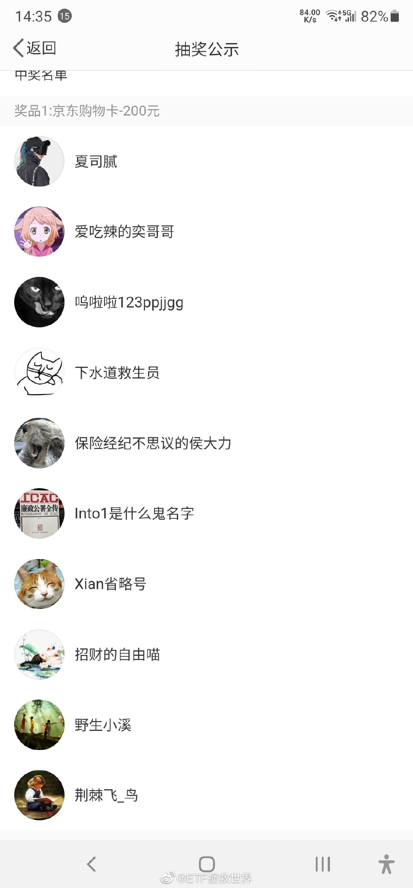

======================================================

ETF拯救世界 (5687069307) @
2022-01-03 13:37:38 Mon  
url: https://weibo.com/5687069307/L92z2prkr

在连续三年年初蒙对当年行情（19年各指数大涨；20年巨幅波动；21年热门板块跌30%-50%，中小股票表现出色）后，

照例又要预测一下今年的大致行情。

当然，事不过三，今年蒙对的难度系数增加了好多，权当一笑吧。

今年的行情会非常复杂，但一句话总结，到年底，大多数指数应该是收阴。

展开说说。

 ​​​

转发[2071]  评论[2099]  赞[7812] 

======================================================

ETF拯救世界 (5687069307) @
2022-01-03 14:25:19 Mon  
url: https://weibo.com/5687069307/L92SotqEz

不知道干什么的时候就一边看《孤独的美食家》一边锻炼身体。 ​​​

转发[44]  评论[564]  赞[2438] 

======================================================

ETF拯救世界 (5687069307) @
2022-01-04 09:48:59 Tue  
url: https://weibo.com/5687069307/L9auJaDz1

再回头看几个月前说的，是不是有了新的感悟。

------------------------------------------------------
转推：
>  @ETF拯救世界 (5687069307)
>  2021-06-03 14:11:04 Thu  
>  url: https:/weibo.com/5687069307/KisMFsMsX/

>  曾经让你浮亏最多的不死品种，最终让你赚了big money。
>  
>  如果还未发生，有一天终会发生。 ​​​

转发[54]  评论[501]  赞[2482] 

======================================================

ETF拯救世界 (5687069307) @
2022-01-04 09:50:55 Tue  
url: https://weibo.com/5687069307/L9avvFmJM

三个月前，有些人在评论里埋怨小美第一重仓，浮亏了。

我忍着没理你。

现在小美出息了，我回去把你找出来拉黑你。

赚钱了就赶紧走吧，我这里不适合你。 ​​​

转发[40]  评论[1461]  赞[4301] 

+++++++++++++++++++++++++++++++++++++++++++++++++++++

图片：

======================================================

ETF拯救世界 (5687069307) @
2022-01-04 10:22:02 Tue  
url: https://weibo.com/5687069307/L9aI92CGW

我对投资的理解，新朋友可以看一下。我用一个例子来解释。

就是种地。当然我没种过地，但大致应该形容的不错。

首先你的买入，相当于春天播种。

你能不能想象今天种下去明天就有收成？客观来看不行对吧。当然，有一种情况可以，我最后说。

种完了，你时不时浇点水，除除草，施施肥，然后等着。

等 ​​​

转发[409]  评论[1040]  赞[3772] 

======================================================

ETF拯救世界 (5687069307) @
2022-01-04 10:33:25 Tue  
url: https://weibo.com/5687069307/L9aMLntKj

医疗崩，医药不崩，

我很惆怅。 ​​​

转发[107]  评论[656]  赞[3113] 

======================================================

ETF拯救世界 (5687069307) @
2022-01-04 10:50:21 Tue  
url: https://weibo.com/5687069307/L9aTDrdtq

爱它信任它，它就会回报你。

------------------------------------------------------
转推：
>  @ETF拯救世界 (5687069307)
>  2021-12-31 10:11:46 Fri  
>  url: https:/weibo.com/5687069307/L8yVZlRtd/

>  持仓里面，目前最爱的依然是红利。
>  
>  今年涨了18%不说，还是那么便宜。在我的卖出序列中，它依然和转债基金排在最后面。 ​​​

转发[31]  评论[376]  赞[2041] 

======================================================

ETF拯救世界 (5687069307) @
2022-01-04 11:01:14 Tue  
url: https://weibo.com/5687069307/L9aY3kjqU

回复@诅影:医疗就是治疗器械医疗、服务等，比如呼吸机口罩专科医院之类。医药是药（中西药）+医疗。//@诅影:虽然能看懂医疗和医药的字面意思区别，但并不懂市场上哪些是医疗哪些是医药，不过并不惆怅，知道跟车就对了。

------------------------------------------------------
转推：
>  @ETF拯救世界 (5687069307)
>  2022-01-04 10:33:25 Tue  
>  url: https:/weibo.com/5687069307/L9aMLntKj/

>  医疗崩，医药不崩，
>  
>  我很惆怅。 ​​​

转发[67]  评论[217]  赞[1769] 

======================================================

ETF拯救世界 (5687069307) @
2022-01-04 11:02:28 Tue  
url: https://weibo.com/5687069307/L9aYypcDx

到现在，很多朋友才明白为什么小美的提款区间是7%而不是5%。 ​​​

转发[44]  评论[1013]  赞[4182] 

======================================================

ETF拯救世界 (5687069307) @
2022-01-04 13:50:27 Tue  
url: https://weibo.com/5687069307/L9c4JFqFV

又一位老朋友跳车告别了。

缘尽了。 ​​​

转发[30]  评论[1396]  赞[5653] 

+++++++++++++++++++++++++++++++++++++++++++++++++++++

图片：
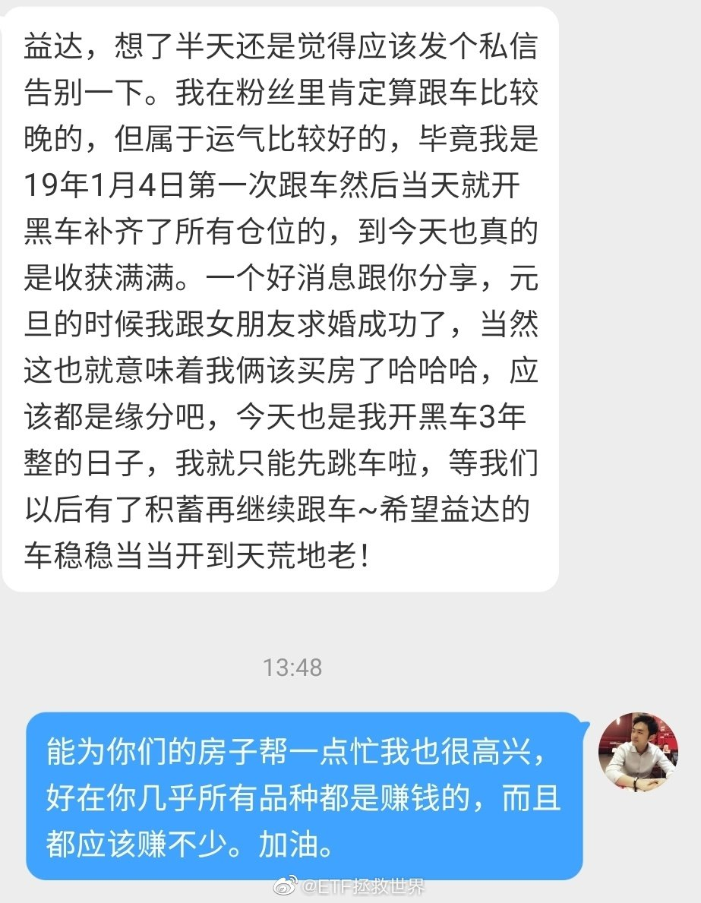

======================================================

ETF拯救世界 (5687069307) @
2022-01-04 14:35:06 Tue  
url: https://weibo.com/5687069307/L9cmRpO6Y

如果，我是说如果啊。

如果有个非常nice的朋友（或者博主）要送你香水，

你想要迪奥，古驰还是香奈儿。

评论选择之后留性别。 ​​​

转发[89]  评论[7121]  赞[5984] 

======================================================

ETF拯救世界 (5687069307) @
2022-01-04 17:16:29 Tue  
url: https://weibo.com/5687069307/L9dqn1BmF

回复@洗头狂魔:神奇的人。别人要送朋友东西，你凑过来说太土了，别的牌子不好吗？我去，真的长见识了。你这种人人缘肯定特别好。//@洗头狂魔:回复@ETF拯救世界:好心给建议还经不起正经评价了。那你送吧，看看人家会不会喜欢。心心眼土鳖

------------------------------------------------------
转推：
>  @ETF拯救世界 (5687069307)
>  2022-01-04 14:35:06 Tue  
>  url: https:/weibo.com/5687069307/L9cmRpO6Y/

>  如果，我是说如果啊。
>  
>  如果有个非常nice的朋友（或者博主）要送你香水，
>  
>  你想要迪奥，古驰还是香奈儿。
>  
>  评论选择之后留性别。 ​​​

转发[20]  评论[1073]  赞[3240] 

======================================================

ETF拯救世界 (5687069307) @
2022-01-04 22:08:07 Tue  
url: https://weibo.com/5687069307/L9fkK7vXb

打开私信，每十条有三条是关于分手和被分手的。

看来新的一年开始，让很多人想要开始新的生活啊。

走不出来的朋友，怎么说呢，交给时间吧。时间会冲淡一切。再找一个更好的，忘了ta。

不爱了，勉强在一起双方都会痛苦。长痛不如短痛，就这样吧。下一个更好。 ​​​

转发[32]  评论[907]  赞[2873] 

+++++++++++++++++++++++++++++++++++++++++++++++++++++

图片：
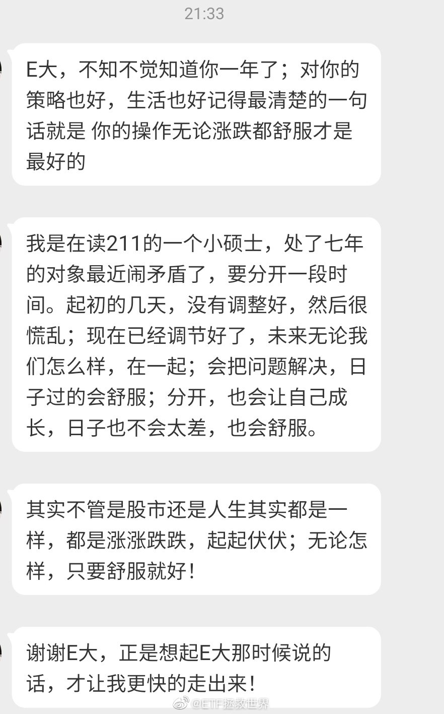
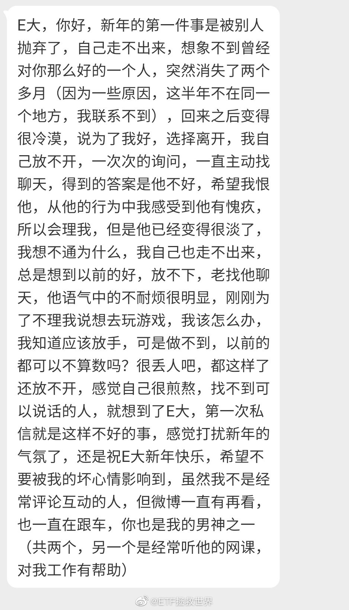

======================================================

ETF拯救世界 (5687069307) @
2022-01-05 10:42:09 Wed  
url: https://weibo.com/5687069307/L9kgO23Oy

666一点也不6，

我哭得很大声。 ​​​

转发[32]  评论[1742]  赞[3375] 

======================================================

ETF拯救世界 (5687069307) @
2022-01-05 11:09:51 Wed  
url: https://weibo.com/5687069307/L9ks33Mkk

今年一定要小心谨慎。大多数人会被今年的行情整蒙圈。“5、22年会非常非常难做。因为年中的波动会非常怪异，远超绝大多数人的想象。如果21年没赚钱，22年赚钱的可能性就更低了。尤其要警惕21年赚大钱的板块、策略、组合以及基金经理。”

------------------------------------------------------
转推：
>  @ETF拯救世界 (5687069307)
>  2022-01-03 13:37:38 Mon  
>  url: https:/weibo.com/5687069307/L92z2prkr/

>  在连续三年年初蒙对当年行情（19年各指数大涨；20年巨幅波动；21年热门板块跌30%-50%，中小股票表现出色）后，
>  
>  照例又要预测一下今年的大致行情。
>  
>  当然，事不过三，今年蒙对的难度系数增加了好多，权当一笑吧。
>  
>  今年的行情会非常复杂，但一句话总结，到年底，大多数指数应该是收阴。
>  
>  展开说说。
>  
>   ​​​

转发[221]  评论[686]  赞[3223] 

======================================================

ETF拯救世界 (5687069307) @
2022-01-05 11:23:17 Wed  
url: https://weibo.com/5687069307/L9kxv8xkG

机构：遇事不决就抱团。 ​​​

转发[28]  评论[720]  赞[2882] 

======================================================

ETF拯救世界 (5687069307) @
2022-01-05 14:22:57 Wed  
url: https://weibo.com/5687069307/L9lIqqJ9d

买，当然是买。但还是说了多少次的，时间、空间控制好。

不用急，没什么“不可以错过的机会”。

没有。

资本市场的机会没完没了层出不穷，有命活到抓住几个就可以了。

胸口上写个“勇”字冲下去乱打，死的最快。 ​​​

转发[205]  评论[986]  赞[3601] 

======================================================

ETF拯救世界 (5687069307) @
2022-01-05 14:38:49 Wed  
url: https://weibo.com/5687069307/L9lORC7nT

A股目前整体策略：断舍离。进一出一，如无必要，勿增实体。

港股目前整体策略：佛系捡辣鸡。你的辣鸡，我来守护。 ​​​

转发[186]  评论[773]  赞[3689] 

======================================================

ETF拯救世界 (5687069307) @
2022-01-05 15:01:07 Wed  
url: https://weibo.com/5687069307/L9lXV5ySl

我本人的中概+恒科在权益类品种仓位比重已经达到15%，超过红利，直追500。

没别的意思，就是说一下。 ​​​

转发[157]  评论[1539]  赞[4583] 

======================================================

ETF拯救世界 (5687069307) @
2022-01-05 15:41:13 Wed  
url: https://weibo.com/5687069307/L9mecbQ5B

学生去找老师问问题，老师说：“别烦我，自己去想。”

不上课外班，不请家教行吗？

呵呵。 ​​​

转发[30]  评论[853]  赞[3771] 

======================================================

ETF拯救世界 (5687069307) @
2022-01-05 17:55:45 Wed  
url: https://weibo.com/5687069307/L9n6O1dL3

中概牛逼在哪里你知道吗？

牛逼在白天你工作的时候跌5个半小时，晚上你睡觉的时候还要跌6个半小时。

每天跌12个小时，怕了没？ ​​​

转发[200]  评论[2095]  赞[7610] 

======================================================

ETF拯救世界 (5687069307) @
2022-01-05 21:21:19 Wed  
url: https://weibo.com/5687069307/L9osf6p3E

有暖气很干燥别忘了敷一片补水面膜。 ​​​

转发[21]  评论[997]  赞[2916] 

======================================================

ETF拯救世界 (5687069307) @
2022-01-06 11:28:04 Thu  
url: https://weibo.com/5687069307/L9tZWfnq3

来晚了。发生肾么事了。 ​​​

转发[33]  评论[809]  赞[3582] 

======================================================

ETF拯救世界 (5687069307) @
2022-01-06 11:46:59 Thu  
url: https://weibo.com/5687069307/L9u7CiIHt

头像旁边这一圈浓郁乡村风格的东西怎么去掉。

跟我高冷又有腔调的气质不搭。 ​​​

转发[17]  评论[944]  赞[2573] 

======================================================

ETF拯救世界 (5687069307) @
2022-01-06 11:54:57 Thu  
url: https://weibo.com/5687069307/L9uaQAZ4F

目前支撑位依然不变。如果你已经提前很久很久做好了准备，那么它真的跌到那里的时候你怎么会慌呢。//@ETF拯救世界:第一支撑调整到22000左右，第二依然是18500。在这两个支撑附近都会买。

------------------------------------------------------
转推：
>  @ETF拯救世界 (5687069307)
>  2021-11-29 12:08:52 Mon  
>  url: https:/weibo.com/5687069307/L3I1DabhM/

>  恒生接下来的支撑位在21500左右。这是倒数第二个支撑。
>  
>  最后一根支撑在18500左右。如果我是那种轻仓但是想买一部分恒生的，我可能会认为这个位置是极佳的买入位。 ​​​

转发[133]  评论[391]  赞[1973] 

======================================================

ETF拯救世界 (5687069307) @
2022-01-06 11:59:45 Thu  
url: https://weibo.com/5687069307/L9ucNrkfO

恒生的长线仓位交易历史。

不客气的说，我比99.9%的人更懂这个指数。 ​​​

转发[327]  评论[1153]  赞[6163] 

+++++++++++++++++++++++++++++++++++++++++++++++++++++

图片：
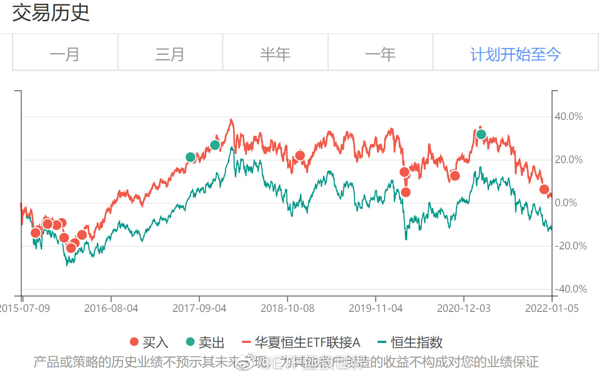

======================================================

ETF拯救世界 (5687069307) @
2022-01-06 12:37:00 Thu  
url: https://weibo.com/5687069307/L9urV4nRr

刚看到有投资者举报某私募管理人，净值跌幅过大，要求保本赎回。

有一点感慨。

无论是公募还是私募，绝大多数基金管理人其实是希望规模越大越好。规模越大，管理费越多。当然，无论是人还是商业机构，希望利益更大是无可厚非的。

但是，在资产管理行业，这里面有些东西跟一般的商业还是有很大不同。 ​​​

转发[217]  评论[659]  赞[3422] 

======================================================

ETF拯救世界 (5687069307) @
2022-01-06 12:58:29 Thu  
url: https://weibo.com/5687069307/L9uADwzpq

请教各位米其林三星的大厨：

酱油炒饭用生抽还是老抽。 ​​​

转发[25]  评论[1548]  赞[2645] 

======================================================

ETF拯救世界 (5687069307) @
2022-01-06 13:40:41 Thu  
url: https://weibo.com/5687069307/L9uRLvnAD

我真的搞不懂：

第一，这个价位到底是怎么定的可以这么精准，一次次的在这里止跌；

第二，是谁不停高位接走低位还回来。是因为爱吗。 ​​​

转发[39]  评论[1100]  赞[3510] 

======================================================

ETF拯救世界 (5687069307) @
2022-01-06 15:45:21 Thu  
url: https://weibo.com/5687069307/L9vGn3Fyv

很犹豫。

医疗技术位快到了，价值位依然不可以。

怎么办，反复考虑，我做了一个违背祖训的决定。 ​​​

转发[68]  评论[1001]  赞[3973] 

======================================================

ETF拯救世界 (5687069307) @
2022-01-06 19:01:06 Thu  
url: https://weibo.com/5687069307/L9wXPu4fg

如果一个人，平常没有被别人当成人，

那么他也不会把别人当成人。

所以最大的问题在于，我们都应该把别人当成人。

不仅是自己的家人，朋友，同学，同乡，还有陌生人，无论贫富，无论职业。

有些人的冷漠甚至残暴来源于他的经历。只有感受过爱的人，才会做出温暖的事。 ​​​

转发[143]  评论[766]  赞[4079] 

======================================================

ETF拯救世界 (5687069307) @
2022-01-07 09:19:34 Fri  
url: https://weibo.com/5687069307/L9CAhes98

收入高一点的，在网上晒工资条，有一个算一个，

全是脑子有问题的。 ​​​

转发[44]  评论[861]  赞[3873] 

======================================================

ETF拯救世界 (5687069307) @
2022-01-07 09:29:37 Fri  
url: https://weibo.com/5687069307/L9CEmaXva

急救绷带回血中 ​​​

转发[14]  评论[420]  赞[2175] 

======================================================

ETF拯救世界 (5687069307) @
2022-01-07 09:39:11 Fri  
url: https://weibo.com/5687069307/L9CIfibzX

小美像极了被人嘲笑，却不放弃，无论环境多么恶劣，也要努力往上冲的我们这些普通人。 ​​​

转发[31]  评论[657]  赞[3385] 

======================================================

ETF拯救世界 (5687069307) @
2022-01-07 09:55:27 Fri  
url: https://weibo.com/5687069307/L9COQi4kS

前几天有人在评论说：红利高位没卖。

我心想，燕雀安知鸿鹄之志。 ​​​

转发[44]  评论[593]  赞[3126] 

+++++++++++++++++++++++++++++++++++++++++++++++++++++

图片：
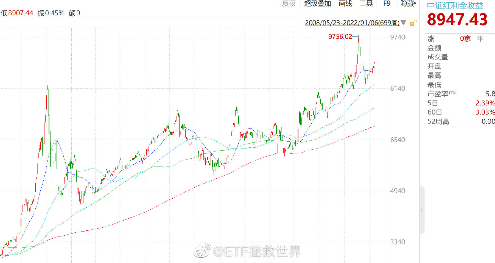

======================================================

ETF拯救世界 (5687069307) @
2022-01-07 10:25:58 Fri  
url: https://weibo.com/5687069307/L9D1eicyN

我刚才看评论，有些特别有问题的倾向，我提醒一下：

我们的持仓涨了，我贴出来点评两句，有两个目的：

第一，与各位一起高兴一下。

第二，帮有些朋友坚定一下持仓信心。

但是！

我绝对没有任何暗示“可以买入”的意思！我觉得什么时候可以买，无论是长线还是波段，我都会把自己的操作清清楚楚明明 ​​​

转发[57]  评论[870]  赞[3390] 

======================================================

ETF拯救世界 (5687069307) @
2022-01-07 12:53:36 Fri  
url: https://weibo.com/5687069307/L9DZ9r02Q

父母应该加强对孩子这方面的教育。 ​​​

转发[50]  评论[375]  赞[2322] 

+++++++++++++++++++++++++++++++++++++++++++++++++++++

图片：
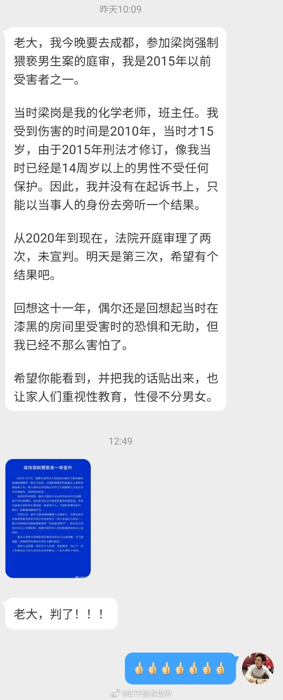
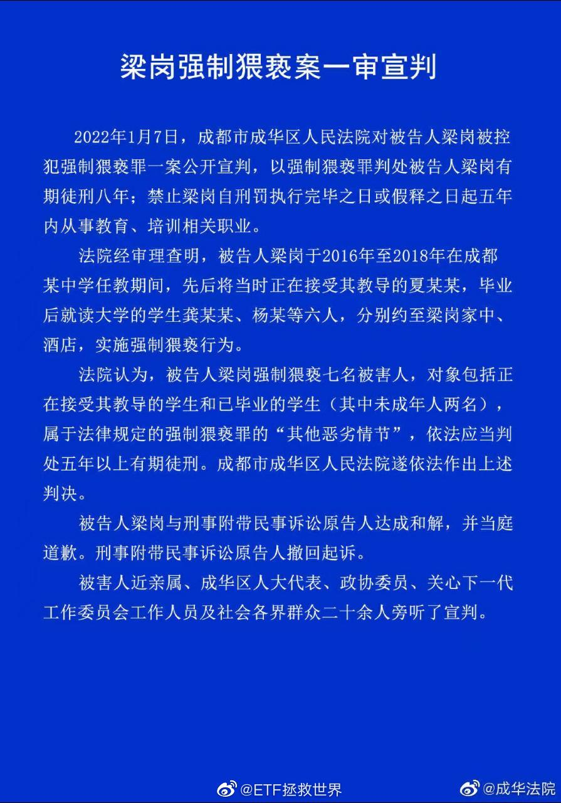

======================================================

ETF拯救世界 (5687069307) @
2022-01-07 12:58:50 Fri  
url: https://weibo.com/5687069307/L9E1hgFsv

女同学们帮忙出出主意，这种情况还能挽回吗，该怎么做。 ​​​

转发[73]  评论[1901]  赞[15275] 

+++++++++++++++++++++++++++++++++++++++++++++++++++++

图片：
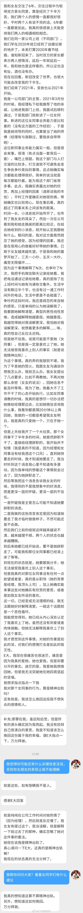

======================================================

ETF拯救世界 (5687069307) @
2022-01-07 13:15:05 Fri  
url: https://weibo.com/5687069307/L9E7SdfMk

刚才看到有朋友对昨天HS差一点点没有买入失望懊悔。

我想说的是，差不多行了您，您这是想天下所有好事都归您一个人是吧。

且不说下周还会不会跌，就算这里有一波反弹，恒科买到了吧，虽然不是最低位，但也比现价低了。YY买到了吧，几乎是最低位，买了就涨。

还想怎么样啊，差不多行了啊。太贪心可是 ​​​

转发[41]  评论[849]  赞[3372] 

======================================================

ETF拯救世界 (5687069307) @
2022-01-07 14:06:11 Fri  
url: https://weibo.com/5687069307/L9EsC9WL8

小美的这根超长上影真的很难看。收盘如果拉不回去，那之前卖掉的波段接回来就不是梦了。 ​​​

转发[47]  评论[604]  赞[2826] 

======================================================

ETF拯救世界 (5687069307) @
2022-01-07 14:48:07 Fri  
url: https://weibo.com/5687069307/L9EJDn4YE

只是一周时间，各位可能已经体会到了今年的难。

大的涨一天，小的涨一天，然后一起跌一天。

板块更是各领风骚一两天，热点疯狂切换。

刚开始就这么刺激，今年一定很好玩。 ​​​

转发[240]  评论[1167]  赞[4422] 

======================================================

ETF拯救世界 (5687069307) @
2022-01-09 18:50:34 Sun  
url: https://weibo.com/5687069307/L9Zb2n6zD

清点了一下家里储存的食物，乐观估计正常够吃1-1.5个月。极限情况2个月也应该可以。

营养全面就不用考虑了。什么事情都做最坏准备可能是一种深入骨髓的病。 ​​​

转发[155]  评论[997]  赞[4112] 

======================================================

ETF拯救世界 (5687069307) @
2022-01-10 09:44:30 Mon  
url: https://weibo.com/5687069307/La51T51Re

人也好，事也好，你曾经认为ta们都是完美的。你很热爱。

但有一天你发现ta并没有那么完美，于是你很愤怒，很失望，很生气。

恭喜你，你认识到了真实的世界。真实的世界并不是粉色的童话世界，而是充满了各种肮脏和黑暗。

有些人一生停留在第一阶段，恭喜你们，你们的人生很幸福。

有些人的人生停留 ​​​

转发[281]  评论[855]  赞[3950] 

======================================================

ETF拯救世界 (5687069307) @
2022-01-10 10:07:16 Mon  
url: https://weibo.com/5687069307/La5b885c7

早上说泡点豆子做点腊八粥应个景增加一点人生乐趣，

翻了一圈发现家里8种材料有6种之前被断舍离扔掉了。

这就是人生吧。 ​​​

转发[15]  评论[665]  赞[2268] 

======================================================

ETF拯救世界 (5687069307) @
2022-01-10 10:14:16 Mon  
url: https://weibo.com/5687069307/La5dY9kHb

健身房现在还能去吗。

有点犹豫。 ​​​

转发[18]  评论[828]  赞[2105] 

======================================================

ETF拯救世界 (5687069307) @
2022-01-10 10:44:20 Mon  
url: https://weibo.com/5687069307/La5qbdrjY

不知道是不是已经开始了。现在看不清。

------------------------------------------------------
转推：
>  @ETF拯救世界 (5687069307)
>  2021-12-28 11:06:26 Tue  
>  url: https:/weibo.com/5687069307/L870GBsMi/

>  信不信由你
>  
>  某些已经被踩在脚下的品种
>  
>  一两个月内，极大概率会有一次至少中级的爆发
>  
>  但我劝你掌握好节奏，不要梭哈更不要上杠杆
>  
>  命比钱重要 ​​​

转发[54]  评论[758]  赞[2761] 

======================================================

ETF拯救世界 (5687069307) @
2022-01-10 11:00:54 Mon  
url: https://weibo.com/5687069307/La5wUc1LW

班子成员开了个碰头会，定了，印这两个：

“踏踏实实的，多大点事儿。”

“二级市场捡垃圾大赛  第一名”

尽量多做点，争取做到饮者有其杯。 ​​​

转发[90]  评论[4405]  赞[5975] 

======================================================

ETF拯救世界 (5687069307) @
2022-01-10 13:31:27 Mon  
url: https://weibo.com/5687069307/La6w0pwGh

朋友送了我一个华为GT runner。

试用了几天。别的不说，我只有一个疑问：

为什么用起来感觉差别不是特别大的GT和apple watch，续航时间差别这么大？

watch一般就一天，撑死了一天半。为什么GT可以做到每天只掉十个点的电。

为什么，这到底是为什么。按理说苹果的技术不至于做不到华为能做到的事情 ​​​

转发[26]  评论[836]  赞[2902] 

======================================================

ETF拯救世界 (5687069307) @
2022-01-10 14:04:44 Mon  
url: https://weibo.com/5687069307/La6Jw9XG6

预告一下，S的组合展示有一点更新。是这样的。

S跟150不同，不是一个固定金额的组合。之前是卖出后就直接从组合里移除，但这里有个问题：

比如极端情况下，我不看好市场，将S组合卖出了99%，只剩1%。但这个时候，以前的组合还会显示100%仓位，因为卖掉的直接“消失”了。也就是说我卖掉了99%之后，拿 ​​​

转发[50]  评论[822]  赞[3751] 

======================================================

ETF拯救世界 (5687069307) @
2022-01-10 16:56:16 Mon  
url: https://weibo.com/5687069307/La7R90CIi

5、22年会非常非常难做。因为年中的波动会非常怪异，远超绝大多数人的想象。如果21年没赚钱，22年赚钱的可能性就更低了。尤其要警惕21年赚大钱的板块、策略、组合以及基金经理。

------------------------------------------------------
转推：
>  @21世纪经济报道 (1651428902)
>  2022-01-10 16:54:10 Mon  
>  url: https:/weibo.com/1651428902/La7Qi6Zzl/

>  【#去年冠军基金仅4天收益排名变倒数#！“被重锤”的#新能源基金还能买吗#？[衰]】2022年1月7日，新年第四个工作日，去年#基金#收益冠军得主崔宸龙管理的基金——前海开源公用事业（去年冠军基金）大跌11.65%，位列基金收益榜倒数第三名。什么原因导致了去年重仓新能源和顺周期赛道的绩优基金，在今年 ​​​

转发[63]  评论[388]  赞[2064] 

======================================================

ETF拯救世界 (5687069307) @
2022-01-10 17:20:04 Mon  
url: https://weibo.com/5687069307/La80NB2L9

我给个建议：

永远不要去分析去年的冠军基金经理做了什么。类似的分析文章也不要看，毫无意义。

做了什么？很简单，一定是重仓满仓某个风口上的行业，就这么简单。

每个行业都会有很多基金经理重仓满仓，哪个行业跑出来了，哪个类型的基金经理就是冠军。没有什么稀奇的，就是这么简单。

还是之前说 ​​​

转发[360]  评论[735]  赞[4218] 

======================================================

ETF拯救世界 (5687069307) @
2022-01-10 18:00:38 Mon  
url: https://weibo.com/5687069307/La8hgwA42

我从来也没说过主动基金经理不行。

一定有行的。而且不是一个两个三个四个，一定是有一批。说少了几十个人，说多了百来人也能有。

但是，最关键的，是你一定要从几千名公募基金经理，几万名私募基金经理中把他们找出来。

现在公募基金数量已经超过两市的股票数量了。选靠谱的基金经理，难度不亚于选 ​​​

转发[124]  评论[654]  赞[3090] 

======================================================

ETF拯救世界 (5687069307) @
2022-01-10 20:53:44 Mon  
url: https://weibo.com/5687069307/La9px2u64

今天卖出的500C收益率比上次的环保差不少，大家平均收益率50%多不到60%。 ​​​

转发[28]  评论[777]  赞[2901] 

======================================================

ETF拯救世界 (5687069307) @
2022-01-10 21:13:54 Mon  
url: https://weibo.com/5687069307/La9xIB6pC

对于生孩子，我又有一点新的理解。

我认为关键的问题，在于人们会思考，生孩子，或者多生孩子，到底是对自己有利还是有弊。而最关键的问题，是“社会性养老”。

试想，既然养老是社会的责任了，退休金是社会发了，那么，养一个或者几个孩子，会对自己未来的养老有多大帮助呢。

如果没有社会性养老， ​​​

转发[87]  评论[938]  赞[4704] 

======================================================

ETF拯救世界 (5687069307) @
2022-01-11 09:55:34 Tue  
url: https://weibo.com/5687069307/LaewSkqhz

红利真的很垃圾。

估值刚刚超过十倍，可见未来有多么黑暗。不像人家白酒和科创，跌那么多，估值还是50多和70多倍，说明前途一片光明。 ​​​

转发[58]  评论[807]  赞[2988] 

======================================================

ETF拯救世界 (5687069307) @
2022-01-11 10:28:44 Tue  
url: https://weibo.com/5687069307/LaeKl38ay

人都是会变的吗？

所有婚姻都有爱情吗？

有了爱情就会有婚姻吗？

有爱情的婚姻，会变得没有爱情吗？

没有了爱情，婚姻一定要结束吗？

每一个人，每个人在人生不同阶段，都会有不同答案。

这道题太难，我不会做。 ​​​

转发[54]  评论[831]  赞[2748] 

+++++++++++++++++++++++++++++++++++++++++++++++++++++

图片：
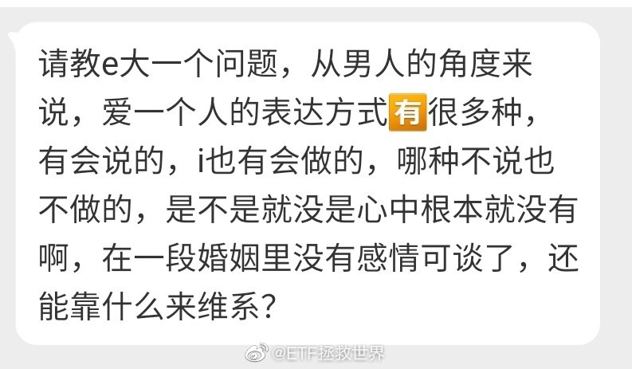

======================================================

ETF拯救世界 (5687069307) @
2022-01-11 11:14:33 Tue  
url: https://weibo.com/5687069307/Laf2W5UW7

从理性的投资者角度来讲，我们不应该希望市场上大多数人变成同样理性的。

因为如果那样，就会有很多人也来捡垃圾，最终垃圾就不会成为垃圾；

也不会有人疯狂的冲100倍以上的品种，那样我们就拿不到136%的收益率。

怎么说呢，大家还是不要到处去科普捡垃圾的好处，要我说，看到非理性行为，只有四个 ​​​

转发[113]  评论[1182]  赞[3954] 

======================================================

ETF拯救世界 (5687069307) @
2022-01-11 13:34:30 Tue  
url: https://weibo.com/5687069307/LafXK7pQJ

投资者成熟三部曲：

第一步：不接盘。

第二步：买辣鸡。

第三步：让别人接盘自己的辣鸡。 ​​​

转发[185]  评论[622]  赞[3454] 

======================================================

ETF拯救世界 (5687069307) @
2022-01-11 13:58:19 Tue  
url: https://weibo.com/5687069307/Lag7pkA7r

很多品种跌了，说来你不信，是我们大家的万幸。

因为每个人都应该有一个贯穿一生的基本仓位配置。其构成还是我之前说的：

大盘、中小盘、价值、医药、消费、科技。

如果真的有幸在底部区域全部配置完成，那么之后就是简单的增增减减，投资这块也不用费太多心了。

所以不跌，你怎么在底部配置完成？ ​​​

转发[627]  评论[1071]  赞[4384] 

======================================================

ETF拯救世界 (5687069307) @
2022-01-11 14:32:21 Tue  
url: https://weibo.com/5687069307/LagldDuao

技术性调仓。[微笑] ​​​

转发[16]  评论[658]  赞[2776] 

======================================================

ETF拯救世界 (5687069307) @
2022-01-11 16:06:39 Tue  
url: https://weibo.com/5687069307/LagXv4otR

爱自己。

帮助自己保持健康。

逗自己开心。

最重要了。 ​​​

转发[187]  评论[892]  赞[4720] 

======================================================

ETF拯救世界 (5687069307) @
2022-01-12 05:25:39 Wed  
url: https://weibo.com/5687069307/LambOrhtH

我说今天有机会出一份恒科会不会太夸张。 ​​​

转发[37]  评论[1737]  赞[3508] 

======================================================

ETF拯救世界 (5687069307) @
2022-01-12 09:06:40 Wed  
url: https://weibo.com/5687069307/LanDx2pC0

今天场内恒科开盘涨幅在3-4%之间比较合理，如果不折价 ​​​

转发[33]  评论[907]  赞[2983] 

======================================================

ETF拯救世界 (5687069307) @
2022-01-12 09:39:49 Wed  
url: https://weibo.com/5687069307/LanQYA3hi

差一分没考上重点学校的感觉。 ​​​

转发[19]  评论[747]  赞[2527] 

======================================================

ETF拯救世界 (5687069307) @
2022-01-12 09:41:46 Wed  
url: https://weibo.com/5687069307/LanRM1zhi

给做市商打call。 ​​​

转发[20]  评论[866]  赞[2860] 

======================================================

ETF拯救世界 (5687069307) @
2022-01-12 10:07:47 Wed  
url: https://weibo.com/5687069307/Lao2kweop

这次恒科留了将近2.5倍利润转为长期持有。

接下来就回到中概继续表演了。 ​​​

转发[65]  评论[962]  赞[3758] 

======================================================

ETF拯救世界 (5687069307) @
2022-01-12 10:18:54 Wed  
url: https://weibo.com/5687069307/Lao6QiREI

“3、中概等惨烈的品种要么会赚钱，要么就是会提供赚大钱的买入机会。”2022年的第一次提款，意料之中。

------------------------------------------------------
转推：
>  @ETF拯救世界 (5687069307)
>  2022-01-03 13:37:38 Mon  
>  url: https:/weibo.com/5687069307/L92z2prkr/

>  在连续三年年初蒙对当年行情（19年各指数大涨；20年巨幅波动；21年热门板块跌30%-50%，中小股票表现出色）后，
>  
>  照例又要预测一下今年的大致行情。
>  
>  当然，事不过三，今年蒙对的难度系数增加了好多，权当一笑吧。
>  
>  今年的行情会非常复杂，但一句话总结，到年底，大多数指数应该是收阴。
>  
>  展开说说。
>  
>   ​​​

转发[96]  评论[1053]  赞[3352] 

======================================================

ETF拯救世界 (5687069307) @
2022-01-12 14:03:36 Wed  
url: https://weibo.com/5687069307/LapA39Vzf

HS中网，让人不禁感叹，不完美才是人生常态。 ​​​

转发[39]  评论[1119]  赞[3511] 

======================================================

ETF拯救世界 (5687069307) @
2022-01-12 18:55:34 Wed  
url: https://weibo.com/5687069307/Laruz8RGT

北京人均GDP2.8万美元。

这个数字大致低于意大利，高于西班牙。

与台湾省差不多。 ​​​

转发[60]  评论[557]  赞[3619] 

======================================================

ETF拯救世界 (5687069307) @
2022-01-13 09:47:48 Thu  
url: https://weibo.com/5687069307/LaxkIncze

如果没有波段仓位，你左右为难：反弹了，卖不卖啊，不卖跌回去怎么办啊，卖了继续涨怎么办啊。卖一点？卖多少啊。

有了波段仓位的你：随便，尊重，都开心。 ​​​

转发[83]  评论[1240]  赞[4128] 

======================================================

ETF拯救世界 (5687069307) @
2022-01-13 18:37:28 Thu  
url: https://weibo.com/5687069307/LaANI6x9Y

今天在外面鬼混了一天，没空发什么微博，勿cue。 ​​​

转发[17]  评论[923]  赞[3475] 

======================================================

ETF拯救世界 (5687069307) @
2022-01-14 09:39:33 Fri  
url: https://weibo.com/5687069307/LaGHRuhgE

行情上蹿下跳，你猜猜是什么人被反复收割。对了，就是那些看到行情管不住手的，不停交易的人。今天涨，明天跌，只要你动手，就给你砍下来。我能给的建议，是机械执行既定的交易计划，将自己打造成没有感情的野生AI交易机器人。不要动感情，不要动感情，不要动感情。

------------------------------------------------------
转推：
>  @ETF拯救世界 (5687069307)
>  2022-01-07 14:48:07 Fri  
>  url: https:/weibo.com/5687069307/L9EJDn4YE/

>  只是一周时间，各位可能已经体会到了今年的难。
>  
>  大的涨一天，小的涨一天，然后一起跌一天。
>  
>  板块更是各领风骚一两天，热点疯狂切换。
>  
>  刚开始就这么刺激，今年一定很好玩。 ​​​

转发[159]  评论[873]  赞[3047] 

======================================================

ETF拯救世界 (5687069307) @
2022-01-14 09:49:34 Fri  
url: https://weibo.com/5687069307/LaGLW83DP

我真的很讨厌那种只有不断增发、配股，才能把业务发展起来，甚至才能维持下去的公司。 ​​​

转发[50]  评论[568]  赞[2836] 

======================================================

ETF拯救世界 (5687069307) @
2022-01-14 10:01:29 Fri  
url: https://weibo.com/5687069307/LaGQLvdST

对我来说，打新股就像与人交往。

在没有破发新股之前，相当于这个人从没骗过我，那我就完全信任他与他做朋友。

但只要有一只新股破发了，就是被骗了一次。只要有一次，我就不再信任他。也许还会来往，但不会把他当做朋友。

也就是说，不会再打了。

因为这本来是个稳赚不赔的，现在变成有赚有赔，那 ​​​

转发[81]  评论[719]  赞[3135] 

======================================================

ETF拯救世界 (5687069307) @
2022-01-14 12:19:11 Fri  
url: https://weibo.com/5687069307/LaHKF14GE

真的很烦。找遍中文互联网，竟无一处被二极管、喷子和低智人士放过的净土。

上网没有乐趣了，真的。

不想与这些人有任何交集。诺大的互联网，无处可去！

（PS，不是说我这里，我这里没有这些。） ​​​

转发[42]  评论[1165]  赞[4360] 

======================================================

ETF拯救世界 (5687069307) @
2022-01-14 20:00:08 Fri  
url: https://weibo.com/5687069307/LaKLLcdkG

荣格说，越强调理性的人，内心越是充满感性。

所以，我这样一米八几，一拳能打死一头牛的猛男，用这样的充电宝也是很合理的。 ​​​

转发[30]  评论[1389]  赞[4660] 

+++++++++++++++++++++++++++++++++++++++++++++++++++++

图片：

======================================================

ETF拯救世界 (5687069307) @
2022-01-16 10:00:38 Sun  
url: https://weibo.com/5687069307/LaZHpAGzI

真的一两句说不清 ​​​

转发[30]  评论[838]  赞[5022] 

+++++++++++++++++++++++++++++++++++++++++++++++++++++

图片：
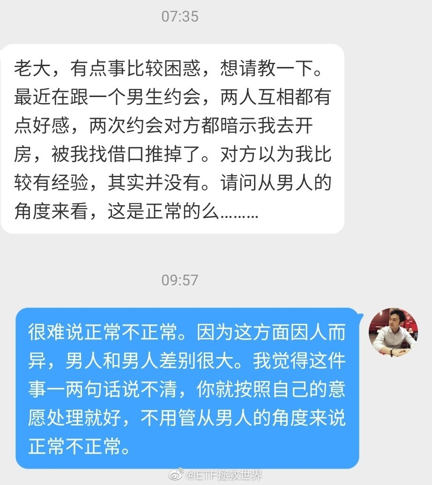

======================================================

ETF拯救世界 (5687069307) @
2022-01-16 21:46:00 Sun  
url: https://weibo.com/5687069307/Lb4jIFbcE

上什么学，做什么工作，与什么人结婚，大致能决定我们这辈子会不会幸福。

朋友们，好好选择人生关键的岔路口该向哪边走。一定一定认真选择。

看私信再次有感。 ​​​

转发[405]  评论[1024]  赞[6221] 

======================================================

ETF拯救世界 (5687069307) @
2022-01-17 10:51:08 Mon  
url: https://weibo.com/5687069307/Lb9spnwR9

很无聊的一天。

没有风。没有雨。没有钱。没有你。 ​​​

转发[44]  评论[1364]  赞[3535] 

======================================================

ETF拯救世界 (5687069307) @
2022-01-17 11:44:27 Mon  
url: https://weibo.com/5687069307/Lb9O3fzCh

我给各位一个真诚的建议：

不要为了国家大事，世界大事焦虑。

真的，80%的事情都会解决，都是毫无意义的焦虑。

20%的事情真的解决不了，但你焦虑也没用。不如多关注自己的事情，把自己的日子过好，为这些解决不了的问题多做准备。

就是什么呢，就是你想吧，最坏能怎么样，最坏就是去天堂了对吧。去 ​​​

转发[377]  评论[1432]  赞[5711] 

======================================================

ETF拯救世界 (5687069307) @
2022-01-18 16:15:37 Tue  
url: https://weibo.com/5687069307/Lbl0C8TbO

小助理不停的搬运总算有点成绩了… ​​​

转发[34]  评论[639]  赞[2960] 

+++++++++++++++++++++++++++++++++++++++++++++++++++++

图片：
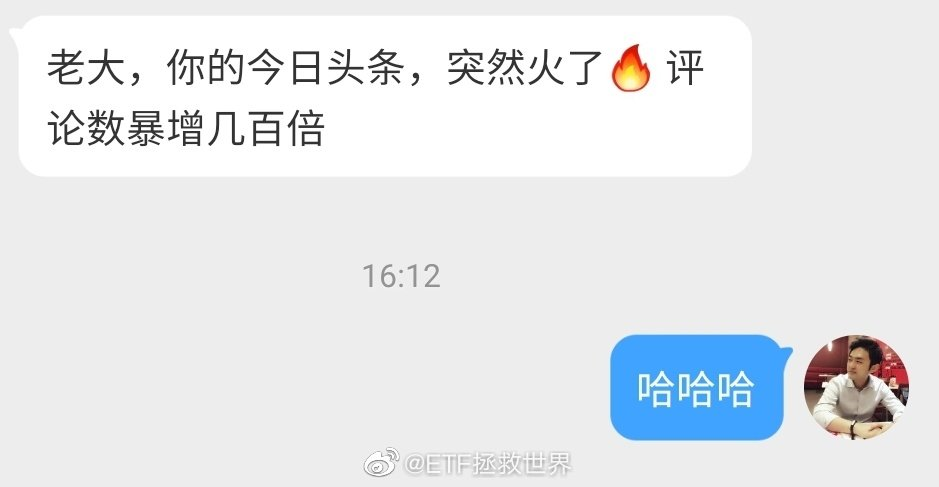
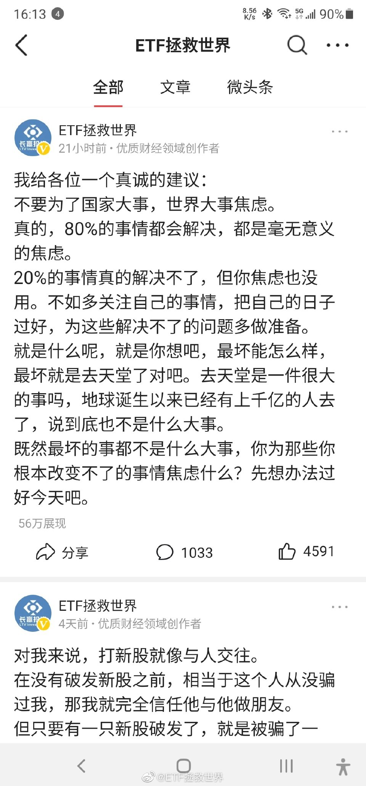

======================================================

ETF拯救世界 (5687069307) @
2022-01-18 17:35:34 Tue  
url: https://weibo.com/5687069307/Lblx4dBlP

咬了一口糖葫芦算不算破戒了。

我觉得不算。 ​​​

转发[22]  评论[1084]  赞[3720] 

======================================================

ETF拯救世界 (5687069307) @
2022-01-18 21:17:29 Tue  
url: https://weibo.com/5687069307/LbmZ8DeHO

带锅的这个女的看着真够瘆人的。 ​​​

转发[22]  评论[669]  赞[2401] 

======================================================

ETF拯救世界 (5687069307) @
2022-01-19 09:42:28 Wed  
url: https://weibo.com/5687069307/LbrRx6GRG

你可能没注意过一件事，

几乎没有任何不是太小的投顾组合，会像150和S这样，第一时间公开操作品种。一般的组合，你不在特定平台跟投，是绝对看不到操作的。甚至有些跟投了也看不到。

150和S这样第一时间向所有人公开，当然在商业方面会有损失。毕竟公开后你在哪里买都可以。但我依然坚持这么做，因为 ​​​

转发[142]  评论[2747]  赞[8551] 

======================================================

ETF拯救世界 (5687069307) @
2022-01-19 10:23:03 Wed  
url: https://weibo.com/5687069307/Lbs80jOOd

只要红、丐、美涨，

药、消跌，

我就会很满意。 ​​​

转发[58]  评论[1005]  赞[3902] 

======================================================

ETF拯救世界 (5687069307) @
2022-01-19 11:07:02 Wed  
url: https://weibo.com/5687069307/LbspRdy6j

环保这个顶真的仁至义尽。

盘整、破位、反抽，给足了机会卖——不止一次机会。

少卖了一份是自己的责任，没有任何狡辩的借口。

还需要继续努力钻研业务。 ​​​

转发[147]  评论[529]  赞[3097] 

======================================================

ETF拯救世界 (5687069307) @
2022-01-19 11:59:22 Wed  
url: https://weibo.com/5687069307/LbsL69Dgt

想来想去，还是要去健身房，应该没事。

希望有两个，第一没有病毒，第二别掉头发。

肌肉什么的随缘。 ​​​

转发[28]  评论[659]  赞[3179] 

======================================================

ETF拯救世界 (5687069307) @
2022-01-19 15:33:49 Wed  
url: https://weibo.com/5687069307/Lbua9luty

每天15:30开始计算数据的时间，排在一天中最舒服的时间段第三位。 ​​​

转发[22]  评论[424]  赞[2416] 

======================================================

ETF拯救世界 (5687069307) @
2022-01-19 16:47:40 Wed  
url: https://weibo.com/5687069307/LbuE7mwoz

2008年，可乐180亿港元大幅溢价收购汇源，被反垄断叫停。

2020年，汇源退市。

2021年，汇源被申请破产清算。 ​​​

转发[6]  评论[506]  赞[3380] 

======================================================

ETF拯救世界 (5687069307) @
2022-01-19 19:30:51 Wed  
url: https://weibo.com/5687069307/LbvIm9KEb

据研究，地球内部的冷却速度比预期要快，可能地球内部温度将以更快的速度下降到和火星内部相同的温度。你担心地球火星化吗？ http://t.cn/A6JW8PsJ ​​​

转发[59]  评论[103]  赞[22239] 

======================================================

ETF拯救世界 (5687069307) @
2022-01-19 22:30:28 Wed  
url: https://weibo.com/5687069307/LbwTglvix

我这思路对吗 ​​​

转发[21]  评论[491]  赞[1994] 

+++++++++++++++++++++++++++++++++++++++++++++++++++++

图片：
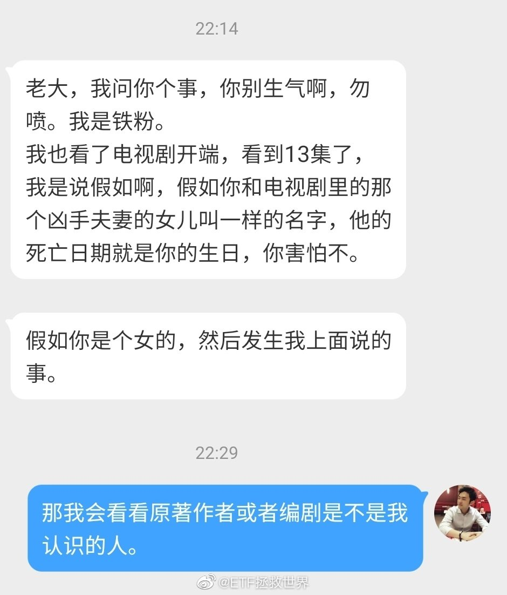

======================================================

ETF拯救世界 (5687069307) @
2022-01-20 07:52:44 Thu  
url: https://weibo.com/5687069307/LbAzuhsrf

有朋友问我关于北京最近确诊的，这位体力工作者的流调信息怎么看。

我也知道说些什么可能会让大家更认同，但我想说其实我的关注点跟大家不一样。

他的工作能看出来真的非常辛苦，但对于晚上工作这一点，我想说其实很正常。我看信息里面有在簋街工作到凌晨的，那在簋街工作，不就得凌晨吗。包括饭馆老 ​​​

转发[48]  评论[524]  赞[3170] 

======================================================

ETF拯救世界 (5687069307) @
2022-01-20 09:24:19 Thu  
url: https://weibo.com/5687069307/LbBaF4vBI

希望他早日找回孩子。

------------------------------------------------------
转推：
>  @新浪财经 (1638782947)
>  2022-01-20 08:56:23 Thu  
>  url: https:/weibo.com/1638782947/LbAZk5YlA/

>  【#对话流调中最辛苦的人#：来北京找儿子，凌晨打零工补贴家用】该无症状感染者岳某，1978年生，他本在山东威海捕鱼船做船员，2020年8月12日，他的大儿子走失，因儿子曾在北京做过帮厨，他就来到北京寻找。在此之前，为了找儿子，他已经去过山东、河南、河北、天津等多地。每到一地，在寻找儿子的同时 ​​​

转发[88]  评论[315]  赞[1612] 

======================================================

ETF拯救世界 (5687069307) @
2022-01-20 09:49:22 Thu  
url: https://weibo.com/5687069307/LbBkPoLv3

最近欧洲的银行股表现不错，不知道A股金融会不会联动，会不会带红利再来一波。 ​​​

转发[23]  评论[345]  赞[2002] 

======================================================

ETF拯救世界 (5687069307) @
2022-01-20 09:57:12 Thu  
url: https://weibo.com/5687069307/LbBo0pVkH

两年疫情，从美国到欧洲，从中国到日韩，大家看到的新闻是大富豪们更有钱了，看不到的新闻是其实大多数持有房产和股票的人，资产也整体上增加不少。

但不持有资产的人，纯打工的或者自己做生意的，很多都过得很艰难。

我不知道未来世界会不会发生根本的变化，会不会全球性的以资产为视角做出改变。如 ​​​

转发[360]  评论[645]  赞[4364] 

======================================================

ETF拯救世界 (5687069307) @
2022-01-20 10:46:23 Thu  
url: https://weibo.com/5687069307/LbBHYifZK

500不是乱卖的 ​​​

转发[19]  评论[409]  赞[2170] 

======================================================

ETF拯救世界 (5687069307) @
2022-01-20 10:57:34 Thu  
url: https://weibo.com/5687069307/LbBMvADS2

人均75000。三口之家总收入22.5万。夫妻两平均年收入11万。北京的各位朋友，不吹不黑，达标了吗

------------------------------------------------------
转推：
>  @中国新闻网 (1784473157)
>  2022-01-19 23:00:21 Wed  
>  url: https:/weibo.com/1784473157/Lbx5oiIFe/

>  【#2021年居民收入榜#出炉 #上海北京人均可支配收入超7万元#】2021年居民收入榜出炉。国家统计局更新公布了31省份2021年居民人均可支配收入数据，其中，上海第一，达到78027元；北京第二，达到75002元；浙江第三，达到57541元。上海和北京居民人均可支配收入超过7万元，遥遥领先其他省区市。你的一年收 ​​​

转发[104]  评论[619]  赞[2068] 

======================================================

ETF拯救世界 (5687069307) @
2022-01-20 11:02:26 Thu  
url: https://weibo.com/5687069307/LbBOuxeW4

回复@西米露好好喝www:所以网络真的有意思。如果在知乎问，人人都说没有几十万活不下去。公布了数据下面又都在说拖后腿。也不知道大家是在吹还是在黑。中国人的收入是个迷。//@西米露好好喝www:年入20在北京怎么生活啊[笑cry][笑cry][笑cry]

------------------------------------------------------
转推：
>  @中国新闻网 (1784473157)
>  2022-01-19 23:00:21 Wed  
>  url: https:/weibo.com/1784473157/Lbx5oiIFe/

>  【#2021年居民收入榜#出炉 #上海北京人均可支配收入超7万元#】2021年居民收入榜出炉。国家统计局更新公布了31省份2021年居民人均可支配收入数据，其中，上海第一，达到78027元；北京第二，达到75002元；浙江第三，达到57541元。上海和北京居民人均可支配收入超过7万元，遥遥领先其他省区市。你的一年收 ​​​

转发[42]  评论[406]  赞[2007] 

======================================================

ETF拯救世界 (5687069307) @
2022-01-20 14:06:33 Thu  
url: https://weibo.com/5687069307/LbD1dyqCZ

观剧建议：

好评的剧等完结了再看。

[微笑] ​​​

转发[19]  评论[619]  赞[2141] 

======================================================

ETF拯救世界 (5687069307) @
2022-01-20 14:18:26 Thu  
url: https://weibo.com/5687069307/LbD6391su

辣鸡恒生今年涨幅6%，全球主要市场涨幅第一。 ​​​

转发[40]  评论[531]  赞[2879] 

======================================================

ETF拯救世界 (5687069307) @
2022-01-20 14:27:26 Thu  
url: https://weibo.com/5687069307/LbD9Hc6LS

“如果让我判断2022年的机会，我反而会说来自于21年的弱势品种，比如中概等。”至少第一个月对了。[太开心] 以后打脸再说以后的。

------------------------------------------------------
转推：
>  @ETF拯救世界 (5687069307)
>  2022-01-03 13:37:38 Mon  
>  url: https:/weibo.com/5687069307/L92z2prkr/

>  在连续三年年初蒙对当年行情（19年各指数大涨；20年巨幅波动；21年热门板块跌30%-50%，中小股票表现出色）后，
>  
>  照例又要预测一下今年的大致行情。
>  
>  当然，事不过三，今年蒙对的难度系数增加了好多，权当一笑吧。
>  
>  今年的行情会非常复杂，但一句话总结，到年底，大多数指数应该是收阴。
>  
>  展开说说。
>  
>   ​​​

转发[71]  评论[411]  赞[2301] 

======================================================

ETF拯救世界 (5687069307) @
2022-01-20 14:35:26 Thu  
url: https://weibo.com/5687069307/LbDcWpNpv

我们的货币政策、财政政策不是没用，这是一个很复杂的事情。目前阶段主要是两点：

第一，逆周期。

这里是说与联储的周期是逆向而行的。它要加息，我们降息。他们收紧，我们放松。这个是我年初判断今年异常复杂的一个因素。

这里面的纠结与互相影响，根本就很难弄清楚。体现在市场上当然是会走得复杂 ​​​

转发[195]  评论[612]  赞[3040] 

======================================================

ETF拯救世界 (5687069307) @
2022-01-20 15:33:41 Thu  
url: https://weibo.com/5687069307/LbDAAjMAG

昨天那份Dax各位平均卖出收益率是61%。 ​​​

转发[26]  评论[701]  赞[3084] 

======================================================

ETF拯救世界 (5687069307) @
2022-01-21 00:11:48 Fri  
url: https://weibo.com/5687069307/LbGYThbej

还没睡的你正在干嘛 ​​​

转发[21]  评论[998]  赞[2324] 

======================================================

ETF拯救世界 (5687069307) @
2022-01-21 09:28:53 Fri  
url: https://weibo.com/5687069307/LbKD0yjKQ

9:30，游乐场的大门打开了。

生活变得有趣起来。 ​​​

转发[23]  评论[605]  赞[2827] 

======================================================

ETF拯救世界 (5687069307) @
2022-01-21 09:48:48 Fri  
url: https://weibo.com/5687069307/LbKL63LUG

今年开年的弱势，绝大多数人根本就没有一点思想准备。导致直接就乱了。

我们对今年有了提前的预期，所以这样走就早已有了思想以及配置上面的准备，所以根本不会乱。

之后，如果还按照剧本走的话，就是要在最多人慌乱的时候捡辣鸡。这样，就可以为今年余下的时间，以及更远的未来拿到可以赚钱的筹码。 ​​​

转发[131]  评论[572]  赞[2752] 

======================================================

ETF拯救世界 (5687069307) @
2022-01-21 10:04:26 Fri  
url: https://weibo.com/5687069307/LbKRrmJQj

不要催我买什么。

高位一分钱没买，大家也一分钱没赔。我要听有些人的，已经赔很多了。

买还是不买，什么时候买，什么价位买，我有自己的计划和判断。不一定对，但没人能影响我。谁要觉得自己车开得还可以，那就自己开。毕竟有些朋友有仓位，有些没有，情况也不同。

没事儿别老抢方向盘。 ​​​

转发[51]  评论[1009]  赞[3604] 

======================================================

ETF拯救世界 (5687069307) @
2022-01-21 10:20:29 Fri  
url: https://weibo.com/5687069307/LbKXXdwCA

药跌得让人心动。别说那么多，先下一小网顶着先。长线配置再看看。 ​​​

转发[34]  评论[764]  赞[2847] 

======================================================

ETF拯救世界 (5687069307) @
2022-01-21 10:35:36 Fri  
url: https://weibo.com/5687069307/LbL46cpyu

港股通鹅送的狗什么时候到账？ ​​​

转发[17]  评论[436]  赞[2258] 

======================================================

ETF拯救世界 (5687069307) @
2022-01-21 11:36:41 Fri  
url: https://weibo.com/5687069307/LbLsT2E3r

没有天理。

高净值人士最喜欢的礼物品牌，我送给大家却被嘲笑Low。 ​​​

转发[53]  评论[1406]  赞[3286] 

+++++++++++++++++++++++++++++++++++++++++++++++++++++

图片：
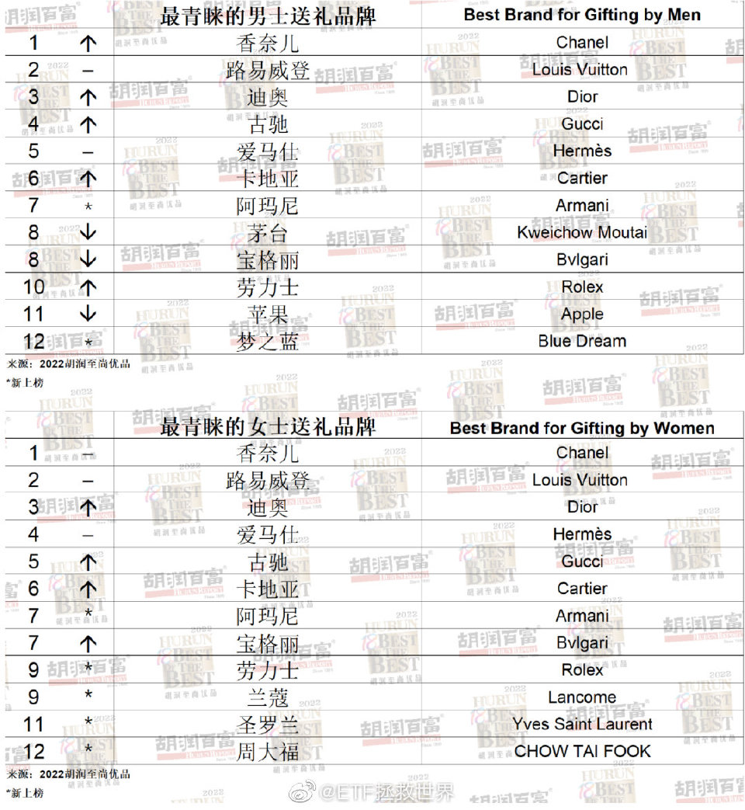

======================================================

ETF拯救世界 (5687069307) @
2022-01-21 13:30:03 Fri  
url: https://weibo.com/5687069307/LbMcUiMqd

手里拿着一半基金一半现金经历下跌，感觉就像半杯水。

有些人看着半杯水，会觉得我好倒霉只有半杯水。有些人会很高兴，我还有半杯水呢。

我就很高兴，看着猎物一步步走进伏击圈。至于那些下跌的持仓，我有个坚定的信念，就是它们极大概率会涨回去。

股票我不敢这么说，持仓的基金很有信心。 ​​​

转发[91]  评论[860]  赞[3318] 

======================================================

ETF拯救世界 (5687069307) @
2022-01-21 13:57:50 Fri  
url: https://weibo.com/5687069307/LbMob85cP

说句实话，我们股市涨还是跌，除了股民和基民，没什么人真的在意。 ​​​

转发[36]  评论[732]  赞[3524] 

======================================================

ETF拯救世界 (5687069307) @
2022-01-21 17:48:44 Fri  
url: https://weibo.com/5687069307/LbNTUhUsK

这就是主动基金的风险之一

------------------------------------------------------
转推：
>  @财联社APP (2868676035)
>  2022-01-21 17:46:34 Fri  
>  url: https:/weibo.com/2868676035/LbNT1fNYF/

>  【#董承非公告离职正式告别兴证全球基金#】财联社1月21日电，继卸任全部产品基金经理一职之后，董承非正式告别兴证全球基金。兴证全球基金最新公告称，在公司服役近19年的资管老将董承非将正式离职。2021年10月19日，董承非宣布卸任兴全趋势和兴全新视野的基金经理职务。（记者 韩理） ​​​

转发[60]  评论[375]  赞[2123] 

======================================================

ETF拯救世界 (5687069307) @
2022-01-21 18:12:46 Fri  
url: https://weibo.com/5687069307/LbO3EvnUo

今天数据非常好。

下周一如果能再来这样一下，必买。 ​​​

转发[47]  评论[947]  赞[3526] 

======================================================

ETF拯救世界 (5687069307) @
2022-01-21 22:10:52 Fri  
url: https://weibo.com/5687069307/LbPCiz3KW

分享图片 ​​​

转发[33]  评论[906]  赞[3035] 

+++++++++++++++++++++++++++++++++++++++++++++++++++++

图片：
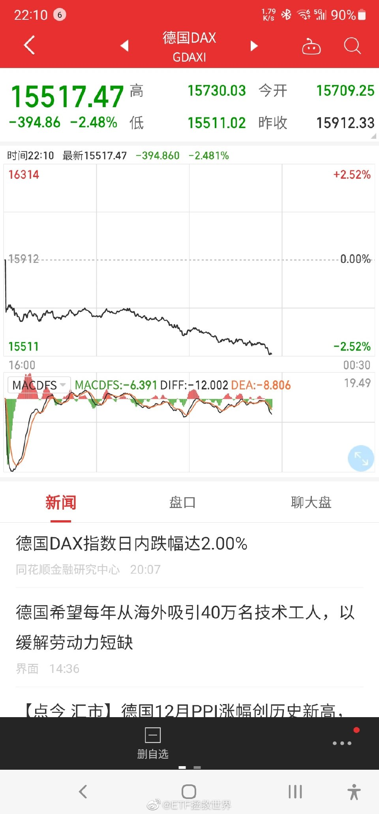

======================================================

ETF拯救世界 (5687069307) @
2022-01-22 15:19:32 Sat  
url: https://weibo.com/5687069307/LbWlPEUas

昨天奈飞大跌。怎么说呢，两年的涨幅，基本上三个月跌完了。

也就是说，如果你意志坚定的长期投资拿了两年，以为赚了很多，结果三个月一场空了。

你肯定以为我要说会低买还要会高卖。

不是，你猜错了。

我想说的是，

同样的，你以为一个品种你拿了两年多浪费时间一点没赚，

结果可能突然三个月就 ​​​

转发[169]  评论[693]  赞[3858] 

======================================================

ETF拯救世界 (5687069307) @
2022-01-22 16:18:11 Sat  
url: https://weibo.com/5687069307/LbWJDDRHb

一个人在办公室，看着窗外的雪景，给各位大爷打工。 ​​​

转发[32]  评论[1612]  赞[4824] 

+++++++++++++++++++++++++++++++++++++++++++++++++++++

图片：
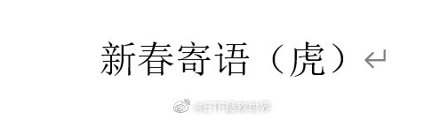

======================================================

ETF拯救世界 (5687069307) @
2022-01-24 07:18:50 Mon  
url: https://weibo.com/5687069307/Lcc3IhoJ5

最近又有明星经理被喷了。

其实没有什么新鲜事，只是历史在一次次的重复。我来总结一下一直在说的两点：

第一，价值毁灭。

规模很小的时候开始涨，涨100%，变成明星，吸引巨量资金，小幅下跌后就会出现价值毁灭。比如，跌20%，就会出现整体亏损。

这个，适用于基金，也适用于个人投资者——你赚了 ​​​

转发[450]  评论[1109]  赞[3742] 

======================================================

ETF拯救世界 (5687069307) @
2022-01-24 08:45:53 Mon  
url: https://weibo.com/5687069307/LccD3351R

自己做柠檬茶有什么诀窍吗。为什么做出来的和茶餐厅的喝起来不一样。 ​​​

转发[24]  评论[573]  赞[2328] 

======================================================

ETF拯救世界 (5687069307) @
2022-01-24 09:03:01 Mon  
url: https://weibo.com/5687069307/LccK0bvmm

我有一个关于感情的认知：

年龄越小，对于感情认知就越单纯。年纪大了，想得就会越来越多。交往就会掺杂更多感情之外的东西。

如果以这个结论为起点，就会衍生出很多观点。但我就不说了，怕被骂，虽然其实没什么好骂的。 ​​​

转发[53]  评论[584]  赞[2844] 

======================================================

ETF拯救世界 (5687069307) @
2022-01-24 10:12:04 Mon  
url: https://weibo.com/5687069307/Lcdc201yk

神奇的数学：

HD最低价1.42，自最高点跌幅94.76%。

目前2.02，自最高点跌幅92.54%。

是不是看起来只差了2%。但其实从1.42涨上来，已经涨了42.25%。 ​​​

转发[90]  评论[464]  赞[2461] 

======================================================

ETF拯救世界 (5687069307) @
2022-01-24 10:16:23 Mon  
url: https://weibo.com/5687069307/LcddMm9zA

兰兰被骂了。

那么我们准备把高位卖出的捡回来吧。 ​​​

转发[43]  评论[868]  赞[3374] 

======================================================

ETF拯救世界 (5687069307) @
2022-01-24 10:24:51 Mon  
url: https://weibo.com/5687069307/Lcdhdp7UH

你能想象吗，上次买入居然是3年前…… ​​​

转发[78]  评论[786]  赞[3466] 

+++++++++++++++++++++++++++++++++++++++++++++++++++++

图片：
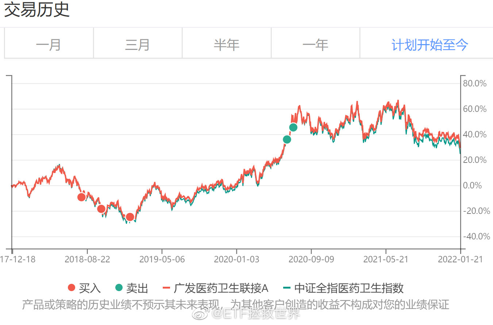

======================================================

ETF拯救世界 (5687069307) @
2022-01-24 10:53:54 Mon  
url: https://weibo.com/5687069307/Lcdt0t2KJ

其实一个人结婚不结婚，单身不单身，要不要孩子，都无所谓。自己想干嘛就干嘛。后悔了也是自己的决定，这就是人生。

但我看不惯的就是结婚的人天天吹结婚好，撺掇单身的赶紧相亲结婚；单身的猛吹单身好，忽悠别人一起跟自己单身；有孩子的总是不忘教育丁克：小心老了无依无靠。

别人的事情关你屁事啊 ​​​

转发[198]  评论[910]  赞[4789] 

======================================================

ETF拯救世界 (5687069307) @
2022-01-24 15:14:31 Mon  
url: https://weibo.com/5687069307/LcfaNfQJw

问猫奴们两件事。

第一，什么猫漂亮、温顺、黏人又不会太黏，活泼又不失沉稳。

第二，北京在哪里买猫比较靠谱。 ​​​

转发[63]  评论[1656]  赞[5512] 

======================================================

ETF拯救世界 (5687069307) @
2022-01-24 15:31:20 Mon  
url: https://weibo.com/5687069307/LcfhCmgNz

是儿子要买。他说愿意把攒了一年的零花钱都拿出来买一只小猫，应该是真喜欢。家里那只我以前在外面捡到的猫跟人不亲，儿子脸贴在它身上它也没有互动，不让他抱也不让摸。孩子很少提出要求买什么，既然提了，我就要尽力帮他完成。虽然他长大了也可以自己养，但我想那时候就与小时候的感觉完全不同了。

------------------------------------------------------
转推：
>  @ETF拯救世界 (5687069307)
>  2022-01-24 15:14:31 Mon  
>  url: https:/weibo.com/5687069307/LcfaNfQJw/

>  问猫奴们两件事。
>  
>  第一，什么猫漂亮、温顺、黏人又不会太黏，活泼又不失沉稳。
>  
>  第二，北京在哪里买猫比较靠谱。 ​​​

转发[20]  评论[745]  赞[2692] 

======================================================

ETF拯救世界 (5687069307) @
2022-01-24 15:56:48 Mon  
url: https://weibo.com/5687069307/LcfrXfs3t

21年4月的时候，环保还是最便宜的行业指数。

到了现在，绝对值比它高的只剩军工、医疗、信息了…… ​​​

转发[47]  评论[315]  赞[2478] 

======================================================

ETF拯救世界 (5687069307) @
2022-01-24 16:05:45 Mon  
url: https://weibo.com/5687069307/LcfvAtFFT

好生气。

昨晚在B站找小猫的视频，给我推了一大堆豪宅room tour。

我又买不起干嘛给我推这个？拍这种东西不怕我们这些买不起的人生气吗。

烦死了，再看一个…… ​​​

转发[18]  评论[464]  赞[2290] 

======================================================

ETF拯救世界 (5687069307) @
2022-01-24 22:19:04 Mon  
url: https://weibo.com/5687069307/LchX7iS3m

DAX你怎么了[泪]

是被谁抛弃了吗，振作点啊！[泪] ​​​

转发[28]  评论[657]  赞[2818] 

+++++++++++++++++++++++++++++++++++++++++++++++++++++

图片：
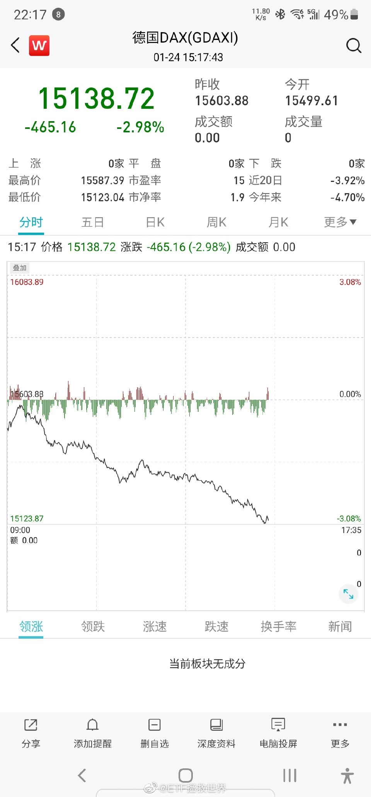

======================================================

ETF拯救世界 (5687069307) @
2022-01-24 23:33:18 Mon  
url: https://weibo.com/5687069307/LcirfnLGj

这个真没有 ​​​

转发[17]  评论[412]  赞[2051] 

+++++++++++++++++++++++++++++++++++++++++++++++++++++

图片：
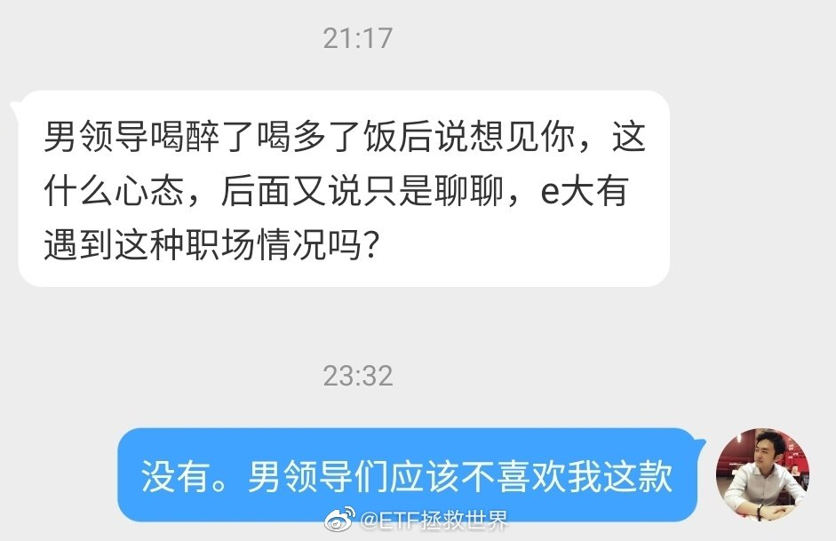

======================================================

ETF拯救世界 (5687069307) @
2022-01-25 08:04:30 Tue  
url: https://weibo.com/5687069307/LclMKfbFc

有些事情有点可疑，别急，先等等看 ​​​

转发[20]  评论[709]  赞[2764] 

======================================================

ETF拯救世界 (5687069307) @
2022-01-25 09:31:47 Tue  
url: https://weibo.com/5687069307/Lcmmbgoez

今年财务方面的三个愿望：

第一，平安。没有什么意外的财产损失。

第二，股市不赔钱。

第三，消费、医药顶格配置完毕。 ​​​

转发[165]  评论[688]  赞[3616] 

======================================================

ETF拯救世界 (5687069307) @
2022-01-25 09:53:06 Tue  
url: https://weibo.com/5687069307/LcmuPyezU

有人问：如果愿望是不赔钱，那么清仓存银行不就行了吗？

答案：

第一，清仓怎么完成配置？未来的上涨怎么吃肉？

第二，万一出现小概率事件，今年股市涨了呢？

可以通过配置完成不赔钱，但通过清仓完成不赔钱我觉得很二。即使偶尔蒙对了一次，未来也会吃大亏。 ​​​

转发[133]  评论[362]  赞[2373] 

======================================================

ETF拯救世界 (5687069307) @
2022-01-25 09:55:16 Tue  
url: https://weibo.com/5687069307/LcmvHCIeE

满仓和清仓都是赌博。满仓一个行业是豪赌。那么满仓一只股票或者加杠杆满仓一只股票是什么？

------------------------------------------------------
转推：
>  @ETF拯救世界 (5687069307)
>  2022-01-25 09:53:06 Tue  
>  url: https:/weibo.com/5687069307/LcmuPyezU/

>  有人问：如果愿望是不赔钱，那么清仓存银行不就行了吗？
>  
>  答案：
>  
>  第一，清仓怎么完成配置？未来的上涨怎么吃肉？
>  
>  第二，万一出现小概率事件，今年股市涨了呢？
>  
>  可以通过配置完成不赔钱，但通过清仓完成不赔钱我觉得很二。即使偶尔蒙对了一次，未来也会吃大亏。 ​​​

转发[48]  评论[338]  赞[1735] 

======================================================

ETF拯救世界 (5687069307) @
2022-01-25 11:06:19 Tue  
url: https://weibo.com/5687069307/LcmYxCWv5

找了几个全球消费的QDII准备放入基金池，结果一看持仓，

茅台、老窖、恰恰、拼多多、网易。

什么鬼。全球消费啊喂。

我要的是宝洁可乐沃尔玛百事costco菲利普莫里斯雅诗兰黛好时LV爱马仕

白瞎了那么好的投资方向和额度了。 ​​​

转发[78]  评论[548]  赞[3095] 

======================================================

ETF拯救世界 (5687069307) @
2022-01-25 12:30:31 Tue  
url: https://weibo.com/5687069307/LcnwIDyRi

这种情况该怎么教育，这是情商高还是有点虚伪。

儿子：我去可乐家了。可乐说家里太乱了。

我：你怎么说的。

儿子：我说一点都不乱啊，比我家干净多了。

我：嗯？

儿子：其实根本没咱家干净。我是怕他不开心。

我：嗯……去别人家做客，客气客气也挺好。

儿子：他给了我两张奥特曼卡牌。

我：这 ​​​

转发[37]  评论[432]  赞[3330] 

======================================================

ETF拯救世界 (5687069307) @
2022-01-25 13:12:27 Tue  
url: https://weibo.com/5687069307/LcnNK8yXU

一切按照剧本走。 ​​​

转发[36]  评论[359]  赞[2102] 

======================================================

ETF拯救世界 (5687069307) @
2022-01-25 13:37:10 Tue  
url: https://weibo.com/5687069307/LcnXMoAvX

回复@Anonymous80626:机构造不了时势。报团个股或者板块可以，大盘走势不是他们能够左右的。跌很正常，不正常吗？//@Anonymous80626:回复@ETF拯救世界:不是国内机构他们最近都持续卖出嘛，北上是持续流入的呀？

------------------------------------------------------
转推：
>  @ETF拯救世界 (5687069307)
>  2022-01-25 13:12:27 Tue  
>  url: https:/weibo.com/5687069307/LcnNK8yXU/

>  一切按照剧本走。 ​​​

转发[18]  评论[109]  赞[1089] 

======================================================

ETF拯救世界 (5687069307) @
2022-01-25 13:42:03 Tue  
url: https://weibo.com/5687069307/LcnZL6UxF

说跌不正常的，你们说说哪个板块不应该跌。

50倍的食品饮料，80倍的新能源，还是50倍的医疗。

创业科创就不用说了。

除了一倍多pb的红利，谁不应该跌，你们说。 

估值，情绪，资金量，哪个支持涨。

年换手700%，成交量万亿，怎么涨，你们说说。 ​​​

转发[172]  评论[416]  赞[2493] 

======================================================

ETF拯救世界 (5687069307) @
2022-01-25 13:48:08 Tue  
url: https://weibo.com/5687069307/Lco2e8AhD

回复@苏怡不简单:笑死了。央妈的货币宽松是给股市准备的吗？前几天我就说过了，“除了股民和基民，股市的涨跌没有人真的在意”。//@苏怡不简单:美国马上加息，昨晚收盘全部收红，我国央行降息，连续放水，跌得爹妈不认。货币宽松却不能让股市涨？不理解

------------------------------------------------------
转推：
>  @ETF拯救世界 (5687069307)
>  2022-01-25 13:42:03 Tue  
>  url: https:/weibo.com/5687069307/LcnZL6UxF/

>  说跌不正常的，你们说说哪个板块不应该跌。
>  
>  50倍的食品饮料，80倍的新能源，还是50倍的医疗。
>  
>  创业科创就不用说了。
>  
>  除了一倍多pb的红利，谁不应该跌，你们说。 
>  
>  估值，情绪，资金量，哪个支持涨。
>  
>  年换手700%，成交量万亿，怎么涨，你们说说。 ​​​

转发[38]  评论[152]  赞[1464] 

======================================================

ETF拯救世界 (5687069307) @
2022-01-25 13:59:02 Tue  
url: https://weibo.com/5687069307/Lco6EknJn

我发现很多人来A股玩，却一直没有从根本上理解A股到底是为了什么而存在。

它是资本实现退出的地方，还是解决企业融资困难的地方，还是让你产生财产性收益的地方，还是实现资源优化配置的地方……

很多事情你先想明白，想透，再开始玩。只有根本的东西想透了，你才能制定符合这个市场的交易策略和交易 ​​​

转发[207]  评论[407]  赞[2604] 

======================================================

ETF拯救世界 (5687069307) @
2022-01-25 14:04:36 Tue  
url: https://weibo.com/5687069307/Lco8UswNA

别说那么多，继续开车继续买。

用的是之前腾出来的资金。

这也是高卖的意义之一。 ​​​

转发[26]  评论[393]  赞[2384] 

======================================================

ETF拯救世界 (5687069307) @
2022-01-25 14:07:53 Tue  
url: https://weibo.com/5687069307/Lcoaf8weM

时隔三年，150和S的医药买入周期又开始了。

接下来的区间目标，是在9500-12000之间，将医药仓位配置完毕。

所有的事情都有预案，有解决方法，有执行措施，有理论和体系的保证。

你很怕跌？为什么？

哦，原来是因为什么都没有。 ​​​

转发[672]  评论[561]  赞[2923] 

======================================================

ETF拯救世界 (5687069307) @
2022-01-25 14:11:46 Tue  
url: https://weibo.com/5687069307/LcobPj4e5

现在迷茫的，再看一遍。再说一次，跌，是正常且合理且可以预期的。

------------------------------------------------------
转推：
>  @ETF拯救世界 (5687069307)
>  2022-01-03 13:37:38 Mon  
>  url: https:/weibo.com/5687069307/L92z2prkr/

>  在连续三年年初蒙对当年行情（19年各指数大涨；20年巨幅波动；21年热门板块跌30%-50%，中小股票表现出色）后，
>  
>  照例又要预测一下今年的大致行情。
>  
>  当然，事不过三，今年蒙对的难度系数增加了好多，权当一笑吧。
>  
>  今年的行情会非常复杂，但一句话总结，到年底，大多数指数应该是收阴。
>  
>  展开说说。
>  
>   ​​​

转发[76]  评论[240]  赞[1803] 

======================================================

ETF拯救世界 (5687069307) @
2022-01-25 14:25:18 Tue  
url: https://weibo.com/5687069307/LcohjDZGh

我再说一句

上半年跌，要比下半年跌好太多了。

甚至可能出现全年指数跌，但你赚钱。

不懂的以后回来看。 ​​​

转发[143]  评论[549]  赞[3350] 

======================================================

ETF拯救世界 (5687069307) @
2022-01-25 14:38:04 Tue  
url: https://weibo.com/5687069307/Lcomuw6Fz

对不起，今天兴奋了。

还是太年轻。 ​​​

转发[80]  评论[752]  赞[3146] 

======================================================

ETF拯救世界 (5687069307) @
2022-01-25 14:55:20 Tue  
url: https://weibo.com/5687069307/LcotvhTq7

回复@牛奶芝士酸汤鱼:在我微博搜“医药 支撑”。你会发现，现在我做的事情，几个月一年前就计划好了。计划好的事情，条件成熟了不做？那不成韭菜了？//@牛奶芝士酸汤鱼:不懂为什么左侧狂跌途中加仓，虽然跌破强支撑了，e大能否稍微解惑

------------------------------------------------------
转推：
>  @ETF拯救世界 (5687069307)
>  2022-01-25 14:38:04 Tue  
>  url: https:/weibo.com/5687069307/Lcomuw6Fz/

>  对不起，今天兴奋了。
>  
>  还是太年轻。 ​​​

转发[43]  评论[233]  赞[1993] 

======================================================

ETF拯救世界 (5687069307) @
2022-01-25 15:07:45 Tue  
url: https://weibo.com/5687069307/Lcoyy7Yor

回复@X_XD_:我从没做空也发财了。[微笑]拉黑。//@X_XD_:那你做空岂不是发财了？

------------------------------------------------------
转推：
>  @ETF拯救世界 (5687069307)
>  2022-01-25 13:42:03 Tue  
>  url: https:/weibo.com/5687069307/LcnZL6UxF/

>  说跌不正常的，你们说说哪个板块不应该跌。
>  
>  50倍的食品饮料，80倍的新能源，还是50倍的医疗。
>  
>  创业科创就不用说了。
>  
>  除了一倍多pb的红利，谁不应该跌，你们说。 
>  
>  估值，情绪，资金量，哪个支持涨。
>  
>  年换手700%，成交量万亿，怎么涨，你们说说。 ​​​

转发[18]  评论[273]  赞[1748] 

======================================================

ETF拯救世界 (5687069307) @
2022-01-25 15:31:24 Tue  
url: https://weibo.com/5687069307/LcoI936a5

我说几句心里话。

我知道，这样的大跌会让没有在心态和策略、配置上做好准备的朋友心情郁闷，甚至很痛苦。

所以你可能想要调侃、发泄、痛骂这个让你不开心的股市。

没关系，你去球球、淘县、支付宝、天天、DB，或者别的财经博主那里怎么骂都可以。甚至你去这些地方或者你自己的微博骂我都可以。

但 ​​​

转发[144]  评论[1673]  赞[4376] 

======================================================

ETF拯救世界 (5687069307) @
2022-01-25 16:15:33 Tue  
url: https://weibo.com/5687069307/Lcp041FTh

我个人的最新仓位排序有变：

第七位的医药与第六位的传媒互换位置，医药升至第六，传媒降至第7。

恒生与红利换位。红利降至第四，恒生升至第三。两者差距极小。

500与中概换位。中概位列第一，500降至第二。两者差距极小。 ​​​

转发[457]  评论[806]  赞[3945] 

======================================================

ETF拯救世界 (5687069307) @
2022-01-25 18:24:01 Tue  
url: https://weibo.com/5687069307/LcpQd1vdt

2021年9月看到这条评论的你有没有卖。已经从1.3跌到1.1了。买也管，卖也管，全方位全流程服务，还有第二家吗？！//@ETF拯救世界:昨日收盘，日经估值再次回到过去十年最高，比2020年3月高出一倍——当时几乎是历史最低。之前网格留的利润现在卖出也是可以的。

------------------------------------------------------
转推：
>  @ETF拯救世界 (5687069307)
>  2020-03-17 15:54:53 Tue  
>  url: https:/weibo.com/5687069307/Iz23tClCV/

>  今日数据：
>  
>  德国、日本已经极具投资价值。 ​​​

转发[49]  评论[509]  赞[2579] 

======================================================

ETF拯救世界 (5687069307) @
2022-01-25 22:30:23 Tue  
url: https://weibo.com/5687069307/Lcrsd4xDe

算烂尾吗。各位资深影评人说说。 ​​​

转发[30]  评论[869]  赞[3137] 

======================================================

ETF拯救世界 (5687069307) @
2022-01-26 09:22:27 Wed  
url: https://weibo.com/5687069307/LcvISCZrb

基金当然有很多问题。但是说实话，其中一部分问题难道不是基民造成的吗。

是谁看基金短期业绩排名买基金？是谁在牛市中涨幅稍微落后就破口大骂？是谁追捧风格激进的经理为“女神”“男神”组织后援会？

基民要求一个人一个基金上涨的时候疯涨，下跌的时候不跌，是不是属于分裂症了？谁能精准把握牛熊 ​​​

转发[87]  评论[484]  赞[2931] 

======================================================

ETF拯救世界 (5687069307) @
2022-01-26 09:40:39 Wed  
url: https://weibo.com/5687069307/LcvQhehxy

大辣鸡恒生今年至今跑赢纳斯达克17%。[哼] ​​​

转发[29]  评论[422]  赞[2704] 

======================================================

ETF拯救世界 (5687069307) @
2022-01-26 09:57:41 Wed  
url: https://weibo.com/5687069307/LcvXc11Gp

我感觉今年医药配到10%应该没问题。

目前150是4%，S是5%。

新增部分成本如果能控制在10000-10500之间我就会很满意。 ​​​

转发[419]  评论[1292]  赞[4455] 

======================================================

ETF拯救世界 (5687069307) @
2022-01-26 15:48:55 Wed  
url: https://weibo.com/5687069307/LcyfKruo7

带儿子逛街买衣服，带儿子的妈妈做头发，不光累还得付账。

自己什么都没有。

人生还会好吗[悲伤] ​​​

转发[36]  评论[1378]  赞[4812] 

======================================================

ETF拯救世界 (5687069307) @
2022-01-26 19:40:35 Wed  
url: https://weibo.com/5687069307/LczLMtRS2

今日数据：

医药和医疗指数26个月以来估值新低。所以兰兰现在开始买200万是可以理解的。（跟我们开始买入的时机完全一致，虽然我觉得她买的太少了）

但还请注意另一点——距离救命底的估值，还差30%以上的下跌。（对新朋友解释一下：距离历史最低还有30%的下跌，不代表一定会跌30%，也不代表不会随时 ​​​

转发[314]  评论[695]  赞[4774] 

======================================================

ETF拯救世界 (5687069307) @
2022-01-26 20:28:06 Wed  
url: https://weibo.com/5687069307/LcA54BNHZ

回复@早睡早起1897:理论上说当然可以用7080做极限套任何不死品种。但很多时候我也会加个主观判断。比如医疗指数最高20000点，你说它要跌到4000点我觉得有点太惊悚了。我对它的最低预期大概是7500左右。

------------------------------------------------------
转推：
>  @ETF拯救世界 (5687069307)
>  2022-01-26 19:40:35 Wed  
>  url: https:/weibo.com/5687069307/LczLMtRS2/

>  今日数据：
>  
>  医药和医疗指数26个月以来估值新低。所以兰兰现在开始买200万是可以理解的。（跟我们开始买入的时机完全一致，虽然我觉得她买的太少了）
>  
>  但还请注意另一点——距离救命底的估值，还差30%以上的下跌。（对新朋友解释一下：距离历史最低还有30%的下跌，不代表一定会跌30%，也不代表不会随时 ​​​

转发[150]  评论[373]  赞[2318] 

======================================================

ETF拯救世界 (5687069307) @
2022-01-27 09:03:35 Thu  
url: https://weibo.com/5687069307/LcF1IyeI0

信息差导致怨恨。 ​​​

转发[20]  评论[525]  赞[2043] 

+++++++++++++++++++++++++++++++++++++++++++++++++++++

图片：
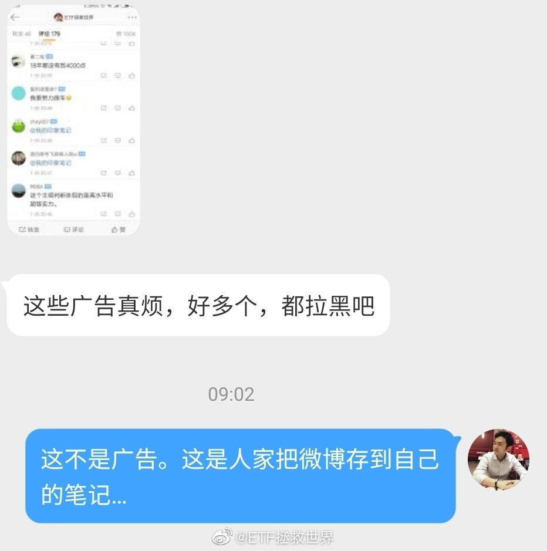
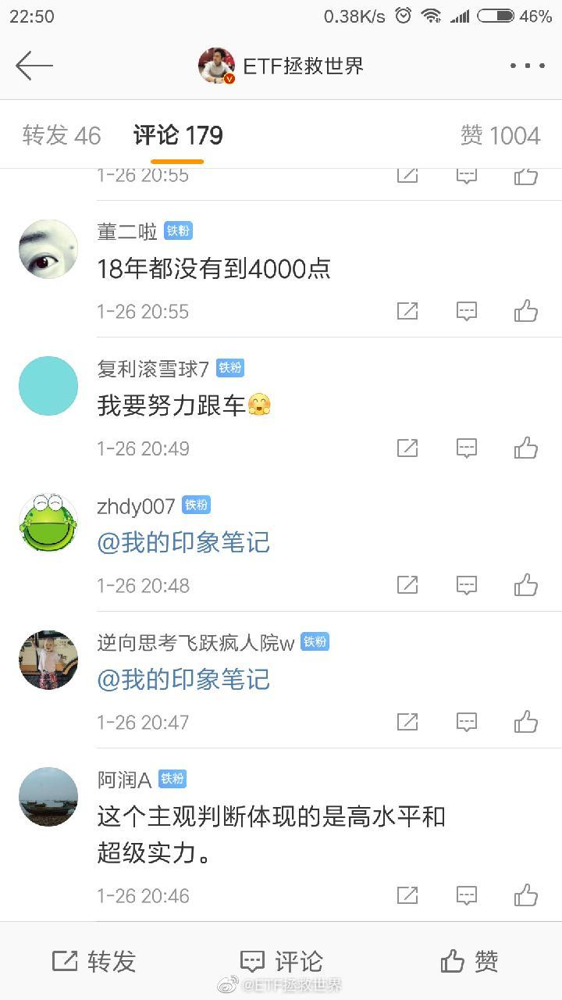

======================================================

ETF拯救世界 (5687069307) @
2022-01-27 09:19:28 Thu  
url: https://weibo.com/5687069307/LcF8apFmX

各位时尚先锋们，有没有推荐的男士手链款式。

要求精致、时尚、金属材质或者大部分金属材质。

各类宝石珍珠木头的就算了，不是一个世界的。

不限品牌。 ​​​

转发[26]  评论[638]  赞[3011] 

======================================================

ETF拯救世界 (5687069307) @
2022-01-27 09:30:43 Thu  
url: https://weibo.com/5687069307/LcFcJuw6I

好家伙，十几天一个来回，筹码不变，一份成本减少8%？ ​​​

转发[19]  评论[448]  赞[2272] 

======================================================

ETF拯救世界 (5687069307) @
2022-01-27 09:46:47 Thu  
url: https://weibo.com/5687069307/LcFjg2r6H

再次提示，波段仓位如果未做好压力测试，导致资源不足以支撑策略持续进行，减少投入或暂停都毫无问题。这个说过好几次了。

只是会减少下面几次的收益。 ​​​

转发[67]  评论[715]  赞[2906] 

======================================================

ETF拯救世界 (5687069307) @
2022-01-27 10:02:25 Thu  
url: https://weibo.com/5687069307/LcFpBkiIZ

由于日元大幅贬值，投资日经225的波段逻辑已经完全改变，所以暂停日经波段。

我会删除自己的日经条件单。 ​​​

转发[115]  评论[812]  赞[3138] 

======================================================

ETF拯救世界 (5687069307) @
2022-01-27 10:26:24 Thu  
url: https://weibo.com/5687069307/LcFzkFBLH

正式进入9500-12000之间的建仓区域。接下来是考验各位建仓水平，以及持仓心态的时候了。今年太有意思了。

------------------------------------------------------
转推：
>  @ETF拯救世界 (5687069307)
>  2022-01-26 09:57:41 Wed  
>  url: https:/weibo.com/5687069307/LcvXc11Gp/

>  我感觉今年医药配到10%应该没问题。
>  
>  目前150是4%，S是5%。
>  
>  新增部分成本如果能控制在10000-10500之间我就会很满意。 ​​​

转发[178]  评论[1047]  赞[3225] 

======================================================

ETF拯救世界 (5687069307) @
2022-01-27 10:55:22 Thu  
url: https://weibo.com/5687069307/LcFL5Emor

整个2021年全年，150在A股方面，一共买入了一份金融、一份信息、两份传媒、一份消费，一共5份。（信息与消费买在全年低点，目前依然盈利）

同期，A股高位卖出了利润非常高的50、300、环保、500一共11份。

也就是说，在a股，我们的计划一直是高位减仓，未在高位加仓。目前的下跌，只是会减少过去的利 ​​​

转发[100]  评论[750]  赞[4016] 

======================================================

ETF拯救世界 (5687069307) @
2022-01-27 11:05:37 Thu  
url: https://weibo.com/5687069307/LcFPfCfUu

一些利好ZC不会太远了。

当然，有没有用另说。 ​​​

转发[32]  评论[581]  赞[3395] 

======================================================

ETF拯救世界 (5687069307) @
2022-01-27 12:41:30 Thu  
url: https://weibo.com/5687069307/LcGsaAqYs

说句实话，我不太相信2018之后在2022会再次进入钻石坑。

如果真的会，不计利润波动，全市场估值下降20%左右即可。 ​​​

转发[151]  评论[1037]  赞[4915] 

======================================================

ETF拯救世界 (5687069307) @
2022-01-27 15:20:58 Thu  
url: https://weibo.com/5687069307/LcHuUiSY2

今晚看日本VS中国。

足球&股市，两个添堵王炸居然凑到一天了。

值得纪念的日子。

（等待数据传输中，准备开始计算今日数据。） ​​​

转发[34]  评论[488]  赞[3196] 

======================================================

ETF拯救世界 (5687069307) @
2022-01-27 16:15:31 Thu  
url: https://weibo.com/5687069307/LcHR2ASnI

目前长期仓位配置中，最讨厌的是以食品饮料为代表的消费仓位。

团报得太紧，总是调整不下来，始终无法建立起基本仓位。

非常讨厌。 ​​​

转发[97]  评论[651]  赞[3403] 

======================================================

ETF拯救世界 (5687069307) @
2022-01-27 16:29:04 Thu  
url: https://weibo.com/5687069307/LcHWxvfJt

真的，服了。

为什么我总在微博问一些事情，因为从几年前我就发现，我问的事情，总是能从评论或者私信中得到特别完美的答案！

什么知乎百度值得买小红书，全都是CD，还是这里的兄弟姐妹真的给力。

各位推荐的手链有几款很喜欢，抽空就去买！ ​​​

转发[25]  评论[846]  赞[3170] 

======================================================

ETF拯救世界 (5687069307) @
2022-01-28 09:57:08 Fri  
url: https://weibo.com/5687069307/LcONXbXb0

新股大面积上市首日破发，是进入底部区域的标志之一。 ​​​

转发[287]  评论[754]  赞[3559] 

======================================================

ETF拯救世界 (5687069307) @
2022-01-28 10:08:03 Fri  
url: https://weibo.com/5687069307/LcOSnFm6t

在高位吸引不成熟的、幻想赚快钱的、对投资一窍不通的人申购自己的产品，然后抱团贵到匪夷所思的品种，其最大的危害并不是申购者的资产损失，价值毁灭，

而是在下跌过程中，这些申购者会不会惊慌失措赎回产品，导致被抱团的，极度高估的品种更加快速的崩塌。

羊群也好，旅鼠也好，当它们数量足够大， ​​​

转发[248]  评论[440]  赞[3058] 

======================================================

ETF拯救世界 (5687069307) @
2022-01-28 10:16:44 Fri  
url: https://weibo.com/5687069307/LcOVUll8D

还有，不要忘了这个数据。

1.8万亿两融资金，在快速下跌中安全性是否能得到保证，会不会因很多账户强制平仓导致新的问题？

大，一定是好吗？ ​​​

转发[82]  评论[485]  赞[2435] 

+++++++++++++++++++++++++++++++++++++++++++++++++++++

图片：
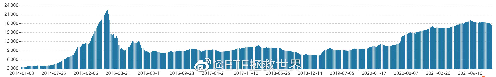

======================================================

ETF拯救世界 (5687069307) @
2022-01-28 10:42:59 Fri  
url: https://weibo.com/5687069307/LcP6z5MJP

今天跌了2%，看起来有一点点不那么讨厌了。。

------------------------------------------------------
转推：
>  @ETF拯救世界 (5687069307)
>  2022-01-27 16:15:31 Thu  
>  url: https:/weibo.com/5687069307/LcHR2ASnI/

>  目前长期仓位配置中，最讨厌的是以食品饮料为代表的消费仓位。
>  
>  团报得太紧，总是调整不下来，始终无法建立起基本仓位。
>  
>  非常讨厌。 ​​​

转发[22]  评论[317]  赞[2110] 

======================================================

ETF拯救世界 (5687069307) @
2022-01-28 10:45:42 Fri  
url: https://weibo.com/5687069307/LcP7FnogQ

内地+海外的医药&消费，加起来买到20%-25%的低成本持仓，想想都很开心。 ​​​

转发[129]  评论[850]  赞[3598] 

======================================================

ETF拯救世界 (5687069307) @
2022-01-28 14:21:43 Fri  
url: https://weibo.com/5687069307/LcQxlrQR0

我相信时势造英雄，英雄是造不了时势的。

庞大、复杂的系统，在趋势运行的过程中，很难通过人为手段改变。比如股市、比如足球。

但是，在趋势运行末期——也就是所谓“不能穿鲁缟”的时候，人为手段是可以一两拨千金发挥作用的，就是所谓压倒骆驼的最后一根稻草。

我不知道这话是不是该说，说的合适 ​​​

转发[123]  评论[580]  赞[2573] 

======================================================

ETF拯救世界 (5687069307) @
2022-01-28 14:47:39 Fri  
url: https://weibo.com/5687069307/LcQHSgTA3

下跌3%，功力不减当年。被监控的微博？

------------------------------------------------------
转推：
>  @ETF拯救世界 (5687069307)
>  2022-01-27 16:15:31 Thu  
>  url: https:/weibo.com/5687069307/LcHR2ASnI/

>  目前长期仓位配置中，最讨厌的是以食品饮料为代表的消费仓位。
>  
>  团报得太紧，总是调整不下来，始终无法建立起基本仓位。
>  
>  非常讨厌。 ​​​

转发[25]  评论[310]  赞[2008] 

======================================================

ETF拯救世界 (5687069307) @
2022-01-28 14:50:35 Fri  
url: https://weibo.com/5687069307/LcQJ48e0Z

提前说个消费的建仓区域吧。

开始建仓点位大致在17000左右，最终支撑位在11500左右。两者之间的区域是极佳的建仓区域。 ​​​

转发[513]  评论[845]  赞[3445] 

======================================================

ETF拯救世界 (5687069307) @
2022-01-28 15:01:37 Fri  
url: https://weibo.com/5687069307/LcQNxxQaR

收盘了。下次开盘就是虎年了。

可能有朋友觉得这个月跌得很难受。但我要说一句，这样的下跌预示着未来，甚至有可能就在今年的某个时期，就会出现非常棒的收益。

所以大家开开心心过年，现在你以为坏的事情，其实未必坏。现在你以为好的，反而有可能是刮骨钢刀。

开心起来！明天发一篇公众号。然后初 ​​​

转发[163]  评论[2868]  赞[6460] 

======================================================

ETF拯救世界 (5687069307) @
2022-01-28 23:27:08 Fri  
url: https://weibo.com/5687069307/LcU6JrtAJ

爱情神话看到一半想打五分。 ​​​

转发[56]  评论[434]  赞[1989] 

======================================================

ETF拯救世界 (5687069307) @
2022-01-29 00:46:41 Sat  
url: https://weibo.com/5687069307/LcUD1Eor8

看完了，还是维持五分。5/5。我就喜欢这种带点幽默感的爱情轻喜剧。类似于真爱至上，诺丁山等等。上海话也不影响观感，比较新鲜。这种类型的片子国内很少见。

------------------------------------------------------
转推：
>  @ETF拯救世界 (5687069307)
>  2022-01-28 23:27:08 Fri  
>  url: https:/weibo.com/5687069307/LcU6JrtAJ/

>  爱情神话看到一半想打五分。 ​​​

转发[36]  评论[489]  赞[2460] 

======================================================

ETF拯救世界 (5687069307) @
2022-01-29 10:12:02 Sat  
url: https://weibo.com/5687069307/LcYkv2Sab

真是奇怪，我自己个人的微博，我愿意拉黑谁就拉黑谁，我不愿意让谁看就不让谁看，你管得着吗？

我欠你的？哪条法律规定我一定要写东西给你看了？

你也可以对等反制拉黑我啊。当然我是个有腔调的人，绝对不会用小号骂你，侬晓得哇。[鼓掌] ​​​

转发[25]  评论[854]  赞[3353] 

+++++++++++++++++++++++++++++++++++++++++++++++++++++

图片：
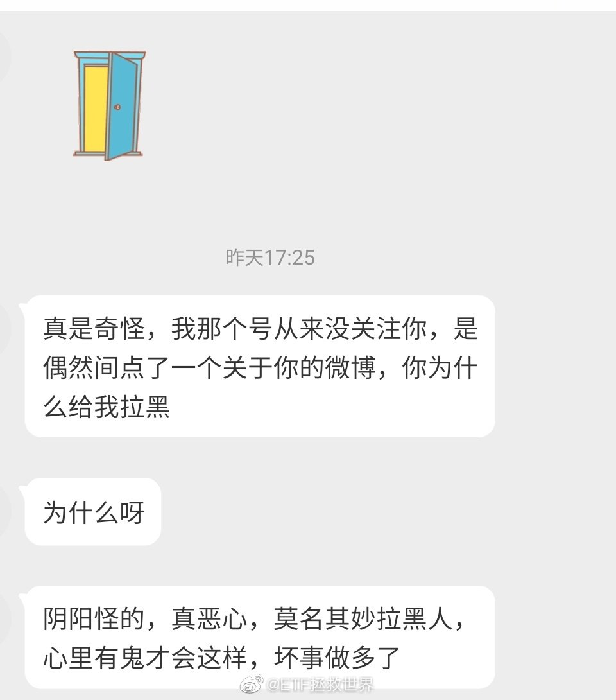

======================================================

ETF拯救世界 (5687069307) @
2022-01-29 13:35:15 Sat  
url: https://weibo.com/5687069307/LcZEZ6A61

为什么喜欢爱情神话这种电影呢。

我想了又想，应该是它会让我在一种轻松和舒适中感受到爱的乐趣。

没有狗血，没有恶人，没有尔虞我诈。每个人都轻松，都幽默，都让人感到舒服。

画面、调色、运镜、角度、音乐（整个观影过程中我三次打开听歌识曲收藏好听的歌曲）无一不让人舒服。

更让人喜欢的是人 ​​​

转发[212]  评论[709]  赞[4055] 

======================================================

ETF拯救世界 (5687069307) @
2022-01-29 13:56:01 Sat  
url: https://weibo.com/5687069307/LcZNpyomh

回复@uncutjade_harmony_lin:正式通知一下，拖更了，要好好排版编辑一下，明天上午发……//@uncutjade_harmony_lin:等今天的文章等的望眼欲穿[开学季]

------------------------------------------------------
转推：
>  @ETF拯救世界 (5687069307)
>  2022-01-29 13:35:15 Sat  
>  url: https:/weibo.com/5687069307/LcZEZ6A61/

>  为什么喜欢爱情神话这种电影呢。
>  
>  我想了又想，应该是它会让我在一种轻松和舒适中感受到爱的乐趣。
>  
>  没有狗血，没有恶人，没有尔虞我诈。每个人都轻松，都幽默，都让人感到舒服。
>  
>  画面、调色、运镜、角度、音乐（整个观影过程中我三次打开听歌识曲收藏好听的歌曲）无一不让人舒服。
>  
>  更让人喜欢的是人 ​​​

转发[14]  评论[443]  赞[1548] 

======================================================

ETF拯救世界 (5687069307) @
2022-01-29 14:09:19 Sat  
url: https://weibo.com/5687069307/LcZSOiJDm

先预告一下，各位大爷先看看喜不喜欢。

具体情况等通知。

（非本帖抽奖，不用刻意评论） ​​​

转发[94]  评论[4703]  赞[6231] 

+++++++++++++++++++++++++++++++++++++++++++++++++++++

图片：
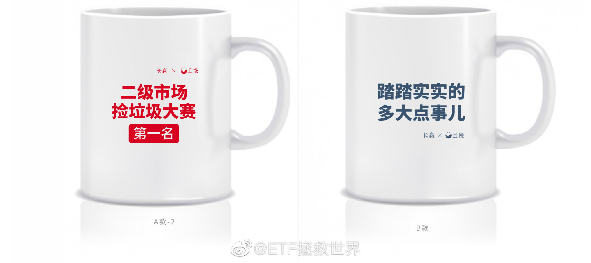

======================================================

ETF拯救世界 (5687069307) @
2022-01-29 17:30:12 Sat  
url: https://weibo.com/5687069307/Ld1clx5nL

健身房只有我一个人。 ​​​

转发[20]  评论[1163]  赞[3580] 

======================================================

ETF拯救世界 (5687069307) @
2022-01-30 10:29:41 Sun  
url: https://weibo.com/5687069307/Ld7Sa2qeC

BGM想放一首“旧社会顶穷的人”，

想了半天大过年的意头实在不大灵光，下次吧…… ​​​

转发[22]  评论[844]  赞[2462] 

======================================================

ETF拯救世界 (5687069307) @
2022-01-30 13:04:53 Sun  
url: https://weibo.com/5687069307/Ld8T9xjfz

请把拐卖妇女儿童的人贩子全部枪毙，没收全部家庭财产

——来自于一个普通人民群众的心声 ​​​

转发[122]  评论[835]  赞[6445] 

======================================================

ETF拯救世界 (5687069307) @
2022-01-30 13:26:49 Sun  
url: https://weibo.com/5687069307/Ld923rEIF

世界上有两种人。

第一种人是把其他人分为两种：可以带给他利益的人，以及多余的人。

除了能带给他利益的，全是多余的，讨厌的，最好全部消失，其死活他也不会在意。

能带给他利益的，他会用尽各种办法在他们身上取得利益。

第二种人是把其他人当做人。会感恩对自己好的人，会力所能及的帮助素不相 ​​​

转发[247]  评论[1056]  赞[3908] 

======================================================

ETF拯救世界 (5687069307) @
2022-01-30 15:26:04 Sun  
url: https://weibo.com/5687069307/Ld9OsuTqM

购物小贴士：

如果你有一样一直想买但总觉得有点贵舍不得买的东西，那你就应该去看跟它一个种类，但贵很多的东西。

然后你再回来看它，就会觉得它很值，就会马上入手。 ​​​

转发[50]  评论[802]  赞[3270] 

======================================================

ETF拯救世界 (5687069307) @
2022-01-30 16:14:55 Sun  
url: https://weibo.com/5687069307/Lda8ij1MT

今天练胸和背。

还是我一个人。 ​​​

转发[19]  评论[1181]  赞[3389] 

+++++++++++++++++++++++++++++++++++++++++++++++++++++

图片：
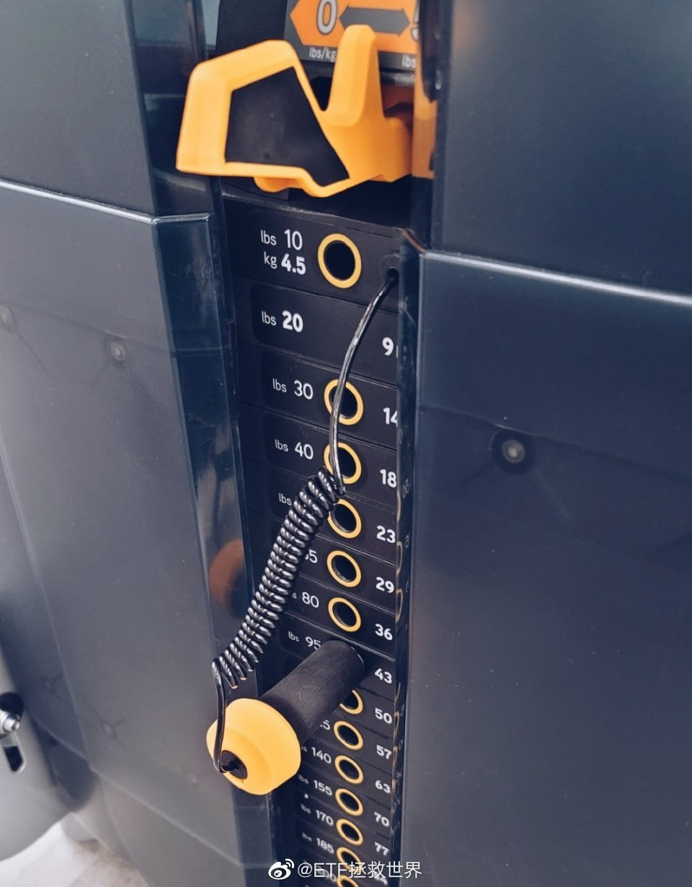

======================================================

ETF拯救世界 (5687069307) @
2022-01-31 23:59:00 Mon  
url: https://weibo.com/5687069307/LdmB9Begd

祝各位虎年大吉！ ​ http://t.cn/A6ia1ZFU ​​​

转发[92]  评论[5605]  赞[6432] 

======================================================

