ETF拯救世界 (5687069307) @
2022-03-01 12:41:46 Tue  
url: https://weibo.com/5687069307/LhHyFoGkJ

举报的人如果是弄错了那么情有可原。如果是因为发货慢了故意举报，我拉黑你一万年。就像上次一样，送东西你还举报，是不是人？

------------------------------------------------------
转推：
>  @且慢管家 (6186312580)
>  2022-03-01 11:17:29 Tue  
>  url: https:/weibo.com/6186312580/LhH0smaU4/

>  [苦涩][苦涩][苦涩]求求大家撤销一下举报，小慢不是不给大家发货，是为了给大家做好杯子，给大家更好的品质感受，中间样品不合格，我们返回重做了，再加上供应商那边工人十五（元宵过后）才上班，所以延迟了。请大家体谅一下，也为给大家带来不好的活动体验抱歉[跪了][跪了] ​​​

转发[20]  评论[891]  赞[3293] 

======================================================

ETF拯救世界 (5687069307) @
2022-03-01 15:14:00 Tue  
url: https://weibo.com/5687069307/LhIysu7p7

有些人看到反弹了一点就慌了，其实根本不用慌。 ​​​

转发[24]  评论[819]  赞[3419] 

======================================================

ETF拯救世界 (5687069307) @
2022-03-01 18:27:54 Tue  
url: https://weibo.com/5687069307/LhJPafz1v

不要让你爱的男人养猫。

否则你会失去男人，也会失去猫。 ​​​

转发[30]  评论[788]  赞[3631] 

======================================================

ETF拯救世界 (5687069307) @
2022-03-02 09:33:44 Wed  
url: https://weibo.com/5687069307/LhPKQgftn

吵得很厉害，其实根本原因就是角度不同。

怎么不同呢。一方的出发点是从个人利益、国家利益。一方的出发点是“正义”。讨论的根基都不同，你说能不吵吗。

我个人有一些观点，可能与你不同。我不想说服你，你也别想说服我，我不是跟你来谋求一致的，只是表达一下自己的想法。

前几天尼泊尔通过了一个 ​​​

转发[224]  评论[2049]  赞[12695] 

======================================================

ETF拯救世界 (5687069307) @
2022-03-02 16:33:55 Wed  
url: https://weibo.com/5687069307/LhSvp1FZA

油价110美元了。

你还记得那些在油价低位的时候，论证原油将永远起不来了，因为新能源将主导世界的人吗。

资本市场是观察人性最好的地方。

在一个不死品种跌了70%以上，持续低迷的时候，引经据典论证它永远没戏的人，大概率是个非常水的水货。 ​​​

转发[130]  评论[671]  赞[3420] 

======================================================

ETF拯救世界 (5687069307) @
2022-03-02 17:23:36 Wed  
url: https://weibo.com/5687069307/LhSPze5xx

最近在看荒野求生。

北京的驴友朋友，有没有入门级户外运动的好地方推荐。 ​​​

转发[50]  评论[399]  赞[2131] 

======================================================

ETF拯救世界 (5687069307) @
2022-03-02 17:34:50 Wed  
url: https://weibo.com/5687069307/LhSU7t0Aa

回复@该用户已卸载微博APP:对，我看了一集就觉得只是节目，应该有不少摆拍。但我从里面确实学到了一些知识。这就是我对这世界的认知：即使我知道它是不完美的，有虚假成分的，甚至比较差的，能让我学到东西就行。

------------------------------------------------------
转推：
>  @ETF拯救世界 (5687069307)
>  2022-03-02 17:23:36 Wed  
>  url: https:/weibo.com/5687069307/LhSPze5xx/

>  最近在看荒野求生。
>  
>  北京的驴友朋友，有没有入门级户外运动的好地方推荐。 ​​​

转发[20]  评论[156]  赞[1456] 

======================================================

ETF拯救世界 (5687069307) @
2022-03-03 10:48:28 Thu  
url: https://weibo.com/5687069307/LhZFFyrXI

执着于追求“低买高卖”其实是一把双刃剑。

这轮计划至今，其实有不少品种长期持有的前提下，做到了低买高卖。具体的我不用说，毕竟太多了。

但是很明显，当然也有没有在高位清仓甚至一份都没卖，结果又大幅下跌的。亏损可能不至于，但利润大幅回撤我估计很多新手朋友会感到郁闷。

呐，你记住我接下 ​​​

转发[543]  评论[1016]  赞[4485] 

======================================================

ETF拯救世界 (5687069307) @
2022-03-03 11:56:57 Thu  
url: https://weibo.com/5687069307/Li07teeok

差生文具多。

经过两周的努力，我的末日生存包已经膨胀为末日生存箱。

所含物品也升级为以硬核装备为主。

最诡异的是竟然从买装备中获得了快感，感觉整件事怎么有点偏离初心的意思。 ​​​

转发[57]  评论[835]  赞[3468] 

======================================================

ETF拯救世界 (5687069307) @
2022-03-03 13:21:44 Thu  
url: https://weibo.com/5687069307/Li0FTcqiI

如果，我是说如果，我们卖出最近这份以后，环保继续下跌，那么这次就不是仁至义尽的问题了，而是里面的主力部队可以说真的懂投资，行家！不像有些板块，就知道以资金优势抱团往上怼，毫无技术含量，差评！

------------------------------------------------------
转推：
>  @ETF拯救世界 (5687069307)
>  2022-01-19 11:07:02 Wed  
>  url: https:/weibo.com/5687069307/LbspRdy6j/

>  环保这个顶真的仁至义尽。
>  
>  盘整、破位、反抽，给足了机会卖——不止一次机会。
>  
>  少卖了一份是自己的责任，没有任何狡辩的借口。
>  
>  还需要继续努力钻研业务。 ​​​

转发[33]  评论[352]  赞[2155] 

======================================================

ETF拯救世界 (5687069307) @
2022-03-03 14:15:18 Thu  
url: https://weibo.com/5687069307/Li11CDXFm

我总有一种感觉，印度这个国家，是有一种成为独立自主大国的那种渴望和姿态的。

包括德法其实也有点。

不像日韩这种，尤其是日本这种在漂亮面前低三下四完全失去自主意识的样子。 ​​​

转发[38]  评论[500]  赞[3726] 

======================================================

ETF拯救世界 (5687069307) @
2022-03-03 15:23:17 Thu  
url: https://weibo.com/5687069307/Li1tdz1VC

一些青春的记忆是如此清晰而又模糊，

甚至你会怀疑那真的发生过，

又或者只是一个令你印象深刻的梦？

那个阳光灿烂的下午，好像一切都被烤成了白色，沉静又慵懒。

她的红色连衣裙，让整个世界开始跳动。

（待续） ​​​

转发[25]  评论[545]  赞[2730] 

======================================================

ETF拯救世界 (5687069307) @
2022-03-03 16:02:02 Thu  
url: https://weibo.com/5687069307/Li1IX1y8m

今日数据：

创业板正在向伏击区逃窜。已锁定。 ​​​

转发[60]  评论[716]  赞[3363] 

======================================================

ETF拯救世界 (5687069307) @
2022-03-04 09:22:22 Fri  
url: https://weibo.com/5687069307/Li8xdB1NK

不是切尔西球迷，但这十几年阿布对切尔西的改造真的改变了很多东西，也让英超更好看了。

话说随意冻结没收某个国家国民个人财产，没问题吗。

未来富豪们再转移财产也要考虑一下了吧。 ​​​

转发[33]  评论[327]  赞[2587] 

======================================================

ETF拯救世界 (5687069307) @
2022-03-04 09:36:01 Fri  
url: https://weibo.com/5687069307/Li8CLgCeS

恒生指数十几年一次的好买点快到了。 ​​​

转发[101]  评论[809]  赞[3542] 

======================================================

ETF拯救世界 (5687069307) @
2022-03-04 10:05:12 Fri  
url: https://weibo.com/5687069307/Li8OBv3bx

为了表达对18500的尊重，也是言行合一的意思，虽然我已经持有不少恒生了，

但真的到了这个点位后，我会再买7位数，也就是至少100万。会贴图。

没有别的意思，就是说以后你看我赔的比你多，你会舒服不少对吧。。 ​​​

转发[190]  评论[1165]  赞[4347] 

======================================================

ETF拯救世界 (5687069307) @
2022-03-04 10:16:25 Fri  
url: https://weibo.com/5687069307/Li8Ta55XK

恒生指数是一个非常规律的指数。

目前的点位，大概是3-5年就会回归的一个位置。而18500，是5-15年会回归的点位。

至于说这次会不会与以往不同，18500也撑不住。当然有可能，地球明天可能被外星人侵略呢。

有可能是有可能，但我依然会把18500这个位置当做一个特别好的买入点。错了的话会赔钱，但它大 ​​​

转发[351]  评论[700]  赞[3280] 

======================================================

ETF拯救世界 (5687069307) @
2022-03-04 10:49:41 Fri  
url: https://weibo.com/5687069307/Li96FcM3R

再次提示，我已经暂停自己的日经条件单。

------------------------------------------------------
转推：
>  @ETF拯救世界 (5687069307)
>  2022-01-27 10:02:25 Thu  
>  url: https:/weibo.com/5687069307/LcFpBkiIZ/

>  由于日元大幅贬值，投资日经225的波段逻辑已经完全改变，所以暂停日经波段。
>  
>  我会删除自己的日经条件单。 ​​​

转发[34]  评论[273]  赞[2120] 

======================================================

ETF拯救世界 (5687069307) @
2022-03-04 11:11:34 Fri  
url: https://weibo.com/5687069307/Li9fxEsnP

B站从最高点到现在跌80%了。

一个指数跌80%，我敢买很多。就算留几年生活费把所有钱都买进去也可以。

但是股票我真的不敢。 ​​​

转发[81]  评论[466]  赞[3455] 

======================================================

ETF拯救世界 (5687069307) @
2022-03-04 11:30:31 Fri  
url: https://weibo.com/5687069307/Li9nezWdG

不要乱买。空间时间给足，执行策略。

如果一开始没有设计好，策略无法继续执行就暂停或者减少投入。但不要乱操作，比如心里害怕乱卖。

只要执行已经提前设计的好的，机械的东西，就不会出大错。任由自己的人性控制操作，那可能就要出大麻烦。 ​​​

转发[157]  评论[662]  赞[3365] 

======================================================

ETF拯救世界 (5687069307) @
2022-03-04 11:47:30 Fri  
url: https://weibo.com/5687069307/Li9u88yt4

原贴是21年白酒崩塌前发的。现在我来更新图表了。还是五粮液。现在回头看，你才能意识到当时抱团的机构以及股民基民多么疯狂。  http://t.cn/A66LMDIp

------------------------------------------------------
转推：
>  @ETF拯救世界 (5687069307)
>  2021-01-08 09:27:43 Fri  
>  url: https:/weibo.com/5687069307/JCbZupBok/

>  白酒记录：
>  
>  估值：五粮液为例，估值已经从2013年的不到10倍，飙涨至十年最高的66倍。目前市值1.28万亿，2019年利润200亿。
>  
>  从20年周期看，未到最高。最夸张的是2007年的125倍+
>  
>  情绪：之前评论中非常多的朋友谈到自己的同事/朋友/同学都追了白酒基金赚了很多钱，并表示“白酒永远涨”。
>  
>  没有主观判 ​​​

转发[109]  评论[282]  赞[2147] 

======================================================

ETF拯救世界 (5687069307) @
2022-03-04 14:47:26 Fri  
url: https://weibo.com/5687069307/LiaFalcD9

鹅如果不能在目前这个强力平台撑住，那么下一个支撑就已经到了290左右。

目前的平台实际上被鹅自己以及段老板等投资人认可，都在增持。但市场不认。

到290的跌幅与中概是大致一致的。也就是说鹅290与中概80%共振了。如果这样的情况还是顶不住，那下面就不知道了。从鹅来说，290顶不住意味着十几年上 ​​​

转发[555]  评论[606]  赞[3296] 

======================================================

ETF拯救世界 (5687069307) @
2022-03-04 14:52:52 Fri  
url: https://weibo.com/5687069307/LiaHna4sy

市场对鹅已经极度悲观了。鹅未来会怎样呢。 http://t.cn/A66LKNMe

------------------------------------------------------
转推：
>  @ETF拯救世界 (5687069307)
>  2022-03-04 14:47:26 Fri  
>  url: https:/weibo.com/5687069307/LiaFalcD9/

>  鹅如果不能在目前这个强力平台撑住，那么下一个支撑就已经到了290左右。
>  
>  目前的平台实际上被鹅自己以及段老板等投资人认可，都在增持。但市场不认。
>  
>  到290的跌幅与中概是大致一致的。也就是说鹅290与中概80%共振了。如果这样的情况还是顶不住，那下面就不知道了。从鹅来说，290顶不住意味着十几年上 ​​​

转发[106]  评论[482]  赞[2209] 

======================================================

ETF拯救世界 (5687069307) @
2022-03-04 16:00:23 Fri  
url: https://weibo.com/5687069307/Lib8MbuiZ

其实人类的恐惧，绝大多数都来自于“未知”。

比如核武器吧。未知是不知道它的杀伤力到底有多大，对方会不会扔，扔多少。

如果对方告诉你了，时间地点数量，估计你也踏实了。愣着干什么，挖吧。土拨鼠一样挖很深很深，带足了东西，躲呗。

就连核武器这种东西，只要你准备好了，都不是必死的。那还有 ​​​

转发[327]  评论[605]  赞[3100] 

======================================================

ETF拯救世界 (5687069307) @
2022-03-04 16:05:06 Fri  
url: https://weibo.com/5687069307/LibaGDHZA

今天数据没有惊喜。我对目前的A股毫无兴趣，不会加仓。

之前腾出来的仓位另有他用。 ​​​

转发[38]  评论[371]  赞[2626] 

======================================================

ETF拯救世界 (5687069307) @
2022-03-04 16:17:19 Fri  
url: https://weibo.com/5687069307/LibfEfd9p

环保指数市值前40位公司TTM PE。

算术平均75，去掉两个超过200倍的极值，算术平均61。 ​​​

转发[71]  评论[268]  赞[2019] 

+++++++++++++++++++++++++++++++++++++++++++++++++++++

图片：
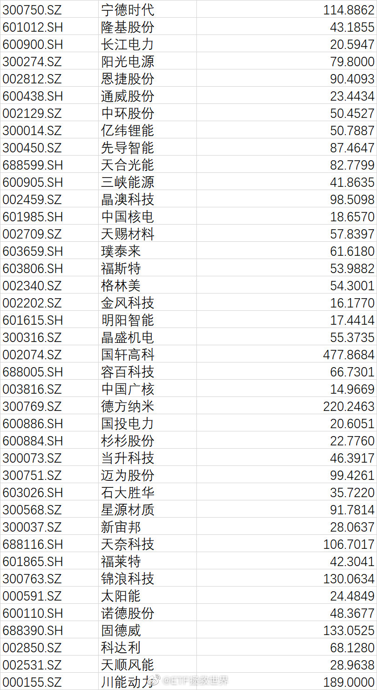

======================================================

ETF拯救世界 (5687069307) @
2022-03-04 16:35:21 Fri  
url: https://weibo.com/5687069307/LibmY7Oyq

很多人之所以在底部会对手里的股票崩溃，因为他不知道这支股票会不会死，会不会永远起不来。但你如果拿几只相关性很低的指数，情况就会好很多。至少你知道他们不会死，而且有涨有跌，没那么容易崩溃。

------------------------------------------------------
转推：
>  @ETF拯救世界 (5687069307)
>  2022-03-04 16:00:23 Fri  
>  url: https:/weibo.com/5687069307/Lib8MbuiZ/

>  其实人类的恐惧，绝大多数都来自于“未知”。
>  
>  比如核武器吧。未知是不知道它的杀伤力到底有多大，对方会不会扔，扔多少。
>  
>  如果对方告诉你了，时间地点数量，估计你也踏实了。愣着干什么，挖吧。土拨鼠一样挖很深很深，带足了东西，躲呗。
>  
>  就连核武器这种东西，只要你准备好了，都不是必死的。那还有 ​​​

转发[90]  评论[291]  赞[2329] 

======================================================

ETF拯救世界 (5687069307) @
2022-03-04 19:04:07 Fri  
url: https://weibo.com/5687069307/Liclmo12q

娱乐就是原罪

------------------------------------------------------
转推：
>  @财经杂志 (1684012053)
>  2022-03-04 18:48:39 Fri  
>  url: https:/weibo.com/1684012053/Licf4AsUI/

>  【人大代表#建议禁止未成年人网游#】全国人大代表李君近日接受中新网记者采访时表示，去年相关部门出台了政策，明确18岁以下未成年人玩游戏的时间每天只能有1小时，且只能在周末。但我们村有的留守儿童使用长辈的身份证注册游戏账号，规定形同虚设。建议应全面禁止未成年人玩网络游戏，对向未成年人提 ​​​

转发[36]  评论[407]  赞[2007] 

======================================================

ETF拯救世界 (5687069307) @
2022-03-05 08:43:01 Sat  
url: https://weibo.com/5687069307/LihHKek9M

认识六个月以上的朋友来投个票 http://t.cn/A66ybZIo ​​​

转发[0]  评论[1721]  赞[33839] 

======================================================

ETF拯救世界 (5687069307) @
2022-03-05 21:15:07 Sat  
url: https://weibo.com/5687069307/LimD1noUW

我在球球关于恒生的历史大顶大底帖子。

全蒙对了，你可以对照k线时间看看。

那么，这次还会对吗。 ​​​

转发[484]  评论[923]  赞[4976] 

+++++++++++++++++++++++++++++++++++++++++++++++++++++

图片：

======================================================

ETF拯救世界 (5687069307) @
2022-03-06 16:56:40 Sun  
url: https://weibo.com/5687069307/LiumCelwP

啊球友的总结。真的吗，是蒙的了啦[亲亲] http://t.cn/A66UoVu5

------------------------------------------------------
转推：
>  @ETF拯救世界 (5687069307)
>  2022-03-05 21:15:07 Sat  
>  url: https:/weibo.com/5687069307/LimD1noUW/

>  我在球球关于恒生的历史大顶大底帖子。
>  
>  全蒙对了，你可以对照k线时间看看。
>  
>  那么，这次还会对吗。 ​​​

转发[101]  评论[557]  赞[2257] 

======================================================

ETF拯救世界 (5687069307) @
2022-03-06 21:52:06 Sun  
url: https://weibo.com/5687069307/Liwix4JIJ

显示效果提升不少。 ​​​

转发[13]  评论[691]  赞[2334] 

======================================================

ETF拯救世界 (5687069307) @
2022-03-07 07:25:21 Mon  
url: https://weibo.com/5687069307/LiA3dgzV5

我有几个投资原则，分享给各位：

第一，本金安全永远第一。

第二，一个品种占我整个金融资产的比例不会超过20%。金融资产包括所有可以用的货币类，债券类，股权类品种。

第三，任何情况下都是用闲钱投资。不会因为“大机会”就赌上所有。机会有很多，命只有一条。留够两三年的生活费，至少一年。

 ​​​

转发[565]  评论[894]  赞[3854] 

======================================================

ETF拯救世界 (5687069307) @
2022-03-07 08:10:16 Mon  
url: https://weibo.com/5687069307/LiAlrvT9u

各位认为，进入大规模战争的标志是什么。以这次俄乌为例

------------------------------------------------------
转推：
>  @ETF拯救世界 (5687069307)
>  2022-02-22 15:55:12 Tue  
>  url: https:/weibo.com/5687069307/LgEPI1QkK/

>  兄弟我做了一些关于战争与股市走势的研究，随便说两句，您随便看看。
>  
>  第一，直接或间接参与的战争会影响股市走势。
>  
>  第二，对于大国来说，局部战争不会影响很大。
>  
>  第三，对于大规模的战争，还是要躲一躲。跌幅不会小。
>  
>  第四，不能等战争结束再重新入场，那已经晚了。最佳入场时机是胜负天平开始倾斜 ​​​

转发[31]  评论[430]  赞[1675] 

======================================================

ETF拯救世界 (5687069307) @
2022-03-07 08:39:13 Mon  
url: https://weibo.com/5687069307/LiAxcaPZ9

昨天带儿子去爬野山，妹想到是一座很有难度的山，大意了，没有躲。

快到山顶的时候，我看着两边的峭壁，看着难以攀爬的岩石，想起了各位每天来看我的老爷们，想起了居委会大妈对我的谆谆教导，想起了小学老师在黑板上写字吱吱呀呀的声音。

我想，我要是出了点事，对得起谁呀我…

对儿子说，要不咱们 ​​​

转发[42]  评论[766]  赞[3920] 

======================================================

ETF拯救世界 (5687069307) @
2022-03-07 09:10:01 Mon  
url: https://weibo.com/5687069307/LiAJHz8cS

再次提示//@ETF拯救世界:再次提示，我已经暂停自己的日经条件单。

------------------------------------------------------
转推：
>  @ETF拯救世界 (5687069307)
>  2022-01-27 10:02:25 Thu  
>  url: https:/weibo.com/5687069307/LcFpBkiIZ/

>  由于日元大幅贬值，投资日经225的波段逻辑已经完全改变，所以暂停日经波段。
>  
>  我会删除自己的日经条件单。 ​​​

转发[12]  评论[418]  赞[1670] 

======================================================

ETF拯救世界 (5687069307) @
2022-03-07 10:14:15 Mon  
url: https://weibo.com/5687069307/LiB9LCYuG

恒生下一网将是该品种最后一网，接下来也不会再继续下网了。

这是考虑到市场、持仓状态等因素决定。

之前的当然继续交易。

当然，有余力的朋友可以继续制定自己的交易计划。

恒科大概还会有2-3网，之后也不会继续再下。理由与恒生一致。 ​​​

转发[265]  评论[723]  赞[3366] 

======================================================

ETF拯救世界 (5687069307) @
2022-03-07 10:16:28 Mon  
url: https://weibo.com/5687069307/LiBaFqDTB

换句话说，18500的恒生，与80%的中概/恒科，将是波段加仓的最后底线。

------------------------------------------------------
转推：
>  @ETF拯救世界 (5687069307)
>  2022-03-07 10:14:15 Mon  
>  url: https:/weibo.com/5687069307/LiB9LCYuG/

>  恒生下一网将是该品种最后一网，接下来也不会再继续下网了。
>  
>  这是考虑到市场、持仓状态等因素决定。
>  
>  之前的当然继续交易。
>  
>  当然，有余力的朋友可以继续制定自己的交易计划。
>  
>  恒科大概还会有2-3网，之后也不会继续再下。理由与恒生一致。 ​​​

转发[140]  评论[422]  赞[2597] 

======================================================

ETF拯救世界 (5687069307) @
2022-03-07 10:35:33 Mon  
url: https://weibo.com/5687069307/LiBipEkgc

确定了，恒科还有两网就会停。也就是说，我在恒生以及恒科的波段仓位上面，只会再留一共三网资金。

长线仓位后续买入份数暂未设定。但依然遵循单个品种不超过20%上限的规则。 ​​​

转发[124]  评论[749]  赞[3396] 

======================================================

ETF拯救世界 (5687069307) @
2022-03-07 14:18:33 Mon  
url: https://weibo.com/5687069307/LiCKVEx7I

150和S都有动作，一买一卖。

根据自己情况决定，丰俭由人。 ​​​

转发[24]  评论[576]  赞[2548] 

======================================================

ETF拯救世界 (5687069307) @
2022-03-07 14:44:44 Mon  
url: https://weibo.com/5687069307/LiCVzbVpQ

长期计划中，最近几个月依然延续了这两年的理念，

逐渐收回资金，如果要买，就要有卖。

150和S，都保持了非常理性的务实状态。

不增加整体风险的情况下，加仓目标品种。 ​​​

转发[57]  评论[315]  赞[2491] 

======================================================

ETF拯救世界 (5687069307) @
2022-03-07 14:47:21 Mon  
url: https://weibo.com/5687069307/LiCWD7R7R

消费终于开始低下高昂的头颅。总是埋怨它不是讨厌它，而是爱它，怕它走在歪路上一去不回。

------------------------------------------------------
转推：
>  @ETF拯救世界 (5687069307)
>  2022-02-22 13:29:34 Tue  
>  url: https:/weibo.com/5687069307/LgDSB0mvv/

>  我心中的最大的怨念依然是消费。
>  
>  2020年5月以来的疯癫状态，到底怎样才会结束。
>  
>  即使跌到现在，它居然依然还没有进入我定义的可买入区间上限。
>  
>  是我错了还是市场错了。
>  
>  所有板块，只有它依然无法哪怕下手一点点。
>  
>  这是道德的沦丧，还是人性的扭曲。 ​​​

转发[96]  评论[283]  赞[2079] 

======================================================

ETF拯救世界 (5687069307) @
2022-03-07 15:08:30 Mon  
url: https://weibo.com/5687069307/LiD5cBwp0

养了十几年猫，第一次知道原来你躺着的时候，猫会自己爬到你肚子上趴下陪着你。

我家原来的猫能跳到我旁边呆一会儿我就感动得要命了。

这该死的温柔。 ​​​

转发[17]  评论[524]  赞[2649] 

======================================================

ETF拯救世界 (5687069307) @
2022-03-07 15:53:04 Mon  
url: https://weibo.com/5687069307/LiDniopYa

今日数据：

没有亮点，让我大失所望。

科创50历史首次跌破60倍算吗？当然不算。

50和300跌到现在居然还不便宜，事实再次教育了我。每次当我不完全相信自己的数据时，都会犯错。高位的50和300减持的不够，正是因为没有完全相信数据。

高位更换成分股，把涨幅巨大的品种调入大指数，对大指数伤害太大 ​​​

转发[112]  评论[343]  赞[2283] 

======================================================

ETF拯救世界 (5687069307) @
2022-03-07 16:15:14 Mon  
url: https://weibo.com/5687069307/LiDwiciZa

网格3.5正在进化完善中。

这次的进化，主要希望解决的问题是，如何在交易过程中保证资金投入的可持续性，避免在战役与整个战场上，因战线过长出现兵力不足的问题。

同时，顺便解决底部波段收益率不够的问题。

绝不满足，发现问题、解决问题，永远要进化。 ​​​

转发[100]  评论[868]  赞[3516] 

======================================================

ETF拯救世界 (5687069307) @
2022-03-07 16:49:18 Mon  
url: https://weibo.com/5687069307/LiDK82i2p

漂亮是真的又狠又鸡贼。

为了自己的好日子能持续，为了自己继续当老大，上蹿下跳，无所不用其极。

其实每个国家都希望自己好，区别是有的对别的国家更没有下限一点。

为了不让欧洲团结，不让亚洲团结，为了让世界乱成一锅粥，它获取最大利益，漂亮真是一直在努力，从未被超越。

只是仇恨没有意义， ​​​

转发[94]  评论[473]  赞[3622] 

======================================================

ETF拯救世界 (5687069307) @
2022-03-07 17:25:20 Mon  
url: https://weibo.com/5687069307/LiDYKkP2Z

回复@Lateatnight86:默在欧盟内部一直奉行务实态度，顶住了漂亮要求欧洲一起制裁我们的压力。默一直追求欧洲自主，不愿意完全跟随漂亮的指挥棒。我说她有远见是指国际事务。他们国内事务我不操心。

------------------------------------------------------
转推：
>  @ETF拯救世界 (5687069307)
>  2022-03-07 16:49:18 Mon  
>  url: https:/weibo.com/5687069307/LiDK82i2p/

>  漂亮是真的又狠又鸡贼。
>  
>  为了自己的好日子能持续，为了自己继续当老大，上蹿下跳，无所不用其极。
>  
>  其实每个国家都希望自己好，区别是有的对别的国家更没有下限一点。
>  
>  为了不让欧洲团结，不让亚洲团结，为了让世界乱成一锅粥，它获取最大利益，漂亮真是一直在努力，从未被超越。
>  
>  只是仇恨没有意义， ​​​

转发[20]  评论[151]  赞[1721] 

======================================================

ETF拯救世界 (5687069307) @
2022-03-07 17:33:35 Mon  
url: https://weibo.com/5687069307/LiE261vOX

你以为我想关心蓝星这些破事儿吗。

现在的问题是，你不关心行吗。我们的投资是会受到极大影响的。 ​​​

转发[24]  评论[390]  赞[2657] 

======================================================

ETF拯救世界 (5687069307) @
2022-03-07 22:17:29 Mon  
url: https://weibo.com/5687069307/LiFTkt1J4

今天的红利，有至少一半的朋友没有卖出。

我很欣慰，两个原因。

第一，说明各位还有资金，不必卖出再买入。

第二，说明各位有了独立思考能力。对错不说，至少会选择自认为更加符合自己情况的操作了。

有一天每位朋友都能自己做出理性而智慧的操作，我的愿望就实现了。 ​​​

转发[61]  评论[817]  赞[4106] 

======================================================

ETF拯救世界 (5687069307) @
2022-03-08 06:55:48 Tue  
url: https://weibo.com/5687069307/LiJhImiGz

『第三世界人民从未如此团结！』http://t.cn/A664Dqdt ​​​

转发[763]  评论[580]  赞[9848] 

======================================================

ETF拯救世界 (5687069307) @
2022-03-08 08:13:19 Tue  
url: https://weibo.com/5687069307/LiJNbbAwD

前一段让大家看美股历史不知道各位有没有看。

70年代美股美债走了十年熊市，正好是油价金价大涨通货膨胀的十年。

这十年跌得最多的是什么股票？

你说巧不巧，正好是60年代的“漂亮50”。什么是漂亮50，就是机构抱团，“永远不会跌”的那些蓝筹公司。尤其是消费股跌幅较大。

历史有没有借鉴价值，看 ​​​

转发[262]  评论[458]  赞[2757] 

======================================================

ETF拯救世界 (5687069307) @
2022-03-08 08:19:49 Tue  
url: https://weibo.com/5687069307/LiJPOAW3c

好消息是，如果你在这些蓝筹股价暴跌后买入，那么你会发真正的大财。因为之后就是40年的牛市。

------------------------------------------------------
转推：
>  @ETF拯救世界 (5687069307)
>  2022-03-08 08:13:19 Tue  
>  url: https:/weibo.com/5687069307/LiJNbbAwD/

>  前一段让大家看美股历史不知道各位有没有看。
>  
>  70年代美股美债走了十年熊市，正好是油价金价大涨通货膨胀的十年。
>  
>  这十年跌得最多的是什么股票？
>  
>  你说巧不巧，正好是60年代的“漂亮50”。什么是漂亮50，就是机构抱团，“永远不会跌”的那些蓝筹公司。尤其是消费股跌幅较大。
>  
>  历史有没有借鉴价值，看 ​​​

转发[85]  评论[249]  赞[1827] 

======================================================

ETF拯救世界 (5687069307) @
2022-03-08 08:32:54 Tue  
url: https://weibo.com/5687069307/LiJV87Mz0

买了新的镜头拍猫猫。[喵喵]

上一次认真玩摄影置办装备，还是结婚前帮姑娘们拍糖水片的那段时间。 ​​​

转发[9]  评论[325]  赞[2041] 

======================================================

ETF拯救世界 (5687069307) @
2022-03-08 09:15:57 Tue  
url: https://weibo.com/5687069307/LiKcBjHft

今天又是刺激的一天吧 ​​​

转发[16]  评论[467]  赞[2147] 

======================================================

ETF拯救世界 (5687069307) @
2022-03-08 09:44:35 Tue  
url: https://weibo.com/5687069307/LiKoe6wV4

KWEB跌幅已经73%了。

距离80%还有27%。 ​​​

转发[121]  评论[454]  赞[2773] 

======================================================

ETF拯救世界 (5687069307) @
2022-03-08 09:49:15 Tue  
url: https://weibo.com/5687069307/LiKq7p0LN

红利 -0.83%。

恒生 +1.06%。

别管以后怎么样，至少这十几分钟是对了。 ​​​

转发[20]  评论[311]  赞[2304] 

======================================================

ETF拯救世界 (5687069307) @
2022-03-08 09:59:14 Tue  
url: https://weibo.com/5687069307/LiKuawQFH

下跌过程中，只要把握好空间、时间的节奏，慢慢买毫无问题。

不要怕那些“空仓”的人嘲笑，他们都是非常二的二货。真正赚钱的人，没时间去嘲笑别人，更不会嘲笑低位慢慢买的人。

但是一定要注意一点，不要总是去赌“底部”。真正的底部只有一个，但下跌是每天都在发生，即使智商没有120，也知道每天 ​​​

转发[212]  评论[590]  赞[3313] 

======================================================

ETF拯救世界 (5687069307) @
2022-03-08 10:32:16 Tue  
url: https://weibo.com/5687069307/LiKHA1JH7

以目前的价格看，除了医药已经进入伏击区，没有任何品种让我有长线加仓的想法。 ​​​

转发[119]  评论[312]  赞[2308] 

======================================================

ETF拯救世界 (5687069307) @
2022-03-08 10:36:43 Tue  
url: https://weibo.com/5687069307/LiKJoiOm3

信息倒是也可以盯着了。

------------------------------------------------------
转推：
>  @ETF拯救世界 (5687069307)
>  2022-03-08 10:32:16 Tue  
>  url: https:/weibo.com/5687069307/LiKHA1JH7/

>  以目前的价格看，除了医药已经进入伏击区，没有任何品种让我有长线加仓的想法。 ​​​

转发[57]  评论[196]  赞[1727] 

======================================================

ETF拯救世界 (5687069307) @
2022-03-08 10:50:04 Tue  
url: https://weibo.com/5687069307/LiKOO46zM

今天更新的网格品种，下一网价位与之前有很大区别。我会将之前的改掉。稍后可看。

体现了3.5进化版本。 ​​​

转发[46]  评论[475]  赞[2369] 

======================================================

ETF拯救世界 (5687069307) @
2022-03-08 11:12:10 Tue  
url: https://weibo.com/5687069307/LiKXM6C6o

指数跌80%的情况，历史上真的非常少出现。

从90年至今，排除非市场因素的暴跌80%，只出现过不到十次。

全球主要市场。 ​​​

转发[83]  评论[320]  赞[2379] 

======================================================

ETF拯救世界 (5687069307) @
2022-03-08 11:15:19 Tue  
url: https://weibo.com/5687069307/LiKZ3i2T2

可能有些私募已经到清盘线了。

1.7万亿两融希望安全。 ​​​

转发[70]  评论[193]  赞[2043] 

======================================================

ETF拯救世界 (5687069307) @
2022-03-08 11:20:16 Tue  
url: https://weibo.com/5687069307/LiL142f9T

回复@司青山:在降了在降了。去年9月有1.9万亿。虽然19年初只有7000亿，20年初1万亿。//@司青山:[笑cry]俺以为市场跌那么多，两融余额应该会下降很多，没想到还有1.7万亿，这帮融资客，头真铁啊！[生病]我都替他们害怕（才没有）。 http://t.cn/A66bUIYd

------------------------------------------------------
转推：
>  @ETF拯救世界 (5687069307)
>  2022-03-08 11:15:19 Tue  
>  url: https:/weibo.com/5687069307/LiKZ3i2T2/

>  可能有些私募已经到清盘线了。
>  
>  1.7万亿两融希望安全。 ​​​

转发[30]  评论[90]  赞[1096] 

======================================================

ETF拯救世界 (5687069307) @
2022-03-08 11:23:38 Tue  
url: https://weibo.com/5687069307/LiL2r8hsX

有时候独立思考也有风险……

------------------------------------------------------
转推：
>  @ETF拯救世界 (5687069307)
>  2022-03-07 22:17:29 Mon  
>  url: https:/weibo.com/5687069307/LiFTkt1J4/

>  今天的红利，有至少一半的朋友没有卖出。
>  
>  我很欣慰，两个原因。
>  
>  第一，说明各位还有资金，不必卖出再买入。
>  
>  第二，说明各位有了独立思考能力。对错不说，至少会选择自认为更加符合自己情况的操作了。
>  
>  有一天每位朋友都能自己做出理性而智慧的操作，我的愿望就实现了。 ​​​

转发[16]  评论[360]  赞[1868] 

======================================================

ETF拯救世界 (5687069307) @
2022-03-08 11:30:44 Tue  
url: https://weibo.com/5687069307/LiL5jkd7v

这种时候，你要做的是关上账户，去外面走走。

然后你就会发现，心情还是那么糟。 ​​​

转发[66]  评论[1016]  赞[3467] 

======================================================

ETF拯救世界 (5687069307) @
2022-03-08 11:38:16 Tue  
url: https://weibo.com/5687069307/LiL8n3NbN

年轻的时候，总觉得A股很难挣钱。

不要急。

等你年纪大了，有经验了，你就会发现，这是真的。 ​​​

转发[114]  评论[1054]  赞[4388] 

======================================================

ETF拯救世界 (5687069307) @
2022-03-08 11:46:21 Tue  
url: https://weibo.com/5687069307/LiLbEigQy

刚看见有朋友问我这里离钻石坑有多远。

如果你问的是全市场，我不能告诉你。

不是我不想说，而是我不知道，算不出来，太远了。

我年初说A股已经不便宜了，大中小都是如此。结果现在才跌了十几个点，你就问钻石坑，是不是早了点。 ​​​

转发[61]  评论[353]  赞[2449] 

+++++++++++++++++++++++++++++++++++++++++++++++++++++

图片：

======================================================

ETF拯救世界 (5687069307) @
2022-03-08 12:02:58 Tue  
url: https://weibo.com/5687069307/LiLiosO4o

不过我说真的，出去走走。

在大街上走，在田野里走，在山上走，在海边走。

在很辽阔的地方，在阳光明媚的地方，很多困扰你的事情你会突然觉得那么渺小，不值得去担忧。

你值得拥有一种举重若轻，泰山压顶谈笑风生的气质。

风险可控的一点点小事，以后想起来你会发现为它担忧非常可笑。 ​​​

转发[109]  评论[571]  赞[2778] 

======================================================

ETF拯救世界 (5687069307) @
2022-03-08 12:14:08 Tue  
url: https://weibo.com/5687069307/LiLmVqheb

请各位先不要按照提示补仓，我先看一下是怎么回事。 ​​​

转发[20]  评论[1013]  赞[2759] 

======================================================

ETF拯救世界 (5687069307) @
2022-03-08 13:01:28 Tue  
url: https://weibo.com/5687069307/LiLG8xVis

今日补仓提醒整体问题不大。但有两个建议：

第一，DAX不要补，各种原因。

第二，只补价格差15%-20%以上的份数。

希望你的成本远低于我。 ​​​

转发[86]  评论[645]  赞[2698] 

======================================================

ETF拯救世界 (5687069307) @
2022-03-08 13:11:39 Tue  
url: https://weibo.com/5687069307/LiLKh4twY

回复@无枝可栖的灵魂:这个自己定。我说15-20是很保守的。至于具体多少自己定，高一点就更保守一点，低一点就激进一点。//@无枝可栖的灵魂:只有恒生差价在15%以上

------------------------------------------------------
转推：
>  @ETF拯救世界 (5687069307)
>  2022-03-08 13:01:28 Tue  
>  url: https:/weibo.com/5687069307/LiLG8xVis/

>  今日补仓提醒整体问题不大。但有两个建议：
>  
>  第一，DAX不要补，各种原因。
>  
>  第二，只补价格差15%-20%以上的份数。
>  
>  希望你的成本远低于我。 ​​​

转发[22]  评论[230]  赞[1700] 

======================================================

ETF拯救世界 (5687069307) @
2022-03-08 14:20:28 Tue  
url: https://weibo.com/5687069307/LiMccC756

祝各位少女以及资深少女节日快乐！

（本条男性博友请勿评论，望自重） ​ http://t.cn/A66b9Pgj ​​​

转发[25]  评论[2284]  赞[4347] 

======================================================

ETF拯救世界 (5687069307) @
2022-03-08 16:09:49 Tue  
url: https://weibo.com/5687069307/LiMUAAv1n

这不是统一不统一的问题。而是俄倒了就会有人集中全部精力干你的问题。大多数理智的中国人不想出现这样的局面。出发点是国家利益而非其它。

------------------------------------------------------
转推：
>  @数知实验室 (5676384100)
>  2022-03-08 15:44:49 Tue  
>  url: https:/weibo.com/5676384100/LiMKrvuPe/

>  这几天在想象一个假设的场景：假如在今年俄乌战争发生之前，中国早已实现祖国统一，全国各省各族人民团结和谐。在这个假设背景下，大家对于俄乌战争中各方的评价与支持立场会否会和真实情况的现在有所不同？
>  
>  大家怎么看？你的观点会发生变化吗？ ​​​

转发[42]  评论[222]  赞[2110] 

======================================================

ETF拯救世界 (5687069307) @
2022-03-08 16:18:21 Tue  
url: https://weibo.com/5687069307/LiMY3r3fx

今天数据出来了。二话不说，我先送一张宽基图给大家。行业图下次有缘再送。全市场图钻石坑送。

整体来说，A股依然没有很便宜。并不是说很贵，基本就是均值偏下一点点的位置吧。所以跌，非常正常。

这与德国、港股等完全不同。这些地方是绝对和相对意义上都比较便宜。

具体到分类。

大指数依然让人 ​​​

转发[656]  评论[576]  赞[3543] 

+++++++++++++++++++++++++++++++++++++++++++++++++++++

图片：

======================================================

ETF拯救世界 (5687069307) @
2022-03-08 16:25:45 Tue  
url: https://weibo.com/5687069307/LiN14b6Ca

回复@有舍才能得etf:恒生估值没起来过，但是价格可是上下翻飞。我立个Flag，恒生18500如果有幸买到，不到30000点我不会卖。//@有舍才能得etf:为什么恒生看起来一直是趴着的状态呢

------------------------------------------------------
转推：
>  @ETF拯救世界 (5687069307)
>  2022-03-08 16:18:21 Tue  
>  url: https:/weibo.com/5687069307/LiMY3r3fx/

>  今天数据出来了。二话不说，我先送一张宽基图给大家。行业图下次有缘再送。全市场图钻石坑送。
>  
>  整体来说，A股依然没有很便宜。并不是说很贵，基本就是均值偏下一点点的位置吧。所以跌，非常正常。
>  
>  这与德国、港股等完全不同。这些地方是绝对和相对意义上都比较便宜。
>  
>  具体到分类。
>  
>  大指数依然让人 ​​​

转发[158]  评论[233]  赞[1618] 

======================================================

ETF拯救世界 (5687069307) @
2022-03-08 16:28:34 Tue  
url: https://weibo.com/5687069307/LiN2csoCp

回复@l_O_O_l:欧盟目前一盘散沙，没有力量对漂亮说不。真的很悲哀。//@l_O_O_l:回复@冬季的秋名山:魏强联蜀抗魏，蜀强联魏抗蜀。现在就是看不懂欧盟，明明一丁点好处都没，还把能源粮食弄得那么高价格分分钟忍饥挨饿，他们图的是什么？？？？？？？

------------------------------------------------------
转推：
>  @数知实验室 (5676384100)
>  2022-03-08 15:44:49 Tue  
>  url: https:/weibo.com/5676384100/LiMKrvuPe/

>  这几天在想象一个假设的场景：假如在今年俄乌战争发生之前，中国早已实现祖国统一，全国各省各族人民团结和谐。在这个假设背景下，大家对于俄乌战争中各方的评价与支持立场会否会和真实情况的现在有所不同？
>  
>  大家怎么看？你的观点会发生变化吗？ ​​​

转发[11]  评论[121]  赞[1289] 

======================================================

ETF拯救世界 (5687069307) @
2022-03-08 16:31:02 Tue  
url: https://weibo.com/5687069307/LiN3ctmES

你是不是慌了，不用慌。

我推心置腹的说一句，

等文章。

本周，定了，我说的！ ​​​

转发[49]  评论[1215]  赞[4330] 

======================================================

ETF拯救世界 (5687069307) @
2022-03-08 16:41:24 Tue  
url: https://weibo.com/5687069307/LiN7ppFxl

恒生已经马上跌破10倍估值了。

过去20多年，只要破10倍就进钻石坑。

我不知道能不能到18500，但只要不出天大的事，比如大战，比如被联合制裁，那么，现在离底部绝不远了。 ​​​

转发[439]  评论[722]  赞[4987] 

======================================================

ETF拯救世界 (5687069307) @
2022-03-08 16:59:48 Tue  
url: https://weibo.com/5687069307/LiNeT5EzS

今天不说太多了。只是想告诉大家：

到目前为止，一切都很正常。全都是你来投资应该做好准备会发生的。至少在我这里，没有任何意外。

意外的事件，导致了暂时没有意外的市场。

未来市场会不会超出我的认知范围，我不知道。到现在为止，依然正常。

如果你心情不好，别想太多。没有意义。想太多你容易 ​​​

转发[113]  评论[1373]  赞[4684] 

======================================================

ETF拯救世界 (5687069307) @
2022-03-08 18:38:09 Tue  
url: https://weibo.com/5687069307/LiNSNwu8U

恭喜@无敌冰淇淋77 等100名用户等额平分【1688元现金】。微博官方唯一抽奖工具@微博抽奖平台 对本次抽奖进行监督，结果公正有效。公示链接：http://t.cn/A66b95BN

------------------------------------------------------
转推：
>  @ETF拯救世界 (5687069307)
>  2022-03-08 14:20:28 Tue  
>  url: https:/weibo.com/5687069307/LiMccC756/

>  祝各位少女以及资深少女节日快乐！
>  
>  （本条男性博友请勿评论，望自重） ​ http://t.cn/A66b9Pgj ​​​

转发[3]  评论[532]  赞[1429] 

======================================================

ETF拯救世界 (5687069307) @
2022-03-09 11:00:10 Wed  
url: https://weibo.com/5687069307/LiUjoE2LL

目前我感觉压力比较大了。并不是因为几天时间我的账户缩水大七位数，因为自己肉比较厚，禁打。压力测试做得也可以，资金没有问题。

我是特别担心没有做好资金分配导致后续部队不足的朋友，各位可能会比较焦虑。

无论是长线还是波段，如果资金不够，完全可以停止后续投入。没有任何问题。

一定要根据 ​​​

转发[207]  评论[1834]  赞[5050] 

======================================================

ETF拯救世界 (5687069307) @
2022-03-09 11:51:19 Wed  
url: https://weibo.com/5687069307/LiUEadjIy

医药网格还剩两网。

目前已经确定最终网的品种：恒生：1；恒科：2；医药：2。一共5。

其它的还没有确定，但传媒不会超过1，券商不会超过2，红利不会超过2。

其它品种暂时没有新开的计划。

也就是说，目前看，到最后最多就是10网资金。我会根据自己的情况安排。 ​​​

转发[257]  评论[843]  赞[3276] 

======================================================

ETF拯救世界 (5687069307) @
2022-03-09 12:08:55 Wed  
url: https://weibo.com/5687069307/LiULj9Tp1

所有的权益类投资都要有个资金投入极限。在投资开始前设定好这个数字，到了就停，这是纪律。

150不用说了，本来就是固定金额的投资。

现在波段也有了极限。

S积累了大量资金，当然有些朋友把S未投的投入到波段了，这并不是问题，因为你之所以参与了S，说明你有稳定的收入来源，所以不是问题。

也就 ​​​

转发[202]  评论[665]  赞[3261] 

======================================================

ETF拯救世界 (5687069307) @
2022-03-09 13:33:57 Wed  
url: https://weibo.com/5687069307/LiVjP4Vih

未来一段时间长线仓位买入思路：

已经有一定仓位的，不会盲目加仓。会在最关键的位置，比如最后支撑，比如下跌80%的位置稍作买入。

剩余的会在右侧买入。

会注意保留资金，优先使用黄金、债券、原油的卖出部分。 ​​​

转发[186]  评论[766]  赞[3605] 

======================================================

ETF拯救世界 (5687069307) @
2022-03-09 14:14:07 Wed  
url: https://weibo.com/5687069307/LiVA7DDHH

如果收个长下影的红线，我会感动到流泪。 ​​​

转发[38]  评论[929]  赞[4381] 

======================================================

ETF拯救世界 (5687069307) @
2022-03-09 15:05:08 Wed  
url: https://weibo.com/5687069307/LiVUPwfEF

我在人生现阶段，最大的希望除了身体健康外，

就是国泰民安。 ​​​

转发[68]  评论[585]  赞[4175] 

======================================================

ETF拯救世界 (5687069307) @
2022-03-09 15:21:36 Wed  
url: https://weibo.com/5687069307/LiW1w6Xli

目前为止所有网格品种持仓收益率。

这是一个艰难时刻，希望我们所有人顺利。 ​​​

转发[61]  评论[767]  赞[3650] 

+++++++++++++++++++++++++++++++++++++++++++++++++++++

图片：

======================================================

ETF拯救世界 (5687069307) @
2022-03-09 15:44:58 Wed  
url: https://weibo.com/5687069307/LiWb08HgA

每天先天下之忧而忧，弄得好像脸上长斑了…… ​​​

转发[17]  评论[682]  赞[3066] 

======================================================

ETF拯救世界 (5687069307) @
2022-03-09 16:31:06 Wed  
url: https://weibo.com/5687069307/LiWtJ7ZVN

这张图有个数据有问题，不好意思更正一下。德国DAX的估值（黑色）并未低至图中所示。虽然是不贵的状态，但没那么低，大致比日经高一点。这个问题是原始数据的问题，今天发现已经更新。

------------------------------------------------------
转推：
>  @ETF拯救世界 (5687069307)
>  2022-03-08 16:18:21 Tue  
>  url: https:/weibo.com/5687069307/LiMY3r3fx/

>  今天数据出来了。二话不说，我先送一张宽基图给大家。行业图下次有缘再送。全市场图钻石坑送。
>  
>  整体来说，A股依然没有很便宜。并不是说很贵，基本就是均值偏下一点点的位置吧。所以跌，非常正常。
>  
>  这与德国、港股等完全不同。这些地方是绝对和相对意义上都比较便宜。
>  
>  具体到分类。
>  
>  大指数依然让人 ​​​

转发[74]  评论[248]  赞[1708] 

======================================================

ETF拯救世界 (5687069307) @
2022-03-09 17:52:22 Wed  
url: https://weibo.com/5687069307/LiX0IgaM6

如果明天A股和港股能像欧洲这么勇，那我们这几天买的就能大范围回血提款了……

是我想太多吗。 ​​​

转发[44]  评论[791]  赞[3403] 

+++++++++++++++++++++++++++++++++++++++++++++++++++++

图片：
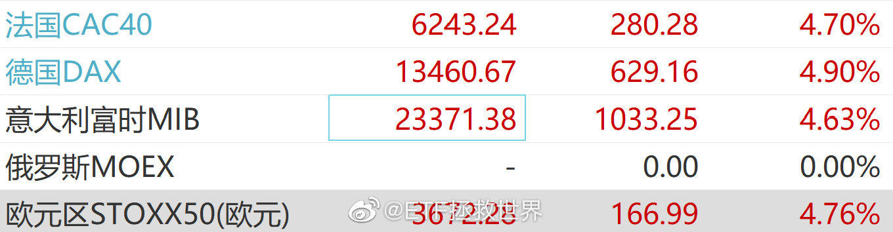

======================================================

ETF拯救世界 (5687069307) @
2022-03-09 17:56:12 Wed  
url: https://weibo.com/5687069307/LiX2gwyKT

今天有个数据必须说一下，

金融地产指数的各种估值，已经创出历史新低。低于08 12 18任何时候。

市场真的很悲观。 ​​​

转发[180]  评论[752]  赞[3860] 

======================================================

ETF拯救世界 (5687069307) @
2022-03-10 10:42:59 Thu  
url: https://weibo.com/5687069307/Lj3CViqdS

1个交易日提款，

你永远可以相信小红。 ​​​

转发[27]  评论[1444]  赞[4359] 

======================================================

ETF拯救世界 (5687069307) @
2022-03-10 15:26:19 Thu  
url: https://weibo.com/5687069307/Lj5tVvJ7h

最近一两年跟车的朋友，可能最近收益率有点惨。因为你们不是像老朋友那样卖出盈利品种买入，没有安全垫，所以账面很不好看。

150的朋友可能还好，因为你们知道自己有上百份资金还没有投入。

S的朋友因为没有一个直观的认识，不清楚自己其实积累了很多应投未投的资金，这些资金一旦投入，都会将浮亏的 ​​​

转发[169]  评论[1322]  赞[5181] 

======================================================

ETF拯救世界 (5687069307) @
2022-03-10 15:41:22 Thu  
url: https://weibo.com/5687069307/Lj5A2hKus

续上一条：

这一两年跟车S的朋友，可以看看手里已经买的，浮亏的品种。你会发现，除了中概/恒科，每个品种一共才一两份。

这一两份降成本有多容易你知道吗。最关键的，是我们从没有在一个区域高位大量投入，所以低位再买一点，成本一下子就会下去。

这一两年S买的品种：

传媒：2份（1个月投入）

 ​​​

转发[177]  评论[1277]  赞[5230] 

======================================================

ETF拯救世界 (5687069307) @
2022-03-11 07:15:10 Fri  
url: https://weibo.com/5687069307/LjbH4bitQ

好好工作，多存点钱。

控制买入欲望，控制节奏。 ​​​

转发[100]  评论[1303]  赞[5273] 

======================================================

ETF拯救世界 (5687069307) @
2022-03-11 08:44:06 Fri  
url: https://weibo.com/5687069307/LjchahZnP

预感今天将会是战斗的一天。 ​​​

转发[38]  评论[1184]  赞[4435] 

======================================================

ETF拯救世界 (5687069307) @
2022-03-11 09:54:39 Fri  
url: https://weibo.com/5687069307/LjcJNzIHv

正在写东西（这次是真的，有图为证）。

争取下午发。

我想很多朋友应该是需要的。 ​​​

转发[46]  评论[2254]  赞[8593] 

+++++++++++++++++++++++++++++++++++++++++++++++++++++

图片：

======================================================

ETF拯救世界 (5687069307) @
2022-03-11 13:55:05 Fri  
url: https://weibo.com/5687069307/Ljejol3xy

写完了，在等小助理排版。

今天能不能提个double kill给老爷们助助兴啊。[悲伤] ​​​

转发[33]  评论[651]  赞[3547] 

======================================================

ETF拯救世界 (5687069307) @
2022-03-11 14:11:48 Fri  
url: https://weibo.com/5687069307/Ljeqbac0E

？如果恒生反弹收红，我今天一大早跑到办公室吭哧吭哧写半天又有何用？

什么玩意儿？ ​​​

转发[32]  评论[1175]  赞[4243] 

======================================================

ETF拯救世界 (5687069307) @
2022-03-11 14:39:18 Fri  
url: https://weibo.com/5687069307/LjeBlcIl9

gzh人工审核了十几分钟，终于通过了。 ​​​

转发[23]  评论[611]  赞[2844] 

======================================================

ETF拯救世界 (5687069307) @
2022-03-11 15:12:42 Fri  
url: https://weibo.com/5687069307/LjeOTApme

差那么一丢丢，没有double kill.

终究是错付了。 ​​​

转发[18]  评论[425]  赞[2773] 

======================================================

ETF拯救世界 (5687069307) @
2022-03-11 16:43:50 Fri  
url: https://weibo.com/5687069307/LjfpTaXs4

回复了几十条了。其实回复的留言大家可以看看，我想有些回复还是挺有价值的。 ​​​

转发[21]  评论[623]  赞[3252] 

======================================================

ETF拯救世界 (5687069307) @
2022-03-11 22:24:03 Fri  
url: https://weibo.com/5687069307/LjhDZ3Vke

昨天卖出的那份油气各位平均收益率47%。

有些朋友收益率不高，很不好意思。相信下次会更好。 ​​​

转发[23]  评论[790]  赞[3653] 

======================================================

ETF拯救世界 (5687069307) @
2022-03-14 07:58:09 Mon  
url: https://weibo.com/5687069307/LjEg0fn4k

数据显示，二月外资开始减持国债。

巧合 思路一致 还是跟车了 ​​​

转发[38]  评论[481]  赞[2542] 

+++++++++++++++++++++++++++++++++++++++++++++++++++++

图片：

======================================================

ETF拯救世界 (5687069307) @
2022-03-14 09:13:59 Mon  
url: https://weibo.com/5687069307/LjEKMwvAb

今天没什么别的希望，就是希望能提一次款 ​​​

转发[17]  评论[628]  赞[2549] 

======================================================

ETF拯救世界 (5687069307) @
2022-03-14 10:14:20 Mon  
url: https://weibo.com/5687069307/LjF9hk8ci

三个交易日提款成功。

接回价格有变，我不会在历史交易里面重新创建。

表格稍后发出。 ​​​

转发[22]  评论[695]  赞[2879] 

======================================================

ETF拯救世界 (5687069307) @
2022-03-14 11:52:44 Mon  
url: https://weibo.com/5687069307/LjFNdAJME

我不会跟你说价值呀，机会呀，不买不行呀。

也不会跟你说陷阱呀，危墙呀，先跑再说呀。

我只能说，据我从各个维度考虑，某个点位从历史上看，是5-10年才会到的一个很低的价位。在那里我会买一些，然后就不再惦记了。

至于它之后是涨是跌，就交给市场吧。我的注意力就会转到别的品种上。

怎么说，就 ​​​

转发[131]  评论[801]  赞[4035] 

======================================================

ETF拯救世界 (5687069307) @
2022-03-14 12:04:46 Mon  
url: https://weibo.com/5687069307/LjFS6uEt5

带儿子去做核酸，路上碰到他的两个女同学。道别后跟儿子讨论了这两位同学照片和真人的差异，皮肤啊，发型啊，性格啊什么的。

发现跟儿子有时候很像哥们儿了，当然这也是我所追求的关系。在我印象中，我父亲从来没有跟我谈论过我的任何一个同学。 ​​​

转发[30]  评论[496]  赞[3756] 

======================================================

ETF拯救世界 (5687069307) @
2022-03-14 16:05:56 Mon  
url: https://weibo.com/5687069307/LjHs07p3F

今天，一个账户。

心如止水。你信不信。 ​​​

转发[153]  评论[2329]  赞[7712] 

+++++++++++++++++++++++++++++++++++++++++++++++++++++

图片：

======================================================

ETF拯救世界 (5687069307) @
2022-03-14 16:21:09 Mon  
url: https://weibo.com/5687069307/LjHyaxEZ1

ND爷。不是说欧洲输得最惨吗。[微笑]

------------------------------------------------------
转推：
>  @财联社APP (2868676035)
>  2022-03-14 16:01:13 Mon  
>  url: https:/weibo.com/2868676035/LjHq53yn5/

>  财联社3月14日电，欧股集体高开，德国DAX30指数涨1.48%，英国富时100指数涨0.34%，欧洲斯托克50指数涨1.16%。 ​​​

转发[101]  评论[519]  赞[3555] 

======================================================

ETF拯救世界 (5687069307) @
2022-03-14 19:58:55 Mon  
url: https://weibo.com/5687069307/LjIYz196U

大家还记得几天前的投票吗。几天过去，你要改一下答案吗 http://t.cn/A66VYQaJ ​​​

转发[29]  评论[871]  赞[32824] 

======================================================

ETF拯救世界 (5687069307) @
2022-03-14 20:16:31 Mon  
url: https://weibo.com/5687069307/LjJ5HBueo

这里说明一下，最近重新整理了过去十年恒生的数据，发现源数据中有一些数据被污染了。清洗后目前恒生估值没有11倍那么低，大概是13倍左右，也已经是非常非常低了，尤其是在近几年加入大量科技股票后。18500的操作逻辑没有变，我的加仓策略也没变。

------------------------------------------------------
转推：
>  @ETF拯救世界 (5687069307)
>  2022-03-08 16:41:24 Tue  
>  url: https:/weibo.com/5687069307/LiN7ppFxl/

>  恒生已经马上跌破10倍估值了。
>  
>  过去20多年，只要破10倍就进钻石坑。
>  
>  我不知道能不能到18500，但只要不出天大的事，比如大战，比如被联合制裁，那么，现在离底部绝不远了。 ​​​

转发[124]  评论[367]  赞[2744] 

======================================================

ETF拯救世界 (5687069307) @
2022-03-14 20:40:40 Mon  
url: https://weibo.com/5687069307/LjJfvuuiP

最近的极端行情，让我有了很久没有进行过的深入思考。

真的，朋友们，确实只有挫折才会让人思考和进步。

主要的思考点：

第一，如果中概这些公司，真的因为非市场因素挂掉，会改变我对很多事情的看法。这个一两句说不清，不是简单的改变，是对一些人生方向以及更多东西的改变。

第二，自己的体系需 ​​​

转发[434]  评论[1521]  赞[6893] 

======================================================

ETF拯救世界 (5687069307) @
2022-03-14 22:17:56 Mon  
url: https://weibo.com/5687069307/LjJSZkOkj

我不会管别人怎么想怎么操作。

我的最后一笔买入时刻到了。 ​​​

转发[102]  评论[1101]  赞[5045] 

======================================================

ETF拯救世界 (5687069307) @
2022-03-15 09:32:28 Tue  
url: https://weibo.com/5687069307/LjOiMsFrV

我这几笔主动买入，早在几个月甚至几年前就已经计划好了。现在只是执行计划，同时向18500致敬。

我绝对不是忽悠你要杀入。因为你并不知道这100万占我资产的多少。也许很少，也许很多。

我做这个记录，是因为之前答应了朋友们，买了就贴出来。也是为自己做个记录。未来有一天赚钱了，或者赔光了，这都 ​​​

转发[267]  评论[1628]  赞[5856] 

+++++++++++++++++++++++++++++++++++++++++++++++++++++

图片：
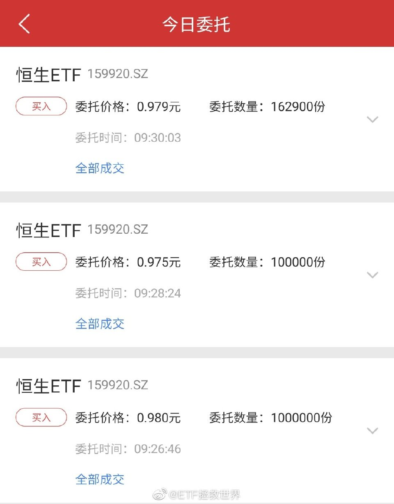

======================================================

ETF拯救世界 (5687069307) @
2022-03-15 10:27:46 Tue  
url: https://weibo.com/5687069307/LjOFecDh9

基本上恒生的买入已经结束了。

今天我的主动买入最后一笔；

网格波段最后一笔；

150和S会买入一笔。

所有的最后一笔买入全部卡在18200-18500上方。

如果跌破，那么也不会再买入。全部投入到此为止。

还会有可能买的是150和S，但是会走右侧。

永远不会向一个产品用无底洞的方式投入。 ​​​

转发[188]  评论[1005]  赞[4270] 

======================================================

ETF拯救世界 (5687069307) @
2022-03-15 11:40:24 Tue  
url: https://weibo.com/5687069307/LjP8IbTNu

今天港股买完后，很长时间应该不会再有什么大的投入了。

A股完全没有兴趣买多少，零星买一点有可能。

所以接下来应该是恢复元气积累资本的时间。

相当于中场休息。 ​​​

转发[85]  评论[1049]  赞[4115] 

======================================================

ETF拯救世界 (5687069307) @
2022-03-15 15:04:18 Tue  
url: https://weibo.com/5687069307/LjQttmLJu

不到关键点位不要轻易抄底，不要不停买，因为家里没矿。 ​​​

转发[120]  评论[862]  赞[4284] 

======================================================

ETF拯救世界 (5687069307) @
2022-03-15 15:24:16 Tue  
url: https://weibo.com/5687069307/LjQBA1WwA

不用说那么多有的没的。重复一下我的建议：

第一，好好工作。

第二，多攒点钱。

第三，保证1年以上的家庭支出以类现金形式存在。

第四，1-3年不用的钱做波段，5年以上不用的钱做长期投资。

第五，不要有了钱就不停的买。你买不应该是因为有钱了，而应该是因为有好机会了。巴菲特手里上千亿现金， ​​​

转发[991]  评论[930]  赞[6418] 

======================================================

ETF拯救世界 (5687069307) @
2022-03-15 15:30:44 Tue  
url: https://weibo.com/5687069307/LjQEcuKpe

正在跑今天的数据。

今天我没怎么看盘，结果数据出来大吃一惊。全市场两项数据出现了很罕见的大幅下降。

一会宽基和行业数据出来再说。

再这样跌几天，A股居然也很有投资机会了？这是我没想到的。 ​​​

转发[66]  评论[712]  赞[4279] 

======================================================

ETF拯救世界 (5687069307) @
2022-03-15 15:56:52 Tue  
url: https://weibo.com/5687069307/LjQOOhSB3

所有数据都出来了。

没有赶上2018年钻石坑的朋友，在2022年，你很有可能再碰上一个钻石坑。

甚至有些品种要比当时还要便宜。

在这种时候，我不想说太多让你激动的话。因为我们现在面对的是一个非常非常复杂的金融市场，其复杂甚至并非仅仅来源于金融。

但我必须要说的是，如果继续暴跌，今年大概率 ​​​

转发[721]  评论[1959]  赞[8620] 

+++++++++++++++++++++++++++++++++++++++++++++++++++++

图片：

======================================================

ETF拯救世界 (5687069307) @
2022-03-15 22:46:36 Tue  
url: https://weibo.com/5687069307/LjTv82VEd

是男人你就坚持到明天 ​​​

转发[47]  评论[1139]  赞[4138] 

+++++++++++++++++++++++++++++++++++++++++++++++++++++

图片：

======================================================

ETF拯救世界 (5687069307) @
2022-03-16 10:28:41 Wed  
url: https://weibo.com/5687069307/LjY66rrCp

卧龙凤雏。 ​​​

转发[13]  评论[412]  赞[2819] 

======================================================

ETF拯救世界 (5687069307) @
2022-03-16 10:35:20 Wed  
url: https://weibo.com/5687069307/LjY8Nms7y

有没有一种可能，

所有行业都变成公用事业。 ​​​

转发[55]  评论[842]  赞[3493] 

======================================================

ETF拯救世界 (5687069307) @
2022-03-16 10:45:14 Wed  
url: https://weibo.com/5687069307/LjYcOtvef

今日好消息：消费终于跌回历史正常区间了！//@ETF拯救世界:消费终于开始低下高昂的头颅。总是埋怨它不是讨厌它，而是爱它，怕它走在歪路上一去不回。

------------------------------------------------------
转推：
>  @ETF拯救世界 (5687069307)
>  2022-02-22 13:29:34 Tue  
>  url: https:/weibo.com/5687069307/LgDSB0mvv/

>  我心中的最大的怨念依然是消费。
>  
>  2020年5月以来的疯癫状态，到底怎样才会结束。
>  
>  即使跌到现在，它居然依然还没有进入我定义的可买入区间上限。
>  
>  是我错了还是市场错了。
>  
>  所有板块，只有它依然无法哪怕下手一点点。
>  
>  这是道德的沦丧，还是人性的扭曲。 ​​​

转发[51]  评论[429]  赞[2307] 

======================================================

ETF拯救世界 (5687069307) @
2022-03-16 11:27:12 Wed  
url: https://weibo.com/5687069307/LjYtQwzUN

今天再次买回的品种，后续还有一份的额度就会结束买入。

我不会忘记改一下之前设置的条件单，下一网价格会有变化。 ​​​

转发[29]  评论[497]  赞[2748] 

======================================================

ETF拯救世界 (5687069307) @
2022-03-16 13:22:38 Wed  
url: https://weibo.com/5687069307/LjZeHyOZB

昨天买的致敬份额终于解套了[泪] ​​​

转发[55]  评论[621]  赞[3460] 

======================================================

ETF拯救世界 (5687069307) @
2022-03-16 13:25:04 Wed  
url: https://weibo.com/5687069307/LjZfHkooJ

回复@梅之敦敏:放心。我做人永远有始有终。卖的时候必然会说。//@梅之敦敏:致敬份额啥时卖呢？

------------------------------------------------------
转推：
>  @ETF拯救世界 (5687069307)
>  2022-03-16 13:22:38 Wed  
>  url: https:/weibo.com/5687069307/LjZeHyOZB/

>  昨天买的致敬份额终于解套了[泪] ​​​

转发[20]  评论[177]  赞[1889] 

======================================================

ETF拯救世界 (5687069307) @
2022-03-16 13:39:52 Wed  
url: https://weibo.com/5687069307/LjZlHA9p3

主要是我比99.99%的人会瞎蒙

------------------------------------------------------
转推：
>  @ETF拯救世界 (5687069307)
>  2022-01-06 11:59:45 Thu  
>  url: https:/weibo.com/5687069307/L9ucNrkfO/

>  恒生的长线仓位交易历史。
>  
>  不客气的说，我比99.9%的人更懂这个指数。 ​​​

转发[110]  评论[1011]  赞[4211] 

======================================================

ETF拯救世界 (5687069307) @
2022-03-16 13:50:05 Wed  
url: https://weibo.com/5687069307/LjZpQENzq

昨天且慢提示补仓，补了的晚上给自己加个鸡腿。

你应得的。 

会不会跌回去不重要，反正今天赚了今天开心就完事。 ​​​

转发[61]  评论[1647]  赞[5140] 

======================================================

ETF拯救世界 (5687069307) @
2022-03-16 14:31:28 Wed  
url: https://weibo.com/5687069307/LjZGE5rwP

不知道各位是什么样的心情，

对我来说，很平静，跟昨天一样。

钱投在市场里，一定是上上下下起起伏伏多多少少不断波动的，所以没什么稀奇。

我对自己只有一个要求：

未来回到高点的时候，一定要比上次到达这里的时候更有钱。

其它的，平平无奇罢了。 ​​​

转发[121]  评论[897]  赞[3951] 

======================================================

ETF拯救世界 (5687069307) @
2022-03-16 14:37:28 Wed  
url: https://weibo.com/5687069307/LjZJ55eEV

现在场内不断卖恒科的脑子是不是有点大病。[微笑]

折价6个点卖。 ​​​

转发[46]  评论[509]  赞[3195] 

======================================================

ETF拯救世界 (5687069307) @
2022-03-16 14:40:10 Wed  
url: https://weibo.com/5687069307/LjZKaDvDD

告诉你一个可怕的数学题：

b站一天涨了40%，

但只是回到上周五而已。

低位买入是真的暴利。 ​​​

转发[114]  评论[572]  赞[4344] 

======================================================

ETF拯救世界 (5687069307) @
2022-03-16 15:26:38 Wed  
url: https://weibo.com/5687069307/Lk032iECs

昨天鹅最低297，恒生18235，中概79%，三者共振完成。而这一切，半个月前已经定下了。当然，是不是最低，后面还会不会跌我不敢说，但这个逻辑是完美的。

------------------------------------------------------
转推：
>  @ETF拯救世界 (5687069307)
>  2022-03-04 14:47:26 Fri  
>  url: https:/weibo.com/5687069307/LiaFalcD9/

>  鹅如果不能在目前这个强力平台撑住，那么下一个支撑就已经到了290左右。
>  
>  目前的平台实际上被鹅自己以及段老板等投资人认可，都在增持。但市场不认。
>  
>  到290的跌幅与中概是大致一致的。也就是说鹅290与中概80%共振了。如果这样的情况还是顶不住，那下面就不知道了。从鹅来说，290顶不住意味着十几年上 ​​​

转发[263]  评论[744]  赞[3932] 

======================================================

ETF拯救世界 (5687069307) @
2022-03-16 15:44:13 Wed  
url: https://weibo.com/5687069307/Lk0aaAiiI

刚才我在小助理群里说的，我觉得应该分享给大家。

这是我的真实想法。

我发现每一次进化，都来源于失败。只有在失败（或者不足或者不满意）后，才会努力的去寻找解决的办法，才会最终变得更强。

我们每个人都不想失败，但失败真的是进步的契机。区别是有人面对失败充满沮丧自暴自弃，有人面对失败寻 ​​​

转发[131]  评论[1015]  赞[4219] 

+++++++++++++++++++++++++++++++++++++++++++++++++++++

图片：

======================================================

ETF拯救世界 (5687069307) @
2022-03-17 07:36:44 Thu  
url: https://weibo.com/5687069307/Lk6oNwTtI

整个人尬住了：

一天涨40%的品种怎么做右侧，这道题太难我不会做。 ​​​

转发[68]  评论[1215]  赞[4686] 

======================================================

ETF拯救世界 (5687069307) @
2022-03-17 08:21:02 Thu  
url: https://weibo.com/5687069307/Lk6GMoeXg

QDII ETF/LOF都已经实现T+0了，却依然设置10%涨跌幅是特别离谱的一件事，相关部门领导能不能考虑把这个调整一下。

机构的朋友们也多向领导们建言吧。 ​​​

转发[65]  评论[409]  赞[3503] 

======================================================

ETF拯救世界 (5687069307) @
2022-03-17 08:25:14 Thu  
url: https://weibo.com/5687069307/Lk6Iubvbg

回复@GENE_SOBER:策略不执行还叫什么策略？不如随心所欲去玩好了。//@GENE_SOBER:今天网格继续策略么？右侧不给机会了嘛[允悲]

------------------------------------------------------
转推：
>  @ETF拯救世界 (5687069307)
>  2022-03-17 08:21:02 Thu  
>  url: https:/weibo.com/5687069307/Lk6GMoeXg/

>  QDII ETF/LOF都已经实现T+0了，却依然设置10%涨跌幅是特别离谱的一件事，相关部门领导能不能考虑把这个调整一下。
>  
>  机构的朋友们也多向领导们建言吧。 ​​​

转发[23]  评论[286]  赞[1759] 

======================================================

ETF拯救世界 (5687069307) @
2022-03-17 09:36:50 Thu  
url: https://weibo.com/5687069307/Lk7by9uAi

HS又因为折价没出去。

天妒英才。 ​​​

转发[19]  评论[402]  赞[2249] 

======================================================

ETF拯救世界 (5687069307) @
2022-03-17 09:51:04 Thu  
url: https://weibo.com/5687069307/Lk7hkhBm8

恒科这一网如果出不去就太亏了。

被交易制度干掉了。 ​​​

转发[32]  评论[454]  赞[2517] 

======================================================

ETF拯救世界 (5687069307) @
2022-03-17 10:25:45 Thu  
url: https://weibo.com/5687069307/Lk7vp8t7w

做市商是真不干活啊。 ​​​

转发[13]  评论[262]  赞[1956] 

======================================================

ETF拯救世界 (5687069307) @
2022-03-17 10:36:56 Thu  
url: https://weibo.com/5687069307/Lk7zWnwy3

你永远可以相信（  ）（  ）。

同一个品种一周两次6%，每次两个交易日，还有谁。 ​​​

转发[43]  评论[805]  赞[3197] 

======================================================

ETF拯救世界 (5687069307) @
2022-03-17 10:48:10 Thu  
url: https://weibo.com/5687069307/Lk7EvaMdK

屋漏偏逢连夜雨，最近赔这么多，它还涨价，节食吧还能怎么样。[怒] ​​​

转发[18]  评论[457]  赞[2021] 

+++++++++++++++++++++++++++++++++++++++++++++++++++++

图片：

======================================================

ETF拯救世界 (5687069307) @
2022-03-17 11:09:41 Thu  
url: https://weibo.com/5687069307/Lk7NewdRR

错了，这一笔是不到一个交易日7%。没有人注意我把买入价下调了一个档位吗。

------------------------------------------------------
转推：
>  @ETF拯救世界 (5687069307)
>  2022-03-17 10:36:56 Thu  
>  url: https:/weibo.com/5687069307/Lk7zWnwy3/

>  你永远可以相信（  ）（  ）。
>  
>  同一个品种一周两次6%，每次两个交易日，还有谁。 ​​​

转发[17]  评论[463]  赞[2470] 

======================================================

ETF拯救世界 (5687069307) @
2022-03-17 12:09:25 Thu  
url: https://weibo.com/5687069307/Lk8bu4FSv

今天的日常生活记录：

壹：

疫情原因，家里做饭的阿姨不来了。点开久违的麦麦1+1，发现价格巨幅上涨7.5%。

生气。

贰：

两年前别人送的咖啡机今天拆箱拿出来用，发现回路不上水。找维修上门，用一根管子吸了一下就好了。被收了280。

生气。

叁：

发现在投资上面很难克服心魔，知道应该怎么做却 ​​​

转发[73]  评论[819]  赞[3460] 

======================================================

ETF拯救世界 (5687069307) @
2022-03-17 12:19:35 Thu  
url: https://weibo.com/5687069307/Lk8fBErfF

回复@飘渺七夜:[微笑] 不要气，观察一下谁相信了，然后在相信的人后面备注【脑残，离远点，否则会受伤】。//@飘渺七夜:刚才我气着了，一位网友（别的地方的）竟然说E大最近让清仓取现金了！！！！！！ 我惊了！这谣言吗？网络上这么公开的事情，闭眼造谣啊！

------------------------------------------------------
转推：
>  @ETF拯救世界 (5687069307)
>  2022-03-17 12:09:25 Thu  
>  url: https:/weibo.com/5687069307/Lk8bu4FSv/

>  今天的日常生活记录：
>  
>  壹：
>  
>  疫情原因，家里做饭的阿姨不来了。点开久违的麦麦1+1，发现价格巨幅上涨7.5%。
>  
>  生气。
>  
>  贰：
>  
>  两年前别人送的咖啡机今天拆箱拿出来用，发现回路不上水。找维修上门，用一根管子吸了一下就好了。被收了280。
>  
>  生气。
>  
>  叁：
>  
>  发现在投资上面很难克服心魔，知道应该怎么做却 ​​​

转发[25]  评论[100]  赞[1144] 

======================================================

ETF拯救世界 (5687069307) @
2022-03-17 12:23:24 Thu  
url: https://weibo.com/5687069307/Lk8hafX4U

回复@Horse17721:一般人觉得可笑的谎言，正是骗子用来筛选脑残的。如果连那么低级的谎言都能信，说明这个人可以，能骗。//@Horse17721:老大就是务实，这都能找到实用之处？[打call]

------------------------------------------------------
转推：
>  @ETF拯救世界 (5687069307)
>  2022-03-17 12:09:25 Thu  
>  url: https:/weibo.com/5687069307/Lk8bu4FSv/

>  今天的日常生活记录：
>  
>  壹：
>  
>  疫情原因，家里做饭的阿姨不来了。点开久违的麦麦1+1，发现价格巨幅上涨7.5%。
>  
>  生气。
>  
>  贰：
>  
>  两年前别人送的咖啡机今天拆箱拿出来用，发现回路不上水。找维修上门，用一根管子吸了一下就好了。被收了280。
>  
>  生气。
>  
>  叁：
>  
>  发现在投资上面很难克服心魔，知道应该怎么做却 ​​​

转发[16]  评论[104]  赞[1231] 

======================================================

ETF拯救世界 (5687069307) @
2022-03-17 12:40:18 Thu  
url: https://weibo.com/5687069307/Lk8o1c99W

说两句正经的。

经过两天大幅反弹，可能有很多朋友会关心之后怎么走：

是特级大熊市中继的“死猫跳”？还是V型反转继续大牛市？还是要做双底还有一波下跌？

我不知道谁能判断出是哪个，反正我是判断不出来。

谁能猜出熊熊突然干入邻居家？谁能想到昨天开会？

如果都不能，凭什么我们能猜出市场怎 ​​​

转发[456]  评论[768]  赞[3683] 

======================================================

ETF拯救世界 (5687069307) @
2022-03-17 13:10:33 Thu  
url: https://weibo.com/5687069307/Lk8Aik0UU

回头再看这个最黑暗时刻的投票，我真的感慨万分。各位是中文互联网上最特别的一群投资人，我为能与大家站在一起感到骄傲。

------------------------------------------------------
转推：
>  @ETF拯救世界 (5687069307)
>  2022-03-14 19:58:55 Mon  
>  url: https:/weibo.com/5687069307/LjIYz196U/

>  大家还记得几天前的投票吗。几天过去，你要改一下答案吗 http://t.cn/A66VYQaJ ​​​

转发[1]  评论[868]  赞[3287] 

======================================================

ETF拯救世界 (5687069307) @
2022-03-17 13:21:08 Thu  
url: https://weibo.com/5687069307/Lk8EABvRg

成交。

两个交易日12%。没弄错的话应该是两年来收益率最大的一次。 ​​​

转发[31]  评论[675]  赞[3032] 

======================================================

ETF拯救世界 (5687069307) @
2022-03-17 14:02:09 Thu  
url: https://weibo.com/5687069307/Lk8Vf0iWp

虽然说不预测走势，但从历史的角度看，恒生指数从未在18500-22000这样的极度价值区域出现V型反转而只是短暂停留。

最少也要徘徊几个月。

换而言之，在这个区域会出现不止一次的波段机会。从历史看，大概率。

换而言之，各位要做好准备，知道大概率还会向下测试底部是否牢固。做好准备的意思，是真的 ​​​

转发[325]  评论[753]  赞[3659] 

======================================================

ETF拯救世界 (5687069307) @
2022-03-17 15:04:16 Thu  
url: https://weibo.com/5687069307/Lk9ks9pZ5

HS更新。买回价格有变化，我会在历史记录里面找出然后改单。 ​​​

转发[17]  评论[386]  赞[2207] 

======================================================

ETF拯救世界 (5687069307) @
2022-03-17 15:47:51 Thu  
url: https://weibo.com/5687069307/Lk9C92zn7

明天是个时间窗口，保不齐长期计划会追涨硬上！ ​​​

转发[33]  评论[656]  赞[3261] 

======================================================

ETF拯救世界 (5687069307) @
2022-03-17 15:55:38 Thu  
url: https://weibo.com/5687069307/Lk9FiC8uY

今天HS没挤下车的不用担心，只要今晚中概不掉链子，明天全都能下。

我说的！ ​​​

转发[50]  评论[805]  赞[3433] 

======================================================

ETF拯救世界 (5687069307) @
2022-03-17 16:34:44 Thu  
url: https://weibo.com/5687069307/Lk9Vbd5lA

希望所有回购公司回购后都注销。不然真的意义不大。

------------------------------------------------------
转推：
>  @财联社APP (2868676035)
>  2022-03-17 16:25:20 Thu  
>  url: https:/weibo.com/2868676035/Lk9RmzZQk/

>  【恒瑞医药：拟6亿元-12亿元回购公司股票】财联社3月17日电，恒瑞医药公告，拟用6亿元至12亿元回购公司股票；回购价格为不超过60.22元/股。 ​​​

转发[43]  评论[220]  赞[2043] 

======================================================

ETF拯救世界 (5687069307) @
2022-03-17 16:47:52 Thu  
url: https://weibo.com/5687069307/Lka0vj92K

问你个问题，你是不是觉得咱们之前低点买的富国消费这几个月没挣钱非常垃圾。

但你知道吗，大摩的一幕又上演了： ​​​

转发[50]  评论[558]  赞[3332] 

+++++++++++++++++++++++++++++++++++++++++++++++++++++

图片：
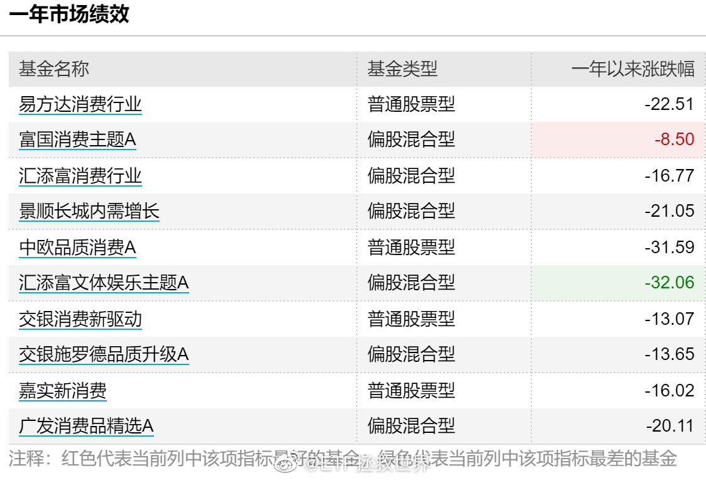

======================================================

ETF拯救世界 (5687069307) @
2022-03-17 17:36:22 Thu  
url: https://weibo.com/5687069307/Lkakc12Un

最近这两天关于小品演员和足球运动员的争论，吵得很热闹。但其实你知道其中最关键最核心的地方是什么吗。

最关键的不是男足菜，

而是男足菜，又挣得多。

谁规定足球一定要强了？没有。中国根本就没有足球的土壤氛围，不强就不强，其实不是事儿。但你又菜挣得又多，那就一定被骂。

到这里不要停止思 ​​​

转发[209]  评论[912]  赞[6230] 

======================================================

ETF拯救世界 (5687069307) @
2022-03-18 07:18:13 Fri  
url: https://weibo.com/5687069307/LkfHMDShL

艺高人胆大，现在买 http://t.cn/A66MkVxT

------------------------------------------------------
转推：
>  @华尔街见闻APP (1875034341)
>  2022-03-18 01:24:58 Fri  
>  url: https:/weibo.com/1875034341/LkdoosqnO/

>  【别人恐惧我贪婪？巴菲特本周再买近10亿美元西方石油 持股达14.6%】伯克希尔在本周继续大买西方石油公司，在周一到周三的三天时间内，共买进1810万股西方石油，价值近10亿美元，平均价格为54.41美元/股。本周是伯克希尔连续第三周大举进仓。http://t.cn/A66MmRlk ​​​

转发[42]  评论[640]  赞[2329] 

======================================================

ETF拯救世界 (5687069307) @
2022-03-18 10:07:22 Fri  
url: https://weibo.com/5687069307/LkgOrbEhw

药兄不会再来一次吧。

这碧海潮生曲一波接一波谁能顶得住！ ​​​

转发[18]  评论[385]  赞[2505] 

======================================================

ETF拯救世界 (5687069307) @
2022-03-18 10:18:42 Fri  
url: https://weibo.com/5687069307/LkgT2lFNC

今天150进二出一，S进二。

无奖竞猜一下。 ​​​

转发[32]  评论[1531]  赞[3418] 

======================================================

ETF拯救世界 (5687069307) @
2022-03-18 12:50:38 Fri  
url: https://weibo.com/5687069307/LkhSIkxKV

你有没有发现一个很有意思的，就是咱们都说明星、男足球员收入高，不合理的高。

对。大家的感受其实是对的。为什么对。

国内的视频平台，前些年开始，因为有资本加持，所以无底线抬高剧集价格，导致明星收入也疯狂上涨。

然后呢？你就会发现，这些平台一直在亏钱，从未盈利。爱奇艺股价跌成什么样了 ​​​

转发[136]  评论[381]  赞[3008] 

======================================================

ETF拯救世界 (5687069307) @
2022-03-18 13:25:19 Fri  
url: https://weibo.com/5687069307/Lki6MBY7G

我要卖的一直在跌，我要买的由跌转涨。

不，我不能接受。我不同意这门亲事！ ​​​

转发[28]  评论[540]  赞[3357] 

======================================================

ETF拯救世界 (5687069307) @
2022-03-18 13:33:38 Fri  
url: https://weibo.com/5687069307/Lkiaa7lfI

2022年3月18日，

两个计划的环保终于清仓了。

这个品种带给我们很多东西。有物质的，有精神的，还有一些投资经验。

它走了，我很怀念它。也许会买回来，大概在1***点。 ​​​

转发[47]  评论[596]  赞[2901] 

======================================================

ETF拯救世界 (5687069307) @
2022-03-18 14:04:01 Fri  
url: https://weibo.com/5687069307/Lkimuwkkc

[微笑]my pleasure

------------------------------------------------------
转推：
>  @ETF拯救世界 (5687069307)
>  2022-03-17 15:55:38 Thu  
>  url: https:/weibo.com/5687069307/Lk9FiC8uY/

>  今天HS没挤下车的不用担心，只要今晚中概不掉链子，明天全都能下。
>  
>  我说的！ ​​​

转发[25]  评论[902]  赞[2867] 

======================================================

ETF拯救世界 (5687069307) @
2022-03-18 14:23:50 Fri  
url: https://weibo.com/5687069307/LkiuxFPna

发车的时候明明是下跌6%。

你是不是针对我。 ​​​

转发[24]  评论[749]  赞[3180] 

======================================================

ETF拯救世界 (5687069307) @
2022-03-18 15:25:47 Fri  
url: https://weibo.com/5687069307/LkiTGEAke

有空的老爷们都可以看看//@且慢管家: 对不起，是我们“智障”了，在【首页】的【推荐阅读】-【长赢专栏】进去可以看，我们也正在修复“智商”[苦涩]

------------------------------------------------------
转推：
>  @且慢管家 (6186312580)
>  2022-03-18 14:36:48 Fri  
>  url: https:/weibo.com/6186312580/LkizNAqJo/

>  #且慢分享# 非常感谢@ETF拯救世界 e大专门为且慢跟车长赢的用户写了发车文，大家可以去APP里看哦，提升认知，明明白白跟车~ http://t.cn/Rp7ei1g ​​​

转发[49]  评论[545]  赞[2010] 

======================================================

ETF拯救世界 (5687069307) @
2022-03-19 00:19:17 Sat  
url: https://weibo.com/5687069307/LkmoenOOK

能不能顶到收盘。 ​​​

转发[30]  评论[753]  赞[3220] 

+++++++++++++++++++++++++++++++++++++++++++++++++++++

图片：
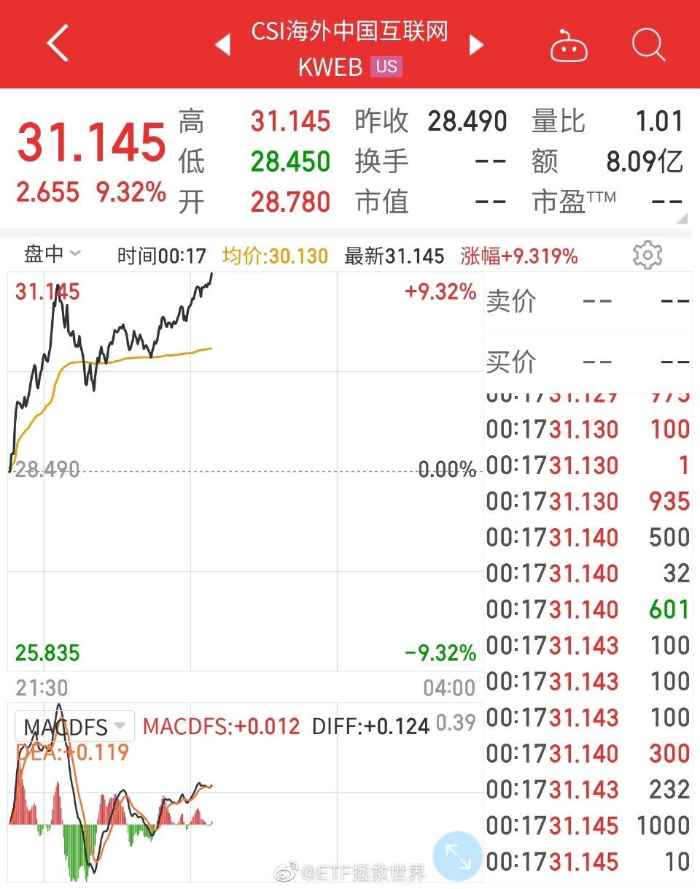

======================================================

ETF拯救世界 (5687069307) @
2022-03-19 16:38:52 Sat  
url: https://weibo.com/5687069307/LksNQkkNB

富国红利即将分红。

分红比例12%。

再投。 ​​​

转发[46]  评论[712]  赞[3425] 

======================================================

ETF拯救世界 (5687069307) @
2022-03-19 17:11:28 Sat  
url: https://weibo.com/5687069307/Lkt150Tr3

一会有一篇文章推送。做波段的朋友应该看看，应该不会是纯粹耽误时间的水文。 ​​​

转发[24]  评论[805]  赞[3357] 

======================================================

ETF拯救世界 (5687069307) @
2022-03-19 17:57:40 Sat  
url: https://weibo.com/5687069307/LktjPof6L

时薪300左右的兼职在国内是什么水平。 ​​​

转发[24]  评论[1178]  赞[5253] 

======================================================

ETF拯救世界 (5687069307) @
2022-03-19 21:50:14 Sat  
url: https://weibo.com/5687069307/LkuQecZa1

刚才看了一遍gzh留言，说两个点。

第一，条件单跟长期计划毫无关系。没有做波段的不用改单。

第二，我到现在依然不敢说18500或者7080是铁底，这世界上有什么一定不会发生的事情吗。所以我们的波段才会一网一网的，按照纪律卖出啊。

总而言之我们的目标就是：涨也可以，跌也可以，大概就是这样。 ​​​

转发[50]  评论[452]  赞[3010] 

======================================================

ETF拯救世界 (5687069307) @
2022-03-19 21:58:16 Sat  
url: https://weibo.com/5687069307/LkuTul1gU

PDD砍价这个新闻，让我有一个想法。

比如说我发一个砍价的信息，各位帮我砍，咱们看看能不能砍成免费，看看它们搞得这个事情到底是真的还是假的。

如果是真的能砍到，我就把砍到的东西抽奖送给大家。

但是我没砍过，这是一个什么机制。就是说如果砍成了是免费送吗，还是说只是便宜一点。只是便宜一 ​​​

转发[33]  评论[1316]  赞[4963] 

======================================================

ETF拯救世界 (5687069307) @
2022-03-21 09:05:39 Mon  
url: https://weibo.com/5687069307/LkIGT0s58

怕有朋友没看到，在这里贴一下。

再说一次，改了未必好，不改未必差。几分钟的行情很难说。

我只是选一个相对大概率正确的决定。

http://t.cn/A66JH8zP ​​​

转发[48]  评论[643]  赞[2769] 

======================================================

ETF拯救世界 (5687069307) @
2022-03-21 10:17:51 Mon  
url: https://weibo.com/5687069307/LkJabkmTC

上周五卖出的最后一份环保平均收益率91%。

很不好意思，这次没到100%。 ​​​

转发[22]  评论[707]  赞[3291] 

======================================================

ETF拯救世界 (5687069307) @
2022-03-21 10:42:10 Mon  
url: https://weibo.com/5687069307/LkJk3D7aW

没卖出，失败！

没买入，失败！

微信消息发错人了，失败中的失败！

小猫咪何在，让我吸一下缓一缓…… ​​​

转发[20]  评论[866]  赞[3982] 

======================================================

ETF拯救世界 (5687069307) @
2022-03-21 15:04:45 Mon  
url: https://weibo.com/5687069307/LkL2DqOsf

之前医药波段积累的极低成本利润不要卖。

18000再说。虽然不知道什么时候才会到。 ​​​

转发[91]  评论[502]  赞[2963] 

======================================================

ETF拯救世界 (5687069307) @
2022-03-21 16:46:49 Mon  
url: https://weibo.com/5687069307/LkLI46ny7

🙏🙏🙏🙏🙏 ​​​

转发[24]  评论[1072]  赞[3035] 

======================================================

ETF拯救世界 (5687069307) @
2022-03-21 19:50:42 Mon  
url: https://weibo.com/5687069307/LkMUI6aee

回复@ETF拯救世界:嗯。//@ETF拯救世界:所以啊，想做的，有能力做的事情，就赶紧去做吧。别拖了，拖来拖去最后会有遗憾。

------------------------------------------------------
转推：
>  @ETF拯救世界 (5687069307)
>  2020-08-08 20:54:05 Sat  
>  url: https:/weibo.com/5687069307/Jf066xJPr/

>  你有没有想过，如果明天地球爆炸，有什么事是你可以做到却因为没有去做而会感到遗憾的。 ​​​

转发[147]  评论[554]  赞[2616] 

======================================================

ETF拯救世界 (5687069307) @
2022-03-22 11:45:53 Tue  
url: https://weibo.com/5687069307/LkTapwObz

卖了的跌，买了的涨，还有一个要提款。

还可以吧，相当凑合。 ​​​

转发[19]  评论[620]  赞[3317] 

======================================================

ETF拯救世界 (5687069307) @
2022-03-22 13:19:21 Tue  
url: https://weibo.com/5687069307/LkTMlBz2c

跌吧，我好了。 ​​​

转发[19]  评论[759]  赞[2410] 

======================================================

ETF拯救世界 (5687069307) @
2022-03-22 13:48:32 Tue  
url: https://weibo.com/5687069307/LkTYcw1OB

大家兴致这么高，上个小咪给大家助助兴。 ​​​

转发[16]  评论[806]  赞[3849] 

+++++++++++++++++++++++++++++++++++++++++++++++++++++

图片：
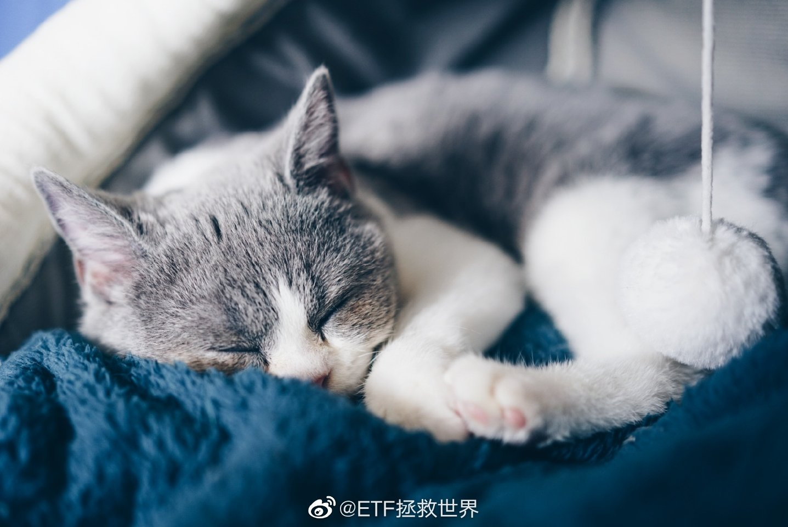

======================================================

ETF拯救世界 (5687069307) @
2022-03-22 14:35:21 Tue  
url: https://weibo.com/5687069307/LkUhcn6c4

买了一丢丢消费后，心态好多了。

跌，我们欢迎；涨，我们奉陪。

现在看茅也没以前那么讨厌了。真．屁股决定脑袋啊。 ​​​

转发[25]  评论[408]  赞[3055] 

======================================================

ETF拯救世界 (5687069307) @
2022-03-22 16:06:22 Tue  
url: https://weibo.com/5687069307/LkUS90j2N

恒指今天再次大涨，反弹到22000关卡附近。

在上方的时候，这是支撑，在下方，这就变成了压力。

以我对恒生的了解，以及多吃几个波段的私心，是希望22000的压力发挥威力，在18500-22000区间多几次震荡的。

当然真要突破也无所谓，但我还是估计没那么轻松。

无所谓了，涨跌我都ok。你ok不ok。 ​​​

转发[141]  评论[874]  赞[3437] 

======================================================

ETF拯救世界 (5687069307) @
2022-03-22 16:12:16 Tue  
url: https://weibo.com/5687069307/LkUUxFhf7

回复@_Cloudcloud_:我是人不是神，不可能几年前就精准预测到下跌的个位数点位。18500上下大差不差就行了。//@_Cloudcloud_:涨跌都ok 只是突破下限的时候确实有点方

------------------------------------------------------
转推：
>  @ETF拯救世界 (5687069307)
>  2022-03-22 16:06:22 Tue  
>  url: https:/weibo.com/5687069307/LkUS90j2N/

>  恒指今天再次大涨，反弹到22000关卡附近。
>  
>  在上方的时候，这是支撑，在下方，这就变成了压力。
>  
>  以我对恒生的了解，以及多吃几个波段的私心，是希望22000的压力发挥威力，在18500-22000区间多几次震荡的。
>  
>  当然真要突破也无所谓，但我还是估计没那么轻松。
>  
>  无所谓了，涨跌我都ok。你ok不ok。 ​​​

转发[28]  评论[264]  赞[2055] 

======================================================

ETF拯救世界 (5687069307) @
2022-03-22 19:50:00 Tue  
url: https://weibo.com/5687069307/LkWkUBGQw

英语语法思维导图，给孩子马住！ ​​​

转发[2160]  评论[38]  赞[1442] 

+++++++++++++++++++++++++++++++++++++++++++++++++++++

图片：

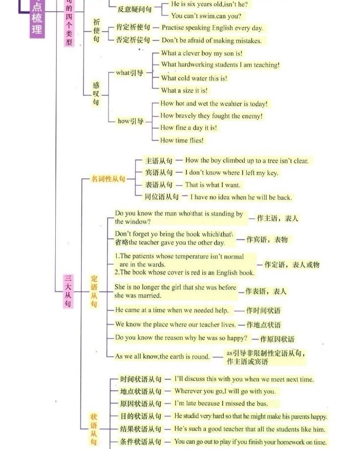

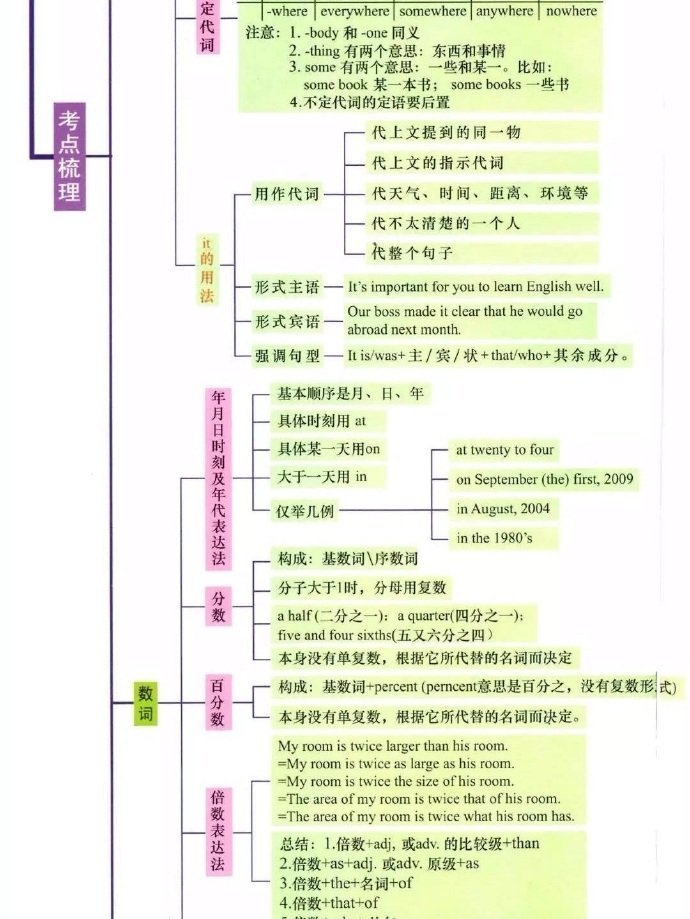

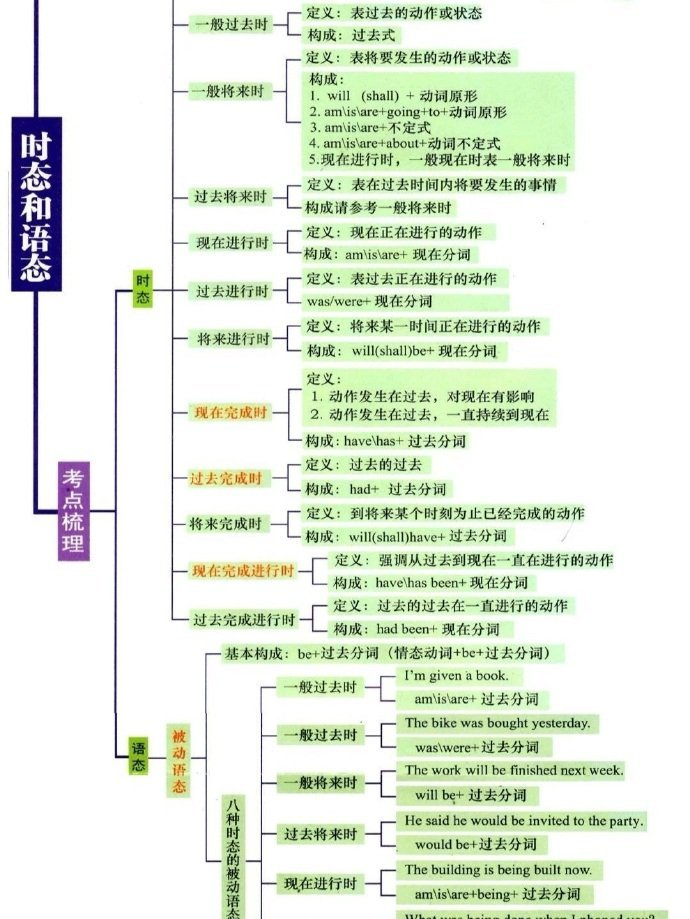

======================================================

ETF拯救世界 (5687069307) @
2022-03-22 22:55:58 Tue  
url: https://weibo.com/5687069307/LkXyoCY70

现在每天中概不波动10%，感觉就跟平盘没什么区别。

过惯了刺激的日子，平平淡淡就少了点味道。 ​​​

转发[43]  评论[579]  赞[3576] 

======================================================

ETF拯救世界 (5687069307) @
2022-03-23 08:48:41 Wed  
url: https://weibo.com/5687069307/Ll1qZ5xRG

图片评论 http://t.cn/A66acsIb

------------------------------------------------------
转推：
>  @ETF拯救世界 (5687069307)
>  2022-01-27 10:02:25 Thu  
>  url: https:/weibo.com/5687069307/LcFpBkiIZ/

>  由于日元大幅贬值，投资日经225的波段逻辑已经完全改变，所以暂停日经波段。
>  
>  我会删除自己的日经条件单。 ​​​

转发[28]  评论[316]  赞[1783] 

======================================================

ETF拯救世界 (5687069307) @
2022-03-23 09:31:14 Wed  
url: https://weibo.com/5687069307/Ll1IfEs5W

恒科监控时间可以改回9:30开始。 ​​​

转发[12]  评论[465]  赞[1993] 

======================================================

ETF拯救世界 (5687069307) @
2022-03-23 09:40:16 Wed  
url: https://weibo.com/5687069307/Ll1LVco1L

本网六个交易日收益16%。

市场会奖励意志坚定的士兵。 ​​​

转发[62]  评论[708]  赞[3317] 

======================================================

ETF拯救世界 (5687069307) @
2022-03-23 09:48:11 Wed  
url: https://weibo.com/5687069307/Ll1P8Ajpp

不说你不知道，今年3个月过去，已经提了7次款（去年全年21次）。

三月一个月就是6次。

波动对很多人来说是噩梦，对一些人来说是印钞机。 ​​​

转发[64]  评论[643]  赞[3305] 

======================================================

ETF拯救世界 (5687069307) @
2022-03-23 09:58:20 Wed  
url: https://weibo.com/5687069307/Ll1TfATwb

我觉得投资和人生可能有很多相似的地方。

只要保证活下去，不死，那么很多预想中的、经历中的困难，在时过境迁安然度过后，会发现不过如此，风轻云淡。

所以三句经常说的话送给你：

第一，除了生死，都是小事。多大点事儿，踏踏实实的。

第二，一切都会变好，如果没有，那就是没有到最后。

第三， ​​​

转发[525]  评论[704]  赞[4230] 

======================================================

ETF拯救世界 (5687069307) @
2022-03-23 10:06:08 Wed  
url: https://weibo.com/5687069307/Ll1Wq9seC

连续第二天发错微信。

今天是把波段发车表格发到且慢发车群（都是工作人员）去了。[微笑]

解决整改方案：

1、修改群信息。

2、30天内微信谨慎发言，能不说就不说，小心度过水逆期。 ​​​

转发[21]  评论[598]  赞[2631] 

======================================================

ETF拯救世界 (5687069307) @
2022-03-23 10:47:54 Wed  
url: https://weibo.com/5687069307/Ll2dnb7TI

资本市场的钱，一定是慢慢的越来越集中。

从那些不理智、情绪化的人手中，集中到理智、讲纪律、意志坚定的人手里。

这也相当于资源优化配置吧。

当然，最终都会流入大平层，在另一个层面上被收割…… ​​​

转发[132]  评论[469]  赞[3408] 

======================================================

ETF拯救世界 (5687069307) @
2022-03-23 10:59:15 Wed  
url: https://weibo.com/5687069307/Ll2hZ1cbM

一场风暴过后，雨过天晴，大家都当没事发生。

只有那些底部割肉的人心如刀割。 ​​​

转发[154]  评论[768]  赞[4433] 

======================================================

ETF拯救世界 (5687069307) @
2022-03-23 11:05:16 Wed  
url: https://weibo.com/5687069307/Ll2kqd5Dv

回复@艾_自_由:第一，杠杆爆仓。第二，清盘线。第三，割了还有一点不割可能一分没有了。//@艾_自_由:一直不理解，为什么会有人底部割肉？

------------------------------------------------------
转推：
>  @ETF拯救世界 (5687069307)
>  2022-03-23 10:59:15 Wed  
>  url: https:/weibo.com/5687069307/Ll2hZ1cbM/

>  一场风暴过后，雨过天晴，大家都当没事发生。
>  
>  只有那些底部割肉的人心如刀割。 ​​​

转发[68]  评论[313]  赞[2298] 

======================================================

ETF拯救世界 (5687069307) @
2022-03-23 14:00:29 Wed  
url: https://weibo.com/5687069307/Ll3txBifE

长牛的时候你觉得长线仓位NB，波段仓位太多了，以后不做波段了。

波动的时候你觉得波段仓位NB，长线仓位太多了，以后不拿长线了。

其实没有别的原因，就是你不懂资本市场。更不懂我们整个体系是如何互相支撑互相配合的。 ​​​

转发[136]  评论[825]  赞[4334] 

======================================================

ETF拯救世界 (5687069307) @
2022-03-24 07:38:26 Thu  
url: https://weibo.com/5687069307/LlaoY0OqQ

“挣外币花外币不能换算”是最二的说法。你不换算根本感受不到真实情况。

------------------------------------------------------
转推：
>  @牛叔 (2136367523)
>  2022-03-24 04:16:28 Thu  
>  url: https:/weibo.com/2136367523/Ll94Ze4QF/

>  作为一个普通人跟大家聊聊海外普通人的收入和生活成本，打消下大家对所谓挣欧元花欧元就不贵了的误解。这轮能源危机下来，普通德国人绝对是要捉襟见肘了,别的不说,油价从去年的1.3欧到现在的2欧+,涨幅50%,光油钱一个月多150欧不过分吧,天然气的价格以前年度一直是7毛左右(各种税费占一半)一立方, 现在2 ​​​

转发[55]  评论[298]  赞[1995] 

======================================================

ETF拯救世界 (5687069307) @
2022-03-24 09:35:41 Thu  
url: https://weibo.com/5687069307/Llbayw5tM

世道困难，有些公司不敢说自己挣钱了，拼命压低利润。

因为别人不挣钱就你挣钱，你就离出问题不远了。

同理，

别人都很困难，如果你没那么困难，你就不要嘚瑟了。

共度时艰，猥琐发育，苟住。 ​​​

转发[105]  评论[551]  赞[3616] 

======================================================

ETF拯救世界 (5687069307) @
2022-03-24 09:54:50 Thu  
url: https://weibo.com/5687069307/Llbiku4KO

我就问你，12000点这个支撑-压力强不强。在这个价位周边晃了2个月了。

------------------------------------------------------
转推：
>  @ETF拯救世界 (5687069307)
>  2022-01-25 14:07:53 Tue  
>  url: https:/weibo.com/5687069307/Lcoaf8weM/

>  时隔三年，150和S的医药买入周期又开始了。
>  
>  接下来的区间目标，是在9500-12000之间，将医药仓位配置完毕。
>  
>  所有的事情都有预案，有解决方法，有执行措施，有理论和体系的保证。
>  
>  你很怕跌？为什么？
>  
>  哦，原来是因为什么都没有。 ​​​

转发[69]  评论[307]  赞[1972] 

======================================================

ETF拯救世界 (5687069307) @
2022-03-24 09:56:11 Thu  
url: https://weibo.com/5687069307/LlbiT1iIO

而12000点这个点位，甚至是两年前提出来的。//@ETF拯救世界:医药下方重要支撑线是12000点。上方压力线依然是15500。一切尽在掌握。//@ETF拯救世界:折腾了一个半月，我军15500防线固若金汤。//@ETF拯救世界:回来了老弟。//@ETF拯救世界:在大气层激烈争夺。15500不是那么容易过的。

------------------------------------------------------
转推：
>  @ETF拯救世界 (5687069307)
>  2020-07-13 11:26:03 Mon  
>  url: https:/weibo.com/5687069307/JaZgDapRK/

>  医药基本已经脱离我能理解的范畴，进入“外太空”区域。
>  
>  在这个区域，我将用新的交易策略处理剩下的仓位。
>  
>  踏踏实实的。 ​​​

转发[78]  评论[275]  赞[1881] 

======================================================

ETF拯救世界 (5687069307) @
2022-03-24 10:32:33 Thu  
url: https://weibo.com/5687069307/LlbxDxX4w

回复@虫子的生活记录:一项一项说。先把收入支出说清楚，再好好说福利。你不能说收入支出的时候“不能换算”，换算完了又开始把福利弄进来一起捣糨糊。

------------------------------------------------------
转推：
>  @牛叔 (2136367523)
>  2022-03-24 04:16:28 Thu  
>  url: https:/weibo.com/2136367523/Ll94Ze4QF/

>  作为一个普通人跟大家聊聊海外普通人的收入和生活成本，打消下大家对所谓挣欧元花欧元就不贵了的误解。这轮能源危机下来，普通德国人绝对是要捉襟见肘了,别的不说,油价从去年的1.3欧到现在的2欧+,涨幅50%,光油钱一个月多150欧不过分吧,天然气的价格以前年度一直是7毛左右(各种税费占一半)一立方, 现在2 ​​​

转发[24]  评论[183]  赞[1582] 

======================================================

ETF拯救世界 (5687069307) @
2022-03-24 13:47:02 Thu  
url: https://weibo.com/5687069307/LlcOA3LlK

中外生活水平这个问题，我是这么看的。如果你不同意，保留意见。

首先毫无疑问的，是我们与美加、西南北欧、澳新等国家的生活水平还有非常非常大的差距。这个差距怎么说呢，100年前就有了。现在我们的人均GDP也只有一万多美元，发达国家至少在3万以上。有差距这是显而易见的，还用说吗。

其次，也是 ​​​

转发[155]  评论[908]  赞[5566] 

======================================================

ETF拯救世界 (5687069307) @
2022-03-24 14:48:18 Thu  
url: https://weibo.com/5687069307/LlddrCqHJ

好消息：信息、消费跌了。

坏消息：医药涨了。

好消息：医药涨了，还需要再涨一点。

结论：

赢麻了。[doge] ​​​

转发[49]  评论[756]  赞[3473] 

======================================================

ETF拯救世界 (5687069307) @
2022-03-24 22:42:20 Thu  
url: https://weibo.com/5687069307/LlgjRzNYp

今天中国队会很惨还是沙特会放点水。 ​​​

转发[14]  评论[467]  赞[2115] 

======================================================

ETF拯救世界 (5687069307) @
2022-03-25 16:04:41 Fri  
url: https://weibo.com/5687069307/Lln8X0boC

今日数据：

科创估值从几个月前的100倍跌到了今天的50多；

某个我们一直想买，但一直没机会，去年买了一丢丢的品种最近可能再加一点；

大指数刚刚开始进入“不贵”区域；

某知名私募3月初清仓了，上次是2018年底的钻石坑。当然，对于这个我没有什么看法。每个投资人的投资体系完全不同，很难一概而 ​​​

转发[113]  评论[949]  赞[4857] 

======================================================

ETF拯救世界 (5687069307) @
2022-03-26 12:48:32 Sat  
url: https://weibo.com/5687069307/LlvhPoTMD

医疗养老工作时长，还需要向福利国家靠近一些，让人民拥有幸福感。

------------------------------------------------------
转推：
>  @牛叔 (2136367523)
>  2022-03-26 04:32:07 Sat  
>  url: https:/weibo.com/2136367523/Lls2kyVyq/

>  说说德国的社会福利体系
>  
>  德国拥有世界上最完备的社会福利体系之一。在德国宪法《基本法》中明确规定了社会福利国家原则。宪法规定了德国是一个民主、社会的联邦国家。其实行的社会市场经济制度保持着私有资本主义活力的同时，国家又保留随时干预权力，重点关注社会的公平正义，大部分德国人不论职业高 ​​​

转发[115]  评论[201]  赞[1700] 

======================================================

ETF拯救世界 (5687069307) @
2022-03-26 12:56:21 Sat  
url: https://weibo.com/5687069307/Llvl0r8zI

回复@给我别闹:我说句实话，很多很多行业的加班都是混时间，完全没有任何意义。//@给我别闹:资本赚钱不反对 但是你别没日没夜让打工的把自己全搭上陪着你加班//@ETF拯救世界:医疗养老工作时长，还需要向福利国家靠近一些，让人民拥有幸福感。

------------------------------------------------------
转推：
>  @牛叔 (2136367523)
>  2022-03-26 04:32:07 Sat  
>  url: https:/weibo.com/2136367523/Lls2kyVyq/

>  说说德国的社会福利体系
>  
>  德国拥有世界上最完备的社会福利体系之一。在德国宪法《基本法》中明确规定了社会福利国家原则。宪法规定了德国是一个民主、社会的联邦国家。其实行的社会市场经济制度保持着私有资本主义活力的同时，国家又保留随时干预权力，重点关注社会的公平正义，大部分德国人不论职业高 ​​​

转发[62]  评论[369]  赞[2130] 

======================================================

ETF拯救世界 (5687069307) @
2022-03-26 18:35:23 Sat  
url: https://weibo.com/5687069307/LlxyCbMEz

小助理们的小福利 ​​​

转发[24]  评论[1264]  赞[3443] 

+++++++++++++++++++++++++++++++++++++++++++++++++++++

图片：

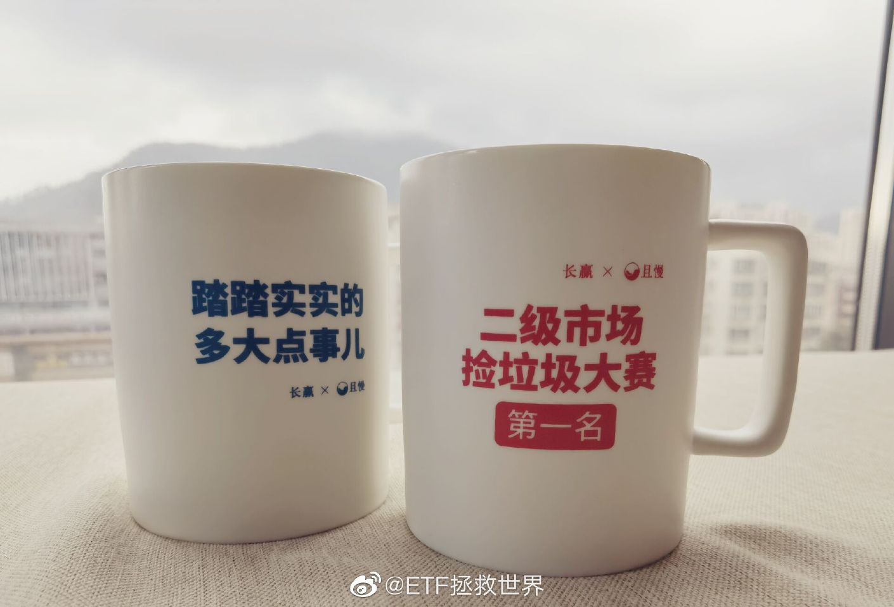

======================================================

ETF拯救世界 (5687069307) @
2022-03-27 20:55:04 Sun  
url: https://weibo.com/5687069307/LlHTOd9ws

我们每个人能做的就是不要浪费粮食。

------------------------------------------------------
转推：
>  @观察者网 (1887344341)
>  2022-03-27 16:23:00 Sun  
>  url: https:/weibo.com/1887344341/LlG7nlcxJ/

>  【华尔街日报：#俄乌冲突粮价看涨中国准备最充分#】俄乌冲突影响乌克春耕，引发国际粮价动荡。面对即将到来的粮价高涨，《华尔街日报》3月26日刊文分析称，从全球水平来看，只有中国等少数国家有足够的粮食库存，可以应对乌克兰战争造成的粮食短缺。 
>  
>  据联合国粮农组织（Food and Agriculture Organiz ​​​

转发[85]  评论[399]  赞[2284] 

======================================================

ETF拯救世界 (5687069307) @
2022-03-28 09:04:05 Mon  
url: https://weibo.com/5687069307/LlMFItfLn

接下来，以赚钱为目标战斗吧！ ​​​

转发[66]  评论[911]  赞[3623] 

======================================================

ETF拯救世界 (5687069307) @
2022-03-28 09:40:33 Mon  
url: https://weibo.com/5687069307/LlMUwg8sK

更新WLY的图：

认真的说，投资者，尤其是抱团的这帮人，真的不是有点病吗。 ​​​

转发[52]  评论[311]  赞[2236] 

+++++++++++++++++++++++++++++++++++++++++++++++++++++

图片：
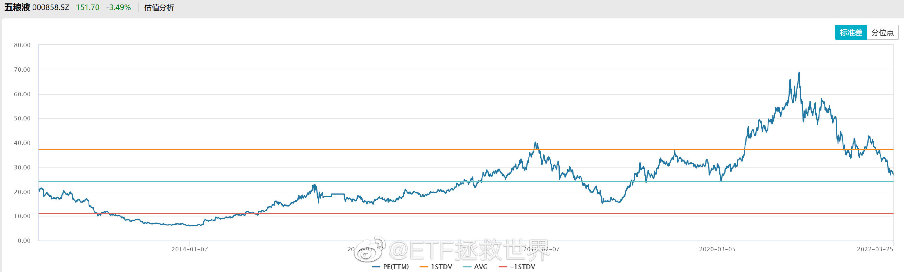

======================================================

ETF拯救世界 (5687069307) @
2022-03-28 09:51:14 Mon  
url: https://weibo.com/5687069307/LlMYRb9tf

我们的消费建仓成本如果能控制在11500-14000之间，就会是非常成功的。 ​​​

转发[279]  评论[551]  赞[3085] 

======================================================

ETF拯救世界 (5687069307) @
2022-03-28 10:11:39 Mon  
url: https://weibo.com/5687069307/LlN792Rfb

油气，两年前无数人嘲笑唾骂，现在一枝独秀暴涨两年。

炒股的都是神经病。真的。绝大多数都是。 ​​​

转发[53]  评论[441]  赞[3466] 

======================================================

ETF拯救世界 (5687069307) @
2022-03-28 10:27:49 Mon  
url: https://weibo.com/5687069307/LlNdHz7qF

所有资金甚至加杠杆all in一个公司，一个行业，真的有可能成功。然后就会有无数人羡慕、崇拜、跟随。

但是……大众没有看到的，是一将功成万骨枯后面的累累白骨。多少同样猛干一家公司一个行业的人，死得无声无息。

更重要的问题在于：

你很难弄清楚这份成功到底是运气还是实力。第一次成功了，第二 ​​​

转发[132]  评论[509]  赞[3182] 

======================================================

ETF拯救世界 (5687069307) @
2022-03-28 13:53:34 Mon  
url: https://weibo.com/5687069307/LlOzdvMUM

价格腰斩了。估值终于从120跌到了50多…… ​​​

转发[42]  评论[417]  赞[2530] 

+++++++++++++++++++++++++++++++++++++++++++++++++++++

图片：

======================================================

ETF拯救世界 (5687069307) @
2022-03-28 14:07:33 Mon  
url: https://weibo.com/5687069307/LlOETrGMw

据我所知，如果你自己不去银行或者其它金融机构操作你的钱，他们很难去主动找你。

这意味着，如果有人因为各种原因不能把这些钱的情况告诉亲人，那么亲人们可能永远也不知道你还有这笔钱。

所以，还是定期把自己在各个金融机构的资产情况汇总一下。如果想告诉亲人就发给亲人，暂时不想让他们知道也至 ​​​

转发[101]  评论[561]  赞[3490] 

======================================================

ETF拯救世界 (5687069307) @
2022-03-28 15:31:09 Mon  
url: https://weibo.com/5687069307/LlPcPlVSi

辣鸡

------------------------------------------------------
转推：
>  @雪球 (2183570524)
>  2022-03-28 15:17:07 Mon  
>  url: https:/weibo.com/2183570524/LlP78e5Z6/

>  【欧股涨幅扩大 德国DAX 30指数涨超1%】欧股涨幅扩大，德国DAX 30指数涨超1%，法国CAC 40指数涨0.81%，欧洲斯托克50指数涨0.88% ​​​

转发[14]  评论[231]  赞[1708] 

======================================================

ETF拯救世界 (5687069307) @
2022-03-28 16:28:10 Mon  
url: https://weibo.com/5687069307/LlPzYfqvS

我来介绍一下，据我观察，什么长相的动物会显得很萌：

眼睛周围有一圈黑眼圈+瞳孔非常大。

怎么说呢，就相当于画了眼线+戴了美瞳的效果吧。 ​​​

转发[22]  评论[633]  赞[3565] 

======================================================

ETF拯救世界 (5687069307) @
2022-03-28 17:40:54 Mon  
url: https://weibo.com/5687069307/LlQ3utN8E

中概/恒科在仓位中已经布置了一部分，除非再次巨幅下跌，应该不会再多加很多。（恒生也可以看做中概弱相关指数了）

今年的希望，是买回一些医药、多布局一些消费。也希望能买回一点之前卖出的创业。如果能多买入一些科技类品种，比如创业/科创/双创/科技等品种就最好不过。

有朋友说了，你很机车唉， ​​​

转发[376]  评论[695]  赞[3837] 

======================================================

ETF拯救世界 (5687069307) @
2022-03-28 22:04:58 Mon  
url: https://weibo.com/5687069307/LlRMG81KO

囤菜

------------------------------------------------------
转推：
>  @范志红_原创营养信息 (1496878501)
>  2022-03-28 21:57:04 Mon  
>  url: https:/weibo.com/1496878501/LlRJteU3c/

>  【疫情封控时可以准备储备的食物】，包括以下各项：
>  
>  粮食。米、面、玉米、小米、燕麦片，以及各种杂粮，存半个月的数量就可以了。注意防潮防虫。
>  
>  鸡蛋。按每人每天1-2个，存一周的量就可以了。鸡蛋的保存期是室温2周，冷藏6周时间。
>  
>  奶类。按每人250-500克，巴氏奶和酸奶可以存一周的量，但就怕冰箱 ​​​

转发[236]  评论[335]  赞[1652] 

======================================================

ETF拯救世界 (5687069307) @
2022-03-29 10:12:55 Tue  
url: https://weibo.com/5687069307/LlWy9su8r

昨天囤菜那篇微博下面的评论我看了看，我发现一个问题。

很多朋友的思维是停留在右侧思维。即见顶才跑，见底才买。

但有个问题，是很多事情是突然发生的。这个顶是尖顶，底是尖底。而且是一天涨跌50%甚至90%那种，完全右侧可能有时候措手不及。

所以至少一部分冰箱仓位要用左侧思维去买，去囤。当你 ​​​

转发[275]  评论[679]  赞[3753] 

======================================================

ETF拯救世界 (5687069307) @
2022-03-29 10:18:07 Tue  
url: https://weibo.com/5687069307/LlWAgmI4j

还有很多类似的。比如药。有些朋友有慢性病，需要长期开药的，就应该囤一点。比如医保说只给你开一个月，那你自己掏钱买3个月的。然后循环起来，保证不过期。这样万一几个月去不了医院，不至于断档是不是。这些东西都是一个道理，其实不用一个个说。

------------------------------------------------------
转推：
>  @ETF拯救世界 (5687069307)
>  2022-03-29 10:12:55 Tue  
>  url: https:/weibo.com/5687069307/LlWy9su8r/

>  昨天囤菜那篇微博下面的评论我看了看，我发现一个问题。
>  
>  很多朋友的思维是停留在右侧思维。即见顶才跑，见底才买。
>  
>  但有个问题，是很多事情是突然发生的。这个顶是尖顶，底是尖底。而且是一天涨跌50%甚至90%那种，完全右侧可能有时候措手不及。
>  
>  所以至少一部分冰箱仓位要用左侧思维去买，去囤。当你 ​​​

转发[82]  评论[265]  赞[1950] 

======================================================

ETF拯救世界 (5687069307) @
2022-03-29 11:12:51 Tue  
url: https://weibo.com/5687069307/LlWWu08by

有人打过猎，或者玩过猎鹿游戏吗。

看着你想买的东西一直跌，向你设置好的买入区域跌去，就像看着等了很久的猎物即将进入你的伏击区一样兴奋。 ​​​

转发[43]  评论[554]  赞[3319] 

======================================================

ETF拯救世界 (5687069307) @
2022-03-29 17:23:18 Tue  
url: https://weibo.com/5687069307/LlZmQoeKf

好家伙太能吹了吧[doge] ​​​

转发[28]  评论[2009]  赞[4496] 

+++++++++++++++++++++++++++++++++++++++++++++++++++++

图片：
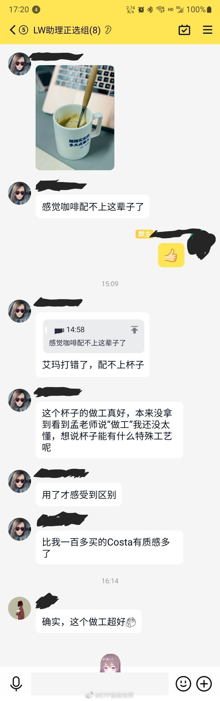

======================================================

ETF拯救世界 (5687069307) @
2022-03-29 17:41:07 Tue  
url: https://weibo.com/5687069307/LlZu4EUvv

搞不懂为何如此辣鸡。 ​​​

转发[32]  评论[453]  赞[3351] 

+++++++++++++++++++++++++++++++++++++++++++++++++++++

图片：

======================================================

ETF拯救世界 (5687069307) @
2022-03-29 21:54:24 Tue  
url: https://weibo.com/5687069307/Lm18T1nLw

记住这个图形 ​​​

转发[474]  评论[990]  赞[4674] 

+++++++++++++++++++++++++++++++++++++++++++++++++++++

图片：
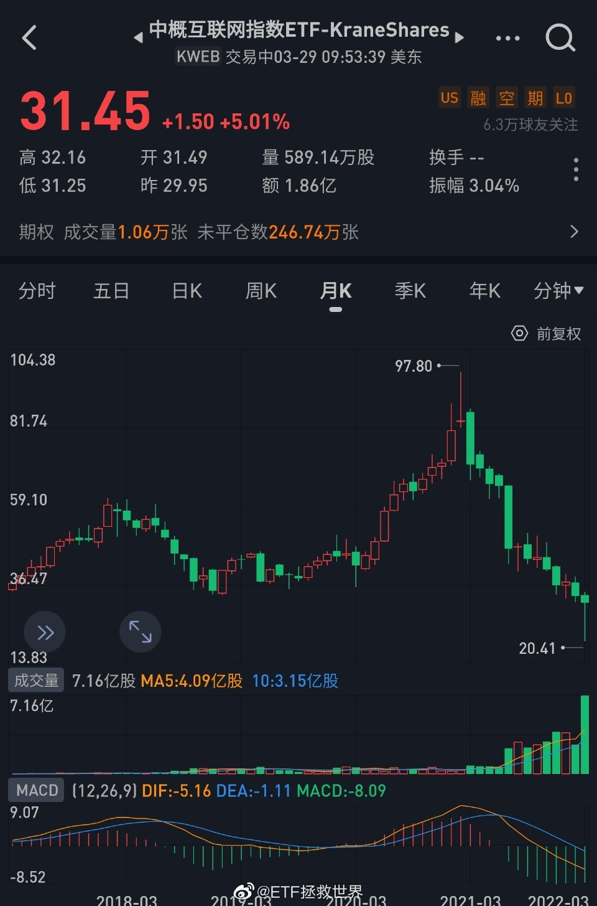

======================================================

ETF拯救世界 (5687069307) @
2022-03-30 09:39:14 Wed  
url: https://weibo.com/5687069307/Lm5KYzDzz

据我观察，这几年，有一些其实做了很多好事的人，因为有意无意表现出的傲慢或者说优越，遭受了很大的打击。

高调做事，低调做人，不要傲慢，平易近人。 ​​​

转发[100]  评论[612]  赞[4019] 

======================================================

ETF拯救世界 (5687069307) @
2022-03-30 13:16:19 Wed  
url: https://weibo.com/5687069307/Lm7b5yDEy

冷知识：

红利今年是上涨的。 ​​​

转发[21]  评论[318]  赞[2407] 

======================================================

ETF拯救世界 (5687069307) @
2022-03-30 13:27:11 Wed  
url: https://weibo.com/5687069307/Lm7fvdqU6

是谣言吗。如果不是，真的没有除了死以外其他的办法了吗。

------------------------------------------------------
转推：
>  @北京人不知道的北京事儿 (1662214194)
>  2022-03-30 12:36:34 Wed  
>  url: https:/weibo.com/1662214194/Lm6UXmv4G/

>  河北廊坊安次区政府今天下的文件，捕杀所有阳性患者家里的宠物。 ​​​

转发[78]  评论[641]  赞[2953] 

======================================================

ETF拯救世界 (5687069307) @
2022-03-30 14:18:40 Wed  
url: https://weibo.com/5687069307/Lm7AoCm6s

看淡了涨跌也是一把双刃剑。

账户损失很多钱固然不会心情焦虑，多了很多也没有任何开心的感觉。

哎。 ​​​

转发[28]  评论[643]  赞[3008] 

+++++++++++++++++++++++++++++++++++++++++++++++++++++

图片：

======================================================

ETF拯救世界 (5687069307) @
2022-03-30 15:08:26 Wed  
url: https://weibo.com/5687069307/Lm7UBgbsl

刚才扑杀宠物那条微博下面，大家观点都很不一样。

其实随着人慢慢的成熟，就会明白人与人对于同一件事的看法会非常不同。以前自己会觉得，“怎么还会有这样的人”，后来发现是自己太幼稚了。

人与人的立场不同，性格不同，思维模式不同，环境不同，成长经历不同，所以看法不同，非常正常。

昨天晚上 ​​​

转发[109]  评论[511]  赞[3184] 

======================================================

ETF拯救世界 (5687069307) @
2022-03-30 15:17:45 Wed  
url: https://weibo.com/5687069307/Lm7Ynyswx

主要做波段的一个账户这个月这样翻红了。

上个月底清仓也许是对的，就少了这个月上下翻飞的折腾。

然而，清仓了，什么时候买回来呢？如果现在还是空仓，是该买呢还是继续等待呢。

就我所知，空仓要比满仓忐忑很多。 ​​​

转发[41]  评论[504]  赞[2471] 

+++++++++++++++++++++++++++++++++++++++++++++++++++++

图片：
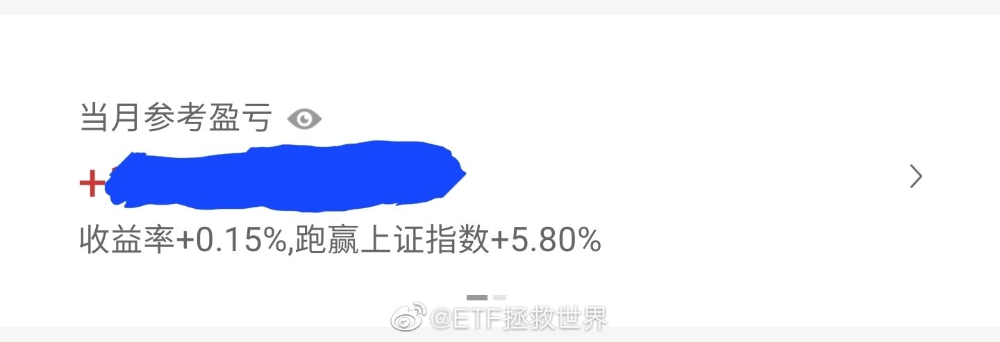

======================================================

ETF拯救世界 (5687069307) @
2022-03-30 15:37:20 Wed  
url: https://weibo.com/5687069307/Lm86ktyU9

鹅猫狗有没有可能做点什么？除了拿出1000亿共同富裕，紧急关头利用自身优势做点事情吧，以后可能会打得轻一点也说不定啊。

------------------------------------------------------
转推：
>  @北京人不知道的北京事儿 (1662214194)
>  2022-03-30 15:32:06 Wed  
>  url: https:/weibo.com/1662214194/Lm84cBI5y/

>  【上海浦东菜农：网上不少受封控的市民在说吃不到菜，我们这里菜有的是，但运不出去】3月29日，在上海浦东书院镇李雪村的农田里，农户袁大哥和妻子正从黄瓜藤上摘下刚刚成熟黄瓜，但袁大哥开心不起来，反而更显焦虑。“如今肥都施了，蔬菜也成熟了，但是因为疫情管控的原因，很多菜场都关停了，之前合 ​​​

转发[38]  评论[299]  赞[1830] 

======================================================

ETF拯救世界 (5687069307) @
2022-03-30 20:06:24 Wed  
url: https://weibo.com/5687069307/Lm9RycIIh

给使用且慢跟车的朋友们一个建议：

删除自己在APP中填写的所有“在且慢外持仓”。否则有可能会导致自动跟车失败。

路径是资产——150——拉到最下面——查看明细、修改外部持仓——点开具体品种——删除或改成0。 ​​​

转发[57]  评论[325]  赞[2046] 

======================================================

ETF拯救世界 (5687069307) @
2022-03-30 20:28:54 Wed  
url: https://weibo.com/5687069307/Lma0Gnwmr

回复@月是衣上白__:我问一下除了扑杀还有没有别的方法，应该不会被网暴吧。另外据说当地已经出文停止扑杀了，希望大家都平平安安的。//@月是衣上白__:提醒一下E大，这条评论被人截图发出去了，我刚在别的地方看到了截图

------------------------------------------------------
转推：
>  @北京人不知道的北京事儿 (1662214194)
>  2022-03-30 12:36:34 Wed  
>  url: https:/weibo.com/1662214194/Lm6UXmv4G/

>  河北廊坊安次区政府今天下的文件，捕杀所有阳性患者家里的宠物。 ​​​

转发[15]  评论[118]  赞[1105] 

======================================================

ETF拯救世界 (5687069307) @
2022-03-30 20:39:24 Wed  
url: https://weibo.com/5687069307/Lma4WjlFp

[微笑]

------------------------------------------------------
转推：
>  @雪球 (2183570524)
>  2022-03-30 17:47:51 Wed  
>  url: https:/weibo.com/2183570524/Lm8Xj9Y4N/

>  俄罗斯股市高开高走，俄罗斯RTS指数涨超6%。 ​​​

转发[20]  评论[166]  赞[1681] 

======================================================

ETF拯救世界 (5687069307) @
2022-03-30 20:50:15 Wed  
url: https://weibo.com/5687069307/Lma9lyB9L

我的另一半有很多缺点。

但也有很多优点。

第二大优点是非常善良。

她平常胆子不大，坐个滑沙都能吓哭。但有一次做的事情让我刮目相看。

我以前住的小区有一些流浪猫。有一天，一只刚出生几个月的小猫——前方高能预警，心理承受能力差的朋友不要继续看了——

小猫的四个爪子被人砍断了。被发现的 ​​​

转发[57]  评论[780]  赞[5613] 

======================================================

ETF拯救世界 (5687069307) @
2022-03-30 21:53:41 Wed  
url: https://weibo.com/5687069307/Lmaz6cUAg

美元兑卢布

熊是真的什么都敢干啊。 ​​​

转发[57]  评论[350]  赞[3750] 

+++++++++++++++++++++++++++++++++++++++++++++++++++++

图片：

======================================================

ETF拯救世界 (5687069307) @
2022-03-30 22:11:33 Wed  
url: https://weibo.com/5687069307/LmaGllJAB

教育孩子，也要像熊这样，说到就真做到。

教育孩子定规矩，我说了你做了什么样的错事，我就会怎样惩罚你。

当你真的做了，我就真的处罚。

而不是定了规矩不执行，最后孩子就无法无天了。 ​​​

转发[65]  评论[284]  赞[2912] 

======================================================

ETF拯救世界 (5687069307) @
2022-03-31 08:49:23 Thu  
url: https://weibo.com/5687069307/LmeRfh62B

你有没有发现我们处在一个造神毁神无限循环的环境中。

好就好上天堂，无限吹捧；过一阵坏就坏下地狱，渣都不剩。

其实从来也没那么好，也没那么坏。

对我们的人生经验应该就是，好的时候自己不要嘚瑟，平常心，无论外界如何评价都能正确认识自己，居安思危，明白一切顺利的时候反而危机四伏。 ​​​

转发[133]  评论[530]  赞[3130] 

======================================================

ETF拯救世界 (5687069307) @
2022-03-31 09:05:33 Thu  
url: https://weibo.com/5687069307/LmeXNz3Gf

听了两节儿子的网课，发现女生的逻辑思维和表达能力普遍比男生强多了 [允悲] ​​​

转发[23]  评论[630]  赞[5271] 

======================================================

ETF拯救世界 (5687069307) @
2022-03-31 09:54:25 Thu  
url: https://weibo.com/5687069307/LmfhDsI7a

没想到上一条也能吵起来。

我其实只是像平常一样，如实的说一下我的观察，非常客观独立，自认为。

因为我也是第一次养孩子，也没养过女孩，现在学校也不允许考试排名，所以听了几节网课觉得挺有意思就发一条。

这样，我持续跟踪，到小学高年级，到初中，到高中，看看会不会有什么变化，到时候也客观 ​​​

转发[13]  评论[497]  赞[2717] 

======================================================

ETF拯救世界 (5687069307) @
2022-03-31 10:25:34 Thu  
url: https://weibo.com/5687069307/LmfuhmYhN

红利再涨仓位就又要超过20%了。

又要卖了，好烦。[哼] ​​​

转发[31]  评论[422]  赞[2395] 

======================================================

ETF拯救世界 (5687069307) @
2022-03-31 10:37:49 Thu  
url: https://weibo.com/5687069307/LmfzfAZ0X

总体来说，我们的单品卖出有几个条件。

第一，超过20%仓位。

第二，贵+到达重要压力线。

第三，非常贵。

第四，贵+右侧。

体会一下。几十个字，能帮你节省10-20年自己总结的时间。 ​​​

转发[845]  评论[772]  赞[3606] 

======================================================

ETF拯救世界 (5687069307) @
2022-03-31 10:48:17 Thu  
url: https://weibo.com/5687069307/LmfDv9GEq

红利连涨四年了。很多朋友觉得它不错，至少很稳，拿着不停涨。

但两年以前关注我的朋友应该知道，我们把那样一个一直不涨，涨的时候涨幅也比不上热门板块的品种，买到了第一大持仓压力多大。

当时被多少人质疑嘲笑。

记不记得有人拿着基金排行，说红利一个月、三个月、半年、一年表现都不好？

这就 ​​​

转发[129]  评论[373]  赞[2907] 

======================================================

ETF拯救世界 (5687069307) @
2022-03-31 10:51:42 Thu  
url: https://weibo.com/5687069307/LmfETbccs

回复@ETF学习群众:我不会因为他们有压力。因为我知道自己在干什么，我知道这么干以前赚了多少钱，以后也会赚钱。我怎么会让一帮从没在市场上赚过钱的人影响我的判断？//@ETF学习群众:不要有压力。

------------------------------------------------------
转推：
>  @ETF拯救世界 (5687069307)
>  2022-03-31 10:48:17 Thu  
>  url: https:/weibo.com/5687069307/LmfDv9GEq/

>  红利连涨四年了。很多朋友觉得它不错，至少很稳，拿着不停涨。
>  
>  但两年以前关注我的朋友应该知道，我们把那样一个一直不涨，涨的时候涨幅也比不上热门板块的品种，买到了第一大持仓压力多大。
>  
>  当时被多少人质疑嘲笑。
>  
>  记不记得有人拿着基金排行，说红利一个月、三个月、半年、一年表现都不好？
>  
>  这就 ​​​

转发[27]  评论[211]  赞[1791] 

======================================================

ETF拯救世界 (5687069307) @
2022-03-31 14:15:10 Thu  
url: https://weibo.com/5687069307/LmgZtoVGV

我感觉到，全都回来了 ​​​

转发[49]  评论[478]  赞[3583] 

+++++++++++++++++++++++++++++++++++++++++++++++++++++

图片：
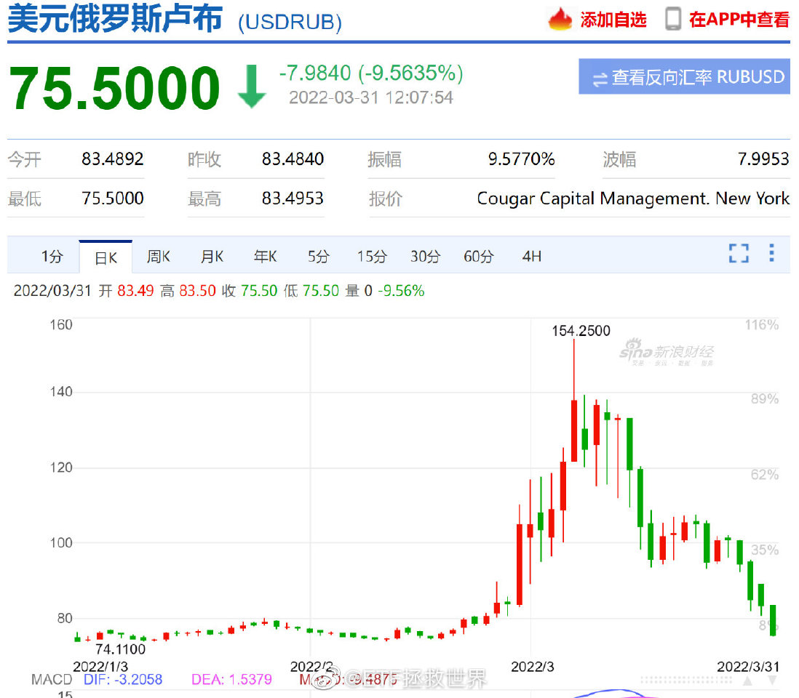

======================================================

ETF拯救世界 (5687069307) @
2022-03-31 18:45:20 Thu  
url: https://weibo.com/5687069307/LmiL8qQO5

冷知识：

今年全球主要市场跌幅最大的是俄罗斯市场。

第二名不说了。 ​​​

转发[74]  评论[660]  赞[3695] 

======================================================

ETF拯救世界 (5687069307) @
2022-03-31 20:33:59 Thu  
url: https://weibo.com/5687069307/LmjtezQbl

回购注销[good]

------------------------------------------------------
转推：
>  @财联社APP (2868676035)
>  2022-03-31 19:33:50 Thu  
>  url: https:/weibo.com/2868676035/Lmj4P6z46/

>  【苏泊尔：拟回购1%-2%公司股份 年度分红拟10派19.3元】财联社3月31日电，苏泊尔披露年报，2021年实现净利润19.44亿元，同比增长5.29%，拟10派19.3元。同日公告，拟回购1%-2%公司股份，按公司总股本计算，回购股份数量不低于808.68万股且不超过1617.36万股，其中300万股拟用于未来实施股权激励，剩余股 ​​​

转发[37]  评论[215]  赞[1796] 

======================================================

