ETF拯救世界 (5687069307) @
2022-04-01 09:30:37 Fri  
url: https://weibo.com/5687069307/Lmoytn6cD

不做波段真的随时受不了。 ​​​

转发[20]  评论[350]  赞[2412] 

======================================================

ETF拯救世界 (5687069307) @
2022-04-01 09:55:27 Fri  
url: https://weibo.com/5687069307/LmoIym9dl

一句话告诉你立场决定观点：

要是以前看到消费这么嘚瑟别人跌它涨我就怒斥抱团可恶了。

现在买了两份我就会微笑的看着它装*。

两份而已。

人类啊！可悲！哪有什么正义，全是利益罢了！[怒] ​​​

转发[43]  评论[362]  赞[2260] 

======================================================

ETF拯救世界 (5687069307) @
2022-04-01 10:05:06 Fri  
url: https://weibo.com/5687069307/LmoMtbt1j

按照年初的预计，今年如果上半年这么跌，年末反而有可能赚钱，无论指数本身是不是跌。

但是今年我本人在投资上最开心的，是对波段策略有了一次质的升级。

这次升级，解决了困扰我很久的，该策略固有的顽疾。

能有这次升级，也是类似于芒格的跨学科思维最终在一个策略上融会贯通的结果。当然，这次升 ​​​

转发[162]  评论[709]  赞[4061] 

======================================================

ETF拯救世界 (5687069307) @
2022-04-01 11:38:40 Fri  
url: https://weibo.com/5687069307/LmporFcB7

传媒主力是微博管理员实锤了。

又一次精准的把月老封在最低点。

什么时候放出来传媒就要小心了。 ​​​

转发[95]  评论[445]  赞[2974] 

======================================================

ETF拯救世界 (5687069307) @
2022-04-01 12:15:45 Fri  
url: https://weibo.com/5687069307/LmpDv7TTs

上海的朋友，能不能说说你买菜的真实情况。

好买，费劲，还是买不到。

不要骗人哦。 ​​​

转发[36]  评论[1792]  赞[3813] 

======================================================

ETF拯救世界 (5687069307) @
2022-04-01 12:49:29 Fri  
url: https://weibo.com/5687069307/LmpRc3K7m

囤菜的话，肉啊奶啊这些东西都不用说了，比较好囤。比如奶要求别太高的话，进口的有那种保质期一年的。应急问题不大。

还有就是罐头，肉罐头水果罐头什么的，2、3年保质期。肯定营养有流失，但你是为了紧急情况又不是为了享受满汉全席是吧。

比较难的是菜，保质期短。但是现在有那种冷冻菜。我家有两 ​​​

转发[106]  评论[489]  赞[2465] 

======================================================

ETF拯救世界 (5687069307) @
2022-04-01 13:18:49 Fri  
url: https://weibo.com/5687069307/Lmq36hwfU

回购注销与不注销区别还是很大的。

回购不注销，有可能公司把股票买回去，当做股权激励给员工。但这部分股票并没有消失，再流回市场什么都没变。

回购注销就不同了。公司把股票买回去，注销掉，减少注册资本。比如说以前市场上有100万股，回购30万股注销，市场上就剩70万股了。但公司的盈利啊现金流 ​​​

转发[238]  评论[372]  赞[2606] 

======================================================

ETF拯救世界 (5687069307) @
2022-04-01 14:16:04 Fri  
url: https://weibo.com/5687069307/Lmqql1fRC

蓝色区域像不像史塔克家的冰原狼。

------------------------------------------------------
转推：
>  @中国气象爱好者 (1763864272)
>  2022-03-30 15:05:31 Wed  
>  url: https:/weibo.com/1763864272/Lm7TpFmbT/

>  受北极涡旋影响，本周末起欧洲将遭寒潮袭击，乌克兰大部将是寒潮降温重点之一，基辅将剧烈降温10-15度，再次降到零下；与此同时，接连不断的阵雨将转为雨夹雪或雪。 ​​​

转发[33]  评论[328]  赞[1724] 

======================================================

ETF拯救世界 (5687069307) @
2022-04-01 14:21:39 Fri  
url: https://weibo.com/5687069307/LmqsBFjDg

一切都会好的。

虽然这个世界非常辣鸡，但一切都会好的。 ​​​

转发[60]  评论[525]  赞[3217] 

======================================================

ETF拯救世界 (5687069307) @
2022-04-01 16:26:52 Fri  
url: https://weibo.com/5687069307/LmrhqzHzP

关于医疗保险。评论区可以讨论，但不要做广告啊。 ​​​

转发[269]  评论[847]  赞[2849] 

+++++++++++++++++++++++++++++++++++++++++++++++++++++

图片：
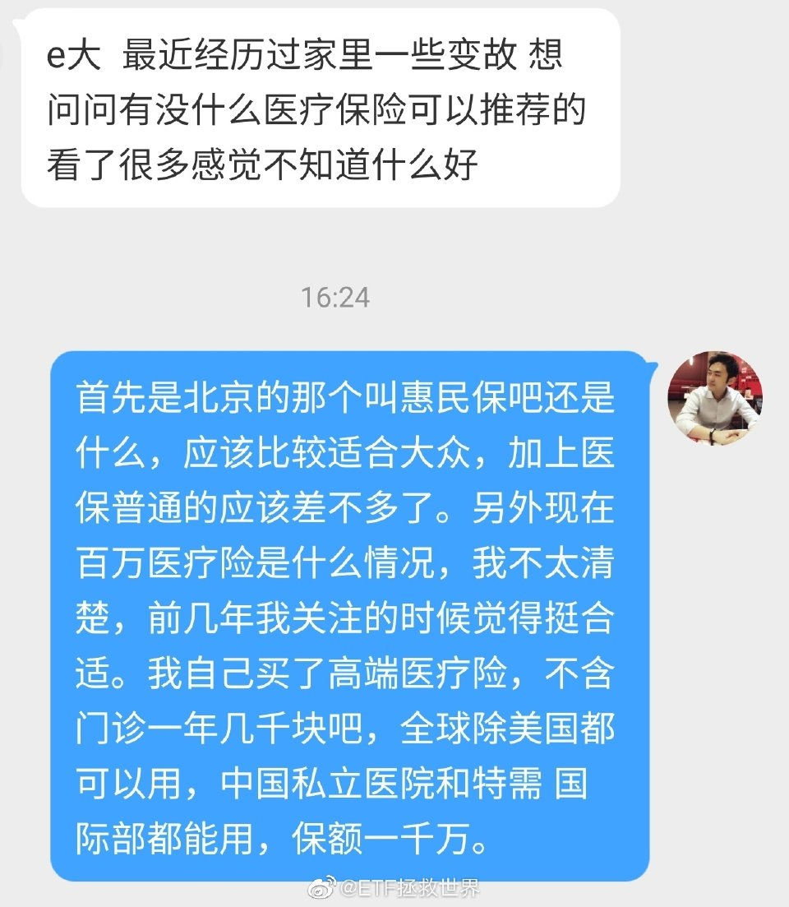

======================================================

ETF拯救世界 (5687069307) @
2022-04-01 21:37:12 Fri  
url: https://weibo.com/5687069307/Lmtjp0uIe

中概这一天天上蹿下跳跟神经病似的，烦死了！ ​​​

转发[27]  评论[533]  赞[3146] 

======================================================

ETF拯救世界 (5687069307) @
2022-04-02 15:20:48 Sat  
url: https://weibo.com/5687069307/LmAh6Epss

刚才的投票只有几分钟，但是也有几千朋友投了，基本上1：1吧。

其实我有个技术上的问题，后期如果放开，可能需要每个人都弄清楚的：

轻症一定是居家了，不然医疗系统肯定瘫痪。但是如何界定轻症还是重症呢。还有，婴幼儿与成人的标准一样吗。

弄清楚了，大家才知道什么情况去医院，什么情况在家呆着 ​​​

转发[64]  评论[674]  赞[3488] 

======================================================

ETF拯救世界 (5687069307) @
2022-04-02 15:39:59 Sat  
url: https://weibo.com/5687069307/LmAoTrd41

学习好的朋友们说说，什么牌子哪个型号的血氧仪比较好。

最好高中低档都有推荐，丰俭由人。

这是我这里第一次可以在评论里说具体产品。特事特办。 ​​​

转发[62]  评论[395]  赞[2047] 

======================================================

ETF拯救世界 (5687069307) @
2022-04-02 16:31:35 Sat  
url: https://weibo.com/5687069307/LmAJQuBAJ

回复@OliviaXKuo:我这里的朋友理性，客观，特别好。//@OliviaXKuo:e大评论区已经比其他地方好太多了[嘻嘻]

------------------------------------------------------
转推：
>  @ETF拯救世界 (5687069307)
>  2022-04-02 15:20:48 Sat  
>  url: https:/weibo.com/5687069307/LmAh6Epss/

>  刚才的投票只有几分钟，但是也有几千朋友投了，基本上1：1吧。
>  
>  其实我有个技术上的问题，后期如果放开，可能需要每个人都弄清楚的：
>  
>  轻症一定是居家了，不然医疗系统肯定瘫痪。但是如何界定轻症还是重症呢。还有，婴幼儿与成人的标准一样吗。
>  
>  弄清楚了，大家才知道什么情况去医院，什么情况在家呆着 ​​​

转发[23]  评论[116]  赞[1163] 

======================================================

ETF拯救世界 (5687069307) @
2022-04-02 16:44:15 Sat  
url: https://weibo.com/5687069307/LmAOZjJql

回复@小张学习笔记:大家有什么说什么，好好讨论问题，不要乱扣帽子，不要阴阳怪气，不要借题发挥，不要人身攻击。沟通是为了交流信息而不是为了生气//@小张学习笔记:这里大家都比较理性客观，而不是双方对不同意见者在喊打喊杀[笑cry]好棒

------------------------------------------------------
转推：
>  @ETF拯救世界 (5687069307)
>  2022-04-02 15:20:48 Sat  
>  url: https:/weibo.com/5687069307/LmAh6Epss/

>  刚才的投票只有几分钟，但是也有几千朋友投了，基本上1：1吧。
>  
>  其实我有个技术上的问题，后期如果放开，可能需要每个人都弄清楚的：
>  
>  轻症一定是居家了，不然医疗系统肯定瘫痪。但是如何界定轻症还是重症呢。还有，婴幼儿与成人的标准一样吗。
>  
>  弄清楚了，大家才知道什么情况去医院，什么情况在家呆着 ​​​

转发[14]  评论[186]  赞[1263] 

======================================================

ETF拯救世界 (5687069307) @
2022-04-02 18:40:51 Sat  
url: https://weibo.com/5687069307/LmBAje0MR

就是说，你们家的小猫会不会在你工作的时候跳到你肩膀上，然后走到你头上……

然后趁你还没发火又把脸凑过来亲亲你的嘴。 ​​​

转发[21]  评论[623]  赞[3670] 

======================================================

ETF拯救世界 (5687069307) @
2022-04-02 20:24:51 Sat  
url: https://weibo.com/5687069307/LmCgwqwtK

下周开盘，如果没有大的变化，至少S，想买点东西。 ​​​

转发[21]  评论[732]  赞[2972] 

======================================================

ETF拯救世界 (5687069307) @
2022-04-03 10:27:04 Sun  
url: https://weibo.com/5687069307/LmHMnvV6g

今天一地新增感染8000多吧，这还是全面封城的情况下。因为之前确实没有关注过这方面的数据，有一个小疑问：

都说跟流感差不多，也就是说往年我们感染流感的范围这么大？感染流感的人会这么多？我居然一点意识都没有。

之前这几周，因为所在的区有几例确诊，所以孩子停课了。一周查了三次核酸，现在开 ​​​

转发[81]  评论[1357]  赞[5569] 

======================================================

ETF拯救世界 (5687069307) @
2022-04-03 14:34:38 Sun  
url: https://weibo.com/5687069307/LmJoRCUPv

懂的都懂，不解释 ​​​

转发[14]  评论[439]  赞[2609] 

+++++++++++++++++++++++++++++++++++++++++++++++++++++

图片：
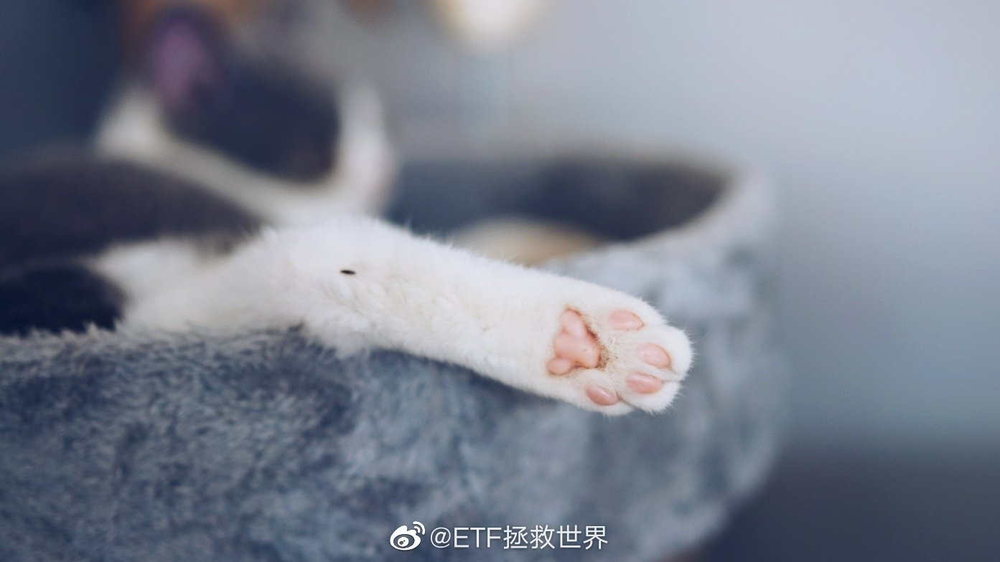

======================================================

ETF拯救世界 (5687069307) @
2022-04-03 15:27:56 Sun  
url: https://weibo.com/5687069307/LmJKvqxCI

年初的微博，可能当时很多朋友会觉得可笑…顺便说一下，我在此基础上一直在加仓。目前看只要有水电，坚持三个月左右问题不大。

------------------------------------------------------
转推：
>  @ETF拯救世界 (5687069307)
>  2022-01-09 18:50:34 Sun  
>  url: https:/weibo.com/5687069307/L9Zb2n6zD/

>  清点了一下家里储存的食物，乐观估计正常够吃1-1.5个月。极限情况2个月也应该可以。
>  
>  营养全面就不用考虑了。什么事情都做最坏准备可能是一种深入骨髓的病。 ​​​

转发[90]  评论[535]  赞[2643] 

======================================================

ETF拯救世界 (5687069307) @
2022-04-05 09:49:53 Tue  
url: https://weibo.com/5687069307/Ln0ohowjs

套路拿捏得死死的：

a股休市涨，a股开市跌。

有没有一种可能，是A股… ​​​

转发[76]  评论[516]  赞[2910] 

+++++++++++++++++++++++++++++++++++++++++++++++++++++

图片：
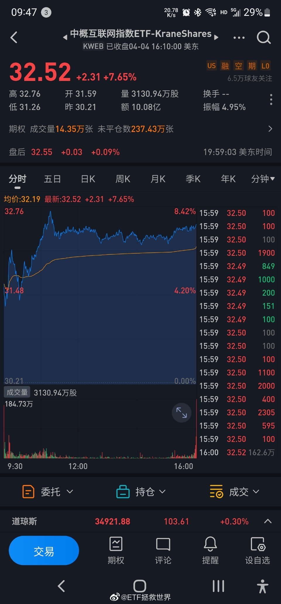
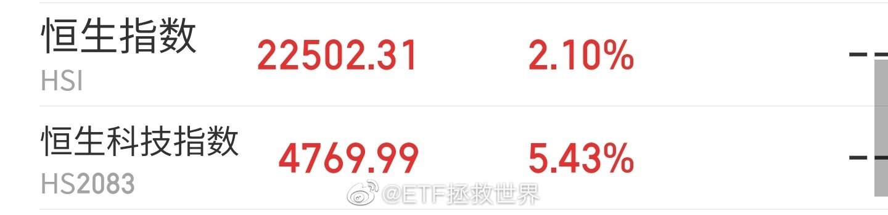

======================================================

ETF拯救世界 (5687069307) @
2022-04-05 09:51:10 Tue  
url: https://weibo.com/5687069307/Ln0oNAWRs

跌这么多回到“合理水平”，潜台词就是，之前高位的时候并不合理。问题来了，不合理的时候为什么没人说话？

------------------------------------------------------
转推：
>  @雪球 (2183570524)
>  2022-04-05 09:16:24 Tue  
>  url: https:/weibo.com/2183570524/Ln0aGAvgM/

>  【多家保险资管集体发声：目前市场估值已回归合理水平】 近期逾十家大中型保险资管公司从长期机构投资者的视角，就权益市场给出研判，其中涵盖了全部管理规模万亿和准万亿机构。多位保险资管人士表示，长期坚定看好中国资本市场发展前景，经过此前两个多月估值压力的释放，目前市场估值已回归合理水平 ​​​

转发[92]  评论[282]  赞[2144] 

======================================================

ETF拯救世界 (5687069307) @
2022-04-05 13:23:19 Tue  
url: https://weibo.com/5687069307/Ln1MUtBjo

趁着A股不开盘，恒生指数偷袭到了22500，超过了22000。

几个月甚至更久之前我就已经把恒生的几个关键点位明牌放出来了。

18500不用说，致敬底。致敬不解释。

18500-22000点，港股价值区域。

如果能有效突破22000，那么25000将是下一个关键压力位。

再下一个关键压力位，则是30000点——那将是致敬 ​​​

转发[761]  评论[921]  赞[4983] 

======================================================

ETF拯救世界 (5687069307) @
2022-04-05 22:04:47 Tue  
url: https://weibo.com/5687069307/Ln5czBBk5

岁月如飞刀，

林志颖也快50了… ​​​

转发[16]  评论[434]  赞[2794] 

======================================================

ETF拯救世界 (5687069307) @
2022-04-06 07:49:40 Wed  
url: https://weibo.com/5687069307/Ln91Zipsc

在微博上关注了很多人。

关注谁不代表一定认同谁。在很多事情上，会关注完全不同观点的对立双方。

即使对某人的观点不认同，也可能会关注，因为这样才会更加全面，只要他言之有物。另外，谁说自己认同的观点一定对呢。

但是有一种人我会取关，就是说不出任何有用的信息和观点，就是在不停的宣泄情绪 ​​​

转发[72]  评论[365]  赞[2860] 

======================================================

ETF拯救世界 (5687069307) @
2022-04-06 09:31:14 Wed  
url: https://weibo.com/5687069307/Ln9Hd0656

拿捏了 http://t.cn/A66TWHgY

------------------------------------------------------
转推：
>  @ETF拯救世界 (5687069307)
>  2022-04-05 09:49:53 Tue  
>  url: https:/weibo.com/5687069307/Ln0ohowjs/

>  套路拿捏得死死的：
>  
>  a股休市涨，a股开市跌。
>  
>  有没有一种可能，是A股… ​​​

转发[25]  评论[364]  赞[1802] 

======================================================

ETF拯救世界 (5687069307) @
2022-04-06 09:41:06 Wed  
url: https://weibo.com/5687069307/Ln9Ldvu8i

记得吗，那时候1000亿申购，200亿买到。90倍估值，当时到底是什么样的人在买？今天又新低了，回看一下，无限感慨

------------------------------------------------------
转推：
>  @ETF拯救世界 (5687069307)
>  2020-09-28 09:59:50 Mon  
>  url: https:/weibo.com/5687069307/JmGBS9FDQ/

>  $科创50 sh000688$ 
>  
>  90倍。200亿接盘。 ​​​

转发[67]  评论[206]  赞[1568] 

======================================================

ETF拯救世界 (5687069307) @
2022-04-06 09:49:00 Wed  
url: https://weibo.com/5687069307/Ln9Oq3J3s

回复@ETF拯救投资小白:估值90倍：有人发行产品，有人猛推销售，有人举着钱买入。无话好说。//@ETF拯救投资小白:鸡精经理接盘侠？//@ETF拯救世界:记得吗，那时候1000亿申购，200亿买到。90倍估值，当时到底是什么样的人在买？今天又新低了，回看一下，无限感慨

------------------------------------------------------
转推：
>  @ETF拯救世界 (5687069307)
>  2020-09-28 09:59:50 Mon  
>  url: https:/weibo.com/5687069307/JmGBS9FDQ/

>  $科创50 sh000688$ 
>  
>  90倍。200亿接盘。 ​​​

转发[35]  评论[154]  赞[1349] 

======================================================

ETF拯救世界 (5687069307) @
2022-04-06 09:54:17 Wed  
url: https://weibo.com/5687069307/Ln9Qz21KI

环保也新低了。

但我不想说这个前任什么坏话。

毕竟，

赚过。 ​​​

转发[30]  评论[508]  赞[2949] 

======================================================

ETF拯救世界 (5687069307) @
2022-04-06 11:25:02 Wed  
url: https://weibo.com/5687069307/Lnarozxti

红利持仓周期太多啦，不能买啊。

有些人这样说。

今天煤炭、有色跌了，红利依然在涨。已经是去年9月以来新高了。

他们不懂红利，不懂组合，更不懂投资。 ​​​

转发[53]  评论[355]  赞[2809] 

======================================================

ETF拯救世界 (5687069307) @
2022-04-06 11:45:18 Wed  
url: https://weibo.com/5687069307/LnazCyuti

能与有共同理想，共同追求，共同目标，共同价值观的人在一起做事，是非常幸福而且难得的。

如果你有，要珍惜。 ​​​

转发[102]  评论[555]  赞[4201] 

======================================================

ETF拯救世界 (5687069307) @
2022-04-06 13:39:12 Wed  
url: https://weibo.com/5687069307/LnbjR8M9d

唱唱反调：

一个品种表现越好，越要警惕。不要上头。

就是在说那个第一大仓位又不停上涨的品种。

我们持仓的品种，涨了，我绝对不会吹它还能涨多少，而是说风险会越来越大。

这是做人的底线。 ​​​

转发[59]  评论[301]  赞[2593] 

======================================================

ETF拯救世界 (5687069307) @
2022-04-06 14:06:18 Wed  
url: https://weibo.com/5687069307/LnbuR8vlM

一般来说，一个品种，除非你特别想配置或者加仓，另外如果不是很便宜，

那么最好不要新低的时候买。

就像新高最好不要卖，等一等。 ​​​

转发[538]  评论[466]  赞[3443] 

======================================================

ETF拯救世界 (5687069307) @
2022-04-06 14:13:16 Wed  
url: https://weibo.com/5687069307/LnbxGqpM3

我觉得应该开发一个相对右侧的计划。

因为有些朋友不太适合买了就跌的左侧，他们会认为买了就跌持仓体验不好——虽然也许只买了不到1%。

那就应该走右侧。 ​​​

转发[44]  评论[592]  赞[3307] 

======================================================

ETF拯救世界 (5687069307) @
2022-04-06 14:23:34 Wed  
url: https://weibo.com/5687069307/LnbBRy2rm

有朋友问了：你说xx很贵，但你说贵了以后人家有人买了，还赚了不少，你怎么说？

我说，

你造吗，历史上杀人放火金腰带的事情多了，现在也有很多违法乱纪捞偏门发财的例子，那么，你要去照做吗。

做不对（自认为）的事情，也许会有收益。这时候你做不做？

我的选择是不做。

赚钱了不代表对。虽然这 ​​​

转发[75]  评论[307]  赞[2915] 

======================================================

ETF拯救世界 (5687069307) @
2022-04-06 14:34:32 Wed  
url: https://weibo.com/5687069307/LnbGjwkhV

其实很多东西相克相生。

地球正是因为物种的多元化才能生生不息。

很多你讨厌的声音，也是维持生态不可缺少的一环。

如果所有声音都完全一致，恐怕也未必是太好的事情。 ​​​

转发[76]  评论[296]  赞[2747] 

======================================================

ETF拯救世界 (5687069307) @
2022-04-06 14:45:45 Wed  
url: https://weibo.com/5687069307/LnbKSisVi

其实平台是不太喜欢我这种的… ​​​

转发[25]  评论[830]  赞[4812] 

+++++++++++++++++++++++++++++++++++++++++++++++++++++

图片：
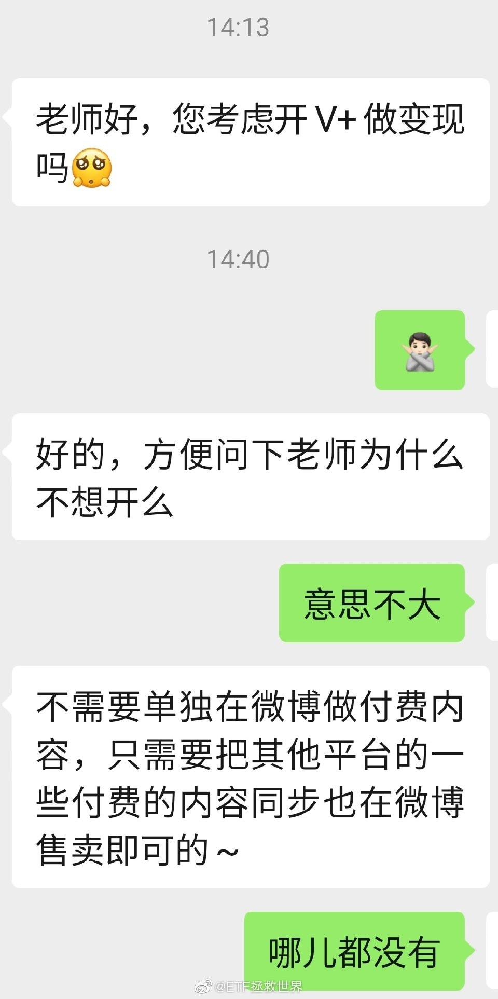

======================================================

ETF拯救世界 (5687069307) @
2022-04-07 10:37:29 Thu  
url: https://weibo.com/5687069307/LnjyB27OQ

懂的都懂

------------------------------------------------------
转推：
>  @ETF拯救世界 (5687069307)
>  2022-04-06 14:06:18 Wed  
>  url: https:/weibo.com/5687069307/LnbuR8vlM/

>  一般来说，一个品种，除非你特别想配置或者加仓，另外如果不是很便宜，
>  
>  那么最好不要新低的时候买。
>  
>  就像新高最好不要卖，等一等。 ​​​

转发[201]  评论[652]  赞[2859] 

======================================================

ETF拯救世界 (5687069307) @
2022-04-07 16:51:22 Thu  
url: https://weibo.com/5687069307/Lnm0m2i8c

之前两年，我都一而再再而三的请新朋友不要参考我的投资计划。原因有二：

第一，你没有安全垫。老朋友一堆收益率几十甚至翻番的品种，你没有。

第二，在过去两年入场，我看不出有什么好的确定性的机会。

有朋友不听我的，现在应该果然是没赚什么钱才对。

但是今天，我可以说一句，

在这个环境下， ​​​

转发[226]  评论[1048]  赞[4494] 

======================================================

ETF拯救世界 (5687069307) @
2022-04-07 17:08:28 Thu  
url: https://weibo.com/5687069307/Lnm7ihsuu

10号是周日。

那么明天就是一个重要的时间窗口。

买还是卖。所有人都需要做出选择。 ​​​

转发[69]  评论[623]  赞[3283] 

======================================================

ETF拯救世界 (5687069307) @
2022-04-07 17:13:13 Thu  
url: https://weibo.com/5687069307/Lnm9eeycT

回复@乾坤日夜服:上一个说我说话神神叨叨的人在小黑屋里睡得很安详。//@乾坤日夜服:E大这种说话神叨叨的风格特别适合于吸引有好奇心的小白…..[允悲]

------------------------------------------------------
转推：
>  @ETF拯救世界 (5687069307)
>  2022-04-07 17:08:28 Thu  
>  url: https:/weibo.com/5687069307/Lnm7ihsuu/

>  10号是周日。
>  
>  那么明天就是一个重要的时间窗口。
>  
>  买还是卖。所有人都需要做出选择。 ​​​

转发[12]  评论[282]  赞[1659] 

======================================================

ETF拯救世界 (5687069307) @
2022-04-07 18:24:38 Thu  
url: https://weibo.com/5687069307/LnmCdb8qK

明天继续下单囤东西。 ​​​

转发[19]  评论[461]  赞[2409] 

======================================================

ETF拯救世界 (5687069307) @
2022-04-07 18:41:37 Thu  
url: https://weibo.com/5687069307/LnmJ6qNO5

回复@慵懒操盘手:留念。以后会翻出来。//@慵懒操盘手:嗯，继续砸港股，港股和中概我还是那个看法，是永远不可能反转的。他们和原油不一样，本身就没有周期性，在中国人口红利见顶之下，跌下去就很难反。//@ETF拯救世界:懂的都懂

------------------------------------------------------
转推：
>  @ETF拯救世界 (5687069307)
>  2022-04-06 14:06:18 Wed  
>  url: https:/weibo.com/5687069307/LnbuR8vlM/

>  一般来说，一个品种，除非你特别想配置或者加仓，另外如果不是很便宜，
>  
>  那么最好不要新低的时候买。
>  
>  就像新高最好不要卖，等一等。 ​​​

转发[123]  评论[497]  赞[3218] 

======================================================

ETF拯救世界 (5687069307) @
2022-04-07 19:11:45 Thu  
url: https://weibo.com/5687069307/LnmVkEFgq

但是我要再次提醒，不要随意“重仓”、“满仓”、“上杠杆”。

大概率、极大概率，不代表100%。

在投资的世界里，没有100%的事情。你始终要为那1%甚至0.1%做准备。

投资啊，尽量不要发生资产大幅回撤。

人生啊，只要富一次就好。 ​​​

转发[204]  评论[500]  赞[3615] 

======================================================

ETF拯救世界 (5687069307) @
2022-04-08 08:13:36 Fri  
url: https://weibo.com/5687069307/Lns2H8LTL

时间窗口延期了。

------------------------------------------------------
转推：
>  @ETF拯救世界 (5687069307)
>  2022-04-07 17:08:28 Thu  
>  url: https:/weibo.com/5687069307/Lnm7ihsuu/

>  10号是周日。
>  
>  那么明天就是一个重要的时间窗口。
>  
>  买还是卖。所有人都需要做出选择。 ​​​

转发[21]  评论[455]  赞[2617] 

======================================================

ETF拯救世界 (5687069307) @
2022-04-08 09:57:00 Fri  
url: https://weibo.com/5687069307/LnsIF1IbB

不要催。

我要听你的买入是不是又浮亏了。

不要急，再观察观察。

想买的品种不停的新低你急什么。 ​​​

转发[32]  评论[557]  赞[2949] 

======================================================

ETF拯救世界 (5687069307) @
2022-04-08 10:19:27 Fri  
url: https://weibo.com/5687069307/LnsRLFqqC

明明白白，清清楚楚，踏踏实实。 ​​​

转发[209]  评论[1050]  赞[3935] 

+++++++++++++++++++++++++++++++++++++++++++++++++++++

图片：
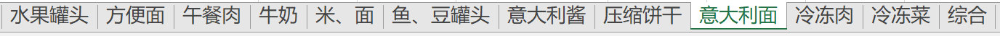
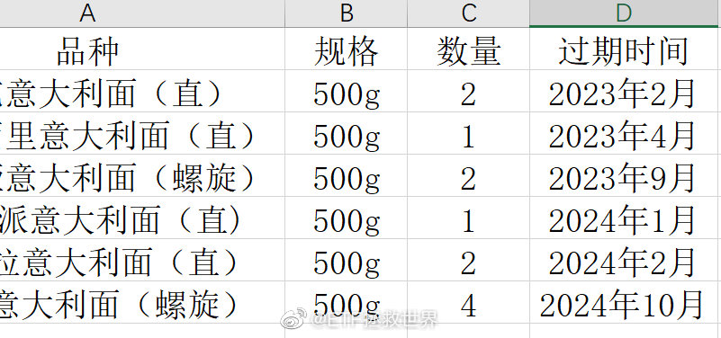

======================================================

ETF拯救世界 (5687069307) @
2022-04-08 10:48:55 Fri  
url: https://weibo.com/5687069307/Lnt3JAXWw

S下午有可能会加1-2份。不一定。看走势。 ​​​

转发[18]  评论[665]  赞[3013] 

======================================================

ETF拯救世界 (5687069307) @
2022-04-08 13:07:57 Fri  
url: https://weibo.com/5687069307/LntYagTYz

不要让同事知道你有百万存款。

------------------------------------------------------
转推：
>  @网易财经 (1974561081)
>  2022-04-08 09:30:04 Fri  
>  url: https:/weibo.com/1974561081/LnsxJ5Jwi/

>  【#男子得知同事有百万存款借23万后失联# 曾拍视频承诺还钱】4月7日，湖南邵东。仅入职半个月的同事裴某，听说罗先生有百万存款，就以承接工程为由分三次借款23.5万元。到了还款日期，裴某却迟迟没有还钱。罗先生多方打听得知，原来裴某用13万投资赌场，另外10万全挥霍掉了。罗先生称，当时裴某身着名 ​​​

转发[51]  评论[459]  赞[2143] 

======================================================

ETF拯救世界 (5687069307) @
2022-04-08 16:33:45 Fri  
url: https://weibo.com/5687069307/LnvjHl6Yq

再次忏悔：

90%的错误，都来源于不相信自己设计的策略，定下的规矩。

犹豫、懦弱、怀疑……

执行，坚定的，用钢铁意志去执行！ ​​​

转发[105]  评论[647]  赞[3516] 

======================================================

ETF拯救世界 (5687069307) @
2022-04-08 17:12:42 Fri  
url: https://weibo.com/5687069307/Lnvzvxacd

今天的养老体现的是高抛低吸；信息体现的是时间+空间。

感受一下。 ​​​

转发[137]  评论[510]  赞[3732] 

+++++++++++++++++++++++++++++++++++++++++++++++++++++

图片：
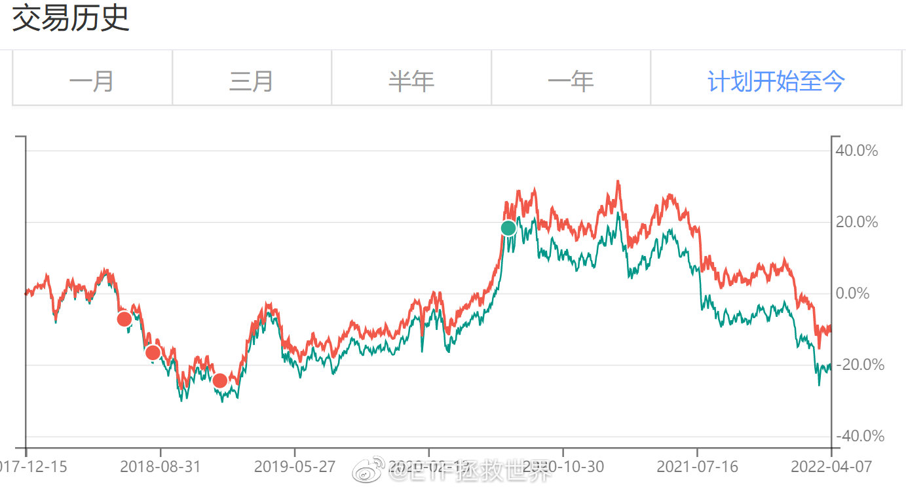
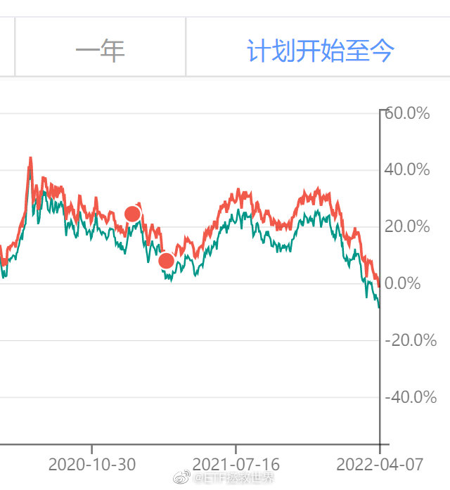

======================================================

ETF拯救世界 (5687069307) @
2022-04-09 13:45:25 Sat  
url: https://weibo.com/5687069307/LnDDS1MqH

食品库继续建仓。

京东已经要几天后送货了，今天从本地超市进货。 ​​​

转发[55]  评论[321]  赞[1974] 

======================================================

ETF拯救世界 (5687069307) @
2022-04-09 13:51:33 Sat  
url: https://weibo.com/5687069307/LnDGmjMxq

回复@初二四班二十四号:为什么要焦虑？焦虑可以改变什么吗。有焦虑的时间不如多为焦虑的事情做点准备//@初二四班二十四号:好焦虑好焦虑好焦虑。

------------------------------------------------------
转推：
>  @ETF拯救世界 (5687069307)
>  2022-04-09 13:45:25 Sat  
>  url: https:/weibo.com/5687069307/LnDDS1MqH/

>  食品库继续建仓。
>  
>  京东已经要几天后送货了，今天从本地超市进货。 ​​​

转发[30]  评论[112]  赞[1178] 

======================================================

ETF拯救世界 (5687069307) @
2022-04-09 14:08:36 Sat  
url: https://weibo.com/5687069307/LnDNhz7Am

怎么还有人问买的什么，会不会过期。这点东西几年吃完怎么会过期。好些东西也不需要冰箱。

------------------------------------------------------
转推：
>  @ETF拯救世界 (5687069307)
>  2022-04-08 10:19:27 Fri  
>  url: https:/weibo.com/5687069307/LnsRLFqqC/

>  明明白白，清清楚楚，踏踏实实。 ​​​

转发[59]  评论[267]  赞[1573] 

======================================================

ETF拯救世界 (5687069307) @
2022-04-09 14:32:46 Sat  
url: https://weibo.com/5687069307/LnDX5temG

怎么总有人把做准备跟焦虑划等号呢。

多买一点未来会吃的东西。有事，有备无患。没事，慢慢吃呗。

什么事情都不提前准备，真发生了到处抓瞎哭呗？

焦虑是什么，是你没准备你才焦虑。你把能做的准备做好，能想到的问题都做好预案，你焦虑什么？

焦虑有用吗？屁用都没有。努力做好能改变的，坦然接受 ​​​

转发[176]  评论[567]  赞[3574] 

======================================================

ETF拯救世界 (5687069307) @
2022-04-09 16:52:31 Sat  
url: https://weibo.com/5687069307/LnEROmKeM

2021年11月1日，商务部印发《关于做好今冬明春蔬菜等生活必需品市场保供稳价工作的通知》。

其中明确指出，“鼓励家庭根据需要储存一定数量的生活必需品，满足日常生活和突发情况的需要。”

说我制造焦虑？我是按照国家部署，部门指导意见，在形势复杂的情况下提前做好准备，争取不为国家添乱，在关 ​​​

转发[40]  评论[589]  赞[3040] 

======================================================

ETF拯救世界 (5687069307) @
2022-04-09 20:33:26 Sat  
url: https://weibo.com/5687069307/LnGju3RB5

对我有什么意见、建议、抱怨、不满，不妨在评论里开诚布公的谈谈。

红红脸，出出汗，不用客气。 ​​​

转发[32]  评论[1344]  赞[4907] 

======================================================

ETF拯救世界 (5687069307) @
2022-04-09 22:38:11 Sat  
url: https://weibo.com/5687069307/LnH87oo4E

两个小时过去了，一无所获，收杆儿睡觉。行吧，都挺机灵的[哼]

------------------------------------------------------
转推：
>  @ETF拯救世界 (5687069307)
>  2022-04-09 20:33:26 Sat  
>  url: https:/weibo.com/5687069307/LnGju3RB5/

>  对我有什么意见、建议、抱怨、不满，不妨在评论里开诚布公的谈谈。
>  
>  红红脸，出出汗，不用客气。 ​​​

转发[12]  评论[385]  赞[2182] 

======================================================

ETF拯救世界 (5687069307) @
2022-04-10 08:45:32 Sun  
url: https://weibo.com/5687069307/LnL6DEvrK

骂A可以，千万别捧B贬A。

谁都禁不起捧，捧高了摔的更疼。 ​​​

转发[26]  评论[422]  赞[2827] 

======================================================

ETF拯救世界 (5687069307) @
2022-04-10 18:46:04 Sun  
url: https://weibo.com/5687069307/LnP2p0wSm

三个月过去，这两天已经最终建仓完毕。后期只需要正常增减保持长期仓位。这个话题以后不再说了[可爱]//@ETF拯救世界:年初的微博，可能当时很多朋友会觉得可笑…顺便说一下，我在此基础上一直在加仓。目前看只要有水电，坚持三个月左右问题不大。

------------------------------------------------------
转推：
>  @ETF拯救世界 (5687069307)
>  2022-01-09 18:50:34 Sun  
>  url: https:/weibo.com/5687069307/L9Zb2n6zD/

>  清点了一下家里储存的食物，乐观估计正常够吃1-1.5个月。极限情况2个月也应该可以。
>  
>  营养全面就不用考虑了。什么事情都做最坏准备可能是一种深入骨髓的病。 ​​​

转发[36]  评论[413]  赞[2541] 

======================================================

ETF拯救世界 (5687069307) @
2022-04-11 09:54:08 Mon  
url: https://weibo.com/5687069307/LnUYZ9KEA

环保又是3个点，新低。龙头6个点。

两个问题：

第一，机构云集的赛道崩塌，他们会继续看好继续重仓吗。

第二，六月的指数成分股调整，大指数会把这一年多来刚刚调入的，暴涨后又暴跌的股票再调出去吗。 ​​​

转发[47]  评论[356]  赞[2189] 

======================================================

ETF拯救世界 (5687069307) @
2022-04-11 10:07:52 Mon  
url: https://weibo.com/5687069307/LnV4yw4q7

科创即将跌破1000点+终于快跌破50倍了。这个指数存在2年，所有买入还没有卖出的全都被埋了。即使如此，依然是50倍……好消息是，相比2年前的1000点，估值已经降了很多了。那时候……是80倍。

------------------------------------------------------
转推：
>  @ETF拯救世界 (5687069307)
>  2022-02-14 16:34:42 Mon  
>  url: https:/weibo.com/5687069307/LfrFLxCZz/

>  今日数据：
>  
>  科创50今日创出上市以来估值最低，终于快跌破60倍了……
>  
>  创业板也终于有可能元神归位了。 ​​​

转发[105]  评论[318]  赞[1979] 

======================================================

ETF拯救世界 (5687069307) @
2022-04-11 10:23:35 Mon  
url: https://weibo.com/5687069307/LnVaWegl2

个股我不讨论，因为个股的估值非常非常复杂。不是说亏损或者PE 400倍就不能买，也不是说PE4就一定有价值。

但是，指数，你永远应该记住一句话：

如果你买60、70、80甚至更高估值的指数，那么，你就应该做好随时跑路的准备。如果你不知道怎么跑路，那么就应该做好被深套的准备。

如果你不会跑路也不 ​​​

转发[204]  评论[404]  赞[2630] 

======================================================

ETF拯救世界 (5687069307) @
2022-04-11 10:44:02 Mon  
url: https://weibo.com/5687069307/LnVjf0iBa

有人问：xx那里为什么科创50只有30多倍估值？

我的回答：

第一，这个问题你问我干嘛？不应该去xx问客服吗？

第二，科创50一共50支成分股，其中40倍以下的15支，大部分都非权重股。这个30倍难道不是很可疑吗。

碰到任何问题、数据、说法，我们应该想一想，看一看，查一查是不是合理。别人说什么你就 ​​​

转发[70]  评论[460]  赞[2978] 

======================================================

ETF拯救世界 (5687069307) @
2022-04-11 13:13:18 Mon  
url: https://weibo.com/5687069307/LnWhPfF9C

回复@ETF拯救世界:7个月前给的价位。信息从4300上调到4500。该位置配满信息科技仓位。一切尽在掌握。//@ETF拯救世界:历史低价信息4300，医药9500。可梭哈一把配满。

------------------------------------------------------
转推：
>  @ETF拯救世界 (5687069307)
>  2021-09-29 16:12:36 Wed  
>  url: https:/weibo.com/5687069307/KAq0B0x0U/

>  下阶段布局目标：
>  
>  医药、信息。
>  
>  希望它们不要不识抬举，好好给我跌。
>  
>  医药好价：12000点。
>  
>  信息好价：5000-5400点。
>  
>  非历史好价，但低于去年双十一，刚需可入。 ​​​

转发[359]  评论[342]  赞[1942] 

======================================================

ETF拯救世界 (5687069307) @
2022-04-11 13:21:07 Mon  
url: https://weibo.com/5687069307/LnWl05OD1

很多人一看到跌就慌了。

为什么慌，因为他根本没想过会跌。或者说，没想到过会急跌或者阴跌。

我在买一个品种，或者想买一个品种的时候，会计算一个“能理解的最低位”。然后以这个位置为基础，左侧也好右侧也好，布置自己的资金进去。

如果价位并未跌穿你的“能理解的最低位”，有什么慌的？不是一 ​​​

转发[136]  评论[391]  赞[2596] 

======================================================

ETF拯救世界 (5687069307) @
2022-04-11 13:28:59 Mon  
url: https://weibo.com/5687069307/LnWoc1jlu

科创50现在是不是低位，今天之后能不能涨我不知道。

但这是科创50自由流通市值前20位的股票TTM PE。

你告诉我这个指数估值只有30多倍，无论如何我是不信的。 ​​​

转发[152]  评论[193]  赞[2007] 

+++++++++++++++++++++++++++++++++++++++++++++++++++++

图片：
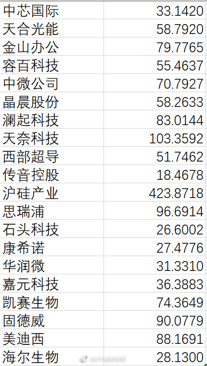

======================================================

ETF拯救世界 (5687069307) @
2022-04-11 13:31:45 Mon  
url: https://weibo.com/5687069307/LnWpk25vN

整体来看，科创的优势是利润增速其实不错。未来我也想买，也大概有个买入区间。但这个就不说了，因为指数太新，比较模糊，还是不说了。看看未来150和S有没有机会买吧。

------------------------------------------------------
转推：
>  @ETF拯救世界 (5687069307)
>  2022-04-11 13:28:59 Mon  
>  url: https:/weibo.com/5687069307/LnWoc1jlu/

>  科创50现在是不是低位，今天之后能不能涨我不知道。
>  
>  但这是科创50自由流通市值前20位的股票TTM PE。
>  
>  你告诉我这个指数估值只有30多倍，无论如何我是不信的。 ​​​

转发[74]  评论[187]  赞[1660] 

======================================================

ETF拯救世界 (5687069307) @
2022-04-11 13:45:13 Mon  
url: https://weibo.com/5687069307/LnWuMpx2F

老朋友都知道我喜欢的三个品种：

消费、医药、科技。

消费和医药不用说了。

科技方面，中概+恒科主要配置的是“软科技”，而A股上市的大多数是“硬科技”。当然，到底这些企业到底有多少科技含量我们不讨论，只是说会这样划分。

所以未来中概恒科+信息或科创等品种，使我们配置科技板块的思路。 ​​​

转发[389]  评论[745]  赞[3875] 

======================================================

ETF拯救世界 (5687069307) @
2022-04-11 14:45:05 Mon  
url: https://weibo.com/5687069307/LnWT58uIk

今天的数据让人期待。

人生第三幸福的事情，就是每天看着数据一个个跑出来。[太开心] ​​​

转发[21]  评论[420]  赞[3002] 

======================================================

ETF拯救世界 (5687069307) @
2022-04-11 15:23:21 Mon  
url: https://weibo.com/5687069307/LnX8C5IFB

我提两个改善情绪的办法。

一、运动；二、吸猫（脾气好又很软的那种）

各位还有什么别的方法不妨也展示一下。 ​​​

转发[46]  评论[906]  赞[2709] 

======================================================

ETF拯救世界 (5687069307) @
2022-04-11 15:39:05 Mon  
url: https://weibo.com/5687069307/LnXf0obqx

今日数据：

时隔四年，再次向钻石坑飞奔。 ​​​

转发[149]  评论[1045]  赞[4300] 

======================================================

ETF拯救世界 (5687069307) @
2022-04-11 15:45:53 Mon  
url: https://weibo.com/5687069307/LnXhLbWpL

根据最新数据，150终于可以加A股仓位了 [亲亲] ​​​

转发[76]  评论[734]  赞[3975] 

======================================================

ETF拯救世界 (5687069307) @
2022-04-11 17:00:56 Mon  
url: https://weibo.com/5687069307/LnXMdF7kL

关于“投资群”，我的一点想法，至今未变。总而言之，投资群就是耽误时间+几乎没有营养+各种牛鬼蛇神出没+小白互相干扰的一个地方。真那么有时间在里面聊天，去做点有价值的事情不好吗。

------------------------------------------------------
转推：
>  @ETF拯救世界 (5687069307)
>  2021-03-30 13:56:45 Tue  
>  url: https:/weibo.com/5687069307/K8zUAcog9/

>  我的建议：
>  
>  不要加什么搞钱群。
>  
>  人稍微一多，骗子就会在里面兴风作浪。更何况是搞钱群？
>  
>  做投资就是自己踏踏实实做，在网上主动去吸收一些自己需要的营养。你弄个群，噼里啪啦七嘴八舌在里面，不仅耽误时间，也学不到什么有用的东西。反而因为被动信息太多，扰乱了自己的思维。
>  
>  在我的认知中，搞钱 ​​​

转发[40]  评论[185]  赞[1798] 

======================================================

ETF拯救世界 (5687069307) @
2022-04-11 17:01:48 Mon  
url: https://weibo.com/5687069307/LnXMzx9F5

这条也是关于我对“投资群”看法的。新朋友可以考虑一下。

------------------------------------------------------
转推：
>  @ETF拯救世界 (5687069307)
>  2020-07-27 20:55:39 Mon  
>  url: https:/weibo.com/5687069307/JdaYN9VJd/

>  再多说两句关于“投资群”。
>  
>  我非常不喜欢投资群。除非是三五志同道合的朋友。否则投资群越大，人越多，负面效果越明显。
>  
>  尤其是很多本来正确投资理念还没成型的朋友进去后，更是百害无一益。
>  
>  再者，有人的地方就有江湖。几十几百人凑在一起，又是牵扯到金钱利益的主题，更是不免乌烟瘴气矛盾重重。 ​​​

转发[24]  评论[248]  赞[1637] 

======================================================

ETF拯救世界 (5687069307) @
2022-04-11 17:54:12 Mon  
url: https://weibo.com/5687069307/LnY7Qmk3H

特别难。难在哪里。

你左侧买吧，他说参考了你的买了就亏；

你左侧一点都不买全都右侧吧，万一一根大阳线手里什么都没有他又说你踏空了；

你分成150份，左侧买10份吧，他说：什么150？我只看买了的这10份！

你说现在高位，新朋友别跟了。他说我就要跟。浮亏了我就骂你。

低位你说咱们第三轮牛市顶 ​​​

转发[90]  评论[852]  赞[3773] 

======================================================

ETF拯救世界 (5687069307) @
2022-04-11 19:09:15 Mon  
url: https://weibo.com/5687069307/LnYCj57et

娱乐不是罪。

成年人的不是，

孩子的也不是。

人应该快乐的生活，而不是重重压力，无限焦虑。

人们需要快乐。 ​​​

转发[94]  评论[403]  赞[3269] 

======================================================

ETF拯救世界 (5687069307) @
2022-04-11 21:12:36 Mon  
url: https://weibo.com/5687069307/LnZqnxub5

我不抽烟啊。

但我有个问题问问烟民朋友们。

如果你在一个买不到烟的环境里，好几天没抽了好难受。有人说他能搞到，但不好搞所以要加价。

你会出多少倍的价格去买。

1倍、5倍，还是10倍原价换一盒。 ​​​

转发[32]  评论[702]  赞[2631] 

======================================================

ETF拯救世界 (5687069307) @
2022-04-12 10:20:19 Tue  
url: https://weibo.com/5687069307/Lo4A6zdw1

我有一个想法，

我觉得对于行业来说，可能是那种，能活着但活不好，快死了又没完全死，不要赚太多钱，也不要赔钱，能解决就业和社保，又不会产生太大利润，

应该是最稳的。 ​​​

转发[54]  评论[764]  赞[3043] 

======================================================

ETF拯救世界 (5687069307) @
2022-04-12 10:47:32 Tue  
url: https://weibo.com/5687069307/Lo4L9AFl3

猫这种生物，

基因里为什么有对人撒娇这个序列。

我不理解。

人这种生物，

基因里为什么会有对猫的撒娇随时受不了这个序列。

我更不理解。 ​​​

转发[22]  评论[525]  赞[2909] 

======================================================

ETF拯救世界 (5687069307) @
2022-04-12 13:11:51 Tue  
url: https://weibo.com/5687069307/Lo5HJpSQk

为什么要拉？不拉行不行？

车都发动了你给我来这一手？ ​​​

转发[12]  评论[381]  赞[2098] 

======================================================

ETF拯救世界 (5687069307) @
2022-04-12 13:16:14 Tue  
url: https://weibo.com/5687069307/Lo5Jw1ljN

还有，提款17%的那个品种还差一点点就又可以接回来了。

谁在拉？你哪个单位的？[怒] ​​​

转发[17]  评论[350]  赞[2087] 

======================================================

ETF拯救世界 (5687069307) @
2022-04-12 13:25:21 Tue  
url: https://weibo.com/5687069307/Lo5NdidOZ

心里堵得慌。 ​​​

转发[10]  评论[412]  赞[1904] 

======================================================

ETF拯救世界 (5687069307) @
2022-04-12 13:30:40 Tue  
url: https://weibo.com/5687069307/Lo5Pn8EX8

日经ETF新低了。

依然不买。

还是汇率问题。

日经不跌，ETF因为汇率跌不少，买进去没有道理。

最好的局面是：

未来日经跌到可以买的地方，同时汇率跌到极限，买入。

那么就是双击。估值修复+汇率上升。 ​​​

转发[115]  评论[336]  赞[2177] 

======================================================

ETF拯救世界 (5687069307) @
2022-04-12 13:33:45 Tue  
url: https://weibo.com/5687069307/Lo5QCyHmD

今天本来犹豫买三个。

现在不用犹豫了，买一个没那么暴躁的吧。 ​​​

转发[15]  评论[410]  赞[2373] 

======================================================

ETF拯救世界 (5687069307) @
2022-04-12 13:56:47 Tue  
url: https://weibo.com/5687069307/Lo5ZYj2k6

前几天那位因为给快递小哥打赏200元，被网暴“打赏太少”，最终跳楼的女士，

如果在天之灵看到今天网民又在网暴每单平均被打赏100多的快递员，

不知道作何感想。

你真觉得大部分人类是值得被爱的吗。

扯淡。 ​​​

转发[100]  评论[560]  赞[3508] 

======================================================

ETF拯救世界 (5687069307) @
2022-04-12 14:36:15 Tue  
url: https://weibo.com/5687069307/Lo6g06Pnc

我看见评论里有朋友说，那位女士不应该被网暴就想不开啊，不值得啊。

是的。这是肯定的。但很多事情你不经历，确实无法体会。

你有没有被别人骂过。应该有吧。除非你是特别心大的那种人，被人骂了会难受吧。尤其是自己并没有做错的情况下。

那么被几个人，十几个人，几十个人，几百个人，几千个人骂 ​​​

转发[388]  评论[1045]  赞[4532] 

======================================================

ETF拯救世界 (5687069307) @
2022-04-12 14:50:08 Tue  
url: https://weibo.com/5687069307/Lo6lDkNWE

回复@浪衣168:对。人类的记忆不断模糊消失，实际上是对自己的一种保护。记忆力太好+太敏感，这人99%不快乐。//@浪衣168:看来我记忆力不好也是个好事，容易忘记别人对我的坏

------------------------------------------------------
转推：
>  @ETF拯救世界 (5687069307)
>  2022-04-12 14:36:15 Tue  
>  url: https:/weibo.com/5687069307/Lo6g06Pnc/

>  我看见评论里有朋友说，那位女士不应该被网暴就想不开啊，不值得啊。
>  
>  是的。这是肯定的。但很多事情你不经历，确实无法体会。
>  
>  你有没有被别人骂过。应该有吧。除非你是特别心大的那种人，被人骂了会难受吧。尤其是自己并没有做错的情况下。
>  
>  那么被几个人，十几个人，几十个人，几百个人，几千个人骂 ​​​

转发[59]  评论[178]  赞[1393] 

======================================================

ETF拯救世界 (5687069307) @
2022-04-12 14:59:55 Tue  
url: https://weibo.com/5687069307/Lo6pBcWD9

今天很不开心。

感觉被偷家了。

更不开心的是如果明天继续跌，那就是被偷家*2。

K**。 ​​​

转发[23]  评论[599]  赞[3383] 

======================================================

ETF拯救世界 (5687069307) @
2022-04-12 20:41:04 Tue  
url: https://weibo.com/5687069307/Lo8E4rwdv

我万万没想到还有人不明白为什么大多数时间写两个代码，一个场内一个场外。

稍微有点脑子的就应该知道，当然是看大家爱玩场内还是场外，随意选择啊。多少年了，居然还有人喷这个…

另外还有一点，大多数时候场内场外是对应的。比如场内是ETF，场外是对应的联接基金。但也有例外，因为各种原因，两者 ​​​

转发[76]  评论[528]  赞[3282] 

======================================================

ETF拯救世界 (5687069307) @
2022-04-13 07:52:02 Wed  
url: https://weibo.com/5687069307/Lod2pF6KW

有些人抱怨，新股发行多啦，估值上百倍贵啦…其实没什么抱怨的。

这就是市场化发行。多也好，贵也好，你不申购不就行了？大家都不申购，券商包销，发一只赔一只，你看看还能发出来吗，发不出来不就平衡了。

这就是市场化。

好嘛，不管多贵你都去买，新股必胜，跟一级市场一起割二级市场的韭菜，可能 ​​​

转发[78]  评论[363]  赞[2499] 

======================================================

ETF拯救世界 (5687069307) @
2022-04-13 08:05:53 Wed  
url: https://weibo.com/5687069307/Lod82kZw2

分享图片 ​​​

转发[21]  评论[519]  赞[1814] 

+++++++++++++++++++++++++++++++++++++++++++++++++++++

图片：
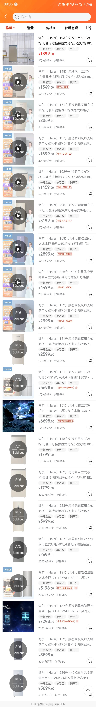

======================================================

ETF拯救世界 (5687069307) @
2022-04-13 10:18:29 Wed  
url: https://weibo.com/5687069307/LodZRDbJl

随着时间的推移，医药指数左侧买入完毕点位上移至9600。不玩虚头巴脑，明牌。

------------------------------------------------------
转推：
>  @ETF拯救世界 (5687069307)
>  2022-01-25 14:07:53 Tue  
>  url: https:/weibo.com/5687069307/Lcoaf8weM/

>  时隔三年，150和S的医药买入周期又开始了。
>  
>  接下来的区间目标，是在9500-12000之间，将医药仓位配置完毕。
>  
>  所有的事情都有预案，有解决方法，有执行措施，有理论和体系的保证。
>  
>  你很怕跌？为什么？
>  
>  哦，原来是因为什么都没有。 ​​​

转发[331]  评论[847]  赞[3460] 

======================================================

ETF拯救世界 (5687069307) @
2022-04-13 11:13:01 Wed  
url: https://weibo.com/5687069307/LoelZBo9r

【FBI Warning！ 本条微博非上海朋友不要评论！】

上海现在比较困难，最近一直想着能为大家做点什么。昨天看且慢发了一些物资礼包，我觉得，我也可以。

这条微博，抽66位上海的铁粉朋友，我自费送每位单价500元+的食物礼包。

【FBI Warning！ 本条微博非上海朋友不要评论！】

但是有几个点一定请知 ​​​

转发[165]  评论[3262]  赞[6243] 

======================================================

ETF拯救世界 (5687069307) @
2022-04-13 13:41:27 Wed  
url: https://weibo.com/5687069307/Lofkffhj0

该涨的偷家，该跌的一网17%的又在涨。

是不是要去拜拜了。 ​​​

转发[11]  评论[265]  赞[2054] 

======================================================

ETF拯救世界 (5687069307) @
2022-04-13 13:50:17 Wed  
url: https://weibo.com/5687069307/LofnPqGxI

每次看到这样的人，才会觉得一小撮人类值得被爱，也会想为这些人多做一点什么。 ​​​

转发[32]  评论[642]  赞[4085] 

+++++++++++++++++++++++++++++++++++++++++++++++++++++

图片：
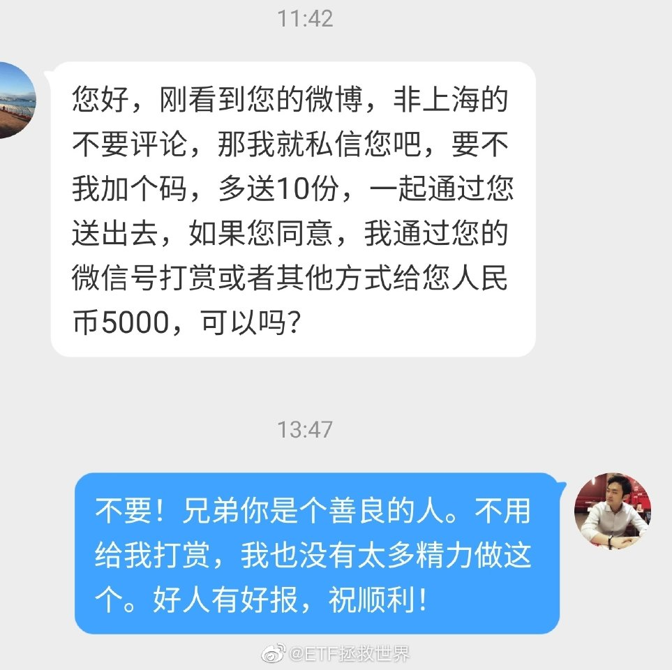

======================================================

ETF拯救世界 (5687069307) @
2022-04-13 14:17:43 Wed  
url: https://weibo.com/5687069307/LofyY1T6W

什么玩意儿啊，对自己的智商和判断力产生严重的质疑：

对于某些事，看一方说的觉得有道理我支持，再看另一方说的也很有道理我也支持。

看一方的数据觉得没错是这样，看另一方的数据又觉得你说的也没错啊。

WTF，小丑竟是我自己。 ​​​

转发[20]  评论[379]  赞[2534] 

======================================================

ETF拯救世界 (5687069307) @
2022-04-13 15:35:12 Wed  
url: https://weibo.com/5687069307/Log4pCMKG

恭喜@雪英珺 等66名用户获得【单价500元 食物礼包一份】。微博官方唯一抽奖工具@微博抽奖平台 对本次抽奖进行监督，结果公正有效。公示链接：http://t.cn/A66uqWyd

------------------------------------------------------
转推：
>  @ETF拯救世界 (5687069307)
>  2022-04-13 11:13:01 Wed  
>  url: https:/weibo.com/5687069307/LoelZBo9r/

>  【FBI Warning！ 本条微博非上海朋友不要评论！】
>  
>  上海现在比较困难，最近一直想着能为大家做点什么。昨天看且慢发了一些物资礼包，我觉得，我也可以。
>  
>  这条微博，抽66位上海的铁粉朋友，我自费送每位单价500元+的食物礼包。
>  
>  【FBI Warning！ 本条微博非上海朋友不要评论！】
>  
>  但是有几个点一定请知 ​​​

转发[8]  评论[215]  赞[837] 

======================================================

ETF拯救世界 (5687069307) @
2022-04-13 15:38:25 Wed  
url: https://weibo.com/5687069307/Log5JcjSE

今天数据出来两个事：

第一，很想放一张行业数据图，后来决定下次公众号文章放。

第二，科创50终于快跌破50了。从96下来的。 ​​​

转发[47]  评论[596]  赞[3302] 

======================================================

ETF拯救世界 (5687069307) @
2022-04-13 16:45:09 Wed  
url: https://weibo.com/5687069307/LogwOeMW3

北京的房价是不是涨了。偶尔打开链家一看，比去年高了。 ​​​

转发[24]  评论[456]  赞[2551] 

======================================================

ETF拯救世界 (5687069307) @
2022-04-14 10:29:10 Thu  
url: https://weibo.com/5687069307/LonuH8KwP

还有15位中奖的朋友没有填写收货信息。我已经单独提醒，请尽快填写，截止时间今天15:00。因为要尽快操作送货，不能没完没了的等。

------------------------------------------------------
转推：
>  @ETF拯救世界 (5687069307)
>  2022-04-13 11:13:01 Wed  
>  url: https:/weibo.com/5687069307/LoelZBo9r/

>  【FBI Warning！ 本条微博非上海朋友不要评论！】
>  
>  上海现在比较困难，最近一直想着能为大家做点什么。昨天看且慢发了一些物资礼包，我觉得，我也可以。
>  
>  这条微博，抽66位上海的铁粉朋友，我自费送每位单价500元+的食物礼包。
>  
>  【FBI Warning！ 本条微博非上海朋友不要评论！】
>  
>  但是有几个点一定请知 ​​​

转发[15]  评论[286]  赞[1408] 

======================================================

ETF拯救世界 (5687069307) @
2022-04-14 10:51:54 Thu  
url: https://weibo.com/5687069307/LonDVuFCD

环保继续新低。再说一次，如果你不知道买什么，记住不要买贵的。但我不想说前任坏话，环保留给我们的记忆是美妙的。。

------------------------------------------------------
转推：
>  @ETF拯救世界 (5687069307)
>  2022-02-08 12:07:08 Tue  
>  url: https:/weibo.com/5687069307/LevmbmWgf/

>  A股有其自己的特点。其中最大的特点就是波动极大。
>  
>  而波动极大的背后，就是估值水平巨幅波动。
>  
>  拿环保（新能源、碳中和）来说。
>  
>  最高点的时候，其成分股前40位的股票，平均估值超过90倍。
>  
>  你说宁德也好，隆基也好，都是高成长，享受百倍PE合理。但是40只股票都是高成长？做梦呢。
>  
>  所以我们走了。
>   ​​​

转发[82]  评论[290]  赞[2106] 

======================================================

ETF拯救世界 (5687069307) @
2022-04-14 11:45:43 Thu  
url: https://weibo.com/5687069307/LonZLFF1b

同一份文件，同一份数据，可以被解读出不同的观点。很多时候，数据的引用是用来服务观点的。

------------------------------------------------------
转推：
>  @xiongyongqiang (1406419784)
>  2022-04-13 21:26:32 Wed  
>  url: https:/weibo.com/1406419784/Loin1DitP/

>  【世卫组织：#奥密克戎导致出现大量住院和死亡病例#】  是错译或者断章取义吗？
>  
>今天目睹了一场非常有意思的辟谣、反辟谣、反“反辟谣”的大戏，发现后面居然没有了，于是自己加上了反“反反辟谣”。
>  
>  ● 缘起 #奥密克戎导致出现大量住院和死亡病例# http://t.cn/A66mnrhp
>央视新闻报道： ​​​

转发[111]  评论[172]  赞[1392] 

======================================================

ETF拯救世界 (5687069307) @
2022-04-14 11:49:07 Thu  
url: https://weibo.com/5687069307/Loo19aarS

吉林[666] 尽快恢复正常生活吧。

------------------------------------------------------
转推：
>  @央视新闻 (2656274875)
>  2022-04-14 11:45:11 Thu  
>  url: https:/weibo.com/2656274875/LonZy7t75/

>  【#吉林省各市州均实现社会面清零#】记者从吉林省政府召开本轮疫情防控工作新闻发布会上获悉，4月13日#长春实现社会面清零#。有感染者报告的白城市、辽源市、梅河口市新增感染者均为隔离管控人员，四平市已连续多日没有新增病例。至此，吉林省各市州均实现了疫情防控社会面清零目标。（总台记者赵文彬  ​​​

转发[15]  评论[212]  赞[1419] 

======================================================

ETF拯救世界 (5687069307) @
2022-04-14 12:30:17 Thu  
url: https://weibo.com/5687069307/LoohR6Ag4

其实很多争论，就是源于所处的位置不同。屁股不同，立场不同。

是不是触及到了自己的利益，会有很大的不同。

不说了。说不清楚，一言难尽。 ​​​

转发[54]  评论[289]  赞[2595] 

======================================================

ETF拯救世界 (5687069307) @
2022-04-14 13:08:35 Thu  
url: https://weibo.com/5687069307/Looxp4Jcp

今年的目标：完成医药+消费+科技的配置。

今天继续。 ​​​

转发[102]  评论[509]  赞[2924] 

======================================================

ETF拯救世界 (5687069307) @
2022-04-14 13:22:55 Thu  
url: https://weibo.com/5687069307/LooDe5L2S

什么意思，又要偷家是吗 ​​​

转发[38]  评论[502]  赞[2254] 

======================================================

ETF拯救世界 (5687069307) @
2022-04-14 13:51:28 Thu  
url: https://weibo.com/5687069307/LooOOaGWb

这世界充满恶意。什么玩意儿。

------------------------------------------------------
转推：
>  @ETF拯救世界 (5687069307)
>  2022-04-14 13:22:55 Thu  
>  url: https:/weibo.com/5687069307/LooDe5L2S/

>  什么意思，又要偷家是吗 ​​​

转发[13]  评论[356]  赞[1952] 

======================================================

ETF拯救世界 (5687069307) @
2022-04-14 14:07:57 Thu  
url: https://weibo.com/5687069307/LooVv2ZYB

回复@就是干委员会会长:不看事实是吧。前天信息发车的时候明明是下跌一个多点创新低，一边发车一边开始拉升的。怎么是大跌不买呢。//@就是干委员会会长:怎么最近都是第一天大跌不买，第二天中午横盘买，下午飙升，为啥大跌的当天不买呢，是时间未到吗[允悲]

------------------------------------------------------
转推：
>  @ETF拯救世界 (5687069307)
>  2022-04-14 13:22:55 Thu  
>  url: https:/weibo.com/5687069307/LooDe5L2S/

>  什么意思，又要偷家是吗 ​​​

转发[8]  评论[406]  赞[2005] 

======================================================

ETF拯救世界 (5687069307) @
2022-04-14 15:18:46 Thu  
url: https://weibo.com/5687069307/Lopof9HQ4

跟进一下。已经填写信息的朋友，今明两天就会开始派送。如果有收到的可以私信给我或者发微博然后私信我让我知道收到了。另外，如果最终有些朋友实在送不到，我会把送不到的名额再次抽奖，最终送完，不要浪费了，挺珍贵的物资。

------------------------------------------------------
转推：
>  @ETF拯救世界 (5687069307)
>  2022-04-13 11:13:01 Wed  
>  url: https:/weibo.com/5687069307/LoelZBo9r/

>  【FBI Warning！ 本条微博非上海朋友不要评论！】
>  
>  上海现在比较困难，最近一直想着能为大家做点什么。昨天看且慢发了一些物资礼包，我觉得，我也可以。
>  
>  这条微博，抽66位上海的铁粉朋友，我自费送每位单价500元+的食物礼包。
>  
>  【FBI Warning！ 本条微博非上海朋友不要评论！】
>  
>  但是有几个点一定请知 ​​​

转发[9]  评论[310]  赞[1765] 

======================================================

ETF拯救世界 (5687069307) @
2022-04-14 19:43:42 Thu  
url: https://weibo.com/5687069307/Lor7MkQu2

能从别人的错误以及遭遇中学到东西的，是聪明人；

能从自己的错误和遭遇中学到的东西的，是明白人。

一而再再而三重复在一个地方犯错的，是傻子。

感谢互联网，让我们有那么多机会看到各种各样的错误和不幸。所以，在看热闹的同时，也应该多考虑考虑自己从别人的错误中学到了什么，做什么准备会减少 ​​​

转发[198]  评论[274]  赞[2662] 

======================================================

ETF拯救世界 (5687069307) @
2022-04-14 19:55:45 Thu  
url: https://weibo.com/5687069307/LorcFwlRo

医药行业的业绩增速是真的真的很稳。

统计十年了，只有几个季度是略微下降的。 ​​​

转发[80]  评论[288]  赞[2951] 

======================================================

ETF拯救世界 (5687069307) @
2022-04-14 20:01:40 Thu  
url: https://weibo.com/5687069307/Lorf4nFIw

如果你冰柜有货，销量还可以翻几番。

------------------------------------------------------
转推：
>  @财新网 (1663937380)
>  2022-04-14 18:49:20 Thu  
>  url: https:/weibo.com/1663937380/LoqLItHxW/

>  【部分地区冰箱冰柜反季热销 能否带动家电市场整体需求？】家电市场整体低迷形势下，近日部分地区冰箱、冰柜品类却意外热销。
>  
>  家电企业海信告诉财新，3月局部疫情反复，居民外出活动减少，部分地区居家隔离，食物存储需求增加，一定程度上拉动了部分地区的冰箱、冰柜销量增长。从海信的销售数据上看， ​​​

转发[15]  评论[213]  赞[1598] 

======================================================

ETF拯救世界 (5687069307) @
2022-04-15 09:39:23 Fri  
url: https://weibo.com/5687069307/LowAZlXdL

看环保，也就是新能源、碳中和之类的走势，

再次感叹一下抱团、赛道。

连带着，这两年把疯狂股票调入指数的大指数，也依然无法下手。（不是说任何人都不能买，而是依然不到我们加仓的条件）。

而50和300，距离我们减仓已经下跌30多个点了。

疯狂的时候，看什么都合理，都对。但是均值回归，谁也跑 ​​​

转发[92]  评论[296]  赞[2396] 

======================================================

ETF拯救世界 (5687069307) @
2022-04-15 10:17:21 Fri  
url: https://weibo.com/5687069307/LowQoFmzr

不停的有朋友问500的问题。

我给两个点吧。

如果是空仓，特别想买，那么5900左右买一点点我看问题不是很大。

如果你能在4750-4800之间买到，那么直接买10%-15%仓位极大概率不会错。 ​​​

转发[630]  评论[801]  赞[3083] 

======================================================

ETF拯救世界 (5687069307) @
2022-04-15 10:24:27 Fri  
url: https://weibo.com/5687069307/LowThcqy1

医药消费红利顽强翻红，背后原因令人暖心。 ​​​

转发[15]  评论[340]  赞[2772] 

======================================================

ETF拯救世界 (5687069307) @
2022-04-15 12:23:47 Fri  
url: https://weibo.com/5687069307/LoxFIfkRZ

有人能收到就好。

看了一下，这点东西价格贵是真的贵，但特殊时期，能解大家燃眉之急就行。

[good] ​​​

转发[47]  评论[1459]  赞[7219] 

+++++++++++++++++++++++++++++++++++++++++++++++++++++

图片：

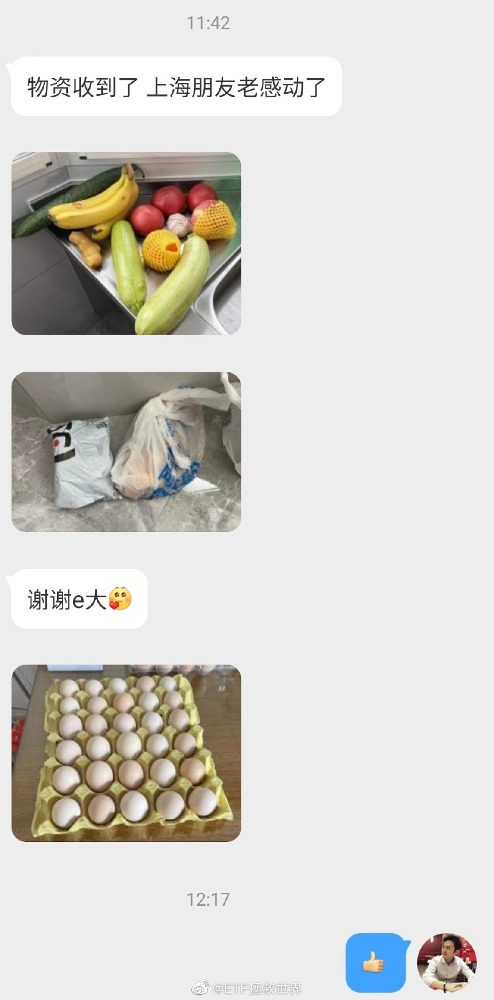
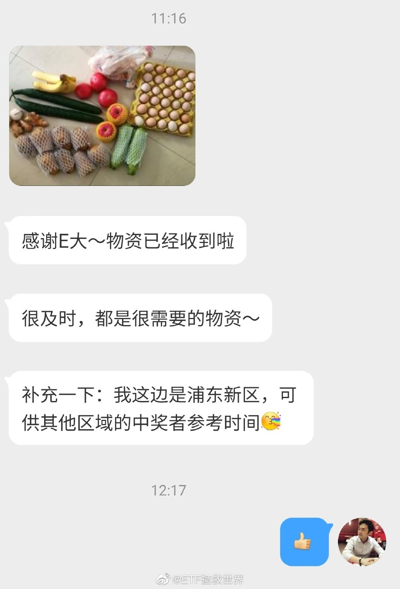
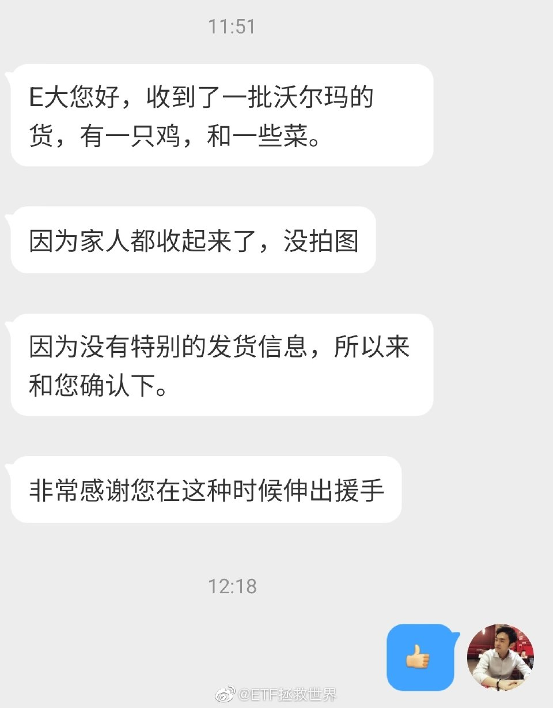

======================================================

ETF拯救世界 (5687069307) @
2022-04-15 14:12:38 Fri  
url: https://weibo.com/5687069307/LoynTqP8z

我说几句很多很多朋友会不认同的话。但这就是我真实的想法。

去迪士尼或者环球影城，如果多掏点钱，就可以买到速通卡，不用排两三个小时的队。

去医院看病，多掏点钱，可以去特需或者国际部优先就诊，不用起很早去排普通门诊。

有些人愿意用钱换时间，有些人的病很严重，一部分人愿意多掏点，就选择 ​​​

转发[89]  评论[771]  赞[4844] 

======================================================

ETF拯救世界 (5687069307) @
2022-04-15 17:59:15 Fri  
url: https://weibo.com/5687069307/LozRSv15Z

其实把钱给别人帮自己代买彩票的人，根本从心里就不相信自己会中。

------------------------------------------------------
转推：
>  @网易财经 (1974561081)
>  2022-04-15 17:30:03 Fri  
>  url: https:/weibo.com/1974561081/LozG1ylyt/

>  【西安一#男子中1001万大奖被冒领# ，获彩票归属权后再起诉体彩中心索赔】#男子1001万大奖被冒领起诉体彩中心# 4月15日，陕西西安。2019年7月，鄠邑区的姚先生通过微信转账委托投注站代买10注彩票，发现中了1001万大奖，但前往彩票店索要中奖彩票时却被店主王某告知，照片发错中奖彩票另有主人。当年9 ​​​

转发[16]  评论[147]  赞[1091] 

======================================================

ETF拯救世界 (5687069307) @
2022-04-15 19:48:31 Fri  
url: https://weibo.com/5687069307/LoAAem1LW

纯技术问题啊。请海外的朋友解答我的疑惑：

外国是如何规定电子游戏的。包括对成年人和未成年人的限制。包括分级，游戏时间限制，游戏上市审批限制等等。

不在海外的别瞎扯，否则别怪我拉黑。

客观帮忙解答问题，陈述事实即可，不用有任何评价或者别的。 ​​​

转发[23]  评论[184]  赞[1897] 

======================================================

ETF拯救世界 (5687069307) @
2022-04-15 20:43:00 Fri  
url: https://weibo.com/5687069307/LoAWls4Hg

消费小贴士：

本月18号开始又要发北京消费券了。连发6个月，京东可领。

限经纬度在北京的朋友。 ​​​

转发[37]  评论[303]  赞[2313] 

======================================================

ETF拯救世界 (5687069307) @
2022-04-16 09:11:44 Sat  
url: https://weibo.com/5687069307/LoFQg1ezT

不知道之前说我贩卖焦虑的人看了是何感想。 ​​​

转发[24]  评论[440]  赞[3098] 

+++++++++++++++++++++++++++++++++++++++++++++++++++++

图片：
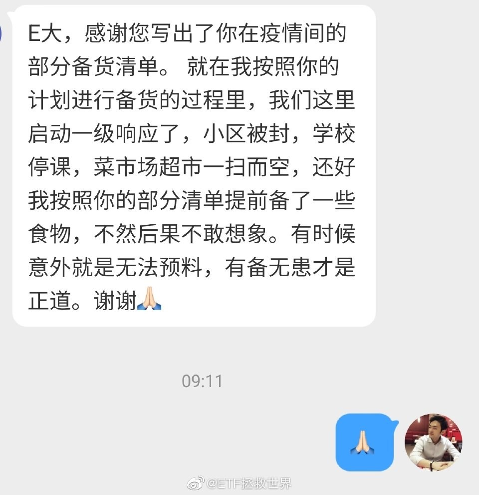

======================================================

ETF拯救世界 (5687069307) @
2022-04-16 10:56:02 Sat  
url: https://weibo.com/5687069307/LoGwAD1DL

希望人民记住京东以及京东人做的这些事情。

------------------------------------------------------
转推：
>  @第一财经日报 (1926909715)
>  2022-04-15 23:05:52 Fri  
>  url: https:/weibo.com/1926909715/LoBSl01Cy/

>  【#京东回应自杀式物流支援上海##京东自杀式物流支援上海真相#】
>  近日，有消息称京东物流通过“自杀式物流”方式向上海运送物资，一批次京东小哥、小姐姐进入上海后需要就地隔离，接着下一批次小哥继续运输。消息称共有14批次小哥，通过循环实现每天都有物流运输。
>  据第一财经记者独家了解，上述信息部 ​​​

转发[290]  评论[764]  赞[5583] 

======================================================

ETF拯救世界 (5687069307) @
2022-04-16 19:40:58 Sat  
url: https://weibo.com/5687069307/LoJXFtubc

能想到两个可能：男的精神有问题；孩子不是亲生的。否则无法解释。

------------------------------------------------------
转推：
>  @sunwear (1865990891)
>  2022-04-16 16:47:39 Sat  
>  url: https:/weibo.com/1865990891/LoIPjmZYW/

>  粉丝私信发来的，看不下去了。有没有人知道发生在哪，哪的口音，有什么具体信息，这不是畜生吗？草。 @公安部刑侦局 http://t.cn/A66BJDot ​​​

转发[70]  评论[821]  赞[3499] 

======================================================

ETF拯救世界 (5687069307) @
2022-04-16 20:32:38 Sat  
url: https://weibo.com/5687069307/LoKiDiqZV

咖啡达人请推荐你觉得好的豆子。 ​​​

转发[153]  评论[879]  赞[2798] 

======================================================

ETF拯救世界 (5687069307) @
2022-04-18 09:51:38 Mon  
url: https://weibo.com/5687069307/LoYXrwmvP

科技信息这么挣扎我不喜欢。

一把干到4500让兄弟们再买点才是你正确的选择。 ​​​

转发[71]  评论[496]  赞[3005] 

======================================================

ETF拯救世界 (5687069307) @
2022-04-18 10:33:04 Mon  
url: https://weibo.com/5687069307/LoZegjWwL

长线仓位没有加仓霉霉的原因，主要是A股仓位问题。

目前A股60%多的仓位非常合适，如果算上可转债甚至有点超。如果加多了，以后消费买不买，医药买不买，科技买不买。这些品种可是已经进入建仓区域了。

前几天有朋友说，羡慕你们还有现金的。

对，为什么会还有那么多现金，是因为一直在克制欲望，以 ​​​

转发[397]  评论[465]  赞[3103] 

======================================================

ETF拯救世界 (5687069307) @
2022-04-18 10:41:10 Mon  
url: https://weibo.com/5687069307/LoZhydmFF

对霉霉感兴趣的朋友，请关注后续是否会跌破前低931。如果不跌破，那么这里就是一个极其标准的80%+双底。

------------------------------------------------------
转推：
>  @ETF拯救世界 (5687069307)
>  2022-04-18 10:33:04 Mon  
>  url: https:/weibo.com/5687069307/LoZegjWwL/

>  长线仓位没有加仓霉霉的原因，主要是A股仓位问题。
>  
>  目前A股60%多的仓位非常合适，如果算上可转债甚至有点超。如果加多了，以后消费买不买，医药买不买，科技买不买。这些品种可是已经进入建仓区域了。
>  
>  前几天有朋友说，羡慕你们还有现金的。
>  
>  对，为什么会还有那么多现金，是因为一直在克制欲望，以 ​​​

转发[209]  评论[386]  赞[2435] 

======================================================

ETF拯救世界 (5687069307) @
2022-04-18 10:52:34 Mon  
url: https://weibo.com/5687069307/LoZmb8LiP

很多男人的乐趣，就是买一堆各种各样的工具，

但实在是找不到地方使用，一直放着，

突然有一天有用了，很开心的拿出来用一下。

即使是安装拆卸一个螺丝，能用上买了很久的电动螺丝刀，也会猛男狂喜。

（没有说女性不喜欢的意思，因为本人男性，只了解部分男性的状态，不了解女性，望周知。respect ​​​

转发[97]  评论[668]  赞[3320] 

======================================================

ETF拯救世界 (5687069307) @
2022-04-18 11:07:25 Mon  
url: https://weibo.com/5687069307/LoZscDLqT

有多少人的心愿是有一个工具房，里面有各种工具，有空就去做个木工活，做点旧物件翻新之类工作的。

------------------------------------------------------
转推：
>  @ETF拯救世界 (5687069307)
>  2022-04-18 10:52:34 Mon  
>  url: https:/weibo.com/5687069307/LoZmb8LiP/

>  很多男人的乐趣，就是买一堆各种各样的工具，
>  
>  但实在是找不到地方使用，一直放着，
>  
>  突然有一天有用了，很开心的拿出来用一下。
>  
>  即使是安装拆卸一个螺丝，能用上买了很久的电动螺丝刀，也会猛男狂喜。
>  
>  （没有说女性不喜欢的意思，因为本人男性，只了解部分男性的状态，不了解女性，望周知。respect ​​​

转发[49]  评论[591]  赞[2376] 

======================================================

ETF拯救世界 (5687069307) @
2022-04-18 14:48:17 Mon  
url: https://weibo.com/5687069307/Lp0TRb8Qo

今天易方达信息如果能涨2.7%以上我会觉得比较满意。 ​​​

转发[47]  评论[380]  赞[2666] 

======================================================

ETF拯救世界 (5687069307) @
2022-04-19 09:31:30 Tue  
url: https://weibo.com/5687069307/Lp8fMbIi8

3.26%。一朵小红花。

------------------------------------------------------
转推：
>  @ETF拯救世界 (5687069307)
>  2022-04-18 14:48:17 Mon  
>  url: https:/weibo.com/5687069307/Lp0TRb8Qo/

>  今天易方达信息如果能涨2.7%以上我会觉得比较满意。 ​​​

转发[18]  评论[551]  赞[2771] 

======================================================

ETF拯救世界 (5687069307) @
2022-04-19 21:34:51 Tue  
url: https://weibo.com/5687069307/LpcZnnqIA

有没有一种可能，usd对rmb汇率涨叠加恒生中概涨，双击呢。

就当我做个美梦吧… ​​​

转发[82]  评论[633]  赞[2822] 

+++++++++++++++++++++++++++++++++++++++++++++++++++++

图片：
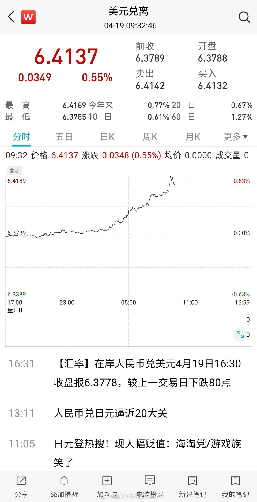

======================================================

ETF拯救世界 (5687069307) @
2022-04-20 08:45:57 Wed  
url: https://weibo.com/5687069307/LphnMhGUI

这个问题之前说过了。

不要在原计划高位加仓，否则全乱了。

新开一个，只买便宜货。 ​​​

转发[46]  评论[294]  赞[2183] 

+++++++++++++++++++++++++++++++++++++++++++++++++++++

图片：
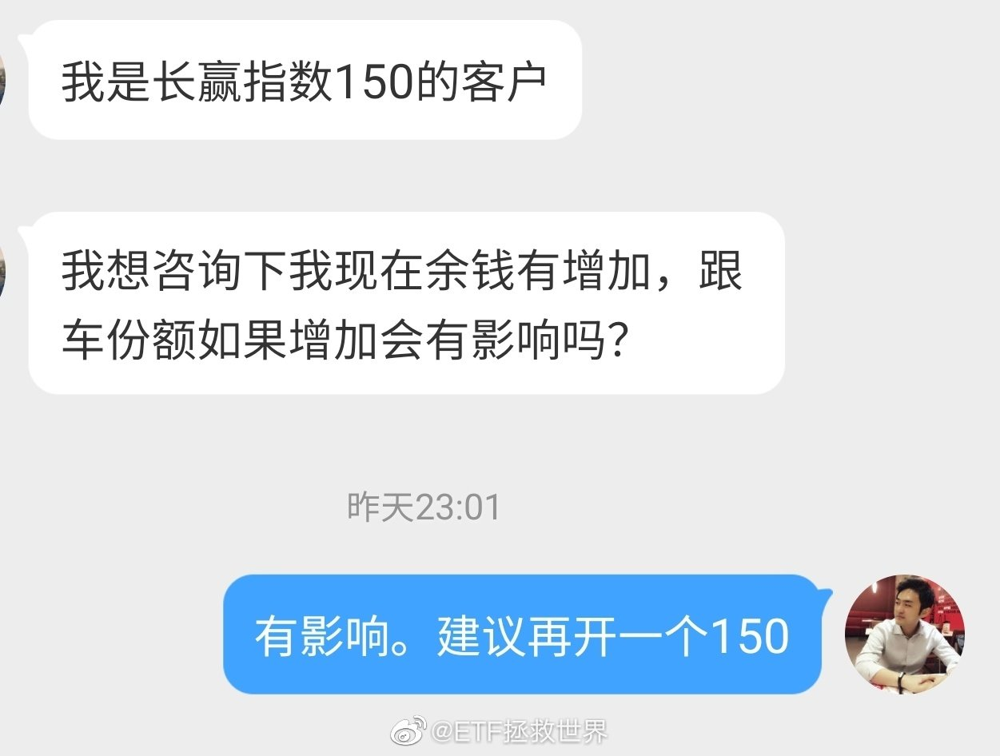

======================================================

ETF拯救世界 (5687069307) @
2022-04-20 09:04:40 Wed  
url: https://weibo.com/5687069307/LphvnffoZ

通利分红选现金 ​​​

转发[8]  评论[322]  赞[1949] 

======================================================

ETF拯救世界 (5687069307) @
2022-04-20 10:14:00 Wed  
url: https://weibo.com/5687069307/LphXw720N

这一把跌下去算什么，送温暖吗。

表格稍后更新。 ​​​

转发[24]  评论[929]  赞[3009] 

======================================================

ETF拯救世界 (5687069307) @
2022-04-20 13:59:42 Wed  
url: https://weibo.com/5687069307/Lpjr8pW5O

创业板指又新低了。为什么它先新低呢。

2020年初，宁德在它的权重中只有6%，第三大权重股。

然后宁德一路拉升，创业板指一路增加权重。到了去年底，权重17%。

牛市加仓，一把赔光。

懂了伐。 ​​​

转发[151]  评论[537]  赞[3075] 

======================================================

ETF拯救世界 (5687069307) @
2022-04-20 16:05:25 Wed  
url: https://weibo.com/5687069307/Lpkg9zYBO

这几天事情非常多，需要我处理，发博比较少。

一会抽空跑一下数据，有惊喜的话会说一声。 ​​​

转发[7]  评论[332]  赞[2295] 

======================================================

ETF拯救世界 (5687069307) @
2022-04-20 16:35:28 Wed  
url: https://weibo.com/5687069307/Lpksm3NDk

回复@给菲菲摘月亮嘛:一个品种，你的持仓收益率接近50%。某天回调3个点，你说“亏了3个点”，让人感觉像个不适合投资股市的人。//@给菲菲摘月亮嘛:红利要卖么[单身狗]今天亏三个点

------------------------------------------------------
转推：
>  @ETF拯救世界 (5687069307)
>  2022-04-20 13:59:42 Wed  
>  url: https:/weibo.com/5687069307/Lpjr8pW5O/

>  创业板指又新低了。为什么它先新低呢。
>  
>  2020年初，宁德在它的权重中只有6%，第三大权重股。
>  
>  然后宁德一路拉升，创业板指一路增加权重。到了去年底，权重17%。
>  
>  牛市加仓，一把赔光。
>  
>  懂了伐。 ​​​

转发[17]  评论[148]  赞[1451] 

======================================================

ETF拯救世界 (5687069307) @
2022-04-20 16:46:52 Wed  
url: https://weibo.com/5687069307/LpkwZ2vKs

这两天发博比较少，有人说，是不是跌的我也害怕了。

我真的大无语。

如果你看过公众号那个春节特辑，看看过去十年历次市场情绪最低落，每次绝大多数人崩溃的时候我说了什么做了什么，

你也说不出这种话。

哪怕没看过，翻翻这两年的微博公众号也行啊。

你记住，即使所有人崩溃，我也一定是最后一个 ​​​

转发[34]  评论[449]  赞[2756] 

======================================================

ETF拯救世界 (5687069307) @
2022-04-20 16:54:14 Wed  
url: https://weibo.com/5687069307/LpkzYjT7v

今天数据没有什么惊喜。但这个图我必须更新一下。

看创业板。

终于从外太空回来了。 ​​​

转发[377]  评论[347]  赞[2453] 

+++++++++++++++++++++++++++++++++++++++++++++++++++++

图片：
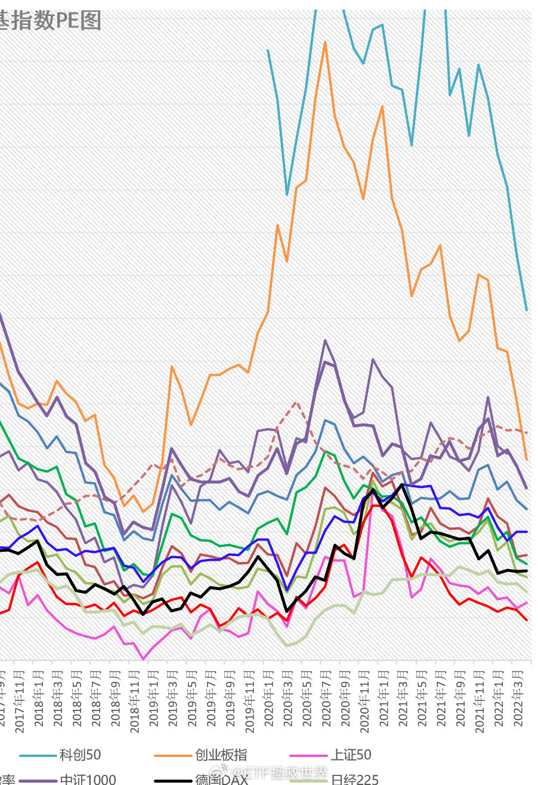

======================================================

ETF拯救世界 (5687069307) @
2022-04-20 17:02:13 Wed  
url: https://weibo.com/5687069307/LpkDdh6iH

回复@CalmoOOo:你说对了。历次市场大底，全都是所有指数估值大致回归同一区域。然后牛市中又大幅分化。换句话说，每次都是大概率所有板块都挤干净水分才见底。 http://t.cn/A66eKt2W //@CalmoOOo:看线趋势有一种感觉，不同颜色的线又将奔赴同一个坑位（是感觉[杰瑞]

------------------------------------------------------
转推：
>  @ETF拯救世界 (5687069307)
>  2022-04-20 16:54:14 Wed  
>  url: https:/weibo.com/5687069307/LpkzYjT7v/

>  今天数据没有什么惊喜。但这个图我必须更新一下。
>  
>  看创业板。
>  
>  终于从外太空回来了。 ​​​

转发[223]  评论[233]  赞[1637] 

======================================================

ETF拯救世界 (5687069307) @
2022-04-20 17:12:07 Wed  
url: https://weibo.com/5687069307/LpkHejKgp

这么多年了，可能老朋友已经基本了解我处理事情的流程了。

首先，是把结果想到尽可能的坏。然后为最坏的结果做准备。生活上也好，投资上也好，都是如此。我不相信任何人或者机构一定能照顾好我，所以我要保证的是自己能尽量照顾好自己。

对未来可能发生的各种可能做准备，做计划，执行。

其次，人生 ​​​

转发[349]  评论[521]  赞[3421] 

======================================================

ETF拯救世界 (5687069307) @
2022-04-20 17:37:03 Wed  
url: https://weibo.com/5687069307/LpkRlDmX6

刚才有朋友在评论里问，如果某件事发生了，如何配置仓位。

这个很复杂，不是很简单就能说清楚的。

首先会不会发生，这是一个问题。第二要看市场已经把多少概率的预期跌出来了。

当然，最重要的，是一旦真的发生，可能未来5-10年，甚至更长时间的部分投资逻辑会发生变化。一定是要做一些避险动作的。 ​​​

转发[49]  评论[210]  赞[2085] 

======================================================

ETF拯救世界 (5687069307) @
2022-04-20 17:49:40 Wed  
url: https://weibo.com/5687069307/LpkWthFS9

其实有个问题你想过没有，就是你到底应该不应该投资金融市场。

这里面分两种情况。第一是你没钱，第二是你有一定资产。

把钱都花光的朋友也不能说一点道理都没有。谁知道明天怎么样呢，吃了喝了买了才是自己的。

但你有没有想过，如果没事呢。又或者有事。其实无论有事没事，没钱的人始终是最惨的。 ​​​

转发[177]  评论[384]  赞[2719] 

======================================================

ETF拯救世界 (5687069307) @
2022-04-20 18:11:01 Wed  
url: https://weibo.com/5687069307/Lpl58tQ0I

微博网页版，点击“展开全文”，直接给开一个新窗口。

是哪个大聪明这么改的。有没有去看医生，医生怎么说。 ​​​

转发[15]  评论[190]  赞[1626] 

======================================================

ETF拯救世界 (5687069307) @
2022-04-20 18:37:17 Wed  
url: https://weibo.com/5687069307/LplfNuMQ2

证券交易印花税1067亿元，同比增长21.3%。

------------------------------------------------------
转推：
>  @财联社APP (2868676035)
>  2022-04-20 18:20:39 Wed  
>  url: https:/weibo.com/2868676035/Lpl935XsT/

>  【财政部：#一季度证券交易印花税1067亿元# 同比增长21.3%】财联社4月20日电，财政部数据显示，一季度，全国一般公共预算收入62037亿元，同比增长8.6%。其中，中央一般公共预算收入28949亿元，同比增长7.6%；地方一般公共预算本级收入33088亿元，同比增长9.5%。全国税收收入52452亿元，同比增长7.7%； ​​​

转发[51]  评论[231]  赞[1855] 

======================================================

ETF拯救世界 (5687069307) @
2022-04-20 19:25:20 Wed  
url: https://weibo.com/5687069307/LplziCOPd

19:24，亲测已修复。别折腾了，踏踏实实的别乱改了。

------------------------------------------------------
转推：
>  @ETF拯救世界 (5687069307)
>  2022-04-20 18:11:01 Wed  
>  url: https:/weibo.com/5687069307/Lpl58tQ0I/

>  微博网页版，点击“展开全文”，直接给开一个新窗口。
>  
>  是哪个大聪明这么改的。有没有去看医生，医生怎么说。 ​​​

转发[6]  评论[124]  赞[1388] 

======================================================

ETF拯救世界 (5687069307) @
2022-04-21 10:01:31 Thu  
url: https://weibo.com/5687069307/LpriWxBfR

奈飞几个月时间，价格从700跌到了200多，抹平4年涨幅。

有没有让你意识到一件事，

无脑长期持股不适合所有股票，甚至不适合绝大多数品种。

什么时候退出，是极其重要的一件事。

包括我们交易过的所有品种，回看历史，也会有更深的理解。 ​​​

转发[207]  评论[407]  赞[2910] 

======================================================

ETF拯救世界 (5687069307) @
2022-04-21 10:13:12 Thu  
url: https://weibo.com/5687069307/LprnGysYm

但是止盈这个问题并不是那么容易解决。

你别看网上到处都有人吹自己如何高位跑掉，实际上非常难。一亿股民里面，瞎猫碰到死耗子跑一两百万也是正常，下次他们还能跑吗？很难讲。

为什么说不容易，你可以看所有知名的公募私募基金。他们有没有跑掉。按理说，他们都是经过十几年市场考验的老兵。但如果 ​​​

转发[218]  评论[458]  赞[2670] 

======================================================

ETF拯救世界 (5687069307) @
2022-04-21 10:23:58 Thu  
url: https://weibo.com/5687069307/Lprs3AQS3

有朋友说，看估值啊。

股票不说了，那就不是一般人能判断的。我说句实话，90%的公司，连自己的董事长都不知道五年后自己的公司什么样，你一个局外人要判断十年后的公司价值，再判断到时候市场给的情绪，只能说祝福吧。

指数呢。指数估值稍微简单一点。基本上A股的历史大致就是20-70之间波动。

好， ​​​

转发[358]  评论[364]  赞[2983] 

======================================================

ETF拯救世界 (5687069307) @
2022-04-21 10:27:17 Thu  
url: https://weibo.com/5687069307/LprtpfAkJ

回复@海栗ETF:更有甚者，大多数董事长都不知道第二天自己是不是就要“另有任用”了//@海栗ETF:90%的公司，连自己的董事长都不知道五年后自己的公司什么样  太对了

------------------------------------------------------
转推：
>  @ETF拯救世界 (5687069307)
>  2022-04-21 10:23:58 Thu  
>  url: https:/weibo.com/5687069307/Lprs3AQS3/

>  有朋友说，看估值啊。
>  
>  股票不说了，那就不是一般人能判断的。我说句实话，90%的公司，连自己的董事长都不知道五年后自己的公司什么样，你一个局外人要判断十年后的公司价值，再判断到时候市场给的情绪，只能说祝福吧。
>  
>  指数呢。指数估值稍微简单一点。基本上A股的历史大致就是20-70之间波动。
>  
>  好， ​​​

转发[25]  评论[118]  赞[1147] 

======================================================

ETF拯救世界 (5687069307) @
2022-04-21 10:32:10 Thu  
url: https://weibo.com/5687069307/LprvopnJ0

回复@呜啦啦123ppjjgg:如果有人整天没事干，就是聚在一起骂一个遵纪守法，没做过伤天害理事情的人，那只能说明这些人的生活（），这些人的品质（），这些人的心态（），这些人的人生（）//@呜啦啦123ppjjgg:有一个群有几个人专业骂你，我退群了。。。

------------------------------------------------------
转推：
>  @ETF拯救世界 (5687069307)
>  2022-04-21 10:23:58 Thu  
>  url: https:/weibo.com/5687069307/Lprs3AQS3/

>  有朋友说，看估值啊。
>  
>  股票不说了，那就不是一般人能判断的。我说句实话，90%的公司，连自己的董事长都不知道五年后自己的公司什么样，你一个局外人要判断十年后的公司价值，再判断到时候市场给的情绪，只能说祝福吧。
>  
>  指数呢。指数估值稍微简单一点。基本上A股的历史大致就是20-70之间波动。
>  
>  好， ​​​

转发[10]  评论[174]  赞[1456] 

======================================================

ETF拯救世界 (5687069307) @
2022-04-21 10:44:41 Thu  
url: https://weibo.com/5687069307/LprAtrfPg

对于被骂这件事，我这两年就有很多新的感想，分享给你。

一个人为什么会被别人骂呢。究其原因，无非是几个，

做了坏事，说了错话，招人嫉妒，观点不同……

然而根本原因，是很多人在用“完美”，“圣人”的要求去审视别人。

这个人不能有任何错误，不能说任何错话，事业不可以出现波折，感情一定要 ​​​

转发[118]  评论[399]  赞[2726] 

======================================================

ETF拯救世界 (5687069307) @
2022-04-21 11:01:05 Thu  
url: https://weibo.com/5687069307/LprH7CKpw

两融数据更新：

依然有1.6万亿以上。另外据我所知，现在很多私募已经跌到预警或止损线了。

越接近坑边，压力越大。 ​​​

转发[116]  评论[341]  赞[2507] 

+++++++++++++++++++++++++++++++++++++++++++++++++++++

图片：
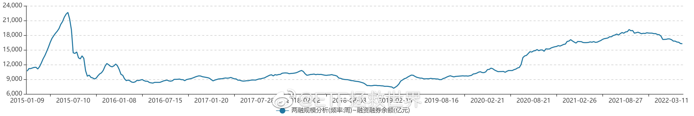

======================================================

ETF拯救世界 (5687069307) @
2022-04-21 11:11:37 Thu  
url: https://weibo.com/5687069307/LprLp1gjm

为了表达对医药9500的敬意，长线以及波段仓位外，我会买一份致敬仓位。

依然会贴出来。完成一个知行合一的动作。 ​​​

转发[249]  评论[543]  赞[3175] 

======================================================

ETF拯救世界 (5687069307) @
2022-04-21 11:19:01 Thu  
url: https://weibo.com/5687069307/LprOp6nSB

回复@困惑蜗牛想改名:只要不反弹，会很精彩的一天。期待。//@困惑蜗牛想改名:今天看着像是数据会好看的一天。

------------------------------------------------------
转推：
>  @ETF拯救世界 (5687069307)
>  2022-04-21 11:11:37 Thu  
>  url: https:/weibo.com/5687069307/LprLp1gjm/

>  为了表达对医药9500的敬意，长线以及波段仓位外，我会买一份致敬仓位。
>  
>  依然会贴出来。完成一个知行合一的动作。 ​​​

转发[18]  评论[149]  赞[1437] 

======================================================

ETF拯救世界 (5687069307) @
2022-04-21 11:24:24 Thu  
url: https://weibo.com/5687069307/LprQB4bC9

一个月，又买了回来。不知道这一次的16%会等多久？

------------------------------------------------------
转推：
>  @ETF拯救世界 (5687069307)
>  2022-03-23 09:40:16 Wed  
>  url: https:/weibo.com/5687069307/Ll1LVco1L/

>  本网六个交易日收益16%。
>  
>  市场会奖励意志坚定的士兵。 ​​​

转发[22]  评论[496]  赞[2591] 

======================================================

ETF拯救世界 (5687069307) @
2022-04-21 13:54:56 Thu  
url: https://weibo.com/5687069307/LpsPGEWul

新低的时候就不要总是觉得是底了。

新低后面大概率还是新低，所以不用急，让它走，走出来再说。

不要没完没了的买，空间时间给出来。家里没矿，注意节奏。 ​​​

转发[238]  评论[585]  赞[3690] 

======================================================

ETF拯救世界 (5687069307) @
2022-04-21 14:08:21 Thu  
url: https://weibo.com/5687069307/LpsV8oNQ8

我的日常 ​​​

转发[61]  评论[463]  赞[2841] 

+++++++++++++++++++++++++++++++++++++++++++++++++++++

图片：

======================================================

ETF拯救世界 (5687069307) @
2022-04-21 14:17:37 Thu  
url: https://weibo.com/5687069307/LpsYUbanL

说真的不是很理解，是因为这个事情吗。

看样子不是啊。 ​​​

转发[36]  评论[481]  赞[2481] 

+++++++++++++++++++++++++++++++++++++++++++++++++++++

图片：
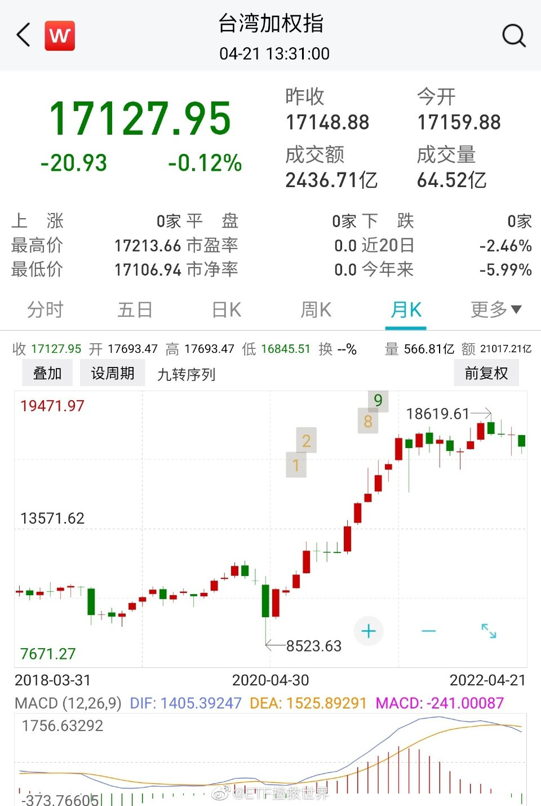

======================================================

ETF拯救世界 (5687069307) @
2022-04-21 15:38:25 Thu  
url: https://weibo.com/5687069307/LptvH86vp

今天数据出来了。

我不想说太多。只说一句。

也许你没钱买了，也许你持仓很难受。但相信我，

不要卖。

除非你非常有信心能够在短时间内以更低的价格买回来。

否则，

你极有可能，也许就是在下半年，会非常后悔。

我不敢说一定，但大概率。

好好看看手里的不会死的品种，如果不贵了，真的，别卖 ​​​

转发[341]  评论[1320]  赞[4823] 

======================================================

ETF拯救世界 (5687069307) @
2022-04-21 15:48:03 Thu  
url: https://weibo.com/5687069307/LptzC1O2c

这几天的下跌，已经把长线计划的加仓空间跌出来了。

准备开始加仓了。 ​​​

转发[73]  评论[643]  赞[3350] 

======================================================

ETF拯救世界 (5687069307) @
2022-04-21 15:56:17 Thu  
url: https://weibo.com/5687069307/LptCWAI7H

目前市场上依然保持相对高位的，还是那些这两年的抱团品种。

消费（主要是食品饮料）、新能源（环保）、军工、部分医疗。

大多数股票，以及医药、科技信息已经调整到非常不错的位置。

会按照之前设定的点位，有序买入。

现在说钻石坑还差那么一点点。我比较好奇的是这次市场会给多大的机会。 ​​​

转发[232]  评论[449]  赞[2956] 

======================================================

ETF拯救世界 (5687069307) @
2022-04-21 15:59:26 Thu  
url: https://weibo.com/5687069307/LptEe6bmi

我个人认为，如果以80%仓位为A股上限，

那么，目前以中性仓位为65%左右为界，激进、保守上下浮动15%以内，会是不错的配置。 ​​​

转发[317]  评论[499]  赞[3125] 

======================================================

ETF拯救世界 (5687069307) @
2022-04-21 16:39:54 Thu  
url: https://weibo.com/5687069307/LptUEm0nI

生活小贴士：

春天到了，北方很干燥。集美们不要忘了做面膜。

有些面膜不是会有两层吗，一层面膜还有一层有点硬的那个不知道叫什么。

我的建议，不要浪费，你贴面膜，把另一层给老公，让他贴上。

男人也需要保养。 ​​​

转发[22]  评论[603]  赞[2781] 

======================================================

ETF拯救世界 (5687069307) @
2022-04-21 18:10:55 Thu  
url: https://weibo.com/5687069307/LpuvAFaD0

儿子说同桌的女同学很多东西都带两份。

美术课的水彩笔啊，勾线笔啊，铅笔橡皮签字笔啊。

儿子问她为什么带两份，

同桌说怕他忘了带给他准备的。

老父亲在那一瞬间想起了小学时候欺负自己的女同桌，哇的一声哭了出来。 ​​​

转发[30]  评论[625]  赞[3918] 

======================================================

ETF拯救世界 (5687069307) @
2022-04-22 07:53:17 Fri  
url: https://weibo.com/5687069307/LpzTonQSo

今天会卖一个品种（不断新高的），确定的。

不确定的是，如果拉升就不买。如果继续跌就买一个品种。

非常期待今天的走势。 ​​​

转发[36]  评论[675]  赞[2729] 

======================================================

ETF拯救世界 (5687069307) @
2022-04-22 08:20:50 Fri  
url: https://weibo.com/5687069307/LpA4zz0qs

我个人支持注册制。想上就上有多少上多少，股多钱少，到处都是钻石，总比全都70/80倍没法买好。

至于个人打新亏钱，太正常了。你愿意高价接盘，人家公司要募集5亿，你举着钱送过去，大幅溢价，超募50亿，然后你赔钱，你怪谁？谁逼着你打新了？新股不败本来就是计划体制下的畸形产物。

但有两点，一定 ​​​

转发[80]  评论[341]  赞[2740] 

======================================================

ETF拯救世界 (5687069307) @
2022-04-22 09:45:46 Fri  
url: https://weibo.com/5687069307/LpAD39tgo

其实恐惧来自于未知。

黑暗、突发、感官刺激……就会让人产生恐惧。

这个市场上大多数，或者绝大多数人，其实就是蒙着眼睛在黑夜里爬山。目前的状态，对他们来说，就是失控状态。

不知道前方是平地还是悬崖，不知道这一脚踩空要落到哪里，不知道深渊有多深。

只要你大概知道极限是哪个区域，并为之 ​​​

转发[139]  评论[490]  赞[2895] 

======================================================

ETF拯救世界 (5687069307) @
2022-04-22 09:52:02 Fri  
url: https://weibo.com/5687069307/LpAFAEbnD

我不是不支持抱团，

我是不支持你们抱团我没有的品种。[哼] ​​​

转发[38]  评论[400]  赞[2950] 

======================================================

ETF拯救世界 (5687069307) @
2022-04-22 10:04:18 Fri  
url: https://weibo.com/5687069307/LpAKzsINr

合作好过对抗。

昨晚翻了这几十年的历史书，我得出一个结论。 ​​​

转发[42]  评论[364]  赞[2862] 

======================================================

ETF拯救世界 (5687069307) @
2022-04-22 10:09:17 Fri  
url: https://weibo.com/5687069307/LpAMB3Y32

感觉又要被偷家，现阶段我很惆怅。

------------------------------------------------------
转推：
>  @ETF拯救世界 (5687069307)
>  2022-04-22 07:53:17 Fri  
>  url: https:/weibo.com/5687069307/LpzTonQSo/

>  今天会卖一个品种（不断新高的），确定的。
>  
>  不确定的是，如果拉升就不买。如果继续跌就买一个品种。
>  
>  非常期待今天的走势。 ​​​

转发[14]  评论[237]  赞[1671] 

======================================================

ETF拯救世界 (5687069307) @
2022-04-22 10:22:53 Fri  
url: https://weibo.com/5687069307/LpAS7fLRR

我不知道有几位能体会到我的感觉。

就是从估值到技术，想买的品种直奔自己的目标价位。然后自己已经买了一点点，终于有机会在理想价位买更多。

就是一种想笑的感觉。 ​​​

转发[49]  评论[509]  赞[3108] 

======================================================

ETF拯救世界 (5687069307) @
2022-04-22 10:29:27 Fri  
url: https://weibo.com/5687069307/LpAUMqusS

数学题：

一个品种，你买了1000块，下跌了20%。你再买1000块，账面浮亏幅度变成多少，再涨多少你可以回本： ​​​

转发[111]  评论[599]  赞[2957] 

======================================================

ETF拯救世界 (5687069307) @
2022-04-22 11:17:01 Fri  
url: https://weibo.com/5687069307/LpBe5uYaI

今天都在传一张图，2008年4月23日的3000点保卫战。

当个段子看看就行了，事实没那么简单。

上证综指之前的编制方式有很大问题。可惜，从上到下没有人在意这个。去年终于改了。

实际上2008年4月23日到现在：

深证综指上涨98%；

沪深300全收益上涨49.56%；

中证500全收益上涨90.48%；

中证红利全 ​​​

转发[528]  评论[446]  赞[3554] 

======================================================

ETF拯救世界 (5687069307) @
2022-04-22 11:27:56 Fri  
url: https://weibo.com/5687069307/LpBiwhjKz

微博的点赞太有问题了，刚才发现不知道怎么回事就点了几个看过微博的赞，赶紧取消了。

我必须声明：由于误点概率太大，我微博的所有点赞都可能不是我的本意。 ​​​

转发[11]  评论[343]  赞[2963] 

======================================================

ETF拯救世界 (5687069307) @
2022-04-22 11:49:02 Fri  
url: https://weibo.com/5687069307/LpBr5B3Pm

回复@liuzhicheng10:这一轮已经不是普涨了。看2015年15000点的中证1000，涨到8000多点就跌回来了。但消费医药红利全都创了历史新高。A股永远没有所有股票的普涨了。//@liuzhicheng10:我觉得a股已经不会有以前那种普涨的顶峰了

------------------------------------------------------
转推：
>  @ETF拯救世界 (5687069307)
>  2022-04-22 11:17:01 Fri  
>  url: https:/weibo.com/5687069307/LpBe5uYaI/

>  今天都在传一张图，2008年4月23日的3000点保卫战。
>  
>  当个段子看看就行了，事实没那么简单。
>  
>  上证综指之前的编制方式有很大问题。可惜，从上到下没有人在意这个。去年终于改了。
>  
>  实际上2008年4月23日到现在：
>  
>  深证综指上涨98%；
>  
>  沪深300全收益上涨49.56%；
>  
>  中证500全收益上涨90.48%；
>  
>  中证红利全 ​​​

转发[76]  评论[128]  赞[1623] 

======================================================

ETF拯救世界 (5687069307) @
2022-04-22 11:54:39 Fri  
url: https://weibo.com/5687069307/LpBtmvRs9

既然都跌下来了，我就再说一个点位。

中证500好价4800-4900左右。如果能到，中小仓位配置不够的一定补足。 ​​​

转发[714]  评论[862]  赞[3703] 

======================================================

ETF拯救世界 (5687069307) @
2022-04-22 12:04:19 Fri  
url: https://weibo.com/5687069307/LpBxi07HN

老师奖励给儿子的鸭舌好好吃。

一不小心吃光了。

他放学回来怎么解释，慌乱中。 ​​​

转发[15]  评论[836]  赞[4540] 

======================================================

ETF拯救世界 (5687069307) @
2022-04-22 14:08:42 Fri  
url: https://weibo.com/5687069307/LpClM6HJN

另外还有一个数据，2008年4月23的全市场估值，比目前贵38%。也就是说，上面这些涨幅，是消化了38%的估值后取得的。

------------------------------------------------------
转推：
>  @ETF拯救世界 (5687069307)
>  2022-04-22 11:17:01 Fri  
>  url: https:/weibo.com/5687069307/LpBe5uYaI/

>  今天都在传一张图，2008年4月23日的3000点保卫战。
>  
>  当个段子看看就行了，事实没那么简单。
>  
>  上证综指之前的编制方式有很大问题。可惜，从上到下没有人在意这个。去年终于改了。
>  
>  实际上2008年4月23日到现在：
>  
>  深证综指上涨98%；
>  
>  沪深300全收益上涨49.56%；
>  
>  中证500全收益上涨90.48%；
>  
>  中证红利全 ​​​

转发[103]  评论[236]  赞[1953] 

======================================================

ETF拯救世界 (5687069307) @
2022-04-22 14:32:19 Fri  
url: https://weibo.com/5687069307/LpCvmqagu

有朋友问，现在什么环境啊，什么情况啊，有什么利好啊，都是利空，还买？等有好消息再说吧。

是，这位朋友说的没错。确实坏消息一堆。但我这些年有个心得，

就是吧，股票这个东西，它不是有好消息才涨，有坏消息才跌。

它有个提前量。

具体这个提前量是怎么出来的，我也不知道。就是说会有一批先知 ​​​

转发[192]  评论[590]  赞[3530] 

======================================================

ETF拯救世界 (5687069307) @
2022-04-22 19:53:47 Fri  
url: https://weibo.com/5687069307/LpEBQCfbx

今天卖出的一份油气，各位平均收益率是62%。 ​​​

转发[25]  评论[744]  赞[3618] 

======================================================

ETF拯救世界 (5687069307) @
2022-04-22 22:40:01 Fri  
url: https://weibo.com/5687069307/LpFHjAhrK

感觉美科技股就靠苹果撑着了。

FANNG里面，脸书奈飞腰斩，谷歌月线不吉，亚马逊不知所谓。 

只有消费才是yyds ​​​

转发[46]  评论[344]  赞[2211] 

+++++++++++++++++++++++++++++++++++++++++++++++++++++

图片：
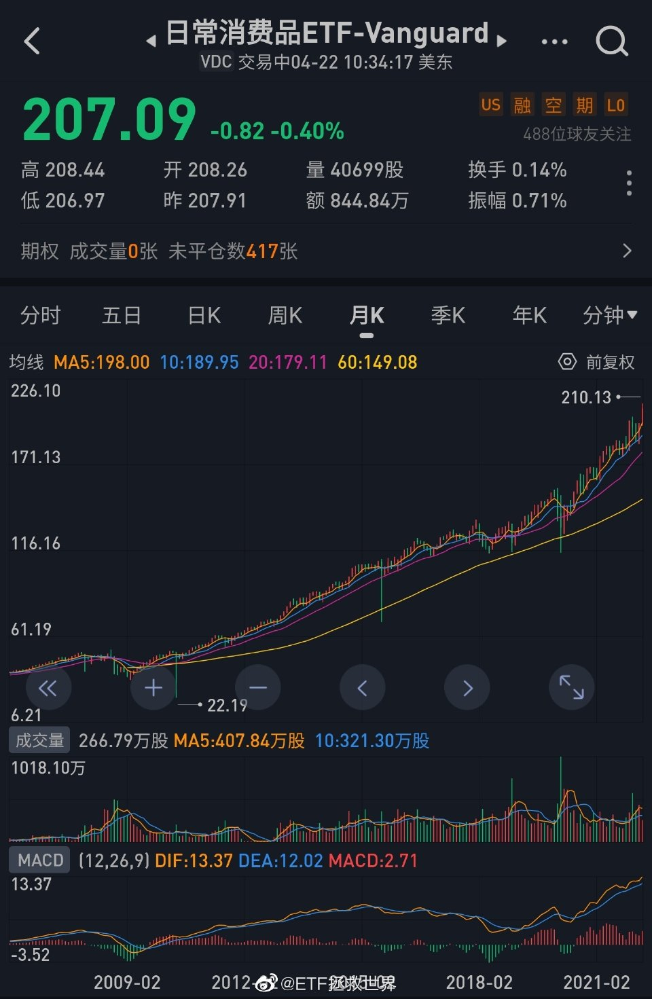

======================================================

ETF拯救世界 (5687069307) @
2022-04-24 08:35:36 Sun  
url: https://weibo.com/5687069307/LpT1z5mvd

我突然有一个想法。

你说，现在动不动就封城。一封就是一两个月，但是好像也没说日子过不下去。

那么问题来了，

我们的各种假期，为什么一定要借工作日凑数？你就干脆多放一两天，真能怎么着吗？好歹比封城还能多拉动一些消费是不是。

有点不理解。 ​​​

转发[173]  评论[1689]  赞[8028] 

======================================================

ETF拯救世界 (5687069307) @
2022-04-24 18:54:20 Sun  
url: https://weibo.com/5687069307/LpX4IhZFW

内事不决问博友：

请户外小能人推荐居家旅行必备的帐篷品牌型号。

三季即可。不用两室一厅，不用非常便携，要透气防晒，可带天幕，要方便拆搭。 ​​​

转发[155]  评论[437]  赞[2064] 

======================================================

ETF拯救世界 (5687069307) @
2022-04-24 21:23:16 Sun  
url: https://weibo.com/5687069307/LpY3a0yTG

有人说赶紧囤东西，有人说平台运力不够了，

我说我不跟大家抢，不挤占有限的资源，要把资源留给更需要的人。

不是因为我觉悟高，

是因为我早就囤完了。

照顾好自己，不给大家添乱。 ​​​

转发[30]  评论[496]  赞[3135] 

======================================================

ETF拯救世界 (5687069307) @
2022-04-25 07:33:28 Mon  
url: https://weibo.com/5687069307/Lq22Q7gtP

不提前准备，有疫情了，别人抢你也抢还有一个问题：

无论是线上还是线下，

是不是交叉感染的风险变大了？ ​​​

转发[21]  评论[300]  赞[2706] 

======================================================

ETF拯救世界 (5687069307) @
2022-04-25 08:52:32 Mon  
url: https://weibo.com/5687069307/Lq2yW1eSf

冒着枪林弹雨跑单帮赚钱我还能理解，

高价倒卖救灾捐赠物资直接震惊了。

这不依法判个十年八年能说的过去？ ​​​

转发[47]  评论[421]  赞[3702] 

======================================================

ETF拯救世界 (5687069307) @
2022-04-25 09:10:22 Mon  
url: https://weibo.com/5687069307/Lq2Gb6JHj

我觉得很多朋友始终没有建立一种概率思维。

我看有些朋友说，相信什么什么，一定能保证没事。

这就是说，把自己的所有希望寄托在，自认为是100%能照顾好自己的机构或者组织或者某些人身上。

但我觉得这个恐怕不是100%。世界上100%的事情很少很少，这个恐怕不能算。

很多东西的概率也是要随时变化的 ​​​

转发[121]  评论[282]  赞[2457] 

======================================================

ETF拯救世界 (5687069307) @
2022-04-25 09:31:10 Mon  
url: https://weibo.com/5687069307/Lq2OCbioh

截至一季度末，宁***被1485只基金重仓持有，持仓市值为1103.7亿元，为公募基金第一大重仓股。

非常有意思，三月底宁就是基金第一重仓了。但四月又跌了22%。

那么，4月是谁在卖？

如果已经是第一重仓了，那么还有多少钱来买？ ​​​

转发[39]  评论[201]  赞[2009] 

======================================================

ETF拯救世界 (5687069307) @
2022-04-25 09:36:02 Mon  
url: https://weibo.com/5687069307/Lq2QArS1v

希望本月有机会完成信息科技的左侧部分买入。 ​​​

转发[49]  评论[369]  赞[2551] 

======================================================

ETF拯救世界 (5687069307) @
2022-04-25 09:47:26 Mon  
url: https://weibo.com/5687069307/Lq2VdngC1

因为上证的编制方式有变化，所以也许不太准，

但如果按照历史模型的角度讲，上证2800是一个非常非常扎实的底部点位。 ​​​

转发[188]  评论[452]  赞[3088] 

======================================================

ETF拯救世界 (5687069307) @
2022-04-25 09:54:47 Mon  
url: https://weibo.com/5687069307/Lq2Ycqmq7

目前两市融资额依然在1.5万亿以上。

除了小部分套保，其它都是加杠杆炒股的。 ​​​

转发[81]  评论[314]  赞[2517] 

+++++++++++++++++++++++++++++++++++++++++++++++++++++

图片：
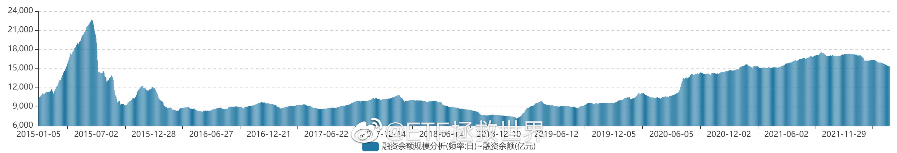

======================================================

ETF拯救世界 (5687069307) @
2022-04-25 10:10:02 Mon  
url: https://weibo.com/5687069307/Lq34obApD

霉霉今天波段最后一次买入，接下来向下不会再买。

这一网如果卖出，收益率是18%。 ​​​

转发[58]  评论[439]  赞[2786] 

======================================================

ETF拯救世界 (5687069307) @
2022-04-25 10:25:09 Mon  
url: https://weibo.com/5687069307/Lq3awurBM

手里有钱的不用急着抄底。时间空间一定要拉开，不要让成本大量堆积在一个非底部区域。 ​​​

转发[142]  评论[550]  赞[3675] 

======================================================

ETF拯救世界 (5687069307) @
2022-04-25 10:25:58 Mon  
url: https://weibo.com/5687069307/Lq3aRdQJX

我觉得3000点被很多人看作一个标志，所以可能有人会做事。

瞎猜的，没有操作指导意义。 ​​​

转发[65]  评论[324]  赞[2906] 

======================================================

ETF拯救世界 (5687069307) @
2022-04-25 10:36:56 Mon  
url: https://weibo.com/5687069307/Lq3fjfqWO

中证1000已经领先所有指数率先到达历史模型低位。 ​​​

转发[77]  评论[276]  赞[3061] 

======================================================

ETF拯救世界 (5687069307) @
2022-04-25 11:07:51 Mon  
url: https://weibo.com/5687069307/Lq3rRgaaB

3001，做事了。

------------------------------------------------------
转推：
>  @ETF拯救世界 (5687069307)
>  2022-04-25 10:25:58 Mon  
>  url: https:/weibo.com/5687069307/Lq3aRdQJX/

>  我觉得3000点被很多人看作一个标志，所以可能有人会做事。
>  
>  瞎猜的，没有操作指导意义。 ​​​

转发[34]  评论[419]  赞[2808] 

======================================================

ETF拯救世界 (5687069307) @
2022-04-25 11:27:11 Mon  
url: https://weibo.com/5687069307/Lq3zHztvm

你猜我会不会把它买回来。

这，就是波段。 ​​​

转发[29]  评论[574]  赞[3275] 

+++++++++++++++++++++++++++++++++++++++++++++++++++++

图片：
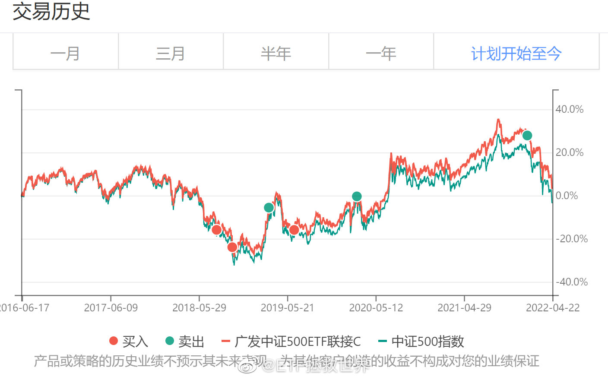

======================================================

ETF拯救世界 (5687069307) @
2022-04-25 13:46:54 Mon  
url: https://weibo.com/5687069307/Lq4uqeFVr

消费为什么能高高在上特立独行。

我想了三天三夜也没想明白。 ​​​

转发[21]  评论[425]  赞[2707] 

======================================================

ETF拯救世界 (5687069307) @
2022-04-25 13:58:07 Mon  
url: https://weibo.com/5687069307/Lq4yYpbot

我给各位朋友的建议：

第一类：已经早早做好心理准备的，攒了很多钱准备买的，继续看盘。看着指数一步步向你的目标跌去。

第二类：以为自己做好准备结果发现自己没有做好准备的，已经慌了的，心情已经被股市弄得很糟的，关闭软件，关闭我的微博，不再看盘。

第三类：实在忍不住痛苦的折磨，准备一键 ​​​

转发[122]  评论[1133]  赞[4175] 

======================================================

ETF拯救世界 (5687069307) @
2022-04-25 14:10:06 Mon  
url: https://weibo.com/5687069307/Lq4DPvxiZ

转发微博

------------------------------------------------------
转推：
>  @北京人不知道的北京事儿 (1662214194)
>  2022-04-25 13:50:38 Mon  
>  url: https:/weibo.com/1662214194/Lq4vVC8FQ/

>  区域内除基本生活必须的商超和医院外，其余全停！[话筒] ​​​

转发[14]  评论[193]  赞[1529] 

======================================================

ETF拯救世界 (5687069307) @
2022-04-25 14:27:39 Mon  
url: https://weibo.com/5687069307/Lq4KXimG1

第一件事，红利的表格可能有变化，过一会看一下，如果有，请更新之前的设定。

第二件事，晚上我争取写点东西。差不多应该写点了。但不会长，不整那些虚头巴脑的按摩，都是老战士了。多表格，多图。争取能写吧，不知道有没有别的事情耽误。 ​​​

转发[36]  评论[674]  赞[3553] 

======================================================

ETF拯救世界 (5687069307) @
2022-04-25 14:51:04 Mon  
url: https://weibo.com/5687069307/Lq4Usw3A4

还有10分钟收盘，居然是光脚。也就是说，在这个位置没有预案，或者说没有达到动手的条件。

那么今天会不会开个会呢。

总而言之不要影响本周的加仓计划就好。 ​​​

转发[52]  评论[482]  赞[3334] 

======================================================

ETF拯救世界 (5687069307) @
2022-04-25 15:01:41 Mon  
url: https://weibo.com/5687069307/Lq4YLBhNt

今天两市跌幅中位数居然超过了8%。

而今年所有股票跌幅中位数也到27%了。 ​​​

转发[119]  评论[431]  赞[3011] 

======================================================

ETF拯救世界 (5687069307) @
2022-04-25 15:03:42 Mon  
url: https://weibo.com/5687069307/Lq4ZAwkMH

回复@阿胜同学:我也非常期待。//@阿胜同学:期待今天E大跑出来的数据，还有今晚的文章推送。

------------------------------------------------------
转推：
>  @ETF拯救世界 (5687069307)
>  2022-04-25 15:01:41 Mon  
>  url: https:/weibo.com/5687069307/Lq4YLBhNt/

>  今天两市跌幅中位数居然超过了8%。
>  
>  而今年所有股票跌幅中位数也到27%了。 ​​​

转发[24]  评论[273]  赞[2046] 

======================================================

ETF拯救世界 (5687069307) @
2022-04-25 15:21:30 Mon  
url: https://weibo.com/5687069307/Lq56OoO79

我现在特别害怕今天晚上出个什么利好。 ​​​

转发[58]  评论[1295]  赞[5258] 

======================================================

ETF拯救世界 (5687069307) @
2022-04-25 20:13:56 Mon  
url: https://weibo.com/5687069307/Lq71w21y8

我有几句话想说。

第一句，就像2018年底的坑里一样，很多之前觉得我还行的朋友，会开始讨厌我。因为左侧买入，一定会导致坑里的收益率非常难看。还记得上次坑里有个骂我的，去他微博一看，不久前还在点赞我。这就是情绪改变了你对我的看法。

其实我一直没变。没有特别好，也没有特别坏。这个市场盈亏 ​​​

转发[201]  评论[1540]  赞[6907] 

======================================================

ETF拯救世界 (5687069307) @
2022-04-25 21:05:35 Mon  
url: https://weibo.com/5687069307/Lq7mtvOQD

股市搞不好，很多投资者的怨气越来越大，对很多问题的看法也发生了变化… ​​​

转发[97]  评论[954]  赞[8181] 

======================================================

ETF拯救世界 (5687069307) @
2022-04-26 09:06:54 Tue  
url: https://weibo.com/5687069307/Lqc5guHZI

突然又重启调查了。顺便又看了一遍录像。千言万语总结一句话：守男德，保平安。与各位弟兄们共勉。

------------------------------------------------------
转推：
>  @百姓瞭望台 (7332601382)
>  2022-04-25 17:49:07 Mon  
>  url: https:/weibo.com/7332601382/Lq64JpTOz/

>  #刘强东明州女大学生案重启调查# 刘强东美国仙人跳案，警方公开口供录音：事实上她很享受这个过程！[挖鼻][挖鼻][挖鼻]（vr:清凉历史） http://t.cn/A6XvBTGp ​​​

转发[129]  评论[263]  赞[2194] 

======================================================

ETF拯救世界 (5687069307) @
2022-04-26 09:12:21 Tue  
url: https://weibo.com/5687069307/Lqc7tmRZb

6点就开始工作了，并没有一直在看花边新闻 #就这一刻# ​​​

转发[18]  评论[569]  赞[3114] 

+++++++++++++++++++++++++++++++++++++++++++++++++++++

图片：
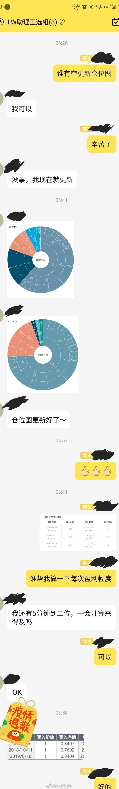

======================================================

ETF拯救世界 (5687069307) @
2022-04-26 09:38:27 Tue  
url: https://weibo.com/5687069307/Lqci4drXb

我不希望今天又暴跌。暴跌的话，有人下午开盘就又要动手动脚了。

不是说动手不对，你乱动又无法阻止市场下跌，没有意义。

不如小跌一点，谁也别动手，我们买点。 ​​​

转发[28]  评论[460]  赞[2792] 

======================================================

ETF拯救世界 (5687069307) @
2022-04-26 09:51:04 Tue  
url: https://weibo.com/5687069307/LqcnbzTR5

经过一周暴跌，我个人认为，中性仓位可以上升到70%，激进、保守分别是80%、55%会不错。

------------------------------------------------------
转推：
>  @ETF拯救世界 (5687069307)
>  2022-04-21 15:59:26 Thu  
>  url: https:/weibo.com/5687069307/LptEe6bmi/

>  我个人认为，如果以80%仓位为A股上限，
>  
>  那么，目前以中性仓位为65%左右为界，激进、保守上下浮动15%以内，会是不错的配置。 ​​​

转发[121]  评论[315]  赞[2321] 

======================================================

ETF拯救世界 (5687069307) @
2022-04-26 09:56:39 Tue  
url: https://weibo.com/5687069307/Lqcpsc0Se

这是150的两份500C做了三次波段的结果。

波段仓位有没有加入S计划的意义呢，还没决定。 ​​​

转发[22]  评论[347]  赞[2197] 

+++++++++++++++++++++++++++++++++++++++++++++++++++++

图片：
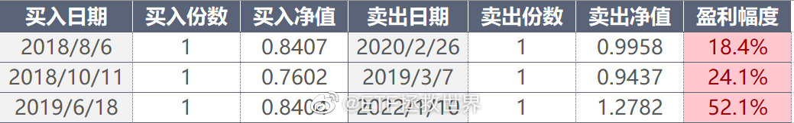
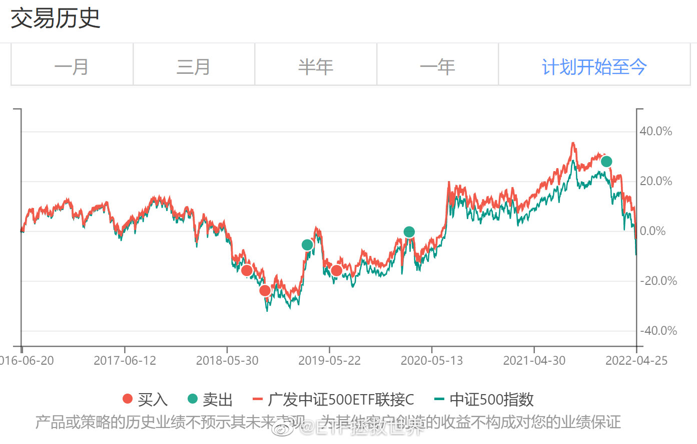

======================================================

ETF拯救世界 (5687069307) @
2022-04-26 10:18:48 Tue  
url: https://weibo.com/5687069307/LqcyrsF89

我觉得吧，一个人也好，一个企业也好，一个行业也好，如果即将被消灭，是不是应该给他们一个，不说上诉吧，就是说话的，申辩的机会。 ​​​

转发[36]  评论[341]  赞[3573] 

======================================================

ETF拯救世界 (5687069307) @
2022-04-26 10:25:04 Tue  
url: https://weibo.com/5687069307/LqcAZjCiX

不知道为什么就是感觉心在滴血。

（这不是正式发车，是正在布置一部分品种排版任务。正式的可能会改。） ​​​

转发[21]  评论[326]  赞[2046] 

+++++++++++++++++++++++++++++++++++++++++++++++++++++

图片：

======================================================

ETF拯救世界 (5687069307) @
2022-04-26 10:31:53 Tue  
url: https://weibo.com/5687069307/LqcDLeTwJ

现在是按照150买3卖1，S买3准备的。

但如果涨太多，恐怕不能买了。下午1:30-2:00定吧。 ​​​

转发[25]  评论[538]  赞[2896] 

======================================================

ETF拯救世界 (5687069307) @
2022-04-26 10:53:41 Tue  
url: https://weibo.com/5687069307/LqcMBqp8n

小猫在鼠标旁边趴着睡觉。

醒了，伸个懒腰，跳到我腿上，再跳到地上。就好像我的腿是它的楼梯。嗬，你可真不见外。

我说，走啦？

嗯。它呼噜一声。

还嗯！看着要买的暴涨品种，更生气了。 ​​​

转发[33]  评论[292]  赞[2038] 

======================================================

ETF拯救世界 (5687069307) @
2022-04-26 10:57:32 Tue  
url: https://weibo.com/5687069307/LqcOaDjGd

回复@我在故快乐:10000就涨这么多，那要7500还不直接起飞啊。来个7500的。//@我在故快乐:医药起飞了

------------------------------------------------------
转推：
>  @ETF拯救世界 (5687069307)
>  2022-04-26 10:53:41 Tue  
>  url: https:/weibo.com/5687069307/LqcMBqp8n/

>  小猫在鼠标旁边趴着睡觉。
>  
>  醒了，伸个懒腰，跳到我腿上，再跳到地上。就好像我的腿是它的楼梯。嗬，你可真不见外。
>  
>  我说，走啦？
>  
>  嗯。它呼噜一声。
>  
>  还嗯！看着要买的暴涨品种，更生气了。 ​​​

转发[15]  评论[256]  赞[1735] 

======================================================

ETF拯救世界 (5687069307) @
2022-04-26 13:18:36 Tue  
url: https://weibo.com/5687069307/LqdJqFMV9

我有一个疑问，请懂的朋友说说。

就是说，都在说日本老龄化严重。但是以日本的经济社会条件，吸引东亚、东南亚的高知年轻人移民应该不难。

他们之所以不这么做，是不是因为老龄化的严重性还不足以抵消维持单一民族社会的共识。 ​​​

转发[33]  评论[456]  赞[3330] 

======================================================

ETF拯救世界 (5687069307) @
2022-04-26 13:36:23 Tue  
url: https://weibo.com/5687069307/LqdQEjXyN

一会的科技信息车，不出意外的话是左侧买入的最后一车，除非跌幅巨大，或者时间够长。

道理很简单，到了重要支撑了。如果跌破，不知道支撑在哪里，没法分配资金了。 ​​​

转发[86]  评论[579]  赞[3007] 

======================================================

ETF拯救世界 (5687069307) @
2022-04-26 13:50:05 Tue  
url: https://weibo.com/5687069307/LqdWcyKRJ

居然说我退缩了。

你放眼市场上，现在有几个人还敢买，还能买，还有钱买的。

我缩，谁缩我都不会缩。如果所有人都要缩，我也是最后一个缩的！ ​​​

转发[59]  评论[1294]  赞[5634] 

======================================================

ETF拯救世界 (5687069307) @
2022-04-26 14:57:50 Tue  
url: https://weibo.com/5687069307/LqenHy6Kz

你以为大力发展私募机构会让市场波动降低，

实际上到了预警和清仓线，私募杀起来是二话不说的。 ​​​

转发[58]  评论[331]  赞[2684] 

======================================================

ETF拯救世界 (5687069307) @
2022-04-26 15:02:14 Tue  
url: https://weibo.com/5687069307/LqepulERc

看到15:00跳出这个新闻是什么感觉： ​​​

转发[30]  评论[493]  赞[3241] 

+++++++++++++++++++++++++++++++++++++++++++++++++++++

图片：
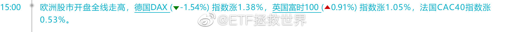

======================================================

ETF拯救世界 (5687069307) @
2022-04-26 15:07:41 Tue  
url: https://weibo.com/5687069307/LqerHxBEB

朋友们，有四个字是这一轮我彻底信仰并皈依的投资信条，

未来，也将围绕这四个字进行狂野研究。

——

均值回归。 ​​​

转发[226]  评论[573]  赞[3618] 

======================================================

ETF拯救世界 (5687069307) @
2022-04-26 15:17:29 Tue  
url: https://weibo.com/5687069307/LqevGgMDE

关于信息，多说两句。

我的信息走势模型，曾经有两次没有撑住，又下跌了20%左右。

一次是2008年金融危机大底部，两年后自底部涨了328%。

一次是2012年底，两年半后自底部涨了546%。

这个品种弹性是真的大，目前看也在模型支撑位。但要做好足够的心理建设，撑不住也是发生过两次的。

2018年撑住了 ​​​

转发[284]  评论[542]  赞[3443] 

======================================================

ETF拯救世界 (5687069307) @
2022-04-26 15:23:34 Tue  
url: https://weibo.com/5687069307/Lqey9kF1Q

今日数据出炉：

只说一个：

从全市场的角度看，今天，是2008年10月-11月金融危机大底以来，A股市场最便宜的一天。从各个数据的角度看，都是。

当然，请各位一定要注意，目前的市场环境与2019年之前完全不同了。

现在是注册制。

但无论如何，数据显示，全市场就是这个样子，板块不论。 ​​​

转发[887]  评论[902]  赞[5361] 

======================================================

ETF拯救世界 (5687069307) @
2022-04-26 15:28:35 Tue  
url: https://weibo.com/5687069307/LqeAbwaOK

2022年4月底，注定将成为A股市场的又一个被铭记的日子。

------------------------------------------------------
转推：
>  @ETF拯救世界 (5687069307)
>  2022-04-26 15:23:34 Tue  
>  url: https:/weibo.com/5687069307/Lqey9kF1Q/

>  今日数据出炉：
>  
>  只说一个：
>  
>  从全市场的角度看，今天，是2008年10月-11月金融危机大底以来，A股市场最便宜的一天。从各个数据的角度看，都是。
>  
>  当然，请各位一定要注意，目前的市场环境与2019年之前完全不同了。
>  
>  现在是注册制。
>  
>  但无论如何，数据显示，全市场就是这个样子，板块不论。 ​​​

转发[306]  评论[514]  赞[3328] 

======================================================

ETF拯救世界 (5687069307) @
2022-04-26 15:51:40 Tue  
url: https://weibo.com/5687069307/LqeJyrl8z

目前市场上只有一个板块比历史最低高不少：

机构重仓。

没人照顾的股票，已经杀到脚踝了。

当然，从前期热门基金动辄50%以上的最大回撤幅度来看，机构重仓板块也跌了很多了。但依然没到最便宜，因为，

之前炒得太疯了。 ​​​

转发[109]  评论[414]  赞[2538] 

======================================================

ETF拯救世界 (5687069307) @
2022-04-26 16:15:17 Tue  
url: https://weibo.com/5687069307/LqeT8FjaK

没有任何人关于市场的情绪能够影响我。你不能，所以不用教育我。

我坚定的，不妥协的认为，目前的区域就是底部区域。我不敢说哪里是铁底，但这个区域一定不会错。至于区域到底有多大，我没法量化，但一定不是很大。否则还叫什么区域？

在这个位置，我会加快买入节奏。就像之前好几年几乎不买一样，这 ​​​

转发[338]  评论[1052]  赞[5676] 

======================================================

ETF拯救世界 (5687069307) @
2022-04-26 16:28:23 Tue  
url: https://weibo.com/5687069307/LqeYssF2o

从今天起，我不看评论不看私信，不会让任何人影响我的情绪。

------------------------------------------------------
转推：
>  @ETF拯救世界 (5687069307)
>  2022-04-26 16:15:17 Tue  
>  url: https:/weibo.com/5687069307/LqeT8FjaK/

>  没有任何人关于市场的情绪能够影响我。你不能，所以不用教育我。
>  
>  我坚定的，不妥协的认为，目前的区域就是底部区域。我不敢说哪里是铁底，但这个区域一定不会错。至于区域到底有多大，我没法量化，但一定不是很大。否则还叫什么区域？
>  
>  在这个位置，我会加快买入节奏。就像之前好几年几乎不买一样，这 ​​​

转发[46]  评论[544]  赞[3593] 

======================================================

ETF拯救世界 (5687069307) @
2022-04-26 17:01:26 Tue  
url: https://weibo.com/5687069307/LqfbShlPO

各位可能没有意识到一个问题：

今年公募基金没有增量，都知道吧。没什么人申购了，毕竟抢新发基金等配额这种事情只发生在最高点。

私募基金不用说了，正轮流在预警线和清仓线卖出。

股民……有几个股民还敢买。敢的都被套了。

那么问题来了，这样越跌越低的时候，敢买，还有钱买的，有几个人？

很 ​​​

转发[287]  评论[1081]  赞[5517] 

======================================================

ETF拯救世界 (5687069307) @
2022-04-27 08:17:27 Wed  
url: https://weibo.com/5687069307/LqlbGq8Ak

几年前我曾经说，不断下跌的熊市中最终坚持不下去的人会有七成。

但是我错了。

到现在为止，停止的人只有4%。

瑞思拜，各位。 ​​​

转发[132]  评论[1040]  赞[4349] 

======================================================

ETF拯救世界 (5687069307) @
2022-04-27 08:31:17 Wed  
url: https://weibo.com/5687069307/Lqlhivtl3

如果今年有机会把美股买回来就彻底稳了[可爱] ​​​

转发[23]  评论[323]  赞[2786] 

======================================================

ETF拯救世界 (5687069307) @
2022-04-27 08:38:04 Wed  
url: https://weibo.com/5687069307/Lqlk3zIL1

我比较好奇的是另一半居然没有感染

------------------------------------------------------
转推：
>  @财联社APP (2868676035)
>  2022-04-27 08:28:33 Wed  
>  url: https:/weibo.com/2868676035/LqlgckszB/

>  财联社4月27日电，美国疾控中心表示，超过一半的美国人显示出之前感染过新冠肺炎的迹象。 ​​​

转发[16]  评论[255]  赞[1792] 

======================================================

ETF拯救世界 (5687069307) @
2022-04-27 09:24:38 Wed  
url: https://weibo.com/5687069307/LqlCXgKN8

很多朋友觉得美股永远涨，其实不是的。

大家看美股指数其实只跌了十几个点吧，但其实，下面这些股票，距离52周最高点，已经跌了：

paypal：73%
奈飞：72%
facebook：53%
amd：48%
英伟达：46%
安德玛：46%
通用汽车：43%
福特：43%
星巴克：39%
迪士尼：39%
波音：35%
耐克：32%
雅诗兰黛：32%
高通 ​​​

转发[136]  评论[276]  赞[2227] 

======================================================

ETF拯救世界 (5687069307) @
2022-04-27 09:37:52 Wed  
url: https://weibo.com/5687069307/LqlIkhVcA

两市融资余额继续下降，目前已经降至14600亿。

但是，融资额占流通市值的比例，却上升至2.53%。因为流通市值跌得更多。。

融资额占流通市值比例曾经在2015年7月3日达到最高点，是4.72%。

而在2019年3月5日，市场即将暴涨的时候，降至1.85%。

融资的人，一定是越涨越加杠杆，越跌越不敢借钱。

而目 ​​​

转发[321]  评论[477]  赞[2989] 

======================================================

ETF拯救世界 (5687069307) @
2022-04-27 09:43:33 Wed  
url: https://weibo.com/5687069307/LqlKDk5Sn

S的汇添富文体，去年8月买了一份，今年4月再买一份，时间间隔8个月，时间足够；

空间：3月最大跌幅超过30%。很多朋友看到这个数字绝望了。

目前状态：

4月只补了一份，浮亏幅度已经大幅收窄至12%。要知道目前市场是什么状态。

12%，趋势转折后，分分钟赚钱。趋势不转折，继续给时间给空间，拉回浮 ​​​

转发[182]  评论[453]  赞[2785] 

======================================================

ETF拯救世界 (5687069307) @
2022-04-27 09:46:46 Wed  
url: https://weibo.com/5687069307/LqlLWeHCG

行情无聊的时候，我跟大家谈风花雪月，跟大家一起围观八卦狗血，跟大家组建道德法庭。

但是关键时刻，我会把数据、思路、模型一股脑的扔过来砸晕你。 ​​​

转发[36]  评论[737]  赞[3952] 

======================================================

ETF拯救世界 (5687069307) @
2022-04-27 10:33:50 Wed  
url: https://weibo.com/5687069307/Lqm52BNJN

本次买入波段医药后，后续该品种也只剩一次波段买入，之后就不会再买。

同理，在所有指数支撑位，都会在长线仓位中加仓。情况不同，加仓幅度不同。几个重点品种会在长线仓位外额外买入致敬仓，买了会贴图。

在之后，如果继续下跌，我本人不会再过于关注市场走势。还会看，但意义已经不大。

之后会继 ​​​

转发[198]  评论[615]  赞[3117] 

======================================================

ETF拯救世界 (5687069307) @
2022-04-27 10:50:57 Wed  
url: https://weibo.com/5687069307/LqmbZn6dm

我个人认为，人做事，就要有信念。没有信念，一定是一败涂地。

我对于资本市场的信念就是：

1、指数不会死。
2、长期看，正常情况下，指数会不断上涨。
3、即使长期不涨，也会有波动。
4、便宜的地方买入，贵的地方卖出，能赚钱。

这些信念支撑我的意志从未因市场走势动摇。别人极端绝望的时候，别 ​​​

转发[546]  评论[837]  赞[5369] 

======================================================

ETF拯救世界 (5687069307) @
2022-04-27 11:00:26 Wed  
url: https://weibo.com/5687069307/LqmfQ9Lti

信息产业我要谢谢你，至少你在4500左右能挣扎一下。

不然会显得我的支撑点位过于低能…… ​​​

转发[54]  评论[582]  赞[3317] 

======================================================

ETF拯救世界 (5687069307) @
2022-04-27 13:12:47 Wed  
url: https://weibo.com/5687069307/Lqn7z1rCT

可以了可以了，休息一下。只有你到，别的兄弟不到就不够意思了。

------------------------------------------------------
转推：
>  @ETF拯救世界 (5687069307)
>  2022-04-27 11:00:26 Wed  
>  url: https:/weibo.com/5687069307/LqmfQ9Lti/

>  信息产业我要谢谢你，至少你在4500左右能挣扎一下。
>  
>  不然会显得我的支撑点位过于低能…… ​​​

转发[19]  评论[232]  赞[2147] 

======================================================

ETF拯救世界 (5687069307) @
2022-04-27 13:31:12 Wed  
url: https://weibo.com/5687069307/Lqnf2iZVs

如果收盘前不掉链子，150的两支信息科技浮亏程度就只剩8%了。

而这个指数这轮从最高点跌下来是45%。

有什么慌的。真没任何需要慌乱的。

15%以内，一两周。 ​​​

转发[120]  评论[321]  赞[2744] 

======================================================

ETF拯救世界 (5687069307) @
2022-04-27 13:35:50 Wed  
url: https://weibo.com/5687069307/LqngV1c3Z

其实我现在也不知道这一单波段能赚多少百分比。

主要得看能买多少。 ​​​

转发[23]  评论[274]  赞[2160] 

+++++++++++++++++++++++++++++++++++++++++++++++++++++

图片：
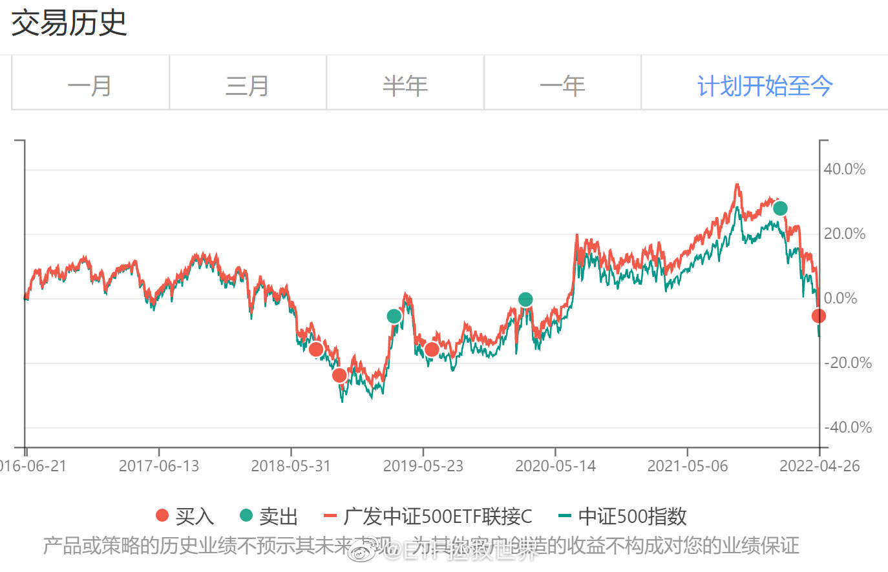

======================================================

ETF拯救世界 (5687069307) @
2022-04-27 13:53:07 Wed  
url: https://weibo.com/5687069307/LqnnW1fak

今天可能有各路人马分析反弹的性质、原因、持续力度。

说真的，我毫无兴趣浪费时间去看这些玩意。 ​​​

转发[35]  评论[320]  赞[2934] 

======================================================

ETF拯救世界 (5687069307) @
2022-04-27 13:54:34 Wed  
url: https://weibo.com/5687069307/LqnowkJCR

A股市场的参与者，大部分，甚至绝大部分都是神经病。

真的。

无论是机构还是散户。 ​​​

转发[72]  评论[630]  赞[3729] 

======================================================

ETF拯救世界 (5687069307) @
2022-04-27 15:05:44 Wed  
url: https://weibo.com/5687069307/LqnRplzDC

就这样吧。

没什么意思。

再！见！ ​​​

转发[12]  评论[406]  赞[2713] 

======================================================

ETF拯救世界 (5687069307) @
2022-04-27 15:18:36 Wed  
url: https://weibo.com/5687069307/LqnWD8NMc

忍不住看了眼评论，真是气的我够呛。

一个个好像昨天清仓了一样。

昨天你没买？上午医药波段几乎最低位你没买？

涨一点你捶胸顿足买少了，再跌下埋怨我买多了的是不是你？

新朋友补仓提醒几十份你都买了吗？老朋友仓位不低了吧？

不舒服就买到舒服！别跟我这患得患失。要不你把钱打给我我一年收2% ​​​

转发[93]  评论[1386]  赞[5416] 

======================================================

ETF拯救世界 (5687069307) @
2022-04-27 15:32:53 Wed  
url: https://weibo.com/5687069307/Lqo2r4uyr

我不是说别的，各位，弟兄们，集美们，我们的心态要始终保持平稳。心态平稳的一方面是了解金融心理，一方面是仓位合适。你如果觉得仓位不合适，就把它弄到合适。想象，代入，上涨下跌，看自己经济状态和心理会怎样。不能涨也难受，跌也难受。你到股市干嘛来了！就单纯的找罪受是吧？

------------------------------------------------------
转推：
>  @ETF拯救世界 (5687069307)
>  2022-04-27 15:18:36 Wed  
>  url: https:/weibo.com/5687069307/LqnWD8NMc/

>  忍不住看了眼评论，真是气的我够呛。
>  
>  一个个好像昨天清仓了一样。
>  
>  昨天你没买？上午医药波段几乎最低位你没买？
>  
>  涨一点你捶胸顿足买少了，再跌下埋怨我买多了的是不是你？
>  
>  新朋友补仓提醒几十份你都买了吗？老朋友仓位不低了吧？
>  
>  不舒服就买到舒服！别跟我这患得患失。要不你把钱打给我我一年收2% ​​​

转发[26]  评论[264]  赞[2153] 

======================================================

ETF拯救世界 (5687069307) @
2022-04-27 15:38:33 Wed  
url: https://weibo.com/5687069307/Lqo4JclBj

这是150的仓位图，自己结合前天公众号文章的估值状态看情况弄吧。

仓位建议保守-激进比前几天最新的那条可以提高2、3个点。 ​​​

转发[225]  评论[508]  赞[3290] 

+++++++++++++++++++++++++++++++++++++++++++++++++++++

图片：
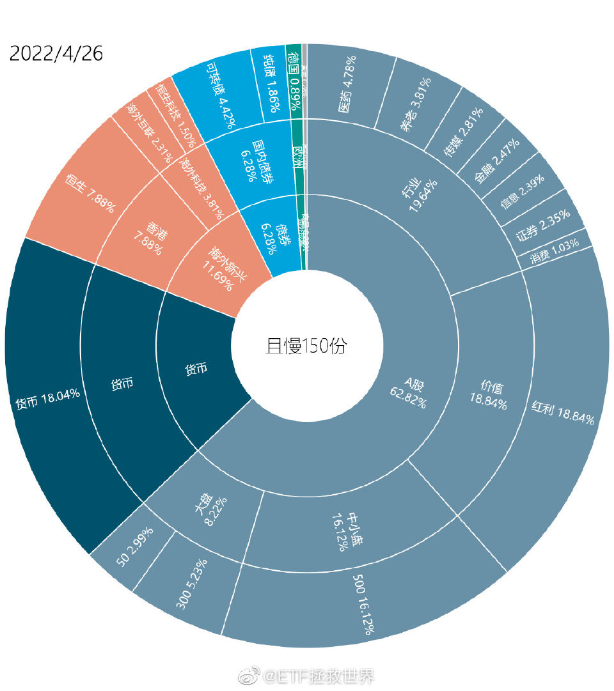

======================================================

ETF拯救世界 (5687069307) @
2022-04-27 15:59:12 Wed  
url: https://weibo.com/5687069307/Lqod71XZe

说明：“要不你把钱打给我我一年收2%管理费，盈利提20%你看怎么样？”这句话的修辞手法是反问和夸张。含义是：我不是你的私募基金经理，不知道也没能力没精力了解每位朋友的情况。绝无非法集资抑或有意向成立私募进而公开或私下募集资金的意思。望周知。

------------------------------------------------------
转推：
>  @ETF拯救世界 (5687069307)
>  2022-04-27 15:18:36 Wed  
>  url: https:/weibo.com/5687069307/LqnWD8NMc/

>  忍不住看了眼评论，真是气的我够呛。
>  
>  一个个好像昨天清仓了一样。
>  
>  昨天你没买？上午医药波段几乎最低位你没买？
>  
>  涨一点你捶胸顿足买少了，再跌下埋怨我买多了的是不是你？
>  
>  新朋友补仓提醒几十份你都买了吗？老朋友仓位不低了吧？
>  
>  不舒服就买到舒服！别跟我这患得患失。要不你把钱打给我我一年收2% ​​​

转发[22]  评论[673]  赞[2971] 

======================================================

ETF拯救世界 (5687069307) @
2022-04-27 19:46:34 Wed  
url: https://weibo.com/5687069307/LqpHoAgqP

我的露营计划是不是要泡汤了。 ​​​

转发[8]  评论[357]  赞[1977] 

======================================================

ETF拯救世界 (5687069307) @
2022-04-27 19:47:50 Wed  
url: https://weibo.com/5687069307/LqpHUv5OV

🙏🙏🙏人生记忆之一，走好

------------------------------------------------------
转推：
>  @新浪娱乐 (1642591402)
>  2022-04-27 15:59:07 Wed  
>  url: https:/weibo.com/1642591402/Lqod4Ay0A/

>  #曾江去世# 据多家港媒消息，中国香港资深演员曾江去世，享年87岁。今天中午12时14分，曾江在指定检疫酒店房间内昏迷不醒，酒店职员发现后遂报警求助。警员及救护员到场，经检验后证实事主当场死亡，死因目前仍在调查中。据悉，曾江25日独自一人由新加坡返港，入住酒店，26日新冠病毒快测呈阴性，27日 ​​​

转发[33]  评论[228]  赞[1364] 

======================================================

ETF拯救世界 (5687069307) @
2022-04-27 22:51:52 Wed  
url: https://weibo.com/5687069307/LqqUC4WmN

我真的服了。

没事上球球刷刷情绪，结果在推荐流里面看到两个跟我有关的帖子。

真的偷窥我微博和公众号的兄弟们不要再往球球搬运我的东西或者讨论我的操作了。

球球现在是什么人在评论啊，

就这么几个理性的，大多数都是情绪化的喷子在评论，

他能理性吗，理性不了，他没这个能力你知道吧。

你跟 ​​​

转发[17]  评论[500]  赞[3058] 

+++++++++++++++++++++++++++++++++++++++++++++++++++++

图片：
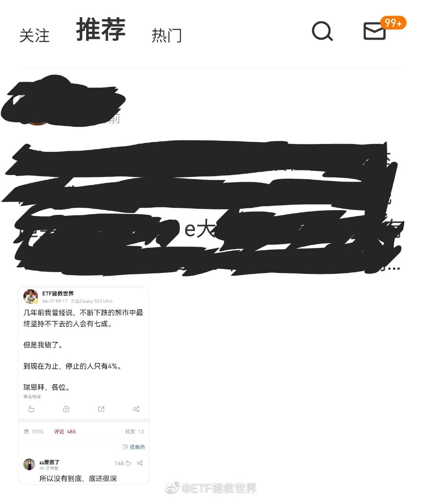
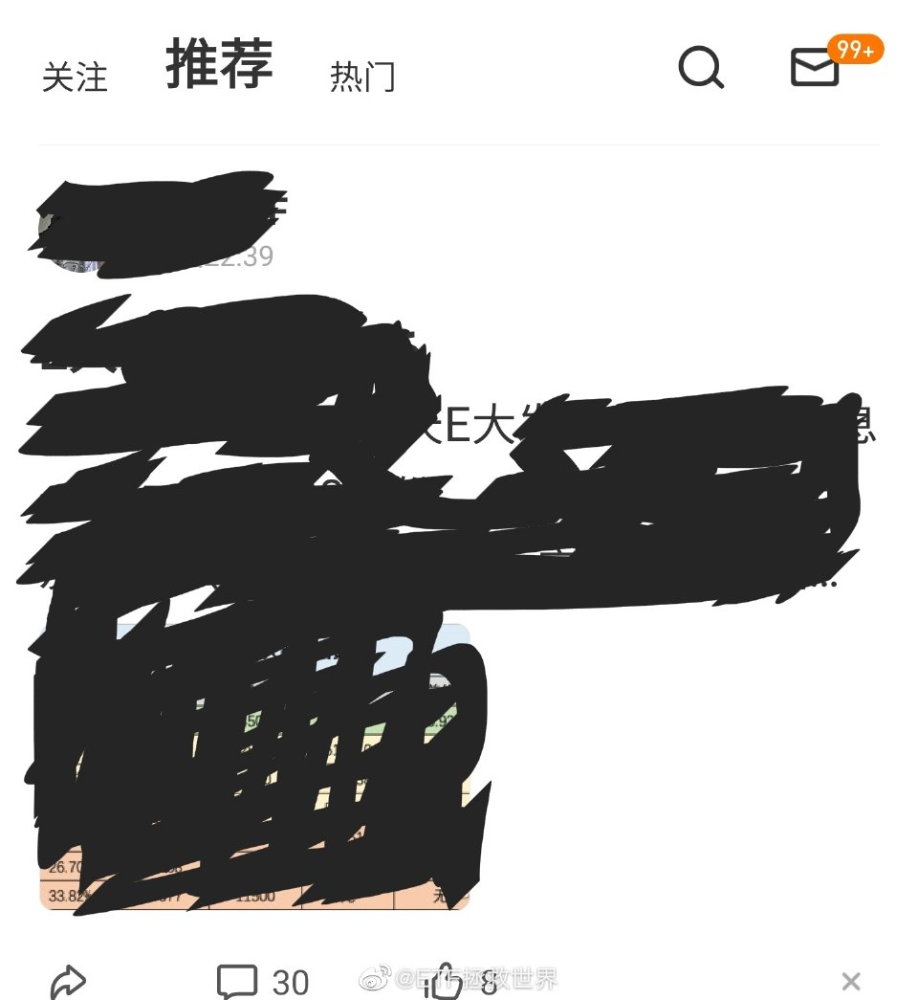

======================================================

ETF拯救世界 (5687069307) @
2022-04-27 23:01:34 Wed  
url: https://weibo.com/5687069307/LqqYy9tuT

股票跌起来真的很难言底。

复习题：

从周线和月线看，哪里是卖出的最佳时机。是那种你能把握住的。

卖出理由是什么。 ​​​

转发[113]  评论[580]  赞[2573] 

+++++++++++++++++++++++++++++++++++++++++++++++++++++

图片：

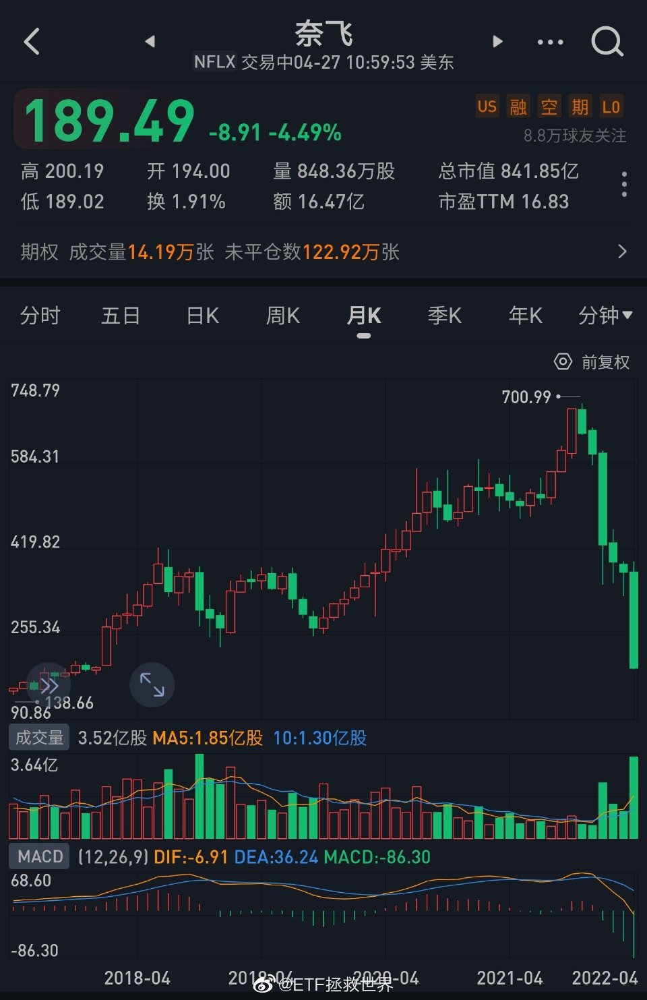

======================================================

ETF拯救世界 (5687069307) @
2022-04-28 08:44:57 Thu  
url: https://weibo.com/5687069307/LquNlFH9T

越来越近了。一位确诊流调信息，几天时间把周围超市跑遍了，应该是在囤货。

这种情况去超市有问题吗。我的想法是尽量不动用战略储备，随时把储备补满。但如果风险大，开始消耗储备也没问题。

就像投资，能不用战略储备就不用，但真到关键时候要用，从银行搬家也可以。 ​​​

转发[30]  评论[390]  赞[2651] 

======================================================

ETF拯救世界 (5687069307) @
2022-04-28 08:56:16 Thu  
url: https://weibo.com/5687069307/LquRW9W2a

我想做一个实验。就今天开始。

一点东西都不买，到周日，记录每天三个人消耗的食物。

看看加的血条到底能扛住boss多少天的攻击。 ​​​

转发[15]  评论[345]  赞[2503] 

======================================================

ETF拯救世界 (5687069307) @
2022-04-28 09:29:59 Thu  
url: https://weibo.com/5687069307/Lqv5Cxr7U

我观察sh的这次情况，非常好的诠释了什么才是好企业：

那么多人对可乐的渴望，甚至是明确的对某个品牌的渴望，说明了一切。 ​​​

转发[66]  评论[535]  赞[3514] 

======================================================

ETF拯救世界 (5687069307) @
2022-04-28 09:38:59 Thu  
url: https://weibo.com/5687069307/Lqv9hc8lQ

昨天晚上我花了两个小时翻阅去年10月以来，奈飞的所有新闻。大致得出三个股价崩塌的基本面结论：

第一：竞争加剧。影视巨头切入赛道：

“在 奈飞 (NFLX.US)最新的致股东信中，有一句话传遍了全世界：“虽然竞争加剧可能会影响我们的利润率增长，但……” 尽管，这一说法或许并不代表着什么，但这可能 ​​​

转发[126]  评论[313]  赞[2453] 

======================================================

ETF拯救世界 (5687069307) @
2022-04-28 10:46:43 Thu  
url: https://weibo.com/5687069307/LqvALyKDn

你有没有想过，为什么一个月前，将医药的波段价位定在0.75而非正常的0.8。

又为什么昨天正好在0.75附近止跌，以致0.75几乎是最低价。

这到底是道德的沦丧还是人性的扭曲？ ​​​

转发[52]  评论[622]  赞[2984] 

======================================================

ETF拯救世界 (5687069307) @
2022-04-28 11:03:43 Thu  
url: https://weibo.com/5687069307/LqvHFra6S

我个人非常非常推崇市场机制。我觉得只有市场的定价才是最有效的。

但前提，是市场一定要受到强有力的规则的制约。违反规则的杀无赦。

A股的问题，其实很大程度上就是不市场化。从新股发行开始。目前注册制的改革方向是对的，虽然短期看会对市场造成一些伤害。但只要有人无脑打新炒新，那么新股发行 ​​​

转发[72]  评论[281]  赞[3139] 

======================================================

ETF拯救世界 (5687069307) @
2022-04-28 11:11:43 Thu  
url: https://weibo.com/5687069307/LqvKV2ck9

全指医药目前有100多家公司公布一季度业绩，增速继续保持20%+……我估计最终是十几个点。全市场目前是个位数。

去年四季度稍差，但也比全市场好多了。 ​​​

转发[60]  评论[251]  赞[2631] 

======================================================

ETF拯救世界 (5687069307) @
2022-04-28 11:30:35 Thu  
url: https://weibo.com/5687069307/LqvSzAFqP

还是那句话，有些东西最好别捧得太高。预期太高会放松应有的警惕。

还有就是，人还是要首先依靠自己。把所有希望寄托在别人身上，很容易出问题。

这是我的一点想法。 ​​​

转发[154]  评论[341]  赞[3387] 

======================================================

ETF拯救世界 (5687069307) @
2022-04-28 11:47:56 Thu  
url: https://weibo.com/5687069307/LqvZCl1k0

如果两个月前，一个城市还被所有人吹捧为最优秀的，两个月后，却成了千夫所指。

那么，人真的理性吗，真的能认清事实吗，你看到的就真的一定是真相吗。

有极端的好和极端的差吗，又或者其实极端的是人群自身而已？

不要相信人们的夸奖和称赞，因为一瞬间所有掌声都会变成另一个极端。

人类整体，或 ​​​

转发[257]  评论[889]  赞[5429] 

======================================================

ETF拯救世界 (5687069307) @
2022-04-28 17:24:56 Thu  
url: https://weibo.com/5687069307/LqycpeZt9

有没有一种可能就是说5月再提16%[污] ​​​

转发[65]  评论[610]  赞[2737] 

+++++++++++++++++++++++++++++++++++++++++++++++++++++

图片：
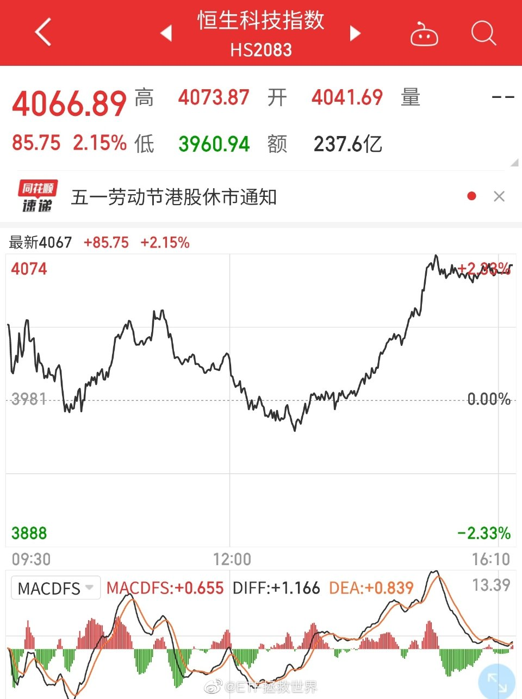

======================================================

ETF拯救世界 (5687069307) @
2022-04-28 18:54:53 Thu  
url: https://weibo.com/5687069307/LqyMV0Yka

根据长期使用的感受，

猫家的省钱卡，夕夕的省钱月卡，狗家的plus100元券比较，

猫家的卡最厚道。从未遇到过不能用的情况。

夕夕的卡百亿补贴产品不能用。

狗家的很多东西不能用。

省钱卡这波，没什么钱的我站猫。 ​​​

转发[65]  评论[734]  赞[2847] 

======================================================

ETF拯救世界 (5687069307) @
2022-04-28 21:55:26 Thu  
url: https://weibo.com/5687069307/LqzYd19tV

回复@e寸光阴一寸金:我现在也让孩子玩啊。还给他下好了我的世界，跟他一起玩双人成行，让他看我打老头环boss。有节制的玩我全力支持//@e寸光阴一寸金:回复 @ETF拯救世界:E大之前不是反对不让孩子玩游戏么

------------------------------------------------------
转推：
>  @ETF拯救世界 (5687069307)
>  2022-04-28 11:30:35 Thu  
>  url: https:/weibo.com/5687069307/LqvSzAFqP/

>  还是那句话，有些东西最好别捧得太高。预期太高会放松应有的警惕。
>  
>  还有就是，人还是要首先依靠自己。把所有希望寄托在别人身上，很容易出问题。
>  
>  这是我的一点想法。 ​​​

转发[45]  评论[205]  赞[1355] 

======================================================

ETF拯救世界 (5687069307) @
2022-04-29 07:44:58 Fri  
url: https://weibo.com/5687069307/LqDPv8iO1

巨额回购股票，按季度分红。

------------------------------------------------------
转推：
>  @见闻实时新闻 (2772291221)
>  2022-04-29 06:08:01 Fri  
>  url: https:/weibo.com/2772291221/LqDc8CPPD/

>  【苹果：将股票回购计划扩大900亿美元】
>  苹果公司董事会授权：将股票回购规模在现有计划的基础上扩大900亿美元。
>  将季度股息提高5%，至每股分红0.23美元，之前为0.22美元，BDVD预计会提高至0.24美元。 ​​​

转发[22]  评论[331]  赞[1659] 

======================================================

ETF拯救世界 (5687069307) @
2022-04-29 09:04:27 Fri  
url: https://weibo.com/5687069307/LqElL1LD9

回复@Paul爸_言午:平常一个月两次或者考一百分（语文除作文全对）/体育比赛拿前三可以玩40分钟。假期一周可以一两次//@Paul爸_言午:回复@ETF拯救世界:这个好。每天都有吗？还是只限定周末？

------------------------------------------------------
转推：
>  @ETF拯救世界 (5687069307)
>  2022-04-28 11:30:35 Thu  
>  url: https:/weibo.com/5687069307/LqvSzAFqP/

>  还是那句话，有些东西最好别捧得太高。预期太高会放松应有的警惕。
>  
>  还有就是，人还是要首先依靠自己。把所有希望寄托在别人身上，很容易出问题。
>  
>  这是我的一点想法。 ​​​

转发[20]  评论[158]  赞[1150] 

======================================================

ETF拯救世界 (5687069307) @
2022-04-29 09:56:07 Fri  
url: https://weibo.com/5687069307/LqEGJqZof

我突然想到一个育儿奇想：

各位觉得给孩子玩英文大段文本的RPG游戏怎么样，会不会提高英语成绩。有做过实验的家长吗。 ​​​

转发[27]  评论[715]  赞[2381] 

======================================================

ETF拯救世界 (5687069307) @
2022-04-29 10:25:03 Fri  
url: https://weibo.com/5687069307/LqEStfZXB

金鳞岂是池中物 ​​​

转发[9]  评论[231]  赞[1746] 

======================================================

ETF拯救世界 (5687069307) @
2022-04-29 12:53:23 Fri  
url: https://weibo.com/5687069307/LqFQGfivf

勿谓言之不预也

------------------------------------------------------
转推：
>  @ETF拯救世界 (5687069307)
>  2022-04-28 17:24:56 Thu  
>  url: https:/weibo.com/5687069307/LqycpeZt9/

>  有没有一种可能就是说5月再提16%[污] ​​​

转发[32]  评论[457]  赞[1873] 

======================================================

ETF拯救世界 (5687069307) @
2022-04-29 13:05:35 Fri  
url: https://weibo.com/5687069307/LqFVDf9fu

QDII ETF设置10%涨跌停真的是最可笑的一件事。 ​​​

转发[71]  评论[308]  赞[2206] 

======================================================

ETF拯救世界 (5687069307) @
2022-04-29 13:08:25 Fri  
url: https://weibo.com/5687069307/LqFWMpG8i

10天前说的。瑞思拜。

------------------------------------------------------
转推：
>  @ETF拯救世界 (5687069307)
>  2022-04-19 21:34:51 Tue  
>  url: https:/weibo.com/5687069307/LpcZnnqIA/

>  有没有一种可能，usd对rmb汇率涨叠加恒生中概涨，双击呢。
>  
>  就当我做个美梦吧… ​​​

转发[36]  评论[427]  赞[2134] 

======================================================

ETF拯救世界 (5687069307) @
2022-04-29 13:13:48 Fri  
url: https://weibo.com/5687069307/LqFYYnu64

回复@哲思Lucky:150只有十几个点的现金了。难道真的不为可能发生的意外做一点点准备吗？在当时那个时候，市场上还有谁敢买，有钱买？只有我们。这是为什么？

------------------------------------------------------
转推：
>  @ETF拯救世界 (5687069307)
>  2022-04-29 13:05:35 Fri  
>  url: https:/weibo.com/5687069307/LqFVDf9fu/

>  QDII ETF设置10%涨跌停真的是最可笑的一件事。 ​​​

转发[38]  评论[134]  赞[1408] 

======================================================

ETF拯救世界 (5687069307) @
2022-04-29 13:17:54 Fri  
url: https://weibo.com/5687069307/LqG0DbeYl

QDII ETF设置10%涨跌幅这件事，我觉得第一大责任人是发行QDII ETF的基金公司。

监管顾不了那么细节的东西，各位管理人难道不能多考虑考虑投资者的利益吗？如果创业、科创、双创ETF都能20%涨跌幅，为什么QDII ETF就不能向监管汇报一下，争取一下？

我真的大无语了。

为投资者考虑考虑吧！各位大人们 ​​​

转发[34]  评论[210]  赞[1933] 

======================================================

ETF拯救世界 (5687069307) @
2022-04-29 13:19:46 Fri  
url: https://weibo.com/5687069307/LqG1oqJoL

回复@ETF拯救大兵瑞恩:最主要的是因为没钱了。为什么没钱了，不就是因为动不动就“梭哈”吗？//@ETF拯救大兵瑞恩:因为其他人吓死了[喵喵][喵喵]

------------------------------------------------------
转推：
>  @ETF拯救世界 (5687069307)
>  2022-04-29 13:05:35 Fri  
>  url: https:/weibo.com/5687069307/LqFVDf9fu/

>  QDII ETF设置10%涨跌停真的是最可笑的一件事。 ​​​

转发[16]  评论[81]  赞[1236] 

======================================================

ETF拯救世界 (5687069307) @
2022-04-29 13:23:08 Fri  
url: https://weibo.com/5687069307/LqG2L0TI2

如果今天不掉链子，浮亏幅度只剩不到5%了。高点跌下来超过40%。15%以内，一两周。投资不是匀速上升，而是三年不开张，开张吃三年，各位。

------------------------------------------------------
转推：
>  @ETF拯救世界 (5687069307)
>  2022-04-27 13:31:12 Wed  
>  url: https:/weibo.com/5687069307/Lqnf2iZVs/

>  如果收盘前不掉链子，150的两支信息科技浮亏程度就只剩8%了。
>  
>  而这个指数这轮从最高点跌下来是45%。
>  
>  有什么慌的。真没任何需要慌乱的。
>  
>  15%以内，一两周。 ​​​

转发[64]  评论[221]  赞[1944] 

======================================================

ETF拯救世界 (5687069307) @
2022-04-29 13:25:53 Fri  
url: https://weibo.com/5687069307/LqG3SbKam

回复@水汪汪的萌咩:本来也不需要封住！我们吃的是盘中波动，你只要波动上去我们就能提款。结果？？？？//@水汪汪的萌咩:没封住[笑cry]

------------------------------------------------------
转推：
>  @ETF拯救世界 (5687069307)
>  2022-04-27 13:31:12 Wed  
>  url: https:/weibo.com/5687069307/Lqnf2iZVs/

>  如果收盘前不掉链子，150的两支信息科技浮亏程度就只剩8%了。
>  
>  而这个指数这轮从最高点跌下来是45%。
>  
>  有什么慌的。真没任何需要慌乱的。
>  
>  15%以内，一两周。 ​​​

转发[7]  评论[82]  赞[1225] 

======================================================

ETF拯救世界 (5687069307) @
2022-04-29 13:35:38 Fri  
url: https://weibo.com/5687069307/LqG7Pr8Tj

我不知道为什么总有朋友问：

怎么涨起来啦，怎么跌啦，发生什么啦。

你觉得充斥着一帮神经病的地方，你能弄清楚为什么涨跌吗？

只要你低位买高位卖，市场就让神经病去上蹿下跳不就完了吗。 ​​​

转发[77]  评论[334]  赞[2491] 

======================================================

ETF拯救世界 (5687069307) @
2022-04-29 13:45:38 Fri  
url: https://weibo.com/5687069307/LqGbTthGK

我要再说一次这个问题。涨起来了，可能大家都忘了当时是什么情况了。但能在那种腥风血雨的环境下，到处都是哭声一片的情况下，96%的朋友依然毅然决然的坚定买入，这真的是特别值得自豪的一件事。A股市场能有这样的一群人，真的特别不容易。致敬。

------------------------------------------------------
转推：
>  @ETF拯救世界 (5687069307)
>  2022-04-27 08:17:27 Wed  
>  url: https:/weibo.com/5687069307/LqlbGq8Ak/

>  几年前我曾经说，不断下跌的熊市中最终坚持不下去的人会有七成。
>  
>  但是我错了。
>  
>  到现在为止，停止的人只有4%。
>  
>  瑞思拜，各位。 ​​​

转发[74]  评论[653]  赞[2885] 

======================================================

ETF拯救世界 (5687069307) @
2022-04-29 13:47:50 Fri  
url: https://weibo.com/5687069307/LqGcMEcnB

回复@ourbbs:还好我不是大V……//@ourbbs:感谢，投资路上有E大指引，进步很大。 http://t.cn/A6XzkryQ 

------------------------------------------------------
转推：
>  @ETF拯救世界 (5687069307)
>  2022-04-27 08:17:27 Wed  
>  url: https:/weibo.com/5687069307/LqlbGq8Ak/

>  几年前我曾经说，不断下跌的熊市中最终坚持不下去的人会有七成。
>  
>  但是我错了。
>  
>  到现在为止，停止的人只有4%。
>  
>  瑞思拜，各位。 ​​​

转发[6]  评论[180]  赞[1416] 

======================================================

ETF拯救世界 (5687069307) @
2022-04-29 14:00:27 Fri  
url: https://weibo.com/5687069307/LqGhU6omM

那些说“好可惜没买够”“时间太短啦我钱刚到位”的人，

我告诉你，即使到现在，中证500也只比最低那天收盘高7%。其它指数也差不了太多。

你要真觉得后悔，你就买进去。别涨起来了就一脸价值投资大师的样子，抱怨这个抱怨那个没买够。

你不会连7%的幅度都害怕吧？你的大底就差7%？

别装了，你就是 ​​​

转发[159]  评论[949]  赞[3987] 

======================================================

ETF拯救世界 (5687069307) @
2022-04-29 14:03:34 Fri  
url: https://weibo.com/5687069307/LqGjb1jq5

今天我反而最期待的是汇添富文体的表现。

其它都是指数或者指数增强，大差不差。汇添富文体我感觉能在港股吃一笔。 ​​​

转发[30]  评论[235]  赞[2267] 

======================================================

ETF拯救世界 (5687069307) @
2022-04-29 14:17:37 Fri  
url: https://weibo.com/5687069307/LqGoS2xUw

说两句技术层面的东西：

第一个，是除了信息，我表格里列的其它指数点位都没有碰到。当然我不是说一定会碰到，但那么多都不碰反正也有点怪怪的。

有两种方式碰，一个是下跌碰，一个是横盘等支撑慢慢靠上来。

我个人还是希望大多数都碰一下。

第二个，历史四次钻石坑，两次w，两次v。这次是w还是v， ​​​

转发[292]  评论[702]  赞[4013] 

======================================================

ETF拯救世界 (5687069307) @
2022-04-29 14:46:02 Fri  
url: https://weibo.com/5687069307/LqGApbgcK

如果这一波恒科的16%没吃到，假期后跌回来，那就是交易制度的问题。

如果假期中中概大涨，节后回来我们多吃了很多bonus，那么就是我们的善举（别人不要我们好心接盘）感动了上天。

总而言之我们总是对的。 ​​​

转发[41]  评论[518]  赞[3399] 

======================================================

ETF拯救世界 (5687069307) @
2022-04-29 15:03:00 Fri  
url: https://weibo.com/5687069307/LqGHis0Kw

今天最后一帖。

刚才翻回去看评论，我发现之前说过很多次的事情好像还有朋友不清楚，那我就再说一次：

在且慢跟车的话，我是有一些作为主理人的收入的。这个问题我不会避讳，也说了很多次。

再说一次的原因，是不希望有朋友突然知道我还有一些主理人收入会变得很生气，觉得我是干了什么对不起你的事 ​​​

转发[60]  评论[1603]  赞[6606] 

======================================================

ETF拯救世界 (5687069307) @
2022-04-29 17:20:19 Fri  
url: https://weibo.com/5687069307/LqHB2bAmI

一季度机构最重仓位宁德。有几家机构能判断它利润下降了。

------------------------------------------------------
转推：
>  @ETF拯救世界 (5687069307)
>  2022-04-21 10:23:58 Thu  
>  url: https:/weibo.com/5687069307/Lprs3AQS3/

>  有朋友说，看估值啊。
>  
>  股票不说了，那就不是一般人能判断的。我说句实话，90%的公司，连自己的董事长都不知道五年后自己的公司什么样，你一个局外人要判断十年后的公司价值，再判断到时候市场给的情绪，只能说祝福吧。
>  
>  指数呢。指数估值稍微简单一点。基本上A股的历史大致就是20-70之间波动。
>  
>  好， ​​​

转发[52]  评论[243]  赞[2072] 

======================================================

ETF拯救世界 (5687069307) @
2022-04-29 18:59:42 Fri  
url: https://weibo.com/5687069307/LqIfn13i7

记了两天。

无任何补给的情况下，3-4个月，稳了。 ​​​

转发[24]  评论[639]  赞[3246] 

+++++++++++++++++++++++++++++++++++++++++++++++++++++

图片：
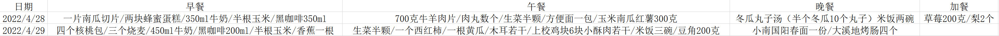

======================================================

ETF拯救世界 (5687069307) @
2022-04-30 15:48:02 Sat  
url: https://weibo.com/5687069307/LqQq4bTJD

在客厅里搭了帐篷，躺在里面看了两小时b站露营视频。

我的长假露营活动圆满结束了。 ​​​

转发[31]  评论[1027]  赞[4655] 

======================================================

ETF拯救世界 (5687069307) @
2022-04-30 23:03:35 Sat  
url: https://weibo.com/5687069307/LqTgRuCOr

巴菲特总是保持手里有大量现金，有些网友却因为反弹了两天没有满仓而痛不欲生

------------------------------------------------------
转推：
>  @网易财经 (1974561081)
>  2022-04-30 22:51:06 Sat  
>  url: https:/weibo.com/1974561081/LqTbN4phw/

>  #巴菲特股东大会#【巴菲特：4月没有回购股票】沃伦·巴菲特：我们在4月份的时候没有回购股票。虽然一季度伯克希尔动用约400亿美元用于投资，但巴菲特表示，我们手头总会保持有大量现金。http://t.cn/A6XwxyDZ ​​​

转发[123]  评论[394]  赞[2770] 

======================================================

