ETF拯救世界 (5687069307) @
2022-01-01 14:35:10 Sat  
url: https://weibo.com/5687069307/L8K5oEfsJ

恭喜@夏司腻 等10名用户获得【京东购物卡-200元】。微博官方唯一抽奖工具@微博抽奖平台 对本次抽奖进行监督，结果公正有效。公示链接：http://t.cn/A6J7OD2l

------------------------------------------------------
转推：
>  @ETF拯救世界 (5687069307)
>  2021-12-31 15:01:00 Fri  
>  url: https:/weibo.com/5687069307/L8APodgGk/

>  随着2021年最后一笔全员提款，大家一起心情舒畅的结束了一年的交易。
>  
>  2021，也要过去了呀。
>  
>  这一年来，如果在各方面对您有些帮助，我很高兴。如果没有，那就是我各方面能力不足，非常遗憾。但无论如何，请相信我是在用心做事。
>  
>  这一年来，感谢各位的关注和支持。尤其是从各方面用意念以外的各种方式 ​​​

转发[10]  评论[187]  赞[775] 

======================================================

ETF拯救世界 (5687069307) @
2022-01-01 14:38:58 Sat  
url: https://weibo.com/5687069307/L8K6WmxTR

又是一次出其不意的抽奖。

请以下十位朋友私信我，每位可以领取京东购物卡200元。

没被抽中的朋友不要着急，春节还有3-4波力度很大的抽奖。

具体是什么奖品还不能说，只能说相当庸俗。 ​​​

转发[38]  评论[3218]  赞[5088] 

+++++++++++++++++++++++++++++++++++++++++++++++++++++

图片：

======================================================

ETF拯救世界 (5687069307) @
2022-01-03 13:37:38 Mon  
url: https://weibo.com/5687069307/L92z2prkr

在连续三年年初蒙对当年行情（19年各指数大涨；20年巨幅波动；21年热门板块跌30%-50%，中小股票表现出色）后，

照例又要预测一下今年的大致行情。

当然，事不过三，今年蒙对的难度系数增加了好多，权当一笑吧。

今年的行情会非常复杂，但一句话总结，到年底，大多数指数应该是收阴。

展开说说。

 ​​​

转发[2071]  评论[2099]  赞[7812] 

======================================================

ETF拯救世界 (5687069307) @
2022-01-03 14:25:19 Mon  
url: https://weibo.com/5687069307/L92SotqEz

不知道干什么的时候就一边看《孤独的美食家》一边锻炼身体。 ​​​

转发[44]  评论[564]  赞[2438] 

======================================================

ETF拯救世界 (5687069307) @
2022-01-04 09:48:59 Tue  
url: https://weibo.com/5687069307/L9auJaDz1

再回头看几个月前说的，是不是有了新的感悟。

------------------------------------------------------
转推：
>  @ETF拯救世界 (5687069307)
>  2021-06-03 14:11:04 Thu  
>  url: https:/weibo.com/5687069307/KisMFsMsX/

>  曾经让你浮亏最多的不死品种，最终让你赚了big money。
>  
>  如果还未发生，有一天终会发生。 ​​​

转发[54]  评论[501]  赞[2482] 

======================================================

ETF拯救世界 (5687069307) @
2022-01-04 09:50:55 Tue  
url: https://weibo.com/5687069307/L9avvFmJM

三个月前，有些人在评论里埋怨小美第一重仓，浮亏了。

我忍着没理你。

现在小美出息了，我回去把你找出来拉黑你。

赚钱了就赶紧走吧，我这里不适合你。 ​​​

转发[40]  评论[1461]  赞[4301] 

+++++++++++++++++++++++++++++++++++++++++++++++++++++

图片：

======================================================

ETF拯救世界 (5687069307) @
2022-01-04 10:22:02 Tue  
url: https://weibo.com/5687069307/L9aI92CGW

我对投资的理解，新朋友可以看一下。我用一个例子来解释。

就是种地。当然我没种过地，但大致应该形容的不错。

首先你的买入，相当于春天播种。

你能不能想象今天种下去明天就有收成？客观来看不行对吧。当然，有一种情况可以，我最后说。

种完了，你时不时浇点水，除除草，施施肥，然后等着。

等 ​​​

转发[409]  评论[1040]  赞[3772] 

======================================================

ETF拯救世界 (5687069307) @
2022-01-04 10:33:25 Tue  
url: https://weibo.com/5687069307/L9aMLntKj

医疗崩，医药不崩，

我很惆怅。 ​​​

转发[107]  评论[656]  赞[3113] 

======================================================

ETF拯救世界 (5687069307) @
2022-01-04 10:50:21 Tue  
url: https://weibo.com/5687069307/L9aTDrdtq

爱它信任它，它就会回报你。

------------------------------------------------------
转推：
>  @ETF拯救世界 (5687069307)
>  2021-12-31 10:11:46 Fri  
>  url: https:/weibo.com/5687069307/L8yVZlRtd/

>  持仓里面，目前最爱的依然是红利。
>  
>  今年涨了18%不说，还是那么便宜。在我的卖出序列中，它依然和转债基金排在最后面。 ​​​

转发[31]  评论[376]  赞[2041] 

======================================================

ETF拯救世界 (5687069307) @
2022-01-04 11:01:14 Tue  
url: https://weibo.com/5687069307/L9aY3kjqU

回复@诅影:医疗就是治疗器械医疗、服务等，比如呼吸机口罩专科医院之类。医药是药（中西药）+医疗。//@诅影:虽然能看懂医疗和医药的字面意思区别，但并不懂市场上哪些是医疗哪些是医药，不过并不惆怅，知道跟车就对了。

------------------------------------------------------
转推：
>  @ETF拯救世界 (5687069307)
>  2022-01-04 10:33:25 Tue  
>  url: https:/weibo.com/5687069307/L9aMLntKj/

>  医疗崩，医药不崩，
>  
>  我很惆怅。 ​​​

转发[67]  评论[217]  赞[1769] 

======================================================

ETF拯救世界 (5687069307) @
2022-01-04 11:02:28 Tue  
url: https://weibo.com/5687069307/L9aYypcDx

到现在，很多朋友才明白为什么小美的提款区间是7%而不是5%。 ​​​

转发[44]  评论[1013]  赞[4182] 

======================================================

ETF拯救世界 (5687069307) @
2022-01-04 13:50:27 Tue  
url: https://weibo.com/5687069307/L9c4JFqFV

又一位老朋友跳车告别了。

缘尽了。 ​​​

转发[30]  评论[1396]  赞[5653] 

+++++++++++++++++++++++++++++++++++++++++++++++++++++

图片：
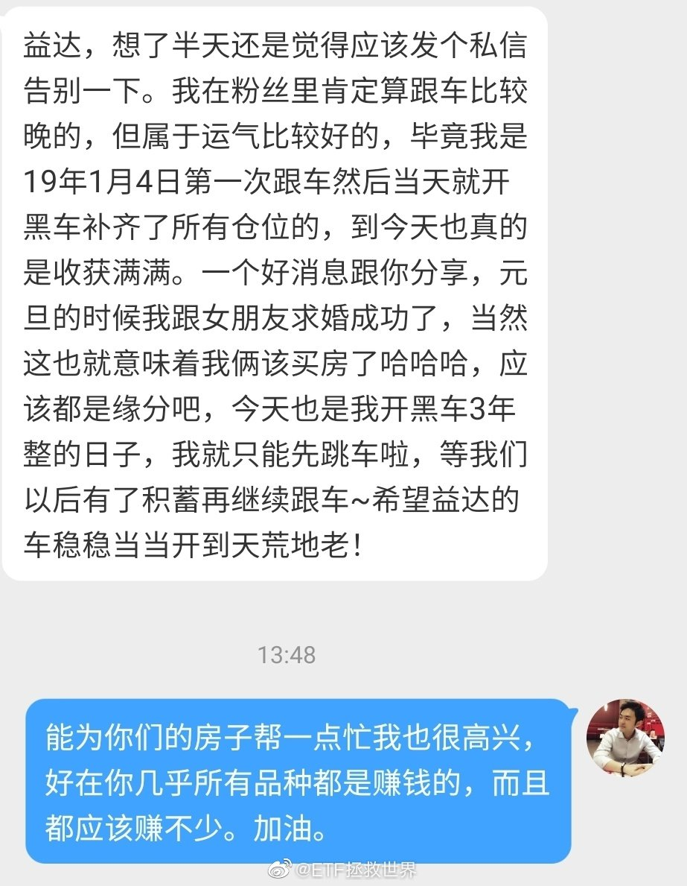

======================================================

ETF拯救世界 (5687069307) @
2022-01-04 14:35:06 Tue  
url: https://weibo.com/5687069307/L9cmRpO6Y

如果，我是说如果啊。

如果有个非常nice的朋友（或者博主）要送你香水，

你想要迪奥，古驰还是香奈儿。

评论选择之后留性别。 ​​​

转发[89]  评论[7121]  赞[5984] 

======================================================

ETF拯救世界 (5687069307) @
2022-01-04 17:16:29 Tue  
url: https://weibo.com/5687069307/L9dqn1BmF

回复@洗头狂魔:神奇的人。别人要送朋友东西，你凑过来说太土了，别的牌子不好吗？我去，真的长见识了。你这种人人缘肯定特别好。//@洗头狂魔:回复@ETF拯救世界:好心给建议还经不起正经评价了。那你送吧，看看人家会不会喜欢。心心眼土鳖

------------------------------------------------------
转推：
>  @ETF拯救世界 (5687069307)
>  2022-01-04 14:35:06 Tue  
>  url: https:/weibo.com/5687069307/L9cmRpO6Y/

>  如果，我是说如果啊。
>  
>  如果有个非常nice的朋友（或者博主）要送你香水，
>  
>  你想要迪奥，古驰还是香奈儿。
>  
>  评论选择之后留性别。 ​​​

转发[20]  评论[1073]  赞[3240] 

======================================================

ETF拯救世界 (5687069307) @
2022-01-04 22:08:07 Tue  
url: https://weibo.com/5687069307/L9fkK7vXb

打开私信，每十条有三条是关于分手和被分手的。

看来新的一年开始，让很多人想要开始新的生活啊。

走不出来的朋友，怎么说呢，交给时间吧。时间会冲淡一切。再找一个更好的，忘了ta。

不爱了，勉强在一起双方都会痛苦。长痛不如短痛，就这样吧。下一个更好。 ​​​

转发[32]  评论[907]  赞[2873] 

+++++++++++++++++++++++++++++++++++++++++++++++++++++

图片：
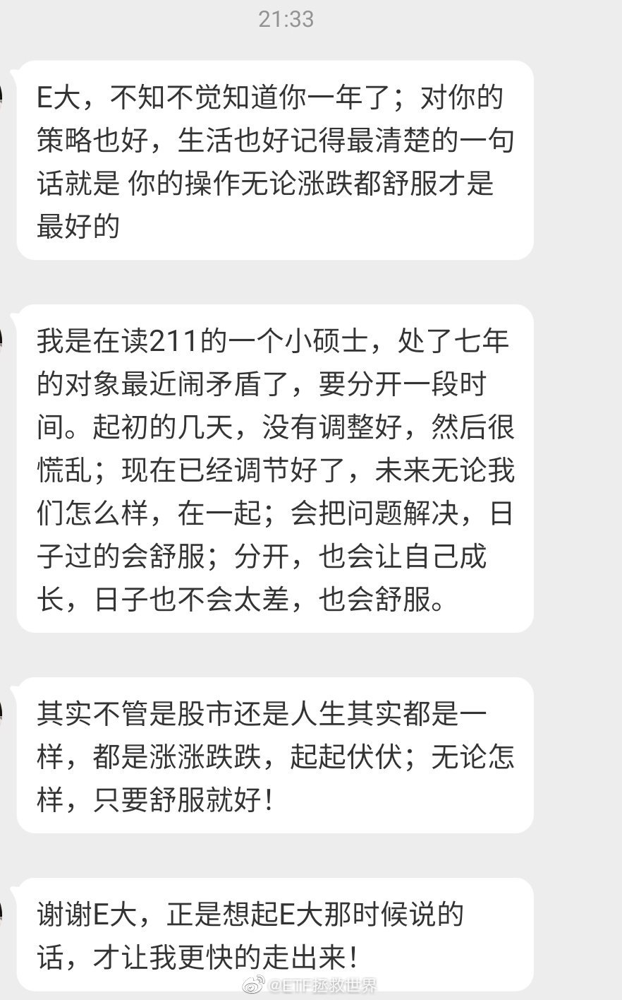

======================================================

ETF拯救世界 (5687069307) @
2022-01-05 10:42:09 Wed  
url: https://weibo.com/5687069307/L9kgO23Oy

666一点也不6，

我哭得很大声。 ​​​

转发[32]  评论[1742]  赞[3375] 

======================================================

ETF拯救世界 (5687069307) @
2022-01-05 11:09:51 Wed  
url: https://weibo.com/5687069307/L9ks33Mkk

今年一定要小心谨慎。大多数人会被今年的行情整蒙圈。“5、22年会非常非常难做。因为年中的波动会非常怪异，远超绝大多数人的想象。如果21年没赚钱，22年赚钱的可能性就更低了。尤其要警惕21年赚大钱的板块、策略、组合以及基金经理。”

------------------------------------------------------
转推：
>  @ETF拯救世界 (5687069307)
>  2022-01-03 13:37:38 Mon  
>  url: https:/weibo.com/5687069307/L92z2prkr/

>  在连续三年年初蒙对当年行情（19年各指数大涨；20年巨幅波动；21年热门板块跌30%-50%，中小股票表现出色）后，
>  
>  照例又要预测一下今年的大致行情。
>  
>  当然，事不过三，今年蒙对的难度系数增加了好多，权当一笑吧。
>  
>  今年的行情会非常复杂，但一句话总结，到年底，大多数指数应该是收阴。
>  
>  展开说说。
>  
>   ​​​

转发[221]  评论[686]  赞[3223] 

======================================================

ETF拯救世界 (5687069307) @
2022-01-05 11:23:17 Wed  
url: https://weibo.com/5687069307/L9kxv8xkG

机构：遇事不决就抱团。 ​​​

转发[28]  评论[720]  赞[2882] 

======================================================

ETF拯救世界 (5687069307) @
2022-01-05 14:22:57 Wed  
url: https://weibo.com/5687069307/L9lIqqJ9d

买，当然是买。但还是说了多少次的，时间、空间控制好。

不用急，没什么“不可以错过的机会”。

没有。

资本市场的机会没完没了层出不穷，有命活到抓住几个就可以了。

胸口上写个“勇”字冲下去乱打，死的最快。 ​​​

转发[205]  评论[986]  赞[3601] 

======================================================

ETF拯救世界 (5687069307) @
2022-01-05 14:38:49 Wed  
url: https://weibo.com/5687069307/L9lORC7nT

A股目前整体策略：断舍离。进一出一，如无必要，勿增实体。

港股目前整体策略：佛系捡辣鸡。你的辣鸡，我来守护。 ​​​

转发[186]  评论[773]  赞[3689] 

======================================================

ETF拯救世界 (5687069307) @
2022-01-05 15:01:07 Wed  
url: https://weibo.com/5687069307/L9lXV5ySl

我本人的中概+恒科在权益类品种仓位比重已经达到15%，超过红利，直追500。

没别的意思，就是说一下。 ​​​

转发[157]  评论[1539]  赞[4583] 

======================================================

ETF拯救世界 (5687069307) @
2022-01-05 15:41:13 Wed  
url: https://weibo.com/5687069307/L9mecbQ5B

学生去找老师问问题，老师说：“别烦我，自己去想。”

不上课外班，不请家教行吗？

呵呵。 ​​​

转发[30]  评论[853]  赞[3771] 

======================================================

ETF拯救世界 (5687069307) @
2022-01-05 17:55:45 Wed  
url: https://weibo.com/5687069307/L9n6O1dL3

中概牛逼在哪里你知道吗？

牛逼在白天你工作的时候跌5个半小时，晚上你睡觉的时候还要跌6个半小时。

每天跌12个小时，怕了没？ ​​​

转发[200]  评论[2095]  赞[7610] 

======================================================

ETF拯救世界 (5687069307) @
2022-01-05 21:21:19 Wed  
url: https://weibo.com/5687069307/L9osf6p3E

有暖气很干燥别忘了敷一片补水面膜。 ​​​

转发[21]  评论[997]  赞[2916] 

======================================================

ETF拯救世界 (5687069307) @
2022-01-06 11:28:04 Thu  
url: https://weibo.com/5687069307/L9tZWfnq3

来晚了。发生肾么事了。 ​​​

转发[33]  评论[809]  赞[3582] 

======================================================

ETF拯救世界 (5687069307) @
2022-01-06 11:46:59 Thu  
url: https://weibo.com/5687069307/L9u7CiIHt

头像旁边这一圈浓郁乡村风格的东西怎么去掉。

跟我高冷又有腔调的气质不搭。 ​​​

转发[17]  评论[944]  赞[2573] 

======================================================

ETF拯救世界 (5687069307) @
2022-01-06 11:54:57 Thu  
url: https://weibo.com/5687069307/L9uaQAZ4F

目前支撑位依然不变。如果你已经提前很久很久做好了准备，那么它真的跌到那里的时候你怎么会慌呢。//@ETF拯救世界:第一支撑调整到22000左右，第二依然是18500。在这两个支撑附近都会买。

------------------------------------------------------
转推：
>  @ETF拯救世界 (5687069307)
>  2021-11-29 12:08:52 Mon  
>  url: https:/weibo.com/5687069307/L3I1DabhM/

>  恒生接下来的支撑位在21500左右。这是倒数第二个支撑。
>  
>  最后一根支撑在18500左右。如果我是那种轻仓但是想买一部分恒生的，我可能会认为这个位置是极佳的买入位。 ​​​

转发[133]  评论[391]  赞[1973] 

======================================================

ETF拯救世界 (5687069307) @
2022-01-06 11:59:45 Thu  
url: https://weibo.com/5687069307/L9ucNrkfO

恒生的长线仓位交易历史。

不客气的说，我比99.9%的人更懂这个指数。 ​​​

转发[327]  评论[1153]  赞[6163] 

+++++++++++++++++++++++++++++++++++++++++++++++++++++

图片：

======================================================

ETF拯救世界 (5687069307) @
2022-01-06 12:37:00 Thu  
url: https://weibo.com/5687069307/L9urV4nRr

刚看到有投资者举报某私募管理人，净值跌幅过大，要求保本赎回。

有一点感慨。

无论是公募还是私募，绝大多数基金管理人其实是希望规模越大越好。规模越大，管理费越多。当然，无论是人还是商业机构，希望利益更大是无可厚非的。

但是，在资产管理行业，这里面有些东西跟一般的商业还是有很大不同。 ​​​

转发[217]  评论[659]  赞[3422] 

======================================================

ETF拯救世界 (5687069307) @
2022-01-06 12:58:29 Thu  
url: https://weibo.com/5687069307/L9uADwzpq

请教各位米其林三星的大厨：

酱油炒饭用生抽还是老抽。 ​​​

转发[25]  评论[1548]  赞[2645] 

======================================================

ETF拯救世界 (5687069307) @
2022-01-06 13:40:41 Thu  
url: https://weibo.com/5687069307/L9uRLvnAD

我真的搞不懂：

第一，这个价位到底是怎么定的可以这么精准，一次次的在这里止跌；

第二，是谁不停高位接走低位还回来。是因为爱吗。 ​​​

转发[39]  评论[1100]  赞[3510] 

======================================================

ETF拯救世界 (5687069307) @
2022-01-06 15:45:21 Thu  
url: https://weibo.com/5687069307/L9vGn3Fyv

很犹豫。

医疗技术位快到了，价值位依然不可以。

怎么办，反复考虑，我做了一个违背祖训的决定。 ​​​

转发[68]  评论[1001]  赞[3973] 

======================================================

ETF拯救世界 (5687069307) @
2022-01-06 19:01:06 Thu  
url: https://weibo.com/5687069307/L9wXPu4fg

如果一个人，平常没有被别人当成人，

那么他也不会把别人当成人。

所以最大的问题在于，我们都应该把别人当成人。

不仅是自己的家人，朋友，同学，同乡，还有陌生人，无论贫富，无论职业。

有些人的冷漠甚至残暴来源于他的经历。只有感受过爱的人，才会做出温暖的事。 ​​​

转发[143]  评论[766]  赞[4079] 

======================================================

ETF拯救世界 (5687069307) @
2022-01-07 09:19:34 Fri  
url: https://weibo.com/5687069307/L9CAhes98

收入高一点的，在网上晒工资条，有一个算一个，

全是脑子有问题的。 ​​​

转发[44]  评论[861]  赞[3873] 

======================================================

ETF拯救世界 (5687069307) @
2022-01-07 09:29:37 Fri  
url: https://weibo.com/5687069307/L9CEmaXva

急救绷带回血中 ​​​

转发[14]  评论[420]  赞[2175] 

======================================================

ETF拯救世界 (5687069307) @
2022-01-07 09:39:11 Fri  
url: https://weibo.com/5687069307/L9CIfibzX

小美像极了被人嘲笑，却不放弃，无论环境多么恶劣，也要努力往上冲的我们这些普通人。 ​​​

转发[31]  评论[657]  赞[3385] 

======================================================

ETF拯救世界 (5687069307) @
2022-01-07 09:55:27 Fri  
url: https://weibo.com/5687069307/L9COQi4kS

前几天有人在评论说：红利高位没卖。

我心想，燕雀安知鸿鹄之志。 ​​​

转发[44]  评论[593]  赞[3126] 

+++++++++++++++++++++++++++++++++++++++++++++++++++++

图片：

======================================================

ETF拯救世界 (5687069307) @
2022-01-07 10:25:58 Fri  
url: https://weibo.com/5687069307/L9D1eicyN

我刚才看评论，有些特别有问题的倾向，我提醒一下：

我们的持仓涨了，我贴出来点评两句，有两个目的：

第一，与各位一起高兴一下。

第二，帮有些朋友坚定一下持仓信心。

但是！

我绝对没有任何暗示“可以买入”的意思！我觉得什么时候可以买，无论是长线还是波段，我都会把自己的操作清清楚楚明明 ​​​

转发[57]  评论[870]  赞[3390] 

======================================================

ETF拯救世界 (5687069307) @
2022-01-07 12:53:36 Fri  
url: https://weibo.com/5687069307/L9DZ9r02Q

父母应该加强对孩子这方面的教育。 ​​​

转发[50]  评论[375]  赞[2322] 

+++++++++++++++++++++++++++++++++++++++++++++++++++++

图片：

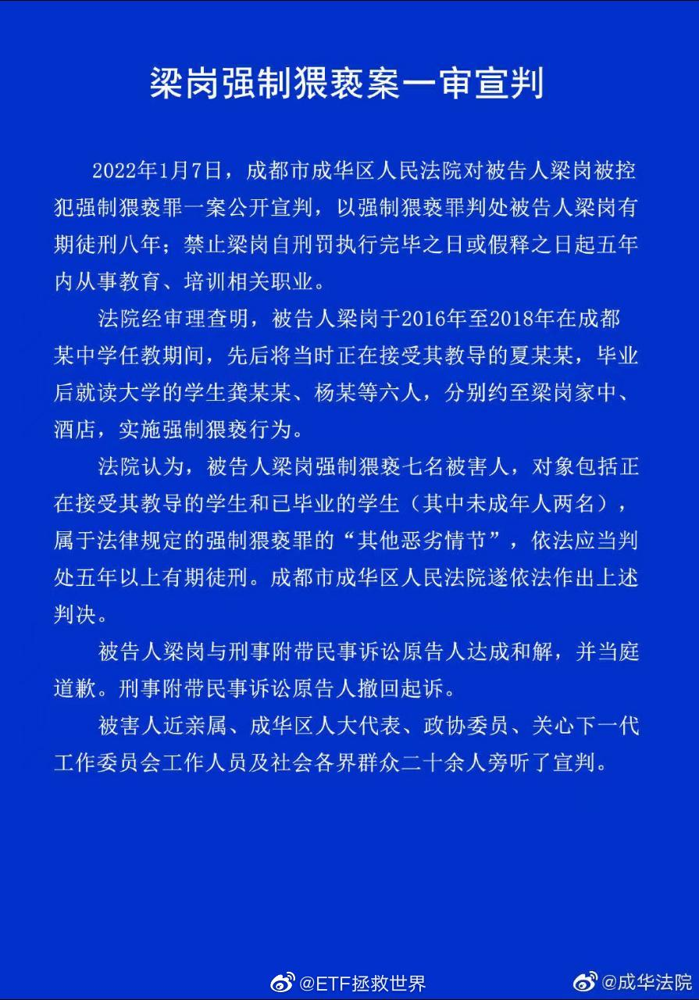

======================================================

ETF拯救世界 (5687069307) @
2022-01-07 12:58:50 Fri  
url: https://weibo.com/5687069307/L9E1hgFsv

女同学们帮忙出出主意，这种情况还能挽回吗，该怎么做。 ​​​

转发[73]  评论[1901]  赞[15275] 

+++++++++++++++++++++++++++++++++++++++++++++++++++++

图片：
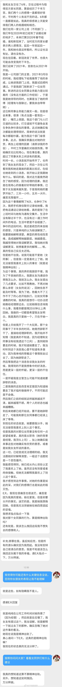

======================================================

ETF拯救世界 (5687069307) @
2022-01-07 13:15:05 Fri  
url: https://weibo.com/5687069307/L9E7SdfMk

刚才看到有朋友对昨天HS差一点点没有买入失望懊悔。

我想说的是，差不多行了您，您这是想天下所有好事都归您一个人是吧。

且不说下周还会不会跌，就算这里有一波反弹，恒科买到了吧，虽然不是最低位，但也比现价低了。YY买到了吧，几乎是最低位，买了就涨。

还想怎么样啊，差不多行了啊。太贪心可是 ​​​

转发[41]  评论[849]  赞[3372] 

======================================================

ETF拯救世界 (5687069307) @
2022-01-07 14:06:11 Fri  
url: https://weibo.com/5687069307/L9EsC9WL8

小美的这根超长上影真的很难看。收盘如果拉不回去，那之前卖掉的波段接回来就不是梦了。 ​​​

转发[47]  评论[604]  赞[2826] 

======================================================

ETF拯救世界 (5687069307) @
2022-01-07 14:48:07 Fri  
url: https://weibo.com/5687069307/L9EJDn4YE

只是一周时间，各位可能已经体会到了今年的难。

大的涨一天，小的涨一天，然后一起跌一天。

板块更是各领风骚一两天，热点疯狂切换。

刚开始就这么刺激，今年一定很好玩。 ​​​

转发[240]  评论[1167]  赞[4422] 

======================================================

ETF拯救世界 (5687069307) @
2022-01-09 18:50:34 Sun  
url: https://weibo.com/5687069307/L9Zb2n6zD

清点了一下家里储存的食物，乐观估计正常够吃1-1.5个月。极限情况2个月也应该可以。

营养全面就不用考虑了。什么事情都做最坏准备可能是一种深入骨髓的病。 ​​​

转发[155]  评论[997]  赞[4112] 

======================================================

ETF拯救世界 (5687069307) @
2022-01-10 09:44:30 Mon  
url: https://weibo.com/5687069307/La51T51Re

人也好，事也好，你曾经认为ta们都是完美的。你很热爱。

但有一天你发现ta并没有那么完美，于是你很愤怒，很失望，很生气。

恭喜你，你认识到了真实的世界。真实的世界并不是粉色的童话世界，而是充满了各种肮脏和黑暗。

有些人一生停留在第一阶段，恭喜你们，你们的人生很幸福。

有些人的人生停留 ​​​

转发[281]  评论[855]  赞[3950] 

======================================================

ETF拯救世界 (5687069307) @
2022-01-10 10:07:16 Mon  
url: https://weibo.com/5687069307/La5b885c7

早上说泡点豆子做点腊八粥应个景增加一点人生乐趣，

翻了一圈发现家里8种材料有6种之前被断舍离扔掉了。

这就是人生吧。 ​​​

转发[15]  评论[665]  赞[2268] 

======================================================

ETF拯救世界 (5687069307) @
2022-01-10 10:14:16 Mon  
url: https://weibo.com/5687069307/La5dY9kHb

健身房现在还能去吗。

有点犹豫。 ​​​

转发[18]  评论[828]  赞[2105] 

======================================================

ETF拯救世界 (5687069307) @
2022-01-10 10:44:20 Mon  
url: https://weibo.com/5687069307/La5qbdrjY

不知道是不是已经开始了。现在看不清。

------------------------------------------------------
转推：
>  @ETF拯救世界 (5687069307)
>  2021-12-28 11:06:26 Tue  
>  url: https:/weibo.com/5687069307/L870GBsMi/

>  信不信由你
>  
>  某些已经被踩在脚下的品种
>  
>  一两个月内，极大概率会有一次至少中级的爆发
>  
>  但我劝你掌握好节奏，不要梭哈更不要上杠杆
>  
>  命比钱重要 ​​​

转发[54]  评论[758]  赞[2761] 

======================================================

ETF拯救世界 (5687069307) @
2022-01-10 11:00:54 Mon  
url: https://weibo.com/5687069307/La5wUc1LW

班子成员开了个碰头会，定了，印这两个：

“踏踏实实的，多大点事儿。”

“二级市场捡垃圾大赛  第一名”

尽量多做点，争取做到饮者有其杯。 ​​​

转发[90]  评论[4405]  赞[5975] 

======================================================

ETF拯救世界 (5687069307) @
2022-01-10 13:31:27 Mon  
url: https://weibo.com/5687069307/La6w0pwGh

朋友送了我一个华为GT runner。

试用了几天。别的不说，我只有一个疑问：

为什么用起来感觉差别不是特别大的GT和apple watch，续航时间差别这么大？

watch一般就一天，撑死了一天半。为什么GT可以做到每天只掉十个点的电。

为什么，这到底是为什么。按理说苹果的技术不至于做不到华为能做到的事情 ​​​

转发[26]  评论[836]  赞[2902] 

======================================================

ETF拯救世界 (5687069307) @
2022-01-10 14:04:44 Mon  
url: https://weibo.com/5687069307/La6Jw9XG6

预告一下，S的组合展示有一点更新。是这样的。

S跟150不同，不是一个固定金额的组合。之前是卖出后就直接从组合里移除，但这里有个问题：

比如极端情况下，我不看好市场，将S组合卖出了99%，只剩1%。但这个时候，以前的组合还会显示100%仓位，因为卖掉的直接“消失”了。也就是说我卖掉了99%之后，拿 ​​​

转发[50]  评论[822]  赞[3751] 

======================================================

ETF拯救世界 (5687069307) @
2022-01-10 16:56:16 Mon  
url: https://weibo.com/5687069307/La7R90CIi

5、22年会非常非常难做。因为年中的波动会非常怪异，远超绝大多数人的想象。如果21年没赚钱，22年赚钱的可能性就更低了。尤其要警惕21年赚大钱的板块、策略、组合以及基金经理。

------------------------------------------------------
转推：
>  @21世纪经济报道 (1651428902)
>  2022-01-10 16:54:10 Mon  
>  url: https:/weibo.com/1651428902/La7Qi6Zzl/

>  【#去年冠军基金仅4天收益排名变倒数#！“被重锤”的#新能源基金还能买吗#？[衰]】2022年1月7日，新年第四个工作日，去年#基金#收益冠军得主崔宸龙管理的基金——前海开源公用事业（去年冠军基金）大跌11.65%，位列基金收益榜倒数第三名。什么原因导致了去年重仓新能源和顺周期赛道的绩优基金，在今年 ​​​

转发[63]  评论[388]  赞[2064] 

======================================================

ETF拯救世界 (5687069307) @
2022-01-10 17:20:04 Mon  
url: https://weibo.com/5687069307/La80NB2L9

我给个建议：

永远不要去分析去年的冠军基金经理做了什么。类似的分析文章也不要看，毫无意义。

做了什么？很简单，一定是重仓满仓某个风口上的行业，就这么简单。

每个行业都会有很多基金经理重仓满仓，哪个行业跑出来了，哪个类型的基金经理就是冠军。没有什么稀奇的，就是这么简单。

还是之前说 ​​​

转发[360]  评论[735]  赞[4218] 

======================================================

ETF拯救世界 (5687069307) @
2022-01-10 18:00:38 Mon  
url: https://weibo.com/5687069307/La8hgwA42

我从来也没说过主动基金经理不行。

一定有行的。而且不是一个两个三个四个，一定是有一批。说少了几十个人，说多了百来人也能有。

但是，最关键的，是你一定要从几千名公募基金经理，几万名私募基金经理中把他们找出来。

现在公募基金数量已经超过两市的股票数量了。选靠谱的基金经理，难度不亚于选 ​​​

转发[124]  评论[654]  赞[3090] 

======================================================

ETF拯救世界 (5687069307) @
2022-01-10 20:53:44 Mon  
url: https://weibo.com/5687069307/La9px2u64

今天卖出的500C收益率比上次的环保差不少，大家平均收益率50%多不到60%。 ​​​

转发[28]  评论[777]  赞[2901] 

======================================================

ETF拯救世界 (5687069307) @
2022-01-10 21:13:54 Mon  
url: https://weibo.com/5687069307/La9xIB6pC

对于生孩子，我又有一点新的理解。

我认为关键的问题，在于人们会思考，生孩子，或者多生孩子，到底是对自己有利还是有弊。而最关键的问题，是“社会性养老”。

试想，既然养老是社会的责任了，退休金是社会发了，那么，养一个或者几个孩子，会对自己未来的养老有多大帮助呢。

如果没有社会性养老， ​​​

转发[87]  评论[938]  赞[4704] 

======================================================

ETF拯救世界 (5687069307) @
2022-01-11 09:55:34 Tue  
url: https://weibo.com/5687069307/LaewSkqhz

红利真的很垃圾。

估值刚刚超过十倍，可见未来有多么黑暗。不像人家白酒和科创，跌那么多，估值还是50多和70多倍，说明前途一片光明。 ​​​

转发[58]  评论[807]  赞[2988] 

======================================================

ETF拯救世界 (5687069307) @
2022-01-11 10:28:44 Tue  
url: https://weibo.com/5687069307/LaeKl38ay

人都是会变的吗？

所有婚姻都有爱情吗？

有了爱情就会有婚姻吗？

有爱情的婚姻，会变得没有爱情吗？

没有了爱情，婚姻一定要结束吗？

每一个人，每个人在人生不同阶段，都会有不同答案。

这道题太难，我不会做。 ​​​

转发[54]  评论[831]  赞[2748] 

+++++++++++++++++++++++++++++++++++++++++++++++++++++

图片：
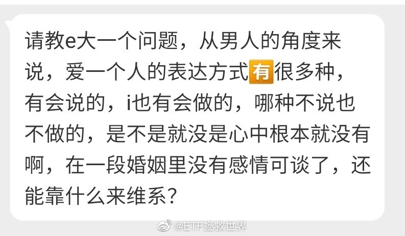

======================================================

ETF拯救世界 (5687069307) @
2022-01-11 11:14:33 Tue  
url: https://weibo.com/5687069307/Laf2W5UW7

从理性的投资者角度来讲，我们不应该希望市场上大多数人变成同样理性的。

因为如果那样，就会有很多人也来捡垃圾，最终垃圾就不会成为垃圾；

也不会有人疯狂的冲100倍以上的品种，那样我们就拿不到136%的收益率。

怎么说呢，大家还是不要到处去科普捡垃圾的好处，要我说，看到非理性行为，只有四个 ​​​

转发[113]  评论[1182]  赞[3954] 

======================================================

ETF拯救世界 (5687069307) @
2022-01-11 13:34:30 Tue  
url: https://weibo.com/5687069307/LafXK7pQJ

投资者成熟三部曲：

第一步：不接盘。

第二步：买辣鸡。

第三步：让别人接盘自己的辣鸡。 ​​​

转发[185]  评论[622]  赞[3454] 

======================================================

ETF拯救世界 (5687069307) @
2022-01-11 13:58:19 Tue  
url: https://weibo.com/5687069307/Lag7pkA7r

很多品种跌了，说来你不信，是我们大家的万幸。

因为每个人都应该有一个贯穿一生的基本仓位配置。其构成还是我之前说的：

大盘、中小盘、价值、医药、消费、科技。

如果真的有幸在底部区域全部配置完成，那么之后就是简单的增增减减，投资这块也不用费太多心了。

所以不跌，你怎么在底部配置完成？ ​​​

转发[627]  评论[1071]  赞[4384] 

======================================================

ETF拯救世界 (5687069307) @
2022-01-11 14:32:21 Tue  
url: https://weibo.com/5687069307/LagldDuao

技术性调仓。[微笑] ​​​

转发[16]  评论[658]  赞[2776] 

======================================================

ETF拯救世界 (5687069307) @
2022-01-11 16:06:39 Tue  
url: https://weibo.com/5687069307/LagXv4otR

爱自己。

帮助自己保持健康。

逗自己开心。

最重要了。 ​​​

转发[187]  评论[892]  赞[4720] 

======================================================

ETF拯救世界 (5687069307) @
2022-01-12 05:25:39 Wed  
url: https://weibo.com/5687069307/LambOrhtH

我说今天有机会出一份恒科会不会太夸张。 ​​​

转发[37]  评论[1737]  赞[3508] 

======================================================

ETF拯救世界 (5687069307) @
2022-01-12 09:06:40 Wed  
url: https://weibo.com/5687069307/LanDx2pC0

今天场内恒科开盘涨幅在3-4%之间比较合理，如果不折价 ​​​

转发[33]  评论[907]  赞[2983] 

======================================================

ETF拯救世界 (5687069307) @
2022-01-12 09:39:49 Wed  
url: https://weibo.com/5687069307/LanQYA3hi

差一分没考上重点学校的感觉。 ​​​

转发[19]  评论[747]  赞[2527] 

======================================================

ETF拯救世界 (5687069307) @
2022-01-12 09:41:46 Wed  
url: https://weibo.com/5687069307/LanRM1zhi

给做市商打call。 ​​​

转发[20]  评论[866]  赞[2860] 

======================================================

ETF拯救世界 (5687069307) @
2022-01-12 10:07:47 Wed  
url: https://weibo.com/5687069307/Lao2kweop

这次恒科留了将近2.5倍利润转为长期持有。

接下来就回到中概继续表演了。 ​​​

转发[65]  评论[962]  赞[3758] 

======================================================

ETF拯救世界 (5687069307) @
2022-01-12 10:18:54 Wed  
url: https://weibo.com/5687069307/Lao6QiREI

“3、中概等惨烈的品种要么会赚钱，要么就是会提供赚大钱的买入机会。”2022年的第一次提款，意料之中。

------------------------------------------------------
转推：
>  @ETF拯救世界 (5687069307)
>  2022-01-03 13:37:38 Mon  
>  url: https:/weibo.com/5687069307/L92z2prkr/

>  在连续三年年初蒙对当年行情（19年各指数大涨；20年巨幅波动；21年热门板块跌30%-50%，中小股票表现出色）后，
>  
>  照例又要预测一下今年的大致行情。
>  
>  当然，事不过三，今年蒙对的难度系数增加了好多，权当一笑吧。
>  
>  今年的行情会非常复杂，但一句话总结，到年底，大多数指数应该是收阴。
>  
>  展开说说。
>  
>   ​​​

转发[96]  评论[1053]  赞[3352] 

======================================================

ETF拯救世界 (5687069307) @
2022-01-12 14:03:36 Wed  
url: https://weibo.com/5687069307/LapA39Vzf

HS中网，让人不禁感叹，不完美才是人生常态。 ​​​

转发[39]  评论[1119]  赞[3511] 

======================================================

ETF拯救世界 (5687069307) @
2022-01-12 18:55:34 Wed  
url: https://weibo.com/5687069307/Laruz8RGT

北京人均GDP2.8万美元。

这个数字大致低于意大利，高于西班牙。

与台湾省差不多。 ​​​

转发[60]  评论[557]  赞[3619] 

======================================================

ETF拯救世界 (5687069307) @
2022-01-13 09:47:48 Thu  
url: https://weibo.com/5687069307/LaxkIncze

如果没有波段仓位，你左右为难：反弹了，卖不卖啊，不卖跌回去怎么办啊，卖了继续涨怎么办啊。卖一点？卖多少啊。

有了波段仓位的你：随便，尊重，都开心。 ​​​

转发[83]  评论[1240]  赞[4128] 

======================================================

ETF拯救世界 (5687069307) @
2022-01-13 18:37:28 Thu  
url: https://weibo.com/5687069307/LaANI6x9Y

今天在外面鬼混了一天，没空发什么微博，勿cue。 ​​​

转发[17]  评论[923]  赞[3475] 

======================================================

ETF拯救世界 (5687069307) @
2022-01-14 09:39:33 Fri  
url: https://weibo.com/5687069307/LaGHRuhgE

行情上蹿下跳，你猜猜是什么人被反复收割。对了，就是那些看到行情管不住手的，不停交易的人。今天涨，明天跌，只要你动手，就给你砍下来。我能给的建议，是机械执行既定的交易计划，将自己打造成没有感情的野生AI交易机器人。不要动感情，不要动感情，不要动感情。

------------------------------------------------------
转推：
>  @ETF拯救世界 (5687069307)
>  2022-01-07 14:48:07 Fri  
>  url: https:/weibo.com/5687069307/L9EJDn4YE/

>  只是一周时间，各位可能已经体会到了今年的难。
>  
>  大的涨一天，小的涨一天，然后一起跌一天。
>  
>  板块更是各领风骚一两天，热点疯狂切换。
>  
>  刚开始就这么刺激，今年一定很好玩。 ​​​

转发[159]  评论[873]  赞[3047] 

======================================================

ETF拯救世界 (5687069307) @
2022-01-14 09:49:34 Fri  
url: https://weibo.com/5687069307/LaGLW83DP

我真的很讨厌那种只有不断增发、配股，才能把业务发展起来，甚至才能维持下去的公司。 ​​​

转发[50]  评论[568]  赞[2836] 

======================================================

ETF拯救世界 (5687069307) @
2022-01-14 10:01:29 Fri  
url: https://weibo.com/5687069307/LaGQLvdST

对我来说，打新股就像与人交往。

在没有破发新股之前，相当于这个人从没骗过我，那我就完全信任他与他做朋友。

但只要有一只新股破发了，就是被骗了一次。只要有一次，我就不再信任他。也许还会来往，但不会把他当做朋友。

也就是说，不会再打了。

因为这本来是个稳赚不赔的，现在变成有赚有赔，那 ​​​

转发[81]  评论[719]  赞[3135] 

======================================================

ETF拯救世界 (5687069307) @
2022-01-14 12:19:11 Fri  
url: https://weibo.com/5687069307/LaHKF14GE

真的很烦。找遍中文互联网，竟无一处被二极管、喷子和低智人士放过的净土。

上网没有乐趣了，真的。

不想与这些人有任何交集。诺大的互联网，无处可去！

（PS，不是说我这里，我这里没有这些。） ​​​

转发[42]  评论[1165]  赞[4360] 

======================================================

ETF拯救世界 (5687069307) @
2022-01-14 20:00:08 Fri  
url: https://weibo.com/5687069307/LaKLLcdkG

荣格说，越强调理性的人，内心越是充满感性。

所以，我这样一米八几，一拳能打死一头牛的猛男，用这样的充电宝也是很合理的。 ​​​

转发[30]  评论[1389]  赞[4660] 

+++++++++++++++++++++++++++++++++++++++++++++++++++++

图片：

======================================================

ETF拯救世界 (5687069307) @
2022-01-16 10:00:38 Sun  
url: https://weibo.com/5687069307/LaZHpAGzI

真的一两句说不清 ​​​

转发[30]  评论[838]  赞[5022] 

+++++++++++++++++++++++++++++++++++++++++++++++++++++

图片：
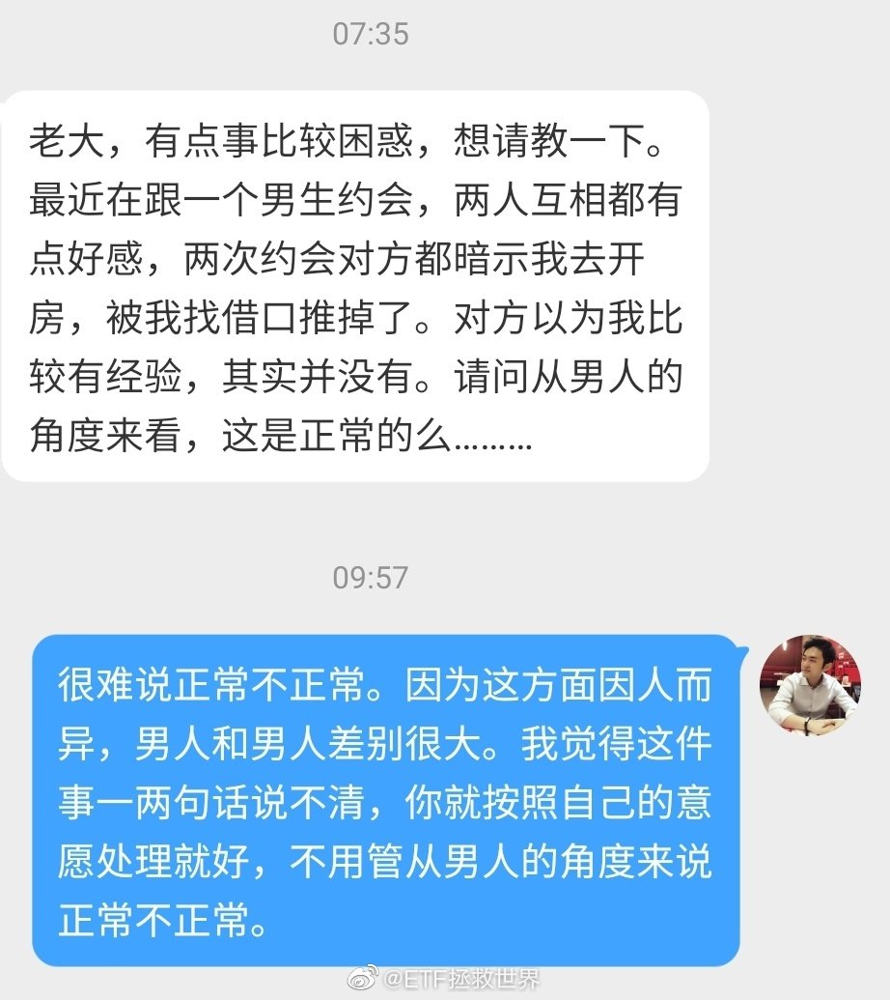

======================================================

ETF拯救世界 (5687069307) @
2022-01-16 21:46:00 Sun  
url: https://weibo.com/5687069307/Lb4jIFbcE

上什么学，做什么工作，与什么人结婚，大致能决定我们这辈子会不会幸福。

朋友们，好好选择人生关键的岔路口该向哪边走。一定一定认真选择。

看私信再次有感。 ​​​

转发[405]  评论[1024]  赞[6221] 

======================================================

ETF拯救世界 (5687069307) @
2022-01-17 10:51:08 Mon  
url: https://weibo.com/5687069307/Lb9spnwR9

很无聊的一天。

没有风。没有雨。没有钱。没有你。 ​​​

转发[44]  评论[1364]  赞[3535] 

======================================================

ETF拯救世界 (5687069307) @
2022-01-17 11:44:27 Mon  
url: https://weibo.com/5687069307/Lb9O3fzCh

我给各位一个真诚的建议：

不要为了国家大事，世界大事焦虑。

真的，80%的事情都会解决，都是毫无意义的焦虑。

20%的事情真的解决不了，但你焦虑也没用。不如多关注自己的事情，把自己的日子过好，为这些解决不了的问题多做准备。

就是什么呢，就是你想吧，最坏能怎么样，最坏就是去天堂了对吧。去 ​​​

转发[377]  评论[1432]  赞[5711] 

======================================================

ETF拯救世界 (5687069307) @
2022-01-18 16:15:37 Tue  
url: https://weibo.com/5687069307/Lbl0C8TbO

小助理不停的搬运总算有点成绩了… ​​​

转发[34]  评论[639]  赞[2960] 

+++++++++++++++++++++++++++++++++++++++++++++++++++++

图片：
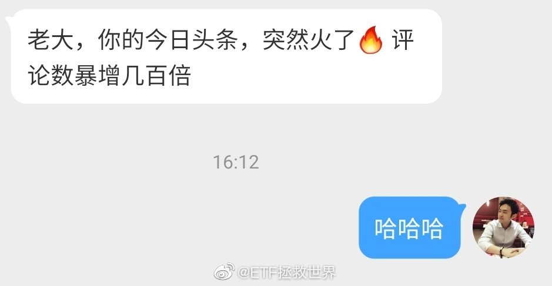
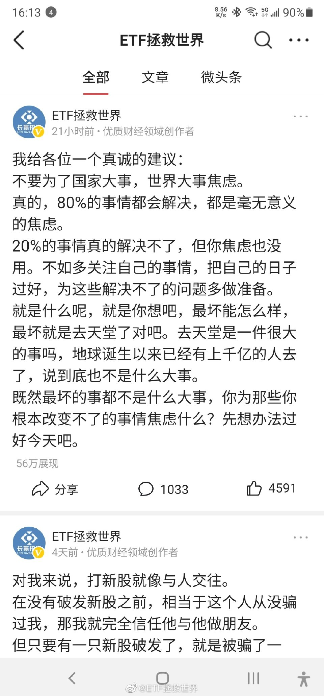

======================================================

ETF拯救世界 (5687069307) @
2022-01-18 17:35:34 Tue  
url: https://weibo.com/5687069307/Lblx4dBlP

咬了一口糖葫芦算不算破戒了。

我觉得不算。 ​​​

转发[22]  评论[1084]  赞[3720] 

======================================================

ETF拯救世界 (5687069307) @
2022-01-18 21:17:29 Tue  
url: https://weibo.com/5687069307/LbmZ8DeHO

带锅的这个女的看着真够瘆人的。 ​​​

转发[22]  评论[669]  赞[2401] 

======================================================

ETF拯救世界 (5687069307) @
2022-01-19 09:42:28 Wed  
url: https://weibo.com/5687069307/LbrRx6GRG

你可能没注意过一件事，

几乎没有任何不是太小的投顾组合，会像150和S这样，第一时间公开操作品种。一般的组合，你不在特定平台跟投，是绝对看不到操作的。甚至有些跟投了也看不到。

150和S这样第一时间向所有人公开，当然在商业方面会有损失。毕竟公开后你在哪里买都可以。但我依然坚持这么做，因为 ​​​

转发[142]  评论[2747]  赞[8551] 

======================================================

ETF拯救世界 (5687069307) @
2022-01-19 10:23:03 Wed  
url: https://weibo.com/5687069307/Lbs80jOOd

只要红、丐、美涨，

药、消跌，

我就会很满意。 ​​​

转发[58]  评论[1005]  赞[3902] 

======================================================

ETF拯救世界 (5687069307) @
2022-01-19 11:07:02 Wed  
url: https://weibo.com/5687069307/LbspRdy6j

环保这个顶真的仁至义尽。

盘整、破位、反抽，给足了机会卖——不止一次机会。

少卖了一份是自己的责任，没有任何狡辩的借口。

还需要继续努力钻研业务。 ​​​

转发[147]  评论[529]  赞[3097] 

======================================================

ETF拯救世界 (5687069307) @
2022-01-19 11:59:22 Wed  
url: https://weibo.com/5687069307/LbsL69Dgt

想来想去，还是要去健身房，应该没事。

希望有两个，第一没有病毒，第二别掉头发。

肌肉什么的随缘。 ​​​

转发[28]  评论[659]  赞[3179] 

======================================================

ETF拯救世界 (5687069307) @
2022-01-19 15:33:49 Wed  
url: https://weibo.com/5687069307/Lbua9luty

每天15:30开始计算数据的时间，排在一天中最舒服的时间段第三位。 ​​​

转发[22]  评论[424]  赞[2416] 

======================================================

ETF拯救世界 (5687069307) @
2022-01-19 16:47:40 Wed  
url: https://weibo.com/5687069307/LbuE7mwoz

2008年，可乐180亿港元大幅溢价收购汇源，被反垄断叫停。

2020年，汇源退市。

2021年，汇源被申请破产清算。 ​​​

转发[6]  评论[506]  赞[3380] 

======================================================

ETF拯救世界 (5687069307) @
2022-01-19 19:30:51 Wed  
url: https://weibo.com/5687069307/LbvIm9KEb

据研究，地球内部的冷却速度比预期要快，可能地球内部温度将以更快的速度下降到和火星内部相同的温度。你担心地球火星化吗？ http://t.cn/A6JW8PsJ ​​​

转发[59]  评论[103]  赞[22239] 

======================================================

ETF拯救世界 (5687069307) @
2022-01-19 22:30:28 Wed  
url: https://weibo.com/5687069307/LbwTglvix

我这思路对吗 ​​​

转发[21]  评论[491]  赞[1994] 

+++++++++++++++++++++++++++++++++++++++++++++++++++++

图片：
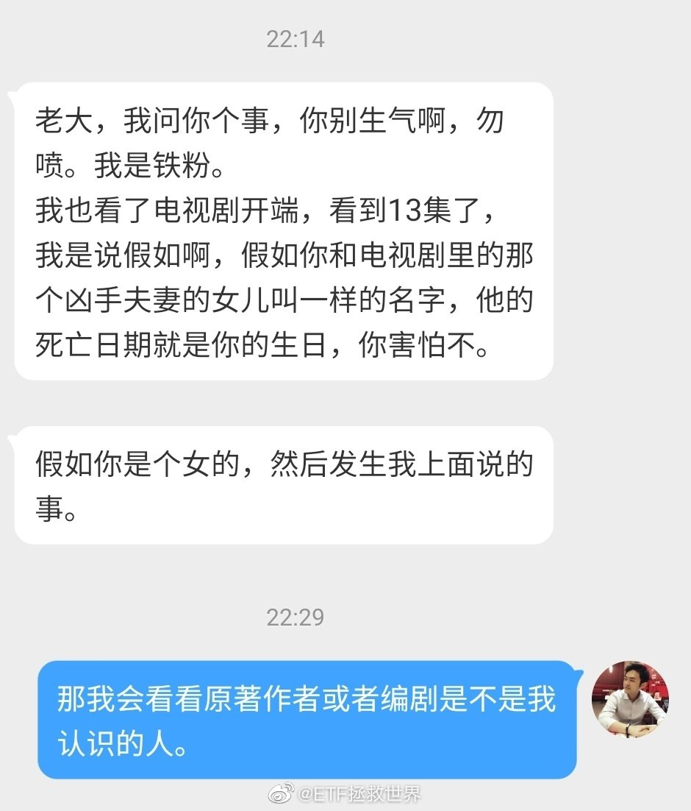

======================================================

ETF拯救世界 (5687069307) @
2022-01-20 07:52:44 Thu  
url: https://weibo.com/5687069307/LbAzuhsrf

有朋友问我关于北京最近确诊的，这位体力工作者的流调信息怎么看。

我也知道说些什么可能会让大家更认同，但我想说其实我的关注点跟大家不一样。

他的工作能看出来真的非常辛苦，但对于晚上工作这一点，我想说其实很正常。我看信息里面有在簋街工作到凌晨的，那在簋街工作，不就得凌晨吗。包括饭馆老 ​​​

转发[48]  评论[524]  赞[3170] 

======================================================

ETF拯救世界 (5687069307) @
2022-01-20 09:24:19 Thu  
url: https://weibo.com/5687069307/LbBaF4vBI

希望他早日找回孩子。

------------------------------------------------------
转推：
>  @新浪财经 (1638782947)
>  2022-01-20 08:56:23 Thu  
>  url: https:/weibo.com/1638782947/LbAZk5YlA/

>  【#对话流调中最辛苦的人#：来北京找儿子，凌晨打零工补贴家用】该无症状感染者岳某，1978年生，他本在山东威海捕鱼船做船员，2020年8月12日，他的大儿子走失，因儿子曾在北京做过帮厨，他就来到北京寻找。在此之前，为了找儿子，他已经去过山东、河南、河北、天津等多地。每到一地，在寻找儿子的同时 ​​​

转发[88]  评论[315]  赞[1612] 

======================================================

ETF拯救世界 (5687069307) @
2022-01-20 09:49:22 Thu  
url: https://weibo.com/5687069307/LbBkPoLv3

最近欧洲的银行股表现不错，不知道A股金融会不会联动，会不会带红利再来一波。 ​​​

转发[23]  评论[345]  赞[2002] 

======================================================

ETF拯救世界 (5687069307) @
2022-01-20 09:57:12 Thu  
url: https://weibo.com/5687069307/LbBo0pVkH

两年疫情，从美国到欧洲，从中国到日韩，大家看到的新闻是大富豪们更有钱了，看不到的新闻是其实大多数持有房产和股票的人，资产也整体上增加不少。

但不持有资产的人，纯打工的或者自己做生意的，很多都过得很艰难。

我不知道未来世界会不会发生根本的变化，会不会全球性的以资产为视角做出改变。如 ​​​

转发[360]  评论[645]  赞[4364] 

======================================================

ETF拯救世界 (5687069307) @
2022-01-20 10:46:23 Thu  
url: https://weibo.com/5687069307/LbBHYifZK

500不是乱卖的 ​​​

转发[19]  评论[409]  赞[2170] 

======================================================

ETF拯救世界 (5687069307) @
2022-01-20 10:57:34 Thu  
url: https://weibo.com/5687069307/LbBMvADS2

人均75000。三口之家总收入22.5万。夫妻两平均年收入11万。北京的各位朋友，不吹不黑，达标了吗

------------------------------------------------------
转推：
>  @中国新闻网 (1784473157)
>  2022-01-19 23:00:21 Wed  
>  url: https:/weibo.com/1784473157/Lbx5oiIFe/

>  【#2021年居民收入榜#出炉 #上海北京人均可支配收入超7万元#】2021年居民收入榜出炉。国家统计局更新公布了31省份2021年居民人均可支配收入数据，其中，上海第一，达到78027元；北京第二，达到75002元；浙江第三，达到57541元。上海和北京居民人均可支配收入超过7万元，遥遥领先其他省区市。你的一年收 ​​​

转发[104]  评论[619]  赞[2068] 

======================================================

ETF拯救世界 (5687069307) @
2022-01-20 11:02:26 Thu  
url: https://weibo.com/5687069307/LbBOuxeW4

回复@西米露好好喝www:所以网络真的有意思。如果在知乎问，人人都说没有几十万活不下去。公布了数据下面又都在说拖后腿。也不知道大家是在吹还是在黑。中国人的收入是个迷。//@西米露好好喝www:年入20在北京怎么生活啊[笑cry][笑cry][笑cry]

------------------------------------------------------
转推：
>  @中国新闻网 (1784473157)
>  2022-01-19 23:00:21 Wed  
>  url: https:/weibo.com/1784473157/Lbx5oiIFe/

>  【#2021年居民收入榜#出炉 #上海北京人均可支配收入超7万元#】2021年居民收入榜出炉。国家统计局更新公布了31省份2021年居民人均可支配收入数据，其中，上海第一，达到78027元；北京第二，达到75002元；浙江第三，达到57541元。上海和北京居民人均可支配收入超过7万元，遥遥领先其他省区市。你的一年收 ​​​

转发[42]  评论[406]  赞[2007] 

======================================================

ETF拯救世界 (5687069307) @
2022-01-20 14:06:33 Thu  
url: https://weibo.com/5687069307/LbD1dyqCZ

观剧建议：

好评的剧等完结了再看。

[微笑] ​​​

转发[19]  评论[619]  赞[2141] 

======================================================

ETF拯救世界 (5687069307) @
2022-01-20 14:18:26 Thu  
url: https://weibo.com/5687069307/LbD6391su

辣鸡恒生今年涨幅6%，全球主要市场涨幅第一。 ​​​

转发[40]  评论[531]  赞[2879] 

======================================================

ETF拯救世界 (5687069307) @
2022-01-20 14:27:26 Thu  
url: https://weibo.com/5687069307/LbD9Hc6LS

“如果让我判断2022年的机会，我反而会说来自于21年的弱势品种，比如中概等。”至少第一个月对了。[太开心] 以后打脸再说以后的。

------------------------------------------------------
转推：
>  @ETF拯救世界 (5687069307)
>  2022-01-03 13:37:38 Mon  
>  url: https:/weibo.com/5687069307/L92z2prkr/

>  在连续三年年初蒙对当年行情（19年各指数大涨；20年巨幅波动；21年热门板块跌30%-50%，中小股票表现出色）后，
>  
>  照例又要预测一下今年的大致行情。
>  
>  当然，事不过三，今年蒙对的难度系数增加了好多，权当一笑吧。
>  
>  今年的行情会非常复杂，但一句话总结，到年底，大多数指数应该是收阴。
>  
>  展开说说。
>  
>   ​​​

转发[71]  评论[411]  赞[2301] 

======================================================

ETF拯救世界 (5687069307) @
2022-01-20 14:35:26 Thu  
url: https://weibo.com/5687069307/LbDcWpNpv

我们的货币政策、财政政策不是没用，这是一个很复杂的事情。目前阶段主要是两点：

第一，逆周期。

这里是说与联储的周期是逆向而行的。它要加息，我们降息。他们收紧，我们放松。这个是我年初判断今年异常复杂的一个因素。

这里面的纠结与互相影响，根本就很难弄清楚。体现在市场上当然是会走得复杂 ​​​

转发[195]  评论[612]  赞[3040] 

======================================================

ETF拯救世界 (5687069307) @
2022-01-20 15:33:41 Thu  
url: https://weibo.com/5687069307/LbDAAjMAG

昨天那份Dax各位平均卖出收益率是61%。 ​​​

转发[26]  评论[701]  赞[3084] 

======================================================

ETF拯救世界 (5687069307) @
2022-01-21 00:11:48 Fri  
url: https://weibo.com/5687069307/LbGYThbej

还没睡的你正在干嘛 ​​​

转发[21]  评论[998]  赞[2324] 

======================================================

ETF拯救世界 (5687069307) @
2022-01-21 09:28:53 Fri  
url: https://weibo.com/5687069307/LbKD0yjKQ

9:30，游乐场的大门打开了。

生活变得有趣起来。 ​​​

转发[23]  评论[605]  赞[2827] 

======================================================

ETF拯救世界 (5687069307) @
2022-01-21 09:48:48 Fri  
url: https://weibo.com/5687069307/LbKL63LUG

今年开年的弱势，绝大多数人根本就没有一点思想准备。导致直接就乱了。

我们对今年有了提前的预期，所以这样走就早已有了思想以及配置上面的准备，所以根本不会乱。

之后，如果还按照剧本走的话，就是要在最多人慌乱的时候捡辣鸡。这样，就可以为今年余下的时间，以及更远的未来拿到可以赚钱的筹码。 ​​​

转发[131]  评论[572]  赞[2752] 

======================================================

ETF拯救世界 (5687069307) @
2022-01-21 10:04:26 Fri  
url: https://weibo.com/5687069307/LbKRrmJQj

不要催我买什么。

高位一分钱没买，大家也一分钱没赔。我要听有些人的，已经赔很多了。

买还是不买，什么时候买，什么价位买，我有自己的计划和判断。不一定对，但没人能影响我。谁要觉得自己车开得还可以，那就自己开。毕竟有些朋友有仓位，有些没有，情况也不同。

没事儿别老抢方向盘。 ​​​

转发[51]  评论[1009]  赞[3604] 

======================================================

ETF拯救世界 (5687069307) @
2022-01-21 10:20:29 Fri  
url: https://weibo.com/5687069307/LbKXXdwCA

药跌得让人心动。别说那么多，先下一小网顶着先。长线配置再看看。 ​​​

转发[34]  评论[764]  赞[2847] 

======================================================

ETF拯救世界 (5687069307) @
2022-01-21 10:35:36 Fri  
url: https://weibo.com/5687069307/LbL46cpyu

港股通鹅送的狗什么时候到账？ ​​​

转发[17]  评论[436]  赞[2258] 

======================================================

ETF拯救世界 (5687069307) @
2022-01-21 11:36:41 Fri  
url: https://weibo.com/5687069307/LbLsT2E3r

没有天理。

高净值人士最喜欢的礼物品牌，我送给大家却被嘲笑Low。 ​​​

转发[53]  评论[1406]  赞[3286] 

+++++++++++++++++++++++++++++++++++++++++++++++++++++

图片：

======================================================

ETF拯救世界 (5687069307) @
2022-01-21 13:30:03 Fri  
url: https://weibo.com/5687069307/LbMcUiMqd

手里拿着一半基金一半现金经历下跌，感觉就像半杯水。

有些人看着半杯水，会觉得我好倒霉只有半杯水。有些人会很高兴，我还有半杯水呢。

我就很高兴，看着猎物一步步走进伏击圈。至于那些下跌的持仓，我有个坚定的信念，就是它们极大概率会涨回去。

股票我不敢这么说，持仓的基金很有信心。 ​​​

转发[91]  评论[860]  赞[3318] 

======================================================

ETF拯救世界 (5687069307) @
2022-01-21 13:57:50 Fri  
url: https://weibo.com/5687069307/LbMob85cP

说句实话，我们股市涨还是跌，除了股民和基民，没什么人真的在意。 ​​​

转发[36]  评论[732]  赞[3524] 

======================================================

ETF拯救世界 (5687069307) @
2022-01-21 17:48:44 Fri  
url: https://weibo.com/5687069307/LbNTUhUsK

这就是主动基金的风险之一

------------------------------------------------------
转推：
>  @财联社APP (2868676035)
>  2022-01-21 17:46:34 Fri  
>  url: https:/weibo.com/2868676035/LbNT1fNYF/

>  【#董承非公告离职正式告别兴证全球基金#】财联社1月21日电，继卸任全部产品基金经理一职之后，董承非正式告别兴证全球基金。兴证全球基金最新公告称，在公司服役近19年的资管老将董承非将正式离职。2021年10月19日，董承非宣布卸任兴全趋势和兴全新视野的基金经理职务。（记者 韩理） ​​​

转发[60]  评论[375]  赞[2123] 

======================================================

ETF拯救世界 (5687069307) @
2022-01-21 18:12:46 Fri  
url: https://weibo.com/5687069307/LbO3EvnUo

今天数据非常好。

下周一如果能再来这样一下，必买。 ​​​

转发[47]  评论[947]  赞[3526] 

======================================================

ETF拯救世界 (5687069307) @
2022-01-21 22:10:52 Fri  
url: https://weibo.com/5687069307/LbPCiz3KW

分享图片 ​​​

转发[33]  评论[906]  赞[3035] 

+++++++++++++++++++++++++++++++++++++++++++++++++++++

图片：

======================================================

ETF拯救世界 (5687069307) @
2022-01-22 15:19:32 Sat  
url: https://weibo.com/5687069307/LbWlPEUas

昨天奈飞大跌。怎么说呢，两年的涨幅，基本上三个月跌完了。

也就是说，如果你意志坚定的长期投资拿了两年，以为赚了很多，结果三个月一场空了。

你肯定以为我要说会低买还要会高卖。

不是，你猜错了。

我想说的是，

同样的，你以为一个品种你拿了两年多浪费时间一点没赚，

结果可能突然三个月就 ​​​

转发[169]  评论[693]  赞[3858] 

======================================================

ETF拯救世界 (5687069307) @
2022-01-22 16:18:11 Sat  
url: https://weibo.com/5687069307/LbWJDDRHb

一个人在办公室，看着窗外的雪景，给各位大爷打工。 ​​​

转发[32]  评论[1612]  赞[4824] 

+++++++++++++++++++++++++++++++++++++++++++++++++++++

图片：

======================================================

ETF拯救世界 (5687069307) @
2022-01-24 07:18:50 Mon  
url: https://weibo.com/5687069307/Lcc3IhoJ5

最近又有明星经理被喷了。

其实没有什么新鲜事，只是历史在一次次的重复。我来总结一下一直在说的两点：

第一，价值毁灭。

规模很小的时候开始涨，涨100%，变成明星，吸引巨量资金，小幅下跌后就会出现价值毁灭。比如，跌20%，就会出现整体亏损。

这个，适用于基金，也适用于个人投资者——你赚了 ​​​

转发[450]  评论[1109]  赞[3742] 

======================================================

ETF拯救世界 (5687069307) @
2022-01-24 08:45:53 Mon  
url: https://weibo.com/5687069307/LccD3351R

自己做柠檬茶有什么诀窍吗。为什么做出来的和茶餐厅的喝起来不一样。 ​​​

转发[24]  评论[573]  赞[2328] 

======================================================

ETF拯救世界 (5687069307) @
2022-01-24 09:03:01 Mon  
url: https://weibo.com/5687069307/LccK0bvmm

我有一个关于感情的认知：

年龄越小，对于感情认知就越单纯。年纪大了，想得就会越来越多。交往就会掺杂更多感情之外的东西。

如果以这个结论为起点，就会衍生出很多观点。但我就不说了，怕被骂，虽然其实没什么好骂的。 ​​​

转发[53]  评论[584]  赞[2844] 

======================================================

ETF拯救世界 (5687069307) @
2022-01-24 10:12:04 Mon  
url: https://weibo.com/5687069307/Lcdc201yk

神奇的数学：

HD最低价1.42，自最高点跌幅94.76%。

目前2.02，自最高点跌幅92.54%。

是不是看起来只差了2%。但其实从1.42涨上来，已经涨了42.25%。 ​​​

转发[90]  评论[464]  赞[2461] 

======================================================

ETF拯救世界 (5687069307) @
2022-01-24 10:16:23 Mon  
url: https://weibo.com/5687069307/LcddMm9zA

兰兰被骂了。

那么我们准备把高位卖出的捡回来吧。 ​​​

转发[43]  评论[868]  赞[3374] 

======================================================

ETF拯救世界 (5687069307) @
2022-01-24 10:24:51 Mon  
url: https://weibo.com/5687069307/Lcdhdp7UH

你能想象吗，上次买入居然是3年前…… ​​​

转发[78]  评论[786]  赞[3466] 

+++++++++++++++++++++++++++++++++++++++++++++++++++++

图片：

======================================================

ETF拯救世界 (5687069307) @
2022-01-24 10:53:54 Mon  
url: https://weibo.com/5687069307/Lcdt0t2KJ

其实一个人结婚不结婚，单身不单身，要不要孩子，都无所谓。自己想干嘛就干嘛。后悔了也是自己的决定，这就是人生。

但我看不惯的就是结婚的人天天吹结婚好，撺掇单身的赶紧相亲结婚；单身的猛吹单身好，忽悠别人一起跟自己单身；有孩子的总是不忘教育丁克：小心老了无依无靠。

别人的事情关你屁事啊 ​​​

转发[198]  评论[910]  赞[4789] 

======================================================

ETF拯救世界 (5687069307) @
2022-01-24 15:14:31 Mon  
url: https://weibo.com/5687069307/LcfaNfQJw

问猫奴们两件事。

第一，什么猫漂亮、温顺、黏人又不会太黏，活泼又不失沉稳。

第二，北京在哪里买猫比较靠谱。 ​​​

转发[63]  评论[1656]  赞[5512] 

======================================================

ETF拯救世界 (5687069307) @
2022-01-24 15:31:20 Mon  
url: https://weibo.com/5687069307/LcfhCmgNz

是儿子要买。他说愿意把攒了一年的零花钱都拿出来买一只小猫，应该是真喜欢。家里那只我以前在外面捡到的猫跟人不亲，儿子脸贴在它身上它也没有互动，不让他抱也不让摸。孩子很少提出要求买什么，既然提了，我就要尽力帮他完成。虽然他长大了也可以自己养，但我想那时候就与小时候的感觉完全不同了。

------------------------------------------------------
转推：
>  @ETF拯救世界 (5687069307)
>  2022-01-24 15:14:31 Mon  
>  url: https:/weibo.com/5687069307/LcfaNfQJw/

>  问猫奴们两件事。
>  
>  第一，什么猫漂亮、温顺、黏人又不会太黏，活泼又不失沉稳。
>  
>  第二，北京在哪里买猫比较靠谱。 ​​​

转发[20]  评论[745]  赞[2692] 

======================================================

ETF拯救世界 (5687069307) @
2022-01-24 15:56:48 Mon  
url: https://weibo.com/5687069307/LcfrXfs3t

21年4月的时候，环保还是最便宜的行业指数。

到了现在，绝对值比它高的只剩军工、医疗、信息了…… ​​​

转发[47]  评论[315]  赞[2478] 

======================================================

ETF拯救世界 (5687069307) @
2022-01-24 16:05:45 Mon  
url: https://weibo.com/5687069307/LcfvAtFFT

好生气。

昨晚在B站找小猫的视频，给我推了一大堆豪宅room tour。

我又买不起干嘛给我推这个？拍这种东西不怕我们这些买不起的人生气吗。

烦死了，再看一个…… ​​​

转发[18]  评论[464]  赞[2290] 

======================================================

ETF拯救世界 (5687069307) @
2022-01-24 22:19:04 Mon  
url: https://weibo.com/5687069307/LchX7iS3m

DAX你怎么了[泪]

是被谁抛弃了吗，振作点啊！[泪] ​​​

转发[28]  评论[657]  赞[2818] 

+++++++++++++++++++++++++++++++++++++++++++++++++++++

图片：

======================================================

ETF拯救世界 (5687069307) @
2022-01-24 23:33:18 Mon  
url: https://weibo.com/5687069307/LcirfnLGj

这个真没有 ​​​

转发[17]  评论[412]  赞[2051] 

+++++++++++++++++++++++++++++++++++++++++++++++++++++

图片：

======================================================

ETF拯救世界 (5687069307) @
2022-01-25 08:04:30 Tue  
url: https://weibo.com/5687069307/LclMKfbFc

有些事情有点可疑，别急，先等等看 ​​​

转发[20]  评论[709]  赞[2764] 

======================================================

ETF拯救世界 (5687069307) @
2022-01-25 09:31:47 Tue  
url: https://weibo.com/5687069307/Lcmmbgoez

今年财务方面的三个愿望：

第一，平安。没有什么意外的财产损失。

第二，股市不赔钱。

第三，消费、医药顶格配置完毕。 ​​​

转发[165]  评论[688]  赞[3616] 

======================================================

ETF拯救世界 (5687069307) @
2022-01-25 09:53:06 Tue  
url: https://weibo.com/5687069307/LcmuPyezU

有人问：如果愿望是不赔钱，那么清仓存银行不就行了吗？

答案：

第一，清仓怎么完成配置？未来的上涨怎么吃肉？

第二，万一出现小概率事件，今年股市涨了呢？

可以通过配置完成不赔钱，但通过清仓完成不赔钱我觉得很二。即使偶尔蒙对了一次，未来也会吃大亏。 ​​​

转发[133]  评论[362]  赞[2373] 

======================================================

ETF拯救世界 (5687069307) @
2022-01-25 09:55:16 Tue  
url: https://weibo.com/5687069307/LcmvHCIeE

满仓和清仓都是赌博。满仓一个行业是豪赌。那么满仓一只股票或者加杠杆满仓一只股票是什么？

------------------------------------------------------
转推：
>  @ETF拯救世界 (5687069307)
>  2022-01-25 09:53:06 Tue  
>  url: https:/weibo.com/5687069307/LcmuPyezU/

>  有人问：如果愿望是不赔钱，那么清仓存银行不就行了吗？
>  
>  答案：
>  
>  第一，清仓怎么完成配置？未来的上涨怎么吃肉？
>  
>  第二，万一出现小概率事件，今年股市涨了呢？
>  
>  可以通过配置完成不赔钱，但通过清仓完成不赔钱我觉得很二。即使偶尔蒙对了一次，未来也会吃大亏。 ​​​

转发[48]  评论[338]  赞[1735] 

======================================================

ETF拯救世界 (5687069307) @
2022-01-25 11:06:19 Tue  
url: https://weibo.com/5687069307/LcmYxCWv5

找了几个全球消费的QDII准备放入基金池，结果一看持仓，

茅台、老窖、恰恰、拼多多、网易。

什么鬼。全球消费啊喂。

我要的是宝洁可乐沃尔玛百事costco菲利普莫里斯雅诗兰黛好时LV爱马仕

白瞎了那么好的投资方向和额度了。 ​​​

转发[78]  评论[548]  赞[3095] 

======================================================

ETF拯救世界 (5687069307) @
2022-01-25 12:30:31 Tue  
url: https://weibo.com/5687069307/LcnwIDyRi

这种情况该怎么教育，这是情商高还是有点虚伪。

儿子：我去可乐家了。可乐说家里太乱了。

我：你怎么说的。

儿子：我说一点都不乱啊，比我家干净多了。

我：嗯？

儿子：其实根本没咱家干净。我是怕他不开心。

我：嗯……去别人家做客，客气客气也挺好。

儿子：他给了我两张奥特曼卡牌。

我：这 ​​​

转发[37]  评论[432]  赞[3330] 

======================================================

ETF拯救世界 (5687069307) @
2022-01-25 13:12:27 Tue  
url: https://weibo.com/5687069307/LcnNK8yXU

一切按照剧本走。 ​​​

转发[36]  评论[359]  赞[2102] 

======================================================

ETF拯救世界 (5687069307) @
2022-01-25 13:37:10 Tue  
url: https://weibo.com/5687069307/LcnXMoAvX

回复@Anonymous80626:机构造不了时势。报团个股或者板块可以，大盘走势不是他们能够左右的。跌很正常，不正常吗？//@Anonymous80626:回复@ETF拯救世界:不是国内机构他们最近都持续卖出嘛，北上是持续流入的呀？

------------------------------------------------------
转推：
>  @ETF拯救世界 (5687069307)
>  2022-01-25 13:12:27 Tue  
>  url: https:/weibo.com/5687069307/LcnNK8yXU/

>  一切按照剧本走。 ​​​

转发[18]  评论[109]  赞[1089] 

======================================================

ETF拯救世界 (5687069307) @
2022-01-25 13:42:03 Tue  
url: https://weibo.com/5687069307/LcnZL6UxF

说跌不正常的，你们说说哪个板块不应该跌。

50倍的食品饮料，80倍的新能源，还是50倍的医疗。

创业科创就不用说了。

除了一倍多pb的红利，谁不应该跌，你们说。 

估值，情绪，资金量，哪个支持涨。

年换手700%，成交量万亿，怎么涨，你们说说。 ​​​

转发[172]  评论[416]  赞[2493] 

======================================================

ETF拯救世界 (5687069307) @
2022-01-25 13:48:08 Tue  
url: https://weibo.com/5687069307/Lco2e8AhD

回复@苏怡不简单:笑死了。央妈的货币宽松是给股市准备的吗？前几天我就说过了，“除了股民和基民，股市的涨跌没有人真的在意”。//@苏怡不简单:美国马上加息，昨晚收盘全部收红，我国央行降息，连续放水，跌得爹妈不认。货币宽松却不能让股市涨？不理解

------------------------------------------------------
转推：
>  @ETF拯救世界 (5687069307)
>  2022-01-25 13:42:03 Tue  
>  url: https:/weibo.com/5687069307/LcnZL6UxF/

>  说跌不正常的，你们说说哪个板块不应该跌。
>  
>  50倍的食品饮料，80倍的新能源，还是50倍的医疗。
>  
>  创业科创就不用说了。
>  
>  除了一倍多pb的红利，谁不应该跌，你们说。 
>  
>  估值，情绪，资金量，哪个支持涨。
>  
>  年换手700%，成交量万亿，怎么涨，你们说说。 ​​​

转发[38]  评论[152]  赞[1464] 

======================================================

ETF拯救世界 (5687069307) @
2022-01-25 13:59:02 Tue  
url: https://weibo.com/5687069307/Lco6EknJn

我发现很多人来A股玩，却一直没有从根本上理解A股到底是为了什么而存在。

它是资本实现退出的地方，还是解决企业融资困难的地方，还是让你产生财产性收益的地方，还是实现资源优化配置的地方……

很多事情你先想明白，想透，再开始玩。只有根本的东西想透了，你才能制定符合这个市场的交易策略和交易 ​​​

转发[207]  评论[407]  赞[2604] 

======================================================

ETF拯救世界 (5687069307) @
2022-01-25 14:04:36 Tue  
url: https://weibo.com/5687069307/Lco8UswNA

别说那么多，继续开车继续买。

用的是之前腾出来的资金。

这也是高卖的意义之一。 ​​​

转发[26]  评论[393]  赞[2384] 

======================================================

ETF拯救世界 (5687069307) @
2022-01-25 14:07:53 Tue  
url: https://weibo.com/5687069307/Lcoaf8weM

时隔三年，150和S的医药买入周期又开始了。

接下来的区间目标，是在9500-12000之间，将医药仓位配置完毕。

所有的事情都有预案，有解决方法，有执行措施，有理论和体系的保证。

你很怕跌？为什么？

哦，原来是因为什么都没有。 ​​​

转发[672]  评论[561]  赞[2923] 

======================================================

ETF拯救世界 (5687069307) @
2022-01-25 14:11:46 Tue  
url: https://weibo.com/5687069307/LcobPj4e5

现在迷茫的，再看一遍。再说一次，跌，是正常且合理且可以预期的。

------------------------------------------------------
转推：
>  @ETF拯救世界 (5687069307)
>  2022-01-03 13:37:38 Mon  
>  url: https:/weibo.com/5687069307/L92z2prkr/

>  在连续三年年初蒙对当年行情（19年各指数大涨；20年巨幅波动；21年热门板块跌30%-50%，中小股票表现出色）后，
>  
>  照例又要预测一下今年的大致行情。
>  
>  当然，事不过三，今年蒙对的难度系数增加了好多，权当一笑吧。
>  
>  今年的行情会非常复杂，但一句话总结，到年底，大多数指数应该是收阴。
>  
>  展开说说。
>  
>   ​​​

转发[76]  评论[240]  赞[1803] 

======================================================

ETF拯救世界 (5687069307) @
2022-01-25 14:25:18 Tue  
url: https://weibo.com/5687069307/LcohjDZGh

我再说一句

上半年跌，要比下半年跌好太多了。

甚至可能出现全年指数跌，但你赚钱。

不懂的以后回来看。 ​​​

转发[143]  评论[549]  赞[3350] 

======================================================

ETF拯救世界 (5687069307) @
2022-01-25 14:38:04 Tue  
url: https://weibo.com/5687069307/Lcomuw6Fz

对不起，今天兴奋了。

还是太年轻。 ​​​

转发[80]  评论[752]  赞[3146] 

======================================================

ETF拯救世界 (5687069307) @
2022-01-25 14:55:20 Tue  
url: https://weibo.com/5687069307/LcotvhTq7

回复@牛奶芝士酸汤鱼:在我微博搜“医药 支撑”。你会发现，现在我做的事情，几个月一年前就计划好了。计划好的事情，条件成熟了不做？那不成韭菜了？//@牛奶芝士酸汤鱼:不懂为什么左侧狂跌途中加仓，虽然跌破强支撑了，e大能否稍微解惑

------------------------------------------------------
转推：
>  @ETF拯救世界 (5687069307)
>  2022-01-25 14:38:04 Tue  
>  url: https:/weibo.com/5687069307/Lcomuw6Fz/

>  对不起，今天兴奋了。
>  
>  还是太年轻。 ​​​

转发[43]  评论[233]  赞[1993] 

======================================================

ETF拯救世界 (5687069307) @
2022-01-25 15:07:45 Tue  
url: https://weibo.com/5687069307/Lcoyy7Yor

回复@X_XD_:我从没做空也发财了。[微笑]拉黑。//@X_XD_:那你做空岂不是发财了？

------------------------------------------------------
转推：
>  @ETF拯救世界 (5687069307)
>  2022-01-25 13:42:03 Tue  
>  url: https:/weibo.com/5687069307/LcnZL6UxF/

>  说跌不正常的，你们说说哪个板块不应该跌。
>  
>  50倍的食品饮料，80倍的新能源，还是50倍的医疗。
>  
>  创业科创就不用说了。
>  
>  除了一倍多pb的红利，谁不应该跌，你们说。 
>  
>  估值，情绪，资金量，哪个支持涨。
>  
>  年换手700%，成交量万亿，怎么涨，你们说说。 ​​​

转发[18]  评论[273]  赞[1748] 

======================================================

ETF拯救世界 (5687069307) @
2022-01-25 15:31:24 Tue  
url: https://weibo.com/5687069307/LcoI936a5

我说几句心里话。

我知道，这样的大跌会让没有在心态和策略、配置上做好准备的朋友心情郁闷，甚至很痛苦。

所以你可能想要调侃、发泄、痛骂这个让你不开心的股市。

没关系，你去球球、淘县、支付宝、天天、DB，或者别的财经博主那里怎么骂都可以。甚至你去这些地方或者你自己的微博骂我都可以。

但 ​​​

转发[144]  评论[1673]  赞[4376] 

======================================================

ETF拯救世界 (5687069307) @
2022-01-25 16:15:33 Tue  
url: https://weibo.com/5687069307/Lcp041FTh

我个人的最新仓位排序有变：

第七位的医药与第六位的传媒互换位置，医药升至第六，传媒降至第7。

恒生与红利换位。红利降至第四，恒生升至第三。两者差距极小。

500与中概换位。中概位列第一，500降至第二。两者差距极小。 ​​​

转发[457]  评论[806]  赞[3945] 

======================================================

ETF拯救世界 (5687069307) @
2022-01-25 18:24:01 Tue  
url: https://weibo.com/5687069307/LcpQd1vdt

2021年9月看到这条评论的你有没有卖。已经从1.3跌到1.1了。买也管，卖也管，全方位全流程服务，还有第二家吗？！//@ETF拯救世界:昨日收盘，日经估值再次回到过去十年最高，比2020年3月高出一倍——当时几乎是历史最低。之前网格留的利润现在卖出也是可以的。

------------------------------------------------------
转推：
>  @ETF拯救世界 (5687069307)
>  2020-03-17 15:54:53 Tue  
>  url: https:/weibo.com/5687069307/Iz23tClCV/

>  今日数据：
>  
>  德国、日本已经极具投资价值。 ​​​

转发[49]  评论[509]  赞[2579] 

======================================================

ETF拯救世界 (5687069307) @
2022-01-25 22:30:23 Tue  
url: https://weibo.com/5687069307/Lcrsd4xDe

算烂尾吗。各位资深影评人说说。 ​​​

转发[30]  评论[869]  赞[3137] 

======================================================

ETF拯救世界 (5687069307) @
2022-01-26 09:22:27 Wed  
url: https://weibo.com/5687069307/LcvISCZrb

基金当然有很多问题。但是说实话，其中一部分问题难道不是基民造成的吗。

是谁看基金短期业绩排名买基金？是谁在牛市中涨幅稍微落后就破口大骂？是谁追捧风格激进的经理为“女神”“男神”组织后援会？

基民要求一个人一个基金上涨的时候疯涨，下跌的时候不跌，是不是属于分裂症了？谁能精准把握牛熊 ​​​

转发[87]  评论[484]  赞[2931] 

======================================================

ETF拯救世界 (5687069307) @
2022-01-26 09:40:39 Wed  
url: https://weibo.com/5687069307/LcvQhehxy

大辣鸡恒生今年至今跑赢纳斯达克17%。[哼] ​​​

转发[29]  评论[422]  赞[2704] 

======================================================

ETF拯救世界 (5687069307) @
2022-01-26 09:57:41 Wed  
url: https://weibo.com/5687069307/LcvXc11Gp

我感觉今年医药配到10%应该没问题。

目前150是4%，S是5%。

新增部分成本如果能控制在10000-10500之间我就会很满意。 ​​​

转发[419]  评论[1292]  赞[4455] 

======================================================

ETF拯救世界 (5687069307) @
2022-01-26 15:48:55 Wed  
url: https://weibo.com/5687069307/LcyfKruo7

带儿子逛街买衣服，带儿子的妈妈做头发，不光累还得付账。

自己什么都没有。

人生还会好吗[悲伤] ​​​

转发[36]  评论[1378]  赞[4812] 

======================================================

ETF拯救世界 (5687069307) @
2022-01-26 19:40:35 Wed  
url: https://weibo.com/5687069307/LczLMtRS2

今日数据：

医药和医疗指数26个月以来估值新低。所以兰兰现在开始买200万是可以理解的。（跟我们开始买入的时机完全一致，虽然我觉得她买的太少了）

但还请注意另一点——距离救命底的估值，还差30%以上的下跌。（对新朋友解释一下：距离历史最低还有30%的下跌，不代表一定会跌30%，也不代表不会随时 ​​​

转发[314]  评论[695]  赞[4774] 

======================================================

ETF拯救世界 (5687069307) @
2022-01-26 20:28:06 Wed  
url: https://weibo.com/5687069307/LcA54BNHZ

回复@早睡早起1897:理论上说当然可以用7080做极限套任何不死品种。但很多时候我也会加个主观判断。比如医疗指数最高20000点，你说它要跌到4000点我觉得有点太惊悚了。我对它的最低预期大概是7500左右。

------------------------------------------------------
转推：
>  @ETF拯救世界 (5687069307)
>  2022-01-26 19:40:35 Wed  
>  url: https:/weibo.com/5687069307/LczLMtRS2/

>  今日数据：
>  
>  医药和医疗指数26个月以来估值新低。所以兰兰现在开始买200万是可以理解的。（跟我们开始买入的时机完全一致，虽然我觉得她买的太少了）
>  
>  但还请注意另一点——距离救命底的估值，还差30%以上的下跌。（对新朋友解释一下：距离历史最低还有30%的下跌，不代表一定会跌30%，也不代表不会随时 ​​​

转发[150]  评论[373]  赞[2318] 

======================================================

ETF拯救世界 (5687069307) @
2022-01-27 09:03:35 Thu  
url: https://weibo.com/5687069307/LcF1IyeI0

信息差导致怨恨。 ​​​

转发[20]  评论[525]  赞[2043] 

+++++++++++++++++++++++++++++++++++++++++++++++++++++

图片：

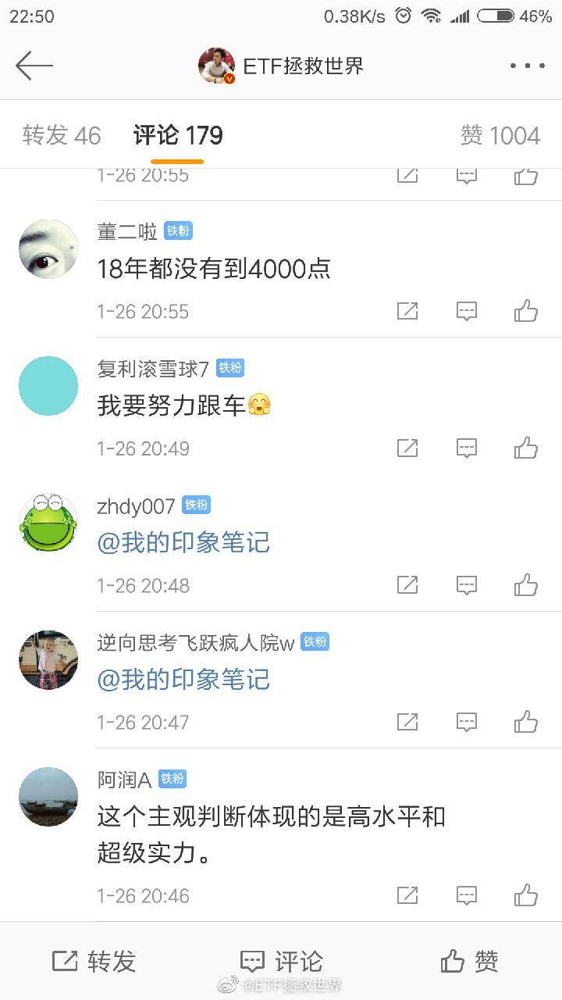

======================================================

ETF拯救世界 (5687069307) @
2022-01-27 09:19:28 Thu  
url: https://weibo.com/5687069307/LcF8apFmX

各位时尚先锋们，有没有推荐的男士手链款式。

要求精致、时尚、金属材质或者大部分金属材质。

各类宝石珍珠木头的就算了，不是一个世界的。

不限品牌。 ​​​

转发[26]  评论[638]  赞[3011] 

======================================================

ETF拯救世界 (5687069307) @
2022-01-27 09:30:43 Thu  
url: https://weibo.com/5687069307/LcFcJuw6I

好家伙，十几天一个来回，筹码不变，一份成本减少8%？ ​​​

转发[19]  评论[448]  赞[2272] 

======================================================

ETF拯救世界 (5687069307) @
2022-01-27 09:46:47 Thu  
url: https://weibo.com/5687069307/LcFjg2r6H

再次提示，波段仓位如果未做好压力测试，导致资源不足以支撑策略持续进行，减少投入或暂停都毫无问题。这个说过好几次了。

只是会减少下面几次的收益。 ​​​

转发[67]  评论[715]  赞[2906] 

======================================================

ETF拯救世界 (5687069307) @
2022-01-27 10:02:25 Thu  
url: https://weibo.com/5687069307/LcFpBkiIZ

由于日元大幅贬值，投资日经225的波段逻辑已经完全改变，所以暂停日经波段。

我会删除自己的日经条件单。 ​​​

转发[115]  评论[812]  赞[3138] 

======================================================

ETF拯救世界 (5687069307) @
2022-01-27 10:26:24 Thu  
url: https://weibo.com/5687069307/LcFzkFBLH

正式进入9500-12000之间的建仓区域。接下来是考验各位建仓水平，以及持仓心态的时候了。今年太有意思了。

------------------------------------------------------
转推：
>  @ETF拯救世界 (5687069307)
>  2022-01-26 09:57:41 Wed  
>  url: https:/weibo.com/5687069307/LcvXc11Gp/

>  我感觉今年医药配到10%应该没问题。
>  
>  目前150是4%，S是5%。
>  
>  新增部分成本如果能控制在10000-10500之间我就会很满意。 ​​​

转发[178]  评论[1047]  赞[3225] 

======================================================

ETF拯救世界 (5687069307) @
2022-01-27 10:55:22 Thu  
url: https://weibo.com/5687069307/LcFL5Emor

整个2021年全年，150在A股方面，一共买入了一份金融、一份信息、两份传媒、一份消费，一共5份。（信息与消费买在全年低点，目前依然盈利）

同期，A股高位卖出了利润非常高的50、300、环保、500一共11份。

也就是说，在a股，我们的计划一直是高位减仓，未在高位加仓。目前的下跌，只是会减少过去的利 ​​​

转发[100]  评论[750]  赞[4016] 

======================================================

ETF拯救世界 (5687069307) @
2022-01-27 11:05:37 Thu  
url: https://weibo.com/5687069307/LcFPfCfUu

一些利好ZC不会太远了。

当然，有没有用另说。 ​​​

转发[32]  评论[581]  赞[3395] 

======================================================

ETF拯救世界 (5687069307) @
2022-01-27 12:41:30 Thu  
url: https://weibo.com/5687069307/LcGsaAqYs

说句实话，我不太相信2018之后在2022会再次进入钻石坑。

如果真的会，不计利润波动，全市场估值下降20%左右即可。 ​​​

转发[151]  评论[1037]  赞[4915] 

======================================================

ETF拯救世界 (5687069307) @
2022-01-27 15:20:58 Thu  
url: https://weibo.com/5687069307/LcHuUiSY2

今晚看日本VS中国。

足球&股市，两个添堵王炸居然凑到一天了。

值得纪念的日子。

（等待数据传输中，准备开始计算今日数据。） ​​​

转发[34]  评论[488]  赞[3196] 

======================================================

ETF拯救世界 (5687069307) @
2022-01-27 16:15:31 Thu  
url: https://weibo.com/5687069307/LcHR2ASnI

目前长期仓位配置中，最讨厌的是以食品饮料为代表的消费仓位。

团报得太紧，总是调整不下来，始终无法建立起基本仓位。

非常讨厌。 ​​​

转发[97]  评论[651]  赞[3403] 

======================================================

ETF拯救世界 (5687069307) @
2022-01-27 16:29:04 Thu  
url: https://weibo.com/5687069307/LcHWxvfJt

真的，服了。

为什么我总在微博问一些事情，因为从几年前我就发现，我问的事情，总是能从评论或者私信中得到特别完美的答案！

什么知乎百度值得买小红书，全都是CD，还是这里的兄弟姐妹真的给力。

各位推荐的手链有几款很喜欢，抽空就去买！ ​​​

转发[25]  评论[846]  赞[3170] 

======================================================

ETF拯救世界 (5687069307) @
2022-01-28 09:57:08 Fri  
url: https://weibo.com/5687069307/LcONXbXb0

新股大面积上市首日破发，是进入底部区域的标志之一。 ​​​

转发[287]  评论[754]  赞[3559] 

======================================================

ETF拯救世界 (5687069307) @
2022-01-28 10:08:03 Fri  
url: https://weibo.com/5687069307/LcOSnFm6t

在高位吸引不成熟的、幻想赚快钱的、对投资一窍不通的人申购自己的产品，然后抱团贵到匪夷所思的品种，其最大的危害并不是申购者的资产损失，价值毁灭，

而是在下跌过程中，这些申购者会不会惊慌失措赎回产品，导致被抱团的，极度高估的品种更加快速的崩塌。

羊群也好，旅鼠也好，当它们数量足够大， ​​​

转发[248]  评论[440]  赞[3058] 

======================================================

ETF拯救世界 (5687069307) @
2022-01-28 10:16:44 Fri  
url: https://weibo.com/5687069307/LcOVUll8D

还有，不要忘了这个数据。

1.8万亿两融资金，在快速下跌中安全性是否能得到保证，会不会因很多账户强制平仓导致新的问题？

大，一定是好吗？ ​​​

转发[82]  评论[485]  赞[2435] 

+++++++++++++++++++++++++++++++++++++++++++++++++++++

图片：

======================================================

ETF拯救世界 (5687069307) @
2022-01-28 10:42:59 Fri  
url: https://weibo.com/5687069307/LcP6z5MJP

今天跌了2%，看起来有一点点不那么讨厌了。。

------------------------------------------------------
转推：
>  @ETF拯救世界 (5687069307)
>  2022-01-27 16:15:31 Thu  
>  url: https:/weibo.com/5687069307/LcHR2ASnI/

>  目前长期仓位配置中，最讨厌的是以食品饮料为代表的消费仓位。
>  
>  团报得太紧，总是调整不下来，始终无法建立起基本仓位。
>  
>  非常讨厌。 ​​​

转发[22]  评论[317]  赞[2110] 

======================================================

ETF拯救世界 (5687069307) @
2022-01-28 10:45:42 Fri  
url: https://weibo.com/5687069307/LcP7FnogQ

内地+海外的医药&消费，加起来买到20%-25%的低成本持仓，想想都很开心。 ​​​

转发[129]  评论[850]  赞[3598] 

======================================================

ETF拯救世界 (5687069307) @
2022-01-28 14:21:43 Fri  
url: https://weibo.com/5687069307/LcQxlrQR0

我相信时势造英雄，英雄是造不了时势的。

庞大、复杂的系统，在趋势运行的过程中，很难通过人为手段改变。比如股市、比如足球。

但是，在趋势运行末期——也就是所谓“不能穿鲁缟”的时候，人为手段是可以一两拨千金发挥作用的，就是所谓压倒骆驼的最后一根稻草。

我不知道这话是不是该说，说的合适 ​​​

转发[123]  评论[580]  赞[2573] 

======================================================

ETF拯救世界 (5687069307) @
2022-01-28 14:47:39 Fri  
url: https://weibo.com/5687069307/LcQHSgTA3

下跌3%，功力不减当年。被监控的微博？

------------------------------------------------------
转推：
>  @ETF拯救世界 (5687069307)
>  2022-01-27 16:15:31 Thu  
>  url: https:/weibo.com/5687069307/LcHR2ASnI/

>  目前长期仓位配置中，最讨厌的是以食品饮料为代表的消费仓位。
>  
>  团报得太紧，总是调整不下来，始终无法建立起基本仓位。
>  
>  非常讨厌。 ​​​

转发[25]  评论[310]  赞[2008] 

======================================================

ETF拯救世界 (5687069307) @
2022-01-28 14:50:35 Fri  
url: https://weibo.com/5687069307/LcQJ48e0Z

提前说个消费的建仓区域吧。

开始建仓点位大致在17000左右，最终支撑位在11500左右。两者之间的区域是极佳的建仓区域。 ​​​

转发[513]  评论[845]  赞[3445] 

======================================================

ETF拯救世界 (5687069307) @
2022-01-28 15:01:37 Fri  
url: https://weibo.com/5687069307/LcQNxxQaR

收盘了。下次开盘就是虎年了。

可能有朋友觉得这个月跌得很难受。但我要说一句，这样的下跌预示着未来，甚至有可能就在今年的某个时期，就会出现非常棒的收益。

所以大家开开心心过年，现在你以为坏的事情，其实未必坏。现在你以为好的，反而有可能是刮骨钢刀。

开心起来！明天发一篇公众号。然后初 ​​​

转发[163]  评论[2868]  赞[6460] 

======================================================

ETF拯救世界 (5687069307) @
2022-01-28 23:27:08 Fri  
url: https://weibo.com/5687069307/LcU6JrtAJ

爱情神话看到一半想打五分。 ​​​

转发[56]  评论[434]  赞[1989] 

======================================================

ETF拯救世界 (5687069307) @
2022-01-29 00:46:41 Sat  
url: https://weibo.com/5687069307/LcUD1Eor8

看完了，还是维持五分。5/5。我就喜欢这种带点幽默感的爱情轻喜剧。类似于真爱至上，诺丁山等等。上海话也不影响观感，比较新鲜。这种类型的片子国内很少见。

------------------------------------------------------
转推：
>  @ETF拯救世界 (5687069307)
>  2022-01-28 23:27:08 Fri  
>  url: https:/weibo.com/5687069307/LcU6JrtAJ/

>  爱情神话看到一半想打五分。 ​​​

转发[36]  评论[489]  赞[2460] 

======================================================

ETF拯救世界 (5687069307) @
2022-01-29 10:12:02 Sat  
url: https://weibo.com/5687069307/LcYkv2Sab

真是奇怪，我自己个人的微博，我愿意拉黑谁就拉黑谁，我不愿意让谁看就不让谁看，你管得着吗？

我欠你的？哪条法律规定我一定要写东西给你看了？

你也可以对等反制拉黑我啊。当然我是个有腔调的人，绝对不会用小号骂你，侬晓得哇。[鼓掌] ​​​

转发[25]  评论[854]  赞[3353] 

+++++++++++++++++++++++++++++++++++++++++++++++++++++

图片：
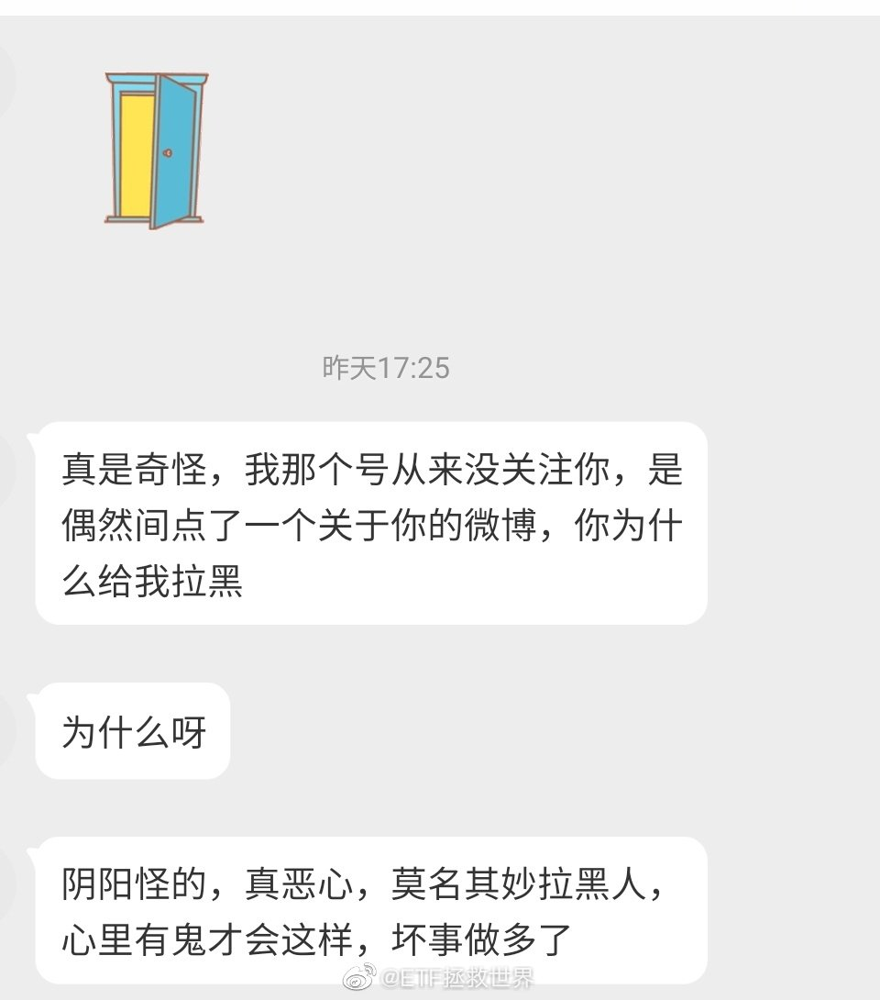

======================================================

ETF拯救世界 (5687069307) @
2022-01-29 13:35:15 Sat  
url: https://weibo.com/5687069307/LcZEZ6A61

为什么喜欢爱情神话这种电影呢。

我想了又想，应该是它会让我在一种轻松和舒适中感受到爱的乐趣。

没有狗血，没有恶人，没有尔虞我诈。每个人都轻松，都幽默，都让人感到舒服。

画面、调色、运镜、角度、音乐（整个观影过程中我三次打开听歌识曲收藏好听的歌曲）无一不让人舒服。

更让人喜欢的是人 ​​​

转发[212]  评论[709]  赞[4055] 

======================================================

ETF拯救世界 (5687069307) @
2022-01-29 13:56:01 Sat  
url: https://weibo.com/5687069307/LcZNpyomh

回复@uncutjade_harmony_lin:正式通知一下，拖更了，要好好排版编辑一下，明天上午发……//@uncutjade_harmony_lin:等今天的文章等的望眼欲穿[开学季]

------------------------------------------------------
转推：
>  @ETF拯救世界 (5687069307)
>  2022-01-29 13:35:15 Sat  
>  url: https:/weibo.com/5687069307/LcZEZ6A61/

>  为什么喜欢爱情神话这种电影呢。
>  
>  我想了又想，应该是它会让我在一种轻松和舒适中感受到爱的乐趣。
>  
>  没有狗血，没有恶人，没有尔虞我诈。每个人都轻松，都幽默，都让人感到舒服。
>  
>  画面、调色、运镜、角度、音乐（整个观影过程中我三次打开听歌识曲收藏好听的歌曲）无一不让人舒服。
>  
>  更让人喜欢的是人 ​​​

转发[14]  评论[443]  赞[1548] 

======================================================

ETF拯救世界 (5687069307) @
2022-01-29 14:09:19 Sat  
url: https://weibo.com/5687069307/LcZSOiJDm

先预告一下，各位大爷先看看喜不喜欢。

具体情况等通知。

（非本帖抽奖，不用刻意评论） ​​​

转发[94]  评论[4703]  赞[6231] 

+++++++++++++++++++++++++++++++++++++++++++++++++++++

图片：

======================================================

ETF拯救世界 (5687069307) @
2022-01-29 17:30:12 Sat  
url: https://weibo.com/5687069307/Ld1clx5nL

健身房只有我一个人。 ​​​

转发[20]  评论[1163]  赞[3580] 

======================================================

ETF拯救世界 (5687069307) @
2022-01-30 10:29:41 Sun  
url: https://weibo.com/5687069307/Ld7Sa2qeC

BGM想放一首“旧社会顶穷的人”，

想了半天大过年的意头实在不大灵光，下次吧…… ​​​

转发[22]  评论[844]  赞[2462] 

======================================================

ETF拯救世界 (5687069307) @
2022-01-30 13:04:53 Sun  
url: https://weibo.com/5687069307/Ld8T9xjfz

请把拐卖妇女儿童的人贩子全部枪毙，没收全部家庭财产

——来自于一个普通人民群众的心声 ​​​

转发[122]  评论[835]  赞[6445] 

======================================================

ETF拯救世界 (5687069307) @
2022-01-30 13:26:49 Sun  
url: https://weibo.com/5687069307/Ld923rEIF

世界上有两种人。

第一种人是把其他人分为两种：可以带给他利益的人，以及多余的人。

除了能带给他利益的，全是多余的，讨厌的，最好全部消失，其死活他也不会在意。

能带给他利益的，他会用尽各种办法在他们身上取得利益。

第二种人是把其他人当做人。会感恩对自己好的人，会力所能及的帮助素不相 ​​​

转发[247]  评论[1056]  赞[3908] 

======================================================

ETF拯救世界 (5687069307) @
2022-01-30 15:26:04 Sun  
url: https://weibo.com/5687069307/Ld9OsuTqM

购物小贴士：

如果你有一样一直想买但总觉得有点贵舍不得买的东西，那你就应该去看跟它一个种类，但贵很多的东西。

然后你再回来看它，就会觉得它很值，就会马上入手。 ​​​

转发[50]  评论[802]  赞[3270] 

======================================================

ETF拯救世界 (5687069307) @
2022-01-30 16:14:55 Sun  
url: https://weibo.com/5687069307/Lda8ij1MT

今天练胸和背。

还是我一个人。 ​​​

转发[19]  评论[1181]  赞[3389] 

+++++++++++++++++++++++++++++++++++++++++++++++++++++

图片：

======================================================

ETF拯救世界 (5687069307) @
2022-01-31 23:59:00 Mon  
url: https://weibo.com/5687069307/LdmB9Begd

祝各位虎年大吉！ ​ http://t.cn/A6ia1ZFU ​​​

转发[92]  评论[5605]  赞[6432] 

======================================================

ETF拯救世界 (5687069307) @
2022-02-01 10:45:10 Tue  
url: https://weibo.com/5687069307/LdqPraIDH

如果你觉得一件事没意思，那就加点仪式感试试。 ​​​

转发[79]  评论[2122]  赞[4065] 

======================================================

ETF拯救世界 (5687069307) @
2022-02-01 13:53:34 Tue  
url: https://weibo.com/5687069307/Lds3UBkWb

恭喜@知道自己不知道1984 等30名用户获得【200元京东购物卡】。微博官方唯一抽奖工具@微博抽奖平台 对本次抽奖进行监督，结果公正有效。公示链接：http://t.cn/A6ia1MZH

------------------------------------------------------
转推：
>  @ETF拯救世界 (5687069307)
>  2022-01-31 23:59:00 Mon  
>  url: https:/weibo.com/5687069307/LdmB9Begd/

>  祝各位虎年大吉！ ​ http://t.cn/A6ia1ZFU ​​​

转发[26]  评论[389]  赞[854] 

======================================================

ETF拯救世界 (5687069307) @
2022-02-01 13:55:30 Tue  
url: https://weibo.com/5687069307/Lds4H1Wbd

请三十位中奖的朋友私信联系我领取新年第一份奖。//@ETF拯救世界:恭喜@知道自己不知道1984 等30名用户获得【200元京东购物卡】。微博官方唯一抽奖工具@微博抽奖平台 对本次抽奖进行监督，结果公正有效。公示链接：http://t.cn/A6ia1MZH

------------------------------------------------------
转推：
>  @ETF拯救世界 (5687069307)
>  2022-01-31 23:59:00 Mon  
>  url: https:/weibo.com/5687069307/LdmB9Begd/

>  祝各位虎年大吉！ ​ http://t.cn/A6ia1ZFU ​​​

转发[20]  评论[1273]  赞[1855] 

======================================================

ETF拯救世界 (5687069307) @
2022-02-02 09:14:05 Wed  
url: https://weibo.com/5687069307/LdzEXvtx8

男足输了，当然是骂声一片。平常关心不关心的人，都上来骂几句。

说心里话，我的心情很复杂。

场上的十一个人，就是中国目前踢得最好的二三十人里面的11个。大过年的，他们不想赢吗，当然想。他们没尽力吗，当然尽力了。排兵布阵的教练没努力吗，当然努力了。

但就是赢不了。能力就是不行，你骂他到 ​​​

转发[183]  评论[1292]  赞[4856] 

======================================================

ETF拯救世界 (5687069307) @
2022-02-02 09:40:32 Wed  
url: https://weibo.com/5687069307/LdzPHhiKo

【初二抽奖】香水

昨天抽了6000元购物卡，今天抽香水。本帖评论抽奖，抽2-3人，限铁粉。

注意事项：

第一，请真的喜欢，真的需要的朋友参与。别你不喜欢抽到了扔一边，喜欢的朋友抽不到，浪费。

第二，全部都是全新专柜正品，包装完好。大多数是出去旅游的时候购买于境外专柜或者机场。但都不是这 ​​​

转发[158]  评论[8370]  赞[3713] 

+++++++++++++++++++++++++++++++++++++++++++++++++++++

图片：
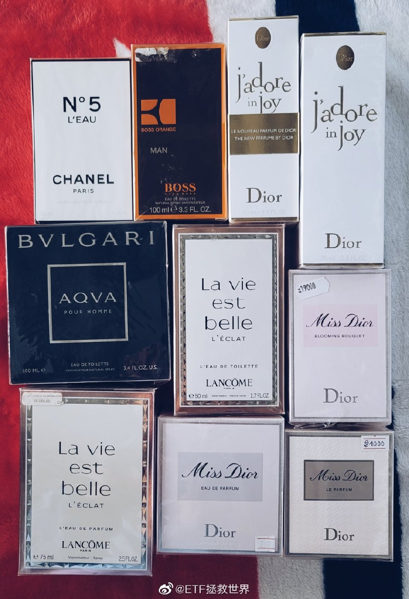

======================================================

ETF拯救世界 (5687069307) @
2022-02-02 12:08:23 Wed  
url: https://weibo.com/5687069307/LdANI8Dxi

恭喜@君时尘 等2名用户获得【全新正品香水一瓶】。微博官方唯一抽奖工具@微博抽奖平台 对本次抽奖进行监督，结果公正有效。公示链接：http://t.cn/A6iS8Zx0

------------------------------------------------------
转推：
>  @ETF拯救世界 (5687069307)
>  2022-02-02 09:40:32 Wed  
>  url: https:/weibo.com/5687069307/LdzPHhiKo/

>  【初二抽奖】香水
>  
>  昨天抽了6000元购物卡，今天抽香水。本帖评论抽奖，抽2-3人，限铁粉。
>  
>  注意事项：
>  
>  第一，请真的喜欢，真的需要的朋友参与。别你不喜欢抽到了扔一边，喜欢的朋友抽不到，浪费。
>  
>  第二，全部都是全新专柜正品，包装完好。大多数是出去旅游的时候购买于境外专柜或者机场。但都不是这 ​​​

转发[4]  评论[558]  赞[755] 

======================================================

ETF拯救世界 (5687069307) @
2022-02-02 22:04:11 Wed  
url: https://weibo.com/5687069307/LdEHy09et

希望美股再扛三天不要回撤，我们一个交易日提款，欢度春节。 ​​​

转发[35]  评论[1353]  赞[3493] 

======================================================

ETF拯救世界 (5687069307) @
2022-02-03 10:21:36 Thu  
url: https://weibo.com/5687069307/LdJwRrfe4

【初三抽杯子】  欢乐的抽奖在继续。今天是800个杯子。  请各位移步且慢微博抽奖，因为我没有精力发送这么多实物。  祝各位支持我的朋友好运。

------------------------------------------------------
转推：
>  @且慢管家 (6186312580)
>  2022-02-03 10:17:38 Thu  
>  url: https:/weibo.com/6186312580/LdJvfD0PA/

>  #抽奖# 【E大和且慢联名“E慢杯”春节抽奖】
>  
>  大家新年好呀~
>  
>  为了回馈大家的信任，e大和我们联名做了一款杯子，趁着过年，小慢给大家送福利啦，一共800个~
>  
>  评论+关注@且慢管家 抽奖，不限制是否铁粉，开奖时间http://t.cn/A6ioCxDm 。
>  
>  一定要注意看下面的规则，不符合条件的收不到杯子哦~
>  
>  1、评论 ​​​

转发[61]  评论[1611]  赞[2354] 

======================================================

ETF拯救世界 (5687069307) @
2022-02-03 14:30:01 Thu  
url: https://weibo.com/5687069307/LdL9HaSVR

虎年第一练，腿 背和有氧 ​​​

转发[19]  评论[661]  赞[2409] 

+++++++++++++++++++++++++++++++++++++++++++++++++++++

图片：
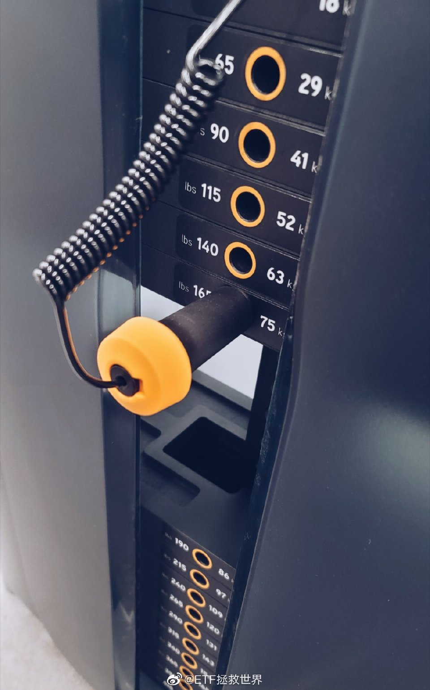

======================================================

ETF拯救世界 (5687069307) @
2022-02-03 16:56:50 Thu  
url: https://weibo.com/5687069307/LdM7i6pWI

在爷爷奶奶家过年的三年级大孩子 ​​​

转发[35]  评论[2688]  赞[7751] 

+++++++++++++++++++++++++++++++++++++++++++++++++++++

图片：

======================================================

ETF拯救世界 (5687069307) @
2022-02-04 14:04:41 Fri  
url: https://weibo.com/5687069307/LdUpUqXUg

【初四不抽只送，阳光普照】

今天不抽奖。年后直接为每位进行网格交易的朋友多增加五个条件单，祝大家虎年多提款，少操心！

感谢@华宝智投--上海浦电路营业部 对本次活动的大力支持。 ​​​

转发[70]  评论[3096]  赞[5417] 

======================================================

ETF拯救世界 (5687069307) @
2022-02-05 10:46:09 Sat  
url: https://weibo.com/5687069307/Le2xP2UKz

准备开始发送第一波奖品。中奖的朋友尽快私信我，我把卡密发给你。

初五迎财神，也祝所有朋友虎年发大财！ ​​​

转发[45]  评论[2052]  赞[4081] 

+++++++++++++++++++++++++++++++++++++++++++++++++++++

图片：
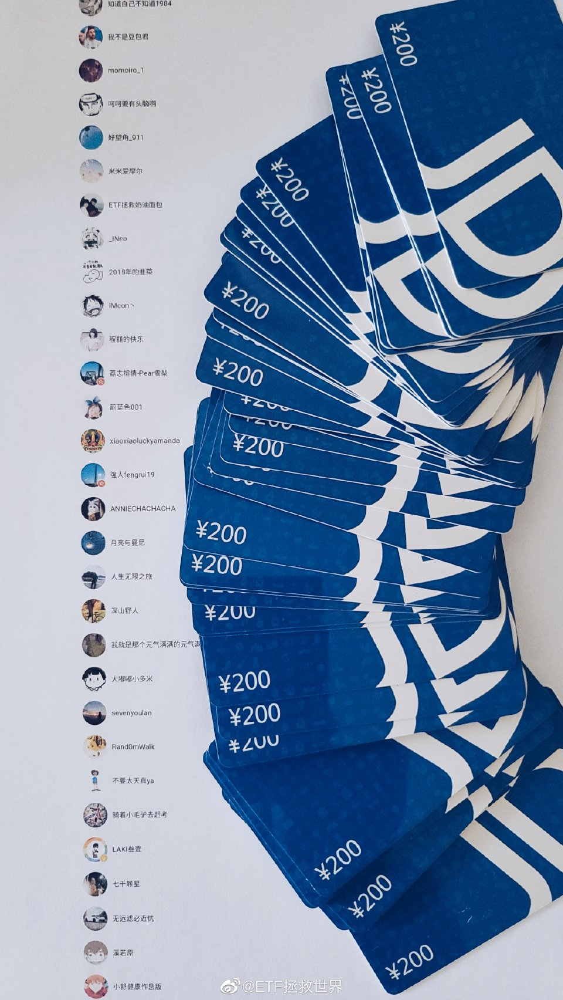

======================================================

ETF拯救世界 (5687069307) @
2022-02-05 12:11:18 Sat  
url: https://weibo.com/5687069307/Le36o0Lvj

很多人是初五才想起财神爷，不是说不好，稍微有那么一点点不真诚。

我是日常家里供奉财神像。

没办法，就是很庸俗的喜欢赚钱。 ​​​

转发[44]  评论[964]  赞[3936] 

======================================================

ETF拯救世界 (5687069307) @
2022-02-05 12:33:23 Sat  
url: https://weibo.com/5687069307/Le3flx8t7

过年这几天有没有什么有意思的事情分享。

或者有没有比如相亲遇到有意思的人这种群众喜闻乐见的经历。

不妨评论里面说说让大家开心一下。 ​​​

转发[39]  评论[1198]  赞[4625] 

======================================================

ETF拯救世界 (5687069307) @
2022-02-05 17:32:46 Sat  
url: https://weibo.com/5687069307/Le5cRBdxH

【初五送一块华为watch3】

这块表就不抽了，直接送给最近五篇公众号文章打赏最多的这位朋友。我已经公众号私信你告知我的微信号了，可以加我领奖。

也希望新的一年大家不仅赚大钱，也要保持身体健康。健康永远是最重要的。

（我说，初五了，各位，你手里的零食差不多可以放下了吧！还吃呢？别吃了！ ​​​

转发[29]  评论[1218]  赞[3956] 

+++++++++++++++++++++++++++++++++++++++++++++++++++++

图片：
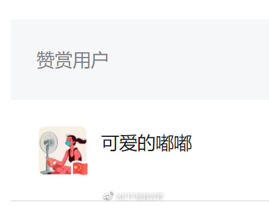
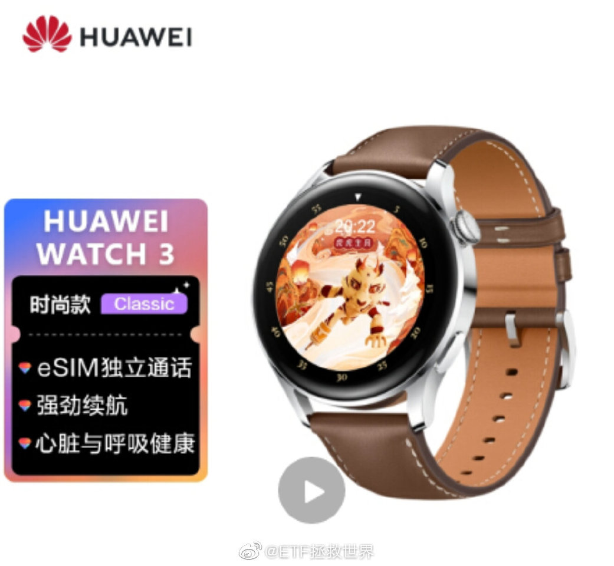

======================================================

ETF拯救世界 (5687069307) @
2022-02-05 20:10:53 Sat  
url: https://weibo.com/5687069307/Le6f3jERw

想写一篇关于“财务自由”的文章。

这个话题虽然非常老套，但我相信有些观点你应该没有看过。

不知道什么时候动笔，希望早日填坑。 ​​​

转发[41]  评论[1593]  赞[5453] 

======================================================

ETF拯救世界 (5687069307) @
2022-02-05 21:19:59 Sat  
url: https://weibo.com/5687069307/Le6H64JEB

一定要看咪咕的王濛解说哈哈。 ​​​

转发[31]  评论[532]  赞[2783] 

======================================================

ETF拯救世界 (5687069307) @
2022-02-06 10:02:12 Sun  
url: https://weibo.com/5687069307/LebGtBDpq

初六送穷神。

要找几个坏人拉黑一下送他们走。 ​​​

转发[31]  评论[1104]  赞[4341] 

======================================================

ETF拯救世界 (5687069307) @
2022-02-06 19:43:17 Sun  
url: https://weibo.com/5687069307/Lefuld42n

儿子经过几天的考虑，并与家庭投委会充分商议评估后，决定把压岁钱交给我管理。

约定年化收益率为8%。其中4%按月以现金形式分红，4%再投。

鉴于其为SVIP客户，免收申购赎回及管理费用。 ​​​

转发[111]  评论[1914]  赞[9426] 

======================================================

ETF拯救世界 (5687069307) @
2022-02-06 20:36:50 Sun  
url: https://weibo.com/5687069307/LefQ5e1Wc

女足NB!

万万没想到我能看到中国足球落后两球扳平。

中国的女性是最棒的！ ​​​

转发[144]  评论[741]  赞[5006] 

======================================================

ETF拯救世界 (5687069307) @
2022-02-06 20:54:40 Sun  
url: https://weibo.com/5687069307/LefXjvOXT

！！！！！！！！！！！！！！！

------------------------------------------------------
转推：
>  @ETF拯救世界 (5687069307)
>  2022-02-06 20:36:50 Sun  
>  url: https:/weibo.com/5687069307/LefQ5e1Wc/

>  女足NB!
>  
>  万万没想到我能看到中国足球落后两球扳平。
>  
>  中国的女性是最棒的！ ​​​

转发[75]  评论[1150]  赞[4884] 

======================================================

ETF拯救世界 (5687069307) @
2022-02-06 22:19:58 Sun  
url: https://weibo.com/5687069307/LegvWi1ww

我只是帮儿子拿一下真的没有吃 ​​​

转发[21]  评论[1027]  赞[3257] 

+++++++++++++++++++++++++++++++++++++++++++++++++++++

图片：
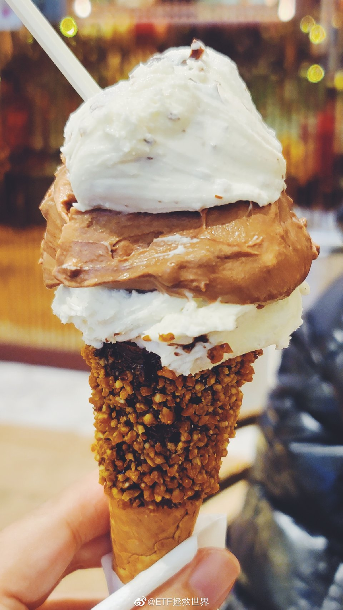

======================================================

ETF拯救世界 (5687069307) @
2022-02-07 12:22:39 Mon  
url: https://weibo.com/5687069307/Lem1Z9ntN

刚才有机构的人发了这个页面给我看，问是不是我。

这位评论的朋友，你是不是有病。发这么low的评论，还要顶着我的ID？

我不是说“ETF拯救世界”这个名字只能我用，但我必须要澄清，这TMD不是我！这么low的话我说不出来！！！ ​​​

转发[25]  评论[948]  赞[4226] 

+++++++++++++++++++++++++++++++++++++++++++++++++++++

图片：
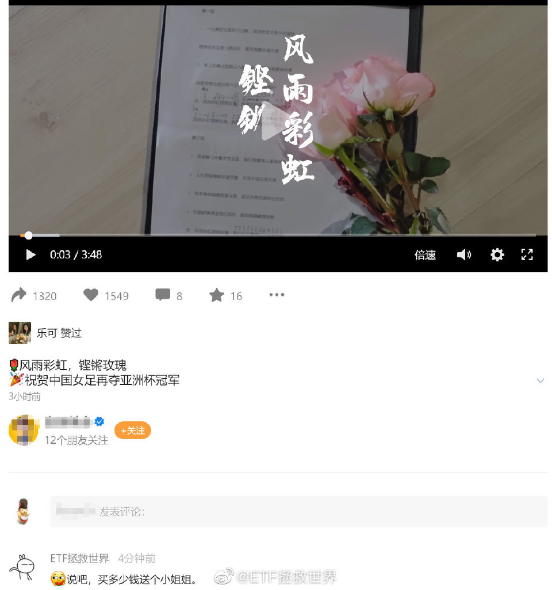

======================================================

ETF拯救世界 (5687069307) @
2022-02-07 15:46:23 Mon  
url: https://weibo.com/5687069307/LenmGeiJU

市场真没什么好说的。有气无力，磨磨唧唧，装腔作势。

今年不亏当赢。 ​​​

转发[35]  评论[832]  赞[3259] 

======================================================

ETF拯救世界 (5687069307) @
2022-02-07 16:06:41 Mon  
url: https://weibo.com/5687069307/LenuV8FS1

婚姻这个东西吧，我觉得吧，个人认为，几个点很重要。

两个人想要比较和谐，

第一个是三观大概一致。对各种事情的看法，比如说，举例，高速路口不小心错过了，有人觉得我倒车回去也没事，有人觉得你倒车回去你就是脑残。

这里面体现什么呢。第一个是对规则是否尊重，第二个是对于危险的认知，第三个 ​​​

转发[646]  评论[1209]  赞[6680] 

======================================================

ETF拯救世界 (5687069307) @
2022-02-08 00:15:32 Tue  
url: https://weibo.com/5687069307/LeqHlhqL1

昨晚发的那条微博有后续了。

男主又私信说明了情况，他一直在外地。

这样的话真的很难说谁是谁非了，只能说理解万岁吧，都不容易。 ​​​

转发[26]  评论[513]  赞[4793] 

+++++++++++++++++++++++++++++++++++++++++++++++++++++

图片：
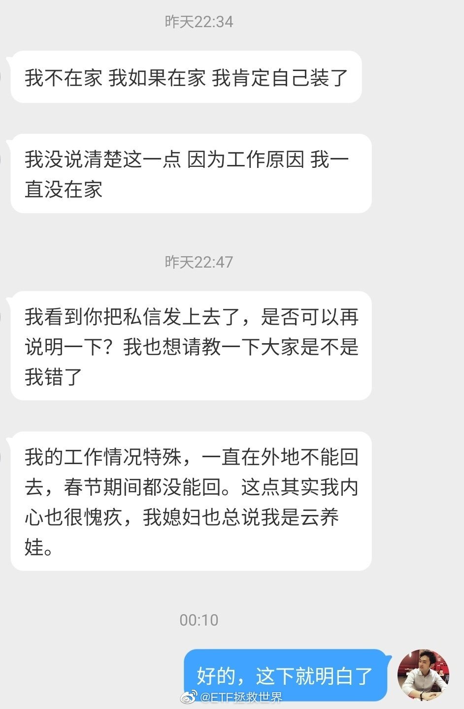

======================================================

ETF拯救世界 (5687069307) @
2022-02-08 09:55:02 Tue  
url: https://weibo.com/5687069307/Leuuzmpwp

[憧憬]

------------------------------------------------------
转推：
>  @ETF拯救世界 (5687069307)
>  2022-01-28 10:45:42 Fri  
>  url: https:/weibo.com/5687069307/LcP7FnogQ/

>  内地+海外的医药&消费，加起来买到20%-25%的低成本持仓，想想都很开心。 ​​​

转发[28]  评论[441]  赞[2163] 

======================================================

ETF拯救世界 (5687069307) @
2022-02-08 10:21:13 Tue  
url: https://weibo.com/5687069307/LeuFc2M09

你猜白酒50多倍狂买，腰斩后30倍狂卖的是哪些人。 ​​​

转发[47]  评论[654]  赞[2908] 

======================================================

ETF拯救世界 (5687069307) @
2022-02-08 11:05:17 Tue  
url: https://weibo.com/5687069307/LeuX4Fsmm

医药面临两个问题，跟中概差不多。

一个是内部的集采，一个是外部的打压。

没有利空好买点怎么出来？最后一根强力支撑依然看在9500，暴风雨来得再猛一点吧。 ​​​

转发[218]  评论[499]  赞[2649] 

======================================================

ETF拯救世界 (5687069307) @
2022-02-08 11:12:32 Tue  
url: https://weibo.com/5687069307/Lev01wLko

回复@杨柳听风:我有个数字，但是对一般人来说太恐怖，还是不说了。另外我说的这个点位不是“合适”点位，而是我认为的最后一根支撑线。//@杨柳听风:消费指数要到多少合适？

------------------------------------------------------
转推：
>  @ETF拯救世界 (5687069307)
>  2022-02-08 11:05:17 Tue  
>  url: https:/weibo.com/5687069307/LeuX4Fsmm/

>  医药面临两个问题，跟中概差不多。
>  
>  一个是内部的集采，一个是外部的打压。
>  
>  没有利空好买点怎么出来？最后一根强力支撑依然看在9500，暴风雨来得再猛一点吧。 ​​​

转发[80]  评论[197]  赞[1614] 

======================================================

ETF拯救世界 (5687069307) @
2022-02-08 11:18:38 Tue  
url: https://weibo.com/5687069307/Lev2uCPYD

消费其实是一个很好的行业，股价也是稳定上涨。

但2020年5月之后，成分股以及指数就走出了与以往完全不同的走势，猪突猛进。

一直到现在，它还没有回到“合理”区间，更不要说价值区域。

这一切，都要归功于…… ​​​

转发[79]  评论[366]  赞[2197] 

======================================================

ETF拯救世界 (5687069307) @
2022-02-08 11:23:29 Tue  
url: https://weibo.com/5687069307/Lev4t2sM6

医药则不同，其依然完美运行于我定义的正常区间。不信你去看看20年我对医药定义的外太空区域是哪里，再看看它最高点是哪里。已经不能用完美来形容。

医药现在已经身在价值区域，注意，我说的是医药，不是医疗。

9500-10000，是医药极佳的长线建仓点位。无论到时候它的利空有多么猛烈，有多少人又想救 ​​​

转发[283]  评论[603]  赞[3151] 

======================================================

ETF拯救世界 (5687069307) @
2022-02-08 11:43:49 Tue  
url: https://weibo.com/5687069307/LevcIsKhH

总而言之，就像年初预计的一样，今年会很困难。

但是，

请看我们的持仓。

占20%仓位的红利今年可是没跌。

还有不少现金。

还有一堆债券。

S存了好几年的应投未投。

150高位减持了不少获利丰厚的品种腾出仓位等待。

我们已经做好了准备，迎接今年也许会出现的，为将来3-5年建仓的一个好机会。

 ​​​

转发[217]  评论[561]  赞[3092] 

======================================================

ETF拯救世界 (5687069307) @
2022-02-08 11:50:15 Tue  
url: https://weibo.com/5687069307/LevfkmlhT

对很多人来说，今年的难是很意外的。但其实，今年的难是应该的，是大概率的，是合理的。如果照着这个剧本继续走，那么，未来的光明也是应该的大概率的合理的。就像到了下午你就应该知道夜晚即将来临，而不是夜晚来临后惊慌失措。在深夜你也应该知道黎明不远了，而不是认为将会万年长夜。

------------------------------------------------------
转推：
>  @ETF拯救世界 (5687069307)
>  2022-02-08 11:43:49 Tue  
>  url: https:/weibo.com/5687069307/LevcIsKhH/

>  总而言之，就像年初预计的一样，今年会很困难。
>  
>  但是，
>  
>  请看我们的持仓。
>  
>  占20%仓位的红利今年可是没跌。
>  
>  还有不少现金。
>  
>  还有一堆债券。
>  
>  S存了好几年的应投未投。
>  
>  150高位减持了不少获利丰厚的品种腾出仓位等待。
>  
>  我们已经做好了准备，迎接今年也许会出现的，为将来3-5年建仓的一个好机会。
>  
>   ​​​

转发[85]  评论[252]  赞[1960] 

======================================================

ETF拯救世界 (5687069307) @
2022-02-08 11:52:54 Tue  
url: https://weibo.com/5687069307/LevgpdIkG

回复@CJ01189:昨天那种虚假上涨被我一眼识破，将之定义为“有气无力，磨磨唧唧，装腔作势。”。今天回到了正常节奏，让人欣慰。//@CJ01189:E大兴奋了啊[酷][酷]

------------------------------------------------------
转推：
>  @ETF拯救世界 (5687069307)
>  2022-02-08 11:43:49 Tue  
>  url: https:/weibo.com/5687069307/LevcIsKhH/

>  总而言之，就像年初预计的一样，今年会很困难。
>  
>  但是，
>  
>  请看我们的持仓。
>  
>  占20%仓位的红利今年可是没跌。
>  
>  还有不少现金。
>  
>  还有一堆债券。
>  
>  S存了好几年的应投未投。
>  
>  150高位减持了不少获利丰厚的品种腾出仓位等待。
>  
>  我们已经做好了准备，迎接今年也许会出现的，为将来3-5年建仓的一个好机会。
>  
>   ​​​

转发[26]  评论[234]  赞[1699] 

======================================================

ETF拯救世界 (5687069307) @
2022-02-08 12:07:08 Tue  
url: https://weibo.com/5687069307/LevmbmWgf

A股有其自己的特点。其中最大的特点就是波动极大。

而波动极大的背后，就是估值水平巨幅波动。

拿环保（新能源、碳中和）来说。

最高点的时候，其成分股前40位的股票，平均估值超过90倍。

你说宁德也好，隆基也好，都是高成长，享受百倍PE合理。但是40只股票都是高成长？做梦呢。

所以我们走了。
 ​​​

转发[847]  评论[815]  赞[4876] 

======================================================

ETF拯救世界 (5687069307) @
2022-02-08 12:25:54 Tue  
url: https://weibo.com/5687069307/LevtNyC5Y

我从来不跟任何人宣传股市很好，“股票长期看是最佳投资品种”，我从来不说这种话。因为我知道这个地方没有成熟理性的思维，根本就是来送钱的。而成熟理性的思维，对大多数人来说根本不具备。

我也不会宣传指数投资好。虽然我自己相信这个，但我也知道它绝对不是适合每个人。我知道它适合大多数人，但 ​​​

转发[159]  评论[793]  赞[4489] 

======================================================

ETF拯救世界 (5687069307) @
2022-02-08 13:32:51 Tue  
url: https://weibo.com/5687069307/LevUYrjIZ

其实今天的上涨下跌家数对比是2900:1700

也就是说，大多数股票是上涨的。

大跌的是之前的大热门、大市值。

那么大热门是谁买出来的呢，这样的下跌是谁最受伤呢。 ​​​

转发[60]  评论[278]  赞[2259] 

======================================================

ETF拯救世界 (5687069307) @
2022-02-08 13:47:34 Tue  
url: https://weibo.com/5687069307/Lew0XfILR

回复@yesterday多一次:很多新朋友不知道历史上有一些著名的“庄股”。主力控盘80、90的股票。最终，无一不崩盘。为什么绝对控盘还会崩呢。//@yesterday多一次:都说报团取暖，可是为什么买的人多了，反而还会跌下来呢？不懂求教。 这个和之前基金经理报团买股有啥区别呢

------------------------------------------------------
转推：
>  @ETF拯救世界 (5687069307)
>  2022-02-08 13:32:51 Tue  
>  url: https:/weibo.com/5687069307/LevUYrjIZ/

>  其实今天的上涨下跌家数对比是2900:1700
>  
>  也就是说，大多数股票是上涨的。
>  
>  大跌的是之前的大热门、大市值。
>  
>  那么大热门是谁买出来的呢，这样的下跌是谁最受伤呢。 ​​​

转发[29]  评论[191]  赞[1660] 

======================================================

ETF拯救世界 (5687069307) @
2022-02-08 14:02:57 Tue  
url: https://weibo.com/5687069307/Lew7c3KUB

#谷爱凌在海淀黄庄学奥数#  一言难尽。 ​​​

转发[40]  评论[383]  赞[3500] 

======================================================

ETF拯救世界 (5687069307) @
2022-02-08 14:30:58 Tue  
url: https://weibo.com/5687069307/Lewiz8Aj5

我的一个观点，不同意的赶紧取关我。咱们三观不同，别相看两厌：

我发现，有些人特别喜欢用完美和圣人的标准要求别人。

长得要好看，成就要高，学习要好，要完全利他不利己。最好不喜欢钱，说话一句不能错。

我要说，你有病，赶紧治！！！

拿谷爱凌来说，这样一个小姑娘，她为这个国家，这个民族， ​​​

转发[191]  评论[982]  赞[6032] 

======================================================

ETF拯救世界 (5687069307) @
2022-02-08 14:40:42 Tue  
url: https://weibo.com/5687069307/Lewmw1Yml

现阶段唯一非卖品红利今年居然是涨的。

到哪儿说理去。 ​​​

转发[21]  评论[418]  赞[2747] 

======================================================

ETF拯救世界 (5687069307) @
2022-02-08 15:58:33 Tue  
url: https://weibo.com/5687069307/LewS7bYfb

我有个想法，明年过年的时候送的东西。

可以有一个特别大的鼠标垫。巨大的，至少半米长那种。

上面印点东西。印什么呢。

先来一个A股历史估值图。（这一个就值了）

再来一些我很喜欢的指数历史走势对比图。

再来一些计划持仓的品种，包括代码和跟踪指数代码。

再来一些数学题和公式。比如下跌50% ​​​

转发[101]  评论[2622]  赞[6613] 

======================================================

ETF拯救世界 (5687069307) @
2022-02-08 18:46:35 Tue  
url: https://weibo.com/5687069307/LexYk1sY9

收工。看了几页书，现在去健身房。 ​​​

转发[14]  评论[467]  赞[2612] 

======================================================

ETF拯救世界 (5687069307) @
2022-02-09 10:40:15 Wed  
url: https://weibo.com/5687069307/LeEdptQj6

刚才那两条转自己可见了。

我发现只要什么话不完全说明白，换一种说法说出来，大多数人就看不懂。

还是转为自己可见吧。话说了，大多数人又听不懂，还可能给自己惹麻烦，没必要。 ​​​

转发[48]  评论[1717]  赞[3447] 

======================================================

ETF拯救世界 (5687069307) @
2022-02-09 14:41:41 Wed  
url: https://weibo.com/5687069307/LeFNpsKFd

无意义的反弹只会增加筑底时间，以及反弹之后下跌的强度。

当然，还是我说的，如果我看错了，不是反弹是反转，今年继续大涨，我也很高兴。咱们都能又赚一年钱。

怎么说呢，属于双赢，双面哪面出现都赢。 ​​​

转发[122]  评论[782]  赞[4000] 

======================================================

ETF拯救世界 (5687069307) @
2022-02-09 14:57:55 Wed  
url: https://weibo.com/5687069307/LeFU06ClD

霉霉是真的奇葩。

就它这个波动性，不做波段真的是浪费了好基因。 ​​​

转发[37]  评论[681]  赞[3290] 

======================================================

ETF拯救世界 (5687069307) @
2022-02-09 19:04:05 Wed  
url: https://weibo.com/5687069307/LeHvV65MM

我个人认为，不计房贷，没有重病支出，一个正常普通三口家庭，年支出的极限大致在50万左右。

除非你非常喜欢购买奢侈品之类的东西，或者经常去国外旅游，否则很难突破这个上限。

再说一次，我说的是正常、普通、不计房贷、没有重大疾病的年支出上限。 ​​​

转发[95]  评论[1385]  赞[4064] 

======================================================

ETF拯救世界 (5687069307) @
2022-02-09 21:53:13 Wed  
url: https://weibo.com/5687069307/LeICzjNyC

我怎么看重要吗。

一天天就被这些破事儿困扰，人生怎么才能快乐起来。 ​​​

转发[28]  评论[1020]  赞[4987] 

+++++++++++++++++++++++++++++++++++++++++++++++++++++

图片：
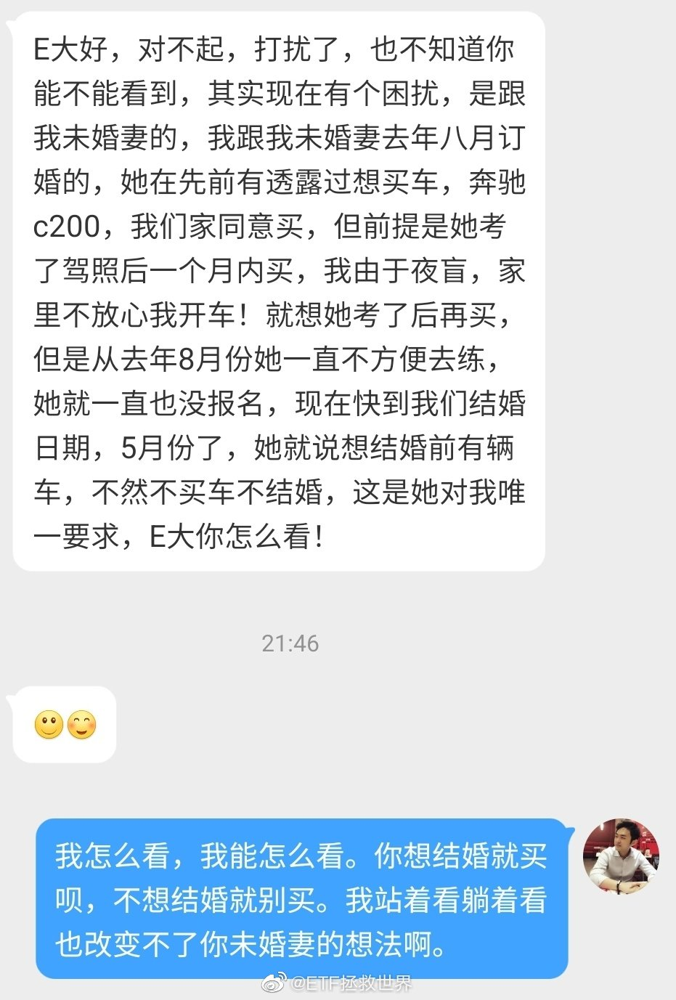

======================================================

ETF拯救世界 (5687069307) @
2022-02-10 09:12:06 Thu  
url: https://weibo.com/5687069307/LeN48aYMV

5个交易日提款，

谁支持，谁反对？ ​​​

转发[19]  评论[1158]  赞[2857] 

======================================================

ETF拯救世界 (5687069307) @
2022-02-10 09:23:48 Thu  
url: https://weibo.com/5687069307/LeN8SnW0X

儿子：我的蜂蜜蛋糕要烤一下

妈妈：微波炉转一下就行了

儿子：不要。我可是很讲究的人。

我：？？？ ​​​

转发[15]  评论[604]  赞[2401] 

======================================================

ETF拯救世界 (5687069307) @
2022-02-10 09:52:34 Thu  
url: https://weibo.com/5687069307/LeNkynuNO

你会怎么选？

你的脚下是一座活火山，根据各种情报表明，它会喷发。但是在山上有很多钻石或者黄金，离火山口越近的地方越多。

这时候，你有两个选择：

第一个，保命要紧。在山腰捡到自认为足够的钻石就下山。

第二个，自认为能够在火山喷发之前及时离开，所以依然往上爬，去捡那些更加丰厚的钻石。 ​​​

转发[219]  评论[711]  赞[2742] 

======================================================

ETF拯救世界 (5687069307) @
2022-02-10 09:55:13 Thu  
url: https://weibo.com/5687069307/LeNlDcFwR

[微笑]

------------------------------------------------------
转推：
>  @ETF拯救世界 (5687069307)
>  2022-02-09 14:41:41 Wed  
>  url: https:/weibo.com/5687069307/LeFNpsKFd/

>  无意义的反弹只会增加筑底时间，以及反弹之后下跌的强度。
>  
>  当然，还是我说的，如果我看错了，不是反弹是反转，今年继续大涨，我也很高兴。咱们都能又赚一年钱。
>  
>  怎么说呢，属于双赢，双面哪面出现都赢。 ​​​

转发[19]  评论[207]  赞[1649] 

======================================================

ETF拯救世界 (5687069307) @
2022-02-10 10:06:39 Thu  
url: https://weibo.com/5687069307/LeNqgCQOM

今年红利跑赢沪深300 8%，跑赢中证500 9%，跑赢创业板16%。

今年它依然是上涨的。

在弱势平衡中，强势品种也许还能保持强势。但真的一旦情绪快速变差，或者整体开始大幅回撤，那么所谓的强势品种也不可能独善其身。

那么这个最大持仓的品种，为什么我连一份都不卖呢，做个再平衡也好啊。

因为我真 ​​​

转发[111]  评论[469]  赞[2848] 

======================================================

ETF拯救世界 (5687069307) @
2022-02-10 10:24:39 Thu  
url: https://weibo.com/5687069307/LeNxzDjDQ

再说一次我的观点：

如果全年是V字型，上半年完成下跌主体，下半年有反弹，那么全年虽然收跌，但全年赚钱的机会非常大。这是最好最好的情况。

如果是L型就比较差。前面下跌，后面不断震荡，但是不会大幅反弹。那么，很难赚钱。

最差的是前面横盘甚至有反弹，后面大幅下跌。这种情况无法建立起低成本 ​​​

转发[386]  评论[908]  赞[4517] 

======================================================

ETF拯救世界 (5687069307) @
2022-02-10 14:00:26 Thu  
url: https://weibo.com/5687069307/LeOXauhSl

你有没有想过一个问题。

环保这种品种，我们是根据价值左侧卖一部分，根据趋势右侧卖一部分。

那么高位不卖甚至继续买的人，是因为看不到估值很高，还是看不到趋势已经坏了呢。

也许是因为高成长，认为贵点没事。也许是以为只是回调，还会继续涨。

总之，投资确实很难吧。 ​​​

转发[70]  评论[476]  赞[2660] 

======================================================

ETF拯救世界 (5687069307) @
2022-02-10 14:38:25 Thu  
url: https://weibo.com/5687069307/LePcA8PWI

从健身房回来，脱下181cm才能穿的帅气款羽绒服，晒着9摄氏度的冬季暖阳，喝着加冰块的零度可乐，看着想买的品种跌，

你能想象到吧这种舒服。 ​​​

转发[25]  评论[993]  赞[4263] 

======================================================

ETF拯救世界 (5687069307) @
2022-02-10 15:13:12 Thu  
url: https://weibo.com/5687069307/LePqHlnLj

买了大概率跑赢碎纸机。

------------------------------------------------------
转推：
>  @网易财经 (1974561081)
>  2022-02-10 15:00:01 Thu  
>  url: https:/weibo.com/1974561081/LePlm9Z37/

>  #提问2022# 【姚长盛对话管清友：#不买股票和基金可能跑不过印钞机#】由网易财经和微博新知博主、@微博财经 联合推出的《长盛时间·提问2022》中，如是金融研究院院长@管清友  表示，从居民资产配置的角度来讲，肯定要买股票、买基金，如果不持有这些金融资产，你很可能会被印钞机远远地落下。  ​​​

转发[53]  评论[241]  赞[1640] 

======================================================

ETF拯救世界 (5687069307) @
2022-02-10 15:26:57 Thu  
url: https://weibo.com/5687069307/LePwi2FGt

今天有传闻有资金大规模赎回女神的基金，导致医疗继续新低。再回头看看半个月前的这条微博。很多事情都是意料之中的。

------------------------------------------------------
转推：
>  @ETF拯救世界 (5687069307)
>  2022-01-28 10:08:03 Fri  
>  url: https:/weibo.com/5687069307/LcOSnFm6t/

>  在高位吸引不成熟的、幻想赚快钱的、对投资一窍不通的人申购自己的产品，然后抱团贵到匪夷所思的品种，其最大的危害并不是申购者的资产损失，价值毁灭，
>  
>  而是在下跌过程中，这些申购者会不会惊慌失措赎回产品，导致被抱团的，极度高估的品种更加快速的崩塌。
>  
>  羊群也好，旅鼠也好，当它们数量足够大， ​​​

转发[85]  评论[346]  赞[2112] 

======================================================

ETF拯救世界 (5687069307) @
2022-02-10 15:48:36 Thu  
url: https://weibo.com/5687069307/LePF4kkVj

今日数据，红利已经脱离非常便宜区域。未来是否会减持，要继续看数据。 ​​​

转发[101]  评论[479]  赞[3270] 

======================================================

ETF拯救世界 (5687069307) @
2022-02-11 08:53:22 Fri  
url: https://weibo.com/5687069307/LeWn1CIp7

再看看这篇，写在去年赛道股崩盘的前夕。再对照最近被质疑的明星，依然非常适用。

------------------------------------------------------
转推：
>  @ETF拯救世界 (5687069307)
>  2021-01-26 09:45:01 Tue  
>  url: https:/weibo.com/5687069307/JEVNs3xwZ/

>  小记目前的基金市场各方参与者状态。
>  
>  公募基金：
>  
>  从基金公司的角度讲，做大规模几乎是唯一的选择。因为头部效应越来越明显，现在的状态是20%的公司掌握80%的基金资产，未来就是10%-80%，甚至5%-80%。不做大规模，也许就生存不下去。
>  
>  做大规模的捷径是做出明星基金，以及推出明星基金经理。据说现在 ​​​

转发[165]  评论[377]  赞[2161] 

======================================================

ETF拯救世界 (5687069307) @
2022-02-11 09:42:23 Fri  
url: https://weibo.com/5687069307/LeWGV4dMq

我不懂，为什么只有食品饮料的走势，我的模型无法解释，不受模型规律约束。 ​​​

转发[36]  评论[521]  赞[2629] 

======================================================

ETF拯救世界 (5687069307) @
2022-02-11 10:09:54 Fri  
url: https://weibo.com/5687069307/LeWS5nfkq

全指医药历史上曾四次进入目前的区域。

这四次在刚进入时候买入，回本时间为1-1.5年之间。

回本后的走势自己去看。分别是：

06年3月，09年3月，13年1月，19年9月。 ​​​

转发[395]  评论[608]  赞[3292] 

======================================================

ETF拯救世界 (5687069307) @
2022-02-11 10:20:47 Fri  
url: https://weibo.com/5687069307/LeWWvhrV7

我还有个判断，

如果没有外力干扰，医药在2022年7月底前大概率会见到最低点。

最低点不是说一定会开始大涨，也许还会横盘，但最低点应该是在这半年内出现了。

再具体点，可能是3-7月之间。 ​​​

转发[526]  评论[1273]  赞[3969] 

======================================================

ETF拯救世界 (5687069307) @
2022-02-11 10:53:48 Fri  
url: https://weibo.com/5687069307/LeX9Uf6V0

周期、能源、金融、地产。

谁的热度红利都想蹭，没有节操，下流。 ​​​

转发[44]  评论[365]  赞[2356] 

======================================================

ETF拯救世界 (5687069307) @
2022-02-11 11:03:05 Fri  
url: https://weibo.com/5687069307/LeXdFFe8e

可能持仓的红利又要分红了，我估计每份1.5-2毛左右，当然还是选再投资。

有人说基金分红是左手倒右手。这种思维表明你大致处于第二阶段。

第一阶段是纯小白，认为基金分红是白给钱。第二阶段是认为左手倒右手。

还需要进阶。

这个事情没那么简单。 ​​​

转发[110]  评论[418]  赞[2385] 

======================================================

ETF拯救世界 (5687069307) @
2022-02-11 11:08:59 Fri  
url: https://weibo.com/5687069307/LeXg4ly3Z

我想到一个判断股票型基金经理是否高水平和高节操的标准：

看他是否在高位能够大比例分红+管理的所有基金全部暂停申购。

这代表几个意思：

第一，他能判断哪里是高位，代表水平够了。

第二，将已经取得的收益分配给持有人，让持有人落袋为安，享受牛市收益。

第三，不接受新的资金，避免价值毁灭 ​​​

转发[414]  评论[706]  赞[4123] 

======================================================

ETF拯救世界 (5687069307) @
2022-02-11 11:42:48 Fri  
url: https://weibo.com/5687069307/LeXtNmzeb

最近有空的朋友，可以抓紧时间复习一下美国资本市场的历史了。

1960-1990即可。 ​​​

转发[311]  评论[506]  赞[3559] 

======================================================

ETF拯救世界 (5687069307) @
2022-02-11 13:03:02 Fri  
url: https://weibo.com/5687069307/LeY0mrgXz

有些话我不知道怎么说。

这么说吧。

如果有那种让你特别痛苦、悲伤、愤怒……的新闻或者事件出现，是不是可以暂时不要受到铺天盖地众口一词声音的影响，如果你愿意，是不是可以试着认真追踪、收集资料、查询各方的证据，然后认真比对，分析，得出一个尽量接近真相的结果。

然后再做出选择。

大家认 ​​​

转发[96]  评论[452]  赞[3116] 

======================================================

ETF拯救世界 (5687069307) @
2022-02-11 13:22:45 Fri  
url: https://weibo.com/5687069307/LeY8mwR8f

2021年7月1日，中证医疗指数流通市值排名前30位的股票估值。

算术平均127倍。 ​​​

转发[262]  评论[432]  赞[2646] 

+++++++++++++++++++++++++++++++++++++++++++++++++++++

图片：
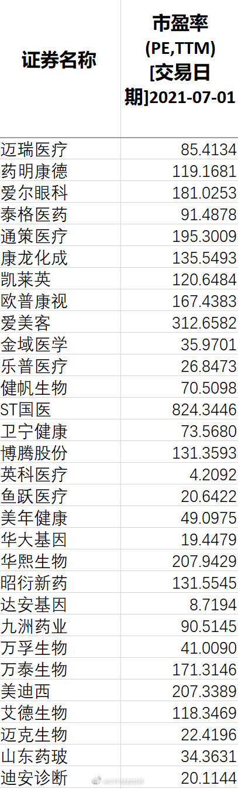

======================================================

ETF拯救世界 (5687069307) @
2022-02-11 13:54:28 Fri  
url: https://weibo.com/5687069307/LeYlfi5fH

回复@金融镭射眼:彼得林奇说过，如果你不知道买什么，记得不要买太贵的东西。（林奇：我说过吗）//@金融镭射眼:结论：贵了的不能买，[哈哈]

------------------------------------------------------
转推：
>  @ETF拯救世界 (5687069307)
>  2022-02-11 13:22:45 Fri  
>  url: https:/weibo.com/5687069307/LeY8mwR8f/

>  2021年7月1日，中证医疗指数流通市值排名前30位的股票估值。
>  
>  算术平均127倍。 ​​​

转发[73]  评论[200]  赞[1464] 

======================================================

ETF拯救世界 (5687069307) @
2022-02-11 14:05:56 Fri  
url: https://weibo.com/5687069307/LeYpTjWpN

这几年，我已经学会不再说什么贵了，什么便宜了。

因为我说贵了就会有人清仓。清仓了还涨，他就会回来骂我。然后呢，然后真的暴跌了，他也不会回来道歉。

贵还是便宜，我都用我的交易来说明。

别怪我不会再像2015年一样，在疯狂的时候提示什么了。人言可畏，除非精准的在最高点说，否则总是要挨骂的 ​​​

转发[52]  评论[1029]  赞[3681] 

======================================================

ETF拯救世界 (5687069307) @
2022-02-11 14:06:50 Fri  
url: https://weibo.com/5687069307/LeYqg6kwu

[怒]

【国债期货跌幅扩大，10年期主力合约跌0.52%，5年期主力合约跌0.39%，2年期主力合约跌0.13%。】 ​​​

转发[25]  评论[336]  赞[2292] 

======================================================

ETF拯救世界 (5687069307) @
2022-02-11 14:27:22 Fri  
url: https://weibo.com/5687069307/LeYyAAbJE

照这么跌，还有5天就能到了。

[太开心] ​​​

转发[40]  评论[1031]  赞[3934] 

======================================================

ETF拯救世界 (5687069307) @
2022-02-11 16:53:33 Fri  
url: https://weibo.com/5687069307/LeZvVxd9U

今日数据

完全没有任何惊喜。中规中矩，包括医药医疗，无法让人产生任何继续加仓的欲望。 ​​​

转发[28]  评论[531]  赞[3009] 

======================================================

ETF拯救世界 (5687069307) @
2022-02-11 21:08:45 Fri  
url: https://weibo.com/5687069307/Lf1bw1iUU

说明一下：

我认为市场是正常波动，A股依然是长牛过程中，现在是长牛中的回调。

我说的那些点位是提前设定的加仓点位，不是看空市场。

我是A股最寒冷时候最坚定的自干护盘人。 ​​​

转发[127]  评论[785]  赞[3890] 

======================================================

ETF拯救世界 (5687069307) @
2022-02-11 22:56:13 Fri  
url: https://weibo.com/5687069307/Lf1T8EqXL

刚才看有人在评论里说今天跌得害怕了，信心全无。

我不懂。

150今年回撤3.15%，自历史最高点回撤6.4%。这样就害怕了，失去信心了？

真的别投资了，存银行吧。 ​​​

转发[49]  评论[975]  赞[4239] 

======================================================

ETF拯救世界 (5687069307) @
2022-02-12 10:07:59 Sat  
url: https://weibo.com/5687069307/Lf6hO5yds

有人问大摩过山车的问题。如果是善意提问，我可以大致说说。如果是来问责，我请你赶紧取关。因为有铁粉标志，我姑且认为是前者。那我就说几句。

大摩并非特例，你之所以关注它，是因为它上涨的时候表现的太好了。其实第三轮到目前为止，清仓的品种只有创业板、消费、波段的500C、石油南油、标普。

其 ​​​

转发[249]  评论[1263]  赞[4923] 

======================================================

ETF拯救世界 (5687069307) @
2022-02-12 12:41:03 Sat  
url: https://weibo.com/5687069307/Lf7hW5p0I

突然想起来，大摩这种问题我应该放到之前说的在且慢开的那个专栏上。

我抽空整理一下，弄得有条理一点，更加深入的说说，就作为专栏第一篇放上去吧。 ​​​

转发[31]  评论[453]  赞[3002] 

======================================================

ETF拯救世界 (5687069307) @
2022-02-12 13:03:23 Sat  
url: https://weibo.com/5687069307/Lf7r0oxvI

回复@敬岳:周五应该已经全面升级了，下周一你试试。//@敬岳:【初四不抽只送，阳光普照】  今天不抽奖。年后直接为每位进行网格交易的朋友多增加五个条件单，祝大家虎年多提款，少操心！  感谢@华宝智投--上海浦电路营业部 对本次活动的大力支持。 ​​​  老大，这个坑几时填？[doge]

------------------------------------------------------
转推：
>  @ETF拯救世界 (5687069307)
>  2022-02-12 12:41:03 Sat  
>  url: https:/weibo.com/5687069307/Lf7hW5p0I/

>  突然想起来，大摩这种问题我应该放到之前说的在且慢开的那个专栏上。
>  
>  我抽空整理一下，弄得有条理一点，更加深入的说说，就作为专栏第一篇放上去吧。 ​​​

转发[10]  评论[191]  赞[1386] 

======================================================

ETF拯救世界 (5687069307) @
2022-02-12 13:15:08 Sat  
url: https://weibo.com/5687069307/Lf7vLCrWm

喷了，抽中的两位选了最贵的香奈儿五号和Miss dior。你们是不是一件件查了价格选的。

------------------------------------------------------
转推：
>  @ETF拯救世界 (5687069307)
>  2022-02-02 09:40:32 Wed  
>  url: https:/weibo.com/5687069307/LdzPHhiKo/

>  【初二抽奖】香水
>  
>  昨天抽了6000元购物卡，今天抽香水。本帖评论抽奖，抽2-3人，限铁粉。
>  
>  注意事项：
>  
>  第一，请真的喜欢，真的需要的朋友参与。别你不喜欢抽到了扔一边，喜欢的朋友抽不到，浪费。
>  
>  第二，全部都是全新专柜正品，包装完好。大多数是出去旅游的时候购买于境外专柜或者机场。但都不是这 ​​​

转发[13]  评论[821]  赞[2342] 

======================================================

ETF拯救世界 (5687069307) @
2022-02-13 11:16:27 Sun  
url: https://weibo.com/5687069307/Lfga5FBkK

我真的难以理解公元2022年，那些人的思维。

一方面不喜欢女孩，千方百计生男孩。一方面又不能接受单身，从人贩子那买媳妇。

是不是精神分裂？全是你自己造成的，凭什么去把别人的人生和家庭毁掉？

我之前说贩卖妇女儿童死刑，很多人不同意。那我再加一条来自普通人民群众的朴素想法：买家判无期！ ​​​

转发[239]  评论[1213]  赞[10138] 

======================================================

ETF拯救世界 (5687069307) @
2022-02-13 12:04:53 Sun  
url: https://weibo.com/5687069307/LfgtL79GJ

很多人觉得字好，内容不行。其实我想，是因为他们从没写过情书吧。情书的内容，就是表达自己的思念，自己的爱慕，自己乱七八糟的想法啊。话说回来，各位有多久没写过，或者从来没写过情书了？更别提手写了…

------------------------------------------------------
转推：
>  @ ()
>  2022-02-12 20:26:26 Sat  
>  url: 

>  抱歉，由于作者设置，你暂时没有这条微博的查看权限哦。查看帮助：http://t.cn/RfdBWwP ​​​

转发[37]  评论[527]  赞[2098] 

======================================================

ETF拯救世界 (5687069307) @
2022-02-13 14:13:49 Sun  
url: https://weibo.com/5687069307/Lfhk5nUcv

【情况说明】

近日，网络和个别自媒体平台流传北京市部分学校和幼儿园强制学生接种疫苗等内容，对相关工作存在误读，现作以下说明：

在疫苗接种工作上，市教委始终坚持必须科学严谨、安全规范，在疾控部门的指导和建议下平稳有序推进；始终将孩子的生命安全和身体健康放在第一位，按照知情、同意、自 ​​​

转发[3577]  评论[8515]  赞[60975] 

======================================================

ETF拯救世界 (5687069307) @
2022-02-14 10:33:26 Mon  
url: https://weibo.com/5687069307/Lfpj8oXwv

我之前说过很多次，想要不被骗就是两点：

第一，不贪心。不相信好事会那么轻易的送上门来。

第二，不掏钱。

其实在股市也一样。

如果没有浮亏的痛苦，怎么会轻易让你买到钻石。你凭什么啊。

每天都有热点波动，骗你入场。没关系，只要你不掏钱，每日热点就不会骗到你。 ​​​

转发[96]  评论[929]  赞[3558] 

+++++++++++++++++++++++++++++++++++++++++++++++++++++

图片：
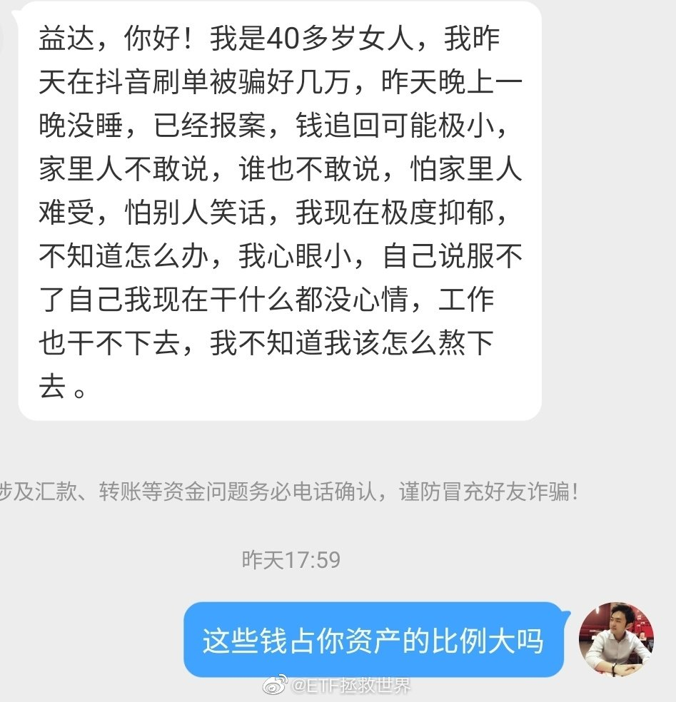

======================================================

ETF拯救世界 (5687069307) @
2022-02-14 14:41:31 Mon  
url: https://weibo.com/5687069307/LfqVPetDl

不要反弹，反弹只会延长见底时间 ​​​

转发[86]  评论[790]  赞[3583] 

======================================================

ETF拯救世界 (5687069307) @
2022-02-14 15:41:41 Mon  
url: https://weibo.com/5687069307/Lfrkfkuvo

今天一个人过节的出来抱团。 ​​​

转发[34]  评论[1830]  赞[5223] 

+++++++++++++++++++++++++++++++++++++++++++++++++++++

图片：

======================================================

ETF拯救世界 (5687069307) @
2022-02-14 16:22:36 Mon  
url: https://weibo.com/5687069307/LfrARbhTe

我好想好想好想在S冲一份医药，

但又怕那些娇嫩的小心脏受不了。

老司机再把握一下。 ​​​

转发[71]  评论[1292]  赞[4244] 

======================================================

ETF拯救世界 (5687069307) @
2022-02-14 16:34:42 Mon  
url: https://weibo.com/5687069307/LfrFLxCZz

今日数据：

科创50今日创出上市以来估值最低，终于快跌破60倍了……

创业板也终于有可能元神归位了。 ​​​

转发[260]  评论[582]  赞[3431] 

+++++++++++++++++++++++++++++++++++++++++++++++++++++

图片：
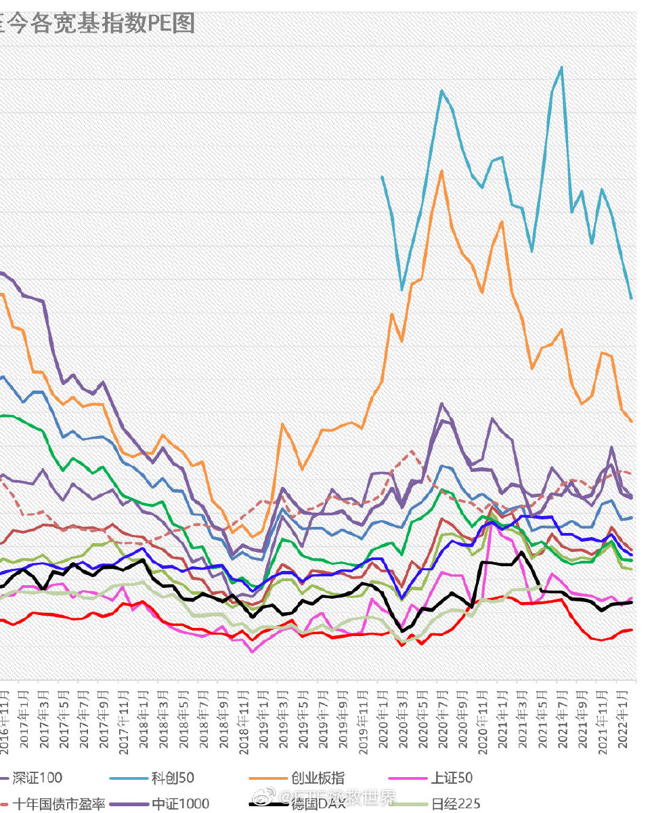

======================================================

ETF拯救世界 (5687069307) @
2022-02-14 17:10:29 Mon  
url: https://weibo.com/5687069307/LfrUicheT

欧洲今天跌了3%，我最近正在处心积虑布局一个新的国际品种。

如果能再来一次2020.3，那么就是最好的机会。 ​​​

转发[51]  评论[973]  赞[4391] 

======================================================

ETF拯救世界 (5687069307) @
2022-02-15 11:07:08 Tue  
url: https://weibo.com/5687069307/LfyXiEMur

什么玩意儿

------------------------------------------------------
转推：
>  @ETF拯救世界 (5687069307)
>  2022-02-14 16:22:36 Mon  
>  url: https:/weibo.com/5687069307/LfrARbhTe/

>  我好想好想好想在S冲一份医药，
>  
>  但又怕那些娇嫩的小心脏受不了。
>  
>  老司机再把握一下。 ​​​

转发[22]  评论[969]  赞[3190] 

======================================================

ETF拯救世界 (5687069307) @
2022-02-15 14:47:46 Tue  
url: https://weibo.com/5687069307/LfAoRiD3t

能突破11900再嘚瑟吧。

辣鸡医药，一点都不想买。有什么了不起，呵呵。

（刚删的那条看错图了……） ​​​

转发[45]  评论[835]  赞[3531] 

======================================================

ETF拯救世界 (5687069307) @
2022-02-15 21:33:40 Tue  
url: https://weibo.com/5687069307/LfD3CazDO

下跌的日子，我的发博量比上涨的日子多20倍。

我是有多爱下跌的辣鸡啊。 ​​​

转发[28]  评论[1618]  赞[4757] 

======================================================

ETF拯救世界 (5687069307) @
2022-02-17 15:08:14 Thu  
url: https://weibo.com/5687069307/LfToan2K5

摸着良心讲，两天没见，有没有偶尔想起我。

想起我们开心的过往。 ​​​

转发[70]  评论[3804]  赞[7405] 

+++++++++++++++++++++++++++++++++++++++++++++++++++++

图片：
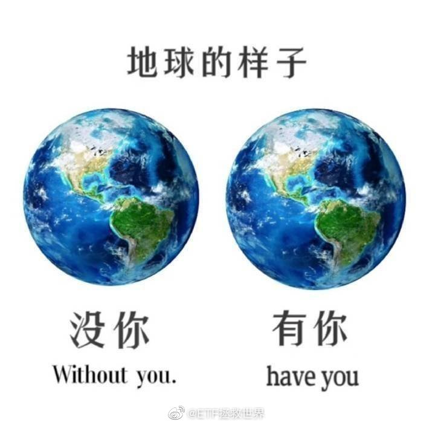

======================================================

ETF拯救世界 (5687069307) @
2022-02-18 15:47:20 Fri  
url: https://weibo.com/5687069307/Lg34xbcJF

健身房四个人，三个妹子。 ​​​

转发[19]  评论[1009]  赞[4665] 

======================================================

ETF拯救世界 (5687069307) @
2022-02-18 16:44:18 Fri  
url: https://weibo.com/5687069307/Lg3rEEehz

每天开盘

在长长的买单里

挂上我的条件单

等着捡我的辣鸡

到收盘

才发现今天不卖辣鸡 ​​​

转发[23]  评论[589]  赞[2813] 

======================================================

ETF拯救世界 (5687069307) @
2022-02-18 17:15:57 Fri  
url: https://weibo.com/5687069307/Lg3EuD9AV

有一个问题

我们的年度富豪榜前几名，有没有下场还不错的 ​​​

转发[34]  评论[556]  赞[3555] 

======================================================

ETF拯救世界 (5687069307) @
2022-02-18 20:56:23 Fri  
url: https://weibo.com/5687069307/Lg55YgI3S

再说一次我的想法

很多事情不能浮于表面去看，而是要从最本质上出发去考虑。

什么是最本质呢。还是第一卷第一篇文章。

真正深刻理解了本质，很多现象就会理解，未来会发生什么，自己如何应对也会有答案。 ​​​

转发[79]  评论[519]  赞[3286] 

======================================================

ETF拯救世界 (5687069307) @
2022-02-19 20:02:28 Sat  
url: https://weibo.com/5687069307/LgeaAbxTM

有目标很重要，为了实现目标努力也很重要。

但是，享受生活每一刻更重要。不要为了早点到达山顶，放弃了沿途的风景。

人生只有一次。享受生活每一刻。观察，感受，创造生活，而不仅仅是活着。

目标达到了，你大概率会发现不过如此。没有达到，如果连过程都没享受，不是更亏。

一花一世界，一叶一菩 ​​​

转发[429]  评论[844]  赞[4662] 

======================================================

ETF拯救世界 (5687069307) @
2022-02-20 12:35:42 Sun  
url: https://weibo.com/5687069307/LgkFJAcx5

目前A股的状态：

中庸。

中小股票经过一年多的上涨，已经不便宜，回到中枢位置。大股票指数却因为连续将抱团大涨的牛股纳入，将不涨的品种剔除，也并未因为下跌变得便宜些。

行业板块方面也是乏善可陈。环保消费虽然真的跌了很多，但依然让人没有买入或者买回的欲望。医药也只是回到了中枢附近。红 ​​​

转发[475]  评论[1205]  赞[4996] 

======================================================

ETF拯救世界 (5687069307) @
2022-02-21 13:15:59 Mon  
url: https://weibo.com/5687069307/LgumAf6F2

它涨得并不快。

但它一直在努力。

听懂掌声。 ​​​

转发[38]  评论[929]  赞[3562] 

+++++++++++++++++++++++++++++++++++++++++++++++++++++

图片：
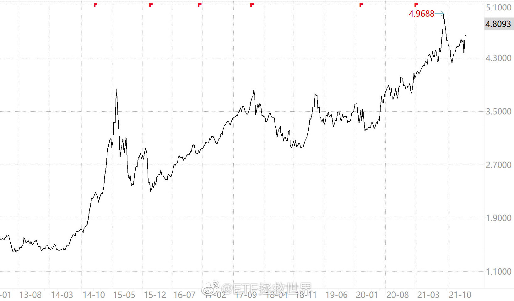

======================================================

ETF拯救世界 (5687069307) @
2022-02-21 14:02:14 Mon  
url: https://weibo.com/5687069307/LguFmcPjQ

今天看了一个数据，说根据人口普查，有些县市的0-4岁男孩女孩的比例是1.8:1.

也就是男孩比女孩多80%。

除了有一些瞒报的，生育前B超或者验孕发现是女孩就打掉的应该是占了主要原因。

我真的无言以对。所以你说人类整体是不是非常愚昧。对，他们做出这样的选择，一定有自己这样那样的原因。但他们就 ​​​

转发[146]  评论[1197]  赞[5966] 

======================================================

ETF拯救世界 (5687069307) @
2022-02-21 20:08:11 Mon  
url: https://weibo.com/5687069307/Lgx3TtV3T

不知道为什么，心情突然就很不好。

想来想去不知道为什么，也有可能是饿的。

你有没有突然之间心情毫无缘由变差的经历。 ​​​

转发[43]  评论[1743]  赞[3655] 

======================================================

ETF拯救世界 (5687069307) @
2022-02-21 21:22:53 Mon  
url: https://weibo.com/5687069307/Lgxye30aH

今天Dax再跌两个多点，创近一年新低。

走得早不如走得巧。 ​​​

转发[65]  评论[554]  赞[2737] 

+++++++++++++++++++++++++++++++++++++++++++++++++++++

图片：
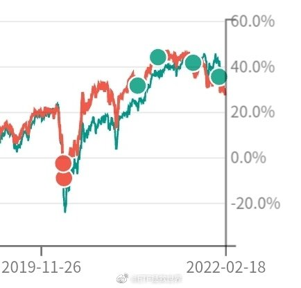

======================================================

ETF拯救世界 (5687069307) @
2022-02-21 22:04:04 Mon  
url: https://weibo.com/5687069307/LgxOW3OG4

什么意思，是不相信我吗。[怒] ​​​

转发[44]  评论[1337]  赞[4392] 

+++++++++++++++++++++++++++++++++++++++++++++++++++++

图片：
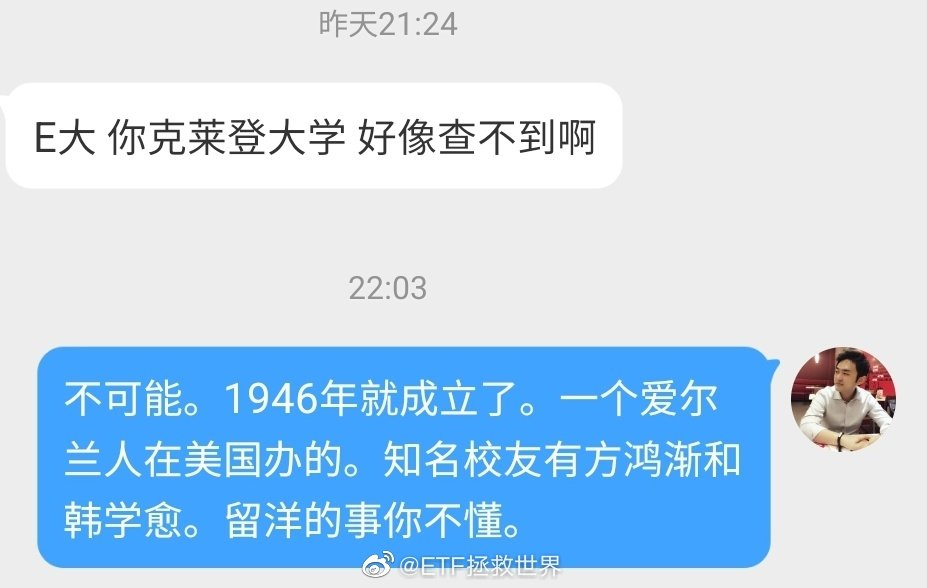

======================================================

ETF拯救世界 (5687069307) @
2022-02-22 11:38:53 Tue  
url: https://weibo.com/5687069307/LgD9FnYKI

天下大乱，不要乱买，执行策略，保命 ​​​

转发[86]  评论[1588]  赞[4843] 

======================================================

ETF拯救世界 (5687069307) @
2022-02-22 13:19:41 Tue  
url: https://weibo.com/5687069307/LgDOAedjf

[微笑]

------------------------------------------------------
转推：
>  @ETF拯救世界 (5687069307)
>  2022-02-14 14:41:31 Mon  
>  url: https:/weibo.com/5687069307/LfqVPetDl/

>  不要反弹，反弹只会延长见底时间 ​​​

转发[23]  评论[393]  赞[2446] 

======================================================

ETF拯救世界 (5687069307) @
2022-02-22 13:29:34 Tue  
url: https://weibo.com/5687069307/LgDSB0mvv

我心中的最大的怨念依然是消费。

2020年5月以来的疯癫状态，到底怎样才会结束。

即使跌到现在，它居然依然还没有进入我定义的可买入区间上限。

是我错了还是市场错了。

所有板块，只有它依然无法哪怕下手一点点。

这是道德的沦丧，还是人性的扭曲。 ​​​

转发[200]  评论[779]  赞[3527] 

======================================================

ETF拯救世界 (5687069307) @
2022-02-22 15:55:12 Tue  
url: https://weibo.com/5687069307/LgEPI1QkK

兄弟我做了一些关于战争与股市走势的研究，随便说两句，您随便看看。

第一，直接或间接参与的战争会影响股市走势。

第二，对于大国来说，局部战争不会影响很大。

第三，对于大规模的战争，还是要躲一躲。跌幅不会小。

第四，不能等战争结束再重新入场，那已经晚了。最佳入场时机是胜负天平开始倾斜 ​​​

转发[238]  评论[889]  赞[3694] 

+++++++++++++++++++++++++++++++++++++++++++++++++++++

图片：
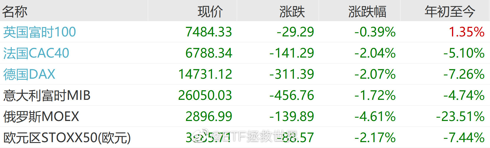

======================================================

ETF拯救世界 (5687069307) @
2022-02-22 17:12:48 Tue  
url: https://weibo.com/5687069307/LgFlcCgvx

记忆力好的朋友应该还记得我们之前开过一个DAX网格，但价格没到后来就撤了。

现在有机会重开了。

等着吧，合适了我会重新开。

多大点事儿，有钱还怕买不到东西吗。[亲亲] ​​​

转发[92]  评论[627]  赞[2547] 

+++++++++++++++++++++++++++++++++++++++++++++++++++++

图片：
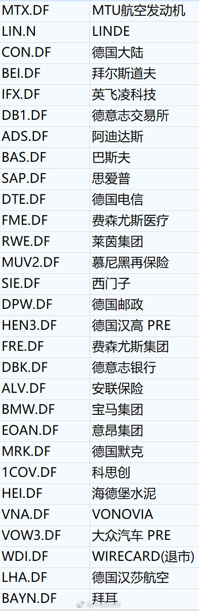

======================================================

ETF拯救世界 (5687069307) @
2022-02-22 18:10:45 Tue  
url: https://weibo.com/5687069307/LgFIJaipn

回复@核心天天红:已拉黑。这一两年开始参考的吧，就差跪下求你别跟了。你不走，我送你走。//@核心天天红:150还亏钱没赚到[泪]

------------------------------------------------------
转推：
>  @ETF拯救世界 (5687069307)
>  2022-02-20 12:35:42 Sun  
>  url: https:/weibo.com/5687069307/LgkFJAcx5/

>  目前A股的状态：
>  
>  中庸。
>  
>  中小股票经过一年多的上涨，已经不便宜，回到中枢位置。大股票指数却因为连续将抱团大涨的牛股纳入，将不涨的品种剔除，也并未因为下跌变得便宜些。
>  
>  行业板块方面也是乏善可陈。环保消费虽然真的跌了很多，但依然让人没有买入或者买回的欲望。医药也只是回到了中枢附近。红 ​​​

转发[30]  评论[316]  赞[1871] 

======================================================

ETF拯救世界 (5687069307) @
2022-02-22 18:32:40 Tue  
url: https://weibo.com/5687069307/LgFRCvdkj

在我看来，资产管理行业应该是双向选择。这件事我已经阐述过了。

可惜，99.99999%的资管都是张开双臂欢迎所有资金。因为资管行业追求的是规模。规模大了，对于管理人来说，才有更好的回报。

不好意思，我就是那0.00001%其中的一个。

我的钱不多，但踏踏实实过一辈子应该够了。我也不想再买什么豪宅 ​​​

转发[207]  评论[896]  赞[3991] 

======================================================

ETF拯救世界 (5687069307) @
2022-02-22 18:45:09 Tue  
url: https://weibo.com/5687069307/LgFWGzrk2

回复@Felicia_沉迷吸宇:150或者S如果要调高每份金额，我的建议是新资金再开新计划。否则会遇到很多问题，比如应卖不卖的问题。

------------------------------------------------------
转推：
>  @ETF拯救世界 (5687069307)
>  2022-02-22 18:32:40 Tue  
>  url: https:/weibo.com/5687069307/LgFRCvdkj/

>  在我看来，资产管理行业应该是双向选择。这件事我已经阐述过了。
>  
>  可惜，99.99999%的资管都是张开双臂欢迎所有资金。因为资管行业追求的是规模。规模大了，对于管理人来说，才有更好的回报。
>  
>  不好意思，我就是那0.00001%其中的一个。
>  
>  我的钱不多，但踏踏实实过一辈子应该够了。我也不想再买什么豪宅 ​​​

转发[56]  评论[284]  赞[1701] 

======================================================

ETF拯救世界 (5687069307) @
2022-02-22 18:52:29 Tue  
url: https://weibo.com/5687069307/LgFZFy7xF

有意思吗？？ http://t.cn/A66vK6jP

------------------------------------------------------
转推：
>  @ETF拯救世界 (5687069307)
>  2022-02-22 17:12:48 Tue  
>  url: https:/weibo.com/5687069307/LgFlcCgvx/

>  记忆力好的朋友应该还记得我们之前开过一个DAX网格，但价格没到后来就撤了。
>  
>  现在有机会重开了。
>  
>  等着吧，合适了我会重新开。
>  
>  多大点事儿，有钱还怕买不到东西吗。[亲亲] ​​​

转发[25]  评论[368]  赞[1536] 

======================================================

ETF拯救世界 (5687069307) @
2022-02-22 19:13:08 Tue  
url: https://weibo.com/5687069307/LgG8353x7

想换手机。

可是想买的其实与现在用的几乎一样，只是拍照好了点。

但是我出门经常带黑卡或者A7，所以拍照好点也没太大意义。

那你说我应该买吗。 ​​​

转发[21]  评论[1087]  赞[2968] 

======================================================

ETF拯救世界 (5687069307) @
2022-02-23 11:25:05 Wed  
url: https://weibo.com/5687069307/LgMuz0IwP

在股市，永远不要劝别人“不要买什么”，即使这个东西非常贵。也永远不要劝别人“买什么”，即使这个东西很便宜。

我来讲讲为什么。

如果你喜欢做这些事，只能说明一个问题：你对人性没有真正的理解。你没有认识到，大多数，甚至绝大多数人，是不理智的。出了问题，他们永远不会想是自己哪里做得有问 ​​​

转发[302]  评论[788]  赞[3317] 

======================================================

ETF拯救世界 (5687069307) @
2022-02-23 11:51:50 Wed  
url: https://weibo.com/5687069307/LgMFqbOM3

我选择相信。因为想不出省委乃至ZY隐瞒拐卖事实的理由。同时，我再次表达一个普通人的朴素看法：拐卖人口的人贩子以及买家，请修改法律，加到无期到死刑！那是一个人、一个家庭的全部人生，因为那些辣鸡的拐卖行为，全毁了！

------------------------------------------------------
转推：
>  @新华网 (2810373291)
>  2022-02-23 11:20:34 Wed  
>  url: https:/weibo.com/2810373291/LgMsJi2Zn/

>  江苏省委省政府调查组发布“丰县生育八孩女子”事件调查处理情况通报 ​​​

转发[179]  评论[806]  赞[5340] 

======================================================

ETF拯救世界 (5687069307) @
2022-02-23 12:11:18 Wed  
url: https://weibo.com/5687069307/LgMNk7op0

我一个朋友跟我说：

相信不相信一件事，不能凭感情和感觉，而是理性的分析。

谎言，一定有一些构成因素。比如：说谎的动机。

说谎嫌疑人自己也会有一个权衡，比如，说谎能得到的利益与后果的对比。

从理智上讲，大多数情况下，GF的TB会比传言靠谱一点。当然，有一些TB的可疑性就大一点，比如：

级 ​​​

转发[60]  评论[550]  赞[3737] 

======================================================

ETF拯救世界 (5687069307) @
2022-02-23 12:32:23 Wed  
url: https://weibo.com/5687069307/LgMVSriES

其实我觉得能鲜明表达自己的看法特别好。即使我知道我说的很多人会不同意，甚至因此变得讨厌我。

我说一些大家都爱听的，或者不说，不是挺好吗。也没人因此讨厌我，其乐融融。

但那还是我吗。还是说，那只是一个虚假的，经过刻意隐藏的形象而已？

没有任何两个人对任何事情的看法都一样。如果只是因 ​​​

转发[72]  评论[448]  赞[3069] 

======================================================

ETF拯救世界 (5687069307) @
2022-02-23 13:31:17 Wed  
url: https://weibo.com/5687069307/LgNjNff4A

昨天券商最低

1.032

为什么这个世界是这样的。 ​​​

转发[18]  评论[640]  赞[2594] 

======================================================

ETF拯救世界 (5687069307) @
2022-02-23 13:55:28 Wed  
url: https://weibo.com/5687069307/LgNtBD33G

小猫后续：

很多朋友关心小猫的事。最新进展，有朋友送了一只，一会见到。我也不知道什么品种，到时候拍照上来让各位猫伯乐鉴定。 ​​​

转发[15]  评论[726]  赞[2421] 

======================================================

ETF拯救世界 (5687069307) @
2022-02-23 15:18:39 Wed  
url: https://weibo.com/5687069307/LgO1ne0JQ

昨天买的手机送一个buds pro耳机。这耳机我自己现在在用，非常不错。

不出意外的话，我会把这个送的新耳机抽奖送掉。

如果你最近想买蓝牙耳机，可以等等，万一中了呢是不是。

祝您中奖。[鲜花] ​​​

转发[49]  评论[3315]  赞[4131] 

======================================================

ETF拯救世界 (5687069307) @
2022-02-23 18:23:46 Wed  
url: https://weibo.com/5687069307/LgPevom7g

虽然我与部分博友对于最终结论的看法不同，

但这不能改变我对他们以及更多人的敬意。

如果没有大家的关注以及声音，就没有最终的，更加接近真相的结果（即使很多人认为结论与真相相去甚远）。

无论如何，希望由此事件，对于女性权益的保障，对于被拐卖人员的救助，对于参与拐卖犯罪行为人员的更大力 ​​​

转发[211]  评论[541]  赞[3679] 

======================================================

ETF拯救世界 (5687069307) @
2022-02-23 20:45:21 Wed  
url: https://weibo.com/5687069307/LgQ9Yt8ul

每个人都有自己的爱好，只要不犯法，别人不要瞎操心。 ​​​

转发[28]  评论[442]  赞[2201] 

+++++++++++++++++++++++++++++++++++++++++++++++++++++

图片：
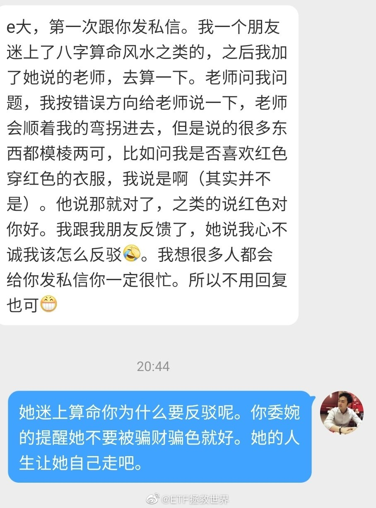

======================================================

ETF拯救世界 (5687069307) @
2022-02-24 10:22:45 Thu  
url: https://weibo.com/5687069307/LgVvL5CHu

相信价值。坚持信念

------------------------------------------------------
转推：
>  @ETF拯救世界 (5687069307)
>  2022-02-22 13:29:34 Tue  
>  url: https:/weibo.com/5687069307/LgDSB0mvv/

>  我心中的最大的怨念依然是消费。
>  
>  2020年5月以来的疯癫状态，到底怎样才会结束。
>  
>  即使跌到现在，它居然依然还没有进入我定义的可买入区间上限。
>  
>  是我错了还是市场错了。
>  
>  所有板块，只有它依然无法哪怕下手一点点。
>  
>  这是道德的沦丧，还是人性的扭曲。 ​​​

转发[27]  评论[318]  赞[1875] 

======================================================

ETF拯救世界 (5687069307) @
2022-02-24 10:33:56 Thu  
url: https://weibo.com/5687069307/LgVAimTdM

这一轮卖掉内地消费后，不是没买过。这个买了一份。

买点当然照例是蒙的。但也能看出，我的价值观是有点用的 ​​​

转发[38]  评论[354]  赞[2182] 

+++++++++++++++++++++++++++++++++++++++++++++++++++++

图片：
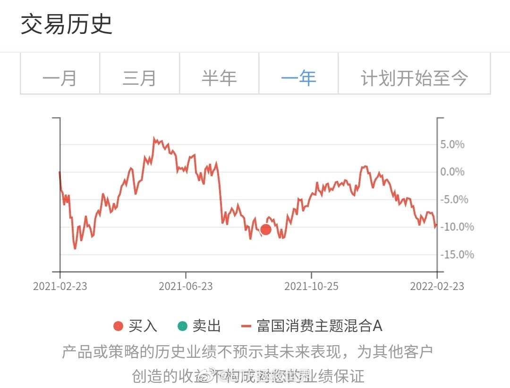

======================================================

ETF拯救世界 (5687069307) @
2022-02-24 10:42:45 Thu  
url: https://weibo.com/5687069307/LgVDSl5NK

冷知识：

你以前买的投资金条现在去卖大概率能挣钱。除非你买在最高区域。

你买的黄金首饰能拿回80%本金。

你买的钻石能拿回20—30%本金（就算不错了）。

看到有人炒作钻石价格上涨有感。

当然，买钻石又不是为了保值，是为了一颗永流传，阿拉懂的。 ​​​

转发[112]  评论[641]  赞[2921] 

======================================================

ETF拯救世界 (5687069307) @
2022-02-24 11:19:09 Thu  
url: https://weibo.com/5687069307/LgVSF0riR

恒生18500-22000之间会买5-6份以上。别忘了攒钱。 ​​​

转发[308]  评论[1304]  赞[4449] 

======================================================

ETF拯救世界 (5687069307) @
2022-02-24 12:51:11 Thu  
url: https://weibo.com/5687069307/LgWu13jrr

我直接好家伙！ ​​​

转发[22]  评论[591]  赞[2491] 

======================================================

ETF拯救世界 (5687069307) @
2022-02-24 13:02:43 Thu  
url: https://weibo.com/5687069307/LgWyGzNwM

A股真的是被一帮神经病把持的地方。 ​​​

转发[52]  评论[659]  赞[3686] 

======================================================

ETF拯救世界 (5687069307) @
2022-02-24 13:28:56 Thu  
url: https://weibo.com/5687069307/LgWJks5O6

不要相信自己的感觉。

相信策略。

到了市场上，你就是没有感情的野生AI。 ​​​

转发[39]  评论[447]  赞[2706] 

======================================================

ETF拯救世界 (5687069307) @
2022-02-24 13:38:40 Thu  
url: https://weibo.com/5687069307/LgWNhmB0a

一个小时，我感觉被干掉的不是乌克兰的海军和空军，而是我的账户。[微笑] ​​​

转发[197]  评论[686]  赞[4045] 

======================================================

ETF拯救世界 (5687069307) @
2022-02-24 13:43:00 Thu  
url: https://weibo.com/5687069307/LgWP2taJy

乌克兰也许会投降，我的账户不会！[怒]

------------------------------------------------------
转推：
>  @ETF拯救世界 (5687069307)
>  2022-02-24 13:38:40 Thu  
>  url: https:/weibo.com/5687069307/LgWNhmB0a/

>  一个小时，我感觉被干掉的不是乌克兰的海军和空军，而是我的账户。[微笑] ​​​

转发[64]  评论[359]  赞[2272] 

======================================================

ETF拯救世界 (5687069307) @
2022-02-24 13:47:40 Thu  
url: https://weibo.com/5687069307/LgWQW1iKD

今天我对东欧的地理知识上升了一个lv. ​​​

转发[26]  评论[312]  赞[2094] 

+++++++++++++++++++++++++++++++++++++++++++++++++++++

图片：
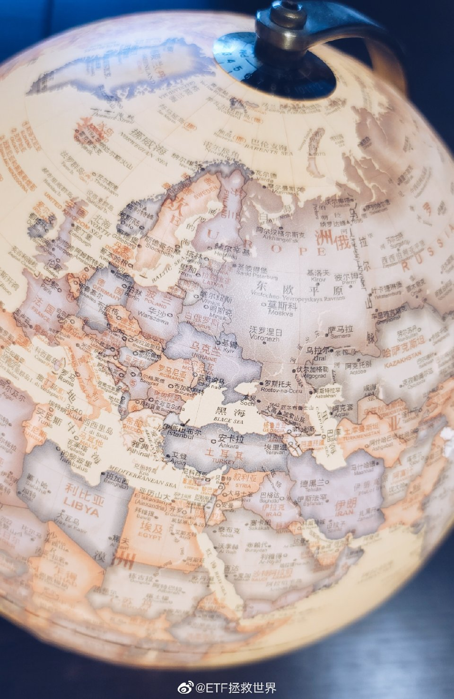

======================================================

ETF拯救世界 (5687069307) @
2022-02-24 13:57:09 Thu  
url: https://weibo.com/5687069307/LgWUN6DHy

战争对人民都是坏事。希望世界早日和平，东欧人民尽快安居乐业。

但是我想说未来也许我们会买到便宜货，这不是不道德的，也不是什么带血的筹码，因为，

往小了说，这会让我们的家庭资产增加，增加家庭财务稳定度，保持家庭和谐，

往大了说，这是践行ZY共同富裕的理念，也是为祖国的金融市场稳定贡献 ​​​

转发[91]  评论[549]  赞[3124] 

======================================================

ETF拯救世界 (5687069307) @
2022-02-24 14:08:55 Thu  
url: https://weibo.com/5687069307/LgWZyxLz6

按摩一下，脆弱的朋友往前面排：

第一，你买的是指数。股票和公司会死，指数不会。除非出天大的事。

第二，你的成本不高。如果你这一两年开始，你的成本比以前的朋友高，但你买的少。仓位非常低。

第三，你还有准备了很久的现金。

第四，你不持有东欧的基金。但你有黄金和油的。

第五，战场离中国 ​​​

转发[212]  评论[979]  赞[3343] 

======================================================

ETF拯救世界 (5687069307) @
2022-02-24 14:15:06 Thu  
url: https://weibo.com/5687069307/LgX24lJO8

世界这么乱，真的先不要再打孩子了。

等天下太平了再打吧。 ​​​

转发[21]  评论[363]  赞[2501] 

======================================================

ETF拯救世界 (5687069307) @
2022-02-24 14:27:53 Thu  
url: https://weibo.com/5687069307/LgX7g75X9

//@挖龙脉的超级鹿鼎公: //@不折腾forever: 北约逼到家门口了，与其慢慢被绞杀，不如豁出去拼了，意思是敢干涉就打烂欧洲，这不刚搞了核演习吗？放出的信号很明白了。“历史上从未尝过的后果”，那不就是核弹嘛。

------------------------------------------------------
转推：
>  @今日俄罗斯RT (6244553417)
>  2022-02-24 13:11:00 Thu  
>  url: https:/weibo.com/6244553417/LgWC3gj8S/

>  【我有句重要的话，今日一定要讲#普京呼吁乌克兰士兵放下武器#】普京：我想说一句非常非常重要的话，给那些想要干预我们的人听——
>  无论谁试图给我们的国家和人民制造威胁，
>  这些人都应该知道，俄罗斯的反应是绝对迅速的。
>  这将使你们品尝到历史上从未尝过的后果。  http://t.cn/A66hqin8 ​​​

转发[15]  评论[185]  赞[1339] 

======================================================

ETF拯救世界 (5687069307) @
2022-02-24 14:38:49 Thu  
url: https://weibo.com/5687069307/LgXbHejse

恒科中网到手。卖出价格我需要较长时间计算，更新会延后。 ​​​

转发[47]  评论[1024]  赞[2996] 

======================================================

ETF拯救世界 (5687069307) @
2022-02-24 15:04:11 Thu  
url: https://weibo.com/5687069307/LgXlZsSe4

各位，2020，俄乌这场战争，是跟各位一起见证的，也算是一种缘分。

苟富贵勿相忘。 ​​​

转发[68]  评论[1501]  赞[5387] 

======================================================

ETF拯救世界 (5687069307) @
2022-02-24 15:18:18 Thu  
url: https://weibo.com/5687069307/LgXrJhvI6

8年前，油价100。

2年前，油价是负的。

现在，100。

这就是金融的世界。 ​​​

转发[104]  评论[382]  赞[3046] 

======================================================

ETF拯救世界 (5687069307) @
2022-02-24 15:34:48 Thu  
url: https://weibo.com/5687069307/LgXyq7DdI

有大规模战争风险的市场，一定要先跑掉规避风险。 ​​​

转发[100]  评论[310]  赞[2466] 

+++++++++++++++++++++++++++++++++++++++++++++++++++++

图片：
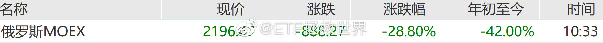

======================================================

ETF拯救世界 (5687069307) @
2022-02-24 15:50:10 Thu  
url: https://weibo.com/5687069307/LgXEECJyN

小猫躲在床下已经24小时了。

我知道不应该管它，让它慢慢适应。

但是，它如果拉尿在床下面怎么办。。。 ​​​

转发[15]  评论[610]  赞[2771] 

======================================================

ETF拯救世界 (5687069307) @
2022-02-24 16:10:37 Thu  
url: https://weibo.com/5687069307/LgXMXnF71

很多事情你慌，其实是因为你没有“有效经历”过。

什么是有效经历。

就是你有过经验。经历过类似的事情，从头到尾。

但这并不够。80%来资本市场玩的人，多的只是经历，而不是有效经历。简单的经历什么也记不住，因为他根本就没弄懂，能记住什么？所以一次次重复失败。

有效经历最重要的是“有效” ​​​

转发[460]  评论[707]  赞[3835] 

======================================================

ETF拯救世界 (5687069307) @
2022-02-24 16:26:31 Thu  
url: https://weibo.com/5687069307/LgXTpsip7

一天40%。麻了。 ​​​

转发[60]  评论[343]  赞[2114] 

+++++++++++++++++++++++++++++++++++++++++++++++++++++

图片：
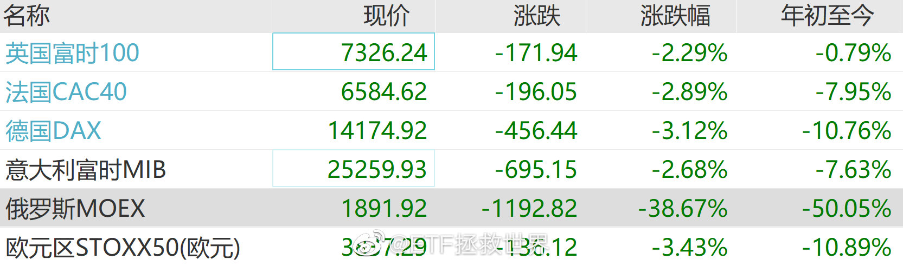

======================================================

ETF拯救世界 (5687069307) @
2022-02-24 16:36:38 Thu  
url: https://weibo.com/5687069307/LgXXwpyyq

关于DAX，我有第一个加仓目标点，把它买回来。但我现在暂时不说。

------------------------------------------------------
转推：
>  @ETF拯救世界 (5687069307)
>  2022-02-21 21:22:53 Mon  
>  url: https:/weibo.com/5687069307/Lgxye30aH/

>  今天Dax再跌两个多点，创近一年新低。
>  
>  走得早不如走得巧。 ​​​

转发[36]  评论[436]  赞[2222] 

======================================================

ETF拯救世界 (5687069307) @
2022-02-24 18:57:00 Thu  
url: https://weibo.com/5687069307/LgYSuw3lW

内事不决问博友，诚不欺我！

把猫砂盆，食物和水全部送到床底下，然后用监控全程观看了小猫如厕的过程！

博友，伟大。 ​​​

转发[15]  评论[356]  赞[2370] 

======================================================

ETF拯救世界 (5687069307) @
2022-02-24 19:11:58 Thu  
url: https://weibo.com/5687069307/LgYYzf6nN

回复@Jjjun1900:我写的微博每一个字，公众号文章每一个字，都是我自己写的。公众号排版的小助理也不允许改任何字。这点，我用所有的资产和魅力保证。//@Jjjun1900:回复@withTink:他有秘书，有团队，你就是一个人

------------------------------------------------------
转推：
>  @ETF拯救世界 (5687069307)
>  2022-02-24 16:10:37 Thu  
>  url: https:/weibo.com/5687069307/LgXMXnF71/

>  很多事情你慌，其实是因为你没有“有效经历”过。
>  
>  什么是有效经历。
>  
>  就是你有过经验。经历过类似的事情，从头到尾。
>  
>  但这并不够。80%来资本市场玩的人，多的只是经历，而不是有效经历。简单的经历什么也记不住，因为他根本就没弄懂，能记住什么？所以一次次重复失败。
>  
>  有效经历最重要的是“有效” ​​​

转发[25]  评论[292]  赞[2124] 

======================================================

ETF拯救世界 (5687069307) @
2022-02-24 19:15:47 Thu  
url: https://weibo.com/5687069307/LgZ07eYUW

我写的这些东西，如果有人可以帮我写，为什么他自己不去开个号写，甘当幕后英雄？

这是我不能理解的。 ​​​

转发[14]  评论[358]  赞[2864] 

======================================================

ETF拯救世界 (5687069307) @
2022-02-24 22:10:48 Thu  
url: https://weibo.com/5687069307/Lh099yvOV

28小时成功解锁与小猫咪的亲密关系，撸猫成功。[鼓掌]

过几天发照片。太奶了，猛男狂喜。 ​​​

转发[17]  评论[847]  赞[3668] 

======================================================

ETF拯救世界 (5687069307) @
2022-02-25 11:29:20 Fri  
url: https://weibo.com/5687069307/Lh5nhnXPs

反弹骗不了，下跌吓不住。

没有主观判断，不会随波逐流，不会贪嗔痴慢疑。

一切交给已经制定好的作战计划。

就这么简单。 ​​​

转发[56]  评论[794]  赞[3462] 

======================================================

ETF拯救世界 (5687069307) @
2022-02-25 14:25:56 Fri  
url: https://weibo.com/5687069307/Lh6wXyO6v

恒生第一个中网拿到。提款价格需要算一下，需要一个多小时 ​​​

转发[36]  评论[711]  赞[3044] 

======================================================

ETF拯救世界 (5687069307) @
2022-02-25 15:38:46 Fri  
url: https://weibo.com/5687069307/Lh70wxgZj

胸怀天下没错，但最重要的是过好每一天吧。

谁知道明天发生什么。您说呢。

三点多了，喝杯美味下午茶吧。 ​​​

转发[26]  评论[437]  赞[2730] 

======================================================

ETF拯救世界 (5687069307) @
2022-02-25 15:51:24 Fri  
url: https://weibo.com/5687069307/Lh75Ewsnc

断更到会让人感觉要弃号的程度了吗[悲伤] ​​​

转发[12]  评论[779]  赞[2751] 

+++++++++++++++++++++++++++++++++++++++++++++++++++++

图片：
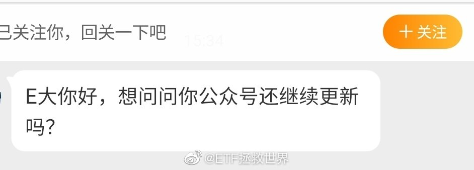

======================================================

ETF拯救世界 (5687069307) @
2022-02-25 17:43:18 Fri  
url: https://weibo.com/5687069307/Lh7P4xGTp

已更新，目标30%。

可接受实现时间为3-4年。 ​​​

转发[182]  评论[666]  赞[3526] 

======================================================

ETF拯救世界 (5687069307) @
2022-02-25 17:53:43 Fri  
url: https://weibo.com/5687069307/Lh7Tizl1o

我发现很多人的投资思维永远不能形成一个最关键的点：买入一个品种的时候，第一个考虑的事情应该是：最差会怎样？

------------------------------------------------------
转推：
>  @ETF拯救世界 (5687069307)
>  2022-02-25 17:43:18 Fri  
>  url: https:/weibo.com/5687069307/Lh7P4xGTp/

>  已更新，目标30%。
>  
>  可接受实现时间为3-4年。 ​​​

转发[107]  评论[315]  赞[2974] 

======================================================

ETF拯救世界 (5687069307) @
2022-02-26 09:04:57 Sat  
url: https://weibo.com/5687069307/LhdRbdQzn

经历的越多越会明白，我们所接触到的信息，一部分，甚至有可能一大半是虚假的。

进一步，很多写在历史书上的东西也未必都是事实。

再进一步，每个当事人眼中的事实也未必完全一致。

作为一个追求独立思考的人，我想，最重要的应该是多听多看多想，综合各方面的信息，对于这个世界得出自己的结论。

 ​​​

转发[263]  评论[736]  赞[4687] 

======================================================

ETF拯救世界 (5687069307) @
2022-02-26 12:12:34 Sat  
url: https://weibo.com/5687069307/Lhf5kgcXK

我发现微博现在会吞字，一句话会截取一部分显示。这是什么高科技。 ​​​

转发[15]  评论[357]  赞[2245] 

======================================================

ETF拯救世界 (5687069307) @
2022-02-26 14:25:35 Sat  
url: https://weibo.com/5687069307/LhfXjyZXv

对于这场战争，微博上有两边站队的，有普及历史知识的，有呼唤和平反战的。

我首先要说，你们都对，我对你们说的都没意见，同意你们所有人，所以别骂我。

其次我要说的是，其实无论远在东方的我们在微博上怎么表态，都不太会影响局势发展。我本人除了关注战事进展，几国普通人民的安全，对金融市场的 ​​​

转发[311]  评论[871]  赞[6442] 

======================================================

ETF拯救世界 (5687069307) @
2022-02-26 15:33:45 Sat  
url: https://weibo.com/5687069307/LhgoZeZ3T

原来战争的时候真的会给老百姓发枪。

算是解答了我从小就有的一个困惑。 ​​​

转发[25]  评论[546]  赞[3864] 

======================================================

ETF拯救世界 (5687069307) @
2022-02-27 08:17:46 Sun  
url: https://weibo.com/5687069307/LhmYw6EQl

俄部分银行被断开SWIFT。

可能有朋友不知道，前两年贸易战最猛烈的时候，把我们踢出SWIFT的方案也曾经被对方当做选项提出过。

我们什么都没做，因为一些编造的谎言就被制裁被威胁，那么未来我们做点对方不喜欢的事，会发生什么。

现在俄受到的一切压力，都可以被我们用来做压力测试。从上到下，早做 ​​​

转发[149]  评论[978]  赞[5548] 

======================================================

ETF拯救世界 (5687069307) @
2022-02-27 11:35:26 Sun  
url: https://weibo.com/5687069307/LhogKuOwe

照片上挺大其实很小只。[憧憬] ​​​

转发[44]  评论[1632]  赞[4731] 

+++++++++++++++++++++++++++++++++++++++++++++++++++++

图片：
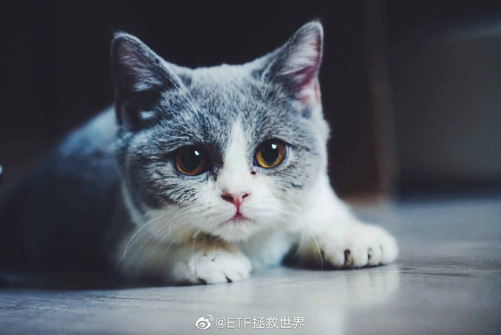
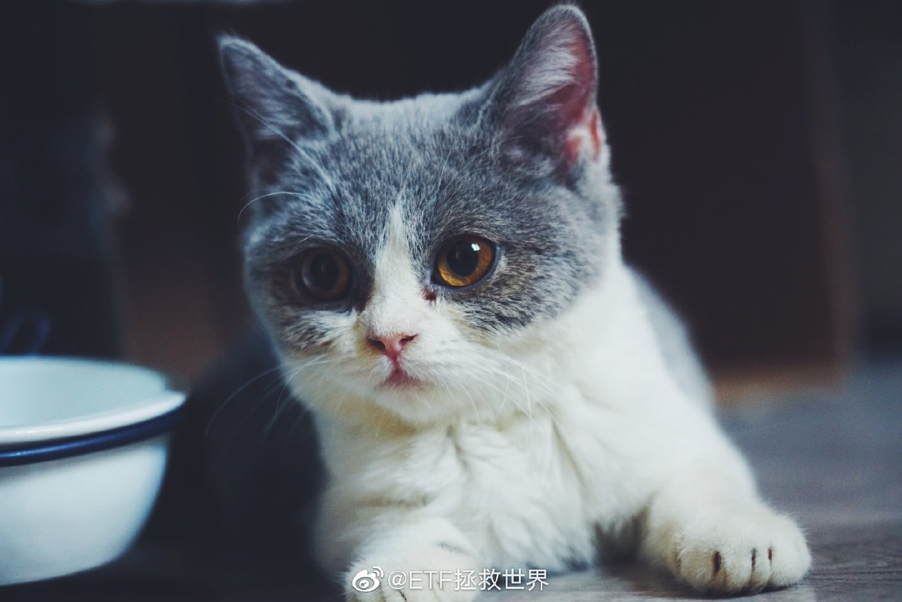

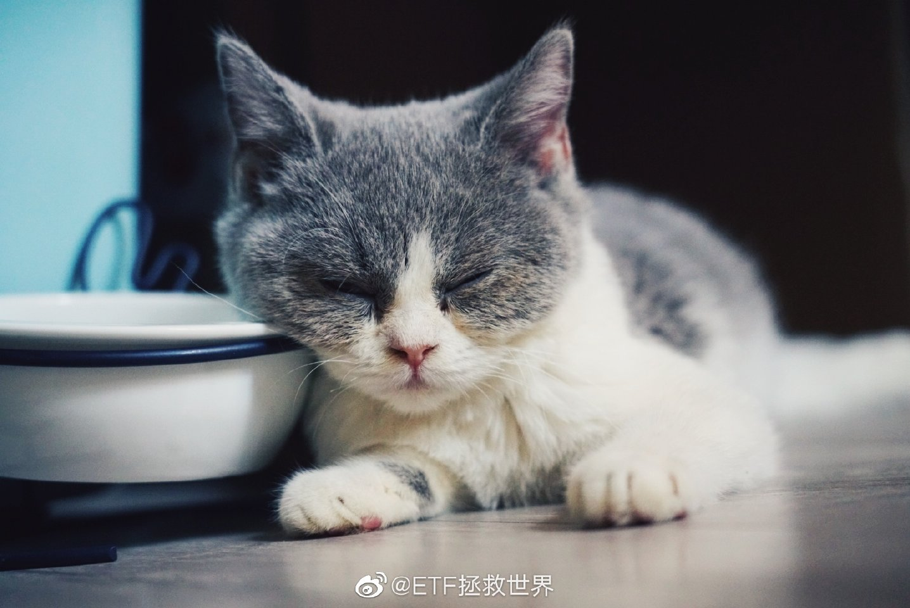
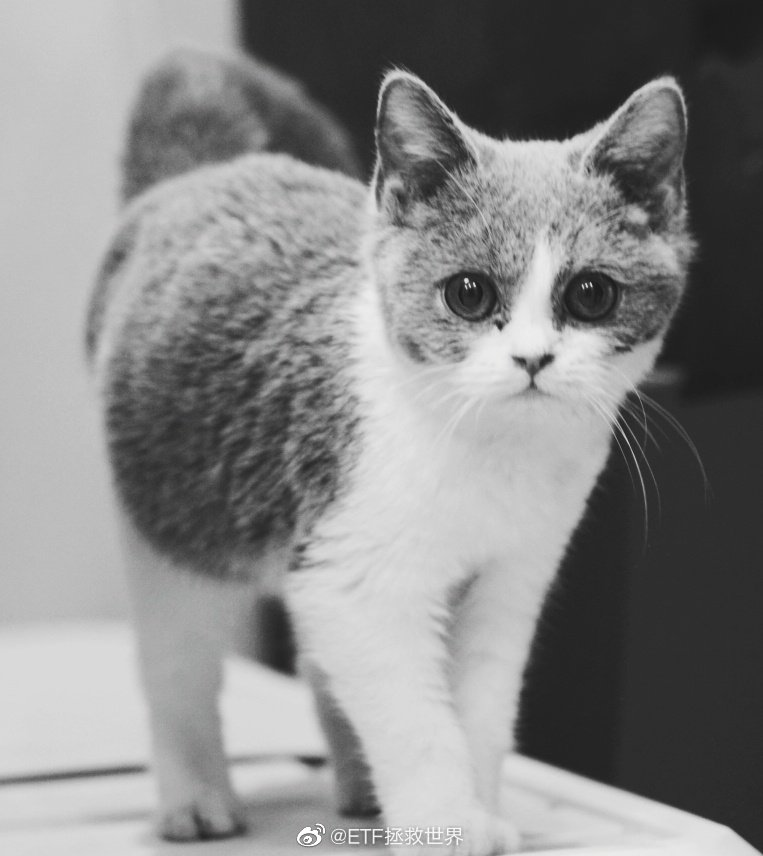

======================================================

ETF拯救世界 (5687069307) @
2022-02-27 11:53:26 Sun  
url: https://weibo.com/5687069307/Lhoo3pMxc

我的选择 ​​​

转发[156]  评论[1055]  赞[14537] 

+++++++++++++++++++++++++++++++++++++++++++++++++++++

图片：
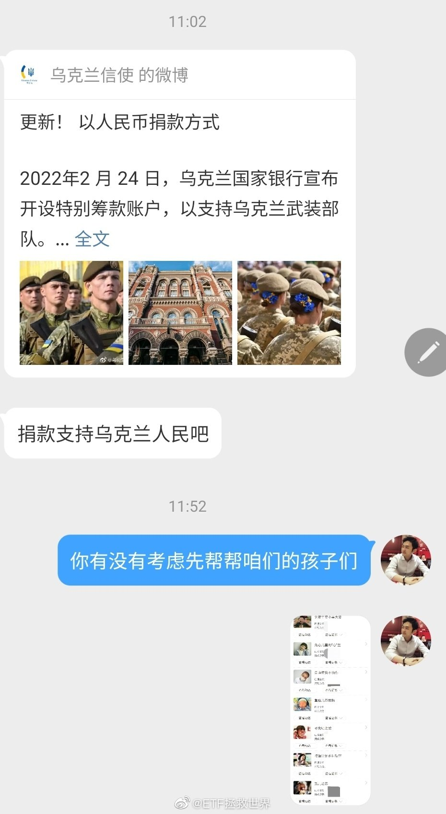

======================================================

ETF拯救世界 (5687069307) @
2022-02-27 21:55:10 Sun  
url: https://weibo.com/5687069307/Lhskj59ky

回复@ETF拯救世界:两年前的一条微博//@ETF拯救世界:顺便给你们普及一下知识：如果发生核爆，尽快跑到最深一层地下车库里面，找个离门远的角落呆好。活下去的机会不小！

------------------------------------------------------
转推：
>  @ETF拯救世界 (5687069307)
>  2020-09-03 22:52:52 Thu  
>  url: https:/weibo.com/5687069307/JiXZemrjg/

>  我跟你说我最近往我的末日生存包里加了一个什么。
>  
>  一个收音机。堪称末日收音机。
>  
>  特牛x。
>  
>  手摇+太阳能发电；带三种模式的手电筒；带SOS警报器；带一个阅读灯（被埋在废墟下的用户是有多爱学习？）。
>  
>  然后这货还能给手机反向充电。高端了。想象一下，发生特别紧急的情况，比如地震、核爆之类的吧， ​​​

转发[108]  评论[430]  赞[2326] 

======================================================

ETF拯救世界 (5687069307) @
2022-02-28 08:48:48 Mon  
url: https://weibo.com/5687069307/LhwBCjVWc

出现类似于战争这种危机，你首先需要决定的是：

走还是留。

相对来说，战争中的乡下要比城市靠谱。

其次，要保证有办法弄到生存下去的物资。

但比这个重要的，是能保护物资的能力。否则，你的物资越多越危险。 ​​​

转发[94]  评论[621]  赞[4172] 

======================================================

ETF拯救世界 (5687069307) @
2022-02-28 11:03:46 Mon  
url: https://weibo.com/5687069307/Lhxuoodr5

22000买了。接下来就是18500，也是历次危机的最终支撑。如果撑不住，那就是过去几十年没有发生过的了。接下来怎样我也不知道，反正到了我就买。//@ETF拯救世界:第一支撑调整到22000左右，第二依然是18500。在这两个支撑附近都会买。

------------------------------------------------------
转推：
>  @ETF拯救世界 (5687069307)
>  2021-11-29 12:08:52 Mon  
>  url: https:/weibo.com/5687069307/L3I1DabhM/

>  恒生接下来的支撑位在21500左右。这是倒数第二个支撑。
>  
>  最后一根支撑在18500左右。如果我是那种轻仓但是想买一部分恒生的，我可能会认为这个位置是极佳的买入位。 ​​​

转发[142]  评论[454]  赞[2310] 

======================================================

ETF拯救世界 (5687069307) @
2022-02-28 11:12:29 Mon  
url: https://weibo.com/5687069307/LhxxVEv9M

大家在最恐慌的时候，要想清楚一件事。

股票市场整体有没有可能崩，有。指数有没有可能消失，有。

你是不是很担心你的指数投资。没错，你担心的很正常。

但你想一下，如果连指数和股票市场都没了，你的债券、现金、理财……还会有什么用吗。

那一定是极端的情况发生了。

什么是极端。

极端就是不 ​​​

转发[202]  评论[795]  赞[3804] 

======================================================

ETF拯救世界 (5687069307) @
2022-02-28 15:23:04 Mon  
url: https://weibo.com/5687069307/LhzbE39wg

今天终于把一直耿耿于怀的那份出掉了。今天出比理论上“应该”卖出的价位低了6%多。这6%算是一个学习成本，教育自己未来类似的情况下手要果断。不过总算收益率依然在100%以上，也算是有个不错的结果了。

------------------------------------------------------
转推：
>  @ETF拯救世界 (5687069307)
>  2022-01-19 11:07:02 Wed  
>  url: https:/weibo.com/5687069307/LbspRdy6j/

>  环保这个顶真的仁至义尽。
>  
>  盘整、破位、反抽，给足了机会卖——不止一次机会。
>  
>  少卖了一份是自己的责任，没有任何狡辩的借口。
>  
>  还需要继续努力钻研业务。 ​​​

转发[40]  评论[486]  赞[2750] 

======================================================

ETF拯救世界 (5687069307) @
2022-02-28 17:25:18 Mon  
url: https://weibo.com/5687069307/LhzZg5gva

现在发生在R身上的事，未来如果我们在东南动手，那么就有可能也发生在我们身上。

所以我们每个人都应该认真观察整个过程，并提前做好自己应该做的准备。让有可能发生的损失尽可能的变小。 ​​​

转发[139]  评论[697]  赞[5442] 

======================================================

ETF拯救世界 (5687069307) @
2022-02-28 19:42:46 Mon  
url: https://weibo.com/5687069307/LhAT3pKvH

有一说一，猫和猫真的天壤之别。

我之前收养的流浪小猫到现在十年了，跟新来的对比一下我才知道，真的怎么说呢，智商情商双堪忧。以前没对比，不知道。

猫抓板不会用，翻盖厕所出不来，玩具不会玩就算了，跟人也很不亲。跟我算是最亲了，偶尔来让我摸摸，动不动见了人扭头就跑，家里来了人也躲。

儿 ​​​

转发[38]  评论[1003]  赞[3856] 

+++++++++++++++++++++++++++++++++++++++++++++++++++++

图片：
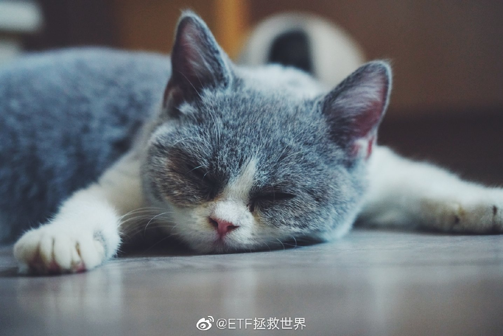
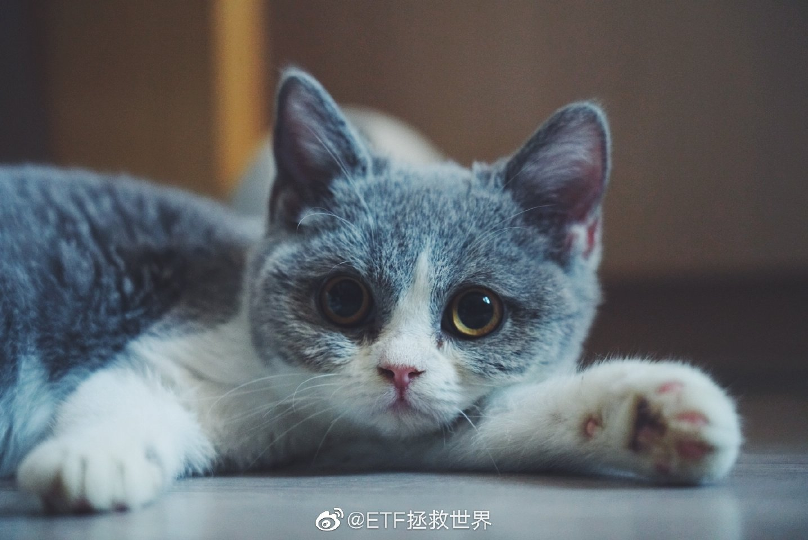

======================================================

ETF拯救世界 (5687069307) @
2022-03-01 12:41:46 Tue  
url: https://weibo.com/5687069307/LhHyFoGkJ

举报的人如果是弄错了那么情有可原。如果是因为发货慢了故意举报，我拉黑你一万年。就像上次一样，送东西你还举报，是不是人？

------------------------------------------------------
转推：
>  @且慢管家 (6186312580)
>  2022-03-01 11:17:29 Tue  
>  url: https:/weibo.com/6186312580/LhH0smaU4/

>  [苦涩][苦涩][苦涩]求求大家撤销一下举报，小慢不是不给大家发货，是为了给大家做好杯子，给大家更好的品质感受，中间样品不合格，我们返回重做了，再加上供应商那边工人十五（元宵过后）才上班，所以延迟了。请大家体谅一下，也为给大家带来不好的活动体验抱歉[跪了][跪了] ​​​

转发[20]  评论[891]  赞[3293] 

======================================================

ETF拯救世界 (5687069307) @
2022-03-01 15:14:00 Tue  
url: https://weibo.com/5687069307/LhIysu7p7

有些人看到反弹了一点就慌了，其实根本不用慌。 ​​​

转发[24]  评论[819]  赞[3419] 

======================================================

ETF拯救世界 (5687069307) @
2022-03-01 18:27:54 Tue  
url: https://weibo.com/5687069307/LhJPafz1v

不要让你爱的男人养猫。

否则你会失去男人，也会失去猫。 ​​​

转发[30]  评论[788]  赞[3631] 

======================================================

ETF拯救世界 (5687069307) @
2022-03-02 09:33:44 Wed  
url: https://weibo.com/5687069307/LhPKQgftn

吵得很厉害，其实根本原因就是角度不同。

怎么不同呢。一方的出发点是从个人利益、国家利益。一方的出发点是“正义”。讨论的根基都不同，你说能不吵吗。

我个人有一些观点，可能与你不同。我不想说服你，你也别想说服我，我不是跟你来谋求一致的，只是表达一下自己的想法。

前几天尼泊尔通过了一个 ​​​

转发[224]  评论[2049]  赞[12695] 

======================================================

ETF拯救世界 (5687069307) @
2022-03-02 16:33:55 Wed  
url: https://weibo.com/5687069307/LhSvp1FZA

油价110美元了。

你还记得那些在油价低位的时候，论证原油将永远起不来了，因为新能源将主导世界的人吗。

资本市场是观察人性最好的地方。

在一个不死品种跌了70%以上，持续低迷的时候，引经据典论证它永远没戏的人，大概率是个非常水的水货。 ​​​

转发[130]  评论[671]  赞[3420] 

======================================================

ETF拯救世界 (5687069307) @
2022-03-02 17:23:36 Wed  
url: https://weibo.com/5687069307/LhSPze5xx

最近在看荒野求生。

北京的驴友朋友，有没有入门级户外运动的好地方推荐。 ​​​

转发[50]  评论[399]  赞[2131] 

======================================================

ETF拯救世界 (5687069307) @
2022-03-02 17:34:50 Wed  
url: https://weibo.com/5687069307/LhSU7t0Aa

回复@该用户已卸载微博APP:对，我看了一集就觉得只是节目，应该有不少摆拍。但我从里面确实学到了一些知识。这就是我对这世界的认知：即使我知道它是不完美的，有虚假成分的，甚至比较差的，能让我学到东西就行。

------------------------------------------------------
转推：
>  @ETF拯救世界 (5687069307)
>  2022-03-02 17:23:36 Wed  
>  url: https:/weibo.com/5687069307/LhSPze5xx/

>  最近在看荒野求生。
>  
>  北京的驴友朋友，有没有入门级户外运动的好地方推荐。 ​​​

转发[20]  评论[156]  赞[1456] 

======================================================

ETF拯救世界 (5687069307) @
2022-03-03 10:48:28 Thu  
url: https://weibo.com/5687069307/LhZFFyrXI

执着于追求“低买高卖”其实是一把双刃剑。

这轮计划至今，其实有不少品种长期持有的前提下，做到了低买高卖。具体的我不用说，毕竟太多了。

但是很明显，当然也有没有在高位清仓甚至一份都没卖，结果又大幅下跌的。亏损可能不至于，但利润大幅回撤我估计很多新手朋友会感到郁闷。

呐，你记住我接下 ​​​

转发[543]  评论[1016]  赞[4485] 

======================================================

ETF拯救世界 (5687069307) @
2022-03-03 11:56:57 Thu  
url: https://weibo.com/5687069307/Li07teeok

差生文具多。

经过两周的努力，我的末日生存包已经膨胀为末日生存箱。

所含物品也升级为以硬核装备为主。

最诡异的是竟然从买装备中获得了快感，感觉整件事怎么有点偏离初心的意思。 ​​​

转发[57]  评论[835]  赞[3468] 

======================================================

ETF拯救世界 (5687069307) @
2022-03-03 13:21:44 Thu  
url: https://weibo.com/5687069307/Li0FTcqiI

如果，我是说如果，我们卖出最近这份以后，环保继续下跌，那么这次就不是仁至义尽的问题了，而是里面的主力部队可以说真的懂投资，行家！不像有些板块，就知道以资金优势抱团往上怼，毫无技术含量，差评！

------------------------------------------------------
转推：
>  @ETF拯救世界 (5687069307)
>  2022-01-19 11:07:02 Wed  
>  url: https:/weibo.com/5687069307/LbspRdy6j/

>  环保这个顶真的仁至义尽。
>  
>  盘整、破位、反抽，给足了机会卖——不止一次机会。
>  
>  少卖了一份是自己的责任，没有任何狡辩的借口。
>  
>  还需要继续努力钻研业务。 ​​​

转发[33]  评论[352]  赞[2155] 

======================================================

ETF拯救世界 (5687069307) @
2022-03-03 14:15:18 Thu  
url: https://weibo.com/5687069307/Li11CDXFm

我总有一种感觉，印度这个国家，是有一种成为独立自主大国的那种渴望和姿态的。

包括德法其实也有点。

不像日韩这种，尤其是日本这种在漂亮面前低三下四完全失去自主意识的样子。 ​​​

转发[38]  评论[500]  赞[3726] 

======================================================

ETF拯救世界 (5687069307) @
2022-03-03 15:23:17 Thu  
url: https://weibo.com/5687069307/Li1tdz1VC

一些青春的记忆是如此清晰而又模糊，

甚至你会怀疑那真的发生过，

又或者只是一个令你印象深刻的梦？

那个阳光灿烂的下午，好像一切都被烤成了白色，沉静又慵懒。

她的红色连衣裙，让整个世界开始跳动。

（待续） ​​​

转发[25]  评论[545]  赞[2730] 

======================================================

ETF拯救世界 (5687069307) @
2022-03-03 16:02:02 Thu  
url: https://weibo.com/5687069307/Li1IX1y8m

今日数据：

创业板正在向伏击区逃窜。已锁定。 ​​​

转发[60]  评论[716]  赞[3363] 

======================================================

ETF拯救世界 (5687069307) @
2022-03-04 09:22:22 Fri  
url: https://weibo.com/5687069307/Li8xdB1NK

不是切尔西球迷，但这十几年阿布对切尔西的改造真的改变了很多东西，也让英超更好看了。

话说随意冻结没收某个国家国民个人财产，没问题吗。

未来富豪们再转移财产也要考虑一下了吧。 ​​​

转发[33]  评论[327]  赞[2587] 

======================================================

ETF拯救世界 (5687069307) @
2022-03-04 09:36:01 Fri  
url: https://weibo.com/5687069307/Li8CLgCeS

恒生指数十几年一次的好买点快到了。 ​​​

转发[101]  评论[809]  赞[3542] 

======================================================

ETF拯救世界 (5687069307) @
2022-03-04 10:05:12 Fri  
url: https://weibo.com/5687069307/Li8OBv3bx

为了表达对18500的尊重，也是言行合一的意思，虽然我已经持有不少恒生了，

但真的到了这个点位后，我会再买7位数，也就是至少100万。会贴图。

没有别的意思，就是说以后你看我赔的比你多，你会舒服不少对吧。。 ​​​

转发[190]  评论[1165]  赞[4347] 

======================================================

ETF拯救世界 (5687069307) @
2022-03-04 10:16:25 Fri  
url: https://weibo.com/5687069307/Li8Ta55XK

恒生指数是一个非常规律的指数。

目前的点位，大概是3-5年就会回归的一个位置。而18500，是5-15年会回归的点位。

至于说这次会不会与以往不同，18500也撑不住。当然有可能，地球明天可能被外星人侵略呢。

有可能是有可能，但我依然会把18500这个位置当做一个特别好的买入点。错了的话会赔钱，但它大 ​​​

转发[351]  评论[700]  赞[3280] 

======================================================

ETF拯救世界 (5687069307) @
2022-03-04 10:49:41 Fri  
url: https://weibo.com/5687069307/Li96FcM3R

再次提示，我已经暂停自己的日经条件单。

------------------------------------------------------
转推：
>  @ETF拯救世界 (5687069307)
>  2022-01-27 10:02:25 Thu  
>  url: https:/weibo.com/5687069307/LcFpBkiIZ/

>  由于日元大幅贬值，投资日经225的波段逻辑已经完全改变，所以暂停日经波段。
>  
>  我会删除自己的日经条件单。 ​​​

转发[34]  评论[273]  赞[2120] 

======================================================

ETF拯救世界 (5687069307) @
2022-03-04 11:11:34 Fri  
url: https://weibo.com/5687069307/Li9fxEsnP

B站从最高点到现在跌80%了。

一个指数跌80%，我敢买很多。就算留几年生活费把所有钱都买进去也可以。

但是股票我真的不敢。 ​​​

转发[81]  评论[466]  赞[3455] 

======================================================

ETF拯救世界 (5687069307) @
2022-03-04 11:30:31 Fri  
url: https://weibo.com/5687069307/Li9nezWdG

不要乱买。空间时间给足，执行策略。

如果一开始没有设计好，策略无法继续执行就暂停或者减少投入。但不要乱操作，比如心里害怕乱卖。

只要执行已经提前设计的好的，机械的东西，就不会出大错。任由自己的人性控制操作，那可能就要出大麻烦。 ​​​

转发[157]  评论[662]  赞[3365] 

======================================================

ETF拯救世界 (5687069307) @
2022-03-04 11:47:30 Fri  
url: https://weibo.com/5687069307/Li9u88yt4

原贴是21年白酒崩塌前发的。现在我来更新图表了。还是五粮液。现在回头看，你才能意识到当时抱团的机构以及股民基民多么疯狂。  http://t.cn/A66LMDIp

------------------------------------------------------
转推：
>  @ETF拯救世界 (5687069307)
>  2021-01-08 09:27:43 Fri  
>  url: https:/weibo.com/5687069307/JCbZupBok/

>  白酒记录：
>  
>  估值：五粮液为例，估值已经从2013年的不到10倍，飙涨至十年最高的66倍。目前市值1.28万亿，2019年利润200亿。
>  
>  从20年周期看，未到最高。最夸张的是2007年的125倍+
>  
>  情绪：之前评论中非常多的朋友谈到自己的同事/朋友/同学都追了白酒基金赚了很多钱，并表示“白酒永远涨”。
>  
>  没有主观判 ​​​

转发[109]  评论[282]  赞[2147] 

======================================================

ETF拯救世界 (5687069307) @
2022-03-04 14:47:26 Fri  
url: https://weibo.com/5687069307/LiaFalcD9

鹅如果不能在目前这个强力平台撑住，那么下一个支撑就已经到了290左右。

目前的平台实际上被鹅自己以及段老板等投资人认可，都在增持。但市场不认。

到290的跌幅与中概是大致一致的。也就是说鹅290与中概80%共振了。如果这样的情况还是顶不住，那下面就不知道了。从鹅来说，290顶不住意味着十几年上 ​​​

转发[555]  评论[606]  赞[3296] 

======================================================

ETF拯救世界 (5687069307) @
2022-03-04 14:52:52 Fri  
url: https://weibo.com/5687069307/LiaHna4sy

市场对鹅已经极度悲观了。鹅未来会怎样呢。 http://t.cn/A66LKNMe

------------------------------------------------------
转推：
>  @ETF拯救世界 (5687069307)
>  2022-03-04 14:47:26 Fri  
>  url: https:/weibo.com/5687069307/LiaFalcD9/

>  鹅如果不能在目前这个强力平台撑住，那么下一个支撑就已经到了290左右。
>  
>  目前的平台实际上被鹅自己以及段老板等投资人认可，都在增持。但市场不认。
>  
>  到290的跌幅与中概是大致一致的。也就是说鹅290与中概80%共振了。如果这样的情况还是顶不住，那下面就不知道了。从鹅来说，290顶不住意味着十几年上 ​​​

转发[106]  评论[482]  赞[2209] 

======================================================

ETF拯救世界 (5687069307) @
2022-03-04 16:00:23 Fri  
url: https://weibo.com/5687069307/Lib8MbuiZ

其实人类的恐惧，绝大多数都来自于“未知”。

比如核武器吧。未知是不知道它的杀伤力到底有多大，对方会不会扔，扔多少。

如果对方告诉你了，时间地点数量，估计你也踏实了。愣着干什么，挖吧。土拨鼠一样挖很深很深，带足了东西，躲呗。

就连核武器这种东西，只要你准备好了，都不是必死的。那还有 ​​​

转发[327]  评论[605]  赞[3100] 

======================================================

ETF拯救世界 (5687069307) @
2022-03-04 16:05:06 Fri  
url: https://weibo.com/5687069307/LibaGDHZA

今天数据没有惊喜。我对目前的A股毫无兴趣，不会加仓。

之前腾出来的仓位另有他用。 ​​​

转发[38]  评论[371]  赞[2626] 

======================================================

ETF拯救世界 (5687069307) @
2022-03-04 16:17:19 Fri  
url: https://weibo.com/5687069307/LibfEfd9p

环保指数市值前40位公司TTM PE。

算术平均75，去掉两个超过200倍的极值，算术平均61。 ​​​

转发[71]  评论[268]  赞[2019] 

+++++++++++++++++++++++++++++++++++++++++++++++++++++

图片：
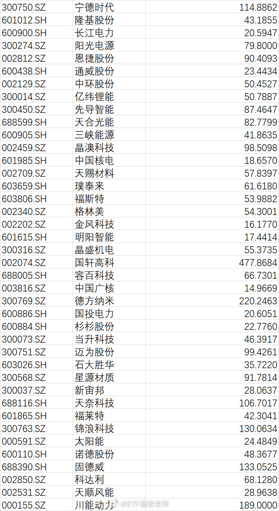

======================================================

ETF拯救世界 (5687069307) @
2022-03-04 16:35:21 Fri  
url: https://weibo.com/5687069307/LibmY7Oyq

很多人之所以在底部会对手里的股票崩溃，因为他不知道这支股票会不会死，会不会永远起不来。但你如果拿几只相关性很低的指数，情况就会好很多。至少你知道他们不会死，而且有涨有跌，没那么容易崩溃。

------------------------------------------------------
转推：
>  @ETF拯救世界 (5687069307)
>  2022-03-04 16:00:23 Fri  
>  url: https:/weibo.com/5687069307/Lib8MbuiZ/

>  其实人类的恐惧，绝大多数都来自于“未知”。
>  
>  比如核武器吧。未知是不知道它的杀伤力到底有多大，对方会不会扔，扔多少。
>  
>  如果对方告诉你了，时间地点数量，估计你也踏实了。愣着干什么，挖吧。土拨鼠一样挖很深很深，带足了东西，躲呗。
>  
>  就连核武器这种东西，只要你准备好了，都不是必死的。那还有 ​​​

转发[90]  评论[291]  赞[2329] 

======================================================

ETF拯救世界 (5687069307) @
2022-03-04 19:04:07 Fri  
url: https://weibo.com/5687069307/Liclmo12q

娱乐就是原罪

------------------------------------------------------
转推：
>  @财经杂志 (1684012053)
>  2022-03-04 18:48:39 Fri  
>  url: https:/weibo.com/1684012053/Licf4AsUI/

>  【人大代表#建议禁止未成年人网游#】全国人大代表李君近日接受中新网记者采访时表示，去年相关部门出台了政策，明确18岁以下未成年人玩游戏的时间每天只能有1小时，且只能在周末。但我们村有的留守儿童使用长辈的身份证注册游戏账号，规定形同虚设。建议应全面禁止未成年人玩网络游戏，对向未成年人提 ​​​

转发[36]  评论[407]  赞[2007] 

======================================================

ETF拯救世界 (5687069307) @
2022-03-05 08:43:01 Sat  
url: https://weibo.com/5687069307/LihHKek9M

认识六个月以上的朋友来投个票 http://t.cn/A66ybZIo ​​​

转发[0]  评论[1721]  赞[33839] 

======================================================

ETF拯救世界 (5687069307) @
2022-03-05 21:15:07 Sat  
url: https://weibo.com/5687069307/LimD1noUW

我在球球关于恒生的历史大顶大底帖子。

全蒙对了，你可以对照k线时间看看。

那么，这次还会对吗。 ​​​

转发[484]  评论[923]  赞[4976] 

+++++++++++++++++++++++++++++++++++++++++++++++++++++

图片：
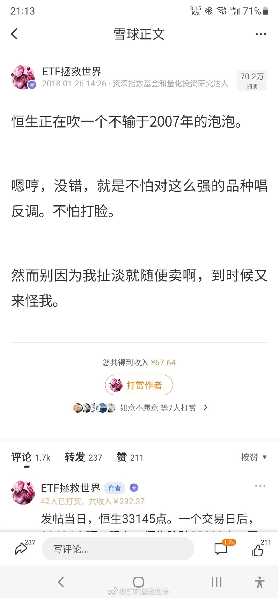
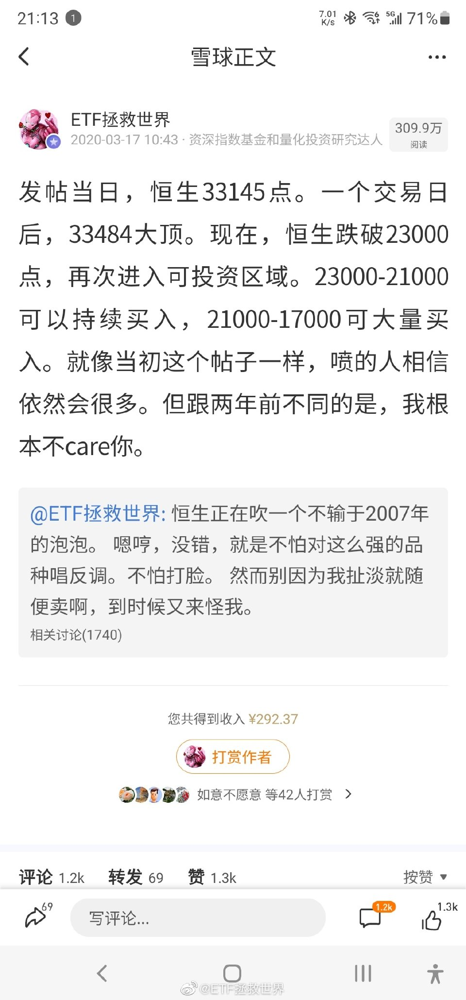
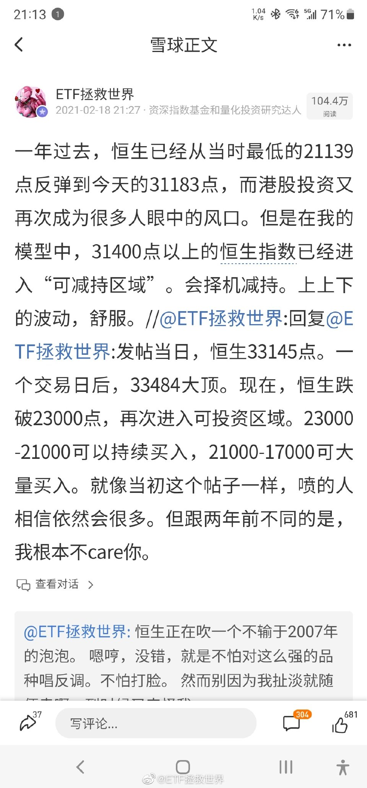
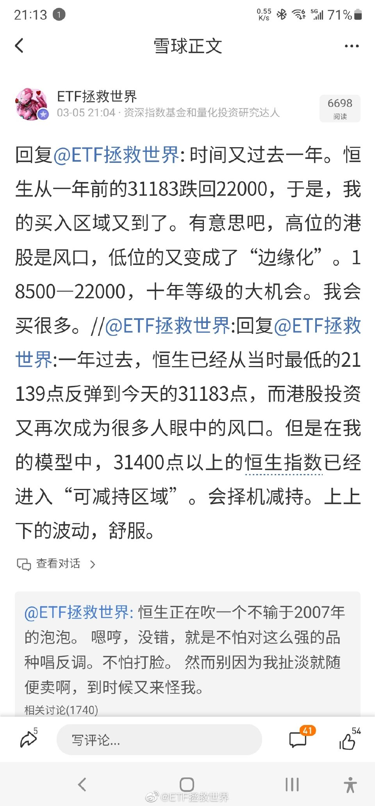

======================================================

ETF拯救世界 (5687069307) @
2022-03-06 16:56:40 Sun  
url: https://weibo.com/5687069307/LiumCelwP

啊球友的总结。真的吗，是蒙的了啦[亲亲] http://t.cn/A66UoVu5

------------------------------------------------------
转推：
>  @ETF拯救世界 (5687069307)
>  2022-03-05 21:15:07 Sat  
>  url: https:/weibo.com/5687069307/LimD1noUW/

>  我在球球关于恒生的历史大顶大底帖子。
>  
>  全蒙对了，你可以对照k线时间看看。
>  
>  那么，这次还会对吗。 ​​​

转发[101]  评论[557]  赞[2257] 

======================================================

ETF拯救世界 (5687069307) @
2022-03-06 21:52:06 Sun  
url: https://weibo.com/5687069307/Liwix4JIJ

显示效果提升不少。 ​​​

转发[13]  评论[691]  赞[2334] 

======================================================

ETF拯救世界 (5687069307) @
2022-03-07 07:25:21 Mon  
url: https://weibo.com/5687069307/LiA3dgzV5

我有几个投资原则，分享给各位：

第一，本金安全永远第一。

第二，一个品种占我整个金融资产的比例不会超过20%。金融资产包括所有可以用的货币类，债券类，股权类品种。

第三，任何情况下都是用闲钱投资。不会因为“大机会”就赌上所有。机会有很多，命只有一条。留够两三年的生活费，至少一年。

 ​​​

转发[565]  评论[894]  赞[3854] 

======================================================

ETF拯救世界 (5687069307) @
2022-03-07 08:10:16 Mon  
url: https://weibo.com/5687069307/LiAlrvT9u

各位认为，进入大规模战争的标志是什么。以这次俄乌为例

------------------------------------------------------
转推：
>  @ETF拯救世界 (5687069307)
>  2022-02-22 15:55:12 Tue  
>  url: https:/weibo.com/5687069307/LgEPI1QkK/

>  兄弟我做了一些关于战争与股市走势的研究，随便说两句，您随便看看。
>  
>  第一，直接或间接参与的战争会影响股市走势。
>  
>  第二，对于大国来说，局部战争不会影响很大。
>  
>  第三，对于大规模的战争，还是要躲一躲。跌幅不会小。
>  
>  第四，不能等战争结束再重新入场，那已经晚了。最佳入场时机是胜负天平开始倾斜 ​​​

转发[31]  评论[430]  赞[1675] 

======================================================

ETF拯救世界 (5687069307) @
2022-03-07 08:39:13 Mon  
url: https://weibo.com/5687069307/LiAxcaPZ9

昨天带儿子去爬野山，妹想到是一座很有难度的山，大意了，没有躲。

快到山顶的时候，我看着两边的峭壁，看着难以攀爬的岩石，想起了各位每天来看我的老爷们，想起了居委会大妈对我的谆谆教导，想起了小学老师在黑板上写字吱吱呀呀的声音。

我想，我要是出了点事，对得起谁呀我…

对儿子说，要不咱们 ​​​

转发[42]  评论[766]  赞[3920] 

======================================================

ETF拯救世界 (5687069307) @
2022-03-07 09:10:01 Mon  
url: https://weibo.com/5687069307/LiAJHz8cS

再次提示//@ETF拯救世界:再次提示，我已经暂停自己的日经条件单。

------------------------------------------------------
转推：
>  @ETF拯救世界 (5687069307)
>  2022-01-27 10:02:25 Thu  
>  url: https:/weibo.com/5687069307/LcFpBkiIZ/

>  由于日元大幅贬值，投资日经225的波段逻辑已经完全改变，所以暂停日经波段。
>  
>  我会删除自己的日经条件单。 ​​​

转发[12]  评论[418]  赞[1670] 

======================================================

ETF拯救世界 (5687069307) @
2022-03-07 10:14:15 Mon  
url: https://weibo.com/5687069307/LiB9LCYuG

恒生下一网将是该品种最后一网，接下来也不会再继续下网了。

这是考虑到市场、持仓状态等因素决定。

之前的当然继续交易。

当然，有余力的朋友可以继续制定自己的交易计划。

恒科大概还会有2-3网，之后也不会继续再下。理由与恒生一致。 ​​​

转发[265]  评论[723]  赞[3366] 

======================================================

ETF拯救世界 (5687069307) @
2022-03-07 10:16:28 Mon  
url: https://weibo.com/5687069307/LiBaFqDTB

换句话说，18500的恒生，与80%的中概/恒科，将是波段加仓的最后底线。

------------------------------------------------------
转推：
>  @ETF拯救世界 (5687069307)
>  2022-03-07 10:14:15 Mon  
>  url: https:/weibo.com/5687069307/LiB9LCYuG/

>  恒生下一网将是该品种最后一网，接下来也不会再继续下网了。
>  
>  这是考虑到市场、持仓状态等因素决定。
>  
>  之前的当然继续交易。
>  
>  当然，有余力的朋友可以继续制定自己的交易计划。
>  
>  恒科大概还会有2-3网，之后也不会继续再下。理由与恒生一致。 ​​​

转发[140]  评论[422]  赞[2597] 

======================================================

ETF拯救世界 (5687069307) @
2022-03-07 10:35:33 Mon  
url: https://weibo.com/5687069307/LiBipEkgc

确定了，恒科还有两网就会停。也就是说，我在恒生以及恒科的波段仓位上面，只会再留一共三网资金。

长线仓位后续买入份数暂未设定。但依然遵循单个品种不超过20%上限的规则。 ​​​

转发[124]  评论[749]  赞[3396] 

======================================================

ETF拯救世界 (5687069307) @
2022-03-07 14:18:33 Mon  
url: https://weibo.com/5687069307/LiCKVEx7I

150和S都有动作，一买一卖。

根据自己情况决定，丰俭由人。 ​​​

转发[24]  评论[576]  赞[2548] 

======================================================

ETF拯救世界 (5687069307) @
2022-03-07 14:44:44 Mon  
url: https://weibo.com/5687069307/LiCVzbVpQ

长期计划中，最近几个月依然延续了这两年的理念，

逐渐收回资金，如果要买，就要有卖。

150和S，都保持了非常理性的务实状态。

不增加整体风险的情况下，加仓目标品种。 ​​​

转发[57]  评论[315]  赞[2491] 

======================================================

ETF拯救世界 (5687069307) @
2022-03-07 14:47:21 Mon  
url: https://weibo.com/5687069307/LiCWD7R7R

消费终于开始低下高昂的头颅。总是埋怨它不是讨厌它，而是爱它，怕它走在歪路上一去不回。

------------------------------------------------------
转推：
>  @ETF拯救世界 (5687069307)
>  2022-02-22 13:29:34 Tue  
>  url: https:/weibo.com/5687069307/LgDSB0mvv/

>  我心中的最大的怨念依然是消费。
>  
>  2020年5月以来的疯癫状态，到底怎样才会结束。
>  
>  即使跌到现在，它居然依然还没有进入我定义的可买入区间上限。
>  
>  是我错了还是市场错了。
>  
>  所有板块，只有它依然无法哪怕下手一点点。
>  
>  这是道德的沦丧，还是人性的扭曲。 ​​​

转发[96]  评论[283]  赞[2079] 

======================================================

ETF拯救世界 (5687069307) @
2022-03-07 15:08:30 Mon  
url: https://weibo.com/5687069307/LiD5cBwp0

养了十几年猫，第一次知道原来你躺着的时候，猫会自己爬到你肚子上趴下陪着你。

我家原来的猫能跳到我旁边呆一会儿我就感动得要命了。

这该死的温柔。 ​​​

转发[17]  评论[524]  赞[2649] 

======================================================

ETF拯救世界 (5687069307) @
2022-03-07 15:53:04 Mon  
url: https://weibo.com/5687069307/LiDniopYa

今日数据：

没有亮点，让我大失所望。

科创50历史首次跌破60倍算吗？当然不算。

50和300跌到现在居然还不便宜，事实再次教育了我。每次当我不完全相信自己的数据时，都会犯错。高位的50和300减持的不够，正是因为没有完全相信数据。

高位更换成分股，把涨幅巨大的品种调入大指数，对大指数伤害太大 ​​​

转发[112]  评论[343]  赞[2283] 

======================================================

ETF拯救世界 (5687069307) @
2022-03-07 16:15:14 Mon  
url: https://weibo.com/5687069307/LiDwiciZa

网格3.5正在进化完善中。

这次的进化，主要希望解决的问题是，如何在交易过程中保证资金投入的可持续性，避免在战役与整个战场上，因战线过长出现兵力不足的问题。

同时，顺便解决底部波段收益率不够的问题。

绝不满足，发现问题、解决问题，永远要进化。 ​​​

转发[100]  评论[868]  赞[3516] 

======================================================

ETF拯救世界 (5687069307) @
2022-03-07 16:49:18 Mon  
url: https://weibo.com/5687069307/LiDK82i2p

漂亮是真的又狠又鸡贼。

为了自己的好日子能持续，为了自己继续当老大，上蹿下跳，无所不用其极。

其实每个国家都希望自己好，区别是有的对别的国家更没有下限一点。

为了不让欧洲团结，不让亚洲团结，为了让世界乱成一锅粥，它获取最大利益，漂亮真是一直在努力，从未被超越。

只是仇恨没有意义， ​​​

转发[94]  评论[473]  赞[3622] 

======================================================

ETF拯救世界 (5687069307) @
2022-03-07 17:25:20 Mon  
url: https://weibo.com/5687069307/LiDYKkP2Z

回复@Lateatnight86:默在欧盟内部一直奉行务实态度，顶住了漂亮要求欧洲一起制裁我们的压力。默一直追求欧洲自主，不愿意完全跟随漂亮的指挥棒。我说她有远见是指国际事务。他们国内事务我不操心。

------------------------------------------------------
转推：
>  @ETF拯救世界 (5687069307)
>  2022-03-07 16:49:18 Mon  
>  url: https:/weibo.com/5687069307/LiDK82i2p/

>  漂亮是真的又狠又鸡贼。
>  
>  为了自己的好日子能持续，为了自己继续当老大，上蹿下跳，无所不用其极。
>  
>  其实每个国家都希望自己好，区别是有的对别的国家更没有下限一点。
>  
>  为了不让欧洲团结，不让亚洲团结，为了让世界乱成一锅粥，它获取最大利益，漂亮真是一直在努力，从未被超越。
>  
>  只是仇恨没有意义， ​​​

转发[20]  评论[151]  赞[1721] 

======================================================

ETF拯救世界 (5687069307) @
2022-03-07 17:33:35 Mon  
url: https://weibo.com/5687069307/LiE261vOX

你以为我想关心蓝星这些破事儿吗。

现在的问题是，你不关心行吗。我们的投资是会受到极大影响的。 ​​​

转发[24]  评论[390]  赞[2657] 

======================================================

ETF拯救世界 (5687069307) @
2022-03-07 22:17:29 Mon  
url: https://weibo.com/5687069307/LiFTkt1J4

今天的红利，有至少一半的朋友没有卖出。

我很欣慰，两个原因。

第一，说明各位还有资金，不必卖出再买入。

第二，说明各位有了独立思考能力。对错不说，至少会选择自认为更加符合自己情况的操作了。

有一天每位朋友都能自己做出理性而智慧的操作，我的愿望就实现了。 ​​​

转发[61]  评论[817]  赞[4106] 

======================================================

ETF拯救世界 (5687069307) @
2022-03-08 06:55:48 Tue  
url: https://weibo.com/5687069307/LiJhImiGz

『第三世界人民从未如此团结！』http://t.cn/A664Dqdt ​​​

转发[763]  评论[580]  赞[9848] 

======================================================

ETF拯救世界 (5687069307) @
2022-03-08 08:13:19 Tue  
url: https://weibo.com/5687069307/LiJNbbAwD

前一段让大家看美股历史不知道各位有没有看。

70年代美股美债走了十年熊市，正好是油价金价大涨通货膨胀的十年。

这十年跌得最多的是什么股票？

你说巧不巧，正好是60年代的“漂亮50”。什么是漂亮50，就是机构抱团，“永远不会跌”的那些蓝筹公司。尤其是消费股跌幅较大。

历史有没有借鉴价值，看 ​​​

转发[262]  评论[458]  赞[2757] 

======================================================

ETF拯救世界 (5687069307) @
2022-03-08 08:19:49 Tue  
url: https://weibo.com/5687069307/LiJPOAW3c

好消息是，如果你在这些蓝筹股价暴跌后买入，那么你会发真正的大财。因为之后就是40年的牛市。

------------------------------------------------------
转推：
>  @ETF拯救世界 (5687069307)
>  2022-03-08 08:13:19 Tue  
>  url: https:/weibo.com/5687069307/LiJNbbAwD/

>  前一段让大家看美股历史不知道各位有没有看。
>  
>  70年代美股美债走了十年熊市，正好是油价金价大涨通货膨胀的十年。
>  
>  这十年跌得最多的是什么股票？
>  
>  你说巧不巧，正好是60年代的“漂亮50”。什么是漂亮50，就是机构抱团，“永远不会跌”的那些蓝筹公司。尤其是消费股跌幅较大。
>  
>  历史有没有借鉴价值，看 ​​​

转发[85]  评论[249]  赞[1827] 

======================================================

ETF拯救世界 (5687069307) @
2022-03-08 08:32:54 Tue  
url: https://weibo.com/5687069307/LiJV87Mz0

买了新的镜头拍猫猫。[喵喵]

上一次认真玩摄影置办装备，还是结婚前帮姑娘们拍糖水片的那段时间。 ​​​

转发[9]  评论[325]  赞[2041] 

======================================================

ETF拯救世界 (5687069307) @
2022-03-08 09:15:57 Tue  
url: https://weibo.com/5687069307/LiKcBjHft

今天又是刺激的一天吧 ​​​

转发[16]  评论[467]  赞[2147] 

======================================================

ETF拯救世界 (5687069307) @
2022-03-08 09:44:35 Tue  
url: https://weibo.com/5687069307/LiKoe6wV4

KWEB跌幅已经73%了。

距离80%还有27%。 ​​​

转发[121]  评论[454]  赞[2773] 

======================================================

ETF拯救世界 (5687069307) @
2022-03-08 09:49:15 Tue  
url: https://weibo.com/5687069307/LiKq7p0LN

红利 -0.83%。

恒生 +1.06%。

别管以后怎么样，至少这十几分钟是对了。 ​​​

转发[20]  评论[311]  赞[2304] 

======================================================

ETF拯救世界 (5687069307) @
2022-03-08 09:59:14 Tue  
url: https://weibo.com/5687069307/LiKuawQFH

下跌过程中，只要把握好空间、时间的节奏，慢慢买毫无问题。

不要怕那些“空仓”的人嘲笑，他们都是非常二的二货。真正赚钱的人，没时间去嘲笑别人，更不会嘲笑低位慢慢买的人。

但是一定要注意一点，不要总是去赌“底部”。真正的底部只有一个，但下跌是每天都在发生，即使智商没有120，也知道每天 ​​​

转发[212]  评论[590]  赞[3313] 

======================================================

ETF拯救世界 (5687069307) @
2022-03-08 10:32:16 Tue  
url: https://weibo.com/5687069307/LiKHA1JH7

以目前的价格看，除了医药已经进入伏击区，没有任何品种让我有长线加仓的想法。 ​​​

转发[119]  评论[312]  赞[2308] 

======================================================

ETF拯救世界 (5687069307) @
2022-03-08 10:36:43 Tue  
url: https://weibo.com/5687069307/LiKJoiOm3

信息倒是也可以盯着了。

------------------------------------------------------
转推：
>  @ETF拯救世界 (5687069307)
>  2022-03-08 10:32:16 Tue  
>  url: https:/weibo.com/5687069307/LiKHA1JH7/

>  以目前的价格看，除了医药已经进入伏击区，没有任何品种让我有长线加仓的想法。 ​​​

转发[57]  评论[196]  赞[1727] 

======================================================

ETF拯救世界 (5687069307) @
2022-03-08 10:50:04 Tue  
url: https://weibo.com/5687069307/LiKOO46zM

今天更新的网格品种，下一网价位与之前有很大区别。我会将之前的改掉。稍后可看。

体现了3.5进化版本。 ​​​

转发[46]  评论[475]  赞[2369] 

======================================================

ETF拯救世界 (5687069307) @
2022-03-08 11:12:10 Tue  
url: https://weibo.com/5687069307/LiKXM6C6o

指数跌80%的情况，历史上真的非常少出现。

从90年至今，排除非市场因素的暴跌80%，只出现过不到十次。

全球主要市场。 ​​​

转发[83]  评论[320]  赞[2379] 

======================================================

ETF拯救世界 (5687069307) @
2022-03-08 11:15:19 Tue  
url: https://weibo.com/5687069307/LiKZ3i2T2

可能有些私募已经到清盘线了。

1.7万亿两融希望安全。 ​​​

转发[70]  评论[193]  赞[2043] 

======================================================

ETF拯救世界 (5687069307) @
2022-03-08 11:20:16 Tue  
url: https://weibo.com/5687069307/LiL142f9T

回复@司青山:在降了在降了。去年9月有1.9万亿。虽然19年初只有7000亿，20年初1万亿。//@司青山:[笑cry]俺以为市场跌那么多，两融余额应该会下降很多，没想到还有1.7万亿，这帮融资客，头真铁啊！[生病]我都替他们害怕（才没有）。 http://t.cn/A66bUIYd

------------------------------------------------------
转推：
>  @ETF拯救世界 (5687069307)
>  2022-03-08 11:15:19 Tue  
>  url: https:/weibo.com/5687069307/LiKZ3i2T2/

>  可能有些私募已经到清盘线了。
>  
>  1.7万亿两融希望安全。 ​​​

转发[30]  评论[90]  赞[1096] 

======================================================

ETF拯救世界 (5687069307) @
2022-03-08 11:23:38 Tue  
url: https://weibo.com/5687069307/LiL2r8hsX

有时候独立思考也有风险……

------------------------------------------------------
转推：
>  @ETF拯救世界 (5687069307)
>  2022-03-07 22:17:29 Mon  
>  url: https:/weibo.com/5687069307/LiFTkt1J4/

>  今天的红利，有至少一半的朋友没有卖出。
>  
>  我很欣慰，两个原因。
>  
>  第一，说明各位还有资金，不必卖出再买入。
>  
>  第二，说明各位有了独立思考能力。对错不说，至少会选择自认为更加符合自己情况的操作了。
>  
>  有一天每位朋友都能自己做出理性而智慧的操作，我的愿望就实现了。 ​​​

转发[16]  评论[360]  赞[1868] 

======================================================

ETF拯救世界 (5687069307) @
2022-03-08 11:30:44 Tue  
url: https://weibo.com/5687069307/LiL5jkd7v

这种时候，你要做的是关上账户，去外面走走。

然后你就会发现，心情还是那么糟。 ​​​

转发[66]  评论[1016]  赞[3467] 

======================================================

ETF拯救世界 (5687069307) @
2022-03-08 11:38:16 Tue  
url: https://weibo.com/5687069307/LiL8n3NbN

年轻的时候，总觉得A股很难挣钱。

不要急。

等你年纪大了，有经验了，你就会发现，这是真的。 ​​​

转发[114]  评论[1054]  赞[4388] 

======================================================

ETF拯救世界 (5687069307) @
2022-03-08 11:46:21 Tue  
url: https://weibo.com/5687069307/LiLbEigQy

刚看见有朋友问我这里离钻石坑有多远。

如果你问的是全市场，我不能告诉你。

不是我不想说，而是我不知道，算不出来，太远了。

我年初说A股已经不便宜了，大中小都是如此。结果现在才跌了十几个点，你就问钻石坑，是不是早了点。 ​​​

转发[61]  评论[353]  赞[2449] 

+++++++++++++++++++++++++++++++++++++++++++++++++++++

图片：
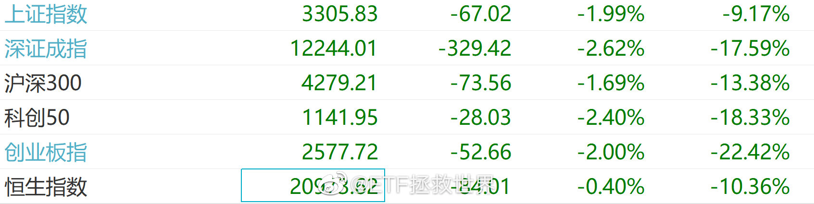

======================================================

ETF拯救世界 (5687069307) @
2022-03-08 12:02:58 Tue  
url: https://weibo.com/5687069307/LiLiosO4o

不过我说真的，出去走走。

在大街上走，在田野里走，在山上走，在海边走。

在很辽阔的地方，在阳光明媚的地方，很多困扰你的事情你会突然觉得那么渺小，不值得去担忧。

你值得拥有一种举重若轻，泰山压顶谈笑风生的气质。

风险可控的一点点小事，以后想起来你会发现为它担忧非常可笑。 ​​​

转发[109]  评论[571]  赞[2778] 

======================================================

ETF拯救世界 (5687069307) @
2022-03-08 12:14:08 Tue  
url: https://weibo.com/5687069307/LiLmVqheb

请各位先不要按照提示补仓，我先看一下是怎么回事。 ​​​

转发[20]  评论[1013]  赞[2759] 

======================================================

ETF拯救世界 (5687069307) @
2022-03-08 13:01:28 Tue  
url: https://weibo.com/5687069307/LiLG8xVis

今日补仓提醒整体问题不大。但有两个建议：

第一，DAX不要补，各种原因。

第二，只补价格差15%-20%以上的份数。

希望你的成本远低于我。 ​​​

转发[86]  评论[645]  赞[2698] 

======================================================

ETF拯救世界 (5687069307) @
2022-03-08 13:11:39 Tue  
url: https://weibo.com/5687069307/LiLKh4twY

回复@无枝可栖的灵魂:这个自己定。我说15-20是很保守的。至于具体多少自己定，高一点就更保守一点，低一点就激进一点。//@无枝可栖的灵魂:只有恒生差价在15%以上

------------------------------------------------------
转推：
>  @ETF拯救世界 (5687069307)
>  2022-03-08 13:01:28 Tue  
>  url: https:/weibo.com/5687069307/LiLG8xVis/

>  今日补仓提醒整体问题不大。但有两个建议：
>  
>  第一，DAX不要补，各种原因。
>  
>  第二，只补价格差15%-20%以上的份数。
>  
>  希望你的成本远低于我。 ​​​

转发[22]  评论[230]  赞[1700] 

======================================================

ETF拯救世界 (5687069307) @
2022-03-08 14:20:28 Tue  
url: https://weibo.com/5687069307/LiMccC756

祝各位少女以及资深少女节日快乐！

（本条男性博友请勿评论，望自重） ​ http://t.cn/A66b9Pgj ​​​

转发[25]  评论[2284]  赞[4347] 

======================================================

ETF拯救世界 (5687069307) @
2022-03-08 16:09:49 Tue  
url: https://weibo.com/5687069307/LiMUAAv1n

这不是统一不统一的问题。而是俄倒了就会有人集中全部精力干你的问题。大多数理智的中国人不想出现这样的局面。出发点是国家利益而非其它。

------------------------------------------------------
转推：
>  @数知实验室 (5676384100)
>  2022-03-08 15:44:49 Tue  
>  url: https:/weibo.com/5676384100/LiMKrvuPe/

>  这几天在想象一个假设的场景：假如在今年俄乌战争发生之前，中国早已实现祖国统一，全国各省各族人民团结和谐。在这个假设背景下，大家对于俄乌战争中各方的评价与支持立场会否会和真实情况的现在有所不同？
>  
>  大家怎么看？你的观点会发生变化吗？ ​​​

转发[42]  评论[222]  赞[2110] 

======================================================

ETF拯救世界 (5687069307) @
2022-03-08 16:18:21 Tue  
url: https://weibo.com/5687069307/LiMY3r3fx

今天数据出来了。二话不说，我先送一张宽基图给大家。行业图下次有缘再送。全市场图钻石坑送。

整体来说，A股依然没有很便宜。并不是说很贵，基本就是均值偏下一点点的位置吧。所以跌，非常正常。

这与德国、港股等完全不同。这些地方是绝对和相对意义上都比较便宜。

具体到分类。

大指数依然让人 ​​​

转发[656]  评论[576]  赞[3543] 

+++++++++++++++++++++++++++++++++++++++++++++++++++++

图片：
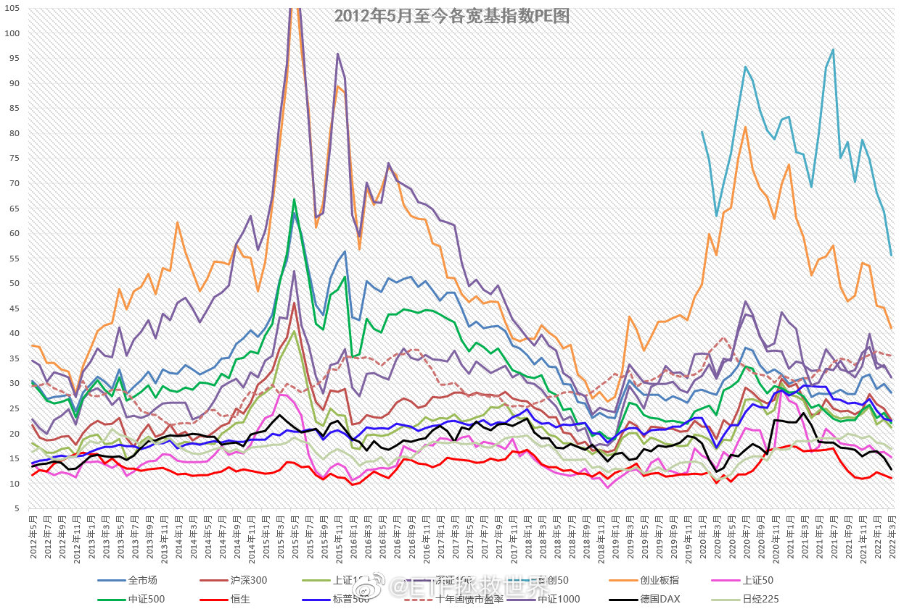

======================================================

ETF拯救世界 (5687069307) @
2022-03-08 16:25:45 Tue  
url: https://weibo.com/5687069307/LiN14b6Ca

回复@有舍才能得etf:恒生估值没起来过，但是价格可是上下翻飞。我立个Flag，恒生18500如果有幸买到，不到30000点我不会卖。//@有舍才能得etf:为什么恒生看起来一直是趴着的状态呢

------------------------------------------------------
转推：
>  @ETF拯救世界 (5687069307)
>  2022-03-08 16:18:21 Tue  
>  url: https:/weibo.com/5687069307/LiMY3r3fx/

>  今天数据出来了。二话不说，我先送一张宽基图给大家。行业图下次有缘再送。全市场图钻石坑送。
>  
>  整体来说，A股依然没有很便宜。并不是说很贵，基本就是均值偏下一点点的位置吧。所以跌，非常正常。
>  
>  这与德国、港股等完全不同。这些地方是绝对和相对意义上都比较便宜。
>  
>  具体到分类。
>  
>  大指数依然让人 ​​​

转发[158]  评论[233]  赞[1618] 

======================================================

ETF拯救世界 (5687069307) @
2022-03-08 16:28:34 Tue  
url: https://weibo.com/5687069307/LiN2csoCp

回复@l_O_O_l:欧盟目前一盘散沙，没有力量对漂亮说不。真的很悲哀。//@l_O_O_l:回复@冬季的秋名山:魏强联蜀抗魏，蜀强联魏抗蜀。现在就是看不懂欧盟，明明一丁点好处都没，还把能源粮食弄得那么高价格分分钟忍饥挨饿，他们图的是什么？？？？？？？

------------------------------------------------------
转推：
>  @数知实验室 (5676384100)
>  2022-03-08 15:44:49 Tue  
>  url: https:/weibo.com/5676384100/LiMKrvuPe/

>  这几天在想象一个假设的场景：假如在今年俄乌战争发生之前，中国早已实现祖国统一，全国各省各族人民团结和谐。在这个假设背景下，大家对于俄乌战争中各方的评价与支持立场会否会和真实情况的现在有所不同？
>  
>  大家怎么看？你的观点会发生变化吗？ ​​​

转发[11]  评论[121]  赞[1289] 

======================================================

ETF拯救世界 (5687069307) @
2022-03-08 16:31:02 Tue  
url: https://weibo.com/5687069307/LiN3ctmES

你是不是慌了，不用慌。

我推心置腹的说一句，

等文章。

本周，定了，我说的！ ​​​

转发[49]  评论[1215]  赞[4330] 

======================================================

ETF拯救世界 (5687069307) @
2022-03-08 16:41:24 Tue  
url: https://weibo.com/5687069307/LiN7ppFxl

恒生已经马上跌破10倍估值了。

过去20多年，只要破10倍就进钻石坑。

我不知道能不能到18500，但只要不出天大的事，比如大战，比如被联合制裁，那么，现在离底部绝不远了。 ​​​

转发[439]  评论[722]  赞[4987] 

======================================================

ETF拯救世界 (5687069307) @
2022-03-08 16:59:48 Tue  
url: https://weibo.com/5687069307/LiNeT5EzS

今天不说太多了。只是想告诉大家：

到目前为止，一切都很正常。全都是你来投资应该做好准备会发生的。至少在我这里，没有任何意外。

意外的事件，导致了暂时没有意外的市场。

未来市场会不会超出我的认知范围，我不知道。到现在为止，依然正常。

如果你心情不好，别想太多。没有意义。想太多你容易 ​​​

转发[113]  评论[1373]  赞[4684] 

======================================================

ETF拯救世界 (5687069307) @
2022-03-08 18:38:09 Tue  
url: https://weibo.com/5687069307/LiNSNwu8U

恭喜@无敌冰淇淋77 等100名用户等额平分【1688元现金】。微博官方唯一抽奖工具@微博抽奖平台 对本次抽奖进行监督，结果公正有效。公示链接：http://t.cn/A66b95BN

------------------------------------------------------
转推：
>  @ETF拯救世界 (5687069307)
>  2022-03-08 14:20:28 Tue  
>  url: https:/weibo.com/5687069307/LiMccC756/

>  祝各位少女以及资深少女节日快乐！
>  
>  （本条男性博友请勿评论，望自重） ​ http://t.cn/A66b9Pgj ​​​

转发[3]  评论[532]  赞[1429] 

======================================================

ETF拯救世界 (5687069307) @
2022-03-09 11:00:10 Wed  
url: https://weibo.com/5687069307/LiUjoE2LL

目前我感觉压力比较大了。并不是因为几天时间我的账户缩水大七位数，因为自己肉比较厚，禁打。压力测试做得也可以，资金没有问题。

我是特别担心没有做好资金分配导致后续部队不足的朋友，各位可能会比较焦虑。

无论是长线还是波段，如果资金不够，完全可以停止后续投入。没有任何问题。

一定要根据 ​​​

转发[207]  评论[1834]  赞[5050] 

======================================================

ETF拯救世界 (5687069307) @
2022-03-09 11:51:19 Wed  
url: https://weibo.com/5687069307/LiUEadjIy

医药网格还剩两网。

目前已经确定最终网的品种：恒生：1；恒科：2；医药：2。一共5。

其它的还没有确定，但传媒不会超过1，券商不会超过2，红利不会超过2。

其它品种暂时没有新开的计划。

也就是说，目前看，到最后最多就是10网资金。我会根据自己的情况安排。 ​​​

转发[257]  评论[843]  赞[3276] 

======================================================

ETF拯救世界 (5687069307) @
2022-03-09 12:08:55 Wed  
url: https://weibo.com/5687069307/LiULj9Tp1

所有的权益类投资都要有个资金投入极限。在投资开始前设定好这个数字，到了就停，这是纪律。

150不用说了，本来就是固定金额的投资。

现在波段也有了极限。

S积累了大量资金，当然有些朋友把S未投的投入到波段了，这并不是问题，因为你之所以参与了S，说明你有稳定的收入来源，所以不是问题。

也就 ​​​

转发[202]  评论[665]  赞[3261] 

======================================================

ETF拯救世界 (5687069307) @
2022-03-09 13:33:57 Wed  
url: https://weibo.com/5687069307/LiVjP4Vih

未来一段时间长线仓位买入思路：

已经有一定仓位的，不会盲目加仓。会在最关键的位置，比如最后支撑，比如下跌80%的位置稍作买入。

剩余的会在右侧买入。

会注意保留资金，优先使用黄金、债券、原油的卖出部分。 ​​​

转发[186]  评论[766]  赞[3605] 

======================================================

ETF拯救世界 (5687069307) @
2022-03-09 14:14:07 Wed  
url: https://weibo.com/5687069307/LiVA7DDHH

如果收个长下影的红线，我会感动到流泪。 ​​​

转发[38]  评论[929]  赞[4381] 

======================================================

ETF拯救世界 (5687069307) @
2022-03-09 15:05:08 Wed  
url: https://weibo.com/5687069307/LiVUPwfEF

我在人生现阶段，最大的希望除了身体健康外，

就是国泰民安。 ​​​

转发[68]  评论[585]  赞[4175] 

======================================================

ETF拯救世界 (5687069307) @
2022-03-09 15:21:36 Wed  
url: https://weibo.com/5687069307/LiW1w6Xli

目前为止所有网格品种持仓收益率。

这是一个艰难时刻，希望我们所有人顺利。 ​​​

转发[61]  评论[767]  赞[3650] 

+++++++++++++++++++++++++++++++++++++++++++++++++++++

图片：
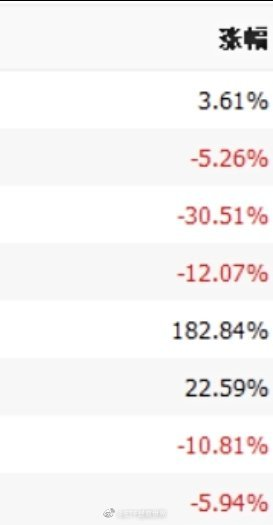

======================================================

ETF拯救世界 (5687069307) @
2022-03-09 15:44:58 Wed  
url: https://weibo.com/5687069307/LiWb08HgA

每天先天下之忧而忧，弄得好像脸上长斑了…… ​​​

转发[17]  评论[682]  赞[3066] 

======================================================

ETF拯救世界 (5687069307) @
2022-03-09 16:31:06 Wed  
url: https://weibo.com/5687069307/LiWtJ7ZVN

这张图有个数据有问题，不好意思更正一下。德国DAX的估值（黑色）并未低至图中所示。虽然是不贵的状态，但没那么低，大致比日经高一点。这个问题是原始数据的问题，今天发现已经更新。

------------------------------------------------------
转推：
>  @ETF拯救世界 (5687069307)
>  2022-03-08 16:18:21 Tue  
>  url: https:/weibo.com/5687069307/LiMY3r3fx/

>  今天数据出来了。二话不说，我先送一张宽基图给大家。行业图下次有缘再送。全市场图钻石坑送。
>  
>  整体来说，A股依然没有很便宜。并不是说很贵，基本就是均值偏下一点点的位置吧。所以跌，非常正常。
>  
>  这与德国、港股等完全不同。这些地方是绝对和相对意义上都比较便宜。
>  
>  具体到分类。
>  
>  大指数依然让人 ​​​

转发[74]  评论[248]  赞[1708] 

======================================================

ETF拯救世界 (5687069307) @
2022-03-09 17:52:22 Wed  
url: https://weibo.com/5687069307/LiX0IgaM6

如果明天A股和港股能像欧洲这么勇，那我们这几天买的就能大范围回血提款了……

是我想太多吗。 ​​​

转发[44]  评论[791]  赞[3403] 

+++++++++++++++++++++++++++++++++++++++++++++++++++++

图片：
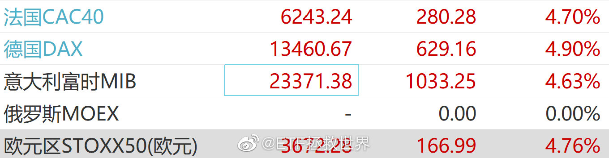

======================================================

ETF拯救世界 (5687069307) @
2022-03-09 17:56:12 Wed  
url: https://weibo.com/5687069307/LiX2gwyKT

今天有个数据必须说一下，

金融地产指数的各种估值，已经创出历史新低。低于08 12 18任何时候。

市场真的很悲观。 ​​​

转发[180]  评论[752]  赞[3860] 

======================================================

ETF拯救世界 (5687069307) @
2022-03-10 10:42:59 Thu  
url: https://weibo.com/5687069307/Lj3CViqdS

1个交易日提款，

你永远可以相信小红。 ​​​

转发[27]  评论[1444]  赞[4359] 

======================================================

ETF拯救世界 (5687069307) @
2022-03-10 15:26:19 Thu  
url: https://weibo.com/5687069307/Lj5tVvJ7h

最近一两年跟车的朋友，可能最近收益率有点惨。因为你们不是像老朋友那样卖出盈利品种买入，没有安全垫，所以账面很不好看。

150的朋友可能还好，因为你们知道自己有上百份资金还没有投入。

S的朋友因为没有一个直观的认识，不清楚自己其实积累了很多应投未投的资金，这些资金一旦投入，都会将浮亏的 ​​​

转发[169]  评论[1322]  赞[5181] 

======================================================

ETF拯救世界 (5687069307) @
2022-03-10 15:41:22 Thu  
url: https://weibo.com/5687069307/Lj5A2hKus

续上一条：

这一两年跟车S的朋友，可以看看手里已经买的，浮亏的品种。你会发现，除了中概/恒科，每个品种一共才一两份。

这一两份降成本有多容易你知道吗。最关键的，是我们从没有在一个区域高位大量投入，所以低位再买一点，成本一下子就会下去。

这一两年S买的品种：

传媒：2份（1个月投入）

 ​​​

转发[177]  评论[1277]  赞[5230] 

======================================================

ETF拯救世界 (5687069307) @
2022-03-11 07:15:10 Fri  
url: https://weibo.com/5687069307/LjbH4bitQ

好好工作，多存点钱。

控制买入欲望，控制节奏。 ​​​

转发[100]  评论[1303]  赞[5273] 

======================================================

ETF拯救世界 (5687069307) @
2022-03-11 08:44:06 Fri  
url: https://weibo.com/5687069307/LjchahZnP

预感今天将会是战斗的一天。 ​​​

转发[38]  评论[1184]  赞[4435] 

======================================================

ETF拯救世界 (5687069307) @
2022-03-11 09:54:39 Fri  
url: https://weibo.com/5687069307/LjcJNzIHv

正在写东西（这次是真的，有图为证）。

争取下午发。

我想很多朋友应该是需要的。 ​​​

转发[46]  评论[2254]  赞[8593] 

+++++++++++++++++++++++++++++++++++++++++++++++++++++

图片：
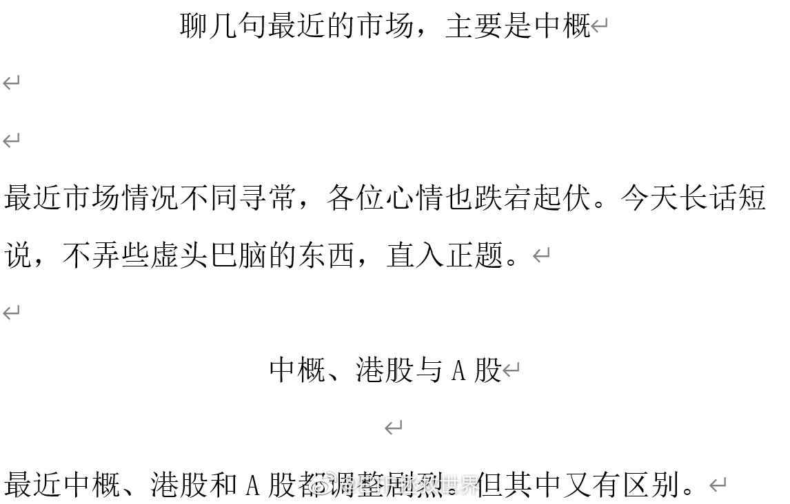

======================================================

ETF拯救世界 (5687069307) @
2022-03-11 13:55:05 Fri  
url: https://weibo.com/5687069307/Ljejol3xy

写完了，在等小助理排版。

今天能不能提个double kill给老爷们助助兴啊。[悲伤] ​​​

转发[33]  评论[651]  赞[3547] 

======================================================

ETF拯救世界 (5687069307) @
2022-03-11 14:11:48 Fri  
url: https://weibo.com/5687069307/Ljeqbac0E

？如果恒生反弹收红，我今天一大早跑到办公室吭哧吭哧写半天又有何用？

什么玩意儿？ ​​​

转发[32]  评论[1175]  赞[4243] 

======================================================

ETF拯救世界 (5687069307) @
2022-03-11 14:39:18 Fri  
url: https://weibo.com/5687069307/LjeBlcIl9

gzh人工审核了十几分钟，终于通过了。 ​​​

转发[23]  评论[611]  赞[2844] 

======================================================

ETF拯救世界 (5687069307) @
2022-03-11 15:12:42 Fri  
url: https://weibo.com/5687069307/LjeOTApme

差那么一丢丢，没有double kill.

终究是错付了。 ​​​

转发[18]  评论[425]  赞[2773] 

======================================================

ETF拯救世界 (5687069307) @
2022-03-11 16:43:50 Fri  
url: https://weibo.com/5687069307/LjfpTaXs4

回复了几十条了。其实回复的留言大家可以看看，我想有些回复还是挺有价值的。 ​​​

转发[21]  评论[623]  赞[3252] 

======================================================

ETF拯救世界 (5687069307) @
2022-03-11 22:24:03 Fri  
url: https://weibo.com/5687069307/LjhDZ3Vke

昨天卖出的那份油气各位平均收益率47%。

有些朋友收益率不高，很不好意思。相信下次会更好。 ​​​

转发[23]  评论[790]  赞[3653] 

======================================================

ETF拯救世界 (5687069307) @
2022-03-14 07:58:09 Mon  
url: https://weibo.com/5687069307/LjEg0fn4k

数据显示，二月外资开始减持国债。

巧合 思路一致 还是跟车了 ​​​

转发[38]  评论[481]  赞[2542] 

+++++++++++++++++++++++++++++++++++++++++++++++++++++

图片：
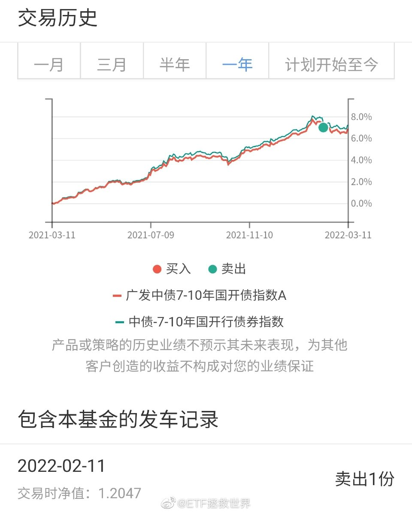

======================================================

ETF拯救世界 (5687069307) @
2022-03-14 09:13:59 Mon  
url: https://weibo.com/5687069307/LjEKMwvAb

今天没什么别的希望，就是希望能提一次款 ​​​

转发[17]  评论[628]  赞[2549] 

======================================================

ETF拯救世界 (5687069307) @
2022-03-14 10:14:20 Mon  
url: https://weibo.com/5687069307/LjF9hk8ci

三个交易日提款成功。

接回价格有变，我不会在历史交易里面重新创建。

表格稍后发出。 ​​​

转发[22]  评论[695]  赞[2879] 

======================================================

ETF拯救世界 (5687069307) @
2022-03-14 11:52:44 Mon  
url: https://weibo.com/5687069307/LjFNdAJME

我不会跟你说价值呀，机会呀，不买不行呀。

也不会跟你说陷阱呀，危墙呀，先跑再说呀。

我只能说，据我从各个维度考虑，某个点位从历史上看，是5-10年才会到的一个很低的价位。在那里我会买一些，然后就不再惦记了。

至于它之后是涨是跌，就交给市场吧。我的注意力就会转到别的品种上。

怎么说，就 ​​​

转发[131]  评论[801]  赞[4035] 

======================================================

ETF拯救世界 (5687069307) @
2022-03-14 12:04:46 Mon  
url: https://weibo.com/5687069307/LjFS6uEt5

带儿子去做核酸，路上碰到他的两个女同学。道别后跟儿子讨论了这两位同学照片和真人的差异，皮肤啊，发型啊，性格啊什么的。

发现跟儿子有时候很像哥们儿了，当然这也是我所追求的关系。在我印象中，我父亲从来没有跟我谈论过我的任何一个同学。 ​​​

转发[30]  评论[496]  赞[3756] 

======================================================

ETF拯救世界 (5687069307) @
2022-03-14 16:05:56 Mon  
url: https://weibo.com/5687069307/LjHs07p3F

今天，一个账户。

心如止水。你信不信。 ​​​

转发[153]  评论[2329]  赞[7712] 

+++++++++++++++++++++++++++++++++++++++++++++++++++++

图片：
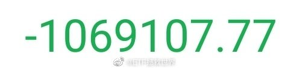

======================================================

ETF拯救世界 (5687069307) @
2022-03-14 16:21:09 Mon  
url: https://weibo.com/5687069307/LjHyaxEZ1

ND爷。不是说欧洲输得最惨吗。[微笑]

------------------------------------------------------
转推：
>  @财联社APP (2868676035)
>  2022-03-14 16:01:13 Mon  
>  url: https:/weibo.com/2868676035/LjHq53yn5/

>  财联社3月14日电，欧股集体高开，德国DAX30指数涨1.48%，英国富时100指数涨0.34%，欧洲斯托克50指数涨1.16%。 ​​​

转发[101]  评论[519]  赞[3555] 

======================================================

ETF拯救世界 (5687069307) @
2022-03-14 19:58:55 Mon  
url: https://weibo.com/5687069307/LjIYz196U

大家还记得几天前的投票吗。几天过去，你要改一下答案吗 http://t.cn/A66VYQaJ ​​​

转发[29]  评论[871]  赞[32824] 

======================================================

ETF拯救世界 (5687069307) @
2022-03-14 20:16:31 Mon  
url: https://weibo.com/5687069307/LjJ5HBueo

这里说明一下，最近重新整理了过去十年恒生的数据，发现源数据中有一些数据被污染了。清洗后目前恒生估值没有11倍那么低，大概是13倍左右，也已经是非常非常低了，尤其是在近几年加入大量科技股票后。18500的操作逻辑没有变，我的加仓策略也没变。

------------------------------------------------------
转推：
>  @ETF拯救世界 (5687069307)
>  2022-03-08 16:41:24 Tue  
>  url: https:/weibo.com/5687069307/LiN7ppFxl/

>  恒生已经马上跌破10倍估值了。
>  
>  过去20多年，只要破10倍就进钻石坑。
>  
>  我不知道能不能到18500，但只要不出天大的事，比如大战，比如被联合制裁，那么，现在离底部绝不远了。 ​​​

转发[124]  评论[367]  赞[2744] 

======================================================

ETF拯救世界 (5687069307) @
2022-03-14 20:40:40 Mon  
url: https://weibo.com/5687069307/LjJfvuuiP

最近的极端行情，让我有了很久没有进行过的深入思考。

真的，朋友们，确实只有挫折才会让人思考和进步。

主要的思考点：

第一，如果中概这些公司，真的因为非市场因素挂掉，会改变我对很多事情的看法。这个一两句说不清，不是简单的改变，是对一些人生方向以及更多东西的改变。

第二，自己的体系需 ​​​

转发[434]  评论[1521]  赞[6893] 

======================================================

ETF拯救世界 (5687069307) @
2022-03-14 22:17:56 Mon  
url: https://weibo.com/5687069307/LjJSZkOkj

我不会管别人怎么想怎么操作。

我的最后一笔买入时刻到了。 ​​​

转发[102]  评论[1101]  赞[5045] 

======================================================

ETF拯救世界 (5687069307) @
2022-03-15 09:32:28 Tue  
url: https://weibo.com/5687069307/LjOiMsFrV

我这几笔主动买入，早在几个月甚至几年前就已经计划好了。现在只是执行计划，同时向18500致敬。

我绝对不是忽悠你要杀入。因为你并不知道这100万占我资产的多少。也许很少，也许很多。

我做这个记录，是因为之前答应了朋友们，买了就贴出来。也是为自己做个记录。未来有一天赚钱了，或者赔光了，这都 ​​​

转发[267]  评论[1628]  赞[5856] 

+++++++++++++++++++++++++++++++++++++++++++++++++++++

图片：
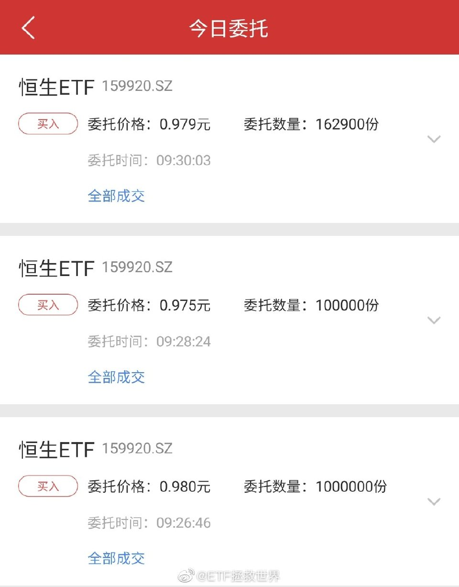

======================================================

ETF拯救世界 (5687069307) @
2022-03-15 10:27:46 Tue  
url: https://weibo.com/5687069307/LjOFecDh9

基本上恒生的买入已经结束了。

今天我的主动买入最后一笔；

网格波段最后一笔；

150和S会买入一笔。

所有的最后一笔买入全部卡在18200-18500上方。

如果跌破，那么也不会再买入。全部投入到此为止。

还会有可能买的是150和S，但是会走右侧。

永远不会向一个产品用无底洞的方式投入。 ​​​

转发[188]  评论[1005]  赞[4270] 

======================================================

ETF拯救世界 (5687069307) @
2022-03-15 11:40:24 Tue  
url: https://weibo.com/5687069307/LjP8IbTNu

今天港股买完后，很长时间应该不会再有什么大的投入了。

A股完全没有兴趣买多少，零星买一点有可能。

所以接下来应该是恢复元气积累资本的时间。

相当于中场休息。 ​​​

转发[85]  评论[1049]  赞[4115] 

======================================================

ETF拯救世界 (5687069307) @
2022-03-15 15:04:18 Tue  
url: https://weibo.com/5687069307/LjQttmLJu

不到关键点位不要轻易抄底，不要不停买，因为家里没矿。 ​​​

转发[120]  评论[862]  赞[4284] 

======================================================

ETF拯救世界 (5687069307) @
2022-03-15 15:24:16 Tue  
url: https://weibo.com/5687069307/LjQBA1WwA

不用说那么多有的没的。重复一下我的建议：

第一，好好工作。

第二，多攒点钱。

第三，保证1年以上的家庭支出以类现金形式存在。

第四，1-3年不用的钱做波段，5年以上不用的钱做长期投资。

第五，不要有了钱就不停的买。你买不应该是因为有钱了，而应该是因为有好机会了。巴菲特手里上千亿现金， ​​​

转发[991]  评论[930]  赞[6418] 

======================================================

ETF拯救世界 (5687069307) @
2022-03-15 15:30:44 Tue  
url: https://weibo.com/5687069307/LjQEcuKpe

正在跑今天的数据。

今天我没怎么看盘，结果数据出来大吃一惊。全市场两项数据出现了很罕见的大幅下降。

一会宽基和行业数据出来再说。

再这样跌几天，A股居然也很有投资机会了？这是我没想到的。 ​​​

转发[66]  评论[712]  赞[4279] 

======================================================

ETF拯救世界 (5687069307) @
2022-03-15 15:56:52 Tue  
url: https://weibo.com/5687069307/LjQOOhSB3

所有数据都出来了。

没有赶上2018年钻石坑的朋友，在2022年，你很有可能再碰上一个钻石坑。

甚至有些品种要比当时还要便宜。

在这种时候，我不想说太多让你激动的话。因为我们现在面对的是一个非常非常复杂的金融市场，其复杂甚至并非仅仅来源于金融。

但我必须要说的是，如果继续暴跌，今年大概率 ​​​

转发[721]  评论[1959]  赞[8620] 

+++++++++++++++++++++++++++++++++++++++++++++++++++++

图片：
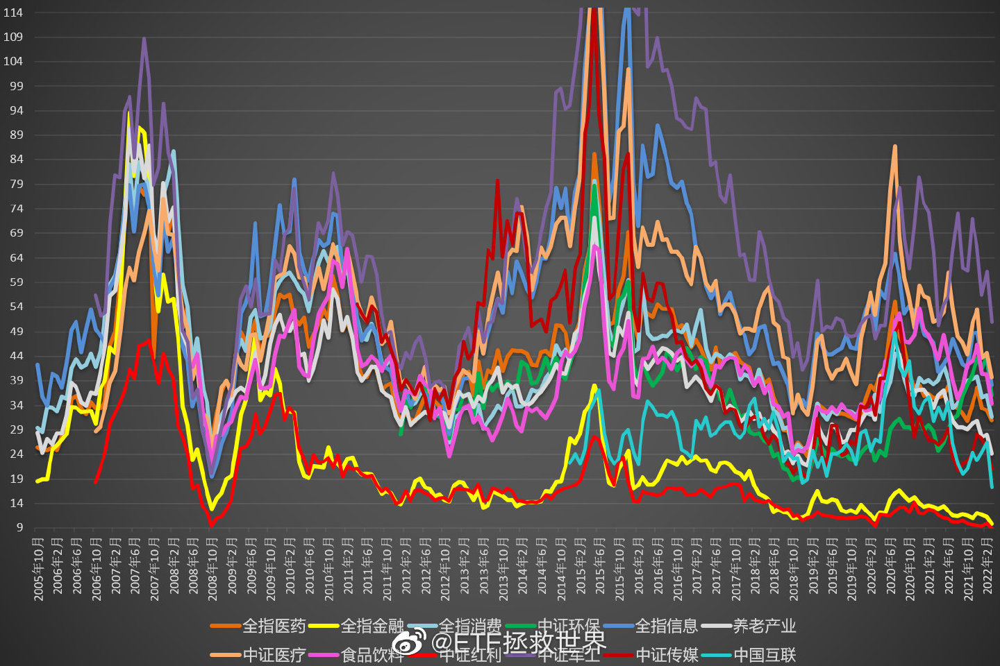

======================================================

ETF拯救世界 (5687069307) @
2022-03-15 22:46:36 Tue  
url: https://weibo.com/5687069307/LjTv82VEd

是男人你就坚持到明天 ​​​

转发[47]  评论[1139]  赞[4138] 

+++++++++++++++++++++++++++++++++++++++++++++++++++++

图片：
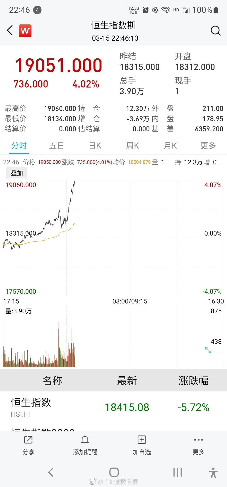

======================================================

ETF拯救世界 (5687069307) @
2022-03-16 10:28:41 Wed  
url: https://weibo.com/5687069307/LjY66rrCp

卧龙凤雏。 ​​​

转发[13]  评论[412]  赞[2819] 

======================================================

ETF拯救世界 (5687069307) @
2022-03-16 10:35:20 Wed  
url: https://weibo.com/5687069307/LjY8Nms7y

有没有一种可能，

所有行业都变成公用事业。 ​​​

转发[55]  评论[842]  赞[3493] 

======================================================

ETF拯救世界 (5687069307) @
2022-03-16 10:45:14 Wed  
url: https://weibo.com/5687069307/LjYcOtvef

今日好消息：消费终于跌回历史正常区间了！//@ETF拯救世界:消费终于开始低下高昂的头颅。总是埋怨它不是讨厌它，而是爱它，怕它走在歪路上一去不回。

------------------------------------------------------
转推：
>  @ETF拯救世界 (5687069307)
>  2022-02-22 13:29:34 Tue  
>  url: https:/weibo.com/5687069307/LgDSB0mvv/

>  我心中的最大的怨念依然是消费。
>  
>  2020年5月以来的疯癫状态，到底怎样才会结束。
>  
>  即使跌到现在，它居然依然还没有进入我定义的可买入区间上限。
>  
>  是我错了还是市场错了。
>  
>  所有板块，只有它依然无法哪怕下手一点点。
>  
>  这是道德的沦丧，还是人性的扭曲。 ​​​

转发[51]  评论[429]  赞[2307] 

======================================================

ETF拯救世界 (5687069307) @
2022-03-16 11:27:12 Wed  
url: https://weibo.com/5687069307/LjYtQwzUN

今天再次买回的品种，后续还有一份的额度就会结束买入。

我不会忘记改一下之前设置的条件单，下一网价格会有变化。 ​​​

转发[29]  评论[497]  赞[2748] 

======================================================

ETF拯救世界 (5687069307) @
2022-03-16 13:22:38 Wed  
url: https://weibo.com/5687069307/LjZeHyOZB

昨天买的致敬份额终于解套了[泪] ​​​

转发[55]  评论[621]  赞[3460] 

======================================================

ETF拯救世界 (5687069307) @
2022-03-16 13:25:04 Wed  
url: https://weibo.com/5687069307/LjZfHkooJ

回复@梅之敦敏:放心。我做人永远有始有终。卖的时候必然会说。//@梅之敦敏:致敬份额啥时卖呢？

------------------------------------------------------
转推：
>  @ETF拯救世界 (5687069307)
>  2022-03-16 13:22:38 Wed  
>  url: https:/weibo.com/5687069307/LjZeHyOZB/

>  昨天买的致敬份额终于解套了[泪] ​​​

转发[20]  评论[177]  赞[1889] 

======================================================

ETF拯救世界 (5687069307) @
2022-03-16 13:39:52 Wed  
url: https://weibo.com/5687069307/LjZlHA9p3

主要是我比99.99%的人会瞎蒙

------------------------------------------------------
转推：
>  @ETF拯救世界 (5687069307)
>  2022-01-06 11:59:45 Thu  
>  url: https:/weibo.com/5687069307/L9ucNrkfO/

>  恒生的长线仓位交易历史。
>  
>  不客气的说，我比99.9%的人更懂这个指数。 ​​​

转发[110]  评论[1011]  赞[4211] 

======================================================

ETF拯救世界 (5687069307) @
2022-03-16 13:50:05 Wed  
url: https://weibo.com/5687069307/LjZpQENzq

昨天且慢提示补仓，补了的晚上给自己加个鸡腿。

你应得的。 

会不会跌回去不重要，反正今天赚了今天开心就完事。 ​​​

转发[61]  评论[1647]  赞[5140] 

======================================================

ETF拯救世界 (5687069307) @
2022-03-16 14:31:28 Wed  
url: https://weibo.com/5687069307/LjZGE5rwP

不知道各位是什么样的心情，

对我来说，很平静，跟昨天一样。

钱投在市场里，一定是上上下下起起伏伏多多少少不断波动的，所以没什么稀奇。

我对自己只有一个要求：

未来回到高点的时候，一定要比上次到达这里的时候更有钱。

其它的，平平无奇罢了。 ​​​

转发[121]  评论[897]  赞[3951] 

======================================================

ETF拯救世界 (5687069307) @
2022-03-16 14:37:28 Wed  
url: https://weibo.com/5687069307/LjZJ55eEV

现在场内不断卖恒科的脑子是不是有点大病。[微笑]

折价6个点卖。 ​​​

转发[46]  评论[509]  赞[3195] 

======================================================

ETF拯救世界 (5687069307) @
2022-03-16 14:40:10 Wed  
url: https://weibo.com/5687069307/LjZKaDvDD

告诉你一个可怕的数学题：

b站一天涨了40%，

但只是回到上周五而已。

低位买入是真的暴利。 ​​​

转发[114]  评论[572]  赞[4344] 

======================================================

ETF拯救世界 (5687069307) @
2022-03-16 15:26:38 Wed  
url: https://weibo.com/5687069307/Lk032iECs

昨天鹅最低297，恒生18235，中概79%，三者共振完成。而这一切，半个月前已经定下了。当然，是不是最低，后面还会不会跌我不敢说，但这个逻辑是完美的。

------------------------------------------------------
转推：
>  @ETF拯救世界 (5687069307)
>  2022-03-04 14:47:26 Fri  
>  url: https:/weibo.com/5687069307/LiaFalcD9/

>  鹅如果不能在目前这个强力平台撑住，那么下一个支撑就已经到了290左右。
>  
>  目前的平台实际上被鹅自己以及段老板等投资人认可，都在增持。但市场不认。
>  
>  到290的跌幅与中概是大致一致的。也就是说鹅290与中概80%共振了。如果这样的情况还是顶不住，那下面就不知道了。从鹅来说，290顶不住意味着十几年上 ​​​

转发[263]  评论[744]  赞[3932] 

======================================================

ETF拯救世界 (5687069307) @
2022-03-16 15:44:13 Wed  
url: https://weibo.com/5687069307/Lk0aaAiiI

刚才我在小助理群里说的，我觉得应该分享给大家。

这是我的真实想法。

我发现每一次进化，都来源于失败。只有在失败（或者不足或者不满意）后，才会努力的去寻找解决的办法，才会最终变得更强。

我们每个人都不想失败，但失败真的是进步的契机。区别是有人面对失败充满沮丧自暴自弃，有人面对失败寻 ​​​

转发[131]  评论[1015]  赞[4219] 

+++++++++++++++++++++++++++++++++++++++++++++++++++++

图片：
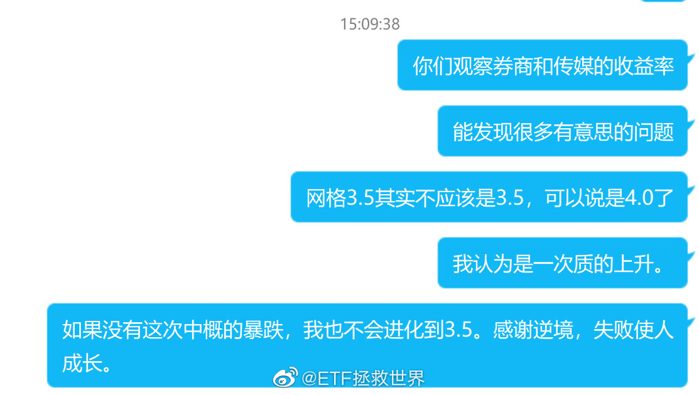

======================================================

ETF拯救世界 (5687069307) @
2022-03-17 07:36:44 Thu  
url: https://weibo.com/5687069307/Lk6oNwTtI

整个人尬住了：

一天涨40%的品种怎么做右侧，这道题太难我不会做。 ​​​

转发[68]  评论[1215]  赞[4686] 

======================================================

ETF拯救世界 (5687069307) @
2022-03-17 08:21:02 Thu  
url: https://weibo.com/5687069307/Lk6GMoeXg

QDII ETF/LOF都已经实现T+0了，却依然设置10%涨跌幅是特别离谱的一件事，相关部门领导能不能考虑把这个调整一下。

机构的朋友们也多向领导们建言吧。 ​​​

转发[65]  评论[409]  赞[3503] 

======================================================

ETF拯救世界 (5687069307) @
2022-03-17 08:25:14 Thu  
url: https://weibo.com/5687069307/Lk6Iubvbg

回复@GENE_SOBER:策略不执行还叫什么策略？不如随心所欲去玩好了。//@GENE_SOBER:今天网格继续策略么？右侧不给机会了嘛[允悲]

------------------------------------------------------
转推：
>  @ETF拯救世界 (5687069307)
>  2022-03-17 08:21:02 Thu  
>  url: https:/weibo.com/5687069307/Lk6GMoeXg/

>  QDII ETF/LOF都已经实现T+0了，却依然设置10%涨跌幅是特别离谱的一件事，相关部门领导能不能考虑把这个调整一下。
>  
>  机构的朋友们也多向领导们建言吧。 ​​​

转发[23]  评论[286]  赞[1759] 

======================================================

ETF拯救世界 (5687069307) @
2022-03-17 09:36:50 Thu  
url: https://weibo.com/5687069307/Lk7by9uAi

HS又因为折价没出去。

天妒英才。 ​​​

转发[19]  评论[402]  赞[2249] 

======================================================

ETF拯救世界 (5687069307) @
2022-03-17 09:51:04 Thu  
url: https://weibo.com/5687069307/Lk7hkhBm8

恒科这一网如果出不去就太亏了。

被交易制度干掉了。 ​​​

转发[32]  评论[454]  赞[2517] 

======================================================

ETF拯救世界 (5687069307) @
2022-03-17 10:25:45 Thu  
url: https://weibo.com/5687069307/Lk7vp8t7w

做市商是真不干活啊。 ​​​

转发[13]  评论[262]  赞[1956] 

======================================================

ETF拯救世界 (5687069307) @
2022-03-17 10:36:56 Thu  
url: https://weibo.com/5687069307/Lk7zWnwy3

你永远可以相信（  ）（  ）。

同一个品种一周两次6%，每次两个交易日，还有谁。 ​​​

转发[43]  评论[805]  赞[3197] 

======================================================

ETF拯救世界 (5687069307) @
2022-03-17 10:48:10 Thu  
url: https://weibo.com/5687069307/Lk7EvaMdK

屋漏偏逢连夜雨，最近赔这么多，它还涨价，节食吧还能怎么样。[怒] ​​​

转发[18]  评论[457]  赞[2021] 

+++++++++++++++++++++++++++++++++++++++++++++++++++++

图片：
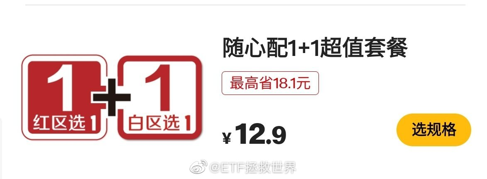

======================================================

ETF拯救世界 (5687069307) @
2022-03-17 11:09:41 Thu  
url: https://weibo.com/5687069307/Lk7NewdRR

错了，这一笔是不到一个交易日7%。没有人注意我把买入价下调了一个档位吗。

------------------------------------------------------
转推：
>  @ETF拯救世界 (5687069307)
>  2022-03-17 10:36:56 Thu  
>  url: https:/weibo.com/5687069307/Lk7zWnwy3/

>  你永远可以相信（  ）（  ）。
>  
>  同一个品种一周两次6%，每次两个交易日，还有谁。 ​​​

转发[17]  评论[463]  赞[2470] 

======================================================

ETF拯救世界 (5687069307) @
2022-03-17 12:09:25 Thu  
url: https://weibo.com/5687069307/Lk8bu4FSv

今天的日常生活记录：

壹：

疫情原因，家里做饭的阿姨不来了。点开久违的麦麦1+1，发现价格巨幅上涨7.5%。

生气。

贰：

两年前别人送的咖啡机今天拆箱拿出来用，发现回路不上水。找维修上门，用一根管子吸了一下就好了。被收了280。

生气。

叁：

发现在投资上面很难克服心魔，知道应该怎么做却 ​​​

转发[73]  评论[819]  赞[3460] 

======================================================

ETF拯救世界 (5687069307) @
2022-03-17 12:19:35 Thu  
url: https://weibo.com/5687069307/Lk8fBErfF

回复@飘渺七夜:[微笑] 不要气，观察一下谁相信了，然后在相信的人后面备注【脑残，离远点，否则会受伤】。//@飘渺七夜:刚才我气着了，一位网友（别的地方的）竟然说E大最近让清仓取现金了！！！！！！ 我惊了！这谣言吗？网络上这么公开的事情，闭眼造谣啊！

------------------------------------------------------
转推：
>  @ETF拯救世界 (5687069307)
>  2022-03-17 12:09:25 Thu  
>  url: https:/weibo.com/5687069307/Lk8bu4FSv/

>  今天的日常生活记录：
>  
>  壹：
>  
>  疫情原因，家里做饭的阿姨不来了。点开久违的麦麦1+1，发现价格巨幅上涨7.5%。
>  
>  生气。
>  
>  贰：
>  
>  两年前别人送的咖啡机今天拆箱拿出来用，发现回路不上水。找维修上门，用一根管子吸了一下就好了。被收了280。
>  
>  生气。
>  
>  叁：
>  
>  发现在投资上面很难克服心魔，知道应该怎么做却 ​​​

转发[25]  评论[100]  赞[1144] 

======================================================

ETF拯救世界 (5687069307) @
2022-03-17 12:23:24 Thu  
url: https://weibo.com/5687069307/Lk8hafX4U

回复@Horse17721:一般人觉得可笑的谎言，正是骗子用来筛选脑残的。如果连那么低级的谎言都能信，说明这个人可以，能骗。//@Horse17721:老大就是务实，这都能找到实用之处？[打call]

------------------------------------------------------
转推：
>  @ETF拯救世界 (5687069307)
>  2022-03-17 12:09:25 Thu  
>  url: https:/weibo.com/5687069307/Lk8bu4FSv/

>  今天的日常生活记录：
>  
>  壹：
>  
>  疫情原因，家里做饭的阿姨不来了。点开久违的麦麦1+1，发现价格巨幅上涨7.5%。
>  
>  生气。
>  
>  贰：
>  
>  两年前别人送的咖啡机今天拆箱拿出来用，发现回路不上水。找维修上门，用一根管子吸了一下就好了。被收了280。
>  
>  生气。
>  
>  叁：
>  
>  发现在投资上面很难克服心魔，知道应该怎么做却 ​​​

转发[16]  评论[104]  赞[1231] 

======================================================

ETF拯救世界 (5687069307) @
2022-03-17 12:40:18 Thu  
url: https://weibo.com/5687069307/Lk8o1c99W

说两句正经的。

经过两天大幅反弹，可能有很多朋友会关心之后怎么走：

是特级大熊市中继的“死猫跳”？还是V型反转继续大牛市？还是要做双底还有一波下跌？

我不知道谁能判断出是哪个，反正我是判断不出来。

谁能猜出熊熊突然干入邻居家？谁能想到昨天开会？

如果都不能，凭什么我们能猜出市场怎 ​​​

转发[456]  评论[768]  赞[3683] 

======================================================

ETF拯救世界 (5687069307) @
2022-03-17 13:10:33 Thu  
url: https://weibo.com/5687069307/Lk8Aik0UU

回头再看这个最黑暗时刻的投票，我真的感慨万分。各位是中文互联网上最特别的一群投资人，我为能与大家站在一起感到骄傲。

------------------------------------------------------
转推：
>  @ETF拯救世界 (5687069307)
>  2022-03-14 19:58:55 Mon  
>  url: https:/weibo.com/5687069307/LjIYz196U/

>  大家还记得几天前的投票吗。几天过去，你要改一下答案吗 http://t.cn/A66VYQaJ ​​​

转发[1]  评论[868]  赞[3287] 

======================================================

ETF拯救世界 (5687069307) @
2022-03-17 13:21:08 Thu  
url: https://weibo.com/5687069307/Lk8EABvRg

成交。

两个交易日12%。没弄错的话应该是两年来收益率最大的一次。 ​​​

转发[31]  评论[675]  赞[3032] 

======================================================

ETF拯救世界 (5687069307) @
2022-03-17 14:02:09 Thu  
url: https://weibo.com/5687069307/Lk8Vf0iWp

虽然说不预测走势，但从历史的角度看，恒生指数从未在18500-22000这样的极度价值区域出现V型反转而只是短暂停留。

最少也要徘徊几个月。

换而言之，在这个区域会出现不止一次的波段机会。从历史看，大概率。

换而言之，各位要做好准备，知道大概率还会向下测试底部是否牢固。做好准备的意思，是真的 ​​​

转发[325]  评论[753]  赞[3659] 

======================================================

ETF拯救世界 (5687069307) @
2022-03-17 15:04:16 Thu  
url: https://weibo.com/5687069307/Lk9ks9pZ5

HS更新。买回价格有变化，我会在历史记录里面找出然后改单。 ​​​

转发[17]  评论[386]  赞[2207] 

======================================================

ETF拯救世界 (5687069307) @
2022-03-17 15:47:51 Thu  
url: https://weibo.com/5687069307/Lk9C92zn7

明天是个时间窗口，保不齐长期计划会追涨硬上！ ​​​

转发[33]  评论[656]  赞[3261] 

======================================================

ETF拯救世界 (5687069307) @
2022-03-17 15:55:38 Thu  
url: https://weibo.com/5687069307/Lk9FiC8uY

今天HS没挤下车的不用担心，只要今晚中概不掉链子，明天全都能下。

我说的！ ​​​

转发[50]  评论[805]  赞[3433] 

======================================================

ETF拯救世界 (5687069307) @
2022-03-17 16:34:44 Thu  
url: https://weibo.com/5687069307/Lk9Vbd5lA

希望所有回购公司回购后都注销。不然真的意义不大。

------------------------------------------------------
转推：
>  @财联社APP (2868676035)
>  2022-03-17 16:25:20 Thu  
>  url: https:/weibo.com/2868676035/Lk9RmzZQk/

>  【恒瑞医药：拟6亿元-12亿元回购公司股票】财联社3月17日电，恒瑞医药公告，拟用6亿元至12亿元回购公司股票；回购价格为不超过60.22元/股。 ​​​

转发[43]  评论[220]  赞[2043] 

======================================================

ETF拯救世界 (5687069307) @
2022-03-17 16:47:52 Thu  
url: https://weibo.com/5687069307/Lka0vj92K

问你个问题，你是不是觉得咱们之前低点买的富国消费这几个月没挣钱非常垃圾。

但你知道吗，大摩的一幕又上演了： ​​​

转发[50]  评论[558]  赞[3332] 

+++++++++++++++++++++++++++++++++++++++++++++++++++++

图片：
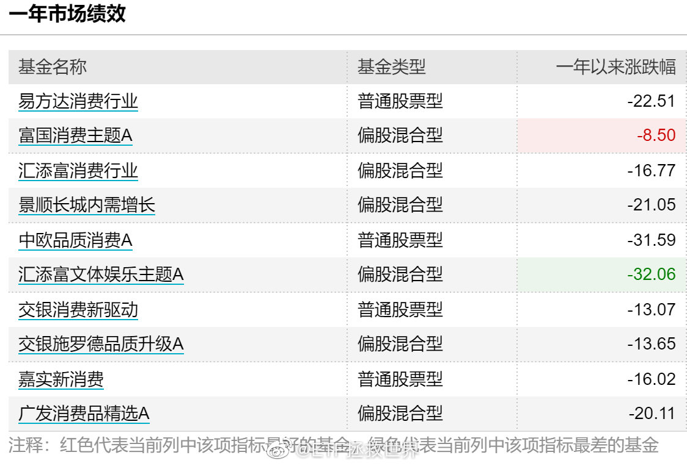

======================================================

ETF拯救世界 (5687069307) @
2022-03-17 17:36:22 Thu  
url: https://weibo.com/5687069307/Lkakc12Un

最近这两天关于小品演员和足球运动员的争论，吵得很热闹。但其实你知道其中最关键最核心的地方是什么吗。

最关键的不是男足菜，

而是男足菜，又挣得多。

谁规定足球一定要强了？没有。中国根本就没有足球的土壤氛围，不强就不强，其实不是事儿。但你又菜挣得又多，那就一定被骂。

到这里不要停止思 ​​​

转发[209]  评论[912]  赞[6230] 

======================================================

ETF拯救世界 (5687069307) @
2022-03-18 07:18:13 Fri  
url: https://weibo.com/5687069307/LkfHMDShL

艺高人胆大，现在买 http://t.cn/A66MkVxT

------------------------------------------------------
转推：
>  @华尔街见闻APP (1875034341)
>  2022-03-18 01:24:58 Fri  
>  url: https:/weibo.com/1875034341/LkdoosqnO/

>  【别人恐惧我贪婪？巴菲特本周再买近10亿美元西方石油 持股达14.6%】伯克希尔在本周继续大买西方石油公司，在周一到周三的三天时间内，共买进1810万股西方石油，价值近10亿美元，平均价格为54.41美元/股。本周是伯克希尔连续第三周大举进仓。http://t.cn/A66MmRlk ​​​

转发[42]  评论[640]  赞[2329] 

======================================================

ETF拯救世界 (5687069307) @
2022-03-18 10:07:22 Fri  
url: https://weibo.com/5687069307/LkgOrbEhw

药兄不会再来一次吧。

这碧海潮生曲一波接一波谁能顶得住！ ​​​

转发[18]  评论[385]  赞[2505] 

======================================================

ETF拯救世界 (5687069307) @
2022-03-18 10:18:42 Fri  
url: https://weibo.com/5687069307/LkgT2lFNC

今天150进二出一，S进二。

无奖竞猜一下。 ​​​

转发[32]  评论[1531]  赞[3418] 

======================================================

ETF拯救世界 (5687069307) @
2022-03-18 12:50:38 Fri  
url: https://weibo.com/5687069307/LkhSIkxKV

你有没有发现一个很有意思的，就是咱们都说明星、男足球员收入高，不合理的高。

对。大家的感受其实是对的。为什么对。

国内的视频平台，前些年开始，因为有资本加持，所以无底线抬高剧集价格，导致明星收入也疯狂上涨。

然后呢？你就会发现，这些平台一直在亏钱，从未盈利。爱奇艺股价跌成什么样了 ​​​

转发[136]  评论[381]  赞[3008] 

======================================================

ETF拯救世界 (5687069307) @
2022-03-18 13:25:19 Fri  
url: https://weibo.com/5687069307/Lki6MBY7G

我要卖的一直在跌，我要买的由跌转涨。

不，我不能接受。我不同意这门亲事！ ​​​

转发[28]  评论[540]  赞[3357] 

======================================================

ETF拯救世界 (5687069307) @
2022-03-18 13:33:38 Fri  
url: https://weibo.com/5687069307/Lkiaa7lfI

2022年3月18日，

两个计划的环保终于清仓了。

这个品种带给我们很多东西。有物质的，有精神的，还有一些投资经验。

它走了，我很怀念它。也许会买回来，大概在1***点。 ​​​

转发[47]  评论[596]  赞[2901] 

======================================================

ETF拯救世界 (5687069307) @
2022-03-18 14:04:01 Fri  
url: https://weibo.com/5687069307/Lkimuwkkc

[微笑]my pleasure

------------------------------------------------------
转推：
>  @ETF拯救世界 (5687069307)
>  2022-03-17 15:55:38 Thu  
>  url: https:/weibo.com/5687069307/Lk9FiC8uY/

>  今天HS没挤下车的不用担心，只要今晚中概不掉链子，明天全都能下。
>  
>  我说的！ ​​​

转发[25]  评论[902]  赞[2867] 

======================================================

ETF拯救世界 (5687069307) @
2022-03-18 14:23:50 Fri  
url: https://weibo.com/5687069307/LkiuxFPna

发车的时候明明是下跌6%。

你是不是针对我。 ​​​

转发[24]  评论[749]  赞[3180] 

======================================================

ETF拯救世界 (5687069307) @
2022-03-18 15:25:47 Fri  
url: https://weibo.com/5687069307/LkiTGEAke

有空的老爷们都可以看看//@且慢管家: 对不起，是我们“智障”了，在【首页】的【推荐阅读】-【长赢专栏】进去可以看，我们也正在修复“智商”[苦涩]

------------------------------------------------------
转推：
>  @且慢管家 (6186312580)
>  2022-03-18 14:36:48 Fri  
>  url: https:/weibo.com/6186312580/LkizNAqJo/

>  #且慢分享# 非常感谢@ETF拯救世界 e大专门为且慢跟车长赢的用户写了发车文，大家可以去APP里看哦，提升认知，明明白白跟车~ http://t.cn/Rp7ei1g ​​​

转发[49]  评论[545]  赞[2010] 

======================================================

ETF拯救世界 (5687069307) @
2022-03-19 00:19:17 Sat  
url: https://weibo.com/5687069307/LkmoenOOK

能不能顶到收盘。 ​​​

转发[30]  评论[753]  赞[3220] 

+++++++++++++++++++++++++++++++++++++++++++++++++++++

图片：
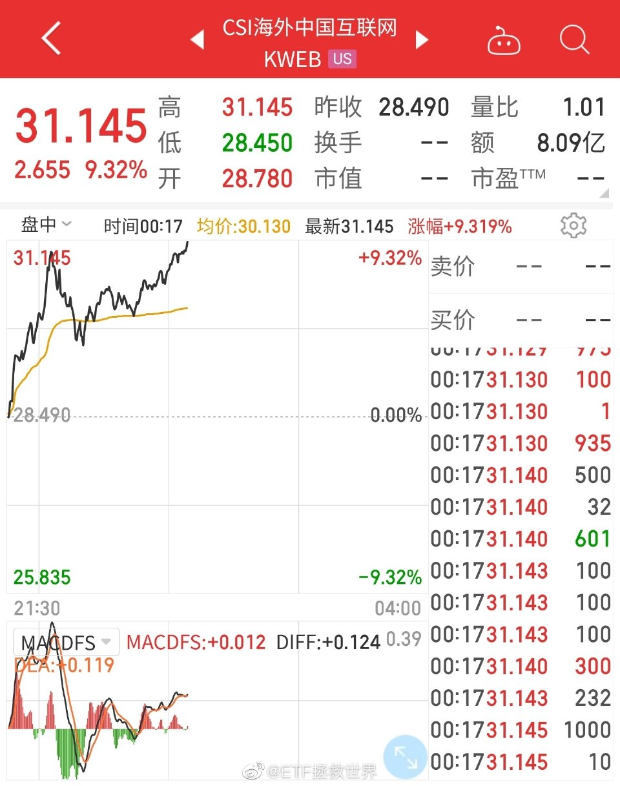

======================================================

ETF拯救世界 (5687069307) @
2022-03-19 16:38:52 Sat  
url: https://weibo.com/5687069307/LksNQkkNB

富国红利即将分红。

分红比例12%。

再投。 ​​​

转发[46]  评论[712]  赞[3425] 

======================================================

ETF拯救世界 (5687069307) @
2022-03-19 17:11:28 Sat  
url: https://weibo.com/5687069307/Lkt150Tr3

一会有一篇文章推送。做波段的朋友应该看看，应该不会是纯粹耽误时间的水文。 ​​​

转发[24]  评论[805]  赞[3357] 

======================================================

ETF拯救世界 (5687069307) @
2022-03-19 17:57:40 Sat  
url: https://weibo.com/5687069307/LktjPof6L

时薪300左右的兼职在国内是什么水平。 ​​​

转发[24]  评论[1178]  赞[5253] 

======================================================

ETF拯救世界 (5687069307) @
2022-03-19 21:50:14 Sat  
url: https://weibo.com/5687069307/LkuQecZa1

刚才看了一遍gzh留言，说两个点。

第一，条件单跟长期计划毫无关系。没有做波段的不用改单。

第二，我到现在依然不敢说18500或者7080是铁底，这世界上有什么一定不会发生的事情吗。所以我们的波段才会一网一网的，按照纪律卖出啊。

总而言之我们的目标就是：涨也可以，跌也可以，大概就是这样。 ​​​

转发[50]  评论[452]  赞[3010] 

======================================================

ETF拯救世界 (5687069307) @
2022-03-19 21:58:16 Sat  
url: https://weibo.com/5687069307/LkuTul1gU

PDD砍价这个新闻，让我有一个想法。

比如说我发一个砍价的信息，各位帮我砍，咱们看看能不能砍成免费，看看它们搞得这个事情到底是真的还是假的。

如果是真的能砍到，我就把砍到的东西抽奖送给大家。

但是我没砍过，这是一个什么机制。就是说如果砍成了是免费送吗，还是说只是便宜一点。只是便宜一 ​​​

转发[33]  评论[1316]  赞[4963] 

======================================================

ETF拯救世界 (5687069307) @
2022-03-21 09:05:39 Mon  
url: https://weibo.com/5687069307/LkIGT0s58

怕有朋友没看到，在这里贴一下。

再说一次，改了未必好，不改未必差。几分钟的行情很难说。

我只是选一个相对大概率正确的决定。

http://t.cn/A66JH8zP ​​​

转发[48]  评论[643]  赞[2769] 

======================================================

ETF拯救世界 (5687069307) @
2022-03-21 10:17:51 Mon  
url: https://weibo.com/5687069307/LkJabkmTC

上周五卖出的最后一份环保平均收益率91%。

很不好意思，这次没到100%。 ​​​

转发[22]  评论[707]  赞[3291] 

======================================================

ETF拯救世界 (5687069307) @
2022-03-21 10:42:10 Mon  
url: https://weibo.com/5687069307/LkJk3D7aW

没卖出，失败！

没买入，失败！

微信消息发错人了，失败中的失败！

小猫咪何在，让我吸一下缓一缓…… ​​​

转发[20]  评论[866]  赞[3982] 

======================================================

ETF拯救世界 (5687069307) @
2022-03-21 15:04:45 Mon  
url: https://weibo.com/5687069307/LkL2DqOsf

之前医药波段积累的极低成本利润不要卖。

18000再说。虽然不知道什么时候才会到。 ​​​

转发[91]  评论[502]  赞[2963] 

======================================================

ETF拯救世界 (5687069307) @
2022-03-21 16:46:49 Mon  
url: https://weibo.com/5687069307/LkLI46ny7

🙏🙏🙏🙏🙏 ​​​

转发[24]  评论[1072]  赞[3035] 

======================================================

ETF拯救世界 (5687069307) @
2022-03-21 19:50:42 Mon  
url: https://weibo.com/5687069307/LkMUI6aee

回复@ETF拯救世界:嗯。//@ETF拯救世界:所以啊，想做的，有能力做的事情，就赶紧去做吧。别拖了，拖来拖去最后会有遗憾。

------------------------------------------------------
转推：
>  @ETF拯救世界 (5687069307)
>  2020-08-08 20:54:05 Sat  
>  url: https:/weibo.com/5687069307/Jf066xJPr/

>  你有没有想过，如果明天地球爆炸，有什么事是你可以做到却因为没有去做而会感到遗憾的。 ​​​

转发[147]  评论[554]  赞[2616] 

======================================================

ETF拯救世界 (5687069307) @
2022-03-22 11:45:53 Tue  
url: https://weibo.com/5687069307/LkTapwObz

卖了的跌，买了的涨，还有一个要提款。

还可以吧，相当凑合。 ​​​

转发[19]  评论[620]  赞[3317] 

======================================================

ETF拯救世界 (5687069307) @
2022-03-22 13:19:21 Tue  
url: https://weibo.com/5687069307/LkTMlBz2c

跌吧，我好了。 ​​​

转发[19]  评论[759]  赞[2410] 

======================================================

ETF拯救世界 (5687069307) @
2022-03-22 13:48:32 Tue  
url: https://weibo.com/5687069307/LkTYcw1OB

大家兴致这么高，上个小咪给大家助助兴。 ​​​

转发[16]  评论[806]  赞[3849] 

+++++++++++++++++++++++++++++++++++++++++++++++++++++

图片：
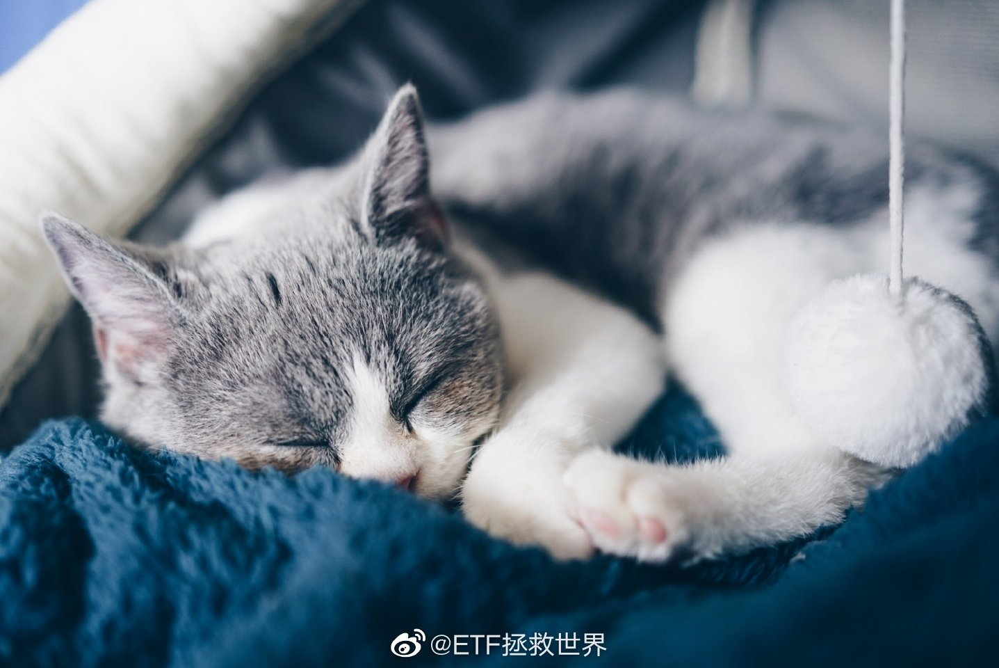

======================================================

ETF拯救世界 (5687069307) @
2022-03-22 14:35:21 Tue  
url: https://weibo.com/5687069307/LkUhcn6c4

买了一丢丢消费后，心态好多了。

跌，我们欢迎；涨，我们奉陪。

现在看茅也没以前那么讨厌了。真．屁股决定脑袋啊。 ​​​

转发[25]  评论[408]  赞[3055] 

======================================================

ETF拯救世界 (5687069307) @
2022-03-22 16:06:22 Tue  
url: https://weibo.com/5687069307/LkUS90j2N

恒指今天再次大涨，反弹到22000关卡附近。

在上方的时候，这是支撑，在下方，这就变成了压力。

以我对恒生的了解，以及多吃几个波段的私心，是希望22000的压力发挥威力，在18500-22000区间多几次震荡的。

当然真要突破也无所谓，但我还是估计没那么轻松。

无所谓了，涨跌我都ok。你ok不ok。 ​​​

转发[141]  评论[874]  赞[3437] 

======================================================

ETF拯救世界 (5687069307) @
2022-03-22 16:12:16 Tue  
url: https://weibo.com/5687069307/LkUUxFhf7

回复@_Cloudcloud_:我是人不是神，不可能几年前就精准预测到下跌的个位数点位。18500上下大差不差就行了。//@_Cloudcloud_:涨跌都ok 只是突破下限的时候确实有点方

------------------------------------------------------
转推：
>  @ETF拯救世界 (5687069307)
>  2022-03-22 16:06:22 Tue  
>  url: https:/weibo.com/5687069307/LkUS90j2N/

>  恒指今天再次大涨，反弹到22000关卡附近。
>  
>  在上方的时候，这是支撑，在下方，这就变成了压力。
>  
>  以我对恒生的了解，以及多吃几个波段的私心，是希望22000的压力发挥威力，在18500-22000区间多几次震荡的。
>  
>  当然真要突破也无所谓，但我还是估计没那么轻松。
>  
>  无所谓了，涨跌我都ok。你ok不ok。 ​​​

转发[28]  评论[264]  赞[2055] 

======================================================

ETF拯救世界 (5687069307) @
2022-03-22 19:50:00 Tue  
url: https://weibo.com/5687069307/LkWkUBGQw

英语语法思维导图，给孩子马住！ ​​​

转发[2160]  评论[38]  赞[1442] 

+++++++++++++++++++++++++++++++++++++++++++++++++++++

图片：
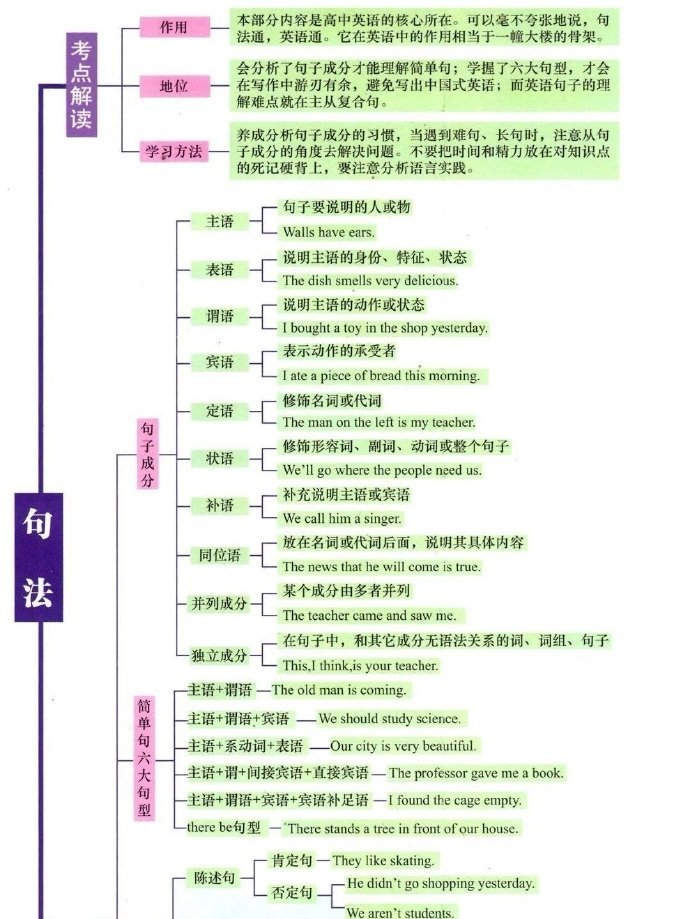
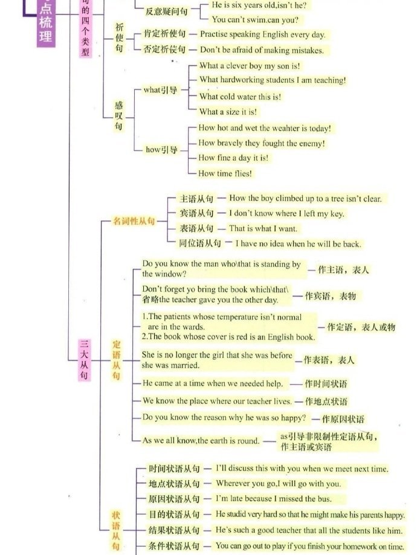
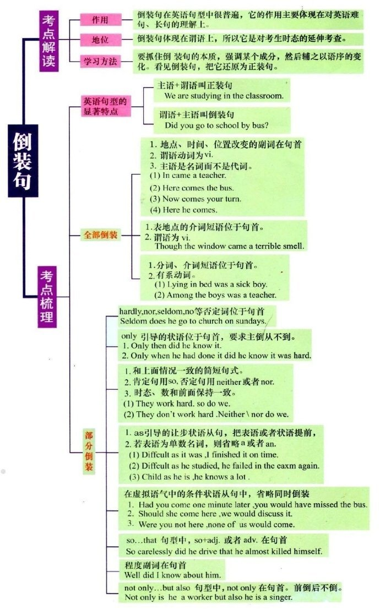
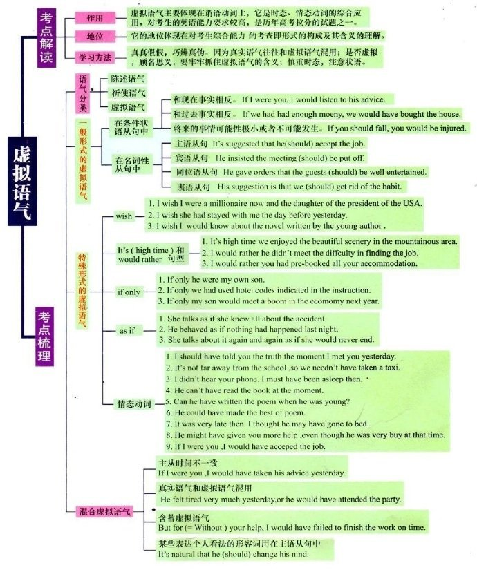
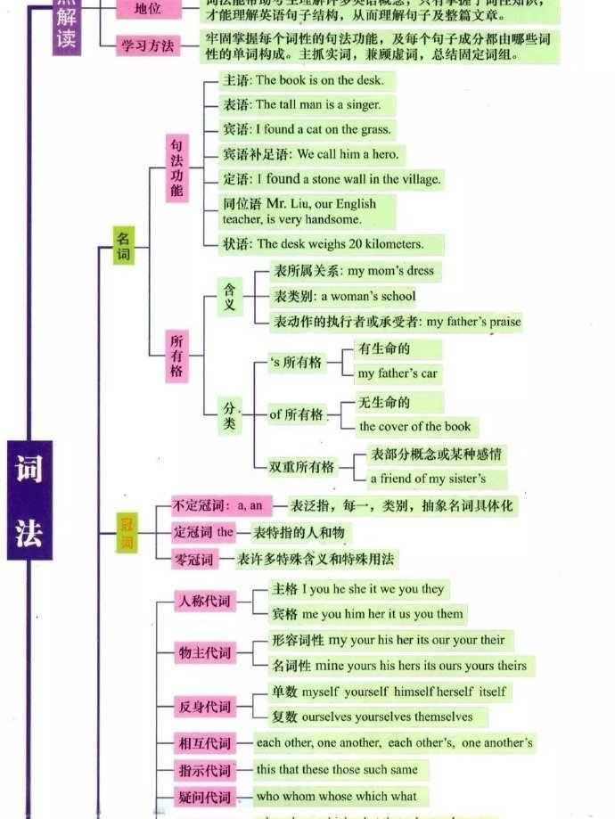
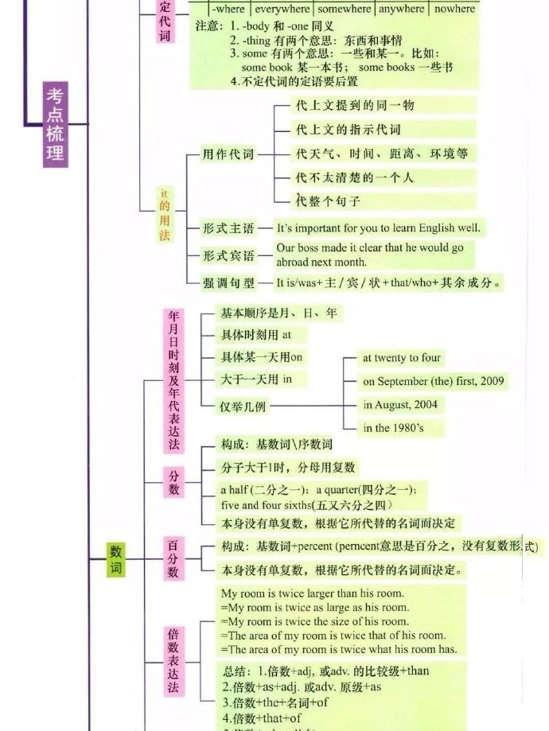
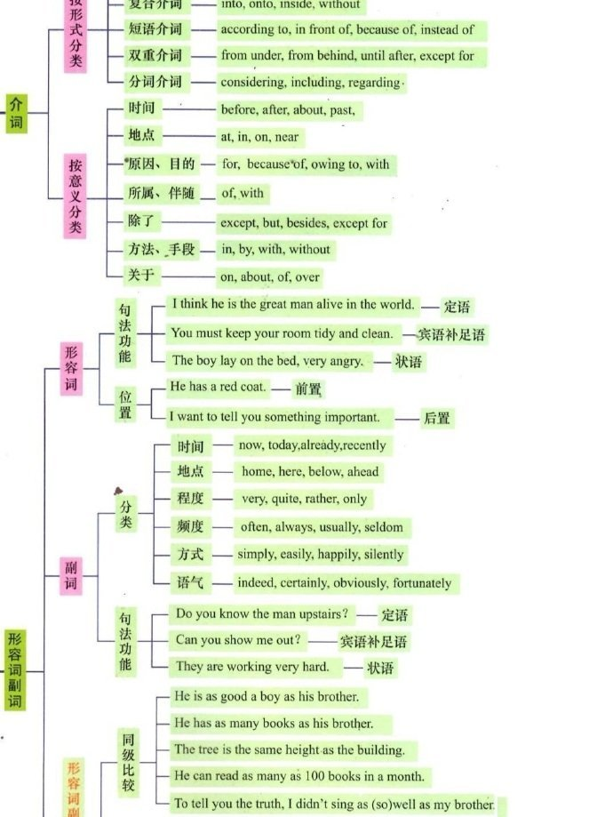
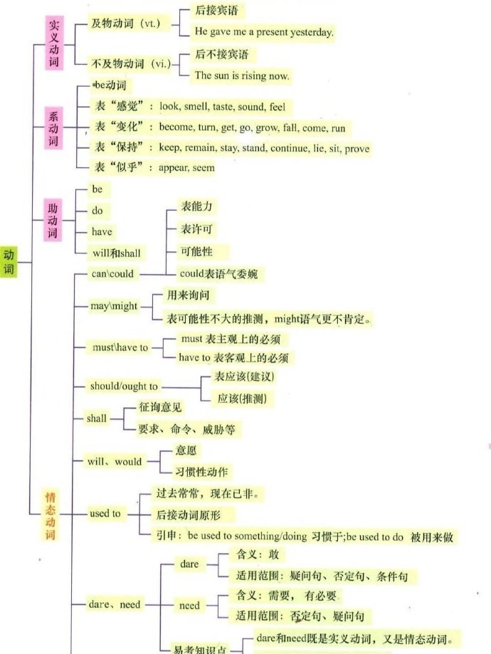
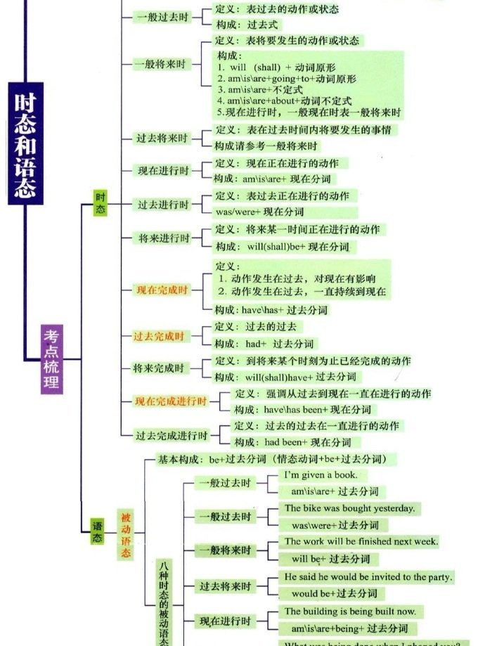

======================================================

ETF拯救世界 (5687069307) @
2022-03-22 22:55:58 Tue  
url: https://weibo.com/5687069307/LkXyoCY70

现在每天中概不波动10%，感觉就跟平盘没什么区别。

过惯了刺激的日子，平平淡淡就少了点味道。 ​​​

转发[43]  评论[579]  赞[3576] 

======================================================

ETF拯救世界 (5687069307) @
2022-03-23 08:48:41 Wed  
url: https://weibo.com/5687069307/Ll1qZ5xRG

图片评论 http://t.cn/A66acsIb

------------------------------------------------------
转推：
>  @ETF拯救世界 (5687069307)
>  2022-01-27 10:02:25 Thu  
>  url: https:/weibo.com/5687069307/LcFpBkiIZ/

>  由于日元大幅贬值，投资日经225的波段逻辑已经完全改变，所以暂停日经波段。
>  
>  我会删除自己的日经条件单。 ​​​

转发[28]  评论[316]  赞[1783] 

======================================================

ETF拯救世界 (5687069307) @
2022-03-23 09:31:14 Wed  
url: https://weibo.com/5687069307/Ll1IfEs5W

恒科监控时间可以改回9:30开始。 ​​​

转发[12]  评论[465]  赞[1993] 

======================================================

ETF拯救世界 (5687069307) @
2022-03-23 09:40:16 Wed  
url: https://weibo.com/5687069307/Ll1LVco1L

本网六个交易日收益16%。

市场会奖励意志坚定的士兵。 ​​​

转发[62]  评论[708]  赞[3317] 

======================================================

ETF拯救世界 (5687069307) @
2022-03-23 09:48:11 Wed  
url: https://weibo.com/5687069307/Ll1P8Ajpp

不说你不知道，今年3个月过去，已经提了7次款（去年全年21次）。

三月一个月就是6次。

波动对很多人来说是噩梦，对一些人来说是印钞机。 ​​​

转发[64]  评论[643]  赞[3305] 

======================================================

ETF拯救世界 (5687069307) @
2022-03-23 09:58:20 Wed  
url: https://weibo.com/5687069307/Ll1TfATwb

我觉得投资和人生可能有很多相似的地方。

只要保证活下去，不死，那么很多预想中的、经历中的困难，在时过境迁安然度过后，会发现不过如此，风轻云淡。

所以三句经常说的话送给你：

第一，除了生死，都是小事。多大点事儿，踏踏实实的。

第二，一切都会变好，如果没有，那就是没有到最后。

第三， ​​​

转发[525]  评论[704]  赞[4230] 

======================================================

ETF拯救世界 (5687069307) @
2022-03-23 10:06:08 Wed  
url: https://weibo.com/5687069307/Ll1Wq9seC

连续第二天发错微信。

今天是把波段发车表格发到且慢发车群（都是工作人员）去了。[微笑]

解决整改方案：

1、修改群信息。

2、30天内微信谨慎发言，能不说就不说，小心度过水逆期。 ​​​

转发[21]  评论[598]  赞[2631] 

======================================================

ETF拯救世界 (5687069307) @
2022-03-23 10:47:54 Wed  
url: https://weibo.com/5687069307/Ll2dnb7TI

资本市场的钱，一定是慢慢的越来越集中。

从那些不理智、情绪化的人手中，集中到理智、讲纪律、意志坚定的人手里。

这也相当于资源优化配置吧。

当然，最终都会流入大平层，在另一个层面上被收割…… ​​​

转发[132]  评论[469]  赞[3408] 

======================================================

ETF拯救世界 (5687069307) @
2022-03-23 10:59:15 Wed  
url: https://weibo.com/5687069307/Ll2hZ1cbM

一场风暴过后，雨过天晴，大家都当没事发生。

只有那些底部割肉的人心如刀割。 ​​​

转发[154]  评论[768]  赞[4433] 

======================================================

ETF拯救世界 (5687069307) @
2022-03-23 11:05:16 Wed  
url: https://weibo.com/5687069307/Ll2kqd5Dv

回复@艾_自_由:第一，杠杆爆仓。第二，清盘线。第三，割了还有一点不割可能一分没有了。//@艾_自_由:一直不理解，为什么会有人底部割肉？

------------------------------------------------------
转推：
>  @ETF拯救世界 (5687069307)
>  2022-03-23 10:59:15 Wed  
>  url: https:/weibo.com/5687069307/Ll2hZ1cbM/

>  一场风暴过后，雨过天晴，大家都当没事发生。
>  
>  只有那些底部割肉的人心如刀割。 ​​​

转发[68]  评论[313]  赞[2298] 

======================================================

ETF拯救世界 (5687069307) @
2022-03-23 14:00:29 Wed  
url: https://weibo.com/5687069307/Ll3txBifE

长牛的时候你觉得长线仓位NB，波段仓位太多了，以后不做波段了。

波动的时候你觉得波段仓位NB，长线仓位太多了，以后不拿长线了。

其实没有别的原因，就是你不懂资本市场。更不懂我们整个体系是如何互相支撑互相配合的。 ​​​

转发[136]  评论[825]  赞[4334] 

======================================================

ETF拯救世界 (5687069307) @
2022-03-24 07:38:26 Thu  
url: https://weibo.com/5687069307/LlaoY0OqQ

“挣外币花外币不能换算”是最二的说法。你不换算根本感受不到真实情况。

------------------------------------------------------
转推：
>  @牛叔 (2136367523)
>  2022-03-24 04:16:28 Thu  
>  url: https:/weibo.com/2136367523/Ll94Ze4QF/

>  作为一个普通人跟大家聊聊海外普通人的收入和生活成本，打消下大家对所谓挣欧元花欧元就不贵了的误解。这轮能源危机下来，普通德国人绝对是要捉襟见肘了,别的不说,油价从去年的1.3欧到现在的2欧+,涨幅50%,光油钱一个月多150欧不过分吧,天然气的价格以前年度一直是7毛左右(各种税费占一半)一立方, 现在2 ​​​

转发[55]  评论[298]  赞[1995] 

======================================================

ETF拯救世界 (5687069307) @
2022-03-24 09:35:41 Thu  
url: https://weibo.com/5687069307/Llbayw5tM

世道困难，有些公司不敢说自己挣钱了，拼命压低利润。

因为别人不挣钱就你挣钱，你就离出问题不远了。

同理，

别人都很困难，如果你没那么困难，你就不要嘚瑟了。

共度时艰，猥琐发育，苟住。 ​​​

转发[105]  评论[551]  赞[3616] 

======================================================

ETF拯救世界 (5687069307) @
2022-03-24 09:54:50 Thu  
url: https://weibo.com/5687069307/Llbiku4KO

我就问你，12000点这个支撑-压力强不强。在这个价位周边晃了2个月了。

------------------------------------------------------
转推：
>  @ETF拯救世界 (5687069307)
>  2022-01-25 14:07:53 Tue  
>  url: https:/weibo.com/5687069307/Lcoaf8weM/

>  时隔三年，150和S的医药买入周期又开始了。
>  
>  接下来的区间目标，是在9500-12000之间，将医药仓位配置完毕。
>  
>  所有的事情都有预案，有解决方法，有执行措施，有理论和体系的保证。
>  
>  你很怕跌？为什么？
>  
>  哦，原来是因为什么都没有。 ​​​

转发[69]  评论[307]  赞[1972] 

======================================================

ETF拯救世界 (5687069307) @
2022-03-24 09:56:11 Thu  
url: https://weibo.com/5687069307/LlbiT1iIO

而12000点这个点位，甚至是两年前提出来的。//@ETF拯救世界:医药下方重要支撑线是12000点。上方压力线依然是15500。一切尽在掌握。//@ETF拯救世界:折腾了一个半月，我军15500防线固若金汤。//@ETF拯救世界:回来了老弟。//@ETF拯救世界:在大气层激烈争夺。15500不是那么容易过的。

------------------------------------------------------
转推：
>  @ETF拯救世界 (5687069307)
>  2020-07-13 11:26:03 Mon  
>  url: https:/weibo.com/5687069307/JaZgDapRK/

>  医药基本已经脱离我能理解的范畴，进入“外太空”区域。
>  
>  在这个区域，我将用新的交易策略处理剩下的仓位。
>  
>  踏踏实实的。 ​​​

转发[78]  评论[275]  赞[1881] 

======================================================

ETF拯救世界 (5687069307) @
2022-03-24 10:32:33 Thu  
url: https://weibo.com/5687069307/LlbxDxX4w

回复@虫子的生活记录:一项一项说。先把收入支出说清楚，再好好说福利。你不能说收入支出的时候“不能换算”，换算完了又开始把福利弄进来一起捣糨糊。

------------------------------------------------------
转推：
>  @牛叔 (2136367523)
>  2022-03-24 04:16:28 Thu  
>  url: https:/weibo.com/2136367523/Ll94Ze4QF/

>  作为一个普通人跟大家聊聊海外普通人的收入和生活成本，打消下大家对所谓挣欧元花欧元就不贵了的误解。这轮能源危机下来，普通德国人绝对是要捉襟见肘了,别的不说,油价从去年的1.3欧到现在的2欧+,涨幅50%,光油钱一个月多150欧不过分吧,天然气的价格以前年度一直是7毛左右(各种税费占一半)一立方, 现在2 ​​​

转发[24]  评论[183]  赞[1582] 

======================================================

ETF拯救世界 (5687069307) @
2022-03-24 13:47:02 Thu  
url: https://weibo.com/5687069307/LlcOA3LlK

中外生活水平这个问题，我是这么看的。如果你不同意，保留意见。

首先毫无疑问的，是我们与美加、西南北欧、澳新等国家的生活水平还有非常非常大的差距。这个差距怎么说呢，100年前就有了。现在我们的人均GDP也只有一万多美元，发达国家至少在3万以上。有差距这是显而易见的，还用说吗。

其次，也是 ​​​

转发[155]  评论[908]  赞[5566] 

======================================================

ETF拯救世界 (5687069307) @
2022-03-24 14:48:18 Thu  
url: https://weibo.com/5687069307/LlddrCqHJ

好消息：信息、消费跌了。

坏消息：医药涨了。

好消息：医药涨了，还需要再涨一点。

结论：

赢麻了。[doge] ​​​

转发[49]  评论[756]  赞[3473] 

======================================================

ETF拯救世界 (5687069307) @
2022-03-24 22:42:20 Thu  
url: https://weibo.com/5687069307/LlgjRzNYp

今天中国队会很惨还是沙特会放点水。 ​​​

转发[14]  评论[467]  赞[2115] 

======================================================

ETF拯救世界 (5687069307) @
2022-03-25 16:04:41 Fri  
url: https://weibo.com/5687069307/Lln8X0boC

今日数据：

科创估值从几个月前的100倍跌到了今天的50多；

某个我们一直想买，但一直没机会，去年买了一丢丢的品种最近可能再加一点；

大指数刚刚开始进入“不贵”区域；

某知名私募3月初清仓了，上次是2018年底的钻石坑。当然，对于这个我没有什么看法。每个投资人的投资体系完全不同，很难一概而 ​​​

转发[113]  评论[949]  赞[4857] 

======================================================

ETF拯救世界 (5687069307) @
2022-03-26 12:48:32 Sat  
url: https://weibo.com/5687069307/LlvhPoTMD

医疗养老工作时长，还需要向福利国家靠近一些，让人民拥有幸福感。

------------------------------------------------------
转推：
>  @牛叔 (2136367523)
>  2022-03-26 04:32:07 Sat  
>  url: https:/weibo.com/2136367523/Lls2kyVyq/

>  说说德国的社会福利体系
>  
>  德国拥有世界上最完备的社会福利体系之一。在德国宪法《基本法》中明确规定了社会福利国家原则。宪法规定了德国是一个民主、社会的联邦国家。其实行的社会市场经济制度保持着私有资本主义活力的同时，国家又保留随时干预权力，重点关注社会的公平正义，大部分德国人不论职业高 ​​​

转发[115]  评论[201]  赞[1700] 

======================================================

ETF拯救世界 (5687069307) @
2022-03-26 12:56:21 Sat  
url: https://weibo.com/5687069307/Llvl0r8zI

回复@给我别闹:我说句实话，很多很多行业的加班都是混时间，完全没有任何意义。//@给我别闹:资本赚钱不反对 但是你别没日没夜让打工的把自己全搭上陪着你加班//@ETF拯救世界:医疗养老工作时长，还需要向福利国家靠近一些，让人民拥有幸福感。

------------------------------------------------------
转推：
>  @牛叔 (2136367523)
>  2022-03-26 04:32:07 Sat  
>  url: https:/weibo.com/2136367523/Lls2kyVyq/

>  说说德国的社会福利体系
>  
>  德国拥有世界上最完备的社会福利体系之一。在德国宪法《基本法》中明确规定了社会福利国家原则。宪法规定了德国是一个民主、社会的联邦国家。其实行的社会市场经济制度保持着私有资本主义活力的同时，国家又保留随时干预权力，重点关注社会的公平正义，大部分德国人不论职业高 ​​​

转发[62]  评论[369]  赞[2130] 

======================================================

ETF拯救世界 (5687069307) @
2022-03-26 18:35:23 Sat  
url: https://weibo.com/5687069307/LlxyCbMEz

小助理们的小福利 ​​​

转发[24]  评论[1264]  赞[3443] 

+++++++++++++++++++++++++++++++++++++++++++++++++++++

图片：

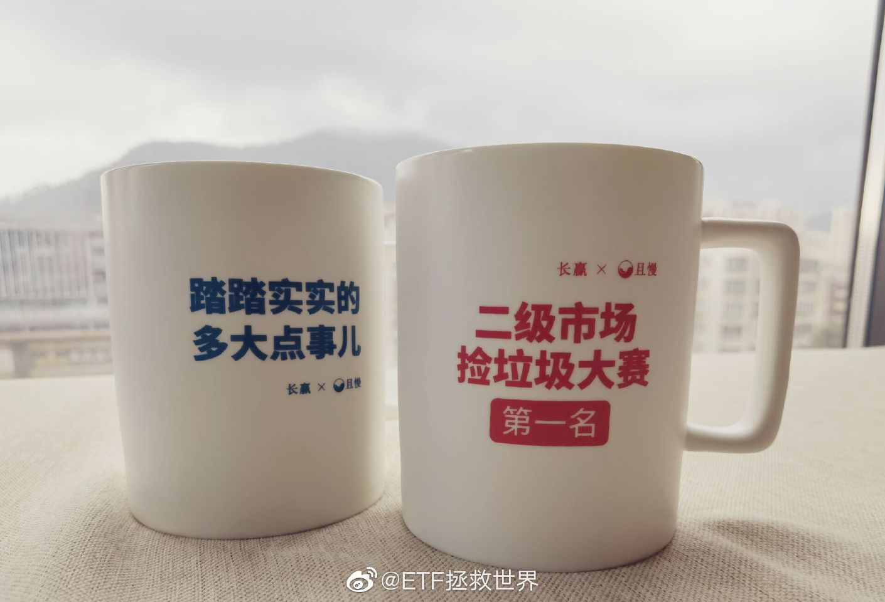

======================================================

ETF拯救世界 (5687069307) @
2022-03-27 20:55:04 Sun  
url: https://weibo.com/5687069307/LlHTOd9ws

我们每个人能做的就是不要浪费粮食。

------------------------------------------------------
转推：
>  @观察者网 (1887344341)
>  2022-03-27 16:23:00 Sun  
>  url: https:/weibo.com/1887344341/LlG7nlcxJ/

>  【华尔街日报：#俄乌冲突粮价看涨中国准备最充分#】俄乌冲突影响乌克春耕，引发国际粮价动荡。面对即将到来的粮价高涨，《华尔街日报》3月26日刊文分析称，从全球水平来看，只有中国等少数国家有足够的粮食库存，可以应对乌克兰战争造成的粮食短缺。 
>  
>  据联合国粮农组织（Food and Agriculture Organiz ​​​

转发[85]  评论[399]  赞[2284] 

======================================================

ETF拯救世界 (5687069307) @
2022-03-28 09:04:05 Mon  
url: https://weibo.com/5687069307/LlMFItfLn

接下来，以赚钱为目标战斗吧！ ​​​

转发[66]  评论[911]  赞[3623] 

======================================================

ETF拯救世界 (5687069307) @
2022-03-28 09:40:33 Mon  
url: https://weibo.com/5687069307/LlMUwg8sK

更新WLY的图：

认真的说，投资者，尤其是抱团的这帮人，真的不是有点病吗。 ​​​

转发[52]  评论[311]  赞[2236] 

+++++++++++++++++++++++++++++++++++++++++++++++++++++

图片：
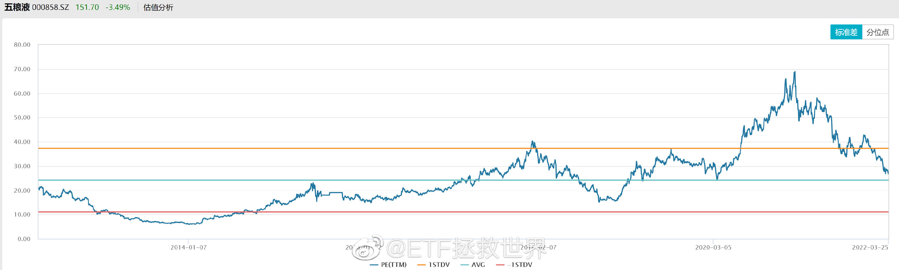

======================================================

ETF拯救世界 (5687069307) @
2022-03-28 09:51:14 Mon  
url: https://weibo.com/5687069307/LlMYRb9tf

我们的消费建仓成本如果能控制在11500-14000之间，就会是非常成功的。 ​​​

转发[279]  评论[551]  赞[3085] 

======================================================

ETF拯救世界 (5687069307) @
2022-03-28 10:11:39 Mon  
url: https://weibo.com/5687069307/LlN792Rfb

油气，两年前无数人嘲笑唾骂，现在一枝独秀暴涨两年。

炒股的都是神经病。真的。绝大多数都是。 ​​​

转发[53]  评论[441]  赞[3466] 

======================================================

ETF拯救世界 (5687069307) @
2022-03-28 10:27:49 Mon  
url: https://weibo.com/5687069307/LlNdHz7qF

所有资金甚至加杠杆all in一个公司，一个行业，真的有可能成功。然后就会有无数人羡慕、崇拜、跟随。

但是……大众没有看到的，是一将功成万骨枯后面的累累白骨。多少同样猛干一家公司一个行业的人，死得无声无息。

更重要的问题在于：

你很难弄清楚这份成功到底是运气还是实力。第一次成功了，第二 ​​​

转发[132]  评论[509]  赞[3182] 

======================================================

ETF拯救世界 (5687069307) @
2022-03-28 13:53:34 Mon  
url: https://weibo.com/5687069307/LlOzdvMUM

价格腰斩了。估值终于从120跌到了50多…… ​​​

转发[42]  评论[417]  赞[2530] 

+++++++++++++++++++++++++++++++++++++++++++++++++++++

图片：
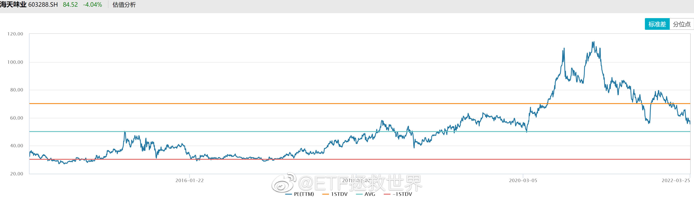

======================================================

ETF拯救世界 (5687069307) @
2022-03-28 14:07:33 Mon  
url: https://weibo.com/5687069307/LlOETrGMw

据我所知，如果你自己不去银行或者其它金融机构操作你的钱，他们很难去主动找你。

这意味着，如果有人因为各种原因不能把这些钱的情况告诉亲人，那么亲人们可能永远也不知道你还有这笔钱。

所以，还是定期把自己在各个金融机构的资产情况汇总一下。如果想告诉亲人就发给亲人，暂时不想让他们知道也至 ​​​

转发[101]  评论[561]  赞[3490] 

======================================================

ETF拯救世界 (5687069307) @
2022-03-28 15:31:09 Mon  
url: https://weibo.com/5687069307/LlPcPlVSi

辣鸡

------------------------------------------------------
转推：
>  @雪球 (2183570524)
>  2022-03-28 15:17:07 Mon  
>  url: https:/weibo.com/2183570524/LlP78e5Z6/

>  【欧股涨幅扩大 德国DAX 30指数涨超1%】欧股涨幅扩大，德国DAX 30指数涨超1%，法国CAC 40指数涨0.81%，欧洲斯托克50指数涨0.88% ​​​

转发[14]  评论[231]  赞[1708] 

======================================================

ETF拯救世界 (5687069307) @
2022-03-28 16:28:10 Mon  
url: https://weibo.com/5687069307/LlPzYfqvS

我来介绍一下，据我观察，什么长相的动物会显得很萌：

眼睛周围有一圈黑眼圈+瞳孔非常大。

怎么说呢，就相当于画了眼线+戴了美瞳的效果吧。 ​​​

转发[22]  评论[633]  赞[3565] 

======================================================

ETF拯救世界 (5687069307) @
2022-03-28 17:40:54 Mon  
url: https://weibo.com/5687069307/LlQ3utN8E

中概/恒科在仓位中已经布置了一部分，除非再次巨幅下跌，应该不会再多加很多。（恒生也可以看做中概弱相关指数了）

今年的希望，是买回一些医药、多布局一些消费。也希望能买回一点之前卖出的创业。如果能多买入一些科技类品种，比如创业/科创/双创/科技等品种就最好不过。

有朋友说了，你很机车唉， ​​​

转发[376]  评论[695]  赞[3837] 

======================================================

ETF拯救世界 (5687069307) @
2022-03-28 22:04:58 Mon  
url: https://weibo.com/5687069307/LlRMG81KO

囤菜

------------------------------------------------------
转推：
>  @范志红_原创营养信息 (1496878501)
>  2022-03-28 21:57:04 Mon  
>  url: https:/weibo.com/1496878501/LlRJteU3c/

>  【疫情封控时可以准备储备的食物】，包括以下各项：
>  
>  粮食。米、面、玉米、小米、燕麦片，以及各种杂粮，存半个月的数量就可以了。注意防潮防虫。
>  
>  鸡蛋。按每人每天1-2个，存一周的量就可以了。鸡蛋的保存期是室温2周，冷藏6周时间。
>  
>  奶类。按每人250-500克，巴氏奶和酸奶可以存一周的量，但就怕冰箱 ​​​

转发[236]  评论[335]  赞[1652] 

======================================================

ETF拯救世界 (5687069307) @
2022-03-29 10:12:55 Tue  
url: https://weibo.com/5687069307/LlWy9su8r

昨天囤菜那篇微博下面的评论我看了看，我发现一个问题。

很多朋友的思维是停留在右侧思维。即见顶才跑，见底才买。

但有个问题，是很多事情是突然发生的。这个顶是尖顶，底是尖底。而且是一天涨跌50%甚至90%那种，完全右侧可能有时候措手不及。

所以至少一部分冰箱仓位要用左侧思维去买，去囤。当你 ​​​

转发[275]  评论[679]  赞[3753] 

======================================================

ETF拯救世界 (5687069307) @
2022-03-29 10:18:07 Tue  
url: https://weibo.com/5687069307/LlWAgmI4j

还有很多类似的。比如药。有些朋友有慢性病，需要长期开药的，就应该囤一点。比如医保说只给你开一个月，那你自己掏钱买3个月的。然后循环起来，保证不过期。这样万一几个月去不了医院，不至于断档是不是。这些东西都是一个道理，其实不用一个个说。

------------------------------------------------------
转推：
>  @ETF拯救世界 (5687069307)
>  2022-03-29 10:12:55 Tue  
>  url: https:/weibo.com/5687069307/LlWy9su8r/

>  昨天囤菜那篇微博下面的评论我看了看，我发现一个问题。
>  
>  很多朋友的思维是停留在右侧思维。即见顶才跑，见底才买。
>  
>  但有个问题，是很多事情是突然发生的。这个顶是尖顶，底是尖底。而且是一天涨跌50%甚至90%那种，完全右侧可能有时候措手不及。
>  
>  所以至少一部分冰箱仓位要用左侧思维去买，去囤。当你 ​​​

转发[82]  评论[265]  赞[1950] 

======================================================

ETF拯救世界 (5687069307) @
2022-03-29 11:12:51 Tue  
url: https://weibo.com/5687069307/LlWWu08by

有人打过猎，或者玩过猎鹿游戏吗。

看着你想买的东西一直跌，向你设置好的买入区域跌去，就像看着等了很久的猎物即将进入你的伏击区一样兴奋。 ​​​

转发[43]  评论[554]  赞[3319] 

======================================================

ETF拯救世界 (5687069307) @
2022-03-29 17:23:18 Tue  
url: https://weibo.com/5687069307/LlZmQoeKf

好家伙太能吹了吧[doge] ​​​

转发[28]  评论[2009]  赞[4496] 

+++++++++++++++++++++++++++++++++++++++++++++++++++++

图片：
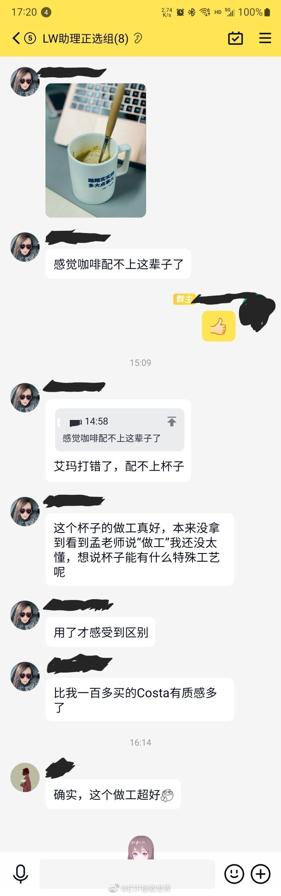

======================================================

ETF拯救世界 (5687069307) @
2022-03-29 17:41:07 Tue  
url: https://weibo.com/5687069307/LlZu4EUvv

搞不懂为何如此辣鸡。 ​​​

转发[32]  评论[453]  赞[3351] 

+++++++++++++++++++++++++++++++++++++++++++++++++++++

图片：

======================================================

ETF拯救世界 (5687069307) @
2022-03-29 21:54:24 Tue  
url: https://weibo.com/5687069307/Lm18T1nLw

记住这个图形 ​​​

转发[474]  评论[990]  赞[4674] 

+++++++++++++++++++++++++++++++++++++++++++++++++++++

图片：
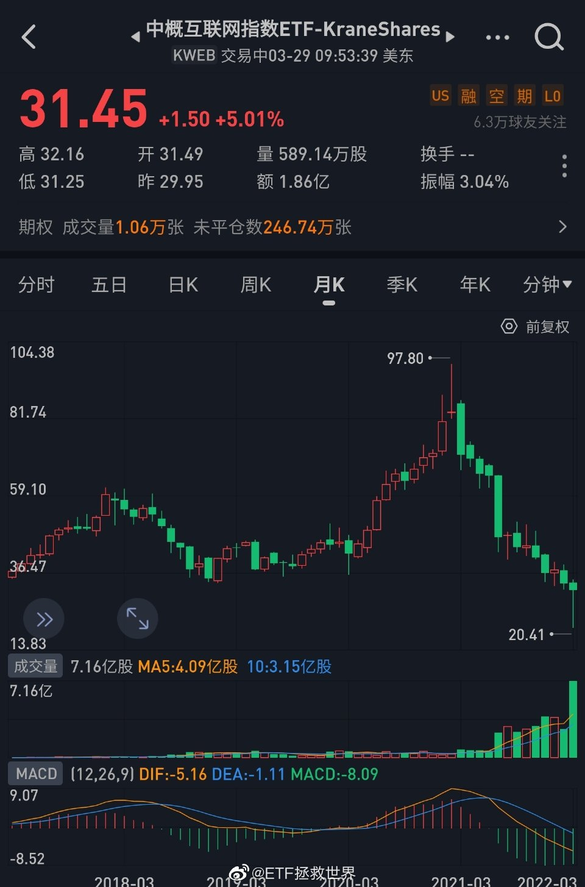

======================================================

ETF拯救世界 (5687069307) @
2022-03-30 09:39:14 Wed  
url: https://weibo.com/5687069307/Lm5KYzDzz

据我观察，这几年，有一些其实做了很多好事的人，因为有意无意表现出的傲慢或者说优越，遭受了很大的打击。

高调做事，低调做人，不要傲慢，平易近人。 ​​​

转发[100]  评论[612]  赞[4019] 

======================================================

ETF拯救世界 (5687069307) @
2022-03-30 13:16:19 Wed  
url: https://weibo.com/5687069307/Lm7b5yDEy

冷知识：

红利今年是上涨的。 ​​​

转发[21]  评论[318]  赞[2407] 

======================================================

ETF拯救世界 (5687069307) @
2022-03-30 13:27:11 Wed  
url: https://weibo.com/5687069307/Lm7fvdqU6

是谣言吗。如果不是，真的没有除了死以外其他的办法了吗。

------------------------------------------------------
转推：
>  @北京人不知道的北京事儿 (1662214194)
>  2022-03-30 12:36:34 Wed  
>  url: https:/weibo.com/1662214194/Lm6UXmv4G/

>  河北廊坊安次区政府今天下的文件，捕杀所有阳性患者家里的宠物。 ​​​

转发[78]  评论[641]  赞[2953] 

======================================================

ETF拯救世界 (5687069307) @
2022-03-30 14:18:40 Wed  
url: https://weibo.com/5687069307/Lm7AoCm6s

看淡了涨跌也是一把双刃剑。

账户损失很多钱固然不会心情焦虑，多了很多也没有任何开心的感觉。

哎。 ​​​

转发[28]  评论[643]  赞[3008] 

+++++++++++++++++++++++++++++++++++++++++++++++++++++

图片：

======================================================

ETF拯救世界 (5687069307) @
2022-03-30 15:08:26 Wed  
url: https://weibo.com/5687069307/Lm7UBgbsl

刚才扑杀宠物那条微博下面，大家观点都很不一样。

其实随着人慢慢的成熟，就会明白人与人对于同一件事的看法会非常不同。以前自己会觉得，“怎么还会有这样的人”，后来发现是自己太幼稚了。

人与人的立场不同，性格不同，思维模式不同，环境不同，成长经历不同，所以看法不同，非常正常。

昨天晚上 ​​​

转发[109]  评论[511]  赞[3184] 

======================================================

ETF拯救世界 (5687069307) @
2022-03-30 15:17:45 Wed  
url: https://weibo.com/5687069307/Lm7Ynyswx

主要做波段的一个账户这个月这样翻红了。

上个月底清仓也许是对的，就少了这个月上下翻飞的折腾。

然而，清仓了，什么时候买回来呢？如果现在还是空仓，是该买呢还是继续等待呢。

就我所知，空仓要比满仓忐忑很多。 ​​​

转发[41]  评论[504]  赞[2471] 

+++++++++++++++++++++++++++++++++++++++++++++++++++++

图片：
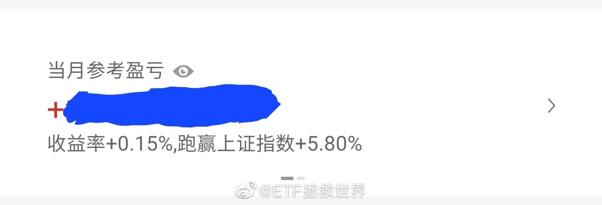

======================================================

ETF拯救世界 (5687069307) @
2022-03-30 15:37:20 Wed  
url: https://weibo.com/5687069307/Lm86ktyU9

鹅猫狗有没有可能做点什么？除了拿出1000亿共同富裕，紧急关头利用自身优势做点事情吧，以后可能会打得轻一点也说不定啊。

------------------------------------------------------
转推：
>  @北京人不知道的北京事儿 (1662214194)
>  2022-03-30 15:32:06 Wed  
>  url: https:/weibo.com/1662214194/Lm84cBI5y/

>  【上海浦东菜农：网上不少受封控的市民在说吃不到菜，我们这里菜有的是，但运不出去】3月29日，在上海浦东书院镇李雪村的农田里，农户袁大哥和妻子正从黄瓜藤上摘下刚刚成熟黄瓜，但袁大哥开心不起来，反而更显焦虑。“如今肥都施了，蔬菜也成熟了，但是因为疫情管控的原因，很多菜场都关停了，之前合 ​​​

转发[38]  评论[299]  赞[1830] 

======================================================

ETF拯救世界 (5687069307) @
2022-03-30 20:06:24 Wed  
url: https://weibo.com/5687069307/Lm9RycIIh

给使用且慢跟车的朋友们一个建议：

删除自己在APP中填写的所有“在且慢外持仓”。否则有可能会导致自动跟车失败。

路径是资产——150——拉到最下面——查看明细、修改外部持仓——点开具体品种——删除或改成0。 ​​​

转发[57]  评论[325]  赞[2046] 

======================================================

ETF拯救世界 (5687069307) @
2022-03-30 20:28:54 Wed  
url: https://weibo.com/5687069307/Lma0Gnwmr

回复@月是衣上白__:我问一下除了扑杀还有没有别的方法，应该不会被网暴吧。另外据说当地已经出文停止扑杀了，希望大家都平平安安的。//@月是衣上白__:提醒一下E大，这条评论被人截图发出去了，我刚在别的地方看到了截图

------------------------------------------------------
转推：
>  @北京人不知道的北京事儿 (1662214194)
>  2022-03-30 12:36:34 Wed  
>  url: https:/weibo.com/1662214194/Lm6UXmv4G/

>  河北廊坊安次区政府今天下的文件，捕杀所有阳性患者家里的宠物。 ​​​

转发[15]  评论[118]  赞[1105] 

======================================================

ETF拯救世界 (5687069307) @
2022-03-30 20:39:24 Wed  
url: https://weibo.com/5687069307/Lma4WjlFp

[微笑]

------------------------------------------------------
转推：
>  @雪球 (2183570524)
>  2022-03-30 17:47:51 Wed  
>  url: https:/weibo.com/2183570524/Lm8Xj9Y4N/

>  俄罗斯股市高开高走，俄罗斯RTS指数涨超6%。 ​​​

转发[20]  评论[166]  赞[1681] 

======================================================

ETF拯救世界 (5687069307) @
2022-03-30 20:50:15 Wed  
url: https://weibo.com/5687069307/Lma9lyB9L

我的另一半有很多缺点。

但也有很多优点。

第二大优点是非常善良。

她平常胆子不大，坐个滑沙都能吓哭。但有一次做的事情让我刮目相看。

我以前住的小区有一些流浪猫。有一天，一只刚出生几个月的小猫——前方高能预警，心理承受能力差的朋友不要继续看了——

小猫的四个爪子被人砍断了。被发现的 ​​​

转发[57]  评论[780]  赞[5613] 

======================================================

ETF拯救世界 (5687069307) @
2022-03-30 21:53:41 Wed  
url: https://weibo.com/5687069307/Lmaz6cUAg

美元兑卢布

熊是真的什么都敢干啊。 ​​​

转发[57]  评论[350]  赞[3750] 

+++++++++++++++++++++++++++++++++++++++++++++++++++++

图片：
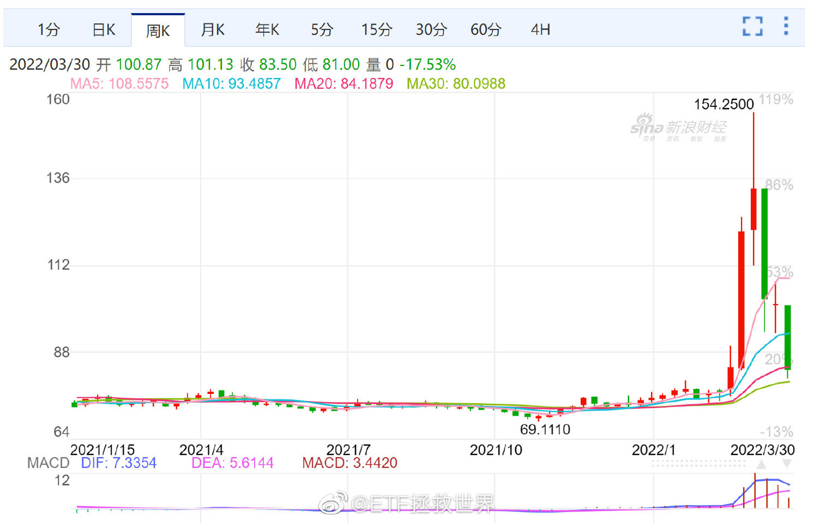

======================================================

ETF拯救世界 (5687069307) @
2022-03-30 22:11:33 Wed  
url: https://weibo.com/5687069307/LmaGllJAB

教育孩子，也要像熊这样，说到就真做到。

教育孩子定规矩，我说了你做了什么样的错事，我就会怎样惩罚你。

当你真的做了，我就真的处罚。

而不是定了规矩不执行，最后孩子就无法无天了。 ​​​

转发[65]  评论[284]  赞[2912] 

======================================================

ETF拯救世界 (5687069307) @
2022-03-31 08:49:23 Thu  
url: https://weibo.com/5687069307/LmeRfh62B

你有没有发现我们处在一个造神毁神无限循环的环境中。

好就好上天堂，无限吹捧；过一阵坏就坏下地狱，渣都不剩。

其实从来也没那么好，也没那么坏。

对我们的人生经验应该就是，好的时候自己不要嘚瑟，平常心，无论外界如何评价都能正确认识自己，居安思危，明白一切顺利的时候反而危机四伏。 ​​​

转发[133]  评论[530]  赞[3130] 

======================================================

ETF拯救世界 (5687069307) @
2022-03-31 09:05:33 Thu  
url: https://weibo.com/5687069307/LmeXNz3Gf

听了两节儿子的网课，发现女生的逻辑思维和表达能力普遍比男生强多了 [允悲] ​​​

转发[23]  评论[630]  赞[5271] 

======================================================

ETF拯救世界 (5687069307) @
2022-03-31 09:54:25 Thu  
url: https://weibo.com/5687069307/LmfhDsI7a

没想到上一条也能吵起来。

我其实只是像平常一样，如实的说一下我的观察，非常客观独立，自认为。

因为我也是第一次养孩子，也没养过女孩，现在学校也不允许考试排名，所以听了几节网课觉得挺有意思就发一条。

这样，我持续跟踪，到小学高年级，到初中，到高中，看看会不会有什么变化，到时候也客观 ​​​

转发[13]  评论[497]  赞[2717] 

======================================================

ETF拯救世界 (5687069307) @
2022-03-31 10:25:34 Thu  
url: https://weibo.com/5687069307/LmfuhmYhN

红利再涨仓位就又要超过20%了。

又要卖了，好烦。[哼] ​​​

转发[31]  评论[422]  赞[2395] 

======================================================

ETF拯救世界 (5687069307) @
2022-03-31 10:37:49 Thu  
url: https://weibo.com/5687069307/LmfzfAZ0X

总体来说，我们的单品卖出有几个条件。

第一，超过20%仓位。

第二，贵+到达重要压力线。

第三，非常贵。

第四，贵+右侧。

体会一下。几十个字，能帮你节省10-20年自己总结的时间。 ​​​

转发[845]  评论[772]  赞[3606] 

======================================================

ETF拯救世界 (5687069307) @
2022-03-31 10:48:17 Thu  
url: https://weibo.com/5687069307/LmfDv9GEq

红利连涨四年了。很多朋友觉得它不错，至少很稳，拿着不停涨。

但两年以前关注我的朋友应该知道，我们把那样一个一直不涨，涨的时候涨幅也比不上热门板块的品种，买到了第一大持仓压力多大。

当时被多少人质疑嘲笑。

记不记得有人拿着基金排行，说红利一个月、三个月、半年、一年表现都不好？

这就 ​​​

转发[129]  评论[373]  赞[2907] 

======================================================

ETF拯救世界 (5687069307) @
2022-03-31 10:51:42 Thu  
url: https://weibo.com/5687069307/LmfETbccs

回复@ETF学习群众:我不会因为他们有压力。因为我知道自己在干什么，我知道这么干以前赚了多少钱，以后也会赚钱。我怎么会让一帮从没在市场上赚过钱的人影响我的判断？//@ETF学习群众:不要有压力。

------------------------------------------------------
转推：
>  @ETF拯救世界 (5687069307)
>  2022-03-31 10:48:17 Thu  
>  url: https:/weibo.com/5687069307/LmfDv9GEq/

>  红利连涨四年了。很多朋友觉得它不错，至少很稳，拿着不停涨。
>  
>  但两年以前关注我的朋友应该知道，我们把那样一个一直不涨，涨的时候涨幅也比不上热门板块的品种，买到了第一大持仓压力多大。
>  
>  当时被多少人质疑嘲笑。
>  
>  记不记得有人拿着基金排行，说红利一个月、三个月、半年、一年表现都不好？
>  
>  这就 ​​​

转发[27]  评论[211]  赞[1791] 

======================================================

ETF拯救世界 (5687069307) @
2022-03-31 14:15:10 Thu  
url: https://weibo.com/5687069307/LmgZtoVGV

我感觉到，全都回来了 ​​​

转发[49]  评论[478]  赞[3583] 

+++++++++++++++++++++++++++++++++++++++++++++++++++++

图片：
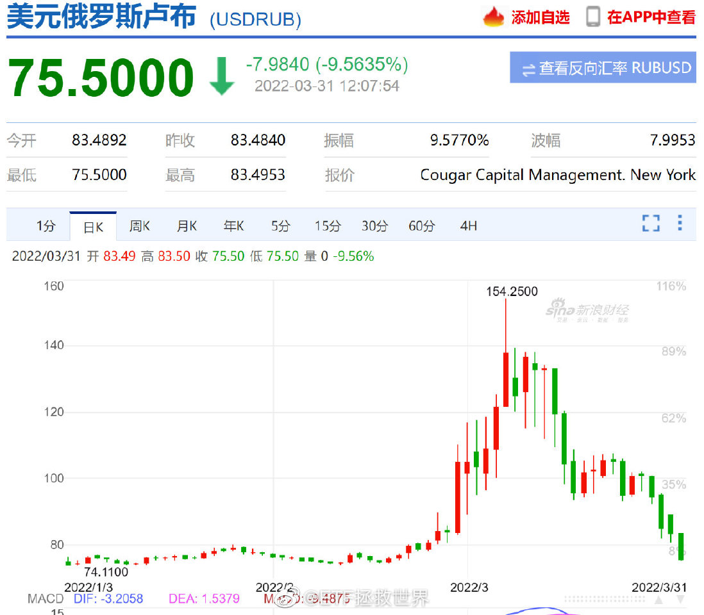

======================================================

ETF拯救世界 (5687069307) @
2022-03-31 18:45:20 Thu  
url: https://weibo.com/5687069307/LmiL8qQO5

冷知识：

今年全球主要市场跌幅最大的是俄罗斯市场。

第二名不说了。 ​​​

转发[74]  评论[660]  赞[3695] 

======================================================

ETF拯救世界 (5687069307) @
2022-03-31 20:33:59 Thu  
url: https://weibo.com/5687069307/LmjtezQbl

回购注销[good]

------------------------------------------------------
转推：
>  @财联社APP (2868676035)
>  2022-03-31 19:33:50 Thu  
>  url: https:/weibo.com/2868676035/Lmj4P6z46/

>  【苏泊尔：拟回购1%-2%公司股份 年度分红拟10派19.3元】财联社3月31日电，苏泊尔披露年报，2021年实现净利润19.44亿元，同比增长5.29%，拟10派19.3元。同日公告，拟回购1%-2%公司股份，按公司总股本计算，回购股份数量不低于808.68万股且不超过1617.36万股，其中300万股拟用于未来实施股权激励，剩余股 ​​​

转发[37]  评论[215]  赞[1796] 

======================================================

ETF拯救世界 (5687069307) @
2022-04-01 09:30:37 Fri  
url: https://weibo.com/5687069307/Lmoytn6cD

不做波段真的随时受不了。 ​​​

转发[20]  评论[350]  赞[2412] 

======================================================

ETF拯救世界 (5687069307) @
2022-04-01 09:55:27 Fri  
url: https://weibo.com/5687069307/LmoIym9dl

一句话告诉你立场决定观点：

要是以前看到消费这么嘚瑟别人跌它涨我就怒斥抱团可恶了。

现在买了两份我就会微笑的看着它装*。

两份而已。

人类啊！可悲！哪有什么正义，全是利益罢了！[怒] ​​​

转发[43]  评论[362]  赞[2260] 

======================================================

ETF拯救世界 (5687069307) @
2022-04-01 10:05:06 Fri  
url: https://weibo.com/5687069307/LmoMtbt1j

按照年初的预计，今年如果上半年这么跌，年末反而有可能赚钱，无论指数本身是不是跌。

但是今年我本人在投资上最开心的，是对波段策略有了一次质的升级。

这次升级，解决了困扰我很久的，该策略固有的顽疾。

能有这次升级，也是类似于芒格的跨学科思维最终在一个策略上融会贯通的结果。当然，这次升 ​​​

转发[162]  评论[709]  赞[4061] 

======================================================

ETF拯救世界 (5687069307) @
2022-04-01 11:38:40 Fri  
url: https://weibo.com/5687069307/LmporFcB7

传媒主力是微博管理员实锤了。

又一次精准的把月老封在最低点。

什么时候放出来传媒就要小心了。 ​​​

转发[95]  评论[445]  赞[2974] 

======================================================

ETF拯救世界 (5687069307) @
2022-04-01 12:15:45 Fri  
url: https://weibo.com/5687069307/LmpDv7TTs

上海的朋友，能不能说说你买菜的真实情况。

好买，费劲，还是买不到。

不要骗人哦。 ​​​

转发[36]  评论[1792]  赞[3813] 

======================================================

ETF拯救世界 (5687069307) @
2022-04-01 12:49:29 Fri  
url: https://weibo.com/5687069307/LmpRc3K7m

囤菜的话，肉啊奶啊这些东西都不用说了，比较好囤。比如奶要求别太高的话，进口的有那种保质期一年的。应急问题不大。

还有就是罐头，肉罐头水果罐头什么的，2、3年保质期。肯定营养有流失，但你是为了紧急情况又不是为了享受满汉全席是吧。

比较难的是菜，保质期短。但是现在有那种冷冻菜。我家有两 ​​​

转发[106]  评论[489]  赞[2465] 

======================================================

ETF拯救世界 (5687069307) @
2022-04-01 13:18:49 Fri  
url: https://weibo.com/5687069307/Lmq36hwfU

回购注销与不注销区别还是很大的。

回购不注销，有可能公司把股票买回去，当做股权激励给员工。但这部分股票并没有消失，再流回市场什么都没变。

回购注销就不同了。公司把股票买回去，注销掉，减少注册资本。比如说以前市场上有100万股，回购30万股注销，市场上就剩70万股了。但公司的盈利啊现金流 ​​​

转发[238]  评论[372]  赞[2606] 

======================================================

ETF拯救世界 (5687069307) @
2022-04-01 14:16:04 Fri  
url: https://weibo.com/5687069307/Lmqql1fRC

蓝色区域像不像史塔克家的冰原狼。

------------------------------------------------------
转推：
>  @中国气象爱好者 (1763864272)
>  2022-03-30 15:05:31 Wed  
>  url: https:/weibo.com/1763864272/Lm7TpFmbT/

>  受北极涡旋影响，本周末起欧洲将遭寒潮袭击，乌克兰大部将是寒潮降温重点之一，基辅将剧烈降温10-15度，再次降到零下；与此同时，接连不断的阵雨将转为雨夹雪或雪。 ​​​

转发[33]  评论[328]  赞[1724] 

======================================================

ETF拯救世界 (5687069307) @
2022-04-01 14:21:39 Fri  
url: https://weibo.com/5687069307/LmqsBFjDg

一切都会好的。

虽然这个世界非常辣鸡，但一切都会好的。 ​​​

转发[60]  评论[525]  赞[3217] 

======================================================

ETF拯救世界 (5687069307) @
2022-04-01 16:26:52 Fri  
url: https://weibo.com/5687069307/LmrhqzHzP

关于医疗保险。评论区可以讨论，但不要做广告啊。 ​​​

转发[269]  评论[847]  赞[2849] 

+++++++++++++++++++++++++++++++++++++++++++++++++++++

图片：

======================================================

ETF拯救世界 (5687069307) @
2022-04-01 21:37:12 Fri  
url: https://weibo.com/5687069307/Lmtjp0uIe

中概这一天天上蹿下跳跟神经病似的，烦死了！ ​​​

转发[27]  评论[533]  赞[3146] 

======================================================

ETF拯救世界 (5687069307) @
2022-04-02 15:20:48 Sat  
url: https://weibo.com/5687069307/LmAh6Epss

刚才的投票只有几分钟，但是也有几千朋友投了，基本上1：1吧。

其实我有个技术上的问题，后期如果放开，可能需要每个人都弄清楚的：

轻症一定是居家了，不然医疗系统肯定瘫痪。但是如何界定轻症还是重症呢。还有，婴幼儿与成人的标准一样吗。

弄清楚了，大家才知道什么情况去医院，什么情况在家呆着 ​​​

转发[64]  评论[674]  赞[3488] 

======================================================

ETF拯救世界 (5687069307) @
2022-04-02 15:39:59 Sat  
url: https://weibo.com/5687069307/LmAoTrd41

学习好的朋友们说说，什么牌子哪个型号的血氧仪比较好。

最好高中低档都有推荐，丰俭由人。

这是我这里第一次可以在评论里说具体产品。特事特办。 ​​​

转发[62]  评论[395]  赞[2047] 

======================================================

ETF拯救世界 (5687069307) @
2022-04-02 16:31:35 Sat  
url: https://weibo.com/5687069307/LmAJQuBAJ

回复@OliviaXKuo:我这里的朋友理性，客观，特别好。//@OliviaXKuo:e大评论区已经比其他地方好太多了[嘻嘻]

------------------------------------------------------
转推：
>  @ETF拯救世界 (5687069307)
>  2022-04-02 15:20:48 Sat  
>  url: https:/weibo.com/5687069307/LmAh6Epss/

>  刚才的投票只有几分钟，但是也有几千朋友投了，基本上1：1吧。
>  
>  其实我有个技术上的问题，后期如果放开，可能需要每个人都弄清楚的：
>  
>  轻症一定是居家了，不然医疗系统肯定瘫痪。但是如何界定轻症还是重症呢。还有，婴幼儿与成人的标准一样吗。
>  
>  弄清楚了，大家才知道什么情况去医院，什么情况在家呆着 ​​​

转发[23]  评论[116]  赞[1163] 

======================================================

ETF拯救世界 (5687069307) @
2022-04-02 16:44:15 Sat  
url: https://weibo.com/5687069307/LmAOZjJql

回复@小张学习笔记:大家有什么说什么，好好讨论问题，不要乱扣帽子，不要阴阳怪气，不要借题发挥，不要人身攻击。沟通是为了交流信息而不是为了生气//@小张学习笔记:这里大家都比较理性客观，而不是双方对不同意见者在喊打喊杀[笑cry]好棒

------------------------------------------------------
转推：
>  @ETF拯救世界 (5687069307)
>  2022-04-02 15:20:48 Sat  
>  url: https:/weibo.com/5687069307/LmAh6Epss/

>  刚才的投票只有几分钟，但是也有几千朋友投了，基本上1：1吧。
>  
>  其实我有个技术上的问题，后期如果放开，可能需要每个人都弄清楚的：
>  
>  轻症一定是居家了，不然医疗系统肯定瘫痪。但是如何界定轻症还是重症呢。还有，婴幼儿与成人的标准一样吗。
>  
>  弄清楚了，大家才知道什么情况去医院，什么情况在家呆着 ​​​

转发[14]  评论[186]  赞[1263] 

======================================================

ETF拯救世界 (5687069307) @
2022-04-02 18:40:51 Sat  
url: https://weibo.com/5687069307/LmBAje0MR

就是说，你们家的小猫会不会在你工作的时候跳到你肩膀上，然后走到你头上……

然后趁你还没发火又把脸凑过来亲亲你的嘴。 ​​​

转发[21]  评论[623]  赞[3670] 

======================================================

ETF拯救世界 (5687069307) @
2022-04-02 20:24:51 Sat  
url: https://weibo.com/5687069307/LmCgwqwtK

下周开盘，如果没有大的变化，至少S，想买点东西。 ​​​

转发[21]  评论[732]  赞[2972] 

======================================================

ETF拯救世界 (5687069307) @
2022-04-03 10:27:04 Sun  
url: https://weibo.com/5687069307/LmHMnvV6g

今天一地新增感染8000多吧，这还是全面封城的情况下。因为之前确实没有关注过这方面的数据，有一个小疑问：

都说跟流感差不多，也就是说往年我们感染流感的范围这么大？感染流感的人会这么多？我居然一点意识都没有。

之前这几周，因为所在的区有几例确诊，所以孩子停课了。一周查了三次核酸，现在开 ​​​

转发[81]  评论[1357]  赞[5569] 

======================================================

ETF拯救世界 (5687069307) @
2022-04-03 14:34:38 Sun  
url: https://weibo.com/5687069307/LmJoRCUPv

懂的都懂，不解释 ​​​

转发[14]  评论[439]  赞[2609] 

+++++++++++++++++++++++++++++++++++++++++++++++++++++

图片：

======================================================

ETF拯救世界 (5687069307) @
2022-04-03 15:27:56 Sun  
url: https://weibo.com/5687069307/LmJKvqxCI

年初的微博，可能当时很多朋友会觉得可笑…顺便说一下，我在此基础上一直在加仓。目前看只要有水电，坚持三个月左右问题不大。

------------------------------------------------------
转推：
>  @ETF拯救世界 (5687069307)
>  2022-01-09 18:50:34 Sun  
>  url: https:/weibo.com/5687069307/L9Zb2n6zD/

>  清点了一下家里储存的食物，乐观估计正常够吃1-1.5个月。极限情况2个月也应该可以。
>  
>  营养全面就不用考虑了。什么事情都做最坏准备可能是一种深入骨髓的病。 ​​​

转发[90]  评论[535]  赞[2643] 

======================================================

ETF拯救世界 (5687069307) @
2022-04-05 09:49:53 Tue  
url: https://weibo.com/5687069307/Ln0ohowjs

套路拿捏得死死的：

a股休市涨，a股开市跌。

有没有一种可能，是A股… ​​​

转发[76]  评论[516]  赞[2910] 

+++++++++++++++++++++++++++++++++++++++++++++++++++++

图片：
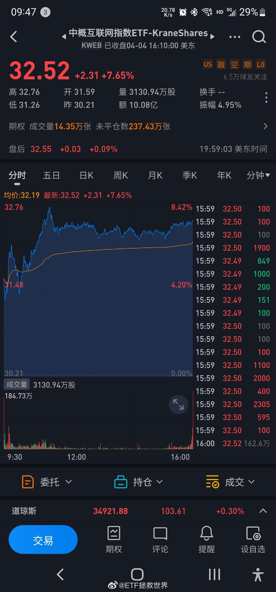
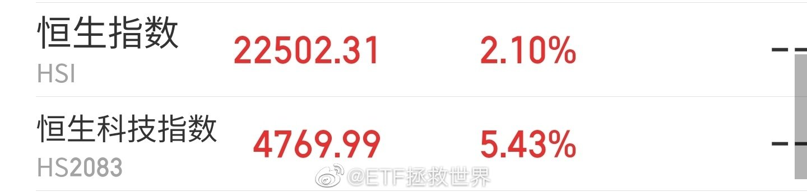

======================================================

ETF拯救世界 (5687069307) @
2022-04-05 09:51:10 Tue  
url: https://weibo.com/5687069307/Ln0oNAWRs

跌这么多回到“合理水平”，潜台词就是，之前高位的时候并不合理。问题来了，不合理的时候为什么没人说话？

------------------------------------------------------
转推：
>  @雪球 (2183570524)
>  2022-04-05 09:16:24 Tue  
>  url: https:/weibo.com/2183570524/Ln0aGAvgM/

>  【多家保险资管集体发声：目前市场估值已回归合理水平】 近期逾十家大中型保险资管公司从长期机构投资者的视角，就权益市场给出研判，其中涵盖了全部管理规模万亿和准万亿机构。多位保险资管人士表示，长期坚定看好中国资本市场发展前景，经过此前两个多月估值压力的释放，目前市场估值已回归合理水平 ​​​

转发[92]  评论[282]  赞[2144] 

======================================================

ETF拯救世界 (5687069307) @
2022-04-05 13:23:19 Tue  
url: https://weibo.com/5687069307/Ln1MUtBjo

趁着A股不开盘，恒生指数偷袭到了22500，超过了22000。

几个月甚至更久之前我就已经把恒生的几个关键点位明牌放出来了。

18500不用说，致敬底。致敬不解释。

18500-22000点，港股价值区域。

如果能有效突破22000，那么25000将是下一个关键压力位。

再下一个关键压力位，则是30000点——那将是致敬 ​​​

转发[761]  评论[921]  赞[4983] 

======================================================

ETF拯救世界 (5687069307) @
2022-04-05 22:04:47 Tue  
url: https://weibo.com/5687069307/Ln5czBBk5

岁月如飞刀，

林志颖也快50了… ​​​

转发[16]  评论[434]  赞[2794] 

======================================================

ETF拯救世界 (5687069307) @
2022-04-06 07:49:40 Wed  
url: https://weibo.com/5687069307/Ln91Zipsc

在微博上关注了很多人。

关注谁不代表一定认同谁。在很多事情上，会关注完全不同观点的对立双方。

即使对某人的观点不认同，也可能会关注，因为这样才会更加全面，只要他言之有物。另外，谁说自己认同的观点一定对呢。

但是有一种人我会取关，就是说不出任何有用的信息和观点，就是在不停的宣泄情绪 ​​​

转发[72]  评论[365]  赞[2860] 

======================================================

ETF拯救世界 (5687069307) @
2022-04-06 09:31:14 Wed  
url: https://weibo.com/5687069307/Ln9Hd0656

拿捏了 http://t.cn/A66TWHgY

------------------------------------------------------
转推：
>  @ETF拯救世界 (5687069307)
>  2022-04-05 09:49:53 Tue  
>  url: https:/weibo.com/5687069307/Ln0ohowjs/

>  套路拿捏得死死的：
>  
>  a股休市涨，a股开市跌。
>  
>  有没有一种可能，是A股… ​​​

转发[25]  评论[364]  赞[1802] 

======================================================

ETF拯救世界 (5687069307) @
2022-04-06 09:41:06 Wed  
url: https://weibo.com/5687069307/Ln9Ldvu8i

记得吗，那时候1000亿申购，200亿买到。90倍估值，当时到底是什么样的人在买？今天又新低了，回看一下，无限感慨

------------------------------------------------------
转推：
>  @ETF拯救世界 (5687069307)
>  2020-09-28 09:59:50 Mon  
>  url: https:/weibo.com/5687069307/JmGBS9FDQ/

>  $科创50 sh000688$ 
>  
>  90倍。200亿接盘。 ​​​

转发[67]  评论[206]  赞[1568] 

======================================================

ETF拯救世界 (5687069307) @
2022-04-06 09:49:00 Wed  
url: https://weibo.com/5687069307/Ln9Oq3J3s

回复@ETF拯救投资小白:估值90倍：有人发行产品，有人猛推销售，有人举着钱买入。无话好说。//@ETF拯救投资小白:鸡精经理接盘侠？//@ETF拯救世界:记得吗，那时候1000亿申购，200亿买到。90倍估值，当时到底是什么样的人在买？今天又新低了，回看一下，无限感慨

------------------------------------------------------
转推：
>  @ETF拯救世界 (5687069307)
>  2020-09-28 09:59:50 Mon  
>  url: https:/weibo.com/5687069307/JmGBS9FDQ/

>  $科创50 sh000688$ 
>  
>  90倍。200亿接盘。 ​​​

转发[35]  评论[154]  赞[1349] 

======================================================

ETF拯救世界 (5687069307) @
2022-04-06 09:54:17 Wed  
url: https://weibo.com/5687069307/Ln9Qz21KI

环保也新低了。

但我不想说这个前任什么坏话。

毕竟，

赚过。 ​​​

转发[30]  评论[508]  赞[2949] 

======================================================

ETF拯救世界 (5687069307) @
2022-04-06 11:25:02 Wed  
url: https://weibo.com/5687069307/Lnarozxti

红利持仓周期太多啦，不能买啊。

有些人这样说。

今天煤炭、有色跌了，红利依然在涨。已经是去年9月以来新高了。

他们不懂红利，不懂组合，更不懂投资。 ​​​

转发[53]  评论[355]  赞[2809] 

======================================================

ETF拯救世界 (5687069307) @
2022-04-06 11:45:18 Wed  
url: https://weibo.com/5687069307/LnazCyuti

能与有共同理想，共同追求，共同目标，共同价值观的人在一起做事，是非常幸福而且难得的。

如果你有，要珍惜。 ​​​

转发[102]  评论[555]  赞[4201] 

======================================================

ETF拯救世界 (5687069307) @
2022-04-06 13:39:12 Wed  
url: https://weibo.com/5687069307/LnbjR8M9d

唱唱反调：

一个品种表现越好，越要警惕。不要上头。

就是在说那个第一大仓位又不停上涨的品种。

我们持仓的品种，涨了，我绝对不会吹它还能涨多少，而是说风险会越来越大。

这是做人的底线。 ​​​

转发[59]  评论[301]  赞[2593] 

======================================================

ETF拯救世界 (5687069307) @
2022-04-06 14:06:18 Wed  
url: https://weibo.com/5687069307/LnbuR8vlM

一般来说，一个品种，除非你特别想配置或者加仓，另外如果不是很便宜，

那么最好不要新低的时候买。

就像新高最好不要卖，等一等。 ​​​

转发[538]  评论[466]  赞[3443] 

======================================================

ETF拯救世界 (5687069307) @
2022-04-06 14:13:16 Wed  
url: https://weibo.com/5687069307/LnbxGqpM3

我觉得应该开发一个相对右侧的计划。

因为有些朋友不太适合买了就跌的左侧，他们会认为买了就跌持仓体验不好——虽然也许只买了不到1%。

那就应该走右侧。 ​​​

转发[44]  评论[592]  赞[3307] 

======================================================

ETF拯救世界 (5687069307) @
2022-04-06 14:23:34 Wed  
url: https://weibo.com/5687069307/LnbBRy2rm

有朋友问了：你说xx很贵，但你说贵了以后人家有人买了，还赚了不少，你怎么说？

我说，

你造吗，历史上杀人放火金腰带的事情多了，现在也有很多违法乱纪捞偏门发财的例子，那么，你要去照做吗。

做不对（自认为）的事情，也许会有收益。这时候你做不做？

我的选择是不做。

赚钱了不代表对。虽然这 ​​​

转发[75]  评论[307]  赞[2915] 

======================================================

ETF拯救世界 (5687069307) @
2022-04-06 14:34:32 Wed  
url: https://weibo.com/5687069307/LnbGjwkhV

其实很多东西相克相生。

地球正是因为物种的多元化才能生生不息。

很多你讨厌的声音，也是维持生态不可缺少的一环。

如果所有声音都完全一致，恐怕也未必是太好的事情。 ​​​

转发[76]  评论[296]  赞[2747] 

======================================================

ETF拯救世界 (5687069307) @
2022-04-06 14:45:45 Wed  
url: https://weibo.com/5687069307/LnbKSisVi

其实平台是不太喜欢我这种的… ​​​

转发[25]  评论[830]  赞[4812] 

+++++++++++++++++++++++++++++++++++++++++++++++++++++

图片：
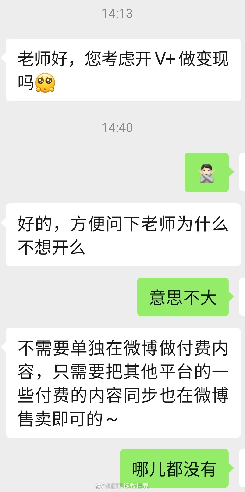

======================================================

ETF拯救世界 (5687069307) @
2022-04-07 10:37:29 Thu  
url: https://weibo.com/5687069307/LnjyB27OQ

懂的都懂

------------------------------------------------------
转推：
>  @ETF拯救世界 (5687069307)
>  2022-04-06 14:06:18 Wed  
>  url: https:/weibo.com/5687069307/LnbuR8vlM/

>  一般来说，一个品种，除非你特别想配置或者加仓，另外如果不是很便宜，
>  
>  那么最好不要新低的时候买。
>  
>  就像新高最好不要卖，等一等。 ​​​

转发[201]  评论[652]  赞[2859] 

======================================================

ETF拯救世界 (5687069307) @
2022-04-07 16:51:22 Thu  
url: https://weibo.com/5687069307/Lnm0m2i8c

之前两年，我都一而再再而三的请新朋友不要参考我的投资计划。原因有二：

第一，你没有安全垫。老朋友一堆收益率几十甚至翻番的品种，你没有。

第二，在过去两年入场，我看不出有什么好的确定性的机会。

有朋友不听我的，现在应该果然是没赚什么钱才对。

但是今天，我可以说一句，

在这个环境下， ​​​

转发[226]  评论[1048]  赞[4494] 

======================================================

ETF拯救世界 (5687069307) @
2022-04-07 17:08:28 Thu  
url: https://weibo.com/5687069307/Lnm7ihsuu

10号是周日。

那么明天就是一个重要的时间窗口。

买还是卖。所有人都需要做出选择。 ​​​

转发[69]  评论[623]  赞[3283] 

======================================================

ETF拯救世界 (5687069307) @
2022-04-07 17:13:13 Thu  
url: https://weibo.com/5687069307/Lnm9eeycT

回复@乾坤日夜服:上一个说我说话神神叨叨的人在小黑屋里睡得很安详。//@乾坤日夜服:E大这种说话神叨叨的风格特别适合于吸引有好奇心的小白…..[允悲]

------------------------------------------------------
转推：
>  @ETF拯救世界 (5687069307)
>  2022-04-07 17:08:28 Thu  
>  url: https:/weibo.com/5687069307/Lnm7ihsuu/

>  10号是周日。
>  
>  那么明天就是一个重要的时间窗口。
>  
>  买还是卖。所有人都需要做出选择。 ​​​

转发[12]  评论[282]  赞[1659] 

======================================================

ETF拯救世界 (5687069307) @
2022-04-07 18:24:38 Thu  
url: https://weibo.com/5687069307/LnmCdb8qK

明天继续下单囤东西。 ​​​

转发[19]  评论[461]  赞[2409] 

======================================================

ETF拯救世界 (5687069307) @
2022-04-07 18:41:37 Thu  
url: https://weibo.com/5687069307/LnmJ6qNO5

回复@慵懒操盘手:留念。以后会翻出来。//@慵懒操盘手:嗯，继续砸港股，港股和中概我还是那个看法，是永远不可能反转的。他们和原油不一样，本身就没有周期性，在中国人口红利见顶之下，跌下去就很难反。//@ETF拯救世界:懂的都懂

------------------------------------------------------
转推：
>  @ETF拯救世界 (5687069307)
>  2022-04-06 14:06:18 Wed  
>  url: https:/weibo.com/5687069307/LnbuR8vlM/

>  一般来说，一个品种，除非你特别想配置或者加仓，另外如果不是很便宜，
>  
>  那么最好不要新低的时候买。
>  
>  就像新高最好不要卖，等一等。 ​​​

转发[123]  评论[497]  赞[3218] 

======================================================

ETF拯救世界 (5687069307) @
2022-04-07 19:11:45 Thu  
url: https://weibo.com/5687069307/LnmVkEFgq

但是我要再次提醒，不要随意“重仓”、“满仓”、“上杠杆”。

大概率、极大概率，不代表100%。

在投资的世界里，没有100%的事情。你始终要为那1%甚至0.1%做准备。

投资啊，尽量不要发生资产大幅回撤。

人生啊，只要富一次就好。 ​​​

转发[204]  评论[500]  赞[3615] 

======================================================

ETF拯救世界 (5687069307) @
2022-04-08 08:13:36 Fri  
url: https://weibo.com/5687069307/Lns2H8LTL

时间窗口延期了。

------------------------------------------------------
转推：
>  @ETF拯救世界 (5687069307)
>  2022-04-07 17:08:28 Thu  
>  url: https:/weibo.com/5687069307/Lnm7ihsuu/

>  10号是周日。
>  
>  那么明天就是一个重要的时间窗口。
>  
>  买还是卖。所有人都需要做出选择。 ​​​

转发[21]  评论[455]  赞[2617] 

======================================================

ETF拯救世界 (5687069307) @
2022-04-08 09:57:00 Fri  
url: https://weibo.com/5687069307/LnsIF1IbB

不要催。

我要听你的买入是不是又浮亏了。

不要急，再观察观察。

想买的品种不停的新低你急什么。 ​​​

转发[32]  评论[557]  赞[2949] 

======================================================

ETF拯救世界 (5687069307) @
2022-04-08 10:19:27 Fri  
url: https://weibo.com/5687069307/LnsRLFqqC

明明白白，清清楚楚，踏踏实实。 ​​​

转发[209]  评论[1050]  赞[3935] 

+++++++++++++++++++++++++++++++++++++++++++++++++++++

图片：
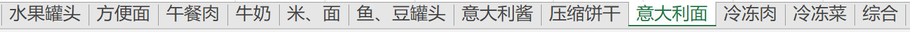

======================================================

ETF拯救世界 (5687069307) @
2022-04-08 10:48:55 Fri  
url: https://weibo.com/5687069307/Lnt3JAXWw

S下午有可能会加1-2份。不一定。看走势。 ​​​

转发[18]  评论[665]  赞[3013] 

======================================================

ETF拯救世界 (5687069307) @
2022-04-08 13:07:57 Fri  
url: https://weibo.com/5687069307/LntYagTYz

不要让同事知道你有百万存款。

------------------------------------------------------
转推：
>  @网易财经 (1974561081)
>  2022-04-08 09:30:04 Fri  
>  url: https:/weibo.com/1974561081/LnsxJ5Jwi/

>  【#男子得知同事有百万存款借23万后失联# 曾拍视频承诺还钱】4月7日，湖南邵东。仅入职半个月的同事裴某，听说罗先生有百万存款，就以承接工程为由分三次借款23.5万元。到了还款日期，裴某却迟迟没有还钱。罗先生多方打听得知，原来裴某用13万投资赌场，另外10万全挥霍掉了。罗先生称，当时裴某身着名 ​​​

转发[51]  评论[459]  赞[2143] 

======================================================

ETF拯救世界 (5687069307) @
2022-04-08 16:33:45 Fri  
url: https://weibo.com/5687069307/LnvjHl6Yq

再次忏悔：

90%的错误，都来源于不相信自己设计的策略，定下的规矩。

犹豫、懦弱、怀疑……

执行，坚定的，用钢铁意志去执行！ ​​​

转发[105]  评论[647]  赞[3516] 

======================================================

ETF拯救世界 (5687069307) @
2022-04-08 17:12:42 Fri  
url: https://weibo.com/5687069307/Lnvzvxacd

今天的养老体现的是高抛低吸；信息体现的是时间+空间。

感受一下。 ​​​

转发[137]  评论[510]  赞[3732] 

+++++++++++++++++++++++++++++++++++++++++++++++++++++

图片：

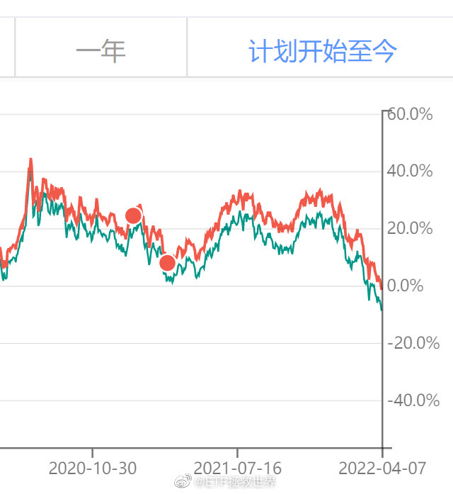

======================================================

ETF拯救世界 (5687069307) @
2022-04-09 13:45:25 Sat  
url: https://weibo.com/5687069307/LnDDS1MqH

食品库继续建仓。

京东已经要几天后送货了，今天从本地超市进货。 ​​​

转发[55]  评论[321]  赞[1974] 

======================================================

ETF拯救世界 (5687069307) @
2022-04-09 13:51:33 Sat  
url: https://weibo.com/5687069307/LnDGmjMxq

回复@初二四班二十四号:为什么要焦虑？焦虑可以改变什么吗。有焦虑的时间不如多为焦虑的事情做点准备//@初二四班二十四号:好焦虑好焦虑好焦虑。

------------------------------------------------------
转推：
>  @ETF拯救世界 (5687069307)
>  2022-04-09 13:45:25 Sat  
>  url: https:/weibo.com/5687069307/LnDDS1MqH/

>  食品库继续建仓。
>  
>  京东已经要几天后送货了，今天从本地超市进货。 ​​​

转发[30]  评论[112]  赞[1178] 

======================================================

ETF拯救世界 (5687069307) @
2022-04-09 14:08:36 Sat  
url: https://weibo.com/5687069307/LnDNhz7Am

怎么还有人问买的什么，会不会过期。这点东西几年吃完怎么会过期。好些东西也不需要冰箱。

------------------------------------------------------
转推：
>  @ETF拯救世界 (5687069307)
>  2022-04-08 10:19:27 Fri  
>  url: https:/weibo.com/5687069307/LnsRLFqqC/

>  明明白白，清清楚楚，踏踏实实。 ​​​

转发[59]  评论[267]  赞[1573] 

======================================================

ETF拯救世界 (5687069307) @
2022-04-09 14:32:46 Sat  
url: https://weibo.com/5687069307/LnDX5temG

怎么总有人把做准备跟焦虑划等号呢。

多买一点未来会吃的东西。有事，有备无患。没事，慢慢吃呗。

什么事情都不提前准备，真发生了到处抓瞎哭呗？

焦虑是什么，是你没准备你才焦虑。你把能做的准备做好，能想到的问题都做好预案，你焦虑什么？

焦虑有用吗？屁用都没有。努力做好能改变的，坦然接受 ​​​

转发[176]  评论[567]  赞[3574] 

======================================================

ETF拯救世界 (5687069307) @
2022-04-09 16:52:31 Sat  
url: https://weibo.com/5687069307/LnEROmKeM

2021年11月1日，商务部印发《关于做好今冬明春蔬菜等生活必需品市场保供稳价工作的通知》。

其中明确指出，“鼓励家庭根据需要储存一定数量的生活必需品，满足日常生活和突发情况的需要。”

说我制造焦虑？我是按照国家部署，部门指导意见，在形势复杂的情况下提前做好准备，争取不为国家添乱，在关 ​​​

转发[40]  评论[589]  赞[3040] 

======================================================

ETF拯救世界 (5687069307) @
2022-04-09 20:33:26 Sat  
url: https://weibo.com/5687069307/LnGju3RB5

对我有什么意见、建议、抱怨、不满，不妨在评论里开诚布公的谈谈。

红红脸，出出汗，不用客气。 ​​​

转发[32]  评论[1344]  赞[4907] 

======================================================

ETF拯救世界 (5687069307) @
2022-04-09 22:38:11 Sat  
url: https://weibo.com/5687069307/LnH87oo4E

两个小时过去了，一无所获，收杆儿睡觉。行吧，都挺机灵的[哼]

------------------------------------------------------
转推：
>  @ETF拯救世界 (5687069307)
>  2022-04-09 20:33:26 Sat  
>  url: https:/weibo.com/5687069307/LnGju3RB5/

>  对我有什么意见、建议、抱怨、不满，不妨在评论里开诚布公的谈谈。
>  
>  红红脸，出出汗，不用客气。 ​​​

转发[12]  评论[385]  赞[2182] 

======================================================

ETF拯救世界 (5687069307) @
2022-04-10 08:45:32 Sun  
url: https://weibo.com/5687069307/LnL6DEvrK

骂A可以，千万别捧B贬A。

谁都禁不起捧，捧高了摔的更疼。 ​​​

转发[26]  评论[422]  赞[2827] 

======================================================

ETF拯救世界 (5687069307) @
2022-04-10 18:46:04 Sun  
url: https://weibo.com/5687069307/LnP2p0wSm

三个月过去，这两天已经最终建仓完毕。后期只需要正常增减保持长期仓位。这个话题以后不再说了[可爱]//@ETF拯救世界:年初的微博，可能当时很多朋友会觉得可笑…顺便说一下，我在此基础上一直在加仓。目前看只要有水电，坚持三个月左右问题不大。

------------------------------------------------------
转推：
>  @ETF拯救世界 (5687069307)
>  2022-01-09 18:50:34 Sun  
>  url: https:/weibo.com/5687069307/L9Zb2n6zD/

>  清点了一下家里储存的食物，乐观估计正常够吃1-1.5个月。极限情况2个月也应该可以。
>  
>  营养全面就不用考虑了。什么事情都做最坏准备可能是一种深入骨髓的病。 ​​​

转发[36]  评论[413]  赞[2541] 

======================================================

ETF拯救世界 (5687069307) @
2022-04-11 09:54:08 Mon  
url: https://weibo.com/5687069307/LnUYZ9KEA

环保又是3个点，新低。龙头6个点。

两个问题：

第一，机构云集的赛道崩塌，他们会继续看好继续重仓吗。

第二，六月的指数成分股调整，大指数会把这一年多来刚刚调入的，暴涨后又暴跌的股票再调出去吗。 ​​​

转发[47]  评论[356]  赞[2189] 

======================================================

ETF拯救世界 (5687069307) @
2022-04-11 10:07:52 Mon  
url: https://weibo.com/5687069307/LnV4yw4q7

科创即将跌破1000点+终于快跌破50倍了。这个指数存在2年，所有买入还没有卖出的全都被埋了。即使如此，依然是50倍……好消息是，相比2年前的1000点，估值已经降了很多了。那时候……是80倍。

------------------------------------------------------
转推：
>  @ETF拯救世界 (5687069307)
>  2022-02-14 16:34:42 Mon  
>  url: https:/weibo.com/5687069307/LfrFLxCZz/

>  今日数据：
>  
>  科创50今日创出上市以来估值最低，终于快跌破60倍了……
>  
>  创业板也终于有可能元神归位了。 ​​​

转发[105]  评论[318]  赞[1979] 

======================================================

ETF拯救世界 (5687069307) @
2022-04-11 10:23:35 Mon  
url: https://weibo.com/5687069307/LnVaWegl2

个股我不讨论，因为个股的估值非常非常复杂。不是说亏损或者PE 400倍就不能买，也不是说PE4就一定有价值。

但是，指数，你永远应该记住一句话：

如果你买60、70、80甚至更高估值的指数，那么，你就应该做好随时跑路的准备。如果你不知道怎么跑路，那么就应该做好被深套的准备。

如果你不会跑路也不 ​​​

转发[204]  评论[404]  赞[2630] 

======================================================

ETF拯救世界 (5687069307) @
2022-04-11 10:44:02 Mon  
url: https://weibo.com/5687069307/LnVjf0iBa

有人问：xx那里为什么科创50只有30多倍估值？

我的回答：

第一，这个问题你问我干嘛？不应该去xx问客服吗？

第二，科创50一共50支成分股，其中40倍以下的15支，大部分都非权重股。这个30倍难道不是很可疑吗。

碰到任何问题、数据、说法，我们应该想一想，看一看，查一查是不是合理。别人说什么你就 ​​​

转发[70]  评论[460]  赞[2978] 

======================================================

ETF拯救世界 (5687069307) @
2022-04-11 13:13:18 Mon  
url: https://weibo.com/5687069307/LnWhPfF9C

回复@ETF拯救世界:7个月前给的价位。信息从4300上调到4500。该位置配满信息科技仓位。一切尽在掌握。//@ETF拯救世界:历史低价信息4300，医药9500。可梭哈一把配满。

------------------------------------------------------
转推：
>  @ETF拯救世界 (5687069307)
>  2021-09-29 16:12:36 Wed  
>  url: https:/weibo.com/5687069307/KAq0B0x0U/

>  下阶段布局目标：
>  
>  医药、信息。
>  
>  希望它们不要不识抬举，好好给我跌。
>  
>  医药好价：12000点。
>  
>  信息好价：5000-5400点。
>  
>  非历史好价，但低于去年双十一，刚需可入。 ​​​

转发[359]  评论[342]  赞[1942] 

======================================================

ETF拯救世界 (5687069307) @
2022-04-11 13:21:07 Mon  
url: https://weibo.com/5687069307/LnWl05OD1

很多人一看到跌就慌了。

为什么慌，因为他根本没想过会跌。或者说，没想到过会急跌或者阴跌。

我在买一个品种，或者想买一个品种的时候，会计算一个“能理解的最低位”。然后以这个位置为基础，左侧也好右侧也好，布置自己的资金进去。

如果价位并未跌穿你的“能理解的最低位”，有什么慌的？不是一 ​​​

转发[136]  评论[391]  赞[2596] 

======================================================

ETF拯救世界 (5687069307) @
2022-04-11 13:28:59 Mon  
url: https://weibo.com/5687069307/LnWoc1jlu

科创50现在是不是低位，今天之后能不能涨我不知道。

但这是科创50自由流通市值前20位的股票TTM PE。

你告诉我这个指数估值只有30多倍，无论如何我是不信的。 ​​​

转发[152]  评论[193]  赞[2007] 

+++++++++++++++++++++++++++++++++++++++++++++++++++++

图片：

======================================================

ETF拯救世界 (5687069307) @
2022-04-11 13:31:45 Mon  
url: https://weibo.com/5687069307/LnWpk25vN

整体来看，科创的优势是利润增速其实不错。未来我也想买，也大概有个买入区间。但这个就不说了，因为指数太新，比较模糊，还是不说了。看看未来150和S有没有机会买吧。

------------------------------------------------------
转推：
>  @ETF拯救世界 (5687069307)
>  2022-04-11 13:28:59 Mon  
>  url: https:/weibo.com/5687069307/LnWoc1jlu/

>  科创50现在是不是低位，今天之后能不能涨我不知道。
>  
>  但这是科创50自由流通市值前20位的股票TTM PE。
>  
>  你告诉我这个指数估值只有30多倍，无论如何我是不信的。 ​​​

转发[74]  评论[187]  赞[1660] 

======================================================

ETF拯救世界 (5687069307) @
2022-04-11 13:45:13 Mon  
url: https://weibo.com/5687069307/LnWuMpx2F

老朋友都知道我喜欢的三个品种：

消费、医药、科技。

消费和医药不用说了。

科技方面，中概+恒科主要配置的是“软科技”，而A股上市的大多数是“硬科技”。当然，到底这些企业到底有多少科技含量我们不讨论，只是说会这样划分。

所以未来中概恒科+信息或科创等品种，使我们配置科技板块的思路。 ​​​

转发[389]  评论[745]  赞[3875] 

======================================================

ETF拯救世界 (5687069307) @
2022-04-11 14:45:05 Mon  
url: https://weibo.com/5687069307/LnWT58uIk

今天的数据让人期待。

人生第三幸福的事情，就是每天看着数据一个个跑出来。[太开心] ​​​

转发[21]  评论[420]  赞[3002] 

======================================================

ETF拯救世界 (5687069307) @
2022-04-11 15:23:21 Mon  
url: https://weibo.com/5687069307/LnX8C5IFB

我提两个改善情绪的办法。

一、运动；二、吸猫（脾气好又很软的那种）

各位还有什么别的方法不妨也展示一下。 ​​​

转发[46]  评论[906]  赞[2709] 

======================================================

ETF拯救世界 (5687069307) @
2022-04-11 15:39:05 Mon  
url: https://weibo.com/5687069307/LnXf0obqx

今日数据：

时隔四年，再次向钻石坑飞奔。 ​​​

转发[149]  评论[1045]  赞[4300] 

======================================================

ETF拯救世界 (5687069307) @
2022-04-11 15:45:53 Mon  
url: https://weibo.com/5687069307/LnXhLbWpL

根据最新数据，150终于可以加A股仓位了 [亲亲] ​​​

转发[76]  评论[734]  赞[3975] 

======================================================

ETF拯救世界 (5687069307) @
2022-04-11 17:00:56 Mon  
url: https://weibo.com/5687069307/LnXMdF7kL

关于“投资群”，我的一点想法，至今未变。总而言之，投资群就是耽误时间+几乎没有营养+各种牛鬼蛇神出没+小白互相干扰的一个地方。真那么有时间在里面聊天，去做点有价值的事情不好吗。

------------------------------------------------------
转推：
>  @ETF拯救世界 (5687069307)
>  2021-03-30 13:56:45 Tue  
>  url: https:/weibo.com/5687069307/K8zUAcog9/

>  我的建议：
>  
>  不要加什么搞钱群。
>  
>  人稍微一多，骗子就会在里面兴风作浪。更何况是搞钱群？
>  
>  做投资就是自己踏踏实实做，在网上主动去吸收一些自己需要的营养。你弄个群，噼里啪啦七嘴八舌在里面，不仅耽误时间，也学不到什么有用的东西。反而因为被动信息太多，扰乱了自己的思维。
>  
>  在我的认知中，搞钱 ​​​

转发[40]  评论[185]  赞[1798] 

======================================================

ETF拯救世界 (5687069307) @
2022-04-11 17:01:48 Mon  
url: https://weibo.com/5687069307/LnXMzx9F5

这条也是关于我对“投资群”看法的。新朋友可以考虑一下。

------------------------------------------------------
转推：
>  @ETF拯救世界 (5687069307)
>  2020-07-27 20:55:39 Mon  
>  url: https:/weibo.com/5687069307/JdaYN9VJd/

>  再多说两句关于“投资群”。
>  
>  我非常不喜欢投资群。除非是三五志同道合的朋友。否则投资群越大，人越多，负面效果越明显。
>  
>  尤其是很多本来正确投资理念还没成型的朋友进去后，更是百害无一益。
>  
>  再者，有人的地方就有江湖。几十几百人凑在一起，又是牵扯到金钱利益的主题，更是不免乌烟瘴气矛盾重重。 ​​​

转发[24]  评论[248]  赞[1637] 

======================================================

ETF拯救世界 (5687069307) @
2022-04-11 17:54:12 Mon  
url: https://weibo.com/5687069307/LnY7Qmk3H

特别难。难在哪里。

你左侧买吧，他说参考了你的买了就亏；

你左侧一点都不买全都右侧吧，万一一根大阳线手里什么都没有他又说你踏空了；

你分成150份，左侧买10份吧，他说：什么150？我只看买了的这10份！

你说现在高位，新朋友别跟了。他说我就要跟。浮亏了我就骂你。

低位你说咱们第三轮牛市顶 ​​​

转发[90]  评论[852]  赞[3773] 

======================================================

ETF拯救世界 (5687069307) @
2022-04-11 19:09:15 Mon  
url: https://weibo.com/5687069307/LnYCj57et

娱乐不是罪。

成年人的不是，

孩子的也不是。

人应该快乐的生活，而不是重重压力，无限焦虑。

人们需要快乐。 ​​​

转发[94]  评论[403]  赞[3269] 

======================================================

ETF拯救世界 (5687069307) @
2022-04-11 21:12:36 Mon  
url: https://weibo.com/5687069307/LnZqnxub5

我不抽烟啊。

但我有个问题问问烟民朋友们。

如果你在一个买不到烟的环境里，好几天没抽了好难受。有人说他能搞到，但不好搞所以要加价。

你会出多少倍的价格去买。

1倍、5倍，还是10倍原价换一盒。 ​​​

转发[32]  评论[702]  赞[2631] 

======================================================

ETF拯救世界 (5687069307) @
2022-04-12 10:20:19 Tue  
url: https://weibo.com/5687069307/Lo4A6zdw1

我有一个想法，

我觉得对于行业来说，可能是那种，能活着但活不好，快死了又没完全死，不要赚太多钱，也不要赔钱，能解决就业和社保，又不会产生太大利润，

应该是最稳的。 ​​​

转发[54]  评论[764]  赞[3043] 

======================================================

ETF拯救世界 (5687069307) @
2022-04-12 10:47:32 Tue  
url: https://weibo.com/5687069307/Lo4L9AFl3

猫这种生物，

基因里为什么有对人撒娇这个序列。

我不理解。

人这种生物，

基因里为什么会有对猫的撒娇随时受不了这个序列。

我更不理解。 ​​​

转发[22]  评论[525]  赞[2909] 

======================================================

ETF拯救世界 (5687069307) @
2022-04-12 13:11:51 Tue  
url: https://weibo.com/5687069307/Lo5HJpSQk

为什么要拉？不拉行不行？

车都发动了你给我来这一手？ ​​​

转发[12]  评论[381]  赞[2098] 

======================================================

ETF拯救世界 (5687069307) @
2022-04-12 13:16:14 Tue  
url: https://weibo.com/5687069307/Lo5Jw1ljN

还有，提款17%的那个品种还差一点点就又可以接回来了。

谁在拉？你哪个单位的？[怒] ​​​

转发[17]  评论[350]  赞[2087] 

======================================================

ETF拯救世界 (5687069307) @
2022-04-12 13:25:21 Tue  
url: https://weibo.com/5687069307/Lo5NdidOZ

心里堵得慌。 ​​​

转发[10]  评论[412]  赞[1904] 

======================================================

ETF拯救世界 (5687069307) @
2022-04-12 13:30:40 Tue  
url: https://weibo.com/5687069307/Lo5Pn8EX8

日经ETF新低了。

依然不买。

还是汇率问题。

日经不跌，ETF因为汇率跌不少，买进去没有道理。

最好的局面是：

未来日经跌到可以买的地方，同时汇率跌到极限，买入。

那么就是双击。估值修复+汇率上升。 ​​​

转发[115]  评论[336]  赞[2177] 

======================================================

ETF拯救世界 (5687069307) @
2022-04-12 13:33:45 Tue  
url: https://weibo.com/5687069307/Lo5QCyHmD

今天本来犹豫买三个。

现在不用犹豫了，买一个没那么暴躁的吧。 ​​​

转发[15]  评论[410]  赞[2373] 

======================================================

ETF拯救世界 (5687069307) @
2022-04-12 13:56:47 Tue  
url: https://weibo.com/5687069307/Lo5ZYj2k6

前几天那位因为给快递小哥打赏200元，被网暴“打赏太少”，最终跳楼的女士，

如果在天之灵看到今天网民又在网暴每单平均被打赏100多的快递员，

不知道作何感想。

你真觉得大部分人类是值得被爱的吗。

扯淡。 ​​​

转发[100]  评论[560]  赞[3508] 

======================================================

ETF拯救世界 (5687069307) @
2022-04-12 14:36:15 Tue  
url: https://weibo.com/5687069307/Lo6g06Pnc

我看见评论里有朋友说，那位女士不应该被网暴就想不开啊，不值得啊。

是的。这是肯定的。但很多事情你不经历，确实无法体会。

你有没有被别人骂过。应该有吧。除非你是特别心大的那种人，被人骂了会难受吧。尤其是自己并没有做错的情况下。

那么被几个人，十几个人，几十个人，几百个人，几千个人骂 ​​​

转发[388]  评论[1045]  赞[4532] 

======================================================

ETF拯救世界 (5687069307) @
2022-04-12 14:50:08 Tue  
url: https://weibo.com/5687069307/Lo6lDkNWE

回复@浪衣168:对。人类的记忆不断模糊消失，实际上是对自己的一种保护。记忆力太好+太敏感，这人99%不快乐。//@浪衣168:看来我记忆力不好也是个好事，容易忘记别人对我的坏

------------------------------------------------------
转推：
>  @ETF拯救世界 (5687069307)
>  2022-04-12 14:36:15 Tue  
>  url: https:/weibo.com/5687069307/Lo6g06Pnc/

>  我看见评论里有朋友说，那位女士不应该被网暴就想不开啊，不值得啊。
>  
>  是的。这是肯定的。但很多事情你不经历，确实无法体会。
>  
>  你有没有被别人骂过。应该有吧。除非你是特别心大的那种人，被人骂了会难受吧。尤其是自己并没有做错的情况下。
>  
>  那么被几个人，十几个人，几十个人，几百个人，几千个人骂 ​​​

转发[59]  评论[178]  赞[1393] 

======================================================

ETF拯救世界 (5687069307) @
2022-04-12 14:59:55 Tue  
url: https://weibo.com/5687069307/Lo6pBcWD9

今天很不开心。

感觉被偷家了。

更不开心的是如果明天继续跌，那就是被偷家*2。

K**。 ​​​

转发[23]  评论[599]  赞[3383] 

======================================================

ETF拯救世界 (5687069307) @
2022-04-12 20:41:04 Tue  
url: https://weibo.com/5687069307/Lo8E4rwdv

我万万没想到还有人不明白为什么大多数时间写两个代码，一个场内一个场外。

稍微有点脑子的就应该知道，当然是看大家爱玩场内还是场外，随意选择啊。多少年了，居然还有人喷这个…

另外还有一点，大多数时候场内场外是对应的。比如场内是ETF，场外是对应的联接基金。但也有例外，因为各种原因，两者 ​​​

转发[76]  评论[528]  赞[3282] 

======================================================

ETF拯救世界 (5687069307) @
2022-04-13 07:52:02 Wed  
url: https://weibo.com/5687069307/Lod2pF6KW

有些人抱怨，新股发行多啦，估值上百倍贵啦…其实没什么抱怨的。

这就是市场化发行。多也好，贵也好，你不申购不就行了？大家都不申购，券商包销，发一只赔一只，你看看还能发出来吗，发不出来不就平衡了。

这就是市场化。

好嘛，不管多贵你都去买，新股必胜，跟一级市场一起割二级市场的韭菜，可能 ​​​

转发[78]  评论[363]  赞[2499] 

======================================================

ETF拯救世界 (5687069307) @
2022-04-13 08:05:53 Wed  
url: https://weibo.com/5687069307/Lod82kZw2

分享图片 ​​​

转发[21]  评论[519]  赞[1814] 

+++++++++++++++++++++++++++++++++++++++++++++++++++++

图片：

======================================================

ETF拯救世界 (5687069307) @
2022-04-13 10:18:29 Wed  
url: https://weibo.com/5687069307/LodZRDbJl

随着时间的推移，医药指数左侧买入完毕点位上移至9600。不玩虚头巴脑，明牌。

------------------------------------------------------
转推：
>  @ETF拯救世界 (5687069307)
>  2022-01-25 14:07:53 Tue  
>  url: https:/weibo.com/5687069307/Lcoaf8weM/

>  时隔三年，150和S的医药买入周期又开始了。
>  
>  接下来的区间目标，是在9500-12000之间，将医药仓位配置完毕。
>  
>  所有的事情都有预案，有解决方法，有执行措施，有理论和体系的保证。
>  
>  你很怕跌？为什么？
>  
>  哦，原来是因为什么都没有。 ​​​

转发[331]  评论[847]  赞[3460] 

======================================================

ETF拯救世界 (5687069307) @
2022-04-13 11:13:01 Wed  
url: https://weibo.com/5687069307/LoelZBo9r

【FBI Warning！ 本条微博非上海朋友不要评论！】

上海现在比较困难，最近一直想着能为大家做点什么。昨天看且慢发了一些物资礼包，我觉得，我也可以。

这条微博，抽66位上海的铁粉朋友，我自费送每位单价500元+的食物礼包。

【FBI Warning！ 本条微博非上海朋友不要评论！】

但是有几个点一定请知 ​​​

转发[165]  评论[3262]  赞[6243] 

======================================================

ETF拯救世界 (5687069307) @
2022-04-13 13:41:27 Wed  
url: https://weibo.com/5687069307/Lofkffhj0

该涨的偷家，该跌的一网17%的又在涨。

是不是要去拜拜了。 ​​​

转发[11]  评论[265]  赞[2054] 

======================================================

ETF拯救世界 (5687069307) @
2022-04-13 13:50:17 Wed  
url: https://weibo.com/5687069307/LofnPqGxI

每次看到这样的人，才会觉得一小撮人类值得被爱，也会想为这些人多做一点什么。 ​​​

转发[32]  评论[642]  赞[4085] 

+++++++++++++++++++++++++++++++++++++++++++++++++++++

图片：
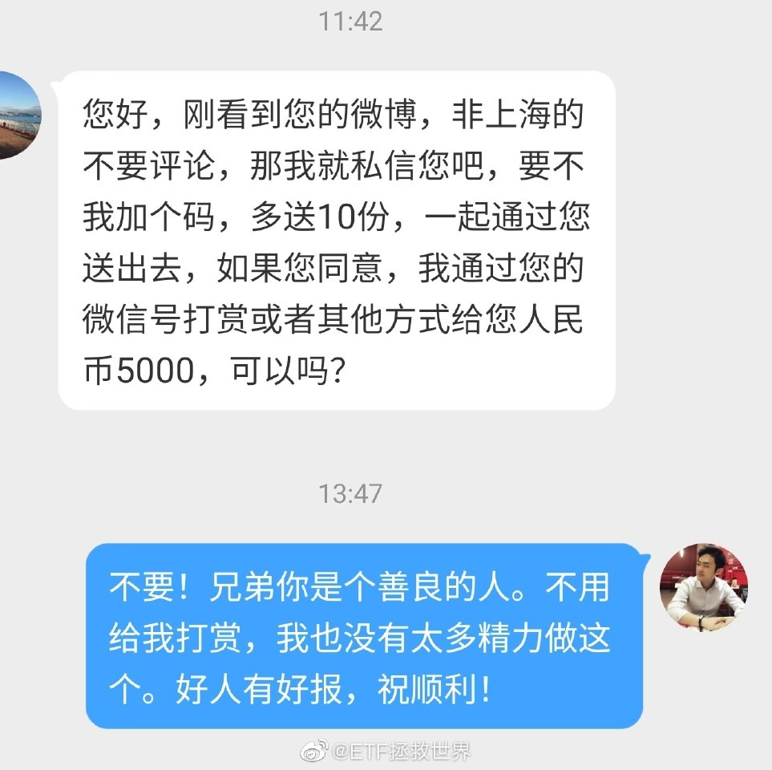

======================================================

ETF拯救世界 (5687069307) @
2022-04-13 14:17:43 Wed  
url: https://weibo.com/5687069307/LofyY1T6W

什么玩意儿啊，对自己的智商和判断力产生严重的质疑：

对于某些事，看一方说的觉得有道理我支持，再看另一方说的也很有道理我也支持。

看一方的数据觉得没错是这样，看另一方的数据又觉得你说的也没错啊。

WTF，小丑竟是我自己。 ​​​

转发[20]  评论[379]  赞[2534] 

======================================================

ETF拯救世界 (5687069307) @
2022-04-13 15:35:12 Wed  
url: https://weibo.com/5687069307/Log4pCMKG

恭喜@雪英珺 等66名用户获得【单价500元 食物礼包一份】。微博官方唯一抽奖工具@微博抽奖平台 对本次抽奖进行监督，结果公正有效。公示链接：http://t.cn/A66uqWyd

------------------------------------------------------
转推：
>  @ETF拯救世界 (5687069307)
>  2022-04-13 11:13:01 Wed  
>  url: https:/weibo.com/5687069307/LoelZBo9r/

>  【FBI Warning！ 本条微博非上海朋友不要评论！】
>  
>  上海现在比较困难，最近一直想着能为大家做点什么。昨天看且慢发了一些物资礼包，我觉得，我也可以。
>  
>  这条微博，抽66位上海的铁粉朋友，我自费送每位单价500元+的食物礼包。
>  
>  【FBI Warning！ 本条微博非上海朋友不要评论！】
>  
>  但是有几个点一定请知 ​​​

转发[8]  评论[215]  赞[837] 

======================================================

ETF拯救世界 (5687069307) @
2022-04-13 15:38:25 Wed  
url: https://weibo.com/5687069307/Log5JcjSE

今天数据出来两个事：

第一，很想放一张行业数据图，后来决定下次公众号文章放。

第二，科创50终于快跌破50了。从96下来的。 ​​​

转发[47]  评论[596]  赞[3302] 

======================================================

ETF拯救世界 (5687069307) @
2022-04-13 16:45:09 Wed  
url: https://weibo.com/5687069307/LogwOeMW3

北京的房价是不是涨了。偶尔打开链家一看，比去年高了。 ​​​

转发[24]  评论[456]  赞[2551] 

======================================================

ETF拯救世界 (5687069307) @
2022-04-14 10:29:10 Thu  
url: https://weibo.com/5687069307/LonuH8KwP

还有15位中奖的朋友没有填写收货信息。我已经单独提醒，请尽快填写，截止时间今天15:00。因为要尽快操作送货，不能没完没了的等。

------------------------------------------------------
转推：
>  @ETF拯救世界 (5687069307)
>  2022-04-13 11:13:01 Wed  
>  url: https:/weibo.com/5687069307/LoelZBo9r/

>  【FBI Warning！ 本条微博非上海朋友不要评论！】
>  
>  上海现在比较困难，最近一直想着能为大家做点什么。昨天看且慢发了一些物资礼包，我觉得，我也可以。
>  
>  这条微博，抽66位上海的铁粉朋友，我自费送每位单价500元+的食物礼包。
>  
>  【FBI Warning！ 本条微博非上海朋友不要评论！】
>  
>  但是有几个点一定请知 ​​​

转发[15]  评论[286]  赞[1408] 

======================================================

ETF拯救世界 (5687069307) @
2022-04-14 10:51:54 Thu  
url: https://weibo.com/5687069307/LonDVuFCD

环保继续新低。再说一次，如果你不知道买什么，记住不要买贵的。但我不想说前任坏话，环保留给我们的记忆是美妙的。。

------------------------------------------------------
转推：
>  @ETF拯救世界 (5687069307)
>  2022-02-08 12:07:08 Tue  
>  url: https:/weibo.com/5687069307/LevmbmWgf/

>  A股有其自己的特点。其中最大的特点就是波动极大。
>  
>  而波动极大的背后，就是估值水平巨幅波动。
>  
>  拿环保（新能源、碳中和）来说。
>  
>  最高点的时候，其成分股前40位的股票，平均估值超过90倍。
>  
>  你说宁德也好，隆基也好，都是高成长，享受百倍PE合理。但是40只股票都是高成长？做梦呢。
>  
>  所以我们走了。
>   ​​​

转发[82]  评论[290]  赞[2106] 

======================================================

ETF拯救世界 (5687069307) @
2022-04-14 11:45:43 Thu  
url: https://weibo.com/5687069307/LonZLFF1b

同一份文件，同一份数据，可以被解读出不同的观点。很多时候，数据的引用是用来服务观点的。

------------------------------------------------------
转推：
>  @xiongyongqiang (1406419784)
>  2022-04-13 21:26:32 Wed  
>  url: https:/weibo.com/1406419784/Loin1DitP/

>  【世卫组织：#奥密克戎导致出现大量住院和死亡病例#】  是错译或者断章取义吗？
>  
>今天目睹了一场非常有意思的辟谣、反辟谣、反“反辟谣”的大戏，发现后面居然没有了，于是自己加上了反“反反辟谣”。
>  
>  ● 缘起 #奥密克戎导致出现大量住院和死亡病例# http://t.cn/A66mnrhp
>央视新闻报道： ​​​

转发[111]  评论[172]  赞[1392] 

======================================================

ETF拯救世界 (5687069307) @
2022-04-14 11:49:07 Thu  
url: https://weibo.com/5687069307/Loo19aarS

吉林[666] 尽快恢复正常生活吧。

------------------------------------------------------
转推：
>  @央视新闻 (2656274875)
>  2022-04-14 11:45:11 Thu  
>  url: https:/weibo.com/2656274875/LonZy7t75/

>  【#吉林省各市州均实现社会面清零#】记者从吉林省政府召开本轮疫情防控工作新闻发布会上获悉，4月13日#长春实现社会面清零#。有感染者报告的白城市、辽源市、梅河口市新增感染者均为隔离管控人员，四平市已连续多日没有新增病例。至此，吉林省各市州均实现了疫情防控社会面清零目标。（总台记者赵文彬  ​​​

转发[15]  评论[212]  赞[1419] 

======================================================

ETF拯救世界 (5687069307) @
2022-04-14 12:30:17 Thu  
url: https://weibo.com/5687069307/LoohR6Ag4

其实很多争论，就是源于所处的位置不同。屁股不同，立场不同。

是不是触及到了自己的利益，会有很大的不同。

不说了。说不清楚，一言难尽。 ​​​

转发[54]  评论[289]  赞[2595] 

======================================================

ETF拯救世界 (5687069307) @
2022-04-14 13:08:35 Thu  
url: https://weibo.com/5687069307/Looxp4Jcp

今年的目标：完成医药+消费+科技的配置。

今天继续。 ​​​

转发[102]  评论[509]  赞[2924] 

======================================================

ETF拯救世界 (5687069307) @
2022-04-14 13:22:55 Thu  
url: https://weibo.com/5687069307/LooDe5L2S

什么意思，又要偷家是吗 ​​​

转发[38]  评论[502]  赞[2254] 

======================================================

ETF拯救世界 (5687069307) @
2022-04-14 13:51:28 Thu  
url: https://weibo.com/5687069307/LooOOaGWb

这世界充满恶意。什么玩意儿。

------------------------------------------------------
转推：
>  @ETF拯救世界 (5687069307)
>  2022-04-14 13:22:55 Thu  
>  url: https:/weibo.com/5687069307/LooDe5L2S/

>  什么意思，又要偷家是吗 ​​​

转发[13]  评论[356]  赞[1952] 

======================================================

ETF拯救世界 (5687069307) @
2022-04-14 14:07:57 Thu  
url: https://weibo.com/5687069307/LooVv2ZYB

回复@就是干委员会会长:不看事实是吧。前天信息发车的时候明明是下跌一个多点创新低，一边发车一边开始拉升的。怎么是大跌不买呢。//@就是干委员会会长:怎么最近都是第一天大跌不买，第二天中午横盘买，下午飙升，为啥大跌的当天不买呢，是时间未到吗[允悲]

------------------------------------------------------
转推：
>  @ETF拯救世界 (5687069307)
>  2022-04-14 13:22:55 Thu  
>  url: https:/weibo.com/5687069307/LooDe5L2S/

>  什么意思，又要偷家是吗 ​​​

转发[8]  评论[406]  赞[2005] 

======================================================

ETF拯救世界 (5687069307) @
2022-04-14 15:18:46 Thu  
url: https://weibo.com/5687069307/Lopof9HQ4

跟进一下。已经填写信息的朋友，今明两天就会开始派送。如果有收到的可以私信给我或者发微博然后私信我让我知道收到了。另外，如果最终有些朋友实在送不到，我会把送不到的名额再次抽奖，最终送完，不要浪费了，挺珍贵的物资。

------------------------------------------------------
转推：
>  @ETF拯救世界 (5687069307)
>  2022-04-13 11:13:01 Wed  
>  url: https:/weibo.com/5687069307/LoelZBo9r/

>  【FBI Warning！ 本条微博非上海朋友不要评论！】
>  
>  上海现在比较困难，最近一直想着能为大家做点什么。昨天看且慢发了一些物资礼包，我觉得，我也可以。
>  
>  这条微博，抽66位上海的铁粉朋友，我自费送每位单价500元+的食物礼包。
>  
>  【FBI Warning！ 本条微博非上海朋友不要评论！】
>  
>  但是有几个点一定请知 ​​​

转发[9]  评论[310]  赞[1765] 

======================================================

ETF拯救世界 (5687069307) @
2022-04-14 19:43:42 Thu  
url: https://weibo.com/5687069307/Lor7MkQu2

能从别人的错误以及遭遇中学到东西的，是聪明人；

能从自己的错误和遭遇中学到的东西的，是明白人。

一而再再而三重复在一个地方犯错的，是傻子。

感谢互联网，让我们有那么多机会看到各种各样的错误和不幸。所以，在看热闹的同时，也应该多考虑考虑自己从别人的错误中学到了什么，做什么准备会减少 ​​​

转发[198]  评论[274]  赞[2662] 

======================================================

ETF拯救世界 (5687069307) @
2022-04-14 19:55:45 Thu  
url: https://weibo.com/5687069307/LorcFwlRo

医药行业的业绩增速是真的真的很稳。

统计十年了，只有几个季度是略微下降的。 ​​​

转发[80]  评论[288]  赞[2951] 

======================================================

ETF拯救世界 (5687069307) @
2022-04-14 20:01:40 Thu  
url: https://weibo.com/5687069307/Lorf4nFIw

如果你冰柜有货，销量还可以翻几番。

------------------------------------------------------
转推：
>  @财新网 (1663937380)
>  2022-04-14 18:49:20 Thu  
>  url: https:/weibo.com/1663937380/LoqLItHxW/

>  【部分地区冰箱冰柜反季热销 能否带动家电市场整体需求？】家电市场整体低迷形势下，近日部分地区冰箱、冰柜品类却意外热销。
>  
>  家电企业海信告诉财新，3月局部疫情反复，居民外出活动减少，部分地区居家隔离，食物存储需求增加，一定程度上拉动了部分地区的冰箱、冰柜销量增长。从海信的销售数据上看， ​​​

转发[15]  评论[213]  赞[1598] 

======================================================

ETF拯救世界 (5687069307) @
2022-04-15 09:39:23 Fri  
url: https://weibo.com/5687069307/LowAZlXdL

看环保，也就是新能源、碳中和之类的走势，

再次感叹一下抱团、赛道。

连带着，这两年把疯狂股票调入指数的大指数，也依然无法下手。（不是说任何人都不能买，而是依然不到我们加仓的条件）。

而50和300，距离我们减仓已经下跌30多个点了。

疯狂的时候，看什么都合理，都对。但是均值回归，谁也跑 ​​​

转发[92]  评论[296]  赞[2396] 

======================================================

ETF拯救世界 (5687069307) @
2022-04-15 10:17:21 Fri  
url: https://weibo.com/5687069307/LowQoFmzr

不停的有朋友问500的问题。

我给两个点吧。

如果是空仓，特别想买，那么5900左右买一点点我看问题不是很大。

如果你能在4750-4800之间买到，那么直接买10%-15%仓位极大概率不会错。 ​​​

转发[630]  评论[801]  赞[3083] 

======================================================

ETF拯救世界 (5687069307) @
2022-04-15 10:24:27 Fri  
url: https://weibo.com/5687069307/LowThcqy1

医药消费红利顽强翻红，背后原因令人暖心。 ​​​

转发[15]  评论[340]  赞[2772] 

======================================================

ETF拯救世界 (5687069307) @
2022-04-15 12:23:47 Fri  
url: https://weibo.com/5687069307/LoxFIfkRZ

有人能收到就好。

看了一下，这点东西价格贵是真的贵，但特殊时期，能解大家燃眉之急就行。

[good] ​​​

转发[47]  评论[1459]  赞[7219] 

+++++++++++++++++++++++++++++++++++++++++++++++++++++

图片：

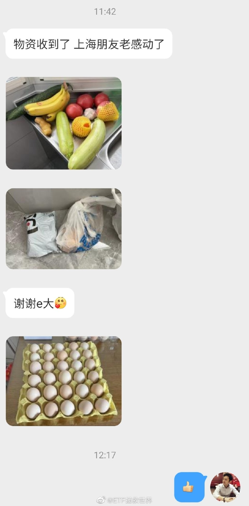

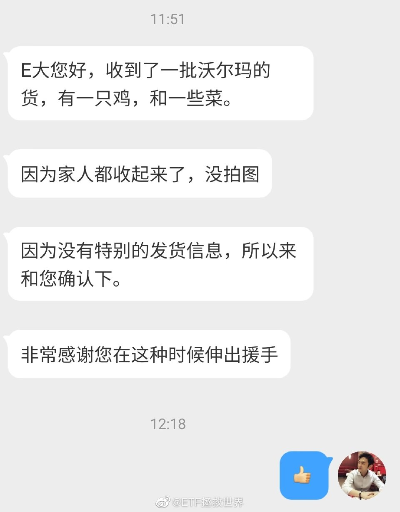

======================================================

ETF拯救世界 (5687069307) @
2022-04-15 14:12:38 Fri  
url: https://weibo.com/5687069307/LoynTqP8z

我说几句很多很多朋友会不认同的话。但这就是我真实的想法。

去迪士尼或者环球影城，如果多掏点钱，就可以买到速通卡，不用排两三个小时的队。

去医院看病，多掏点钱，可以去特需或者国际部优先就诊，不用起很早去排普通门诊。

有些人愿意用钱换时间，有些人的病很严重，一部分人愿意多掏点，就选择 ​​​

转发[89]  评论[771]  赞[4844] 

======================================================

ETF拯救世界 (5687069307) @
2022-04-15 17:59:15 Fri  
url: https://weibo.com/5687069307/LozRSv15Z

其实把钱给别人帮自己代买彩票的人，根本从心里就不相信自己会中。

------------------------------------------------------
转推：
>  @网易财经 (1974561081)
>  2022-04-15 17:30:03 Fri  
>  url: https:/weibo.com/1974561081/LozG1ylyt/

>  【西安一#男子中1001万大奖被冒领# ，获彩票归属权后再起诉体彩中心索赔】#男子1001万大奖被冒领起诉体彩中心# 4月15日，陕西西安。2019年7月，鄠邑区的姚先生通过微信转账委托投注站代买10注彩票，发现中了1001万大奖，但前往彩票店索要中奖彩票时却被店主王某告知，照片发错中奖彩票另有主人。当年9 ​​​

转发[16]  评论[147]  赞[1091] 

======================================================

ETF拯救世界 (5687069307) @
2022-04-15 19:48:31 Fri  
url: https://weibo.com/5687069307/LoAAem1LW

纯技术问题啊。请海外的朋友解答我的疑惑：

外国是如何规定电子游戏的。包括对成年人和未成年人的限制。包括分级，游戏时间限制，游戏上市审批限制等等。

不在海外的别瞎扯，否则别怪我拉黑。

客观帮忙解答问题，陈述事实即可，不用有任何评价或者别的。 ​​​

转发[23]  评论[184]  赞[1897] 

======================================================

ETF拯救世界 (5687069307) @
2022-04-15 20:43:00 Fri  
url: https://weibo.com/5687069307/LoAWls4Hg

消费小贴士：

本月18号开始又要发北京消费券了。连发6个月，京东可领。

限经纬度在北京的朋友。 ​​​

转发[37]  评论[303]  赞[2313] 

======================================================

ETF拯救世界 (5687069307) @
2022-04-16 09:11:44 Sat  
url: https://weibo.com/5687069307/LoFQg1ezT

不知道之前说我贩卖焦虑的人看了是何感想。 ​​​

转发[24]  评论[440]  赞[3098] 

+++++++++++++++++++++++++++++++++++++++++++++++++++++

图片：

======================================================

ETF拯救世界 (5687069307) @
2022-04-16 10:56:02 Sat  
url: https://weibo.com/5687069307/LoGwAD1DL

希望人民记住京东以及京东人做的这些事情。

------------------------------------------------------
转推：
>  @第一财经日报 (1926909715)
>  2022-04-15 23:05:52 Fri  
>  url: https:/weibo.com/1926909715/LoBSl01Cy/

>  【#京东回应自杀式物流支援上海##京东自杀式物流支援上海真相#】
>  近日，有消息称京东物流通过“自杀式物流”方式向上海运送物资，一批次京东小哥、小姐姐进入上海后需要就地隔离，接着下一批次小哥继续运输。消息称共有14批次小哥，通过循环实现每天都有物流运输。
>  据第一财经记者独家了解，上述信息部 ​​​

转发[290]  评论[764]  赞[5583] 

======================================================

ETF拯救世界 (5687069307) @
2022-04-16 19:40:58 Sat  
url: https://weibo.com/5687069307/LoJXFtubc

能想到两个可能：男的精神有问题；孩子不是亲生的。否则无法解释。

------------------------------------------------------
转推：
>  @sunwear (1865990891)
>  2022-04-16 16:47:39 Sat  
>  url: https:/weibo.com/1865990891/LoIPjmZYW/

>  粉丝私信发来的，看不下去了。有没有人知道发生在哪，哪的口音，有什么具体信息，这不是畜生吗？草。 @公安部刑侦局 http://t.cn/A66BJDot ​​​

转发[70]  评论[821]  赞[3499] 

======================================================

ETF拯救世界 (5687069307) @
2022-04-16 20:32:38 Sat  
url: https://weibo.com/5687069307/LoKiDiqZV

咖啡达人请推荐你觉得好的豆子。 ​​​

转发[153]  评论[879]  赞[2798] 

======================================================

ETF拯救世界 (5687069307) @
2022-04-18 09:51:38 Mon  
url: https://weibo.com/5687069307/LoYXrwmvP

科技信息这么挣扎我不喜欢。

一把干到4500让兄弟们再买点才是你正确的选择。 ​​​

转发[71]  评论[496]  赞[3005] 

======================================================

ETF拯救世界 (5687069307) @
2022-04-18 10:33:04 Mon  
url: https://weibo.com/5687069307/LoZegjWwL

长线仓位没有加仓霉霉的原因，主要是A股仓位问题。

目前A股60%多的仓位非常合适，如果算上可转债甚至有点超。如果加多了，以后消费买不买，医药买不买，科技买不买。这些品种可是已经进入建仓区域了。

前几天有朋友说，羡慕你们还有现金的。

对，为什么会还有那么多现金，是因为一直在克制欲望，以 ​​​

转发[397]  评论[465]  赞[3103] 

======================================================

ETF拯救世界 (5687069307) @
2022-04-18 10:41:10 Mon  
url: https://weibo.com/5687069307/LoZhydmFF

对霉霉感兴趣的朋友，请关注后续是否会跌破前低931。如果不跌破，那么这里就是一个极其标准的80%+双底。

------------------------------------------------------
转推：
>  @ETF拯救世界 (5687069307)
>  2022-04-18 10:33:04 Mon  
>  url: https:/weibo.com/5687069307/LoZegjWwL/

>  长线仓位没有加仓霉霉的原因，主要是A股仓位问题。
>  
>  目前A股60%多的仓位非常合适，如果算上可转债甚至有点超。如果加多了，以后消费买不买，医药买不买，科技买不买。这些品种可是已经进入建仓区域了。
>  
>  前几天有朋友说，羡慕你们还有现金的。
>  
>  对，为什么会还有那么多现金，是因为一直在克制欲望，以 ​​​

转发[209]  评论[386]  赞[2435] 

======================================================

ETF拯救世界 (5687069307) @
2022-04-18 10:52:34 Mon  
url: https://weibo.com/5687069307/LoZmb8LiP

很多男人的乐趣，就是买一堆各种各样的工具，

但实在是找不到地方使用，一直放着，

突然有一天有用了，很开心的拿出来用一下。

即使是安装拆卸一个螺丝，能用上买了很久的电动螺丝刀，也会猛男狂喜。

（没有说女性不喜欢的意思，因为本人男性，只了解部分男性的状态，不了解女性，望周知。respect ​​​

转发[97]  评论[668]  赞[3320] 

======================================================

ETF拯救世界 (5687069307) @
2022-04-18 11:07:25 Mon  
url: https://weibo.com/5687069307/LoZscDLqT

有多少人的心愿是有一个工具房，里面有各种工具，有空就去做个木工活，做点旧物件翻新之类工作的。

------------------------------------------------------
转推：
>  @ETF拯救世界 (5687069307)
>  2022-04-18 10:52:34 Mon  
>  url: https:/weibo.com/5687069307/LoZmb8LiP/

>  很多男人的乐趣，就是买一堆各种各样的工具，
>  
>  但实在是找不到地方使用，一直放着，
>  
>  突然有一天有用了，很开心的拿出来用一下。
>  
>  即使是安装拆卸一个螺丝，能用上买了很久的电动螺丝刀，也会猛男狂喜。
>  
>  （没有说女性不喜欢的意思，因为本人男性，只了解部分男性的状态，不了解女性，望周知。respect ​​​

转发[49]  评论[591]  赞[2376] 

======================================================

ETF拯救世界 (5687069307) @
2022-04-18 14:48:17 Mon  
url: https://weibo.com/5687069307/Lp0TRb8Qo

今天易方达信息如果能涨2.7%以上我会觉得比较满意。 ​​​

转发[47]  评论[380]  赞[2666] 

======================================================

ETF拯救世界 (5687069307) @
2022-04-19 09:31:30 Tue  
url: https://weibo.com/5687069307/Lp8fMbIi8

3.26%。一朵小红花。

------------------------------------------------------
转推：
>  @ETF拯救世界 (5687069307)
>  2022-04-18 14:48:17 Mon  
>  url: https:/weibo.com/5687069307/Lp0TRb8Qo/

>  今天易方达信息如果能涨2.7%以上我会觉得比较满意。 ​​​

转发[18]  评论[551]  赞[2771] 

======================================================

ETF拯救世界 (5687069307) @
2022-04-19 21:34:51 Tue  
url: https://weibo.com/5687069307/LpcZnnqIA

有没有一种可能，usd对rmb汇率涨叠加恒生中概涨，双击呢。

就当我做个美梦吧… ​​​

转发[82]  评论[633]  赞[2822] 

+++++++++++++++++++++++++++++++++++++++++++++++++++++

图片：

======================================================

ETF拯救世界 (5687069307) @
2022-04-20 08:45:57 Wed  
url: https://weibo.com/5687069307/LphnMhGUI

这个问题之前说过了。

不要在原计划高位加仓，否则全乱了。

新开一个，只买便宜货。 ​​​

转发[46]  评论[294]  赞[2183] 

+++++++++++++++++++++++++++++++++++++++++++++++++++++

图片：

======================================================

ETF拯救世界 (5687069307) @
2022-04-20 09:04:40 Wed  
url: https://weibo.com/5687069307/LphvnffoZ

通利分红选现金 ​​​

转发[8]  评论[322]  赞[1949] 

======================================================

ETF拯救世界 (5687069307) @
2022-04-20 10:14:00 Wed  
url: https://weibo.com/5687069307/LphXw720N

这一把跌下去算什么，送温暖吗。

表格稍后更新。 ​​​

转发[24]  评论[929]  赞[3009] 

======================================================

ETF拯救世界 (5687069307) @
2022-04-20 13:59:42 Wed  
url: https://weibo.com/5687069307/Lpjr8pW5O

创业板指又新低了。为什么它先新低呢。

2020年初，宁德在它的权重中只有6%，第三大权重股。

然后宁德一路拉升，创业板指一路增加权重。到了去年底，权重17%。

牛市加仓，一把赔光。

懂了伐。 ​​​

转发[151]  评论[537]  赞[3075] 

======================================================

ETF拯救世界 (5687069307) @
2022-04-20 16:05:25 Wed  
url: https://weibo.com/5687069307/Lpkg9zYBO

这几天事情非常多，需要我处理，发博比较少。

一会抽空跑一下数据，有惊喜的话会说一声。 ​​​

转发[7]  评论[332]  赞[2295] 

======================================================

ETF拯救世界 (5687069307) @
2022-04-20 16:35:28 Wed  
url: https://weibo.com/5687069307/Lpksm3NDk

回复@给菲菲摘月亮嘛:一个品种，你的持仓收益率接近50%。某天回调3个点，你说“亏了3个点”，让人感觉像个不适合投资股市的人。//@给菲菲摘月亮嘛:红利要卖么[单身狗]今天亏三个点

------------------------------------------------------
转推：
>  @ETF拯救世界 (5687069307)
>  2022-04-20 13:59:42 Wed  
>  url: https:/weibo.com/5687069307/Lpjr8pW5O/

>  创业板指又新低了。为什么它先新低呢。
>  
>  2020年初，宁德在它的权重中只有6%，第三大权重股。
>  
>  然后宁德一路拉升，创业板指一路增加权重。到了去年底，权重17%。
>  
>  牛市加仓，一把赔光。
>  
>  懂了伐。 ​​​

转发[17]  评论[148]  赞[1451] 

======================================================

ETF拯救世界 (5687069307) @
2022-04-20 16:46:52 Wed  
url: https://weibo.com/5687069307/LpkwZ2vKs

这两天发博比较少，有人说，是不是跌的我也害怕了。

我真的大无语。

如果你看过公众号那个春节特辑，看看过去十年历次市场情绪最低落，每次绝大多数人崩溃的时候我说了什么做了什么，

你也说不出这种话。

哪怕没看过，翻翻这两年的微博公众号也行啊。

你记住，即使所有人崩溃，我也一定是最后一个 ​​​

转发[34]  评论[449]  赞[2756] 

======================================================

ETF拯救世界 (5687069307) @
2022-04-20 16:54:14 Wed  
url: https://weibo.com/5687069307/LpkzYjT7v

今天数据没有什么惊喜。但这个图我必须更新一下。

看创业板。

终于从外太空回来了。 ​​​

转发[377]  评论[347]  赞[2453] 

+++++++++++++++++++++++++++++++++++++++++++++++++++++

图片：
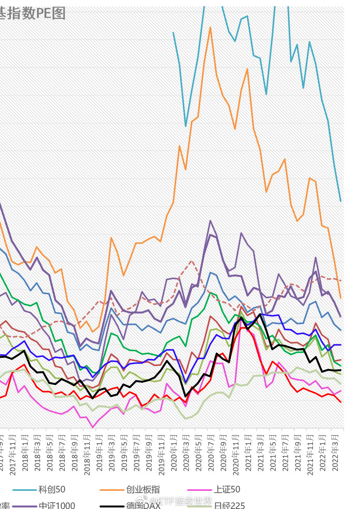

======================================================

ETF拯救世界 (5687069307) @
2022-04-20 17:02:13 Wed  
url: https://weibo.com/5687069307/LpkDdh6iH

回复@CalmoOOo:你说对了。历次市场大底，全都是所有指数估值大致回归同一区域。然后牛市中又大幅分化。换句话说，每次都是大概率所有板块都挤干净水分才见底。 http://t.cn/A66eKt2W //@CalmoOOo:看线趋势有一种感觉，不同颜色的线又将奔赴同一个坑位（是感觉[杰瑞]

------------------------------------------------------
转推：
>  @ETF拯救世界 (5687069307)
>  2022-04-20 16:54:14 Wed  
>  url: https:/weibo.com/5687069307/LpkzYjT7v/

>  今天数据没有什么惊喜。但这个图我必须更新一下。
>  
>  看创业板。
>  
>  终于从外太空回来了。 ​​​

转发[223]  评论[233]  赞[1637] 

======================================================

ETF拯救世界 (5687069307) @
2022-04-20 17:12:07 Wed  
url: https://weibo.com/5687069307/LpkHejKgp

这么多年了，可能老朋友已经基本了解我处理事情的流程了。

首先，是把结果想到尽可能的坏。然后为最坏的结果做准备。生活上也好，投资上也好，都是如此。我不相信任何人或者机构一定能照顾好我，所以我要保证的是自己能尽量照顾好自己。

对未来可能发生的各种可能做准备，做计划，执行。

其次，人生 ​​​

转发[349]  评论[521]  赞[3421] 

======================================================

ETF拯救世界 (5687069307) @
2022-04-20 17:37:03 Wed  
url: https://weibo.com/5687069307/LpkRlDmX6

刚才有朋友在评论里问，如果某件事发生了，如何配置仓位。

这个很复杂，不是很简单就能说清楚的。

首先会不会发生，这是一个问题。第二要看市场已经把多少概率的预期跌出来了。

当然，最重要的，是一旦真的发生，可能未来5-10年，甚至更长时间的部分投资逻辑会发生变化。一定是要做一些避险动作的。 ​​​

转发[49]  评论[210]  赞[2085] 

======================================================

ETF拯救世界 (5687069307) @
2022-04-20 17:49:40 Wed  
url: https://weibo.com/5687069307/LpkWthFS9

其实有个问题你想过没有，就是你到底应该不应该投资金融市场。

这里面分两种情况。第一是你没钱，第二是你有一定资产。

把钱都花光的朋友也不能说一点道理都没有。谁知道明天怎么样呢，吃了喝了买了才是自己的。

但你有没有想过，如果没事呢。又或者有事。其实无论有事没事，没钱的人始终是最惨的。 ​​​

转发[177]  评论[384]  赞[2719] 

======================================================

ETF拯救世界 (5687069307) @
2022-04-20 18:11:01 Wed  
url: https://weibo.com/5687069307/Lpl58tQ0I

微博网页版，点击“展开全文”，直接给开一个新窗口。

是哪个大聪明这么改的。有没有去看医生，医生怎么说。 ​​​

转发[15]  评论[190]  赞[1626] 

======================================================

ETF拯救世界 (5687069307) @
2022-04-20 18:37:17 Wed  
url: https://weibo.com/5687069307/LplfNuMQ2

证券交易印花税1067亿元，同比增长21.3%。

------------------------------------------------------
转推：
>  @财联社APP (2868676035)
>  2022-04-20 18:20:39 Wed  
>  url: https:/weibo.com/2868676035/Lpl935XsT/

>  【财政部：#一季度证券交易印花税1067亿元# 同比增长21.3%】财联社4月20日电，财政部数据显示，一季度，全国一般公共预算收入62037亿元，同比增长8.6%。其中，中央一般公共预算收入28949亿元，同比增长7.6%；地方一般公共预算本级收入33088亿元，同比增长9.5%。全国税收收入52452亿元，同比增长7.7%； ​​​

转发[51]  评论[231]  赞[1855] 

======================================================

ETF拯救世界 (5687069307) @
2022-04-20 19:25:20 Wed  
url: https://weibo.com/5687069307/LplziCOPd

19:24，亲测已修复。别折腾了，踏踏实实的别乱改了。

------------------------------------------------------
转推：
>  @ETF拯救世界 (5687069307)
>  2022-04-20 18:11:01 Wed  
>  url: https:/weibo.com/5687069307/Lpl58tQ0I/

>  微博网页版，点击“展开全文”，直接给开一个新窗口。
>  
>  是哪个大聪明这么改的。有没有去看医生，医生怎么说。 ​​​

转发[6]  评论[124]  赞[1388] 

======================================================

ETF拯救世界 (5687069307) @
2022-04-21 10:01:31 Thu  
url: https://weibo.com/5687069307/LpriWxBfR

奈飞几个月时间，价格从700跌到了200多，抹平4年涨幅。

有没有让你意识到一件事，

无脑长期持股不适合所有股票，甚至不适合绝大多数品种。

什么时候退出，是极其重要的一件事。

包括我们交易过的所有品种，回看历史，也会有更深的理解。 ​​​

转发[207]  评论[407]  赞[2910] 

======================================================

ETF拯救世界 (5687069307) @
2022-04-21 10:13:12 Thu  
url: https://weibo.com/5687069307/LprnGysYm

但是止盈这个问题并不是那么容易解决。

你别看网上到处都有人吹自己如何高位跑掉，实际上非常难。一亿股民里面，瞎猫碰到死耗子跑一两百万也是正常，下次他们还能跑吗？很难讲。

为什么说不容易，你可以看所有知名的公募私募基金。他们有没有跑掉。按理说，他们都是经过十几年市场考验的老兵。但如果 ​​​

转发[218]  评论[458]  赞[2670] 

======================================================

ETF拯救世界 (5687069307) @
2022-04-21 10:23:58 Thu  
url: https://weibo.com/5687069307/Lprs3AQS3

有朋友说，看估值啊。

股票不说了，那就不是一般人能判断的。我说句实话，90%的公司，连自己的董事长都不知道五年后自己的公司什么样，你一个局外人要判断十年后的公司价值，再判断到时候市场给的情绪，只能说祝福吧。

指数呢。指数估值稍微简单一点。基本上A股的历史大致就是20-70之间波动。

好， ​​​

转发[358]  评论[364]  赞[2983] 

======================================================

ETF拯救世界 (5687069307) @
2022-04-21 10:27:17 Thu  
url: https://weibo.com/5687069307/LprtpfAkJ

回复@海栗ETF:更有甚者，大多数董事长都不知道第二天自己是不是就要“另有任用”了//@海栗ETF:90%的公司，连自己的董事长都不知道五年后自己的公司什么样  太对了

------------------------------------------------------
转推：
>  @ETF拯救世界 (5687069307)
>  2022-04-21 10:23:58 Thu  
>  url: https:/weibo.com/5687069307/Lprs3AQS3/

>  有朋友说，看估值啊。
>  
>  股票不说了，那就不是一般人能判断的。我说句实话，90%的公司，连自己的董事长都不知道五年后自己的公司什么样，你一个局外人要判断十年后的公司价值，再判断到时候市场给的情绪，只能说祝福吧。
>  
>  指数呢。指数估值稍微简单一点。基本上A股的历史大致就是20-70之间波动。
>  
>  好， ​​​

转发[25]  评论[118]  赞[1147] 

======================================================

ETF拯救世界 (5687069307) @
2022-04-21 10:32:10 Thu  
url: https://weibo.com/5687069307/LprvopnJ0

回复@呜啦啦123ppjjgg:如果有人整天没事干，就是聚在一起骂一个遵纪守法，没做过伤天害理事情的人，那只能说明这些人的生活（），这些人的品质（），这些人的心态（），这些人的人生（）//@呜啦啦123ppjjgg:有一个群有几个人专业骂你，我退群了。。。

------------------------------------------------------
转推：
>  @ETF拯救世界 (5687069307)
>  2022-04-21 10:23:58 Thu  
>  url: https:/weibo.com/5687069307/Lprs3AQS3/

>  有朋友说，看估值啊。
>  
>  股票不说了，那就不是一般人能判断的。我说句实话，90%的公司，连自己的董事长都不知道五年后自己的公司什么样，你一个局外人要判断十年后的公司价值，再判断到时候市场给的情绪，只能说祝福吧。
>  
>  指数呢。指数估值稍微简单一点。基本上A股的历史大致就是20-70之间波动。
>  
>  好， ​​​

转发[10]  评论[174]  赞[1456] 

======================================================

ETF拯救世界 (5687069307) @
2022-04-21 10:44:41 Thu  
url: https://weibo.com/5687069307/LprAtrfPg

对于被骂这件事，我这两年就有很多新的感想，分享给你。

一个人为什么会被别人骂呢。究其原因，无非是几个，

做了坏事，说了错话，招人嫉妒，观点不同……

然而根本原因，是很多人在用“完美”，“圣人”的要求去审视别人。

这个人不能有任何错误，不能说任何错话，事业不可以出现波折，感情一定要 ​​​

转发[118]  评论[399]  赞[2726] 

======================================================

ETF拯救世界 (5687069307) @
2022-04-21 11:01:05 Thu  
url: https://weibo.com/5687069307/LprH7CKpw

两融数据更新：

依然有1.6万亿以上。另外据我所知，现在很多私募已经跌到预警或止损线了。

越接近坑边，压力越大。 ​​​

转发[116]  评论[341]  赞[2507] 

+++++++++++++++++++++++++++++++++++++++++++++++++++++

图片：

======================================================

ETF拯救世界 (5687069307) @
2022-04-21 11:11:37 Thu  
url: https://weibo.com/5687069307/LprLp1gjm

为了表达对医药9500的敬意，长线以及波段仓位外，我会买一份致敬仓位。

依然会贴出来。完成一个知行合一的动作。 ​​​

转发[249]  评论[543]  赞[3175] 

======================================================

ETF拯救世界 (5687069307) @
2022-04-21 11:19:01 Thu  
url: https://weibo.com/5687069307/LprOp6nSB

回复@困惑蜗牛想改名:只要不反弹，会很精彩的一天。期待。//@困惑蜗牛想改名:今天看着像是数据会好看的一天。

------------------------------------------------------
转推：
>  @ETF拯救世界 (5687069307)
>  2022-04-21 11:11:37 Thu  
>  url: https:/weibo.com/5687069307/LprLp1gjm/

>  为了表达对医药9500的敬意，长线以及波段仓位外，我会买一份致敬仓位。
>  
>  依然会贴出来。完成一个知行合一的动作。 ​​​

转发[18]  评论[149]  赞[1437] 

======================================================

ETF拯救世界 (5687069307) @
2022-04-21 11:24:24 Thu  
url: https://weibo.com/5687069307/LprQB4bC9

一个月，又买了回来。不知道这一次的16%会等多久？

------------------------------------------------------
转推：
>  @ETF拯救世界 (5687069307)
>  2022-03-23 09:40:16 Wed  
>  url: https:/weibo.com/5687069307/Ll1LVco1L/

>  本网六个交易日收益16%。
>  
>  市场会奖励意志坚定的士兵。 ​​​

转发[22]  评论[496]  赞[2591] 

======================================================

ETF拯救世界 (5687069307) @
2022-04-21 13:54:56 Thu  
url: https://weibo.com/5687069307/LpsPGEWul

新低的时候就不要总是觉得是底了。

新低后面大概率还是新低，所以不用急，让它走，走出来再说。

不要没完没了的买，空间时间给出来。家里没矿，注意节奏。 ​​​

转发[238]  评论[585]  赞[3690] 

======================================================

ETF拯救世界 (5687069307) @
2022-04-21 14:08:21 Thu  
url: https://weibo.com/5687069307/LpsV8oNQ8

我的日常 ​​​

转发[61]  评论[463]  赞[2841] 

+++++++++++++++++++++++++++++++++++++++++++++++++++++

图片：

======================================================

ETF拯救世界 (5687069307) @
2022-04-21 14:17:37 Thu  
url: https://weibo.com/5687069307/LpsYUbanL

说真的不是很理解，是因为这个事情吗。

看样子不是啊。 ​​​

转发[36]  评论[481]  赞[2481] 

+++++++++++++++++++++++++++++++++++++++++++++++++++++

图片：
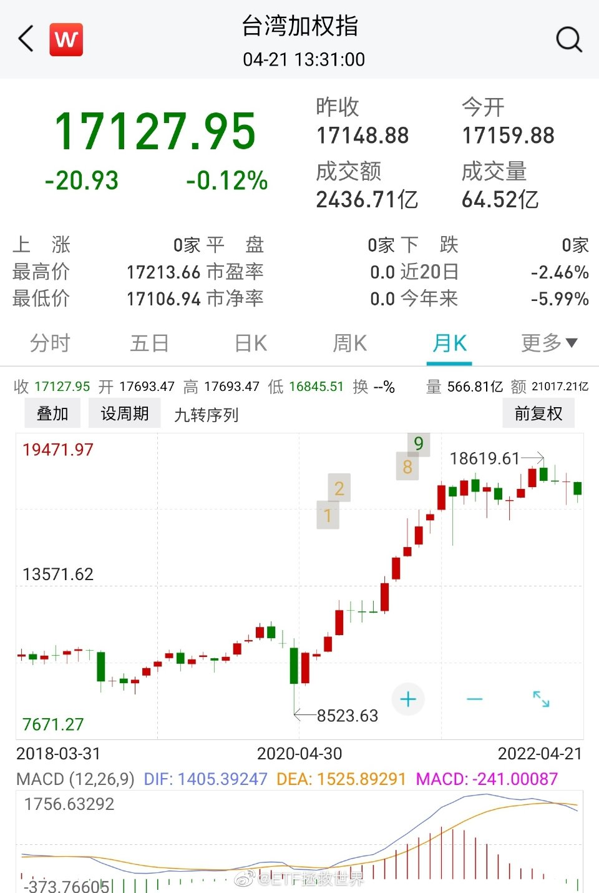

======================================================

ETF拯救世界 (5687069307) @
2022-04-21 15:38:25 Thu  
url: https://weibo.com/5687069307/LptvH86vp

今天数据出来了。

我不想说太多。只说一句。

也许你没钱买了，也许你持仓很难受。但相信我，

不要卖。

除非你非常有信心能够在短时间内以更低的价格买回来。

否则，

你极有可能，也许就是在下半年，会非常后悔。

我不敢说一定，但大概率。

好好看看手里的不会死的品种，如果不贵了，真的，别卖 ​​​

转发[341]  评论[1320]  赞[4823] 

======================================================

ETF拯救世界 (5687069307) @
2022-04-21 15:48:03 Thu  
url: https://weibo.com/5687069307/LptzC1O2c

这几天的下跌，已经把长线计划的加仓空间跌出来了。

准备开始加仓了。 ​​​

转发[73]  评论[643]  赞[3350] 

======================================================

ETF拯救世界 (5687069307) @
2022-04-21 15:56:17 Thu  
url: https://weibo.com/5687069307/LptCWAI7H

目前市场上依然保持相对高位的，还是那些这两年的抱团品种。

消费（主要是食品饮料）、新能源（环保）、军工、部分医疗。

大多数股票，以及医药、科技信息已经调整到非常不错的位置。

会按照之前设定的点位，有序买入。

现在说钻石坑还差那么一点点。我比较好奇的是这次市场会给多大的机会。 ​​​

转发[232]  评论[449]  赞[2956] 

======================================================

ETF拯救世界 (5687069307) @
2022-04-21 15:59:26 Thu  
url: https://weibo.com/5687069307/LptEe6bmi

我个人认为，如果以80%仓位为A股上限，

那么，目前以中性仓位为65%左右为界，激进、保守上下浮动15%以内，会是不错的配置。 ​​​

转发[317]  评论[499]  赞[3125] 

======================================================

ETF拯救世界 (5687069307) @
2022-04-21 16:39:54 Thu  
url: https://weibo.com/5687069307/LptUEm0nI

生活小贴士：

春天到了，北方很干燥。集美们不要忘了做面膜。

有些面膜不是会有两层吗，一层面膜还有一层有点硬的那个不知道叫什么。

我的建议，不要浪费，你贴面膜，把另一层给老公，让他贴上。

男人也需要保养。 ​​​

转发[22]  评论[603]  赞[2781] 

======================================================

ETF拯救世界 (5687069307) @
2022-04-21 18:10:55 Thu  
url: https://weibo.com/5687069307/LpuvAFaD0

儿子说同桌的女同学很多东西都带两份。

美术课的水彩笔啊，勾线笔啊，铅笔橡皮签字笔啊。

儿子问她为什么带两份，

同桌说怕他忘了带给他准备的。

老父亲在那一瞬间想起了小学时候欺负自己的女同桌，哇的一声哭了出来。 ​​​

转发[30]  评论[625]  赞[3918] 

======================================================

ETF拯救世界 (5687069307) @
2022-04-22 07:53:17 Fri  
url: https://weibo.com/5687069307/LpzTonQSo

今天会卖一个品种（不断新高的），确定的。

不确定的是，如果拉升就不买。如果继续跌就买一个品种。

非常期待今天的走势。 ​​​

转发[36]  评论[675]  赞[2729] 

======================================================

ETF拯救世界 (5687069307) @
2022-04-22 08:20:50 Fri  
url: https://weibo.com/5687069307/LpA4zz0qs

我个人支持注册制。想上就上有多少上多少，股多钱少，到处都是钻石，总比全都70/80倍没法买好。

至于个人打新亏钱，太正常了。你愿意高价接盘，人家公司要募集5亿，你举着钱送过去，大幅溢价，超募50亿，然后你赔钱，你怪谁？谁逼着你打新了？新股不败本来就是计划体制下的畸形产物。

但有两点，一定 ​​​

转发[80]  评论[341]  赞[2740] 

======================================================

ETF拯救世界 (5687069307) @
2022-04-22 09:45:46 Fri  
url: https://weibo.com/5687069307/LpAD39tgo

其实恐惧来自于未知。

黑暗、突发、感官刺激……就会让人产生恐惧。

这个市场上大多数，或者绝大多数人，其实就是蒙着眼睛在黑夜里爬山。目前的状态，对他们来说，就是失控状态。

不知道前方是平地还是悬崖，不知道这一脚踩空要落到哪里，不知道深渊有多深。

只要你大概知道极限是哪个区域，并为之 ​​​

转发[139]  评论[490]  赞[2895] 

======================================================

ETF拯救世界 (5687069307) @
2022-04-22 09:52:02 Fri  
url: https://weibo.com/5687069307/LpAFAEbnD

我不是不支持抱团，

我是不支持你们抱团我没有的品种。[哼] ​​​

转发[38]  评论[400]  赞[2950] 

======================================================

ETF拯救世界 (5687069307) @
2022-04-22 10:04:18 Fri  
url: https://weibo.com/5687069307/LpAKzsINr

合作好过对抗。

昨晚翻了这几十年的历史书，我得出一个结论。 ​​​

转发[42]  评论[364]  赞[2862] 

======================================================

ETF拯救世界 (5687069307) @
2022-04-22 10:09:17 Fri  
url: https://weibo.com/5687069307/LpAMB3Y32

感觉又要被偷家，现阶段我很惆怅。

------------------------------------------------------
转推：
>  @ETF拯救世界 (5687069307)
>  2022-04-22 07:53:17 Fri  
>  url: https:/weibo.com/5687069307/LpzTonQSo/

>  今天会卖一个品种（不断新高的），确定的。
>  
>  不确定的是，如果拉升就不买。如果继续跌就买一个品种。
>  
>  非常期待今天的走势。 ​​​

转发[14]  评论[237]  赞[1671] 

======================================================

ETF拯救世界 (5687069307) @
2022-04-22 10:22:53 Fri  
url: https://weibo.com/5687069307/LpAS7fLRR

我不知道有几位能体会到我的感觉。

就是从估值到技术，想买的品种直奔自己的目标价位。然后自己已经买了一点点，终于有机会在理想价位买更多。

就是一种想笑的感觉。 ​​​

转发[49]  评论[509]  赞[3108] 

======================================================

ETF拯救世界 (5687069307) @
2022-04-22 10:29:27 Fri  
url: https://weibo.com/5687069307/LpAUMqusS

数学题：

一个品种，你买了1000块，下跌了20%。你再买1000块，账面浮亏幅度变成多少，再涨多少你可以回本： ​​​

转发[111]  评论[599]  赞[2957] 

======================================================

ETF拯救世界 (5687069307) @
2022-04-22 11:17:01 Fri  
url: https://weibo.com/5687069307/LpBe5uYaI

今天都在传一张图，2008年4月23日的3000点保卫战。

当个段子看看就行了，事实没那么简单。

上证综指之前的编制方式有很大问题。可惜，从上到下没有人在意这个。去年终于改了。

实际上2008年4月23日到现在：

深证综指上涨98%；

沪深300全收益上涨49.56%；

中证500全收益上涨90.48%；

中证红利全 ​​​

转发[528]  评论[446]  赞[3554] 

======================================================

ETF拯救世界 (5687069307) @
2022-04-22 11:27:56 Fri  
url: https://weibo.com/5687069307/LpBiwhjKz

微博的点赞太有问题了，刚才发现不知道怎么回事就点了几个看过微博的赞，赶紧取消了。

我必须声明：由于误点概率太大，我微博的所有点赞都可能不是我的本意。 ​​​

转发[11]  评论[343]  赞[2963] 

======================================================

ETF拯救世界 (5687069307) @
2022-04-22 11:49:02 Fri  
url: https://weibo.com/5687069307/LpBr5B3Pm

回复@liuzhicheng10:这一轮已经不是普涨了。看2015年15000点的中证1000，涨到8000多点就跌回来了。但消费医药红利全都创了历史新高。A股永远没有所有股票的普涨了。//@liuzhicheng10:我觉得a股已经不会有以前那种普涨的顶峰了

------------------------------------------------------
转推：
>  @ETF拯救世界 (5687069307)
>  2022-04-22 11:17:01 Fri  
>  url: https:/weibo.com/5687069307/LpBe5uYaI/

>  今天都在传一张图，2008年4月23日的3000点保卫战。
>  
>  当个段子看看就行了，事实没那么简单。
>  
>  上证综指之前的编制方式有很大问题。可惜，从上到下没有人在意这个。去年终于改了。
>  
>  实际上2008年4月23日到现在：
>  
>  深证综指上涨98%；
>  
>  沪深300全收益上涨49.56%；
>  
>  中证500全收益上涨90.48%；
>  
>  中证红利全 ​​​

转发[76]  评论[128]  赞[1623] 

======================================================

ETF拯救世界 (5687069307) @
2022-04-22 11:54:39 Fri  
url: https://weibo.com/5687069307/LpBtmvRs9

既然都跌下来了，我就再说一个点位。

中证500好价4800-4900左右。如果能到，中小仓位配置不够的一定补足。 ​​​

转发[714]  评论[862]  赞[3703] 

======================================================

ETF拯救世界 (5687069307) @
2022-04-22 12:04:19 Fri  
url: https://weibo.com/5687069307/LpBxi07HN

老师奖励给儿子的鸭舌好好吃。

一不小心吃光了。

他放学回来怎么解释，慌乱中。 ​​​

转发[15]  评论[836]  赞[4540] 

======================================================

ETF拯救世界 (5687069307) @
2022-04-22 14:08:42 Fri  
url: https://weibo.com/5687069307/LpClM6HJN

另外还有一个数据，2008年4月23的全市场估值，比目前贵38%。也就是说，上面这些涨幅，是消化了38%的估值后取得的。

------------------------------------------------------
转推：
>  @ETF拯救世界 (5687069307)
>  2022-04-22 11:17:01 Fri  
>  url: https:/weibo.com/5687069307/LpBe5uYaI/

>  今天都在传一张图，2008年4月23日的3000点保卫战。
>  
>  当个段子看看就行了，事实没那么简单。
>  
>  上证综指之前的编制方式有很大问题。可惜，从上到下没有人在意这个。去年终于改了。
>  
>  实际上2008年4月23日到现在：
>  
>  深证综指上涨98%；
>  
>  沪深300全收益上涨49.56%；
>  
>  中证500全收益上涨90.48%；
>  
>  中证红利全 ​​​

转发[103]  评论[236]  赞[1953] 

======================================================

ETF拯救世界 (5687069307) @
2022-04-22 14:32:19 Fri  
url: https://weibo.com/5687069307/LpCvmqagu

有朋友问，现在什么环境啊，什么情况啊，有什么利好啊，都是利空，还买？等有好消息再说吧。

是，这位朋友说的没错。确实坏消息一堆。但我这些年有个心得，

就是吧，股票这个东西，它不是有好消息才涨，有坏消息才跌。

它有个提前量。

具体这个提前量是怎么出来的，我也不知道。就是说会有一批先知 ​​​

转发[192]  评论[590]  赞[3530] 

======================================================

ETF拯救世界 (5687069307) @
2022-04-22 19:53:47 Fri  
url: https://weibo.com/5687069307/LpEBQCfbx

今天卖出的一份油气，各位平均收益率是62%。 ​​​

转发[25]  评论[744]  赞[3618] 

======================================================

ETF拯救世界 (5687069307) @
2022-04-22 22:40:01 Fri  
url: https://weibo.com/5687069307/LpFHjAhrK

感觉美科技股就靠苹果撑着了。

FANNG里面，脸书奈飞腰斩，谷歌月线不吉，亚马逊不知所谓。 

只有消费才是yyds ​​​

转发[46]  评论[344]  赞[2211] 

+++++++++++++++++++++++++++++++++++++++++++++++++++++

图片：

======================================================

ETF拯救世界 (5687069307) @
2022-04-24 08:35:36 Sun  
url: https://weibo.com/5687069307/LpT1z5mvd

我突然有一个想法。

你说，现在动不动就封城。一封就是一两个月，但是好像也没说日子过不下去。

那么问题来了，

我们的各种假期，为什么一定要借工作日凑数？你就干脆多放一两天，真能怎么着吗？好歹比封城还能多拉动一些消费是不是。

有点不理解。 ​​​

转发[173]  评论[1689]  赞[8028] 

======================================================

ETF拯救世界 (5687069307) @
2022-04-24 18:54:20 Sun  
url: https://weibo.com/5687069307/LpX4IhZFW

内事不决问博友：

请户外小能人推荐居家旅行必备的帐篷品牌型号。

三季即可。不用两室一厅，不用非常便携，要透气防晒，可带天幕，要方便拆搭。 ​​​

转发[155]  评论[437]  赞[2064] 

======================================================

ETF拯救世界 (5687069307) @
2022-04-24 21:23:16 Sun  
url: https://weibo.com/5687069307/LpY3a0yTG

有人说赶紧囤东西，有人说平台运力不够了，

我说我不跟大家抢，不挤占有限的资源，要把资源留给更需要的人。

不是因为我觉悟高，

是因为我早就囤完了。

照顾好自己，不给大家添乱。 ​​​

转发[30]  评论[496]  赞[3135] 

======================================================

ETF拯救世界 (5687069307) @
2022-04-25 07:33:28 Mon  
url: https://weibo.com/5687069307/Lq22Q7gtP

不提前准备，有疫情了，别人抢你也抢还有一个问题：

无论是线上还是线下，

是不是交叉感染的风险变大了？ ​​​

转发[21]  评论[300]  赞[2706] 

======================================================

ETF拯救世界 (5687069307) @
2022-04-25 08:52:32 Mon  
url: https://weibo.com/5687069307/Lq2yW1eSf

冒着枪林弹雨跑单帮赚钱我还能理解，

高价倒卖救灾捐赠物资直接震惊了。

这不依法判个十年八年能说的过去？ ​​​

转发[47]  评论[421]  赞[3702] 

======================================================

ETF拯救世界 (5687069307) @
2022-04-25 09:10:22 Mon  
url: https://weibo.com/5687069307/Lq2Gb6JHj

我觉得很多朋友始终没有建立一种概率思维。

我看有些朋友说，相信什么什么，一定能保证没事。

这就是说，把自己的所有希望寄托在，自认为是100%能照顾好自己的机构或者组织或者某些人身上。

但我觉得这个恐怕不是100%。世界上100%的事情很少很少，这个恐怕不能算。

很多东西的概率也是要随时变化的 ​​​

转发[121]  评论[282]  赞[2457] 

======================================================

ETF拯救世界 (5687069307) @
2022-04-25 09:31:10 Mon  
url: https://weibo.com/5687069307/Lq2OCbioh

截至一季度末，宁***被1485只基金重仓持有，持仓市值为1103.7亿元，为公募基金第一大重仓股。

非常有意思，三月底宁就是基金第一重仓了。但四月又跌了22%。

那么，4月是谁在卖？

如果已经是第一重仓了，那么还有多少钱来买？ ​​​

转发[39]  评论[201]  赞[2009] 

======================================================

ETF拯救世界 (5687069307) @
2022-04-25 09:36:02 Mon  
url: https://weibo.com/5687069307/Lq2QArS1v

希望本月有机会完成信息科技的左侧部分买入。 ​​​

转发[49]  评论[369]  赞[2551] 

======================================================

ETF拯救世界 (5687069307) @
2022-04-25 09:47:26 Mon  
url: https://weibo.com/5687069307/Lq2VdngC1

因为上证的编制方式有变化，所以也许不太准，

但如果按照历史模型的角度讲，上证2800是一个非常非常扎实的底部点位。 ​​​

转发[188]  评论[452]  赞[3088] 

======================================================

ETF拯救世界 (5687069307) @
2022-04-25 09:54:47 Mon  
url: https://weibo.com/5687069307/Lq2Ycqmq7

目前两市融资额依然在1.5万亿以上。

除了小部分套保，其它都是加杠杆炒股的。 ​​​

转发[81]  评论[314]  赞[2517] 

+++++++++++++++++++++++++++++++++++++++++++++++++++++

图片：

======================================================

ETF拯救世界 (5687069307) @
2022-04-25 10:10:02 Mon  
url: https://weibo.com/5687069307/Lq34obApD

霉霉今天波段最后一次买入，接下来向下不会再买。

这一网如果卖出，收益率是18%。 ​​​

转发[58]  评论[439]  赞[2786] 

======================================================

ETF拯救世界 (5687069307) @
2022-04-25 10:25:09 Mon  
url: https://weibo.com/5687069307/Lq3awurBM

手里有钱的不用急着抄底。时间空间一定要拉开，不要让成本大量堆积在一个非底部区域。 ​​​

转发[142]  评论[550]  赞[3675] 

======================================================

ETF拯救世界 (5687069307) @
2022-04-25 10:25:58 Mon  
url: https://weibo.com/5687069307/Lq3aRdQJX

我觉得3000点被很多人看作一个标志，所以可能有人会做事。

瞎猜的，没有操作指导意义。 ​​​

转发[65]  评论[324]  赞[2906] 

======================================================

ETF拯救世界 (5687069307) @
2022-04-25 10:36:56 Mon  
url: https://weibo.com/5687069307/Lq3fjfqWO

中证1000已经领先所有指数率先到达历史模型低位。 ​​​

转发[77]  评论[276]  赞[3061] 

======================================================

ETF拯救世界 (5687069307) @
2022-04-25 11:07:51 Mon  
url: https://weibo.com/5687069307/Lq3rRgaaB

3001，做事了。

------------------------------------------------------
转推：
>  @ETF拯救世界 (5687069307)
>  2022-04-25 10:25:58 Mon  
>  url: https:/weibo.com/5687069307/Lq3aRdQJX/

>  我觉得3000点被很多人看作一个标志，所以可能有人会做事。
>  
>  瞎猜的，没有操作指导意义。 ​​​

转发[34]  评论[419]  赞[2808] 

======================================================

ETF拯救世界 (5687069307) @
2022-04-25 11:27:11 Mon  
url: https://weibo.com/5687069307/Lq3zHztvm

你猜我会不会把它买回来。

这，就是波段。 ​​​

转发[29]  评论[574]  赞[3275] 

+++++++++++++++++++++++++++++++++++++++++++++++++++++

图片：

======================================================

ETF拯救世界 (5687069307) @
2022-04-25 13:46:54 Mon  
url: https://weibo.com/5687069307/Lq4uqeFVr

消费为什么能高高在上特立独行。

我想了三天三夜也没想明白。 ​​​

转发[21]  评论[425]  赞[2707] 

======================================================

ETF拯救世界 (5687069307) @
2022-04-25 13:58:07 Mon  
url: https://weibo.com/5687069307/Lq4yYpbot

我给各位朋友的建议：

第一类：已经早早做好心理准备的，攒了很多钱准备买的，继续看盘。看着指数一步步向你的目标跌去。

第二类：以为自己做好准备结果发现自己没有做好准备的，已经慌了的，心情已经被股市弄得很糟的，关闭软件，关闭我的微博，不再看盘。

第三类：实在忍不住痛苦的折磨，准备一键 ​​​

转发[122]  评论[1133]  赞[4175] 

======================================================

ETF拯救世界 (5687069307) @
2022-04-25 14:10:06 Mon  
url: https://weibo.com/5687069307/Lq4DPvxiZ

转发微博

------------------------------------------------------
转推：
>  @北京人不知道的北京事儿 (1662214194)
>  2022-04-25 13:50:38 Mon  
>  url: https:/weibo.com/1662214194/Lq4vVC8FQ/

>  区域内除基本生活必须的商超和医院外，其余全停！[话筒] ​​​

转发[14]  评论[193]  赞[1529] 

======================================================

ETF拯救世界 (5687069307) @
2022-04-25 14:27:39 Mon  
url: https://weibo.com/5687069307/Lq4KXimG1

第一件事，红利的表格可能有变化，过一会看一下，如果有，请更新之前的设定。

第二件事，晚上我争取写点东西。差不多应该写点了。但不会长，不整那些虚头巴脑的按摩，都是老战士了。多表格，多图。争取能写吧，不知道有没有别的事情耽误。 ​​​

转发[36]  评论[674]  赞[3553] 

======================================================

ETF拯救世界 (5687069307) @
2022-04-25 14:51:04 Mon  
url: https://weibo.com/5687069307/Lq4Usw3A4

还有10分钟收盘，居然是光脚。也就是说，在这个位置没有预案，或者说没有达到动手的条件。

那么今天会不会开个会呢。

总而言之不要影响本周的加仓计划就好。 ​​​

转发[52]  评论[482]  赞[3334] 

======================================================

ETF拯救世界 (5687069307) @
2022-04-25 15:01:41 Mon  
url: https://weibo.com/5687069307/Lq4YLBhNt

今天两市跌幅中位数居然超过了8%。

而今年所有股票跌幅中位数也到27%了。 ​​​

转发[119]  评论[431]  赞[3011] 

======================================================

ETF拯救世界 (5687069307) @
2022-04-25 15:03:42 Mon  
url: https://weibo.com/5687069307/Lq4ZAwkMH

回复@阿胜同学:我也非常期待。//@阿胜同学:期待今天E大跑出来的数据，还有今晚的文章推送。

------------------------------------------------------
转推：
>  @ETF拯救世界 (5687069307)
>  2022-04-25 15:01:41 Mon  
>  url: https:/weibo.com/5687069307/Lq4YLBhNt/

>  今天两市跌幅中位数居然超过了8%。
>  
>  而今年所有股票跌幅中位数也到27%了。 ​​​

转发[24]  评论[273]  赞[2046] 

======================================================

ETF拯救世界 (5687069307) @
2022-04-25 15:21:30 Mon  
url: https://weibo.com/5687069307/Lq56OoO79

我现在特别害怕今天晚上出个什么利好。 ​​​

转发[58]  评论[1295]  赞[5258] 

======================================================

ETF拯救世界 (5687069307) @
2022-04-25 20:13:56 Mon  
url: https://weibo.com/5687069307/Lq71w21y8

我有几句话想说。

第一句，就像2018年底的坑里一样，很多之前觉得我还行的朋友，会开始讨厌我。因为左侧买入，一定会导致坑里的收益率非常难看。还记得上次坑里有个骂我的，去他微博一看，不久前还在点赞我。这就是情绪改变了你对我的看法。

其实我一直没变。没有特别好，也没有特别坏。这个市场盈亏 ​​​

转发[201]  评论[1540]  赞[6907] 

======================================================

ETF拯救世界 (5687069307) @
2022-04-25 21:05:35 Mon  
url: https://weibo.com/5687069307/Lq7mtvOQD

股市搞不好，很多投资者的怨气越来越大，对很多问题的看法也发生了变化… ​​​

转发[97]  评论[954]  赞[8181] 

======================================================

ETF拯救世界 (5687069307) @
2022-04-26 09:06:54 Tue  
url: https://weibo.com/5687069307/Lqc5guHZI

突然又重启调查了。顺便又看了一遍录像。千言万语总结一句话：守男德，保平安。与各位弟兄们共勉。

------------------------------------------------------
转推：
>  @百姓瞭望台 (7332601382)
>  2022-04-25 17:49:07 Mon  
>  url: https:/weibo.com/7332601382/Lq64JpTOz/

>  #刘强东明州女大学生案重启调查# 刘强东美国仙人跳案，警方公开口供录音：事实上她很享受这个过程！[挖鼻][挖鼻][挖鼻]（vr:清凉历史） http://t.cn/A6XvBTGp ​​​

转发[129]  评论[263]  赞[2194] 

======================================================

ETF拯救世界 (5687069307) @
2022-04-26 09:12:21 Tue  
url: https://weibo.com/5687069307/Lqc7tmRZb

6点就开始工作了，并没有一直在看花边新闻 #就这一刻# ​​​

转发[18]  评论[569]  赞[3114] 

+++++++++++++++++++++++++++++++++++++++++++++++++++++

图片：

======================================================

ETF拯救世界 (5687069307) @
2022-04-26 09:38:27 Tue  
url: https://weibo.com/5687069307/Lqci4drXb

我不希望今天又暴跌。暴跌的话，有人下午开盘就又要动手动脚了。

不是说动手不对，你乱动又无法阻止市场下跌，没有意义。

不如小跌一点，谁也别动手，我们买点。 ​​​

转发[28]  评论[460]  赞[2792] 

======================================================

ETF拯救世界 (5687069307) @
2022-04-26 09:51:04 Tue  
url: https://weibo.com/5687069307/LqcnbzTR5

经过一周暴跌，我个人认为，中性仓位可以上升到70%，激进、保守分别是80%、55%会不错。

------------------------------------------------------
转推：
>  @ETF拯救世界 (5687069307)
>  2022-04-21 15:59:26 Thu  
>  url: https:/weibo.com/5687069307/LptEe6bmi/

>  我个人认为，如果以80%仓位为A股上限，
>  
>  那么，目前以中性仓位为65%左右为界，激进、保守上下浮动15%以内，会是不错的配置。 ​​​

转发[121]  评论[315]  赞[2321] 

======================================================

ETF拯救世界 (5687069307) @
2022-04-26 09:56:39 Tue  
url: https://weibo.com/5687069307/Lqcpsc0Se

这是150的两份500C做了三次波段的结果。

波段仓位有没有加入S计划的意义呢，还没决定。 ​​​

转发[22]  评论[347]  赞[2197] 

+++++++++++++++++++++++++++++++++++++++++++++++++++++

图片：
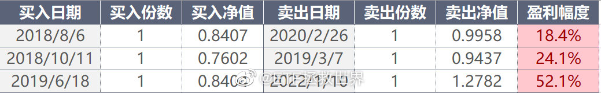

======================================================

ETF拯救世界 (5687069307) @
2022-04-26 10:18:48 Tue  
url: https://weibo.com/5687069307/LqcyrsF89

我觉得吧，一个人也好，一个企业也好，一个行业也好，如果即将被消灭，是不是应该给他们一个，不说上诉吧，就是说话的，申辩的机会。 ​​​

转发[36]  评论[341]  赞[3573] 

======================================================

ETF拯救世界 (5687069307) @
2022-04-26 10:25:04 Tue  
url: https://weibo.com/5687069307/LqcAZjCiX

不知道为什么就是感觉心在滴血。

（这不是正式发车，是正在布置一部分品种排版任务。正式的可能会改。） ​​​

转发[21]  评论[326]  赞[2046] 

+++++++++++++++++++++++++++++++++++++++++++++++++++++

图片：

======================================================

ETF拯救世界 (5687069307) @
2022-04-26 10:31:53 Tue  
url: https://weibo.com/5687069307/LqcDLeTwJ

现在是按照150买3卖1，S买3准备的。

但如果涨太多，恐怕不能买了。下午1:30-2:00定吧。 ​​​

转发[25]  评论[538]  赞[2896] 

======================================================

ETF拯救世界 (5687069307) @
2022-04-26 10:53:41 Tue  
url: https://weibo.com/5687069307/LqcMBqp8n

小猫在鼠标旁边趴着睡觉。

醒了，伸个懒腰，跳到我腿上，再跳到地上。就好像我的腿是它的楼梯。嗬，你可真不见外。

我说，走啦？

嗯。它呼噜一声。

还嗯！看着要买的暴涨品种，更生气了。 ​​​

转发[33]  评论[292]  赞[2038] 

======================================================

ETF拯救世界 (5687069307) @
2022-04-26 10:57:32 Tue  
url: https://weibo.com/5687069307/LqcOaDjGd

回复@我在故快乐:10000就涨这么多，那要7500还不直接起飞啊。来个7500的。//@我在故快乐:医药起飞了

------------------------------------------------------
转推：
>  @ETF拯救世界 (5687069307)
>  2022-04-26 10:53:41 Tue  
>  url: https:/weibo.com/5687069307/LqcMBqp8n/

>  小猫在鼠标旁边趴着睡觉。
>  
>  醒了，伸个懒腰，跳到我腿上，再跳到地上。就好像我的腿是它的楼梯。嗬，你可真不见外。
>  
>  我说，走啦？
>  
>  嗯。它呼噜一声。
>  
>  还嗯！看着要买的暴涨品种，更生气了。 ​​​

转发[15]  评论[256]  赞[1735] 

======================================================

ETF拯救世界 (5687069307) @
2022-04-26 13:18:36 Tue  
url: https://weibo.com/5687069307/LqdJqFMV9

我有一个疑问，请懂的朋友说说。

就是说，都在说日本老龄化严重。但是以日本的经济社会条件，吸引东亚、东南亚的高知年轻人移民应该不难。

他们之所以不这么做，是不是因为老龄化的严重性还不足以抵消维持单一民族社会的共识。 ​​​

转发[33]  评论[456]  赞[3330] 

======================================================

ETF拯救世界 (5687069307) @
2022-04-26 13:36:23 Tue  
url: https://weibo.com/5687069307/LqdQEjXyN

一会的科技信息车，不出意外的话是左侧买入的最后一车，除非跌幅巨大，或者时间够长。

道理很简单，到了重要支撑了。如果跌破，不知道支撑在哪里，没法分配资金了。 ​​​

转发[86]  评论[579]  赞[3007] 

======================================================

ETF拯救世界 (5687069307) @
2022-04-26 13:50:05 Tue  
url: https://weibo.com/5687069307/LqdWcyKRJ

居然说我退缩了。

你放眼市场上，现在有几个人还敢买，还能买，还有钱买的。

我缩，谁缩我都不会缩。如果所有人都要缩，我也是最后一个缩的！ ​​​

转发[59]  评论[1294]  赞[5634] 

======================================================

ETF拯救世界 (5687069307) @
2022-04-26 14:57:50 Tue  
url: https://weibo.com/5687069307/LqenHy6Kz

你以为大力发展私募机构会让市场波动降低，

实际上到了预警和清仓线，私募杀起来是二话不说的。 ​​​

转发[58]  评论[331]  赞[2684] 

======================================================

ETF拯救世界 (5687069307) @
2022-04-26 15:02:14 Tue  
url: https://weibo.com/5687069307/LqepulERc

看到15:00跳出这个新闻是什么感觉： ​​​

转发[30]  评论[493]  赞[3241] 

+++++++++++++++++++++++++++++++++++++++++++++++++++++

图片：
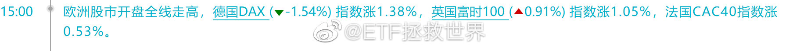

======================================================

ETF拯救世界 (5687069307) @
2022-04-26 15:07:41 Tue  
url: https://weibo.com/5687069307/LqerHxBEB

朋友们，有四个字是这一轮我彻底信仰并皈依的投资信条，

未来，也将围绕这四个字进行狂野研究。

——

均值回归。 ​​​

转发[226]  评论[573]  赞[3618] 

======================================================

ETF拯救世界 (5687069307) @
2022-04-26 15:17:29 Tue  
url: https://weibo.com/5687069307/LqevGgMDE

关于信息，多说两句。

我的信息走势模型，曾经有两次没有撑住，又下跌了20%左右。

一次是2008年金融危机大底部，两年后自底部涨了328%。

一次是2012年底，两年半后自底部涨了546%。

这个品种弹性是真的大，目前看也在模型支撑位。但要做好足够的心理建设，撑不住也是发生过两次的。

2018年撑住了 ​​​

转发[284]  评论[542]  赞[3443] 

======================================================

ETF拯救世界 (5687069307) @
2022-04-26 15:23:34 Tue  
url: https://weibo.com/5687069307/Lqey9kF1Q

今日数据出炉：

只说一个：

从全市场的角度看，今天，是2008年10月-11月金融危机大底以来，A股市场最便宜的一天。从各个数据的角度看，都是。

当然，请各位一定要注意，目前的市场环境与2019年之前完全不同了。

现在是注册制。

但无论如何，数据显示，全市场就是这个样子，板块不论。 ​​​

转发[887]  评论[902]  赞[5361] 

======================================================

ETF拯救世界 (5687069307) @
2022-04-26 15:28:35 Tue  
url: https://weibo.com/5687069307/LqeAbwaOK

2022年4月底，注定将成为A股市场的又一个被铭记的日子。

------------------------------------------------------
转推：
>  @ETF拯救世界 (5687069307)
>  2022-04-26 15:23:34 Tue  
>  url: https:/weibo.com/5687069307/Lqey9kF1Q/

>  今日数据出炉：
>  
>  只说一个：
>  
>  从全市场的角度看，今天，是2008年10月-11月金融危机大底以来，A股市场最便宜的一天。从各个数据的角度看，都是。
>  
>  当然，请各位一定要注意，目前的市场环境与2019年之前完全不同了。
>  
>  现在是注册制。
>  
>  但无论如何，数据显示，全市场就是这个样子，板块不论。 ​​​

转发[306]  评论[514]  赞[3328] 

======================================================

ETF拯救世界 (5687069307) @
2022-04-26 15:51:40 Tue  
url: https://weibo.com/5687069307/LqeJyrl8z

目前市场上只有一个板块比历史最低高不少：

机构重仓。

没人照顾的股票，已经杀到脚踝了。

当然，从前期热门基金动辄50%以上的最大回撤幅度来看，机构重仓板块也跌了很多了。但依然没到最便宜，因为，

之前炒得太疯了。 ​​​

转发[109]  评论[414]  赞[2538] 

======================================================

ETF拯救世界 (5687069307) @
2022-04-26 16:15:17 Tue  
url: https://weibo.com/5687069307/LqeT8FjaK

没有任何人关于市场的情绪能够影响我。你不能，所以不用教育我。

我坚定的，不妥协的认为，目前的区域就是底部区域。我不敢说哪里是铁底，但这个区域一定不会错。至于区域到底有多大，我没法量化，但一定不是很大。否则还叫什么区域？

在这个位置，我会加快买入节奏。就像之前好几年几乎不买一样，这 ​​​

转发[338]  评论[1052]  赞[5676] 

======================================================

ETF拯救世界 (5687069307) @
2022-04-26 16:28:23 Tue  
url: https://weibo.com/5687069307/LqeYssF2o

从今天起，我不看评论不看私信，不会让任何人影响我的情绪。

------------------------------------------------------
转推：
>  @ETF拯救世界 (5687069307)
>  2022-04-26 16:15:17 Tue  
>  url: https:/weibo.com/5687069307/LqeT8FjaK/

>  没有任何人关于市场的情绪能够影响我。你不能，所以不用教育我。
>  
>  我坚定的，不妥协的认为，目前的区域就是底部区域。我不敢说哪里是铁底，但这个区域一定不会错。至于区域到底有多大，我没法量化，但一定不是很大。否则还叫什么区域？
>  
>  在这个位置，我会加快买入节奏。就像之前好几年几乎不买一样，这 ​​​

转发[46]  评论[544]  赞[3593] 

======================================================

ETF拯救世界 (5687069307) @
2022-04-26 17:01:26 Tue  
url: https://weibo.com/5687069307/LqfbShlPO

各位可能没有意识到一个问题：

今年公募基金没有增量，都知道吧。没什么人申购了，毕竟抢新发基金等配额这种事情只发生在最高点。

私募基金不用说了，正轮流在预警线和清仓线卖出。

股民……有几个股民还敢买。敢的都被套了。

那么问题来了，这样越跌越低的时候，敢买，还有钱买的，有几个人？

很 ​​​

转发[287]  评论[1081]  赞[5517] 

======================================================

ETF拯救世界 (5687069307) @
2022-04-27 08:17:27 Wed  
url: https://weibo.com/5687069307/LqlbGq8Ak

几年前我曾经说，不断下跌的熊市中最终坚持不下去的人会有七成。

但是我错了。

到现在为止，停止的人只有4%。

瑞思拜，各位。 ​​​

转发[132]  评论[1040]  赞[4349] 

======================================================

ETF拯救世界 (5687069307) @
2022-04-27 08:31:17 Wed  
url: https://weibo.com/5687069307/Lqlhivtl3

如果今年有机会把美股买回来就彻底稳了[可爱] ​​​

转发[23]  评论[323]  赞[2786] 

======================================================

ETF拯救世界 (5687069307) @
2022-04-27 08:38:04 Wed  
url: https://weibo.com/5687069307/Lqlk3zIL1

我比较好奇的是另一半居然没有感染

------------------------------------------------------
转推：
>  @财联社APP (2868676035)
>  2022-04-27 08:28:33 Wed  
>  url: https:/weibo.com/2868676035/LqlgckszB/

>  财联社4月27日电，美国疾控中心表示，超过一半的美国人显示出之前感染过新冠肺炎的迹象。 ​​​

转发[16]  评论[255]  赞[1792] 

======================================================

ETF拯救世界 (5687069307) @
2022-04-27 09:24:38 Wed  
url: https://weibo.com/5687069307/LqlCXgKN8

很多朋友觉得美股永远涨，其实不是的。

大家看美股指数其实只跌了十几个点吧，但其实，下面这些股票，距离52周最高点，已经跌了：

paypal：73%
奈飞：72%
facebook：53%
amd：48%
英伟达：46%
安德玛：46%
通用汽车：43%
福特：43%
星巴克：39%
迪士尼：39%
波音：35%
耐克：32%
雅诗兰黛：32%
高通 ​​​

转发[136]  评论[276]  赞[2227] 

======================================================

ETF拯救世界 (5687069307) @
2022-04-27 09:37:52 Wed  
url: https://weibo.com/5687069307/LqlIkhVcA

两市融资余额继续下降，目前已经降至14600亿。

但是，融资额占流通市值的比例，却上升至2.53%。因为流通市值跌得更多。。

融资额占流通市值比例曾经在2015年7月3日达到最高点，是4.72%。

而在2019年3月5日，市场即将暴涨的时候，降至1.85%。

融资的人，一定是越涨越加杠杆，越跌越不敢借钱。

而目 ​​​

转发[321]  评论[477]  赞[2989] 

======================================================

ETF拯救世界 (5687069307) @
2022-04-27 09:43:33 Wed  
url: https://weibo.com/5687069307/LqlKDk5Sn

S的汇添富文体，去年8月买了一份，今年4月再买一份，时间间隔8个月，时间足够；

空间：3月最大跌幅超过30%。很多朋友看到这个数字绝望了。

目前状态：

4月只补了一份，浮亏幅度已经大幅收窄至12%。要知道目前市场是什么状态。

12%，趋势转折后，分分钟赚钱。趋势不转折，继续给时间给空间，拉回浮 ​​​

转发[182]  评论[453]  赞[2785] 

======================================================

ETF拯救世界 (5687069307) @
2022-04-27 09:46:46 Wed  
url: https://weibo.com/5687069307/LqlLWeHCG

行情无聊的时候，我跟大家谈风花雪月，跟大家一起围观八卦狗血，跟大家组建道德法庭。

但是关键时刻，我会把数据、思路、模型一股脑的扔过来砸晕你。 ​​​

转发[36]  评论[737]  赞[3952] 

======================================================

ETF拯救世界 (5687069307) @
2022-04-27 10:33:50 Wed  
url: https://weibo.com/5687069307/Lqm52BNJN

本次买入波段医药后，后续该品种也只剩一次波段买入，之后就不会再买。

同理，在所有指数支撑位，都会在长线仓位中加仓。情况不同，加仓幅度不同。几个重点品种会在长线仓位外额外买入致敬仓，买了会贴图。

在之后，如果继续下跌，我本人不会再过于关注市场走势。还会看，但意义已经不大。

之后会继 ​​​

转发[198]  评论[615]  赞[3117] 

======================================================

ETF拯救世界 (5687069307) @
2022-04-27 10:50:57 Wed  
url: https://weibo.com/5687069307/LqmbZn6dm

我个人认为，人做事，就要有信念。没有信念，一定是一败涂地。

我对于资本市场的信念就是：

1、指数不会死。
2、长期看，正常情况下，指数会不断上涨。
3、即使长期不涨，也会有波动。
4、便宜的地方买入，贵的地方卖出，能赚钱。

这些信念支撑我的意志从未因市场走势动摇。别人极端绝望的时候，别 ​​​

转发[546]  评论[837]  赞[5369] 

======================================================

ETF拯救世界 (5687069307) @
2022-04-27 11:00:26 Wed  
url: https://weibo.com/5687069307/LqmfQ9Lti

信息产业我要谢谢你，至少你在4500左右能挣扎一下。

不然会显得我的支撑点位过于低能…… ​​​

转发[54]  评论[582]  赞[3317] 

======================================================

ETF拯救世界 (5687069307) @
2022-04-27 13:12:47 Wed  
url: https://weibo.com/5687069307/Lqn7z1rCT

可以了可以了，休息一下。只有你到，别的兄弟不到就不够意思了。

------------------------------------------------------
转推：
>  @ETF拯救世界 (5687069307)
>  2022-04-27 11:00:26 Wed  
>  url: https:/weibo.com/5687069307/LqmfQ9Lti/

>  信息产业我要谢谢你，至少你在4500左右能挣扎一下。
>  
>  不然会显得我的支撑点位过于低能…… ​​​

转发[19]  评论[232]  赞[2147] 

======================================================

ETF拯救世界 (5687069307) @
2022-04-27 13:31:12 Wed  
url: https://weibo.com/5687069307/Lqnf2iZVs

如果收盘前不掉链子，150的两支信息科技浮亏程度就只剩8%了。

而这个指数这轮从最高点跌下来是45%。

有什么慌的。真没任何需要慌乱的。

15%以内，一两周。 ​​​

转发[120]  评论[321]  赞[2744] 

======================================================

ETF拯救世界 (5687069307) @
2022-04-27 13:35:50 Wed  
url: https://weibo.com/5687069307/LqngV1c3Z

其实我现在也不知道这一单波段能赚多少百分比。

主要得看能买多少。 ​​​

转发[23]  评论[274]  赞[2160] 

+++++++++++++++++++++++++++++++++++++++++++++++++++++

图片：
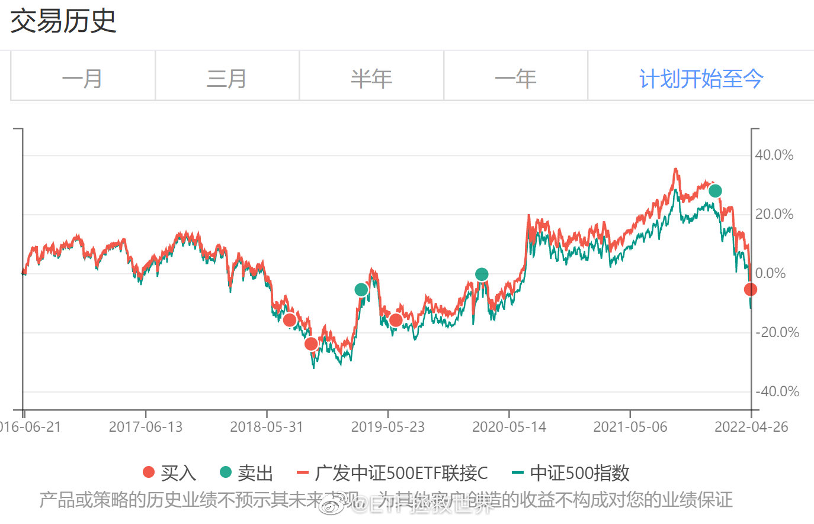

======================================================

ETF拯救世界 (5687069307) @
2022-04-27 13:53:07 Wed  
url: https://weibo.com/5687069307/LqnnW1fak

今天可能有各路人马分析反弹的性质、原因、持续力度。

说真的，我毫无兴趣浪费时间去看这些玩意。 ​​​

转发[35]  评论[320]  赞[2934] 

======================================================

ETF拯救世界 (5687069307) @
2022-04-27 13:54:34 Wed  
url: https://weibo.com/5687069307/LqnowkJCR

A股市场的参与者，大部分，甚至绝大部分都是神经病。

真的。

无论是机构还是散户。 ​​​

转发[72]  评论[630]  赞[3729] 

======================================================

ETF拯救世界 (5687069307) @
2022-04-27 15:05:44 Wed  
url: https://weibo.com/5687069307/LqnRplzDC

就这样吧。

没什么意思。

再！见！ ​​​

转发[12]  评论[406]  赞[2713] 

======================================================

ETF拯救世界 (5687069307) @
2022-04-27 15:18:36 Wed  
url: https://weibo.com/5687069307/LqnWD8NMc

忍不住看了眼评论，真是气的我够呛。

一个个好像昨天清仓了一样。

昨天你没买？上午医药波段几乎最低位你没买？

涨一点你捶胸顿足买少了，再跌下埋怨我买多了的是不是你？

新朋友补仓提醒几十份你都买了吗？老朋友仓位不低了吧？

不舒服就买到舒服！别跟我这患得患失。要不你把钱打给我我一年收2% ​​​

转发[93]  评论[1386]  赞[5416] 

======================================================

ETF拯救世界 (5687069307) @
2022-04-27 15:32:53 Wed  
url: https://weibo.com/5687069307/Lqo2r4uyr

我不是说别的，各位，弟兄们，集美们，我们的心态要始终保持平稳。心态平稳的一方面是了解金融心理，一方面是仓位合适。你如果觉得仓位不合适，就把它弄到合适。想象，代入，上涨下跌，看自己经济状态和心理会怎样。不能涨也难受，跌也难受。你到股市干嘛来了！就单纯的找罪受是吧？

------------------------------------------------------
转推：
>  @ETF拯救世界 (5687069307)
>  2022-04-27 15:18:36 Wed  
>  url: https:/weibo.com/5687069307/LqnWD8NMc/

>  忍不住看了眼评论，真是气的我够呛。
>  
>  一个个好像昨天清仓了一样。
>  
>  昨天你没买？上午医药波段几乎最低位你没买？
>  
>  涨一点你捶胸顿足买少了，再跌下埋怨我买多了的是不是你？
>  
>  新朋友补仓提醒几十份你都买了吗？老朋友仓位不低了吧？
>  
>  不舒服就买到舒服！别跟我这患得患失。要不你把钱打给我我一年收2% ​​​

转发[26]  评论[264]  赞[2153] 

======================================================

ETF拯救世界 (5687069307) @
2022-04-27 15:38:33 Wed  
url: https://weibo.com/5687069307/Lqo4JclBj

这是150的仓位图，自己结合前天公众号文章的估值状态看情况弄吧。

仓位建议保守-激进比前几天最新的那条可以提高2、3个点。 ​​​

转发[225]  评论[508]  赞[3290] 

+++++++++++++++++++++++++++++++++++++++++++++++++++++

图片：

======================================================

ETF拯救世界 (5687069307) @
2022-04-27 15:59:12 Wed  
url: https://weibo.com/5687069307/Lqod71XZe

说明：“要不你把钱打给我我一年收2%管理费，盈利提20%你看怎么样？”这句话的修辞手法是反问和夸张。含义是：我不是你的私募基金经理，不知道也没能力没精力了解每位朋友的情况。绝无非法集资抑或有意向成立私募进而公开或私下募集资金的意思。望周知。

------------------------------------------------------
转推：
>  @ETF拯救世界 (5687069307)
>  2022-04-27 15:18:36 Wed  
>  url: https:/weibo.com/5687069307/LqnWD8NMc/

>  忍不住看了眼评论，真是气的我够呛。
>  
>  一个个好像昨天清仓了一样。
>  
>  昨天你没买？上午医药波段几乎最低位你没买？
>  
>  涨一点你捶胸顿足买少了，再跌下埋怨我买多了的是不是你？
>  
>  新朋友补仓提醒几十份你都买了吗？老朋友仓位不低了吧？
>  
>  不舒服就买到舒服！别跟我这患得患失。要不你把钱打给我我一年收2% ​​​

转发[22]  评论[673]  赞[2971] 

======================================================

ETF拯救世界 (5687069307) @
2022-04-27 19:46:34 Wed  
url: https://weibo.com/5687069307/LqpHoAgqP

我的露营计划是不是要泡汤了。 ​​​

转发[8]  评论[357]  赞[1977] 

======================================================

ETF拯救世界 (5687069307) @
2022-04-27 19:47:50 Wed  
url: https://weibo.com/5687069307/LqpHUv5OV

🙏🙏🙏人生记忆之一，走好

------------------------------------------------------
转推：
>  @新浪娱乐 (1642591402)
>  2022-04-27 15:59:07 Wed  
>  url: https:/weibo.com/1642591402/Lqod4Ay0A/

>  #曾江去世# 据多家港媒消息，中国香港资深演员曾江去世，享年87岁。今天中午12时14分，曾江在指定检疫酒店房间内昏迷不醒，酒店职员发现后遂报警求助。警员及救护员到场，经检验后证实事主当场死亡，死因目前仍在调查中。据悉，曾江25日独自一人由新加坡返港，入住酒店，26日新冠病毒快测呈阴性，27日 ​​​

转发[33]  评论[228]  赞[1364] 

======================================================

ETF拯救世界 (5687069307) @
2022-04-27 22:51:52 Wed  
url: https://weibo.com/5687069307/LqqUC4WmN

我真的服了。

没事上球球刷刷情绪，结果在推荐流里面看到两个跟我有关的帖子。

真的偷窥我微博和公众号的兄弟们不要再往球球搬运我的东西或者讨论我的操作了。

球球现在是什么人在评论啊，

就这么几个理性的，大多数都是情绪化的喷子在评论，

他能理性吗，理性不了，他没这个能力你知道吧。

你跟 ​​​

转发[17]  评论[500]  赞[3058] 

+++++++++++++++++++++++++++++++++++++++++++++++++++++

图片：
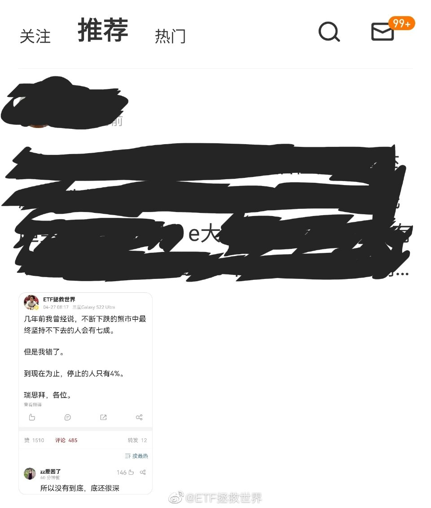

======================================================

ETF拯救世界 (5687069307) @
2022-04-27 23:01:34 Wed  
url: https://weibo.com/5687069307/LqqYy9tuT

股票跌起来真的很难言底。

复习题：

从周线和月线看，哪里是卖出的最佳时机。是那种你能把握住的。

卖出理由是什么。 ​​​

转发[113]  评论[580]  赞[2573] 

+++++++++++++++++++++++++++++++++++++++++++++++++++++

图片：
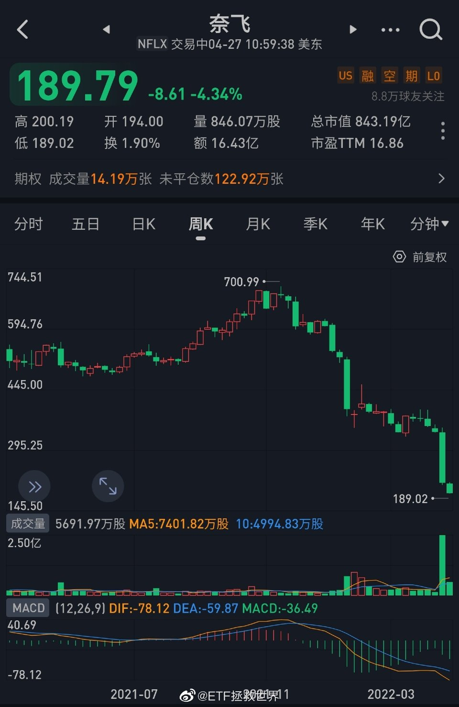

======================================================

ETF拯救世界 (5687069307) @
2022-04-28 08:44:57 Thu  
url: https://weibo.com/5687069307/LquNlFH9T

越来越近了。一位确诊流调信息，几天时间把周围超市跑遍了，应该是在囤货。

这种情况去超市有问题吗。我的想法是尽量不动用战略储备，随时把储备补满。但如果风险大，开始消耗储备也没问题。

就像投资，能不用战略储备就不用，但真到关键时候要用，从银行搬家也可以。 ​​​

转发[30]  评论[390]  赞[2651] 

======================================================

ETF拯救世界 (5687069307) @
2022-04-28 08:56:16 Thu  
url: https://weibo.com/5687069307/LquRW9W2a

我想做一个实验。就今天开始。

一点东西都不买，到周日，记录每天三个人消耗的食物。

看看加的血条到底能扛住boss多少天的攻击。 ​​​

转发[15]  评论[345]  赞[2503] 

======================================================

ETF拯救世界 (5687069307) @
2022-04-28 09:29:59 Thu  
url: https://weibo.com/5687069307/Lqv5Cxr7U

我观察sh的这次情况，非常好的诠释了什么才是好企业：

那么多人对可乐的渴望，甚至是明确的对某个品牌的渴望，说明了一切。 ​​​

转发[66]  评论[535]  赞[3514] 

======================================================

ETF拯救世界 (5687069307) @
2022-04-28 09:38:59 Thu  
url: https://weibo.com/5687069307/Lqv9hc8lQ

昨天晚上我花了两个小时翻阅去年10月以来，奈飞的所有新闻。大致得出三个股价崩塌的基本面结论：

第一：竞争加剧。影视巨头切入赛道：

“在 奈飞 (NFLX.US)最新的致股东信中，有一句话传遍了全世界：“虽然竞争加剧可能会影响我们的利润率增长，但……” 尽管，这一说法或许并不代表着什么，但这可能 ​​​

转发[126]  评论[313]  赞[2453] 

======================================================

ETF拯救世界 (5687069307) @
2022-04-28 10:46:43 Thu  
url: https://weibo.com/5687069307/LqvALyKDn

你有没有想过，为什么一个月前，将医药的波段价位定在0.75而非正常的0.8。

又为什么昨天正好在0.75附近止跌，以致0.75几乎是最低价。

这到底是道德的沦丧还是人性的扭曲？ ​​​

转发[52]  评论[622]  赞[2984] 

======================================================

ETF拯救世界 (5687069307) @
2022-04-28 11:03:43 Thu  
url: https://weibo.com/5687069307/LqvHFra6S

我个人非常非常推崇市场机制。我觉得只有市场的定价才是最有效的。

但前提，是市场一定要受到强有力的规则的制约。违反规则的杀无赦。

A股的问题，其实很大程度上就是不市场化。从新股发行开始。目前注册制的改革方向是对的，虽然短期看会对市场造成一些伤害。但只要有人无脑打新炒新，那么新股发行 ​​​

转发[72]  评论[281]  赞[3139] 

======================================================

ETF拯救世界 (5687069307) @
2022-04-28 11:11:43 Thu  
url: https://weibo.com/5687069307/LqvKV2ck9

全指医药目前有100多家公司公布一季度业绩，增速继续保持20%+……我估计最终是十几个点。全市场目前是个位数。

去年四季度稍差，但也比全市场好多了。 ​​​

转发[60]  评论[251]  赞[2631] 

======================================================

ETF拯救世界 (5687069307) @
2022-04-28 11:30:35 Thu  
url: https://weibo.com/5687069307/LqvSzAFqP

还是那句话，有些东西最好别捧得太高。预期太高会放松应有的警惕。

还有就是，人还是要首先依靠自己。把所有希望寄托在别人身上，很容易出问题。

这是我的一点想法。 ​​​

转发[154]  评论[341]  赞[3387] 

======================================================

ETF拯救世界 (5687069307) @
2022-04-28 11:47:56 Thu  
url: https://weibo.com/5687069307/LqvZCl1k0

如果两个月前，一个城市还被所有人吹捧为最优秀的，两个月后，却成了千夫所指。

那么，人真的理性吗，真的能认清事实吗，你看到的就真的一定是真相吗。

有极端的好和极端的差吗，又或者其实极端的是人群自身而已？

不要相信人们的夸奖和称赞，因为一瞬间所有掌声都会变成另一个极端。

人类整体，或 ​​​

转发[257]  评论[889]  赞[5429] 

======================================================

ETF拯救世界 (5687069307) @
2022-04-28 17:24:56 Thu  
url: https://weibo.com/5687069307/LqycpeZt9

有没有一种可能就是说5月再提16%[污] ​​​

转发[65]  评论[610]  赞[2737] 

+++++++++++++++++++++++++++++++++++++++++++++++++++++

图片：
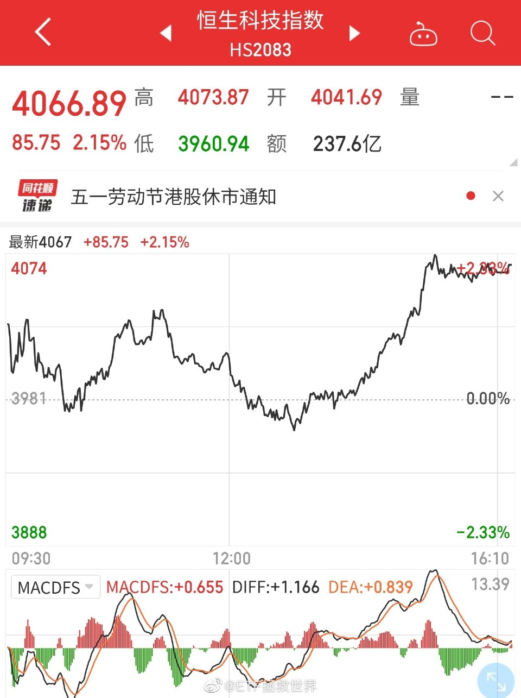

======================================================

ETF拯救世界 (5687069307) @
2022-04-28 18:54:53 Thu  
url: https://weibo.com/5687069307/LqyMV0Yka

根据长期使用的感受，

猫家的省钱卡，夕夕的省钱月卡，狗家的plus100元券比较，

猫家的卡最厚道。从未遇到过不能用的情况。

夕夕的卡百亿补贴产品不能用。

狗家的很多东西不能用。

省钱卡这波，没什么钱的我站猫。 ​​​

转发[65]  评论[734]  赞[2847] 

======================================================

ETF拯救世界 (5687069307) @
2022-04-28 21:55:26 Thu  
url: https://weibo.com/5687069307/LqzYd19tV

回复@e寸光阴一寸金:我现在也让孩子玩啊。还给他下好了我的世界，跟他一起玩双人成行，让他看我打老头环boss。有节制的玩我全力支持//@e寸光阴一寸金:回复 @ETF拯救世界:E大之前不是反对不让孩子玩游戏么

------------------------------------------------------
转推：
>  @ETF拯救世界 (5687069307)
>  2022-04-28 11:30:35 Thu  
>  url: https:/weibo.com/5687069307/LqvSzAFqP/

>  还是那句话，有些东西最好别捧得太高。预期太高会放松应有的警惕。
>  
>  还有就是，人还是要首先依靠自己。把所有希望寄托在别人身上，很容易出问题。
>  
>  这是我的一点想法。 ​​​

转发[45]  评论[205]  赞[1355] 

======================================================

ETF拯救世界 (5687069307) @
2022-04-29 07:44:58 Fri  
url: https://weibo.com/5687069307/LqDPv8iO1

巨额回购股票，按季度分红。

------------------------------------------------------
转推：
>  @见闻实时新闻 (2772291221)
>  2022-04-29 06:08:01 Fri  
>  url: https:/weibo.com/2772291221/LqDc8CPPD/

>  【苹果：将股票回购计划扩大900亿美元】
>  苹果公司董事会授权：将股票回购规模在现有计划的基础上扩大900亿美元。
>  将季度股息提高5%，至每股分红0.23美元，之前为0.22美元，BDVD预计会提高至0.24美元。 ​​​

转发[22]  评论[331]  赞[1659] 

======================================================

ETF拯救世界 (5687069307) @
2022-04-29 09:04:27 Fri  
url: https://weibo.com/5687069307/LqElL1LD9

回复@Paul爸_言午:平常一个月两次或者考一百分（语文除作文全对）/体育比赛拿前三可以玩40分钟。假期一周可以一两次//@Paul爸_言午:回复@ETF拯救世界:这个好。每天都有吗？还是只限定周末？

------------------------------------------------------
转推：
>  @ETF拯救世界 (5687069307)
>  2022-04-28 11:30:35 Thu  
>  url: https:/weibo.com/5687069307/LqvSzAFqP/

>  还是那句话，有些东西最好别捧得太高。预期太高会放松应有的警惕。
>  
>  还有就是，人还是要首先依靠自己。把所有希望寄托在别人身上，很容易出问题。
>  
>  这是我的一点想法。 ​​​

转发[20]  评论[158]  赞[1150] 

======================================================

ETF拯救世界 (5687069307) @
2022-04-29 09:56:07 Fri  
url: https://weibo.com/5687069307/LqEGJqZof

我突然想到一个育儿奇想：

各位觉得给孩子玩英文大段文本的RPG游戏怎么样，会不会提高英语成绩。有做过实验的家长吗。 ​​​

转发[27]  评论[715]  赞[2381] 

======================================================

ETF拯救世界 (5687069307) @
2022-04-29 10:25:03 Fri  
url: https://weibo.com/5687069307/LqEStfZXB

金鳞岂是池中物 ​​​

转发[9]  评论[231]  赞[1746] 

======================================================

ETF拯救世界 (5687069307) @
2022-04-29 12:53:23 Fri  
url: https://weibo.com/5687069307/LqFQGfivf

勿谓言之不预也

------------------------------------------------------
转推：
>  @ETF拯救世界 (5687069307)
>  2022-04-28 17:24:56 Thu  
>  url: https:/weibo.com/5687069307/LqycpeZt9/

>  有没有一种可能就是说5月再提16%[污] ​​​

转发[32]  评论[457]  赞[1873] 

======================================================

ETF拯救世界 (5687069307) @
2022-04-29 13:05:35 Fri  
url: https://weibo.com/5687069307/LqFVDf9fu

QDII ETF设置10%涨跌停真的是最可笑的一件事。 ​​​

转发[71]  评论[308]  赞[2206] 

======================================================

ETF拯救世界 (5687069307) @
2022-04-29 13:08:25 Fri  
url: https://weibo.com/5687069307/LqFWMpG8i

10天前说的。瑞思拜。

------------------------------------------------------
转推：
>  @ETF拯救世界 (5687069307)
>  2022-04-19 21:34:51 Tue  
>  url: https:/weibo.com/5687069307/LpcZnnqIA/

>  有没有一种可能，usd对rmb汇率涨叠加恒生中概涨，双击呢。
>  
>  就当我做个美梦吧… ​​​

转发[36]  评论[427]  赞[2134] 

======================================================

ETF拯救世界 (5687069307) @
2022-04-29 13:13:48 Fri  
url: https://weibo.com/5687069307/LqFYYnu64

回复@哲思Lucky:150只有十几个点的现金了。难道真的不为可能发生的意外做一点点准备吗？在当时那个时候，市场上还有谁敢买，有钱买？只有我们。这是为什么？

------------------------------------------------------
转推：
>  @ETF拯救世界 (5687069307)
>  2022-04-29 13:05:35 Fri  
>  url: https:/weibo.com/5687069307/LqFVDf9fu/

>  QDII ETF设置10%涨跌停真的是最可笑的一件事。 ​​​

转发[38]  评论[134]  赞[1408] 

======================================================

ETF拯救世界 (5687069307) @
2022-04-29 13:17:54 Fri  
url: https://weibo.com/5687069307/LqG0DbeYl

QDII ETF设置10%涨跌幅这件事，我觉得第一大责任人是发行QDII ETF的基金公司。

监管顾不了那么细节的东西，各位管理人难道不能多考虑考虑投资者的利益吗？如果创业、科创、双创ETF都能20%涨跌幅，为什么QDII ETF就不能向监管汇报一下，争取一下？

我真的大无语了。

为投资者考虑考虑吧！各位大人们 ​​​

转发[34]  评论[210]  赞[1933] 

======================================================

ETF拯救世界 (5687069307) @
2022-04-29 13:19:46 Fri  
url: https://weibo.com/5687069307/LqG1oqJoL

回复@ETF拯救大兵瑞恩:最主要的是因为没钱了。为什么没钱了，不就是因为动不动就“梭哈”吗？//@ETF拯救大兵瑞恩:因为其他人吓死了[喵喵][喵喵]

------------------------------------------------------
转推：
>  @ETF拯救世界 (5687069307)
>  2022-04-29 13:05:35 Fri  
>  url: https:/weibo.com/5687069307/LqFVDf9fu/

>  QDII ETF设置10%涨跌停真的是最可笑的一件事。 ​​​

转发[16]  评论[81]  赞[1236] 

======================================================

ETF拯救世界 (5687069307) @
2022-04-29 13:23:08 Fri  
url: https://weibo.com/5687069307/LqG2L0TI2

如果今天不掉链子，浮亏幅度只剩不到5%了。高点跌下来超过40%。15%以内，一两周。投资不是匀速上升，而是三年不开张，开张吃三年，各位。

------------------------------------------------------
转推：
>  @ETF拯救世界 (5687069307)
>  2022-04-27 13:31:12 Wed  
>  url: https:/weibo.com/5687069307/Lqnf2iZVs/

>  如果收盘前不掉链子，150的两支信息科技浮亏程度就只剩8%了。
>  
>  而这个指数这轮从最高点跌下来是45%。
>  
>  有什么慌的。真没任何需要慌乱的。
>  
>  15%以内，一两周。 ​​​

转发[64]  评论[221]  赞[1944] 

======================================================

ETF拯救世界 (5687069307) @
2022-04-29 13:25:53 Fri  
url: https://weibo.com/5687069307/LqG3SbKam

回复@水汪汪的萌咩:本来也不需要封住！我们吃的是盘中波动，你只要波动上去我们就能提款。结果？？？？//@水汪汪的萌咩:没封住[笑cry]

------------------------------------------------------
转推：
>  @ETF拯救世界 (5687069307)
>  2022-04-27 13:31:12 Wed  
>  url: https:/weibo.com/5687069307/Lqnf2iZVs/

>  如果收盘前不掉链子，150的两支信息科技浮亏程度就只剩8%了。
>  
>  而这个指数这轮从最高点跌下来是45%。
>  
>  有什么慌的。真没任何需要慌乱的。
>  
>  15%以内，一两周。 ​​​

转发[7]  评论[82]  赞[1225] 

======================================================

ETF拯救世界 (5687069307) @
2022-04-29 13:35:38 Fri  
url: https://weibo.com/5687069307/LqG7Pr8Tj

我不知道为什么总有朋友问：

怎么涨起来啦，怎么跌啦，发生什么啦。

你觉得充斥着一帮神经病的地方，你能弄清楚为什么涨跌吗？

只要你低位买高位卖，市场就让神经病去上蹿下跳不就完了吗。 ​​​

转发[77]  评论[334]  赞[2491] 

======================================================

ETF拯救世界 (5687069307) @
2022-04-29 13:45:38 Fri  
url: https://weibo.com/5687069307/LqGbTthGK

我要再说一次这个问题。涨起来了，可能大家都忘了当时是什么情况了。但能在那种腥风血雨的环境下，到处都是哭声一片的情况下，96%的朋友依然毅然决然的坚定买入，这真的是特别值得自豪的一件事。A股市场能有这样的一群人，真的特别不容易。致敬。

------------------------------------------------------
转推：
>  @ETF拯救世界 (5687069307)
>  2022-04-27 08:17:27 Wed  
>  url: https:/weibo.com/5687069307/LqlbGq8Ak/

>  几年前我曾经说，不断下跌的熊市中最终坚持不下去的人会有七成。
>  
>  但是我错了。
>  
>  到现在为止，停止的人只有4%。
>  
>  瑞思拜，各位。 ​​​

转发[74]  评论[653]  赞[2885] 

======================================================

ETF拯救世界 (5687069307) @
2022-04-29 13:47:50 Fri  
url: https://weibo.com/5687069307/LqGcMEcnB

回复@ourbbs:还好我不是大V……//@ourbbs:感谢，投资路上有E大指引，进步很大。 http://t.cn/A6XzkryQ 

------------------------------------------------------
转推：
>  @ETF拯救世界 (5687069307)
>  2022-04-27 08:17:27 Wed  
>  url: https:/weibo.com/5687069307/LqlbGq8Ak/

>  几年前我曾经说，不断下跌的熊市中最终坚持不下去的人会有七成。
>  
>  但是我错了。
>  
>  到现在为止，停止的人只有4%。
>  
>  瑞思拜，各位。 ​​​

转发[6]  评论[180]  赞[1416] 

======================================================

ETF拯救世界 (5687069307) @
2022-04-29 14:00:27 Fri  
url: https://weibo.com/5687069307/LqGhU6omM

那些说“好可惜没买够”“时间太短啦我钱刚到位”的人，

我告诉你，即使到现在，中证500也只比最低那天收盘高7%。其它指数也差不了太多。

你要真觉得后悔，你就买进去。别涨起来了就一脸价值投资大师的样子，抱怨这个抱怨那个没买够。

你不会连7%的幅度都害怕吧？你的大底就差7%？

别装了，你就是 ​​​

转发[159]  评论[949]  赞[3987] 

======================================================

ETF拯救世界 (5687069307) @
2022-04-29 14:03:34 Fri  
url: https://weibo.com/5687069307/LqGjb1jq5

今天我反而最期待的是汇添富文体的表现。

其它都是指数或者指数增强，大差不差。汇添富文体我感觉能在港股吃一笔。 ​​​

转发[30]  评论[235]  赞[2267] 

======================================================

ETF拯救世界 (5687069307) @
2022-04-29 14:17:37 Fri  
url: https://weibo.com/5687069307/LqGoS2xUw

说两句技术层面的东西：

第一个，是除了信息，我表格里列的其它指数点位都没有碰到。当然我不是说一定会碰到，但那么多都不碰反正也有点怪怪的。

有两种方式碰，一个是下跌碰，一个是横盘等支撑慢慢靠上来。

我个人还是希望大多数都碰一下。

第二个，历史四次钻石坑，两次w，两次v。这次是w还是v， ​​​

转发[292]  评论[702]  赞[4013] 

======================================================

ETF拯救世界 (5687069307) @
2022-04-29 14:46:02 Fri  
url: https://weibo.com/5687069307/LqGApbgcK

如果这一波恒科的16%没吃到，假期后跌回来，那就是交易制度的问题。

如果假期中中概大涨，节后回来我们多吃了很多bonus，那么就是我们的善举（别人不要我们好心接盘）感动了上天。

总而言之我们总是对的。 ​​​

转发[41]  评论[518]  赞[3399] 

======================================================

ETF拯救世界 (5687069307) @
2022-04-29 15:03:00 Fri  
url: https://weibo.com/5687069307/LqGHis0Kw

今天最后一帖。

刚才翻回去看评论，我发现之前说过很多次的事情好像还有朋友不清楚，那我就再说一次：

在且慢跟车的话，我是有一些作为主理人的收入的。这个问题我不会避讳，也说了很多次。

再说一次的原因，是不希望有朋友突然知道我还有一些主理人收入会变得很生气，觉得我是干了什么对不起你的事 ​​​

转发[60]  评论[1603]  赞[6606] 

======================================================

ETF拯救世界 (5687069307) @
2022-04-29 17:20:19 Fri  
url: https://weibo.com/5687069307/LqHB2bAmI

一季度机构最重仓位宁德。有几家机构能判断它利润下降了。

------------------------------------------------------
转推：
>  @ETF拯救世界 (5687069307)
>  2022-04-21 10:23:58 Thu  
>  url: https:/weibo.com/5687069307/Lprs3AQS3/

>  有朋友说，看估值啊。
>  
>  股票不说了，那就不是一般人能判断的。我说句实话，90%的公司，连自己的董事长都不知道五年后自己的公司什么样，你一个局外人要判断十年后的公司价值，再判断到时候市场给的情绪，只能说祝福吧。
>  
>  指数呢。指数估值稍微简单一点。基本上A股的历史大致就是20-70之间波动。
>  
>  好， ​​​

转发[52]  评论[243]  赞[2072] 

======================================================

ETF拯救世界 (5687069307) @
2022-04-29 18:59:42 Fri  
url: https://weibo.com/5687069307/LqIfn13i7

记了两天。

无任何补给的情况下，3-4个月，稳了。 ​​​

转发[24]  评论[639]  赞[3246] 

+++++++++++++++++++++++++++++++++++++++++++++++++++++

图片：

======================================================

ETF拯救世界 (5687069307) @
2022-04-30 15:48:02 Sat  
url: https://weibo.com/5687069307/LqQq4bTJD

在客厅里搭了帐篷，躺在里面看了两小时b站露营视频。

我的长假露营活动圆满结束了。 ​​​

转发[31]  评论[1027]  赞[4655] 

======================================================

ETF拯救世界 (5687069307) @
2022-04-30 23:03:35 Sat  
url: https://weibo.com/5687069307/LqTgRuCOr

巴菲特总是保持手里有大量现金，有些网友却因为反弹了两天没有满仓而痛不欲生

------------------------------------------------------
转推：
>  @网易财经 (1974561081)
>  2022-04-30 22:51:06 Sat  
>  url: https:/weibo.com/1974561081/LqTbN4phw/

>  #巴菲特股东大会#【巴菲特：4月没有回购股票】沃伦·巴菲特：我们在4月份的时候没有回购股票。虽然一季度伯克希尔动用约400亿美元用于投资，但巴菲特表示，我们手头总会保持有大量现金。http://t.cn/A6XwxyDZ ​​​

转发[123]  评论[394]  赞[2770] 

======================================================

ETF拯救世界 (5687069307) @发布于 北京
2022-05-01 10:49:00 Sun  
url: https://weibo.com/5687069307/LqXTc7ilK

368复机。

请说出密码： ​​​

转发[22]  评论[704]  赞[2541] 

======================================================

ETF拯救世界 (5687069307) @发布于 北京
2022-05-01 11:32:12 Sun  
url: https://weibo.com/5687069307/LqYaIAjXM

有人说，巴菲特因为是保险公司，所以必然有一部分现金。跟一般人不一样。

这些朋友其实就是典型的自以为了解一些东西，却并不会去深入研究。

时间回到2008年，金融危机下整个华尔街一片哀嚎。保险公司？拜托，几大保险公司自身都已经难保。保险公司就一定还有钱吗？当时华尔街能掏钱的人还有谁？

巴 ​​​

转发[159]  评论[287]  赞[2375] 

======================================================

ETF拯救世界 (5687069307) @IP属地：北京
2022-05-01 11:34:58 Sun  
url: https://weibo.com/5687069307/LqYbQA0vh

回复@秃董是大宝贝:承认别人优秀不丢脸。只有内心知道对方有值得学习的，才会找出能让自己成长的东西，加入自己的人生体系。而不是天天这个不行那个不行，就自己最牛，指点江山一辈子依然过不好这一生。//@秃董是大宝贝:承认别人优秀很难吗

------------------------------------------------------
转推：
>  @ETF拯救世界 (5687069307)
>  2022-05-01 11:32:12 Sun  
>  url: https:/weibo.com/5687069307/LqYaIAjXM/

>  有人说，巴菲特因为是保险公司，所以必然有一部分现金。跟一般人不一样。
>  
>  这些朋友其实就是典型的自以为了解一些东西，却并不会去深入研究。
>  
>  时间回到2008年，金融危机下整个华尔街一片哀嚎。保险公司？拜托，几大保险公司自身都已经难保。保险公司就一定还有钱吗？当时华尔街能掏钱的人还有谁？
>  
>  巴 ​​​

转发[51]  评论[134]  赞[1545] 

======================================================

ETF拯救世界 (5687069307) @IP属地：北京
2022-05-01 16:35:41 Sun  
url: https://weibo.com/5687069307/Lr09UaokA

关于满仓还是不满仓，我还有一个角度早就说过：

有人说，我每天都满仓！

你问他，那跌了怎么办？

他说，把存款拿进去补仓啊。

你再问，你现在家庭金融资产多少在股市里面？

他说：10%。

行吧。 ​​​

转发[36]  评论[312]  赞[2591] 

======================================================

ETF拯救世界 (5687069307) @IP属地：北京
2022-05-01 16:58:51 Sun  
url: https://weibo.com/5687069307/Lr0jj8y3A

第三条关于满仓的絮絮叨叨：

马戏团有人可以表演空中飞人，但不代表每个人都能做。

能做的人万中无一。

有人可以常年满仓，也成功了，不代表你也能做。常年满仓被消灭的人你看不到。历史不会记录失败的无名之辈。

建议你根据自己的情况，保持仓位动态平衡，低了多拿点，高了少拿点的人，也许给的建 ​​​

转发[78]  评论[264]  赞[2309] 

======================================================

ETF拯救世界 (5687069307) @IP属地：北京
2022-05-01 17:08:14 Sun  
url: https://weibo.com/5687069307/Lr0n7iMsv

还有人说，巴菲特说过呀，讨厌现金巴拉巴拉…

笑，巴菲特还说过，不投航空股，不投科技股…然后呢…

看一个人，不要只看他说了什么，更要看他做了什么！

还有，不断进步的人，一定是理念想法不断进步的。各位，学习，千万不能死学啊。

尽信书不如无书，就是这个意思了。 ​​​

转发[108]  评论[266]  赞[2771] 

======================================================

ETF拯救世界 (5687069307) @IP属地：北京
2022-05-01 17:28:24 Sun  
url: https://weibo.com/5687069307/Lr0viAVsM

以前儿子很小的时候，抱着他，总是会想，未来有一天他去上大学了，去外地或者外国工作生活了，离开我，我得多难过啊。

现在，儿子出去跟朋友玩，我长出一口气：终于能轻松一下了！

人生的真相好残酷啊。 ​​​

转发[43]  评论[591]  赞[3581] 

======================================================

ETF拯救世界 (5687069307) @IP属地：北京
2022-05-02 08:33:04 Mon  
url: https://weibo.com/5687069307/Lr6qvrYoi

劳驾各位帮我看着点，如果我说了什么不合适的，评论里提醒我一下。 ​​​

转发[15]  评论[611]  赞[2657] 

======================================================

ETF拯救世界 (5687069307) @IP属地：北京
2022-05-02 11:21:41 Mon  
url: https://weibo.com/5687069307/Lr7wWCjXs

再说一次，有人喷我也好骂我也好，真的不用告诉我了。

只要没看到，我就当它不存在。喷就喷呗，还能怎么着啊。喷完了它不依然是内心苦闷的生活，我依然是开开心心越来越好吗。

喷来喷去，最差能怎么着吧。好，最差不就是我消失吗，不说话了，不发车了，不聊投资了。

还能怎么着？不能了吧。那不就完 ​​​

转发[26]  评论[485]  赞[3095] 

======================================================

ETF拯救世界 (5687069307) @IP属地：北京
2022-05-02 11:43:42 Mon  
url: https://weibo.com/5687069307/Lr7FT0imz

我是个什么样的人呢。

除了遵纪守法，有点善良，勉强算个好老公好爸爸好儿子以外，可以说是一无是处。

贪财好色，好逸恶劳，玩物丧志，杞人忧天我全都占全了。

最重要的是投资水平低，看一次错一次，说一次打一次脸。高位低位没有一次对的，支撑压力全都反着来。

更别提仅仅是第三轮计划就跑输沪深 ​​​

转发[28]  评论[695]  赞[3216] 

======================================================

ETF拯救世界 (5687069307) @IP属地：北京
2022-05-02 13:35:07 Mon  
url: https://weibo.com/5687069307/Lr8p6DVO4

儿子不太能共情，没有什么感同身受的能力。似乎不能很好的感知别人的痛苦和悲伤。

话说，同理心是天生的还是后天养成的呢。 ​​​

转发[37]  评论[953]  赞[3218] 

======================================================

ETF拯救世界 (5687069307) @IP属地：北京
2022-05-02 18:06:54 Mon  
url: https://weibo.com/5687069307/Lrabr0W71

我估计周四开盘恒科走不了了。

真的就是败给交易规则了。 ​​​

转发[21]  评论[454]  赞[2688] 

======================================================

ETF拯救世界 (5687069307) @IP属地：北京
2022-05-03 08:04:59 Tue  
url: https://weibo.com/5687069307/LrfFBsPlk

有没有爬虫课学得好的朋友，帮我把我的微博内容全都爬下来，然后做个word文档发我一份，谢谢！

什么事也没有，只是有备无患。 ​​​

转发[62]  评论[1122]  赞[3288] 

======================================================

ETF拯救世界 (5687069307) @发布于 北京
2022-05-03 09:47:48 Tue  
url: https://weibo.com/5687069307/Lrgll6r4W

如果能够节前出掉，没准节后就能买回来。这将是什么感觉。

科普一下：节前净值本来已经可以出货，但因为涨跌停限制价格没到导致没出去。所以非常遗憾。 ​​​

转发[15]  评论[202]  赞[1699] 

======================================================

ETF拯救世界 (5687069307) @发布于 北京
2022-05-03 09:53:50 Tue  
url: https://weibo.com/5687069307/LrgnMB0JQ

不要慌。

是马冬梅，不是马超。 ​​​

转发[25]  评论[404]  赞[2590] 

======================================================

ETF拯救世界 (5687069307) @发布于 北京
2022-05-03 11:08:32 Tue  
url: https://weibo.com/5687069307/LrgS6zzxj

有些朋友总是说，有利空啊，再等等吧，等变好了再买。

问题在于，变好了凭什么你能买到便宜货呢。

富贵险中求。

这里面的关键，是你要买的东西看起来危险，但你确定它是不会死的。还有，

它险，你不能险。你要保证自己不危险。险的是它，不是你。

你怎么都死不了才对。

刘畊宏在周董默默无闻的时 ​​​

转发[168]  评论[334]  赞[2780] 

======================================================

ETF拯救世界 (5687069307) @发布于 北京
2022-05-03 11:23:15 Tue  
url: https://weibo.com/5687069307/LrgY59HKU

回复@风口点I火因I:大错特错。可以看看当年我跟踪“超级大主力”入场离场的时间节点帖。2013年初入场扫货50 180，2015年5月清仓。大写的服字。可惜，后面再也没有公开数据了//@风口点I火因I:机构和社保貌似偏右侧，关键是普通人没有那么多资源和能力去研判[允悲]

------------------------------------------------------
转推：
>  @ETF拯救世界 (5687069307)
>  2022-05-03 11:08:32 Tue  
>  url: https:/weibo.com/5687069307/LrgS6zzxj/

>  有些朋友总是说，有利空啊，再等等吧，等变好了再买。
>  
>  问题在于，变好了凭什么你能买到便宜货呢。
>  
>  富贵险中求。
>  
>  这里面的关键，是你要买的东西看起来危险，但你确定它是不会死的。还有，
>  
>  它险，你不能险。你要保证自己不危险。险的是它，不是你。
>  
>  你怎么都死不了才对。
>  
>  刘畊宏在周董默默无闻的时 ​​​

转发[30]  评论[124]  赞[1257] 

======================================================

ETF拯救世界 (5687069307) @发布于 北京
2022-05-03 11:41:35 Tue  
url: https://weibo.com/5687069307/Lrh5wpm2p

恒科：我感觉自己还有希望，扶我起来看看。 ​​​

转发[14]  评论[287]  赞[2090] 

======================================================

ETF拯救世界 (5687069307) @发布于 北京
2022-05-03 11:46:46 Tue  
url: https://weibo.com/5687069307/Lrh7D0TIl

北京的朋友，有没有在家里躺着就弹窗的。 ​​​

转发[8]  评论[421]  赞[1701] 

======================================================

ETF拯救世界 (5687069307) @IP属地：北京
2022-05-03 16:03:52 Tue  
url: https://weibo.com/5687069307/LriNZ6u1m

据说有的国家是好多好多代的亲戚都有继承权，所以有些小说电影才会有突然天降横财远房亲戚的遗产。我们这里无儿无女的话还是驾鹤前处理好身后事，把钱留给想给的人比较好

------------------------------------------------------
转推：
>  @北京人不知道的北京事儿 (1662214194)
>  2022-05-03 13:17:05 Tue  
>  url: https:/weibo.com/1662214194/LrhIhBgqo/

>  【 38岁#男子去世舅舅帮还贷欲继承房产被拒#，法院：遗产归民政局】近日，北京。38岁的北京人杨某利去世，留下了一套没有还完贷款的商品房。杨某利父母双亡、未婚、无子女，也没有兄弟姐妹、祖父母和外祖父母，更未留下遗嘱。这意味着，没有人继承杨某利的房子。2014年底杨某利花115万多元买了这套房子 ​​​

转发[32]  评论[203]  赞[1005] 

======================================================

ETF拯救世界 (5687069307) @发布于 北京
2022-05-03 21:39:35 Tue  
url: https://weibo.com/5687069307/Lrl0fu0gj

我不能说具体情况，但是离我越来越近了。[裂开] ​​​

转发[29]  评论[739]  赞[2239] 

======================================================

