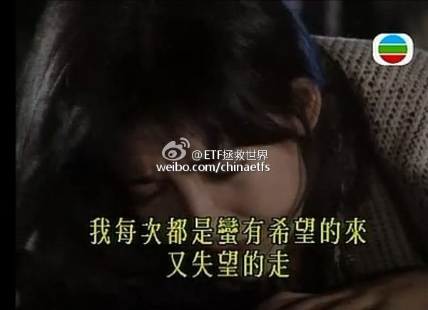

ETF拯救世界 (5687069307) @
2015-12-03 09:04:14 Thu  
url: https://weibo.com/5687069307/D6FoO9Cq7

钱，在很多人眼里看得比天还重，然而有些人并不这么认为。不要以自己的思维去揣度别人。实际上，我也不支持给孩子留过多的财产。你以为是对他好，实际上大概率是害了他。

------------------------------------------------------
转推：
>  @ ()
>  2015-12-03 00:43:46 Thu  
>  url: 

>  该账号因被投诉违反《微博社区公约》的相关规定，现已无法查看。查看帮助 https://kefu.weibo.com/faqdetail?id=13216

转发[4]  评论[25]  赞[46] 

======================================================

ETF拯救世界 (5687069307) @
2015-12-08 14:56:17 Tue  
url: https://weibo.com/5687069307/D7sQbdHmU

每天看着A股的起起伏伏，总能感觉到一丝秋意。 说真的，现在这个时点，几千万人的痛苦并未真正开始，然而，他们还活在梦中。 ​​​

转发[11]  评论[39]  赞[73] 

+++++++++++++++++++++++++++++++++++++++++++++++++++++

图片：

======================================================

ETF拯救世界 (5687069307) @
2015-12-11 07:30:20 Fri  
url: https://weibo.com/5687069307/D7ScEFAYr

刚才在电梯里，听到大佬的马仔在打电话： “……琛哥说，上面逼得他很紧……谁帐户资产增加了，谁就是内鬼……总之你要记住，如果有人经历了股灾，却没有赔钱，那么，他可能就是下一个……” ​​​

转发[18]  评论[34]  赞[55] 

======================================================

ETF拯救世界 (5687069307) @
2015-12-11 10:59:11 Fri  
url: https://weibo.com/5687069307/D7TzqAQ7d

不要怕，不会一路暴跌。大概率是让你欲走还留欲罢还休，都跑了还得了。明明感觉每天没怎么跌，一段时间打开账户后缩水一大半。要我说，崩盘暴跌一点都不可怕，很容易就暴涨拉回。温水煮青蛙才是绝大多数人的噩梦。当然，他们很久以后才会明白过来。

------------------------------------------------------
转推：
>  @ETF拯救世界 (5687069307)
>  2015-11-30 10:20:44 Mon  
>  url: https:/weibo.com/5687069307/D6dCmqiIp/

>  个人非常不认可有些人所谓的“股灾3.0”的说法。主要原因在于一些权重股或者二线蓝筹的估值情况与5、6月份非常不同。想让他们再连续跌停难度很大。也就是说，指数方面不会连续出现暴跌。大多数股票应该是以... http://t.cn/RUePnlS ​​​

转发[17]  评论[35]  赞[49] 

======================================================

ETF拯救世界 (5687069307) @
2015-12-11 14:30:09 Fri  
url: https://weibo.com/5687069307/D7UX40ITV

“快跑啊，里面在打人啊” 咚咚咚…… “别跑啦，里面在发钱，跑得快的还有美女送啊” 咚咚咚……“快回去啊，跑得快的那几个被打成猪头啦” 咚咚咚……“又发钱啦！！！” …… “去你大爷的，打死他” 不是喜剧，不是悲剧。是一出荒诞剧。 ​​​

转发[1]  评论[31]  赞[52] 

======================================================

ETF拯救世界 (5687069307) @
2015-12-21 13:03:21 Mon  
url: https://weibo.com/5687069307/D9qENng3n

他凭一己之力，把一个市值数千亿上市公司的董事长从雪山上、哈佛中、三线小明星身边，拉回办公室，开始为公司前途奔波；他让资本市场价值投资之火重新燃烧，让那些不重视公司市值的蓝筹股大股东不安。你可以不喜欢他，但他是最励志的卖菜哥。(对老百姓有好处的事，就是我们要做的——他如是说。) ​​​

转发[115]  评论[49]  赞[107] 

======================================================

ETF拯救世界 (5687069307) @
2015-12-23 11:40:37 Wed  
url: https://weibo.com/5687069307/D9IYdhoNg

12月22日收盘进入过去十年估值最高10%区域的指数是全市场PE、中小板PE、创业板PE、全指医药PE、全指信息PE。一个指数的估值是否进入过去十年最高10%区域，具有非常非常重要的意义。通常情况下，某个指数进入... http://t.cn/R4Gh10J ​​​

转发[85]  评论[64]  赞[70] 

======================================================

ETF拯救世界 (5687069307) @
2015-12-24 10:30:52 Thu  
url: https://weibo.com/5687069307/D9RWojt6f

大宵，你再这样以后会有人跳楼的。

------------------------------------------------------
转推：
>  @ ()
>  2015-12-24 10:18:40 Thu  
>  url: 

>  抱歉，此微博已被作者删除。查看帮助：http://t.cn/Rfd3rQV

转发[1]  评论[21]  赞[28] 

======================================================

ETF拯救世界 (5687069307) @
2015-12-24 10:42:50 Thu  
url: https://weibo.com/5687069307/D9S1fsdRf

据说，长得帅的都拿着利润跑了。长得丑的已经准备开始骂zjh了。 ​​​

转发[6]  评论[32]  赞[48] 

======================================================

ETF拯救世界 (5687069307) @
2015-12-30 09:36:15 Wed  
url: https://weibo.com/5687069307/DaM9cv73q

本月卖出一份、买入一份、补入一份 http://t.cn/R4f52Th ​​​

转发[22]  评论[44]  赞[69] 

======================================================

ETF拯救世界 (5687069307) @
2015-12-31 15:46:16 Thu  
url: https://weibo.com/5687069307/DaXZTdG21

祝大家身体健康、2016新年快乐；祝大家2016保住本金的前提下，能够赚大钱，发大财。 http://t.cn/R4Mbp1T ​​​

转发[3]  评论[44]  赞[84] 

======================================================

