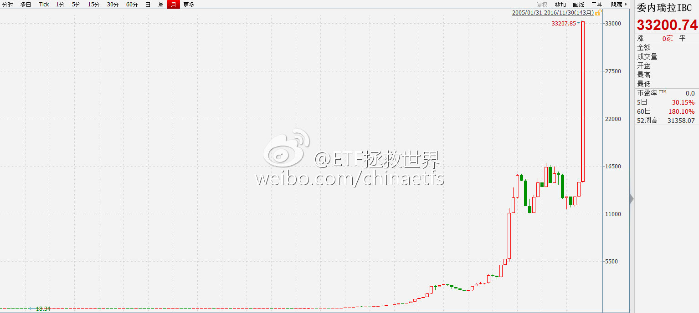
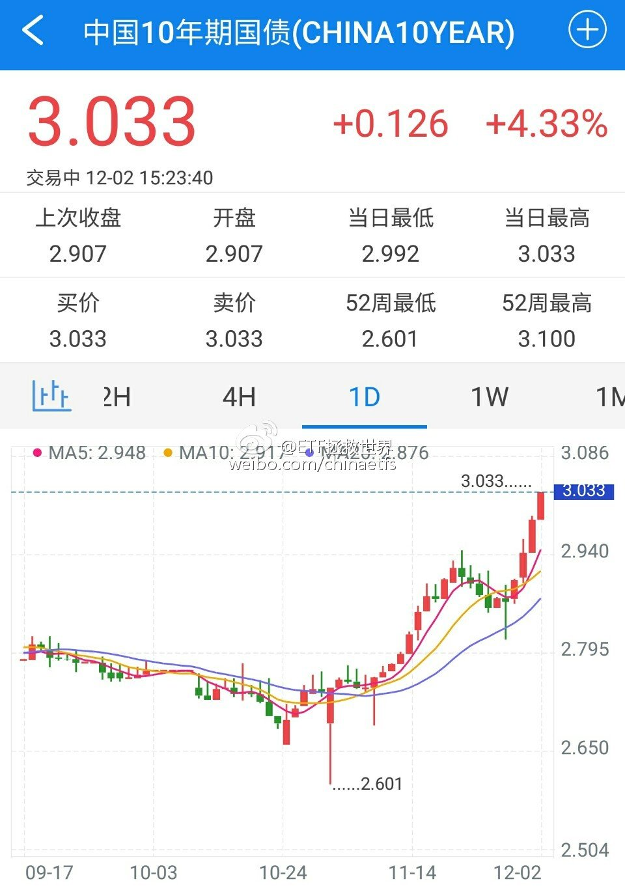
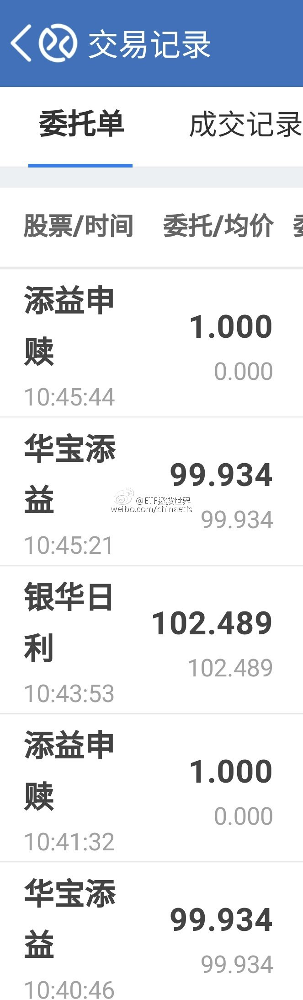
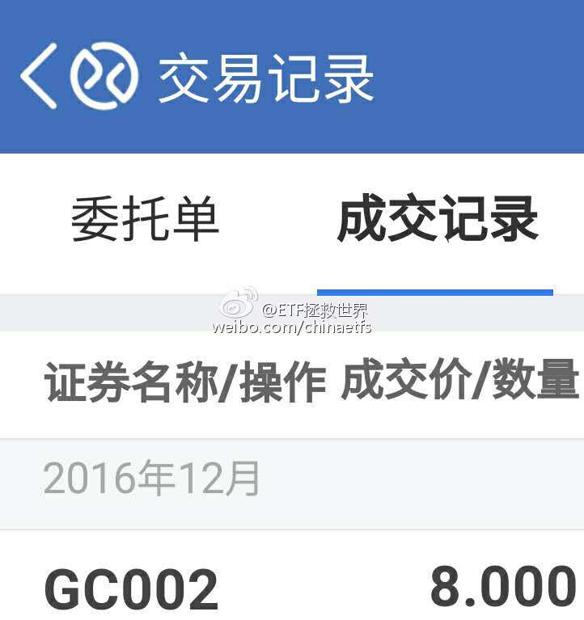
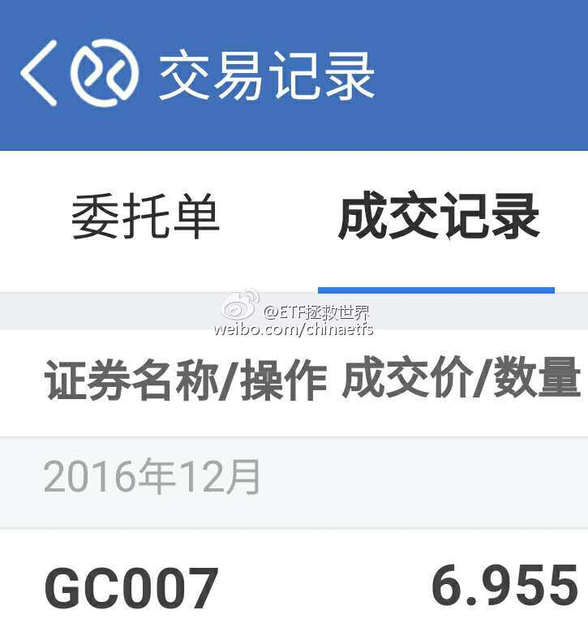
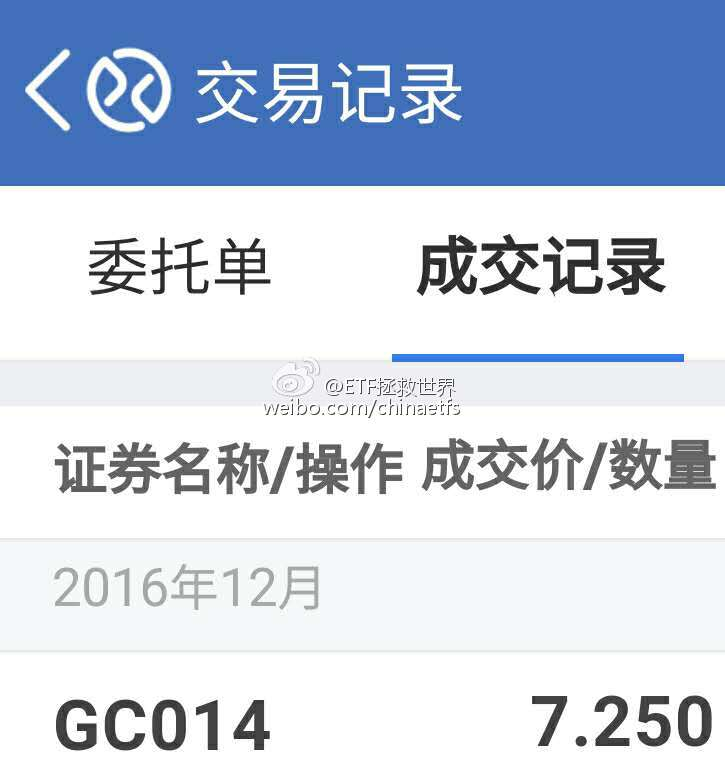
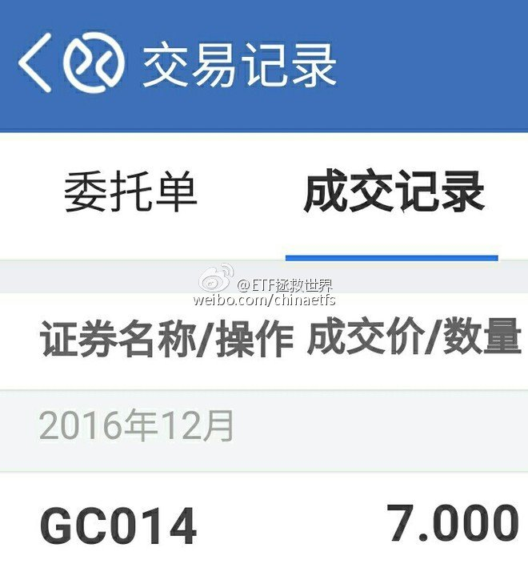

ETF拯救世界 (5687069307) @
2016-12-01 09:04:24 Thu  
url: https://weibo.com/5687069307/Ek3vicJzM

各位早上好。祝各位未来资产像委内瑞拉指数一样，十年时间从18点涨到33000点。（18万变3.3亿）[doge] （而且还不通胀） ​​​

转发[11]  评论[69]  赞[99] 

+++++++++++++++++++++++++++++++++++++++++++++++++++++

图片：

======================================================

ETF拯救世界 (5687069307) @
2016-12-01 10:14:10 Thu  
url: https://weibo.com/5687069307/Ek3XC2bSy

一个有趣的现象是，很多大神在距离年底还有一个月的时候就开始晒收益。

有时候，这种现象值得警惕。这说明什么？说明大多数人开始赚钱了。 ​​​

转发[81]  评论[113]  赞[96] 

======================================================

ETF拯救世界 (5687069307) @
2016-12-01 11:27:34 Thu  
url: https://weibo.com/5687069307/Ek4rp7u1Q

钱越来越紧，大盘股依然涨。

融资余额一个月增加700多亿。  ​​​

转发[6]  评论[64]  赞[51] 

+++++++++++++++++++++++++++++++++++++++++++++++++++++

图片：

======================================================

ETF拯救世界 (5687069307) @
2016-12-01 12:35:39 Thu  
url: https://weibo.com/5687069307/Ek4T2pgGI

午饭这样吃会不会长寿(s7不爆炸的前提下)  ​​​

转发[1]  评论[157]  赞[92] 

+++++++++++++++++++++++++++++++++++++++++++++++++++++

图片：

======================================================

ETF拯救世界 (5687069307) @
2016-12-02 09:04:34 Fri  
url: https://weibo.com/5687069307/EkcVR9VSE

整个11月重要股东净减持290亿（除万科、中建）。减持395家，367亿。1-11月净减持1473亿（除万科中建）。减持1090家，2436亿。

11月速度明显加快。 ​​​

转发[4]  评论[48]  赞[46] 

======================================================

ETF拯救世界 (5687069307) @
2016-12-02 10:23:00 Fri  
url: https://weibo.com/5687069307/EkdrH4M1e

怎么讲，可以说是一个风向标——当每个人都得意洋洋的吹嘘自己业绩的时候，就要小心点了。

------------------------------------------------------
转推：
>  @ETF拯救世界 (5687069307)
>  2016-12-01 10:14:10 Thu  
>  url: https:/weibo.com/5687069307/Ek3XC2bSy/

>  一个有趣的现象是，很多大神在距离年底还有一个月的时候就开始晒收益。
>  
>  有时候，这种现象值得警惕。这说明什么？说明大多数人开始赚钱了。 ​​​

转发[39]  评论[41]  赞[65] 

======================================================

ETF拯救世界 (5687069307) @
2016-12-02 11:30:53 Fri  
url: https://weibo.com/5687069307/EkdTfjDDl

观察这个市场，中短期最好的角度有两个。一个是资金，一个是人性。百试不爽。除了对长期称重机——估值的研究，我特别喜欢研究这两个层面的东西。尤其是人性。仔细观察每个人的发言，不管是“大v”还是群众，从理性的角度分析、判断，发言背后隐藏的内容和心理，其乐无穷。

------------------------------------------------------
转推：
>  @ETF拯救世界 (5687069307)
>  2016-12-01 10:14:10 Thu  
>  url: https:/weibo.com/5687069307/Ek3XC2bSy/

>  一个有趣的现象是，很多大神在距离年底还有一个月的时候就开始晒收益。
>  
>  有时候，这种现象值得警惕。这说明什么？说明大多数人开始赚钱了。 ​​​

转发[29]  评论[73]  赞[88] 

======================================================

ETF拯救世界 (5687069307) @
2016-12-02 13:26:01 Fri  
url: https://weibo.com/5687069307/EkeDYznxq

今天中午连豆芽都没了。健身房一小时回来，只能吃这个。 ​​​

转发[0]  评论[68]  赞[64] 

+++++++++++++++++++++++++++++++++++++++++++++++++++++

图片：

======================================================

ETF拯救世界 (5687069307) @
2016-12-02 14:17:34 Fri  
url: https://weibo.com/5687069307/EkeYU7b9E

GJD的最大危害，是让很多人错以为自己能力很高。其实，如果不是GJD，他们早就爆仓了。

GJD的存在，让他们受的伤不那么深，又或者还能赚点钱。结果，他们会因为自信，投入更多，用以前的方法去投资。

结果……正常的市场，是应该让没有能力的投资者尽早离开，而不是当这些人亏了想要走的时候，发个红 ​​​

转发[6]  评论[58]  赞[53] 

======================================================

ETF拯救世界 (5687069307) @
2016-12-02 15:28:16 Fri  
url: https://weibo.com/5687069307/EkfrBgLIE

机会就是跌出来的。[doge] ​​​

转发[11]  评论[75]  赞[45] 

+++++++++++++++++++++++++++++++++++++++++++++++++++++

图片：

======================================================

ETF拯救世界 (5687069307) @
2016-12-03 16:18:48 Sat  
url: https://weibo.com/5687069307/EkpcBBBPb

回复@李大霄:天晴了？大宵的意思难道是之前……[doge]//@李大霄:天晴了……

------------------------------------------------------
转推：
>  @ ()
>  2016-12-03 10:36:27 Sat  
>  url: 

>  抱歉，此微博已被作者删除。查看帮助：http://t.cn/Rfd3rQV

转发[1]  评论[18]  赞[22] 

======================================================

ETF拯救世界 (5687069307) @
2016-12-03 19:50:35 Sat  
url: https://weibo.com/5687069307/EkqAzmVQu

呵呵，运气

------------------------------------------------------
转推：
>  @Redneck4sevens (2710183283)
>  2016-12-03 16:10:31 Sat  
>  url: https:/weibo.com/2710183283/Ekp9fhnsp/

>  短期来看，再次买在了最低，神预测的修大@ETF拯救世界 ​​​

转发[4]  评论[40]  赞[33] 

======================================================

ETF拯救世界 (5687069307) @
2016-12-04 12:27:20 Sun  
url: https://weibo.com/5687069307/Ekx7a4lsU

回复@竹林清风01:投资不敢不谦虚。什么时候觉得自己牛了，就一定会被市场教育//@竹林清风01:E大谦虚了，一次两次是运气，经常这样就不是了[钱]//@ETF拯救世界:呵呵，运气

------------------------------------------------------
转推：
>  @Redneck4sevens (2710183283)
>  2016-12-03 16:10:31 Sat  
>  url: https:/weibo.com/2710183283/Ekp9fhnsp/

>  短期来看，再次买在了最低，神预测的修大@ETF拯救世界 ​​​

转发[2]  评论[22]  赞[46] 

======================================================

ETF拯救世界 (5687069307) @
2016-12-05 09:38:59 Mon  
url: https://weibo.com/5687069307/EkFrjxvEo

一次次的事实证明，很多人认为自己投资能力牛逼的时候，就是快出事的时候了。与各位共勉。

------------------------------------------------------
转推：
>  @ETF拯救世界 (5687069307)
>  2016-12-01 10:14:10 Thu  
>  url: https:/weibo.com/5687069307/Ek3XC2bSy/

>  一个有趣的现象是，很多大神在距离年底还有一个月的时候就开始晒收益。
>  
>  有时候，这种现象值得警惕。这说明什么？说明大多数人开始赚钱了。 ​​​

转发[11]  评论[47]  赞[84] 

======================================================

ETF拯救世界 (5687069307) @
2016-12-05 11:13:27 Mon  
url: https://weibo.com/5687069307/EkG3F1Wtq

现在只剩一个悬念：下午GJD是否出场。这取决于主席是否希望为未来有可能的下跌背锅。 ​​​

转发[2]  评论[44]  赞[52] 

======================================================

ETF拯救世界 (5687069307) @
2016-12-05 13:54:39 Mon  
url: https://weibo.com/5687069307/EkH75AShm

再次提醒所有投资A股的朋友，利率是对股市走势影响非常非常重要的一个因素。

不仅指央行的基准利率，也包括各种无风险利率水平、债券利率水平等。

一定要关注。 ​​​

转发[58]  评论[95]  赞[119] 

======================================================

ETF拯救世界 (5687069307) @
2016-12-06 09:28:42 Tue  
url: https://weibo.com/5687069307/EkONDy9q1

分享图片 国债期货。 ​​​

转发[7]  评论[39]  赞[35] 

+++++++++++++++++++++++++++++++++++++++++++++++++++++

图片：

======================================================

ETF拯救世界 (5687069307) @
2016-12-06 10:04:40 Tue  
url: https://weibo.com/5687069307/EkP2eDjZc

呵呵，看看10月份的收益率，几乎到了历史最低附近了。难道现在这样不是正常的嘛 //@蓝鲸财经记者工作平台:一业内人士告诉小鲸：“好多不是回到解放前的问题了，加杠杆的已经处于亏损中，而且很多债没有流动性，最近最恐慌的是信用债。”

------------------------------------------------------
转推：
>  @蓝鲸财经记者工作平台 (1885454921)
>  2016-12-06 09:47:33 Tue  
>  url: https:/weibo.com/1885454921/EkOVi5AFj/

>  【鲸观察】@椒图炼丹炉：债券交易员浸淫在牛市氛围中一整年，正畅想今年的年终奖大礼包有多鼓呢，结果年底来这么一出，一下回到解放前[汗] ​​​

转发[2]  评论[40]  赞[28] 

======================================================

ETF拯救世界 (5687069307) @
2016-12-08 17:05:04 Thu  
url: https://weibo.com/5687069307/ElaDS7Ncg

德国30都赚钱了吧？这是计划里面最后一个在盈亏线上挣扎的品种。终于突破了。

做投资，要经常把自己想象成两种职业:

农夫和猎人。

做农夫，趁着冬天种子不贵的时候去多买点种子，保护好，在春天播种下去，然后施肥浇水，不要经常扒开泥土看看长得怎么样，也不要着急拔出来。安安静静到了秋天，拿起 ​​​

转发[50]  评论[104]  赞[121] 

======================================================

ETF拯救世界 (5687069307) @
2016-12-09 09:31:24 Fri  
url: https://weibo.com/5687069307/Elh6e1VU1

$华宝油气(SZ162411)$ $石油基金(SZ160416)$ 看着手里卖得只剩下不到5%的两个油基，对自己说，几个策略需要继续优化……继续努力吧。 ​​​

转发[5]  评论[36]  赞[63] 

======================================================

ETF拯救世界 (5687069307) @
2016-12-11 11:15:18 Sun  
url: https://weibo.com/5687069307/ElADocGet

你忘了我发过？这张图是定增解禁日期 http://t.cn/RIwWnEY //@电疗哥-泥踩:难怪某票今年业绩大增呢，懂了。[囧]哪位数据大咖，可以做一个月度解禁市值曲线图出来，也好对比一下。[思考]貌似以前有个地方可以查，忘记在哪儿了。[汗]

------------------------------------------------------
转推：
>  @ ()
>  2016-12-11 10:58:49 Sun  
>  url: 

>  抱歉，此微博已被作者删除。查看帮助：http://t.cn/Rfd3rQV

转发[7]  评论[15]  赞[21] 

======================================================

ETF拯救世界 (5687069307) @
2016-12-12 11:30:14 Mon  
url: https://weibo.com/5687069307/ElK9X0yw6

啊多么痛的领悟！

------------------------------------------------------
转推：
>  @ETF拯救世界 (5687069307)
>  2016-12-01 10:14:10 Thu  
>  url: https:/weibo.com/5687069307/Ek3XC2bSy/

>  一个有趣的现象是，很多大神在距离年底还有一个月的时候就开始晒收益。
>  
>  有时候，这种现象值得警惕。这说明什么？说明大多数人开始赚钱了。 ​​​

转发[12]  评论[40]  赞[67] 

======================================================

ETF拯救世界 (5687069307) @
2016-12-12 17:47:58 Mon  
url: https://weibo.com/5687069307/ElMDgERg5

回复@victoryhf:不会了。今年1月，有人在公众号质疑我，为什么恒生跌了10%。当时搞得我压力很大，所以1、2月本该加仓几个品种都没加。看着现在恒生赚20多个点，很不舒服，本来计划的朋友可以赚远比这个更多。从那以后，没有任何人能给我压力了。这是我自己的计划，一切按照应有的节奏进行。

------------------------------------------------------
转推：
>  @ETF拯救世界 (5687069307)
>  2016-12-01 10:14:10 Thu  
>  url: https:/weibo.com/5687069307/Ek3XC2bSy/

>  一个有趣的现象是，很多大神在距离年底还有一个月的时候就开始晒收益。
>  
>  有时候，这种现象值得警惕。这说明什么？说明大多数人开始赚钱了。 ​​​

转发[6]  评论[77]  赞[102] 

======================================================

ETF拯救世界 (5687069307) @
2016-12-15 08:36:27 Thu  
url: https://weibo.com/5687069307/EmbiTBZip

微博的乡亲们，又把你们忘了！开车！

http://t.cn/RIGBuuR ​​​

转发[23]  评论[75]  赞[107] 

======================================================

ETF拯救世界 (5687069307) @
2016-12-19 05:49:29 Mon  
url: https://weibo.com/5687069307/EmLV6uQCT

问:人活着到底为了什么？

我的想法:

我想人活着首先要追求快乐。但是快乐这东西有时候很矛盾，一些短期快乐会造成长期痛苦，这种快乐就算了。比如快感超过啪啪啪一千倍的吸毒，长期会很痛苦。这样的例子很多。追求长期的快乐其实需要大智慧。

然后是体验。成年后会觉得日子过得很快，也会总觉得没意 ​​​

转发[73]  评论[72]  赞[175] 

======================================================

ETF拯救世界 (5687069307) @
2016-12-19 08:11:31 Mon  
url: https://weibo.com/5687069307/EmMQLqM4r

好好注意一下最右边双向两车道的路口。左转的车在路口是如何自觉让出直行通道的。这份素质根本就不是道路规划能够解决的问题。

------------------------------------------------------
转推：
>  @萝卜报告 (5253090679)
>  2016-12-12 10:43:03 Mon  
>  url: https:/weibo.com/5253090679/ElJQNkXLn/

>  看国外学校是如何解决送孩子上学的堵路问题的[good]http://t.cn/RI2Csqa ​​​

转发[19]  评论[35]  赞[36] 

======================================================

ETF拯救世界 (5687069307) @
2016-12-20 08:40:21 Tue  
url: https://weibo.com/5687069307/EmWsXEBjk

刚看了一下账户，昨天赎回的理财都到账了，今天准备开干。各位预测一下各期逆回购今天能到多少？ ​​​

转发[1]  评论[26]  赞[33] 

======================================================

ETF拯救世界 (5687069307) @
2016-12-20 14:26:54 Tue  
url: https://weibo.com/5687069307/EmYJDa4Lp

今天的现金管理操作

做7天、14天，目的是锁定7天和14天的收益。14天可能错过年底的超高收益，但确定有半个月的7%左右。7天锁定了一周的收益，还有可能吃到年底的高收益。

毕竟不知道央妈会不会放水救市，所以先锁定。

讲真，7%年化已经秒杀几乎所有银行理财了，很满意。

短期1天和2天，则是为了保 ​​​

转发[24]  评论[46]  赞[70] 

+++++++++++++++++++++++++++++++++++++++++++++++++++++

图片：

======================================================

ETF拯救世界 (5687069307) @
2016-12-21 09:00:10 Wed  
url: https://weibo.com/5687069307/En61vkHv4

国海这件事，它扛不扛并不是关键。扛不扛都是短期的问题，中长期有两个问题要考虑：

第一，是国海事件引发债市下跌，还是债市下跌引发国海事件？这个因果关系不能乱。如果说解决了国海事件，就会解决债市以及整个金融市场的问题，恐怕不是这个逻辑。

第二，这件事会不会导致监管趋严，会不会导致机构 ​​​

转发[9]  评论[21]  赞[48] 

======================================================

ETF拯救世界 (5687069307) @
2016-12-21 19:56:50 Wed  
url: https://weibo.com/5687069307/Enak3hzzL

[doge]

------------------------------------------------------
转推：
>  @ ()
>  2016-12-21 19:55:39 Wed  
>  url: 

>  抱歉，作者已设置仅展示半年内微博，此微博已不可见。 ​​​

转发[3]  评论[21]  赞[16] 

======================================================

ETF拯救世界 (5687069307) @
2016-12-22 13:37:06 Thu  
url: https://weibo.com/5687069307/Enhgq0rQk

[doge] //@电疗哥-泥踩:“券商中国记者调查发现，京金联自今年7月份开始出现兑付危机，保守估计目前涉及已到期产品无法兑付的本息金额已高达10亿元以上。”——咋回事儿？[汗]

------------------------------------------------------
转推：
>  @ ()
>  2016-12-22 09:49:09 Thu  
>  url: 

>  抱歉，作者已设置仅展示半年内微博，此微博已不可见。 ​​​

转发[5]  评论[8]  赞[12] 

======================================================

ETF拯救世界 (5687069307) @
2016-12-23 01:02:25 Fri  
url: https://weibo.com/5687069307/EnlKA1A5P

根据历史经验，券商说2800-3600，就一定会低于2800或者高于3600。2017，拭目以待

------------------------------------------------------
转推：
>  @新浪证券 (1642585887)
>  2016-12-22 23:59:37 Thu  
>  url: https:/weibo.com/1642585887/Enll5rrqT/

>  【2017年券商投资策略会大全：中信等18家券商预测行情】“2017年度投资策略会”已接近尾声，涨跌策略预测、板块配置、个股推荐等成为年度投资策略报告的重头戏。这18家券商已经立字为据，来年这一天，让行情说话，看看哪家券商才是真言。http://t.cn/RICDWjo ​​​

转发[21]  评论[35]  赞[39] 

======================================================

ETF拯救世界 (5687069307) @
2016-12-23 14:20:40 Fri  
url: https://weibo.com/5687069307/EnqYAts0r

在这个市场上，你想取得一般人无法得到的收益，就要做一些别人做不到的事。

你可以比别人更狠，上更高的杠杆；你也可以比别人更有耐心，一定要等到最佳击球区才挥棒。

不然，你的信息、智力、资源、知识、努力程度跟大多数人一模一样，凭什么别人赔钱你赚钱呢？

凭你身材好吗。 ​​​

转发[49]  评论[70]  赞[107] 

======================================================

ETF拯救世界 (5687069307) @
2016-12-26 09:00:53 Mon  
url: https://weibo.com/5687069307/EnRahk0ZV

老公：终于盼到这一天了 //@电疗哥-泥踩:丢掉老公，重燃性福！[哈哈] //@庄雅婷: [蜡烛] //@Justin-GG:翻译一下左下角补刀：有时间瞎叨逼你咋不赶紧动手！

------------------------------------------------------
转推：
>  @Justin-GG (2310172775)
>  2016-12-26 00:41:07 Mon  
>  url: https:/weibo.com/2310172775/EnNTqjmZ3/

>  以提案各种家庭收纳技巧，以及提倡“断舍离”而深入主妇人心的杂志《croissant》发表了今年读者问卷调查结果————最想丢掉的是：老公[微笑] ​​​

转发[1]  评论[7]  赞[24] 

======================================================

ETF拯救世界 (5687069307) @
2016-12-26 10:41:41 Mon  
url: https://weibo.com/5687069307/EnRPc7nEI

太神奇了！

------------------------------------------------------
转推：
>  @ETF拯救世界 (5687069307)
>  2016-12-01 10:14:10 Thu  
>  url: https:/weibo.com/5687069307/Ek3XC2bSy/

>  一个有趣的现象是，很多大神在距离年底还有一个月的时候就开始晒收益。
>  
>  有时候，这种现象值得警惕。这说明什么？说明大多数人开始赚钱了。 ​​​

转发[2]  评论[11]  赞[35] 

======================================================

ETF拯救世界 (5687069307) @
2016-12-26 10:53:00 Mon  
url: https://weibo.com/5687069307/EnRTMERXI

主要是不喜欢赔钱啊

------------------------------------------------------
转推：
>  @挖龙脉的超级鹿鼎公 (3962719063)
>  2016-12-26 10:31:24 Mon  
>  url: https:/weibo.com/3962719063/EnRL1gH8G/

>  熊市耐得住性子拿的住现金的人有几个，俺关注的人中，也就@ETF拯救世界 @佐罗_厚恩投资 @天狼50陈浩 几个吧，还有3成现金，手上票平均红利超过5%，且现金流都是让俺满意满意的[哈哈] ​​​

转发[7]  评论[31]  赞[31] 

======================================================

ETF拯救世界 (5687069307) @
2016-12-27 12:20:41 Tue  
url: https://weibo.com/5687069307/Eo1TSh0an

发布了头条文章：《2016，继续感恩》 http://t.cn/RIQYQyi ​​​

转发[54]  评论[165]  赞[293] 

======================================================

ETF拯救世界 (5687069307) @
2016-12-30 08:54:01 Fri  
url: https://weibo.com/5687069307/EosPtzDmO

微博的乡亲们，这次没忘了你们~最好还是关注公众号（chinaetfs），最快。

http://t.cn/RI1CvlY ​​​

转发[14]  评论[37]  赞[48] 

======================================================

ETF拯救世界 (5687069307) @
2016-12-30 14:10:14 Fri  
url: https://weibo.com/5687069307/EouTPrIgy

图片评论  哎………………………… http://t.cn/RIBYGKW

------------------------------------------------------
转推：
>  @ ()
>  2016-12-30 10:13:03 Fri  
>  url: 

>  该账号因被投诉违反《微博社区公约》的相关规定，现已无法查看。查看帮助 https://kefu.weibo.com/faqdetail?id=13216

转发[6]  评论[18]  赞[29] 

======================================================

