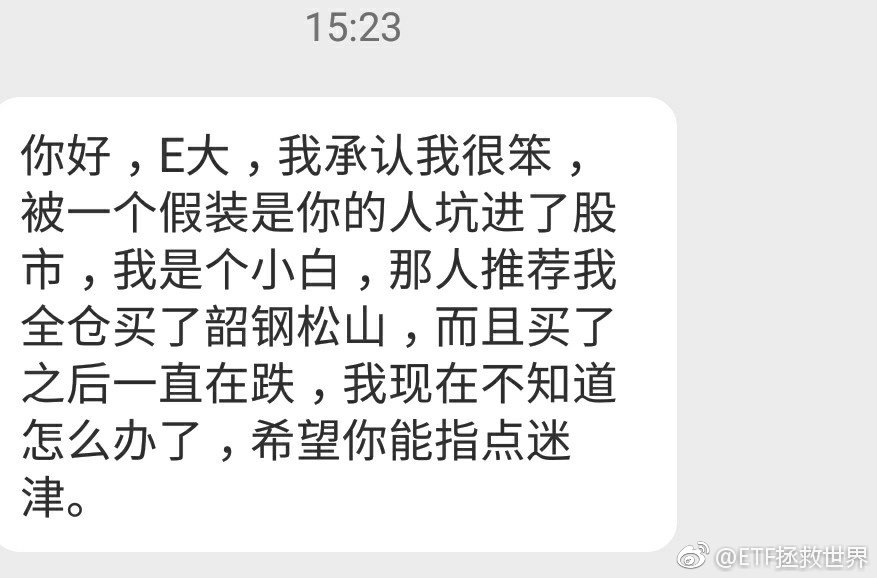
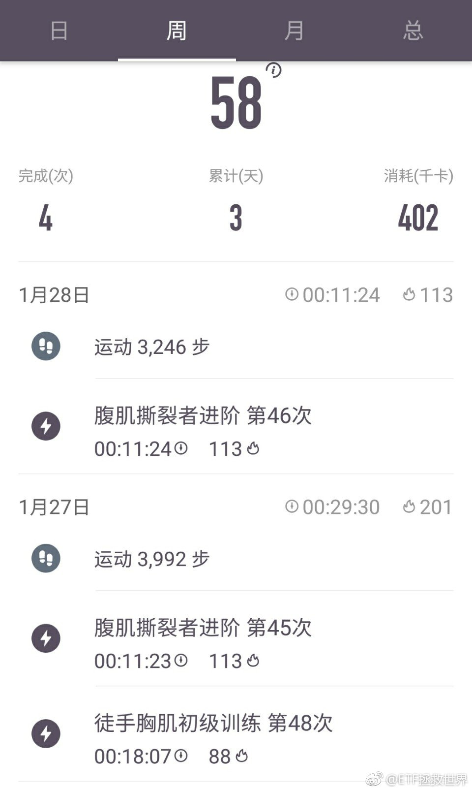

ETF拯救世界 (5687069307) @
2018-01-01 22:00:36 Mon  
url: https://weibo.com/5687069307/FComFkVIA

每日打卡（129）

新年第一练 ​​​

转发[0]  评论[21]  赞[147] 

+++++++++++++++++++++++++++++++++++++++++++++++++++++

图片：

======================================================

ETF拯救世界 (5687069307) @
2018-01-02 09:22:14 Tue  
url: https://weibo.com/5687069307/FCsPlxH6G

虽然对苍老师的艺术作品并不熟悉 [并不简单]，但还是祝福……看微博和以前的推感觉是很可爱的女孩子……希望结婚对象是真命天子吧！

------------------------------------------------------
转推：
>  @苍井空 (1739928273)
>  2018-01-01 23:11:24 Mon  
>  url: https:/weibo.com/1739928273/FCoPpaIQp/

>  给粉丝们。 ​​​

转发[4]  评论[61]  赞[118] 

======================================================

ETF拯救世界 (5687069307) @
2018-01-02 09:34:55 Tue  
url: https://weibo.com/5687069307/FCsUumgeN

$中证红利 sz399922$   是不是要新高了 ​​​

转发[13]  评论[17]  赞[83] 

======================================================

ETF拯救世界 (5687069307) @
2018-01-02 09:42:34 Tue  
url: https://weibo.com/5687069307/FCsXBlg0U

回复@Maggie的夏至:有可能分红，各位一定要都改成红利再投资。目前这个情况红利现金分红不合适。//@Maggie的夏至:今早收到了基金份额确认短信，中证红利是不是要分红了[害羞]，必须红利再投资[haha]

------------------------------------------------------
转推：
>  @ETF拯救世界 (5687069307)
>  2018-01-02 09:34:55 Tue  
>  url: https:/weibo.com/5687069307/FCsUumgeN/

>  $中证红利 sz399922$   是不是要新高了 ​​​

转发[2]  评论[26]  赞[71] 

======================================================

ETF拯救世界 (5687069307) @
2018-01-02 09:45:45 Tue  
url: https://weibo.com/5687069307/FCsYT5BA6

Middle East那个国家那么大的事，油价和黄金居然不反应？再也不相信真爱了。 ​​​

转发[2]  评论[23]  赞[89] 

======================================================

ETF拯救世界 (5687069307) @
2018-01-02 09:51:10 Tue  
url: https://weibo.com/5687069307/FCt15mf7p

我尽力了，奶不住了。连加两车不是开玩笑的……

------------------------------------------------------
转推：
>  @ETF拯救世界 (5687069307)
>  2018-01-02 09:34:55 Tue  
>  url: https:/weibo.com/5687069307/FCsUumgeN/

>  $中证红利 sz399922$   是不是要新高了 ​​​

转发[7]  评论[27]  赞[99] 

======================================================

ETF拯救世界 (5687069307) @
2018-01-02 10:13:45 Tue  
url: https://weibo.com/5687069307/FCtafweoA

回复@LEVELEEE:港股如果今年继续大涨，那么就有机会看烟花。//@LEVELEEE:港股真是神一样，又新高了//@ETF拯救世界:我尽力了，奶不住了。连加两车不是开玩笑的……

------------------------------------------------------
转推：
>  @ETF拯救世界 (5687069307)
>  2018-01-02 09:34:55 Tue  
>  url: https:/weibo.com/5687069307/FCsUumgeN/

>  $中证红利 sz399922$   是不是要新高了 ​​​

转发[4]  评论[25]  赞[74] 

======================================================

ETF拯救世界 (5687069307) @
2018-01-02 10:30:05 Tue  
url: https://weibo.com/5687069307/FCtgSfpBO

回复@5DONY:这几次加的500也都开始赚钱了。市场波动真的不是风险，而是利润来源。//@5DONY:zz500好牛//@ETF拯救世界:回复@LEVELEEE:港股如果今年继续大涨，那么就有机会看烟花。//@LEVELEEE:港股真是神一样，又新高了//@ETF拯救世界:我尽力了，奶不住了。连加两车不是开玩笑的……

------------------------------------------------------
转推：
>  @ETF拯救世界 (5687069307)
>  2018-01-02 09:34:55 Tue  
>  url: https:/weibo.com/5687069307/FCsUumgeN/

>  $中证红利 sz399922$   是不是要新高了 ​​​

转发[2]  评论[11]  赞[78] 

======================================================

ETF拯救世界 (5687069307) @
2018-01-02 10:50:34 Tue  
url: https://weibo.com/5687069307/FCtpcdMhz

今天涨幅超过$中证红利 sz399922$  的股票是500只，占总数的15%。

买指数的好处你慢慢就知道了。 ​​​

转发[4]  评论[44]  赞[127] 

======================================================

ETF拯救世界 (5687069307) @
2018-01-02 11:18:08 Tue  
url: https://weibo.com/5687069307/FCtAo4SRa

计划还差0.3%就要新高了。看看和几个指数比谁先达成。//@ETF拯救世界:回复@布RUCE:一定先于大盘新高。就这么决定了。//@布RUCE:好久没有新高了[哼]

------------------------------------------------------
转推：
>  @ETF拯救世界 (5687069307)
>  2017-12-19 14:15:25 Tue  
>  url: https:/weibo.com/5687069307/FAmLonPhR/

>  我知道很多朋友心里都很着急，为什么不断波动就是不涨/不跌。赚不到大钱。
>  
>  真的不用急。股票不敢说，好的指数，它们的成分股每一天都在为你挣钱。业绩在不断上升，价值也越来越大。
>  
>  价格不涨，急什么。证券投资就是这样，三年不涨，一涨吃三年。现在的大牛股平安，08-2014一分钱都没涨，六年啊。而且 ​​​

转发[45]  评论[40]  赞[102] 

======================================================

ETF拯救世界 (5687069307) @
2018-01-02 14:43:19 Tue  
url: https://weibo.com/5687069307/FCuVFrXnX

回复@布RUCE:我自己这几年主要投资指数的原因，是不敢把大量资金放到个股上。辛苦积累这么多年，碰到一个黑天鹅就要均值回归。买个股资产小的时候无所谓，资产大了真的心里有点虚。

------------------------------------------------------
转推：
>  @ETF拯救世界 (5687069307)
>  2017-12-19 14:15:25 Tue  
>  url: https:/weibo.com/5687069307/FAmLonPhR/

>  我知道很多朋友心里都很着急，为什么不断波动就是不涨/不跌。赚不到大钱。
>  
>  真的不用急。股票不敢说，好的指数，它们的成分股每一天都在为你挣钱。业绩在不断上升，价值也越来越大。
>  
>  价格不涨，急什么。证券投资就是这样，三年不涨，一涨吃三年。现在的大牛股平安，08-2014一分钱都没涨，六年啊。而且 ​​​

转发[43]  评论[64]  赞[161] 

======================================================

ETF拯救世界 (5687069307) @
2018-01-02 15:30:51 Tue  
url: https://weibo.com/5687069307/FCveXCPKP

回复@waslj0603:不同意。指数投资没有资产大小之分。为什么原始资产小，因为收入少。收入少能攒点钱来投资更不容易，更需要确定性大的投资方式。炒个股当然有人发大财，但是一将功成万骨枯，那些赔钱的人谁又在意？人生没有s&l。除非极有天分极有兴趣的人可以去炒股，绝大多数人还是玩指数靠谱。

------------------------------------------------------
转推：
>  @ETF拯救世界 (5687069307)
>  2017-12-19 14:15:25 Tue  
>  url: https:/weibo.com/5687069307/FAmLonPhR/

>  我知道很多朋友心里都很着急，为什么不断波动就是不涨/不跌。赚不到大钱。
>  
>  真的不用急。股票不敢说，好的指数，它们的成分股每一天都在为你挣钱。业绩在不断上升，价值也越来越大。
>  
>  价格不涨，急什么。证券投资就是这样，三年不涨，一涨吃三年。现在的大牛股平安，08-2014一分钱都没涨，六年啊。而且 ​​​

转发[20]  评论[23]  赞[135] 

======================================================

ETF拯救世界 (5687069307) @
2018-01-02 15:32:17 Tue  
url: https://weibo.com/5687069307/FCvfyeJ0F

续：谁说A股指数赚钱少？不说低买高卖的计划了。就是十二年前选对指数，某些指数这十二年涨了12倍以上。而且12年里面有9年上涨，这个不会比买到牛股差！

------------------------------------------------------
转推：
>  @ETF拯救世界 (5687069307)
>  2017-12-19 14:15:25 Tue  
>  url: https:/weibo.com/5687069307/FAmLonPhR/

>  我知道很多朋友心里都很着急，为什么不断波动就是不涨/不跌。赚不到大钱。
>  
>  真的不用急。股票不敢说，好的指数，它们的成分股每一天都在为你挣钱。业绩在不断上升，价值也越来越大。
>  
>  价格不涨，急什么。证券投资就是这样，三年不涨，一涨吃三年。现在的大牛股平安，08-2014一分钱都没涨，六年啊。而且 ​​​

转发[11]  评论[19]  赞[101] 

======================================================

ETF拯救世界 (5687069307) @
2018-01-02 15:39:25 Tue  
url: https://weibo.com/5687069307/FCvirizIi

你看一个股票也好，指数也好，投资组合也好，投资人也好，你把时间拉的稍微长一点。一两年你什么都看不出来。

拿全指医药来说吧。2016和2017年的涨幅分别是-14%和7.6%。垃圾不垃圾？是不是很垃圾？

但是如果你从2006年开始看，这十二年，这个指数涨了超过12倍。

而且！十二年里面，只有08、11、16三 ​​​

转发[48]  评论[83]  赞[217] 

======================================================

ETF拯救世界 (5687069307) @
2018-01-02 15:59:37 Tue  
url: https://weibo.com/5687069307/FCvqDzveV

可能会出现1000多个强东族谱。

------------------------------------------------------
转推：
>  @蓝鲸TMT网 (3866012793)
>  2018-01-02 15:58:13 Tue  
>  url: https:/weibo.com/3866012793/FCvq4niSZ/

>  刘强东发布寻祖公告：解放前，刘氏家族祖籍系湖南湘潭，后来移居江苏宿迁。别说小编不带大家发财，机会给你们，剩下的就看祖宗了[并不简单] ​​​​

转发[4]  评论[29]  赞[75] 

======================================================

ETF拯救世界 (5687069307) @
2018-01-02 21:53:42 Tue  
url: https://weibo.com/5687069307/FCxKmouQo

每日打卡（130）

坚持 ​​​

转发[0]  评论[18]  赞[132] 

+++++++++++++++++++++++++++++++++++++++++++++++++++++

图片：

======================================================

ETF拯救世界 (5687069307) @
2018-01-03 00:04:43 Wed  
url: https://weibo.com/5687069307/FCyBxu4CU

四个字形容你的感受 ​​​

转发[5]  评论[143]  赞[124] 

+++++++++++++++++++++++++++++++++++++++++++++++++++++

图片：

======================================================

ETF拯救世界 (5687069307) @
2018-01-03 00:30:48 Wed  
url: https://weibo.com/5687069307/FCyM85aX8

看对了黄金，买了个辣鸡…… ​​​

转发[32]  评论[57]  赞[112] 

+++++++++++++++++++++++++++++++++++++++++++++++++++++

图片：

======================================================

ETF拯救世界 (5687069307) @
2018-01-03 09:30:01 Wed  
url: https://weibo.com/5687069307/FCCiZmlbI

今天能不能新高。

其实实盘已经新高了吧，毕竟用货基计算剩余资金收益率太低了，连逆回购都没有。 ​​​

转发[0]  评论[12]  赞[106] 

======================================================

ETF拯救世界 (5687069307) @
2018-01-03 09:36:29 Wed  
url: https://weibo.com/5687069307/FCClD8tXS

敢不敢继续跌。月中又有的买了。 ​​​

转发[3]  评论[34]  赞[108] 

+++++++++++++++++++++++++++++++++++++++++++++++++++++

图片：

======================================================

ETF拯救世界 (5687069307) @
2018-01-03 09:53:07 Wed  
url: https://weibo.com/5687069307/FCCsncVy1

$中证红利 sz399922$  新高还是M……答案即将揭晓。 ​​​

转发[1]  评论[34]  赞[93] 

======================================================

ETF拯救世界 (5687069307) @
2018-01-03 10:17:28 Wed  
url: https://weibo.com/5687069307/FCCCg7FAD

回复@神志那风斗200510:其实说起来就是那么简单。把成本控制好，随便涨一下就会开始挣钱。之前我说的，无论熊市有多熊，控制好成本，牛市来了1-2周开始赚钱，就是这个道理啊。浮亏什么的根本不用理会，大多数时候是亏越多越好

------------------------------------------------------
转推：
>  @ETF拯救世界 (5687069307)
>  2018-01-03 00:30:48 Wed  
>  url: https:/weibo.com/5687069307/FCyM85aX8/

>  看对了黄金，买了个辣鸡…… ​​​

转发[27]  评论[27]  赞[119] 

======================================================

ETF拯救世界 (5687069307) @
2018-01-03 10:49:47 Wed  
url: https://weibo.com/5687069307/FCCPnieFf

$证券公司 sz399975$   弹性依然很大。 ​​​

转发[0]  评论[21]  赞[84] 

======================================================

ETF拯救世界 (5687069307) @
2018-01-03 10:54:32 Wed  
url: https://weibo.com/5687069307/FCCRjeAiP

回复@喜欢富兰克林:任何时候市场都会有上涨的股票。能力强当然可以去选股，不过熊市中选股成功率低一点罢了。这是肯定的啊。我对自己的要求就是熊市不亏或者小赚，牛市大赚。一轮轮这样下来如果成功，就能秒杀99%的投资者了。当然这也很难。

------------------------------------------------------
转推：
>  @ETF拯救世界 (5687069307)
>  2018-01-03 00:30:48 Wed  
>  url: https:/weibo.com/5687069307/FCyM85aX8/

>  看对了黄金，买了个辣鸡…… ​​​

转发[13]  评论[26]  赞[117] 

======================================================

ETF拯救世界 (5687069307) @
2018-01-03 11:14:14 Wed  
url: https://weibo.com/5687069307/FCCZisMIG

回复@朱姬:不知道。建议尽快配置到涨跌都舒服的仓位。//@朱姬:弱弱问一句：还能跌吗？

------------------------------------------------------
转推：
>  @ETF拯救世界 (5687069307)
>  2018-01-03 00:30:48 Wed  
>  url: https:/weibo.com/5687069307/FCyM85aX8/

>  看对了黄金，买了个辣鸡…… ​​​

转发[0]  评论[28]  赞[69] 

======================================================

ETF拯救世界 (5687069307) @
2018-01-03 14:20:14 Wed  
url: https://weibo.com/5687069307/FCEcNmVNM

vipkid怎么样，有没有上过课的朋友…… ​​​

转发[12]  评论[83]  赞[72] 

======================================================

ETF拯救世界 (5687069307) @
2018-01-03 14:24:42 Wed  
url: https://weibo.com/5687069307/FCEeBChNt

$养老产业 sz399812$  和  $中证红利 sz399922$   谁先新高…… ​​​

转发[19]  评论[26]  赞[87] 

======================================================

ETF拯救世界 (5687069307) @
2018-01-03 14:41:00 Wed  
url: https://weibo.com/5687069307/FCEleor4r

今天500干掉了300,1000干掉了500，创业50干掉了1000。

不要预测2018是大盘还是小盘，价值还是成长。

大小搭配，再加上一些长牛的行业，齐活。 ​​​

转发[33]  评论[51]  赞[166] 

======================================================

ETF拯救世界 (5687069307) @
2018-01-03 14:48:23 Wed  
url: https://weibo.com/5687069307/FCEoe12Wb

回复@叫我小天就好了丶:现在创业板真的不算便宜。也很难说有多少长期投资的价值。但终有一天值得大买特买。我坚信。指数投资来说，没有垃圾的品种，只有垃圾的价格。//@叫我小天就好了丶:e大，国家这样打击游资，特停妖股，深深担忧创业板的前途

------------------------------------------------------
转推：
>  @ETF拯救世界 (5687069307)
>  2018-01-03 14:41:00 Wed  
>  url: https:/weibo.com/5687069307/FCEleor4r/

>  今天500干掉了300,1000干掉了500，创业50干掉了1000。
>  
>  不要预测2018是大盘还是小盘，价值还是成长。
>  
>  大小搭配，再加上一些长牛的行业，齐活。 ​​​

转发[15]  评论[14]  赞[115] 

======================================================

ETF拯救世界 (5687069307) @
2018-01-03 14:58:54 Wed  
url: https://weibo.com/5687069307/FCEsuoqDe

组合内除了油气，任何一个指数都没有新高，然后组合已经新高了。

相信绝大多数人的账户也新高了。

………… ​​​

转发[11]  评论[127]  赞[254] 

======================================================

ETF拯救世界 (5687069307) @
2018-01-04 09:53:40 Thu  
url: https://weibo.com/5687069307/FCLT6gXCX

为什么特别喜欢医药和养老指数。不知道，就是喜欢。

然后仓位合适，就非常舒服。

买了喜欢的东西真的舒服啊！

谁能体会。 ​​​

转发[39]  评论[66]  赞[208] 

======================================================

ETF拯救世界 (5687069307) @
2018-01-04 09:57:38 Thu  
url: https://weibo.com/5687069307/FCLUHdclA

回复@无聊打发时间的大叔:增强指基，每年能跑赢基准全收益指数1-3个点我已经非常非常非常非常满足了。//@无聊打发时间的大叔:报告 发现000478连续六个工作日跑赢001052

------------------------------------------------------
转推：
>  @ETF拯救世界 (5687069307)
>  2018-01-03 14:58:54 Wed  
>  url: https:/weibo.com/5687069307/FCEsuoqDe/

>  组合内除了油气，任何一个指数都没有新高，然后组合已经新高了。
>  
>  相信绝大多数人的账户也新高了。
>  
>  ………… ​​​

转发[1]  评论[14]  赞[110] 

======================================================

ETF拯救世界 (5687069307) @
2018-01-04 10:25:22 Thu  
url: https://weibo.com/5687069307/FCM5Y5kW8

回复@夜雨梧桐2010:会说话。学习了！//@夜雨梧桐2010:不用买喜欢的东西，看你说话就挺舒服

------------------------------------------------------
转推：
>  @ETF拯救世界 (5687069307)
>  2018-01-04 09:53:40 Thu  
>  url: https:/weibo.com/5687069307/FCLT6gXCX/

>  为什么特别喜欢医药和养老指数。不知道，就是喜欢。
>  
>  然后仓位合适，就非常舒服。
>  
>  买了喜欢的东西真的舒服啊！
>  
>  谁能体会。 ​​​

转发[26]  评论[41]  赞[116] 

======================================================

ETF拯救世界 (5687069307) @
2018-01-04 11:40:46 Thu  
url: https://weibo.com/5687069307/FCMAz8iGz

指数都涨了，谁能想到又是2000家下跌…… ​​​

转发[0]  评论[45]  赞[142] 

======================================================

ETF拯救世界 (5687069307) @
2018-01-04 13:46:27 Thu  
url: https://weibo.com/5687069307/FCNpA5oF1

红利大概率会赢了。是不是咱们连加两次的威力。

------------------------------------------------------
转推：
>  @ETF拯救世界 (5687069307)
>  2018-01-03 14:24:42 Wed  
>  url: https:/weibo.com/5687069307/FCEeBChNt/

>  $养老产业 sz399812$  和  $中证红利 sz399922$   谁先新高…… ​​​

转发[18]  评论[24]  赞[97] 

======================================================

ETF拯救世界 (5687069307) @
2018-01-04 13:56:48 Thu  
url: https://weibo.com/5687069307/FCNtMoQav

回复@Mansteingeneral:它只是叫“养老”而已。你叫它“消费升级”指数也行。它包括医药+保险+乳业+超市+TMT。这些行业我都看好，所以看好它。不是因为它叫什么~~

------------------------------------------------------
转推：
>  @ETF拯救世界 (5687069307)
>  2018-01-04 09:53:40 Thu  
>  url: https:/weibo.com/5687069307/FCLT6gXCX/

>  为什么特别喜欢医药和养老指数。不知道，就是喜欢。
>  
>  然后仓位合适，就非常舒服。
>  
>  买了喜欢的东西真的舒服啊！
>  
>  谁能体会。 ​​​

转发[22]  评论[31]  赞[107] 

======================================================

ETF拯救世界 (5687069307) @
2018-01-04 14:09:21 Thu  
url: https://weibo.com/5687069307/FCNySl2Cl

回复@石头里的虫子:标普红利去年13%，中证红利去年21%。当然，一年不代表什么，但是我暂时还没有找到买它的理由。//@石头里的虫子:E大，你觉得和标普红利比怎么样？//@ETF拯救世界:红利大概率会赢了。是不是咱们连加两次的威力。

------------------------------------------------------
转推：
>  @ETF拯救世界 (5687069307)
>  2018-01-03 14:24:42 Wed  
>  url: https:/weibo.com/5687069307/FCEeBChNt/

>  $养老产业 sz399812$  和  $中证红利 sz399922$   谁先新高…… ​​​

转发[9]  评论[15]  赞[59] 

======================================================

ETF拯救世界 (5687069307) @
2018-01-04 14:12:41 Thu  
url: https://weibo.com/5687069307/FCNAebMp1

没想到浓眉大眼的保险股也跌了20%…… ​​​

转发[36]  评论[31]  赞[103] 

======================================================

ETF拯救世界 (5687069307) @
2018-01-04 14:13:57 Thu  
url: https://weibo.com/5687069307/FCNAKaQjx

回复@test9878721:深红利有场内啊。159905//@test9878721:场内etf太鸡肋，搞了红利etf，但是深圳的红利长期年化自己总结的数据又比上证的高。[二哈]//@ETF拯救世界:回复@石头里的虫子:标普红利去年13%，中证红利去年21%。当然，一年不代表什么，但是我暂时还没有找到买它的理由。

------------------------------------------------------
转推：
>  @ETF拯救世界 (5687069307)
>  2018-01-03 14:24:42 Wed  
>  url: https:/weibo.com/5687069307/FCEeBChNt/

>  $养老产业 sz399812$  和  $中证红利 sz399922$   谁先新高…… ​​​

转发[4]  评论[9]  赞[53] 

======================================================

ETF拯救世界 (5687069307) @
2018-01-04 14:14:53 Thu  
url: https://weibo.com/5687069307/FCNB7rty4

回复@啊肥豪啊:我没买啊。红利一直推荐富国红利。雪球组合只能场内，只好买它。//@啊肥豪啊:E大，那买标普红利的理由又是什么？？？[允悲][允悲][允悲]//@ETF拯救世界:回复@石头里的虫子:标普红利去年13%，中证红利去年21%。当然，一年不代表什么，但是我暂时还没有找到买它的理由。

------------------------------------------------------
转推：
>  @ETF拯救世界 (5687069307)
>  2018-01-03 14:24:42 Wed  
>  url: https:/weibo.com/5687069307/FCEeBChNt/

>  $养老产业 sz399812$  和  $中证红利 sz399922$   谁先新高…… ​​​

转发[3]  评论[18]  赞[66] 

======================================================

ETF拯救世界 (5687069307) @
2018-01-04 14:21:50 Thu  
url: https://weibo.com/5687069307/FCNDWmnic

回复@晨风中的梦想家:[抱抱_旧] 祝大家赚钱开心。//@晨风中的梦想家:石油又飙了//@ETF拯救世界:回复@test9878721:深红利有场内啊。159905//@test9878721:场内etf太鸡肋，搞了红利etf，但是深圳的红利长期年化自己总结的数据又比上证的高。[二哈]

------------------------------------------------------
转推：
>  @ETF拯救世界 (5687069307)
>  2018-01-03 14:24:42 Wed  
>  url: https:/weibo.com/5687069307/FCEeBChNt/

>  $养老产业 sz399812$  和  $中证红利 sz399922$   谁先新高…… ​​​

转发[3]  评论[15]  赞[73] 

======================================================

ETF拯救世界 (5687069307) @
2018-01-04 15:14:44 Thu  
url: https://weibo.com/5687069307/FCNZpzf8Q

回复@用户1224718611:除了“舒服”，还要有“策略”。交易的策略。主观操作很容易少赚+后悔。

------------------------------------------------------
转推：
>  @ETF拯救世界 (5687069307)
>  2018-01-03 14:24:42 Wed  
>  url: https:/weibo.com/5687069307/FCEeBChNt/

>  $养老产业 sz399812$  和  $中证红利 sz399922$   谁先新高…… ​​​

转发[2]  评论[27]  赞[119] 

======================================================

ETF拯救世界 (5687069307) @
2018-01-05 06:43:49 Fri  
url: https://weibo.com/5687069307/FCU4wmOQE

准备去南方看雪了

------------------------------------------------------
转推：
>  @ ()
>  2018-01-05 00:50:17 Fri  
>  url: 

>  抱歉，作者已设置仅展示半年内微博，此微博已不可见。 ​​​

转发[6]  评论[74]  赞[90] 

======================================================

ETF拯救世界 (5687069307) @
2018-01-05 11:13:34 Fri  
url: https://weibo.com/5687069307/FCVQ1l7gM

回复@小韭菜V:大盘下跌7%，计划回撤1.7%。这叫什么坑，最多算个小水洼……//@小韭菜V:计划创新高了，从坑里面爬上来了。//@ETF拯救世界:准备去南方看雪了

------------------------------------------------------
转推：
>  @ ()
>  2018-01-05 00:50:17 Fri  
>  url: 

>  抱歉，作者已设置仅展示半年内微博，此微博已不可见。 ​​​

转发[3]  评论[17]  赞[64] 

======================================================

ETF拯救世界 (5687069307) @
2018-01-05 11:26:11 Fri  
url: https://weibo.com/5687069307/FCVV9jXcY

回复@石头里的虫子:这个心态不对。为黑天鹅做准备是对的，但投资是概率问题。要对各种情况都做好准备。//@石头里的虫子:等大坑//@ETF拯救世界:回复@小韭菜V:大盘下跌7%，计划回撤1.7%。这叫什么坑，最多算个小水洼……//@小韭菜V:计划创新高了，从坑里面爬上来了。

------------------------------------------------------
转推：
>  @ ()
>  2018-01-05 00:50:17 Fri  
>  url: 

>  抱歉，作者已设置仅展示半年内微博，此微博已不可见。 ​​​

转发[2]  评论[7]  赞[61] 

======================================================

ETF拯救世界 (5687069307) @
2018-01-05 11:27:51 Fri  
url: https://weibo.com/5687069307/FCVVODOln

奖杯准备发给红利了。//@ETF拯救世界:红利大概率会赢了。是不是咱们连加两次的威力。

------------------------------------------------------
转推：
>  @ETF拯救世界 (5687069307)
>  2018-01-03 14:24:42 Wed  
>  url: https:/weibo.com/5687069307/FCEeBChNt/

>  $养老产业 sz399812$  和  $中证红利 sz399922$   谁先新高…… ​​​

转发[7]  评论[42]  赞[98] 

======================================================

ETF拯救世界 (5687069307) @
2018-01-05 13:25:14 Fri  
url: https://weibo.com/5687069307/FCWHt1sdk

第三个看疯了//@八大山债人:这里面第16的小公务员说自己苦，呵呵只对领导的苦而已 //@来去之间://@飘雪共青城:转发微博

------------------------------------------------------
转推：
>  @鲍迪克 (1723343590)
>  2018-01-05 00:19:27 Fri  
>  url: https:/weibo.com/1723343590/FCRyw2QgH/

>  讲个故事，东部某市来了家东北企业，对方考察后对环境很满意，于是坐下来沟通，对方领导直接拍了目测20万左右的现金在桌上，说他们懂规矩这是辛苦费，现场小领导和我们几个办事员脸都快吓绿……我们告知对方这边没这种规矩，对方感慨在东北巴拉巴http://t.cn/RHEDFXT ​​​

转发[39]  评论[22]  赞[51] 

======================================================

ETF拯救世界 (5687069307) @
2018-01-05 13:51:24 Fri  
url: https://weibo.com/5687069307/FCWS5juvb

回复@kaka涛:好吗。2011-2014三年多从3000多点跌到2000多点，跌幅40%。同期创业板涨了50%。站在不同的时间，结论就会完全不同。2014年看，这是个大垃圾~//@kaka涛:这个真是牛逼了，真正的好指数//@ETF拯救世界:奖杯准备发给红利了。

------------------------------------------------------
转推：
>  @ETF拯救世界 (5687069307)
>  2018-01-03 14:24:42 Wed  
>  url: https:/weibo.com/5687069307/FCEeBChNt/

>  $养老产业 sz399812$  和  $中证红利 sz399922$   谁先新高…… ​​​

转发[5]  评论[10]  赞[76] 

======================================================

ETF拯救世界 (5687069307) @
2018-01-05 14:06:45 Fri  
url: https://weibo.com/5687069307/FCWYjvdvI

今天红利涨幅贡献度。有很多地产股。 ​​​

转发[19]  评论[40]  赞[119] 

+++++++++++++++++++++++++++++++++++++++++++++++++++++

图片：

======================================================

ETF拯救世界 (5687069307) @
2018-01-05 15:34:17 Fri  
url: https://weibo.com/5687069307/FCXxQt6BV

回复@HelloWaiting:这一波之前最大回撤0.7%。包含了2015年-2016三次股灾。以后回撤会越来越大，因为仓位越来越高。然而经过这次我相信很多朋友会明白，有节操的回撤一点都不用害怕，分分钟就会新高。

------------------------------------------------------
转推：
>  @ETF拯救世界 (5687069307)
>  2018-01-05 14:06:45 Fri  
>  url: https:/weibo.com/5687069307/FCWYjvdvI/

>  今天红利涨幅贡献度。有很多地产股。 ​​​

转发[12]  评论[48]  赞[105] 

======================================================

ETF拯救世界 (5687069307) @
2018-01-05 15:51:50 Fri  
url: https://weibo.com/5687069307/FCXEYe7PQ

回复@夏虫碎碎念:我说新高了当然是总资产新高。我说回撤小，也当然是总资产回撤。我什么时候拿已投入部分年化接近20%说事儿了？你见过我说一个字已投入年化收益多少吗？找出来。欲加之罪何患无辞了吧有点。之所以计划和且慢列出来已投入收益率，是为了让投入的人清楚理解已投入部分资金收益率。

------------------------------------------------------
转推：
>  @ETF拯救世界 (5687069307)
>  2018-01-05 14:06:45 Fri  
>  url: https:/weibo.com/5687069307/FCWYjvdvI/

>  今天红利涨幅贡献度。有很多地产股。 ​​​

转发[8]  评论[35]  赞[99] 

======================================================

ETF拯救世界 (5687069307) @
2018-01-05 16:15:35 Fri  
url: https://weibo.com/5687069307/FCXOBFWyK

其实第二轮开始，总收益率就有点不好计算。因为建仓的时候有大量资金闲置，这部分怎么算收益呢。

我用最保守的货币基金，还是收益率很低的那种。比如第三轮用的钱袋子，长期只有3.x%。没事，我就用这个，保守计算嘛。虽然比如易方达b这样的货基收益常年在4.5%以上了。。

之前我发过一个问答，说没有 ​​​

转发[39]  评论[104]  赞[252] 

======================================================

ETF拯救世界 (5687069307) @
2018-01-05 16:54:30 Fri  
url: https://weibo.com/5687069307/FCY4ph8Nr

回复@徐L鑫:500etf不太可能。你说的是对的。你看广发医药2015年6月干到3块钱！溢价超过100%。可惜，现在可能性不大了，规模大了。500etf规模很大，也不太可能。有一些规模小的未来有可能

------------------------------------------------------
转推：
>  @ETF拯救世界 (5687069307)
>  2018-01-05 14:06:45 Fri  
>  url: https:/weibo.com/5687069307/FCWYjvdvI/

>  今天红利涨幅贡献度。有很多地产股。 ​​​

转发[4]  评论[18]  赞[74] 

======================================================

ETF拯救世界 (5687069307) @
2018-01-05 17:43:11 Fri  
url: https://weibo.com/5687069307/FCYoaDpMk

回复@吃遍祖国大好河山:2005-2009是第一轮；2010-2015是第二轮。2015年7月1日到现在是第三轮。//@吃遍祖国大好河山:益达，这是第几轮？

------------------------------------------------------
转推：
>  @ETF拯救世界 (5687069307)
>  2018-01-05 16:15:35 Fri  
>  url: https:/weibo.com/5687069307/FCXOBFWyK/

>  其实第二轮开始，总收益率就有点不好计算。因为建仓的时候有大量资金闲置，这部分怎么算收益呢。
>  
>  我用最保守的货币基金，还是收益率很低的那种。比如第三轮用的钱袋子，长期只有3.x%。没事，我就用这个，保守计算嘛。虽然比如易方达b这样的货基收益常年在4.5%以上了。。
>  
>  之前我发过一个问答，说没有 ​​​

转发[10]  评论[62]  赞[104] 

======================================================

ETF拯救世界 (5687069307) @
2018-01-05 19:11:13 Fri  
url: https://weibo.com/5687069307/FCYXTFKXA

反思了一下，确实，有些事情没必要回应。

以后会改，沉默是金，欢迎大家监督。

又level up了！ ​​​

转发[1]  评论[112]  赞[316] 

======================================================

ETF拯救世界 (5687069307) @
2018-01-05 23:01:41 Fri  
url: https://weibo.com/5687069307/FD0trxSzL

每日打卡（131）

认真过每一天。

因为，

过一天少一天。[允悲] ​​​

转发[0]  评论[20]  赞[109] 

+++++++++++++++++++++++++++++++++++++++++++++++++++++

图片：

======================================================

ETF拯救世界 (5687069307) @
2018-01-05 23:07:35 Fri  
url: https://weibo.com/5687069307/FD0vPzwsD

给儿子选英语老师：

“这个怎么样。”

“太黑了！”（黑人）

“……”

“这个呢？”

“太老了！”（37岁，不过美国人是真的挺显老，像50多）

“……”

“这个呢？”

“这个可以，这个好。”（20岁）

如果他不是四岁，好想揍他一顿啊。 ​​​

转发[10]  评论[114]  赞[199] 

======================================================

ETF拯救世界 (5687069307) @
2018-01-06 17:58:21 Sat  
url: https://weibo.com/5687069307/FD7UOEPDv

是这样。不过有一点，除非天赋异禀，个人认为，三五百万职业做也不够。

------------------------------------------------------
转推：
>  @挖龙脉的超级鹿鼎公 (3962719063)
>  2018-01-06 11:03:55 Sat  
>  url: https:/weibo.com/3962719063/FD5cBjiAv/

>  给小白的建议:
>  我的粉丝里，有两群人，一群是跟俺一起混雪球微博几年的老粉，一群是新关注的小白。
>  老粉经过几年厮混，基本上都已经裙边拖底，弄得清楚对错好坏，甚至还有人抄作业都抄出新高度。而新粉小白啥也不懂，说的不好听一点，就是一群想发财的韭菜。
>  
>  今天就对这群小白说几句话，也算是福利吧
>   ​​​

转发[42]  评论[23]  赞[111] 

======================================================

ETF拯救世界 (5687069307) @
2018-01-06 18:20:51 Sat  
url: https://weibo.com/5687069307/FD83XqLrb

回复@学期者:主要原因在于资本市场的波动性。如果职业投资前几年碰上熊市，就非常麻烦。即使能够不亏损，每年家庭支出至少20-30万吧，本金会迅速缩水。水平极高的人可以，否则最好不要。没有任何其他收入的话，800-1000会稳妥一些。//@学期者:已经有房有车无贷款的呢？

------------------------------------------------------
转推：
>  @挖龙脉的超级鹿鼎公 (3962719063)
>  2018-01-06 11:03:55 Sat  
>  url: https:/weibo.com/3962719063/FD5cBjiAv/

>  给小白的建议:
>  我的粉丝里，有两群人，一群是跟俺一起混雪球微博几年的老粉，一群是新关注的小白。
>  老粉经过几年厮混，基本上都已经裙边拖底，弄得清楚对错好坏，甚至还有人抄作业都抄出新高度。而新粉小白啥也不懂，说的不好听一点，就是一群想发财的韭菜。
>  
>  今天就对这群小白说几句话，也算是福利吧
>   ​​​

转发[23]  评论[37]  赞[104] 

======================================================

ETF拯救世界 (5687069307) @
2018-01-06 18:41:35 Sat  
url: https://weibo.com/5687069307/FD8cmFU1t

其实是不是要辞职职业投资还有一个工作本身的问题。如果你的工作是自己喜欢的，同时工资又高，似乎没有必要一定要职业投资。 ​​​

转发[8]  评论[111]  赞[198] 

======================================================

ETF拯救世界 (5687069307) @
2018-01-06 19:53:50 Sat  
url: https://weibo.com/5687069307/FD8FHakTe

每日打卡（131）

坚持 ​​​

转发[0]  评论[25]  赞[140] 

+++++++++++++++++++++++++++++++++++++++++++++++++++++

图片：

======================================================

ETF拯救世界 (5687069307) @
2018-01-07 19:29:19 Sun  
url: https://weibo.com/5687069307/FDhWeFxAg

我围观了@留几手 的回答，该问题价值2990.00元，围观仅1元，快来一起围观~ http://t.cn/RHgQxFb ​​​

转发[2]  评论[47]  赞[36] 

======================================================

ETF拯救世界 (5687069307) @
2018-01-07 19:47:54 Sun  
url: https://weibo.com/5687069307/FDi3MsE25

每日打卡（132）

好久没跑了，舒服。

今天是变速跑，在加速跑阶段，心率表没有提示心率过高的时候，迈开最大的步幅用最快的速度疯狂往向前冲，感觉非常好，好像体内野性的基因被激活了。

不信你试试。 ​​​

转发[0]  评论[34]  赞[147] 

+++++++++++++++++++++++++++++++++++++++++++++++++++++

图片：

======================================================

ETF拯救世界 (5687069307) @
2018-01-08 10:44:42 Mon  
url: https://weibo.com/5687069307/FDnVNyhz6

如果我没弄错，目前这个时点，计划里所有的权益类品种都赚钱了。（两个创业板一起算）

问题在于，其中很多品种明明还在创着几年新低的附近…… ​​​

转发[5]  评论[36]  赞[138] 

======================================================

ETF拯救世界 (5687069307) @
2018-01-08 10:54:20 Mon  
url: https://weibo.com/5687069307/FDnZHfKsG

红利新高。恭喜！//@ETF拯救世界:奖杯准备发给红利了。//@ETF拯救世界:红利大概率会赢了。是不是咱们连加两次的威力。

------------------------------------------------------
转推：
>  @ETF拯救世界 (5687069307)
>  2018-01-03 14:24:42 Wed  
>  url: https:/weibo.com/5687069307/FCEeBChNt/

>  $养老产业 sz399812$  和  $中证红利 sz399922$   谁先新高…… ​​​

转发[0]  评论[13]  赞[71] 

======================================================

ETF拯救世界 (5687069307) @
2018-01-08 10:57:22 Mon  
url: https://weibo.com/5687069307/FDo0W7t9l

谁能想到今天是1100上涨，2200下跌…… ​​​

转发[0]  评论[23]  赞[118] 

======================================================

ETF拯救世界 (5687069307) @
2018-01-08 11:06:20 Mon  
url: https://weibo.com/5687069307/FDo4zwZEK

$证券公司 sz399975$   弹性，朋友们。感受一下。 ​​​

转发[29]  评论[44]  赞[99] 

======================================================

ETF拯救世界 (5687069307) @
2018-01-08 11:14:33 Mon  
url: https://weibo.com/5687069307/FDo7UpCwa

回复@用户6122527238:有没有不知道。我们做好跌60%的准备，然后买入一点，控制好仓位，涨跌都开心。分享给你。//@用户6122527238:我还等60%的跌幅那，看样子没有了？

------------------------------------------------------
转推：
>  @ETF拯救世界 (5687069307)
>  2018-01-08 11:06:20 Mon  
>  url: https:/weibo.com/5687069307/FDo4zwZEK/

>  $证券公司 sz399975$   弹性，朋友们。感受一下。 ​​​

转发[26]  评论[12]  赞[75] 

======================================================

ETF拯救世界 (5687069307) @
2018-01-08 11:32:33 Mon  
url: https://weibo.com/5687069307/FDofdm9mn

回复@草农123:乌龙指吧。不是前任，是正房，还没卖啊。油气是小妾。小妾比较折腾，也受宠，但正房更加端庄大方……//@草农123:E大，前任石油基金，今天疯了？//@ETF拯救世界:回复@用户6122527238:有没有不知道。我们做好跌60%的准备，然后买入一点，控制好仓位，涨跌都开心。分享给你。

------------------------------------------------------
转推：
>  @ETF拯救世界 (5687069307)
>  2018-01-08 11:06:20 Mon  
>  url: https:/weibo.com/5687069307/FDo4zwZEK/

>  $证券公司 sz399975$   弹性，朋友们。感受一下。 ​​​

转发[22]  评论[13]  赞[52] 

======================================================

ETF拯救世界 (5687069307) @
2018-01-08 11:39:49 Mon  
url: https://weibo.com/5687069307/FDoiagWFg

回复@sandaohe:原则！http://t.cn/RHkIgXh //@sandaohe:达里奥《选择》 没搜到这本书？英文版的？//@ETF拯救世界:回复@草农123:乌龙指吧。不是前任，是正房，还没卖啊。油气是小妾。小妾比较折腾，也受宠，但正房更加端庄大方……//@草农123:E大，前任石油基金，今天疯了？

------------------------------------------------------
转推：
>  @ETF拯救世界 (5687069307)
>  2018-01-08 11:06:20 Mon  
>  url: https:/weibo.com/5687069307/FDo4zwZEK/

>  $证券公司 sz399975$   弹性，朋友们。感受一下。 ​​​

转发[21]  评论[8]  赞[43] 

======================================================

ETF拯救世界 (5687069307) @
2018-01-08 11:48:36 Mon  
url: https://weibo.com/5687069307/FDolJE4vB

回复@BR芭斯罗缤:我昨天73买的，今天一看66了。一万点暴击。将近一个跌停，而且无法补仓摊低成本，不可能回本了！//@BR芭斯罗缤:放购物车了//@ETF拯救世界:回复@sandaohe:原则！http://t.cn/RHkIgXh //@sandaohe:达里奥《选择》 没搜到这本书？英文版的？

------------------------------------------------------
转推：
>  @ETF拯救世界 (5687069307)
>  2018-01-08 11:06:20 Mon  
>  url: https:/weibo.com/5687069307/FDo4zwZEK/

>  $证券公司 sz399975$   弹性，朋友们。感受一下。 ​​​

转发[15]  评论[39]  赞[57] 

======================================================

ETF拯救世界 (5687069307) @
2018-01-08 12:03:20 Mon  
url: https://weibo.com/5687069307/FDorI91DC

回复@布依巫凌:谢谢提示，搞定了。作为京东股东我很满意。。 http://t.cn/RHk6kO0 //@布依巫凌:京东可以申请价格保护，会退差价//@ETF拯救世界:回复@BR芭斯罗缤:我昨天73买的，今天一看66了。一万点暴击。将近一个跌停，而且无法补仓摊低成本，不可能回本了！//@BR芭斯罗缤:放购物车了

------------------------------------------------------
转推：
>  @ETF拯救世界 (5687069307)
>  2018-01-08 11:06:20 Mon  
>  url: https:/weibo.com/5687069307/FDo4zwZEK/

>  $证券公司 sz399975$   弹性，朋友们。感受一下。 ​​​

转发[5]  评论[25]  赞[61] 

======================================================

ETF拯救世界 (5687069307) @
2018-01-08 12:13:35 Mon  
url: https://weibo.com/5687069307/FDovSqa4c

回复@erduo:我犹豫了半天，最终还是决定买一本纸质的，以后可能再买电子的。这种大师的书，我要买纸质珍藏。现在我90%的书都是买电子了，断舍离，不希望拥有太多实体的东西……//@erduo:电子书便宜，还环保。。。。

------------------------------------------------------
转推：
>  @ETF拯救世界 (5687069307)
>  2018-01-08 11:06:20 Mon  
>  url: https:/weibo.com/5687069307/FDo4zwZEK/

>  $证券公司 sz399975$   弹性，朋友们。感受一下。 ​​​

转发[3]  评论[49]  赞[79] 

======================================================

ETF拯救世界 (5687069307) @
2018-01-08 15:08:36 Mon  
url: https://weibo.com/5687069307/FDpEUs0jY

回复@小白晖晖:刚又申请保价了，已经第二次退差价了。不是在乎这几块钱，第一次用保价，考察一下公司业务！//@小白晖晖:E大没开通个plus会员吗？会员价才58.8，还有畅读。//@ETF拯救世界:回复@BR芭斯罗缤:我昨天73买的，今天一看66了。一万点暴击。将近一个跌停，而且无法补仓摊低成本，不可能回本了！

------------------------------------------------------
转推：
>  @ETF拯救世界 (5687069307)
>  2018-01-08 11:06:20 Mon  
>  url: https:/weibo.com/5687069307/FDo4zwZEK/

>  $证券公司 sz399975$   弹性，朋友们。感受一下。 ​​​

转发[2]  评论[51]  赞[76] 

======================================================

ETF拯救世界 (5687069307) @
2018-01-09 09:04:04 Tue  
url: https://weibo.com/5687069307/FDwHrtu4O

为什么我觉得开采黄金要比挖虚拟货币难不少

------------------------------------------------------
转推：
>  @网易财经 (1974561081)
>  2018-01-09 08:33:25 Tue  
>  url: https:/weibo.com/1974561081/FDwv0erDS/

>  #网易财经#学到就是赚到[嘿嘿嘿]实拍黄金生产全过程，没想到是这样制造出来的，还是第一次见。http://t.cn/R08ACYq（上#秒拍#看我的最新短视频，下载秒拍->http://t.cn/Rjc3iXC） ​​​

转发[33]  评论[29]  赞[72] 

======================================================

ETF拯救世界 (5687069307) @
2018-01-09 09:12:16 Tue  
url: https://weibo.com/5687069307/FDwKLFSlM

我的目标只是让自己正确 —— 我并不关心正确的答案是不是来源于我。所以我学会了让自己保持极度开明的心态，允许其他人指出我可能疏忽的东西。《原则》 ​​​

转发[25]  评论[40]  赞[197] 

======================================================

ETF拯救世界 (5687069307) @
2018-01-09 09:34:16 Tue  
url: https://weibo.com/5687069307/FDwTHsxn5

回复@瑞芝如海:我觉得可能不是适合所有人看，说投资的部分不多。我看完再总结吧~//@瑞芝如海:老大，我也买了，今天下午到货[偷乐]

------------------------------------------------------
转推：
>  @ETF拯救世界 (5687069307)
>  2018-01-09 09:12:16 Tue  
>  url: https:/weibo.com/5687069307/FDwKLFSlM/

>  我的目标只是让自己正确 —— 我并不关心正确的答案是不是来源于我。所以我学会了让自己保持极度开明的心态，允许其他人指出我可能疏忽的东西。《原则》 ​​​

转发[2]  评论[16]  赞[81] 

======================================================

ETF拯救世界 (5687069307) @
2018-01-09 09:58:46 Tue  
url: https://weibo.com/5687069307/FDx3EacZ4

$全指医药 sh000991$  是不是也快新高了。 ​​​

转发[2]  评论[31]  赞[90] 

======================================================

ETF拯救世界 (5687069307) @
2018-01-09 10:20:43 Tue  
url: https://weibo.com/5687069307/FDxcyrW3y

回复@LEVELEEE:点一下不就起来了//@LEVELEEE:根本还早[挖鼻]

------------------------------------------------------
转推：
>  @ETF拯救世界 (5687069307)
>  2018-01-09 09:58:46 Tue  
>  url: https:/weibo.com/5687069307/FDx3EacZ4/

>  $全指医药 sh000991$  是不是也快新高了。 ​​​

转发[1]  评论[14]  赞[75] 

======================================================

ETF拯救世界 (5687069307) @
2018-01-09 10:44:03 Tue  
url: https://weibo.com/5687069307/FDxm1AJA8

市场在每个阶段，表现好的品种是不同的。是有周期的。

比如医药消费与资源与科技股等等就会在不同的周期中表现出色。

有时候某些行业不动不是它不行，而是它的季节还没到。

你见过夏天开的梅花吗。 ​​​

转发[37]  评论[73]  赞[185] 

======================================================

ETF拯救世界 (5687069307) @
2018-01-09 11:03:06 Tue  
url: https://weibo.com/5687069307/FDxtKwnoz

回复@十步侠:有。月底打算建个新品种。希望这个月它别动。//@十步侠:e大，最近市场感觉很沉闷，没啥可交易的品种。[微笑]

------------------------------------------------------
转推：
>  @ETF拯救世界 (5687069307)
>  2018-01-09 10:44:03 Tue  
>  url: https:/weibo.com/5687069307/FDxm1AJA8/

>  市场在每个阶段，表现好的品种是不同的。是有周期的。
>  
>  比如医药消费与资源与科技股等等就会在不同的周期中表现出色。
>  
>  有时候某些行业不动不是它不行，而是它的季节还没到。
>  
>  你见过夏天开的梅花吗。 ​​​

转发[0]  评论[69]  赞[130] 

======================================================

ETF拯救世界 (5687069307) @
2018-01-09 13:34:56 Tue  
url: https://weibo.com/5687069307/FDytoaRMq

医药动，$养老产业 sz399812$  也沾光了。看谁先新高。 ​​​

转发[1]  评论[18]  赞[102] 

======================================================

ETF拯救世界 (5687069307) @
2018-01-09 13:57:20 Tue  
url: https://weibo.com/5687069307/FDyCuhN4G

持仓品种比较多的优势就在于，每天都有可能出现让你很开心的东西。

然后就推着你的账户不断的新高……

不用去判断明天哪个表现好，反正你都有。 ​​​

转发[15]  评论[53]  赞[211] 

======================================================

ETF拯救世界 (5687069307) @
2018-01-09 14:19:42 Tue  
url: https://weibo.com/5687069307/FDyLyyhPu

偶尔搜了一下我的昵称。

[doge][费解] ​​​

转发[1]  评论[115]  赞[138] 

+++++++++++++++++++++++++++++++++++++++++++++++++++++

图片：

======================================================

ETF拯救世界 (5687069307) @
2018-01-09 16:06:16 Tue  
url: https://weibo.com/5687069307/FDzsOrRoL

……搞什么飞机。

------------------------------------------------------
转推：
>  @ ()
>  2018-01-09 16:00:31 Tue  
>  url: 

>  抱歉，此微博已被作者删除。查看帮助：http://t.cn/Rfd3rQV

转发[1]  评论[29]  赞[67] 

======================================================

ETF拯救世界 (5687069307) @
2018-01-09 19:51:18 Tue  
url: https://weibo.com/5687069307/FDAWabBec

还有三天 ​​​

转发[1]  评论[51]  赞[110] 

+++++++++++++++++++++++++++++++++++++++++++++++++++++

图片：

======================================================

ETF拯救世界 (5687069307) @
2018-01-10 08:09:51 Wed  
url: https://weibo.com/5687069307/FDFLWiknW

注意，1987//@见闻实时新闻:标普500指数2018年录得最近31年最佳新年开局——2018年已经连涨六个交易日，累计涨幅2.7%，新年里前六天累计涨幅创1987年以来最大。#标普500指数#

------------------------------------------------------
转推：
>  @ ()
>  2018-01-10 05:18:23 Wed  
>  url: 

>  抱歉，作者已设置仅展示半年内微博，此微博已不可见。 ​​​

转发[5]  评论[23]  赞[67] 

======================================================

ETF拯救世界 (5687069307) @
2018-01-10 09:17:38 Wed  
url: https://weibo.com/5687069307/FDGdrBFJm

看了1/3《原则》。发现跟我的原则没什么大区别：

不预测未来，根据概率对未来可能发生过的所有情况做好准备。

别预测，预测就会有错的可能。 ​​​

转发[27]  评论[45]  赞[151] 

======================================================

ETF拯救世界 (5687069307) @
2018-01-10 09:33:44 Wed  
url: https://weibo.com/5687069307/FDGjYobkS

“买入时，预计最大跌幅算预测吗”。

你觉得算吗？这就是我讨论的，为未来出现的所有情况做好准备。“以目前价格计算最大下跌幅度60%”的意思是，这个品种在最坏的情况下有可能下跌60%，同时，我已经为这个情况的出现做好准备。

“预测债市先于股市 见底，这算预测吗？”。

严格的说，是一种判断。 ​​​

转发[93]  评论[139]  赞[188] 

======================================================

ETF拯救世界 (5687069307) @
2018-01-10 09:38:31 Wed  
url: https://weibo.com/5687069307/FDGlViJB2

回复@倪谷拉丝:SPSIOP这一波真的挺辣鸡的。大家都赚了，但赚的不够多。//@倪谷拉丝:油气出了，现在只留利润了，成本-0.007，第一次见到负的[作揖]

------------------------------------------------------
转推：
>  @ETF拯救世界 (5687069307)
>  2018-01-10 09:17:38 Wed  
>  url: https:/weibo.com/5687069307/FDGdrBFJm/

>  看了1/3《原则》。发现跟我的原则没什么大区别：
>  
>  不预测未来，根据概率对未来可能发生过的所有情况做好准备。
>  
>  别预测，预测就会有错的可能。 ​​​

转发[2]  评论[13]  赞[62] 

======================================================

ETF拯救世界 (5687069307) @
2018-01-10 09:42:54 Wed  
url: https://weibo.com/5687069307/FDGnHtv73

回复@谷爆:不对。该博的时候就要拼命干。甚至加杠杆——在安全的范围内~//@谷爆:我的理解是，如果不预测，只为未来会发生的各种情况作好准备的做法是，要买便宜的东西，永远不能满仓，但也不能仓位过低，觉得一般情况下，长期半仓最安全。我这样想对吗？

------------------------------------------------------
转推：
>  @ETF拯救世界 (5687069307)
>  2018-01-10 09:17:38 Wed  
>  url: https:/weibo.com/5687069307/FDGdrBFJm/

>  看了1/3《原则》。发现跟我的原则没什么大区别：
>  
>  不预测未来，根据概率对未来可能发生过的所有情况做好准备。
>  
>  别预测，预测就会有错的可能。 ​​​

转发[5]  评论[18]  赞[77] 

======================================================

ETF拯救世界 (5687069307) @
2018-01-10 09:47:52 Wed  
url: https://weibo.com/5687069307/FDGpIvuVJ

回复@慎独慎入慎犬儒:“价值”不是决定中短期价格的唯一因素。背离价值的价格可能会持续很久很久很久，久到你目瞪口呆。

------------------------------------------------------
转推：
>  @ETF拯救世界 (5687069307)
>  2018-01-10 09:33:44 Wed  
>  url: https:/weibo.com/5687069307/FDGjYobkS/

>  “买入时，预计最大跌幅算预测吗”。
>  
>  你觉得算吗？这就是我讨论的，为未来出现的所有情况做好准备。“以目前价格计算最大下跌幅度60%”的意思是，这个品种在最坏的情况下有可能下跌60%，同时，我已经为这个情况的出现做好准备。
>  
>  “预测债市先于股市 见底，这算预测吗？”。
>  
>  严格的说，是一种判断。 ​​​

转发[11]  评论[16]  赞[78] 

======================================================

ETF拯救世界 (5687069307) @
2018-01-10 10:07:50 Wed  
url: https://weibo.com/5687069307/FDGxPpQtJ

哪能港，今天是不是又要吹红利了。。。$中证红利 sz399922$ ​​​

转发[1]  评论[24]  赞[75] 

======================================================

ETF拯救世界 (5687069307) @
2018-01-10 10:18:51 Wed  
url: https://weibo.com/5687069307/FDGChF3Ob

回复@赢在ETF:又分？红利再投。//@赢在ETF:E大，博时信用债马上要分红了，请问选择分红还是红利再投？

------------------------------------------------------
转推：
>  @ETF拯救世界 (5687069307)
>  2018-01-10 10:07:50 Wed  
>  url: https:/weibo.com/5687069307/FDGxPpQtJ/

>  哪能港，今天是不是又要吹红利了。。。$中证红利 sz399922$ ​​​

转发[0]  评论[9]  赞[57] 

======================================================

ETF拯救世界 (5687069307) @
2018-01-10 10:23:04 Wed  
url: https://weibo.com/5687069307/FDGE0n2Qz

回复@啊肥豪啊:2007年5月，A股全市场等权估值已经到了56倍，如果是现在，计划应该已经将A股仓位降至极低。6月会少少回补一部分，然后一路踏空至6124。没办法，5000-6000那一段注定吃不到。//@啊肥豪啊:e大，想问你当年07年530发生的时候是怎么处理当时的情况

------------------------------------------------------
转推：
>  @ETF拯救世界 (5687069307)
>  2018-01-10 09:33:44 Wed  
>  url: https:/weibo.com/5687069307/FDGjYobkS/

>  “买入时，预计最大跌幅算预测吗”。
>  
>  你觉得算吗？这就是我讨论的，为未来出现的所有情况做好准备。“以目前价格计算最大下跌幅度60%”的意思是，这个品种在最坏的情况下有可能下跌60%，同时，我已经为这个情况的出现做好准备。
>  
>  “预测债市先于股市 见底，这算预测吗？”。
>  
>  严格的说，是一种判断。 ​​​

转发[11]  评论[26]  赞[76] 

======================================================

ETF拯救世界 (5687069307) @
2018-01-10 10:54:20 Wed  
url: https://weibo.com/5687069307/FDGQHx8Zr

回复@老纳法号破戒:接近2500//@老纳法号破戒:接近2400家下跌[二哈]//@ETF拯救世界:回复@啊肥豪啊:2007年5月，A股全市场等权估值已经到了56倍，如果是现在，计划应该已经将A股仓位降至极低。6月会少少回补一部分，然后一路踏空至6124。没办法，5000-6000那一段注定吃不到。

------------------------------------------------------
转推：
>  @ETF拯救世界 (5687069307)
>  2018-01-10 09:33:44 Wed  
>  url: https:/weibo.com/5687069307/FDGjYobkS/

>  “买入时，预计最大跌幅算预测吗”。
>  
>  你觉得算吗？这就是我讨论的，为未来出现的所有情况做好准备。“以目前价格计算最大下跌幅度60%”的意思是，这个品种在最坏的情况下有可能下跌60%，同时，我已经为这个情况的出现做好准备。
>  
>  “预测债市先于股市 见底，这算预测吗？”。
>  
>  严格的说，是一种判断。 ​​​

转发[1]  评论[12]  赞[61] 

======================================================

ETF拯救世界 (5687069307) @
2018-01-10 11:25:52 Wed  
url: https://weibo.com/5687069307/FDH3ukDFB

回复@nick8965:我的评价是：扯淡。 中小股只是在价值回归而已。到位了自然会涨。

------------------------------------------------------
转推：
>  @ETF拯救世界 (5687069307)
>  2018-01-10 09:33:44 Wed  
>  url: https:/weibo.com/5687069307/FDGjYobkS/

>  “买入时，预计最大跌幅算预测吗”。
>  
>  你觉得算吗？这就是我讨论的，为未来出现的所有情况做好准备。“以目前价格计算最大下跌幅度60%”的意思是，这个品种在最坏的情况下有可能下跌60%，同时，我已经为这个情况的出现做好准备。
>  
>  “预测债市先于股市 见底，这算预测吗？”。
>  
>  严格的说，是一种判断。 ​​​

转发[4]  评论[8]  赞[70] 

======================================================

ETF拯救世界 (5687069307) @
2018-01-10 11:29:23 Wed  
url: https://weibo.com/5687069307/FDH4Vlusq

任何基于最近情况推导未来的，我认为都是流氓。

在某些品种暴涨后找出理由来支撑，忽悠别人接盘的，流氓x2。

历史上没有一次泡沫是不自带理由的，否则怎么会有人去接盘。

历史上所有的极度价值都是极度悲观带来的。

听别人忽悠赚不了钱。这就是我的观点。 ​​​

转发[67]  评论[70]  赞[186] 

======================================================

ETF拯救世界 (5687069307) @
2018-01-10 11:38:20 Wed  
url: https://weibo.com/5687069307/FDH8z4ANk

回复@绿雪一:涨不涨从来不是我买不买的理由。比如红利去年涨了不少，我们最近依然又买了两次……大不大小不小也不是理由，一视同仁。至于消费……我暂时就不打算买了。//@绿雪一:E大，对于在涨的基金能买吗（易方达消费）

------------------------------------------------------
转推：
>  @ETF拯救世界 (5687069307)
>  2018-01-10 11:29:23 Wed  
>  url: https:/weibo.com/5687069307/FDH4Vlusq/

>  任何基于最近情况推导未来的，我认为都是流氓。
>  
>  在某些品种暴涨后找出理由来支撑，忽悠别人接盘的，流氓x2。
>  
>  历史上没有一次泡沫是不自带理由的，否则怎么会有人去接盘。
>  
>  历史上所有的极度价值都是极度悲观带来的。
>  
>  听别人忽悠赚不了钱。这就是我的观点。 ​​​

转发[13]  评论[26]  赞[73] 

======================================================

ETF拯救世界 (5687069307) @
2018-01-10 11:45:54 Wed  
url: https://weibo.com/5687069307/FDHbCrBOa

回复@浪迹天涯0216:图片评论 [doge] http://t.cn/RQz7RqX //@浪迹天涯0216:看到交易所专家说E大的投资策略：很可能获利但很无趣。。。。。。我就放心了[嘻嘻][嘻嘻]

------------------------------------------------------
转推：
>  @ETF拯救世界 (5687069307)
>  2018-01-10 11:29:23 Wed  
>  url: https:/weibo.com/5687069307/FDH4Vlusq/

>  任何基于最近情况推导未来的，我认为都是流氓。
>  
>  在某些品种暴涨后找出理由来支撑，忽悠别人接盘的，流氓x2。
>  
>  历史上没有一次泡沫是不自带理由的，否则怎么会有人去接盘。
>  
>  历史上所有的极度价值都是极度悲观带来的。
>  
>  听别人忽悠赚不了钱。这就是我的观点。 ​​​

转发[7]  评论[74]  赞[116] 

======================================================

ETF拯救世界 (5687069307) @
2018-01-10 13:18:08 Wed  
url: https://weibo.com/5687069307/FDHN4aP0P

今天没法新高了，别嘚瑟了。该干嘛干嘛去吧！ ​​​

转发[7]  评论[41]  赞[105] 

======================================================

ETF拯救世界 (5687069307) @
2018-01-10 13:24:32 Wed  
url: https://weibo.com/5687069307/FDHPFdFEB

回复@ForeverFight命運:你们的心态已经是股神级的了。真的。佩服佩服。//@ForeverFight命運:虽然没办法新高，但是马上能捡便宜货啊。[憧憬]

------------------------------------------------------
转推：
>  @ETF拯救世界 (5687069307)
>  2018-01-10 13:18:08 Wed  
>  url: https:/weibo.com/5687069307/FDHN4aP0P/

>  今天没法新高了，别嘚瑟了。该干嘛干嘛去吧！ ​​​

转发[0]  评论[22]  赞[95] 

======================================================

ETF拯救世界 (5687069307) @
2018-01-10 13:44:22 Wed  
url: https://weibo.com/5687069307/FDHXIjPAR

……

谁还敢说这是牛市…… ​​​

转发[6]  评论[54]  赞[97] 

+++++++++++++++++++++++++++++++++++++++++++++++++++++

图片：

======================================================

ETF拯救世界 (5687069307) @
2018-01-10 13:54:57 Wed  
url: https://weibo.com/5687069307/FDI216Oax

回复@幸运的baogongshu20170:你们两个私信联系一下。//@幸运的baogongshu20170:回复@可可的乐事:路见不平一声吼，我还没有女朋友

------------------------------------------------------
转推：
>  @ETF拯救世界 (5687069307)
>  2018-01-10 13:44:22 Wed  
>  url: https:/weibo.com/5687069307/FDHXIjPAR/

>  ……
>  
>  谁还敢说这是牛市…… ​​​

转发[1]  评论[37]  赞[66] 

======================================================

ETF拯救世界 (5687069307) @
2018-01-10 15:06:08 Wed  
url: https://weibo.com/5687069307/FDIuU4fjB

说早了，还是有可能新高的。恒生+50+红利+油气做出正向贡献。倒不是说新高不新高有什么重要的，只是说看看一个组合在2500只下跌，700只上涨的市场中如何做到稳步向上。。

------------------------------------------------------
转推：
>  @ETF拯救世界 (5687069307)
>  2018-01-10 13:18:08 Wed  
>  url: https:/weibo.com/5687069307/FDHN4aP0P/

>  今天没法新高了，别嘚瑟了。该干嘛干嘛去吧！ ​​​

转发[4]  评论[44]  赞[132] 

======================================================

ETF拯救世界 (5687069307) @
2018-01-10 16:02:23 Wed  
url: https://weibo.com/5687069307/FDIRJxm9U

不知道朋友们有没有看那个高铁女阻止列车关门的视频，说是后来乘警让他们一家人上车走了，然后单位让她停职了。

这事儿从头到尾就让人感到莫名其妙。

首先当时乘警列车员就应该直接把人拉下去，然后带到车站派出所。这种延误列车发车的行为，难道算不上扰乱社会秩序吗。更重一点，有没有可能危害公众 ​​​

转发[9]  评论[172]  赞[169] 

======================================================

ETF拯救世界 (5687069307) @
2018-01-10 16:21:40 Wed  
url: https://weibo.com/5687069307/FDIZz0fI9

说今天恒生指数连涨12天，创了1964以来的记录。

这是恒生90年代以来的走势。恒生的走势波动非常非常大，各位要做好心理准备。 ​​​

转发[18]  评论[90]  赞[138] 

+++++++++++++++++++++++++++++++++++++++++++++++++++++

图片：

======================================================

ETF拯救世界 (5687069307) @
2018-01-11 09:50:29 Thu  
url: https://weibo.com/5687069307/FDPRhgmeY

有些指数好像已经跌不动了。 ​​​

转发[12]  评论[77]  赞[131] 

======================================================

ETF拯救世界 (5687069307) @
2018-01-11 10:14:25 Thu  
url: https://weibo.com/5687069307/FDQ102TF1

回复@kaka-98:数学不好了吧。1块钱开始跌，跌到0.5你买入，然后按照我说的，跌到0.2最低，你0.5买还是亏60%啊。即使你0.3买，跌到0.2，也得亏33%……

------------------------------------------------------
转推：
>  @ETF拯救世界 (5687069307)
>  2018-01-11 09:50:29 Thu  
>  url: https:/weibo.com/5687069307/FDPRhgmeY/

>  有些指数好像已经跌不动了。 ​​​

转发[4]  评论[15]  赞[89] 

======================================================

ETF拯救世界 (5687069307) @
2018-01-11 10:18:58 Thu  
url: https://weibo.com/5687069307/FDQ2PsT21

如果你20多30多开始投资，我相信在几十年的投资生涯中，一定能见到至少3-5次，某个指数品种能跌到最高点20%-25%的地方。

不要犹豫，干进去，至少要持有到回到高点。改变命运很大程度就靠这几次。

5-10年会出现一次这样的机会。 ​​​

转发[152]  评论[274]  赞[353] 

======================================================

ETF拯救世界 (5687069307) @
2018-01-11 12:01:32 Thu  
url: https://weibo.com/5687069307/FDQIsApuM

网络没有秘密，慎独。//@八大山债人:哦。。。

------------------------------------------------------
转推：
>  @ ()
>  2018-01-11 08:34:37 Thu  
>  url: 

>  该账号因被投诉违反《微博社区公约》的相关规定，现已无法查看。查看帮助 https://kefu.weibo.com/faqdetail?id=13216

转发[12]  评论[13]  赞[51] 

======================================================

ETF拯救世界 (5687069307) @
2018-01-11 13:44:31 Thu  
url: https://weibo.com/5687069307/FDRogEN6f

shiiiiiiittt!!!! ​​​

转发[2]  评论[82]  赞[94] 

======================================================

ETF拯救世界 (5687069307) @
2018-01-11 14:13:55 Thu  
url: https://weibo.com/5687069307/FDRAdcG24

回复@董衍辉:仓位大不大。不大的话可以找机会再买，摊低成本。等着回去是不行的。即使最后不赔钱，这几年收益率也会不高。加仓不用着急，看看我之前发的数学题，自己设计一下方案//@董衍辉:E大，15年我在创业板跌到3000时买了创业板指数相关基金，您预计啥时候能解套啊？

------------------------------------------------------
转推：
>  @ETF拯救世界 (5687069307)
>  2018-01-11 10:18:58 Thu  
>  url: https:/weibo.com/5687069307/FDQ2PsT21/

>  如果你20多30多开始投资，我相信在几十年的投资生涯中，一定能见到至少3-5次，某个指数品种能跌到最高点20%-25%的地方。
>  
>  不要犹豫，干进去，至少要持有到回到高点。改变命运很大程度就靠这几次。
>  
>  5-10年会出现一次这样的机会。 ​​​

转发[8]  评论[11]  赞[85] 

======================================================

ETF拯救世界 (5687069307) @
2018-01-11 14:25:39 Thu  
url: https://weibo.com/5687069307/FDREY7htk

发现一个看上的品种，然后它跌了好多年，也不贵，你造吗，那种心情怎么港。

一种欣喜。

拿出计算器算算，知道未来几年可能会带来很不错的收益，感觉充满希望。

但最终还是要讲缘分。希望不要有缘无分。 ​​​

转发[35]  评论[85]  赞[203] 

======================================================

ETF拯救世界 (5687069307) @
2018-01-11 15:27:36 Thu  
url: https://weibo.com/5687069307/FDS474NYt

回复@艾悟67992:追女孩的关键是自己要够好。我的体会是，也许死缠烂打或者做好多感动女孩的事，有可能让女孩从不感兴趣到感动到接受，但好多时候这种并不长久。最关键还是自己够好，够努力，够上进，钱够多（至少让人看到希望），身材锻炼的够好，品味不差，有点幽默……

------------------------------------------------------
转推：
>  @ETF拯救世界 (5687069307)
>  2018-01-11 14:25:39 Thu  
>  url: https:/weibo.com/5687069307/FDREY7htk/

>  发现一个看上的品种，然后它跌了好多年，也不贵，你造吗，那种心情怎么港。
>  
>  一种欣喜。
>  
>  拿出计算器算算，知道未来几年可能会带来很不错的收益，感觉充满希望。
>  
>  但最终还是要讲缘分。希望不要有缘无分。 ​​​

转发[26]  评论[107]  赞[194] 

======================================================

ETF拯救世界 (5687069307) @
2018-01-12 02:40:38 Fri  
url: https://weibo.com/5687069307/FDWtirO0v

趋势的力量 ​​​

转发[6]  评论[71]  赞[119] 

+++++++++++++++++++++++++++++++++++++++++++++++++++++

图片：

======================================================

ETF拯救世界 (5687069307) @
2018-01-12 07:59:06 Fri  
url: https://weibo.com/5687069307/FDYyz31Im

讲真，网格系统升级后，这一波油气真的多赚很多。最大一网可能有30%以上收益。

深度思考，经验，自我更新，纪律……缺一不可。 ​​​

转发[17]  评论[73]  赞[189] 

======================================================

ETF拯救世界 (5687069307) @
2018-01-12 08:08:08 Fri  
url: https://weibo.com/5687069307/FDYCek6PP

回复@岩春岩春:主动基金我没法评价。因为人是最难量化的变量。//@岩春岩春:兴全合宜A（163417） e大这只基金好吗

------------------------------------------------------
转推：
>  @ETF拯救世界 (5687069307)
>  2018-01-12 02:40:38 Fri  
>  url: https:/weibo.com/5687069307/FDWtirO0v/

>  趋势的力量 ​​​

转发[3]  评论[25]  赞[78] 

======================================================

ETF拯救世界 (5687069307) @
2018-01-12 08:19:01 Fri  
url: https://weibo.com/5687069307/FDYGEtN2h

降杠杆

------------------------------------------------------
转推：
>  @财联社APP (2868676035)
>  2018-01-12 08:14:02 Fri  
>  url: https:/weibo.com/2868676035/FDYECAsNE/

>  【多家信托公司暂停“3:2:10”股票配资、单票配资】财联社1月12日讯，近日多家信托公司收紧股票配资业务，包括暂停新增有中间级的配资业务、暂停新增单票配资业务。具体来说，所谓“有中间级的配资业务”，就是在结构化证券投资信托产品中设置劣后级、中间级、优先级，其中最具代表性的是“3:1:8”、“ ​​​

转发[3]  评论[22]  赞[58] 

======================================================

ETF拯救世界 (5687069307) @
2018-01-12 09:22:09 Fri  
url: https://weibo.com/5687069307/FDZ6grhTj

回复@老丁的变形记:计划配置低。还有做波动的策略，仓位会高很多。具体的去看我之前的问答。免费。//@老丁的变形记:请教E大: 华宝油气这一波确实很有收益,但我看在您的配置里占的比例还是比较小的,是因为考虑到最大跌幅吗?

------------------------------------------------------
转推：
>  @ETF拯救世界 (5687069307)
>  2018-01-12 07:59:06 Fri  
>  url: https:/weibo.com/5687069307/FDYyz31Im/

>  讲真，网格系统升级后，这一波油气真的多赚很多。最大一网可能有30%以上收益。
>  
>  深度思考，经验，自我更新，纪律……缺一不可。 ​​​

转发[2]  评论[26]  赞[79] 

======================================================

ETF拯救世界 (5687069307) @
2018-01-12 09:43:16 Fri  
url: https://weibo.com/5687069307/FDZeQmJns

$511880 折价要被吃掉了。 $中证红利 sz399922$ 又要新高了。

打算建仓的那个又涨了……辣鸡 ​​​

转发[2]  评论[43]  赞[86] 

======================================================

ETF拯救世界 (5687069307) @
2018-01-12 09:48:40 Fri  
url: https://weibo.com/5687069307/FDZh2gRme

除了三个国内债基，成熟新兴，股票贵金属原油，大小盘成长价值周期

全红了 ​​​

转发[10]  评论[48]  赞[111] 

======================================================

ETF拯救世界 (5687069307) @
2018-01-12 10:25:01 Fri  
url: https://weibo.com/5687069307/FDZvN6mRa

回复@幻某人一不小心:S计划直接就一把买入，现在看是非常合适的。几乎是这段时间涨幅最好的指数了。//@幻某人一不小心:S计划中证红利还是跟少了，佩服e大选指眼光

------------------------------------------------------
转推：
>  @ETF拯救世界 (5687069307)
>  2018-01-12 09:43:16 Fri  
>  url: https:/weibo.com/5687069307/FDZeQmJns/

>  $511880 折价要被吃掉了。 $中证红利 sz399922$ 又要新高了。
>  
>  打算建仓的那个又涨了……辣鸡 ​​​

转发[0]  评论[19]  赞[74] 

======================================================

ETF拯救世界 (5687069307) @
2018-01-12 10:34:56 Fri  
url: https://weibo.com/5687069307/FDZzP7sLO

回复@龙飞1807576:都是忽悠的。10连阳一共涨了4%//@龙飞1807576:十一连阳？不可思议，莫非在学美股

------------------------------------------------------
转推：
>  @ETF拯救世界 (5687069307)
>  2018-01-12 09:48:40 Fri  
>  url: https:/weibo.com/5687069307/FDZh2gRme/

>  除了三个国内债基，成熟新兴，股票贵金属原油，大小盘成长价值周期
>  
>  全红了 ​​​

转发[7]  评论[50]  赞[91] 

======================================================

ETF拯救世界 (5687069307) @
2018-01-12 13:47:10 Fri  
url: https://weibo.com/5687069307/FE0PQCZRk

回复@长风破浪100:达里奥69才出书，林奇退休了才写，我所知道的投资大师，无不是经过几十年市场的风风雨雨百炼成金后才写东西。我想，总要用时间证明一些东西，再去写吧。另外，如果我写一些大路货给各位，读者难道不会骂娘吗。写核心的东西，sorry，暂时过不了自己这关啊。

------------------------------------------------------
转推：
>  @ETF拯救世界 (5687069307)
>  2018-01-12 09:48:40 Fri  
>  url: https:/weibo.com/5687069307/FDZh2gRme/

>  除了三个国内债基，成熟新兴，股票贵金属原油，大小盘成长价值周期
>  
>  全红了 ​​​

转发[3]  评论[86]  赞[177] 

======================================================

ETF拯救世界 (5687069307) @
2018-01-12 14:30:21 Fri  
url: https://weibo.com/5687069307/FE17nby13

今天涨跌家数1:2，继续新高。

昨天沪深300跌，新高。今天中证500跌，又新高…… ​​​

转发[8]  评论[105]  赞[180] 

======================================================

ETF拯救世界 (5687069307) @
2018-01-12 21:22:03 Fri  
url: https://weibo.com/5687069307/FE3OtEhiU

每日打卡（133）

坚持 ​​​

转发[0]  评论[31]  赞[165] 

+++++++++++++++++++++++++++++++++++++++++++++++++++++

图片：

======================================================

ETF拯救世界 (5687069307) @
2018-01-14 09:33:55 Sun  
url: https://weibo.com/5687069307/FEi22vHVC

这个十年前就在美国的农场见过了。机器上带GPS，会自动掉头。老大一个农场就两个人工作。还养几百头牛……有时候效率低收入少的人太多没什么意义。//@佐罗_厚恩投资:转发微博

------------------------------------------------------
转推：
>  @智慧科技迷 (1231317854)
>  2018-01-14 08:35:16 Sun  
>  url: https:/weibo.com/1231317854/FEhEfaeZl/

>  无人驾驶农业机械，未来的农业科技。以后最幸福的职业非农民莫属#制造业强国##农业科技# http://t.cn/RQ5jX1L ​​​

转发[16]  评论[20]  赞[62] 

======================================================

ETF拯救世界 (5687069307) @
2018-01-14 10:03:14 Sun  
url: https://weibo.com/5687069307/FEidWoWyC

回复@很多话不想说:没有农民。那两个人中一个叫农场主，身家几千万美刀吧。另一个是雇的长工……一会我把当时拍的照片发上来//@很多话不想说:我也很想那么幸福地做农民

------------------------------------------------------
转推：
>  @智慧科技迷 (1231317854)
>  2018-01-14 08:35:16 Sun  
>  url: https:/weibo.com/1231317854/FEhEfaeZl/

>  无人驾驶农业机械，未来的农业科技。以后最幸福的职业非农民莫属#制造业强国##农业科技# http://t.cn/RQ5jX1L ​​​

转发[5]  评论[9]  赞[56] 

======================================================

ETF拯救世界 (5687069307) @
2018-01-14 10:05:16 Sun  
url: https://weibo.com/5687069307/FEieLvo0X

回复@青年人与卫生标兵:我愿意，管着吗你，就每天发，气死你[挤眼]//@青年人与卫生标兵:所以呢，这点技俩很牛吗，偶尔一发也就算了，每天都有这么一条，是不是把自己定位为a股韭菜的启蒙教父了？

------------------------------------------------------
转推：
>  @ETF拯救世界 (5687069307)
>  2018-01-12 14:30:21 Fri  
>  url: https:/weibo.com/5687069307/FE17nby13/

>  今天涨跌家数1:2，继续新高。
>  
>  昨天沪深300跌，新高。今天中证500跌，又新高…… ​​​

转发[2]  评论[142]  赞[261] 

======================================================

ETF拯救世界 (5687069307) @
2018-01-15 09:33:14 Mon  
url: https://weibo.com/5687069307/FErsggOnc

$恒生指数 hkHSI$   基本上未来一个至少30%的下跌是不可避免了。不过咱们依然不下车，向索罗斯学习。 ​​​

转发[36]  评论[79]  赞[117] 

======================================================

ETF拯救世界 (5687069307) @
2018-01-15 09:58:28 Mon  
url: https://weibo.com/5687069307/FErCvgOGJ

$全指医药 sh000991$  我的最爱 ​​​

转发[1]  评论[25]  赞[94] 

======================================================

ETF拯救世界 (5687069307) @
2018-01-15 10:17:20 Mon  
url: https://weibo.com/5687069307/FErKaaEkk

回复@八爪鱼-易wei:一般来说，谁涨的好，就会有很多人开始推，开始买。我不是。我喜欢买不涨的。当年我们买50恒生的时候它们也是不涨的。现在我们买的这些不涨的，未来就是明星。然后别人又来推，给我们抬轿子。//@八爪鱼-易wei:益达，最近看到好几个理财公众号在推定投恒生指数

------------------------------------------------------
转推：
>  @ETF拯救世界 (5687069307)
>  2018-01-15 09:33:14 Mon  
>  url: https:/weibo.com/5687069307/FErsggOnc/

>  $恒生指数 hkHSI$   基本上未来一个至少30%的下跌是不可避免了。不过咱们依然不下车，向索罗斯学习。 ​​​

转发[10]  评论[22]  赞[102] 

======================================================

ETF拯救世界 (5687069307) @
2018-01-15 10:24:06 Mon  
url: https://weibo.com/5687069307/FErMUDAea

回复@A天选之人010:你还用看多看空来定义我，说明你根本就没懂我是怎么投资的。忘了说了，恒生目前依然是我单一最大持仓品种。谢谢。//@A天选之人010:只要还有人看空就说明还有上涨的空间

------------------------------------------------------
转推：
>  @ETF拯救世界 (5687069307)
>  2018-01-15 09:33:14 Mon  
>  url: https:/weibo.com/5687069307/FErsggOnc/

>  $恒生指数 hkHSI$   基本上未来一个至少30%的下跌是不可避免了。不过咱们依然不下车，向索罗斯学习。 ​​​

转发[9]  评论[13]  赞[72] 

======================================================

ETF拯救世界 (5687069307) @
2018-01-15 10:32:18 Mon  
url: https://weibo.com/5687069307/FErQfbhqy

回复@葫芦岛心灵的旅途:4的仓位我们已经买好了。接下来就等4.1 4.2……4.5，分别再加到合适的仓位。//@葫芦岛心灵的旅途:益达国债进入4了，进入狙击范围喽[doge]

------------------------------------------------------
转推：
>  @ETF拯救世界 (5687069307)
>  2018-01-15 09:33:14 Mon  
>  url: https:/weibo.com/5687069307/FErsggOnc/

>  $恒生指数 hkHSI$   基本上未来一个至少30%的下跌是不可避免了。不过咱们依然不下车，向索罗斯学习。 ​​​

转发[7]  评论[29]  赞[80] 

======================================================

ETF拯救世界 (5687069307) @
2018-01-15 10:42:15 Mon  
url: https://weibo.com/5687069307/FErUhs3r7

回复@白蚁黑虾:我只能说，恒生以及国企已经被“价投”们搞得有点热了。//@白蚁黑虾:E大，那么恒生国企指数是不是也会跌入低估了？

------------------------------------------------------
转推：
>  @ETF拯救世界 (5687069307)
>  2018-01-15 09:33:14 Mon  
>  url: https:/weibo.com/5687069307/FErsggOnc/

>  $恒生指数 hkHSI$   基本上未来一个至少30%的下跌是不可避免了。不过咱们依然不下车，向索罗斯学习。 ​​​

转发[4]  评论[24]  赞[66] 

======================================================

ETF拯救世界 (5687069307) @
2018-01-15 11:27:58 Mon  
url: https://weibo.com/5687069307/FEscPuQvy

涨跌家数

600:2700。

权重股已经拼了…… ​​​

转发[5]  评论[31]  赞[122] 

======================================================

ETF拯救世界 (5687069307) @
2018-01-15 11:34:50 Mon  
url: https://weibo.com/5687069307/FEsfC3PvP

新高后面就是新高。加油( ¯ᒡ̱¯ )و ​​​

转发[9]  评论[31]  赞[104] 

+++++++++++++++++++++++++++++++++++++++++++++++++++++

图片：

======================================================

ETF拯救世界 (5687069307) @
2018-01-15 11:54:46 Mon  
url: https://weibo.com/5687069307/FEsnHukEu

回复@胖猫Leo:降杠杆，缩流动性。//@胖猫Leo:E大，这是最近人民币大幅升值引起的？

------------------------------------------------------
转推：
>  @ETF拯救世界 (5687069307)
>  2018-01-15 11:34:50 Mon  
>  url: https:/weibo.com/5687069307/FEsfC3PvP/

>  新高后面就是新高。加油( ¯ᒡ̱¯ )و ​​​

转发[5]  评论[23]  赞[82] 

======================================================

ETF拯救世界 (5687069307) @
2018-01-15 13:31:38 Mon  
url: https://weibo.com/5687069307/FEt11jmeS

$518880 渣渣…… ​​​

转发[0]  评论[15]  赞[75] 

======================================================

ETF拯救世界 (5687069307) @
2018-01-15 13:43:10 Mon  
url: https://weibo.com/5687069307/FEt5I8x90

月中不发车，就搞那么大，这合适吗！ ​​​

转发[2]  评论[122]  赞[150] 

======================================================

ETF拯救世界 (5687069307) @
2018-01-15 14:43:50 Mon  
url: https://weibo.com/5687069307/FEtukAYVi

抄底也要有节奏，也要遵照基本法。—— ETF拯救世界首发 ​​​

转发[30]  评论[62]  赞[177] 

======================================================

ETF拯救世界 (5687069307) @
2018-01-15 14:48:22 Mon  
url: https://weibo.com/5687069307/FEtwaDp09

不好意思，今天没法新高了。估计净值会减少0.1x%。

[可怜] ​​​

转发[2]  评论[23]  赞[100] 

======================================================

ETF拯救世界 (5687069307) @
2018-01-15 14:54:06 Mon  
url: https://weibo.com/5687069307/FEtyvdMZh

连红利都撑不住了，50依然NB....

去杠杆的威力果然很大。 ​​​

转发[2]  评论[21]  赞[127] 

======================================================

ETF拯救世界 (5687069307) @
2018-01-15 15:02:45 Mon  
url: https://weibo.com/5687069307/FEtC0DKip

收盘确认是下跌0.2x%……

------------------------------------------------------
转推：
>  @ETF拯救世界 (5687069307)
>  2018-01-15 14:48:22 Mon  
>  url: https:/weibo.com/5687069307/FEtwaDp09/

>  不好意思，今天没法新高了。估计净值会减少0.1x%。
>  
>  [可怜] ​​​

转发[1]  评论[32]  赞[86] 

======================================================

ETF拯救世界 (5687069307) @
2018-01-15 15:14:56 Mon  
url: https://weibo.com/5687069307/FEtGXpbUo

不管怎么说，我想很多朋友终于体会到不被市场走势，账户涨跌影响情绪的感觉了。

情绪不受影响，你就会冷静。冷静，你就很难出错。不出错，别人就赚不到你的钱。别人赚不到你的钱，你就会赚别人的钱。

成熟的投资者=成熟的投资体系+成熟的投资心理

无论如何，很多人距离成为一个成熟的投资者越来越近 ​​​

转发[50]  评论[104]  赞[270] 

======================================================

ETF拯救世界 (5687069307) @
2018-01-15 15:46:55 Mon  
url: https://weibo.com/5687069307/FEtTWiES1

回复@面条在厦门:相当一般的指数。大股票好的时候不如50，小股票好的时候不如500创业。鸡肋。//@面条在厦门:@ETF拯救世界 想知道E大怎么看沪深300，它的持仓那么少，

------------------------------------------------------
转推：
>  @ETF拯救世界 (5687069307)
>  2018-01-15 14:43:50 Mon  
>  url: https:/weibo.com/5687069307/FEtukAYVi/

>  抄底也要有节奏，也要遵照基本法。—— ETF拯救世界首发 ​​​

转发[24]  评论[36]  赞[97] 

======================================================

ETF拯救世界 (5687069307) @
2018-01-15 17:02:48 Mon  
url: https://weibo.com/5687069307/FEuoK2d6G

回复@功不唐捐小盆友:没有新低。还是上个月25日最低。//@功不唐捐小盆友:E大，现在整个市场估值啥水平啦，能发个估值图让我们膜拜一下吗？

------------------------------------------------------
转推：
>  @ETF拯救世界 (5687069307)
>  2018-01-15 11:27:58 Mon  
>  url: https:/weibo.com/5687069307/FEscPuQvy/

>  涨跌家数
>  
>  600:2700。
>  
>  权重股已经拼了…… ​​​

转发[1]  评论[8]  赞[64] 

======================================================

ETF拯救世界 (5687069307) @
2018-01-15 17:07:38 Mon  
url: https://weibo.com/5687069307/FEuqHwIW0

如果这样下去，不出意外的话，计划中的A股仓位占比会在上半年翻一倍。

希望能够如愿以偿吧。 ​​​

转发[10]  评论[76]  赞[195] 

======================================================

ETF拯救世界 (5687069307) @
2018-01-15 17:20:22 Mon  
url: https://weibo.com/5687069307/FEuvS5kWG

回复@用户y49f7o7jj4:没买完就涨了怎么办？买完了还是跌怎么办？这就是艺术了……//@用户y49f7o7jj4:钱买完了，牛市还没来，还跌咋办[笑cry]

------------------------------------------------------
转推：
>  @ETF拯救世界 (5687069307)
>  2018-01-15 17:07:38 Mon  
>  url: https:/weibo.com/5687069307/FEuqHwIW0/

>  如果这样下去，不出意外的话，计划中的A股仓位占比会在上半年翻一倍。
>  
>  希望能够如愿以偿吧。 ​​​

转发[1]  评论[24]  赞[107] 

======================================================

ETF拯救世界 (5687069307) @
2018-01-15 19:47:51 Mon  
url: https://weibo.com/5687069307/FEvtK85uK

回复@zhanshang2606200907:没有吧，微博一直就这么多人。公众号是浏览和留言的人不停的创新高……//@zhanshang2606200907:E大，你觉得现在关注和评论你的人在减少么？

------------------------------------------------------
转推：
>  @ETF拯救世界 (5687069307)
>  2018-01-15 17:07:38 Mon  
>  url: https:/weibo.com/5687069307/FEuqHwIW0/

>  如果这样下去，不出意外的话，计划中的A股仓位占比会在上半年翻一倍。
>  
>  希望能够如愿以偿吧。 ​​​

转发[0]  评论[23]  赞[120] 

======================================================

ETF拯救世界 (5687069307) @
2018-01-15 21:03:24 Mon  
url: https://weibo.com/5687069307/FEvYoDDn3

每日打卡（134）

身体是自己的。 ​​​

转发[0]  评论[32]  赞[165] 

+++++++++++++++++++++++++++++++++++++++++++++++++++++

图片：

======================================================

ETF拯救世界 (5687069307) @
2018-01-16 13:29:44 Tue  
url: https://weibo.com/5687069307/FECqJFMxa

$中证红利 sz399922$   就服你。 ​​​

转发[11]  评论[37]  赞[111] 

======================================================

ETF拯救世界 (5687069307) @
2018-01-16 13:45:40 Tue  
url: https://weibo.com/5687069307/FECxdzfOu

回复@我在故快乐:第二次买应该来两发。//@我在故快乐:这么猛，不愧连加两车。

------------------------------------------------------
转推：
>  @ETF拯救世界 (5687069307)
>  2018-01-16 13:29:44 Tue  
>  url: https:/weibo.com/5687069307/FECqJFMxa/

>  $中证红利 sz399922$   就服你。 ​​​

转发[9]  评论[57]  赞[107] 

======================================================

ETF拯救世界 (5687069307) @
2018-01-16 17:05:30 Tue  
url: https://weibo.com/5687069307/FEDQlahLv

回复@gfddfgghhfcvh:我考虑创业板30以下就值得多买点了。任重道远。//@gfddfgghhfcvh:回复@啊肥豪啊:创业板25pe也太低了吧，这得惨到什么样//@ETF拯救世界:回复@我在故快乐:第二次买应该来两发。//@我在故快乐:这么猛，不愧连加两车。

------------------------------------------------------
转推：
>  @ETF拯救世界 (5687069307)
>  2018-01-16 13:29:44 Tue  
>  url: https:/weibo.com/5687069307/FECqJFMxa/

>  $中证红利 sz399922$   就服你。 ​​​

转发[7]  评论[20]  赞[68] 

======================================================

ETF拯救世界 (5687069307) @
2018-01-16 17:17:40 Tue  
url: https://weibo.com/5687069307/FEDVh1F3k

你们这些骗子，你们都是大垃圾。我第一次在公开场合骂人。

你爸你妈把你生出来就是让你骗人的吗？你有手有脚一定要靠骗人挣钱吗？

别人辛辛苦苦挣点钱容易吗？你不怕遭雷劈？？？不怕生孩子没有生殖器？

我们一起诅咒你！

各位朋友，大家自己也要提高警惕啊！我已经发过很多次提示了，那些主动联系 ​​​

转发[88]  评论[730]  赞[2265] 

+++++++++++++++++++++++++++++++++++++++++++++++++++++

图片：

======================================================

ETF拯救世界 (5687069307) @
2018-01-16 17:46:39 Tue  
url: https://weibo.com/5687069307/FEE72hpfE

各位朋友，我一直以来的观点是这样的。

不要做坏人，不要犯法，不要违反公序良俗。

但是，同样重要的，是做“好人”，不要做“老实人”。

区别是什么。区别是，好人是有能力去做坏事，但是不做。所以别人来害你，来骗你，你都可以一眼识破。因为你有能力，够聪明。甚至你还可以把骗子给骗了，把坏人 ​​​

转发[33]  评论[85]  赞[332] 

======================================================

ETF拯救世界 (5687069307) @
2018-01-16 20:03:46 Tue  
url: https://weibo.com/5687069307/FEF0H26cf

最关键的，事后看，这些基金里面有赚大钱的吗。

------------------------------------------------------
转推：
>  @财联社APP (2868676035)
>  2018-01-16 19:09:06 Tue  
>  url: https:/weibo.com/2868676035/FEEEveIOB/

>  据招商策略首席分析师张夏统计，历史上一天完成募集超过100亿主动偏股型基金要不在大牛市疯狂前夜要不就在牛市顶点。 ​​​

转发[19]  评论[83]  赞[105] 

======================================================

ETF拯救世界 (5687069307) @
2018-01-17 09:35:23 Wed  
url: https://weibo.com/5687069307/FEKk82LiJ

$证券公司 sz399975$   又轮到你表演了？ ​​​

转发[84]  评论[30]  赞[83] 

======================================================

ETF拯救世界 (5687069307) @
2018-01-17 09:38:28 Wed  
url: https://weibo.com/5687069307/FEKlnusDI

分化太严重了。今年的戏份非常足。各位准备好。 ​​​

转发[2]  评论[38]  赞[125] 

======================================================

ETF拯救世界 (5687069307) @
2018-01-17 09:42:56 Wed  
url: https://weibo.com/5687069307/FEKnc5NlN

一笔不大的红利单子居然分了这么多笔成交，全是小散户在买啊。。 ​​​

转发[7]  评论[25]  赞[78] 

+++++++++++++++++++++++++++++++++++++++++++++++++++++

图片：

======================================================

ETF拯救世界 (5687069307) @
2018-01-17 09:46:21 Wed  
url: https://weibo.com/5687069307/FEKoA2cUO

回复@fang宝贝在路上:自己做网格用的。//@fang宝贝在路上:老大买了这个？

------------------------------------------------------
转推：
>  @ETF拯救世界 (5687069307)
>  2018-01-17 09:42:56 Wed  
>  url: https:/weibo.com/5687069307/FEKnc5NlN/

>  一笔不大的红利单子居然分了这么多笔成交，全是小散户在买啊。。 ​​​

转发[3]  评论[7]  赞[56] 

======================================================

ETF拯救世界 (5687069307) @
2018-01-17 09:49:42 Wed  
url: https://weibo.com/5687069307/FEKpWf1iD

如果这一波可以顺利下去，就是最后一波了。一波到底，震荡，然后迎接下轮飞跃。

不是去年几十只蓝筹那种翻番的，而是大面积翻几番的，真正的大牛市。

如果依然有人捣乱，那就继续慢慢跌。不知道要多久了。 ​​​

转发[35]  评论[74]  赞[164] 

======================================================

ETF拯救世界 (5687069307) @
2018-01-17 09:52:24 Wed  
url: https://weibo.com/5687069307/FEKr1yXvj

回复@金家岭吴彦祖:我跟大家说几个弹性巨大的品种，未来的牛市中可以当杠杆基金用的：券商、信息、军工。买的对就发了，买不对等着赔死吧。未来计划都会买，别急。//@金家岭吴彦祖:不是弹性的问题了，简直易燃易爆。

------------------------------------------------------
转推：
>  @ETF拯救世界 (5687069307)
>  2018-01-17 09:35:23 Wed  
>  url: https:/weibo.com/5687069307/FEKk82LiJ/

>  $证券公司 sz399975$   又轮到你表演了？ ​​​

转发[82]  评论[62]  赞[105] 

======================================================

ETF拯救世界 (5687069307) @
2018-01-17 09:54:25 Wed  
url: https://weibo.com/5687069307/FEKrR0wka

回复@原来一切都是虚幻:果然不出所料，这个月会分红。已经通知过大家了，应该都已经改了。//@原来一切都是虚幻:100032今天也分红//@ETF拯救世界:回复@fang宝贝在路上:自己做网格用的。//@fang宝贝在路上:老大买了这个？

------------------------------------------------------
转推：
>  @ETF拯救世界 (5687069307)
>  2018-01-17 09:42:56 Wed  
>  url: https:/weibo.com/5687069307/FEKnc5NlN/

>  一笔不大的红利单子居然分了这么多笔成交，全是小散户在买啊。。 ​​​

转发[1]  评论[6]  赞[68] 

======================================================

ETF拯救世界 (5687069307) @
2018-01-17 10:08:47 Wed  
url: https://weibo.com/5687069307/FEKxH204a

回复@Iridescensea:定时定额最害怕的是在高位长期投入，那样会对整体收益造成不可挽回的损失。做做数学题就懂了。//@Iridescensea:军工我定投了一年。总感觉未来可期。 不过我投了易方达国防军工混合。感觉跟踪军工指数的指数鸡强[允悲]

------------------------------------------------------
转推：
>  @ETF拯救世界 (5687069307)
>  2018-01-17 09:35:23 Wed  
>  url: https:/weibo.com/5687069307/FEKk82LiJ/

>  $证券公司 sz399975$   又轮到你表演了？ ​​​

转发[7]  评论[14]  赞[74] 

======================================================

ETF拯救世界 (5687069307) @
2018-01-17 10:14:57 Wed  
url: https://weibo.com/5687069307/FEKAbyCtF

证券投资来说，最好的一种情况是在底部区域大量买入。底部区域横盘越久，你投入得越多，未来赚的会最疯狂。

一般的情况是在快速下跌或者上涨的过程中买入，这样的也会赚的还可以。即使你在顶部买了一点。

最差的情况就是在顶部区域大量买入。分两种情况。一个是你重仓全仓买在很贵的地方。一个是顶部 ​​​

转发[72]  评论[76]  赞[137] 

======================================================

ETF拯救世界 (5687069307) @
2018-01-17 10:26:24 Wed  
url: https://weibo.com/5687069307/FEKEPDaBD

券商10%网格出货。美滋滋。 ​​​

转发[31]  评论[90]  赞[148] 

======================================================

ETF拯救世界 (5687069307) @
2018-01-17 10:35:26 Wed  
url: https://weibo.com/5687069307/FEKIvdW6x

回复@Yoran_咩咩咩:我要加速买入中小盘股了~~//@Yoran_咩咩咩:权力的游戏：冰与火之歌[拜拜]已经不敢买小盘了

------------------------------------------------------
转推：
>  @ETF拯救世界 (5687069307)
>  2018-01-17 10:26:24 Wed  
>  url: https:/weibo.com/5687069307/FEKEPDaBD/

>  券商10%网格出货。美滋滋。 ​​​

转发[8]  评论[27]  赞[85] 

======================================================

ETF拯救世界 (5687069307) @
2018-01-17 10:37:46 Wed  
url: https://weibo.com/5687069307/FEKJrE62h

回复@涵旭他们的娘:说过很多次，300是鸡肋。大盘股涨的时候远远比不上50。如果50继续这样搞，计划就又要平衡一次了。//@涵旭他们的娘:E大，今天的50ETF涨的太好了

------------------------------------------------------
转推：
>  @ETF拯救世界 (5687069307)
>  2018-01-17 10:14:57 Wed  
>  url: https:/weibo.com/5687069307/FEKAbyCtF/

>  证券投资来说，最好的一种情况是在底部区域大量买入。底部区域横盘越久，你投入得越多，未来赚的会最疯狂。
>  
>  一般的情况是在快速下跌或者上涨的过程中买入，这样的也会赚的还可以。即使你在顶部买了一点。
>  
>  最差的情况就是在顶部区域大量买入。分两种情况。一个是你重仓全仓买在很贵的地方。一个是顶部 ​​​

转发[8]  评论[31]  赞[70] 

======================================================

ETF拯救世界 (5687069307) @
2018-01-17 11:06:42 Wed  
url: https://weibo.com/5687069307/FEKVcnYQu

废柴。我只是说说，吓成这样了……//@ETF拯救世界:回复@涵旭他们的娘:说过很多次，300是鸡肋。大盘股涨的时候远远比不上50。如果50继续这样搞，计划就又要平衡一次了。//@涵旭他们的娘:E大，今天的50ETF涨的太好了

------------------------------------------------------
转推：
>  @ETF拯救世界 (5687069307)
>  2018-01-17 10:14:57 Wed  
>  url: https:/weibo.com/5687069307/FEKAbyCtF/

>  证券投资来说，最好的一种情况是在底部区域大量买入。底部区域横盘越久，你投入得越多，未来赚的会最疯狂。
>  
>  一般的情况是在快速下跌或者上涨的过程中买入，这样的也会赚的还可以。即使你在顶部买了一点。
>  
>  最差的情况就是在顶部区域大量买入。分两种情况。一个是你重仓全仓买在很贵的地方。一个是顶部 ​​​

转发[1]  评论[17]  赞[65] 

======================================================

ETF拯救世界 (5687069307) @
2018-01-17 11:12:59 Wed  
url: https://weibo.com/5687069307/FEKXK9den

无论是公募还是私募，都有一个共同的问题，就是他们很难去买下跌的东西。因为有投资者在盯着他们，净值不好看钱就没了。

所以，你能看到互联网基金重仓的是茅台格力和平安。

个人投资者的优势就在于，你根本就不用去考虑给谁看的问题。只要你的内部记分卡长期真的赚到钱了，就可以。所以，你可以优雅 ​​​

转发[64]  评论[55]  赞[185] 

======================================================

ETF拯救世界 (5687069307) @
2018-01-17 11:13:28 Wed  
url: https://weibo.com/5687069307/FEKXWh4kN

回复@亦道亦匪:哎。都是不要脸的。//@亦道亦匪:创业板红了//@ETF拯救世界:回复@Yoran_咩咩咩:我要加速买入中小盘股了~~//@Yoran_咩咩咩:权力的游戏：冰与火之歌[拜拜]已经不敢买小盘了

------------------------------------------------------
转推：
>  @ETF拯救世界 (5687069307)
>  2018-01-17 10:26:24 Wed  
>  url: https:/weibo.com/5687069307/FEKEPDaBD/

>  券商10%网格出货。美滋滋。 ​​​

转发[0]  评论[24]  赞[72] 

======================================================

ETF拯救世界 (5687069307) @
2018-01-17 11:24:21 Wed  
url: https://weibo.com/5687069307/FEL2lzq92

回复@孟月德:没用。骗子比我勤快。我常想，如果我跟骗子一样那么勤奋，可能已经成为财经界的咪蒙了……//@孟月德:这就是你不勤换头像的后果[嘻嘻]

------------------------------------------------------
转推：
>  @ETF拯救世界 (5687069307)
>  2018-01-16 17:17:40 Tue  
>  url: https:/weibo.com/5687069307/FEDVh1F3k/

>  你们这些骗子，你们都是大垃圾。我第一次在公开场合骂人。
>  
>  你爸你妈把你生出来就是让你骗人的吗？你有手有脚一定要靠骗人挣钱吗？
>  
>  别人辛辛苦苦挣点钱容易吗？你不怕遭雷劈？？？不怕生孩子没有生殖器？
>  
>  我们一起诅咒你！
>  
>  各位朋友，大家自己也要提高警惕啊！我已经发过很多次提示了，那些主动联系 ​​​

转发[2]  评论[57]  赞[91] 

======================================================

ETF拯救世界 (5687069307) @
2018-01-17 14:31:43 Wed  
url: https://weibo.com/5687069307/FEMgq06sO

东哥，作为京东股东，想说一句，悠着点……

------------------------------------------------------
转推：
>  @刘强东 (1866402485)
>  2018-01-17 14:02:28 Wed  
>  url: https:/weibo.com/1866402485/FEM4xiNQA/

>  前两天走访了东北三省，未来三年京东分别在三个省投资从数十亿到百亿人民币不等！最近几年大家似乎都不对东北看好，不可否认东北三省的经济也确实遇到不小的困难！但是大家不要忘了建国初期东北三省GDP一度占据全国85%！可以这么说，没有东北就不会有国家初期的工业振兴！今天他们有了困难，大家都应该 ​​​

转发[5]  评论[63]  赞[98] 

======================================================

ETF拯救世界 (5687069307) @
2018-01-17 17:10:57 Wed  
url: https://weibo.com/5687069307/FENj2wO7V

$恒生指数 hkHSI$   新高。11年前买入的人终于解套了！ ​​​

转发[4]  评论[61]  赞[143] 

======================================================

ETF拯救世界 (5687069307) @
2018-01-17 21:16:23 Wed  
url: https://weibo.com/5687069307/FEOUFeNfA

每日打卡（135）

其实这几天一直在练，忘了打卡了。 ​​​

转发[0]  评论[15]  赞[129] 

+++++++++++++++++++++++++++++++++++++++++++++++++++++

图片：

======================================================

ETF拯救世界 (5687069307) @
2018-01-17 21:43:42 Wed  
url: https://weibo.com/5687069307/FEP5KcDNh

开始看这个 ​​​

转发[12]  评论[49]  赞[168] 

+++++++++++++++++++++++++++++++++++++++++++++++++++++

图片：

======================================================

ETF拯救世界 (5687069307) @
2018-01-18 08:52:38 Thu  
url: https://weibo.com/5687069307/FETth2wdZ

区块链不只是比特币。我只是想了解这个技术……其实还没开始看。刚开始看未来简史，看了一半，感觉不错，带来很多新思考

------------------------------------------------------
转推：
>  @ETF拯救世界 (5687069307)
>  2018-01-17 21:43:42 Wed  
>  url: https:/weibo.com/5687069307/FEP5KcDNh/

>  开始看这个 ​​​

转发[5]  评论[25]  赞[101] 

======================================================

ETF拯救世界 (5687069307) @
2018-01-18 09:11:17 Thu  
url: https://weibo.com/5687069307/FETAQg3LB

网络游戏虚拟娱乐前途无限。利好___。

------------------------------------------------------
转推：
>  @ ()
>  2018-01-18 08:54:33 Thu  
>  url: 

>  抱歉，作者已设置仅展示半年内微博，此微博已不可见。 ​​​

转发[8]  评论[50]  赞[69] 

======================================================

ETF拯救世界 (5687069307) @
2018-01-18 09:27:53 Thu  
url: https://weibo.com/5687069307/FETHA6aHc

家训必须再拿出来重温……

------------------------------------------------------
转推：
>  @ETF拯救世界 (5687069307)
>  2017-05-25 22:24:52 Thu  
>  url: https:/weibo.com/5687069307/F4N4LAjm8/

>  我准备以后写本家训传给后人，第一条就是：
>  
>  永远不要做空美股。 ​​​

转发[10]  评论[45]  赞[148] 

======================================================

ETF拯救世界 (5687069307) @
2018-01-18 11:24:21 Thu  
url: https://weibo.com/5687069307/FEUsRkrds

回复@慧姨妈的菜鸟成长记:我儿子还没到沉迷游戏的年龄。不过我有两个看法。一个是很多人之所以沉迷游戏是没有其它爱好。培养孩子更加健康的爱好应该有好处。第二个是游戏可以玩，我还会陪他玩，但是规定时间，到点就停。其实游戏之所以吸引人，无非是即时奖励而已。可以从这个思路让他多体会其它快乐。

------------------------------------------------------
转推：
>  @ ()
>  2018-01-18 08:54:33 Thu  
>  url: 

>  抱歉，作者已设置仅展示半年内微博，此微博已不可见。 ​​​

转发[6]  评论[18]  赞[113] 

======================================================

ETF拯救世界 (5687069307) @
2018-01-18 11:26:15 Thu  
url: https://weibo.com/5687069307/FEUtCBZTt

从这几天的评论可以看出，很多人又开始牛市焦虑了。

嗯。 ​​​

转发[6]  评论[64]  赞[146] 

======================================================

ETF拯救世界 (5687069307) @
2018-01-18 11:34:40 Thu  
url: https://weibo.com/5687069307/FEUx2sRHT

昨天看《未来简史》，里面谈到21世纪，解决了温饱，没有战争之忧的人，考虑的就是长生不老、追逐快乐了。

我想了想，是有道理的。没钱的人会为了温饱和财务自由不断努力可能暂时顾不上长生不老。很多钱多的只是数字的人，其实真的无论花多少钱都希望多活几十年的。

而追求快乐，应该是所有人的共同追 ​​​

转发[54]  评论[73]  赞[190] 

======================================================

ETF拯救世界 (5687069307) @
2018-01-18 11:43:24 Thu  
url: https://weibo.com/5687069307/FEUAAkXhf

再说两句。很多朋友觉得如果自己有了100万，500万就会非常快乐开心。其实你真的赚到了，确实会很开心，不过不会超过一个星期。接下来你就会为1000万而焦虑了。其实很多其他的事情也是如此。你一直梦想的东西得到了，发现快乐持续不了很久的。接下来，要么就是空虚，要么就是继续追求更高的梦想……

------------------------------------------------------
转推：
>  @ETF拯救世界 (5687069307)
>  2018-01-18 11:34:40 Thu  
>  url: https:/weibo.com/5687069307/FEUx2sRHT/

>  昨天看《未来简史》，里面谈到21世纪，解决了温饱，没有战争之忧的人，考虑的就是长生不老、追逐快乐了。
>  
>  我想了想，是有道理的。没钱的人会为了温饱和财务自由不断努力可能暂时顾不上长生不老。很多钱多的只是数字的人，其实真的无论花多少钱都希望多活几十年的。
>  
>  而追求快乐，应该是所有人的共同追 ​​​

转发[24]  评论[105]  赞[170] 

======================================================

ETF拯救世界 (5687069307) @
2018-01-18 13:47:08 Thu  
url: https://weibo.com/5687069307/FEVoOexSX

回复@圣善周闻宗:焦虑就调仓到舒服。特别简单。如果焦虑，那就一定是哪里错了。//@圣善周闻宗:说不焦虑是假话，但重点是调节和对信仰的坚定。

------------------------------------------------------
转推：
>  @ETF拯救世界 (5687069307)
>  2018-01-18 11:26:15 Thu  
>  url: https:/weibo.com/5687069307/FEUtCBZTt/

>  从这几天的评论可以看出，很多人又开始牛市焦虑了。
>  
>  嗯。 ​​​

转发[2]  评论[16]  赞[97] 

======================================================

ETF拯救世界 (5687069307) @
2018-01-18 15:27:18 Thu  
url: https://weibo.com/5687069307/FEW3t3XvN

今晚。 ​​​

转发[6]  评论[380]  赞[292] 

======================================================

ETF拯救世界 (5687069307) @
2018-01-19 09:10:51 Fri  
url: https://weibo.com/5687069307/FF31a9i6W

把馋说的那么清新脱俗，佩服佩服！

------------------------------------------------------
转推：
>  @ ()
>  2018-01-19 08:20:44 Fri  
>  url: 

>  抱歉，作者已设置仅展示半年内微博，此微博已不可见。 ​​​

转发[4]  评论[22]  赞[77] 

======================================================

ETF拯救世界 (5687069307) @
2018-01-19 09:26:12 Fri  
url: https://weibo.com/5687069307/FF37omoGb

没有溢价，千万别抢。 ​​​

转发[7]  评论[110]  赞[114] 

======================================================

ETF拯救世界 (5687069307) @
2018-01-19 09:46:14 Fri  
url: https://weibo.com/5687069307/FF3fwsbBZ

$中证传媒 sz399971$  别红啊！场外的兄弟们怎么办。 ​​​

转发[4]  评论[122]  赞[103] 

======================================================

ETF拯救世界 (5687069307) @
2018-01-19 09:49:22 Fri  
url: https://weibo.com/5687069307/FF3gN3mvR

$证券公司 sz399975$  弹性是不是很大。还有比它更大的…… ​​​

转发[2]  评论[47]  赞[98] 

======================================================

ETF拯救世界 (5687069307) @
2018-01-19 10:17:10 Fri  
url: https://weibo.com/5687069307/FF3s55191

回复@孔熙佑241:不断新低的股票有2000多只，只是被市场忽视了而已。所以你这概率并不低……//@孔熙佑241:手里中国卫星不停创新低，服了

------------------------------------------------------
转推：
>  @ETF拯救世界 (5687069307)
>  2018-01-19 09:49:22 Fri  
>  url: https:/weibo.com/5687069307/FF3gN3mvR/

>  $证券公司 sz399975$  弹性是不是很大。还有比它更大的…… ​​​

转发[0]  评论[33]  赞[85] 

======================================================

ETF拯救世界 (5687069307) @
2018-01-19 13:37:46 Fri  
url: https://weibo.com/5687069307/FF4LviIrp

美国纳斯达克指数能给我们一些启发。

2000年估值70多倍，5000多点。3年后跌到1000点，下跌75%。

2016年，十六年后，突破5000点，创新高。

目前7000多。

超高的估值需要时间+空间消化。一旦消化完成，获利空间将是巨大的。

我们的有些指数也会如此。2015年确实很高，但是只要跌的够深，买入后持有 ​​​

转发[45]  评论[85]  赞[176] 

======================================================

ETF拯救世界 (5687069307) @
2018-01-19 13:39:24 Fri  
url: https://weibo.com/5687069307/FF4MaFjV6

$证券公司 sz399975$   看把你能的…… ​​​

转发[5]  评论[40]  赞[97] 

======================================================

ETF拯救世界 (5687069307) @
2018-01-19 14:13:59 Fri  
url: https://weibo.com/5687069307/FF50cAiWm

真的快。计划里面的一份两天时间从不赚钱到快10%了

------------------------------------------------------
转推：
>  @ETF拯救世界 (5687069307)
>  2018-01-19 13:39:24 Fri  
>  url: https:/weibo.com/5687069307/FF4MaFjV6/

>  $证券公司 sz399975$   看把你能的…… ​​​

转发[4]  评论[96]  赞[144] 

======================================================

ETF拯救世界 (5687069307) @
2018-01-19 22:14:29 Fri  
url: https://weibo.com/5687069307/FF89f3jiK

每日打卡（136）

明天打算练一个小时 ​​​

转发[0]  评论[25]  赞[150] 

+++++++++++++++++++++++++++++++++++++++++++++++++++++

图片：

======================================================

ETF拯救世界 (5687069307) @
2018-01-20 21:18:09 Sat  
url: https://weibo.com/5687069307/FFhcS4W2x

每日打卡（137）

搞定。 ​​​

转发[0]  评论[28]  赞[145] 

+++++++++++++++++++++++++++++++++++++++++++++++++++++

图片：

======================================================

ETF拯救世界 (5687069307) @
2018-01-22 09:07:42 Mon  
url: https://weibo.com/5687069307/FFvhncBsA

两融余额再创熔断以来新高，群众的信心越来越足了。 ​​​

转发[16]  评论[64]  赞[131] 

+++++++++++++++++++++++++++++++++++++++++++++++++++++

图片：

======================================================

ETF拯救世界 (5687069307) @
2018-01-22 09:50:00 Mon  
url: https://weibo.com/5687069307/FFvyybMkk

金融投资中，什么人下场是最惨的。

不是在一波大涨中“踏空”的人。他们没有损失什么。

也不是那些一开始就在大涨中不断炒作的人，未来即使下跌他们也只是利润减少。

下场最惨的人，是一路都非常怀疑上涨，然后越涨心里越难受，越焦虑。最后终于忍不住买入的人。 ​​​

转发[44]  评论[86]  赞[239] 

======================================================

ETF拯救世界 (5687069307) @
2018-01-22 10:01:44 Mon  
url: https://weibo.com/5687069307/FFvDj4M8n

回复@超哥不止洪超哥:我2016年在雪球建了一个测试组合，只买收益率每年只有3%的最差货基，现在跑赢70%组合……//@超哥不止洪超哥:老老实实买余额宝的也能战胜很多投资者

------------------------------------------------------
转推：
>  @ETF拯救世界 (5687069307)
>  2018-01-22 09:50:00 Mon  
>  url: https:/weibo.com/5687069307/FFvyybMkk/

>  金融投资中，什么人下场是最惨的。
>  
>  不是在一波大涨中“踏空”的人。他们没有损失什么。
>  
>  也不是那些一开始就在大涨中不断炒作的人，未来即使下跌他们也只是利润减少。
>  
>  下场最惨的人，是一路都非常怀疑上涨，然后越涨心里越难受，越焦虑。最后终于忍不住买入的人。 ​​​

转发[2]  评论[6]  赞[76] 

======================================================

ETF拯救世界 (5687069307) @
2018-01-22 10:18:22 Mon  
url: https://weibo.com/5687069307/FFvK3a8SB

$中证传媒 sz399971$  不要嘚瑟，还没买够啊喂。 ​​​

转发[14]  评论[69]  赞[94] 

======================================================

ETF拯救世界 (5687069307) @
2018-01-22 10:27:19 Mon  
url: https://weibo.com/5687069307/FFvNGEkBH

涨幅超过沪深300了，搞什么飞机……

------------------------------------------------------
转推：
>  @ETF拯救世界 (5687069307)
>  2018-01-22 10:18:22 Mon  
>  url: https:/weibo.com/5687069307/FFvK3a8SB/

>  $中证传媒 sz399971$  不要嘚瑟，还没买够啊喂。 ​​​

转发[3]  评论[23]  赞[71] 

======================================================

ETF拯救世界 (5687069307) @
2018-01-22 10:37:20 Mon  
url: https://weibo.com/5687069307/FFvRKnh3k

回复@穿越30年:跌了三年了，随时会涨。。//@穿越30年:回复@泸州单身俱乐部--剑平:跌了3年了，我也不信这就开始涨了 [二哈]

------------------------------------------------------
转推：
>  @ETF拯救世界 (5687069307)
>  2018-01-22 10:18:22 Mon  
>  url: https:/weibo.com/5687069307/FFvK3a8SB/

>  $中证传媒 sz399971$  不要嘚瑟，还没买够啊喂。 ​​​

转发[7]  评论[20]  赞[84] 

======================================================

ETF拯救世界 (5687069307) @
2018-01-22 10:58:25 Mon  
url: https://weibo.com/5687069307/FFw0k1RtW

回复@发ass:最近这几次节奏确实还不错。可以吹几个礼拜了。[doge]//@发ass:上次红利没跟车之后，悔得肠子都青了。这次第一时间跟了//@ETF拯救世界:回复@穿越30年:跌了三年了，随时会涨。。//@穿越30年:回复@泸州单身俱乐部--剑平:跌了3年了，我也不信这就开始涨了 [二哈]

------------------------------------------------------
转推：
>  @ETF拯救世界 (5687069307)
>  2018-01-22 10:18:22 Mon  
>  url: https:/weibo.com/5687069307/FFvK3a8SB/

>  $中证传媒 sz399971$  不要嘚瑟，还没买够啊喂。 ​​​

转发[5]  评论[43]  赞[89] 

======================================================

ETF拯救世界 (5687069307) @
2018-01-22 11:02:10 Mon  
url: https://weibo.com/5687069307/FFw1QgQBa

回复@宁志忠:今天可以吧。因为场外的链接基金可能仓位还不足，今天的上涨恐怕只能吃一部分。//@宁志忠:益达，昨天银行卡刚刚绑定且慢，现在还能跟这趟车吗？//@ETF拯救世界:回复@发ass:最近这几次节奏确实还不错。可以吹几个礼拜了。[doge]

------------------------------------------------------
转推：
>  @ETF拯救世界 (5687069307)
>  2018-01-22 10:18:22 Mon  
>  url: https:/weibo.com/5687069307/FFvK3a8SB/

>  $中证传媒 sz399971$  不要嘚瑟，还没买够啊喂。 ​​​

转发[0]  评论[25]  赞[78] 

======================================================

ETF拯救世界 (5687069307) @
2018-01-22 11:36:51 Mon  
url: https://weibo.com/5687069307/FFwfUxMbs

$养老产业 sz399812$   终于也快新高了。不容易。 ​​​

转发[6]  评论[17]  赞[93] 

======================================================

ETF拯救世界 (5687069307) @
2018-01-22 13:01:32 Mon  
url: https://weibo.com/5687069307/FFwOhCmOP

3%。奶一口，下来吧孩子//@ETF拯救世界:回复@发ass:最近这几次节奏确实还不错。可以吹几个礼拜了。[doge]//@发ass:上次红利没跟车之后，悔得肠子都青了。这次第一时间跟了//@ETF拯救世界:回复@穿越30年:跌了三年了，随时会涨。。

------------------------------------------------------
转推：
>  @ETF拯救世界 (5687069307)
>  2018-01-22 10:18:22 Mon  
>  url: https:/weibo.com/5687069307/FFvK3a8SB/

>  $中证传媒 sz399971$  不要嘚瑟，还没买够啊喂。 ​​​

转发[1]  评论[33]  赞[80] 

======================================================

ETF拯救世界 (5687069307) @
2018-01-22 13:47:27 Mon  
url: https://weibo.com/5687069307/FFx6V091F

$159938 溢价了，你懂的。 ​​​

转发[1]  评论[32]  赞[100] 

======================================================

ETF拯救世界 (5687069307) @
2018-01-22 14:18:29 Mon  
url: https://weibo.com/5687069307/FFxjwlzdC

其实你们想过没有，这样涨有什么好的。还有7个交易日就要下个月发车了，这么涨还买个P呢。。。

本来已经计划好买什么了…… ​​​

转发[6]  评论[121]  赞[160] 

======================================================

ETF拯救世界 (5687069307) @
2018-01-22 14:50:44 Mon  
url: https://weibo.com/5687069307/FFxwCjcaN

回复@努力12367:怎么证明你这条是正经的问题而不是没事儿扯淡呢……//@努力12367:E大，转型情感类话题吧。我遇到一个我很喜欢的妹子，而且她也很喜欢我。我是处男，可惜她不是。我好难受啊[泪]

------------------------------------------------------
转推：
>  @ETF拯救世界 (5687069307)
>  2018-01-22 14:18:29 Mon  
>  url: https:/weibo.com/5687069307/FFxjwlzdC/

>  其实你们想过没有，这样涨有什么好的。还有7个交易日就要下个月发车了，这么涨还买个P呢。。。
>  
>  本来已经计划好买什么了…… ​​​

转发[2]  评论[34]  赞[65] 

======================================================

ETF拯救世界 (5687069307) @
2018-01-22 14:54:06 Mon  
url: https://weibo.com/5687069307/FFxxYyWIM

真的稳。底部不断抬高。喜欢。

------------------------------------------------------
转推：
>  @ETF拯救世界 (5687069307)
>  2018-01-22 11:36:51 Mon  
>  url: https:/weibo.com/5687069307/FFwfUxMbs/

>  $养老产业 sz399812$   终于也快新高了。不容易。 ​​​

转发[2]  评论[36]  赞[93] 

======================================================

ETF拯救世界 (5687069307) @
2018-01-22 15:24:15 Mon  
url: https://weibo.com/5687069307/FFxKdCh4e

回复@孤独者生存1:第一：左臂肘关节上方三寸的地方是否有守宫砂。第二：右臂肱二头肌是否比左臂发达，也就是是否有俗称的麒麟臂。//@孤独者生存1:请问E老师，处与非处，男的如果鉴定？[笑cry][生病]//@ETF拯救世界:回复@努力12367:怎么证明你这条是正经的问题而不是没事儿扯淡呢……

------------------------------------------------------
转推：
>  @ETF拯救世界 (5687069307)
>  2018-01-22 14:18:29 Mon  
>  url: https:/weibo.com/5687069307/FFxjwlzdC/

>  其实你们想过没有，这样涨有什么好的。还有7个交易日就要下个月发车了，这么涨还买个P呢。。。
>  
>  本来已经计划好买什么了…… ​​​

转发[1]  评论[64]  赞[96] 

======================================================

ETF拯救世界 (5687069307) @
2018-01-22 17:14:04 Mon  
url: https://weibo.com/5687069307/FFysNlUks

我再也不相信美女了。//@林萍在日本:[笑cry][笑cry]//@空山幽静:你快清醒一点！//@大熊弟不是PDD:我透哇。。。。。//@组长_失了个智: 哈哈哈哈哈哈哈//@腐宅姬:[跪了]//@动漫基地: 一定要看到最后太骚了[允悲]//@星尘使徒: 从此打开了新世界的大门[笑而不语]//@若你成花成霜:哈哈哈哈

------------------------------------------------------
转推：
>  @ ()
>  2018-01-22 15:15:07 Mon  
>  url: 

>  该账号因被投诉违反《微博社区公约》的相关规定，现已无法查看。查看帮助 https://kefu.weibo.com/faqdetail?id=13216

转发[19]  评论[28]  赞[49] 

======================================================

ETF拯救世界 (5687069307) @
2018-01-22 22:11:50 Mon  
url: https://weibo.com/5687069307/FFApEqUB3

今天传媒场外净值只增长了0.5x%。看基金经理在雪球说，应该是周五申购太多，规模增加太快导致。估计原来两千万的场外基金已经被咱们干到8000万了。这个真的没办法，正好赶上大涨了。场内没有这个问题。 ​​​

转发[10]  评论[107]  赞[136] 

======================================================

ETF拯救世界 (5687069307) @
2018-01-23 08:14:24 Tue  
url: https://weibo.com/5687069307/FFEmew3HD

冻僵了 ​​​

转发[0]  评论[57]  赞[80] 

+++++++++++++++++++++++++++++++++++++++++++++++++++++

图片：

======================================================

ETF拯救世界 (5687069307) @
2018-01-23 09:17:23 Tue  
url: https://weibo.com/5687069307/FFELOaBZt

第一次阅读量超过4万，纪念一下。

什么时候我也有10万+的文章，是不是就可以成为网红了。 ​​​

转发[3]  评论[97]  赞[229] 

+++++++++++++++++++++++++++++++++++++++++++++++++++++

图片：

======================================================

ETF拯救世界 (5687069307) @
2018-01-23 09:43:43 Tue  
url: https://weibo.com/5687069307/FFEWumcku

$中证传媒 sz399971$   又来？

对于要建仓的场外链接基金来说，今天最差的一种走势就是先涨后跌…… ​​​

转发[2]  评论[20]  赞[69] 

======================================================

ETF拯救世界 (5687069307) @
2018-01-23 09:51:00 Tue  
url: https://weibo.com/5687069307/FFEZrx147

这次传媒可以吹一阵了吧……

------------------------------------------------------
转推：
>  @ETF拯救世界 (5687069307)
>  2018-01-23 09:43:43 Tue  
>  url: https:/weibo.com/5687069307/FFEWumcku/

>  $中证传媒 sz399971$   又来？
>  
>  对于要建仓的场外链接基金来说，今天最差的一种走势就是先涨后跌…… ​​​

转发[0]  评论[42]  赞[79] 

======================================================

ETF拯救世界 (5687069307) @
2018-01-23 10:05:08 Tue  
url: https://weibo.com/5687069307/FFF5bk5sO

按照这个节奏，50为代表的大蓝筹上半年应该就可以造个万人坑出来~

不过咱们的持仓依然不动……策略+纪律>预测…… ​​​

转发[29]  评论[52]  赞[161] 

======================================================

ETF拯救世界 (5687069307) @
2018-01-23 10:22:21 Tue  
url: https://weibo.com/5687069307/FFFcauThB

乐视除了主动抛售的股票，有几个方面的股票一定会抛。一个是各大指数基金的持仓。之前乐视除了是创业板之类指数的成分股，甚至是沪深300的成分股。现在已经调出来了，有很多基金必须要抛。第二是质押部分，机构也要抛。这些筹码消化掉，再说其他机构散户的抛盘吧。不知道多少钱会有人接？

------------------------------------------------------
转推：
>  @财联社APP (2868676035)
>  2018-01-23 10:19:23 Tue  
>  url: https:/weibo.com/2868676035/FFFaYlkvF/

>  对于“孙宏斌孙总会不会接手贾跃亭在乐视网的持股，还是会引入新的战略投资者来接手？”的问题，乐视网称，贾跃亭先生目前为乐视网第一大股东，持股25.67%，融创中国持股乐视网8.56%，孙宏斌先生为融创中国的实际控制人。目前贾跃亭并未表达对所持乐视网股权的处置安排，也未表示不对所持股权在质押机 ​​​

转发[7]  评论[27]  赞[61] 

======================================================

ETF拯救世界 (5687069307) @
2018-01-23 10:31:18 Tue  
url: https://weibo.com/5687069307/FFFfNlh29

$162411  好消息不断…… ​​​

转发[2]  评论[25]  赞[96] 

======================================================

ETF拯救世界 (5687069307) @
2018-01-23 10:41:45 Tue  
url: https://weibo.com/5687069307/FFFk2E1lH

其实想一想，套在山顶的人也没什么好埋怨的。

如果不是自己看着暴涨，贪心杀进去，又怎么会被套。

一切都是天意。 ​​​

转发[13]  评论[36]  赞[144] 

======================================================

ETF拯救世界 (5687069307) @
2018-01-23 11:01:53 Tue  
url: https://weibo.com/5687069307/FFFsdpiQg

我现阶段的投资逻辑：

看好中国和A股，就不可能只看好100只股票。

A股目前3400只股票，大涨的是中证100的100只。沪深300中的剩下200只和再往后的中证500基本不动。

都说A股港股化，好的，就算未来严格退市+仙股遍地，3400只里面，2400只都是垃圾可以不可以？还不行？那么3400只里面，3000只都是垃圾 ​​​

转发[85]  评论[143]  赞[304] 

======================================================

ETF拯救世界 (5687069307) @
2018-01-23 11:28:10 Tue  
url: https://weibo.com/5687069307/FFFCTjFDY

回复@小牧yc:奇怪的是，这20万人很沉默，基本听不到他们的声音啊。//@小牧yc:2017-10-28 股东人数185875，将近20万人。。。。

------------------------------------------------------
转推：
>  @财联社APP (2868676035)
>  2018-01-23 10:19:23 Tue  
>  url: https:/weibo.com/2868676035/FFFaYlkvF/

>  对于“孙宏斌孙总会不会接手贾跃亭在乐视网的持股，还是会引入新的战略投资者来接手？”的问题，乐视网称，贾跃亭先生目前为乐视网第一大股东，持股25.67%，融创中国持股乐视网8.56%，孙宏斌先生为融创中国的实际控制人。目前贾跃亭并未表达对所持乐视网股权的处置安排，也未表示不对所持股权在质押机 ​​​

转发[1]  评论[17]  赞[51] 

======================================================

ETF拯救世界 (5687069307) @
2018-01-23 11:29:17 Tue  
url: https://weibo.com/5687069307/FFFDktFJe

回复@文小陈c:对不对？还有哦，我那时候写的会买的500估值，已经比现在高了哦。//@文小陈c:最早一批铁粉，想起益达两年多前写的荒岛十年，“50和恒生的现估值”，眨眼间就快到万人坑了，我A真是个神奇的地方～

------------------------------------------------------
转推：
>  @ETF拯救世界 (5687069307)
>  2018-01-23 10:05:08 Tue  
>  url: https:/weibo.com/5687069307/FFF5bk5sO/

>  按照这个节奏，50为代表的大蓝筹上半年应该就可以造个万人坑出来~
>  
>  不过咱们的持仓依然不动……策略+纪律>预测…… ​​​

转发[10]  评论[37]  赞[83] 

======================================================

ETF拯救世界 (5687069307) @
2018-01-23 11:38:03 Tue  
url: https://weibo.com/5687069307/FFFGTdeQ1

至少先上个英国ETF好吗。

------------------------------------------------------
转推：
>  @ ()
>  2018-01-23 11:12:31 Tue  
>  url: 

>  抱歉，此微博已被作者删除。查看帮助：http://t.cn/Rfd3rQV

转发[2]  评论[25]  赞[95] 

======================================================

ETF拯救世界 (5687069307) @
2018-01-23 13:47:43 Tue  
url: https://weibo.com/5687069307/FFGxxf3d7

回复@善广辉:现在看，除了当时可以买的50和恒生，到目前，500和养老算是符合标准了。就看3个月后的年报季报了。

------------------------------------------------------
转推：
>  @ETF拯救世界 (5687069307)
>  2018-01-23 10:05:08 Tue  
>  url: https:/weibo.com/5687069307/FFF5bk5sO/

>  按照这个节奏，50为代表的大蓝筹上半年应该就可以造个万人坑出来~
>  
>  不过咱们的持仓依然不动……策略+纪律>预测…… ​​​

转发[3]  评论[25]  赞[89] 

======================================================

ETF拯救世界 (5687069307) @
2018-01-23 14:55:43 Tue  
url: https://weibo.com/5687069307/FFGZ8cw5k

$中证传媒 sz399971$  光头收盘，稳如狗。

然而，还是50和红利最高……当然，还有恒生。

对于恒生，我已经设定了下次再平衡的标准。如果它达到了，月底会来一次。 ​​​

转发[1]  评论[84]  赞[122] 

======================================================

ETF拯救世界 (5687069307) @
2018-01-23 14:58:23 Tue  
url: https://weibo.com/5687069307/FFH0dyF3C

回复@快乐Daisy1115:如果是可口可乐肯德基的我当然Ok啊。然而大部分都是p2p和各种理财平台，我还有点底线，不会为了钱接这种。//@快乐Daisy1115:回复@乐活广场com:可以接点，赚个油钱，我们不介意的

------------------------------------------------------
转推：
>  @ETF拯救世界 (5687069307)
>  2018-01-23 09:17:23 Tue  
>  url: https:/weibo.com/5687069307/FFELOaBZt/

>  第一次阅读量超过4万，纪念一下。
>  
>  什么时候我也有10万+的文章，是不是就可以成为网红了。 ​​​

转发[1]  评论[77]  赞[177] 

======================================================

ETF拯救世界 (5687069307) @
2018-01-24 09:06:15 Wed  
url: https://weibo.com/5687069307/FFO7MgaJ1

乐视的20万股东中，如果有人只是有一部分分仓给乐视，那没有大问题。退一步，就算是重仓，也无非是看错股票而已。

如果是满仓甚至融资买入，那基本上的结论就是，没有入金融投资的门。

金融投资最重要的不是赚多少，而是不死。

即使概率极低的黑天鹅，也要在投资前考虑到。一次把命压上，没事，两次 ​​​

转发[112]  评论[117]  赞[216] 

======================================================

ETF拯救世界 (5687069307) @
2018-01-24 09:12:52 Wed  
url: https://weibo.com/5687069307/FFOatgjH9

回复@眼睛视界:你再记一道数学题：90%的获胜概率，连续玩十次，获胜的概率就只剩34.87%。别以为胜率高就可以赌命，玩多了，赌不起的。不怕输，怕的是输了命没了。//@眼睛视界:这段话太深刻了。记录下来

------------------------------------------------------
转推：
>  @ETF拯救世界 (5687069307)
>  2018-01-24 09:06:15 Wed  
>  url: https:/weibo.com/5687069307/FFO7MgaJ1/

>  乐视的20万股东中，如果有人只是有一部分分仓给乐视，那没有大问题。退一步，就算是重仓，也无非是看错股票而已。
>  
>  如果是满仓甚至融资买入，那基本上的结论就是，没有入金融投资的门。
>  
>  金融投资最重要的不是赚多少，而是不死。
>  
>  即使概率极低的黑天鹅，也要在投资前考虑到。一次把命压上，没事，两次 ​​​

转发[29]  评论[41]  赞[109] 

======================================================

ETF拯救世界 (5687069307) @
2018-01-24 09:25:13 Wed  
url: https://weibo.com/5687069307/FFOftukjk

乐视的第三、第九、第十大股东是GJD，估计后面还有。问题：GJD有没有优先卖出通道…… ​​​

转发[2]  评论[34]  赞[87] 

======================================================

ETF拯救世界 (5687069307) @
2018-01-24 10:08:24 Wed  
url: https://weibo.com/5687069307/FFOx0hVB1

回复@愤怒的小小小小鸟:你再好好想想。连续十次是一个整体，怎么会是独立的？十个人赌博，1个人必败。每一轮淘汰一个人后，其它九个人都走了，那才是独立的。人都不走，连续玩十轮，连续获胜的概率是多大？怎么会是独立的？

------------------------------------------------------
转推：
>  @ETF拯救世界 (5687069307)
>  2018-01-24 09:06:15 Wed  
>  url: https:/weibo.com/5687069307/FFO7MgaJ1/

>  乐视的20万股东中，如果有人只是有一部分分仓给乐视，那没有大问题。退一步，就算是重仓，也无非是看错股票而已。
>  
>  如果是满仓甚至融资买入，那基本上的结论就是，没有入金融投资的门。
>  
>  金融投资最重要的不是赚多少，而是不死。
>  
>  即使概率极低的黑天鹅，也要在投资前考虑到。一次把命压上，没事，两次 ​​​

转发[4]  评论[8]  赞[56] 

======================================================

ETF拯救世界 (5687069307) @
2018-01-24 10:16:14 Wed  
url: https://weibo.com/5687069307/FFOAboTf9

即使获胜的概率很高，如果你不停得玩，玩的次数越多，那么连胜的概率就越低。

这里就引出一个关键的问题，也就是老巴说的：打卡机。

老巴说，一辈子如果只有20次机会，你会做什么投资。这其实是非常睿智的。不仅包含了要严格筛选投资标的的问题，还有下手次数不要太多。

同样的意思，还包含在他另一 ​​​

转发[72]  评论[76]  赞[174] 

======================================================

ETF拯救世界 (5687069307) @
2018-01-24 10:17:10 Wed  
url: https://weibo.com/5687069307/FFOAz3n1b

$中证传媒 sz399971$   又来了。舒坦。 ​​​

转发[5]  评论[33]  赞[81] 

======================================================

ETF拯救世界 (5687069307) @
2018-01-24 10:22:21 Wed  
url: https://weibo.com/5687069307/FFOCFo2St

在金融投资中，只要做到一点，就基本问题不大了。

“只有别人给你接盘，你不会给别人接盘。”

有些人说，你不接我就涨，越涨越高你总会来接盘。

搞笑，你越涨越高关我P事。比特币几个月涨那么多，照你这说法，我是不是要去跳楼了？

恒生你再敢继续疯涨，我们就继续卖。 ​​​

转发[41]  评论[53]  赞[143] 

======================================================

ETF拯救世界 (5687069307) @
2018-01-24 10:31:05 Wed  
url: https://weibo.com/5687069307/FFOGddBEs

我比你们想象的更爱传媒股……

别追了，50%了。。记得买的时候在微博贴了K线，还有个评论里的哥们居然看出来是哪只了……只能说他真的NB。 ​​​

转发[3]  评论[30]  赞[88] 

+++++++++++++++++++++++++++++++++++++++++++++++++++++

图片：

======================================================

ETF拯救世界 (5687069307) @
2018-01-24 10:32:53 Wed  
url: https://weibo.com/5687069307/FFOGWq0Q6

回复@张大山gz:一次买了两份，已经不少了……//@张大山gz:看着它涨，总有底部买少了的感觉。佩服E大的淡定，坚守纪律[good]

------------------------------------------------------
转推：
>  @ETF拯救世界 (5687069307)
>  2018-01-24 10:17:10 Wed  
>  url: https:/weibo.com/5687069307/FFOAz3n1b/

>  $中证传媒 sz399971$   又来了。舒坦。 ​​​

转发[1]  评论[13]  赞[61] 

======================================================

ETF拯救世界 (5687069307) @
2018-01-24 10:34:13 Wed  
url: https://weibo.com/5687069307/FFOHu77ZT

回复@达达尼敖:传媒场外的我劝各位一句，千万别因为没跟上赎回。我个人认为，那么大的基金公司不会这么业余。给点耐心你再看看。//@达达尼敖:场外的表示然并软

------------------------------------------------------
转推：
>  @ETF拯救世界 (5687069307)
>  2018-01-24 10:17:10 Wed  
>  url: https:/weibo.com/5687069307/FFOAz3n1b/

>  $中证传媒 sz399971$   又来了。舒坦。 ​​​

转发[2]  评论[35]  赞[72] 

======================================================

ETF拯救世界 (5687069307) @
2018-01-24 10:36:43 Wed  
url: https://weibo.com/5687069307/FFOIv3TGE

$512980  [挤眼] ​​​

转发[3]  评论[45]  赞[103] 

======================================================

ETF拯救世界 (5687069307) @
2018-01-24 10:53:10 Wed  
url: https://weibo.com/5687069307/FFOPb0TGT

回复@秦雪晖23333:人家是模拟盘。你6块钱不如捐给我呢……//@秦雪晖23333:回复@绿地213:今天看雪球有个叫 水煮砖头的网友，亏了20多w了。哎，我还捐了30块。。是我雪球钱包里的全部余额[允悲][允悲]

------------------------------------------------------
转推：
>  @ETF拯救世界 (5687069307)
>  2018-01-24 10:22:21 Wed  
>  url: https:/weibo.com/5687069307/FFOCFo2St/

>  在金融投资中，只要做到一点，就基本问题不大了。
>  
>  “只有别人给你接盘，你不会给别人接盘。”
>  
>  有些人说，你不接我就涨，越涨越高你总会来接盘。
>  
>  搞笑，你越涨越高关我P事。比特币几个月涨那么多，照你这说法，我是不是要去跳楼了？
>  
>  恒生你再敢继续疯涨，我们就继续卖。 ​​​

转发[1]  评论[11]  赞[74] 

======================================================

ETF拯救世界 (5687069307) @
2018-01-24 11:31:47 Wed  
url: https://weibo.com/5687069307/FFP4QBiYd

这下月底真的没什么可以买了。

别看了别看了，散了散了啊。 ​​​

转发[27]  评论[99]  赞[147] 

======================================================

ETF拯救世界 (5687069307) @
2018-01-24 11:41:27 Wed  
url: https://weibo.com/5687069307/FFP8M7WQd

“金融投资想要赚钱无非是四个字：低买高卖。每个人都懂，然而能做到的人就少之又少。

道理很简单，“低”的东西一定是不被看好的。“高”的东西一定是众星捧月。所有人都不看好的时候，你怎么才能下决心走出羊群，到另一片没人跟你抢的地方去享受美食？

其实真的很难。

人类和羊群是一样的。走出羊 ​​​

转发[93]  评论[115]  赞[250] 

======================================================

ETF拯救世界 (5687069307) @
2018-01-24 12:18:38 Wed  
url: https://weibo.com/5687069307/FFPnRhMP0

回复@快乐行者9:我自己买了EWU，英国；EFA，非美发达国家；EWP，西班牙。都已经涨了很多了，买一点问题不大，别多。//@快乐行者9:E大，给推个美股可以交易的指数呗，开了盈透账户，坐看账户里美元贬值[泪]

------------------------------------------------------
转推：
>  @ETF拯救世界 (5687069307)
>  2018-01-24 11:31:47 Wed  
>  url: https:/weibo.com/5687069307/FFP4QBiYd/

>  这下月底真的没什么可以买了。
>  
>  别看了别看了，散了散了啊。 ​​​

转发[22]  评论[29]  赞[68] 

======================================================

ETF拯救世界 (5687069307) @
2018-01-24 12:28:24 Wed  
url: https://weibo.com/5687069307/FFPrP8ucl

有没有人告诉我这个有什么好玩的。玩了一会没感觉到亮点是什么啊…… ​​​

转发[3]  评论[84]  赞[67] 

+++++++++++++++++++++++++++++++++++++++++++++++++++++

图片：

======================================================

ETF拯救世界 (5687069307) @
2018-01-24 13:06:43 Wed  
url: https://weibo.com/5687069307/FFPHnEqvK

$养老产业 sz399812$  稳了，新高。 ​​​

转发[0]  评论[11]  赞[85] 

======================================================

ETF拯救世界 (5687069307) @
2018-01-24 13:16:00 Wed  
url: https://weibo.com/5687069307/FFPL9oxDD

$证券公司 sz399975$  弹性…… ​​​

转发[5]  评论[31]  赞[71] 

======================================================

ETF拯救世界 (5687069307) @
2018-01-24 13:30:49 Wed  
url: https://weibo.com/5687069307/FFPRaB2H2

回复@morninggloy:相信我，经验值很多钱。真的值很多钱。//@morninggloy:难怪这个网格要10%[委屈]

------------------------------------------------------
转推：
>  @ETF拯救世界 (5687069307)
>  2018-01-24 13:16:00 Wed  
>  url: https:/weibo.com/5687069307/FFPL9oxDD/

>  $证券公司 sz399975$  弹性…… ​​​

转发[4]  评论[36]  赞[102] 

======================================================

ETF拯救世界 (5687069307) @
2018-01-24 13:43:01 Wed  
url: https://weibo.com/5687069307/FFPW7mzh6

又来了……第二个10%。 ​​​

转发[1]  评论[47]  赞[114] 

+++++++++++++++++++++++++++++++++++++++++++++++++++++

图片：

======================================================

ETF拯救世界 (5687069307) @
2018-01-24 13:57:49 Wed  
url: https://weibo.com/5687069307/FFQ27C5QL

我去开会，不要掉链子。

还是把会议延后……毕竟传媒有点厉害了。 ​​​

转发[0]  评论[58]  赞[141] 

======================================================

ETF拯救世界 (5687069307) @
2018-01-24 17:14:35 Wed  
url: https://weibo.com/5687069307/FFRjZtuwP

刚看了两个数据，说江苏浙江初婚年龄都30以上了。其他地方估计也不会差太多。

我想了想，决定把锅甩给日韩两国。

为什么，大家想。

现在的姑娘是不是好多都爱看韩剧。好嘛，一打开，又是李敏镐又是宋仲基，要颜有颜要身材有身材要钱有钱，还温柔。

然后回头一看旁边的男人们……现在的姑娘又经济独 ​​​

转发[35]  评论[260]  赞[304] 

======================================================

ETF拯救世界 (5687069307) @
2018-01-24 17:37:14 Wed  
url: https://weibo.com/5687069307/FFRtc5Xxb

“这次不一样”//@佐罗_厚恩投资:转发微博

------------------------------------------------------
转推：
>  @21世纪经济报道 (1651428902)
>  2018-01-24 16:58:15 Wed  
>  url: https:/weibo.com/1651428902/FFRdmsYbe/

>  【李小加：港股当前市况与上两轮牛市不同】李小加表示对现时港股成交额大幅攀升感到高兴，今年来日均成交额达到1500亿-1600亿港元，“与2007年及2015年不一样，自去年以来，香港市场不仅受惠外围乐观情绪，市场本身也出现实际转变，例如上市制度改革吸引了更多投资者来港。”http://t.cn/RQ1wJW3 ​​​

转发[8]  评论[78]  赞[78] 

======================================================

ETF拯救世界 (5687069307) @
2018-01-24 21:40:49 Wed  
url: https://weibo.com/5687069307/FFT43vWHw

每日打卡（138）

明显感觉有效果啊 ​​​

转发[0]  评论[33]  赞[129] 

+++++++++++++++++++++++++++++++++++++++++++++++++++++

图片：

======================================================

ETF拯救世界 (5687069307) @
2018-01-25 08:51:07 Thu  
url: https://weibo.com/5687069307/FFXs8elKD

回复@三I竹I田:23个品种，赚钱的18个，最大盈利63%，三个浮亏不超过0.3%，最大浮亏是两个2%。可能他正好买了那两个浮亏的债券吧……//@三I竹I田:回复@双全10086:上一期跟投的券商买没有嘛？赚钱没有？

------------------------------------------------------
转推：
>  @ETF拯救世界 (5687069307)
>  2018-01-24 17:14:35 Wed  
>  url: https:/weibo.com/5687069307/FFRjZtuwP/

>  刚看了两个数据，说江苏浙江初婚年龄都30以上了。其他地方估计也不会差太多。
>  
>  我想了想，决定把锅甩给日韩两国。
>  
>  为什么，大家想。
>  
>  现在的姑娘是不是好多都爱看韩剧。好嘛，一打开，又是李敏镐又是宋仲基，要颜有颜要身材有身材要钱有钱，还温柔。
>  
>  然后回头一看旁边的男人们……现在的姑娘又经济独 ​​​

转发[2]  评论[82]  赞[89] 

======================================================

ETF拯救世界 (5687069307) @
2018-01-25 10:09:59 Thu  
url: https://weibo.com/5687069307/G00vP5Lgw

即使你在2017年5月买入传媒，浮亏近一年，还是会在距离大底3天内赚钱了。

这就是我说的，控制好成本，不要怕浮亏。牛市来了，你那点浮亏一周，半个月就就赚钱。

这些话说太多，你没经历过永远不会懂。经历一次才懂，可惜，已经付出很多很多年的时间。 ​​​

转发[32]  评论[86]  赞[196] 

======================================================

ETF拯救世界 (5687069307) @
2018-01-25 10:15:19 Thu  
url: https://weibo.com/5687069307/G00xZc9f0

回复@孔熙佑241:这次？[挖鼻]//@孔熙佑241:起飞前一天精准买入，跟着E大这次操作太666

------------------------------------------------------
转推：
>  @ETF拯救世界 (5687069307)
>  2018-01-25 10:09:59 Thu  
>  url: https:/weibo.com/5687069307/G00vP5Lgw/

>  即使你在2017年5月买入传媒，浮亏近一年，还是会在距离大底3天内赚钱了。
>  
>  这就是我说的，控制好成本，不要怕浮亏。牛市来了，你那点浮亏一周，半个月就就赚钱。
>  
>  这些话说太多，你没经历过永远不会懂。经历一次才懂，可惜，已经付出很多很多年的时间。 ​​​

转发[1]  评论[42]  赞[87] 

======================================================

ETF拯救世界 (5687069307) @
2018-01-25 11:18:26 Thu  
url: https://weibo.com/5687069307/G00XC3BZQ

不少人会在“价值投资元年”之后，在一些“蓝筹股”上套3-5年 ​​​

转发[217]  评论[139]  赞[288] 

======================================================

ETF拯救世界 (5687069307) @
2018-01-25 13:29:26 Thu  
url: https://weibo.com/5687069307/G01OMh0vg

回复@润泽20170101:http://t.cn/RQgzyop  2016年底一部分美元换了英镑。去年英镑兑美元涨了9个多点，今年不到一个月已经6个点。//@润泽20170101:E大的美元怎么对冲的

------------------------------------------------------
转推：
>  @ETF拯救世界 (5687069307)
>  2018-01-25 11:18:26 Thu  
>  url: https:/weibo.com/5687069307/G00XC3BZQ/

>  不少人会在“价值投资元年”之后，在一些“蓝筹股”上套3-5年 ​​​

转发[9]  评论[21]  赞[79] 

======================================================

ETF拯救世界 (5687069307) @
2018-01-25 14:28:00 Thu  
url: https://weibo.com/5687069307/G02cyaXYh

今天传媒这个长上影不知道埋了多少英雄进去，为什么要追实在是不懂……

一般这样的长上影出来，明天就不会太好。哈哈。 ​​​

转发[24]  评论[49]  赞[170] 

======================================================

ETF拯救世界 (5687069307) @
2018-01-25 14:38:51 Thu  
url: https://weibo.com/5687069307/G02gXdRnX

其实计划中大概有45-50份是除非出现“极度价值”，否则不会买下去的。这也是最后的敢死部队，大获全胜的最后希望。

所以说，其实一般情况下可供投资的也就是20多30份了…… ​​​

转发[32]  评论[159]  赞[199] 

======================================================

ETF拯救世界 (5687069307) @
2018-01-25 15:07:22 Thu  
url: https://weibo.com/5687069307/G02sxi5UF

今天没法新高了。预计跌幅0.2x%。

一瞬间，感受不到生命的温度，仿佛世界都在与我为敌。

财富如水，就在这一天，解押够moment，居然流到别人账户里了。

心累了，做了个重要的决定。

退博了。与你道别。

去思考人生、规划梦想，去找寻那朵丢失的栀子花。

退博持续时间：一小时又3分17秒。 

勿念 ​​​

转发[2]  评论[193]  赞[238] 

======================================================

ETF拯救世界 (5687069307) @
2018-01-25 23:14:02 Thu  
url: https://weibo.com/5687069307/G05E4eA0X

回复@圣善周闻宗:跟你们说了不要急，那么大公司不会这么业余//@圣善周闻宗:回复@小七薪:重点是跑赢了指数不少。。活久见

------------------------------------------------------
转推：
>  @ETF拯救世界 (5687069307)
>  2018-01-25 14:28:00 Thu  
>  url: https:/weibo.com/5687069307/G02cyaXYh/

>  今天传媒这个长上影不知道埋了多少英雄进去，为什么要追实在是不懂……
>  
>  一般这样的长上影出来，明天就不会太好。哈哈。 ​​​

转发[17]  评论[29]  赞[84] 

======================================================

ETF拯救世界 (5687069307) @
2018-01-26 09:12:16 Fri  
url: https://weibo.com/5687069307/G09yTh5pB

回复@吃货神圣不可侵犯:有所为有所不为，目前我不买军工//@吃货神圣不可侵犯:e大e大 最近几天好像看到雪球和且慢某些组合都开始对军工蠢蠢欲动了 e大有何看法[憧憬]//@ETF拯救世界:回复@圣善周闻宗:跟你们说了不要急，那么大公司不会这么业余

------------------------------------------------------
转推：
>  @ETF拯救世界 (5687069307)
>  2018-01-25 14:28:00 Thu  
>  url: https:/weibo.com/5687069307/G02cyaXYh/

>  今天传媒这个长上影不知道埋了多少英雄进去，为什么要追实在是不懂……
>  
>  一般这样的长上影出来，明天就不会太好。哈哈。 ​​​

转发[14]  评论[24]  赞[78] 

======================================================

ETF拯救世界 (5687069307) @
2018-01-26 09:37:57 Fri  
url: https://weibo.com/5687069307/G09JjtDCr

$中证传媒 sz399971$   我就默默的看着你装B…… ​​​

转发[3]  评论[42]  赞[97] 

======================================================

ETF拯救世界 (5687069307) @
2018-01-26 11:00:28 Fri  
url: https://weibo.com/5687069307/G0agOd5aU

回复@tcwjdid:军工是炒作属性，PE是安全边际。没有安全边际的炒作我这辈子也不会干。//@tcwjdid:买军工不能看pe，因为是国家管制+垄断行业，因为不懂所以不买//@ETF拯救世界:回复@吃货神圣不可侵犯:有所为有所不为，目前我不买军工

------------------------------------------------------
转推：
>  @ETF拯救世界 (5687069307)
>  2018-01-25 14:28:00 Thu  
>  url: https:/weibo.com/5687069307/G02cyaXYh/

>  今天传媒这个长上影不知道埋了多少英雄进去，为什么要追实在是不懂……
>  
>  一般这样的长上影出来，明天就不会太好。哈哈。 ​​​

转发[13]  评论[12]  赞[100] 

======================================================

ETF拯救世界 (5687069307) @
2018-01-26 11:11:09 Fri  
url: https://weibo.com/5687069307/G0al8uuxb

$恒生指数 hkHSI$   我个人观点，它正在制造一个堪比2007年的泡沫。 ​​​

转发[18]  评论[50]  赞[145] 

======================================================

ETF拯救世界 (5687069307) @
2018-01-26 11:21:50 Fri  
url: https://weibo.com/5687069307/G0apuihaR

回复@快乐行者85762:不要主动预测泡沫何时破，更不要做空。索罗斯怎么说的？识别泡沫，享受泡沫，在泡沫破灭前悄悄离去。最后的疯狂通常利润最丰厚。enjoy。//@快乐行者85762:那就来个泡泡浴吧[酷]

------------------------------------------------------
转推：
>  @ETF拯救世界 (5687069307)
>  2018-01-26 11:11:09 Fri  
>  url: https:/weibo.com/5687069307/G0al8uuxb/

>  $恒生指数 hkHSI$   我个人观点，它正在制造一个堪比2007年的泡沫。 ​​​

转发[9]  评论[21]  赞[102] 

======================================================

ETF拯救世界 (5687069307) @
2018-01-26 11:27:08 Fri  
url: https://weibo.com/5687069307/G0arCEuLA

享受泡沫和享受泡沫并不同。

像刚才说的，首先要做到的是识别泡沫。也就是说你知道危险。然后才是享受泡沫。你知道危险，但你依然享受。然后才是在破灭前离开。

另一种就不同了。另一种是，根本不知道这是泡沫。坚信是合理的。他们从来不会想到危险，也不会想到破灭前离开。因为在一个上涨的品种上， ​​​

转发[47]  评论[86]  赞[206] 

======================================================

ETF拯救世界 (5687069307) @
2018-01-26 13:08:43 Fri  
url: https://weibo.com/5687069307/G0b6RAXuU

谁能想到，pony买$网宿科技 sz300017$  利好传媒……

------------------------------------------------------
转推：
>  @ETF拯救世界 (5687069307)
>  2018-01-26 09:37:57 Fri  
>  url: https:/weibo.com/5687069307/G09JjtDCr/

>  $中证传媒 sz399971$   我就默默的看着你装B…… ​​​

转发[1]  评论[29]  赞[92] 

======================================================

ETF拯救世界 (5687069307) @
2018-01-26 14:01:11 Fri  
url: https://weibo.com/5687069307/G0bsa8Cmm

所有指数都在涨，结果涨跌家数对比是1300:1900…… ​​​

转发[2]  评论[20]  赞[114] 

======================================================

ETF拯救世界 (5687069307) @
2018-01-26 14:03:32 Fri  
url: https://weibo.com/5687069307/G0bt7gKME

分级A跌的我又开始感兴趣了。2年多了，好想它们 ​​​

转发[46]  评论[181]  赞[209] 

======================================================

ETF拯救世界 (5687069307) @
2018-01-28 14:27:17 Sun  
url: https://weibo.com/5687069307/G0utKrjIw

现在演黄婆婆不用化妆了……

------------------------------------------------------
转推：
>  @ ()
>  2018-01-28 13:55:03 Sun  
>  url: 

>  抱歉，作者已设置仅展示半年内微博，此微博已不可见。 ​​​

转发[3]  评论[40]  赞[69] 

======================================================

ETF拯救世界 (5687069307) @
2018-01-28 21:29:46 Sun  
url: https://weibo.com/5687069307/G0xff6iXa

分级b本身长期持有就是必死。正常情况下是几年死一次，如果上折过就有可能一年死几次。分级b千万不可以长期持有，上涨趋势阶段性拿拿还可以

------------------------------------------------------
转推：
>  @ ()
>  2018-01-28 20:53:41 Sun  
>  url: 

>  该账号因被投诉违反《微博社区公约》的相关规定，现已无法查看。查看帮助 https://kefu.weibo.com/faqdetail?id=13216

转发[22]  评论[27]  赞[97] 

======================================================

ETF拯救世界 (5687069307) @
2018-01-28 21:43:40 Sun  
url: https://weibo.com/5687069307/G0xkSlOTA

回复@九州风语者:这个真的不能一概而论。情况特别复杂，一两句说不清。分级a是含看跌期权的债券。分级b是杠杆率随时变动的杠杆基金。还有各种折溢价变化。非常好玩，同时对一般人来说非常危险//@九州风语者:那上折过的分级B，是不是对分级A来说就是一个好事呢？

------------------------------------------------------
转推：
>  @ ()
>  2018-01-28 20:53:41 Sun  
>  url: 

>  该账号因被投诉违反《微博社区公约》的相关规定，现已无法查看。查看帮助 https://kefu.weibo.com/faqdetail?id=13216

转发[7]  评论[14]  赞[67] 

======================================================

ETF拯救世界 (5687069307) @
2018-01-28 22:06:16 Sun  
url: https://weibo.com/5687069307/G0xu3dzSJ

每日打卡（139）

一直在练，有时候忘了上传…… ​​​

转发[0]  评论[16]  赞[118] 

+++++++++++++++++++++++++++++++++++++++++++++++++++++

图片：

======================================================

ETF拯救世界 (5687069307) @
2018-01-29 09:44:08 Mon  
url: https://weibo.com/5687069307/G0C3ju1DG

一转眼就29号了……真快啊。 ​​​

转发[8]  评论[75]  赞[135] 

======================================================

ETF拯救世界 (5687069307) @
2018-01-29 10:04:59 Mon  
url: https://weibo.com/5687069307/G0CbMA4Zh

回复@zoeyllyeoz:有什么好建议，各位？//@zoeyllyeoz:E大一家春节有啥休假安排涅？

------------------------------------------------------
转推：
>  @ETF拯救世界 (5687069307)
>  2018-01-29 09:44:08 Mon  
>  url: https:/weibo.com/5687069307/G0C3ju1DG/

>  一转眼就29号了……真快啊。 ​​​

转发[3]  评论[66]  赞[67] 

======================================================

ETF拯救世界 (5687069307) @
2018-01-29 11:06:56 Mon  
url: https://weibo.com/5687069307/G0CAUFeTn

回复@安乐健:少说话，多许愿……//@安乐健:太赞了，翻绿了

------------------------------------------------------
转推：
>  @ETF拯救世界 (5687069307)
>  2018-01-29 09:44:08 Mon  
>  url: https:/weibo.com/5687069307/G0C3ju1DG/

>  一转眼就29号了……真快啊。 ​​​

转发[2]  评论[24]  赞[91] 

======================================================

ETF拯救世界 (5687069307) @
2018-01-29 11:24:04 Mon  
url: https://weibo.com/5687069307/G0CHT18fu

回复@晞诺稳投:看过，想去玩。多少钱一次……//@晞诺稳投:不知道e大看过西部世界 没 推荐[憧憬]//@ETF拯救世界:回复@zoeyllyeoz:有什么好建议，各位？//@zoeyllyeoz:E大一家春节有啥休假安排涅？

------------------------------------------------------
转推：
>  @ETF拯救世界 (5687069307)
>  2018-01-29 09:44:08 Mon  
>  url: https:/weibo.com/5687069307/G0C3ju1DG/

>  一转眼就29号了……真快啊。 ​​​

转发[2]  评论[7]  赞[45] 

======================================================

ETF拯救世界 (5687069307) @
2018-01-29 11:27:27 Mon  
url: https://weibo.com/5687069307/G0CJfy1AA

前几天，很多评论都特别焦虑，“是不是牛市来了？”

今天，很多股票都出现暴跌的走势。可能又有很多朋友焦虑，“是不是要熊市了？”

未来如何，根本不可知。你能把握的就是自己账户里的资金、持仓品种，以及自己的心态情绪。

买入便宜的东西，分配好资产，踏踏实实等着更便宜或者价值回归。至于未来 ​​​

转发[33]  评论[78]  赞[204] 

======================================================

ETF拯救世界 (5687069307) @
2018-01-29 11:36:57 Mon  
url: https://weibo.com/5687069307/G0CN7d2gF

回复@瑞芝如海:我知道啊。我是说那里面的虚拟世界多少钱一次，我想去玩！//@瑞芝如海:《西部世界》是个美剧[喵喵]//@ETF拯救世界:回复@晞诺稳投:看过，想去玩。多少钱一次……//@晞诺稳投:不知道e大看过西部世界 没 推荐[憧憬]//@ETF拯救世界:回复@zoeyllyeoz:有什么好建议，各位？

------------------------------------------------------
转推：
>  @ETF拯救世界 (5687069307)
>  2018-01-29 09:44:08 Mon  
>  url: https:/weibo.com/5687069307/G0C3ju1DG/

>  一转眼就29号了……真快啊。 ​​​

转发[1]  评论[14]  赞[43] 

======================================================

ETF拯救世界 (5687069307) @
2018-01-29 11:37:50 Mon  
url: https://weibo.com/5687069307/G0CNt1NJt

回复@飞雨的魔法袋:最近在严打，封杀了1000多个网红。谁能想到，我的网红之梦还没开始就结束了，嘤嘤！//@飞雨的魔法袋:回复@zoeyllyeoz:直播，千万粉丝网红第一步

------------------------------------------------------
转推：
>  @ETF拯救世界 (5687069307)
>  2018-01-29 09:44:08 Mon  
>  url: https:/weibo.com/5687069307/G0C3ju1DG/

>  一转眼就29号了……真快啊。 ​​​

转发[0]  评论[21]  赞[73] 

======================================================

ETF拯救世界 (5687069307) @
2018-01-29 11:47:57 Mon  
url: https://weibo.com/5687069307/G0CRA3fYk

因为用人单位的招聘部门精力是有限的。学历是一个简便快捷的筛选器。虽然不可避免会把部分有能力的人筛掉，但名校高学历中能力强的比例还是会大一些。这个没有办法。

------------------------------------------------------
转推：
>  @ ()
>  2018-01-29 11:46:07 Mon  
>  url: 

>  抱歉，作者已设置仅展示半年内微博，此微博已不可见。 ​​​

转发[13]  评论[42]  赞[89] 

======================================================

ETF拯救世界 (5687069307) @
2018-01-29 14:09:56 Mon  
url: https://weibo.com/5687069307/G0DNcwEtv

不要说话。____。 ​​​

转发[0]  评论[72]  赞[135] 

======================================================

ETF拯救世界 (5687069307) @
2018-01-29 14:24:10 Mon  
url: https://weibo.com/5687069307/G0DSYEH5J

这个新闻我看了两遍，不吐不快了。

到底这个人要求什么样的父母？完美的？对不起，没有完美的人，没有完美的父母。他说的有几条特别在意的我实在不懂。比如出去玩导游开玩笑让他和两个女生住一起，怪父母不反驳。你都18了，不爽就怼回去啊。谁成长的过程中没有几个SB亲戚或者SB的人开一些特别SB的玩笑 ​​​

转发[30]  评论[120]  赞[102] 

======================================================

ETF拯救世界 (5687069307) @
2018-01-29 14:48:52 Mon  
url: https://weibo.com/5687069307/G0E30ELHA

回复@青梅如豆的家园:是啊。我总是对四岁的儿子说，我是你最好的朋友。我是把他当做一个“人”来看。尊重是基础。但是父母真的很难永远一点错都不犯，不可能每句话都那么合适。哎。

------------------------------------------------------
转推：
>  @ETF拯救世界 (5687069307)
>  2018-01-29 14:24:10 Mon  
>  url: https:/weibo.com/5687069307/G0DSYEH5J/

>  这个新闻我看了两遍，不吐不快了。
>  
>  到底这个人要求什么样的父母？完美的？对不起，没有完美的人，没有完美的父母。他说的有几条特别在意的我实在不懂。比如出去玩导游开玩笑让他和两个女生住一起，怪父母不反驳。你都18了，不爽就怼回去啊。谁成长的过程中没有几个SB亲戚或者SB的人开一些特别SB的玩笑 ​​​

转发[5]  评论[18]  赞[51] 

======================================================

ETF拯救世界 (5687069307) @
2018-01-29 14:58:52 Mon  
url: https://weibo.com/5687069307/G0E747XHP

今天计划跌幅-0.5x%……

太凶残了 ​​​

转发[3]  评论[59]  赞[105] 

======================================================

ETF拯救世界 (5687069307) @
2018-01-29 15:03:46 Mon  
url: https://weibo.com/5687069307/G0E93CsxX

上飞机头等舱为什么不跟经济舱的人一起排队？想要绝对的公平恐怕是没有的。

------------------------------------------------------
转推：
>  @ ()
>  2018-01-29 15:01:12 Mon  
>  url: 

>  抱歉，作者已设置仅展示半年内微博，此微博已不可见。 ​​​

转发[2]  评论[25]  赞[52] 

======================================================

ETF拯救世界 (5687069307) @
2018-01-29 15:05:13 Mon  
url: https://weibo.com/5687069307/G0E9El5VB

回复@蜀中弟子:今天是大盘股跌得多。300是-1.8%；500是1.1%。创业板还不到1%。//@蜀中弟子:计划稳如狗啊，不过今天是少见的大小盘一起跌

------------------------------------------------------
转推：
>  @ETF拯救世界 (5687069307)
>  2018-01-29 14:58:52 Mon  
>  url: https:/weibo.com/5687069307/G0E747XHP/

>  今天计划跌幅-0.5x%……
>  
>  太凶残了 ​​​

转发[0]  评论[13]  赞[60] 

======================================================

ETF拯救世界 (5687069307) @
2018-01-29 15:27:54 Mon  
url: https://weibo.com/5687069307/G0EiQA1qD

回复@拙讷隐于市:不是。不同的是，有人选择了谅解，有人选择了不再纠缠过去，有人选择了转移注意力，集中精力活好当下。在中国，大部分孩子都能写出一万字父母对自己心灵的伤害。

------------------------------------------------------
转推：
>  @ETF拯救世界 (5687069307)
>  2018-01-29 14:24:10 Mon  
>  url: https:/weibo.com/5687069307/G0DSYEH5J/

>  这个新闻我看了两遍，不吐不快了。
>  
>  到底这个人要求什么样的父母？完美的？对不起，没有完美的人，没有完美的父母。他说的有几条特别在意的我实在不懂。比如出去玩导游开玩笑让他和两个女生住一起，怪父母不反驳。你都18了，不爽就怼回去啊。谁成长的过程中没有几个SB亲戚或者SB的人开一些特别SB的玩笑 ​​​

转发[7]  评论[15]  赞[50] 

======================================================

ETF拯救世界 (5687069307) @
2018-01-29 15:37:15 Mon  
url: https://weibo.com/5687069307/G0EmE57gh

做个结语，关于刚才那个与父母关系的话题。

第一个，同情心，同理心，换位思考。把自己代入父母的情境，看看有没有什么新的感受。或者真的为人父母了，看看跟以前的感受会不会不同。

第二，太细腻的人，尽量活得糙一点…… ​​​​如果导游跟我说，让我和那两个姑娘一起住，我会开心的说：好啊，她 ​​​

转发[31]  评论[68]  赞[160] 

======================================================

ETF拯救世界 (5687069307) @
2018-01-29 17:27:05 Mon  
url: https://weibo.com/5687069307/G0F5ephCl

回复@天外的琴弦:http://t.cn/RG1BRfO //@天外的琴弦:E大，想问下哈，在哪可以看到分级a的约定收益率

------------------------------------------------------
转推：
>  @ETF拯救世界 (5687069307)
>  2018-01-29 15:37:15 Mon  
>  url: https:/weibo.com/5687069307/G0EmE57gh/

>  做个结语，关于刚才那个与父母关系的话题。
>  
>  第一个，同情心，同理心，换位思考。把自己代入父母的情境，看看有没有什么新的感受。或者真的为人父母了，看看跟以前的感受会不会不同。
>  
>  第二，太细腻的人，尽量活得糙一点…… ​​​​如果导游跟我说，让我和那两个姑娘一起住，我会开心的说：好啊，她 ​​​

转发[13]  评论[4]  赞[61] 

======================================================

ETF拯救世界 (5687069307) @
2018-01-29 17:37:00 Mon  
url: https://weibo.com/5687069307/G0F9fdnru

2015年5月，估值172倍的信息产业在不断疯狂杀估值的情况下，已经回到了45左右。

虽然依然高，但追赶其它指数，最终达成所有指数估值汇聚一点的节奏在持续。

没法更好了。 ​​​

转发[22]  评论[58]  赞[196] 

======================================================

ETF拯救世界 (5687069307) @
2018-01-29 19:33:20 Mon  
url: https://weibo.com/5687069307/G0FUsDGl0

乐视到底坑了多少人多少钱啊……

------------------------------------------------------
转推：
>  @新浪财经 (1638782947)
>  2018-01-29 19:05:39 Mon  
>  url: https:/weibo.com/1638782947/G0FJevqYp/

>  【乐视体育雷振剑辞职 投资人:对大家来说都是一种解脱】1月26日，网上曝出雷振剑正式向董事会提出辞去乐视体育CEO等职务申请。雷振剑称：“我之前已经替公司跟我朋友借了几千万，甚至自己连垫带借也给了公司1000来万，现在只能通过重组来改变。投资者王敏说“雷振剑的辞职，对大家来说都是一种解脱。” ​​​

转发[0]  评论[19]  赞[64] 

======================================================

ETF拯救世界 (5687069307) @
2018-01-29 20:42:56 Mon  
url: https://weibo.com/5687069307/G0GmJfKLU

每日打卡（140）

随便练练 ​​​

转发[0]  评论[64]  赞[114] 

+++++++++++++++++++++++++++++++++++++++++++++++++++++

图片：

======================================================

ETF拯救世界 (5687069307) @
2018-01-30 12:58:05 Tue  
url: https://weibo.com/5687069307/G0MKxi9Oa

7万关注留念。

不说话主要是今天很忙，下午还要忙，估计说不了几句话。

勿念。 ​​​

转发[2]  评论[129]  赞[311] 

+++++++++++++++++++++++++++++++++++++++++++++++++++++

图片：

======================================================

ETF拯救世界 (5687069307) @
2018-01-30 19:22:01 Tue  
url: https://weibo.com/5687069307/G0PgnfiTu

把剩下的2000万看住了，不再让她卷走了！

------------------------------------------------------
转推：
>  @澎湃新闻 (5044281310)
>  2018-01-30 19:00:03 Tue  
>  url: https:/weibo.com/5044281310/G0P7sn2BN/

>  【法治课｜假如亲闺女卷走你300万积蓄去挥霍，你该咋办？】最近，微博上叫做“一个失业父亲等待女儿归”的账号引发了大家的关注。这位父亲在文章中泣不成声，痛斥女儿将自己为她存的300万积蓄（包括学费）和男朋友在加拿大挥霍无度，还把自己和全家人拉黑。若本案证明基本事实为女儿在父亲不知情的情况 ​​​

转发[0]  评论[17]  赞[58] 

======================================================

ETF拯救世界 (5687069307) @
2018-01-30 19:29:21 Tue  
url: https://weibo.com/5687069307/G0PjlDJWl

今天下午去一家公司开会，我们都夸80后美女老总年轻。美女老总笑着指着我说他才年轻呢，90后吧。

我不开心的说我是00后，唔该！

我长得有那么老吗！[doge]

还得继续坚持锻炼啊，是不是要开始用面膜了，懂的展开讲讲。 ​​​

转发[3]  评论[141]  赞[197] 

======================================================

ETF拯救世界 (5687069307) @
2018-01-31 09:41:56 Wed  
url: https://weibo.com/5687069307/G0UTpEIzj

旺旺大礼包 ​​​

转发[2]  评论[115]  赞[180] 

======================================================

ETF拯救世界 (5687069307) @
2018-01-31 10:19:35 Wed  
url: https://weibo.com/5687069307/G0V8HfLL1

不要保时捷法拉利的。

不到真正满地金子的时候，要控制节奏。节奏很重要。 ​​​

转发[6]  评论[67]  赞[205] 

======================================================

ETF拯救世界 (5687069307) @
2018-01-31 10:51:45 Wed  
url: https://weibo.com/5687069307/G0VlKiyNb

喷了。包括今天计划最近三天下跌幅度分别是0.5、0.2、0.3。

太凶残了吧！要知道生扛三轮股灾最大跌幅也不过0.72%。

瑟瑟发抖的我准备晚上发车加仓了…… ​​​

转发[54]  评论[189]  赞[325] 

======================================================

ETF拯救世界 (5687069307) @
2018-01-31 13:06:31 Wed  
url: https://weibo.com/5687069307/G0WerDIRa

回复@上头云:将近一半股票pe不到20倍，成交低迷，无人问津，聚会无人再讨论股票，很多人说再也没戏了或者还要熊五年暂停IPO，有人跳楼，大面积爆仓，私募关门失联，券商员工没钱吃饭……//@上头云:E大，市场最便宜的时候是怎么样一种场景，你能说说不，我看到好多创业板股票都打2,3折了

------------------------------------------------------
转推：
>  @ETF拯救世界 (5687069307)
>  2018-01-31 10:51:45 Wed  
>  url: https:/weibo.com/5687069307/G0VlKiyNb/

>  喷了。包括今天计划最近三天下跌幅度分别是0.5、0.2、0.3。
>  
>  太凶残了吧！要知道生扛三轮股灾最大跌幅也不过0.72%。
>  
>  瑟瑟发抖的我准备晚上发车加仓了…… ​​​

转发[27]  评论[56]  赞[111] 

======================================================

ETF拯救世界 (5687069307) @
2018-01-31 13:23:34 Wed  
url: https://weibo.com/5687069307/G0WlnkB6H

回复@Souvenir凡:不可能。知易行难。大多数人在底部会怀疑和悔恨——回本再也不玩了！//@Souvenir凡:像你这样的人越来越多了。又会怎么样。市场还会给机会吗？

------------------------------------------------------
转推：
>  @ETF拯救世界 (5687069307)
>  2018-01-31 10:51:45 Wed  
>  url: https:/weibo.com/5687069307/G0VlKiyNb/

>  喷了。包括今天计划最近三天下跌幅度分别是0.5、0.2、0.3。
>  
>  太凶残了吧！要知道生扛三轮股灾最大跌幅也不过0.72%。
>  
>  瑟瑟发抖的我准备晚上发车加仓了…… ​​​

转发[3]  评论[31]  赞[88] 

======================================================

ETF拯救世界 (5687069307) @
2018-01-31 13:39:02 Wed  
url: https://weibo.com/5687069307/G0WrDz98m

午后的星巴克，MacBook Pro，三百亿并购，pre-a融资，“两天跌了15%，哦，19了”。

当代金融生活。 ​​​

转发[2]  评论[18]  赞[87] 

======================================================

ETF拯救世界 (5687069307) @
2018-01-31 13:45:10 Wed  
url: https://weibo.com/5687069307/G0Wu939Zd

白天不发车是不是失策了 [doge]

------------------------------------------------------
转推：
>  @ETF拯救世界 (5687069307)
>  2018-01-31 10:51:45 Wed  
>  url: https:/weibo.com/5687069307/G0VlKiyNb/

>  喷了。包括今天计划最近三天下跌幅度分别是0.5、0.2、0.3。
>  
>  太凶残了吧！要知道生扛三轮股灾最大跌幅也不过0.72%。
>  
>  瑟瑟发抖的我准备晚上发车加仓了…… ​​​

转发[5]  评论[42]  赞[72] 

======================================================

ETF拯救世界 (5687069307) @
2018-01-31 13:48:16 Wed  
url: https://weibo.com/5687069307/G0Wvp6rJP

不过今天的数据非常关键。只要没人捣乱，会非常非常好。可能会影响开几趟车。//@ETF拯救世界:白天不发车是不是失策了 [doge]

------------------------------------------------------
转推：
>  @ETF拯救世界 (5687069307)
>  2018-01-31 10:51:45 Wed  
>  url: https:/weibo.com/5687069307/G0VlKiyNb/

>  喷了。包括今天计划最近三天下跌幅度分别是0.5、0.2、0.3。
>  
>  太凶残了吧！要知道生扛三轮股灾最大跌幅也不过0.72%。
>  
>  瑟瑟发抖的我准备晚上发车加仓了…… ​​​

转发[3]  评论[23]  赞[85] 

======================================================

ETF拯救世界 (5687069307) @
2018-01-31 13:57:35 Wed  
url: https://weibo.com/5687069307/G0WzbnAig

回复@观音山上拜观音:几乎所有品种都可以做担保品。有“融”字的是可以融资买入的。//@观音山上拜观音:广发医药还是融资担保品吗？怎么上面的融字没有了😔//@ETF拯救世界:不过今天的数据非常关键。只要没人捣乱，会非常非常好。可能会影响开几趟车。

------------------------------------------------------
转推：
>  @ETF拯救世界 (5687069307)
>  2018-01-31 10:51:45 Wed  
>  url: https:/weibo.com/5687069307/G0VlKiyNb/

>  喷了。包括今天计划最近三天下跌幅度分别是0.5、0.2、0.3。
>  
>  太凶残了吧！要知道生扛三轮股灾最大跌幅也不过0.72%。
>  
>  瑟瑟发抖的我准备晚上发车加仓了…… ​​​

转发[1]  评论[7]  赞[69] 

======================================================

ETF拯救世界 (5687069307) @
2018-01-31 14:15:07 Wed  
url: https://weibo.com/5687069307/G0WGixusn

中证1000三年新低了。这才是真正的中国股市，而不是那几十一百多只集中力量办大事做上去的股票。

几千万股民买的是其它3000只不断创出新低的股票。大多数人正在承受估值回归的痛苦。

没办法，买的太贵了，不容易赚钱。这就是金融投资的铁律。 ​​​

转发[82]  评论[71]  赞[185] 

======================================================

ETF拯救世界 (5687069307) @
2018-01-31 14:22:02 Wed  
url: https://weibo.com/5687069307/G0WJ6ya5G

微博4万人关注我，留念。虽然我知道，其中有35000是僵尸……

基本上微博增加1000人关注，对应的公众号就会多1万…… ​​​

转发[6]  评论[248]  赞[349] 

======================================================

ETF拯救世界 (5687069307) @
2018-01-31 14:31:49 Wed  
url: https://weibo.com/5687069307/G0WN52X2H

回复@钮钴禄-八戒:非常多。很无耻。有些无耻到会把微博扯淡的话一字不差的抄进去。但是你又能怎么样。好气哦。//@钮钴禄-八戒:[污]公众号抄袭。e大的不少

------------------------------------------------------
转推：
>  @ETF拯救世界 (5687069307)
>  2018-01-31 14:22:02 Wed  
>  url: https:/weibo.com/5687069307/G0WJ6ya5G/

>  微博4万人关注我，留念。虽然我知道，其中有35000是僵尸……
>  
>  基本上微博增加1000人关注，对应的公众号就会多1万…… ​​​

转发[1]  评论[44]  赞[143] 

======================================================

ETF拯救世界 (5687069307) @
2018-01-31 14:49:32 Wed  
url: https://weibo.com/5687069307/G0WUgFBnj

谢谢不救之恩。

去做事了！ ​​​

转发[10]  评论[152]  赞[195] 

+++++++++++++++++++++++++++++++++++++++++++++++++++++

图片：

======================================================

ETF拯救世界 (5687069307) @
2018-01-31 22:51:51 Wed  
url: https://weibo.com/5687069307/G1042AXG1

每日打卡（171）

坚持 ​​​

转发[3]  评论[15]  赞[119] 

+++++++++++++++++++++++++++++++++++++++++++++++++++++

图片：

======================================================

