ETF拯救世界 (5687069307) @
2018-07-01 22:25:37 Sun  
url: https://weibo.com/5687069307/GnXqnjrVy

每日打卡（191）

痊愈了，正式恢复每日打卡 ​​​

转发[0]  评论[67]  赞[359] 

+++++++++++++++++++++++++++++++++++++++++++++++++++++

图片：

======================================================

ETF拯救世界 (5687069307) @
2018-07-02 09:37:36 Mon  
url: https://weibo.com/5687069307/Go1P8k0ER

喷了，球球周末大战还有人做了个双方对阵图，也是闲的……

观察球球是非常有意思的。球球和微博、公众号都完全不同。我一直说，球球就像个小村庄。微博像个国际大都市。你比如，你在北京生活的感受，一定跟在小镇小村生活不一样。我虽然没在小镇和村里生活过，但我大概也能知道是一个什么状况。

观察 ​​​

转发[12]  评论[79]  赞[266] 

======================================================

ETF拯救世界 (5687069307) @
2018-07-02 09:52:07 Mon  
url: https://weibo.com/5687069307/Go1V1w6gy

估值有没有用？有用。估值可以告诉你大致的范围。顶部底部。不会差太多。

但估值不能告诉你哪里是大底哪里是大顶。价格由很多东西决定，不止估值。

目前的趋势看不出好转的迹象。下降趋势中经常反弹，反弹了也不能说明什么。下跌过程中经常猜底，或者一个反弹就说趋势变了，只能说是naive。

或者说 ​​​

转发[141]  评论[177]  赞[365] 

======================================================

ETF拯救世界 (5687069307) @
2018-07-02 10:08:04 Mon  
url: https://weibo.com/5687069307/Go21urRcg

回复@ETF拯救世界:快40%了。服了。//@ETF拯救世界:超过30%了。

------------------------------------------------------
转推：
>  @ETF拯救世界 (5687069307)
>  2018-01-04 14:12:41 Thu  
>  url: https:/weibo.com/5687069307/FCNAebMp1/

>  没想到浓眉大眼的保险股也跌了20%…… ​​​

转发[23]  评论[41]  赞[136] 

======================================================

ETF拯救世界 (5687069307) @
2018-07-02 10:13:15 Mon  
url: https://weibo.com/5687069307/Go23C2LUP

数学题：如果某股票跌40%，那么回到高点，你会赚：________。第二道数学题，一个股票跌40%你买入，当它从最高点跌70%的时候，你跌40%买入的部分，下跌是百分之_____//@ETF拯救世界:回复@ETF拯救世界:快40%了。服了。//@ETF拯救世界:超过30%了。

------------------------------------------------------
转推：
>  @ETF拯救世界 (5687069307)
>  2018-01-04 14:12:41 Thu  
>  url: https:/weibo.com/5687069307/FCNAebMp1/

>  没想到浓眉大眼的保险股也跌了20%…… ​​​

转发[19]  评论[79]  赞[166] 

======================================================

ETF拯救世界 (5687069307) @
2018-07-02 10:20:47 Mon  
url: https://weibo.com/5687069307/Go26F7w1u

回复@佛系大猫:虽然我没见过真机，但我觉得nex和find x会不会很厚。毕竟一个升降摄像头啊。我对手感要求很高的。目前摸着最舒服的，屏幕看着最舒服的还是我的s8。极品。//@佛系大猫:我始终觉得，现在性价比和外观等综合考虑，nex s是最佳选择，find x太贵，刘海屏又不喜欢

------------------------------------------------------
转推：
>  @ETF拯救世界 (5687069307)
>  2018-06-30 18:31:48 Sat  
>  url: https:/weibo.com/5687069307/GnMsYgGDy/

>  之前用的iPhone彻底凉了，只能把以前的拿出来用。
>  
>  防水手机不要碰海水，一定要记住…… ​​​

转发[0]  评论[59]  赞[108] 

======================================================

ETF拯救世界 (5687069307) @
2018-07-02 11:22:16 Mon  
url: https://weibo.com/5687069307/Go2vCkyjH

趋势真的很重要。做为普通人，你没有能力改变趋势。只能顺势而为。

不要妄图螳臂当车。

悄悄的，慢慢的买点便宜货屯起来。想赚大钱，等趋势改变才有可能。

放平心态，吃喝玩乐才是王道。 ​​​

转发[45]  评论[102]  赞[341] 

======================================================

ETF拯救世界 (5687069307) @
2018-07-02 14:41:58 Mon  
url: https://weibo.com/5687069307/Go3OG0R8g

真❁股灾 ​​​

转发[1]  评论[83]  赞[215] 

======================================================

ETF拯救世界 (5687069307) @
2018-07-02 14:44:02 Mon  
url: https://weibo.com/5687069307/Go3Pw4MuI

好了，周四没有来得及申购的，今天可以动手了。听我的没错的

------------------------------------------------------
转推：
>  @ETF拯救世界 (5687069307)
>  2018-06-29 13:57:09 Fri  
>  url: https:/weibo.com/5687069307/GnBeZzZMO/

>  昨天没有申购或者买入的今天就先算了吧。这也太暴力了。或者少买点。 ​​​

转发[2]  评论[148]  赞[246] 

======================================================

ETF拯救世界 (5687069307) @
2018-07-02 14:57:01 Mon  
url: https://weibo.com/5687069307/Go3UMwtMb

我再说一次，节奏

看看你自己的账户，东西还少吗。急什么。你又不是开印钞厂的。

节奏！

给空间，空间！！

新低后面跟的大概率是什么，你心里没点数吗。[doge] ​​​

转发[61]  评论[204]  赞[338] 

======================================================

ETF拯救世界 (5687069307) @
2018-07-02 15:02:34 Mon  
url: https://weibo.com/5687069307/Go3X2AOvK

回复@狸大猫猫:钱多钱少没有关系。有一亿不知道控制节奏，也都折进去了。有十万控制节奏，依然开开心心捡辣鸡。水平不够，控制的钱越多，毁灭性越大。//@狸大猫猫:钱少的时候就要注意节奏，现在就痛恨自己钱少 [二哈]

------------------------------------------------------
转推：
>  @ETF拯救世界 (5687069307)
>  2018-07-02 14:57:01 Mon  
>  url: https:/weibo.com/5687069307/Go3UMwtMb/

>  我再说一次，节奏
>  
>  看看你自己的账户，东西还少吗。急什么。你又不是开印钞厂的。
>  
>  节奏！
>  
>  给空间，空间！！
>  
>  
>  新低后面跟的大概率是什么，你心里没点数吗。[doge] ​​​

转发[13]  评论[75]  赞[228] 

======================================================

ETF拯救世界 (5687069307) @
2018-07-02 16:22:34 Mon  
url: https://weibo.com/5687069307/Go4tvuXTc

我以为跌多少呢，算完全市场估值发现没减少多少啊。

定睛一看，500还在5100多点呢。

多大点事儿啊。不就是大蓝筹开始杀跌了吗。这不应该在半年前就预料到了吗…… ​​​

转发[13]  评论[91]  赞[294] 

======================================================

ETF拯救世界 (5687069307) @
2018-07-02 16:40:36 Mon  
url: https://weibo.com/5687069307/Go4APmItW

你知道抱团取暖的问题是什么吗。是，谁都别跑。只要有跑的，大家都跑。都跑就没人接。其实我对蓝筹没有成见，但你们不能组团忽悠让别人给你们接盘吧，有点不地道。“价值投资元年”，老乡们，长点心眼吧。人家去年翻番了，吃饱了抹抹嘴要走，谁来买单？

------------------------------------------------------
转推：
>  @ETF拯救世界 (5687069307)
>  2017-11-23 14:32:38 Thu  
>  url: https:/weibo.com/5687069307/FwpLteV4R/

>  这两年来，A股（我是说A股，不是沪深300），基本按照预期在运行。当然，由于有一万多亿那什么在里面，比之前两次多了很多波折。
>  
>  今年这一波几十只一百多只大蓝筹的行情，当然不能说全是GJD的原因。根本原因当然是2016年2月估值够低，当月50、恒生、红利都是历史最低估值区域。
>  
>  但GJD是非常重要的因素 ​​​

转发[79]  评论[40]  赞[214] 

======================================================

ETF拯救世界 (5687069307) @
2018-07-02 16:45:45 Mon  
url: https://weibo.com/5687069307/Go4CVr630

低位买入的问题不是很大，高位接盘的朋友，有些股票，3-5年，做好准备。在A股，不赔钱的第一课就是，不要被忽悠去接那些短期暴涨的盘。任何理由任何漂亮说法都不信。

------------------------------------------------------
转推：
>  @ETF拯救世界 (5687069307)
>  2018-01-25 11:18:26 Thu  
>  url: https:/weibo.com/5687069307/G00XC3BZQ/

>  不少人会在“价值投资元年”之后，在一些“蓝筹股”上套3-5年 ​​​

转发[42]  评论[91]  赞[263] 

======================================================

ETF拯救世界 (5687069307) @
2018-07-02 17:48:52 Mon  
url: https://weibo.com/5687069307/Go52xlHh4

回复@王大哈hahawang:对于问这种问题的朋友，你要注意，我们已经开始买金融指数了。我不敢说不会跌了，但在我眼中，开始有价值了。//@王大哈hahawang:e大 平安还会继续跌吗？现在套10% 要不要割肉止损？

------------------------------------------------------
转推：
>  @ETF拯救世界 (5687069307)
>  2018-01-25 11:18:26 Thu  
>  url: https:/weibo.com/5687069307/G00XC3BZQ/

>  不少人会在“价值投资元年”之后，在一些“蓝筹股”上套3-5年 ​​​

转发[9]  评论[52]  赞[185] 

======================================================

ETF拯救世界 (5687069307) @
2018-07-02 18:40:31 Mon  
url: https://weibo.com/5687069307/Go5nvfNMn

如果CDR停了，卖的几百亿基金怎么办。

好戏不断。 ​​​

转发[11]  评论[114]  赞[249] 

======================================================

ETF拯救世界 (5687069307) @
2018-07-03 06:23:45 Tue  
url: https://weibo.com/5687069307/Go9YWxo1o

回复@袋鼠2006:拉黑。//@袋鼠2006:E大，今年开始在且慢跟车，都亏了8%，好煎熬啊

------------------------------------------------------
转推：
>  @ETF拯救世界 (5687069307)
>  2018-07-02 14:57:01 Mon  
>  url: https:/weibo.com/5687069307/Go3UMwtMb/

>  我再说一次，节奏
>  
>  看看你自己的账户，东西还少吗。急什么。你又不是开印钞厂的。
>  
>  节奏！
>  
>  给空间，空间！！
>  
>  
>  新低后面跟的大概率是什么，你心里没点数吗。[doge] ​​​

转发[10]  评论[135]  赞[274] 

======================================================

ETF拯救世界 (5687069307) @
2018-07-03 07:59:18 Tue  
url: https://weibo.com/5687069307/GoaBJjy5d

回复@王千炎:他是持仓部分八个点。我辛辛苦苦做的配置，下跌过程中对冲的跌幅白做了？我分150份是扯淡呢吗。就像你买个基金，它有个持仓品种跌了8%就崩溃了？不看基金净值？//@王千炎:8个点就煎熬了，怕不是没经历过5178满仓扛到2638吧，人生啊，还是要多经历一些[吃瓜][doge]

------------------------------------------------------
转推：
>  @ETF拯救世界 (5687069307)
>  2018-07-02 14:57:01 Mon  
>  url: https:/weibo.com/5687069307/Go3UMwtMb/

>  我再说一次，节奏
>  
>  看看你自己的账户，东西还少吗。急什么。你又不是开印钞厂的。
>  
>  节奏！
>  
>  给空间，空间！！
>  
>  
>  新低后面跟的大概率是什么，你心里没点数吗。[doge] ​​​

转发[8]  评论[103]  赞[175] 

======================================================

ETF拯救世界 (5687069307) @
2018-07-03 08:54:34 Tue  
url: https://weibo.com/5687069307/GoaYa9vj4

评论里面信息不知道真假，各位自己判断一下。

------------------------------------------------------
转推：
>  @ ()
>  2018-07-02 15:11:08 Mon  
>  url: 

>  抱歉，此微博已被作者删除。查看帮助：http://t.cn/Rfd3rQV

转发[13]  评论[59]  赞[84] 

======================================================

ETF拯救世界 (5687069307) @
2018-07-03 08:59:52 Tue  
url: https://weibo.com/5687069307/Gob0jpl7G

谨慎乐观。

什么意思。

就是保守，但是乐观。

什么意思。

就是，天塌了你也不会死。如果一定要死，撑到最后一批死。因为你很谨慎，保守。防守好，全场不丢球或者只丢一个。

但是很乐观。相信一定会好，自己一定能进球，至少两个。

盲目乐观，盲目悲观都不足取。

为什么。

盲目乐观挂得早。盲目 ​​​

转发[48]  评论[102]  赞[303] 

======================================================

ETF拯救世界 (5687069307) @
2018-07-03 09:33:46 Tue  
url: https://weibo.com/5687069307/Gobe4w3Pn

“客官别走，再来玩玩”。

熊市中的每一次反弹。 ​​​

转发[9]  评论[105]  赞[278] 

======================================================

ETF拯救世界 (5687069307) @
2018-07-03 10:35:31 Tue  
url: https://weibo.com/5687069307/GobD8u8HX

1月，我在球球上说，3万2的恒指在吹一个大泡泡。

被人喷惨了。

另一个v说恒指干到48000，打赏无数。

群众。

现在，28000的恒指，快要回到正常区域了。25000-26000正常中枢。 ​​​

转发[35]  评论[98]  赞[240] 

======================================================

ETF拯救世界 (5687069307) @
2018-07-03 10:40:35 Tue  
url: https://weibo.com/5687069307/GobFbwl9k

回复@大鳄鱼的投资笔记:你想成为V，或者私募想成绩特别好其实不难。就是乐观。特别乐观。赶上牛市就能一战成名。熊市赔了，没事。牛市大家就忘了，你还是NB。至于以后么，很多人就不在意了。钱挣到了。//@大鳄鱼的投资笔记:球球的V多是特别乐观……

------------------------------------------------------
转推：
>  @ETF拯救世界 (5687069307)
>  2018-07-03 10:35:31 Tue  
>  url: https:/weibo.com/5687069307/GobD8u8HX/

>  1月，我在球球上说，3万2的恒指在吹一个大泡泡。
>  
>  被人喷惨了。
>  
>  另一个v说恒指干到48000，打赏无数。
>  
>  
>  群众。
>  
>  
>  现在，28000的恒指，快要回到正常区域了。25000-26000正常中枢。 ​​​

转发[8]  评论[27]  赞[152] 

======================================================

ETF拯救世界 (5687069307) @
2018-07-03 10:59:19 Tue  
url: https://weibo.com/5687069307/GobMNrSXP

今天杀前期强势股。

熊市，就是谁也别嘚瑟。轮着来，不要急，早晚到你。 ​​​

转发[21]  评论[66]  赞[251] 

======================================================

ETF拯救世界 (5687069307) @
2018-07-03 11:04:44 Tue  
url: https://weibo.com/5687069307/GobOZFmVE

回复@南海恶神的师傅:500都没有新低，空间极度不够，怎么发。//@南海恶神的师傅:看来下午发车有望

------------------------------------------------------
转推：
>  @ETF拯救世界 (5687069307)
>  2018-07-03 10:59:19 Tue  
>  url: https:/weibo.com/5687069307/GobMNrSXP/

>  今天杀前期强势股。
>  
>  熊市，就是谁也别嘚瑟。轮着来，不要急，早晚到你。 ​​​

转发[4]  评论[22]  赞[136] 

======================================================

ETF拯救世界 (5687069307) @
2018-07-03 11:07:55 Tue  
url: https://weibo.com/5687069307/GobQhqfSi

不过我必须承认，我没想到会是这样的下跌方式。我以为阴跌是大概率。

但是没事，体系完全可以应对这样的意外。

一个成熟的体系，不仅应该对你能预料到的事情做出应对，也应该对意料不到的有容错性。 ​​​

转发[18]  评论[167]  赞[356] 

======================================================

ETF拯救世界 (5687069307) @
2018-07-03 11:19:06 Tue  
url: https://weibo.com/5687069307/GobUP3veA

2700就别守了，守……嗯？人呢？GJD解散了？

------------------------------------------------------
转推：
>  @ETF拯救世界 (5687069307)
>  2018-06-28 14:01:34 Thu  
>  url: https:/weibo.com/5687069307/GnrQi6PCR/

>  2800就别守了，守2700吧。。 ​​​

转发[14]  评论[207]  赞[236] 

======================================================

ETF拯救世界 (5687069307) @
2018-07-03 11:54:15 Tue  
url: https://weibo.com/5687069307/Goc963V35

回复@Iceberg9804:之前我们买的美元债代表我的看法了。可惜这个辣鸡真的是一个辣鸡。//@Iceberg9804:@ETF拯救世界 您对近期人民币连续贬值，怎么看！//@ETF拯救世界:2700就别守了，守……嗯？人呢？GJD解散了？

------------------------------------------------------
转推：
>  @ETF拯救世界 (5687069307)
>  2018-06-28 14:01:34 Thu  
>  url: https:/weibo.com/5687069307/GnrQi6PCR/

>  2800就别守了，守2700吧。。 ​​​

转发[6]  评论[110]  赞[169] 

======================================================

ETF拯救世界 (5687069307) @
2018-07-03 16:28:53 Tue  
url: https://weibo.com/5687069307/GodWzmpFN

下午出去办事了 ​​​

转发[1]  评论[69]  赞[170] 

======================================================

ETF拯救世界 (5687069307) @
2018-07-03 16:44:00 Tue  
url: https://weibo.com/5687069307/Goe2IgeFw

喷了，11:19。最低点。还说微博没被监控？一次两次，次次都是如此，是我技术好吗！//@ETF拯救世界:2700就别守了，守……嗯？人呢？GJD解散了？

------------------------------------------------------
转推：
>  @ETF拯救世界 (5687069307)
>  2018-06-28 14:01:34 Thu  
>  url: https:/weibo.com/5687069307/GnrQi6PCR/

>  2800就别守了，守2700吧。。 ​​​

转发[2]  评论[74]  赞[219] 

======================================================

ETF拯救世界 (5687069307) @
2018-07-03 16:59:50 Tue  
url: https://weibo.com/5687069307/Goe98A58T

害怕股灾危机的至于害怕吗？你有多少资金在账户里你没点数吗？从大v到小散到各类私募都满仓了，他们不怕股灾你怕什么？

害怕牛市开启的至于害怕吗？你已经有那么多筹码了，还有15%-20%只要确认趋势改变就会买进去，怕什么？足够你吃肉了。

总结：害怕的都是______。 ​​​

转发[44]  评论[212]  赞[310] 

======================================================

ETF拯救世界 (5687069307) @
2018-07-03 17:41:25 Tue  
url: https://weibo.com/5687069307/Goeq0Ckah

回复@花悟菩提:第一，不是“指导“，是公开我自己的计划怎么做。第二，如果只有买没有卖，算什么一轮？有始有终，才是王道。//@花悟菩提:回复@黄连树:小白刚加入不久，想问下同学们，投完了这150份，计划一直指导到这150份卖完吗？

------------------------------------------------------
转推：
>  @ETF拯救世界 (5687069307)
>  2018-07-03 16:59:50 Tue  
>  url: https:/weibo.com/5687069307/Goe98A58T/

>  害怕股灾危机的至于害怕吗？你有多少资金在账户里你没点数吗？从大v到小散到各类私募都满仓了，他们不怕股灾你怕什么？
>  
>  害怕牛市开启的至于害怕吗？你已经有那么多筹码了，还有15%-20%只要确认趋势改变就会买进去，怕什么？足够你吃肉了。
>  
>  总结：害怕的都是______。 ​​​

转发[2]  评论[66]  赞[262] 

======================================================

ETF拯救世界 (5687069307) @
2018-07-03 21:08:59 Tue  
url: https://weibo.com/5687069307/GofMgzDKs

日本球迷会赛后打扫坐席一直就知道，球员也这样真的有点惊讶了。日本有不少值得我们学习的地方。

------------------------------------------------------
转推：
>  @林萍在日本 (1593933550)
>  2018-07-03 10:17:34 Tue  
>  url: https:/weibo.com/1593933550/GobvRhqgJ/

>  一早一条推特火了，负责本届世界杯场地工作的国际足联工作人员看到日本队使用的更衣室以后发了照片写了如下感言：
>  他们在第94分钟输掉了比赛。然后他们在场内感谢了球迷、清理了所有东西（包括替补席和更衣室）、接受了媒体的采访。甚至还用俄语留下了“谢谢”。。。。#世界杯吐槽大会#  #世界杯# ​​​

转发[15]  评论[85]  赞[180] 

======================================================

ETF拯救世界 (5687069307) @
2018-07-03 22:02:07 Tue  
url: https://weibo.com/5687069307/Gog7Pmu3b

每日打卡（192）

坚持 ​​​

转发[0]  评论[34]  赞[214] 

+++++++++++++++++++++++++++++++++++++++++++++++++++++

图片：

======================================================

ETF拯救世界 (5687069307) @
2018-07-04 07:48:57 Wed  
url: https://weibo.com/5687069307/GojY1aY6V

其实，独立思考适用于所有问题，不止是投资。

我们从小接受的是统一思维的教育。应试的时候当然要背标准答案，但是思考就不要了。

好多东西，别人告诉你的，未必是全部真相。有可能是局部真相，有可能就是假的。想要弄清全部真相，至少要学会独立思考。进一步，可以多去看看书，多走走路，多认识一些 ​​​

转发[87]  评论[211]  赞[459] 

======================================================

ETF拯救世界 (5687069307) @
2018-07-04 08:47:02 Wed  
url: https://weibo.com/5687069307/GoklBkPGN

与大多数讽刺挖苦的人不同，我个人认为，从现在开始，十年后，2028年，沪深300&中证500的涨幅一定大于同期的标普500。风水轮流转。

------------------------------------------------------
转推：
>  @财联社APP (2868676035)
>  2018-07-04 08:31:11 Wed  
>  url: https:/weibo.com/2868676035/Gokfa45tv/

>  【证券日报：中国股市做好三件事就能走强】财联社7月4日讯，很多投资者感到不解，为什么中国经济基本面稳定向好，股市却如此“错位”。不少人问：为什么美国股市那么坚挺，中国股市一跌再跌呢？但凡事有利就有弊，华尔街大鳄们集体维护其股市市值，已经接近走到了尽头。美国股市连续上涨9年多了，无论 ​​​

转发[64]  评论[58]  赞[285] 

======================================================

ETF拯救世界 (5687069307) @
2018-07-04 08:53:41 Wed  
url: https://weibo.com/5687069307/GokoiA1Gq

过去十年，A股表现很差吗？中证500已经三年大熊市了。就这样，从2008年低点算起，也涨了249%，但是2015年最高点可是涨了681%。标普500天天新高，十年前最低点到现在也不过是涨了307%。A股一点都不差，只是波动大了点。但是波动大不正是超额利润的来源吗。当然，对高位买入的人来说……

------------------------------------------------------
转推：
>  @财联社APP (2868676035)
>  2018-07-04 08:31:11 Wed  
>  url: https:/weibo.com/2868676035/Gokfa45tv/

>  【证券日报：中国股市做好三件事就能走强】财联社7月4日讯，很多投资者感到不解，为什么中国经济基本面稳定向好，股市却如此“错位”。不少人问：为什么美国股市那么坚挺，中国股市一跌再跌呢？但凡事有利就有弊，华尔街大鳄们集体维护其股市市值，已经接近走到了尽头。美国股市连续上涨9年多了，无论 ​​​

转发[36]  评论[52]  赞[215] 

======================================================

ETF拯救世界 (5687069307) @
2018-07-04 09:04:56 Wed  
url: https://weibo.com/5687069307/GoksSdceN

我们买的所有份数7-10国开债全部盈利。

然后，这个基金净值还没回1。

也就是说，一个产品赚不赚钱，或者说，一个指数，一个市场很多年后你看涨没涨，都不重要。

你依然能赚钱。

你信不信。

2010年我写过，“很多年后上证还在3000点我们也能赚很多。”结果8年后上证连2700都没到，我们依然赚了很多 ​​​

转发[46]  评论[91]  赞[257] 

======================================================

ETF拯救世界 (5687069307) @
2018-07-04 09:10:35 Wed  
url: https://weibo.com/5687069307/Gokv9q72N

回复@ch506:男人重感情。女人不行。//@ch506:回复@用户2253967720:为啥表白的E粉都是男的？[doge][doge][doge]

------------------------------------------------------
转推：
>  @财联社APP (2868676035)
>  2018-07-04 08:31:11 Wed  
>  url: https:/weibo.com/2868676035/Gokfa45tv/

>  【证券日报：中国股市做好三件事就能走强】财联社7月4日讯，很多投资者感到不解，为什么中国经济基本面稳定向好，股市却如此“错位”。不少人问：为什么美国股市那么坚挺，中国股市一跌再跌呢？但凡事有利就有弊，华尔街大鳄们集体维护其股市市值，已经接近走到了尽头。美国股市连续上涨9年多了，无论 ​​​

转发[1]  评论[127]  赞[170] 

======================================================

ETF拯救世界 (5687069307) @
2018-07-04 09:18:14 Wed  
url: https://weibo.com/5687069307/Gokyh3iAk

回复@蕾921:通常来讲十年是一个周期。但是碰上国运兴隆，20年也有可能。关键看在节点上能否出现大幅提高社会劳动生产率的划时代技术。如果没有，十年也就差不多了。//@蕾921:回复@ETF拯救世界: 那下一次如是长牛，是不是要10年后再闭环呢？

------------------------------------------------------
转推：
>  @ETF拯救世界 (5687069307)
>  2018-07-03 16:59:50 Tue  
>  url: https:/weibo.com/5687069307/Goe98A58T/

>  害怕股灾危机的至于害怕吗？你有多少资金在账户里你没点数吗？从大v到小散到各类私募都满仓了，他们不怕股灾你怕什么？
>  
>  害怕牛市开启的至于害怕吗？你已经有那么多筹码了，还有15%-20%只要确认趋势改变就会买进去，怕什么？足够你吃肉了。
>  
>  总结：害怕的都是______。 ​​​

转发[11]  评论[18]  赞[146] 

======================================================

ETF拯救世界 (5687069307) @
2018-07-04 09:22:40 Wed  
url: https://weibo.com/5687069307/GokA49oZJ

回复@D8奇迹:我一直说我们在做的是超级大机构才会做的事情。几年后就都懂了。//@D8奇迹:又一个抄底信号？机构和大户借道ETF增持 大中小盘股全受益  ——同花顺。益达威武霸气

------------------------------------------------------
转推：
>  @ETF拯救世界 (5687069307)
>  2018-07-04 09:04:56 Wed  
>  url: https:/weibo.com/5687069307/GoksSdceN/

>  我们买的所有份数7-10国开债全部盈利。
>  
>  然后，这个基金净值还没回1。
>  
>  也就是说，一个产品赚不赚钱，或者说，一个指数，一个市场很多年后你看涨没涨，都不重要。
>  
>  你依然能赚钱。
>  
>  你信不信。
>  
>  2010年我写过，“很多年后上证还在3000点我们也能赚很多。”结果8年后上证连2700都没到，我们依然赚了很多 ​​​

转发[7]  评论[46]  赞[177] 

======================================================

ETF拯救世界 (5687069307) @
2018-07-04 10:05:35 Wed  
url: https://weibo.com/5687069307/GokRubyTK

稍微反弹一下：见底了见底了快抄底踏空怎么办。

跌一跌：完蛋了危机了崩溃了。

正常点行吗。没那么好，也没那么坏。按照几率配置资源，下注。踏踏实实的。

我怎么看你这一个熊市恨不得要抄300多个大底。 ​​​

转发[39]  评论[112]  赞[269] 

======================================================

ETF拯救世界 (5687069307) @
2018-07-04 10:15:28 Wed  
url: https://weibo.com/5687069307/GokVvgQjb

回复@中原李李:如果是这样，不买股票，你有什么保全财富的应对之策吗。//@中原李李:讲真，贸易战硬打起来可能导致中国经济长期趋势转入大萧条，A股可能50年之内都回不到3000点之上，楼主有应对此风险的预案和措施么

------------------------------------------------------
转推：
>  @ETF拯救世界 (5687069307)
>  2018-07-04 10:05:35 Wed  
>  url: https:/weibo.com/5687069307/GokRubyTK/

>  稍微反弹一下：见底了见底了快抄底踏空怎么办。
>  
>  跌一跌：完蛋了危机了崩溃了。
>  
>  正常点行吗。没那么好，也没那么坏。按照几率配置资源，下注。踏踏实实的。
>  
>  我怎么看你这一个熊市恨不得要抄300多个大底。 ​​​

转发[10]  评论[83]  赞[146] 

======================================================

ETF拯救世界 (5687069307) @
2018-07-04 10:24:12 Wed  
url: https://weibo.com/5687069307/GokZ2vEZ4

前面这位朋友提的问题，不是说不可能。萧条几十年。有没有可能，有。没有什么事情是不可能的。

有几个问题要注意一下。

股市之所以不断的跌，就是因为各种悲观情绪，预期越来越多。记不记得我之前说的决定涨跌三要素？ 估值、资金、情绪。这样的问题，就是情绪。

如果真的出现那样的萧条，你的资产 ​​​

转发[98]  评论[165]  赞[466] 

======================================================

ETF拯救世界 (5687069307) @
2018-07-04 10:32:42 Wed  
url: https://weibo.com/5687069307/Gol2urkK5

另外，我说一点。

我从来没有鼓励过任何人投资股市。包括我的亲朋好友。对于跨大类的资产建议，包括房地产与股市的转换之类的问题也从来不说。

我只是对有意投资股市的朋友有一点自己的建议。比如建议通过科学的方法投资指数基金。因为我觉得这样获胜的概率比自己瞎炒大的多的多。

我也不建议各位鼓 ​​​

转发[51]  评论[162]  赞[440] 

======================================================

ETF拯救世界 (5687069307) @
2018-07-04 11:05:40 Wed  
url: https://weibo.com/5687069307/GolfScWD7

我说几个指数的极限认知吧。极限认知就是跌到这个点位是我能理解的，再跌就不理解了。不排除还会跌，不过我不理解。当然也有可能跌不到。

上证大概是2300-2400。

300大概是2800左右。

500是4600左右。

医药7800-8000左右。

消费7500左右。 ​​​

转发[560]  评论[385]  赞[540] 

======================================================

ETF拯救世界 (5687069307) @
2018-07-04 11:34:05 Wed  
url: https://weibo.com/5687069307/GolrphdJ8

回复@lewvi:创业板指1100-1200吧。我的认知极限。//@lewvi:创业板指呢 e达

------------------------------------------------------
转推：
>  @ETF拯救世界 (5687069307)
>  2018-07-04 11:05:40 Wed  
>  url: https:/weibo.com/5687069307/GolfScWD7/

>  我说几个指数的极限认知吧。极限认知就是跌到这个点位是我能理解的，再跌就不理解了。不排除还会跌，不过我不理解。当然也有可能跌不到。
>  
>  上证大概是2300-2400。
>  
>  300大概是2800左右。
>  
>  500是4600左右。
>  
>  医药7800-8000左右。
>  
>  消费7500左右。 ​​​

转发[92]  评论[116]  赞[173] 

======================================================

ETF拯救世界 (5687069307) @
2018-07-04 13:54:04 Wed  
url: https://weibo.com/5687069307/Gomme8XJu

恒指终于跌的比上次减持的地方低了……低了2%。

正义不会缺席。[允悲]

看看什么时候买回来吧。 ​​​

转发[11]  评论[38]  赞[187] 

======================================================

ETF拯救世界 (5687069307) @
2018-07-04 13:59:54 Wed  
url: https://weibo.com/5687069307/GomoB1IWS

回复@joy1206:本来不想回答，但问的人太多了。我说一下，我自己如果有操作的我会说。如果没有我不会说。至于分级母基到底是怎么回事，真有心的朋友去看看资料，我这里不会做普及知识的工作。//@joy1206:益达，指数分级证券投资基金502010 要份额折算业务了  要先卖出规避吗

------------------------------------------------------
转推：
>  @ETF拯救世界 (5687069307)
>  2018-07-04 13:54:04 Wed  
>  url: https:/weibo.com/5687069307/Gomme8XJu/

>  恒指终于跌的比上次减持的地方低了……低了2%。
>  
>  正义不会缺席。[允悲]
>  
>  看看什么时候买回来吧。 ​​​

转发[3]  评论[16]  赞[127] 

======================================================

ETF拯救世界 (5687069307) @
2018-07-04 14:03:16 Wed  
url: https://weibo.com/5687069307/GompXvBIn

有朋友可能觉得，最后10%你没吃到啊，没有平衡在最高点啊。

那是你事后看。放到当时，一年半的时间涨50%，我减持一点，平衡一部分，也很合理吧。

我始终想不明白，为什么有人说我在一年半赚了50%以上的指数，还是“很便宜”。那我买的时候是什么？

不带这么忽悠人的。

还有人在最高点上5-6倍的杠杆 ​​​

转发[17]  评论[74]  赞[200] 

+++++++++++++++++++++++++++++++++++++++++++++++++++++

图片：

======================================================

ETF拯救世界 (5687069307) @
2018-07-04 14:23:38 Wed  
url: https://weibo.com/5687069307/GomyedCZI

H股这一波完败于恒生。

最惨的是，H股在高点又把恒生那些涨得好的成分股换进成分股了。规则变了。

吃肉的时候没捞到，挨打的时候跑不了。

跟当年深成指一样。 ​​​

转发[55]  评论[41]  赞[221] 

======================================================

ETF拯救世界 (5687069307) @
2018-07-04 14:30:04 Wed  
url: https://weibo.com/5687069307/GomAQnZI6

回复@MyD_XkL:我选恒生主要在于我要让组合多样化，相关性减弱。买H和买50区别不大，只是涨幅大小的区别。恒生的腾讯港交所这样的股票是我组合中需要的。我不是买便宜，而是买配置。//@MyD_XkL:我们可以翻一下益达以前回答的问题，为什么不选h股！佩服益达[亲亲]

------------------------------------------------------
转推：
>  @ETF拯救世界 (5687069307)
>  2018-07-04 14:23:38 Wed  
>  url: https:/weibo.com/5687069307/GomyedCZI/

>  H股这一波完败于恒生。
>  
>  最惨的是，H股在高点又把恒生那些涨得好的成分股换进成分股了。规则变了。
>  
>  吃肉的时候没捞到，挨打的时候跑不了。
>  
>  跟当年深成指一样。 ​​​

转发[34]  评论[37]  赞[161] 

======================================================

ETF拯救世界 (5687069307) @
2018-07-04 14:33:10 Wed  
url: https://weibo.com/5687069307/GomC69uXW

我再说明一下，防止有阅读能力不佳的朋友误会，之前就发生过。我说的“可以理解的极限”，不代表我认为指数会跌到那里。指数到多少点只有上帝知道，谁说能猜到谁就是骗子，或者傻子。我是说，这个点位是我能理解的极限，我做好准备到这里了。到这里我不会意外。ok？

------------------------------------------------------
转推：
>  @ETF拯救世界 (5687069307)
>  2018-07-04 11:05:40 Wed  
>  url: https:/weibo.com/5687069307/GolfScWD7/

>  我说几个指数的极限认知吧。极限认知就是跌到这个点位是我能理解的，再跌就不理解了。不排除还会跌，不过我不理解。当然也有可能跌不到。
>  
>  上证大概是2300-2400。
>  
>  300大概是2800左右。
>  
>  500是4600左右。
>  
>  医药7800-8000左右。
>  
>  消费7500左右。 ​​​

转发[25]  评论[51]  赞[226] 

======================================================

ETF拯救世界 (5687069307) @
2018-07-04 14:38:14 Wed  
url: https://weibo.com/5687069307/GomE9uOYl

今天不办事。 ​​​

转发[11]  评论[131]  赞[219] 

======================================================

ETF拯救世界 (5687069307) @
2018-07-04 15:10:54 Wed  
url: https://weibo.com/5687069307/GomRq7hWe

回复@佛系大猫:不要看我们的债券赚钱了就觉得债基好要买债基。你问问那些2016年在球球听人忽悠买了债基的朋友亏成什么样了。债市波动也很大，目前也很敏感，收益率也不高了。

------------------------------------------------------
转推：
>  @ETF拯救世界 (5687069307)
>  2018-07-04 14:38:14 Wed  
>  url: https:/weibo.com/5687069307/GomE9uOYl/

>  今天不办事。 ​​​

转发[9]  评论[51]  赞[165] 

======================================================

ETF拯救世界 (5687069307) @
2018-07-04 15:42:44 Wed  
url: https://weibo.com/5687069307/Gon4kDfFI

中证500即将回到2012.11。下一步就是2008.10月了。

喷了。 ​​​

转发[44]  评论[149]  赞[334] 

======================================================

ETF拯救世界 (5687069307) @
2018-07-04 16:03:21 Wed  
url: https://weibo.com/5687069307/GoncHvUUd

回复@国民偶像superIQer:中报+三季报我估计会降5%起。也就是说，目前已经低于2012年底以及2005年底了。全收益点位2012.11是2971，目前是5752。//@国民偶像superIQer:e大 马上中报出来估值还得降吧

------------------------------------------------------
转推：
>  @ETF拯救世界 (5687069307)
>  2018-07-04 15:42:44 Wed  
>  url: https:/weibo.com/5687069307/Gon4kDfFI/

>  中证500即将回到2012.11。下一步就是2008.10月了。
>  
>  喷了。 ​​​

转发[21]  评论[62]  赞[183] 

======================================================

ETF拯救世界 (5687069307) @
2018-07-04 17:13:59 Wed  
url: https://weibo.com/5687069307/GonFncRpS

很文明啊，连一句骂都没有。点赞。//@蓝鲸财经记者工作平台:[允悲]

------------------------------------------------------
转推：
>  @Happy张江 (2709577332)
>  2018-07-04 16:02:30 Wed  
>  url: https:/weibo.com/2709577332/GoncmwspW/

>  哇塞！来感受下战斗民族#俄罗斯#北部城市下诺夫哥罗德街头，公交车上的一场窗户拉锯战，参战双方展现出的冷静、耐心与韧性令人惊叹……仿佛看了场你来我往的攻守大战！！！[doge] http://t.cn/RdweJQM ​​​

转发[16]  评论[45]  赞[89] 

======================================================

ETF拯救世界 (5687069307) @
2018-07-04 17:27:20 Wed  
url: https://weibo.com/5687069307/GonKN7jw2

怎么搞的。江浙沪包邮搞得年轻人都不结婚了吗，我看思想问题要抓一抓了。//@挖龙脉的超级鹿鼎公:转发微博

------------------------------------------------------
转推：
>  @杭州微博城事 (1961594843)
>  2018-07-04 16:21:58 Wed  
>  url: https:/weibo.com/1961594843/Gonkg8dX4/

>  【杭州年轻人都不爱结婚了？全国结婚率浙江倒数第二[二哈]】#杭州身边事# 近日，民政部发布2018年第一季度全国结婚人数数据：301.7 万对，同比下降5.7% 。其中上海、浙江、天津等经济发达地区结婚率普遍较低。浙江的结婚率仅高于上海，排全国倒数第二。杭州发布的一组数据显示：2017年男性初婚平均年龄 ​​​

转发[5]  评论[50]  赞[85] 

======================================================

ETF拯救世界 (5687069307) @
2018-07-04 17:34:15 Wed  
url: https://weibo.com/5687069307/GonNBct5f

准备组织一个“江浙沪ETF投资论坛暨优质单身男女互撩爬梯” ​​​

转发[12]  评论[327]  赞[349] 

======================================================

ETF拯救世界 (5687069307) @
2018-07-04 17:40:02 Wed  
url: https://weibo.com/5687069307/GonPWxpVi

回复@梦游鱼生活在路上:搞笑，关注我的哪有劣质的？不存在的。劣质的都关注别人去了。//@梦游鱼生活在路上:劣质的可以报名吗[doge]

------------------------------------------------------
转推：
>  @ETF拯救世界 (5687069307)
>  2018-07-04 17:34:15 Wed  
>  url: https:/weibo.com/5687069307/GonNBct5f/

>  准备组织一个“江浙沪ETF投资论坛暨优质单身男女互撩爬梯” ​​​

转发[1]  评论[115]  赞[316] 

======================================================

ETF拯救世界 (5687069307) @
2018-07-04 23:05:26 Wed  
url: https://weibo.com/5687069307/GopY1z5s2

每日打卡（192）

坚持。选择很难。 ​​​

转发[1]  评论[48]  赞[241] 

+++++++++++++++++++++++++++++++++++++++++++++++++++++

图片：

======================================================

ETF拯救世界 (5687069307) @
2018-07-05 11:06:00 Thu  
url: https://weibo.com/5687069307/GouGvjKLe

开会回来，看盘，

磨磨唧唧人神共愤。 ​​​

转发[1]  评论[134]  赞[279] 

======================================================

ETF拯救世界 (5687069307) @
2018-07-05 11:37:08 Thu  
url: https://weibo.com/5687069307/GouT8DUTZ

手里有现金的在笑。

手里全是现金的是刚割肉的，害怕反弹，慌。

手里没现金的表面镇静，实际有点慌了。会不会发生什么大事？

你在笑还是慌了。 ​​​

转发[28]  评论[293]  赞[315] 

======================================================

ETF拯救世界 (5687069307) @
2018-07-05 11:49:41 Thu  
url: https://weibo.com/5687069307/GouYez0QX

回复@大槐树sz:我不上杠杆就不会慌。那么多买了一辈子都涨不回去股票的人都不慌，我2000多成本的指数基金慌什么。//@大槐树sz:跌到2000以下，你可能也要慌

------------------------------------------------------
转推：
>  @ETF拯救世界 (5687069307)
>  2018-07-05 11:37:08 Thu  
>  url: https:/weibo.com/5687069307/GouT8DUTZ/

>  手里有现金的在笑。
>  
>  手里全是现金的是刚割肉的，害怕反弹，慌。
>  
>  手里没现金的表面镇静，实际有点慌了。会不会发生什么大事？
>  
>  你在笑还是慌了。 ​​​

转发[6]  评论[50]  赞[196] 

======================================================

ETF拯救世界 (5687069307) @
2018-07-05 11:55:37 Thu  
url: https://weibo.com/5687069307/Gov0E3n0r

我有个想法…… ​​​

转发[15]  评论[390]  赞[359] 

======================================================

ETF拯救世界 (5687069307) @
2018-07-05 13:46:35 Thu  
url: https://weibo.com/5687069307/GovJGq5ho

冷静一下！听我解释！

------------------------------------------------------
转推：
>  @ETF拯救世界 (5687069307)
>  2018-05-29 16:04:52 Tue  
>  url: https:/weibo.com/5687069307/GiTPrmA6W/

>  立个flag，5000点买满500仓位。 ​​​

转发[4]  评论[174]  赞[223] 

======================================================

ETF拯救世界 (5687069307) @
2018-07-05 13:48:32 Thu  
url: https://weibo.com/5687069307/GovKtvbgl

这一轮不知道有多少私募要爆仓了。 ​​​

转发[2]  评论[95]  赞[253] 

======================================================

ETF拯救世界 (5687069307) @
2018-07-05 14:02:29 Thu  
url: https://weibo.com/5687069307/GovQ8y4Wk

各位如果跳出自己的账户，自己的情绪。打开k线，无论是各种指数，或者绝大多数股票的k线。

好好看看。

设想一下自己满仓持有的是这些股票，有没有一丝凉意。反正刚才我看了看，感觉有点恐怖了。

活着真好。现金是空气。 ​​​

转发[22]  评论[126]  赞[358] 

======================================================

ETF拯救世界 (5687069307) @
2018-07-05 14:21:26 Thu  
url: https://weibo.com/5687069307/GovXPsB93

注意，目前有些资金是“不得不卖”。也就是说它不会管持有的东西值几个钱，必须卖。

就像你看的电视剧里，穷困潦倒的富二代富三代，拿着祖传的宝贝去当铺当两个大洋买馒头吃。其实那东西很值钱。

这时候，就是你收宝贝的好时机。首先，你得有眼光。第二，你得有钱。

缺一个都不行。

还好，咱们都有 ​​​

转发[46]  评论[116]  赞[303] 

======================================================

ETF拯救世界 (5687069307) @
2018-07-05 14:27:16 Thu  
url: https://weibo.com/5687069307/Gow0chNWu

说个让你们开心的事：

我有股票跌60%了…… ​​​

转发[9]  评论[277]  赞[361] 

======================================================

ETF拯救世界 (5687069307) @
2018-07-05 14:38:38 Thu  
url: https://weibo.com/5687069307/Gow4Ol8MM

好了，破了。这样，说一下。500仓位买满是15%-20%。大概率是15%左右。目前大概是10%。还有5%，也就是大概8-9份。4600-5000之间会加速建仓，全部买完。然后500的仓位就买完了。

------------------------------------------------------
转推：
>  @ETF拯救世界 (5687069307)
>  2018-05-29 16:04:52 Tue  
>  url: https:/weibo.com/5687069307/GiTPrmA6W/

>  立个flag，5000点买满500仓位。 ​​​

转发[68]  评论[221]  赞[377] 

======================================================

ETF拯救世界 (5687069307) @
2018-07-05 14:50:06 Thu  
url: https://weibo.com/5687069307/Gow9t37Z2

$510050   50居然是红的？

好气哦！ ​​​

转发[2]  评论[140]  赞[231] 

======================================================

ETF拯救世界 (5687069307) @
2018-07-05 15:50:51 Thu  
url: https://weibo.com/5687069307/Gowy7FkpA

今天的数据，有1000家公司的估值水平已经是2008年金融危机的次底部水平了。

再跌就是2008年10月。真够悲观的。 ​​​

转发[33]  评论[129]  赞[333] 

======================================================

ETF拯救世界 (5687069307) @
2018-07-05 15:56:13 Thu  
url: https://weibo.com/5687069307/GowAj1iTc

在A股。通常来讲，5年就有一次，十年就有两次特别好的机会。

各位，属于你的第一次大机会不远了。

敌人还会疯狂进攻。

做好准备。等他们进入最佳坑杀区域，咱们一起为负伤的兄弟们复仇。 ​​​

转发[103]  评论[244]  赞[443] 

======================================================

ETF拯救世界 (5687069307) @
2018-07-05 16:18:51 Thu  
url: https://weibo.com/5687069307/GowJulWIB

但是！全市场&小股票的估值，距离2008年最低，还有30%左右的空间。诡异的市场，便宜的到10倍，贵的依然40-50。

------------------------------------------------------
转推：
>  @ETF拯救世界 (5687069307)
>  2018-07-05 15:56:13 Thu  
>  url: https:/weibo.com/5687069307/GowAj1iTc/

>  在A股。通常来讲，5年就有一次，十年就有两次特别好的机会。
>  
>  各位，属于你的第一次大机会不远了。
>  
>  敌人还会疯狂进攻。
>  
>  做好准备。等他们进入最佳坑杀区域，咱们一起为负伤的兄弟们复仇。 ​​​

转发[38]  评论[137]  赞[229] 

======================================================

ETF拯救世界 (5687069307) @
2018-07-05 17:07:34 Thu  
url: https://weibo.com/5687069307/Gox3gn5J1

去忙了会别的，回来一看：

看不过来了。招个秘书帮我看评论吧。 ​​​

转发[2]  评论[159]  赞[281] 

+++++++++++++++++++++++++++++++++++++++++++++++++++++

图片：
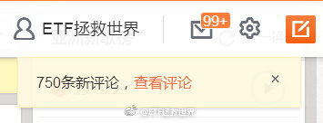

======================================================

ETF拯救世界 (5687069307) @
2018-07-06 09:29:46 Fri  
url: https://weibo.com/5687069307/GoDtWid0a

今天会很精彩。 ​​​

转发[15]  评论[296]  赞[352] 

======================================================

ETF拯救世界 (5687069307) @
2018-07-06 10:33:51 Fri  
url: https://weibo.com/5687069307/GoDTWsbp1

冷静一下，注意节奏。 ​​​

转发[10]  评论[153]  赞[261] 

======================================================

ETF拯救世界 (5687069307) @
2018-07-06 11:05:18 Fri  
url: https://weibo.com/5687069307/GoE6IqSHX

回复@天啊我是笨蛋还不行:肯定不发。又不是开印钞厂的。给空间。//@天啊我是笨蛋还不行:中午不发车？我不信

------------------------------------------------------
转推：
>  @ETF拯救世界 (5687069307)
>  2018-07-06 10:33:51 Fri  
>  url: https:/weibo.com/5687069307/GoDTWsbp1/

>  冷静一下，注意节奏。 ​​​

转发[4]  评论[67]  赞[173] 

======================================================

ETF拯救世界 (5687069307) @
2018-07-06 11:12:06 Fri  
url: https://weibo.com/5687069307/GoE9u5BWL

“结果8年后上证连2700都没到”，你以为是笔误吗。呵呵哒。真的是笔误。

------------------------------------------------------
转推：
>  @ETF拯救世界 (5687069307)
>  2018-07-04 09:04:56 Wed  
>  url: https:/weibo.com/5687069307/GoksSdceN/

>  我们买的所有份数7-10国开债全部盈利。
>  
>  然后，这个基金净值还没回1。
>  
>  也就是说，一个产品赚不赚钱，或者说，一个指数，一个市场很多年后你看涨没涨，都不重要。
>  
>  你依然能赚钱。
>  
>  你信不信。
>  
>  2010年我写过，“很多年后上证还在3000点我们也能赚很多。”结果8年后上证连2700都没到，我们依然赚了很多 ​​​

转发[10]  评论[45]  赞[178] 

======================================================

ETF拯救世界 (5687069307) @
2018-07-06 11:15:22 Fri  
url: https://weibo.com/5687069307/GoEaOdX4d

球球上加杠杆的有没有最新消息。包打听在哪里。 ​​​

转发[7]  评论[119]  赞[190] 

======================================================

ETF拯救世界 (5687069307) @
2018-07-06 11:18:41 Fri  
url: https://weibo.com/5687069307/GoEc8DFiG

回复@O_Zhong_O:2015年唱多的是不是同一批人。确认一下。//@O_Zhong_O:E大，现在很多大V在唱衰，世界在孤立中国//@ETF拯救世界:“结果8年后上证连2700都没到”，你以为是笔误吗。呵呵哒。真的是笔误。

------------------------------------------------------
转推：
>  @ETF拯救世界 (5687069307)
>  2018-07-04 09:04:56 Wed  
>  url: https:/weibo.com/5687069307/GoksSdceN/

>  我们买的所有份数7-10国开债全部盈利。
>  
>  然后，这个基金净值还没回1。
>  
>  也就是说，一个产品赚不赚钱，或者说，一个指数，一个市场很多年后你看涨没涨，都不重要。
>  
>  你依然能赚钱。
>  
>  你信不信。
>  
>  2010年我写过，“很多年后上证还在3000点我们也能赚很多。”结果8年后上证连2700都没到，我们依然赚了很多 ​​​

转发[6]  评论[20]  赞[159] 

======================================================

ETF拯救世界 (5687069307) @
2018-07-06 11:26:20 Fri  
url: https://weibo.com/5687069307/GoEffE0yg

别走开，下午更精彩。

------------------------------------------------------
转推：
>  @ETF拯救世界 (5687069307)
>  2018-07-06 09:29:46 Fri  
>  url: https:/weibo.com/5687069307/GoDtWid0a/

>  今天会很精彩。 ​​​

转发[5]  评论[163]  赞[283] 

======================================================

ETF拯救世界 (5687069307) @
2018-07-06 12:43:49 Fri  
url: https://weibo.com/5687069307/GoEKHAnQF

今天各位可以观察一下大利空实现之前，实现之后，资本市场如何反应。

也可以多观察两天。因为短期走势未必代表市场的意志。 ​​​

转发[24]  评论[131]  赞[317] 

======================================================

ETF拯救世界 (5687069307) @
2018-07-06 13:26:24 Fri  
url: https://weibo.com/5687069307/GoF1Zo472

25个月第一次重买50，是不是最低点。开心。 ​​​

转发[13]  评论[298]  赞[462] 

======================================================

ETF拯救世界 (5687069307) @
2018-07-06 15:53:01 Fri  
url: https://weibo.com/5687069307/GoFZv7ENi

开会回来，无惊无喜。

都散了啊，别围着看了，说你呢。别看别人就是你！ ​​​

转发[2]  评论[116]  赞[230] 

======================================================

ETF拯救世界 (5687069307) @
2018-07-06 16:14:20 Fri  
url: https://weibo.com/5687069307/GoG89vj3f

我想到一件事。

比如说你和一人，他比你能打。然后啪，给你一嘴巴。

说，你不许还手，你要敢还手我再打你十个大嘴巴。

然后你看了看围观群众，发现没人帮你。拿出来手机要摇银儿发现也没什么朋友。

你会怎么做。打的话，你肯定打不过那种。弄不好会被打残。

不顾一切还手还是打110报警。 ​​​

转发[36]  评论[524]  赞[306] 

======================================================

ETF拯救世界 (5687069307) @
2018-07-06 19:45:32 Fri  
url: https://weibo.com/5687069307/GoHvSsNEF

朋友们，最近我又有一条人生经验：

周末文章说…… ​​​

转发[0]  评论[304]  赞[473] 

======================================================

ETF拯救世界 (5687069307) @
2018-07-06 23:15:39 Fri  
url: https://weibo.com/5687069307/GoITai7PI

什么东西啊，美国人一点都不在乎啊，还涨啊。

能不能认真点打贸易战啊，好气哦。

$标普指数 .INX$ ​​​

转发[15]  评论[437]  赞[330] 

======================================================

ETF拯救世界 (5687069307) @
2018-07-07 13:14:33 Sat  
url: https://weibo.com/5687069307/GoOnFpc7G

大周末的，让好多朋友操心了，不好意思。

算是正式离开球球了。其实不是只因为这件事。算是最后一根稻草。

主要我感觉在那边我变成了一个特别二的人。总是跟各种各样的人掰扯，浪费时间，心情变糟，根本无暇输出有用的东西，对不起关注我的十几万人。

彻底离开。就是特别遗憾，我的AEB组合达到预期 ​​​

转发[40]  评论[569]  赞[828] 

======================================================

ETF拯救世界 (5687069307) @
2018-07-07 13:40:08 Sat  
url: https://weibo.com/5687069307/GoOy3DjSJ

但是今天特别让我感动的，是近千评论里绝大多数都是念我好的。好些没什么交集的大V也发帖支持。能这样也算没白混几年。更让我增加很多沿着这条路坚定走下去的信心。

------------------------------------------------------
转推：
>  @ETF拯救世界 (5687069307)
>  2018-07-07 13:14:33 Sat  
>  url: https:/weibo.com/5687069307/GoOnFpc7G/

>  大周末的，让好多朋友操心了，不好意思。
>  
>  算是正式离开球球了。其实不是只因为这件事。算是最后一根稻草。
>  
>  主要我感觉在那边我变成了一个特别二的人。总是跟各种各样的人掰扯，浪费时间，心情变糟，根本无暇输出有用的东西，对不起关注我的十几万人。
>  
>  彻底离开。就是特别遗憾，我的AEB组合达到预期 ​​​

转发[5]  评论[102]  赞[434] 

======================================================

ETF拯救世界 (5687069307) @
2018-07-07 13:41:15 Sat  
url: https://weibo.com/5687069307/GoOywjDHf

回复@ETF拯救世界:然后，球球把我那篇帖子的转发屏蔽了……//@ETF拯救世界:但是今天特别让我感动的，是近千评论里绝大多数都是念我好的。好些没什么交集的大V也发帖支持。能这样也算没白混几年。更让我增加很多沿着这条路坚定走下去的信心。

------------------------------------------------------
转推：
>  @ETF拯救世界 (5687069307)
>  2018-07-07 13:14:33 Sat  
>  url: https:/weibo.com/5687069307/GoOnFpc7G/

>  大周末的，让好多朋友操心了，不好意思。
>  
>  算是正式离开球球了。其实不是只因为这件事。算是最后一根稻草。
>  
>  主要我感觉在那边我变成了一个特别二的人。总是跟各种各样的人掰扯，浪费时间，心情变糟，根本无暇输出有用的东西，对不起关注我的十几万人。
>  
>  彻底离开。就是特别遗憾，我的AEB组合达到预期 ​​​

转发[9]  评论[92]  赞[194] 

======================================================

ETF拯救世界 (5687069307) @
2018-07-07 13:53:01 Sat  
url: https://weibo.com/5687069307/GoODiltkB

回复@随雨的风筝:时间线上看不到。比如你关注梁宏，但是你刷你的主页是看不到他的转发的。但是在他的主页里可以看到//@随雨的风筝:没屏蔽，刚转发了，可以的。//@ETF拯救世界:回复@ETF拯救世界:然后，球球把我那篇帖子的转发屏蔽了……

------------------------------------------------------
转推：
>  @ETF拯救世界 (5687069307)
>  2018-07-07 13:14:33 Sat  
>  url: https:/weibo.com/5687069307/GoOnFpc7G/

>  大周末的，让好多朋友操心了，不好意思。
>  
>  算是正式离开球球了。其实不是只因为这件事。算是最后一根稻草。
>  
>  主要我感觉在那边我变成了一个特别二的人。总是跟各种各样的人掰扯，浪费时间，心情变糟，根本无暇输出有用的东西，对不起关注我的十几万人。
>  
>  彻底离开。就是特别遗憾，我的AEB组合达到预期 ​​​

转发[0]  评论[32]  赞[145] 

======================================================

ETF拯救世界 (5687069307) @
2018-07-07 13:58:43 Sat  
url: https://weibo.com/5687069307/GoOFBnWD5

回复@风听树吟4931:丹书和黑暗时代可以，是在他们之后屏蔽的。雪球这样说。雪球的人跟我说是不希望事情扩大。//@风听树吟4931:回复@ETF拯救世界:我关注的丹书，黑暗时代都看的到//@ETF拯救世界:回复@ETF拯救世界:然后，球球把我那篇帖子的转发屏蔽了……

------------------------------------------------------
转推：
>  @ETF拯救世界 (5687069307)
>  2018-07-07 13:14:33 Sat  
>  url: https:/weibo.com/5687069307/GoOnFpc7G/

>  大周末的，让好多朋友操心了，不好意思。
>  
>  算是正式离开球球了。其实不是只因为这件事。算是最后一根稻草。
>  
>  主要我感觉在那边我变成了一个特别二的人。总是跟各种各样的人掰扯，浪费时间，心情变糟，根本无暇输出有用的东西，对不起关注我的十几万人。
>  
>  彻底离开。就是特别遗憾，我的AEB组合达到预期 ​​​

转发[3]  评论[82]  赞[171] 

======================================================

ETF拯救世界 (5687069307) @
2018-07-07 14:09:59 Sat  
url: https://weibo.com/5687069307/GoOKb3E9Q

回复@喜欢ETF:千万不要。不要有理变成没理。一切走合法途径//@喜欢ETF:回复@细雨龙腾:那人电话多少，我们打电话骚扰

------------------------------------------------------
转推：
>  @ETF拯救世界 (5687069307)
>  2018-07-06 23:15:39 Fri  
>  url: https:/weibo.com/5687069307/GoITai7PI/

>  什么东西啊，美国人一点都不在乎啊，还涨啊。
>  
>  能不能认真点打贸易战啊，好气哦。
>  
>  $标普指数 .INX$ ​​​

转发[7]  评论[97]  赞[204] 

======================================================

ETF拯救世界 (5687069307) @
2018-07-07 14:52:32 Sat  
url: https://weibo.com/5687069307/GoP1sepiX

回复@菠萝油园丁大白:不可能的，那都是我的心血思考和记录。都特别珍贵，绝对不删。//@菠萝油园丁大白:恳求益达别像唐朝那样删光帖子，留个回忆给我们[悲伤]//@ETF拯救世界:回复@喜欢ETF:千万不要。不要有理变成没理。一切走合法途径//@喜欢ETF:回复@细雨龙腾:那人电话多少，我们打电话骚扰

------------------------------------------------------
转推：
>  @ETF拯救世界 (5687069307)
>  2018-07-06 23:15:39 Fri  
>  url: https:/weibo.com/5687069307/GoITai7PI/

>  什么东西啊，美国人一点都不在乎啊，还涨啊。
>  
>  能不能认真点打贸易战啊，好气哦。
>  
>  $标普指数 .INX$ ​​​

转发[6]  评论[258]  赞[359] 

======================================================

ETF拯救世界 (5687069307) @
2018-07-08 17:58:18 Sun  
url: https://weibo.com/5687069307/GoZFlpyGB

公众号，十分钟后发布文章。

不看不是中国人。[并不简单] ​​​

转发[11]  评论[596]  赞[1003] 

======================================================

ETF拯救世界 (5687069307) @
2018-07-08 18:58:31 Sun  
url: https://weibo.com/5687069307/Gp03N3gUm

我希望这事在我公开发布的东西中就结束在这一刻了。

后续的事情我会继续做，但不要整天这样干扰大家的生活了。这是我自己的事，我来处理。

我还会跟大家继续谈投资，谈生活。

周末过去了，新的一周开始了，让辣鸡事情留在这一秒。 ​​​

转发[5]  评论[341]  赞[798] 

======================================================

ETF拯救世界 (5687069307) @
2018-07-08 20:06:42 Sun  
url: https://weibo.com/5687069307/Gp0vt0ysE

其实自己做的有些事回想起来自己会觉得很有意思。。

一般很多券商都会联系有影响力的人推荐开户什么的。每天很多人联系我，我没有答应过。

几年前，有一个我特别喜欢的朋友也有这个任务了，我就帮了他。但也没在公开的地方推荐，只是在一个很小范围内给一些朋友做了推荐。

因为给的条件很优惠（两融 ​​​

转发[6]  评论[312]  赞[511] 

======================================================

ETF拯救世界 (5687069307) @
2018-07-08 21:16:21 Sun  
url: https://weibo.com/5687069307/Gp0XJtlcj

公众号后台留言已经有安定医院的大夫要帮我治疗了。

哪能港，朋友们，我的症状已经表现的这么严重了吗！

开个玩笑，谢谢这位医生…… ​​​

转发[3]  评论[152]  赞[356] 

======================================================

ETF拯救世界 (5687069307) @
2018-07-08 22:34:57 Sun  
url: https://weibo.com/5687069307/Gp1tDz9fJ

不行了，今天真看不完了。还剩1000条没看。

明天继续看吧……老年人要早点睡觉去了…… ​​​

转发[7]  评论[176]  赞[435] 

+++++++++++++++++++++++++++++++++++++++++++++++++++++

图片：
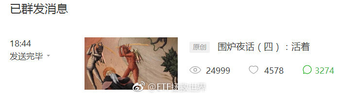

======================================================

ETF拯救世界 (5687069307) @
2018-07-09 09:06:25 Mon  
url: https://weibo.com/5687069307/Gp5BX75wG

据说今天要大涨？

真的假的。

两办怎么没通知我。 ​​​

转发[3]  评论[175]  赞[323] 

======================================================

ETF拯救世界 (5687069307) @
2018-07-09 09:40:41 Mon  
url: https://weibo.com/5687069307/Gp5PRmqnj

喷了，真的假的，第三轮计划50买入全纪录。 ​​​

转发[11]  评论[136]  赞[384] 

+++++++++++++++++++++++++++++++++++++++++++++++++++++

图片：

======================================================

ETF拯救世界 (5687069307) @
2018-07-09 10:13:45 Mon  
url: https://weibo.com/5687069307/Gp63hrFdR

上证反弹200点是正常反弹范围。如果超了，就要考虑反转可能性。

你问我为什么这么说。

当然是瞎蒙的。 ​​​

转发[14]  评论[141]  赞[399] 

======================================================

ETF拯救世界 (5687069307) @
2018-07-09 10:20:58 Mon  
url: https://weibo.com/5687069307/Gp66deMK2

本来周末文章是想讨论一下未来一段时间走势的问题。结果被这破事儿占了两天。

好气哦。

这周末再说吧。 ​​​

转发[5]  评论[179]  赞[430] 

======================================================

ETF拯救世界 (5687069307) @
2018-07-09 11:56:16 Mon  
url: https://weibo.com/5687069307/Gp6IU0Nr6

这次反弹到多少计划会创新高？我初步估计3000-3200？

这就是投资的乐趣。你不用管股市涨不涨，只要有波动，你就能让自己的成本越来越低，筹码越来越多，最后赚的也越来越多。

想要赔钱也很简单，反着做就可以：高位越买越多，低位开始卖。

你以为我们低位买的是谁的筹码？ ​​​

转发[85]  评论[130]  赞[305] 

======================================================

ETF拯救世界 (5687069307) @
2018-07-09 12:09:37 Mon  
url: https://weibo.com/5687069307/Gp6OjlV3z

回复@微鲸发展:我不信A股会一直在2000多点。这是不可能的。十年后，2028年，300、500如果没有五倍以上涨幅我会比较惊讶。//@微鲸发展:就怕这个筹码终究不值钱

------------------------------------------------------
转推：
>  @ETF拯救世界 (5687069307)
>  2018-07-09 11:56:16 Mon  
>  url: https:/weibo.com/5687069307/Gp6IU0Nr6/

>  这次反弹到多少计划会创新高？我初步估计3000-3200？
>  
>  这就是投资的乐趣。你不用管股市涨不涨，只要有波动，你就能让自己的成本越来越低，筹码越来越多，最后赚的也越来越多。
>  
>  想要赔钱也很简单，反着做就可以：高位越买越多，低位开始卖。
>  
>  你以为我们低位买的是谁的筹码？ ​​​

转发[43]  评论[39]  赞[180] 

======================================================

ETF拯救世界 (5687069307) @
2018-07-09 12:18:56 Mon  
url: https://weibo.com/5687069307/Gp6S6iYjN

回复@安小之18:未来怎么走谁也不能确定。大趋势的判断需要底部走出样子来才能看出。不要肯定的认为这是反弹或者反转。设计好应对各种可能的策略到时候执行就可以。//@安小之18:亲们，是不是说到3000多点还会下跌回来？

------------------------------------------------------
转推：
>  @ETF拯救世界 (5687069307)
>  2018-07-09 11:56:16 Mon  
>  url: https:/weibo.com/5687069307/Gp6IU0Nr6/

>  这次反弹到多少计划会创新高？我初步估计3000-3200？
>  
>  这就是投资的乐趣。你不用管股市涨不涨，只要有波动，你就能让自己的成本越来越低，筹码越来越多，最后赚的也越来越多。
>  
>  想要赔钱也很简单，反着做就可以：高位越买越多，低位开始卖。
>  
>  你以为我们低位买的是谁的筹码？ ​​​

转发[9]  评论[32]  赞[168] 

======================================================

ETF拯救世界 (5687069307) @
2018-07-09 12:58:12 Mon  
url: https://weibo.com/5687069307/Gp7826Xv6

回复@王者华山:2008年，中证500最低1488，目前涨幅241%。期间最高涨到11616，涨幅680%。目前500估值与2008年次低点估值几乎一致。可自行判断未来十年A股会否有可能出现哪怕一次大牛市。//@王者华山:2008年时，有没有人说这些话？

------------------------------------------------------
转推：
>  @ETF拯救世界 (5687069307)
>  2018-07-09 11:56:16 Mon  
>  url: https:/weibo.com/5687069307/Gp6IU0Nr6/

>  这次反弹到多少计划会创新高？我初步估计3000-3200？
>  
>  这就是投资的乐趣。你不用管股市涨不涨，只要有波动，你就能让自己的成本越来越低，筹码越来越多，最后赚的也越来越多。
>  
>  想要赔钱也很简单，反着做就可以：高位越买越多，低位开始卖。
>  
>  你以为我们低位买的是谁的筹码？ ​​​

转发[25]  评论[54]  赞[198] 

======================================================

ETF拯救世界 (5687069307) @
2018-07-09 13:04:34 Mon  
url: https://weibo.com/5687069307/Gp7aCiKmm

再跟大家分享一下牛熊市大多数人的想法。

在牛市中，绝大多数人都不信股市还会跌到一个很低的地方。怎么看都不可能，一路向上，情绪激昂。怎么可能跌？哪怕跌，也一定是到更高的地方以后才会跌。

熊市中则相反。绝大多数人甚至想象不出牛市的样子。因为各种因素都太差了，差到没人相信未来股市会走牛 ​​​

转发[70]  评论[200]  赞[363] 

======================================================

ETF拯救世界 (5687069307) @
2018-07-09 15:13:58 Mon  
url: https://weibo.com/5687069307/Gp818ypYx

回复@小马快乐跑:气什么。我们仓位越加越重，7月以来一周多时间已经连发两车，买的这么低，今天净值将大幅反弹，开心都来不及啊。//@小马快乐跑:怎么不跌了，好气哟

------------------------------------------------------
转推：
>  @ETF拯救世界 (5687069307)
>  2018-07-09 13:04:34 Mon  
>  url: https:/weibo.com/5687069307/Gp7aCiKmm/

>  再跟大家分享一下牛熊市大多数人的想法。
>  
>  在牛市中，绝大多数人都不信股市还会跌到一个很低的地方。怎么看都不可能，一路向上，情绪激昂。怎么可能跌？哪怕跌，也一定是到更高的地方以后才会跌。
>  
>  熊市中则相反。绝大多数人甚至想象不出牛市的样子。因为各种因素都太差了，差到没人相信未来股市会走牛 ​​​

转发[8]  评论[70]  赞[153] 

======================================================

ETF拯救世界 (5687069307) @
2018-07-09 15:18:11 Mon  
url: https://weibo.com/5687069307/Gp82QFgn8

回复@要么唯一要么第一:这不是“说”。而是跟几万人一起“做”的。计划了解一下。//@要么唯一要么第一:你看跌，涨了又说自己加仓了[允悲]//@ETF拯救世界:回复@小马快乐跑:气什么。我们仓位越加越重，7月以来一周多时间已经连发两车，买的这么低，今天净值将大幅反弹，开心都来不及啊。

------------------------------------------------------
转推：
>  @ETF拯救世界 (5687069307)
>  2018-07-09 13:04:34 Mon  
>  url: https:/weibo.com/5687069307/Gp7aCiKmm/

>  再跟大家分享一下牛熊市大多数人的想法。
>  
>  在牛市中，绝大多数人都不信股市还会跌到一个很低的地方。怎么看都不可能，一路向上，情绪激昂。怎么可能跌？哪怕跌，也一定是到更高的地方以后才会跌。
>  
>  熊市中则相反。绝大多数人甚至想象不出牛市的样子。因为各种因素都太差了，差到没人相信未来股市会走牛 ​​​

转发[1]  评论[56]  赞[163] 

======================================================

ETF拯救世界 (5687069307) @
2018-07-09 18:32:30 Mon  
url: https://weibo.com/5687069307/Gp9jJ2Z7C

4000留言。我毛估估，这个公众号五年内不可能再有文章打破这个留言记录了……我会每条都看的。 http://t.cn/RdWJej7

------------------------------------------------------
转推：
>  @ETF拯救世界 (5687069307)
>  2018-07-08 22:34:57 Sun  
>  url: https:/weibo.com/5687069307/Gp1tDz9fJ/

>  不行了，今天真看不完了。还剩1000条没看。
>  
>  明天继续看吧……老年人要早点睡觉去了…… ​​​

转发[3]  评论[255]  赞[426] 

======================================================

ETF拯救世界 (5687069307) @
2018-07-09 22:58:48 Mon  
url: https://weibo.com/5687069307/Gpb3Outmy

每日打卡（193）

坚持！ ​​​

转发[1]  评论[44]  赞[301] 

+++++++++++++++++++++++++++++++++++++++++++++++++++++

图片：

======================================================

ETF拯救世界 (5687069307) @
2018-07-10 08:45:41 Tue  
url: https://weibo.com/5687069307/GpeU28kpz

不错。

六天逾240亿元借道ETF入市 华安创业板50ETF破百亿 http://t.cn/RdjEJkx ​​​

转发[39]  评论[118]  赞[212] 

======================================================

ETF拯救世界 (5687069307) @
2018-07-10 10:20:01 Tue  
url: https://weibo.com/5687069307/Gpfwk6Cy7

回复@穿越30年:这事也不好说。几个月前说大资金大幅申购券商指数基金，结果还不是凉凉了//@穿越30年:益达，按你的理解，是什么资金在大笔申购ETF呢？应该不是追涨杀跌的散户，也不会是公募基金，他们大都是直接买股票的...

------------------------------------------------------
转推：
>  @ETF拯救世界 (5687069307)
>  2018-07-10 08:45:41 Tue  
>  url: https:/weibo.com/5687069307/GpeU28kpz/

>  不错。
>  
>  六天逾240亿元借道ETF入市 华安创业板50ETF破百亿 http://t.cn/RdjEJkx ​​​

转发[24]  评论[30]  赞[107] 

======================================================

ETF拯救世界 (5687069307) @
2018-07-10 10:34:59 Tue  
url: https://weibo.com/5687069307/GpfCpa3eT

回复@巧巧蜂蜜:我心目中的神操作是2013年上半年真正的GJD入场扫货50和180,2015年5月清仓走人。叹为观止。//@巧巧蜂蜜:大资金左侧入场，凉凉也是很正常的//@ETF拯救世界:回复@穿越30年:这事也不好说。几个月前说大资金大幅申购券商指数基金，结果还不是凉凉了

------------------------------------------------------
转推：
>  @ETF拯救世界 (5687069307)
>  2018-07-10 08:45:41 Tue  
>  url: https:/weibo.com/5687069307/GpeU28kpz/

>  不错。
>  
>  六天逾240亿元借道ETF入市 华安创业板50ETF破百亿 http://t.cn/RdjEJkx ​​​

转发[15]  评论[33]  赞[138] 

======================================================

ETF拯救世界 (5687069307) @
2018-07-10 10:39:55 Tue  
url: https://weibo.com/5687069307/GpfEoD2tf

来，让你们看一下真正的GJD实力。不是2015年下半年之后的那只

2013年：
http://t.cn/RdTtuBy

2015年：
http://t.cn/R2fBgzk

说股神，我只认大内高手。 ​​​

转发[114]  评论[108]  赞[224] 

======================================================

ETF拯救世界 (5687069307) @
2018-07-10 10:49:41 Tue  
url: https://weibo.com/5687069307/GpfIn8iUR

回复@火眼金睛_qq:买ETF有什么底牌。买点第二轮计划与他们差不多。卖点就差多了。我们4月就卖掉大部分了，然而他们5月才走，又多吃了不少。这种操作无须底牌。稍微有点理智就行。他们牛在真是从头吃到尾。//@火眼金睛_qq:靠，这些都是看了底牌的选手。不公平

------------------------------------------------------
转推：
>  @ETF拯救世界 (5687069307)
>  2018-07-10 10:39:55 Tue  
>  url: https:/weibo.com/5687069307/GpfEoD2tf/

>  来，让你们看一下真正的GJD实力。不是2015年下半年之后的那只
>  
>  2013年：
>  http://t.cn/RdTtuBy
>  
>  2015年：
>  http://t.cn/R2fBgzk
>  
>  说股神，我只认大内高手。 ​​​

转发[46]  评论[65]  赞[148] 

======================================================

ETF拯救世界 (5687069307) @
2018-07-10 10:59:30 Tue  
url: https://weibo.com/5687069307/GpfMlxnY2

回复@间歇性精神病828:其实不会有什么影响。他们进出也就几百亿。但是2015年仅杠杆资金，两融余额就有23000亿，场外配资估计得再加几万亿。GJD那几百亿扔进去水花都没有。

------------------------------------------------------
转推：
>  @ETF拯救世界 (5687069307)
>  2018-07-10 10:39:55 Tue  
>  url: https:/weibo.com/5687069307/GpfEoD2tf/

>  来，让你们看一下真正的GJD实力。不是2015年下半年之后的那只
>  
>  2013年：
>  http://t.cn/RdTtuBy
>  
>  2015年：
>  http://t.cn/R2fBgzk
>  
>  说股神，我只认大内高手。 ​​​

转发[12]  评论[19]  赞[113] 

======================================================

ETF拯救世界 (5687069307) @
2018-07-10 11:09:32 Tue  
url: https://weibo.com/5687069307/GpfQqssN8

回复@nemours-2号炉:人家吃完了走了，你在那舔盘子的时候，服务员拿着账单找你来了。为了两口菜汤，你把一桌子的单给买了。//@nemours-2号炉:回复@牛牛s:舔舔盘子可爱

------------------------------------------------------
转推：
>  @ETF拯救世界 (5687069307)
>  2018-07-10 10:39:55 Tue  
>  url: https:/weibo.com/5687069307/GpfEoD2tf/

>  来，让你们看一下真正的GJD实力。不是2015年下半年之后的那只
>  
>  2013年：
>  http://t.cn/RdTtuBy
>  
>  2015年：
>  http://t.cn/R2fBgzk
>  
>  说股神，我只认大内高手。 ​​​

转发[9]  评论[64]  赞[183] 

======================================================

ETF拯救世界 (5687069307) @
2018-07-10 11:26:50 Tue  
url: https://weibo.com/5687069307/GpfXrsMZi

回复@感恩禅心:这个是正道。钱不能让你一个人赚了，保持一份佛心，留点钱给别人赚，反而会更好。不信各位可以试试。总想赚尽最后一个铜板，太贪就可能出事。//@感恩禅心:总要留点给别人吃吧

------------------------------------------------------
转推：
>  @ETF拯救世界 (5687069307)
>  2018-07-10 10:39:55 Tue  
>  url: https:/weibo.com/5687069307/GpfEoD2tf/

>  来，让你们看一下真正的GJD实力。不是2015年下半年之后的那只
>  
>  2013年：
>  http://t.cn/RdTtuBy
>  
>  2015年：
>  http://t.cn/R2fBgzk
>  
>  说股神，我只认大内高手。 ​​​

转发[22]  评论[52]  赞[206] 

======================================================

ETF拯救世界 (5687069307) @
2018-07-10 14:08:12 Tue  
url: https://weibo.com/5687069307/Gph0Wp9mR

回复@一场清风一场秋梦:我是有心帮助各位有需求的帅哥美女，但太多问题了啊。比如，万一非单身人士来欺骗感情怎么办。。//@一场清风一场秋梦:我只关心江浙沪e大相亲会[doge][doge][doge]

------------------------------------------------------
转推：
>  @ETF拯救世界 (5687069307)
>  2018-07-10 10:39:55 Tue  
>  url: https:/weibo.com/5687069307/GpfEoD2tf/

>  来，让你们看一下真正的GJD实力。不是2015年下半年之后的那只
>  
>  2013年：
>  http://t.cn/RdTtuBy
>  
>  2015年：
>  http://t.cn/R2fBgzk
>  
>  说股神，我只认大内高手。 ​​​

转发[8]  评论[85]  赞[111] 

======================================================

ETF拯救世界 (5687069307) @
2018-07-10 15:07:22 Tue  
url: https://weibo.com/5687069307/GphoXme2x

一年没有答题了吧，简单回答一个问题。

我回答了 @大不拉不dabulabu 的问题，问题价值￥99.00，大家快来花1元围观~ http://t.cn/RdOCDpW ​​​

转发[337]  评论[307]  赞[542] 

======================================================

ETF拯救世界 (5687069307) @
2018-07-10 15:11:49 Tue  
url: https://weibo.com/5687069307/GphqLokFu

回复@河上雨:我这一年多，后台几百个问题，回答了一个。99块。您可太操心了。别的不说，每年给大家过年红包我就发小一万，您赶紧休息休息吧。//@河上雨:股市里那么赚钱，那么神算，何需还要收费微博？？？！！！

------------------------------------------------------
转推：
>  @ETF拯救世界 (5687069307)
>  2018-07-10 15:07:22 Tue  
>  url: https:/weibo.com/5687069307/GphoXme2x/

>  一年没有答题了吧，简单回答一个问题。
>  
>  我回答了 @大不拉不dabulabu 的问题，问题价值￥99.00，大家快来花1元围观~ http://t.cn/RdOCDpW ​​​

转发[0]  评论[50]  赞[104] 

======================================================

ETF拯救世界 (5687069307) @
2018-07-10 15:16:53 Tue  
url: https://weibo.com/5687069307/GphsPjJqw

回复@卖萌货微博:其实公众号有个周末问答，也好久没更新了。我准备把好的问题归拢一下放在那里回答。今天闲着没事答一个又被质疑了。[doge]//@卖萌货微博:回复@ETF拯救世界:希望花点时间把高质量提问的都答啦。太想看了。不过很浪费E大休息的时间来讲自己的投资逻辑和想法。

------------------------------------------------------
转推：
>  @ETF拯救世界 (5687069307)
>  2018-07-10 15:07:22 Tue  
>  url: https:/weibo.com/5687069307/GphoXme2x/

>  一年没有答题了吧，简单回答一个问题。
>  
>  我回答了 @大不拉不dabulabu 的问题，问题价值￥99.00，大家快来花1元围观~ http://t.cn/RdOCDpW ​​​

转发[1]  评论[19]  赞[103] 

======================================================

ETF拯救世界 (5687069307) @
2018-07-10 15:18:33 Tue  
url: https://weibo.com/5687069307/GphtvgtWs

回复@我是真的不知道用什么昵称:其实他的质疑也合理。但只能说他不了解我。哪怕他知道前几天球球活动我得了华为手机转手送给粉丝的事，估计这种质疑就不会有了。//@我是真的不知道用什么昵称:回复@河上雨:为什么总有些人内心如此阴暗？阴阳怪气的 看着难受

------------------------------------------------------
转推：
>  @ETF拯救世界 (5687069307)
>  2018-07-10 15:07:22 Tue  
>  url: https:/weibo.com/5687069307/GphoXme2x/

>  一年没有答题了吧，简单回答一个问题。
>  
>  我回答了 @大不拉不dabulabu 的问题，问题价值￥99.00，大家快来花1元围观~ http://t.cn/RdOCDpW ​​​

转发[8]  评论[54]  赞[81] 

======================================================

ETF拯救世界 (5687069307) @
2018-07-10 15:45:04 Tue  
url: https://weibo.com/5687069307/GphEgg4fg

回复@有波动有机会:99一位。被选中的提问的人会赚很多。有一半围观答案的收入归提问人。所以谁能想出好的问题，谁就能赚钱。。收益率会非常高。//@有波动有机会:我E大回答问题只看心情，不看价格！

------------------------------------------------------
转推：
>  @ETF拯救世界 (5687069307)
>  2018-07-10 15:07:22 Tue  
>  url: https:/weibo.com/5687069307/GphoXme2x/

>  一年没有答题了吧，简单回答一个问题。
>  
>  我回答了 @大不拉不dabulabu 的问题，问题价值￥99.00，大家快来花1元围观~ http://t.cn/RdOCDpW ​​​

转发[6]  评论[31]  赞[97] 

======================================================

ETF拯救世界 (5687069307) @
2018-07-10 16:04:11 Tue  
url: https://weibo.com/5687069307/GphM1eq94

回复@看我看我252:不限制。我不能告诉你什么话题最好，我只能说，群众们都很庸俗。//@看我看我252:回复@ETF拯救世界:我得好好想想，话题限制范围吗

------------------------------------------------------
转推：
>  @ETF拯救世界 (5687069307)
>  2018-07-10 15:07:22 Tue  
>  url: https:/weibo.com/5687069307/GphoXme2x/

>  一年没有答题了吧，简单回答一个问题。
>  
>  我回答了 @大不拉不dabulabu 的问题，问题价值￥99.00，大家快来花1元围观~ http://t.cn/RdOCDpW ​​​

转发[3]  评论[29]  赞[84] 

======================================================

ETF拯救世界 (5687069307) @
2018-07-10 16:08:55 Tue  
url: https://weibo.com/5687069307/GphNWBHS1

$162411  油气7毛了。

你们谁还记得十个月前，净值3毛多的时候，多少人说石油价格再也涨不起来了，电动车的世界来了。

任何品种，低位的时候，一定有无数理由看衰它。你根本就不要在意任何噪音。好好分析这个品种本身，找到适合它的策略。

听大众的噪音，能赚钱是奇迹。 ​​​

转发[41]  评论[156]  赞[312] 

======================================================

ETF拯救世界 (5687069307) @
2018-07-10 16:48:52 Tue  
url: https://weibo.com/5687069307/Gpi4acSjC

回复@ch506:健身。弄个好的发型。首撩成功率增加37.4个巴仙。//@ch506:想请问E大有没有什么快速自我提升的方法，可以增加撩妹成功率的分享一下，最好具体展开讲讲（这个够俗气？）[doge][doge][doge]//@ETF拯救世界:回复@看我看我252:不限制。我不能告诉你什么话题最好，我只能说，群众们都很庸俗。

------------------------------------------------------
转推：
>  @ETF拯救世界 (5687069307)
>  2018-07-10 15:07:22 Tue  
>  url: https:/weibo.com/5687069307/GphoXme2x/

>  一年没有答题了吧，简单回答一个问题。
>  
>  我回答了 @大不拉不dabulabu 的问题，问题价值￥99.00，大家快来花1元围观~ http://t.cn/RdOCDpW ​​​

转发[2]  评论[97]  赞[106] 

======================================================

ETF拯救世界 (5687069307) @
2018-07-10 20:17:42 Tue  
url: https://weibo.com/5687069307/GpjqVwqdM

看到一个好问题。如果我回答，提问人至少能赚2000。

但是我不会回答。

我会在公众号写篇文章回答。不要钱。

就最近。 ​​​

转发[5]  评论[251]  赞[655] 

======================================================

ETF拯救世界 (5687069307) @
2018-07-10 22:17:44 Tue  
url: https://weibo.com/5687069307/GpkdE4Ek4

每日打卡（194）

坚持。总感觉应该加量 ​​​

转发[0]  评论[44]  赞[197] 

+++++++++++++++++++++++++++++++++++++++++++++++++++++

图片：

======================================================

ETF拯救世界 (5687069307) @
2018-07-11 09:05:07 Wed  
url: https://weibo.com/5687069307/GposqirvW

2000亿，今天又要好看了。

连续剧啊，高潮不断。 ​​​

转发[41]  评论[169]  赞[265] 

======================================================

ETF拯救世界 (5687069307) @
2018-07-11 09:11:28 Wed  
url: https://weibo.com/5687069307/GpouZy3Hm

回复@夜雨梧桐2010:这得美国队里有银儿吧//@夜雨梧桐2010:没看到消息啊，队长，是队里内部通知的吗？

------------------------------------------------------
转推：
>  @ETF拯救世界 (5687069307)
>  2018-07-11 09:05:07 Wed  
>  url: https:/weibo.com/5687069307/GposqirvW/

>  2000亿，今天又要好看了。
>  
>  连续剧啊，高潮不断。 ​​​

转发[33]  评论[109]  赞[154] 

======================================================

ETF拯救世界 (5687069307) @
2018-07-11 10:25:24 Wed  
url: https://weibo.com/5687069307/GpoZ0jrGG

回复@A小散的梦想:想多了。目前距离上次买入没有什么空间，没必要着急发车。眼看快月中了，急什么，不要急。踏踏实实的。//@A小散的梦想:E大一个小时没发言，肯定是写发车文去了，兄弟姐妹们准备子弹吧😄//@ETF拯救世界:回复@夜雨梧桐2010:这得美国队里有银儿吧

------------------------------------------------------
转推：
>  @ETF拯救世界 (5687069307)
>  2018-07-11 09:05:07 Wed  
>  url: https:/weibo.com/5687069307/GposqirvW/

>  2000亿，今天又要好看了。
>  
>  连续剧啊，高潮不断。 ​​​

转发[30]  评论[59]  赞[190] 

======================================================

ETF拯救世界 (5687069307) @
2018-07-11 10:49:18 Wed  
url: https://weibo.com/5687069307/Gpp8HhLOO

我理解的“趋势”，与很多人不同。好多人一天两天，就能看出趋势变了。

我不行，我能力比较差。在我的观察体系中，可能甚至需要数周，才能判断大概率趋势变了还是没变。

确实，我没有那些灵敏度高的人抓到超级大底的可能性大。但是，我的概率会比较大。而且我很难被骗。你拉两根阳线想骗我，呵呵哒。 ​​​

转发[90]  评论[229]  赞[477] 

======================================================

ETF拯救世界 (5687069307) @
2018-07-11 11:01:57 Wed  
url: https://weibo.com/5687069307/GppdQ9hMZ

另外，我不知道是微博新关注我的人比较多，还是球球的喷子跟过来了。

稍微反弹一点就冷嘲热讽。

喷了。

你是不是以为我是空头呢？你以为我看跌呢？

哥们，把键盘收起来吧。我的仓位非常舒服。涨了我特别开心，跌了也很开心。

如果能更低呢，当然不错。我还有钱， 买了以后能赚更多。涨了呢不知道 ​​​

转发[17]  评论[243]  赞[406] 

======================================================

ETF拯救世界 (5687069307) @
2018-07-11 11:16:26 Wed  
url: https://weibo.com/5687069307/GppjItOGi

回复@adnap_314:下次你们领导开会的时候说完话，你说一句呵呵哒，就知道什么意思了。//@adnap_314:益达益达，呵呵哒是啥意思，我也想呵呵哒呵呵哒[doge]

------------------------------------------------------
转推：
>  @ETF拯救世界 (5687069307)
>  2018-07-11 10:49:18 Wed  
>  url: https:/weibo.com/5687069307/Gpp8HhLOO/

>  我理解的“趋势”，与很多人不同。好多人一天两天，就能看出趋势变了。
>  
>  我不行，我能力比较差。在我的观察体系中，可能甚至需要数周，才能判断大概率趋势变了还是没变。
>  
>  确实，我没有那些灵敏度高的人抓到超级大底的可能性大。但是，我的概率会比较大。而且我很难被骗。你拉两根阳线想骗我，呵呵哒。 ​​​

转发[0]  评论[45]  赞[163] 

======================================================

ETF拯救世界 (5687069307) @
2018-07-11 11:26:37 Wed  
url: https://weibo.com/5687069307/GppnR1ZYZ

回复@加糖_咖啡:没错啊。月初一发，上次一发，月中一发，第三周一发。哪儿错了。//@加糖_咖啡:说好的每周一发呢[泪]//@ETF拯救世界:回复@A小散的梦想:想多了。目前距离上次买入没有什么空间，没必要着急发车。眼看快月中了，急什么，不要急。踏踏实实的。

------------------------------------------------------
转推：
>  @ETF拯救世界 (5687069307)
>  2018-07-11 09:05:07 Wed  
>  url: https:/weibo.com/5687069307/GposqirvW/

>  2000亿，今天又要好看了。
>  
>  连续剧啊，高潮不断。 ​​​

转发[27]  评论[71]  赞[149] 

======================================================

ETF拯救世界 (5687069307) @
2018-07-11 13:35:29 Wed  
url: https://weibo.com/5687069307/Gpqea1cHE

回复@用户5319322024:我本人鼓励大家用keep锻炼完发自拍然后圈我，大家互相监督……//@用户5319322024:回复@litterwitch:不早说？我刚刚删了keep[挖鼻]

------------------------------------------------------
转推：
>  @ETF拯救世界 (5687069307)
>  2018-07-11 11:01:57 Wed  
>  url: https:/weibo.com/5687069307/GppdQ9hMZ/

>  另外，我不知道是微博新关注我的人比较多，还是球球的喷子跟过来了。
>  
>  稍微反弹一点就冷嘲热讽。
>  
>  喷了。
>  
>  你是不是以为我是空头呢？你以为我看跌呢？
>  
>  哥们，把键盘收起来吧。我的仓位非常舒服。涨了我特别开心，跌了也很开心。
>  
>  如果能更低呢，当然不错。我还有钱， 买了以后能赚更多。涨了呢不知道 ​​​

转发[1]  评论[55]  赞[135] 

======================================================

ETF拯救世界 (5687069307) @
2018-07-11 13:46:46 Wed  
url: https://weibo.com/5687069307/GpqiJm5al

回复@姜小葵77:如果再这么跌下去，我怀疑不远的未来会发生一次非常强烈的反弹。//@姜小葵77:500又破5000了[嘻嘻]//@ETF拯救世界:回复@加糖_咖啡:没错啊。月初一发，上次一发，月中一发，第三周一发。哪儿错了。//@加糖_咖啡:说好的每周一发呢[泪]

------------------------------------------------------
转推：
>  @ETF拯救世界 (5687069307)
>  2018-07-11 09:05:07 Wed  
>  url: https:/weibo.com/5687069307/GposqirvW/

>  2000亿，今天又要好看了。
>  
>  连续剧啊，高潮不断。 ​​​

转发[21]  评论[50]  赞[180] 

======================================================

ETF拯救世界 (5687069307) @
2018-07-11 14:01:20 Wed  
url: https://weibo.com/5687069307/GpqoEmOsJ

回复@喜欢ETF:我考虑好了。95%确定了。基本长线仓位布置完毕后，在计划里用一部分资金做波段。应对未来可能出现的只有波动没有涨幅的情况。//@喜欢ETF:E大带我们做波段//@ETF拯救世界:回复@姜小葵77:如果再这么跌下去，我怀疑不远的未来会发生一次非常强烈的反弹。//@姜小葵77:500又破5000了[嘻嘻]

------------------------------------------------------
转推：
>  @ETF拯救世界 (5687069307)
>  2018-07-11 09:05:07 Wed  
>  url: https:/weibo.com/5687069307/GposqirvW/

>  2000亿，今天又要好看了。
>  
>  连续剧啊，高潮不断。 ​​​

转发[17]  评论[116]  赞[321] 

======================================================

ETF拯救世界 (5687069307) @
2018-07-11 14:18:13 Wed  
url: https://weibo.com/5687069307/GpqvvzjyF

回复@日照雷门peter:今天两只500etf都放巨量。不知道是谁在进场。//@日照雷门peter:500出现13万手买单，土豪[允悲]捡漏都拣不了啊[泪][泪]//@ETF拯救世界:回复@喜欢ETF:我考虑好了。95%确定了。基本长线仓位布置完毕后，在计划里用一部分资金做波段。应对未来可能出现的只有波动没有涨幅的情况。

------------------------------------------------------
转推：
>  @ETF拯救世界 (5687069307)
>  2018-07-11 09:05:07 Wed  
>  url: https:/weibo.com/5687069307/GposqirvW/

>  2000亿，今天又要好看了。
>  
>  连续剧啊，高潮不断。 ​​​

转发[7]  评论[54]  赞[155] 

======================================================

ETF拯救世界 (5687069307) @
2018-07-11 14:34:38 Wed  
url: https://weibo.com/5687069307/GpqCamKJu

回复@谷爆:别发这种了。节奏我会掌握好。自己的黑车可以随便开。//@谷爆:队长我们还等什么？跑步进场吧！//@ETF拯救世界:回复@日照雷门peter:今天两只500etf都放巨量。不知道是谁在进场。//@日照雷门peter:500出现13万手买单，土豪[允悲]捡漏都拣不了啊[泪][泪]

------------------------------------------------------
转推：
>  @ETF拯救世界 (5687069307)
>  2018-07-11 09:05:07 Wed  
>  url: https:/weibo.com/5687069307/GposqirvW/

>  2000亿，今天又要好看了。
>  
>  连续剧啊，高潮不断。 ​​​

转发[1]  评论[79]  赞[174] 

======================================================

ETF拯救世界 (5687069307) @
2018-07-11 15:00:14 Wed  
url: https://weibo.com/5687069307/GpqMyBrrE

刚看到，喷了。 ​​​

转发[6]  评论[86]  赞[168] 

+++++++++++++++++++++++++++++++++++++++++++++++++++++

图片：

======================================================

ETF拯救世界 (5687069307) @
2018-07-11 15:05:33 Wed  
url: https://weibo.com/5687069307/GpqOJ4R0k

回复@石头里的虫子:我看到了。她说的其他东西我就不评价了，“其他的质疑，确有不严谨之处（绝无伪造），双方沟通中早已解释和致歉。”完全是乱扯。解释和道歉完全没有。可惜我不能在雪球发东西了。//@石头里的虫子:还有更喷的:白话投资说你投降了。

------------------------------------------------------
转推：
>  @ETF拯救世界 (5687069307)
>  2018-07-11 15:00:14 Wed  
>  url: https:/weibo.com/5687069307/GpqMyBrrE/

>  刚看到，喷了。 ​​​

转发[4]  评论[138]  赞[121] 

======================================================

ETF拯救世界 (5687069307) @
2018-07-11 15:50:49 Wed  
url: https://weibo.com/5687069307/Gpr75A5ZU

回复@花悟菩提:雪球有些员工真的特别好。帮我把两家同样被诬陷的公司拉到一起商量对策。我是真的感激。但是平台，我就不评价了。对我的帖子限流，为我说话的没有一句脏话也禁言。不说了。就此结束。//@花悟菩提:雪球作为平台方都不管吗？这么无作为以后只会越办越差

------------------------------------------------------
转推：
>  @ETF拯救世界 (5687069307)
>  2018-07-11 15:00:14 Wed  
>  url: https:/weibo.com/5687069307/GpqMyBrrE/

>  刚看到，喷了。 ​​​

转发[1]  评论[69]  赞[148] 

======================================================

ETF拯救世界 (5687069307) @
2018-07-11 16:14:44 Wed  
url: https://weibo.com/5687069307/GprgNsyV3

说出来你不信

连中证1000都快跌破2PB了…… ​​​

转发[18]  评论[123]  赞[223] 

======================================================

ETF拯救世界 (5687069307) @
2018-07-11 16:22:53 Wed  
url: https://weibo.com/5687069307/Gprk6uTc8

回复@laosui666:不至于，上次是2013年4月。也就5年。连2012年底都没到呢。更不用说2008。还要努力啊。//@laosui666:十年一遇啊[笑cry]

------------------------------------------------------
转推：
>  @ETF拯救世界 (5687069307)
>  2018-07-11 16:14:44 Wed  
>  url: https:/weibo.com/5687069307/GprgNsyV3/

>  说出来你不信
>  
>  连中证1000都快跌破2PB了…… ​​​

转发[11]  评论[68]  赞[171] 

======================================================

ETF拯救世界 (5687069307) @
2018-07-11 18:36:01 Wed  
url: https://weibo.com/5687069307/Gpsc96CYc

关于那件事，本来说了不说了。但既然事情又有了变化，我再多说几句。这几句话，主要是说给各位关注我的朋友的。

特别感谢大家的支持。从那天晚上开始，到现在几天的时间，切切实实感受到潮水一样的支持。这也是我为什么能迅速恢复情绪，把注意力转向正常生活和投资的关键。

今天对方发的这个东西，每 ​​​

转发[22]  评论[286]  赞[929] 

======================================================

ETF拯救世界 (5687069307) @
2018-07-11 18:57:07 Wed  
url: https://weibo.com/5687069307/GpskIpUIA

回复@进击的足球小将:各种渠道联系我的律师朋友一共十三位，有各个领域的，北京上海广州都有。还两位我都比较吃惊居然在关注我，相当有名气。加上我自己的朋友，律师肯定够了。。只能说，十万关注我的人里面真是藏龙卧虎……//@进击的足球小将:如果有个律师，会不会好一点

------------------------------------------------------
转推：
>  @ETF拯救世界 (5687069307)
>  2018-07-11 18:36:01 Wed  
>  url: https:/weibo.com/5687069307/Gpsc96CYc/

>  关于那件事，本来说了不说了。但既然事情又有了变化，我再多说几句。这几句话，主要是说给各位关注我的朋友的。
>  
>  特别感谢大家的支持。从那天晚上开始，到现在几天的时间，切切实实感受到潮水一样的支持。这也是我为什么能迅速恢复情绪，把注意力转向正常生活和投资的关键。
>  
>  今天对方发的这个东西，每 ​​​

转发[3]  评论[160]  赞[382] 

======================================================

ETF拯救世界 (5687069307) @
2018-07-11 22:53:30 Wed  
url: https://weibo.com/5687069307/GptSFjlF9

是的看到了，标普500重挫0.4%。我A微跌2%

------------------------------------------------------
转推：
>  @ ()
>  2018-07-11 22:49:48 Wed  
>  url: 

>  抱歉，此微博已被作者删除。查看帮助：http://t.cn/Rfd3rQV

转发[1]  评论[50]  赞[176] 

======================================================

ETF拯救世界 (5687069307) @
2018-07-11 23:00:00 Wed  
url: https://weibo.com/5687069307/GptViE0pX

人多真的不是国富民强的根本。

------------------------------------------------------
转推：
>  @财联社APP (2868676035)
>  2018-07-11 22:34:19 Wed  
>  url: https:/weibo.com/2868676035/GptKSbCGB/

>  【国家卫健委已组织专家研究奖励生育可能性 测算对不同孩次家庭给予奖励 年底或上报有关部门】今年以来，国家卫健委已组织专家，研究奖励生育的可能性，测算对不同孩次家庭给予奖励，所能带来对刺激生育的不同效果。研究预计将在年底完成，届时可能上报国家有关部门。该研究将探讨包括对生育子女家庭给 ​​​

转发[10]  评论[99]  赞[158] 

======================================================

ETF拯救世界 (5687069307) @
2018-07-11 23:11:55 Wed  
url: https://weibo.com/5687069307/Gpu08lIWJ

7左右开始出辣鸡美元债。要你何用。 ​​​

转发[4]  评论[91]  赞[204] 

+++++++++++++++++++++++++++++++++++++++++++++++++++++

图片：
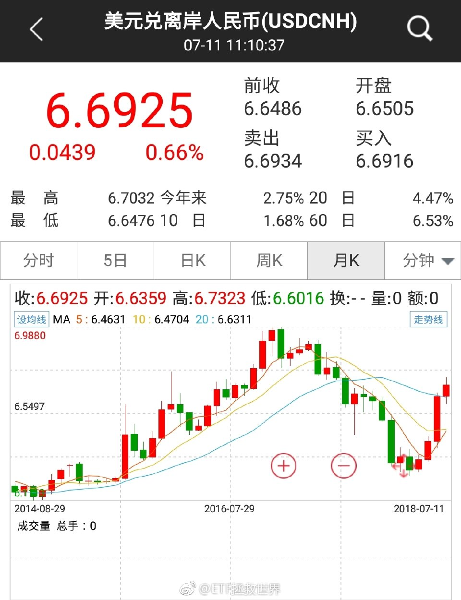

======================================================

ETF拯救世界 (5687069307) @
2018-07-12 10:11:09 Thu  
url: https://weibo.com/5687069307/GpyjIoHOY

$全指医药 sh000991$   医药最稳。 ​​​

转发[4]  评论[77]  赞[184] 

======================================================

ETF拯救世界 (5687069307) @
2018-07-12 10:22:26 Thu  
url: https://weibo.com/5687069307/Gpyoi3Y1i

看到一些关于是否应该始终满仓的争论。

我总是不清楚，为什么每个人都认为这个世界上只有一条真理，为什么不可以多元化生存？

适合你的，未必适合别人。你让一个20岁的年轻人，和一个60岁的老年人投资策略一样，可能吗？更不用说，我一直吐槽的，很多人说满仓，只是一小部分资产满仓而已。真的跌了， ​​​

转发[72]  评论[166]  赞[360] 

======================================================

ETF拯救世界 (5687069307) @
2018-07-12 10:35:17 Thu  
url: https://weibo.com/5687069307/GpytvCToW

回复@ETF拯救NATAS:我都忘了。我准备把以前球球有价值的文章，重新好好弄一弄，都发到公众号上。几年以后回头看，很多东西更有意义。同时，当时预期的很多事情已经成真，可以开始干了。

------------------------------------------------------
转推：
>  @ETF拯救世界 (5687069307)
>  2018-07-12 10:22:26 Thu  
>  url: https:/weibo.com/5687069307/Gpyoi3Y1i/

>  看到一些关于是否应该始终满仓的争论。
>  
>  我总是不清楚，为什么每个人都认为这个世界上只有一条真理，为什么不可以多元化生存？
>  
>  适合你的，未必适合别人。你让一个20岁的年轻人，和一个60岁的老年人投资策略一样，可能吗？更不用说，我一直吐槽的，很多人说满仓，只是一小部分资产满仓而已。真的跌了， ​​​

转发[5]  评论[73]  赞[284] 

======================================================

ETF拯救世界 (5687069307) @
2018-07-12 10:38:33 Thu  
url: https://weibo.com/5687069307/GpyuQoRRm

回复@你在红楼我在西游V:我看那篇文章了。我还挺同意的。目前确实在低估区域。注意，是区域。//@你在红楼我在西游V:新华社发文说A股低估了,是啊，4000点才是牛市的起点,现在3000都没有[doge]

------------------------------------------------------
转推：
>  @ETF拯救世界 (5687069307)
>  2018-07-12 10:11:09 Thu  
>  url: https:/weibo.com/5687069307/GpyjIoHOY/

>  $全指医药 sh000991$   医药最稳。 ​​​

转发[2]  评论[15]  赞[139] 

======================================================

ETF拯救世界 (5687069307) @
2018-07-12 10:39:26 Thu  
url: https://weibo.com/5687069307/Gpyvcw2Kn

回复@LL_96:这怎么是浪费精力呢。这是讨论投资理念。这一条东西，是一个投资人所有投资体系的根基。你选择怎样的投资体系，第一条要解决的就是这个问题。非常非常有意义。//@LL_96:别再浪费精力说这些了

------------------------------------------------------
转推：
>  @ETF拯救世界 (5687069307)
>  2018-07-12 10:22:26 Thu  
>  url: https:/weibo.com/5687069307/Gpyoi3Y1i/

>  看到一些关于是否应该始终满仓的争论。
>  
>  我总是不清楚，为什么每个人都认为这个世界上只有一条真理，为什么不可以多元化生存？
>  
>  适合你的，未必适合别人。你让一个20岁的年轻人，和一个60岁的老年人投资策略一样，可能吗？更不用说，我一直吐槽的，很多人说满仓，只是一小部分资产满仓而已。真的跌了， ​​​

转发[9]  评论[44]  赞[210] 

======================================================

ETF拯救世界 (5687069307) @
2018-07-12 10:53:53 Thu  
url: https://weibo.com/5687069307/GpyB42mnx

目前医药+养老≈12%；

500≈11%；

红利+50+300≈15%；

港股≈8%；

占大头的这几个我认为基本仓位已经建立起来了。每类最多是15%-20%。所以踏踏实实的。 ​​​

转发[112]  评论[209]  赞[333] 

======================================================

ETF拯救世界 (5687069307) @
2018-07-12 11:22:44 Thu  
url: https://weibo.com/5687069307/GpyMLoy33

好消息，中报已经开始披露了。

7月有134家；

8月所有半年报披露完成。

也就是说，未来一个月，全部指数估值又将出现系统性下降。

再过两个月三季报也将披露完毕。关键点就在这几个月了。 ​​​

转发[39]  评论[112]  赞[293] 

======================================================

ETF拯救世界 (5687069307) @
2018-07-12 11:41:11 Thu  
url: https://weibo.com/5687069307/GpyUfB88m

回复@柳暗花明又二村了:如果没有2000亿的事情，之前的反弹会延续。太弱了，必须要反弹啊。下一步是什么情况还需要继续观察。//@柳暗花明又二村了:E大短线也是神准，昨天就说过暴力反弹不远了……

------------------------------------------------------
转推：
>  @ETF拯救世界 (5687069307)
>  2018-07-12 11:22:44 Thu  
>  url: https:/weibo.com/5687069307/GpyMLoy33/

>  好消息，中报已经开始披露了。
>  
>  7月有134家；
>  
>  8月所有半年报披露完成。
>  
>  也就是说，未来一个月，全部指数估值又将出现系统性下降。
>  
>  再过两个月三季报也将披露完毕。关键点就在这几个月了。 ​​​

转发[2]  评论[12]  赞[136] 

======================================================

ETF拯救世界 (5687069307) @
2018-07-12 11:44:43 Thu  
url: https://weibo.com/5687069307/GpyVHeKN5

回复@动感超人diudiudiu:急就打啊。你账户密码忘了？//@动感超人diudiudiu:E大！他怎么涨起来了！！！还有子弹没出手！好急！！

------------------------------------------------------
转推：
>  @ETF拯救世界 (5687069307)
>  2018-07-12 11:22:44 Thu  
>  url: https:/weibo.com/5687069307/GpyMLoy33/

>  好消息，中报已经开始披露了。
>  
>  7月有134家；
>  
>  8月所有半年报披露完成。
>  
>  也就是说，未来一个月，全部指数估值又将出现系统性下降。
>  
>  再过两个月三季报也将披露完毕。关键点就在这几个月了。 ​​​

转发[0]  评论[59]  赞[170] 

======================================================

ETF拯救世界 (5687069307) @
2018-07-12 11:51:33 Thu  
url: https://weibo.com/5687069307/GpyYswJ3e

3500点的时候，我们比现在仓位低很多。那时候你都不急，结果跌到2800，仓位增加了十几个点，开始急了？

谁急谁加啊。适合自己就行啊。就记住一句话，加到涨跌都舒服，完事。 ​​​

转发[8]  评论[122]  赞[368] 

======================================================

ETF拯救世界 (5687069307) @
2018-07-12 13:31:50 Thu  
url: https://weibo.com/5687069307/GpzDaES1m

确认底部有两种方法：

第一种是不断的猜底：幼儿底，婴儿底，尿布底。

第二种是市场走出底部后判断趋势改变。

无论哪种方法，你必须先承认自己対预测的无知。然后对自己判断正确与否都有相对预案。

昨天我就说了，“如果再这么跌下去，我怀疑不远的未来会发生一次非常强烈的反弹。”这不是预测的准 ​​​

转发[69]  评论[148]  赞[333] 

======================================================

ETF拯救世界 (5687069307) @
2018-07-12 13:36:38 Thu  
url: https://weibo.com/5687069307/GpzF7vPYO

不是我说，总是让我感到很惊喜。

你们自己看看，是不是在用心做事？

一个产品，用心不用心，你能感受到的。

据说很快就上线了。 ​​​

转发[138]  评论[147]  赞[340] 

+++++++++++++++++++++++++++++++++++++++++++++++++++++

图片：
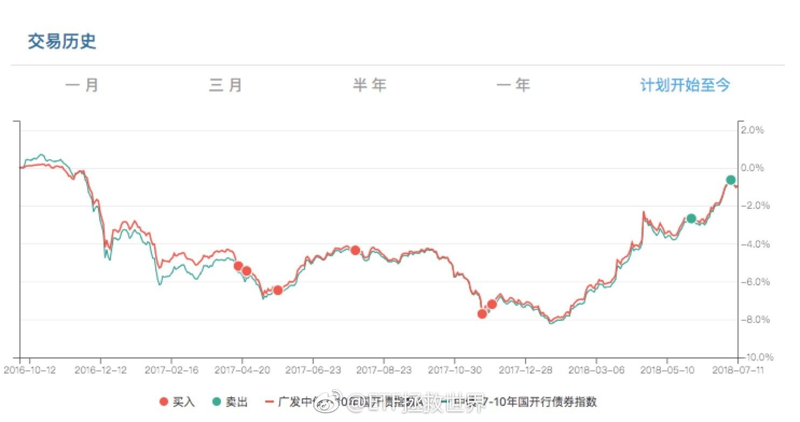

======================================================

ETF拯救世界 (5687069307) @
2018-07-12 13:46:14 Thu  
url: https://weibo.com/5687069307/GpzJ0Bd9s

回复@D8奇迹:未来的牛市，这个指数大概率会非常疯狂。//@D8奇迹:全指信息弹性真大

------------------------------------------------------
转推：
>  @ETF拯救世界 (5687069307)
>  2018-07-12 13:36:38 Thu  
>  url: https:/weibo.com/5687069307/GpzF7vPYO/

>  不是我说，总是让我感到很惊喜。
>  
>  你们自己看看，是不是在用心做事？
>  
>  一个产品，用心不用心，你能感受到的。
>  
>  据说很快就上线了。 ​​​

转发[121]  评论[49]  赞[161] 

======================================================

ETF拯救世界 (5687069307) @
2018-07-12 14:02:48 Thu  
url: https://weibo.com/5687069307/GpzPKcM1z

回复@潺潺的清河:两年内93.6%概率启动。[偷笑]//@潺潺的清河:未来十年不会有牛市//@ETF拯救世界:回复@D8奇迹:未来的牛市，这个指数大概率会非常疯狂。//@D8奇迹:全指信息弹性真大

------------------------------------------------------
转推：
>  @ETF拯救世界 (5687069307)
>  2018-07-12 13:36:38 Thu  
>  url: https:/weibo.com/5687069307/GpzF7vPYO/

>  不是我说，总是让我感到很惊喜。
>  
>  你们自己看看，是不是在用心做事？
>  
>  一个产品，用心不用心，你能感受到的。
>  
>  据说很快就上线了。 ​​​

转发[105]  评论[165]  赞[239] 

======================================================

ETF拯救世界 (5687069307) @
2018-07-12 15:37:53 Thu  
url: https://weibo.com/5687069307/GpAsl41TK

昨天，我发了20多条微博。每条4、5万人看。一天大概100多万。一个月2000万吧。

然后，新浪看关注我的粉丝这么少，才不到8万，居然每天有100多万阅读，所以认为我肯定是刷的，就把我的金v取消了……金v的标准是每个月1000万阅读。

他们没看看我的评论数比那些几十万的博主还多，可能更没见过3万多阅读 ​​​

转发[16]  评论[349]  赞[544] 

+++++++++++++++++++++++++++++++++++++++++++++++++++++

图片：

======================================================

ETF拯救世界 (5687069307) @
2018-07-12 15:55:17 Thu  
url: https://weibo.com/5687069307/GpAzoE7sV

回复@拿破顿:我一直奇怪，说我无私什么的。我到底干什么了？不就是把自己的投资计划发出来了吗。从2010年开始就发啊，只是从博客转到公众号而已。还干嘛了？不就是隔几个礼拜写篇文章，每天在微博扯扯淡。没干嘛啊。这叫什么无私。至于过年发红包送手机那些，都是平常大家打赏给我的，又不是我自己的钱

------------------------------------------------------
转推：
>  @ETF拯救世界 (5687069307)
>  2018-07-12 15:37:53 Thu  
>  url: https:/weibo.com/5687069307/GpAsl41TK/

>  昨天，我发了20多条微博。每条4、5万人看。一天大概100多万。一个月2000万吧。
>  
>  然后，新浪看关注我的粉丝这么少，才不到8万，居然每天有100多万阅读，所以认为我肯定是刷的，就把我的金v取消了……金v的标准是每个月1000万阅读。
>  
>  他们没看看我的评论数比那些几十万的博主还多，可能更没见过3万多阅读 ​​​

转发[2]  评论[181]  赞[315] 

======================================================

ETF拯救世界 (5687069307) @
2018-07-12 17:09:16 Thu  
url: https://weibo.com/5687069307/GpB3qx9nS

回复@Halle噜呀:你可别瞎搞了……人家那是记笔记呢。我也经常这样把有用的东西存到印象笔记啊。很好用。微信微博都可以。你以为我那些资料都是怎么存下来的……还有网页版，一键剪藏。好用。//@Halle噜呀:@曹增辉 能不能干点正事，把博主下面艾特某印象笔记的号都封一封。大家顶我上去

------------------------------------------------------
转推：
>  @ETF拯救世界 (5687069307)
>  2018-07-12 15:37:53 Thu  
>  url: https:/weibo.com/5687069307/GpAsl41TK/

>  昨天，我发了20多条微博。每条4、5万人看。一天大概100多万。一个月2000万吧。
>  
>  然后，新浪看关注我的粉丝这么少，才不到8万，居然每天有100多万阅读，所以认为我肯定是刷的，就把我的金v取消了……金v的标准是每个月1000万阅读。
>  
>  他们没看看我的评论数比那些几十万的博主还多，可能更没见过3万多阅读 ​​​

转发[1]  评论[56]  赞[137] 

======================================================

ETF拯救世界 (5687069307) @
2018-07-12 17:10:54 Thu  
url: https://weibo.com/5687069307/GpB45F5tB

我去，加回来了。喷了。谢谢 @曹增辉  曹老板，虽然不知道是不是你帮的忙……

------------------------------------------------------
转推：
>  @ETF拯救世界 (5687069307)
>  2018-07-12 15:37:53 Thu  
>  url: https:/weibo.com/5687069307/GpAsl41TK/

>  昨天，我发了20多条微博。每条4、5万人看。一天大概100多万。一个月2000万吧。
>  
>  然后，新浪看关注我的粉丝这么少，才不到8万，居然每天有100多万阅读，所以认为我肯定是刷的，就把我的金v取消了……金v的标准是每个月1000万阅读。
>  
>  他们没看看我的评论数比那些几十万的博主还多，可能更没见过3万多阅读 ​​​

转发[0]  评论[75]  赞[189] 

======================================================

ETF拯救世界 (5687069307) @
2018-07-12 17:29:05 Thu  
url: https://weibo.com/5687069307/GpBbtnWu5

回复@小小8885376:有可能会。因为历史只是历史，未来可能发生变化。所以还要用其它辅助的依据来判断。总之操作的时候，你把这个因素考虑进去，有应对的办法就行了。做好：历史依然有效、无效两手准备。

------------------------------------------------------
转推：
>  @ETF拯救世界 (5687069307)
>  2018-07-12 11:22:44 Thu  
>  url: https:/weibo.com/5687069307/GpyMLoy33/

>  好消息，中报已经开始披露了。
>  
>  7月有134家；
>  
>  8月所有半年报披露完成。
>  
>  也就是说，未来一个月，全部指数估值又将出现系统性下降。
>  
>  再过两个月三季报也将披露完毕。关键点就在这几个月了。 ​​​

转发[3]  评论[46]  赞[182] 

======================================================

ETF拯救世界 (5687069307) @
2018-07-12 21:27:22 Thu  
url: https://weibo.com/5687069307/GpCKc3YoY

富国的这只增强真的厉害，无论涨跌天天跑赢 ​​​

转发[54]  评论[126]  赞[367] 

+++++++++++++++++++++++++++++++++++++++++++++++++++++

图片：
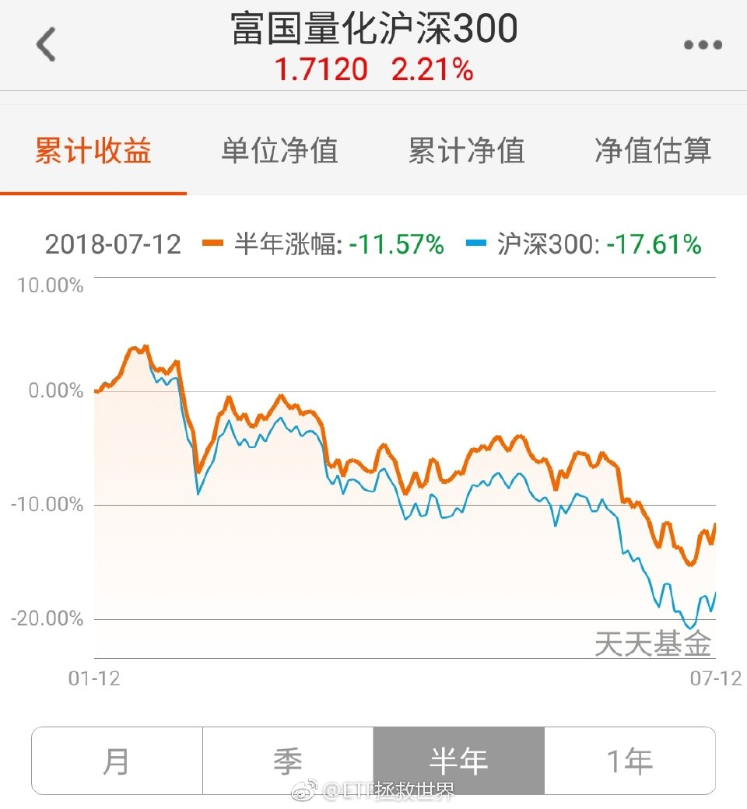

======================================================

ETF拯救世界 (5687069307) @
2018-07-13 08:51:24 Fri  
url: https://weibo.com/5687069307/GpHdQjkDf

发布了头条文章：《还是得客客气气的》 ，随便聊聊，您随便看看。 http://t.cn/RdFbbKy ​​​

转发[40]  评论[267]  赞[877] 

======================================================

ETF拯救世界 (5687069307) @
2018-07-13 09:45:13 Fri  
url: https://weibo.com/5687069307/GpHzGcmqG

回复@湛江街拍:建信500一点都不差。2015、2016都是500增强指基第一。2015年跑赢富国500高达17个点，2016年富国500下跌6%，建信上涨1%。建信之所以最近一般，很大因素是因为我们把它搞大了……//@湛江街拍:e大，富国几个增强基金做不错，为什么我们不选富国500，而是建信500呢？

------------------------------------------------------
转推：
>  @ETF拯救世界 (5687069307)
>  2018-07-12 21:27:22 Thu  
>  url: https:/weibo.com/5687069307/GpCKc3YoY/

>  富国的这只增强真的厉害，无论涨跌天天跑赢 ​​​

转发[19]  评论[157]  赞[219] 

======================================================

ETF拯救世界 (5687069307) @
2018-07-13 09:55:44 Fri  
url: https://weibo.com/5687069307/GpHDXjlvx

$全指医药 sh000991$   还是医药最高！犀利。是不是又向新高去了。 ​​​

转发[2]  评论[134]  赞[243] 

======================================================

ETF拯救世界 (5687069307) @
2018-07-13 13:07:22 Fri  
url: https://weibo.com/5687069307/GpITK0hbh

$小米集团－Ｗ hk01810$   mi boy的实力果然不容小瞧。 ​​​

转发[1]  评论[50]  赞[151] 

======================================================

ETF拯救世界 (5687069307) @
2018-07-13 13:47:29 Fri  
url: https://weibo.com/5687069307/GpJa14Ysf

回复@冯二宝6538187080:倒不是点的问题，而是还是贵现在。40多倍的估值买一个指数，长久看赚大钱的概率略低。30多我可能会开始布局。//@冯二宝6538187080:e大 能不能说一下 大概多少点布局全指信息呢//@ETF拯救世界:回复@潺潺的清河:两年内93.6%概率启动。[偷笑]//@潺潺的清河:未来十年不会有牛市

------------------------------------------------------
转推：
>  @ETF拯救世界 (5687069307)
>  2018-07-12 13:36:38 Thu  
>  url: https:/weibo.com/5687069307/GpzF7vPYO/

>  不是我说，总是让我感到很惊喜。
>  
>  你们自己看看，是不是在用心做事？
>  
>  一个产品，用心不用心，你能感受到的。
>  
>  据说很快就上线了。 ​​​

转发[64]  评论[58]  赞[119] 

======================================================

ETF拯救世界 (5687069307) @
2018-07-13 13:53:51 Fri  
url: https://weibo.com/5687069307/GpJcBzgii

指数和股票不同。股票你买亏损股都有可能赚大钱。指数就不是。指数你不能买太贵，否则赚钱的概率很低。不是说不可能，而是长远看，很低。

另外，如果你去研究一下巴菲特买股票的历史，你会发现，绝大多数他买的股票，PE都不超过20倍。虽然他买的时候并不用pe估值。 ​​​

转发[40]  评论[158]  赞[236] 

======================================================

ETF拯救世界 (5687069307) @
2018-07-13 14:01:12 Fri  
url: https://weibo.com/5687069307/GpJfBa6g1

论健身与练拳的必要性。

------------------------------------------------------
转推：
>  @梨视频 (6004281123)
>  2018-07-12 22:15:40 Thu  
>  url: https:/weibo.com/6004281123/GpD3NtPLs/

>  【#华裔遭美国白人找茬踹车#：我若是黑人，他绝对不敢[思考]】近日，旧金山一华裔车主与一白人男子发生冲突。白人男子指其引擎声太响踢踹轿车。华裔司机说，我如果是个黑人司机，这个白人一定不会踹车。@微辣Video （信息来源：ins@nanunlimited ）http://t.cn/RdD5nyF ​​​

转发[31]  评论[62]  赞[141] 

======================================================

ETF拯救世界 (5687069307) @
2018-07-13 14:21:06 Fri  
url: https://weibo.com/5687069307/GpJnFE7rD

回复@你在红楼我在西游V:创业板是从2015年的120倍跌下来的。了解一下。//@你在红楼我在西游V:感觉创业板跌了这么多，估值还那么高？//@ETF拯救世界:回复@冯二宝6538187080:倒不是点的问题，而是还是贵现在。40多倍的估值买一个指数，长久看赚大钱的概率略低。30多我可能会开始布局。

------------------------------------------------------
转推：
>  @ETF拯救世界 (5687069307)
>  2018-07-12 13:36:38 Thu  
>  url: https:/weibo.com/5687069307/GpzF7vPYO/

>  不是我说，总是让我感到很惊喜。
>  
>  你们自己看看，是不是在用心做事？
>  
>  一个产品，用心不用心，你能感受到的。
>  
>  据说很快就上线了。 ​​​

转发[35]  评论[20]  赞[111] 

======================================================

ETF拯救世界 (5687069307) @
2018-07-13 14:28:20 Fri  
url: https://weibo.com/5687069307/GpJqBr8Yo

回复@葱葱AQQ:2015年第二轮计划大概3、4月大量卖出。站在5、6月看，后面的一大块利润没吃到。但是我站在理性的角度，在4月，沪深300估值45倍，中小板80倍，创业板90倍，全市场到了60倍，全都是超级股灾的标准，那时候跑，即使到现在，我也不认为有什么问题。//@葱葱AQQ:120倍！谁能想到那么的疯狂？

------------------------------------------------------
转推：
>  @ETF拯救世界 (5687069307)
>  2018-07-12 13:36:38 Thu  
>  url: https:/weibo.com/5687069307/GpzF7vPYO/

>  不是我说，总是让我感到很惊喜。
>  
>  你们自己看看，是不是在用心做事？
>  
>  一个产品，用心不用心，你能感受到的。
>  
>  据说很快就上线了。 ​​​

转发[30]  评论[74]  赞[171] 

======================================================

ETF拯救世界 (5687069307) @
2018-07-13 14:33:09 Fri  
url: https://weibo.com/5687069307/GpJsyApPI

回复@qzy6_87413:120倍的创业板跌到30多倍，我买入1%，我不认为有什么太大的问题。//@qzy6_87413:那为啥去年e大那么贵的时候买创业板呢？有点不懂//@ETF拯救世界:回复@冯二宝6538187080:倒不是点的问题，而是还是贵现在。40多倍的估值买一个指数，长久看赚大钱的概率略低。30多我可能会开始布局。

------------------------------------------------------
转推：
>  @ETF拯救世界 (5687069307)
>  2018-07-12 13:36:38 Thu  
>  url: https:/weibo.com/5687069307/GpzF7vPYO/

>  不是我说，总是让我感到很惊喜。
>  
>  你们自己看看，是不是在用心做事？
>  
>  一个产品，用心不用心，你能感受到的。
>  
>  据说很快就上线了。 ​​​

转发[13]  评论[29]  赞[138] 

======================================================

ETF拯救世界 (5687069307) @
2018-07-13 14:39:24 Fri  
url: https://weibo.com/5687069307/GpJv62HhG

在证券市场上，理性的人很难赔钱。但是太理性的人赚不到大钱。

当然，理性已经很难了。大多数人是非理性的。

所以，在理性和疯狂之间要找到一个平衡点，心里非常明白，身体却要跟大众一起狂欢。还要在午夜之前全身而退，这样综合起来，要求非常高。正因为这样，赚大钱的人很少。这太难了，不仅跟实力 ​​​

转发[73]  评论[188]  赞[398] 

======================================================

ETF拯救世界 (5687069307) @
2018-07-13 17:06:12 Fri  
url: https://weibo.com/5687069307/GpKsGzYdI

回复@dzb__:你买创业50是50家公司，创业板指数是100家公司，不用你买整个创业板啊。就像你买上证50不是买上证1000多家公司一样。

------------------------------------------------------
转推：
>  @ETF拯救世界 (5687069307)
>  2018-07-12 13:36:38 Thu  
>  url: https:/weibo.com/5687069307/GpzF7vPYO/

>  不是我说，总是让我感到很惊喜。
>  
>  你们自己看看，是不是在用心做事？
>  
>  一个产品，用心不用心，你能感受到的。
>  
>  据说很快就上线了。 ​​​

转发[5]  评论[20]  赞[148] 

======================================================

ETF拯救世界 (5687069307) @
2018-07-13 17:08:06 Fri  
url: https://weibo.com/5687069307/GpKts93NW

今天净值增加0.28%左右。不过不失，凑凑合合，就那么回事吧。

所以你不要总是担心牛市来了赶不上趟了。今天沪深300才0.33%。即使真的牛市开启，也差不到哪儿去。何况趋势仓位还没加。

就跟你说，踏踏实实的。舒服最重要。 ​​​

转发[11]  评论[158]  赞[439] 

======================================================

ETF拯救世界 (5687069307) @
2018-07-16 00:45:18 Mon  
url: https://weibo.com/5687069307/Gq6k186Gu

是不是钦定了。 ​​​

转发[0]  评论[68]  赞[200] 

======================================================

ETF拯救世界 (5687069307) @
2018-07-16 08:41:51 Mon  
url: https://weibo.com/5687069307/Gq9rrEw0W

算是个里程碑了。

开始看留言。 ​​​

转发[2]  评论[80]  赞[380] 

+++++++++++++++++++++++++++++++++++++++++++++++++++++

图片：

======================================================

ETF拯救世界 (5687069307) @
2018-07-16 09:56:43 Mon  
url: https://weibo.com/5687069307/Gq9VQkRVS

回复@夜雨梧桐2010:黑夜给了你黑色的眼睛，你却用它来寻找不可描述的数字。//@夜雨梧桐2010:E哥，你这也太能创造故事了，又是10又是69的……

------------------------------------------------------
转推：
>  @ETF拯救世界 (5687069307)
>  2018-07-16 08:41:51 Mon  
>  url: https:/weibo.com/5687069307/Gq9rrEw0W/

>  算是个里程碑了。
>  
>  开始看留言。 ​​​

转发[1]  评论[50]  赞[172] 

======================================================

ETF拯救世界 (5687069307) @
2018-07-16 10:16:47 Mon  
url: https://weibo.com/5687069307/Gqa3Zlx4B

几张图告诉你为什么卖比买难100倍。

买都可以精准买在阶段最低。但卖你很难卖在阶段最高。（50那次卖出是换了红利）

如果不贵，就坚定持有。 ​​​

转发[72]  评论[103]  赞[272] 

+++++++++++++++++++++++++++++++++++++++++++++++++++++

图片：
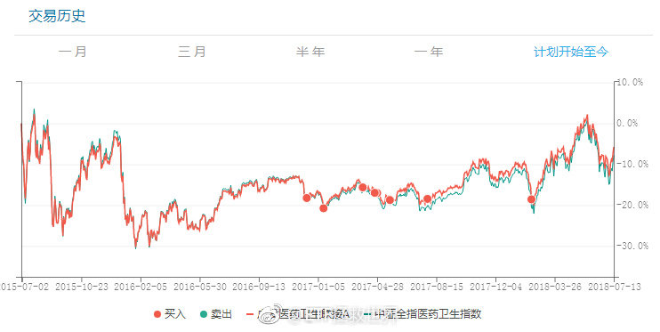

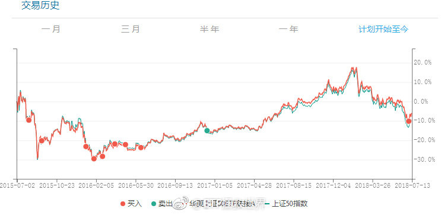
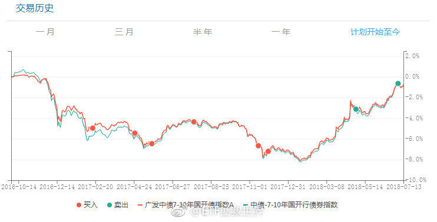

======================================================

ETF拯救世界 (5687069307) @
2018-07-16 10:20:57 Mon  
url: https://weibo.com/5687069307/Gqa5FBqj5

回复@单眼皮的小明明:贵不难判断。但是市场不会因为贵就停止上涨。最难的是判断人性的疯狂。//@单眼皮的小明明:难在判断什么时候算贵了

------------------------------------------------------
转推：
>  @ETF拯救世界 (5687069307)
>  2018-07-16 10:16:47 Mon  
>  url: https:/weibo.com/5687069307/Gqa3Zlx4B/

>  几张图告诉你为什么卖比买难100倍。
>  
>  买都可以精准买在阶段最低。但卖你很难卖在阶段最高。（50那次卖出是换了红利）
>  
>  如果不贵，就坚定持有。 ​​​

转发[28]  评论[80]  赞[197] 

======================================================

ETF拯救世界 (5687069307) @
2018-07-16 11:56:40 Mon  
url: https://weibo.com/5687069307/GqaIx6Bq3

看了看账户，有点舒服。 ​​​

转发[3]  评论[147]  赞[267] 

======================================================

ETF拯救世界 (5687069307) @
2018-07-16 13:30:53 Mon  
url: https://weibo.com/5687069307/GqbkM8iXL

这次金融行业感觉要先有钻石坑了。

最后会不会蝴蝶效应，边走边看。 ​​​

转发[10]  评论[84]  赞[336] 

======================================================

ETF拯救世界 (5687069307) @
2018-07-16 14:28:41 Mon  
url: https://weibo.com/5687069307/GqbIeuQHB

去年年报和今年一季报，医药+养老都是15%以上增速。不高，但是在各行业中已经是很不错的了。

看半年报了。目前医药已知的五只股票半年报，增速在30%多。但是这个不具代表性。

不过最大的问题，这两个品种，还是不够便宜。当然，也几乎从没有真正的“便宜”过。

如果能在25以下买医药，可能就是投资 ​​​

转发[64]  评论[118]  赞[266] 

======================================================

ETF拯救世界 (5687069307) @
2018-07-16 14:49:07 Mon  
url: https://weibo.com/5687069307/GqbQwDM0U

回复@厉欧:金融危机最低27//@厉欧:E大，2011年全指医药指数发布之前，有没有PE低于25发生过？@ETF拯救世界

------------------------------------------------------
转推：
>  @ETF拯救世界 (5687069307)
>  2018-07-16 14:28:41 Mon  
>  url: https:/weibo.com/5687069307/GqbIeuQHB/

>  去年年报和今年一季报，医药+养老都是15%以上增速。不高，但是在各行业中已经是很不错的了。
>  
>  看半年报了。目前医药已知的五只股票半年报，增速在30%多。但是这个不具代表性。
>  
>  不过最大的问题，这两个品种，还是不够便宜。当然，也几乎从没有真正的“便宜”过。
>  
>  如果能在25以下买医药，可能就是投资 ​​​

转发[20]  评论[62]  赞[143] 

======================================================

ETF拯救世界 (5687069307) @
2018-07-16 16:01:13 Mon  
url: https://weibo.com/5687069307/GqcjNlede

周五沪深300上涨0.33%，计划净值增加0.32%。

今天沪深300下跌0.59%，计划净值预估下降0.05%。

打扰了。 ​​​

转发[4]  评论[83]  赞[413] 

======================================================

ETF拯救世界 (5687069307) @
2018-07-16 16:17:36 Mon  
url: https://weibo.com/5687069307/GqcqrwJZX

云音乐更新歌单那哥们掉链子了……两首没更新啦。 ​​​

转发[0]  评论[110]  赞[234] 

======================================================

ETF拯救世界 (5687069307) @
2018-07-17 07:53:12 Tue  
url: https://weibo.com/5687069307/GqiydeCER

掐指一算，今日不宜出门。 ​​​

转发[1]  评论[118]  赞[230] 

======================================================

ETF拯救世界 (5687069307) @
2018-07-17 08:57:39 Tue  
url: https://weibo.com/5687069307/GqiYndH8M

原油敢不敢跌回50。

我发现是不是别的品种不用做了，每年来回吃油就行。[doge] ​​​

转发[7]  评论[103]  赞[269] 

======================================================

ETF拯救世界 (5687069307) @
2018-07-17 10:01:58 Tue  
url: https://weibo.com/5687069307/GqjosEzBY

$沪深300 sh000300$ 

震惊！固定发车日只买一份A股品种的原因找到了！ ​​​

转发[2]  评论[73]  赞[208] 

======================================================

ETF拯救世界 (5687069307) @
2018-07-17 10:14:23 Tue  
url: https://weibo.com/5687069307/GqjtwfeGl

腾讯能不能守住前期低点是我比较关注的。好消息是估值已经降至35倍。

------------------------------------------------------
转推：
>  @ETF拯救世界 (5687069307)
>  2018-03-22 09:34:01 Thu  
>  url: https:/weibo.com/5687069307/G8wd21cxW/

>  腾讯，60倍PE。未来五年看，真的能有特别好的收益率吗。
>  
>  学习了。 ​​​

转发[32]  评论[31]  赞[157] 

======================================================

ETF拯救世界 (5687069307) @
2018-07-17 10:23:32 Tue  
url: https://weibo.com/5687069307/Gqjxe62DI

我这半年多关注的8848和腾讯，不是说对这两家公司有什么看法，我是在观察情绪。

这两家公司在持续暴涨的时候，带了很多很多情绪。尤其是前者。很多人因为没买后悔的夜不能寐，很多人买了抱持坚定信念可以再涨好几倍。

一家公司，一个行业，到底是不是真的能预判五年、十年后？

很难讲。前几天看到一 ​​​

转发[88]  评论[146]  赞[301] 

======================================================

ETF拯救世界 (5687069307) @
2018-07-17 10:55:59 Tue  
url: https://weibo.com/5687069307/GqjKozJRz

其实我挺想知道的，这么多爆掉的p2p，怎么就连一点渣都没剩下。这么多钱最后都去哪儿了。

学习好的给讲讲。 ​​​

转发[9]  评论[231]  赞[257] 

======================================================

ETF拯救世界 (5687069307) @
2018-07-17 11:26:16 Tue  
url: https://weibo.com/5687069307/GqjWGDYs6

再说件不开心的事让你们开心一下：

前几天刚换的苹果又坏了，昨天淋了一点雨。耳机插孔和关机键出问题了。

一个月不到两个。

什么玩意儿啊…… ​​​

转发[5]  评论[209]  赞[209] 

======================================================

ETF拯救世界 (5687069307) @
2018-07-17 13:02:41 Tue  
url: https://weibo.com/5687069307/GqkzPe2PI

回复@O蒲公英的种子O:我不扔手机。苹果从4S到X除了8都买了。都放着呢，除了一个7让海水泡了，一个6SP耳机孔出问题了，一个X正在用，其他的有没有人要。//@O蒲公英的种子O:别扔了，还能换个盆，304不锈钢的，了解下[doge]

------------------------------------------------------
转推：
>  @ETF拯救世界 (5687069307)
>  2018-07-17 11:26:16 Tue  
>  url: https:/weibo.com/5687069307/GqjWGDYs6/

>  再说件不开心的事让你们开心一下：
>  
>  前几天刚换的苹果又坏了，昨天淋了一点雨。耳机插孔和关机键出问题了。
>  
>  一个月不到两个。
>  
>  什么玩意儿啊…… ​​​

转发[1]  评论[247]  赞[136] 

======================================================

ETF拯救世界 (5687069307) @
2018-07-17 14:06:18 Tue  
url: https://weibo.com/5687069307/GqkZEc6MJ

还有人怀疑钻石坑吗。

可能没了。

但一会儿往上拉一下又怀疑了吧。 ​​​

转发[5]  评论[104]  赞[270] 

======================================================

ETF拯救世界 (5687069307) @
2018-07-17 14:40:30 Tue  
url: https://weibo.com/5687069307/GqldwBDdZ

其实很多品种空间真的不大了。很难再跌30%以上。

但是时间就不好说了。这个大底可能要磨一段时间了。 ​​​

转发[11]  评论[120]  赞[269] 

======================================================

ETF拯救世界 (5687069307) @
2018-07-17 15:01:23 Tue  
url: https://weibo.com/5687069307/Gqlm0mCKg

回复@淡泊宁静以养心:新关注我吧。日常操作。//@淡泊宁静以养心:神了！最低点！

------------------------------------------------------
转推：
>  @ETF拯救世界 (5687069307)
>  2018-07-17 14:06:18 Tue  
>  url: https:/weibo.com/5687069307/GqkZEc6MJ/

>  还有人怀疑钻石坑吗。
>  
>  可能没了。
>  
>  但一会儿往上拉一下又怀疑了吧。 ​​​

转发[1]  评论[43]  赞[173] 

======================================================

ETF拯救世界 (5687069307) @
2018-07-17 15:06:47 Tue  
url: https://weibo.com/5687069307/GqloceHG6

年初蓝筹上涨，本身是没问题的。问题是涨的太快太猛。

现在是什么情况，服了。10倍的东西还要跌，40、50的居然领涨。你要说某只成长股50就算了，这可是几百只50倍以上的往上干啊。

我就看着你疯。

继续布局辣鸡。 ​​​

转发[26]  评论[173]  赞[299] 

======================================================

ETF拯救世界 (5687069307) @
2018-07-17 23:34:12 Tue  
url: https://weibo.com/5687069307/GqoI9F5Be

老这样多不好意思。 ​​​

转发[7]  评论[95]  赞[247] 

+++++++++++++++++++++++++++++++++++++++++++++++++++++

图片：
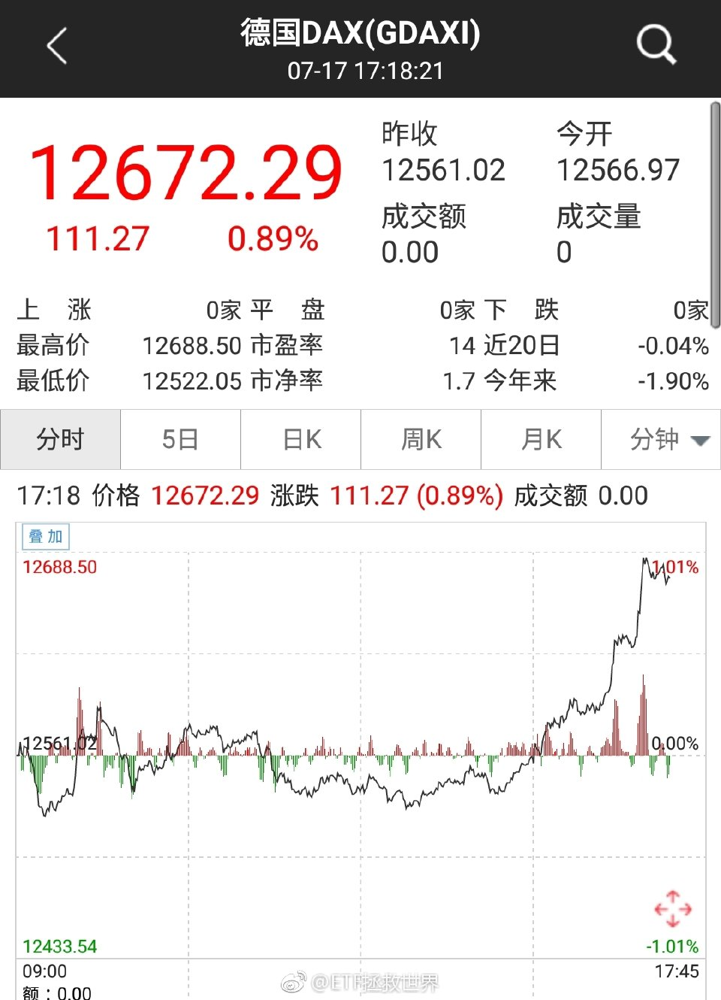

======================================================

ETF拯救世界 (5687069307) @
2018-07-18 08:40:23 Wed  
url: https://weibo.com/5687069307/GqshR3Gxh

这就是为什么我要做京享值超过8万的plus会员，为什么要持有京东股票。

周末买了个天龙功放，有噪音，昨晚申请换货。二话不说上门换新。

买东西买的很舒服。 ​​​

转发[17]  评论[146]  赞[133] 

+++++++++++++++++++++++++++++++++++++++++++++++++++++

图片：
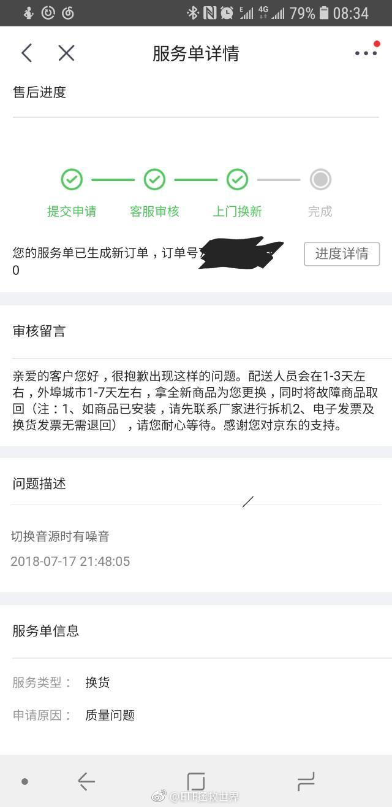

======================================================

ETF拯救世界 (5687069307) @
2018-07-18 08:49:12 Wed  
url: https://weibo.com/5687069307/GqslqEDih

回复@星云Bert:你可真扯淡，看不惯你这种人，瞎忽悠。京东方是京东和新东方合资成立的，各占30%股份，京东并没有控股。[哼]//@星云Bert:回复@我是队长别怕:算，京东方是京东控股的

------------------------------------------------------
转推：
>  @ETF拯救世界 (5687069307)
>  2018-07-18 08:40:23 Wed  
>  url: https:/weibo.com/5687069307/GqshR3Gxh/

>  这就是为什么我要做京享值超过8万的plus会员，为什么要持有京东股票。
>  
>  周末买了个天龙功放，有噪音，昨晚申请换货。二话不说上门换新。
>  
>  买东西买的很舒服。 ​​​

转发[10]  评论[52]  赞[93] 

======================================================

ETF拯救世界 (5687069307) @
2018-07-18 09:08:50 Wed  
url: https://weibo.com/5687069307/Gqstp5Pa3

回复@随便一个动作:我们贡献了多少。

------------------------------------------------------
转推：
>  @ETF拯救世界 (5687069307)
>  2018-07-18 08:40:23 Wed  
>  url: https:/weibo.com/5687069307/GqshR3Gxh/

>  这就是为什么我要做京享值超过8万的plus会员，为什么要持有京东股票。
>  
>  周末买了个天龙功放，有噪音，昨晚申请换货。二话不说上门换新。
>  
>  买东西买的很舒服。 ​​​

转发[1]  评论[17]  赞[67] 

======================================================

ETF拯救世界 (5687069307) @
2018-07-18 09:11:05 Wed  
url: https://weibo.com/5687069307/GqsujsBmq

你已成为这些公司的股东。讲真，传给孙子毫无问题。 ​​​

转发[36]  评论[82]  赞[198] 

+++++++++++++++++++++++++++++++++++++++++++++++++++++

图片：
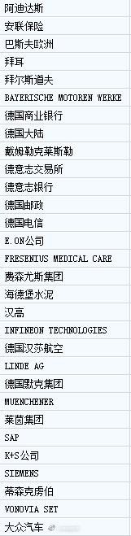

======================================================

ETF拯救世界 (5687069307) @
2018-07-18 09:15:34 Wed  
url: https://weibo.com/5687069307/Gqsw8mgrb

回复@Aaaaaraaaq:基本上都是。曾经在天M某“旗舰店”买过一个，结果各种问题，甚至看评论说有可能连充电器都被换了。吓得连机子都没开就退货了。自己感觉还是JD买电子产品放心一点。//@Aaaaaraaaq:E大手机都是在京东买的吗？我感觉自营很可靠，可身边的人都不这么认为

------------------------------------------------------
转推：
>  @ETF拯救世界 (5687069307)
>  2018-07-18 08:40:23 Wed  
>  url: https:/weibo.com/5687069307/GqshR3Gxh/

>  这就是为什么我要做京享值超过8万的plus会员，为什么要持有京东股票。
>  
>  周末买了个天龙功放，有噪音，昨晚申请换货。二话不说上门换新。
>  
>  买东西买的很舒服。 ​​​

转发[6]  评论[32]  赞[80] 

======================================================

ETF拯救世界 (5687069307) @
2018-07-18 09:24:39 Wed  
url: https://weibo.com/5687069307/GqszP6LAq

回复@梦游鱼生活在路上:机子不能开。苹果手机一旦开机激活就不能退了。甚至天M店你只要撕开包装就要扯皮了。比如去售后检测等等。看评论，收到货的各种问题。难道我看别人的还不够吗，还非得自己再试试？最后，我发现那家中移动旗舰店都是假的……

------------------------------------------------------
转推：
>  @ETF拯救世界 (5687069307)
>  2018-07-18 08:40:23 Wed  
>  url: https:/weibo.com/5687069307/GqshR3Gxh/

>  这就是为什么我要做京享值超过8万的plus会员，为什么要持有京东股票。
>  
>  周末买了个天龙功放，有噪音，昨晚申请换货。二话不说上门换新。
>  
>  买东西买的很舒服。 ​​​

转发[3]  评论[39]  赞[90] 

======================================================

ETF拯救世界 (5687069307) @
2018-07-18 09:38:29 Wed  
url: https://weibo.com/5687069307/GqsFr9A6e

有波动就有利润。 ​​​

转发[8]  评论[59]  赞[124] 

+++++++++++++++++++++++++++++++++++++++++++++++++++++

图片：
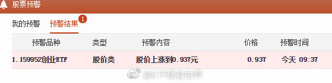

======================================================

ETF拯救世界 (5687069307) @
2018-07-18 09:54:09 Wed  
url: https://weibo.com/5687069307/GqsLNEVps

图片评论 全靠策略。不主观判断涨跌。不过这距离最高价就差一厘也真是有点过分了。 http://t.cn/Rga2RRs

------------------------------------------------------
转推：
>  @ETF拯救世界 (5687069307)
>  2018-07-18 09:38:29 Wed  
>  url: https:/weibo.com/5687069307/GqsFr9A6e/

>  有波动就有利润。 ​​​

转发[4]  评论[24]  赞[109] 

======================================================

ETF拯救世界 (5687069307) @
2018-07-18 09:59:28 Wed  
url: https://weibo.com/5687069307/GqsNXtvwj

回复@阿笨的微博:德国商业银行上面那个。第一个字母合起来组成“BMW”。//@阿笨的微博:哪个是宝马

------------------------------------------------------
转推：
>  @ETF拯救世界 (5687069307)
>  2018-07-18 09:11:05 Wed  
>  url: https:/weibo.com/5687069307/GqsujsBmq/

>  你已成为这些公司的股东。讲真，传给孙子毫无问题。 ​​​

转发[5]  评论[38]  赞[93] 

======================================================

ETF拯救世界 (5687069307) @
2018-07-18 10:05:55 Wed  
url: https://weibo.com/5687069307/GqsQzse19

国债继续大涨。7-10国开债也会跟上。

这次唯一遗憾的是收益率没到5。哪怕是到4.5都好啊。 ​​​

转发[79]  评论[51]  赞[150] 

+++++++++++++++++++++++++++++++++++++++++++++++++++++

图片：
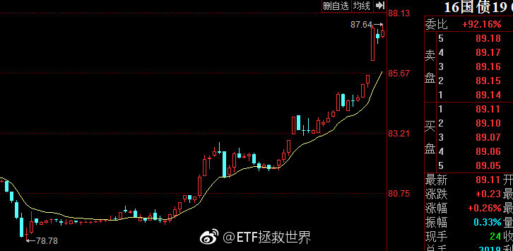

======================================================

ETF拯救世界 (5687069307) @
2018-07-18 10:23:31 Wed  
url: https://weibo.com/5687069307/GqsXIlZSm

$中证环保 sh000827$   野百合也有春天。保持涨幅领先半小时。 ​​​

转发[0]  评论[42]  赞[157] 

======================================================

ETF拯救世界 (5687069307) @
2018-07-18 10:32:27 Wed  
url: https://weibo.com/5687069307/Gqt1leHwy

回复@葱葱AQQ:我不说这次。但是你造吗，国债还有个属性是“避险”。在其他品种非常危险的时候，国债有可能成为最后的避风港。这是它的属性之一。//@葱葱AQQ:后进生请教：国债上涨的逻辑是什么？因为投资者判断后面会继续放水、所以看跌远期利率？

------------------------------------------------------
转推：
>  @ETF拯救世界 (5687069307)
>  2018-07-18 10:05:55 Wed  
>  url: https:/weibo.com/5687069307/GqsQzse19/

>  国债继续大涨。7-10国开债也会跟上。
>  
>  这次唯一遗憾的是收益率没到5。哪怕是到4.5都好啊。 ​​​

转发[43]  评论[28]  赞[106] 

======================================================

ETF拯救世界 (5687069307) @
2018-07-18 10:37:58 Wed  
url: https://weibo.com/5687069307/Gqt3AsbPF

回复@大明190736:永远不亏损卖出任何品种。铁律。所以，只买不会死的品种。//@大明190736:海外债快回本了。。。//@ETF拯救世界:回复@葱葱AQQ:我不说这次。但是你造吗，国债还有个属性是“避险”。在其他品种非常危险的时候，国债有可能成为最后的避风港。这是它的属性之一。

------------------------------------------------------
转推：
>  @ETF拯救世界 (5687069307)
>  2018-07-18 10:05:55 Wed  
>  url: https:/weibo.com/5687069307/GqsQzse19/

>  国债继续大涨。7-10国开债也会跟上。
>  
>  这次唯一遗憾的是收益率没到5。哪怕是到4.5都好啊。 ​​​

转发[17]  评论[15]  赞[139] 

======================================================

ETF拯救世界 (5687069307) @
2018-07-18 10:41:33 Wed  
url: https://weibo.com/5687069307/Gqt52gxOi

浓眉大眼的万科也腰斩了。

房价还没开始跌呢。 ​​​

转发[3]  评论[88]  赞[215] 

======================================================

ETF拯救世界 (5687069307) @
2018-07-18 11:06:00 Wed  
url: https://weibo.com/5687069307/GqteXt7wI

回复@ruannuan:日欧0关税自贸协定这种消息我是不会提前知道的。//@ruannuan:老大能说说买他的逻辑吗？我在wind上看，现在是他的最高点，怎么就便宜呢？

------------------------------------------------------
转推：
>  @ETF拯救世界 (5687069307)
>  2018-07-17 23:34:12 Tue  
>  url: https:/weibo.com/5687069307/GqoI9F5Be/

>  老这样多不好意思。 ​​​

转发[3]  评论[14]  赞[129] 

======================================================

ETF拯救世界 (5687069307) @
2018-07-18 11:09:30 Wed  
url: https://weibo.com/5687069307/GqtgnvC6T

回复@梓溪20180316:我惊呆了。你们都以为阿迪是哪个国家的！//@梓溪20180316:回复@ETF拯救世界:我从来没想到阿迪达斯是德国的。。

------------------------------------------------------
转推：
>  @ETF拯救世界 (5687069307)
>  2018-07-18 09:11:05 Wed  
>  url: https:/weibo.com/5687069307/GqsujsBmq/

>  你已成为这些公司的股东。讲真，传给孙子毫无问题。 ​​​

转发[8]  评论[159]  赞[131] 

======================================================

ETF拯救世界 (5687069307) @
2018-07-18 11:44:16 Wed  
url: https://weibo.com/5687069307/Gqtuv3R62

炒小米的和腾讯的是不是一拨人。卖了腾讯去买小米了。 ​​​

转发[0]  评论[43]  赞[157] 

======================================================

ETF拯救世界 (5687069307) @
2018-07-18 11:51:00 Wed  
url: https://weibo.com/5687069307/Gqtxe3cpA

回复@8点钟的太阳_13214:不好意思，这次真的不算大。因为跌的时候收益率还是不够高。我曾经在5%的时候重仓债券，大熊市赚30%。也是希望有机会跟各位再体会一下。所以无论什么品种，只要有波动，就能挣钱。低买高卖即可。

------------------------------------------------------
转推：
>  @ETF拯救世界 (5687069307)
>  2018-07-18 10:05:55 Wed  
>  url: https:/weibo.com/5687069307/GqsQzse19/

>  国债继续大涨。7-10国开债也会跟上。
>  
>  这次唯一遗憾的是收益率没到5。哪怕是到4.5都好啊。 ​​​

转发[18]  评论[25]  赞[156] 

======================================================

ETF拯救世界 (5687069307) @
2018-07-18 12:01:27 Wed  
url: https://weibo.com/5687069307/GqtBt4rdf

就是这个。

------------------------------------------------------
转推：
>  @ ()
>  2018-07-18 08:18:37 Wed  
>  url: 

>  抱歉，作者已设置仅展示半年内微博，此微博已不可见。 ​​​

转发[12]  评论[40]  赞[141] 

======================================================

ETF拯救世界 (5687069307) @
2018-07-18 13:40:00 Wed  
url: https://weibo.com/5687069307/GquftboxM

提示一下，dax溢价0.8%了。我们买之前是折价的。场内别乱追了 ​​​

转发[6]  评论[49]  赞[186] 

======================================================

ETF拯救世界 (5687069307) @
2018-07-18 13:58:40 Wed  
url: https://weibo.com/5687069307/Gqun2BZmH

无论是什么投资，本金的安全是最最最重要的。

可能是我的思维模式比较保守。P2P这么多年来，投过两个公司。一个是好多年前，得7、8年前了吧，那时候张化桥宣传有利网，我投了点。到期就撤了。第二个投过陆金所，分成好几个标的投，但是其中一个总是有逾期，到期后我就停了。一直也没管，钱应该还在账 ​​​

转发[152]  评论[331]  赞[483] 

======================================================

ETF拯救世界 (5687069307) @
2018-07-18 14:23:12 Wed  
url: https://weibo.com/5687069307/Gqux0htAT

这条新闻我收藏了。目前纳斯达克100估值接近30倍。有意思。 【贝索斯个人财富超过1500亿美元 超过1999年的盖茨】JeffBezos）成为现代史上最富有之人彭博亿万富翁指数显示，贝索斯的个人财富刚刚跨过1500亿美元大关，这比位居第二... 原文：http://t.cn/RgIlLQ7 （分享自@微博搜索） ​​​

转发[43]  评论[66]  赞[175] 

======================================================

ETF拯救世界 (5687069307) @
2018-07-18 14:57:30 Wed  
url: https://weibo.com/5687069307/GquKVnyvh

回复@沉默地飞扬:“保住本金”的意思不是说没有波动。没有波动是银行存款。保住本金的意思是，中长期看，本金不会损失，还会有满意的收益率。短期波动谁也没有办法，只能靠组合争取降低波动率

------------------------------------------------------
转推：
>  @ETF拯救世界 (5687069307)
>  2018-07-18 13:58:40 Wed  
>  url: https:/weibo.com/5687069307/Gqun2BZmH/

>  无论是什么投资，本金的安全是最最最重要的。
>  
>  可能是我的思维模式比较保守。P2P这么多年来，投过两个公司。一个是好多年前，得7、8年前了吧，那时候张化桥宣传有利网，我投了点。到期就撤了。第二个投过陆金所，分成好几个标的投，但是其中一个总是有逾期，到期后我就停了。一直也没管，钱应该还在账 ​​​

转发[24]  评论[19]  赞[163] 

======================================================

ETF拯救世界 (5687069307) @
2018-07-18 15:04:06 Wed  
url: https://weibo.com/5687069307/GquNBtI78

回复@Felix1973:你是哪个p2p的老板。现在美国住的还习惯吗。//@Felix1973:我就是靠p2p起家的

------------------------------------------------------
转推：
>  @ETF拯救世界 (5687069307)
>  2018-07-18 13:58:40 Wed  
>  url: https:/weibo.com/5687069307/Gqun2BZmH/

>  无论是什么投资，本金的安全是最最最重要的。
>  
>  可能是我的思维模式比较保守。P2P这么多年来，投过两个公司。一个是好多年前，得7、8年前了吧，那时候张化桥宣传有利网，我投了点。到期就撤了。第二个投过陆金所，分成好几个标的投，但是其中一个总是有逾期，到期后我就停了。一直也没管，钱应该还在账 ​​​

转发[10]  评论[60]  赞[184] 

======================================================

ETF拯救世界 (5687069307) @
2018-07-18 16:25:55 Wed  
url: https://weibo.com/5687069307/GqvkP2Ama

溢价被干到1.6%

------------------------------------------------------
转推：
>  @ETF拯救世界 (5687069307)
>  2018-07-18 13:40:00 Wed  
>  url: https:/weibo.com/5687069307/GquftboxM/

>  提示一下，dax溢价0.8%了。我们买之前是折价的。场内别乱追了 ​​​

转发[3]  评论[77]  赞[170] 

======================================================

ETF拯救世界 (5687069307) @
2018-07-19 09:47:59 Thu  
url: https://weibo.com/5687069307/GqC9N3F09

7附近开始出货。立个flag

------------------------------------------------------
转推：
>  @ ()
>  2018-07-19 09:46:05 Thu  
>  url: 

>  抱歉，此微博已被作者删除。查看帮助：http://t.cn/Rfd3rQV

转发[15]  评论[59]  赞[169] 

======================================================

ETF拯救世界 (5687069307) @
2018-07-19 10:09:26 Thu  
url: https://weibo.com/5687069307/GqCiuBDq0

我看，这样的情况下，每天盯盘会让你觉得很无聊。

我的建议是，删掉行情软件。回归生活。回归亲人朋友的身边。不再想股市这点烦心事。

然后，你会发现，

更无聊了。 ​​​

转发[63]  评论[179]  赞[347] 

======================================================

ETF拯救世界 (5687069307) @
2018-07-19 10:33:30 Thu  
url: https://weibo.com/5687069307/GqCsgDO0m

回复@青柠乐茶:再买点股票。今天我的某只股票预警又跳出来了，跌了30%，该补仓了。买点股票你会发现，很充实。人也会充满上进心，不会再想财务自由做社会的蛀虫了。//@青柠乐茶:自从买了ETF后觉得每天都很无聊，想问E大平时怎样打发时间的？

------------------------------------------------------
转推：
>  @ETF拯救世界 (5687069307)
>  2018-07-19 10:09:26 Thu  
>  url: https:/weibo.com/5687069307/GqCiuBDq0/

>  我看，这样的情况下，每天盯盘会让你觉得很无聊。
>  
>  我的建议是，删掉行情软件。回归生活。回归亲人朋友的身边。不再想股市这点烦心事。
>  
>  然后，你会发现，
>  
>  
>  
>  
>  
>  
>  
>  
>  
>  更无聊了。 ​​​

转发[19]  评论[76]  赞[186] 

======================================================

ETF拯救世界 (5687069307) @
2018-07-19 10:52:10 Thu  
url: https://weibo.com/5687069307/GqCzQvdGm

回复@青柠乐茶:股票和指数基金玩法肯定不同。指数基金的策略前提是：不会死。而股票有可能死，所以出发点就完全不同，导致策略也不同。股票交易三种方式，价值、趋势、量化。我用量化方式买入一篮子股票，现在主要是为了打新。但是股票仓位占比极低，全部几十只加起来才十几个点。

------------------------------------------------------
转推：
>  @ETF拯救世界 (5687069307)
>  2018-07-19 10:09:26 Thu  
>  url: https:/weibo.com/5687069307/GqCiuBDq0/

>  我看，这样的情况下，每天盯盘会让你觉得很无聊。
>  
>  我的建议是，删掉行情软件。回归生活。回归亲人朋友的身边。不再想股市这点烦心事。
>  
>  然后，你会发现，
>  
>  
>  
>  
>  
>  
>  
>  
>  
>  更无聊了。 ​​​

转发[34]  评论[49]  赞[145] 

======================================================

ETF拯救世界 (5687069307) @
2018-07-19 10:58:33 Thu  
url: https://weibo.com/5687069307/GqCCqEcow

回复@苏黎世投机者:是策略问题。不同的人用不同的策略，拿股票来说。重仓某只与很轻的仓位持有，策略完全不同。就像刚才说的下跌30%的那只，补完了仓位从0.12%上升到0.25%了。这与重仓持有就是完全不同的策略，买卖方式完全不同。重仓持有的话，下跌30%已经是大灾难了。

------------------------------------------------------
转推：
>  @ETF拯救世界 (5687069307)
>  2018-07-19 10:09:26 Thu  
>  url: https:/weibo.com/5687069307/GqCiuBDq0/

>  我看，这样的情况下，每天盯盘会让你觉得很无聊。
>  
>  我的建议是，删掉行情软件。回归生活。回归亲人朋友的身边。不再想股市这点烦心事。
>  
>  然后，你会发现，
>  
>  
>  
>  
>  
>  
>  
>  
>  
>  更无聊了。 ​​​

转发[7]  评论[23]  赞[128] 

======================================================

ETF拯救世界 (5687069307) @
2018-07-19 11:05:10 Thu  
url: https://weibo.com/5687069307/GqCF7jRI8

我说的“任何品种不赚钱一定不走”，是有前提的。

第一个前提是，这个品种不会死。这个标准就能筛掉70%的投资品种了。

第二个前提是，成本非常便宜。不一定是最便宜，一定是非常便宜。

第三个前提是，我已经将出现黑天鹅的情况做了预期。即使发生了极低概率，它真的死了，也不会对整个组合产生致命 ​​​

转发[124]  评论[198]  赞[336] 

======================================================

ETF拯救世界 (5687069307) @
2018-07-19 11:12:41 Thu  
url: https://weibo.com/5687069307/GqCIaq7P8

如果这波反弹就此结束，那真的是远远弱于我的预期。熊市中这么弱的反弹都很少见。我以为至少得碰碰2850-2900呢。 ​​​

转发[30]  评论[95]  赞[267] 

======================================================

ETF拯救世界 (5687069307) @
2018-07-19 11:16:24 Thu  
url: https://weibo.com/5687069307/GqCJG8Z5A

难道下周又要开车了？好气哦。

涨几天休息休息不好吗。

BGM库存快空了啊喂。 ​​​

转发[13]  评论[171]  赞[317] 

+++++++++++++++++++++++++++++++++++++++++++++++++++++

图片：

======================================================

ETF拯救世界 (5687069307) @
2018-07-19 13:18:36 Thu  
url: https://weibo.com/5687069307/GqDxgEfDJ

今天涨跌家数1:5，中小股股票继续回归。很好，很健康。 ​​​

转发[40]  评论[75]  赞[240] 

======================================================

ETF拯救世界 (5687069307) @
2018-07-19 14:05:35 Thu  
url: https://weibo.com/5687069307/GqDQm8Bn4

回复@ETF未来式:如果你过去二十年一直在跟踪宏观经济，你会发现每天都有各种各样严重的问题。每次都好像过不去了。包括宏观，房价各种各样的。但是其实一直没什么大事，即使经历了金融危机，大多数人还是越来越好。还是那句话，保守的乐观。不保守，会死的快。不乐观，这辈子也就这样了。

------------------------------------------------------
转推：
>  @ETF拯救世界 (5687069307)
>  2018-07-19 13:18:36 Thu  
>  url: https:/weibo.com/5687069307/GqDxgEfDJ/

>  今天涨跌家数1:5，中小股股票继续回归。很好，很健康。 ​​​

转发[34]  评论[68]  赞[237] 

======================================================

ETF拯救世界 (5687069307) @
2018-07-19 14:06:48 Thu  
url: https://weibo.com/5687069307/GqDQQiOwO

如果两只会新低，谁会先行一步……

------------------------------------------------------
转推：
>  @ETF拯救世界 (5687069307)
>  2018-07-17 10:23:32 Tue  
>  url: https:/weibo.com/5687069307/Gqjxe62DI/

>  我这半年多关注的8848和腾讯，不是说对这两家公司有什么看法，我是在观察情绪。
>  
>  这两家公司在持续暴涨的时候，带了很多很多情绪。尤其是前者。很多人因为没买后悔的夜不能寐，很多人买了抱持坚定信念可以再涨好几倍。
>  
>  一家公司，一个行业，到底是不是真的能预判五年、十年后？
>  
>  很难讲。前几天看到一 ​​​

转发[20]  评论[43]  赞[131] 

======================================================

ETF拯救世界 (5687069307) @
2018-07-19 14:52:34 Thu  
url: https://weibo.com/5687069307/GqE9q5uGk

8848赢了。有心的朋友可以好好回顾一次这次的情况，包括大众的狂热，以及其他。相信对未来的投资会有非常大的帮助。会让你更加冷静看待这个市场的鼓噪。//@ETF拯救世界:如果两只会新低，谁会先行一步……

------------------------------------------------------
转推：
>  @ETF拯救世界 (5687069307)
>  2018-07-17 10:23:32 Tue  
>  url: https:/weibo.com/5687069307/Gqjxe62DI/

>  我这半年多关注的8848和腾讯，不是说对这两家公司有什么看法，我是在观察情绪。
>  
>  这两家公司在持续暴涨的时候，带了很多很多情绪。尤其是前者。很多人因为没买后悔的夜不能寐，很多人买了抱持坚定信念可以再涨好几倍。
>  
>  一家公司，一个行业，到底是不是真的能预判五年、十年后？
>  
>  很难讲。前几天看到一 ​​​

转发[16]  评论[76]  赞[157] 

======================================================

ETF拯救世界 (5687069307) @
2018-07-19 17:44:10 Thu  
url: https://weibo.com/5687069307/GqFh52vt0

6.8了，6.9以上开始出。我预料到了人民币贬值，但没预料到美元债像个弱鸡。//@ETF拯救世界:7附近开始出货。立个flag

------------------------------------------------------
转推：
>  @ ()
>  2018-07-19 09:46:05 Thu  
>  url: 

>  抱歉，此微博已被作者删除。查看帮助：http://t.cn/Rfd3rQV

转发[5]  评论[78]  赞[158] 

======================================================

ETF拯救世界 (5687069307) @
2018-07-19 18:57:50 Thu  
url: https://weibo.com/5687069307/GqFKYDspq

最好的慈善是先让自己，家人生活的好。还有余力再去帮助别人。

------------------------------------------------------
转推：
>  @ ()
>  2018-07-19 18:36:09 Thu  
>  url: 

>  抱歉，作者已设置仅展示半年内微博，此微博已不可见。 ​​​

转发[25]  评论[62]  赞[362] 

======================================================

ETF拯救世界 (5687069307) @
2018-07-20 08:46:11 Fri  
url: https://weibo.com/5687069307/GqLbcqK06

空调的发明者堪称伟大。

不接受质疑。 ​​​

转发[3]  评论[120]  赞[320] 

======================================================

ETF拯救世界 (5687069307) @
2018-07-20 08:58:08 Fri  
url: https://weibo.com/5687069307/GqLg3fl99

黄金快跌破1200了，我们什么时候动手？

2011年1900清仓后一直没有真正建仓。十年一个轮回，开始关注。 ​​​

转发[72]  评论[139]  赞[220] 

+++++++++++++++++++++++++++++++++++++++++++++++++++++

图片：
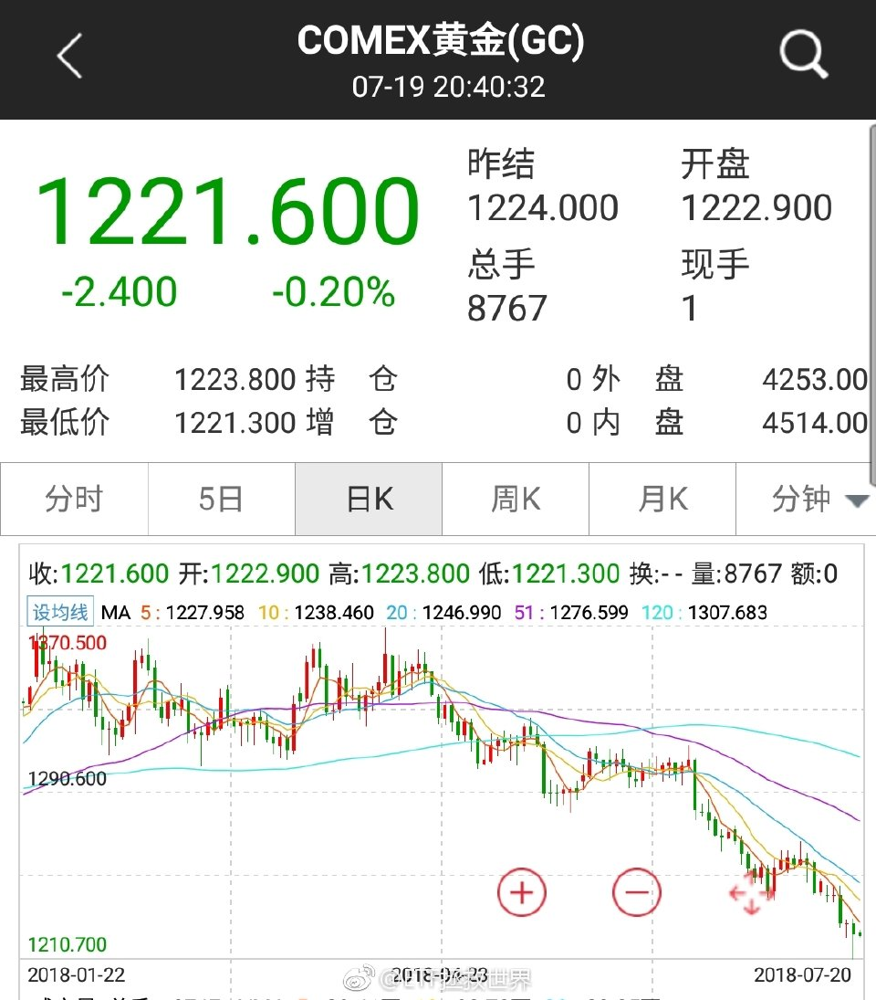

======================================================

ETF拯救世界 (5687069307) @
2018-07-20 09:33:16 Fri  
url: https://weibo.com/5687069307/GqLujliKE

A股是一个波动特别大的市场。只要大方向做对了，赚钱就会又快又多。

但是因为波动大，所以会有比较长的时间是下跌。因为涨的时候快，一步到位了，所以通常会用很久的下跌去修复。

那么，一个总的逻辑就应该是，在A股暴涨的时候尽量跟上。在A股长时间的下跌过程中，尽量保持不亏损。这样几轮过后，收 ​​​

转发[154]  评论[242]  赞[331] 

======================================================

ETF拯救世界 (5687069307) @
2018-07-20 09:36:20 Fri  
url: https://weibo.com/5687069307/GqLvy9SQA

无论是突破平台后的新高，还是跌破平台后的新低。

后面大概率跟的还是新高和新低。

不信你观察一下。 ​​​

转发[59]  评论[69]  赞[207] 

======================================================

ETF拯救世界 (5687069307) @
2018-07-20 09:38:10 Fri  
url: https://weibo.com/5687069307/GqLwiArcO

感觉鹅厂也不甘落后啊。//@ETF拯救世界:8848赢了。有心的朋友可以好好回顾一次这次的情况，包括大众的狂热，以及其他。相信对未来的投资会有非常大的帮助。会让你更加冷静看待这个市场的鼓噪。//@ETF拯救世界:如果两只会新低，谁会先行一步……

------------------------------------------------------
转推：
>  @ETF拯救世界 (5687069307)
>  2018-07-17 10:23:32 Tue  
>  url: https:/weibo.com/5687069307/Gqjxe62DI/

>  我这半年多关注的8848和腾讯，不是说对这两家公司有什么看法，我是在观察情绪。
>  
>  这两家公司在持续暴涨的时候，带了很多很多情绪。尤其是前者。很多人因为没买后悔的夜不能寐，很多人买了抱持坚定信念可以再涨好几倍。
>  
>  一家公司，一个行业，到底是不是真的能预判五年、十年后？
>  
>  很难讲。前几天看到一 ​​​

转发[5]  评论[8]  赞[80] 

======================================================

ETF拯救世界 (5687069307) @
2018-07-20 09:39:38 Fri  
url: https://weibo.com/5687069307/GqLwTy9Rl

回复@O_Zhong_O:五年后回头看这条消息会有无限感慨。

------------------------------------------------------
转推：
>  @ETF拯救世界 (5687069307)
>  2018-07-20 09:36:20 Fri  
>  url: https:/weibo.com/5687069307/GqLvy9SQA/

>  无论是突破平台后的新高，还是跌破平台后的新低。
>  
>  后面大概率跟的还是新高和新低。
>  
>  不信你观察一下。 ​​​

转发[11]  评论[14]  赞[138] 

======================================================

ETF拯救世界 (5687069307) @
2018-07-20 09:41:44 Fri  
url: https://weibo.com/5687069307/GqLxL3gXu

回复@美味果冻64516:白银基金161226万万不可以买。想玩白银网格可以去银行买纸白银。支持美元玩，跟的更好。//@美味果冻64516:想弄点白银基金来着

------------------------------------------------------
转推：
>  @ETF拯救世界 (5687069307)
>  2018-07-20 08:58:08 Fri  
>  url: https:/weibo.com/5687069307/GqLg3fl99/

>  黄金快跌破1200了，我们什么时候动手？
>  
>  2011年1900清仓后一直没有真正建仓。十年一个轮回，开始关注。 ​​​

转发[34]  评论[46]  赞[105] 

======================================================

ETF拯救世界 (5687069307) @
2018-07-20 09:44:35 Fri  
url: https://weibo.com/5687069307/GqLyUcgG8

新低。//@ETF拯救世界:感觉鹅厂也不甘落后啊。//@ETF拯救世界:8848赢了。有心的朋友可以好好回顾一次这次的情况，包括大众的狂热，以及其他。相信对未来的投资会有非常大的帮助。会让你更加冷静看待这个市场的鼓噪。//@ETF拯救世界:如果两只会新低，谁会先行一步……

------------------------------------------------------
转推：
>  @ETF拯救世界 (5687069307)
>  2018-07-17 10:23:32 Tue  
>  url: https:/weibo.com/5687069307/Gqjxe62DI/

>  我这半年多关注的8848和腾讯，不是说对这两家公司有什么看法，我是在观察情绪。
>  
>  这两家公司在持续暴涨的时候，带了很多很多情绪。尤其是前者。很多人因为没买后悔的夜不能寐，很多人买了抱持坚定信念可以再涨好几倍。
>  
>  一家公司，一个行业，到底是不是真的能预判五年、十年后？
>  
>  很难讲。前几天看到一 ​​​

转发[3]  评论[14]  赞[92] 

======================================================

ETF拯救世界 (5687069307) @
2018-07-20 09:49:59 Fri  
url: https://weibo.com/5687069307/GqLB69wgb

回复@李白先生vip:这不是经验。你要看它持有的是什么品种。持有期货品种的基金不可以买，比如南方油，比如226.。长期损耗让我们根本无法长期持有。//@李白先生vip:经验是无价之宝

------------------------------------------------------
转推：
>  @ETF拯救世界 (5687069307)
>  2018-07-20 08:58:08 Fri  
>  url: https:/weibo.com/5687069307/GqLg3fl99/

>  黄金快跌破1200了，我们什么时候动手？
>  
>  2011年1900清仓后一直没有真正建仓。十年一个轮回，开始关注。 ​​​

转发[20]  评论[41]  赞[122] 

======================================================

ETF拯救世界 (5687069307) @
2018-07-20 09:57:17 Fri  
url: https://weibo.com/5687069307/GqLE3FGss

腰斩。经典的散户顶部接盘实例。

------------------------------------------------------
转推：
>  @ETF拯救世界 (5687069307)
>  2017-12-04 09:36:18 Mon  
>  url: https:/weibo.com/5687069307/Fy3wE2Hh9/

>  8848获利筹码只剩55%了。这个股票换手虽然低，但是在高位几个月了，基本上接盘的都吃饱了。。。 ​​​

转发[5]  评论[39]  赞[123] 

======================================================

ETF拯救世界 (5687069307) @
2018-07-20 10:01:13 Fri  
url: https://weibo.com/5687069307/GqLFEixiU

$恒生指数 hkHSI$  有没有机会在25000左右把之前平衡掉的接回来？ ​​​

转发[9]  评论[30]  赞[116] 

======================================================

ETF拯救世界 (5687069307) @
2018-07-20 10:02:17 Fri  
url: https://weibo.com/5687069307/GqLG5vUw0

回复@ETF信徒者:别说话，_____。

------------------------------------------------------
转推：
>  @ETF拯救世界 (5687069307)
>  2018-07-17 10:23:32 Tue  
>  url: https:/weibo.com/5687069307/Gqjxe62DI/

>  我这半年多关注的8848和腾讯，不是说对这两家公司有什么看法，我是在观察情绪。
>  
>  这两家公司在持续暴涨的时候，带了很多很多情绪。尤其是前者。很多人因为没买后悔的夜不能寐，很多人买了抱持坚定信念可以再涨好几倍。
>  
>  一家公司，一个行业，到底是不是真的能预判五年、十年后？
>  
>  很难讲。前几天看到一 ​​​

转发[0]  评论[36]  赞[89] 

======================================================

ETF拯救世界 (5687069307) @
2018-07-20 10:07:05 Fri  
url: https://weibo.com/5687069307/GqLI2pJOh

国债继续疯。收益率破3清仓债券。 ​​​

转发[35]  评论[62]  赞[162] 

+++++++++++++++++++++++++++++++++++++++++++++++++++++

图片：
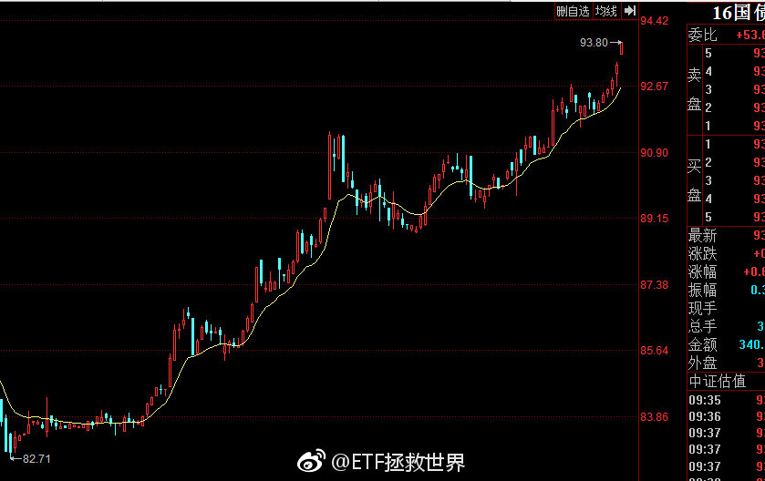

======================================================

ETF拯救世界 (5687069307) @
2018-07-20 10:13:03 Fri  
url: https://weibo.com/5687069307/GqLKsuhQW

回复@陶醉6松手4电学_337:央妈都带人来给你接盘了你还不卖？//@陶醉6松手4电学_337:昨天，央行要求商业银行买等级低的债券。是利好债市的啊！！咋就要清仓呢？

------------------------------------------------------
转推：
>  @ETF拯救世界 (5687069307)
>  2018-07-20 10:07:05 Fri  
>  url: https:/weibo.com/5687069307/GqLI2pJOh/

>  国债继续疯。收益率破3清仓债券。 ​​​

转发[14]  评论[55]  赞[144] 

======================================================

ETF拯救世界 (5687069307) @
2018-07-20 10:30:24 Fri  
url: https://weibo.com/5687069307/GqLRvdhle

我有种预感。这一波恒生我们有机会加到10%+，甚至15%+。 ​​​

转发[12]  评论[93]  赞[247] 

======================================================

ETF拯救世界 (5687069307) @
2018-07-20 10:39:12 Fri  
url: https://weibo.com/5687069307/GqLV4dxqN

打扰了。[拜拜]

------------------------------------------------------
转推：
>  @ETF拯救世界 (5687069307)
>  2018-07-20 10:30:24 Fri  
>  url: https:/weibo.com/5687069307/GqLRvdhle/

>  我有种预感。这一波恒生我们有机会加到10%+，甚至15%+。 ​​​

转发[1]  评论[68]  赞[154] 

======================================================

ETF拯救世界 (5687069307) @
2018-07-20 11:58:14 Fri  
url: https://weibo.com/5687069307/GqMr9x3xy

今天球球头条有个帖子，叫做“腾讯创新低，该买还是该卖。”

去看看评论。

再去找找1月底关于腾讯的帖子以及评论。

你会对这个市场的投资人有更深刻的理解。 ​​​

转发[17]  评论[87]  赞[191] 

======================================================

ETF拯救世界 (5687069307) @
2018-07-20 12:13:15 Fri  
url: https://weibo.com/5687069307/GqMxfrvGr

刷球球，除了学习投资知识，怎么观察群众情绪？我一般观察以下几点：

第一，对于大盘、个股，群众是如何一致性的看多看好，对于不同声音一致性的打压，尤其是短期涨幅巨大的情况下。一般出现这种情况就要小心。反之亦然。

第二，对于大V的受欢迎程度。如果某大v在某段时间内突然爆红，极受欢迎，则要 ​​​

转发[182]  评论[267]  赞[322] 

======================================================

ETF拯救世界 (5687069307) @
2018-07-20 12:30:09 Fri  
url: https://weibo.com/5687069307/GqME703ta

回复@奥斯特洛夫大柴夫斯基:我没明白，私募基金怎么会发行失败的？学习好的给讲讲。不是几百万就能成立吗。//@奥斯特洛夫大柴夫斯基:雪球上有个亿万富翁产品发行失败，哈哈，快去围观

------------------------------------------------------
转推：
>  @ETF拯救世界 (5687069307)
>  2018-07-20 12:13:15 Fri  
>  url: https:/weibo.com/5687069307/GqMxfrvGr/

>  刷球球，除了学习投资知识，怎么观察群众情绪？我一般观察以下几点：
>  
>  第一，对于大盘、个股，群众是如何一致性的看多看好，对于不同声音一致性的打压，尤其是短期涨幅巨大的情况下。一般出现这种情况就要小心。反之亦然。
>  
>  第二，对于大V的受欢迎程度。如果某大v在某段时间内突然爆红，极受欢迎，则要 ​​​

转发[5]  评论[30]  赞[104] 

======================================================

ETF拯救世界 (5687069307) @
2018-07-20 12:41:54 Fri  
url: https://weibo.com/5687069307/GqMISrOPp

接着上一条说。

我们观察群众情绪，一方面是体验市场温度。一方面是给我们自己做出警示。

具体说，

如果过去一段时间我们自己表现的太好，则一定要更加严格谨慎的对待接下来的考验。反复确认之前成功的策略以及品种是否有可能均值回归。

尽量将自己的成绩持久性的保持在前20%-30%。不要做最好。如 ​​​

转发[84]  评论[159]  赞[292] 

======================================================

ETF拯救世界 (5687069307) @
2018-07-20 13:35:55 Fri  
url: https://weibo.com/5687069307/GqN4O1d5f

$全指金融 sh000992$   回本有望了…… ​​​

转发[2]  评论[38]  赞[151] 

======================================================

ETF拯救世界 (5687069307) @
2018-07-20 13:43:20 Fri  
url: https://weibo.com/5687069307/GqN7Orjy4

涨了一个点觉得仓位低难受的不得了的人自己去加仓，不要到我这里抱怨。否则一律拉黑。

50也加了，券商也加了，金融也加了。还觉得不行的赶紧取关。 ​​​

转发[10]  评论[81]  赞[291] 

======================================================

ETF拯救世界 (5687069307) @
2018-07-20 13:56:57 Fri  
url: https://weibo.com/5687069307/GqNdlbVXd

回复@封单爱吐槽:我以后还是闭嘴算了。只干不说。//@封单爱吐槽:e大你的嘴是开了光的呀//@ETF拯救世界:回复@陶醉6松手4电学_337:央妈都带人来给你接盘了你还不卖？//@陶醉6松手4电学_337:昨天，央行要求商业银行买等级低的债券。是利好债市的啊！！咋就要清仓呢？

------------------------------------------------------
转推：
>  @ETF拯救世界 (5687069307)
>  2018-07-20 10:07:05 Fri  
>  url: https:/weibo.com/5687069307/GqLI2pJOh/

>  国债继续疯。收益率破3清仓债券。 ​​​

转发[2]  评论[19]  赞[111] 

======================================================

ETF拯救世界 (5687069307) @
2018-07-20 13:59:35 Fri  
url: https://weibo.com/5687069307/GqNepoTGW

注意 $全指金融 sh000992$   之前我们浮亏4个多点。今天弄不好一把干红。

这就是我一直在强调的，“你那点浮亏，牛市来了，一周，最多半个月就翻红，然后开始资产飞跃。”

今天是不是反转日，我不知道。但是你可以感受一下我说的意思。有点浮亏，浮亏几年，根本不是问题。只要浮亏幅度不大，分分钟变 ​​​

转发[31]  评论[101]  赞[271] 

======================================================

ETF拯救世界 (5687069307) @
2018-07-20 14:18:09 Fri  
url: https://weibo.com/5687069307/GqNlWCg5h

$中证转债 sh000832$   $中证红利 sz399922$   开始赚钱。 ​​​

转发[5]  评论[59]  赞[167] 

======================================================

ETF拯救世界 (5687069307) @
2018-07-20 14:25:02 Fri  
url: https://weibo.com/5687069307/GqNoK27bV

我就说这么弱的反弹真的没见过。看来还要继续。2900上下浮动50个点都算正常情况。

------------------------------------------------------
转推：
>  @ETF拯救世界 (5687069307)
>  2018-07-19 11:12:41 Thu  
>  url: https:/weibo.com/5687069307/GqCIaq7P8/

>  如果这波反弹就此结束，那真的是远远弱于我的预期。熊市中这么弱的反弹都很少见。我以为至少得碰碰2850-2900呢。 ​​​

转发[16]  评论[52]  赞[196] 

======================================================

ETF拯救世界 (5687069307) @
2018-07-20 14:31:43 Fri  
url: https://weibo.com/5687069307/GqNrs8GW5

关于网格。有波动就有利润。提款机。

注意，如果你也要做，请一定做好压力测试。这是最关键的。 ​​​

转发[30]  评论[145]  赞[337] 

+++++++++++++++++++++++++++++++++++++++++++++++++++++

图片：
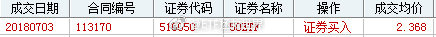
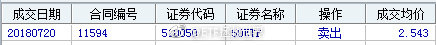

======================================================

ETF拯救世界 (5687069307) @
2018-07-20 14:38:52 Fri  
url: https://weibo.com/5687069307/GqNumaxSn

波段仓位和长线仓位毫无关系。这个不要弄错。

未来会发生什么，我们都不知道。也许一个区间波动几年不涨。这个时候，波段仓位可以提供源源不断的利润。但是如果开始长牛，只做波段又赚不到大钱，所以长线仓位要拿死。

之前我说，考虑在计划中加入波段仓位，就是干这个用的。有机会会加进去。不过这个 ​​​

转发[46]  评论[186]  赞[350] 

======================================================

ETF拯救世界 (5687069307) @
2018-07-20 21:47:08 Fri  
url: https://weibo.com/5687069307/GqQicdMMs

每日打卡（195）

坚持 ​​​

转发[0]  评论[38]  赞[298] 

+++++++++++++++++++++++++++++++++++++++++++++++++++++

图片：

======================================================

ETF拯救世界 (5687069307) @
2018-07-22 08:36:12 Sun  
url: https://weibo.com/5687069307/Gr3Y90pmC

今天巡视北二环，昨天视察了东二环。

谁能想到我即将成为接盘侠。 

苍天饶过谁。 ​​​

转发[16]  评论[318]  赞[368] 

======================================================

ETF拯救世界 (5687069307) @
2018-07-22 16:44:54 Sun  
url: https://weibo.com/5687069307/Gr7avAr6p

回复@摇身一变我就是孙悟空:可能你挣了钱是要带到那边去吧。我不是，无论是工作还是投资挣得钱我都是要花的。该花的时候就花，不然挣钱干嘛？顺便说一句，这个评论点赞的全都拉黑//@摇身一变我就是孙悟空:所以etf没啥用 最后还是得房子 哈哈哈哈哈哈 人生讽刺啊

------------------------------------------------------
转推：
>  @ETF拯救世界 (5687069307)
>  2018-07-22 08:36:12 Sun  
>  url: https:/weibo.com/5687069307/Gr3Y90pmC/

>  今天巡视北二环，昨天视察了东二环。
>  
>  谁能想到我即将成为接盘侠。 
>  
>  苍天饶过谁。 ​​​

转发[2]  评论[77]  赞[149] 

======================================================

ETF拯救世界 (5687069307) @
2018-07-22 16:59:03 Sun  
url: https://weibo.com/5687069307/Gr7gfnYWc

投资是为了什么呢。其实绝大多数人投资都是想用投资收益过上想过的日子，买想买的东西——不眨眼那种买。

你不会说，你在股票上挣了钱还是要买奥利奥，迪奥，奥迪啊，好讽刺啊。你居然没有把股票拿到临终那一天啊，你怎么不吃糠咽菜去积攒基金份额啊。

买学区房当然也一样，这就是个消费品。想投资房 ​​​

转发[34]  评论[169]  赞[351] 

======================================================

ETF拯救世界 (5687069307) @
2018-07-22 20:43:04 Sun  
url: https://weibo.com/5687069307/Gr8Jb5a4q

回复@伟哥就是你伟哥:我的感受和绝大多数人一样。但我知道这件事可能也很难真正改变什么。后续的发展可以参照十年前。至于医药指数的投资，如果真的挖深坑，我愿意为国护盘。//@伟哥就是你伟哥:E大，有空能谈谈你对这段时间沸沸扬扬的疫苗造假事件的看法吗？

------------------------------------------------------
转推：
>  @ETF拯救世界 (5687069307)
>  2018-07-22 08:36:12 Sun  
>  url: https:/weibo.com/5687069307/Gr3Y90pmC/

>  今天巡视北二环，昨天视察了东二环。
>  
>  谁能想到我即将成为接盘侠。 
>  
>  苍天饶过谁。 ​​​

转发[9]  评论[49]  赞[184] 

======================================================

ETF拯救世界 (5687069307) @
2018-07-22 22:10:15 Sun  
url: https://weibo.com/5687069307/Gr9izp8v2

回复@A夜如故:据官方说法，这次疫苗主要是效价指标不合格，就是可能会失效，对健康应该没什么危害，打了这些批次的家长暂时不用太担心。后续密切关注吧，另外是不是要补种疫苗

------------------------------------------------------
转推：
>  @ETF拯救世界 (5687069307)
>  2018-07-22 08:36:12 Sun  
>  url: https:/weibo.com/5687069307/Gr3Y90pmC/

>  今天巡视北二环，昨天视察了东二环。
>  
>  谁能想到我即将成为接盘侠。 
>  
>  苍天饶过谁。 ​​​

转发[1]  评论[78]  赞[129] 

======================================================

ETF拯救世界 (5687069307) @
2018-07-22 23:28:29 Sun  
url: https://weibo.com/5687069307/Gr9Okht5V

不知道该说什么。也不知道怎么说。

不过，在三周后，没人再提起这件事的时候，我依然会持续关注。

就像持续关注这些年那些轰动一时的事件后续发展一样。

关注热门事件的后续发展，会让你有两点感悟。

第一是，你一定想不到，大多数事件会最终不了了之。

第二是，几乎什么都没改变。

到底从什么时 ​​​

转发[66]  评论[162]  赞[371] 

======================================================

ETF拯救世界 (5687069307) @
2018-07-23 08:40:05 Mon  
url: https://weibo.com/5687069307/Grdqdn9ai

就是这13位，已拉黑。如果有误伤的，不好意思了。

最近水逆的厉害，很多不顺心的事情，心情不好，以后心情好了再解黑。

昨天车还出问题了，突然自动熄火，不知道是不是自动启停出问题了。抽空去查查。

刚买完DAX就出这事，感觉是，你爱德国然而德国不爱你……[doge] ​​​

转发[3]  评论[169]  赞[187] 

+++++++++++++++++++++++++++++++++++++++++++++++++++++

图片：

======================================================

ETF拯救世界 (5687069307) @
2018-07-23 08:44:23 Mon  
url: https://weibo.com/5687069307/GrdrXtD2F

//@陈宇极品投资: 转发微博

------------------------------------------------------
转推：
>  @ ()
>  2018-07-23 08:40:02 Mon  
>  url: 

>  抱歉，此微博已被作者删除。查看帮助：http://t.cn/Rfd3rQV

转发[36]  评论[23]  赞[74] 

======================================================

ETF拯救世界 (5687069307) @
2018-07-23 09:47:07 Mon  
url: https://weibo.com/5687069307/GrdRqi0ny

你看，所以其实没有什么行业是完全安全的，更别说个股了。

食品饮料安全吗？三聚和塑化剂的事这么快就忘了？

医药安全吗？你看看。

金融地产？

公用事业？

其实到处都是坑。

所以，指数投资+低估是躲坑最佳方式。对于普通投资者来讲。 ​​​

转发[117]  评论[128]  赞[328] 

======================================================

ETF拯救世界 (5687069307) @
2018-07-23 10:04:52 Mon  
url: https://weibo.com/5687069307/GrdYCrd03

但是，说一点我的经验：每次某个行业出大事挖大坑，事后看，都是真正的钻石机会。

------------------------------------------------------
转推：
>  @ETF拯救世界 (5687069307)
>  2018-07-23 09:47:07 Mon  
>  url: https:/weibo.com/5687069307/GrdRqi0ny/

>  你看，所以其实没有什么行业是完全安全的，更别说个股了。
>  
>  食品饮料安全吗？三聚和塑化剂的事这么快就忘了？
>  
>  医药安全吗？你看看。
>  
>  金融地产？
>  
>  公用事业？
>  
>  其实到处都是坑。
>  
>  所以，指数投资+低估是躲坑最佳方式。对于普通投资者来讲。 ​​​

转发[54]  评论[90]  赞[258] 

======================================================

ETF拯救世界 (5687069307) @
2018-07-23 10:11:33 Mon  
url: https://weibo.com/5687069307/Gre1kzdug

前期低点一旦守不住，平台破了就很麻烦。新低和新高一样，大概率都会继续。但是，请看到这条微博的朋友不要因为这个卖出你持有的腾讯，这个锅我背不起。我只是就事论事。否则以后什么都不敢说了。//@ETF拯救世界:腾讯能不能守住前期低点是我比较关注的。好消息是估值已经降至35倍。

------------------------------------------------------
转推：
>  @ETF拯救世界 (5687069307)
>  2018-03-22 09:34:01 Thu  
>  url: https:/weibo.com/5687069307/G8wd21cxW/

>  腾讯，60倍PE。未来五年看，真的能有特别好的收益率吗。
>  
>  学习了。 ​​​

转发[25]  评论[53]  赞[175] 

======================================================

ETF拯救世界 (5687069307) @
2018-07-23 10:42:42 Mon  
url: https://weibo.com/5687069307/GredZ8iYX

回复@DG无为:你这个创意真的太好了。我有时候会想，如果真的写书，起什么名字。看到你这个我觉得真不错啊。《指数基金拯救世界》也可以。//@DG无为:回复@生长的韭菜:我估计可能就叫《ETF拯救世界》

------------------------------------------------------
转推：
>  @ETF拯救世界 (5687069307)
>  2018-03-22 09:34:01 Thu  
>  url: https:/weibo.com/5687069307/G8wd21cxW/

>  腾讯，60倍PE。未来五年看，真的能有特别好的收益率吗。
>  
>  学习了。 ​​​

转发[2]  评论[69]  赞[156] 

======================================================

ETF拯救世界 (5687069307) @
2018-07-23 10:49:33 Mon  
url: https://weibo.com/5687069307/GregLoKmB

回复@勤奋happyfire:主动基金的问题就是确实无法把握它的表现。即使跌了很多，也不知道补仓的话未来基金经理会不会继续踩坑。如果是我，可能会把空间拉的大一点慢慢补仓。

------------------------------------------------------
转推：
>  @ETF拯救世界 (5687069307)
>  2018-07-23 09:47:07 Mon  
>  url: https:/weibo.com/5687069307/GrdRqi0ny/

>  你看，所以其实没有什么行业是完全安全的，更别说个股了。
>  
>  食品饮料安全吗？三聚和塑化剂的事这么快就忘了？
>  
>  医药安全吗？你看看。
>  
>  金融地产？
>  
>  公用事业？
>  
>  其实到处都是坑。
>  
>  所以，指数投资+低估是躲坑最佳方式。对于普通投资者来讲。 ​​​

转发[14]  评论[30]  赞[124] 

======================================================

ETF拯救世界 (5687069307) @
2018-07-23 11:21:30 Mon  
url: https://weibo.com/5687069307/GretJucrK

其实入门的话，罗总这本介绍指数基金的书是很不错的。有希望了解指数基金的朋友可以看看~~

------------------------------------------------------
转推：
>  @老罗话指数投资 (6177581254)
>  2018-07-23 10:53:49 Mon  
>  url: https:/weibo.com/6177581254/Greiv2EGN/

>  发布了头条文章：《老罗新书上市，京东大促销两天，55元2本》  http://t.cn/RgdAgb7 ​​​

转发[36]  评论[158]  赞[218] 

======================================================

ETF拯救世界 (5687069307) @
2018-07-23 12:44:53 Mon  
url: https://weibo.com/5687069307/Grf1zpC9x

如果出了事，不是捂着盖着，而是解决它，真的会福泽万世。作为一个父亲，看完这样的报道，再想想现在发生的，心如刀割。致敬有良知的记者。

------------------------------------------------------
转推：
>  @新浪财经 (1638782947)
>  2018-07-23 10:33:20 Mon  
>  url: https:/weibo.com/1638782947/GreabmExj/

>  【8年前疫苗案记者一语成谶:山西案不了了之全国必出事】事实上，国内最早揭露疫苗问题黑幕的是著名的调查记者——中国经济时报前首席记者王克勤。数年前，王克勤在一次接受媒体采访时表示：“山西疫苗案不了了之，山东及全国必出问题！”没想到，今天的事情印证了他的预言。王克勤一语成谶，令人唏嘘。 ​​​

转发[59]  评论[49]  赞[292] 

======================================================

ETF拯救世界 (5687069307) @
2018-07-23 12:55:49 Mon  
url: https://weibo.com/5687069307/Grf61aBHU

其实你们大多数人，甚至大多数父母，可能没有体会过刚才那篇文章里那种孩子出事后撕裂般的痛苦。

我儿子曾经有一次病了，做了检查，疑似很严重。如果确诊，是没有办法治疗的那种。

知道这个检查结果我就崩溃了。带着他到各大医院去看，根本不在乎花多少钱，那时候钱已经没意义了，找最好的医生，做最 ​​​

转发[91]  评论[341]  赞[937] 

======================================================

ETF拯救世界 (5687069307) @
2018-07-23 13:18:32 Mon  
url: https://weibo.com/5687069307/GrffeBpJZ

50的买点为何总是这么风骚……再次买在最低，今天又领涨。

其实50真的很棒，只要你会玩…… ​​​

转发[22]  评论[90]  赞[326] 

+++++++++++++++++++++++++++++++++++++++++++++++++++++

图片：

======================================================

ETF拯救世界 (5687069307) @
2018-07-23 13:48:03 Mon  
url: https://weibo.com/5687069307/Grfrdse8E

医药趋势已坏，不要频繁抄底，注意节奏 ​​​

转发[47]  评论[223]  赞[509] 

======================================================

ETF拯救世界 (5687069307) @
2018-07-24 06:51:24 Tue  
url: https://weibo.com/5687069307/Grm8B7RtV

回复@追求确定性2:连涨15个交易日，野百合也有春天。买辣鸡没错的//@追求确定性2:昨天美元债大涨啊，我的正1%了。

------------------------------------------------------
转推：
>  @ETF拯救世界 (5687069307)
>  2018-07-23 13:18:32 Mon  
>  url: https:/weibo.com/5687069307/GrffeBpJZ/

>  50的买点为何总是这么风骚……再次买在最低，今天又领涨。
>  
>  其实50真的很棒，只要你会玩…… ​​​

转发[14]  评论[102]  赞[210] 

======================================================

ETF拯救世界 (5687069307) @
2018-07-24 10:19:42 Tue  
url: https://weibo.com/5687069307/Grnv97y2y

富国300，全指金融开始盈利。 ​​​

转发[2]  评论[67]  赞[249] 

======================================================

ETF拯救世界 (5687069307) @
2018-07-24 10:23:45 Tue  
url: https://weibo.com/5687069307/GrnwMrW0g

回复@炒饭821:还没签呢！疯了。//@炒饭821:老大，通稿新政策影响挺大的啊，医药也翻红了，难道股市楼市真的要活跃了，你这房子买的点厉害了[作揖]//@ETF拯救世界:回复@追求确定性2:连涨15个交易日，野百合也有春天。买辣鸡没错的//@追求确定性2:昨天美元债大涨啊，我的正1%了。

------------------------------------------------------
转推：
>  @ETF拯救世界 (5687069307)
>  2018-07-23 13:18:32 Mon  
>  url: https:/weibo.com/5687069307/GrffeBpJZ/

>  50的买点为何总是这么风骚……再次买在最低，今天又领涨。
>  
>  其实50真的很棒，只要你会玩…… ​​​

转发[2]  评论[57]  赞[108] 

======================================================

ETF拯救世界 (5687069307) @
2018-07-24 10:24:45 Tue  
url: https://weibo.com/5687069307/Grnxcffim

回复@向往世界的游星:2900±50是压力//@向往世界的游星:如你所说，反弹2900点//@ETF拯救世界:回复@追求确定性2:连涨15个交易日，野百合也有春天。买辣鸡没错的//@追求确定性2:昨天美元债大涨啊，我的正1%了。

------------------------------------------------------
转推：
>  @ETF拯救世界 (5687069307)
>  2018-07-23 13:18:32 Mon  
>  url: https:/weibo.com/5687069307/GrffeBpJZ/

>  50的买点为何总是这么风骚……再次买在最低，今天又领涨。
>  
>  其实50真的很棒，只要你会玩…… ​​​

转发[5]  评论[72]  赞[167] 

======================================================

ETF拯救世界 (5687069307) @
2018-07-24 12:07:05 Tue  
url: https://weibo.com/5687069307/GrocJoaKo

分享两个最近的案例：

一，500网格。一个小网可以出货了。

二，我经常说的“让大家开心一下，我某个股票又跌了30%”。是的，我会用一小部分资金配置打新门票，再等权买入一堆量化选出的股票。其中一个下跌30%补仓的例子是这样：

我对于门票股的补仓价位，是该股下跌30%；60%；90%各补一次。金额与初 ​​​

转发[215]  评论[341]  赞[490] 

+++++++++++++++++++++++++++++++++++++++++++++++++++++

图片：
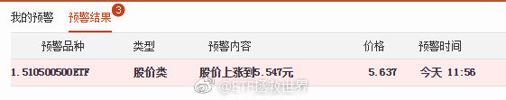
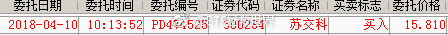

======================================================

ETF拯救世界 (5687069307) @
2018-07-24 13:16:54 Tue  
url: https://weibo.com/5687069307/GroF4nGF8

目前所有持仓品种，浮亏的没有超过15%的。

25只品种中，还有8只浮亏。超过10%的有三只。

不知道什么叫赔钱。

牛市会不会来？一定会来。来了所有品种两周内翻红。 ​​​

转发[11]  评论[237]  赞[507] 

======================================================

ETF拯救世界 (5687069307) @
2018-07-25 09:57:21 Wed  
url: https://weibo.com/5687069307/GrwMzlYpc

传媒是不是又加在底部了 ​​​

转发[9]  评论[125]  赞[284] 

======================================================

ETF拯救世界 (5687069307) @
2018-07-25 10:22:34 Wed  
url: https://weibo.com/5687069307/GrwWO53Kq

回复@小小宇宙要爆发啊啊:再次奶在最高点。虽然最近水逆，但功力还在，放心了//@小小宇宙要爆发啊啊:高点也奶得精准，毒奶神功，名不虚传哈哈哈[doge]

------------------------------------------------------
转推：
>  @ETF拯救世界 (5687069307)
>  2018-07-25 09:57:21 Wed  
>  url: https:/weibo.com/5687069307/GrwMzlYpc/

>  传媒是不是又加在底部了 ​​​

转发[1]  评论[26]  赞[145] 

======================================================

ETF拯救世界 (5687069307) @
2018-07-25 10:24:19 Wed  
url: https://weibo.com/5687069307/GrwXw66H5

回复@8点钟的太阳_13214:50的关键是，两年多来第一次买入……//@8点钟的太阳_13214:我感觉最近50加仓位置E大选择的时点太棒了，我居然短期盈利快到10%了。传媒没的说

------------------------------------------------------
转推：
>  @ETF拯救世界 (5687069307)
>  2018-07-25 09:57:21 Wed  
>  url: https:/weibo.com/5687069307/GrwMzlYpc/

>  传媒是不是又加在底部了 ​​​

转发[3]  评论[37]  赞[175] 

======================================================

ETF拯救世界 (5687069307) @
2018-07-25 10:34:39 Wed  
url: https://weibo.com/5687069307/Grx1HvuLV

敢不敢新高 ​​​

转发[12]  评论[49]  赞[196] 

+++++++++++++++++++++++++++++++++++++++++++++++++++++

图片：
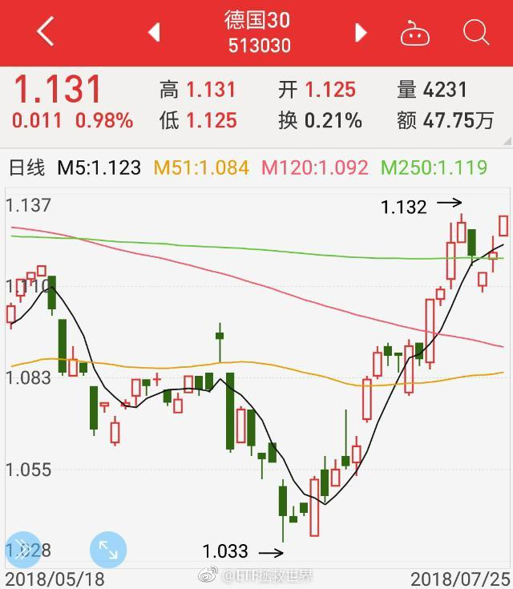

======================================================

ETF拯救世界 (5687069307) @
2018-07-25 11:55:30 Wed  
url: https://weibo.com/5687069307/GrxywhF9n

太听话了吧。

------------------------------------------------------
转推：
>  @ETF拯救世界 (5687069307)
>  2018-07-25 10:34:39 Wed  
>  url: https:/weibo.com/5687069307/Grx1HvuLV/

>  敢不敢新高 ​​​

转发[5]  评论[25]  赞[122] 

======================================================

ETF拯救世界 (5687069307) @
2018-07-25 12:23:11 Wed  
url: https://weibo.com/5687069307/GrxJL3TyG

回复@小散逆袭史-铁粉小伍:看了，确实不行。都不要看了。以后谁再来我这里做广告我就评论“看过了，不行，千万不要去看”，然后置顶。//@小散逆袭史-铁粉小伍:回复@如醉且坠:没看就在说不行//@ETF拯救世界:太听话了吧。

------------------------------------------------------
转推：
>  @ETF拯救世界 (5687069307)
>  2018-07-25 10:34:39 Wed  
>  url: https:/weibo.com/5687069307/Grx1HvuLV/

>  敢不敢新高 ​​​

转发[2]  评论[44]  赞[134] 

======================================================

ETF拯救世界 (5687069307) @
2018-07-25 12:54:13 Wed  
url: https://weibo.com/5687069307/GrxWmFRUs

人成年后到底记不记得六岁时候父母的样子？

------------------------------------------------------
转推：
>  @央视新闻 (2656274875)
>  2018-07-25 12:44:18 Wed  
>  url: https:/weibo.com/2656274875/GrxSkFuUo/

>  【转发帮帮他！六旬老人在儿子失踪处摆摊30年：只想再见他一面[悲伤]】1987年，四川绵阳成绵路，韩峰6岁的儿子在自家修表摊前失踪，疑似被拐。四处找寻无果后，30年来，韩峰每天7点准时出门，到11公里外坚持摆修表摊，苦苦等待奇迹出现。韩峰说：“我不想也不会强迫他回到我身边，我只是，想再见他一面 ​​​

转发[7]  评论[39]  赞[81] 

======================================================

ETF拯救世界 (5687069307) @
2018-07-25 13:03:39 Wed  
url: https://weibo.com/5687069307/Gry0cgqmF

男人要管住自己的下半身啊[并不简单]最近出事比较多

------------------------------------------------------
转推：
>  @北京人不知道的北京事儿 (1662214194)
>  2018-07-25 10:55:21 Wed  
>  url: https:/weibo.com/1662214194/Grxa76uoE/

>  一位女生举报前《中国新闻周刊》编委章文强奸，章文曾恐吓受害者：“如果因为你而导致我儿子不能出国读书，我会采取一切可以采取的手段！”。。。事发后多名女生（包括蒋方舟、易小荷）站出来指认章文有过性骚扰行为，转发曝光这人渣！[怒][怒][怒] ​​​

转发[20]  评论[47]  赞[82] 

======================================================

ETF拯救世界 (5687069307) @
2018-07-25 13:07:32 Wed  
url: https://weibo.com/5687069307/Gry1LuhtJ

回复@三角精神:没懂。你说的这两个哪个是上半身完成的？//@三角精神:你这是混淆了强奸和乱交的区别。//@ETF拯救世界:男人要管住自己的下半身啊[并不简单]最近出事比较多

------------------------------------------------------
转推：
>  @北京人不知道的北京事儿 (1662214194)
>  2018-07-25 10:55:21 Wed  
>  url: https:/weibo.com/1662214194/Grxa76uoE/

>  一位女生举报前《中国新闻周刊》编委章文强奸，章文曾恐吓受害者：“如果因为你而导致我儿子不能出国读书，我会采取一切可以采取的手段！”。。。事发后多名女生（包括蒋方舟、易小荷）站出来指认章文有过性骚扰行为，转发曝光这人渣！[怒][怒][怒] ​​​

转发[1]  评论[34]  赞[62] 

======================================================

ETF拯救世界 (5687069307) @
2018-07-25 13:20:05 Wed  
url: https://weibo.com/5687069307/Gry6Rkexs

回复@搬砖能手王富贵233:这也一样啊。做任何事情都想清楚能不能承受最坏的结果，想清楚了再做。自控力体现在各个方面。//@搬砖能手王富贵233:这种事情谁知道呢？说不定是你情我愿的，女方知道他渣男后就反目成仇，我们又不是当事人，不知道

------------------------------------------------------
转推：
>  @北京人不知道的北京事儿 (1662214194)
>  2018-07-25 10:55:21 Wed  
>  url: https:/weibo.com/1662214194/Grxa76uoE/

>  一位女生举报前《中国新闻周刊》编委章文强奸，章文曾恐吓受害者：“如果因为你而导致我儿子不能出国读书，我会采取一切可以采取的手段！”。。。事发后多名女生（包括蒋方舟、易小荷）站出来指认章文有过性骚扰行为，转发曝光这人渣！[怒][怒][怒] ​​​

转发[12]  评论[19]  赞[98] 

======================================================

ETF拯救世界 (5687069307) @
2018-07-25 13:53:09 Wed  
url: https://weibo.com/5687069307/GrykhqoTI

你们有没有发现一件事。

为什么古天乐吴彦祖吴尊刘德华这些巨帅身材又好的男人

不会乱搞。而且是好老公好爸爸。

至少咱们没听说。

明明机会很多啊。 ​​​

转发[9]  评论[266]  赞[217] 

======================================================

ETF拯救世界 (5687069307) @
2018-07-25 15:05:46 Wed  
url: https://weibo.com/5687069307/GryNL1NEJ

自动熄火重启有故障提示后续:

去4s店检查，行车电脑没有任何故障码记录，也就是说没事，不知道为什么有故障提示。

检查的时候我出去办事了，回来车洗了，玻璃水加满了，60块打车票报了，离合匹配了，又蹭了顿饭，最后和店里的妹子们谈笑风生。

哪能港，就是感觉你爱德国，德国又爱你了。

水逆是不 ​​​

转发[0]  评论[120]  赞[214] 

======================================================

ETF拯救世界 (5687069307) @
2018-07-25 15:09:42 Wed  
url: https://weibo.com/5687069307/GryPm4Wu3

回复@小散逆袭史-铁粉小伍:你这个素质，这辈子也就在网上给人做水军了。所以我不会跟你计较的。生活很难吧，加油。//@小散逆袭史-铁粉小伍:sb//@ETF拯救世界:回复@小散逆袭史-铁粉小伍:看了，确实不行。都不要看了。以后谁再来我这里做广告我就评论“看过了，不行，千万不要去看”，然后置顶。

------------------------------------------------------
转推：
>  @ETF拯救世界 (5687069307)
>  2018-07-25 10:34:39 Wed  
>  url: https:/weibo.com/5687069307/Grx1HvuLV/

>  敢不敢新高 ​​​

转发[0]  评论[72]  赞[196] 

======================================================

ETF拯救世界 (5687069307) @
2018-07-25 16:44:16 Wed  
url: https://weibo.com/5687069307/GrzrJE4Pe

如果我这两年内能安排好所有必须完成的事，顺利退休，那我会做一件特别特别有意思的事。

90%的人看到都会觉得有意思的事。应该没人做过。但也许是很多人的梦想。

如果真的做了，我可能会红！

敬请期待…… ​​​

转发[43]  评论[588]  赞[551] 

======================================================

ETF拯救世界 (5687069307) @
2018-07-25 16:55:32 Wed  
url: https://weibo.com/5687069307/GrzwjE0HX

很多人的思维太集中在投资了，没有想象力。90%的人都觉得有意思的事情，极大概率跟投资无关。跟人生有关。特有意思。

------------------------------------------------------
转推：
>  @ETF拯救世界 (5687069307)
>  2018-07-25 16:44:16 Wed  
>  url: https:/weibo.com/5687069307/GrzrJE4Pe/

>  如果我这两年内能安排好所有必须完成的事，顺利退休，那我会做一件特别特别有意思的事。
>  
>  90%的人看到都会觉得有意思的事。应该没人做过。但也许是很多人的梦想。
>  
>  如果真的做了，我可能会红！
>  
>  敬请期待…… ​​​

转发[14]  评论[319]  赞[285] 

======================================================

ETF拯救世界 (5687069307) @
2018-07-26 13:13:42 Thu  
url: https://weibo.com/5687069307/GrHuLsPfv

非常忙，勿念。 ​​​

转发[1]  评论[252]  赞[446] 

======================================================

ETF拯救世界 (5687069307) @
2018-07-27 06:29:39 Fri  
url: https://weibo.com/5687069307/GrOhg4ybB

我以为要三周大家才会忘掉。

谁能想到，只需要三天。

很有意思。 ​​​

转发[9]  评论[225]  赞[314] 

======================================================

ETF拯救世界 (5687069307) @
2018-07-27 08:48:23 Fri  
url: https://weibo.com/5687069307/GrPbzlHeu

最近一线实体亲测调研了帝都房地产二手市场。

几点初步感想。

杠杆越来越大。因为卖房的人几乎没有拿现金走人的。都是卖了房加杠杆继续买。

关键是，杠杆本身已经很大了。我谈了那么多套，各种各样的情况之前都没听说过。比如，把房子抵押出去已经是最普通的情况。二抵也不在少数。

抵押在银行的还 ​​​

转发[47]  评论[223]  赞[358] 

======================================================

ETF拯救世界 (5687069307) @
2018-07-27 08:50:26 Fri  
url: https://weibo.com/5687069307/GrPcp6hcb

回复@天外的琴弦:卖地的是链条最后的那一环。//@天外的琴弦:卖房，加杠杆买，这个链条总有最后一个卖房的人。

------------------------------------------------------
转推：
>  @ETF拯救世界 (5687069307)
>  2018-07-27 08:48:23 Fri  
>  url: https:/weibo.com/5687069307/GrPbzlHeu/

>  最近一线实体亲测调研了帝都房地产二手市场。
>  
>  几点初步感想。
>  
>  杠杆越来越大。因为卖房的人几乎没有拿现金走人的。都是卖了房加杠杆继续买。
>  
>  关键是，杠杆本身已经很大了。我谈了那么多套，各种各样的情况之前都没听说过。比如，把房子抵押出去已经是最普通的情况。二抵也不在少数。
>  
>  抵押在银行的还 ​​​

转发[4]  评论[25]  赞[105] 

======================================================

ETF拯救世界 (5687069307) @
2018-07-27 09:14:09 Fri  
url: https://weibo.com/5687069307/GrPm1CHFZ

忙的刚看到。

另外，美元债连涨几十个交易日了吧。辣鸡知耻后勇了。 ​​​

转发[0]  评论[43]  赞[143] 

+++++++++++++++++++++++++++++++++++++++++++++++++++++

图片：
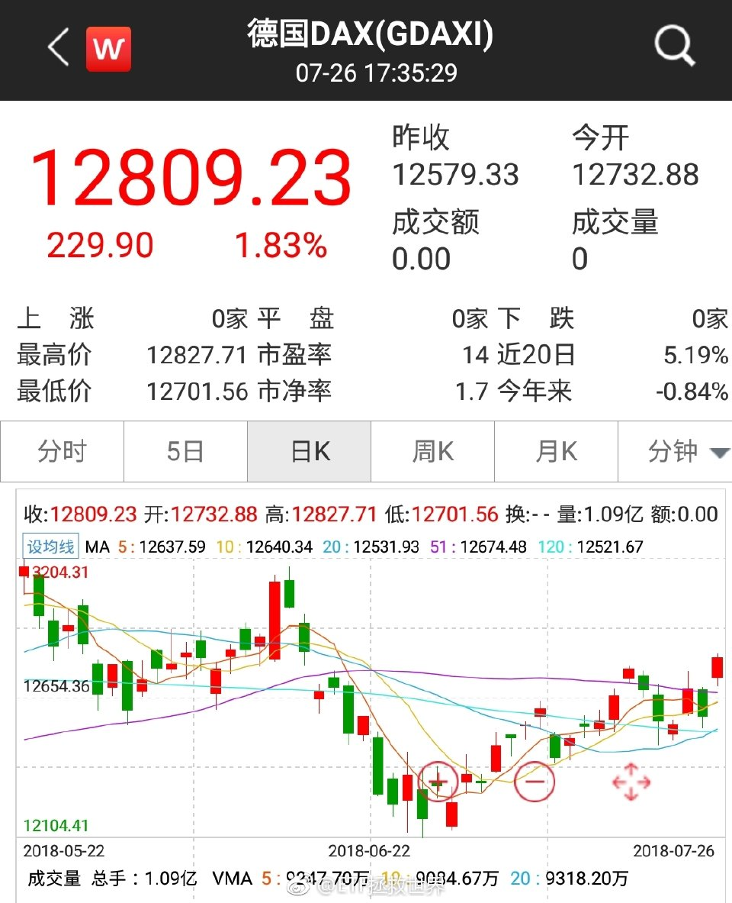

======================================================

ETF拯救世界 (5687069307) @
2018-07-27 09:22:04 Fri  
url: https://weibo.com/5687069307/GrPpf6pyS

$Facebook FB$   一天20%，几个月白涨了。

有没有只涨不跌的股票？

我看，没有。

而且，越多人认为只会涨不会跌的，其实杀伤力越大。 ​​​

转发[5]  评论[56]  赞[167] 

======================================================

ETF拯救世界 (5687069307) @
2018-07-27 09:37:35 Fri  
url: https://weibo.com/5687069307/GrPvxsJUy

$513030  溢价1.8%了。至于吗 ​​​

转发[1]  评论[30]  赞[133] 

======================================================

ETF拯救世界 (5687069307) @
2018-07-27 09:55:23 Fri  
url: https://weibo.com/5687069307/GrPCLoK37

$腾讯控股 hk00700$  股王能否守住前期低点？这是价值投资的湮灭还是道德的沦丧，人性的扭曲？

答案即将揭晓…… ​​​

转发[1]  评论[51]  赞[150] 

======================================================

ETF拯救世界 (5687069307) @
2018-07-27 10:03:23 Fri  
url: https://weibo.com/5687069307/GrPG0D4Qk

2.1%了。越说越来劲。不要追。

------------------------------------------------------
转推：
>  @ETF拯救世界 (5687069307)
>  2018-07-27 09:37:35 Fri  
>  url: https:/weibo.com/5687069307/GrPvxsJUy/

>  $513030  溢价1.8%了。至于吗 ​​​

转发[0]  评论[37]  赞[134] 

======================================================

ETF拯救世界 (5687069307) @
2018-07-27 10:33:55 Fri  
url: https://weibo.com/5687069307/GrPSpdGTG

看着这样的走势，想起单大师的经典了：

忽冷忽热爱感冒，刮风下雨怎知道。

据小道消息，从西伯利亚来了一股暖压槽，正在由北向南缓缓地移动。

然后，忽儿向东，忽儿向西，一会儿向南，一会儿向北…… ​​​

转发[2]  评论[105]  赞[212] 

======================================================

ETF拯救世界 (5687069307) @
2018-07-27 11:44:44 Fri  
url: https://weibo.com/5687069307/GrQl919u1

这个4%真的是没想到。那么，18-40岁年龄段的本科有30%-40%了吧。

------------------------------------------------------
转推：
>  @蓝鲸财经记者工作平台 (1885454921)
>  2018-07-26 23:59:45 Thu  
>  url: https:/weibo.com/1885454921/GrLIZF4ij/

>  美团王兴的分析很好地回答了拼多多的三亿用户在哪里[思考] ​​​

转发[43]  评论[115]  赞[152] 

======================================================

ETF拯救世界 (5687069307) @
2018-07-27 11:58:18 Fri  
url: https://weibo.com/5687069307/GrQqEj8Hn

[good][good][good][good][good][good]

------------------------------------------------------
转推：
>  @财联社APP (2868676035)
>  2018-07-27 11:55:29 Fri  
>  url: https:/weibo.com/2868676035/GrQpw34jl/

>  财联社7月27日讯，近日，北京部分银行有网点的首套房贷利率在基准利率基础上上浮40%，也有银行的部分网点首套房房贷利率上浮30%。不过，首套主流仍是基准利率基础上上浮10%，二套房房贷利率主流仍是在基准利率基础上上浮20%。（券商中国） ​​​

转发[5]  评论[62]  赞[123] 

======================================================

ETF拯救世界 (5687069307) @
2018-07-27 12:00:31 Fri  
url: https://weibo.com/5687069307/GrQrz40HV

笑出声了。

------------------------------------------------------
转推：
>  @吃瓜群众CJ (1885688010)
>  2018-07-27 10:47:20 Fri  
>  url: https:/weibo.com/1885688010/GrPXQlI5r/

>  惊了，绝美虐恋让人无法呼吸 ​​​

转发[57]  评论[127]  赞[184] 

======================================================

ETF拯救世界 (5687069307) @
2018-07-27 16:38:32 Fri  
url: https://weibo.com/5687069307/GrSgppJPn

准备。快6.9了。//@蓝鲸财经记者工作平台:【鲸滚动】在岸人民币兑美元官方收盘报6.8246，创2017年6月26日来新低。离岸人民币跌破6.83关口。//@蓝鲸财经记者工作平台:【鲸滚动】7月27日讯，在岸人民币兑美元跌近300点，跌破6.82关口。

------------------------------------------------------
转推：
>  @蓝鲸财经记者工作平台 (1885454921)
>  2018-07-26 09:16:50 Thu  
>  url: https:/weibo.com/1885454921/GrFWCt1Lh/

>  鲸快讯：7月26日讯，人民币兑美元中间价报6.7662，上调378点，上一交易日中间价6.8040。 ​​​

转发[5]  评论[91]  赞[204] 

======================================================

ETF拯救世界 (5687069307) @
2018-07-30 06:59:17 Mon  
url: https://weibo.com/5687069307/GsgKMurbl

在委内瑞拉，黄金美元股票指数都是不错的选择

------------------------------------------------------
转推：
>  @ ()
>  2018-07-29 11:05:54 Sun  
>  url: 

>  抱歉，作者已设置仅展示半年内微博，此微博已不可见。 ​​​

转发[5]  评论[50]  赞[125] 

======================================================

ETF拯救世界 (5687069307) @
2018-07-30 08:22:22 Mon  
url: https://weibo.com/5687069307/Gshivqd30

讲真，这么对比看北京的房价也不是很离谱。1000万多一点，二环内，距离广场直线距离不到两公里，各种设施极其成熟，交通便利，好学校，100平出头。//@挖龙脉的超级鹿鼎公:转发微博

------------------------------------------------------
转推：
>  @ ()
>  2018-07-30 07:48:03 Mon  
>  url: 

>  抱歉，作者已设置仅展示半年内微博，此微博已不可见。 ​​​

转发[21]  评论[84]  赞[122] 

======================================================

ETF拯救世界 (5687069307) @
2018-07-30 08:55:12 Mon  
url: https://weibo.com/5687069307/GshvPysq2

回复@whole丧心病狂:我十年前第一次去美国，了解那边的制度后就发现，其实都一样。他是有永久产权，但每年得交税，税还不低。那以后我再也不吐槽70年//@whole丧心病狂:关键是我们只能买房子产权，资本主义国家是能连地一起买了。不一样吧[跪了][跪了][跪了]

------------------------------------------------------
转推：
>  @ ()
>  2018-07-30 07:48:03 Mon  
>  url: 

>  抱歉，作者已设置仅展示半年内微博，此微博已不可见。 ​​​

转发[13]  评论[76]  赞[141] 

======================================================

ETF拯救世界 (5687069307) @
2018-07-30 09:21:43 Mon  
url: https://weibo.com/5687069307/GshGAvUpJ

恭喜什么，我又没买……就是汇报一下调查的真实行情……穷，买不起……

[并不简单] ​​​

转发[2]  评论[104]  赞[183] 

======================================================

ETF拯救世界 (5687069307) @
2018-07-30 09:38:55 Mon  
url: https://weibo.com/5687069307/GshNzqaor

继续新低//@ETF拯救世界:前期低点一旦守不住，平台破了就很麻烦。新低和新高一样，大概率都会继续。但是，请看到这条微博的朋友不要因为这个卖出你持有的腾讯，这个锅我背不起。我只是就事论事。否则以后什么都不敢说了。

------------------------------------------------------
转推：
>  @ETF拯救世界 (5687069307)
>  2018-03-22 09:34:01 Thu  
>  url: https:/weibo.com/5687069307/G8wd21cxW/

>  腾讯，60倍PE。未来五年看，真的能有特别好的收益率吗。
>  
>  学习了。 ​​​

转发[10]  评论[17]  赞[119] 

======================================================

ETF拯救世界 (5687069307) @
2018-07-30 09:42:08 Mon  
url: https://weibo.com/5687069307/GshOSm8y1

$128012  这年头连转债都不能相信了 ​​​

转发[5]  评论[44]  赞[143] 

======================================================

ETF拯救世界 (5687069307) @
2018-07-30 09:48:43 Mon  
url: https://weibo.com/5687069307/GshRxuKnR

发微博是真的有用啊

------------------------------------------------------
转推：
>  @ ()
>  2018-07-30 09:47:54 Mon  
>  url: 

>  抱歉，作者已设置仅展示半年内微博，此微博已不可见。 ​​​

转发[13]  评论[35]  赞[107] 

======================================================

ETF拯救世界 (5687069307) @
2018-07-30 10:53:12 Mon  
url: https://weibo.com/5687069307/GsihIFs2L

回复@深南椰风:别这样，低调点好吗。//@深南椰风:益达，全指医药又新低了，不夸下自己？[米奇比心]

------------------------------------------------------
转推：
>  @ETF拯救世界 (5687069307)
>  2018-07-23 13:48:03 Mon  
>  url: https:/weibo.com/5687069307/Grfrdse8E/

>  医药趋势已坏，不要频繁抄底，注意节奏 ​​​

转发[6]  评论[140]  赞[203] 

======================================================

ETF拯救世界 (5687069307) @
2018-07-30 12:18:49 Mon  
url: https://weibo.com/5687069307/GsiQtpdQ9

我相信央妈不会允许到7。6.9附近会有动作

------------------------------------------------------
转推：
>  @ ()
>  2018-07-30 11:45:15 Mon  
>  url: 

>  抱歉，此微博已被作者删除。查看帮助：http://t.cn/Rfd3rQV

转发[8]  评论[83]  赞[155] 

======================================================

ETF拯救世界 (5687069307) @
2018-07-30 13:38:52 Mon  
url: https://weibo.com/5687069307/GsjmYnqvL

踏踏实实的，按照自己的节奏来，不要被别人的情绪和k线影响自己的节奏。

一场比赛你想赢，就要把比赛节奏控制在自己的频率下。总跟着别人的节奏走，连球都摸不到。 ​​​

转发[19]  评论[101]  赞[378] 

======================================================

ETF拯救世界 (5687069307) @
2018-07-30 14:18:29 Mon  
url: https://weibo.com/5687069307/GsjD32V7l

我的感觉，家长有能力的话，能帮就帮一把。能帮多少看家庭实力，别为了孩子降低生活水平就行。扶上马，送一程，孩子起点高了，后面不会吃亏。

------------------------------------------------------
转推：
>  @新浪新闻 (2028810631)
>  2018-07-30 13:43:13 Mon  
>  url: https:/weibo.com/2028810631/GsjoJoj56/

>  【儿子想在杭州买套房,妈妈写了一封信拒绝了：你终归要自己飞翔！】近日一封信走红，孩子为了以后找女朋友考虑，想要父母帮他买套房。妈妈写信拒绝：你终归是要自己飞翔的，而我和你爸爸只是你坚强的后盾，而不是永远顶在前面的那个http://t.cn/ReCL1P6对此，有人认为90后压力大，父母该帮衬一点；也有 ​​​

转发[8]  评论[60]  赞[204] 

======================================================

ETF拯救世界 (5687069307) @
2018-07-30 14:35:36 Mon  
url: https://weibo.com/5687069307/GsjK0ambj

其实吧，你说人和人，智商真的差很多吗。我觉得除了那种天赋异禀的人，其实普通人绝大多数人都差不多。99%的人都差不多。

剩下的是什么区别，情商，性格。然后就是家庭，背景。可能就决定很多事。

我之前看报告，说最近这些年，考上TOP2,985的农村孩子比例越来越少了，城市的越来越多。农村孩子和城 ​​​

转发[83]  评论[154]  赞[447] 

======================================================

ETF拯救世界 (5687069307) @
2018-07-30 14:48:14 Mon  
url: https://weibo.com/5687069307/GsjP89fLA

最高2910。[doge]//@ETF拯救世界:我就说这么弱的反弹真的没见过。看来还要继续。2900上下浮动50个点都算正常情况。

------------------------------------------------------
转推：
>  @ETF拯救世界 (5687069307)
>  2018-07-19 11:12:41 Thu  
>  url: https:/weibo.com/5687069307/GqCIaq7P8/

>  如果这波反弹就此结束，那真的是远远弱于我的预期。熊市中这么弱的反弹都很少见。我以为至少得碰碰2850-2900呢。 ​​​

转发[12]  评论[45]  赞[174] 

======================================================

ETF拯救世界 (5687069307) @
2018-07-30 14:58:48 Mon  
url: https://weibo.com/5687069307/GsjTq6YC1

回复@周夢在緬甸:不知道。是继续还是结束，最近几天非常重要，要观察。能不能撑住，很重要。//@周夢在緬甸:反弹结束了？//@ETF拯救世界:最高2910。[doge]//@ETF拯救世界:我就说这么弱的反弹真的没见过。看来还要继续。2900上下浮动50个点都算正常情况。

------------------------------------------------------
转推：
>  @ETF拯救世界 (5687069307)
>  2018-07-19 11:12:41 Thu  
>  url: https:/weibo.com/5687069307/GqCIaq7P8/

>  如果这波反弹就此结束，那真的是远远弱于我的预期。熊市中这么弱的反弹都很少见。我以为至少得碰碰2850-2900呢。 ​​​

转发[9]  评论[90]  赞[184] 

======================================================

ETF拯救世界 (5687069307) @
2018-07-31 09:00:24 Tue  
url: https://weibo.com/5687069307/GsqYr21fr

回复@悠然见南山98518:你这种情况我早就在之前的文章里精准预料到了。还是那句话，我写的很多东西你当时觉得不重要，几年后才会发现，当时如果重视就好了！

------------------------------------------------------
转推：
>  @ETF拯救世界 (5687069307)
>  2018-07-19 11:12:41 Thu  
>  url: https:/weibo.com/5687069307/GqCIaq7P8/

>  如果这波反弹就此结束，那真的是远远弱于我的预期。熊市中这么弱的反弹都很少见。我以为至少得碰碰2850-2900呢。 ​​​

转发[2]  评论[31]  赞[154] 

======================================================

ETF拯救世界 (5687069307) @
2018-07-31 09:26:05 Tue  
url: https://weibo.com/5687069307/Gsr8QDoxi

继续新低。老这么跌也不是事儿，还不反弹反弹换换手？//@ETF拯救世界:继续新低//@ETF拯救世界:前期低点一旦守不住，平台破了就很麻烦。新低和新高一样，大概率都会继续。但是，请看到这条微博的朋友不要因为这个卖出你持有的腾讯，这个锅我背不起。我只是就事论事。否则以后什么都不敢说了。

------------------------------------------------------
转推：
>  @ETF拯救世界 (5687069307)
>  2018-03-22 09:34:01 Thu  
>  url: https:/weibo.com/5687069307/G8wd21cxW/

>  腾讯，60倍PE。未来五年看，真的能有特别好的收益率吗。
>  
>  学习了。 ​​​

转发[8]  评论[28]  赞[143] 

======================================================

ETF拯救世界 (5687069307) @
2018-07-31 09:56:43 Tue  
url: https://weibo.com/5687069307/GsrlidTHc

两只股票春风得意的时候，买入者极度乐观的情绪，没买的人极度焦躁，这是非常生动的一课，各位应该好好回顾，好好体会。与价值无关，情绪。

------------------------------------------------------
转推：
>  @ETF拯救世界 (5687069307)
>  2018-07-17 10:23:32 Tue  
>  url: https:/weibo.com/5687069307/Gqjxe62DI/

>  我这半年多关注的8848和腾讯，不是说对这两家公司有什么看法，我是在观察情绪。
>  
>  这两家公司在持续暴涨的时候，带了很多很多情绪。尤其是前者。很多人因为没买后悔的夜不能寐，很多人买了抱持坚定信念可以再涨好几倍。
>  
>  一家公司，一个行业，到底是不是真的能预判五年、十年后？
>  
>  很难讲。前几天看到一 ​​​

转发[24]  评论[93]  赞[255] 

======================================================

ETF拯救世界 (5687069307) @
2018-07-31 11:21:40 Tue  
url: https://weibo.com/5687069307/GsrTMqxV7

中午不发车，都别惦记了。

漫长冬夜，还是自己找点乐子比较容易扛过去。这行情不看比看强。 ​​​

转发[9]  评论[217]  赞[408] 

======================================================

ETF拯救世界 (5687069307) @
2018-07-31 14:18:31 Tue  
url: https://weibo.com/5687069307/Gst3yvUaS

跟你说别盯盘吧。盯着盯着人家诱惑一下你又杀进去了。

佛系投资。 ​​​

转发[7]  评论[95]  赞[267] 

======================================================

ETF拯救世界 (5687069307) @
2018-07-31 15:40:23 Tue  
url: https://weibo.com/5687069307/GstAMCsH1

2018年7月最后一个交易日，全指医药里程碑的一天：

2012年11月以来，全指医药首次进入历史最低估值区域。

6年了。 ​​​

转发[73]  评论[255]  赞[421] 

======================================================

ETF拯救世界 (5687069307) @
2018-07-31 16:17:08 Tue  
url: https://weibo.com/5687069307/GstPHB0dr

美的这次回购我觉得很奇怪。从16涨到64，只跌到了50，公司就坐不住了。为什么这么急于稳定股价？是有股权激励还是要增发啊。真的不太理解。20、30的时候怎么不着急呢。

------------------------------------------------------
转推：
>  @巨潮资讯网 (2239792910)
>  2018-07-31 15:55:50 Tue  
>  url: https:/weibo.com/2239792910/GstH3uu1o/

>  【美的集团：已耗资约8亿元回购1672万股股份】截止7月31日，美的集团以集中竞价方式回购股份1672万股，占公司截止7月30日总股本的0.2519%，最高成交价为48.40元/股，最低成交价为47.02元/股，支付的总金额约8亿元。 ​​​

转发[23]  评论[40]  赞[112] 

======================================================

ETF拯救世界 (5687069307) @
2018-07-31 16:54:18 Tue  
url: https://weibo.com/5687069307/Gsu4N84j0

果然，看了一眼大事记，5.8有股权激励。“本计划所采用的激励形式为限制性股票，其股票来源为美的集团向激励对象定向发行新股。价格28.77”。5.22回购预案。

------------------------------------------------------
转推：
>  @巨潮资讯网 (2239792910)
>  2018-07-31 15:55:50 Tue  
>  url: https:/weibo.com/2239792910/GstH3uu1o/

>  【美的集团：已耗资约8亿元回购1672万股股份】截止7月31日，美的集团以集中竞价方式回购股份1672万股，占公司截止7月30日总股本的0.2519%，最高成交价为48.40元/股，最低成交价为47.02元/股，支付的总金额约8亿元。 ​​​

转发[15]  评论[19]  赞[95] 

======================================================

ETF拯救世界 (5687069307) @
2018-07-31 16:57:59 Tue  
url: https://weibo.com/5687069307/Gsu6hxWb3

谨言慎行，永远没错……

------------------------------------------------------
转推：
>  @ ()
>  2018-07-31 12:38:09 Tue  
>  url: 

>  该账号因被投诉违反《微博社区公约》的相关规定，现已无法查看。查看帮助 https://kefu.weibo.com/faqdetail?id=13216

转发[5]  评论[48]  赞[121] 

======================================================

ETF拯救世界 (5687069307) @
2018-07-31 17:15:51 Tue  
url: https://weibo.com/5687069307/Gsudxihd0

预告一下，本来应该今晚发车，但是时间太紧来不及了。明天上午或者中午吧。 ​​​

转发[4]  评论[165]  赞[351] 

======================================================

ETF拯救世界 (5687069307) @
2018-07-31 17:18:08 Tue  
url: https://weibo.com/5687069307/GsueteNHN

防不胜防。想了半天，这个真的没法躲了。

------------------------------------------------------
转推：
>  @新浪视频 (1640601392)
>  2018-07-31 17:03:04 Tue  
>  url: https:/weibo.com/1640601392/Gsu8lusRQ/

>  【正面监控视频曝光！杭州奔驰车冲撞人群致4人死亡】7月30日，杭州市西湖区竞舟路文二西路口发生一起重大道路交通事故，截至7月31日5时，该事故已致4人死亡1人伤势较重、12人留院观察，肇事车辆已送第三方专业机构检测，肇事驾驶人陈某某现在警方控制下接受医院治疗，初步排除其酒驾、毒驾嫌疑。  ​​​

转发[17]  评论[86]  赞[87] 

======================================================

