ETF拯救世界 (5687069307) @
2018-11-01 10:41:52 Thu  
url: https://weibo.com/5687069307/H0CVtugNN

钻石坑里别随便跳车，一个建议。 ​​​

转发[26]  评论[297]  赞[622] 

======================================================

ETF拯救世界 (5687069307) @
2018-11-01 10:59:47 Thu  
url: https://weibo.com/5687069307/H0D2KpSYT

愁死我了。

昨天儿子说爱上幼儿园外教英语老师了。因为万圣节活动老师穿上小猫的衣服他很喜欢。

孽障啊。 ​​​

转发[7]  评论[278]  赞[643] 

======================================================

ETF拯救世界 (5687069307) @
2018-11-01 11:22:40 Thu  
url: https://weibo.com/5687069307/H0Dc2jWek

没想到吧最高点至今跌幅70%的创业板浮亏即将进入个位数。 ​​​

转发[19]  评论[207]  赞[428] 

======================================================

ETF拯救世界 (5687069307) @
2018-11-01 13:29:17 Thu  
url: https://weibo.com/5687069307/H0E1qDh5B

回复@dsfad2003:恭喜入坑//@dsfad2003:今天ETF表现不错啊，传媒和环保，感觉比个股靠谱多了

------------------------------------------------------
转推：
>  @ETF拯救世界 (5687069307)
>  2018-11-01 11:22:40 Thu  
>  url: https:/weibo.com/5687069307/H0Dc2jWek/

>  没想到吧最高点至今跌幅70%的创业板浮亏即将进入个位数。 ​​​

转发[10]  评论[75]  赞[250] 

======================================================

ETF拯救世界 (5687069307) @
2018-11-01 14:10:39 Thu  
url: https://weibo.com/5687069307/H0EieeDSH

回复@米得娜:你可以选择配置指数+你喜欢的股票。谁说一定要非此即彼。//@米得娜:稳是指数稳啊，不怕个股黑天鹅，茅台利润增长率一降就狂跌，还有格力能一直保持20%-30%的增长率？；除非高确定性的行业，比如保险，新业务价值这几年利润释放还是稳稳的//@ETF拯救世界:回复@dsfad2003:恭喜入坑

------------------------------------------------------
转推：
>  @ETF拯救世界 (5687069307)
>  2018-11-01 11:22:40 Thu  
>  url: https:/weibo.com/5687069307/H0Dc2jWek/

>  没想到吧最高点至今跌幅70%的创业板浮亏即将进入个位数。 ​​​

转发[6]  评论[100]  赞[262] 

======================================================

ETF拯救世界 (5687069307) @
2018-11-02 06:55:23 Fri  
url: https://weibo.com/5687069307/H0KS2yH17

很多人一定要等到所有事情变好了才开始买

很多人设定一个点位跌不到绝不买

我只能说

远未够班 ​​​

转发[53]  评论[222]  赞[541] 

======================================================

ETF拯救世界 (5687069307) @
2018-11-02 08:02:50 Fri  
url: https://weibo.com/5687069307/H0Ljqdg2Z

回复@站在空气稀薄地带:哪有的事儿呢[doge]//@站在空气稀薄地带:说，你是不是提前知道主席召开的会议到行事历了[doge]

------------------------------------------------------
转推：
>  @ETF拯救世界 (5687069307)
>  2018-11-02 06:55:23 Fri  
>  url: https:/weibo.com/5687069307/H0KS2yH17/

>  很多人一定要等到所有事情变好了才开始买
>  
>  很多人设定一个点位跌不到绝不买
>  
>  我只能说
>  
>  远未够班 ​​​

转发[0]  评论[57]  赞[213] 

======================================================

ETF拯救世界 (5687069307) @
2018-11-02 08:30:15 Fri  
url: https://weibo.com/5687069307/H0LuycsrJ

半年没玩了，玩一局评测一下

十杀MVP还可以。没有机器人 ​​​

转发[1]  评论[103]  赞[252] 

+++++++++++++++++++++++++++++++++++++++++++++++++++++

图片：

======================================================

ETF拯救世界 (5687069307) @
2018-11-02 09:25:03 Fri  
url: https://weibo.com/5687069307/H0LQNg19Q

哥们有点意思。为什么告诉电视台让全国人民知道初中女同学过来同住呢……

------------------------------------------------------
转推：
>  @ ()
>  2018-11-02 09:22:03 Fri  
>  url: 

>  抱歉，作者已设置仅展示半年内微博，此微博已不可见。 ​​​

转发[11]  评论[43]  赞[118] 

======================================================

ETF拯救世界 (5687069307) @
2018-11-02 09:30:14 Fri  
url: https://weibo.com/5687069307/H0LSTx96B

涨了，赚钱了，不用激动，也没理由激动。

为什么，因为你买入的时候就应该知道这是97.1%会发生的。这么大概率的事情发生了，你激动什么？

每天你看见太阳升起来会激动吗。

跌了，浮亏了，同样不用担心。

为什么。因为你知道自己买的是便宜的，不会死的好东西。跌就跌呗。97.1%概率以后肯定挣钱啊。 ​​​

转发[62]  评论[201]  赞[495] 

======================================================

ETF拯救世界 (5687069307) @
2018-11-02 09:41:58 Fri  
url: https://weibo.com/5687069307/H0LXEpguq

三张图告诉你为什么我看到头条的评论一点都不生气，还感觉很欢乐。 ​​​

转发[17]  评论[101]  赞[310] 

+++++++++++++++++++++++++++++++++++++++++++++++++++++

图片：
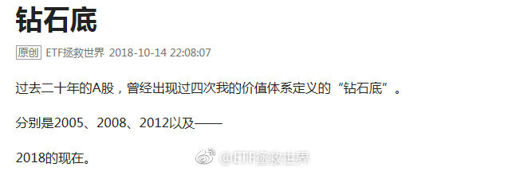

======================================================

ETF拯救世界 (5687069307) @
2018-11-02 09:46:26 Fri  
url: https://weibo.com/5687069307/H0LZtAMt8

回复@黄连树:不。你看头条的人虽然喷，但是并不会很恶毒，甚至有点可爱。球球上有些人写出的文字，其恶毒程度，已经不仅是侮辱人格。甚至有人会组队来喷。那是一个江湖，早早归隐才是王道。

------------------------------------------------------
转推：
>  @ETF拯救世界 (5687069307)
>  2018-11-02 09:41:58 Fri  
>  url: https:/weibo.com/5687069307/H0LXEpguq/

>  三张图告诉你为什么我看到头条的评论一点都不生气，还感觉很欢乐。 ​​​

转发[7]  评论[91]  赞[244] 

======================================================

ETF拯救世界 (5687069307) @
2018-11-02 10:44:11 Fri  
url: https://weibo.com/5687069307/H0MmV9wON

反转还是反弹，不是猜出来的，是走出来的。观察就行，不要预测。

根据我的体系，确认反转还需要有两个条件满足。这两个条件满足了，反转的或然率超过80%。

走着看呗。踏踏实实的。 ​​​

转发[203]  评论[160]  赞[439] 

======================================================

ETF拯救世界 (5687069307) @
2018-11-02 10:56:21 Fri  
url: https://weibo.com/5687069307/H0MrQEHXJ

回复@OO大月半:这是没办法的。这就是所谓右侧的弊端。趋势明确反转必然已经是有一段涨幅了。左侧在下跌中买入，会套。右侧在上涨中买入，会比最低点高。没有任何方法能保证能买在最低点。没有任何方法，没有。//@OO大月半:满足反转条件的时候，估计已经从底部上来很多了吧

------------------------------------------------------
转推：
>  @ETF拯救世界 (5687069307)
>  2018-11-02 10:44:11 Fri  
>  url: https:/weibo.com/5687069307/H0MmV9wON/

>  反转还是反弹，不是猜出来的，是走出来的。观察就行，不要预测。
>  
>  根据我的体系，确认反转还需要有两个条件满足。这两个条件满足了，反转的或然率超过80%。
>  
>  走着看呗。踏踏实实的。 ​​​

转发[69]  评论[117]  赞[298] 

======================================================

ETF拯救世界 (5687069307) @
2018-11-02 11:07:53 Fri  
url: https://weibo.com/5687069307/H0MwwwbHd

两个人都有问题。情绪完全控制不住。以后打司机的行为能不能以危害公共安全罪判五年罚50万？并且大力宣传，看谁还敢。司机方面，我就不说了，不知道最后的方向盘是怎么回事……最无辜的，是这一车乘客。

------------------------------------------------------
转推：
>  @ ()
>  2018-11-02 10:34:31 Fri  
>  url: 

>  抱歉，作者已设置仅展示半年内微博，此微博已不可见。 ​​​

转发[18]  评论[120]  赞[186] 

======================================================

ETF拯救世界 (5687069307) @
2018-11-02 11:45:43 Fri  
url: https://weibo.com/5687069307/H0MLTw7BJ

//@王志安: 公布的视频太短了，既然已经恢复了sd卡，为什么不能多公布一些内容呢？最关键的是司机撞桥栏和之后的身体姿势和神态，这能帮助分析出，变道撞桥坠江到底是司机的失误还是因为发怒之后的有意为之。目前这个视频并不支持调查结论。我认为这个公布不合格。

------------------------------------------------------
转推：
>  @ ()
>  2018-11-02 10:38:19 Fri  
>  url: 

>  抱歉，作者已设置仅展示半年内微博，此微博已不可见。 ​​​

转发[28]  评论[83]  赞[129] 

======================================================

ETF拯救世界 (5687069307) @
2018-11-02 13:28:53 Fri  
url: https://weibo.com/5687069307/H0NrLp4ha

踏踏实实的。

记住，你来股市不是为了解套的 ​​​

转发[46]  评论[215]  赞[549] 

======================================================

ETF拯救世界 (5687069307) @
2018-11-02 13:57:12 Fri  
url: https://weibo.com/5687069307/H0NDg8Dty

回复@sunny_华:写的真好。是不是抄的。谁写的我要粉他[吃惊]//@sunny_华:感谢益达[鲜花][鲜花][鲜花]，同时感谢2018的自己。感谢那个在哀声一片，惨不忍睹的修罗战场上缓缓站起，抽出利刃，一步步走向敌人的自己[抱抱][抱抱][抱抱]

------------------------------------------------------
转推：
>  @ETF拯救世界 (5687069307)
>  2018-11-02 13:28:53 Fri  
>  url: https:/weibo.com/5687069307/H0NrLp4ha/

>  踏踏实实的。
>  
>  记住，你来股市不是为了解套的 ​​​

转发[15]  评论[79]  赞[319] 

======================================================

ETF拯救世界 (5687069307) @
2018-11-02 14:28:33 Fri  
url: https://weibo.com/5687069307/H0NPZ4WAK

回复@pinjia媛媛:我也不知道。我只是按照体系和策略操作和配置仓位。我预测不了未来，也不会尝试预测。//@pinjia媛媛:回复@pinjia媛媛:那么多看中期反转的声音，小白就很慌。不知道钻石底给不给足够的机会。拜托E大能解惑。感谢！@ETF拯救世界

------------------------------------------------------
转推：
>  @ETF拯救世界 (5687069307)
>  2018-11-02 13:28:53 Fri  
>  url: https:/weibo.com/5687069307/H0NrLp4ha/

>  踏踏实实的。
>  
>  记住，你来股市不是为了解套的 ​​​

转发[7]  评论[35]  赞[220] 

======================================================

ETF拯救世界 (5687069307) @
2018-11-02 14:33:38 Fri  
url: https://weibo.com/5687069307/H0NS3kMhb

为什么要预测。到底为什么。投资股市真的真的不需要预测涨跌就能挣钱。不要预测，预测就会错。错了就赔钱。好好的建立投资策略和投资体系，然后从股市提款。不要预测！

------------------------------------------------------
转推：
>  @ETF拯救世界 (5687069307)
>  2018-11-02 10:44:11 Fri  
>  url: https:/weibo.com/5687069307/H0MmV9wON/

>  反转还是反弹，不是猜出来的，是走出来的。观察就行，不要预测。
>  
>  根据我的体系，确认反转还需要有两个条件满足。这两个条件满足了，反转的或然率超过80%。
>  
>  走着看呗。踏踏实实的。 ​​​

转发[75]  评论[134]  赞[423] 

======================================================

ETF拯救世界 (5687069307) @
2018-11-02 14:47:45 Fri  
url: https://weibo.com/5687069307/H0NXMfpRh

仓位这个东西，问谁都没用，因为谁都不是你，也没有适合所有人的仓位。

就问问自己，跌20%和涨50%，目前舒服不舒服。如果不舒服，把仓位调整到舒服。

齐活。 ​​​

转发[105]  评论[156]  赞[465] 

======================================================

ETF拯救世界 (5687069307) @
2018-11-02 15:05:38 Fri  
url: https://weibo.com/5687069307/H0O52el14

今天回来一辆 xx。

真好。

今年亏不亏就看这两个月了。十三年金身不要破。 ​​​

转发[18]  评论[211]  赞[520] 

======================================================

ETF拯救世界 (5687069307) @
2018-11-02 15:33:22 Fri  
url: https://weibo.com/5687069307/H0Ogig6at

今天收盘最新数据：

还在坑里。 ​​​

转发[45]  评论[226]  赞[520] 

======================================================

ETF拯救世界 (5687069307) @
2018-11-02 16:01:28 Fri  
url: https://weibo.com/5687069307/H0OrHn2X7

回复@开始加速的兔小妞:扎心了。不过股票这玩意有先涨后涨。以后你那股票涨幅超过券商指数的时候再回来报告一下看我说的对不对。

------------------------------------------------------
转推：
>  @ETF拯救世界 (5687069307)
>  2018-11-02 15:33:22 Fri  
>  url: https:/weibo.com/5687069307/H0Ogig6at/

>  今天收盘最新数据：
>  
>  还在坑里。 ​​​

转发[7]  评论[27]  赞[228] 

======================================================

ETF拯救世界 (5687069307) @
2018-11-02 16:54:57 Fri  
url: https://weibo.com/5687069307/H0ONpjR0R

回复@云心皓月:我不关心别人怎么看。我有自己判断顶底的标准。//@云心皓月:E大，丹神和飘仙确认2449是十年一遇的大底了。

------------------------------------------------------
转推：
>  @ETF拯救世界 (5687069307)
>  2018-11-02 15:33:22 Fri  
>  url: https:/weibo.com/5687069307/H0Ogig6at/

>  今天收盘最新数据：
>  
>  还在坑里。 ​​​

转发[12]  评论[113]  赞[346] 

======================================================

ETF拯救世界 (5687069307) @
2018-11-02 18:43:01 Fri  
url: https://weibo.com/5687069307/H0Pvh1R7f

立个flag，周末写篇文章。

想看的打666，不想看的打赏。

实在不想看的富婆可以包养我，我一辈子不写都可以……

“给你钱，闭嘴！”什么的最可爱了。 ​​​

转发[23]  评论[1948]  赞[1378] 

======================================================

ETF拯救世界 (5687069307) @
2018-11-03 01:09:12 Sat  
url: https://weibo.com/5687069307/H0S21pztB

20天，不算太远

------------------------------------------------------
转推：
>  @ETF拯救世界 (5687069307)
>  2018-10-11 16:33:37 Thu  
>  url: https:/weibo.com/5687069307/GDqI9a4GO/

>  个人认为，暂停IPO不会太远了。 ​​​

转发[15]  评论[181]  赞[461] 

======================================================

ETF拯救世界 (5687069307) @
2018-11-04 07:32:24 Sun  
url: https://weibo.com/5687069307/H13Y41V35

作为一个曾经的游戏网站创始人，一个曾经的游戏杂志撰稿人，一个现在依然时不时虽然没时间玩还是会在steam屯游戏的玩家……

居然从没玩过LOL和Dota……

是因为不喜欢这个类型的游戏还是因为【   】

[doge] ​​​

转发[10]  评论[339]  赞[409] 

======================================================

ETF拯救世界 (5687069307) @
2018-11-04 20:43:55 Sun  
url: https://weibo.com/5687069307/H199lmHGB

如果你做的事情和超级大机构一致，未来总不会差。

------------------------------------------------------
转推：
>  @证券时报 (1664176597)
>  2018-11-04 18:26:16 Sun  
>  url: https:/weibo.com/1664176597/H18ft5qSb/

>  10月份145只股票型ETF累计净申购净申购228.08亿份，创年内新高，按照每只基金月均成交价估算，10月份净申购资金约425亿元。据券商中国记者独家了解到，证金、证金资管、汇金等在三季度也采用了这种方式入市，汇金、社保等申购了上证50、沪深300、中证100、创业板等多只ETF。http://t.cn/Ewlr6FQ ​​​

转发[128]  评论[124]  赞[476] 

======================================================

ETF拯救世界 (5687069307) @
2018-11-05 09:10:01 Mon  
url: https://weibo.com/5687069307/H1e2bejDG

回复@十年一2016:上次自主买入是2013年。2015年清仓。超级大机构的持仓周期不是按照周或者月计算的。//@十年一2016:那么谁接他们出场，在目前大环境下，无论政府还是个人负债都是历史最高的情况下，这是指望来一轮牛市么？//@ETF拯救世界:如果你做的事情和超级大机构一致，未来总不会差。

------------------------------------------------------
转推：
>  @证券时报 (1664176597)
>  2018-11-04 18:26:16 Sun  
>  url: https:/weibo.com/1664176597/H18ft5qSb/

>  10月份145只股票型ETF累计净申购净申购228.08亿份，创年内新高，按照每只基金月均成交价估算，10月份净申购资金约425亿元。据券商中国记者独家了解到，证金、证金资管、汇金等在三季度也采用了这种方式入市，汇金、社保等申购了上证50、沪深300、中证100、创业板等多只ETF。http://t.cn/Ewlr6FQ ​​​

转发[40]  评论[70]  赞[230] 

======================================================

ETF拯救世界 (5687069307) @
2018-11-05 09:57:30 Mon  
url: https://weibo.com/5687069307/H1elsfPES

回复@edwin高级水泥佬:思考为什么前，应该确认一下“是不是”//@edwin高级水泥佬:想问e大怎么看中证500的2018三季报利润增速变负了？//@ETF拯救世界:回复@十年一2016:上次自主买入是2013年。2015年清仓。超级大机构的持仓周期不是按照周或者月计算的。

------------------------------------------------------
转推：
>  @证券时报 (1664176597)
>  2018-11-04 18:26:16 Sun  
>  url: https:/weibo.com/1664176597/H18ft5qSb/

>  10月份145只股票型ETF累计净申购净申购228.08亿份，创年内新高，按照每只基金月均成交价估算，10月份净申购资金约425亿元。据券商中国记者独家了解到，证金、证金资管、汇金等在三季度也采用了这种方式入市，汇金、社保等申购了上证50、沪深300、中证100、创业板等多只ETF。http://t.cn/Ewlr6FQ ​​​

转发[15]  评论[65]  赞[195] 

======================================================

ETF拯救世界 (5687069307) @
2018-11-05 10:15:55 Mon  
url: https://weibo.com/5687069307/H1esVx7Jp

盛极而衰，否极泰来。

多做雪中送炭，少做锦上添花。 ​​​

转发[30]  评论[98]  赞[561] 

======================================================

ETF拯救世界 (5687069307) @
2018-11-05 10:46:21 Mon  
url: https://weibo.com/5687069307/H1eFhrHd9

没有暴跌的话本周不会发车。

仓位合适，已经回到一个月两次的节奏。下次应该是14或者15日。 ​​​

转发[16]  评论[173]  赞[506] 

======================================================

ETF拯救世界 (5687069307) @
2018-11-05 14:41:24 Mon  
url: https://weibo.com/5687069307/H1gcGCjgT

早上拉黑了一位评论的朋友。因为之前已经一再强调，不要在评论里带某些网站的广告。

结果哥们还去雪球发帖投诉，圈了十几个v。然后就有大v在评论里敲锣边。

哎。我已经离开了，还没完没了啊。

我拉黑的标准：

第一，做广告。

第二，侮辱人。

第三，给上面两种点赞。

第四，导致我心情不好…… ​​​

转发[6]  评论[165]  赞[435] 

======================================================

ETF拯救世界 (5687069307) @
2018-11-05 14:56:40 Mon  
url: https://weibo.com/5687069307/H1giT5Ab7

敲锣边的大v说，是因为那哥们说我们500不好了，所以我把他拉黑了。

未免把我的格局说的太小太小了。

我持有的东西，我不会解释我为什么买，为什么持有。你说它不好，我会考虑一下你说不好的原因，然后通常情况下不会理会，我持有我的，你说你的。

如果这点自信都没有，就别来投资了。

所以你看，我 ​​​

转发[15]  评论[233]  赞[496] 

======================================================

ETF拯救世界 (5687069307) @
2018-11-05 15:20:20 Mon  
url: https://weibo.com/5687069307/H1gsuuRDH

科创板，我预计投资者门槛在30-50万之间。大概率是50万。 ​​​

转发[45]  评论[84]  赞[279] 

======================================================

ETF拯救世界 (5687069307) @
2018-11-05 15:23:58 Mon  
url: https://weibo.com/5687069307/H1gtY4amh

另外，认为科创板会大幅拉低主板市场估值的，我觉得可能想多了。科创板一半以上上市公司我估计是亏损的，市盈率是负的。你想让他们拉低谁的估值？

------------------------------------------------------
转推：
>  @ETF拯救世界 (5687069307)
>  2018-11-05 15:20:20 Mon  
>  url: https:/weibo.com/5687069307/H1gsuuRDH/

>  科创板，我预计投资者门槛在30-50万之间。大概率是50万。 ​​​

转发[20]  评论[57]  赞[249] 

======================================================

ETF拯救世界 (5687069307) @
2018-11-05 15:29:55 Mon  
url: https://weibo.com/5687069307/H1gwnz4i2

回复@梦游鱼生活在路上:这种话说出来你的良心会不会痛？我连发帖人是谁，大v是谁都没说，我怂恿谁去攻击谁了？我经常威胁下轮不公布从何谈起？这世界是不是疯了？不想没完没了跟人斗，只想好好做事这么难？

------------------------------------------------------
转推：
>  @ETF拯救世界 (5687069307)
>  2018-11-05 14:56:40 Mon  
>  url: https:/weibo.com/5687069307/H1giT5Ab7/

>  敲锣边的大v说，是因为那哥们说我们500不好了，所以我把他拉黑了。
>  
>  未免把我的格局说的太小太小了。
>  
>  我持有的东西，我不会解释我为什么买，为什么持有。你说它不好，我会考虑一下你说不好的原因，然后通常情况下不会理会，我持有我的，你说你的。
>  
>  如果这点自信都没有，就别来投资了。
>  
>  所以你看，我 ​​​

转发[5]  评论[144]  赞[285] 

======================================================

ETF拯救世界 (5687069307) @
2018-11-05 16:06:40 Mon  
url: https://weibo.com/5687069307/H1gLiuh7O

明年三月北京吧。有没有一块去的。[爱你]

------------------------------------------------------
转推：
>  @映艺娱乐 (6598879485)
>  2018-11-05 10:16:26 Mon  
>  url: https:/weibo.com/6598879485/H1et8zJNN/

>  #亚洲新歌榜#最强新单推荐！由陈德建、蔡晓恩作曲，#刘德华#填词演唱#MyLove刘德华世界巡回演唱会#香港站同名🎧演唱会主题曲“MY LOVE”＋👀MV今天全球上线。轻快、饶舌的西洋舞曲曲风，再配上华仔以中国诗句所填写的词，用欢乐的歌声传播爱。正如华仔说：「希望借以传递”想爱就去爱、要爱趁现在 ​​​

转发[14]  评论[79]  赞[176] 

======================================================

ETF拯救世界 (5687069307) @
2018-11-05 16:36:02 Mon  
url: https://weibo.com/5687069307/H1gXdyhlO

讲真，并不是刘德华的铁粉。但是，看人家的状态，像奔60的人吗！

这是极其自律的一个人。饮食起居，言行举止，各方面都是如此。我最佩服的就是自律的人。自律一段时间不难，自律一辈子真的没法不让人敬重。

什么时候开始抢票有消息灵通的朋友记得提醒我啊。我事儿多，别耽误了……

（8点20发） ​​​

转发[34]  评论[124]  赞[352] 

======================================================

ETF拯救世界 (5687069307) @
2018-11-05 17:18:40 Mon  
url: https://weibo.com/5687069307/H1hewrHvp

回复@Redneck4sevens:不好意思，只喜欢我家千玺。其它两人自家粉丝抱走不约谢谢。[doge]//@Redneck4sevens:回复@木头队长:我以为E大只喜欢TFboys

------------------------------------------------------
转推：
>  @ETF拯救世界 (5687069307)
>  2018-11-05 16:36:02 Mon  
>  url: https:/weibo.com/5687069307/H1gXdyhlO/

>  讲真，并不是刘德华的铁粉。但是，看人家的状态，像奔60的人吗！
>  
>  这是极其自律的一个人。饮食起居，言行举止，各方面都是如此。我最佩服的就是自律的人。自律一段时间不难，自律一辈子真的没法不让人敬重。
>  
>  什么时候开始抢票有消息灵通的朋友记得提醒我啊。我事儿多，别耽误了……
>  
>  （8点20发） ​​​

转发[3]  评论[89]  赞[190] 

======================================================

ETF拯救世界 (5687069307) @
2018-11-05 17:39:04 Mon  
url: https://weibo.com/5687069307/H1hmO3IB2

当富豪的孩子压力好大。自己想做的事一定要做好，否则只能回去接手家族企业了。//@华尔街见闻APP:开明的父亲[兔子]

------------------------------------------------------
转推：
>  @见闻企业家 (6450245751)
>  2018-11-05 17:33:52 Mon  
>  url: https:/weibo.com/6450245751/H1hkH6A1l/

>  【宗庆后：女儿想干什么干什么，民营企业二代不一定全部会接班】在最新一期的《领航者》中，娃哈哈集团董事长@宗庆后 谈到女儿的接班问题时表示，女儿和自己的想法观念都不太一样，所以现在也是放手，让她想干什么就干什么，跟她沟通可能也不一定好沟通，现在一部分企业让她管，她愿意管就管下去，不愿 ​​​

转发[8]  评论[59]  赞[187] 

======================================================

ETF拯救世界 (5687069307) @
2018-11-06 09:48:12 Tue  
url: https://weibo.com/5687069307/H1nIbjvAA

回复@-------吾三跪:我这里每一个都是真人。//@-------吾三跪:为啥益达这么稳粉丝这么少呢。

------------------------------------------------------
转推：
>  @ETF拯救世界 (5687069307)
>  2018-10-29 13:46:46 Mon  
>  url: https:/weibo.com/5687069307/H0bR21okb/

>  如果所有人对某个品种期望很高，越来越高，高的没谱，导致不停的涨。
>  
>  那么，如果达不到大家的期望，这事儿就麻烦了。
>  
>  反过来。
>  
>  如果大家对某个品种预期特别差。完蛋一样的差，导致不停的跌。
>  
>  结果，居然没那么差，最后居然还挺好。
>  
>  嗯。 ​​​

转发[6]  评论[322]  赞[589] 

======================================================

ETF拯救世界 (5687069307) @
2018-11-06 11:08:36 Tue  
url: https://weibo.com/5687069307/H1oeOgOqs

是的。当年要卖给搜狐。查尔斯说QQ是什么玩意我们随便都可以自己做出来。然后现在搜狐市值不到50亿人民币，腾讯接近3万亿。所以说企业这玩意你真能看到十年后二十年后吗。老板自己都看不到。

------------------------------------------------------
转推：
>  @微博任务 (6336710565)
>  2018-11-06 10:50:53 Tue  
>  url: https:/weibo.com/6336710565/H1o7Cm6WQ/

>  【马化腾忆至暗时刻：曾一直想卖掉QQ，卖不掉[喵喵][喵喵]】近日，马化腾接受央视采访时，分享自己的创业历程。马化腾回忆腾讯曾经历的“至暗时刻”，他说，当时QQ如同一个巨型黑洞吞噬资源，却不知道它的商业模式是什么，那段时间是最痛苦的，曾一直想卖掉QQ，却没卖掉。（@央视财经） ​​​

转发[63]  评论[73]  赞[269] 

======================================================

ETF拯救世界 (5687069307) @
2018-11-06 19:09:12 Tue  
url: https://weibo.com/5687069307/H1rnT42KJ

今天很冷，注意保暖。 ​​​

转发[5]  评论[153]  赞[336] 

======================================================

ETF拯救世界 (5687069307) @
2018-11-06 19:21:32 Tue  
url: https://weibo.com/5687069307/H1rsTiKrx

大意了。关注我的朋友里面，占比第一的省份是广东……

------------------------------------------------------
转推：
>  @ETF拯救世界 (5687069307)
>  2018-11-06 19:09:12 Tue  
>  url: https:/weibo.com/5687069307/H1rnT42KJ/

>  今天很冷，注意保暖。 ​​​

转发[2]  评论[129]  赞[278] 

======================================================

ETF拯救世界 (5687069307) @
2018-11-06 19:28:08 Tue  
url: https://weibo.com/5687069307/H1rvznqjw

关注我的朋友比例是这样的。

广东遥遥领先。比第二名北京多54%。

第二名北京和接下来的上海，浙江，江苏差不太多。

第六名山东就一下子少了很多，只有江苏的一半。接下来的四川湖北福建河南都和山东差不多。

广东朋友是真的有钱，也真的更有投资意识。

广东是个好地方。 ​​​

转发[54]  评论[727]  赞[410] 

+++++++++++++++++++++++++++++++++++++++++++++++++++++

图片：

======================================================

ETF拯救世界 (5687069307) @
2018-11-06 19:38:16 Tue  
url: https://weibo.com/5687069307/H1rzGo4s7

城市方面就不同了。北京上海遥遥领先。北京还比上海多20%，比深圳多77%，比广州多107%。所以要说城市，北京上海是第一阵营，第二阵营是深圳广州。第三是杭州成都。第四阵营武汉南京。然后就是苏州和西安差不多。我觉得这基本就是城市老百姓富裕水平的排名了。

------------------------------------------------------
转推：
>  @ETF拯救世界 (5687069307)
>  2018-11-06 19:28:08 Tue  
>  url: https:/weibo.com/5687069307/H1rvznqjw/

>  关注我的朋友比例是这样的。
>  
>  广东遥遥领先。比第二名北京多54%。
>  
>  第二名北京和接下来的上海，浙江，江苏差不太多。
>  
>  第六名山东就一下子少了很多，只有江苏的一半。接下来的四川湖北福建河南都和山东差不多。
>  
>  广东朋友是真的有钱，也真的更有投资意识。
>  
>  广东是个好地方。 ​​​

转发[28]  评论[111]  赞[272] 

======================================================

ETF拯救世界 (5687069307) @
2018-11-06 19:51:17 Tue  
url: https://weibo.com/5687069307/H1rEY4PHK

回复@海底两万八千里:年龄看不到。但是男女基本6:4。我看转型情感博主&来一波大型相亲活动的条件成熟了！//@海底两万八千里:年龄的分布情况能透露一下吗[并不简单]

------------------------------------------------------
转推：
>  @ETF拯救世界 (5687069307)
>  2018-11-06 19:28:08 Tue  
>  url: https:/weibo.com/5687069307/H1rvznqjw/

>  关注我的朋友比例是这样的。
>  
>  广东遥遥领先。比第二名北京多54%。
>  
>  第二名北京和接下来的上海，浙江，江苏差不太多。
>  
>  第六名山东就一下子少了很多，只有江苏的一半。接下来的四川湖北福建河南都和山东差不多。
>  
>  广东朋友是真的有钱，也真的更有投资意识。
>  
>  广东是个好地方。 ​​​

转发[4]  评论[189]  赞[299] 

======================================================

ETF拯救世界 (5687069307) @
2018-11-06 23:08:54 Tue  
url: https://weibo.com/5687069307/H1sXbdNhl

我中了的话请十位关注我的朋友看演唱会

------------------------------------------------------
转推：
>  @ ()
>  2018-11-06 20:09:12 Tue  
>  url: 

>  该账号因被投诉违反法律法规和《微博社区公约》的相关规定，现已无法查看。查看帮助 https://kefu.weibo.com/faqdetail?id=13216

转发[60]  评论[307]  赞[1089] 

======================================================

ETF拯救世界 (5687069307) @
2018-11-07 13:04:04 Wed  
url: https://weibo.com/5687069307/H1yqb02AI

有人把坏消息当成世界末日。

有人把坏消息变成大机会。 ​​​

转发[35]  评论[121]  赞[480] 

======================================================

ETF拯救世界 (5687069307) @
2018-11-07 13:57:34 Wed  
url: https://weibo.com/5687069307/H1yLThC3G

踏踏实实的，机会永远都会有。

------------------------------------------------------
转推：
>  @ETF拯救世界 (5687069307)
>  2018-11-07 13:04:04 Wed  
>  url: https:/weibo.com/5687069307/H1yqb02AI/

>  有人把坏消息当成世界末日。
>  
>  有人把坏消息变成大机会。 ​​​

转发[19]  评论[105]  赞[418] 

======================================================

ETF拯救世界 (5687069307) @
2018-11-07 14:35:13 Wed  
url: https://weibo.com/5687069307/H1z1aBuSe

回复@韭菜st:我买入当天就告诉你了，且慢也为你记录好，低于我的价格会提示你。你自己低了不敢买高了要追现在是什么情况，我退博不说话了好吗。//@韭菜st:看着溢价我没跟车，涨了几天你跟我说还在钻石坑里面，我补仓了之后你跟我说不用急，机会后面还有[笑cry][挖鼻][允悲][二哈]

------------------------------------------------------
转推：
>  @ETF拯救世界 (5687069307)
>  2018-11-07 13:04:04 Wed  
>  url: https:/weibo.com/5687069307/H1yqb02AI/

>  有人把坏消息当成世界末日。
>  
>  有人把坏消息变成大机会。 ​​​

转发[4]  评论[177]  赞[259] 

======================================================

ETF拯救世界 (5687069307) @
2018-11-07 14:40:57 Wed  
url: https://weibo.com/5687069307/H1z3v5SzC

我自己的价格，日期，仓位全都告诉你了。你还因为自己瞎造来埋怨我，真是哔了狗了。

我说的话，一千个人看能理解成100个意思。我就是怕说的话大家误会，平常连玩笑都不敢开，琢磨半天才发一条，还不行啊。

够可以了。

怕你买贵了，千方百计用各种方式压着你的成本，你在中文网路上见过这样的人吗。 ​​​

转发[14]  评论[372]  赞[667] 

======================================================

ETF拯救世界 (5687069307) @
2018-11-07 15:31:52 Wed  
url: https://weibo.com/5687069307/H1zoakTJY

今天还在坑里。

以后如果还在坑里，就不说了。如果哪天出坑了，交易日的15:30准时跟各位说一下。 ​​​

转发[17]  评论[214]  赞[806] 

======================================================

ETF拯救世界 (5687069307) @
2018-11-07 17:17:24 Wed  
url: https://weibo.com/5687069307/H1A50hq9B

如果有人把我各个地方的发言归拢到一块卖，不要买。

以后我自己会有条理的整理好做好注释免费贴出来。（有了助理以后 [doge]） ​​​

转发[24]  评论[418]  赞[1147] 

======================================================

ETF拯救世界 (5687069307) @
2018-11-07 18:12:41 Wed  
url: https://weibo.com/5687069307/H1ArrmMr2

十年前的自己当然没有现在成熟，写的很多东西看起来也很可笑，也未必就正确。另外本来就是写给自己看的，很多东西就不够讲究，有时候也是瞎说。虽然很多朋友觉得好，但自己知道是不好的。

当然，大部分东西还是有价值的。所以还是有必要总结。但是这个过程中，要把那些不正确的东西反思一下。所以应该 ​​​

转发[39]  评论[679]  赞[1034] 

======================================================

ETF拯救世界 (5687069307) @
2018-11-08 12:33:32 Thu  
url: https://weibo.com/5687069307/H1HEhe4St

潘总用大佬们练好摄影技术后终于进入正题了

------------------------------------------------------
转推：
>  @ ()
>  2018-11-08 10:58:45 Thu  
>  url: 

>  抱歉，作者已设置仅展示半年内微博，此微博已不可见。 ​​​

转发[11]  评论[66]  赞[184] 

======================================================

ETF拯救世界 (5687069307) @
2018-11-08 12:43:19 Thu  
url: https://weibo.com/5687069307/H1HIg0ZKG

回复@ch506:我的摄影作品得过北京市二等奖[doge]//@ch506:E大也想练摄影技术了？铁粉赶快报名[doge][doge][doge]//@ETF拯救世界:潘总用大佬们练好摄影技术后至于进入正题了

------------------------------------------------------
转推：
>  @ ()
>  2018-11-08 10:58:45 Thu  
>  url: 

>  抱歉，作者已设置仅展示半年内微博，此微博已不可见。 ​​​

转发[0]  评论[84]  赞[258] 

======================================================

ETF拯救世界 (5687069307) @
2018-11-08 13:55:09 Thu  
url: https://weibo.com/5687069307/H1IbphiHm

0.1%可以玩一个礼拜 ​​​

转发[6]  评论[190]  赞[461] 

======================================================

ETF拯救世界 (5687069307) @
2018-11-09 11:54:41 Fri  
url: https://weibo.com/5687069307/H1QP01oIu

微信补仓通知被投诉，用不了了。人可以无耻到这个地步，长见识了。

------------------------------------------------------
转推：
>  @且慢管家 (6186312580)
>  2018-11-09 11:53:02 Fri  
>  url: https:/weibo.com/6186312580/H1QOkDWPm/

>  且慢非常理解微信希望能帮助用户维持良好交流环境的初心，这一点且慢非常认同。少即是多，真正给用户提供价值，且慢也在不断自查、调整、优化。[爱你] http://t.cn/EAqAjqI ​​​

转发[15]  评论[277]  赞[396] 

======================================================

ETF拯救世界 (5687069307) @
2018-11-09 16:22:30 Fri  
url: https://weibo.com/5687069307/H1SzIg3Ct

回复@adnap_314:上周五暴涨后，我观察到了情绪的高昂和行情的难以为继，果断泼下一盆冷水。这周是否还会有新的思考？一个问题。//@adnap_314:益达，这个周末有文章吗?题目都理好了，浅谈双11折射出的感性消费和理性投资[doge][doge]

------------------------------------------------------
转推：
>  @且慢管家 (6186312580)
>  2018-11-09 11:53:02 Fri  
>  url: https:/weibo.com/6186312580/H1QOkDWPm/

>  且慢非常理解微信希望能帮助用户维持良好交流环境的初心，这一点且慢非常认同。少即是多，真正给用户提供价值，且慢也在不断自查、调整、优化。[爱你] http://t.cn/EAqAjqI ​​​

转发[6]  评论[59]  赞[196] 

======================================================

ETF拯救世界 (5687069307) @
2018-11-09 16:29:33 Fri  
url: https://weibo.com/5687069307/H1SCzuiLy

今天国债收益率2017.2月以来新低。

跌到3以下清仓债券。 ​​​

转发[51]  评论[129]  赞[356] 

======================================================

ETF拯救世界 (5687069307) @
2018-11-09 17:15:15 Fri  
url: https://weibo.com/5687069307/H1SV7xQJe

今晚要跑步。请各位大佬监督。 ​​​

转发[13]  评论[107]  赞[348] 

======================================================

ETF拯救世界 (5687069307) @
2018-11-09 17:26:57 Fri  
url: https://weibo.com/5687069307/H1SZSdihZ

回复@虎扑跑步:喷了。真大佬出现了。//@虎扑跑步:我来监督了[中国赞][中国赞][中国赞]

------------------------------------------------------
转推：
>  @ETF拯救世界 (5687069307)
>  2018-11-09 17:15:15 Fri  
>  url: https:/weibo.com/5687069307/H1SV7xQJe/

>  今晚要跑步。请各位大佬监督。 ​​​

转发[2]  评论[89]  赞[272] 

======================================================

ETF拯救世界 (5687069307) @
2018-11-09 20:10:13 Fri  
url: https://weibo.com/5687069307/H1U49iRqm

我跟你说。双11这帮商家太坏了。就是不好好打折，非弄一大堆券还要零点抢。

明天还得做个单子别忘了哪个网站抢什么。

其实省不了几个钱，但是知道有便宜却买贵了心理上很难接受…… ​​​

转发[18]  评论[203]  赞[482] 

======================================================

ETF拯救世界 (5687069307) @
2018-11-09 21:31:11 Fri  
url: https://weibo.com/5687069307/H1UB0otWe

好久没跑，成绩一般，打扰了…… ​​​

转发[4]  评论[130]  赞[512] 

+++++++++++++++++++++++++++++++++++++++++++++++++++++

图片：
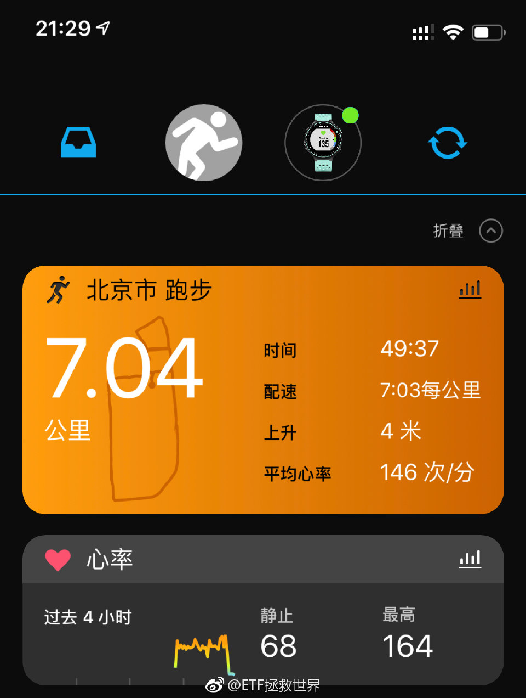

======================================================

ETF拯救世界 (5687069307) @
2018-11-09 22:33:59 Fri  
url: https://weibo.com/5687069307/H1V0v11yy

吃完了记得走人，不然就要买单了 ​​​

转发[25]  评论[151]  赞[437] 

+++++++++++++++++++++++++++++++++++++++++++++++++++++

图片：
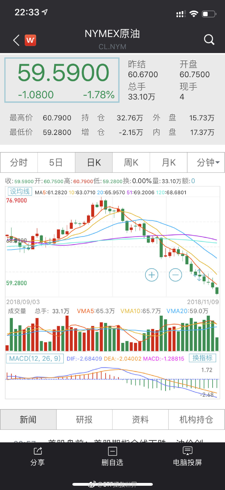

======================================================

ETF拯救世界 (5687069307) @
2018-11-10 11:30:27 Sat  
url: https://weibo.com/5687069307/H205FjaHk

回复@shinesoft:哥们别在我评论里逮谁怼谁了啊。心态放平和，享受美好生活//@shinesoft:你以为低，怎么知道是不是真的低？你自以为计算能力能超越e大？数据能比e大丰富？那你还跟什么车，自己买啊

------------------------------------------------------
转推：
>  @ETF拯救世界 (5687069307)
>  2018-11-09 22:33:59 Fri  
>  url: https:/weibo.com/5687069307/H1V0v11yy/

>  吃完了记得走人，不然就要买单了 ​​​

转发[4]  评论[133]  赞[282] 

======================================================

ETF拯救世界 (5687069307) @
2018-11-11 15:02:36 Sun  
url: https://weibo.com/5687069307/H2aUh4aA4

非常尴尬，参加装修团购被认出来了 ​​​

转发[4]  评论[323]  赞[680] 

+++++++++++++++++++++++++++++++++++++++++++++++++++++

图片：

======================================================

ETF拯救世界 (5687069307) @
2018-11-12 14:24:51 Mon  
url: https://weibo.com/5687069307/H2k5rC79s

今天心情怎么样。 ​​​

转发[6]  评论[332]  赞[421] 

======================================================

ETF拯救世界 (5687069307) @
2018-11-12 14:56:59 Mon  
url: https://weibo.com/5687069307/H2kiuoAbY

回复@小牛乐乐吧:环保最近都不错。但是不要奶。默默地看着它装……//@小牛乐乐吧:今天环保、传媒、500集体硬，难道老大周末被女粉丝认出来....[色][色] 画面太美不敢想[doge][doge][二哈]

------------------------------------------------------
转推：
>  @ETF拯救世界 (5687069307)
>  2018-11-12 14:24:51 Mon  
>  url: https:/weibo.com/5687069307/H2k5rC79s/

>  今天心情怎么样。 ​​​

转发[3]  评论[42]  赞[256] 

======================================================

ETF拯救世界 (5687069307) @
2018-11-12 15:12:54 Mon  
url: https://weibo.com/5687069307/H2koX5iJj

舒坦。 ​​​

转发[3]  评论[68]  赞[376] 

======================================================

ETF拯救世界 (5687069307) @
2018-11-12 15:44:22 Mon  
url: https://weibo.com/5687069307/H2kBJ0qZ0

爬到坑边上了。 ​​​

转发[29]  评论[267]  赞[476] 

======================================================

ETF拯救世界 (5687069307) @
2018-11-13 05:50:40 Tue  
url: https://weibo.com/5687069307/H2q9egvIq

回复@女王大人春暖花开009:震荡还会有，牛市也不知道什么时候来。但是成本低是最大的优势，踏踏实实的//@女王大人春暖花开009:我的老天，刚看下账户，收益率为红的了！才2600多一点啊，这牛市来了怎么得了！千言万语一句话，感恩Ｅ大！带领我们走向发家致富之路!

------------------------------------------------------
转推：
>  @ETF拯救世界 (5687069307)
>  2018-11-12 15:44:22 Mon  
>  url: https:/weibo.com/5687069307/H2kBJ0qZ0/

>  爬到坑边上了。 ​​​

转发[9]  评论[73]  赞[381] 

======================================================

ETF拯救世界 (5687069307) @
2018-11-13 06:35:04 Tue  
url: https://weibo.com/5687069307/H2qrgb1xa

在A股，只要做到熊市不赔钱，同时积累足够的筹码，牛市跟上指数，基本上两三轮就够了。 ​​​

转发[69]  评论[258]  赞[663] 

+++++++++++++++++++++++++++++++++++++++++++++++++++++

图片：
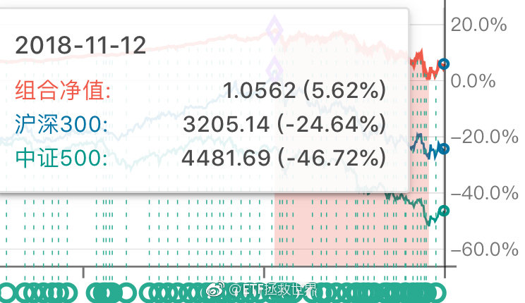

======================================================

ETF拯救世界 (5687069307) @
2018-11-13 08:44:00 Tue  
url: https://weibo.com/5687069307/H2rhADxag

回复@落叶不知冬的美:成功了吗//@落叶不知冬的美:昨天梦见E大了，给我详细讲了指数投资，还带我去吃饭泡妞[允悲][允悲][二哈][二哈]

------------------------------------------------------
转推：
>  @ETF拯救世界 (5687069307)
>  2018-11-13 06:35:04 Tue  
>  url: https:/weibo.com/5687069307/H2qrgb1xa/

>  在A股，只要做到熊市不赔钱，同时积累足够的筹码，牛市跟上指数，基本上两三轮就够了。 ​​​

转发[1]  评论[66]  赞[218] 

======================================================

ETF拯救世界 (5687069307) @
2018-11-13 09:55:28 Tue  
url: https://weibo.com/5687069307/H2rKBhrNx

人啊，还是不要太嚣张。谨言慎行。古往今来大多祸事都是出自一张嘴。

------------------------------------------------------
转推：
>  @蓝鲸财经记者工作平台 (1885454921)
>  2018-11-13 09:50:27 Tue  
>  url: https:/weibo.com/1885454921/H2rIzabEc/

>  “严书记女儿”事件新进展：四川广安市委原副书记严春风被开除党籍和公职。 ​​​

转发[30]  评论[59]  赞[271] 

======================================================

ETF拯救世界 (5687069307) @
2018-11-13 10:06:44 Tue  
url: https://weibo.com/5687069307/H2rPb167x

$中证传媒 sz399971$   稍微有点过分。控制一下你寄几。 ​​​

转发[37]  评论[120]  赞[300] 

======================================================

ETF拯救世界 (5687069307) @
2018-11-13 10:32:13 Tue  
url: https://weibo.com/5687069307/H2rZweqeB

[喵喵]//@ETF拯救世界:回复@减肥吧狗子达:股市反映的不是现在，而是未来。当你看到知更鸟时，春天已经过去了。//@减肥吧狗子达:目前这个金融形式，你们凭什么认为2个月后会有好转？

------------------------------------------------------
转推：
>  @ETF拯救世界 (5687069307)
>  2018-10-16 16:11:08 Tue  
>  url: https:/weibo.com/5687069307/GEbHvfOVn/

>  说个数据吧。
>  
>  今年，A股股票下跌中位数是38%。
>  
>  上涨的股票只有5%。
>  
>  每五只股票里面就有一只腰斩。
>  
>  真的十年没见过这样的情况了。
>  
>  网上各种爆仓此起彼伏……
>  
>  
>  计划也扛不住了，今年下跌了11%…… ​​​

转发[19]  评论[53]  赞[245] 

======================================================

ETF拯救世界 (5687069307) @
2018-11-13 10:43:18 Tue  
url: https://weibo.com/5687069307/H2s41awkz

关于股市的走势，有几个误解，你必须脑袋里拎拎清。

第一，股市走势超长期看可以反映经济状况，但中短期会被估值、情绪和资金，以及各种zc，甚至包括容量等问题影响，并不一定会反映经济情况。这个你要搞清楚。

第二，股市是先行指标。不会等经济好转了或者变差了再跟随。一定是先于经济变差而下跌， ​​​

转发[220]  评论[323]  赞[590] 

======================================================

ETF拯救世界 (5687069307) @
2018-11-13 11:19:49 Tue  
url: https://weibo.com/5687069307/H2siQ8j2H

我怀疑有富婆给我买僵尸粉了。我这么低调的人怎么会这几天增加这么多粉丝。 ​​​

转发[4]  评论[191]  赞[482] 

======================================================

ETF拯救世界 (5687069307) @
2018-11-13 11:36:32 Tue  
url: https://weibo.com/5687069307/H2spCAj66

$中证500 sz399905$ 很多人看不起500。但它是我的最爱，矢志不渝。 ​​​

转发[37]  评论[194]  赞[499] 

======================================================

ETF拯救世界 (5687069307) @
2018-11-13 13:19:13 Tue  
url: https://weibo.com/5687069307/H2t5imaAk

回复@xyl125cn:你窝火是因为你重视别人的说法了。你试试没那么重视就会毫无感觉了。//@xyl125cn:雪球上一众大V，在方丈的带领下，一致扬300贬500,真窝火[怒][怒][怒]

------------------------------------------------------
转推：
>  @ETF拯救世界 (5687069307)
>  2018-11-13 11:36:32 Tue  
>  url: https:/weibo.com/5687069307/H2spCAj66/

>  $中证500 sz399905$ 很多人看不起500。但它是我的最爱，矢志不渝。 ​​​

转发[2]  评论[35]  赞[248] 

======================================================

ETF拯救世界 (5687069307) @
2018-11-13 13:25:07 Tue  
url: https://weibo.com/5687069307/H2t7HiIMl

[doge] 董小姐为了你跟股东拍桌子，你起诉董小姐？

------------------------------------------------------
转推：
>  @蓝鲸财经记者工作平台 (1885454921)
>  2018-11-13 13:23:43 Tue  
>  url: https:/weibo.com/1885454921/H2t78awLI/

>  银隆新能源股东内讧，银隆创始人魏银仓称已起诉董明珠。针对11月13日银隆新能源发布的该公司原董事长魏银仓等涉嫌通过不法手段，侵占公司利益金额超10亿元的说法，魏银仓回应，“已经起诉她（董明珠）了”。当再追问具体起诉董明珠的原因与目前进展时，未得到魏银仓的回应。（腾讯新闻《一线》） ​​​

转发[6]  评论[17]  赞[148] 

======================================================

ETF拯救世界 (5687069307) @
2018-11-13 13:37:55 Tue  
url: https://weibo.com/5687069307/H2tcT4RAN

如果非要看盘，请保持冷静与平和。

“哎呀涨了不追就错过大牛市了！”

“哎呀跌了不卖就要套死了贸易战好可怕！”

如果怎么样情绪都稳定不下来，还是别投资了，我是说真的。 ​​​

转发[49]  评论[122]  赞[428] 

======================================================

ETF拯救世界 (5687069307) @
2018-11-13 13:41:26 Tue  
url: https://weibo.com/5687069307/H2tek53qV

回复@陈不帅Cc:把支付宝账户贴出来让你们给我打钱？太不好意思了……//@陈不帅Cc:10万粉丝益达不考虑做点什么？

------------------------------------------------------
转推：
>  @ETF拯救世界 (5687069307)
>  2018-11-13 13:37:55 Tue  
>  url: https:/weibo.com/5687069307/H2tcT4RAN/

>  如果非要看盘，请保持冷静与平和。
>  
>  “哎呀涨了不追就错过大牛市了！”
>  
>  “哎呀跌了不卖就要套死了贸易战好可怕！”
>  
>  如果怎么样情绪都稳定不下来，还是别投资了，我是说真的。 ​​​

转发[2]  评论[60]  赞[252] 

======================================================

ETF拯救世界 (5687069307) @
2018-11-13 13:48:22 Tue  
url: https://weibo.com/5687069307/H2th8EfZ6

喷了。

------------------------------------------------------
转推：
>  @财联社APP (2868676035)
>  2018-11-13 13:47:10 Tue  
>  url: https:/weibo.com/2868676035/H2tgEfnH2/

>  看到一个段子：白马行情我套在垃圾股里，垃圾股行情我套在白马里，研究了一年怎么躲雷，突然发现牛股都在雷里[跪了] ​​​

转发[18]  评论[83]  赞[250] 

======================================================

ETF拯救世界 (5687069307) @
2018-11-13 15:45:10 Tue  
url: https://weibo.com/5687069307/H2u2xE3Nc

震惊，还在坑边上趴着，就差个脚指头就爬出来了。 ​​​

转发[26]  评论[125]  赞[371] 

======================================================

ETF拯救世界 (5687069307) @
2018-11-13 15:50:16 Tue  
url: https://weibo.com/5687069307/H2u4Cch0O

回复@泛舟当歌CountingStars:我不知道你为什么还剩40份，我还有28份。另外，很多可以买的东西。难道一定要买的干干净净一点不剩吗。一个大品种美股连一份都没有呢。这么急就加仓啊，我不是很懂。

------------------------------------------------------
转推：
>  @ETF拯救世界 (5687069307)
>  2018-11-13 15:45:10 Tue  
>  url: https:/weibo.com/5687069307/H2u2xE3Nc/

>  震惊，还在坑边上趴着，就差个脚指头就爬出来了。 ​​​

转发[11]  评论[53]  赞[229] 

======================================================

ETF拯救世界 (5687069307) @
2018-11-13 15:53:17 Tue  
url: https://weibo.com/5687069307/H2u5Q76UV

再说一次，别涨个1% 2%就来跟我说你买的少了你难受。我一万次的说，把仓位控制到自己涨跌都舒服。别说涨50%了，这涨个2%你都难受成这样你还不赶紧加仓等什么呢？

另外，你也别问我为什么最低点不买更多。我就是这个节奏，不会跟任何人解释我为什么买什么，为什么买多少。觉得不舒服就自己去买。

权益 ​​​

转发[53]  评论[190]  赞[497] 

======================================================

ETF拯救世界 (5687069307) @
2018-11-13 16:02:41 Tue  
url: https://weibo.com/5687069307/H2u9EtTK4

回复@ETF指数基金:上次最低点历史性的开了六车，结果跟车的人比之前少了20%。为什么？有些人吓得连一份都不敢买了，涨起来了又觉得仓位低了。服了。

------------------------------------------------------
转推：
>  @ETF拯救世界 (5687069307)
>  2018-11-13 15:53:17 Tue  
>  url: https:/weibo.com/5687069307/H2u5Q76UV/

>  再说一次，别涨个1% 2%就来跟我说你买的少了你难受。我一万次的说，把仓位控制到自己涨跌都舒服。别说涨50%了，这涨个2%你都难受成这样你还不赶紧加仓等什么呢？
>  
>  另外，你也别问我为什么最低点不买更多。我就是这个节奏，不会跟任何人解释我为什么买什么，为什么买多少。觉得不舒服就自己去买。
>  
>  权益 ​​​

转发[29]  评论[161]  赞[289] 

======================================================

ETF拯救世界 (5687069307) @
2018-11-13 16:22:33 Tue  
url: https://weibo.com/5687069307/H2uhIs13t

回复@不戒唐:人。有20%的人一份也没买。//@不戒唐:这个20%，e大，这个统计算的是人头，还是车数？//@ETF拯救世界:回复@ETF指数基金:上次最低点历史性的开了六车，结果跟车的人比之前少了20%。为什么？有些人吓得连一份都不敢买了，涨起来了又觉得仓位低了。服了。

------------------------------------------------------
转推：
>  @ETF拯救世界 (5687069307)
>  2018-11-13 15:53:17 Tue  
>  url: https:/weibo.com/5687069307/H2u5Q76UV/

>  再说一次，别涨个1% 2%就来跟我说你买的少了你难受。我一万次的说，把仓位控制到自己涨跌都舒服。别说涨50%了，这涨个2%你都难受成这样你还不赶紧加仓等什么呢？
>  
>  另外，你也别问我为什么最低点不买更多。我就是这个节奏，不会跟任何人解释我为什么买什么，为什么买多少。觉得不舒服就自己去买。
>  
>  权益 ​​​

转发[11]  评论[266]  赞[275] 

======================================================

ETF拯救世界 (5687069307) @
2018-11-13 18:28:01 Tue  
url: https://weibo.com/5687069307/H2v6E6fGz

各位，特别真挚的再说一次：

投资这件事应该是很快乐的。不要把它弄得胆战心惊又或者是吃不下睡不着想起来就糟心。

甚至发生更严重的事。

如果它让你感到不快乐，不舒服，那一定是你哪里做错了。又或者说，你还没有学会正确的投资方法。那就不如先停一停。

等它能让你舒服了，你再去做。

不舒服就 ​​​

转发[74]  评论[272]  赞[621] 

======================================================

ETF拯救世界 (5687069307) @
2018-11-14 05:40:53 Wed  
url: https://weibo.com/5687069307/H2zvLkHi6

超喜欢这种波动大的品种 ​​​

转发[27]  评论[231]  赞[487] 

+++++++++++++++++++++++++++++++++++++++++++++++++++++

图片：
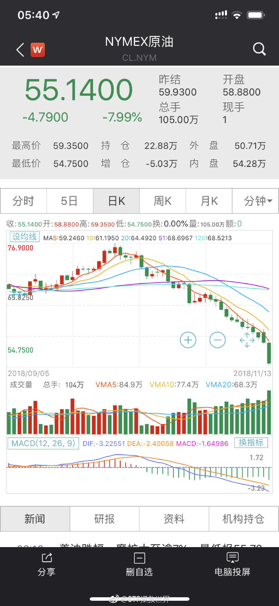

======================================================

ETF拯救世界 (5687069307) @
2018-11-14 09:13:35 Wed  
url: https://weibo.com/5687069307/H2AU69kjM

如果没有股市，这世界得无聊到什么程度啊。

你说是不是。 ​​​

转发[28]  评论[119]  赞[482] 

======================================================

ETF拯救世界 (5687069307) @
2018-11-14 09:15:49 Wed  
url: https://weibo.com/5687069307/H2AV0hfww

回复@无嗔悠悠:每年200多个日子，每天4小时大型在线多人赌场，哪里去找。除了没有美女荷官吧稍微差点意思。//@无嗔悠悠:澳门，拉斯维加斯，济州岛了解一下[允悲]

------------------------------------------------------
转推：
>  @ETF拯救世界 (5687069307)
>  2018-11-14 09:13:35 Wed  
>  url: https:/weibo.com/5687069307/H2AU69kjM/

>  如果没有股市，这世界得无聊到什么程度啊。
>  
>  你说是不是。 ​​​

转发[14]  评论[69]  赞[304] 

======================================================

ETF拯救世界 (5687069307) @
2018-11-14 10:00:07 Wed  
url: https://weibo.com/5687069307/H2BcZaBuc

一个月前1.7追南方油的估计跌懵圈了。20多个交易日跌了40%。

品种没有什么好还是坏，得看你怎么去交易。

别人挣钱不一定你也能挣，反之亦然。 ​​​

转发[16]  评论[135]  赞[486] 

======================================================

ETF拯救世界 (5687069307) @
2018-11-14 12:20:10 Wed  
url: https://weibo.com/5687069307/H2C7PuOOW

计划今年年度收益率还差六个多点盈利，剩一个半月，我还是认为有戏。

同期

沪深300是-20%。

中证500是-27%。 ​​​

转发[26]  评论[114]  赞[485] 

======================================================

ETF拯救世界 (5687069307) @
2018-11-14 13:10:24 Wed  
url: https://weibo.com/5687069307/H2CsdidH0

新赛季玩了三局每局都吃鸡怪不好意思的。 ​​​

转发[0]  评论[53]  赞[251] 

+++++++++++++++++++++++++++++++++++++++++++++++++++++

图片：
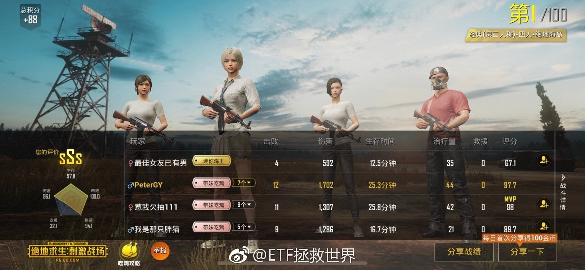
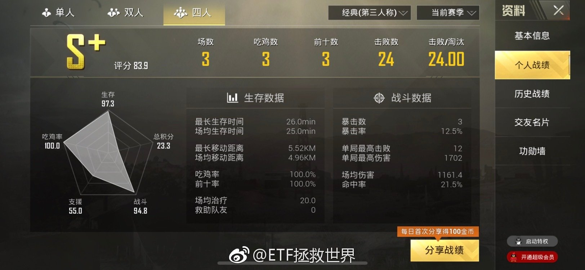

======================================================

ETF拯救世界 (5687069307) @
2018-11-14 13:18:50 Wed  
url: https://weibo.com/5687069307/H2CvE4Wxp

本周是判断趋势转折与否的关键周。 ​​​

转发[33]  评论[91]  赞[454] 

======================================================

ETF拯救世界 (5687069307) @
2018-11-14 13:23:34 Wed  
url: https://weibo.com/5687069307/H2CxzacwP

回复@我们家运气upup:十月份中证500最多跌了16%，还不够大啊。//@我们家运气upup:老大，月线大阴棒还会来吗🙇🏻

------------------------------------------------------
转推：
>  @ETF拯救世界 (5687069307)
>  2018-11-14 12:20:10 Wed  
>  url: https:/weibo.com/5687069307/H2C7PuOOW/

>  计划今年年度收益率还差六个多点盈利，剩一个半月，我还是认为有戏。
>  
>  同期
>  
>  沪深300是-20%。
>  
>  中证500是-27%。 ​​​

转发[9]  评论[37]  赞[219] 

======================================================

ETF拯救世界 (5687069307) @
2018-11-14 13:36:58 Wed  
url: https://weibo.com/5687069307/H2CD0mixi

什么叫用概率的思维去布局呢。

比如说，“熊市末期通常会有大阴线。”

这是一条经验。过去看有效，未来有效没有？不知道。但这是观察出的一个暂时还有用的现象。

那么，你就可以把它放入你的判断系统。给它一个权重，用来判断是否见底。

再比如，“我觉得还没见底。明年春天才会见底。”

这就是一 ​​​

转发[296]  评论[335]  赞[639] 

======================================================

ETF拯救世界 (5687069307) @
2018-11-14 13:40:07 Wed  
url: https://weibo.com/5687069307/H2CEhb8NH

回复@温柔原始人2018:什么是市场底？我觉得这个说法真的太可笑了。是不是只有跌到某人认为的点位才是“市场底”？市场底是什么谁跟我说说？//@温柔原始人2018:回复@hongyuetf168:目前对半开吧。万一月底谈判成了，就没有市场底了。谈判崩了市场底就来了。

------------------------------------------------------
转推：
>  @ETF拯救世界 (5687069307)
>  2018-11-14 13:18:50 Wed  
>  url: https:/weibo.com/5687069307/H2CvE4Wxp/

>  本周是判断趋势转折与否的关键周。 ​​​

转发[8]  评论[35]  赞[257] 

======================================================

ETF拯救世界 (5687069307) @
2018-11-14 13:43:36 Wed  
url: https://weibo.com/5687069307/H2CFHht0u

回复@Eda_fan:是的。这是“资金”这个变量要观察的因素之一。就看你给“跟着超级大机构”多少权重了。//@Eda_fan:还比如说老大常说的有大机构大资金进来了

------------------------------------------------------
转推：
>  @ETF拯救世界 (5687069307)
>  2018-11-14 13:36:58 Wed  
>  url: https:/weibo.com/5687069307/H2CD0mixi/

>  什么叫用概率的思维去布局呢。
>  
>  比如说，“熊市末期通常会有大阴线。”
>  
>  这是一条经验。过去看有效，未来有效没有？不知道。但这是观察出的一个暂时还有用的现象。
>  
>  那么，你就可以把它放入你的判断系统。给它一个权重，用来判断是否见底。
>  
>  再比如，“我觉得还没见底。明年春天才会见底。”
>  
>  这就是一 ​​​

转发[35]  评论[71]  赞[260] 

======================================================

ETF拯救世界 (5687069307) @
2018-11-14 17:26:59 Wed  
url: https://weibo.com/5687069307/H2E8n223D

这……

------------------------------------------------------
转推：
>  @蓝鲸财经记者工作平台 (1885454921)
>  2018-11-14 15:56:53 Wed  
>  url: https:/weibo.com/1885454921/H2DxNoo5M/

>  1个字3750元！造谣"证监会暂停新股IPO"，85后女股民领3万罚单：因传播“证监会暂停新股IPO”的谣言，证监会浙江监管局向王利坚下发行政处罚决定书，责令其改正并处以3万元罚款。 ​​​

转发[3]  评论[58]  赞[165] 

======================================================

ETF拯救世界 (5687069307) @
2018-11-14 17:35:09 Wed  
url: https://weibo.com/5687069307/H2EbGox7W

还是我这样好。只讨论业务问题，从来不表达不满情绪，积极，向上。

不说怪话，不乱转乱评，不迎合低级趣味，不为了流量发布虚假夸张信息。

为什么。

因为啊，无论你要实现什么理想，要做什么利国利民的好事，你都得先活着不是？

少说话，多做事，一定越来越好。真好。 ​​​

转发[23]  评论[125]  赞[672] 

======================================================

ETF拯救世界 (5687069307) @
2018-11-14 19:52:32 Wed  
url: https://weibo.com/5687069307/H2F5riGMm

别看关注我的人少，说起互动从来都没在怕的。 ​​​

转发[23]  评论[289]  赞[941] 

+++++++++++++++++++++++++++++++++++++++++++++++++++++

图片：

======================================================

ETF拯救世界 (5687069307) @
2018-11-14 19:56:10 Wed  
url: https://weibo.com/5687069307/H2F6VfXwo

什么人才会被这位妙龄少女色诱[疑问][哼]

------------------------------------------------------
转推：
>  @阜阳同城会 (1935700591)
>  2018-11-14 08:39:10 Wed  
>  url: https:/weibo.com/1935700591/H2AG83FHM/

>  #阜阳身边事# 【酒店约会女网友 男子一觉醒来钱没了】女子谢某正值妙龄，日前她与网友孙某相约开房。谁知谢某“醉翁之意不在酒”，竟趁孙某熟睡时解锁其手机，盗走支付宝和其身上现金共28900元。11月12日，@颍州警方在线 刑警一中队民警多方侦查将谢某抓获归案后，谢某交代了自今年9月以来使用相同“色 ​​​

转发[4]  评论[138]  赞[175] 

======================================================

ETF拯救世界 (5687069307) @
2018-11-15 08:05:52 Thu  
url: https://weibo.com/5687069307/H2JT6xpOD

回复@冷冬仲夏:@且慢管家 @小散的逆袭 今天这位在球球上投诉，请搞清楚是怎么回事，给出一个结果。//@冷冬仲夏:谁能找到且慢？雪球  小散的逆袭 的帐户有问题，已经向不好的方向讨论了[doge]

------------------------------------------------------
转推：
>  @ETF拯救世界 (5687069307)
>  2018-11-14 19:52:32 Wed  
>  url: https:/weibo.com/5687069307/H2F5riGMm/

>  别看关注我的人少，说起互动从来都没在怕的。 ​​​

转发[12]  评论[68]  赞[182] 

======================================================

ETF拯救世界 (5687069307) @
2018-11-15 08:38:16 Thu  
url: https://weibo.com/5687069307/H2K6gb2ek

回复@且慢管家:安全性肯定没问题，毕竟资产都在基金公司。以后大家有什么问题也可以向我反映，我来及时跟且慢沟通，不过一般也用不着我，客服都挺尽职的……

------------------------------------------------------
转推：
>  @ETF拯救世界 (5687069307)
>  2018-11-14 19:52:32 Wed  
>  url: https:/weibo.com/5687069307/H2F5riGMm/

>  别看关注我的人少，说起互动从来都没在怕的。 ​​​

转发[10]  评论[148]  赞[324] 

======================================================

ETF拯救世界 (5687069307) @
2018-11-15 11:32:12 Thu  
url: https://weibo.com/5687069307/H2LeRi1Ph

是不是我毕业太早了，怎么现在学校热水还要收费了吗。

------------------------------------------------------
转推：
>  @ ()
>  2018-11-15 00:38:17 Thu  
>  url: 

>  该账号因被投诉违反《微博社区公约》的相关规定，现已无法查看。查看帮助 https://kefu.weibo.com/faqdetail?id=13216

转发[40]  评论[261]  赞[172] 

======================================================

ETF拯救世界 (5687069307) @
2018-11-15 14:29:42 Thu  
url: https://weibo.com/5687069307/H2MoUviZp

搞事情是吗

------------------------------------------------------
转推：
>  @ETF拯救世界 (5687069307)
>  2018-11-13 10:06:44 Tue  
>  url: https:/weibo.com/5687069307/H2rPb167x/

>  $中证传媒 sz399971$   稍微有点过分。控制一下你寄几。 ​​​

转发[27]  评论[74]  赞[208] 

======================================================

ETF拯救世界 (5687069307) @
2018-11-15 14:47:57 Thu  
url: https://weibo.com/5687069307/H2MwjpUZf

回复@阿奔Lew:券商就猛一波。后续还要看其它兄弟//@阿奔Lew:其实证券公司才是搞事情，从最低点不知不觉30个点了，谁能想到！//@ETF拯救世界:搞事情是吗

------------------------------------------------------
转推：
>  @ETF拯救世界 (5687069307)
>  2018-11-13 10:06:44 Tue  
>  url: https:/weibo.com/5687069307/H2rPb167x/

>  $中证传媒 sz399971$   稍微有点过分。控制一下你寄几。 ​​​

转发[5]  评论[20]  赞[155] 

======================================================

ETF拯救世界 (5687069307) @
2018-11-15 14:49:36 Thu  
url: https://weibo.com/5687069307/H2MwZ3lgK

回复@梁小雨:这才是真爱……//@梁小雨:回复@-木子李先生:蚂蚁的资费不比且慢便宜，为什么不去且慢啊？自从有且慢，我的蚂蚁就不买基金了//@ETF拯救世界:是不是我毕业太早了，怎么现在学校热水还要收费了吗。

------------------------------------------------------
转推：
>  @ ()
>  2018-11-15 00:38:17 Thu  
>  url: 

>  该账号因被投诉违反《微博社区公约》的相关规定，现已无法查看。查看帮助 https://kefu.weibo.com/faqdetail?id=13216

转发[8]  评论[29]  赞[130] 

======================================================

ETF拯救世界 (5687069307) @
2018-11-15 14:51:14 Thu  
url: https://weibo.com/5687069307/H2MxEaTdS

回复@蜜蜂猴子葡萄蝙蝠:咋地，不服？拉黑你。//@蜜蜂猴子葡萄蝙蝠:军工不死牛市不来//@ETF拯救世界:搞事情是吗

------------------------------------------------------
转推：
>  @ETF拯救世界 (5687069307)
>  2018-11-13 10:06:44 Tue  
>  url: https:/weibo.com/5687069307/H2rPb167x/

>  $中证传媒 sz399971$   稍微有点过分。控制一下你寄几。 ​​​

转发[14]  评论[48]  赞[146] 

======================================================

ETF拯救世界 (5687069307) @
2018-11-15 14:55:52 Thu  
url: https://weibo.com/5687069307/H2MzxbNeR

回复@冰糖葫芦5加皮66:在外面忙呢//@冰糖葫芦5加皮66:益达快放微信号留言呀，我们想看了[允悲][允悲][羞嗒嗒][羞嗒嗒]每次评论都收获很多//@ETF拯救世界:回复@蜜蜂猴子葡萄蝙蝠:咋地，不服？拉黑你。//@蜜蜂猴子葡萄蝙蝠:军工不死牛市不来//@ETF拯救世界:搞事情是吗

------------------------------------------------------
转推：
>  @ETF拯救世界 (5687069307)
>  2018-11-13 10:06:44 Tue  
>  url: https:/weibo.com/5687069307/H2rPb167x/

>  $中证传媒 sz399971$   稍微有点过分。控制一下你寄几。 ​​​

转发[3]  评论[28]  赞[137] 

======================================================

ETF拯救世界 (5687069307) @
2018-11-15 14:58:37 Thu  
url: https://weibo.com/5687069307/H2MAE0kCi

回复@被e拯救:我一定让且慢专门为跟车的朋友开发点专属福利//@被e拯救:那我更是真爱，我把天天基金和蛋卷全停了，全在且慢买了//@ETF拯救世界:回复@梁小雨:这才是真爱……//@梁小雨:回复@-木子李先生:蚂蚁的资费不比且慢便宜，为什么不去且慢啊？自从有且慢，我的蚂蚁就不买基金了

------------------------------------------------------
转推：
>  @ ()
>  2018-11-15 00:38:17 Thu  
>  url: 

>  该账号因被投诉违反《微博社区公约》的相关规定，现已无法查看。查看帮助 https://kefu.weibo.com/faqdetail?id=13216

转发[7]  评论[234]  赞[283] 

======================================================

ETF拯救世界 (5687069307) @
2018-11-15 15:37:56 Thu  
url: https://weibo.com/5687069307/H2MQBjt8U

我现在回办公室的路上，还没看到数据。不过应该是出钻石坑进黄金坑了。  ​​​

转发[11]  评论[83]  赞[302] 

======================================================

ETF拯救世界 (5687069307) @
2018-11-15 15:40:07 Thu  
url: https://weibo.com/5687069307/H2MRuxipE

回复@蜜蜂猴子葡萄蝙蝠:开玩笑呢，还真拉黑啊。踏踏实实的。（已拉黑）//@蜜蜂猴子葡萄蝙蝠:对E大的投资水平真心佩服, 绝无挑衅之意, 话语如有冒犯请多多谅解, 下次多注意! 千万别拉黑 [作揖][作揖][作揖]//@ETF拯救世界:回复@蜜蜂猴子葡萄蝙蝠:咋地，不服？拉黑你。

------------------------------------------------------
转推：
>  @ETF拯救世界 (5687069307)
>  2018-11-13 10:06:44 Tue  
>  url: https:/weibo.com/5687069307/H2rPb167x/

>  $中证传媒 sz399971$   稍微有点过分。控制一下你寄几。 ​​​

转发[1]  评论[74]  赞[195] 

======================================================

ETF拯救世界 (5687069307) @
2018-11-15 16:04:15 Thu  
url: https://weibo.com/5687069307/H2N1hvb4Q

据消息灵通人士透露：今天出坑了。 ​​​

转发[158]  评论[206]  赞[441] 

======================================================

ETF拯救世界 (5687069307) @
2018-11-15 16:09:41 Thu  
url: https://weibo.com/5687069307/H2N3uF9qX

回复@longring60310:按照之前的经验，除了2008，都会有机会回踩。//@longring60310:如果再进一次，多好[笑而不语]

------------------------------------------------------
转推：
>  @ETF拯救世界 (5687069307)
>  2018-11-15 16:04:15 Thu  
>  url: https:/weibo.com/5687069307/H2N1hvb4Q/

>  据消息灵通人士透露：今天出坑了。 ​​​

转发[76]  评论[68]  赞[251] 

======================================================

ETF拯救世界 (5687069307) @
2018-11-15 16:16:30 Thu  
url: https://weibo.com/5687069307/H2N6g0LXN

回复@我有一头小毛驴喔:下次牛市持续时间不会少于五年。是一次从没出现过的长牛。//@我有一头小毛驴喔:十年一轮，长达2年甚至更久的大牛市开启了[嘻嘻]//@ETF拯救世界:回复@longring60310:按照之前的经验，除了2008，都会有机会回踩。

------------------------------------------------------
转推：
>  @ETF拯救世界 (5687069307)
>  2018-11-15 16:04:15 Thu  
>  url: https:/weibo.com/5687069307/H2N1hvb4Q/

>  据消息灵通人士透露：今天出坑了。 ​​​

转发[55]  评论[160]  赞[288] 

======================================================

ETF拯救世界 (5687069307) @
2018-11-15 16:16:59 Thu  
url: https://weibo.com/5687069307/H2N6sstb5

回复@蛋生123:总体来说我还是个伪价值投资者。50倍估值的指数我是真的下不去手。//@蛋生123:我想问下各位，益达给军工留份数了吗？//@ETF拯救世界:回复@蜜蜂猴子葡萄蝙蝠:咋地，不服？拉黑你。//@蜜蜂猴子葡萄蝙蝠:军工不死牛市不来//@ETF拯救世界:搞事情是吗

------------------------------------------------------
转推：
>  @ETF拯救世界 (5687069307)
>  2018-11-13 10:06:44 Tue  
>  url: https:/weibo.com/5687069307/H2rPb167x/

>  $中证传媒 sz399971$   稍微有点过分。控制一下你寄几。 ​​​

转发[5]  评论[44]  赞[218] 

======================================================

ETF拯救世界 (5687069307) @
2018-11-15 17:58:24 Thu  
url: https://weibo.com/5687069307/H2NLCk8gq

回复@亚历山大-棕地:当然。所以我的仓位在钻石坑里迅速接近股神。均值回归也是我的概率变量之一。//@亚历山大-棕地:益达最近粉丝增长好快。益达有没有想过，益达火和未来的股神们火这两者间也会经历均值回归，这三年熊市是益达的世界尤其最近两月达到顶峰，但也说明股神们的世界越来越近了。

------------------------------------------------------
转推：
>  @ETF拯救世界 (5687069307)
>  2018-11-15 16:04:15 Thu  
>  url: https:/weibo.com/5687069307/H2N1hvb4Q/

>  据消息灵通人士透露：今天出坑了。 ​​​

转发[7]  评论[33]  赞[200] 

======================================================

ETF拯救世界 (5687069307) @
2018-11-15 18:04:16 Thu  
url: https://weibo.com/5687069307/H2NO027qJ

回复@去奈良喂鹿:祝你有机会心想事成。//@去奈良喂鹿:我擦，已经十一万了，实际上，大家注意，熊市的时候，很多人超爱益达，谁说益达半点不好，这些人就会跳出来维护益达，但牛市的时候。。。。嘿嘿，大胆估计，益达会被diss的很惨[并不简单]

------------------------------------------------------
转推：
>  @ETF拯救世界 (5687069307)
>  2018-11-15 16:04:15 Thu  
>  url: https:/weibo.com/5687069307/H2N1hvb4Q/

>  据消息灵通人士透露：今天出坑了。 ​​​

转发[2]  评论[52]  赞[196] 

======================================================

ETF拯救世界 (5687069307) @
2018-11-15 18:09:32 Thu  
url: https://weibo.com/5687069307/H2NQ8rkQt

忙完了，开始看公众号留言。 ​​​

转发[0]  评论[49]  赞[289] 

======================================================

ETF拯救世界 (5687069307) @
2018-11-15 18:47:57 Thu  
url: https://weibo.com/5687069307/H2O5JiQco

网易云音乐做歌单那哥们！在不在！今天的BGM加错了！[吃瓜] ​​​

转发[1]  评论[92]  赞[318] 

======================================================

ETF拯救世界 (5687069307) @
2018-11-15 18:58:51 Thu  
url: https://weibo.com/5687069307/H2Oaa5zd7

回复@爱美食的sera:我也希望能看。省的我一条条放了。上次有个哥们说，我只要敢放一条骂我的留言出来就服了我。问题是真没有啊！衰。//@爱美食的sera:能在公众号里查看全部的留言吗？//@ETF拯救世界:回复@冰糖葫芦5加皮66:在外面忙呢

------------------------------------------------------
转推：
>  @ETF拯救世界 (5687069307)
>  2018-11-13 10:06:44 Tue  
>  url: https:/weibo.com/5687069307/H2rPb167x/

>  $中证传媒 sz399971$   稍微有点过分。控制一下你寄几。 ​​​

转发[2]  评论[70]  赞[259] 

======================================================

ETF拯救世界 (5687069307) @
2018-11-16 08:49:27 Fri  
url: https://weibo.com/5687069307/H2TBhEXxK

很多私募不设清盘线

------------------------------------------------------
转推：
>  @ ()
>  2018-11-16 08:46:00 Fri  
>  url: 

>  抱歉，作者已设置仅展示半年内微博，此微博已不可见。 ​​​

转发[9]  评论[80]  赞[226] 

======================================================

ETF拯救世界 (5687069307) @
2018-11-16 10:07:29 Fri  
url: https://weibo.com/5687069307/H2U6YbbKD

一个建议：

少看盘，多运动，多读书。又或者是把注意力集中在工作上，认真学习专业知识。

然后，你会发现，

还是看盘好。 ​​​

转发[29]  评论[260]  赞[574] 

======================================================

ETF拯救世界 (5687069307) @
2018-11-16 10:30:17 Fri  
url: https://weibo.com/5687069307/H2UgegYVC

刚才有朋友说，牛市中，有50%的人收益会超过指数涨幅。

我告诉你，那是做梦。

我现在说，你可能不信，无论什么样的大牛市，会有20%-30%的人亏损。当然，你不信，我先把话撂这儿，到时候看。注意，我说的是上涨过程中，不是牛转熊后。

再说，剩下的70%-80%里面，一半人挣不到几个的大子。为什么，每 ​​​

转发[125]  评论[225]  赞[518] 

======================================================

ETF拯救世界 (5687069307) @
2018-11-16 10:44:51 Fri  
url: https://weibo.com/5687069307/H2Um8nsPX

不要幻想你在任何时候都跑赢所有人。哪怕是某个区间跑赢所有人我都觉得害怕。

只要追求永远在前20%-30%就是最舒服的。如果你能长期保持下去，你就是最牛逼的。

为什么？

0.25*0.25*0.25*0.25=0.0039。

两轮牛熊后，你已经能跑赢99.6%的人了。

剩下的0.4里面，有0.3是运气好。再来两轮还是会被你干 ​​​

转发[157]  评论[230]  赞[644] 

======================================================

ETF拯救世界 (5687069307) @
2018-11-16 11:03:35 Fri  
url: https://weibo.com/5687069307/H2UtK1bIC

我的一个股票从最低点上来已经涨了66%了，今天还一字板呢。

NB吗。

看了看账户里这只股票后面显示依然浮亏23%的我眼泪默默流下来。

好消息是市值占比只有0.0025%…… ​​​

转发[23]  评论[103]  赞[340] 

======================================================

ETF拯救世界 (5687069307) @
2018-11-16 11:18:41 Fri  
url: https://weibo.com/5687069307/H2UzS2Rhn

讲段子是为了让你知道，在这样的市场环境下，不要乱动，踏踏实实拿着，干点别的能娱乐自己的事儿就行。

当然，如果你自己有波段操作的策略，就要遵守规则去做。但是注意，这个地方，仓位不要太低。 ​​​

转发[27]  评论[84]  赞[384] 

======================================================

ETF拯救世界 (5687069307) @
2018-11-16 11:23:57 Fri  
url: https://weibo.com/5687069307/H2UC0oAE2

看着组合里的品种一个个翻红，有没有一种依依不舍的感觉。 ​​​

转发[43]  评论[202]  赞[487] 

======================================================

ETF拯救世界 (5687069307) @
2018-11-16 11:28:22 Fri  
url: https://weibo.com/5687069307/H2UDNaKN4

500赛高。

第一大重仓品种，总持仓接近15%。最好的宽基，没有之一。

$中证500 sz399905$ ​​​

转发[53]  评论[155]  赞[451] 

======================================================

ETF拯救世界 (5687069307) @
2018-11-16 11:33:23 Fri  
url: https://weibo.com/5687069307/H2UFPFn7c

回复@陈小践:好好享受你的投资世界之旅吧。//@陈小践:底部走过还没有特别大的感觉，但2600点满仓收益率在10%以内，简直太神奇了！怎么做到的！

------------------------------------------------------
转推：
>  @ETF拯救世界 (5687069307)
>  2018-11-16 11:23:57 Fri  
>  url: https:/weibo.com/5687069307/H2UC0oAE2/

>  看着组合里的品种一个个翻红，有没有一种依依不舍的感觉。 ​​​

转发[5]  评论[83]  赞[301] 

======================================================

ETF拯救世界 (5687069307) @
2018-11-16 11:55:40 Fri  
url: https://weibo.com/5687069307/H2UOSbL5j

回复@伊娃1118:吃饭吃7成饱最健康，其实投资也一样。//@伊娃1118:有点烦[允悲]，只有8成多仓位，已经全红了

------------------------------------------------------
转推：
>  @ETF拯救世界 (5687069307)
>  2018-11-16 11:23:57 Fri  
>  url: https:/weibo.com/5687069307/H2UC0oAE2/

>  看着组合里的品种一个个翻红，有没有一种依依不舍的感觉。 ​​​

转发[19]  评论[186]  赞[382] 

======================================================

ETF拯救世界 (5687069307) @
2018-11-16 16:22:14 Fri  
url: https://weibo.com/5687069307/H2Wz54R9V

有人知道这是什么牌子的羽绒服吗

------------------------------------------------------
转推：
>  @ ()
>  2018-11-11 18:22:21 Sun  
>  url: 

>  抱歉，此微博已被作者删除。查看帮助：http://t.cn/Rfd3rQV

转发[4]  评论[109]  赞[182] 

======================================================

ETF拯救世界 (5687069307) @
2018-11-16 19:33:17 Fri  
url: https://weibo.com/5687069307/H2XOD2zhh

吴尊还大一岁…… ​​​

转发[20]  评论[194]  赞[300] 

+++++++++++++++++++++++++++++++++++++++++++++++++++++

图片：

======================================================

ETF拯救世界 (5687069307) @
2018-11-17 17:57:10 Sat  
url: https://weibo.com/5687069307/H36C6DxRw

今天很难得有时间宅了一天，看了两本书。

希望明年有大量时间让我多看点东西。

其实一本书里，有一句话对你有用，就没白看。 ​​​

转发[31]  评论[283]  赞[891] 

======================================================

ETF拯救世界 (5687069307) @
2018-11-19 07:41:26 Mon  
url: https://weibo.com/5687069307/H3lraqLyY

我个人认为，社会越发达，经济因素在女性择偶考虑因素中占比会越低。

现在很多时候钱显得很重要，一方面是有部分人依然很穷，一方面是我们穷的时间太长了。 ​​​

转发[33]  评论[238]  赞[626] 

======================================================

ETF拯救世界 (5687069307) @
2018-11-19 10:26:42 Mon  
url: https://weibo.com/5687069307/H3mwg5oM9

喷了，市面上居然有这种东西开始卖了？

第一，我劝各位别买。

第二，卖的人，你要考虑清楚，一个是版权问题，一个是非法出版物问题。哪个都能让你进去呆几年。 ​​​

转发[18]  评论[224]  赞[406] 

+++++++++++++++++++++++++++++++++++++++++++++++++++++

图片：

======================================================

ETF拯救世界 (5687069307) @
2018-11-19 10:36:58 Mon  
url: https://weibo.com/5687069307/H3mAq3N6z

居然卖300块！哥们你很危险了。

------------------------------------------------------
转推：
>  @ETF拯救世界 (5687069307)
>  2018-11-19 10:26:42 Mon  
>  url: https:/weibo.com/5687069307/H3mwg5oM9/

>  喷了，市面上居然有这种东西开始卖了？
>  
>  第一，我劝各位别买。
>  
>  第二，卖的人，你要考虑清楚，一个是版权问题，一个是非法出版物问题。哪个都能让你进去呆几年。 ​​​

转发[7]  评论[153]  赞[261] 

======================================================

ETF拯救世界 (5687069307) @
2018-11-19 11:30:19 Mon  
url: https://weibo.com/5687069307/H3mW57RyW

有人做投资看现在，我们做投资看未来。

目前的盈利或者亏损，都不是最后的终点。就如你的孩子现在在班里每次考第一，又或者每次都考不进前十，都不代表未来他的人生是否成功，是否幸福一样。

你站的高一点，看的远一点，很多东西就完全不同了。

在金融市场上，有时候浮亏是特别好的事。尤其是当你有 ​​​

转发[200]  评论[253]  赞[478] 

+++++++++++++++++++++++++++++++++++++++++++++++++++++

图片：

======================================================

ETF拯救世界 (5687069307) @
2018-11-19 11:41:24 Mon  
url: https://weibo.com/5687069307/H3n0A565q

债券开始最后的疯狂了，很多人又要被套。——E首发。 ​​​

转发[72]  评论[105]  赞[465] 

======================================================

ETF拯救世界 (5687069307) @
2018-11-19 11:50:24 Mon  
url: https://weibo.com/5687069307/H3n4elZNH

回复@高人藤:历史永远在重复。//@高人藤:上个星期，我的华夏基金客户经理给我推荐债基，我就知道债基要完了

------------------------------------------------------
转推：
>  @ETF拯救世界 (5687069307)
>  2018-11-19 11:41:24 Mon  
>  url: https:/weibo.com/5687069307/H3n0A565q/

>  债券开始最后的疯狂了，很多人又要被套。——E首发。 ​​​

转发[25]  评论[22]  赞[259] 

======================================================

ETF拯救世界 (5687069307) @
2018-11-19 11:53:37 Mon  
url: https://weibo.com/5687069307/H3n5xkYeQ

如果债券狂涨，估值这么低的股票最终没有跟上，会让我感到诧异。

目前十年期国债收益率只剩3.3%（我们买的时候接近4%）。A股全市场股票收益率则有3.9%（10月底4.3%）。谁更有投资价值你心里没点数吗？ ​​​

转发[78]  评论[144]  赞[361] 

======================================================

ETF拯救世界 (5687069307) @
2018-11-19 12:09:59 Mon  
url: https://weibo.com/5687069307/H3ncbfHTo

其实你回想一下，计划里买的所有品种。

基本来说，除了波段和趋势的几次，是不是都是越跌越买。

这会导致你的买入看起来特别二，特别傻。先不说A股的品种，就说油气，债券等等。第一，是买的时候基本没人说要买。第二是跌的很厉害，各种空头言论一再往下砸。

你这种时候去买，而且是那种炒股的人不 ​​​

转发[320]  评论[289]  赞[603] 

======================================================

ETF拯救世界 (5687069307) @
2018-11-19 12:18:32 Mon  
url: https://weibo.com/5687069307/H3nfEoLQB

回复@愿赌服输K:军工的问题是贵。2015年贵到220倍PE，目前50倍。我不是说它不可能涨，但是这么贵的指数我不买。一定要买吗？买其他的不能赚钱吗？我的答案是NO，所以不买。//@愿赌服输K:老大军工属不属于我们定义的辣鸡品种？虽然当前PE是最低点的两倍多，但指数已然跌了70%左右了

------------------------------------------------------
转推：
>  @ETF拯救世界 (5687069307)
>  2018-11-19 12:09:59 Mon  
>  url: https:/weibo.com/5687069307/H3ncbfHTo/

>  其实你回想一下，计划里买的所有品种。
>  
>  基本来说，除了波段和趋势的几次，是不是都是越跌越买。
>  
>  这会导致你的买入看起来特别二，特别傻。先不说A股的品种，就说油气，债券等等。第一，是买的时候基本没人说要买。第二是跌的很厉害，各种空头言论一再往下砸。
>  
>  你这种时候去买，而且是那种炒股的人不 ​​​

转发[45]  评论[40]  赞[212] 

======================================================

ETF拯救世界 (5687069307) @
2018-11-19 12:21:08 Mon  
url: https://weibo.com/5687069307/H3ngIfYuG

回复@qzy6_87413:逗呢。传媒只剩20倍了。创业板最低差点跌破25。//@qzy6_87413:将近40pe的传媒和创业板呢？//@ETF拯救世界:回复@愿赌服输K:军工的问题是贵。2015年贵到220倍PE，目前50倍。我不是说它不可能涨，但是这么贵的指数我不买。一定要买吗？买其他的不能赚钱吗？我的答案是NO，所以不买。

------------------------------------------------------
转推：
>  @ETF拯救世界 (5687069307)
>  2018-11-19 12:09:59 Mon  
>  url: https:/weibo.com/5687069307/H3ncbfHTo/

>  其实你回想一下，计划里买的所有品种。
>  
>  基本来说，除了波段和趋势的几次，是不是都是越跌越买。
>  
>  这会导致你的买入看起来特别二，特别傻。先不说A股的品种，就说油气，债券等等。第一，是买的时候基本没人说要买。第二是跌的很厉害，各种空头言论一再往下砸。
>  
>  你这种时候去买，而且是那种炒股的人不 ​​​

转发[20]  评论[30]  赞[210] 

======================================================

ETF拯救世界 (5687069307) @
2018-11-19 12:30:01 Mon  
url: https://weibo.com/5687069307/H3nkjnCjc

传媒，2015年最高干到过120倍。上个月最低跌破20。

指数3年最大跌幅78.3%，无限接近我的理解极限。

我不知道它什么时候涨，也许几个月，也许几年。我只知道它极大概率会涨。 ​​​

转发[138]  评论[129]  赞[429] 

======================================================

ETF拯救世界 (5687069307) @
2018-11-19 12:35:44 Mon  
url: https://weibo.com/5687069307/H3nmDj2tt

回复@宝丁宝丁宝丁宝丁:没吃。一会又要出去了……//@宝丁宝丁宝丁宝丁:这个时间发微博，是吃了午饭还是没吃呢……

------------------------------------------------------
转推：
>  @ETF拯救世界 (5687069307)
>  2018-11-19 12:30:01 Mon  
>  url: https:/weibo.com/5687069307/H3nkjnCjc/

>  传媒，2015年最高干到过120倍。上个月最低跌破20。
>  
>  指数3年最大跌幅78.3%，无限接近我的理解极限。
>  
>  我不知道它什么时候涨，也许几个月，也许几年。我只知道它极大概率会涨。 ​​​

转发[65]  评论[34]  赞[186] 

======================================================

ETF拯救世界 (5687069307) @
2018-11-19 13:06:34 Mon  
url: https://weibo.com/5687069307/H3nz9f7Tp

回复@aszjx:你要允许持仓品种涨。不要着急做再平衡。踏踏实实的。//@aszjx:我有个小问题，证券涨了这么多，计划里的证券仓位比例肯定变了，需要在合适的时候卖出一点维持原有仓位比例吗？还是持有不动。//@ETF拯救世界:回复@宝丁宝丁宝丁宝丁:没吃。一会又要出去了……

------------------------------------------------------
转推：
>  @ETF拯救世界 (5687069307)
>  2018-11-19 12:30:01 Mon  
>  url: https:/weibo.com/5687069307/H3nkjnCjc/

>  传媒，2015年最高干到过120倍。上个月最低跌破20。
>  
>  指数3年最大跌幅78.3%，无限接近我的理解极限。
>  
>  我不知道它什么时候涨，也许几个月，也许几年。我只知道它极大概率会涨。 ​​​

转发[64]  评论[48]  赞[222] 

======================================================

ETF拯救世界 (5687069307) @
2018-11-19 13:44:03 Mon  
url: https://weibo.com/5687069307/H3nOmtgCL

回复@哪里我靠靠:顶你上去//@哪里我靠靠:跌了快两个月，我老婆两月没让我碰。亏的上星期就浮亏3个点了，今天才开了荤[允悲]

------------------------------------------------------
转推：
>  @ETF拯救世界 (5687069307)
>  2018-11-19 12:09:59 Mon  
>  url: https:/weibo.com/5687069307/H3ncbfHTo/

>  其实你回想一下，计划里买的所有品种。
>  
>  基本来说，除了波段和趋势的几次，是不是都是越跌越买。
>  
>  这会导致你的买入看起来特别二，特别傻。先不说A股的品种，就说油气，债券等等。第一，是买的时候基本没人说要买。第二是跌的很厉害，各种空头言论一再往下砸。
>  
>  你这种时候去买，而且是那种炒股的人不 ​​​

转发[9]  评论[103]  赞[305] 

======================================================

ETF拯救世界 (5687069307) @
2018-11-19 14:28:31 Mon  
url: https://weibo.com/5687069307/H3o6pryJ3

回复@菜鸟_30322:实在忍不住追进去的时候说一声啊//@菜鸟_30322:只有我看证券涨想加仓的吗？总忍不住想追高。[允悲][二哈]//@ETF拯救世界:回复@aszjx:你要允许持仓品种涨。不要着急做再平衡。踏踏实实的。

------------------------------------------------------
转推：
>  @ETF拯救世界 (5687069307)
>  2018-11-19 12:30:01 Mon  
>  url: https:/weibo.com/5687069307/H3nkjnCjc/

>  传媒，2015年最高干到过120倍。上个月最低跌破20。
>  
>  指数3年最大跌幅78.3%，无限接近我的理解极限。
>  
>  我不知道它什么时候涨，也许几个月，也许几年。我只知道它极大概率会涨。 ​​​

转发[49]  评论[66]  赞[189] 

======================================================

ETF拯救世界 (5687069307) @
2018-11-19 14:50:05 Mon  
url: https://weibo.com/5687069307/H3ofaC6Ns

回复@huang医森:军种配齐了。兵强马壮，只等天道轮回。//@huang医森:老大，你现在有24份500  13份红利 10份医药 10份养老 9份50 9份环保 7份300 5份传媒 4份证券。感觉已经排好兵阵，磨刀霍霍啦！哈哈哈哈 开心//@ETF拯救世界:回复@菜鸟_30322:实在忍不住追进去的时候说一声啊

------------------------------------------------------
转推：
>  @ETF拯救世界 (5687069307)
>  2018-11-19 12:30:01 Mon  
>  url: https:/weibo.com/5687069307/H3nkjnCjc/

>  传媒，2015年最高干到过120倍。上个月最低跌破20。
>  
>  指数3年最大跌幅78.3%，无限接近我的理解极限。
>  
>  我不知道它什么时候涨，也许几个月，也许几年。我只知道它极大概率会涨。 ​​​

转发[45]  评论[55]  赞[247] 

======================================================

ETF拯救世界 (5687069307) @
2018-11-19 14:58:52 Mon  
url: https://weibo.com/5687069307/H3oiJhQ10

回复@拂晓卿然:还有债券 qdii 现在现金只有16%了//@拂晓卿然:所以。。。才6成吗？//@ETF拯救世界:回复@huang医森:军种配齐了。兵强马壮，只等天道轮回。

------------------------------------------------------
转推：
>  @ETF拯救世界 (5687069307)
>  2018-11-19 12:30:01 Mon  
>  url: https:/weibo.com/5687069307/H3nkjnCjc/

>  传媒，2015年最高干到过120倍。上个月最低跌破20。
>  
>  指数3年最大跌幅78.3%，无限接近我的理解极限。
>  
>  我不知道它什么时候涨，也许几个月，也许几年。我只知道它极大概率会涨。 ​​​

转发[6]  评论[28]  赞[198] 

======================================================

ETF拯救世界 (5687069307) @
2018-11-19 15:00:54 Mon  
url: https://weibo.com/5687069307/H3ojyt1Xh

前几天500 传媒 创业好，咱们的持仓里面有。今天50 300 红利好，咱们也有。

大小均衡配置，是一个合格组合的基本素养。 ​​​

转发[55]  评论[141]  赞[545] 

======================================================

ETF拯救世界 (5687069307) @
2018-11-19 15:16:43 Mon  
url: https://weibo.com/5687069307/H3opYsiZO

回复@NinjaMiner:今天份聊完了，明日再会。拜拜了您呐//@NinjaMiner:就喜欢看你不停的叨叨，请继续不要停[doge][doge][doge]

------------------------------------------------------
转推：
>  @ETF拯救世界 (5687069307)
>  2018-11-19 15:00:54 Mon  
>  url: https:/weibo.com/5687069307/H3ojyt1Xh/

>  前几天500 传媒 创业好，咱们的持仓里面有。今天50 300 红利好，咱们也有。
>  
>  大小均衡配置，是一个合格组合的基本素养。 ​​​

转发[2]  评论[69]  赞[289] 

======================================================

ETF拯救世界 (5687069307) @
2018-11-20 07:25:24 Tue  
url: https://weibo.com/5687069307/H3uLagrUt

有人说牛市会被喷，为什么被喷呢。跌的时候跌幅不到指数的30%，涨的时候能跟上。

还喷是不是辣鸡。 ​​​

转发[28]  评论[102]  赞[401] 

+++++++++++++++++++++++++++++++++++++++++++++++++++++

图片：

======================================================

ETF拯救世界 (5687069307) @
2018-11-20 07:41:45 Tue  
url: https://weibo.com/5687069307/H3uRNgh42

多少点开始出手？ ​​​

转发[15]  评论[259]  赞[352] 

+++++++++++++++++++++++++++++++++++++++++++++++++++++

图片：
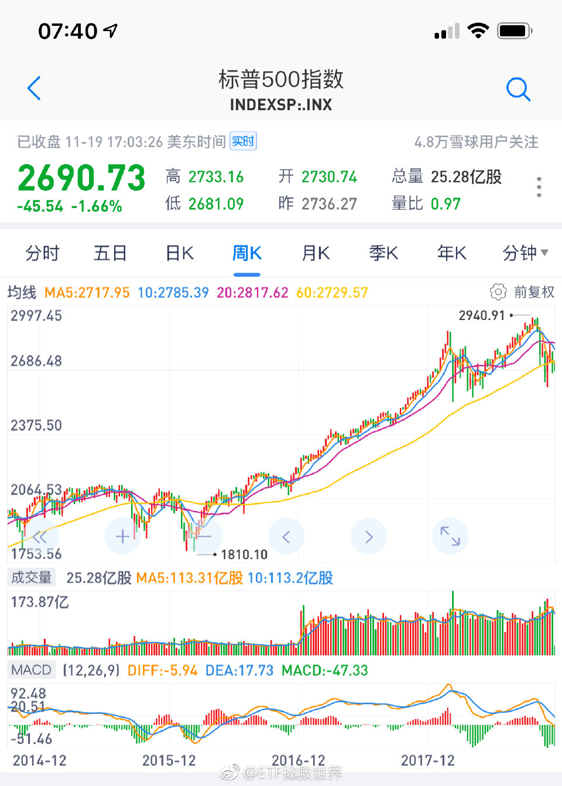

======================================================

ETF拯救世界 (5687069307) @
2018-11-20 09:06:04 Tue  
url: https://weibo.com/5687069307/H3vq1wpJ7

回复@沐阳的夏:这是默认闲置资金全部买货基的情况。实际上不可能持有三年货基，一定有别的操作。//@沐阳的夏:E大，我看过您的雪球专栏，15年7月以后您的实际收益应该远比上面高，是因为实盘和长赢计划还是有很大不同吗？

------------------------------------------------------
转推：
>  @ETF拯救世界 (5687069307)
>  2018-11-20 07:25:24 Tue  
>  url: https:/weibo.com/5687069307/H3uLagrUt/

>  有人说牛市会被喷，为什么被喷呢。跌的时候跌幅不到指数的30%，涨的时候能跟上。
>  
>  还喷是不是辣鸡。 ​​​

转发[4]  评论[59]  赞[201] 

======================================================

ETF拯救世界 (5687069307) @
2018-11-20 10:08:05 Tue  
url: https://weibo.com/5687069307/H3vPcl7cH

有钱还怕买不到便宜货？

钱不烧手，干嘛那么着急都换成筹码呢。 ​​​

转发[17]  评论[106]  赞[486] 

======================================================

ETF拯救世界 (5687069307) @
2018-11-20 10:33:04 Tue  
url: https://weibo.com/5687069307/H3vZl8BOP

广发1-3年国开债指数基金一日售罄。

是不是又闻到了熟悉的味道？ ​​​

转发[46]  评论[92]  赞[392] 

======================================================

ETF拯救世界 (5687069307) @
2018-11-20 10:35:32 Tue  
url: https://weibo.com/5687069307/H3w0ldfCk

回复@Elainealry:不急，再冲一冲。//@Elainealry:需要把全部债券转手给他们吗[哈哈]

------------------------------------------------------
转推：
>  @ETF拯救世界 (5687069307)
>  2018-11-20 10:33:04 Tue  
>  url: https:/weibo.com/5687069307/H3vZl8BOP/

>  广发1-3年国开债指数基金一日售罄。
>  
>  是不是又闻到了熟悉的味道？ ​​​

转发[15]  评论[20]  赞[234] 

======================================================

ETF拯救世界 (5687069307) @
2018-11-20 10:39:19 Tue  
url: https://weibo.com/5687069307/H3w1SjAhR

百思不得其解的是，为什么一个品种还没涨，很便宜的时候，无人关注。

表现特别好以后追涨的人越多。表现越好追的人越多。

永远无法理解。 ​​​

转发[57]  评论[243]  赞[453] 

======================================================

ETF拯救世界 (5687069307) @
2018-11-20 11:03:59 Tue  
url: https://weibo.com/5687069307/H3wbT9Aly

目前债券收益率倒也不是低的夸张。现在有十年国债有3.4%左右，2016年到过2.7%，那时候忽悠买债券的才是坏人…… ​​​

转发[36]  评论[135]  赞[361] 

======================================================

ETF拯救世界 (5687069307) @
2018-11-20 14:41:21 Tue  
url: https://weibo.com/5687069307/H3xC7yMTe

今天的走势你什么感觉。 ​​​

转发[21]  评论[492]  赞[354] 

======================================================

ETF拯救世界 (5687069307) @
2018-11-20 14:50:26 Tue  
url: https://weibo.com/5687069307/H3xFO3u3R

回复@不能不说了_15697:我看他说，预测2300-2900，如果贸易战升级，到2000。也就是预测2000-2900。如果我预测2000-2900，你们会不会骂我。这可是50%的区间了。//@不能不说了_15697:洪灏判断破2000点，那可不仅是钻石了。。是舍利子

------------------------------------------------------
转推：
>  @ETF拯救世界 (5687069307)
>  2018-11-20 14:41:21 Tue  
>  url: https:/weibo.com/5687069307/H3xC7yMTe/

>  今天的走势你什么感觉。 ​​​

转发[8]  评论[125]  赞[245] 

======================================================

ETF拯救世界 (5687069307) @
2018-11-20 15:30:41 Tue  
url: https://weibo.com/5687069307/H3xW8FCpx

今天，又掉进去了。[并不简单]

------------------------------------------------------
转推：
>  @ETF拯救世界 (5687069307)
>  2018-11-15 16:04:15 Thu  
>  url: https:/weibo.com/5687069307/H2N1hvb4Q/

>  据消息灵通人士透露：今天出坑了。 ​​​

转发[33]  评论[282]  赞[518] 

======================================================

ETF拯救世界 (5687069307) @
2018-11-20 15:52:38 Tue  
url: https://weibo.com/5687069307/H3y53duuM

比特币从最高点下跌已经76%。如果它是个“不死”的品种，那么按照我的理论，3800就差不多了。但问题是，它是个“不死”的品种吗。不知道。从跌幅看，这一波币圈熊市，已经可以跟2015至今的A股相比了。

------------------------------------------------------
转推：
>  @ ()
>  2018-11-20 10:55:18 Tue  
>  url: 

>  抱歉，作者已设置仅展示半年内微博，此微博已不可见。 ​​​

转发[35]  评论[82]  赞[185] 

======================================================

ETF拯救世界 (5687069307) @
2018-11-20 16:10:06 Tue  
url: https://weibo.com/5687069307/H3yc9cBhJ

回复@旺达与最后的巨像:没有偏见。主要是不懂。最关键的，是我不知道到哪里才能合法交易。谁能保证我的资金安全。否则买少了没用，买多了不踏实。//@旺达与最后的巨像:E大应该不会对币圈有什么偏见吧？如果价格合适是否也会纳入到标的里呢？

------------------------------------------------------
转推：
>  @ ()
>  2018-11-20 10:55:18 Tue  
>  url: 

>  抱歉，作者已设置仅展示半年内微博，此微博已不可见。 ​​​

转发[10]  评论[45]  赞[204] 

======================================================

ETF拯救世界 (5687069307) @
2018-11-20 16:44:39 Tue  
url: https://weibo.com/5687069307/H3yqawXt2

回复@maxcasio:趋势投资是由弱转强的时候投。人家翻了N倍了你还去追那叫什么趋势投资。//@maxcasio:趋势投资法，了解下

------------------------------------------------------
转推：
>  @ETF拯救世界 (5687069307)
>  2018-11-20 10:39:19 Tue  
>  url: https:/weibo.com/5687069307/H3w1SjAhR/

>  百思不得其解的是，为什么一个品种还没涨，很便宜的时候，无人关注。
>  
>  表现特别好以后追涨的人越多。表现越好追的人越多。
>  
>  永远无法理解。 ​​​

转发[19]  评论[45]  赞[258] 

======================================================

ETF拯救世界 (5687069307) @
2018-11-20 16:51:56 Tue  
url: https://weibo.com/5687069307/H3yt86OsU

我的体系中，趋势投资只有两个买点：

第一是突破的时候。如果涨幅不大就直接买。

第二是突破后回踩的时候。

这样，就可以保证成本不会高，即使趋势再度走坏，也能不赔少赔钱。

只有这两次，很严格。如果没买，再怎么涨也不追了。

当然，这都是雕虫小技，辅助一下而已。价值投资是王道欧耶。 ​​​

转发[240]  评论[373]  赞[677] 

======================================================

ETF拯救世界 (5687069307) @
2018-11-20 19:17:36 Tue  
url: https://weibo.com/5687069307/H3zqfloH8

二十秒就没了。没抢到

------------------------------------------------------
转推：
>  @托马斯大官人 (1688192603)
>  2018-11-20 18:52:54 Tue  
>  url: https:/weibo.com/1688192603/H3zgdBEVX/

>  当中老年有了情怀与购买力，住在五棵松凯迪拉克中心边上的我发现想买张张学友演唱会的票实在是太难了。[允悲] ​​​

转发[5]  评论[87]  赞[200] 

======================================================

ETF拯救世界 (5687069307) @
2018-11-21 06:51:38 Wed  
url: https://weibo.com/5687069307/H3DXXhqke

什么时候买回来 ​​​

转发[45]  评论[133]  赞[333] 

+++++++++++++++++++++++++++++++++++++++++++++++++++++

图片：

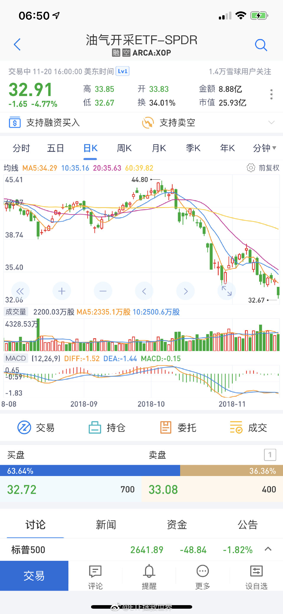

======================================================

ETF拯救世界 (5687069307) @
2018-11-21 07:02:29 Wed  
url: https://weibo.com/5687069307/H3E2mBIQZ

感谢吴总推荐。虽然A股指数波动性也非常大，但相比较而言，普通人确实更适合投资指数而非个股。

------------------------------------------------------
转推：
>  @月风_投资笔记 (1670659923)
>  2018-11-20 23:16:59 Tue  
>  url: https:/weibo.com/1670659923/H3AZqbo14/

>  谢谢大家，心情很好，那我继续这么一辈子当肥宅好了。
>  
>  这位朋友您好，您的问题很有代表性，我这样公开的谈希望您别介意，如有侵犯隐私请告知我。
>  
>  说实话，我个人并不建议新手介入股票市场，目前市场的难度在大幅度增加，而且这种难度的增加目测是不可逆的。
>  
>  但是你的想法非常正确，资产的分散化是一 ​​​

转发[13]  评论[55]  赞[338] 

======================================================

ETF拯救世界 (5687069307) @
2018-11-21 07:08:43 Wed  
url: https://weibo.com/5687069307/H3E4TvoGm

一个品种，长期回头看，不涨，没关系。只要有波动就能获利。  重要的是你要低位买进高位卖出。如果做反了那就歇菜了。 ​​​

------------------------------------------------------
转推：
>  @ETF拯救世界 (5687069307)
>  2018-11-21 06:51:38 Wed  
>  url: https:/weibo.com/5687069307/H3DXXhqke/

>  什么时候买回来 ​​​

转发[32]  评论[122]  赞[420] 

======================================================

ETF拯救世界 (5687069307) @
2018-11-21 09:34:24 Wed  
url: https://weibo.com/5687069307/H3F21FWT1

年轻时候的古天乐是真的帅//@曹增辉:居然大部分认识。哈哈哈//@sputnik85://@八大山债人:文颂娴！！！//@八大山债人://@债券搬砖狗://@rossina:Repost

------------------------------------------------------
转推：
>  @ ()
>  2018-11-20 00:10:03 Tue  
>  url: 

>  该账号因被投诉违反《微博社区公约》的相关规定，现已无法查看。查看帮助 https://kefu.weibo.com/faqdetail?id=13216

转发[79]  评论[73]  赞[190] 

======================================================

ETF拯救世界 (5687069307) @
2018-11-21 10:14:01 Wed  
url: https://weibo.com/5687069307/H3Fi726g5

还是要有点大国自信。

美帝跌我A就跟着跌？

怕什么，就是干！

关键是，

人家涨的时候也没见你跟着涨啊！[doge] ​​​

转发[20]  评论[93]  赞[422] 

======================================================

ETF拯救世界 (5687069307) @
2018-11-21 10:32:00 Wed  
url: https://weibo.com/5687069307/H3FporWes

[doge]

------------------------------------------------------
转推：
>  @ETF拯救世界 (5687069307)
>  2018-11-21 10:14:01 Wed  
>  url: https:/weibo.com/5687069307/H3Fi726g5/

>  还是要有点大国自信。
>  
>  美帝跌我A就跟着跌？
>  
>  怕什么，就是干！
>  
>  关键是，
>  
>  人家涨的时候也没见你跟着涨啊！[doge] ​​​

转发[1]  评论[50]  赞[238] 

======================================================

ETF拯救世界 (5687069307) @
2018-11-21 10:43:23 Wed  
url: https://weibo.com/5687069307/H3Fu1pcx9

回复@周蝶梦庄:不会的。目前仓位合适，回到正常的一个月两次节奏。大家家里没矿，没那么多钱随时发车。//@周蝶梦庄:看来今天要开车了

------------------------------------------------------
转推：
>  @ETF拯救世界 (5687069307)
>  2018-11-21 10:14:01 Wed  
>  url: https:/weibo.com/5687069307/H3Fi726g5/

>  还是要有点大国自信。
>  
>  美帝跌我A就跟着跌？
>  
>  怕什么，就是干！
>  
>  关键是，
>  
>  人家涨的时候也没见你跟着涨啊！[doge] ​​​

转发[6]  评论[108]  赞[311] 

======================================================

ETF拯救世界 (5687069307) @
2018-11-21 13:45:34 Wed  
url: https://weibo.com/5687069307/H3GFYzNLx

想去流浪。 ​​​

转发[8]  评论[270]  赞[454] 

======================================================

ETF拯救世界 (5687069307) @
2018-11-21 15:12:11 Wed  
url: https://weibo.com/5687069307/H3Hf8rtrc

祸从口出。

每天的新闻都在这样教育我们。

你说是不是。 ​​​

转发[8]  评论[117]  赞[442] 

======================================================

ETF拯救世界 (5687069307) @
2018-11-21 16:18:19 Wed  
url: https://weibo.com/5687069307/H3HFYB1Ls

显卡是不是可以降价了

------------------------------------------------------
转推：
>  @ ()
>  2018-11-21 15:17:20 Wed  
>  url: 

>  抱歉，作者已设置仅展示半年内微博，此微博已不可见。 ​​​

转发[13]  评论[104]  赞[200] 

======================================================

ETF拯救世界 (5687069307) @
2018-11-22 07:30:26 Thu  
url: https://weibo.com/5687069307/H3NEcqL5z

北京有24万户可投资资产超过600万

------------------------------------------------------
转推：
>  @大数云海君 (1495357574)
>  2018-11-21 15:09:10 Wed  
>  url: https:/weibo.com/1495357574/H3HdUuRpc/

>  富豪哪里最多？北京每千户13家千万富翁 《2018胡润财富报告》发布 中国“富裕家庭”总财富133万亿！北京拥有最多600万资产富裕家庭！ ​​​

转发[31]  评论[193]  赞[295] 

======================================================

ETF拯救世界 (5687069307) @
2018-11-22 13:06:35 Thu  
url: https://weibo.com/5687069307/H3PQEprmE

第一，闭嘴

第二，管住下半身

男人的成功概率提高75.4个巴仙。

如果伴侣能管住嘴，则成功概率增加幅度上涨至83.7个巴仙。 ​​​

转发[176]  评论[251]  赞[791] 

======================================================

ETF拯救世界 (5687069307) @
2018-11-23 07:27:37 Fri  
url: https://weibo.com/5687069307/H3X3ynp1I

回复@做人三观要正:为什么你要追问我为什么删了一条不重要的微博呢//@做人三观要正:E大为什么删除关于长赢的帖子呢

------------------------------------------------------
转推：
>  @ETF拯救世界 (5687069307)
>  2018-11-22 13:06:35 Thu  
>  url: https:/weibo.com/5687069307/H3PQEprmE/

>  第一，闭嘴
>  
>  第二，管住下半身
>  
>  男人的成功概率提高75.4个巴仙。
>  
>  如果伴侣能管住嘴，则成功概率增加幅度上涨至83.7个巴仙。 ​​​

转发[8]  评论[81]  赞[200] 

======================================================

ETF拯救世界 (5687069307) @
2018-11-23 09:18:08 Fri  
url: https://weibo.com/5687069307/H3XMpycF0

白条12和24期免息是我最喜欢的支付方式。所有要利息和服务费的看都不会看。

------------------------------------------------------
转推：
>  @ ()
>  2018-11-21 16:18:30 Wed  
>  url: 

>  该微博因被多人投诉，根据《微博社区公约》，已被删除。查看帮助：http://t.cn/zjmuxz1

转发[79]  评论[166]  赞[296] 

======================================================

ETF拯救世界 (5687069307) @
2018-11-23 09:40:19 Fri  
url: https://weibo.com/5687069307/H3XVq1MZb

回复@颓废的猪头_Ju:当然是立体交通了！有五层公路！两层都是公共交通！下车就能从窗户进家！车都是胶囊式的，时速300！有一层是自动平面滚梯，站在直接到任何地方！

------------------------------------------------------
转推：
>  @ETF拯救世界 (5687069307)
>  2018-11-22 13:06:35 Thu  
>  url: https:/weibo.com/5687069307/H3PQEprmE/

>  第一，闭嘴
>  
>  第二，管住下半身
>  
>  男人的成功概率提高75.4个巴仙。
>  
>  如果伴侣能管住嘴，则成功概率增加幅度上涨至83.7个巴仙。 ​​​

转发[3]  评论[24]  赞[162] 

======================================================

ETF拯救世界 (5687069307) @
2018-11-23 09:48:06 Fri  
url: https://weibo.com/5687069307/H3XYzCNZQ

关于白条免息，是这样的。

现在肯定比十年前或者更早的时候钱多一些。绝大多数东西当然也直接可以买，但为什么还是喜欢免息分期。

这与以前钱少的时候留下的思维定式有关。思维习惯一旦养成就很难改。

当然，除了以前买的房子，这辈子还没有过说想买一个超出支付能力范围的东西。从来没有，想买的东 ​​​

转发[99]  评论[186]  赞[377] 

======================================================

ETF拯救世界 (5687069307) @
2018-11-23 09:58:25 Fri  
url: https://weibo.com/5687069307/H3Y2LmOwb

回复@Sophia_wei:尤其是公积金贷款，千万不要提前还。3.25%的超长期稳定贷款利率你这辈子大概率都碰不到了……//@Sophia_wei:顺着益达的思路继续：为什么要提前还房贷呢？以前房贷银行都给你打85折，除了卖房的最好不要提前还，买个银行理财也赚了啊～

------------------------------------------------------
转推：
>  @ETF拯救世界 (5687069307)
>  2018-11-23 09:48:06 Fri  
>  url: https:/weibo.com/5687069307/H3XYzCNZQ/

>  关于白条免息，是这样的。
>  
>  现在肯定比十年前或者更早的时候钱多一些。绝大多数东西当然也直接可以买，但为什么还是喜欢免息分期。
>  
>  这与以前钱少的时候留下的思维定式有关。思维习惯一旦养成就很难改。
>  
>  当然，除了以前买的房子，这辈子还没有过说想买一个超出支付能力范围的东西。从来没有，想买的东 ​​​

转发[35]  评论[115]  赞[231] 

======================================================

ETF拯救世界 (5687069307) @
2018-11-23 10:24:21 Fri  
url: https://weibo.com/5687069307/H3Ydi7mhT

2009年初，我写过一篇从银行借3.x%房贷买建行股票的文章。

几个月后又写了一篇，因为建行股票翻番了。

别急，这些东西明年开始都会整理好重新发布出来。你会发现，十年前的事和现在没什么区别。相当有穿越感。 ​​​

转发[27]  评论[160]  赞[483] 

======================================================

ETF拯救世界 (5687069307) @
2018-11-23 10:39:34 Fri  
url: https://weibo.com/5687069307/H3Yjt6CU6

就是这两篇。

当时是因为09年初跟几个朋友一起买房，有些朋友一定要全款，为了提醒他们还有别的选择顺便写了这个记录一下。

我就拿贷款金额的一半去买了建行。当然，当时买什么股票都一样，都是几个月翻番……房子也是…… ​​​

转发[31]  评论[121]  赞[345] 

+++++++++++++++++++++++++++++++++++++++++++++++++++++

图片：
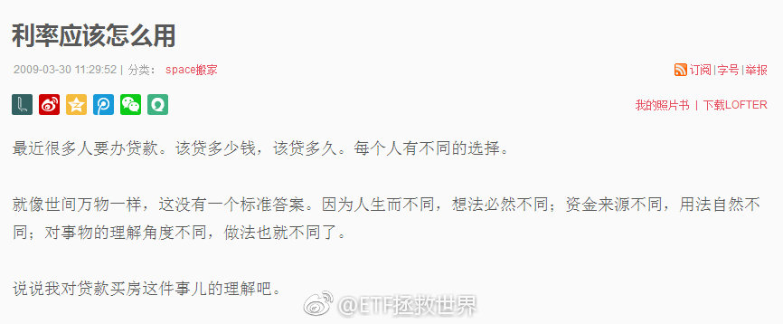
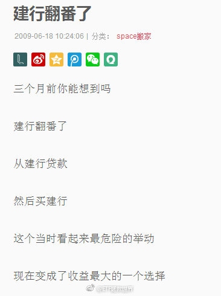

======================================================

ETF拯救世界 (5687069307) @
2018-11-23 10:45:29 Fri  
url: https://weibo.com/5687069307/H3YlS10sq

下周发车，坑又挖出来了。真好。

现在知道为什么本月取消周投入，月中只发一车了吧。

急什么，一切尽在掌握。 ​​​

转发[24]  评论[196]  赞[678] 

======================================================

ETF拯救世界 (5687069307) @
2018-11-23 10:49:52 Fri  
url: https://weibo.com/5687069307/H3YnEw1Zi

回复@倦意kop:好的。其他朋友也了解一下。可以去深入调查研究，如果是真的，用不用各位自己掂量吧~

------------------------------------------------------
转推：
>  @ETF拯救世界 (5687069307)
>  2018-11-23 09:48:06 Fri  
>  url: https:/weibo.com/5687069307/H3XYzCNZQ/

>  关于白条免息，是这样的。
>  
>  现在肯定比十年前或者更早的时候钱多一些。绝大多数东西当然也直接可以买，但为什么还是喜欢免息分期。
>  
>  这与以前钱少的时候留下的思维定式有关。思维习惯一旦养成就很难改。
>  
>  当然，除了以前买的房子，这辈子还没有过说想买一个超出支付能力范围的东西。从来没有，想买的东 ​​​

转发[5]  评论[35]  赞[181] 

======================================================

ETF拯救世界 (5687069307) @
2018-11-23 11:11:03 Fri  
url: https://weibo.com/5687069307/H3YweEsaO

回复@小狗上马路:很多东西都是以讹传讹。自己去动手算一下的就知道了，懒得再说。//@小狗上马路:E哥在2012年也谈到了一下房贷利率并非名义利率*2的问题，昨晚又翻您的旧文了//@ETF拯救世界:回复@Sophia_wei:尤其是公积金贷款，千万不要提前还。3.25%的超长期稳定贷款利率你这辈子大概率都碰不到了……

------------------------------------------------------
转推：
>  @ETF拯救世界 (5687069307)
>  2018-11-23 09:48:06 Fri  
>  url: https:/weibo.com/5687069307/H3XYzCNZQ/

>  关于白条免息，是这样的。
>  
>  现在肯定比十年前或者更早的时候钱多一些。绝大多数东西当然也直接可以买，但为什么还是喜欢免息分期。
>  
>  这与以前钱少的时候留下的思维定式有关。思维习惯一旦养成就很难改。
>  
>  当然，除了以前买的房子，这辈子还没有过说想买一个超出支付能力范围的东西。从来没有，想买的东 ​​​

转发[10]  评论[37]  赞[215] 

======================================================

ETF拯救世界 (5687069307) @
2018-11-23 11:44:27 Fri  
url: https://weibo.com/5687069307/H3YJNE1Es

大家吃好喝好玩好，我先撤了。

勿念。 ​​​

转发[2]  评论[237]  赞[486] 

======================================================

ETF拯救世界 (5687069307) @
2018-11-25 20:35:49 Sun  
url: https://weibo.com/5687069307/H4l4uauqI

刚看了看球球嘉年华的照片。

一言难尽的感觉。 ​​​

转发[10]  评论[124]  赞[261] 

======================================================

ETF拯救世界 (5687069307) @
2018-11-25 20:43:30 Sun  
url: https://weibo.com/5687069307/H4l7B5D9I

看了几届嘉年华，总感觉业内人士和公司高管给人的感觉更有范儿……

------------------------------------------------------
转推：
>  @ETF拯救世界 (5687069307)
>  2018-11-25 20:35:49 Sun  
>  url: https:/weibo.com/5687069307/H4l4uauqI/

>  刚看了看球球嘉年华的照片。
>  
>  一言难尽的感觉。 ​​​

转发[3]  评论[81]  赞[223] 

======================================================

ETF拯救世界 (5687069307) @
2018-11-26 09:20:54 Mon  
url: https://weibo.com/5687069307/H4q51x18A

[doge]

------------------------------------------------------
转推：
>  @投资者网 (1393100891)
>  2018-11-26 09:20:00 Mon  
>  url: https:/weibo.com/1393100891/H4q4F48tr/

>  【机构资金借道ETF抄底A股 易方达旗下产品规模增长显著】随着股指进入底部区域，不少资金开始借道ETF入场抄底，市场中ETF规模增长明显。以易方达基金为例，自年初至11月21日，其ETF总规模由249亿元增至408亿元，其中易方达创业板ETF基金今年以来规模增长近三倍，一度突破200亿元http://t.cn/ELqO76s ​​​

转发[21]  评论[37]  赞[212] 

======================================================

ETF拯救世界 (5687069307) @
2018-11-26 09:24:49 Mon  
url: https://weibo.com/5687069307/H4q6CgbNq

回复@靓仔小宝:周四或者周五正点发车。//@靓仔小宝:这周什么时候再抄抄底呢//@ETF拯救世界:[doge]

------------------------------------------------------
转推：
>  @投资者网 (1393100891)
>  2018-11-26 09:20:00 Mon  
>  url: https:/weibo.com/1393100891/H4q4F48tr/

>  【机构资金借道ETF抄底A股 易方达旗下产品规模增长显著】随着股指进入底部区域，不少资金开始借道ETF入场抄底，市场中ETF规模增长明显。以易方达基金为例，自年初至11月21日，其ETF总规模由249亿元增至408亿元，其中易方达创业板ETF基金今年以来规模增长近三倍，一度突破200亿元http://t.cn/ELqO76s ​​​

转发[8]  评论[39]  赞[232] 

======================================================

ETF拯救世界 (5687069307) @
2018-11-26 09:26:03 Mon  
url: https://weibo.com/5687069307/H4q77gaBG

走势引起舒服的感觉 ​​​

转发[13]  评论[111]  赞[363] 

+++++++++++++++++++++++++++++++++++++++++++++++++++++

图片：

======================================================

ETF拯救世界 (5687069307) @
2018-11-26 10:26:45 Mon  
url: https://weibo.com/5687069307/H4qvL0aqO

很多人在股市没有被收割，被币圈收割了。

又或者是在股市赚了点钱，被币圈收割了。

任何投资品种，我是说任何。暴涨后我都毫无兴趣。

财富这个东西，有时候增长的快点，有时候慢点，无所谓。千万千万不要大幅回撤。这非常关键。

尤其是你积累了大量财富以后，一次回撤就20、30年白干了。这辈子也就 ​​​

转发[130]  评论[174]  赞[560] 

======================================================

ETF拯救世界 (5687069307) @
2018-11-26 10:33:12 Mon  
url: https://weibo.com/5687069307/H4qymxlcl

我跟你说投资难在哪里。

最难的是什么时候收手。

你收的早了，赚个三瓜两枣。收的晚了，一场春梦了无痕。

你这次收在最高点了，下次有可能就翻车。毕竟你不会一辈子只做一轮。

非常难。

我的解决之道，只能是用机械的策略去应对。主观判断十有八九没有善终。

一个想法。 ​​​

转发[215]  评论[229]  赞[772] 

======================================================

ETF拯救世界 (5687069307) @
2018-11-26 10:41:25 Mon  
url: https://weibo.com/5687069307/H4qBIiMkZ

回复@L-小mi:我要懂房产还会高位接盘吗 [doge] 无数个坑，总有一款适合你。//@L-小mi:那房产呢，E大指点一下哦

------------------------------------------------------
转推：
>  @ETF拯救世界 (5687069307)
>  2018-11-26 10:26:45 Mon  
>  url: https:/weibo.com/5687069307/H4qvL0aqO/

>  很多人在股市没有被收割，被币圈收割了。
>  
>  又或者是在股市赚了点钱，被币圈收割了。
>  
>  任何投资品种，我是说任何。暴涨后我都毫无兴趣。
>  
>  财富这个东西，有时候增长的快点，有时候慢点，无所谓。千万千万不要大幅回撤。这非常关键。
>  
>  尤其是你积累了大量财富以后，一次回撤就20、30年白干了。这辈子也就 ​​​

转发[3]  评论[40]  赞[248] 

======================================================

ETF拯救世界 (5687069307) @
2018-11-26 10:45:03 Mon  
url: https://weibo.com/5687069307/H4qDbj8pm

回复@一壹y:二十个巴仙以内吧。买入还好，卖出的时候更加有用。比如油气，体会一下。//@一壹y:那请教E大，技术分析在投资中占多少比重，毫无疑问，你每次发车的时间与发车数量应该有那么一点点的预测，[二哈][doge]

------------------------------------------------------
转推：
>  @ETF拯救世界 (5687069307)
>  2018-11-26 10:33:12 Mon  
>  url: https:/weibo.com/5687069307/H4qymxlcl/

>  我跟你说投资难在哪里。
>  
>  最难的是什么时候收手。
>  
>  你收的早了，赚个三瓜两枣。收的晚了，一场春梦了无痕。
>  
>  你这次收在最高点了，下次有可能就翻车。毕竟你不会一辈子只做一轮。
>  
>  非常难。
>  
>  我的解决之道，只能是用机械的策略去应对。主观判断十有八九没有善终。
>  
>  一个想法。 ​​​

转发[24]  评论[50]  赞[247] 

======================================================

ETF拯救世界 (5687069307) @
2018-11-26 11:41:52 Mon  
url: https://weibo.com/5687069307/H4r0fdKNR

爱喝奶茶的人为什么不自己做。

最简单的，立顿红茶茶包，泡好放奶。喜欢甜的加点糖，比外面的健康又好喝不是吗。

结论：

钻石是21世纪最大的谎言。

据说成分与钻石100%相同的人工大钻就要问世了，一克拉只要几百蚊，姑娘们还会喜欢天然钻石吗！ ​​​

转发[20]  评论[174]  赞[304] 

======================================================

ETF拯救世界 (5687069307) @
2018-11-26 12:02:23 Mon  
url: https://weibo.com/5687069307/H4r8ztB9f

奢侈品或者说很多贵的东西吧，多多少少也用过一些，也算有点发言权。

很多东西确实贵，如果用“值”的角度看，性价比肯定一般。比如名表，好车，奢侈品之类的。

但是是这样。可能你花100块买个普通的，享受了100分。花1000块，买个奢侈品，享受了110分。为了增加10%的好体验，多花了10倍。不值，但有 ​​​

转发[32]  评论[207]  赞[321] 

======================================================

ETF拯救世界 (5687069307) @
2018-11-26 12:11:45 Mon  
url: https://weibo.com/5687069307/H4rcnevPY

回复@游进大海的鱼_:黄金本身就是元素，除非你是上帝，你生产不出来。。你可以用碳元素生成钻石，但你不能生成碳元素……//@游进大海的鱼_:等我研究化学公式，反应生成黄金

------------------------------------------------------
转推：
>  @ETF拯救世界 (5687069307)
>  2018-11-26 12:02:23 Mon  
>  url: https:/weibo.com/5687069307/H4r8ztB9f/

>  奢侈品或者说很多贵的东西吧，多多少少也用过一些，也算有点发言权。
>  
>  很多东西确实贵，如果用“值”的角度看，性价比肯定一般。比如名表，好车，奢侈品之类的。
>  
>  但是是这样。可能你花100块买个普通的，享受了100分。花1000块，买个奢侈品，享受了110分。为了增加10%的好体验，多花了10倍。不值，但有 ​​​

转发[6]  评论[69]  赞[213] 

======================================================

ETF拯救世界 (5687069307) @
2018-11-26 12:17:06 Mon  
url: https://weibo.com/5687069307/H4rey0ysW

关于黄金，一个贴士：

如果你买了9999以上的金块金条金币，不要像电视剧里一样去咬。

别问我怎么知道的。[拜拜] ​​​

转发[20]  评论[132]  赞[351] 

======================================================

ETF拯救世界 (5687069307) @
2018-11-26 14:07:52 Mon  
url: https://weibo.com/5687069307/H4rXvlH4E

是不是新低很重要。 ​​​

转发[21]  评论[93]  赞[375] 

======================================================

ETF拯救世界 (5687069307) @
2018-11-26 14:30:32 Mon  
url: https://weibo.com/5687069307/H4s6IgxZ9

回复@Jeep华尔街机器人:会不会破不用预测，也不重要。重要的是观察，以及执行破或不破的对应策略。//@Jeep华尔街机器人:请问2449会破么，好回答么？[哈哈]

------------------------------------------------------
转推：
>  @ETF拯救世界 (5687069307)
>  2018-11-26 14:07:52 Mon  
>  url: https:/weibo.com/5687069307/H4rXvlH4E/

>  是不是新低很重要。 ​​​

转发[14]  评论[50]  赞[254] 

======================================================

ETF拯救世界 (5687069307) @
2018-11-26 15:58:26 Mon  
url: https://weibo.com/5687069307/H4sGo0nfN

目前这个阶段，我个人认为，除了股市，恐怕没有什么更好的投资领域了。

债券？你别看我们的债券今年涨了10%，我可以几乎肯定地说，中期回头看，债券的收益率一定比不上现在的股市。理由？看附图。

房地产？我不懂。你懂你买。不过REITS也可以当做资产配置的一部分放入组合是真的。

比特币，黄金，还 ​​​

转发[473]  评论[336]  赞[654] 

+++++++++++++++++++++++++++++++++++++++++++++++++++++

图片：

======================================================

ETF拯救世界 (5687069307) @
2018-11-26 16:04:58 Mon  
url: https://weibo.com/5687069307/H4sJ2lBuG

回复@愿赌服输K:你换个思路。老话说，开心也是一天，难过也是一天，何苦这么熬？你的，我的意志，都改变不了磨底还是暴涨暴跌的走势。何不做好预案，让市场自己去走，你舒舒服服的看？你强加了自己的希望在市场身上，就像爱上了安妮海瑟薇求之而不得，这辈子你也开心不起来了。

------------------------------------------------------
转推：
>  @ETF拯救世界 (5687069307)
>  2018-11-26 15:58:26 Mon  
>  url: https:/weibo.com/5687069307/H4sGo0nfN/

>  目前这个阶段，我个人认为，除了股市，恐怕没有什么更好的投资领域了。
>  
>  债券？你别看我们的债券今年涨了10%，我可以几乎肯定地说，中期回头看，债券的收益率一定比不上现在的股市。理由？看附图。
>  
>  房地产？我不懂。你懂你买。不过REITS也可以当做资产配置的一部分放入组合是真的。
>  
>  比特币，黄金，还 ​​​

转发[20]  评论[73]  赞[266] 

======================================================

ETF拯救世界 (5687069307) @
2018-11-26 16:48:00 Mon  
url: https://weibo.com/5687069307/H4t0vi22U

回复@两个世界V665924:这就是A股大多数股民赔钱的秘密之一。资金多，流通股少，导致估值恒时高估。//@两个世界V665924:为什么股票收益率长期低于债券收益率呢?好奇怪[并不简单]

------------------------------------------------------
转推：
>  @ETF拯救世界 (5687069307)
>  2018-11-26 15:58:26 Mon  
>  url: https:/weibo.com/5687069307/H4sGo0nfN/

>  目前这个阶段，我个人认为，除了股市，恐怕没有什么更好的投资领域了。
>  
>  债券？你别看我们的债券今年涨了10%，我可以几乎肯定地说，中期回头看，债券的收益率一定比不上现在的股市。理由？看附图。
>  
>  房地产？我不懂。你懂你买。不过REITS也可以当做资产配置的一部分放入组合是真的。
>  
>  比特币，黄金，还 ​​​

转发[30]  评论[40]  赞[197] 

======================================================

ETF拯救世界 (5687069307) @
2018-11-26 17:13:01 Mon  
url: https://weibo.com/5687069307/H4taEFD5D

主要是这孩子太老实了。也有体型导致自卑的原因。。这老头是真的辣鸡了。

------------------------------------------------------
转推：
>  @ ()
>  2018-11-26 09:39:12 Mon  
>  url: 

>  抱歉，作者已设置仅展示半年内微博，此微博已不可见。 ​​​

转发[15]  评论[42]  赞[151] 

======================================================

ETF拯救世界 (5687069307) @
2018-11-26 17:20:41 Mon  
url: https://weibo.com/5687069307/H4tdLCrxD

回复@臊子面配豆芽菜:就这老头，你要能把他骂哭，那你骂人的功力应该可以排在华北前十了！//@臊子面配豆芽菜:要我必须把老头骂哭才走[米奇比心]//@ETF拯救世界:主要是这孩子太老实了。也有体型导致自卑的原因。。这老头是真的辣鸡了。

------------------------------------------------------
转推：
>  @ ()
>  2018-11-26 09:39:12 Mon  
>  url: 

>  抱歉，作者已设置仅展示半年内微博，此微博已不可见。 ​​​

转发[5]  评论[33]  赞[141] 

======================================================

ETF拯救世界 (5687069307) @
2018-11-26 17:38:55 Mon  
url: https://weibo.com/5687069307/H4tlavIjI

回复@阮秋嬅:图片评论 http://t.cn/ELcgcmf //@阮秋嬅:请教E大，97年是什么情况？怎么那么高

------------------------------------------------------
转推：
>  @ETF拯救世界 (5687069307)
>  2018-11-26 15:58:26 Mon  
>  url: https:/weibo.com/5687069307/H4sGo0nfN/

>  目前这个阶段，我个人认为，除了股市，恐怕没有什么更好的投资领域了。
>  
>  债券？你别看我们的债券今年涨了10%，我可以几乎肯定地说，中期回头看，债券的收益率一定比不上现在的股市。理由？看附图。
>  
>  房地产？我不懂。你懂你买。不过REITS也可以当做资产配置的一部分放入组合是真的。
>  
>  比特币，黄金，还 ​​​

转发[49]  评论[28]  赞[158] 

======================================================

ETF拯救世界 (5687069307) @
2018-11-26 17:51:45 Mon  
url: https://weibo.com/5687069307/H4tqo46N0

回复@E大关门大弟子-铁蛋:最好不要见。恶性通胀一般不会是一两年就结束。随之而来的是股市债市大幅下跌然后长期低迷。当然，也不是没有东西会涨，比如黄金。//@E大关门大弟子-铁蛋:有生之年可以再见一回嘛？[doge][doge][doge]//@ETF拯救世界:回复@阮秋嬅:图片评论 http://t.cn/ELcgcmf 

------------------------------------------------------
转推：
>  @ETF拯救世界 (5687069307)
>  2018-11-26 15:58:26 Mon  
>  url: https:/weibo.com/5687069307/H4sGo0nfN/

>  目前这个阶段，我个人认为，除了股市，恐怕没有什么更好的投资领域了。
>  
>  债券？你别看我们的债券今年涨了10%，我可以几乎肯定地说，中期回头看，债券的收益率一定比不上现在的股市。理由？看附图。
>  
>  房地产？我不懂。你懂你买。不过REITS也可以当做资产配置的一部分放入组合是真的。
>  
>  比特币，黄金，还 ​​​

转发[36]  评论[102]  赞[213] 

======================================================

ETF拯救世界 (5687069307) @
2018-11-27 09:52:55 Tue  
url: https://weibo.com/5687069307/H4zIwbNZ2

基因都能改变。牛了。

你想啊，你不去改变它，它还有可能突变呢。好嘛，你还主动去动它。万一哪里出点问题，基因里面的问题可是一代代传下去的。二胎又放开了，没准过几代就开枝散叶大家都有问题了。

不能深想啊。 ​​​

转发[16]  评论[182]  赞[337] 

======================================================

ETF拯救世界 (5687069307) @
2018-11-27 10:17:31 Tue  
url: https://weibo.com/5687069307/H4zSvemmt

回复@叶叮当猫:不会太多。这几天没有大幅波动的话2-4车吧。//@叶叮当猫:益达，能否大致预告一下这周大概发车数量的范围，因为资金都在货币基金，要提前拿出来做准备，有同样疑问的顶我上去[爱你]

------------------------------------------------------
转推：
>  @ETF拯救世界 (5687069307)
>  2018-11-27 09:52:55 Tue  
>  url: https:/weibo.com/5687069307/H4zIwbNZ2/

>  基因都能改变。牛了。
>  
>  你想啊，你不去改变它，它还有可能突变呢。好嘛，你还主动去动它。万一哪里出点问题，基因里面的问题可是一代代传下去的。二胎又放开了，没准过几代就开枝散叶大家都有问题了。
>  
>  不能深想啊。 ​​​

转发[3]  评论[66]  赞[256] 

======================================================

ETF拯救世界 (5687069307) @
2018-11-27 10:30:11 Tue  
url: https://weibo.com/5687069307/H4zXE8oI1

你若不涨，便是晴天。

你若涨了，也能凑合过。

——席慕蓉。 ​​​

转发[18]  评论[285]  赞[597] 

======================================================

ETF拯救世界 (5687069307) @
2018-11-28 10:33:47 Wed  
url: https://weibo.com/5687069307/H4JpB23C2

回复@正能量的小书童:没有看过太多。偶尔看过一些片段，我只能说他的那类幽默不是我的菜//@正能量的小书童:E大看过李诞的节目吗？ 他是个有趣的人。想借E大的地方问问，如果排除名气这项条件，生活中有多少女生会喜欢李诞？ ​​​

------------------------------------------------------
转推：
>  @ETF拯救世界 (5687069307)
>  2018-11-27 10:30:11 Tue  
>  url: https:/weibo.com/5687069307/H4zXE8oI1/

>  你若不涨，便是晴天。
>  
>  你若涨了，也能凑合过。
>  
>  ——席慕蓉。 ​​​

转发[4]  评论[154]  赞[249] 

======================================================

ETF拯救世界 (5687069307) @
2018-11-28 12:06:55 Wed  
url: https://weibo.com/5687069307/H4K1oz19d

刚才有个40多的大姐来量门，量完在订单上写，

“男孩在家，尺寸已告知”

喷了。

保养的这么好吗。 ​​​

转发[11]  评论[348]  赞[774] 

======================================================

ETF拯救世界 (5687069307) @
2018-11-28 14:03:20 Wed  
url: https://weibo.com/5687069307/H4KMEFgNe

不要碰毒品。真的，否则你永远也戒不了。有多难，想想你能不能戒掉美食和啪啪啪。能？毒品的快感比这两个要大100-1000倍。戒不掉的。

------------------------------------------------------
转推：
>  @北京人不知道的北京事儿 (1662214194)
>  2018-11-28 13:56:07 Wed  
>  url: https:/weibo.com/1662214194/H4KJJweCd/

>  【实锤！陈羽凡吸毒被抓！！[话筒]】据北京石景山公安分局：根据群众举报，在某小区抓获2名涉毒违法人员陈某（男，43岁，歌手）和何某某，经尿检，陈某呈冰毒类和大麻类阳性。目前，陈某因吸毒、非法持有毒品被行政拘留。 ​​​

转发[23]  评论[193]  赞[320] 

======================================================

ETF拯救世界 (5687069307) @
2018-11-28 14:22:54 Wed  
url: https://weibo.com/5687069307/H4KUBj18j

月底要买的一个品种涨得让人心痛 ​​​

转发[3]  评论[257]  赞[479] 

======================================================

ETF拯救世界 (5687069307) @
2018-11-29 10:57:31 Thu  
url: https://weibo.com/5687069307/H4SZK2saU

石锤，真不是段子 http://t.cn/ELWC2vT

------------------------------------------------------
转推：
>  @ETF拯救世界 (5687069307)
>  2018-11-28 12:06:55 Wed  
>  url: https:/weibo.com/5687069307/H4K1oz19d/

>  刚才有个40多的大姐来量门，量完在订单上写，
>  
>  “男孩在家，尺寸已告知”
>  
>  喷了。
>  
>  保养的这么好吗。 ​​​

转发[5]  评论[266]  赞[436] 

======================================================

ETF拯救世界 (5687069307) @
2018-11-29 14:56:55 Thu  
url: https://weibo.com/5687069307/H4UyUcKl9

今天跌的还可以。

光脚长阴不解释。 ​​​

转发[21]  评论[390]  赞[648] 

======================================================

ETF拯救世界 (5687069307) @
2018-11-30 13:36:44 Fri  
url: https://weibo.com/5687069307/H53sQtV3X

一定要把油气和DAX的溢价这样搞起来吗。

我还没买呢！！！ ​​​

转发[11]  评论[212]  赞[351] 

======================================================

ETF拯救世界 (5687069307) @
2018-11-30 13:41:35 Fri  
url: https://weibo.com/5687069307/H53uPrSba

回复@L-小mi:我是场内场外都有。这种情况只能且慢买了//@L-小mi:场外已下单，所以E大全都是买场内的吗

------------------------------------------------------
转推：
>  @ETF拯救世界 (5687069307)
>  2018-11-30 13:36:44 Fri  
>  url: https:/weibo.com/5687069307/H53sQtV3X/

>  一定要把油气和DAX的溢价这样搞起来吗。
>  
>  我还没买呢！！！ ​​​

转发[4]  评论[75]  赞[220] 

======================================================

ETF拯救世界 (5687069307) @
2018-11-30 14:47:54 Fri  
url: https://weibo.com/5687069307/H53VK5tQw

场内DAX不要再追了，溢价超过3%了。

冷静点。 ​​​

转发[6]  评论[181]  赞[312] 

======================================================

ETF拯救世界 (5687069307) @
2018-11-30 15:04:21 Fri  
url: https://weibo.com/5687069307/H542q4EFn

11月所有宽基指数收红。500涨幅两个多点。1000涨幅接近6%。多谢市场给面子。关于下个月，要不要立个flag。

------------------------------------------------------
转推：
>  @ETF拯救世界 (5687069307)
>  2018-10-31 18:03:05 Wed  
>  url: https:/weibo.com/5687069307/H0wo4EMMs/

>  10月结束了，立个flag，11月收红。
>  
>  如果错了呢。
>  
>  二话不说，
>  
>  删帖。 ​​​

转发[11]  评论[120]  赞[462] 

======================================================

ETF拯救世界 (5687069307) @
2018-11-30 15:29:12 Fri  
url: https://weibo.com/5687069307/H54cvmDPR

忙完了，开始看公众号留言。 ​​​

转发[6]  评论[177]  赞[380] 

======================================================

ETF拯救世界 (5687069307) @
2018-11-30 18:18:16 Fri  
url: https://weibo.com/5687069307/H55j86g46

“并注销”。点赞。虽然我从来不穿他们家的衣服……

------------------------------------------------------
转推：
>  @巨潮资讯网 (2239792910)
>  2018-11-30 17:10:02 Fri  
>  url: https:/weibo.com/2239792910/H54Rr4NwH/

>  【海澜之家：拟回购6.66亿元至9.98亿元股份并注销】海澜之家拟回购公司股份，回购金额不低于6.66亿元，不超过9.98亿元；回购价格不超12.00元/股。回购的股份用于减少公司注册资本，公司将依法对回购的股份予以注销。 ​​​

转发[15]  评论[108]  赞[495] 

======================================================

