ETF拯救世界 (5687069307) @
2021-03-01 07:27:48 Mon  
url: https://weibo.com/5687069307/K47Yj8RQI

小别胜新婚 ​​​

转发[24]  评论[2539]  赞[4951] 

======================================================

ETF拯救世界 (5687069307) @
2021-03-01 07:52:38 Mon  
url: https://weibo.com/5687069307/K488o5IIe

怀念达叔。

不为别的，因为他带给我太多快乐。人生一世，快乐太难。一个人能带给我快乐，我就非常感激他。

达叔一路走好。

PS：我准备这几天再买一份医疗保险，还预约了深度体检… ​​​

转发[69]  评论[777]  赞[3761] 

======================================================

ETF拯救世界 (5687069307) @
2021-03-01 13:31:52 Mon  
url: https://weibo.com/5687069307/K4am59mfp

闭关的这几天，空闲的时间多了一点，做了一些事，想了一些问题。

首先是前几天少年气盛贴了一些投资笔记题目，却意外的看到好像有些朋友比较感兴趣。之前我也说了，希望接下来不仅是跟各位一起完成指数投资计划，也希望能提供一些关于投资体系、策略、数据、观察方式等方面的，自己的一些思考给各位， ​​​

转发[154]  评论[2144]  赞[5427] 

======================================================

ETF拯救世界 (5687069307) @
2021-03-01 15:58:34 Mon  
url: https://weibo.com/5687069307/K4bjD5nAp

出去吃个日式鸡肉串回来发现红利又快新高了，

意思不大。（并没有吹的意思） ​​​

转发[15]  评论[635]  赞[3314] 

======================================================

ETF拯救世界 (5687069307) @
2021-03-01 20:53:54 Mon  
url: https://weibo.com/5687069307/K4dfveWov

医疗保险基本搞清楚了（我绝不卖保险只是聊聊）

重疾险是你得了很严重很严重的病会一次赔给你不少钱。你拿去治病也好干别的也行。主要是你无法工作了的话家里生活有保障。没有理赔是否退保费分情况。

几百块一年的百万医疗险是你得病住院后给你报销的。一般是二级以上公立医院。一般人买这个我感觉挺 ​​​

转发[434]  评论[958]  赞[3289] 

======================================================

ETF拯救世界 (5687069307) @
2021-03-02 09:47:27 Tue  
url: https://weibo.com/5687069307/K4ijuh058

现在我看有些人在说黄金。未来我也会再买一点点。

价格的话，纽约金在1490-1500一线，黄金etf在3.2左右，谁先到就买。

理由也没什么理由，就是瞎蒙。 ​​​

转发[521]  评论[634]  赞[2668] 

======================================================

ETF拯救世界 (5687069307) @
2021-03-02 10:04:22 Tue  
url: https://weibo.com/5687069307/K4iqm4fam

天津老师骂学生家长因为没钱素质低那件事，该说的很多人都说了，我也没什么好说的了。

就是有一点我很纳闷：

老师是怎么知道每个人的家长赚多少钱的，说某人家长赚的比某人家长多50倍。

难道除了我大家都跟老师汇报自己家一年挣多少钱吗。 ​​​

转发[106]  评论[477]  赞[2733] 

======================================================

ETF拯救世界 (5687069307) @
2021-03-02 10:28:20 Tue  
url: https://weibo.com/5687069307/K4iA5v2JM

回复@cc是只兔子:黄金ETF和上海金的每克价格是差不多的，差不了几块钱。现在是3.55和360。所以3.2左右有个小支撑，也就是金价330左右。但能不能撑住不知道。另外，还是金砖金条看着开心啊，当然制作特别精美的黄金物件也好看。

------------------------------------------------------
转推：
>  @ETF拯救世界 (5687069307)
>  2021-03-02 09:47:27 Tue  
>  url: https:/weibo.com/5687069307/K4ijuh058/

>  现在我看有些人在说黄金。未来我也会再买一点点。
>  
>  价格的话，纽约金在1490-1500一线，黄金etf在3.2左右，谁先到就买。
>  
>  理由也没什么理由，就是瞎蒙。 ​​​

转发[197]  评论[204]  赞[1352] 

======================================================

ETF拯救世界 (5687069307) @
2021-03-02 10:36:59 Tue  
url: https://weibo.com/5687069307/K4iDBeuIq

危机中，什么品种扛跌。

分有水没水两种。

有水的情况下：

大危机中，黄金一般会扛一阵，但是最后也会崩，只有靠谱国家的国债会一枝独秀。

没水的情况下：

黄金和国债会扛一阵，最后都会崩。

当然，现在这个金融体系，一定会放水，所以危机的后半段只有国债比较稳。

还有一个比较特殊的是通胀。 ​​​

转发[737]  评论[521]  赞[3044] 

======================================================

ETF拯救世界 (5687069307) @
2021-03-02 10:42:30 Tue  
url: https://weibo.com/5687069307/K4iFQcVuN

回复@San丶wx:要解决通胀必须用各种手段收回，紧缩货币，收回货币了股票还不歇。当然如果你不解决，任由通胀发生，那么股票也会大涨。比如委内瑞拉的股市。 http://t.cn/A6t9qO2x //@San丶wx:通胀为啥股票要歇呢

------------------------------------------------------
转推：
>  @ETF拯救世界 (5687069307)
>  2021-03-02 10:36:59 Tue  
>  url: https:/weibo.com/5687069307/K4iDBeuIq/

>  危机中，什么品种扛跌。
>  
>  分有水没水两种。
>  
>  有水的情况下：
>  
>  大危机中，黄金一般会扛一阵，但是最后也会崩，只有靠谱国家的国债会一枝独秀。
>  
>  没水的情况下：
>  
>  黄金和国债会扛一阵，最后都会崩。
>  
>  当然，现在这个金融体系，一定会放水，所以危机的后半段只有国债比较稳。
>  
>  还有一个比较特殊的是通胀。 ​​​

转发[66]  评论[94]  赞[1079] 

======================================================

ETF拯救世界 (5687069307) @
2021-03-02 10:51:37 Tue  
url: https://weibo.com/5687069307/K4iJxcdpC

我觉得一般人，宏观的问题不要研究得太深，研究的太深反而有害。

比如一般人，你知道春夏秋冬四季，然后你知道春夏秋冬哪个季节应该种什么庄稼就完事儿了。然后你手里有农历，知道哪天是什么节气，然后看看草木是发芽了还是凋零了，基本就知道该怎么穿衣服怎么种庄稼了。

就足够了。你不能说不知道， ​​​

转发[192]  评论[411]  赞[2426] 

======================================================

ETF拯救世界 (5687069307) @
2021-03-02 10:58:22 Tue  
url: https://weibo.com/5687069307/K4iMh6JNH

回复@htx951126:男人都知道钻石是骗局。但很多男人为了女人只好含泪受骗……//@htx951126:回复@囍鸟:那钻石呢

------------------------------------------------------
转推：
>  @ETF拯救世界 (5687069307)
>  2021-03-02 09:47:27 Tue  
>  url: https:/weibo.com/5687069307/K4ijuh058/

>  现在我看有些人在说黄金。未来我也会再买一点点。
>  
>  价格的话，纽约金在1490-1500一线，黄金etf在3.2左右，谁先到就买。
>  
>  理由也没什么理由，就是瞎蒙。 ​​​

转发[114]  评论[226]  赞[1324] 

======================================================

ETF拯救世界 (5687069307) @
2021-03-02 11:02:37 Tue  
url: https://weibo.com/5687069307/K4iO0mqs5

冷知识：钻石可以人工合成，因为它是碳元素的一种排列组合。理论上说钻石毫不稀缺，要多少有多少。人工无法合成黄金，因为它本身就是金元素。你无法合成一种元素……//@ETF拯救世界:回复@htx951126:男人都知道钻石是骗局。但很多男人为了女人只好含泪受骗……//@htx951126:回复@囍鸟:那钻石呢

------------------------------------------------------
转推：
>  @ETF拯救世界 (5687069307)
>  2021-03-02 09:47:27 Tue  
>  url: https:/weibo.com/5687069307/K4ijuh058/

>  现在我看有些人在说黄金。未来我也会再买一点点。
>  
>  价格的话，纽约金在1490-1500一线，黄金etf在3.2左右，谁先到就买。
>  
>  理由也没什么理由，就是瞎蒙。 ​​​

转发[89]  评论[271]  赞[1569] 

======================================================

ETF拯救世界 (5687069307) @
2021-03-02 11:08:11 Tue  
url: https://weibo.com/5687069307/K4iQg6p0z

说到这里，我觉得马斯克和贝索斯真的可以说伟大。如果他们要进军火星，殖民火星，然后开采火星木星之间的小行星带，那么地球上的矿产价值会天翻地覆。另外，如果几百年上千年后人类真的进军宇宙了，这两个人会被永远铭记。

------------------------------------------------------
转推：
>  @ETF拯救世界 (5687069307)
>  2021-03-02 09:47:27 Tue  
>  url: https:/weibo.com/5687069307/K4ijuh058/

>  现在我看有些人在说黄金。未来我也会再买一点点。
>  
>  价格的话，纽约金在1490-1500一线，黄金etf在3.2左右，谁先到就买。
>  
>  理由也没什么理由，就是瞎蒙。 ​​​

转发[35]  评论[188]  赞[1714] 

======================================================

ETF拯救世界 (5687069307) @
2021-03-02 11:27:02 Tue  
url: https://weibo.com/5687069307/K4iXUjY21

上午营业量可以吧。

先消化消化，下午可能就不营业了啊。 ​​​

转发[6]  评论[534]  赞[2222] 

======================================================

ETF拯救世界 (5687069307) @
2021-03-02 14:48:48 Tue  
url: https://weibo.com/5687069307/K4khO6pnt

回复@咩醒:低了看不起，高了嫉妒。你是想让人看不起你还是嫉妒你？当然心理强大的人觉得无所谓，不在乎别人看法，但客观是人类是群居动物，你让旁边的人难受最后你也会难受。//@咩醒:话说为啥不能让别人知道你挣多少钱？

------------------------------------------------------
转推：
>  @ETF拯救世界 (5687069307)
>  2021-03-02 10:04:22 Tue  
>  url: https:/weibo.com/5687069307/K4iqm4fam/

>  天津老师骂学生家长因为没钱素质低那件事，该说的很多人都说了，我也没什么好说的了。
>  
>  就是有一点我很纳闷：
>  
>  老师是怎么知道每个人的家长赚多少钱的，说某人家长赚的比某人家长多50倍。
>  
>  难道除了我大家都跟老师汇报自己家一年挣多少钱吗。 ​​​

转发[72]  评论[152]  赞[1215] 

======================================================

ETF拯救世界 (5687069307) @
2021-03-02 14:52:17 Tue  
url: https://weibo.com/5687069307/K4kjdx2p7

回复@奔跑的月光儿:对。扮猪吃老虎是最棒的。因为你知道自己很强，心里无比强大，但又让人觉得你很弱，没人会来害你。简直是人生赢家。//@奔跑的月光儿:我还是喜欢扮猪吃老虎[哈哈]

------------------------------------------------------
转推：
>  @ETF拯救世界 (5687069307)
>  2021-03-02 10:04:22 Tue  
>  url: https:/weibo.com/5687069307/K4iqm4fam/

>  天津老师骂学生家长因为没钱素质低那件事，该说的很多人都说了，我也没什么好说的了。
>  
>  就是有一点我很纳闷：
>  
>  老师是怎么知道每个人的家长赚多少钱的，说某人家长赚的比某人家长多50倍。
>  
>  难道除了我大家都跟老师汇报自己家一年挣多少钱吗。 ​​​

转发[39]  评论[198]  赞[1829] 

======================================================

ETF拯救世界 (5687069307) @
2021-03-02 16:08:44 Tue  
url: https://weibo.com/5687069307/K4kOfxhbl

现在被我拉黑的还能看到我的微博吗。有经验的说说。 ​​​

转发[4]  评论[671]  赞[1926] 

======================================================

ETF拯救世界 (5687069307) @
2021-03-02 16:30:50 Tue  
url: https://weibo.com/5687069307/K4kXdATyD

告诉你一个好消息：

医药已经回到一年多以来最便宜的状态了。

如果继续跌，那么也就意味着…… ​​​

转发[168]  评论[1349]  赞[4495] 

+++++++++++++++++++++++++++++++++++++++++++++++++++++

图片：

======================================================

ETF拯救世界 (5687069307) @
2021-03-02 19:31:33 Tue  
url: https://weibo.com/5687069307/K4m8zw18z

忐忑的做了一点尝试。希望不会让大家太失望吧。 ​​​

转发[31]  评论[2307]  赞[6093] 

======================================================

ETF拯救世界 (5687069307) @
2021-03-02 21:19:45 Tue  
url: https://weibo.com/5687069307/K4mQuxZPv

由于这一篇开始触及具体策略，所以留言也明显比以前的更加深入。有空的朋友可以一会儿再去看一遍留言，我也有一些回答相信是有用的。 ​​​

转发[17]  评论[963]  赞[3260] 

======================================================

ETF拯救世界 (5687069307) @
2021-03-03 10:04:03 Wed  
url: https://weibo.com/5687069307/K4rQIDDw5

股市挣的钱最终都要贡献给房子：

没房的买房，有房的换豪宅。

谁能想到，指数投资计划竟成了中国房地产上涨的推手。 ​​​

转发[42]  评论[582]  赞[2714] 

+++++++++++++++++++++++++++++++++++++++++++++++++++++

图片：

======================================================

ETF拯救世界 (5687069307) @
2021-03-03 10:37:19 Wed  
url: https://weibo.com/5687069307/K4s4elQHO

回复@ETF拯救世界:刚去lj看了看，果然一分钱都没涨。同期买的指数基金已经翻番了。[微笑]//@ETF拯救世界:回复@yueming_Rogerholic:好什么，好几年都没涨了……

------------------------------------------------------
转推：
>  @ETF拯救世界 (5687069307)
>  2021-03-03 10:04:03 Wed  
>  url: https:/weibo.com/5687069307/K4rQIDDw5/

>  股市挣的钱最终都要贡献给房子：
>  
>  没房的买房，有房的换豪宅。
>  
>  谁能想到，指数投资计划竟成了中国房地产上涨的推手。 ​​​

转发[14]  评论[262]  赞[1421] 

======================================================

ETF拯救世界 (5687069307) @
2021-03-03 11:13:09 Wed  
url: https://weibo.com/5687069307/K4siLAMJG

不掉链子的话红利今天又能新高了。

我做人很简单，你新高，我就吹你。 ​​​

转发[16]  评论[668]  赞[3386] 

======================================================

ETF拯救世界 (5687069307) @
2021-03-03 16:47:22 Wed  
url: https://weibo.com/5687069307/K4uuqxi6h

谁小时候幻想过自己在台上唱歌，台下的同学们站起来为你疯狂打call。 ​​​

转发[11]  评论[550]  赞[1935] 

======================================================

ETF拯救世界 (5687069307) @
2021-03-03 17:08:08 Wed  
url: https://weibo.com/5687069307/K4uCRfPU9

其实这真的是一件可以避免的悲剧。很多悲剧都可以避免，大家都应该能从中学到很多东西。

------------------------------------------------------
转推：
>  @长沙高新公安 (5713723587)
>  2021-03-03 10:47:34 Wed  
>  url: https:/weibo.com/5713723587/K4s8o6ylW/

>  分享图片 http://t.cn/EvoILgo ​​​

转发[89]  评论[644]  赞[3711] 

======================================================

ETF拯救世界 (5687069307) @
2021-03-03 18:09:20 Wed  
url: https://weibo.com/5687069307/K4v1HjR1R

有一点我请所有的朋友注意，尤其是从小生活条件优越的朋友。

同一个人，在不同的环境中，会有截然不同的性格表现。你可能生活好的时候知书达理，共情同理，但这并不意味着你在生活困苦的时候还会这样。

有一部分相对底层，或者从小没有感受过太多温暖的人，实际上更多的感受到的是这个社会的冷漠、压 ​​​

转发[344]  评论[647]  赞[4613] 

======================================================

ETF拯救世界 (5687069307) @
2021-03-04 08:38:05 Thu  
url: https://weibo.com/5687069307/K4AIkbRMY

这篇微博发出当天，该股最高冲到40块。

今天是22块，下跌45%。

但这个不是重点。

重点是其实之后冲到过47，更重点的是有朋友私信我说看了我的微博做空它，然后赔钱了。当然他没有埋怨我。

是不是非常有意思。

时间证明你是对的，真的跌了45%。但你做空却赔钱了。

做空真的很难，你需要预测崩盘， ​​​

转发[75]  评论[309]  赞[1851] 

+++++++++++++++++++++++++++++++++++++++++++++++++++++

图片：

======================================================

ETF拯救世界 (5687069307) @
2021-03-04 08:44:33 Thu  
url: https://weibo.com/5687069307/K4AKXkI2S

回复@disciples倾城:我从去年7月就开始跪求新朋友不要跟车，一部分原因就是担心这种局面出现。为什么我总说不喜欢新朋友，是因为我预见到了牛市进来的很大一部分新人会这样//@disciples倾城:益达，你比他好多了[嘻嘻] http://t.cn/A6tNE62t

------------------------------------------------------
转推：
>  @ETF拯救世界 (5687069307)
>  2021-03-04 08:38:05 Thu  
>  url: https:/weibo.com/5687069307/K4AIkbRMY/

>  这篇微博发出当天，该股最高冲到40块。
>  
>  今天是22块，下跌45%。
>  
>  但这个不是重点。
>  
>  重点是其实之后冲到过47，更重点的是有朋友私信我说看了我的微博做空它，然后赔钱了。当然他没有埋怨我。
>  
>  是不是非常有意思。
>  
>  时间证明你是对的，真的跌了45%。但你做空却赔钱了。
>  
>  做空真的很难，你需要预测崩盘， ​​​

转发[25]  评论[213]  赞[1498] 

======================================================

ETF拯救世界 (5687069307) @
2021-03-04 09:28:13 Thu  
url: https://weibo.com/5687069307/K4B2G0kRj

涨一天跌一天，混沌不？

现在这个时候，想要预测涨跌只会被打脸。

踏踏实实等着市场自己走出来吧。 ​​​

转发[65]  评论[450]  赞[2163] 

+++++++++++++++++++++++++++++++++++++++++++++++++++++

图片：
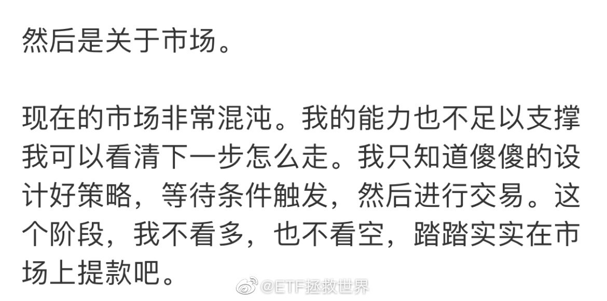

======================================================

ETF拯救世界 (5687069307) @
2021-03-04 09:54:30 Thu  
url: https://weibo.com/5687069307/K4BdlfzL8

一个热门品种涨了很多很多，就会有无数声音出来陈述理由，并告诉你这个品种会永远好下去——即使贵了点，长期看也是最值的。

你可以为它的上涨喝彩和鼓掌，但你要真的信了这些各怀心思的声音，

那么最终你会发现，

小丑竟然是你自己。 ​​​

转发[146]  评论[805]  赞[2601] 

======================================================

ETF拯救世界 (5687069307) @
2021-03-04 10:56:37 Thu  
url: https://weibo.com/5687069307/K4BCyubsC

看着下跌4%的创业板，想起之前创业板高位的时候有人在私信里指责我：

为什么你的创业板50%就卖了？为什么你不继续持有？你这水平还敢公开操作？

怎么说呢，这个世界有些人就是疯狂到，你不跟着他疯他都不答应，都会嘲笑你这种程度了。 ​​​

转发[68]  评论[344]  赞[2489] 

======================================================

ETF拯救世界 (5687069307) @
2021-03-04 11:21:09 Thu  
url: https://weibo.com/5687069307/K4BMw0G4K

我再说一条，你们观察。

很多高位买入被套的，会安慰自己是价值投资，早晚会回来。或者表示定投摊低成本，越跌越买。这个时候他们表现出的是非常难得的长期投资精神。

如果很快涨回来还好，如果涨不回来，他们中的87%会在持续低迷的时候痛下决心亏损卖出，并宣布永远不再相信价值投资和长期投资。

 ​​​

转发[242]  评论[871]  赞[3490] 

======================================================

ETF拯救世界 (5687069307) @
2021-03-04 11:37:04 Thu  
url: https://weibo.com/5687069307/K4BSYmTZq

红利也撑不住了，跌了0.21%。

[吐] 果然是辣鸡。 ​​​

转发[16]  评论[585]  赞[2429] 

======================================================

ETF拯救世界 (5687069307) @
2021-03-04 16:12:00 Thu  
url: https://weibo.com/5687069307/K4DGzpcRx

对于在这里聚集的朋友来说，波动剧烈的股市始终是个充满希望、平和与欢乐的提款机。

这种情况在其它地方甚是罕见。 ​​​

转发[48]  评论[689]  赞[3440] 

======================================================

ETF拯救世界 (5687069307) @
2021-03-04 16:27:54 Thu  
url: https://weibo.com/5687069307/K4DN1rDDu

经过今天的暴跌，食品饮料估值终于跌出历史最高区域了……

疯狂，隔几年就来一次。 ​​​

转发[75]  评论[480]  赞[3105] 

======================================================

ETF拯救世界 (5687069307) @
2021-03-04 18:07:01 Thu  
url: https://weibo.com/5687069307/K4ErggYkx

推荐个代码很容易，但是如果不说买卖时间，价格，仓位，我宁愿不说。

这是一种负责的态度，也因为我深知，再好的品种也会有很多人赔钱。

我要改变的是大多数人赔钱的现实，而不是显得我很厉害。 ​​​

转发[51]  评论[840]  赞[3842] 

======================================================

ETF拯救世界 (5687069307) @
2021-03-05 07:22:02 Fri  
url: https://weibo.com/5687069307/K4JDXsxCp

今天看到券商报告，说投资小盘股正当时。[费解]

------------------------------------------------------
转推：
>  @ETF拯救世界 (5687069307)
>  2021-02-08 10:38:57 Mon  
>  url: https:/weibo.com/5687069307/K0Xft5WAv/

>  现在这个时间点，但凡有点责任心的，有点能力的，懂点投资的基金经理，都不应该再一门心思去报团了。
>  
>  我就不信几千家小一点的公司里面，找不到值得你买的好公司。
>  
>  你知道大量小公司有多便宜了吗。 ​​​

转发[18]  评论[276]  赞[1403] 

======================================================

ETF拯救世界 (5687069307) @
2021-03-05 07:40:24 Fri  
url: https://weibo.com/5687069307/K4JLpBrL0

76%有伴侣的女性管钱。剩下的那24%男人没有底线，赶紧把钱交给媳妇！

------------------------------------------------------
转推：
>  @新浪财经 (1638782947)
>  2021-03-04 17:38:30 Thu  
>  url: https:/weibo.com/1638782947/K4EfGdayZ/

>  【#报告称中国女性比男性拥有更多存款#】著名投资管理公司富达国际4日发布报告称，在调研覆盖的所有市场中，中国是唯一一个女性比男性拥有更多存款的市场。调研显示，中国女性拥有可观的可支配资金，受访中国女性的存款金额比男性多7%。中国女性在家庭财务管理中也发挥着更为主导的作用，拥有伴侣的人 ​​​

转发[30]  评论[354]  赞[1580] 

======================================================

ETF拯救世界 (5687069307) @
2021-03-05 07:53:05 Fri  
url: https://weibo.com/5687069307/K4JQyptDz

从基金公司和经理的角度讲，暴涨的时候，1-2天快速建仓是合理的。

如果继续涨，那么你的净值会上涨，业绩好了什么都好说。你的业绩不行，被赎回，规模下降。

如果跌了，那么更好。因为一个新基金净值低于1是没有人赎回的。申购的人不能接受刚买就赔，所以会一直持有。等到未来净值回到1大部分人才会 ​​​

转发[98]  评论[292]  赞[2110] 

======================================================

ETF拯救世界 (5687069307) @
2021-03-05 08:01:39 Fri  
url: https://weibo.com/5687069307/K4JU28apk

我个人希望今天反弹一下，最好暴力点，因为

我想卖点东西……

你要不反弹，我就不卖了…… ​​​

转发[42]  评论[590]  赞[2576] 

======================================================

ETF拯救世界 (5687069307) @
2021-03-05 09:30:53 Fri  
url: https://weibo.com/5687069307/K4KufzHSd

那些因为最近一年没有买入而焦虑的，一直在评论里着急买的朋友，

你现在的心情是______。 ​​​

转发[30]  评论[1094]  赞[3266] 

======================================================

ETF拯救世界 (5687069307) @
2021-03-05 09:42:00 Fri  
url: https://weibo.com/5687069307/K4KyM5G8S

这一年来辛苦打工又攒了几万块，之前又减持了一部分，坐等加仓。[可爱] ​​​

转发[15]  评论[826]  赞[2502] 

======================================================

ETF拯救世界 (5687069307) @
2021-03-05 09:51:24 Fri  
url: https://weibo.com/5687069307/K4KCAoITA

我总感觉笑果晃晃悠悠的，整个团体，包括其中很多人有一种在危险边缘疯狂试探的感觉。

------------------------------------------------------
转推：
>  @明星娱闻联播 (5783350818)
>  2021-03-04 10:28:12 Thu  
>  url: https:/weibo.com/5783350818/K4Br1ltUv/

>  随着贾玲的一场豪赌，喜剧界五大团体的排名也应该有变化了，大碗娱乐排名自然上升。
>  
>  目前国内公认的五大喜剧团体分别是：本山传媒，德云社，开心麻花，大碗娱乐，笑果文化。
>  
>  本山传媒：以赵本山以及他的徒弟为核心的喜剧团体，早些年公认的喜剧第一，随着赵本山退居二线，他的徒弟小沈阳、宋小宝等人 ​​​

转发[21]  评论[180]  赞[1198] 

======================================================

ETF拯救世界 (5687069307) @
2021-03-05 09:57:34 Fri  
url: https://weibo.com/5687069307/K4KF5imLi

刚才请且慢统计了一下盈利比例，经过一波下跌，跟车盈利比例又增加了2%……这是奔着99%的人盈利去了啊。

我估计应该是油和红利贡献了增加值。 ​​​

转发[60]  评论[430]  赞[2544] 

======================================================

ETF拯救世界 (5687069307) @
2021-03-05 10:01:45 Fri  
url: https://weibo.com/5687069307/K4KGN1f0G

回复@放眼向西:接下来我准备用一两万字聊聊我认识的资产配置。把所有计划内的品种彻底分析一遍。当然，3块钱“消费粉丝”不能少。//@放眼向西:三十年河东三十年河西，对老大资产配置的魅力体会 越来越深

------------------------------------------------------
转推：
>  @ETF拯救世界 (5687069307)
>  2021-03-05 09:57:34 Fri  
>  url: https:/weibo.com/5687069307/K4KF5imLi/

>  刚才请且慢统计了一下盈利比例，经过一波下跌，跟车盈利比例又增加了2%……这是奔着99%的人盈利去了啊。
>  
>  我估计应该是油和红利贡献了增加值。 ​​​

转发[31]  评论[805]  赞[2981] 

======================================================

ETF拯救世界 (5687069307) @
2021-03-05 10:27:28 Fri  
url: https://weibo.com/5687069307/K4KReb1RP

国内QDII的一个问题就是底部限购甚至关闭申购，高位又打开。这样底部场外买不进去，场内大幅溢价。

油气对标的美股标的xop这一波上来涨了200%多，油气场内只涨了接近100%，场外倒是净值涨很多，问题是底部又不让你申购。

这个问题不解决，确实太影响收益了。包括去年3月危机中各个美股、德国QDII全部 ​​​

转发[104]  评论[301]  赞[1751] 

======================================================

ETF拯救世界 (5687069307) @
2021-03-05 10:30:25 Fri  
url: https://weibo.com/5687069307/K4KSq5GgD

回复@智代的故事:主要原因是一个是外汇额度不够，另一个我怀疑有些基金有点自己的小心思，希望做大场内外差价做大规模。//@智代的故事:确实，下跌中限额甚至关闭，经理为了跟踪偏差不过大就抹杀了客户抄底的可能

------------------------------------------------------
转推：
>  @ETF拯救世界 (5687069307)
>  2021-03-05 10:27:28 Fri  
>  url: https:/weibo.com/5687069307/K4KReb1RP/

>  国内QDII的一个问题就是底部限购甚至关闭申购，高位又打开。这样底部场外买不进去，场内大幅溢价。
>  
>  油气对标的美股标的xop这一波上来涨了200%多，油气场内只涨了接近100%，场外倒是净值涨很多，问题是底部又不让你申购。
>  
>  这个问题不解决，确实太影响收益了。包括去年3月危机中各个美股、德国QDII全部 ​​​

转发[28]  评论[101]  赞[1086] 

======================================================

ETF拯救世界 (5687069307) @
2021-03-05 10:46:08 Fri  
url: https://weibo.com/5687069307/K4KYNsIAG

我本人在未来的投资版图中，只要交易所提供正规的品种，我都有可能玩。包括但不限于A股、港股、美国、德国、日本、英国、印度、越南、贵金属、原油、国债、利率债、信用债、转债。包括未来可能有的REITs。

在我的字典里没有什么“不可以”。只要合法、合规，你在交易所上，我就感兴趣，我就会尝试。以 ​​​

转发[156]  评论[930]  赞[3274] 

======================================================

ETF拯救世界 (5687069307) @
2021-03-05 10:52:40 Fri  
url: https://weibo.com/5687069307/K4L1shqKe

今天早上看到评论里一水儿说“做梦”“不可能”，我就知道事情正在起变化……

------------------------------------------------------
转推：
>  @ETF拯救世界 (5687069307)
>  2021-03-05 08:01:39 Fri  
>  url: https:/weibo.com/5687069307/K4JU28apk/

>  我个人希望今天反弹一下，最好暴力点，因为
>  
>  我想卖点东西……
>  
>  你要不反弹，我就不卖了…… ​​​

转发[17]  评论[398]  赞[1951] 

======================================================

ETF拯救世界 (5687069307) @
2021-03-05 11:44:46 Fri  
url: https://weibo.com/5687069307/K4LmB8ZhG

我跟你说。毫不夸张。很多人的不开心都是自己找的。 ​​​

转发[53]  评论[1027]  赞[4812] 

+++++++++++++++++++++++++++++++++++++++++++++++++++++

图片：
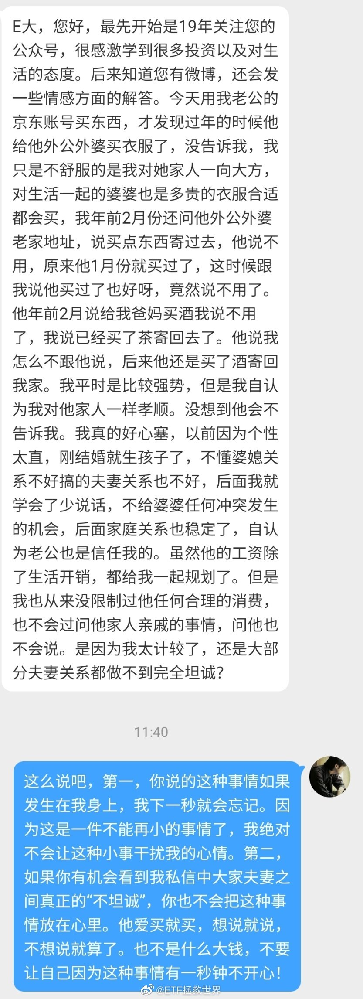

======================================================

ETF拯救世界 (5687069307) @
2021-03-05 14:34:49 Fri  
url: https://weibo.com/5687069307/K4MtCouQ2

今天意思不大，大家散了吧。

周末快乐！ ​​​

转发[22]  评论[693]  赞[2254] 

+++++++++++++++++++++++++++++++++++++++++++++++++++++

图片：

======================================================

ETF拯救世界 (5687069307) @
2021-03-05 17:47:27 Fri  
url: https://weibo.com/5687069307/K4NJOe2e1

我有一个不成熟的想法，人类，通常来讲25岁，最多30岁以后，真正的、纯洁的爱情就不会再有了。

不妨结合你自己的案例谈谈是不是这样。 ​​​

转发[124]  评论[1587]  赞[5085] 

======================================================

ETF拯救世界 (5687069307) @
2021-03-05 22:33:16 Fri  
url: https://weibo.com/5687069307/K4PBPaxdQ

爱情使人盲目。 ​​​

转发[66]  评论[1575]  赞[8138] 

+++++++++++++++++++++++++++++++++++++++++++++++++++++

图片：

======================================================

ETF拯救世界 (5687069307) @
2021-03-07 11:07:20 Sun  
url: https://weibo.com/5687069307/K53YowqXK

很多时候你的不快乐来源于，

你要的比你需要的多太多。 ​​​

转发[110]  评论[590]  赞[3005] 

======================================================

ETF拯救世界 (5687069307) @
2021-03-07 20:42:00 Sun  
url: https://weibo.com/5687069307/K57JEpgzf

能承受多少风险就投多少。

投资的事情，不要乱给别人建议，对了没人感谢你，错了都是你的锅。 ​​​

转发[50]  评论[296]  赞[2172] 

+++++++++++++++++++++++++++++++++++++++++++++++++++++

图片：
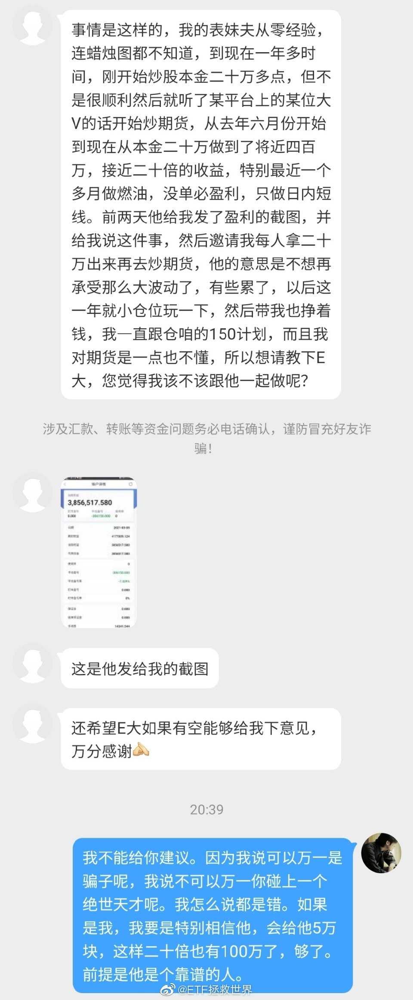

======================================================

ETF拯救世界 (5687069307) @
2021-03-07 21:11:32 Sun  
url: https://weibo.com/5687069307/K57VDyWHm

回复@ETF淡定淡定:十几年前，有个女性大学老师4万做多铜赚到1000多万。依然疯狂做多，然后账户变成了12万。我觉得她是成功的，因为她还是赚了3倍//@ETF淡定淡定:原来期货这么赚钱

------------------------------------------------------
转推：
>  @ETF拯救世界 (5687069307)
>  2021-03-07 20:42:00 Sun  
>  url: https:/weibo.com/5687069307/K57JEpgzf/

>  能承受多少风险就投多少。
>  
>  投资的事情，不要乱给别人建议，对了没人感谢你，错了都是你的锅。 ​​​

转发[20]  评论[214]  赞[1507] 

======================================================

ETF拯救世界 (5687069307) @
2021-03-07 21:19:18 Sun  
url: https://weibo.com/5687069307/K57YNy2VN

有兄弟姐妹也未必都是好事。 ​​​

转发[14]  评论[510]  赞[2619] 

+++++++++++++++++++++++++++++++++++++++++++++++++++++

图片：
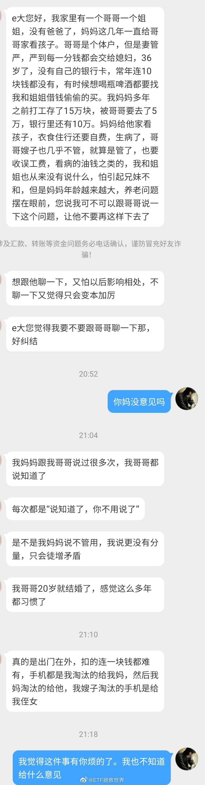

======================================================

ETF拯救世界 (5687069307) @
2021-03-08 00:36:26 Mon  
url: https://weibo.com/5687069307/K59gOivwx

你为什么还不睡觉 ​​​

转发[19]  评论[724]  赞[1808] 

======================================================

ETF拯救世界 (5687069307) @
2021-03-08 08:06:50 Mon  
url: https://weibo.com/5687069307/K5cdD0ZiG

想给姑娘们发个红包，又怕臭男人抢，怎么办。 ​​​

转发[10]  评论[1298]  赞[3279] 

======================================================

ETF拯救世界 (5687069307) @
2021-03-08 09:15:05 Mon  
url: https://weibo.com/5687069307/K5cFkqZHy

一年前原油多到没地方储存，满载的油轮飘在海上无处安放，油价跌到负数，YYB爆仓。

一年后油价再次干到70美元，有人已经看到150。

这些事情没有任何一个分析师提前告诉你，

所以少看点那些有的没的、乱七八糟的分析和信息。耽误时间。 ​​​

转发[90]  评论[491]  赞[2289] 

======================================================

ETF拯救世界 (5687069307) @
2021-03-08 09:46:58 Mon  
url: https://weibo.com/5687069307/K5cSh0zAt

不瞒你说，红利还有0.7%又要新高了…… ​​​

转发[10]  评论[297]  赞[1649] 

======================================================

ETF拯救世界 (5687069307) @
2021-03-08 10:26:51 Mon  
url: https://weibo.com/5687069307/K5d8srChZ

早上看到中金的一篇报告，说有些品种的估值经过下跌已经进入价值投资区域了，可以买入。

我一看，嘿，你猜怎么着，还真是降了。 ​​​

转发[28]  评论[323]  赞[1740] 

+++++++++++++++++++++++++++++++++++++++++++++++++++++

图片：
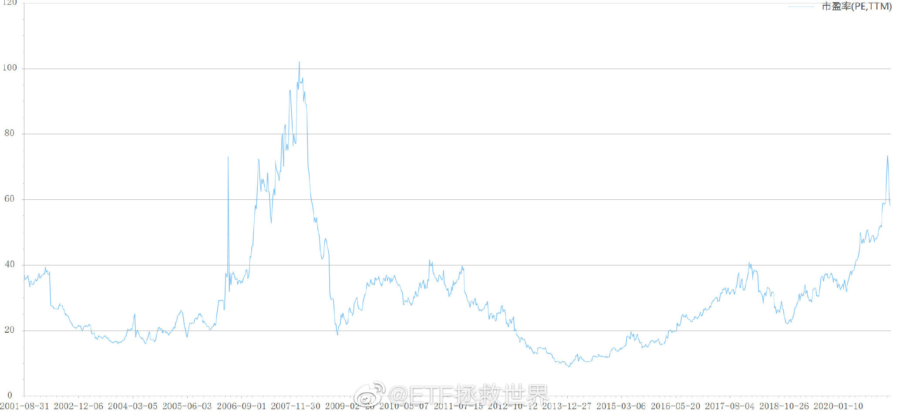

======================================================

ETF拯救世界 (5687069307) @
2021-03-08 10:37:28 Mon  
url: https://weibo.com/5687069307/K5dcLClGT

一路跌，出货的机会都不给。150想腾2%仓位空间出来没机会。

S不会动。

要不是成本太低了，现在心态肯定崩。 ​​​

转发[26]  评论[302]  赞[2099] 

======================================================

ETF拯救世界 (5687069307) @
2021-03-08 10:47:09 Mon  
url: https://weibo.com/5687069307/K5dgHpj1l

曾经的你看着牛转熊品种的历史k线发出一个疑问：

为什么当初那些持仓的不在这个品种已经很明显开始要下跌的时候卖掉呢。

为什么还有那么多人在一个品种刚刚开始下跌的时候还要冲进去接盘呢。

经历了一两轮后，你终于明白了（并没有）。 ​​​

转发[107]  评论[368]  赞[2037] 

======================================================

ETF拯救世界 (5687069307) @
2021-03-08 10:53:40 Mon  
url: https://weibo.com/5687069307/K5djlqhCc

150计划，持仓和交易过的34个品种中，只有2只浮亏。分别是仓位2%的传媒浮亏1.7%，仓位0.89%的油气浮亏4%。

S计划，持仓和交易过的23个品种中，只有1只浮亏。是仓位1%的信息技术浮亏5%。

两个计划都有多只持仓品种收益率超过70%以上。

150计划跟投账户中盈利的比例超过95%；
S计划跟投账户中盈利的比 ​​​

转发[104]  评论[866]  赞[2951] 

======================================================

ETF拯救世界 (5687069307) @
2021-03-08 11:08:05 Mon  
url: https://weibo.com/5687069307/K5dpccHpl

碰上这种女朋友也挺烦心的。四个字：无中生有，无事生非。

当然，不排除是她想分手找个理由… ​​​

转发[20]  评论[611]  赞[2306] 

+++++++++++++++++++++++++++++++++++++++++++++++++++++

图片：
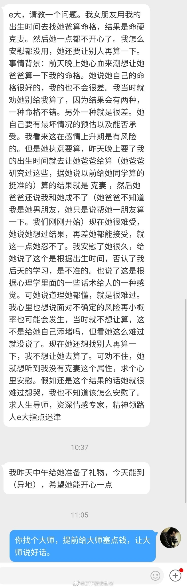

======================================================

ETF拯救世界 (5687069307) @
2021-03-08 13:15:05 Mon  
url: https://weibo.com/5687069307/K5eeKfcsk

实话实说，你看着现在的盘面和账户情况，包括你自己的可投入现金，

你的感觉和想法是什么？

我先说，跌得太猛，仓位比完美操作多了一两个点。有点遗憾，问题不大。由于一两年没买什么东西了，网格又基本出光了，手里现金非常多，如果有机会大开杀戒，会非常开心。 ​​​

转发[43]  评论[549]  赞[1920] 

======================================================

ETF拯救世界 (5687069307) @
2021-03-08 13:31:53 Mon  
url: https://weibo.com/5687069307/K5elz9wwN

警报，警报：

卸货车在路上了。 ​​​

转发[13]  评论[580]  赞[2066] 

======================================================

ETF拯救世界 (5687069307) @
2021-03-08 13:42:37 Mon  
url: https://weibo.com/5687069307/K5epVeh9k

我说过，我买入的任何品种，无论如何我都要把它折腾盈利了，绝不会亏损卖出。

过去十年做到了，未来十年也要做到。

亏损卖出？谢谢，不存在的。 ​​​

转发[50]  评论[435]  赞[2491] 

======================================================

ETF拯救世界 (5687069307) @
2021-03-08 13:46:08 Mon  
url: https://weibo.com/5687069307/K5ermd4wa

有些朋友做投资很有意思：

低位不敢买：“不涨我为什么买？”“买了再跌怎么办？”

回本马上卖出：“好家伙套了好几年了，赶紧卖了吧。”“千万别坐电梯呀。”

高位舍不得卖：“涨了这么多了，我听xxx说还能涨啊”“是啊，大V都在说还能涨一倍啊！抱紧呀！”

十倍股回调10%果断抄底：“终于跌了！ ​​​

转发[151]  评论[345]  赞[2313] 

======================================================

ETF拯救世界 (5687069307) @
2021-03-08 14:01:04 Mon  
url: https://weibo.com/5687069307/K5expqaat

其实食品饮料我是有一个建仓点位的。

但我现在不敢说，怕挨骂。

以后再说吧。 ​​​

转发[41]  评论[495]  赞[2227] 

======================================================

ETF拯救世界 (5687069307) @
2021-03-08 14:15:14 Mon  
url: https://weibo.com/5687069307/K5eDa5QBv

现在你再回头看，懂了为什么当时这个问题那么困扰我了吧。因为你那个时候开始跟，输的概率太大了。我的做法都是从你的角度出发，一定要真的明白这件事。

------------------------------------------------------
转推：
>  @ETF拯救世界 (5687069307)
>  2021-01-19 18:29:08 Tue  
>  url: https:/weibo.com/5687069307/JDVeHEmde/

>  我之前说过好几次，在这轮行情中，我已经不能对新朋友有任何贡献了。我请新朋友不要再参考我的操作。关注我也可以，不关注我也可以，总之我对你没什么用了。
>  
>  在这里我想再重申一下这个问题。甚至我有点极端的想停止公开推送计划，禁止新人跟车。当然，老朋友还会有办法看到。
>  
>  这是因为接下来的很多操 ​​​

转发[23]  评论[243]  赞[1811] 

======================================================

ETF拯救世界 (5687069307) @
2021-03-08 14:28:22 Mon  
url: https://weibo.com/5687069307/K5eIuqckn

说几句目前全市场的整体情况吧，我估计不说有些朋友非常担心。

A股整体来说不贵。所以我个人认为大多数股票没有继续暴跌的基础。

但是从去年底到今年初的各个展望中，我都明确表达了一个意思：

有些疯狂的板块很麻烦。到现在它们也确实暴跌了，但是这个跌幅是不是就到底了，我没法说。

医药的话整 ​​​

转发[307]  评论[679]  赞[2961] 

======================================================

ETF拯救世界 (5687069307) @
2021-03-08 14:40:35 Mon  
url: https://weibo.com/5687069307/K5eNsjhGJ

明白过味儿来的，说好了抱在一起不跑的士兵们开始踩踏了。

------------------------------------------------------
转推：
>  @ETF拯救世界 (5687069307)
>  2021-02-24 09:55:21 Wed  
>  url: https:/weibo.com/5687069307/K3nNIn18x/

>  你知道打仗吧，古代冷兵器那种。
>  
>  打仗的时候两边往前冲，你也在队伍里面。不考虑有没有监军的情况下，这种时候你面临两个选择。
>  
>  一个是坚定不移的往前冲。结果就是，如果大家都跟你一样坚定，那你们有可能胜利。但是，如果队伍里有意志不坚定的，跑了。那么往后跑的人越来越多，你们必败。最后可能先 ​​​

转发[37]  评论[218]  赞[1620] 

======================================================

ETF拯救世界 (5687069307) @
2021-03-08 15:09:38 Mon  
url: https://weibo.com/5687069307/K5eZf8UVa

我又打开各个账户看了看现金数字，

什么感觉呢，

你应该懂吧。

[男孩儿] ​​​

转发[17]  评论[558]  赞[2276] 

======================================================

ETF拯救世界 (5687069307) @
2021-03-08 15:25:08 Mon  
url: https://weibo.com/5687069307/K5f5xq9jo

任何事情都有蛛丝马迹。区别是你能不能在繁杂的各种信息中识别出来。

------------------------------------------------------
转推：
>  @ETF拯救世界 (5687069307)
>  2021-01-13 17:20:22 Wed  
>  url: https:/weibo.com/5687069307/JD0dP8dbN/

>  目前市场已经出现极为诡异的情况。
>  
>  一方面是早上那个新闻：基金抱团股的PB已经从过去十年平均的2.x涨到了现在的4.x。
>  
>  另一方面，几乎一半的小股票PB只有不到2倍。目前的全市场估值居然与2018年6、7月差不多。那可是再过4个月就会迈入钻石坑的时候。
>  
>  大就一定好吗？小就一定差吗？我不信。我相信未来 ​​​

转发[47]  评论[177]  赞[1678] 

======================================================

ETF拯救世界 (5687069307) @
2021-03-08 16:25:32 Mon  
url: https://weibo.com/5687069307/K5fu3rUwC

今日数据：

好消息，食品饮料市净率6个月来首次即将跌破7倍。这一波上去最高9倍。

历史平均4.4倍。 ​​​

转发[283]  评论[394]  赞[2318] 

======================================================

ETF拯救世界 (5687069307) @
2021-03-08 16:42:26 Mon  
url: https://weibo.com/5687069307/K5fAUkOCt

回复@黑枸杞很黑:我早点发，上涨过程中就会有人私信骂我因为我他卖出了，少挣了多少多少。你们永远不知道私信骂人的理由会有多少。//@黑枸杞很黑:您这句话早点发 我留着钱就晚点进场了，不过还是非常感谢[允悲][允悲]

------------------------------------------------------
转推：
>  @ETF拯救世界 (5687069307)
>  2021-03-08 16:25:32 Mon  
>  url: https:/weibo.com/5687069307/K5fu3rUwC/

>  今日数据：
>  
>  好消息，食品饮料市净率6个月来首次即将跌破7倍。这一波上去最高9倍。
>  
>  历史平均4.4倍。 ​​​

转发[19]  评论[208]  赞[1471] 

======================================================

ETF拯救世界 (5687069307) @
2021-03-09 07:16:07 Tue  
url: https://weibo.com/5687069307/K5ljxln2q

现在流行两个观点：

第一，反弹在即

第二，报团股是下蹲，蹲完后会蹦的更高。所以没有的赶紧买，有的拿住了

流行的是不是对的呢，拭目以待吧。 ​​​

转发[62]  评论[556]  赞[1930] 

======================================================

ETF拯救世界 (5687069307) @
2021-03-09 07:38:27 Tue  
url: https://weibo.com/5687069307/K5lsBEvuQ

回复@刘霖蛋糕:如果你好好看看，会发现我的仓位都是两年前建立的。如果你是这两年认识我，仓位比我低很正常。成本比我高我不让你买，你的成本只允许比我低，不能我赚钱你亏本//@刘霖蛋糕:新人问问题，大家别喷我。我的持仓很少。我看E大都持仓8成了………我怎么才两成？

------------------------------------------------------
转推：
>  @ETF拯救世界 (5687069307)
>  2021-03-08 10:47:09 Mon  
>  url: https:/weibo.com/5687069307/K5dgHpj1l/

>  曾经的你看着牛转熊品种的历史k线发出一个疑问：
>  
>  为什么当初那些持仓的不在这个品种已经很明显开始要下跌的时候卖掉呢。
>  
>  为什么还有那么多人在一个品种刚刚开始下跌的时候还要冲进去接盘呢。
>  
>  经历了一两轮后，你终于明白了（并没有）。 ​​​

转发[13]  评论[147]  赞[1183] 

======================================================

ETF拯救世界 (5687069307) @
2021-03-09 08:00:05 Tue  
url: https://weibo.com/5687069307/K5lBnDtbg

QFII是真的值得关注的一类投资者。

------------------------------------------------------
转推：
>  @ETF拯救世界 (5687069307)
>  2021-02-19 10:11:54 Fri  
>  url: https:/weibo.com/5687069307/K2CLX1jo7/

>  新年第一话：
>  
>  私募大佬五万美金看多比特币
>  小小Q非两千五百减持大茅台 ​​​

转发[67]  评论[161]  赞[1272] 

======================================================

ETF拯救世界 (5687069307) @
2021-03-09 08:24:02 Tue  
url: https://weibo.com/5687069307/K5lL6sSI7

语重心长的跟各位说一句：权益类投资（股票等），真的不是适合每一个人的。请一定要认清自己，认清市场。

有位朋友给我私信，07年在股市上赔过大钱，去年股灾空仓了，不敢买，结果看着市场一路涨又想买。说是自己来自农村，没什么钱，胆子小，但是想在股市赚钱。

前几天骑电动车闯红灯，把人家摩托撞 ​​​

转发[88]  评论[349]  赞[2483] 

+++++++++++++++++++++++++++++++++++++++++++++++++++++

图片：

======================================================

ETF拯救世界 (5687069307) @
2021-03-09 08:35:26 Tue  
url: https://weibo.com/5687069307/K5lPJm5dQ

回复@潇的小小燕:我倒是同意他的说法。对，你只看到了牛市清仓买房的，有没有想过如果你正好在2018年10月要买房，股票或者基金都赔了30%以上，你卖不卖呢？我觉得至少3-5年不用的钱是基本的。

------------------------------------------------------
转推：
>  @ETF拯救世界 (5687069307)
>  2021-03-09 08:24:02 Tue  
>  url: https:/weibo.com/5687069307/K5lL6sSI7/

>  语重心长的跟各位说一句：权益类投资（股票等），真的不是适合每一个人的。请一定要认清自己，认清市场。
>  
>  有位朋友给我私信，07年在股市上赔过大钱，去年股灾空仓了，不敢买，结果看着市场一路涨又想买。说是自己来自农村，没什么钱，胆子小，但是想在股市赚钱。
>  
>  前几天骑电动车闯红灯，把人家摩托撞 ​​​

转发[15]  评论[86]  赞[918] 

======================================================

ETF拯救世界 (5687069307) @
2021-03-09 08:37:24 Tue  
url: https://weibo.com/5687069307/K5lQx2Zzs

DAX和道琼斯可以新高，红利为什么不行？

王侯将相宁有种乎？？？ ​​​

转发[33]  评论[302]  赞[1867] 

+++++++++++++++++++++++++++++++++++++++++++++++++++++

图片：

======================================================

ETF拯救世界 (5687069307) @
2021-03-09 08:49:23 Tue  
url: https://weibo.com/5687069307/K5lVp5RKi

众所周知，我的人生理念就是躺平接受不能改变的，玩命努力改变能改变的。

那么A股市场的走势就是你不能改变的。躺平，接受。（虽然根据量子力学理论，我们每个人的参与其实都是改变A股走势的。）

那么我们能改变的其实是如何应对这个不能改变的A股走势。你抱怨、愤怒、嘲笑、郁闷，都没有任何任何意 ​​​

转发[280]  评论[509]  赞[2758] 

======================================================

ETF拯救世界 (5687069307) @
2021-03-09 09:50:11 Tue  
url: https://weibo.com/5687069307/K5mk5778z

希望骂我的这哥们现在还好吧。

------------------------------------------------------
转推：
>  @ETF拯救世界 (5687069307)
>  2021-01-27 12:21:13 Wed  
>  url: https:/weibo.com/5687069307/JF6fleQFk/

>  真的真的不要给别人投资建议。
>  
>  不要说给别人投资建议了，就说像我这样，只是公开了自己的操作都会被骂，更何况你给别人投资建议？
>  
>  有人私信骂我，说我不看好军工没买，结果军工之前一段时间表现不错，他信了我没买，现在买了。
>  
>  我没有权利不买吗？板块市盈率90倍的品种，我真的下不去手啊。不看好什 ​​​

转发[12]  评论[105]  赞[1044] 

======================================================

ETF拯救世界 (5687069307) @
2021-03-09 09:52:15 Tue  
url: https://weibo.com/5687069307/K5mkUwY0D

[微笑] ​​​

转发[42]  评论[231]  赞[1408] 

+++++++++++++++++++++++++++++++++++++++++++++++++++++

图片：

======================================================

ETF拯救世界 (5687069307) @
2021-03-09 09:57:05 Tue  
url: https://weibo.com/5687069307/K5mmSAl8U

医药吃到。表格更新中。 ​​​

转发[42]  评论[504]  赞[1769] 

======================================================

ETF拯救世界 (5687069307) @
2021-03-09 09:59:11 Tue  
url: https://weibo.com/5687069307/K5mnJ6Tvz

这一波暴跌，抱团的基金经理们功不可没。

当然，力推过去“xx个月涨幅xx牛基”的第三方销售机构也立功了。他们合力把最不稳定的一批人吸引进了高估的品种，然后在价值回归中崩塌——赎回——崩塌。 ​​​

转发[75]  评论[210]  赞[1952] 

======================================================

ETF拯救世界 (5687069307) @
2021-03-09 10:05:17 Tue  
url: https://weibo.com/5687069307/K5mqcuxMQ

我给个明确的判断吧。

这波下跌绝不是行情的结束，而是空中加油站。

后半段的行情，之前的明星将落幕，新的明星将粉墨登场。 ​​​

转发[517]  评论[733]  赞[3797] 

======================================================

ETF拯救世界 (5687069307) @
2021-03-09 10:05:53 Tue  
url: https://weibo.com/5687069307/K5mqrzP33

这，大概就是“抄底”吧……

------------------------------------------------------
转推：
>  @ETF拯救世界 (5687069307)
>  2021-03-09 09:57:05 Tue  
>  url: https:/weibo.com/5687069307/K5mmSAl8U/

>  医药吃到。表格更新中。 ​​​

转发[22]  评论[475]  赞[1833] 

======================================================

ETF拯救世界 (5687069307) @
2021-03-09 10:32:03 Tue  
url: https://weibo.com/5687069307/K5mB4cSKf

我再提示一下：

网格最重要的不是赚多少钱，而是你要做好压力测试。看看最大跌幅下你自己的财务和心理状态还是否健康。

再说一次：这是最最最重要的。 ​​​

转发[83]  评论[402]  赞[2555] 

======================================================

ETF拯救世界 (5687069307) @
2021-03-09 10:47:26 Tue  
url: https://weibo.com/5687069307/K5mHjlOpk

可能是女孩子喜欢倾诉吧。怎么我的私信看到的都是这种不靠谱的男人啊。 ​​​

转发[14]  评论[409]  赞[1885] 

+++++++++++++++++++++++++++++++++++++++++++++++++++++

图片：
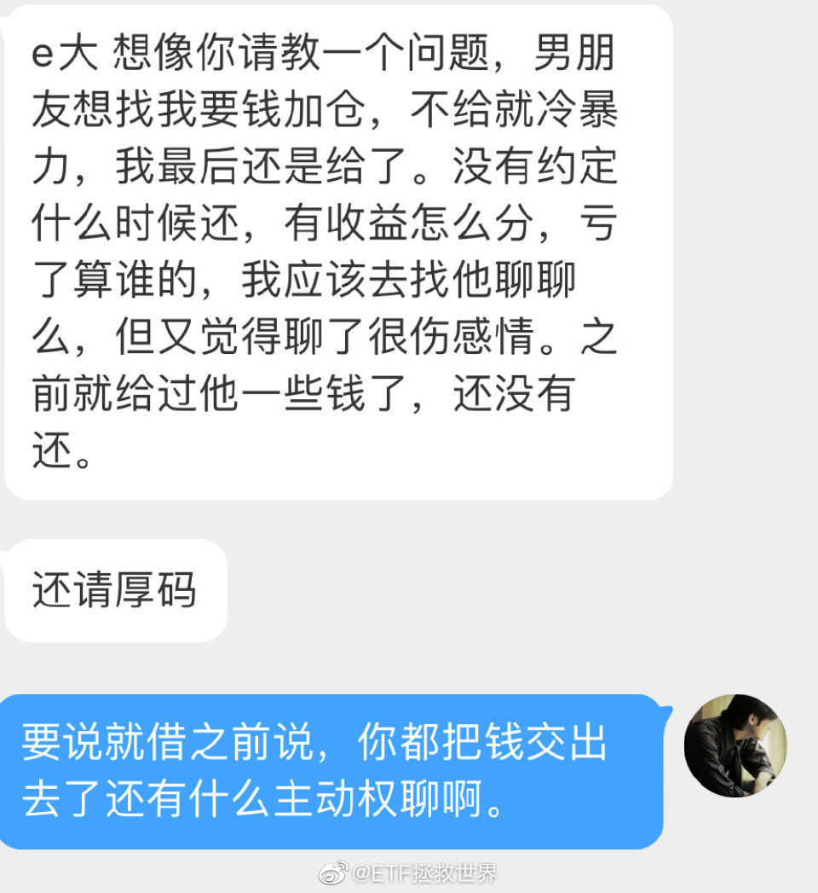

======================================================

ETF拯救世界 (5687069307) @
2021-03-09 11:02:53 Tue  
url: https://weibo.com/5687069307/K5mNAwCp5

表格已更新。

话说刚买的如果今天就能出怎么办，T+1出不了啊。

好烦啊。[doge]

憋说话，吻我。 ​​​

转发[26]  评论[956]  赞[3170] 

======================================================

ETF拯救世界 (5687069307) @
2021-03-09 11:18:56 Tue  
url: https://weibo.com/5687069307/K5mU65Orh

3%了，还差2%。还说A股不是提款机？

------------------------------------------------------
转推：
>  @ETF拯救世界 (5687069307)
>  2021-03-09 11:02:53 Tue  
>  url: https:/weibo.com/5687069307/K5mNAwCp5/

>  表格已更新。
>  
>  话说刚买的如果今天就能出怎么办，T+1出不了啊。
>  
>  好烦啊。[doge]
>  
>  憋说话，吻我。 ​​​

转发[10]  评论[372]  赞[1627] 

======================================================

ETF拯救世界 (5687069307) @
2021-03-09 11:35:40 Tue  
url: https://weibo.com/5687069307/K5n0Talzw

说上午手机信号不好/忙，错过了的朋友，我真的不理解，这不是全自动执行的程序吗，野生AI智能交易，跟你信号好不好忙不忙有什么关系啊……

余额不足的朋友就没办法了。你开个余额理财，放2-3格的钱进去呆着也不亏利息啊…… ​​​

转发[36]  评论[972]  赞[3050] 

======================================================

ETF拯救世界 (5687069307) @
2021-03-09 14:50:37 Tue  
url: https://weibo.com/5687069307/K5oi1j6uY

终究是错付了！ ​​​

转发[40]  评论[929]  赞[3113] 

======================================================

ETF拯救世界 (5687069307) @
2021-03-09 15:45:19 Tue  
url: https://weibo.com/5687069307/K5oEe15iE

回复@财前第一外科教授:有。在路上了，陆续发布。跌下来机会太多了[爱你]//@财前第一外科教授:e大，还有没有新的网格品种[馋嘴]

------------------------------------------------------
转推：
>  @ETF拯救世界 (5687069307)
>  2021-03-09 14:50:37 Tue  
>  url: https:/weibo.com/5687069307/K5oi1j6uY/

>  终究是错付了！ ​​​

转发[16]  评论[364]  赞[1570] 

======================================================

ETF拯救世界 (5687069307) @
2021-03-09 16:14:28 Tue  
url: https://weibo.com/5687069307/K5oQ3otfW

今日数据出来了：

我只能说，太TMD棒了。 ​​​

转发[130]  评论[833]  赞[4066] 

======================================================

ETF拯救世界 (5687069307) @
2021-03-09 16:21:06 Tue  
url: https://weibo.com/5687069307/K5oSKmLQA

如果明天不暴力反弹，就发车。不止一车。

------------------------------------------------------
转推：
>  @ETF拯救世界 (5687069307)
>  2021-03-09 16:14:28 Tue  
>  url: https:/weibo.com/5687069307/K5oQ3otfW/

>  今日数据出来了：
>  
>  我只能说，太TMD棒了。 ​​​

转发[88]  评论[1294]  赞[3537] 

======================================================

ETF拯救世界 (5687069307) @
2021-03-09 17:08:23 Tue  
url: https://weibo.com/5687069307/K5pbWhnMT

我公布出来的东西，一定是特别保守的。一定要契合95%的普通投资者的风险承受能力。

所以才能有现在98%的朋友都盈利的这种局面。

但这样就难免出现涨的时候没那么猛，因为风险高一点我可能就不买，或者较早卖出，从而损失了一些机会。

我争取未来将对象设定为90%或者80%朋友的风险承受能力。但这样我 ​​​

转发[90]  评论[1306]  赞[5380] 

======================================================

ETF拯救世界 (5687069307) @
2021-03-09 20:05:28 Tue  
url: https://weibo.com/5687069307/K5qlPaInt

昨天有个主动基金满仓军工跌幅8%刷屏了。

其实满仓军工和满仓白酒在本质上有什么不同吗，我的答案是没有。

都是豪赌。赌赢了基金一哥，赌输了被人嘲笑，无非如此。一个主动基金，满仓一个行业，目标就是为了一鸣惊人出人头地的。只是有人赢了有人输了而已。

我建议喜欢主动基金的朋友，找那种持仓行 ​​​

转发[175]  评论[426]  赞[3331] 

======================================================

ETF拯救世界 (5687069307) @
2021-03-10 06:53:20 Wed  
url: https://weibo.com/5687069307/K5uANcEbY

一切都是命中注定，剧本早已写好。

------------------------------------------------------
转推：
>  @ETF拯救世界 (5687069307)
>  2021-01-06 13:02:57 Wed  
>  url: https:/weibo.com/5687069307/JBUxRmrp4/

>  行情中后期，一定是新手比老手赚得多。
>  
>  因为老手会害怕，新手不会。不仅不会，还会嘲笑老手。
>  
>  当然了，最后的结局是新手连哭的力气都没了。这次不知道，反正每次历史都是这样的。 ​​​

转发[61]  评论[468]  赞[1925] 

======================================================

ETF拯救世界 (5687069307) @
2021-03-10 07:28:47 Wed  
url: https://weibo.com/5687069307/K5uPb1xWU

怎么努力也做不到一件事，那就不去做了。

另辟蹊径做另一件你能做好的。

你能想象爱因斯坦一定要训练自己去拿奥运会金牌或者C罗一定要让自己拿诺贝尔物理学奖吗。 ​​​

转发[54]  评论[311]  赞[1920] 

+++++++++++++++++++++++++++++++++++++++++++++++++++++

图片：
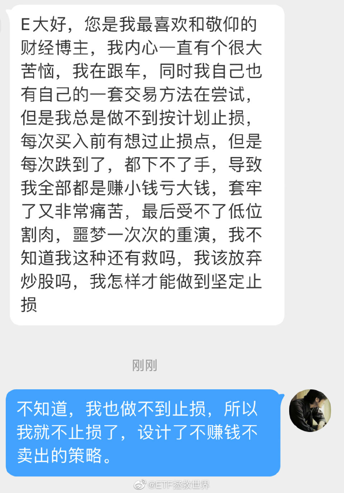

======================================================

ETF拯救世界 (5687069307) @
2021-03-10 09:03:36 Wed  
url: https://weibo.com/5687069307/K5vrF6iDI

红利要分红了，记得再投 ​​​

转发[24]  评论[501]  赞[2237] 

======================================================

ETF拯救世界 (5687069307) @
2021-03-10 09:32:20 Wed  
url: https://weibo.com/5687069307/K5vDkfURj

有人会觉得：反弹啦，没车啦，好难受啊。

你怎么不看看昨天你抄的底，买的品种没涨吗。

别老盯着自己没得到什么，多珍惜已经有的幸福吧。 ​​​

转发[36]  评论[499]  赞[2725] 

======================================================

ETF拯救世界 (5687069307) @
2021-03-10 09:47:37 Wed  
url: https://weibo.com/5687069307/K5vJwBqmU

红利成立以来的分红历史。

其实年纪大了以后，低位买入足够这样的品种，每年拿分红生活挺幸福的。 ​​​

转发[150]  评论[519]  赞[2815] 

+++++++++++++++++++++++++++++++++++++++++++++++++++++

图片：
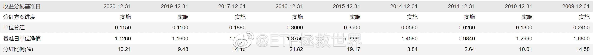

======================================================

ETF拯救世界 (5687069307) @
2021-03-10 10:12:53 Wed  
url: https://weibo.com/5687069307/K5vTMujaB

支付宝那个劝投资者不要赎回的公告非常不妥。

每个人买的品种都不同，你劝人家不要卖，如果人家本来没赔钱甚至有赚，你劝人家别卖，后面走出大熊，人家赔大钱了，你负责吗。

买基金的时候你推荐人家买涨幅最大的牛基，调整了劝人家别赎回，不能这么玩啊……不是说这里赎回对不对，情况不同，你不能乱 ​​​

转发[93]  评论[630]  赞[3544] 

======================================================

ETF拯救世界 (5687069307) @
2021-03-10 10:41:51 Wed  
url: https://weibo.com/5687069307/K5w5xwlEA

一会先更新一个网格品种，同时把DAX去掉。

是因为从大家资金的角度和交易的角度同时考虑。不能同时开太多，要保持一个合理的数量。

更新了我会说，记得把DAX条件单删掉啊。 ​​​

转发[59]  评论[895]  赞[2423] 

======================================================

ETF拯救世界 (5687069307) @
2021-03-10 11:28:03 Wed  
url: https://weibo.com/5687069307/K5woixwsJ

已更新。

------------------------------------------------------
转推：
>  @ETF拯救世界 (5687069307)
>  2021-03-10 10:41:51 Wed  
>  url: https:/weibo.com/5687069307/K5w5xwlEA/

>  一会先更新一个网格品种，同时把DAX去掉。
>  
>  是因为从大家资金的角度和交易的角度同时考虑。不能同时开太多，要保持一个合理的数量。
>  
>  更新了我会说，记得把DAX条件单删掉啊。 ​​​

转发[30]  评论[1122]  赞[2731] 

======================================================

ETF拯救世界 (5687069307) @
2021-03-10 14:24:32 Wed  
url: https://weibo.com/5687069307/K5xxVyXsa

条件单真的是神器，真的。

不仅可以用在网格上，你几乎可以用在任何你想买的品种上。比如你想买某个品种，在支撑位设一个条件单。然后——就不用管它了！

（彩蛋：只有这里的朋友的条件单可以选“长期”。否则是有时间限制的……）

甚至还可以开发出各种玩法，比如止损或者止盈。当然我没操作过，不 ​​​

转发[167]  评论[491]  赞[2620] 

======================================================

ETF拯救世界 (5687069307) @
2021-03-10 14:25:48 Wed  
url: https://weibo.com/5687069307/K5xyrpofn

好家伙。[可爱] ​​​

转发[13]  评论[376]  赞[1674] 

+++++++++++++++++++++++++++++++++++++++++++++++++++++

图片：

======================================================

ETF拯救世界 (5687069307) @
2021-03-10 14:36:53 Wed  
url: https://weibo.com/5687069307/K5xCWogZB

经过慎重考虑以及观察盘面动向，我决定长期计划暂时不买入。

这是我自己的操作，你的话，一定要保持心态的舒服。如果你总觉得涨了你会很难受，或者总是盼着跌，那么就是仓位低，请自己补到涨跌都舒服。

目前的市场状态，你可以想象涨50%以及跌35%自己的心态，然后酌情加减。 ​​​

转发[70]  评论[810]  赞[3729] 

======================================================

ETF拯救世界 (5687069307) @
2021-03-10 21:01:53 Wed  
url: https://weibo.com/5687069307/K5A9dhENw

有劳了。我的微博废话挺多的，翻起来还是太辛苦。尤其是很多条只在当时的环境下才能感受到魅力和震撼[doge] ​​​

转发[25]  评论[470]  赞[2264] 

+++++++++++++++++++++++++++++++++++++++++++++++++++++

图片：

======================================================

ETF拯救世界 (5687069307) @
2021-03-11 08:13:03 Thu  
url: https://weibo.com/5687069307/K5ExEatZh

好家伙。

基操勿6 ​​​

转发[204]  评论[713]  赞[3437] 

+++++++++++++++++++++++++++++++++++++++++++++++++++++

图片：
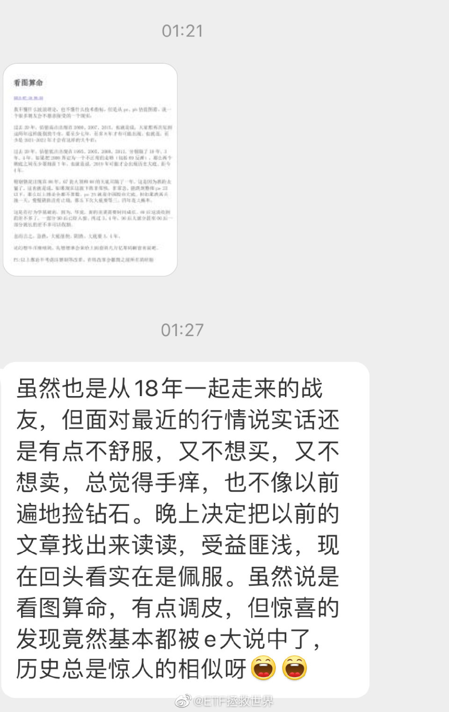

======================================================

ETF拯救世界 (5687069307) @
2021-03-11 09:27:25 Thu  
url: https://weibo.com/5687069307/K5F1Pg07s

除了少部分股票和板块，我绝对不相信行情就此终结。这轮长牛99.99%概率会继续。之所以是长牛，就必然有波动，否则就变成快牛。我会坚定持有大部分仓位，甚至要继续择机加仓。

------------------------------------------------------
转推：
>  @ETF拯救世界 (5687069307)
>  2021-03-09 10:05:17 Tue  
>  url: https:/weibo.com/5687069307/K5mqcuxMQ/

>  我给个明确的判断吧。
>  
>  这波下跌绝不是行情的结束，而是空中加油站。
>  
>  后半段的行情，之前的明星将落幕，新的明星将粉墨登场。 ​​​

转发[217]  评论[821]  赞[4086] 

======================================================

ETF拯救世界 (5687069307) @
2021-03-11 10:12:32 Thu  
url: https://weibo.com/5687069307/K5Fk8yUgn

医药还差1.5%，话说前天那车都开出去又回来接人，被接到的人太幸运了吧。

如果能在这两天涨1.5%，那么医药就是两波合起来用了不到十天，为大家账户增加了8位数利润…… ​​​

转发[23]  评论[720]  赞[2685] 

======================================================

ETF拯救世界 (5687069307) @
2021-03-11 10:17:44 Thu  
url: https://weibo.com/5687069307/K5FmfFdSa

有时候波段做多了你就会感到很迷茫：

是谁低位卖给我，高位又买回去……一波一波不停的塞钱……

如果你还没有这种迷茫，说明你波段做得还不够多…… ​​​

转发[80]  评论[657]  赞[3061] 

======================================================

ETF拯救世界 (5687069307) @
2021-03-11 13:50:47 Thu  
url: https://weibo.com/5687069307/K5GKJ89J9

看价值觉得真不贵，看趋势觉得好凶险。

只好不动了。 ​​​

转发[139]  评论[337]  赞[2469] 

======================================================

ETF拯救世界 (5687069307) @
2021-03-11 13:53:21 Thu  
url: https://weibo.com/5687069307/K5GLLvUkO

这个问题还要结合具体仓位。比如说，有价值，但趋势不好，如果仓位特别低，那当然可以买。如果满仓，那么趋势不好反而应该降一点。所以这种判断真是一万个人有一万种应对策略啊。我的话就是不动，因为仓位合适。

------------------------------------------------------
转推：
>  @ETF拯救世界 (5687069307)
>  2021-03-11 13:50:47 Thu  
>  url: https:/weibo.com/5687069307/K5GKJ89J9/

>  看价值觉得真不贵，看趋势觉得好凶险。
>  
>  只好不动了。 ​​​

转发[85]  评论[175]  赞[1787] 

======================================================

ETF拯救世界 (5687069307) @
2021-03-11 13:55:49 Thu  
url: https://weibo.com/5687069307/K5GMLBhYj

很多价值投资者的问题是进场太早，离场也太早，最终挣不到太多钱。

很多趋势投资者的问题是进场太晚，离场也太晚，也挣不到什么钱。

不妨结合一下。 ​​​

转发[247]  评论[407]  赞[3077] 

======================================================

ETF拯救世界 (5687069307) @
2021-03-11 14:04:54 Thu  
url: https://weibo.com/5687069307/K5GQsk4zF

很多人会谈到短期下跌不会改变长期价值，长期持有好的资产，即使短期波动大，最终也会有好收益。

这个话看起来，想起来都没错，但它有个致命缺点，就是——并不普遍适用。

人类整体来说是容易被感情驱动的一个群体。当你看着自己攒了一辈子的钱，几个月的时间就消失了20%、30%、50%、70%……大多数人 ​​​

转发[417]  评论[846]  赞[4589] 

======================================================

ETF拯救世界 (5687069307) @
2021-03-12 07:04:39 Fri  
url: https://weibo.com/5687069307/K5NwncCLg

个人所得税年度汇算补交是这样的，你虽然每个月都按时交税，但是如果这一年换了工作等等在两家公司交过税，那可能需要补交，所以有这种情况的还是去汇算一下毕竟稳妥。 ​​​

转发[22]  评论[369]  赞[1741] 

======================================================

ETF拯救世界 (5687069307) @
2021-03-12 08:10:35 Fri  
url: https://weibo.com/5687069307/K5NX8lD1o

很多朋友在私信里抱怨说，为什么要关注100天才能评论啊，想评论啊。

其实是这样的。

喷子啊，小号啊什么的倒是其次。最重要的是我不希望有些人对我一点都不了解就一本正经的，自以为是的评论我。这些朋友倒不是坏，就是偶尔刷到一篇我的微博，觉得怎样怎样，就评论一番，我会不舒服。因为人家也不是 ​​​

转发[28]  评论[2047]  赞[3904] 

======================================================

ETF拯救世界 (5687069307) @
2021-03-12 09:40:11 Fri  
url: https://weibo.com/5687069307/K5OxvCK3H

所谓百亿基金放开申购其实没有什么值得关注的。

还是让基民出钱。

全行业，包括基金经理、基金公司、销售平台大额申购基金才体现真的看好啊。 ​​​

转发[48]  评论[309]  赞[2315] 

======================================================

ETF拯救世界 (5687069307) @
2021-03-12 10:05:32 Fri  
url: https://weibo.com/5687069307/K5OHNi6Ju

稍微学点粗浅的技术分析，有时候能保命。 ​​​

转发[34]  评论[614]  赞[2858] 

======================================================

ETF拯救世界 (5687069307) @
2021-03-12 12:05:29 Fri  
url: https://weibo.com/5687069307/K5Puuge1q

今天可能有一个操作，但与你想的不同。

看情况，还不能确认。

对还是错无所谓，知行合一。 ​​​

转发[21]  评论[963]  赞[3021] 

======================================================

ETF拯救世界 (5687069307) @
2021-03-12 13:54:53 Fri  
url: https://weibo.com/5687069307/K5QcT4yjD

[微笑] 券商，劝你做个人，老老实实跌一点。 ​​​

转发[52]  评论[558]  赞[2625] 

+++++++++++++++++++++++++++++++++++++++++++++++++++++

图片：

======================================================

ETF拯救世界 (5687069307) @
2021-03-12 14:36:12 Fri  
url: https://weibo.com/5687069307/K5QtFcp6g

其实今天卖出的一车，卖出的好价应该是1940-1950左右。但是综合考虑，还是先出了。

出了就踏实了，再也不用看这个品种了。精力集中在其它的上面。 ​​​

转发[28]  评论[857]  赞[2937] 

======================================================

ETF拯救世界 (5687069307) @
2021-03-14 10:19:08 Sun  
url: https://weibo.com/5687069307/K67Ej9OtF

以后咱省里也有人了 ​​​

转发[17]  评论[880]  赞[4131] 

+++++++++++++++++++++++++++++++++++++++++++++++++++++

图片：

======================================================

ETF拯救世界 (5687069307) @
2021-03-15 10:26:43 Mon  
url: https://weibo.com/5687069307/K6h7Sz1P9

很黄很暴力 ​​​

转发[13]  评论[626]  赞[2258] 

======================================================

ETF拯救世界 (5687069307) @
2021-03-15 10:49:44 Mon  
url: https://weibo.com/5687069307/K6hhe1LGk

看着环保这个走势，想想周五说的，你应该更能理解了。

无论对错，只要按照策略走，心情就会非常好。否则今天的心情一定跟外面的天气一样了。 ​​​

转发[21]  评论[356]  赞[2019] 

======================================================

ETF拯救世界 (5687069307) @
2021-03-15 11:19:14 Mon  
url: https://weibo.com/5687069307/K6htcyH7s

各指数继续暴跌。

红利还差0.4%又要新高了。[微笑] ​​​

转发[14]  评论[347]  赞[2590] 

======================================================

ETF拯救世界 (5687069307) @
2021-03-15 11:49:45 Mon  
url: https://weibo.com/5687069307/K6hFAilt4

表格已更新。

有朋友没买到。我想与有些人把品种和价格透露给别人有很大关系。玩的人多了，就很难保证所有人都能玩好。

我已经尽力了，没有别的办法了。 ​​​

转发[21]  评论[754]  赞[3229] 

======================================================

ETF拯救世界 (5687069307) @
2021-03-15 12:49:35 Mon  
url: https://weibo.com/5687069307/K6i3Sozep

不想评论谁的对错，我只想说又学到了一些道理。

------------------------------------------------------
转推：
>  @滴滴出行 (2838754010)
>  2021-03-15 11:38:11 Mon  
>  url: https:/weibo.com/2838754010/K6hATcA5g/

>  关于福州快车司机开车冲撞乘客致其身亡的情况通报
>  
>  3月14日凌晨2点左右，福州一名滴滴快车司机高某某接到一名男乘客和一名女乘客后，男乘客认为司机夜里打电话影响家人休息，司机认为自己到达订单起点后联系乘客无过错，双方因此发生口角，女乘客及时进行了劝阻但未果，后司机开车连续冲撞男乘客致其身 ​​​

转发[50]  评论[287]  赞[1839] 

======================================================

ETF拯救世界 (5687069307) @
2021-03-15 13:33:36 Mon  
url: https://weibo.com/5687069307/K6ilJC5y7

其实你每天看市场上发生的事，都一点点都不新鲜。现在发生的，过去已经发生过，未来还会发生。

研究历史、判断现在、指导未来。

有时候看的准并不代表智商高、水平高，无非是有一点历史知识加一点冷静而已。 ​​​

转发[95]  评论[289]  赞[2044] 

======================================================

ETF拯救世界 (5687069307) @
2021-03-15 13:39:38 Mon  
url: https://weibo.com/5687069307/K6iobu0Z6

看了一眼计划的交易记录，去年3、4月连发十几车以后，除了换仓一次，再也没有买入一分钱A股。

不停的逢高减仓，卖、卖、卖。

高位追涨被套？

下辈子吧。 ​​​

转发[48]  评论[287]  赞[1941] 

======================================================

ETF拯救世界 (5687069307) @
2021-03-15 13:42:47 Mon  
url: https://weibo.com/5687069307/K6iptfZ40

回复@一只飞上天的丫-:“除了换仓一次”。那次是卖出环保买入信息。什么，你没有卖出环保？那没事了。//@一只飞上天的丫-:下半年不是买了一笔信息技术吗[疑问]

------------------------------------------------------
转推：
>  @ETF拯救世界 (5687069307)
>  2021-03-15 13:39:38 Mon  
>  url: https:/weibo.com/5687069307/K6iobu0Z6/

>  看了一眼计划的交易记录，去年3、4月连发十几车以后，除了换仓一次，再也没有买入一分钱A股。
>  
>  不停的逢高减仓，卖、卖、卖。
>  
>  高位追涨被套？
>  
>  下辈子吧。 ​​​

转发[9]  评论[109]  赞[1170] 

======================================================

ETF拯救世界 (5687069307) @
2021-03-15 13:50:31 Mon  
url: https://weibo.com/5687069307/K6isBodCu

我先说一下未来计划的路径吧。

由于S是“无限资金模式”，再加上已经很久很久很久没有买了。所以实际上应该手里有非常非常多的现金，所以，

未来会在某个支撑位同时或相近时间段买入好几个品种。而且量不会太小，因为这个支撑位真的很重要。

150也会逢低买入一部分，但是因为这个资源有限，需要考虑 ​​​

转发[170]  评论[979]  赞[4824] 

======================================================

ETF拯救世界 (5687069307) @
2021-03-15 14:00:51 Mon  
url: https://weibo.com/5687069307/K6iwNuBt7

你想象一下，抱团这件事最危险的时候是什么时候。

大家说好了都不走，跌10%真的没人走。20%有人害怕了但还是没人动。30%有人开始慢慢往门口挪……

跌40%、50%的时候，大多数人心理防线彻底崩溃……然后？ ​​​

转发[94]  评论[454]  赞[2434] 

======================================================

ETF拯救世界 (5687069307) @
2021-03-15 14:06:14 Mon  
url: https://weibo.com/5687069307/K6iyZ6pej

今年1月，我的一点点记录。 ​​​

转发[90]  评论[574]  赞[2446] 

+++++++++++++++++++++++++++++++++++++++++++++++++++++

图片：

======================================================

ETF拯救世界 (5687069307) @
2021-03-15 16:51:35 Mon  
url: https://weibo.com/5687069307/K6jE6fHAd

今天第二个品种表格已经更新完毕。之前那个有点问题也已经修正。 ​​​

转发[63]  评论[424]  赞[2276] 

======================================================

ETF拯救世界 (5687069307) @
2021-03-15 17:13:37 Mon  
url: https://weibo.com/5687069307/K6jN2vJDk

回复@小鱼咩咩咩咩:你注意，每个品种的幅度、留存利润额度都不同。到目前为止已经有5%、7%、10%出现了。//@小鱼咩咩咩咩:E大真的是保姆级服务了，其实我觉得每个网格品种只要给出1.0档的价格就可以了，懂的人自然会自己设置。[爱你]

------------------------------------------------------
转推：
>  @ETF拯救世界 (5687069307)
>  2021-03-15 16:51:35 Mon  
>  url: https:/weibo.com/5687069307/K6jE6fHAd/

>  今天第二个品种表格已经更新完毕。之前那个有点问题也已经修正。 ​​​

转发[35]  评论[275]  赞[1673] 

======================================================

ETF拯救世界 (5687069307) @
2021-03-16 08:35:47 Tue  
url: https://weibo.com/5687069307/K6pPlDEJL

今天心情怎么样，早餐吃的什么？ ​​​

转发[20]  评论[1628]  赞[2493] 

======================================================

ETF拯救世界 (5687069307) @
2021-03-16 10:25:34 Tue  
url: https://weibo.com/5687069307/K6qxUqmDG

这件事有两个层面：

第一，很多人把曾经看到的一个信息，误认为是自己能够把握住的信息。

曾经有人跟你说比特币会涨；曾经有人跟你说房价会涨；曾经有人跟你说茅台是牛股……

当它们真的涨了后，你以为是曾经天上掉馅饼自己没张嘴。

其实，它们只是你每天接受到无数信息中的几个而已。那些没有成真 ​​​

转发[456]  评论[726]  赞[3425] 

+++++++++++++++++++++++++++++++++++++++++++++++++++++

图片：
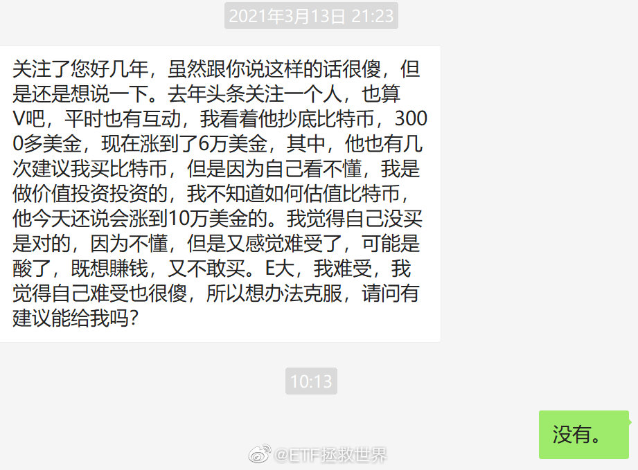

======================================================

ETF拯救世界 (5687069307) @
2021-03-16 10:48:24 Tue  
url: https://weibo.com/5687069307/K6qHbeOfX

用彩票来举例说明刚才那个后悔不后悔的问题吧：

不后悔：

买之前有个人跟你说一组数字，说买了必中大奖。你笑一笑，心里骂他一句***，买了别的数字。

结果他说的真中了。

你会后悔吗？不会。因为每次买之前都有至少十个人跟你推荐号码。

后悔：

你买了彩票，真的中了大奖，500万，税后400万。

 ​​​

转发[49]  评论[375]  赞[2072] 

======================================================

ETF拯救世界 (5687069307) @
2021-03-16 13:41:31 Tue  
url: https://weibo.com/5687069307/K6rPrEXJU

今天买哪只。 ​​​

转发[133]  评论[999]  赞[2760] 

+++++++++++++++++++++++++++++++++++++++++++++++++++++

图片：

======================================================

ETF拯救世界 (5687069307) @
2021-03-16 14:23:20 Tue  
url: https://weibo.com/5687069307/K6s6qar1e

我个人认为，做任何投资，第一想到的不应该是“我能赚多少”，而应该是“最差的情况下我能赔多少”。内心能接受，再投。

投入后涨了怎么办，跌了怎么办，都应该是投资之前设计好的，而非投资后手忙脚乱。

也就是说你的投资在你点击买入前在你的脑海中已经有一个完全的设计，风险是多大，后续策略是什 ​​​

转发[279]  评论[468]  赞[2760] 

======================================================

ETF拯救世界 (5687069307) @
2021-03-16 14:40:44 Tue  
url: https://weibo.com/5687069307/K6sdu4x9h

今日唯一悬念：

红利能否历史新高。 ​​​

转发[21]  评论[260]  赞[1916] 

======================================================

ETF拯救世界 (5687069307) @
2021-03-16 15:10:54 Tue  
url: https://weibo.com/5687069307/K6spJbBB5

除了雪球，集思录，且慢，有知有行，华宝智投这几个平台，其它在评论做广告的平台一律删除，尤其是有些品质可疑只知道抄袭的平台我还会拉黑评论者。 ​​​

转发[84]  评论[406]  赞[2726] 

======================================================

ETF拯救世界 (5687069307) @
2021-03-16 15:31:33 Tue  
url: https://weibo.com/5687069307/K6sy7iPU0

回复@小小滴大龙猫:对。谁对我好我记一辈子。对我不好也是。//@小小滴大龙猫:果然E大是一个念情的人，我记得好像集思录为E大说过公道话

------------------------------------------------------
转推：
>  @ETF拯救世界 (5687069307)
>  2021-03-16 15:10:54 Tue  
>  url: https:/weibo.com/5687069307/K6spJbBB5/

>  除了雪球，集思录，且慢，有知有行，华宝智投这几个平台，其它在评论做广告的平台一律删除，尤其是有些品质可疑只知道抄袭的平台我还会拉黑评论者。 ​​​

转发[24]  评论[187]  赞[1841] 

======================================================

ETF拯救世界 (5687069307) @
2021-03-16 15:42:17 Tue  
url: https://weibo.com/5687069307/K6sCt2Hzi

走在街上被一个美女拉住要做一个“针对年轻人的调查”

我18岁的这么明显吗[费解] ​​​

转发[12]  评论[570]  赞[2738] 

+++++++++++++++++++++++++++++++++++++++++++++++++++++

图片：

======================================================

ETF拯救世界 (5687069307) @
2021-03-16 20:01:15 Tue  
url: https://weibo.com/5687069307/K6ujApZbj

差0.17%。果然辣鸡，呵呵。

------------------------------------------------------
转推：
>  @ETF拯救世界 (5687069307)
>  2021-03-16 14:40:44 Tue  
>  url: https:/weibo.com/5687069307/K6sdu4x9h/

>  今日唯一悬念：
>  
>  红利能否历史新高。 ​​​

转发[12]  评论[271]  赞[1670] 

======================================================

ETF拯救世界 (5687069307) @
2021-03-17 08:22:13 Wed  
url: https://weibo.com/5687069307/K6zal8P0D

看了范志毅他们的脱口秀，我突然意识到一个问题：

表演脱口秀其实是门槛极低的一件事。说的极好可能很难，但借着提词器，上场前稍微练练，大部分人上去说一段应该都没问题。 

说的好不好最关键的可能是编剧写的段子好不好笑。 ​​​

转发[22]  评论[445]  赞[2275] 

======================================================

ETF拯救世界 (5687069307) @
2021-03-17 09:59:06 Wed  
url: https://weibo.com/5687069307/K6zNFhhLg

又是意思不大的一天。 ​​​

转发[7]  评论[374]  赞[1936] 

======================================================

ETF拯救世界 (5687069307) @
2021-03-17 10:38:12 Wed  
url: https://weibo.com/5687069307/K6A3xgAHj

至少到这个moment，这几天买入的4个品种无论长期短期仓位，都是盈利的…… ​​​

转发[12]  评论[511]  赞[2611] 

======================================================

ETF拯救世界 (5687069307) @
2021-03-17 12:02:52 Wed  
url: https://weibo.com/5687069307/K6ABU4hzz

其实低欲望也不全是好事。

生活中好像没有什么特别想要的东西。有很多没有的东西要买也能买，但觉得没有什么兴趣，不想买。甚至跟是不是浪费钱都没关系，就是不想买。

一方面这个当然能不被物质所困，不会沉浸在求而不得的痛苦中。但另一方面，感觉没有什么太大的物质追求，好像快乐也少了很多。心心 ​​​

转发[144]  评论[720]  赞[3105] 

======================================================

ETF拯救世界 (5687069307) @
2021-03-17 13:51:38 Wed  
url: https://weibo.com/5687069307/K6Bk3dT6R

昨天你的信息产业浮亏13%。

一个买入，啪，很快啊，今天浮亏就剩5%了。

这好吗，这很好。 ​​​

转发[36]  评论[474]  赞[2670] 

======================================================

ETF拯救世界 (5687069307) @
2021-03-17 14:00:45 Wed  
url: https://weibo.com/5687069307/K6BnKtFB3

我又来洗脑了：

轻仓下跌是最好的。这样你才能在未来低位买入拉低成本，然后买很多，然后赚大钱。跌的越多越好！

大摩你也不是没买，1份，一两个月涨几十个点，有用吗，没用啊，就那么点。所有车友也才赚了几千万甚至不到一个亿，有什么意思。

当年暴跌的那些品种，底部买了很多的，最后赚多少。医 ​​​

转发[147]  评论[473]  赞[3074] 

======================================================

ETF拯救世界 (5687069307) @
2021-03-17 14:14:21 Wed  
url: https://weibo.com/5687069307/K6BtgEnwq

？？？ ​​​

转发[12]  评论[306]  赞[1828] 

+++++++++++++++++++++++++++++++++++++++++++++++++++++

图片：

======================================================

ETF拯救世界 (5687069307) @
2021-03-17 14:41:13 Wed  
url: https://weibo.com/5687069307/K6BEbl7b4

今日研究成果。

没有行情就认真做研究，抽空上来与各位扯扯淡也挺好。 ​​​

转发[61]  评论[416]  赞[2492] 

+++++++++++++++++++++++++++++++++++++++++++++++++++++

图片：

======================================================

ETF拯救世界 (5687069307) @
2021-03-17 15:08:30 Wed  
url: https://weibo.com/5687069307/K6BPg5KlI

天气阴沉沉的，很舒服。我下班了，出去浪。

帅气皮衣，蓝色围巾。遇见了打个招呼。 ​​​

转发[18]  评论[1024]  赞[4386] 

======================================================

ETF拯救世界 (5687069307) @
2021-03-17 16:54:18 Wed  
url: https://weibo.com/5687069307/K6CwcdbHC

整整一年过去，今日日经已经进入极度高估区域。一年时间，涨了83%。之前网格留的利润仓位可以自己选择获利了结一部分也可以继续持有，不是大问题。

------------------------------------------------------
转推：
>  @ETF拯救世界 (5687069307)
>  2020-03-17 15:54:53 Tue  
>  url: https:/weibo.com/5687069307/Iz23tClCV/

>  今日数据：
>  
>  德国、日本已经极具投资价值。 ​​​

转发[78]  评论[411]  赞[2738] 

======================================================

ETF拯救世界 (5687069307) @
2021-03-17 21:44:00 Wed  
url: https://weibo.com/5687069307/K6EpMAUxz

如果人生所有选择都像投资那么简单就好了。 ​​​

转发[40]  评论[863]  赞[3676] 

======================================================

ETF拯救世界 (5687069307) @
2021-03-18 09:42:16 Thu  
url: https://weibo.com/5687069307/K6J7kmXG8

从3300涨到3700你新高这个不奇怪；

从3700跌回3300你的钱比当初在3300的时候多也不奇怪；

从3300涨回3700你又新高了。

总而言之涨啊涨，跌啊跌，涨涨跌跌，你总会新高，总是钱越来越多，浮盈幅度越来越大，

这就非常有乐趣了。 ​​​

转发[69]  评论[803]  赞[3496] 

======================================================

ETF拯救世界 (5687069307) @
2021-03-18 11:03:34 Thu  
url: https://weibo.com/5687069307/K6JEkni79

大家好才是真的好。 ​​​

转发[7]  评论[418]  赞[2313] 

======================================================

ETF拯救世界 (5687069307) @
2021-03-18 11:10:27 Thu  
url: https://weibo.com/5687069307/K6JH89siL

今天红利如果还不新高，请基金经理原地辞职。 ​​​

转发[19]  评论[435]  赞[2699] 

======================================================

ETF拯救世界 (5687069307) @
2021-03-18 11:29:29 Thu  
url: https://weibo.com/5687069307/K6JOQyuhA

hz如果去研究长生不老之药了，是不是说tb又安全了。

相当于秦二世而亡，项羽反扑了。 ​​​

转发[11]  评论[348]  赞[2141] 

======================================================

ETF拯救世界 (5687069307) @
2021-03-18 12:05:56 Thu  
url: https://weibo.com/5687069307/K6K3E4Ssx

这样的消息总能让人很开心。

我们每个人都有自己的方式让别人微笑啊。 ​​​

转发[43]  评论[1064]  赞[5840] 

+++++++++++++++++++++++++++++++++++++++++++++++++++++

图片：

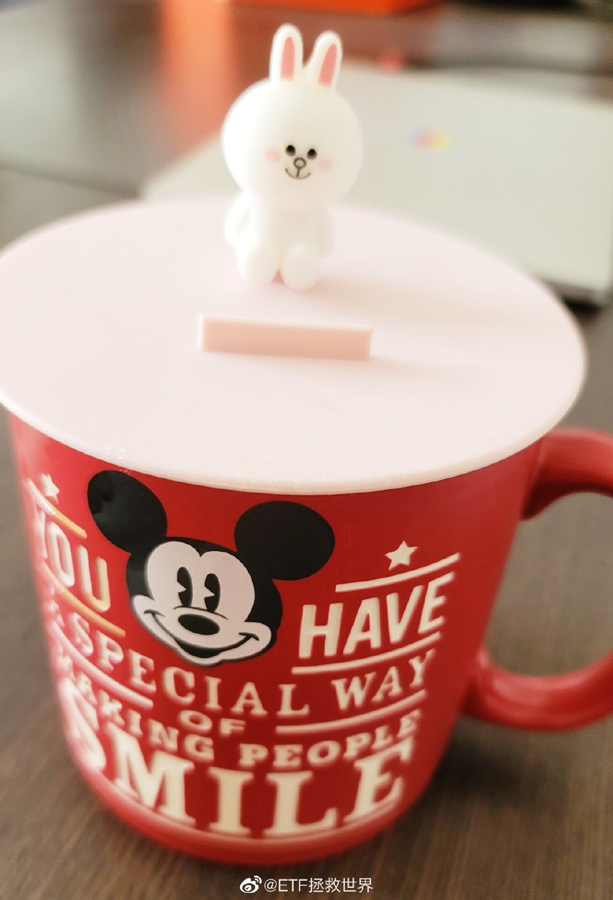

======================================================

ETF拯救世界 (5687069307) @
2021-03-18 21:38:35 Thu  
url: https://weibo.com/5687069307/K6NO5t2fP

当然是原谅她啊

------------------------------------------------------
转推：
>  @ETF拯救世界 (5687069307)
>  2021-03-18 11:10:27 Thu  
>  url: https:/weibo.com/5687069307/K6JH89siL/

>  今天红利如果还不新高，请基金经理原地辞职。 ​​​

转发[11]  评论[480]  赞[2155] 

======================================================

ETF拯救世界 (5687069307) @
2021-03-19 14:05:09 Fri  
url: https://weibo.com/5687069307/K6Ugx3HHS

盘，不是每天都要看的。

出去走走，感受一下生活。 ​​​

转发[18]  评论[594]  赞[2919] 

======================================================

ETF拯救世界 (5687069307) @
2021-03-19 14:16:24 Fri  
url: https://weibo.com/5687069307/K6Ul6499g

为什么很多人在股市里面天天迷茫

第一，他不知道市场处在什么位置

第二，他不知道自己的投资策略投资体系是什么

说白了，就像站在一群跑来跑去的非洲角马中间的小兔子，什么也看不清，不知道自己该做什么，傻傻的看着巨大的市场不断波动，心里七上八下。

我就告诉你，

踏踏实实的。现在仓位很合适 ​​​

转发[190]  评论[1015]  赞[3888] 

======================================================

ETF拯救世界 (5687069307) @
2021-03-21 08:16:39 Sun  
url: https://weibo.com/5687069307/K7aQ4ciNu

再说一次，你以为基金净值大涨基民就能挣钱就大错特错了。

最重要的不是一个股票，一个基金涨了多少，而是有多少人投资它挣钱了，挣了多少。

 http://t.cn/A6tglNel ​​​ http://mapi/006cSmwjly1gor7srwaidj30wi1yc4qp

转发[172]  评论[378]  赞[2163] 

+++++++++++++++++++++++++++++++++++++++++++++++++++++

图片：

======================================================

ETF拯救世界 (5687069307) @
2021-03-21 08:31:59 Sun  
url: https://weibo.com/5687069307/K7aWi5ZBd

我的话先说到这你看准不准，支付宝这个查看基民盈亏情况的基金诊断功能一定会迫于压力消失。不信就拭目以待

------------------------------------------------------
转推：
>  @ETF拯救世界 (5687069307)
>  2021-03-21 08:16:39 Sun  
>  url: https:/weibo.com/5687069307/K7aQ4ciNu/

>  再说一次，你以为基金净值大涨基民就能挣钱就大错特错了。
>  
>  最重要的不是一个股票，一个基金涨了多少，而是有多少人投资它挣钱了，挣了多少。
>  
>  
>  
>  
>   http://t.cn/A6tglNel ​​​ http://mapi/006cSmwjly1gor7srwaidj30wi1yc4qp

转发[70]  评论[273]  赞[1538] 

======================================================

ETF拯救世界 (5687069307) @
2021-03-21 17:14:15 Sun  
url: https://weibo.com/5687069307/K7emhlLf3

关于这件事，我永远不会再说。

其实你怎么样跟我一毛钱关系都没有，我不说就没事，站在男性角度提醒一下反而是惹祸上身，所以我何必再说。

另外，这种所谓回答当然不会改变我的看法，很简单，因为回答的这个人是个女的，她根本不了解男性。站在女性角度上所有理由我都已经完全明白了解，看再多也就那 ​​​

转发[37]  评论[615]  赞[2876] 

+++++++++++++++++++++++++++++++++++++++++++++++++++++

图片：

======================================================

ETF拯救世界 (5687069307) @
2021-03-21 18:17:04 Sun  
url: https://weibo.com/5687069307/K7eLMczGC

我再说两句可能又要挨骂的吧。

男性从基因上来讲，其实都是“渣男”。

以我对生物学一点粗浅的思考，我个人认为你也好，我也好，猫猫狗狗也好，豺狼虎豹也好，别看大家长得都不一样，各式各样，说到底其实都是工具而已。

是谁的工具，是基因的工具。

如果说地球上有什么长生不老永世不灭的生命，那 ​​​

转发[121]  评论[673]  赞[3717] 

======================================================

ETF拯救世界 (5687069307) @
2021-03-21 20:36:34 Sun  
url: https://weibo.com/5687069307/K7fGpgWoM

我跟月老有很多支出相似，你猜猜哪些地方不一样[doge]

------------------------------------------------------
转推：
>  @月风_投资笔记 (1670659923)
>  2021-03-21 18:28:24 Sun  
>  url: https:/weibo.com/1670659923/K7eQnmB1h/

>  那个人从头到尾没提过孩子和房子，我是段子手行业的，毕业到现在干了13年，在小破公司里属于合伙人的级别。
>  
>  汽车：奥迪Q5，确实大家都开40W左右的车
>  
>  房子：月供2W3，二套房的房贷标准
>  
>  吃的：中午吃公司楼下便利蜂的盒饭，也会叫外卖
>  
>  吃的2：实际上，最近市场震荡+电话会议多，有时忙起来午饭也吃不 ​​​

转发[85]  评论[571]  赞[2048] 

======================================================

ETF拯救世界 (5687069307) @
2021-03-22 08:10:08 Mon  
url: https://weibo.com/5687069307/K7kdVl3kr

招行年报

金葵花以上客户数量占比1.96%，资产占比82.15%。

私行客户数量占比0.06%，资产占比31%。 ​​​

转发[99]  评论[364]  赞[1981] 

+++++++++++++++++++++++++++++++++++++++++++++++++++++

图片：

======================================================

ETF拯救世界 (5687069307) @
2021-03-22 09:50:11 Mon  
url: https://weibo.com/5687069307/K7kSwCJdQ

今天红利再不新高请经理原地爆……

哎，算了，除了原谅她害能咋地。难道害能卖出啊，那么多年都过来了。 ​​​

转发[14]  评论[501]  赞[2282] 

======================================================

ETF拯救世界 (5687069307) @
2021-03-22 10:07:00 Mon  
url: https://weibo.com/5687069307/K7kZm7AHd

以前我说花开有时，有些朋友觉得我是找理由。

现在你知道了，是真的。

你不能养一棵寒冬腊梅却有要求它跟别人的夏荷秋菊一起开花。

我反正不急，我愿意每个季节都有可以欣赏的花。

春有百花秋有月，夏有凉风冬有雪。

若无闲事挂心头，便是人间好时节。 ​​​

转发[126]  评论[537]  赞[2724] 

======================================================

ETF拯救世界 (5687069307) @
2021-03-22 11:18:33 Mon  
url: https://weibo.com/5687069307/K7lsou4YA

神经质指数 ​​​

转发[11]  评论[279]  赞[1627] 

+++++++++++++++++++++++++++++++++++++++++++++++++++++

图片：

======================================================

ETF拯救世界 (5687069307) @
2021-03-22 11:29:47 Mon  
url: https://weibo.com/5687069307/K7lwXlIFM

这几天才能体会南方朋友（两广以北的南方）在冬天的感受。

你们辛苦了！ ​​​

转发[8]  评论[473]  赞[2000] 

======================================================

ETF拯救世界 (5687069307) @
2021-03-22 11:46:03 Mon  
url: https://weibo.com/5687069307/K7lDyzTBb

今天不想营业了。因为手冷，打不出字。[摊手] ​​​

转发[7]  评论[615]  赞[2265] 

======================================================

ETF拯救世界 (5687069307) @
2021-03-22 15:22:18 Mon  
url: https://weibo.com/5687069307/K7n3kCiPr

说真的，今天再不新高确实说不过去了。

当然，我也相信一定会新高。

这就是冬天开的花。

这种花赏起来，颇有一种我花开后百花杀的快感。 ​​​

转发[26]  评论[317]  赞[2191] 

======================================================

ETF拯救世界 (5687069307) @
2021-03-22 15:54:56 Mon  
url: https://weibo.com/5687069307/K7ngAn5Tt

最后一定会好的。

如果还没好，那说明还没到最后。 ​​​

转发[45]  评论[262]  赞[2013] 

+++++++++++++++++++++++++++++++++++++++++++++++++++++

图片：

======================================================

ETF拯救世界 (5687069307) @
2021-03-22 18:34:07 Mon  
url: https://weibo.com/5687069307/K7ojcaaaU

在外面等人吃饭，闲着也是闲着，开个交友帖吧。

在评论里报一下哪个省的，然后自己去自己那个地方的跟帖里看评论找人。

注意保护隐私，注意安全。如果发现骗财骗色的，出言不逊，对别人评头论足的，告诉我，我帮你挂出来在50万人面前曝光。 ​​​

转发[58]  评论[7116]  赞[7029] 

======================================================

ETF拯救世界 (5687069307) @
2021-03-22 21:48:04 Mon  
url: https://weibo.com/5687069307/K7pzV39BH

继续历史新高

------------------------------------------------------
转推：
>  @ETF拯救世界 (5687069307)
>  2021-03-22 15:22:18 Mon  
>  url: https:/weibo.com/5687069307/K7n3kCiPr/

>  说真的，今天再不新高确实说不过去了。
>  
>  当然，我也相信一定会新高。
>  
>  这就是冬天开的花。
>  
>  这种花赏起来，颇有一种我花开后百花杀的快感。 ​​​

转发[6]  评论[222]  赞[1723] 

======================================================

ETF拯救世界 (5687069307) @
2021-03-23 10:55:01 Tue  
url: https://weibo.com/5687069307/K7uJlbey2

一年多来第一次喝白酒。

真没什么好喝的，喝完身体也不舒服，以后还是能不喝就不喝。

还是我加冰的零度可乐好喝。 ​​​

转发[20]  评论[763]  赞[2681] 

======================================================

ETF拯救世界 (5687069307) @
2021-03-23 12:36:58 Tue  
url: https://weibo.com/5687069307/K7voJ06cb

想买台电脑，据说现在amd的性能也不差了，行家说说这个牌子能不能入手。 ​​​

转发[26]  评论[540]  赞[1870] 

======================================================

ETF拯救世界 (5687069307) @
2021-03-23 12:58:11 Tue  
url: https://weibo.com/5687069307/K7vxkCd7n

翻了翻昨天的交友帖，觉得大家都很优秀啊。

我这里的朋友，其实能评论的，都已经是经过一定意义上“筛选”的朋友了。

第一，关注我的一定不是身无分文的月光。没钱怎么会来投资，虽然资产有多有少，但一定是有点钱，而且愿意为了更好的生活努力的朋友。

第二，能评论的就是关注我100天以上了。关注 ​​​

转发[26]  评论[1488]  赞[3102] 

======================================================

ETF拯救世界 (5687069307) @
2021-03-23 13:16:22 Tue  
url: https://weibo.com/5687069307/K7vEIFa7Z

今天看了一段巴菲特十几年前的演讲，说得特别有道理，分享一下。

他的意思是说，没有必要为了“不需要的”，拿自己已经有的东西去冒险。

比如说，你有了7位或者8位数的可投资净资产吧。实际上已经比90%的人强了，这一辈子踏踏实实的应该不会出大问题。

但你想要更多，想要再上一两个量级，然后拿你 ​​​

转发[601]  评论[622]  赞[4020] 

======================================================

ETF拯救世界 (5687069307) @
2021-03-23 13:44:49 Tue  
url: https://weibo.com/5687069307/K7vQgzpFd

昨天跟同学吃饭，其中一位原来在阿里，现在在京东。穿着打扮非常朴素，背的包我目测不超过100块，打车来打车走，走在路上你绝对看不出是股票+现金年收入小200万的人（相比之下金融行业的我就有点略显浮夸……）所以能有什么变化呢，其实大多数人收入上去了，生活不会有太多不同。

------------------------------------------------------
转推：
>  @ETF拯救世界 (5687069307)
>  2021-03-23 13:16:22 Tue  
>  url: https:/weibo.com/5687069307/K7vEIFa7Z/

>  今天看了一段巴菲特十几年前的演讲，说得特别有道理，分享一下。
>  
>  他的意思是说，没有必要为了“不需要的”，拿自己已经有的东西去冒险。
>  
>  比如说，你有了7位或者8位数的可投资净资产吧。实际上已经比90%的人强了，这一辈子踏踏实实的应该不会出大问题。
>  
>  但你想要更多，想要再上一两个量级，然后拿你 ​​​

转发[117]  评论[537]  赞[2895] 

======================================================

ETF拯救世界 (5687069307) @
2021-03-23 15:44:29 Tue  
url: https://weibo.com/5687069307/K7wCQ1Ft1

截至目前，已披露年报的600余家公司去年四季度利润增长20%+。

我的大部分仓位不会卖，就酱。

有几个目标正在等靠近支撑位，150入手就代表某个指数到了一个支撑位了。 ​​​

转发[99]  评论[704]  赞[2914] 

======================================================

ETF拯救世界 (5687069307) @
2021-03-23 19:51:18 Tue  
url: https://weibo.com/5687069307/K7yf1heht

特别喜欢看介绍历史或者国外的人如何挣钱，花钱，物价等等的书。

最近看的一本是讲晚清民国时期的《银元时代生活史》。

如果有类似的欢迎在评论里告知。 ​​​

转发[206]  评论[425]  赞[2384] 

======================================================

ETF拯救世界 (5687069307) @
2021-03-24 10:42:19 Wed  
url: https://weibo.com/5687069307/K7E4Gl0Mq

不说你不知道，几天时间已经5%了。  买入价比最低价多了4厘。  蒙的。

------------------------------------------------------
转推：
>  @ETF拯救世界 (5687069307)
>  2021-03-12 13:54:53 Fri  
>  url: https:/weibo.com/5687069307/K5QcT4yjD/

>  [微笑] 券商，劝你做个人，老老实实跌一点。 ​​​

转发[20]  评论[606]  赞[2189] 

======================================================

ETF拯救世界 (5687069307) @
2021-03-24 12:04:34 Wed  
url: https://weibo.com/5687069307/K7EC4e9bk

得之我幸，不得我命，塞翁失马，焉知非福。

不要把一时成败看得太重，不要总是盯着一城一池的得失。

款就在那里，什么时候提出来而已。 ​​​

转发[70]  评论[526]  赞[2549] 

======================================================

ETF拯救世界 (5687069307) @
2021-03-24 12:25:51 Wed  
url: https://weibo.com/5687069307/K7EKI1dex

人生在世，什么才是成功，什么才是失败？

我的体会，很难讲。

真正失败的人生其实是持续失败。投胎失败、上学失败、工作失败、婚姻失败、育儿失败、财富失败。

真的能做到一直失败的人其实很难的，我相信在座的各位95%都不会是这样的人。如果一个人做什么都失败，那大概率是自己做事的方法，又或者 ​​​

转发[354]  评论[604]  赞[3337] 

======================================================

ETF拯救世界 (5687069307) @
2021-03-24 14:27:34 Wed  
url: https://weibo.com/5687069307/K7Fy7kNee

急什么？是你的跑不了，不是你的追不上

------------------------------------------------------
转推：
>  @ETF拯救世界 (5687069307)
>  2021-03-24 12:04:34 Wed  
>  url: https:/weibo.com/5687069307/K7EC4e9bk/

>  得之我幸，不得我命，塞翁失马，焉知非福。
>  
>  不要把一时成败看得太重，不要总是盯着一城一池的得失。
>  
>  款就在那里，什么时候提出来而已。 ​​​

转发[16]  评论[333]  赞[1674] 

======================================================

ETF拯救世界 (5687069307) @
2021-03-24 14:33:14 Wed  
url: https://weibo.com/5687069307/K7FApvXqA

又到了可以戴上帅气太阳镜的季节 ​​​

转发[8]  评论[295]  赞[2009] 

======================================================

ETF拯救世界 (5687069307) @
2021-03-24 15:02:08 Wed  
url: https://weibo.com/5687069307/K7FM9jQbr

太阳镜的话，这么多年依然最爱这一款。

------------------------------------------------------
转推：
>  @ETF拯救世界 (5687069307)
>  2017-05-08 11:46:40 Mon  
>  url: https:/weibo.com/5687069307/F28Di4OKn/

>  准备起床，r u ok?
>  
>  [doge] http://t.cn/z8fYx9X ​​​

转发[28]  评论[1346]  赞[3408] 

======================================================

ETF拯救世界 (5687069307) @
2021-03-24 16:26:31 Wed  
url: https://weibo.com/5687069307/K7Gkorwpp

别墅，很多人的梦想。

有了实现的机会当然是好事，100万也真的便宜，考虑清楚当然可以买啊。

如果是我，两个问题要考虑：

第一，法拍房的风险。这个我不多说了，自己做好尽职调查。

第二，成本。

这个房子应该已经装修好了吧，如果没有装修，自己装修要200万起。这个不分大地方还是小城市，价格不 ​​​

转发[59]  评论[568]  赞[3070] 

+++++++++++++++++++++++++++++++++++++++++++++++++++++

图片：
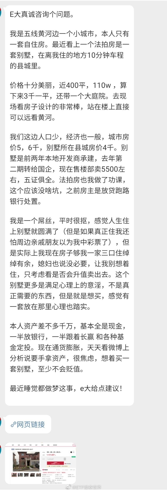

======================================================

ETF拯救世界 (5687069307) @
2021-03-24 16:48:59 Wed  
url: https://weibo.com/5687069307/K7GtvEG7s

鹅厂这个财报有没有机会明天带着恒指冲一波呢。

不用多，5%就够了。 ​​​

转发[24]  评论[484]  赞[2322] 

+++++++++++++++++++++++++++++++++++++++++++++++++++++

图片：

======================================================

ETF拯救世界 (5687069307) @
2021-03-25 07:17:10 Thu  
url: https://weibo.com/5687069307/K7M9UDlom

我一直有一个困惑，为什么我们没有出现一两家比较厉害的快消服装企业呢。

这玩意没有什么科技含量吧，总比运动鞋科技含量低吧。运动鞋都有拿得出手的几家，服装怎么就没有呢。

设计什么的，按理说也不应该缺这方面的人才啊。

不是很懂。 ​​​

转发[57]  评论[1322]  赞[4227] 

======================================================

ETF拯救世界 (5687069307) @
2021-03-26 09:38:10 Fri  
url: https://weibo.com/5687069307/K7WvDrHle

还差5厘提款。已经买了13个交易日了，资金效率太低了！ ​​​

转发[19]  评论[672]  赞[2394] 

+++++++++++++++++++++++++++++++++++++++++++++++++++++

图片：

======================================================

ETF拯救世界 (5687069307) @
2021-03-26 09:51:56 Fri  
url: https://weibo.com/5687069307/K7WBe7TJR

实时净值，又称IOPV，全称“ETF参考单位基金净值”，是交易所实时给出的ETF参考净值，方便投资者投资ETF。

一般成交活跃的ETF价格会紧随IOPV，这样我们做网格会非常舒服。有些ETF成交不活跃，但是基金公司会找做市商做市，保证价格跟随IOPV。

所以成交活跃或者做市做得好，都非常适合我们的网格交易 ​​​

转发[204]  评论[438]  赞[2076] 

======================================================

ETF拯救世界 (5687069307) @
2021-03-26 10:15:32 Fri  
url: https://weibo.com/5687069307/K7WKNFOZh

命中有时终须有，命中无时莫强求。

要么是坦然接受，要么是修改自己的做法，比如缩小网格区间。但你缩小了就一定成吗？你缩小到3%，下次人家涨到2.999%就跌回去不是一样吗。

在没有找到更合适的改进方案前，还是不要过于计较一时得失。

有得就有失，有失就有得。能量守恒，谁也不能总吃亏，就像谁也 ​​​

转发[70]  评论[721]  赞[2240] 

======================================================

ETF拯救世界 (5687069307) @
2021-03-26 10:43:01 Fri  
url: https://weibo.com/5687069307/K7WVXu2PC

你为了你的利益，千方百计的压制我，干我，非常正常，非常非常正常，我理解。

那我为了我的利益，反击，干你，这也非常正常。

这里面还扯不上什么恨不恨的，就是斗争，就是争夺。从人类诞生的那一刻起，争夺和斗争就从来没有消失过，以后也不会消失。

谁的实力强，硬实力也好，软实力也好，谁就赢， ​​​

转发[137]  评论[628]  赞[3020] 

======================================================

ETF拯救世界 (5687069307) @
2021-03-26 10:53:10 Fri  
url: https://weibo.com/5687069307/K7X057m4g

18个交易日，10%。

账户里还多了20%成本极低的底仓。

事情就是这么个事情，资金利用率比较低。 ​​​

转发[25]  评论[451]  赞[2344] 

======================================================

ETF拯救世界 (5687069307) @
2021-03-26 10:56:01 Fri  
url: https://weibo.com/5687069307/K7X1fa11k

条件单——历史记录——重新创建

啪的一下，很快啊，完事儿了！ ​​​

转发[27]  评论[643]  赞[2416] 

======================================================

ETF拯救世界 (5687069307) @
2021-03-26 11:07:01 Fri  
url: https://weibo.com/5687069307/K7X5Hujpv

你觉不觉得很有意思。

明明你买的是指数基金，结果一圈下来，指数没动，你的钱和基金都越来越多。

反而你看看新闻，去年翻番的基金，有70%、80%的持有者是亏损的。

难道不是很有意思吗。 ​​​

转发[67]  评论[742]  赞[2874] 

======================================================

ETF拯救世界 (5687069307) @
2021-03-26 12:30:08 Fri  
url: https://weibo.com/5687069307/K7XDrdiDr

我看很多朋友给我私信还没弄明白我目前公开的部分交易体系。

简单来说，分两个部分。

第一个部分是永久持仓+大周期波段的部分。这部分我推荐的是使用且慢交易。原因是场外不受当天价格冲击波动的影响，同时自动跟车不会晚点。

所谓大周期意思是买卖都需要几年时间的那种交易，比如你去看看150和S的 ​​​

转发[834]  评论[1009]  赞[4457] 

======================================================

ETF拯救世界 (5687069307) @
2021-03-26 12:43:35 Fri  
url: https://weibo.com/5687069307/K7XITBQdu

居委会开始挨家挨户提醒还没打疫苗的赶紧去打了……

我还没打的主要原因是我讨厌排队。 ​​​

转发[14]  评论[718]  赞[2340] 

======================================================

ETF拯救世界 (5687069307) @
2021-03-26 13:49:21 Fri  
url: https://weibo.com/5687069307/K7Y9B01g6

还差4%回本 ​​​

转发[15]  评论[275]  赞[1767] 

+++++++++++++++++++++++++++++++++++++++++++++++++++++

图片：
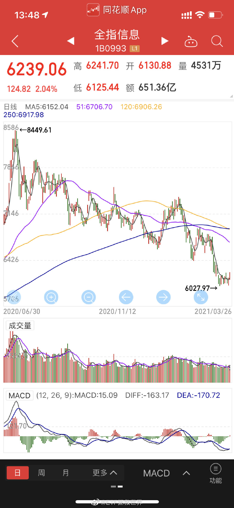

======================================================

ETF拯救世界 (5687069307) @
2021-03-26 14:02:56 Fri  
url: https://weibo.com/5687069307/K7Yf78wbU

如果你很年轻，或者你买入的并不多，那么

下跌才是最好的福报 ​​​

转发[74]  评论[591]  赞[3164] 

======================================================

ETF拯救世界 (5687069307) @
2021-03-26 14:05:00 Fri  
url: https://weibo.com/5687069307/K7YfX6IGR

如果你的网格账户没有新高我会感到很诧异。 ​​​

转发[29]  评论[642]  赞[2693] 

======================================================

ETF拯救世界 (5687069307) @
2021-03-26 19:21:36 Fri  
url: https://weibo.com/5687069307/K80ks90SN

回复@追猫抓狗:告诉我你都持有什么品种了。现在所有品种只有传媒有一网浮亏，你是怎么做到没有新高的？//@追猫抓狗:我老老实实开车的。但是的确没有新高。

------------------------------------------------------
转推：
>  @ETF拯救世界 (5687069307)
>  2021-03-26 14:05:00 Fri  
>  url: https:/weibo.com/5687069307/K7YfX6IGR/

>  如果你的网格账户没有新高我会感到很诧异。 ​​​

转发[16]  评论[535]  赞[2003] 

======================================================

ETF拯救世界 (5687069307) @
2021-03-28 17:03:37 Sun  
url: https://weibo.com/5687069307/K8ihrj4zz

有时候你事业上很强了，父母（尤其是父亲）也不会尊重你。但你只要给他们钱足够多，那尊重基本就问题不大了。如果还不尊重，那就是给的钱还不够多

------------------------------------------------------
转推：
>  @月风_投资笔记 (1670659923)
>  2021-03-27 21:34:51 Sat  
>  url: https:/weibo.com/1670659923/K8aD2hR0Q/

>  你以为我在帮老基金经理说话么？不是的，有看过以前交易门采访稿的老朋友应该还有印象。
>  
>  第一，我说过我当年运气好，2007年高点把股票卖了，后面买了房子；
>  第二，我和Rita是在网上认识的，而且她是东北人，我是浙江人，我父母一度反对我们的婚姻，我最后放弃了上海的一切，房子工作关系网，跑到北京 ​​​

转发[109]  评论[455]  赞[2686] 

======================================================

ETF拯救世界 (5687069307) @
2021-03-28 20:14:49 Sun  
url: https://weibo.com/5687069307/K8jx33pHY

看到今天外长签了25年协议，不禁感叹这本20多年前的书简直就是当代《推背图》 ​​​

转发[194]  评论[442]  赞[3799] 

+++++++++++++++++++++++++++++++++++++++++++++++++++++

图片：
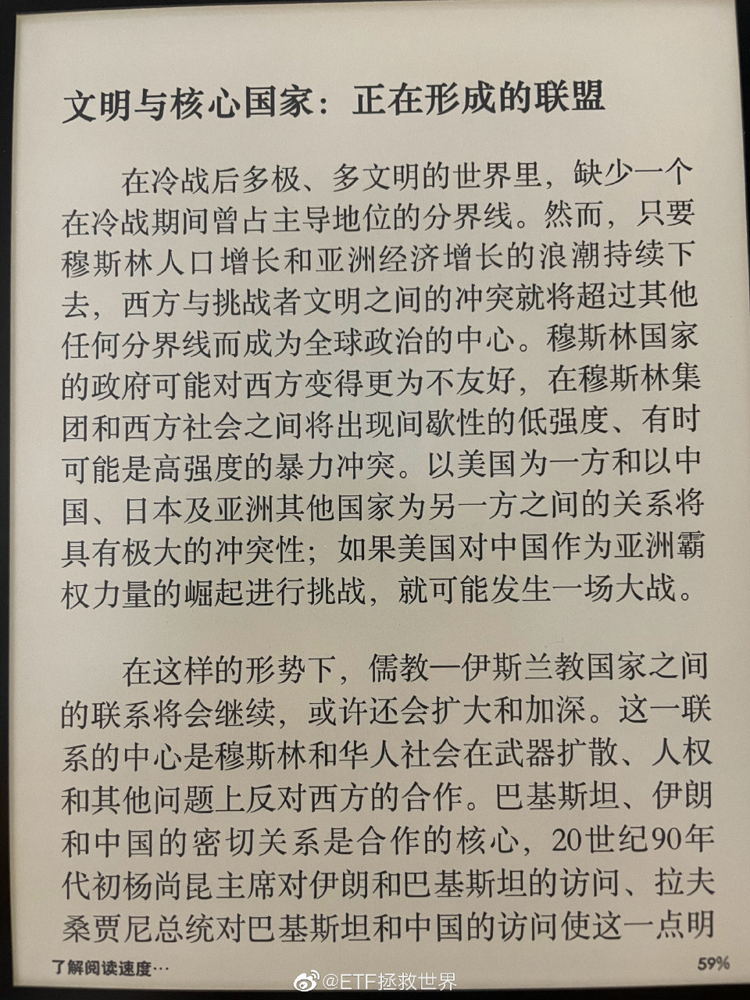

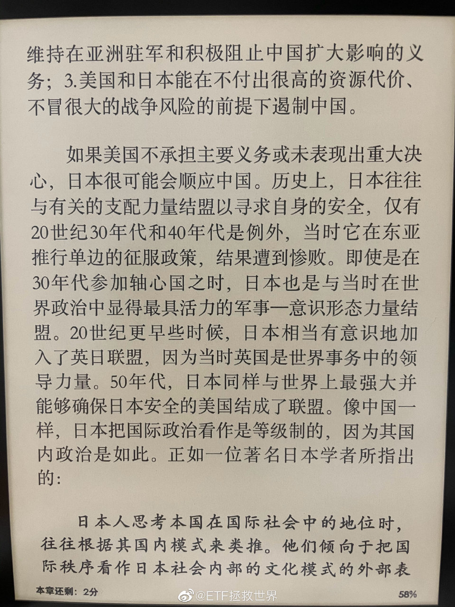

======================================================

ETF拯救世界 (5687069307) @
2021-03-29 12:17:25 Mon  
url: https://weibo.com/5687069307/K8pPLvIlL

出门记得涂防晒 ​​​

转发[15]  评论[750]  赞[2419] 

======================================================

   ETF拯救世界 (5687069307) @
   2021-03-30 09:45:04 Tue  
   url: https://weibo.com/5687069307/K8ygqhNKQ

   不知道说点什么，发个666红包吧。

http://t.cn/A6cZSp7r ​​​

   转发[32]  评论[2954]  赞[3635] 

======================================================

ETF拯救世界 (5687069307) @
2021-03-30 12:20:47 Tue  
url: https://weibo.com/5687069307/K8zhD6Pyq

“长期购买期货股票”

------------------------------------------------------
转推：
>  @ ()
>  2021-03-30 10:03:43 Tue  
>  url: 

>  抱歉，作者已设置仅展示半年内微博，此微博已不可见。 ​​​

转发[28]  评论[418]  赞[1415] 

======================================================

ETF拯救世界 (5687069307) @
2021-03-30 13:07:23 Tue  
url: https://weibo.com/5687069307/K8zAxDxj1

这几天没有好好伺候您，是因为一直有在努力工作！ ​​​

转发[33]  评论[953]  赞[2779] 

+++++++++++++++++++++++++++++++++++++++++++++++++++++

图片：
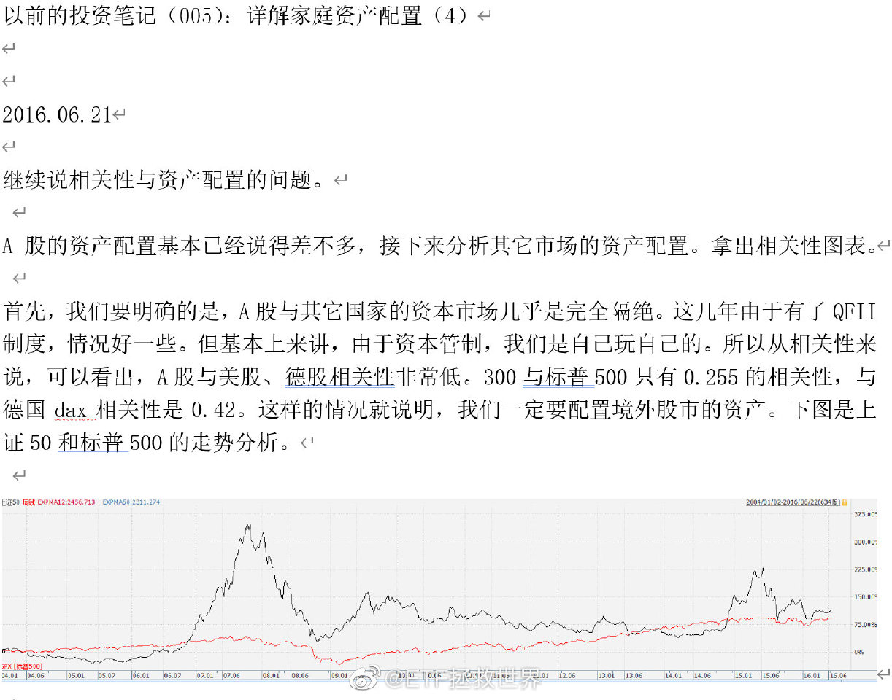
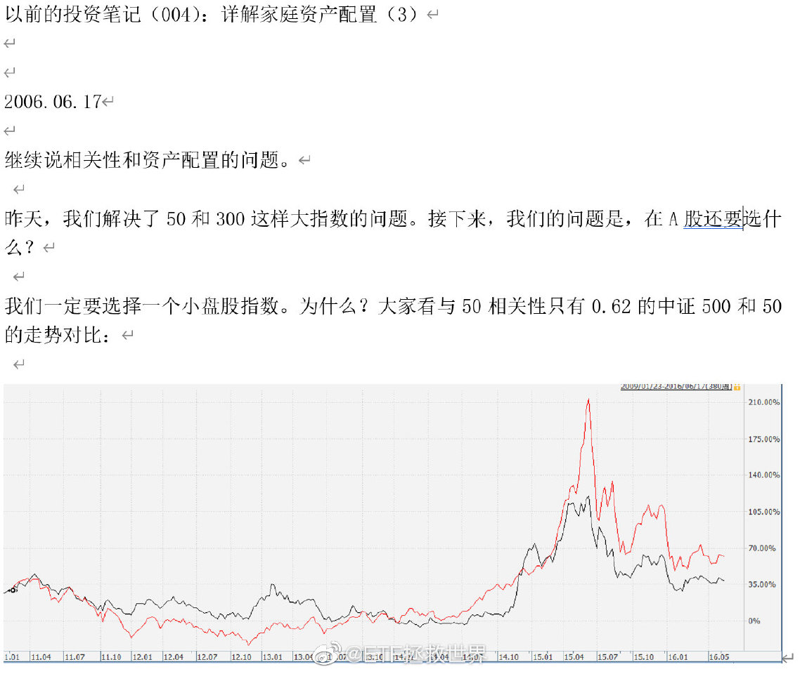

======================================================

ETF拯救世界 (5687069307) @
2021-03-30 13:19:54 Tue  
url: https://weibo.com/5687069307/K8zFDdK7d

好家伙，我直接好家伙 ​​​

转发[26]  评论[917]  赞[2922] 

+++++++++++++++++++++++++++++++++++++++++++++++++++++

图片：
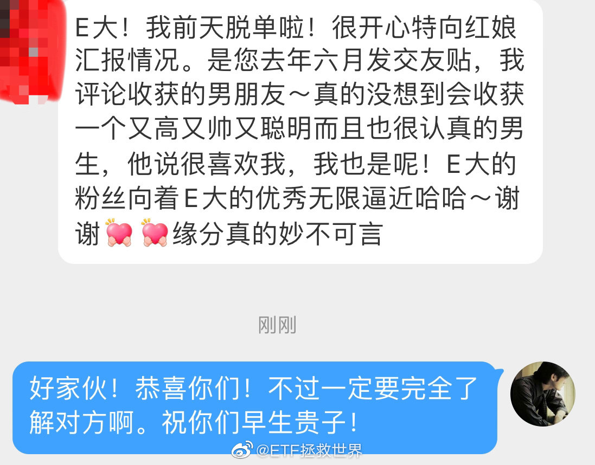
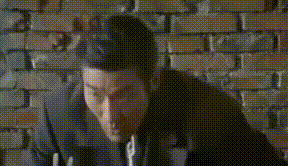

======================================================

ETF拯救世界 (5687069307) @
2021-03-30 13:44:43 Tue  
url: https://weibo.com/5687069307/K8zPHlM3F

回复@joe未赢够:废话，你们一心搞钱能成吗！  http://t.cn/A6cZ8d1z //@joe未赢够:我们群快400人了都没成一对[喵喵][喵喵]

------------------------------------------------------
转推：
>  @ETF拯救世界 (5687069307)
>  2021-03-30 13:19:54 Tue  
>  url: https:/weibo.com/5687069307/K8zFDdK7d/

>  好家伙，我直接好家伙 ​​​

转发[8]  评论[484]  赞[1389] 

======================================================

ETF拯救世界 (5687069307) @
2021-03-30 13:56:45 Tue  
url: https://weibo.com/5687069307/K8zUAcog9

我的建议：

不要加什么搞钱群。

人稍微一多，骗子就会在里面兴风作浪。更何况是搞钱群？

做投资就是自己踏踏实实做，在网上主动去吸收一些自己需要的营养。你弄个群，噼里啪啦七嘴八舌在里面，不仅耽误时间，也学不到什么有用的东西。反而因为被动信息太多，扰乱了自己的思维。

在我的认知中，搞钱 ​​​

转发[104]  评论[757]  赞[3291] 

======================================================

ETF拯救世界 (5687069307) @
2021-03-30 14:41:18 Tue  
url: https://weibo.com/5687069307/K8AcFBWSE

他的同事和老婆是真的好人。这么好的人为什么碰上这样的渣男啊。

------------------------------------------------------
转推：
>  @老板联播 (5994003317)
>  2021-03-30 11:44:56 Tue  
>  url: https:/weibo.com/5994003317/K8z3533gg/

>  【#腾讯员工赌博输近500万自杀被救#，曾留下遗书[话筒]】3月29日晚，界面新闻从接近腾讯内部的一权威渠道获悉，腾讯深圳一员工因参与网络跨境赌博输近500万，在腾讯内部论坛留了一篇遗书自杀。
>  该权威消息人士透露，自杀的员工在腾讯游戏工作。
>  自杀员工在遗书开头写道：当这篇文章出现在乐问，说明我 ​​​

转发[353]  评论[522]  赞[2509] 

======================================================

ETF拯救世界 (5687069307) @
2021-03-30 15:02:59 Tue  
url: https://weibo.com/5687069307/K8Alt3zCg

你有没有想过，你的父母其实是亿万富翁。为了怕你不努力上进，对你隐瞒了事实，只是告诉你家里是普通人家。

其实他们打算适当的时候告诉你真相。

这么想过的举手。 ​​​

转发[43]  评论[1487]  赞[4236] 

======================================================

ETF拯救世界 (5687069307) @
2021-03-31 07:06:30 Wed  
url: https://weibo.com/5687069307/K8GEyAXTw

今天是不是又要提款了 ​​​

转发[20]  评论[1358]  赞[3266] 

======================================================

ETF拯救世界 (5687069307) @
2021-03-31 09:22:51 Wed  
url: https://weibo.com/5687069307/K8HxU7UTH

我刚发现智投账户不能显示历史总盈亏，只能显示持仓品种盈亏情况。

我提一个暂时的解决办法，你参考一下：

每个品种卖出的时候不要清仓，最少留100股或者100份，这样它的盈利就体现在总盈亏中，总盈亏相对来说也就比较准确了。 ​​​

转发[43]  评论[629]  赞[2269] 

======================================================

ETF拯救世界 (5687069307) @
2021-03-31 09:41:57 Wed  
url: https://weibo.com/5687069307/K8HFExIyb

这种时候，长期仓位的增加要谨慎。

短期波段仓位吃一口就走。

我是这么想的，也是这么做的。 ​​​

转发[149]  评论[674]  赞[3101] 

======================================================

ETF拯救世界 (5687069307) @
2021-03-31 11:02:04 Wed  
url: https://weibo.com/5687069307/K8IcaF55K

资本从本质上来说就一定是贪婪的。一定是永无止境的贪婪。必须不断的扩张，不断的继续挣钱。

手里有钱了，就一定会想方设法把它投出去。至于能不能成再说。

读造车新闻的一点感受。 ​​​

转发[65]  评论[493]  赞[2822] 

======================================================

ETF拯救世界 (5687069307) @
2021-03-31 16:35:51 Wed  
url: https://weibo.com/5687069307/K8KnFeZBU

问大家一个问题：

你觉得买东西凑单满减，然后退掉凑单品，低价买入想买的东西，

这种行为对吗。你会这么做吗。 ​​​

转发[24]  评论[1405]  赞[3008] 

======================================================

ETF拯救世界 (5687069307) @
2021-03-31 16:41:42 Wed  
url: https://weibo.com/5687069307/K8Kq25xyB

最后一定会变好，如果没有变好，说明还没有到最后 ​​​

转发[42]  评论[447]  赞[2132] 

+++++++++++++++++++++++++++++++++++++++++++++++++++++

图片：

======================================================

ETF拯救世界 (5687069307) @
2021-03-31 17:15:45 Wed  
url: https://weibo.com/5687069307/K8KDR2icD

家家有本难念的经。

班主任说要给我打电话聊聊儿子的学习。

[拜拜] ​​​

转发[35]  评论[1377]  赞[5251] 

======================================================

