ETF拯救世界 (5687069307) @
2017-01-01 00:57:33 Sun  
url: https://weibo.com/5687069307/EoIz4tjKi

朋友们，新年快乐。这一年，一切都会更好。 ​​​

转发[6]  评论[80]  赞[148] 

======================================================

ETF拯救世界 (5687069307) @
2017-01-06 10:38:07 Fri  
url: https://weibo.com/5687069307/Epxvd29bt

微博独家福利 [doge] 别的地方不发。 ​​​

转发[32]  评论[99]  赞[112] 

+++++++++++++++++++++++++++++++++++++++++++++++++++++

图片：
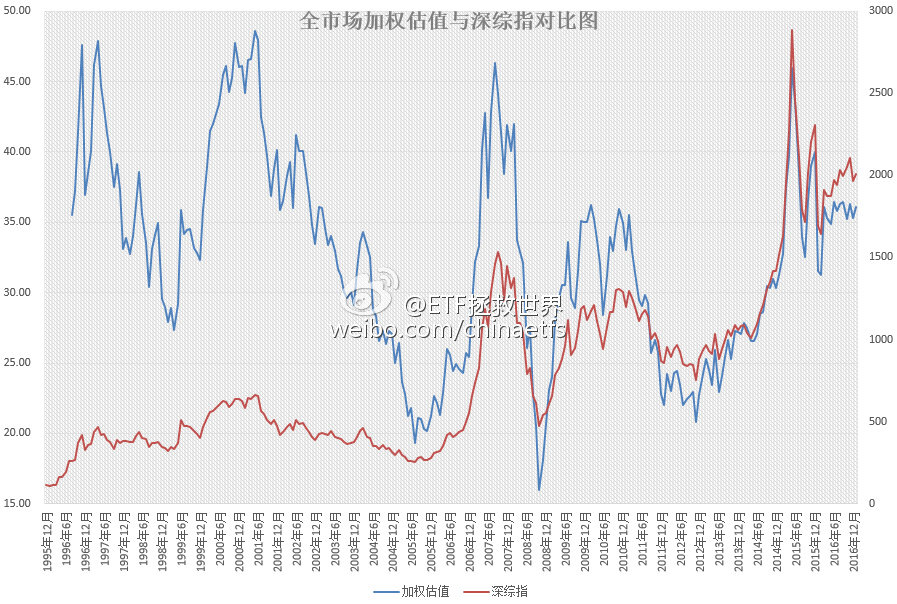

======================================================

ETF拯救世界 (5687069307) @
2017-01-06 14:47:10 Fri  
url: https://weibo.com/5687069307/Epz8j35Jp

能不能请协和的真专家说清楚，雾霾和PM2.5，到底对人体，尤其是孩子有什么伤害？还是说没有伤害？不能光辟谣不普及知识啊。

------------------------------------------------------
转推：
>  @北京协和医院 (1654801402)
>  2017-01-06 14:21:07 Fri  
>  url: https:/weibo.com/1654801402/EpyXIFls8/

>  #微博辟谣#这两天，“协和某大夫”关于雾霾的说法在微博和微信圈传疯了，感谢网友们对“协和医生说什么都是对”的认可，不过我们还是来听听真名真姓的协和专家怎么说[酷]——
>  呼吸内科的田欣伦副教授表示，“吸入身体和肺里的雾霾永远排不出去”的说法是没有科学依据的，目前的研究表明，雾霾对慢性呼 ​​​

转发[3]  评论[17]  赞[19] 

======================================================

ETF拯救世界 (5687069307) @
2017-01-11 17:50:03 Wed  
url: https://weibo.com/5687069307/Eqlt0DQdR

心疼丫丫[可怜][悲伤][泪]

------------------------------------------------------
转推：
>  @ ()
>  2017-01-10 12:18:00 Tue  
>  url: 

>  抱歉，此微博已被作者删除。查看帮助：http://t.cn/Rfd3rQV

转发[0]  评论[22]  赞[15] 

======================================================

ETF拯救世界 (5687069307) @
2017-01-12 13:37:02 Thu  
url: https://weibo.com/5687069307/EqteOhBKp

未来几年，某个时间段，很多很多人可能会体会到的一种绝望是：

满地黄金钻石，没钱买了。 ​​​

转发[32]  评论[59]  赞[86] 

======================================================

ETF拯救世界 (5687069307) @
2017-01-12 15:10:41 Thu  
url: https://weibo.com/5687069307/EqtQPnf8m

回复@行者-EnglishBreaker:这么说吧。去年重要股东减持大概在2500亿，新股发行后，连续打板接盘的资金得上千亿吧。然后是印花税、券商佣金。最重要的是定增减持。这几年定增大概超过2万亿。2015年光上半年重要股东减持就超过5000亿。你算一算，需要多少股民的小账户才能填满这些资金？

------------------------------------------------------
转推：
>  @ETF拯救世界 (5687069307)
>  2017-01-12 13:37:02 Thu  
>  url: https:/weibo.com/5687069307/EqteOhBKp/

>  未来几年，某个时间段，很多很多人可能会体会到的一种绝望是：
>  
>  满地黄金钻石，没钱买了。 ​​​

转发[13]  评论[15]  赞[31] 

======================================================

ETF拯救世界 (5687069307) @
2017-01-13 14:03:35 Fri  
url: https://weibo.com/5687069307/EqCQ5tyMD

2017年第二发已经开车了。 ​​​

转发[2]  评论[36]  赞[57] 

======================================================

ETF拯救世界 (5687069307) @
2017-01-16 09:38:46 Mon  
url: https://weibo.com/5687069307/Er3o5fUrE

贴估值图这个动作，是不是太狠了……

------------------------------------------------------
转推：
>  @ETF拯救世界 (5687069307)
>  2017-01-06 10:38:07 Fri  
>  url: https:/weibo.com/5687069307/Epxvd29bt/

>  微博独家福利 [doge] 别的地方不发。 ​​​

转发[10]  评论[46]  赞[45] 

======================================================

ETF拯救世界 (5687069307) @
2017-01-16 15:52:40 Mon  
url: https://weibo.com/5687069307/Er5PQzfAI

预先通知一下，如果24、25日不比现在高，可以准备4-5份资金。 ​​​

转发[10]  评论[51]  赞[69] 

======================================================

ETF拯救世界 (5687069307) @
2017-01-17 13:21:24 Tue  
url: https://weibo.com/5687069307/EregWD0Tm

瞧这意思，要准备十份？

------------------------------------------------------
转推：
>  @ETF拯救世界 (5687069307)
>  2017-01-16 15:52:40 Mon  
>  url: https:/weibo.com/5687069307/Er5PQzfAI/

>  预先通知一下，如果24、25日不比现在高，可以准备4-5份资金。 ​​​

转发[5]  评论[41]  赞[36] 

======================================================

ETF拯救世界 (5687069307) @
2017-01-18 15:53:43 Wed  
url: https://weibo.com/5687069307/EroHgzcLd

今天，创业板即将跌入历史最贵的60%区域。什么节奏？幸福来得如此突然。全市场等权/外部数据加权全部达到2016年2月以来最低。幸福哭了。

2017，我感觉有戏。 ​​​

转发[12]  评论[59]  赞[95] 

======================================================

ETF拯救世界 (5687069307) @
2017-01-25 09:25:30 Wed  
url: https://weibo.com/5687069307/Esq9am1vb

微博的乡亲们，开车了。

http://t.cn/RxbDcGc ​​​

转发[16]  评论[72]  赞[73] 

======================================================

ETF拯救世界 (5687069307) @
2017-01-26 10:03:54 Thu  
url: https://weibo.com/5687069307/EszPfvsKe

各位朋友，大家过年好！

提前给大家拜个年，祝各位新年身体健康、财源广进、万事如意！ 

然而，几句祝福并不是发这条消息的主要目的。我主要是想说，明天咱们发！红！包！ 

明天，也就是大年三十下午17:08，公众号会推送一张红包口令图片（推送后也会在微博贴出，不过看微博可能就慢一点）。大家准 ​​​

转发[2]  评论[91]  赞[104] 

======================================================

ETF拯救世界 (5687069307) @
2017-02-07 11:36:29 Tue  
url: https://weibo.com/5687069307/EupyN44Sq

看他的样子平平无奇……[doge]

------------------------------------------------------
转推：
>  @金融界网 (1955512572)
>  2017-02-07 11:05:50 Tue  
>  url: https:/weibo.com/1955512572/EupmluiLg/

>  为什么有钱人都爱扯蛋，撒贝宁对马云做出了一个我想做的表情，这个表情我给满分。分享图片 ​​​

转发[10]  评论[18]  赞[26] 

======================================================

ETF拯救世界 (5687069307) @
2017-02-10 14:03:52 Fri  
url: https://weibo.com/5687069307/EuSO6kox9

问：

“E大，请教您几个问题：
1、关于恒生指数、恒生国企指数，雪球我喜欢的几位股市赢家都判断进入牛市了，认为港股全球低估且持续了足够长时间，现在价值回归即将进入大牛。您的看法如何？

2、一个宽基指数有时会低估10-20年，在其低估期间可能会出现一种情况：即某一时间点的指数，在10年百分位 ​​​

转发[97]  评论[73]  赞[161] 

======================================================

ETF拯救世界 (5687069307) @
2017-02-15 10:07:44 Wed  
url: https://weibo.com/5687069307/EvCoJACbT

乡亲们，开车了。

http://t.cn/RJ0BxFI ​​​

转发[24]  评论[51]  赞[75] 

======================================================

ETF拯救世界 (5687069307) @
2017-02-19 20:13:38 Sun  
url: https://weibo.com/5687069307/Ewi4F0Vlr

谁能想到，我胡汉三又回来了！

这次待半年，全是微博独家了这次…… ​​​

转发[12]  评论[257]  赞[268] 

======================================================

ETF拯救世界 (5687069307) @
2017-02-20 09:38:33 Mon  
url: https://weibo.com/5687069307/EwnlniKgF

发布了头条文章：《一些小感悟（一）》 http://t.cn/RJBEtcU ​​​

转发[35]  评论[132]  赞[206] 

======================================================

ETF拯救世界 (5687069307) @
2017-02-20 09:56:51 Mon  
url: https://weibo.com/5687069307/EwnsNEkpI

恒生ETF本人将继续坚定持有（极小仓位做动态平衡）。

在一个上涨趋势中，正常人根本没法预计到底会涨到哪里。所以这种并非极端高估的地方，咱们能做的只能是持有手中极度便宜的筹码，适当做些动态平衡。

正常情况下，长远看，指数一定是不断新高。相比于坐电梯可能带来的波动风险，更大的风险，是随 ​​​

转发[73]  评论[101]  赞[105] 

======================================================

ETF拯救世界 (5687069307) @
2017-02-20 10:23:18 Mon  
url: https://weibo.com/5687069307/EwnDxptn2

回复@Simon_Mia:个人认为你首先要抛弃的是“预测”的想法。我个人浅见，投资不能预测，只能靠概率下注。赢得概率低不下注，赢的概率高下重注。我的投资系统里，是随着“估值”的下降，就会认为买入赢的概率比较高，会逐渐加大买入力度。所以你的问题我总结，应该是估值越低，加仓力度越大。

------------------------------------------------------
转推：
>  @ETF拯救世界 (5687069307)
>  2017-02-20 09:56:51 Mon  
>  url: https:/weibo.com/5687069307/EwnsNEkpI/

>  恒生ETF本人将继续坚定持有（极小仓位做动态平衡）。
>  
>  在一个上涨趋势中，正常人根本没法预计到底会涨到哪里。所以这种并非极端高估的地方，咱们能做的只能是持有手中极度便宜的筹码，适当做些动态平衡。
>  
>  正常情况下，长远看，指数一定是不断新高。相比于坐电梯可能带来的波动风险，更大的风险，是随 ​​​

转发[9]  评论[25]  赞[47] 

======================================================

ETF拯救世界 (5687069307) @
2017-02-20 10:35:09 Mon  
url: https://weibo.com/5687069307/EwnIly5ze

回复@四维:这个根本原因还是你没有对公司正确估值，不知道值多少钱，所以拿不住。这也是投资个股特别难的一个原因。你很难判断一家公司到底什么时候便宜，什么时候贵。所以我们另辟蹊径，研究指数估值。于是，世界瞬间明亮起来了。

------------------------------------------------------
转推：
>  @ETF拯救世界 (5687069307)
>  2017-02-20 09:56:51 Mon  
>  url: https:/weibo.com/5687069307/EwnsNEkpI/

>  恒生ETF本人将继续坚定持有（极小仓位做动态平衡）。
>  
>  在一个上涨趋势中，正常人根本没法预计到底会涨到哪里。所以这种并非极端高估的地方，咱们能做的只能是持有手中极度便宜的筹码，适当做些动态平衡。
>  
>  正常情况下，长远看，指数一定是不断新高。相比于坐电梯可能带来的波动风险，更大的风险，是随 ​​​

转发[19]  评论[14]  赞[48] 

======================================================

ETF拯救世界 (5687069307) @
2017-02-20 10:40:51 Mon  
url: https://weibo.com/5687069307/EwnKFr5i0

回复@mydxkl:个股代表的是背后的公司。每一家公司都在经历不同的成长阶段，出生，快速成长，稳定，衰退……每一个阶段的估值都不应该相同。再加上不同行业的估值也不同，还有公司产品、管理层、科技发展……对个股估值真的特别特别难。难度远超一般人的想象。所以投资个股，如果是看估值最好一眼看胖瘦

------------------------------------------------------
转推：
>  @ETF拯救世界 (5687069307)
>  2017-02-20 09:56:51 Mon  
>  url: https:/weibo.com/5687069307/EwnsNEkpI/

>  恒生ETF本人将继续坚定持有（极小仓位做动态平衡）。
>  
>  在一个上涨趋势中，正常人根本没法预计到底会涨到哪里。所以这种并非极端高估的地方，咱们能做的只能是持有手中极度便宜的筹码，适当做些动态平衡。
>  
>  正常情况下，长远看，指数一定是不断新高。相比于坐电梯可能带来的波动风险，更大的风险，是随 ​​​

转发[6]  评论[32]  赞[41] 

======================================================

ETF拯救世界 (5687069307) @
2017-02-20 13:59:23 Mon  
url: https://weibo.com/5687069307/Ewp3flGtw

看了一下，现在的重要股东减持真的比前几个月少很多了。

2月至今，只有40亿左右的净减持。

减持是10家，80亿。客观的说，跟以前比，不多。看了眼去年11月，前20天减持家数321家，减持金额210亿。

所以价格降下来了，重要股东减持冲动才会减少。而不是用各种手段去限制。

越高估，跑得越快~慢慢的股 ​​​

转发[6]  评论[29]  赞[62] 

======================================================

ETF拯救世界 (5687069307) @
2017-02-20 14:10:56 Mon  
url: https://weibo.com/5687069307/Ewp7W5jOV

提醒各位，逆回购价格起来了。 ​​​

转发[2]  评论[61]  赞[62] 

======================================================

ETF拯救世界 (5687069307) @
2017-02-20 15:18:26 Mon  
url: https://weibo.com/5687069307/EwpzkCcHu

计划继续新高。

持仓品种中，持仓量前三的恒生新高，50和红利即将新高。其他品种距离新高还比较远。

唯一的问题是仓位较低，但模型给出的仓位就是这么多，只能严格执行。觉得自己仓位低的朋友，就像一直说的一样，完全可以把计划中的货基仓位换成任何想持有的品种~ ​​​

转发[14]  评论[93]  赞[77] 

+++++++++++++++++++++++++++++++++++++++++++++++++++++

图片：
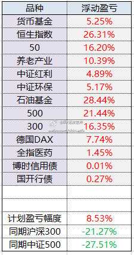

======================================================

ETF拯救世界 (5687069307) @
2017-02-20 16:29:05 Mon  
url: https://weibo.com/5687069307/Ewq20zF65

回复@非衣海王山而:赶紧举报。。这种太多了。以后哪位朋友碰到这种冒牌货就赶紧举报啊。 //@非衣海王山而:微博有个：ETF拯救世界i  和  ETF-拯救世界-  不是你的小号吧？好像在骗人，E大赶紧管管。

------------------------------------------------------
转推：
>  @ETF拯救世界 (5687069307)
>  2017-02-20 15:18:26 Mon  
>  url: https:/weibo.com/5687069307/EwpzkCcHu/

>  计划继续新高。
>  
>  持仓品种中，持仓量前三的恒生新高，50和红利即将新高。其他品种距离新高还比较远。
>  
>  唯一的问题是仓位较低，但模型给出的仓位就是这么多，只能严格执行。觉得自己仓位低的朋友，就像一直说的一样，完全可以把计划中的货基仓位换成任何想持有的品种~ ​​​

转发[4]  评论[25]  赞[34] 

======================================================

ETF拯救世界 (5687069307) @
2017-02-21 09:01:54 Tue  
url: https://weibo.com/5687069307/EwwwZBLeL

图一：截至目前，计划持仓品种的相关性分析。

图二：第三轮开始的20个月以来，18个月取得正收益。 ​​​

转发[28]  评论[82]  赞[102] 

+++++++++++++++++++++++++++++++++++++++++++++++++++++

图片：
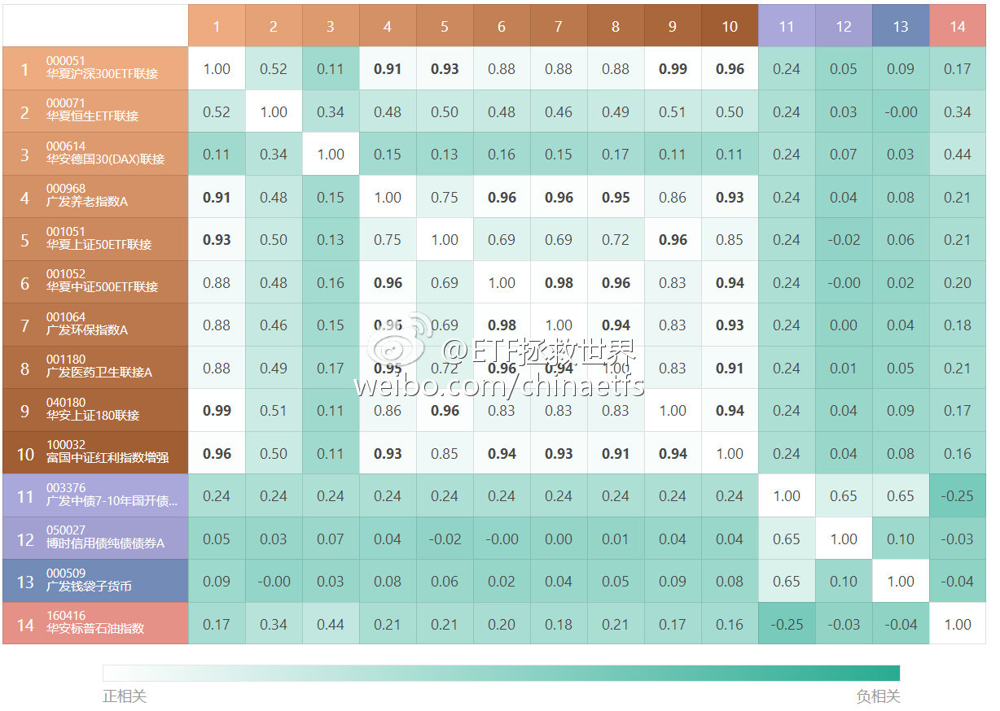
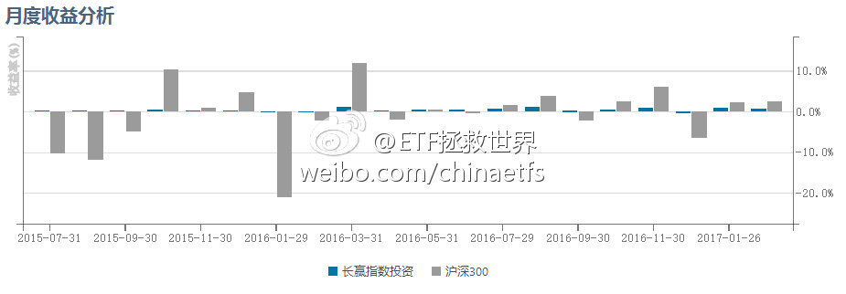

======================================================

ETF拯救世界 (5687069307) @
2017-02-21 10:23:46 Tue  
url: https://weibo.com/5687069307/Ewx4e6xhd

A股现在已经有3100多只股票了。在可预见的2-3年内，恐怕总量有可能突破4000只。

再过几年，5000只股票也许不是梦。

这样，炒股票的人也许会面临从未碰到过的危险：你买的股票，有可能十年、二十年都不涨。

A股之所以长年高估，就是因为钱多，自由流通的股票太少。随着IPO解禁，定增解禁，IPO上市， ​​​

转发[91]  评论[99]  赞[143] 

======================================================

ETF拯救世界 (5687069307) @
2017-02-21 14:38:21 Tue  
url: https://weibo.com/5687069307/EwyJyEyXO

今天 养老产业399812 接过50红利的大旗继续领涨。

我本人非常喜欢这个指数。它是一个“消费+医药+娱乐”的NB指数，代表未来发展的方向。更何况，它是我最喜欢的等权编制。这样，平安人寿这样的大家伙就无法让它步履蹒跚了。 ​​​

转发[57]  评论[121]  赞[134] 

======================================================

ETF拯救世界 (5687069307) @
2017-02-22 08:57:14 Wed  
url: https://weibo.com/5687069307/EwFVBaNUp

昨天跟一个做期货的朋友聊天。

哥们开奔驰，拉顺风车（[喵喵][doge]），已婚。有一天拉到一个从上海来北京也不知道出差还是玩的姑娘。

然后就情投意合了，Hotel California，此处略去500字。

姑娘说，好喜欢你，你离婚我就跟你在一起。

哥们感觉爱情呼叫转移到自己这里了，马上回家跟发妻离婚。然 ​​​

转发[17]  评论[168]  赞[66] 

======================================================

ETF拯救世界 (5687069307) @
2017-02-22 09:22:14 Wed  
url: https://weibo.com/5687069307/EwG5KdKXF

回复@奥斯特洛夫大柴夫斯基:德国那边已经新高了。513030还有点折价。计划里的品种基本上都在走向新高的路上 //@奥斯特洛夫大柴夫斯基:德国30  今天高开...............................牛逼

------------------------------------------------------
转推：
>  @ETF拯救世界 (5687069307)
>  2017-02-22 08:57:14 Wed  
>  url: https:/weibo.com/5687069307/EwFVBaNUp/

>  昨天跟一个做期货的朋友聊天。
>  
>  哥们开奔驰，拉顺风车（[喵喵][doge]），已婚。有一天拉到一个从上海来北京也不知道出差还是玩的姑娘。
>  
>  然后就情投意合了，Hotel California，此处略去500字。
>  
>  姑娘说，好喜欢你，你离婚我就跟你在一起。
>  
>  哥们感觉爱情呼叫转移到自己这里了，马上回家跟发妻离婚。然 ​​​

转发[6]  评论[33]  赞[33] 

======================================================

ETF拯救世界 (5687069307) @
2017-02-22 11:13:22 Wed  
url: https://weibo.com/5687069307/EwGOR4nWe

讲真，为了一点信用卡积分，和“低价”租房就把特首关20个月，还真是有点震惊的……

------------------------------------------------------
转推：
>  @ ()
>  2017-02-22 11:03:36 Wed  
>  url: 

>  该账号因被投诉违反《微博社区公约》的相关规定，现已无法查看。查看帮助 https://kefu.weibo.com/faqdetail?id=13216

转发[6]  评论[60]  赞[39] 

======================================================

ETF拯救世界 (5687069307) @
2017-02-23 09:14:03 Thu  
url: https://weibo.com/5687069307/EwPsV9YAj

小时候都听过“龟兔赛跑”的故事。长大了，很多人就忘了。

无论市场怎么波动、如何暴跌，净值曲线一路向上。找到机会果断出击，买了就要赢，就要赚。

当然了，现在的这点收益率，并不是我们追求的。时候未到而已。

三年不鸣，不鸣则已，一鸣惊人。

爆发式的增长，你我终究会看到。 ​​​

转发[33]  评论[105]  赞[97] 

+++++++++++++++++++++++++++++++++++++++++++++++++++++

图片：

======================================================

ETF拯救世界 (5687069307) @
2017-02-23 10:04:21 Thu  
url: https://weibo.com/5687069307/EwPNl4fWT

回复@小国诸侯:感觉错误。是因为来微博，关注的人少了十万，说话自由，放飞自我了。 //@小国诸侯:E大最近话多了，怎么我觉得你内心不平静了[黑线]

------------------------------------------------------
转推：
>  @ETF拯救世界 (5687069307)
>  2017-02-23 09:14:03 Thu  
>  url: https:/weibo.com/5687069307/EwPsV9YAj/

>  小时候都听过“龟兔赛跑”的故事。长大了，很多人就忘了。
>  
>  无论市场怎么波动、如何暴跌，净值曲线一路向上。找到机会果断出击，买了就要赢，就要赚。
>  
>  当然了，现在的这点收益率，并不是我们追求的。时候未到而已。
>  
>  三年不鸣，不鸣则已，一鸣惊人。
>  
>  爆发式的增长，你我终究会看到。 ​​​

转发[4]  评论[46]  赞[46] 

======================================================

ETF拯救世界 (5687069307) @
2017-02-23 11:05:19 Thu  
url: https://weibo.com/5687069307/EwQc5cFYS

回复@领悟ing_皮妹儿:证券B，分级基金里面的激进子基金。长期持有必死无疑。正常市场情况下，最多6、7年死一次。碰上大牛市上折后死的更快。下折是净值跌到0.25就要4份合并成1份，然后从1块钱继续跌，跌倒0.25再合一次。长期看，死无葬身之地。优势是牛市涨得好，自带1-5倍杠杆。咱们买的没这这个问题

------------------------------------------------------
转推：
>  @ETF拯救世界 (5687069307)
>  2017-02-23 09:14:03 Thu  
>  url: https:/weibo.com/5687069307/EwPsV9YAj/

>  小时候都听过“龟兔赛跑”的故事。长大了，很多人就忘了。
>  
>  无论市场怎么波动、如何暴跌，净值曲线一路向上。找到机会果断出击，买了就要赢，就要赚。
>  
>  当然了，现在的这点收益率，并不是我们追求的。时候未到而已。
>  
>  三年不鸣，不鸣则已，一鸣惊人。
>  
>  爆发式的增长，你我终究会看到。 ​​​

转发[13]  评论[41]  赞[38] 

======================================================

ETF拯救世界 (5687069307) @
2017-02-23 13:16:55 Thu  
url: https://weibo.com/5687069307/EwR3v5oBY

$159938 广发医药  你终于舍得动动了，孽障。 ​​​

转发[5]  评论[31]  赞[49] 

======================================================

ETF拯救世界 (5687069307) @
2017-02-23 13:28:02 Thu  
url: https://weibo.com/5687069307/EwR80B215

回复@上头云:不是。我已经说过无数次了，每个人的仓位都一定要设计到“涨跌都舒服”的程度。因为每个人情况不同，我不可能给大家设计仓位。但是各位朋友自己应该知道，什么仓位是自己“涨跌都舒服”的。我自己的仓位很舒服，所以我涨跌都高兴。不高兴的只有一种情况，每天心电图一样的走势。

------------------------------------------------------
转推：
>  @ETF拯救世界 (5687069307)
>  2017-02-23 13:16:55 Thu  
>  url: https:/weibo.com/5687069307/EwR3v5oBY/

>  $159938 广发医药  你终于舍得动动了，孽障。 ​​​

转发[3]  评论[19]  赞[34] 

======================================================

ETF拯救世界 (5687069307) @
2017-02-23 13:39:03 Thu  
url: https://weibo.com/5687069307/EwRcu5fHR

为什么总能买到阶段底，看起来真是个谜。

注意医药的买入点 ​​​

转发[24]  评论[107]  赞[93] 

+++++++++++++++++++++++++++++++++++++++++++++++++++++

图片：
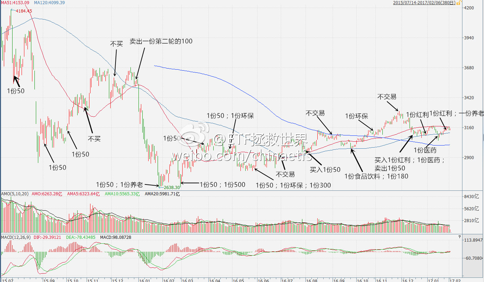

======================================================

ETF拯救世界 (5687069307) @
2017-02-24 09:46:09 Fri  
url: https://weibo.com/5687069307/EwZ6rxDia

“股票是长期来看收益率最多的投资品种”。这句著名的名言，从超长期来看，是对的。可惜，从中短期来看，未必如此。这个中短期的概念，有可能会长达10年。

比如说上证指数和沪深300，不要说你买在07年最高点的6000点，就说你是07年4月买入，那时候也就3000多点，到现在，依然没赚什么钱。要知道，十年 ​​​

转发[52]  评论[98]  赞[122] 

======================================================

ETF拯救世界 (5687069307) @
2017-02-24 09:49:56 Fri  
url: https://weibo.com/5687069307/EwZ7ZirWQ

$全指医药 sh000991$   1月16日买入计划的朋友，可以说是股神了。 ​​​

转发[6]  评论[71]  赞[50] 

======================================================

ETF拯救世界 (5687069307) @
2017-02-24 10:11:37 Fri  
url: https://weibo.com/5687069307/EwZgMukOL

养老和医药这种，未来两个月非常关键。因为年报+季报披露了。能不能多买点，就看未来这两个月。今天养老继续给力。2月计划买入品种。

------------------------------------------------------
转推：
>  @ETF拯救世界 (5687069307)
>  2017-02-21 14:38:21 Tue  
>  url: https:/weibo.com/5687069307/EwyJyEyXO/

>  今天 养老产业399812 接过50红利的大旗继续领涨。
>  
>  我本人非常喜欢这个指数。它是一个“消费+医药+娱乐”的NB指数，代表未来发展的方向。更何况，它是我最喜欢的等权编制。这样，平安人寿这样的大家伙就无法让它步履蹒跚了。 ​​​

转发[11]  评论[70]  赞[66] 

======================================================

ETF拯救世界 (5687069307) @
2017-02-27 10:05:41 Mon  
url: https://weibo.com/5687069307/ExrvRv8sK

如果是投资类的音频栏目，各位最想听的是哪方面的内容？ ​​​

转发[14]  评论[224]  赞[73] 

======================================================

ETF拯救世界 (5687069307) @
2017-02-27 15:48:03 Mon  
url: https://weibo.com/5687069307/ExtKPtf8c

很多朋友关心这个月能不能开车。其实我也很关心，不过得看明天收盘后的估值，然后放入模型，再看能不能开。

如果不弄清楚车况路况，闭着眼睛开，很容易翻车。

毕竟开车也要遵守基本投资法丫。

从今天的情况看，可开可不开，边缘状态吧。 ​​​

转发[11]  评论[88]  赞[78] 

======================================================

ETF拯救世界 (5687069307) @
2017-02-28 09:23:06 Tue  
url: https://weibo.com/5687069307/ExAF4E8a5

我回答了@穿越30年 的问题，问题价值￥49.00，欢迎大家围观~如果提问人可以拿回大部分费用，以后就继续回答…… http://t.cn/Ri5Re26 ​​​

转发[480]  评论[274]  赞[348] 

======================================================

ETF拯救世界 (5687069307) @
2017-02-28 09:49:38 Tue  
url: https://weibo.com/5687069307/ExAPQrhES

回复@Yanb丶:提问的朋友能挣钱，这就最好了。我特别希望提问的朋友能挣钱，这样大家就会想一些真正的好问题来提问。有了好问题才会有好回答，围观的朋友也会真的受益。 //@Yanb丶:估计还能提问题的赚钱。。。

------------------------------------------------------
转推：
>  @ETF拯救世界 (5687069307)
>  2017-02-28 09:23:06 Tue  
>  url: https:/weibo.com/5687069307/ExAF4E8a5/

>  我回答了@穿越30年 的问题，问题价值￥49.00，欢迎大家围观~如果提问人可以拿回大部分费用，以后就继续回答…… http://t.cn/Ri5Re26 ​​​

转发[7]  评论[13]  赞[19] 

======================================================

ETF拯救世界 (5687069307) @
2017-02-28 09:59:13 Tue  
url: https://weibo.com/5687069307/ExATJxVvQ

一个问题，完美闭环，皆大欢喜。各位看了分享，积了善缘。[耶] ​​​

转发[8]  评论[35]  赞[121] 

+++++++++++++++++++++++++++++++++++++++++++++++++++++

图片：

======================================================

ETF拯救世界 (5687069307) @
2017-02-28 10:42:29 Tue  
url: https://weibo.com/5687069307/ExBbj11Ny

如果不大跌，就别跌。否则这车可开可不开弄得很尴尬。 ​​​

转发[2]  评论[64]  赞[50] 

======================================================

ETF拯救世界 (5687069307) @
2017-02-28 15:27:51 Tue  
url: https://weibo.com/5687069307/ExD3870sy

恒生估值已经到了2013年2月以来最高。

这个情况持有是没问题的，但现在还在忽悠别人去买港股的人，不厚道。 ​​​

转发[17]  评论[66]  赞[87] 

======================================================

ETF拯救世界 (5687069307) @
2017-02-28 17:06:31 Tue  
url: https://weibo.com/5687069307/ExDHb5niT

回复@Ponder735:早上开的问答，现在有21个问题。我想了想，以后最多每两天回答一个问题。主要是替朋友们的钱袋子着想……毕竟1块钱…… //@Ponder735:E大就回答一个吗，看来我要的答案又没有了[二哈]

------------------------------------------------------
转推：
>  @ETF拯救世界 (5687069307)
>  2017-02-28 09:23:06 Tue  
>  url: https:/weibo.com/5687069307/ExAF4E8a5/

>  我回答了@穿越30年 的问题，问题价值￥49.00，欢迎大家围观~如果提问人可以拿回大部分费用，以后就继续回答…… http://t.cn/Ri5Re26 ​​​

转发[3]  评论[31]  赞[24] 

======================================================

ETF拯救世界 (5687069307) @
2017-03-01 10:36:44 Wed  
url: https://weibo.com/5687069307/ExKzst2sy

休息一次，不开车。

http://t.cn/RiVuKUg ​​​

转发[20]  评论[57]  赞[60] 

======================================================

ETF拯救世界 (5687069307) @
2017-03-01 14:35:02 Wed  
url: https://weibo.com/5687069307/ExM8bubEK

今天在雪球上看见有个问题：“你认为，最适合中国股市的投资方法是什么？”

有人说，“指数定投。”被提问人打赏了。

对不起，我要说个事实恐怕会打击这样想的人：

2007年3月至今，如果你定投沪深300，那么十年总收益率只有27%。知道年化多少吗？

不到3%。

比不上货币基金。

当然，有可能未来沪 ​​​

转发[88]  评论[104]  赞[135] 

======================================================

ETF拯救世界 (5687069307) @
2017-03-01 14:50:14 Wed  
url: https://weibo.com/5687069307/ExMem9Qjv

这还不完全是因为沪深300弱的原因。我又计算了创业板开板以来定投的收益率，7年65%，年化9%左右。是不是觉得挺不错了？sorry，现在创业板估值70多倍。可以预见的未来是，就这么定投下去，未来年化收益率会越来越低，开始十年甚至十五年后年化收益率不超过5%很正常。 还是那句话，不要买贵的东西！

------------------------------------------------------
转推：
>  @ETF拯救世界 (5687069307)
>  2017-03-01 14:35:02 Wed  
>  url: https:/weibo.com/5687069307/ExM8bubEK/

>  今天在雪球上看见有个问题：“你认为，最适合中国股市的投资方法是什么？”
>  
>  有人说，“指数定投。”被提问人打赏了。
>  
>  对不起，我要说个事实恐怕会打击这样想的人：
>  
>  2007年3月至今，如果你定投沪深300，那么十年总收益率只有27%。知道年化多少吗？
>  
>  不到3%。
>  
>  比不上货币基金。
>  
>  当然，有可能未来沪 ​​​

转发[17]  评论[40]  赞[67] 

======================================================

ETF拯救世界 (5687069307) @
2017-03-02 08:42:22 Thu  
url: https://weibo.com/5687069307/ExTfxfpI8

后台有26个问答问题，只能选一个，有几个问题真的都不错，选哪个好纠结！[生病] ​​​

转发[0]  评论[30]  赞[28] 

======================================================

ETF拯救世界 (5687069307) @
2017-03-02 09:42:39 Thu  
url: https://weibo.com/5687069307/ExTE0ih2z

我回答了@Ellison_du 的问题，问题价值￥49.00。全文共1945字。哥们，希望你能把提问的钱赚回来，如果能跟上一个哥们一样赚200多就更好了！上帝保佑你！ http://t.cn/RitzT1o ​​​

转发[559]  评论[216]  赞[561] 

======================================================

ETF拯救世界 (5687069307) @
2017-03-02 09:46:29 Thu  
url: https://weibo.com/5687069307/ExTFyCz8V

$159920 恒生ETF
$513030 德国DAX

又快新高了。资产配置，朋友们，敲黑板。 ​​​

转发[2]  评论[42]  赞[56] 

======================================================

ETF拯救世界 (5687069307) @
2017-03-02 10:23:20 Thu  
url: https://weibo.com/5687069307/ExTUwdCy4

好了，回答了两个问题，新鲜劲过去了。

以后除非有特别好的问题，不回答了。

继续加善缘。 ​​​

转发[0]  评论[16]  赞[56] 

+++++++++++++++++++++++++++++++++++++++++++++++++++++

图片：

======================================================

ETF拯救世界 (5687069307) @
2017-03-02 10:38:14 Thu  
url: https://weibo.com/5687069307/ExU0ztiqB

回复@手机用户2503440233:分成两部分。一个分成150份，一个按照每个月投入。把自己想象成两个人就行了。

------------------------------------------------------
转推：
>  @ETF拯救世界 (5687069307)
>  2017-03-02 09:42:39 Thu  
>  url: https:/weibo.com/5687069307/ExTE0ih2z/

>  我回答了@Ellison_du 的问题，问题价值￥49.00。全文共1945字。哥们，希望你能把提问的钱赚回来，如果能跟上一个哥们一样赚200多就更好了！上帝保佑你！ http://t.cn/RitzT1o ​​​

转发[6]  评论[12]  赞[26] 

======================================================

ETF拯救世界 (5687069307) @
2017-03-02 12:50:02 Thu  
url: https://weibo.com/5687069307/ExUS47jjg

午饭吃什么？ ​​​

转发[1]  评论[56]  赞[40] 

+++++++++++++++++++++++++++++++++++++++++++++++++++++

图片：

======================================================

ETF拯救世界 (5687069307) @
2017-03-02 14:32:25 Thu  
url: https://weibo.com/5687069307/ExVxCs4IX

“不买就跌”的魔咒又要应验了吗……

不过这次应该不会跌。毕竟要开会…… ​​​

转发[15]  评论[37]  赞[42] 

+++++++++++++++++++++++++++++++++++++++++++++++++++++

图片：
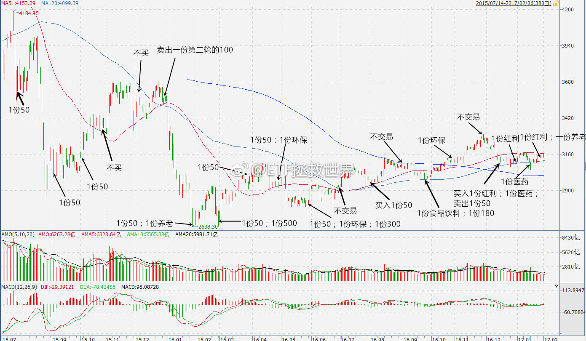

======================================================

ETF拯救世界 (5687069307) @
2017-03-02 14:46:43 Thu  
url: https://weibo.com/5687069307/ExVDqmO8i

之前在雪球看到某位私募大师说，特别喜欢Sun hb，Jia yt这样的人。敢闯，敢干。有梦想，胆子大。

但是不知道为什么，我就特别害怕这种人。起风的时候玩命加杠杆融资干“大事”，然后就出问题。然后再来一轮……类似的还有Heng d，Yao zh……

我特别喜欢扎克伯格、巴菲特、比尔盖茨这种企业家，还有类 ​​​

转发[19]  评论[57]  赞[77] 

+++++++++++++++++++++++++++++++++++++++++++++++++++++

图片：

======================================================

ETF拯救世界 (5687069307) @
2017-03-02 15:27:41 Thu  
url: https://weibo.com/5687069307/ExVU3kOLI

历史上A股整体收益率徘徊在2附近或以下的时间，最长的是2000年3月-2002年10月。也就2年半。之后就是茫茫阴跌到2005，1000点，股票收益率变得极高。

这一次从2015年4月到现在，也快两年了。这么高估值，维持这么长时间，在A股历史上极为罕见，有希望突破之前的记录。

现在债券收益率已经向正常回归， ​​​

转发[40]  评论[73]  赞[78] 

+++++++++++++++++++++++++++++++++++++++++++++++++++++

图片：
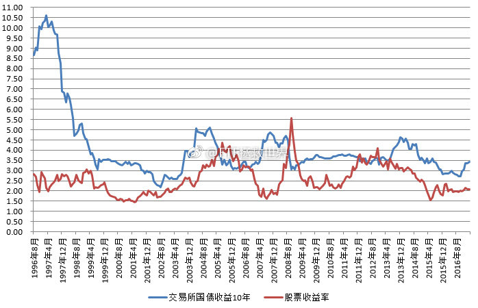

======================================================

ETF拯救世界 (5687069307) @
2017-03-02 16:00:29 Thu  
url: https://weibo.com/5687069307/ExW7mEAsW

数据出来了。只要这两个礼拜某指数不涨，月中开车。确认了。 ​​​

转发[6]  评论[73]  赞[92] 

======================================================

ETF拯救世界 (5687069307) @
2017-03-03 09:31:52 Fri  
url: https://weibo.com/5687069307/Ey307CBgU

计划不开车就是这个结果。我也很无奈呀。

------------------------------------------------------
转推：
>  @ETF拯救世界 (5687069307)
>  2017-03-02 14:32:25 Thu  
>  url: https:/weibo.com/5687069307/ExVxCs4IX/

>  “不买就跌”的魔咒又要应验了吗……
>  
>  不过这次应该不会跌。毕竟要开会…… ​​​

转发[6]  评论[21]  赞[22] 

======================================================

ETF拯救世界 (5687069307) @
2017-03-03 09:32:32 Fri  
url: https://weibo.com/5687069307/Ey30opMOJ

毛估估薯片中午要停牌 ​​​

转发[2]  评论[32]  赞[37] 

======================================================

ETF拯救世界 (5687069307) @
2017-03-03 09:41:58 Fri  
url: https://weibo.com/5687069307/Ey34ejgQs

我自己都害怕了！不能每次都这么灵啊。好吧，这样，如果跌得够猛，下周加车…… //@ETF拯救世界:计划不开车就是这个结果。我也很无奈呀。

------------------------------------------------------
转推：
>  @ETF拯救世界 (5687069307)
>  2017-03-02 14:32:25 Thu  
>  url: https:/weibo.com/5687069307/ExVxCs4IX/

>  “不买就跌”的魔咒又要应验了吗……
>  
>  不过这次应该不会跌。毕竟要开会…… ​​​

转发[5]  评论[31]  赞[29] 

======================================================

ETF拯救世界 (5687069307) @
2017-03-03 09:51:59 Fri  
url: https://weibo.com/5687069307/Ey38imEcD

回复@小狗上马路:不是。是择估值。举个例子吧。你太太想买个爱马仕的包，到商场一看，不打折，转身走了。第二天听说打折了，你贤惠的太太说，嗯，那就等折扣再高一点就去买一个。——你太太并没有在择时，而是择价值而已。 //@小狗上马路:E哥，这算择时么？虽然开车很高兴

------------------------------------------------------
转推：
>  @ETF拯救世界 (5687069307)
>  2017-03-02 14:32:25 Thu  
>  url: https:/weibo.com/5687069307/ExVxCs4IX/

>  “不买就跌”的魔咒又要应验了吗……
>  
>  不过这次应该不会跌。毕竟要开会…… ​​​

转发[1]  评论[16]  赞[29] 

======================================================

ETF拯救世界 (5687069307) @
2017-03-03 10:56:07 Fri  
url: https://weibo.com/5687069307/Ey3yk3dG6

不让买我们就不买了。[拜拜] //@ETF拯救世界:我自己都害怕了！不能每次都这么灵啊。好吧，这样，如果跌得够猛，下周加车…… //@ETF拯救世界:计划不开车就是这个结果。我也很无奈呀。

------------------------------------------------------
转推：
>  @ETF拯救世界 (5687069307)
>  2017-03-02 14:32:25 Thu  
>  url: https:/weibo.com/5687069307/ExVxCs4IX/

>  “不买就跌”的魔咒又要应验了吗……
>  
>  不过这次应该不会跌。毕竟要开会…… ​​​

转发[2]  评论[25]  赞[33] 

======================================================

ETF拯救世界 (5687069307) @
2017-03-03 13:30:47 Fri  
url: https://weibo.com/5687069307/Ey4z6h5To

@GEM鄧紫棋《泡沫》 http://t.cn/Rt8oa0g  

好听。 ​​​

转发[4]  评论[40]  赞[29] 

======================================================

ETF拯救世界 (5687069307) @
2017-03-03 19:41:43 Fri  
url: https://weibo.com/5687069307/Ey6ZF8Evg

现在德国车是不是还暂时安全，懂的说说。[哼] ​​​

转发[2]  评论[144]  赞[53] 

======================================================

ETF拯救世界 (5687069307) @
2017-03-08 17:19:39 Wed  
url: https://weibo.com/5687069307/EyRctF60E

工作不是很开心，但是待遇很不错。你会怎么办？

几天没说话，让很多朋友担心了。我没事，就是累。 ​​​

转发[13]  评论[269]  赞[118] 

======================================================

ETF拯救世界 (5687069307) @
2017-03-09 05:54:03 Thu  
url: https://weibo.com/5687069307/EyW8GoTgX

[亲亲] ​​​

转发[8]  评论[108]  赞[71] 

+++++++++++++++++++++++++++++++++++++++++++++++++++++

图片：

======================================================

ETF拯救世界 (5687069307) @
2017-03-09 10:55:50 Thu  
url: https://weibo.com/5687069307/EyY7bsN5T

维稳，不允许正常波动，市场长时间处于高估状态，后果就是市场不具备正常的抗风险能力，有可能在某天轰然倒塌。

反脆弱。 ​​​

转发[19]  评论[50]  赞[77] 

======================================================

ETF拯救世界 (5687069307) @
2017-03-09 12:45:33 Thu  
url: https://weibo.com/5687069307/EyYPIxmxO

特别喜欢这首歌。不知道还能喜欢多久  ​​​

转发[2]  评论[79]  赞[67] 

+++++++++++++++++++++++++++++++++++++++++++++++++++++

图片：
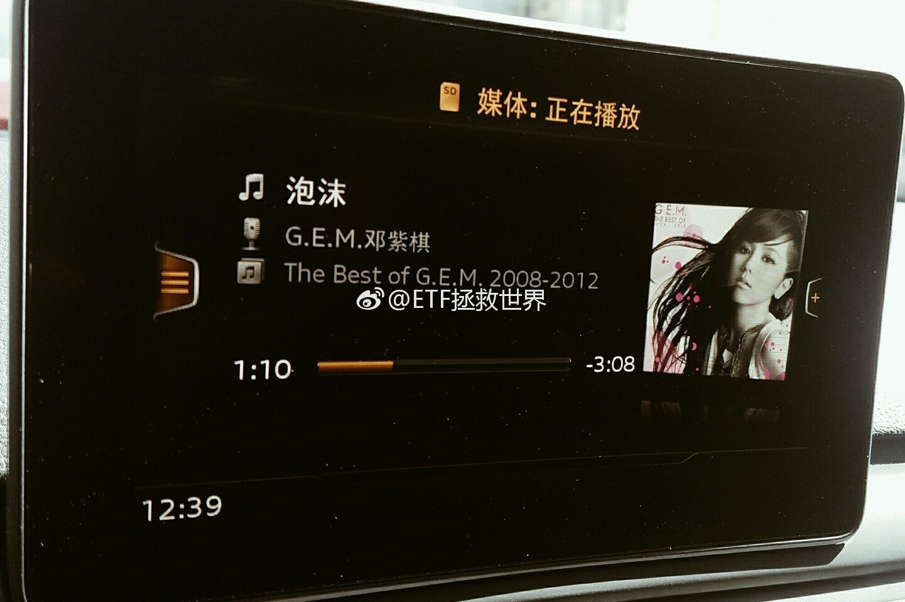

======================================================

ETF拯救世界 (5687069307) @
2017-03-09 16:12:10 Thu  
url: https://weibo.com/5687069307/Ez0bAib9T

给力。什么时候过3.5！群众都在盼望着！ ​​​

转发[8]  评论[54]  赞[55] 

+++++++++++++++++++++++++++++++++++++++++++++++++++++

图片：
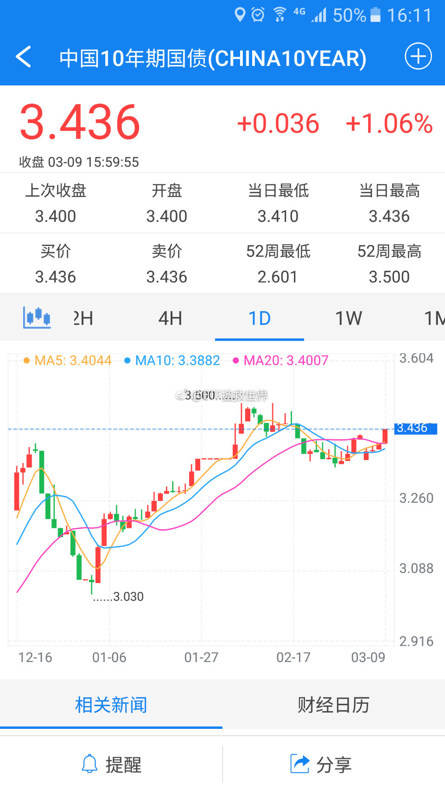

======================================================

ETF拯救世界 (5687069307) @
2017-03-10 08:29:50 Fri  
url: https://weibo.com/5687069307/Ez6Aqabq8

共享单车的目标客户群体腿长是多少？

怎么我觉得骑这个比跑步还累213.64%。 ​​​

转发[2]  评论[61]  赞[45] 

======================================================

ETF拯救世界 (5687069307) @
2017-03-10 08:51:44 Fri  
url: https://weibo.com/5687069307/Ez6JjiB2d

美十年期国债收益率升破2.6就一片哀嚎……

实际上过去二十年美十年期国债收益率走势是这样的……

嘿嘿…… ​​​

转发[7]  评论[52]  赞[43] 

+++++++++++++++++++++++++++++++++++++++++++++++++++++

图片：

======================================================

ETF拯救世界 (5687069307) @
2017-03-10 11:54:07 Fri  
url: https://weibo.com/5687069307/Ez7VlaAUJ

历史一次次的告诉我们，不管你有多么位高权重，管好自己的孩子是非常重要的一件事！

------------------------------------------------------
转推：
>  @澎湃新闻 (5044281310)
>  2017-03-10 11:24:04 Fri  
>  url: https:/weibo.com/5044281310/Ez7J8l3bi/

>  【解读｜朴槿惠成韩国首位被弹劾下台的总统，或难免牢狱之灾】今天上午，韩国宪法法院8名法官全票通过对朴槿惠弹劾案做出“通过弹劾”的最终决定。即刻起，朴槿惠被立刻免去总统职务。截至发稿，朴槿惠和执政党自由韩国党皆未发表任何声明。“在民意几乎一边倒、社会动荡的情况下，通过弹劾案对民众有 ​​​ http://mapi/005vnhZYgy1fdhkxvgcgij30go0b4jv8

转发[3]  评论[11]  赞[29] 

======================================================

ETF拯救世界 (5687069307) @
2017-03-10 14:37:53 Fri  
url: https://weibo.com/5687069307/Ez8ZOnLqj

很多金融市场的存在，客观讲，会有两个作用。一个是加杠杆，一个是加大贫富差距。

如果你投身到某个市场，希望在里面赚钱，能否越来越富先不要想，你要做的第一件事是绝对不要让别人把钱从你身上赚走，完成他的财富大爆炸。

有些财富转移是一对一式的。比如有人加杠杆贷款，几十万一平米从别人手上买 ​​​

转发[45]  评论[85]  赞[138] 

======================================================

ETF拯救世界 (5687069307) @
2017-03-10 19:21:27 Fri  
url: https://weibo.com/5687069307/EzaQUtVA9

谢谢各位！听了大家的，试了可以调节座位的那种！厉害了，骑上去感觉自己是阿姆斯特朗在骑环法！这么有用的信息，无以为报了各位，只好以身相许了！

------------------------------------------------------
转推：
>  @ETF拯救世界 (5687069307)
>  2017-03-10 08:29:50 Fri  
>  url: https:/weibo.com/5687069307/Ez6Aqabq8/

>  共享单车的目标客户群体腿长是多少？
>  
>  怎么我觉得骑这个比跑步还累213.64%。 ​​​

转发[0]  评论[47]  赞[57] 

======================================================

ETF拯救世界 (5687069307) @
2017-03-13 09:41:42 Mon  
url: https://weibo.com/5687069307/Ezzl5oMSN

月初没开车，再次躲过了半个月的下跌。那么问题来了，又到月中，开不开车？

------------------------------------------------------
转推：
>  @ETF拯救世界 (5687069307)
>  2017-03-01 10:36:44 Wed  
>  url: https:/weibo.com/5687069307/ExKzst2sy/

>  休息一次，不开车。
>  
>  http://t.cn/RiVuKUg ​​​

转发[9]  评论[124]  赞[66] 

======================================================

ETF拯救世界 (5687069307) @
2017-03-14 15:32:31 Tue  
url: https://weibo.com/5687069307/EzL3Z2eWg

回复@牛人我是熊大006:太忙了最近。准备这两周就来一发试试。关键是第一次说什么很重要啊。//@牛人我是熊大006:回复@ETF拯救世界:这个节目准备的怎样了？如果太忙，需要处理音频，我可以最近重新捡起来练练。期待

------------------------------------------------------
转推：
>  @ETF拯救世界 (5687069307)
>  2017-02-27 10:05:41 Mon  
>  url: https:/weibo.com/5687069307/ExrvRv8sK/

>  如果是投资类的音频栏目，各位最想听的是哪方面的内容？ ​​​

转发[2]  评论[67]  赞[36] 

======================================================

ETF拯救世界 (5687069307) @
2017-03-14 21:13:54 Tue  
url: https://weibo.com/5687069307/EzNixuNzh

北京的房子可能真的是疯了。继去年同事900多万买了一套学区房后，这周又知道有四位同事都买了学区房，单价10万+。

非常有意思，能经历这样一个时代，见证奇迹，深感荣幸。 ​​​

转发[13]  评论[91]  赞[81] 

======================================================

ETF拯救世界 (5687069307) @
2017-03-15 09:36:26 Wed  
url: https://weibo.com/5687069307/EzS9W9I9Z

散会了是不是还要撑啊。

哦，下半年还有一个会…… ​​​

转发[3]  评论[38]  赞[39] 

======================================================

ETF拯救世界 (5687069307) @
2017-03-15 10:45:06 Wed  
url: https://weibo.com/5687069307/EzSBObB1T

回复@勤奋的兔子ETF:不是。我这个图和崩盘的关系，其实是出太阳和公鸡司晨的关系。不是因为公鸡打鸣太阳升起，而是因为太阳要升起公鸡才打鸣。所以崩盘前我才会顺势发个图加个小砝码祝它一臂之力……不能什么时候都发…… //@勤奋的兔子ETF:E大发个估值图，管它是国家队还是两会，都得趴下[挖鼻]

------------------------------------------------------
转推：
>  @ETF拯救世界 (5687069307)
>  2017-03-15 09:36:26 Wed  
>  url: https:/weibo.com/5687069307/EzS9W9I9Z/

>  散会了是不是还要撑啊。
>  
>  哦，下半年还有一个会…… ​​​

转发[0]  评论[20]  赞[23] 

======================================================

ETF拯救世界 (5687069307) @
2017-03-15 11:54:44 Wed  
url: https://weibo.com/5687069307/EzT44qsOK

关于增强指基，分析一些数据，得出一些结论。我回答了@穿越30年 的问题，问题价值￥79.00，大家快来花1元围观~ http://t.cn/Rirp0tE ​​​

转发[263]  评论[130]  赞[221] 

======================================================

ETF拯救世界 (5687069307) @
2017-03-15 13:50:00 Wed  
url: https://weibo.com/5687069307/EzTORi6X5

很多人都觉得自己很重要，很多人关注自己。其实可能是想多了，也许根本没几个人在意你生活的是好是坏。

毕竟，大家都挺忙的。 ​​​

转发[9]  评论[78]  赞[73] 

======================================================

ETF拯救世界 (5687069307) @
2017-03-15 13:51:36 Wed  
url: https://weibo.com/5687069307/EzTPw6Xh6

如果有一年时间可以不用工作。你最想干的事情是什么？

说出你的想法。 ​​​

转发[16]  评论[263]  赞[51] 

======================================================

ETF拯救世界 (5687069307) @
2017-03-15 14:52:15 Wed  
url: https://weibo.com/5687069307/EzUe7FwcW

不知不觉昨天又新高了 ​​​

转发[1]  评论[56]  赞[68] 

+++++++++++++++++++++++++++++++++++++++++++++++++++++

图片：

======================================================

ETF拯救世界 (5687069307) @
2017-03-16 06:14:44 Thu  
url: https://weibo.com/5687069307/EA0gyp6ea

[赞]这个问题回答的值了。也有围观问题的各位朋友一份，转发。

------------------------------------------------------
转推：
>  @穿越30年 (3078782871)
>  2017-03-16 03:45:56 Thu  
>  url: https:/weibo.com/3078782871/EzZiahpR2/

>  @ETF拯救世界 兑现承诺绵薄之力，皆大欢喜。 ​​​

转发[0]  评论[22]  赞[60] 

======================================================

ETF拯救世界 (5687069307) @
2017-03-16 09:31:43 Thu  
url: https://weibo.com/5687069307/EA1ywbYmv

$159920 恒生ETF

任何低成本买入的好东西都要坚定持有不轻易卖出。重要的事情不停的说。

等好价格买入，这个很难做到，很多人等不了。

等好价格卖出，这个更难。看见盈利就想卖出，什么时候克服这个心态，才有赚大钱的希望。 ​​​

转发[29]  评论[65]  赞[77] 

======================================================

ETF拯救世界 (5687069307) @
2017-03-16 09:54:56 Thu  
url: https://weibo.com/5687069307/EA1HWqE9M

央行上调MLF和逆回购操作利率10个基点 ​​​

转发[4]  评论[39]  赞[37] 

======================================================

ETF拯救世界 (5687069307) @
2017-03-16 13:55:02 Thu  
url: https://weibo.com/5687069307/EA3hoBFi7

无论买多少品种，怎么买都不亏损是特别痛苦的事情。

2015年7月4300到现在： ​​​

转发[11]  评论[69]  赞[74] 

+++++++++++++++++++++++++++++++++++++++++++++++++++++

图片：
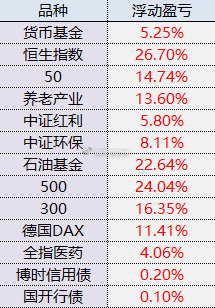

======================================================

ETF拯救世界 (5687069307) @
2017-03-16 14:20:09 Thu  
url: https://weibo.com/5687069307/EA3rB1hx5

乡亲们，逆回购，注意了。

如果是我，我会买7天的。 ​​​

转发[6]  评论[65]  赞[46] 

======================================================

ETF拯救世界 (5687069307) @
2017-03-17 08:30:27 Fri  
url: https://weibo.com/5687069307/EAaA9b9R2

早上吃什么？

我的 ​​​

转发[0]  评论[65]  赞[47] 

+++++++++++++++++++++++++++++++++++++++++++++++++++++

图片：

======================================================

ETF拯救世界 (5687069307) @
2017-03-17 09:54:23 Fri  
url: https://weibo.com/5687069307/EAb8do0RO

投资最怕的就是把近期发生的事情认为是永恒。

比如从2015年3月到现在，全市场估值始终维持在高位。两年过去了，很多人就会想，这是不是就是常态了？以后一定都会这样了？

这样的想法，和之前港股始终不涨，估值特别低，很多人说港股边缘化，犯的错误都是一样的。

你看的有多远，取决于站的有多高。 ​​​

转发[88]  评论[96]  赞[169] 

======================================================

ETF拯救世界 (5687069307) @
2017-03-17 10:32:36 Fri  
url: https://weibo.com/5687069307/EAbnJcvbR

就一个希望，拘留几天，然后记入诚信档案，不能贷款，求学求职的时候用人单位都能知道。既然约束不了自己，就让社会帮你约束。

------------------------------------------------------
转推：
>  @ ()
>  2017-03-17 10:25:06 Fri  
>  url: 

>  抱歉，作者已设置仅展示半年内微博，此微博已不可见。 ​​​

转发[5]  评论[17]  赞[48] 

======================================================

ETF拯救世界 (5687069307) @
2017-03-17 11:18:28 Fri  
url: https://weibo.com/5687069307/EAbGloijG

尽量让你的组合，投资账户，拥有反脆弱性。

也就是说，下跌、大跌、暴跌，你的账户也会受伤，但是就像打不死的小强一样，从下跌中居然能够获得成长，力量能够增强，当市场回到下跌前位置的时候，你的帐户奇迹般的比当初多了很多钱和很多筹码。

每一次下跌都是如此。受伤——成长——更加强大。

不要 ​​​

转发[60]  评论[61]  赞[112] 

======================================================

ETF拯救世界 (5687069307) @
2017-03-17 11:33:50 Fri  
url: https://weibo.com/5687069307/EAbMAe8ri

今天逆回购14天、28天已经到了4以上，还是不错的。 ​​​

转发[4]  评论[27]  赞[22] 

======================================================

ETF拯救世界 (5687069307) @
2017-03-17 13:42:32 Fri  
url: https://weibo.com/5687069307/EAcCP71jv

回复@江南锄大地咯:7、14天过5了。朋友们。 //@江南锄大地咯:卖早了😂😂😂现在继续飙升[挖鼻][挖鼻][污][污]

------------------------------------------------------
转推：
>  @ETF拯救世界 (5687069307)
>  2017-03-17 11:33:50 Fri  
>  url: https:/weibo.com/5687069307/EAbMAe8ri/

>  今天逆回购14天、28天已经到了4以上，还是不错的。 ​​​

转发[1]  评论[30]  赞[12] 

======================================================

ETF拯救世界 (5687069307) @
2017-03-17 14:15:34 Fri  
url: https://weibo.com/5687069307/EAcQehJeF

回复@小狗上马路:图还没上，急什么…… //@小狗上马路:E哥发了个帖子让均值回归，立马跌了...............

------------------------------------------------------
转推：
>  @ETF拯救世界 (5687069307)
>  2017-03-17 11:18:28 Fri  
>  url: https:/weibo.com/5687069307/EAbGloijG/

>  尽量让你的组合，投资账户，拥有反脆弱性。
>  
>  也就是说，下跌、大跌、暴跌，你的账户也会受伤，但是就像打不死的小强一样，从下跌中居然能够获得成长，力量能够增强，当市场回到下跌前位置的时候，你的帐户奇迹般的比当初多了很多钱和很多筹码。
>  
>  每一次下跌都是如此。受伤——成长——更加强大。
>  
>  不要 ​​​

转发[5]  评论[11]  赞[26] 

======================================================

ETF拯救世界 (5687069307) @
2017-03-17 14:18:06 Fri  
url: https://weibo.com/5687069307/EAcRg8fPb

一定要重视利率水平对各个投资品种的重要性。这个重要性怎么强调都不为过。

资金是聪明的，一定会从低收益率流向高收益率。

当然，这也是个累积的过程。不能说一两次实质性加息就会马上影响什么。但这就像吃包子，前六个吃完没感觉，第七个吃完撑了。你不能说前六个没用。

量变到质变。 ​​​

转发[37]  评论[39]  赞[94] 

======================================================

ETF拯救世界 (5687069307) @
2017-03-17 14:50:27 Fri  
url: https://weibo.com/5687069307/EAd4obBBO

震惊，GJD竟然没有出手。 ​​​

转发[4]  评论[59]  赞[50] 

======================================================

ETF拯救世界 (5687069307) @
2017-03-18 10:44:54 Sat  
url: https://weibo.com/5687069307/EAkTdpICm

妻子:感谢ZF

------------------------------------------------------
转推：
>  @ ()
>  2017-03-18 10:35:03 Sat  
>  url: 

>  抱歉，作者已设置仅展示半年内微博，此微博已不可见。 ​​​

转发[6]  评论[24]  赞[26] 

======================================================

ETF拯救世界 (5687069307) @
2017-03-18 13:10:15 Sat  
url: https://weibo.com/5687069307/EAlQcFJWB

……“在一旁大哭的女孩拿起 女司机 的手机，给妈妈打电话，电话里女孩妈妈听说女儿剐蹭的是奔驰车后，一直不愿露面，直到交警过来与她通话，她才同意赶来处理。”

------------------------------------------------------
转推：
>  @ ()
>  2017-03-18 12:39:33 Sat  
>  url: 

>  抱歉，作者已设置仅展示半年内微博，此微博已不可见。 ​​​

转发[1]  评论[35]  赞[17] 

======================================================

ETF拯救世界 (5687069307) @
2017-03-19 22:12:20 Sun  
url: https://weibo.com/5687069307/EAyOKaFsC

交易中如何才能不再患得患失？能力、自信和舒服。我回答了 @辣根王子 的问题，问题价值￥79.00，大家快来花1元围观~ http://t.cn/R6Z9UOo ​​​

转发[278]  评论[135]  赞[238] 

======================================================

ETF拯救世界 (5687069307) @
2017-03-20 10:24:47 Mon  
url: https://weibo.com/5687069307/EADC2BIRx

$159920 恒生ETF

继续新高。

估值依然处在模糊区域。所以坚定持有。 ​​​

转发[5]  评论[27]  赞[54] 

======================================================

ETF拯救世界 (5687069307) @
2017-03-20 11:15:07 Mon  
url: https://weibo.com/5687069307/EADWtp8uB

$513030 德国DAX

新高。模糊区域，继续持有。 ​​​

转发[4]  评论[27]  赞[56] 

======================================================

ETF拯救世界 (5687069307) @
2017-03-20 13:36:33 Mon  
url: https://weibo.com/5687069307/EAERSCSuv

判断题：今天GJD会不会出手。（20分） ​​​

转发[2]  评论[59]  赞[36] 

======================================================

ETF拯救世界 (5687069307) @
2017-03-20 17:48:19 Mon  
url: https://weibo.com/5687069307/EAGw58tEs

恒生第一大权重股。讲真，买恒生很大原因就是有腾讯这样的企业在里面。

------------------------------------------------------
转推：
>  @巨潮资讯网 (2239792910)
>  2017-03-20 17:41:06 Mon  
>  url: https:/weibo.com/2239792910/EAGt99czB/

>  6年涨了多少？你们自己看[哆啦A梦吃惊]【腾讯控股：涨逾2%再创新高】腾讯控股今日开盘走高后窄幅震荡，截至收盘，腾讯控股报228.20港元/股，涨2.790%，再创历史新高。腾讯去年第四季收入增长46%至445.88亿元人民币。 ​​​

转发[7]  评论[27]  赞[37] 

======================================================

ETF拯救世界 (5687069307) @
2017-03-20 19:43:27 Mon  
url: https://weibo.com/5687069307/EAHgO7EBd

[污]

------------------------------------------------------
转推：
>  @ ()
>  2017-03-20 19:22:23 Mon  
>  url: 

>  抱歉，作者已设置仅展示半年内微博，此微博已不可见。 ​​​

转发[9]  评论[20]  赞[23] 

======================================================

ETF拯救世界 (5687069307) @
2017-03-21 07:43:58 Tue  
url: https://weibo.com/5687069307/EALZgq5o1

继续新高。

不跌我就每天不停新高。跌了我们就买，下次涨得更高。

说白了就是这么回事。

已买入部分年化19%。 ​​​

转发[8]  评论[69]  赞[70] 

+++++++++++++++++++++++++++++++++++++++++++++++++++++

图片：

======================================================

ETF拯救世界 (5687069307) @
2017-03-21 08:02:41 Tue  
url: https://weibo.com/5687069307/EAM6RuliY

回复@奥斯特洛夫大柴夫斯基:当然是没错，但是2015年6月这么想的话现在还在坑里。仓位是概率判断的反映。获胜概率大的时候仓位会迅速增加的，时候未到而已。投资这件事我从来不急，买卖都是如此，所以赚了点钱。你急不急？//@奥斯特洛夫大柴夫斯基:赚钱还是要靠重仓呀[抱抱][抱抱][抱抱]

------------------------------------------------------
转推：
>  @ETF拯救世界 (5687069307)
>  2017-03-21 07:43:58 Tue  
>  url: https:/weibo.com/5687069307/EALZgq5o1/

>  继续新高。
>  
>  不跌我就每天不停新高。跌了我们就买，下次涨得更高。
>  
>  说白了就是这么回事。
>  
>  已买入部分年化19%。 ​​​

转发[5]  评论[24]  赞[27] 

======================================================

ETF拯救世界 (5687069307) @
2017-03-21 09:31:52 Tue  
url: https://weibo.com/5687069307/EAMH42PwI

今天只要央行不出手，逆回购或者其它现金管理工具都有的搞。

朋友们，撸起来了。 ​​​

转发[1]  评论[41]  赞[38] 

======================================================

ETF拯救世界 (5687069307) @
2017-03-21 13:29:07 Tue  
url: https://weibo.com/5687069307/EAOfmraH6

我在思考一个问题：

到底每次群众是如何在各个市场被忽悠瘸了套在山顶或者半山腰站岗的？

我想，可能是群众普遍有一种，“如果现在不买，也许一辈子也没希望在这里发财了”，或者“别人都赚了很多钱，我再不买就来不及了”，这种思维吧。

羊群、旅鼠、从众。也许都是深深的焦虑感所造成的。

焦虑， ​​​

转发[37]  评论[80]  赞[62] 

======================================================

ETF拯救世界 (5687069307) @
2017-03-21 14:07:43 Tue  
url: https://weibo.com/5687069307/EAOv23kYa

因为这个地带是我所谓的“模糊地带”，也就是没有到一眼看胖瘦的地方，所以涨跌都真的非常非常非常正常。

不用天天涨了就怕踏空跌了就怕套牢。不是这个路子。

这样，出道题问问自己：涨300点，到3600点会不会难受。难受？加仓到不难受。跌300点，到3000点会不会难受。还难受？减仓到不难受。

就这么 ​​​

转发[18]  评论[53]  赞[58] 

======================================================

ETF拯救世界 (5687069307) @
2017-03-21 14:12:00 Tue  
url: https://weibo.com/5687069307/EAOwLAOiL

回复@2011DALIN:有。相当焦虑。两个层次，一个是不知道怎么炒的时候。买了跌，卖了涨。觉得自己的帐户被庄家监控了，很焦虑。第二个是大概知道怎么做了，但钱比较少的时候。震荡市，没机会。或者始终比较贵。觉得日子一天天过去，在股市赚大钱的梦越来越远。焦虑。  回头看，都是笑谈了。

------------------------------------------------------
转推：
>  @ETF拯救世界 (5687069307)
>  2017-03-21 13:29:07 Tue  
>  url: https:/weibo.com/5687069307/EAOfmraH6/

>  我在思考一个问题：
>  
>  到底每次群众是如何在各个市场被忽悠瘸了套在山顶或者半山腰站岗的？
>  
>  我想，可能是群众普遍有一种，“如果现在不买，也许一辈子也没希望在这里发财了”，或者“别人都赚了很多钱，我再不买就来不及了”，这种思维吧。
>  
>  羊群、旅鼠、从众。也许都是深深的焦虑感所造成的。
>  
>  焦虑， ​​​

转发[10]  评论[22]  赞[38] 

======================================================

ETF拯救世界 (5687069307) @
2017-03-21 14:52:27 Tue  
url: https://weibo.com/5687069307/EAONbvV5r

周线收盘价来看，$159920 恒生ETF历史新高了。 ​​​

转发[1]  评论[19]  赞[47] 

======================================================

ETF拯救世界 (5687069307) @
2017-03-21 15:54:32 Tue  
url: https://weibo.com/5687069307/EAPco7pao

热腾腾的加权估值新鲜出炉。

今天收盘后的数据，是2015年12月第三轮熔断前以来，按月计算加权估值最高的时候。

大概是36.x。我个人不太相信会升到40以上，那将是另一次灾难的开始。不过，怎么说呢，金融市场的事谁说的准。真到了40以上，等着看热闹就对了。 ​​​

转发[79]  评论[154]  赞[120] 

+++++++++++++++++++++++++++++++++++++++++++++++++++++

图片：
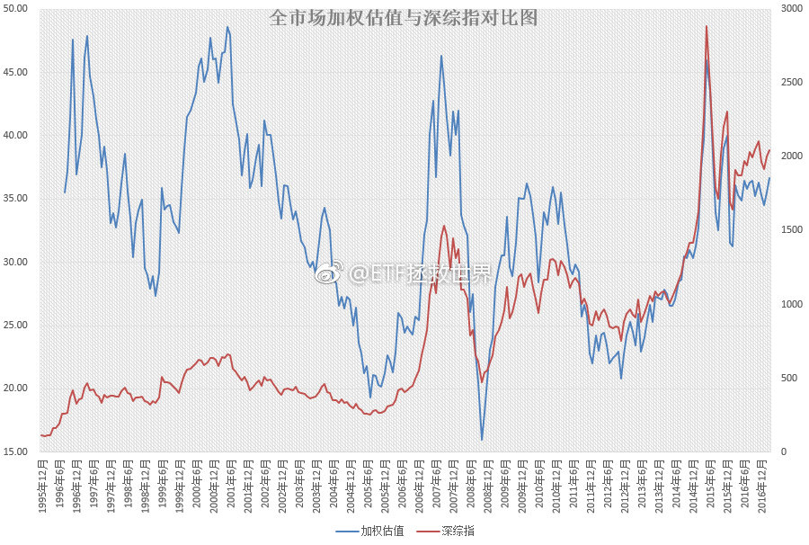

======================================================

ETF拯救世界 (5687069307) @
2017-03-22 01:00:15 Wed  
url: https://weibo.com/5687069307/EASLTEZDo

影响力已经这么大了？[doge] http://t.cn/R6bqcTX

------------------------------------------------------
转推：
>  @ETF拯救世界 (5687069307)
>  2017-03-21 15:54:32 Tue  
>  url: https:/weibo.com/5687069307/EAPco7pao/

>  热腾腾的加权估值新鲜出炉。
>  
>  今天收盘后的数据，是2015年12月第三轮熔断前以来，按月计算加权估值最高的时候。
>  
>  大概是36.x。我个人不太相信会升到40以上，那将是另一次灾难的开始。不过，怎么说呢，金融市场的事谁说的准。真到了40以上，等着看热闹就对了。 ​​​

转发[4]  评论[29]  赞[39] 

======================================================

ETF拯救世界 (5687069307) @
2017-03-22 01:16:00 Wed  
url: https://weibo.com/5687069307/EASShBj7K

准备加一点 ​​​

转发[6]  评论[51]  赞[38] 

+++++++++++++++++++++++++++++++++++++++++++++++++++++

图片：

======================================================

ETF拯救世界 (5687069307) @
2017-03-22 09:32:25 Wed  
url: https://weibo.com/5687069307/EAW7M8cqS

近期不少人从股灾的坑里爬出来或者爬出来半个身子，突然觉得自己能力是有的，之前资产大幅缩水是偶然的，以前的路子要坚持。

其实，如果没有一万多亿在里面每天帮忙护盘，没有某妈面多了加水水多了还加水帮大家灌水，很多人早就爆仓二十次了。

不过该发生的迟早会发生。

人各有命。 ​​​

转发[9]  评论[31]  赞[58] 

======================================================

ETF拯救世界 (5687069307) @
2017-03-22 09:56:18 Wed  
url: https://weibo.com/5687069307/EAWht9x7R

$全指医药 sh000991$ 

 ​​​​ 
关键是不要去追热门，尤其是已经涨了很多，别人赚了很多的热门。而是要买别人不注意的，有利空的东西。然后踏踏实实拿着，等着它变成热门，让别人来追。 ​​​

转发[18]  评论[31]  赞[57] 

======================================================

ETF拯救世界 (5687069307) @
2017-03-22 10:02:13 Wed  
url: https://weibo.com/5687069307/EAWjSo1zd

一鱼四吃。最近四年在恒生ETF的操作。

其中B是买点，S是卖点。有计划，有网格，有波段，还有长线持仓。每次B S金额都不同。

但基本上买卖点就是这样了。一个品种，吃了四波。赚了不少。 ​​​

转发[37]  评论[57]  赞[90] 

+++++++++++++++++++++++++++++++++++++++++++++++++++++

图片：
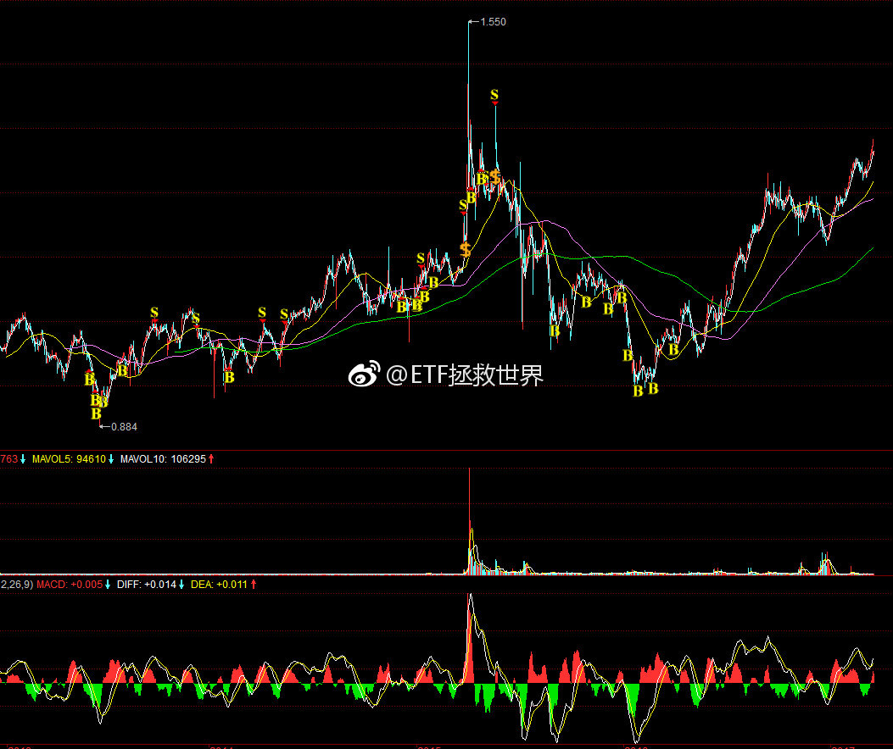

======================================================

ETF拯救世界 (5687069307) @
2017-03-22 10:27:43 Wed  
url: https://weibo.com/5687069307/EAWued2ts

今天是GJD和估值图的对决吧……

------------------------------------------------------
转推：
>  @ETF拯救世界 (5687069307)
>  2017-03-21 15:54:32 Tue  
>  url: https:/weibo.com/5687069307/EAPco7pao/

>  热腾腾的加权估值新鲜出炉。
>  
>  今天收盘后的数据，是2015年12月第三轮熔断前以来，按月计算加权估值最高的时候。
>  
>  大概是36.x。我个人不太相信会升到40以上，那将是另一次灾难的开始。不过，怎么说呢，金融市场的事谁说的准。真到了40以上，等着看热闹就对了。 ​​​

转发[16]  评论[31]  赞[30] 

======================================================

ETF拯救世界 (5687069307) @
2017-03-22 11:07:48 Wed  
url: https://weibo.com/5687069307/EAWKv0Z8C

昨天觉得自己持仓太少，今天觉得自己持仓太多的朋友，举起你的手，让我看到你！ ​​​

转发[6]  评论[126]  赞[111] 

======================================================

ETF拯救世界 (5687069307) @
2017-03-22 14:20:54 Wed  
url: https://weibo.com/5687069307/EAY0SlWQr

其实我更好奇的是，某队到底在市场中在干什么。当初是说为了防止出现危机，一万多亿砸下去。到现在两年过去，依然不断翻云覆雨。从昨天的图上可以看出，这样长期持续的高估状态几乎从未出现过。未来绝大多数投资者面对的必然是长期收益率很低。简单，粗暴，用钱把任何波动抹平，真心佩服。

------------------------------------------------------
转推：
>  @ ()
>  2017-03-22 13:50:29 Wed  
>  url: 

>  抱歉，此微博已被作者删除。查看帮助：http://t.cn/Rfd3rQV

转发[5]  评论[54]  赞[32] 

======================================================

ETF拯救世界 (5687069307) @
2017-03-22 16:01:16 Wed  
url: https://weibo.com/5687069307/EAYFCfy4U

我们已经到了要逐渐缩减资产负债表的时期。

------------------------------------------------------
转推：
>  @ ()
>  2017-03-22 15:54:47 Wed  
>  url: 

>  抱歉，作者已设置仅展示半年内微博，此微博已不可见。 ​​​

转发[7]  评论[39]  赞[36] 

======================================================

ETF拯救世界 (5687069307) @
2017-03-23 09:48:45 Thu  
url: https://weibo.com/5687069307/EB5EUkwZ3

$全指医药 sh000991$  再回一万点。

2005年1000点起步，05-15年十年最高涨幅高达20倍。中间如果做一些高抛低吸大区间波段则收益更高。指数投资赚的少？如果你永远盯着上证指数，那是没错的。但我们不买上证，只买这样不输给任何明星股的好指数。

现在买的不多，不用着急。再好的指数买高了也不会赚大 ​​​

转发[25]  评论[109]  赞[90] 

======================================================

ETF拯救世界 (5687069307) @
2017-03-23 12:09:10 Thu  
url: https://weibo.com/5687069307/EB6zU93kl

NO。都应该投入到加杠杆中去。 //@五花王:结余储蓄和结余现金流每一分都是罪恶的，都应该投入建设事业中去

------------------------------------------------------
转推：
>  @ ()
>  2017-03-22 22:26:32 Wed  
>  url: 

>  抱歉，此微博已被作者删除。查看帮助：http://t.cn/Rfd3rQV

转发[11]  评论[21]  赞[26] 

======================================================

ETF拯救世界 (5687069307) @
2017-03-23 13:15:16 Thu  
url: https://weibo.com/5687069307/EB70K3nH2

$Ｂ股指数 sh000003$嗯哼。 ​​​

转发[1]  评论[21]  赞[28] 

======================================================

ETF拯救世界 (5687069307) @
2017-03-23 13:24:39 Thu  
url: https://weibo.com/5687069307/EB74xwASw

其实很多人没有意识到，一些市场是处在极其脆弱的、微妙的平衡中。

我们每天接触到的信息很多。大部分，甚至绝大部分是垃圾信息。

筛选有用信息，然后透过它们思考背后的真相，是每个人想要赚钱的投资者需要具备的能力。 ​​​

转发[11]  评论[33]  赞[60] 

======================================================

ETF拯救世界 (5687069307) @
2017-03-23 13:39:17 Thu  
url: https://weibo.com/5687069307/EB7au2ksu

今天要第二次对决了。 //@ETF拯救世界:今天是GJD和估值图的对决吧……

------------------------------------------------------
转推：
>  @ETF拯救世界 (5687069307)
>  2017-03-21 15:54:32 Tue  
>  url: https:/weibo.com/5687069307/EAPco7pao/

>  热腾腾的加权估值新鲜出炉。
>  
>  今天收盘后的数据，是2015年12月第三轮熔断前以来，按月计算加权估值最高的时候。
>  
>  大概是36.x。我个人不太相信会升到40以上，那将是另一次灾难的开始。不过，怎么说呢，金融市场的事谁说的准。真到了40以上，等着看热闹就对了。 ​​​

转发[13]  评论[42]  赞[20] 

======================================================

ETF拯救世界 (5687069307) @
2017-03-23 14:34:35 Thu  
url: https://weibo.com/5687069307/EB7wVsUVZ

有钱的是大爷，确认了！[坏笑] //@ETF拯救世界:今天要第二次对决了。 //@ETF拯救世界:今天是GJD和估值图的对决吧……

------------------------------------------------------
转推：
>  @ETF拯救世界 (5687069307)
>  2017-03-21 15:54:32 Tue  
>  url: https:/weibo.com/5687069307/EAPco7pao/

>  热腾腾的加权估值新鲜出炉。
>  
>  今天收盘后的数据，是2015年12月第三轮熔断前以来，按月计算加权估值最高的时候。
>  
>  大概是36.x。我个人不太相信会升到40以上，那将是另一次灾难的开始。不过，怎么说呢，金融市场的事谁说的准。真到了40以上，等着看热闹就对了。 ​​​

转发[8]  评论[61]  赞[31] 

======================================================

ETF拯救世界 (5687069307) @
2017-03-24 07:33:08 Fri  
url: https://weibo.com/5687069307/EBecmhfnO

洪sir:上游大宗商品库存周期是绝对的领先指标

------------------------------------------------------
转推：
>  @ ()
>  2017-03-24 06:37:44 Fri  
>  url: 

>  该账号因被投诉违反法律法规和《微博社区公约》的相关规定，现已无法查看。查看帮助 https://kefu.weibo.com/faqdetail?id=13216

转发[10]  评论[38]  赞[35] 

======================================================

ETF拯救世界 (5687069307) @
2017-03-24 09:09:32 Fri  
url: https://weibo.com/5687069307/EBePug0hQ

有没有人想起2015年6月初现场督察券商查配资去杠杆 //@蓝鲸财经记者工作平台:【鲸滚动】央行称，离婚一年以内房贷申请人，商贷和公积金贷款均按二套房信贷政策执行；商业银行应加强消费贷及其他无抵押信用贷款管理，严禁以消费贷、个人经营性贷款等名义贷出资金用于支付购房首付。

------------------------------------------------------
转推：
>  @蓝鲸财经记者工作平台 (1885454921)
>  2017-03-24 08:54:24 Fri  
>  url: https:/weibo.com/1885454921/EBeJlkIDO/

>  【鲸要闻】24日，央行出台关于加强北京地区住房信贷业务风险管理通知，对离婚一年内的贷款人实施差别化住房信贷政策，从严防控信贷风险。 ​​​

转发[6]  评论[32]  赞[45] 

======================================================

ETF拯救世界 (5687069307) @
2017-03-24 10:39:58 Fri  
url: https://weibo.com/5687069307/EBfqc7Fmr

$中证红利 sz399922$   新高。 

$510050 就比较低迷。

前几个月50换红利是正确的选择。 ​​​

转发[5]  评论[19]  赞[35] 

======================================================

ETF拯救世界 (5687069307) @
2017-03-24 11:09:41 Fri  
url: https://weibo.com/5687069307/EBfCg1fLX

讲真，我自己感觉这回答值1块钱。我回答了 @晴儿小小 的问题，问题价值￥79.00，大家快来花1元围观~ http://t.cn/R6GYZGs ​​​

转发[1048]  评论[348]  赞[862] 

======================================================

ETF拯救世界 (5687069307) @
2017-03-24 11:23:32 Fri  
url: https://weibo.com/5687069307/EBfHT0zop

继续捐，都是各位的福报。[亲亲] ​​​

转发[1]  评论[12]  赞[102] 

+++++++++++++++++++++++++++++++++++++++++++++++++++++

图片：
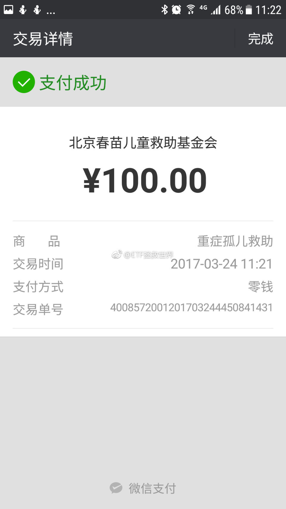

======================================================

ETF拯救世界 (5687069307) @
2017-03-24 11:36:31 Fri  
url: https://weibo.com/5687069307/EBfN9brDG

说几个弹性大的品种，未来熊到姥姥家的时候我们会买，现在NO

1、券商

2、医疗

3、军工

[挤眼] ​​​

转发[54]  评论[101]  赞[109] 

======================================================

ETF拯救世界 (5687069307) @
2017-03-24 14:57:07 Fri  
url: https://weibo.com/5687069307/EBh6zmQQo

怎么回事，难道债券也买在最低了 ​​​

转发[7]  评论[38]  赞[47] 

+++++++++++++++++++++++++++++++++++++++++++++++++++++

图片：
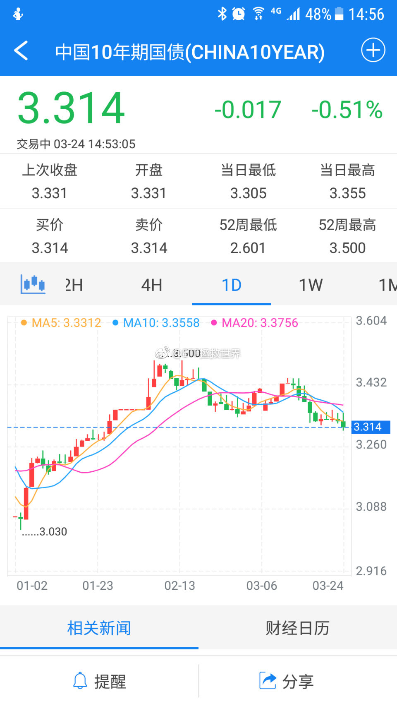

======================================================

ETF拯救世界 (5687069307) @
2017-03-24 15:34:11 Fri  
url: https://weibo.com/5687069307/EBhlChwAx

月末打算买个估计要赔钱的大杀器。买什么什么涨随时受不了。 ​​​

转发[8]  评论[166]  赞[80] 

+++++++++++++++++++++++++++++++++++++++++++++++++++++

图片：
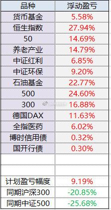

======================================================

ETF拯救世界 (5687069307) @
2017-03-26 09:14:10 Sun  
url: https://weibo.com/5687069307/EBxImoIb0

有意思的问题，我的一些观点。我回答了 @manmanzhu2003 的问题，问题价值￥79.00，大家快来花1元围观~ http://t.cn/R6VI6K3 ​​​

转发[396]  评论[180]  赞[313] 

======================================================

ETF拯救世界 (5687069307) @
2017-03-26 09:49:42 Sun  
url: https://weibo.com/5687069307/EBxWMwGEK

注意，这就是利率上升货币紧缩的无数信号之一。当然，说的和做的不一定一样……

------------------------------------------------------
转推：
>  @财联社APP (2868676035)
>  2017-03-26 09:45:49 Sun  
>  url: https:/weibo.com/2868676035/EBxVd01Ns/

>  【周小川：货币政策宽松已到周期尾部】在博鳌亚洲论坛2017年年会“货币政策的‘度’”分论坛上，中国人民银行行长周小川表示，全球经济复苏进程曲折，不能过分依赖货币政策，应该对再通胀保持充分警惕，全球已经存在太充足的流动性，货币政策已到周期尾部。 ​​​

转发[11]  评论[21]  赞[39] 

======================================================

ETF拯救世界 (5687069307) @
2017-03-26 11:15:31 Sun  
url: https://weibo.com/5687069307/EByvCiueM

回复@星渚:去年七月zzj会议首提“稳健中性”，以前是“稳健”[doge]//@星渚:不是2010年就开始实行谨慎的货币政策么 我7年来看到的降准降息 都是假消息么[生病]//@ETF拯救世界:注意，这就是利率上升货币紧缩的无数信号之一。当然，说的和做的不一定一样……

------------------------------------------------------
转推：
>  @财联社APP (2868676035)
>  2017-03-26 09:45:49 Sun  
>  url: https:/weibo.com/2868676035/EBxVd01Ns/

>  【周小川：货币政策宽松已到周期尾部】在博鳌亚洲论坛2017年年会“货币政策的‘度’”分论坛上，中国人民银行行长周小川表示，全球经济复苏进程曲折，不能过分依赖货币政策，应该对再通胀保持充分警惕，全球已经存在太充足的流动性，货币政策已到周期尾部。 ​​​

转发[4]  评论[19]  赞[27] 

======================================================

ETF拯救世界 (5687069307) @
2017-03-27 09:56:09 Mon  
url: https://weibo.com/5687069307/EBHpTyFq9

随便买几只打新股票走成这样是闹哪样。

如果不是自己的规矩是不讨论个股，倒是可以和大家聊聊门票的选择…… ​​​

转发[8]  评论[63]  赞[58] 

+++++++++++++++++++++++++++++++++++++++++++++++++++++

图片：

======================================================

ETF拯救世界 (5687069307) @
2017-03-27 10:53:23 Mon  
url: https://weibo.com/5687069307/EBHN8aj7O

雪球上那个不择时季调组合，今天买的标普500并非新买入，而是之前溢价过高卖出后重新配置。

这个组合通常情况下是三个季度调整一次，但是个别时候个别品种溢价折价过高会做个波段。比如这次，有十几个点获利空间，为何不做呢。做完了继续踏踏实实持有。

害怕有人认为是新开仓跟着买，特此告知。 ​​​

转发[2]  评论[33]  赞[34] 

+++++++++++++++++++++++++++++++++++++++++++++++++++++

图片：
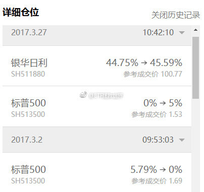

======================================================

ETF拯救世界 (5687069307) @
2017-03-27 13:48:59 Mon  
url: https://weibo.com/5687069307/EBIWpbImw

债券继续涨。 ​​​

转发[3]  评论[20]  赞[23] 

+++++++++++++++++++++++++++++++++++++++++++++++++++++

图片：

======================================================

ETF拯救世界 (5687069307) @
2017-03-27 14:21:17 Mon  
url: https://weibo.com/5687069307/EBJ9w5pha

讲真，我已经有点不相信市场这只无形的手了。

原来有形的手可以做到这样。

但要我放弃原则和信仰，

sorry，

那恐怕是不可能的事。

我又不是咸鱼。 ​​​

转发[10]  评论[46]  赞[63] 

======================================================

ETF拯救世界 (5687069307) @
2017-03-27 14:46:14 Mon  
url: https://weibo.com/5687069307/EBJjE0Z4H

截至今天，有762家公司披露2016年年报。

汇金公司是其中259家公司的十大股东之一；证金是其中92家公司的十大股东之一。

这还不包括各种资管计划持股。

这件事，弄到最后，不管是什么结局，出现什么问题，是不会有责任人的。 ​​​

转发[9]  评论[32]  赞[48] 

======================================================

ETF拯救世界 (5687069307) @
2017-03-27 15:04:13 Mon  
url: https://weibo.com/5687069307/EBJqWqWsT

如果某天涨跌幅比较大，可能是伙食不太好。闹情绪了。

------------------------------------------------------
转推：
>  @ ()
>  2017-03-27 14:51:49 Mon  
>  url: 

>  抱歉，作者已设置仅展示半年内微博，此微博已不可见。 ​​​

转发[1]  评论[15]  赞[39] 

======================================================

ETF拯救世界 (5687069307) @
2017-03-28 10:10:31 Tue  
url: https://weibo.com/5687069307/EBQWdu2S6

7天逆回购过五。包含假期了。不错。 ​​​

转发[5]  评论[56]  赞[58] 

======================================================

ETF拯救世界 (5687069307) @
2017-03-29 06:24:46 Wed  
url: https://weibo.com/5687069307/EBYT5eesc

神奇了。这几天想买什么什么涨。

就剩两天了给个面子好吗。 ​​​

转发[4]  评论[63]  赞[51] 

======================================================

ETF拯救世界 (5687069307) @
2017-03-29 09:46:54 Wed  
url: https://weibo.com/5687069307/EC0d873rG

[哈欠] ​​​

转发[4]  评论[30]  赞[29] 

+++++++++++++++++++++++++++++++++++++++++++++++++++++

图片：

======================================================

ETF拯救世界 (5687069307) @
2017-03-29 10:00:13 Wed  
url: https://weibo.com/5687069307/EC0ixwNpt

回复@龙虎半天云:人生啊是否幸福，很大程度是你自己主观决定。  一份也好，两份也好，有没有赚钱？赚钱是不是好事？没有买它的资金，在其他地方有没有赚钱？  另一个，回到过去再来一次，以你当时的能力，你会不会做的更好？不管做了什么决定，自己当时就那个能力，要接受自己。如果有进步空间，好好努力，下次更好。

------------------------------------------------------
转推：
>  @ETF拯救世界 (5687069307)
>  2017-03-29 09:46:54 Wed  
>  url: https:/weibo.com/5687069307/EC0d873rG/

>  [哈欠] ​​​

转发[3]  评论[14]  赞[49] 

======================================================

ETF拯救世界 (5687069307) @
2017-03-29 10:24:38 Wed  
url: https://weibo.com/5687069307/EC0ss7oVP

人生在世，短短几十年。到底什么是幸福？

总是有一种感觉，就是很多人好像总是非常焦虑，永远对生活不够满意。

高中生也许觉得，上了大学人生就会幸福；大学生觉得，考上研究生会很幸福；研究生会觉得，找个好工作会幸福；找到好工作的人，会觉得找到喜欢的另一半才是幸福；有了满意的bf/gf，会想， ​​​

转发[138]  评论[141]  赞[242] 

======================================================

ETF拯救世界 (5687069307) @
2017-03-29 10:35:29 Wed  
url: https://weibo.com/5687069307/EC0wRbOGh

这个月1-3份。视这几天的情况而定。 ​​​

转发[16]  评论[79]  赞[60] 

======================================================

ETF拯救世界 (5687069307) @
2017-03-29 10:45:29 Wed  
url: https://weibo.com/5687069307/EC0AUjSWM

鸡汤喝完了是不是该起床了 [doge] ​​​

转发[0]  评论[55]  赞[46] 

+++++++++++++++++++++++++++++++++++++++++++++++++++++

图片：

======================================================

ETF拯救世界 (5687069307) @
2017-03-30 05:12:29 Thu  
url: https://weibo.com/5687069307/EC7Qfk1U0

无话可说，就差两天。 ​​​

转发[6]  评论[73]  赞[38] 

+++++++++++++++++++++++++++++++++++++++++++++++++++++

图片：

======================================================

ETF拯救世界 (5687069307) @
2017-03-30 07:20:58 Thu  
url: https://weibo.com/5687069307/EC8GoALP4

防不胜防。安全第一。多买三者。//@佐罗_厚恩投资:触目惊心，一定要注意啊！[哼][哼]

------------------------------------------------------
转推：
>  @每日经济新闻 (1649173367)
>  2017-03-29 22:18:14 Wed  
>  url: https:/weibo.com/1649173367/EC586nkJt/

>  一段视频告诉你，在中国开车有多难。 http://t.cn/R6KB5Wv ​​​

转发[41]  评论[27]  赞[23] 

======================================================

ETF拯救世界 (5687069307) @
2017-03-30 09:42:19 Thu  
url: https://weibo.com/5687069307/EC9BM27Yz

现在这种情况，个人认为，对各位来说，最重要的，是不要有过多家庭负债。

一个想法，不一样对。 ​​​

转发[7]  评论[93]  赞[63] 

======================================================

ETF拯救世界 (5687069307) @
2017-03-30 10:12:34 Thu  
url: https://weibo.com/5687069307/EC9O3f4Ym

23的逆回购服不服。谁说现金是垃圾。 ​​​

转发[0]  评论[50]  赞[53] 

======================================================

ETF拯救世界 (5687069307) @
2017-03-30 10:22:07 Thu  
url: https://weibo.com/5687069307/EC9RV8QCH

今晚开车，求放一马，今天别动手好吗！ ​​​

转发[2]  评论[69]  赞[58] 

======================================================

ETF拯救世界 (5687069307) @
2017-03-30 11:22:59 Thu  
url: https://weibo.com/5687069307/ECagCFpRU

做人有信仰总归是好事

------------------------------------------------------
转推：
>  @ETF拯救世界 (5687069307)
>  2017-03-27 14:21:17 Mon  
>  url: https:/weibo.com/5687069307/EBJ9w5pha/

>  讲真，我已经有点不相信市场这只无形的手了。
>  
>  原来有形的手可以做到这样。
>  
>  但要我放弃原则和信仰，
>  
>  sorry，
>  
>  那恐怕是不可能的事。
>  
>  我又不是咸鱼。 ​​​

转发[1]  评论[27]  赞[45] 

======================================================

ETF拯救世界 (5687069307) @
2017-03-30 13:11:24 Thu  
url: https://weibo.com/5687069307/ECaYDzHUu

这么搞，这是要逼队里的同志发大招啊。 ​​​

转发[4]  评论[54]  赞[32] 

======================================================

ETF拯救世界 (5687069307) @
2017-03-30 14:09:41 Thu  
url: https://weibo.com/5687069307/ECbmiox0j

GC002 ，4月5日可用，目前年化6.15啊。 ​​​

转发[6]  评论[35]  赞[22] 

======================================================

ETF拯救世界 (5687069307) @
2017-03-30 14:18:46 Thu  
url: https://weibo.com/5687069307/ECbpZpxhN

回复@mcz3ynf:你算算到期日，再算算资金能用的时候收益率是多少。假期到期，你的资金用不了，所以不能用现在的价格说话。各位理解没有？所有品种的真实收益率，都要折算到资金可以用的那天。 //@mcz3ynf:回复@ETF拯救世界:明明是9以上好吧

------------------------------------------------------
转推：
>  @ETF拯救世界 (5687069307)
>  2017-03-30 14:09:41 Thu  
>  url: https:/weibo.com/5687069307/ECbmiox0j/

>  GC002 ，4月5日可用，目前年化6.15啊。 ​​​

转发[0]  评论[11]  赞[23] 

======================================================

ETF拯救世界 (5687069307) @
2017-03-30 14:24:00 Thu  
url: https://weibo.com/5687069307/ECbs6zFjj

注意这个时点：2002年。这个年份已经多次出现在我们总结的历史数据中了。那一年和现在相似之处越来越多。

信用债发行低位徘徊，偿债高峰却以悄然来临。Wind资讯统计数据显示，截至目前，今年以来信用债发行规模1.25万亿元，与去年一季度相比，大跌53.7%。受发行规模骤降拖累，今年以来信用债净融资为- ​​​

转发[21]  评论[38]  赞[45] 

======================================================

ETF拯救世界 (5687069307) @
2017-03-30 14:44:41 Thu  
url: https://weibo.com/5687069307/ECbAvf7fN

自己看看这轮最高点。主席能做的只有这么多了。

------------------------------------------------------
转推：
>  @ ()
>  2017-02-10 11:50:04 Fri  
>  url: 

>  抱歉，此微博已被作者删除。查看帮助：http://t.cn/Rfd3rQV

转发[1]  评论[22]  赞[25] 

======================================================

ETF拯救世界 (5687069307) @
2017-03-30 15:05:01 Thu  
url: https://weibo.com/5687069307/ECbIL2Jac

确认了。[doge]

------------------------------------------------------
转推：
>  @ETF拯救世界 (5687069307)
>  2017-03-29 10:35:29 Wed  
>  url: https:/weibo.com/5687069307/EC0wRbOGh/

>  这个月1-3份。视这几天的情况而定。 ​​​

转发[11]  评论[156]  赞[76] 

======================================================

ETF拯救世界 (5687069307) @
2017-03-31 13:40:26 Fri  
url: https://weibo.com/5687069307/ECkAVc2PI

回复@侯小猪_Miss差不多:这个可以有。[doge]//@侯小猪_Miss差不多:昨天梦见e神了，和粉丝们一起生活，给我们做饭。其中一个粉丝感动的把自己媳妇都送给您了。//@ETF拯救世界:确认了。[doge]

------------------------------------------------------
转推：
>  @ETF拯救世界 (5687069307)
>  2017-03-29 10:35:29 Wed  
>  url: https:/weibo.com/5687069307/EC0wRbOGh/

>  这个月1-3份。视这几天的情况而定。 ​​​

转发[0]  评论[33]  赞[26] 

======================================================

ETF拯救世界 (5687069307) @
2017-03-31 14:11:05 Fri  
url: https://weibo.com/5687069307/ECkNmqHOY

哈哈，超萌的神兽和黑天鹅。

啊，生活！ ​​​

转发[3]  评论[22]  赞[33] 

+++++++++++++++++++++++++++++++++++++++++++++++++++++

图片：

======================================================

ETF拯救世界 (5687069307) @
2017-03-31 15:43:59 Fri  
url: https://weibo.com/5687069307/EClp4lv6u

打新门票彻底疯了 ​​​

转发[6]  评论[44]  赞[38] 

+++++++++++++++++++++++++++++++++++++++++++++++++++++

图片：

======================================================

ETF拯救世界 (5687069307) @
2017-03-31 16:11:02 Fri  
url: https://weibo.com/5687069307/EClA39mz5

根据去年三季报选出的打新门票是这些。等权买入。

今年根据一季报的门票持股调整会在四月底准时进行。希望不管中不中新股，门票能继续挣钱。

现在别追这些了啊…… ​​​

转发[21]  评论[71]  赞[70] 

+++++++++++++++++++++++++++++++++++++++++++++++++++++

图片：
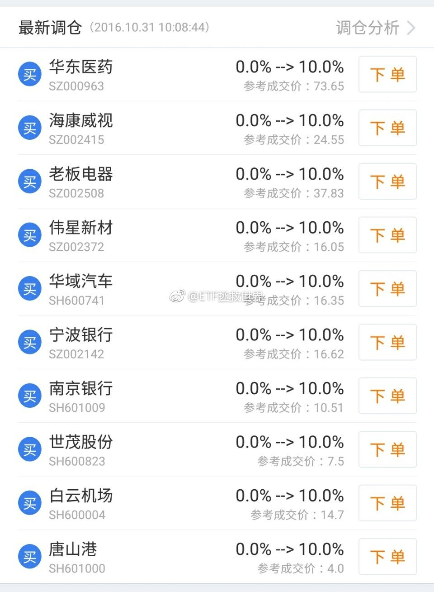

======================================================

ETF拯救世界 (5687069307) @
2017-03-31 16:46:32 Fri  
url: https://weibo.com/5687069307/EClOsoFhX

醉了。三根鹤立鸡群的成交量都是计划发布第二天干出来的。

幸亏一部分朋友是去场外申购，否则不堪设想。

肩上的担子很重呀。 ​​​

转发[7]  评论[128]  赞[80] 

+++++++++++++++++++++++++++++++++++++++++++++++++++++

图片：

======================================================

ETF拯救世界 (5687069307) @
2017-04-01 13:00:03 Sat  
url: https://weibo.com/5687069307/ECtL1wyPp

谁还没看过可以去看看。

http://t.cn/R6WnOj9 ​​​

转发[79]  评论[58]  赞[87] 

======================================================

ETF拯救世界 (5687069307) @
2017-04-04 09:08:31 Tue  
url: https://weibo.com/5687069307/ECUwxkiwZ

[doge]  ​​​

转发[4]  评论[125]  赞[128] 

+++++++++++++++++++++++++++++++++++++++++++++++++++++

图片：

======================================================

ETF拯救世界 (5687069307) @
2017-04-05 10:23:22 Wed  
url: https://weibo.com/5687069307/ED4rpBGFs

什么意思。4月挖个坑让咱们计划上了车然后继续涨啊。 ​​​

转发[7]  评论[83]  赞[73] 

======================================================

ETF拯救世界 (5687069307) @
2017-04-05 13:57:06 Wed  
url: https://weibo.com/5687069307/ED5QarRXM

回复@BestJayChou:我居然相信了！@最高人民检察院 //@BestJayChou:大家好，我是汉东省京州市副市长丁义珍，由于被侯亮平那个猢狲追查只能逃亡洛杉矶。现在准备东山再起回国把孙猴子碾成齑粉，然而机票钱还差50人民币的燃油费，希望各位同志能给我打50块钱，丁某他日必有重谢。

------------------------------------------------------
转推：
>  @ ()
>  2017-04-05 13:51:41 Wed  
>  url: 

>  抱歉，作者已设置仅展示半年内微博，此微博已不可见。 ​​​

转发[2]  评论[18]  赞[16] 

======================================================

ETF拯救世界 (5687069307) @
2017-04-06 09:16:47 Thu  
url: https://weibo.com/5687069307/EDdqT2rYJ

新高总是好的。 ​​​

转发[4]  评论[52]  赞[85] 

+++++++++++++++++++++++++++++++++++++++++++++++++++++

图片：
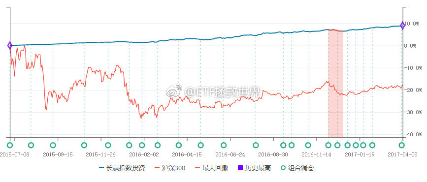
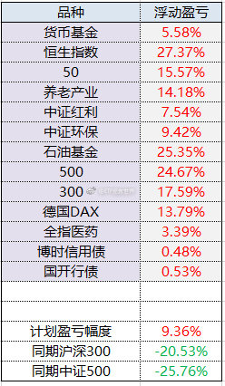

======================================================

ETF拯救世界 (5687069307) @
2017-04-07 08:40:09 Fri  
url: https://weibo.com/5687069307/EDmCvEQWf

s7最后一帖……一早上掉地上三次屏终于碎了。

真是有点舍不得。好看好用。各种顺手。

只好先用家里的mate9了。水果8什么时候出啊。[泪] ​​​

转发[0]  评论[66]  赞[33] 

======================================================

ETF拯救世界 (5687069307) @
2017-04-07 08:45:51 Fri  
url: https://weibo.com/5687069307/EDmEPebK2

讲真真的很耐摔。摔了十几次终于... ​​​

转发[0]  评论[58]  赞[27] 

+++++++++++++++++++++++++++++++++++++++++++++++++++++

图片：

======================================================

ETF拯救世界 (5687069307) @
2017-04-07 10:09:34 Fri  
url: https://weibo.com/5687069307/EDncO76hf

3000（或者3100）到3300之间用ETF做网格应该是很靠谱的。

GJD信誉保证。跟着GJD有肉吃。 ​​​

转发[108]  评论[81]  赞[103] 

======================================================

ETF拯救世界 (5687069307) @
2017-04-07 10:45:45 Fri  
url: https://weibo.com/5687069307/EDnruuuw7

石油黄金已经有所反应了

------------------------------------------------------
转推：
>  @ ()
>  2017-04-07 09:26:58 Fri  
>  url: 

>  抱歉，作者已设置仅展示半年内微博，此微博已不可见。 ​​​

转发[7]  评论[17]  赞[19] 

======================================================

ETF拯救世界 (5687069307) @
2017-04-07 10:49:39 Fri  
url: https://weibo.com/5687069307/EDnt5epfS

回复@用户5747769897:如果做油气网格的，在现价附近有卖出收网的可以先不卖。这种突发事件造成亚洲盘油价上涨，还没有体现在油气的净值中。现在油气的盘面也没有反应出来。所以可以再高一点再收网。//@用户5747769897:又想起了最近挂的0.599的未成交价格。

------------------------------------------------------
转推：
>  @ ()
>  2017-04-07 09:26:58 Fri  
>  url: 

>  抱歉，作者已设置仅展示半年内微博，此微博已不可见。 ​​​

转发[4]  评论[27]  赞[28] 

======================================================

ETF拯救世界 (5687069307) @
2017-04-07 11:06:25 Fri  
url: https://weibo.com/5687069307/EDnzSxQc6

打新门票 醉了 ​​​

转发[0]  评论[34]  赞[46] 

+++++++++++++++++++++++++++++++++++++++++++++++++++++

图片：
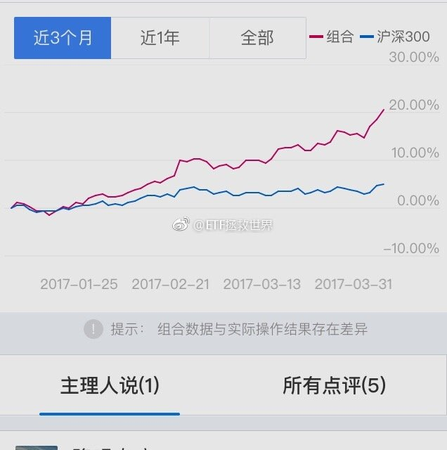

======================================================

ETF拯救世界 (5687069307) @
2017-04-07 13:32:04 Fri  
url: https://weibo.com/5687069307/EDox0bZNn

$中证环保 sh000827$妹想到 ​​​

转发[2]  评论[39]  赞[36] 

======================================================

ETF拯救世界 (5687069307) @
2017-04-07 17:04:24 Fri  
url: https://weibo.com/5687069307/EDpVby3Vo

回复@hello_39900:找到适合你自己的路。你可以加大仓位，或者去定投。我的路适合我自己。经过十年三轮牛熊的实践，资产从没有大幅回撤，同时赚到了很多人一辈子也不可能赚到的钱。所以我没有理由改变，依然还会按照我自己的节奏去投资。我不会因为一时的涨跌怀疑自己，很多东西不是每个人都能看懂。

------------------------------------------------------
转推：
>  @ETF拯救世界 (5687069307)
>  2017-04-07 10:09:34 Fri  
>  url: https:/weibo.com/5687069307/EDncO76hf/

>  3000（或者3100）到3300之间用ETF做网格应该是很靠谱的。
>  
>  GJD信誉保证。跟着GJD有肉吃。 ​​​

转发[4]  评论[33]  赞[64] 

======================================================

ETF拯救世界 (5687069307) @
2017-04-08 06:13:31 Sat  
url: https://weibo.com/5687069307/EDv5ulNHi

知道北京多少年没有完成供地计划了吗。听其言观其行吧

------------------------------------------------------
转推：
>  @财联社APP (2868676035)
>  2017-04-07 21:43:44 Fri  
>  url: https:/weibo.com/2868676035/EDrKzzLdR/

>  【厉害了！5年内北京供地可建住宅150万套】据《北京电视台》消息，今日市政府批准《北京市2017-2021年及2017年度住宅用地供应计划》，本市计划今后五年供应住宅用地6000公顷，其中国有建设用地5000公顷，集体建设用地1000公顷，以保障150万套住房建设需求。 ​​​

转发[5]  评论[28]  赞[39] 

======================================================

ETF拯救世界 (5687069307) @
2017-04-09 15:32:42 Sun  
url: https://weibo.com/5687069307/EDIaY5opa

哈哈哈，偶然翻到熔断前一周的微博。谁能想到，zjh不光挨骂，大boss都被干掉了。当时你跑了没有？

------------------------------------------------------
转推：
>  @ETF拯救世界 (5687069307)
>  2015-12-24 10:42:50 Thu  
>  url: https:/weibo.com/5687069307/D9S1fsdRf/

>  据说，长得帅的都拿着利润跑了。长得丑的已经准备开始骂zjh了。 ​​​

转发[1]  评论[46]  赞[46] 

======================================================

ETF拯救世界 (5687069307) @
2017-04-10 10:05:37 Mon  
url: https://weibo.com/5687069307/EDPsHn0Ep

博时信用债又要分红了。望周知。

另外，分完了以后不要再有诸如“为什么我的软件上显示亏损和你的统计不一样”这样的疑问了。

心累。 ​​​

转发[1]  评论[39]  赞[58] 

======================================================

ETF拯救世界 (5687069307) @
2017-04-10 10:24:07 Mon  
url: https://weibo.com/5687069307/EDPAcuFR6

吃炫迈了 ​​​

转发[0]  评论[42]  赞[56] 

+++++++++++++++++++++++++++++++++++++++++++++++++++++

图片：
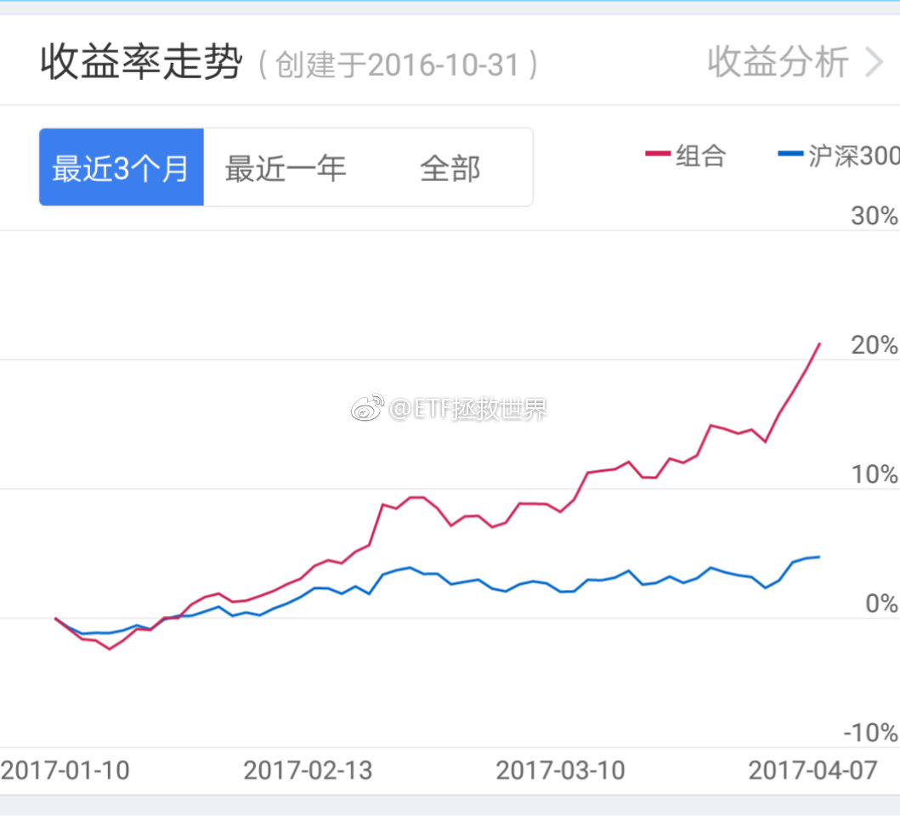

======================================================

ETF拯救世界 (5687069307) @
2017-04-10 14:27:27 Mon  
url: https://weibo.com/5687069307/EDRaYgQqL

10号了。[哼] ​​​

转发[2]  评论[66]  赞[42] 

======================================================

ETF拯救世界 (5687069307) @
2017-04-11 10:29:39 Tue  
url: https://weibo.com/5687069307/EDZ2WtcFU

黑天鹅的意思是你想不到的风险。所有人都在说的风险其实不是黑天鹅。

黑天鹅也没那么多，很多年会出一只。但真的出来了就是疯狂屠杀。 ​​​

转发[11]  评论[33]  赞[52] 

======================================================

ETF拯救世界 (5687069307) @
2017-04-11 10:43:23 Tue  
url: https://weibo.com/5687069307/EDZ8wcaba

十几年的经验来看，每次价值回归的路径都不同，没有一次重样的。

这次会用什么方式回归？

无论用什么方式回归，一定会回归。

没点信仰就别玩股票了。 ​​​

转发[29]  评论[88]  赞[89] 

======================================================

ETF拯救世界 (5687069307) @
2017-04-11 13:28:45 Tue  
url: https://weibo.com/5687069307/EE0dDB707

个人认为3200以上GJD应该不会动手。否则几十个点的空间太小了。一个想法，不一定对。

------------------------------------------------------
转推：
>  @ETF拯救世界 (5687069307)
>  2017-04-07 10:09:34 Fri  
>  url: https:/weibo.com/5687069307/EDncO76hf/

>  3000（或者3100）到3300之间用ETF做网格应该是很靠谱的。
>  
>  GJD信誉保证。跟着GJD有肉吃。 ​​​

转发[1]  评论[59]  赞[30] 

======================================================

ETF拯救世界 (5687069307) @
2017-04-11 14:56:56 Tue  
url: https://weibo.com/5687069307/EE0Nr48Gg

图做的好看。

------------------------------------------------------
转推：
>  @ETF九哥 (6120454334)
>  2017-04-11 14:52:12 Tue  
>  url: https:/weibo.com/6120454334/EE0Lw1zDZ/

>  logging,月初@ETF拯救世界 发了一车，加了广发医药发现excel代码存在问题。今天终于改好了，再发一图。有信仰，才能有未来。 ​​​

转发[4]  评论[18]  赞[31] 

======================================================

ETF拯救世界 (5687069307) @
2017-04-11 18:36:27 Tue  
url: https://weibo.com/5687069307/EE2exzrtE

丁义珍如果被赶下来，电视剧拍五集就够了。上了飞机坐下又被轰下来真是太坑了！

------------------------------------------------------
转推：
>  @ ()
>  2017-04-11 16:37:07 Tue  
>  url: 

>  抱歉，此微博已被作者删除。查看帮助：http://t.cn/Rfd3rQV

转发[3]  评论[27]  赞[22] 

======================================================

ETF拯救世界 (5687069307) @
2017-04-12 12:26:32 Wed  
url: https://weibo.com/5687069307/EE9eSkSlP

回复@冰泉流夏:是。这就是所谓的“时间换空间”//@冰泉流夏:昨天看到一篇文章，去年财报出来中证500营收还是利润涨了20%，这样股价不变过两年是不是也可以回归正常估值[捂脸]不太懂这些…

------------------------------------------------------
转推：
>  @ETF拯救世界 (5687069307)
>  2017-04-11 10:43:23 Tue  
>  url: https:/weibo.com/5687069307/EDZ8wcaba/

>  十几年的经验来看，每次价值回归的路径都不同，没有一次重样的。
>  
>  这次会用什么方式回归？
>  
>  无论用什么方式回归，一定会回归。
>  
>  没点信仰就别玩股票了。 ​​​

转发[7]  评论[25]  赞[30] 

======================================================

ETF拯救世界 (5687069307) @
2017-04-12 13:43:28 Wed  
url: https://weibo.com/5687069307/EE9K71pUv

下午去面试招人，不看盘了。预测一下，收盘涨跌幅不超过0.5%。

欢迎打脸。[doge] ​​​

转发[1]  评论[75]  赞[46] 

======================================================

ETF拯救世界 (5687069307) @
2017-04-12 16:12:37 Wed  
url: https://weibo.com/5687069307/EEaIEEWeS

打新门票这样，中不中新股都无所谓了……

[doge] ​​​

转发[2]  评论[32]  赞[40] 

+++++++++++++++++++++++++++++++++++++++++++++++++++++

图片：
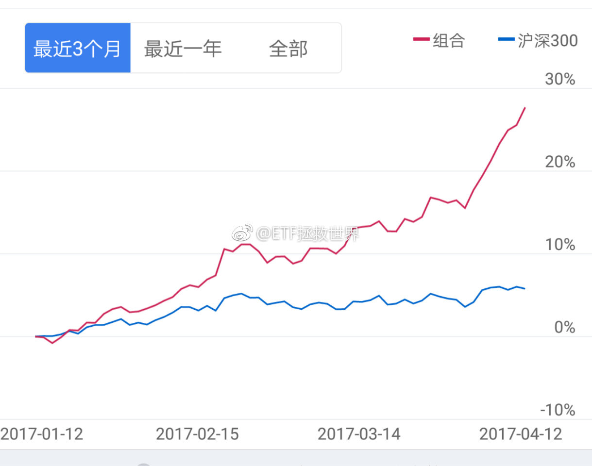

======================================================

ETF拯救世界 (5687069307) @
2017-04-12 16:18:55 Wed  
url: https://weibo.com/5687069307/EEaLd2frl

面试8个人，5个从银行出来的。

银行怎么了！

[摊手] ​​​

转发[4]  评论[57]  赞[48] 

======================================================

ETF拯救世界 (5687069307) @
2017-04-12 16:31:41 Wed  
url: https://weibo.com/5687069307/EEaQog7AN

今天数据出来了。如果明天不大涨，明晚强行开车。

滴滴~~有搭顺风车的吗！ ​​​

转发[9]  评论[180]  赞[138] 

======================================================

ETF拯救世界 (5687069307) @
2017-04-13 03:52:05 Thu  
url: https://weibo.com/5687069307/EEfiz7LP2

某机构出完货就特停，是不是太不地道了？还能怎么玩？

------------------------------------------------------
转推：
>  @财联社APP (2868676035)
>  2017-04-12 22:06:50 Wed  
>  url: https:/weibo.com/2868676035/EEd2r3EOf/

>  【雄安概念股集体停牌】财联社12日讯，金隅股份、韩建河山、唐山港、保变电气、华夏幸福等雄安概念股发表公告称，因股价异动，13日起停牌核查。小财注：稍前，渤海股份、京汉股份、先河环保、中化岩土、河北宣工、冀东水泥、冀东装备、巨力索具、创业环保等多只雄安概念股都发布公告，停牌核查。 ​​​

转发[5]  评论[39]  赞[35] 

======================================================

ETF拯救世界 (5687069307) @
2017-04-13 10:33:42 Thu  
url: https://weibo.com/5687069307/EEhVAb2bP

截至今日，有1696家公司披露年报。

其中证金位列十大股东的有220只。汇金资管位列十大股东的有500只。

三季报这两个数字分别是468只和896只。

由于年报还有小一半没有披露，可以看出，GJD依然没有撤退，甚至辗转腾挪可能加仓了。 ​​​

转发[18]  评论[42]  赞[39] 

======================================================

ETF拯救世界 (5687069307) @
2017-04-13 10:50:52 Thu  
url: https://weibo.com/5687069307/EEi2ybXMX

这会带来两个问题。第一，始终无法价值回归。看估值图就可以知道，2015年以来这样的，长时间全市场高估的情况几乎在历史上没有发生过。一万多亿资金在里面托盘的结果。第二，没法上涨。估值高不容易涨，另外大涨就会带来GJD的打压。所以股民很难赚钱。当然，选好股票可以。问题是，你选的出来吗。

------------------------------------------------------
转推：
>  @ETF拯救世界 (5687069307)
>  2017-04-13 10:33:42 Thu  
>  url: https:/weibo.com/5687069307/EEhVAb2bP/

>  截至今日，有1696家公司披露年报。
>  
>  其中证金位列十大股东的有220只。汇金资管位列十大股东的有500只。
>  
>  三季报这两个数字分别是468只和896只。
>  
>  由于年报还有小一半没有披露，可以看出，GJD依然没有撤退，甚至辗转腾挪可能加仓了。 ​​​

转发[9]  评论[57]  赞[41] 

======================================================

ETF拯救世界 (5687069307) @
2017-04-13 11:15:18 Thu  
url: https://weibo.com/5687069307/EEict4kR9

关于“选股票”的数据。

今年至今，沪深300上涨6%左右。上海上涨5%，深圳4%，创业板下跌2%。

同期，去掉新股，上涨股票1303只，占比44%。涨幅超过沪深300的股票780只，占比26%。

也就是说，随机买股票的话，有74%的机会跑不赢大盘。或者说，有74%炒股的人跑不赢大盘。

一将功成万骨枯。看着别人炒 ​​​

转发[12]  评论[82]  赞[78] 

======================================================

ETF拯救世界 (5687069307) @
2017-04-14 09:37:37 Fri  
url: https://weibo.com/5687069307/EEqZjqV0n

今天你最想对GJD说的一句话是（   ）。（15分） ​​​

转发[5]  评论[124]  赞[23] 

======================================================

ETF拯救世界 (5687069307) @
2017-04-14 10:29:24 Fri  
url: https://weibo.com/5687069307/EErkkykoF

最近骗子越来越多了。我再说一次，我100%不会私信各位谈什么个股。只要出现这种人马上举报！各位认清认证和粉丝数量~

------------------------------------------------------
转推：
>  @ETF拯救世界 (5687069307)
>  2016-11-29 14:32:04 Tue  
>  url: https:/weibo.com/5687069307/EjMNiwMwG/

>  微博的朋友们，再说一次，微博有很多骗子会将我的昵称“ETF拯救世界”稍作修改，然后主动私信大家进行行骗。比如“ETT拯救世界”、“-ETF拯救世界”之类的。99.99%的情况我不会主动私信大家，如果大家收到了，可以点一下对方的头像看看粉丝数什么的对不对。
>  
>  请大家一旦发现骗子马上举报不要犹豫！ ​​​

转发[0]  评论[10]  赞[25] 

======================================================

ETF拯救世界 (5687069307) @
2017-04-14 10:30:48 Fri  
url: https://weibo.com/5687069307/EErkU12aE

四月第二次计划，买入一份。差点又把微博的乡亲们忘了。

http://t.cn/RXyepwo ​​​

转发[7]  评论[50]  赞[50] 

======================================================

ETF拯救世界 (5687069307) @
2017-04-14 10:59:48 Fri  
url: https://weibo.com/5687069307/EErwFx56s

好问题才有好回答啊。我回答了 @用户oixkqdt7wt 的问题，问题价值￥88.00，大家快来花1元围观~ http://t.cn/RXzhnHg ​​​

转发[348]  评论[162]  赞[348] 

======================================================

ETF拯救世界 (5687069307) @
2017-04-14 11:15:24 Fri  
url: https://weibo.com/5687069307/EErD0yswW

配置银行股打新的朋友已经在骂人了吧……

$民生银行 sh600016$ ​​​

转发[21]  评论[83]  赞[39] 

======================================================

ETF拯救世界 (5687069307) @
2017-04-14 13:27:29 Fri  
url: https://weibo.com/5687069307/EEsuCgRws

今天跌这么多，尾盘一定会动手了。sigh。有人做庄真的太难玩了。

------------------------------------------------------
转推：
>  @ETF拯救世界 (5687069307)
>  2017-04-14 09:37:37 Fri  
>  url: https:/weibo.com/5687069307/EEqZjqV0n/

>  今天你最想对GJD说的一句话是（   ）。（15分） ​​​

转发[0]  评论[68]  赞[34] 

======================================================

ETF拯救世界 (5687069307) @
2017-04-14 14:54:29 Fri  
url: https://weibo.com/5687069307/EEt3VATr2

Wonderful songs《Asher Book - Here With You》 http://t.cn/RfV2Hkt 

[馋嘴] ​​​

转发[2]  评论[50]  赞[41] 

======================================================

ETF拯救世界 (5687069307) @
2017-04-14 15:39:40 Fri  
url: https://weibo.com/5687069307/EEtmhcJK1

今天估值出来了。感动一刚。 ​​​

转发[2]  评论[75]  赞[60] 

======================================================

ETF拯救世界 (5687069307) @
2017-04-15 05:39:54 Sat  
url: https://weibo.com/5687069307/EEyRjoA3N

回复@大师别冲动:当时我买了15万上汽赚到75万算失败吗。当时博客全程直播。他说银行我就跟他说银行啊。//@大师别冲动:回复@ETF拯救世界:09年那种行情，一倍是失败的好吧

------------------------------------------------------
转推：
>  @ETF拯救世界 (5687069307)
>  2017-04-14 11:15:24 Fri  
>  url: https:/weibo.com/5687069307/EErD0yswW/

>  配置银行股打新的朋友已经在骂人了吧……
>  
>  $民生银行 sh600016$ ​​​

转发[1]  评论[52]  赞[41] 

======================================================

ETF拯救世界 (5687069307) @
2017-04-17 08:54:59 Mon  
url: https://weibo.com/5687069307/EESZv4189

幼儿园英语外教居然是印度人。

可以说是诈骗了吧。

[哼] ​​​

转发[15]  评论[69]  赞[51] 

======================================================

ETF拯救世界 (5687069307) @
2017-04-17 09:36:44 Mon  
url: https://weibo.com/5687069307/EETgrv8S0

占小便宜吃大亏。

一条生活经验，不一定对。 ​​​

转发[0]  评论[26]  赞[41] 

======================================================

ETF拯救世界 (5687069307) @
2017-04-17 09:43:04 Mon  
url: https://weibo.com/5687069307/EETj16Ogj

一般早盘GJD不动手的原因……

收盘跌幅不会超过1%！赌一块钱。 ​​​

转发[6]  评论[27]  赞[36] 

+++++++++++++++++++++++++++++++++++++++++++++++++++++

图片：
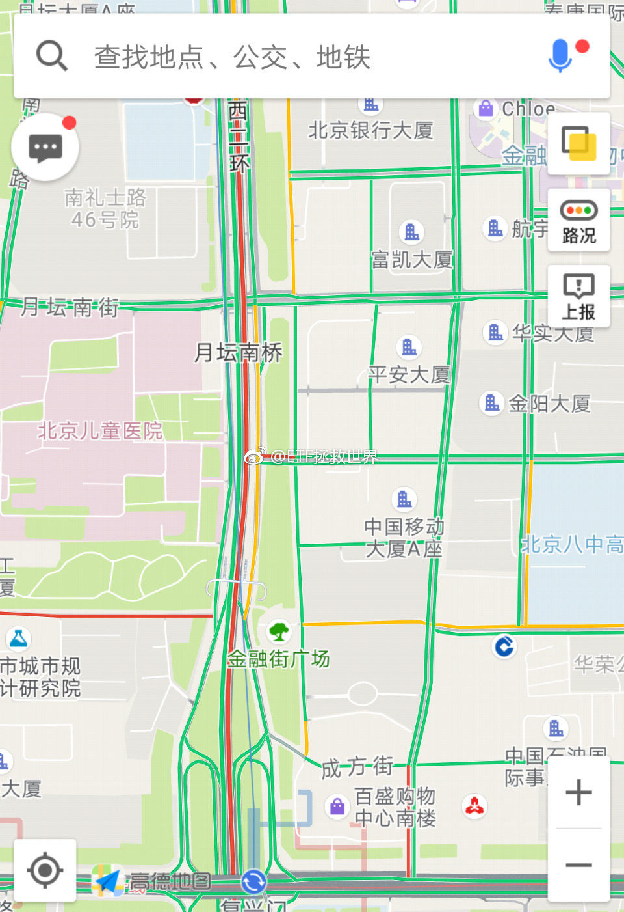

======================================================

ETF拯救世界 (5687069307) @
2017-04-17 09:50:05 Mon  
url: https://weibo.com/5687069307/EETlRt9DP

各位，这里有个观点：

全市场不敢说，现在一万多亿GJD在里面拼命护盘，所以我不敢说。

但是某些板块如果有机会下跌20%-30%以上，那么我们未来十年在A股较好的收益率就可以保证了。（如果用时间杀空间，也不用20%以上，但时间要好几年）

下跌永远是机会。所有人都知道这点，但为什么只有少数人能抓住 ​​​

转发[35]  评论[83]  赞[100] 

======================================================

ETF拯救世界 (5687069307) @
2017-04-17 10:00:14 Mon  
url: https://weibo.com/5687069307/EETpZ6xpy

$养老产业 sz399812$   红了，什么鬼 ​​​

转发[0]  评论[40]  赞[28] 

======================================================

ETF拯救世界 (5687069307) @
2017-04-17 10:52:54 Mon  
url: https://weibo.com/5687069307/EETLmoquc

问自己一个问题，测试一下自己的投资心理成熟度：

如果现在到月底，月中买的养老产业下跌5%，你会不会觉得自己月中高高兴兴买入该指数是一个sb行为，很后悔。

同样到月底，养老指数上涨5%，你会不会觉得自己买太少了是sb行为，很后悔。

每个人都问问自己，看看自己是否成熟。 ​​​

转发[11]  评论[134]  赞[59] 

======================================================

ETF拯救世界 (5687069307) @
2017-04-17 11:31:06 Mon  
url: https://weibo.com/5687069307/EEU0Scyvj

今天计划跌幅应该不超过0.2%。而两市指数跌幅在1.x%以上。

个股不用说了，接近100只跌停，400多只跌幅在5%以上，一半跌幅超过2%。

指数投资与风险控制的意义，可能很多朋友要5-10年以后才能真的理解。 ​​​

转发[14]  评论[35]  赞[54] 

======================================================

ETF拯救世界 (5687069307) @
2017-04-17 11:36:38 Mon  
url: https://weibo.com/5687069307/EEU3742s0

哈哈，我打算试试。薅某队羊毛。

------------------------------------------------------
转推：
>  @ETF拯救世界 (5687069307)
>  2017-04-07 10:09:34 Fri  
>  url: https:/weibo.com/5687069307/EDncO76hf/

>  3000（或者3100）到3300之间用ETF做网格应该是很靠谱的。
>  
>  GJD信誉保证。跟着GJD有肉吃。 ​​​

转发[3]  评论[27]  赞[39] 

======================================================

ETF拯救世界 (5687069307) @
2017-04-17 13:20:56 Mon  
url: https://weibo.com/5687069307/EEUJrCEJi

小股票这周如果起不来，基本趋势就完全歇菜了。

如果这样，等了两年，小股票的坑，我们准备开始慢慢填了。

[微笑] ​​​

转发[13]  评论[42]  赞[63] 

======================================================

ETF拯救世界 (5687069307) @
2017-04-17 13:47:03 Mon  
url: https://weibo.com/5687069307/EEUU37EkF

回复@最累的时候已过去:你看看中证1000。$中证1000 sh000852$  可以这么说，24个月以来，玩小股票的80%以上的人都埋在坑里一直没爬出来。//@最累的时候已过去:中小创的坑才刚开挖，还没埋进去多少人，不急着填[笑cry]

------------------------------------------------------
转推：
>  @ETF拯救世界 (5687069307)
>  2017-04-17 13:20:56 Mon  
>  url: https:/weibo.com/5687069307/EEUJrCEJi/

>  小股票这周如果起不来，基本趋势就完全歇菜了。
>  
>  如果这样，等了两年，小股票的坑，我们准备开始慢慢填了。
>  
>  [微笑] ​​​

转发[5]  评论[17]  赞[15] 

======================================================

ETF拯救世界 (5687069307) @
2017-04-17 14:05:23 Mon  
url: https://weibo.com/5687069307/EEV1ul2rh

转需//@硬核黄桃:it出轨是大保健么。。//@泼墨C: 羡慕全职妈妈的生活！//@京鲁蔡: 金融狗为码农背锅多年，终于得以翻身了

------------------------------------------------------
转推：
>  @ ()
>  2017-04-17 13:32:38 Mon  
>  url: 

>  该账号因被投诉违反法律法规和《微博社区公约》的相关规定，现已无法查看。查看帮助 https://kefu.weibo.com/faqdetail?id=13216

转发[12]  评论[18]  赞[12] 

======================================================

ETF拯救世界 (5687069307) @
2017-04-17 14:21:09 Mon  
url: https://weibo.com/5687069307/EEV7TcNA4

为什么很多人投资总是会有一种深深的“焦虑感”？永远怕“踏空”，害怕被资本市场财富的快车抛下。

很大原因，是因为在社交媒体上，看到太多“成功”的案例。似乎所有人，除了自己，都在赚钱，赚大钱。

其实事实未必如此。

一个原因是，大多数，或者绝大多数人会选出自己赚的比较多的品种拿出来说。 ​​​

转发[62]  评论[84]  赞[93] 

======================================================

ETF拯救世界 (5687069307) @
2017-04-17 15:01:19 Mon  
url: https://weibo.com/5687069307/EEVoc8knj

完成任务，收工。有钱，任性。

------------------------------------------------------
转推：
>  @ETF拯救世界 (5687069307)
>  2017-04-17 09:43:04 Mon  
>  url: https:/weibo.com/5687069307/EETj16Ogj/

>  一般早盘GJD不动手的原因……
>  
>  收盘跌幅不会超过1%！赌一块钱。 ​​​

转发[1]  评论[34]  赞[37] 

======================================================

ETF拯救世界 (5687069307) @
2017-04-17 15:45:44 Mon  
url: https://weibo.com/5687069307/EEVGdBYrB

今天的估值相当给力。这样跌几天，弄不好要加车啊。 ​​​

转发[11]  评论[86]  赞[75] 

======================================================

ETF拯救世界 (5687069307) @
2017-04-17 16:39:56 Mon  
url: https://weibo.com/5687069307/EEW2dDAJK

回复@义无反顾:会。一个平衡的自然环境中，突然出现了一个庞然大物，生态改变了。空间、时间发生了不同以往的紊乱。那么想要在新环境下生存下去，就要想办法适应环境。不断调整、不断适应，才能活得长久。当然，基本原则不会放弃，否则就没有了生存的基础。

------------------------------------------------------
转推：
>  @ETF拯救世界 (5687069307)
>  2017-04-17 15:45:44 Mon  
>  url: https:/weibo.com/5687069307/EEVGdBYrB/

>  今天的估值相当给力。这样跌几天，弄不好要加车啊。 ​​​

转发[7]  评论[15]  赞[56] 

======================================================

ETF拯救世界 (5687069307) @
2017-04-18 08:26:47 Tue  
url: https://weibo.com/5687069307/EF2ey81yp

昨天计划净值下跌0.02%，20%多仓位……风控的意义。

------------------------------------------------------
转推：
>  @ETF拯救世界 (5687069307)
>  2017-04-17 11:31:06 Mon  
>  url: https:/weibo.com/5687069307/EEU0Scyvj/

>  今天计划跌幅应该不超过0.2%。而两市指数跌幅在1.x%以上。
>  
>  个股不用说了，接近100只跌停，400多只跌幅在5%以上，一半跌幅超过2%。
>  
>  指数投资与风险控制的意义，可能很多朋友要5-10年以后才能真的理解。 ​​​

转发[4]  评论[25]  赞[54] 

======================================================

ETF拯救世界 (5687069307) @
2017-04-18 10:00:48 Tue  
url: https://weibo.com/5687069307/EF2QI8LO4

$兴业银行 sh601166$   $民生银行 sh600016$   又堵车了？每天这么玩有意思没有啊。

------------------------------------------------------
转推：
>  @ETF拯救世界 (5687069307)
>  2017-04-17 09:43:04 Mon  
>  url: https:/weibo.com/5687069307/EETj16Ogj/

>  一般早盘GJD不动手的原因……
>  
>  收盘跌幅不会超过1%！赌一块钱。 ​​​

转发[3]  评论[27]  赞[18] 

======================================================

ETF拯救世界 (5687069307) @
2017-04-18 10:49:24 Tue  
url: https://weibo.com/5687069307/EF3aruy3h

月中买的 $养老产业 sz399812$  又开始赚钱了…… ​​​

转发[1]  评论[43]  赞[39] 

======================================================

ETF拯救世界 (5687069307) @
2017-04-18 12:01:01 Tue  
url: https://weibo.com/5687069307/EF3Dvo13m

可能要停牌了

------------------------------------------------------
转推：
>  @ ()
>  2017-04-18 11:37:53 Tue  
>  url: 

>  抱歉，作者已设置仅展示半年内微博，此微博已不可见。 ​​​

转发[4]  评论[29]  赞[16] 

======================================================

ETF拯救世界 (5687069307) @
2017-04-18 13:37:52 Tue  
url: https://weibo.com/5687069307/EF4gOzzNv

刚有个朋友跟我说，房子卖早了，少赚了一波，求安慰。又问我，如果是我，会不会懊恼？

我想了想，感觉自己应该会觉得有点可惜，少赚了一些钱。但不会懊恼。

就像股票一样。高的地方没有卖，低的地方没有买。很多曾经“关注”过的股票，品种，没买，然后火箭一样上涨。会不会懊恼？

并不会。

因为那 ​​​

转发[90]  评论[120]  赞[193] 

======================================================

ETF拯救世界 (5687069307) @
2017-04-18 14:06:34 Tue  
url: https://weibo.com/5687069307/EF4st67mn

竞猜：两点半，他来不来。他的爱，还在不在？//@ETF拯救世界:$兴业银行 sh601166$   $民生银行 sh600016$   又堵车了？每天这么玩有意思没有啊。

------------------------------------------------------
转推：
>  @ETF拯救世界 (5687069307)
>  2017-04-17 09:43:04 Mon  
>  url: https:/weibo.com/5687069307/EETj16Ogj/

>  一般早盘GJD不动手的原因……
>  
>  收盘跌幅不会超过1%！赌一块钱。 ​​​

转发[1]  评论[44]  赞[20] 

======================================================

ETF拯救世界 (5687069307) @
2017-04-18 14:33:29 Tue  
url: https://weibo.com/5687069307/EF4DojK2V

如果有个平行宇宙，在那个宇宙中，参考计划的朋友自己炒股。

那你现在看到那边的自己，可能会很有意思。可能赚更多，也可能悲剧了。

所以我鼓励朋友们可以参考计划的同时自己炒股。挖掘自己的天分。不要束缚自己。 ​​​

转发[5]  评论[109]  赞[55] 

======================================================

ETF拯救世界 (5687069307) @
2017-04-18 16:36:07 Tue  
url: https://weibo.com/5687069307/EF5rarJIz

今天数据出来了。想加车，怎么办，谁来劝劝我。 ​​​

转发[14]  评论[231]  赞[99] 

======================================================

ETF拯救世界 (5687069307) @
2017-04-19 08:49:49 Wed  
url: https://weibo.com/5687069307/EFbOorsZZ

回复@Leo老雷:也不能说绝大多数吧。大多数走不到最后是肯定的。不是主观不想走到最后，而是走的过程中不断产生“怀疑”。比如仓位不高的时候突然大涨，比如后期仓位很重的时候依然不断跌。大多数人幻想的一路轻仓最后超级大底一把梭哈满仓然后就是赚大钱的事情大概率不会发生。成功的投资注定是反人性

------------------------------------------------------
转推：
>  @ETF拯救世界 (5687069307)
>  2017-04-18 16:36:07 Tue  
>  url: https:/weibo.com/5687069307/EF5rarJIz/

>  今天数据出来了。想加车，怎么办，谁来劝劝我。 ​​​

转发[8]  评论[34]  赞[54] 

======================================================

ETF拯救世界 (5687069307) @
2017-04-19 09:18:17 Wed  
url: https://weibo.com/5687069307/EFbZWEHNG

没脸见人，好几天没新高了。

人生没有希望了一刚。 ​​​

转发[2]  评论[36]  赞[39] 

+++++++++++++++++++++++++++++++++++++++++++++++++++++

图片：
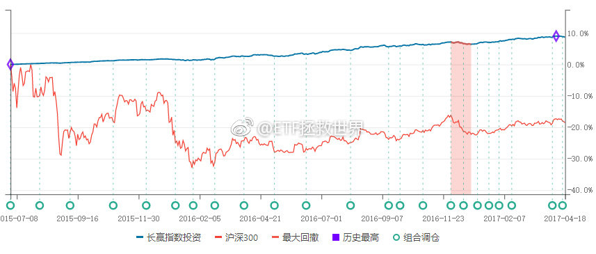

======================================================

ETF拯救世界 (5687069307) @
2017-04-19 09:32:45 Wed  
url: https://weibo.com/5687069307/EFc5P5IEM

竞猜，几点上班。时间最接近的赢。有大礼包。 ​​​

转发[5]  评论[184]  赞[37] 

======================================================

ETF拯救世界 (5687069307) @
2017-04-19 09:41:53 Wed  
url: https://weibo.com/5687069307/EFc9wCwo9

$162411  油气4月计划别忘了。 ​​​

转发[5]  评论[50]  赞[39] 

======================================================

ETF拯救世界 (5687069307) @
2017-04-19 09:48:26 Wed  
url: https://weibo.com/5687069307/EFccbwsDP

回头再看发帖时间，对照K线。尤其是中小、创业、1000的k线。2015年以来的估值图神迹在继续……

------------------------------------------------------
转推：
>  @ETF拯救世界 (5687069307)
>  2017-03-21 15:54:32 Tue  
>  url: https:/weibo.com/5687069307/EAPco7pao/

>  热腾腾的加权估值新鲜出炉。
>  
>  今天收盘后的数据，是2015年12月第三轮熔断前以来，按月计算加权估值最高的时候。
>  
>  大概是36.x。我个人不太相信会升到40以上，那将是另一次灾难的开始。不过，怎么说呢，金融市场的事谁说的准。真到了40以上，等着看热闹就对了。 ​​​

转发[3]  评论[26]  赞[35] 

======================================================

ETF拯救世界 (5687069307) @
2017-04-19 09:54:50 Wed  
url: https://weibo.com/5687069307/EFceMzYzJ

回复@用户5178306551:我发这条微博之前只有3万手……//@用户5178306551:21W手怎么买

------------------------------------------------------
转推：
>  @ETF拯救世界 (5687069307)
>  2017-04-19 09:41:53 Wed  
>  url: https:/weibo.com/5687069307/EFc9wCwo9/

>  $162411  油气4月计划别忘了。 ​​​

转发[0]  评论[32]  赞[27] 

======================================================

ETF拯救世界 (5687069307) @
2017-04-19 10:15:47 Wed  
url: https://weibo.com/5687069307/EFcnilVb4

我想大概谈谈对市场的一些看法。

最近这段时间，中小创跌幅巨大，大多数，70-80%的股票不断下跌。而一些明星股则不断上涨，这是价值回归么。

我不这么看。

这是熊市某个阶段的一个特征。客观因素是资金少，只能在局部制造热点，公募也好私募也好，大家抱团取暖做几个品种而已。

对，有些股票确实是 ​​​

转发[51]  评论[63]  赞[114] 

======================================================

ETF拯救世界 (5687069307) @
2017-04-19 10:30:59 Wed  
url: https://weibo.com/5687069307/EFctsmHaC

计划最终能赚多少我说不好，因为要看未来怎么走。

但有一件事我从2015年7月开始就很有信心，那就是没有一个人会死。无论风浪有多大，无论怎么血流成河。

如果所有人都一定要死，我们也会是最后一批倒下的。经过那么多年，那么多次的严冬，我有这个信心。

这也是我敢于公布这份投资计划的原因。 ​​​

转发[11]  评论[81]  赞[124] 

======================================================

ETF拯救世界 (5687069307) @
2017-04-19 11:11:31 Wed  
url: https://weibo.com/5687069307/EFcJUrJKn

$中证1000 sh000852$   看了看k线，鬼知道这两年中小股票经历了什么……

别急，快了。我们来接盘。 ​​​

转发[1]  评论[39]  赞[63] 

======================================================

ETF拯救世界 (5687069307) @
2017-04-19 11:54:57 Wed  
url: https://weibo.com/5687069307/EFd1xsFwv

截至昨日收盘，本年至今跌幅最大的股票已经跌了53%，腰斩。

跌幅大于10%的股票有1024（-_-b）只，占34%。

下跌的股票有1922只，占64%。

有人非说现在是慢牛，这叫什么牛市？现在只是个别明星股和权重股拉升掩盖下的慢熊某个阶段而已好吗。 ​​​

转发[11]  评论[63]  赞[74] 

======================================================

ETF拯救世界 (5687069307) @
2017-04-19 13:25:12 Wed  
url: https://weibo.com/5687069307/EFdCaC45X

一万多亿GJD最大的问题是什么？是由于托市，造成了本来应该在2015年明白自己炒股水平不怎么样的人觉得自己是股神。

他们会觉得自己之前的投资策略没错。本来应该建立起来的风险意识完全被忽略。

当然，最后只能是白白浪费了几年时间，还会比当时痛痛快快跌到位的话赔的更多。 ​​​

转发[9]  评论[72]  赞[69] 

======================================================

ETF拯救世界 (5687069307) @
2017-04-19 14:41:23 Wed  
url: https://weibo.com/5687069307/EFe763qFE

13:40。请最接近的朋友在自己评论下面@ 我。说送就送。

------------------------------------------------------
转推：
>  @ETF拯救世界 (5687069307)
>  2017-04-19 09:32:45 Wed  
>  url: https:/weibo.com/5687069307/EFc5P5IEM/

>  竞猜，几点上班。时间最接近的赢。有大礼包。 ​​​

转发[0]  评论[56]  赞[41] 

======================================================

ETF拯救世界 (5687069307) @
2017-04-20 05:18:45 Thu  
url: https://weibo.com/5687069307/EFjRdtSrr

昨天场外申购油气的厉害了 ​​​

转发[11]  评论[118]  赞[51] 

+++++++++++++++++++++++++++++++++++++++++++++++++++++

图片：

======================================================

ETF拯救世界 (5687069307) @
2017-04-20 09:16:59 Thu  
url: https://weibo.com/5687069307/EFlpV4A8N

今日华宝油气预估净值0.599，场内交易的朋友可以以这个为参考。

------------------------------------------------------
转推：
>  @ETF拯救世界 (5687069307)
>  2017-04-20 05:18:45 Thu  
>  url: https:/weibo.com/5687069307/EFjRdtSrr/

>  昨天场外申购油气的厉害了 ​​​

转发[3]  评论[65]  赞[49] 

======================================================

ETF拯救世界 (5687069307) @
2017-04-20 09:55:57 Thu  
url: https://weibo.com/5687069307/EFlFJvpjy

朋友们投资要记住这几个字：人弃我取，人取我予。

风水轮流转。

现在不断新高豪气冲天的，还去追，未来给你赚大钱的机会就不多；

现在跌跌不休没人待见的，才是未来的金矿所在。

节奏，注意节奏。 ​​​

转发[31]  评论[55]  赞[98] 

======================================================

ETF拯救世界 (5687069307) @
2017-04-20 10:07:29 Thu  
url: https://weibo.com/5687069307/EFlKpFl5J

一年多过去了，第三轮计划资产搭配的雏形终于有点样子了。接下来就是不断的加加减减。品种还差一个贵金属，海外还差一个美股，也基本就全了。

太难了。买点不贵的东西太难了！ ​​​

转发[17]  评论[55]  赞[80] 

======================================================

ETF拯救世界 (5687069307) @
2017-04-20 10:33:57 Thu  
url: https://weibo.com/5687069307/EFlVa0KoX

我建议朋友们有空的时候可以去看看A股的历史。不用太久，就从2000年开始看。

尤其是2002以后，A股是如何走的，每个阶段都发生了什么。

看到2003-2004，你会发现跟现在蜜汁相似，非常眼熟。“五朵金花”。

再往后看，看到2005。这里就是最关键了。看看2005之后，什么板块，什么股票在那样的史无前例 ​​​

转发[111]  评论[89]  赞[142] 

======================================================

ETF拯救世界 (5687069307) @
2017-04-20 10:47:38 Thu  
url: https://weibo.com/5687069307/EFm0Ig4Bs

$全指医药 sh000991$ 不出所料。 ​​​

转发[3]  评论[22]  赞[54] 

======================================================

ETF拯救世界 (5687069307) @
2017-04-20 11:02:05 Thu  
url: https://weibo.com/5687069307/EFm6A0L86

计划三月高位没买，四月买的三个品种到现在这一刻都没有亏损。可以说完美避开这波下跌。

再往前看，所有“不买”的月份之后都是大跌。所以以后哪个月计划“不买”，就得留点神……

有点艺术的感觉没有。 ​​​​

转发[14]  评论[49]  赞[92] 

+++++++++++++++++++++++++++++++++++++++++++++++++++++

图片：
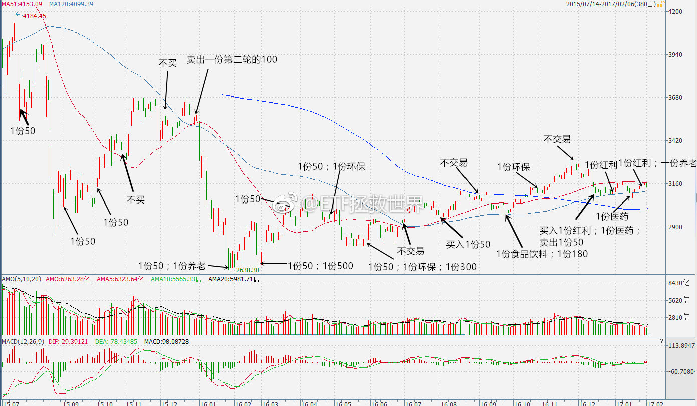

======================================================

ETF拯救世界 (5687069307) @
2017-04-20 11:15:58 Thu  
url: https://weibo.com/5687069307/EFmcdeVNO

就像A股上一轮牛市其实从2012年11月就开始了而不是大多数认为的2014年三季度开始一样，现在的指数也根本不能代表A股的性质。

今天上证下跌0.13%，深成上涨0.21%。其实，现在上涨的家数是900家，下跌的家数却有2000多家。

有很多类似的误区，各位要知道怎么甄别。指数没跌，很多朋友手里的股票已经跌 ​​​

转发[22]  评论[65]  赞[83] 

======================================================

ETF拯救世界 (5687069307) @
2017-04-20 13:34:37 Thu  
url: https://weibo.com/5687069307/EFn6v2dlM

白马：你追不追？不追？我继续涨给你看。还不追？我继续涨。追啦？duang，归你了！

------------------------------------------------------
转推：
>  @投鱼问道 (1888116862)
>  2017-02-10 10:20:51 Fri  
>  url: https:/weibo.com/1888116862/EuRlA3CeX/

>  【重要规律】多年悟出的A股16字：抱团取暖、敌进我退、广场赌博、击鼓传花
>  【抱团取暖】：公募等有最低持仓80%左右的要求，股市再跌也不能清仓，不得不找一些股抱团取暖，即使不涨，也不能跌，典型如白马股，茅台等，每逢股市弱势，总有一些股很坚挺，就是公募抱团在自己玩。
>  【敌进我退】：是指游资和 ​​​

转发[23]  评论[40]  赞[70] 

======================================================

ETF拯救世界 (5687069307) @
2017-04-20 13:52:03 Thu  
url: https://weibo.com/5687069307/EFndzgDq0

最近话比较多，因为有些事只有在这时候说才有用，有些朋友才能听懂。比如下面这句：

买的稍微高点，你还有钱，想多买，摊低成本，没错。这也是我们计划的精髓之一。

但你要注意，不要0.62买的，0.6就要补仓摊低。你这样买，扛不过熊市。因为你爸爸不是李嘉诚，你也不是央行印钞机。你没那么多钱补。
 ​​​

转发[90]  评论[164]  赞[168] 

======================================================

ETF拯救世界 (5687069307) @
2017-04-20 14:08:20 Thu  
url: https://weibo.com/5687069307/EFnkb4GMS

截至昨日收盘，年初至今有2020只股票下跌，占比67.63%。

跌幅超过10%的股票有1135只，占比38%。

上涨超过10%股票有407只，占比13.63%。

中位数是下跌5.99%。好一个“慢牛”。 ​​​

转发[5]  评论[45]  赞[62] 

======================================================

ETF拯救世界 (5687069307) @
2017-04-20 15:31:29 Thu  
url: https://weibo.com/5687069307/EFnRVv4Lk

创业板估值已经回到2014年10月。沧海桑田，2年半过去，一个轮回。

继续吧。前路依然漫漫。 ​​​

转发[9]  评论[61]  赞[71] 

======================================================

ETF拯救世界 (5687069307) @
2017-04-20 20:09:43 Thu  
url: https://weibo.com/5687069307/EFpGRq6jH

再撑一周，月末那次计划四份以上不是梦。

估计一次就把那些整天担心踏空的朋友病都治好了。 ​​​

转发[34]  评论[131]  赞[94] 

+++++++++++++++++++++++++++++++++++++++++++++++++++++

图片：

======================================================

ETF拯救世界 (5687069307) @
2017-04-20 22:29:24 Thu  
url: https://weibo.com/5687069307/EFqByAG5r

[doge] ​​​

转发[1]  评论[86]  赞[51] 

+++++++++++++++++++++++++++++++++++++++++++++++++++++

图片：

======================================================

ETF拯救世界 (5687069307) @
2017-04-21 09:11:26 Fri  
url: https://weibo.com/5687069307/EFuOashvm

还有五个交易日，周四晚开车。其实你仔细想想，有什么所谓啊。涨多了咱们就少买点，跌多了就多买点。是你的就是你的，跑不掉。不是你的你非去抓，结局很可能是→

------------------------------------------------------
转推：
>  @ETF拯救世界 (5687069307)
>  2017-04-20 20:09:43 Thu  
>  url: https:/weibo.com/5687069307/EFpGRq6jH/

>  再撑一周，月末那次计划四份以上不是梦。
>  
>  估计一次就把那些整天担心踏空的朋友病都治好了。 ​​​

转发[5]  评论[61]  赞[66] 

======================================================

ETF拯救世界 (5687069307) @
2017-04-21 13:15:33 Fri  
url: https://weibo.com/5687069307/EFwpg0Xuo

最重要的是，保持敬畏之心。

市场先生虽然时而狂躁时而畏惧，要敬畏他。时时刻刻小心翼翼，如履薄冰。

觉得自己最NB，大杀四方，通吃天下，倒霉的日子也就不远了。

人无百日好，花无百日红。得意之时更要谦虚一些。

方能长赢。 ​​​

转发[17]  评论[61]  赞[94] 

======================================================

ETF拯救世界 (5687069307) @
2017-04-21 13:30:06 Fri  
url: https://weibo.com/5687069307/EFwv9uaTy

很多朋友的问题其实是看的太近。

“你这么少仓位，这两个月涨了5%你没赚到吧。牛市来啦。你踏空啦”

或者

“你买这么多4不4傻。中国股市再也好不了了，金融危机来了！股市崩盘了！以后没人炒股了！你看看跌了多少了！”

主要原因就是看得近。

看得近的原因是站得比较低。当然，还有一种可能是眼镜 ​​​

转发[20]  评论[50]  赞[91] 

======================================================

ETF拯救世界 (5687069307) @
2017-04-21 13:51:41 Fri  
url: https://weibo.com/5687069307/EFwDUCqf3

再说一个，未来几年，甚至十年真正能赚大钱的东西，不是现在频创新高的那些“白马”。

而是目前正在阴跌暴跌跌跌不休的东西里面。也许还没到位，还不够便宜，但是就在里面。

一个想法，不一定对。 ​​​

转发[23]  评论[78]  赞[123] 

======================================================

ETF拯救世界 (5687069307) @
2017-04-21 14:29:02 Fri  
url: https://weibo.com/5687069307/EFwT4Bwnv

回复@青兔眼迷离:没有了。以后也不会有了。有不同声音的都被我拉黑了。来微博几个月，已经拉黑5个人了。[doge]//@青兔眼迷离:虽然百分之百的赞同，还是希望评论里有不一样的声音[爱你]

------------------------------------------------------
转推：
>  @ETF拯救世界 (5687069307)
>  2017-04-21 13:15:33 Fri  
>  url: https:/weibo.com/5687069307/EFwpg0Xuo/

>  最重要的是，保持敬畏之心。
>  
>  市场先生虽然时而狂躁时而畏惧，要敬畏他。时时刻刻小心翼翼，如履薄冰。
>  
>  觉得自己最NB，大杀四方，通吃天下，倒霉的日子也就不远了。
>  
>  人无百日好，花无百日红。得意之时更要谦虚一些。
>  
>  方能长赢。 ​​​

转发[1]  评论[51]  赞[64] 

======================================================

ETF拯救世界 (5687069307) @
2017-04-21 15:16:28 Fri  
url: https://weibo.com/5687069307/EFxckoWhM

建行纸黄金纸白银可以挂单30天，而且现在貌似点差有优惠。做贵金属的可以考虑。

白银不要玩场内的161226，损耗太高。 黄金用518880倒是可以。 ​​​

转发[18]  评论[67]  赞[51] 

======================================================

ETF拯救世界 (5687069307) @
2017-04-21 16:06:12 Fri  
url: https://weibo.com/5687069307/EFxww8t0J

4份应该没问题，除非下周前四天会大涨。如果继续大跌，5份以上也有可能。总之下周开始先准备周五用的4份资金是合适的。

------------------------------------------------------
转推：
>  @ETF拯救世界 (5687069307)
>  2017-04-20 20:09:43 Thu  
>  url: https:/weibo.com/5687069307/EFpGRq6jH/

>  再撑一周，月末那次计划四份以上不是梦。
>  
>  估计一次就把那些整天担心踏空的朋友病都治好了。 ​​​

转发[12]  评论[109]  赞[60] 

======================================================

ETF拯救世界 (5687069307) @
2017-04-24 08:40:49 Mon  
url: https://weibo.com/5687069307/EFWTe40Az

还有四个交易日一刚！ ​​​

转发[0]  评论[40]  赞[41] 

======================================================

ETF拯救世界 (5687069307) @
2017-04-24 09:32:56 Mon  
url: https://weibo.com/5687069307/EFXensmYB

很多朋友第一次体会到其他人在哭自己在准备买入的感觉。

怎么讲，这就是投资。 ​​​

转发[7]  评论[24]  赞[61] 

======================================================

ETF拯救世界 (5687069307) @
2017-04-24 09:35:42 Mon  
url: https://weibo.com/5687069307/EFXfvcHFr

有意思的是，今天计划净值依然不会少多少。

$159920   $513030  $162411

资产配置。 ​​​

转发[4]  评论[13]  赞[39] 

======================================================

ETF拯救世界 (5687069307) @
2017-04-24 09:38:07 Mon  
url: https://weibo.com/5687069307/EFXgu3MuI

再次更新：如果有暴跌，随时会开车。//@ETF拯救世界:4份应该没问题，除非下周前四天会大涨。如果继续大跌，5份以上也有可能。总之下周开始先准备周五用的4份资金是合适的。

------------------------------------------------------
转推：
>  @ETF拯救世界 (5687069307)
>  2017-04-20 20:09:43 Thu  
>  url: https:/weibo.com/5687069307/EFpGRq6jH/

>  再撑一周，月末那次计划四份以上不是梦。
>  
>  估计一次就把那些整天担心踏空的朋友病都治好了。 ​​​

转发[6]  评论[52]  赞[45] 

======================================================

ETF拯救世界 (5687069307) @
2017-04-24 09:46:51 Mon  
url: https://weibo.com/5687069307/EFXk1yTBM

该发生的一定会发生。这不是因为什么人说了什么。

就像每天日出日落，就像每年春夏秋冬。

掌握了日夜更替四季轮换的规律，就不会因为不见五指的黑夜和寒冷的凛冬心生恐惧。

你就会知道，凛冬虽至，终有一日盛夏要回来。你也会知道，盛夏虽好，也要为凛冬准备粮食才能扛得过去。

只看眼前，觉得盛夏 ​​​

转发[33]  评论[87]  赞[116] 

======================================================

ETF拯救世界 (5687069307) @
2017-04-24 10:42:39 Mon  
url: https://weibo.com/5687069307/F00em4fHZ

如果我们的投资体系（仅指计划这个策略）是一个军队或者一支球队，那么你能想到的，它的防守体系中的破绽是什么？

在这个防守体系中，有可能会出什么问题导致这场战争或者这场比赛我们会输？ ​​​

转发[42]  评论[171]  赞[64] 

======================================================

ETF拯救世界 (5687069307) @
2017-04-24 11:12:11 Mon  
url: https://weibo.com/5687069307/F00qlf2S8

说点不开心的让你们开心一下：

去年7月我买的20多只门票股中，有两只已经跌了30%，今天补仓了。

这两只赔了总资产的0.15%了。

[doge]

别只看买的大部分都是大赚的，那些赔钱的只是你不知道而已。[doge]

最重要的，不是会不会受伤。所有人都会受伤。关键是，受的伤是不是致命的。以及，伤好了之后 ​​​

转发[9]  评论[59]  赞[59] 

+++++++++++++++++++++++++++++++++++++++++++++++++++++

图片：

======================================================

ETF拯救世界 (5687069307) @
2017-04-24 11:22:34 Mon  
url: https://weibo.com/5687069307/F00uypE80

大家一定要记住这个问题。若干时间以后，我会把这条微博挖出来。“估值体系”没有用了，是大多数朋友的疑虑。没错，到了体系告诉我们“这已经是大底”的时候，会有更多的人这么想。这也是大多数人不敢大手笔买入的原因。“这次不一样”。

------------------------------------------------------
转推：
>  @ETF拯救世界 (5687069307)
>  2017-04-24 10:42:39 Mon  
>  url: https:/weibo.com/5687069307/F00em4fHZ/

>  如果我们的投资体系（仅指计划这个策略）是一个军队或者一支球队，那么你能想到的，它的防守体系中的破绽是什么？
>  
>  在这个防守体系中，有可能会出什么问题导致这场战争或者这场比赛我们会输？ ​​​

转发[23]  评论[39]  赞[52] 

======================================================

ETF拯救世界 (5687069307) @
2017-04-24 11:37:27 Mon  
url: https://weibo.com/5687069307/F00AB7129

深成B会不会跌到1毛。一个问题。 ​​​

转发[22]  评论[54]  赞[42] 

======================================================

ETF拯救世界 (5687069307) @
2017-04-24 11:48:29 Mon  
url: https://weibo.com/5687069307/F00F4AIZk

准备极小仓位试试。相信GJD。相信D。

------------------------------------------------------
转推：
>  @ETF拯救世界 (5687069307)
>  2017-04-07 10:09:34 Fri  
>  url: https:/weibo.com/5687069307/EDncO76hf/

>  3000（或者3100）到3300之间用ETF做网格应该是很靠谱的。
>  
>  GJD信誉保证。跟着GJD有肉吃。 ​​​

转发[1]  评论[37]  赞[32] 

======================================================

ETF拯救世界 (5687069307) @
2017-04-24 13:32:34 Mon  
url: https://weibo.com/5687069307/F01lk8u8I

$513030  闹哪样 ​​​

转发[1]  评论[14]  赞[16] 

======================================================

ETF拯救世界 (5687069307) @
2017-04-24 13:34:40 Mon  
url: https://weibo.com/5687069307/F01mb2aOv

什么值得买和三只松鼠居然要上创业板了。

不讨论这两家公司好不好，这个节奏，我感觉未来创业板有希望了，长期来看。 ​​​

转发[7]  评论[56]  赞[60] 

======================================================

ETF拯救世界 (5687069307) @
2017-04-24 14:01:47 Mon  
url: https://weibo.com/5687069307/F01xbk4Vw

全面给力。

现金是垃圾？ ​​​

转发[1]  评论[34]  赞[50] 

+++++++++++++++++++++++++++++++++++++++++++++++++++++

图片：

======================================================

ETF拯救世界 (5687069307) @
2017-04-24 14:22:17 Mon  
url: https://weibo.com/5687069307/F01FvdsY5

好孩子。

------------------------------------------------------
转推：
>  @ETF拯救世界 (5687069307)
>  2017-04-24 13:32:34 Mon  
>  url: https:/weibo.com/5687069307/F01lk8u8I/

>  $513030  闹哪样 ​​​

转发[0]  评论[14]  赞[34] 

======================================================

ETF拯救世界 (5687069307) @
2017-04-24 14:43:53 Mon  
url: https://weibo.com/5687069307/F01OgFk27

操盘手看着你们这些想薅羊毛的散户露出蜜汁微笑 http://t.cn/RXly9Md

------------------------------------------------------
转推：
>  @阿信gg (1804541182)
>  2017-04-24 14:41:31 Mon  
>  url: https:/weibo.com/1804541182/F01NjfvbA/

>  gjd旷班今天@ETF拯救世界 ​​​

转发[3]  评论[47]  赞[40] 

======================================================

ETF拯救世界 (5687069307) @
2017-04-24 14:54:24 Mon  
url: https://weibo.com/5687069307/F01Sxo8Gi

今天的估值将会特别NB。一个预感，不一定对。 ​​​

转发[7]  评论[154]  赞[111] 

======================================================

ETF拯救世界 (5687069307) @
2017-04-25 09:49:13 Tue  
url: https://weibo.com/5687069307/F09jaajgX

真的开始价值回归了。

百感交集。

有信念，太重要。 ​​​

转发[5]  评论[109]  赞[120] 

======================================================

ETF拯救世界 (5687069307) @
2017-04-25 10:38:57 Tue  
url: https://weibo.com/5687069307/F09DlysP6

$159920  又快新高了 ​​​

转发[1]  评论[90]  赞[54] 

======================================================

ETF拯救世界 (5687069307) @
2017-04-25 15:40:40 Tue  
url: https://weibo.com/5687069307/F0bBP8g3w

今天医药估值再创三年新低。

如果医药有机会进入历史最低区域，我说句话，负责任的讲：

在这个品种上，未来某个时间点，我们赚到15%-20%以上的年化收益是极大概率的事情。

就看是不是有这个运气了。 ​​​

转发[60]  评论[162]  赞[145] 

======================================================

ETF拯救世界 (5687069307) @
2017-04-25 17:17:27 Tue  
url: https://weibo.com/5687069307/F0cf6gcX0

历史将记住这条微博。为什么资本市场的一幕幕总是不断重复？//@椒图炼丹炉:传说中的价值投资，学习下。

------------------------------------------------------
转推：
>  @但斌 (1249424622)
>  2017-04-25 16:45:35 Tue  
>  url: https:/weibo.com/1249424622/F0c2aen7y/

>  有朋友问茅台年底高度？我回复：按2018预估业绩25倍市盈率，年底500以上，不排除600以上概率；在不打战，没有动荡，没有大的经济危机的前提下，茅台给30倍估值是非常正常的。这还没考虑提价等因素，所以到年底600收市，一点不惊讶！坦然接受！”（备注：仅是个人观点，不一定对！投资有风险，须谨慎！ ​​​

转发[18]  评论[77]  赞[37] 

======================================================

ETF拯救世界 (5687069307) @
2017-04-25 18:07:46 Tue  
url: https://weibo.com/5687069307/F0czwqhHq

回复@请输入昵称_昵称:高弹性的以后多着呢。信息、证券、军工。你还怕没有赚大钱的品种？医药是长线品种。提供长期稳定高收益的。别急，好戏在后头。

------------------------------------------------------
转推：
>  @ETF拯救世界 (5687069307)
>  2017-04-25 15:40:40 Tue  
>  url: https:/weibo.com/5687069307/F0bBP8g3w/

>  今天医药估值再创三年新低。
>  
>  如果医药有机会进入历史最低区域，我说句话，负责任的讲：
>  
>  在这个品种上，未来某个时间点，我们赚到15%-20%以上的年化收益是极大概率的事情。
>  
>  就看是不是有这个运气了。 ​​​

转发[28]  评论[75]  赞[73] 

======================================================

ETF拯救世界 (5687069307) @
2017-04-25 22:49:16 Tue  
url: https://weibo.com/5687069307/F0epMvtrg

未来计划的轨迹是这样的:

熊市收集便宜筹码。争取在最黑暗的时候拿到足够的筹码，同时不亏损。如果无法避免亏损，尽量将亏损维持在15%以内。

然后在牛市中资产飞跃，收割。

继续新一轮收集筹码。

所以在每轮熊市底部，收益率注定不会好看。我无法想象熊市底部做到不亏损的同时收益率高还能拿到足够 ​​​

转发[46]  评论[127]  赞[122] 

+++++++++++++++++++++++++++++++++++++++++++++++++++++

图片：

======================================================

ETF拯救世界 (5687069307) @
2017-04-26 06:22:58 Wed  
url: https://weibo.com/5687069307/F0hnWkx1F

各位又买在阶段最低，一厘都不差

[doge] ​​​

转发[2]  评论[72]  赞[92] 

+++++++++++++++++++++++++++++++++++++++++++++++++++++

图片：
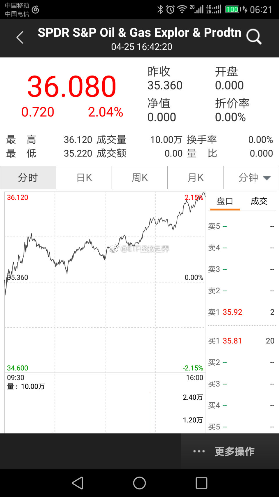

======================================================

ETF拯救世界 (5687069307) @
2017-04-26 09:50:39 Wed  
url: https://weibo.com/5687069307/F0iKf2dqB

说出来你可能不信，我越来越喜欢创业板了。再来一波进场捡筹码。 ​​​

转发[13]  评论[48]  赞[75] 

======================================================

ETF拯救世界 (5687069307) @
2017-04-26 10:00:12 Wed  
url: https://weibo.com/5687069307/F0iO7ieHz

参照纳斯达克，大致在2030前后吧，创业板回到4000点没问题。然后2030-2040创业板会有一个比较好的收益率。所以从买入到2030，收益率是多少取决于你的买入价格。比如现在买，13年后回到4000，赚一倍，复利大概5.x%。买得越低，年化会越高一点。

------------------------------------------------------
转推：
>  @ETF拯救世界 (5687069307)
>  2017-04-26 09:50:39 Wed  
>  url: https:/weibo.com/5687069307/F0iKf2dqB/

>  说出来你可能不信，我越来越喜欢创业板了。再来一波进场捡筹码。 ​​​

转发[11]  评论[34]  赞[56] 

======================================================

ETF拯救世界 (5687069307) @
2017-04-26 10:14:23 Wed  
url: https://weibo.com/5687069307/F0iTSu05O

接上条，做个小数学游戏。

如果2030年4月26日，创业板可以回到4000点。那么是这样的：

你

2017年4月26日1812点买入，到那时年化收益率是6.28%；

2017年5月26日1700点买入，则年化上升到6.84%；

如果在2017年底，1500点买入，则年化就有8.28%。

如果年底不知道发生什么黑天鹅居然跌到了1000点，那 ​​​

转发[43]  评论[70]  赞[83] 

======================================================

ETF拯救世界 (5687069307) @
2017-04-26 10:47:01 Wed  
url: https://weibo.com/5687069307/F0j77pxEk

提前发车是不是非常精确。你们感受一下。 ​​​

转发[5]  评论[54]  赞[93] 

======================================================

ETF拯救世界 (5687069307) @
2017-04-26 11:17:50 Wed  
url: https://weibo.com/5687069307/F0jjD4K4U

是不是要打脸了！怎么办，是不是要开始骂641了！是直接骂还是要走什么程序？没骂过，求带！

------------------------------------------------------
转推：
>  @ETF拯救世界 (5687069307)
>  2017-04-26 10:47:01 Wed  
>  url: https:/weibo.com/5687069307/F0j77pxEk/

>  提前发车是不是非常精确。你们感受一下。 ​​​

转发[0]  评论[33]  赞[42] 

======================================================

ETF拯救世界 (5687069307) @
2017-04-26 11:24:30 Wed  
url: https://weibo.com/5687069307/F0jmkzvCh

根据我的几个中期趋势技术判断模型，几个小指数于上周，几个稍大的指数于本周相继进入下跌趋势。

当然，技术始终只是一种辅助手段。投资不能靠k线和技术图形指标。辅助一下而已。

技术破位的意思，也只是说下跌的概率会比较大，而已。 ​​​

转发[24]  评论[79]  赞[84] 

======================================================

ETF拯救世界 (5687069307) @
2017-04-26 15:45:54 Wed  
url: https://weibo.com/5687069307/F0l4rapkQ

一季报业绩超密集披露。估值变化太大了。

近期极有可能加车。一两份就够了。 ​​​

转发[15]  评论[123]  赞[125] 

======================================================

ETF拯救世界 (5687069307) @
2017-04-27 08:02:12 Thu  
url: https://weibo.com/5687069307/F0rsIptJs

出门了没？ ​​​

转发[5]  评论[153]  赞[126] 

+++++++++++++++++++++++++++++++++++++++++++++++++++++

图片：

======================================================

ETF拯救世界 (5687069307) @
2017-04-27 08:27:00 Thu  
url: https://weibo.com/5687069307/F0rCMvve8

[微笑] ​​​

转发[5]  评论[45]  赞[41] 

+++++++++++++++++++++++++++++++++++++++++++++++++++++

图片：

======================================================

ETF拯救世界 (5687069307) @
2017-04-27 09:13:09 Thu  
url: https://weibo.com/5687069307/F0rVw6HhB

转发微博

------------------------------------------------------
转推：
>  @财联社APP (2868676035)
>  2017-04-27 09:11:43 Thu  
>  url: https:/weibo.com/2868676035/F0rUWlAIn/

>  4月26日，安邦保险集团董事长吴小晖在安邦保险总部同记者谈到安邦开启的2.0战略是养老和医疗。当天披露的2016年报显示，安邦人寿总资产规模升至1.45万亿，海外保险资产规模首次超过国内保险资产， 成为真正意义上具有全球竞争力的中国保险公司。（新京报） ​​​

转发[2]  评论[12]  赞[21] 

======================================================

ETF拯救世界 (5687069307) @
2017-04-27 09:26:53 Thu  
url: https://weibo.com/5687069307/F0s15tj5x

一年内底部可见。钦定了。 ​​​

转发[47]  评论[93]  赞[125] 

======================================================

ETF拯救世界 (5687069307) @
2017-04-27 09:31:45 Thu  
url: https://weibo.com/5687069307/F0s348mbe

2016年1月27日，大盘收于2735点。现在是3131点，上涨14.48%。

同期下跌股票1027只，占比37%。

跌幅最大的股票跌了75%。

股票中位数上涨8%。

真相。 ​​​

转发[4]  评论[19]  赞[54] 

======================================================

ETF拯救世界 (5687069307) @
2017-04-27 09:42:43 Thu  
url: https://weibo.com/5687069307/F0s7w7R4D

“现金是空气。”

体会更深了吧。 ​​​​

道理说再多有时候是没用的，经历过一次，才懂。 ​​​

转发[9]  评论[28]  赞[78] 

======================================================

ETF拯救世界 (5687069307) @
2017-04-27 09:47:47 Thu  
url: https://weibo.com/5687069307/F0s9ztE2V

$中证1000 sh000852$   这两年，是小盘股的梦魇时分。

太惨了。

别急，我们是援军，在路上（慢慢走）。 ​​​

转发[2]  评论[24]  赞[58] 

======================================================

ETF拯救世界 (5687069307) @
2017-04-27 09:57:09 Thu  
url: https://weibo.com/5687069307/F0sdnfZ3M

潜水雪球，看到方老板每天买10万指数基金。各位可以用这个实例观摩一下熊市中过于频繁买入的后果。

慢慢体会一下“定期”交易的奥妙所在。 ​​​

转发[60]  评论[84]  赞[85] 

======================================================

ETF拯救世界 (5687069307) @
2017-04-27 10:03:56 Thu  
url: https://weibo.com/5687069307/F0sg8l9vC

回复@金玉满堂彩红:我想中午开怎么破。//@金玉满堂彩红:今天这情况，晚上要加开了吧

------------------------------------------------------
转推：
>  @ETF拯救世界 (5687069307)
>  2017-04-27 08:02:12 Thu  
>  url: https:/weibo.com/5687069307/F0rsIptJs/

>  出门了没？ ​​​

转发[1]  评论[116]  赞[51] 

======================================================

ETF拯救世界 (5687069307) @
2017-04-27 10:33:28 Thu  
url: https://weibo.com/5687069307/F0ss7fXyC

很多人看到的是指数下跌和股票崩盘。

sorry，我看到的是未来年化收益率一个点一个点往上蹦。

金融投资风险很大，对眼前一片迷雾的人来说。 ​​​

转发[27]  评论[69]  赞[92] 

======================================================

ETF拯救世界 (5687069307) @
2017-04-27 10:49:18 Thu  
url: https://weibo.com/5687069307/F0syyc59o

回复@kuya55:我们不是抄底，不是这个思路。是根据概率计算仓位配置。现在计划仓位只有13个点，对于现在的概率来说太低了。要尽快加到合适的位置。//@kuya55:E大，因为买的是指数其实也就多跌一两个点，现在就加买是不是有点急了。 还是咱们这次150份的仓位还不够重呢

------------------------------------------------------
转推：
>  @ETF拯救世界 (5687069307)
>  2017-04-27 10:33:28 Thu  
>  url: https:/weibo.com/5687069307/F0ss7fXyC/

>  很多人看到的是指数下跌和股票崩盘。
>  
>  sorry，我看到的是未来年化收益率一个点一个点往上蹦。
>  
>  金融投资风险很大，对眼前一片迷雾的人来说。 ​​​

转发[12]  评论[40]  赞[45] 

======================================================

ETF拯救世界 (5687069307) @
2017-04-27 10:55:31 Thu  
url: https://weibo.com/5687069307/F0sB49S9H

……从2007年的沙黾农开始，我就有一个坚定的信念：在金融市场上，杀伤力最大的是大v。一次次验证。

------------------------------------------------------
转推：
>  @ETF拯救世界 (5687069307)
>  2017-04-24 11:37:27 Mon  
>  url: https:/weibo.com/5687069307/F00AB7129/

>  深成B会不会跌到1毛。一个问题。 ​​​

转发[18]  评论[78]  赞[71] 

======================================================

ETF拯救世界 (5687069307) @
2017-04-27 13:26:25 Thu  
url: https://weibo.com/5687069307/F0tAjznaY

GJD的心理底线是3100，确认了。连续第二次暴跌跌破拉回。

------------------------------------------------------
转推：
>  @ETF拯救世界 (5687069307)
>  2017-04-07 10:09:34 Fri  
>  url: https:/weibo.com/5687069307/EDncO76hf/

>  3000（或者3100）到3300之间用ETF做网格应该是很靠谱的。
>  
>  GJD信誉保证。跟着GJD有肉吃。 ​​​

转发[12]  评论[41]  赞[60] 

======================================================

ETF拯救世界 (5687069307) @
2017-04-27 13:46:04 Thu  
url: https://weibo.com/5687069307/F0tIibgD9

回复@且慢管家:截止今日所有披露年报的公司中：证金进入十大股东的有336家公司，汇金进入十大股东的有911家公司。不含各类券商、基金的救市资管产品。与上个季度相比，没有什么变化。但持仓个股有变动，个股持仓仓位也有增减。//@且慢管家:#投资达人说# 说到底 GJD到底都是些什么人呢

------------------------------------------------------
转推：
>  @ETF拯救世界 (5687069307)
>  2017-04-07 10:09:34 Fri  
>  url: https:/weibo.com/5687069307/EDncO76hf/

>  3000（或者3100）到3300之间用ETF做网格应该是很靠谱的。
>  
>  GJD信誉保证。跟着GJD有肉吃。 ​​​

转发[4]  评论[21]  赞[26] 

======================================================

ETF拯救世界 (5687069307) @
2017-04-27 14:44:33 Thu  
url: https://weibo.com/5687069307/F0u625ffJ

不让买就不买了。散了啊。 ​​​

转发[3]  评论[78]  赞[57] 

======================================================

ETF拯救世界 (5687069307) @
2017-04-27 15:07:29 Thu  
url: https://weibo.com/5687069307/F0ufl9dsj

回复@小狗上马路:老司机：提前开车又对了。（明天不要打脸[doge]）//@小狗上马路:我们定投的三份，今天都盈利了哇

------------------------------------------------------
转推：
>  @ETF拯救世界 (5687069307)
>  2017-04-27 14:44:33 Thu  
>  url: https:/weibo.com/5687069307/F0u625ffJ/

>  不让买就不买了。散了啊。 ​​​

转发[1]  评论[30]  赞[47] 

======================================================

ETF拯救世界 (5687069307) @
2017-04-27 21:33:46 Thu  
url: https://weibo.com/5687069307/F0wM7B0by

其实我的计划没必要和任何人解释。

三月没买，四月买了两份A股，五月买四份。三个月加起来一共买了六份，不到4%。

总A股仓位才15%。

不解释。每个人的情况本来就不同。买自己想买的东西就行了。 ​​​

转发[8]  评论[180]  赞[122] 

======================================================

ETF拯救世界 (5687069307) @
2017-04-28 06:05:10 Fri  
url: https://weibo.com/5687069307/F0A7I3G9j

继续新高。

熊市，震荡市，不亏损少亏损的情况下，尽量多的收集筹码。

这句话说来简单，做起来并不容易。

早了，大幅亏损。晚了，望牛兴叹。

时间，空间的艺术。

继续保持买入的所有权益品种盈利。仓位继续增长，未来的盛宴不会缺席。

未来的回撤会更大，不在乎。到这个市场上来玩，不是为了保本 ​​​

转发[16]  评论[105]  赞[118] 

+++++++++++++++++++++++++++++++++++++++++++++++++++++

图片：
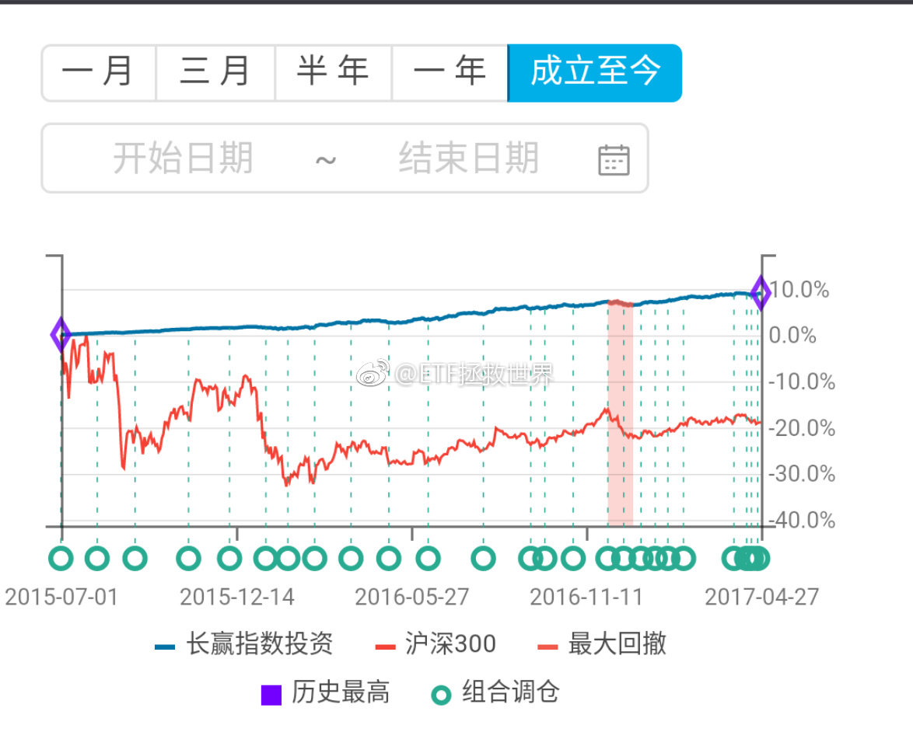

======================================================

ETF拯救世界 (5687069307) @
2017-04-28 10:30:50 Fri  
url: https://weibo.com/5687069307/F0BRxyPaH

为什么要这样对我。为什么。 

没天理了。 ​​​

转发[2]  评论[92]  赞[44] 

+++++++++++++++++++++++++++++++++++++++++++++++++++++

图片：

======================================================

ETF拯救世界 (5687069307) @
2017-04-28 10:43:51 Fri  
url: https://weibo.com/5687069307/F0BWPCvPZ

继续打预防针：

随着仓位逐渐加大，未来如果出现各种预料之中，预料之外的下跌，市值会减少。只要记住两件事。

你手里的东西，是指数。公司可能由好变坏，由坏退市，指数不会。中国最好的几百家公司都在你的手中，无论怎么跌，不用怕。

第二是，我们的投资方式，会把成本控制在非常低的水平。一定不 ​​​

转发[123]  评论[137]  赞[165] 

======================================================

ETF拯救世界 (5687069307) @
2017-04-28 11:37:19 Fri  
url: https://weibo.com/5687069307/F0Cix0eMW

$恒生指数 hkHSI$  居然默默的新高了。 ​​​

转发[1]  评论[35]  赞[49] 

======================================================

ETF拯救世界 (5687069307) @
2017-04-28 13:39:44 Fri  
url: https://weibo.com/5687069307/F0D6drNJ8

发布了头条文章：《500开车+500历史收益率更新》 http://t.cn/RXupeCs ​​​

转发[160]  评论[230]  赞[302] 

======================================================

ETF拯救世界 (5687069307) @
2017-04-28 15:07:19 Fri  
url: https://weibo.com/5687069307/F0DFLzqIN

回复@黄晨在新浪:2012年估值最低时候买入，到2015年估值最高的时候，年化收益率74%。注意，是年化。当然，这种收益率没人回从头吃到尾。只是一个理论上可以赚到的钱而已。//@黄晨在新浪:奇怪，没有人猜底部买入的部分在15年高点的年化收益率？我猜50%

------------------------------------------------------
转推：
>  @ETF拯救世界 (5687069307)
>  2017-04-28 13:39:44 Fri  
>  url: https:/weibo.com/5687069307/F0D6drNJ8/

>  发布了头条文章：《500开车+500历史收益率更新》 http://t.cn/RXupeCs ​​​

转发[25]  评论[37]  赞[48] 

======================================================

ETF拯救世界 (5687069307) @
2017-04-28 16:54:17 Fri  
url: https://weibo.com/5687069307/F0EnbtPG7

回复@rapuzal2016:建议你看看我2012年11月和2015年5月的文章。你会发现，并不是回头看，而是一直在向前看。[舔屏]//@rapuzal2016:回头看处处是黄金，底部顶部一目了然，往前呢？

------------------------------------------------------
转推：
>  @ETF拯救世界 (5687069307)
>  2017-04-28 13:39:44 Fri  
>  url: https:/weibo.com/5687069307/F0D6drNJ8/

>  发布了头条文章：《500开车+500历史收益率更新》 http://t.cn/RXupeCs ​​​

转发[14]  评论[46]  赞[56] 

======================================================

ETF拯救世界 (5687069307) @
2017-05-02 10:25:27 Tue  
url: https://weibo.com/5687069307/F1dxlltuK

买早了、买晚了，怎么办……我回答了 @一壶漂泊饮天涯 的问题，问题价值￥88.00，大家快来花1元围观~ http://t.cn/RXsTDOI ​​​

转发[315]  评论[160]  赞[305] 

======================================================

ETF拯救世界 (5687069307) @
2017-05-02 11:39:38 Tue  
url: https://weibo.com/5687069307/F1e1sjrqb

走势非常不乐观。虽然趋势系统对于我来说只是个辅助工具而已，但大牛大熊的时候还是比较有用的。在这里谈趋势，不是为了指导交易。而是请朋友们做好心理准备——无论你的持仓是多少，都要做好市值减少的准备。很多事情之所以恐怖，是因为你不知道它要发生。如果你知道并做好准备，也就一点不恐怖了。

------------------------------------------------------
转推：
>  @ETF拯救世界 (5687069307)
>  2017-04-26 11:24:30 Wed  
>  url: https:/weibo.com/5687069307/F0jmkzvCh/

>  根据我的几个中期趋势技术判断模型，几个小指数于上周，几个稍大的指数于本周相继进入下跌趋势。
>  
>  当然，技术始终只是一种辅助手段。投资不能靠k线和技术图形指标。辅助一下而已。
>  
>  技术破位的意思，也只是说下跌的概率会比较大，而已。 ​​​

转发[7]  评论[104]  赞[102] 

======================================================

ETF拯救世界 (5687069307) @
2017-05-03 09:20:27 Wed  
url: https://weibo.com/5687069307/F1mxsoLzd

不知道是不是年纪大了，越来越对“极简”感兴趣。

少、空、素……美啊。

无论是物质、身体还是精神。

当然，除了帐户市值…… ​​​

转发[11]  评论[89]  赞[88] 

======================================================

ETF拯救世界 (5687069307) @
2017-05-03 09:59:26 Wed  
url: https://weibo.com/5687069307/F1mNhpNR0

回复@闲梦:那是补之前的啊。对比一下比例就知道了。那个组合不要看，发不发车看公众号最准确。//@闲梦:请问雪球调仓是发车吗？

------------------------------------------------------
转推：
>  @ETF拯救世界 (5687069307)
>  2017-05-03 09:20:27 Wed  
>  url: https:/weibo.com/5687069307/F1mxsoLzd/

>  不知道是不是年纪大了，越来越对“极简”感兴趣。
>  
>  少、空、素……美啊。
>  
>  无论是物质、身体还是精神。
>  
>  当然，除了帐户市值…… ​​​

转发[1]  评论[33]  赞[24] 

======================================================

ETF拯救世界 (5687069307) @
2017-05-03 10:26:38 Wed  
url: https://weibo.com/5687069307/F1mYk3EwY

终于出现三个浮亏的品种了！意不意外，开不开心？

大笔买入的好日子真的不远了。 ​​​

转发[73]  评论[97]  赞[87] 

+++++++++++++++++++++++++++++++++++++++++++++++++++++

图片：
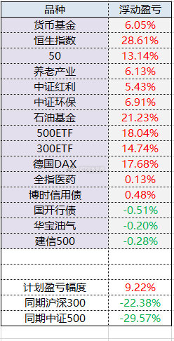

======================================================

ETF拯救世界 (5687069307) @
2017-05-03 10:57:31 Wed  
url: https://weibo.com/5687069307/F1naRwSGi

未来的几点规划：第一个是建仓完毕后，每个品种浮亏最大不超过15%。最好都在10%以内。当然，有些品种到大底也不会亏。组合亏损不超过15%，最好10%。这是价格。第二个是建仓成本控制在历史最低估值30%以下区间。这是价值。第三是若干年后的牛市来临一周到两周之内计划实现总体盈利，开始骑牛之旅。

------------------------------------------------------
转推：
>  @ETF拯救世界 (5687069307)
>  2017-05-03 10:26:38 Wed  
>  url: https:/weibo.com/5687069307/F1mYk3EwY/

>  终于出现三个浮亏的品种了！意不意外，开不开心？
>  
>  大笔买入的好日子真的不远了。 ​​​

转发[44]  评论[65]  赞[74] 

======================================================

ETF拯救世界 (5687069307) @
2017-05-03 11:17:57 Wed  
url: https://weibo.com/5687069307/F1nj9nR7U

回复@ch506:我亏10%的时候，满仓深成B没毛病。[doge]//@ch506:回复@西风将起:有可能也会错过熊市反弹，反正我先跟着，等E大浮亏10%就可以把老婆本户口本都砸进去了[微笑]

------------------------------------------------------
转推：
>  @ETF拯救世界 (5687069307)
>  2017-05-03 10:26:38 Wed  
>  url: https:/weibo.com/5687069307/F1mYk3EwY/

>  终于出现三个浮亏的品种了！意不意外，开不开心？
>  
>  大笔买入的好日子真的不远了。 ​​​

转发[8]  评论[45]  赞[35] 

======================================================

ETF拯救世界 (5687069307) @
2017-05-03 13:18:24 Wed  
url: https://weibo.com/5687069307/F1o62uqmJ

GJD走没走？

一季度汇金投资进入十大股东的公司有1006家。去年底是998家。

同期证金的数字是386家，持平。

不仅没走，买进卖出玩的很开心呢…… ​​​

转发[5]  评论[35]  赞[48] 

======================================================

ETF拯救世界 (5687069307) @
2017-05-03 13:56:37 Wed  
url: https://weibo.com/5687069307/F1olymw3l

今年47%的股票下跌超过10%；21%的股票下跌超过20%。

很多人的帐户可能已经不忍心打开了。 ​​​

转发[30]  评论[41]  赞[52] 

======================================================

ETF拯救世界 (5687069307) @
2017-05-03 14:09:54 Wed  
url: https://weibo.com/5687069307/F1oqWybCA

很多朋友并没有见过真正的寒冬，也远远低估了寒冬的冷。股灾那种不叫寒冬，几次海啸而已。

------------------------------------------------------
转推：
>  @ETF拯救世界 (5687069307)
>  2017-05-03 13:56:37 Wed  
>  url: https:/weibo.com/5687069307/F1olymw3l/

>  今年47%的股票下跌超过10%；21%的股票下跌超过20%。
>  
>  很多人的帐户可能已经不忍心打开了。 ​​​

转发[24]  评论[69]  赞[42] 

======================================================

ETF拯救世界 (5687069307) @
2017-05-03 14:19:37 Wed  
url: https://weibo.com/5687069307/F1ouTcqtu

回复@zoey__小白:我比现在年轻十四岁的时候，获得了一个进入资本市场的机会。那一年的夏天，我独自去国泰君安皇城根营业部开了户。整个夏天，我如同一只乱飞的麻雀，游荡在庄家和大鳄充斥的A股黑暗森林。我要讲的故事，也正是从那时候开始……（想看后续的可以开始预订了。订购量超过50万本开始连载）

------------------------------------------------------
转推：
>  @ETF拯救世界 (5687069307)
>  2017-05-03 13:56:37 Wed  
>  url: https:/weibo.com/5687069307/F1olymw3l/

>  今年47%的股票下跌超过10%；21%的股票下跌超过20%。
>  
>  很多人的帐户可能已经不忍心打开了。 ​​​

转发[10]  评论[227]  赞[174] 

======================================================

ETF拯救世界 (5687069307) @
2017-05-03 15:47:04 Wed  
url: https://weibo.com/5687069307/F1p4o1kRd

国债收益率破3.5了 ​​​

转发[9]  评论[62]  赞[45] 

+++++++++++++++++++++++++++++++++++++++++++++++++++++

图片：
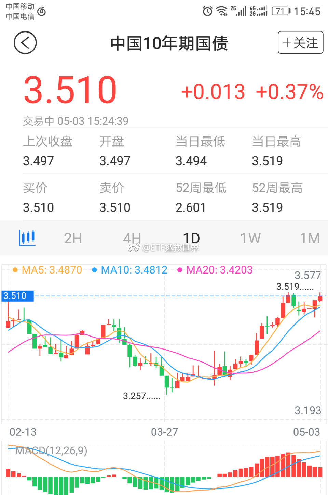

======================================================

ETF拯救世界 (5687069307) @
2017-05-03 17:20:18 Wed  
url: https://weibo.com/5687069307/F1pGeenV1

$513030  再这样下去，告别的时候就不会太远了 ​​​

转发[5]  评论[67]  赞[62] 

======================================================

ETF拯救世界 (5687069307) @
2017-05-04 09:30:07 Thu  
url: https://weibo.com/5687069307/F1w1Sqtzq

韩国股市也历史新高了。

美国、德国都在不断新高。

对了，补充一句，韩国整体估值大概在15倍左右。美国几乎是最近十年最高：22倍左右。德国21倍左右。

A股，跌到现在，40多。[doge] ​​​

转发[55]  评论[57]  赞[66] 

======================================================

ETF拯救世界 (5687069307) @
2017-05-04 09:33:58 Thu  
url: https://weibo.com/5687069307/F1w3rmptQ

回复@火眼金睛_qq:不是。根本原因是狼多肉少。也就是资金多，股票少。所以说句很多人不爱听的，我支持目前的准注册制。既然有人买，就多多的发。发到没人买，市场就正常了。真正的十年长牛才有希望。//@火眼金睛_qq:金融腐败是否是a股高估值的主要因素？

------------------------------------------------------
转推：
>  @ETF拯救世界 (5687069307)
>  2017-05-04 09:30:07 Thu  
>  url: https:/weibo.com/5687069307/F1w1Sqtzq/

>  韩国股市也历史新高了。
>  
>  美国、德国都在不断新高。
>  
>  对了，补充一句，韩国整体估值大概在15倍左右。美国几乎是最近十年最高：22倍左右。德国21倍左右。
>  
>  A股，跌到现在，40多。[doge] ​​​

转发[12]  评论[24]  赞[48] 

======================================================

ETF拯救世界 (5687069307) @
2017-05-04 09:41:10 Thu  
url: https://weibo.com/5687069307/F1w6mv9bv

回复@BB198:其实这个问题我也一直没想明白。如果GJD拿的都是低估大蓝筹就算了。问题是他们手里有上千只小股票，未来这些股票一定会价值回归，跌的亲妈都不认识。一边是监管层发新股客观一定会导致小股票跌，一方面GJD拿着那么多小股票不卖。未来GJD会产生的浮亏简直不敢想象。我想内部有分歧和利益冲突

------------------------------------------------------
转推：
>  @ETF拯救世界 (5687069307)
>  2017-05-04 09:30:07 Thu  
>  url: https:/weibo.com/5687069307/F1w1Sqtzq/

>  韩国股市也历史新高了。
>  
>  美国、德国都在不断新高。
>  
>  对了，补充一句，韩国整体估值大概在15倍左右。美国几乎是最近十年最高：22倍左右。德国21倍左右。
>  
>  A股，跌到现在，40多。[doge] ​​​

转发[2]  评论[18]  赞[32] 

======================================================

ETF拯救世界 (5687069307) @
2017-05-04 09:47:33 Thu  
url: https://weibo.com/5687069307/F1w8XfEAL

回复@蛋卷基金:老板今天还买不买……不过讲真，红利目前是不贵的。不过每天买这种买法个人不敢苟同啊。//@蛋卷基金:替我们老板路过[微笑][二哈][二哈][二哈]

------------------------------------------------------
转推：
>  @ETF拯救世界 (5687069307)
>  2017-04-27 09:57:09 Thu  
>  url: https:/weibo.com/5687069307/F0sdnfZ3M/

>  潜水雪球，看到方老板每天买10万指数基金。各位可以用这个实例观摩一下熊市中过于频繁买入的后果。
>  
>  慢慢体会一下“定期”交易的奥妙所在。 ​​​

转发[1]  评论[33]  赞[26] 

======================================================

ETF拯救世界 (5687069307) @
2017-05-04 10:07:03 Thu  
url: https://weibo.com/5687069307/F1wgSlJMq

注意A股和国外股市的不同。A股牛市的特点是急、快。如果把时间拉长，拉到10年，A股涨幅不一定比美股差。不同是A股用一两年涨几倍，然后用7、8年跌一半。美股是7、8年涨1倍，然后2、3年跌20%。这样大多数人的感官就是A股垃圾，赚不到钱。其实能赚，你得赶上牛市那两年。这里面有深层次的原因，有空说。

------------------------------------------------------
转推：
>  @ETF拯救世界 (5687069307)
>  2017-05-04 09:30:07 Thu  
>  url: https:/weibo.com/5687069307/F1w1Sqtzq/

>  韩国股市也历史新高了。
>  
>  美国、德国都在不断新高。
>  
>  对了，补充一句，韩国整体估值大概在15倍左右。美国几乎是最近十年最高：22倍左右。德国21倍左右。
>  
>  A股，跌到现在，40多。[doge] ​​​

转发[10]  评论[47]  赞[58] 

======================================================

ETF拯救世界 (5687069307) @
2017-05-04 10:21:10 Thu  
url: https://weibo.com/5687069307/F1wmBdKyJ

回复@峥嵘83岁月:数学和模型当然是我们投资的基础。如果没有数据和计算，我会马上退出A股不再玩。但是，数学、量化只是基础而已。否则，所有学数学的人都应该在资本市场赚大钱了，显然并不是这样。投资，是以科学为基础的艺术。没有科学，不行。但，它始终是门艺术。

------------------------------------------------------
转推：
>  @ETF拯救世界 (5687069307)
>  2017-05-03 10:26:38 Wed  
>  url: https:/weibo.com/5687069307/F1mYk3EwY/

>  终于出现三个浮亏的品种了！意不意外，开不开心？
>  
>  大笔买入的好日子真的不远了。 ​​​

转发[9]  评论[29]  赞[49] 

======================================================

ETF拯救世界 (5687069307) @
2017-05-04 11:38:54 Thu  
url: https://weibo.com/5687069307/F1wS9nRTa

投资的时候，提醒自己始终要牢记“概率”。

随着时间空间的变化，下跌的概率越来越小。不跌甚至上涨的概率逐渐加大。天平已经慢慢的向平衡靠拢。当然，从我的模型来看，现在依然是下跌概率略大。

与之对应的，我们的仓位在逐渐加大。这就是应对概率变化的做法。盲目所谓的“看多”、“看空”，并不是 ​​​

转发[67]  评论[103]  赞[161] 

======================================================

ETF拯救世界 (5687069307) @
2017-05-04 11:51:46 Thu  
url: https://weibo.com/5687069307/F1wXneuhq

接上条。守正出奇。其实大道相通。

在我心目中，《人民的名义》里面，最牛逼的是谁？当然不是侯亮平，不是李达康，更不是易学习沙瑞金，而是——季昌明。

这样一个没后台不站队的人，在汉东这么复杂的zz环境下居然恪守正道，然后竟然一直安然无恙还能做到这样的位置，这份功力简直可以说是绝顶高手了 ​​​

转发[50]  评论[0]  赞[273] 

======================================================

ETF拯救世界 (5687069307) @
2017-05-04 13:57:52 Thu  
url: https://weibo.com/5687069307/F1xMywDp1

熊了30年的台湾股市也快新高了。我坚信，并希望各位也能坚信一件事：只要不出现大的毁灭性的灾难，一个国家的股市指数一定会不断新高。我们要做的就是不要买的太贵，导致长期收益率很低。在比较便宜的地方买入，极大概率不会赔钱，并且会赚不少。从道理上讲，A股这么多人赔钱是很奇怪的一件事。

------------------------------------------------------
转推：
>  @ETF拯救世界 (5687069307)
>  2017-05-04 09:30:07 Thu  
>  url: https:/weibo.com/5687069307/F1w1Sqtzq/

>  韩国股市也历史新高了。
>  
>  美国、德国都在不断新高。
>  
>  对了，补充一句，韩国整体估值大概在15倍左右。美国几乎是最近十年最高：22倍左右。德国21倍左右。
>  
>  A股，跌到现在，40多。[doge] ​​​

转发[14]  评论[75]  赞[63] 

======================================================

ETF拯救世界 (5687069307) @
2017-05-04 14:34:48 Thu  
url: https://weibo.com/5687069307/F1y1yazVx

早上吓得卖掉下午又追进去的，是不是可以告别股市了。 ​​​

转发[2]  评论[44]  赞[54] 

======================================================

ETF拯救世界 (5687069307) @
2017-05-04 14:52:04 Thu  
url: https://weibo.com/5687069307/F1y8yxg31

[doge]

------------------------------------------------------
转推：
>  @ ()
>  2017-05-04 14:44:33 Thu  
>  url: 

>  抱歉，此微博已被作者删除。查看帮助：http://t.cn/Rfd3rQV

转发[4]  评论[21]  赞[22] 

======================================================

ETF拯救世界 (5687069307) @
2017-05-04 14:58:43 Thu  
url: https://weibo.com/5687069307/F1ybg2GMS

[doge] 这就有趣了。 ​​​

转发[9]  评论[93]  赞[64] 

+++++++++++++++++++++++++++++++++++++++++++++++++++++

图片：
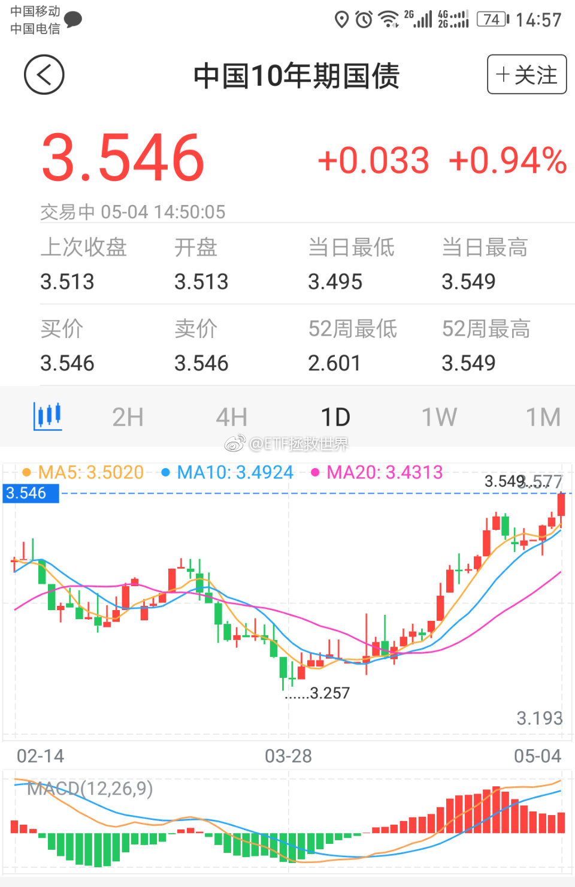

======================================================

ETF拯救世界 (5687069307) @
2017-05-04 23:37:45 Thu  
url: https://weibo.com/5687069307/F1BzVD3xU

难道要重演去年的一幕，再赚一轮？ ​​​

转发[7]  评论[58]  赞[56] 

+++++++++++++++++++++++++++++++++++++++++++++++++++++

图片：

======================================================

ETF拯救世界 (5687069307) @
2017-05-05 05:47:36 Fri  
url: https://weibo.com/5687069307/F1E03oaC9

计划的这0.6%油气，应该能让很多朋友更加了解自己。在面对暴跌的时候，是高兴还是害怕。答案很可能与你自己当初的想象不同。这非常好，用这么点仓位就弄清楚，总比以后仓位大了再害怕强。这次应该会洗掉不少叶公了。[亲亲]

------------------------------------------------------
转推：
>  @ETF拯救世界 (5687069307)
>  2017-05-04 23:37:45 Thu  
>  url: https:/weibo.com/5687069307/F1BzVD3xU/

>  难道要重演去年的一幕，再赚一轮？ ​​​

转发[5]  评论[93]  赞[68] 

======================================================

ETF拯救世界 (5687069307) @
2017-05-05 09:34:43 Fri  
url: https://weibo.com/5687069307/F1Fuf6HDt

无论是阴跌，暴跌，只要记住手里的东西是指数，只要我们买的不高，一定会涨回去挣钱，就踏踏实实的。买的低点高点，无非是多赚点少赚点的区别。股票就不同了。有些股票可能这辈子都涨不回高点了。不是鬼故事。

------------------------------------------------------
转推：
>  @ETF拯救世界 (5687069307)
>  2017-04-28 10:43:51 Fri  
>  url: https:/weibo.com/5687069307/F0BWPCvPZ/

>  继续打预防针：
>  
>  随着仓位逐渐加大，未来如果出现各种预料之中，预料之外的下跌，市值会减少。只要记住两件事。
>  
>  你手里的东西，是指数。公司可能由好变坏，由坏退市，指数不会。中国最好的几百家公司都在你的手中，无论怎么跌，不用怕。
>  
>  第二是，我们的投资方式，会把成本控制在非常低的水平。一定不 ​​​

转发[50]  评论[55]  赞[72] 

======================================================

ETF拯救世界 (5687069307) @
2017-05-05 10:01:50 Fri  
url: https://weibo.com/5687069307/F1FFfoxpp

因为证券指数PE/PB低而买入的朋友已经跌蒙了。

不是这么玩的。

看一眼估值然后买卖就能把钱赚了，这就有点过于简化了。 ​​​

转发[15]  评论[54]  赞[68] 

======================================================

ETF拯救世界 (5687069307) @
2017-05-05 10:07:54 Fri  
url: https://weibo.com/5687069307/F1FHIt7vg

回复@幸福微笑的小卤蛋:不想浪费时间在跟人争论上面。毫无意义的浪费时间。8月再回去。//@幸福微笑的小卤蛋:E大怎么不回我球了啊？

------------------------------------------------------
转推：
>  @ ()
>  2017-05-05 09:47:48 Fri  
>  url: 

>  抱歉，此微博已被作者删除。查看帮助：http://t.cn/Rfd3rQV

转发[1]  评论[25]  赞[28] 

======================================================

ETF拯救世界 (5687069307) @
2017-05-05 10:12:28 Fri  
url: https://weibo.com/5687069307/F1FJzpOY1

回复@塞外大诗人:第一呢，上证的6000是中石油的6000。之所以回不去就是我说的买的太贵。同理可见80年代末的日本和90年代初的台湾。还有2000年开始跌跌倒2015才回去的纳斯达克。第二呢，你完全不知道我们在做什么。我们做的事情和网格一毛毛毛钱关系都没有。无限放大更是不知从何说起。散了吧。see you

------------------------------------------------------
转推：
>  @ETF拯救世界 (5687069307)
>  2017-04-28 10:43:51 Fri  
>  url: https:/weibo.com/5687069307/F0BWPCvPZ/

>  继续打预防针：
>  
>  随着仓位逐渐加大，未来如果出现各种预料之中，预料之外的下跌，市值会减少。只要记住两件事。
>  
>  你手里的东西，是指数。公司可能由好变坏，由坏退市，指数不会。中国最好的几百家公司都在你的手中，无论怎么跌，不用怕。
>  
>  第二是，我们的投资方式，会把成本控制在非常低的水平。一定不 ​​​

转发[1]  评论[21]  赞[36] 

======================================================

ETF拯救世界 (5687069307) @
2017-05-05 10:15:41 Fri  
url: https://weibo.com/5687069307/F1FKSm2NH

你知道我最讨厌什么人吗。我最讨厌的是，根本不知道，似乎也不想知道，当然，也完全没机会知道我们到底在做什么，就叉着腰上来指指点点。

资本市场中，没人会是完美的，也没有策略会是完美的。所以通过不同声音引起反思，取得进步是我特别高兴的事情。但我希望的是，在批判别人之前，先弄清楚别人到底 ​​​

转发[7]  评论[84]  赞[113] 

======================================================

ETF拯救世界 (5687069307) @
2017-05-05 10:48:26 Fri  
url: https://weibo.com/5687069307/F1FYacuwc

3100保不保？能不能让我开开心心的出发？北京沙尘暴何时消失？娜扎和热巴谁更美？请看今日的《法治进行时》 ​​​

转发[5]  评论[116]  赞[59] 

======================================================

ETF拯救世界 (5687069307) @
2017-05-05 11:13:42 Fri  
url: https://weibo.com/5687069307/F1G8q6GZf

回复@hcy天云:我这儿的朋友都病得不轻。//@hcy天云:已经跌破3100了，为什么看到跌我就默默的高兴，难道我有病？[doge]

------------------------------------------------------
转推：
>  @ETF拯救世界 (5687069307)
>  2017-05-05 10:48:26 Fri  
>  url: https:/weibo.com/5687069307/F1FYacuwc/

>  3100保不保？能不能让我开开心心的出发？北京沙尘暴何时消失？娜扎和热巴谁更美？请看今日的《法治进行时》 ​​​

转发[2]  评论[51]  赞[41] 

======================================================

ETF拯救世界 (5687069307) @
2017-05-05 13:29:29 Fri  
url: https://weibo.com/5687069307/F1H1xaulA

没有下跌就没有超额利润。没有大跌就赚不到大钱。没有暴跌就没有巨额财富。证券市场的波动非常正常，我们要做的就是所有人悲观恐慌的时候伸出兰花指拿起鼠标点一下买入。当然，到时候恐慌的人群众很可能也有你。两年了，等待不会白费。

------------------------------------------------------
转推：
>  @ETF拯救世界 (5687069307)
>  2017-04-28 10:43:51 Fri  
>  url: https:/weibo.com/5687069307/F0BWPCvPZ/

>  继续打预防针：
>  
>  随着仓位逐渐加大，未来如果出现各种预料之中，预料之外的下跌，市值会减少。只要记住两件事。
>  
>  你手里的东西，是指数。公司可能由好变坏，由坏退市，指数不会。中国最好的几百家公司都在你的手中，无论怎么跌，不用怕。
>  
>  第二是，我们的投资方式，会把成本控制在非常低的水平。一定不 ​​​

转发[24]  评论[57]  赞[75] 

======================================================

ETF拯救世界 (5687069307) @
2017-05-05 13:43:12 Fri  
url: https://weibo.com/5687069307/F1H76gL1L

还有一个要注意的，是，我现在虽然不知道是什么，但如果真的出现特大机会，那一定是有了什么现在意想不到的坏消息。

这个坏消息特别坏，坏到让大多数人完全丧失了信心。所以不要用现在的思维去衡量那时候，那个坏消息出来的时候，已经完全跟现在不同了。

当然了，那个所谓的特大机会也许不会出现，因 ​​​

转发[20]  评论[84]  赞[79] 

======================================================

ETF拯救世界 (5687069307) @
2017-05-05 14:00:23 Fri  
url: https://weibo.com/5687069307/F1He4AhQh

回复@石头里的虫子:这个没事。我能把外星人忽悠的买20份中证500ETF。66的[doge]//@石头里的虫子:特大坏消息有可能是外星人进攻地球，人类文明要消失。

------------------------------------------------------
转推：
>  @ETF拯救世界 (5687069307)
>  2017-05-05 13:43:12 Fri  
>  url: https:/weibo.com/5687069307/F1H76gL1L/

>  还有一个要注意的，是，我现在虽然不知道是什么，但如果真的出现特大机会，那一定是有了什么现在意想不到的坏消息。
>  
>  这个坏消息特别坏，坏到让大多数人完全丧失了信心。所以不要用现在的思维去衡量那时候，那个坏消息出来的时候，已经完全跟现在不同了。
>  
>  当然了，那个所谓的特大机会也许不会出现，因 ​​​

转发[1]  评论[36]  赞[51] 

======================================================

ETF拯救世界 (5687069307) @
2017-05-05 14:59:52 Fri  
url: https://weibo.com/5687069307/F1HCdAlgM

好了，这几天刷的比较频繁，因为接下来十几天不会刷关于股市的了。

从今天起，跟GJD、大鳄、害人精以及自己战斗的任务，就需要各位独立完成了……

买不买？卖不卖？买卖多少？

……

拜拜了您呐……[舔屏] ​​​

转发[7]  评论[269]  赞[130] 

======================================================

ETF拯救世界 (5687069307) @
2017-05-07 03:19:09 Sun  
url: https://weibo.com/5687069307/F1VSNa8p8

可以，比较刺激  ​​​

转发[1]  评论[89]  赞[82] 

+++++++++++++++++++++++++++++++++++++++++++++++++++++

图片：

======================================================

ETF拯救世界 (5687069307) @
2017-05-08 11:46:40 Mon  
url: https://weibo.com/5687069307/F28Di4OKn

准备起床，r u ok?

[doge]  ​​​

转发[51]  评论[260]  赞[376] 

+++++++++++++++++++++++++++++++++++++++++++++++++++++

图片：

======================================================

ETF拯救世界 (5687069307) @
2017-05-08 13:31:36 Mon  
url: https://weibo.com/5687069307/F29jSCyKs

看着这里欢乐祥和的各位，谁能想到a股跌成狗了。你们配得上股民这个光荣的称号吗！[哼]

------------------------------------------------------
转推：
>  @ETF拯救世界 (5687069307)
>  2017-05-08 11:46:40 Mon  
>  url: https:/weibo.com/5687069307/F28Di4OKn/

>  准备起床，r u ok?
>  
>  [doge] http://t.cn/z8fYx9X ​​​

转发[4]  评论[54]  赞[66] 

======================================================

ETF拯救世界 (5687069307) @
2017-05-08 13:46:02 Mon  
url: https://weibo.com/5687069307/F29pK4uBV

德国，恒生，深圳a的养老全是红的。资产大类配置和大类内部的小类配置重要性再次发挥作用。无论如何，今天各位的资产都不会下降多少，即使仓位已经在三成左右。 ​​​

转发[15]  评论[98]  赞[89] 

======================================================

ETF拯救世界 (5687069307) @
2017-05-08 15:11:49 Mon  
url: https://weibo.com/5687069307/F29YyBJni

这么搞半个月回去后是不是可以直接满仓了……九点了，踏踏实实玩去了[doge]

------------------------------------------------------
转推：
>  @ETF拯救世界 (5687069307)
>  2017-05-08 13:46:02 Mon  
>  url: https:/weibo.com/5687069307/F29pK4uBV/

>  德国，恒生，深圳a的养老全是红的。资产大类配置和大类内部的小类配置重要性再次发挥作用。无论如何，今天各位的资产都不会下降多少，即使仓位已经在三成左右。 ​​​

转发[8]  评论[82]  赞[83] 

======================================================

ETF拯救世界 (5687069307) @
2017-05-09 02:28:25 Tue  
url: https://weibo.com/5687069307/F2epc5Cx3

谁还没睡[doge] ​​​

转发[0]  评论[50]  赞[61] 

======================================================

ETF拯救世界 (5687069307) @
2017-05-09 03:18:18 Tue  
url: https://weibo.com/5687069307/F2eJrhGB9

我有个总结:比较温和的投资者，不那么极端的投资者，活下去的机会大一点。一个想法，不一定对。//@ETF拯救世界:……从2007年的沙黾农开始，我就有一个坚定的信念：在金融市场上，杀伤力最大的是大v。一次次验证。

------------------------------------------------------
转推：
>  @ETF拯救世界 (5687069307)
>  2017-04-24 11:37:27 Mon  
>  url: https:/weibo.com/5687069307/F00AB7129/

>  深成B会不会跌到1毛。一个问题。 ​​​

转发[9]  评论[81]  赞[77] 

======================================================

ETF拯救世界 (5687069307) @
2017-05-09 12:51:38 Tue  
url: https://weibo.com/5687069307/F2iu9AUUN

途经意大利小镇，街边吃顿晚餐。

八点多太阳才下山。 ​​​

转发[8]  评论[115]  赞[129] 

+++++++++++++++++++++++++++++++++++++++++++++++++++++

图片：

======================================================

ETF拯救世界 (5687069307) @
2017-05-09 14:02:07 Tue  
url: https://weibo.com/5687069307/F2iWLpisu

回复@topxiaoke:大家八喜临门啊。持仓的大涨，想买的大跌。运气还是实力？[doge]//@topxiaoke:恒生新高了~！

------------------------------------------------------
转推：
>  @ETF拯救世界 (5687069307)
>  2017-05-09 12:51:38 Tue  
>  url: https:/weibo.com/5687069307/F2iu9AUUN/

>  途经意大利小镇，街边吃顿晚餐。
>  
>  八点多太阳才下山。 ​​​

转发[1]  评论[28]  赞[43] 

======================================================

ETF拯救世界 (5687069307) @
2017-05-09 14:04:20 Tue  
url: https://weibo.com/5687069307/F2iXFiaP0

回复@缘如此来:说实话，我感觉大部分人没有北上广深的人有钱。市政设施也比较破旧。不过我看他们过得都挺高兴。//@缘如此来:e大，意大利人民过得是否比我天朝人民幸福

------------------------------------------------------
转推：
>  @ETF拯救世界 (5687069307)
>  2017-05-09 12:51:38 Tue  
>  url: https:/weibo.com/5687069307/F2iu9AUUN/

>  途经意大利小镇，街边吃顿晚餐。
>  
>  八点多太阳才下山。 ​​​

转发[4]  评论[55]  赞[48] 

======================================================

ETF拯救世界 (5687069307) @
2017-05-10 02:00:29 Wed  
url: https://weibo.com/5687069307/F2nElCRSm

无论大盘怎么熊，计划就是不跌也是醉了，归功于海外资产的配置。

另外我们的权益仓位开始快速增加。未来只要a股反弹，我们的市值会更快冲向更高。  ​​​

转发[21]  评论[93]  赞[112] 

+++++++++++++++++++++++++++++++++++++++++++++++++++++

图片：

======================================================

ETF拯救世界 (5687069307) @
2017-05-10 11:24:04 Wed  
url: https://weibo.com/5687069307/F2rl6EOXR

回复@顺风耳:这其实是计划的另一个意义。很多朋友买过牛股，踏踏实实拿一年赚30% 40%一直没卖的有几个人？估计涨10%就害怕的卖掉了。我们几千位朋友这次一起做到了。这应该是很多朋友拿的涨幅最大的品种。//@顺风耳:恒生赚42%，不是E大，我的恒生ETF不知道卖多久了，感谢。[红包飞]

------------------------------------------------------
转推：
>  @ETF拯救世界 (5687069307)
>  2017-05-10 02:00:29 Wed  
>  url: https:/weibo.com/5687069307/F2nElCRSm/

>  无论大盘怎么熊，计划就是不跌也是醉了，归功于海外资产的配置。
>  
>  另外我们的权益仓位开始快速增加。未来只要a股反弹，我们的市值会更快冲向更高。 http://t.cn/RGoCG7U ​​​

转发[4]  评论[44]  赞[59] 

======================================================

ETF拯救世界 (5687069307) @
2017-05-10 11:52:25 Wed  
url: https://weibo.com/5687069307/F2rwCgisg

威尼斯，一座非常特别的城市。

很美。

很多朋友提到的墨鱼面。我吃着有点心理障碍…… ​​​

转发[1]  评论[81]  赞[135] 

+++++++++++++++++++++++++++++++++++++++++++++++++++++

图片：

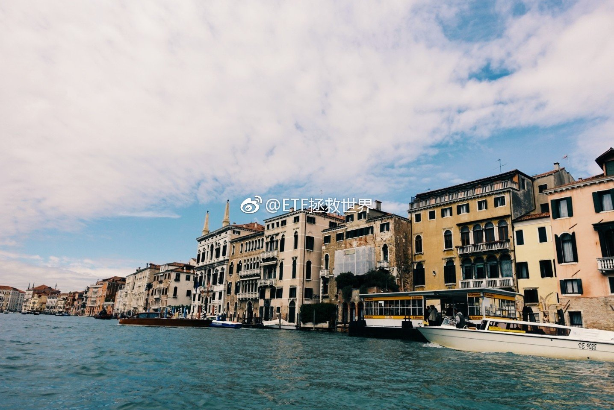

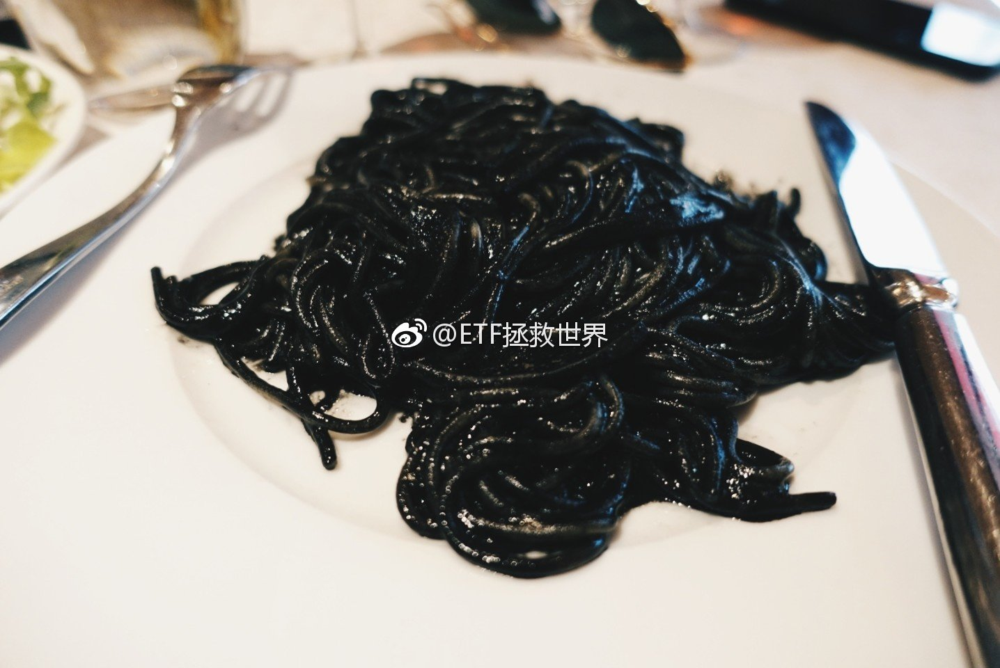

======================================================

ETF拯救世界 (5687069307) @
2017-05-10 13:34:02 Wed  
url: https://weibo.com/5687069307/F2sbRt5lw

熊市就是把妄想抄底的每一波人都埋进去，牛市就是把妄想逃顶的每一波人狠狠地甩下财富列车。 ​​​

转发[49]  评论[103]  赞[178] 

======================================================

ETF拯救世界 (5687069307) @
2017-05-10 14:50:03 Wed  
url: https://weibo.com/5687069307/F2sGIsyWb

我现在最想做的是算算估值 [哼] ​​​

转发[6]  评论[114]  赞[78] 

======================================================

ETF拯救世界 (5687069307) @
2017-05-10 14:53:10 Wed  
url: https://weibo.com/5687069307/F2sHZ7nCG

计划前两大持仓品种恒生和50今天还在涨……

------------------------------------------------------
转推：
>  @ETF拯救世界 (5687069307)
>  2017-05-10 02:00:29 Wed  
>  url: https:/weibo.com/5687069307/F2nElCRSm/

>  无论大盘怎么熊，计划就是不跌也是醉了，归功于海外资产的配置。
>  
>  另外我们的权益仓位开始快速增加。未来只要a股反弹，我们的市值会更快冲向更高。 http://t.cn/RGoCG7U ​​​

转发[4]  评论[43]  赞[48] 

======================================================

ETF拯救世界 (5687069307) @
2017-05-10 15:30:31 Wed  
url: https://weibo.com/5687069307/F2sX95obC

除非你有方老板那样的无限子弹，否则不要在熊市中过于频繁的补仓。十几年的经验之谈，相信我没错的。我的很多发言，会帮你节省十几年积累经验的时间，还得是悟性高的那种。

------------------------------------------------------
转推：
>  @ETF拯救世界 (5687069307)
>  2017-04-27 09:57:09 Thu  
>  url: https:/weibo.com/5687069307/F0sdnfZ3M/

>  潜水雪球，看到方老板每天买10万指数基金。各位可以用这个实例观摩一下熊市中过于频繁买入的后果。
>  
>  慢慢体会一下“定期”交易的奥妙所在。 ​​​

转发[38]  评论[130]  赞[168] 

======================================================

ETF拯救世界 (5687069307) @
2017-05-11 12:03:25 Thu  
url: https://weibo.com/5687069307/F2B1A02V3

睁开眼睛躺床上看看窗外的阿尔卑斯山，再看看大盘，感觉……

r u ok?

[doge] ​​​

转发[2]  评论[142]  赞[93] 

+++++++++++++++++++++++++++++++++++++++++++++++++++++

图片：

======================================================

ETF拯救世界 (5687069307) @
2017-05-11 13:19:36 Thu  
url: https://weibo.com/5687069307/F2Bwv9oK0

吃完饭一看，人间炼狱一刚

------------------------------------------------------
转推：
>  @ETF拯救世界 (5687069307)
>  2017-05-11 12:03:25 Thu  
>  url: https:/weibo.com/5687069307/F2B1A02V3/

>  睁开眼睛躺床上看看窗外的阿尔卑斯山，再看看大盘，感觉……
>  
>  r u ok?
>  
>  [doge] ​​​

转发[0]  评论[54]  赞[44] 

======================================================

ETF拯救世界 (5687069307) @
2017-05-11 13:26:03 Thu  
url: https://weibo.com/5687069307/F2Bz7pswy

三年内我们的资产可以大飞跃。再次钦定了。

------------------------------------------------------
转推：
>  @ETF拯救世界 (5687069307)
>  2017-04-27 09:26:53 Thu  
>  url: https:/weibo.com/5687069307/F0s15tj5x/

>  一年内底部可见。钦定了。 ​​​

转发[31]  评论[206]  赞[201] 

======================================================

ETF拯救世界 (5687069307) @
2017-05-11 15:33:45 Thu  
url: https://weibo.com/5687069307/F2CoX8xHs

3000点的国家队羊毛薅了吗

------------------------------------------------------
转推：
>  @ETF拯救世界 (5687069307)
>  2017-04-07 10:09:34 Fri  
>  url: https:/weibo.com/5687069307/EDncO76hf/

>  3000（或者3100）到3300之间用ETF做网格应该是很靠谱的。
>  
>  GJD信誉保证。跟着GJD有肉吃。 ​​​

转发[4]  评论[92]  赞[61] 

======================================================

ETF拯救世界 (5687069307) @
2017-05-11 17:38:03 Thu  
url: https://weibo.com/5687069307/F2DdpeUon

amazing ​​​

转发[6]  评论[141]  赞[81] 

+++++++++++++++++++++++++++++++++++++++++++++++++++++

图片：

======================================================

ETF拯救世界 (5687069307) @
2017-05-12 18:01:41 Fri  
url: https://weibo.com/5687069307/F2MNvf1fh

滑雪。没空发微博遥控大盘了一刚！ ​​​

转发[2]  评论[141]  赞[192] 

+++++++++++++++++++++++++++++++++++++++++++++++++++++

图片：
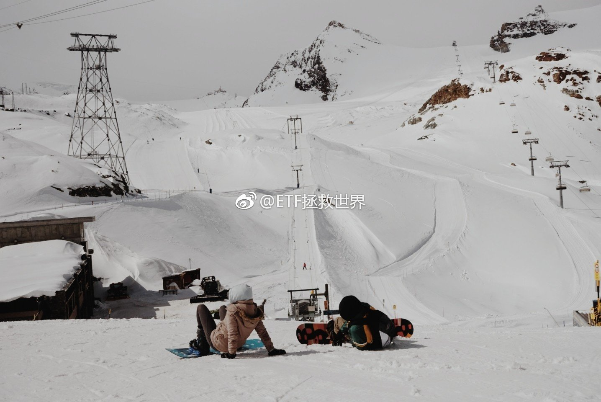

======================================================

ETF拯救世界 (5687069307) @
2017-05-15 14:41:07 Mon  
url: https://weibo.com/5687069307/F3dLzzkNM

今天计划可能又要新高了。

乡亲们，我快回来了！ ​​​

转发[3]  评论[212]  赞[191] 

======================================================

ETF拯救世界 (5687069307) @
2017-05-15 19:54:52 Mon  
url: https://weibo.com/5687069307/F3fOVqdjq

回复@梦境57154:我做的是一个组合，没法保证每个品种每天都新高。只能尽量做到整个组合持续上涨。//@梦境57154:怎么又新高，后面跟的医药，环保，养老国债，中证500都亏啊

------------------------------------------------------
转推：
>  @ETF拯救世界 (5687069307)
>  2017-05-15 14:41:07 Mon  
>  url: https:/weibo.com/5687069307/F3dLzzkNM/

>  今天计划可能又要新高了。
>  
>  乡亲们，我快回来了！ ​​​

转发[1]  评论[40]  赞[60] 

======================================================

ETF拯救世界 (5687069307) @
2017-05-15 21:21:29 Mon  
url: https://weibo.com/5687069307/F3go5fwdx

积跬步至千里，闲庭信步。

又新高了，赔钱好难。[哼] ​​​

转发[4]  评论[95]  赞[106] 

+++++++++++++++++++++++++++++++++++++++++++++++++++++

图片：
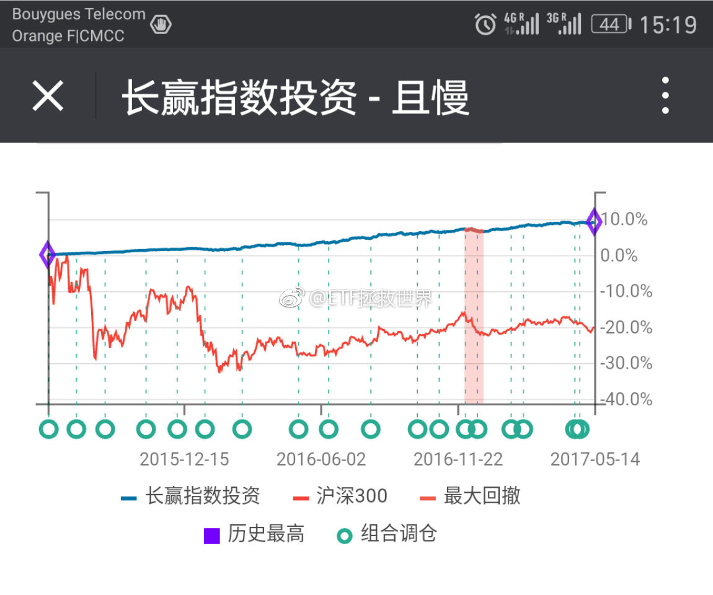

======================================================

ETF拯救世界 (5687069307) @
2017-05-16 10:44:05 Tue  
url: https://weibo.com/5687069307/F3lDRiVRd

你们都不觉得冷，怎么可能是深冬。 ​​​

转发[8]  评论[138]  赞[108] 

======================================================

ETF拯救世界 (5687069307) @
2017-05-16 15:06:26 Tue  
url: https://weibo.com/5687069307/F3nmlvHy5

这样的话就不用着急加车了。

当然还要回去算算才能最终确定。  ​​​

转发[1]  评论[55]  赞[67] 

======================================================

ETF拯救世界 (5687069307) @
2017-05-16 15:17:26 Tue  
url: https://weibo.com/5687069307/F3nqP0Xws

看到面对上涨，评论里一片失望的声音。我再说一次，如果上涨你不高兴，那么你的仓位太低，请尽快加到涨跌都没有感觉的仓位。

出来之前我建议的a股仓位由保守到激进是19-39。之前a股跌幅较大，就可以在这个基础上适当增加。

无论如何，被大盘涨跌影响心态的，仓位都不对。请尽快根据自己的情况调整到 ​​​

转发[15]  评论[139]  赞[119] 

======================================================

ETF拯救世界 (5687069307) @
2017-05-17 22:38:07 Wed  
url: https://weibo.com/5687069307/F3zKbiaqY

反向收益率曲线（inverted yield curve）的出现非常值得警惕。一般来说，出现这种现象代表要有大事发生了。这是一个早期预警信号。

------------------------------------------------------
转推：
>  @ ()
>  2017-05-12 10:14:11 Fri  
>  url: 

>  该账号因被投诉违反《微博社区公约》的相关规定，现已无法查看。查看帮助 https://kefu.weibo.com/faqdetail?id=13216

转发[47]  评论[95]  赞[95] 

======================================================

ETF拯救世界 (5687069307) @
2017-05-18 09:25:28 Thu  
url: https://weibo.com/5687069307/F3DYWptah

如果有5%的退市率，我估计敢炒个股的人会少一半。大量垃圾股从现价开始还要跌一半。

------------------------------------------------------
转推：
>  @财联社APP (2868676035)
>  2017-05-18 09:11:34 Thu  
>  url: https:/weibo.com/2868676035/F3DTixI1p/

>  新华社：不少业界人士认为，我国资本市场的退市制度仍待不断完善。回顾A股的退市历史，自2001年退市制度建立起，两市总计退市公司仅有90余家，年均退市率约0.35%，而成熟资本市场年退市率一般在6%以上。 ​​​

转发[3]  评论[43]  赞[50] 

======================================================

ETF拯救世界 (5687069307) @
2017-05-18 10:33:08 Thu  
url: https://weibo.com/5687069307/F3Eqpj27w

一般来说，反弹才是熊市中的大杀器。

大多数人不会在一路暴跌的时候买。这样就需要很多反弹。有短期有中期。大多数人会在反弹中买进去，然后辛辛苦苦涨一个月，一天下跌就可以把利润干没了。

被套了就不会卖了。然后就继续跌，继续反弹，继续换一批人套。 ​​​

转发[48]  评论[71]  赞[130] 

======================================================

ETF拯救世界 (5687069307) @
2017-05-18 13:26:35 Thu  
url: https://weibo.com/5687069307/F3FyOn9hC

关于在A股赚钱，有一个大的原则提请注意。

那就是，由于A股是牛熊分明，短期涨跌幅都很大的市场。所以尽量做到的是，在熊市中尽量不要亏损，或者不要大幅亏损。因为亏30%就要涨50%回本，亏50%就要涨100%回本。

做到了这一点，基本上就可以确保你不是那70%的赔钱货了。

但是想做10%赚钱的人，还不够 ​​​

转发[116]  评论[139]  赞[212] 

======================================================

ETF拯救世界 (5687069307) @
2017-05-18 13:38:06 Thu  
url: https://weibo.com/5687069307/F3FDudX9H

回复@预言大王:上次的50万册预订没成功啊。什么时候成了就写。//@预言大王:写个书吧，E大[馋嘴]

------------------------------------------------------
转推：
>  @ETF拯救世界 (5687069307)
>  2017-05-18 13:26:35 Thu  
>  url: https:/weibo.com/5687069307/F3FyOn9hC/

>  关于在A股赚钱，有一个大的原则提请注意。
>  
>  那就是，由于A股是牛熊分明，短期涨跌幅都很大的市场。所以尽量做到的是，在熊市中尽量不要亏损，或者不要大幅亏损。因为亏30%就要涨50%回本，亏50%就要涨100%回本。
>  
>  做到了这一点，基本上就可以确保你不是那70%的赔钱货了。
>  
>  但是想做10%赚钱的人，还不够 ​​​

转发[3]  评论[61]  赞[57] 

======================================================

ETF拯救世界 (5687069307) @
2017-05-18 15:58:19 Thu  
url: https://weibo.com/5687069307/F3Gyp1kl4

回复@内核晚风:有这个可能。未来我们的计划即使完全布局完成，最多也就持有1000-1800家公司。宽基的话300+500+1000也就1800只。行业指数成分股也大多在这个里面。所以还有至少一半我们不会买。我相信未来的牛市中，有些股票根本就不会涨甚至跌。这样的股票有多少说不好，但是一定有。

------------------------------------------------------
转推：
>  @ETF拯救世界 (5687069307)
>  2017-05-18 13:26:35 Thu  
>  url: https:/weibo.com/5687069307/F3FyOn9hC/

>  关于在A股赚钱，有一个大的原则提请注意。
>  
>  那就是，由于A股是牛熊分明，短期涨跌幅都很大的市场。所以尽量做到的是，在熊市中尽量不要亏损，或者不要大幅亏损。因为亏30%就要涨50%回本，亏50%就要涨100%回本。
>  
>  做到了这一点，基本上就可以确保你不是那70%的赔钱货了。
>  
>  但是想做10%赚钱的人，还不够 ​​​

转发[5]  评论[17]  赞[47] 

======================================================

ETF拯救世界 (5687069307) @
2017-05-18 16:15:39 Thu  
url: https://weibo.com/5687069307/F3GFraE7k

如果目前这个状态保持一周，月底至少6份起。

如果有下跌，会买更多。

已经进入敏感区域，最重要是掌控节奏。 ​​​

转发[35]  评论[197]  赞[196] 

======================================================

ETF拯救世界 (5687069307) @
2017-05-19 13:25:24 Fri  
url: https://weibo.com/5687069307/F3OYPlxBC

目前的战况是：

我军大部队在山岗上列队密切注视山脚下的战况；

一部分先锋部队已经入场厮杀，有一点损失，但也抢了不少粮食和补给；

最英勇的猛将是$159920 多次单骑救主；

当年凶猛残暴、人数众多的敌军经过一年多的消耗战，气势已经越来越弱，人数也越打越少。反观我军人数越来越多，胜算越来越 ​​​

转发[14]  评论[96]  赞[132] 

======================================================

ETF拯救世界 (5687069307) @
2017-05-19 13:48:11 Fri  
url: https://weibo.com/5687069307/F3P84yCAt

4不4逼我提前发车……

------------------------------------------------------
转推：
>  @ETF拯救世界 (5687069307)
>  2017-05-18 16:15:39 Thu  
>  url: https:/weibo.com/5687069307/F3GFraE7k/

>  如果目前这个状态保持一周，月底至少6份起。
>  
>  如果有下跌，会买更多。
>  
>  已经进入敏感区域，最重要是掌控节奏。 ​​​

转发[6]  评论[84]  赞[71] 

======================================================

ETF拯救世界 (5687069307) @
2017-05-19 16:16:41 Fri  
url: https://weibo.com/5687069307/F3Q6m0VYk

这个规律还有人没发现吗。[doge] 准确率90%+//@被e拯救:e大你真神人也，你这发微博的时间13:47，是日内的最低点，你一发言，gjd虎躯一震，就开始上班了……//@ETF拯救世界:4不4逼我提前发车……

------------------------------------------------------
转推：
>  @ETF拯救世界 (5687069307)
>  2017-05-18 16:15:39 Thu  
>  url: https:/weibo.com/5687069307/F3GFraE7k/

>  如果目前这个状态保持一周，月底至少6份起。
>  
>  如果有下跌，会买更多。
>  
>  已经进入敏感区域，最重要是掌控节奏。 ​​​

转发[2]  评论[49]  赞[63] 

======================================================

ETF拯救世界 (5687069307) @
2017-05-19 21:46:07 Fri  
url: https://weibo.com/5687069307/F3Sg4fYpy

大规模加仓的日子应该不太远了。如果维持目前的态势，可能会快速加仓到25%-30%。

熊市中领先指数太多了，领先500居然有40%以上。根据我的经验，未来最大的风险不是亏损，而是仓位不够。

兵无常势，水无常形。最近看到几个公众号，对我的抄袭已经令人发指。可惜，抄到的永远是形，不可能抄到魂。

最 ​​​

转发[21]  评论[175]  赞[231] 

======================================================

ETF拯救世界 (5687069307) @
2017-05-22 09:35:35 Mon  
url: https://weibo.com/5687069307/F4fL2gnO7

还有4个交易日……（已经不敢得瑟了。队里的兄弟们辛苦了！） ​​​

转发[1]  评论[40]  赞[83] 

======================================================

ETF拯救世界 (5687069307) @
2017-05-22 09:40:11 Mon  
url: https://weibo.com/5687069307/F4fMU4yFi

再说一次，朋友们。现在的每一点下跌，都会提高你未来的年化收益率。面对下跌，别人眼中是痛苦和危机，我们眼中是机会和财富。

前提是，我们能够在低位买进去。 ​​​

转发[5]  评论[32]  赞[95] 

======================================================

ETF拯救世界 (5687069307) @
2017-05-22 09:56:37 Mon  
url: https://weibo.com/5687069307/F4fTztFgj

$159920  恒生ETF继续新高。

继续持有。这可能是很多朋友持有最久，收益率最大的品种。

低买，然后持有的艺术和魅力。

什么时候体会高卖的乐趣？

[微笑]

投资就是这么有趣。 ​​​

转发[8]  评论[62]  赞[79] 

======================================================

ETF拯救世界 (5687069307) @
2017-05-22 10:13:04 Mon  
url: https://weibo.com/5687069307/F4g0frz2F

$养老产业 sz399812$   真的是跌不动了。

毕竟太便宜了。 ​​​

转发[5]  评论[56]  赞[51] 

======================================================

ETF拯救世界 (5687069307) @
2017-05-22 10:29:25 Mon  
url: https://weibo.com/5687069307/F4g6T3O6o

回复@adores2017:没事。再过一小时他还不说清楚，我就把他拉黑啦。哈哈。。就是这么任性一刚。//@adores2017:回复@阮二公子:说的什么话？说清楚啊

------------------------------------------------------
转推：
>  @ETF拯救世界 (5687069307)
>  2017-05-22 09:56:37 Mon  
>  url: https:/weibo.com/5687069307/F4fTztFgj/

>  $159920  恒生ETF继续新高。
>  
>  继续持有。这可能是很多朋友持有最久，收益率最大的品种。
>  
>  低买，然后持有的艺术和魅力。
>  
>  什么时候体会高卖的乐趣？
>  
>  [微笑]
>  
>  投资就是这么有趣。 ​​​

转发[0]  评论[21]  赞[35] 

======================================================

ETF拯救世界 (5687069307) @
2017-05-22 10:33:13 Mon  
url: https://weibo.com/5687069307/F4g8qwpvY

能抱团的绩优股都起来了。茅台家电平安。

接下来抱团什么品种阻止价值回归？还是说在全市场等权PE40多的时候再来一轮牛市？

一个问题。 ​​​

转发[10]  评论[34]  赞[69] 

======================================================

ETF拯救世界 (5687069307) @
2017-05-22 10:40:13 Mon  
url: https://weibo.com/5687069307/F4gbgB7mO

$*ST吉恩 sh600432$  退市的话，第六大流通股东怎么办……

真不能放开退市啊。GJD是一千多家上市公司的十大股东，真要退的多了就全完了……

个股的风险真是不可测。所以很多交易策略只能在永远不会消失的指数上面玩，不能在个股玩。所谓越跌越买长期持有这种在指数投资上包赚不赔的策略，以及吃波段 ​​​

转发[17]  评论[40]  赞[79] 

======================================================

ETF拯救世界 (5687069307) @
2017-05-22 12:01:22 Mon  
url: https://weibo.com/5687069307/F4gId6oh1

我关注的很多自选股都跌到了13年的价格。

凄凄惨惨戚戚。 ​​​

转发[2]  评论[32]  赞[71] 

======================================================

ETF拯救世界 (5687069307) @
2017-05-22 13:25:56 Mon  
url: https://weibo.com/5687069307/F4hgxavwZ

投资的时候一定要注意的是均值回归。

也就是跌太多的东西涨的概率大，涨很多的东西跌的概率大。

时间维度不同。有些是涨一年就很危险，有些是涨十年。

比如历史数据最多的美股。如果某个十年表现很好，接下来的十年可能吃瘪的可能性大。再下一个十年，又是NB闪闪。

大类资产也是如此。股票、黄金、 ​​​

转发[69]  评论[82]  赞[106] 

======================================================

ETF拯救世界 (5687069307) @
2017-05-22 14:03:16 Mon  
url: https://weibo.com/5687069307/F4hvGwhXo

回复@啊彬啊彬:这几天我不会说这个的。[doge]//@啊彬啊彬:e大不提前开车吗[doge]

------------------------------------------------------
转推：
>  @ETF拯救世界 (5687069307)
>  2017-05-22 13:25:56 Mon  
>  url: https:/weibo.com/5687069307/F4hgxavwZ/

>  投资的时候一定要注意的是均值回归。
>  
>  也就是跌太多的东西涨的概率大，涨很多的东西跌的概率大。
>  
>  时间维度不同。有些是涨一年就很危险，有些是涨十年。
>  
>  比如历史数据最多的美股。如果某个十年表现很好，接下来的十年可能吃瘪的可能性大。再下一个十年，又是NB闪闪。
>  
>  大类资产也是如此。股票、黄金、 ​​​

转发[3]  评论[31]  赞[35] 

======================================================

ETF拯救世界 (5687069307) @
2017-05-22 14:32:10 Mon  
url: https://weibo.com/5687069307/F4hHq2KlD

要不然说一句？//@ETF拯救世界:回复@啊彬啊彬:这几天我不会说这个的。[doge]//@啊彬啊彬:e大不提前开车吗[doge]

------------------------------------------------------
转推：
>  @ETF拯救世界 (5687069307)
>  2017-05-22 13:25:56 Mon  
>  url: https:/weibo.com/5687069307/F4hgxavwZ/

>  投资的时候一定要注意的是均值回归。
>  
>  也就是跌太多的东西涨的概率大，涨很多的东西跌的概率大。
>  
>  时间维度不同。有些是涨一年就很危险，有些是涨十年。
>  
>  比如历史数据最多的美股。如果某个十年表现很好，接下来的十年可能吃瘪的可能性大。再下一个十年，又是NB闪闪。
>  
>  大类资产也是如此。股票、黄金、 ​​​

转发[1]  评论[51]  赞[45] 

======================================================

ETF拯救世界 (5687069307) @
2017-05-22 15:02:29 Mon  
url: https://weibo.com/5687069307/F4hTJ4fOz

安全了。今晚有可能开。不确定。算好估值才知道。

总之资金准备好是没错的。 ​​​

转发[1]  评论[51]  赞[67] 

======================================================

ETF拯救世界 (5687069307) @
2017-05-22 15:15:30 Mon  
url: https://weibo.com/5687069307/F4hZ0or2K

今天两市一共400多只股票上涨，2600多只下跌。

计划第一重仓恒生涨，第二重仓50涨。德国、300、油气涨。养老、医药微跌。

也就是说，今天计划很可能又新高了…… ​​​

转发[15]  评论[29]  赞[67] 

======================================================

ETF拯救世界 (5687069307) @
2017-05-22 15:22:16 Mon  
url: https://weibo.com/5687069307/F4i1KCFfK

回复@青葱霉骚黏蜀黍:8月大底，回雪球再发一次2012年11月抄大底的帖子。钦定了。//@青葱霉骚黏蜀黍:5.6月出大底，e大认同吗，7.8月走稳回雪球[doge]

------------------------------------------------------
转推：
>  @ETF拯救世界 (5687069307)
>  2017-05-22 15:15:30 Mon  
>  url: https:/weibo.com/5687069307/F4hZ0or2K/

>  今天两市一共400多只股票上涨，2600多只下跌。
>  
>  计划第一重仓恒生涨，第二重仓50涨。德国、300、油气涨。养老、医药微跌。
>  
>  也就是说，今天计划很可能又新高了…… ​​​

转发[10]  评论[45]  赞[50] 

======================================================

ETF拯救世界 (5687069307) @
2017-05-22 15:27:40 Mon  
url: https://weibo.com/5687069307/F4i3WzmH5

重磅：A股全市场等权PE已经回到历史均值！

（图略）

今天是这一轮历史性的一天。当然，前几天可能也到了，但我没机会算…… ​​​

转发[59]  评论[99]  赞[117] 

======================================================

ETF拯救世界 (5687069307) @
2017-05-22 15:35:30 Mon  
url: https://weibo.com/5687069307/F4i77DpCo

我突然想到一个问题。估值刚刚回到历史平均——甚至高于五年十年平均的地方，很多股民都已经亏了那么多。如果，只是说如果，真的能够再回到低估区域，这些朋友的账户要变成什么样子？

------------------------------------------------------
转推：
>  @ETF拯救世界 (5687069307)
>  2017-05-22 15:27:40 Mon  
>  url: https:/weibo.com/5687069307/F4i3WzmH5/

>  重磅：A股全市场等权PE已经回到历史均值！
>  
>  （图略）
>  
>  今天是这一轮历史性的一天。当然，前几天可能也到了，但我没机会算…… ​​​

转发[20]  评论[113]  赞[86] 

======================================================

ETF拯救世界 (5687069307) @
2017-05-23 09:26:15 Tue  
url: https://weibo.com/5687069307/F4p7KaLy1

我推荐所有人看看这个：http://t.cn/RwlLutG 我打5分的一部电影。//@八大山债人://@水獭otter:危险驾驶罪一点问题也没有，看能不能定成危害公共安全罪。要严判。//@何兵: 抓人！//@我是风啊1888_80g:这个人应该判刑

------------------------------------------------------
转推：
>  @时间视频 (6250824982)
>  2017-05-22 23:22:49 Mon  
>  url: https:/weibo.com/6250824982/F4laOwCdc/

>  【插队未遂后报复？司机高速疯狂别车175秒】因在高速路口处插队未遂，皇冠车主在长达175秒的时间里，至少5次疑似报复性别车。沃尔沃车内6岁孩子刚说完“打110”，便头朝下摔倒，当场受伤大哭。事后，皇冠车主欲私了，沃尔沃车主：我不要钱，我要警方公正处理。http://t.cn/RagDGly ​​​

转发[28]  评论[31]  赞[33] 

======================================================

ETF拯救世界 (5687069307) @
2017-05-23 09:32:04 Tue  
url: https://weibo.com/5687069307/F4pa6qF5E

今天再不反弹就要崩盘了 ​​​

转发[5]  评论[56]  赞[67] 

======================================================

ETF拯救世界 (5687069307) @
2017-05-23 09:42:50 Tue  
url: https://weibo.com/5687069307/F4petpdOF

昨天计划差0.0002%没有新高。

对不起大家了！[污] ​​​

转发[1]  评论[51]  赞[62] 

======================================================

ETF拯救世界 (5687069307) @
2017-05-23 09:47:59 Tue  
url: https://weibo.com/5687069307/F4pgz7C44

谁能想到，$159920 一年涨了40%。 ​​​

转发[20]  评论[51]  赞[69] 

======================================================

ETF拯救世界 (5687069307) @
2017-05-23 09:54:05 Tue  
url: https://weibo.com/5687069307/F4pj2r9V2

一个小经验：如果你听到很多人说某个市场某个大类已经“边缘化”，没有希望了。那么那个时候也许可以多买点。

------------------------------------------------------
转推：
>  @ETF拯救世界 (5687069307)
>  2017-05-23 09:47:59 Tue  
>  url: https:/weibo.com/5687069307/F4pgz7C44/

>  谁能想到，$159920 一年涨了40%。 ​​​

转发[17]  评论[44]  赞[86] 

======================================================

ETF拯救世界 (5687069307) @
2017-05-23 10:43:16 Tue  
url: https://weibo.com/5687069307/F4pD0juvY

人无百日好，花无百日红。

得意的时候多想想困难，失意的时候多想想希望就在不远处。

股票何尝不是如此。比如中国平安，最近涨了一点。持有的人当然高兴，所谓“价值投资”的光芒再次燃烧了起来。

要我说，不过是三十年河东三十年河西而已。现在人人都要踩上一脚的创业板在2012-2014从500多点涨到13 ​​​

转发[47]  评论[85]  赞[166] 

======================================================

ETF拯救世界 (5687069307) @
2017-05-23 11:53:03 Tue  
url: https://weibo.com/5687069307/F4q5kqJKs

等会注意看手机 ​​​

转发[5]  评论[219]  赞[145] 

======================================================

ETF拯救世界 (5687069307) @
2017-05-23 13:30:59 Tue  
url: https://weibo.com/5687069307/F4qJ56I2C

这是最坏的时代，也是最好的时代。

前锋部队又有六只小分队进入战场了。

战局悄悄在改变。 ​​​

转发[11]  评论[119]  赞[104] 

======================================================

ETF拯救世界 (5687069307) @
2017-05-23 13:44:09 Tue  
url: https://weibo.com/5687069307/F4qOqnCsf

$中证1000 sh000852$  新低了。不用拉数据就知道小盘股已经惨到什么地步了。

然而，我们还是不出手。[doge] 

节奏。 ​​​

转发[4]  评论[57]  赞[75] 

======================================================

ETF拯救世界 (5687069307) @
2017-05-23 14:20:00 Tue  
url: https://weibo.com/5687069307/F4r2Yu1ee

2015年6月以来，除了那几十只超级大白马的股东，其他所有持有股票的人都伤痕累累。

在这个时候买入，你应该知道，在未来的某个时间点回头看，你很大概率不会赔钱。

至于能赚多少，真的不好说。因为不知道未来会有多么疯狂。但你只要知道，这里买，买那些永远不会死的东西，长期看真的很难赔钱。

所 ​​​

转发[110]  评论[103]  赞[145] 

======================================================

ETF拯救世界 (5687069307) @
2017-05-23 14:48:44 Tue  
url: https://weibo.com/5687069307/F4reDw4RI

中证1000跌了3%，你养老只跌0.3%。几个意思？等着以后补跌呢。辣鸡……

[哼] ​​​

转发[6]  评论[71]  赞[68] 

======================================================

ETF拯救世界 (5687069307) @
2017-05-23 15:32:41 Tue  
url: https://weibo.com/5687069307/F4rwtyNIv

说出来你不信，继昨天跌破历史平均后，今天又跌破了五年+十年平均。

hello ，下半场。我们来了。 ​​​

转发[34]  评论[150]  赞[137] 

======================================================

ETF拯救世界 (5687069307) @
2017-05-23 16:30:54 Tue  
url: https://weibo.com/5687069307/F4rU6E4PI

回复@手机用户3315329237:嗯。2017过了一半，年初的这个预测算是有一点眉目了。今年会发生一些事，改变很多人的财富命运。有的变好，有的变差。更多人会在今年种下一些资产飞跃的种子。拭目以待吧。

------------------------------------------------------
转推：
>  @ETF拯救世界 (5687069307)
>  2017-05-23 15:32:41 Tue  
>  url: https:/weibo.com/5687069307/F4rwtyNIv/

>  说出来你不信，继昨天跌破历史平均后，今天又跌破了五年+十年平均。
>  
>  hello ，下半场。我们来了。 ​​​

转发[8]  评论[44]  赞[64] 

======================================================

ETF拯救世界 (5687069307) @
2017-05-23 17:02:02 Tue  
url: https://weibo.com/5687069307/F4s6KjaJG

回复@夏创杰:从去年开始，我就说这轮熊市与02年开始的那次太像了。包括外部金融环境，货币环境等。股市走势也特别特别像，甚至包括现在抱团大白马。如果之后还能复制那次的情况，那么中小股票将有一个超级大底出现，然后就是4-5倍以上的财富超级大飞跃。

------------------------------------------------------
转推：
>  @ETF拯救世界 (5687069307)
>  2017-05-23 14:20:00 Tue  
>  url: https:/weibo.com/5687069307/F4r2Yu1ee/

>  2015年6月以来，除了那几十只超级大白马的股东，其他所有持有股票的人都伤痕累累。
>  
>  在这个时候买入，你应该知道，在未来的某个时间点回头看，你很大概率不会赔钱。
>  
>  至于能赚多少，真的不好说。因为不知道未来会有多么疯狂。但你只要知道，这里买，买那些永远不会死的东西，长期看真的很难赔钱。
>  
>  所 ​​​

转发[75]  评论[76]  赞[73] 

======================================================

ETF拯救世界 (5687069307) @
2017-05-23 17:19:26 Tue  
url: https://weibo.com/5687069307/F4sdOurp6

回复@杰克WAS-TAKEN:股市收益率与GDP基本没什么关系。取决于：1，你买入的估值、价格。2，牛市中的货币供应，资金量，以及群众的情绪。三者相加，决定你能在股市赚多少。中国GDP稳定在10%以上的时候，依然是70%的人不赚钱。//@杰克WAS-TAKEN:新常态GDP增速降到6.5了

------------------------------------------------------
转推：
>  @ETF拯救世界 (5687069307)
>  2017-05-23 14:20:00 Tue  
>  url: https:/weibo.com/5687069307/F4r2Yu1ee/

>  2015年6月以来，除了那几十只超级大白马的股东，其他所有持有股票的人都伤痕累累。
>  
>  在这个时候买入，你应该知道，在未来的某个时间点回头看，你很大概率不会赔钱。
>  
>  至于能赚多少，真的不好说。因为不知道未来会有多么疯狂。但你只要知道，这里买，买那些永远不会死的东西，长期看真的很难赔钱。
>  
>  所 ​​​

转发[22]  评论[21]  赞[47] 

======================================================

ETF拯救世界 (5687069307) @
2017-05-23 17:29:55 Tue  
url: https://weibo.com/5687069307/F4si45y1f

我看大家都很激动。高兴高兴也好。不过我想说的，是大多数人，也包括在座的很多朋友，根本无缘抓住这次财富暴发。至于为什么，几年后回来看的时候你就懂了。有时候我们习惯于把自己想得太过强大了。

------------------------------------------------------
转推：
>  @ETF拯救世界 (5687069307)
>  2017-05-23 14:20:00 Tue  
>  url: https:/weibo.com/5687069307/F4r2Yu1ee/

>  2015年6月以来，除了那几十只超级大白马的股东，其他所有持有股票的人都伤痕累累。
>  
>  在这个时候买入，你应该知道，在未来的某个时间点回头看，你很大概率不会赔钱。
>  
>  至于能赚多少，真的不好说。因为不知道未来会有多么疯狂。但你只要知道，这里买，买那些永远不会死的东西，长期看真的很难赔钱。
>  
>  所 ​​​

转发[18]  评论[93]  赞[78] 

======================================================

ETF拯救世界 (5687069307) @
2017-05-23 17:42:07 Tue  
url: https://weibo.com/5687069307/F4sn17c2D

回复@叶子黄了又绿:我不在江湖，江湖依然有……//@叶子黄了又绿:E大，你的号召力惊人啊。看到雪球今天10大净买入，500etf排名第五，广发医药排名第八，红利基金排名第九[思考]

------------------------------------------------------
转推：
>  @ETF拯救世界 (5687069307)
>  2017-05-23 14:20:00 Tue  
>  url: https:/weibo.com/5687069307/F4r2Yu1ee/

>  2015年6月以来，除了那几十只超级大白马的股东，其他所有持有股票的人都伤痕累累。
>  
>  在这个时候买入，你应该知道，在未来的某个时间点回头看，你很大概率不会赔钱。
>  
>  至于能赚多少，真的不好说。因为不知道未来会有多么疯狂。但你只要知道，这里买，买那些永远不会死的东西，长期看真的很难赔钱。
>  
>  所 ​​​

转发[2]  评论[33]  赞[50] 

======================================================

ETF拯救世界 (5687069307) @
2017-05-23 18:21:40 Tue  
url: https://weibo.com/5687069307/F4sD4hvA0

回复@携风牧云:我没给建议啊。只是把自己的计划公布出来。//@携风牧云:回复@做只有翅膀的猪:管一次你就知道给别人建议是多可怕的一件事了，另外也就理解现在e大给这成千上万的人建议是一件风险多大的事了（同时也是特别了不起的一件事）

------------------------------------------------------
转推：
>  @ETF拯救世界 (5687069307)
>  2017-05-23 15:32:41 Tue  
>  url: https:/weibo.com/5687069307/F4rwtyNIv/

>  说出来你不信，继昨天跌破历史平均后，今天又跌破了五年+十年平均。
>  
>  hello ，下半场。我们来了。 ​​​

转发[0]  评论[53]  赞[54] 

======================================================

ETF拯救世界 (5687069307) @
2017-05-24 09:03:51 Wed  
url: https://weibo.com/5687069307/F4yp9biVE

现在鼓吹大白马好好好，呼吁大家买买买的人，我不敢说全部，70%的不是傻就是坏。

涨了再涨一直涨的股票肯定有，比如腾讯。什么时候上车看起来都对。但是你没看到的是千百倍于它的，那些涨起来被各路神仙忽悠然后被接盘然后死了的股票。

低位买了涨了很多的牛股的人，踏踏实实拿着赚自己的钱，或者时 ​​​

转发[31]  评论[81]  赞[102] 

======================================================

ETF拯救世界 (5687069307) @
2017-05-24 09:26:47 Wed  
url: https://weibo.com/5687069307/F4yysldy7

讲真，几乎所有人都认为我是左侧的价投。其实很少人知道我对右侧也有研究，也会根据右侧买卖。

问题在于，在我的投资策略中，右侧买入只有两次机会。一次是底部反转的时候，一次是底部反转之后回踩的时候。就这两次，也就是说，我在右侧买的一定是跌了很久或者盘整很久后在趋势反转的那个底部区域。

 ​​​

转发[52]  评论[66]  赞[115] 

======================================================

ETF拯救世界 (5687069307) @
2017-05-24 09:38:08 Wed  
url: https://weibo.com/5687069307/F4yD4lMEL

回复@Shaw-Chan:正确。根据我每个季度的跟踪，目前A股小盘股就是比大盘股业绩增速快（剔除外延）。而且快的不是一点。小盘股的问题是贵，未来跌到不贵甚至便宜，才是真正的大机会。大盘股不是说不好，问题在于A股的大盘股很大一部分来源于垄断而非市场竞争。天生没有成长性，个股看PE投资就过于简单了

------------------------------------------------------
转推：
>  @ETF拯救世界 (5687069307)
>  2017-05-24 09:03:51 Wed  
>  url: https:/weibo.com/5687069307/F4yp9biVE/

>  现在鼓吹大白马好好好，呼吁大家买买买的人，我不敢说全部，70%的不是傻就是坏。
>  
>  涨了再涨一直涨的股票肯定有，比如腾讯。什么时候上车看起来都对。但是你没看到的是千百倍于它的，那些涨起来被各路神仙忽悠然后被接盘然后死了的股票。
>  
>  低位买了涨了很多的牛股的人，踏踏实实拿着赚自己的钱，或者时 ​​​

转发[11]  评论[14]  赞[56] 

======================================================

ETF拯救世界 (5687069307) @
2017-05-24 09:40:13 Wed  
url: https://weibo.com/5687069307/F4yDUnjap

救救股市！它还是个孩子！[doge]

------------------------------------------------------
转推：
>  @ETF拯救世界 (5687069307)
>  2017-05-23 09:32:04 Tue  
>  url: https:/weibo.com/5687069307/F4pa6qF5E/

>  今天再不反弹就要崩盘了 ​​​

转发[3]  评论[43]  赞[53] 

======================================================

ETF拯救世界 (5687069307) @
2017-05-24 09:44:59 Wed  
url: https://weibo.com/5687069307/F4yFQkS9u

那什么，如果这几天连续暴跌，估值再下一个台阶的话，会加车。

几份不好说。

盛宴是不是要开始了。 ​​​

转发[4]  评论[56]  赞[100] 

======================================================

ETF拯救世界 (5687069307) @
2017-05-24 09:51:37 Wed  
url: https://weibo.com/5687069307/F4yIxjaPa

这两年，很多人说我保守。

不好意思，我不是保守，只是看到了一些绝大多数人没看到的东西。未来几年A股的惨状2015年就在我眼前浮现，我没法不保守。

未来也许有机会见到我疯狂的一面。讲真，有时候我疯起来连自己都害怕哩。[doge] ​​​

转发[6]  评论[100]  赞[140] 

======================================================

ETF拯救世界 (5687069307) @
2017-05-24 09:53:10 Wed  
url: https://weibo.com/5687069307/F4yJaAwD2

3000点，一次能守住，两次能守住，第三次就未必了。

一鼓作气再而衰三而竭。

看看队里的队里还有多少散碎银子护盘。 ​​​

转发[7]  评论[59]  赞[76] 

======================================================

ETF拯救世界 (5687069307) @
2017-05-24 10:12:18 Wed  
url: https://weibo.com/5687069307/F4yQVAESU

只要天朝不乱，以中国人的勤奋程度，一定会发展的越来越好。股市啊，指数啊，都没问题。

股票就不同了。现在看不出来，未来到了大熊底，很多股票持有者会很疑惑，我的股票还能不能涨了？

你别说，即使下次牛市指数涨几倍，好多股票也真有可能就不涨，或者几年就涨20%、30%，算算收益率还不如债券。更 ​​​

转发[11]  评论[74]  赞[103] 

======================================================

ETF拯救世界 (5687069307) @
2017-05-24 10:58:00 Wed  
url: https://weibo.com/5687069307/F4z9u1pgH

有些人说指数投资赚的少，我也是醉了。

2005年中证1000是660点，2015年是15000点，这是多少倍？22。

同期中证500是17倍，全指医药是20倍。

同期买股票赚20倍的有多少人？赚10倍的呢？

当然有，我问的是多少人。你从几千只股票里面选个大牛股持有10年赚20倍容易，还是买个指数赚20倍容易？

光看上 ​​​

转发[41]  评论[105]  赞[134] 

======================================================

ETF拯救世界 (5687069307) @
2017-05-24 13:26:21 Wed  
url: https://weibo.com/5687069307/F4A7HcWJd

有人说，注册制了，以后中小股票不行了。只有大蓝筹，白马会涨了。

以后看见谁这样YY，可以自动取关。

美国是注册制，纽交所和纳斯达克股票加起来超过6000只。下图是大盘股为主的标普500和中小股票组成的罗素2000走势。黑罗素，红标普。

长期看，依然是中小指数涨的好。

各位，中小股票跌的时候就 ​​​

转发[114]  评论[113]  赞[156] 

+++++++++++++++++++++++++++++++++++++++++++++++++++++

图片：

======================================================

ETF拯救世界 (5687069307) @
2017-05-24 13:50:26 Wed  
url: https://weibo.com/5687069307/F4AhtgZ1h

我再说一个不知道会不会发生的。

未来A股的超级大底，恐怕就是最后漂亮50补跌砸出来的。 ​​​

转发[36]  评论[71]  赞[94] 

======================================================

ETF拯救世界 (5687069307) @
2017-05-24 13:54:55 Wed  
url: https://weibo.com/5687069307/F4Ajialaq

shit，做为一个A股最大仓位配置在50ETF上的人，天天这么黑50真的好吗。

------------------------------------------------------
转推：
>  @ETF拯救世界 (5687069307)
>  2017-05-24 13:50:26 Wed  
>  url: https:/weibo.com/5687069307/F4AhtgZ1h/

>  我再说一个不知道会不会发生的。
>  
>  未来A股的超级大底，恐怕就是最后漂亮50补跌砸出来的。 ​​​

转发[12]  评论[63]  赞[69] 

======================================================

ETF拯救世界 (5687069307) @
2017-05-24 14:55:22 Wed  
url: https://weibo.com/5687069307/F4AHPnEjO

昨天开车现在看是没错的。 ​​​

转发[3]  评论[121]  赞[128] 

======================================================

ETF拯救世界 (5687069307) @
2017-05-24 20:23:02 Wed  
url: https://weibo.com/5687069307/F4CQPkCi9

昨天买的所有品种今天净值都涨了[doge] ​​​

转发[9]  评论[80]  赞[106] 

======================================================

ETF拯救世界 (5687069307) @
2017-05-24 20:35:59 Wed  
url: https://weibo.com/5687069307/F4CW5fOzB

新高了，醉了。 ​​​

转发[19]  评论[105]  赞[108] 

+++++++++++++++++++++++++++++++++++++++++++++++++++++

图片：

======================================================

ETF拯救世界 (5687069307) @
2017-05-25 08:33:43 Thu  
url: https://weibo.com/5687069307/F4HDpwk5X

回复@白马拯救世界:有奖竞猜:十年国债到4%，我们的计划会一次收几份债。第一个猜中的获奖。奖品:单价50元以内自己随便选一本书。//@白马拯救世界:报告E大，十年期国债收益率3.7了

------------------------------------------------------
转推：
>  @ETF拯救世界 (5687069307)
>  2017-05-24 20:35:59 Wed  
>  url: https:/weibo.com/5687069307/F4CW5fOzB/

>  新高了，醉了。 ​​​

转发[8]  评论[312]  赞[34] 

======================================================

ETF拯救世界 (5687069307) @
2017-05-25 09:50:29 Thu  
url: https://weibo.com/5687069307/F4I8zrQWm

$159920  四个字形容你的感受：

我先来：

全靠你了 ​​​

转发[9]  评论[89]  赞[45] 

======================================================

ETF拯救世界 (5687069307) @
2017-05-25 09:54:01 Thu  
url: https://weibo.com/5687069307/F4Ia0nrhJ

回复@弦动我心50455:这是一次下轮牛市的预演。几年后我们手里的每个品种都会像恒生一样，甚至比恒生更快更猛的上涨。先预习一下如何坚定持有吧。坚定持有，并不容易，需要不断的正反馈练习才能做得好一点。//@弦动我心50455:不是e大，我肯定拿不住了

------------------------------------------------------
转推：
>  @ETF拯救世界 (5687069307)
>  2017-05-25 09:50:29 Thu  
>  url: https:/weibo.com/5687069307/F4I8zrQWm/

>  $159920  四个字形容你的感受：
>  
>  我先来：
>  
>  全靠你了 ​​​

转发[4]  评论[21]  赞[49] 

======================================================

ETF拯救世界 (5687069307) @
2017-05-25 09:56:09 Thu  
url: https://weibo.com/5687069307/F4IaSbOHs

回复@愚渔渔鱼nyefy:8月是开个玩笑……[doge]//@愚渔渔鱼nyefy:请教E大，如果8月份大底，是否在此前需把资金全部准备到位[微笑]

------------------------------------------------------
转推：
>  @ETF拯救世界 (5687069307)
>  2017-05-25 09:50:29 Thu  
>  url: https:/weibo.com/5687069307/F4I8zrQWm/

>  $159920  四个字形容你的感受：
>  
>  我先来：
>  
>  全靠你了 ​​​

转发[1]  评论[25]  赞[28] 

======================================================

ETF拯救世界 (5687069307) @
2017-05-25 10:05:19 Thu  
url: https://weibo.com/5687069307/F4IeADRid

$510050  50是个好同志。 ​​​

转发[1]  评论[15]  赞[45] 

======================================================

ETF拯救世界 (5687069307) @
2017-05-25 10:06:54 Thu  
url: https://weibo.com/5687069307/F4IfezGlT

只有800只股票上涨

结果。。。恒生、50、180、300、医药、养老、红利

全都……

4不4又要新高了！[哼] ​​​

转发[2]  评论[49]  赞[63] 

======================================================

ETF拯救世界 (5687069307) @
2017-05-25 10:15:07 Thu  
url: https://weibo.com/5687069307/F4IizmOOL

再来一道问答题吧。你觉得恒生涨到多少我们会第一次减仓？ ​​​

转发[3]  评论[126]  赞[53] 

======================================================

ETF拯救世界 (5687069307) @
2017-05-25 10:24:08 Thu  
url: https://weibo.com/5687069307/F4ImemTET

不知道有没有朋友注意过。

50和恒生都是我们一年前布局完成的。目前开始高潮。

推想一下。现在布局的品种，尤其是开始大量布局的，至少一年后才会开始高潮，也有可能几年。

中间有时间差。也就是说，我们提前进入至少一年以后才会成为市场关注点的品种。当别人开始疯狂杀入的时候，我们在考虑何时开 ​​​

转发[51]  评论[86]  赞[145] 

======================================================

ETF拯救世界 (5687069307) @
2017-05-25 10:40:58 Thu  
url: https://weibo.com/5687069307/F4It45xkT

表个态：

坚定支持刘主席以及zy挤泡沫的决心和行动。

也真心跟有些朋友说一句，泡沫不挤，你我会很久很久很久不可能从A股赚钱。只会让大鳄以及重要股东高位套现，把你的血汗钱拿走。

市场的归市场，让A股正本清源，估值回到正常位置，大家一起共同迎接真正的长牛大牛，一起发财。 ​​​

转发[7]  评论[77]  赞[143] 

======================================================

ETF拯救世界 (5687069307) @
2017-05-25 11:01:21 Thu  
url: https://weibo.com/5687069307/F4IBl3ezk

谁能想到，做多A股的股民们也亏损了。做多做空都亏损，问你怕不怕？

------------------------------------------------------
转推：
>  @ ()
>  2017-05-25 10:11:04 Thu  
>  url: 

>  抱歉，作者已设置仅展示半年内微博，此微博已不可见。 ​​​

转发[5]  评论[38]  赞[44] 

======================================================

ETF拯救世界 (5687069307) @
2017-05-25 13:01:15 Thu  
url: https://weibo.com/5687069307/F4Jo0jjNQ

不要脸。每次发车只有100人打赏你还来分成[doge]

------------------------------------------------------
转推：
>  @网易财经 (1974561081)
>  2017-05-25 12:10:03 Thu  
>  url: https:/weibo.com/1974561081/F4J3dFSdh/

>  #网易新闻#  【媒体：苹果向打赏要30%提成 和收保护费有啥区别】最近，苹果更新规则，在苹果终端应用给作者和主播打赏，不能再使用第三方支付，而必须通过苹果应用商店购买，相应平台要提三成。新规影响颇广，微信公众号、今日头条、知乎、映客都在近期调整了打赏设定。http://t.cn/RSvpn7r ​​​

转发[5]  评论[44]  赞[42] 

======================================================

ETF拯救世界 (5687069307) @
2017-05-25 13:13:22 Thu  
url: https://weibo.com/5687069307/F4JsVfbCC

继续黑:加速赶顶 [doge]//@ETF拯救世界:shit，做为一个A股最大仓位配置在50ETF上的人，天天这么黑50真的好吗。

------------------------------------------------------
转推：
>  @ETF拯救世界 (5687069307)
>  2017-05-24 13:50:26 Wed  
>  url: https:/weibo.com/5687069307/F4AhtgZ1h/

>  我再说一个不知道会不会发生的。
>  
>  未来A股的超级大底，恐怕就是最后漂亮50补跌砸出来的。 ​​​

转发[2]  评论[17]  赞[45] 

======================================================

ETF拯救世界 (5687069307) @
2017-05-25 13:22:12 Thu  
url: https://weibo.com/5687069307/F4Jwvrnbw

谁能想到，有将近70%的股票在下跌。

$510050  $159920 ​​​

转发[5]  评论[18]  赞[43] 

======================================================

ETF拯救世界 (5687069307) @
2017-05-25 13:24:37 Thu  
url: https://weibo.com/5687069307/F4JxulI32

回复@坦白痞子520:有。很多人追涨追进去了！够不够大的利好。//@坦白痞子520:会不会有什么特别的利好？

------------------------------------------------------
转推：
>  @ETF拯救世界 (5687069307)
>  2017-05-25 13:22:12 Thu  
>  url: https:/weibo.com/5687069307/F4Jwvrnbw/

>  谁能想到，有将近70%的股票在下跌。
>  
>  $510050  $159920 ​​​

转发[2]  评论[18]  赞[32] 

======================================================

ETF拯救世界 (5687069307) @
2017-05-25 13:36:09 Thu  
url: https://weibo.com/5687069307/F4JCawh5l

怎么评价前天中午的发车。不过大家应该都习惯了。

------------------------------------------------------
转推：
>  @ETF拯救世界 (5687069307)
>  2017-05-24 20:23:02 Wed  
>  url: https:/weibo.com/5687069307/F4CQPkCi9/

>  昨天买的所有品种今天净值都涨了[doge] ​​​

转发[5]  评论[72]  赞[73] 

======================================================

ETF拯救世界 (5687069307) @
2017-05-25 13:44:31 Thu  
url: https://weibo.com/5687069307/F4JFzf7bL

没人讨论一下为什么是前天中午开车吗。明明离月底还有4个交易日。//@ETF拯救世界:怎么评价前天中午的发车。不过大家应该都习惯了。

------------------------------------------------------
转推：
>  @ETF拯救世界 (5687069307)
>  2017-05-24 20:23:02 Wed  
>  url: https:/weibo.com/5687069307/F4CQPkCi9/

>  昨天买的所有品种今天净值都涨了[doge] ​​​

转发[3]  评论[154]  赞[80] 

======================================================

ETF拯救世界 (5687069307) @
2017-05-25 14:09:37 Thu  
url: https://weibo.com/5687069307/F4JPKDnYa

各位注意体会一下仓位“舒服”的感觉。

如果今天的上涨在买入之前，必然大多数朋友不“舒服”。现在加了几个点的仓后再涨，恐怕大部分朋友感觉相当惬意。

咱们来资本市场除了赚钱，还有个心情愉快的问题。吃着火锅唱着歌，把钱赚了，才是最高境界。每天担惊受怕，一会担心被套了，一会担心踏空了，慌 ​​​

转发[22]  评论[92]  赞[136] 

======================================================

ETF拯救世界 (5687069307) @
2017-05-25 14:51:29 Thu  
url: https://weibo.com/5687069307/F4K6Knhmt

没有意外，连续第三天新高。熊市不可怕。只要做正确的事情，你就可以做到大盘指数在某个地方即使十年不动，你也可以在每次回到原点的时候比上次有更多市值。市场的波动是我们的机会。收集财富的机会。

------------------------------------------------------
转推：
>  @ETF拯救世界 (5687069307)
>  2017-05-24 20:35:59 Wed  
>  url: https:/weibo.com/5687069307/F4CW5fOzB/

>  新高了，醉了。 ​​​

转发[4]  评论[83]  赞[124] 

======================================================

ETF拯救世界 (5687069307) @
2017-05-25 22:24:52 Thu  
url: https://weibo.com/5687069307/F4N4LAjm8

我准备以后写本家训传给后人，第一条就是：

永远不要做空美股。 ​​​

转发[51]  评论[149]  赞[175] 

======================================================

ETF拯救世界 (5687069307) @
2017-05-26 09:53:34 Fri  
url: https://weibo.com/5687069307/F4RAk1jde

回复@freeman91酷酷的:可能在你的认知世界中，所有经验都应该来自于自身的错误经历。非常可惜，我对于证券投资的80%以上的，关于“失败”的经验，都来自于他人。所以在金融投资方面，基本上没有走过大的弯路。原因无他，观察，学习，总结，然后趋利避害。

------------------------------------------------------
转推：
>  @ETF拯救世界 (5687069307)
>  2017-05-25 22:24:52 Thu  
>  url: https:/weibo.com/5687069307/F4N4LAjm8/

>  我准备以后写本家训传给后人，第一条就是：
>  
>  永远不要做空美股。 ​​​

转发[12]  评论[37]  赞[100] 

======================================================

ETF拯救世界 (5687069307) @
2017-05-26 10:04:44 Fri  
url: https://weibo.com/5687069307/F4RER4rRs

三根阳线改三观，还差一根呢…… ​​​

转发[18]  评论[30]  赞[64] 

======================================================

ETF拯救世界 (5687069307) @
2017-05-26 10:09:19 Fri  
url: https://weibo.com/5687069307/F4RGIhepQ

你还是不了解我的体系吗，这么久了。我绝大多数时间不会“看多”“看空”。我只会考虑在这个阶段上涨或者下跌的概率分别有多大。然后根据概率布局。预测未来走势这种事，交给股神去干吧。//@止和观:E大依然看空，慢慢的坐等

------------------------------------------------------
转推：
>  @ETF拯救世界 (5687069307)
>  2017-05-26 10:04:44 Fri  
>  url: https:/weibo.com/5687069307/F4RER4rRs/

>  三根阳线改三观，还差一根呢…… ​​​

转发[10]  评论[44]  赞[77] 

======================================================

ETF拯救世界 (5687069307) @
2017-05-26 11:02:54 Fri  
url: https://weibo.com/5687069307/F4S2sBdbj

回复@用户5850653787:语录背的还可以啊。跌多了反弹一下，换一批人接盘接着套。每个人都赔一点，不要让一个人从头赔到尾，世界多美好。

------------------------------------------------------
转推：
>  @ETF拯救世界 (5687069307)
>  2017-05-26 10:04:44 Fri  
>  url: https:/weibo.com/5687069307/F4RER4rRs/

>  三根阳线改三观，还差一根呢…… ​​​

转发[2]  评论[30]  赞[61] 

======================================================

ETF拯救世界 (5687069307) @
2017-05-26 14:56:49 Fri  
url: https://weibo.com/5687069307/F4Tzpo8FQ

端午节有什么计划？ ​​​

转发[5]  评论[167]  赞[54] 

======================================================

ETF拯救世界 (5687069307) @
2017-05-26 15:50:55 Fri  
url: https://weibo.com/5687069307/F4TVn0IFf

回复@知公分子:公众号读书栏目//@知公分子:回复@alayamj:E大推荐的什么书？求个链接

------------------------------------------------------
转推：
>  @ETF拯救世界 (5687069307)
>  2017-05-26 14:56:49 Fri  
>  url: https:/weibo.com/5687069307/F4Tzpo8FQ/

>  端午节有什么计划？ ​​​

转发[2]  评论[22]  赞[38] 

======================================================

ETF拯救世界 (5687069307) @
2017-05-26 16:51:54 Fri  
url: https://weibo.com/5687069307/F4Uk7xzyw

也许有一波可以让计划减仓的行情。然后？呵呵。

------------------------------------------------------
转推：
>  @ ()
>  2017-05-26 16:41:19 Fri  
>  url: 

>  抱歉，作者已设置仅展示半年内微博，此微博已不可见。 ​​​

转发[27]  评论[45]  赞[38] 

======================================================

ETF拯救世界 (5687069307) @
2017-05-26 17:16:50 Fri  
url: https://weibo.com/5687069307/F4UufaZ9N

回复@没有钻石的老伍:据我监测了几年的增减持数据，近期减持量越来越少，以至于我都懒得更新减持与净减持家数与金额数据了。突然来这么一出，确实有点让人不理解。

------------------------------------------------------
转推：
>  @ ()
>  2017-05-26 16:41:19 Fri  
>  url: 

>  抱歉，作者已设置仅展示半年内微博，此微博已不可见。 ​​​

转发[21]  评论[32]  赞[31] 

======================================================

ETF拯救世界 (5687069307) @
2017-05-26 17:24:45 Fri  
url: https://weibo.com/5687069307/F4Uxskf5o

回复@J_R_Dong:想长牛就尽快让市场回到应该在的位置。人为的拉高估值，只会引发之后更加剧烈的波动。2005年之前，非流动股根本不能减持。结果如何，还不是跌破1000点。正是股权分置改革，全流通，引爆了一轮大牛市。2015、2016连续推出限制重要股东减持的政策，结果如何，股民赔的更多了。

------------------------------------------------------
转推：
>  @ ()
>  2017-05-26 16:41:19 Fri  
>  url: 

>  抱歉，作者已设置仅展示半年内微博，此微博已不可见。 ​​​

转发[15]  评论[34]  赞[71] 

======================================================

ETF拯救世界 (5687069307) @
2017-05-26 21:56:25 Fri  
url: https://weibo.com/5687069307/F4WjJ4z7t

新朋友别再问我以前的能不能补了。且慢关注长赢组合，价格低于往期发车价格就会提示。对于补之前的份额问题，我想不到更方便的方法了。

------------------------------------------------------
转推：
>  @且慢管家 (6186312580)
>  2017-05-26 21:53:57 Fri  
>  url: https:/weibo.com/6186312580/F4WiJ3ReY/

>  #理财#  @ETF拯救世界 还在为错过某次发车而烦恼么？还在为没有早早上车而遗憾么？且慢“补仓助手”可以解决您的问题。“补仓助手”通过科学计算E大发车净值，智能关注市场行情变化，帮助您以不高于E大发车的成本，补足此前没有持有的计划份数。详情请戳：http://t.cn/RSZ2ugU ​​​

转发[40]  评论[70]  赞[86] 

======================================================

ETF拯救世界 (5687069307) @
2017-05-26 22:26:03 Fri  
url: https://weibo.com/5687069307/F4WvKiB2z

提款机有没有。建行的30天贵金属挂单太省心了！ ​​​

转发[17]  评论[129]  赞[78] 

+++++++++++++++++++++++++++++++++++++++++++++++++++++

图片：
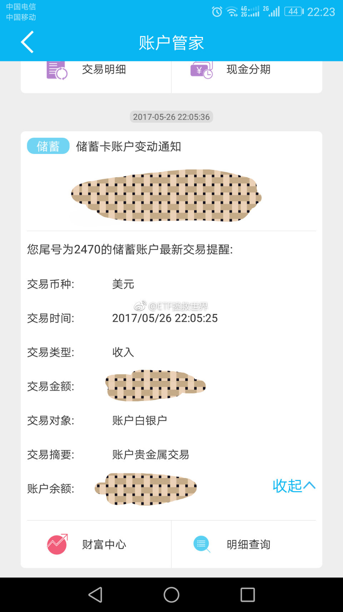

======================================================

ETF拯救世界 (5687069307) @
2017-05-27 10:22:36 Sat  
url: https://weibo.com/5687069307/F51cBj6fP

回复@马丁路德2008:2015年股灾时候是禁止半年内减持。2016年1月到期后，叠加熔断政策造成股灾3.0。马上又出政策，规定减持的时间以及数量。但留了一个大宗交易的口子。我预测，这次恐怕要把大宗的口子堵上了。//@马丁路德2008:不是15年股灾的时候就规定减持的方案了？

------------------------------------------------------
转推：
>  @蓝鲸财经记者工作平台 (1885454921)
>  2017-05-26 23:13:52 Fri  
>  url: https:/weibo.com/1885454921/F4WPa9qp0/

>  【鲸快讯】深交所：坚决落实证监会减持监管要求，维护市场长远健康稳定发展。 ​​​

转发[14]  评论[45]  赞[41] 

======================================================

ETF拯救世界 (5687069307) @
2017-05-27 12:55:51 Sat  
url: https://weibo.com/5687069307/F52cO4cKY

吃午饭的时候，去最近大火的某“知名经济学家”微博评论下面看了看，发现现在的股民与十年前几乎没有任何不同。

2007年该经济学家说“5000点比1000点更安全”的时候，博客评论里面也是这样的。

所以，你应该知道，未来我们会面临的情况，能赚到的收益，不会比上轮，上上轮差。

为什么？那些最可爱的 ​​​

转发[20]  评论[101]  赞[108] 

+++++++++++++++++++++++++++++++++++++++++++++++++++++

图片：

======================================================

ETF拯救世界 (5687069307) @
2017-05-27 13:13:58 Sat  
url: https://weibo.com/5687069307/F52ka3pbO

我去研究数据了。

除了食色，可以说研究数据是最其乐无穷的事。 ​​​

转发[4]  评论[108]  赞[144] 

======================================================

ETF拯救世界 (5687069307) @
2017-05-27 16:27:36 Sat  
url: https://weibo.com/5687069307/F53AKFPvh

今天不是生日，谢谢各位了！ ​​​

转发[1]  评论[62]  赞[91] 

======================================================

ETF拯救世界 (5687069307) @
2017-05-27 17:26:12 Sat  
url: https://weibo.com/5687069307/F53Yxwz4J

今天在集思录看到一篇文章，说的是作者入市8年辛苦钻研刻苦研究各种投资方法，结果依然赔了很多的帖子：

http://t.cn/RSw4Uom

看完之后颇为感慨。

作者在描述自己的8年投资生涯以及失败的经历后，得出的结论：以后要指数基金定投+动态平衡。

这个结论，更让我特别特别感慨。

在你我这一生中，有多 ​​​

转发[185]  评论[204]  赞[288] 

======================================================

ETF拯救世界 (5687069307) @
2017-05-27 18:00:12 Sat  
url: https://weibo.com/5687069307/F54clh9LO

回复@楚宫紫梅:第一，我不敢指导任何人。只是分享自己的经验。第二，我觉得自己应该是帮了不少朋友的。应该有不少朋友了解我的理念后投资的路走的更好了。第三，一再强调的是大多数人。肯定有少数人用别的投资方法更合适，但对大多数朋友来说，我认为指数投资是最优选择。

------------------------------------------------------
转推：
>  @ETF拯救世界 (5687069307)
>  2017-05-27 17:26:12 Sat  
>  url: https:/weibo.com/5687069307/F53Yxwz4J/

>  今天在集思录看到一篇文章，说的是作者入市8年辛苦钻研刻苦研究各种投资方法，结果依然赔了很多的帖子：
>  
>  http://t.cn/RSw4Uom
>  
>  看完之后颇为感慨。
>  
>  作者在描述自己的8年投资生涯以及失败的经历后，得出的结论：以后要指数基金定投+动态平衡。
>  
>  这个结论，更让我特别特别感慨。
>  
>  在你我这一生中，有多 ​​​

转发[14]  评论[33]  赞[74] 

======================================================

ETF拯救世界 (5687069307) @
2017-05-27 18:54:14 Sat  
url: https://weibo.com/5687069307/F54yh6mYw

果然是堵大宗的口子了。非常有意思。接下来会发生非常有趣的事了//@ETF拯救世界:回复@马丁路德2008:2015年股灾时候是禁止半年内减持。2016年1月到期后，叠加熔断政策造成股灾3.0。马上又出政策，规定减持的时间以及数量。但留了一个大宗交易的口子。我预测，这次恐怕要把大宗的口子堵上了。

------------------------------------------------------
转推：
>  @蓝鲸财经记者工作平台 (1885454921)
>  2017-05-26 23:13:52 Fri  
>  url: https:/weibo.com/1885454921/F4WPa9qp0/

>  【鲸快讯】深交所：坚决落实证监会减持监管要求，维护市场长远健康稳定发展。 ​​​

转发[7]  评论[79]  赞[79] 

======================================================

ETF拯救世界 (5687069307) @
2017-05-31 09:47:37 Wed  
url: https://weibo.com/5687069307/F5CGoaHf3

又要新高了，好无聊。

30%权益仓位很舒服，你舒服不？ ​​​

转发[2]  评论[65]  赞[87] 

======================================================

ETF拯救世界 (5687069307) @
2017-05-31 09:54:41 Wed  
url: https://weibo.com/5687069307/F5CJg2yIQ

投资就是要做好事。不仅是在没人要的时候为他们接盘，也要在别人抢的时候做好事把东西给他们。

比如50，他们这么抢，找个机会就给他们吧。多做善事才能多结善果。

不急，月中看。 ​​​

转发[24]  评论[52]  赞[111] 

======================================================

ETF拯救世界 (5687069307) @
2017-05-31 10:14:27 Wed  
url: https://weibo.com/5687069307/F5CRhkKuo

有些问题我没法回答，也请朋友们不要问了。

比如：“xx还能拿吗”，比如“xx可以买了吗”

很多年前开始，我就知道在网上说什么品种，绝不能只说一个代码。要说就把自己的买卖时间，买卖价格全部说清楚，从头到尾一条龙。因为再牛的品种，也会有人赔钱。说起来很神奇，事实就是如此。

所以对于计划来 ​​​

转发[13]  评论[46]  赞[121] 

======================================================

ETF拯救世界 (5687069307) @
2017-05-31 10:29:24 Wed  
url: https://weibo.com/5687069307/F5CXlw9K2

一口毒奶喝下去立时见效。

------------------------------------------------------
转推：
>  @ETF拯救世界 (5687069307)
>  2017-05-31 09:54:41 Wed  
>  url: https:/weibo.com/5687069307/F5CJg2yIQ/

>  投资就是要做好事。不仅是在没人要的时候为他们接盘，也要在别人抢的时候做好事把东西给他们。
>  
>  比如50，他们这么抢，找个机会就给他们吧。多做善事才能多结善果。
>  
>  不急，月中看。 ​​​

转发[3]  评论[24]  赞[56] 

======================================================

ETF拯救世界 (5687069307) @
2017-05-31 10:40:41 Wed  
url: https://weibo.com/5687069307/F5D1VvMCB

这个新政策讲真，真是醉了。刚统计了一下，前五个月重要股东减持只有600多亿，增持有450亿。基本是平衡了。

去年下半年减持1800亿。

2015年前五个月减持3800亿。

所以现在出这个政策真的非常神奇。当然，上万亿的定增才是今后几年的下山猛虎。

总而言之，禁止卖出这一点，恐怕不会带来很多人期盼的 ​​​

转发[21]  评论[45]  赞[96] 

======================================================

ETF拯救世界 (5687069307) @
2017-05-31 13:00:20 Wed  
url: https://weibo.com/5687069307/F5DWC6ptx

在微博看多了，有时候会感到特别悲哀。

某些方面讲，群众其实是特别可怕和无知的。

把未来带向地狱的人万众拥护，讲出真话的人被无情唾骂和嘲笑。

有些牺牲是毫无意义的。

特别可怕。

太有独立思维的人，太讲良知的人，不要有太大名气。因为你想帮助的人恰恰可能是把你送上断头台的人。

低调才是 ​​​

转发[28]  评论[178]  赞[210] 

======================================================

ETF拯救世界 (5687069307) @
2017-05-31 15:41:21 Wed  
url: https://weibo.com/5687069307/F5EZYtRb2

最近两年来A股出现的各种乱象，主要是那些非市场的干扰因素越来越多，导致熊市的时间会越来越长。

长到看不到尽头的感觉。

当然，你要说那几十只股票涨的好，现在不是熊市，那就当我没说吧。

很多人恐怕会在接下来的时间里不断体会希望——失望——希望——绝望……

对于我们来说呢，ok啦。基本上 ​​​

转发[14]  评论[110]  赞[138] 

======================================================

ETF拯救世界 (5687069307) @
2017-06-01 08:52:28 Thu  
url: https://weibo.com/5687069307/F5LKurHVD

今天不聊了。病了，发烧。

[生病] ​​​

转发[6]  评论[523]  赞[71] 

======================================================

ETF拯救世界 (5687069307) @
2017-06-01 16:20:01 Thu  
url: https://weibo.com/5687069307/F5OGa4lhs

-“兄弟，喝水不？”

-痛苦的摇摇头

-“吃水果不？”

-继续摇头

-“今天小股票暴跌了！”

-“哎……身体不舒服，高兴不起来”

-“呦，刚过去那小护士真漂亮啊”

-“扶，扶我起来看看！”

……

今天，正式进入建仓区域。漫漫征途，走完一半了。 ​​​

转发[11]  评论[179]  赞[179] 

======================================================

ETF拯救世界 (5687069307) @
2017-06-02 08:42:33 Fri  
url: https://weibo.com/5687069307/F5V6YdE1Y

人间奇迹！39°高烧一天痊愈！全靠各位的祝福加持！感恩！比心！ ​​​

转发[1]  评论[156]  赞[330] 

+++++++++++++++++++++++++++++++++++++++++++++++++++++

图片：

======================================================

ETF拯救世界 (5687069307) @
2017-06-02 09:04:42 Fri  
url: https://weibo.com/5687069307/F5VfXvgOl

昨天没有新高。哼！ [哼]

送各位一张外部数据加权估值图。从历史经验看，本月，最迟下月，可能有一次级别比较大的反弹。当然，反弹之后…… ​​​

转发[99]  评论[97]  赞[157] 

+++++++++++++++++++++++++++++++++++++++++++++++++++++

图片：
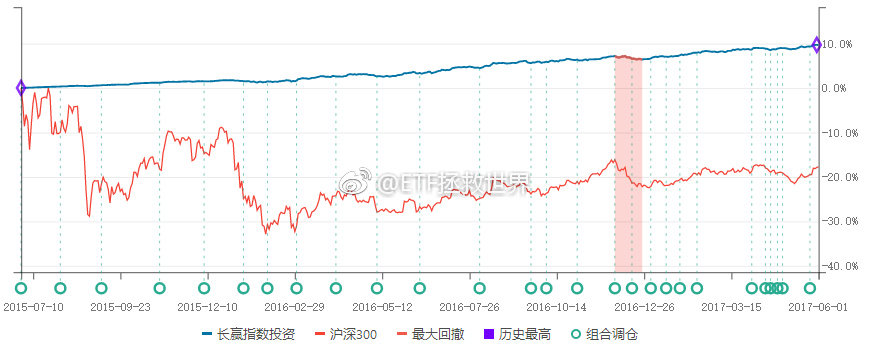

======================================================

ETF拯救世界 (5687069307) @
2017-06-02 10:39:37 Fri  
url: https://weibo.com/5687069307/F5VSuhGs5

这样每天一两个点的跌，恐怕等不到15号了 ​​​

转发[19]  评论[117]  赞[120] 

======================================================

ETF拯救世界 (5687069307) @
2017-06-02 12:57:03 Fri  
url: https://weibo.com/5687069307/F5WMhl8Hq

很难想象出台重大政策之前不进行必要的调研——尤其是在熔断之后。

------------------------------------------------------
转推：
>  @ ()
>  2017-06-02 12:53:37 Fri  
>  url: 

>  该账号因被投诉违反《微博社区公约》的相关规定，现已无法查看。查看帮助 https://kefu.weibo.com/faqdetail?id=13216

转发[8]  评论[46]  赞[61] 

======================================================

ETF拯救世界 (5687069307) @
2017-06-05 09:40:03 Mon  
url: https://weibo.com/5687069307/F6nLNufqf

资本市场是一套非常复杂的系统。不能简单的以线性思维去理解。

减少，甚至暂停IPO会否让A股转牛？也许有人会这么认为。但事实上，恐怕有很多人会因为无新可打而撕票，导致股票价格更加快速的下行。

A股市场的平衡是非常微妙的，是各种因素交织在一起产生的结果。任何一根稻草都有可能压垮这份平衡。 ​​​

转发[10]  评论[61]  赞[120] 

======================================================

ETF拯救世界 (5687069307) @
2017-06-05 10:33:18 Mon  
url: https://weibo.com/5687069307/F6o7pAEOE

今天组合中的50、红利、恒生等下跌。但是最近布局的500、养老等上涨。虽然权重还不够高，无法抵消大股票下跌带来的影响，但能减小跌幅。

这就是配置的作用。大类配置之内的小类配置。即使是A股内部，大股票、小股票的走势差别通常都会非常非常大。做好配置，可以保证组合波动性降低，同时取得更好的收 ​​​

转发[26]  评论[80]  赞[174] 

======================================================

ETF拯救世界 (5687069307) @
2017-06-05 15:44:27 Mon  
url: https://weibo.com/5687069307/F6q9I9qe5

聊聊你人生中最大的乐趣是什么吧。最好是个什么具体的事情，聊聊为什么这件事有意思。

如果最大的乐趣是特别隐私不能说的，就说说排名第二的……

有时候也会觉得人生还挺乏味的。 ​​​

转发[15]  评论[437]  赞[117] 

======================================================

ETF拯救世界 (5687069307) @
2017-06-06 06:33:04 Tue  
url: https://weibo.com/5687069307/F6vYoBl7l

23号买完债券以后，连涨7天了 [doge] ​​​

转发[16]  评论[77]  赞[144] 

+++++++++++++++++++++++++++++++++++++++++++++++++++++

图片：
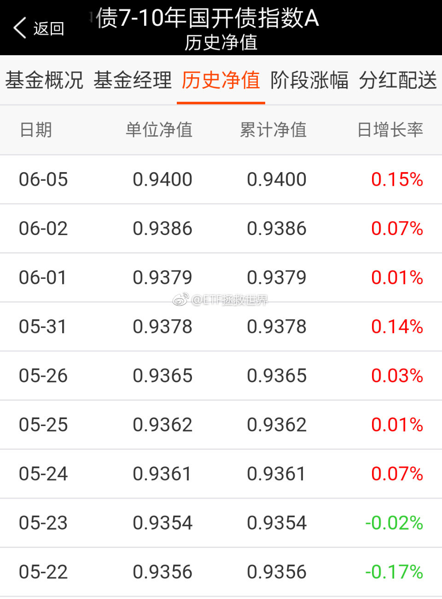

======================================================

ETF拯救世界 (5687069307) @
2017-06-06 09:54:23 Tue  
url: https://weibo.com/5687069307/F6xi7qkCC

回复@Mr_L0ne:在我的投资体系中，没有割肉这个环节。所有投资必须赢利。为了实现这个目标，就要围绕它设计所有策略。另外，做所有投资之前，第一步一定是压力测试。测试最坏的情况下自己能否承受，无论是心理还是资金。所以每次计划中，紧跟着品种的一定是一个括号（最大下跌幅度xx%）。

------------------------------------------------------
转推：
>  @ETF拯救世界 (5687069307)
>  2017-06-06 06:33:04 Tue  
>  url: https:/weibo.com/5687069307/F6vYoBl7l/

>  23号买完债券以后，连涨7天了 [doge] ​​​

转发[10]  评论[31]  赞[69] 

======================================================

ETF拯救世界 (5687069307) @
2017-06-06 09:59:03 Tue  
url: https://weibo.com/5687069307/F6xk0rQu2

在本人的投资体系中，不会出现“我去，套了这么多该怎么办，割肉还是补仓？”“哎呦不错哦，赚了好多了，现在是该止盈还是加仓？”

永远不会。

点击买入按钮之前，所有可能出现的情况都已经沙盘推演过。针对各种未来，都已经有了相应的对策。某个可能真的发生了，按照预先设计的方案实施即可。

所以 ​​​

转发[30]  评论[60]  赞[154] 

======================================================

ETF拯救世界 (5687069307) @
2017-06-06 10:14:09 Tue  
url: https://weibo.com/5687069307/F6xq8rn0t

所以整个投资系统是一个世界观的问题了。也是一个非常宏大的体系。

首先是判断。根据各种数据各种信息用理性、经验、模型判断现在的世界是什么状态。

然后是交易体系。将判断的结果代入交易体系。包括各种交易策略、心理建设等等。

然后是实施。包括产品选择，包括资产配置模型的应用。

整个体系是 ​​​

转发[43]  评论[133]  赞[186] 

======================================================

ETF拯救世界 (5687069307) @
2017-06-06 17:55:00 Tue  
url: https://weibo.com/5687069307/F6ArcdGpn

槽点很多，A股市场的水深不见底啊。

------------------------------------------------------
转推：
>  @ ()
>  2017-06-06 17:37:43 Tue  
>  url: 

>  抱歉，由于作者设置，你暂时没有这条微博的查看权限哦。查看帮助：http://t.cn/RfdBWwP ​​​

转发[10]  评论[58]  赞[55] 

======================================================

ETF拯救世界 (5687069307) @
2017-06-07 06:47:51 Wed  
url: https://weibo.com/5687069307/F6FuTcNus

继续，不要停…… ​​​

转发[7]  评论[212]  赞[114] 

+++++++++++++++++++++++++++++++++++++++++++++++++++++

图片：

======================================================

ETF拯救世界 (5687069307) @
2017-06-07 09:30:21 Wed  
url: https://weibo.com/5687069307/F6GyRbnn6

历史的角度看，今天容易暴跌。看看这次灵不灵。 ​​​

转发[9]  评论[85]  赞[81] 

======================================================

ETF拯救世界 (5687069307) @
2017-06-07 10:08:28 Wed  
url: https://weibo.com/5687069307/F6GOkk44S

接下来的一年我希望……我回答了 @蔚蓝不是薇蓝 的问题，问题价值￥88.00，大家快来花1元围观~ http://t.cn/RSOZ0oC ​​​

转发[101]  评论[163]  赞[229] 

======================================================

ETF拯救世界 (5687069307) @
2017-06-07 10:14:14 Wed  
url: https://weibo.com/5687069307/F6GQFnd7v

既然这样的话，月中应该就不买了。回头再看看六月第一次买六份，感受一下……节奏。

------------------------------------------------------
转推：
>  @ETF拯救世界 (5687069307)
>  2017-06-02 10:39:37 Fri  
>  url: https:/weibo.com/5687069307/F5VSuhGs5/

>  这样每天一两个点的跌，恐怕等不到15号了 ​​​

转发[14]  评论[42]  赞[64] 

======================================================

ETF拯救世界 (5687069307) @
2017-06-07 10:27:18 Wed  
url: https://weibo.com/5687069307/F6GVYyLma

回复@恶人假mm:如果每次都能在底部买入，小反弹后立即新高。时间久了，会有一种自信。投资这件事，成功和失败都会成为一种习惯。习惯了成功，就大概率会不断成功。要保持舒服的状态。//@恶人假mm:仓位舒服了[笑而不语]

------------------------------------------------------
转推：
>  @ETF拯救世界 (5687069307)
>  2017-06-02 10:39:37 Fri  
>  url: https:/weibo.com/5687069307/F5VSuhGs5/

>  这样每天一两个点的跌，恐怕等不到15号了 ​​​

转发[6]  评论[13]  赞[48] 

======================================================

ETF拯救世界 (5687069307) @
2017-06-07 10:28:50 Wed  
url: https://weibo.com/5687069307/F6GWB0Qh6

回复@JUNSOO寻:套路很深。只看了开头的朋友再看一遍吧……//@JUNSOO寻:回复@ETF拯救世界:真的只看了开头，没有看到空白下面的“认真”回答[允悲]

------------------------------------------------------
转推：
>  @ETF拯救世界 (5687069307)
>  2017-06-07 10:08:28 Wed  
>  url: https:/weibo.com/5687069307/F6GOkk44S/

>  接下来的一年我希望……我回答了 @蔚蓝不是薇蓝 的问题，问题价值￥88.00，大家快来花1元围观~ http://t.cn/RSOZ0oC ​​​

转发[2]  评论[20]  赞[28] 

======================================================

ETF拯救世界 (5687069307) @
2017-06-07 10:54:50 Wed  
url: https://weibo.com/5687069307/F6H79sXe1

$510500 

$养老产业 sz399812$

$159938  

未来某一天你会在这些品种上赚多少，现在大多数人根本意识不到。 ​​​

转发[44]  评论[88]  赞[95] 

======================================================

ETF拯救世界 (5687069307) @
2017-06-07 11:31:09 Wed  
url: https://weibo.com/5687069307/F6HlTcRuv

回复@litterwitch:错在自己和错在他人，这不仅是思维方式的转变，更是未来会做得如何的关键。错在他人，就是自己没错，所以永远不会进步。错在自己和策略，就有查漏补缺的可能，未来只会越来越好。没有完美的世界，我们要思考的应该是怎么在这个不完美的世界做好自己该做的，赚到该赚的。

------------------------------------------------------
转推：
>  @ETF拯救世界 (5687069307)
>  2017-06-07 10:54:50 Wed  
>  url: https:/weibo.com/5687069307/F6H79sXe1/

>  $510500 
>  
>  $养老产业 sz399812$
>  
>  $159938  
>  
>  未来某一天你会在这些品种上赚多少，现在大多数人根本意识不到。 ​​​

转发[10]  评论[31]  赞[61] 

======================================================

ETF拯救世界 (5687069307) @
2017-06-07 13:13:44 Wed  
url: https://weibo.com/5687069307/F6I1xb20N

[污]  不知道是不是就是这波。  高度的话，指数幅度不知道，全市场估值可能有10%的空间

------------------------------------------------------
转推：
>  @ETF拯救世界 (5687069307)
>  2017-06-02 09:04:42 Fri  
>  url: https:/weibo.com/5687069307/F5VfXvgOl/

>  昨天没有新高。哼！ [哼]
>  
>  送各位一张外部数据加权估值图。从历史经验看，本月，最迟下月，可能有一次级别比较大的反弹。当然，反弹之后…… ​​​

转发[22]  评论[58]  赞[61] 

======================================================

ETF拯救世界 (5687069307) @
2017-06-07 13:38:37 Wed  
url: https://weibo.com/5687069307/F6IbD2DPk

今天500涨幅超过2%，50不到1%。印证了之前说的：小股票不是不行了，只是市场偏好现在不在小股票而已。5、6月我们开始加仓500，未来还会买创业。我坚信下一轮一定还是小股票涨得好，而且会比大股票涨得好很多。千万不要相信那些什么涨得好就吹什么的人……只有那些下跌的才是未来的金矿。

------------------------------------------------------
转推：
>  @ETF拯救世界 (5687069307)
>  2017-05-24 13:26:21 Wed  
>  url: https:/weibo.com/5687069307/F4A7HcWJd/

>  有人说，注册制了，以后中小股票不行了。只有大蓝筹，白马会涨了。
>  
>  以后看见谁这样YY，可以自动取关。
>  
>  美国是注册制，纽交所和纳斯达克股票加起来超过6000只。下图是大盘股为主的标普500和中小股票组成的罗素2000走势。黑罗素，红标普。
>  
>  长期看，依然是中小指数涨的好。
>  
>  各位，中小股票跌的时候就 ​​​

转发[26]  评论[101]  赞[123] 

======================================================

ETF拯救世界 (5687069307) @
2017-06-07 14:52:24 Wed  
url: https://weibo.com/5687069307/F6IFzyPT0

看完这个的感觉，没想指责那些路人和肇事司机。只是想了好几遍，如果是自己过这样的马路；如果自己是两辆车的司机；如果自己过路看到这样的事，该怎么办。

------------------------------------------------------
转推：
>  @袁启聪 (1548674942)
>  2017-06-07 11:07:45 Wed  
>  url: https:/weibo.com/1548674942/F6Hcof3sw/

>  这个视频，看得想哭，已经无力生气[泪][泪]  中国的公路生态，是炼狱[骷髅][骷髅] http://t.cn/RSOVk2q ​​​

转发[35]  评论[110]  赞[34] 

======================================================

ETF拯救世界 (5687069307) @
2017-06-07 15:31:43 Wed  
url: https://weibo.com/5687069307/F6IVxdZAT

今年魔咒正式破解了！

------------------------------------------------------
转推：
>  @ETF拯救世界 (5687069307)
>  2017-06-07 09:30:21 Wed  
>  url: https:/weibo.com/5687069307/F6GyRbnn6/

>  历史的角度看，今天容易暴跌。看看这次灵不灵。 ​​​

转发[5]  评论[119]  赞[71] 

======================================================

ETF拯救世界 (5687069307) @
2017-06-08 07:25:54 Thu  
url: https://weibo.com/5687069307/F6PaQ52Yo

就喜欢波动这么大的你[亲亲]

------------------------------------------------------
转推：
>  @ ()
>  2017-06-08 04:46:15 Thu  
>  url: 

>  抱歉，作者已设置仅展示半年内微博，此微博已不可见。 ​​​

转发[5]  评论[120]  赞[73] 

======================================================

ETF拯救世界 (5687069307) @
2017-06-08 09:48:21 Thu  
url: https://weibo.com/5687069307/F6Q6F0m4l

一个反弹，咱们的$养老产业 sz399812$基金净值已经创出一年半新高了。

也就是说，过去我们买入的所有动作都是盈利的。

祝各位赚钱快乐。 ​​​

转发[8]  评论[61]  赞[110] 

======================================================

ETF拯救世界 (5687069307) @
2017-06-08 10:00:36 Thu  
url: https://weibo.com/5687069307/F6QbD9HUg

从现在开始，我给自己立个规矩，也通知一下各位。

ETF计划这个组合：

第一，是我自己的投资组合，买卖的时候公开一下而已，不是给谁的投资建议，更不是要带谁投资。感兴趣的朋友可以参考，赚了你不用给我提成，赔了也别BB。

第二，我再说一次，这是个组合。一个组合的构建一定是有各种考虑。我能保 ​​​

转发[25]  评论[324]  赞[375] 

======================================================

ETF拯救世界 (5687069307) @
2017-06-08 10:50:14 Thu  
url: https://weibo.com/5687069307/F6QvMfNrT

$全指医药 sh000991$  

30年后大家买药的钱就靠它了。[doge]

目前有4%。希望配到8%-10%。 ​​​

转发[21]  评论[86]  赞[110] 

======================================================

ETF拯救世界 (5687069307) @
2017-06-08 11:04:00 Thu  
url: https://weibo.com/5687069307/F6QBmygRD

回复@天影198:不是抄错了。这个例子应该是：高考的时候抄旁边卷子考上985了，结果埋怨对方：你的英语怎么没考好？总分高有什么用，单科差了！

------------------------------------------------------
转推：
>  @ETF拯救世界 (5687069307)
>  2017-06-08 10:00:36 Thu  
>  url: https:/weibo.com/5687069307/F6QbD9HUg/

>  从现在开始，我给自己立个规矩，也通知一下各位。
>  
>  ETF计划这个组合：
>  
>  第一，是我自己的投资组合，买卖的时候公开一下而已，不是给谁的投资建议，更不是要带谁投资。感兴趣的朋友可以参考，赚了你不用给我提成，赔了也别BB。
>  
>  第二，我再说一次，这是个组合。一个组合的构建一定是有各种考虑。我能保 ​​​

转发[2]  评论[28]  赞[91] 

======================================================

ETF拯救世界 (5687069307) @
2017-06-08 11:14:34 Thu  
url: https://weibo.com/5687069307/F6QFEvMh8

投资要布局的，应该是以后的钻石黄金，而不是现在的。

比如2016年初的50和恒生，比如近期我们一直买买买的医药和养老。

有些行为可能看起来很奇怪，为什么要买一堆不涨的垃圾。涨得那么好的，所有人都说还要涨很多的好东西我们为什么不追？

对，不追。我们要做的是等别人追的时候卖给他们。 ​​​

转发[42]  评论[57]  赞[163] 

======================================================

ETF拯救世界 (5687069307) @
2017-06-08 11:22:29 Thu  
url: https://weibo.com/5687069307/F6QIREkmv

“指数涨得慢”是特别特别匪夷所思的一句话。

就不说300、500这样的宽基了，牛市至少有70%的人跟不上。就说今天医药，两市超过全指医药涨幅的股票只有694，占比23.65%。

绝大多数人哪里来的自信说指数涨幅跟不上自己选的股票的？少部分天才当然例外了~ ​​​

转发[14]  评论[55]  赞[131] 

======================================================

ETF拯救世界 (5687069307) @
2017-06-08 14:29:42 Thu  
url: https://weibo.com/5687069307/F6RWRit9f

今天股票上涨下跌家数是1:2

然而，组合又要新高了，好无聊。[哼]

昨天的养老基金之后，今天的红利也应该快买入后新高了。恒生因为汇率问题这几天差了点没有新高，没事。

当然，还在收集筹码阶段，涨不涨的无所谓。不过赚钱，帐户刷新高总是好事啊。 ​​​

转发[5]  评论[87]  赞[113] 

======================================================

ETF拯救世界 (5687069307) @
2017-06-08 14:57:07 Thu  
url: https://weibo.com/5687069307/F6S7Ze9xu

回复@栖凤林学园:其实你说的就是之前几轮计划熊转牛那几天的状态。这个情况怎么说呢，没有经历过的人很难懂。现在仓位低，无论是浮亏还是迅速开始盈利都不那么明显。某一天绝大多数人才会真的懂——你很难和一个**描述**的感觉……

------------------------------------------------------
转推：
>  @ETF拯救世界 (5687069307)
>  2017-06-08 14:29:42 Thu  
>  url: https:/weibo.com/5687069307/F6RWRit9f/

>  今天股票上涨下跌家数是1:2
>  
>  然而，组合又要新高了，好无聊。[哼]
>  
>  昨天的养老基金之后，今天的红利也应该快买入后新高了。恒生因为汇率问题这几天差了点没有新高，没事。
>  
>  当然，还在收集筹码阶段，涨不涨的无所谓。不过赚钱，帐户刷新高总是好事啊。 ​​​

转发[3]  评论[45]  赞[56] 

======================================================

ETF拯救世界 (5687069307) @
2017-06-08 15:55:39 Thu  
url: https://weibo.com/5687069307/F6SvKgoXZ

目前的情况就尴尬了。

一个是zjh大量IPO导致下跌的说法恐怕要坐实了：减少几家iPO居然大反弹！

二个是韩经济学家的资本市场野生国师地位恐怕要坐实了。另一个，头衔还要加上为民请命的大侠。将来发动群众的能力不容小觑。

未来更有趣了！ ​​​

转发[6]  评论[70]  赞[111] 

======================================================

ETF拯救世界 (5687069307) @
2017-06-09 09:42:18 Fri  
url: https://weibo.com/5687069307/F6ZuHFLcT

辛辛苦苦低价买的东西，不要因为上涨了一点就轻易卖掉。

——《旧约.长赢启示录第九章》 ​​​

转发[26]  评论[109]  赞[178] 

======================================================

ETF拯救世界 (5687069307) @
2017-06-09 09:49:18 Fri  
url: https://weibo.com/5687069307/F6Zxxs2JS

如果把计划的恒生+50+医药+养老+红利这几个权重最高的品种单列出来看，你肯定想不到今天有将近2000只股票是下跌的。。。 ​​​

转发[15]  评论[33]  赞[103] 

======================================================

ETF拯救世界 (5687069307) @
2017-06-09 09:58:33 Fri  
url: https://weibo.com/5687069307/F6ZBijMXn

50、红利、养老基金继续新高。 ​​​

转发[2]  评论[51]  赞[105] 

======================================================

ETF拯救世界 (5687069307) @
2017-06-09 10:07:48 Fri  
url: https://weibo.com/5687069307/F6ZF3tzCL

有一个也是比较大概率的经验，随便说说。

那就是如果某个品种创了52周新高，不要着急卖。大概率后面会发生让你很惊喜的事情。

当然了，大概率不代表必然发生。只是概率大一点而已。 ​​​

转发[35]  评论[92]  赞[129] 

======================================================

ETF拯救世界 (5687069307) @
2017-06-09 14:49:50 Fri  
url: https://weibo.com/5687069307/F71vxcseL

500也一言不合就起飞啊。都表现不错。反弹继续ing。

------------------------------------------------------
转推：
>  @ETF拯救世界 (5687069307)
>  2017-06-09 09:49:18 Fri  
>  url: https:/weibo.com/5687069307/F6Zxxs2JS/

>  如果把计划的恒生+50+医药+养老+红利这几个权重最高的品种单列出来看，你肯定想不到今天有将近2000只股票是下跌的。。。 ​​​

转发[8]  评论[19]  赞[72] 

======================================================

ETF拯救世界 (5687069307) @
2017-06-09 14:53:47 Fri  
url: https://weibo.com/5687069307/F71x8buZH

回复@北溟有鱼-1997:去年初咱们买了500，飞了一年，还不是跌回来继续让咱们买？该是你的就是你的，跑不了。不是你的，着急也没用。//@北溟有鱼-1997:真不愿意500飞，再等点吧。E大路子接受，就是想跌//@ETF拯救世界:500也一言不合就起飞啊。都表现不错。反弹继续ing。

------------------------------------------------------
转推：
>  @ETF拯救世界 (5687069307)
>  2017-06-09 09:49:18 Fri  
>  url: https:/weibo.com/5687069307/F6Zxxs2JS/

>  如果把计划的恒生+50+医药+养老+红利这几个权重最高的品种单列出来看，你肯定想不到今天有将近2000只股票是下跌的。。。 ​​​

转发[5]  评论[41]  赞[62] 

======================================================

ETF拯救世界 (5687069307) @
2017-06-12 09:56:29 Mon  
url: https://weibo.com/5687069307/F7rRWxY6B

发布了头条文章：《今天各大成分股调整样本股，对我们影响较大的有》 http://t.cn/RSueXR6 ​​​

转发[31]  评论[53]  赞[141] 

======================================================

ETF拯救世界 (5687069307) @
2017-06-12 10:06:55 Mon  
url: https://weibo.com/5687069307/F7rWbglRV

回复@LSWIYY:归属消费电子、休闲用品、酒店旅游、教育、文化传媒、药品零售、乳品、家庭用品、医药卫生、人寿保险、互联网软件等行业的股票纳入养老产业。//@LSWIYY:我好像看到了一些意想不到的公司…好奇原来这些公司划分到养老指数的依据是什么……

------------------------------------------------------
转推：
>  @ETF拯救世界 (5687069307)
>  2017-06-12 09:56:29 Mon  
>  url: https:/weibo.com/5687069307/F7rRWxY6B/

>  发布了头条文章：《今天各大成分股调整样本股，对我们影响较大的有》 http://t.cn/RSueXR6 ​​​

转发[8]  评论[9]  赞[45] 

======================================================

ETF拯救世界 (5687069307) @
2017-06-12 10:11:12 Mon  
url: https://weibo.com/5687069307/F7rXV9Lzb

这一网等的时间那是相当长了…… ​​​

转发[17]  评论[69]  赞[114] 

+++++++++++++++++++++++++++++++++++++++++++++++++++++

图片：
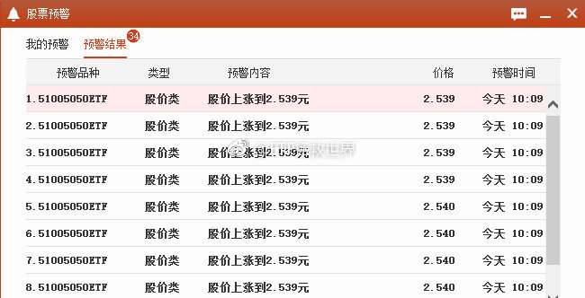

======================================================

ETF拯救世界 (5687069307) @
2017-06-12 11:19:25 Mon  
url: https://weibo.com/5687069307/F7spBCWTJ

醉了，敢情拉上去就是让我的网格最高点卖出呢……

------------------------------------------------------
转推：
>  @ETF拯救世界 (5687069307)
>  2017-06-12 10:11:12 Mon  
>  url: https:/weibo.com/5687069307/F7rXV9Lzb/

>  这一网等的时间那是相当长了…… ​​​

转发[7]  评论[48]  赞[77] 

======================================================

ETF拯救世界 (5687069307) @
2017-06-13 07:57:12 Tue  
url: https://weibo.com/5687069307/F7Aw1xepH

回复@许小敏2013:很正常。我买的所有品种都要赚钱。这是最基本的要求。//@许小敏2013:债券盈利了🙏//@ETF拯救世界:醉了，敢情拉上去就是让我的网格最高点卖出呢……

------------------------------------------------------
转推：
>  @ETF拯救世界 (5687069307)
>  2017-06-12 10:11:12 Mon  
>  url: https:/weibo.com/5687069307/F7rXV9Lzb/

>  这一网等的时间那是相当长了…… ​​​

转发[2]  评论[24]  赞[61] 

======================================================

ETF拯救世界 (5687069307) @
2017-06-13 08:49:39 Tue  
url: https://weibo.com/5687069307/F7ARjvsGQ

计划目前买过15个品种，两只浮亏。一个4%的建信500，一个7%的华宝油气。这两个品种仓位非常低，加起来只有1.2%。

目前基本上布局已经比较完整了。大、中市值的A股，好的行业，港股，德国，债券，原油都有所布局。当然仓位还没有配置完毕。

其实在金融市场想要亏损，是挺难的一件事。是吧。 ​​​

转发[24]  评论[179]  赞[167] 

+++++++++++++++++++++++++++++++++++++++++++++++++++++

图片：

======================================================

ETF拯救世界 (5687069307) @
2017-06-13 13:40:02 Tue  
url: https://weibo.com/5687069307/F7CLbjaNy

有朋友经常说，嗯，投资方式不错，只是不适合本金少的。

听起来好像是本金少就容易赚快钱、大钱一样。

其实就我的感受，越有钱的人，金融投资的时候越不“着急”。而越不着急的人，通常赚大钱的概率反而更大。比如浮亏了不着急在底部止损，比如浮盈了不着急在上升过程中落袋为安。

那么本金少怎么办 ​​​

转发[50]  评论[126]  赞[186] 

======================================================

ETF拯救世界 (5687069307) @
2017-06-13 14:13:34 Tue  
url: https://weibo.com/5687069307/F7CYNbHPl

中证500ETF第一次买入是2016年2月29日。第二次是2017年5月23日。

感受一下…… ​​​

转发[10]  评论[103]  赞[148] 

======================================================

ETF拯救世界 (5687069307) @
2017-06-14 09:16:55 Wed  
url: https://weibo.com/5687069307/F7KsSt3W2

后台有11个没有回答的付费提问。其中4个与房地产有关。

说明什么。 ​​​

转发[3]  评论[110]  赞[69] 

======================================================

ETF拯救世界 (5687069307) @
2017-06-14 10:44:29 Wed  
url: https://weibo.com/5687069307/F7L2qgIDy

在证券市场投资，我个人认为，要有个经常性的逆向反思。这是我自己提出的一个概念，名字也没想好，就先这么叫。

也就是说，你观察历史就知道，没人能够长期的辉煌，在资本市场。比如说在牛市NB的，熊市中就会特别惨。熊市中特别稳的，牛市中很难赚很多。

这就是所谓的盈亏同源。

因为成功会带来惯性 ​​​

转发[87]  评论[126]  赞[209] 

+++++++++++++++++++++++++++++++++++++++++++++++++++++

图片：
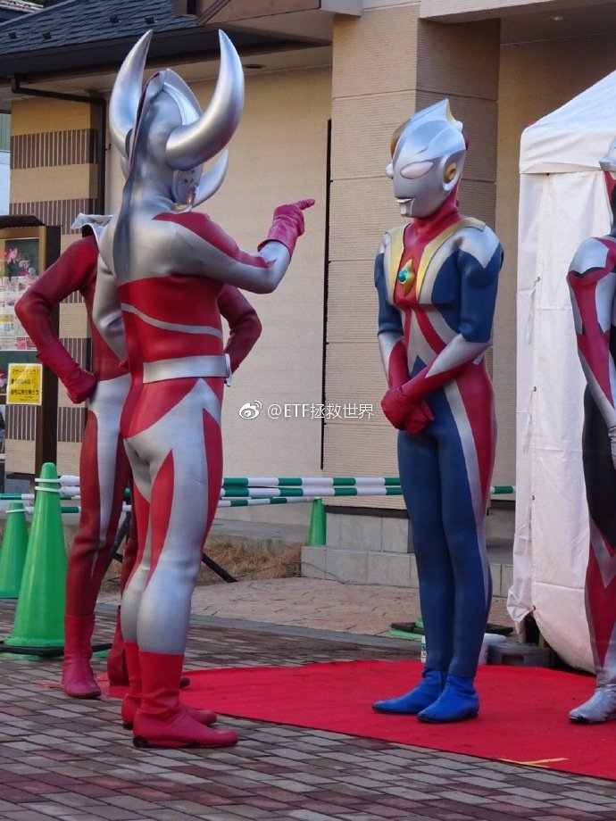

======================================================

ETF拯救世界 (5687069307) @
2017-06-14 13:49:36 Wed  
url: https://weibo.com/5687069307/F7Mfz0bxr

15号将至，又挖坑。好烦。

就烦这种不知道是送钱还是送命的坑。 ​​​

转发[4]  评论[106]  赞[119] 

======================================================

ETF拯救世界 (5687069307) @
2017-06-14 17:46:31 Wed  
url: https://weibo.com/5687069307/F7NNJ8vc6

今天下午看到且慢上了一个新功能，叫做计划的“补仓提醒”。

简单来说，这个功能解决了很多参考计划朋友的一个痛点，就是看到计划的时间比较晚，之前的到底该不该补，什么时候补，多少钱补，完全不知道。如果盲目追高，那就完全背离了我们的投资理念。

然后很多朋友来问我，我是真的没有精力去计算之 ​​​

转发[33]  评论[134]  赞[139] 

======================================================

ETF拯救世界 (5687069307) @
2017-06-15 10:02:08 Thu  
url: https://weibo.com/5687069307/F7UbJfcsU

今天一个人看着我的身份证说，怎么岁月在你脸上没有留下痕迹啊。

如果不是因为对方是男的，我就误会了。 ​​​

转发[2]  评论[107]  赞[116] 

======================================================

ETF拯救世界 (5687069307) @
2017-06-15 10:26:29 Thu  
url: https://weibo.com/5687069307/F7UlCpOYE

小确幸……

------------------------------------------------------
转推：
>  @ETF拯救世界 (5687069307)
>  2017-06-12 10:11:12 Mon  
>  url: https:/weibo.com/5687069307/F7rXV9Lzb/

>  这一网等的时间那是相当长了…… ​​​

转发[1]  评论[28]  赞[54] 

======================================================

ETF拯救世界 (5687069307) @
2017-06-15 11:06:57 Thu  
url: https://weibo.com/5687069307/F7UC2oLmB

利率是影响资产价格最重要的因素之一。 ​​​

转发[11]  评论[36]  赞[80] 

======================================================

ETF拯救世界 (5687069307) @
2017-06-15 11:16:52 Thu  
url: https://weibo.com/5687069307/F7UG438HH

今天创业板（+1.8%），50（-0.6%）。大也好，小也好，我坚信没有不好的品种，只有不好的价格。“小股票不行了”就是扯淡。就像2013、2014年小股票走牛一年半后大股票纹丝不动一样，那时候的大股票也不是不行了，只是在等时机而已。

------------------------------------------------------
转推：
>  @ETF拯救世界 (5687069307)
>  2017-05-24 13:26:21 Wed  
>  url: https:/weibo.com/5687069307/F4A7HcWJd/

>  有人说，注册制了，以后中小股票不行了。只有大蓝筹，白马会涨了。
>  
>  以后看见谁这样YY，可以自动取关。
>  
>  美国是注册制，纽交所和纳斯达克股票加起来超过6000只。下图是大盘股为主的标普500和中小股票组成的罗素2000走势。黑罗素，红标普。
>  
>  长期看，依然是中小指数涨的好。
>  
>  各位，中小股票跌的时候就 ​​​

转发[11]  评论[26]  赞[64] 

======================================================

ETF拯救世界 (5687069307) @
2017-06-15 11:23:19 Thu  
url: https://weibo.com/5687069307/F7UIGjAqS

其实行业值得关注的就那么几大类：

消费（必要、可选）、医药、能源、信息、金融。

面对不同的经济周期，可以在不同的行业上进行重点切换。

包括大盘股、小盘股，在不同周期也有不同的表现。

不要在品种上涨的时候吹得天花乱坠，也不要在什么品种跌的很多的时候再踩上几脚。

锦上添花易，雪中送炭 ​​​

转发[131]  评论[73]  赞[150] 

======================================================

ETF拯救世界 (5687069307) @
2017-06-15 11:35:23 Thu  
url: https://weibo.com/5687069307/F7UNA1Jja

日本大学生毕业只有1800美元？我印象中东京人均年收入是30万啊。比较诡异的是，人均30万收入的东京，房价好像和北京差不多。日本卖房还是按照使用面积卖的。

------------------------------------------------------
转推：
>  @蓝鲸TMT网 (3866012793)
>  2017-06-15 11:32:03 Thu  
>  url: https:/weibo.com/3866012793/F7UMduojS/

>  【美大学毕业月薪买6部iPhone7 中国一部买不起】6月15日讯，中国大学毕业生平均月工资不到4000元，不够买一部最便宜的iPhone7。相比之下，美大学毕业生月薪3950美元左右，可买6部32G版iPhone7，后者在美售价649美元。日本大学毕业生平均月薪1800美元，按美元计算是中国的3倍以上。(新浪财经) ​​​​

转发[8]  评论[41]  赞[39] 

======================================================

ETF拯救世界 (5687069307) @
2017-06-15 11:51:10 Thu  
url: https://weibo.com/5687069307/F7UTZrN1v

回复@悠哉主人76:这些我都清楚啊。北京过去十年的土地供应量就在我电脑的excel里。至于说全国人民的北京，据我所知东京也是日本极少的人口持续流入的城市。我只是说一个事实，没有表明自己的任何看法。房地产的事情，我不说，不代表很多东西我不知道。至于合理不合理，还是交给时间吧。我们都还不够老

------------------------------------------------------
转推：
>  @蓝鲸TMT网 (3866012793)
>  2017-06-15 11:32:03 Thu  
>  url: https:/weibo.com/3866012793/F7UMduojS/

>  【美大学毕业月薪买6部iPhone7 中国一部买不起】6月15日讯，中国大学毕业生平均月工资不到4000元，不够买一部最便宜的iPhone7。相比之下，美大学毕业生月薪3950美元左右，可买6部32G版iPhone7，后者在美售价649美元。日本大学毕业生平均月薪1800美元，按美元计算是中国的3倍以上。(新浪财经) ​​​​

转发[3]  评论[45]  赞[59] 

======================================================

ETF拯救世界 (5687069307) @
2017-06-15 20:40:29 Thu  
url: https://weibo.com/5687069307/F7YmPCBRI

每日打卡 ​​​

转发[1]  评论[72]  赞[141] 

+++++++++++++++++++++++++++++++++++++++++++++++++++++

图片：

======================================================

ETF拯救世界 (5687069307) @
2017-06-16 09:29:42 Fri  
url: https://weibo.com/5687069307/F83p3EqVY

哈哈哈哈哈，看今天的新闻了吗。深交所说四月底开始大资金开始买小股票了。最近小股票开始涨，这种新闻就多了。涨之前干嘛去了。大多数人永远是被舆论引导着接盘的。

------------------------------------------------------
转推：
>  @ETF拯救世界 (5687069307)
>  2017-05-24 13:26:21 Wed  
>  url: https:/weibo.com/5687069307/F4A7HcWJd/

>  有人说，注册制了，以后中小股票不行了。只有大蓝筹，白马会涨了。
>  
>  以后看见谁这样YY，可以自动取关。
>  
>  美国是注册制，纽交所和纳斯达克股票加起来超过6000只。下图是大盘股为主的标普500和中小股票组成的罗素2000走势。黑罗素，红标普。
>  
>  长期看，依然是中小指数涨的好。
>  
>  各位，中小股票跌的时候就 ​​​

转发[11]  评论[97]  赞[103] 

======================================================

ETF拯救世界 (5687069307) @
2017-06-16 21:30:15 Fri  
url: https://weibo.com/5687069307/F887x5ybi

每日打卡 (2)

这图不是我！[doge]

今天一边看黄磊的深夜食堂一边完成的。作为一个看了几季日版深夜食堂的观众，怎么港，黄磊这版翻拍得确实很一般。 ​​​

转发[1]  评论[54]  赞[77] 

+++++++++++++++++++++++++++++++++++++++++++++++++++++

图片：

======================================================

ETF拯救世界 (5687069307) @
2017-06-17 21:49:41 Sat  
url: https://weibo.com/5687069307/F8hFV2VhS

每日打卡(3)

今天练有氧。试了试keep的跑步训练课程，快慢交替，所以整体速度很慢。

能不能坚持打卡一年？ ​​​

转发[0]  评论[49]  赞[92] 

+++++++++++++++++++++++++++++++++++++++++++++++++++++

图片：
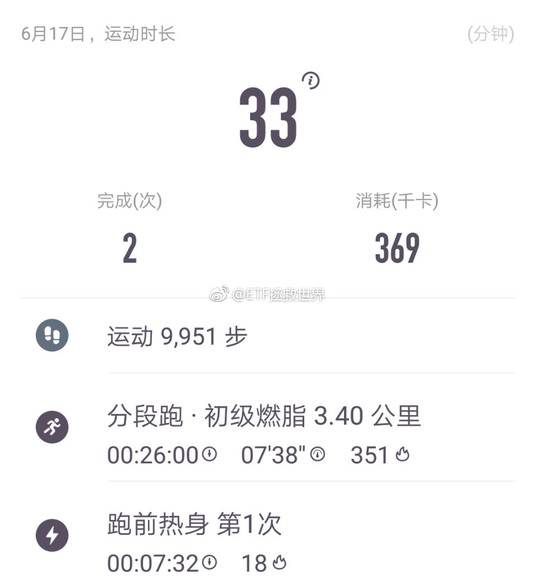

======================================================

ETF拯救世界 (5687069307) @
2017-06-18 17:58:33 Sun  
url: https://weibo.com/5687069307/F8pABmmN6

每日打卡(4)

这个运动量太大了 ​​​

转发[0]  评论[36]  赞[90] 

+++++++++++++++++++++++++++++++++++++++++++++++++++++

图片：
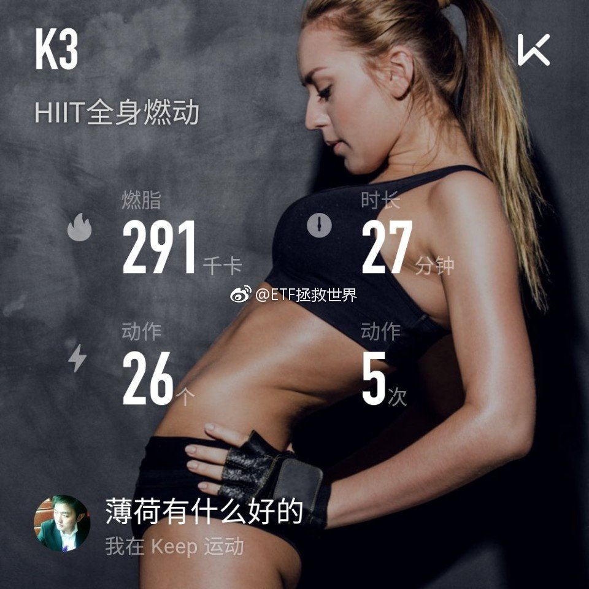

======================================================

ETF拯救世界 (5687069307) @
2017-06-19 09:51:51 Mon  
url: https://weibo.com/5687069307/F8vPxvaOY

0602最低点那天发的微博，从那天起反弹到今天半个多月了。一切都在按照剧本走。高度的话，是估值升十几个点，长度呢？按照之前的概率，应该不会在6月结束的。结束在七月或者八月吧。这不是预测，是通过观察历史得出的一点猜测而已。

------------------------------------------------------
转推：
>  @ETF拯救世界 (5687069307)
>  2017-06-02 09:04:42 Fri  
>  url: https:/weibo.com/5687069307/F5VfXvgOl/

>  昨天没有新高。哼！ [哼]
>  
>  送各位一张外部数据加权估值图。从历史经验看，本月，最迟下月，可能有一次级别比较大的反弹。当然，反弹之后…… ​​​

转发[12]  评论[42]  赞[107] 

======================================================

ETF拯救世界 (5687069307) @
2017-06-19 11:46:10 Mon  
url: https://weibo.com/5687069307/F8wzWqgLD

500才是坠吼的，以后你们就知道了！ ​​​

转发[11]  评论[81]  赞[104] 

======================================================

ETF拯救世界 (5687069307) @
2017-06-19 13:18:51 Mon  
url: https://weibo.com/5687069307/F8xbz4oXY

根据历史，做一些中短期的猜测，并不是为了指导投资。

而是对未来可能出现的情况做个预判，有个准备。

有些事情真的发生了，就不会惊慌失措。

当然，真的用来指导投资，也不是不行。不过更要根据概率来下注。中短期的概率，可就并不那么一定很准确了。 ​​​

转发[5]  评论[28]  赞[95] 

======================================================

ETF拯救世界 (5687069307) @
2017-06-19 14:53:35 Mon  
url: https://weibo.com/5687069307/F8xO1noSc

今天能不能新高是个谜，拭目以待吧。 ​​​

转发[9]  评论[50]  赞[94] 

======================================================

ETF拯救世界 (5687069307) @
2017-06-19 16:02:14 Mon  
url: https://weibo.com/5687069307/F8yfT7Mdk

回复@独自消遣的圆稻糕:过气了！怎么办，是不是要搞点大新闻出来了。//@独自消遣的圆稻糕:E大微博最近的评论数量好少，以前都七八十，现在才二三十

------------------------------------------------------
转推：
>  @ETF拯救世界 (5687069307)
>  2017-06-19 14:53:35 Mon  
>  url: https:/weibo.com/5687069307/F8xO1noSc/

>  今天能不能新高是个谜，拭目以待吧。 ​​​

转发[7]  评论[171]  赞[119] 

======================================================

ETF拯救世界 (5687069307) @
2017-06-19 20:31:05 Mon  
url: https://weibo.com/5687069307/F8A10nfDN

每日打卡(5)

继续练胸。

看到评论里不少朋友也开始锻炼了，很好。看看咱们谁坚持的时间长。

[haha] ​​​

转发[1]  评论[65]  赞[116] 

+++++++++++++++++++++++++++++++++++++++++++++++++++++

图片：

======================================================

ETF拯救世界 (5687069307) @
2017-06-20 09:28:38 Tue  
url: https://weibo.com/5687069307/F8F6CaN0m

回复@zoey__小白:“还没红就过气”，扎心了。 http://t.cn/Rob6UNn //@zoey__小白:在E大的调教下大家可能都更淡定了吧 但是为了拯救还没红就过气的E大必须要冒泡 http://t.cn/RoUEzcP //@ETF拯救世界:回复@独自消遣的圆稻糕:过气了！怎么办，是不是要搞点大新闻出来了。

------------------------------------------------------
转推：
>  @ETF拯救世界 (5687069307)
>  2017-06-19 14:53:35 Mon  
>  url: https:/weibo.com/5687069307/F8xO1noSc/

>  今天能不能新高是个谜，拭目以待吧。 ​​​

转发[2]  评论[33]  赞[57] 

======================================================

ETF拯救世界 (5687069307) @
2017-06-20 09:31:22 Tue  
url: https://weibo.com/5687069307/F8F7J2Dd4

$159920  新高。 ​​​

转发[25]  评论[25]  赞[58] 

======================================================

ETF拯救世界 (5687069307) @
2017-06-20 09:36:21 Tue  
url: https://weibo.com/5687069307/F8F9KBvOS

呵呵。

------------------------------------------------------
转推：
>  @ETF拯救世界 (5687069307)
>  2017-06-19 11:46:10 Mon  
>  url: https:/weibo.com/5687069307/F8wzWqgLD/

>  500才是坠吼的，以后你们就知道了！ ​​​

转发[0]  评论[18]  赞[58] 

======================================================

ETF拯救世界 (5687069307) @
2017-06-20 09:54:36 Tue  
url: https://weibo.com/5687069307/F8Fh9ut9s

回复@老猪穿裤衩:关于杠杆，我提个思路。随着价格的下跌，估值的下降，指数基金仓位应该越来越高。继续下降，则可以加杠杆。比如H ETF换成HB，比如融资买入。指数反弹后，估值上升，则将杠杆卸掉。比如HB换HETF，比如卖掉融资品种。当然，具体操作起来是高难度动作，一两句说不清。

------------------------------------------------------
转推：
>  @ETF拯救世界 (5687069307)
>  2017-06-20 09:31:22 Tue  
>  url: https:/weibo.com/5687069307/F8F7J2Dd4/

>  $159920  新高。 ​​​

转发[22]  评论[45]  赞[78] 

======================================================

ETF拯救世界 (5687069307) @
2017-06-20 10:30:48 Tue  
url: https://weibo.com/5687069307/F8FvQvuu3

谁能想到，日经225年度收盘价20年新高了。我大概估了一下，如果按照估值避开90年代泡沫投资该指数，到今天能赚不少。

无数的例子都证明了一件事： ​​​

转发[9]  评论[164]  赞[112] 

======================================================

ETF拯救世界 (5687069307) @
2017-06-20 21:18:52 Tue  
url: https://weibo.com/5687069307/F8JKTybqG

每日打卡(6)

今天腹肌。感觉量有点小，一会再加一组别的。

加油各位。 ​​​

转发[0]  评论[16]  赞[55] 

+++++++++++++++++++++++++++++++++++++++++++++++++++++

图片：

======================================================

ETF拯救世界 (5687069307) @
2017-06-20 21:46:53 Tue  
url: https://weibo.com/5687069307/F8JWgzXlR

每日打卡(6)2

说到做到。

没有新高的日子必须加练啊。 ​​​

转发[0]  评论[21]  赞[66] 

+++++++++++++++++++++++++++++++++++++++++++++++++++++

图片：

======================================================

ETF拯救世界 (5687069307) @
2017-06-20 23:05:29 Tue  
url: https://weibo.com/5687069307/F8KsajTmX

现在应该高兴还是害怕？

问问自己。

如果高兴，再问问自己，有没有做好最坏的准备。 ​​​

转发[21]  评论[143]  赞[84] 

+++++++++++++++++++++++++++++++++++++++++++++++++++++

图片：
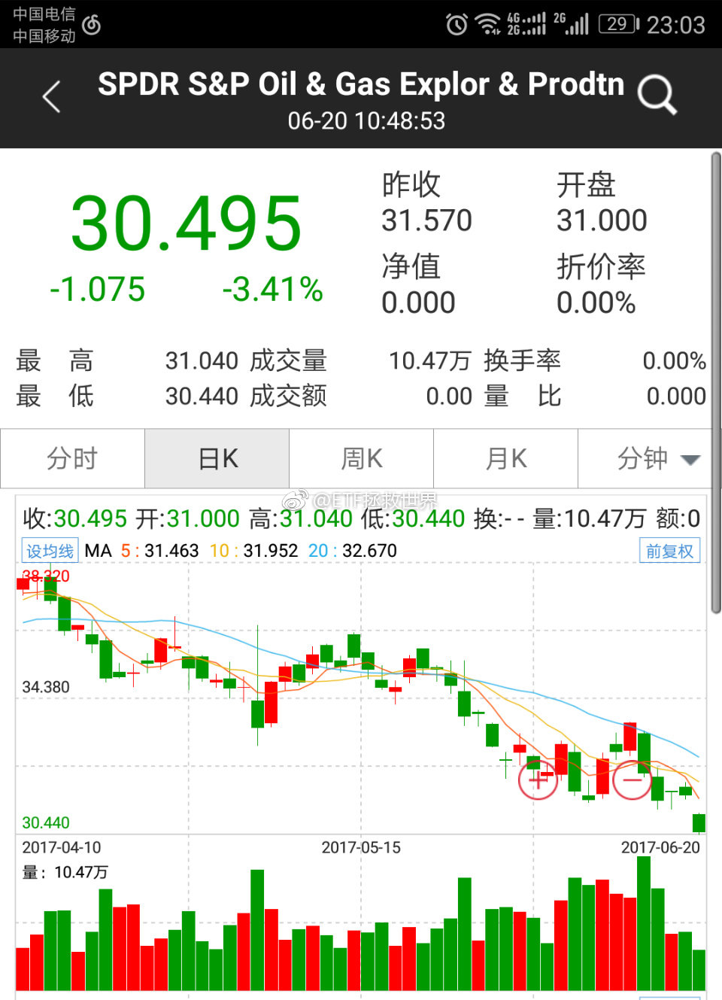

======================================================

ETF拯救世界 (5687069307) @
2017-06-21 09:04:56 Wed  
url: https://weibo.com/5687069307/F8OnuoBkg

割韭菜的镰刀又多了一把。你猜猜对谁来说是利好？[微笑]

------------------------------------------------------
转推：
>  @ ()
>  2017-06-21 08:30:15 Wed  
>  url: 

>  抱歉，作者已设置仅展示半年内微博，此微博已不可见。 ​​​

转发[3]  评论[37]  赞[50] 

======================================================

ETF拯救世界 (5687069307) @
2017-06-21 09:07:08 Wed  
url: https://weibo.com/5687069307/F8OonCLKV

“未来可能会将大约450只大盘股和中盘股股票纳入MSCI指数”。中证500是坠吼的，还记不记得？//@蓝鲸财经记者工作平台:【鲸滚动】6月21日讯，MSCI明晟表示，未来可能会将大约450只大盘股和中盘股股票纳入MSCI指数。

------------------------------------------------------
转推：
>  @蓝鲸财经记者工作平台 (1885454921)
>  2017-06-21 08:42:59 Wed  
>  url: https:/weibo.com/1885454921/F8OeAs3Nx/

>  鲸播报：这222只A股成功纳入MSCI，百亿美元驰援。(澎湃) ​​​

转发[21]  评论[32]  赞[44] 

======================================================

ETF拯救世界 (5687069307) @
2017-06-21 09:18:00 Wed  
url: https://weibo.com/5687069307/F8OsNk69P

你知不知道什么时候持仓的品种下跌你会毫无感觉？

是你已经知道它有多少概率下跌，然后一直等着它的发生。

下跌怎么会是风险呢。没有下跌，超额利润无从谈起。

当然，最关键的，是你点击买入的时候，想得更多的是未来有多好，还是未来会有多坏。 ​​​

转发[25]  评论[62]  赞[75] 

+++++++++++++++++++++++++++++++++++++++++++++++++++++

图片：
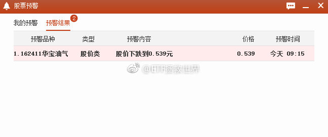

======================================================

ETF拯救世界 (5687069307) @
2017-06-21 09:48:36 Wed  
url: https://weibo.com/5687069307/F8OFdkR1G

回复@furiming:溢价一个多点你套利要亏死的。//@furiming:回复@kettle798:去场外申购，场内卖出套利

------------------------------------------------------
转推：
>  @ETF拯救世界 (5687069307)
>  2017-06-20 23:05:29 Tue  
>  url: https:/weibo.com/5687069307/F8KsajTmX/

>  现在应该高兴还是害怕？
>  
>  问问自己。
>  
>  如果高兴，再问问自己，有没有做好最坏的准备。 ​​​

转发[10]  评论[23]  赞[21] 

======================================================

ETF拯救世界 (5687069307) @
2017-06-21 10:26:31 Wed  
url: https://weibo.com/5687069307/F8OUBw2m3

上次咱们买了国开债指数后，18个交易日涨了15个交易日。

买的那天是最低点。 [微笑] ​​​

转发[6]  评论[59]  赞[131] 

======================================================

ETF拯救世界 (5687069307) @
2017-06-21 10:57:47 Wed  
url: https://weibo.com/5687069307/F8P7ipqyl

回复@跟风借势:这个确实判断不了。油价2012年见顶120美元，现在跌了5年跌到40出头。再跌5年也有可能，因为大类资产的涨跌周期都很长。但是没有牛市不代表没有机会。短期走势是没法预测，没有坏的品种，只有坏的价格和策略。

------------------------------------------------------
转推：
>  @ETF拯救世界 (5687069307)
>  2017-06-21 09:18:00 Wed  
>  url: https:/weibo.com/5687069307/F8OsNk69P/

>  你知不知道什么时候持仓的品种下跌你会毫无感觉？
>  
>  是你已经知道它有多少概率下跌，然后一直等着它的发生。
>  
>  下跌怎么会是风险呢。没有下跌，超额利润无从谈起。
>  
>  当然，最关键的，是你点击买入的时候，想得更多的是未来有多好，还是未来会有多坏。 ​​​

转发[12]  评论[23]  赞[48] 

======================================================

ETF拯救世界 (5687069307) @
2017-06-21 11:08:31 Wed  
url: https://weibo.com/5687069307/F8PbF6gaW

回复@徐L鑫:溢价不代表韭菜多。很多时候你没有发现吗，虽然溢价3.x%，但你如果真的敢去套利，晚上很可能一个大涨就把你埋进去了。不要小看市场，市场作为一个整体，要比绝大多数个人要聪明。要敬畏市场。市场先生虽然会疯狂，但大多数时间，它比你我都聪明。所以老巴说了13次：买指数基金。

------------------------------------------------------
转推：
>  @ETF拯救世界 (5687069307)
>  2017-06-20 23:05:29 Tue  
>  url: https:/weibo.com/5687069307/F8KsajTmX/

>  现在应该高兴还是害怕？
>  
>  问问自己。
>  
>  如果高兴，再问问自己，有没有做好最坏的准备。 ​​​

转发[6]  评论[41]  赞[64] 

======================================================

ETF拯救世界 (5687069307) @
2017-06-21 14:59:30 Wed  
url: https://weibo.com/5687069307/F8QHpm5Rc

医药反弹新高。除了恒生有点掉链子，都挺好。 ​​​

转发[1]  评论[19]  赞[77] 

======================================================

ETF拯救世界 (5687069307) @
2017-06-21 15:12:06 Wed  
url: https://weibo.com/5687069307/F8QMwqIPU

非常非常有意思。从6月2日起，我就从历史估值数据的角度跟大家探讨，这里恐怕会有一次反弹。指数涨幅不知道，估值涨幅在10%左右。当时等权估值39.x，我判断到43-44是历史大概率。时间的话，一两个月的长度应该是有的。

这一切都来源于历史数据。

即使这些观点重复了好几次，看起来不少朋友面对真正到 ​​​

转发[51]  评论[116]  赞[160] 

======================================================

ETF拯救世界 (5687069307) @
2017-06-21 18:08:32 Wed  
url: https://weibo.com/5687069307/F8RW8vSPx

今天晚上出去跑步会不会被冲走

😱 ​​​

转发[0]  评论[62]  赞[56] 

======================================================

ETF拯救世界 (5687069307) @
2017-06-21 22:56:07 Wed  
url: https://weibo.com/5687069307/F8TORDKp6

每日打卡(7)

传说中会有大雨的日子，怂在家里hiit了。

最难的一个训练项目。

坚持。

自由的身体，自由的精神，自由的财富。缺一不可。

身体，是最重要的。 ​​​

转发[5]  评论[40]  赞[93] 

+++++++++++++++++++++++++++++++++++++++++++++++++++++

图片：

======================================================

ETF拯救世界 (5687069307) @
2017-06-22 09:59:53 Thu  
url: https://weibo.com/5687069307/F8YaibXtk

近2000只股票下跌，好几只大指数52周新高了

“指数涨得慢” ​​​

转发[4]  评论[57]  赞[89] 

======================================================

ETF拯救世界 (5687069307) @
2017-06-22 10:13:43 Thu  
url: https://weibo.com/5687069307/F8YfUhjKC

计划开始建仓后，恒生指数（黑色）与恒生ETF（159920）和H股指数（紫色）的对比走势。

如果是2016年初开始参考计划的朋友，买入的159920收益率已经有45%-50%了。最差的也应该有35%以上了。 ​​​

转发[9]  评论[98]  赞[94] 

+++++++++++++++++++++++++++++++++++++++++++++++++++++

图片：

======================================================

ETF拯救世界 (5687069307) @
2017-06-22 10:46:23 Thu  
url: https://weibo.com/5687069307/F8YtajBPi

说起恒生的这个收益率，不是为了别的，主要是需要回头反思。无论一项投资成与败，都需要回头反思，这一步非常重要。

反思的第一点就是，分批投入的时候，第一笔买入价格并非特别严格一定要严重低估。我们的恒生第一笔事后看并不特别便宜，股灾3.0的时候第一笔买入浮亏可能超过10%。但这个你回头看重要 ​​​

转发[111]  评论[106]  赞[189] 

======================================================

ETF拯救世界 (5687069307) @
2017-06-22 10:53:13 Thu  
url: https://weibo.com/5687069307/F8YvWkat5

看不见这条？

------------------------------------------------------
转推：
>  @ETF拯救世界 (5687069307)
>  2017-06-22 10:46:23 Thu  
>  url: https:/weibo.com/5687069307/F8YtajBPi/

>  说起恒生的这个收益率，不是为了别的，主要是需要回头反思。无论一项投资成与败，都需要回头反思，这一步非常重要。
>  
>  反思的第一点就是，分批投入的时候，第一笔买入价格并非特别严格一定要严重低估。我们的恒生第一笔事后看并不特别便宜，股灾3.0的时候第一笔买入浮亏可能超过10%。但这个你回头看重要 ​​​

转发[7]  评论[30]  赞[54] 

======================================================

ETF拯救世界 (5687069307) @
2017-06-22 10:55:55 Thu  
url: https://weibo.com/5687069307/F8Yx2e2Dn

呵呵，你们看不到这条吗。哪个关键词被碰到了。 ​​​

转发[26]  评论[132]  赞[124] 

+++++++++++++++++++++++++++++++++++++++++++++++++++++

图片：
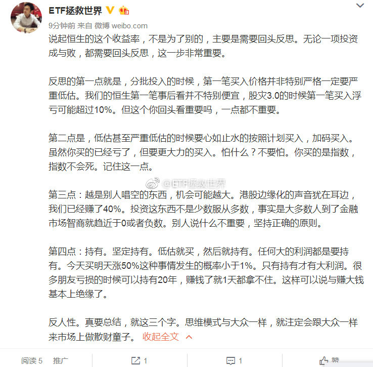

======================================================

ETF拯救世界 (5687069307) @
2017-06-22 13:56:34 Thu  
url: https://weibo.com/5687069307/F8ZImnEIc

虽然有2100只股票在下跌，但咱们今天继续新高应该没问题了。 ​​​

转发[5]  评论[30]  赞[73] 

======================================================

ETF拯救世界 (5687069307) @
2017-06-22 14:28:36 Thu  
url: https://weibo.com/5687069307/F8ZVmw64C

回复@淼淼人参:非常黑。//@淼淼人参:黑天鹅太多了，还是指数最好[舔屏]

------------------------------------------------------
转推：
>  @ETF拯救世界 (5687069307)
>  2017-06-22 13:56:34 Thu  
>  url: https:/weibo.com/5687069307/F8ZImnEIc/

>  虽然有2100只股票在下跌，但咱们今天继续新高应该没问题了。 ​​​

转发[3]  评论[12]  赞[36] 

======================================================

ETF拯救世界 (5687069307) @
2017-06-22 14:37:14 Thu  
url: https://weibo.com/5687069307/F8ZYREzXG

话说早了一刚。

------------------------------------------------------
转推：
>  @ETF拯救世界 (5687069307)
>  2017-06-22 13:56:34 Thu  
>  url: https:/weibo.com/5687069307/F8ZImnEIc/

>  虽然有2100只股票在下跌，但咱们今天继续新高应该没问题了。 ​​​

转发[0]  评论[31]  赞[43] 

======================================================

ETF拯救世界 (5687069307) @
2017-06-22 14:40:36 Thu  
url: https://weibo.com/5687069307/F900evanC

我觉得现阶段我存在的最大意义，是让很多朋友涨了高兴，跌了更高兴。

在A股怎么都特幸福，可以说花多少钱都买不来啊…… ​​​

转发[9]  评论[107]  赞[198] 

======================================================

ETF拯救世界 (5687069307) @
2017-06-22 15:08:59 Thu  
url: https://weibo.com/5687069307/F90bL1Fq7

回复@时间把对方都给遗忘了:[doge]//@时间把对方都给遗忘了:怎么不是英大证券首席[允悲][允悲][允悲]

------------------------------------------------------
转推：
>  @亟兮般若 (1769469393)
>  2017-06-21 22:26:18 Wed  
>  url: https:/weibo.com/1769469393/F8TCLtCVn/

>  我只能呵呵了[允悲][允悲][允悲][允悲][允悲] ​​​

转发[3]  评论[16]  赞[30] 

======================================================

ETF拯救世界 (5687069307) @
2017-06-22 15:47:05 Thu  
url: https://weibo.com/5687069307/F90rdAwl8

如果这样跌几天，月末必然发车。决不食言。 ​​​

转发[9]  评论[118]  赞[155] 

======================================================

ETF拯救世界 (5687069307) @
2017-06-22 20:43:50 Thu  
url: https://weibo.com/5687069307/F92nFvrzP

每日打卡(8)

不知不觉坚持一周了。

努力！奋斗！[doge] ​​​

转发[0]  评论[25]  赞[106] 

+++++++++++++++++++++++++++++++++++++++++++++++++++++

图片：

======================================================

ETF拯救世界 (5687069307) @
2017-06-23 09:31:20 Fri  
url: https://weibo.com/5687069307/F97pcowRY

1、无风不起浪

2、上次没事不代表这次也没事。“上次跪了结果又涨很多”。没错，但是也许下次跪了就得趴下了。套路就是这么深，防不胜防。 ​​​

转发[3]  评论[37]  赞[86] 

======================================================

ETF拯救世界 (5687069307) @
2017-06-23 09:37:12 Fri  
url: https://weibo.com/5687069307/F97rA6GS5

万达和复星都是养老指数成分股。加起来占1/40的仓位！ ​​​

转发[2]  评论[27]  赞[64] 

======================================================

ETF拯救世界 (5687069307) @
2017-06-23 09:39:59 Fri  
url: https://weibo.com/5687069307/F97sIbBTA

还有一周就开始挖坑？每次都这样我真的会不好意思了啊。

------------------------------------------------------
转推：
>  @ETF拯救世界 (5687069307)
>  2017-06-22 15:47:05 Thu  
>  url: https:/weibo.com/5687069307/F90rdAwl8/

>  如果这样跌几天，月末必然发车。决不食言。 ​​​

转发[2]  评论[20]  赞[67] 

======================================================

ETF拯救世界 (5687069307) @
2017-06-23 09:47:46 Fri  
url: https://weibo.com/5687069307/F97vS4Xu8

特别不理解的是：

某股票去年底22元。最高涨到33。一个大利空跌到31，纷纷去抢：“挖坑了快抢啊。大好的投资机会”。

过去几个月22-31之间比现在便宜多了你怎么不去买呢？因为到过33，所以31就是特别有价值了？ ​​​

转发[14]  评论[52]  赞[94] 

======================================================

ETF拯救世界 (5687069307) @
2017-06-23 09:58:41 Fri  
url: https://weibo.com/5687069307/F97Aj9iNV

不停的有朋友问我，加不加油气加不加油气。我以为跌了多少呢，打开计划帐户一看……

这张图是我自己计划场内买入的部分。油气这不刚12%吗，这点就沉不住气了？场内场外加起来买了快20个品种了，只有一个仓位0.6%的才跌了12%有什么好怕的啊。

别催我，也别问。我有自己的节奏。 ​​​

转发[14]  评论[72]  赞[118] 

+++++++++++++++++++++++++++++++++++++++++++++++++++++

图片：

======================================================

ETF拯救世界 (5687069307) @
2017-06-23 10:18:26 Fri  
url: https://weibo.com/5687069307/F97IjCtgs

关于补仓，再说两条应该对很多朋友有用的吧。

第一个是买入品种浮亏，补仓区间不要太小。尤其是重仓补，不要跌个百分之几就补，最后会很麻烦。你不差那几个点的成本，如果真能涨起来，少赚不了多少。要补就把区间拉大，能真的有效降低成本，还安全。

对于一些不能确定估值的，或者个股，我自己的补仓 ​​​

转发[123]  评论[97]  赞[192] 

======================================================

ETF拯救世界 (5687069307) @
2017-06-23 11:23:14 Fri  
url: https://weibo.com/5687069307/F988CrnGy

下跌不会死人，反弹才会。 ​​​

转发[30]  评论[25]  赞[98] 

======================================================

ETF拯救世界 (5687069307) @
2017-06-23 11:27:57 Fri  
url: https://weibo.com/5687069307/F98axtT2q

回复@蓝图806:不对啊，剧本上至少应该是下个月啊。什么情况，演员开始自己发挥了！导演不答应。//@蓝图806:瀑布的感觉......

------------------------------------------------------
转推：
>  @ETF拯救世界 (5687069307)
>  2017-06-23 11:23:14 Fri  
>  url: https:/weibo.com/5687069307/F988CrnGy/

>  下跌不会死人，反弹才会。 ​​​

转发[7]  评论[16]  赞[44] 

======================================================

ETF拯救世界 (5687069307) @
2017-06-23 11:31:00 Fri  
url: https://weibo.com/5687069307/F98bM1QJk

15号不买入，相信现在不会有人有意见了吧。

很多事也许你当时不知道为什么，但终有一天会知道的。别急。 ​​​

转发[4]  评论[42]  赞[99] 

======================================================

ETF拯救世界 (5687069307) @
2017-06-23 11:46:09 Fri  
url: https://weibo.com/5687069307/F98hVfU2K

哈哈哈哈……你的钱都被谁赚走了系列。

------------------------------------------------------
转推：
>  @网易财经 (1974561081)
>  2017-06-23 11:45:03 Fri  
>  url: https:/weibo.com/1974561081/F98htpeyA/

>  #网易新闻# 【"国家队"二季度以来浮盈784亿 12只股成产蛋金鸡】编者按：二季度以来，A股市场先抑后扬，整体宽幅震荡，在二季度接近尾声之际，以证金、汇金为代表的“国家队”持仓股表现和账面情况受到投资者的关注。《证券日报》市场研究中心根据同花顺数据统计发现，二季度以来，“国家队”持仓的1122 ​​​

转发[8]  评论[29]  赞[49] 

======================================================

ETF拯救世界 (5687069307) @
2017-06-23 13:06:15 Fri  
url: https://weibo.com/5687069307/F98Or4ErK

[污]//@ETF拯救世界:还有一周就开始挖坑？每次都这样我真的会不好意思了啊。

------------------------------------------------------
转推：
>  @ETF拯救世界 (5687069307)
>  2017-06-22 15:47:05 Thu  
>  url: https:/weibo.com/5687069307/F90rdAwl8/

>  如果这样跌几天，月末必然发车。决不食言。 ​​​

转发[1]  评论[63]  赞[68] 

======================================================

ETF拯救世界 (5687069307) @
2017-06-23 22:26:43 Fri  
url: https://weibo.com/5687069307/F9ctVsFzI

每日打卡(9)

新高的日子就练一组吧。[doge] ​​​

转发[0]  评论[32]  赞[102] 

+++++++++++++++++++++++++++++++++++++++++++++++++++++

图片：

======================================================

ETF拯救世界 (5687069307) @
2017-06-24 21:46:29 Sat  
url: https://weibo.com/5687069307/F9lE5FbTi

每日打卡(10)

运动应该是最能提现“付出就有回报”的事情。

坚持，就会跑得更快，更远，肌肉更加强壮，更有力量。

其它事情就未必如此。财富，感情，学习，事业……有时候需要天分，有时候需要缘分，有时候需要机遇。

话说变速跑什么的最刺激了！ ​​​

转发[7]  评论[42]  赞[101] 

+++++++++++++++++++++++++++++++++++++++++++++++++++++

图片：
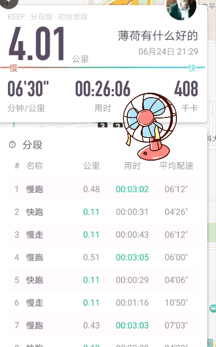

======================================================

ETF拯救世界 (5687069307) @
2017-06-25 23:24:53 Sun  
url: https://weibo.com/5687069307/F9vIx2xLp

每日打卡(11)

六月二日在京东买的书终于到了。

今天一直在看白话版的二十四史。不知不觉一看表居然23点了。赶紧再练一组胸。

说好了每天坚持，差一天，一时，一秒都不算数。

多看点历史总是好的。 ​​​

转发[0]  评论[45]  赞[84] 

+++++++++++++++++++++++++++++++++++++++++++++++++++++

图片：

======================================================

ETF拯救世界 (5687069307) @
2017-06-26 09:13:20 Mon  
url: https://weibo.com/5687069307/F9zzogUDi

校园霸凌全世界各个国家都有。但帝都学校能到这样的程度确实再次超越我的想象。难道法律真的无法制裁这样的小人渣吗？ @平安北京

------------------------------------------------------
转推：
>  @爱吃慕斯吗 (6289913698)
>  2017-06-25 14:15:08 Sun  
>  url: https:/weibo.com/6289913698/F9s7o5vU5/

>  #延庆二中霸凌事件# 主要事情经过：昨晚延庆人朋友圈微信群曝光出一个一分多钟的视频，视频中一个身穿延庆二中校服的男生蹲在学校厕所坑位旁，视频中传出欺凌者逼迫他吃坑中粪便的声音，男生不从，他们先是在言语上进行威胁，其中一位欺凌者说“你连尿都喝过了”，可见，这已经不是这位男生第一次受凌 ​​​

转发[14]  评论[69]  赞[35] 

======================================================

ETF拯救世界 (5687069307) @
2017-06-26 09:56:59 Mon  
url: https://weibo.com/5687069307/F9zR6i4Ia

回复@litterwitch:从我儿子能听懂话的时候，我就几乎每天都会向他灌输：“记住，爸爸妈妈是爱你的。永远会支持你。无论你遇到什么事，跟我们说，我们一定保护你，帮助你。”现在孩子刚4岁，还没发现谁欺负他。如果我知道有人欺负他，一定鼓励他反抗。绝不允许他欺负别人，也绝不能让别的孩子欺负。

------------------------------------------------------
转推：
>  @爱吃慕斯吗 (6289913698)
>  2017-06-25 14:15:08 Sun  
>  url: https:/weibo.com/6289913698/F9s7o5vU5/

>  #延庆二中霸凌事件# 主要事情经过：昨晚延庆人朋友圈微信群曝光出一个一分多钟的视频，视频中一个身穿延庆二中校服的男生蹲在学校厕所坑位旁，视频中传出欺凌者逼迫他吃坑中粪便的声音，男生不从，他们先是在言语上进行威胁，其中一位欺凌者说“你连尿都喝过了”，可见，这已经不是这位男生第一次受凌 ​​​

转发[6]  评论[64]  赞[86] 

======================================================

ETF拯救世界 (5687069307) @
2017-06-26 10:04:06 Mon  
url: https://weibo.com/5687069307/F9zTZnJcM

呵呵，按照剧本演的演员才是好演员。//@ETF拯救世界:回复@蓝图806:不对啊，剧本上至少应该是下个月啊。什么情况，演员开始自己发挥了！导演不答应。//@蓝图806:瀑布的感觉......

------------------------------------------------------
转推：
>  @ETF拯救世界 (5687069307)
>  2017-06-23 11:23:14 Fri  
>  url: https:/weibo.com/5687069307/F988CrnGy/

>  下跌不会死人，反弹才会。 ​​​

转发[1]  评论[40]  赞[60] 

======================================================

ETF拯救世界 (5687069307) @
2017-06-26 14:28:45 Mon  
url: https://weibo.com/5687069307/F9BDpt6ag

无论涨跌周四都会发车。不同的是会发不同的车而已。[摊手] ​​​

转发[5]  评论[111]  赞[130] 

======================================================

ETF拯救世界 (5687069307) @
2017-06-26 14:46:56 Mon  
url: https://weibo.com/5687069307/F9BKNarIe

分享图片 ​​​

转发[1]  评论[32]  赞[115] 

+++++++++++++++++++++++++++++++++++++++++++++++++++++

图片：

======================================================

ETF拯救世界 (5687069307) @
2017-06-26 14:48:44 Mon  
url: https://weibo.com/5687069307/F9BLwmTrA

$510500  未来将是最好的。就像今天一样。 ​​​

转发[10]  评论[57]  赞[126] 

======================================================

ETF拯救世界 (5687069307) @
2017-06-26 15:47:09 Mon  
url: https://weibo.com/5687069307/F9C9er6b7

家长成年没有？为什么不能连坐。

------------------------------------------------------
转推：
>  @平安北京延庆 (3645726762)
>  2017-06-26 12:34:34 Mon  
>  url: https:/weibo.com/3645726762/F9AT43YSI/

>  [话筒] ​​​

转发[9]  评论[83]  赞[79] 

======================================================

ETF拯救世界 (5687069307) @
2017-06-26 23:20:01 Mon  
url: https://weibo.com/5687069307/F9F73fCbh

每日打卡(12)

又翻了一遍万历十五年才开始锻炼，又晚了。 ​​​

转发[1]  评论[38]  赞[92] 

+++++++++++++++++++++++++++++++++++++++++++++++++++++

图片：

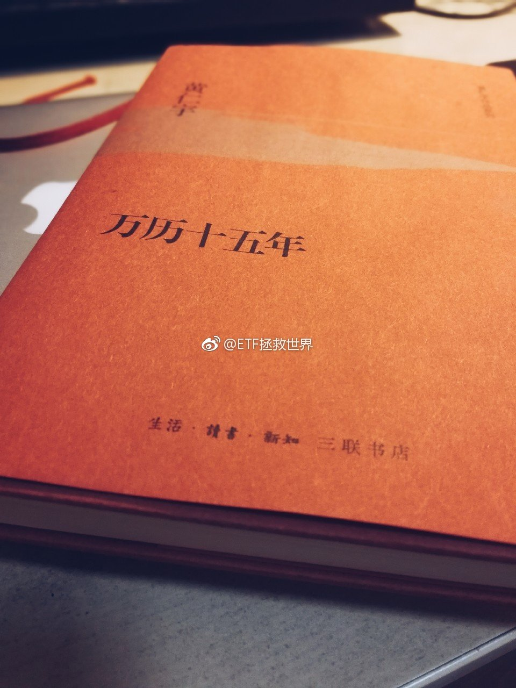

======================================================

ETF拯救世界 (5687069307) @
2017-06-27 09:39:04 Tue  
url: https://weibo.com/5687069307/F9JakemrQ

$159938 折价一个点，废柴。 ​​​

转发[1]  评论[25]  赞[56] 

======================================================

ETF拯救世界 (5687069307) @
2017-06-27 09:51:06 Tue  
url: https://weibo.com/5687069307/F9JfdptnM

打算卖出的跌，打算买入的涨。是不是逗我呢。就这么几天都控制不住你记几了。

------------------------------------------------------
转推：
>  @ETF拯救世界 (5687069307)
>  2017-06-26 14:28:45 Mon  
>  url: https:/weibo.com/5687069307/F9BDpt6ag/

>  无论涨跌周四都会发车。不同的是会发不同的车而已。[摊手] ​​​

转发[2]  评论[26]  赞[60] 

======================================================

ETF拯救世界 (5687069307) @
2017-06-27 09:55:02 Tue  
url: https://weibo.com/5687069307/F9JgO4wKJ

今天持仓品种盈利绝对额新高的：恒生、养老、红利、医药、500。

不要随意卖掉手里的好东西。这句话重要到每天说可以说一辈子。 ​​​

转发[10]  评论[60]  赞[125] 

======================================================

ETF拯救世界 (5687069307) @
2017-06-27 10:19:48 Tue  
url: https://weibo.com/5687069307/F9JqRfTg1

医药养老终于起来了。

你有没有发现一个问题，那就是我们买入的东西，从来都绝对不会是市场的热点。甚至是被市场遗弃的“垃圾”。

有意思的是，几个月后，它就会变成被追捧的好东西。

我们买了50、恒生、180、300几个月后，他们才开始显露王者之风。同样的，我们现在买的东西，不要急，早晚会爆发。 ​​​

转发[25]  评论[140]  赞[164] 

======================================================

ETF拯救世界 (5687069307) @
2017-06-27 15:19:37 Tue  
url: https://weibo.com/5687069307/F9Loylm10

垃圾券商14:59打电话说申购200万某货基持有十天就给补贴2000块钱。我听明白了一看表15:01了。

这种事情不知道就算了，知道了但是薅不到就特别气愤。辣鸡！

[怒]

1/3的S8没了！ [怒] ​​​

转发[9]  评论[100]  赞[102] 

======================================================

ETF拯救世界 (5687069307) @
2017-06-27 17:26:41 Tue  
url: https://weibo.com/5687069307/F9Me8dIip

回复@做而论道725:记不记得巴菲特在香港请盖茨吃饭，从兜里掏出麦当劳打折券的故事。还有我给你们推荐的《邻家》里面，那些资产超过600万美元的富豪，为了200美元的回报，坐那回答半天问题。我可以拿比羊毛多不少的钱帮助山里的孩子，但也会非常懊悔没把握住这样薅羊毛的机会。很难解释。。。

------------------------------------------------------
转推：
>  @ETF拯救世界 (5687069307)
>  2017-06-27 15:19:37 Tue  
>  url: https:/weibo.com/5687069307/F9Loylm10/

>  垃圾券商14:59打电话说申购200万某货基持有十天就给补贴2000块钱。我听明白了一看表15:01了。
>  
>  这种事情不知道就算了，知道了但是薅不到就特别气愤。辣鸡！
>  
>  [怒]
>  
>  1/3的S8没了！ [怒] ​​​

转发[4]  评论[41]  赞[75] 

======================================================

ETF拯救世界 (5687069307) @
2017-06-27 17:57:34 Tue  
url: https://weibo.com/5687069307/F9MqFiRuU

人生赢家系列:

我那个有六套房的邻居，大女儿刚被北大元培预录取了。 ​​​

转发[7]  评论[67]  赞[125] 

======================================================

ETF拯救世界 (5687069307) @
2017-06-27 20:34:15 Tue  
url: https://weibo.com/5687069307/F9NsgmO8o

回复@V坚持W到底V:太棒了。向你们致敬。有什么可以帮忙的还可以联系我。[赞]//@V坚持W到底V:@ETF拯救世界  E大 我和小伙伴资助的9位高三贫困学子都考上本科了 3位一本6位二本 通知您一声 您去年也捐书过 广西横县的

------------------------------------------------------
转推：
>  @ETF拯救世界 (5687069307)
>  2017-06-27 17:57:34 Tue  
>  url: https:/weibo.com/5687069307/F9MqFiRuU/

>  人生赢家系列:
>  
>  我那个有六套房的邻居，大女儿刚被北大元培预录取了。 ​​​

转发[4]  评论[15]  赞[122] 

======================================================

ETF拯救世界 (5687069307) @
2017-06-27 21:10:41 Tue  
url: https://weibo.com/5687069307/F9NH2Dtby

每日打卡(13)

开始的时候觉得每天坚持还挺困难的。

现在13天过去，好像有点成为习惯的感觉。 ​​​

转发[1]  评论[30]  赞[91] 

+++++++++++++++++++++++++++++++++++++++++++++++++++++

图片：

======================================================

ETF拯救世界 (5687069307) @
2017-06-28 07:57:51 Wed  
url: https://weibo.com/5687069307/F9RVJC2ez

http://t.cn/RiPeu2A 

[鲜花]

猫宁 ​​​

转发[2]  评论[66]  赞[62] 

======================================================

ETF拯救世界 (5687069307) @
2017-06-28 09:37:07 Wed  
url: https://weibo.com/5687069307/F9SA20CH6

计划：算了这个月不买了涨这么多。
大盘：来嘛别走嘛我跌一跌。

计划：好吧，终于跌了我准备来一发。
大盘：呵呵我又涨了你咬我啊。

计划：…… ​​​

转发[5]  评论[130]  赞[151] 

======================================================

ETF拯救世界 (5687069307) @
2017-06-28 14:17:32 Wed  
url: https://weibo.com/5687069307/F9UpQEODB

今天在雪球看到一个晒半年收益的帖子。评论点赞前几名都是30%以上的收益，还有100%的。

我看了一下数据，除掉新股，年初以来涨幅在30%以上的股票是145只，占比4.85%。上涨的股票是733只，占比是24.54%。

基本上按照常理来说，如果能取得30%以上的收益，就是战胜95%的人。如果能取得正收益，就是战胜7 ​​​

转发[7]  评论[48]  赞[61] 

======================================================

ETF拯救世界 (5687069307) @
2017-06-28 14:19:56 Wed  
url: https://weibo.com/5687069307/F9UqPd2l9

对了，还有2个数据，一半股票的跌幅超过12%。有33%的股票跌幅超过20%。

------------------------------------------------------
转推：
>  @ETF拯救世界 (5687069307)
>  2017-06-28 14:17:32 Wed  
>  url: https:/weibo.com/5687069307/F9UpQEODB/

>  今天在雪球看到一个晒半年收益的帖子。评论点赞前几名都是30%以上的收益，还有100%的。
>  
>  我看了一下数据，除掉新股，年初以来涨幅在30%以上的股票是145只，占比4.85%。上涨的股票是733只，占比是24.54%。
>  
>  基本上按照常理来说，如果能取得30%以上的收益，就是战胜95%的人。如果能取得正收益，就是战胜7 ​​​

转发[3]  评论[15]  赞[40] 

======================================================

ETF拯救世界 (5687069307) @
2017-06-28 14:28:17 Wed  
url: https://weibo.com/5687069307/F9UudjBdQ

今年上半年A股个行情，在我心目中10%-15%收益率应该是最厉害的。

8%-10%是比较出色。

5%-8%是干得不错。

低于5%，高于15%我并不喜欢。

关键要结合历史收益率曲线。大起大落没有意义。去年满仓满融配40%，今年继续满仓满融赚30%还没回本呢。稳中求进，把财富一点点装进自己的口袋。弱市收集筹码的时 ​​​

转发[23]  评论[161]  赞[120] 

======================================================

ETF拯救世界 (5687069307) @
2017-06-28 21:20:55 Wed  
url: https://weibo.com/5687069307/F9XbHti3j

每日打卡(14)

两周了，现在做这组轻松多了。

坚持。 ​​​

转发[0]  评论[29]  赞[83] 

+++++++++++++++++++++++++++++++++++++++++++++++++++++

图片：

======================================================

ETF拯救世界 (5687069307) @
2017-06-29 08:26:01 Thu  
url: https://weibo.com/5687069307/Fa1xFn2zb

昨天是不是哪个富婆给我做广告了。怎么公众号单日新关注人数比平时多了一倍。 ​​​

转发[3]  评论[100]  赞[95] 

======================================================

ETF拯救世界 (5687069307) @
2017-06-29 09:00:03 Thu  
url: https://weibo.com/5687069307/Fa1Lu0Z30

上半年门票没中几只，选的门票股倒是涨了30%。扎心了老铁。 ​​​

转发[4]  评论[42]  赞[78] 

+++++++++++++++++++++++++++++++++++++++++++++++++++++

图片：
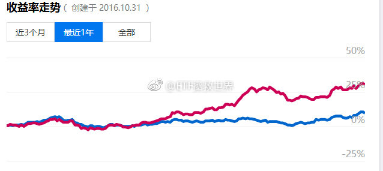

======================================================

ETF拯救世界 (5687069307) @
2017-06-29 09:54:50 Thu  
url: https://weibo.com/5687069307/Fa27IsgrQ

回复@不愿做韭菜的小散:昨天说的是整体收益率啊。我的股票仓位只有十几个点，也就是说上半年股票对整体收益率贡献也就3点多。//@不愿做韭菜的小散:昨天说炒a挣10%.是厉害的，今天说自己挣30%.套路啊

------------------------------------------------------
转推：
>  @ETF拯救世界 (5687069307)
>  2017-06-29 09:00:03 Thu  
>  url: https:/weibo.com/5687069307/Fa1Lu0Z30/

>  上半年门票没中几只，选的门票股倒是涨了30%。扎心了老铁。 ​​​

转发[3]  评论[33]  赞[43] 

======================================================

ETF拯救世界 (5687069307) @
2017-06-29 10:46:57 Thu  
url: https://weibo.com/5687069307/Fa2sS8GUi

无论是公募也好，私募也好。每次都是上一个阶段表现最好的有大量资金去申购。

这些资金到底是怎么想的。是不是觉得会一直好下去？

买主动基金我给个建议：

观察3-5年，无论牛熊，每个阶段都在前1/4的，多买几个。 ​​​

转发[32]  评论[75]  赞[127] 

======================================================

ETF拯救世界 (5687069307) @
2017-06-29 11:48:14 Thu  
url: https://weibo.com/5687069307/Fa2RKjhmK

晚上要开车的品种涨了1%。你能体会我的feel吗。

[NO]

是不是在逗我。 ​​​

转发[7]  评论[147]  赞[88] 

======================================================

ETF拯救世界 (5687069307) @
2017-06-29 17:21:47 Thu  
url: https://weibo.com/5687069307/Fa538li5H

回复@欧特熊-:不会//@欧特熊-:你不会早一两天开车吗？

------------------------------------------------------
转推：
>  @ETF拯救世界 (5687069307)
>  2017-06-29 11:48:14 Thu  
>  url: https:/weibo.com/5687069307/Fa2RKjhmK/

>  晚上要开车的品种涨了1%。你能体会我的feel吗。
>  
>  [NO]
>  
>  是不是在逗我。 ​​​

转发[2]  评论[43]  赞[45] 

======================================================

ETF拯救世界 (5687069307) @
2017-06-29 18:57:11 Thu  
url: https://weibo.com/5687069307/Fa5FReXya

嘀嘀 ​​​

转发[9]  评论[188]  赞[147] 

======================================================

ETF拯救世界 (5687069307) @
2017-06-29 21:54:25 Thu  
url: https://weibo.com/5687069307/Fa6PN4o9v

每日打卡(15)

坚持，然后形成习惯，然后融入血液改变人生 ​​​

转发[0]  评论[16]  赞[83] 

+++++++++++++++++++++++++++++++++++++++++++++++++++++

图片：

======================================================

ETF拯救世界 (5687069307) @
2017-06-29 22:55:14 Thu  
url: https://weibo.com/5687069307/Fa7eu14qE

奶一口 ​​​

转发[0]  评论[101]  赞[80] 

+++++++++++++++++++++++++++++++++++++++++++++++++++++

图片：

======================================================

ETF拯救世界 (5687069307) @
2017-06-30 11:30:17 Fri  
url: https://weibo.com/5687069307/FacaXmDKl

消失了一上午，奥森跑步去了…… ​​​

转发[1]  评论[78]  赞[118] 

+++++++++++++++++++++++++++++++++++++++++++++++++++++

图片：
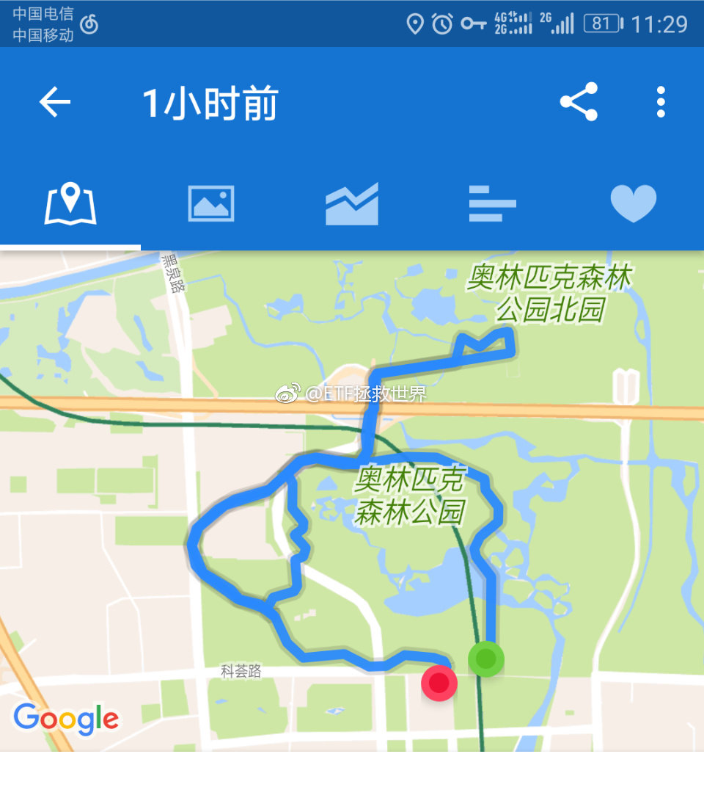

======================================================

ETF拯救世界 (5687069307) @
2017-06-30 13:43:22 Fri  
url: https://weibo.com/5687069307/Fad2YuIUd

$创业板指 sz399006$  是不是搞事情，要红？ ​​​

转发[6]  评论[32]  赞[42] 

======================================================

ETF拯救世界 (5687069307) @
2017-06-30 13:46:25 Fri  
url: https://weibo.com/5687069307/Fad4dkvYS

今天布局完成后，以后A股任何板块，我是说任何，上涨，我们的组合都会受益。

这是相当惬意的一件事。 ​​​

转发[5]  评论[50]  赞[92] 

======================================================

ETF拯救世界 (5687069307) @
2017-06-30 13:52:44 Fri  
url: https://weibo.com/5687069307/Fad6MgKox

2015年8月，我在雪球写过一篇文章。里面有一段写过我自己最喜欢的几个指数。今天，终于布局完成了大部分。

真难啊，整整两年。

接下来就是择机加仓，择机把没有的继续补上。

非常舒服，你舒服不舒服？

-----------------------

3、我的知己们

我也有投资股票，但从不会在雪球谈论。做为一家公司 ​​​

转发[147]  评论[87]  赞[197] 

======================================================

ETF拯救世界 (5687069307) @
2017-06-30 13:53:49 Fri  
url: https://weibo.com/5687069307/Fad7dqbhc

醉了！为什么！

------------------------------------------------------
转推：
>  @ETF拯救世界 (5687069307)
>  2017-06-30 13:43:22 Fri  
>  url: https:/weibo.com/5687069307/Fad2YuIUd/

>  $创业板指 sz399006$  是不是搞事情，要红？ ​​​

转发[4]  评论[26]  赞[37] 

======================================================

ETF拯救世界 (5687069307) @
2017-06-30 14:01:39 Fri  
url: https://weibo.com/5687069307/FadaovOS7

宽基里面除了我们的500，涨幅第一。绝望了。[污]//@ETF拯救世界:醉了！为什么！

------------------------------------------------------
转推：
>  @ETF拯救世界 (5687069307)
>  2017-06-30 13:43:22 Fri  
>  url: https:/weibo.com/5687069307/Fad2YuIUd/

>  $创业板指 sz399006$  是不是搞事情，要红？ ​​​

转发[3]  评论[32]  赞[41] 

======================================================

ETF拯救世界 (5687069307) @
2017-06-30 14:42:15 Fri  
url: https://weibo.com/5687069307/FadqSoKzE

超过500了。//@ETF拯救世界:宽基里面除了我们的500，涨幅第一。绝望了。[污]//@ETF拯救世界:醉了！为什么！

------------------------------------------------------
转推：
>  @ETF拯救世界 (5687069307)
>  2017-06-30 13:43:22 Fri  
>  url: https:/weibo.com/5687069307/Fad2YuIUd/

>  $创业板指 sz399006$  是不是搞事情，要红？ ​​​

转发[1]  评论[29]  赞[49] 

======================================================

ETF拯救世界 (5687069307) @
2017-06-30 14:56:43 Fri  
url: https://weibo.com/5687069307/FadwKqcdM

今天沪深300下跌，但是我们这几个月持续布局的医药 养老 500etf新高。

好节奏的要点就是提前量。在市场没有热炒之前先慢慢布局进去。

我们不追热点，因为热点我们已经买过了。

[微笑]

我们买的，永远是下一个热点。等着别人来抬轿。 ​​​

转发[15]  评论[86]  赞[203] 

======================================================

ETF拯救世界 (5687069307) @
2017-07-01 21:53:23 Sat  
url: https://weibo.com/5687069307/FapGn3Hf7

每日打卡(16)

昨天上午跑了十公里，晚上就没有打卡。今天继续！ ​​​

转发[1]  评论[36]  赞[87] 

+++++++++++++++++++++++++++++++++++++++++++++++++++++

图片：
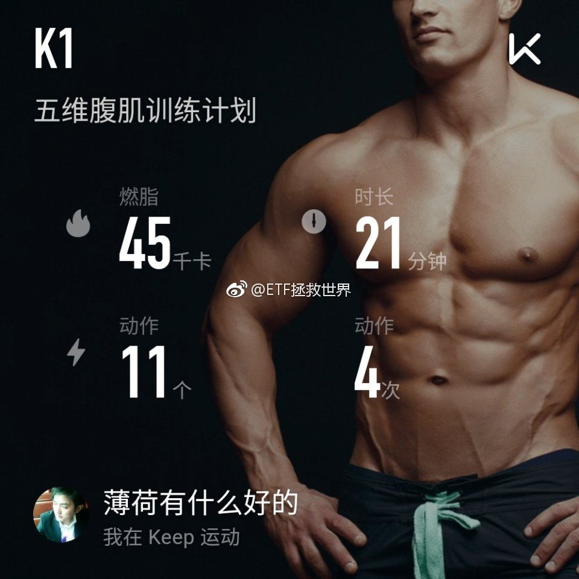

======================================================

ETF拯救世界 (5687069307) @
2017-07-02 16:47:27 Sun  
url: https://weibo.com/5687069307/Fax6GA2pY

每日打卡(17)

晚上有事，下午先练了 ​​​

转发[0]  评论[27]  赞[83] 

+++++++++++++++++++++++++++++++++++++++++++++++++++++

图片：

======================================================

ETF拯救世界 (5687069307) @
2017-07-03 09:09:13 Mon  
url: https://weibo.com/5687069307/FaDxbAVtV

恭喜国家队！棒棒哒！

------------------------------------------------------
转推：
>  @财联社APP (2868676035)
>  2017-07-03 07:53:52 Mon  
>  url: https:/weibo.com/2868676035/FaD2Bnp03/

>  【受益于低估值大蓝筹和白马股大涨 “国家队”基金上半年平均收益近9%】财联社3日讯，数据显示，截至6月30日，5只“国家队”基金今年以来平均复权单位净值增长率为8.64%，远超同类型的灵活配置型基金3.52%收益，其中，嘉实新机遇收益率最高，为11.13%。从业绩归因来看，偏爱家电、消费、银行等白马股是 ​​​

转发[2]  评论[23]  赞[49] 

======================================================

ETF拯救世界 (5687069307) @
2017-07-03 09:37:28 Mon  
url: https://weibo.com/5687069307/FaDIEuvvb

$创业板指 sz399006$   anyway，奶一口先。 ​​​

转发[6]  评论[24]  赞[52] 

======================================================

ETF拯救世界 (5687069307) @
2017-07-03 09:48:51 Mon  
url: https://weibo.com/5687069307/FaDNhaTpO

50、300下跌。医药、500持仓市值新高。

面对别人的忽悠——“虽然涨了很多，盛宴刚刚开始。继续看好涨到xxx。”——即使买不到以后的热点，你至少可以不被忽悠接盘。 ​​​

转发[8]  评论[23]  赞[89] 

======================================================

ETF拯救世界 (5687069307) @
2017-07-03 09:53:34 Mon  
url: https://weibo.com/5687069307/FaDPbCYQN

宽基涨幅第一。我能怎么办，我也很无奈呀。[doge]

------------------------------------------------------
转推：
>  @ETF拯救世界 (5687069307)
>  2017-07-03 09:37:28 Mon  
>  url: https:/weibo.com/5687069307/FaDIEuvvb/

>  $创业板指 sz399006$   anyway，奶一口先。 ​​​

转发[5]  评论[36]  赞[68] 

======================================================

ETF拯救世界 (5687069307) @
2017-07-03 11:10:13 Mon  
url: https://weibo.com/5687069307/FaEkiC6Ti

收盘来个1%就精彩了。//@ETF拯救世界:宽基涨幅第一。我能怎么办，我也很无奈呀。[doge]

------------------------------------------------------
转推：
>  @ETF拯救世界 (5687069307)
>  2017-07-03 09:37:28 Mon  
>  url: https:/weibo.com/5687069307/FaDIEuvvb/

>  $创业板指 sz399006$   anyway，奶一口先。 ​​​

转发[4]  评论[27]  赞[52] 

======================================================

ETF拯救世界 (5687069307) @
2017-07-03 11:20:35 Mon  
url: https://weibo.com/5687069307/FaEow8ayV

创业板50已经1%了。创业板0.87。//@ETF拯救世界:收盘来个1%就精彩了。//@ETF拯救世界:宽基涨幅第一。我能怎么办，我也很无奈呀。[doge]

------------------------------------------------------
转推：
>  @ETF拯救世界 (5687069307)
>  2017-07-03 09:37:28 Mon  
>  url: https:/weibo.com/5687069307/FaDIEuvvb/

>  $创业板指 sz399006$   anyway，奶一口先。 ​​​

转发[0]  评论[11]  赞[53] 

======================================================

ETF拯救世界 (5687069307) @
2017-07-03 11:22:34 Mon  
url: https://weibo.com/5687069307/FaEpjuhlK

如果啊，我是说如果。创业板涨一阵，那些昨天还说价值投资时代来临的人，会不会改口说成长投资才是王道呢。 ​​​

转发[2]  评论[52]  赞[97] 

======================================================

ETF拯救世界 (5687069307) @
2017-07-03 11:51:27 Mon  
url: https://weibo.com/5687069307/FaEB2mg43

节奏。

这两个字重点掌握一下。

划线。 ​​​

转发[4]  评论[59]  赞[116] 

======================================================

ETF拯救世界 (5687069307) @
2017-07-03 15:02:58 Mon  
url: https://weibo.com/5687069307/FaFQM915O

0.99%。[哼]//@ETF拯救世界:收盘来个1%就精彩了。//@ETF拯救世界:宽基涨幅第一。我能怎么办，我也很无奈呀。[doge]

------------------------------------------------------
转推：
>  @ETF拯救世界 (5687069307)
>  2017-07-03 09:37:28 Mon  
>  url: https:/weibo.com/5687069307/FaDIEuvvb/

>  $创业板指 sz399006$   anyway，奶一口先。 ​​​

转发[1]  评论[47]  赞[76] 

======================================================

ETF拯救世界 (5687069307) @
2017-07-03 16:42:20 Mon  
url: https://weibo.com/5687069307/FaGv6zM2Q

只要人人都献出一点爱，世界就是美好的春天！ ​​​

转发[3]  评论[94]  赞[183] 

+++++++++++++++++++++++++++++++++++++++++++++++++++++

图片：

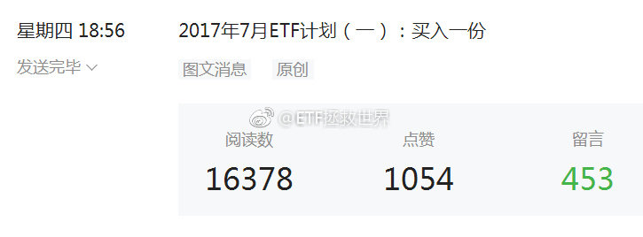

======================================================

ETF拯救世界 (5687069307) @
2017-07-03 21:26:07 Mon  
url: https://weibo.com/5687069307/FaImi1T4O

每日打卡(18)

18天了，加油！ ​​​

转发[0]  评论[26]  赞[101] 

+++++++++++++++++++++++++++++++++++++++++++++++++++++

图片：
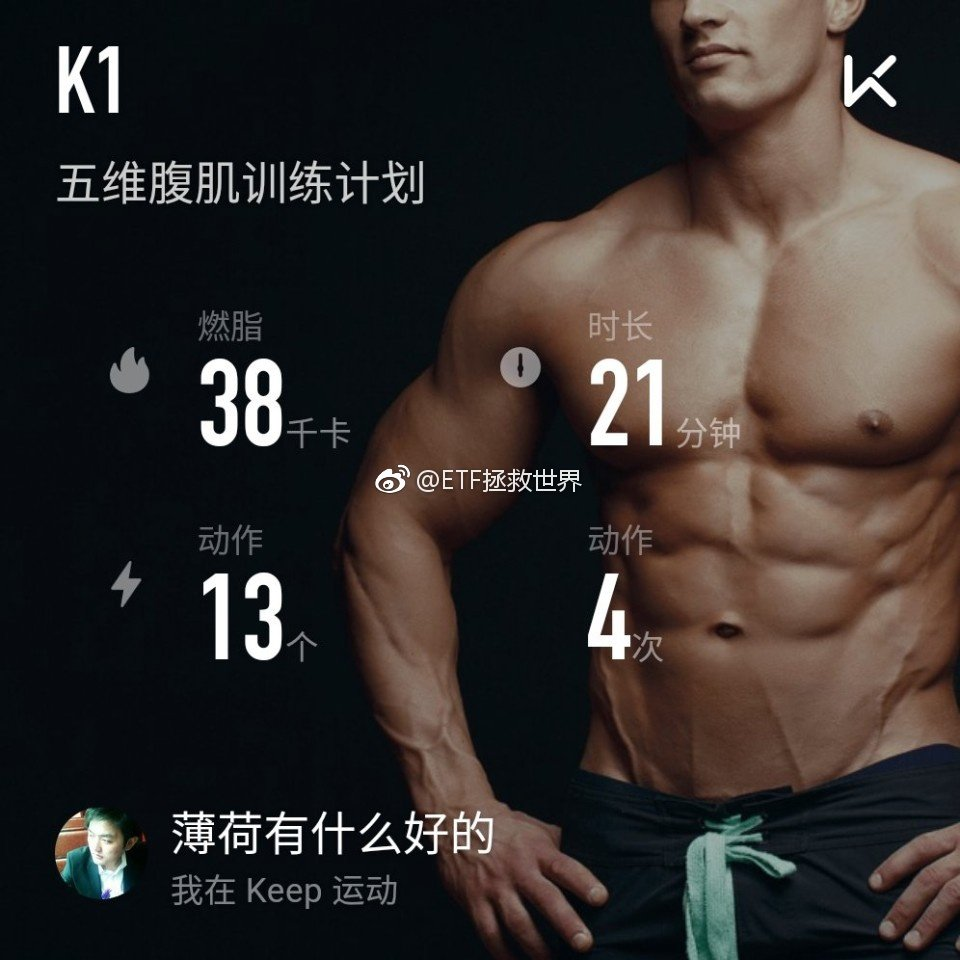

======================================================

ETF拯救世界 (5687069307) @
2017-07-04 08:15:26 Tue  
url: https://weibo.com/5687069307/FaMBR78iW

建信500还差0.1%浮盈。之后浮亏品种就剩油气一个。

账户里面一片红色的感觉不错吧。

a股是个聚宝盆。 ​​​

转发[10]  评论[46]  赞[101] 

======================================================

ETF拯救世界 (5687069307) @
2017-07-04 08:27:38 Tue  
url: https://weibo.com/5687069307/FaMGO8pbp

回复@奥斯特洛夫大柴夫斯基:再说第一万次，我的仓位很适合我寄几，很舒服，谁觉得仓位不够就加到舒服。因为不跌没法低位买东西，就不高兴，这样特别不成熟。市场不是为某个人开的，有自己的规律，不会按照某个人的愿望运行。我们要做的是认清局势，适应市场，趋利避害，然后赚钱。

------------------------------------------------------
转推：
>  @ETF拯救世界 (5687069307)
>  2017-07-04 08:15:26 Tue  
>  url: https:/weibo.com/5687069307/FaMBR78iW/

>  建信500还差0.1%浮盈。之后浮亏品种就剩油气一个。
>  
>  账户里面一片红色的感觉不错吧。
>  
>  a股是个聚宝盆。 ​​​

转发[7]  评论[35]  赞[102] 

======================================================

ETF拯救世界 (5687069307) @
2017-07-04 10:19:27 Tue  
url: https://weibo.com/5687069307/FaNqc5jdZ

回复@pennilessmillionaire:好简单嘅！关注我的朋友里面，广东的朋友最多！第二是北京，第三是上海。肥肠亲切一刚。//@pennilessmillionaire:E大，你为什么一会儿学广东话，一会儿学上海话，难道是一种咒语，说了股市就朝希望的方向走了么[doge]

------------------------------------------------------
转推：
>  @ETF拯救世界 (5687069307)
>  2017-07-04 08:15:26 Tue  
>  url: https:/weibo.com/5687069307/FaMBR78iW/

>  建信500还差0.1%浮盈。之后浮亏品种就剩油气一个。
>  
>  账户里面一片红色的感觉不错吧。
>  
>  a股是个聚宝盆。 ​​​

转发[2]  评论[63]  赞[66] 

======================================================

ETF拯救世界 (5687069307) @
2017-07-04 10:24:40 Tue  
url: https://weibo.com/5687069307/FaNsjeuJB

其实对于理财这件事，果然是经济发达的地方还是更加重视的。

关注我的朋友来自哪里：

然后妹子只有31%。还有0.09%是未知的。

苹果安卓大概是4:6 ​​​

转发[4]  评论[124]  赞[84] 

+++++++++++++++++++++++++++++++++++++++++++++++++++++

图片：
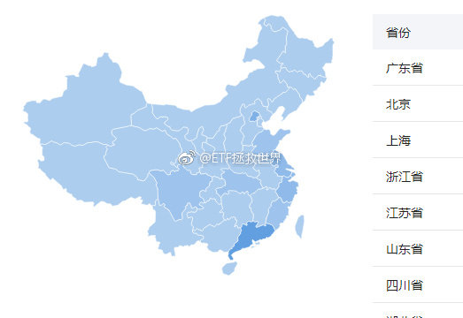
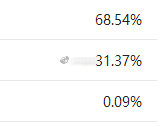

======================================================

ETF拯救世界 (5687069307) @
2017-07-04 10:36:49 Tue  
url: https://weibo.com/5687069307/FaNxfmZJE

公众号关注我的朋友数量按城市排名。找出你寄几…… ​​​

转发[3]  评论[334]  赞[116] 

+++++++++++++++++++++++++++++++++++++++++++++++++++++

图片：
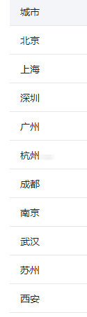

======================================================

ETF拯救世界 (5687069307) @
2017-07-04 14:10:23 Tue  
url: https://weibo.com/5687069307/FaOVVunY2

跌这么多，都开心了吧。不过讲真，如果不跌，7月肯定没法买A股了。 ​​​

转发[19]  评论[79]  赞[112] 

======================================================

ETF拯救世界 (5687069307) @
2017-07-04 15:41:39 Tue  
url: https://weibo.com/5687069307/FaPwYksoU

回复@王英蕖:最好不要碰161226，有损耗。我更喜欢用银行纸白银做白银网格//@王英蕖:ETF老师，今天白银基金161226跌到0.895，创了15.12.1日以来新低，但期货沪银主力离那时的价格还差得很远，请问老师怎么看，能撒网吗。

------------------------------------------------------
转推：
>  @ETF拯救世界 (5687069307)
>  2017-07-04 14:10:23 Tue  
>  url: https:/weibo.com/5687069307/FaOVVunY2/

>  跌这么多，都开心了吧。不过讲真，如果不跌，7月肯定没法买A股了。 ​​​

转发[12]  评论[47]  赞[56] 

======================================================

ETF拯救世界 (5687069307) @
2017-07-04 21:54:32 Tue  
url: https://weibo.com/5687069307/FaRYjEhsv

每日打卡(19)

今天又是变速跑。闷热，出了很多汗。

看起来很简单的事，坚持起来并不那么容易。坚持。 ​​​

转发[9]  评论[67]  赞[109] 

+++++++++++++++++++++++++++++++++++++++++++++++++++++

图片：
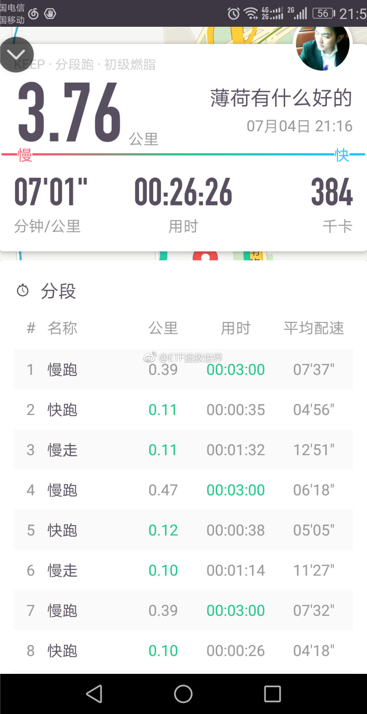

======================================================

ETF拯救世界 (5687069307) @
2017-07-05 14:00:53 Wed  
url: https://weibo.com/5687069307/FaYizg01V

回复@l12238:http://t.cn/RKvJ9Q7 //@l12238:E大对增强型指数基金怎么看？

------------------------------------------------------
转推：
>  @ETF拯救世界 (5687069307)
>  2017-07-04 21:54:32 Tue  
>  url: https:/weibo.com/5687069307/FaRYjEhsv/

>  每日打卡(19)
>  
>  今天又是变速跑。闷热，出了很多汗。
>  
>  看起来很简单的事，坚持起来并不那么容易。坚持。 ​​​

转发[8]  评论[15]  赞[36] 

======================================================

ETF拯救世界 (5687069307) @
2017-07-05 14:23:21 Wed  
url: https://weibo.com/5687069307/FaYrGyGgf

$创业板指 sz399006$被  $温氏股份 sz300498$   玩残了…… ​​​

转发[0]  评论[33]  赞[43] 

======================================================

ETF拯救世界 (5687069307) @
2017-07-05 14:25:16 Wed  
url: https://weibo.com/5687069307/FaYst1wmK

原谅我笑出来了……//@华尔街见闻APP:【北京：李彦宏乘无人驾驶汽车上五环 交警已介入调查】今天下午，北青报记者拨打122电话咨询相关情况，工作人员表示，交管部门已经获悉相关情况，正在就此展开调查。有交管局内部人士称，现行法规并不允许无人驾驶上路。

------------------------------------------------------
转推：
>  @ ()
>  2017-07-05 11:24:15 Wed  
>  url: 

>  抱歉，此微博已被作者删除。查看帮助：http://t.cn/Rfd3rQV

转发[8]  评论[28]  赞[47] 

======================================================

ETF拯救世界 (5687069307) @
2017-07-05 21:50:33 Wed  
url: https://weibo.com/5687069307/Fb1ncDEHH

每日打卡(20)

20天了。继续练胸。 ​​​

转发[0]  评论[28]  赞[84] 

+++++++++++++++++++++++++++++++++++++++++++++++++++++

图片：

======================================================

ETF拯救世界 (5687069307) @
2017-07-06 09:41:42 Thu  
url: https://weibo.com/5687069307/Fb61RsZO0

$创业板指 sz399006$   开始新高 ​​​

转发[23]  评论[18]  赞[47] 

======================================================

ETF拯救世界 (5687069307) @
2017-07-06 09:54:10 Thu  
url: https://weibo.com/5687069307/Fb66VgpjN

我想到了$温氏股份 sz300498$  很垃圾，没想到这么垃圾。

应该买$创业板50 sz399673$  的。 ​​​

转发[14]  评论[34]  赞[43] 

======================================================

ETF拯救世界 (5687069307) @
2017-07-06 09:57:40 Thu  
url: https://weibo.com/5687069307/Fb68liOTF

回复@RobinAmos:温氏影响了我们的$创业板指 sz399006$  我这里从来不讨论股票。//@RobinAmos:你跟老股民了？

------------------------------------------------------
转推：
>  @ETF拯救世界 (5687069307)
>  2017-07-06 09:54:10 Thu  
>  url: https:/weibo.com/5687069307/Fb66VgpjN/

>  我想到了$温氏股份 sz300498$  很垃圾，没想到这么垃圾。
>  
>  应该买$创业板50 sz399673$  的。 ​​​

转发[0]  评论[14]  赞[26] 

======================================================

ETF拯救世界 (5687069307) @
2017-07-06 10:04:46 Thu  
url: https://weibo.com/5687069307/Fb6be6YHq

到第一个卖猪肉卖鸡肉的，是怎么混到创业板的，到现在我还是没想明白。还占了第一大权重，表脸。 ​​​

转发[17]  评论[37]  赞[50] 

======================================================

ETF拯救世界 (5687069307) @
2017-07-06 10:16:47 Thu  
url: https://weibo.com/5687069307/Fb6g6mkOE

回复@请移除:一般我的股票跌到30%就补仓了。虽然我的规则是30%、60%、90%补仓，但实际上到目前为止，没有任何一次在60%的地方补过仓。也只有10%的股票跌到了30%。。//@请移除:之前亏损20%+的股，今天终于翻红1个多点了，心累，还是跟E大好，涨跌自由

------------------------------------------------------
转推：
>  @ETF拯救世界 (5687069307)
>  2017-07-06 10:04:46 Thu  
>  url: https:/weibo.com/5687069307/Fb6be6YHq/

>  到第一个卖猪肉卖鸡肉的，是怎么混到创业板的，到现在我还是没想明白。还占了第一大权重，表脸。 ​​​

转发[15]  评论[13]  赞[40] 

======================================================

ETF拯救世界 (5687069307) @
2017-07-06 10:23:05 Thu  
url: https://weibo.com/5687069307/Fb6iF39OX

$创业板指 sz399006$ 和 $创业板50 sz399673$  涨幅差一半了。这很有可能是未来牛市中它们最终的涨幅差距。

指数的编制规则太重要了。这也是为什么我比较喜欢养老产业这样等权的指数。当然，等权指数也有问题。但不至于太差。

温氏对$创业板指 sz399006$ 的副作用，绝不亚于当年中石油对上证指数的危 ​​​

转发[20]  评论[45]  赞[52] 

======================================================

ETF拯救世界 (5687069307) @
2017-07-06 10:30:25 Thu  
url: https://weibo.com/5687069307/Fb6lDqdD8

回复@阳光小赖子:别人都不关注的时候关注、别人开始关注的时候关注、别人关注很久了才开始关注。是三种投资模式。分别对应不同的投资特质。可以体会一下。//@阳光小赖子:发现自从E大发出开车信号后，评论创业板的声音不断。之前几乎没有。影响力啊，影响力！

------------------------------------------------------
转推：
>  @ETF拯救世界 (5687069307)
>  2017-07-06 09:41:42 Thu  
>  url: https:/weibo.com/5687069307/Fb61RsZO0/

>  $创业板指 sz399006$   开始新高 ​​​

转发[20]  评论[13]  赞[41] 

======================================================

ETF拯救世界 (5687069307) @
2017-07-06 10:32:57 Thu  
url: https://weibo.com/5687069307/Fb6mFinty

创业板指数在我们买入的4个交易日内，涨幅在宽基指数中第一的日期是两天。

也就是说，咱们买了以后，它是最强的。 ​​​

转发[2]  评论[16]  赞[54] 

======================================================

ETF拯救世界 (5687069307) @
2017-07-06 10:38:29 Thu  
url: https://weibo.com/5687069307/Fb6oUs8ar

回复@我是一个圆豆包:不一定。过早的开始关注或者开始买入，也许会有不小的浮亏。最佳买点当然是别人开始关注的时候买。但这个对投资人的要求可以说是非常非常高，一般人做不到。所以一般人应该做的，是考虑如何在控制亏损的情况下，比别人早一点买入未来别人会抢的东西。

------------------------------------------------------
转推：
>  @ETF拯救世界 (5687069307)
>  2017-07-06 09:41:42 Thu  
>  url: https:/weibo.com/5687069307/Fb61RsZO0/

>  $创业板指 sz399006$   开始新高 ​​​

转发[10]  评论[16]  赞[46] 

======================================================

ETF拯救世界 (5687069307) @
2017-07-06 10:43:49 Thu  
url: https://weibo.com/5687069307/Fb6r4CkNS

金融投资一定程度上是一种博弈过程。一个东西是真的好还是假的好，有时候并不重要。重要的是别人是不是会认为它好。

即使你是所谓的价值投资者，你想赢利，也需要别人认可你喜欢的公司。这就是为什么那些“白马绩优股”并没有什么太大的变化，却可以由几年前的无人问津变成万人追捧。“大烂臭”到“皇 ​​​

转发[19]  评论[39]  赞[102] 

======================================================

ETF拯救世界 (5687069307) @
2017-07-06 10:49:32 Thu  
url: https://weibo.com/5687069307/Fb6toubj8

然而$510500 依然是我的最爱…… 坠吼的始终是你 ​​​

转发[4]  评论[37]  赞[83] 

======================================================

ETF拯救世界 (5687069307) @
2017-07-06 11:34:50 Thu  
url: https://weibo.com/5687069307/Fb6LMca8e

一口毒奶一刚。

------------------------------------------------------
转推：
>  @ETF拯救世界 (5687069307)
>  2017-07-06 09:41:42 Thu  
>  url: https:/weibo.com/5687069307/Fb61RsZO0/

>  $创业板指 sz399006$   开始新高 ​​​

转发[1]  评论[41]  赞[57] 

======================================================

ETF拯救世界 (5687069307) @
2017-07-06 22:59:15 Thu  
url: https://weibo.com/5687069307/FbbfArdcz

每日打卡(21)

21天，习惯可以养成了 ​​​

转发[0]  评论[18]  赞[71] 

+++++++++++++++++++++++++++++++++++++++++++++++++++++

图片：

======================================================

ETF拯救世界 (5687069307) @
2017-07-07 08:22:38 Fri  
url: https://weibo.com/5687069307/FbeWgrq9f

万万没想到！闪崩10%！以后每次要挂两格了！ ​​​

转发[6]  评论[62]  赞[47] 

+++++++++++++++++++++++++++++++++++++++++++++++++++++

图片：

======================================================

ETF拯救世界 (5687069307) @
2017-07-07 08:32:07 Fri  
url: https://weibo.com/5687069307/Fbf07bU1p

论提前挂单的重要性。以后每次同时买卖挂两格。 ​​​

转发[4]  评论[77]  赞[42] 

+++++++++++++++++++++++++++++++++++++++++++++++++++++

图片：
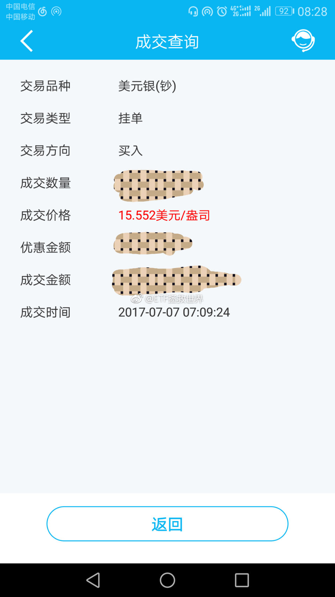

======================================================

ETF拯救世界 (5687069307) @
2017-07-07 09:28:10 Fri  
url: https://weibo.com/5687069307/FbfmRAsle

今早的白银应该是乌龙指。让咱们捡了个便宜。说起来乌龙指，这十几年我印象最深的是这件，听EE讲讲古。

我印象中是2007年上半年。江苏一哥们，印象中是个大叔。不知道为什么在海尔权证上挂了1厘的单。结果市价0.7元的海尔权证真的跌到了1厘，大概率是谁乌龙指了。

大叔花了800多块钱，拿走了70多万的 ​​​

转发[8]  评论[61]  赞[74] 

======================================================

ETF拯救世界 (5687069307) @
2017-07-07 09:34:17 Fri  
url: https://weibo.com/5687069307/FbfplzqIZ

又被吃了？

------------------------------------------------------
转推：
>  @ETF拯救世界 (5687069307)
>  2017-07-07 09:28:10 Fri  
>  url: https:/weibo.com/5687069307/FbfmRAsle/

>  今早的白银应该是乌龙指。让咱们捡了个便宜。说起来乌龙指，这十几年我印象最深的是这件，听EE讲讲古。
>  
>  我印象中是2007年上半年。江苏一哥们，印象中是个大叔。不知道为什么在海尔权证上挂了1厘的单。结果市价0.7元的海尔权证真的跌到了1厘，大概率是谁乌龙指了。
>  
>  大叔花了800多块钱，拿走了70多万的 ​​​

转发[0]  评论[17]  赞[29] 

======================================================

ETF拯救世界 (5687069307) @
2017-07-07 09:45:19 Fri  
url: https://weibo.com/5687069307/FbftPkyMK

赴美。

------------------------------------------------------
转推：
>  @新浪科技 (1642634100)
>  2017-07-07 08:09:14 Fri  
>  url: https:/weibo.com/1642634100/FbeQPh5Xo/

>  #科技鲜闻# 【独家！贾跃亭赴美专注造车：10亿美元融资生死线】洛杉矶消息人士向新浪科技确认，贾跃亭在加州时间周二晚上（北京时间周三中午 ）抵达美国洛杉矶，次日会见乐视汽车和法乐第未来团队。抵达洛杉矶后，贾跃亭昨日通过微博，宣布自己会“承担全部的责任，尽责到底”。http://t.cn/RKZrGKF ​​​

转发[3]  评论[25]  赞[27] 

======================================================

ETF拯救世界 (5687069307) @
2017-07-07 09:51:04 Fri  
url: https://weibo.com/5687069307/Fbfwa5M5k

有时候一些不起眼的小事，会引起惊涛骇浪。

只是当时人们根本意识不到而已。

压垮骆驼的最后一根稻草。

信心。 ​​​

转发[2]  评论[80]  赞[88] 

======================================================

ETF拯救世界 (5687069307) @
2017-07-07 13:21:06 Fri  
url: https://weibo.com/5687069307/FbgTpxQtS

$510500  坠吼的 ​​​

转发[8]  评论[36]  赞[76] 

======================================================

ETF拯救世界 (5687069307) @
2017-07-07 14:06:48 Fri  
url: https://weibo.com/5687069307/FbhbXAT5f

其实大多数人在股市上赚不到钱的原因是本来就没钱。

着急赚钱，拿不住，害怕坐电梯。所以低位买了牛股随时卖飞。再追下一个风头正劲的牛股。

这么说吧。你有1000万，拿出10%，100万，各种众所周知的大白马，或者有前途的指数，低位买进去。买了就扔那不看，怎么涨都不看。想想不卖是不是容易得多。 ​​​

转发[25]  评论[55]  赞[115] 

======================================================

ETF拯救世界 (5687069307) @
2017-07-07 14:21:38 Fri  
url: https://weibo.com/5687069307/FbhhZ9Iku

今天奶的还阔一。持有的是少了点，以后会多的，I promise。毕竟是最爱。不过其实未来最赚钱的另有其指，并不是它。

------------------------------------------------------
转推：
>  @ETF拯救世界 (5687069307)
>  2017-07-07 13:21:06 Fri  
>  url: https:/weibo.com/5687069307/FbgTpxQtS/

>  $510500  坠吼的 ​​​

转发[6]  评论[43]  赞[68] 

======================================================

ETF拯救世界 (5687069307) @
2017-07-07 14:32:57 Fri  
url: https://weibo.com/5687069307/FbhmA0a4l

为什么说中证500最好，因为它代表真正的A股，甚至是中国的经济。

看好A股看好中国，就是中证500。

前面那些大家伙和后面那些垃圾股都不能。 ​​​

转发[41]  评论[60]  赞[169] 

======================================================

ETF拯救世界 (5687069307) @
2017-07-07 22:37:16 Fri  
url: https://weibo.com/5687069307/Fbkxa6G2o

每日打卡(22)

坚持 ​​​

转发[1]  评论[33]  赞[94] 

+++++++++++++++++++++++++++++++++++++++++++++++++++++

图片：

======================================================

ETF拯救世界 (5687069307) @
2017-07-08 22:26:31 Sat  
url: https://weibo.com/5687069307/FbtTijQWC

每日打卡(23)

十天没有HIIT了。依然非常酸爽 ​​​

转发[0]  评论[25]  赞[87] 

+++++++++++++++++++++++++++++++++++++++++++++++++++++

图片：

======================================================

ETF拯救世界 (5687069307) @
2017-07-10 09:55:17 Mon  
url: https://weibo.com/5687069307/FbHPmpMv4

昨天有事，没打卡，我有罪。

补偿措施：

1、吃一天草。总热量不超过800大卡

2、晚上做两组。如果今天有暴跌做三组。

[允悲] ​​​

转发[2]  评论[85]  赞[92] 

+++++++++++++++++++++++++++++++++++++++++++++++++++++

图片：
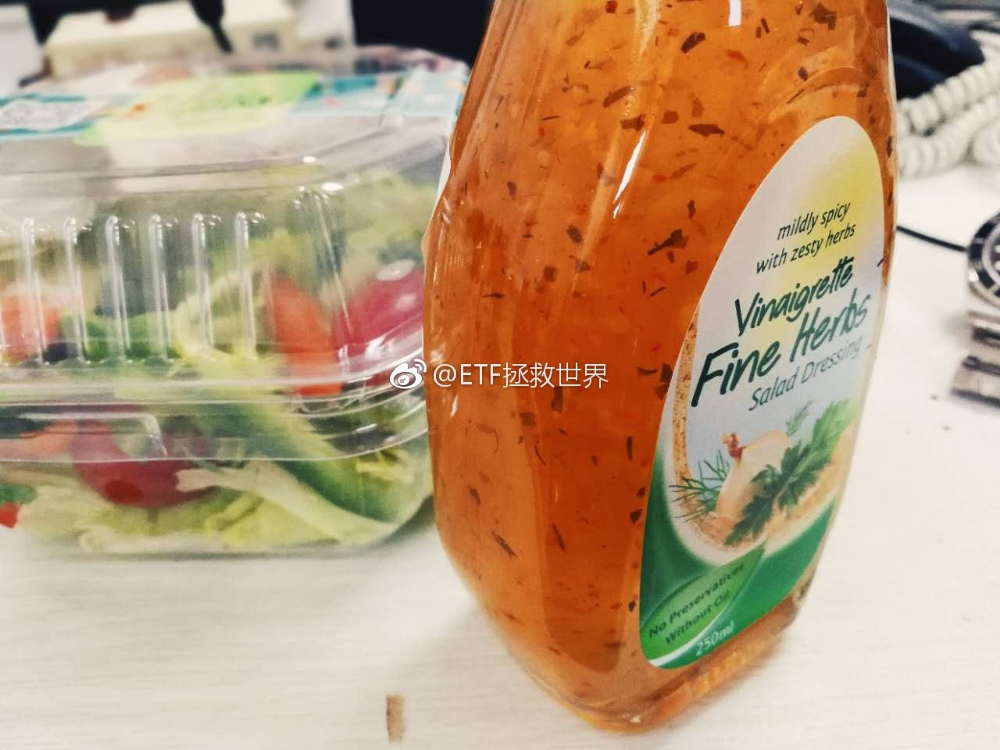

======================================================

ETF拯救世界 (5687069307) @
2017-07-10 15:23:58 Mon  
url: https://weibo.com/5687069307/FbJYM9Ex4

今天只有2000家公司下跌，平均跌幅不到0.5%，还是两组。

------------------------------------------------------
转推：
>  @ETF拯救世界 (5687069307)
>  2017-07-10 09:55:17 Mon  
>  url: https:/weibo.com/5687069307/FbHPmpMv4/

>  昨天有事，没打卡，我有罪。
>  
>  补偿措施：
>  
>  1、吃一天草。总热量不超过800大卡
>  
>  2、晚上做两组。如果今天有暴跌做三组。
>  
>  [允悲] ​​​

转发[0]  评论[61]  赞[47] 

======================================================

ETF拯救世界 (5687069307) @
2017-07-10 22:08:19 Mon  
url: https://weibo.com/5687069307/FbMCTnGHi

每日打卡(24)

第一组，现在去做第二组 ​​​

转发[0]  评论[12]  赞[56] 

+++++++++++++++++++++++++++++++++++++++++++++++++++++

图片：

======================================================

ETF拯救世界 (5687069307) @
2017-07-10 22:36:49 Mon  
url: https://weibo.com/5687069307/FbMOswDRl

每日打卡(25)

感觉不错。 ​​​

转发[8]  评论[21]  赞[75] 

+++++++++++++++++++++++++++++++++++++++++++++++++++++

图片：

======================================================

ETF拯救世界 (5687069307) @
2017-07-11 10:44:22 Tue  
url: https://weibo.com/5687069307/FbRzN4fFv

回复@CZ梦想:不一定啊。你看到的是指数涨，我看到的是2000只股票在下跌。这样跌下去，全市场估值会降低，当然可以买了~就看跌多少了。//@CZ梦想:这个涨法又不能开车了[泪]

------------------------------------------------------
转推：
>  @ETF拯救世界 (5687069307)
>  2017-07-10 22:36:49 Mon  
>  url: https:/weibo.com/5687069307/FbMOswDRl/

>  每日打卡(25)
>  
>  感觉不错。 ​​​

转发[5]  评论[16]  赞[43] 

======================================================

ETF拯救世界 (5687069307) @
2017-07-11 10:47:10 Tue  
url: https://weibo.com/5687069307/FbRAVnqD5

回复@紫玉生烟雨江南:各大公司都已经以30%-40%的跌幅下调乐视估值了。现在开始买创业基本乐视的雷已经少了至少一半了——以它退市来估算的话。//@紫玉生烟雨江南:但是创业板50里乐视网占比更高。。。关于乐视网对我们的创业板指数的影响，E大怎么看？

------------------------------------------------------
转推：
>  @ETF拯救世界 (5687069307)
>  2017-07-06 09:54:10 Thu  
>  url: https:/weibo.com/5687069307/Fb66VgpjN/

>  我想到了$温氏股份 sz300498$  很垃圾，没想到这么垃圾。
>  
>  应该买$创业板50 sz399673$  的。 ​​​

转发[7]  评论[24]  赞[37] 

======================================================

ETF拯救世界 (5687069307) @
2017-07-11 11:09:08 Tue  
url: https://weibo.com/5687069307/FbRJPESmC

这种新闻真的没法评论。这帮人到底怎么想的，百思不得其解。

------------------------------------------------------
转推：
>  @时间视频 (6250824982)
>  2017-07-10 17:02:57 Mon  
>  url: https:/weibo.com/6250824982/FbKCXsDbo/

>  【"暴走团"占据主路暴走遭车冲撞致1死2伤 女司机：大意了】7月8日，山东临沂一“暴走团”占据主路内侧车道行走，一辆出租车从后方撞入人群，致1死2伤。肇事女出租车司机董某称“大意了”。有网友质疑，“暴走团”在机动车道上行走，应承担部分责任。临沂警方通报称，司机董某现已被刑拘。 ​​​

转发[6]  评论[40]  赞[19] 

======================================================

ETF拯救世界 (5687069307) @
2017-07-11 11:16:17 Tue  
url: https://weibo.com/5687069307/FbRMJApLr

回复@西山居:跌的时候全是鬼故事，涨的时候哪里都好。当然，如果没有利空，一个品种也不会跌。问题在于，有利空然后跌的时候不买，以后就只能去做接盘侠了。刚买了一份，0.6%，不急，等着捡钻石。

------------------------------------------------------
转推：
>  @ETF拯救世界 (5687069307)
>  2017-07-06 09:54:10 Thu  
>  url: https:/weibo.com/5687069307/Fb66VgpjN/

>  我想到了$温氏股份 sz300498$  很垃圾，没想到这么垃圾。
>  
>  应该买$创业板50 sz399673$  的。 ​​​

转发[4]  评论[36]  赞[59] 

======================================================

ETF拯救世界 (5687069307) @
2017-07-11 14:43:38 Tue  
url: https://weibo.com/5687069307/FbT8U2cAr

恒生+50+红利+300+180新高，各位账户都不会太难看。谁能想到，有2400只股票在下跌。 ​​​

转发[8]  评论[71]  赞[120] 

======================================================

ETF拯救世界 (5687069307) @
2017-07-11 15:45:46 Tue  
url: https://weibo.com/5687069307/FbTy7slVK

数据出来了。感动哭了，再这样跌两天月中必须发车。 ​​​

转发[4]  评论[119]  赞[146] 

======================================================

ETF拯救世界 (5687069307) @
2017-07-11 21:58:32 Tue  
url: https://weibo.com/5687069307/FbVZq5lY9

每日打卡(26)

玩点新鲜的：击碎一切阻拦我们收集便宜筹码的敌人。[拳头] ​​​

转发[0]  评论[16]  赞[86] 

+++++++++++++++++++++++++++++++++++++++++++++++++++++

图片：

======================================================

ETF拯救世界 (5687069307) @
2017-07-11 23:30:36 Tue  
url: https://weibo.com/5687069307/FbWANmAP9

应该是这几年最悲催的中签。估计赚的钱还没有过年给各位发的红包多。

[doge] ​​​

转发[0]  评论[75]  赞[99] 

+++++++++++++++++++++++++++++++++++++++++++++++++++++

图片：
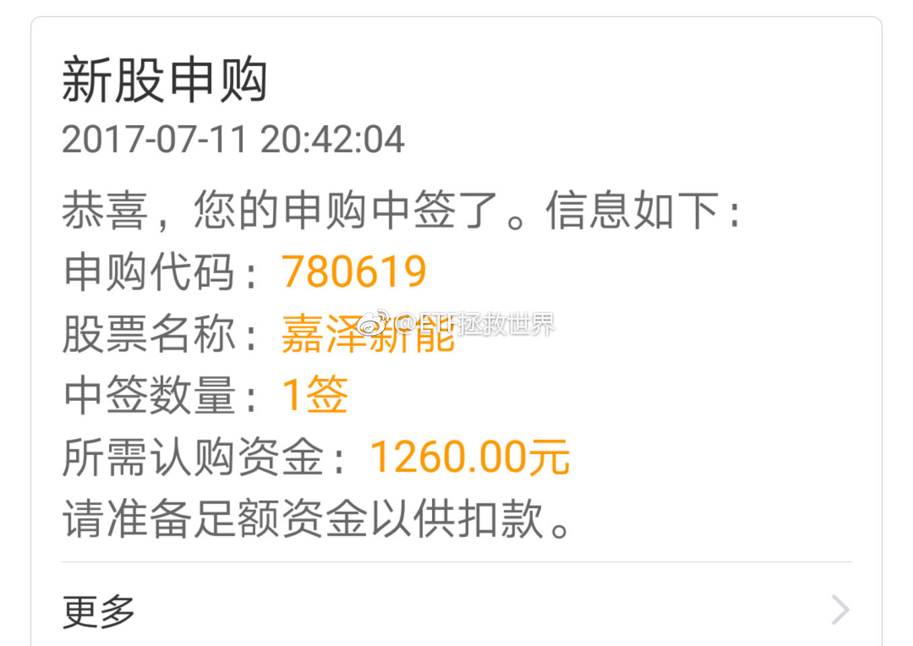

======================================================

ETF拯救世界 (5687069307) @
2017-07-12 08:59:38 Wed  
url: https://weibo.com/5687069307/Fc0jLtGZq

这个问题收费时效也过了，一块钱都舍不得花的朋友可以免费看了……哈哈哈……

http://t.cn/RKxRock ​​​

转发[75]  评论[47]  赞[57] 

======================================================

ETF拯救世界 (5687069307) @
2017-07-12 09:06:59 Wed  
url: https://weibo.com/5687069307/Fc0mL7ce3

回复@依小然-:立个flag，如果创业板指数还能跌20%-30%。那么到那个地方全仓买入（最好在两融账户做担保品买入），然后就什么都不用干，未来十年等着赚大钱吧。//@依小然-:创业板要去新低了吗 E大

------------------------------------------------------
转推：
>  @ETF拯救世界 (5687069307)
>  2017-07-12 08:59:38 Wed  
>  url: https:/weibo.com/5687069307/Fc0jLtGZq/

>  这个问题收费时效也过了，一块钱都舍不得花的朋友可以免费看了……哈哈哈……
>  
>  http://t.cn/RKxRock ​​​

转发[43]  评论[53]  赞[48] 

======================================================

ETF拯救世界 (5687069307) @
2017-07-12 09:34:26 Wed  
url: https://weibo.com/5687069307/Fc0xTkb8J

我自己呢，本身也会付费看付费问答。不过到现在为止只看一个人的，是感觉很有趣。跟投资无关的。看他东西的时候，我经常会想，如果他出了书我一定会买。

这个时候我才真的明白，为什么总有朋友给我评论说，出书吧，一定买。

最近我经常在想，这个世界的美好事物，其实绝大多数是跟商业有关的。

对于 ​​​

转发[5]  评论[79]  赞[116] 

======================================================

ETF拯救世界 (5687069307) @
2017-07-12 09:40:15 Wed  
url: https://weibo.com/5687069307/Fc0Afzx76

$159920  新高不卖是我的一条投资原则。 ​​​

转发[14]  评论[44]  赞[73] 

======================================================

ETF拯救世界 (5687069307) @
2017-07-12 10:19:25 Wed  
url: https://weibo.com/5687069307/Fc0Q9EmWk

又是2300家下跌。敢不敢再跌2天。[抱抱_旧]

------------------------------------------------------
转推：
>  @ETF拯救世界 (5687069307)
>  2017-07-11 15:45:46 Tue  
>  url: https:/weibo.com/5687069307/FbTy7slVK/

>  数据出来了。感动哭了，再这样跌两天月中必须发车。 ​​​

转发[0]  评论[30]  赞[72] 

======================================================

ETF拯救世界 (5687069307) @
2017-07-12 10:58:15 Wed  
url: https://weibo.com/5687069307/Fc15UAZsl

提请注意，从5月底到现在，1.5个月，只买了0.6%。

如果这个月中不发车，就是整整两个月只买了0.6%。

也就是说，如果跌下去，我们再次会让过一个小顶部。

[微笑] ​​​

转发[5]  评论[42]  赞[78] 

======================================================

ETF拯救世界 (5687069307) @
2017-07-12 11:08:06 Wed  
url: https://weibo.com/5687069307/Fc19Ut8wc

回复@蛋卷基金:蛋姐你爆个照，我每天转发你一条微博，你说吼不吼，大家一定非常兹瓷啊。//@蛋卷基金:蛋姐只能日刷存在感300遍[喵喵]

------------------------------------------------------
转推：
>  @ETF拯救世界 (5687069307)
>  2017-07-12 10:58:15 Wed  
>  url: https:/weibo.com/5687069307/Fc15UAZsl/

>  提请注意，从5月底到现在，1.5个月，只买了0.6%。
>  
>  如果这个月中不发车，就是整整两个月只买了0.6%。
>  
>  也就是说，如果跌下去，我们再次会让过一个小顶部。
>  
>  [微笑] ​​​

转发[1]  评论[30]  赞[55] 

======================================================

ETF拯救世界 (5687069307) @
2017-07-12 11:18:48 Wed  
url: https://weibo.com/5687069307/Fc1efFaq6

“都是别人的错”系列。怎么港，这辈子也就这样了。

------------------------------------------------------
转推：
>  @ ()
>  2017-07-12 11:16:26 Wed  
>  url: 

>  抱歉，作者已设置仅展示半年内微博，此微博已不可见。 ​​​

转发[4]  评论[19]  赞[26] 

======================================================

ETF拯救世界 (5687069307) @
2017-07-12 11:23:42 Wed  
url: https://weibo.com/5687069307/Fc1gfcOld

惊了，能不能到3000围观。

------------------------------------------------------
转推：
>  @ETF拯救世界 (5687069307)
>  2017-07-12 08:59:38 Wed  
>  url: https:/weibo.com/5687069307/Fc0jLtGZq/

>  这个问题收费时效也过了，一块钱都舍不得花的朋友可以免费看了……哈哈哈……
>  
>  http://t.cn/RKxRock ​​​

转发[15]  评论[30]  赞[50] 

======================================================

ETF拯救世界 (5687069307) @
2017-07-12 11:38:06 Wed  
url: https://weibo.com/5687069307/Fc1m5t1EB

继续吃草，绿色的 ​​​

转发[2]  评论[56]  赞[80] 

+++++++++++++++++++++++++++++++++++++++++++++++++++++

图片：
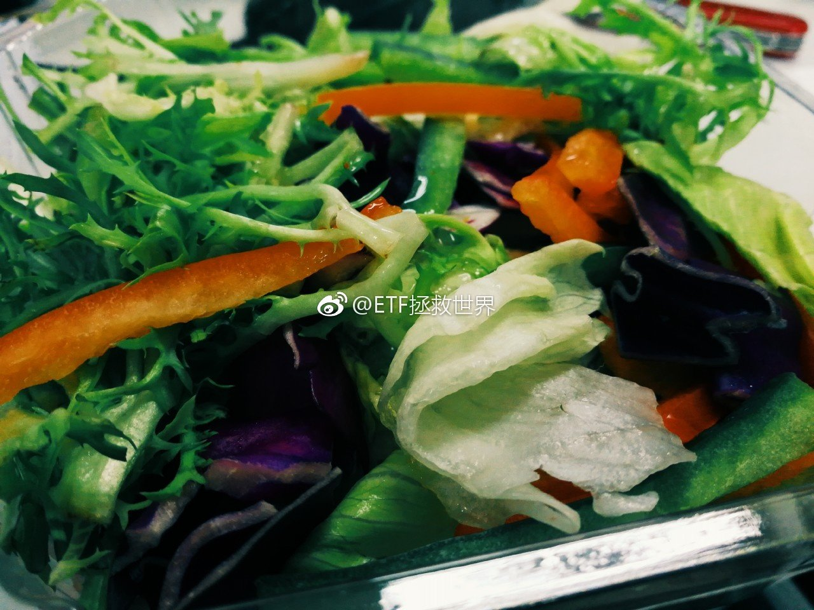

======================================================

ETF拯救世界 (5687069307) @
2017-07-12 14:37:04 Wed  
url: https://weibo.com/5687069307/Fc2wJorKR

还是免费的受欢迎一刚。//@ETF拯救世界:惊了，能不能到3000围观。

------------------------------------------------------
转推：
>  @ETF拯救世界 (5687069307)
>  2017-07-12 08:59:38 Wed  
>  url: https:/weibo.com/5687069307/Fc0jLtGZq/

>  这个问题收费时效也过了，一块钱都舍不得花的朋友可以免费看了……哈哈哈……
>  
>  http://t.cn/RKxRock ​​​

转发[5]  评论[25]  赞[34] 

======================================================

ETF拯救世界 (5687069307) @
2017-07-12 14:50:28 Wed  
url: https://weibo.com/5687069307/Fc2CavKVY

居然红了。//@ETF拯救世界:回复@依小然-:立个flag，如果创业板指数还能跌20%-30%。那么到那个地方全仓买入（最好在两融账户做担保品买入），然后就什么都不用干，未来十年等着赚大钱吧。//@依小然-:创业板要去新低了吗 E大

------------------------------------------------------
转推：
>  @ETF拯救世界 (5687069307)
>  2017-07-12 08:59:38 Wed  
>  url: https:/weibo.com/5687069307/Fc0jLtGZq/

>  这个问题收费时效也过了，一块钱都舍不得花的朋友可以免费看了……哈哈哈……
>  
>  http://t.cn/RKxRock ​​​

转发[6]  评论[52]  赞[40] 

======================================================

ETF拯救世界 (5687069307) @
2017-07-12 22:00:41 Wed  
url: https://weibo.com/5687069307/Fc5qNjwLE

每日打卡(27)

继续。出汗很舒服 ​​​

转发[0]  评论[30]  赞[73] 

+++++++++++++++++++++++++++++++++++++++++++++++++++++

图片：

======================================================

ETF拯救世界 (5687069307) @
2017-07-13 09:09:08 Thu  
url: https://weibo.com/5687069307/Fc9O80Btg

惊了，4000妥妥的。//@ETF拯救世界:惊了，能不能到3000围观。

------------------------------------------------------
转推：
>  @ETF拯救世界 (5687069307)
>  2017-07-12 08:59:38 Wed  
>  url: https:/weibo.com/5687069307/Fc0jLtGZq/

>  这个问题收费时效也过了，一块钱都舍不得花的朋友可以免费看了……哈哈哈……
>  
>  http://t.cn/RKxRock ​​​

转发[0]  评论[28]  赞[38] 

======================================================

ETF拯救世界 (5687069307) @
2017-07-13 09:30:37 Thu  
url: https://weibo.com/5687069307/Fc9WQqQru

其实有时候我说的可能有些朋友不是很理解。但是如果一年、两年后你再回头去看，就会有更深的体会。

------------------------------------------------------
转推：
>  @ETF拯救世界 (5687069307)
>  2017-07-12 09:40:15 Wed  
>  url: https:/weibo.com/5687069307/Fc0Afzx76/

>  $159920  新高不卖是我的一条投资原则。 ​​​

转发[7]  评论[21]  赞[58] 

======================================================

ETF拯救世界 (5687069307) @
2017-07-13 09:48:04 Thu  
url: https://weibo.com/5687069307/Fca3VhylX

“让利润奔跑”是一件说起来很简单，其实很难的事。

买了就亏的话，长期持有就很简单。因为很少有人愿意亏损卖出持仓。

而像我们这样，因为对成本要求特别严格，所以绝大部分品种买了就赚，然后一路走高，这时候拿着就特别难。

落袋为安，是绝大多数人的希望。

但是没有10%、30%、70%……哪里来的1 ​​​

转发[112]  评论[123]  赞[207] 

======================================================

ETF拯救世界 (5687069307) @
2017-07-13 10:16:34 Thu  
url: https://weibo.com/5687069307/FcafuptTF

回复@圈儿-恩蔷:其实不用苛求自己一定要卖在山顶上。记住老巴投资中石油的例子就可以。1.6成本，12清仓，然后涨到21，被逼在CCTV认错。谁能买在最低卖在最高？谁也不行。那是传说。只要吃到中间大部分利润就足够了。

------------------------------------------------------
转推：
>  @ETF拯救世界 (5687069307)
>  2017-07-13 09:48:04 Thu  
>  url: https:/weibo.com/5687069307/Fca3VhylX/

>  “让利润奔跑”是一件说起来很简单，其实很难的事。
>  
>  买了就亏的话，长期持有就很简单。因为很少有人愿意亏损卖出持仓。
>  
>  而像我们这样，因为对成本要求特别严格，所以绝大部分品种买了就赚，然后一路走高，这时候拿着就特别难。
>  
>  落袋为安，是绝大多数人的希望。
>  
>  但是没有10%、30%、70%……哪里来的1 ​​​

转发[15]  评论[32]  赞[59] 

======================================================

ETF拯救世界 (5687069307) @
2017-07-13 11:04:51 Thu  
url: https://weibo.com/5687069307/Fcaz5a5sZ

回复@xinhua_sz:再次提醒，所有冒充我主动私信各位的，全都是 大 骗 子。一定要擦亮眼睛，看清楚，不要上当。骗子太多，我举报不过来。//@xinhua_sz:E大，有个名字叫 ETF--拯救世界 的，问我QQ多少，拉我进实盘。兴奋得我小心脏蹦跶蹦跶的。忽然发现名字不对，唉~~

------------------------------------------------------
转推：
>  @ETF拯救世界 (5687069307)
>  2017-07-13 09:48:04 Thu  
>  url: https:/weibo.com/5687069307/Fca3VhylX/

>  “让利润奔跑”是一件说起来很简单，其实很难的事。
>  
>  买了就亏的话，长期持有就很简单。因为很少有人愿意亏损卖出持仓。
>  
>  而像我们这样，因为对成本要求特别严格，所以绝大部分品种买了就赚，然后一路走高，这时候拿着就特别难。
>  
>  落袋为安，是绝大多数人的希望。
>  
>  但是没有10%、30%、70%……哪里来的1 ​​​

转发[0]  评论[30]  赞[36] 

======================================================

ETF拯救世界 (5687069307) @
2017-07-13 13:31:02 Thu  
url: https://weibo.com/5687069307/FcbwqFP9b

回复@godshan:今年如果你只看50，会觉得好牛啊。看300，会觉得也很不错。但你要看500、看1000、看创业，这些代表90%股票的指数，你会发现熊一直没走。就像我不认可2012年底到2014年中之前，小股票撒欢的涨，A股是熊市的说法一样，我也不认可现在是牛市。我只看大多数股票的走势，大多数股票好才是牛市

------------------------------------------------------
转推：
>  @ETF拯救世界 (5687069307)
>  2017-07-13 09:48:04 Thu  
>  url: https:/weibo.com/5687069307/Fca3VhylX/

>  “让利润奔跑”是一件说起来很简单，其实很难的事。
>  
>  买了就亏的话，长期持有就很简单。因为很少有人愿意亏损卖出持仓。
>  
>  而像我们这样，因为对成本要求特别严格，所以绝大部分品种买了就赚，然后一路走高，这时候拿着就特别难。
>  
>  落袋为安，是绝大多数人的希望。
>  
>  但是没有10%、30%、70%……哪里来的1 ​​​

转发[11]  评论[33]  赞[76] 

======================================================

ETF拯救世界 (5687069307) @
2017-07-13 14:44:48 Thu  
url: https://weibo.com/5687069307/Fcc0ndq5D

回复@BR芭斯罗缤:也是醉了。知道我犹豫不决就来这么一出。玩我呢。//@BR芭斯罗缤:今晚滴滴有望[鼓掌]

------------------------------------------------------
转推：
>  @ETF拯救世界 (5687069307)
>  2017-07-13 09:48:04 Thu  
>  url: https:/weibo.com/5687069307/Fca3VhylX/

>  “让利润奔跑”是一件说起来很简单，其实很难的事。
>  
>  买了就亏的话，长期持有就很简单。因为很少有人愿意亏损卖出持仓。
>  
>  而像我们这样，因为对成本要求特别严格，所以绝大部分品种买了就赚，然后一路走高，这时候拿着就特别难。
>  
>  落袋为安，是绝大多数人的希望。
>  
>  但是没有10%、30%、70%……哪里来的1 ​​​

转发[0]  评论[48]  赞[46] 

======================================================

ETF拯救世界 (5687069307) @
2017-07-13 17:25:04 Thu  
url: https://weibo.com/5687069307/Fcd3q8Z9Y

今天不发车。这个月中发不发最终看明天确定。

散了散了啊，别围着了。 ​​​

转发[1]  评论[91]  赞[113] 

+++++++++++++++++++++++++++++++++++++++++++++++++++++

图片：

======================================================

ETF拯救世界 (5687069307) @
2017-07-13 22:02:48 Thu  
url: https://weibo.com/5687069307/FceS9DQuF

每日打卡(28)

累，坚持 ​​​

转发[1]  评论[9]  赞[73] 

+++++++++++++++++++++++++++++++++++++++++++++++++++++

图片：

======================================================

ETF拯救世界 (5687069307) @
2017-07-14 09:04:08 Fri  
url: https://weibo.com/5687069307/FcjcADeku

回复@colorful木木:没有人会是“完美”的，爱一个人就要接受他的全部~更何况，你心目中的完美，在别人眼里也许是一文不值。你眼中的优点，在别人眼里是天大的缺点呢。

------------------------------------------------------
转推：
>  @ETF拯救世界 (5687069307)
>  2017-07-13 09:48:04 Thu  
>  url: https:/weibo.com/5687069307/Fca3VhylX/

>  “让利润奔跑”是一件说起来很简单，其实很难的事。
>  
>  买了就亏的话，长期持有就很简单。因为很少有人愿意亏损卖出持仓。
>  
>  而像我们这样，因为对成本要求特别严格，所以绝大部分品种买了就赚，然后一路走高，这时候拿着就特别难。
>  
>  落袋为安，是绝大多数人的希望。
>  
>  但是没有10%、30%、70%……哪里来的1 ​​​

转发[4]  评论[19]  赞[52] 

======================================================

ETF拯救世界 (5687069307) @
2017-07-14 09:35:48 Fri  
url: https://weibo.com/5687069307/Fcjprl1g0

你们不要整天盼着暴跌。

第一个，金融市场的主基调和常态永远是稳定的。不稳定是非常态。非常态就是说只在极少时间会出现，那这样你天天盼着，不出现，就很失望。人生就不幸福。

第二个，现在是什么时间点你也不看看，对于全世界几乎最有能力把控金融市场的***来说，是不会允许现在有巨大波动的。

 ​​​

转发[18]  评论[56]  赞[114] 

======================================================

ETF拯救世界 (5687069307) @
2017-07-14 09:45:11 Fri  
url: https://weibo.com/5687069307/FcjtfrLZ7

博时债又分红了。还不错。拿现金就可以。 ​​​

转发[3]  评论[26]  赞[69] 

======================================================

ETF拯救世界 (5687069307) @
2017-07-14 09:46:20 Fri  
url: https://weibo.com/5687069307/FcjtIo7wV

最近看很多人开始买银行保险之类的。据说是市场最“最后的价值洼地”。

听起来还蛮耳熟的。

看了看，不少品种快新高了。

人性永不变啊。 ​​​

转发[21]  评论[82]  赞[97] 

======================================================

ETF拯救世界 (5687069307) @
2017-07-14 11:34:54 Fri  
url: https://weibo.com/5687069307/FckbMwE2U

回复@二维码aaaaaaaaaaaa:要说就得说全了，否则容易误会。去年底卖出最后一网油气网格本金后，我说，“记得留利润长期持有，不到60不卖。60以上多少卖看自己本事”。留利润，划重点。

------------------------------------------------------
转推：
>  @ETF拯救世界 (5687069307)
>  2017-07-14 09:46:20 Fri  
>  url: https:/weibo.com/5687069307/FcjtIo7wV/

>  最近看很多人开始买银行保险之类的。据说是市场最“最后的价值洼地”。
>  
>  听起来还蛮耳熟的。
>  
>  看了看，不少品种快新高了。
>  
>  人性永不变啊。 ​​​

转发[8]  评论[26]  赞[54] 

======================================================

ETF拯救世界 (5687069307) @
2017-07-14 13:20:20 Fri  
url: https://weibo.com/5687069307/FckSA2e56

回复@nearbythere:是跟计划吗。一份，0.6%份额，跌10%，亏损0.06%。至于那么悲伤吗……//@nearbythere:真是悲伤的一课，深陷油气十个点

------------------------------------------------------
转推：
>  @ETF拯救世界 (5687069307)
>  2017-07-14 09:46:20 Fri  
>  url: https:/weibo.com/5687069307/FcjtIo7wV/

>  最近看很多人开始买银行保险之类的。据说是市场最“最后的价值洼地”。
>  
>  听起来还蛮耳熟的。
>  
>  看了看，不少品种快新高了。
>  
>  人性永不变啊。 ​​​

转发[0]  评论[33]  赞[53] 

======================================================

ETF拯救世界 (5687069307) @
2017-07-14 13:35:16 Fri  
url: https://weibo.com/5687069307/FckYDzcua

第三轮计划开始以来，40多次买入中，有13次左右是买了就没有发生任何下跌的——就是说，买了就涨，是最低点。

另外的三十多次，是买了会有下跌，然而有的是跌一点又涨了，有的是低位补仓然后赚了。目前到现在，16个品种有3个品种浮亏中。

分别是

持仓0.6%的500增强，浮亏0.04%；

持仓0.6%的创业浮 ​​​

转发[11]  评论[117]  赞[132] 

======================================================

ETF拯救世界 (5687069307) @
2017-07-14 13:51:10 Fri  
url: https://weibo.com/5687069307/Fcl5608qg

回复@陈小脱:错了，私募基金经理如果净值不跌，就没事。谁管你买的品种里有没有大跌的。我现在面临的是任何品种有问题都会有人不开心。哪怕仓位再小，哪怕整体昨天还在创新高。//@陈小脱:想想那些私募基金经理，每天要面对多少质疑啊[允悲]

------------------------------------------------------
转推：
>  @ETF拯救世界 (5687069307)
>  2017-07-14 13:35:16 Fri  
>  url: https:/weibo.com/5687069307/FckYDzcua/

>  第三轮计划开始以来，40多次买入中，有13次左右是买了就没有发生任何下跌的——就是说，买了就涨，是最低点。
>  
>  另外的三十多次，是买了会有下跌，然而有的是跌一点又涨了，有的是低位补仓然后赚了。目前到现在，16个品种有3个品种浮亏中。
>  
>  分别是
>  
>  持仓0.6%的500增强，浮亏0.04%；
>  
>  持仓0.6%的创业浮 ​​​

转发[1]  评论[50]  赞[56] 

======================================================

ETF拯救世界 (5687069307) @
2017-07-14 14:09:55 Fri  
url: https://weibo.com/5687069307/FclcHzVKK

其实我也很理解各种声音。为什么？因为参考计划的朋友风险承受能力差十倍，可是却参考同一个计划，这本身就非常不科学。

面对同样的计划，有朋友会觉得太二了这么保守；有朋友会觉得太可怕了买这么多了（这个应该是未来大跌后很多人会有的想法）。有朋友整个组合净值下跌30%面无惧色，有朋友组合净值 ​​​

转发[9]  评论[225]  赞[123] 

======================================================

ETF拯救世界 (5687069307) @
2017-07-14 14:30:09 Fri  
url: https://weibo.com/5687069307/FclkV2yoc

刚才回测了一下，创业板etf 159915 如果从 2015年6月15日开始，以不带任何技巧的每个月15日无脑定投，到现在亏损多少？

16%。

要知道它从那天起到现在跌了53%。

你信不信它还会跌53%？我真的不信。

所以我用比每个月无脑买入高级n倍的方式去投资它，相信极端情况也会把浮亏幅度控制的很不错。 ​​​

转发[22]  评论[156]  赞[182] 

======================================================

ETF拯救世界 (5687069307) @
2017-07-14 22:09:00 Fri  
url: https://weibo.com/5687069307/FcoladPWY

每日打卡(29)

又来打了。这组很奇怪，做的时候不觉得累，做完了肌肉疼三天。 ​​​

转发[0]  评论[28]  赞[84] 

+++++++++++++++++++++++++++++++++++++++++++++++++++++

图片：

======================================================

ETF拯救世界 (5687069307) @
2017-07-15 21:01:09 Sat  
url: https://weibo.com/5687069307/Fcxk7s1jk

每日打卡(30)

今日无话。坚持。 ​​​

转发[0]  评论[29]  赞[80] 

+++++++++++++++++++++++++++++++++++++++++++++++++++++

图片：

======================================================

ETF拯救世界 (5687069307) @
2017-07-16 23:02:02 Sun  
url: https://weibo.com/5687069307/FcHxGlFxw

每日打卡(31)

聚会回来，很累不想动。还是坚持做完，不过有几个动作不太标准。

坚持。 ​​​

转发[0]  评论[30]  赞[86] 

+++++++++++++++++++++++++++++++++++++++++++++++++++++

图片：

======================================================

ETF拯救世界 (5687069307) @
2017-07-17 09:40:51 Mon  
url: https://weibo.com/5687069307/FcLIYD1dg

怎么样，是不是要做点什么。 ​​​

转发[1]  评论[109]  赞[93] 

======================================================

ETF拯救世界 (5687069307) @
2017-07-17 09:44:49 Mon  
url: https://weibo.com/5687069307/FcLKB86K6

呵呵哒，7月份的尾巴，你是狮子座……剧本早就写好了，照着演就对了。//@ETF拯救世界:回复@蓝图806:不对啊，剧本上至少应该是下个月啊。什么情况，演员开始自己发挥了！导演不答应。//@蓝图806:瀑布的感觉......

------------------------------------------------------
转推：
>  @ETF拯救世界 (5687069307)
>  2017-06-23 11:23:14 Fri  
>  url: https:/weibo.com/5687069307/F988CrnGy/

>  下跌不会死人，反弹才会。 ​​​

转发[2]  评论[36]  赞[62] 

======================================================

ETF拯救世界 (5687069307) @
2017-07-17 09:54:13 Mon  
url: https://weibo.com/5687069307/FcLOpcMpY

不同于5月底的一次六份，过去50多天，计划只买了一份。

原因吗，你现在知道了。

下次买几份？ ​​​

转发[6]  评论[77]  赞[113] 

======================================================

ETF拯救世界 (5687069307) @
2017-07-17 10:04:07 Mon  
url: https://weibo.com/5687069307/FcLSqhRu9

再次提醒大家，没有不好的品种，只有不好的价格。别人说什么并不重要，因为大多数人都是错的。

价格低就是最大的利好，对于满把现金的你来说，下跌的东西才是坠吼的。

不要理会别人怎么说！买便宜货。 ​​​

转发[29]  评论[63]  赞[159] 

======================================================

ETF拯救世界 (5687069307) @
2017-07-17 10:17:43 Mon  
url: https://weibo.com/5687069307/FcLXWtPWA

A股赚大钱的，只有10%的人。

想要成为这10%的人，除了你有内幕消息，做老鼠仓那些不正当的路子，一定是要做一些一般人看不懂、瞧不起、做不到的事。

有很多条路可以赚大钱。趋势价值量化……都可以。关键就在于，一定是绝大多数人都做不到的。

什么事绝大多数人做不到，你做到了，基本就成功一半了 ​​​

转发[37]  评论[78]  赞[122] 

======================================================

ETF拯救世界 (5687069307) @
2017-07-17 11:00:17 Mon  
url: https://weibo.com/5687069307/FcMfdF1dJ

回复@观音山上拜观音:我也想啊。肥肠可惜，只能收盘才有数据可跑。人生不如意事十之八九。//@观音山上拜观音:大大，应该在跑数据，现在😊！

------------------------------------------------------
转推：
>  @ETF拯救世界 (5687069307)
>  2017-07-17 10:17:43 Mon  
>  url: https:/weibo.com/5687069307/FcLXWtPWA/

>  A股赚大钱的，只有10%的人。
>  
>  想要成为这10%的人，除了你有内幕消息，做老鼠仓那些不正当的路子，一定是要做一些一般人看不懂、瞧不起、做不到的事。
>  
>  有很多条路可以赚大钱。趋势价值量化……都可以。关键就在于，一定是绝大多数人都做不到的。
>  
>  什么事绝大多数人做不到，你做到了，基本就成功一半了 ​​​

转发[3]  评论[15]  赞[44] 

======================================================

ETF拯救世界 (5687069307) @
2017-07-17 11:16:14 Mon  
url: https://weibo.com/5687069307/FcMlHeZH8

今天计划弄不好又新高了……

拉50没意见，求放过中小创。 ​​​

转发[3]  评论[39]  赞[67] 

======================================================

ETF拯救世界 (5687069307) @
2017-07-17 11:21:12 Mon  
url: https://weibo.com/5687069307/FcMnIf0gI

回复@疯狂为乐此不疲:我更愿意说，离我们大量布局越来越近了。//@疯狂为乐此不疲:中小创完蛋了吗[泪][泪][泪][泪][泪]

------------------------------------------------------
转推：
>  @ETF拯救世界 (5687069307)
>  2017-07-17 11:16:14 Mon  
>  url: https:/weibo.com/5687069307/FcMlHeZH8/

>  今天计划弄不好又新高了……
>  
>  拉50没意见，求放过中小创。 ​​​

转发[1]  评论[39]  赞[82] 

======================================================

ETF拯救世界 (5687069307) @
2017-07-17 13:27:00 Mon  
url: https://weibo.com/5687069307/FcNcM5AA1

最近不少朋友在我的评论里留言：中小股票业绩大幅下降，怎么办？

我一再跟大家说，不要轻易相信任何人的说法。要有独立的判断能力。别人说中小股票业绩下降，你也跟着嚷嚷，这样不行。

2017年半年度A股业绩到底如何，8月底自然见到分晓。目前刚开始披露。

如果按照业绩预报来说，是这样的：

已经发 ​​​

转发[29]  评论[80]  赞[178] 

======================================================

ETF拯救世界 (5687069307) @
2017-07-17 14:07:18 Mon  
url: https://weibo.com/5687069307/FcNt8dhPI

滴滴。

还有一小时，希望不要被干。 ​​​

转发[4]  评论[126]  赞[107] 

======================================================

ETF拯救世界 (5687069307) @
2017-07-17 14:35:20 Mon  
url: https://weibo.com/5687069307/FcNEvBH71

很有意思。6月2日根据估值数据判断的反弹时间，高度，都没问题。反弹在7月结束，高度是7月7日的43.xx。之前反弹起来不舒服的朋友，现在应该反思一下。真的。想清楚了，对你自己未来的投资有很大的好处。

------------------------------------------------------
转推：
>  @ETF拯救世界 (5687069307)
>  2017-06-21 15:12:06 Wed  
>  url: https:/weibo.com/5687069307/F8QMwqIPU/

>  非常非常有意思。从6月2日起，我就从历史估值数据的角度跟大家探讨，这里恐怕会有一次反弹。指数涨幅不知道，估值涨幅在10%左右。当时等权估值39.x，我判断到43-44是历史大概率。时间的话，一两个月的长度应该是有的。
>  
>  这一切都来源于历史数据。
>  
>  即使这些观点重复了好几次，看起来不少朋友面对真正到 ​​​

转发[12]  评论[36]  赞[78] 

======================================================

ETF拯救世界 (5687069307) @
2017-07-17 14:52:53 Mon  
url: https://weibo.com/5687069307/FcNLDmXZ4

另外，如果这样持续两周。或者说接下来基本横盘然后有几天下台阶，那么可以肯定的是，月末又要大笔进货了。弄不好是过去两年力度最大的一次。 ​​​

转发[11]  评论[87]  赞[159] 

======================================================

ETF拯救世界 (5687069307) @
2017-07-17 15:25:57 Mon  
url: https://weibo.com/5687069307/FcNZ3qozN

数据跑出来了。

今天开一份，少了。 [微笑] ​​​

转发[40]  评论[79]  赞[82] 

======================================================

ETF拯救世界 (5687069307) @
2017-07-17 15:30:03 Mon  
url: https://weibo.com/5687069307/FcO0IyND4

2015年6月以来，今日开始（如果不再反弹），A股的熊市正式进入下半场。也就是说……是时候开始为下一轮资产飞跃收集筹码了——真正的开始收集筹码。

------------------------------------------------------
转推：
>  @ETF拯救世界 (5687069307)
>  2017-07-17 15:25:57 Mon  
>  url: https:/weibo.com/5687069307/FcNZ3qozN/

>  数据跑出来了。
>  
>  今天开一份，少了。 [微笑] ​​​

转发[32]  评论[116]  赞[145] 

======================================================

ETF拯救世界 (5687069307) @
2017-07-17 17:47:31 Mon  
url: https://weibo.com/5687069307/FcOUwbbi5

再扯个淡吧。由于本次反弹力度比较弱，只是反弹到预期的下沿，所以接下来还会有一次力度非常非常大的反弹。力度之大甚至会让人认为是牛市又来了。反弹开始的位置在加权27-29之间。结束位置在34-36之间。目前是多少，30.xx。

------------------------------------------------------
转推：
>  @ETF拯救世界 (5687069307)
>  2017-06-02 09:04:42 Fri  
>  url: https:/weibo.com/5687069307/F5VfXvgOl/

>  昨天没有新高。哼！ [哼]
>  
>  送各位一张外部数据加权估值图。从历史经验看，本月，最迟下月，可能有一次级别比较大的反弹。当然，反弹之后…… ​​​

转发[47]  评论[135]  赞[126] 

======================================================

ETF拯救世界 (5687069307) @
2017-07-17 21:22:49 Mon  
url: https://weibo.com/5687069307/FcQjUjwaf

每日打卡(31)

今天来一组HIIT。希望总在前方。 ​​​

转发[0]  评论[16]  赞[63] 

+++++++++++++++++++++++++++++++++++++++++++++++++++++

图片：

======================================================

ETF拯救世界 (5687069307) @
2017-07-17 21:43:34 Mon  
url: https://weibo.com/5687069307/FcQskqtJ7

差一点了。希望明早起床已经成交。 ​​​

转发[1]  评论[28]  赞[57] 

+++++++++++++++++++++++++++++++++++++++++++++++++++++

图片：

======================================================

ETF拯救世界 (5687069307) @
2017-07-18 08:15:35 Tue  
url: https://weibo.com/5687069307/FcUARhHrD

回复@乔科男:公众号chinaetfs//@乔科男:E大，请问1份是什么概念？怎样根据个人资产状况确定一份是多少？

------------------------------------------------------
转推：
>  @ETF拯救世界 (5687069307)
>  2017-07-17 15:25:57 Mon  
>  url: https:/weibo.com/5687069307/FcNZ3qozN/

>  数据跑出来了。
>  
>  今天开一份，少了。 [微笑] ​​​

转发[0]  评论[8]  赞[24] 

======================================================

ETF拯救世界 (5687069307) @
2017-07-18 08:53:14 Tue  
url: https://weibo.com/5687069307/FcUQ9he83

昨天一跌，16个品种中浮亏的增加到5只，多了三只，主要是这几个月建仓的品种。已买入品种年化收益率也降至16%。昨天总收益率跌0.3x%。

说说你的想法。 ​​​

转发[7]  评论[136]  赞[78] 

======================================================

ETF拯救世界 (5687069307) @
2017-07-18 09:21:27 Tue  
url: https://weibo.com/5687069307/FcV1Bm9BG

回复@乔木:不，第二场战役已经走了一半了。这是我2015年7月的一篇东西，目前的走势可以说完全在两年前的预料之中。不会太远了。http://t.cn/RKH8yMT //@乔木:局部战事失利，整体战争胜利。三大战役即将展开

------------------------------------------------------
转推：
>  @ETF拯救世界 (5687069307)
>  2017-07-18 08:53:14 Tue  
>  url: https:/weibo.com/5687069307/FcUQ9he83/

>  昨天一跌，16个品种中浮亏的增加到5只，多了三只，主要是这几个月建仓的品种。已买入品种年化收益率也降至16%。昨天总收益率跌0.3x%。
>  
>  说说你的想法。 ​​​

转发[3]  评论[26]  赞[57] 

======================================================

ETF拯救世界 (5687069307) @
2017-07-18 09:57:03 Tue  
url: https://weibo.com/5687069307/FcVg3iMAw

老司机说一句：控制节奏。 ​​​

转发[2]  评论[34]  赞[114] 

======================================================

ETF拯救世界 (5687069307) @
2017-07-18 10:08:44 Tue  
url: https://weibo.com/5687069307/FcVkNhXpT

趋势一旦形成，轻易不要去判断拐点。通常来讲，趋势延续的时间会超过大多数人的想象。

衔远山，吞长江，浩浩汤汤，横无际涯。

通常来讲，你要知道来势汹汹的敌人到底是真的雄兵百万，还是徒有其表，只是纸老虎。

面对有实力的敌人，不妨腾挪躲闪，保存自家实力。毕竟你我只是这个生态系统中的小蚂蚁 ​​​

转发[57]  评论[92]  赞[228] 

======================================================

ETF拯救世界 (5687069307) @
2017-07-18 11:08:50 Tue  
url: https://weibo.com/5687069307/FcVJbApx5

医药如果能7000点买入，那么未来十年十倍是起点。

一个忽悠，不一定对。 ​​​

转发[35]  评论[124]  赞[169] 

======================================================

ETF拯救世界 (5687069307) @
2017-07-18 13:09:39 Tue  
url: https://weibo.com/5687069307/FcWwedyDo

年初至今，3005只股票中

中位数是跌幅17.78%；

跌幅超过20%的有1341只；

跌幅超过30%的有695只；

跌幅最大的67%。

上涨的626只，占20.83%；

涨幅超过10%的有355只，占11.81%；

涨幅超过20%的有201只，占6.69%。

正所谓九死一生。今年大部分炒股的朋友所受到的伤害，在座的各位恐怕无法体会。 ​​​

转发[21]  评论[72]  赞[141] 

======================================================

ETF拯救世界 (5687069307) @
2017-07-18 20:39:17 Tue  
url: https://weibo.com/5687069307/FcZsJuAKj

每日打卡(32)

坚持。为了健康。 ​​​

转发[0]  评论[32]  赞[97] 

+++++++++++++++++++++++++++++++++++++++++++++++++++++

图片：

======================================================

ETF拯救世界 (5687069307) @
2017-07-19 09:51:10 Wed  
url: https://weibo.com/5687069307/Fd4Ea77IM

$恒生指数 hkHSI$   这样的话，用不了多久就要平衡一下了。 ​​​

转发[2]  评论[97]  赞[105] 

======================================================

ETF拯救世界 (5687069307) @
2017-07-19 20:59:39 Wed  
url: https://weibo.com/5687069307/Fd91v1zDu

每日打卡(33)

坚持。今天事情多，没有时间泡微博。估计这几天都没太多时间。

锻炼的时间总要挤出来。身体最重要。 ​​​

转发[0]  评论[29]  赞[130] 

+++++++++++++++++++++++++++++++++++++++++++++++++++++

图片：

======================================================

ETF拯救世界 (5687069307) @
2017-07-20 10:40:32 Thu  
url: https://weibo.com/5687069307/FdeoHd5jp

无论你持有的品种（每一只，不是组合）怎么跌，底部到来的时候，想尽办法将浮亏保持在10%-15%之间。

如果能够做到，在资本市场你不会死，还会赚很多。 ​​​

转发[53]  评论[105]  赞[185] 

======================================================

ETF拯救世界 (5687069307) @
2017-07-20 13:47:24 Thu  
url: https://weibo.com/5687069307/FdfCxCWsG

50、300、红利、恒生。新高不卖。至少是绝大多数仓位不要卖，利润让它飞。

500、创业、医药、养老……以后的金矿，越跌越买，逢低就买，尽量低位多攒筹码。

保持廉价筹码越来越多的前提下，市值不断新高。就像你有个农场，有几块地的粮食熟了，有几块还在播种，交替进行，然后你的地和种子越来越多。 ​​​

转发[81]  评论[75]  赞[230] 

======================================================

ETF拯救世界 (5687069307) @
2017-07-20 14:20:39 Thu  
url: https://weibo.com/5687069307/FdfQ2uw3P

有没有人：

周一大跌：我靠，轻仓好有道理。神了。

反弹两天：我靠，是不是踏空了。应该满仓的！ ​​​

转发[5]  评论[142]  赞[175] 

======================================================

ETF拯救世界 (5687069307) @
2017-07-20 21:46:40 Thu  
url: https://weibo.com/5687069307/FdiL52pe5

每日打卡(34)

今天做两组。一组不够了。 ​​​

转发[0]  评论[49]  赞[100] 

+++++++++++++++++++++++++++++++++++++++++++++++++++++

图片：

======================================================

ETF拯救世界 (5687069307) @
2017-07-21 22:27:23 Fri  
url: https://weibo.com/5687069307/Fdss6k1TY

每日打卡(35)

k3的腹肌撕裂者进阶做完毫无感觉。怎么办，怎么进步。

今天忙，没有说话。大家怎么样。 ​​​

转发[1]  评论[42]  赞[61] 

+++++++++++++++++++++++++++++++++++++++++++++++++++++

图片：

======================================================

ETF拯救世界 (5687069307) @
2017-07-21 22:33:58 Fri  
url: https://weibo.com/5687069307/FdsuMopun

呵呵呵，成交了，不容易。继续挂#突然开心# ​​​

转发[1]  评论[54]  赞[82] 

+++++++++++++++++++++++++++++++++++++++++++++++++++++

图片：

======================================================

ETF拯救世界 (5687069307) @
2017-07-21 22:52:25 Fri  
url: https://weibo.com/5687069307/FdsCgjKKq

会不会给咱们继续买的机会 ​​​

转发[4]  评论[67]  赞[90] 

+++++++++++++++++++++++++++++++++++++++++++++++++++++

图片：

======================================================

ETF拯救世界 (5687069307) @
2017-07-22 23:54:58 Sat  
url: https://weibo.com/5687069307/FdCs9g24H

每日打卡(36)

今天是有点晚 ​​​

转发[0]  评论[20]  赞[82] 

+++++++++++++++++++++++++++++++++++++++++++++++++++++

图片：

======================================================

ETF拯救世界 (5687069307) @
2017-07-23 20:21:19 Sun  
url: https://weibo.com/5687069307/FdKtV1yqI

每日打卡(37)

坚持。 ​​​

转发[0]  评论[30]  赞[92] 

+++++++++++++++++++++++++++++++++++++++++++++++++++++

图片：

======================================================

ETF拯救世界 (5687069307) @
2017-07-24 09:54:00 Mon  
url: https://weibo.com/5687069307/FdPNNgaj6

这两个数字都不准。实际情况目前创业板指应该还是比纳指贵50%以上。不过从各自最近十年估值纵向来看，纳指确实高，创业板确实不高（也不便宜）。只希望创业板继续暴跌，让我们捡到真正便宜的好东西。

------------------------------------------------------
转推：
>  @ ()
>  2017-07-24 08:59:16 Mon  
>  url: 

>  抱歉，此微博已被作者删除。查看帮助：http://t.cn/Rfd3rQV

转发[10]  评论[65]  赞[111] 

======================================================

ETF拯救世界 (5687069307) @
2017-07-24 21:05:37 Mon  
url: https://weibo.com/5687069307/FdUcp4Ad8

每日打卡(38)

今天一位健身好几个月的朋友发了几张照片给我，看了感觉时光逆流回到最美好的那年。

更美好的人，事，生活和自己，激励我们不断往前，根本停不下来。

今天这组不错，难度高了不少。 ​​​

转发[0]  评论[26]  赞[101] 

+++++++++++++++++++++++++++++++++++++++++++++++++++++

图片：

======================================================

ETF拯救世界 (5687069307) @
2017-07-25 06:42:29 Tue  
url: https://weibo.com/5687069307/FdXYyijMb

继续新高。三只浮亏。说起来你不信，我喜欢浮亏的品种。 ​​​

转发[28]  评论[119]  赞[160] 

+++++++++++++++++++++++++++++++++++++++++++++++++++++

图片：
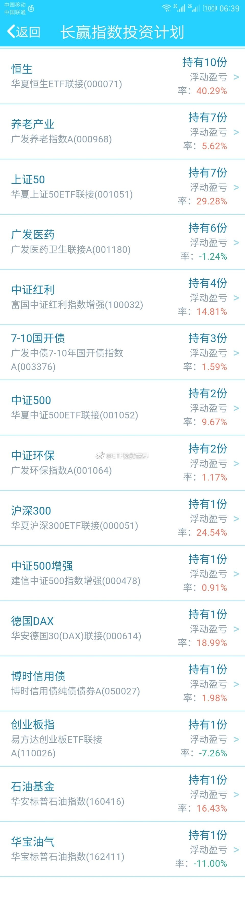

======================================================

ETF拯救世界 (5687069307) @
2017-07-25 14:02:39 Tue  
url: https://weibo.com/5687069307/Fe0RdqLTT

还有4天，又挖坑？每次都这样，怪不好意思的。 ​​​

转发[52]  评论[93]  赞[134] 

======================================================

ETF拯救世界 (5687069307) @
2017-07-25 22:24:34 Tue  
url: https://weibo.com/5687069307/Fe48WtPJM

每日打卡(39)

来点新鲜的。这个不错，有点累。 ​​​

转发[0]  评论[13]  赞[68] 

+++++++++++++++++++++++++++++++++++++++++++++++++++++

图片：
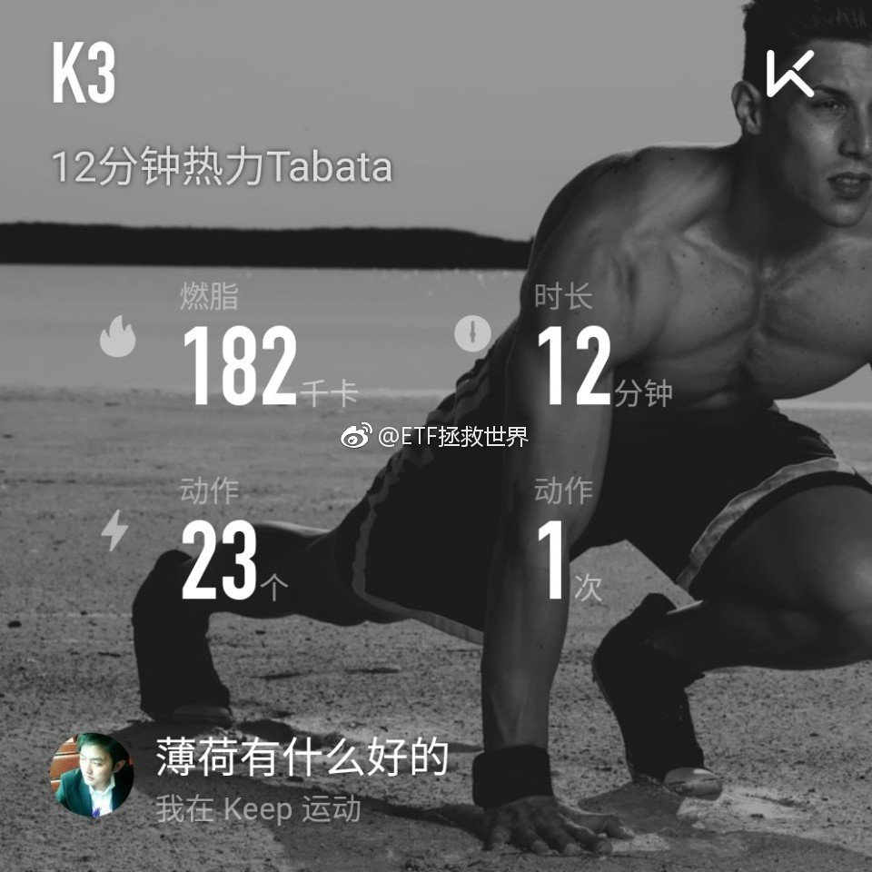

======================================================

ETF拯救世界 (5687069307) @
2017-07-26 05:46:06 Wed  
url: https://weibo.com/5687069307/Fe72acLXe

你们也来了。挺好，继续买。

------------------------------------------------------
转推：
>  @全景网 (1752549400)
>  2017-07-25 22:38:37 Tue  
>  url: https:/weibo.com/1752549400/Fe4eEeYYB/

>  【证金公司首次现身创业板十大股东】截至7月25日最新数据，证金公司出现在了两家创业板公司的十大股东之中，分别是昆仑万维和苏交科，二季度大举买入2312.53万股和962.49万股，持股占比2%和1.66%，而且证金公司成了昆仑万维的第一大流通股东。重要的是，这是证金公司史上第一次重仓买入创业板股票，并 ​​​

转发[5]  评论[45]  赞[72] 

======================================================

ETF拯救世界 (5687069307) @
2017-07-26 09:38:48 Wed  
url: https://weibo.com/5687069307/Fe8yCgL0m

$159920  可能是很多朋友第一个拿了一年多，赚了50%的品种。（有些朋友是40%）

亏损的时候坚定持有很简单，盈利的时候呢，就没那么简单了。

这一年多，一路鼓励大家坚定持有。到今天，总算有个好结果。 ​​​

转发[10]  评论[74]  赞[132] 

======================================================

ETF拯救世界 (5687069307) @
2017-07-26 09:58:09 Wed  
url: https://weibo.com/5687069307/Fe8GtgYFw

分别的日子不会太远了。

------------------------------------------------------
转推：
>  @ETF拯救世界 (5687069307)
>  2017-07-26 09:38:48 Wed  
>  url: https:/weibo.com/5687069307/Fe8yCgL0m/

>  $159920  可能是很多朋友第一个拿了一年多，赚了50%的品种。（有些朋友是40%）
>  
>  亏损的时候坚定持有很简单，盈利的时候呢，就没那么简单了。
>  
>  这一年多，一路鼓励大家坚定持有。到今天，总算有个好结果。 ​​​

转发[3]  评论[54]  赞[79] 

======================================================

ETF拯救世界 (5687069307) @
2017-07-26 11:15:34 Wed  
url: https://weibo.com/5687069307/Fe9bTp55S

谁也不能阻挡价值回归。谢谢！

------------------------------------------------------
转推：
>  @ETF拯救世界 (5687069307)
>  2017-07-25 14:02:39 Tue  
>  url: https:/weibo.com/5687069307/Fe0RdqLTT/

>  还有4天，又挖坑？每次都这样，怪不好意思的。 ​​​

转发[47]  评论[60]  赞[98] 

======================================================

ETF拯救世界 (5687069307) @
2017-07-26 13:07:39 Wed  
url: https://weibo.com/5687069307/Fe9VoaZpd

这样的天气，难道不是应该在北海划船，在奥森跑步吗。

我为什么还在看上证指数。

失败的人生！ ​​​

转发[4]  评论[38]  赞[75] 

======================================================

ETF拯救世界 (5687069307) @
2017-07-26 13:15:51 Wed  
url: https://weibo.com/5687069307/Fe9YIrlh9

回复@风萧索ma:我是按照创业板指从现在开始再下跌60%的幅度准备整个投资创业板策略的。您看这个幅度还行吗。如果还是小，我改成70%也没问题啊。//@风萧索ma:你有一个很大的问题，就是形而上学，现在抄海量ipo创业板的底，无离是送死。不能用历史去判断正在改革的A股市场。

------------------------------------------------------
转推：
>  @ETF拯救世界 (5687069307)
>  2017-07-25 14:02:39 Tue  
>  url: https:/weibo.com/5687069307/Fe0RdqLTT/

>  还有4天，又挖坑？每次都这样，怪不好意思的。 ​​​

转发[45]  评论[31]  赞[53] 

======================================================

ETF拯救世界 (5687069307) @
2017-07-26 13:30:49 Wed  
url: https://weibo.com/5687069307/Fea4NcZJo

有图为证。当然，已经跌了8%了。 ​​​

转发[5]  评论[40]  赞[67] 

+++++++++++++++++++++++++++++++++++++++++++++++++++++

图片：

======================================================

ETF拯救世界 (5687069307) @
2017-07-26 13:45:42 Wed  
url: https://weibo.com/5687069307/FeaaPzVaA

各位做投资，我的一点经验，一定要怀着一种近乎“慈善”的心态去做。

首先要找到“好人”。也就是以后一定会好的品种，不能说随便一个烂股票你也去做慈善，那不行。过两天把你的钱卷走退市了。

然后就是“行善”。什么叫行善，就是它落魄的时候去帮他。给他钱，越落魄给越多。那，因为他是好的品种， ​​​

转发[67]  评论[94]  赞[206] 

======================================================

ETF拯救世界 (5687069307) @
2017-07-26 13:50:14 Wed  
url: https://weibo.com/5687069307/FeacFDR9w

千万别发明汽车，拉黄包车的骆驼祥子失业怎么办！//@叶檀:回复@莉香猫苑美国短毛猫:白痴理论，你们不扔垃圾，他们可以养花浇水，就是素质不高的人太多，服务无法升级。照你这么说，农民感谢你吃饭，以前用厕所东西当肥料，还要感谢上厕所？//@莉香猫苑美国短毛猫:不扔垃圾他们不就失业了

------------------------------------------------------
转推：
>  @叶檀 (1233227211)
>  2017-07-26 12:51:29 Wed  
>  url: https:/weibo.com/1233227211/Fe9OPhbIF/

>  少扔垃圾，少扔垃圾，用机器扫地，用机器扫地 ​​​

转发[1]  评论[13]  赞[44] 

======================================================

ETF拯救世界 (5687069307) @
2017-07-26 14:25:41 Wed  
url: https://weibo.com/5687069307/Fear44r78

回复@wander0403:以创业板现在的情况看，应该类比的是2008年的上证3000点而非6124点。3000点开始买错不错？以后来的1600点来看（又下跌50%），错了。但如果能一路买到1600点，将成本控制在2000点左右，似乎又没错。投资的未来是混沌的。做大概率正确的事，减少预测，减少预测指导行动，方成正果。

------------------------------------------------------
转推：
>  @ETF拯救世界 (5687069307)
>  2017-07-25 14:02:39 Tue  
>  url: https:/weibo.com/5687069307/Fe0RdqLTT/

>  还有4天，又挖坑？每次都这样，怪不好意思的。 ​​​

转发[43]  评论[81]  赞[98] 

======================================================

ETF拯救世界 (5687069307) @
2017-07-26 14:35:47 Wed  
url: https://weibo.com/5687069307/FeavatqI7

跑差不多了。去哪儿了？追漂亮50去了~

------------------------------------------------------
转推：
>  @财联社APP (2868676035)
>  2017-07-26 14:32:34 Wed  
>  url: https:/weibo.com/2868676035/FeatRdMC8/

>  WIND统计数据显示，截至2016年底，公募基金共持有571只创业板个股，持仓市值总计为2610亿元。但截至2017年上半年，创业板则共计有342只个股为公募基金所持有，持仓市值仅为1057亿元。 ​​​

转发[5]  评论[23]  赞[57] 

======================================================

ETF拯救世界 (5687069307) @
2017-07-26 16:50:01 Wed  
url: https://weibo.com/5687069307/FebnEfO5d

回复@wander0403:你还是在讨论预测。这个弯你转不过来，根本就没法讨论。记住，我的原则是，不预测，只根据概率配置资产。做大概率会赢的事，同时对极端小概率事件也有准备。也就是发生任何事情都不会死，然后大概率赢。至于你说的预测涨跌，与我的思维模式不是一个层面的。

------------------------------------------------------
转推：
>  @ETF拯救世界 (5687069307)
>  2017-07-25 14:02:39 Tue  
>  url: https:/weibo.com/5687069307/Fe0RdqLTT/

>  还有4天，又挖坑？每次都这样，怪不好意思的。 ​​​

转发[22]  评论[38]  赞[54] 

======================================================

ETF拯救世界 (5687069307) @
2017-07-26 16:56:33 Wed  
url: https://weibo.com/5687069307/FebqisVTg

回复@wander0403:如果你的投资世界中，只有“满仓”和“空仓”两种选择，那么你说的没错。可惜，我的投资世界中有至少100种选择。我根据概率不同，投入不同的资金，进行资产配置。因为我知道，概率大不意味着一定赢，再小的概率也不意味着不发生。不要极端，不要过于自信，尊重市场，不要预测。

------------------------------------------------------
转推：
>  @ETF拯救世界 (5687069307)
>  2017-07-25 14:02:39 Tue  
>  url: https:/weibo.com/5687069307/Fe0RdqLTT/

>  还有4天，又挖坑？每次都这样，怪不好意思的。 ​​​

转发[9]  评论[45]  赞[61] 

======================================================

ETF拯救世界 (5687069307) @
2017-07-26 17:05:45 Wed  
url: https://weibo.com/5687069307/Febu2b5Q3

回复@wander0403:较大亏损？亲，你到底知不知道我们在干什么。我们买的十六个品种只有三个浮亏。浮亏大于2%的只有两只，这两只加起来仓位不到1.2%。亏损幅度不到0.1%。这么说，我说了半天其实是在跟一个什么都不知道的朋友扯淡呢。有点后悔。[污]

------------------------------------------------------
转推：
>  @ETF拯救世界 (5687069307)
>  2017-07-25 14:02:39 Tue  
>  url: https:/weibo.com/5687069307/Fe0RdqLTT/

>  还有4天，又挖坑？每次都这样，怪不好意思的。 ​​​

转发[2]  评论[64]  赞[70] 

======================================================

ETF拯救世界 (5687069307) @
2017-07-26 19:13:24 Wed  
url: https://weibo.com/5687069307/FecjQrWR4

回复@风声边界617:要小心，把握度。有时候直接拉黑了……//@风声边界617:知道了肿么引起e大滴注意，必须要唱反调[允悲]

------------------------------------------------------
转推：
>  @ETF拯救世界 (5687069307)
>  2017-07-25 14:02:39 Tue  
>  url: https:/weibo.com/5687069307/Fe0RdqLTT/

>  还有4天，又挖坑？每次都这样，怪不好意思的。 ​​​

转发[0]  评论[28]  赞[45] 

======================================================

ETF拯救世界 (5687069307) @
2017-07-26 21:16:44 Wed  
url: https://weibo.com/5687069307/Fed7Uio7O

每日打卡（40）

随便跑跑，很舒服。 ​​​

转发[2]  评论[66]  赞[92] 

+++++++++++++++++++++++++++++++++++++++++++++++++++++

图片：
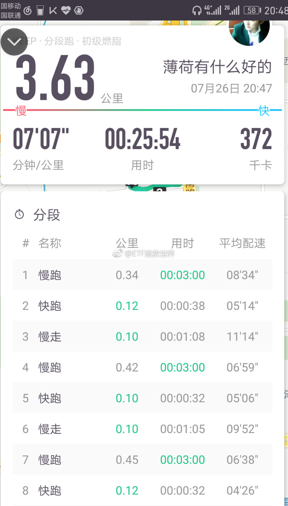
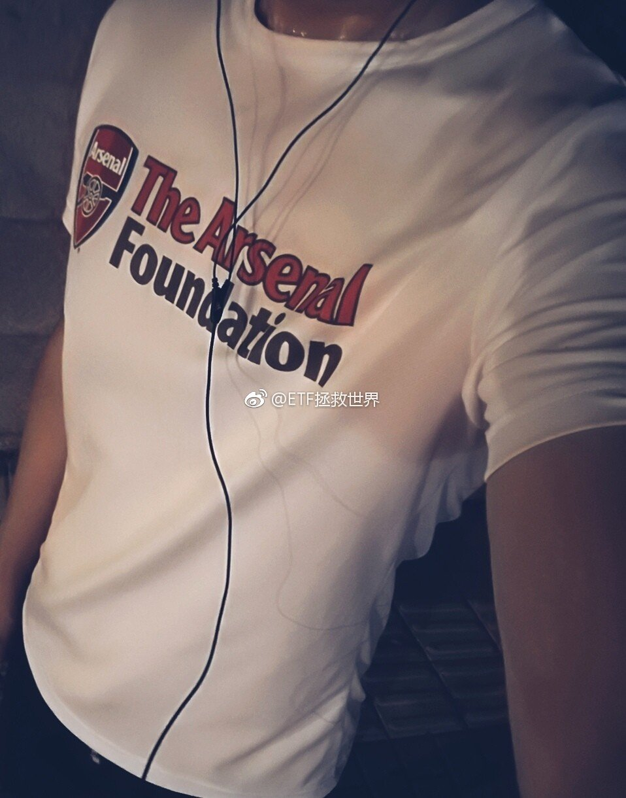

======================================================

ETF拯救世界 (5687069307) @
2017-07-26 21:37:04 Wed  
url: https://weibo.com/5687069307/Fedga6USI

儿子幼儿园要开足球课，刚上中班。四岁，是不是太小了。别踢成罗圈腿了。

游泳轮滑钢琴跆拳道也开始上课了，现在的孩子真幸福啊。 ​​​

转发[1]  评论[109]  赞[107] 

======================================================

ETF拯救世界 (5687069307) @
2017-07-27 09:32:43 Thu  
url: https://weibo.com/5687069307/FehWE6mnO

2015年，你越买越涨，随便买随便涨，怎么买都涨。结果……

2017年，买了不涨，有的还在跌。越跌越买，跌越多买越多，结果会是？

未来和时间会给我们答案。 ​​​

转发[23]  评论[28]  赞[98] 

======================================================

ETF拯救世界 (5687069307) @
2017-07-27 09:38:41 Thu  
url: https://weibo.com/5687069307/FehZ49skk

回复@wenxinyutao:下轮牛市不会是所有股票都涨。可以参考最近半年的50和300。所以，很多炒股的人，下一轮牛市基本上吃不到什么，“赚了股票不赚钱”。指数投资就不同。//@wenxinyutao:以目前A股的扩容速度，即便来大牛市，会不会也是涨幅有限呢

------------------------------------------------------
转推：
>  @ETF拯救世界 (5687069307)
>  2017-07-27 09:32:43 Thu  
>  url: https:/weibo.com/5687069307/FehWE6mnO/

>  2015年，你越买越涨，随便买随便涨，怎么买都涨。结果……
>  
>  2017年，买了不涨，有的还在跌。越跌越买，跌越多买越多，结果会是？
>  
>  未来和时间会给我们答案。 ​​​

转发[11]  评论[18]  赞[58] 

======================================================

ETF拯救世界 (5687069307) @
2017-07-27 10:03:43 Thu  
url: https://weibo.com/5687069307/Fei9ecdGs

回复@小动物爱好者:以现在的情况看不会超过5份。当然，如果这几天坑挖的深了就不好说了。//@小动物爱好者:啥时候发车？大概几份

------------------------------------------------------
转推：
>  @ETF拯救世界 (5687069307)
>  2017-07-27 09:32:43 Thu  
>  url: https:/weibo.com/5687069307/FehWE6mnO/

>  2015年，你越买越涨，随便买随便涨，怎么买都涨。结果……
>  
>  2017年，买了不涨，有的还在跌。越跌越买，跌越多买越多，结果会是？
>  
>  未来和时间会给我们答案。 ​​​

转发[0]  评论[21]  赞[52] 

======================================================

ETF拯救世界 (5687069307) @
2017-07-27 10:15:24 Thu  
url: https://weibo.com/5687069307/FeidYaBLk

$恒生指数 hkHSI$   已经接近第一个再平衡阈值。 ​​​

转发[4]  评论[33]  赞[49] 

======================================================

ETF拯救世界 (5687069307) @
2017-07-27 10:37:38 Thu  
url: https://weibo.com/5687069307/FeimZzBR2

$ 159915 为什么要这样。 ​​​

转发[1]  评论[49]  赞[53] 

======================================================

ETF拯救世界 (5687069307) @
2017-07-27 10:47:57 Thu  
url: https://weibo.com/5687069307/FeirbiXpj

创业板贵么。创业板大多数股票都贵，但$创业板指 sz399006$ 未必。

即使不跌，明年此时估值也就30多倍。30多倍的创业板指买一点怕什么？

140倍的时候不说贵，30多倍说贵？

公募都跑了，GJD开始买了，个人投资者，又没有排名压力，不买便宜货难道去接盘机构炒起来的大白马吗。呵呵哒。

还差几天就要 ​​​

转发[22]  评论[83]  赞[98] 

======================================================

ETF拯救世界 (5687069307) @
2017-07-27 11:03:46 Thu  
url: https://weibo.com/5687069307/FeixBjBBD

市场走势，尤其是中短期走势真的无法预测。我们要做的就是停止预测，根据概率下注。

就这么简单。

概率！！！ ​​​

转发[38]  评论[65]  赞[148] 

======================================================

ETF拯救世界 (5687069307) @
2017-07-27 13:30:44 Thu  
url: https://weibo.com/5687069307/Fejvg0FnC

今天计划又要新高了。我们慢慢的买了那么多不涨的东西，还在不停的创新高。

至于说有些东西买得到买不到，得之我幸，不得我命。不必强求。得到了未必好，得不到也不一定是坏事。 ​​​

转发[7]  评论[37]  赞[121] 

======================================================

ETF拯救世界 (5687069307) @
2017-07-27 13:42:35 Thu  
url: https://weibo.com/5687069307/FejA4oXAl

回复@双树下的和尚1:证金不买真正的聪明资金也会开始关注创业板。A股有20%聪明资金，其中10%因为各种情况变傻了，比如绝大部分公募。其它的聪明资金不停的在市场上寻找机会，哪里低就流向哪里。等大多数人反应过来，别人已经布局完毕。

------------------------------------------------------
转推：
>  @ETF拯救世界 (5687069307)
>  2017-07-27 11:03:46 Thu  
>  url: https:/weibo.com/5687069307/FeixBjBBD/

>  市场走势，尤其是中短期走势真的无法预测。我们要做的就是停止预测，根据概率下注。
>  
>  就这么简单。
>  
>  概率！！！ ​​​

转发[15]  评论[24]  赞[66] 

======================================================

ETF拯救世界 (5687069307) @
2017-07-27 14:07:22 Thu  
url: https://weibo.com/5687069307/FejK7BOEw

回复@Carreylovebook:怎么讲，拍的很舒服……//@Carreylovebook:回复@且慢管家:大家都急不可耐了哈，但感觉E大仍是  闲坐小窗读周易，不知春去几多时，发车时有种优雅与豪情并存的睿智[赞]

------------------------------------------------------
转推：
>  @ETF拯救世界 (5687069307)
>  2017-07-27 11:03:46 Thu  
>  url: https:/weibo.com/5687069307/FeixBjBBD/

>  市场走势，尤其是中短期走势真的无法预测。我们要做的就是停止预测，根据概率下注。
>  
>  就这么简单。
>  
>  概率！！！ ​​​

转发[2]  评论[55]  赞[91] 

======================================================

ETF拯救世界 (5687069307) @
2017-07-27 21:56:25 Thu  
url: https://weibo.com/5687069307/FemOvDW4x

每日打卡(41)

今天没什么特别的。随便练练腹肌，哄儿子睡觉，再去看会书。相当平凡的一天啊。 ​​​

转发[2]  评论[47]  赞[76] 

+++++++++++++++++++++++++++++++++++++++++++++++++++++

图片：

======================================================

ETF拯救世界 (5687069307) @
2017-07-27 22:20:38 Thu  
url: https://weibo.com/5687069307/FemYlgLVo

回复@注册只为看E大:恭喜！！！//@注册只为看E大:今天对我很特别，当爹啦，小名多米，求祝福[噢耶][噢耶]

------------------------------------------------------
转推：
>  @ETF拯救世界 (5687069307)
>  2017-07-27 21:56:25 Thu  
>  url: https:/weibo.com/5687069307/FemOvDW4x/

>  每日打卡(41)
>  
>  今天没什么特别的。随便练练腹肌，哄儿子睡觉，再去看会书。相当平凡的一天啊。 ​​​

转发[1]  评论[21]  赞[64] 

======================================================

ETF拯救世界 (5687069307) @
2017-07-28 06:17:30 Fri  
url: https://weibo.com/5687069307/Feq5U37pf

请神容易送神难，不走了，一起嗨

------------------------------------------------------
转推：
>  @财联社APP (2868676035)
>  2017-07-28 04:17:20 Fri  
>  url: https:/weibo.com/2868676035/Fepj829ro/

>  【国家队现身24只个股 华策影视等3只个股获增持】财联社28日讯，截至昨日，共有64家公司披露2017年中报，其中23家公司前十大流通股股东中出现证金公司或汇金公司等国家队的身影。另外，出版传媒股权变动公告也显示，截至二季度末，汇金公司持有该股993.42万股，为其第二大流通股股东。上述首批24只国家 ​​​

转发[9]  评论[32]  赞[54] 

======================================================

ETF拯救世界 (5687069307) @
2017-07-28 09:32:56 Fri  
url: https://weibo.com/5687069307/FernebAhT

回复@xndp:其实我希望都是绿的。各位也应该有这个觉悟才是。//@xndp:爽啊，跟车的8份全线翻红。益达威武霸气//@ETF拯救世界:请神容易送神难，不走了，一起嗨

------------------------------------------------------
转推：
>  @财联社APP (2868676035)
>  2017-07-28 04:17:20 Fri  
>  url: https:/weibo.com/2868676035/Fepj829ro/

>  【国家队现身24只个股 华策影视等3只个股获增持】财联社28日讯，截至昨日，共有64家公司披露2017年中报，其中23家公司前十大流通股股东中出现证金公司或汇金公司等国家队的身影。另外，出版传媒股权变动公告也显示，截至二季度末，汇金公司持有该股993.42万股，为其第二大流通股股东。上述首批24只国家 ​​​

转发[4]  评论[24]  赞[48] 

======================================================

ETF拯救世界 (5687069307) @
2017-07-28 09:46:49 Fri  
url: https://weibo.com/5687069307/FersRtmlV

回复@随记心情:黑什么呢。涨了不好吗，你手里有啊。赚钱了还不高兴。少？现在创业板还能跌多少我不知道，但是目前开始再来个大牛市的概率并不高，总有机会买。心态调整好，每天都是好日子。昨天市值又新高，多好啊。//@随记心情:昨天看到创业板涨那么多，脸黑了一天[坏笑][坏笑][坏笑]

------------------------------------------------------
转推：
>  @财联社APP (2868676035)
>  2017-07-28 04:17:20 Fri  
>  url: https:/weibo.com/2868676035/Fepj829ro/

>  【国家队现身24只个股 华策影视等3只个股获增持】财联社28日讯，截至昨日，共有64家公司披露2017年中报，其中23家公司前十大流通股股东中出现证金公司或汇金公司等国家队的身影。另外，出版传媒股权变动公告也显示，截至二季度末，汇金公司持有该股993.42万股，为其第二大流通股股东。上述首批24只国家 ​​​

转发[3]  评论[39]  赞[56] 

======================================================

ETF拯救世界 (5687069307) @
2017-07-28 16:01:28 Fri  
url: https://weibo.com/5687069307/FetUW5U9k

GJD全面买入创业板的节奏。这是要干嘛。就不能让我们踏踏实实的捡点东西吗。

------------------------------------------------------
转推：
>  @巨潮资讯网 (2239792910)
>  2017-07-28 15:59:46 Fri  
>  url: https:/weibo.com/2239792910/FetUfexEl/

>  【东方财富：中报业绩同比降逾两成 汇金增持1125万股】东方财富发布2017年半年度报告，营业总收入10.94亿元，同比减少6.17%；归属于上市公司股东的净利润2.60亿元，同比减少22.77%；基本每股收益0.0609元。截止6月底，公司股东户数由一季度末的187739户，增加至207,289户，汇金公司在第二季度增持了112 ​​​

转发[3]  评论[19]  赞[40] 

======================================================

ETF拯救世界 (5687069307) @
2017-07-28 16:02:13 Fri  
url: https://weibo.com/5687069307/FetVeEWmu

内什么，周日，微信，不见不散。 ​​​​

转发[4]  评论[101]  赞[146] 

======================================================

ETF拯救世界 (5687069307) @
2017-07-28 16:10:38 Fri  
url: https://weibo.com/5687069307/FetYEzaVy

回复@如梦惊鸿:当然是原谅他啦。（你敢不原谅GJD？）//@如梦惊鸿:有人来抢地盘，老大咋办？//@ETF拯救世界:GJD全面买入创业板的节奏。这是要干嘛。就不能让我们踏踏实实的捡点东西吗。

------------------------------------------------------
转推：
>  @巨潮资讯网 (2239792910)
>  2017-07-28 15:59:46 Fri  
>  url: https:/weibo.com/2239792910/FetUfexEl/

>  【东方财富：中报业绩同比降逾两成 汇金增持1125万股】东方财富发布2017年半年度报告，营业总收入10.94亿元，同比减少6.17%；归属于上市公司股东的净利润2.60亿元，同比减少22.77%；基本每股收益0.0609元。截止6月底，公司股东户数由一季度末的187739户，增加至207,289户，汇金公司在第二季度增持了112 ​​​

转发[1]  评论[23]  赞[38] 

======================================================

ETF拯救世界 (5687069307) @
2017-07-28 18:07:09 Fri  
url: https://weibo.com/5687069307/FeuJX3CA0

回复@石头里的虫子:心疼心疼我。累一周了，让我周末晚上休息休息。//@石头里的虫子:吊人胃口啊，今晚见不好啊。

------------------------------------------------------
转推：
>  @ETF拯救世界 (5687069307)
>  2017-07-28 16:02:13 Fri  
>  url: https:/weibo.com/5687069307/FetVeEWmu/

>  内什么，周日，微信，不见不散。 ​​​​

转发[1]  评论[62]  赞[87] 

======================================================

ETF拯救世界 (5687069307) @
2017-07-28 21:17:10 Fri  
url: https://weibo.com/5687069307/FevZ50iNi

每日打卡(42)

坚持。 ​​​

转发[0]  评论[19]  赞[93] 

+++++++++++++++++++++++++++++++++++++++++++++++++++++

图片：

======================================================

ETF拯救世界 (5687069307) @
2017-07-29 21:27:37 Sat  
url: https://weibo.com/5687069307/FeFtP7HWy

现在福建人日签美签自由行已经很难了。看来，以后……

------------------------------------------------------
转推：
>  @澎湃新闻 (5044281310)
>  2017-07-29 21:14:03 Sat  
>  url: https:/weibo.com/5044281310/FeFojeb2m/

>  【在日失联福建女教师留给父母亲笔信：感谢养育，要开始新生活】据《中国日报》7月29日援引日本《北海道新闻》报道称，在北海道失联的福建小学教师危秋洁的父亲危华先，已于28日晚飞抵北海道，在当地警方陪同下，到危秋洁曾经在札幌中央区住过的旅馆，发现了一封她留给家人的道别信。危秋洁的朋友对澎 ​​​ http://mapi/005vnhZYgy1fi12d7mgw1j30go07yn40

转发[1]  评论[37]  赞[29] 

======================================================

ETF拯救世界 (5687069307) @
2017-07-30 22:03:48 Sun  
url: https://weibo.com/5687069307/FeP904l3X

每日打卡(43)

昨天晚上没时间，今天补上，两组 ​​​

转发[0]  评论[10]  赞[58] 

+++++++++++++++++++++++++++++++++++++++++++++++++++++

图片：

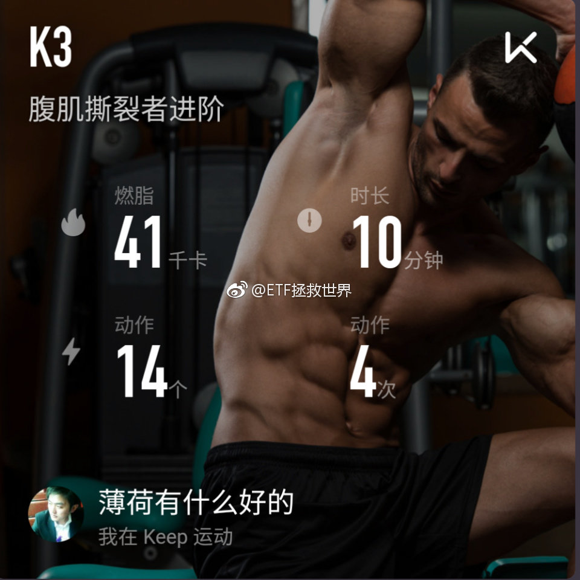

======================================================

ETF拯救世界 (5687069307) @
2017-07-30 22:06:15 Sun  
url: https://weibo.com/5687069307/FeP9Zvhq8

回复@圣善周闻宗:我都没研究，真不少。//@圣善周闻宗:影响很大的啊，E大的发车。研究了一下养老的二季报规模的变化，大致判断每份跟车金额约为3-4KW的样子。这第三轮计划估计最终能撬动上百亿的资金吧……//@ETF拯救世界:回复@石头里的虫子:心疼心疼我。累一周了，让我周末晚上休息休息。

------------------------------------------------------
转推：
>  @ETF拯救世界 (5687069307)
>  2017-07-28 16:02:13 Fri  
>  url: https:/weibo.com/5687069307/FetVeEWmu/

>  内什么，周日，微信，不见不散。 ​​​​

转发[0]  评论[51]  赞[62] 

======================================================

ETF拯救世界 (5687069307) @
2017-07-31 09:48:06 Mon  
url: https://weibo.com/5687069307/FeTKSh9AG

今天最完美的是恒生大涨，医药创业暴跌。

GJD的兄弟们帮帮忙撒。 ​​​

转发[20]  评论[75]  赞[102] 

======================================================

ETF拯救世界 (5687069307) @
2017-07-31 11:03:20 Mon  
url: https://weibo.com/5687069307/FeUfpuqFQ

危机不危机的，不好说。不过可以肯定的是，以美股为代表的一大部分资产，以现价买入，未来十年的收益率会特别差。

------------------------------------------------------
转推：
>  @ ()
>  2017-07-31 11:00:04 Mon  
>  url: 

>  抱歉，作者已设置仅展示半年内微博，此微博已不可见。 ​​​

转发[5]  评论[15]  赞[54] 

======================================================

ETF拯救世界 (5687069307) @
2017-07-31 11:21:55 Mon  
url: https://weibo.com/5687069307/FeUmXeP4S

一口毒奶再次精准的喝在了最低点。[doge]

------------------------------------------------------
转推：
>  @ETF拯救世界 (5687069307)
>  2017-07-31 09:48:06 Mon  
>  url: https:/weibo.com/5687069307/FeTKSh9AG/

>  今天最完美的是恒生大涨，医药创业暴跌。
>  
>  GJD的兄弟们帮帮忙撒。 ​​​

转发[4]  评论[46]  赞[68] 

======================================================

ETF拯救世界 (5687069307) @
2017-07-31 12:00:11 Mon  
url: https://weibo.com/5687069307/FeUCuhHUg

现在养老+医药的仓位大概超过9%了。这个仓位特别舒服，真的，每次看到这两个就感觉舒服。

谁能体会我的feel。 ​​​

转发[14]  评论[50]  赞[126] 

======================================================

ETF拯救世界 (5687069307) @
2017-07-31 12:04:55 Mon  
url: https://weibo.com/5687069307/FeUEpj9nA

养老最新成分股，喜欢。

中信国安 综合
海虹控股 医药生物
上海医药 医药生物
贵州百灵 医药生物
吉林敖东 医药生物
同仁堂 医药生物
贝达药业 医药生物
华兰生物 医药生物
上海莱士 医药生物
九州通 医药生物
东阿阿胶 医药生物
通化东宝 医药生物
信立泰 医药生物
必康股份 医药生物
步长制药 医药 ​​​

转发[43]  评论[40]  赞[111] 

======================================================

ETF拯救世界 (5687069307) @
2017-07-31 14:24:19 Mon  
url: https://weibo.com/5687069307/FeVyZqpBD

恒生指数第二大成分股。

------------------------------------------------------
转推：
>  @ ()
>  2017-07-31 14:05:51 Mon  
>  url: 

>  抱歉，作者已设置仅展示半年内微博，此微博已不可见。 ​​​

转发[3]  评论[14]  赞[46] 

======================================================

ETF拯救世界 (5687069307) @
2017-07-31 14:50:30 Mon  
url: https://weibo.com/5687069307/FeVJCoPEw

$510500  最吼的。

比较可惜的是，17号那天中午发车，当天估值数据拿不到，考虑了半天没有加500。

还是希望有机会多买点。目前只有3份。 ​​​

转发[23]  评论[48]  赞[81] 

======================================================

ETF拯救世界 (5687069307) @
2017-07-31 15:01:43 Mon  
url: https://weibo.com/5687069307/FeVOazGE5

今天算不错。恒生大涨，创业没动，医药小涨。  恒生指数我能理解的最高点位大致在29500-30000点之间。超过30000点基本就是不理解区域了。  我不理解当然不代表不会继续涨。不过可以肯定的是，超过30000要再平衡一次。然后剩下的就不会再动了。

------------------------------------------------------
转推：
>  @ETF拯救世界 (5687069307)
>  2017-07-31 09:48:06 Mon  
>  url: https:/weibo.com/5687069307/FeTKSh9AG/

>  今天最完美的是恒生大涨，医药创业暴跌。
>  
>  GJD的兄弟们帮帮忙撒。 ​​​

转发[9]  评论[26]  赞[85] 

======================================================

ETF拯救世界 (5687069307) @
2017-07-31 16:59:16 Mon  
url: https://weibo.com/5687069307/FeWzT0A2M

回复@匿称5:如果一两万本金的话，我建议不要把主要精力放在投资上，尽快提升职业技能，多赚点本金再把一部分精力放到投资上。切切。//@匿称5:回复@宏伟9888:是这么回事吗？为何除以150，如果一两万本金那一份岂不是太少

------------------------------------------------------
转推：
>  @ETF拯救世界 (5687069307)
>  2017-07-31 14:50:30 Mon  
>  url: https:/weibo.com/5687069307/FeVJCoPEw/

>  $510500  最吼的。
>  
>  比较可惜的是，17号那天中午发车，当天估值数据拿不到，考虑了半天没有加500。
>  
>  还是希望有机会多买点。目前只有3份。 ​​​

转发[18]  评论[29]  赞[55] 

======================================================

ETF拯救世界 (5687069307) @
2017-07-31 17:13:04 Mon  
url: https://weibo.com/5687069307/FeWFuwTpV

回复@从容淡定2003:图片评论 某人上午发给我的。当然，这种应该不是大多数…… http://t.cn/R9V7LHp //@从容淡定2003:很好奇，大家一份有多少钱呢?//@ETF拯救世界:回复@匿称5:如果一两万本金的话，我建议不要把主要精力放在投资上，尽快提升职业技能，多赚点本金再把一部分精力放到投资上。切切。

------------------------------------------------------
转推：
>  @ETF拯救世界 (5687069307)
>  2017-07-31 14:50:30 Mon  
>  url: https:/weibo.com/5687069307/FeVJCoPEw/

>  $510500  最吼的。
>  
>  比较可惜的是，17号那天中午发车，当天估值数据拿不到，考虑了半天没有加500。
>  
>  还是希望有机会多买点。目前只有3份。 ​​​

转发[8]  评论[129]  赞[68] 

======================================================

ETF拯救世界 (5687069307) @
2017-07-31 21:55:22 Mon  
url: https://weibo.com/5687069307/FeYw4pTjX

每日打卡(44)

难度不小。坚持。累。 ​​​

转发[0]  评论[20]  赞[87] 

+++++++++++++++++++++++++++++++++++++++++++++++++++++

图片：

======================================================

ETF拯救世界 (5687069307) @
2017-08-01 09:38:10 Tue  
url: https://weibo.com/5687069307/Ff37l833n

每天新高并不新鲜。问题是我们买了一堆接近几年新低，或者是根本没涨的东西，同时还在每天新高，这就有意思了。 ​​​

转发[11]  评论[86]  赞[118] 

======================================================

ETF拯救世界 (5687069307) @
2017-08-01 10:24:14 Tue  
url: https://weibo.com/5687069307/Ff3q2DThf

回复@益盟1898:我从2010年开始在博客公开我的投资计划，7年后，也就是这几个月推荐朋友可以关注且慢，这样补仓什么的会比较方便。我是想请问你一句，我骗你什么了？你注册了好几个微博号不停的发这个，想说明什么？来，说出你的想法。你说的有道理的话，我会立即停止公布计划，自己玩。好吗？

------------------------------------------------------
转推：
>  @ETF拯救世界 (5687069307)
>  2017-08-01 09:38:10 Tue  
>  url: https:/weibo.com/5687069307/Ff37l833n/

>  每天新高并不新鲜。问题是我们买了一堆接近几年新低，或者是根本没涨的东西，同时还在每天新高，这就有意思了。 ​​​

转发[7]  评论[50]  赞[38] 

======================================================

ETF拯救世界 (5687069307) @
2017-08-01 10:28:51 Tue  
url: https://weibo.com/5687069307/Ff3rUsJDA

回复@北溟有鱼-1997:已经拉黑了。注册了新号继续来刷。没办法。我这个人最怕烦，雪球烦我就躲到微博，微博烦我就不再刷微博。什么时候微信烦我就关微信号。不知道这样的话，这位朋友是不是可以满意？//@北溟有鱼-1997:E大，直接拉黑之，这种鸟人，不搭理

------------------------------------------------------
转推：
>  @ETF拯救世界 (5687069307)
>  2017-08-01 09:38:10 Tue  
>  url: https:/weibo.com/5687069307/Ff37l833n/

>  每天新高并不新鲜。问题是我们买了一堆接近几年新低，或者是根本没涨的东西，同时还在每天新高，这就有意思了。 ​​​

转发[0]  评论[33]  赞[42] 

======================================================

ETF拯救世界 (5687069307) @
2017-08-01 10:37:21 Tue  
url: https://weibo.com/5687069307/Ff3vmFKHl

回复@白宇:我刚搜了益盟。原来是卖炒股软件的。这就明白了。我不评论了。//@白宇:益盟的名字啊，故意来热度的，E大你回复他就上当了啊

------------------------------------------------------
转推：
>  @ETF拯救世界 (5687069307)
>  2017-08-01 09:38:10 Tue  
>  url: https:/weibo.com/5687069307/Ff37l833n/

>  每天新高并不新鲜。问题是我们买了一堆接近几年新低，或者是根本没涨的东西，同时还在每天新高，这就有意思了。 ​​​

转发[4]  评论[17]  赞[36] 

======================================================

ETF拯救世界 (5687069307) @
2017-08-01 10:48:43 Tue  
url: https://weibo.com/5687069307/Ff3zYpHaS

回复@zq2204686:成功了？我估计这里99%的朋友这辈子也不会用它们的任何东西了吧。//@zq2204686:他成功了，我今天知道有益盟这个东西了//@ETF拯救世界:回复@白宇:我刚搜了益盟。原来是卖炒股软件的。这就明白了。我不评论了。//@白宇:益盟的名字啊，故意来热度的，E大你回复他就上当了啊

------------------------------------------------------
转推：
>  @ETF拯救世界 (5687069307)
>  2017-08-01 09:38:10 Tue  
>  url: https:/weibo.com/5687069307/Ff37l833n/

>  每天新高并不新鲜。问题是我们买了一堆接近几年新低，或者是根本没涨的东西，同时还在每天新高，这就有意思了。 ​​​

转发[3]  评论[57]  赞[53] 

======================================================

ETF拯救世界 (5687069307) @
2017-08-01 11:07:12 Tue  
url: https://weibo.com/5687069307/Ff3HtvY0z

没事了没事了，知道是专业喷子就ok了，呐，做人呢，开心最重要。要不要我煮碗面给你吃？

打开账户看看，又新高了。多开心！ ​​​

转发[2]  评论[32]  赞[113] 

======================================================

ETF拯救世界 (5687069307) @
2017-08-01 11:10:36 Tue  
url: https://weibo.com/5687069307/Ff3IQAq78

回复@龙飞1807576:我就不喜欢吵架啊。怎么办。回去就得吵。你不跟别人吵，别人也要找你吵。烦死我了。

------------------------------------------------------
转推：
>  @ETF拯救世界 (5687069307)
>  2017-08-01 09:38:10 Tue  
>  url: https:/weibo.com/5687069307/Ff37l833n/

>  每天新高并不新鲜。问题是我们买了一堆接近几年新低，或者是根本没涨的东西，同时还在每天新高，这就有意思了。 ​​​

转发[1]  评论[27]  赞[49] 

======================================================

ETF拯救世界 (5687069307) @
2017-08-01 11:12:35 Tue  
url: https://weibo.com/5687069307/Ff3JFcEkS

最近恒生ETF涨幅还是小了。主要是人民币汇率问题，否则已经突破2015年那疯狂溢价的几天了。

恒生是个好东西。真的。以后有机会还得买。 ​​​

转发[4]  评论[54]  赞[109] 

======================================================

ETF拯救世界 (5687069307) @
2017-08-01 13:30:47 Tue  
url: https://weibo.com/5687069307/Ff4DL8cvM

也就是说，0.1%的人群占据了30%的财富？

------------------------------------------------------
转推：
>  @网易财经 (1974561081)
>  2017-08-01 13:21:03 Tue  
>  url: https:/weibo.com/1974561081/Ff4zO9H6f/

>  #网易新闻# 【中国高净值人士11年翻3番 高净值人群有多少人？】近日，招商银行私人银行团队联手贝恩公司发布《2017中国私人财富报告》，报告显示2016年中国高净值人士有158万人，而在2006年这一数据仅为18万人，11年间中国高净值人群规模翻了三番还多。其中，可投资资产超过一亿元的超高净值人群规模约 ​​​

转发[2]  评论[48]  赞[32] 

======================================================

ETF拯救世界 (5687069307) @
2017-08-01 14:20:42 Tue  
url: https://weibo.com/5687069307/Ff4Y1hvbv

总看到有人说，满仓了满仓了，赚多少多少。其实呢，他没说的是股票账户之外还有多少钱。

想起前一段方丈每天买10万人民币沪深300，很多人感觉砸锅卖铁抄底。然后前几天说要弄个私募，自己投1000万美元。也就是说，人家至少还有1000万美元现金的。

刚看了那个财富报告，高净值富人现在大概有15%的可投 ​​​

转发[31]  评论[91]  赞[195] 

======================================================

ETF拯救世界 (5687069307) @
2017-08-01 14:57:50 Tue  
url: https://weibo.com/5687069307/Ff5d5BZpg

回复@刘泽瑜31881:A股最多7-8了。还要分仓位给其它资产啊。其他资产可不一定比A股差。看看美股，看看港股。//@刘泽瑜31881:e大哥您觉得咱们这次计划最理想仓位是多少？八成？

------------------------------------------------------
转推：
>  @ETF拯救世界 (5687069307)
>  2017-08-01 14:20:42 Tue  
>  url: https:/weibo.com/5687069307/Ff4Y1hvbv/

>  总看到有人说，满仓了满仓了，赚多少多少。其实呢，他没说的是股票账户之外还有多少钱。
>  
>  想起前一段方丈每天买10万人民币沪深300，很多人感觉砸锅卖铁抄底。然后前几天说要弄个私募，自己投1000万美元。也就是说，人家至少还有1000万美元现金的。
>  
>  刚看了那个财富报告，高净值富人现在大概有15%的可投 ​​​

转发[6]  评论[32]  赞[65] 

======================================================

ETF拯救世界 (5687069307) @
2017-08-01 21:18:05 Tue  
url: https://weibo.com/5687069307/Ff7Hr6XVS

回复@Nbacxk:一声叹息。//@Nbacxk:蛋卷也在抄e的作业了//@ETF拯救世界:回复@刘泽瑜31881:A股最多7-8了。还要分仓位给其它资产啊。其他资产可不一定比A股差。看看美股，看看港股。//@刘泽瑜31881:e大哥您觉得咱们这次计划最理想仓位是多少？八成？

------------------------------------------------------
转推：
>  @ETF拯救世界 (5687069307)
>  2017-08-01 14:20:42 Tue  
>  url: https:/weibo.com/5687069307/Ff4Y1hvbv/

>  总看到有人说，满仓了满仓了，赚多少多少。其实呢，他没说的是股票账户之外还有多少钱。
>  
>  想起前一段方丈每天买10万人民币沪深300，很多人感觉砸锅卖铁抄底。然后前几天说要弄个私募，自己投1000万美元。也就是说，人家至少还有1000万美元现金的。
>  
>  刚看了那个财富报告，高净值富人现在大概有15%的可投 ​​​

转发[2]  评论[20]  赞[36] 

======================================================

ETF拯救世界 (5687069307) @
2017-08-01 21:22:07 Tue  
url: https://weibo.com/5687069307/Ff7J4rr4D

每日打卡(45)

今天情绪不高。再来个激烈的出出汗。

最近在研究马斯洛需求。自我实现是什么意思。好像感觉自己没追求了。 ​​​

转发[1]  评论[64]  赞[85] 

+++++++++++++++++++++++++++++++++++++++++++++++++++++

图片：

======================================================

ETF拯救世界 (5687069307) @
2017-08-02 09:06:50 Wed  
url: https://weibo.com/5687069307/Ffcl7zHhm

世界上真的很少有C罗这么拼的球员。真的很拼。从小拼到现在。楷模。//@屈宏斌:C 罗都这么拼，中国球员们还不赶紧苦练?

------------------------------------------------------
转推：
>  @C罗吧官方微博 (2014164950)
>  2017-08-01 18:35:45 Tue  
>  url: https:/weibo.com/2014164950/Ff6DxDC5s/

>  #C罗# 更新：Hard work and dedication. 🏃💦🇵🇹 ​​​

转发[4]  评论[19]  赞[53] 

======================================================

ETF拯救世界 (5687069307) @
2017-08-02 09:23:34 Wed  
url: https://weibo.com/5687069307/FfcrUmvD0

已投入部分年化收益率超过19%。

交易过的17个品种浮亏3个，一个浮亏0.5 一个4% 一个8%

第一轮股灾开始，最大回撤0.7%。

控制风险，一路稳进，必成大业。 ​​​

转发[30]  评论[62]  赞[132] 

+++++++++++++++++++++++++++++++++++++++++++++++++++++

图片：

======================================================

ETF拯救世界 (5687069307) @
2017-08-02 09:52:14 Wed  
url: https://weibo.com/5687069307/FfcDxFvyt

技术不难实现，我家扫地机器人就能自己找电源充电。。问题是，这个充电线造型太酷了，好像在看科幻电影啊。

------------------------------------------------------
转推：
>  @蓝鲸TMT网 (3866012793)
>  2017-08-02 09:44:59 Wed  
>  url: https:/weibo.com/3866012793/FfcAB1BM5/

>  【特斯拉的无人充电新技术】Model S充电器，可自动寻找充电孔充电，完全无人化....看看，未来加油、充电的岗位都可能要失业了http://t.cn/RKF20vn ​​​

转发[11]  评论[27]  赞[32] 

======================================================

ETF拯救世界 (5687069307) @
2017-08-02 09:57:53 Wed  
url: https://weibo.com/5687069307/FfcFPtp4r

回复@我是一个圆豆包:他们的估值应该是直接wind拿的吧，和我计算的差异很大。大致看看应该问题不大。//@我是一个圆豆包:E大～对且慢推出的每日估值怎么看呀～可以作为计划外投资的参考吗[哈哈]

------------------------------------------------------
转推：
>  @蓝鲸TMT网 (3866012793)
>  2017-08-02 09:44:59 Wed  
>  url: https:/weibo.com/3866012793/FfcAB1BM5/

>  【特斯拉的无人充电新技术】Model S充电器，可自动寻找充电孔充电，完全无人化....看看，未来加油、充电的岗位都可能要失业了http://t.cn/RKF20vn ​​​

转发[4]  评论[12]  赞[20] 

======================================================

ETF拯救世界 (5687069307) @
2017-08-02 09:59:35 Wed  
url: https://weibo.com/5687069307/FfcGwCgUQ

回复@victoryhf:嗯。观察记录你自己的心态。到了最慌乱要挤着上车的时候，基本就到时间了。//@victoryhf:这两天，涨的发慌[允悲][允悲][允悲][允悲]

------------------------------------------------------
转推：
>  @ETF拯救世界 (5687069307)
>  2017-08-02 09:23:34 Wed  
>  url: https:/weibo.com/5687069307/FfcrUmvD0/

>  已投入部分年化收益率超过19%。
>  
>  交易过的17个品种浮亏3个，一个浮亏0.5 一个4% 一个8%
>  
>  第一轮股灾开始，最大回撤0.7%。
>  
>  控制风险，一路稳进，必成大业。 ​​​

转发[3]  评论[19]  赞[44] 

======================================================

ETF拯救世界 (5687069307) @
2017-08-02 10:19:15 Wed  
url: https://weibo.com/5687069307/FfcOvBqQV

这次网格谁做了？2轮了，大肉啊。

------------------------------------------------------
转推：
>  @ETF拯救世界 (5687069307)
>  2017-04-07 10:09:34 Fri  
>  url: https:/weibo.com/5687069307/EDncO76hf/

>  3000（或者3100）到3300之间用ETF做网格应该是很靠谱的。
>  
>  GJD信誉保证。跟着GJD有肉吃。 ​​​

转发[11]  评论[24]  赞[73] 

======================================================

ETF拯救世界 (5687069307) @
2017-08-02 10:20:58 Wed  
url: https://weibo.com/5687069307/FfcPd1LQp

发帖后的5.11最低点是3016，今天最高是3300。GJD操盘技术可以说相当精准了。关键是，咱们提前预判到了……//@ETF拯救世界:这次网格谁做了？2轮了，大肉啊。

------------------------------------------------------
转推：
>  @ETF拯救世界 (5687069307)
>  2017-04-07 10:09:34 Fri  
>  url: https:/weibo.com/5687069307/EDncO76hf/

>  3000（或者3100）到3300之间用ETF做网格应该是很靠谱的。
>  
>  GJD信誉保证。跟着GJD有肉吃。 ​​​

转发[8]  评论[41]  赞[89] 

======================================================

ETF拯救世界 (5687069307) @
2017-08-02 13:51:26 Wed  
url: https://weibo.com/5687069307/FfecDqxE4

2015年11月，有人在雪球发了一个“荒岛10年”的帖子。意思是如果让你去一个荒岛10年，你愿意买哪些股票。

然后，我发了这样一个帖子。

http://t.cn/R9xgd4Z

其中关键的地方在这两段：

“1、首先，我会要求给我两年时间配置。因为现在有的标的太高，回到正常价格我才放心。否则投个好多年结果不赚钱 ​​​

转发[116]  评论[78]  赞[122] 

======================================================

ETF拯救世界 (5687069307) @
2017-08-02 13:58:50 Wed  
url: https://weibo.com/5687069307/FfefE9jIV

好吧，又确认了一下昨天的数据，养老也没达标，也是差一点……各个指数达到建仓区间的上沿其实就可以建仓。不过大肉还是在下沿附近吃。你看50和恒生，后来也是又跌了十几个点才止跌，肉才叫大。所以，各个品种如果能到30左右，咱们下一轮爆发就基本没问题了。

------------------------------------------------------
转推：
>  @ETF拯救世界 (5687069307)
>  2017-08-02 13:51:26 Wed  
>  url: https:/weibo.com/5687069307/FfecDqxE4/

>  2015年11月，有人在雪球发了一个“荒岛10年”的帖子。意思是如果让你去一个荒岛10年，你愿意买哪些股票。
>  
>  然后，我发了这样一个帖子。
>  
>  http://t.cn/R9xgd4Z
>  
>  其中关键的地方在这两段：
>  
>  “1、首先，我会要求给我两年时间配置。因为现在有的标的太高，回到正常价格我才放心。否则投个好多年结果不赚钱 ​​​

转发[20]  评论[18]  赞[75] 

======================================================

ETF拯救世界 (5687069307) @
2017-08-02 14:11:52 Wed  
url: https://weibo.com/5687069307/FfekVBaRA

投资这件事吧，谁也不可能永远做的特别好。区别是有些人对的次数多一点，有些人少一点，有些人没对过。

关键一点，在于你对目前的状况有个清晰的认识，对未来的发展有个模糊的判断。认识和判断大体上不错，那长期看就不会错。

比如有些东西目前涨的凶，有些跌的猛。你就得知道大致上是否合理。涨跌的 ​​​

转发[56]  评论[63]  赞[173] 

======================================================

ETF拯救世界 (5687069307) @
2017-08-02 15:49:27 Wed  
url: https://weibo.com/5687069307/FfeYy1RAR

回复@四只-小熊:我从没有把瀑布界定在哪个指数上。我说的是A股整体。只要A股估值到了我之前说的地方，瀑布就有非常大概率。目前？目前几千只中小股票不停跌，怎么会瀑布。//@四只-小熊:回复@ETF拯救世界:您觉得上证50还会有瀑布吗？

------------------------------------------------------
转推：
>  @ETF拯救世界 (5687069307)
>  2017-08-02 14:11:52 Wed  
>  url: https:/weibo.com/5687069307/FfekVBaRA/

>  投资这件事吧，谁也不可能永远做的特别好。区别是有些人对的次数多一点，有些人少一点，有些人没对过。
>  
>  关键一点，在于你对目前的状况有个清晰的认识，对未来的发展有个模糊的判断。认识和判断大体上不错，那长期看就不会错。
>  
>  比如有些东西目前涨的凶，有些跌的猛。你就得知道大致上是否合理。涨跌的 ​​​

转发[2]  评论[9]  赞[37] 

======================================================

ETF拯救世界 (5687069307) @
2017-08-02 16:01:54 Wed  
url: https://weibo.com/5687069307/Fff3ADZvO

回复@四只-小熊:20？低于35我会把医药仓位配置到预计最大的80%。谢谢！要笑醒了！//@四只-小熊:广发医药看了下，pe基本都还比较高吧。低于20的几乎没有。是不是离底部还很远，谢谢

------------------------------------------------------
转推：
>  @ETF拯救世界 (5687069307)
>  2017-07-31 12:00:11 Mon  
>  url: https:/weibo.com/5687069307/FeUCuhHUg/

>  现在养老+医药的仓位大概超过9%了。这个仓位特别舒服，真的，每次看到这两个就感觉舒服。
>  
>  谁能体会我的feel。 ​​​

转发[8]  评论[44]  赞[65] 

======================================================

ETF拯救世界 (5687069307) @
2017-08-02 17:23:44 Wed  
url: https://weibo.com/5687069307/FffAOgt0M

这就是A股的未来。大概是10-15年以后吧。

------------------------------------------------------
转推：
>  @ ()
>  2017-08-02 17:16:07 Wed  
>  url: 

>  该账号因被投诉违反《微博社区公约》的相关规定，现已无法查看。查看帮助 https://kefu.weibo.com/faqdetail?id=13216

转发[10]  评论[23]  赞[52] 

======================================================

ETF拯救世界 (5687069307) @
2017-08-02 17:52:43 Wed  
url: https://weibo.com/5687069307/FffMztkcH

哈哈哈哈//@月半月巴白勺木兆://@猪蹄蹄小朋友:回复@郝瑞:真·上等人，副处级以上，潘家园SVIP，中华只抽白盒的，写字台右手边抽屉里有三万多块钱超市卡。微信签名档：上善若水，厚德载物。//@郝瑞:那听民乐的呢

------------------------------------------------------
转推：
>  @小李飞貂儿 (1677574270)
>  2017-08-01 19:45:11 Tue  
>  url: https:/weibo.com/1677574270/Ff75Jcqz7/

>  认真反省了一下。
>  前几年收入挺高的时候，听的是爵士。
>  这两年穷成后摇跟英伦了。
>  得努力工作了，不然迟早堕落成民谣。 ​​​

转发[4]  评论[8]  赞[32] 

======================================================

ETF拯救世界 (5687069307) @
2017-08-02 18:08:58 Wed  
url: https://weibo.com/5687069307/FffTaqA5d

回复@Holzpuppe:特别正确。布局完成后，阳光沙滩享受人生或者积极进取打拼事业，几个月看看账户。对于绝大多数普通人，是最吼的投资路径。

------------------------------------------------------
转推：
>  @ ()
>  2017-08-02 17:16:07 Wed  
>  url: 

>  该账号因被投诉违反《微博社区公约》的相关规定，现已无法查看。查看帮助 https://kefu.weibo.com/faqdetail?id=13216

转发[4]  评论[24]  赞[71] 

======================================================

ETF拯救世界 (5687069307) @
2017-08-02 21:53:38 Wed  
url: https://weibo.com/5687069307/FfhmmpE2j

每日打卡(46)

简单做一组，相当于休息了 ​​​

转发[0]  评论[9]  赞[73] 

+++++++++++++++++++++++++++++++++++++++++++++++++++++

图片：

======================================================

ETF拯救世界 (5687069307) @
2017-08-03 09:59:47 Thu  
url: https://weibo.com/5687069307/Ffm76uKDv

$创业板指 sz399006$  总是蠢蠢欲动。 ​​​

转发[32]  评论[21]  赞[56] 

======================================================

ETF拯救世界 (5687069307) @
2017-08-03 10:34:14 Thu  
url: https://weibo.com/5687069307/Ffml5sWfL

投资不要带成见。

创业板跌得多了，就不是垃圾。跌得再多一点，就是金子。再跌，就是真正的钻石。

永远把成本控制在最低价的10%-15%之内，谁也杀不死你。相反，财富会滚滚而来。

低买，高卖。简简单单的四个字，过去，现在，将来，永远都会是做生意和投资的奥义。

可惜，大多数人，真的参不透。 ​​​

转发[60]  评论[54]  赞[155] 

======================================================

ETF拯救世界 (5687069307) @
2017-08-03 10:45:52 Thu  
url: https://weibo.com/5687069307/FfmpOlm6Q

回复@木木不哭木木:最爱。我最近几乎每天都在买，已经买到了总资产的5%。这对我来说已经是很不小的一个仓位了。再跌，就会进入低估区域。买入的力度会加大。//@木木不哭木木:医药最近在调整，挺好的，给我们慢慢买入的机会。

------------------------------------------------------
转推：
>  @ETF拯救世界 (5687069307)
>  2017-08-03 09:59:47 Thu  
>  url: https:/weibo.com/5687069307/Ffm76uKDv/

>  $创业板指 sz399006$  总是蠢蠢欲动。 ​​​

转发[29]  评论[27]  赞[35] 

======================================================

ETF拯救世界 (5687069307) @
2017-08-03 10:50:12 Thu  
url: https://weibo.com/5687069307/FfmrzlZl1

果然创50还是比创指弹性大。未来，它在我们的计划中。 ​​​

转发[3]  评论[21]  赞[74] 

======================================================

ETF拯救世界 (5687069307) @
2017-08-03 10:58:25 Thu  
url: https://weibo.com/5687069307/FfmuUwf7d

回复@zq2204686:计划也有四个多点医药了啊！我金融资产70%做计划。//@zq2204686:回复@ETF拯救世界:您说的是计划外的吗？敢问您计划外资金占总资金多少比例？

------------------------------------------------------
转推：
>  @ETF拯救世界 (5687069307)
>  2017-08-03 09:59:47 Thu  
>  url: https:/weibo.com/5687069307/Ffm76uKDv/

>  $创业板指 sz399006$  总是蠢蠢欲动。 ​​​

转发[1]  评论[5]  赞[32] 

======================================================

ETF拯救世界 (5687069307) @
2017-08-03 11:01:22 Thu  
url: https://weibo.com/5687069307/Ffmw6mIGI

回复@做而论道725:我金融资产95%在资本市场，其它5%要留着急用。资本市场的70%放在计划里。看东西要看清楚，记牢，不能瞎记，更不能乱讲。//@做而论道725:益达你95%不是都在计划里了么？每天都买没啥资金了吧。。

------------------------------------------------------
转推：
>  @ETF拯救世界 (5687069307)
>  2017-08-03 09:59:47 Thu  
>  url: https:/weibo.com/5687069307/Ffm76uKDv/

>  $创业板指 sz399006$  总是蠢蠢欲动。 ​​​

转发[18]  评论[26]  赞[52] 

======================================================

ETF拯救世界 (5687069307) @
2017-08-03 11:22:40 Thu  
url: https://weibo.com/5687069307/FfmEKpjXC

回复@立方根2013:我会把我认为最稳妥最安全的投资公布出来供有缘人参考。至于剩下的，不一定适合所有人，也不一定能那么稳妥的赚钱。所以我不会说。//@立方根2013:好奇另外25%不知道怎么安排的?

------------------------------------------------------
转推：
>  @ETF拯救世界 (5687069307)
>  2017-08-03 09:59:47 Thu  
>  url: https:/weibo.com/5687069307/Ffm76uKDv/

>  $创业板指 sz399006$  总是蠢蠢欲动。 ​​​

转发[6]  评论[67]  赞[79] 

======================================================

ETF拯救世界 (5687069307) @
2017-08-03 13:24:44 Thu  
url: https://weibo.com/5687069307/FfnsilEXI

有没有人投资的时候，涨的时候觉得没有满仓赚的少，跌的时候觉得拿的太多没法在低位补仓又赚少了。 ​​​

转发[8]  评论[54]  赞[83] 

======================================================

ETF拯救世界 (5687069307) @
2017-08-03 13:41:07 Thu  
url: https://weibo.com/5687069307/FfnyWw9jq

现在的情况，怎么说，各位，真的很舒服。你可能不理解。

真的一天比一天好。可以说现在是2015年以来最好的时候。为什么，看看中证1000或者创业板就知道了。

除了那2、300只“蓝筹”，绝大部分股票大幅度回归价值。虽然现在只回归了一半，但几乎每周，每个月都在继续回归。

什么意思呢。

意思是，真 ​​​

转发[83]  评论[227]  赞[277] 

======================================================

ETF拯救世界 (5687069307) @
2017-08-04 17:45:31 Fri  
url: https://weibo.com/5687069307/FfyAE4uQj

有点私事耽误，这几天没时间锻炼，刷微博甚至研究投资了。

不过没什么大问题，各位勿念。

人生不如意事十之八九，过几天去拜拜，也祝各位一生平安。 ​​​

转发[9]  评论[375]  赞[224] 

======================================================

ETF拯救世界 (5687069307) @
2017-08-05 21:05:51 Sat  
url: https://weibo.com/5687069307/FfJkskft4

每日打卡 (47)

再次出发。落下的两天尽快补上。 ​​​

转发[1]  评论[48]  赞[122] 

+++++++++++++++++++++++++++++++++++++++++++++++++++++

图片：

======================================================

ETF拯救世界 (5687069307) @
2017-08-06 10:59:26 Sun  
url: https://weibo.com/5687069307/FfOMO9k8k

每日打卡（48）

开始还债。 ​​​

转发[0]  评论[28]  赞[85] 

+++++++++++++++++++++++++++++++++++++++++++++++++++++

图片：

======================================================

ETF拯救世界 (5687069307) @
2017-08-06 22:35:43 Sun  
url: https://weibo.com/5687069307/FfTlqz2US

每日打卡(49)

搞定，睡觉。 ​​​

转发[0]  评论[16]  赞[82] 

+++++++++++++++++++++++++++++++++++++++++++++++++++++

图片：

======================================================

ETF拯救世界 (5687069307) @
2017-08-07 09:29:52 Mon  
url: https://weibo.com/5687069307/FfXCX0OBz

回复@E三舀:屏幕效果不用说，应该是地表最强吧。拍照和s7好像差不多。系统就那么回事，没什么特别好的，据说是负优化。屏占比特别大，手机拿着觉得挺小，屏幕大，长。我手指算很长了，单手拿着大拇指摸不到状态栏。手机拿着手感好，适合对视觉触觉要求高的朋友。//@E三舀:哇！s8用几天谈谈好用不[太阳]

------------------------------------------------------
转推：
>  @ETF拯救世界 (5687069307)
>  2017-08-04 17:45:31 Fri  
>  url: https:/weibo.com/5687069307/FfyAE4uQj/

>  有点私事耽误，这几天没时间锻炼，刷微博甚至研究投资了。
>  
>  不过没什么大问题，各位勿念。
>  
>  人生不如意事十之八九，过几天去拜拜，也祝各位一生平安。 ​​​

转发[5]  评论[11]  赞[29] 

======================================================

ETF拯救世界 (5687069307) @
2017-08-07 09:53:29 Mon  
url: https://weibo.com/5687069307/FfXMxhdAT

回复@木木不哭木木:投资其实就是这么简单。别人都说不好，你就想想看看是不是真的不好。别人都不要你就买点。别人抢你就卖点。//@木木不哭木木:哇创业板大涨，漂亮50近期一直跌，投资就是要雪中送炭哇。

------------------------------------------------------
转推：
>  @ETF拯救世界 (5687069307)
>  2017-08-04 17:45:31 Fri  
>  url: https:/weibo.com/5687069307/FfyAE4uQj/

>  有点私事耽误，这几天没时间锻炼，刷微博甚至研究投资了。
>  
>  不过没什么大问题，各位勿念。
>  
>  人生不如意事十之八九，过几天去拜拜，也祝各位一生平安。 ​​​

转发[4]  评论[17]  赞[62] 

======================================================

ETF拯救世界 (5687069307) @
2017-08-07 10:59:12 Mon  
url: https://weibo.com/5687069307/FfYdda9Be

简单。保持90cm以下腰围；BMI小于18；头发出门前洗干净弄整齐（如果还有）；不戴金链子，不穿船鞋，不穿紧身衣（即使身材特好），尽量不穿短袖衬衣。这是外在，至于内在气质的话，多看书不知道还来不来得及。

------------------------------------------------------
转推：
>  @ ()
>  2017-08-06 21:17:27 Sun  
>  url: 

>  抱歉，作者已设置仅展示半年内微博，此微博已不可见。 ​​​

转发[15]  评论[55]  赞[59] 

======================================================

ETF拯救世界 (5687069307) @
2017-08-07 11:08:49 Mon  
url: https://weibo.com/5687069307/FfYh77dN7

嗯嗯，那就修改一下：体脂率不高于18。短袖衬衣的话，不要穿这种……总之短袖衬衣一言难尽。 http://t.cn/R9OH4iB 

------------------------------------------------------
转推：
>  @ ()
>  2017-08-06 21:17:27 Sun  
>  url: 

>  抱歉，作者已设置仅展示半年内微博，此微博已不可见。 ​​​

转发[1]  评论[19]  赞[32] 

======================================================

ETF拯救世界 (5687069307) @
2017-08-07 11:18:12 Mon  
url: https://weibo.com/5687069307/FfYkVuuaw

很多朋友疑惑的短袖衬衣，我想下面这张图包含了很多内容，可以研究一下。。

穿对了还ok，穿不好真的有问题。当然，省 部 级以上领导除外。 ​​​

转发[2]  评论[58]  赞[61] 

+++++++++++++++++++++++++++++++++++++++++++++++++++++

图片：

======================================================

ETF拯救世界 (5687069307) @
2017-08-07 22:26:30 Mon  
url: https://weibo.com/5687069307/Fg2IbqJzC

每日打卡(50)

坚持也没那么难。一个是为了健康。应该是为了不那么油腻。[doge] ​​​

转发[1]  评论[19]  赞[73] 

+++++++++++++++++++++++++++++++++++++++++++++++++++++

图片：

======================================================

ETF拯救世界 (5687069307) @
2017-08-08 09:16:21 Tue  
url: https://weibo.com/5687069307/Fg6XXrjdY

坚持是有效的。 ​​​

转发[0]  评论[38]  赞[86] 

+++++++++++++++++++++++++++++++++++++++++++++++++++++

图片：
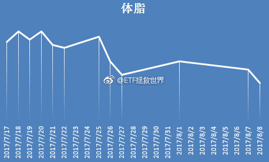

======================================================

ETF拯救世界 (5687069307) @
2017-08-08 09:34:05 Tue  
url: https://weibo.com/5687069307/Fg759FRwI

其实我感觉吧，普通男性，体脂，15-20就够了。要求高点的，12-20。

其实长期投资收益率也一样。几十年的周期来看，有12%就很好了。15%-20%基本就是神级操作。 ​​​

转发[18]  评论[43]  赞[80] 

+++++++++++++++++++++++++++++++++++++++++++++++++++++

图片：

======================================================

ETF拯救世界 (5687069307) @
2017-08-08 10:08:56 Tue  
url: https://weibo.com/5687069307/Fg7jjftDf

回复@关键时刻屌无力:是的，不建议炒股，买房靠谱。毕竟房价永远涨。另外问一句，您那7成贷款是无息的吗？//@关键时刻屌无力:新来的，问个问题，每年要求12%收益率那直接全投资房产不就好了，3成首付每年涨4%就够了，房子每年涨4％应该很简单吧还省时省力。

------------------------------------------------------
转推：
>  @ETF拯救世界 (5687069307)
>  2017-08-08 09:34:05 Tue  
>  url: https:/weibo.com/5687069307/Fg759FRwI/

>  其实我感觉吧，普通男性，体脂，15-20就够了。要求高点的，12-20。
>  
>  其实长期投资收益率也一样。几十年的周期来看，有12%就很好了。15%-20%基本就是神级操作。 ​​​

转发[3]  评论[35]  赞[57] 

======================================================

ETF拯救世界 (5687069307) @
2017-08-08 10:44:58 Tue  
url: https://weibo.com/5687069307/Fg7xVylUl

$创业板指 sz399006$   奶一下。不要涨。刚买了2份。 ​​​

转发[4]  评论[32]  赞[49] 

======================================================

ETF拯救世界 (5687069307) @
2017-08-08 10:55:07 Tue  
url: https://weibo.com/5687069307/Fg7C3aFzd

重申一下关于未来的几个小观点：

第一，对于大多数股票来说，下跌只是走了一半而已。也可能是60%。总之还有至少一小半没跌完，要继续跌。

第二，债券会先于股票见底。目测债券也还有一定的跌幅。如果十年国债能到4，会大量买入。几个月后会换入股票。

未来会有人特别痛苦，套的痛不欲生。更远的未来 ​​​

转发[193]  评论[128]  赞[248] 

======================================================

ETF拯救世界 (5687069307) @
2017-08-08 11:20:10 Tue  
url: https://weibo.com/5687069307/Fg7MdrGIN

是不是失败了。

------------------------------------------------------
转推：
>  @ETF拯救世界 (5687069307)
>  2017-08-08 10:44:58 Tue  
>  url: https:/weibo.com/5687069307/Fg7xVylUl/

>  $创业板指 sz399006$   奶一下。不要涨。刚买了2份。 ​​​

转发[0]  评论[11]  赞[30] 

======================================================

ETF拯救世界 (5687069307) @
2017-08-08 11:21:09 Tue  
url: https://weibo.com/5687069307/Fg7MCgwnb

$温氏股份 sz300498$   万万没想到，通胀预期下，被嫌弃的创业板第一重仓股温氏爆发了…… ​​​

转发[2]  评论[18]  赞[44] 

======================================================

ETF拯救世界 (5687069307) @
2017-08-08 11:53:21 Tue  
url: https://weibo.com/5687069307/Fg7ZGt7xx

回复@天狼星爱吐槽:你有没有把一些“黑天鹅”类的突发事件放进未来推演中？未来其实是相当模糊的，无论是“GJD”还是黑天鹅。但我感觉，可能会发生一些GJD也撑不住的事，导致迅速价值回归。瞎猜的。

------------------------------------------------------
转推：
>  @ETF拯救世界 (5687069307)
>  2017-08-08 10:55:07 Tue  
>  url: https:/weibo.com/5687069307/Fg7C3aFzd/

>  重申一下关于未来的几个小观点：
>  
>  第一，对于大多数股票来说，下跌只是走了一半而已。也可能是60%。总之还有至少一小半没跌完，要继续跌。
>  
>  第二，债券会先于股票见底。目测债券也还有一定的跌幅。如果十年国债能到4，会大量买入。几个月后会换入股票。
>  
>  未来会有人特别痛苦，套的痛不欲生。更远的未来 ​​​

转发[6]  评论[26]  赞[64] 

======================================================

ETF拯救世界 (5687069307) @
2017-08-08 13:37:41 Tue  
url: https://weibo.com/5687069307/Fg8G2cQ1M

50赚钱也就算了，创业板也赚钱了。谁能想到。节奏。

------------------------------------------------------
转推：
>  @ETF拯救世界 (5687069307)
>  2017-08-08 10:44:58 Tue  
>  url: https:/weibo.com/5687069307/Fg7xVylUl/

>  $创业板指 sz399006$   奶一下。不要涨。刚买了2份。 ​​​

转发[1]  评论[13]  赞[47] 

======================================================

ETF拯救世界 (5687069307) @
2017-08-08 13:42:10 Tue  
url: https://weibo.com/5687069307/Fg8HR91fZ

一条小鱼 ​​​

转发[2]  评论[38]  赞[59] 

+++++++++++++++++++++++++++++++++++++++++++++++++++++

图片：
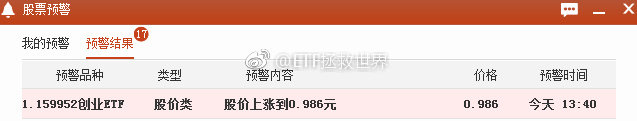

======================================================

ETF拯救世界 (5687069307) @
2017-08-08 15:10:46 Tue  
url: https://weibo.com/5687069307/Fg9hOyFXY

门票盘/计划盘 一起新高。说到最后，不停的赚钱/市值新高才是最终目标。结合极低的回撤幅度，就更完美了。 ​​​

转发[2]  评论[26]  赞[87] 

======================================================

ETF拯救世界 (5687069307) @
2017-08-08 15:50:01 Tue  
url: https://weibo.com/5687069307/Fg9xKot3E

[微笑] ​​​

转发[21]  评论[50]  赞[66] 

+++++++++++++++++++++++++++++++++++++++++++++++++++++

图片：

======================================================

ETF拯救世界 (5687069307) @
2017-08-08 21:21:08 Tue  
url: https://weibo.com/5687069307/FgbI9iVhx

每日打卡(51)

今天做两组，债还完了。坚持。 ​​​

转发[2]  评论[24]  赞[49] 

+++++++++++++++++++++++++++++++++++++++++++++++++++++

图片：

======================================================

ETF拯救世界 (5687069307) @
2017-08-08 21:24:29 Tue  
url: https://weibo.com/5687069307/FgbJvtGeC

回复@江湖人称再议哥:还是不要给这样的预期。碰上债券牛市一年17%可以，万一很久没有呢。还是不要有太高预期，基础配置就可以。//@江湖人称再议哥:回复@DX_XDZz:14年17%左右 15年10%左右 国开债指数 好像记得是这样

------------------------------------------------------
转推：
>  @ETF拯救世界 (5687069307)
>  2017-08-08 15:50:01 Tue  
>  url: https:/weibo.com/5687069307/Fg9xKot3E/

>  [微笑] ​​​

转发[13]  评论[21]  赞[40] 

======================================================

ETF拯救世界 (5687069307) @
2017-08-09 05:22:01 Wed  
url: https://weibo.com/5687069307/FgeRl9W4f

回复@俪俪LilyYan:一定要保重！也希望在四川的朋友们都平安！[加油]

------------------------------------------------------
转推：
>  @ETF拯救世界 (5687069307)
>  2017-08-08 21:21:08 Tue  
>  url: https:/weibo.com/5687069307/FgbI9iVhx/

>  每日打卡(51)
>  
>  今天做两组，债还完了。坚持。 ​​​

转发[1]  评论[16]  赞[52] 

======================================================

ETF拯救世界 (5687069307) @
2017-08-09 08:57:10 Wed  
url: https://weibo.com/5687069307/FgggFt1if

回球球了。

微博也会继续和大家一起玩~放心各位~ ​​​

转发[1]  评论[77]  赞[132] 

======================================================

ETF拯救世界 (5687069307) @
2017-08-09 09:56:18 Wed  
url: https://weibo.com/5687069307/FggEFAXGX

回复@野狗菜:3%是债息。但是你要注意，债券的价格会变化的。所以2016年下半年买入债基的很多人现在都亏了不少，为什么，价格下跌了。同理，当价格上涨的时候，债息+价格收益，这个赚多少都有可能。710国开债08年涨11%；14年涨14%就是这个道理。

------------------------------------------------------
转推：
>  @ETF拯救世界 (5687069307)
>  2017-08-08 15:50:01 Tue  
>  url: https:/weibo.com/5687069307/Fg9xKot3E/

>  [微笑] ​​​

转发[10]  评论[12]  赞[34] 

======================================================

ETF拯救世界 (5687069307) @
2017-08-09 10:00:44 Wed  
url: https://weibo.com/5687069307/FggGsCBXM

憋说话，用心去感受。医药长期低迷是不可能的。//@ETF拯救世界:回复@木木不哭木木:最爱。我最近几乎每天都在买，已经买到了总资产的5%。这对我来说已经是很不小的一个仓位了。再跌，就会进入低估区域。买入的力度会加大。//@木木不哭木木:医药最近在调整，挺好的，给我们慢慢买入的机会。

------------------------------------------------------
转推：
>  @ETF拯救世界 (5687069307)
>  2017-08-03 09:59:47 Thu  
>  url: https:/weibo.com/5687069307/Ffm76uKDv/

>  $创业板指 sz399006$  总是蠢蠢欲动。 ​​​

转发[2]  评论[24]  赞[48] 

======================================================

ETF拯救世界 (5687069307) @
2017-08-09 10:16:01 Wed  
url: https://weibo.com/5687069307/FggMFF3Ta

创业也好，养老也好，医药也好……

最近这几个月我们大力买入的品种，都是为“未来”布局。什么是未来？未来不是明天，下周，下个月。而是明年，三年、五年、甚至十年后。

为明天或者下周布局很简单，买强势就行。但我们不会，我们就买弱的。非常弱，特别弱，超弱的。

即使这么弱，我们持仓也都是盈 ​​​

转发[24]  评论[81]  赞[133] 

======================================================

ETF拯救世界 (5687069307) @
2017-08-09 11:05:35 Wed  
url: https://weibo.com/5687069307/Fgh6NiNQW

2000多家下跌，又新高了什么鬼 ​​​

转发[0]  评论[26]  赞[74] 

======================================================

ETF拯救世界 (5687069307) @
2017-08-09 11:14:01 Wed  
url: https://weibo.com/5687069307/FghadpjiB

本月中的品种已经有点眉目了。应该是有个新大类品种纳入囊中。 ​​​

转发[5]  评论[100]  赞[122] 

======================================================

ETF拯救世界 (5687069307) @
2017-08-09 11:49:53 Wed  
url: https://weibo.com/5687069307/FghoM91tA

[doge] SO?

------------------------------------------------------
转推：
>  @蓝鲸TMT网 (3866012793)
>  2017-08-09 10:50:09 Wed  
>  url: https:/weibo.com/3866012793/Fgh0wFfFe/

>  【强生宣布HIV疫苗临床试验结果：志愿者100%产生抗体】强生公司宣布了全球首次HIV疫苗人体临床试验结果，这一多中心、随机、安慰剂对照、双盲的1/2a期临床试验招募了393位健康志愿者，志愿者来自美国、卢旺达、乌干达、南非和泰国，结果显示，志愿者对HIV疫苗耐受性良好，且100%产生了对抗HIV的抗体。 ​​​

转发[5]  评论[20]  赞[31] 

======================================================

ETF拯救世界 (5687069307) @
2017-08-09 13:31:10 Wed  
url: https://weibo.com/5687069307/Fgi3T71Fn

17个品种两个浮亏。浮亏超过5%的只有一个，市值占比0.5%。

怎么办，投资好难。 ​​​​[允悲] ​​​

转发[1]  评论[26]  赞[78] 

======================================================

ETF拯救世界 (5687069307) @
2017-08-09 13:42:47 Wed  
url: https://weibo.com/5687069307/Fgi8Bk3Vp

$159938  目前计划的第二大并列重仓基金。

无论如何，不管发生什么，除非买的时候就是为了做波段，否则不要卖。不要卖。不要卖。

说三遍。 ​​​

转发[64]  评论[52]  赞[99] 

======================================================

ETF拯救世界 (5687069307) @
2017-08-09 13:48:27 Wed  
url: https://weibo.com/5687069307/FgiaU3sU4

说真的，科学这件事，不要说的太绝对。曾经人们认为地球、太阳是宇宙的中心。世界上没有什么不可能，只能说，以人类目前的科学水平，没有发现地震与地震云有关而已。面对这个世界，大家都应该敬畏和谦虚。

------------------------------------------------------
转推：
>  @中国地震台网速报 (1904228041)
>  2017-08-08 23:19:12 Tue  
>  url: https:/weibo.com/1904228041/Fgcu4rtqf/

>  云，和地震没有关联！！！ ​​​

转发[3]  评论[26]  赞[97] 

======================================================

ETF拯救世界 (5687069307) @
2017-08-09 13:53:03 Wed  
url: https://weibo.com/5687069307/FgicLxXQi

回复@小韭菜V:想梭就梭，要梭的漂亮。//@小韭菜V:老大:我想梭哈!

------------------------------------------------------
转推：
>  @ETF拯救世界 (5687069307)
>  2017-08-09 13:42:47 Wed  
>  url: https:/weibo.com/5687069307/Fgi8Bk3Vp/

>  $159938  目前计划的第二大并列重仓基金。
>  
>  无论如何，不管发生什么，除非买的时候就是为了做波段，否则不要卖。不要卖。不要卖。
>  
>  说三遍。 ​​​

转发[0]  评论[7]  赞[40] 

======================================================

ETF拯救世界 (5687069307) @
2017-08-09 13:58:32 Wed  
url: https://weibo.com/5687069307/Fgif090uC

回复@奥斯特洛夫大柴夫斯基:保守-激进，我的建议仓位是21-48//@奥斯特洛夫大柴夫斯基:现在50%的仓位，继续等，希望能加仓位到150%（个人根据E大做的个性化调整方案）。

------------------------------------------------------
转推：
>  @ETF拯救世界 (5687069307)
>  2017-08-09 13:42:47 Wed  
>  url: https:/weibo.com/5687069307/Fgi8Bk3Vp/

>  $159938  目前计划的第二大并列重仓基金。
>  
>  无论如何，不管发生什么，除非买的时候就是为了做波段，否则不要卖。不要卖。不要卖。
>  
>  说三遍。 ​​​

转发[7]  评论[16]  赞[40] 

======================================================

ETF拯救世界 (5687069307) @
2017-08-09 14:17:03 Wed  
url: https://weibo.com/5687069307/FgimvxtH3

谁还记得一年前的 $国证食品 sz399396$ 

[拜拜] ​​​

转发[4]  评论[62]  赞[58] 

======================================================

ETF拯救世界 (5687069307) @
2017-08-09 14:26:48 Wed  
url: https://weibo.com/5687069307/Fgiqtqqdn

有些朋友觉得我每天强调心态，强调收益率，强调坚定持有，每天说，说太多，都是废话。

其实，可能是他不知道就是因为我这样，多少朋友的恒生才能坚定拿到50%+。多少朋友才能坚定持有各种盈利品种，才能面对下跌心态平和。

有些事，其实并不那么简单。 ​​​

转发[19]  评论[134]  赞[270] 

======================================================

ETF拯救世界 (5687069307) @
2017-08-09 17:36:48 Wed  
url: https://weibo.com/5687069307/FgjFB6oeR

最喜欢丁磊。freestyle！用心做事！产品好！不吹NB！清流。//@八大山债人:。。。。 //@钟鸿钧://@子柳:潘老板：我看到门口有人穿西装。 丁老板：那是保安。

------------------------------------------------------
转推：
>  @网易新闻客户端 (1974808274)
>  2017-08-09 16:51:56 Wed  
>  url: https:/weibo.com/1974808274/FgjnnnBrw/

>  潘老板：你们平时上班都穿这样呀？
>  丁老板：不然呢？ ​​​

转发[4]  评论[30]  赞[53] 

======================================================

ETF拯救世界 (5687069307) @
2017-08-09 17:42:39 Wed  
url: https://weibo.com/5687069307/FgjHXBFnn

回复@iloveyounow:网易老板。曾经的中国首富。你看，低调到很多人都不认识。就喜欢低调的实力派！//@iloveyounow:回复@ETF拯救世界:他是做什麼的//@八大山债人:。。。。 //@钟鸿钧://@子柳:潘老板：我看到门口有人穿西装。 丁老板：那是保安。

------------------------------------------------------
转推：
>  @网易新闻客户端 (1974808274)
>  2017-08-09 16:51:56 Wed  
>  url: https:/weibo.com/1974808274/FgjnnnBrw/

>  潘老板：你们平时上班都穿这样呀？
>  丁老板：不然呢？ ​​​

转发[6]  评论[48]  赞[44] 

======================================================

ETF拯救世界 (5687069307) @
2017-08-09 20:11:55 Wed  
url: https://weibo.com/5687069307/FgkGycFf3

讲真，想骂人。为什么。

------------------------------------------------------
转推：
>  @ETF拯救世界 (5687069307)
>  2017-08-09 11:14:01 Wed  
>  url: https:/weibo.com/5687069307/FghadpjiB/

>  本月中的品种已经有点眉目了。应该是有个新大类品种纳入囊中。 ​​​

转发[1]  评论[75]  赞[53] 

======================================================

ETF拯救世界 (5687069307) @
2017-08-09 22:15:07 Wed  
url: https://weibo.com/5687069307/FgluytVT0

每日打卡(52)

今天累，来个轻松的 ​​​

转发[0]  评论[15]  赞[61] 

+++++++++++++++++++++++++++++++++++++++++++++++++++++

图片：

======================================================

ETF拯救世界 (5687069307) @
2017-08-09 22:44:03 Wed  
url: https://weibo.com/5687069307/FglGih1HD

美股十年最高估值已经持续几个月了。无论崩不崩，从现在算，未来十年收益会很低。

------------------------------------------------------
转推：
>  @ ()
>  2017-08-09 22:04:21 Wed  
>  url: 

>  抱歉，作者已设置仅展示半年内微博，此微博已不可见。 ​​​

转发[8]  评论[37]  赞[68] 

======================================================

ETF拯救世界 (5687069307) @
2017-08-10 09:35:11 Thu  
url: https://weibo.com/5687069307/FgpWBs2n9

回复@Tony_RUC:肯定是赚钱了，至少在1%左右。你并不熟悉普通投资者的心态。一个品种浮亏，回本后马上就想卖出，害怕再次浮亏，坐过山车。所以我会在回本的时候提醒：不要卖。//@Tony_RUC:根本没涨，卖啥卖啊，老大………没赚钱啊！

------------------------------------------------------
转推：
>  @ETF拯救世界 (5687069307)
>  2017-08-09 13:42:47 Wed  
>  url: https:/weibo.com/5687069307/Fgi8Bk3Vp/

>  $159938  目前计划的第二大并列重仓基金。
>  
>  无论如何，不管发生什么，除非买的时候就是为了做波段，否则不要卖。不要卖。不要卖。
>  
>  说三遍。 ​​​

转发[36]  评论[22]  赞[53] 

======================================================

ETF拯救世界 (5687069307) @
2017-08-10 09:40:38 Thu  
url: https://weibo.com/5687069307/FgpYNANP0

回复@xeon_xiaohai:没有。同一类别的小类资产总量绝不超过20%。比如50和300是一个小类，医药和养老算一个小类，石油基金和华宝油气算一个//@xeon_xiaohai:E大，每个品种购买的份数有上限吗，如果有的话上限是多少份？

------------------------------------------------------
转推：
>  @ETF拯救世界 (5687069307)
>  2017-08-09 13:42:47 Wed  
>  url: https:/weibo.com/5687069307/Fgi8Bk3Vp/

>  $159938  目前计划的第二大并列重仓基金。
>  
>  无论如何，不管发生什么，除非买的时候就是为了做波段，否则不要卖。不要卖。不要卖。
>  
>  说三遍。 ​​​

转发[31]  评论[27]  赞[55] 

======================================================

ETF拯救世界 (5687069307) @
2017-08-10 09:54:29 Thu  
url: https://weibo.com/5687069307/Fgq4qARrI

醉了，除了仓位低的两个，都是红的。

我再说一次，计划里的任何品种，未来，某一天，浮亏十几个点，一点点都不用担心。千万不要随便卖。因为牛市来了，一周两周就分分钟盈利。这话说过很多次，还要再说。 ​​​

转发[33]  评论[44]  赞[97] 

+++++++++++++++++++++++++++++++++++++++++++++++++++++

图片：

======================================================

ETF拯救世界 (5687069307) @
2017-08-10 09:57:19 Thu  
url: https://weibo.com/5687069307/Fgq5A9sz9

回复@刘泽瑜31881:有些话我说过不止一次。仓位是适合我的，也是适合一部分朋友的，但不是适合所有朋友的。觉得低的，我买一份可以买两份甚至三份。我不能让所有朋友感到舒服。//@刘泽瑜31881:我觉得现在不是浮亏的问题而是有可能仓位问题！

------------------------------------------------------
转推：
>  @ETF拯救世界 (5687069307)
>  2017-08-10 09:54:29 Thu  
>  url: https:/weibo.com/5687069307/Fgq4qARrI/

>  醉了，除了仓位低的两个，都是红的。
>  
>  我再说一次，计划里的任何品种，未来，某一天，浮亏十几个点，一点点都不用担心。千万不要随便卖。因为牛市来了，一周两周就分分钟盈利。这话说过很多次，还要再说。 ​​​

转发[7]  评论[21]  赞[51] 

======================================================

ETF拯救世界 (5687069307) @
2017-08-10 10:09:59 Thu  
url: https://weibo.com/5687069307/FgqaJhT2u

回复@chrismixxx:我说的是正常情况下。比如2015年7月分级A那种情况，我会100%买入。然而那种情况几年才能碰到一次。正常情况下，这是我的原则。非极端情况下，我对自己没那么大的信心——非常看好的一定会大涨。我相信也没有几个人能总是看好就肯定涨。长期来看，不可能。

------------------------------------------------------
转推：
>  @ETF拯救世界 (5687069307)
>  2017-08-09 13:42:47 Wed  
>  url: https:/weibo.com/5687069307/Fgi8Bk3Vp/

>  $159938  目前计划的第二大并列重仓基金。
>  
>  无论如何，不管发生什么，除非买的时候就是为了做波段，否则不要卖。不要卖。不要卖。
>  
>  说三遍。 ​​​

转发[6]  评论[19]  赞[49] 

======================================================

ETF拯救世界 (5687069307) @
2017-08-10 10:24:20 Thu  
url: https://weibo.com/5687069307/Fgqgy2zIc

一个消息：恒生已经低于我们31号的卖出价格了。

[doge] ​​​

转发[0]  评论[49]  赞[94] 

======================================================

ETF拯救世界 (5687069307) @
2017-08-10 11:21:03 Thu  
url: https://weibo.com/5687069307/FgqDzjcyR

很多，我不是说所有啊，很多上涨时候觉得仓位低的朋友，三根，或者两根阴线，就会觉得仓位有点高。 ​​​

转发[8]  评论[51]  赞[104] 

======================================================

ETF拯救世界 (5687069307) @
2017-08-10 11:49:22 Thu  
url: https://weibo.com/5687069307/FgqP3FS2A

不要高兴太早，还有5天。 ​​​

转发[4]  评论[22]  赞[55] 

======================================================

ETF拯救世界 (5687069307) @
2017-08-10 11:56:56 Thu  
url: https://weibo.com/5687069307/FgqS8kjxO

回复@石头里的虫子:是哦，其实还有2个半工作日。14、15日随机发车//@石头里的虫子:三个工作日。

------------------------------------------------------
转推：
>  @ETF拯救世界 (5687069307)
>  2017-08-10 11:49:22 Thu  
>  url: https:/weibo.com/5687069307/FgqP3FS2A/

>  不要高兴太早，还有5天。 ​​​

转发[1]  评论[8]  赞[40] 

======================================================

ETF拯救世界 (5687069307) @
2017-08-10 12:08:30 Thu  
url: https://weibo.com/5687069307/FgqWPolaL

你给的价格太高，人家当然要套现。没人买，跌到大股东不愿意套的时候，自然就没人套了，甚至还会增持。维持股市高价格高估值，让股民高位用这些垃圾价格炒来炒去，是解决问题的方法？

------------------------------------------------------
转推：
>  @叶檀 (1233227211)
>  2017-08-10 11:58:29 Thu  
>  url: https:/weibo.com/1233227211/FgqSLCMQV/

>  参加网易经济学家年会，跟水皮先生辩（交）论（流），不必停止IPO，要应对的是套现 ​​​

转发[7]  评论[26]  赞[65] 

======================================================

ETF拯救世界 (5687069307) @
2017-08-10 21:02:38 Thu  
url: https://weibo.com/5687069307/FgurDggMY

每日打卡(53)

这组认真做还是有点酸爽的。 ​​​

转发[0]  评论[16]  赞[75] 

+++++++++++++++++++++++++++++++++++++++++++++++++++++

图片：

======================================================

ETF拯救世界 (5687069307) @
2017-08-11 08:07:29 Fri  
url: https://weibo.com/5687069307/FgyNvf0oV

看热闹的同时，是时候找一些合适的美元资产了

------------------------------------------------------
转推：
>  @和讯网 (2000961721)
>  2017-08-11 07:31:02 Fri  
>  url: https:/weibo.com/2000961721/FgyyHqp9M/

>  【人民币一周上涨1% 空头踩踏、对冲基金止损离场 】 本周人民币兑美元涨幅已接近1%，连续突破6.72、6.7、6.68、6.66等多个关口，面对人民币汇率如此凌厉的涨势，持有人民币空单的对冲基金再也坐不住了。对冲基金平仓空头头寸止损离场。http://t.cn/R9nHz8q ​​​

转发[12]  评论[61]  赞[82] 

======================================================

ETF拯救世界 (5687069307) @
2017-08-11 09:26:10 Fri  
url: https://weibo.com/5687069307/Fgzjr3Y3W

呵呵哒。[笑而不语]//@华尔街见闻APP:香港恒生指数开盘跌1.6%，至27000.43点

------------------------------------------------------
转推：
>  @ ()
>  2017-08-11 09:22:19 Fri  
>  url: 

>  抱歉，作者已设置仅展示半年内微博，此微博已不可见。 ​​​

转发[11]  评论[26]  赞[59] 

======================================================

ETF拯救世界 (5687069307) @
2017-08-11 10:27:07 Fri  
url: https://weibo.com/5687069307/FgzIaEGJj

创业和医药红了 ​​​

转发[4]  评论[17]  赞[73] 

======================================================

ETF拯救世界 (5687069307) @
2017-08-11 10:31:24 Fri  
url: https://weibo.com/5687069307/FgzJUtLsS

什么意思呢。注意，这个月初是卖掉一份恒生，买医药和创业。 [doge]

------------------------------------------------------
转推：
>  @ETF拯救世界 (5687069307)
>  2017-08-11 10:27:07 Fri  
>  url: https:/weibo.com/5687069307/FgzIaEGJj/

>  创业和医药红了 ​​​

转发[1]  评论[16]  赞[60] 

======================================================

ETF拯救世界 (5687069307) @
2017-08-11 10:33:11 Fri  
url: https://weibo.com/5687069307/FgzKE2FQx

回复@强尼大木覀:“哎我跟你说，我捡了1万块钱”。“高兴个屁啊，你又没捡1000万能买套房。有什么好高兴的？”//@强尼大木覀:就卖了一份，大仓位还是继续持有的啊，为什么跌了这么高兴呢？//@ETF拯救世界:呵呵哒。[笑而不语]//@华尔街见闻APP:香港恒生指数开盘跌1.6%，至27000.43点

------------------------------------------------------
转推：
>  @ ()
>  2017-08-11 09:22:19 Fri  
>  url: 

>  抱歉，作者已设置仅展示半年内微博，此微博已不可见。 ​​​

转发[10]  评论[22]  赞[55] 

======================================================

ETF拯救世界 (5687069307) @
2017-08-11 10:44:53 Fri  
url: https://weibo.com/5687069307/FgzPo2e9g

很有意思。可能就是思维模式不同吧。

比如之前，我们提前发车低位买过一个品种。然后下一次发车文章中我会说真好，如果按照正常发车时间买会比较贵。

有人就会评论说，高兴什么呢？长期来看不是应该忽略这点涨幅吗。

这个其实我就很不理解了。我买东西当然是越便宜越好。能便宜一分一毛都好，何况几 ​​​

转发[2]  评论[72]  赞[120] 

======================================================

ETF拯救世界 (5687069307) @
2017-08-11 10:47:20 Fri  
url: https://weibo.com/5687069307/FgzQo3ecu

回复@纯香芥末:我告诉你未来吧。这也是计划中所有品种的共同未来：拿着的仓位跌下去了，然后再回到下跌的起点，你会发现，神奇的，赚的比跌之前多多了！//@纯香芥末:虽然我跟的晚没买到恒生，也是担心这要跌了不起来，手里还有那么多咋办，只能等以后再来看节奏了，现在还看不懂

------------------------------------------------------
转推：
>  @ ()
>  2017-08-11 09:22:19 Fri  
>  url: 

>  抱歉，作者已设置仅展示半年内微博，此微博已不可见。 ​​​

转发[8]  评论[33]  赞[68] 

======================================================

ETF拯救世界 (5687069307) @
2017-08-11 11:16:44 Fri  
url: https://weibo.com/5687069307/FgA2jp0O0

回复@一场清风一场秋梦:不敢当，心领了！//@一场清风一场秋梦:回复@石头里的虫子:不，女儿和自己一起送了

------------------------------------------------------
转推：
>  @ETF拯救世界 (5687069307)
>  2017-08-11 10:44:53 Fri  
>  url: https:/weibo.com/5687069307/FgzPo2e9g/

>  很有意思。可能就是思维模式不同吧。
>  
>  比如之前，我们提前发车低位买过一个品种。然后下一次发车文章中我会说真好，如果按照正常发车时间买会比较贵。
>  
>  有人就会评论说，高兴什么呢？长期来看不是应该忽略这点涨幅吗。
>  
>  这个其实我就很不理解了。我买东西当然是越便宜越好。能便宜一分一毛都好，何况几 ​​​

转发[0]  评论[14]  赞[53] 

======================================================

ETF拯救世界 (5687069307) @
2017-08-11 11:20:13 Fri  
url: https://weibo.com/5687069307/FgA3J8XYg

[微笑] ​​​

转发[4]  评论[74]  赞[126] 

+++++++++++++++++++++++++++++++++++++++++++++++++++++

图片：
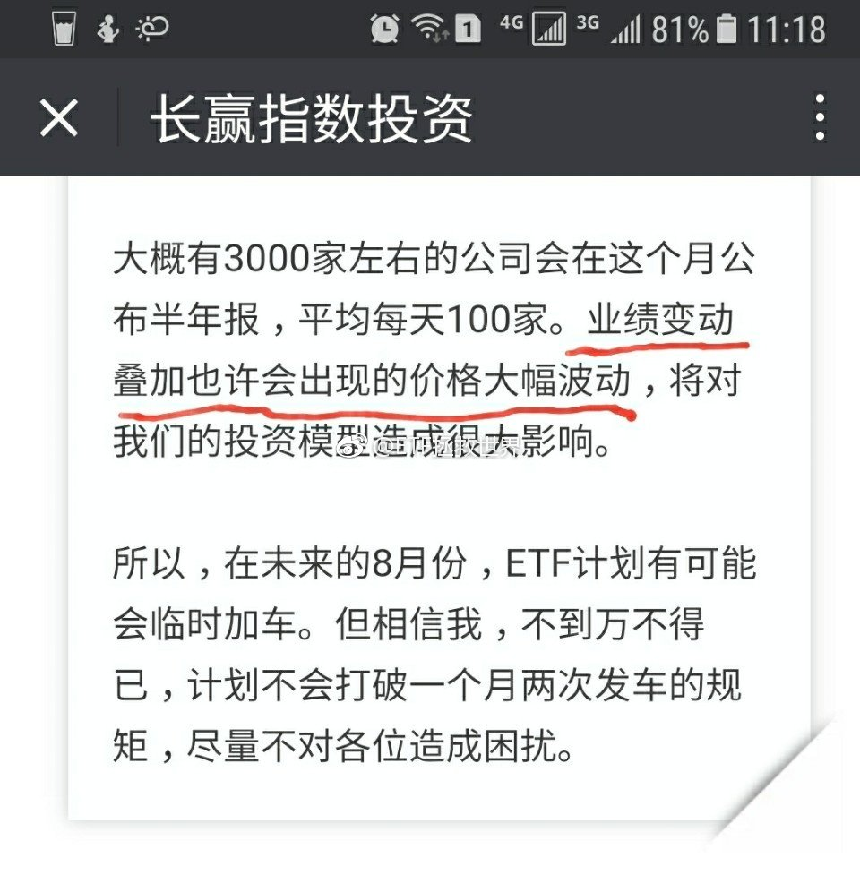

======================================================

ETF拯救世界 (5687069307) @
2017-08-11 14:38:54 Fri  
url: https://weibo.com/5687069307/FgBmndo68

看了眼即时估值数据，也没有太令人惊喜。

我估计月底的车才是最值得期待的！ ​​​

转发[14]  评论[83]  赞[119] 

======================================================

ETF拯救世界 (5687069307) @
2017-08-11 14:55:17 Fri  
url: https://weibo.com/5687069307/FgBt1kKwR

如果这个月买十份以上，会不会惊讶。

------------------------------------------------------
转推：
>  @ETF拯救世界 (5687069307)
>  2017-08-11 14:38:54 Fri  
>  url: https:/weibo.com/5687069307/FgBmndo68/

>  看了眼即时估值数据，也没有太令人惊喜。
>  
>  我估计月底的车才是最值得期待的！ ​​​

转发[11]  评论[225]  赞[195] 

======================================================

ETF拯救世界 (5687069307) @
2017-08-11 23:28:43 Fri  
url: https://weibo.com/5687069307/FgEPqn3aG

每日打卡（54）

周末比较放纵，晚了点。 ​​​

转发[0]  评论[21]  赞[95] 

+++++++++++++++++++++++++++++++++++++++++++++++++++++

图片：

======================================================

ETF拯救世界 (5687069307) @
2017-08-12 23:56:20 Sat  
url: https://weibo.com/5687069307/FgOr8cLYw

喝多了。

半个月白练了[拜拜] ​​​

转发[4]  评论[96]  赞[155] 

======================================================

ETF拯救世界 (5687069307) @
2017-08-13 22:06:54 Sun  
url: https://weibo.com/5687069307/FgX9dkYxs

每日打卡（55）

还债。两组。 ​​​

转发[0]  评论[17]  赞[84] 

+++++++++++++++++++++++++++++++++++++++++++++++++++++

图片：

======================================================

ETF拯救世界 (5687069307) @
2017-08-14 09:23:30 Mon  
url: https://weibo.com/5687069307/Fh1zQaPoN

回复@俪俪LilyYan:一年喝不了两次。遇到正确的人，可以喝。//@俪俪LilyYan:意外，我以为的EE是烟酒不沾、干干净净的谦谦美男子～～

------------------------------------------------------
转推：
>  @ETF拯救世界 (5687069307)
>  2017-08-12 23:56:20 Sat  
>  url: https:/weibo.com/5687069307/FgOr8cLYw/

>  喝多了。
>  
>  半个月白练了[拜拜] ​​​

转发[0]  评论[46]  赞[61] 

======================================================

ETF拯救世界 (5687069307) @
2017-08-14 09:33:03 Mon  
url: https://weibo.com/5687069307/Fh1DIsjFB

只要涨幅可以接受，今晚会先发一车。 ​​​

转发[2]  评论[115]  赞[155] 

======================================================

ETF拯救世界 (5687069307) @
2017-08-14 14:06:49 Mon  
url: https://weibo.com/5687069307/Fh3qQ97O7

表脸[挖鼻]//@ETF拯救世界:如果这个月买十份以上，会不会惊讶。

------------------------------------------------------
转推：
>  @ETF拯救世界 (5687069307)
>  2017-08-11 14:38:54 Fri  
>  url: https:/weibo.com/5687069307/FgBmndo68/

>  看了眼即时估值数据，也没有太令人惊喜。
>  
>  我估计月底的车才是最值得期待的！ ​​​

转发[2]  评论[39]  赞[61] 

======================================================

ETF拯救世界 (5687069307) @
2017-08-14 14:12:35 Mon  
url: https://weibo.com/5687069307/Fh3tbvUdT

回复@求财不劫色:因为我们买了//@求财不劫色:益达，创业板今天吃药了吗？[允悲]//@ETF拯救世界:表脸[挖鼻]//@ETF拯救世界:如果这个月买十份以上，会不会惊讶。

------------------------------------------------------
转推：
>  @ETF拯救世界 (5687069307)
>  2017-08-11 14:38:54 Fri  
>  url: https:/weibo.com/5687069307/FgBmndo68/

>  看了眼即时估值数据，也没有太令人惊喜。
>  
>  我估计月底的车才是最值得期待的！ ​​​

转发[1]  评论[49]  赞[70] 

======================================================

ETF拯救世界 (5687069307) @
2017-08-14 22:50:49 Mon  
url: https://weibo.com/5687069307/Fh6Rx6S4h

每日打卡（56）

时间不够用 ​​​

转发[0]  评论[13]  赞[63] 

+++++++++++++++++++++++++++++++++++++++++++++++++++++

图片：

======================================================

ETF拯救世界 (5687069307) @
2017-08-15 09:39:07 Tue  
url: https://weibo.com/5687069307/Fhb6G49ye

坐山观虎斗 ​​​

转发[4]  评论[37]  赞[73] 

======================================================

ETF拯救世界 (5687069307) @
2017-08-15 09:49:32 Tue  
url: https://weibo.com/5687069307/FhbaUsd0d

回复@2014不疾而速:我不敢想象，也不希望创业板在这里有大幅度反弹。如果那样，不光没有牛市，还会有更大的灾难发生。//@2014不疾而速:50和创业板，到底谁是新的王者呢

------------------------------------------------------
转推：
>  @ETF拯救世界 (5687069307)
>  2017-08-15 09:39:07 Tue  
>  url: https:/weibo.com/5687069307/Fhb6G49ye/

>  坐山观虎斗 ​​​

转发[2]  评论[35]  赞[73] 

======================================================

ETF拯救世界 (5687069307) @
2017-08-15 09:59:07 Tue  
url: https://weibo.com/5687069307/FhbeNhvys

今天账户又新高了，高兴，送电影票。

也是因为大家这几个月一直在微博和我互动，也很辛苦，哈哈。下面这个是微博的粉丝互动排行榜，我不知道算法是什么，反正就按这个来吧。

送排名第一的朋友两张电影票。请48小时之内和我联系。如果放弃或者不联系就顺延到排行第二的朋友，以此类推。

任何电影都可 ​​​

转发[7]  评论[217]  赞[166] 

+++++++++++++++++++++++++++++++++++++++++++++++++++++

图片：

======================================================

ETF拯救世界 (5687069307) @
2017-08-15 11:00:33 Tue  
url: https://weibo.com/5687069307/FhbDJkApw

关于有些朋友不停的说华宝油气与油价走势不符。只说两点，加个图，以后不用再讨论。

第一，油气跟踪的不是油价本身，原油没有办法像黄金ETF一样持有现货，因为它不易保存。解决的办法两个，一个是跟踪期货，比如南方油。但是换期有损耗，我不敢长期持有。第二个是跟踪上游或者全产业链公司，比如xop和 ​​​

转发[88]  评论[112]  赞[149] 

+++++++++++++++++++++++++++++++++++++++++++++++++++++

图片：

======================================================

ETF拯救世界 (5687069307) @
2017-08-15 11:07:36 Tue  
url: https://weibo.com/5687069307/FhbGBd1rH

回复@CZ梦想:油气一路跌下来，总是有人不停的催加仓。催什么呢。你知不知道为什么有些人会在一个品种上赔很多？因为跌一点就加，跌一点就加。本来就买了一点，跌10%就已经加到70%仓位了。结果呢？duang，又跌了70%。翻不了身了。下跌加仓是有节奏的，不要催，该加自然会加。

------------------------------------------------------
转推：
>  @ETF拯救世界 (5687069307)
>  2017-08-15 11:00:33 Tue  
>  url: https:/weibo.com/5687069307/FhbDJkApw/

>  关于有些朋友不停的说华宝油气与油价走势不符。只说两点，加个图，以后不用再讨论。
>  
>  第一，油气跟踪的不是油价本身，原油没有办法像黄金ETF一样持有现货，因为它不易保存。解决的办法两个，一个是跟踪期货，比如南方油。但是换期有损耗，我不敢长期持有。第二个是跟踪上游或者全产业链公司，比如xop和 ​​​

转发[18]  评论[88]  赞[135] 

======================================================

ETF拯救世界 (5687069307) @
2017-08-15 13:23:42 Tue  
url: https://weibo.com/5687069307/FhczPCMX5

自己找吧。 ​​​

转发[5]  评论[181]  赞[122] 

+++++++++++++++++++++++++++++++++++++++++++++++++++++

图片：

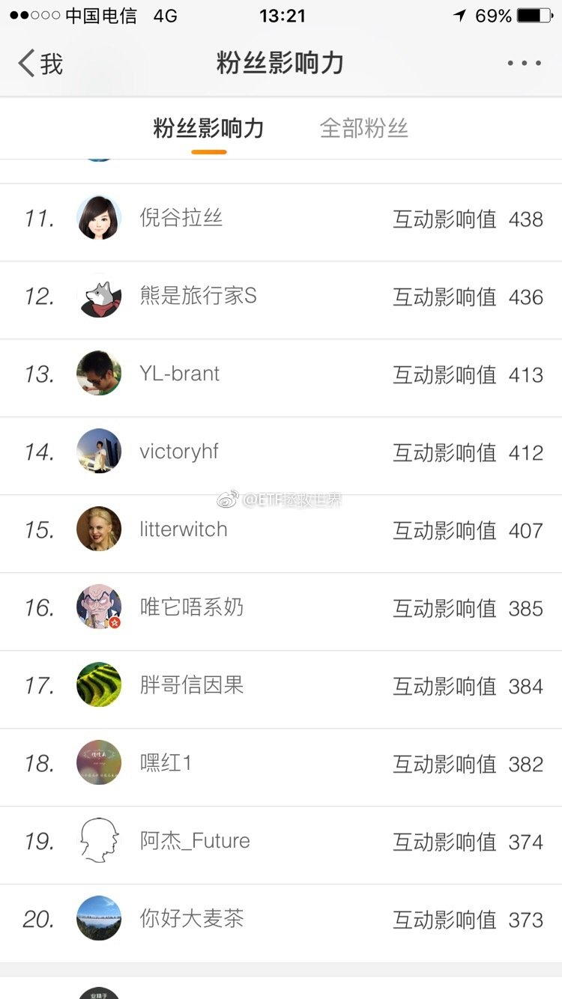

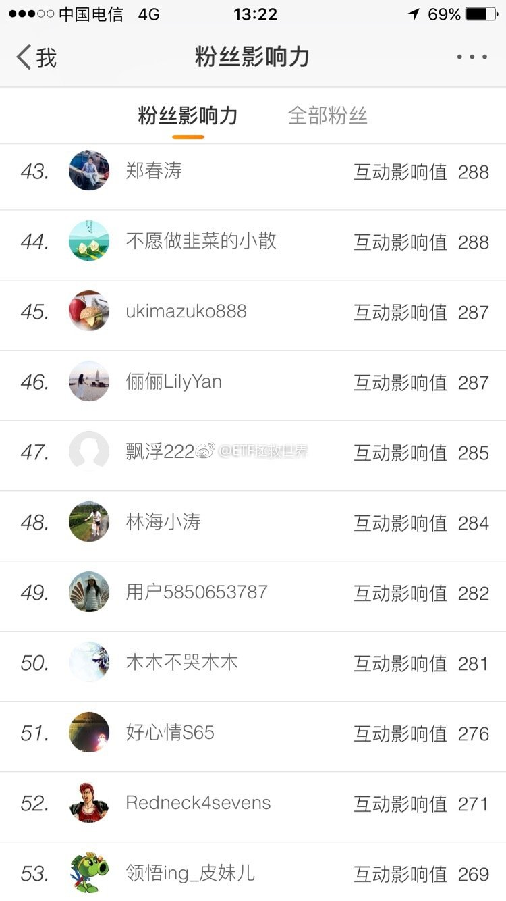
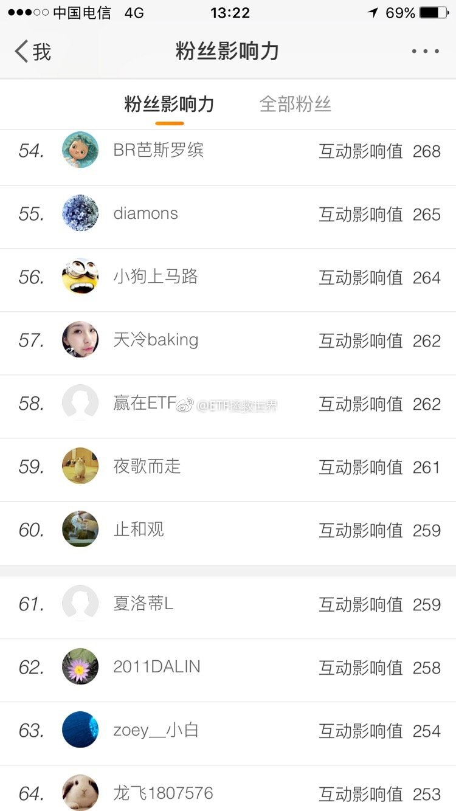

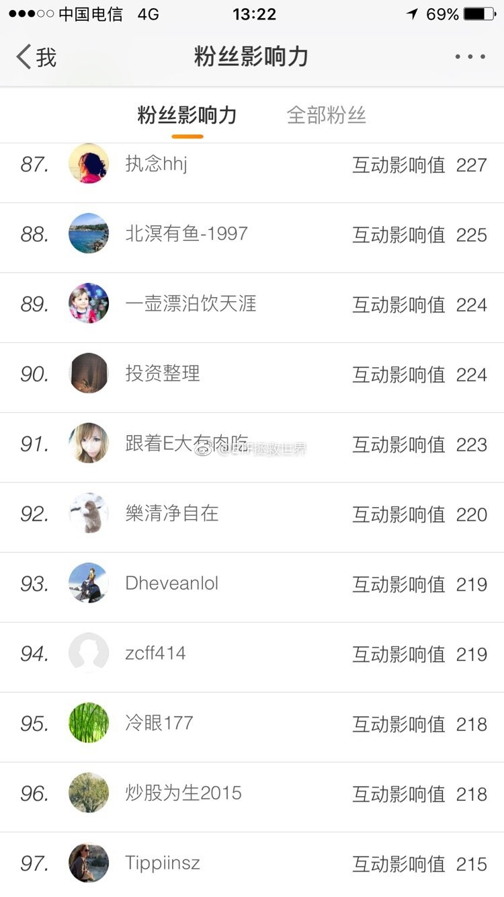

======================================================

ETF拯救世界 (5687069307) @
2017-08-15 16:29:51 Tue  
url: https://weibo.com/5687069307/FhdNoFKff

回复@就爱喝X:过年红包发了好几千，你跟我说没有两张电影票好 [允悲]//@就爱喝X:比过年的红包好

------------------------------------------------------
转推：
>  @ETF拯救世界 (5687069307)
>  2017-08-15 09:59:07 Tue  
>  url: https:/weibo.com/5687069307/FhbeNhvys/

>  今天账户又新高了，高兴，送电影票。
>  
>  也是因为大家这几个月一直在微博和我互动，也很辛苦，哈哈。下面这个是微博的粉丝互动排行榜，我不知道算法是什么，反正就按这个来吧。
>  
>  送排名第一的朋友两张电影票。请48小时之内和我联系。如果放弃或者不联系就顺延到排行第二的朋友，以此类推。
>  
>  任何电影都可 ​​​

转发[1]  评论[51]  赞[63] 

======================================================

ETF拯救世界 (5687069307) @
2017-08-15 22:50:19 Tue  
url: https://weibo.com/5687069307/FhghPebQz

每日打卡（57）

今天累，这组相当于休息了。坚持 ​​​

转发[0]  评论[16]  赞[80] 

+++++++++++++++++++++++++++++++++++++++++++++++++++++

图片：

======================================================

ETF拯救世界 (5687069307) @
2017-08-16 09:20:43 Wed  
url: https://weibo.com/5687069307/FhkpHyWe6

“【国家队新进增持46股 27家为中小创公司】截至昨日，共有573家公司披露2017年半年报业绩，有175家公司前十大流通股股东中出现以证金、汇金等为代表的国家队身影。其中，有46家公司股票被国家队新进或增持，有27家公司是中小板和创业板的股票，占比近六成。（中国证券网） ​​​​”-非临时性

------------------------------------------------------
转推：
>  @ ()
>  2017-08-15 22:01:33 Tue  
>  url: 

>  抱歉，此微博已被作者删除。查看帮助：http://t.cn/Rfd3rQV

转发[5]  评论[63]  赞[67] 

======================================================

ETF拯救世界 (5687069307) @
2017-08-16 09:49:21 Wed  
url: https://weibo.com/5687069307/FhkBkgPah

$创业板指 sz399006$   差不多得了。 ​​​

转发[0]  评论[86]  赞[86] 

======================================================

ETF拯救世界 (5687069307) @
2017-08-16 11:40:28 Wed  
url: https://weibo.com/5687069307/FhlkqxGAL

遇到瓶颈了。最近吃吃喝喝，锻炼也不够。需要反省了。 ​​​

转发[0]  评论[76]  赞[73] 

+++++++++++++++++++++++++++++++++++++++++++++++++++++

图片：

======================================================

ETF拯救世界 (5687069307) @
2017-08-16 13:44:27 Wed  
url: https://weibo.com/5687069307/Fhm8KConE

全都买的指数基金。然而，所有指数都没新高，组合又新高了。

神奇。 ​​​

转发[2]  评论[114]  赞[159] 

======================================================

ETF拯救世界 (5687069307) @
2017-08-16 15:07:18 Wed  
url: https://weibo.com/5687069307/FhmGnDOFI

今年门票盘36%了。做了那么多年指数，选股技术没有退化 ​​​

转发[0]  评论[95]  赞[161] 

+++++++++++++++++++++++++++++++++++++++++++++++++++++

图片：

======================================================

ETF拯救世界 (5687069307) @
2017-08-16 16:48:17 Wed  
url: https://weibo.com/5687069307/FhnlntJds

看了这个，突然感到非常幸运：我只是莫名其妙的被人喷而已，这个老板莫名其妙被人捅了！我可以说捡了很多条命了。

------------------------------------------------------
转推：
>  @澎湃新闻 (5044281310)
>  2017-08-16 16:30:03 Wed  
>  url: https:/weibo.com/5044281310/FhndYcTTC/

>  【取单起争执，外卖员捅死店老板后自杀】http://t.cn/RChWLSj 8月11日，陕西西安铁炉庙村附近，一外卖员因拿错饭不肯换回与店老板起争执。外卖员刀捅店老板及其岳父，店老板不治去世，随后外卖员自杀身亡。目前，案件还在调查中。陕西广播电视台http://t.cn/RChWLSl ​​​

转发[9]  评论[62]  赞[43] 

======================================================

ETF拯救世界 (5687069307) @
2017-08-16 20:10:32 Wed  
url: https://weibo.com/5687069307/FhoFsEhhR

哈哈，喜欢就好。还写了这么多。以后还有福利送给各位。

------------------------------------------------------
转推：
>  @轻舞飞扬84888 (5371903014)
>  2017-08-16 19:37:58 Wed  
>  url: https:/weibo.com/5371903014/FhosfiEfB/

>  @ETF拯救世界 
>  老大，谢谢你！电影很好看，今天过得很愉快！🌹🌹🌹
>  这真是个美好的一天。在众多学习的同学中，侥幸得到了老大滴奖励--两张电影票，看了很棒的一场电影，渡过了很愉快的一个下午，非常开心，很是欢喜。
>  跟着老大学习快一年，收益良多，学到了很多宝贵的投资知识。
>  最最重要的是-- ​​​

转发[2]  评论[55]  赞[111] 

======================================================

ETF拯救世界 (5687069307) @
2017-08-16 21:18:03 Wed  
url: https://weibo.com/5687069307/Fhp6S7zt3

每日打卡（58）

快两个月了。坚持。 ​​​

转发[0]  评论[14]  赞[70] 

+++++++++++++++++++++++++++++++++++++++++++++++++++++

图片：
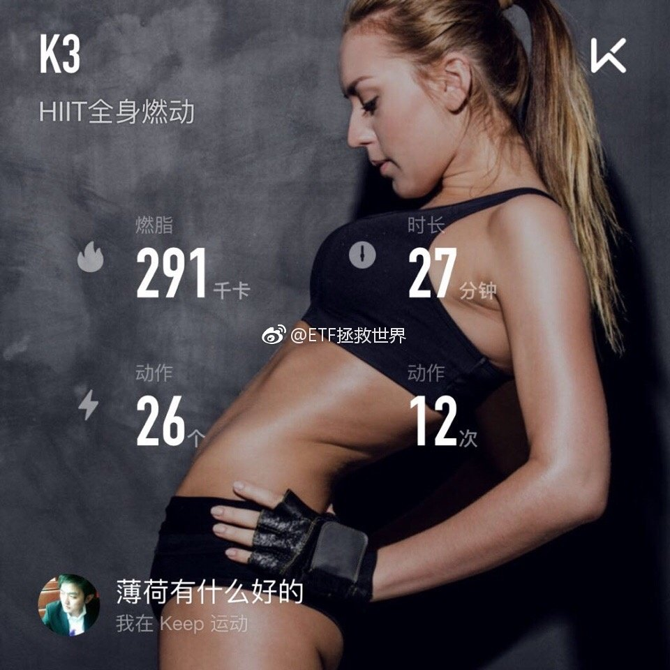

======================================================

ETF拯救世界 (5687069307) @
2017-08-16 21:21:01 Wed  
url: https://weibo.com/5687069307/Fhp85aEMI

回复@-反清复明-:神片！再推一次。//@-反清复明-:自从看了e大介绍的荒蛮故事后，一直夹起尾巴做人。//@ETF拯救世界:看了这个，突然感到非常幸运：我只是莫名其妙的被人喷而已，这个老板莫名其妙被人捅了！我可以说捡了很多条命了。

------------------------------------------------------
转推：
>  @澎湃新闻 (5044281310)
>  2017-08-16 16:30:03 Wed  
>  url: https:/weibo.com/5044281310/FhndYcTTC/

>  【取单起争执，外卖员捅死店老板后自杀】http://t.cn/RChWLSj 8月11日，陕西西安铁炉庙村附近，一外卖员因拿错饭不肯换回与店老板起争执。外卖员刀捅店老板及其岳父，店老板不治去世，随后外卖员自杀身亡。目前，案件还在调查中。陕西广播电视台http://t.cn/RChWLSl ​​​

转发[3]  评论[36]  赞[36] 

======================================================

ETF拯救世界 (5687069307) @
2017-08-17 10:08:46 Thu  
url: https://weibo.com/5687069307/Fhu9HBD25

回复@ETF一言不合就开车:算是降低成本吧。但是你支付宝买的很难转入证券账户继续套//@ETF一言不合就开车:益达，我在股票账户卖出华宝油气，再在支付宝买入相同价钱的华宝油气算套利吗//@ETF拯救世界:回复@-反清复明-:神片！再推一次。//@-反清复明-:自从看了e大介绍的荒蛮故事后，一直夹起尾巴做人。

------------------------------------------------------
转推：
>  @澎湃新闻 (5044281310)
>  2017-08-16 16:30:03 Wed  
>  url: https:/weibo.com/5044281310/FhndYcTTC/

>  【取单起争执，外卖员捅死店老板后自杀】http://t.cn/RChWLSj 8月11日，陕西西安铁炉庙村附近，一外卖员因拿错饭不肯换回与店老板起争执。外卖员刀捅店老板及其岳父，店老板不治去世，随后外卖员自杀身亡。目前，案件还在调查中。陕西广播电视台http://t.cn/RChWLSl ​​​

转发[0]  评论[7]  赞[25] 

======================================================

ETF拯救世界 (5687069307) @
2017-08-17 10:10:39 Thu  
url: https://weibo.com/5687069307/Fhuat968J

套利华宝油气要特别注意，2、3个点的空间最好别套。如果是场内申购，申购费就1.2%。晚上随便一涨就吃大亏了。我曾经在有5%空间的时候套了一次，结果晚上涨了6%。可以说相当悲惨了。

——老司机的真实经验。 ​​​

转发[15]  评论[61]  赞[106] 

======================================================

ETF拯救世界 (5687069307) @
2017-08-17 10:15:07 Thu  
url: https://weibo.com/5687069307/FhuchtSOE

各位可以注意观察，这个市场上的人有多么有意思。

就拿我们布局的几个品种说，从2015年底开始的恒生和50、一个多月前的创业板，我们第一次买入后都有十几个点的下跌空间。越跌看空的人越多，而且有无数理由看空，听起来真的都非常合理。

然而，几根阳线出来，大多数人空翻多。看好的理由听起来更合理 ​​​

转发[40]  评论[106]  赞[178] 

======================================================

ETF拯救世界 (5687069307) @
2017-08-17 10:35:46 Thu  
url: https://weibo.com/5687069307/FhukFez5Q

虽然这两个月在买创业板，但我真的不认为这里会是创业板一个不可错过的超级大底。很难想象在这个位置会有创业板牛市。

我不太相信。 ​​​

转发[14]  评论[87]  赞[128] 

======================================================

ETF拯救世界 (5687069307) @
2017-08-17 11:32:08 Thu  
url: https://weibo.com/5687069307/FhuHyb9GK

毒奶名不虚传，就问你服不服。

------------------------------------------------------
转推：
>  @ETF拯救世界 (5687069307)
>  2017-08-17 10:35:46 Thu  
>  url: https:/weibo.com/5687069307/FhukFez5Q/

>  虽然这两个月在买创业板，但我真的不认为这里会是创业板一个不可错过的超级大底。很难想象在这个位置会有创业板牛市。
>  
>  我不太相信。 ​​​

转发[1]  评论[41]  赞[76] 

======================================================

ETF拯救世界 (5687069307) @
2017-08-17 11:56:36 Thu  
url: https://weibo.com/5687069307/FhuRtpM0i

骗子多如牛毛，每天跟我举报的朋友也不计其数。不过看到这个我笑了。再说一次，我没那个闲工夫主动私信大家为大家看股票！也没兴趣弄群加QQ什么的。这么LOW的事儿能是我干得出来的吗你们说！

------------------------------------------------------
转推：
>  @YL-brant (2168589061)
>  2017-08-17 11:51:02 Thu  
>  url: https:/weibo.com/2168589061/FhuPdjMDb/

>  正确回答不是应该和我说"你真他妈的能吹牛逼"么？@ETF拯救世界  @徐大宝儿_ http://t.cn/RywXHP1 ​​​

转发[2]  评论[65]  赞[88] 

======================================================

ETF拯救世界 (5687069307) @
2017-08-17 13:31:56 Thu  
url: https://weibo.com/5687069307/Fhvuasnlr

短短半个月时间，受人追捧的漂亮50黯然神伤，遭人唾弃的创业板强势上行。

各位，雪中送炭这种事，还是要多做才好，会有好报。 ​​​

转发[8]  评论[89]  赞[166] 

======================================================

ETF拯救世界 (5687069307) @
2017-08-17 14:10:23 Thu  
url: https://weibo.com/5687069307/FhvJMbjpt

发布了头条文章：《重温7、8月计划中关于创业板的两段话》 。重温一下，可能更有感触。 http://t.cn/RCZkmsZ ​​​

转发[66]  评论[121]  赞[280] 

======================================================

ETF拯救世界 (5687069307) @
2017-08-17 22:04:22 Thu  
url: https://weibo.com/5687069307/FhyQakzUk

每日打卡（59）

天气凉快，慢慢跑五公里，出点汗很舒服。

很多事情都是在跑步时想清楚想明白的。跑步的时候是一天之中难得能专心思考的时间。

跑完心情不错。 ​​​

转发[1]  评论[57]  赞[98] 

+++++++++++++++++++++++++++++++++++++++++++++++++++++

图片：
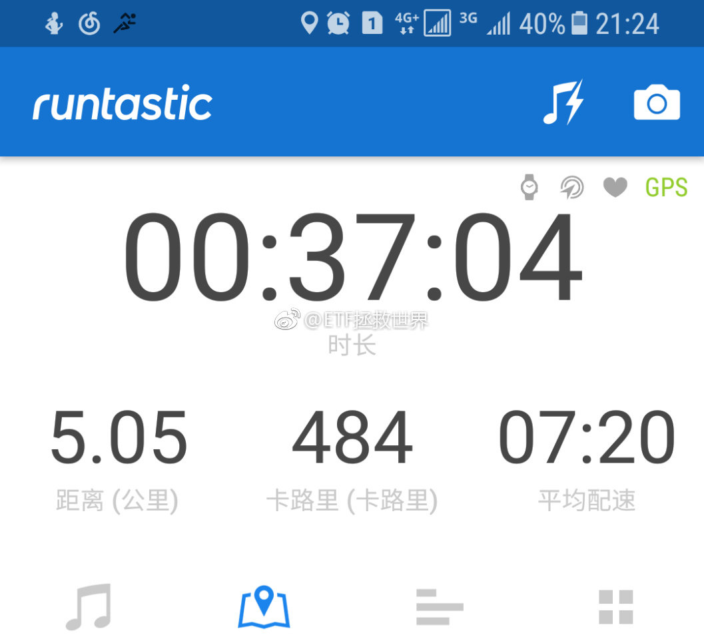

======================================================

ETF拯救世界 (5687069307) @
2017-08-17 22:41:34 Thu  
url: https://weibo.com/5687069307/Fhz5gusVX

港真，是不是瘦了。这60天没白练啊。 ​​​

转发[16]  评论[135]  赞[239] 

+++++++++++++++++++++++++++++++++++++++++++++++++++++

图片：

======================================================

ETF拯救世界 (5687069307) @
2017-08-17 23:01:37 Thu  
url: https://weibo.com/5687069307/FhzdpuXif

回复@诸天_星辰:你看看我发的微博。我是三个手机一起用。这个世界上还有没有一点信任了。//@诸天_星辰:乍用苹果手机呢？是本人吗

------------------------------------------------------
转推：
>  @ETF拯救世界 (5687069307)
>  2017-08-17 22:41:34 Thu  
>  url: https:/weibo.com/5687069307/Fhz5gusVX/

>  港真，是不是瘦了。这60天没白练啊。 ​​​

转发[0]  评论[69]  赞[83] 

======================================================

ETF拯救世界 (5687069307) @
2017-08-18 09:23:56 Fri  
url: https://weibo.com/5687069307/FhDi0dZs2

全球资产价格高估。很多人赚了钱分不清楚到底是能力还是运气。总有一天现实会让大家都分清。

另外，一定要警惕某段时间表现特别好的。包括品种，包括投资人。很少很少有一直表现特别好的，一段时间特别好，可能预示着灾难要来临。当然，你要真能碰上总是表现特别好的，那真是运气爆棚了。

永远保持在 ​​​

转发[22]  评论[98]  赞[211] 

======================================================

ETF拯救世界 (5687069307) @
2017-08-18 10:37:30 Fri  
url: https://weibo.com/5687069307/FhDLRwL3C

未来美国+德国会占到10%或15%。

然而目前的情况，何时能买完还是个未知数。太难了。 ​​​

转发[12]  评论[64]  赞[91] 

======================================================

ETF拯救世界 (5687069307) @
2017-08-18 10:41:14 Fri  
url: https://weibo.com/5687069307/FhDNnrlYk

谁能想到，如果去年十月买入标普500ETF,持有到现在居然没赚钱。 ​​​

转发[12]  评论[33]  赞[73] 

======================================================

ETF拯救世界 (5687069307) @
2017-08-18 10:59:44 Fri  
url: https://weibo.com/5687069307/FhDUTuwtp

回复@石头里的虫子:去年12月疯狂溢价你为什么不卖呢//@石头里的虫子:我是2014年买入博时标普500的，虽然赚钱了，但是看上去年化也没有多少。

------------------------------------------------------
转推：
>  @ETF拯救世界 (5687069307)
>  2017-08-18 10:41:14 Fri  
>  url: https:/weibo.com/5687069307/FhDNnrlYk/

>  谁能想到，如果去年十月买入标普500ETF,持有到现在居然没赚钱。 ​​​

转发[7]  评论[18]  赞[44] 

======================================================

ETF拯救世界 (5687069307) @
2017-08-18 11:18:50 Fri  
url: https://weibo.com/5687069307/FhE2DEiJ3

个人体会，投资最重要的是确定性。

金融投资当然是不确定的，但是可以通过品种+组合+策略的方式最大限度消除不确定性，提高确定性。

巴菲特说，投资最重要的两点，第一保本，第二看第一条，体现的就是要确定。

杠杆压独赢成了当然发家致富，输了一了百了。一将功成万骨枯，你看到的英雄脚下有无数冤 ​​​

转发[56]  评论[63]  赞[134] 

======================================================

ETF拯救世界 (5687069307) @
2017-08-18 11:25:07 Fri  
url: https://weibo.com/5687069307/FhE5clKbi

回复@我在故快乐:去年那种情况，不要有点溢价就着急卖。只要额度受限，疯狂拉升，就拿着。我在雪球有个组合可以看看，当时是12月6日1.8卖出，1.3日1.46接回来。赚了几十个点的差价。碰到大机会就要想办法多赚点。//@我在故快乐:嗯，我的早卖了。

------------------------------------------------------
转推：
>  @ETF拯救世界 (5687069307)
>  2017-08-18 10:41:14 Fri  
>  url: https:/weibo.com/5687069307/FhDNnrlYk/

>  谁能想到，如果去年十月买入标普500ETF,持有到现在居然没赚钱。 ​​​

转发[3]  评论[15]  赞[54] 

======================================================

ETF拯救世界 (5687069307) @
2017-08-18 13:12:38 Fri  
url: https://weibo.com/5687069307/FhEMPdH4A

回复@冬_zi_zinedineZidane:不亏不是目的，就像你开车不是为了不出事故，而是抵达目的地。但你首先要保证不能出车祸。好好体会一下。//@冬_zi_zinedineZidane:有个小疑问，如果我只要求不亏，那我何必进入市场呢？

------------------------------------------------------
转推：
>  @ETF拯救世界 (5687069307)
>  2017-08-18 11:18:50 Fri  
>  url: https:/weibo.com/5687069307/FhE2DEiJ3/

>  个人体会，投资最重要的是确定性。
>  
>  金融投资当然是不确定的，但是可以通过品种+组合+策略的方式最大限度消除不确定性，提高确定性。
>  
>  巴菲特说，投资最重要的两点，第一保本，第二看第一条，体现的就是要确定。
>  
>  杠杆压独赢成了当然发家致富，输了一了百了。一将功成万骨枯，你看到的英雄脚下有无数冤 ​​​

转发[4]  评论[35]  赞[91] 

======================================================

ETF拯救世界 (5687069307) @
2017-08-18 13:46:06 Fri  
url: https://weibo.com/5687069307/FhF0qgEl5

55%的家庭没有或几乎没有储蓄。  收入前10%的家庭储蓄率为60.6%，其储蓄金额占到了总储蓄额的74.9%。  收入前5%的家庭储蓄率是70%，在总储蓄中占比61.6%。  也就是说，收入最高的5%的家庭，每新增收入10000元就会存上7000元！

------------------------------------------------------
转推：
>  @ ()
>  2017-08-18 13:40:29 Fri  
>  url: 

>  抱歉，此微博已被作者删除。查看帮助：http://t.cn/Rfd3rQV

转发[27]  评论[54]  赞[86] 

======================================================

ETF拯救世界 (5687069307) @
2017-08-18 13:54:22 Fri  
url: https://weibo.com/5687069307/FhF3M1s7a

根据刚才那个报告和之前招行的报告，中国5%-10%的人占据了70%的财富应该问题不大了。 ​​​

转发[21]  评论[65]  赞[77] 

======================================================

ETF拯救世界 (5687069307) @
2017-08-18 15:27:36 Fri  
url: https://weibo.com/5687069307/FhFFCdQoR

回复@微微清风0:凭本事借的钱为什么要还？？？//@微微清风0:回复@倪谷拉丝:这年头的人我是服了，为了钱都不要脸了，我家一亲戚借我几万块，06年借的，到现在一分没还[泪]

------------------------------------------------------
转推：
>  @ETF拯救世界 (5687069307)
>  2017-08-18 13:54:22 Fri  
>  url: https:/weibo.com/5687069307/FhF3M1s7a/

>  根据刚才那个报告和之前招行的报告，中国5%-10%的人占据了70%的财富应该问题不大了。 ​​​

转发[4]  评论[65]  赞[66] 

======================================================

ETF拯救世界 (5687069307) @
2017-08-18 16:38:13 Fri  
url: https://weibo.com/5687069307/FhG8hDAPG

回复@俪俪LilyYan:“最近钱全套在股市了，跟人买ETF，全套了。你看，就是这个华宝油气。借5万？家里就剩5000了，拿走吧。先用着。”10%，就当丢了。//@俪俪LilyYan:回复@倪谷拉丝:不借的话，亲戚没得做。借了的话，最后要钱翻脸同样做不来亲戚，而且钱也没了，划不来啊

------------------------------------------------------
转推：
>  @ETF拯救世界 (5687069307)
>  2017-08-18 13:54:22 Fri  
>  url: https:/weibo.com/5687069307/FhF3M1s7a/

>  根据刚才那个报告和之前招行的报告，中国5%-10%的人占据了70%的财富应该问题不大了。 ​​​

转发[4]  评论[123]  赞[103] 

======================================================

ETF拯救世界 (5687069307) @
2017-08-18 22:02:57 Fri  
url: https://weibo.com/5687069307/FhIg5t6WZ

每日打卡（60）

累 ​​​

转发[0]  评论[20]  赞[93] 

+++++++++++++++++++++++++++++++++++++++++++++++++++++

图片：

======================================================

ETF拯救世界 (5687069307) @
2017-08-19 08:30:01 Sat  
url: https://weibo.com/5687069307/FhMmCbNDP

每日打卡(61)

晚上不知道有没有时间，早上先来一组。神清气爽有没有。 ​​​

转发[0]  评论[32]  赞[107] 

+++++++++++++++++++++++++++++++++++++++++++++++++++++

图片：

======================================================

ETF拯救世界 (5687069307) @
2017-08-20 19:14:34 Sun  
url: https://weibo.com/5687069307/Fi00Jwuua

每日打卡（62）

keep改版了。坚持 ​​​

转发[0]  评论[40]  赞[89] 

+++++++++++++++++++++++++++++++++++++++++++++++++++++

图片：

======================================================

ETF拯救世界 (5687069307) @
2017-08-21 15:19:36 Mon  
url: https://weibo.com/5687069307/Fi7TRfp7M

托大家的福，刚知道什么是中年人的四宝。

保温杯？有时候我出门确实带。不过不是温水，我一直不喜欢喝温水。如果长时间出去玩，我会往保温杯里放不少冰水，或者冰的三得利乌龙茶。如果是长途开车，会带上车载冰箱放冰水……

啤酒肚也还没有。也希望这辈子都别有。

手串？我是不理解为什么会带这个。 ​​​

转发[6]  评论[177]  赞[104] 

+++++++++++++++++++++++++++++++++++++++++++++++++++++

图片：
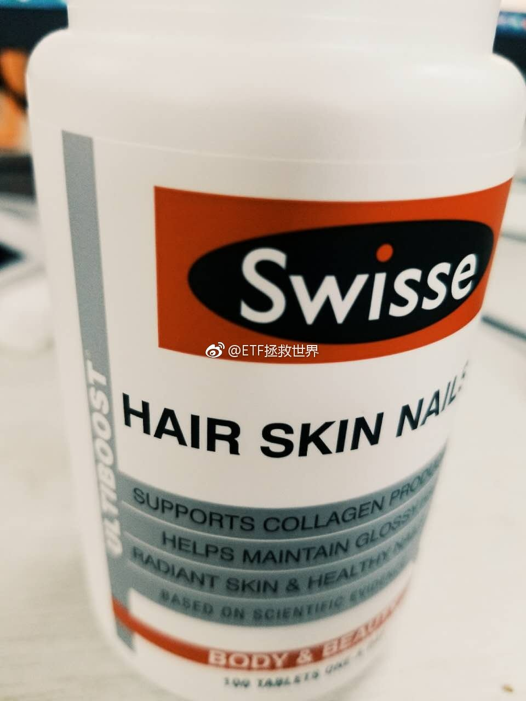

======================================================

ETF拯救世界 (5687069307) @
2017-08-21 15:42:23 Mon  
url: https://weibo.com/5687069307/Fi836uGh6

创业板业绩增长也是醉了。最近涨这么多，估值还降了…… ​​​

转发[7]  评论[66]  赞[108] 

======================================================

ETF拯救世界 (5687069307) @
2017-08-21 16:47:27 Mon  
url: https://weibo.com/5687069307/Fi8tw6BvH

北京不少离婚是因为房子，买、卖。办完了就复婚了……

------------------------------------------------------
转推：
>  @数据分析研究者 (5628021879)
>  2016-08-29 19:18:39 Mon  
>  url: https:/weibo.com/5628021879/E5PlWkoCs/

>  【从上海人为买房急离婚看房价与离婚率之间的关系 】8月29日，上海徐汇区民政局离婚登记处被前来办理离婚的市民挤爆，离婚的人群从早上7点多开始在此排队。下午4时，本该16:30才下班的离婚登记处采取了临时“封闭”措施。这一切缘于上海地产将于近期展开新一轮调控的传闻。于传闻发酵多日之后，今日下 ​​​

转发[1]  评论[18]  赞[36] 

======================================================

ETF拯救世界 (5687069307) @
2017-08-21 17:06:43 Mon  
url: https://weibo.com/5687069307/Fi8Bl390O

回复@俪俪LilyYan:这话也不对了。2万多甚至可以买到欧米茄了，当然要在国外买。好歹也算是个一等二类的牌子了。//@俪俪LilyYan:回复@kaka涛:一两万只能考虑石英表

------------------------------------------------------
转推：
>  @ETF拯救世界 (5687069307)
>  2017-08-21 15:19:36 Mon  
>  url: https:/weibo.com/5687069307/Fi7TRfp7M/

>  托大家的福，刚知道什么是中年人的四宝。
>  
>  保温杯？有时候我出门确实带。不过不是温水，我一直不喜欢喝温水。如果长时间出去玩，我会往保温杯里放不少冰水，或者冰的三得利乌龙茶。如果是长途开车，会带上车载冰箱放冰水……
>  
>  啤酒肚也还没有。也希望这辈子都别有。
>  
>  手串？我是不理解为什么会带这个。 ​​​

转发[1]  评论[35]  赞[37] 

======================================================

ETF拯救世界 (5687069307) @
2017-08-22 09:09:56 Tue  
url: https://weibo.com/5687069307/FieUj8V4R

组合中第一权重的恒生、50，以及后面的红利、300这些这几个月的强势指数，并没有新高；

医药、养老、创业这些这几个月弱势或者平衡的，刚刚从阶段底部区域开始反弹；

油气甚至还在新低；

然而，昨天组合又双叒叕新高了。

且慢统计，95%以上跟车的朋友都盈利了。（另外5%怎么会不盈利的……）

这难 ​​​

转发[30]  评论[71]  赞[131] 

======================================================

ETF拯救世界 (5687069307) @
2017-08-22 09:18:00 Tue  
url: https://weibo.com/5687069307/FieXA8JjZ

回复@鄧哈哈要举高高:chinaetfs 。用过都说好。//@鄧哈哈要举高高:E大能发下微信公众号么？

------------------------------------------------------
转推：
>  @ETF拯救世界 (5687069307)
>  2017-08-22 09:09:56 Tue  
>  url: https:/weibo.com/5687069307/FieUj8V4R/

>  组合中第一权重的恒生、50，以及后面的红利、300这些这几个月的强势指数，并没有新高；
>  
>  医药、养老、创业这些这几个月弱势或者平衡的，刚刚从阶段底部区域开始反弹；
>  
>  油气甚至还在新低；
>  
>  然而，昨天组合又双叒叕新高了。
>  
>  且慢统计，95%以上跟车的朋友都盈利了。（另外5%怎么会不盈利的……）
>  
>  这难 ​​​

转发[1]  评论[29]  赞[73] 

======================================================

ETF拯救世界 (5687069307) @
2017-08-22 09:30:25 Tue  
url: https://weibo.com/5687069307/Fif2Cq9gx

回复@阿尔法和欧米迦:盼着低估，这个没错。谁都希望抄到大底。但你要知道，客观世界可不是按照我们的意愿运行的。我们要去主动的适应这个客观的世界，而不是等着世界来迎合我们。所以我们要有自己的坚持，同时要灵活的应变。做好发生各种情况的准备，并根据变化，计算各种可能发生的概率，根据概率下注

------------------------------------------------------
转推：
>  @ETF拯救世界 (5687069307)
>  2017-08-22 09:09:56 Tue  
>  url: https:/weibo.com/5687069307/FieUj8V4R/

>  组合中第一权重的恒生、50，以及后面的红利、300这些这几个月的强势指数，并没有新高；
>  
>  医药、养老、创业这些这几个月弱势或者平衡的，刚刚从阶段底部区域开始反弹；
>  
>  油气甚至还在新低；
>  
>  然而，昨天组合又双叒叕新高了。
>  
>  且慢统计，95%以上跟车的朋友都盈利了。（另外5%怎么会不盈利的……）
>  
>  这难 ​​​

转发[5]  评论[23]  赞[70] 

======================================================

ETF拯救世界 (5687069307) @
2017-08-22 09:42:34 Tue  
url: https://weibo.com/5687069307/Fif7yjvZX

现在还在喊港股有极大投资价值的都是坏人。 ​​​

转发[234]  评论[43]  赞[111] 

======================================================

ETF拯救世界 (5687069307) @
2017-08-22 09:46:07 Tue  
url: https://weibo.com/5687069307/Fif8Zz5WC

回复@小白兔的照妖镜:腾讯TTM PE已经50倍了，比创业板还高。还怎么靠。。//@小白兔的照妖镜:E大，你说港股和大佬A会不会估值靠拢？

------------------------------------------------------
转推：
>  @ETF拯救世界 (5687069307)
>  2017-08-22 09:42:34 Tue  
>  url: https:/weibo.com/5687069307/Fif7yjvZX/

>  现在还在喊港股有极大投资价值的都是坏人。 ​​​

转发[3]  评论[6]  赞[48] 

======================================================

ETF拯救世界 (5687069307) @
2017-08-22 09:50:31 Tue  
url: https://weibo.com/5687069307/FifaMlh82

还是那个观点，恒生29500以上会继续减。

------------------------------------------------------
转推：
>  @ETF拯救世界 (5687069307)
>  2017-08-22 09:42:34 Tue  
>  url: https:/weibo.com/5687069307/Fif7yjvZX/

>  现在还在喊港股有极大投资价值的都是坏人。 ​​​

转发[218]  评论[20]  赞[47] 

======================================================

ETF拯救世界 (5687069307) @
2017-08-22 09:52:54 Tue  
url: https://weibo.com/5687069307/FifbKll47

回复@孤独者生存1:转需。//@孤独者生存1:E哥，今天的逆回购，7天和14天的到4.7了。

------------------------------------------------------
转推：
>  @ETF拯救世界 (5687069307)
>  2017-08-22 09:42:34 Tue  
>  url: https:/weibo.com/5687069307/Fif7yjvZX/

>  现在还在喊港股有极大投资价值的都是坏人。 ​​​

转发[0]  评论[9]  赞[38] 

======================================================

ETF拯救世界 (5687069307) @
2017-08-22 09:53:28 Tue  
url: https://weibo.com/5687069307/FifbZ8IjU

回复@求财不劫色:放过它！医药还是个孩子！//@求财不劫色:什么时候医药才能减呢？//@ETF拯救世界:还是那个观点，恒生29500以上会继续减。

------------------------------------------------------
转推：
>  @ETF拯救世界 (5687069307)
>  2017-08-22 09:42:34 Tue  
>  url: https:/weibo.com/5687069307/Fif7yjvZX/

>  现在还在喊港股有极大投资价值的都是坏人。 ​​​

转发[200]  评论[23]  赞[56] 

======================================================

ETF拯救世界 (5687069307) @
2017-08-22 09:56:33 Tue  
url: https://weibo.com/5687069307/Fifdeg3JA

说正经的吧。以目前的情况，医药满仓点位是7000，减仓区域是12000-13000。这几个数字每年增加500-1000点。//@ETF拯救世界:回复@求财不劫色:放过它！医药还是个孩子！//@求财不劫色:什么时候医药才能减呢？//@ETF拯救世界:还是那个观点，恒生29500以上会继续减。

------------------------------------------------------
转推：
>  @ETF拯救世界 (5687069307)
>  2017-08-22 09:42:34 Tue  
>  url: https:/weibo.com/5687069307/Fif7yjvZX/

>  现在还在喊港股有极大投资价值的都是坏人。 ​​​

转发[199]  评论[63]  赞[105] 

======================================================

ETF拯救世界 (5687069307) @
2017-08-22 10:10:38 Tue  
url: https://weibo.com/5687069307/FifiWwBQs

回复@石头里的虫子:“5~10年不用的资金，可以忍受较大回撤”。如果这个条件成立，没有什么股票组合是不行的。试问在座的各位，能忍受整体资金回撤30%以上的，好几年不回本的有几位。

------------------------------------------------------
转推：
>  @ETF拯救世界 (5687069307)
>  2017-08-22 09:42:34 Tue  
>  url: https:/weibo.com/5687069307/Fif7yjvZX/

>  现在还在喊港股有极大投资价值的都是坏人。 ​​​

转发[8]  评论[73]  赞[86] 

======================================================

ETF拯救世界 (5687069307) @
2017-08-22 11:13:50 Tue  
url: https://weibo.com/5687069307/FifIAw6Dy

不错。下一步应该是积极参与到混改中来，助国企解困一臂之力。

------------------------------------------------------
转推：
>  @蓝鲸财经记者工作平台 (1885454921)
>  2017-08-22 11:10:02 Tue  
>  url: https:/weibo.com/1885454921/FifH3qWAy/

>  【鲸播报：宗庆后称民企是从严治党受益者 500员工递入党申请书】8月22日讯，宗庆后表示，企业和政府关系更“清”了。不少民营企业不再把精力花在做好与政府部门的“公关工作”，搞吃吃喝喝，搞迎来送往上。如今，企业党组织向心力日益凸显，年轻人向党组织靠拢的热情也不断被激发出来。 ​​​

转发[3]  评论[50]  赞[68] 

======================================================

ETF拯救世界 (5687069307) @
2017-08-22 21:38:07 Tue  
url: https://weibo.com/5687069307/FijNZC0kX

每日打卡（63）

昨天有事没练。这几天就补上。 ​​​

转发[1]  评论[26]  赞[78] 

+++++++++++++++++++++++++++++++++++++++++++++++++++++

图片：

======================================================

ETF拯救世界 (5687069307) @
2017-08-23 08:33:59 Wed  
url: https://weibo.com/5687069307/Fio6dtxIt

又那什么了。 ​​​

转发[0]  评论[54]  赞[72] 

======================================================

ETF拯救世界 (5687069307) @
2017-08-23 09:49:46 Wed  
url: https://weibo.com/5687069307/FioAYjhy2

创业板至今披露的中报，业绩真是不错啊。4不4还得买 ​​​

转发[13]  评论[35]  赞[65] 

======================================================

ETF拯救世界 (5687069307) @
2017-08-23 10:02:23 Wed  
url: https://weibo.com/5687069307/FioG6eL2H

回复@Constance康斯坦丝:真正的smart money，从不扯淡，就是干。

------------------------------------------------------
转推：
>  @ETF拯救世界 (5687069307)
>  2017-08-23 09:49:46 Wed  
>  url: https:/weibo.com/5687069307/FioAYjhy2/

>  创业板至今披露的中报，业绩真是不错啊。4不4还得买 ​​​

转发[11]  评论[11]  赞[49] 

======================================================

ETF拯救世界 (5687069307) @
2017-08-23 10:10:19 Wed  
url: https://weibo.com/5687069307/FioJjpgL8

来，我来告诉各位，什么是真正的smart money。

那是2015年7月前的汇金，比我强到不知道哪里去了。我在15年3、4月就卖的7788，人家5月才撤。再看建仓时间。你不服？

这才是联合收割机，跟着dang，有肉吃。

当然，15年7月以后，就变成工具了。那以后的操作，就不能代表他们操盘手真正的水平了。 ​​ ​​​

转发[41]  评论[61]  赞[115] 

+++++++++++++++++++++++++++++++++++++++++++++++++++++

图片：

======================================================

ETF拯救世界 (5687069307) @
2017-08-23 10:17:04 Wed  
url: https://weibo.com/5687069307/FioM3jp7P

回复@股市少先队员:最近10-15年，看不到15倍的创业板。20倍都很难见到。//@股市少先队员:方丈说十倍十五倍市盈率才定投创业板，算不算原教旨夹头，e大则么看？[憧憬]//@ETF拯救世界:回复@Constance康斯坦丝:真正的smart money，从不扯淡，就是干。

------------------------------------------------------
转推：
>  @ETF拯救世界 (5687069307)
>  2017-08-23 09:49:46 Wed  
>  url: https:/weibo.com/5687069307/FioAYjhy2/

>  创业板至今披露的中报，业绩真是不错啊。4不4还得买 ​​​

转发[6]  评论[12]  赞[49] 

======================================================

ETF拯救世界 (5687069307) @
2017-08-23 10:21:39 Wed  
url: https://weibo.com/5687069307/FioNVaohk

回复@猪的钉耙:昨天纳斯达克26。腾讯50。阿里60。特斯拉亏损。凭什么给国内创业板10-15倍？拍脑袋可不行啊。//@猪的钉耙:回复@股市少先队员:美股小盘股都有20倍估值//@ETF拯救世界:回复@Constance康斯坦丝:真正的smart money，从不扯淡，就是干。

------------------------------------------------------
转推：
>  @ETF拯救世界 (5687069307)
>  2017-08-23 09:49:46 Wed  
>  url: https:/weibo.com/5687069307/FioAYjhy2/

>  创业板至今披露的中报，业绩真是不错啊。4不4还得买 ​​​

转发[1]  评论[9]  赞[51] 

======================================================

ETF拯救世界 (5687069307) @
2017-08-23 10:23:44 Wed  
url: https://weibo.com/5687069307/FioOL9SwG

我表个态。创业板我自己计算的估值到25倍就打满它的仓位。最多可以给到10%-15%。如果到20倍就给到20%。

那时候可能是金融危机又来了。 ​​​

转发[45]  评论[68]  赞[118] 

======================================================

ETF拯救世界 (5687069307) @
2017-08-23 10:26:26 Wed  
url: https://weibo.com/5687069307/FioPR9nsp

回复@edinlu:历史最低32。//@edinlu:创业历史上从没到过25倍吧？

------------------------------------------------------
转推：
>  @ETF拯救世界 (5687069307)
>  2017-08-23 10:23:44 Wed  
>  url: https:/weibo.com/5687069307/FioOL9SwG/

>  我表个态。创业板我自己计算的估值到25倍就打满它的仓位。最多可以给到10%-15%。如果到20倍就给到20%。
>  
>  那时候可能是金融危机又来了。 ​​​

转发[11]  评论[29]  赞[50] 

======================================================

ETF拯救世界 (5687069307) @
2017-08-23 11:01:52 Wed  
url: https://weibo.com/5687069307/Fip4fe0oa

还有一周，要不要奶一下？ ​​​

转发[5]  评论[47]  赞[79] 

======================================================

ETF拯救世界 (5687069307) @
2017-08-23 11:05:57 Wed  
url: https://weibo.com/5687069307/Fip5TsN5T

来一个：这样跌几天，我们月末就买（）份

------------------------------------------------------
转推：
>  @ETF拯救世界 (5687069307)
>  2017-08-23 11:01:52 Wed  
>  url: https:/weibo.com/5687069307/Fip4fe0oa/

>  还有一周，要不要奶一下？ ​​​

转发[4]  评论[99]  赞[87] 

======================================================

ETF拯救世界 (5687069307) @
2017-08-23 14:09:56 Wed  
url: https://weibo.com/5687069307/FiqizurxW

可以说百发百中了。//@ETF拯救世界:来一个：这样跌几天，我们月末就买（）份

------------------------------------------------------
转推：
>  @ETF拯救世界 (5687069307)
>  2017-08-23 11:01:52 Wed  
>  url: https:/weibo.com/5687069307/Fip4fe0oa/

>  还有一周，要不要奶一下？ ​​​

转发[2]  评论[34]  赞[65] 

======================================================

ETF拯救世界 (5687069307) @
2017-08-23 14:39:30 Wed  
url: https://weibo.com/5687069307/FiquA8XwB

操盘功力神出鬼没。这股市绝了。

------------------------------------------------------
转推：
>  @ETF拯救世界 (5687069307)
>  2017-04-07 10:09:34 Fri  
>  url: https:/weibo.com/5687069307/EDncO76hf/

>  3000（或者3100）到3300之间用ETF做网格应该是很靠谱的。
>  
>  GJD信誉保证。跟着GJD有肉吃。 ​​​

转发[4]  评论[46]  赞[82] 

======================================================

ETF拯救世界 (5687069307) @
2017-08-24 10:01:36 Thu  
url: https://weibo.com/5687069307/Fiy6h20PR

想说点什么。但是理智告诉我不能说。[闭嘴] ​​​

转发[0]  评论[157]  赞[124] 

======================================================

ETF拯救世界 (5687069307) @
2017-08-24 11:20:26 Thu  
url: https://weibo.com/5687069307/FiyCgCu5a

确认了。 ​​​

转发[1]  评论[62]  赞[85] 

+++++++++++++++++++++++++++++++++++++++++++++++++++++

图片：

======================================================

ETF拯救世界 (5687069307) @
2017-08-24 11:23:30 Thu  
url: https://weibo.com/5687069307/FiyDw3DyW

可以说相当贴切了。//@挖龙脉的鹿鼎公://@晓雨闻铃: 回复@沉甸甸的人:[允悲]//@沉甸甸的人:这段子太他妈绝了//@晓雨闻铃:和A股救市差不多？

------------------------------------------------------
转推：
>  @北京人不知道的北京事儿 (1662214194)
>  2017-08-23 21:58:07 Wed  
>  url: https:/weibo.com/1662214194/FitmCfx03/

>  【小猪火场中获救 半年后被主人做成香肠送给消防员】今年2月，英国威尔特郡一农场发生火灾，农场内2头母猪、18头小猪仔被消防员救出。不过，侥幸逃生的小猪们完全没有料到自己的命运——半年后被主人做成香肠，送给当时救援的消防员以示感谢。消防员们表示，香肠“味道好极了”。 ​​​

转发[25]  评论[21]  赞[56] 

======================================================

ETF拯救世界 (5687069307) @
2017-08-24 11:39:59 Thu  
url: https://weibo.com/5687069307/FiyKcAI9V

学历的最大作用是个筛选器。帮助用人单位成本最低的把很大一批人筛选掉。不是说被筛掉的人里面没有能力强的，而是要把他们找出来成本太高了。

------------------------------------------------------
转推：
>  @共青团福建省委 (2730549204)
>  2017-08-24 11:25:32 Thu  
>  url: https:/weibo.com/2730549204/FiyElqOaX/

>  【“学历不重要”是个大骗局，却总有人深信不疑】这两天，网上又掀起了一波关于学历的讨论，因为两段视频。一个是HR分析：为什么大企业只招名校毕业生？另一个是考研名师张雪峰的演讲：大学生究竟该不该考研？作者说，总有人喜欢拿无知当个性，拿没文化当真性情，自己没学历没成功就算了，还吹捧着“读 ​​​

转发[47]  评论[32]  赞[92] 

======================================================

ETF拯救世界 (5687069307) @
2017-08-24 13:56:07 Thu  
url: https://weibo.com/5687069307/FizDt87NL

成长跑赢价值，价值跑赢成长，都是阶段性的。与经济周期也有关系。有空研究研究这个，会发现也很有意思。

------------------------------------------------------
转推：
>  @ ()
>  2017-08-24 13:51:26 Thu  
>  url: 

>  该账号因被投诉违反《微博社区公约》的相关规定，现已无法查看。查看帮助 https://kefu.weibo.com/faqdetail?id=13216

转发[9]  评论[12]  赞[43] 

======================================================

ETF拯救世界 (5687069307) @
2017-08-24 14:10:36 Thu  
url: https://weibo.com/5687069307/FizJlbqNq

讲真，这两年，2015年7月以后这一轮买入，由于有大家都知道的因素，真的特别难。

不过我坚信，不买贵的东西，是对自己财富的负责，也是取得长期良好收益率的基础。

不知道未来会怎样，但是，做正确的事，结果大概率就不会差。 ​​​

转发[15]  评论[42]  赞[148] 

======================================================

ETF拯救世界 (5687069307) @
2017-08-24 14:17:41 Thu  
url: https://weibo.com/5687069307/FizMdnaG4

我不知道这次还能不能回到3000或者3100了。如果又回去了，大概率就是最后一次了。如果不跌破3000或者3100，又起来，就不会再有机会回去了。跌破了，就会有超级大机会。

------------------------------------------------------
转推：
>  @ETF拯救世界 (5687069307)
>  2017-04-07 10:09:34 Fri  
>  url: https:/weibo.com/5687069307/EDncO76hf/

>  3000（或者3100）到3300之间用ETF做网格应该是很靠谱的。
>  
>  GJD信誉保证。跟着GJD有肉吃。 ​​​

转发[33]  评论[78]  赞[113] 

======================================================

ETF拯救世界 (5687069307) @
2017-08-24 14:33:44 Thu  
url: https://weibo.com/5687069307/FizSJkSfx

讲真，既然这么一个庞然大物在市场里玩，做为微生物的我们，就得想想它到底要干嘛。

把池塘里的大鳄，大鱼小虾和微生物都吃掉吗？当然肯定不是。没有那个必要，而且，还指着这些生物为企业融资，降低企业债务和杠杆贡献力量，都吃了怎么行。

这个庞然大物最大的作用是让市场稳定。或者说，看起来是稳 ​​​

转发[52]  评论[95]  赞[169] 

======================================================

ETF拯救世界 (5687069307) @
2017-08-24 15:18:17 Thu  
url: https://weibo.com/5687069307/FiAaOqXi8

没看过《夺命金》吧。推荐没看过的朋友都看看，我个人还挺喜欢的。//@且慢管家:#理财# 银行销售理财产品需要录音，录视频 interesting[doge]

------------------------------------------------------
转推：
>  @蓝鲸财经记者工作平台 (1885454921)
>  2017-08-23 19:32:58 Wed  
>  url: https:/weibo.com/1885454921/FispH7cK4/

>  【8月23日周三《新闻联播》要闻八条】 ​​​

转发[2]  评论[34]  赞[50] 

======================================================

ETF拯救世界 (5687069307) @
2017-08-24 17:25:59 Thu  
url: https://weibo.com/5687069307/FiB0Ebm7R

回复@hdhsbajicjsiisidjsioajshdic:你大概根本没看懂我在说什么。我们没有买上证，上证也不具代表性，但是操控市场的人只看它。所以我们就观察它。这么说，你懂了吗。//@hdhsbajicjsiisidjsioajshdic:上证指数不具市场代表性和你买的不是上证指数，那就不要拿它来说事了

------------------------------------------------------
转推：
>  @ETF拯救世界 (5687069307)
>  2017-04-07 10:09:34 Fri  
>  url: https:/weibo.com/5687069307/EDncO76hf/

>  3000（或者3100）到3300之间用ETF做网格应该是很靠谱的。
>  
>  GJD信誉保证。跟着GJD有肉吃。 ​​​

转发[6]  评论[27]  赞[62] 

======================================================

ETF拯救世界 (5687069307) @
2017-08-24 17:41:35 Thu  
url: https://weibo.com/5687069307/FiB6Yzowe

太听话了……

------------------------------------------------------
转推：
>  @ ()
>  2017-08-24 17:22:23 Thu  
>  url: 

>  抱歉，作者已设置仅展示半年内微博，此微博已不可见。 ​​​

转发[8]  评论[30]  赞[36] 

======================================================

ETF拯救世界 (5687069307) @
2017-08-24 20:09:57 Thu  
url: https://weibo.com/5687069307/FiC5crAFL

每日打卡（64）

先把昨天的债还上，一会再来一组 ​​​

转发[0]  评论[9]  赞[63] 

+++++++++++++++++++++++++++++++++++++++++++++++++++++

图片：

======================================================

ETF拯救世界 (5687069307) @
2017-08-24 20:40:29 Thu  
url: https://weibo.com/5687069307/FiChB0ZpJ

每日打卡（65）

练得很舒服，还欠一天，周末还 ​​​

转发[0]  评论[11]  赞[76] 

+++++++++++++++++++++++++++++++++++++++++++++++++++++

图片：

======================================================

ETF拯救世界 (5687069307) @
2017-08-25 10:40:11 Fri  
url: https://weibo.com/5687069307/FiHMqw5f1

再一次3300止步。  一鼓作气再而衰三而竭。  不过，下一次再次回到这里，就没有什么可以阻挡了。

------------------------------------------------------
转推：
>  @ETF拯救世界 (5687069307)
>  2017-04-07 10:09:34 Fri  
>  url: https:/weibo.com/5687069307/EDncO76hf/

>  3000（或者3100）到3300之间用ETF做网格应该是很靠谱的。
>  
>  GJD信誉保证。跟着GJD有肉吃。 ​​​

转发[9]  评论[50]  赞[82] 

======================================================

ETF拯救世界 (5687069307) @
2017-08-25 10:45:28 Fri  
url: https://weibo.com/5687069307/FiHOzsRE2

两融魔咒 ​​​

转发[11]  评论[71]  赞[97] 

+++++++++++++++++++++++++++++++++++++++++++++++++++++

图片：
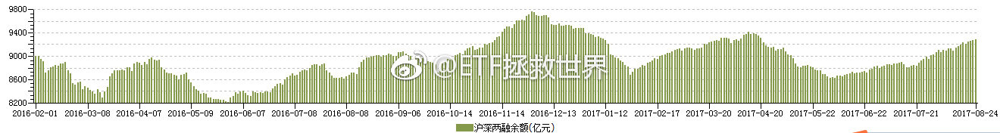

======================================================

ETF拯救世界 (5687069307) @
2017-08-25 14:07:55 Fri  
url: https://weibo.com/5687069307/FiJ8KljBw

突破了，就踏踏实实持有手里的东西。像上面微博说的，一个区间不可能长期存在。总有突破的那一天，综合要考虑的是时间、空间和价值的转换。

有朋友问，追不追？

如果是新朋友，以后可以慢慢交流。如果是老朋友，还是请立即取关吧。看我的东西白看啊。

一直在说，持仓要做到“涨跌都舒服”。根据概率 ​​​

转发[65]  评论[151]  赞[174] 

======================================================

ETF拯救世界 (5687069307) @
2017-08-25 15:26:47 Fri  
url: https://weibo.com/5687069307/FiJELt2Q6

回复@亚历山大-棕地:哦？那我再推荐一个：《遗愿清单 The Bucket List》。另外，继续送电影票。请上次排名第二的联系我！我记得是 @徐L鑫 ？不过这次只有一张了！//@亚历山大-棕地:E神，你推荐的电影比书更靠谱，夺命金和荒蛮故事都挺好看。

------------------------------------------------------
转推：
>  @ETF拯救世界 (5687069307)
>  2017-08-25 14:07:55 Fri  
>  url: https:/weibo.com/5687069307/FiJ8KljBw/

>  突破了，就踏踏实实持有手里的东西。像上面微博说的，一个区间不可能长期存在。总有突破的那一天，综合要考虑的是时间、空间和价值的转换。
>  
>  有朋友问，追不追？
>  
>  如果是新朋友，以后可以慢慢交流。如果是老朋友，还是请立即取关吧。看我的东西白看啊。
>  
>  一直在说，持仓要做到“涨跌都舒服”。根据概率 ​​​

转发[10]  评论[56]  赞[62] 

======================================================

ETF拯救世界 (5687069307) @
2017-08-25 15:39:01 Fri  
url: https://weibo.com/5687069307/FiJJJ6y9j

负责任的说，如果下周几天不会连续大涨，月底会开车。而且不止一辆，不止一辆A股权益类。

今天数据出来，变化不是很大。毕竟暴涨的就是那1、200只，大部分股票都是小涨，叠加业绩增加，月底有的搞。

这一条毒不毒，要看下周几天的走势了。 ​​​

转发[6]  评论[128]  赞[175] 

======================================================

ETF拯救世界 (5687069307) @
2017-08-25 18:27:31 Fri  
url: https://weibo.com/5687069307/FiKQ7qYyA

已经快买成第一重仓etf了[doge]

------------------------------------------------------
转推：
>  @ ()
>  2017-08-25 15:30:39 Fri  
>  url: 

>  该账号因被投诉违反《微博社区公约》的相关规定，现已无法查看。查看帮助 https://kefu.weibo.com/faqdetail?id=13216

转发[15]  评论[46]  赞[98] 

======================================================

ETF拯救世界 (5687069307) @
2017-08-25 21:18:23 Fri  
url: https://weibo.com/5687069307/FiLXu3jdz

每日打卡（66）

轻松做完，过周末 ​​​

转发[0]  评论[25]  赞[82] 

+++++++++++++++++++++++++++++++++++++++++++++++++++++

图片：

======================================================

ETF拯救世界 (5687069307) @
2017-08-26 21:44:26 Sat  
url: https://weibo.com/5687069307/FiVyxF1AY

每日打卡（67）

今天出去聚会，大吃大喝。回来以后感觉不舒服。吃惯了清淡的东西，吃太荤的就难受。

出去跑一跑，练练腹肌，等于白练。还是得管住嘴啊。 ​​​

转发[2]  评论[38]  赞[65] 

+++++++++++++++++++++++++++++++++++++++++++++++++++++

图片：

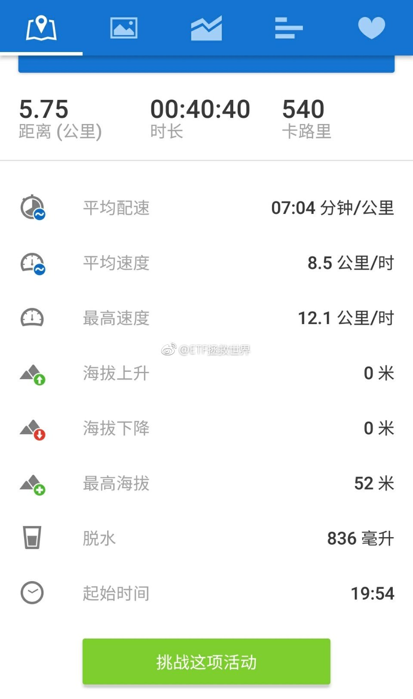

======================================================

ETF拯救世界 (5687069307) @
2017-08-26 22:10:18 Sat  
url: https://weibo.com/5687069307/FiVJ3fqFz

回复@mydxkl:这样骗子是不是没法复制了//@mydxkl:@ETF拯救世界 头像+1是啥意思[疑问]

------------------------------------------------------
转推：
>  @ETF拯救世界 (5687069307)
>  2017-08-26 21:44:26 Sat  
>  url: https:/weibo.com/5687069307/FiVyxF1AY/

>  每日打卡（67）
>  
>  今天出去聚会，大吃大喝。回来以后感觉不舒服。吃惯了清淡的东西，吃太荤的就难受。
>  
>  出去跑一跑，练练腹肌，等于白练。还是得管住嘴啊。 ​​​

转发[1]  评论[50]  赞[68] 

======================================================

ETF拯救世界 (5687069307) @
2017-08-27 19:50:33 Sun  
url: https://weibo.com/5687069307/Fj4eP85TV

GJD，棒棒的……救市资金账本:券商第2批资金退出 国家队公募赚374亿 http://t.cn/RCEwL5u ​​​

转发[7]  评论[35]  赞[69] 

======================================================

ETF拯救世界 (5687069307) @
2017-08-27 19:55:52 Sun  
url: https://weibo.com/5687069307/Fj4gYnkxU

哈哈，不好意思，这次只有一张。以后有机会继续给大家送电影票~昨天我也去电影院看了两部。星际特工情节很一般，但是画面真的太炫了。想象力丰富，可以试试imax。极盗车神个人不喜欢，只给2星。

------------------------------------------------------
转推：
>  @徐小包s (5848291651)
>  2017-08-27 14:21:56 Sun  
>  url: https:/weibo.com/5848291651/Fj25qCq4D/

>  ‌作为第二名，居然也有电影票，我很幸运，也很意外，再次感谢@ETF拯救世界  赠票，建议以后也可以多谈谈投资之外的话题。抛开的爱国主义情怀，《战狼2》确实也是值得一看的。但电影，你永远不知道它为什么会火，为什么会红，天时，地利，人和吧。看完这部电影，让我想起巴菲特说的一句话，"我很幸运。 ​​​

转发[1]  评论[25]  赞[47] 

======================================================

ETF拯救世界 (5687069307) @
2017-08-27 20:35:05 Sun  
url: https://weibo.com/5687069307/Fj4wTlR2S

每日打卡（68）

70天过去，每天练练已经成习惯了。时间过得真快啊。 ​​​

转发[1]  评论[33]  赞[102] 

+++++++++++++++++++++++++++++++++++++++++++++++++++++

图片：

======================================================

ETF拯救世界 (5687069307) @
2017-08-28 09:55:52 Mon  
url: https://weibo.com/5687069307/Fj9LVB9gC

今天 $创业板指 sz399006$  也不错。无论手里的东西涨还是不涨，好好拿着就行了。不要随意卖出做差价。 ​​​

转发[6]  评论[55]  赞[111] 

======================================================

ETF拯救世界 (5687069307) @
2017-08-28 10:23:09 Mon  
url: https://weibo.com/5687069307/Fj9X0kDXW

A股不会出现“慢牛”。因为只要指数有突破，大家就会焦急地问：是不是牛市来了？

如果还在涨，那么在场外探头探脑的人就会冲进去。然后财富效应开始扩散。然后有更多不关心这个市场的人开始进入。

问题的症结在于：如果你知道会有牛市，那你会不会等着慢慢进来？

不会的。绝大多数人会焦急的冲进来 ​​​

转发[62]  评论[97]  赞[209] 

======================================================

ETF拯救世界 (5687069307) @
2017-08-28 11:06:59 Mon  
url: https://weibo.com/5687069307/FjaeNnvUk

虽然买了这个，但讲真，我不信短期有多大空间。如果有，那一定会股灾。

------------------------------------------------------
转推：
>  @ETF拯救世界 (5687069307)
>  2017-08-28 09:55:52 Mon  
>  url: https:/weibo.com/5687069307/Fj9LVB9gC/

>  今天 $创业板指 sz399006$  也不错。无论手里的东西涨还是不涨，好好拿着就行了。不要随意卖出做差价。 ​​​

转发[1]  评论[46]  赞[89] 

======================================================

ETF拯救世界 (5687069307) @
2017-08-28 11:31:36 Mon  
url: https://weibo.com/5687069307/FjaoN3ep8

从一开始的恒生、50、300，到后来的红利、500、医药养老、创业等等。这一路布局，希望大家感受到的，是逢低买入资产等待别人给你抬轿子的乐趣。而不是别人买完了我们再去追热点。

不停的扫描市场上能监控到的品种，发现出现有价值的就开始买入。这种投资方式，要比不停的追逐热点不停切换，我个人认为 ​​​

转发[80]  评论[108]  赞[216] 

======================================================

ETF拯救世界 (5687069307) @
2017-08-28 12:32:09 Mon  
url: https://weibo.com/5687069307/FjaNmga3u

回复@半生流离醉:跟你说一条十几年的经验。只要一个品种不差，横的越久，涨得越高。最好再横几年//@半生流离醉:这种办法很稳。就是医药还趴在地上。。。[哼]

------------------------------------------------------
转推：
>  @ETF拯救世界 (5687069307)
>  2017-08-28 11:31:36 Mon  
>  url: https:/weibo.com/5687069307/FjaoN3ep8/

>  从一开始的恒生、50、300，到后来的红利、500、医药养老、创业等等。这一路布局，希望大家感受到的，是逢低买入资产等待别人给你抬轿子的乐趣。而不是别人买完了我们再去追热点。
>  
>  不停的扫描市场上能监控到的品种，发现出现有价值的就开始买入。这种投资方式，要比不停的追逐热点不停切换，我个人认为 ​​​

转发[21]  评论[75]  赞[123] 

======================================================

ETF拯救世界 (5687069307) @
2017-08-29 09:18:21 Tue  
url: https://weibo.com/5687069307/FjiXclsiQ

一大早就收钱怪不好意思的。

[doge] ​​​

转发[3]  评论[77]  赞[111] 

+++++++++++++++++++++++++++++++++++++++++++++++++++++

图片：
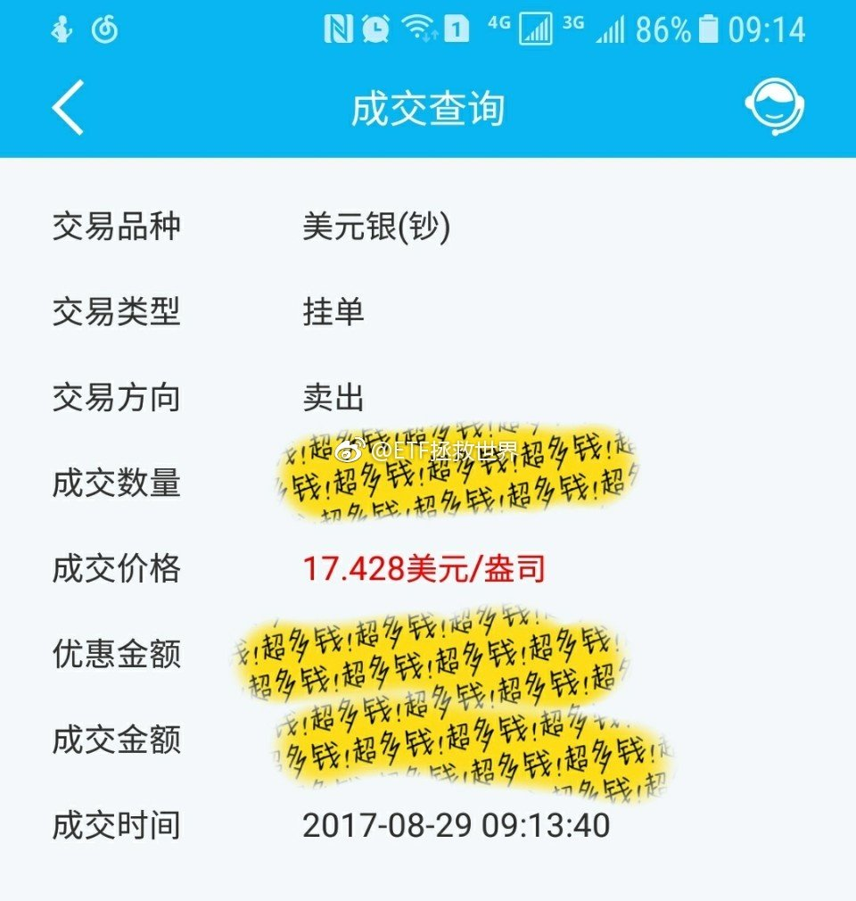

======================================================

ETF拯救世界 (5687069307) @
2017-08-29 10:45:23 Tue  
url: https://weibo.com/5687069307/FjjwwuSOi

回复@Jamborvan:因为我有美元需要赚钱~//@Jamborvan:建行的美元银点差反而大于人民币银，所以为什么买美元银呢？

------------------------------------------------------
转推：
>  @ETF拯救世界 (5687069307)
>  2017-08-29 09:18:21 Tue  
>  url: https:/weibo.com/5687069307/FjiXclsiQ/

>  一大早就收钱怪不好意思的。
>  
>  [doge] ​​​

转发[1]  评论[13]  赞[42] 

======================================================

ETF拯救世界 (5687069307) @
2017-08-29 10:49:23 Tue  
url: https://weibo.com/5687069307/Fjjy9zKJt

“他不止一次明确表态，乐视是扎根中国的民族品牌，他是土生土长的中国企业家，他本人永远都是中国人。”其实我认为吧，人的信用很重要。“下周回国”言犹在耳呢。

------------------------------------------------------
转推：
>  @ ()
>  2017-08-29 10:03:32 Tue  
>  url: 

>  抱歉，作者已设置仅展示半年内微博，此微博已不可见。 ​​​

转发[6]  评论[34]  赞[61] 

======================================================

ETF拯救世界 (5687069307) @
2017-08-29 11:14:56 Tue  
url: https://weibo.com/5687069307/FjjIwgqbR

回复@梦之彼方2082:有升值就有贬值，很正常。另外，我还有欧元日元英镑。不必担心~//@梦之彼方2082:美元贬值最近挺厉害的[喵喵]

------------------------------------------------------
转推：
>  @ETF拯救世界 (5687069307)
>  2017-08-29 09:18:21 Tue  
>  url: https:/weibo.com/5687069307/FjiXclsiQ/

>  一大早就收钱怪不好意思的。
>  
>  [doge] ​​​

转发[0]  评论[26]  赞[54] 

======================================================

ETF拯救世界 (5687069307) @
2017-08-29 17:17:23 Tue  
url: https://weibo.com/5687069307/Fjm5Dygqt

“身上的味道是喷洒了大量劣质香水”。扎心了。

------------------------------------------------------
转推：
>  @澎湃新闻 (5044281310)
>  2017-08-29 17:11:23 Tue  
>  url: https:/weibo.com/5044281310/Fjm3cvQI1/

>  【南京地铁一“口罩男”以拍照为由强行搂抱女生，已被警方控制】8月28日、29日，有众多网友在微博中称，在南京新街口地下通道，有一位戴口罩的男子，以拍照为由，占女生便宜。更有网友反映此男子身上还有奇怪的味道，闻着有点头晕。8月29日，南京地铁警方回应称，目前该男子已被警方控制，他本人供述抱 ​​​ http://mapi/005vnhZYgy1fj0pk6vrm2j30go0l67i1

转发[0]  评论[20]  赞[30] 

======================================================

ETF拯救世界 (5687069307) @
2017-08-29 20:56:05 Tue  
url: https://weibo.com/5687069307/Fjnwpo98W

哈哈哈哈哈哈哈哈。太NB了。还有没有王法了……

------------------------------------------------------
转推：
>  @互联网的那点事 (1627825392)
>  2017-08-29 16:34:32 Tue  
>  url: https:/weibo.com/1627825392/FjlOfBf2J/

>  【贾跃亭姐弟已收回对乐视网全部借款】乐视网上半年年报显示，贾跃亭贾跃芳姐弟之前套现时承诺借给乐视网的无息借款总计74亿，然而最高峰时贾氏姐弟借给乐视网不超过30亿，2016年底，只剩下4亿多，到了2017年6月30日竟已全部抽走。 ​​​

转发[11]  评论[50]  赞[49] 

======================================================

ETF拯救世界 (5687069307) @
2017-08-29 21:54:18 Tue  
url: https://weibo.com/5687069307/FjnU2r3FM

每日打卡（69）

昨天有事没有锻炼，今天补上。

每天时间真的不够用。几本书一直说看，始终没有时间。很多想做的事也没做。

尽量多做一些事情吧。 ​​​

转发[1]  评论[39]  赞[92] 

+++++++++++++++++++++++++++++++++++++++++++++++++++++

图片：

======================================================

ETF拯救世界 (5687069307) @
2017-08-30 10:23:47 Wed  
url: https://weibo.com/5687069307/FjsOfEAVL

$创业板指 sz399006$ 又搞事情 ​​​

转发[2]  评论[74]  赞[101] 

======================================================

ETF拯救世界 (5687069307) @
2017-08-30 16:38:32 Wed  
url: https://weibo.com/5687069307/FjvgmzG0a

回复@XDrX:要看看当初减持的时候说把几十亿免息借给公司5年这个承诺有没有法律效力了。//@XDrX:贾跃亭做的事情没违反王法吧？//@ETF拯救世界:哈哈哈哈哈哈哈哈。太NB了。还有没有王法了……

------------------------------------------------------
转推：
>  @互联网的那点事 (1627825392)
>  2017-08-29 16:34:32 Tue  
>  url: https:/weibo.com/1627825392/FjlOfBf2J/

>  【贾跃亭姐弟已收回对乐视网全部借款】乐视网上半年年报显示，贾跃亭贾跃芳姐弟之前套现时承诺借给乐视网的无息借款总计74亿，然而最高峰时贾氏姐弟借给乐视网不超过30亿，2016年底，只剩下4亿多，到了2017年6月30日竟已全部抽走。 ​​​

转发[4]  评论[18]  赞[32] 

======================================================

ETF拯救世界 (5687069307) @
2017-08-30 16:46:57 Wed  
url: https://weibo.com/5687069307/FjvjMtcgP

回复@守正v出奇:明晚开车。今天有可能推送一篇别的，不确定。//@守正v出奇:e大这是 写完开车稿了吗？ 还是等晚上中报全部披露以后跑下数据在发车？//@ETF拯救世界:回复@XDrX:要看看当初减持的时候说把几十亿免息借给公司5年这个承诺有没有法律效力了。//@XDrX:贾跃亭做的事情没违反王法吧？

------------------------------------------------------
转推：
>  @互联网的那点事 (1627825392)
>  2017-08-29 16:34:32 Tue  
>  url: https:/weibo.com/1627825392/FjlOfBf2J/

>  【贾跃亭姐弟已收回对乐视网全部借款】乐视网上半年年报显示，贾跃亭贾跃芳姐弟之前套现时承诺借给乐视网的无息借款总计74亿，然而最高峰时贾氏姐弟借给乐视网不超过30亿，2016年底，只剩下4亿多，到了2017年6月30日竟已全部抽走。 ​​​

转发[2]  评论[56]  赞[75] 

======================================================

ETF拯救世界 (5687069307) @
2017-08-30 22:07:54 Wed  
url: https://weibo.com/5687069307/Fjxq3tYny

每日打卡（70）

练完睡觉，晚安！ ​​​

转发[0]  评论[23]  赞[76] 

+++++++++++++++++++++++++++++++++++++++++++++++++++++

图片：

======================================================

ETF拯救世界 (5687069307) @
2017-08-31 09:08:39 Thu  
url: https://weibo.com/5687069307/FjBKfkGc2

坚持债券会先于股票几个月见底的观点。 ​​​

转发[100]  评论[95]  赞[149] 

+++++++++++++++++++++++++++++++++++++++++++++++++++++

图片：

======================================================

ETF拯救世界 (5687069307) @
2017-08-31 10:34:22 Thu  
url: https://weibo.com/5687069307/FjCj34mFf

要不要说点什么 ​​​

转发[1]  评论[206]  赞[131] 

======================================================

ETF拯救世界 (5687069307) @
2017-08-31 13:37:59 Thu  
url: https://weibo.com/5687069307/FjDvzEPPI

$创业板指 sz399006$ 别人都跌你得瑟什么？[哼] ​​​

转发[1]  评论[52]  赞[82] 

======================================================

ETF拯救世界 (5687069307) @
2017-08-31 15:08:11 Thu  
url: https://weibo.com/5687069307/FjE6bF3FC

最近有点不顺啊。早上车还蹭了。一个门进去一小条，没露漆，4s报价2000……

外面修理厂钣金靠谱吗。

一定尽快要去拜拜了。好久没去了。 ​​​

转发[1]  评论[116]  赞[64] 

======================================================

ETF拯救世界 (5687069307) @
2017-08-31 15:37:04 Thu  
url: https://weibo.com/5687069307/FjEhUyaOV

这个写的还是不够震撼。十年前在天涯看过一个描写里面生活的帖子。看完那个我就暗暗发誓，永远也不要犯事儿进去。真的，各位，遵纪守法呀！//@买买提X:伙食不错~

------------------------------------------------------
转推：
>  @ ()
>  2017-08-27 22:29:30 Sun  
>  url: 

>  抱歉，由于作者设置，你暂时没有这条微博的查看权限哦。查看帮助：http://t.cn/RfdBWwP ​​​

转发[14]  评论[59]  赞[60] 

======================================================

ETF拯救世界 (5687069307) @
2017-08-31 22:32:49 Thu  
url: https://weibo.com/5687069307/FjH0FjmyJ

最后一个浮亏品种。我就静静的看着怎么变成浮盈。 ​​​

转发[2]  评论[137]  赞[134] 

+++++++++++++++++++++++++++++++++++++++++++++++++++++

图片：

======================================================

ETF拯救世界 (5687069307) @
2017-09-01 13:09:13 Fri  
url: https://weibo.com/5687069307/FjMKozEtg

今天下跌的股票比上涨的多。谁能想到，$中证500 sz399905$  涨了接近1%。

天妒英才啊！ ​​​

转发[22]  评论[53]  赞[71] 

======================================================

ETF拯救世界 (5687069307) @
2017-09-01 13:28:59 Fri  
url: https://weibo.com/5687069307/FjMSqda5i

8月过去了。9月呢，如果还是维持现状或者继续上涨，那么我们在A股几乎不会有什么动作了。

涨涨跌跌，仓位舒服，看戏即可。

至于说，如果有较大幅度下跌的话，那就是另一回事了。 ​​​

转发[2]  评论[39]  赞[102] 

======================================================

ETF拯救世界 (5687069307) @
2017-09-01 13:56:13 Fri  
url: https://weibo.com/5687069307/FjN3tpqsI

$创业板指 sz399006$   犀利。反弹新高。 ​​​

转发[6]  评论[29]  赞[69] 

======================================================

ETF拯救世界 (5687069307) @
2017-09-01 15:18:00 Fri  
url: https://weibo.com/5687069307/FjNAFvnvW

回复@理性耐心:讲真，如果是长线持仓，场内品种对我来说只有一个方面有吸引力，那就是可以做两融担保品。如果这个品种做不了担保品，我会优先买场外。毕竟有些品种流动性有问题。以后卖出的时候会怎样，说不好啊。//@理性耐心:回复@Gaius_Chang:我也觉得场外更省心，场内容易动来动去

------------------------------------------------------
转推：
>  @ETF拯救世界 (5687069307)
>  2017-09-01 13:09:13 Fri  
>  url: https:/weibo.com/5687069307/FjMKozEtg/

>  今天下跌的股票比上涨的多。谁能想到，$中证500 sz399905$  涨了接近1%。
>  
>  天妒英才啊！ ​​​

转发[20]  评论[36]  赞[55] 

======================================================

ETF拯救世界 (5687069307) @
2017-09-01 15:21:43 Fri  
url: https://weibo.com/5687069307/FjNCbv1er

回复@MyCaptainLu:其实都差不多。最近有几个B类货基，就是以前大资金才能买的门槛降低了，可以试试。收益率能稍微高点。//@MyCaptainLu:E大，能麻烦推荐个货基么，华宝兴业现金宝如何～谢啦

------------------------------------------------------
转推：
>  @ETF拯救世界 (5687069307)
>  2017-09-01 13:09:13 Fri  
>  url: https:/weibo.com/5687069307/FjMKozEtg/

>  今天下跌的股票比上涨的多。谁能想到，$中证500 sz399905$  涨了接近1%。
>  
>  天妒英才啊！ ​​​

转发[4]  评论[17]  赞[48] 

======================================================

ETF拯救世界 (5687069307) @
2017-09-01 15:25:49 Fri  
url: https://weibo.com/5687069307/FjNDQiVTS

回复@谷爆:其实，牛市如果份额少的基金会送大红包。广发医药2015年曾经大幅溢价到3块钱！当然现在不可能了，毕竟咱们大部队进来了……//@谷爆:牛市卖出场内的应该没流到性问题吧？以E神的作风，熊市是不会割肉只会加仓的呀！[酷]

------------------------------------------------------
转推：
>  @ETF拯救世界 (5687069307)
>  2017-09-01 13:09:13 Fri  
>  url: https:/weibo.com/5687069307/FjMKozEtg/

>  今天下跌的股票比上涨的多。谁能想到，$中证500 sz399905$  涨了接近1%。
>  
>  天妒英才啊！ ​​​

转发[4]  评论[22]  赞[53] 

======================================================

ETF拯救世界 (5687069307) @
2017-09-01 15:46:20 Fri  
url: https://weibo.com/5687069307/FjNMaysNA

回复@盖盖87:赚钱比赔钱好，是不是？买了比没有强，对不对？做人要学会开心呀。再让你回到当初，你会在一个月前重仓创业板吗。如果不会，就开开心心的接受吧~//@盖盖87:创业板真是猪一样的队友 买了就再也跌不下来了 坑爹 不给加仓机会啊

------------------------------------------------------
转推：
>  @ETF拯救世界 (5687069307)
>  2017-09-01 13:56:13 Fri  
>  url: https:/weibo.com/5687069307/FjN3tpqsI/

>  $创业板指 sz399006$   犀利。反弹新高。 ​​​

转发[2]  评论[32]  赞[88] 

======================================================

ETF拯救世界 (5687069307) @
2017-09-02 08:47:58 Sat  
url: https://weibo.com/5687069307/FjUsR38PJ

没什么意思 ​​​

转发[1]  评论[53]  赞[94] 

+++++++++++++++++++++++++++++++++++++++++++++++++++++

图片：
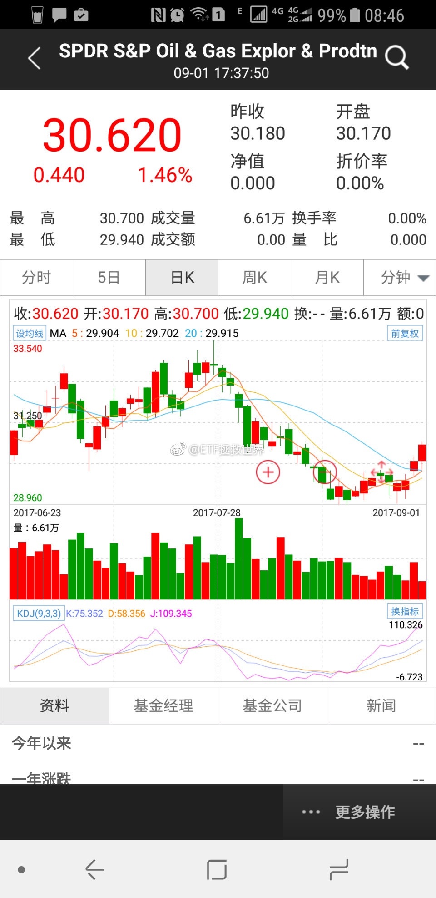

======================================================

ETF拯救世界 (5687069307) @
2017-09-02 15:03:03 Sat  
url: https://weibo.com/5687069307/FjWV6avj6

每日打卡（71）

这是补前两天的。太忙了，真是抽不出时间。今天补上。晚上再做今天的。 ​​​

转发[0]  评论[37]  赞[99] 

+++++++++++++++++++++++++++++++++++++++++++++++++++++

图片：

======================================================

ETF拯救世界 (5687069307) @
2017-09-03 19:42:55 Sun  
url: https://weibo.com/5687069307/Fk8bc7tqi

每日打卡（72）

昨天晚上有事出去没有练，今天补上。

在微博打卡的最大好处，是这么多朋友看着，更能督促自己坚持下去。我相信要不是每天打卡，恐怕无法坚持每天练一次。 ​​​

转发[1]  评论[38]  赞[118] 

+++++++++++++++++++++++++++++++++++++++++++++++++++++

图片：

======================================================

ETF拯救世界 (5687069307) @
2017-09-04 08:49:43 Mon  
url: https://weibo.com/5687069307/Fkdkyqylj

有些人真的是毫无底线，一次次突破我对人类无底线的认知。

抄袭不仅从形式、策略开始，甚至进一步到了抄袭具体品种的境地。我真是目瞪口呆.gif。

讲真，哪怕你有一点自己的东西，我都敬你是一条汉子。我从没有听说过无脑搬运工可以成功的。

一次次的晓之以理动之以情，毫无作用。

很好，继续。

人 ​​​

转发[7]  评论[141]  赞[133] 

======================================================

ETF拯救世界 (5687069307) @
2017-09-04 09:43:16 Mon  
url: https://weibo.com/5687069307/FkdGibVz6

$中证500 sz399905$  醉了。第一个翻红 ​​​

转发[1]  评论[23]  赞[76] 

======================================================

ETF拯救世界 (5687069307) @
2017-09-04 10:05:06 Mon  
url: https://weibo.com/5687069307/FkdP9wH4E

几乎所有的指数都是红的，然后跌的股票比涨的多。

太神奇了！ ​​​

转发[3]  评论[41]  赞[105] 

======================================================

ETF拯救世界 (5687069307) @
2017-09-04 10:48:38 Mon  
url: https://weibo.com/5687069307/Fke6PchAL

$中证500 sz399905$  已经奶绿了。 $创业板指 sz399006$  要不要来一口。 ​​​

转发[0]  评论[23]  赞[70] 

======================================================

ETF拯救世界 (5687069307) @
2017-09-04 11:02:23 Mon  
url: https://weibo.com/5687069307/FkecpfIcm

$中证环保 sh000827$   [doge] ​​​

转发[0]  评论[44]  赞[91] 

======================================================

ETF拯救世界 (5687069307) @
2017-09-04 16:12:14 Mon  
url: https://weibo.com/5687069307/FkgeaFj5I

希望加油干到月中[doge]

------------------------------------------------------
转推：
>  @巨潮资讯网 (2239792910)
>  2017-09-04 15:59:55 Mon  
>  url: https:/weibo.com/2239792910/Fkg9aEvLe/

>  【人民币汇率升破6.54关口】9月4日，人民币汇率继续强势上涨，一举突破6.54关口，下午3点35分，在岸、离岸人民币对美元分别报6.5310，6.5383。 ​​​

转发[7]  评论[36]  赞[59] 

======================================================

ETF拯救世界 (5687069307) @
2017-09-04 16:44:47 Mon  
url: https://weibo.com/5687069307/Fkgro46cK

回复@游历在二级市场:不一样。etf或者lof交易没有印花税，佣金没有5块门槛，最低一毛钱佣金。指数涨基金肯定涨，不会赚了指数不赚钱。//@游历在二级市场:请问159915买卖和股票一样吗，手续费一样吗//@ETF拯救世界:希望加油干到月中[doge]

------------------------------------------------------
转推：
>  @巨潮资讯网 (2239792910)
>  2017-09-04 15:59:55 Mon  
>  url: https:/weibo.com/2239792910/Fkg9aEvLe/

>  【人民币汇率升破6.54关口】9月4日，人民币汇率继续强势上涨，一举突破6.54关口，下午3点35分，在岸、离岸人民币对美元分别报6.5310，6.5383。 ​​​

转发[2]  评论[21]  赞[50] 

======================================================

ETF拯救世界 (5687069307) @
2017-09-04 18:50:27 Mon  
url: https://weibo.com/5687069307/FkhgonWFh

我的评论里拒绝出现广告。一次删除，两次拉黑。不好意思。因为我无法鉴别，对不住了。//@ETF拯救世界:回复@游历在二级市场:不一样。etf或者lof交易没有印花税，佣金没有5块门槛，最低一毛钱佣金。指数涨基金肯定涨，不会赚了指数不赚钱。//@游历在二级市场:请问159915买卖和股票一样吗，手续费一样吗

------------------------------------------------------
转推：
>  @巨潮资讯网 (2239792910)
>  2017-09-04 15:59:55 Mon  
>  url: https:/weibo.com/2239792910/Fkg9aEvLe/

>  【人民币汇率升破6.54关口】9月4日，人民币汇率继续强势上涨，一举突破6.54关口，下午3点35分，在岸、离岸人民币对美元分别报6.5310，6.5383。 ​​​

转发[1]  评论[20]  赞[57] 

======================================================

ETF拯救世界 (5687069307) @
2017-09-04 21:46:42 Mon  
url: https://weibo.com/5687069307/FkipW1jqm

每日打卡（73）

还是这个最酸爽 ​​​

转发[0]  评论[17]  赞[80] 

+++++++++++++++++++++++++++++++++++++++++++++++++++++

图片：

======================================================

ETF拯救世界 (5687069307) @
2017-09-05 07:59:24 Tue  
url: https://weibo.com/5687069307/FkmqD907J

民营赌场//@落魄的三叔:韭菜是属于国家的珍贵战略资源，你们这些搞ICO的是真活够了。//@债券搬砖狗://@水獭otter:无论什么都能做成庞氏骗局，这是中国人的秉性和数量决定的。旁氏骗局多一层不得了。

------------------------------------------------------
转推：
>  @ ()
>  2017-08-18 17:17:01 Fri  
>  url: 

>  抱歉，作者已设置仅展示半年内微博，此微博已不可见。 ​​​

转发[19]  评论[28]  赞[43] 

======================================================

ETF拯救世界 (5687069307) @
2017-09-05 08:52:40 Tue  
url: https://weibo.com/5687069307/FkmMfriii

有人哭的时候就要好好想想有什么机会让未来的自己笑

------------------------------------------------------
转推：
>  @ ()
>  2017-09-05 08:34:43 Tue  
>  url: 

>  抱歉，作者已设置仅展示半年内微博，此微博已不可见。 ​​​

转发[13]  评论[25]  赞[69] 

======================================================

ETF拯救世界 (5687069307) @
2017-09-05 08:57:03 Tue  
url: https://weibo.com/5687069307/FkmO2fGxU

回复@津一一:我花钱充会员，换头像，就是为了各位不再受骗啊。我力所能及就这样了！//@津一一:大E，又出现骗子了，拉我进实盘，头像和你的完全一样，没有+1//@ETF拯救世界:民营赌场//@落魄的三叔:韭菜是属于国家的珍贵战略资源，你们这些搞ICO的是真活够了。//@债券搬砖狗:

------------------------------------------------------
转推：
>  @ ()
>  2017-08-18 17:17:01 Fri  
>  url: 

>  抱歉，作者已设置仅展示半年内微博，此微博已不可见。 ​​​

转发[8]  评论[35]  赞[70] 

======================================================

ETF拯救世界 (5687069307) @
2017-09-05 10:37:44 Tue  
url: https://weibo.com/5687069307/FknsTypXC

不要涨一点就心急火燎大牛一去不回头，跌一点就心惊胆战跌到2000套十年。

轻松一点。高高兴兴把钱赚了不好吗。 ​​​

转发[30]  评论[55]  赞[137] 

======================================================

ETF拯救世界 (5687069307) @
2017-09-05 10:58:47 Tue  
url: https://weibo.com/5687069307/FknBrlCGz

现在知道什么叫弱周期了吧。

$全指医药 sh000991$ 

就是人家跌它不跌。当然，人家涨的时候它也不动。

[NO] ​​​

转发[8]  评论[52]  赞[108] 

======================================================

ETF拯救世界 (5687069307) @
2017-09-05 11:42:05 Tue  
url: https://weibo.com/5687069307/FknT0ttqT

今天继续吃草。好久没吃了。 ​​​

转发[0]  评论[60]  赞[101] 

+++++++++++++++++++++++++++++++++++++++++++++++++++++

图片：

======================================================

ETF拯救世界 (5687069307) @
2017-09-05 14:41:02 Tue  
url: https://weibo.com/5687069307/Fkp3EmW2B

这是一个被监控的微博

------------------------------------------------------
转推：
>  @ETF拯救世界 (5687069307)
>  2017-09-05 10:58:47 Tue  
>  url: https:/weibo.com/5687069307/FknBrlCGz/

>  现在知道什么叫弱周期了吧。
>  
>  $全指医药 sh000991$ 
>  
>  就是人家跌它不跌。当然，人家涨的时候它也不动。
>  
>  [NO] ​​​

转发[2]  评论[31]  赞[68] 

======================================================

ETF拯救世界 (5687069307) @
2017-09-05 14:59:57 Tue  
url: https://weibo.com/5687069307/Fkpbl390h

回复@马甲5544:我的仓位非常舒服啊。一点都没有害怕踏空害怕浪费子弹的感觉。每天账户新高，不知道多开心啊。//@马甲5544:老大  现在这行情是不是最磨人   不加怕踏空  加了怕浪费子弹 在踏空与空梭间  你选哪个//@ETF拯救世界:这是一个被监控的微博

------------------------------------------------------
转推：
>  @ETF拯救世界 (5687069307)
>  2017-09-05 10:58:47 Tue  
>  url: https:/weibo.com/5687069307/FknBrlCGz/

>  现在知道什么叫弱周期了吧。
>  
>  $全指医药 sh000991$ 
>  
>  就是人家跌它不跌。当然，人家涨的时候它也不动。
>  
>  [NO] ​​​

转发[1]  评论[19]  赞[58] 

======================================================

ETF拯救世界 (5687069307) @
2017-09-05 15:07:46 Tue  
url: https://weibo.com/5687069307/FkpevdZnA

干干净净的多好  ​​​

转发[6]  评论[69]  赞[131] 

+++++++++++++++++++++++++++++++++++++++++++++++++++++

图片：

======================================================

ETF拯救世界 (5687069307) @
2017-09-05 15:20:57 Tue  
url: https://weibo.com/5687069307/FkpjRoa42

回复@用户5454135590:好心态源于仓位舒服。仓位舒服源于对概率判断的自信。对概率判断的自信源于历史的成功以及知识。也就是说，没有成功过，没有知识，对未来会怎样完全没有概念，那是不可能有好的心态的。只能人云亦云~//@用户5454135590:请教E大，好的心态是如何练就的

------------------------------------------------------
转推：
>  @ETF拯救世界 (5687069307)
>  2017-09-05 10:37:44 Tue  
>  url: https:/weibo.com/5687069307/FknsTypXC/

>  不要涨一点就心急火燎大牛一去不回头，跌一点就心惊胆战跌到2000套十年。
>  
>  轻松一点。高高兴兴把钱赚了不好吗。 ​​​

转发[21]  评论[53]  赞[119] 

======================================================

ETF拯救世界 (5687069307) @
2017-09-06 08:59:29 Wed  
url: https://weibo.com/5687069307/FkwfvmuX6

因为最近有不少事，于公于私，各种事情牵扯精力，今天开始不会再像之前频繁的与各位互动。

还是会发东西，没那么频繁。

每日打卡会不会继续不好说，主要是没有精力了。

人生充满意外。没事的时候总是不满足平淡的日子，有事了又想平安是福。

希望一生平安。 ​​​

转发[13]  评论[483]  赞[306] 

======================================================

ETF拯救世界 (5687069307) @
2017-09-11 10:11:56 Mon  
url: https://weibo.com/5687069307/FlhRov3bi

$中证环保 sh000827$   还是不错的。 ​​​

转发[24]  评论[101]  赞[142] 

======================================================

ETF拯救世界 (5687069307) @
2017-09-11 11:26:48 Mon  
url: https://weibo.com/5687069307/FlilNsjaj

回复@炒股为生2015:一定发。目标已锁定。//@炒股为生2015:@ETF拯救世界 E大，照这样下去，月中有发车的可能吗？[二哈]

------------------------------------------------------
转推：
>  @ETF拯救世界 (5687069307)
>  2017-09-11 10:11:56 Mon  
>  url: https:/weibo.com/5687069307/FlhRov3bi/

>  $中证环保 sh000827$   还是不错的。 ​​​

转发[1]  评论[42]  赞[87] 

======================================================

ETF拯救世界 (5687069307) @
2017-09-11 11:51:07 Mon  
url: https://weibo.com/5687069307/FlivFcmmf

坚持不懈的每周一吃草。

绿油油的。 ​​​

转发[4]  评论[42]  赞[93] 

+++++++++++++++++++++++++++++++++++++++++++++++++++++

图片：

======================================================

ETF拯救世界 (5687069307) @
2017-09-11 12:12:46 Mon  
url: https://weibo.com/5687069307/FliEs2uSS

太难吃了。有多难吃？吃到一半哭出来了。剩下的一半扔了。[doge]

------------------------------------------------------
转推：
>  @ETF拯救世界 (5687069307)
>  2017-09-11 11:51:07 Mon  
>  url: https:/weibo.com/5687069307/FlivFcmmf/

>  坚持不懈的每周一吃草。
>  
>  绿油油的。 ​​​

转发[3]  评论[106]  赞[113] 

======================================================

ETF拯救世界 (5687069307) @
2017-09-11 13:45:41 Mon  
url: https://weibo.com/5687069307/FljgahE2h

怎么还没完了。

------------------------------------------------------
转推：
>  @ETF拯救世界 (5687069307)
>  2017-09-11 10:11:56 Mon  
>  url: https:/weibo.com/5687069307/FlhRov3bi/

>  $中证环保 sh000827$   还是不错的。 ​​​

转发[17]  评论[39]  赞[57] 

======================================================

ETF拯救世界 (5687069307) @
2017-09-11 14:21:18 Mon  
url: https://weibo.com/5687069307/FljuCwjJv

$中证500 sz399905$   一轮下探后，又回到了前期高点。手里的筹码比4月多了三份。所以，中证500的市值又新高了。

怕什么坐电梯？不要怕。涨了好，跌了更好，可以让你多买，然后再次回来的时候，你又新高了。

一个品种是这样，整个账户也是这样。多少年后，指数就算一点都没涨，你的账户也是永远上行 ​​​

转发[35]  评论[73]  赞[141] 

======================================================

ETF拯救世界 (5687069307) @
2017-09-11 14:39:44 Mon  
url: https://weibo.com/5687069307/FljC6p8pH

一个月前大家都炒蓝筹。你也炒，结果就是一个多月价格没动，50、300。

你另辟蹊径，知道风格总会轮动，价值总会回归，买入不受欢迎的品种，结果就是赚的还不错。

时间、空间。对不同品种在不同的时间布局，闪转腾挪，最终完成终极的资产配置。

路不好走，有人设置了重重路障。但只要每一步都走得不 ​​​

转发[35]  评论[60]  赞[169] 

======================================================

ETF拯救世界 (5687069307) @
2017-09-11 15:02:46 Mon  
url: https://weibo.com/5687069307/FljLssdUk

回复@木木不哭木木:在我的投资体系中，只要买入的是指数产品，就永远不会发生亏损卖出这件事。永远不会。任何指数品种都一定要给它折腾盈利了才算完，铁律。//@木木不哭木木:港真，前些时日环保赔的时候真的是差点卖了，涨回来点就想卖了怕又跌回去，还好心态慢慢转变了

------------------------------------------------------
转推：
>  @ETF拯救世界 (5687069307)
>  2017-09-11 10:11:56 Mon  
>  url: https:/weibo.com/5687069307/FlhRov3bi/

>  $中证环保 sh000827$   还是不错的。 ​​​

转发[14]  评论[43]  赞[103] 

======================================================

ETF拯救世界 (5687069307) @
2017-09-11 16:14:14 Mon  
url: https://weibo.com/5687069307/Flkesxuan

37了，基本没有谈过恋爱，没怎么跟女人接触过，碰上一个美女，实在放不下。从看离婚协议书的88万开始，悲剧就已经上演……年轻的时候还是要多出去玩玩，多见识一下。最后，不要跟人品有问题的人来往，真的，因为你不知道他的底线在哪里，非常危险。

------------------------------------------------------
转推：
>  @张牧歌 (3760068067)
>  2017-09-10 22:43:39 Sun  
>  url: https:/weibo.com/3760068067/Fldm1m0pH/

>  天才程序员之死，被骗自杀的事件始末被还原，短短109天从认识到结婚到离婚，展示完整的消费记录，看着触目惊心！ 请善待程序猿这个稀有物种吧！http://t.cn/Rpx7G1W ​​​

转发[26]  评论[103]  赞[77] 

======================================================

ETF拯救世界 (5687069307) @
2017-09-11 19:25:03 Mon  
url: https://weibo.com/5687069307/FlltUx9IO

回复@木车亻:五七年可能不会亏，但是你要考虑一下几年后回头看收益率会不会满意。//@木车亻:e大 请教下 举例比如恒生前后发车十几份了价格也多次不同 是不是长期看比如五年七年每份买入的价格都不会亏损?因为我个人感觉以您的买入基准比平常人严格许多，随便一个节点的发车长期都没啥风险。

------------------------------------------------------
转推：
>  @ETF拯救世界 (5687069307)
>  2017-09-11 10:11:56 Mon  
>  url: https:/weibo.com/5687069307/FlhRov3bi/

>  $中证环保 sh000827$   还是不错的。 ​​​

转发[0]  评论[30]  赞[47] 

======================================================

ETF拯救世界 (5687069307) @
2017-09-11 21:40:25 Mon  
url: https://weibo.com/5687069307/FlmmQFhk3

每日打卡（74）

事情还没有解决，但生活还要继续，身体还要锻炼。坚持。 ​​​

转发[0]  评论[63]  赞[140] 

+++++++++++++++++++++++++++++++++++++++++++++++++++++

图片：

======================================================

ETF拯救世界 (5687069307) @
2017-09-12 09:38:43 Tue  
url: https://weibo.com/5687069307/Flr4qjkD9

$中证环保 sh000827$  没有意思。差不多行了。 ​​​

转发[1]  评论[28]  赞[64] 

======================================================

ETF拯救世界 (5687069307) @
2017-09-12 09:45:45 Tue  
url: https://weibo.com/5687069307/Flr7h2n4U

为什么大多数人投资会赔钱呢。

$格力电器 sz000651$   这么大的牛股，涨这么多，只回调了十几个点，获利筹码只剩38%了。

大多数人就是追，不停的追高，一旦股票或者指数回调，就是赔钱。

好股票还可以，以后会涨回去。很多股票就涨不回去，就套了。

涨回去的好股票，也不一定挣钱。因为可能在回调 ​​​

转发[14]  评论[56]  赞[94] 

======================================================

ETF拯救世界 (5687069307) @
2017-09-12 09:51:24 Tue  
url: https://weibo.com/5687069307/Flr9zaqOL

这个月买的$中证环保 sh000827$ 和$中证500 sz399905$  都不错 ​​​

转发[1]  评论[21]  赞[76] 

======================================================

ETF拯救世界 (5687069307) @
2017-09-12 10:06:57 Tue  
url: https://weibo.com/5687069307/FlrfS43rZ

看看环保，再回头看月初的这段话，是不是会更有感触？发布了头条文章：《买跌&追涨》 http://t.cn/RpoRiiX ​​​

转发[99]  评论[101]  赞[236] 

======================================================

ETF拯救世界 (5687069307) @
2017-09-12 10:15:03 Tue  
url: https://weibo.com/5687069307/Flrj9DCqn

回复@铅笔小小新:现在这样想的人还不够多。再等等。再多一点，就会发生一些有趣的事。//@铅笔小小新:E大，有没有可能真变慢牛了？

------------------------------------------------------
转推：
>  @ETF拯救世界 (5687069307)
>  2017-09-12 10:06:57 Tue  
>  url: https:/weibo.com/5687069307/FlrfS43rZ/

>  看看环保，再回头看月初的这段话，是不是会更有感触？发布了头条文章：《买跌&追涨》 http://t.cn/RpoRiiX ​​​

转发[12]  评论[45]  赞[69] 

======================================================

ETF拯救世界 (5687069307) @
2017-09-12 10:54:29 Tue  
url: https://weibo.com/5687069307/FlrzaxYxq

回复@西风将起:两融余额昨天突破9700亿。如果行情还是这样，两周内必然突破10000亿。上次1万亿是2016年1月。叠加多因素，有趣的事不会太远。本人投资从不会因为涨了跌了影响判断，只会根据常识、数据来判断。//@西风将起:看来e大还是不看好这轮啊

------------------------------------------------------
转推：
>  @ETF拯救世界 (5687069307)
>  2017-09-12 10:06:57 Tue  
>  url: https:/weibo.com/5687069307/FlrfS43rZ/

>  看看环保，再回头看月初的这段话，是不是会更有感触？发布了头条文章：《买跌&追涨》 http://t.cn/RpoRiiX ​​​

转发[9]  评论[28]  赞[71] 

======================================================

ETF拯救世界 (5687069307) @
2017-09-12 11:08:22 Tue  
url: https://weibo.com/5687069307/FlrEOnFjQ

回复@HZ小山1998:2份计划让你担心成这样？2份加起来一共1.3%。浮亏10%就是浮亏0.13%。其它十几个品种的盈利都没法让你舒服点？马上停止参考计划，立即，马上，为你好。//@HZ小山1998:回复@ETF拯救世界:当然跟计划了，不然怎么会投那么少[允悲]

------------------------------------------------------
转推：
>  @ETF拯救世界 (5687069307)
>  2017-09-12 10:06:57 Tue  
>  url: https:/weibo.com/5687069307/FlrfS43rZ/

>  看看环保，再回头看月初的这段话，是不是会更有感触？发布了头条文章：《买跌&追涨》 http://t.cn/RpoRiiX ​​​

转发[1]  评论[27]  赞[58] 

======================================================

ETF拯救世界 (5687069307) @
2017-09-12 11:18:19 Tue  
url: https://weibo.com/5687069307/FlrIQqiFA

做投资，看价格，涨跌，做决定，是最不可靠的。

要看的不是屏幕里软件商红红绿绿的走势，而是背后代表的含义。涨了跌了并不重要，重要的是其他的信息。

否则，你只能看到过去和现在，却看不到未来。

然而未来才是你能否赚钱的关键。即使看不清未来，也要看清现在。真的很重要。记住，现在，不是红红 ​​​

转发[47]  评论[93]  赞[181] 

======================================================

ETF拯救世界 (5687069307) @
2017-09-12 13:52:19 Tue  
url: https://weibo.com/5687069307/FlsJm3Adk

今天这么精彩，你可能没想到2000只股票是下跌的。 ​​​

转发[6]  评论[136]  赞[153] 

======================================================

ETF拯救世界 (5687069307) @
2017-09-12 21:52:00 Tue  
url: https://weibo.com/5687069307/FlvS3vDR3

每日打卡（75）

今天看了一篇东西，说的是连续三十天做一件事，养成好的习惯。比如走一万步，比如物归原位，比如写几百字的日记。

你最想连续做三十天，养成的好习惯是什么？ ​​​

转发[1]  评论[85]  赞[79] 

+++++++++++++++++++++++++++++++++++++++++++++++++++++

图片：

======================================================

ETF拯救世界 (5687069307) @
2017-09-13 09:44:22 Wed  
url: https://weibo.com/5687069307/FlAxdhEdj

跟超短线的说长线价值投资？//@八大山债人:别想了，补税能补死 //@老马自奋蹄:苏享龙做互联网创业，搞好了就可在新三板上市，是最好的成长股，想不明白此女，正常的逻辑应该是找到一头大奶牛，呵护他，可以每天挤奶，干嘛把牛杀了吃肉。。。研究生怎么读的？

------------------------------------------------------
转推：
>  @老马自奋蹄 (1807436544)
>  2017-09-13 05:19:41 Wed  
>  url: https:/weibo.com/1807436544/FlyNM42dm/

>  转：可怕的IT屠妇?! http://t.cn/RpJY1Sm ​​​

转发[19]  评论[30]  赞[44] 

======================================================

ETF拯救世界 (5687069307) @
2017-09-13 10:17:52 Wed  
url: https://weibo.com/5687069307/FlAKO4Ex3

来了。就是上次说的，他的减持承诺，将资金无偿借给上市公司是否有法律效力的问题。//@财联社APP:乐视2017年半年报显示，已向贾跃亭归还全部借款。

------------------------------------------------------
转推：
>  @财联社APP (2868676035)
>  2017-09-13 10:07:17 Wed  
>  url: https:/weibo.com/2868676035/FlAGvv3yy/

>  【深交所高度关注贾跃亭减持资金承诺履行情况，向乐视网下发关注函】深交所12日下发关注函称，贾跃亭承诺将减持所得资金全部借予上市公司使用，自收到上市公司还款之日起六个月内，贾跃亭将还款所得资金全部用于增持乐视网股份。公司2017年半年报显示，公司已向贾跃亭归还全部借款。深交所要求乐视网及 ​​​

转发[2]  评论[19]  赞[31] 

======================================================

ETF拯救世界 (5687069307) @
2017-09-13 10:21:37 Wed  
url: https://weibo.com/5687069307/FlAMkhW6L

重仓满仓的也不用太担心，收盘大概率还会拉回去。毕竟，现在，稳定是第一位。

还有30多天，很多人觉得这30多天是安全的。我倒认为恐怕要打点提前量。大家都那时候跑就跑不掉了。

当然，对咱们的计划来说，这些都是无所谓的事情。只是会影响我们继续建仓的速度而已。 ​​​

转发[7]  评论[69]  赞[93] 

======================================================

ETF拯救世界 (5687069307) @
2017-09-13 10:25:48 Wed  
url: https://weibo.com/5687069307/FlAO1wSEt

回复@你好大麦茶:我倒是能理解。人家就是来骗一把短线的，现在给你两个选择。第一，几个月可以赚1千万，潇洒自由，可以去找真爱。第二，跟一个自己一点点都不喜欢的男人每天睡在一个床上，看着就难受的那种。未来？现在赚钱的创业公司未来还不一定怎么样。人财两失不是不可能。那么，你选哪条路。

------------------------------------------------------
转推：
>  @老马自奋蹄 (1807436544)
>  2017-09-13 05:19:41 Wed  
>  url: https:/weibo.com/1807436544/FlyNM42dm/

>  转：可怕的IT屠妇?! http://t.cn/RpJY1Sm ​​​

转发[11]  评论[24]  赞[41] 

======================================================

ETF拯救世界 (5687069307) @
2017-09-13 11:53:30 Wed  
url: https://weibo.com/5687069307/FlBnCw1bF

不过这件事呢，到现在为止一直是单方面的陈述。具体的真实情况，再等等看吧。毕竟到现在另一方一句话都没说。

------------------------------------------------------
转推：
>  @老马自奋蹄 (1807436544)
>  2017-09-13 05:19:41 Wed  
>  url: https:/weibo.com/1807436544/FlyNM42dm/

>  转：可怕的IT屠妇?! http://t.cn/RpJY1Sm ​​​

转发[7]  评论[28]  赞[31] 

======================================================

ETF拯救世界 (5687069307) @
2017-09-13 17:44:42 Wed  
url: https://weibo.com/5687069307/FlDGb27nG

今天开始，一切恢复正常。

人善天不欺。

谢谢。 ​​​

转发[5]  评论[279]  赞[474] 

======================================================

ETF拯救世界 (5687069307) @
2017-09-13 22:13:13 Wed  
url: https://weibo.com/5687069307/FlFralmNn

每日打卡（76）

感受肌肉的硬度，拒绝油腻。 ​​​

转发[0]  评论[20]  赞[74] 

+++++++++++++++++++++++++++++++++++++++++++++++++++++

图片：

======================================================

ETF拯救世界 (5687069307) @
2017-09-13 22:37:53 Wed  
url: https://weibo.com/5687069307/FlFBbaOmu

这两个如果组合起来…… ​​​

转发[6]  评论[73]  赞[88] 

+++++++++++++++++++++++++++++++++++++++++++++++++++++

图片：
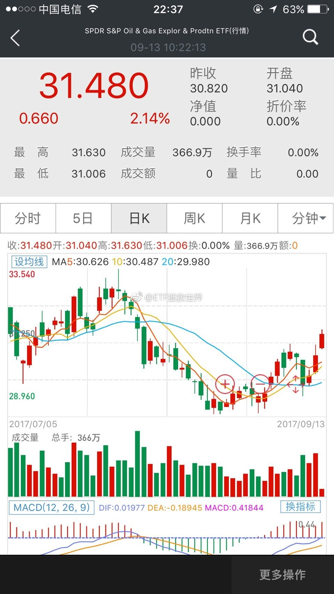

======================================================

ETF拯救世界 (5687069307) @
2017-09-14 09:02:57 Thu  
url: https://weibo.com/5687069307/FlJGTmCtS

不急，继续看。所谓“精彩的故事”就是要跌宕起伏，意料之外的桥段不断出现。生活远比文学精彩啊。//@Beck1010:@ETF拯救世界 e大，反转了……

------------------------------------------------------
转推：
>  @教授曰 (2427019967)
>  2017-09-13 19:27:45 Wed  
>  url: https:/weibo.com/2427019967/FlEm0dNy2/

>  【程序员被前妻翟欣欣逼死事件更多反转：印度官方呼吁打击wephone国际诈骗软件报道曝光】3人小微公司暴利模式：盗窃电信运营商话费；免费打电话，付费修改来电号码，台湾、福建、印度、阿拉伯国际电信诈骗团伙专用软件。忘了去年被福建电信诈骗团伙骗去学费逼迫致死的山东贫苦女大学生徐玉玉了吗？ ​​​

转发[9]  评论[43]  赞[37] 

======================================================

ETF拯救世界 (5687069307) @
2017-09-14 09:49:49 Thu  
url: https://weibo.com/5687069307/FlJZUDZ42

$中证环保 sh000827$  港真，不错。 ​​​

转发[3]  评论[36]  赞[72] 

======================================================

ETF拯救世界 (5687069307) @
2017-09-14 09:56:24 Thu  
url: https://weibo.com/5687069307/FlK2AsXsI

回复@用户6314452932:开。//@用户6314452932:老大，今晚开车吗？

------------------------------------------------------
转推：
>  @ETF拯救世界 (5687069307)
>  2017-09-14 09:49:49 Thu  
>  url: https:/weibo.com/5687069307/FlJZUDZ42/

>  $中证环保 sh000827$  港真，不错。 ​​​

转发[2]  评论[75]  赞[97] 

======================================================

ETF拯救世界 (5687069307) @
2017-09-14 11:34:10 Thu  
url: https://weibo.com/5687069307/FlKGh1YM3

一个经验：

共享单车前面的筐里不要放东西。

一支LAMY，一个记事本。忘了拿了。

就在刚才。

[拜拜]

光顾着刷微博扯淡了。

[哼] ​​​

转发[11]  评论[210]  赞[93] 

======================================================

ETF拯救世界 (5687069307) @
2017-09-14 14:06:25 Thu  
url: https://weibo.com/5687069307/FlLG4lQqc

呵呵哒，别想骗我今晚买a股。图样了！ ​​​

转发[47]  评论[108]  赞[150] 

======================================================

ETF拯救世界 (5687069307) @
2017-09-15 11:22:14 Fri  
url: https://weibo.com/5687069307/FlU1VmkES

圣诞节有没有地陪。  ​​​

转发[0]  评论[84]  赞[83] 

======================================================

ETF拯救世界 (5687069307) @
2017-09-15 14:08:21 Fri  
url: https://weibo.com/5687069307/FlV7mft4p

没有相对较大的调整，计划不会再加A股了。怎么讲，现在就是鸡肋时间。

------------------------------------------------------
转推：
>  @ETF拯救世界 (5687069307)
>  2017-09-14 14:06:25 Thu  
>  url: https:/weibo.com/5687069307/FlLG4lQqc/

>  呵呵哒，别想骗我今晚买a股。图样了！ ​​​

转发[43]  评论[67]  赞[121] 

======================================================

ETF拯救世界 (5687069307) @
2017-09-15 15:26:56 Fri  
url: https://weibo.com/5687069307/FlVDfqyXQ

通常来讲，很多投资者有一个心理误区，那就是，看着一个暴涨的品种，不停的告诉自己，哎呀，我之前明明看过这个品种啊，好可惜啊，如果我买了就发财了啊。

其实呢，你看过的品种有几百个。但你只是挑了最牛的那个出来后悔。

更后悔的是，我买过呀，涨了一点就卖了呀，如果我不卖……

是啊，如果。如 ​​​

转发[63]  评论[95]  赞[183] 

======================================================

ETF拯救世界 (5687069307) @
2017-09-15 15:52:40 Fri  
url: https://weibo.com/5687069307/FlVNH9mu6

回复@幸福猪兜仔:我没懂。你明明是进步了，为什么难受？你“彻底参悟”了，那就说明有很大进步。那么下一次你就能赚大钱，哭什么？证券市场是你人生中能遇到的，机会最多的地方。几乎每天每个月每年都有机会。你有能力，还怕没机会？我实在是不理解啊，进步了还难受是为什么。

------------------------------------------------------
转推：
>  @ETF拯救世界 (5687069307)
>  2017-09-14 14:06:25 Thu  
>  url: https:/weibo.com/5687069307/FlLG4lQqc/

>  呵呵哒，别想骗我今晚买a股。图样了！ ​​​

转发[25]  评论[15]  赞[76] 

======================================================

ETF拯救世界 (5687069307) @
2017-09-15 15:57:37 Fri  
url: https://weibo.com/5687069307/FlVPHvPVh

回复@爱花的老猫:似乎也不能用“够”来形容。我很喜欢老巴说的“能力圈”概念。每个人注定有自己的能力圈，不能在自己的圈子里天天看着别人的圈子赚钱眼红。90年代纳斯达克疯涨多少倍，老巴一个子儿都没赚到，你说他后悔不后悔，哭不哭？有没有人所有股票都懂，所有大牛都赚到呢？这是一个终极问题。

------------------------------------------------------
转推：
>  @ETF拯救世界 (5687069307)
>  2017-09-15 15:26:56 Fri  
>  url: https:/weibo.com/5687069307/FlVDfqyXQ/

>  通常来讲，很多投资者有一个心理误区，那就是，看着一个暴涨的品种，不停的告诉自己，哎呀，我之前明明看过这个品种啊，好可惜啊，如果我买了就发财了啊。
>  
>  其实呢，你看过的品种有几百个。但你只是挑了最牛的那个出来后悔。
>  
>  更后悔的是，我买过呀，涨了一点就卖了呀，如果我不卖……
>  
>  是啊，如果。如 ​​​

转发[5]  评论[23]  赞[67] 

======================================================

ETF拯救世界 (5687069307) @
2017-09-15 16:07:05 Fri  
url: https://weibo.com/5687069307/FlVTxFeYj

回复@灵感源泉--8066:在现在这个时代，钱真的不难找。没钱的，雪球做个收益高回撤小的组合，找机会发个私募，做得好了规模会越来越大，分分钟几个亿可以执掌。然而有能力的人才是真正稀缺的，很多人会高估了自己的能力。钱是聪明的，自然会自己去寻找有能力的人。//@灵感源泉--8066:因为有机会没钱

------------------------------------------------------
转推：
>  @ETF拯救世界 (5687069307)
>  2017-09-14 14:06:25 Thu  
>  url: https:/weibo.com/5687069307/FlLG4lQqc/

>  呵呵哒，别想骗我今晚买a股。图样了！ ​​​

转发[19]  评论[19]  赞[95] 

======================================================

ETF拯救世界 (5687069307) @
2017-09-15 16:16:31 Fri  
url: https://weibo.com/5687069307/FlVXnyUXt

回复@nfbbc:很多人管理别人的钱，通常来讲，特点是会更加激进。因为只有赚得多，才能分得多。亏了，又不是自己的钱，无所谓。很多时候讲情怀听起来特别可笑，但确实特别重要。真正的把别人的钱当成自己的，对别人的信任心存感激，用加倍的努力回报信任，确实已经特别难得了。

------------------------------------------------------
转推：
>  @ETF拯救世界 (5687069307)
>  2017-09-14 14:06:25 Thu  
>  url: https:/weibo.com/5687069307/FlLG4lQqc/

>  呵呵哒，别想骗我今晚买a股。图样了！ ​​​

转发[10]  评论[43]  赞[149] 

======================================================

ETF拯救世界 (5687069307) @
2017-09-15 23:04:27 Fri  
url: https://weibo.com/5687069307/FlYCXhFW4

每日打卡（77）

这段时间欠了几次打卡，周末会一次补齐。坚持！ ​​​

转发[1]  评论[18]  赞[97] 

+++++++++++++++++++++++++++++++++++++++++++++++++++++

图片：

======================================================

ETF拯救世界 (5687069307) @
2017-09-16 23:04:57 Sat  
url: https://weibo.com/5687069307/Fm83EuUiP

每日打卡（78）

今天忙了一天，先来两组 ​​​

转发[0]  评论[23]  赞[91] 

+++++++++++++++++++++++++++++++++++++++++++++++++++++

图片：
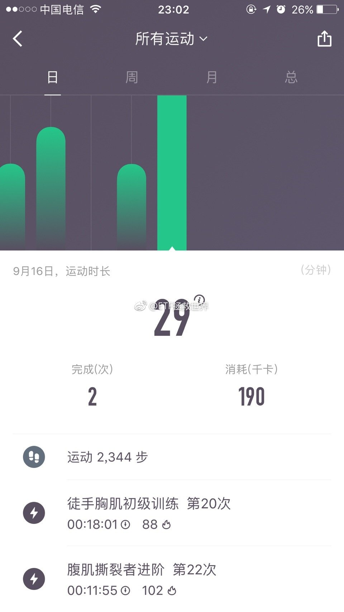

======================================================

ETF拯救世界 (5687069307) @
2017-09-17 19:29:41 Sun  
url: https://weibo.com/5687069307/Fmg4M4sYm

每日打卡（79）

今天撸三组。继续还债。 ​​​

转发[0]  评论[26]  赞[112] 

+++++++++++++++++++++++++++++++++++++++++++++++++++++

图片：

======================================================

ETF拯救世界 (5687069307) @
2017-09-18 10:22:48 Mon  
url: https://weibo.com/5687069307/FmlVi7ZuX

持仓品种都没有新高，账户继续每天新高ing。

amazing。 ​​​

转发[11]  评论[77]  赞[143] 

======================================================

ETF拯救世界 (5687069307) @
2017-09-18 10:32:43 Mon  
url: https://weibo.com/5687069307/FmlZjtmwF

我认为，情商是一种同理心。懂得站在对方的角度思考问题的人就是情商高，做出来的事就会让别人舒服。与忽悠之类恐怕不是一回事~

------------------------------------------------------
转推：
>  @ ()
>  2017-09-18 10:18:13 Mon  
>  url: 

>  抱歉，此微博已被作者删除。查看帮助：http://t.cn/Rfd3rQV

转发[15]  评论[41]  赞[131] 

======================================================

ETF拯救世界 (5687069307) @
2017-09-18 13:18:16 Mon  
url: https://weibo.com/5687069307/Fmn4vBTLt

整件事大概有个脉络了。

女方从事某种职业，通过各种方式认识有钱人，不为结婚，可以短期内赚不少钱。

然后通过网站认识了男方，像之前一样，各种奢侈品各种大额消费。不同的是，这次男方很认真，要结婚。女方感到有些棘手了。

结婚前一天，女方跟男方说自己结过婚，要看离婚协议拿88万。本来想就此 ​​​

转发[16]  评论[101]  赞[109] 

======================================================

ETF拯救世界 (5687069307) @
2017-09-18 16:10:11 Mon  
url: https://weibo.com/5687069307/FmocieTb9

$恒生指数 hkHSI$  距离下一次再平衡点位，29500越来越近了。

如果到时候美元涨一波就可以说完美了。当然，不涨也没ok啦。 ​​​

转发[5]  评论[56]  赞[104] 

======================================================

ETF拯救世界 (5687069307) @
2017-09-18 22:57:00 Mon  
url: https://weibo.com/5687069307/FmqRq8g2G

每日打卡（80）

失去才知道珍惜，失而复得是最幸福，好好珍惜已经有的。今天累，做一组简单的。 ​​​

转发[2]  评论[21]  赞[82] 

+++++++++++++++++++++++++++++++++++++++++++++++++++++

图片：

======================================================

ETF拯救世界 (5687069307) @
2017-09-19 05:22:06 Tue  
url: https://weibo.com/5687069307/FmtnJ5Hyo

完美的一天 ​​​

转发[6]  评论[57]  赞[111] 

+++++++++++++++++++++++++++++++++++++++++++++++++++++

图片：
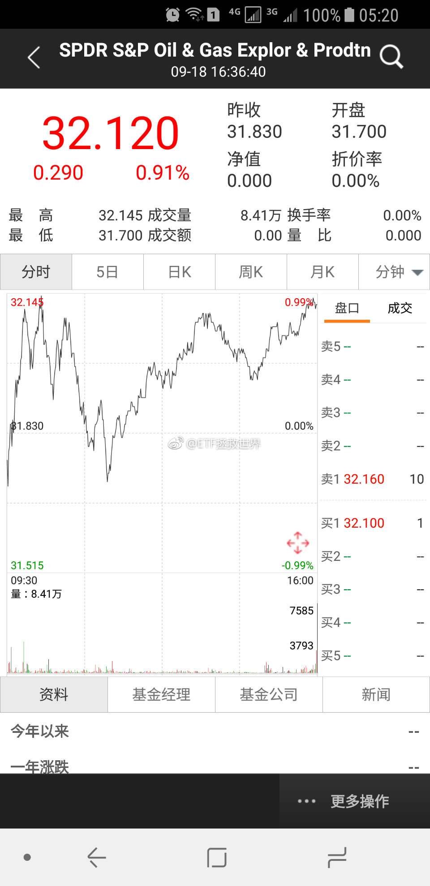

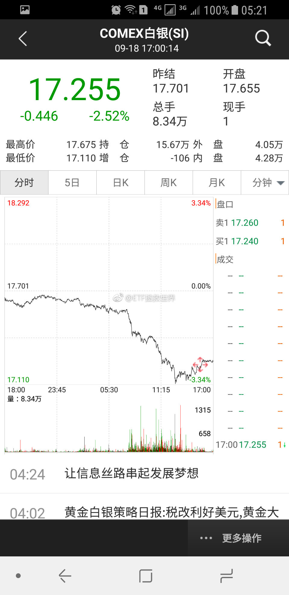

======================================================

ETF拯救世界 (5687069307) @
2017-09-19 06:40:13 Tue  
url: https://weibo.com/5687069307/FmtTriLjF

几周前浮亏15%的油气，现在浮亏3个多点。

我说过很多次，通过各种方法将成本控制好，别说趋势反转，就是一个小反弹也分分钟开始盈利。

任何指数品种，任何，都会做成盈利。绝不允许亏损卖出这样的事情发生。

只有一种可能变成悲剧，就是底部你被吓得不敢买或者卖出了。 ​​​

转发[17]  评论[155]  赞[157] 

======================================================

ETF拯救世界 (5687069307) @
2017-09-19 09:22:17 Tue  
url: https://weibo.com/5687069307/FmuXdEQE1

回复@化工_达人:场内现在折价1.6%。再加上今天净值又涨1%。如果场内买的时候有点溢价，你算算是不是差不多3个多点。//@化工_达人:我浮亏6.67%，场内买的。3个点不太可能吧[傻眼]

------------------------------------------------------
转推：
>  @ETF拯救世界 (5687069307)
>  2017-09-19 06:40:13 Tue  
>  url: https:/weibo.com/5687069307/FmtTriLjF/

>  几周前浮亏15%的油气，现在浮亏3个多点。
>  
>  我说过很多次，通过各种方法将成本控制好，别说趋势反转，就是一个小反弹也分分钟开始盈利。
>  
>  任何指数品种，任何，都会做成盈利。绝不允许亏损卖出这样的事情发生。
>  
>  只有一种可能变成悲剧，就是底部你被吓得不敢买或者卖出了。 ​​​

转发[1]  评论[24]  赞[57] 

======================================================

ETF拯救世界 (5687069307) @
2017-09-19 09:45:09 Tue  
url: https://weibo.com/5687069307/Fmv6vm1PA

广发养老的净值已经快回到第三轮熔断前了。计划的几个重仓品种开始蠢蠢欲动。

所以，要买就买表现不好的，然后让手里表现好的去飞，一定是没错。 ​​​

转发[19]  评论[66]  赞[148] 

======================================================

ETF拯救世界 (5687069307) @
2017-09-19 10:13:30 Tue  
url: https://weibo.com/5687069307/Fmvi0D8Vf

太毒了！！！

------------------------------------------------------
转推：
>  @ETF拯救世界 (5687069307)
>  2017-09-19 09:45:09 Tue  
>  url: https:/weibo.com/5687069307/Fmv6vm1PA/

>  广发养老的净值已经快回到第三轮熔断前了。计划的几个重仓品种开始蠢蠢欲动。
>  
>  所以，要买就买表现不好的，然后让手里表现好的去飞，一定是没错。 ​​​

转发[1]  评论[33]  赞[93] 

======================================================

ETF拯救世界 (5687069307) @
2017-09-19 15:05:02 Tue  
url: https://weibo.com/5687069307/Fmxcm1kbf

回复@一小九K:12000亿是我能想到的极限。超过这个，恐怕有点问题了。我相当怀疑管理层会让两融余额到这个数字。//@一小九K:老大，两融余额逼近万亿，是不是风险已经很近了...

------------------------------------------------------
转推：
>  @ETF拯救世界 (5687069307)
>  2017-09-19 09:45:09 Tue  
>  url: https:/weibo.com/5687069307/Fmv6vm1PA/

>  广发养老的净值已经快回到第三轮熔断前了。计划的几个重仓品种开始蠢蠢欲动。
>  
>  所以，要买就买表现不好的，然后让手里表现好的去飞，一定是没错。 ​​​

转发[5]  评论[33]  赞[72] 

======================================================

ETF拯救世界 (5687069307) @
2017-09-19 21:01:54 Tue  
url: https://weibo.com/5687069307/FmzxcjfPu

每日打卡（81）

练得很舒服。要加量了吧？ ​​​

转发[0]  评论[24]  赞[90] 

+++++++++++++++++++++++++++++++++++++++++++++++++++++

图片：

======================================================

ETF拯救世界 (5687069307) @
2017-09-20 09:17:52 Wed  
url: https://weibo.com/5687069307/FmElVs8Fz

谢谢。

------------------------------------------------------
转推：
>  @财联社APP (2868676035)
>  2017-09-20 09:16:52 Wed  
>  url: https:/weibo.com/2868676035/FmElwkCpM/

>  【要闻：人民币中间价下调140点 连续两日调贬】财联社20日讯，人民币兑美元中间价报6.5670，下调140点。前一交易日中间价报6.5423。http://t.cn/R0v8X43 ​​​

转发[3]  评论[19]  赞[65] 

======================================================

ETF拯救世界 (5687069307) @
2017-09-20 09:33:38 Wed  
url: https://weibo.com/5687069307/FmEskgNBP

这两年计划交易的18个品种，就剩这两个了。

赔钱为什么这么难。为什么。

[doge] ​​​

转发[11]  评论[95]  赞[124] 

+++++++++++++++++++++++++++++++++++++++++++++++++++++

图片：

======================================================

ETF拯救世界 (5687069307) @
2017-09-20 10:32:22 Wed  
url: https://weibo.com/5687069307/FmEQakU2h

回复@夜雨梧桐2010:赔钱和傻是两个范畴的概念好吗。//@夜雨梧桐2010:ee，我来帮你，借点钱给我，我不还，你就赔了......

------------------------------------------------------
转推：
>  @ETF拯救世界 (5687069307)
>  2017-09-20 09:33:38 Wed  
>  url: https:/weibo.com/5687069307/FmEskgNBP/

>  这两年计划交易的18个品种，就剩这两个了。
>  
>  赔钱为什么这么难。为什么。
>  
>  [doge] ​​​

转发[1]  评论[33]  赞[76] 

======================================================

ETF拯救世界 (5687069307) @
2017-09-20 13:36:10 Wed  
url: https://weibo.com/5687069307/FmG2M1zAt

其实我特别怀疑是不是有朋友上过当。如果所有朋友都没有上过当，这些骗子注册这么多号，每天这么弄，又没效果，4不4傻啊。

------------------------------------------------------
转推：
>  @ETF小迷妹 (2698010970)
>  2017-09-20 13:29:20 Wed  
>  url: https:/weibo.com/2698010970/FmFZZFVbS/

>  激动得差点上了高仿的当@ETF拯救世界 ​​​

转发[3]  评论[78]  赞[60] 

======================================================

ETF拯救世界 (5687069307) @
2017-09-20 14:05:17 Wed  
url: https://weibo.com/5687069307/FmGeAvxtS

有现金的注意一下逆回购了。长短结合。 ​​​

转发[2]  评论[31]  赞[93] 

======================================================

ETF拯救世界 (5687069307) @
2017-09-20 14:12:39 Wed  
url: https://weibo.com/5687069307/FmGhA5dZ5

回复@happymami:如果是目前这样，明确的说，月底不会开A股的车了。//@happymami:大盘跌不下去吗？昨天跌了，今天又涨上来[允悲]，不知月底还能开车不？

------------------------------------------------------
转推：
>  @ETF小迷妹 (2698010970)
>  2017-09-20 13:29:20 Wed  
>  url: https:/weibo.com/2698010970/FmFZZFVbS/

>  激动得差点上了高仿的当@ETF拯救世界 ​​​

转发[1]  评论[27]  赞[54] 

======================================================

ETF拯救世界 (5687069307) @
2017-09-20 21:51:51 Wed  
url: https://weibo.com/5687069307/FmJhXwQ6c

每日打卡（82）

打算加个每天走一万步的新指标。 ​​​

转发[0]  评论[27]  赞[92] 

+++++++++++++++++++++++++++++++++++++++++++++++++++++

图片：

======================================================

ETF拯救世界 (5687069307) @
2017-09-21 00:04:26 Thu  
url: https://weibo.com/5687069307/FmK9MxHpZ

一口 ​​​

转发[0]  评论[38]  赞[81] 

+++++++++++++++++++++++++++++++++++++++++++++++++++++

图片：
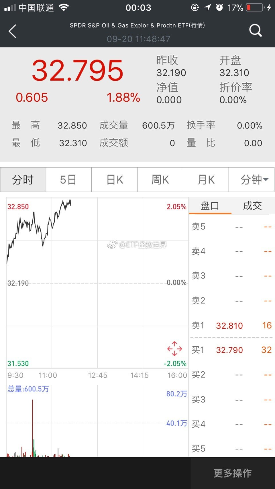

======================================================

ETF拯救世界 (5687069307) @
2017-09-21 07:45:42 Thu  
url: https://weibo.com/5687069307/FmNb0EVbt

别人说什么，重要吗。 ​​​

转发[3]  评论[76]  赞[114] 

+++++++++++++++++++++++++++++++++++++++++++++++++++++

图片：
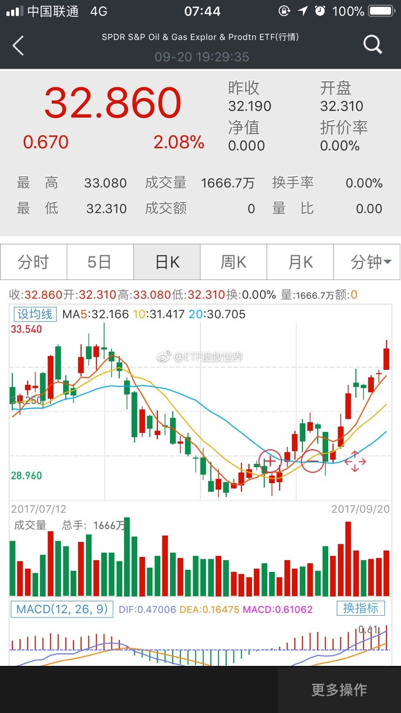

======================================================

ETF拯救世界 (5687069307) @
2017-09-21 08:43:59 Thu  
url: https://weibo.com/5687069307/FmNyFaF2S

明年上半年坐这个去趟迪斯尼。

------------------------------------------------------
转推：
>  @澎湃新闻 (5044281310)
>  2017-09-21 08:39:22 Thu  
>  url: https:/weibo.com/5044281310/FmNwNmrlx/

>  【时速提高至350公里，复兴号京沪间只需4小时28分】9月21日起，“复兴号”动车组即将在京沪高铁提速至350公里时速运行。中国成为世界上高铁商业运营速度最高的国家。澎湃新闻第一时间体验“全球最快”。 http://t.cn/R0z9pdh . ​​​

转发[3]  评论[29]  赞[49] 

======================================================

ETF拯救世界 (5687069307) @
2017-09-21 08:45:37 Thu  
url: https://weibo.com/5687069307/FmNzlc7nS

留着这张存单可能会发财

------------------------------------------------------
转推：
>  @ ()
>  2017-09-21 08:25:29 Thu  
>  url: 

>  抱歉，作者已设置仅展示半年内微博，此微博已不可见。 ​​​

转发[9]  评论[36]  赞[58] 

======================================================

ETF拯救世界 (5687069307) @
2017-09-21 09:05:04 Thu  
url: https://weibo.com/5687069307/FmNHeepX6

回复@Beck1010:事实是据说70%炒股的人是赔钱的//@Beck1010:如果买股票的话是不是就已经发了[坏笑]//@ETF拯救世界:留着这张存单可能会发财

------------------------------------------------------
转推：
>  @ ()
>  2017-09-21 08:25:29 Thu  
>  url: 

>  抱歉，作者已设置仅展示半年内微博，此微博已不可见。 ​​​

转发[1]  评论[22]  赞[38] 

======================================================

ETF拯救世界 (5687069307) @
2017-09-21 09:52:25 Thu  
url: https://weibo.com/5687069307/FmO0rBxeA

某个品种已经进入瞄准镜了。还有一周。 ​​​

转发[8]  评论[95]  赞[138] 

======================================================

ETF拯救世界 (5687069307) @
2017-09-21 10:11:33 Thu  
url: https://weibo.com/5687069307/FmO8diE38

谁能想到，又新高了。好像A股怎么走和我们的账户关系也不是太大了。

组合，组合。 ​​​

转发[3]  评论[63]  赞[135] 

======================================================

ETF拯救世界 (5687069307) @
2017-09-21 11:24:09 Thu  
url: https://weibo.com/5687069307/FmOBGDzf0

回复@你好大麦茶:拍卖午餐吧。1400起拍。能不能拍到2万//@你好大麦茶:回复@徐L鑫:组团求偶遇[嘻嘻]//@ETF拯救世界:明年上半年坐这个去趟迪斯尼。

------------------------------------------------------
转推：
>  @澎湃新闻 (5044281310)
>  2017-09-21 08:39:22 Thu  
>  url: https:/weibo.com/5044281310/FmNwNmrlx/

>  【时速提高至350公里，复兴号京沪间只需4小时28分】9月21日起，“复兴号”动车组即将在京沪高铁提速至350公里时速运行。中国成为世界上高铁商业运营速度最高的国家。澎湃新闻第一时间体验“全球最快”。 http://t.cn/R0z9pdh . ​​​

转发[0]  评论[35]  赞[52] 

======================================================

ETF拯救世界 (5687069307) @
2017-09-21 11:25:19 Thu  
url: https://weibo.com/5687069307/FmOC9zwn2

$中证红利 sz399922$  组合中的A股指数总算有新高的了 ​​​

转发[21]  评论[30]  赞[66] 

======================================================

ETF拯救世界 (5687069307) @
2017-09-21 11:29:51 Thu  
url: https://weibo.com/5687069307/FmOE0dk9k

这其实就是国外历次危机中的场景：贷款80%，然后房价跌30%，不仅首付跌没了，欠银行的钱比房子市值还多。最悲惨的是，因为经济不好，失业了。当然，我朝不会出现这样的情况。毕竟房价永远涨。//@挖龙脉的鹿鼎公:[允悲]杠杆大了，经不起回撤

------------------------------------------------------
转推：
>  @ ()
>  2017-09-20 12:28:40 Wed  
>  url: 

>  抱歉，作者已设置仅展示半年内微博，此微博已不可见。 ​​​

转发[19]  评论[38]  赞[58] 

======================================================

ETF拯救世界 (5687069307) @
2017-09-21 12:19:48 Thu  
url: https://weibo.com/5687069307/FmOYhfZS5

回复@用户5850653787:没必要。之前两年都是恒生涨的好，未来也许H跌的少呢。//@用户5850653787:老大，我手里有十份的恒生国企指数基金，想现在换到恒生指数基金，您觉得怎么样？还是只换一半?慢慢换，每次换一份[求关注]非常希望能被翻牌子，不翻也依然爱你[哈哈]

------------------------------------------------------
转推：
>  @ETF拯救世界 (5687069307)
>  2017-09-21 11:25:19 Thu  
>  url: https:/weibo.com/5687069307/FmOC9zwn2/

>  $中证红利 sz399922$  组合中的A股指数总算有新高的了 ​​​

转发[20]  评论[17]  赞[48] 

======================================================

ETF拯救世界 (5687069307) @
2017-09-21 14:30:12 Thu  
url: https://weibo.com/5687069307/FmPPcod9A

回复@bigblue83:爱跌不跌，我不看了。维稳还有一个月，相信依然是波澜不惊。看腻了，爱谁谁，跌也不买。//@bigblue83:如果这样跌一周，又可以搞a了

------------------------------------------------------
转推：
>  @ETF拯救世界 (5687069307)
>  2017-09-21 09:52:25 Thu  
>  url: https:/weibo.com/5687069307/FmO0rBxeA/

>  某个品种已经进入瞄准镜了。还有一周。 ​​​

转发[5]  评论[20]  赞[66] 

======================================================

ETF拯救世界 (5687069307) @
2017-09-21 14:52:08 Thu  
url: https://weibo.com/5687069307/FmPY6opog

拼命死扛，扛到两融余额1.2万亿以上，最终崩的一塌糊涂。谁负责呢，又抓一批？

操盘的恐怕得掂量掂量吧。 ​​​

转发[6]  评论[52]  赞[98] 

======================================================

ETF拯救世界 (5687069307) @
2017-09-21 15:57:00 Thu  
url: https://weibo.com/5687069307/FmQoqBSCO

[太开心] ​​​

转发[6]  评论[90]  赞[72] 

+++++++++++++++++++++++++++++++++++++++++++++++++++++

图片：

======================================================

ETF拯救世界 (5687069307) @
2017-09-21 21:28:41 Thu  
url: https://weibo.com/5687069307/FmSz41Zoo

回复@葫芦岛心灵的旅途:不要长期持有，有损耗//@葫芦岛心灵的旅途:请叫益达，161226跟踪效果如何?

------------------------------------------------------
转推：
>  @ETF拯救世界 (5687069307)
>  2017-09-21 15:57:00 Thu  
>  url: https:/weibo.com/5687069307/FmQoqBSCO/

>  [太开心] ​​​

转发[1]  评论[11]  赞[43] 

======================================================

ETF拯救世界 (5687069307) @
2017-09-21 22:27:19 Thu  
url: https://weibo.com/5687069307/FmSWRoQxF

每日打卡（83）

这几天有点感冒，做点轻松的。 ​​​

转发[0]  评论[32]  赞[79] 

+++++++++++++++++++++++++++++++++++++++++++++++++++++

图片：
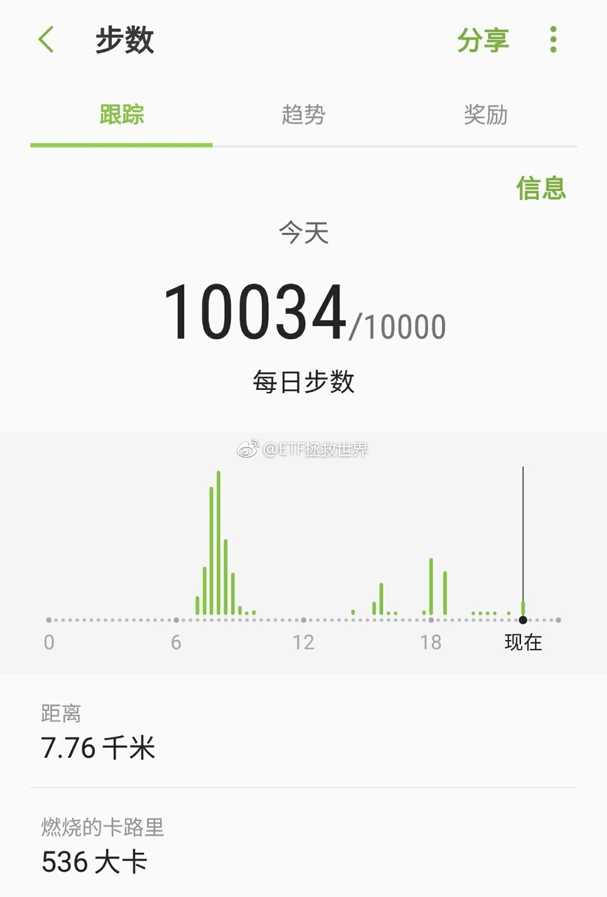

======================================================

ETF拯救世界 (5687069307) @
2017-09-22 09:17:50 Fri  
url: https://weibo.com/5687069307/FmXcWiHa4

刚刚得到的最新消息，2015年7月以来，买的18个品种只剩一个浮亏1%了。

只要系统和策略科学合理，在资本市场挣钱是没什么难度的。

不赔钱只是第一步，想要赚的多，还有曲折的路要走。但是在正确的路上一直走下去，光明也就不远了。 ​​​

转发[20]  评论[74]  赞[136] 

+++++++++++++++++++++++++++++++++++++++++++++++++++++

图片：

======================================================

ETF拯救世界 (5687069307) @
2017-09-22 09:32:06 Fri  
url: https://weibo.com/5687069307/FmXiHzjKd

呵呵，跌也不买。看你能跌到哪里。。//@ETF拯救世界:回复@bigblue83:爱跌不跌，我不看了。维稳还有一个月，相信依然是波澜不惊。看腻了，爱谁谁，跌也不买。//@bigblue83:如果这样跌一周，又可以搞a了

------------------------------------------------------
转推：
>  @ETF拯救世界 (5687069307)
>  2017-09-21 09:52:25 Thu  
>  url: https:/weibo.com/5687069307/FmO0rBxeA/

>  某个品种已经进入瞄准镜了。还有一周。 ​​​

转发[1]  评论[12]  赞[45] 

======================================================

ETF拯救世界 (5687069307) @
2017-09-22 09:48:16 Fri  
url: https://weibo.com/5687069307/FmXpgrVfc

回复@潇者_水清深也:现实会告诉我们答案。//@潇者_水清深也:E大，今天所有大佬（高善文，姜超等）全部看多了，怎么看啊//@ETF拯救世界:回复@用户5850653787:没必要。之前两年都是恒生涨的好，未来也许H跌的少呢。

------------------------------------------------------
转推：
>  @ETF拯救世界 (5687069307)
>  2017-09-21 11:25:19 Thu  
>  url: https:/weibo.com/5687069307/FmOC9zwn2/

>  $中证红利 sz399922$  组合中的A股指数总算有新高的了 ​​​

转发[16]  评论[15]  赞[47] 

======================================================

ETF拯救世界 (5687069307) @
2017-09-22 09:55:05 Fri  
url: https://weibo.com/5687069307/FmXs1wxHz

很多事情，对人，对事，都可以灵活处理。不能过于拘泥于某种刻板的教条。

但关键一点，要有比较坚定的世界观。或者说，标准，底线。

投资当然也是如此。买入，持有，卖出，构成了投资的全过程。无论是做哪个动作，最基本的投资世界观和标准不能变。这个标准不应该是涨了还是跌了，也不应该是别人说什 ​​​

转发[26]  评论[53]  赞[137] 

======================================================

ETF拯救世界 (5687069307) @
2017-09-22 09:59:32 Fri  
url: https://weibo.com/5687069307/FmXtPyI8D

怎么看待互联网上每天扑面而来的信息和新闻？

比较关键的一点是要有独立思考的能力。

新闻和信息，很多时候是假的。另一些时候虽然是真的，然而只是真相的一部分。

有些人的观点不正确，是因为他本身能力有欠缺。然而有些人是故意说一些不正确的观点，也许是为了利益，也许是被逼无奈。

所以独立思 ​​​

转发[93]  评论[63]  赞[167] 

======================================================

ETF拯救世界 (5687069307) @
2017-09-22 10:11:20 Fri  
url: https://weibo.com/5687069307/FmXyCuGLo

回复@溪南烟树:未雨绸缪。之前已经出过一份。目前大概是8%的仓位。8%是一个关键仓位，在一个组合中，低于8%很难对组合净值产生影响。无论是正面还是负面。综合来看，目前恒生的8%还算是ok。如果能到29500，还会继续卖出。不到的话，持有就ok了。

------------------------------------------------------
转推：
>  @ETF拯救世界 (5687069307)
>  2017-09-21 11:25:19 Thu  
>  url: https:/weibo.com/5687069307/FmOC9zwn2/

>  $中证红利 sz399922$  组合中的A股指数总算有新高的了 ​​​

转发[14]  评论[13]  赞[44] 

======================================================

ETF拯救世界 (5687069307) @
2017-09-22 10:16:04 Fri  
url: https://weibo.com/5687069307/FmXAxBkdE

回复@安全投资稳健增长:算是今年的失误之一。这个一定要认真反省，升级策略。//@安全投资稳健增长:没有持有互联网相关的指数，会不会有点遗憾？

------------------------------------------------------
转推：
>  @ETF拯救世界 (5687069307)
>  2017-09-22 09:59:32 Fri  
>  url: https:/weibo.com/5687069307/FmXtPyI8D/

>  怎么看待互联网上每天扑面而来的信息和新闻？
>  
>  比较关键的一点是要有独立思考的能力。
>  
>  新闻和信息，很多时候是假的。另一些时候虽然是真的，然而只是真相的一部分。
>  
>  有些人的观点不正确，是因为他本身能力有欠缺。然而有些人是故意说一些不正确的观点，也许是为了利益，也许是被逼无奈。
>  
>  所以独立思 ​​​

转发[50]  评论[35]  赞[57] 

======================================================

ETF拯救世界 (5687069307) @
2017-09-22 10:36:28 Fri  
url: https://weibo.com/5687069307/FmXIP97a3

回复@IT曼尼爵:不一样。比如说，融创或者比特币。就是涨一万倍我都毫无感觉。因为那是不可把握的，是自己能力圈之外的。中概互联则不同，腾讯、阿里、京东，都是我比较喜欢的公司，他们组成的指数没有买入，对我来说，是遗憾。策略需要升级。只有不断升级和进步才能立于不败之地。

------------------------------------------------------
转推：
>  @ETF拯救世界 (5687069307)
>  2017-09-22 09:59:32 Fri  
>  url: https:/weibo.com/5687069307/FmXtPyI8D/

>  怎么看待互联网上每天扑面而来的信息和新闻？
>  
>  比较关键的一点是要有独立思考的能力。
>  
>  新闻和信息，很多时候是假的。另一些时候虽然是真的，然而只是真相的一部分。
>  
>  有些人的观点不正确，是因为他本身能力有欠缺。然而有些人是故意说一些不正确的观点，也许是为了利益，也许是被逼无奈。
>  
>  所以独立思 ​​​

转发[20]  评论[34]  赞[92] 

======================================================

ETF拯救世界 (5687069307) @
2017-09-22 10:50:26 Fri  
url: https://weibo.com/5687069307/FmXOubrtm

回复@文小陈c:放心。纳斯达克，美国消费，美国医疗，标普，全部都在我们的监控范围内。美国未来在我们的组合配置中会有不小的比例。//@文小陈c:美国缩表会影响美股吗？如果美股高位崩盘，那是不是有机会入手美国上市的中国it巨头的指数？

------------------------------------------------------
转推：
>  @ETF拯救世界 (5687069307)
>  2017-09-22 09:59:32 Fri  
>  url: https:/weibo.com/5687069307/FmXtPyI8D/

>  怎么看待互联网上每天扑面而来的信息和新闻？
>  
>  比较关键的一点是要有独立思考的能力。
>  
>  新闻和信息，很多时候是假的。另一些时候虽然是真的，然而只是真相的一部分。
>  
>  有些人的观点不正确，是因为他本身能力有欠缺。然而有些人是故意说一些不正确的观点，也许是为了利益，也许是被逼无奈。
>  
>  所以独立思 ​​​

转发[9]  评论[30]  赞[86] 

======================================================

ETF拯救世界 (5687069307) @
2017-09-22 11:15:50 Fri  
url: https://weibo.com/5687069307/FmXYNEU0H

回复@仰望幸福45134:“次新”是一个概念，不是一个行业、市值或价值构成的指数。概念指数一般来说我们不会投资，但你想玩的话，据我的经验，熊市末期买入熊市中上市的，没有炒过的次新股，会在接下来的牛市中发大财。其它阶段我就不清楚了。

------------------------------------------------------
转推：
>  @ETF拯救世界 (5687069307)
>  2017-09-22 09:59:32 Fri  
>  url: https:/weibo.com/5687069307/FmXtPyI8D/

>  怎么看待互联网上每天扑面而来的信息和新闻？
>  
>  比较关键的一点是要有独立思考的能力。
>  
>  新闻和信息，很多时候是假的。另一些时候虽然是真的，然而只是真相的一部分。
>  
>  有些人的观点不正确，是因为他本身能力有欠缺。然而有些人是故意说一些不正确的观点，也许是为了利益，也许是被逼无奈。
>  
>  所以独立思 ​​​

转发[25]  评论[37]  赞[65] 

======================================================

ETF拯救世界 (5687069307) @
2017-09-22 11:52:59 Fri  
url: https://weibo.com/5687069307/FmYdSzX2w

回复@秦雪晖23333:有啊，都拉黑了啊。[并不简单]//@秦雪晖23333:我总感觉这样不好，没人骂E大，这不真实，老大懂我意思吗

------------------------------------------------------
转推：
>  @ETF拯救世界 (5687069307)
>  2017-09-22 09:17:50 Fri  
>  url: https:/weibo.com/5687069307/FmXcWiHa4/

>  刚刚得到的最新消息，2015年7月以来，买的18个品种只剩一个浮亏1%了。
>  
>  只要系统和策略科学合理，在资本市场挣钱是没什么难度的。
>  
>  不赔钱只是第一步，想要赚的多，还有曲折的路要走。但是在正确的路上一直走下去，光明也就不远了。 ​​​

转发[8]  评论[22]  赞[47] 

======================================================

ETF拯救世界 (5687069307) @
2017-09-22 11:53:39 Fri  
url: https://weibo.com/5687069307/FmYe9727z

双卡+微信双开。如果能实现这两个，就不用每天带两个手机了！

------------------------------------------------------
转推：
>  @ ()
>  2017-09-22 11:52:32 Fri  
>  url: 

>  抱歉，此微博已被作者删除。查看帮助：http://t.cn/Rfd3rQV

转发[0]  评论[66]  赞[52] 

======================================================

ETF拯救世界 (5687069307) @
2017-09-22 12:54:47 Fri  
url: https://weibo.com/5687069307/FmYCY362f

回复@石头里的虫子:骂完了马上打赏999//@石头里的虫子:大家集思广益一下，怎么样才能骂了E大又不被拉黑。//@ETF拯救世界:回复@秦雪晖23333:有啊，都拉黑了啊。[并不简单]//@秦雪晖23333:我总感觉这样不好，没人骂E大，这不真实，老大懂我意思吗

------------------------------------------------------
转推：
>  @ETF拯救世界 (5687069307)
>  2017-09-22 09:17:50 Fri  
>  url: https:/weibo.com/5687069307/FmXcWiHa4/

>  刚刚得到的最新消息，2015年7月以来，买的18个品种只剩一个浮亏1%了。
>  
>  只要系统和策略科学合理，在资本市场挣钱是没什么难度的。
>  
>  不赔钱只是第一步，想要赚的多，还有曲折的路要走。但是在正确的路上一直走下去，光明也就不远了。 ​​​

转发[6]  评论[23]  赞[52] 

======================================================

ETF拯救世界 (5687069307) @
2017-09-22 13:21:12 Fri  
url: https://weibo.com/5687069307/FmYNGCpv6

回复@fouvy:2010年-2015年3、4月，是ETF计划第二轮的持续时间。基本上到了当年4月第二轮的持仓品种就卖的差不多了。到2015年7月开始，第三轮计划正式开始。所以没有2015年初以来这个概念~//@fouvy:2015年年初以来呢...//@ETF拯救世界:回复@石头里的虫子:骂完了马上打赏999

------------------------------------------------------
转推：
>  @ETF拯救世界 (5687069307)
>  2017-09-22 09:17:50 Fri  
>  url: https:/weibo.com/5687069307/FmXcWiHa4/

>  刚刚得到的最新消息，2015年7月以来，买的18个品种只剩一个浮亏1%了。
>  
>  只要系统和策略科学合理，在资本市场挣钱是没什么难度的。
>  
>  不赔钱只是第一步，想要赚的多，还有曲折的路要走。但是在正确的路上一直走下去，光明也就不远了。 ​​​

转发[4]  评论[63]  赞[69] 

======================================================

ETF拯救世界 (5687069307) @
2017-09-23 11:11:30 Sat  
url: https://weibo.com/5687069307/Fn7ny3v6W

回复@rose6289707516:其实日本也不小了。在欧洲只比法国稍小，大于英国德国了。日本人做事是太认真了。//@rose6289707516:日本是小，可也有一亿多的人口，更拥挤，还是有没有心管的问题

------------------------------------------------------
转推：
>  @ ()
>  2017-09-20 12:01:03 Wed  
>  url: 

>  抱歉，此微博已被作者删除。查看帮助：http://t.cn/Rfd3rQV

转发[34]  评论[35]  赞[59] 

======================================================

ETF拯救世界 (5687069307) @
2017-09-23 19:26:03 Sat  
url: https://weibo.com/5687069307/FnaChhdht

这几天感冒没法打卡了。以后补吧。

[生病] ​​​

转发[0]  评论[110]  赞[69] 

======================================================

ETF拯救世界 (5687069307) @
2017-09-24 13:10:43 Sun  
url: https://weibo.com/5687069307/FnhAqtX7b

转发。希望开车的朋友都引以为戒吧。前车这样并线，就算这次后车让了，以后也总有不让的，还是会出事，弄不好命没了。后车虽然无责，但其实也没必要，踩一脚刹车就完了。别的不说，修车、处理事故就够麻烦，何必给自己找事。要重温《蛮荒故事》啊。

------------------------------------------------------
转推：
>  @北京人不知道的北京事儿 (1662214194)
>  2017-09-24 10:51:39 Sun  
>  url: https:/weibo.com/1662214194/FngFYjEnU/

>  昨儿发生的一起交通事故，该怎么定责引起大量网友争论。。。这事儿你怎么看？[思考]http://t.cn/R05LtLf ​​​

转发[19]  评论[43]  赞[57] 

======================================================

ETF拯救世界 (5687069307) @
2017-09-24 13:33:18 Sun  
url: https://weibo.com/5687069307/FnhJB0AWM

回复@施大威:你这个太不恰当了。当然，你要把别人上你老婆和踩一脚刹车等同起来，那我也是没什么好说了。你好好想想，这两个是一个性质的事情吗。

------------------------------------------------------
转推：
>  @北京人不知道的北京事儿 (1662214194)
>  2017-09-24 10:51:39 Sun  
>  url: https:/weibo.com/1662214194/FngFYjEnU/

>  昨儿发生的一起交通事故，该怎么定责引起大量网友争论。。。这事儿你怎么看？[思考]http://t.cn/R05LtLf ​​​

转发[0]  评论[17]  赞[25] 

======================================================

ETF拯救世界 (5687069307) @
2017-09-24 13:46:51 Sun  
url: https://weibo.com/5687069307/FnhP6fL1U

回复@施大威:我遇到这种事，当然也会不爽，但一定会减速让行。我告诉你为什么，因为我不知道撞上去我或者对方会死还是残。就为了教育并线不守规矩的人搭上我的命？不好意思，我的命很值钱，家人还需要我，我还没活够。您愿意您请便。

------------------------------------------------------
转推：
>  @北京人不知道的北京事儿 (1662214194)
>  2017-09-24 10:51:39 Sun  
>  url: https:/weibo.com/1662214194/FngFYjEnU/

>  昨儿发生的一起交通事故，该怎么定责引起大量网友争论。。。这事儿你怎么看？[思考]http://t.cn/R05LtLf ​​​

转发[9]  评论[49]  赞[73] 

======================================================

ETF拯救世界 (5687069307) @
2017-09-25 08:44:48 Mon  
url: https://weibo.com/5687069307/FnpgZiWcr

列宁同志已经不咳嗽了，他已经不发烧了！ ​​​

转发[4]  评论[67]  赞[114] 

======================================================

ETF拯救世界 (5687069307) @
2017-09-25 09:03:00 Mon  
url: https://weibo.com/5687069307/Fnponiofn

回复@观音山上拜观音:是啊，我也很期待。到现在我都不知道该开哪辆车。//@观音山上拜观音:再休息四天，我们就要飙车了。

------------------------------------------------------
转推：
>  @ETF拯救世界 (5687069307)
>  2017-09-25 08:44:48 Mon  
>  url: https:/weibo.com/5687069307/FnpgZiWcr/

>  列宁同志已经不咳嗽了，他已经不发烧了！ ​​​

转发[0]  评论[24]  赞[50] 

======================================================

ETF拯救世界 (5687069307) @
2017-09-25 09:37:19 Mon  
url: https://weibo.com/5687069307/FnpCj3IlQ

金陵玉树莺声晓，秦淮水榭花开早，谁知道容易冰消！

眼看他起朱楼，眼看他宴宾客，眼看他楼塌了。 ​​​

转发[5]  评论[39]  赞[93] 

======================================================

ETF拯救世界 (5687069307) @
2017-09-25 09:45:38 Mon  
url: https://weibo.com/5687069307/FnpFGf7T0

$全指医药 sh000991$   弱周期 ​​​

转发[7]  评论[23]  赞[35] 

======================================================

ETF拯救世界 (5687069307) @
2017-09-25 09:54:31 Mon  
url: https://weibo.com/5687069307/FnpJhEKrW

回复@阿杰_Future:那我念一句清代的唱词，莫非还是五阿哥穿越回来的吗！//@阿杰_Future:与青春有关的日子 的经典桥段, 老大你暴露年龄了噢[嘻嘻]

------------------------------------------------------
转推：
>  @ETF拯救世界 (5687069307)
>  2017-09-25 08:44:48 Mon  
>  url: https:/weibo.com/5687069307/FnpgZiWcr/

>  列宁同志已经不咳嗽了，他已经不发烧了！ ​​​

转发[2]  评论[15]  赞[41] 

======================================================

ETF拯救世界 (5687069307) @
2017-09-25 10:18:05 Mon  
url: https://weibo.com/5687069307/FnpSRfXYq

回复@乐悠悠水柔柔:基本是。大家可以申购试试。反正中的机会几乎没有。[doge]//@乐悠悠水柔柔:e大，今天雨虹可转债真的是无风险吗？//@ETF拯救世界:回复@阿杰_Future:那我念一句清代的唱词，莫非还是五阿哥穿越回来的吗！

------------------------------------------------------
转推：
>  @ETF拯救世界 (5687069307)
>  2017-09-25 08:44:48 Mon  
>  url: https:/weibo.com/5687069307/FnpgZiWcr/

>  列宁同志已经不咳嗽了，他已经不发烧了！ ​​​

转发[1]  评论[22]  赞[38] 

======================================================

ETF拯救世界 (5687069307) @
2017-09-25 10:21:15 Mon  
url: https://weibo.com/5687069307/FnpU895n7

4不4抱团取暖的标的转到咱们这儿来了。[doge]

------------------------------------------------------
转推：
>  @ETF拯救世界 (5687069307)
>  2017-09-25 09:45:38 Mon  
>  url: https:/weibo.com/5687069307/FnpFGf7T0/

>  $全指医药 sh000991$   弱周期 ​​​

转发[1]  评论[24]  赞[51] 

======================================================

ETF拯救世界 (5687069307) @
2017-09-25 11:02:43 Mon  
url: https://weibo.com/5687069307/FnqaXuTIN

申购转债的正确姿势 ​​​

转发[8]  评论[36]  赞[50] 

+++++++++++++++++++++++++++++++++++++++++++++++++++++

图片：

======================================================

ETF拯救世界 (5687069307) @
2017-09-25 11:06:05 Mon  
url: https://weibo.com/5687069307/FnqckDtqb

友情提示，目前逆回购7天收益率最高。可用日5.357，可取日5。

可以放一部分。 ​​​

转发[4]  评论[33]  赞[58] 

======================================================

ETF拯救世界 (5687069307) @
2017-09-25 11:09:02 Mon  
url: https://weibo.com/5687069307/Fnqdx6W7O

回复@幸福猪兜仔:4天跌了15%，是不是给你机会进了。43的话，现在买入有几十个点的收益了。//@幸福猪兜仔:我估计今年的8月30号左右，融创就可以涨到43元以上[允悲][泪][二哈]，然后就可以找益达的指数基金去当接盘侠，老大，你说是不是很开心啦[允悲][泪][二哈]

------------------------------------------------------
转推：
>  @ETF拯救世界 (5687069307)
>  2017-09-18 10:22:48 Mon  
>  url: https:/weibo.com/5687069307/FmlVi7ZuX/

>  持仓品种都没有新高，账户继续每天新高ing。
>  
>  amazing。 ​​​

转发[2]  评论[15]  赞[35] 

======================================================

ETF拯救世界 (5687069307) @
2017-09-25 11:10:15 Mon  
url: https://weibo.com/5687069307/Fnqe1zDhV

回复@天冰冰天:我说的可用日是10月9日，可取日是10月10日，也就是从现在到这两天的年化收益率。这种错误我不会犯的。。//@天冰冰天:七天到下周一，到期时间点节中，整个十一钱躺账户里要错过了吧

------------------------------------------------------
转推：
>  @ETF拯救世界 (5687069307)
>  2017-09-25 11:06:05 Mon  
>  url: https:/weibo.com/5687069307/FnqckDtqb/

>  友情提示，目前逆回购7天收益率最高。可用日5.357，可取日5。
>  
>  可以放一部分。 ​​​

转发[0]  评论[0]  赞[0] 

======================================================

ETF拯救世界 (5687069307) @
2017-09-25 11:23:30 Mon  
url: https://weibo.com/5687069307/Fnqjpag8A

回复@恶人假mm:你如果全中我借钱给你。利润对半分。//@恶人假mm:下了个1000万的单，不会全中吧[允悲]

------------------------------------------------------
转推：
>  @ETF拯救世界 (5687069307)
>  2017-09-25 11:02:43 Mon  
>  url: https:/weibo.com/5687069307/FnqaXuTIN/

>  申购转债的正确姿势 ​​​

转发[1]  评论[27]  赞[43] 

======================================================

ETF拯救世界 (5687069307) @
2017-09-25 11:30:54 Mon  
url: https://weibo.com/5687069307/FnqmpiQUt

回复@神毕希嫣:今天很简单，申购072271。每个人都能申购10万股，不要钱，中了才缴款。风险收益吗，破发的可能性不大，中了的话，赚也就赚个蚊子腿……//@神毕希嫣:e大，科普一下转债玩法啦

------------------------------------------------------
转推：
>  @ETF拯救世界 (5687069307)
>  2017-09-25 11:02:43 Mon  
>  url: https:/weibo.com/5687069307/FnqaXuTIN/

>  申购转债的正确姿势 ​​​

转发[4]  评论[30]  赞[34] 

======================================================

ETF拯救世界 (5687069307) @
2017-09-25 11:33:39 Mon  
url: https://weibo.com/5687069307/Fnqnwuy1S

嗯哼。 ​​​

转发[0]  评论[27]  赞[35] 

+++++++++++++++++++++++++++++++++++++++++++++++++++++

图片：
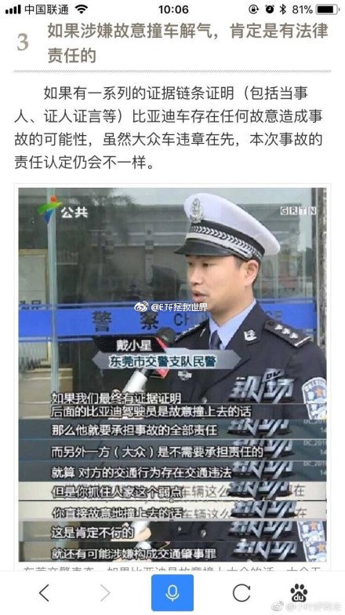

======================================================

ETF拯救世界 (5687069307) @
2017-09-25 11:40:50 Mon  
url: https://weibo.com/5687069307/FnqqrA0La

讲真，我用过n部智能机里面，mate9真的是很有特点的，有几个点我比较喜欢。一个是续航特别强！我用过最强的。第二是音质很不错。不知道为什么，比s8好，跟苹果不分上下吧。缺点是屏幕不好，总感觉有拖影。第二是工业设计不行，笨，重。我比较看重工业设计。看看mate10会不会好看点。

------------------------------------------------------
转推：
>  @财联社APP (2868676035)
>  2017-09-25 11:35:12 Mon  
>  url: https:/weibo.com/2868676035/Fnqo9u1hA/

>  【华为举行麒麟970国内媒体沟通会 晶体管密度达苹果A11的1.28倍】25日上午，华为在北京举行了麒麟970芯片的媒体沟通会，这是继公司在IFA（2017柏林国际消费类电子展览会）上发布过该芯片后，首次在国内进行该芯片的宣讲。本次沟通会主题为“智汇”，源于“笃学笃行，智汇于芯”，华为表示这体现了海思 ​​​

转发[2]  评论[42]  赞[50] 

======================================================

ETF拯救世界 (5687069307) @
2017-09-25 11:58:07 Mon  
url: https://weibo.com/5687069307/FnqxsgOXZ

关于那个变道的吧，昨天说了两句，还让人给怼了……

怎么讲呢。

前车肯定有责任，这个不用说。咱们开车的，也都很痛恨这种人。问题就在于，从我自己的角度讲，如果是后车，会怎么对待这件事。包括从我亲人和朋友的角度出发。

有人说，大快人心啊，终于有人治这样的路霸了。不这样以后他不知道怎么开 ​​​

转发[12]  评论[74]  赞[126] 

======================================================

ETF拯救世界 (5687069307) @
2017-09-25 13:06:39 Mon  
url: https://weibo.com/5687069307/FnqZgq3Hw

回复@BR芭斯罗缤:枪毙五分钟//@BR芭斯罗缤:回复@happymami:啥后果？[哈哈]//@ETF拯救世界:回复@神毕希嫣:今天很简单，申购072271。每个人都能申购10万股，不要钱，中了才缴款。风险收益吗，破发的可能性不大，中了的话，赚也就赚个蚊子腿……//@神毕希嫣:e大，科普一下转债玩法啦

------------------------------------------------------
转推：
>  @ETF拯救世界 (5687069307)
>  2017-09-25 11:02:43 Mon  
>  url: https:/weibo.com/5687069307/FnqaXuTIN/

>  申购转债的正确姿势 ​​​

转发[1]  评论[11]  赞[32] 

======================================================

ETF拯救世界 (5687069307) @
2017-09-25 13:31:29 Mon  
url: https://weibo.com/5687069307/Fnr9m2zkT

不过说真的，如果拿枪逼着我一定要买股票，选择是：

1、PE个位数的房地产股

2、包含PE60倍阿里巴巴、54倍腾讯、42倍百度、36倍新浪、18倍网易、负数京东的中概互联指数。

我会买后者。

…… ​​​

转发[0]  评论[0]  赞[0] 

======================================================

ETF拯救世界 (5687069307) @
2017-09-25 13:37:09 Mon  
url: https://weibo.com/5687069307/FnrbEqbtx

还是不会买。不用费力气勾引我了。//@ETF拯救世界:没有相对较大的调整，计划不会再加A股了。怎么讲，现在就是鸡肋时间。

------------------------------------------------------
转推：
>  @ETF拯救世界 (5687069307)
>  2017-09-14 14:06:25 Thu  
>  url: https:/weibo.com/5687069307/FlLG4lQqc/

>  呵呵哒，别想骗我今晚买a股。图样了！ ​​​

转发[9]  评论[20]  赞[50] 

======================================================

ETF拯救世界 (5687069307) @
2017-09-25 14:06:00 Mon  
url: https://weibo.com/5687069307/FnrnmrHur

差不多行了，别嘚瑟。慢慢来好吗。

------------------------------------------------------
转推：
>  @ETF拯救世界 (5687069307)
>  2017-09-25 09:45:38 Mon  
>  url: https:/weibo.com/5687069307/FnpFGf7T0/

>  $全指医药 sh000991$   弱周期 ​​​

转发[0]  评论[11]  赞[50] 

======================================================

ETF拯救世界 (5687069307) @
2017-09-25 14:41:30 Mon  
url: https://weibo.com/5687069307/FnrBM3gPM

还……是……不……买……//@ETF拯救世界:还是不会买。不用费力气勾引我了。//@ETF拯救世界:没有相对较大的调整，计划不会再加A股了。怎么讲，现在就是鸡肋时间。

------------------------------------------------------
转推：
>  @ETF拯救世界 (5687069307)
>  2017-09-14 14:06:25 Thu  
>  url: https:/weibo.com/5687069307/FlLG4lQqc/

>  呵呵哒，别想骗我今晚买a股。图样了！ ​​​

转发[0]  评论[21]  赞[46] 

======================================================

ETF拯救世界 (5687069307) @
2017-09-25 14:52:37 Mon  
url: https://weibo.com/5687069307/FnrGhx2nf

29号之前，我少说两句可能比较好。 ​​​

转发[6]  评论[79]  赞[106] 

======================================================

ETF拯救世界 (5687069307) @
2017-09-25 16:41:14 Mon  
url: https://weibo.com/5687069307/FnsonrQh8

美元债买少了？嗷~~一声昏古起了。

------------------------------------------------------
转推：
>  @ ()
>  2017-09-25 16:31:51 Mon  
>  url: 

>  抱歉，此微博已被作者删除。查看帮助：http://t.cn/Rfd3rQV

转发[7]  评论[40]  赞[63] 

======================================================

ETF拯救世界 (5687069307) @
2017-09-25 18:20:25 Mon  
url: https://weibo.com/5687069307/Fnt2DcvaS

回复@宁志忠:不熊咱们怎么买剩下的二十份？//@宁志忠:e大，创业板怎么熊了？//@ETF拯救世界:美元债买少了？嗷~~一声昏古起了。

------------------------------------------------------
转推：
>  @ ()
>  2017-09-25 16:31:51 Mon  
>  url: 

>  抱歉，此微博已被作者删除。查看帮助：http://t.cn/Rfd3rQV

转发[5]  评论[15]  赞[33] 

======================================================

ETF拯救世界 (5687069307) @
2017-09-25 18:31:31 Mon  
url: https://weibo.com/5687069307/Fnt78tyVI

回复@BuBu蛇:极限可以给佢15个巴仙//@BuBu蛇:E大，创业板的顶配会是多少份呢？//@ETF拯救世界:回复@宁志忠:不熊咱们怎么买剩下的二十份？//@宁志忠:e大，创业板怎么熊了？//@ETF拯救世界:美元债买少了？嗷~~一声昏古起了。

------------------------------------------------------
转推：
>  @ ()
>  2017-09-25 16:31:51 Mon  
>  url: 

>  抱歉，此微博已被作者删除。查看帮助：http://t.cn/Rfd3rQV

转发[0]  评论[0]  赞[0] 

======================================================

ETF拯救世界 (5687069307) @
2017-09-25 19:16:44 Mon  
url: https://weibo.com/5687069307/FntpulxsG

非常平稳！

------------------------------------------------------
转推：
>  @ ()
>  2017-09-25 19:11:57 Mon  
>  url: 

>  抱歉，此微博已被作者删除。查看帮助：http://t.cn/Rfd3rQV

转发[0]  评论[19]  赞[42] 

======================================================

ETF拯救世界 (5687069307) @
2017-09-25 20:01:15 Mon  
url: https://weibo.com/5687069307/FntHyyWYE

据说汽油车要被淘汰了 ​​​

转发[4]  评论[57]  赞[72] 

+++++++++++++++++++++++++++++++++++++++++++++++++++++

图片：
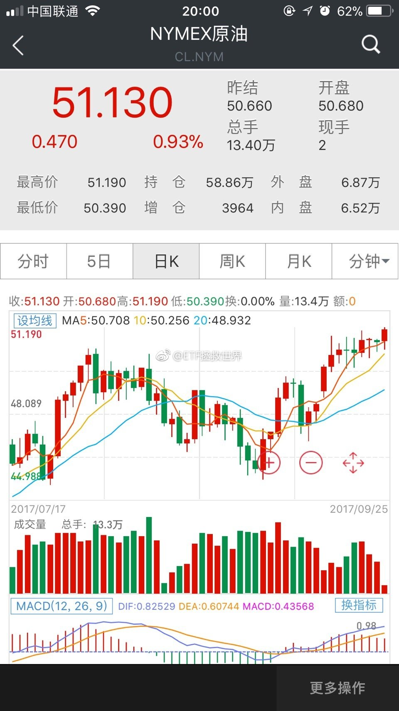

======================================================

ETF拯救世界 (5687069307) @
2017-09-25 21:28:49 Mon  
url: https://weibo.com/5687069307/Fnuh6mUWx

[并不简单] ​​​

转发[4]  评论[53]  赞[71] 

+++++++++++++++++++++++++++++++++++++++++++++++++++++

图片：

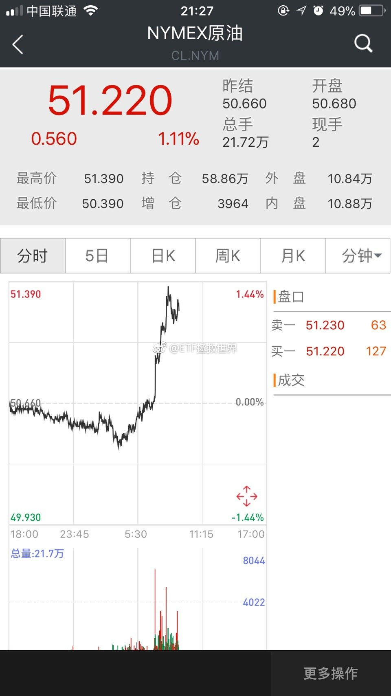

======================================================

ETF拯救世界 (5687069307) @
2017-09-25 22:54:26 Mon  
url: https://weibo.com/5687069307/FnuPR8OAJ

睡觉去了。明早看看跳不跳。 ​​​

转发[1]  评论[23]  赞[59] 

+++++++++++++++++++++++++++++++++++++++++++++++++++++

图片：
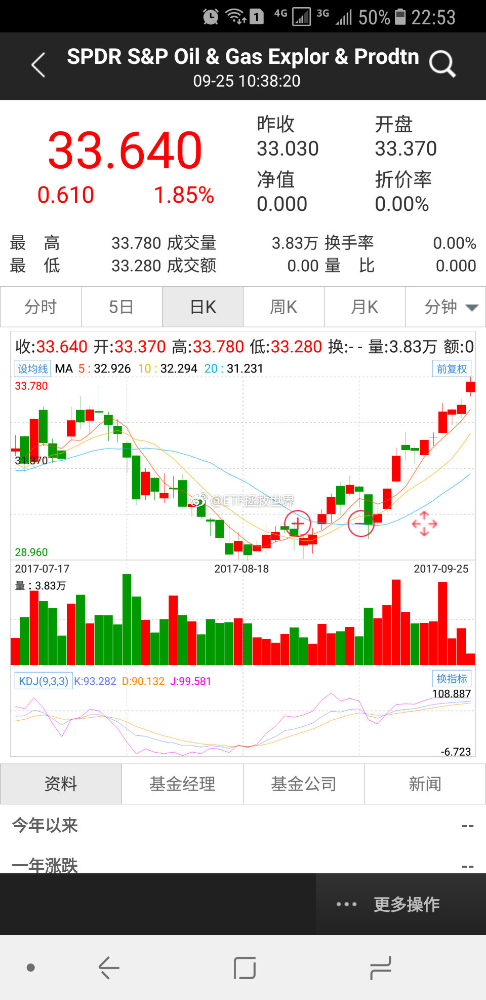

======================================================

ETF拯救世界 (5687069307) @
2017-09-26 05:51:45 Tue  
url: https://weibo.com/5687069307/FnxzfdYOM

投资是不是很有意思。

不完全是钱的问题。感受一下。 ​​​

转发[10]  评论[84]  赞[115] 

+++++++++++++++++++++++++++++++++++++++++++++++++++++

图片：
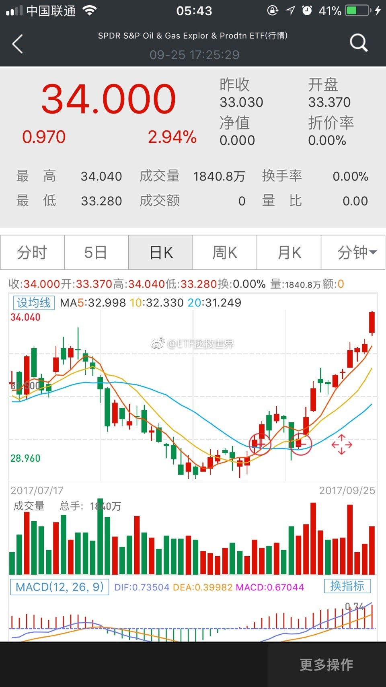

======================================================

ETF拯救世界 (5687069307) @
2017-09-26 08:29:09 Tue  
url: https://weibo.com/5687069307/FnyB8gO9o

很多投资者看不上趋势分析。其实无数次量化分析表明，动量因子是最有效的因子之一。当然，能不能用好动量就看每个人的修为了。//@数据分析研究者:是的，不单单是价格，其实均线无处不在，市净率，市盈率，成交量...都有自己的均线

------------------------------------------------------
转推：
>  @数据分析研究者 (5628021879)
>  2017-09-26 08:02:27 Tue  
>  url: https:/weibo.com/5628021879/FnyqijlHF/

>  昨晚自研看盘系统观察了一下恒大，不少指标较发出了预警提示。比如市净率，日线9/21开始有5日EMA均线兰色入顶提示，周线自上周起连续出现全均线入顶提示，月线是本月开始出现全均线入顶提示。综合看，周线调整可能才开始，月线要结合周线调整力度观察。分析指标应用解释见：http://t.cn/R0JDper
>   ​​ ​​​

转发[14]  评论[27]  赞[49] 

======================================================

ETF拯救世界 (5687069307) @
2017-09-26 08:50:43 Tue  
url: https://weibo.com/5687069307/FnyJSrw5f

回复@wuhaowei12345:你怎么知道我有多少仓位？呵呵。[酷]//@wuhaowei12345:就哪点仓位，晚上11点看看，早上5点看看。兄也真不容易啊

------------------------------------------------------
转推：
>  @ETF拯救世界 (5687069307)
>  2017-09-26 05:51:45 Tue  
>  url: https:/weibo.com/5687069307/FnxzfdYOM/

>  投资是不是很有意思。
>  
>  不完全是钱的问题。感受一下。 ​​​

转发[2]  评论[30]  赞[41] 

======================================================

ETF拯救世界 (5687069307) @
2017-09-26 08:55:53 Tue  
url: https://weibo.com/5687069307/FnyLYsfPS

一个建议啊，对别人的投资体系投资策略一知半解的话还是不要说话了。

一直说，我本人的金融资产有70%放在计划里。之前那个问答也说得很清楚，这70%中的未使用部分会做各种投资，甚至还举了油气网格的例子。

我只会把最最保险的ETF计划拿出来与大家一起投资，其它的，不会说。不是别的原因，是风险大 ​​​

转发[17]  评论[54]  赞[132] 

======================================================

ETF拯救世界 (5687069307) @
2017-09-26 09:00:21 Tue  
url: https://weibo.com/5687069307/FnyNO1jdI

没看过的看吧。免费。

------------------------------------------------------
转推：
>  @ETF拯救世界 (5687069307)
>  2017-03-24 11:09:41 Fri  
>  url: https:/weibo.com/5687069307/EBfCg1fLX/

>  讲真，我自己感觉这回答值1块钱。我回答了 @晴儿小小 的问题，问题价值￥79.00，大家快来花1元围观~ http://t.cn/R6GYZGs ​​​

转发[14]  评论[13]  赞[64] 

======================================================

ETF拯救世界 (5687069307) @
2017-09-26 09:11:02 Tue  
url: https://weibo.com/5687069307/FnyS8yXLh

如果你在厨房里看见一只蟑螂……

------------------------------------------------------
转推：
>  @挖龙脉的超级鹿鼎公 (3962719063)
>  2017-09-26 09:09:50 Tue  
>  url: https:/weibo.com/3962719063/FnyREaXpc/

>  据说某浓眉大眼的房产公司借的钱违约了，没钱还债，不过还好，只是东北的分部，资金量也只有几亿，不过在东北还有极大存货和土地卖不掉 ​​​

转发[10]  评论[34]  赞[46] 

======================================================

ETF拯救世界 (5687069307) @
2017-09-26 09:24:18 Tue  
url: https://weibo.com/5687069307/FnyXwdpos

还有三天而已，为什么要涨。好不容易看中的品种。

[泪] ​​​

转发[4]  评论[45]  赞[56] 

======================================================

ETF拯救世界 (5687069307) @
2017-09-26 10:03:28 Tue  
url: https://weibo.com/5687069307/Fnzdqe8gK

竞猜：几点上班。 ​​​​

标的：金融、两油 ​​​

转发[2]  评论[47]  赞[67] 

======================================================

ETF拯救世界 (5687069307) @
2017-09-26 10:06:46 Tue  
url: https://weibo.com/5687069307/FnzeLhjeJ

回复@ironsoul0:7天又过5.5了。这几天有没有希望中期过6？//@ironsoul0:逆回购上来了

------------------------------------------------------
转推：
>  @ETF拯救世界 (5687069307)
>  2017-09-26 09:24:18 Tue  
>  url: https:/weibo.com/5687069307/FnyXwdpos/

>  还有三天而已，为什么要涨。好不容易看中的品种。
>  
>  [泪] ​​​

转发[2]  评论[11]  赞[33] 

======================================================

ETF拯救世界 (5687069307) @
2017-09-26 10:08:53 Tue  
url: https://weibo.com/5687069307/FnzfCacGY

回复@这个月亮有什么好:我说的永远是可用日年化收益。不是“7天”，而是到资金可用日。//@这个月亮有什么好:好像算一下 七天期占用资金13天  ，不如货币基金赚得多//@ETF拯救世界:回复@ironsoul0:7天又过5.5了。这几天有没有希望中期过6？//@ironsoul0:逆回购上来了

------------------------------------------------------
转推：
>  @ETF拯救世界 (5687069307)
>  2017-09-26 09:24:18 Tue  
>  url: https:/weibo.com/5687069307/FnyXwdpos/

>  还有三天而已，为什么要涨。好不容易看中的品种。
>  
>  [泪] ​​​

转发[1]  评论[5]  赞[36] 

======================================================

ETF拯救世界 (5687069307) @
2017-09-26 10:11:58 Tue  
url: https://weibo.com/5687069307/FnzgRfuph

目前GC004和GC007 到10.9年化收益都过5.6%了。需要的可以放一部分。再留一部分看明后天有没有大肉。 ​​​

转发[7]  评论[19]  赞[52] 

======================================================

ETF拯救世界 (5687069307) @
2017-09-26 10:13:29 Tue  
url: https://weibo.com/5687069307/FnzhugEY1

到10.9可用都过6%。到10-10可取是5.6%。

------------------------------------------------------
转推：
>  @ETF拯救世界 (5687069307)
>  2017-09-26 10:11:58 Tue  
>  url: https:/weibo.com/5687069307/FnzgRfuph/

>  目前GC004和GC007 到10.9年化收益都过5.6%了。需要的可以放一部分。再留一部分看明后天有没有大肉。 ​​​

转发[3]  评论[20]  赞[59] 

======================================================

ETF拯救世界 (5687069307) @
2017-09-26 12:04:31 Tue  
url: https://weibo.com/5687069307/FnA0y919u

早上上班的路上，我还美滋滋的想着月底开车的品种，计划着买多少，风险平价，资产配置……

几个小时过去，什么玩意啊！人类最大的问题就是想太多了吧！ ​​​

转发[6]  评论[43]  赞[102] 

======================================================

ETF拯救世界 (5687069307) @
2017-09-26 12:08:19 Tue  
url: https://weibo.com/5687069307/FnA26fbHE

回复@-反清复明-:图片评论 http://t.cn/R067bTW //@-反清复明-:E大以前是不能奶，以后想也不行了

------------------------------------------------------
转推：
>  @ETF拯救世界 (5687069307)
>  2017-09-26 12:04:31 Tue  
>  url: https:/weibo.com/5687069307/FnA0y919u/

>  早上上班的路上，我还美滋滋的想着月底开车的品种，计划着买多少，风险平价，资产配置……
>  
>  几个小时过去，什么玩意啊！人类最大的问题就是想太多了吧！ ​​​

转发[3]  评论[27]  赞[55] 

======================================================

ETF拯救世界 (5687069307) @
2017-09-26 13:46:53 Tue  
url: https://weibo.com/5687069307/FnAG5CQzW

回复@圣善周闻宗:上周重要股东净减持17亿，正常。政策卡的死，又是敏感期。//@圣善周闻宗:有个问题，E大能否解答一下，最近股市行情这么好，大小非减持情况如何了呢？//@ETF拯救世界:回复@-反清复明-:图片评论 http://t.cn/R067bTW //@-反清复明-:E大以前是不能奶，以后想也不行了

------------------------------------------------------
转推：
>  @ETF拯救世界 (5687069307)
>  2017-09-26 12:04:31 Tue  
>  url: https:/weibo.com/5687069307/FnA0y919u/

>  早上上班的路上，我还美滋滋的想着月底开车的品种，计划着买多少，风险平价，资产配置……
>  
>  几个小时过去，什么玩意啊！人类最大的问题就是想太多了吧！ ​​​

转发[1]  评论[5]  赞[35] 

======================================================

ETF拯救世界 (5687069307) @
2017-09-26 13:48:52 Tue  
url: https://weibo.com/5687069307/FnAGUbBwV

我真的笑出来了啊。港真，有点把持不住了呢。//@ETF拯救世界:还是不会买。不用费力气勾引我了。//@ETF拯救世界:没有相对较大的调整，计划不会再加A股了。怎么讲，现在就是鸡肋时间。

------------------------------------------------------
转推：
>  @ETF拯救世界 (5687069307)
>  2017-09-14 14:06:25 Thu  
>  url: https:/weibo.com/5687069307/FlLG4lQqc/

>  呵呵哒，别想骗我今晚买a股。图样了！ ​​​

转发[5]  评论[14]  赞[43] 

======================================================

ETF拯救世界 (5687069307) @
2017-09-26 13:53:54 Tue  
url: https://weibo.com/5687069307/FnAIWDhXl

回复@litterwitch:7以上全部放掉。有再高也不要了。都是命。//@litterwitch:7天逆回购飙升啊//@ETF拯救世界:我真的笑出来了啊。港真，有点把持不住了呢。//@ETF拯救世界:还是不会买。不用费力气勾引我了。

------------------------------------------------------
转推：
>  @ETF拯救世界 (5687069307)
>  2017-09-14 14:06:25 Thu  
>  url: https:/weibo.com/5687069307/FlLG4lQqc/

>  呵呵哒，别想骗我今晚买a股。图样了！ ​​​

转发[3]  评论[18]  赞[35] 

======================================================

ETF拯救世界 (5687069307) @
2017-09-26 14:03:18 Tue  
url: https://weibo.com/5687069307/FnAMLm1FL

回复@i云腾致雨:有花堪折直须折，莫待无花空折枝//@i云腾致雨:不是越高越好吗？//@ETF拯救世界:回复@litterwitch:7以上全部放掉。有再高也不要了。都是命。//@litterwitch:7天逆回购飙升啊//@ETF拯救世界:我真的笑出来了啊。港真，有点把持不住了呢。

------------------------------------------------------
转推：
>  @ETF拯救世界 (5687069307)
>  2017-09-14 14:06:25 Thu  
>  url: https:/weibo.com/5687069307/FlLG4lQqc/

>  呵呵哒，别想骗我今晚买a股。图样了！ ​​​

转发[1]  评论[19]  赞[55] 

======================================================

ETF拯救世界 (5687069307) @
2017-09-26 15:42:49 Tue  
url: https://weibo.com/5687069307/FnBr9C740

回复@小韭菜V:也没有完全达到预期，因为买的还不够多。//@小韭菜V:回复@ETF拯救世界:回头一看，E大又说对了。

------------------------------------------------------
转推：
>  @ETF拯救世界 (5687069307)
>  2017-09-11 14:21:18 Mon  
>  url: https:/weibo.com/5687069307/FljuCwjJv/

>  $中证500 sz399905$   一轮下探后，又回到了前期高点。手里的筹码比4月多了三份。所以，中证500的市值又新高了。
>  
>  怕什么坐电梯？不要怕。涨了好，跌了更好，可以让你多买，然后再次回来的时候，你又新高了。
>  
>  一个品种是这样，整个账户也是这样。多少年后，指数就算一点都没涨，你的账户也是永远上行 ​​​

转发[7]  评论[46]  赞[54] 

======================================================

ETF拯救世界 (5687069307) @
2017-09-27 10:50:49 Wed  
url: https://weibo.com/5687069307/FnIX8bT8R

回复@恶人假mm:[doge]//@恶人假mm:今天8.2卖了点[笑而不语]//@ETF拯救世界:回复@litterwitch:7以上全部放掉。有再高也不要了。都是命。//@litterwitch:7天逆回购飙升啊//@ETF拯救世界:我真的笑出来了啊。港真，有点把持不住了呢。//@ETF拯救世界:还是不会买。不用费力气勾引我了。

------------------------------------------------------
转推：
>  @ETF拯救世界 (5687069307)
>  2017-09-14 14:06:25 Thu  
>  url: https:/weibo.com/5687069307/FlLG4lQqc/

>  呵呵哒，别想骗我今晚买a股。图样了！ ​​​

转发[0]  评论[41]  赞[37] 

======================================================

ETF拯救世界 (5687069307) @
2017-09-27 11:16:50 Wed  
url: https://weibo.com/5687069307/FnJ7HjBL8

回复@且慢管家:但是如果想自己单买计划里已经有的，在且慢里可以自己加车。//@且慢管家:回复@桃枝么么:您好 暂时不能购买单支基金 只能买基金组合//@ETF拯救世界:回复@小韭菜V:也没有完全达到预期，因为买的还不够多。//@小韭菜V:回复@ETF拯救世界:回头一看，E大又说对了。

------------------------------------------------------
转推：
>  @ETF拯救世界 (5687069307)
>  2017-09-11 14:21:18 Mon  
>  url: https:/weibo.com/5687069307/FljuCwjJv/

>  $中证500 sz399905$   一轮下探后，又回到了前期高点。手里的筹码比4月多了三份。所以，中证500的市值又新高了。
>  
>  怕什么坐电梯？不要怕。涨了好，跌了更好，可以让你多买，然后再次回来的时候，你又新高了。
>  
>  一个品种是这样，整个账户也是这样。多少年后，指数就算一点都没涨，你的账户也是永远上行 ​​​

转发[1]  评论[17]  赞[38] 

======================================================

ETF拯救世界 (5687069307) @
2017-09-27 12:06:44 Wed  
url: https://weibo.com/5687069307/FnJrXcTmW

蛮荒故事现实版。再想想前几天的视频。

------------------------------------------------------
转推：
>  @新京报我们视频 (6124642021)
>  2017-09-26 21:53:03 Tue  
>  url: https:/weibo.com/6124642021/FnDRr5ODS/

>  【两车发生剐蹭 男子发狂驾车冲撞乘车者致1儿童身亡】9月24日，郑州一男子驾车撞人，连续7次加速撞击，致1儿童死亡。据死者舅舅告诉记者，事发因两车剐蹭引发纠纷所致。监控视频记录下全过程：http://t.cn/R0allg6 @新京报 ​​​

转发[3]  评论[42]  赞[41] 

======================================================

ETF拯救世界 (5687069307) @
2017-09-28 08:06:22 Thu  
url: https://weibo.com/5687069307/FnRiS4MOC

这样不好。爬得越快，摔得更惨。

一步三回头，进二退一才是我的最爱。 ​​​

转发[2]  评论[59]  赞[86] 

+++++++++++++++++++++++++++++++++++++++++++++++++++++

图片：
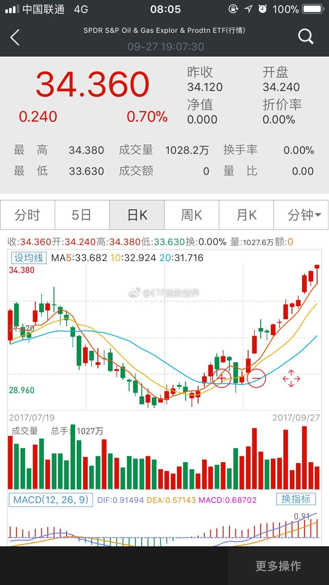

======================================================

ETF拯救世界 (5687069307) @
2017-09-28 09:34:38 Thu  
url: https://weibo.com/5687069307/FnRSHD2YZ

今晚开新车。 ​​​

转发[4]  评论[181]  赞[218] 

+++++++++++++++++++++++++++++++++++++++++++++++++++++

图片：

======================================================

ETF拯救世界 (5687069307) @
2017-09-28 10:49:57 Thu  
url: https://weibo.com/5687069307/FnSngy8Uo

谁还记得 $国证食品 sz399396$   [doge] ​​​

转发[1]  评论[99]  赞[82] 

======================================================

ETF拯救世界 (5687069307) @
2017-09-28 11:41:35 Thu  
url: https://weibo.com/5687069307/FnSIe9kb4

开个车，出门。高高兴兴。谁知道一家孩子没了，一家故意杀人被抓了。蛮荒故事。是不是很荒唐？一点都不荒唐，每天这样的事情都在上演。各位，出门在外，注意安全。

------------------------------------------------------
转推：
>  @平安郑州 (2055648745)
>  2017-09-28 10:00:06 Thu  
>  url: https:/weibo.com/2055648745/FnS3374Wt/

>  #警情通报#[话筒]我市郑东新区普惠路与福禄街交叉口发生一起刑事案件，犯罪嫌疑人徐某因涉嫌故意杀人已被警方刑拘。 ​​​

转发[11]  评论[32]  赞[68] 

======================================================

ETF拯救世界 (5687069307) @
2017-09-28 13:34:48 Thu  
url: https://weibo.com/5687069307/FnTsbhoWF

回复@漓江大雨:我认为能。性格当然有天生的成分，但而更多的可以通过一些方式来改变。比如读书，比如多一些阅历。明白一些道理，看过一些是非，多一份顾虑，很多时候脾气就好了。所以很多人年轻的时候脾气暴躁到了中年以后就会好很多。

------------------------------------------------------
转推：
>  @平安郑州 (2055648745)
>  2017-09-28 10:00:06 Thu  
>  url: https:/weibo.com/2055648745/FnS3374Wt/

>  #警情通报#[话筒]我市郑东新区普惠路与福禄街交叉口发生一起刑事案件，犯罪嫌疑人徐某因涉嫌故意杀人已被警方刑拘。 ​​​

转发[4]  评论[17]  赞[62] 

======================================================

ETF拯救世界 (5687069307) @
2017-09-28 14:40:20 Thu  
url: https://weibo.com/5687069307/FnTSN5wIr

这个广告里的某家公司2007年发行的基金，目前净值0.75。十年过去了，赔了25%。穷人辛辛苦苦攒点钱，就忽悠进来然后这么糟蹋，这，合适吗。

------------------------------------------------------
转推：
>  @ ()
>  2017-09-28 12:06:58 Thu  
>  url: 

>  抱歉，作者已设置仅展示半年内微博，此微博已不可见。 ​​​

转发[39]  评论[51]  赞[64] 

======================================================

ETF拯救世界 (5687069307) @
2017-09-28 14:55:37 Thu  
url: https://weibo.com/5687069307/FnTYZslW0

回复@打猎为生的少爷:回购10%。我哭了！//@打猎为生的少爷:回购是疯了吗？//@ETF拯救世界:这个广告里的某家公司2007年发行的基金，目前净值0.75。十年过去了，赔了25%。穷人辛辛苦苦攒点钱，就忽悠进来然后这么糟蹋，这，合适吗。

------------------------------------------------------
转推：
>  @ ()
>  2017-09-28 12:06:58 Thu  
>  url: 

>  抱歉，作者已设置仅展示半年内微博，此微博已不可见。 ​​​

转发[2]  评论[39]  赞[31] 

======================================================

ETF拯救世界 (5687069307) @
2017-09-28 15:21:04 Thu  
url: https://weibo.com/5687069307/FnU9kpcEl

回复@滚滚磨刀门:拉黑你 [并不简单]//@滚滚磨刀门:我买到了11％的，顶我上去，让我在E大面前嘚瑟一下！！！[笑而不语][笑而不语][笑而不语]//@ETF拯救世界:回复@打猎为生的少爷:回购10%。我哭了！//@打猎为生的少爷:回购是疯了吗？

------------------------------------------------------
转推：
>  @ ()
>  2017-09-28 12:06:58 Thu  
>  url: 

>  抱歉，作者已设置仅展示半年内微博，此微博已不可见。 ​​​

转发[1]  评论[21]  赞[35] 

======================================================

ETF拯救世界 (5687069307) @
2017-09-28 15:51:29 Thu  
url: https://weibo.com/5687069307/FnUlFqrnj

这是我第一条被删的微博。诡异的是，是5月份发的。什么内容我都忘了，看提示应该是关于涨跌家数的数据分析。

这是有人举报了还是什么情况？数据分析也要删？以后可以发什么。

其实发不发微博我根本无所谓。就是想知道边界，别因为发微博闹出什么乱子就不好了。 ​​​

转发[2]  评论[87]  赞[66] 

+++++++++++++++++++++++++++++++++++++++++++++++++++++

图片：
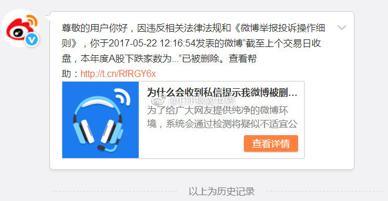

======================================================

ETF拯救世界 (5687069307) @
2017-09-28 19:47:36 Thu  
url: https://weibo.com/5687069307/FnVTv9blA

是不是搞事情 ​​​

转发[3]  评论[88]  赞[95] 

+++++++++++++++++++++++++++++++++++++++++++++++++++++

图片：

======================================================

ETF拯救世界 (5687069307) @
2017-09-28 21:59:13 Thu  
url: https://weibo.com/5687069307/FnWKVEkC0

醉了。公众号只能显示100条留言，结果有500多条在后台。  微博随便评论全都能显示，结果只有几十条评论……  微博药丸。  （这条是不是又要被删了） ​​​

转发[1]  评论[105]  赞[133] 

======================================================

ETF拯救世界 (5687069307) @
2017-09-28 22:28:17 Thu  
url: https://weibo.com/5687069307/FnWWJBhAq

不错，可惜没有美利坚合众国、霓虹、大不列颠及北爱尔兰联合王国、大德意志啊。可以说并不全面。[并不简单]

------------------------------------------------------
转推：
>  @且慢管家 (6186312580)
>  2017-09-28 21:16:36 Thu  
>  url: https:/weibo.com/6186312580/FnWtDhxke/

>  #投资#您的家乡有没有被ETF计划点亮呢？@ETF拯救世界 http://t.cn/R0WyOu2 ​​​

转发[23]  评论[132]  赞[169] 

======================================================

ETF拯救世界 (5687069307) @
2017-09-29 10:22:13 Fri  
url: https://weibo.com/5687069307/Fo1Cw8blI

$全指医药 sh000991$  我是真希望它多震荡几年。 ​​​

转发[0]  评论[117]  赞[117] 

======================================================

ETF拯救世界 (5687069307) @
2017-09-29 21:27:54 Fri  
url: https://weibo.com/5687069307/Fo5YIqWRI

每日打卡（84） 

基本痊愈了。今天开始继续每天打卡。 ​​​

转发[2]  评论[60]  赞[139] 

+++++++++++++++++++++++++++++++++++++++++++++++++++++

图片：
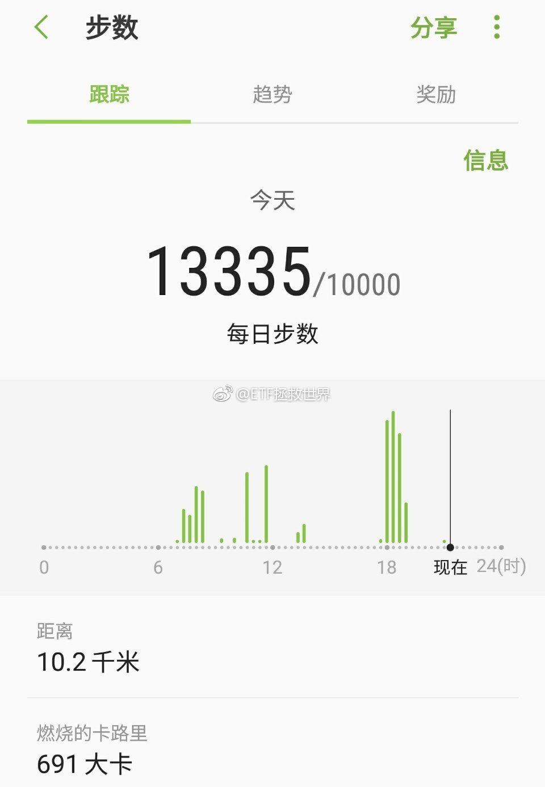

======================================================

ETF拯救世界 (5687069307) @
2017-09-30 09:03:31 Sat  
url: https://weibo.com/5687069307/Foax4fQej

回复@董无为G:第一个呢，不少人的粉丝数其实很有问题。看评论数量就知道。第二个呢，最近这两年计划确实是稳步增长，慢慢的不停新高。但这并不是ETF计划的常态。某个时间段，疯起来连我都怕啊。现在还是播种阶段。到了夏天狂热，秋天收获的时候再看吧~

------------------------------------------------------
转推：
>  @ETF拯救世界 (5687069307)
>  2017-09-29 21:27:54 Fri  
>  url: https:/weibo.com/5687069307/Fo5YIqWRI/

>  每日打卡（84） 
>  
>  基本痊愈了。今天开始继续每天打卡。 ​​​

转发[1]  评论[68]  赞[132] 

======================================================

ETF拯救世界 (5687069307) @
2017-09-30 22:12:30 Sat  
url: https://weibo.com/5687069307/FofHjwBdi

每日打卡（85）

坚持。 ​​​

转发[2]  评论[57]  赞[129] 

+++++++++++++++++++++++++++++++++++++++++++++++++++++

图片：

======================================================

ETF拯救世界 (5687069307) @
2017-10-01 22:09:07 Sun  
url: https://weibo.com/5687069307/Fop6rj4y1

每日打卡（86）

各位双节快乐！长假都打算怎么过？ ​​​

转发[2]  评论[114]  赞[120] 

+++++++++++++++++++++++++++++++++++++++++++++++++++++

图片：

======================================================

ETF拯救世界 (5687069307) @
2017-10-03 23:02:45 Tue  
url: https://weibo.com/5687069307/FoIjcvygh

每日打卡（87）

昨天出去浪，没有打卡…… ​​​

转发[0]  评论[44]  赞[90] 

+++++++++++++++++++++++++++++++++++++++++++++++++++++

图片：

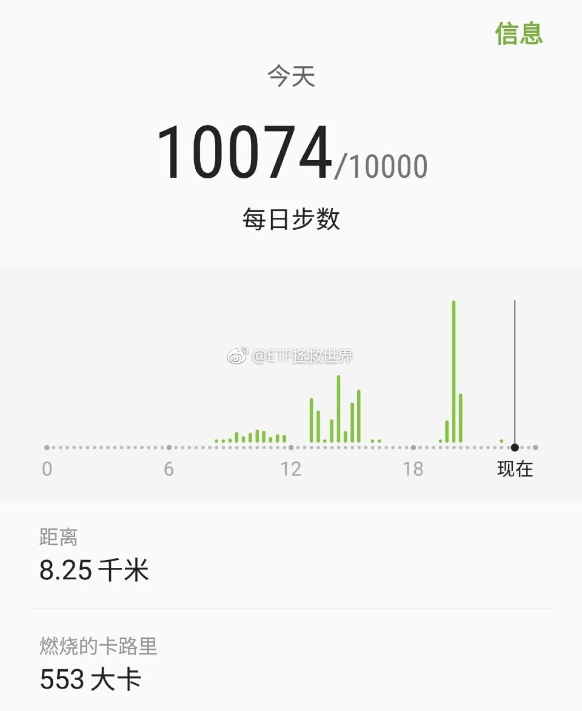

======================================================

ETF拯救世界 (5687069307) @
2017-10-04 20:56:12 Wed  
url: https://weibo.com/5687069307/FoQUkA077

每日打卡（88）

各位中秋快乐！给逮嘎拜个晚年！祝逮嘎年年有今日，岁岁有今朝！

今天大家是在外面浪还是在家里浪？哪里浪都好，开心最重要……

没法一一回复各位，心意都感受到了……

除了每天一万步，要不要加个每天n分钟平板支撑？不过不想给自己太大压力…… ​​​

转发[0]  评论[84]  赞[139] 

+++++++++++++++++++++++++++++++++++++++++++++++++++++

图片：

======================================================

ETF拯救世界 (5687069307) @
2017-10-04 21:52:16 Wed  
url: https://weibo.com/5687069307/FoRh67s9J

为什么这样的人可以上路，为什么？！

------------------------------------------------------
转推：
>  @新浪视频 (1640601392)
>  2017-10-04 10:10:16 Wed  
>  url: https:/weibo.com/1640601392/FoMG9fJnP/

>  【高速路逆行引四车连环撞 女司机哀叹要赔三辆车】3日，沪渝高速荆州段，一名女子驾车在高速路上调头逆行，导致四车连环相撞。行车记录仪显示，女驾驶员一直在说逆行是不对的，但为图一时方便还是冒险操作，事发后女子惊呼“完了，完了 ，我要赔三辆车”。http://t.cn/R0kipQM ​​​

转发[7]  评论[53]  赞[35] 

======================================================

ETF拯救世界 (5687069307) @
2017-10-05 21:02:46 Thu  
url: https://weibo.com/5687069307/Fp0nuxEnq

每日打卡（89）

多做两组。开始玩平板。

今天在看《银河基地》，还是没有《三体》震撼呐。 ​​​

转发[1]  评论[34]  赞[93] 

+++++++++++++++++++++++++++++++++++++++++++++++++++++

图片：

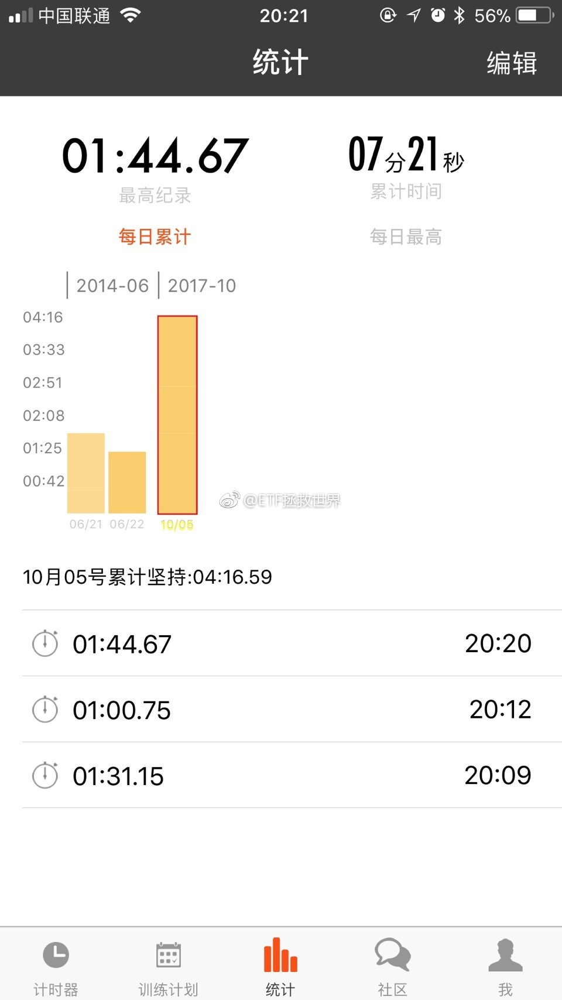

======================================================

ETF拯救世界 (5687069307) @
2017-10-06 20:03:23 Fri  
url: https://weibo.com/5687069307/Fp9pT6JXs

每日打卡（90）

说话假期就快过完了。今天又出去浪了，然后去剪头发。有没有跟我一样很讨厌剪头发的，抱紧我……

昨天有朋友评论，平板支撑做不过谁，就不做了。这很有意思。

其实呢，咱们这种群众体育运动，目的是什么呢。跟谁竞赛吗。我觉得，肯定不是啊。很简单，就是为了强身健体，每天都比昨天 ​​​

转发[7]  评论[90]  赞[183] 

+++++++++++++++++++++++++++++++++++++++++++++++++++++

图片：

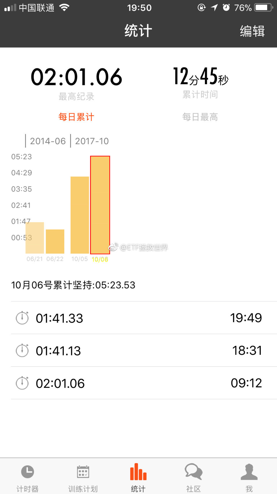

======================================================

ETF拯救世界 (5687069307) @
2017-10-09 09:43:05 Mon  
url: https://weibo.com/5687069307/FpxDB6lJ7

不用着急“逃顶”。也不用忙着“补仓”。

仓位舒舒服服的享受资产不断新高是坠吼的。

看着买卖双方擦肩而过互骂“sb”，是一种乐趣。 ​​​

转发[11]  评论[46]  赞[142] 

======================================================

ETF拯救世界 (5687069307) @
2017-10-09 10:01:34 Mon  
url: https://weibo.com/5687069307/FpxL6g2eH

谁能想到 ​​​

转发[8]  评论[40]  赞[70] 

+++++++++++++++++++++++++++++++++++++++++++++++++++++

图片：

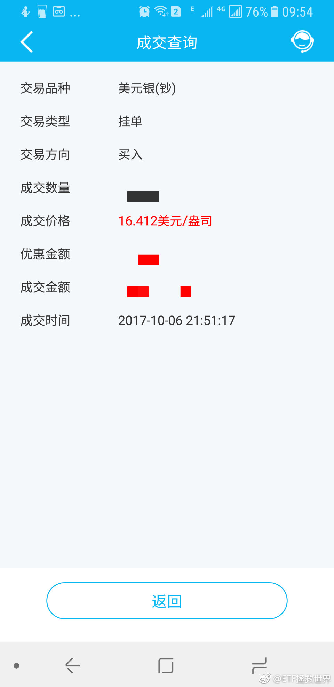

======================================================

ETF拯救世界 (5687069307) @
2017-10-09 10:05:31 Mon  
url: https://weibo.com/5687069307/FpxMHvu2L

别说那么多买点先 ​​​

转发[4]  评论[48]  赞[80] 

+++++++++++++++++++++++++++++++++++++++++++++++++++++

图片：
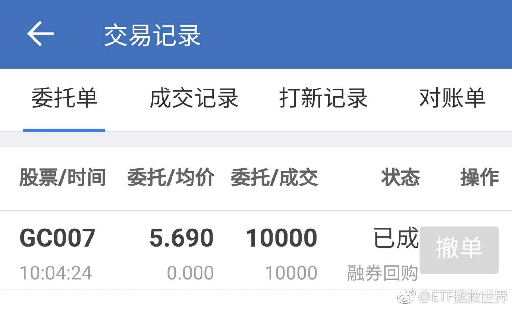

======================================================

ETF拯救世界 (5687069307) @
2017-10-09 10:11:53 Mon  
url: https://weibo.com/5687069307/FpxPhkpMX

$全指医药 sh000991$ 是不是良心发现了。 ​​​

转发[6]  评论[39]  赞[93] 

======================================================

ETF拯救世界 (5687069307) @
2017-10-09 14:26:53 Mon  
url: https://weibo.com/5687069307/FpzuNd6J6

大家好，给大家介绍一下，这是我们的大庄家 ​​​

转发[0]  评论[39]  赞[102] 

======================================================

ETF拯救世界 (5687069307) @
2017-10-09 14:41:53 Mon  
url: https://weibo.com/5687069307/FpzAT6YQE

不要脸，又涨这么多，继续买！

------------------------------------------------------
转推：
>  @ETF拯救世界 (5687069307)
>  2017-10-09 10:05:31 Mon  
>  url: https:/weibo.com/5687069307/FpxMHvu2L/

>  别说那么多买点先 ​​​

转发[2]  评论[46]  赞[65] 

======================================================

ETF拯救世界 (5687069307) @
2017-10-09 21:56:24 Mon  
url: https://weibo.com/5687069307/FpCrfti1l

每日打卡（91）

每天资产不断新高，锻炼的数据也持续增长。

每天都比昨天好。只有一个没办法：

又老了一天。[拜拜] ​​​

转发[0]  评论[33]  赞[113] 

+++++++++++++++++++++++++++++++++++++++++++++++++++++

图片：

======================================================

ETF拯救世界 (5687069307) @
2017-10-10 08:54:49 Tue  
url: https://weibo.com/5687069307/FpGKvbsyG

行为经济学，行为金融学，我跟你讲，非常有搞头。尤其是对我们这些投资指数的人来说。

------------------------------------------------------
转推：
>  @网易财经 (1974561081)
>  2017-10-09 18:56:03 Mon  
>  url: https:/weibo.com/1974561081/FpBg34ULn/

>  #网易新闻# 【揭秘2017诺奖得主理查德·塞勒对行为经济学的贡献】塞勒于1974年在罗彻斯特大学获得经济学博士学位，他将自己第一个研究方向确定为行为经济学，并对人类生活的货币价值做出理论研究。也是从那时开始，塞勒养成了收集经济学中反常现象的习惯，而这些有趣反常行为来源正是其同事或亲朋好友。 ​​​

转发[17]  评论[44]  赞[83] 

======================================================

ETF拯救世界 (5687069307) @
2017-10-10 09:33:55 Tue  
url: https://weibo.com/5687069307/FpH0ncPbb

$全指医药 sh000991$   二话不说奶一口先 ​​​

转发[2]  评论[17]  赞[55] 

======================================================

ETF拯救世界 (5687069307) @
2017-10-10 09:36:56 Tue  
url: https://weibo.com/5687069307/FpH1AuQyt

$全指医药 sh000991$讲真，你不涨点，我都替你不好意思了…… ​​​

转发[2]  评论[18]  赞[57] 

+++++++++++++++++++++++++++++++++++++++++++++++++++++

图片：

======================================================

ETF拯救世界 (5687069307) @
2017-10-10 09:46:16 Tue  
url: https://weibo.com/5687069307/FpH5o3kXm

对了，还有$养老产业 sz399812$  。哥俩其实是表兄弟。计划里面，加起来快10%仓位了。

------------------------------------------------------
转推：
>  @ETF拯救世界 (5687069307)
>  2017-10-10 09:36:56 Tue  
>  url: https:/weibo.com/5687069307/FpH1AuQyt/

>  $全指医药 sh000991$讲真，你不涨点，我都替你不好意思了…… ​​​

转发[0]  评论[13]  赞[49] 

======================================================

ETF拯救世界 (5687069307) @
2017-10-10 09:51:45 Tue  
url: https://weibo.com/5687069307/FpH7BpJQF

各位，我想大家已经无数次见证一个事实，那就是不停的买入“差”的品种，会有好结果。

终有一天，差的会被追捧。雪中送炭是个特别好的事情。原因在于，你只要付出很少，就能拿到很多。当筹码被开始争抢，你的财富就会每天新高，不断增长。

做个好人。 ​​​

转发[27]  评论[58]  赞[137] 

======================================================

ETF拯救世界 (5687069307) @
2017-10-10 09:55:28 Tue  
url: https://weibo.com/5687069307/FpH97rDdc

什么情况，毒奶过期了？再奶一口。

------------------------------------------------------
转推：
>  @ETF拯救世界 (5687069307)
>  2017-10-10 09:33:55 Tue  
>  url: https:/weibo.com/5687069307/FpH0ncPbb/

>  $全指医药 sh000991$   二话不说奶一口先 ​​​

转发[0]  评论[19]  赞[56] 

======================================================

ETF拯救世界 (5687069307) @
2017-10-10 10:00:45 Tue  
url: https://weibo.com/5687069307/FpHbgpZSx

$中证医疗 sz399989$  这个弹性更大，相对估值低。只是绝对估值太高了，实在没法下手。希望未来有机会买一些。 ​​​

转发[5]  评论[25]  赞[68] 

======================================================

ETF拯救世界 (5687069307) @
2017-10-10 10:04:57 Tue  
url: https://weibo.com/5687069307/FpHcYaDdX

$广发医药 溢价了。胆大的可以套利。 ​​​

转发[1]  评论[55]  赞[85] 

======================================================

ETF拯救世界 (5687069307) @
2017-10-10 11:07:03 Tue  
url: https://weibo.com/5687069307/FpHCb2PYc

10月到北京来看认真的雪

------------------------------------------------------
转推：
>  @ ()
>  2017-10-10 10:25:03 Tue  
>  url: 

>  抱歉，作者已设置仅展示半年内微博，此微博已不可见。 ​​​

转发[2]  评论[27]  赞[44] 

======================================================

ETF拯救世界 (5687069307) @
2017-10-10 11:26:40 Tue  
url: https://weibo.com/5687069307/FpHK8xhig

今天开始披露三季报。绝大多数公司都是15号之后披露，15号之前只有23家公司。

所以月中应该没什么特别的机会，本月底就非常有意思了。 ​​​

转发[8]  评论[31]  赞[100] 

======================================================

ETF拯救世界 (5687069307) @
2017-10-10 11:33:32 Tue  
url: https://weibo.com/5687069307/FpHMVmbd6

研究群众，理解群众的行为轨迹。在疯狂的时候与群众一起狂欢，在群众意识到危险之前抽身离去。在群众心灰意冷的时候，回到群众中，隐姓埋名。从群众中来，到群众中去。

------------------------------------------------------
转推：
>  @数据分析研究者 (5628021879)
>  2017-10-10 11:28:31 Tue  
>  url: https:/weibo.com/5628021879/FpHKT9QB4/

>  “群众从未渴求过真理，他们对不合口味的证据视而不见。假如谬误对他们有诱惑力，他们更愿意崇拜谬误。谁向他们提供幻觉，谁就可以轻易地成为他们的主人；谁摧毁他们的幻觉，谁就会成为他们的牺牲品。” ——《乌合之众》 ​​​​

转发[69]  评论[52]  赞[147] 

======================================================

ETF拯救世界 (5687069307) @
2017-10-10 12:09:29 Tue  
url: https://weibo.com/5687069307/FpI1wbq8L

去库存，群众加杠杆——房子换到群众手中——锁定二手房买卖——推出长效机制。 ​​​

转发[28]  评论[81]  赞[129] 

======================================================

ETF拯救世界 (5687069307) @
2017-10-10 13:24:39 Tue  
url: https://weibo.com/5687069307/FpIw1A8L5

自信、模糊规避、心理账户、认知误差、记忆误差、锚定、羊群旅鼠。

认识行为金融，规避错误，利用错误。 ​​​

转发[12]  评论[24]  赞[106] 

======================================================

ETF拯救世界 (5687069307) @
2017-10-10 13:48:12 Tue  
url: https://weibo.com/5687069307/FpIFAnsCK

$中证医疗 sz399989$   跌了半年，一天就涨回来了。这就是证券投资。

证券投资所积累的财富，是跳跃式的。不要因为某段时间，可能是几个月，可能是几年，成绩不好，就放弃。“要知道几年没赚钱还不如存银行”，这种想法肥肠不正确。

三年不开张，开张吃三年。

这些话不是扯淡，不是鸡汤，以后你就知 ​​​

转发[47]  评论[65]  赞[148] 

======================================================

ETF拯救世界 (5687069307) @
2017-10-10 14:27:44 Tue  
url: https://weibo.com/5687069307/FpIVDhu3B

实不相瞒，又新高了。[并不简单]

计划买入部分年化快突破20%了。 ​​​

转发[3]  评论[61]  赞[144] 

======================================================

ETF拯救世界 (5687069307) @
2017-10-10 14:39:44 Tue  
url: https://weibo.com/5687069307/FpJ0vidDn

不要管什么“非理性”，不要管什么“不合理”。死死拿住你的低价筹码，不要卖出。医药刚动一动，才涨了多少？

电梯，过山车？无所谓。不要卖，让利润奔跑，享受利润，就这么简单。真的跌了，继续买，下次涨回来就赚更多。

不要妄想你有能力做差价。

不要预测明天的价格，你的成本很低，记住这个。 ​​​

转发[53]  评论[109]  赞[228] 

======================================================

ETF拯救世界 (5687069307) @
2017-10-10 18:30:42 Tue  
url: https://weibo.com/5687069307/FpKwfALIq

醉了，闹哪样 ​​​

转发[4]  评论[37]  赞[62] 

+++++++++++++++++++++++++++++++++++++++++++++++++++++

图片：

======================================================

ETF拯救世界 (5687069307) @
2017-10-10 19:59:04 Tue  
url: https://weibo.com/5687069307/FpL67ttIr

再涨一点就能出了。4不4有点快啊。

------------------------------------------------------
转推：
>  @ETF拯救世界 (5687069307)
>  2017-10-09 10:01:34 Mon  
>  url: https:/weibo.com/5687069307/FpxL6g2eH/

>  谁能想到 ​​​

转发[0]  评论[37]  赞[59] 

======================================================

ETF拯救世界 (5687069307) @
2017-10-10 21:49:35 Tue  
url: https://weibo.com/5687069307/FpLOYD4aw

回复@用户6073012591:wind金融终端机构版//@用户6073012591:回复@雲中漫步_1117:谢谢，跟我用万德的有些不同

------------------------------------------------------
转推：
>  @ETF拯救世界 (5687069307)
>  2017-10-10 18:30:42 Tue  
>  url: https:/weibo.com/5687069307/FpKwfALIq/

>  醉了，闹哪样 ​​​

转发[3]  评论[19]  赞[40] 

======================================================

ETF拯救世界 (5687069307) @
2017-10-10 22:19:53 Tue  
url: https://weibo.com/5687069307/FpM1hjPeW

每日打卡（92）

感受肌肉。坚持。 ​​​

转发[0]  评论[19]  赞[107] 

+++++++++++++++++++++++++++++++++++++++++++++++++++++

图片：

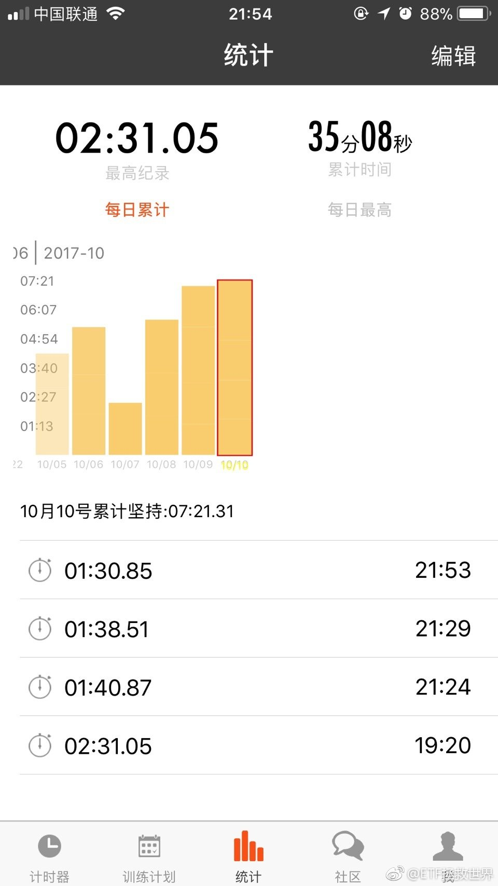

======================================================

ETF拯救世界 (5687069307) @
2017-10-11 09:51:30 Wed  
url: https://weibo.com/5687069307/FpQy0ne4y

一个字，不要卖。

踏踏实实赚钱。 ​​​

转发[2]  评论[80]  赞[141] 

======================================================

ETF拯救世界 (5687069307) @
2017-10-11 10:06:41 Wed  
url: https://weibo.com/5687069307/FpQEarNwP

$全指医药 sh000991$  $养老产业 sz399812$ 

可以奶一口了吧——

涨的不错啊。 ​​​

转发[6]  评论[29]  赞[80] 

======================================================

ETF拯救世界 (5687069307) @
2017-10-11 10:11:16 Wed  
url: https://weibo.com/5687069307/FpQG1nAkY

识别泡沫，享受泡沫，在泡沫破灭之前悄悄撤退。

不要识别出泡沫就撤退。

独乐乐不如众乐乐。 ​​​

转发[20]  评论[43]  赞[151] 

======================================================

ETF拯救世界 (5687069307) @
2017-10-11 10:47:55 Wed  
url: https://weibo.com/5687069307/FpQUTB5PX

$国证食品 sz399396$   感觉有点伤 ​​​

转发[3]  评论[52]  赞[64] 

======================================================

ETF拯救世界 (5687069307) @
2017-10-11 10:52:51 Wed  
url: https://weibo.com/5687069307/FpQWUlt4s

回复@石头里的虫子: 只因为在人群中多看了你一眼 再也没能忘掉你的容颜//@石头里的虫子:当年8800点的时候我多看了两眼。

------------------------------------------------------
转推：
>  @ETF拯救世界 (5687069307)
>  2017-10-11 10:47:55 Wed  
>  url: https:/weibo.com/5687069307/FpQUTB5PX/

>  $国证食品 sz399396$   感觉有点伤 ​​​

转发[0]  评论[33]  赞[61] 

======================================================

ETF拯救世界 (5687069307) @
2017-10-11 14:49:07 Wed  
url: https://weibo.com/5687069307/FpSuOeKOl

10:04，最高点一口毒奶，服不服。

------------------------------------------------------
转推：
>  @ETF拯救世界 (5687069307)
>  2017-10-11 10:06:41 Wed  
>  url: https:/weibo.com/5687069307/FpQEarNwP/

>  $全指医药 sh000991$  $养老产业 sz399812$ 
>  
>  可以奶一口了吧——
>  
>  涨的不错啊。 ​​​

转发[4]  评论[43]  赞[66] 

======================================================

ETF拯救世界 (5687069307) @
2017-10-11 15:01:38 Wed  
url: https://weibo.com/5687069307/FpSzTdQJ8

好了，2000只股票下跌，继续新高。

今天幅度肯定比前两天小很多了。

没什么意思。看看晚上白银和原油有没有搞头。 ​​​

转发[1]  评论[36]  赞[96] 

======================================================

ETF拯救世界 (5687069307) @
2017-10-11 15:05:58 Wed  
url: https://weibo.com/5687069307/FpSBEgKYv

还有没有没看过的。对了，这个答案中的打新组合，半年过去净值涨了不少。今天继续新高，年初至今40%……新股没中几只，门票还不错 http://t.cn/ROiTEQG

------------------------------------------------------
转推：
>  @ETF拯救世界 (5687069307)
>  2017-03-24 11:09:41 Fri  
>  url: https:/weibo.com/5687069307/EBfCg1fLX/

>  讲真，我自己感觉这回答值1块钱。我回答了 @晴儿小小 的问题，问题价值￥79.00，大家快来花1元围观~ http://t.cn/R6GYZGs ​​​

转发[16]  评论[50]  赞[85] 

======================================================

ETF拯救世界 (5687069307) @
2017-10-12 09:43:38 Thu  
url: https://weibo.com/5687069307/FpZVjgjfG

又咁样？//@ETF拯救世界:10:04，最高点一口毒奶，服不服。

------------------------------------------------------
转推：
>  @ETF拯救世界 (5687069307)
>  2017-10-11 10:06:41 Wed  
>  url: https:/weibo.com/5687069307/FpQEarNwP/

>  $全指医药 sh000991$  $养老产业 sz399812$ 
>  
>  可以奶一口了吧——
>  
>  涨的不错啊。 ​​​

转发[3]  评论[23]  赞[55] 

======================================================

ETF拯救世界 (5687069307) @
2017-10-12 09:50:07 Thu  
url: https://weibo.com/5687069307/FpZXWEAvl

回复@蓝图806:关注我的朋友里面有17.48%是广东的，给讲讲。//@蓝图806:“咁”，念啥？是啥意思？E大的词汇真丰富，跟着E大即学会了投资，也学会了不少字。//@ETF拯救世界:又咁样？//@ETF拯救世界:10:04，最高点一口毒奶，服不服。

------------------------------------------------------
转推：
>  @ETF拯救世界 (5687069307)
>  2017-10-11 10:06:41 Wed  
>  url: https:/weibo.com/5687069307/FpQEarNwP/

>  $全指医药 sh000991$  $养老产业 sz399812$ 
>  
>  可以奶一口了吧——
>  
>  涨的不错啊。 ​​​

转发[0]  评论[32]  赞[50] 

======================================================

ETF拯救世界 (5687069307) @
2017-10-12 10:22:05 Thu  
url: https://weibo.com/5687069307/Fq0aUnhfP

博时债又要分红了。 ​​​

转发[1]  评论[39]  赞[89] 

======================================================

ETF拯救世界 (5687069307) @
2017-10-12 11:12:03 Thu  
url: https://weibo.com/5687069307/Fq0vcitpG

买买买

------------------------------------------------------
转推：
>  @ ()
>  2017-10-11 21:53:49 Wed  
>  url: 

>  抱歉，作者已设置仅展示半年内微博，此微博已不可见。 ​​​

转发[4]  评论[54]  赞[63] 

======================================================

ETF拯救世界 (5687069307) @
2017-10-12 14:42:29 Thu  
url: https://weibo.com/5687069307/Fq1SCa9vF

未来20天，跌幅到0.5%的时候买入300ETF，等那谁他们拉，然后卖出，算不算一种策略。 ​​​

转发[7]  评论[88]  赞[166] 

======================================================

ETF拯救世界 (5687069307) @
2017-10-12 22:13:59 Thu  
url: https://weibo.com/5687069307/Fq4PSpkhx

每日打卡（93）

天凉好个秋。 ​​​

转发[0]  评论[18]  赞[105] 

+++++++++++++++++++++++++++++++++++++++++++++++++++++

图片：

======================================================

ETF拯救世界 (5687069307) @
2017-10-13 09:41:45 Fri  
url: https://weibo.com/5687069307/Fq9l38Kzu

连续两天毒奶在全天最高点，一分钟都不差。今天收兵，不奶了。随便吧。//@ETF拯救世界:又咁样？//@ETF拯救世界:10:04，最高点一口毒奶，服不服。

------------------------------------------------------
转推：
>  @ETF拯救世界 (5687069307)
>  2017-10-11 10:06:41 Wed  
>  url: https:/weibo.com/5687069307/FpQEarNwP/

>  $全指医药 sh000991$  $养老产业 sz399812$ 
>  
>  可以奶一口了吧——
>  
>  涨的不错啊。 ​​​

转发[1]  评论[59]  赞[54] 

======================================================

ETF拯救世界 (5687069307) @
2017-10-13 10:19:10 Fri  
url: https://weibo.com/5687069307/Fq9AegqGn

特别悲伤地说一句，养老可能是最后一块相对洼地了。

难道…… ​​​

转发[5]  评论[86]  赞[89] 

======================================================

ETF拯救世界 (5687069307) @
2017-10-13 11:00:57 Fri  
url: https://weibo.com/5687069307/Fq9RbBp4P

加起来接近10%，已经足够影响组合表现了。 ​​​

转发[0]  评论[25]  赞[89] 

+++++++++++++++++++++++++++++++++++++++++++++++++++++

图片：

======================================================

ETF拯救世界 (5687069307) @
2017-10-13 11:08:44 Fri  
url: https://weibo.com/5687069307/Fq9Uly1BJ

三个字，不要卖。你的成本很低，踏踏实实拿着。不要怕过山车，即使过山车，下次回来你赚更多。

这话说过好多次，回头看看，是不是正确的？没错，过山车好几次，每次回来是不是利润增加一大截？

拿着。 ​​​

转发[51]  评论[104]  赞[166] 

======================================================

ETF拯救世界 (5687069307) @
2017-10-13 13:04:07 Fri  
url: https://weibo.com/5687069307/FqaFbk3IR

婆媳关系不和是2016年离婚第三顺位的原因。//@八大山债人:吐槽下而已。。。不算什么大事，生活不容易吐槽还不让？ //@中国羊肉:真实生活

------------------------------------------------------
转推：
>  @ ()
>  2017-10-13 11:51:06 Fri  
>  url: 

>  抱歉，作者已设置仅展示半年内微博，此微博已不可见。 ​​​

转发[1]  评论[54]  赞[34] 

======================================================

ETF拯救世界 (5687069307) @
2017-10-13 13:25:52 Fri  
url: https://weibo.com/5687069307/FqaO0zivx

总有东西可买

------------------------------------------------------
转推：
>  @ ()
>  2017-10-13 13:22:59 Fri  
>  url: 

>  抱歉，作者已设置仅展示半年内微博，此微博已不可见。 ​​​

转发[6]  评论[43]  赞[78] 

======================================================

ETF拯救世界 (5687069307) @
2017-10-13 13:43:28 Fri  
url: https://weibo.com/5687069307/FqaV9xHYL

别的指数都刷刷的涨，上证就是±0.01%。

到底是怎么做到的，内谁他们也太神奇了吧喂！ ​​​

转发[1]  评论[26]  赞[65] 

======================================================

ETF拯救世界 (5687069307) @
2017-10-13 13:52:44 Fri  
url: https://weibo.com/5687069307/FqaYUFvyU

$中证环保 sh000827$   今天是你，请开始你的表演。 ​​​

转发[1]  评论[30]  赞[86] 

======================================================

ETF拯救世界 (5687069307) @
2017-10-13 14:45:18 Fri  
url: https://weibo.com/5687069307/FqbkgbVcO

还差一哆嗦。五天，五个多点。 ​​​

转发[2]  评论[48]  赞[82] 

+++++++++++++++++++++++++++++++++++++++++++++++++++++

图片：

======================================================

ETF拯救世界 (5687069307) @
2017-10-13 16:21:06 Fri  
url: https://weibo.com/5687069307/FqbX8vzjx

周末开车。

1-2份。 ​​​

转发[1]  评论[129]  赞[191] 

======================================================

ETF拯救世界 (5687069307) @
2017-10-13 16:42:55 Fri  
url: https://weibo.com/5687069307/Fqc5Zv3TK

今天看到一句话：如果你2010年用买iphone得钱买比特币，那么现在你已经有2亿了。。看完这句话，我整个人都不好了。。

------------------------------------------------------
转推：
>  @蓝鲸TMT网 (3866012793)
>  2017-10-13 16:41:14 Fri  
>  url: https:/weibo.com/3866012793/Fqc5jfx0G/

>  【比特币价格再创新高逼近4万元 业内人士称“看不懂”】13日讯，据欧洲比特币交易网站Bitstamp报价，比特币当日最高价达5846.43美元，逼近人民币4万元，再创币价新高。截至发稿前，比特币价格略有回落，跌至5495.25美元。当前比特币价格已经较年初上涨4倍有余。“最近这个涨幅，我也看不懂了，”一位比 ​​​

转发[23]  评论[58]  赞[76] 

======================================================

ETF拯救世界 (5687069307) @
2017-10-13 17:13:50 Fri  
url: https://weibo.com/5687069307/FqcixxTSl

回复@litterwitch:我倒没有不好。我这个人不喜欢后悔过去，我想的是这样的案例有什么值得吸取的经验。怎么才能抓住下一次机会。而且大概有些想法了。//@litterwitch:原来你也有心态不好的时候，来，让我们给你按摩按摩！

------------------------------------------------------
转推：
>  @蓝鲸TMT网 (3866012793)
>  2017-10-13 16:41:14 Fri  
>  url: https:/weibo.com/3866012793/Fqc5jfx0G/

>  【比特币价格再创新高逼近4万元 业内人士称“看不懂”】13日讯，据欧洲比特币交易网站Bitstamp报价，比特币当日最高价达5846.43美元，逼近人民币4万元，再创币价新高。截至发稿前，比特币价格略有回落，跌至5495.25美元。当前比特币价格已经较年初上涨4倍有余。“最近这个涨幅，我也看不懂了，”一位比 ​​​

转发[3]  评论[44]  赞[57] 

======================================================

ETF拯救世界 (5687069307) @
2017-10-13 22:08:27 Fri  
url: https://weibo.com/5687069307/Fqee8ouLM

搞定 http://t.cn/RO07YMp

------------------------------------------------------
转推：
>  @ETF拯救世界 (5687069307)
>  2017-10-09 10:01:34 Mon  
>  url: https:/weibo.com/5687069307/FpxL6g2eH/

>  谁能想到 ​​​

转发[4]  评论[51]  赞[80] 

======================================================

ETF拯救世界 (5687069307) @
2017-10-13 22:20:32 Fri  
url: https://weibo.com/5687069307/Fqej274v9

今天在外面浪，没法打卡了。人生充满意外啊。 ​​​

转发[0]  评论[82]  赞[114] 

======================================================

ETF拯救世界 (5687069307) @
2017-10-15 21:55:37 Sun  
url: https://weibo.com/5687069307/FqwZUrDKv

每日打卡（94）

很少出去喝酒，周五喝一场，周六缓一天。没事还是少喝比较好。

这个月5号开始平板支撑，基本每天做，加起来快一个小时了。每天一点进步，积累起来就很可观。 ​​​

转发[1]  评论[34]  赞[132] 

+++++++++++++++++++++++++++++++++++++++++++++++++++++

图片：

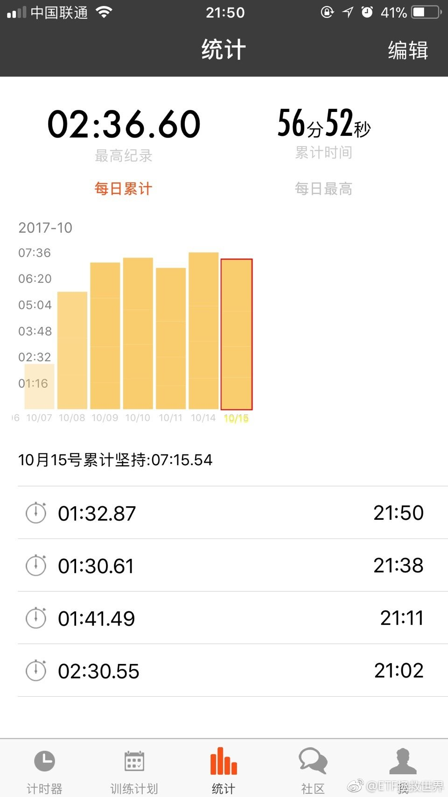

======================================================

ETF拯救世界 (5687069307) @
2017-10-16 10:34:01 Mon  
url: https://weibo.com/5687069307/FqBXKluXu

2400只股票下跌，净值依然在涨，资产配置。

$恒生指数 hkHSI$   距离下次再平衡的区间越来越近了。 ​​​

转发[4]  评论[36]  赞[109] 

======================================================

ETF拯救世界 (5687069307) @
2017-10-16 10:57:14 Mon  
url: https://weibo.com/5687069307/FqC7b66kB

[并不简单] ​​​

转发[9]  评论[29]  赞[77] 

+++++++++++++++++++++++++++++++++++++++++++++++++++++

图片：

======================================================

ETF拯救世界 (5687069307) @
2017-10-16 11:00:27 Mon  
url: https://weibo.com/5687069307/FqC8t9Ht8

未来债券配置路线图：

4-4.5会配置到大概10%-15%。 4.5-5会配置到15-20。

如果可以到5以上，会配置到30%——而且是30%杠杆债基。

07年底我重仓配置债券的时候，十年期国债收益率也只是4.8而已。 ​​​

转发[126]  评论[139]  赞[177] 

======================================================

ETF拯救世界 (5687069307) @
2017-10-16 11:30:42 Mon  
url: https://weibo.com/5687069307/FqCkKE3xt

本人万分支持上证指数的稳定。不过可不可以放手中小股，让他们价值回归。

叠加三季报，真心想月底能买点东西呢！ ​​​

转发[1]  评论[41]  赞[140] 

======================================================

ETF拯救世界 (5687069307) @
2017-10-16 13:27:44 Mon  
url: https://weibo.com/5687069307/FqD6g9Oo9

太有面子了！昨天说半年安全，就这么搞事情。可以说非常开心！ ​​​

转发[2]  评论[58]  赞[115] 

+++++++++++++++++++++++++++++++++++++++++++++++++++++

图片：

======================================================

ETF拯救世界 (5687069307) @
2017-10-16 14:03:39 Mon  
url: https://weibo.com/5687069307/FqDkQ1aBE

潮水退去才知道谁在裸泳。

太经典了。这句话。 ​​​

转发[2]  评论[34]  赞[113] 

======================================================

ETF拯救世界 (5687069307) @
2017-10-16 14:57:01 Mon  
url: https://weibo.com/5687069307/FqDGv2wgx

$518880 都赚钱了吧。是不是又全红了。。 ​​​

转发[0]  评论[24]  赞[98] 

======================================================

ETF拯救世界 (5687069307) @
2017-10-16 15:09:37 Mon  
url: https://weibo.com/5687069307/FqDLC7fPE

坚持这个结论。债券会先见底。所以，热烈的盼望着4%以上。我的资金饥渴难耐了。如果能够更高，那我会做梦都笑出来。

------------------------------------------------------
转推：
>  @ETF拯救世界 (5687069307)
>  2017-08-31 09:08:39 Thu  
>  url: https:/weibo.com/5687069307/FjBKfkGc2/

>  坚持债券会先于股票几个月见底的观点。 ​​​

转发[73]  评论[41]  赞[88] 

======================================================

ETF拯救世界 (5687069307) @
2017-10-16 15:20:45 Mon  
url: https://weibo.com/5687069307/FqDQ8d0Wf

回复@i云腾致雨:这个道理非常简单。首先债券有利息。就算它5%好了。其次债券价格会跌，那么未来就会涨。净价从90涨到100就是11%（事实上有可能更多）。加上利息就有16%。再加点杠杆，你说会赚多少。07年底我买债券都是70几块，最后回到90多，别人-60%，你+30%多的感觉非常酸爽。

------------------------------------------------------
转推：
>  @ETF拯救世界 (5687069307)
>  2017-08-31 09:08:39 Thu  
>  url: https:/weibo.com/5687069307/FjBKfkGc2/

>  坚持债券会先于股票几个月见底的观点。 ​​​

转发[25]  评论[55]  赞[91] 

======================================================

ETF拯救世界 (5687069307) @
2017-10-16 15:25:11 Mon  
url: https://weibo.com/5687069307/FqDRVC1ii

回复@ysm小鱼:不过我不希望各位期望太高。降低预期，目前来看，已持有的部分长期年化能有7-8就已经不错。先不要太兴奋。毕竟价格不够低。//@ysm小鱼:本来没鸡冻的，现在也开始瑟瑟地鸡冻了[二哈]

------------------------------------------------------
转推：
>  @ETF拯救世界 (5687069307)
>  2017-08-31 09:08:39 Thu  
>  url: https:/weibo.com/5687069307/FjBKfkGc2/

>  坚持债券会先于股票几个月见底的观点。 ​​​

转发[3]  评论[46]  赞[67] 

======================================================

ETF拯救世界 (5687069307) @
2017-10-16 18:39:45 Mon  
url: https://weibo.com/5687069307/FqF8Ufadg

回复@E大关门大弟子-铁蛋:不信我就发一张[并不简单]//@E大关门大弟子-铁蛋:回复@ETF拯救世界:就服你[阴险]

------------------------------------------------------
转推：
>  @ETF拯救世界 (5687069307)
>  2017-10-16 13:27:44 Mon  
>  url: https:/weibo.com/5687069307/FqD6g9Oo9/

>  太有面子了！昨天说半年安全，就这么搞事情。可以说非常开心！ ​​​

转发[0]  评论[16]  赞[50] 

======================================================

ETF拯救世界 (5687069307) @
2017-10-16 21:55:56 Mon  
url: https://weibo.com/5687069307/FqGqxDVeS

每日打卡（95）

快100天了。 ​​​

转发[0]  评论[9]  赞[83] 

+++++++++++++++++++++++++++++++++++++++++++++++++++++

图片：

======================================================

ETF拯救世界 (5687069307) @
2017-10-16 22:02:31 Mon  
url: https://weibo.com/5687069307/FqGtd8Grn

好好涨，别掉链子。睡觉去了。 ​​​

转发[0]  评论[31]  赞[89] 

+++++++++++++++++++++++++++++++++++++++++++++++++++++

图片：

======================================================

ETF拯救世界 (5687069307) @
2017-10-17 09:21:05 Tue  
url: https://weibo.com/5687069307/FqKUDfyv9

少说话，多吃饭，安全第一。 ​​​

转发[1]  评论[34]  赞[122] 

======================================================

ETF拯救世界 (5687069307) @
2017-10-17 10:02:10 Tue  
url: https://weibo.com/5687069307/FqLbjb2qx

已经锁定杠杆率在135-140的债基了。能不能买，就看市场给不给机会了。

两年50%。债券也可以这么风骚的。 ​​​

转发[33]  评论[96]  赞[192] 

+++++++++++++++++++++++++++++++++++++++++++++++++++++

图片：
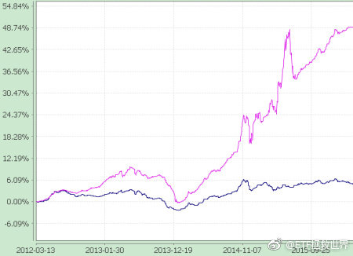

======================================================

ETF拯救世界 (5687069307) @
2017-10-17 14:09:18 Tue  
url: https://weibo.com/5687069307/FqMNDi6OZ

回复@守正v出奇:ZJH的104号令《公开募集证券投资基金运作管理办法》规定，公募债基杠杆率不得高于140。2016年8月开始执行。之前可以上到200，现在，140顶天了。哎。//@守正v出奇:还有杠杆率更高的吗？e大

------------------------------------------------------
转推：
>  @ETF拯救世界 (5687069307)
>  2017-10-17 10:02:10 Tue  
>  url: https:/weibo.com/5687069307/FqLbjb2qx/

>  已经锁定杠杆率在135-140的债基了。能不能买，就看市场给不给机会了。
>  
>  两年50%。债券也可以这么风骚的。 ​​​

转发[10]  评论[24]  赞[51] 

======================================================

ETF拯救世界 (5687069307) @
2017-10-17 14:20:54 Tue  
url: https://weibo.com/5687069307/FqMSl1qWC

又跌回去了。什么情况，是不是控盘华尔街了。//@ETF拯救世界:搞定 http://t.cn/RO07YMp

------------------------------------------------------
转推：
>  @ETF拯救世界 (5687069307)
>  2017-10-09 10:01:34 Mon  
>  url: https:/weibo.com/5687069307/FpxL6g2eH/

>  谁能想到 ​​​

转发[0]  评论[22]  赞[50] 

======================================================

ETF拯救世界 (5687069307) @
2017-10-17 14:24:28 Tue  
url: https://weibo.com/5687069307/FqMTN5LbA

在风险平价的体系中，债券上杠杆是必须的。因为它本身收益率略低，上了杠杆才有可能为组合贡献足够的收益。

各位生活在一个美好的时代。各种指数基金的出现，为资产配置这件事解决了最大的问题。要知道几年前要做到全面的资产配置简直像做梦一样。

举例来说，我2005年想买黄金，还要跑到商场去买实物 ​​​

转发[28]  评论[90]  赞[122] 

======================================================

ETF拯救世界 (5687069307) @
2017-10-17 14:45:28 Tue  
url: https://weibo.com/5687069307/FqN2j8tVi

回复@mydxkl:以前毫无办法。其实现在买油气也是没办法的办法。原油不易保存，投资现货品种基本不可能。期货不可以长期持有。比较麻烦。//@mydxkl:远古时代想投资石油，要跑到油田拉2卡车么[嘻嘻]

------------------------------------------------------
转推：
>  @ETF拯救世界 (5687069307)
>  2017-10-17 14:24:28 Tue  
>  url: https:/weibo.com/5687069307/FqMTN5LbA/

>  在风险平价的体系中，债券上杠杆是必须的。因为它本身收益率略低，上了杠杆才有可能为组合贡献足够的收益。
>  
>  各位生活在一个美好的时代。各种指数基金的出现，为资产配置这件事解决了最大的问题。要知道几年前要做到全面的资产配置简直像做梦一样。
>  
>  举例来说，我2005年想买黄金，还要跑到商场去买实物 ​​​

转发[4]  评论[25]  赞[58] 

======================================================

ETF拯救世界 (5687069307) @
2017-10-17 21:33:08 Tue  
url: https://weibo.com/5687069307/FqPHMjVdB

每日打卡（96）

今天比较简单。量不太够。 ​​​

转发[0]  评论[29]  赞[97] 

+++++++++++++++++++++++++++++++++++++++++++++++++++++

图片：

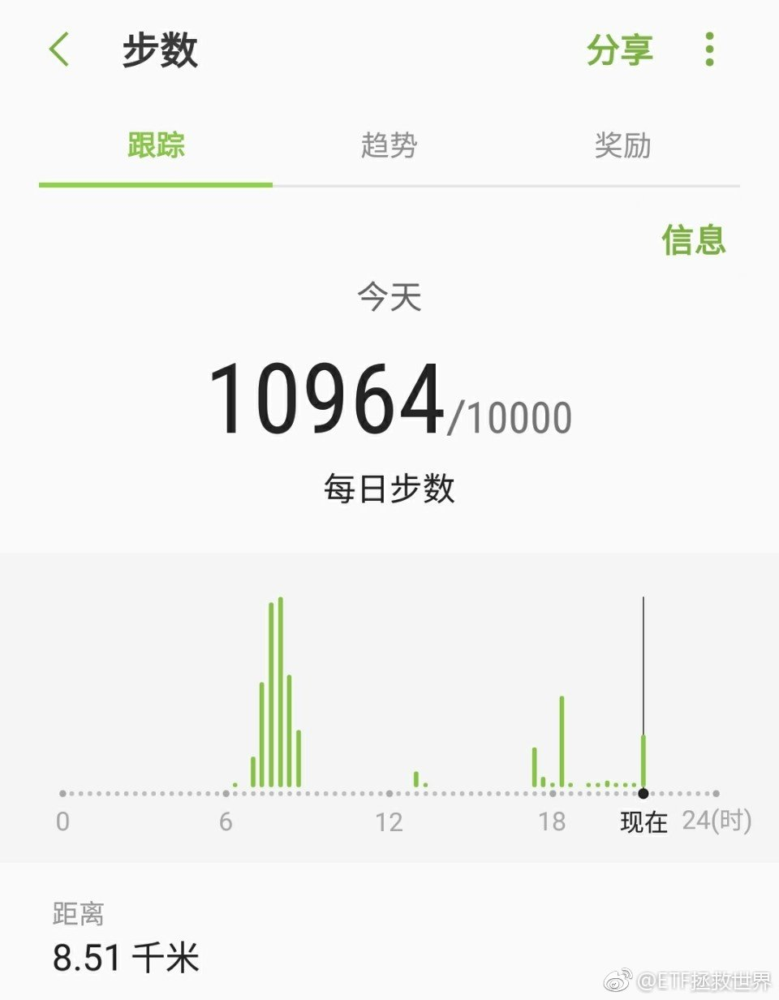

======================================================

ETF拯救世界 (5687069307) @
2017-10-18 11:27:47 Wed  
url: https://weibo.com/5687069307/FqVaz4iTP

$全指医药 sh000991$ $养老产业 sz399812$ 

事情还没有结束。 ​​​

转发[84]  评论[40]  赞[106] 

======================================================

ETF拯救世界 (5687069307) @
2017-10-18 13:04:14 Wed  
url: https://weibo.com/5687069307/FqVNIhXNq

恐慌了？[并不简单]

------------------------------------------------------
转推：
>  @ ()
>  2017-10-18 10:28:24 Wed  
>  url: 

>  抱歉，作者已设置仅展示半年内微博，此微博已不可见。 ​​​

转发[2]  评论[14]  赞[51] 

======================================================

ETF拯救世界 (5687069307) @
2017-10-18 13:19:06 Wed  
url: https://weibo.com/5687069307/FqVTKlDHB

走向新高。

------------------------------------------------------
转推：
>  @ETF拯救世界 (5687069307)
>  2017-10-18 11:27:47 Wed  
>  url: https:/weibo.com/5687069307/FqVaz4iTP/

>  $全指医药 sh000991$ $养老产业 sz399812$ 
>  
>  事情还没有结束。 ​​​

转发[1]  评论[11]  赞[60] 

======================================================

ETF拯救世界 (5687069307) @
2017-10-18 13:20:52 Wed  
url: https://weibo.com/5687069307/FqVUsDoGU

$养老产业 sz399812$ 

今天他们立功了。 ​​​

转发[15]  评论[27]  赞[70] 

+++++++++++++++++++++++++++++++++++++++++++++++++++++

图片：

======================================================

ETF拯救世界 (5687069307) @
2017-10-18 13:32:54 Wed  
url: https://weibo.com/5687069307/FqVZlwXgX

回复@摩尔金融:我理解啊，咱们这一辈老了的时候，恐怕vr ar都已经是日常生活了。娱乐传媒算养老没毛病。“选取涉及酒店旅游、文化传媒、医药卫生、人寿保险等养老相关业务的上市公司股票作为成份股”//@摩尔金融:掌趣科技和游族网络也算养老产业吗？

------------------------------------------------------
转推：
>  @ETF拯救世界 (5687069307)
>  2017-10-18 13:20:52 Wed  
>  url: https:/weibo.com/5687069307/FqVUsDoGU/

>  $养老产业 sz399812$ 
>  
>  今天他们立功了。 ​​​

转发[7]  评论[7]  赞[60] 

======================================================

ETF拯救世界 (5687069307) @
2017-10-18 13:34:52 Wed  
url: https://weibo.com/5687069307/FqW09dMFb

养老产业的选股范围：“属消费电子、休闲用品、酒店旅游、教育、文化传
媒、药品零售、乳品、家庭用品、医药卫生、人寿保险、互联网软件”。 ​​​

转发[47]  评论[25]  赞[98] 

======================================================

ETF拯救世界 (5687069307) @
2017-10-18 13:44:17 Wed  
url: https://weibo.com/5687069307/FqW3Yc8Dp

回复@怪叔叔窝窝001:这里面大部分都是“弱周期”。毕竟，经济再差也得吃药。何况，有时候经济越差，娱乐业越好。为什么呢，毕竟及经济差了不能买车，但打开游戏花几十块钱玩一晚上网游看一场电影还是最实惠的。//@怪叔叔窝窝001:经济失去活力 还能有多大的发展

------------------------------------------------------
转推：
>  @ETF拯救世界 (5687069307)
>  2017-10-18 13:34:52 Wed  
>  url: https:/weibo.com/5687069307/FqW09dMFb/

>  养老产业的选股范围：“属消费电子、休闲用品、酒店旅游、教育、文化传
>  媒、药品零售、乳品、家庭用品、医药卫生、人寿保险、互联网软件”。 ​​​

转发[10]  评论[16]  赞[59] 

======================================================

ETF拯救世界 (5687069307) @
2017-10-18 13:49:07 Wed  
url: https://weibo.com/5687069307/FqW5VCA7k

如果你统计过A股上市以来涨幅最大的股票，恐怕十个里面有七个都是泛“消费”和“医药”。

美国也是如此，最牛的是菲利普莫里斯，干嘛的，烟草。然后宝洁麦当劳辉瑞两个可乐迪士尼……

我坚信未来30年A股在泛消费和医药里面也会有特大长牛股产生。而这两个板块指数也将继续非常牛。

如果有机会重仓买 ​​​

转发[80]  评论[66]  赞[107] 

======================================================

ETF拯救世界 (5687069307) @
2017-10-18 13:55:39 Wed  
url: https://weibo.com/5687069307/FqW8AdQaN

包括这些年美股也是啊。亚马逊、苹果、奈飞，你很难说他们是消费公司还是科技公司吧。刚有朋友说人工智能，我的意思，不要急。等有一家公司真的开发出让你花钱去不断消费的产品，再买它不迟，至少涨5年吧。当然，短线高手例外。概念就可以随便炒了。

------------------------------------------------------
转推：
>  @ETF拯救世界 (5687069307)
>  2017-10-18 13:49:07 Wed  
>  url: https:/weibo.com/5687069307/FqW5VCA7k/

>  如果你统计过A股上市以来涨幅最大的股票，恐怕十个里面有七个都是泛“消费”和“医药”。
>  
>  美国也是如此，最牛的是菲利普莫里斯，干嘛的，烟草。然后宝洁麦当劳辉瑞两个可乐迪士尼……
>  
>  我坚信未来30年A股在泛消费和医药里面也会有特大长牛股产生。而这两个板块指数也将继续非常牛。
>  
>  如果有机会重仓买 ​​​

转发[15]  评论[10]  赞[81] 

======================================================

ETF拯救世界 (5687069307) @
2017-10-18 13:59:37 Wed  
url: https://weibo.com/5687069307/FqWac7SRI

上港哪里有直播谁知道？

------------------------------------------------------
转推：
>  @9号李毅大帝 (2018220685)
>  2017-10-18 13:55:28 Wed  
>  url: https:/weibo.com/2018220685/FqW8vuQOI/

>  大道之行，天下为公！祝福我们的祖国繁荣昌盛，祝福中国的足球越来越好，更祝福今天的上海上港能够在客场全身而退晋级亚冠决赛！ ​​​

转发[0]  评论[24]  赞[37] 

======================================================

ETF拯救世界 (5687069307) @
2017-10-18 14:02:51 Wed  
url: https://weibo.com/5687069307/FqWbvk5Kg

门票组合今年41%了。然而三季报披露到今天一只也没选出来。

模型真的很严格！ ​​​

转发[9]  评论[47]  赞[83] 

======================================================

ETF拯救世界 (5687069307) @
2017-10-18 14:15:42 Wed  
url: https://weibo.com/5687069307/FqWgJaTP3

对于为什么不“重仓”这种问题。从2016年的恒生到后来的一些品种，一直都会有这种疑问。

了解我的朋友都知道，恒生我本身建仓的时候有十几个点，会比计划多一点。计划少一些的原因各位也都知道了。但这个不是关键。

关键在于，我恐怕永远也不会买到很多朋友理念中的“重仓”。因为我给一个品种最大最 ​​​

转发[91]  评论[110]  赞[217] 

======================================================

ETF拯救世界 (5687069307) @
2017-10-18 14:26:10 Wed  
url: https://weibo.com/5687069307/FqWkYsSzL

回复@D8奇迹:其实年初至今只有900只股票，也就是30%的股票上涨，70%下跌。1221只跌幅超过15%，不要太伤心。。。//@D8奇迹:回复@实体化的幽灵:拉仇恨吗？！俺今年门票收益-15%，而且一个新股都没中。真他妈的FUCK egg

------------------------------------------------------
转推：
>  @ETF拯救世界 (5687069307)
>  2017-10-18 14:02:51 Wed  
>  url: https:/weibo.com/5687069307/FqWbvk5Kg/

>  门票组合今年41%了。然而三季报披露到今天一只也没选出来。
>  
>  模型真的很严格！ ​​​

转发[5]  评论[28]  赞[64] 

======================================================

ETF拯救世界 (5687069307) @
2017-10-18 15:43:57 Wed  
url: https://weibo.com/5687069307/FqWQxwc6e

回复@就看E大啦啦啦:不用看那个组合。我经常忘了在那里调仓，那是补上个月忘了调的。//@就看E大啦啦啦:E大怎么突然调仓了500？//@ETF拯救世界:回复@D8奇迹:其实年初至今只有900只股票，也就是30%的股票上涨，70%下跌。1221只跌幅超过15%，不要太伤心。。。

------------------------------------------------------
转推：
>  @ETF拯救世界 (5687069307)
>  2017-10-18 14:02:51 Wed  
>  url: https:/weibo.com/5687069307/FqWbvk5Kg/

>  门票组合今年41%了。然而三季报披露到今天一只也没选出来。
>  
>  模型真的很严格！ ​​​

转发[1]  评论[20]  赞[58] 

======================================================

ETF拯救世界 (5687069307) @
2017-10-18 21:43:32 Wed  
url: https://weibo.com/5687069307/FqZcumcYN

每日打卡（97）

坚持。 ​​​

转发[0]  评论[12]  赞[97] 

+++++++++++++++++++++++++++++++++++++++++++++++++++++

图片：

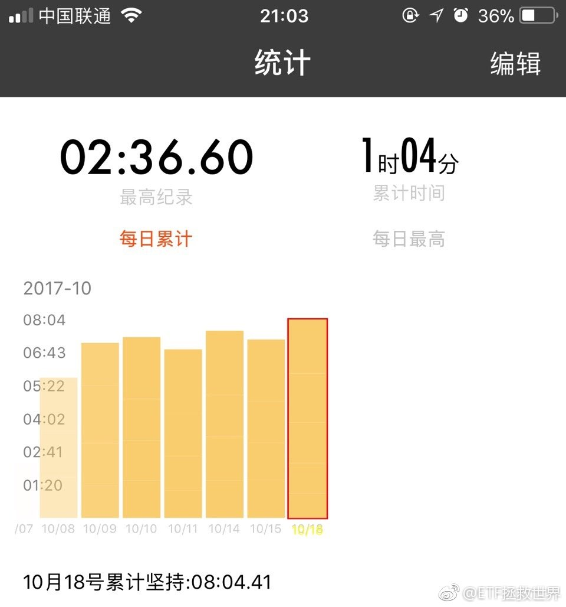

======================================================

ETF拯救世界 (5687069307) @
2017-10-19 09:47:07 Thu  
url: https://weibo.com/5687069307/Fr3Wcm7gd

每天这么浪，会不会累。

------------------------------------------------------
转推：
>  @ETF拯救世界 (5687069307)
>  2017-10-18 11:27:47 Wed  
>  url: https:/weibo.com/5687069307/FqVaz4iTP/

>  $全指医药 sh000991$ $养老产业 sz399812$ 
>  
>  事情还没有结束。 ​​​

转发[67]  评论[17]  赞[69] 

======================================================

ETF拯救世界 (5687069307) @
2017-10-19 09:50:18 Thu  
url: https://weibo.com/5687069307/Fr3Xu8oPk

写在反弹新高：我再说一次，不要卖。不要卖。不要卖。坐电梯不可怕，可怕的是轻易卖掉超廉价筹码。//@ETF拯救世界:每天这么浪，会不会累。

------------------------------------------------------
转推：
>  @ETF拯救世界 (5687069307)
>  2017-10-18 11:27:47 Wed  
>  url: https:/weibo.com/5687069307/FqVaz4iTP/

>  $全指医药 sh000991$ $养老产业 sz399812$ 
>  
>  事情还没有结束。 ​​​

转发[61]  评论[50]  赞[91] 

======================================================

ETF拯救世界 (5687069307) @
2017-10-19 10:04:25 Thu  
url: https://weibo.com/5687069307/Fr43djy0C

目前这个阶段，整体思路是：

不停的寻找便宜货。总有东西会跌，跌到位了就开始买。买了以后，如果继续跌，就继续买。如果不跌，就放好了，藏起来，几年后拿出来数钱。

就酱。很简单，粗暴，有效。 ​​​

转发[49]  评论[81]  赞[231] 

======================================================

ETF拯救世界 (5687069307) @
2017-10-19 10:21:21 Thu  
url: https://weibo.com/5687069307/Fr4a6kvyQ

通常来讲，国债利率倒挂，消费、医药这种板块走强，都预示着_____。

不要多说话，懂就行了。 ​​​

转发[32]  评论[107]  赞[156] 

======================================================

ETF拯救世界 (5687069307) @
2017-10-19 10:29:15 Thu  
url: https://weibo.com/5687069307/Fr4diB4a5

不知道有没有人注意，8月底之后的50天计划买了五份，只有一份A股。 ​​​

转发[3]  评论[32]  赞[125] 

======================================================

ETF拯救世界 (5687069307) @
2017-10-19 10:42:45 Thu  
url: https://weibo.com/5687069307/Fr4iMsf5W

如果某天临时加车，不要意外。

世界充满惊喜。 ​​​

转发[4]  评论[118]  赞[203] 

======================================================

ETF拯救世界 (5687069307) @
2017-10-19 10:43:07 Thu  
url: https://weibo.com/5687069307/Fr4iVfnUx

谢谢。我们的美元债又……

------------------------------------------------------
转推：
>  @巨潮资讯网 (2239792910)
>  2017-10-19 10:42:03 Thu  
>  url: https:/weibo.com/2239792910/Fr4iuEE5x/

>  【19日人民币对美元中间价下跌102点】10月19日人民币对美元中间价下跌102点，报6.6093。中国人民银行日前发布的《2017年人民币国际化报告》表示，下一步，人民银行将继续坚持汇率市场化改革方向，进一步完善人民币汇率市场化形成机制，逐步增强汇率弹性，保持人民币在全球货币体系中的稳定地位。 ​​​

转发[1]  评论[22]  赞[84] 

======================================================

ETF拯救世界 (5687069307) @
2017-10-19 11:24:39 Thu  
url: https://weibo.com/5687069307/Fr4zN2rB3

嗯哼 ​​​

转发[2]  评论[44]  赞[73] 

+++++++++++++++++++++++++++++++++++++++++++++++++++++

图片：

======================================================

ETF拯救世界 (5687069307) @
2017-10-19 14:23:19 Thu  
url: https://weibo.com/5687069307/Fr5KjeReZ

别扛了，跟着休息休息吧。连续两天超过2500只下跌了。。//@ETF拯救世界:每天这么浪，会不会累。

------------------------------------------------------
转推：
>  @ETF拯救世界 (5687069307)
>  2017-10-18 11:27:47 Wed  
>  url: https:/weibo.com/5687069307/FqVaz4iTP/

>  $全指医药 sh000991$ $养老产业 sz399812$ 
>  
>  事情还没有结束。 ​​​

转发[4]  评论[16]  赞[59] 

======================================================

ETF拯救世界 (5687069307) @
2017-10-19 14:27:24 Thu  
url: https://weibo.com/5687069307/Fr5LYjYn8

回复@Coreline:反正昨天新高了。今天不好说。//@Coreline:是不是我们每天都新高啊//@ETF拯救世界:别扛了，跟着休息休息吧。连续两天超过2500只下跌了。。//@ETF拯救世界:每天这么浪，会不会累。

------------------------------------------------------
转推：
>  @ETF拯救世界 (5687069307)
>  2017-10-18 11:27:47 Wed  
>  url: https:/weibo.com/5687069307/FqVaz4iTP/

>  $全指医药 sh000991$ $养老产业 sz399812$ 
>  
>  事情还没有结束。 ​​​

转发[3]  评论[11]  赞[48] 

======================================================

ETF拯救世界 (5687069307) @
2017-10-19 14:51:00 Thu  
url: https://weibo.com/5687069307/Fr5Vykzwd

回复@醉翁得意:跌了还不到1%吧。如果买了0.6%，就是浮亏不到0.006%。您要太紧张就卖了吧。不跌我们怎么买剩下的4%。。。//@醉翁得意:黄金etf怎么一直在跌//@ETF拯救世界:回复@Coreline:反正昨天新高了。今天不好说。//@Coreline:是不是我们每天都新高啊

------------------------------------------------------
转推：
>  @ETF拯救世界 (5687069307)
>  2017-10-18 11:27:47 Wed  
>  url: https:/weibo.com/5687069307/FqVaz4iTP/

>  $全指医药 sh000991$ $养老产业 sz399812$ 
>  
>  事情还没有结束。 ​​​

转发[2]  评论[17]  赞[68] 

======================================================

ETF拯救世界 (5687069307) @
2017-10-19 15:07:17 Thu  
url: https://weibo.com/5687069307/Fr629wIk5

还有多少人认为我买一份，也就是0.6%就是看好这个品种会涨的……有这种错觉的立即停止参考。 ​​​

转发[8]  评论[59]  赞[107] 

======================================================

ETF拯救世界 (5687069307) @
2017-10-19 15:26:24 Thu  
url: https://weibo.com/5687069307/Fr69UAjUj

今天全市场数据有点好。[笑而不语] ​​​

转发[4]  评论[53]  赞[116] 

======================================================

ETF拯救世界 (5687069307) @
2017-10-19 15:58:00 Thu  
url: https://weibo.com/5687069307/Fr6mK71Mn

回复@Tippiinsz:不到29500就跌不要脸。[笑而不语]//@Tippiinsz:恒生跌了550点[笑而不语]

------------------------------------------------------
转推：
>  @ETF拯救世界 (5687069307)
>  2017-10-19 15:26:24 Thu  
>  url: https:/weibo.com/5687069307/Fr69UAjUj/

>  今天全市场数据有点好。[笑而不语] ​​​

转发[1]  评论[10]  赞[60] 

======================================================

ETF拯救世界 (5687069307) @
2017-10-20 01:47:49 Fri  
url: https://weibo.com/5687069307/Frae9fZqI

[哼] ​​​

转发[0]  评论[56]  赞[68] 

======================================================

ETF拯救世界 (5687069307) @
2017-10-20 09:38:59 Fri  
url: https://weibo.com/5687069307/FrdjoqAa6

刚才删了一条昨天的微博。

不议论别人，咱们做好自己的投资。 ​​​

转发[0]  评论[75]  赞[193] 

======================================================

ETF拯救世界 (5687069307) @
2017-10-20 22:09:19 Fri  
url: https://weibo.com/5687069307/FridXhX0j

每日打卡（98）

今天有点忙，一天没说话。

坚持。 ​​​

转发[0]  评论[32]  赞[107] 

+++++++++++++++++++++++++++++++++++++++++++++++++++++

图片：

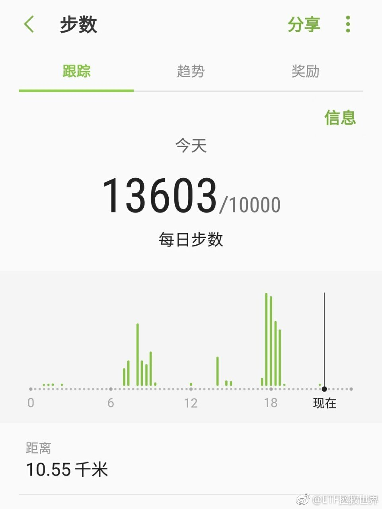

======================================================

ETF拯救世界 (5687069307) @
2017-10-21 21:14:25 Sat  
url: https://weibo.com/5687069307/FrriarEb0

每日打卡（99）

周末要到一万步真心不容易。 ​​​

转发[1]  评论[33]  赞[109] 

+++++++++++++++++++++++++++++++++++++++++++++++++++++

图片：
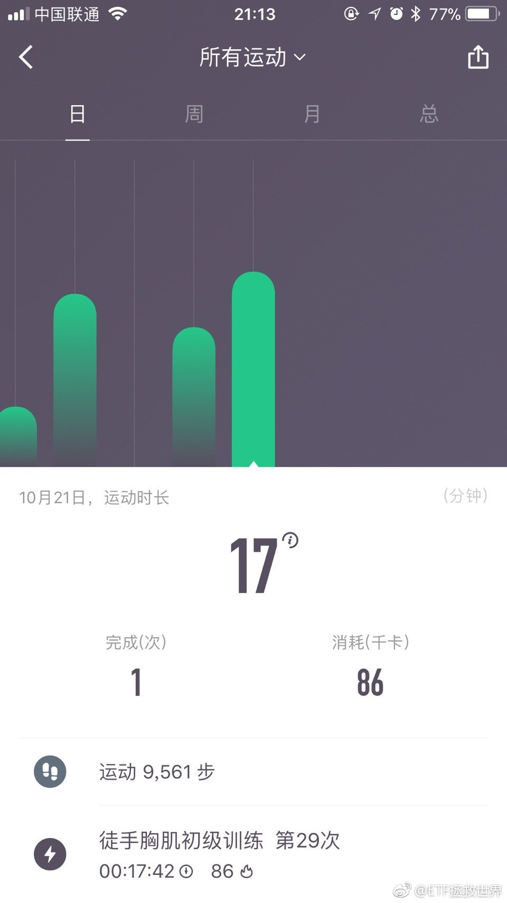

======================================================

ETF拯救世界 (5687069307) @
2017-10-23 09:45:50 Mon  
url: https://weibo.com/5687069307/FrFDFhYLa

继续新高。

------------------------------------------------------
转推：
>  @ETF拯救世界 (5687069307)
>  2017-10-18 11:27:47 Wed  
>  url: https:/weibo.com/5687069307/FqVaz4iTP/

>  $全指医药 sh000991$ $养老产业 sz399812$ 
>  
>  事情还没有结束。 ​​​

转发[8]  评论[20]  赞[80] 

======================================================

ETF拯救世界 (5687069307) @
2017-10-23 09:49:29 Mon  
url: https://weibo.com/5687069307/FrFF9sWfp

回复@求财不劫色:这个要看时间。如果极短时间内50%也可以能走。如果时间长了，十倍可能都不卖。时间，空间的艺术。//@求财不劫色:不翻倍不走[爱你]//@ETF拯救世界:继续新高。

------------------------------------------------------
转推：
>  @ETF拯救世界 (5687069307)
>  2017-10-18 11:27:47 Wed  
>  url: https:/weibo.com/5687069307/FqVaz4iTP/

>  $全指医药 sh000991$ $养老产业 sz399812$ 
>  
>  事情还没有结束。 ​​​

转发[7]  评论[21]  赞[96] 

======================================================

ETF拯救世界 (5687069307) @
2017-10-23 10:04:15 Mon  
url: https://weibo.com/5687069307/FrFL8B0kc

投资中有些事情是必然会发生的。或者说吧，极大概率发生。

空间的向上或者向下。

只是时间不确定。那么我们就想办法让时间成为我们的朋友。坚定信念，在还没有发生的时候多积累。

然后继续与时间做朋友，等着就行了。

哪里不会点哪里，so easy。 ​​​

转发[35]  评论[71]  赞[158] 

======================================================

ETF拯救世界 (5687069307) @
2017-10-23 10:34:57 Mon  
url: https://weibo.com/5687069307/FrFXBDSzB

继续说。不要卖。//@ETF拯救世界:写在反弹新高：我再说一次，不要卖。不要卖。不要卖。坐电梯不可怕，可怕的是轻易卖掉超廉价筹码。//@ETF拯救世界:每天这么浪，会不会累。

------------------------------------------------------
转推：
>  @ETF拯救世界 (5687069307)
>  2017-10-18 11:27:47 Wed  
>  url: https:/weibo.com/5687069307/FqVaz4iTP/

>  $全指医药 sh000991$ $养老产业 sz399812$ 
>  
>  事情还没有结束。 ​​​

转发[55]  评论[53]  赞[92] 

======================================================

ETF拯救世界 (5687069307) @
2017-10-23 10:47:00 Mon  
url: https://weibo.com/5687069307/FrG2ua4lN

实不相瞒，医药指数能玩一辈子。 ​​​

转发[27]  评论[124]  赞[213] 

======================================================

ETF拯救世界 (5687069307) @
2017-10-23 11:53:02 Mon  
url: https://weibo.com/5687069307/FrGtiEOjm

回复@9BtJ5EMR4:每一个十倍都是从1%，3%，7%，40%，200%……开始的。刚刚发芽就拔掉，永远无法变成参天大树。买入很严格，一旦买入成功，卖出会更严格。

------------------------------------------------------
转推：
>  @ETF拯救世界 (5687069307)
>  2017-10-18 11:27:47 Wed  
>  url: https:/weibo.com/5687069307/FqVaz4iTP/

>  $全指医药 sh000991$ $养老产业 sz399812$ 
>  
>  事情还没有结束。 ​​​

转发[20]  评论[39]  赞[150] 

======================================================

ETF拯救世界 (5687069307) @
2017-10-23 13:32:52 Mon  
url: https://weibo.com/5687069307/FrH7Oh62p

回复@微微清风0:众筹50万册我就开始写……[笑而不语]//@微微清风0:紧跟E大就好，E大书什么时候能出啊@ETF拯救世界

------------------------------------------------------
转推：
>  @ETF拯救世界 (5687069307)
>  2017-10-23 10:04:15 Mon  
>  url: https:/weibo.com/5687069307/FrFL8B0kc/

>  投资中有些事情是必然会发生的。或者说吧，极大概率发生。
>  
>  空间的向上或者向下。
>  
>  只是时间不确定。那么我们就想办法让时间成为我们的朋友。坚定信念，在还没有发生的时候多积累。
>  
>  然后继续与时间做朋友，等着就行了。
>  
>  哪里不会点哪里，so easy。 ​​​

转发[2]  评论[104]  赞[124] 

======================================================

ETF拯救世界 (5687069307) @
2017-10-23 14:13:08 Mon  
url: https://weibo.com/5687069307/FrHoa800q

券商的弹性真的很大。我们什么时候可以开始买？我也挺期待。 ​​​

转发[5]  评论[37]  赞[121] 

======================================================

ETF拯救世界 (5687069307) @
2017-10-23 14:34:19 Mon  
url: https://weibo.com/5687069307/FrHwLerCr

均值回归。//@ETF拯救世界:继续说。不要卖。//@ETF拯救世界:写在反弹新高：我再说一次，不要卖。不要卖。不要卖。坐电梯不可怕，可怕的是轻易卖掉超廉价筹码。//@ETF拯救世界:每天这么浪，会不会累。

------------------------------------------------------
转推：
>  @ETF拯救世界 (5687069307)
>  2017-10-18 11:27:47 Wed  
>  url: https:/weibo.com/5687069307/FqVaz4iTP/

>  $全指医药 sh000991$ $养老产业 sz399812$ 
>  
>  事情还没有结束。 ​​​

转发[2]  评论[32]  赞[70] 

======================================================

ETF拯救世界 (5687069307) @
2017-10-23 14:55:56 Mon  
url: https://weibo.com/5687069307/FrHFxc8aV

经典的“短贷长投”//@椒图炼丹炉:都是宿命, sigh

------------------------------------------------------
转推：
>  @蓝鲸财经记者工作平台 (1885454921)
>  2017-10-23 14:05:03 Mon  
>  url: https:/weibo.com/1885454921/FrHkSwhfA/

>  【鲸播报：周小川关于居民加杠杆措辞变化背后的秘密】10月23日讯，周小川关于居民杠杆率应该有质量的提高，以及要重点防止明斯基时刻，引发市场的热议。我们只有把这两点以及此前首次明确金融稳定发展委员会工作重点结合起来，才能更好的理解周小川讲话的意义。(财联社) http://t.cn/RW5Cqbq ​​​

转发[11]  评论[28]  赞[62] 

======================================================

ETF拯救世界 (5687069307) @
2017-10-23 21:45:15 Mon  
url: https://weibo.com/5687069307/FrKlG4evh

每日打卡（100）

第一百天。坚持不容易。努力。 ​​​

转发[2]  评论[33]  赞[165] 

+++++++++++++++++++++++++++++++++++++++++++++++++++++

图片：

======================================================

ETF拯救世界 (5687069307) @
2017-10-24 09:03:39 Tue  
url: https://weibo.com/5687069307/FrON2p9yA

最近有不少朋友在微博关注我，但是好像看不懂我每天在嘚嘚什么。

答案是：公众号：chinaetfs ​​​

转发[4]  评论[25]  赞[117] 

======================================================

ETF拯救世界 (5687069307) @
2017-10-24 09:06:01 Tue  
url: https://weibo.com/5687069307/FrONZtLcX

好几天没上，今天一登录，突破50000了。

2017年

1024 ​​​

转发[1]  评论[35]  赞[132] 

+++++++++++++++++++++++++++++++++++++++++++++++++++++

图片：

======================================================

ETF拯救世界 (5687069307) @
2017-10-24 09:26:49 Tue  
url: https://weibo.com/5687069307/FrOWrnGyt

快月底了，那什么也开完了，给个机会吧，得唔得？ ​​​

转发[2]  评论[61]  赞[136] 

======================================================

ETF拯救世界 (5687069307) @
2017-10-24 10:55:35 Tue  
url: https://weibo.com/5687069307/FrPwtkZou

指数红红火火，又是2500只下跌。。 ​​​

转发[2]  评论[37]  赞[107] 

======================================================

ETF拯救世界 (5687069307) @
2017-10-24 12:31:15 Tue  
url: https://weibo.com/5687069307/FrQ9jlnoI

转需。

------------------------------------------------------
转推：
>  @ ()
>  2017-10-24 11:30:25 Tue  
>  url: 

>  抱歉，作者已设置仅展示半年内微博，此微博已不可见。 ​​​

转发[47]  评论[49]  赞[63] 

======================================================

ETF拯救世界 (5687069307) @
2017-10-24 14:15:51 Tue  
url: https://weibo.com/5687069307/FrQPLfk6N

$恒生指数 hkHSI$  不到29500你就这样搞，不厚道了。[哼] ​​​

转发[3]  评论[46]  赞[82] 

======================================================

ETF拯救世界 (5687069307) @
2017-10-24 21:23:11 Tue  
url: https://weibo.com/5687069307/FrTDdniqr

每日打卡（101）

坚持。 ​​​

转发[0]  评论[24]  赞[99] 

+++++++++++++++++++++++++++++++++++++++++++++++++++++

图片：

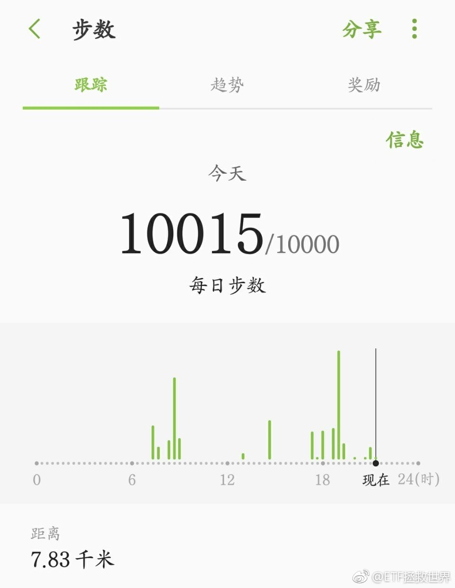

======================================================

ETF拯救世界 (5687069307) @
2017-10-25 07:15:33 Wed  
url: https://weibo.com/5687069307/FrXvFj5VT

咱们的海外债买入后的最近21个交易日中只有三天下跌，几乎每天都在涨。 ​​​

转发[4]  评论[99]  赞[211] 

======================================================

ETF拯救世界 (5687069307) @
2017-10-25 10:42:39 Wed  
url: https://weibo.com/5687069307/FrYRJ9WPD

不要卖。//@ETF拯救世界:继续说。不要卖。//@ETF拯救世界:写在反弹新高：我再说一次，不要卖。不要卖。不要卖。坐电梯不可怕，可怕的是轻易卖掉超廉价筹码。//@ETF拯救世界:每天这么浪，会不会累。

------------------------------------------------------
转推：
>  @ETF拯救世界 (5687069307)
>  2017-10-18 11:27:47 Wed  
>  url: https:/weibo.com/5687069307/FqVaz4iTP/

>  $全指医药 sh000991$ $养老产业 sz399812$ 
>  
>  事情还没有结束。 ​​​

转发[23]  评论[104]  赞[93] 

======================================================

ETF拯救世界 (5687069307) @
2017-10-25 13:23:29 Wed  
url: https://weibo.com/5687069307/FrZUZA7K5

讲真，我不信那谁他们会不继续玩几天。

要面子。 ​​​

转发[6]  评论[25]  赞[83] 

======================================================

ETF拯救世界 (5687069307) @
2017-10-25 13:28:10 Wed  
url: https://weibo.com/5687069307/FrZWUnNFj

回复@圣善周闻宗:有点兴奋。//@圣善周闻宗:今天十债貌似要崩了，E大怎么看？

------------------------------------------------------
转推：
>  @ETF拯救世界 (5687069307)
>  2017-10-25 13:23:29 Wed  
>  url: https:/weibo.com/5687069307/FrZUZA7K5/

>  讲真，我不信那谁他们会不继续玩几天。
>  
>  要面子。 ​​​

转发[3]  评论[13]  赞[60] 

======================================================

ETF拯救世界 (5687069307) @
2017-10-25 13:41:51 Wed  
url: https://weibo.com/5687069307/Fs02slJ28

就像一场战争。真的，你好好想想，是不是。

敌人强大的时候，不要硬怼。

先把我们的主力部队隐藏好，然后派出高科技的无人机全方位扫描敌军的布阵。

派出小股部队不断的攻击敌人最薄弱的环节。除非不出手，一出手就要攻城略地，结硬寨，轻易不会再丢。

一口一口蚕食敌人的势力。在敌我双方力量天平 ​​​

转发[35]  评论[79]  赞[188] 

======================================================

ETF拯救世界 (5687069307) @
2017-10-25 13:58:57 Wed  
url: https://weibo.com/5687069307/Fs09oCR3s

医药今年涨幅7.85%，这一个月就涨了6.5%。

再说一次，证券投资不是每个月，每年平均增长多少多少。而是可能几个月几年没动静，突然爆发赚一下就把几年的钱赚了。

所以最重要是低位收集筹码，然后耐心等。不要用过去的成绩看未来，而是要用未来的眼睛看现在。 ​​​

转发[62]  评论[65]  赞[207] 

======================================================

ETF拯救世界 (5687069307) @
2017-10-25 14:11:58 Wed  
url: https://weibo.com/5687069307/Fs0eGkaRn

4不4要冲11000了。//@ETF拯救世界:不要卖。//@ETF拯救世界:继续说。不要卖。//@ETF拯救世界:写在反弹新高：我再说一次，不要卖。不要卖。不要卖。坐电梯不可怕，可怕的是轻易卖掉超廉价筹码。//@ETF拯救世界:每天这么浪，会不会累。

------------------------------------------------------
转推：
>  @ETF拯救世界 (5687069307)
>  2017-10-18 11:27:47 Wed  
>  url: https:/weibo.com/5687069307/FqVaz4iTP/

>  $全指医药 sh000991$ $养老产业 sz399812$ 
>  
>  事情还没有结束。 ​​​

转发[5]  评论[18]  赞[67] 

======================================================

ETF拯救世界 (5687069307) @
2017-10-25 14:47:49 Wed  
url: https://weibo.com/5687069307/Fs0terZo8

159938折价0.4%。

做市商，你们的良心难道不会痛吗。 ​​​

转发[4]  评论[15]  赞[68] 

======================================================

ETF拯救世界 (5687069307) @
2017-10-25 14:57:08 Wed  
url: https://weibo.com/5687069307/Fs0x16HnR

一切按照剧本走 ​​​

转发[11]  评论[61]  赞[101] 

+++++++++++++++++++++++++++++++++++++++++++++++++++++

图片：
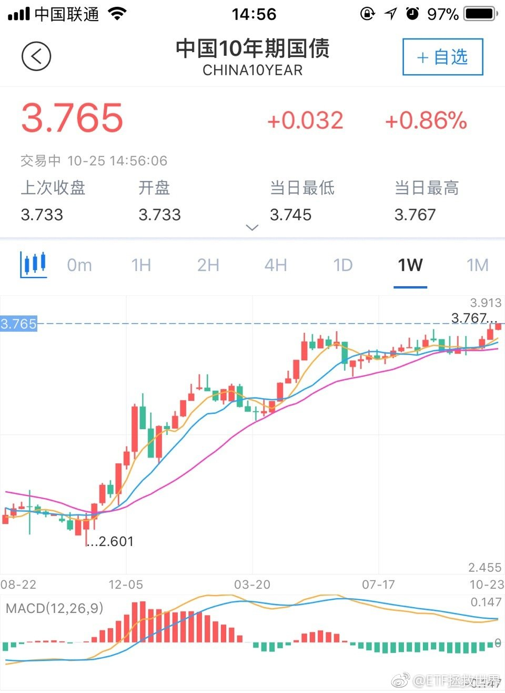

======================================================

ETF拯救世界 (5687069307) @
2017-10-25 15:02:27 Wed  
url: https://weibo.com/5687069307/Fs0zaDLRs

拉上去了。良心发现。

------------------------------------------------------
转推：
>  @ETF拯救世界 (5687069307)
>  2017-10-25 14:47:49 Wed  
>  url: https:/weibo.com/5687069307/Fs0terZo8/

>  159938折价0.4%。
>  
>  做市商，你们的良心难道不会痛吗。 ​​​

转发[1]  评论[13]  赞[83] 

======================================================

ETF拯救世界 (5687069307) @
2017-10-26 08:42:02 Thu  
url: https://weibo.com/5687069307/Fs7vftLxD

现在计划歌单里的好歌已经排好队蠢蠢欲动了。

然而一次只放一首。得多久才能放完啊。[并不简单] ​​​

转发[2]  评论[90]  赞[155] 

======================================================

ETF拯救世界 (5687069307) @
2017-10-26 09:52:40 Thu  
url: https://weibo.com/5687069307/Fs7XW6wpB

11000是不是内定了。//@ETF拯救世界:4不4要冲11000了。//@ETF拯救世界:不要卖。//@ETF拯救世界:继续说。不要卖。//@ETF拯救世界:写在反弹新高：我再说一次，不要卖。不要卖。不要卖。坐电梯不可怕，可怕的是轻易卖掉超廉价筹码。//@ETF拯救世界:每天这么浪，会不会累。

------------------------------------------------------
转推：
>  @ETF拯救世界 (5687069307)
>  2017-10-18 11:27:47 Wed  
>  url: https:/weibo.com/5687069307/FqVaz4iTP/

>  $全指医药 sh000991$ $养老产业 sz399812$ 
>  
>  事情还没有结束。 ​​​

转发[4]  评论[21]  赞[63] 

======================================================

ETF拯救世界 (5687069307) @
2017-10-26 10:16:10 Thu  
url: https://weibo.com/5687069307/Fs87t4FaH

回复@就看E大啦啦啦:估值没有到我说的34，为什么要绝望的等？你这个心态太差了，仓位远不是涨跌都舒服吧。//@就看E大啦啦啦:感觉等瀑布等得好绝望啊//@ETF拯救世界:11000是不是内定了。//@ETF拯救世界:4不4要冲11000了。//@ETF拯救世界:不要卖。//@ETF拯救世界:继续说。不要卖。

------------------------------------------------------
转推：
>  @ETF拯救世界 (5687069307)
>  2017-10-18 11:27:47 Wed  
>  url: https:/weibo.com/5687069307/FqVaz4iTP/

>  $全指医药 sh000991$ $养老产业 sz399812$ 
>  
>  事情还没有结束。 ​​​

转发[3]  评论[19]  赞[57] 

======================================================

ETF拯救世界 (5687069307) @
2017-10-26 10:22:40 Thu  
url: https://weibo.com/5687069307/Fs8a6axtv

回复@Ponder735:心态是买入之前设计好的，不是买入被套之后安慰自己啊。这完全不一样好吗。//@Ponder735:E大，之前不懂，被油气网格深套，心态如何调整[允悲]//@ETF拯救世界:回复@就看E大啦啦啦:估值没有到我说的34，为什么要绝望的等？你这个心态太差了，仓位远不是涨跌都舒服吧。

------------------------------------------------------
转推：
>  @ETF拯救世界 (5687069307)
>  2017-10-18 11:27:47 Wed  
>  url: https:/weibo.com/5687069307/FqVaz4iTP/

>  $全指医药 sh000991$ $养老产业 sz399812$ 
>  
>  事情还没有结束。 ​​​

转发[0]  评论[11]  赞[66] 

======================================================

ETF拯救世界 (5687069307) @
2017-10-26 10:28:46 Thu  
url: https://weibo.com/5687069307/Fs8cA8xbU

点击“买入”按钮前，需要想明白，自己为什么要买这个品种，用什么策略交易，最差会怎样，最好会怎样。跌了怎么做，跌多少做什么。涨了怎么做，涨多少做什么。现在买入，涨的概率大还是跌的概率大。

所有的一切都是买入之前就已经计划好的，而不是买入之后发生了再去考虑。

至于仓位，最重要的是不要 ​​​

转发[129]  评论[115]  赞[229] 

======================================================

ETF拯救世界 (5687069307) @
2017-10-26 11:03:54 Thu  
url: https://weibo.com/5687069307/Fs8qQinXC

回复@执念hhj:每只都可以搞。//@执念hhj:e大 第二只可转债来了 搞吗@ETF拯救世界 🤓

------------------------------------------------------
转推：
>  @ETF拯救世界 (5687069307)
>  2017-10-26 10:28:46 Thu  
>  url: https:/weibo.com/5687069307/Fs8cA8xbU/

>  点击“买入”按钮前，需要想明白，自己为什么要买这个品种，用什么策略交易，最差会怎样，最好会怎样。跌了怎么做，跌多少做什么。涨了怎么做，涨多少做什么。现在买入，涨的概率大还是跌的概率大。
>  
>  所有的一切都是买入之前就已经计划好的，而不是买入之后发生了再去考虑。
>  
>  至于仓位，最重要的是不要 ​​​

转发[1]  评论[24]  赞[66] 

======================================================

ETF拯救世界 (5687069307) @
2017-10-26 14:43:55 Thu  
url: https://weibo.com/5687069307/Fs9S9cauC

其实2015年之前，我在市场上最喜欢干的一件事，是追踪市场上那些“聪明”钱的动向。

你不能不承认，真的有一些钱特别敏感，特别有预见性。比如一些先行板块真的每次都在涨跌之前就有所动作。比如一些资金真的能大底建仓大顶跑掉。

这些信息，从新闻、资料、甚至盘面都能找到蛛丝马迹。

2015年7月以 ​​​

转发[23]  评论[72]  赞[149] 

======================================================

ETF拯救世界 (5687069307) @
2017-10-26 21:36:31 Thu  
url: https://weibo.com/5687069307/FsczCueQW

每日打卡（102）

这两天有点咳嗽，运动量小了不少 ​​​

转发[0]  评论[79]  赞[100] 

+++++++++++++++++++++++++++++++++++++++++++++++++++++

图片：

======================================================

ETF拯救世界 (5687069307) @
2017-10-27 11:35:17 Fri  
url: https://weibo.com/5687069307/Fsi44DoG8

我有个大胆的想法 ​​​

转发[6]  评论[161]  赞[151] 

======================================================

ETF拯救世界 (5687069307) @
2017-10-27 12:36:34 Fri  
url: https://weibo.com/5687069307/FsisXaeyV

滴滴 ​​​

转发[15]  评论[181]  赞[146] 

======================================================

ETF拯救世界 (5687069307) @
2017-10-27 13:43:08 Fri  
url: https://weibo.com/5687069307/FsiTYjd77

不觉得券商走得很有意思吗 ​​​

转发[6]  评论[50]  赞[75] 

======================================================

ETF拯救世界 (5687069307) @
2017-10-27 14:10:13 Fri  
url: https://weibo.com/5687069307/Fsj4Y1OYO

都在说油腻的中年男人。说起来，我是有个关于年龄关于状态的目标吧。

38岁，算是我的同龄人，差不了几岁，严格一点说是中年人了吧。

肌肉，精气神。努力的方向。

所以其实跟年龄无关，看你自己怎么活吧。。 ​​​

转发[5]  评论[92]  赞[108] 

+++++++++++++++++++++++++++++++++++++++++++++++++++++

图片：

======================================================

ETF拯救世界 (5687069307) @
2017-10-27 14:11:59 Fri  
url: https://weibo.com/5687069307/Fsj5GhVWH

回复@BuBu蛇:有人想让你看到的，并非是真相。真相在转角，在幕后，不要被欺骗。总有蛛丝马迹，豁然开朗。聪明人总是有的，找到他们，观察。//@BuBu蛇:回复@益达铁粉一路莲花:说是牛市，就是不涨券商股[允悲]

------------------------------------------------------
转推：
>  @ETF拯救世界 (5687069307)
>  2017-10-27 13:43:08 Fri  
>  url: https:/weibo.com/5687069307/FsiTYjd77/

>  不觉得券商走得很有意思吗 ​​​

转发[2]  评论[30]  赞[84] 

======================================================

ETF拯救世界 (5687069307) @
2017-10-27 15:23:32 Fri  
url: https://weibo.com/5687069307/FsjyJ0nGu

厉害了 ​​​

转发[4]  评论[73]  赞[115] 

+++++++++++++++++++++++++++++++++++++++++++++++++++++

图片：
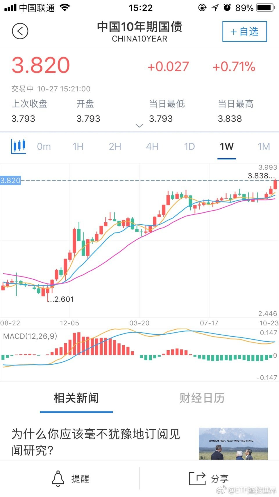

======================================================

ETF拯救世界 (5687069307) @
2017-10-27 15:41:14 Fri  
url: https://weibo.com/5687069307/FsjFUiWVa

今天数据出来了。弄不好过几天要加车。三季报+2000多只股票持续下跌的威力。

不一定。 ​​​

转发[9]  评论[132]  赞[238] 

======================================================

ETF拯救世界 (5687069307) @
2017-10-28 09:17:05 Sat  
url: https://weibo.com/5687069307/FsqAtwXjS

高抛低吸。这二十年来，社保管理人也好，汇金也好，一直有高人操盘。这次gjd也不例外。

------------------------------------------------------
转推：
>  @东方财富网 (1801487174)
>  2017-10-28 04:37:46 Sat  
>  url: https:/weibo.com/1801487174/FsoL6q7T1/

>  【“国家队”基金权益投资占比降至低位】随着基金三季报披露完毕，五只“国家队”基金投资路线浮出水面。相较二季度，五只基金均调低权益投资占基金总资产比例至低位。截至三季度末，华夏新经济权益投资占基金总资产比例从72.52%下调至56.83%；嘉实新机遇从53.47%下降至36.77%；易方达瑞惠从21.23%下降 ​​​

转发[21]  评论[43]  赞[96] 

======================================================

ETF拯救世界 (5687069307) @
2017-10-28 10:32:26 Sat  
url: https://weibo.com/5687069307/Fsr54383L

回复@如梦惊鸿:讲真，比我高。2012年底我重仓买入，汇金是2013上半年大量买入50 300 180ETF，买入时机差不多。但是2015我是三月份就跑的差不多了，汇金是4月5月才大量减持，多赚了不少。以他们的体量，只能说真的有水平。后来护盘的汇金已经不是以前那个了。//@如梦惊鸿:和E大比水平怎么样？

------------------------------------------------------
转推：
>  @东方财富网 (1801487174)
>  2017-10-28 04:37:46 Sat  
>  url: https:/weibo.com/1801487174/FsoL6q7T1/

>  【“国家队”基金权益投资占比降至低位】随着基金三季报披露完毕，五只“国家队”基金投资路线浮出水面。相较二季度，五只基金均调低权益投资占基金总资产比例至低位。截至三季度末，华夏新经济权益投资占基金总资产比例从72.52%下调至56.83%；嘉实新机遇从53.47%下降至36.77%；易方达瑞惠从21.23%下降 ​​​

转发[9]  评论[93]  赞[105] 

======================================================

ETF拯救世界 (5687069307) @
2017-10-30 11:45:08 Mon  
url: https://weibo.com/5687069307/FsKpz9NAR

有可能了

------------------------------------------------------
转推：
>  @ETF拯救世界 (5687069307)
>  2017-10-27 15:41:14 Fri  
>  url: https:/weibo.com/5687069307/FsjFUiWVa/

>  今天数据出来了。弄不好过几天要加车。三季报+2000多只股票持续下跌的威力。
>  
>  不一定。 ​​​

转发[0]  评论[56]  赞[123] 

======================================================

ETF拯救世界 (5687069307) @
2017-10-30 11:51:47 Mon  
url: https://weibo.com/5687069307/FsKsgoE1t

再说一次观点。这轮债券会先见底。有人说股市不是见底了吗。呵呵。//@ETF拯救世界:坚持这个结论。债券会先见底。所以，热烈的盼望着4%以上。我的资金饥渴难耐了。如果能够更高，那我会做梦都笑出来。

------------------------------------------------------
转推：
>  @ETF拯救世界 (5687069307)
>  2017-08-31 09:08:39 Thu  
>  url: https:/weibo.com/5687069307/FjBKfkGc2/

>  坚持债券会先于股票几个月见底的观点。 ​​​

转发[18]  评论[42]  赞[102] 

======================================================

ETF拯救世界 (5687069307) @
2017-10-30 11:56:25 Mon  
url: https://weibo.com/5687069307/FsKu97qzu

今天油气涨，A股跌。再看看本月发车文章中关于平滑周期的论述。 ​​​

转发[5]  评论[59]  赞[138] 

======================================================

ETF拯救世界 (5687069307) @
2017-10-30 12:41:13 Mon  
url: https://weibo.com/5687069307/FsKMkmXZW

这几天，有几个方面的信息，要综合分析。

第一个是走势。券商近期走得非常渣。要知道券商一向是市场温度计。说明有些smart money在做事。

第二个是季报。有媒体也已经统计了，GJD减持不少。包括委托给基金公司的几个ww定向基金。个中缘由值得玩味。

第三个是品种。最近非常明显的有些大股票，主要是 ​​​

转发[61]  评论[71]  赞[200] 

======================================================

ETF拯救世界 (5687069307) @
2017-10-30 13:13:36 Mon  
url: https://weibo.com/5687069307/FsKZtmKGN

朋友送了个紫砂壶，有没有懂的，指教一下，该怎么用。有什么规矩吗。 ​​​

转发[1]  评论[80]  赞[79] 

======================================================

ETF拯救世界 (5687069307) @
2017-10-30 13:46:44 Mon  
url: https://weibo.com/5687069307/FsLcVh3Mp

国债期货。你信不信，今天又要放水了。 ​​​

转发[5]  评论[35]  赞[91] 

+++++++++++++++++++++++++++++++++++++++++++++++++++++

图片：

======================================================

ETF拯救世界 (5687069307) @
2017-10-30 13:51:54 Mon  
url: https://weibo.com/5687069307/FsLf1g73y

很多人高估了自己的风险承受能力。危机来临后，才发现自己的财富的风险敞口有多大。自己也没有原来想象中对波动那么无所谓。

可惜，晚了。 ​​​

转发[10]  评论[53]  赞[153] 

======================================================

ETF拯救世界 (5687069307) @
2017-10-30 15:01:00 Mon  
url: https://weibo.com/5687069307/FsLH4erTK

今天计划收益率预计下跌0.1x%。不会新高了。

都别嘚瑟了，关灯吃面吧。 ​​​

转发[2]  评论[87]  赞[112] 

======================================================

ETF拯救世界 (5687069307) @
2017-10-30 15:23:31 Mon  
url: https://weibo.com/5687069307/FsLQd0iXj

今日数据：全市场估值2014年2月以来最低。 ​​​

转发[30]  评论[116]  赞[170] 

======================================================

ETF拯救世界 (5687069307) @
2017-10-30 15:42:13 Mon  
url: https://weibo.com/5687069307/FsLXO0PfO

sorry，写错了，2014年12月………………

------------------------------------------------------
转推：
>  @ETF拯救世界 (5687069307)
>  2017-10-30 15:23:31 Mon  
>  url: https:/weibo.com/5687069307/FsLQd0iXj/

>  今日数据：全市场估值2014年2月以来最低。 ​​​

转发[14]  评论[57]  赞[111] 

======================================================

ETF拯救世界 (5687069307) @
2017-10-30 16:05:57 Mon  
url: https://weibo.com/5687069307/FsM7qCeX0

估值数据“完全不对”。上次有人说这句话，我记得是2014年的雪球。

2012年11月28日，中小板创业板见底的前一天，我在雪球发了全市场估值见底的帖子。之后一年多就没再去雪球。

2013年底还是2014年，有个人把我那个帖子挖了出来，转了，引起了一些议论。然后我就又开始在雪球发言。

当然，那时候也会 ​​​

转发[66]  评论[160]  赞[411] 

======================================================

ETF拯救世界 (5687069307) @
2017-10-30 16:56:11 Mon  
url: https://weibo.com/5687069307/FsMrPjpe8

回复@一味7:2016年1月30日，中证1000是7385点，今天该指数收盘7574点。将近两年过去，这1000只股票的业绩增长是多少？放眼全市场3405只股票，比当时低很奇怪吗？难道你看上证和沪深300讨论全市场？//@一味7:我就问  今天估值比2016/01/30还低？

------------------------------------------------------
转推：
>  @ETF拯救世界 (5687069307)
>  2017-10-30 16:05:57 Mon  
>  url: https:/weibo.com/5687069307/FsM7qCeX0/

>  估值数据“完全不对”。上次有人说这句话，我记得是2014年的雪球。
>  
>  2012年11月28日，中小板创业板见底的前一天，我在雪球发了全市场估值见底的帖子。之后一年多就没再去雪球。
>  
>  2013年底还是2014年，有个人把我那个帖子挖了出来，转了，引起了一些议论。然后我就又开始在雪球发言。
>  
>  当然，那时候也会 ​​​

转发[18]  评论[26]  赞[87] 

======================================================

ETF拯救世界 (5687069307) @
2017-10-30 17:14:55 Mon  
url: https://weibo.com/5687069307/FsMzqhD6d

回复@一味7:2016年1月底至今，当时的2795只股票中，上涨的是1621只，下跌1172只。算上利润增长，A股全市场估值真的是下降了。//@一味7:@ETF拯救世界 e大 我错了， 我看上证 深成指都涨了25% ，比中证1000的话  我就无话可说，估计e大的估值体系是等权的，

------------------------------------------------------
转推：
>  @ETF拯救世界 (5687069307)
>  2017-10-30 16:05:57 Mon  
>  url: https:/weibo.com/5687069307/FsM7qCeX0/

>  估值数据“完全不对”。上次有人说这句话，我记得是2014年的雪球。
>  
>  2012年11月28日，中小板创业板见底的前一天，我在雪球发了全市场估值见底的帖子。之后一年多就没再去雪球。
>  
>  2013年底还是2014年，有个人把我那个帖子挖了出来，转了，引起了一些议论。然后我就又开始在雪球发言。
>  
>  当然，那时候也会 ​​​

转发[13]  评论[18]  赞[66] 

======================================================

ETF拯救世界 (5687069307) @
2017-10-30 17:23:31 Mon  
url: https://weibo.com/5687069307/FsMCUyXWG

回复@豆豆海要行天下:说出来你不信，中证500三季报平均利润增幅超过20%。//@豆豆海要行天下:利润增长非常厉害，我看三季报很多公司都在百分之几十的同比增速。这样估值就会下降很快。 再这样，明年说不定可以买更多[挤眼]

------------------------------------------------------
转推：
>  @ETF拯救世界 (5687069307)
>  2017-10-30 16:05:57 Mon  
>  url: https:/weibo.com/5687069307/FsM7qCeX0/

>  估值数据“完全不对”。上次有人说这句话，我记得是2014年的雪球。
>  
>  2012年11月28日，中小板创业板见底的前一天，我在雪球发了全市场估值见底的帖子。之后一年多就没再去雪球。
>  
>  2013年底还是2014年，有个人把我那个帖子挖了出来，转了，引起了一些议论。然后我就又开始在雪球发言。
>  
>  当然，那时候也会 ​​​

转发[8]  评论[52]  赞[102] 

======================================================

ETF拯救世界 (5687069307) @
2017-10-30 21:00:07 Mon  
url: https://weibo.com/5687069307/FsO2PwtbW

每日打卡（103）

咳嗽好多了，开始恢复训练 ​​​

转发[0]  评论[82]  赞[148] 

+++++++++++++++++++++++++++++++++++++++++++++++++++++

图片：

======================================================

ETF拯救世界 (5687069307) @
2017-10-31 10:33:16 Tue  
url: https://weibo.com/5687069307/FsTmTgEFe

有时候呢，补仓太快是赔钱利器之一。

节奏。很重要。 ​​​

转发[46]  评论[159]  赞[220] 

======================================================

ETF拯救世界 (5687069307) @
2017-10-31 10:56:40 Tue  
url: https://weibo.com/5687069307/FsTwocr6R

截至昨天为止，今年上涨的股票821只，下跌2139只。

上涨的股票不到28%。

同时，全市场利润增速维持在10%左右。

此消彼长。 ​​​

转发[12]  评论[52]  赞[125] 

======================================================

ETF拯救世界 (5687069307) @
2017-10-31 11:25:09 Tue  
url: https://weibo.com/5687069307/FsTHXkxvt

说买就买不扯淡。 http://t.cn/RWeBO54 //@ETF拯救世界:买买买

------------------------------------------------------
转推：
>  @ ()
>  2017-10-11 21:53:49 Wed  
>  url: 

>  抱歉，作者已设置仅展示半年内微博，此微博已不可见。 ​​​

转发[1]  评论[60]  赞[106] 

======================================================

ETF拯救世界 (5687069307) @
2017-10-31 11:32:53 Tue  
url: https://weibo.com/5687069307/FsTL63Z1f

谁还记得汽车是个强周期行业。

------------------------------------------------------
转推：
>  @日经中文网 (2478163131)
>  2017-10-31 11:32:02 Tue  
>  url: https:/weibo.com/2478163131/FsTKKdswr/

>  【比亚迪7～9月纯利润同比减少23%】7～9月销售额增长3.8%，但政府环保车补贴减少影响了利润。预计全年纯利润将减少15～25%…http://t.cn/RWedDgZ ​​​

转发[6]  评论[54]  赞[86] 

======================================================

ETF拯救世界 (5687069307) @
2017-10-31 14:45:23 Tue  
url: https://weibo.com/5687069307/FsV1e58iw

一只股票，让多少人的命运为之改变。真的NB。J

------------------------------------------------------
转推：
>  @ ()
>  2017-10-31 14:43:52 Tue  
>  url: 

>  抱歉，作者已设置仅展示半年内微博，此微博已不可见。 ​​​

转发[19]  评论[45]  赞[66] 

======================================================

ETF拯救世界 (5687069307) @
2017-10-31 15:20:37 Tue  
url: https://weibo.com/5687069307/FsVfx8I49

回复@夏洛蒂L:我不懂融创也不懂乐视，但我懂人。J和S是一类人。不是说人品，而是敢干的那股劲。翻翻S的履历就可以知道，真的敢干，不输J。包括投资他们股票的人。球球上的，你会发现，投资他们股票的人和这两个人其实是一类人。敢干！错了就死，对了就发！

------------------------------------------------------
转推：
>  @ ()
>  2017-10-31 14:43:52 Tue  
>  url: 

>  抱歉，作者已设置仅展示半年内微博，此微博已不可见。 ​​​

转发[10]  评论[74]  赞[77] 

======================================================

ETF拯救世界 (5687069307) @
2017-10-31 20:08:16 Tue  
url: https://weibo.com/5687069307/FsX8hv9oA

每日打卡（104）

坚持。健康是最大的幸福。 ​​​

转发[10]  评论[35]  赞[139] 

+++++++++++++++++++++++++++++++++++++++++++++++++++++

图片：

======================================================

ETF拯救世界 (5687069307) @
2017-11-01 06:27:46 Wed  
url: https://weibo.com/5687069307/Ft1bJEUYn

回复@钱小彪:帮转，有没有明白的//@钱小彪:e大，您粉丝能人多，能不能帮我转发问下，家里的儿子，二周岁半，过敏性咳嗽两个月整了，每星期都去医院配点药吃吃，然后稍微好一点，但是一直不断根，有有啥好的办法，

------------------------------------------------------
转推：
>  @ETF拯救世界 (5687069307)
>  2017-10-31 20:08:16 Tue  
>  url: https:/weibo.com/5687069307/FsX8hv9oA/

>  每日打卡（104）
>  
>  坚持。健康是最大的幸福。 ​​​

转发[3]  评论[95]  赞[50] 

======================================================

ETF拯救世界 (5687069307) @
2017-11-01 07:36:56 Wed  
url: https://weibo.com/5687069307/Ft1DOpxwi

抄底资金是谁，具体展开讲讲[并不简单]

------------------------------------------------------
转推：
>  @ ()
>  2017-11-01 06:40:14 Wed  
>  url: 

>  抱歉，作者已设置仅展示半年内微博，此微博已不可见。 ​​​

转发[2]  评论[43]  赞[65] 

======================================================

ETF拯救世界 (5687069307) @
2017-11-01 08:49:04 Wed  
url: https://weibo.com/5687069307/Ft275B4ya

再下调30%，就可以在薯片开盘前买重仓基金套利了。相信会有抄底达人进去护盘的。

------------------------------------------------------
转推：
>  @蓝鲸财经记者工作平台 (1885454921)
>  2017-11-01 08:22:04 Wed  
>  url: https:/weibo.com/1885454921/Ft1W8kkqh/

>  【鲸快讯：IPO财务造假质疑再起乐视网 估值遭22家基金公司集体下调】11月1日讯，继7月对乐视网下调估值后，昨日，包括华安、招商等数十家基金公司集体发出下调乐视网估值的公告，普遍按7.82元估值，即在此前按停牌前收盘价三个跌停估值的基础上，进一步下调30%。(每经) ​​​

转发[5]  评论[30]  赞[63] 

======================================================

ETF拯救世界 (5687069307) @
2017-11-01 09:10:44 Wed  
url: https://weibo.com/5687069307/Ft2fT6Lmq

回复@抓住牛尾:所以我说的是“开盘前”，严格的说是“复牌前”。不能买早了。//@抓住牛尾:万一退市了呢[笑cry]//@ETF拯救世界:再下调30%，就可以在薯片开盘前买重仓基金套利了。相信会有抄底达人进去护盘的。

------------------------------------------------------
转推：
>  @蓝鲸财经记者工作平台 (1885454921)
>  2017-11-01 08:22:04 Wed  
>  url: https:/weibo.com/1885454921/Ft1W8kkqh/

>  【鲸快讯：IPO财务造假质疑再起乐视网 估值遭22家基金公司集体下调】11月1日讯，继7月对乐视网下调估值后，昨日，包括华安、招商等数十家基金公司集体发出下调乐视网估值的公告，普遍按7.82元估值，即在此前按停牌前收盘价三个跌停估值的基础上，进一步下调30%。(每经) ​​​

转发[1]  评论[17]  赞[41] 

======================================================

ETF拯救世界 (5687069307) @
2017-11-01 09:49:46 Wed  
url: https://weibo.com/5687069307/Ft2vJkmfa

$162411 华宝油气。

6月以来买入的人全都解套了。

投资，淡定一点。指数，死不了人。 ​​​

转发[6]  评论[78]  赞[170] 

======================================================

ETF拯救世界 (5687069307) @
2017-11-01 10:06:20 Wed  
url: https://weibo.com/5687069307/Ft2CrC2tb

回复@万物之一马:补之前忘了买的。//@万物之一马:E大雪球上的调仓是计划吗[疑问]

------------------------------------------------------
转推：
>  @ETF拯救世界 (5687069307)
>  2017-11-01 09:49:46 Wed  
>  url: https:/weibo.com/5687069307/Ft2vJkmfa/

>  $162411 华宝油气。
>  
>  6月以来买入的人全都解套了。
>  
>  投资，淡定一点。指数，死不了人。 ​​​

转发[2]  评论[21]  赞[71] 

======================================================

ETF拯救世界 (5687069307) @
2017-11-01 13:04:16 Wed  
url: https://weibo.com/5687069307/Ft3MGa7wa

1992年买日经指数的，终于解套了。。。

如果当时是30岁，现在已经55岁。

刚才算了一下，如果每年年底定投，25年过去，收益率有63%，年化3.多，不到4%。是不是很渣。

是的。但你不知道的是，2011年，总收益-35%。买了将近20年还亏35%你造那种感觉吗。

所以，最重要的，千万不能买贵。如果贵的时候不 ​​​

转发[90]  评论[81]  赞[198] 

======================================================

ETF拯救世界 (5687069307) @
2017-11-01 13:24:30 Wed  
url: https://weibo.com/5687069307/Ft3UTgz70

回复@浪子大哥201605:我估计不会破产。老爷子很聪明，应该也会赚很多。不过我估计有可能会进去。//@浪子大哥201605:回复@小韭菜V:巴菲特在中国，早就破产了！

------------------------------------------------------
转推：
>  @ETF拯救世界 (5687069307)
>  2017-11-01 13:04:16 Wed  
>  url: https:/weibo.com/5687069307/Ft3MGa7wa/

>  1992年买日经指数的，终于解套了。。。
>  
>  如果当时是30岁，现在已经55岁。
>  
>  刚才算了一下，如果每年年底定投，25年过去，收益率有63%，年化3.多，不到4%。是不是很渣。
>  
>  是的。但你不知道的是，2011年，总收益-35%。买了将近20年还亏35%你造那种感觉吗。
>  
>  所以，最重要的，千万不能买贵。如果贵的时候不 ​​​

转发[6]  评论[27]  赞[90] 

======================================================

ETF拯救世界 (5687069307) @
2017-11-01 18:35:51 Wed  
url: https://weibo.com/5687069307/Ft5Xgwd8E

港股没有涨跌停。我真怕某些股票一天就是-20%、-30%。。。 ​​​

转发[3]  评论[51]  赞[98] 

======================================================

ETF拯救世界 (5687069307) @
2017-11-01 19:30:54 Wed  
url: https://weibo.com/5687069307/Ft6jC5VJY

回复@用户6266731368:在所有平台里面，微博关注人数是涨的最慢的……//@用户6266731368:粉丝涨的好快啊，我来微博的时候才2.2万，现在3.2了[微笑][微笑][微笑]

------------------------------------------------------
转推：
>  @ETF拯救世界 (5687069307)
>  2017-11-01 18:35:51 Wed  
>  url: https:/weibo.com/5687069307/Ft5Xgwd8E/

>  港股没有涨跌停。我真怕某些股票一天就是-20%、-30%。。。 ​​​

转发[0]  评论[39]  赞[70] 

======================================================

ETF拯救世界 (5687069307) @
2017-11-01 22:31:54 Wed  
url: https://weibo.com/5687069307/Ft7v56jLa

不好的时候，所有人都嫌弃。

朋友们记住这一刻。没有永远垃圾的品种。 ​​​

转发[14]  评论[69]  赞[121] 

+++++++++++++++++++++++++++++++++++++++++++++++++++++

图片：

======================================================

ETF拯救世界 (5687069307) @
2017-11-01 23:05:38 Wed  
url: https://weibo.com/5687069307/Ft7IMllHa

回复@哑巴唱歌_yj4:毕竟毒奶啊。//@哑巴唱歌_yj4:明天一早醒来说不定翻绿了[阴险]

------------------------------------------------------
转推：
>  @ETF拯救世界 (5687069307)
>  2017-11-01 22:31:54 Wed  
>  url: https:/weibo.com/5687069307/Ft7v56jLa/

>  不好的时候，所有人都嫌弃。
>  
>  朋友们记住这一刻。没有永远垃圾的品种。 ​​​

转发[0]  评论[5]  赞[45] 

======================================================

ETF拯救世界 (5687069307) @
2017-11-01 23:06:35 Wed  
url: https://weibo.com/5687069307/Ft7Ja1C2r

回复@卖火柴的下不微粒:第一次都很紧张。有经验就好了……//@卖火柴的下不微粒:回复@ETF拯救世界:我跟着你操作的第一个品种就这货，上一波跟的胆战心惊。这一波下来就轻松多了，只遗憾油价没跌太多就回头了

------------------------------------------------------
转推：
>  @ETF拯救世界 (5687069307)
>  2017-11-01 22:31:54 Wed  
>  url: https:/weibo.com/5687069307/Ft7v56jLa/

>  不好的时候，所有人都嫌弃。
>  
>  朋友们记住这一刻。没有永远垃圾的品种。 ​​​

转发[1]  评论[16]  赞[58] 

======================================================

ETF拯救世界 (5687069307) @
2017-11-01 23:17:23 Wed  
url: https://weibo.com/5687069307/Ft7NxwaJo

真.毒奶，睡觉去了…… ​​​

转发[4]  评论[55]  赞[80] 

======================================================

ETF拯救世界 (5687069307) @
2017-11-02 08:38:49 Thu  
url: https://weibo.com/5687069307/Ftbtqxhr2

功力减退了。迷茫，苦闷，人生没了方向。  像没有脚的鸟，不停的飞，飞得累了就睡在风里，没有根基。  毒奶不灵，生命的意义是什么。  退博了。  [并不简单]

------------------------------------------------------
转推：
>  @ETF拯救世界 (5687069307)
>  2017-11-01 23:17:23 Wed  
>  url: https:/weibo.com/5687069307/Ft7NxwaJo/

>  真.毒奶，睡觉去了…… ​​​

转发[3]  评论[105]  赞[95] 

======================================================

ETF拯救世界 (5687069307) @
2017-11-02 09:11:14 Thu  
url: https://weibo.com/5687069307/FtbGAFERs

回复@当投资成为一种爱好:刚退票。想起去年五月份，不敢走了。 http://t.cn/RlZYBLR //@当投资成为一种爱好:看来E大需要出国旅游放松一下了[可爱]//@ETF拯救世界:功力减退了。迷茫，苦闷，人生没了方向。  像没有脚的鸟，不停的飞，飞得累了就睡在风里，没有根基。  毒奶不灵，生命的意义是什么。  退博了。  [并不简单]

------------------------------------------------------
转推：
>  @ETF拯救世界 (5687069307)
>  2017-11-01 23:17:23 Wed  
>  url: https:/weibo.com/5687069307/Ft7NxwaJo/

>  真.毒奶，睡觉去了…… ​​​

转发[1]  评论[30]  赞[51] 

======================================================

ETF拯救世界 (5687069307) @
2017-11-02 09:24:50 Thu  
url: https://weibo.com/5687069307/FtbM6zB7f

来了 ​​​

转发[0]  评论[47]  赞[94] 

+++++++++++++++++++++++++++++++++++++++++++++++++++++

图片：
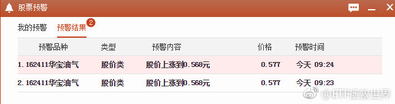

======================================================

ETF拯救世界 (5687069307) @
2017-11-02 09:33:56 Thu  
url: https://weibo.com/5687069307/FtbPNxCwT

我不信GJD会看着两融继续往上冲。

XG下去了，LSY这么聪明，能不吸取教训吗。 ​​​

转发[5]  评论[34]  赞[82] 

======================================================

ETF拯救世界 (5687069307) @
2017-11-02 09:38:22 Thu  
url: https://weibo.com/5687069307/FtbRBet7A

4不4要加一车呢。 ​​​

转发[2]  评论[131]  赞[156] 

======================================================

ETF拯救世界 (5687069307) @
2017-11-02 10:24:10 Thu  
url: https://weibo.com/5687069307/FtcabFHGO

券商继续跪，两融不停加。冰与火的世界。分歧很大啊。 ​​​

转发[40]  评论[37]  赞[87] 

======================================================

ETF拯救世界 (5687069307) @
2017-11-02 10:29:30 Thu  
url: https://weibo.com/5687069307/Ftccm9SmX

回复@xDBA顾德吴:我的观点是，券商并不是券商，不能去分析券商的估值。券商就是牛熊市。高弹性的“大盘指数”。我会买，但是会在接近底部区域，左侧右侧都有可能。但不是现在。//@xDBA顾德吴:大e胸，证券etf干不干？

------------------------------------------------------
转推：
>  @ETF拯救世界 (5687069307)
>  2017-11-02 10:24:10 Thu  
>  url: https:/weibo.com/5687069307/FtcabFHGO/

>  券商继续跪，两融不停加。冰与火的世界。分歧很大啊。 ​​​

转发[32]  评论[50]  赞[103] 

======================================================

ETF拯救世界 (5687069307) @
2017-11-02 13:42:42 Thu  
url: https://weibo.com/5687069307/FtdsM8ozo

滴~~~~~~~~ ​​​

转发[7]  评论[210]  赞[186] 

======================================================

ETF拯救世界 (5687069307) @
2017-11-02 14:27:23 Thu  
url: https://weibo.com/5687069307/FtdKUtE0L

目前仓位已经非常合适。除非有较明显下跌，否则应该不会再买。

涨也好，跌也好。踏踏实实看戏了。 ​​​

转发[8]  评论[130]  赞[203] 

======================================================

ETF拯救世界 (5687069307) @
2017-11-02 21:43:47 Thu  
url: https://weibo.com/5687069307/FtgC30Hb7

每日打卡（105）

坚持。 ​​​

转发[1]  评论[32]  赞[122] 

+++++++++++++++++++++++++++++++++++++++++++++++++++++

图片：

======================================================

ETF拯救世界 (5687069307) @
2017-11-03 09:55:51 Fri  
url: https://weibo.com/5687069307/Ftlpc8C4F

从我的体系看，昨天A股（注意，我说的是A股全体，不是那两三百只涨得好的）正式进入2015年以来价值回归的下半场。

这一路走来，各种因素干扰，真的不容易。

如果这一次有机会回到谷底，那就是再一次资产飞跃的时候。也是2012年底以来，第一次大机会。

未来的路不会好走，也许会有惊涛骇浪。不过各位 ​​​

转发[123]  评论[224]  赞[329] 

======================================================

ETF拯救世界 (5687069307) @
2017-11-03 10:46:57 Fri  
url: https://weibo.com/5687069307/FtlJWnZsS

谢谢昨天打赏请我喝咖啡的朋友。

今天北京特别冷，晒着太阳喝着热咖啡真的舒服，谢谢！ ​​​

转发[4]  评论[63]  赞[194] 

+++++++++++++++++++++++++++++++++++++++++++++++++++++

图片：
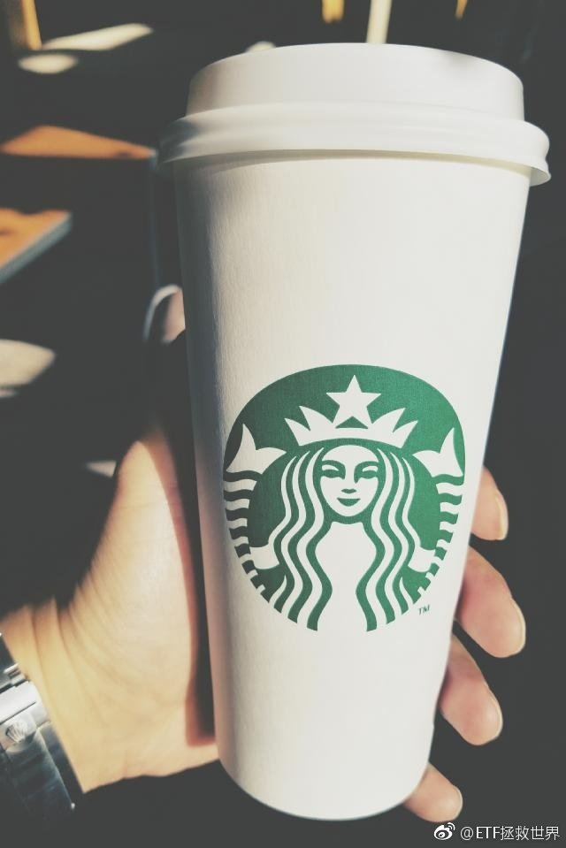

======================================================

ETF拯救世界 (5687069307) @
2017-11-03 11:43:25 Fri  
url: https://weibo.com/5687069307/Ftm6QsyIJ

就是轮回，没什么新鲜的。该发生的一定会发生。

低买高卖，一轮轮，一次次。就是这么简单。 ​​​

转发[11]  评论[33]  赞[158] 

======================================================

ETF拯救世界 (5687069307) @
2017-11-03 11:53:49 Fri  
url: https://weibo.com/5687069307/Ftmb5b9Dd

回复@几乎不上:答案非常简单。就两个字：概率。你可以去研究一下计划的A股部分仓位。以及最近我们加仓的品种，所有品种，归一下类。归根结底是概率二字。

------------------------------------------------------
转推：
>  @ETF拯救世界 (5687069307)
>  2017-11-03 09:55:51 Fri  
>  url: https:/weibo.com/5687069307/Ftlpc8C4F/

>  从我的体系看，昨天A股（注意，我说的是A股全体，不是那两三百只涨得好的）正式进入2015年以来价值回归的下半场。
>  
>  这一路走来，各种因素干扰，真的不容易。
>  
>  如果这一次有机会回到谷底，那就是再一次资产飞跃的时候。也是2012年底以来，第一次大机会。
>  
>  未来的路不会好走，也许会有惊涛骇浪。不过各位 ​​​

转发[9]  评论[12]  赞[81] 

======================================================

ETF拯救世界 (5687069307) @
2017-11-03 11:57:26 Fri  
url: https://weibo.com/5687069307/FtmcxAgUn

看看仓位，真的舒服。朋友们，安详，温暖。

PEACE！ ​​​

转发[98]  评论[58]  赞[160] 

======================================================

ETF拯救世界 (5687069307) @
2017-11-03 12:48:31 Fri  
url: https://weibo.com/5687069307/FtmxhBxRa

回复@高级装逼师:个股不仅是会不会退市的问题。最关键的，你能确定牛市你的股票涨吗。赚了指数不赚钱的事情可不是少数。//@高级装逼师:给老婆已经打了预防针了，最多浮亏50%，毫无压力。永不退市，怕啥子，个股无法这么冷静

------------------------------------------------------
转推：
>  @ETF拯救世界 (5687069307)
>  2017-11-03 11:57:26 Fri  
>  url: https:/weibo.com/5687069307/FtmcxAgUn/

>  看看仓位，真的舒服。朋友们，安详，温暖。
>  
>  PEACE！ ​​​

转发[91]  评论[22]  赞[89] 

======================================================

ETF拯救世界 (5687069307) @
2017-11-03 13:19:02 Fri  
url: https://weibo.com/5687069307/FtmJFgGYu

回复@请输入昵称_昵称:不可能。中证500极限大致是4500点，最多下跌30%。医药极限7500点，25%。大盘指数更是有人护盘，不会那么多。上面两个点位如果真的能到，我会融资买入。人生能有几回搏。//@请输入昵称_昵称:年底钱紧啦！该调整一波了吗？真希望跌倒一千点[嘻嘻]

------------------------------------------------------
转推：
>  @ETF拯救世界 (5687069307)
>  2017-11-03 11:57:26 Fri  
>  url: https:/weibo.com/5687069307/FtmcxAgUn/

>  看看仓位，真的舒服。朋友们，安详，温暖。
>  
>  PEACE！ ​​​

转发[84]  评论[50]  赞[112] 

======================================================

ETF拯救世界 (5687069307) @
2017-11-03 13:31:23 Fri  
url: https://weibo.com/5687069307/FtmOGb5VF

指数好在哪呢。

好在只要金融市场不死，GJ没问题，你就敢越跌越买。因为早晚会涨，必然会。

股票，说真的，一般人，你敢？？？

行业变迁，企业兴衰。我看，股票真的跌下去，除了个别的一些真正大概率长青的公司，绝大部分公司恐怕很难全部身家押注。

即使敢，牛市来了，指数肯定涨。你押注的股票就 ​​​

转发[50]  评论[65]  赞[184] 

======================================================

ETF拯救世界 (5687069307) @
2017-11-03 13:37:00 Fri  
url: https://weibo.com/5687069307/FtmQYiVPa

回复@嘿红1:2005-2007，两年6倍。2008-2010，两年2倍。2012-2015，三年三倍。这就叫做资产飞跃。A股是个神奇的地方，是金矿。//@嘿红1:好好奇资产飞跃是什么样子的[思考]

------------------------------------------------------
转推：
>  @ETF拯救世界 (5687069307)
>  2017-11-03 09:55:51 Fri  
>  url: https:/weibo.com/5687069307/Ftlpc8C4F/

>  从我的体系看，昨天A股（注意，我说的是A股全体，不是那两三百只涨得好的）正式进入2015年以来价值回归的下半场。
>  
>  这一路走来，各种因素干扰，真的不容易。
>  
>  如果这一次有机会回到谷底，那就是再一次资产飞跃的时候。也是2012年底以来，第一次大机会。
>  
>  未来的路不会好走，也许会有惊涛骇浪。不过各位 ​​​

转发[26]  评论[62]  赞[121] 

======================================================

ETF拯救世界 (5687069307) @
2017-11-03 14:23:48 Fri  
url: https://weibo.com/5687069307/Ftn9XxpHy

回复@ETF是什么:不是这么算的。人家问什么叫飞跃，我是说这几次就叫飞跃//@ETF是什么:12年36倍，真是6//@ETF拯救世界:回复@嘿红1:2005-2007，两年6倍。2008-2010，两年2倍。2012-2015，三年三倍。这就叫做资产飞跃。A股是个神奇的地方，是金矿。//@嘿红1:好好奇资产飞跃是什么样子的[思考]

------------------------------------------------------
转推：
>  @ETF拯救世界 (5687069307)
>  2017-11-03 09:55:51 Fri  
>  url: https:/weibo.com/5687069307/Ftlpc8C4F/

>  从我的体系看，昨天A股（注意，我说的是A股全体，不是那两三百只涨得好的）正式进入2015年以来价值回归的下半场。
>  
>  这一路走来，各种因素干扰，真的不容易。
>  
>  如果这一次有机会回到谷底，那就是再一次资产飞跃的时候。也是2012年底以来，第一次大机会。
>  
>  未来的路不会好走，也许会有惊涛骇浪。不过各位 ​​​

转发[7]  评论[33]  赞[76] 

======================================================

ETF拯救世界 (5687069307) @
2017-11-03 15:29:30 Fri  
url: https://weibo.com/5687069307/FtnACwjiG

全市场外部数据加权2014年12月以来，首次跌破31。

总算看到希望了。 ​​​

转发[88]  评论[128]  赞[185] 

======================================================

ETF拯救世界 (5687069307) @
2017-11-03 15:41:49 Fri  
url: https://weibo.com/5687069307/FtnFCpRLs

对了，说一下，2012年11月底，是20.82。2008年10月底是15.96

------------------------------------------------------
转推：
>  @ETF拯救世界 (5687069307)
>  2017-11-03 15:29:30 Fri  
>  url: https:/weibo.com/5687069307/FtnACwjiG/

>  全市场外部数据加权2014年12月以来，首次跌破31。
>  
>  总算看到希望了。 ​​​

转发[46]  评论[83]  赞[139] 

======================================================

ETF拯救世界 (5687069307) @
2017-11-03 18:49:35 Fri  
url: https://weibo.com/5687069307/FtoTPFllH

回复@龙与天空之城:上证和沪深300还有规律？没了。人家让收在多少就多少啊。还好3000只中小股票他们不管//@龙与天空之城:e大，上证会再跌破3300不？

------------------------------------------------------
转推：
>  @ETF拯救世界 (5687069307)
>  2017-11-03 15:29:30 Fri  
>  url: https:/weibo.com/5687069307/FtnACwjiG/

>  全市场外部数据加权2014年12月以来，首次跌破31。
>  
>  总算看到希望了。 ​​​

转发[8]  评论[21]  赞[92] 

======================================================

ETF拯救世界 (5687069307) @
2017-11-03 19:48:40 Fri  
url: https://weibo.com/5687069307/FtphOApLS

利好 $中证环保 sh000827$ [doge]

------------------------------------------------------
转推：
>  @ ()
>  2017-11-03 19:07:13 Fri  
>  url: 

>  抱歉，作者已设置仅展示半年内微博，此微博已不可见。 ​​​

转发[6]  评论[58]  赞[103] 

======================================================

ETF拯救世界 (5687069307) @
2017-11-05 11:38:54 Sun  
url: https://weibo.com/5687069307/FtEW0oC8z

哪里报名？在线等。

------------------------------------------------------
转推：
>  @ ()
>  2017-11-05 11:37:30 Sun  
>  url: 

>  抱歉，此微博已被作者删除。查看帮助：http://t.cn/Rfd3rQV

转发[14]  评论[52]  赞[87] 

======================================================

ETF拯救世界 (5687069307) @
2017-11-05 11:40:09 Sun  
url: https://weibo.com/5687069307/FtEWwlIZS

不要停，请继续

------------------------------------------------------
转推：
>  @ ()
>  2017-11-05 11:35:21 Sun  
>  url: 

>  抱歉，此微博已被作者删除。查看帮助：http://t.cn/Rfd3rQV

转发[3]  评论[38]  赞[81] 

======================================================

ETF拯救世界 (5687069307) @
2017-11-05 19:31:51 Sun  
url: https://weibo.com/5687069307/FtI1Za7L2

这下骗子没法冒充我行骗了吧。 ​​​

转发[0]  评论[73]  赞[197] 

+++++++++++++++++++++++++++++++++++++++++++++++++++++

图片：
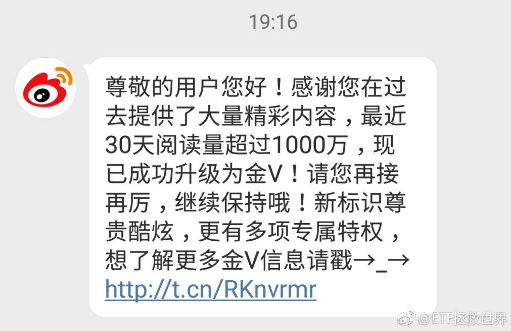

======================================================

ETF拯救世界 (5687069307) @
2017-11-05 19:54:58 Sun  
url: https://weibo.com/5687069307/FtIbni1SH

每日打卡（106）

其实这几天都运动了，忘了发微博了…… ​​​

转发[2]  评论[18]  赞[96] 

+++++++++++++++++++++++++++++++++++++++++++++++++++++

图片：

======================================================

ETF拯救世界 (5687069307) @
2017-11-05 20:52:34 Sun  
url: https://weibo.com/5687069307/FtIyKkMP6

回复@透明海湾:昨天的。最好不要没理由的怀疑我，因为我很讨厌说假话。一个谎言要用无数谎言去掩盖，很累，我没兴趣。 http://t.cn/RliIl55 //@透明海湾:不信，有数据证实吗？

------------------------------------------------------
转推：
>  @ETF拯救世界 (5687069307)
>  2017-11-05 19:54:58 Sun  
>  url: https:/weibo.com/5687069307/FtIbni1SH/

>  每日打卡（106）
>  
>  其实这几天都运动了，忘了发微博了…… ​​​

转发[1]  评论[50]  赞[83] 

======================================================

ETF拯救世界 (5687069307) @
2017-11-06 09:18:52 Mon  
url: https://weibo.com/5687069307/FtNrFzzmE

SPSIOP（油气的基准指数），从过去几年看，是能够与美油布油同步的。特点是弹性比油价要大很多。

这一轮弹性确实差了点。接下来要不然就是油价回来，要不然就是SPSIOP跟上。谁知道呢，看着呗。

不过还是那句话，别因为某个品种一时表现不好就否认它。今天的卢瑟可能就是明天的温拿。 ​​​

转发[13]  评论[49]  赞[118] 

+++++++++++++++++++++++++++++++++++++++++++++++++++++

图片：

======================================================

ETF拯救世界 (5687069307) @
2017-11-06 10:08:46 Mon  
url: https://weibo.com/5687069307/FtNLVE0oR

好久没见你嘚瑟了。甚念。

$全指医药 sh000991$ ​​​

转发[34]  评论[33]  赞[101] 

======================================================

ETF拯救世界 (5687069307) @
2017-11-06 10:28:47 Mon  
url: https://weibo.com/5687069307/FtNU3t4cB

其实这个阶段医药涨不了多少。某些时期，医药消费这样的股票嘚瑟，并不是什么太好的现象。拿着吧。以后会有好的时候的。

------------------------------------------------------
转推：
>  @ETF拯救世界 (5687069307)
>  2017-11-06 10:08:46 Mon  
>  url: https:/weibo.com/5687069307/FtNLVE0oR/

>  好久没见你嘚瑟了。甚念。
>  
>  $全指医药 sh000991$ ​​​

转发[5]  评论[59]  赞[103] 

======================================================

ETF拯救世界 (5687069307) @
2017-11-06 13:02:03 Mon  
url: https://weibo.com/5687069307/FtOUgyRQE

M头还是新高。琢磨不透你啊真是。

------------------------------------------------------
转推：
>  @ETF拯救世界 (5687069307)
>  2017-11-06 10:08:46 Mon  
>  url: https:/weibo.com/5687069307/FtNLVE0oR/

>  好久没见你嘚瑟了。甚念。
>  
>  $全指医药 sh000991$ ​​​

转发[26]  评论[25]  赞[68] 

======================================================

ETF拯救世界 (5687069307) @
2017-11-06 13:30:52 Mon  
url: https://weibo.com/5687069307/FtP5XmxAh

一根阳线干掉七天下跌。朋友们，长期持有的意义。慢慢你就真的明白了。//@ETF拯救世界:M头还是新高。琢磨不透你啊真是。

------------------------------------------------------
转推：
>  @ETF拯救世界 (5687069307)
>  2017-11-06 10:08:46 Mon  
>  url: https:/weibo.com/5687069307/FtNLVE0oR/

>  好久没见你嘚瑟了。甚念。
>  
>  $全指医药 sh000991$ ​​​

转发[24]  评论[36]  赞[91] 

======================================================

ETF拯救世界 (5687069307) @
2017-11-06 13:37:42 Mon  
url: https://weibo.com/5687069307/FtP8JCNmP

银行是不是被抛弃了。 ​​​

转发[4]  评论[70]  赞[104] 

======================================================

ETF拯救世界 (5687069307) @
2017-11-06 14:52:52 Mon  
url: https://weibo.com/5687069307/FtPDf5vvW

13000之前不考虑卖出。成本低，踏踏实实拿着就是坠吼的。能不能到无所谓。//@ETF拯救世界:一根阳线干掉七天下跌。朋友们，长期持有的意义。慢慢你就真的明白了。//@ETF拯救世界:M头还是新高。琢磨不透你啊真是。

------------------------------------------------------
转推：
>  @ETF拯救世界 (5687069307)
>  2017-11-06 10:08:46 Mon  
>  url: https:/weibo.com/5687069307/FtNLVE0oR/

>  好久没见你嘚瑟了。甚念。
>  
>  $全指医药 sh000991$ ​​​

转发[20]  评论[42]  赞[70] 

======================================================

ETF拯救世界 (5687069307) @
2017-11-06 15:09:24 Mon  
url: https://weibo.com/5687069307/FtPJXa6zW

回复@mydxkl:不过有时候我说话也很随意。没准以后12500就卖点也未可知。。//@mydxkl:[doge]记在小本子上//@ETF拯救世界:13000之前不考虑卖出。成本低，踏踏实实拿着就是坠吼的。能不能到无所谓。//@ETF拯救世界:一根阳线干掉七天下跌。朋友们，长期持有的意义。慢慢你就真的明白了。

------------------------------------------------------
转推：
>  @ETF拯救世界 (5687069307)
>  2017-11-06 10:08:46 Mon  
>  url: https:/weibo.com/5687069307/FtNLVE0oR/

>  好久没见你嘚瑟了。甚念。
>  
>  $全指医药 sh000991$ ​​​

转发[9]  评论[31]  赞[62] 

======================================================

ETF拯救世界 (5687069307) @
2017-11-06 15:38:27 Mon  
url: https://weibo.com/5687069307/FtPVKbRLD

又涨回去了。每次跌破31就回去。在这个位置真的有很强支撑啊。

------------------------------------------------------
转推：
>  @ETF拯救世界 (5687069307)
>  2017-11-03 15:29:30 Fri  
>  url: https:/weibo.com/5687069307/FtnACwjiG/

>  全市场外部数据加权2014年12月以来，首次跌破31。
>  
>  总算看到希望了。 ​​​

转发[11]  评论[66]  赞[115] 

======================================================

ETF拯救世界 (5687069307) @
2017-11-06 21:01:17 Mon  
url: https://weibo.com/5687069307/FtS2MsASm

每日打卡（107）

坚持 ​​​

转发[0]  评论[26]  赞[112] 

+++++++++++++++++++++++++++++++++++++++++++++++++++++

图片：

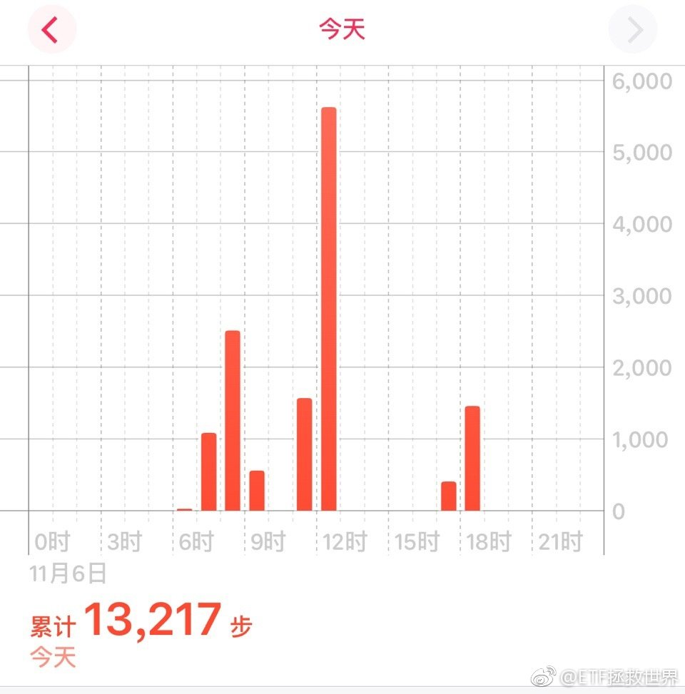

======================================================

ETF拯救世界 (5687069307) @
2017-11-07 04:59:31 Tue  
url: https://weibo.com/5687069307/FtVaTy2SW

[酷] 提款机名不虚传 ​​​

转发[13]  评论[117]  赞[186] 

+++++++++++++++++++++++++++++++++++++++++++++++++++++

图片：

======================================================

ETF拯救世界 (5687069307) @
2017-11-07 07:44:07 Tue  
url: https://weibo.com/5687069307/FtWfI6yFW

比我持仓成本低10%买入会赚很多的规律再次应验…… ​​​

转发[7]  评论[68]  赞[154] 

======================================================

ETF拯救世界 (5687069307) @
2017-11-07 08:40:17 Tue  
url: https://weibo.com/5687069307/FtWCv5mCk

你需要的是正确的“气质”(temperament)，你要有能力让自己不受他人看法左右。  讲真，想要赚钱就应该明白，别人的看法一点都不重要。尤其是大多数人一致的看法//@佐罗_厚恩投资:转发微博

------------------------------------------------------
转推：
>  @ ()
>  2017-11-06 23:37:26 Mon  
>  url: 

>  该账号因被投诉违反《微博社区公约》的相关规定，现已无法查看。查看帮助 https://kefu.weibo.com/faqdetail?id=13216

转发[32]  评论[30]  赞[101] 

======================================================

ETF拯救世界 (5687069307) @
2017-11-07 09:37:17 Tue  
url: https://weibo.com/5687069307/FtWZE471Z

$养老产业 sz399812$   今天轮到你了？ ​​​

转发[15]  评论[46]  赞[75] 

======================================================

ETF拯救世界 (5687069307) @
2017-11-07 09:54:22 Tue  
url: https://weibo.com/5687069307/FtX6zDHS1

回复@chelsea就这个:坚信传媒有一天会疯到爸妈都不认识。//@chelsea就这个:其实还是医药在涨，传媒就那样了

------------------------------------------------------
转推：
>  @ETF拯救世界 (5687069307)
>  2017-11-07 09:37:17 Tue  
>  url: https:/weibo.com/5687069307/FtWZE471Z/

>  $养老产业 sz399812$   今天轮到你了？ ​​​

转发[12]  评论[60]  赞[95] 

======================================================

ETF拯救世界 (5687069307) @
2017-11-07 13:32:45 Tue  
url: https://weibo.com/5687069307/FtYxe8Ic1

回复@沉着的好猎人:多谢晒！我会继续努力的！//@沉着的好猎人:好毒 够毒 真毒[嘻嘻]

------------------------------------------------------
转推：
>  @ETF拯救世界 (5687069307)
>  2017-11-07 09:37:17 Tue  
>  url: https:/weibo.com/5687069307/FtWZE471Z/

>  $养老产业 sz399812$   今天轮到你了？ ​​​

转发[0]  评论[38]  赞[82] 

======================================================

ETF拯救世界 (5687069307) @
2017-11-07 17:59:44 Tue  
url: https://weibo.com/5687069307/Fu0hAoMyx

抓了十几个，不敢放了。//@买买提X:啥意思，一会审核那么松，一会又那么严。还是把有问题的都集中审。

------------------------------------------------------
转推：
>  @摩尔金融 (5242156161)
>  2017-11-07 16:42:36 Tue  
>  url: https:/weibo.com/5242156161/FtZMhk5gK/

>  【IPO再次掀被否潮】2017年11月7日，今天三家主板IPO发审会，全部被否，成都尼毕鲁（摩根士丹利华鑫+金杜+安永华明）、云南神农农业产业集团（光大+金杜+中审众环）、山东玻纤集团（国信+国浩+山东和信），净利润均过亿 ​​​

转发[6]  评论[24]  赞[65] 

======================================================

ETF拯救世界 (5687069307) @
2017-11-07 20:58:37 Tue  
url: https://weibo.com/5687069307/Fu1scwzMe

荒野行动有没有高手带。试着玩了两天都是躲到最后被干掉……

------------------------------------------------------
转推：
>  @蓝鲸财经记者工作平台 (1885454921)
>  2017-11-07 20:45:46 Tue  
>  url: https:/weibo.com/1885454921/Fu1mYFzvu/

>  【鲸播报：争夺“大逃杀”】11月7日讯,尽管不曾挑明，早早抢先发布吃鸡手游的网易和小米，已认定这场“吃鸡狂欢”是弯道超车腾讯的机会。实际上，在10月拿到版号并在11月迅速上线后，网易《荒野行动》、《终结者2：审判日》与《小米枪战》已相继将腾讯的《王者荣耀》从App Store免费榜第一拉下。(界面) ​​​

转发[0]  评论[36]  赞[49] 

======================================================

ETF拯救世界 (5687069307) @
2017-11-07 22:10:01 Tue  
url: https://weibo.com/5687069307/Fu1Vb8q6Y

太可惜了，弹夹空了，没打死对方…… ​​​

转发[1]  评论[47]  赞[87] 

+++++++++++++++++++++++++++++++++++++++++++++++++++++

图片：
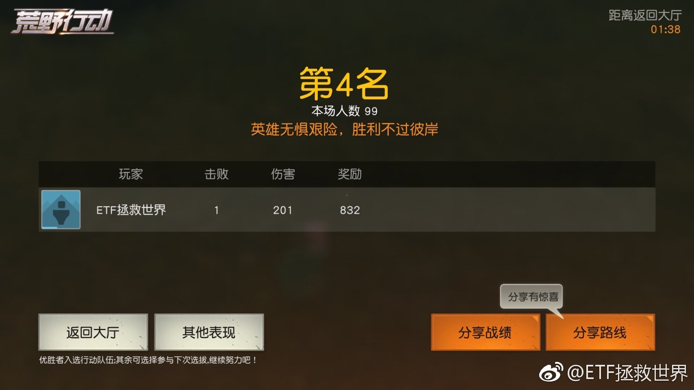

======================================================

ETF拯救世界 (5687069307) @
2017-11-07 22:43:16 Tue  
url: https://weibo.com/5687069307/Fu28FCDJy

每日打卡（108）

累，做完睡觉去了。 ​​​

转发[1]  评论[10]  赞[92] 

+++++++++++++++++++++++++++++++++++++++++++++++++++++

图片：

======================================================

ETF拯救世界 (5687069307) @
2017-11-08 09:16:43 Wed  
url: https://weibo.com/5687069307/Fu6hNcg7p

电子游戏啊，估计绝大多数男性都玩过吧。

从小就玩，最喜欢经营类游戏。玩到大学的时候，有空会给游戏杂志写稿子赚零花钱。后来做了个游戏网站，赚过美国寄过来的广告支票。后来网站卖给一个曾经的大网站了，现在该大网站已经倒了。这可能是我的“第一桶金”，其实不太多，不过对于一个20岁出头的年轻 ​​​

转发[11]  评论[107]  赞[163] 

======================================================

ETF拯救世界 (5687069307) @
2017-11-08 09:45:35 Wed  
url: https://weibo.com/5687069307/Fu6tva8CE

两融再次突破万亿。上次在一万亿以上是2016年1月14日。

几个时间节点。

最高点事2015年6月17日的22620。另一个节点是2015年12月31日的11742。也就是说，现在已经无限接近熔断前的数据了。

系好安全带，看赌徒疯吧。 ​​​

转发[45]  评论[86]  赞[137] 

======================================================

ETF拯救世界 (5687069307) @
2017-11-08 09:57:04 Wed  
url: https://weibo.com/5687069307/Fu6ya9gkl

$中证环保 sh000827$   奶一下不犯法吧。 ​​​

转发[0]  评论[24]  赞[84] 

======================================================

ETF拯救世界 (5687069307) @
2017-11-08 10:03:31 Wed  
url: https://weibo.com/5687069307/Fu6AMEZXr

$中证传媒 sz399971$   是不是被监控了。//@ETF拯救世界:回复@chelsea就这个:坚信传媒有一天会疯到爸妈都不认识。//@chelsea就这个:其实还是医药在涨，传媒就那样了

------------------------------------------------------
转推：
>  @ETF拯救世界 (5687069307)
>  2017-11-07 09:37:17 Tue  
>  url: https:/weibo.com/5687069307/FtWZE471Z/

>  $养老产业 sz399812$   今天轮到你了？ ​​​

转发[0]  评论[37]  赞[60] 

======================================================

ETF拯救世界 (5687069307) @
2017-11-08 10:23:07 Wed  
url: https://weibo.com/5687069307/Fu6IK9Q3l

$养老产业 sz399812$   新高。拿住了。踏踏实实的。 ​​​

转发[4]  评论[64]  赞[108] 

======================================================

ETF拯救世界 (5687069307) @
2017-11-08 11:34:55 Wed  
url: https://weibo.com/5687069307/Fu7bSsWbL

刚才看了看，计划部分A+港股的仓位已经有接近40%。如果各位自己也买一些其他的，仓位已经不算低了。

仓位呢，舒服最重要。也不要太着急下车，有人送钱你就多呆一会。不急。 ​​​

转发[11]  评论[60]  赞[149] 

======================================================

ETF拯救世界 (5687069307) @
2017-11-08 14:33:57 Wed  
url: https://weibo.com/5687069307/Fu8myqauk

非常明智。砸一砸。否则情绪起来了，就再也控制不住了。高手在操盘。不过有没有用，不好说。毕竟鱼七秒。

------------------------------------------------------
转推：
>  @ETF拯救世界 (5687069307)
>  2017-11-08 09:45:35 Wed  
>  url: https:/weibo.com/5687069307/Fu6tva8CE/

>  两融再次突破万亿。上次在一万亿以上是2016年1月14日。
>  
>  几个时间节点。
>  
>  最高点事2015年6月17日的22620。另一个节点是2015年12月31日的11742。也就是说，现在已经无限接近熔断前的数据了。
>  
>  系好安全带，看赌徒疯吧。 ​​​

转发[9]  评论[36]  赞[96] 

======================================================

ETF拯救世界 (5687069307) @
2017-11-08 14:42:33 Wed  
url: https://weibo.com/5687069307/Fu8q34Roz

回复@吉利可爱:送个明牌给你，01918，据说要涨到8848。一个谣言，不一定对。[doge]//@吉利可爱:有无可能出现翻倍呢？现在涨个百分之几十不过瘾

------------------------------------------------------
转推：
>  @ETF拯救世界 (5687069307)
>  2017-11-08 11:34:55 Wed  
>  url: https:/weibo.com/5687069307/Fu7bSsWbL/

>  刚才看了看，计划部分A+港股的仓位已经有接近40%。如果各位自己也买一些其他的，仓位已经不算低了。
>  
>  仓位呢，舒服最重要。也不要太着急下车，有人送钱你就多呆一会。不急。 ​​​

转发[5]  评论[68]  赞[91] 

======================================================

ETF拯救世界 (5687069307) @
2017-11-09 13:33:51 Thu  
url: https://weibo.com/5687069307/FuhoEEQcC

一天发行100亿限购基金这个事情，已经作为标志性事件被我收到印象笔记了。 ​​​

转发[19]  评论[66]  赞[128] 

======================================================

ETF拯救世界 (5687069307) @
2017-11-09 13:44:04 Thu  
url: https://weibo.com/5687069307/FuhsO5nRA

因为这只是个别现象，和07年还是有区别。我感兴趣的是，这个基金经理之前业绩不错，募集这么多钱，之后表现会如何。现在因为业绩好买的人收益率会怎么样。

------------------------------------------------------
转推：
>  @ETF拯救世界 (5687069307)
>  2017-11-09 13:33:51 Thu  
>  url: https:/weibo.com/5687069307/FuhoEEQcC/

>  一天发行100亿限购基金这个事情，已经作为标志性事件被我收到印象笔记了。 ​​​

转发[8]  评论[28]  赞[72] 

======================================================

ETF拯救世界 (5687069307) @
2017-11-09 14:08:56 Thu  
url: https://weibo.com/5687069307/FuhCTztv1

雪球深圳嘉年华我有50张票，有人要去吗。要去的跟我说啊。送票。 ​​​

转发[9]  评论[123]  赞[92] 

======================================================

ETF拯救世界 (5687069307) @
2017-11-09 14:15:39 Thu  
url: https://weibo.com/5687069307/FuhFCANdN

留言要去的我会发个领票链接。每个人一张，自觉点啊。别多领~~留点机会给别人~

------------------------------------------------------
转推：
>  @ETF拯救世界 (5687069307)
>  2017-11-09 14:08:56 Thu  
>  url: https:/weibo.com/5687069307/FuhCTztv1/

>  雪球深圳嘉年华我有50张票，有人要去吗。要去的跟我说啊。送票。 ​​​

转发[1]  评论[78]  赞[79] 

======================================================

ETF拯救世界 (5687069307) @
2017-11-09 14:35:27 Thu  
url: https://weibo.com/5687069307/FuhNF9OhN

相信我没错的。[并不简单]

------------------------------------------------------
转推：
>  @ETF拯救世界 (5687069307)
>  2017-11-08 10:23:07 Wed  
>  url: https:/weibo.com/5687069307/Fu6IK9Q3l/

>  $养老产业 sz399812$   新高。拿住了。踏踏实实的。 ​​​

转发[0]  评论[42]  赞[116] 

======================================================

ETF拯救世界 (5687069307) @
2017-11-09 15:02:17 Thu  
url: https://weibo.com/5687069307/FuhYykXue

前两天买的500+环保又是几个点了吧。 ​​​

转发[1]  评论[62]  赞[143] 

======================================================

ETF拯救世界 (5687069307) @
2017-11-09 15:04:23 Thu  
url: https://weibo.com/5687069307/FuhZpervw

好了，刚才要的我都私信了。我看还有10张，赠票链接是这里，谁要就抢吧。抢完就没了。

------------------------------------------------------
转推：
>  @ETF拯救世界 (5687069307)
>  2017-11-09 14:08:56 Thu  
>  url: https:/weibo.com/5687069307/FuhCTztv1/

>  雪球深圳嘉年华我有50张票，有人要去吗。要去的跟我说啊。送票。 ​​​

转发[1]  评论[52]  赞[87] 

======================================================

ETF拯救世界 (5687069307) @
2017-11-10 10:08:12 Fri  
url: https://weibo.com/5687069307/FuptGjFq3

$中证环保 sh000827$  是不是又买在阶段低点了 ​​​

转发[2]  评论[63]  赞[147] 

======================================================

ETF拯救世界 (5687069307) @
2017-11-10 11:12:46 Fri  
url: https://weibo.com/5687069307/FupTTeMuT

又新高了。听我的，拿住了。不要卖。

------------------------------------------------------
转推：
>  @ETF拯救世界 (5687069307)
>  2017-11-08 10:23:07 Wed  
>  url: https:/weibo.com/5687069307/Fu6IK9Q3l/

>  $养老产业 sz399812$   新高。拿住了。踏踏实实的。 ​​​

转发[0]  评论[81]  赞[134] 

======================================================

ETF拯救世界 (5687069307) @
2017-11-10 13:37:38 Fri  
url: https://weibo.com/5687069307/FuqQH0imb

$中证环保 sh000827$   新高。不要动。踏踏实实拿着。 ​​​

转发[4]  评论[30]  赞[94] 

======================================================

ETF拯救世界 (5687069307) @
2017-11-10 13:42:18 Fri  
url: https://weibo.com/5687069307/FuqSzFn5I

你肯定想不到今天有1800只股票是下跌的。。。只有1400只上涨。。。 ​​​

转发[3]  评论[50]  赞[122] 

======================================================

ETF拯救世界 (5687069307) @
2017-11-10 14:10:41 Fri  
url: https://weibo.com/5687069307/Fur46vaTr

今天养老涨幅贡献前十位。 ​​​

转发[4]  评论[28]  赞[118] 

+++++++++++++++++++++++++++++++++++++++++++++++++++++

图片：

======================================================

ETF拯救世界 (5687069307) @
2017-11-10 14:15:06 Fri  
url: https://weibo.com/5687069307/Fur5TDg7w

银行真的是拼了命的砸了。兴业现在获利筹码只剩27%了。。 ​​​

转发[6]  评论[90]  赞[143] 

======================================================

ETF拯救世界 (5687069307) @
2017-11-10 21:09:37 Fri  
url: https://weibo.com/5687069307/FutO9kxqr

每日打卡（109）

又有两天忘了打卡了。一直在坚持。 ​​​

转发[0]  评论[39]  赞[135] 

+++++++++++++++++++++++++++++++++++++++++++++++++++++

图片：

======================================================

ETF拯救世界 (5687069307) @
2017-11-12 20:22:26 Sun  
url: https://weibo.com/5687069307/FuMlZrl45

每日打卡（110）

坚持。双十一买的至少一半东西都不是真正需要的吧。 ​​​

转发[1]  评论[74]  赞[109] 

+++++++++++++++++++++++++++++++++++++++++++++++++++++

图片：
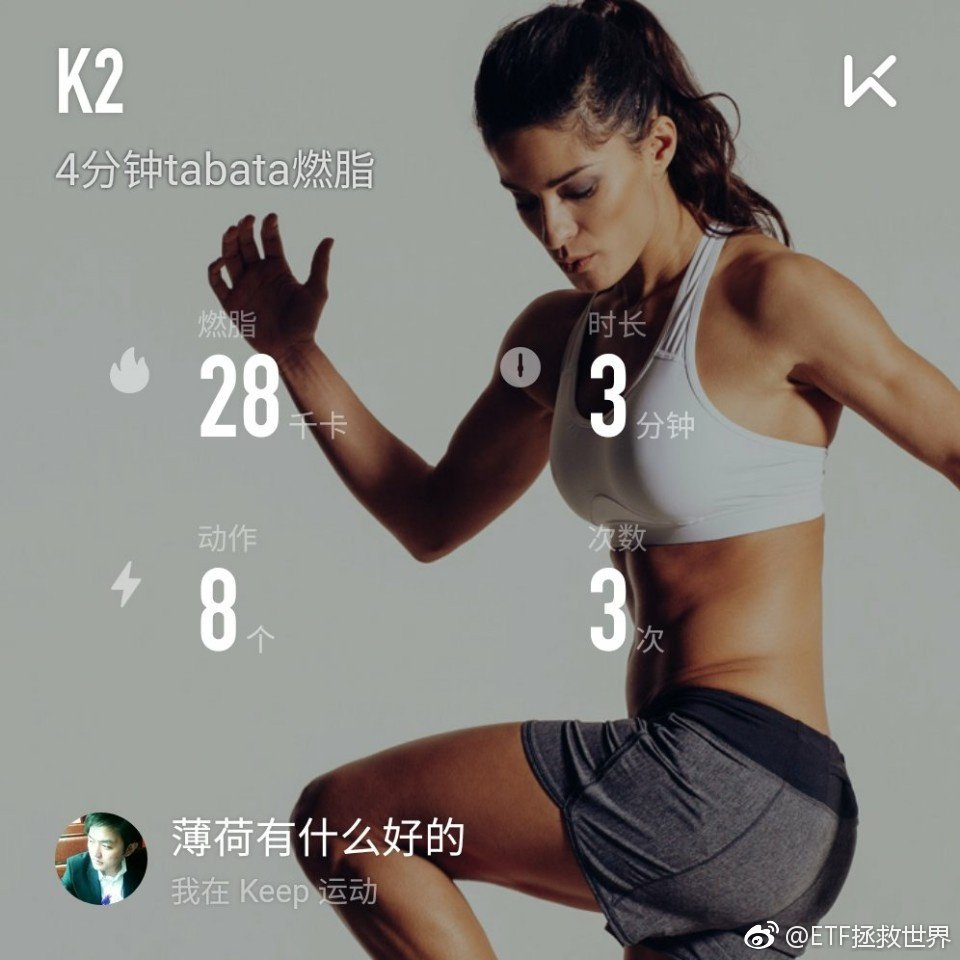

======================================================

ETF拯救世界 (5687069307) @
2017-11-13 09:51:07 Mon  
url: https://weibo.com/5687069307/FuREeBb7L

$恒生指数 hkHSI$  加油。 ​​​

转发[0]  评论[28]  赞[85] 

======================================================

ETF拯救世界 (5687069307) @
2017-11-13 10:18:33 Mon  
url: https://weibo.com/5687069307/FuRPmxjJn

红红火火的指数，又是2000家下跌…… ​​​

转发[0]  评论[25]  赞[86] 

======================================================

ETF拯救世界 (5687069307) @
2017-11-13 10:21:41 Mon  
url: https://weibo.com/5687069307/FuRQE75CN

这是最好的时代，也是最坏的时代 ​​​

转发[10]  评论[53]  赞[120] 

+++++++++++++++++++++++++++++++++++++++++++++++++++++

图片：

======================================================

ETF拯救世界 (5687069307) @
2017-11-13 10:44:48 Mon  
url: https://weibo.com/5687069307/FuS02bRxR

你别看2000家下跌，创业板和中小板指涨得可不错。 ​​​

转发[9]  评论[17]  赞[80] 

======================================================

ETF拯救世界 (5687069307) @
2017-11-13 10:47:39 Mon  
url: https://weibo.com/5687069307/FuS1bp9Xe

提醒一下，这条带狗头了啊！//@ETF拯救世界:回复@吉利可爱:送个明牌给你，01918，据说要涨到8848。一个谣言，不一定对。[doge]//@吉利可爱:有无可能出现翻倍呢？现在涨个百分之几十不过瘾

------------------------------------------------------
转推：
>  @ETF拯救世界 (5687069307)
>  2017-11-08 11:34:55 Wed  
>  url: https:/weibo.com/5687069307/Fu7bSsWbL/

>  刚才看了看，计划部分A+港股的仓位已经有接近40%。如果各位自己也买一些其他的，仓位已经不算低了。
>  
>  仓位呢，舒服最重要。也不要太着急下车，有人送钱你就多呆一会。不急。 ​​​

转发[1]  评论[31]  赞[68] 

======================================================

ETF拯救世界 (5687069307) @
2017-11-13 11:10:43 Mon  
url: https://weibo.com/5687069307/FuSay3rpT

国债个券，一年时间，惨不忍睹。

不知道有没有机会见6字头。如果有，几年够吃了。 ​​​

转发[38]  评论[60]  赞[109] 

+++++++++++++++++++++++++++++++++++++++++++++++++++++

图片：

======================================================

ETF拯救世界 (5687069307) @
2017-11-13 11:16:14 Mon  
url: https://weibo.com/5687069307/FuScNcZFW

未必。这个图是标普500和罗素2000（相当于中证500）的走势对比。可以看出2000比标普500强很多。最近A股这种只有100多家大涨特涨是极不正常的。 http://t.cn/RjyY8oL 

------------------------------------------------------
转推：
>  @ETF拯救世界 (5687069307)
>  2017-11-13 10:44:48 Mon  
>  url: https:/weibo.com/5687069307/FuS02bRxR/

>  你别看2000家下跌，创业板和中小板指涨得可不错。 ​​​

转发[3]  评论[12]  赞[60] 

======================================================

ETF拯救世界 (5687069307) @
2017-11-13 11:17:41 Mon  
url: https://weibo.com/5687069307/FuSdnhniL

回复@elktwo:（100-60）/60=老铁双击66.66%。不加杠杆的情况下。//@elktwo:贫穷限制了我的想象力，谁能告诉我大概有多少收益[二哈]

------------------------------------------------------
转推：
>  @ETF拯救世界 (5687069307)
>  2017-11-13 11:10:43 Mon  
>  url: https:/weibo.com/5687069307/FuSay3rpT/

>  国债个券，一年时间，惨不忍睹。
>  
>  不知道有没有机会见6字头。如果有，几年够吃了。 ​​​

转发[22]  评论[36]  赞[71] 

======================================================

ETF拯救世界 (5687069307) @
2017-11-13 11:22:52 Mon  
url: https://weibo.com/5687069307/FuSftCgei

其实一直以来沪深300走势都没有中证500好，这一轮的转折点出现在今年5月。

也就是说，300走得比500好，也就半年而已。然而所有人都认为“价值投资进入了一个新阶段”。

P新阶段，风格轮换而已。以前不断的发生，未来还会发生。无论是中国美国都是如此。

第二张图是罗素2000与标普500的对比。美国也 ​​​

转发[42]  评论[67]  赞[127] 

+++++++++++++++++++++++++++++++++++++++++++++++++++++

图片：
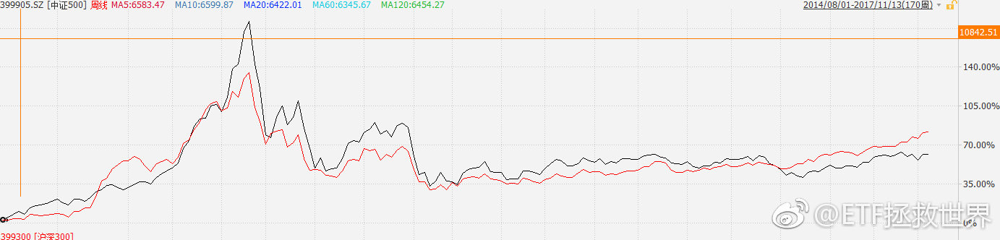
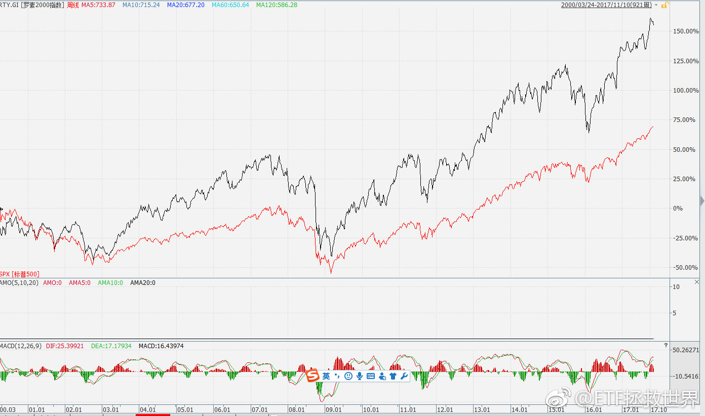

======================================================

ETF拯救世界 (5687069307) @
2017-11-13 11:30:47 Mon  
url: https://weibo.com/5687069307/FuSiH2AYY

回复@李贤1985_319:是的。多长时间会回到100很重要。如果30年回去，也就4.x收益率。一年回去，就一年赚这么多。不懂别瞎买个券，切切。//@李贤1985_319:16国债19，票息3.27，30年,现价81.73，相当于票息4.0了。[哈哈]//@ETF拯救世界:回复@elktwo:（100-60）/60=老铁双击66.66%。不加杠杆的情况下。

------------------------------------------------------
转推：
>  @ETF拯救世界 (5687069307)
>  2017-11-13 11:10:43 Mon  
>  url: https:/weibo.com/5687069307/FuSay3rpT/

>  国债个券，一年时间，惨不忍睹。
>  
>  不知道有没有机会见6字头。如果有，几年够吃了。 ​​​

转发[9]  评论[42]  赞[78] 

======================================================

ETF拯救世界 (5687069307) @
2017-11-13 14:59:30 Mon  
url: https://weibo.com/5687069307/FuTFpn04P

$中证环保 sh000827$  悠着点好吗。 ​​​

转发[26]  评论[27]  赞[80] 

======================================================

ETF拯救世界 (5687069307) @
2017-11-13 15:01:40 Mon  
url: https://weibo.com/5687069307/FuTGi5Dfk

回复@林海小涛:停了一下，我们就蹭上去了。蹭在次低点的一天。//@林海小涛:停不下来的感觉！

------------------------------------------------------
转推：
>  @ETF拯救世界 (5687069307)
>  2017-11-13 14:59:30 Mon  
>  url: https:/weibo.com/5687069307/FuTFpn04P/

>  $中证环保 sh000827$  悠着点好吗。 ​​​

转发[22]  评论[23]  赞[76] 

======================================================

ETF拯救世界 (5687069307) @
2017-11-13 15:55:55 Mon  
url: https://weibo.com/5687069307/FuU2jgXKU

回复@樱红一点2011:现在可以说已经到4了//@樱红一点2011:E大10月16日说的，这么快。 未来债券配置路线图：  4-4.5会配置到大概10%-15%。 4.5-5会配置到15-20。  如果可以到5以上，会配置到30%——而且是30%杠杆债基。  07年底我重仓配置债券的时候，十年期国债收益率也只是4.8而已。 ​​​

------------------------------------------------------
转推：
>  @ETF拯救世界 (5687069307)
>  2017-11-13 14:59:30 Mon  
>  url: https:/weibo.com/5687069307/FuTFpn04P/

>  $中证环保 sh000827$  悠着点好吗。 ​​​

转发[21]  评论[66]  赞[104] 

======================================================

ETF拯救世界 (5687069307) @
2017-11-14 09:25:03 Tue  
url: https://weibo.com/5687069307/Fv0U9v7KI

前两天买了个群晖的NAS，昨天到货。试用了一下，真的不错。

以前用的云盘，360好用。前两年挂了，现在只剩百度云盘了。感觉还是用自己的私有云踏实一点。

科技改变生活啊。 ​​​

转发[11]  评论[95]  赞[106] 

======================================================

ETF拯救世界 (5687069307) @
2017-11-14 09:48:24 Tue  
url: https://weibo.com/5687069307/Fv13CyAE2

回复@forhonor1225:不是就进去，是开始进。区别大了。买到现在才6%，这6%浮亏不到1%。没人能买到最低。几个月后4.5%的时候，也会有人说我4%进早了的。//@forhonor1225:你3.6的时候就进去，早了点吧//@ETF拯救世界:回复@樱红一点2011:现在可以说已经到4了

------------------------------------------------------
转推：
>  @ETF拯救世界 (5687069307)
>  2017-11-13 14:59:30 Mon  
>  url: https:/weibo.com/5687069307/FuTFpn04P/

>  $中证环保 sh000827$  悠着点好吗。 ​​​

转发[3]  评论[26]  赞[66] 

======================================================

ETF拯救世界 (5687069307) @
2017-11-14 09:54:28 Tue  
url: https://weibo.com/5687069307/Fv166fsrC

可能很多人还不明白概率与配置资产的关系，总是会幻想所有钱一把梭哈在最低。

我的理念不是这样的。

国债这一轮收益率最低在16年10月的2.6%。那个位置我认为毫无配置价值。

跌到3.5%，我认为有一定配置价值，所以给它1%的仓位。因为那个位置，收益率虽然不够高，但是已经脱离极低的区域，给1%就是可 ​​​

转发[95]  评论[124]  赞[201] 

======================================================

ETF拯救世界 (5687069307) @
2017-11-14 10:03:14 Tue  
url: https://weibo.com/5687069307/Fv19EqB7f

真的带狗头了啊！//@ETF拯救世界:提醒一下，这条带狗头了啊！//@ETF拯救世界:回复@吉利可爱:送个明牌给你，01918，据说要涨到8848。一个谣言，不一定对。[doge]//@吉利可爱:有无可能出现翻倍呢？现在涨个百分之几十不过瘾

------------------------------------------------------
转推：
>  @ETF拯救世界 (5687069307)
>  2017-11-08 11:34:55 Wed  
>  url: https:/weibo.com/5687069307/Fu7bSsWbL/

>  刚才看了看，计划部分A+港股的仓位已经有接近40%。如果各位自己也买一些其他的，仓位已经不算低了。
>  
>  仓位呢，舒服最重要。也不要太着急下车，有人送钱你就多呆一会。不急。 ​​​

转发[0]  评论[12]  赞[50] 

======================================================

ETF拯救世界 (5687069307) @
2017-11-14 10:06:43 Tue  
url: https://weibo.com/5687069307/Fv1b4aBW0

回复@窝子面串串香:是。必须质疑我我才会发干货。但是这个质疑的度很难拿捏。力度大了就拉黑了。。//@窝子面串串香:哈哈，喜欢看E大的解释，这样我们可以多学一点知识[可爱][可爱]

------------------------------------------------------
转推：
>  @ETF拯救世界 (5687069307)
>  2017-11-14 09:54:28 Tue  
>  url: https:/weibo.com/5687069307/Fv166fsrC/

>  可能很多人还不明白概率与配置资产的关系，总是会幻想所有钱一把梭哈在最低。
>  
>  我的理念不是这样的。
>  
>  国债这一轮收益率最低在16年10月的2.6%。那个位置我认为毫无配置价值。
>  
>  跌到3.5%，我认为有一定配置价值，所以给它1%的仓位。因为那个位置，收益率虽然不够高，但是已经脱离极低的区域，给1%就是可 ​​​

转发[8]  评论[38]  赞[81] 

======================================================

ETF拯救世界 (5687069307) @
2017-11-14 10:23:42 Tue  
url: https://weibo.com/5687069307/Fv1hXqy8H

其实有些股票，极具庄股特征。绝大多数筹码被锁定了，然后随便干。

不知道会是怎样的结局。 ​​​

转发[4]  评论[55]  赞[107] 

======================================================

ETF拯救世界 (5687069307) @
2017-11-14 11:16:16 Tue  
url: https://weibo.com/5687069307/Fv1DiE9jj

扣除原来汇金就持有的国有银行股权，估计有一万多亿是2015年后买的。

------------------------------------------------------
转推：
>  @ ()
>  2017-11-14 11:14:45 Tue  
>  url: 

>  抱歉，作者已设置仅展示半年内微博，此微博已不可见。 ​​​

转发[19]  评论[17]  赞[62] 

======================================================

ETF拯救世界 (5687069307) @
2017-11-14 11:21:50 Tue  
url: https://weibo.com/5687069307/Fv1Fyqlxr

“涨跌都舒服”这个度不容易拿捏。

只有很少人可以做到。大多数人只是涨了舒服，或者跌了舒服。更有人涨跌都不舒服。

一个想法，可能有点对。 ​​​

转发[11]  评论[72]  赞[158] 

======================================================

ETF拯救世界 (5687069307) @
2017-11-14 11:59:26 Tue  
url: https://weibo.com/5687069307/Fv1UPbPoF

回复@梦之彼方2082:我粗浅的分析，未来这部分会想办法转给社保基金。最终还是全民得利。基本是割了有钱炒股的（伪）中产阶级韭菜，反哺全体人民（主要是贫困阶层受益）。//@梦之彼方2082:各个领域与民争利，为啥不分点红呢？[喵喵]

------------------------------------------------------
转推：
>  @ ()
>  2017-11-14 11:14:45 Tue  
>  url: 

>  抱歉，作者已设置仅展示半年内微博，此微博已不可见。 ​​​

转发[6]  评论[32]  赞[80] 

======================================================

ETF拯救世界 (5687069307) @
2017-11-14 13:09:01 Tue  
url: https://weibo.com/5687069307/Fv2n3FPqB

朋友们，party正式开始了。

先看到4.5。 ​​​

转发[35]  评论[238]  赞[204] 

+++++++++++++++++++++++++++++++++++++++++++++++++++++

图片：
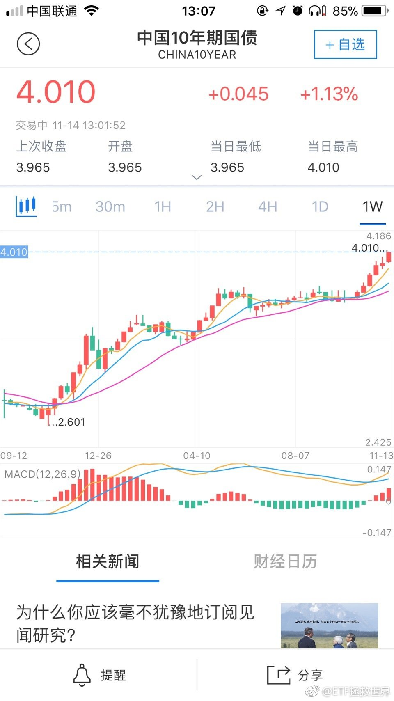

======================================================

ETF拯救世界 (5687069307) @
2017-11-14 14:13:46 Tue  
url: https://weibo.com/5687069307/Fv2NliDu4

有个坏消息告诉大家。

今天不能新高了。[并不简单] ​​​

转发[7]  评论[112]  赞[169] 

======================================================

ETF拯救世界 (5687069307) @
2017-11-14 16:32:27 Tue  
url: https://weibo.com/5687069307/Fv3HDmmFv

回复@hxyjlgdx:没搞错吧。这两个一个浮亏0.25%，一个浮盈0.43%。跌的好厉害从何而来？算不算造谣。//@hxyjlgdx:回复@glay_lee:之前跟车的广发纯债和博时信用债跌得好厉害[泪][泪][泪]

------------------------------------------------------
转推：
>  @ETF拯救世界 (5687069307)
>  2017-11-14 13:09:01 Tue  
>  url: https:/weibo.com/5687069307/Fv2n3FPqB/

>  朋友们，party正式开始了。
>  
>  先看到4.5。 ​​​

转发[5]  评论[98]  赞[83] 

======================================================

ETF拯救世界 (5687069307) @
2017-11-14 21:09:24 Tue  
url: https://weibo.com/5687069307/Fv5w3bvFF

一言不合就那什么了。 ​​​

转发[4]  评论[183]  赞[169] 

======================================================

ETF拯救世界 (5687069307) @
2017-11-15 10:20:27 Wed  
url: https://weibo.com/5687069307/FvaH8sb1t

$恒生指数 hkHSI$  不要脸 ​​​

转发[0]  评论[190]  赞[123] 

======================================================

ETF拯救世界 (5687069307) @
2017-11-16 09:27:56 Thu  
url: https://weibo.com/5687069307/FvjMjeMoO

180分红了。第二轮的老朋友还有一部分。 ​​​

转发[1]  评论[69]  赞[109] 

======================================================

ETF拯救世界 (5687069307) @
2017-11-16 10:59:07 Thu  
url: https://weibo.com/5687069307/FvknkmprH

怎么又开始嘚瑟了。$全指医药 sh000991$ ​​​

转发[2]  评论[29]  赞[97] 

======================================================

ETF拯救世界 (5687069307) @
2017-11-16 13:42:10 Thu  
url: https://weibo.com/5687069307/FvlrvA7C6

又是1900多家下跌。今年个股太惨了。 ​​​

转发[5]  评论[38]  赞[121] 

======================================================

ETF拯救世界 (5687069307) @
2017-11-16 14:33:43 Thu  
url: https://weibo.com/5687069307/FvlMr2vvn

最近公众号每天都增加300多关注的。怎么回事，是不是有富婆给我买粉了。 ​​​

转发[4]  评论[100]  赞[154] 

======================================================

ETF拯救世界 (5687069307) @
2017-11-16 14:34:48 Thu  
url: https://weibo.com/5687069307/FvlMSdHGT

痛痛快快创个新高不行吗。磨磨唧唧的不像个男人。

------------------------------------------------------
转推：
>  @ETF拯救世界 (5687069307)
>  2017-11-16 10:59:07 Thu  
>  url: https:/weibo.com/5687069307/FvknkmprH/

>  怎么又开始嘚瑟了。$全指医药 sh000991$ ​​​

转发[0]  评论[26]  赞[91] 

======================================================

ETF拯救世界 (5687069307) @
2017-11-16 14:44:31 Thu  
url: https://weibo.com/5687069307/FvlQOBqzI

真的。医药，500这样的。怎么港，我真的特别希望能到一次真的低估。

我会买很多很多很多，然后就不看了。再看就是下次牛市一把割。

太喜欢了。 ​​​

转发[25]  评论[105]  赞[177] 

======================================================

ETF拯救世界 (5687069307) @
2017-11-16 15:05:53 Thu  
url: https://weibo.com/5687069307/FvlZuoCUG

你猜我会在什么时候买券商指数。 ​​​

转发[16]  评论[173]  赞[171] 

======================================================

ETF拯救世界 (5687069307) @
2017-11-16 21:07:29 Thu  
url: https://weibo.com/5687069307/FvomgmHra

每日打卡（111）

两天没练，朋友们各种督促！哪能港，特别好！继续监督！

做三组。 ​​​

转发[0]  评论[44]  赞[141] 

+++++++++++++++++++++++++++++++++++++++++++++++++++++

图片：
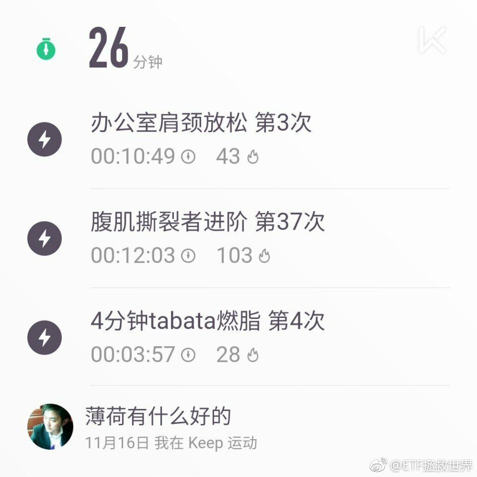
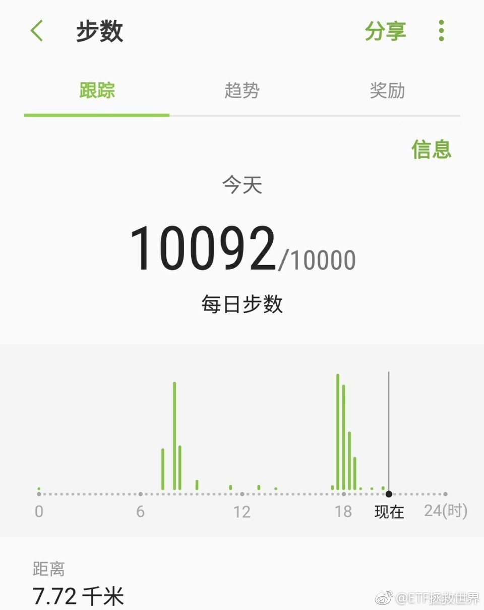

======================================================

ETF拯救世界 (5687069307) @
2017-11-17 09:46:37 Fri  
url: https://weibo.com/5687069307/Fvtkoy13R

又是2400家下跌。今年上涨的股票不到800只了。超过2300只下跌。

奇葩啊。 ​​​

转发[3]  评论[36]  赞[104] 

======================================================

ETF拯救世界 (5687069307) @
2017-11-17 10:01:40 Fri  
url: https://weibo.com/5687069307/FvtqvlFjb

我不知道这次会怎样。目前已经进入全市场杀估值下半场，如果按照以往的经验，情况会比较惨烈。

然而风雨之后自然是彩虹。凤凰涅槃，浴火重生。

怕就怕凤凰涅槃的火刚点起来就让人给吹灭了。然后凤凰无法涅槃，茫茫阴跌，漫无止境。 ​​​

转发[47]  评论[90]  赞[169] 

======================================================

ETF拯救世界 (5687069307) @
2017-11-17 10:27:00 Fri  
url: https://weibo.com/5687069307/FvtANjtnz

回复@梦之彼方2082:拉不拉银行保险恒瑞茅台我一点都不care。只是求放过中小盘股，不要拉，让他们价值回归。拜托GJD了！//@梦之彼方2082:银行股又变成夜壶，想砸就砸，想拉就拉[围观]

------------------------------------------------------
转推：
>  @ETF拯救世界 (5687069307)
>  2017-11-17 10:01:40 Fri  
>  url: https:/weibo.com/5687069307/FvtqvlFjb/

>  我不知道这次会怎样。目前已经进入全市场杀估值下半场，如果按照以往的经验，情况会比较惨烈。
>  
>  然而风雨之后自然是彩虹。凤凰涅槃，浴火重生。
>  
>  怕就怕凤凰涅槃的火刚点起来就让人给吹灭了。然后凤凰无法涅槃，茫茫阴跌，漫无止境。 ​​​

转发[15]  评论[28]  赞[95] 

======================================================

ETF拯救世界 (5687069307) @
2017-11-17 10:36:46 Fri  
url: https://weibo.com/5687069307/FvtEKfEWb

回复@有水有风才有浪:一大半。目前A股+港股一共才30%。剩下的持仓部分都是债券石油黄金。还有一半以上现金，可以说兵强马壮就等干了。//@有水有风才有浪:因为我们有一半的部队在静静等待，也相信时钟会摆在应有的轨迹上。

------------------------------------------------------
转推：
>  @ETF拯救世界 (5687069307)
>  2017-11-17 10:01:40 Fri  
>  url: https:/weibo.com/5687069307/FvtqvlFjb/

>  我不知道这次会怎样。目前已经进入全市场杀估值下半场，如果按照以往的经验，情况会比较惨烈。
>  
>  然而风雨之后自然是彩虹。凤凰涅槃，浴火重生。
>  
>  怕就怕凤凰涅槃的火刚点起来就让人给吹灭了。然后凤凰无法涅槃，茫茫阴跌，漫无止境。 ​​​

转发[3]  评论[25]  赞[97] 

======================================================

ETF拯救世界 (5687069307) @
2017-11-17 11:26:36 Fri  
url: https://weibo.com/5687069307/FvtYYFNBy

如何界定“牛熊”是一件有意思的事情。

很多人认为上一轮牛市是从2014年7月开始。当然不是。他们只看上证和沪深300了。

2012年11月29，我发出那篇见底文章之后的第二天，A股最广大的中小股票就开始了轰轰烈烈的大牛市。

2013年，沪深300下跌7.65%；上证指数下跌6.7%。但你不知道的，可能是中证500上 ​​​

转发[127]  评论[119]  赞[256] 

======================================================

ETF拯救世界 (5687069307) @
2017-11-17 11:37:36 Fri  
url: https://weibo.com/5687069307/Fvu3sa6BT

回复@雨落江南ing:这个数据相当不靠谱。目前中证100在5年27%，10年38%，PB分别是37%39%的地方。它最大的问题是绝对估值较高，目前我还不买。你这个数据来源有问题，不用算一看就知道不对啊。//@雨落江南ing:中证1000从历史估值区间来看已经是处于最低位了，E大觉得还需要回归到什么程度？

------------------------------------------------------
转推：
>  @ETF拯救世界 (5687069307)
>  2017-11-17 10:01:40 Fri  
>  url: https:/weibo.com/5687069307/FvtqvlFjb/

>  我不知道这次会怎样。目前已经进入全市场杀估值下半场，如果按照以往的经验，情况会比较惨烈。
>  
>  然而风雨之后自然是彩虹。凤凰涅槃，浴火重生。
>  
>  怕就怕凤凰涅槃的火刚点起来就让人给吹灭了。然后凤凰无法涅槃，茫茫阴跌，漫无止境。 ​​​

转发[4]  评论[57]  赞[75] 

======================================================

ETF拯救世界 (5687069307) @
2017-11-17 13:57:44 Fri  
url: https://weibo.com/5687069307/FvuYkehD6

求高抬贵手不要拉。 ​​​

转发[4]  评论[82]  赞[142] 

+++++++++++++++++++++++++++++++++++++++++++++++++++++

图片：

======================================================

ETF拯救世界 (5687069307) @
2017-11-17 14:07:18 Fri  
url: https://weibo.com/5687069307/Fvv2d6NCa

今天2900只下跌。我们的组合港股、50、黄金、石油贡献正收益，对冲其它品种下跌。债券未知。

估计净值减少0.1%。配置的力量。 ​​​

转发[6]  评论[47]  赞[136] 

======================================================

ETF拯救世界 (5687069307) @
2017-11-17 14:12:40 Fri  
url: https://weibo.com/5687069307/Fvv4o49hJ

有人说50,300没事。

第一个呢，我就没见过抱团取暖最后有好结果的。

第二个，设想一下，中证500比沪深300还便宜了，聪明的资金会不会去买中证500。要知道利润增速500比300高。包括债券如果收益率真的超过股票了，聪明的资金会不会去买债券。

看吧。谁知道呢。 ​​​

转发[37]  评论[127]  赞[166] 

======================================================

ETF拯救世界 (5687069307) @
2017-11-17 15:44:11 Fri  
url: https://weibo.com/5687069307/FvvFxbwxh

开会回来一看大盘笑尿了。 ​​​

转发[6]  评论[64]  赞[132] 

======================================================

ETF拯救世界 (5687069307) @
2017-11-17 15:45:39 Fri  
url: https://weibo.com/5687069307/FvvG85ATU

今日数据：全市场估值降至2014年9月以来新低。 ​​​

转发[21]  评论[93]  赞[201] 

======================================================

ETF拯救世界 (5687069307) @
2017-11-17 16:08:32 Fri  
url: https://weibo.com/5687069307/FvvPqlwQo

回复@用户6244991818:这样三、四天，A股至少十车起。//@用户6244991818:这样跌，月底可以发几车了？！[微笑]

------------------------------------------------------
转推：
>  @ETF拯救世界 (5687069307)
>  2017-11-17 14:12:40 Fri  
>  url: https:/weibo.com/5687069307/Fvv4o49hJ/

>  有人说50,300没事。
>  
>  第一个呢，我就没见过抱团取暖最后有好结果的。
>  
>  第二个，设想一下，中证500比沪深300还便宜了，聪明的资金会不会去买中证500。要知道利润增速500比300高。包括债券如果收益率真的超过股票了，聪明的资金会不会去买债券。
>  
>  看吧。谁知道呢。 ​​​

转发[3]  评论[75]  赞[103] 

======================================================

ETF拯救世界 (5687069307) @
2017-11-17 16:22:29 Fri  
url: https://weibo.com/5687069307/FvvV54qNo

回复@熊是旅行家S:如果真的暴力反弹了就拉黑你。[并不简单]//@熊是旅行家S:下周一暴力反弹[doge]//@ETF拯救世界:回复@用户6244991818:这样三、四天，A股至少十车起。//@用户6244991818:这样跌，月底可以发几车了？！[微笑]

------------------------------------------------------
转推：
>  @ETF拯救世界 (5687069307)
>  2017-11-17 14:12:40 Fri  
>  url: https:/weibo.com/5687069307/Fvv4o49hJ/

>  有人说50,300没事。
>  
>  第一个呢，我就没见过抱团取暖最后有好结果的。
>  
>  第二个，设想一下，中证500比沪深300还便宜了，聪明的资金会不会去买中证500。要知道利润增速500比300高。包括债券如果收益率真的超过股票了，聪明的资金会不会去买债券。
>  
>  看吧。谁知道呢。 ​​​

转发[1]  评论[60]  赞[80] 

======================================================

ETF拯救世界 (5687069307) @
2017-11-17 18:06:52 Fri  
url: https://weibo.com/5687069307/FvwBs095y

回复@telestone:不可能，我刚看了一下，我的账户少了0.1x%。疯了，一xxxx没了。好痛苦，好无助，抱紧我。[污]//@telestone:今天跌成这样，账户资金竟然没怎么变。感谢E大

------------------------------------------------------
转推：
>  @ETF拯救世界 (5687069307)
>  2017-11-17 15:44:11 Fri  
>  url: https:/weibo.com/5687069307/FvvFxbwxh/

>  开会回来一看大盘笑尿了。 ​​​

转发[2]  评论[64]  赞[97] 

======================================================

ETF拯救世界 (5687069307) @
2017-11-17 18:21:18 Fri  
url: https://weibo.com/5687069307/FvwHj8JBi

今天512100谁挂0.819发财了。这种好事真的可遇不可求。 ​​​

转发[5]  评论[87]  赞[130] 

======================================================

ETF拯救世界 (5687069307) @
2017-11-18 21:39:26 Sat  
url: https://weibo.com/5687069307/FvHqe9yF5

每日打卡（112）

坚持 ​​​

转发[0]  评论[19]  赞[133] 

+++++++++++++++++++++++++++++++++++++++++++++++++++++

图片：

======================================================

ETF拯救世界 (5687069307) @
2017-11-19 09:48:22 Sun  
url: https://weibo.com/5687069307/FvMc6fR2w

太不容易了[doge] ​​​

转发[2]  评论[66]  赞[194] 

+++++++++++++++++++++++++++++++++++++++++++++++++++++

图片：
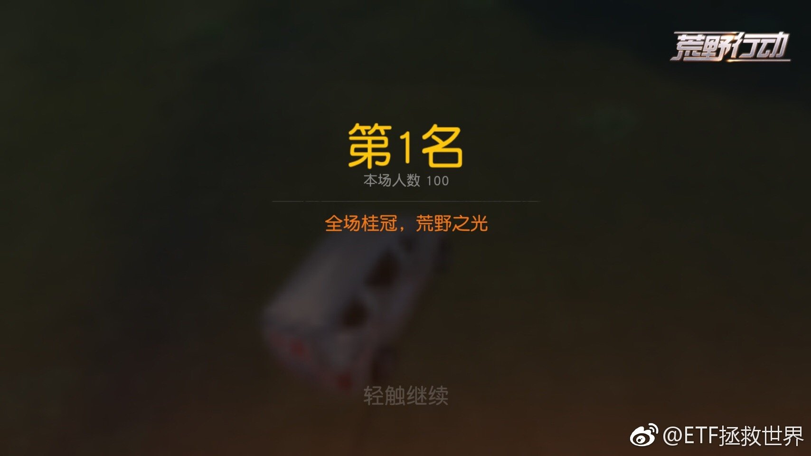

======================================================

ETF拯救世界 (5687069307) @
2017-11-19 18:35:01 Sun  
url: https://weibo.com/5687069307/FvPDS0YAp

说真的，还是挺吃惊的。搞不懂你们……这样一篇我写完觉得很一般差点没发的文章，评论数居然创新高了……可惜只能放出一百多条，有很多精彩的评论啊。 ​​​

转发[4]  评论[138]  赞[189] 

+++++++++++++++++++++++++++++++++++++++++++++++++++++

图片：
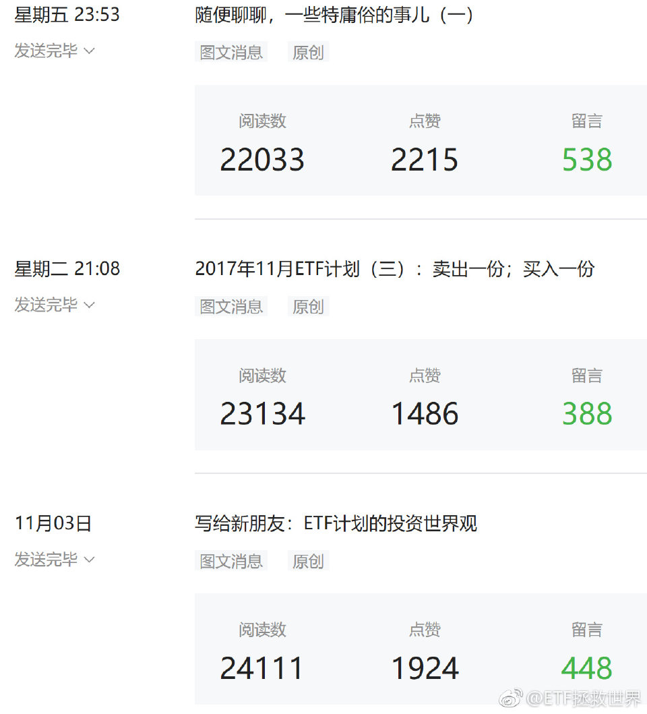

======================================================

ETF拯救世界 (5687069307) @
2017-11-20 08:58:51 Mon  
url: https://weibo.com/5687069307/FvViv2POv

距离月末还有11天，9个交易日。

到时候能买1份还是10份，港真，要看命。

不过，坚持正确的路，运气总不会差。 ​​​

转发[28]  评论[92]  赞[185] 

======================================================

ETF拯救世界 (5687069307) @
2017-11-20 09:31:42 Mon  
url: https://weibo.com/5687069307/FvVvPwXhD

根据历史经验看，杀估值的下半场会特别惨烈。

当然，现在情况特殊，历史经验还管用不管用就不知道喽。

继续维持债券先于股市几个月见底的观点不变。 ​​​

转发[93]  评论[110]  赞[199] 

======================================================

ETF拯救世界 (5687069307) @
2017-11-20 09:57:46 Mon  
url: https://weibo.com/5687069307/FvVGptLal

油气 黄金。

只有这种时候，才会体会不相关性的重要性。 ​​​

转发[9]  评论[50]  赞[170] 

======================================================

ETF拯救世界 (5687069307) @
2017-11-20 10:28:35 Mon  
url: https://weibo.com/5687069307/FvVSVay1r

回复@万里浮云无股也呻吟:因为你每天这样补，钱真的会不够。不信可以试试~//@万里浮云无股也呻吟:发车为什么总是要到月底？

------------------------------------------------------
转推：
>  @ETF拯救世界 (5687069307)
>  2017-11-20 09:31:42 Mon  
>  url: https:/weibo.com/5687069307/FvVvPwXhD/

>  根据历史经验看，杀估值的下半场会特别惨烈。
>  
>  当然，现在情况特殊，历史经验还管用不管用就不知道喽。
>  
>  继续维持债券先于股市几个月见底的观点不变。 ​​​

转发[16]  评论[46]  赞[89] 

======================================================

ETF拯救世界 (5687069307) @
2017-11-20 11:08:50 Mon  
url: https://weibo.com/5687069307/FvW9fuJPh

每次看到大跌就生怕买不到最低点害怕错过一个亿心急火燎冲进去的，举个手我看看。 ​​​

转发[26]  评论[225]  赞[417] 

======================================================

ETF拯救世界 (5687069307) @
2017-11-20 11:21:21 Mon  
url: https://weibo.com/5687069307/FvWel6nHr

“老司机”之所以受到尊重，不是因为他吃的盐比你走的路还多，也不是因为他很油腻，更不是因为他腰不好。

而是因为他经验丰富。

经验丰富很重要。

一个感想，不一定对。 ​​​

转发[13]  评论[75]  赞[193] 

======================================================

ETF拯救世界 (5687069307) @
2017-11-20 11:43:22 Mon  
url: https://weibo.com/5687069307/FvWnhc1vM

从这个月开始，没有结余，“（只有每个月结余的朋友继续保留一半资金以后再买）”，这个已经不适用了。

已经可以把结余全部投入。但是，之前保留的，继续保留。

已经进入level 2。level 3的时候再用它们。 ​​​

转发[48]  评论[166]  赞[263] 

======================================================

ETF拯救世界 (5687069307) @
2017-11-20 14:02:29 Mon  
url: https://weibo.com/5687069307/FvXhK7ZEP

回复@龙与天空之城:讲两点：第一很多人喜欢抄底。跌了就抄。各种原因吧。第二，很少有不断暴跌的下跌，那会导致谁都跑不了。大跌小反弹，弄得你心里痒痒的进去接盘，有人才能跑。一点经验，不到一定对。我无所谓，低了就按节奏买~

------------------------------------------------------
转推：
>  @ETF拯救世界 (5687069307)
>  2017-11-20 11:43:22 Mon  
>  url: https:/weibo.com/5687069307/FvWnhc1vM/

>  从这个月开始，没有结余，“（只有每个月结余的朋友继续保留一半资金以后再买）”，这个已经不适用了。
>  
>  已经可以把结余全部投入。但是，之前保留的，继续保留。
>  
>  已经进入level 2。level 3的时候再用它们。 ​​​

转发[21]  评论[43]  赞[111] 

======================================================

ETF拯救世界 (5687069307) @
2017-11-20 14:44:29 Mon  
url: https://weibo.com/5687069307/FvXyNa4Yp

今天盘中有一个摸到了历史最低区域……收盘又回去了。辣鸡。。 ​​​

转发[14]  评论[106]  赞[140] 

======================================================

ETF拯救世界 (5687069307) @
2017-11-20 15:07:13 Mon  
url: https://weibo.com/5687069307/FvXI1fzSJ

回复@1203gxp:区域。不是点。最低点到进入最低区域之间还有20%左右。我不是说一定会跌到最低点，再加上还有业绩增长的因素。我只是说，最低点和最低区域还是有分别的。

------------------------------------------------------
转推：
>  @ETF拯救世界 (5687069307)
>  2017-11-20 14:44:29 Mon  
>  url: https:/weibo.com/5687069307/FvXyNa4Yp/

>  今天盘中有一个摸到了历史最低区域……收盘又回去了。辣鸡。。 ​​​

转发[8]  评论[47]  赞[109] 

======================================================

ETF拯救世界 (5687069307) @
2017-11-20 20:27:25 Mon  
url: https://weibo.com/5687069307/FvZNZjL5A

每日打卡（113）

好好锻炼，活得长一点…… ​​​

转发[1]  评论[59]  赞[163] 

+++++++++++++++++++++++++++++++++++++++++++++++++++++

图片：

======================================================

ETF拯救世界 (5687069307) @
2017-11-21 09:49:53 Tue  
url: https://weibo.com/5687069307/Fw53In7VL

$恒生指数 hkHSI$  这个已经到了我认知的范围上限了。

手里的继续坚定持有即可。 ​​​

转发[35]  评论[59]  赞[104] 

======================================================

ETF拯救世界 (5687069307) @
2017-11-21 09:54:27 Tue  
url: https://weibo.com/5687069307/Fw55ziTG9

回复@kkds:那是你理解错了网格和做T的意义。如果你把你的持仓分成两部分，一部分长期持有，一部分波段。足以应对震荡和长牛两种市场。如果你把所有资金都去做网格和波段，当然会错失长牛。这是开始操作前就应该知道的。//@kkds:现在看起来，做网格或者做T降低成本，是多么傻的事情。

------------------------------------------------------
转推：
>  @ETF拯救世界 (5687069307)
>  2017-11-21 09:49:53 Tue  
>  url: https:/weibo.com/5687069307/Fw53In7VL/

>  $恒生指数 hkHSI$  这个已经到了我认知的范围上限了。
>  
>  手里的继续坚定持有即可。 ​​​

转发[32]  评论[53]  赞[121] 

======================================================

ETF拯救世界 (5687069307) @
2017-11-21 10:01:17 Tue  
url: https://weibo.com/5687069307/Fw58kEY6X

回复@背着新水壶去上学:巴菲特70年代以来只有3年亏损，如何解释？我本人2005年以来没有一年亏损，自信赚到的钱超过95%以上的人，“必须忍受大的亏损和回撤”从何谈起？

------------------------------------------------------
转推：
>  @ETF拯救世界 (5687069307)
>  2017-11-21 09:49:53 Tue  
>  url: https:/weibo.com/5687069307/Fw53In7VL/

>  $恒生指数 hkHSI$  这个已经到了我认知的范围上限了。
>  
>  手里的继续坚定持有即可。 ​​​

转发[4]  评论[41]  赞[120] 

======================================================

ETF拯救世界 (5687069307) @
2017-11-21 10:23:22 Tue  
url: https://weibo.com/5687069307/Fw5hj8T2Y

$512880 证券ETF 这个弹性太好了。未来会是一把尖刀。庖丁解牛。 ​​​

转发[15]  评论[107]  赞[199] 

======================================================

ETF拯救世界 (5687069307) @
2017-11-21 13:42:43 Tue  
url: https://weibo.com/5687069307/Fw6AdpYST

又是2300下跌，给A股价值投资者们点赞！ ​​​

转发[4]  评论[58]  赞[204] 

======================================================

ETF拯救世界 (5687069307) @
2017-11-21 14:31:21 Tue  
url: https://weibo.com/5687069307/Fw6TXk90q

你想多了~今年香港中盘精选指数涨了39%，涨幅还大于大盘指数恒生指数，人家没有28分化啊。反倒是A股，同样的中盘指数中证500今年只得2.77%嘅涨幅，相比沪深300的27%可以说非常油腻了~

------------------------------------------------------
转推：
>  @ ()
>  2017-11-21 11:13:05 Tue  
>  url: 

>  抱歉，此微博已被作者删除。查看帮助：http://t.cn/Rfd3rQV

转发[4]  评论[28]  赞[90] 

======================================================

ETF拯救世界 (5687069307) @
2017-11-21 14:47:54 Tue  
url: https://weibo.com/5687069307/Fw70FD2MU

今年A股是这样的：由大到小，可以说非常有规律。

中证100上涨36%；

中证200上涨12%；

中证500上涨2.8%；

中证1000下跌14%。

1000之后的不用看了，一定是跌的更惨。因为全市场中位数下跌18%以上。

所以今年是只要你大就ok。

嗯哼。 ​​​

转发[40]  评论[75]  赞[164] 

======================================================

ETF拯救世界 (5687069307) @
2017-11-21 17:21:07 Tue  
url: https://weibo.com/5687069307/Fw80Rvpb2

手中3%的国开债瑟瑟发抖 [并不简单]

——周二（11月21日），债市延续弱势，期债低开宽幅震荡多数合约勉强收红，银行间现券收益率大幅上行，国开调整甚于国债，10年期国开活跃券170215收益率一度上行超9bp，收益率创2014年9月17日以来新高；资金面趋紧，主要回购利率多数上行。 ​​​

转发[14]  评论[90]  赞[147] 

======================================================

ETF拯救世界 (5687069307) @
2017-11-22 09:25:22 Wed  
url: https://weibo.com/5687069307/FwekghJ3s

回复@老纳法号破戒:悲剧不会特别远了。踏踏实实看戏吧。手里的筹码平衡之后拿着就行了。//@老纳法号破戒:恒生破30000了

------------------------------------------------------
转推：
>  @ETF拯救世界 (5687069307)
>  2017-11-21 17:21:07 Tue  
>  url: https:/weibo.com/5687069307/Fw80Rvpb2/

>  手中3%的国开债瑟瑟发抖 [并不简单]
>  
>  ——周二（11月21日），债市延续弱势，期债低开宽幅震荡多数合约勉强收红，银行间现券收益率大幅上行，国开调整甚于国债，10年期国开活跃券170215收益率一度上行超9bp，收益率创2014年9月17日以来新高；资金面趋紧，主要回购利率多数上行。 ​​​

转发[3]  评论[39]  赞[77] 

======================================================

ETF拯救世界 (5687069307) @
2017-11-22 09:43:30 Wed  
url: https://weibo.com/5687069307/FwerCdiFq

回复@用户5995797387:50、300涨得好。为什么不买呢。[费解]//@用户5995797387:最近中证500 医药 环保指数涨不起来 心里闷闷的//@ETF拯救世界:回复@老纳法号破戒:悲剧不会特别远了。踏踏实实看戏吧。手里的筹码平衡之后拿着就行了。//@老纳法号破戒:恒生破30000了

------------------------------------------------------
转推：
>  @ETF拯救世界 (5687069307)
>  2017-11-21 17:21:07 Tue  
>  url: https:/weibo.com/5687069307/Fw80Rvpb2/

>  手中3%的国开债瑟瑟发抖 [并不简单]
>  
>  ——周二（11月21日），债市延续弱势，期债低开宽幅震荡多数合约勉强收红，银行间现券收益率大幅上行，国开调整甚于国债，10年期国开活跃券170215收益率一度上行超9bp，收益率创2014年9月17日以来新高；资金面趋紧，主要回购利率多数上行。 ​​​

转发[0]  评论[41]  赞[66] 

======================================================

ETF拯救世界 (5687069307) @
2017-11-22 09:56:04 Wed  
url: https://weibo.com/5687069307/FwewImbCa

很多朋友不理解一件事。

我的体系中，不是买了不涨，而是因为不涨才买。

这个逻辑关系不能错。我们的组合中，现在涨幅大的50、300、红利，包括差一点没买到的180、食品饮料，都是在他们非常落魄的时候我们才出手。而且也不是一买就涨。特别有意思的是，他们弱的时间越长，我们买的越多，最后赚的才越 ​​​

转发[73]  评论[119]  赞[199] 

======================================================

ETF拯救世界 (5687069307) @
2017-11-22 10:10:45 Wed  
url: https://weibo.com/5687069307/FweCG2MZP

说时迟那时快，小盘这就拉起来了。。

------------------------------------------------------
转推：
>  @ETF拯救世界 (5687069307)
>  2017-11-22 09:56:04 Wed  
>  url: https:/weibo.com/5687069307/FwewImbCa/

>  很多朋友不理解一件事。
>  
>  我的体系中，不是买了不涨，而是因为不涨才买。
>  
>  这个逻辑关系不能错。我们的组合中，现在涨幅大的50、300、红利，包括差一点没买到的180、食品饮料，都是在他们非常落魄的时候我们才出手。而且也不是一买就涨。特别有意思的是，他们弱的时间越长，我们买的越多，最后赚的才越 ​​​

转发[2]  评论[34]  赞[98] 

======================================================

ETF拯救世界 (5687069307) @
2017-11-22 11:44:15 Wed  
url: https://weibo.com/5687069307/FwfeD54kp

回复@谷入峰出888:周期品种特别好，赚起来和赔得一样快。赚的前提是判断对转折点。未来也未必一定不买，但不会是重点布局，因为转折点真的不容易把握。//@谷入峰出888:请教E大，有色也不涨，为啥咱不买？

------------------------------------------------------
转推：
>  @ETF拯救世界 (5687069307)
>  2017-11-22 09:56:04 Wed  
>  url: https:/weibo.com/5687069307/FwewImbCa/

>  很多朋友不理解一件事。
>  
>  我的体系中，不是买了不涨，而是因为不涨才买。
>  
>  这个逻辑关系不能错。我们的组合中，现在涨幅大的50、300、红利，包括差一点没买到的180、食品饮料，都是在他们非常落魄的时候我们才出手。而且也不是一买就涨。特别有意思的是，他们弱的时间越长，我们买的越多，最后赚的才越 ​​​

转发[11]  评论[25]  赞[88] 

======================================================

ETF拯救世界 (5687069307) @
2017-11-22 13:46:00 Wed  
url: https://weibo.com/5687069307/Fwg230oFR

我觉得吧，月底3-5份应该是起步吧。。 ​​​

转发[5]  评论[142]  赞[245] 

======================================================

ETF拯救世界 (5687069307) @
2017-11-22 13:57:31 Wed  
url: https://weibo.com/5687069307/Fwg6IzZMU

今天连300都撑不住了，就剩50嘚瑟了。

A股慢牛这种事是不存在的。一把炒到头就是宿命。几年的事情几个月干完大家都踏实。 ​​​

转发[10]  评论[60]  赞[198] 

======================================================

ETF拯救世界 (5687069307) @
2017-11-22 14:09:17 Wed  
url: https://weibo.com/5687069307/FwgbuBpDw

十年国开债已经快5%了。坚定债市将先于股市见底的判断。

国债期货跌幅再度扩大，10年期债主力合约跌0.56%，5年期债主力合约跌0.32%；政策性金融债现券收益率加速上行，10年期国开活跃券170215收益率上行12bp报4.91%。 ​​​​

转发[35]  评论[175]  赞[214] 

======================================================

ETF拯救世界 (5687069307) @
2017-11-22 21:52:14 Wed  
url: https://weibo.com/5687069307/FwjdpisUG

每日打卡（114）

坚持有可能成功。放弃一定失败。 ​​​

转发[1]  评论[29]  赞[164] 

+++++++++++++++++++++++++++++++++++++++++++++++++++++

图片：

======================================================

ETF拯救世界 (5687069307) @
2017-11-23 06:25:54 Thu  
url: https://weibo.com/5687069307/FwmzUfsmg

回复@Penguin是个好麻麻:有可能是。千万别给他钱买基金。真的，一分钱都别给啊。//@Penguin是个好麻麻:E大，我老公已经完全被你洗脑了。晚上没事就抓着我，给我科普etf十年十倍拯救世界的计划。告诉我，你不是骗子也不是传销组织，对吗😶

------------------------------------------------------
转推：
>  @ETF拯救世界 (5687069307)
>  2017-11-22 14:09:17 Wed  
>  url: https:/weibo.com/5687069307/FwgbuBpDw/

>  十年国开债已经快5%了。坚定债市将先于股市见底的判断。
>  
>  国债期货跌幅再度扩大，10年期债主力合约跌0.56%，5年期债主力合约跌0.32%；政策性金融债现券收益率加速上行，10年期国开活跃券170215收益率上行12bp报4.91%。 ​​​​

转发[8]  评论[104]  赞[96] 

======================================================

ETF拯救世界 (5687069307) @
2017-11-23 06:37:58 Thu  
url: https://weibo.com/5687069307/FwmENkR1h

我自认对人性还是有点了解的。

这事误解猜疑还是其次，赚钱了没几个人谢谢你，浮亏了一堆人跳出来骂是跑不了的。

这个都有心理准备。

这轮是必须做完了，下一轮可能就不公布了。本来就是自己的交易计划，何必贴出来让别人看呢。 ​​​

转发[11]  评论[620]  赞[292] 

======================================================

ETF拯救世界 (5687069307) @
2017-11-23 09:31:04 Thu  
url: https://weibo.com/5687069307/FwnN45SU6

“传销是指组织者发展人员，通过对被发展人员以其直接或者间接发展的人员数量或者业绩为依据计算和给付报酬，或者要求被发展人员以交纳一定费用为条件取得加入资格等方式获得财富的违法行为。传销的本质是“庞氏骗局”，即以后来者的钱发前面人的收益。

新型传销：不限制人身自由，不收身份证手机，不 ​​​

转发[7]  评论[159]  赞[129] 

======================================================

ETF拯救世界 (5687069307) @
2017-11-23 09:42:48 Thu  
url: https://weibo.com/5687069307/FwnRPlNom

只有2600家下跌。力度真的差点意思啊。

惨烈的下半场给点力得唔得！ ​​​

转发[4]  评论[110]  赞[175] 

======================================================

ETF拯救世界 (5687069307) @
2017-11-23 10:11:31 Thu  
url: https://weibo.com/5687069307/Fwo3tsqdq

别看各位现在这么盼着跌。

真到了凛冬已至的时候，恐怕大多数人拿着手里浮亏不少的品种躲在角落瑟瑟发抖，真不一定还敢继续大笔买入。

因为那个时候市场上会有各种利空围绕在你身边。

没经历过的人不要轻易说自己不会怕。

到时候你才知道自己是个普通人。

不信你记着这条微博到时候翻翻看。 ​​​

转发[151]  评论[337]  赞[376] 

======================================================

ETF拯救世界 (5687069307) @
2017-11-23 10:45:28 Thu  
url: https://weibo.com/5687069307/Fwohglfom

回复@谢家妮子的微博:是，各位可以关注了！现在资金面非常紧，有可能有好机会。//@谢家妮子的微博:益达，该逆回购了吧，月底了[嘻嘻]

------------------------------------------------------
转推：
>  @ETF拯救世界 (5687069307)
>  2017-11-23 09:42:48 Thu  
>  url: https:/weibo.com/5687069307/FwnRPlNom/

>  只有2600家下跌。力度真的差点意思啊。
>  
>  惨烈的下半场给点力得唔得！ ​​​

转发[0]  评论[19]  赞[78] 

======================================================

ETF拯救世界 (5687069307) @
2017-11-23 10:55:31 Thu  
url: https://weibo.com/5687069307/FwollhU4i

为什么要定时交易。

我告诉你真正的原因。

那就是资本市场的中短期不可预测性。

我们的任务，是把手中有限的资源，最合理优化的分配到“低估”品种上。如果“觉得”，又或者是根据“数据”，只要便宜就买，贵了就卖，很可能买卖都在半山腰。

金融交易不是数学题。便宜了就不会跌，贵了就不会涨？不 ​​​

转发[320]  评论[346]  赞[525] 

======================================================

ETF拯救世界 (5687069307) @
2017-11-23 13:43:19 Thu  
url: https://weibo.com/5687069307/Fwprsau5l

忍不住奶一口。还有四个交易日。

------------------------------------------------------
转推：
>  @ETF拯救世界 (5687069307)
>  2017-11-20 08:58:51 Mon  
>  url: https:/weibo.com/5687069307/FvViv2POv/

>  距离月末还有11天，9个交易日。
>  
>  到时候能买1份还是10份，港真，要看命。
>  
>  不过，坚持正确的路，运气总不会差。 ​​​

转发[21]  评论[81]  赞[134] 

======================================================

ETF拯救世界 (5687069307) @
2017-11-23 13:58:42 Thu  
url: https://weibo.com/5687069307/FwpxHymKl

十年期国债过4%了。我是按照过5%准备的。如果再高，就稍微有点超出我的预计了。 ​​​

转发[49]  评论[40]  赞[135] 

======================================================

ETF拯救世界 (5687069307) @
2017-11-23 14:08:43 Thu  
url: https://weibo.com/5687069307/FwpBLjVTS

回复@颜_祖:在我的投资生涯中，国债破5只在2004年见过一次。2013年都没到5。在之前的99年我还没入市。真的是十几二十年才会碰到的一次机会。//@颜_祖:一辈子一次的机会这两年碰到好几次了[笑cry]

------------------------------------------------------
转推：
>  @ETF拯救世界 (5687069307)
>  2017-11-23 13:58:42 Thu  
>  url: https:/weibo.com/5687069307/FwpxHymKl/

>  十年期国债过4%了。我是按照过5%准备的。如果再高，就稍微有点超出我的预计了。 ​​​

转发[40]  评论[25]  赞[93] 

======================================================

ETF拯救世界 (5687069307) @
2017-11-23 14:15:10 Thu  
url: https://weibo.com/5687069307/FwpEnxPmC

另外说一下，如果通胀起来，利率升高，债券跌10年。股市也会十年不涨。那时候最好的投资品是黄金之类的东西。未来会怎样还要盯紧点。//@ETF拯救世界:回复@颜_祖:在我的投资生涯中，国债破5只在2004年见过一次。2013年都没到5。在之前的99年我还没入市。真的是十几二十年才会碰到的一次机会。

------------------------------------------------------
转推：
>  @ETF拯救世界 (5687069307)
>  2017-11-23 13:58:42 Thu  
>  url: https:/weibo.com/5687069307/FwpxHymKl/

>  十年期国债过4%了。我是按照过5%准备的。如果再高，就稍微有点超出我的预计了。 ​​​

转发[26]  评论[64]  赞[133] 

======================================================

ETF拯救世界 (5687069307) @
2017-11-23 14:23:42 Thu  
url: https://weibo.com/5687069307/FwpHQm79Z

其实我真的想不出来接下来GJD护盘要怎么护。

平安已经是地球市值第一的保险公司了。茅台700。银行也一年翻番。还继续往上冲吗。

贫穷限制了我的想象力。看GJD的了。 ​​​

转发[9]  评论[83]  赞[173] 

======================================================

ETF拯救世界 (5687069307) @
2017-11-23 14:32:38 Thu  
url: https://weibo.com/5687069307/FwpLteV4R

这两年来，A股（我是说A股，不是沪深300），基本按照预期在运行。当然，由于有一万多亿那什么在里面，比之前两次多了很多波折。

今年这一波几十只一百多只大蓝筹的行情，当然不能说全是GJD的原因。根本原因当然是2016年2月估值够低，当月50、恒生、红利都是历史最低估值区域。

但GJD是非常重要的因素 ​​​

转发[146]  评论[150]  赞[288] 

======================================================

ETF拯救世界 (5687069307) @
2017-11-23 14:53:52 Thu  
url: https://weibo.com/5687069307/FwpU5rZaS

真诚不忽悠。

------------------------------------------------------
转推：
>  @ETF拯救世界 (5687069307)
>  2017-11-20 09:31:42 Mon  
>  url: https:/weibo.com/5687069307/FvVvPwXhD/

>  根据历史经验看，杀估值的下半场会特别惨烈。
>  
>  当然，现在情况特殊，历史经验还管用不管用就不知道喽。
>  
>  继续维持债券先于股市几个月见底的观点不变。 ​​​

转发[5]  评论[66]  赞[194] 

======================================================

ETF拯救世界 (5687069307) @
2017-11-23 15:13:25 Thu  
url: https://weibo.com/5687069307/Fwq21sXEA

说点让你们开心的：

我手里有只股票跌回2010年的价格了…… ​​​

转发[3]  评论[108]  赞[199] 

======================================================

ETF拯救世界 (5687069307) @
2017-11-23 15:16:47 Thu  
url: https://weibo.com/5687069307/Fwq3ogTCO

至少看评论，大家心态都非常好，仓位也很合适。

我很欣慰。到目前为止。每天叨叨没白费。 ​​​

转发[8]  评论[293]  赞[445] 

======================================================

ETF拯救世界 (5687069307) @
2017-11-24 09:04:10 Fri  
url: https://weibo.com/5687069307/Fwx2DlWtP

到现在，整件事不知道如何评论。我只希望有机会知道事实的真相。有机会吗，希望有。

------------------------------------------------------
转推：
>  @ ()
>  2017-11-23 23:58:06 Thu  
>  url: 

>  抱歉，作者已设置仅展示半年内微博，此微博已不可见。 ​​​

转发[9]  评论[59]  赞[86] 

======================================================

ETF拯救世界 (5687069307) @
2017-11-24 09:24:16 Fri  
url: https://weibo.com/5687069307/FwxaNzAuh

想让大盘连续暴跌然后你进去抄底的朋友省省吧。。

很少出现连续暴跌的。谁都跑不了。一个大跌，呼啦啦都跑了。然后往回拉。让你觉得又有希望了，正常调整，追进去，然后再跌。

所以最关键的，自己的持仓成本不能高。成本高了，拿也拿不住，赚不到钱。跌了就套，套了就不割肉，越赔越多。 ​​​

转发[40]  评论[114]  赞[186] 

======================================================

ETF拯救世界 (5687069307) @
2017-11-24 10:06:26 Fri  
url: https://weibo.com/5687069307/FwxrV1jiv

跌了两天而已，涨了几个月的大牛股五粮液的获利筹码只剩70%了。30%已经被套。

追涨，为什么要追涨。我真的不懂。 ​​​

转发[32]  评论[60]  赞[158] 

======================================================

ETF拯救世界 (5687069307) @
2017-11-24 10:11:14 Fri  
url: https://weibo.com/5687069307/FwxtS85Jo

其实昨天看了那个关于传销的定义，我感觉有些人真的有点像。。

就是自己买了以后不顾价格可劲吹，比自己成本高好多了还继续看好，忽悠买入。

这跟传销其实差不太多。

计划就不同，你只可能比我买的低，不可能比我高。多好，你们都比我赚得多。 ​​​

转发[6]  评论[87]  赞[209] 

======================================================

ETF拯救世界 (5687069307) @
2017-11-24 10:49:18 Fri  
url: https://weibo.com/5687069307/FwxJjxVni

今天大盘股叛变革命了。300比500跌的多不少。 ​​​

转发[3]  评论[108]  赞[162] 

======================================================

ETF拯救世界 (5687069307) @
2017-11-24 14:40:59 Fri  
url: https://weibo.com/5687069307/FwzfmaDuq

“错过这次抄底就再也没有机会发财了。”一个很普遍的想法。生活，全是套路。//@且慢管家:我觉得这条微博 今天还可以重新发一次 @ETF拯救世界 //@且慢管家: 今天的行情 抄底的钱我都准备好了 眼看就要下单了 突然想到应该看看E大怎么说 于是。。。

------------------------------------------------------
转推：
>  @ETF拯救世界 (5687069307)
>  2017-11-20 11:08:50 Mon  
>  url: https:/weibo.com/5687069307/FvW9fuJPh/

>  每次看到大跌就生怕买不到最低点害怕错过一个亿心急火燎冲进去的，举个手我看看。 ​​​

转发[14]  评论[49]  赞[134] 

======================================================

ETF拯救世界 (5687069307) @
2017-11-24 14:45:37 Fri  
url: https://weibo.com/5687069307/FwzheyBEW

京东方的获利盘只剩27%了。。高位，大换手，杀人利器。

------------------------------------------------------
转推：
>  @ETF拯救世界 (5687069307)
>  2017-11-24 10:06:26 Fri  
>  url: https:/weibo.com/5687069307/FwxrV1jiv/

>  跌了两天而已，涨了几个月的大牛股五粮液的获利筹码只剩70%了。30%已经被套。
>  
>  追涨，为什么要追涨。我真的不懂。 ​​​

转发[24]  评论[49]  赞[121] 

======================================================

ETF拯救世界 (5687069307) @
2017-11-24 18:59:21 Fri  
url: https://weibo.com/5687069307/FwAWeezQr

回复@长乐未央200204:看看美股指数和恒生，dax。波动小吗。//@长乐未央200204:E大请教一下，都说和国际接轨后，有些票会涨几倍，有些票会跌很多，那相互抵消后，会不会指数波动变窄呢//@ETF拯救世界:京东方的获利盘只剩27%了。。高位，大换手，杀人利器。

------------------------------------------------------
转推：
>  @ETF拯救世界 (5687069307)
>  2017-11-24 10:06:26 Fri  
>  url: https:/weibo.com/5687069307/FwxrV1jiv/

>  跌了两天而已，涨了几个月的大牛股五粮液的获利筹码只剩70%了。30%已经被套。
>  
>  追涨，为什么要追涨。我真的不懂。 ​​​

转发[5]  评论[40]  赞[91] 

======================================================

ETF拯救世界 (5687069307) @
2017-11-24 22:48:21 Fri  
url: https://weibo.com/5687069307/FwCrb9vPD

每日打卡（115）

坚持。 ​​​

转发[0]  评论[34]  赞[176] 

+++++++++++++++++++++++++++++++++++++++++++++++++++++

图片：

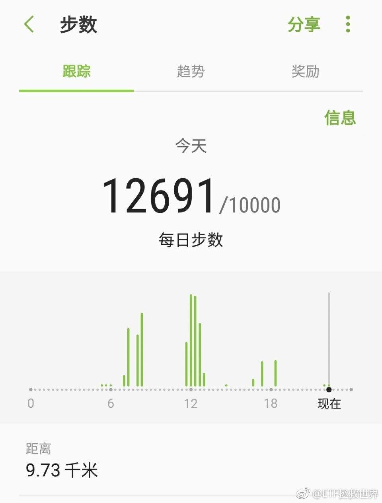

======================================================

ETF拯救世界 (5687069307) @
2017-11-26 17:46:39 Sun  
url: https://weibo.com/5687069307/FwTjIdZk1

每日打卡（116）

理智，客观，很难。 ​​​

转发[1]  评论[41]  赞[141] 

+++++++++++++++++++++++++++++++++++++++++++++++++++++

图片：

======================================================

ETF拯救世界 (5687069307) @
2017-11-27 08:06:01 Mon  
url: https://weibo.com/5687069307/FwYWwEJUs

4.5至少摸一下吧。能见到5就是十年不遇的机会。

------------------------------------------------------
转推：
>  @ ()
>  2017-11-27 08:02:08 Mon  
>  url: 

>  抱歉，此微博已被作者删除。查看帮助：http://t.cn/Rfd3rQV

转发[5]  评论[62]  赞[116] 

======================================================

ETF拯救世界 (5687069307) @
2017-11-27 09:21:27 Mon  
url: https://weibo.com/5687069307/FwZr9fu5v

记住一件事。

一个品种跌得越厉害，说这个品种“再也没有希望，再也涨不起来”的人越多。这是当然了，不是越来越多人看跌，它也不会跌这么多。

但你自己心里要有一个标杆。不要听别人的。你真觉得那些涨时看好跌时看跌的人赚了多少钱吗。

别人都不看好，你就应该好好研究这个品种了。

你以为什么叫 ​​​

转发[59]  评论[102]  赞[193] 

======================================================

ETF拯救世界 (5687069307) @
2017-11-27 09:46:58 Mon  
url: https://weibo.com/5687069307/FwZBviYGy

对了，公众号被人举报了。这两天没法提前发车。各位也不用惦记了。

[微笑]

我没有任何想说的了。 ​​​

转发[16]  评论[488]  赞[148] 

======================================================

ETF拯救世界 (5687069307) @
2017-11-27 10:30:32 Mon  
url: https://weibo.com/5687069307/FwZTbC3nZ

没事，别担心，过两天就好了。不会耽误发车的~~~

接近六万人关注，保不齐有一两个脑子有问题的。。祝他平安快乐吧。。。 ​​​

转发[27]  评论[243]  赞[362] 

======================================================

ETF拯救世界 (5687069307) @
2017-11-27 13:07:55 Mon  
url: https://weibo.com/5687069307/Fx0V4lQ0x

懂的讲讲，保险公司第三者为什么不赔。这种情况保一百万三者够不够//@饭统戴老板://@张-帆上海: 你爸那只是一条命，我这房可是我二十多年的梦啊！//@八哥专用:想起老赖的嘴脸，就知道这眼泪完全不值得同情//@绿油油的蓝：你爸那只是一条命，我这房可是我二十多年的梦啊！[摊手]

------------------------------------------------------
转推：
>  @我的厕所读物 (5126427168)
>  2017-11-27 11:07:51 Mon  
>  url: https:/weibo.com/5126427168/Fx08kET6F/

>  唐山黄淑芬的女儿接受采访了，目前黄淑芬被拘留，女儿采访时哭着说：车是车祸以后买的，房贷每个月6000多，我们一直积极的在给他筹钱，我觉得我们家比一般人家还要穷一点。其实她的眼泪很难让人同情，车祸发生两年，一句道歉都没有，别人生命垂危，她家只给了1000块钱，冷漠且自私http://t.cn/RYctvgY ​​​

转发[8]  评论[45]  赞[35] 

======================================================

ETF拯救世界 (5687069307) @
2017-11-27 13:18:36 Mon  
url: https://weibo.com/5687069307/Fx0Zpzx8M

中证500跌幅只有300的10%。创业板还涨了。 ​​​

转发[42]  评论[21]  赞[97] 

======================================================

ETF拯救世界 (5687069307) @
2017-11-27 13:25:20 Mon  
url: https://weibo.com/5687069307/Fx128wucx

回复@DX3906-2023:放弃预测，根据概率下注。这是在赌场长赢的唯一选择。//@DX3906-2023:风格切换了，快点买入创业板指数啦，哈哈哈哈

------------------------------------------------------
转推：
>  @ETF拯救世界 (5687069307)
>  2017-11-27 13:18:36 Mon  
>  url: https:/weibo.com/5687069307/Fx0Zpzx8M/

>  中证500跌幅只有300的10%。创业板还涨了。 ​​​

转发[7]  评论[8]  赞[99] 

======================================================

ETF拯救世界 (5687069307) @
2017-11-27 13:34:00 Mon  
url: https://weibo.com/5687069307/Fx15Ff3yJ

每天补，钱不够。这几天有没有一点体会了。我的很多东西，你第一次看可能会毫无感觉。有了经验以后再回头看，才能看懂我在说什么~//@ETF拯救世界:回复@万里浮云无股也呻吟:因为你每天这样补，钱真的会不够。不信可以试试~//@万里浮云无股也呻吟:发车为什么总是要到月底？

------------------------------------------------------
转推：
>  @ETF拯救世界 (5687069307)
>  2017-11-20 09:31:42 Mon  
>  url: https:/weibo.com/5687069307/FvVvPwXhD/

>  根据历史经验看，杀估值的下半场会特别惨烈。
>  
>  当然，现在情况特殊，历史经验还管用不管用就不知道喽。
>  
>  继续维持债券先于股市几个月见底的观点不变。 ​​​

转发[11]  评论[55]  赞[118] 

======================================================

ETF拯救世界 (5687069307) @
2017-11-27 13:40:03 Mon  
url: https://weibo.com/5687069307/Fx187p1Ro

回复@tobyli11:我对未来不判断。不过如果大盘股每天这样跌，那真有可能未来继续涨。谁性价比高我就喜欢谁~

------------------------------------------------------
转推：
>  @ETF拯救世界 (5687069307)
>  2017-11-24 10:06:26 Fri  
>  url: https:/weibo.com/5687069307/FwxrV1jiv/

>  跌了两天而已，涨了几个月的大牛股五粮液的获利筹码只剩70%了。30%已经被套。
>  
>  追涨，为什么要追涨。我真的不懂。 ​​​

转发[1]  评论[15]  赞[83] 

======================================================

ETF拯救世界 (5687069307) @
2017-11-27 13:58:46 Mon  
url: https://weibo.com/5687069307/Fx1fI6Jux

回复@安妮的花圃:其实你可以好好想想，这四点是不是有关联性。可以说是相辅相成的，都弄明白了，一套比较完善的体系就呼之欲出了。

------------------------------------------------------
转推：
>  @ETF拯救世界 (5687069307)
>  2017-11-27 10:30:32 Mon  
>  url: https:/weibo.com/5687069307/FwZTbC3nZ/

>  没事，别担心，过两天就好了。不会耽误发车的~~~
>  
>  接近六万人关注，保不齐有一两个脑子有问题的。。祝他平安快乐吧。。。 ​​​

转发[2]  评论[15]  赞[71] 

======================================================

ETF拯救世界 (5687069307) @
2017-11-27 14:10:13 Mon  
url: https://weibo.com/5687069307/Fx1kmgOSw

还有2个交易日，顶住。。。//@ETF拯救世界:忍不住奶一口。还有四个交易日。

------------------------------------------------------
转推：
>  @ETF拯救世界 (5687069307)
>  2017-11-20 08:58:51 Mon  
>  url: https:/weibo.com/5687069307/FvViv2POv/

>  距离月末还有11天，9个交易日。
>  
>  到时候能买1份还是10份，港真，要看命。
>  
>  不过，坚持正确的路，运气总不会差。 ​​​

转发[16]  评论[45]  赞[95] 

======================================================

ETF拯救世界 (5687069307) @
2017-11-27 14:23:42 Mon  
url: https://weibo.com/5687069307/Fx1pPrm0K

回复@年轻的小飞侠:几乎没见过这种情况。一般来说也就是利润增加多一点，少一点的区别。如果大部分公司利润都下降，那中国经济就已经出大问题了。何况你说的，“大幅”。//@年轻的小飞侠:E大有个问题一直想问,如果下个季报出来后,市场业绩差,PE反弹,大幅提高,怎么办?

------------------------------------------------------
转推：
>  @ETF拯救世界 (5687069307)
>  2017-11-20 08:58:51 Mon  
>  url: https:/weibo.com/5687069307/FvViv2POv/

>  距离月末还有11天，9个交易日。
>  
>  到时候能买1份还是10份，港真，要看命。
>  
>  不过，坚持正确的路，运气总不会差。 ​​​

转发[6]  评论[17]  赞[67] 

======================================================

ETF拯救世界 (5687069307) @
2017-11-27 14:37:20 Mon  
url: https://weibo.com/5687069307/Fx1vmx5yA

太毒了。。。。。。

------------------------------------------------------
转推：
>  @ETF拯救世界 (5687069307)
>  2017-11-27 13:18:36 Mon  
>  url: https:/weibo.com/5687069307/Fx0Zpzx8M/

>  中证500跌幅只有300的10%。创业板还涨了。 ​​​

转发[31]  评论[52]  赞[111] 

======================================================

ETF拯救世界 (5687069307) @
2017-11-27 14:50:14 Mon  
url: https://weibo.com/5687069307/Fx1ABjQlr

获利盘还剩19%了。越牛的股票，有时候杀人越猛。不要追短线涨幅过猛的，大多数情况是有效的建议。//@ETF拯救世界:京东方的获利盘只剩27%了。。高位，大换手，杀人利器。

------------------------------------------------------
转推：
>  @ETF拯救世界 (5687069307)
>  2017-11-24 10:06:26 Fri  
>  url: https:/weibo.com/5687069307/FwxrV1jiv/

>  跌了两天而已，涨了几个月的大牛股五粮液的获利筹码只剩70%了。30%已经被套。
>  
>  追涨，为什么要追涨。我真的不懂。 ​​​

转发[9]  评论[26]  赞[98] 

======================================================

ETF拯救世界 (5687069307) @
2017-11-27 15:20:38 Mon  
url: https://weibo.com/5687069307/Fx1MWkKaH

今天有个朋友，跟我说，你太能躲了。吃鸡游戏一共才杀了14个人，然而有50%多的场次进前十了（每场一百多人参战）。

是的，我看了看，基本上一半时间我会想尽办法扛到前4、5名。最后圈子太小，手残，杀不死别人，很少拿第一。

但我一半时间都会是前五，战胜95%的人。

想了想，这跟咱们“即使全市场都 ​​​

转发[13]  评论[117]  赞[225] 

======================================================

ETF拯救世界 (5687069307) @
2017-11-27 17:18:12 Mon  
url: https://weibo.com/5687069307/Fx2yF4pfm

嗯。老百姓挣的多了利好水电。为什么，因为有钱会买好的音响和耳机。各位有所不知，水电站发的电，听起来虽然声底偏冷，但解析度高，声音通透。据说中国最好的水电是三峡发的电，用三峡发的电听音乐，可以说是一种人生享受，尤其是女声。火电不行，听起来有煤烟味。[并不简单]

------------------------------------------------------
转推：
>  @挖龙脉的超级鹿鼎公 (3962719063)
>  2017-11-27 16:13:35 Mon  
>  url: https:/weibo.com/3962719063/Fx28qFqPv/

>  虽然回撤不少，不过心情挺好，想通一件事情，中国劳动力市场供应大幅减少的时候，人力资本肯定会大幅度上升，北京的低端事件是冰山一角，而水电肯定是其中的获益者之一，当然最获利的应该是机器人行业。医药虽然好，可是医保没钱的话，估计医药好不到那里去，所以不懂就不懂吧，毕竟年级大了，学习能力 ​​​

转发[19]  评论[117]  赞[139] 

======================================================

ETF拯救世界 (5687069307) @
2017-11-27 20:56:05 Mon  
url: https://weibo.com/5687069307/Fx3Z6cuPP

每日打卡（117）

坚持。下个月开始每周至少两次夜跑。 ​​​

转发[0]  评论[63]  赞[161] 

+++++++++++++++++++++++++++++++++++++++++++++++++++++

图片：

======================================================

ETF拯救世界 (5687069307) @
2017-11-28 09:35:57 Tue  
url: https://weibo.com/5687069307/Fx8Xx2tzg

好多朋友说看到我发的什么东西了，什么要的都给了。

我没发啊。是什么？难道我被盗号了？ ​​​

转发[0]  评论[62]  赞[73] 

======================================================

ETF拯救世界 (5687069307) @
2017-11-28 09:42:47 Tue  
url: https://weibo.com/5687069307/Fx90jifxX

你们看到的是不是这条。为什么20天前的又都跑出来了。微博抽风了。。//@ETF拯救世界:好了，刚才要的我都私信了。我看还有10张，赠票链接是这里，谁要就抢吧。抢完就没了。

------------------------------------------------------
转推：
>  @ETF拯救世界 (5687069307)
>  2017-11-09 14:08:56 Thu  
>  url: https:/weibo.com/5687069307/FuhCTztv1/

>  雪球深圳嘉年华我有50张票，有人要去吗。要去的跟我说啊。送票。 ​​​

转发[0]  评论[20]  赞[48] 

======================================================

ETF拯救世界 (5687069307) @
2017-11-28 09:44:38 Tue  
url: https://weibo.com/5687069307/Fx913lqrj

今天是真的了。小盘股反弹了。。再来一口。//@ETF拯救世界:太毒了。。。。。。

------------------------------------------------------
转推：
>  @ETF拯救世界 (5687069307)
>  2017-11-27 13:18:36 Mon  
>  url: https:/weibo.com/5687069307/Fx0Zpzx8M/

>  中证500跌幅只有300的10%。创业板还涨了。 ​​​

转发[30]  评论[34]  赞[78] 

======================================================

ETF拯救世界 (5687069307) @
2017-11-28 09:58:01 Tue  
url: https://weibo.com/5687069307/Fx96tzJJC

回复@圣善周闻宗:没有任何人能阻挡足够低的品种涨，也没人能阻挡太高的品种跌。当然，现在还都不是这样的情况。//@圣善周闻宗:现在分化真厉害，但我反正不信641会让50崩，500上……//@ETF拯救世界:今天是真的了。小盘股反弹了。。再来一口。//@ETF拯救世界:太毒了。。。。。。

------------------------------------------------------
转推：
>  @ETF拯救世界 (5687069307)
>  2017-11-27 13:18:36 Mon  
>  url: https:/weibo.com/5687069307/Fx0Zpzx8M/

>  中证500跌幅只有300的10%。创业板还涨了。 ​​​

转发[29]  评论[10]  赞[78] 

======================================================

ETF拯救世界 (5687069307) @
2017-11-28 10:05:37 Tue  
url: https://weibo.com/5687069307/Fx99zn91u

回复@elktwo:原理是，你赔一点，我赔一点。换换手，大家都赔得少一点。一个人从头赔到尾不厚道。//@elktwo:反弹一下 再埋一部分人[二哈]//@ETF拯救世界:回复@圣善周闻宗:没有任何人能阻挡足够低的品种涨，也没人能阻挡太高的品种跌。当然，现在还都不是这样的情况。

------------------------------------------------------
转推：
>  @ETF拯救世界 (5687069307)
>  2017-11-27 13:18:36 Mon  
>  url: https:/weibo.com/5687069307/Fx0Zpzx8M/

>  中证500跌幅只有300的10%。创业板还涨了。 ​​​

转发[23]  评论[37]  赞[86] 

======================================================

ETF拯救世界 (5687069307) @
2017-11-28 11:12:05 Tue  
url: https://weibo.com/5687069307/Fx9AybKxz

回复@瘦肉丸1:我能想到的极限基本就是40%了。这里说的是估值，不是指数。全市场指数（不是上证或者沪深300）的话，过一年就少跌10%吧。极限不一定到，意思是到了我也不惊讶，有预案。//@瘦肉丸1:对了，e大，根据历史情况，是否全市场还需要再跌25到35%

------------------------------------------------------
转推：
>  @ETF拯救世界 (5687069307)
>  2017-11-27 13:18:36 Mon  
>  url: https:/weibo.com/5687069307/Fx0Zpzx8M/

>  中证500跌幅只有300的10%。创业板还涨了。 ​​​

转发[19]  评论[33]  赞[83] 

======================================================

ETF拯救世界 (5687069307) @
2017-11-28 11:23:41 Tue  
url: https://weibo.com/5687069307/Fx9FgoBHh

回复@万里浮云无股也呻吟:我告诉你吧。能坚持到最后的不到30%。每次都一样，绝不会不一样。未来要经历的痛苦很多人根本没有意识到。//@万里浮云无股也呻吟:我总觉得这一次哪不一样，总不可能那么多人同时赚到

------------------------------------------------------
转推：
>  @ETF拯救世界 (5687069307)
>  2017-11-27 13:18:36 Mon  
>  url: https:/weibo.com/5687069307/Fx0Zpzx8M/

>  中证500跌幅只有300的10%。创业板还涨了。 ​​​

转发[6]  评论[70]  赞[94] 

======================================================

ETF拯救世界 (5687069307) @
2017-11-28 11:24:28 Tue  
url: https://weibo.com/5687069307/Fx9FzCi4y

回复@Vincent_锐:雪球主要的作用是增长人生经验了。//@Vincent_锐:请教E总，雪球到底还有没有好人？还值得去吗

------------------------------------------------------
转推：
>  @ETF拯救世界 (5687069307)
>  2017-11-27 13:18:36 Mon  
>  url: https:/weibo.com/5687069307/Fx0Zpzx8M/

>  中证500跌幅只有300的10%。创业板还涨了。 ​​​

转发[0]  评论[47]  赞[88] 

======================================================

ETF拯救世界 (5687069307) @
2017-11-28 13:09:24 Tue  
url: https://weibo.com/5687069307/Fxama79Di

$恒生指数 hkHSI$   您又回来了？不能再涨了，再涨要出大事了。 ​​​

转发[1]  评论[24]  赞[81] 

======================================================

ETF拯救世界 (5687069307) @
2017-11-28 13:30:35 Tue  
url: https://weibo.com/5687069307/FxauLtVzr

$中证500 sz399905$  …… ​​​

转发[24]  评论[87]  赞[98] 

======================================================

ETF拯救世界 (5687069307) @
2017-11-28 15:12:41 Tue  
url: https://weibo.com/5687069307/Fxbad5r6W

回复@Damon_cn:我建行手机app有个快贷，我看给了30万额度，利率才6.x，随借随还能提现，多好啊。让他去借呗。。借钱这事，借了就做好要不回来的准备吧。实在关系好，就给1/10，做好要不回来的心理准备就行了。

------------------------------------------------------
转推：
>  @ETF拯救世界 (5687069307)
>  2017-11-28 13:30:35 Tue  
>  url: https:/weibo.com/5687069307/FxauLtVzr/

>  $中证500 sz399905$  …… ​​​

转发[12]  评论[93]  赞[89] 

======================================================

ETF拯救世界 (5687069307) @
2017-11-28 19:14:37 Tue  
url: https://weibo.com/5687069307/FxcKppDV9

有个不得力的下属是种罪。

回家。。 ​​​

转发[4]  评论[122]  赞[130] 

======================================================

ETF拯救世界 (5687069307) @
2017-11-28 21:06:08 Tue  
url: https://weibo.com/5687069307/FxdtG3Ez5

这车开的太难了。有人专门设路障啊

------------------------------------------------------
转推：
>  @蓝鲸财经记者工作平台 (1885454921)
>  2017-11-28 19:49:46 Tue  
>  url: https:/weibo.com/1885454921/FxcYG66DO/

>  【鲸快讯：监管窗口指导大单买卖 业内称属“日常操作”不意外】11月28日讯，今日有消息称，公募基金接到窗口指导，“当日被限制净卖出，大单卖出行为被禁止。”当日下午，北京上海深圳多家基金公司人士证实了该消息。(一财) ​​​

转发[7]  评论[91]  赞[115] 

======================================================

ETF拯救世界 (5687069307) @
2017-11-29 09:06:48 Wed  
url: https://weibo.com/5687069307/Fxicc9bQ0

每次看到标普500新高，我就想起这句话。

------------------------------------------------------
转推：
>  @ETF拯救世界 (5687069307)
>  2017-05-25 22:24:52 Thu  
>  url: https:/weibo.com/5687069307/F4N4LAjm8/

>  我准备以后写本家训传给后人，第一条就是：
>  
>  永远不要做空美股。 ​​​

转发[11]  评论[43]  赞[132] 

======================================================

ETF拯救世界 (5687069307) @
2017-11-29 10:16:22 Wed  
url: https://weibo.com/5687069307/FxiEqCgRC

中午发还是晚上发，这，是个问题。 ​​​

转发[8]  评论[148]  赞[163] 

======================================================

ETF拯救世界 (5687069307) @
2017-11-29 10:17:30 Wed  
url: https://weibo.com/5687069307/FxiETh3Xy

说好的窗口指导在哪里。难道又被坑了！

活着好难。 ​​​

转发[4]  评论[53]  赞[119] 

======================================================

ETF拯救世界 (5687069307) @
2017-11-29 10:51:41 Wed  
url: https://weibo.com/5687069307/FxiSM4WbV

净瞎搞。万一劲儿使大了地球偏离运行轨道飞到银河系外面怎么办。我的指数基金不就赔光了，可以说非常辣鸡的建议了。//@且慢管家:扇到哪去？1500万人同时？相同方向？强大风压？[摊手]脑子是个好东西呀！

------------------------------------------------------
转推：
>  @蓝鲸财经记者工作平台 (1885454921)
>  2017-11-29 10:01:30 Wed  
>  url: https:/weibo.com/1885454921/FxiyowraL/

>  【鲸播报：“煽扇除霾”专利申请人 称坚信有用 研究除霾方法已有七八年】11月29日讯，冬天北京雾霾锁城时，1500万人同时手持除霾扇，在相同时间内向相同方向“煽动”，建立起强大风压，迫使带有雾霾颗粒的空气向同一方向流动起来，这种风力将首都刚刚形成的轻度雾霾移出北京城，并避免重度雾霾发生。 ​​​

转发[3]  评论[42]  赞[78] 

======================================================

ETF拯救世界 (5687069307) @
2017-11-29 10:53:32 Wed  
url: https://weibo.com/5687069307/FxiTw8DxC

回复@Mansteingeneral: 也许可以吧，不过我不买。为什么，看图。 http://t.cn/RYJWRYV //@Mansteingeneral:中证军工指数跌的好惨，可以下手抄底么？

------------------------------------------------------
转推：
>  @ETF拯救世界 (5687069307)
>  2017-11-29 10:16:22 Wed  
>  url: https:/weibo.com/5687069307/FxiEqCgRC/

>  中午发还是晚上发，这，是个问题。 ​​​

转发[6]  评论[35]  赞[79] 

======================================================

ETF拯救世界 (5687069307) @
2017-11-29 11:03:00 Wed  
url: https://weibo.com/5687069307/FxiXmjmbd

…… ​​​

转发[5]  评论[65]  赞[101] 

+++++++++++++++++++++++++++++++++++++++++++++++++++++

图片：

======================================================

ETF拯救世界 (5687069307) @
2017-11-29 11:08:46 Wed  
url: https://weibo.com/5687069307/FxiZI0MkT

回复@飞奔ING蜗牛:图片评论 http://t.cn/RYJYdaF //@飞奔ING蜗牛:回复@拿螺丝戳你:这句是哪里的对白？

------------------------------------------------------
转推：
>  @ETF拯救世界 (5687069307)
>  2017-11-29 11:03:00 Wed  
>  url: https:/weibo.com/5687069307/FxiXmjmbd/

>  …… ​​​

转发[1]  评论[61]  赞[74] 

======================================================

ETF拯救世界 (5687069307) @
2017-11-29 13:17:49 Wed  
url: https://weibo.com/5687069307/FxjQ5bRE2

很多事更多线索出现之前，先不要急着认定结论。

独立思考。 ​​​

转发[5]  评论[89]  赞[156] 

======================================================

ETF拯救世界 (5687069307) @
2017-11-29 14:21:06 Wed  
url: https://weibo.com/5687069307/FxkfLx9nw

有你的。

------------------------------------------------------
转推：
>  @ETF拯救世界 (5687069307)
>  2017-11-28 13:30:35 Tue  
>  url: https:/weibo.com/5687069307/FxauLtVzr/

>  $中证500 sz399905$  …… ​​​

转发[2]  评论[48]  赞[80] 

======================================================

ETF拯救世界 (5687069307) @
2017-11-29 14:45:33 Wed  
url: https://weibo.com/5687069307/FxkpH5DGR

买的时候差一两个点不要太在意。何况只是n/150。

卖的时候精明一点，几天就可能差20%。

卖才是关键。 ​​​

转发[31]  评论[77]  赞[225] 

======================================================

ETF拯救世界 (5687069307) @
2017-11-29 14:56:32 Wed  
url: https://weibo.com/5687069307/Fxku9kjg6

……国开债也来？感受到世界深深的恶意。

------------------------------------------------------
转推：
>  @ ()
>  2017-11-29 14:55:11 Wed  
>  url: 

>  抱歉，作者已设置仅展示半年内微博，此微博已不可见。 ​​​

转发[7]  评论[97]  赞[109] 

======================================================

ETF拯救世界 (5687069307) @
2017-11-29 22:25:10 Wed  
url: https://weibo.com/5687069307/FxnqfwS8A

分享单曲http://t.cn/RY63vKF（@网易云音乐）

今天的背景音乐。来自owl city。曾经很喜欢的歌手，霉霉前男友（之一）。曲风清新，几首经典的都不错。缺点是不耐听。 ​​​

转发[6]  评论[50]  赞[128] 

======================================================

ETF拯救世界 (5687069307) @
2017-11-30 08:31:45 Thu  
url: https://weibo.com/5687069307/FxrosCZT7

回复@炒股为生2015:我的还差几分钱。可恶的银行点差。//@炒股为生2015:@ETF拯救世界 E大，白银撒网啦！[嘻嘻]

------------------------------------------------------
转推：
>  @ETF拯救世界 (5687069307)
>  2017-11-29 22:25:10 Wed  
>  url: https:/weibo.com/5687069307/FxnqfwS8A/

>  分享单曲http://t.cn/RY63vKF（@网易云音乐）
>  
>  今天的背景音乐。来自owl city。曾经很喜欢的歌手，霉霉前男友（之一）。曲风清新，几首经典的都不错。缺点是不耐听。 ​​​

转发[1]  评论[48]  赞[69] 

======================================================

ETF拯救世界 (5687069307) @
2017-11-30 09:33:22 Thu  
url: https://weibo.com/5687069307/FxrNtppo0

$恒生指数 hkHSI$   低于29500了。短期还是中期呢。 ​​​

转发[141]  评论[31]  赞[90] 

======================================================

ETF拯救世界 (5687069307) @
2017-11-30 09:45:43 Thu  
url: https://weibo.com/5687069307/FxrSue4gF

不怕打脸，虽然距离当时又涨了1000点，我还是这么说。

------------------------------------------------------
转推：
>  @ETF拯救世界 (5687069307)
>  2017-08-22 09:42:34 Tue  
>  url: https:/weibo.com/5687069307/Fif7yjvZX/

>  现在还在喊港股有极大投资价值的都是坏人。 ​​​

转发[4]  评论[38]  赞[109] 

======================================================

ETF拯救世界 (5687069307) @
2017-11-30 10:22:47 Thu  
url: https://weibo.com/5687069307/Fxs7wtFaV

公众号文章留言过600，一个新纪录。可惜只能放出来100个。。 ​​​

转发[2]  评论[90]  赞[222] 

+++++++++++++++++++++++++++++++++++++++++++++++++++++

图片：

======================================================

ETF拯救世界 (5687069307) @
2017-11-30 11:23:28 Thu  
url: https://weibo.com/5687069307/Fxswagb6t

回复@xDBA顾德吴:有几个点位吧。一个是29500，属于我能认知的最高区域了。从估值和其它方面看都是如此。第二个是27500以下，算是回到正常区域了。到22000左右以下，是比较低估，极限低位是16000，再低我就又不理解了。这些点位每年都要往上加几百点。

------------------------------------------------------
转推：
>  @ETF拯救世界 (5687069307)
>  2017-11-30 09:33:22 Thu  
>  url: https:/weibo.com/5687069307/FxrNtppo0/

>  $恒生指数 hkHSI$   低于29500了。短期还是中期呢。 ​​​

转发[133]  评论[59]  赞[86] 

======================================================

ETF拯救世界 (5687069307) @
2017-11-30 13:00:29 Thu  
url: https://weibo.com/5687069307/Fxt9yd7jP

回复@没有星星的夜34_404:我的扯淡从来不会指导我的投资，这大概就是我一直活的不错的原因吧……所有操作只依据体系//@没有星星的夜34_404:那e大手里的恒生为什么还不清完

------------------------------------------------------
转推：
>  @ETF拯救世界 (5687069307)
>  2017-11-30 09:33:22 Thu  
>  url: https:/weibo.com/5687069307/FxrNtppo0/

>  $恒生指数 hkHSI$   低于29500了。短期还是中期呢。 ​​​

转发[2]  评论[20]  赞[79] 

======================================================

ETF拯救世界 (5687069307) @
2017-11-30 13:29:27 Thu  
url: https://weibo.com/5687069307/FxtlizEw2

港真，现在仓位真的舒服。涨跌随意，波澜不惊。

最近特别舒服的原因，是距离底部真的越来越近了。虽然后面可能非常惨烈。

但是，终于又要飞了。2年多了。 ​​​

转发[51]  评论[96]  赞[180] 

======================================================

ETF拯救世界 (5687069307) @
2017-11-30 13:35:06 Thu  
url: https://weibo.com/5687069307/FxtnB08Sn

回复@淡水无痕空间_4uf:有个经验。历史上特别便宜的几次，都是有非常恐慌的情绪，有特别的事发生。所以特别便宜不会出现在歌舞升平的时候。咱们一起看看下次会出什么事导致满地钻石的出现。//@淡水无痕空间_4uf:有个预感，外围股市的下跌有可能带来一次恐慌！

------------------------------------------------------
转推：
>  @ETF拯救世界 (5687069307)
>  2017-11-30 13:29:27 Thu  
>  url: https:/weibo.com/5687069307/FxtlizEw2/

>  港真，现在仓位真的舒服。涨跌随意，波澜不惊。
>  
>  最近特别舒服的原因，是距离底部真的越来越近了。虽然后面可能非常惨烈。
>  
>  但是，终于又要飞了。2年多了。 ​​​

转发[24]  评论[47]  赞[99] 

======================================================

ETF拯救世界 (5687069307) @
2017-11-30 14:15:07 Thu  
url: https://weibo.com/5687069307/FxtDPEUF5

回复@默言76467:08年不用说，金融危机。1213国内流动性枯竭，欧债美债危机。欧猪五国差不多要破产了。//@默言76467:E大，能说说当时特别恐慌的事是啥？[可爱]

------------------------------------------------------
转推：
>  @ETF拯救世界 (5687069307)
>  2017-11-30 13:29:27 Thu  
>  url: https:/weibo.com/5687069307/FxtlizEw2/

>  港真，现在仓位真的舒服。涨跌随意，波澜不惊。
>  
>  最近特别舒服的原因，是距离底部真的越来越近了。虽然后面可能非常惨烈。
>  
>  但是，终于又要飞了。2年多了。 ​​​

转发[8]  评论[39]  赞[98] 

======================================================

ETF拯救世界 (5687069307) @
2017-11-30 14:48:39 Thu  
url: https://weibo.com/5687069307/FxtRrDHIg

这个时候最重要的是节奏。既要保证狂风暴雨中人不死，又要保证大底之前拿到足够的筹码。

度要把握好。节奏。一点经验。 ​​​

转发[24]  评论[78]  赞[222] 

======================================================

ETF拯救世界 (5687069307) @
2017-11-30 14:59:43 Thu  
url: https://weibo.com/5687069307/FxtVWC5Ym

回复@mimi86822824:因为都在预期内啊。//@mimi86822824:E大真真是任凭风吹浪打，胜似闲庭信步

------------------------------------------------------
转推：
>  @ETF拯救世界 (5687069307)
>  2017-11-30 14:48:39 Thu  
>  url: https:/weibo.com/5687069307/FxtRrDHIg/

>  这个时候最重要的是节奏。既要保证狂风暴雨中人不死，又要保证大底之前拿到足够的筹码。
>  
>  度要把握好。节奏。一点经验。 ​​​

转发[5]  评论[29]  赞[127] 

======================================================

ETF拯救世界 (5687069307) @
2017-11-30 16:53:30 Thu  
url: https://weibo.com/5687069307/FxuG7yA1c

想哭，为什么是今天。

国债期货午后持续走强，连续两日大涨，创一个月新高；现券先抑后扬，收益率小幅下行。分析人士指出，近日做多情绪有所升温，但基本面和政策面仍看不到支持债市反转契机。 ​​​

转发[4]  评论[136]  赞[139] 

======================================================

ETF拯救世界 (5687069307) @
2017-12-01 09:48:54 Fri  
url: https://weibo.com/5687069307/FxBkgxDSF

2011年初，我在第二轮q&a里面写过这样一句话：

“我们不需要股市涨，只需要波动。即使20、30年后上证还在3000点，也能挣钱。我无法给出一个准确的预期收益率，我只能说长期来看，这个计划很安全并能取得高收益。”

现在将近7年过去了。上证3300点，涨了10%。我们真的赚了非常多，而且几乎没有回撤过 ​​​

转发[44]  评论[108]  赞[198] 

======================================================

ETF拯救世界 (5687069307) @
2017-12-01 09:51:11 Fri  
url: https://weibo.com/5687069307/FxBlcanXn

$恒生指数 hkHSI$ 

快跌破29000了 ​​​

转发[0]  评论[14]  赞[62] 

======================================================

ETF拯救世界 (5687069307) @
2017-12-01 09:58:43 Fri  
url: https://weibo.com/5687069307/FxBogcyu7

回复@颜_祖:你这就是造谣了。。2001年，我还是学生。你这个造谣转发500次就报警给你抓起来。。//@颜_祖:[二哈]我只知道2001年你就两套房，股票九十多万，存款二十多万，坐标北京，那年我刚考上大学[悲伤]

------------------------------------------------------
转推：
>  @ETF拯救世界 (5687069307)
>  2017-12-01 09:48:54 Fri  
>  url: https:/weibo.com/5687069307/FxBkgxDSF/

>  2011年初，我在第二轮q&a里面写过这样一句话：
>  
>  “我们不需要股市涨，只需要波动。即使20、30年后上证还在3000点，也能挣钱。我无法给出一个准确的预期收益率，我只能说长期来看，这个计划很安全并能取得高收益。”
>  
>  现在将近7年过去了。上证3300点，涨了10%。我们真的赚了非常多，而且几乎没有回撤过 ​​​

转发[2]  评论[57]  赞[73] 

======================================================

ETF拯救世界 (5687069307) @
2017-12-01 10:01:12 Fri  
url: https://weibo.com/5687069307/FxBpgx00j

$中证环保 sh000827$   难道昨天是…… ​​​

转发[0]  评论[87]  赞[98] 

======================================================

ETF拯救世界 (5687069307) @
2017-12-01 10:30:17 Fri  
url: https://weibo.com/5687069307/FxBB4tQfl

$创业板50 sz399673$   猛。

说未来小股票没戏的人，呵呵。

现在还不算最便宜，反弹都这么猛。你能想象一旦真的便宜后，会怎么涨？

总有人用几个月的表现判断未来。看得太短，毫无希望。 ​​​

转发[25]  评论[68]  赞[139] 

======================================================

ETF拯救世界 (5687069307) @
2017-12-01 11:06:59 Fri  
url: https://weibo.com/5687069307/FxBPYtIss

回复@丌天大圣:一颗赛艇//@丌天大圣:回复@丌天大圣:久立可转债已破发@ETF拯救世界

------------------------------------------------------
转推：
>  @ETF拯救世界 (5687069307)
>  2017-12-01 10:30:17 Fri  
>  url: https:/weibo.com/5687069307/FxBB4tQfl/

>  $创业板50 sz399673$   猛。
>  
>  说未来小股票没戏的人，呵呵。
>  
>  现在还不算最便宜，反弹都这么猛。你能想象一旦真的便宜后，会怎么涨？
>  
>  总有人用几个月的表现判断未来。看得太短，毫无希望。 ​​​

转发[3]  评论[45]  赞[70] 

======================================================

ETF拯救世界 (5687069307) @
2017-12-01 12:40:32 Fri  
url: https://weibo.com/5687069307/FxCrWn7vY

回复@用户5567945807:不用我每天说吧。那么多骗子，那么多问我是不是我的，我一个个说不过来啊。最重要的，我会low到那个地步吗//@用户5567945807:E大，带我操作，是你么//@ETF拯救世界:回复@丌天大圣:一颗赛艇//@丌天大圣:回复@丌天大圣:久立可转债已破发@ETF拯救世界

------------------------------------------------------
转推：
>  @ETF拯救世界 (5687069307)
>  2017-12-01 10:30:17 Fri  
>  url: https:/weibo.com/5687069307/FxBB4tQfl/

>  $创业板50 sz399673$   猛。
>  
>  说未来小股票没戏的人，呵呵。
>  
>  现在还不算最便宜，反弹都这么猛。你能想象一旦真的便宜后，会怎么涨？
>  
>  总有人用几个月的表现判断未来。看得太短，毫无希望。 ​​​

转发[0]  评论[35]  赞[69] 

======================================================

ETF拯救世界 (5687069307) @
2017-12-01 12:46:35 Fri  
url: https://weibo.com/5687069307/FxCuoyJOO

这件事处理不好，全国老赖数量将井喷。有样学样。

------------------------------------------------------
转推：
>  @ ()
>  2017-12-01 12:31:48 Fri  
>  url: 

>  抱歉，作者已设置仅展示半年内微博，此微博已不可见。 ​​​

转发[11]  评论[60]  赞[103] 

======================================================

ETF拯救世界 (5687069307) @
2017-12-01 18:07:31 Fri  
url: https://weibo.com/5687069307/FxEAFf2kk

回复@唐僧用飃柔:10000%不靠谱。不建议3-5年要用的钱跟车。否则以后会后悔//@唐僧用飃柔:由于双十一剁手消费太多导致这次没钱跟车，E大你说用工行融e贷贷款跟车靠谱吗？年利率大概6个点

------------------------------------------------------
转推：
>  @ETF拯救世界 (5687069307)
>  2017-12-01 10:30:17 Fri  
>  url: https:/weibo.com/5687069307/FxBB4tQfl/

>  $创业板50 sz399673$   猛。
>  
>  说未来小股票没戏的人，呵呵。
>  
>  现在还不算最便宜，反弹都这么猛。你能想象一旦真的便宜后，会怎么涨？
>  
>  总有人用几个月的表现判断未来。看得太短，毫无希望。 ​​​

转发[5]  评论[149]  赞[89] 

======================================================

ETF拯救世界 (5687069307) @
2017-12-02 18:24:07 Sat  
url: https://weibo.com/5687069307/FxO7TBO0I

每日打卡（118）

坚持。

今天看了《解忧杂货店》。出版好几年了，终于看了。

故事虽然精妙，但看完不舒服。

现在很不喜欢这样关于时间的故事。 ​​​

转发[0]  评论[84]  赞[113] 

+++++++++++++++++++++++++++++++++++++++++++++++++++++

图片：

======================================================

ETF拯救世界 (5687069307) @
2017-12-03 20:33:20 Sun  
url: https://weibo.com/5687069307/FxYoQkOfK

今天我在4s店，亲眼看见一个女司机倒车直接撞后面一个站着的保安身上了。第一次看到这样的情况，讲真还是挺震撼的。就是有点不理解，一个是不是有倒车雷达吗怎么会撞上。第二是这样为什么敢开车出门……

------------------------------------------------------
转推：
>  @ ()
>  2017-12-03 14:56:13 Sun  
>  url: 

>  抱歉，作者已设置仅展示半年内微博，此微博已不可见。 ​​​

转发[7]  评论[59]  赞[57] 

======================================================

ETF拯救世界 (5687069307) @
2017-12-03 21:41:37 Sun  
url: https://weibo.com/5687069307/FxYQyDS5X

刚才那条微博不是贴标签啊。只是客观叙述一下。。。实际上到底是女司机开车靠谱还是男司机靠谱，没有客观数据，所以我不敢胡说。

不过我亲身经历的事情。有一次我车挺地下车库，左前方是一条减速带。然后一天早上有人给我打电话，说把我车撞了。我想停车库怎么撞的呢。

下去一看，整个左边从头到后面 ​​​

转发[5]  评论[106]  赞[165] 

======================================================

ETF拯救世界 (5687069307) @
2017-12-04 09:26:32 Mon  
url: https://weibo.com/5687069307/Fy3sGwqNr

$恒生指数 hkHSI$ 

跌破29000。[笑而不语] ​​​

转发[7]  评论[14]  赞[67] 

======================================================

ETF拯救世界 (5687069307) @
2017-12-04 09:35:11 Mon  
url: https://weibo.com/5687069307/Fy3wczg8x

27500，正常区域。出发吧！//@ETF拯救世界:回复@xDBA顾德吴:有几个点位吧。一个是29500，属于我能认知的最高区域了。从估值和其它方面看都是如此。第二个是27500以下，算是回到正常区域了。到22000左右以下，是比较低估，极限低位是16000，再低我就又不理解了。这些点位每年都要往上加几百点。

------------------------------------------------------
转推：
>  @ETF拯救世界 (5687069307)
>  2017-11-30 09:33:22 Thu  
>  url: https:/weibo.com/5687069307/FxrNtppo0/

>  $恒生指数 hkHSI$   低于29500了。短期还是中期呢。 ​​​

转发[49]  评论[28]  赞[64] 

======================================================

ETF拯救世界 (5687069307) @
2017-12-04 09:36:18 Mon  
url: https://weibo.com/5687069307/Fy3wE2Hh9

8848获利筹码只剩55%了。这个股票换手虽然低，但是在高位几个月了，基本上接盘的都吃饱了。。。 ​​​

转发[79]  评论[63]  赞[97] 

======================================================

ETF拯救世界 (5687069307) @
2017-12-04 09:38:53 Mon  
url: https://weibo.com/5687069307/Fy3xHlvnn

$中证500 sz399905$   2300只下跌，就你能！嘚瑟。 ​​​

转发[1]  评论[20]  赞[78] 

======================================================

ETF拯救世界 (5687069307) @
2017-12-04 09:54:37 Mon  
url: https://weibo.com/5687069307/Fy3E5k06R

无论如何，做好极度深寒的准备就ok。

冬天不可怕，可是冬天有可能死人。死的都是没有准备的人。

你知道冬天也许很冷，砍好柴火，准备好羽绒被，弄好热可可。别人瑟瑟发抖的时候你在烧着火盖着被子喝热可可。

虽然你的庄稼也冻死不少，但你知道熬过去了春天会更好。 ​​​

转发[60]  评论[75]  赞[203] 

======================================================

ETF拯救世界 (5687069307) @
2017-12-04 09:59:39 Mon  
url: https://weibo.com/5687069307/Fy3G88PTl

太毒了！

不看了。。 ​​​

转发[2]  评论[48]  赞[127] 

======================================================

ETF拯救世界 (5687069307) @
2017-12-04 13:53:43 Mon  
url: https://weibo.com/5687069307/Fy5d8riFC

又是2500只下跌。今年所有股票跌幅中位数已经接近18.5%了。

上涨股票711只，23%。

77%下跌。

价值回归依然在路上。 ​​​

转发[10]  评论[42]  赞[131] 

======================================================

ETF拯救世界 (5687069307) @
2017-12-04 14:17:51 Mon  
url: https://weibo.com/5687069307/Fy5mWg74L

回复@天狼星爱吐槽:少年，做好所有的准备，可以活得久一些。——来自伏地魔的劝告。//@天狼星爱吐槽:E大，您的分析我都很认同，但现在国家强力调控之下，原先的那种深度熊市、遍地是黄金的机会很难出现了。

------------------------------------------------------
转推：
>  @ETF拯救世界 (5687069307)
>  2017-12-04 09:54:37 Mon  
>  url: https:/weibo.com/5687069307/Fy3E5k06R/

>  无论如何，做好极度深寒的准备就ok。
>  
>  冬天不可怕，可是冬天有可能死人。死的都是没有准备的人。
>  
>  你知道冬天也许很冷，砍好柴火，准备好羽绒被，弄好热可可。别人瑟瑟发抖的时候你在烧着火盖着被子喝热可可。
>  
>  虽然你的庄稼也冻死不少，但你知道熬过去了春天会更好。 ​​​

转发[21]  评论[32]  赞[91] 

======================================================

ETF拯救世界 (5687069307) @
2017-12-04 14:27:32 Mon  
url: https://weibo.com/5687069307/Fy5qRpuIA

3.0,3.2的分级A终于又要见8字头了。

其实我真的对分级A特别有感情。真的。

2013和2015两波，可以说为我的资产积累起到了很大的作用。

特别是2015年7月，一直到现在，那都是我在资本市场赚钱最多的一个月。

希望有机会再搞。 ​​​

转发[30]  评论[137]  赞[165] 

======================================================

ETF拯救世界 (5687069307) @
2017-12-04 16:46:10 Mon  
url: https://weibo.com/5687069307/Fy6l8i9i5

回复@吃货神圣不可侵犯:极度低估是扯淡。那是因为他们没有以前的数据。//@吃货神圣不可侵犯:E大，请问下有的软件估值显示中证1000现在极度低估，很有投资价值。但是很多APP并未把中证1000纳入估值表（例如集思录）  ，请问下到底哪个正确呀[跪了]

------------------------------------------------------
转推：
>  @ETF拯救世界 (5687069307)
>  2017-12-04 09:54:37 Mon  
>  url: https:/weibo.com/5687069307/Fy3E5k06R/

>  无论如何，做好极度深寒的准备就ok。
>  
>  冬天不可怕，可是冬天有可能死人。死的都是没有准备的人。
>  
>  你知道冬天也许很冷，砍好柴火，准备好羽绒被，弄好热可可。别人瑟瑟发抖的时候你在烧着火盖着被子喝热可可。
>  
>  虽然你的庄稼也冻死不少，但你知道熬过去了春天会更好。 ​​​

转发[15]  评论[16]  赞[73] 

======================================================

ETF拯救世界 (5687069307) @
2017-12-04 16:48:54 Mon  
url: https://weibo.com/5687069307/Fy6mfcoMK

2008和2012都不到30，现在40多，怎么可能极度低估！//@ETF拯救世界:回复@吃货神圣不可侵犯:极度低估是扯淡。那是因为他们没有以前的数据。

------------------------------------------------------
转推：
>  @ETF拯救世界 (5687069307)
>  2017-12-04 09:54:37 Mon  
>  url: https:/weibo.com/5687069307/Fy3E5k06R/

>  无论如何，做好极度深寒的准备就ok。
>  
>  冬天不可怕，可是冬天有可能死人。死的都是没有准备的人。
>  
>  你知道冬天也许很冷，砍好柴火，准备好羽绒被，弄好热可可。别人瑟瑟发抖的时候你在烧着火盖着被子喝热可可。
>  
>  虽然你的庄稼也冻死不少，但你知道熬过去了春天会更好。 ​​​

转发[12]  评论[43]  赞[93] 

======================================================

ETF拯救世界 (5687069307) @
2017-12-05 10:39:41 Tue  
url: https://weibo.com/5687069307/FydmSjECF

又破了，再奶一口续命。。

------------------------------------------------------
转推：
>  @ETF拯救世界 (5687069307)
>  2017-12-04 09:26:32 Mon  
>  url: https:/weibo.com/5687069307/Fy3sGwqNr/

>  $恒生指数 hkHSI$ 
>  
>  跌破29000。[笑而不语] ​​​

转发[6]  评论[37]  赞[84] 

======================================================

ETF拯救世界 (5687069307) @
2017-12-05 11:09:47 Tue  
url: https://weibo.com/5687069307/Fydz5AOLE

又是2600家下跌。

开不开心。 ​​​

转发[3]  评论[112]  赞[159] 

======================================================

ETF拯救世界 (5687069307) @
2017-12-05 11:14:41 Tue  
url: https://weibo.com/5687069307/FydB5sjxL

回复@安妮的花圃:可能会补回之前卖掉的啊。如果回到便宜区域，还可能继续买呢。//@安妮的花圃:@ETF拯救世界  恒生回到正常范围内，对计划很重要吗？//@ETF拯救世界:又破了，再奶一口续命。。

------------------------------------------------------
转推：
>  @ETF拯救世界 (5687069307)
>  2017-12-04 09:26:32 Mon  
>  url: https:/weibo.com/5687069307/Fy3sGwqNr/

>  $恒生指数 hkHSI$ 
>  
>  跌破29000。[笑而不语] ​​​

转发[5]  评论[42]  赞[79] 

======================================================

ETF拯救世界 (5687069307) @
2017-12-05 13:38:00 Tue  
url: https://weibo.com/5687069307/Fyexgcd30

有10%的人已经开始明白了。

------------------------------------------------------
转推：
>  @ETF拯救世界 (5687069307)
>  2017-11-23 10:11:31 Thu  
>  url: https:/weibo.com/5687069307/Fwo3tsqdq/

>  别看各位现在这么盼着跌。
>  
>  真到了凛冬已至的时候，恐怕大多数人拿着手里浮亏不少的品种躲在角落瑟瑟发抖，真不一定还敢继续大笔买入。
>  
>  因为那个时候市场上会有各种利空围绕在你身边。
>  
>  没经历过的人不要轻易说自己不会怕。
>  
>  到时候你才知道自己是个普通人。
>  
>  不信你记着这条微博到时候翻翻看。 ​​​

转发[5]  评论[56]  赞[124] 

======================================================

ETF拯救世界 (5687069307) @
2017-12-05 13:42:23 Tue  
url: https://weibo.com/5687069307/Fyez28Zgw

其实很多人不懂“惨烈”的含义。

------------------------------------------------------
转推：
>  @ETF拯救世界 (5687069307)
>  2017-11-20 09:31:42 Mon  
>  url: https:/weibo.com/5687069307/FvVvPwXhD/

>  根据历史经验看，杀估值的下半场会特别惨烈。
>  
>  当然，现在情况特殊，历史经验还管用不管用就不知道喽。
>  
>  继续维持债券先于股市几个月见底的观点不变。 ​​​

转发[26]  评论[90]  赞[109] 

======================================================

ETF拯救世界 (5687069307) @
2017-12-05 14:08:10 Tue  
url: https://weibo.com/5687069307/FyeJv3jFX

回复@广羽叁的微博:再说最后一次。港股今年的香港中小指数涨了30%多，比恒生指数高。美国中小指数罗素2000这几年涨幅大于标普500。现在A股中小股票的问题是还比较贵。某天跌到位，飞起来吓死你，还有那些说“彻底完蛋的”追涨杀跌分子。

------------------------------------------------------
转推：
>  @ETF拯救世界 (5687069307)
>  2017-11-20 09:31:42 Mon  
>  url: https:/weibo.com/5687069307/FvVvPwXhD/

>  根据历史经验看，杀估值的下半场会特别惨烈。
>  
>  当然，现在情况特殊，历史经验还管用不管用就不知道喽。
>  
>  继续维持债券先于股市几个月见底的观点不变。 ​​​

转发[13]  评论[45]  赞[116] 

======================================================

ETF拯救世界 (5687069307) @
2017-12-05 14:41:36 Tue  
url: https://weibo.com/5687069307/FyeX4iHXt

我非常感谢GJD现在的策略。

拉住200只，任由3000只下跌。

总比2015拉住2000只，好得多。

真的。现在这样特别好。

感恩。

打折季是不是快来了。 ​​​

转发[11]  评论[74]  赞[139] 

======================================================

ETF拯救世界 (5687069307) @
2017-12-05 14:42:51 Tue  
url: https://weibo.com/5687069307/FyeXAcLzL

回复@小狗上马路:现在远算不上地板吧。//@小狗上马路:真的挺惨的，地板下面还有地下室，还有地狱，地狱也还分十八层//@ETF拯救世界:其实很多人不懂“惨烈”的含义。

------------------------------------------------------
转推：
>  @ETF拯救世界 (5687069307)
>  2017-11-20 09:31:42 Mon  
>  url: https:/weibo.com/5687069307/FvVvPwXhD/

>  根据历史经验看，杀估值的下半场会特别惨烈。
>  
>  当然，现在情况特殊，历史经验还管用不管用就不知道喽。
>  
>  继续维持债券先于股市几个月见底的观点不变。 ​​​

转发[5]  评论[28]  赞[69] 

======================================================

ETF拯救世界 (5687069307) @
2017-12-05 14:45:59 Tue  
url: https://weibo.com/5687069307/FyeYQygPT

回复@snh48-潘驴邓小闲:分化。其中100只很惨，100只继续好。这不是算命，是2003-2004年表现特别好那10%的下场。//@snh48-潘驴邓小闲:求e大算个命，这200只以后会怎么样[思考]

------------------------------------------------------
转推：
>  @ETF拯救世界 (5687069307)
>  2017-12-05 14:41:36 Tue  
>  url: https:/weibo.com/5687069307/FyeX4iHXt/

>  我非常感谢GJD现在的策略。
>  
>  拉住200只，任由3000只下跌。
>  
>  总比2015拉住2000只，好得多。
>  
>  真的。现在这样特别好。
>  
>  感恩。
>  
>  打折季是不是快来了。 ​​​

转发[6]  评论[17]  赞[80] 

======================================================

ETF拯救世界 (5687069307) @
2017-12-05 14:50:32 Tue  
url: https://weibo.com/5687069307/Fyf0HcTDW

$中证1000 sh000852$ 

2015年2月以来新低。然而这并不是最小的股票。中证1000是除沪深300+中证500外最大的1000只股票。

这三个板块加起来1800只，还有更小的1500只，其实更惨。

知道操盘手的厉害了吧。 ​​​

转发[25]  评论[58]  赞[118] 

======================================================

ETF拯救世界 (5687069307) @
2017-12-05 15:21:02 Tue  
url: https://weibo.com/5687069307/Fyfd4xi6s

回复@闲人的日常:一切按照节奏。如果能进入下一档位，就会尽快补足该档位的部分基础仓位。如果还不能进入，则会有节奏的缓慢建仓。//@闲人的日常:月中多来几车咯？

------------------------------------------------------
转推：
>  @ETF拯救世界 (5687069307)
>  2017-12-05 14:50:32 Tue  
>  url: https:/weibo.com/5687069307/Fyf0HcTDW/

>  $中证1000 sh000852$ 
>  
>  2015年2月以来新低。然而这并不是最小的股票。中证1000是除沪深300+中证500外最大的1000只股票。
>  
>  这三个板块加起来1800只，还有更小的1500只，其实更惨。
>  
>  知道操盘手的厉害了吧。 ​​​

转发[7]  评论[16]  赞[93] 

======================================================

ETF拯救世界 (5687069307) @
2017-12-05 15:25:40 Tue  
url: https://weibo.com/5687069307/FyfeXgQv0

今天全市场估值2014年8月以来最低。 ​​​

转发[47]  评论[82]  赞[233] 

======================================================

ETF拯救世界 (5687069307) @
2017-12-05 15:29:14 Tue  
url: https://weibo.com/5687069307/FyfgpnZgg

这么看月中搞不好有大巴。

------------------------------------------------------
转推：
>  @ETF拯救世界 (5687069307)
>  2017-12-05 15:25:40 Tue  
>  url: https:/weibo.com/5687069307/FyfeXgQv0/

>  今天全市场估值2014年8月以来最低。 ​​​

转发[21]  评论[218]  赞[270] 

======================================================

ETF拯救世界 (5687069307) @
2017-12-05 22:21:54 Tue  
url: https://weibo.com/5687069307/FyhXUbBIU

每日打卡（119）

开始跑步。今天只跑了四公里，休闲式跑步。 ​​​

转发[0]  评论[49]  赞[168] 

+++++++++++++++++++++++++++++++++++++++++++++++++++++

图片：

======================================================

ETF拯救世界 (5687069307) @
2017-12-06 10:47:18 Wed  
url: https://weibo.com/5687069307/FymQteFEs

不奶不行了。。。//@ETF拯救世界:回复@xDBA顾德吴:有几个点位吧。一个是29500，属于我能认知的最高区域了。从估值和其它方面看都是如此。第二个是27500以下，算是回到正常区域了。到22000左右以下，是比较低估，极限低位是16000，再低我就又不理解了。这些点位每年都要往上加几百点。

------------------------------------------------------
转推：
>  @ETF拯救世界 (5687069307)
>  2017-11-30 09:33:22 Thu  
>  url: https:/weibo.com/5687069307/FxrNtppo0/

>  $恒生指数 hkHSI$   低于29500了。短期还是中期呢。 ​​​

转发[14]  评论[35]  赞[85] 

======================================================

ETF拯救世界 (5687069307) @
2017-12-06 11:04:46 Wed  
url: https://weibo.com/5687069307/FymXxEWym

从恒生整个的过程，大家就应该对未来有个大致的理解了。

计划就是这样，不可能买在最低。恒生etf最低0.944，计划的成本大概是1左右。也就是距离最低是6%，实现了我们离最低15%最好10%以内的预期。

然后一路坚定持有。在1.5附近减持了两次，实现了高抛低吸。但我们也不可能卖在最高，也不会全部卖出。 ​​​

转发[91]  评论[131]  赞[223] 

======================================================

ETF拯救世界 (5687069307) @
2017-12-06 11:05:58 Wed  
url: https://weibo.com/5687069307/FymY27DwX

不过我还是不理解那些叫着恒生低估，在29000以上还在忽悠买入的人是怎么想的。

------------------------------------------------------
转推：
>  @ETF拯救世界 (5687069307)
>  2017-12-06 11:04:46 Wed  
>  url: https:/weibo.com/5687069307/FymXxEWym/

>  从恒生整个的过程，大家就应该对未来有个大致的理解了。
>  
>  计划就是这样，不可能买在最低。恒生etf最低0.944，计划的成本大概是1左右。也就是距离最低是6%，实现了我们离最低15%最好10%以内的预期。
>  
>  然后一路坚定持有。在1.5附近减持了两次，实现了高抛低吸。但我们也不可能卖在最高，也不会全部卖出。 ​​​

转发[21]  评论[37]  赞[86] 

======================================================

ETF拯救世界 (5687069307) @
2017-12-06 11:47:26 Wed  
url: https://weibo.com/5687069307/FyneS6jGk

回复@古力果ra:我这里是说指数的，你跟我说股票？你说有没有问题？//@古力果ra:港股个股低估的一大把   有问题？//@ETF拯救世界:不过我还是不理解那些叫着恒生低估，在29000以上还在忽悠买入的人是怎么想的。

------------------------------------------------------
转推：
>  @ETF拯救世界 (5687069307)
>  2017-12-06 11:04:46 Wed  
>  url: https:/weibo.com/5687069307/FymXxEWym/

>  从恒生整个的过程，大家就应该对未来有个大致的理解了。
>  
>  计划就是这样，不可能买在最低。恒生etf最低0.944，计划的成本大概是1左右。也就是距离最低是6%，实现了我们离最低15%最好10%以内的预期。
>  
>  然后一路坚定持有。在1.5附近减持了两次，实现了高抛低吸。但我们也不可能卖在最高，也不会全部卖出。 ​​​

转发[2]  评论[9]  赞[71] 

======================================================

ETF拯救世界 (5687069307) @
2017-12-06 11:49:50 Wed  
url: https://weibo.com/5687069307/FynfQq8XC

回复@双树下的和尚1:我告诉你一件事，任何东西涨起来都会有无数理由解释它，并认为会继续好下去。反之亦然。有一些会成真，大部分是悲剧。

------------------------------------------------------
转推：
>  @ETF拯救世界 (5687069307)
>  2017-12-06 11:04:46 Wed  
>  url: https:/weibo.com/5687069307/FymXxEWym/

>  从恒生整个的过程，大家就应该对未来有个大致的理解了。
>  
>  计划就是这样，不可能买在最低。恒生etf最低0.944，计划的成本大概是1左右。也就是距离最低是6%，实现了我们离最低15%最好10%以内的预期。
>  
>  然后一路坚定持有。在1.5附近减持了两次，实现了高抛低吸。但我们也不可能卖在最高，也不会全部卖出。 ​​​

转发[15]  评论[16]  赞[100] 

======================================================

ETF拯救世界 (5687069307) @
2017-12-06 12:03:38 Wed  
url: https://weibo.com/5687069307/FynlrDaqK

回复@女儿培养日记:全部卖掉就犯了一个最致命的错误：预判。不用预判，根据概率执行策略//@女儿培养日记:E大，既然知道很高了，不卖掉的逻辑是什么?_?

------------------------------------------------------
转推：
>  @ETF拯救世界 (5687069307)
>  2017-12-06 11:04:46 Wed  
>  url: https:/weibo.com/5687069307/FymXxEWym/

>  从恒生整个的过程，大家就应该对未来有个大致的理解了。
>  
>  计划就是这样，不可能买在最低。恒生etf最低0.944，计划的成本大概是1左右。也就是距离最低是6%，实现了我们离最低15%最好10%以内的预期。
>  
>  然后一路坚定持有。在1.5附近减持了两次，实现了高抛低吸。但我们也不可能卖在最高，也不会全部卖出。 ​​​

转发[13]  评论[50]  赞[126] 

======================================================

ETF拯救世界 (5687069307) @
2017-12-06 14:13:22 Wed  
url: https://weibo.com/5687069307/Fyoc6sTkB

[并不简单]  ​​​

转发[2]  评论[54]  赞[80] 

======================================================

ETF拯救世界 (5687069307) @
2017-12-06 14:19:26 Wed  
url: https://weibo.com/5687069307/Fyoezy2qo

后悔了，怎么忘了拉个顺风车过来……

------------------------------------------------------
转推：
>  @ETF拯救世界 (5687069307)
>  2017-12-06 14:13:22 Wed  
>  url: https:/weibo.com/5687069307/Fyoc6sTkB/

>  [并不简单] http://t.cn/R2VX2og ​​​

转发[1]  评论[41]  赞[86] 

======================================================

ETF拯救世界 (5687069307) @
2017-12-06 14:47:17 Wed  
url: https://weibo.com/5687069307/FyopS9ORt

再说一次，谁看不起小股票，下波牛市至少少赚一半 ​​​

转发[51]  评论[69]  赞[208] 

======================================================

ETF拯救世界 (5687069307) @
2017-12-06 14:52:15 Wed  
url: https://weibo.com/5687069307/FyorT9Q57

回复@peng75106:银行纸白银要什么成交量//@peng75106:@ETF拯救世界  这几天白银怎么基本上没有成交量[可怜]，已经被套住了

------------------------------------------------------
转推：
>  @ETF拯救世界 (5687069307)
>  2017-12-06 14:47:17 Wed  
>  url: https:/weibo.com/5687069307/FyopS9ORt/

>  再说一次，谁看不起小股票，下波牛市至少少赚一半 ​​​

转发[1]  评论[17]  赞[89] 

======================================================

ETF拯救世界 (5687069307) @
2017-12-06 15:16:11 Wed  
url: https://weibo.com/5687069307/FyoBBn2AO

暴力反弹，有人松口气，有人不开心。

这两种人都是仓位不对。 ​​​

转发[14]  评论[121]  赞[212] 

======================================================

ETF拯救世界 (5687069307) @
2017-12-07 07:50:10 Thu  
url: https://weibo.com/5687069307/Fyv73kx0I

回复@唐僧用飃柔:股价短期涨跌更多是情绪因素。而且一年翻番了跌点不是很正常吗。毕竟五六十倍估值。//@唐僧用飃柔:E大，特别想知道你怎么看阿里和腾讯这几天连续的暴跌，公司基本面没出问题，仅仅是特朗普税改案通过，为什么会对我们中国的科技巨头造成这么大影响呢？

------------------------------------------------------
转推：
>  @ETF拯救世界 (5687069307)
>  2017-12-06 15:16:11 Wed  
>  url: https:/weibo.com/5687069307/FyoBBn2AO/

>  暴力反弹，有人松口气，有人不开心。
>  
>  这两种人都是仓位不对。 ​​​

转发[3]  评论[24]  赞[91] 

======================================================

ETF拯救世界 (5687069307) @
2017-12-07 07:52:02 Thu  
url: https://weibo.com/5687069307/Fyv7OEmCw

回复@渝夏夜的微风-hc:特别好。这种言论很多的时候，就是你all in的时候。还不够多。//@渝夏夜的微风-hc:E大，雪球有大V在说创业板跌到25倍都不是底，不能以过去创业板的估值为锚，创业板只值10PE。怪吓人啊！

------------------------------------------------------
转推：
>  @ETF拯救世界 (5687069307)
>  2017-12-06 14:47:17 Wed  
>  url: https:/weibo.com/5687069307/FyopS9ORt/

>  再说一次，谁看不起小股票，下波牛市至少少赚一半 ​​​

转发[11]  评论[50]  赞[127] 

======================================================

ETF拯救世界 (5687069307) @
2017-12-07 09:31:42 Thu  
url: https://weibo.com/5687069307/FyvMh5EvE

一张图告诉你为什么a股上午没人管 ​​​

转发[8]  评论[77]  赞[181] 

+++++++++++++++++++++++++++++++++++++++++++++++++++++

图片：

======================================================

ETF拯救世界 (5687069307) @
2017-12-07 10:22:10 Thu  
url: https://weibo.com/5687069307/Fyw6Kt2Lm

获利比例剩50%了……

------------------------------------------------------
转推：
>  @ETF拯救世界 (5687069307)
>  2017-12-04 09:36:18 Mon  
>  url: https:/weibo.com/5687069307/Fy3wE2Hh9/

>  8848获利筹码只剩55%了。这个股票换手虽然低，但是在高位几个月了，基本上接盘的都吃饱了。。。 ​​​

转发[39]  评论[28]  赞[84] 

======================================================

ETF拯救世界 (5687069307) @
2017-12-07 10:58:14 Thu  
url: https://weibo.com/5687069307/Fywlp9AFi

即将跌破28000。//@ETF拯救世界:27500，正常区域。出发吧！

------------------------------------------------------
转推：
>  @ETF拯救世界 (5687069307)
>  2017-11-30 09:33:22 Thu  
>  url: https:/weibo.com/5687069307/FxrNtppo0/

>  $恒生指数 hkHSI$   低于29500了。短期还是中期呢。 ​​​

转发[33]  评论[30]  赞[77] 

======================================================

ETF拯救世界 (5687069307) @
2017-12-07 13:51:21 Thu  
url: https://weibo.com/5687069307/FyxtFBbZZ

回复@纯香芥末:急什么？仓位不够就加仓啊。有什么急的。不是很懂。//@纯香芥末:不按套路走了呢，市场最近屡屡翻红，债市也走红，有点纳闷会不会牛市要来啦不跌啦，好捉急啊//@ETF拯救世界:即将跌破28000。//@ETF拯救世界:27500，正常区域。出发吧！

------------------------------------------------------
转推：
>  @ETF拯救世界 (5687069307)
>  2017-11-30 09:33:22 Thu  
>  url: https:/weibo.com/5687069307/FxrNtppo0/

>  $恒生指数 hkHSI$   低于29500了。短期还是中期呢。 ​​​

转发[1]  评论[34]  赞[70] 

======================================================

ETF拯救世界 (5687069307) @
2017-12-07 14:08:11 Thu  
url: https://weibo.com/5687069307/FyxAv1UnN

这一个月多发了两篇文章，关注人数加快了不少。

我特别奇怪的是微博，为什么关注人数增加的这么慢。是所有平台里面最慢的。是不是用微博的人少。 ​​​

转发[2]  评论[147]  赞[130] 

+++++++++++++++++++++++++++++++++++++++++++++++++++++

图片：

======================================================

ETF拯救世界 (5687069307) @
2017-12-07 14:22:25 Thu  
url: https://weibo.com/5687069307/FyxGhuu93

回复@_沧海中的一粟:你说了我才去看，相当感慨。我觉得且慢可以把我的ETF计划从首页拿下来了。  @且慢管家//@_沧海中的一粟:益达，且慢推出的那个指数定投，你觉得怎样？//@ETF拯救世界:即将跌破28000。//@ETF拯救世界:27500，正常区域。出发吧！

------------------------------------------------------
转推：
>  @ETF拯救世界 (5687069307)
>  2017-11-30 09:33:22 Thu  
>  url: https:/weibo.com/5687069307/FxrNtppo0/

>  $恒生指数 hkHSI$   低于29500了。短期还是中期呢。 ​​​

转发[29]  评论[118]  赞[67] 

======================================================

ETF拯救世界 (5687069307) @
2017-12-07 14:26:46 Thu  
url: https://weibo.com/5687069307/FyxI37AEs

回复@蜜蜂猴子葡萄蝙蝠:问题是我还在玩呢。这就比较尴尬了。//@蜜蜂猴子葡萄蝙蝠:估计且慢是怕E大以后不跟他们玩了, 所以自己也搞了一个//@ETF拯救世界:回复@_沧海中的一粟:你说了我才去看，相当感慨。我觉得且慢可以把我的ETF计划从首页拿下来了。  @且慢管家

------------------------------------------------------
转推：
>  @ETF拯救世界 (5687069307)
>  2017-11-30 09:33:22 Thu  
>  url: https:/weibo.com/5687069307/FxrNtppo0/

>  $恒生指数 hkHSI$   低于29500了。短期还是中期呢。 ​​​

转发[16]  评论[194]  赞[78] 

======================================================

ETF拯救世界 (5687069307) @
2017-12-07 14:46:07 Thu  
url: https://weibo.com/5687069307/FyxPTt8Xc

无论是上涨还是下跌，给市场时间。

你看，今天一拉，有人又不淡定了，有人又要着急冲进去。

时间都不用太多，一个小时，真相毕露。

趋势形成后，想要改变极其困难。不要急，给时间。 ​​​

转发[19]  评论[141]  赞[224] 

======================================================

ETF拯救世界 (5687069307) @
2017-12-07 17:37:15 Thu  
url: https://weibo.com/5687069307/FyyXmfKgs

今天晚上去跑步还是写篇东西，这是个问题。 ​​​

转发[4]  评论[190]  赞[245] 

======================================================

ETF拯救世界 (5687069307) @
2017-12-07 23:23:57 Thu  
url: https://weibo.com/5687069307/FyBe5xyEr

已经400多条留言了，看不完了，睡觉去了。明天再看。。 ​​​

转发[0]  评论[74]  赞[175] 

+++++++++++++++++++++++++++++++++++++++++++++++++++++

图片：

======================================================

ETF拯救世界 (5687069307) @
2017-12-08 06:34:17 Fri  
url: https://weibo.com/5687069307/FyE2L48SI

配置的意义 ​​​

转发[14]  评论[107]  赞[181] 

+++++++++++++++++++++++++++++++++++++++++++++++++++++

图片：

======================================================

ETF拯救世界 (5687069307) @
2017-12-08 09:16:39 Fri  
url: https://weibo.com/5687069307/FyF6F7qsg

回复@Doraven:是这样的。我不是说现在债券挣了多少钱。我是说最近股票调整很大，而债券在上涨，会为组合平滑收益。今年国开债跌了7%，我们浮亏0.7%。我自认为成本控制的不错。未来上涨的时候，会吃到所有上涨收益。挺好。//@Doraven:啊，e大，22号那一天跌了挺多的，为什么不放上来

------------------------------------------------------
转推：
>  @ETF拯救世界 (5687069307)
>  2017-12-08 06:34:17 Fri  
>  url: https:/weibo.com/5687069307/FyE2L48SI/

>  配置的意义 ​​​

转发[7]  评论[28]  赞[122] 

======================================================

ETF拯救世界 (5687069307) @
2017-12-08 09:22:11 Fri  
url: https://weibo.com/5687069307/FyF8TElEn

哈哈哈，妹子真的好饿。

------------------------------------------------------
转推：
>  @澎湃新闻 (5044281310)
>  2017-12-07 12:38:56 Thu  
>  url: https:/weibo.com/5044281310/Fyx0gFD9W/

>  【空姐“偷吃”多份剩余餐食：被停飞调查】http://t.cn/RYreqcY 近日，一段“空姐吃多份飞机餐”的视频热传。12月7日，乌鲁木齐航空公司回应视频中的空姐确为公司乘务员，未按规定处理剩余餐食，试吃数份被拍下。目前已被给予停飞调查处分。（视频来源：综合网络）http://t.cn/RYreqcT ​​​

转发[4]  评论[44]  赞[56] 

======================================================

ETF拯救世界 (5687069307) @
2017-12-08 09:56:10 Fri  
url: https://weibo.com/5687069307/FyFmHs6Kr

养老最近真的稳。这个月还涨了1.6%…… ​​​

转发[3]  评论[85]  赞[168] 

======================================================

ETF拯救世界 (5687069307) @
2017-12-08 11:12:22 Fri  
url: https://weibo.com/5687069307/FyFRDdY2S

黄金又入坑了！虽然只有0.6%……

再来一把“虽然买了很弱的品种但是就是能把你玩盈利”的操作吧…… ​​​

转发[5]  评论[183]  赞[197] 

======================================================

ETF拯救世界 (5687069307) @
2017-12-10 21:37:48 Sun  
url: https://weibo.com/5687069307/Fz2OugVc4

每日打卡（120）

最近事情多，坚持的不好。要改。 ​​​

转发[1]  评论[37]  赞[147] 

+++++++++++++++++++++++++++++++++++++++++++++++++++++

图片：

======================================================

ETF拯救世界 (5687069307) @
2017-12-11 09:47:53 Mon  
url: https://weibo.com/5687069307/Fz7APnitJ

今天调整各大成分指数的成分股。

有些指数变化较小，有些指数可以说相当大。

月中要开跟前几个月不同的车了。 ​​​

转发[4]  评论[97]  赞[195] 

======================================================

ETF拯救世界 (5687069307) @
2017-12-11 10:02:11 Mon  
url: https://weibo.com/5687069307/Fz7GDgWwJ

快4%了。是不是跌不动了。

------------------------------------------------------
转推：
>  @ETF拯救世界 (5687069307)
>  2017-12-08 09:56:10 Fri  
>  url: https:/weibo.com/5687069307/FyFmHs6Kr/

>  养老最近真的稳。这个月还涨了1.6%…… ​​​

转发[0]  评论[26]  赞[94] 

======================================================

ETF拯救世界 (5687069307) @
2017-12-11 10:33:41 Mon  
url: https://weibo.com/5687069307/Fz7Tq5XPH

$养老产业 sz399812$   之前一路都在说，不要卖。结果回调5%。你会不会想，还不如卖了，再买回来，成本降低5%，多好啊。

你事后看，这样简直完美。问题在于，你能做到吗。卖在最高点，买回在最低点？

且不说一来一回手续费有多少，就说这个时机的把握，能做到？

买了成本不高的品种，最重要的就不是 ​​​

转发[72]  评论[110]  赞[244] 

======================================================

ETF拯救世界 (5687069307) @
2017-12-11 11:15:41 Mon  
url: https://weibo.com/5687069307/Fz8atlYgK

永辉也是养老成分股，敢不敢复牌！

------------------------------------------------------
转推：
>  @ETF拯救世界 (5687069307)
>  2017-12-11 10:33:41 Mon  
>  url: https:/weibo.com/5687069307/Fz7Tq5XPH/

>  $养老产业 sz399812$   之前一路都在说，不要卖。结果回调5%。你会不会想，还不如卖了，再买回来，成本降低5%，多好啊。
>  
>  你事后看，这样简直完美。问题在于，你能做到吗。卖在最高点，买回在最低点？
>  
>  且不说一来一回手续费有多少，就说这个时机的把握，能做到？
>  
>  买了成本不高的品种，最重要的就不是 ​​​

转发[2]  评论[27]  赞[94] 

======================================================

ETF拯救世界 (5687069307) @
2017-12-11 11:24:38 Mon  
url: https://weibo.com/5687069307/Fz8e6gGzh

距离留言1000不会太远了吧。每次只能放出来100条。 ​​​

转发[1]  评论[68]  赞[164] 

+++++++++++++++++++++++++++++++++++++++++++++++++++++

图片：

======================================================

ETF拯救世界 (5687069307) @
2017-12-11 13:24:24 Mon  
url: https://weibo.com/5687069307/Fz90IcZp8

弄不好又变自行车了//@ETF拯救世界:这么看月中搞不好有大巴。

------------------------------------------------------
转推：
>  @ETF拯救世界 (5687069307)
>  2017-12-05 15:25:40 Tue  
>  url: https:/weibo.com/5687069307/FyfeXgQv0/

>  今天全市场估值2014年8月以来最低。 ​​​

转发[11]  评论[112]  赞[142] 

======================================================

ETF拯救世界 (5687069307) @
2017-12-11 15:24:13 Mon  
url: https://weibo.com/5687069307/Fz9Nm3AvG

全国统筹了。怎么港，幻想未来有多少养老金入市救灾的可以歇歇了。以后养老金结余比较多的广东北京等地，还要去扶贫，怎么来救你……

------------------------------------------------------
转推：
>  @蓝鲸财经记者工作平台 (1885454921)
>  2017-12-11 15:20:53 Mon  
>  url: https:/weibo.com/1885454921/Fz9LZw19w/

>  鲸快讯：12月11日讯，从人社部内部人士处获悉，养老保险“全国统筹方案正在制定之中，即将出台”。(中国经营报) ​​​

转发[22]  评论[74]  赞[101] 

======================================================

ETF拯救世界 (5687069307) @
2017-12-11 15:56:06 Mon  
url: https://weibo.com/5687069307/Fza0i14Ko

历史确实如此。未来不好说。咱们有幸见证书上才见过的历史了。

------------------------------------------------------
转推：
>  @ ()
>  2017-12-11 11:56:32 Mon  
>  url: 

>  抱歉，此微博已被作者删除。查看帮助：http://t.cn/Rfd3rQV

转发[28]  评论[46]  赞[112] 

======================================================

ETF拯救世界 (5687069307) @
2017-12-12 08:50:20 Tue  
url: https://weibo.com/5687069307/FzgDYjj88

消费医药和信息技术一定会继续增加，最后两者加起来能超过至少50%。

------------------------------------------------------
转推：
>  @ ()
>  2017-12-12 07:40:28 Tue  
>  url: 

>  抱歉，作者已设置仅展示半年内微博，此微博已不可见。 ​​​

转发[36]  评论[33]  赞[100] 

======================================================

ETF拯救世界 (5687069307) @
2017-12-12 09:03:46 Tue  
url: https://weibo.com/5687069307/FzgJq6nw4

回复@啊肥豪啊:不会。这是我们国家经济发展阶段的大概率走向。医药消费信息科技会在未来占据越来越大的比重。这个不是均值回归的问题了。//@啊肥豪啊:e大，刚好看过雪球上您转的黄若谷的文章有个疑问，倘若A股最近10年信息医药消费表现比较好，那相对来说，未来10年是否将能源工业类的比重增大

------------------------------------------------------
转推：
>  @ ()
>  2017-12-12 07:40:28 Tue  
>  url: 

>  抱歉，作者已设置仅展示半年内微博，此微博已不可见。 ​​​

转发[12]  评论[16]  赞[68] 

======================================================

ETF拯救世界 (5687069307) @
2017-12-12 09:06:45 Tue  
url: https://weibo.com/5687069307/FzgKD9zS1

某个行业在股市中市值占比不断减少，不代表这个行业一定无法跑出大牛股。有些股票在萎缩的行业中成长的非常好。

同样，一个行业市值占比越来越大，也不必然投资者能赚到很多钱。

其实如果BATJ之类的公司都在国内上市，国内的科技信息产业市值占比要比现在高很多了…… ​​​

转发[10]  评论[38]  赞[125] 

======================================================

ETF拯救世界 (5687069307) @
2017-12-12 10:00:32 Tue  
url: https://weibo.com/5687069307/Fzh6su5hD

人类有时候是没有底线的。

------------------------------------------------------
转推：
>  @xyl125cn (5687091757)
>  2017-12-12 09:45:36 Tue  
>  url: https:/weibo.com/5687091757/Fzh0oBavc/

>  @ETF拯救世界  ,E大，这个人复制你的话，在“知识星球”上收费 http://t.cn/R2d2aBp ​​​

转发[2]  评论[106]  赞[104] 

======================================================

ETF拯救世界 (5687069307) @
2017-12-12 10:07:18 Tue  
url: https://weibo.com/5687069307/Fzh9cDetT

确认了，月中发车保时捷。 ​​​

转发[7]  评论[155]  赞[268] 

+++++++++++++++++++++++++++++++++++++++++++++++++++++

图片：

======================================================

ETF拯救世界 (5687069307) @
2017-12-12 10:23:53 Tue  
url: https://weibo.com/5687069307/FzhfWsFpI

reits和金融时报100指数是我需要的。

------------------------------------------------------
转推：
>  @ ()
>  2017-12-12 10:14:51 Tue  
>  url: 

>  抱歉，此微博已被作者删除。查看帮助：http://t.cn/Rfd3rQV

转发[6]  评论[30]  赞[107] 

======================================================

ETF拯救世界 (5687069307) @
2017-12-12 11:32:01 Tue  
url: https://weibo.com/5687069307/FzhHAEfRu

今天在雪球看了一个文章，苹果1980年上市的。

其实那时候苹果已经是万众瞩目了。非常火爆。

谁能想到，24年后，2004年，才是它真正长牛之旅的起步点。之前一直起起伏伏。

急什么，很多事急也急不来。

今天又看了一篇文章，关于国民公公的。也是着急，要几年内资产怎样怎样，空手套白狼。反正到现在 ​​​

转发[16]  评论[50]  赞[145] 

======================================================

ETF拯救世界 (5687069307) @
2017-12-12 13:24:36 Tue  
url: https://weibo.com/5687069307/FzirioaTm

完了，怎么都这么说了。一般来讲大家前一年底预期的东西，第二年会啪啪打脸。

------------------------------------------------------
转推：
>  @ ()
>  2017-12-12 13:22:02 Tue  
>  url: 

>  抱歉，作者已设置仅展示半年内微博，此微博已不可见。 ​​​

转发[7]  评论[19]  赞[70] 

======================================================

ETF拯救世界 (5687069307) @
2017-12-12 13:32:19 Tue  
url: https://weibo.com/5687069307/FziuqhVax

回复@mimi86822824:新低好啊。为什么。因为新低之后还是新低。[doge]//@mimi86822824:证券指数半年新低了，哈哈同花顺881157//@ETF拯救世界:完了，怎么都这么说了。一般来讲大家前一年底预期的东西，第二年会啪啪打脸。

------------------------------------------------------
转推：
>  @ ()
>  2017-12-12 13:22:02 Tue  
>  url: 

>  抱歉，作者已设置仅展示半年内微博，此微博已不可见。 ​​​

转发[2]  评论[9]  赞[69] 

======================================================

ETF拯救世界 (5687069307) @
2017-12-12 13:38:37 Tue  
url: https://weibo.com/5687069307/FziwYD21j

这一波涨价去库存不知道库存去的怎么样了。居民加杠杆加到什么程度了，大家手里还有多少钱。

------------------------------------------------------
转推：
>  @挖龙脉的超级鹿鼎公 (3962719063)
>  2017-12-12 13:09:51 Tue  
>  url: https:/weibo.com/3962719063/FzililpBE/

>  也许我是经历过中国楼市两拨大跌的少数人之一，97-03年的广州，11年至今的温州 ​​​

转发[21]  评论[58]  赞[79] 

======================================================

ETF拯救世界 (5687069307) @
2017-12-12 14:17:50 Tue  
url: https://weibo.com/5687069307/FziMTytcG

回复@英德美加:其实这个说法和股市高点有人买入就有人卖出赚到钱一样。两个考虑方向，第一，卖房的人会不会离开这个游戏。买家加杠杆买了卖家的房。卖家拿到钱加杠杆换更大更好的房。最终谁都没钱，都加了杠杆。第二，钱最终流入了谁的手中。

------------------------------------------------------
转推：
>  @挖龙脉的超级鹿鼎公 (3962719063)
>  2017-12-12 13:09:51 Tue  
>  url: https:/weibo.com/3962719063/FzililpBE/

>  也许我是经历过中国楼市两拨大跌的少数人之一，97-03年的广州，11年至今的温州 ​​​

转发[6]  评论[11]  赞[54] 

======================================================

ETF拯救世界 (5687069307) @
2017-12-12 14:19:17 Tue  
url: https://weibo.com/5687069307/FziNudkqT

回复@小狗上马路:04、09年初。不跌我是不会买的，第二套是金融危机中。//@小狗上马路:E哥的房子都是05年买下的吗？//@ETF拯救世界:这一波涨价去库存不知道库存去的怎么样了。居民加杠杆加到什么程度了，大家手里还有多少钱。

------------------------------------------------------
转推：
>  @挖龙脉的超级鹿鼎公 (3962719063)
>  2017-12-12 13:09:51 Tue  
>  url: https:/weibo.com/3962719063/FzililpBE/

>  也许我是经历过中国楼市两拨大跌的少数人之一，97-03年的广州，11年至今的温州 ​​​

转发[4]  评论[18]  赞[65] 

======================================================

ETF拯救世界 (5687069307) @
2017-12-12 14:25:41 Tue  
url: https://weibo.com/5687069307/FziQ5hbPu

我的一个表妹家，父母这些年买了三套房。其实真的很厉害，收入也不高，一直买。

去年卖了一套，然后表妹老公家也卖了一套，加了几百万贷款，又买了一套280平米的大平层。

过去十几年，所有卖房离开游戏的都是输家。所以我怀疑有多少卖家会卖了房离开。恐怕没多少。一般都是置换更好的或者学区房，继 ​​​

转发[20]  评论[87]  赞[116] 

======================================================

ETF拯救世界 (5687069307) @
2017-12-12 14:51:43 Tue  
url: https://weibo.com/5687069307/Fzj0EkM6p

今天多嘴了。不谈房地产了，没别的原因，就是因为不懂。不懂的事不瞎说。能力圈外。好在今天也没说什么，就是讲了讲身边的事……

------------------------------------------------------
转推：
>  @ETF拯救世界 (5687069307)
>  2017-12-12 14:25:41 Tue  
>  url: https:/weibo.com/5687069307/FziQ5hbPu/

>  我的一个表妹家，父母这些年买了三套房。其实真的很厉害，收入也不高，一直买。
>  
>  去年卖了一套，然后表妹老公家也卖了一套，加了几百万贷款，又买了一套280平米的大平层。
>  
>  过去十几年，所有卖房离开游戏的都是输家。所以我怀疑有多少卖家会卖了房离开。恐怕没多少。一般都是置换更好的或者学区房，继 ​​​

转发[2]  评论[20]  赞[73] 

======================================================

ETF拯救世界 (5687069307) @
2017-12-12 14:53:01 Tue  
url: https://weibo.com/5687069307/Fzj1b94of

回复@披头士披头士:04年刚10岁。哪有那么多钱买两套。[doge]//@披头士披头士:还以为E大两套房子都是04年买的呢，09年抄底，👍//@ETF拯救世界:回复@小狗上马路:04、09年初。不跌我是不会买的，第二套是金融危机中。//@小狗上马路:E哥的房子都是05年买下的吗？

------------------------------------------------------
转推：
>  @挖龙脉的超级鹿鼎公 (3962719063)
>  2017-12-12 13:09:51 Tue  
>  url: https:/weibo.com/3962719063/FzililpBE/

>  也许我是经历过中国楼市两拨大跌的少数人之一，97-03年的广州，11年至今的温州 ​​​

转发[1]  评论[43]  赞[69] 

======================================================

ETF拯救世界 (5687069307) @
2017-12-12 14:56:29 Tue  
url: https://weibo.com/5687069307/Fzj2AjAfV

脸都丢尽了。[污]//@ETF拯救世界:弄不好又变自行车了//@ETF拯救世界:这么看月中搞不好有大巴。

------------------------------------------------------
转推：
>  @ETF拯救世界 (5687069307)
>  2017-12-05 15:25:40 Tue  
>  url: https:/weibo.com/5687069307/FyfeXgQv0/

>  今天全市场估值2014年8月以来最低。 ​​​

转发[5]  评论[135]  赞[135] 

======================================================

ETF拯救世界 (5687069307) @
2017-12-12 21:55:56 Tue  
url: https://weibo.com/5687069307/FzlMQe28D

每日打卡（121）

今天太冷了，不到10000 ​​​

转发[0]  评论[23]  赞[125] 

+++++++++++++++++++++++++++++++++++++++++++++++++++++

图片：

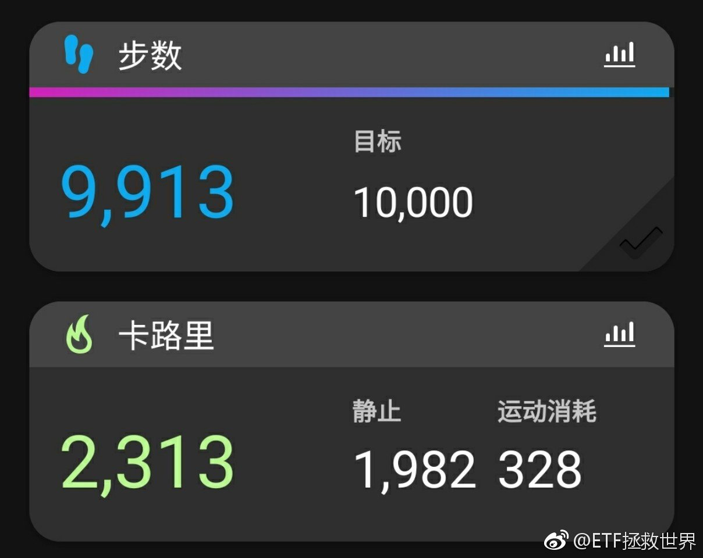

======================================================

ETF拯救世界 (5687069307) @
2017-12-13 09:05:10 Wed  
url: https://weibo.com/5687069307/FzqauldKc

我已经不敢想象20年后这世界是什么样子了。

------------------------------------------------------
转推：
>  @老马自奋蹄 (1807436544)
>  2017-12-13 07:53:27 Wed  
>  url: https:/weibo.com/1807436544/FzpHndjim/

>  台球机器人，动作稳健，什么时候跟丁俊晖比一场(http://t.cn/RT4kUTl ) ​​​

转发[24]  评论[34]  赞[72] 

======================================================

ETF拯救世界 (5687069307) @
2017-12-13 09:26:17 Wed  
url: https://weibo.com/5687069307/Fzqj3CrPD

回复@你好大麦茶:肯定比保姆对你好，没准还能给你定制一个小鲜肉帅哥的机器人伺候你。一个想法，不一定对。//@你好大麦茶:等我老了，希望陪在我身边的机器人对我好点//@ETF拯救世界:我已经不敢想象20年后这世界是什么样子了。

------------------------------------------------------
转推：
>  @老马自奋蹄 (1807436544)
>  2017-12-13 07:53:27 Wed  
>  url: https:/weibo.com/1807436544/FzpHndjim/

>  台球机器人，动作稳健，什么时候跟丁俊晖比一场(http://t.cn/RT4kUTl ) ​​​

转发[7]  评论[30]  赞[69] 

======================================================

ETF拯救世界 (5687069307) @
2017-12-13 10:14:52 Wed  
url: https://weibo.com/5687069307/FzqCM98xv

不过也不用太乐观。你想想吧，20年前，跟现在有什么实质性变化没有，没有。

科技遇到瓶颈很久了。

20年前，1997，也能上网。就是网速慢了点。电脑，有区别吗，没区别。硬盘内存小了点，屏幕小了点，也就这样。

手机变成能触摸的了，网站变成app了。没有什么实质性的发展。

家里，洗衣机电视电冰箱 ​​​

转发[20]  评论[138]  赞[144] 

======================================================

ETF拯救世界 (5687069307) @
2017-12-13 10:49:42 Wed  
url: https://weibo.com/5687069307/FzqQUwC4N

券商什么时候可以买。

很有挑战性的问题。 ​​​

转发[38]  评论[51]  赞[104] 

======================================================

ETF拯救世界 (5687069307) @
2017-12-13 10:55:31 Wed  
url: https://weibo.com/5687069307/FzqTh7KxL

勿忘国耻。//@向小田://@树蛙盒盒盒盒:一觉醒来看到这篇文章很难受，勿忘国耻，铭记历史

------------------------------------------------------
转推：
>  @ ()
>  2017-12-13 01:05:43 Wed  
>  url: 

>  抱歉，作者已设置仅展示半年内微博，此微博已不可见。 ​​​

转发[11]  评论[17]  赞[90] 

======================================================

ETF拯救世界 (5687069307) @
2017-12-13 11:00:06 Wed  
url: https://weibo.com/5687069307/FzqV8lqTQ

券商，一定是左侧一部分右侧一部分。难点在于，多少仓位给左侧，多少右侧。左侧的火候如何拿捏，节奏如何把握。弹性太大的品种要考虑清楚。

------------------------------------------------------
转推：
>  @ETF拯救世界 (5687069307)
>  2017-12-13 10:49:42 Wed  
>  url: https:/weibo.com/5687069307/FzqQUwC4N/

>  券商什么时候可以买。
>  
>  很有挑战性的问题。 ​​​

转发[29]  评论[43]  赞[109] 

======================================================

ETF拯救世界 (5687069307) @
2017-12-13 11:18:15 Wed  
url: https://weibo.com/5687069307/Fzr2uwPRq

行业，我的预计，未来20年是这样的。

首先大消费还是最赚钱不用说。日常消费+医药医疗。医药医疗市值占比会加大，继续跑大牛股，所以行业指基我们肯定要配一部分。娱乐业也包含在里面。据说steam一半玩家都是中国的。

金融领域都不会死，20年后肯定都在，不过应该有分化。保险应该还可以，券商波动大 ​​​

转发[250]  评论[155]  赞[261] 

======================================================

ETF拯救世界 (5687069307) @
2017-12-13 11:27:36 Wed  
url: https://weibo.com/5687069307/Fzr6j0zgE

回复@lasting8888:A股的军工都是伪军工。哪里有波音/洛克希德马丁那样的公司……概念炒一炒就好了……//@lasting8888:回复@天影198:第三次世界大战的时候  军工会超乎想象

------------------------------------------------------
转推：
>  @ETF拯救世界 (5687069307)
>  2017-12-13 11:18:15 Wed  
>  url: https:/weibo.com/5687069307/Fzr2uwPRq/

>  行业，我的预计，未来20年是这样的。
>  
>  首先大消费还是最赚钱不用说。日常消费+医药医疗。医药医疗市值占比会加大，继续跑大牛股，所以行业指基我们肯定要配一部分。娱乐业也包含在里面。据说steam一半玩家都是中国的。
>  
>  金融领域都不会死，20年后肯定都在，不过应该有分化。保险应该还可以，券商波动大 ​​​

转发[6]  评论[20]  赞[71] 

======================================================

ETF拯救世界 (5687069307) @
2017-12-13 11:40:50 Wed  
url: https://weibo.com/5687069307/FzrbFF9If

回复@小宝_霸霸:地产股的走势要看房地产行业的情况了。具体我不好说，我只能说，未来20年房地产股票的价格波动会非常非常非常大……大概率。//@小宝_霸霸:谢指点，地产呢益达哥？

------------------------------------------------------
转推：
>  @ETF拯救世界 (5687069307)
>  2017-12-13 11:18:15 Wed  
>  url: https:/weibo.com/5687069307/Fzr2uwPRq/

>  行业，我的预计，未来20年是这样的。
>  
>  首先大消费还是最赚钱不用说。日常消费+医药医疗。医药医疗市值占比会加大，继续跑大牛股，所以行业指基我们肯定要配一部分。娱乐业也包含在里面。据说steam一半玩家都是中国的。
>  
>  金融领域都不会死，20年后肯定都在，不过应该有分化。保险应该还可以，券商波动大 ​​​

转发[10]  评论[32]  赞[74] 

======================================================

ETF拯救世界 (5687069307) @
2017-12-13 15:06:00 Wed  
url: https://weibo.com/5687069307/FzswWwlPN

人生不如意十之八九。

健康活着就好。

能不能抄到底都是缘分……[并不简单] ​​​

转发[13]  评论[48]  赞[156] 

======================================================

ETF拯救世界 (5687069307) @
2017-12-13 15:10:42 Wed  
url: https://weibo.com/5687069307/FzsyR1dIY

但是有一个没问题的，就是只要反弹，一定比大盘指数先创新高。大盘指数回到高点，就一定比上次高点时候赚得多。跌的时候跌的还少，这就是魅力所在。。。。

------------------------------------------------------
转推：
>  @ETF拯救世界 (5687069307)
>  2017-12-13 15:06:00 Wed  
>  url: https:/weibo.com/5687069307/FzswWwlPN/

>  人生不如意十之八九。
>  
>  健康活着就好。
>  
>  能不能抄到底都是缘分……[并不简单] ​​​

转发[5]  评论[38]  赞[136] 

======================================================

ETF拯救世界 (5687069307) @
2017-12-13 17:14:15 Wed  
url: https://weibo.com/5687069307/Fztn0dwMn

回复@ssss坐看云起:哈哈，翻出来了。今年真的太特殊了，大盘指数和实际A股大多数股票的走势。无论如何，我监测超过十年，今年居然让分析师们说对了……//@ssss坐看云起:益达，看来这次郭嘉队给分析师们助攻了

------------------------------------------------------
转推：
>  @新浪证券 (1642585887)
>  2016-12-22 23:59:37 Thu  
>  url: https:/weibo.com/1642585887/Enll5rrqT/

>  【2017年券商投资策略会大全：中信等18家券商预测行情】“2017年度投资策略会”已接近尾声，涨跌策略预测、板块配置、个股推荐等成为年度投资策略报告的重头戏。这18家券商已经立字为据，来年这一天，让行情说话，看看哪家券商才是真言。http://t.cn/RICDWjo ​​​

转发[4]  评论[17]  赞[57] 

======================================================

ETF拯救世界 (5687069307) @
2017-12-13 17:23:37 Wed  
url: https://weibo.com/5687069307/FztqNFoWe

讲真，你们两个站在我面前，我真的会脸盲……

------------------------------------------------------
转推：
>  @澎湃新闻 (5044281310)
>  2017-12-13 17:20:03 Wed  
>  url: https:/weibo.com/5044281310/Fztpm9QpA/

>  【女子买两部苹果手机，均被女同事面部解锁】http://t.cn/RTMsSUd 近日，江苏南京的颜女士先后买了两部iPhone X手机，却均能被一位非亲属关系的女同事面部解锁。她担心手机的安全问题。苹果店工作人员表示这是个案如不满意可退货。（视频来源：江苏网络电视台）http://t.cn/RTMsSUg ​​​

转发[7]  评论[32]  赞[59] 

======================================================

ETF拯救世界 (5687069307) @
2017-12-13 21:17:39 Wed  
url: https://weibo.com/5687069307/FzuXNqP9B

每日打卡（122）

刚才出去跑了一公里，呼吸肺疼，太冷了。老老实实回来享受暖气了 ​​​

转发[0]  评论[54]  赞[102] 

+++++++++++++++++++++++++++++++++++++++++++++++++++++

图片：

======================================================

ETF拯救世界 (5687069307) @
2017-12-14 05:39:13 Thu  
url: https://weibo.com/5687069307/FzyfnFhaB

辣鸡

差几厘

[泪] ​​​

转发[1]  评论[57]  赞[74] 

+++++++++++++++++++++++++++++++++++++++++++++++++++++

图片：
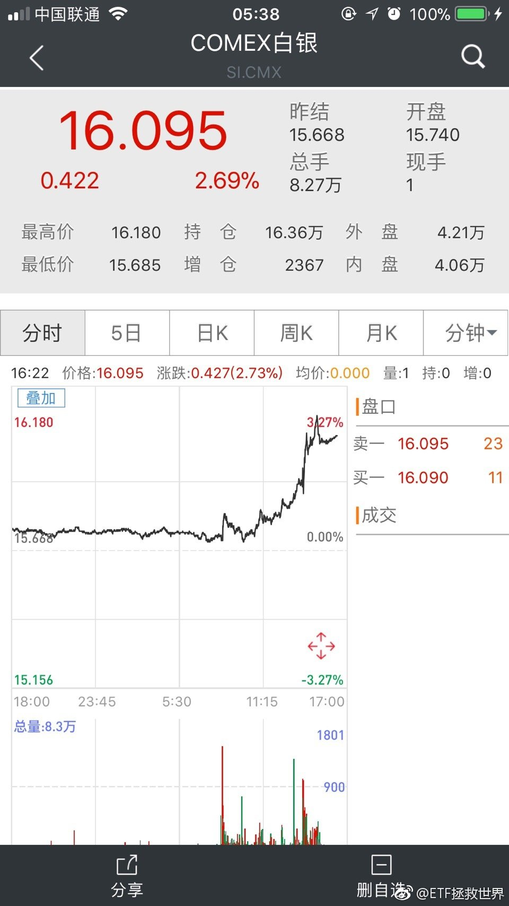

======================================================

ETF拯救世界 (5687069307) @
2017-12-14 08:44:51 Thu  
url: https://weibo.com/5687069307/FzzsK1qF9

突然发现最近看好中小股票的人多起来了。怎么办。需不需要继续逆向。

------------------------------------------------------
转推：
>  @ETF拯救世界 (5687069307)
>  2017-12-06 14:47:17 Wed  
>  url: https:/weibo.com/5687069307/FyopS9ORt/

>  再说一次，谁看不起小股票，下波牛市至少少赚一半 ​​​

转发[19]  评论[41]  赞[85] 

======================================================

ETF拯救世界 (5687069307) @
2017-12-14 09:01:55 Thu  
url: https://weibo.com/5687069307/FzzzF4vgY

有没有用群晖的朋友。

我的群晖同步盘，也就是cloud station driver文件夹里面，总是自动生成很多0字节的文件。非常讨厌。怎么设置才能让它消失。 ​​​

转发[2]  评论[43]  赞[42] 

+++++++++++++++++++++++++++++++++++++++++++++++++++++

图片：
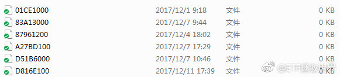

======================================================

ETF拯救世界 (5687069307) @
2017-12-14 09:04:52 Thu  
url: https://weibo.com/5687069307/FzzARy2Tq

回复@取个名字真TMTMD难:有区别的。很多小盘股肯定是不行了，没那么多钱去炒它们。但是中小盘股里有好东西，现在很多人开始发掘这个了。我们的创业板指数可以说是最好的100只创业板指数，500指数算是最好的500只中盘指数。这跟那些三无的垃圾完全不同。

------------------------------------------------------
转推：
>  @ETF拯救世界 (5687069307)
>  2017-12-06 14:47:17 Wed  
>  url: https:/weibo.com/5687069307/FyopS9ORt/

>  再说一次，谁看不起小股票，下波牛市至少少赚一半 ​​​

转发[17]  评论[26]  赞[95] 

======================================================

ETF拯救世界 (5687069307) @
2017-12-14 09:27:30 Thu  
url: https://weibo.com/5687069307/FzzK2jQSz

被那么多人看到的风险就不是风险。真正的风险来自于非常不起眼的地方。突然长大，引爆全场，花火般美丽。//@曹增辉:转发微博

------------------------------------------------------
转推：
>  @21世纪经济报道 (1651428902)
>  2017-12-14 07:37:22 Thu  
>  url: https:/weibo.com/1651428902/Fzz1lfyjM/

>  【钟伟：国人将要面对的灰犀牛】包括精英阶层在内的许多国民可能会面临这种感慨，即中国经济日益繁荣，民众生活显著提升，但也会面临这样的困惑，世界越来越精彩，挣大钱却越来越艰难。为什么？http://t.cn/RTJm4pP ​​​

转发[18]  评论[29]  赞[92] 

======================================================

ETF拯救世界 (5687069307) @
2017-12-14 09:53:08 Thu  
url: https://weibo.com/5687069307/FzzUs3lRo

干不干 ​​​

转发[2]  评论[262]  赞[210] 

======================================================

ETF拯救世界 (5687069307) @
2017-12-14 11:06:14 Thu  
url: https://weibo.com/5687069307/FzAo7pZlE

可能是借了现金贷。

------------------------------------------------------
转推：
>  @蓝鲸TMT网 (3866012793)
>  2017-12-14 11:02:26 Thu  
>  url: https:/weibo.com/3866012793/FzAmAhjt5/

>  【贾跃亭妻子刷卡额度2000元 却开万元月薪请家教】贾跃亭在接受采访时曾说“小薇的卡被冻结，只能刷2000块”可如今额度两千的甘薇，却要出万元月薪为孩子聘英语家教。据悉贾跃亭已被法院列入了“老赖”名单，根据规定“老赖”的子女不可以就读高收费私立学校。（每日经济新闻） ​​​

转发[4]  评论[59]  赞[75] 

======================================================

ETF拯救世界 (5687069307) @
2017-12-14 13:23:02 Thu  
url: https://weibo.com/5687069307/FzBhEeX9N

券商股是这样的。

你把成本控制好，五年不赚钱，没事。踏踏实实的。

然后一年150%，年化妥妥超过巴菲特。

所以最关键两点，成本不要高+踏踏实实拿着等牛来。 ​​​

转发[61]  评论[167]  赞[238] 

======================================================

ETF拯救世界 (5687069307) @
2017-12-14 14:10:41 Thu  
url: https://weibo.com/5687069307/FzBAZkCFY

中证500跌幅0.1%，券商指数跌幅1.7%。

不骗你，真的特别凶残。一定要做好心理准备。 ​​​

转发[10]  评论[92]  赞[182] 

======================================================

ETF拯救世界 (5687069307) @
2017-12-14 15:25:51 Thu  
url: https://weibo.com/5687069307/FzC5v3ROZ

开个会回来538了，晚上回家慢慢看吧…… ​​​

转发[0]  评论[57]  赞[149] 

+++++++++++++++++++++++++++++++++++++++++++++++++++++

图片：
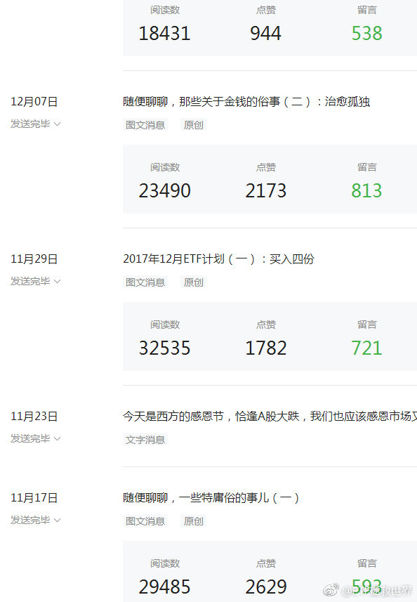

======================================================

ETF拯救世界 (5687069307) @
2017-12-14 16:09:27 Thu  
url: https://weibo.com/5687069307/FzCnceu6I

很多事情啊，讲个分寸。度把握好了什么都好说，度把握不好容易出事。

我这里啊，一直其乐融融。开玩笑什么也都没事。不过开玩笑的时候还是要有分寸，否则引起其他人反感就没必要了。每天糟心事儿还不够多啊，还来网上添堵。

所以以后就都客气点吧。不然您哪天突然没法跟大家交流了就可惜了。 ​​​

转发[5]  评论[102]  赞[236] 

======================================================

ETF拯救世界 (5687069307) @
2017-12-15 08:57:09 Fri  
url: https://weibo.com/5687069307/FzIYdjGrv

8848配股是非常合理的。从公司和老孙的角度来讲，非常合理，符合一贯作风。 ​​​

转发[3]  评论[60]  赞[101] 

======================================================

ETF拯救世界 (5687069307) @
2017-12-15 09:50:04 Fri  
url: https://weibo.com/5687069307/FzJjHqeZF

$证券公司 sz399975$   我认为360-400点应该是极限底部了…… ​​​

转发[180]  评论[122]  赞[136] 

======================================================

ETF拯救世界 (5687069307) @
2017-12-15 10:11:19 Fri  
url: https://weibo.com/5687069307/FzJskem13

不用看了，下次买入是600点了。。。

------------------------------------------------------
转推：
>  @ETF拯救世界 (5687069307)
>  2017-12-15 09:50:04 Fri  
>  url: https:/weibo.com/5687069307/FzJjHqeZF/

>  $证券公司 sz399975$   我认为360-400点应该是极限底部了…… ​​​

转发[17]  评论[45]  赞[94] 

======================================================

ETF拯救世界 (5687069307) @
2017-12-15 10:16:13 Fri  
url: https://weibo.com/5687069307/FzJuk5S0O

有些数学知识在投资里面还是很重要的。比如这个。

你在1800点买入证券指数，到400点是亏损78%。

那你等到腰斩，900点买入，觉得很安全了吧，到400点亏损是56%。

控制风险永远是投资的第一课。 ​​​

转发[45]  评论[98]  赞[186] 

======================================================

ETF拯救世界 (5687069307) @
2017-12-15 11:12:04 Fri  
url: https://weibo.com/5687069307/FzJQZbVzJ

再来做一道数学题。

800点买入证券指数，跌一半，400点再买入同样的金额。

你的成本是533，而不是你想象的600。

如果回到800点，你的盈利是50%。

如果800点就不贵，最后涨回1800，那么你的盈利是237%。 ​​​

转发[185]  评论[125]  赞[178] 

======================================================

ETF拯救世界 (5687069307) @
2017-12-15 11:16:47 Fri  
url: https://weibo.com/5687069307/FzJSTBRko

延伸：如果800点买入1份，400点买入2份，则你的成本会直线下降至480。回到800你的盈利是67%。这个结论可以说是我们整个体系的core。

------------------------------------------------------
转推：
>  @ETF拯救世界 (5687069307)
>  2017-12-15 11:12:04 Fri  
>  url: https:/weibo.com/5687069307/FzJQZbVzJ/

>  再来做一道数学题。
>  
>  800点买入证券指数，跌一半，400点再买入同样的金额。
>  
>  你的成本是533，而不是你想象的600。
>  
>  如果回到800点，你的盈利是50%。
>  
>  如果800点就不贵，最后涨回1800，那么你的盈利是237%。 ​​​

转发[97]  评论[75]  赞[157] 

======================================================

ETF拯救世界 (5687069307) @
2017-12-15 11:26:02 Fri  
url: https://weibo.com/5687069307/FzJWErSkC

回复@核电牛奶:问题在于如果真的到了400，你，或者你的家人，或者你的客户，能否承受攒了一辈子的资产瞬间减少了50%，如果此时需要用钱则是灭顶之灾。所以“认为800不贵”不应该是买完的理由。解决这个问题，需要用概率+配置来解决。

------------------------------------------------------
转推：
>  @ETF拯救世界 (5687069307)
>  2017-12-15 11:12:04 Fri  
>  url: https:/weibo.com/5687069307/FzJQZbVzJ/

>  再来做一道数学题。
>  
>  800点买入证券指数，跌一半，400点再买入同样的金额。
>  
>  你的成本是533，而不是你想象的600。
>  
>  如果回到800点，你的盈利是50%。
>  
>  如果800点就不贵，最后涨回1800，那么你的盈利是237%。 ​​​

转发[25]  评论[66]  赞[126] 

======================================================

ETF拯救世界 (5687069307) @
2017-12-15 13:20:59 Fri  
url: https://weibo.com/5687069307/FzKHjmTLY

……

------------------------------------------------------
转推：
>  @ETF拯救世界 (5687069307)
>  2017-12-15 09:50:04 Fri  
>  url: https:/weibo.com/5687069307/FzJjHqeZF/

>  $证券公司 sz399975$   我认为360-400点应该是极限底部了…… ​​​

转发[3]  评论[17]  赞[56] 

======================================================

ETF拯救世界 (5687069307) @
2017-12-15 13:23:21 Fri  
url: https://weibo.com/5687069307/FzKIh5w27

是不是有人监控我微博！专门来打脸的！站出来！我现在就打电话摇银儿！

------------------------------------------------------
转推：
>  @财联社APP (2868676035)
>  2017-12-15 13:21:56 Fri  
>  url: https:/weibo.com/2868676035/FzKHGDNf5/

>  【快讯：券商股午后异动拉升】财联社12月15日讯，券商股午后异动拉升。截至发稿，第一创业、华鑫股份、宝硕股份、国盛金控、山西证券、浙商证券、财通证券等个股均有拉升。 ​​​

转发[2]  评论[63]  赞[114] 

======================================================

ETF拯救世界 (5687069307) @
2017-12-15 13:54:36 Fri  
url: https://weibo.com/5687069307/FzKUXmMOz

把概率和预测混为一谈的人，可以说完全不理解基于概率的投资体系。

预测是，我预测未来要涨还是跌，根据这个做出投资决策。

概率是，我不知道未来涨还是跌。但我会想办法计算涨跌的概率。然后根据涨跌概率，再加上预期盈利与预期亏损的因子，做出最佳（系统设计者自认为）仓位配置。在这种情况下，风 ​​​

转发[159]  评论[148]  赞[211] 

======================================================

ETF拯救世界 (5687069307) @
2017-12-15 14:06:13 Fri  
url: https://weibo.com/5687069307/FzKZG96ix

举例证券行业指数。把模型简化，如果我在800点买入，配置0.6%。如果我认为它最大的下跌幅度是50%，则我最多会损失0.3%。如果上涨，涨100%，只会赚0.6%。这时候根据各种模型计算涨跌的可能性，然后把预期收益放入模型。显然，损失0.3%绝对可以接受。但是只赚0.6%不可以。下跌概率小时即可加仓。

------------------------------------------------------
转推：
>  @ETF拯救世界 (5687069307)
>  2017-12-15 13:54:36 Fri  
>  url: https:/weibo.com/5687069307/FzKUXmMOz/

>  把概率和预测混为一谈的人，可以说完全不理解基于概率的投资体系。
>  
>  预测是，我预测未来要涨还是跌，根据这个做出投资决策。
>  
>  概率是，我不知道未来涨还是跌。但我会想办法计算涨跌的概率。然后根据涨跌概率，再加上预期盈利与预期亏损的因子，做出最佳（系统设计者自认为）仓位配置。在这种情况下，风 ​​​

转发[21]  评论[42]  赞[106] 

======================================================

ETF拯救世界 (5687069307) @
2017-12-15 14:08:17 Fri  
url: https://weibo.com/5687069307/FzL0waTkm

回复@红枫0825:你坐在那里想概率，当然是主观的。如果我用很多数据和模型去支撑呢。如果你说，历史数据对判断未来概率毫无用处，那我也就没话说啦。主观因素会有，投资本来就是科学+艺术。但基础是科学。

------------------------------------------------------
转推：
>  @ETF拯救世界 (5687069307)
>  2017-12-15 13:54:36 Fri  
>  url: https:/weibo.com/5687069307/FzKUXmMOz/

>  把概率和预测混为一谈的人，可以说完全不理解基于概率的投资体系。
>  
>  预测是，我预测未来要涨还是跌，根据这个做出投资决策。
>  
>  概率是，我不知道未来涨还是跌。但我会想办法计算涨跌的概率。然后根据涨跌概率，再加上预期盈利与预期亏损的因子，做出最佳（系统设计者自认为）仓位配置。在这种情况下，风 ​​​

转发[18]  评论[18]  赞[94] 

======================================================

ETF拯救世界 (5687069307) @
2017-12-15 14:17:50 Fri  
url: https://weibo.com/5687069307/FzL4o5YQV

我估计除了听消息，任何投资方式都是与概率有关，只是很多人没有意识到而已。

价值投资不是概率吗。当然是了。拼命研究报表，找到好的企业，排除差的，这就是提高成功概率的方法。是不是找到好企业就没有失败的概率了？当然不是。所以这时候买入一组好企业，成功的概率就大幅增加。

趋势投资不是吗？ ​​​

转发[60]  评论[81]  赞[174] 

======================================================

ETF拯救世界 (5687069307) @
2017-12-15 14:34:09 Fri  
url: https://weibo.com/5687069307/FzLb0A3bp

其实我想问的是，为什么那个行人要在马路上走。旁边不是明明有人行道吗。

------------------------------------------------------
转推：
>  @澎湃新闻 (5044281310)
>  2017-12-15 14:30:38 Fri  
>  url: https:/weibo.com/5044281310/FzL9AeIzv/

>  【父母没空接，12岁女孩独自骑车撞死人】http://t.cn/RToVgR9 12月13日，江苏淮安一名年仅12岁的女孩独自骑电动车将一路人撞倒致死。其父称，家中有两个孩子无法同时接送，就让大女儿自己骑车上学。按相关规定，骑行电动车须年满16周岁，骑车女孩父亲作为监护人将承担责任。（视频来源：江苏网络广播电 ​​​

转发[4]  评论[21]  赞[43] 

======================================================

ETF拯救世界 (5687069307) @
2017-12-15 14:38:16 Fri  
url: https://weibo.com/5687069307/FzLcGfZ3A

回复@炒股为生2015:讲了0.5%的东西。//@炒股为生2015:这帮人，下跌行情在这套E大的投资方法呢？@ETF拯救世界 E大，小心这帮人学会了抄你的底[哈哈]

------------------------------------------------------
转推：
>  @ETF拯救世界 (5687069307)
>  2017-12-15 14:17:50 Fri  
>  url: https:/weibo.com/5687069307/FzL4o5YQV/

>  我估计除了听消息，任何投资方式都是与概率有关，只是很多人没有意识到而已。
>  
>  价值投资不是概率吗。当然是了。拼命研究报表，找到好的企业，排除差的，这就是提高成功概率的方法。是不是找到好企业就没有失败的概率了？当然不是。所以这时候买入一组好企业，成功的概率就大幅增加。
>  
>  趋势投资不是吗？ ​​​

转发[2]  评论[26]  赞[78] 

======================================================

ETF拯救世界 (5687069307) @
2017-12-15 14:41:44 Fri  
url: https://weibo.com/5687069307/FzLe5tmFx

回复@披头士披头士:变形警车珀利说的啊！你敢不听？//@披头士披头士:所以我们家孩子问我为什么她只能坐安全座椅不能坐副驾驶的时候，我应该如何回答她？//@ETF拯救世界:其实我想问的是，为什么那个行人要在马路上走。旁边不是明明有人行道吗。

------------------------------------------------------
转推：
>  @澎湃新闻 (5044281310)
>  2017-12-15 14:30:38 Fri  
>  url: https:/weibo.com/5044281310/FzL9AeIzv/

>  【父母没空接，12岁女孩独自骑车撞死人】http://t.cn/RToVgR9 12月13日，江苏淮安一名年仅12岁的女孩独自骑电动车将一路人撞倒致死。其父称，家中有两个孩子无法同时接送，就让大女儿自己骑车上学。按相关规定，骑行电动车须年满16周岁，骑车女孩父亲作为监护人将承担责任。（视频来源：江苏网络广播电 ​​​

转发[1]  评论[20]  赞[42] 

======================================================

ETF拯救世界 (5687069307) @
2017-12-15 15:31:29 Fri  
url: https://weibo.com/5687069307/FzLyhpFLn

惊呆了。刚才有个新的研究发现：

如果今天你持仓的品种下跌5%，那么你明天需要涨5.26个巴仙才能回本。

神秘的数学！感觉去麻省理工教数学已经绰绰有余了。 ​​​

转发[11]  评论[121]  赞[202] 

======================================================

ETF拯救世界 (5687069307) @
2017-12-16 20:35:51 Sat  
url: https://weibo.com/5687069307/FzWYkmdzU

每日打卡（123）

坚持 ​​​

转发[0]  评论[34]  赞[150] 

+++++++++++++++++++++++++++++++++++++++++++++++++++++

图片：

======================================================

ETF拯救世界 (5687069307) @
2017-12-17 22:11:42 Sun  
url: https://weibo.com/5687069307/FA71J1UEU

每日打卡（124）

随便跑七公里。跑步的时候能静下来想很多事。 ​​​

转发[3]  评论[73]  赞[166] 

+++++++++++++++++++++++++++++++++++++++++++++++++++++

图片：
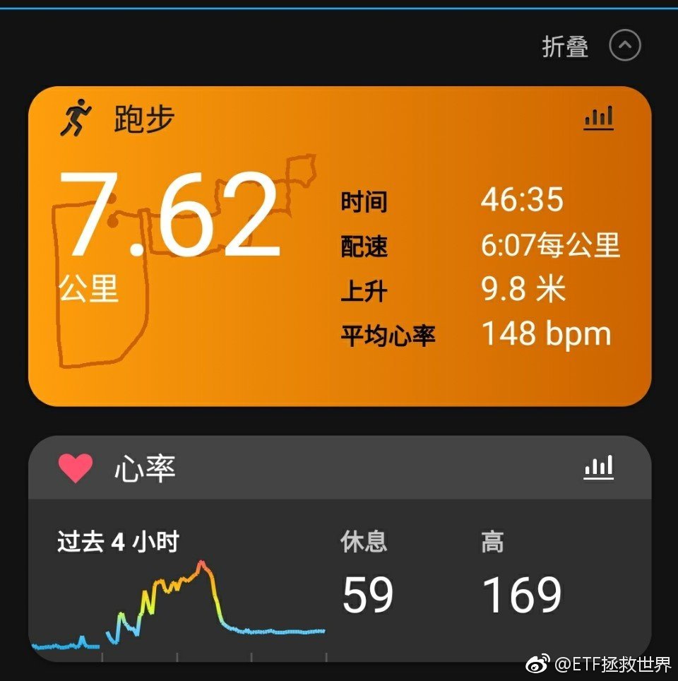

======================================================

ETF拯救世界 (5687069307) @
2017-12-18 10:31:22 Mon  
url: https://weibo.com/5687069307/FAbRXxYVs

44%//@ETF拯救世界:获利比例剩50%了……

------------------------------------------------------
转推：
>  @ETF拯救世界 (5687069307)
>  2017-12-04 09:36:18 Mon  
>  url: https:/weibo.com/5687069307/Fy3wE2Hh9/

>  8848获利筹码只剩55%了。这个股票换手虽然低，但是在高位几个月了，基本上接盘的都吃饱了。。。 ​​​

转发[35]  评论[30]  赞[70] 

======================================================

ETF拯救世界 (5687069307) @
2017-12-18 11:00:50 Mon  
url: https://weibo.com/5687069307/FAc3UAHLm

回复@不想長珍珠的蚌:不是不看好。毕竟我不懂。我害怕的是太过疯狂的企业家和投资者。这里只是做个记录而已。//@不想長珍珠的蚌:e大为啥不看好融创，就是因为涨了5倍，估值过高吗//@ETF拯救世界:44%//@ETF拯救世界:获利比例剩50%了……

------------------------------------------------------
转推：
>  @ETF拯救世界 (5687069307)
>  2017-12-04 09:36:18 Mon  
>  url: https:/weibo.com/5687069307/Fy3wE2Hh9/

>  8848获利筹码只剩55%了。这个股票换手虽然低，但是在高位几个月了，基本上接盘的都吃饱了。。。 ​​​

转发[1]  评论[28]  赞[78] 

======================================================

ETF拯救世界 (5687069307) @
2017-12-18 12:41:10 Mon  
url: https://weibo.com/5687069307/FAcIDgwLs

回复@鸡架熊:据说身体好的人心率会低一些。一个观点，不一定对。//@鸡架熊:静息状态下，心率不到60？！是不是问题啊

------------------------------------------------------
转推：
>  @ETF拯救世界 (5687069307)
>  2017-12-17 22:11:42 Sun  
>  url: https:/weibo.com/5687069307/FA71J1UEU/

>  每日打卡（124）
>  
>  随便跑七公里。跑步的时候能静下来想很多事。 ​​​

转发[1]  评论[51]  赞[61] 

======================================================

ETF拯救世界 (5687069307) @
2017-12-18 12:55:11 Mon  
url: https://weibo.com/5687069307/FAcOk5wf0

“他丫的”是哪儿的话？前面不要加“他”。中间可以加“挺”，就是“丫挺（轻读）的”或者“丫嗯（连读）的”……当然，最好不要乱用这个，这是骂人的，用不好很尴尬。不过无论如何，“他丫的”这样的说法简直不能忍……//@佐罗_厚恩投资://@梧桐爱隐形:区块链，这次弄明白了[哈哈]

------------------------------------------------------
转推：
>  @ ()
>  2017-12-18 10:17:00 Mon  
>  url: 

>  抱歉，此微博已被作者删除。查看帮助：http://t.cn/Rfd3rQV

转发[5]  评论[27]  赞[49] 

======================================================

ETF拯救世界 (5687069307) @
2017-12-18 13:31:22 Mon  
url: https://weibo.com/5687069307/FAd31a8j0

2400只下跌。

cool。 ​​​

转发[23]  评论[40]  赞[95] 

======================================================

ETF拯救世界 (5687069307) @
2017-12-18 13:42:45 Mon  
url: https://weibo.com/5687069307/FAd7DqBmH

回复@奥斯特洛夫大柴夫斯基:谁人背后无人说,谁人背后不说人。无所谓啊~好了遭人嫉妒，差了让人瞧不起；忠厚人家说你傻，精明了人家说你奸；冷淡了大伙儿说你傲，热情了群众说你浪！走在前头儿挨闷棍儿，走在后头儿全没份儿！

------------------------------------------------------
转推：
>  @ETF拯救世界 (5687069307)
>  2017-12-18 13:31:22 Mon  
>  url: https:/weibo.com/5687069307/FAd31a8j0/

>  2400只下跌。
>  
>  cool。 ​​​

转发[17]  评论[39]  赞[162] 

======================================================

ETF拯救世界 (5687069307) @
2017-12-18 13:48:36 Mon  
url: https://weibo.com/5687069307/FAda0zUaE

回复@_ideast:我觉得半个月到6.5-7以上应该能见到吧。//@_ideast:老大，12月下旬了，逆回购最近如何操作最优？还是搞点银行理财，收益也可以

------------------------------------------------------
转推：
>  @ETF拯救世界 (5687069307)
>  2017-12-18 13:31:22 Mon  
>  url: https:/weibo.com/5687069307/FAd31a8j0/

>  2400只下跌。
>  
>  cool。 ​​​

转发[1]  评论[15]  赞[70] 

======================================================

ETF拯救世界 (5687069307) @
2017-12-18 14:24:15 Mon  
url: https://weibo.com/5687069307/FAdou0QL5

控制节奏。 ​​​

转发[23]  评论[30]  赞[119] 

======================================================

ETF拯救世界 (5687069307) @
2017-12-18 14:29:08 Mon  
url: https://weibo.com/5687069307/FAdqthvhu

回复@万里浮云无股也呻吟:中证500极限30%-35%吧。再多我就理解不了了。//@万里浮云无股也呻吟:中小板怎么的还有一半以上的跌幅，对吧

------------------------------------------------------
转推：
>  @ETF拯救世界 (5687069307)
>  2017-12-18 14:24:15 Mon  
>  url: https:/weibo.com/5687069307/FAdou0QL5/

>  控制节奏。 ​​​

转发[11]  评论[39]  赞[87] 

======================================================

ETF拯救世界 (5687069307) @
2017-12-18 14:52:58 Mon  
url: https://weibo.com/5687069307/FAdA8uB7H

回复@我在故快乐:也因为你的仓位合适了。//@我在故快乐:这几次大跌没加车冲动了，看来看老大微博还是有作用的。

------------------------------------------------------
转推：
>  @ETF拯救世界 (5687069307)
>  2017-12-18 14:24:15 Mon  
>  url: https:/weibo.com/5687069307/FAdou0QL5/

>  控制节奏。 ​​​

转发[2]  评论[13]  赞[74] 

======================================================

ETF拯救世界 (5687069307) @
2017-12-18 15:02:11 Mon  
url: https://weibo.com/5687069307/FAdDSrN5n

真的喜欢小马哥和东哥的面相。主要是眼神。

------------------------------------------------------
转推：
>  @华梨子 (1916255521)
>  2017-12-18 14:45:11 Mon  
>  url: https:/weibo.com/1916255521/FAdwYyUBG/

>  http://t.cn/RTTXw3f 网友说：阿里太可怕，抱团取暖。[笑cry] ​​​

转发[6]  评论[31]  赞[69] 

======================================================

ETF拯救世界 (5687069307) @
2017-12-18 15:26:26 Mon  
url: https://weibo.com/5687069307/FAdNIAONr

2017年，我的遗愿清单上又增加了一项新的内容。

“探索1%的地球。” ​​​

转发[1]  评论[43]  赞[122] 

+++++++++++++++++++++++++++++++++++++++++++++++++++++

图片：

======================================================

ETF拯救世界 (5687069307) @
2017-12-18 17:10:15 Mon  
url: https://weibo.com/5687069307/FAetRFBJr

回复@LEVELEEE:是的。时间换空间。//@LEVELEEE:回复@ETF拯救世界:要是明年能有20%利润增速，又不涨不跌，是不是就没多大下跌空间了？

------------------------------------------------------
转推：
>  @ETF拯救世界 (5687069307)
>  2017-12-18 14:24:15 Mon  
>  url: https:/weibo.com/5687069307/FAdou0QL5/

>  控制节奏。 ​​​

转发[2]  评论[22]  赞[90] 

======================================================

ETF拯救世界 (5687069307) @
2017-12-18 21:00:07 Mon  
url: https://weibo.com/5687069307/FAfZayJN3

这就是传说中的羊群了//@林萍在日本:一呼百应[doge]//@頑俞渝羭諭蝓貐://@本杰努布:羊：人类太好逗了 我们能逗她一天。

------------------------------------------------------
转推：
>  @ ()
>  2017-12-18 18:29:42 Mon  
>  url: 

>  抱歉，作者已设置仅展示半年内微博，此微博已不可见。 ​​​

转发[183]  评论[23]  赞[74] 

======================================================

ETF拯救世界 (5687069307) @
2017-12-19 10:13:43 Tue  
url: https://weibo.com/5687069307/FAlbifVAl

37%//@ETF拯救世界:44%//@ETF拯救世界:获利比例剩50%了……

------------------------------------------------------
转推：
>  @ETF拯救世界 (5687069307)
>  2017-12-04 09:36:18 Mon  
>  url: https:/weibo.com/5687069307/Fy3wE2Hh9/

>  8848获利筹码只剩55%了。这个股票换手虽然低，但是在高位几个月了，基本上接盘的都吃饱了。。。 ​​​

转发[32]  评论[30]  赞[66] 

======================================================

ETF拯救世界 (5687069307) @
2017-12-19 10:23:35 Tue  
url: https://weibo.com/5687069307/FAlfiaRdD

雾霾有人骂，天气好了还是有人骂……

------------------------------------------------------
转推：
>  @ ()
>  2017-12-18 23:27:44 Mon  
>  url: 

>  抱歉，作者已设置仅展示半年内微博，此微博已不可见。 ​​​

转发[1]  评论[26]  赞[49] 

======================================================

ETF拯救世界 (5687069307) @
2017-12-19 10:45:11 Tue  
url: https://weibo.com/5687069307/FAlo3Apxw

$养老产业 sz399812$   真的稳 ​​​

转发[4]  评论[27]  赞[93] 

======================================================

ETF拯救世界 (5687069307) @
2017-12-19 10:48:05 Tue  
url: https://weibo.com/5687069307/FAlpeA2v1

$证券公司 sz399975$   不想骂你，自觉点 ​​​

转发[1]  评论[36]  赞[93] 

======================================================

ETF拯救世界 (5687069307) @
2017-12-19 14:15:25 Tue  
url: https://weibo.com/5687069307/FAmLonPhR

我知道很多朋友心里都很着急，为什么不断波动就是不涨/不跌。赚不到大钱。

真的不用急。股票不敢说，好的指数，它们的成分股每一天都在为你挣钱。业绩在不断上升，价值也越来越大。

价格不涨，急什么。证券投资就是这样，三年不涨，一涨吃三年。现在的大牛股平安，08-2014一分钱都没涨，六年啊。而且 ​​​

转发[152]  评论[156]  赞[265] 

======================================================

ETF拯救世界 (5687069307) @
2017-12-19 14:40:05 Tue  
url: https://weibo.com/5687069307/FAmVpaBPN

回复@布RUCE:一定先于大盘新高。就这么决定了。//@布RUCE:好久没有新高了[哼]

------------------------------------------------------
转推：
>  @ETF拯救世界 (5687069307)
>  2017-12-19 14:15:25 Tue  
>  url: https:/weibo.com/5687069307/FAmLonPhR/

>  我知道很多朋友心里都很着急，为什么不断波动就是不涨/不跌。赚不到大钱。
>  
>  真的不用急。股票不敢说，好的指数，它们的成分股每一天都在为你挣钱。业绩在不断上升，价值也越来越大。
>  
>  价格不涨，急什么。证券投资就是这样，三年不涨，一涨吃三年。现在的大牛股平安，08-2014一分钱都没涨，六年啊。而且 ​​​

转发[46]  评论[12]  赞[81] 

======================================================

ETF拯救世界 (5687069307) @
2017-12-19 14:44:27 Tue  
url: https://weibo.com/5687069307/FAmXb5bIZ

回复@O_Zhong_O:06-07几乎所有指数两年六倍。12-15创业板2年多接近7倍。同期医药三倍，500是4倍。就凭中国人这种赌性，我相信下个牛市恐怕要比12-15更疯狂。//@O_Zhong_O:指数也能几年不涨，然后一下翻好几倍吗？一个问题，不一定提得好[doge]

------------------------------------------------------
转推：
>  @ETF拯救世界 (5687069307)
>  2017-12-19 14:15:25 Tue  
>  url: https:/weibo.com/5687069307/FAmLonPhR/

>  我知道很多朋友心里都很着急，为什么不断波动就是不涨/不跌。赚不到大钱。
>  
>  真的不用急。股票不敢说，好的指数，它们的成分股每一天都在为你挣钱。业绩在不断上升，价值也越来越大。
>  
>  价格不涨，急什么。证券投资就是这样，三年不涨，一涨吃三年。现在的大牛股平安，08-2014一分钱都没涨，六年啊。而且 ​​​

转发[27]  评论[50]  赞[99] 

======================================================

ETF拯救世界 (5687069307) @
2017-12-19 14:49:58 Tue  
url: https://weibo.com/5687069307/FAmZpFlZr

上面两条微博可以连起来看。

0607之所以翻6倍，是因为01-05跌了整整4年多。

12-15之所以那么多小指数暴涨几倍，正是因为之前07-12/13跌了5、6年（有过一次大反弹）。

任何大行情都是要把大多数人的信心、耐心磨没了才会产生。要不然，那么多人一起抄底赚大钱？做梦呢。 ​​​

转发[65]  评论[74]  赞[134] 

======================================================

ETF拯救世界 (5687069307) @
2017-12-19 14:57:21 Tue  
url: https://weibo.com/5687069307/FAn2qbG07

回复@木木不哭木木:不能机械看。但风格轮换是所有证券市场都会存在的现象。轮换不仅与时间空间有关，还与行情的性质、经济周期有关。不过有一点，哪里便宜点哪里，提前埋伏，等风来。风来了继续埋伏便宜的。所以计划有两年+50%的品种，也有刚开始布局的品种。

------------------------------------------------------
转推：
>  @ETF拯救世界 (5687069307)
>  2017-12-19 14:49:58 Tue  
>  url: https:/weibo.com/5687069307/FAmZpFlZr/

>  上面两条微博可以连起来看。
>  
>  0607之所以翻6倍，是因为01-05跌了整整4年多。
>  
>  12-15之所以那么多小指数暴涨几倍，正是因为之前07-12/13跌了5、6年（有过一次大反弹）。
>  
>  任何大行情都是要把大多数人的信心、耐心磨没了才会产生。要不然，那么多人一起抄底赚大钱？做梦呢。 ​​​

转发[14]  评论[31]  赞[86] 

======================================================

ETF拯救世界 (5687069307) @
2017-12-19 15:22:51 Tue  
url: https://weibo.com/5687069307/FAncLlCnF

回复@5ive55555:都是定折吧。//@5ive55555:@5ive55555: E大 能不能请教一下您怎么看今天很多分级a大跌 或者什么原因导致的 唔该晒

------------------------------------------------------
转推：
>  @ETF拯救世界 (5687069307)
>  2017-12-19 14:49:58 Tue  
>  url: https:/weibo.com/5687069307/FAmZpFlZr/

>  上面两条微博可以连起来看。
>  
>  0607之所以翻6倍，是因为01-05跌了整整4年多。
>  
>  12-15之所以那么多小指数暴涨几倍，正是因为之前07-12/13跌了5、6年（有过一次大反弹）。
>  
>  任何大行情都是要把大多数人的信心、耐心磨没了才会产生。要不然，那么多人一起抄底赚大钱？做梦呢。 ​​​

转发[1]  评论[15]  赞[58] 

======================================================

ETF拯救世界 (5687069307) @
2017-12-19 23:26:27 Tue  
url: https://weibo.com/5687069307/FAqn3v5Lx

大宵是资本市场揣着明白装糊涂第一人。

------------------------------------------------------
转推：
>  @蓝鲸财经记者工作平台 (1885454921)
>  2017-12-19 18:47:24 Tue  
>  url: https:/weibo.com/1885454921/FAoxN7n1J/

>  【鲸视频:李大霄谈投资逻辑 跟着国家走吃喝啥都有 国家叫买股就买股】在2018网易经济学家年会上,李大霄表示,我的核心逻辑,就是“做好人,买好股,得好报”。国家叫我们买股票就买股票,国家叫我们买房子就买房子。什么时候叫我们买房子?房贷七折,就是叫我们买房子;什么时候叫我们买股票呢?股市发不出去的 ​​​

转发[16]  评论[50]  赞[84] 

======================================================

ETF拯救世界 (5687069307) @
2017-12-19 23:33:19 Tue  
url: https://weibo.com/5687069307/FAqpR0Fe8

每日打卡（125）

都要健康 ​​​

转发[0]  评论[13]  赞[111] 

+++++++++++++++++++++++++++++++++++++++++++++++++++++

图片：

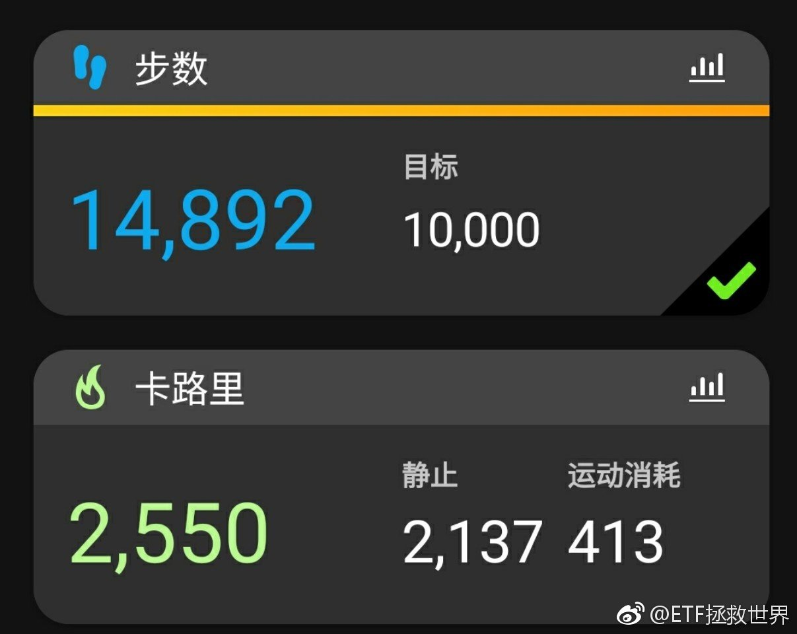

======================================================

ETF拯救世界 (5687069307) @
2017-12-20 08:57:41 Wed  
url: https://weibo.com/5687069307/FAu6UyGv6

就看法院的了。如果葫芦僧乱判葫芦案，恐怕就是下一个彭宇案，会影响深远。

------------------------------------------------------
转推：
>  @ ()
>  2017-12-20 08:13:20 Wed  
>  url: 

>  抱歉，作者已设置仅展示半年内微博，此微博已不可见。 ​​​

转发[8]  评论[27]  赞[36] 

======================================================

ETF拯救世界 (5687069307) @
2017-12-20 09:16:53 Wed  
url: https://weibo.com/5687069307/FAueID9Lo

回复@Mili:这事的事实众说纷纭。我不评论案情本身。我是说，彭宇案的传播对中国社会造成的巨大的影响。我说的是影响，而非真相。真相，也许永远会被埋葬。

------------------------------------------------------
转推：
>  @ ()
>  2017-12-20 08:13:20 Wed  
>  url: 

>  抱歉，作者已设置仅展示半年内微博，此微博已不可见。 ​​​

转发[3]  评论[22]  赞[32] 

======================================================

ETF拯救世界 (5687069307) @
2017-12-20 09:49:17 Wed  
url: https://weibo.com/5687069307/FAurRfHJi

信任两个字在当今这个年代已经非常难得。

所以如果有人信你，最好珍惜。

别人因你而亏损，当然可以一句“大家都是成年人，不要做巨婴”而推的干净，然而其实未必可以那么简单。

所以我坚持一个原则，任何计划里的品种，绝不建议高于我的成本价买入。我不会说自己1块买的，到了1.5还说值值值。你只可 ​​​

转发[24]  评论[124]  赞[366] 

======================================================

ETF拯救世界 (5687069307) @
2017-12-20 09:59:46 Wed  
url: https://weibo.com/5687069307/FAuw78cZ2

稳。忍不住奶一口

------------------------------------------------------
转推：
>  @ETF拯救世界 (5687069307)
>  2017-12-19 10:45:11 Tue  
>  url: https:/weibo.com/5687069307/FAlo3Apxw/

>  $养老产业 sz399812$   真的稳 ​​​

转发[3]  评论[24]  赞[67] 

======================================================

ETF拯救世界 (5687069307) @
2017-12-20 10:13:28 Wed  
url: https://weibo.com/5687069307/FAuBGiamr

回复@蜀行天下:意念盘，无需操作。类似于暗物质与气功的结合体。无形无色无味，但当量相当于一万多亿资金在操盘……//@蜀行天下:每次看到你说奶一口我都要深思一段时间，这又是什么操作，我会不会错过一个亿//@ETF拯救世界:稳。忍不住奶一口

------------------------------------------------------
转推：
>  @ETF拯救世界 (5687069307)
>  2017-12-19 10:45:11 Tue  
>  url: https:/weibo.com/5687069307/FAlo3Apxw/

>  $养老产业 sz399812$   真的稳 ​​​

转发[2]  评论[32]  赞[77] 

======================================================

ETF拯救世界 (5687069307) @
2017-12-20 10:18:32 Wed  
url: https://weibo.com/5687069307/FAuDJkEdN

$证券公司 sz399975$   够狠。跌破753就是700见了。然后就是我们的补仓点位，600…… ​​​

转发[45]  评论[61]  赞[109] 

======================================================

ETF拯救世界 (5687069307) @
2017-12-20 10:39:35 Wed  
url: https://weibo.com/5687069307/FAuMi3lQA

我该说什么呢。 ​​​

转发[7]  评论[117]  赞[43] 

+++++++++++++++++++++++++++++++++++++++++++++++++++++

图片：

======================================================

ETF拯救世界 (5687069307) @
2017-12-20 10:51:54 Wed  
url: https://weibo.com/5687069307/FAuRhrkMP

都不对。我就两个字：反弹！ [并不简单]

------------------------------------------------------
转推：
>  @ETF拯救世界 (5687069307)
>  2017-12-20 10:39:35 Wed  
>  url: https:/weibo.com/5687069307/FAuMi3lQA/

>  我该说什么呢。 ​​​

转发[0]  评论[24]  赞[64] 

======================================================

ETF拯救世界 (5687069307) @
2017-12-20 10:59:14 Wed  
url: https://weibo.com/5687069307/FAuUg82pI

回复@小祝Joochill:是的。再说我这个ID，“ETF拯救世界”，意思是指数基金能够让很多炒股不赚钱的人改变投资命运，而非某个人可以拯救世界，我还没那么二……主语是ETF……//@小祝Joochill:这个人语文学的不好，连E大的名字里主语是什么都没有弄清楚……

------------------------------------------------------
转推：
>  @ETF拯救世界 (5687069307)
>  2017-12-20 10:39:35 Wed  
>  url: https:/weibo.com/5687069307/FAuMi3lQA/

>  我该说什么呢。 ​​​

转发[3]  评论[27]  赞[65] 

======================================================

ETF拯救世界 (5687069307) @
2017-12-20 11:20:27 Wed  
url: https://weibo.com/5687069307/FAv2S4FSW

回复@枫93:不会的。我不信一个在村里用50块钱和芙蓉王贿选村长的治疗半身不遂的无证中医会来跟计划……//@枫93:搜了Ｅ大  冒牌货 用了Ｅ大头像冒牌的有18个[doge][doge][doge]他是不是被冒牌的骗了 来找正版的Ｅ大报复了呢 搞错了人呢[污]

------------------------------------------------------
转推：
>  @ETF拯救世界 (5687069307)
>  2017-12-20 10:39:35 Wed  
>  url: https:/weibo.com/5687069307/FAuMi3lQA/

>  我该说什么呢。 ​​​

转发[1]  评论[37]  赞[66] 

======================================================

ETF拯救世界 (5687069307) @
2017-12-20 12:51:29 Wed  
url: https://weibo.com/5687069307/FAvDP4LBC

回复@i云腾致雨:不可能[doge]//@i云腾致雨:E大心态为什么这么好？别人找的女朋友比你的漂亮，也不嫉妒？[允悲]

------------------------------------------------------
转推：
>  @ETF拯救世界 (5687069307)
>  2017-12-20 09:49:17 Wed  
>  url: https:/weibo.com/5687069307/FAurRfHJi/

>  信任两个字在当今这个年代已经非常难得。
>  
>  所以如果有人信你，最好珍惜。
>  
>  别人因你而亏损，当然可以一句“大家都是成年人，不要做巨婴”而推的干净，然而其实未必可以那么简单。
>  
>  所以我坚持一个原则，任何计划里的品种，绝不建议高于我的成本价买入。我不会说自己1块买的，到了1.5还说值值值。你只可 ​​​

转发[2]  评论[43]  赞[103] 

======================================================

ETF拯救世界 (5687069307) @
2017-12-20 13:28:17 Wed  
url: https://weibo.com/5687069307/FAvSKtMaj

35%。最近这个区间是成交稀少区。还有大量成本在18左右的筹码。//@ETF拯救世界:37%//@ETF拯救世界:44%//@ETF拯救世界:获利比例剩50%了……

------------------------------------------------------
转推：
>  @ETF拯救世界 (5687069307)
>  2017-12-04 09:36:18 Mon  
>  url: https:/weibo.com/5687069307/Fy3wE2Hh9/

>  8848获利筹码只剩55%了。这个股票换手虽然低，但是在高位几个月了，基本上接盘的都吃饱了。。。 ​​​

转发[30]  评论[17]  赞[64] 

======================================================

ETF拯救世界 (5687069307) @
2017-12-20 14:15:37 Wed  
url: https://weibo.com/5687069307/FAwbYf12e

好歹也得反弹一波涨个10%换换手吧……//@ETF拯救世界:35%。最近这个区间是成交稀少区。还有大量成本在18左右的筹码。//@ETF拯救世界:37%//@ETF拯救世界:44%//@ETF拯救世界:获利比例剩50%了……

------------------------------------------------------
转推：
>  @ETF拯救世界 (5687069307)
>  2017-12-04 09:36:18 Mon  
>  url: https:/weibo.com/5687069307/Fy3wE2Hh9/

>  8848获利筹码只剩55%了。这个股票换手虽然低，但是在高位几个月了，基本上接盘的都吃饱了。。。 ​​​

转发[27]  评论[12]  赞[50] 

======================================================

ETF拯救世界 (5687069307) @
2017-12-20 14:24:07 Wed  
url: https://weibo.com/5687069307/FAwfq94xS

回复@豆丁没事:不会。仓位非常巴适。不用着急加车，月底正点开车。//@豆丁没事:E神，这周会发车吗//@ETF拯救世界:好歹也得反弹一波涨个10%换换手吧……//@ETF拯救世界:35%。最近这个区间是成交稀少区。还有大量成本在18左右的筹码。//@ETF拯救世界:37%//@ETF拯救世界:44%

------------------------------------------------------
转推：
>  @ETF拯救世界 (5687069307)
>  2017-12-04 09:36:18 Mon  
>  url: https:/weibo.com/5687069307/Fy3wE2Hh9/

>  8848获利筹码只剩55%了。这个股票换手虽然低，但是在高位几个月了，基本上接盘的都吃饱了。。。 ​​​

转发[1]  评论[26]  赞[69] 

======================================================

ETF拯救世界 (5687069307) @
2017-12-20 14:43:42 Wed  
url: https://weibo.com/5687069307/FAwnn3qZt

回复@李贤1985_319:不是看到。是极限跌幅。跌到400我不吃惊。就酱。//@李贤1985_319:在雪球很多人都说证券指数已经到了底部区域，e兄看到600，甚至能到500的理由是什么呢🤔🙏。

------------------------------------------------------
转推：
>  @ETF拯救世界 (5687069307)
>  2017-12-20 10:18:32 Wed  
>  url: https:/weibo.com/5687069307/FAuDJkEdN/

>  $证券公司 sz399975$   够狠。跌破753就是700见了。然后就是我们的补仓点位，600…… ​​​

转发[3]  评论[15]  赞[64] 

======================================================

ETF拯救世界 (5687069307) @
2017-12-20 14:51:15 Wed  
url: https://weibo.com/5687069307/FAwqr40hD

回复@李贤1985_319:http://t.cn/RT3hDdC //@李贤1985_319:在雪球很多人都说证券指数已经到了底部区域，e兄看到600，甚至能到500的理由是什么呢🤔🙏。

------------------------------------------------------
转推：
>  @ETF拯救世界 (5687069307)
>  2017-12-20 10:18:32 Wed  
>  url: https:/weibo.com/5687069307/FAuDJkEdN/

>  $证券公司 sz399975$   够狠。跌破753就是700见了。然后就是我们的补仓点位，600…… ​​​

转发[9]  评论[22]  赞[95] 

======================================================

ETF拯救世界 (5687069307) @
2017-12-20 15:58:52 Wed  
url: https://weibo.com/5687069307/FAwRSwflE

500估值又新低了。

人生美好。 ​​​

转发[11]  评论[89]  赞[196] 

======================================================

ETF拯救世界 (5687069307) @
2017-12-20 16:05:37 Wed  
url: https://weibo.com/5687069307/FAwUD1etc

回复@老股民穿越牛熊:不是看，我是算。我每天都算，跑程序跑20分钟。源数据出来第一时间就算。算估值是我人生中第三大最爱干的事。你咬我呀。[笑而不语] 一会儿就拉黑。//@老股民穿越牛熊:你每天看估值累不累？心态不好 慢慢练心态吧！

------------------------------------------------------
转推：
>  @ETF拯救世界 (5687069307)
>  2017-12-20 15:58:52 Wed  
>  url: https:/weibo.com/5687069307/FAwRSwflE/

>  500估值又新低了。
>  
>  人生美好。 ​​​

转发[3]  评论[65]  赞[152] 

======================================================

ETF拯救世界 (5687069307) @
2017-12-20 16:11:12 Wed  
url: https://weibo.com/5687069307/FAwWT2OoM

“我先拉黑你”，佢话。

我笑喷了。拉黑不拉黑谁care啊。我根本就不想看你的微博好吗……蜜汁自信……

跑到别人微博评论里说，我要拉黑你。这是一种什么精神…… 我都唔知你系边个…… ​​​

转发[3]  评论[113]  赞[179] 

======================================================

ETF拯救世界 (5687069307) @
2017-12-21 06:24:36 Thu  
url: https://weibo.com/5687069307/FACxhq5b1

……

------------------------------------------------------
转推：
>  @ ()
>  2017-12-21 05:53:24 Thu  
>  url: 

>  抱歉，此微博已被作者删除。查看帮助：http://t.cn/Rfd3rQV

转发[0]  评论[40]  赞[48] 

======================================================

ETF拯救世界 (5687069307) @
2017-12-21 06:34:23 Thu  
url: https://weibo.com/5687069307/FACBfeaV8

相当完美的区间波动 ​​​

转发[2]  评论[48]  赞[97] 

+++++++++++++++++++++++++++++++++++++++++++++++++++++

图片：
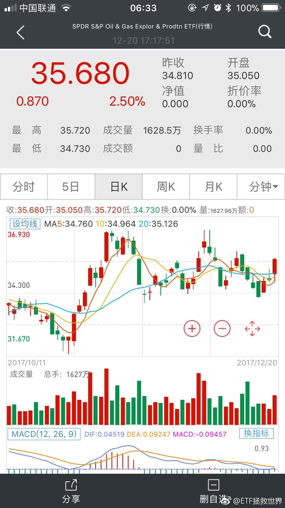

======================================================

ETF拯救世界 (5687069307) @
2017-12-21 09:45:38 Thu  
url: https://weibo.com/5687069307/FADQSwOXI

看看是不是有机会加仓美元债。[并不简单]//@华尔街见闻APP:在岸人民币创3月来新高

------------------------------------------------------
转推：
>  @ ()
>  2017-12-20 16:56:03 Wed  
>  url: 

>  抱歉，此微博已被作者删除。查看帮助：http://t.cn/Rfd3rQV

转发[14]  评论[28]  赞[72] 

======================================================

ETF拯救世界 (5687069307) @
2017-12-21 10:11:42 Thu  
url: https://weibo.com/5687069307/FAE1swq1L

$证券公司 sz399975$  新低。下跌空间打开了 ​​​

转发[32]  评论[41]  赞[109] 

======================================================

ETF拯救世界 (5687069307) @
2017-12-21 10:15:26 Thu  
url: https://weibo.com/5687069307/FAE2YaLBB

回复@5DONY:其实我不想说，怕很多朋友会误入歧途：2012年11月底，我买了中证500b。但是各位，分级B非常微妙，不是那么简单加杠杆，要叠加时间因素，长期会死。以后如果有机会再说吧。//@5DONY:E大，有些品种如果确实极限底会考虑上杠杠吗？比如买入分级B

------------------------------------------------------
转推：
>  @ ()
>  2017-12-20 16:56:03 Wed  
>  url: 

>  抱歉，此微博已被作者删除。查看帮助：http://t.cn/Rfd3rQV

转发[11]  评论[29]  赞[77] 

======================================================

ETF拯救世界 (5687069307) @
2017-12-21 10:47:05 Thu  
url: https://weibo.com/5687069307/FAEfP7NBM

回复@星渚:早吗。我买的那天是历史最低。那天相当有趣，如果按照上午的跌幅就要下折了，结果下午拉升，没有下折，5倍杠杆，开始上涨。收盘一算，进入历史最低区域。写了那篇文章。那天真的值得纪念。//@星渚:老大买的有点早，不过肯定是小比例的，作为冲锋队用的。

------------------------------------------------------
转推：
>  @ ()
>  2017-12-20 16:56:03 Wed  
>  url: 

>  抱歉，此微博已被作者删除。查看帮助：http://t.cn/Rfd3rQV

转发[3]  评论[16]  赞[57] 

======================================================

ETF拯救世界 (5687069307) @
2017-12-21 10:49:39 Thu  
url: https://weibo.com/5687069307/FAEgRzyoj

回复@Yanb丶:[并不简单] 就问你服不服//@Yanb丶:毒奶界唯你最强

------------------------------------------------------
转推：
>  @ETF拯救世界 (5687069307)
>  2017-12-21 10:11:42 Thu  
>  url: https:/weibo.com/5687069307/FAE1swq1L/

>  $证券公司 sz399975$  新低。下跌空间打开了 ​​​

转发[3]  评论[25]  赞[74] 

======================================================

ETF拯救世界 (5687069307) @
2017-12-21 11:02:57 Thu  
url: https://weibo.com/5687069307/FAEmg1KCV

这就是“弹性”。应该还不到时候。到时候它会让你目瞪口呆。。//@ETF拯救世界:回复@Yanb丶:[并不简单] 就问你服不服//@Yanb丶:毒奶界唯你最强

------------------------------------------------------
转推：
>  @ETF拯救世界 (5687069307)
>  2017-12-21 10:11:42 Thu  
>  url: https:/weibo.com/5687069307/FAE1swq1L/

>  $证券公司 sz399975$  新低。下跌空间打开了 ​​​

转发[2]  评论[42]  赞[87] 

======================================================

ETF拯救世界 (5687069307) @
2017-12-21 13:54:36 Thu  
url: https://weibo.com/5687069307/FAFtW9ruU

快回去了。

------------------------------------------------------
转推：
>  @ETF拯救世界 (5687069307)
>  2017-12-11 10:33:41 Mon  
>  url: https:/weibo.com/5687069307/Fz7Tq5XPH/

>  $养老产业 sz399812$   之前一路都在说，不要卖。结果回调5%。你会不会想，还不如卖了，再买回来，成本降低5%，多好啊。
>  
>  你事后看，这样简直完美。问题在于，你能做到吗。卖在最高点，买回在最低点？
>  
>  且不说一来一回手续费有多少，就说这个时机的把握，能做到？
>  
>  买了成本不高的品种，最重要的就不是 ​​​

转发[2]  评论[28]  赞[98] 

======================================================

ETF拯救世界 (5687069307) @
2017-12-21 14:59:51 Thu  
url: https://weibo.com/5687069307/FAFUqufPm

如期而至。。//@ETF拯救世界:好歹也得反弹一波涨个10%换换手吧……//@ETF拯救世界:35%。最近这个区间是成交稀少区。还有大量成本在18左右的筹码。//@ETF拯救世界:37%//@ETF拯救世界:44%//@ETF拯救世界:获利比例剩50%了……

------------------------------------------------------
转推：
>  @ETF拯救世界 (5687069307)
>  2017-12-04 09:36:18 Mon  
>  url: https:/weibo.com/5687069307/Fy3wE2Hh9/

>  8848获利筹码只剩55%了。这个股票换手虽然低，但是在高位几个月了，基本上接盘的都吃饱了。。。 ​​​

转发[22]  评论[17]  赞[69] 

======================================================

ETF拯救世界 (5687069307) @
2017-12-21 17:09:27 Thu  
url: https://weibo.com/5687069307/FAGL1xHpG

回复@用户6244991818:可以。目前50、300、180、100、500、广发医药、恒生、黄金、H、中小、创业等ETF全都支持融资买入啊。//@用户6244991818:问个弱弱的问题:指数基金可以抵押融资，但融来的资买不了指数基金。e大说的低点融资，是用来干嘛？//@ETF拯救世界:如期而至。。

------------------------------------------------------
转推：
>  @ETF拯救世界 (5687069307)
>  2017-12-04 09:36:18 Mon  
>  url: https:/weibo.com/5687069307/Fy3wE2Hh9/

>  8848获利筹码只剩55%了。这个股票换手虽然低，但是在高位几个月了，基本上接盘的都吃饱了。。。 ​​​

转发[21]  评论[44]  赞[84] 

======================================================

ETF拯救世界 (5687069307) @
2017-12-21 22:55:05 Thu  
url: https://weibo.com/5687069307/FAJ1jFR6u

每日打卡（126）

两组其实量不够 ​​​

转发[0]  评论[20]  赞[96] 

+++++++++++++++++++++++++++++++++++++++++++++++++++++

图片：

======================================================

ETF拯救世界 (5687069307) @
2017-12-22 06:36:48 Fri  
url: https://weibo.com/5687069307/FAM2Jk9Bg

有波动就有利润，提款机 ​​​

转发[14]  评论[130]  赞[157] 

+++++++++++++++++++++++++++++++++++++++++++++++++++++

图片：

======================================================

ETF拯救世界 (5687069307) @
2017-12-22 11:01:16 Fri  
url: https://weibo.com/5687069307/FANM4DcAj

回复@April·D·S:品种很多。各国etf、各种久期的国债etf，reits，tips。总能挖出来能买的。//@April·D·S:回复@ETF拯救世界: 钱又要回一部分到雪盈了，之前在投机做空，好不容易决定不做空了，回归A股了，E大要做美股ETF了[允悲] 但美股目前高估中，E大也只是研究还不会买对吧?

------------------------------------------------------
转推：
>  @ETF拯救世界 (5687069307)
>  2017-12-22 06:36:48 Fri  
>  url: https:/weibo.com/5687069307/FAM2Jk9Bg/

>  有波动就有利润，提款机 ​​​

转发[7]  评论[39]  赞[82] 

======================================================

ETF拯救世界 (5687069307) @
2017-12-22 13:17:31 Fri  
url: https://weibo.com/5687069307/FAOFnz8PK

$全指医药 sh000991$  风是不是吹到医药了。 ​​​

转发[14]  评论[19]  赞[75] 

======================================================

ETF拯救世界 (5687069307) @
2017-12-22 13:30:58 Fri  
url: https://weibo.com/5687069307/FAOKQaAN1

回复@诸葛不亮_若如初见:给咱们抬轿子？？？//@诸葛不亮_若如初见:雪球公众号已经快一个月连续推医药了，还有我关注的别的财经类，平均两天一篇推荐医药股和医药指数的文章

------------------------------------------------------
转推：
>  @ETF拯救世界 (5687069307)
>  2017-12-22 13:17:31 Fri  
>  url: https:/weibo.com/5687069307/FAOFnz8PK/

>  $全指医药 sh000991$  风是不是吹到医药了。 ​​​

转发[0]  评论[16]  赞[70] 

======================================================

ETF拯救世界 (5687069307) @
2017-12-22 13:48:44 Fri  
url: https://weibo.com/5687069307/FAOS3dodO

回复@观海听山:今年基金超级低配医药股。就这样医药好歹今年也没跌，当然涨幅和沪深300没法比。我坚定看好这个行业。长期的看好。//@观海听山:除了那几个龙头，其它大多数医药股还是不行

------------------------------------------------------
转推：
>  @ETF拯救世界 (5687069307)
>  2017-12-22 13:17:31 Fri  
>  url: https:/weibo.com/5687069307/FAOFnz8PK/

>  $全指医药 sh000991$  风是不是吹到医药了。 ​​​

转发[6]  评论[22]  赞[81] 

======================================================

ETF拯救世界 (5687069307) @
2017-12-22 13:52:26 Fri  
url: https://weibo.com/5687069307/FAOTyjqBl

回复@Maggie的夏至:就当历史书看吧……怎么投资上面没有，只是告诉你那个金融危机发生了什么。//@Maggie的夏至:正要补充书呢看到你雪球上发的《大而不倒》。好看吗？推荐不

------------------------------------------------------
转推：
>  @ETF拯救世界 (5687069307)
>  2017-12-22 13:17:31 Fri  
>  url: https:/weibo.com/5687069307/FAOFnz8PK/

>  $全指医药 sh000991$  风是不是吹到医药了。 ​​​

转发[2]  评论[10]  赞[67] 

======================================================

ETF拯救世界 (5687069307) @
2017-12-22 14:41:26 Fri  
url: https://weibo.com/5687069307/FAPdrpA41

[拜拜] 退博了。

------------------------------------------------------
转推：
>  @ETF拯救世界 (5687069307)
>  2017-12-22 13:17:31 Fri  
>  url: https:/weibo.com/5687069307/FAOFnz8PK/

>  $全指医药 sh000991$  风是不是吹到医药了。 ​​​

转发[4]  评论[78]  赞[95] 

======================================================

ETF拯救世界 (5687069307) @
2017-12-22 15:17:01 Fri  
url: https://weibo.com/5687069307/FAPrT24SD

10年期债主力T1803收涨0.40%，创近10月27日以来新高新高；5年期债主力TF1803涨0.22%，创10月26日新高。

国泰君安表示，中短期来看，目前长端利率水平已经充分透支了利空预期，随着未来1-2个季度名义GDP回落、对监管恐慌的平抑，债市大概率将会迎来一轮级别比较大的熊市反弹，10年国债和国开收益率有望 ​​​

转发[13]  评论[39]  赞[106] 

======================================================

ETF拯救世界 (5687069307) @
2017-12-22 17:22:47 Fri  
url: https://weibo.com/5687069307/FAQgW3RNd

回复@linsuozhang2009:中文网路上当然是我的最准，还用说吗。[doge]//@linsuozhang2009:回复@卢泽森Samuel:每个大V和且慢的估值算法不见得一样，都只是为了自己的投资体系服务，没有谁对谁错或者准不准确的问题

------------------------------------------------------
转推：
>  @ETF拯救世界 (5687069307)
>  2017-12-04 09:36:18 Mon  
>  url: https:/weibo.com/5687069307/Fy3wE2Hh9/

>  8848获利筹码只剩55%了。这个股票换手虽然低，但是在高位几个月了，基本上接盘的都吃饱了。。。 ​​​

转发[2]  评论[67]  赞[152] 

======================================================

ETF拯救世界 (5687069307) @
2017-12-23 10:54:06 Sat  
url: https://weibo.com/5687069307/FAX9EBTFy

回复@飞雨的魔法袋:[哼]//@飞雨的魔法袋:白银昨晚成交了[鼓掌]//@ETF拯救世界:回复@linsuozhang2009:中文网路上当然是我的最准，还用说吗。[doge]//@linsuozhang2009:回复@卢泽森Samuel:每个大V和且慢的估值算法不见得一样，都只是为了自己的投资体系服务，没有谁对谁错或者准不准确的问题

------------------------------------------------------
转推：
>  @ETF拯救世界 (5687069307)
>  2017-12-04 09:36:18 Mon  
>  url: https:/weibo.com/5687069307/Fy3wE2Hh9/

>  8848获利筹码只剩55%了。这个股票换手虽然低，但是在高位几个月了，基本上接盘的都吃饱了。。。 ​​​

转发[1]  评论[19]  赞[54] 

======================================================

ETF拯救世界 (5687069307) @
2017-12-23 11:02:35 Sat  
url: https://weibo.com/5687069307/FAXd6gYDw

a股，原油，白银，债券，美/德，相关度都很低。再加上汇率因素，此消彼长可以不断盈利。

a股内部，也有各种风格切换。

全天候赚钱，长短结合，稳定，持续盈利，就是我们投资体系的核心思想。 ​​​

转发[90]  评论[179]  赞[299] 

======================================================

ETF拯救世界 (5687069307) @
2017-12-23 14:50:10 Sat  
url: https://weibo.com/5687069307/FAYHu5BYa

很多要二胎的都是接近中年了。不少都是老婆辞职看孩子，男方工作一旦有什么问题……

------------------------------------------------------
转推：
>  @水木社区官微 (2149648625)
>  2017-12-23 08:38:31 Sat  
>  url: https:/weibo.com/2149648625/FAWgDfDlR/

>  老公正经历中年失业，做老婆的该咋办？ ​​​

转发[21]  评论[105]  赞[85] 

======================================================

ETF拯救世界 (5687069307) @
2017-12-23 18:28:40 Sat  
url: https://weibo.com/5687069307/FB08aCtcM

很多人事事都要听父母的，根本原因在于经济依赖，还不能独立，需要父母资助。

这个没办法，既然拿人家的钱，就要听人家的话。否则，就自己多挣点，自己的事就能自己拿主意了。 ​​​

转发[15]  评论[130]  赞[256] 

======================================================

ETF拯救世界 (5687069307) @
2017-12-24 07:21:44 Sun  
url: https://weibo.com/5687069307/FB5bXw0xS

75年人口出生高峰，90年房地产股市大崩盘

------------------------------------------------------
转推：
>  @网易财经 (1974561081)
>  2017-12-23 16:04:25 Sat  
>  url: https:/weibo.com/1974561081/FAZbCu8HZ/

>  #网易财经# 【仅94万！日本今年新生人口数创历史新低】日本厚生劳动省22日公布的人口动态统计数据估算值显示，今年日本新出生人口数将仅为94.1万人，创下1899年有统计数据以来的最低值。同时，今年新婚情侣数为60.7万对，也创战后新低。http://t.cn/RHPHkey ​​​

转发[8]  评论[55]  赞[89] 

======================================================

ETF拯救世界 (5687069307) @
2017-12-25 10:34:52 Mon  
url: https://weibo.com/5687069307/FBfSRh7Ae

相信老司机没错的……新低意味着不断的大概率新低。新高同理……

------------------------------------------------------
转推：
>  @ETF拯救世界 (5687069307)
>  2017-12-21 10:11:42 Thu  
>  url: https:/weibo.com/5687069307/FAE1swq1L/

>  $证券公司 sz399975$  新低。下跌空间打开了 ​​​

转发[23]  评论[49]  赞[154] 

======================================================

ETF拯救世界 (5687069307) @
2017-12-25 10:40:57 Mon  
url: https://weibo.com/5687069307/FBfVjn1Af

回复@初夏拾穗的少年:我没法给你建议啊。我自己投资指数基金，绝对不会止损。第一它一定会涨回去，因为第二点。第二点就是我买的成本一定不高。//@初夏拾穗的少年:原有的基金要不要止损呢？已经跌了百分之十了。益达，怎么办？

------------------------------------------------------
转推：
>  @ETF拯救世界 (5687069307)
>  2017-12-21 10:11:42 Thu  
>  url: https:/weibo.com/5687069307/FAE1swq1L/

>  $证券公司 sz399975$  新低。下跌空间打开了 ​​​

转发[6]  评论[22]  赞[100] 

======================================================

ETF拯救世界 (5687069307) @
2017-12-25 10:42:34 Mon  
url: https://weibo.com/5687069307/FBfVYa6hG

说起来各位可能不信，我对2018年充满信心。即使明年此时没有大赚，也大概率已经把大部分筹码买进去了。

三年了，差不多了。 ​​​

转发[32]  评论[155]  赞[356] 

======================================================

ETF拯救世界 (5687069307) @
2017-12-25 11:29:41 Mon  
url: https://weibo.com/5687069307/FBgf6kJKT

2700只下跌。还有3天。给个面子啊 ​​​

转发[0]  评论[54]  赞[161] 

======================================================

ETF拯救世界 (5687069307) @
2017-12-25 11:30:57 Mon  
url: https://weibo.com/5687069307/FBgfCaNK7

回复@马甲不停:12月11日成分股调整。红利调整了20%的成分股，估值暴降。醉了。//@马甲不停:麻烦请教一个问题，上一期计划中，重新购买一份中证红利？这个逻辑是因为调仓，估值下降的缘故嘛，所有购买一份中证红利。

------------------------------------------------------
转推：
>  @ETF拯救世界 (5687069307)
>  2017-12-25 10:42:34 Mon  
>  url: https:/weibo.com/5687069307/FBfVYa6hG/

>  说起来各位可能不信，我对2018年充满信心。即使明年此时没有大赚，也大概率已经把大部分筹码买进去了。
>  
>  三年了，差不多了。 ​​​

转发[3]  评论[38]  赞[109] 

======================================================

ETF拯救世界 (5687069307) @
2017-12-25 14:14:29 Mon  
url: https://weibo.com/5687069307/FBhjZxy2G

越来越觉得，成功的投资需要信仰。

无论客观环境发生什么变化，无论别人称赞还是诋毁你，坚持信仰才有可能成功。

当然，信仰不等于迂腐不化，更不等于刻舟求剑。术要与时俱进，道万变不离其宗。 ​​​

转发[37]  评论[86]  赞[349] 

======================================================

ETF拯救世界 (5687069307) @
2017-12-25 15:10:19 Mon  
url: https://weibo.com/5687069307/FBhGEzUbl

中证1000+创业板综即将新低。

这意味着，3300只股票中，100多只在高位，700多只反弹到高点的一半左右。其它的2500只都快新低了。

这也与每天基本上都是2000-2500只股票下跌一致。

[并不简单] ​​​

转发[21]  评论[75]  赞[215] 

======================================================

ETF拯救世界 (5687069307) @
2017-12-25 21:50:12 Mon  
url: https://weibo.com/5687069307/FBkiY9Loe

每日打卡（127）

坚持很不容易。 ​​​

转发[0]  评论[26]  赞[186] 

+++++++++++++++++++++++++++++++++++++++++++++++++++++

图片：

======================================================

ETF拯救世界 (5687069307) @
2017-12-26 10:42:12 Tue  
url: https://weibo.com/5687069307/FBpmk9GxN

那位举报的仁兄又出动了。每次到了月底发车的时候他就来一下。

真的NB，人类。

我还是开个头条号对冲一下风险吧。。万一哪天公众号让那哥们儿给玩歇菜了怎么办。 ​​​

转发[2]  评论[211]  赞[122] 

+++++++++++++++++++++++++++++++++++++++++++++++++++++

图片：

======================================================

ETF拯救世界 (5687069307) @
2017-12-26 10:56:20 Tue  
url: https://weibo.com/5687069307/FBps40hMu

现在回头看这个，有没有一点新的体会。

------------------------------------------------------
转推：
>  @ETF拯救世界 (5687069307)
>  2017-11-23 10:55:31 Thu  
>  url: https:/weibo.com/5687069307/FwollhU4i/

>  为什么要定时交易。
>  
>  我告诉你真正的原因。
>  
>  那就是资本市场的中短期不可预测性。
>  
>  我们的任务，是把手中有限的资源，最合理优化的分配到“低估”品种上。如果“觉得”，又或者是根据“数据”，只要便宜就买，贵了就卖，很可能买卖都在半山腰。
>  
>  金融交易不是数学题。便宜了就不会跌，贵了就不会涨？不 ​​​

转发[13]  评论[37]  赞[141] 

======================================================

ETF拯救世界 (5687069307) @
2017-12-26 11:08:29 Tue  
url: https://weibo.com/5687069307/FBpwZu6Rj

回复@josephtang:送你个大保健得唔得嘅？[哼]//@josephtang:回复@ETF拯救世界:益达，指数又反弹了，我要心理按摩。[笑cry][笑cry]//@ETF拯救世界:现在回头看这个，有没有一点新的体会。

------------------------------------------------------
转推：
>  @ETF拯救世界 (5687069307)
>  2017-11-23 10:55:31 Thu  
>  url: https:/weibo.com/5687069307/FwollhU4i/

>  为什么要定时交易。
>  
>  我告诉你真正的原因。
>  
>  那就是资本市场的中短期不可预测性。
>  
>  我们的任务，是把手中有限的资源，最合理优化的分配到“低估”品种上。如果“觉得”，又或者是根据“数据”，只要便宜就买，贵了就卖，很可能买卖都在半山腰。
>  
>  金融交易不是数学题。便宜了就不会跌，贵了就不会涨？不 ​​​

转发[5]  评论[58]  赞[95] 

======================================================

ETF拯救世界 (5687069307) @
2017-12-26 13:32:02 Tue  
url: https://weibo.com/5687069307/FBqtfwLtY

回复@Yoran_咩咩咩:真的有些品种可能这样，所以炒个股要小心//@Yoran_咩咩咩:咋不能图片评论，现在别的财经博主评论下面都是a股必然港股化僵尸化，还有说必须要认清a股未来丧失流动性的先决战略再去选股。吓得我还是来e大这按摩心灵吧[可怜]//@ETF拯救世界:回复@josephtang:送你个大保健得唔得嘅？[哼]

------------------------------------------------------
转推：
>  @ETF拯救世界 (5687069307)
>  2017-11-23 10:55:31 Thu  
>  url: https:/weibo.com/5687069307/FwollhU4i/

>  为什么要定时交易。
>  
>  我告诉你真正的原因。
>  
>  那就是资本市场的中短期不可预测性。
>  
>  我们的任务，是把手中有限的资源，最合理优化的分配到“低估”品种上。如果“觉得”，又或者是根据“数据”，只要便宜就买，贵了就卖，很可能买卖都在半山腰。
>  
>  金融交易不是数学题。便宜了就不会跌，贵了就不会涨？不 ​​​

转发[2]  评论[15]  赞[72] 

======================================================

ETF拯救世界 (5687069307) @
2017-12-26 14:21:04 Tue  
url: https://weibo.com/5687069307/FBqNaa8pE

长短结合逆回购搞起来！ ​​​

转发[7]  评论[107]  赞[155] 

======================================================

ETF拯救世界 (5687069307) @
2017-12-27 04:05:41 Wed  
url: https://weibo.com/5687069307/FBwbSfEhM

突破了 ​​​

转发[2]  评论[89]  赞[130] 

+++++++++++++++++++++++++++++++++++++++++++++++++++++

图片：

======================================================

ETF拯救世界 (5687069307) @
2017-12-27 08:07:53 Wed  
url: https://weibo.com/5687069307/FBxMbmRU7

回复@灰涩柳丁:别人说什么一点都不重要。金融投资不是投票产生赢家。//@灰涩柳丁:还记得在某论坛那时还被好多人质疑了[跪了]

------------------------------------------------------
转推：
>  @ETF拯救世界 (5687069307)
>  2017-12-27 04:05:41 Wed  
>  url: https:/weibo.com/5687069307/FBwbSfEhM/

>  突破了 ​​​

转发[1]  评论[27]  赞[112] 

======================================================

ETF拯救世界 (5687069307) @
2017-12-27 10:02:15 Wed  
url: https://weibo.com/5687069307/FBywBrOE7

逆回购长短结合搞起来！ ​​​

转发[5]  评论[44]  赞[95] 

======================================================

ETF拯救世界 (5687069307) @
2017-12-27 10:20:12 Wed  
url: https://weibo.com/5687069307/FByDTAGDl

回复@o我有一只猫:元旦后的话，3、4、7都可以。1月2、3回到账户。7会多一天。14天收益率少，但多吃7天。//@o我有一只猫:今天搞哪个结算到元旦节后的啊？

------------------------------------------------------
转推：
>  @ETF拯救世界 (5687069307)
>  2017-12-27 10:02:15 Wed  
>  url: https:/weibo.com/5687069307/FBywBrOE7/

>  逆回购长短结合搞起来！ ​​​

转发[3]  评论[17]  赞[60] 

======================================================

ETF拯救世界 (5687069307) @
2017-12-27 10:22:07 Wed  
url: https://weibo.com/5687069307/FByEFpa65

港真，14天我预期在6.5以上都好满意嘅，没想到给了8%。我都好中意解个系场！ ​​​

转发[15]  评论[41]  赞[87] 

======================================================

ETF拯救世界 (5687069307) @
2017-12-27 10:24:44 Wed  
url: https://weibo.com/5687069307/FByFJjkcU

回复@Sebastian-Canton:哪能港，肉身还没去过广东……//@Sebastian-Canton:E大广东人？

------------------------------------------------------
转推：
>  @ETF拯救世界 (5687069307)
>  2017-12-27 10:22:07 Wed  
>  url: https:/weibo.com/5687069307/FByEFpa65/

>  港真，14天我预期在6.5以上都好满意嘅，没想到给了8%。我都好中意解个系场！ ​​​

转发[1]  评论[26]  赞[56] 

======================================================

ETF拯救世界 (5687069307) @
2017-12-27 10:33:10 Wed  
url: https://weibo.com/5687069307/FByJ9uUYL

8.6。贫穷限制了我的想象力，今天没钱了！

------------------------------------------------------
转推：
>  @ETF拯救世界 (5687069307)
>  2017-12-27 10:22:07 Wed  
>  url: https:/weibo.com/5687069307/FByEFpa65/

>  港真，14天我预期在6.5以上都好满意嘅，没想到给了8%。我都好中意解个系场！ ​​​

转发[10]  评论[21]  赞[67] 

======================================================

ETF拯救世界 (5687069307) @
2017-12-27 10:36:57 Wed  
url: https://weibo.com/5687069307/FByKGDwQT

9.05。哭出来了。//@ETF拯救世界:8.6。贫穷限制了我的想象力，今天没钱了！

------------------------------------------------------
转推：
>  @ETF拯救世界 (5687069307)
>  2017-12-27 10:22:07 Wed  
>  url: https:/weibo.com/5687069307/FByEFpa65/

>  港真，14天我预期在6.5以上都好满意嘅，没想到给了8%。我都好中意解个系场！ ​​​

转发[8]  评论[145]  赞[82] 

======================================================

ETF拯救世界 (5687069307) @
2017-12-27 11:26:24 Wed  
url: https://weibo.com/5687069307/FBz4KCbkp

长久期国债个券崩的一塌糊涂。 ​​​

转发[2]  评论[22]  赞[99] 

======================================================

ETF拯救世界 (5687069307) @
2017-12-27 11:39:17 Wed  
url: https://weibo.com/5687069307/FBz9Zrjb4

我说14天你们说1、3、4、7，鸡同鸭讲……//@ETF拯救世界:9.05。哭出来了。//@ETF拯救世界:8.6。贫穷限制了我的想象力，今天没钱了！

------------------------------------------------------
转推：
>  @ETF拯救世界 (5687069307)
>  2017-12-27 10:22:07 Wed  
>  url: https:/weibo.com/5687069307/FByEFpa65/

>  港真，14天我预期在6.5以上都好满意嘅，没想到给了8%。我都好中意解个系场！ ​​​

转发[6]  评论[64]  赞[78] 

======================================================

ETF拯救世界 (5687069307) @
2017-12-27 13:56:37 Wed  
url: https://weibo.com/5687069307/FBA3Js4Ta

如果你的油气网格赚了，逆回购卖了好价格，同时指数又跌了，过两天还能买到便宜货。

别嘚瑟。

低调。

木秀于林风必摧之。毕竟长者说过…… ​​​

转发[13]  评论[77]  赞[189] 

======================================================

ETF拯救世界 (5687069307) @
2017-12-27 14:01:31 Wed  
url: https://weibo.com/5687069307/FBA5J0sDf

是，刚才有朋友说还有白银。我就不跟你们一起开心了，毕竟这波差几厘没买到。

是时候进化策略了。[并不简单] ​​​

转发[3]  评论[44]  赞[105] 

======================================================

ETF拯救世界 (5687069307) @
2017-12-27 14:51:09 Wed  
url: https://weibo.com/5687069307/FBApS0QD9

有些蓝筹看看前期低点能否撑住。撑不住就大概率是M了。

不懂技术，瞎说。 ​​​

转发[1]  评论[43]  赞[124] 

======================================================

ETF拯救世界 (5687069307) @
2017-12-27 15:04:06 Wed  
url: https://weibo.com/5687069307/FBAv81zim

我估计，这里95%的朋友没有过满地便宜货，满地金子钻石等你捡的经历。

怎么讲，几年一次，捡的时候感觉很复杂，五味杂陈。

主要是每次都会嫌弃自己钱太少。 ​​​

转发[50]  评论[156]  赞[212] 

======================================================

ETF拯救世界 (5687069307) @
2017-12-27 15:07:12 Wed  
url: https://weibo.com/5687069307/FBAwnDlvT

回复@Cubic_N:那么容易让你猜到就不叫金融市场了。所以，有花堪折直须折，莫待花落空折枝//@Cubic_N:@ETF拯救世界 E大如何评价逆回购今日尾盘跌的一塌糊涂，不是一般收盘暴力拉升么[允悲]//@ETF拯救世界:我说14天你们说1、3、4、7，鸡同鸭讲……//@ETF拯救世界:9.05。哭出来了。

------------------------------------------------------
转推：
>  @ETF拯救世界 (5687069307)
>  2017-12-27 10:22:07 Wed  
>  url: https:/weibo.com/5687069307/FByEFpa65/

>  港真，14天我预期在6.5以上都好满意嘅，没想到给了8%。我都好中意解个系场！ ​​​

转发[1]  评论[14]  赞[86] 

======================================================

ETF拯救世界 (5687069307) @
2017-12-27 15:10:53 Wed  
url: https://weibo.com/5687069307/FBAxSsqUX

到时候我的评论里会有两种主流论调，信不信由你，我在这里先预判一下：1、情况与以往不同了，数据策略都失效了，不能再像以前一样了。现在根本不是底。2、A股完蛋了，边缘化了，永远也不会好了。销户吧。

------------------------------------------------------
转推：
>  @ETF拯救世界 (5687069307)
>  2017-12-27 15:04:06 Wed  
>  url: https:/weibo.com/5687069307/FBAv81zim/

>  我估计，这里95%的朋友没有过满地便宜货，满地金子钻石等你捡的经历。
>  
>  怎么讲，几年一次，捡的时候感觉很复杂，五味杂陈。
>  
>  主要是每次都会嫌弃自己钱太少。 ​​​

转发[22]  评论[82]  赞[162] 

======================================================

ETF拯救世界 (5687069307) @
2017-12-27 15:30:47 Wed  
url: https://weibo.com/5687069307/FBAFXiAht

今天真是个骗局。好像跌了多少似的，其实是大股票跌得多。全市场居然没有新低。

辣鸡。

明天看情况是中午或者晚上开车吧。大跌就中午开，不跌就晚上开。妥妥的。 ​​​

转发[6]  评论[108]  赞[262] 

======================================================

ETF拯救世界 (5687069307) @
2017-12-27 17:16:01 Wed  
url: https://weibo.com/5687069307/FBBmFwmXI

钱宝什么的不了解。据说收益率很高，有50%？

我有个观点，跟你说无风险收益率在10%以上的，都要小心点。越高越要小心，因为这不科学。

当然，这说的是正常时期。 ​​​

转发[8]  评论[84]  赞[168] 

======================================================

ETF拯救世界 (5687069307) @
2017-12-27 18:36:22 Wed  
url: https://weibo.com/5687069307/FBBThAJX2

炒股票有什么问题。我告诉你有什么问题。

最大的问题是不确定性。

绝大多数人根本不知道一个股票到底值多少钱。涨起来了要不要卖掉。卖掉了会不会涨的更高，不卖会不会跌下去。

其实对于短期波动，我相信大多数人也能够不在乎。但问题是你根本不知道它是短期波动还是这一下去就回不来了。

所以不知 ​​​

转发[102]  评论[150]  赞[288] 

======================================================

ETF拯救世界 (5687069307) @
2017-12-27 22:35:38 Wed  
url: https://weibo.com/5687069307/FBDsouli9

每日打卡（128）

坚持！ ​​​

转发[0]  评论[17]  赞[144] 

+++++++++++++++++++++++++++++++++++++++++++++++++++++

图片：

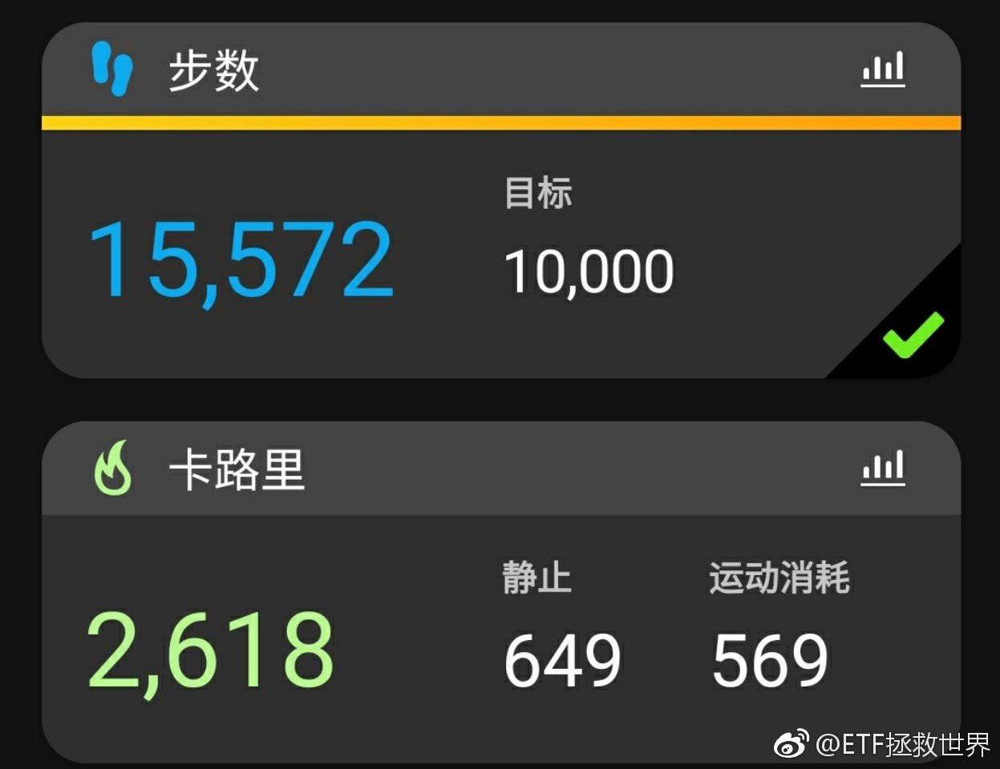

======================================================

ETF拯救世界 (5687069307) @
2017-12-28 08:23:13 Thu  
url: https://weibo.com/5687069307/FBHiUrvV4

儿子幼儿园弄了台造雪机弄一院子雪给孩子们玩…… ​​​

转发[0]  评论[103]  赞[214] 

======================================================

ETF拯救世界 (5687069307) @
2017-12-28 09:35:56 Thu  
url: https://weibo.com/5687069307/FBHMq7R7P

今天转了最后一笔钱进账户。最终决战一把逆回购…… ​​​

转发[10]  评论[283]  赞[241] 

======================================================

ETF拯救世界 (5687069307) @
2017-12-29 09:47:00 Fri  
url: https://weibo.com/5687069307/FBRhpAU4q

$中证红利 sz399922$你这么稳，奶一口算了。 ​​​

转发[0]  评论[75]  赞[126] 

======================================================

ETF拯救世界 (5687069307) @
2017-12-29 13:05:25 Fri  
url: https://weibo.com/5687069307/FBSzWcRtL

随着仓位逐渐加大，持仓品种也相对全面，2018应该更加从容了。

价值，成长，大盘，小盘，低波，高波都有，没那么焦虑了吧。

踏踏实实的。 ​​​

转发[8]  评论[72]  赞[212] 

======================================================

ETF拯救世界 (5687069307) @
2017-12-29 13:34:55 Fri  
url: https://weibo.com/5687069307/FBSLV64Dd

压力位的压力好强。能过去吗//@ETF拯救世界:好歹也得反弹一波涨个10%换换手吧……//@ETF拯救世界:35%。最近这个区间是成交稀少区。还有大量成本在18左右的筹码。//@ETF拯救世界:37%//@ETF拯救世界:44%//@ETF拯救世界:获利比例剩50%了……

------------------------------------------------------
转推：
>  @ETF拯救世界 (5687069307)
>  2017-12-04 09:36:18 Mon  
>  url: https:/weibo.com/5687069307/Fy3wE2Hh9/

>  8848获利筹码只剩55%了。这个股票换手虽然低，但是在高位几个月了，基本上接盘的都吃饱了。。。 ​​​

转发[1]  评论[10]  赞[67] 

======================================================

ETF拯救世界 (5687069307) @
2017-12-29 13:36:51 Fri  
url: https://weibo.com/5687069307/FBSMHyZse

虽然人少，但力量大…… ​​​

转发[2]  评论[58]  赞[197] 

+++++++++++++++++++++++++++++++++++++++++++++++++++++

图片：
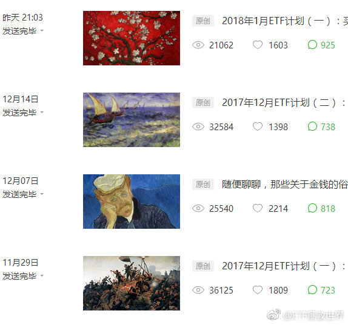

======================================================

ETF拯救世界 (5687069307) @
2017-12-29 13:47:49 Fri  
url: https://weibo.com/5687069307/FBSR8CvWs

纽约突破60。布油已经66。

“石油要被淘汰了” ​​​

转发[2]  评论[82]  赞[142] 

+++++++++++++++++++++++++++++++++++++++++++++++++++++

图片：

======================================================

ETF拯救世界 (5687069307) @
2017-12-29 15:01:52 Fri  
url: https://weibo.com/5687069307/FBTldfhHv

两个0.74%。  [允悲] ​​​

转发[1]  评论[148]  赞[172] 

======================================================

ETF拯救世界 (5687069307) @
2017-12-31 09:38:00 Sun  
url: https://weibo.com/5687069307/FCa4Km5g2

今年最后一天，抽空好好算算账吧。

账户太多，乱七八糟。昨天扔了几大袋东西，今天弄清楚账户资产。清清爽爽的进入2018！ ​​​

转发[5]  评论[126]  赞[177] 

+++++++++++++++++++++++++++++++++++++++++++++++++++++

图片：
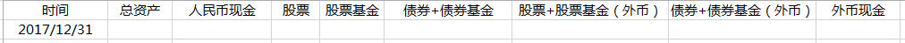

======================================================

ETF拯救世界 (5687069307) @
2017-12-31 14:17:36 Sun  
url: https://weibo.com/5687069307/FCbUeAgQO

回复@拓跋笑笑:有缘的都看到了！[doge]//@拓跋笑笑:我错过了什么？再发一次，亲爱的e，来吧，来吧，秀18岁照片啦😄

------------------------------------------------------
转推：
>  @ETF拯救世界 (5687069307)
>  2017-12-31 09:38:00 Sun  
>  url: https:/weibo.com/5687069307/FCa4Km5g2/

>  今年最后一天，抽空好好算算账吧。
>  
>  账户太多，乱七八糟。昨天扔了几大袋东西，今天弄清楚账户资产。清清爽爽的进入2018！ ​​​

转发[1]  评论[80]  赞[85] 

======================================================

ETF拯救世界 (5687069307) @
2017-12-31 23:10:37 Sun  
url: https://weibo.com/5687069307/FCfoAullE

2017就要过去了。这一年发生不少事，有好的有坏的，也有虚惊一场的。

无论如何，把它们都留在2017了。

2018新的开始。

希望所有人都健健康康。希望自己坚持健身效果明显。希望大家都赚很多钱。

新年快乐！心想事成！ 

2018你有什么心愿？ ​​​

转发[14]  评论[353]  赞[522] 

======================================================

