ETF拯救世界 (5687069307) @
2018-01-01 22:00:36 Mon  
url: https://weibo.com/5687069307/FComFkVIA

每日打卡（129）

新年第一练 ​​​

转发[0]  评论[21]  赞[147] 

+++++++++++++++++++++++++++++++++++++++++++++++++++++

图片：

======================================================

ETF拯救世界 (5687069307) @
2018-01-02 09:22:14 Tue  
url: https://weibo.com/5687069307/FCsPlxH6G

虽然对苍老师的艺术作品并不熟悉 [并不简单]，但还是祝福……看微博和以前的推感觉是很可爱的女孩子……希望结婚对象是真命天子吧！

------------------------------------------------------
转推：
>  @苍井空 (1739928273)
>  2018-01-01 23:11:24 Mon  
>  url: https:/weibo.com/1739928273/FCoPpaIQp/

>  给粉丝们。 ​​​

转发[4]  评论[61]  赞[118] 

======================================================

ETF拯救世界 (5687069307) @
2018-01-02 09:34:55 Tue  
url: https://weibo.com/5687069307/FCsUumgeN

$中证红利 sz399922$   是不是要新高了 ​​​

转发[13]  评论[17]  赞[83] 

======================================================

ETF拯救世界 (5687069307) @
2018-01-02 09:42:34 Tue  
url: https://weibo.com/5687069307/FCsXBlg0U

回复@Maggie的夏至:有可能分红，各位一定要都改成红利再投资。目前这个情况红利现金分红不合适。//@Maggie的夏至:今早收到了基金份额确认短信，中证红利是不是要分红了[害羞]，必须红利再投资[haha]

------------------------------------------------------
转推：
>  @ETF拯救世界 (5687069307)
>  2018-01-02 09:34:55 Tue  
>  url: https:/weibo.com/5687069307/FCsUumgeN/

>  $中证红利 sz399922$   是不是要新高了 ​​​

转发[2]  评论[26]  赞[71] 

======================================================

ETF拯救世界 (5687069307) @
2018-01-02 09:45:45 Tue  
url: https://weibo.com/5687069307/FCsYT5BA6

Middle East那个国家那么大的事，油价和黄金居然不反应？再也不相信真爱了。 ​​​

转发[2]  评论[23]  赞[89] 

======================================================

ETF拯救世界 (5687069307) @
2018-01-02 09:51:10 Tue  
url: https://weibo.com/5687069307/FCt15mf7p

我尽力了，奶不住了。连加两车不是开玩笑的……

------------------------------------------------------
转推：
>  @ETF拯救世界 (5687069307)
>  2018-01-02 09:34:55 Tue  
>  url: https:/weibo.com/5687069307/FCsUumgeN/

>  $中证红利 sz399922$   是不是要新高了 ​​​

转发[7]  评论[27]  赞[99] 

======================================================

ETF拯救世界 (5687069307) @
2018-01-02 10:13:45 Tue  
url: https://weibo.com/5687069307/FCtafweoA

回复@LEVELEEE:港股如果今年继续大涨，那么就有机会看烟花。//@LEVELEEE:港股真是神一样，又新高了//@ETF拯救世界:我尽力了，奶不住了。连加两车不是开玩笑的……

------------------------------------------------------
转推：
>  @ETF拯救世界 (5687069307)
>  2018-01-02 09:34:55 Tue  
>  url: https:/weibo.com/5687069307/FCsUumgeN/

>  $中证红利 sz399922$   是不是要新高了 ​​​

转发[4]  评论[25]  赞[74] 

======================================================

ETF拯救世界 (5687069307) @
2018-01-02 10:30:05 Tue  
url: https://weibo.com/5687069307/FCtgSfpBO

回复@5DONY:这几次加的500也都开始赚钱了。市场波动真的不是风险，而是利润来源。//@5DONY:zz500好牛//@ETF拯救世界:回复@LEVELEEE:港股如果今年继续大涨，那么就有机会看烟花。//@LEVELEEE:港股真是神一样，又新高了//@ETF拯救世界:我尽力了，奶不住了。连加两车不是开玩笑的……

------------------------------------------------------
转推：
>  @ETF拯救世界 (5687069307)
>  2018-01-02 09:34:55 Tue  
>  url: https:/weibo.com/5687069307/FCsUumgeN/

>  $中证红利 sz399922$   是不是要新高了 ​​​

转发[2]  评论[11]  赞[78] 

======================================================

ETF拯救世界 (5687069307) @
2018-01-02 10:50:34 Tue  
url: https://weibo.com/5687069307/FCtpcdMhz

今天涨幅超过$中证红利 sz399922$  的股票是500只，占总数的15%。

买指数的好处你慢慢就知道了。 ​​​

转发[4]  评论[44]  赞[127] 

======================================================

ETF拯救世界 (5687069307) @
2018-01-02 11:18:08 Tue  
url: https://weibo.com/5687069307/FCtAo4SRa

计划还差0.3%就要新高了。看看和几个指数比谁先达成。//@ETF拯救世界:回复@布RUCE:一定先于大盘新高。就这么决定了。//@布RUCE:好久没有新高了[哼]

------------------------------------------------------
转推：
>  @ETF拯救世界 (5687069307)
>  2017-12-19 14:15:25 Tue  
>  url: https:/weibo.com/5687069307/FAmLonPhR/

>  我知道很多朋友心里都很着急，为什么不断波动就是不涨/不跌。赚不到大钱。
>  
>  真的不用急。股票不敢说，好的指数，它们的成分股每一天都在为你挣钱。业绩在不断上升，价值也越来越大。
>  
>  价格不涨，急什么。证券投资就是这样，三年不涨，一涨吃三年。现在的大牛股平安，08-2014一分钱都没涨，六年啊。而且 ​​​

转发[45]  评论[40]  赞[102] 

======================================================

ETF拯救世界 (5687069307) @
2018-01-02 14:43:19 Tue  
url: https://weibo.com/5687069307/FCuVFrXnX

回复@布RUCE:我自己这几年主要投资指数的原因，是不敢把大量资金放到个股上。辛苦积累这么多年，碰到一个黑天鹅就要均值回归。买个股资产小的时候无所谓，资产大了真的心里有点虚。

------------------------------------------------------
转推：
>  @ETF拯救世界 (5687069307)
>  2017-12-19 14:15:25 Tue  
>  url: https:/weibo.com/5687069307/FAmLonPhR/

>  我知道很多朋友心里都很着急，为什么不断波动就是不涨/不跌。赚不到大钱。
>  
>  真的不用急。股票不敢说，好的指数，它们的成分股每一天都在为你挣钱。业绩在不断上升，价值也越来越大。
>  
>  价格不涨，急什么。证券投资就是这样，三年不涨，一涨吃三年。现在的大牛股平安，08-2014一分钱都没涨，六年啊。而且 ​​​

转发[43]  评论[64]  赞[161] 

======================================================

ETF拯救世界 (5687069307) @
2018-01-02 15:30:51 Tue  
url: https://weibo.com/5687069307/FCveXCPKP

回复@waslj0603:不同意。指数投资没有资产大小之分。为什么原始资产小，因为收入少。收入少能攒点钱来投资更不容易，更需要确定性大的投资方式。炒个股当然有人发大财，但是一将功成万骨枯，那些赔钱的人谁又在意？人生没有s&l。除非极有天分极有兴趣的人可以去炒股，绝大多数人还是玩指数靠谱。

------------------------------------------------------
转推：
>  @ETF拯救世界 (5687069307)
>  2017-12-19 14:15:25 Tue  
>  url: https:/weibo.com/5687069307/FAmLonPhR/

>  我知道很多朋友心里都很着急，为什么不断波动就是不涨/不跌。赚不到大钱。
>  
>  真的不用急。股票不敢说，好的指数，它们的成分股每一天都在为你挣钱。业绩在不断上升，价值也越来越大。
>  
>  价格不涨，急什么。证券投资就是这样，三年不涨，一涨吃三年。现在的大牛股平安，08-2014一分钱都没涨，六年啊。而且 ​​​

转发[20]  评论[23]  赞[135] 

======================================================

ETF拯救世界 (5687069307) @
2018-01-02 15:32:17 Tue  
url: https://weibo.com/5687069307/FCvfyeJ0F

续：谁说A股指数赚钱少？不说低买高卖的计划了。就是十二年前选对指数，某些指数这十二年涨了12倍以上。而且12年里面有9年上涨，这个不会比买到牛股差！

------------------------------------------------------
转推：
>  @ETF拯救世界 (5687069307)
>  2017-12-19 14:15:25 Tue  
>  url: https:/weibo.com/5687069307/FAmLonPhR/

>  我知道很多朋友心里都很着急，为什么不断波动就是不涨/不跌。赚不到大钱。
>  
>  真的不用急。股票不敢说，好的指数，它们的成分股每一天都在为你挣钱。业绩在不断上升，价值也越来越大。
>  
>  价格不涨，急什么。证券投资就是这样，三年不涨，一涨吃三年。现在的大牛股平安，08-2014一分钱都没涨，六年啊。而且 ​​​

转发[11]  评论[19]  赞[101] 

======================================================

ETF拯救世界 (5687069307) @
2018-01-02 15:39:25 Tue  
url: https://weibo.com/5687069307/FCvirizIi

你看一个股票也好，指数也好，投资组合也好，投资人也好，你把时间拉的稍微长一点。一两年你什么都看不出来。

拿全指医药来说吧。2016和2017年的涨幅分别是-14%和7.6%。垃圾不垃圾？是不是很垃圾？

但是如果你从2006年开始看，这十二年，这个指数涨了超过12倍。

而且！十二年里面，只有08、11、16三 ​​​

转发[48]  评论[83]  赞[217] 

======================================================

ETF拯救世界 (5687069307) @
2018-01-02 15:59:37 Tue  
url: https://weibo.com/5687069307/FCvqDzveV

可能会出现1000多个强东族谱。

------------------------------------------------------
转推：
>  @蓝鲸TMT网 (3866012793)
>  2018-01-02 15:58:13 Tue  
>  url: https:/weibo.com/3866012793/FCvq4niSZ/

>  刘强东发布寻祖公告：解放前，刘氏家族祖籍系湖南湘潭，后来移居江苏宿迁。别说小编不带大家发财，机会给你们，剩下的就看祖宗了[并不简单] ​​​​

转发[4]  评论[29]  赞[75] 

======================================================

ETF拯救世界 (5687069307) @
2018-01-02 21:53:42 Tue  
url: https://weibo.com/5687069307/FCxKmouQo

每日打卡（130）

坚持 ​​​

转发[0]  评论[18]  赞[132] 

+++++++++++++++++++++++++++++++++++++++++++++++++++++

图片：

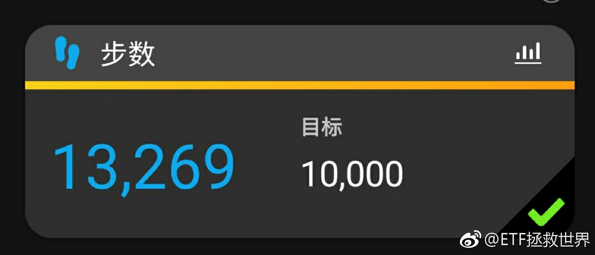

======================================================

ETF拯救世界 (5687069307) @
2018-01-03 00:04:43 Wed  
url: https://weibo.com/5687069307/FCyBxu4CU

四个字形容你的感受 ​​​

转发[5]  评论[143]  赞[124] 

+++++++++++++++++++++++++++++++++++++++++++++++++++++

图片：

======================================================

ETF拯救世界 (5687069307) @
2018-01-03 00:30:48 Wed  
url: https://weibo.com/5687069307/FCyM85aX8

看对了黄金，买了个辣鸡…… ​​​

转发[32]  评论[57]  赞[112] 

+++++++++++++++++++++++++++++++++++++++++++++++++++++

图片：
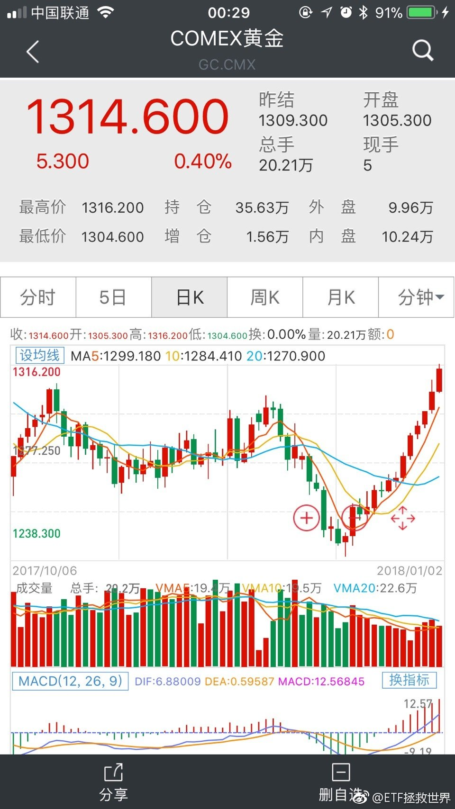
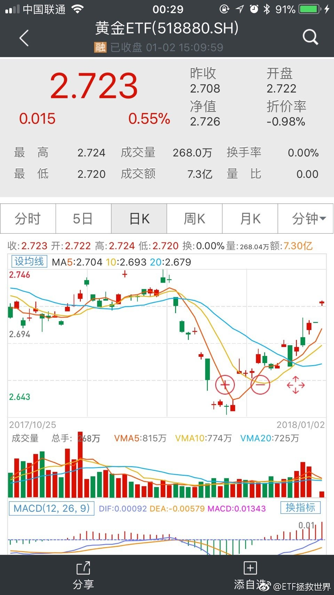

======================================================

ETF拯救世界 (5687069307) @
2018-01-03 09:30:01 Wed  
url: https://weibo.com/5687069307/FCCiZmlbI

今天能不能新高。

其实实盘已经新高了吧，毕竟用货基计算剩余资金收益率太低了，连逆回购都没有。 ​​​

转发[0]  评论[12]  赞[106] 

======================================================

ETF拯救世界 (5687069307) @
2018-01-03 09:36:29 Wed  
url: https://weibo.com/5687069307/FCClD8tXS

敢不敢继续跌。月中又有的买了。 ​​​

转发[3]  评论[34]  赞[108] 

+++++++++++++++++++++++++++++++++++++++++++++++++++++

图片：

======================================================

ETF拯救世界 (5687069307) @
2018-01-03 09:53:07 Wed  
url: https://weibo.com/5687069307/FCCsncVy1

$中证红利 sz399922$  新高还是M……答案即将揭晓。 ​​​

转发[1]  评论[34]  赞[93] 

======================================================

ETF拯救世界 (5687069307) @
2018-01-03 10:17:28 Wed  
url: https://weibo.com/5687069307/FCCCg7FAD

回复@神志那风斗200510:其实说起来就是那么简单。把成本控制好，随便涨一下就会开始挣钱。之前我说的，无论熊市有多熊，控制好成本，牛市来了1-2周开始赚钱，就是这个道理啊。浮亏什么的根本不用理会，大多数时候是亏越多越好

------------------------------------------------------
转推：
>  @ETF拯救世界 (5687069307)
>  2018-01-03 00:30:48 Wed  
>  url: https:/weibo.com/5687069307/FCyM85aX8/

>  看对了黄金，买了个辣鸡…… ​​​

转发[27]  评论[27]  赞[119] 

======================================================

ETF拯救世界 (5687069307) @
2018-01-03 10:49:47 Wed  
url: https://weibo.com/5687069307/FCCPnieFf

$证券公司 sz399975$   弹性依然很大。 ​​​

转发[0]  评论[21]  赞[84] 

======================================================

ETF拯救世界 (5687069307) @
2018-01-03 10:54:32 Wed  
url: https://weibo.com/5687069307/FCCRjeAiP

回复@喜欢富兰克林:任何时候市场都会有上涨的股票。能力强当然可以去选股，不过熊市中选股成功率低一点罢了。这是肯定的啊。我对自己的要求就是熊市不亏或者小赚，牛市大赚。一轮轮这样下来如果成功，就能秒杀99%的投资者了。当然这也很难。

------------------------------------------------------
转推：
>  @ETF拯救世界 (5687069307)
>  2018-01-03 00:30:48 Wed  
>  url: https:/weibo.com/5687069307/FCyM85aX8/

>  看对了黄金，买了个辣鸡…… ​​​

转发[13]  评论[26]  赞[117] 

======================================================

ETF拯救世界 (5687069307) @
2018-01-03 11:14:14 Wed  
url: https://weibo.com/5687069307/FCCZisMIG

回复@朱姬:不知道。建议尽快配置到涨跌都舒服的仓位。//@朱姬:弱弱问一句：还能跌吗？

------------------------------------------------------
转推：
>  @ETF拯救世界 (5687069307)
>  2018-01-03 00:30:48 Wed  
>  url: https:/weibo.com/5687069307/FCyM85aX8/

>  看对了黄金，买了个辣鸡…… ​​​

转发[0]  评论[28]  赞[69] 

======================================================

ETF拯救世界 (5687069307) @
2018-01-03 14:20:14 Wed  
url: https://weibo.com/5687069307/FCEcNmVNM

vipkid怎么样，有没有上过课的朋友…… ​​​

转发[12]  评论[83]  赞[72] 

======================================================

ETF拯救世界 (5687069307) @
2018-01-03 14:24:42 Wed  
url: https://weibo.com/5687069307/FCEeBChNt

$养老产业 sz399812$  和  $中证红利 sz399922$   谁先新高…… ​​​

转发[19]  评论[26]  赞[87] 

======================================================

ETF拯救世界 (5687069307) @
2018-01-03 14:41:00 Wed  
url: https://weibo.com/5687069307/FCEleor4r

今天500干掉了300,1000干掉了500，创业50干掉了1000。

不要预测2018是大盘还是小盘，价值还是成长。

大小搭配，再加上一些长牛的行业，齐活。 ​​​

转发[33]  评论[51]  赞[166] 

======================================================

ETF拯救世界 (5687069307) @
2018-01-03 14:48:23 Wed  
url: https://weibo.com/5687069307/FCEoe12Wb

回复@叫我小天就好了丶:现在创业板真的不算便宜。也很难说有多少长期投资的价值。但终有一天值得大买特买。我坚信。指数投资来说，没有垃圾的品种，只有垃圾的价格。//@叫我小天就好了丶:e大，国家这样打击游资，特停妖股，深深担忧创业板的前途

------------------------------------------------------
转推：
>  @ETF拯救世界 (5687069307)
>  2018-01-03 14:41:00 Wed  
>  url: https:/weibo.com/5687069307/FCEleor4r/

>  今天500干掉了300,1000干掉了500，创业50干掉了1000。
>  
>  不要预测2018是大盘还是小盘，价值还是成长。
>  
>  大小搭配，再加上一些长牛的行业，齐活。 ​​​

转发[15]  评论[14]  赞[115] 

======================================================

ETF拯救世界 (5687069307) @
2018-01-03 14:58:54 Wed  
url: https://weibo.com/5687069307/FCEsuoqDe

组合内除了油气，任何一个指数都没有新高，然后组合已经新高了。

相信绝大多数人的账户也新高了。

………… ​​​

转发[11]  评论[127]  赞[254] 

======================================================

ETF拯救世界 (5687069307) @
2018-01-04 09:53:40 Thu  
url: https://weibo.com/5687069307/FCLT6gXCX

为什么特别喜欢医药和养老指数。不知道，就是喜欢。

然后仓位合适，就非常舒服。

买了喜欢的东西真的舒服啊！

谁能体会。 ​​​

转发[39]  评论[66]  赞[208] 

======================================================

ETF拯救世界 (5687069307) @
2018-01-04 09:57:38 Thu  
url: https://weibo.com/5687069307/FCLUHdclA

回复@无聊打发时间的大叔:增强指基，每年能跑赢基准全收益指数1-3个点我已经非常非常非常非常满足了。//@无聊打发时间的大叔:报告 发现000478连续六个工作日跑赢001052

------------------------------------------------------
转推：
>  @ETF拯救世界 (5687069307)
>  2018-01-03 14:58:54 Wed  
>  url: https:/weibo.com/5687069307/FCEsuoqDe/

>  组合内除了油气，任何一个指数都没有新高，然后组合已经新高了。
>  
>  相信绝大多数人的账户也新高了。
>  
>  ………… ​​​

转发[1]  评论[14]  赞[110] 

======================================================

ETF拯救世界 (5687069307) @
2018-01-04 10:25:22 Thu  
url: https://weibo.com/5687069307/FCM5Y5kW8

回复@夜雨梧桐2010:会说话。学习了！//@夜雨梧桐2010:不用买喜欢的东西，看你说话就挺舒服

------------------------------------------------------
转推：
>  @ETF拯救世界 (5687069307)
>  2018-01-04 09:53:40 Thu  
>  url: https:/weibo.com/5687069307/FCLT6gXCX/

>  为什么特别喜欢医药和养老指数。不知道，就是喜欢。
>  
>  然后仓位合适，就非常舒服。
>  
>  买了喜欢的东西真的舒服啊！
>  
>  谁能体会。 ​​​

转发[26]  评论[41]  赞[116] 

======================================================

ETF拯救世界 (5687069307) @
2018-01-04 11:40:46 Thu  
url: https://weibo.com/5687069307/FCMAz8iGz

指数都涨了，谁能想到又是2000家下跌…… ​​​

转发[0]  评论[45]  赞[142] 

======================================================

ETF拯救世界 (5687069307) @
2018-01-04 13:46:27 Thu  
url: https://weibo.com/5687069307/FCNpA5oF1

红利大概率会赢了。是不是咱们连加两次的威力。

------------------------------------------------------
转推：
>  @ETF拯救世界 (5687069307)
>  2018-01-03 14:24:42 Wed  
>  url: https:/weibo.com/5687069307/FCEeBChNt/

>  $养老产业 sz399812$  和  $中证红利 sz399922$   谁先新高…… ​​​

转发[18]  评论[24]  赞[97] 

======================================================

ETF拯救世界 (5687069307) @
2018-01-04 13:56:48 Thu  
url: https://weibo.com/5687069307/FCNtMoQav

回复@Mansteingeneral:它只是叫“养老”而已。你叫它“消费升级”指数也行。它包括医药+保险+乳业+超市+TMT。这些行业我都看好，所以看好它。不是因为它叫什么~~

------------------------------------------------------
转推：
>  @ETF拯救世界 (5687069307)
>  2018-01-04 09:53:40 Thu  
>  url: https:/weibo.com/5687069307/FCLT6gXCX/

>  为什么特别喜欢医药和养老指数。不知道，就是喜欢。
>  
>  然后仓位合适，就非常舒服。
>  
>  买了喜欢的东西真的舒服啊！
>  
>  谁能体会。 ​​​

转发[22]  评论[31]  赞[107] 

======================================================

ETF拯救世界 (5687069307) @
2018-01-04 14:09:21 Thu  
url: https://weibo.com/5687069307/FCNySl2Cl

回复@石头里的虫子:标普红利去年13%，中证红利去年21%。当然，一年不代表什么，但是我暂时还没有找到买它的理由。//@石头里的虫子:E大，你觉得和标普红利比怎么样？//@ETF拯救世界:红利大概率会赢了。是不是咱们连加两次的威力。

------------------------------------------------------
转推：
>  @ETF拯救世界 (5687069307)
>  2018-01-03 14:24:42 Wed  
>  url: https:/weibo.com/5687069307/FCEeBChNt/

>  $养老产业 sz399812$  和  $中证红利 sz399922$   谁先新高…… ​​​

转发[9]  评论[15]  赞[59] 

======================================================

ETF拯救世界 (5687069307) @
2018-01-04 14:12:41 Thu  
url: https://weibo.com/5687069307/FCNAebMp1

没想到浓眉大眼的保险股也跌了20%…… ​​​

转发[36]  评论[31]  赞[103] 

======================================================

ETF拯救世界 (5687069307) @
2018-01-04 14:13:57 Thu  
url: https://weibo.com/5687069307/FCNAKaQjx

回复@test9878721:深红利有场内啊。159905//@test9878721:场内etf太鸡肋，搞了红利etf，但是深圳的红利长期年化自己总结的数据又比上证的高。[二哈]//@ETF拯救世界:回复@石头里的虫子:标普红利去年13%，中证红利去年21%。当然，一年不代表什么，但是我暂时还没有找到买它的理由。

------------------------------------------------------
转推：
>  @ETF拯救世界 (5687069307)
>  2018-01-03 14:24:42 Wed  
>  url: https:/weibo.com/5687069307/FCEeBChNt/

>  $养老产业 sz399812$  和  $中证红利 sz399922$   谁先新高…… ​​​

转发[4]  评论[9]  赞[53] 

======================================================

ETF拯救世界 (5687069307) @
2018-01-04 14:14:53 Thu  
url: https://weibo.com/5687069307/FCNB7rty4

回复@啊肥豪啊:我没买啊。红利一直推荐富国红利。雪球组合只能场内，只好买它。//@啊肥豪啊:E大，那买标普红利的理由又是什么？？？[允悲][允悲][允悲]//@ETF拯救世界:回复@石头里的虫子:标普红利去年13%，中证红利去年21%。当然，一年不代表什么，但是我暂时还没有找到买它的理由。

------------------------------------------------------
转推：
>  @ETF拯救世界 (5687069307)
>  2018-01-03 14:24:42 Wed  
>  url: https:/weibo.com/5687069307/FCEeBChNt/

>  $养老产业 sz399812$  和  $中证红利 sz399922$   谁先新高…… ​​​

转发[3]  评论[18]  赞[66] 

======================================================

ETF拯救世界 (5687069307) @
2018-01-04 14:21:50 Thu  
url: https://weibo.com/5687069307/FCNDWmnic

回复@晨风中的梦想家:[抱抱_旧] 祝大家赚钱开心。//@晨风中的梦想家:石油又飙了//@ETF拯救世界:回复@test9878721:深红利有场内啊。159905//@test9878721:场内etf太鸡肋，搞了红利etf，但是深圳的红利长期年化自己总结的数据又比上证的高。[二哈]

------------------------------------------------------
转推：
>  @ETF拯救世界 (5687069307)
>  2018-01-03 14:24:42 Wed  
>  url: https:/weibo.com/5687069307/FCEeBChNt/

>  $养老产业 sz399812$  和  $中证红利 sz399922$   谁先新高…… ​​​

转发[3]  评论[15]  赞[73] 

======================================================

ETF拯救世界 (5687069307) @
2018-01-04 15:14:44 Thu  
url: https://weibo.com/5687069307/FCNZpzf8Q

回复@用户1224718611:除了“舒服”，还要有“策略”。交易的策略。主观操作很容易少赚+后悔。

------------------------------------------------------
转推：
>  @ETF拯救世界 (5687069307)
>  2018-01-03 14:24:42 Wed  
>  url: https:/weibo.com/5687069307/FCEeBChNt/

>  $养老产业 sz399812$  和  $中证红利 sz399922$   谁先新高…… ​​​

转发[2]  评论[27]  赞[119] 

======================================================

ETF拯救世界 (5687069307) @
2018-01-05 06:43:49 Fri  
url: https://weibo.com/5687069307/FCU4wmOQE

准备去南方看雪了

------------------------------------------------------
转推：
>  @ ()
>  2018-01-05 00:50:17 Fri  
>  url: 

>  抱歉，作者已设置仅展示半年内微博，此微博已不可见。 ​​​

转发[6]  评论[74]  赞[90] 

======================================================

ETF拯救世界 (5687069307) @
2018-01-05 11:13:34 Fri  
url: https://weibo.com/5687069307/FCVQ1l7gM

回复@小韭菜V:大盘下跌7%，计划回撤1.7%。这叫什么坑，最多算个小水洼……//@小韭菜V:计划创新高了，从坑里面爬上来了。//@ETF拯救世界:准备去南方看雪了

------------------------------------------------------
转推：
>  @ ()
>  2018-01-05 00:50:17 Fri  
>  url: 

>  抱歉，作者已设置仅展示半年内微博，此微博已不可见。 ​​​

转发[3]  评论[17]  赞[64] 

======================================================

ETF拯救世界 (5687069307) @
2018-01-05 11:26:11 Fri  
url: https://weibo.com/5687069307/FCVV9jXcY

回复@石头里的虫子:这个心态不对。为黑天鹅做准备是对的，但投资是概率问题。要对各种情况都做好准备。//@石头里的虫子:等大坑//@ETF拯救世界:回复@小韭菜V:大盘下跌7%，计划回撤1.7%。这叫什么坑，最多算个小水洼……//@小韭菜V:计划创新高了，从坑里面爬上来了。

------------------------------------------------------
转推：
>  @ ()
>  2018-01-05 00:50:17 Fri  
>  url: 

>  抱歉，作者已设置仅展示半年内微博，此微博已不可见。 ​​​

转发[2]  评论[7]  赞[61] 

======================================================

ETF拯救世界 (5687069307) @
2018-01-05 11:27:51 Fri  
url: https://weibo.com/5687069307/FCVVODOln

奖杯准备发给红利了。//@ETF拯救世界:红利大概率会赢了。是不是咱们连加两次的威力。

------------------------------------------------------
转推：
>  @ETF拯救世界 (5687069307)
>  2018-01-03 14:24:42 Wed  
>  url: https:/weibo.com/5687069307/FCEeBChNt/

>  $养老产业 sz399812$  和  $中证红利 sz399922$   谁先新高…… ​​​

转发[7]  评论[42]  赞[98] 

======================================================

ETF拯救世界 (5687069307) @
2018-01-05 13:25:14 Fri  
url: https://weibo.com/5687069307/FCWHt1sdk

第三个看疯了//@八大山债人:这里面第16的小公务员说自己苦，呵呵只对领导的苦而已 //@来去之间://@飘雪共青城:转发微博

------------------------------------------------------
转推：
>  @鲍迪克 (1723343590)
>  2018-01-05 00:19:27 Fri  
>  url: https:/weibo.com/1723343590/FCRyw2QgH/

>  讲个故事，东部某市来了家东北企业，对方考察后对环境很满意，于是坐下来沟通，对方领导直接拍了目测20万左右的现金在桌上，说他们懂规矩这是辛苦费，现场小领导和我们几个办事员脸都快吓绿……我们告知对方这边没这种规矩，对方感慨在东北巴拉巴http://t.cn/RHEDFXT ​​​

转发[39]  评论[22]  赞[51] 

======================================================

ETF拯救世界 (5687069307) @
2018-01-05 13:51:24 Fri  
url: https://weibo.com/5687069307/FCWS5juvb

回复@kaka涛:好吗。2011-2014三年多从3000多点跌到2000多点，跌幅40%。同期创业板涨了50%。站在不同的时间，结论就会完全不同。2014年看，这是个大垃圾~//@kaka涛:这个真是牛逼了，真正的好指数//@ETF拯救世界:奖杯准备发给红利了。

------------------------------------------------------
转推：
>  @ETF拯救世界 (5687069307)
>  2018-01-03 14:24:42 Wed  
>  url: https:/weibo.com/5687069307/FCEeBChNt/

>  $养老产业 sz399812$  和  $中证红利 sz399922$   谁先新高…… ​​​

转发[5]  评论[10]  赞[76] 

======================================================

ETF拯救世界 (5687069307) @
2018-01-05 14:06:45 Fri  
url: https://weibo.com/5687069307/FCWYjvdvI

今天红利涨幅贡献度。有很多地产股。 ​​​

转发[19]  评论[40]  赞[119] 

+++++++++++++++++++++++++++++++++++++++++++++++++++++

图片：
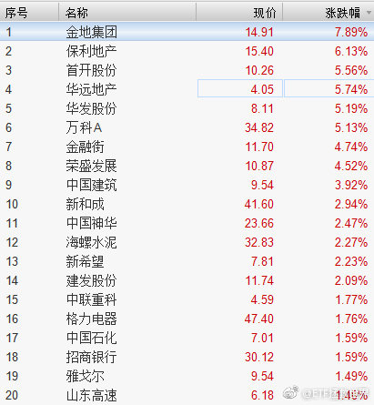

======================================================

ETF拯救世界 (5687069307) @
2018-01-05 15:34:17 Fri  
url: https://weibo.com/5687069307/FCXxQt6BV

回复@HelloWaiting:这一波之前最大回撤0.7%。包含了2015年-2016三次股灾。以后回撤会越来越大，因为仓位越来越高。然而经过这次我相信很多朋友会明白，有节操的回撤一点都不用害怕，分分钟就会新高。

------------------------------------------------------
转推：
>  @ETF拯救世界 (5687069307)
>  2018-01-05 14:06:45 Fri  
>  url: https:/weibo.com/5687069307/FCWYjvdvI/

>  今天红利涨幅贡献度。有很多地产股。 ​​​

转发[12]  评论[48]  赞[105] 

======================================================

ETF拯救世界 (5687069307) @
2018-01-05 15:51:50 Fri  
url: https://weibo.com/5687069307/FCXEYe7PQ

回复@夏虫碎碎念:我说新高了当然是总资产新高。我说回撤小，也当然是总资产回撤。我什么时候拿已投入部分年化接近20%说事儿了？你见过我说一个字已投入年化收益多少吗？找出来。欲加之罪何患无辞了吧有点。之所以计划和且慢列出来已投入收益率，是为了让投入的人清楚理解已投入部分资金收益率。

------------------------------------------------------
转推：
>  @ETF拯救世界 (5687069307)
>  2018-01-05 14:06:45 Fri  
>  url: https:/weibo.com/5687069307/FCWYjvdvI/

>  今天红利涨幅贡献度。有很多地产股。 ​​​

转发[8]  评论[35]  赞[99] 

======================================================

ETF拯救世界 (5687069307) @
2018-01-05 16:15:35 Fri  
url: https://weibo.com/5687069307/FCXOBFWyK

其实第二轮开始，总收益率就有点不好计算。因为建仓的时候有大量资金闲置，这部分怎么算收益呢。

我用最保守的货币基金，还是收益率很低的那种。比如第三轮用的钱袋子，长期只有3.x%。没事，我就用这个，保守计算嘛。虽然比如易方达b这样的货基收益常年在4.5%以上了。。

之前我发过一个问答，说没有 ​​​

转发[39]  评论[104]  赞[252] 

======================================================

ETF拯救世界 (5687069307) @
2018-01-05 16:54:30 Fri  
url: https://weibo.com/5687069307/FCY4ph8Nr

回复@徐L鑫:500etf不太可能。你说的是对的。你看广发医药2015年6月干到3块钱！溢价超过100%。可惜，现在可能性不大了，规模大了。500etf规模很大，也不太可能。有一些规模小的未来有可能

------------------------------------------------------
转推：
>  @ETF拯救世界 (5687069307)
>  2018-01-05 14:06:45 Fri  
>  url: https:/weibo.com/5687069307/FCWYjvdvI/

>  今天红利涨幅贡献度。有很多地产股。 ​​​

转发[4]  评论[18]  赞[74] 

======================================================

ETF拯救世界 (5687069307) @
2018-01-05 17:43:11 Fri  
url: https://weibo.com/5687069307/FCYoaDpMk

回复@吃遍祖国大好河山:2005-2009是第一轮；2010-2015是第二轮。2015年7月1日到现在是第三轮。//@吃遍祖国大好河山:益达，这是第几轮？

------------------------------------------------------
转推：
>  @ETF拯救世界 (5687069307)
>  2018-01-05 16:15:35 Fri  
>  url: https:/weibo.com/5687069307/FCXOBFWyK/

>  其实第二轮开始，总收益率就有点不好计算。因为建仓的时候有大量资金闲置，这部分怎么算收益呢。
>  
>  我用最保守的货币基金，还是收益率很低的那种。比如第三轮用的钱袋子，长期只有3.x%。没事，我就用这个，保守计算嘛。虽然比如易方达b这样的货基收益常年在4.5%以上了。。
>  
>  之前我发过一个问答，说没有 ​​​

转发[10]  评论[62]  赞[104] 

======================================================

ETF拯救世界 (5687069307) @
2018-01-05 19:11:13 Fri  
url: https://weibo.com/5687069307/FCYXTFKXA

反思了一下，确实，有些事情没必要回应。

以后会改，沉默是金，欢迎大家监督。

又level up了！ ​​​

转发[1]  评论[112]  赞[316] 

======================================================

ETF拯救世界 (5687069307) @
2018-01-05 23:01:41 Fri  
url: https://weibo.com/5687069307/FD0trxSzL

每日打卡（131）

认真过每一天。

因为，

过一天少一天。[允悲] ​​​

转发[0]  评论[20]  赞[109] 

+++++++++++++++++++++++++++++++++++++++++++++++++++++

图片：

======================================================

ETF拯救世界 (5687069307) @
2018-01-05 23:07:35 Fri  
url: https://weibo.com/5687069307/FD0vPzwsD

给儿子选英语老师：

“这个怎么样。”

“太黑了！”（黑人）

“……”

“这个呢？”

“太老了！”（37岁，不过美国人是真的挺显老，像50多）

“……”

“这个呢？”

“这个可以，这个好。”（20岁）

如果他不是四岁，好想揍他一顿啊。 ​​​

转发[10]  评论[114]  赞[199] 

======================================================

ETF拯救世界 (5687069307) @
2018-01-06 17:58:21 Sat  
url: https://weibo.com/5687069307/FD7UOEPDv

是这样。不过有一点，除非天赋异禀，个人认为，三五百万职业做也不够。

------------------------------------------------------
转推：
>  @挖龙脉的超级鹿鼎公 (3962719063)
>  2018-01-06 11:03:55 Sat  
>  url: https:/weibo.com/3962719063/FD5cBjiAv/

>  给小白的建议:
>  我的粉丝里，有两群人，一群是跟俺一起混雪球微博几年的老粉，一群是新关注的小白。
>  老粉经过几年厮混，基本上都已经裙边拖底，弄得清楚对错好坏，甚至还有人抄作业都抄出新高度。而新粉小白啥也不懂，说的不好听一点，就是一群想发财的韭菜。
>  
>  今天就对这群小白说几句话，也算是福利吧
>   ​​​

转发[42]  评论[23]  赞[111] 

======================================================

ETF拯救世界 (5687069307) @
2018-01-06 18:20:51 Sat  
url: https://weibo.com/5687069307/FD83XqLrb

回复@学期者:主要原因在于资本市场的波动性。如果职业投资前几年碰上熊市，就非常麻烦。即使能够不亏损，每年家庭支出至少20-30万吧，本金会迅速缩水。水平极高的人可以，否则最好不要。没有任何其他收入的话，800-1000会稳妥一些。//@学期者:已经有房有车无贷款的呢？

------------------------------------------------------
转推：
>  @挖龙脉的超级鹿鼎公 (3962719063)
>  2018-01-06 11:03:55 Sat  
>  url: https:/weibo.com/3962719063/FD5cBjiAv/

>  给小白的建议:
>  我的粉丝里，有两群人，一群是跟俺一起混雪球微博几年的老粉，一群是新关注的小白。
>  老粉经过几年厮混，基本上都已经裙边拖底，弄得清楚对错好坏，甚至还有人抄作业都抄出新高度。而新粉小白啥也不懂，说的不好听一点，就是一群想发财的韭菜。
>  
>  今天就对这群小白说几句话，也算是福利吧
>   ​​​

转发[23]  评论[37]  赞[104] 

======================================================

ETF拯救世界 (5687069307) @
2018-01-06 18:41:35 Sat  
url: https://weibo.com/5687069307/FD8cmFU1t

其实是不是要辞职职业投资还有一个工作本身的问题。如果你的工作是自己喜欢的，同时工资又高，似乎没有必要一定要职业投资。 ​​​

转发[8]  评论[111]  赞[198] 

======================================================

ETF拯救世界 (5687069307) @
2018-01-06 19:53:50 Sat  
url: https://weibo.com/5687069307/FD8FHakTe

每日打卡（131）

坚持 ​​​

转发[0]  评论[25]  赞[140] 

+++++++++++++++++++++++++++++++++++++++++++++++++++++

图片：

======================================================

ETF拯救世界 (5687069307) @
2018-01-07 19:29:19 Sun  
url: https://weibo.com/5687069307/FDhWeFxAg

我围观了@留几手 的回答，该问题价值2990.00元，围观仅1元，快来一起围观~ http://t.cn/RHgQxFb ​​​

转发[2]  评论[47]  赞[36] 

======================================================

ETF拯救世界 (5687069307) @
2018-01-07 19:47:54 Sun  
url: https://weibo.com/5687069307/FDi3MsE25

每日打卡（132）

好久没跑了，舒服。

今天是变速跑，在加速跑阶段，心率表没有提示心率过高的时候，迈开最大的步幅用最快的速度疯狂往向前冲，感觉非常好，好像体内野性的基因被激活了。

不信你试试。 ​​​

转发[0]  评论[34]  赞[147] 

+++++++++++++++++++++++++++++++++++++++++++++++++++++

图片：
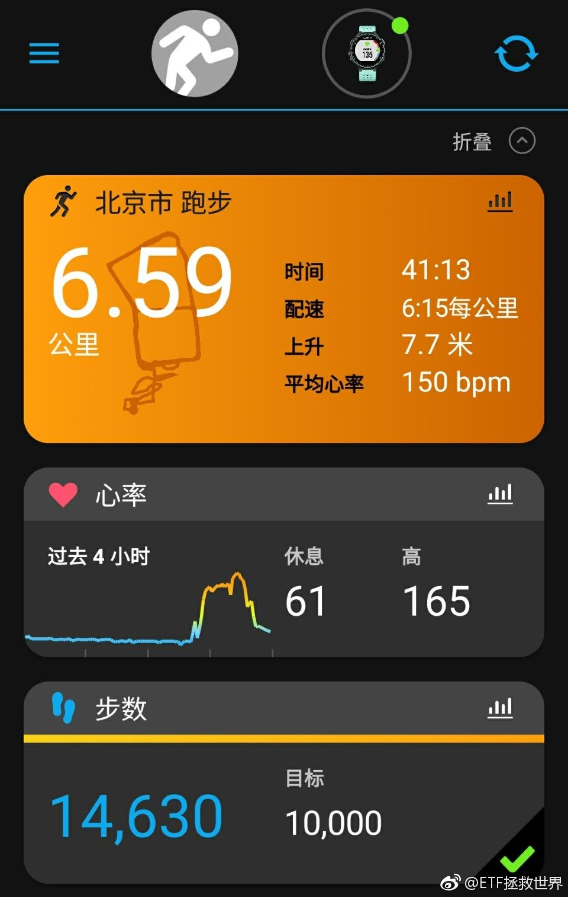

======================================================

ETF拯救世界 (5687069307) @
2018-01-08 10:44:42 Mon  
url: https://weibo.com/5687069307/FDnVNyhz6

如果我没弄错，目前这个时点，计划里所有的权益类品种都赚钱了。（两个创业板一起算）

问题在于，其中很多品种明明还在创着几年新低的附近…… ​​​

转发[5]  评论[36]  赞[138] 

======================================================

ETF拯救世界 (5687069307) @
2018-01-08 10:54:20 Mon  
url: https://weibo.com/5687069307/FDnZHfKsG

红利新高。恭喜！//@ETF拯救世界:奖杯准备发给红利了。//@ETF拯救世界:红利大概率会赢了。是不是咱们连加两次的威力。

------------------------------------------------------
转推：
>  @ETF拯救世界 (5687069307)
>  2018-01-03 14:24:42 Wed  
>  url: https:/weibo.com/5687069307/FCEeBChNt/

>  $养老产业 sz399812$  和  $中证红利 sz399922$   谁先新高…… ​​​

转发[0]  评论[13]  赞[71] 

======================================================

ETF拯救世界 (5687069307) @
2018-01-08 10:57:22 Mon  
url: https://weibo.com/5687069307/FDo0W7t9l

谁能想到今天是1100上涨，2200下跌…… ​​​

转发[0]  评论[23]  赞[118] 

======================================================

ETF拯救世界 (5687069307) @
2018-01-08 11:06:20 Mon  
url: https://weibo.com/5687069307/FDo4zwZEK

$证券公司 sz399975$   弹性，朋友们。感受一下。 ​​​

转发[29]  评论[44]  赞[99] 

======================================================

ETF拯救世界 (5687069307) @
2018-01-08 11:14:33 Mon  
url: https://weibo.com/5687069307/FDo7UpCwa

回复@用户6122527238:有没有不知道。我们做好跌60%的准备，然后买入一点，控制好仓位，涨跌都开心。分享给你。//@用户6122527238:我还等60%的跌幅那，看样子没有了？

------------------------------------------------------
转推：
>  @ETF拯救世界 (5687069307)
>  2018-01-08 11:06:20 Mon  
>  url: https:/weibo.com/5687069307/FDo4zwZEK/

>  $证券公司 sz399975$   弹性，朋友们。感受一下。 ​​​

转发[26]  评论[12]  赞[75] 

======================================================

ETF拯救世界 (5687069307) @
2018-01-08 11:32:33 Mon  
url: https://weibo.com/5687069307/FDofdm9mn

回复@草农123:乌龙指吧。不是前任，是正房，还没卖啊。油气是小妾。小妾比较折腾，也受宠，但正房更加端庄大方……//@草农123:E大，前任石油基金，今天疯了？//@ETF拯救世界:回复@用户6122527238:有没有不知道。我们做好跌60%的准备，然后买入一点，控制好仓位，涨跌都开心。分享给你。

------------------------------------------------------
转推：
>  @ETF拯救世界 (5687069307)
>  2018-01-08 11:06:20 Mon  
>  url: https:/weibo.com/5687069307/FDo4zwZEK/

>  $证券公司 sz399975$   弹性，朋友们。感受一下。 ​​​

转发[22]  评论[13]  赞[52] 

======================================================

ETF拯救世界 (5687069307) @
2018-01-08 11:39:49 Mon  
url: https://weibo.com/5687069307/FDoiagWFg

回复@sandaohe:原则！http://t.cn/RHkIgXh //@sandaohe:达里奥《选择》 没搜到这本书？英文版的？//@ETF拯救世界:回复@草农123:乌龙指吧。不是前任，是正房，还没卖啊。油气是小妾。小妾比较折腾，也受宠，但正房更加端庄大方……//@草农123:E大，前任石油基金，今天疯了？

------------------------------------------------------
转推：
>  @ETF拯救世界 (5687069307)
>  2018-01-08 11:06:20 Mon  
>  url: https:/weibo.com/5687069307/FDo4zwZEK/

>  $证券公司 sz399975$   弹性，朋友们。感受一下。 ​​​

转发[21]  评论[8]  赞[43] 

======================================================

ETF拯救世界 (5687069307) @
2018-01-08 11:48:36 Mon  
url: https://weibo.com/5687069307/FDolJE4vB

回复@BR芭斯罗缤:我昨天73买的，今天一看66了。一万点暴击。将近一个跌停，而且无法补仓摊低成本，不可能回本了！//@BR芭斯罗缤:放购物车了//@ETF拯救世界:回复@sandaohe:原则！http://t.cn/RHkIgXh //@sandaohe:达里奥《选择》 没搜到这本书？英文版的？

------------------------------------------------------
转推：
>  @ETF拯救世界 (5687069307)
>  2018-01-08 11:06:20 Mon  
>  url: https:/weibo.com/5687069307/FDo4zwZEK/

>  $证券公司 sz399975$   弹性，朋友们。感受一下。 ​​​

转发[15]  评论[39]  赞[57] 

======================================================

ETF拯救世界 (5687069307) @
2018-01-08 12:03:20 Mon  
url: https://weibo.com/5687069307/FDorI91DC

回复@布依巫凌:谢谢提示，搞定了。作为京东股东我很满意。。 http://t.cn/RHk6kO0 //@布依巫凌:京东可以申请价格保护，会退差价//@ETF拯救世界:回复@BR芭斯罗缤:我昨天73买的，今天一看66了。一万点暴击。将近一个跌停，而且无法补仓摊低成本，不可能回本了！//@BR芭斯罗缤:放购物车了

------------------------------------------------------
转推：
>  @ETF拯救世界 (5687069307)
>  2018-01-08 11:06:20 Mon  
>  url: https:/weibo.com/5687069307/FDo4zwZEK/

>  $证券公司 sz399975$   弹性，朋友们。感受一下。 ​​​

转发[5]  评论[25]  赞[61] 

======================================================

ETF拯救世界 (5687069307) @
2018-01-08 12:13:35 Mon  
url: https://weibo.com/5687069307/FDovSqa4c

回复@erduo:我犹豫了半天，最终还是决定买一本纸质的，以后可能再买电子的。这种大师的书，我要买纸质珍藏。现在我90%的书都是买电子了，断舍离，不希望拥有太多实体的东西……//@erduo:电子书便宜，还环保。。。。

------------------------------------------------------
转推：
>  @ETF拯救世界 (5687069307)
>  2018-01-08 11:06:20 Mon  
>  url: https:/weibo.com/5687069307/FDo4zwZEK/

>  $证券公司 sz399975$   弹性，朋友们。感受一下。 ​​​

转发[3]  评论[49]  赞[79] 

======================================================

ETF拯救世界 (5687069307) @
2018-01-08 15:08:36 Mon  
url: https://weibo.com/5687069307/FDpEUs0jY

回复@小白晖晖:刚又申请保价了，已经第二次退差价了。不是在乎这几块钱，第一次用保价，考察一下公司业务！//@小白晖晖:E大没开通个plus会员吗？会员价才58.8，还有畅读。//@ETF拯救世界:回复@BR芭斯罗缤:我昨天73买的，今天一看66了。一万点暴击。将近一个跌停，而且无法补仓摊低成本，不可能回本了！

------------------------------------------------------
转推：
>  @ETF拯救世界 (5687069307)
>  2018-01-08 11:06:20 Mon  
>  url: https:/weibo.com/5687069307/FDo4zwZEK/

>  $证券公司 sz399975$   弹性，朋友们。感受一下。 ​​​

转发[2]  评论[51]  赞[76] 

======================================================

ETF拯救世界 (5687069307) @
2018-01-09 09:04:04 Tue  
url: https://weibo.com/5687069307/FDwHrtu4O

为什么我觉得开采黄金要比挖虚拟货币难不少

------------------------------------------------------
转推：
>  @网易财经 (1974561081)
>  2018-01-09 08:33:25 Tue  
>  url: https:/weibo.com/1974561081/FDwv0erDS/

>  #网易财经#学到就是赚到[嘿嘿嘿]实拍黄金生产全过程，没想到是这样制造出来的，还是第一次见。http://t.cn/R08ACYq（上#秒拍#看我的最新短视频，下载秒拍->http://t.cn/Rjc3iXC） ​​​

转发[33]  评论[29]  赞[72] 

======================================================

ETF拯救世界 (5687069307) @
2018-01-09 09:12:16 Tue  
url: https://weibo.com/5687069307/FDwKLFSlM

我的目标只是让自己正确 —— 我并不关心正确的答案是不是来源于我。所以我学会了让自己保持极度开明的心态，允许其他人指出我可能疏忽的东西。《原则》 ​​​

转发[25]  评论[40]  赞[197] 

======================================================

ETF拯救世界 (5687069307) @
2018-01-09 09:34:16 Tue  
url: https://weibo.com/5687069307/FDwTHsxn5

回复@瑞芝如海:我觉得可能不是适合所有人看，说投资的部分不多。我看完再总结吧~//@瑞芝如海:老大，我也买了，今天下午到货[偷乐]

------------------------------------------------------
转推：
>  @ETF拯救世界 (5687069307)
>  2018-01-09 09:12:16 Tue  
>  url: https:/weibo.com/5687069307/FDwKLFSlM/

>  我的目标只是让自己正确 —— 我并不关心正确的答案是不是来源于我。所以我学会了让自己保持极度开明的心态，允许其他人指出我可能疏忽的东西。《原则》 ​​​

转发[2]  评论[16]  赞[81] 

======================================================

ETF拯救世界 (5687069307) @
2018-01-09 09:58:46 Tue  
url: https://weibo.com/5687069307/FDx3EacZ4

$全指医药 sh000991$  是不是也快新高了。 ​​​

转发[2]  评论[31]  赞[90] 

======================================================

ETF拯救世界 (5687069307) @
2018-01-09 10:20:43 Tue  
url: https://weibo.com/5687069307/FDxcyrW3y

回复@LEVELEEE:点一下不就起来了//@LEVELEEE:根本还早[挖鼻]

------------------------------------------------------
转推：
>  @ETF拯救世界 (5687069307)
>  2018-01-09 09:58:46 Tue  
>  url: https:/weibo.com/5687069307/FDx3EacZ4/

>  $全指医药 sh000991$  是不是也快新高了。 ​​​

转发[1]  评论[14]  赞[75] 

======================================================

ETF拯救世界 (5687069307) @
2018-01-09 10:44:03 Tue  
url: https://weibo.com/5687069307/FDxm1AJA8

市场在每个阶段，表现好的品种是不同的。是有周期的。

比如医药消费与资源与科技股等等就会在不同的周期中表现出色。

有时候某些行业不动不是它不行，而是它的季节还没到。

你见过夏天开的梅花吗。 ​​​

转发[37]  评论[73]  赞[185] 

======================================================

ETF拯救世界 (5687069307) @
2018-01-09 11:03:06 Tue  
url: https://weibo.com/5687069307/FDxtKwnoz

回复@十步侠:有。月底打算建个新品种。希望这个月它别动。//@十步侠:e大，最近市场感觉很沉闷，没啥可交易的品种。[微笑]

------------------------------------------------------
转推：
>  @ETF拯救世界 (5687069307)
>  2018-01-09 10:44:03 Tue  
>  url: https:/weibo.com/5687069307/FDxm1AJA8/

>  市场在每个阶段，表现好的品种是不同的。是有周期的。
>  
>  比如医药消费与资源与科技股等等就会在不同的周期中表现出色。
>  
>  有时候某些行业不动不是它不行，而是它的季节还没到。
>  
>  你见过夏天开的梅花吗。 ​​​

转发[0]  评论[69]  赞[130] 

======================================================

ETF拯救世界 (5687069307) @
2018-01-09 13:34:56 Tue  
url: https://weibo.com/5687069307/FDytoaRMq

医药动，$养老产业 sz399812$  也沾光了。看谁先新高。 ​​​

转发[1]  评论[18]  赞[102] 

======================================================

ETF拯救世界 (5687069307) @
2018-01-09 13:57:20 Tue  
url: https://weibo.com/5687069307/FDyCuhN4G

持仓品种比较多的优势就在于，每天都有可能出现让你很开心的东西。

然后就推着你的账户不断的新高……

不用去判断明天哪个表现好，反正你都有。 ​​​

转发[15]  评论[53]  赞[211] 

======================================================

ETF拯救世界 (5687069307) @
2018-01-09 14:19:42 Tue  
url: https://weibo.com/5687069307/FDyLyyhPu

偶尔搜了一下我的昵称。

[doge][费解] ​​​

转发[1]  评论[115]  赞[138] 

+++++++++++++++++++++++++++++++++++++++++++++++++++++

图片：

======================================================

ETF拯救世界 (5687069307) @
2018-01-09 16:06:16 Tue  
url: https://weibo.com/5687069307/FDzsOrRoL

……搞什么飞机。

------------------------------------------------------
转推：
>  @ ()
>  2018-01-09 16:00:31 Tue  
>  url: 

>  抱歉，此微博已被作者删除。查看帮助：http://t.cn/Rfd3rQV

转发[1]  评论[29]  赞[67] 

======================================================

ETF拯救世界 (5687069307) @
2018-01-09 19:51:18 Tue  
url: https://weibo.com/5687069307/FDAWabBec

还有三天 ​​​

转发[1]  评论[51]  赞[110] 

+++++++++++++++++++++++++++++++++++++++++++++++++++++

图片：

======================================================

ETF拯救世界 (5687069307) @
2018-01-10 08:09:51 Wed  
url: https://weibo.com/5687069307/FDFLWiknW

注意，1987//@见闻实时新闻:标普500指数2018年录得最近31年最佳新年开局——2018年已经连涨六个交易日，累计涨幅2.7%，新年里前六天累计涨幅创1987年以来最大。#标普500指数#

------------------------------------------------------
转推：
>  @ ()
>  2018-01-10 05:18:23 Wed  
>  url: 

>  抱歉，作者已设置仅展示半年内微博，此微博已不可见。 ​​​

转发[5]  评论[23]  赞[67] 

======================================================

ETF拯救世界 (5687069307) @
2018-01-10 09:17:38 Wed  
url: https://weibo.com/5687069307/FDGdrBFJm

看了1/3《原则》。发现跟我的原则没什么大区别：

不预测未来，根据概率对未来可能发生过的所有情况做好准备。

别预测，预测就会有错的可能。 ​​​

转发[27]  评论[45]  赞[151] 

======================================================

ETF拯救世界 (5687069307) @
2018-01-10 09:33:44 Wed  
url: https://weibo.com/5687069307/FDGjYobkS

“买入时，预计最大跌幅算预测吗”。

你觉得算吗？这就是我讨论的，为未来出现的所有情况做好准备。“以目前价格计算最大下跌幅度60%”的意思是，这个品种在最坏的情况下有可能下跌60%，同时，我已经为这个情况的出现做好准备。

“预测债市先于股市 见底，这算预测吗？”。

严格的说，是一种判断。 ​​​

转发[93]  评论[139]  赞[188] 

======================================================

ETF拯救世界 (5687069307) @
2018-01-10 09:38:31 Wed  
url: https://weibo.com/5687069307/FDGlViJB2

回复@倪谷拉丝:SPSIOP这一波真的挺辣鸡的。大家都赚了，但赚的不够多。//@倪谷拉丝:油气出了，现在只留利润了，成本-0.007，第一次见到负的[作揖]

------------------------------------------------------
转推：
>  @ETF拯救世界 (5687069307)
>  2018-01-10 09:17:38 Wed  
>  url: https:/weibo.com/5687069307/FDGdrBFJm/

>  看了1/3《原则》。发现跟我的原则没什么大区别：
>  
>  不预测未来，根据概率对未来可能发生过的所有情况做好准备。
>  
>  别预测，预测就会有错的可能。 ​​​

转发[2]  评论[13]  赞[62] 

======================================================

ETF拯救世界 (5687069307) @
2018-01-10 09:42:54 Wed  
url: https://weibo.com/5687069307/FDGnHtv73

回复@谷爆:不对。该博的时候就要拼命干。甚至加杠杆——在安全的范围内~//@谷爆:我的理解是，如果不预测，只为未来会发生的各种情况作好准备的做法是，要买便宜的东西，永远不能满仓，但也不能仓位过低，觉得一般情况下，长期半仓最安全。我这样想对吗？

------------------------------------------------------
转推：
>  @ETF拯救世界 (5687069307)
>  2018-01-10 09:17:38 Wed  
>  url: https:/weibo.com/5687069307/FDGdrBFJm/

>  看了1/3《原则》。发现跟我的原则没什么大区别：
>  
>  不预测未来，根据概率对未来可能发生过的所有情况做好准备。
>  
>  别预测，预测就会有错的可能。 ​​​

转发[5]  评论[18]  赞[77] 

======================================================

ETF拯救世界 (5687069307) @
2018-01-10 09:47:52 Wed  
url: https://weibo.com/5687069307/FDGpIvuVJ

回复@慎独慎入慎犬儒:“价值”不是决定中短期价格的唯一因素。背离价值的价格可能会持续很久很久很久，久到你目瞪口呆。

------------------------------------------------------
转推：
>  @ETF拯救世界 (5687069307)
>  2018-01-10 09:33:44 Wed  
>  url: https:/weibo.com/5687069307/FDGjYobkS/

>  “买入时，预计最大跌幅算预测吗”。
>  
>  你觉得算吗？这就是我讨论的，为未来出现的所有情况做好准备。“以目前价格计算最大下跌幅度60%”的意思是，这个品种在最坏的情况下有可能下跌60%，同时，我已经为这个情况的出现做好准备。
>  
>  “预测债市先于股市 见底，这算预测吗？”。
>  
>  严格的说，是一种判断。 ​​​

转发[11]  评论[16]  赞[78] 

======================================================

ETF拯救世界 (5687069307) @
2018-01-10 10:07:50 Wed  
url: https://weibo.com/5687069307/FDGxPpQtJ

哪能港，今天是不是又要吹红利了。。。$中证红利 sz399922$ ​​​

转发[1]  评论[24]  赞[75] 

======================================================

ETF拯救世界 (5687069307) @
2018-01-10 10:18:51 Wed  
url: https://weibo.com/5687069307/FDGChF3Ob

回复@赢在ETF:又分？红利再投。//@赢在ETF:E大，博时信用债马上要分红了，请问选择分红还是红利再投？

------------------------------------------------------
转推：
>  @ETF拯救世界 (5687069307)
>  2018-01-10 10:07:50 Wed  
>  url: https:/weibo.com/5687069307/FDGxPpQtJ/

>  哪能港，今天是不是又要吹红利了。。。$中证红利 sz399922$ ​​​

转发[0]  评论[9]  赞[57] 

======================================================

ETF拯救世界 (5687069307) @
2018-01-10 10:23:04 Wed  
url: https://weibo.com/5687069307/FDGE0n2Qz

回复@啊肥豪啊:2007年5月，A股全市场等权估值已经到了56倍，如果是现在，计划应该已经将A股仓位降至极低。6月会少少回补一部分，然后一路踏空至6124。没办法，5000-6000那一段注定吃不到。//@啊肥豪啊:e大，想问你当年07年530发生的时候是怎么处理当时的情况

------------------------------------------------------
转推：
>  @ETF拯救世界 (5687069307)
>  2018-01-10 09:33:44 Wed  
>  url: https:/weibo.com/5687069307/FDGjYobkS/

>  “买入时，预计最大跌幅算预测吗”。
>  
>  你觉得算吗？这就是我讨论的，为未来出现的所有情况做好准备。“以目前价格计算最大下跌幅度60%”的意思是，这个品种在最坏的情况下有可能下跌60%，同时，我已经为这个情况的出现做好准备。
>  
>  “预测债市先于股市 见底，这算预测吗？”。
>  
>  严格的说，是一种判断。 ​​​

转发[11]  评论[26]  赞[76] 

======================================================

ETF拯救世界 (5687069307) @
2018-01-10 10:54:20 Wed  
url: https://weibo.com/5687069307/FDGQHx8Zr

回复@老纳法号破戒:接近2500//@老纳法号破戒:接近2400家下跌[二哈]//@ETF拯救世界:回复@啊肥豪啊:2007年5月，A股全市场等权估值已经到了56倍，如果是现在，计划应该已经将A股仓位降至极低。6月会少少回补一部分，然后一路踏空至6124。没办法，5000-6000那一段注定吃不到。

------------------------------------------------------
转推：
>  @ETF拯救世界 (5687069307)
>  2018-01-10 09:33:44 Wed  
>  url: https:/weibo.com/5687069307/FDGjYobkS/

>  “买入时，预计最大跌幅算预测吗”。
>  
>  你觉得算吗？这就是我讨论的，为未来出现的所有情况做好准备。“以目前价格计算最大下跌幅度60%”的意思是，这个品种在最坏的情况下有可能下跌60%，同时，我已经为这个情况的出现做好准备。
>  
>  “预测债市先于股市 见底，这算预测吗？”。
>  
>  严格的说，是一种判断。 ​​​

转发[1]  评论[12]  赞[61] 

======================================================

ETF拯救世界 (5687069307) @
2018-01-10 11:25:52 Wed  
url: https://weibo.com/5687069307/FDH3ukDFB

回复@nick8965:我的评价是：扯淡。 中小股只是在价值回归而已。到位了自然会涨。

------------------------------------------------------
转推：
>  @ETF拯救世界 (5687069307)
>  2018-01-10 09:33:44 Wed  
>  url: https:/weibo.com/5687069307/FDGjYobkS/

>  “买入时，预计最大跌幅算预测吗”。
>  
>  你觉得算吗？这就是我讨论的，为未来出现的所有情况做好准备。“以目前价格计算最大下跌幅度60%”的意思是，这个品种在最坏的情况下有可能下跌60%，同时，我已经为这个情况的出现做好准备。
>  
>  “预测债市先于股市 见底，这算预测吗？”。
>  
>  严格的说，是一种判断。 ​​​

转发[4]  评论[8]  赞[70] 

======================================================

ETF拯救世界 (5687069307) @
2018-01-10 11:29:23 Wed  
url: https://weibo.com/5687069307/FDH4Vlusq

任何基于最近情况推导未来的，我认为都是流氓。

在某些品种暴涨后找出理由来支撑，忽悠别人接盘的，流氓x2。

历史上没有一次泡沫是不自带理由的，否则怎么会有人去接盘。

历史上所有的极度价值都是极度悲观带来的。

听别人忽悠赚不了钱。这就是我的观点。 ​​​

转发[67]  评论[70]  赞[186] 

======================================================

ETF拯救世界 (5687069307) @
2018-01-10 11:38:20 Wed  
url: https://weibo.com/5687069307/FDH8z4ANk

回复@绿雪一:涨不涨从来不是我买不买的理由。比如红利去年涨了不少，我们最近依然又买了两次……大不大小不小也不是理由，一视同仁。至于消费……我暂时就不打算买了。//@绿雪一:E大，对于在涨的基金能买吗（易方达消费）

------------------------------------------------------
转推：
>  @ETF拯救世界 (5687069307)
>  2018-01-10 11:29:23 Wed  
>  url: https:/weibo.com/5687069307/FDH4Vlusq/

>  任何基于最近情况推导未来的，我认为都是流氓。
>  
>  在某些品种暴涨后找出理由来支撑，忽悠别人接盘的，流氓x2。
>  
>  历史上没有一次泡沫是不自带理由的，否则怎么会有人去接盘。
>  
>  历史上所有的极度价值都是极度悲观带来的。
>  
>  听别人忽悠赚不了钱。这就是我的观点。 ​​​

转发[13]  评论[26]  赞[73] 

======================================================

ETF拯救世界 (5687069307) @
2018-01-10 11:45:54 Wed  
url: https://weibo.com/5687069307/FDHbCrBOa

回复@浪迹天涯0216:图片评论 [doge] http://t.cn/RQz7RqX //@浪迹天涯0216:看到交易所专家说E大的投资策略：很可能获利但很无趣。。。。。。我就放心了[嘻嘻][嘻嘻]

------------------------------------------------------
转推：
>  @ETF拯救世界 (5687069307)
>  2018-01-10 11:29:23 Wed  
>  url: https:/weibo.com/5687069307/FDH4Vlusq/

>  任何基于最近情况推导未来的，我认为都是流氓。
>  
>  在某些品种暴涨后找出理由来支撑，忽悠别人接盘的，流氓x2。
>  
>  历史上没有一次泡沫是不自带理由的，否则怎么会有人去接盘。
>  
>  历史上所有的极度价值都是极度悲观带来的。
>  
>  听别人忽悠赚不了钱。这就是我的观点。 ​​​

转发[7]  评论[74]  赞[116] 

======================================================

ETF拯救世界 (5687069307) @
2018-01-10 13:18:08 Wed  
url: https://weibo.com/5687069307/FDHN4aP0P

今天没法新高了，别嘚瑟了。该干嘛干嘛去吧！ ​​​

转发[7]  评论[41]  赞[105] 

======================================================

ETF拯救世界 (5687069307) @
2018-01-10 13:24:32 Wed  
url: https://weibo.com/5687069307/FDHPFdFEB

回复@ForeverFight命運:你们的心态已经是股神级的了。真的。佩服佩服。//@ForeverFight命運:虽然没办法新高，但是马上能捡便宜货啊。[憧憬]

------------------------------------------------------
转推：
>  @ETF拯救世界 (5687069307)
>  2018-01-10 13:18:08 Wed  
>  url: https:/weibo.com/5687069307/FDHN4aP0P/

>  今天没法新高了，别嘚瑟了。该干嘛干嘛去吧！ ​​​

转发[0]  评论[22]  赞[95] 

======================================================

ETF拯救世界 (5687069307) @
2018-01-10 13:44:22 Wed  
url: https://weibo.com/5687069307/FDHXIjPAR

……

谁还敢说这是牛市…… ​​​

转发[6]  评论[54]  赞[97] 

+++++++++++++++++++++++++++++++++++++++++++++++++++++

图片：
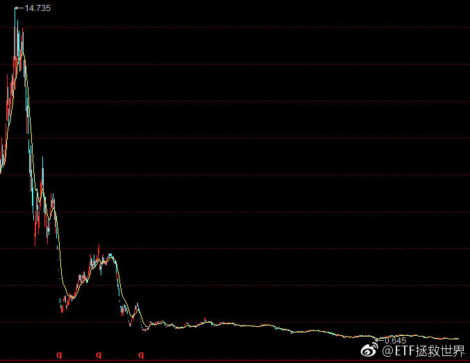

======================================================

ETF拯救世界 (5687069307) @
2018-01-10 13:54:57 Wed  
url: https://weibo.com/5687069307/FDI216Oax

回复@幸运的baogongshu20170:你们两个私信联系一下。//@幸运的baogongshu20170:回复@可可的乐事:路见不平一声吼，我还没有女朋友

------------------------------------------------------
转推：
>  @ETF拯救世界 (5687069307)
>  2018-01-10 13:44:22 Wed  
>  url: https:/weibo.com/5687069307/FDHXIjPAR/

>  ……
>  
>  谁还敢说这是牛市…… ​​​

转发[1]  评论[37]  赞[66] 

======================================================

ETF拯救世界 (5687069307) @
2018-01-10 15:06:08 Wed  
url: https://weibo.com/5687069307/FDIuU4fjB

说早了，还是有可能新高的。恒生+50+红利+油气做出正向贡献。倒不是说新高不新高有什么重要的，只是说看看一个组合在2500只下跌，700只上涨的市场中如何做到稳步向上。。

------------------------------------------------------
转推：
>  @ETF拯救世界 (5687069307)
>  2018-01-10 13:18:08 Wed  
>  url: https:/weibo.com/5687069307/FDHN4aP0P/

>  今天没法新高了，别嘚瑟了。该干嘛干嘛去吧！ ​​​

转发[4]  评论[44]  赞[132] 

======================================================

ETF拯救世界 (5687069307) @
2018-01-10 16:02:23 Wed  
url: https://weibo.com/5687069307/FDIRJxm9U

不知道朋友们有没有看那个高铁女阻止列车关门的视频，说是后来乘警让他们一家人上车走了，然后单位让她停职了。

这事儿从头到尾就让人感到莫名其妙。

首先当时乘警列车员就应该直接把人拉下去，然后带到车站派出所。这种延误列车发车的行为，难道算不上扰乱社会秩序吗。更重一点，有没有可能危害公众 ​​​

转发[9]  评论[172]  赞[169] 

======================================================

ETF拯救世界 (5687069307) @
2018-01-10 16:21:40 Wed  
url: https://weibo.com/5687069307/FDIZz0fI9

说今天恒生指数连涨12天，创了1964以来的记录。

这是恒生90年代以来的走势。恒生的走势波动非常非常大，各位要做好心理准备。 ​​​

转发[18]  评论[90]  赞[138] 

+++++++++++++++++++++++++++++++++++++++++++++++++++++

图片：
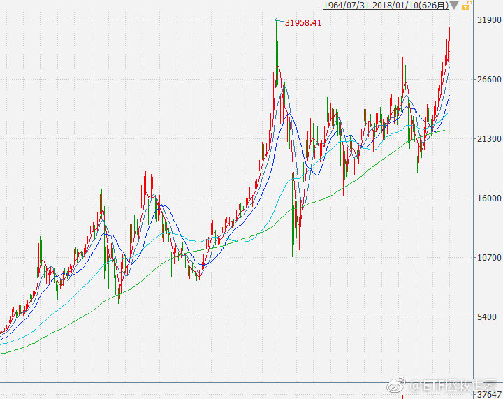

======================================================

ETF拯救世界 (5687069307) @
2018-01-11 09:50:29 Thu  
url: https://weibo.com/5687069307/FDPRhgmeY

有些指数好像已经跌不动了。 ​​​

转发[12]  评论[77]  赞[131] 

======================================================

ETF拯救世界 (5687069307) @
2018-01-11 10:14:25 Thu  
url: https://weibo.com/5687069307/FDQ102TF1

回复@kaka-98:数学不好了吧。1块钱开始跌，跌到0.5你买入，然后按照我说的，跌到0.2最低，你0.5买还是亏60%啊。即使你0.3买，跌到0.2，也得亏33%……

------------------------------------------------------
转推：
>  @ETF拯救世界 (5687069307)
>  2018-01-11 09:50:29 Thu  
>  url: https:/weibo.com/5687069307/FDPRhgmeY/

>  有些指数好像已经跌不动了。 ​​​

转发[4]  评论[15]  赞[89] 

======================================================

ETF拯救世界 (5687069307) @
2018-01-11 10:18:58 Thu  
url: https://weibo.com/5687069307/FDQ2PsT21

如果你20多30多开始投资，我相信在几十年的投资生涯中，一定能见到至少3-5次，某个指数品种能跌到最高点20%-25%的地方。

不要犹豫，干进去，至少要持有到回到高点。改变命运很大程度就靠这几次。

5-10年会出现一次这样的机会。 ​​​

转发[152]  评论[274]  赞[353] 

======================================================

ETF拯救世界 (5687069307) @
2018-01-11 12:01:32 Thu  
url: https://weibo.com/5687069307/FDQIsApuM

网络没有秘密，慎独。//@八大山债人:哦。。。

------------------------------------------------------
转推：
>  @ ()
>  2018-01-11 08:34:37 Thu  
>  url: 

>  该账号因被投诉违反《微博社区公约》的相关规定，现已无法查看。查看帮助 https://kefu.weibo.com/faqdetail?id=13216

转发[12]  评论[13]  赞[51] 

======================================================

ETF拯救世界 (5687069307) @
2018-01-11 13:44:31 Thu  
url: https://weibo.com/5687069307/FDRogEN6f

shiiiiiiittt!!!! ​​​

转发[2]  评论[82]  赞[94] 

======================================================

ETF拯救世界 (5687069307) @
2018-01-11 14:13:55 Thu  
url: https://weibo.com/5687069307/FDRAdcG24

回复@董衍辉:仓位大不大。不大的话可以找机会再买，摊低成本。等着回去是不行的。即使最后不赔钱，这几年收益率也会不高。加仓不用着急，看看我之前发的数学题，自己设计一下方案//@董衍辉:E大，15年我在创业板跌到3000时买了创业板指数相关基金，您预计啥时候能解套啊？

------------------------------------------------------
转推：
>  @ETF拯救世界 (5687069307)
>  2018-01-11 10:18:58 Thu  
>  url: https:/weibo.com/5687069307/FDQ2PsT21/

>  如果你20多30多开始投资，我相信在几十年的投资生涯中，一定能见到至少3-5次，某个指数品种能跌到最高点20%-25%的地方。
>  
>  不要犹豫，干进去，至少要持有到回到高点。改变命运很大程度就靠这几次。
>  
>  5-10年会出现一次这样的机会。 ​​​

转发[8]  评论[11]  赞[85] 

======================================================

ETF拯救世界 (5687069307) @
2018-01-11 14:25:39 Thu  
url: https://weibo.com/5687069307/FDREY7htk

发现一个看上的品种，然后它跌了好多年，也不贵，你造吗，那种心情怎么港。

一种欣喜。

拿出计算器算算，知道未来几年可能会带来很不错的收益，感觉充满希望。

但最终还是要讲缘分。希望不要有缘无分。 ​​​

转发[35]  评论[85]  赞[203] 

======================================================

ETF拯救世界 (5687069307) @
2018-01-11 15:27:36 Thu  
url: https://weibo.com/5687069307/FDS474NYt

回复@艾悟67992:追女孩的关键是自己要够好。我的体会是，也许死缠烂打或者做好多感动女孩的事，有可能让女孩从不感兴趣到感动到接受，但好多时候这种并不长久。最关键还是自己够好，够努力，够上进，钱够多（至少让人看到希望），身材锻炼的够好，品味不差，有点幽默……

------------------------------------------------------
转推：
>  @ETF拯救世界 (5687069307)
>  2018-01-11 14:25:39 Thu  
>  url: https:/weibo.com/5687069307/FDREY7htk/

>  发现一个看上的品种，然后它跌了好多年，也不贵，你造吗，那种心情怎么港。
>  
>  一种欣喜。
>  
>  拿出计算器算算，知道未来几年可能会带来很不错的收益，感觉充满希望。
>  
>  但最终还是要讲缘分。希望不要有缘无分。 ​​​

转发[26]  评论[107]  赞[194] 

======================================================

ETF拯救世界 (5687069307) @
2018-01-12 02:40:38 Fri  
url: https://weibo.com/5687069307/FDWtirO0v

趋势的力量 ​​​

转发[6]  评论[71]  赞[119] 

+++++++++++++++++++++++++++++++++++++++++++++++++++++

图片：
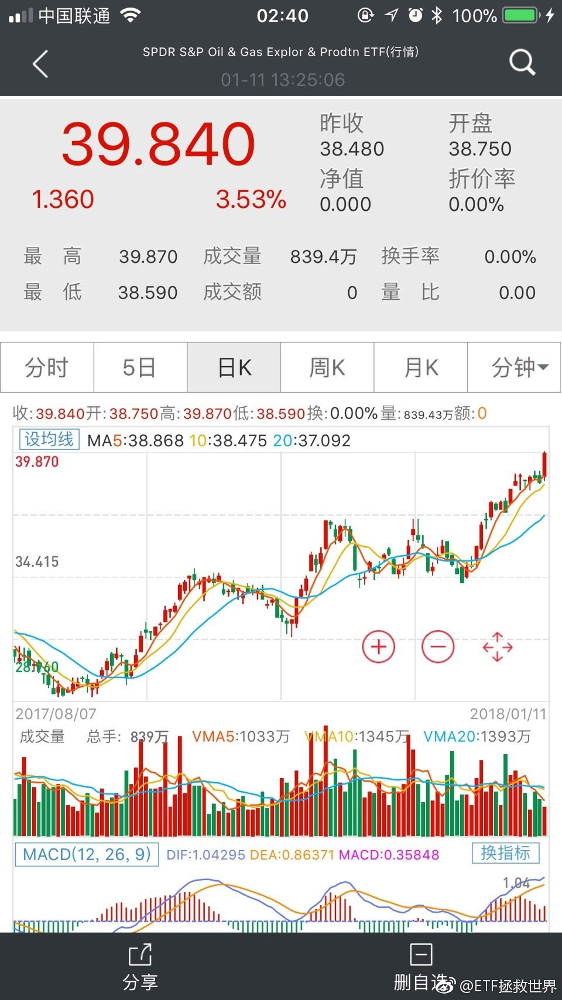

======================================================

ETF拯救世界 (5687069307) @
2018-01-12 07:59:06 Fri  
url: https://weibo.com/5687069307/FDYyz31Im

讲真，网格系统升级后，这一波油气真的多赚很多。最大一网可能有30%以上收益。

深度思考，经验，自我更新，纪律……缺一不可。 ​​​

转发[17]  评论[73]  赞[189] 

======================================================

ETF拯救世界 (5687069307) @
2018-01-12 08:08:08 Fri  
url: https://weibo.com/5687069307/FDYCek6PP

回复@岩春岩春:主动基金我没法评价。因为人是最难量化的变量。//@岩春岩春:兴全合宜A（163417） e大这只基金好吗

------------------------------------------------------
转推：
>  @ETF拯救世界 (5687069307)
>  2018-01-12 02:40:38 Fri  
>  url: https:/weibo.com/5687069307/FDWtirO0v/

>  趋势的力量 ​​​

转发[3]  评论[25]  赞[78] 

======================================================

ETF拯救世界 (5687069307) @
2018-01-12 08:19:01 Fri  
url: https://weibo.com/5687069307/FDYGEtN2h

降杠杆

------------------------------------------------------
转推：
>  @财联社APP (2868676035)
>  2018-01-12 08:14:02 Fri  
>  url: https:/weibo.com/2868676035/FDYECAsNE/

>  【多家信托公司暂停“3:2:10”股票配资、单票配资】财联社1月12日讯，近日多家信托公司收紧股票配资业务，包括暂停新增有中间级的配资业务、暂停新增单票配资业务。具体来说，所谓“有中间级的配资业务”，就是在结构化证券投资信托产品中设置劣后级、中间级、优先级，其中最具代表性的是“3:1:8”、“ ​​​

转发[3]  评论[22]  赞[58] 

======================================================

ETF拯救世界 (5687069307) @
2018-01-12 09:22:09 Fri  
url: https://weibo.com/5687069307/FDZ6grhTj

回复@老丁的变形记:计划配置低。还有做波动的策略，仓位会高很多。具体的去看我之前的问答。免费。//@老丁的变形记:请教E大: 华宝油气这一波确实很有收益,但我看在您的配置里占的比例还是比较小的,是因为考虑到最大跌幅吗?

------------------------------------------------------
转推：
>  @ETF拯救世界 (5687069307)
>  2018-01-12 07:59:06 Fri  
>  url: https:/weibo.com/5687069307/FDYyz31Im/

>  讲真，网格系统升级后，这一波油气真的多赚很多。最大一网可能有30%以上收益。
>  
>  深度思考，经验，自我更新，纪律……缺一不可。 ​​​

转发[2]  评论[26]  赞[79] 

======================================================

ETF拯救世界 (5687069307) @
2018-01-12 09:43:16 Fri  
url: https://weibo.com/5687069307/FDZeQmJns

$511880 折价要被吃掉了。 $中证红利 sz399922$ 又要新高了。

打算建仓的那个又涨了……辣鸡 ​​​

转发[2]  评论[43]  赞[86] 

======================================================

ETF拯救世界 (5687069307) @
2018-01-12 09:48:40 Fri  
url: https://weibo.com/5687069307/FDZh2gRme

除了三个国内债基，成熟新兴，股票贵金属原油，大小盘成长价值周期

全红了 ​​​

转发[10]  评论[48]  赞[111] 

======================================================

ETF拯救世界 (5687069307) @
2018-01-12 10:25:01 Fri  
url: https://weibo.com/5687069307/FDZvN6mRa

回复@幻某人一不小心:S计划直接就一把买入，现在看是非常合适的。几乎是这段时间涨幅最好的指数了。//@幻某人一不小心:S计划中证红利还是跟少了，佩服e大选指眼光

------------------------------------------------------
转推：
>  @ETF拯救世界 (5687069307)
>  2018-01-12 09:43:16 Fri  
>  url: https:/weibo.com/5687069307/FDZeQmJns/

>  $511880 折价要被吃掉了。 $中证红利 sz399922$ 又要新高了。
>  
>  打算建仓的那个又涨了……辣鸡 ​​​

转发[0]  评论[19]  赞[74] 

======================================================

ETF拯救世界 (5687069307) @
2018-01-12 10:34:56 Fri  
url: https://weibo.com/5687069307/FDZzP7sLO

回复@龙飞1807576:都是忽悠的。10连阳一共涨了4%//@龙飞1807576:十一连阳？不可思议，莫非在学美股

------------------------------------------------------
转推：
>  @ETF拯救世界 (5687069307)
>  2018-01-12 09:48:40 Fri  
>  url: https:/weibo.com/5687069307/FDZh2gRme/

>  除了三个国内债基，成熟新兴，股票贵金属原油，大小盘成长价值周期
>  
>  全红了 ​​​

转发[7]  评论[50]  赞[91] 

======================================================

ETF拯救世界 (5687069307) @
2018-01-12 13:47:10 Fri  
url: https://weibo.com/5687069307/FE0PQCZRk

回复@长风破浪100:达里奥69才出书，林奇退休了才写，我所知道的投资大师，无不是经过几十年市场的风风雨雨百炼成金后才写东西。我想，总要用时间证明一些东西，再去写吧。另外，如果我写一些大路货给各位，读者难道不会骂娘吗。写核心的东西，sorry，暂时过不了自己这关啊。

------------------------------------------------------
转推：
>  @ETF拯救世界 (5687069307)
>  2018-01-12 09:48:40 Fri  
>  url: https:/weibo.com/5687069307/FDZh2gRme/

>  除了三个国内债基，成熟新兴，股票贵金属原油，大小盘成长价值周期
>  
>  全红了 ​​​

转发[3]  评论[86]  赞[177] 

======================================================

ETF拯救世界 (5687069307) @
2018-01-12 14:30:21 Fri  
url: https://weibo.com/5687069307/FE17nby13

今天涨跌家数1:2，继续新高。

昨天沪深300跌，新高。今天中证500跌，又新高…… ​​​

转发[8]  评论[105]  赞[180] 

======================================================

ETF拯救世界 (5687069307) @
2018-01-12 21:22:03 Fri  
url: https://weibo.com/5687069307/FE3OtEhiU

每日打卡（133）

坚持 ​​​

转发[0]  评论[31]  赞[165] 

+++++++++++++++++++++++++++++++++++++++++++++++++++++

图片：

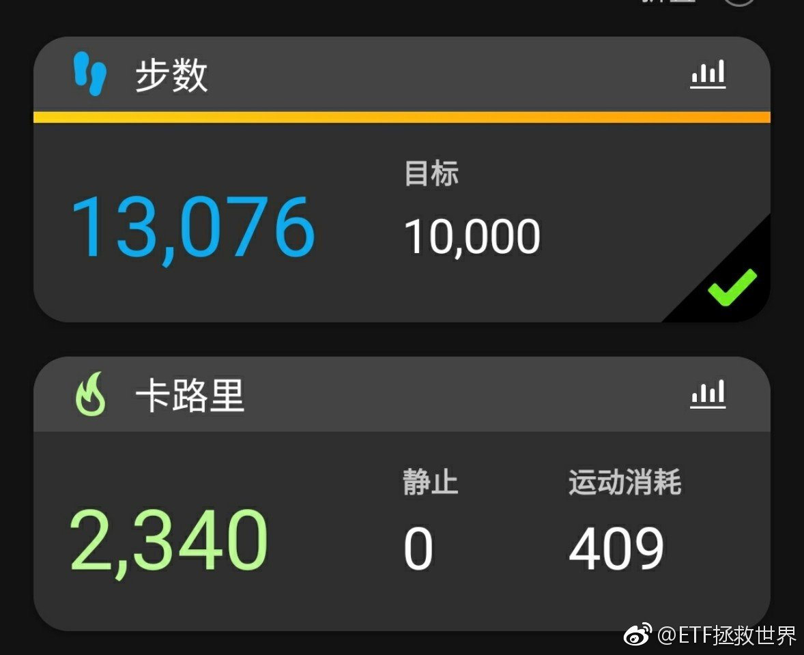

======================================================

ETF拯救世界 (5687069307) @
2018-01-14 09:33:55 Sun  
url: https://weibo.com/5687069307/FEi22vHVC

这个十年前就在美国的农场见过了。机器上带GPS，会自动掉头。老大一个农场就两个人工作。还养几百头牛……有时候效率低收入少的人太多没什么意义。//@佐罗_厚恩投资:转发微博

------------------------------------------------------
转推：
>  @智慧科技迷 (1231317854)
>  2018-01-14 08:35:16 Sun  
>  url: https:/weibo.com/1231317854/FEhEfaeZl/

>  无人驾驶农业机械，未来的农业科技。以后最幸福的职业非农民莫属#制造业强国##农业科技# http://t.cn/RQ5jX1L ​​​

转发[16]  评论[20]  赞[62] 

======================================================

ETF拯救世界 (5687069307) @
2018-01-14 10:03:14 Sun  
url: https://weibo.com/5687069307/FEidWoWyC

回复@很多话不想说:没有农民。那两个人中一个叫农场主，身家几千万美刀吧。另一个是雇的长工……一会我把当时拍的照片发上来//@很多话不想说:我也很想那么幸福地做农民

------------------------------------------------------
转推：
>  @智慧科技迷 (1231317854)
>  2018-01-14 08:35:16 Sun  
>  url: https:/weibo.com/1231317854/FEhEfaeZl/

>  无人驾驶农业机械，未来的农业科技。以后最幸福的职业非农民莫属#制造业强国##农业科技# http://t.cn/RQ5jX1L ​​​

转发[5]  评论[9]  赞[56] 

======================================================

ETF拯救世界 (5687069307) @
2018-01-14 10:05:16 Sun  
url: https://weibo.com/5687069307/FEieLvo0X

回复@青年人与卫生标兵:我愿意，管着吗你，就每天发，气死你[挤眼]//@青年人与卫生标兵:所以呢，这点技俩很牛吗，偶尔一发也就算了，每天都有这么一条，是不是把自己定位为a股韭菜的启蒙教父了？

------------------------------------------------------
转推：
>  @ETF拯救世界 (5687069307)
>  2018-01-12 14:30:21 Fri  
>  url: https:/weibo.com/5687069307/FE17nby13/

>  今天涨跌家数1:2，继续新高。
>  
>  昨天沪深300跌，新高。今天中证500跌，又新高…… ​​​

转发[2]  评论[142]  赞[261] 

======================================================

ETF拯救世界 (5687069307) @
2018-01-15 09:33:14 Mon  
url: https://weibo.com/5687069307/FErsggOnc

$恒生指数 hkHSI$   基本上未来一个至少30%的下跌是不可避免了。不过咱们依然不下车，向索罗斯学习。 ​​​

转发[36]  评论[79]  赞[117] 

======================================================

ETF拯救世界 (5687069307) @
2018-01-15 09:58:28 Mon  
url: https://weibo.com/5687069307/FErCvgOGJ

$全指医药 sh000991$  我的最爱 ​​​

转发[1]  评论[25]  赞[94] 

======================================================

ETF拯救世界 (5687069307) @
2018-01-15 10:17:20 Mon  
url: https://weibo.com/5687069307/FErKaaEkk

回复@八爪鱼-易wei:一般来说，谁涨的好，就会有很多人开始推，开始买。我不是。我喜欢买不涨的。当年我们买50恒生的时候它们也是不涨的。现在我们买的这些不涨的，未来就是明星。然后别人又来推，给我们抬轿子。//@八爪鱼-易wei:益达，最近看到好几个理财公众号在推定投恒生指数

------------------------------------------------------
转推：
>  @ETF拯救世界 (5687069307)
>  2018-01-15 09:33:14 Mon  
>  url: https:/weibo.com/5687069307/FErsggOnc/

>  $恒生指数 hkHSI$   基本上未来一个至少30%的下跌是不可避免了。不过咱们依然不下车，向索罗斯学习。 ​​​

转发[10]  评论[22]  赞[102] 

======================================================

ETF拯救世界 (5687069307) @
2018-01-15 10:24:06 Mon  
url: https://weibo.com/5687069307/FErMUDAea

回复@A天选之人010:你还用看多看空来定义我，说明你根本就没懂我是怎么投资的。忘了说了，恒生目前依然是我单一最大持仓品种。谢谢。//@A天选之人010:只要还有人看空就说明还有上涨的空间

------------------------------------------------------
转推：
>  @ETF拯救世界 (5687069307)
>  2018-01-15 09:33:14 Mon  
>  url: https:/weibo.com/5687069307/FErsggOnc/

>  $恒生指数 hkHSI$   基本上未来一个至少30%的下跌是不可避免了。不过咱们依然不下车，向索罗斯学习。 ​​​

转发[9]  评论[13]  赞[72] 

======================================================

ETF拯救世界 (5687069307) @
2018-01-15 10:32:18 Mon  
url: https://weibo.com/5687069307/FErQfbhqy

回复@葫芦岛心灵的旅途:4的仓位我们已经买好了。接下来就等4.1 4.2……4.5，分别再加到合适的仓位。//@葫芦岛心灵的旅途:益达国债进入4了，进入狙击范围喽[doge]

------------------------------------------------------
转推：
>  @ETF拯救世界 (5687069307)
>  2018-01-15 09:33:14 Mon  
>  url: https:/weibo.com/5687069307/FErsggOnc/

>  $恒生指数 hkHSI$   基本上未来一个至少30%的下跌是不可避免了。不过咱们依然不下车，向索罗斯学习。 ​​​

转发[7]  评论[29]  赞[80] 

======================================================

ETF拯救世界 (5687069307) @
2018-01-15 10:42:15 Mon  
url: https://weibo.com/5687069307/FErUhs3r7

回复@白蚁黑虾:我只能说，恒生以及国企已经被“价投”们搞得有点热了。//@白蚁黑虾:E大，那么恒生国企指数是不是也会跌入低估了？

------------------------------------------------------
转推：
>  @ETF拯救世界 (5687069307)
>  2018-01-15 09:33:14 Mon  
>  url: https:/weibo.com/5687069307/FErsggOnc/

>  $恒生指数 hkHSI$   基本上未来一个至少30%的下跌是不可避免了。不过咱们依然不下车，向索罗斯学习。 ​​​

转发[4]  评论[24]  赞[66] 

======================================================

ETF拯救世界 (5687069307) @
2018-01-15 11:27:58 Mon  
url: https://weibo.com/5687069307/FEscPuQvy

涨跌家数

600:2700。

权重股已经拼了…… ​​​

转发[5]  评论[31]  赞[122] 

======================================================

ETF拯救世界 (5687069307) @
2018-01-15 11:34:50 Mon  
url: https://weibo.com/5687069307/FEsfC3PvP

新高后面就是新高。加油( ¯ᒡ̱¯ )و ​​​

转发[9]  评论[31]  赞[104] 

+++++++++++++++++++++++++++++++++++++++++++++++++++++

图片：
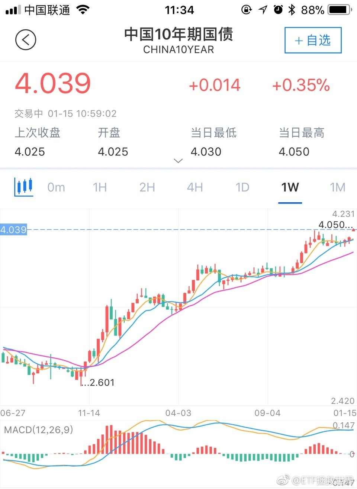

======================================================

ETF拯救世界 (5687069307) @
2018-01-15 11:54:46 Mon  
url: https://weibo.com/5687069307/FEsnHukEu

回复@胖猫Leo:降杠杆，缩流动性。//@胖猫Leo:E大，这是最近人民币大幅升值引起的？

------------------------------------------------------
转推：
>  @ETF拯救世界 (5687069307)
>  2018-01-15 11:34:50 Mon  
>  url: https:/weibo.com/5687069307/FEsfC3PvP/

>  新高后面就是新高。加油( ¯ᒡ̱¯ )و ​​​

转发[5]  评论[23]  赞[82] 

======================================================

ETF拯救世界 (5687069307) @
2018-01-15 13:31:38 Mon  
url: https://weibo.com/5687069307/FEt11jmeS

$518880 渣渣…… ​​​

转发[0]  评论[15]  赞[75] 

======================================================

ETF拯救世界 (5687069307) @
2018-01-15 13:43:10 Mon  
url: https://weibo.com/5687069307/FEt5I8x90

月中不发车，就搞那么大，这合适吗！ ​​​

转发[2]  评论[122]  赞[150] 

======================================================

ETF拯救世界 (5687069307) @
2018-01-15 14:43:50 Mon  
url: https://weibo.com/5687069307/FEtukAYVi

抄底也要有节奏，也要遵照基本法。—— ETF拯救世界首发 ​​​

转发[30]  评论[62]  赞[177] 

======================================================

ETF拯救世界 (5687069307) @
2018-01-15 14:48:22 Mon  
url: https://weibo.com/5687069307/FEtwaDp09

不好意思，今天没法新高了。估计净值会减少0.1x%。

[可怜] ​​​

转发[2]  评论[23]  赞[100] 

======================================================

ETF拯救世界 (5687069307) @
2018-01-15 14:54:06 Mon  
url: https://weibo.com/5687069307/FEtyvdMZh

连红利都撑不住了，50依然NB....

去杠杆的威力果然很大。 ​​​

转发[2]  评论[21]  赞[127] 

======================================================

ETF拯救世界 (5687069307) @
2018-01-15 15:02:45 Mon  
url: https://weibo.com/5687069307/FEtC0DKip

收盘确认是下跌0.2x%……

------------------------------------------------------
转推：
>  @ETF拯救世界 (5687069307)
>  2018-01-15 14:48:22 Mon  
>  url: https:/weibo.com/5687069307/FEtwaDp09/

>  不好意思，今天没法新高了。估计净值会减少0.1x%。
>  
>  [可怜] ​​​

转发[1]  评论[32]  赞[86] 

======================================================

ETF拯救世界 (5687069307) @
2018-01-15 15:14:56 Mon  
url: https://weibo.com/5687069307/FEtGXpbUo

不管怎么说，我想很多朋友终于体会到不被市场走势，账户涨跌影响情绪的感觉了。

情绪不受影响，你就会冷静。冷静，你就很难出错。不出错，别人就赚不到你的钱。别人赚不到你的钱，你就会赚别人的钱。

成熟的投资者=成熟的投资体系+成熟的投资心理

无论如何，很多人距离成为一个成熟的投资者越来越近 ​​​

转发[50]  评论[104]  赞[270] 

======================================================

ETF拯救世界 (5687069307) @
2018-01-15 15:46:55 Mon  
url: https://weibo.com/5687069307/FEtTWiES1

回复@面条在厦门:相当一般的指数。大股票好的时候不如50，小股票好的时候不如500创业。鸡肋。//@面条在厦门:@ETF拯救世界 想知道E大怎么看沪深300，它的持仓那么少，

------------------------------------------------------
转推：
>  @ETF拯救世界 (5687069307)
>  2018-01-15 14:43:50 Mon  
>  url: https:/weibo.com/5687069307/FEtukAYVi/

>  抄底也要有节奏，也要遵照基本法。—— ETF拯救世界首发 ​​​

转发[24]  评论[36]  赞[97] 

======================================================

ETF拯救世界 (5687069307) @
2018-01-15 17:02:48 Mon  
url: https://weibo.com/5687069307/FEuoK2d6G

回复@功不唐捐小盆友:没有新低。还是上个月25日最低。//@功不唐捐小盆友:E大，现在整个市场估值啥水平啦，能发个估值图让我们膜拜一下吗？

------------------------------------------------------
转推：
>  @ETF拯救世界 (5687069307)
>  2018-01-15 11:27:58 Mon  
>  url: https:/weibo.com/5687069307/FEscPuQvy/

>  涨跌家数
>  
>  600:2700。
>  
>  权重股已经拼了…… ​​​

转发[1]  评论[8]  赞[64] 

======================================================

ETF拯救世界 (5687069307) @
2018-01-15 17:07:38 Mon  
url: https://weibo.com/5687069307/FEuqHwIW0

如果这样下去，不出意外的话，计划中的A股仓位占比会在上半年翻一倍。

希望能够如愿以偿吧。 ​​​

转发[10]  评论[76]  赞[195] 

======================================================

ETF拯救世界 (5687069307) @
2018-01-15 17:20:22 Mon  
url: https://weibo.com/5687069307/FEuvS5kWG

回复@用户y49f7o7jj4:没买完就涨了怎么办？买完了还是跌怎么办？这就是艺术了……//@用户y49f7o7jj4:钱买完了，牛市还没来，还跌咋办[笑cry]

------------------------------------------------------
转推：
>  @ETF拯救世界 (5687069307)
>  2018-01-15 17:07:38 Mon  
>  url: https:/weibo.com/5687069307/FEuqHwIW0/

>  如果这样下去，不出意外的话，计划中的A股仓位占比会在上半年翻一倍。
>  
>  希望能够如愿以偿吧。 ​​​

转发[1]  评论[24]  赞[107] 

======================================================

ETF拯救世界 (5687069307) @
2018-01-15 19:47:51 Mon  
url: https://weibo.com/5687069307/FEvtK85uK

回复@zhanshang2606200907:没有吧，微博一直就这么多人。公众号是浏览和留言的人不停的创新高……//@zhanshang2606200907:E大，你觉得现在关注和评论你的人在减少么？

------------------------------------------------------
转推：
>  @ETF拯救世界 (5687069307)
>  2018-01-15 17:07:38 Mon  
>  url: https:/weibo.com/5687069307/FEuqHwIW0/

>  如果这样下去，不出意外的话，计划中的A股仓位占比会在上半年翻一倍。
>  
>  希望能够如愿以偿吧。 ​​​

转发[0]  评论[23]  赞[120] 

======================================================

ETF拯救世界 (5687069307) @
2018-01-15 21:03:24 Mon  
url: https://weibo.com/5687069307/FEvYoDDn3

每日打卡（134）

身体是自己的。 ​​​

转发[0]  评论[32]  赞[165] 

+++++++++++++++++++++++++++++++++++++++++++++++++++++

图片：
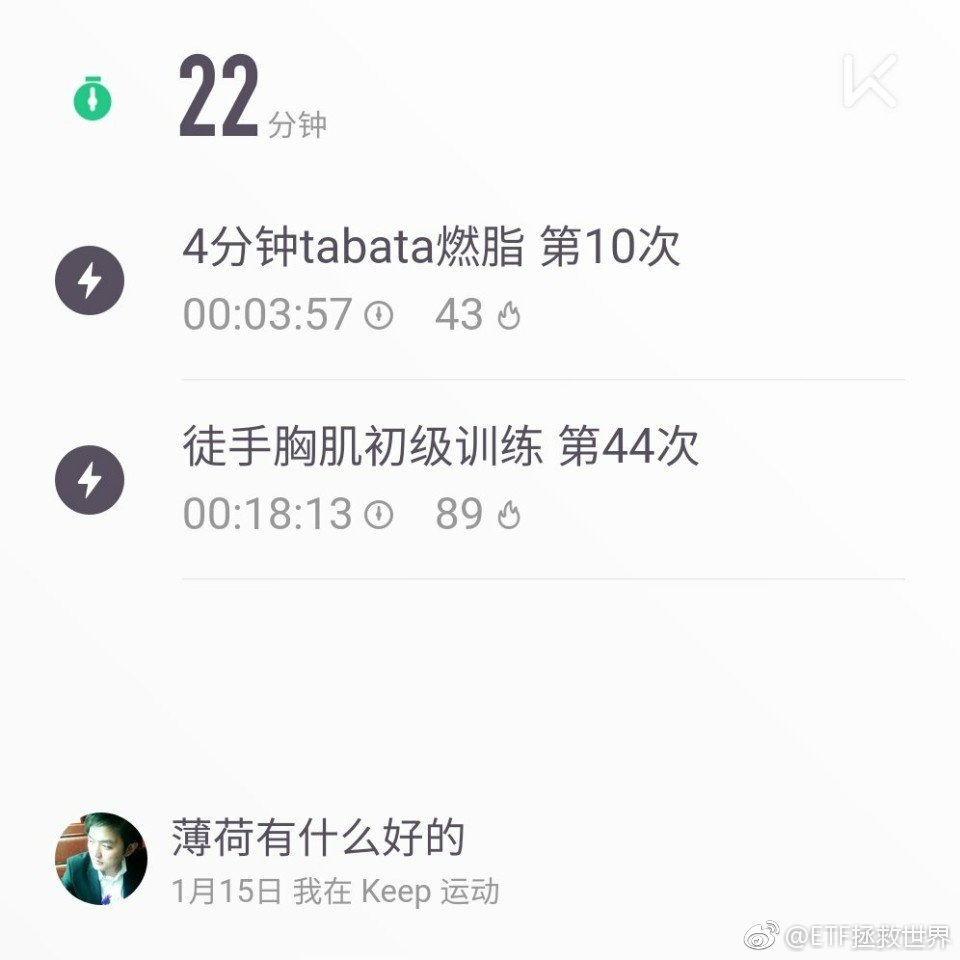

======================================================

ETF拯救世界 (5687069307) @
2018-01-16 13:29:44 Tue  
url: https://weibo.com/5687069307/FECqJFMxa

$中证红利 sz399922$   就服你。 ​​​

转发[11]  评论[37]  赞[111] 

======================================================

ETF拯救世界 (5687069307) @
2018-01-16 13:45:40 Tue  
url: https://weibo.com/5687069307/FECxdzfOu

回复@我在故快乐:第二次买应该来两发。//@我在故快乐:这么猛，不愧连加两车。

------------------------------------------------------
转推：
>  @ETF拯救世界 (5687069307)
>  2018-01-16 13:29:44 Tue  
>  url: https:/weibo.com/5687069307/FECqJFMxa/

>  $中证红利 sz399922$   就服你。 ​​​

转发[9]  评论[57]  赞[107] 

======================================================

ETF拯救世界 (5687069307) @
2018-01-16 17:05:30 Tue  
url: https://weibo.com/5687069307/FEDQlahLv

回复@gfddfgghhfcvh:我考虑创业板30以下就值得多买点了。任重道远。//@gfddfgghhfcvh:回复@啊肥豪啊:创业板25pe也太低了吧，这得惨到什么样//@ETF拯救世界:回复@我在故快乐:第二次买应该来两发。//@我在故快乐:这么猛，不愧连加两车。

------------------------------------------------------
转推：
>  @ETF拯救世界 (5687069307)
>  2018-01-16 13:29:44 Tue  
>  url: https:/weibo.com/5687069307/FECqJFMxa/

>  $中证红利 sz399922$   就服你。 ​​​

转发[7]  评论[20]  赞[68] 

======================================================

ETF拯救世界 (5687069307) @
2018-01-16 17:17:40 Tue  
url: https://weibo.com/5687069307/FEDVh1F3k

你们这些骗子，你们都是大垃圾。我第一次在公开场合骂人。

你爸你妈把你生出来就是让你骗人的吗？你有手有脚一定要靠骗人挣钱吗？

别人辛辛苦苦挣点钱容易吗？你不怕遭雷劈？？？不怕生孩子没有生殖器？

我们一起诅咒你！

各位朋友，大家自己也要提高警惕啊！我已经发过很多次提示了，那些主动联系 ​​​

转发[88]  评论[730]  赞[2265] 

+++++++++++++++++++++++++++++++++++++++++++++++++++++

图片：

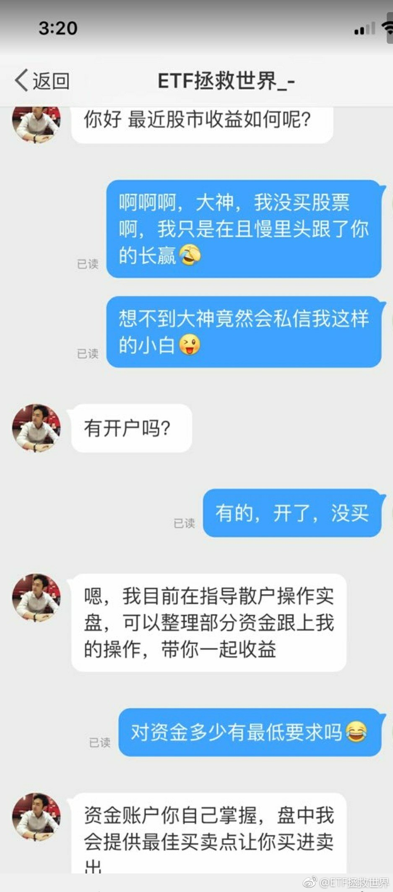
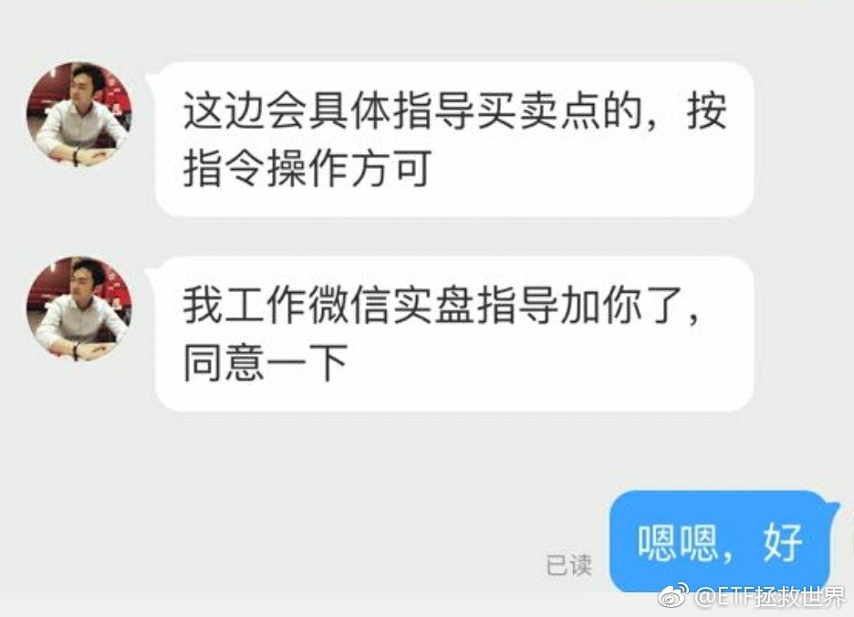

======================================================

ETF拯救世界 (5687069307) @
2018-01-16 17:46:39 Tue  
url: https://weibo.com/5687069307/FEE72hpfE

各位朋友，我一直以来的观点是这样的。

不要做坏人，不要犯法，不要违反公序良俗。

但是，同样重要的，是做“好人”，不要做“老实人”。

区别是什么。区别是，好人是有能力去做坏事，但是不做。所以别人来害你，来骗你，你都可以一眼识破。因为你有能力，够聪明。甚至你还可以把骗子给骗了，把坏人 ​​​

转发[33]  评论[85]  赞[332] 

======================================================

ETF拯救世界 (5687069307) @
2018-01-16 20:03:46 Tue  
url: https://weibo.com/5687069307/FEF0H26cf

最关键的，事后看，这些基金里面有赚大钱的吗。

------------------------------------------------------
转推：
>  @财联社APP (2868676035)
>  2018-01-16 19:09:06 Tue  
>  url: https:/weibo.com/2868676035/FEEEveIOB/

>  据招商策略首席分析师张夏统计，历史上一天完成募集超过100亿主动偏股型基金要不在大牛市疯狂前夜要不就在牛市顶点。 ​​​

转发[19]  评论[83]  赞[105] 

======================================================

ETF拯救世界 (5687069307) @
2018-01-17 09:35:23 Wed  
url: https://weibo.com/5687069307/FEKk82LiJ

$证券公司 sz399975$   又轮到你表演了？ ​​​

转发[84]  评论[30]  赞[83] 

======================================================

ETF拯救世界 (5687069307) @
2018-01-17 09:38:28 Wed  
url: https://weibo.com/5687069307/FEKlnusDI

分化太严重了。今年的戏份非常足。各位准备好。 ​​​

转发[2]  评论[38]  赞[125] 

======================================================

ETF拯救世界 (5687069307) @
2018-01-17 09:42:56 Wed  
url: https://weibo.com/5687069307/FEKnc5NlN

一笔不大的红利单子居然分了这么多笔成交，全是小散户在买啊。。 ​​​

转发[7]  评论[25]  赞[78] 

+++++++++++++++++++++++++++++++++++++++++++++++++++++

图片：
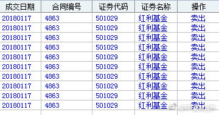

======================================================

ETF拯救世界 (5687069307) @
2018-01-17 09:46:21 Wed  
url: https://weibo.com/5687069307/FEKoA2cUO

回复@fang宝贝在路上:自己做网格用的。//@fang宝贝在路上:老大买了这个？

------------------------------------------------------
转推：
>  @ETF拯救世界 (5687069307)
>  2018-01-17 09:42:56 Wed  
>  url: https:/weibo.com/5687069307/FEKnc5NlN/

>  一笔不大的红利单子居然分了这么多笔成交，全是小散户在买啊。。 ​​​

转发[3]  评论[7]  赞[56] 

======================================================

ETF拯救世界 (5687069307) @
2018-01-17 09:49:42 Wed  
url: https://weibo.com/5687069307/FEKpWf1iD

如果这一波可以顺利下去，就是最后一波了。一波到底，震荡，然后迎接下轮飞跃。

不是去年几十只蓝筹那种翻番的，而是大面积翻几番的，真正的大牛市。

如果依然有人捣乱，那就继续慢慢跌。不知道要多久了。 ​​​

转发[35]  评论[74]  赞[164] 

======================================================

ETF拯救世界 (5687069307) @
2018-01-17 09:52:24 Wed  
url: https://weibo.com/5687069307/FEKr1yXvj

回复@金家岭吴彦祖:我跟大家说几个弹性巨大的品种，未来的牛市中可以当杠杆基金用的：券商、信息、军工。买的对就发了，买不对等着赔死吧。未来计划都会买，别急。//@金家岭吴彦祖:不是弹性的问题了，简直易燃易爆。

------------------------------------------------------
转推：
>  @ETF拯救世界 (5687069307)
>  2018-01-17 09:35:23 Wed  
>  url: https:/weibo.com/5687069307/FEKk82LiJ/

>  $证券公司 sz399975$   又轮到你表演了？ ​​​

转发[82]  评论[62]  赞[105] 

======================================================

ETF拯救世界 (5687069307) @
2018-01-17 09:54:25 Wed  
url: https://weibo.com/5687069307/FEKrR0wka

回复@原来一切都是虚幻:果然不出所料，这个月会分红。已经通知过大家了，应该都已经改了。//@原来一切都是虚幻:100032今天也分红//@ETF拯救世界:回复@fang宝贝在路上:自己做网格用的。//@fang宝贝在路上:老大买了这个？

------------------------------------------------------
转推：
>  @ETF拯救世界 (5687069307)
>  2018-01-17 09:42:56 Wed  
>  url: https:/weibo.com/5687069307/FEKnc5NlN/

>  一笔不大的红利单子居然分了这么多笔成交，全是小散户在买啊。。 ​​​

转发[1]  评论[6]  赞[68] 

======================================================

ETF拯救世界 (5687069307) @
2018-01-17 10:08:47 Wed  
url: https://weibo.com/5687069307/FEKxH204a

回复@Iridescensea:定时定额最害怕的是在高位长期投入，那样会对整体收益造成不可挽回的损失。做做数学题就懂了。//@Iridescensea:军工我定投了一年。总感觉未来可期。 不过我投了易方达国防军工混合。感觉跟踪军工指数的指数鸡强[允悲]

------------------------------------------------------
转推：
>  @ETF拯救世界 (5687069307)
>  2018-01-17 09:35:23 Wed  
>  url: https:/weibo.com/5687069307/FEKk82LiJ/

>  $证券公司 sz399975$   又轮到你表演了？ ​​​

转发[7]  评论[14]  赞[74] 

======================================================

ETF拯救世界 (5687069307) @
2018-01-17 10:14:57 Wed  
url: https://weibo.com/5687069307/FEKAbyCtF

证券投资来说，最好的一种情况是在底部区域大量买入。底部区域横盘越久，你投入得越多，未来赚的会最疯狂。

一般的情况是在快速下跌或者上涨的过程中买入，这样的也会赚的还可以。即使你在顶部买了一点。

最差的情况就是在顶部区域大量买入。分两种情况。一个是你重仓全仓买在很贵的地方。一个是顶部 ​​​

转发[72]  评论[76]  赞[137] 

======================================================

ETF拯救世界 (5687069307) @
2018-01-17 10:26:24 Wed  
url: https://weibo.com/5687069307/FEKEPDaBD

券商10%网格出货。美滋滋。 ​​​

转发[31]  评论[90]  赞[148] 

======================================================

ETF拯救世界 (5687069307) @
2018-01-17 10:35:26 Wed  
url: https://weibo.com/5687069307/FEKIvdW6x

回复@Yoran_咩咩咩:我要加速买入中小盘股了~~//@Yoran_咩咩咩:权力的游戏：冰与火之歌[拜拜]已经不敢买小盘了

------------------------------------------------------
转推：
>  @ETF拯救世界 (5687069307)
>  2018-01-17 10:26:24 Wed  
>  url: https:/weibo.com/5687069307/FEKEPDaBD/

>  券商10%网格出货。美滋滋。 ​​​

转发[8]  评论[27]  赞[85] 

======================================================

ETF拯救世界 (5687069307) @
2018-01-17 10:37:46 Wed  
url: https://weibo.com/5687069307/FEKJrE62h

回复@涵旭他们的娘:说过很多次，300是鸡肋。大盘股涨的时候远远比不上50。如果50继续这样搞，计划就又要平衡一次了。//@涵旭他们的娘:E大，今天的50ETF涨的太好了

------------------------------------------------------
转推：
>  @ETF拯救世界 (5687069307)
>  2018-01-17 10:14:57 Wed  
>  url: https:/weibo.com/5687069307/FEKAbyCtF/

>  证券投资来说，最好的一种情况是在底部区域大量买入。底部区域横盘越久，你投入得越多，未来赚的会最疯狂。
>  
>  一般的情况是在快速下跌或者上涨的过程中买入，这样的也会赚的还可以。即使你在顶部买了一点。
>  
>  最差的情况就是在顶部区域大量买入。分两种情况。一个是你重仓全仓买在很贵的地方。一个是顶部 ​​​

转发[8]  评论[31]  赞[70] 

======================================================

ETF拯救世界 (5687069307) @
2018-01-17 11:06:42 Wed  
url: https://weibo.com/5687069307/FEKVcnYQu

废柴。我只是说说，吓成这样了……//@ETF拯救世界:回复@涵旭他们的娘:说过很多次，300是鸡肋。大盘股涨的时候远远比不上50。如果50继续这样搞，计划就又要平衡一次了。//@涵旭他们的娘:E大，今天的50ETF涨的太好了

------------------------------------------------------
转推：
>  @ETF拯救世界 (5687069307)
>  2018-01-17 10:14:57 Wed  
>  url: https:/weibo.com/5687069307/FEKAbyCtF/

>  证券投资来说，最好的一种情况是在底部区域大量买入。底部区域横盘越久，你投入得越多，未来赚的会最疯狂。
>  
>  一般的情况是在快速下跌或者上涨的过程中买入，这样的也会赚的还可以。即使你在顶部买了一点。
>  
>  最差的情况就是在顶部区域大量买入。分两种情况。一个是你重仓全仓买在很贵的地方。一个是顶部 ​​​

转发[1]  评论[17]  赞[65] 

======================================================

ETF拯救世界 (5687069307) @
2018-01-17 11:12:59 Wed  
url: https://weibo.com/5687069307/FEKXK9den

无论是公募还是私募，都有一个共同的问题，就是他们很难去买下跌的东西。因为有投资者在盯着他们，净值不好看钱就没了。

所以，你能看到互联网基金重仓的是茅台格力和平安。

个人投资者的优势就在于，你根本就不用去考虑给谁看的问题。只要你的内部记分卡长期真的赚到钱了，就可以。所以，你可以优雅 ​​​

转发[64]  评论[55]  赞[185] 

======================================================

ETF拯救世界 (5687069307) @
2018-01-17 11:13:28 Wed  
url: https://weibo.com/5687069307/FEKXWh4kN

回复@亦道亦匪:哎。都是不要脸的。//@亦道亦匪:创业板红了//@ETF拯救世界:回复@Yoran_咩咩咩:我要加速买入中小盘股了~~//@Yoran_咩咩咩:权力的游戏：冰与火之歌[拜拜]已经不敢买小盘了

------------------------------------------------------
转推：
>  @ETF拯救世界 (5687069307)
>  2018-01-17 10:26:24 Wed  
>  url: https:/weibo.com/5687069307/FEKEPDaBD/

>  券商10%网格出货。美滋滋。 ​​​

转发[0]  评论[24]  赞[72] 

======================================================

ETF拯救世界 (5687069307) @
2018-01-17 11:24:21 Wed  
url: https://weibo.com/5687069307/FEL2lzq92

回复@孟月德:没用。骗子比我勤快。我常想，如果我跟骗子一样那么勤奋，可能已经成为财经界的咪蒙了……//@孟月德:这就是你不勤换头像的后果[嘻嘻]

------------------------------------------------------
转推：
>  @ETF拯救世界 (5687069307)
>  2018-01-16 17:17:40 Tue  
>  url: https:/weibo.com/5687069307/FEDVh1F3k/

>  你们这些骗子，你们都是大垃圾。我第一次在公开场合骂人。
>  
>  你爸你妈把你生出来就是让你骗人的吗？你有手有脚一定要靠骗人挣钱吗？
>  
>  别人辛辛苦苦挣点钱容易吗？你不怕遭雷劈？？？不怕生孩子没有生殖器？
>  
>  我们一起诅咒你！
>  
>  各位朋友，大家自己也要提高警惕啊！我已经发过很多次提示了，那些主动联系 ​​​

转发[2]  评论[57]  赞[91] 

======================================================

ETF拯救世界 (5687069307) @
2018-01-17 14:31:43 Wed  
url: https://weibo.com/5687069307/FEMgq06sO

东哥，作为京东股东，想说一句，悠着点……

------------------------------------------------------
转推：
>  @刘强东 (1866402485)
>  2018-01-17 14:02:28 Wed  
>  url: https:/weibo.com/1866402485/FEM4xiNQA/

>  前两天走访了东北三省，未来三年京东分别在三个省投资从数十亿到百亿人民币不等！最近几年大家似乎都不对东北看好，不可否认东北三省的经济也确实遇到不小的困难！但是大家不要忘了建国初期东北三省GDP一度占据全国85%！可以这么说，没有东北就不会有国家初期的工业振兴！今天他们有了困难，大家都应该 ​​​

转发[5]  评论[63]  赞[98] 

======================================================

ETF拯救世界 (5687069307) @
2018-01-17 17:10:57 Wed  
url: https://weibo.com/5687069307/FENj2wO7V

$恒生指数 hkHSI$   新高。11年前买入的人终于解套了！ ​​​

转发[4]  评论[61]  赞[143] 

======================================================

ETF拯救世界 (5687069307) @
2018-01-17 21:16:23 Wed  
url: https://weibo.com/5687069307/FEOUFeNfA

每日打卡（135）

其实这几天一直在练，忘了打卡了。 ​​​

转发[0]  评论[15]  赞[129] 

+++++++++++++++++++++++++++++++++++++++++++++++++++++

图片：
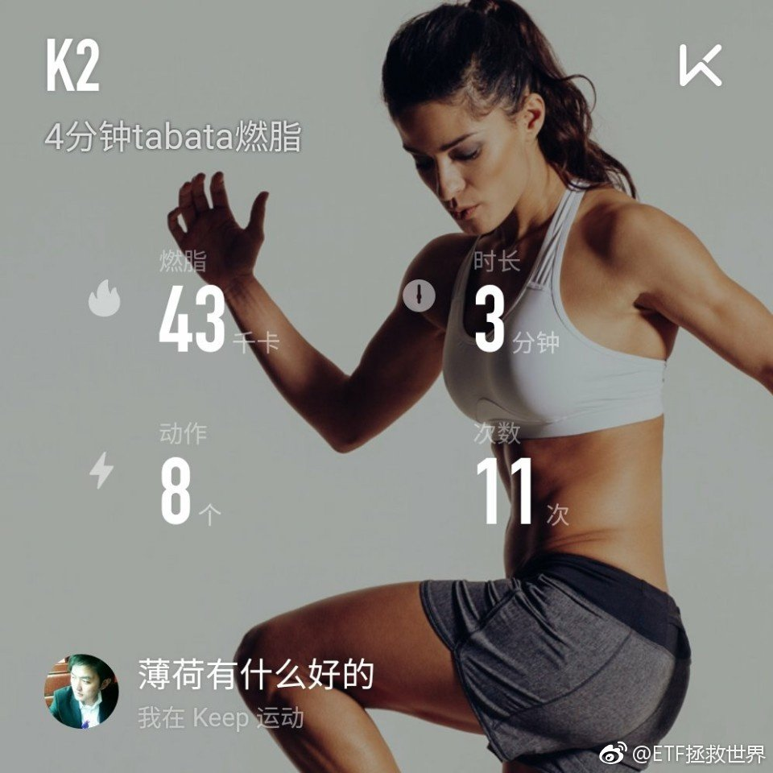
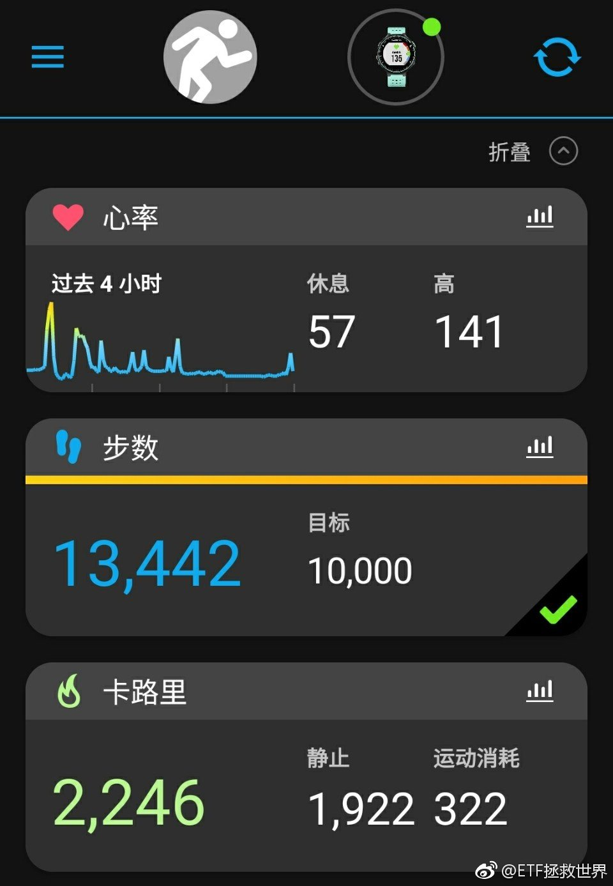

======================================================

ETF拯救世界 (5687069307) @
2018-01-17 21:43:42 Wed  
url: https://weibo.com/5687069307/FEP5KcDNh

开始看这个 ​​​

转发[12]  评论[49]  赞[168] 

+++++++++++++++++++++++++++++++++++++++++++++++++++++

图片：
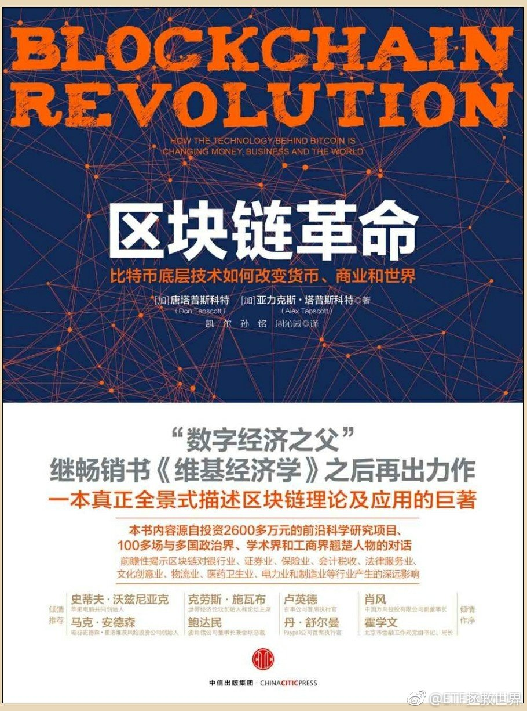

======================================================

ETF拯救世界 (5687069307) @
2018-01-18 08:52:38 Thu  
url: https://weibo.com/5687069307/FETth2wdZ

区块链不只是比特币。我只是想了解这个技术……其实还没开始看。刚开始看未来简史，看了一半，感觉不错，带来很多新思考

------------------------------------------------------
转推：
>  @ETF拯救世界 (5687069307)
>  2018-01-17 21:43:42 Wed  
>  url: https:/weibo.com/5687069307/FEP5KcDNh/

>  开始看这个 ​​​

转发[5]  评论[25]  赞[101] 

======================================================

ETF拯救世界 (5687069307) @
2018-01-18 09:11:17 Thu  
url: https://weibo.com/5687069307/FETAQg3LB

网络游戏虚拟娱乐前途无限。利好___。

------------------------------------------------------
转推：
>  @ ()
>  2018-01-18 08:54:33 Thu  
>  url: 

>  抱歉，作者已设置仅展示半年内微博，此微博已不可见。 ​​​

转发[8]  评论[50]  赞[69] 

======================================================

ETF拯救世界 (5687069307) @
2018-01-18 09:27:53 Thu  
url: https://weibo.com/5687069307/FETHA6aHc

家训必须再拿出来重温……

------------------------------------------------------
转推：
>  @ETF拯救世界 (5687069307)
>  2017-05-25 22:24:52 Thu  
>  url: https:/weibo.com/5687069307/F4N4LAjm8/

>  我准备以后写本家训传给后人，第一条就是：
>  
>  永远不要做空美股。 ​​​

转发[10]  评论[45]  赞[148] 

======================================================

ETF拯救世界 (5687069307) @
2018-01-18 11:24:21 Thu  
url: https://weibo.com/5687069307/FEUsRkrds

回复@慧姨妈的菜鸟成长记:我儿子还没到沉迷游戏的年龄。不过我有两个看法。一个是很多人之所以沉迷游戏是没有其它爱好。培养孩子更加健康的爱好应该有好处。第二个是游戏可以玩，我还会陪他玩，但是规定时间，到点就停。其实游戏之所以吸引人，无非是即时奖励而已。可以从这个思路让他多体会其它快乐。

------------------------------------------------------
转推：
>  @ ()
>  2018-01-18 08:54:33 Thu  
>  url: 

>  抱歉，作者已设置仅展示半年内微博，此微博已不可见。 ​​​

转发[6]  评论[18]  赞[113] 

======================================================

ETF拯救世界 (5687069307) @
2018-01-18 11:26:15 Thu  
url: https://weibo.com/5687069307/FEUtCBZTt

从这几天的评论可以看出，很多人又开始牛市焦虑了。

嗯。 ​​​

转发[6]  评论[64]  赞[146] 

======================================================

ETF拯救世界 (5687069307) @
2018-01-18 11:34:40 Thu  
url: https://weibo.com/5687069307/FEUx2sRHT

昨天看《未来简史》，里面谈到21世纪，解决了温饱，没有战争之忧的人，考虑的就是长生不老、追逐快乐了。

我想了想，是有道理的。没钱的人会为了温饱和财务自由不断努力可能暂时顾不上长生不老。很多钱多的只是数字的人，其实真的无论花多少钱都希望多活几十年的。

而追求快乐，应该是所有人的共同追 ​​​

转发[54]  评论[73]  赞[190] 

======================================================

ETF拯救世界 (5687069307) @
2018-01-18 11:43:24 Thu  
url: https://weibo.com/5687069307/FEUAAkXhf

再说两句。很多朋友觉得如果自己有了100万，500万就会非常快乐开心。其实你真的赚到了，确实会很开心，不过不会超过一个星期。接下来你就会为1000万而焦虑了。其实很多其他的事情也是如此。你一直梦想的东西得到了，发现快乐持续不了很久的。接下来，要么就是空虚，要么就是继续追求更高的梦想……

------------------------------------------------------
转推：
>  @ETF拯救世界 (5687069307)
>  2018-01-18 11:34:40 Thu  
>  url: https:/weibo.com/5687069307/FEUx2sRHT/

>  昨天看《未来简史》，里面谈到21世纪，解决了温饱，没有战争之忧的人，考虑的就是长生不老、追逐快乐了。
>  
>  我想了想，是有道理的。没钱的人会为了温饱和财务自由不断努力可能暂时顾不上长生不老。很多钱多的只是数字的人，其实真的无论花多少钱都希望多活几十年的。
>  
>  而追求快乐，应该是所有人的共同追 ​​​

转发[24]  评论[105]  赞[170] 

======================================================

ETF拯救世界 (5687069307) @
2018-01-18 13:47:08 Thu  
url: https://weibo.com/5687069307/FEVoOexSX

回复@圣善周闻宗:焦虑就调仓到舒服。特别简单。如果焦虑，那就一定是哪里错了。//@圣善周闻宗:说不焦虑是假话，但重点是调节和对信仰的坚定。

------------------------------------------------------
转推：
>  @ETF拯救世界 (5687069307)
>  2018-01-18 11:26:15 Thu  
>  url: https:/weibo.com/5687069307/FEUtCBZTt/

>  从这几天的评论可以看出，很多人又开始牛市焦虑了。
>  
>  嗯。 ​​​

转发[2]  评论[16]  赞[97] 

======================================================

ETF拯救世界 (5687069307) @
2018-01-18 15:27:18 Thu  
url: https://weibo.com/5687069307/FEW3t3XvN

今晚。 ​​​

转发[6]  评论[380]  赞[292] 

======================================================

ETF拯救世界 (5687069307) @
2018-01-19 09:10:51 Fri  
url: https://weibo.com/5687069307/FF31a9i6W

把馋说的那么清新脱俗，佩服佩服！

------------------------------------------------------
转推：
>  @ ()
>  2018-01-19 08:20:44 Fri  
>  url: 

>  抱歉，作者已设置仅展示半年内微博，此微博已不可见。 ​​​

转发[4]  评论[22]  赞[77] 

======================================================

ETF拯救世界 (5687069307) @
2018-01-19 09:26:12 Fri  
url: https://weibo.com/5687069307/FF37omoGb

没有溢价，千万别抢。 ​​​

转发[7]  评论[110]  赞[114] 

======================================================

ETF拯救世界 (5687069307) @
2018-01-19 09:46:14 Fri  
url: https://weibo.com/5687069307/FF3fwsbBZ

$中证传媒 sz399971$  别红啊！场外的兄弟们怎么办。 ​​​

转发[4]  评论[122]  赞[103] 

======================================================

ETF拯救世界 (5687069307) @
2018-01-19 09:49:22 Fri  
url: https://weibo.com/5687069307/FF3gN3mvR

$证券公司 sz399975$  弹性是不是很大。还有比它更大的…… ​​​

转发[2]  评论[47]  赞[98] 

======================================================

ETF拯救世界 (5687069307) @
2018-01-19 10:17:10 Fri  
url: https://weibo.com/5687069307/FF3s55191

回复@孔熙佑241:不断新低的股票有2000多只，只是被市场忽视了而已。所以你这概率并不低……//@孔熙佑241:手里中国卫星不停创新低，服了

------------------------------------------------------
转推：
>  @ETF拯救世界 (5687069307)
>  2018-01-19 09:49:22 Fri  
>  url: https:/weibo.com/5687069307/FF3gN3mvR/

>  $证券公司 sz399975$  弹性是不是很大。还有比它更大的…… ​​​

转发[0]  评论[33]  赞[85] 

======================================================

ETF拯救世界 (5687069307) @
2018-01-19 13:37:46 Fri  
url: https://weibo.com/5687069307/FF4LviIrp

美国纳斯达克指数能给我们一些启发。

2000年估值70多倍，5000多点。3年后跌到1000点，下跌75%。

2016年，十六年后，突破5000点，创新高。

目前7000多。

超高的估值需要时间+空间消化。一旦消化完成，获利空间将是巨大的。

我们的有些指数也会如此。2015年确实很高，但是只要跌的够深，买入后持有 ​​​

转发[45]  评论[85]  赞[176] 

======================================================

ETF拯救世界 (5687069307) @
2018-01-19 13:39:24 Fri  
url: https://weibo.com/5687069307/FF4MaFjV6

$证券公司 sz399975$   看把你能的…… ​​​

转发[5]  评论[40]  赞[97] 

======================================================

ETF拯救世界 (5687069307) @
2018-01-19 14:13:59 Fri  
url: https://weibo.com/5687069307/FF50cAiWm

真的快。计划里面的一份两天时间从不赚钱到快10%了

------------------------------------------------------
转推：
>  @ETF拯救世界 (5687069307)
>  2018-01-19 13:39:24 Fri  
>  url: https:/weibo.com/5687069307/FF4MaFjV6/

>  $证券公司 sz399975$   看把你能的…… ​​​

转发[4]  评论[96]  赞[144] 

======================================================

ETF拯救世界 (5687069307) @
2018-01-19 22:14:29 Fri  
url: https://weibo.com/5687069307/FF89f3jiK

每日打卡（136）

明天打算练一个小时 ​​​

转发[0]  评论[25]  赞[150] 

+++++++++++++++++++++++++++++++++++++++++++++++++++++

图片：

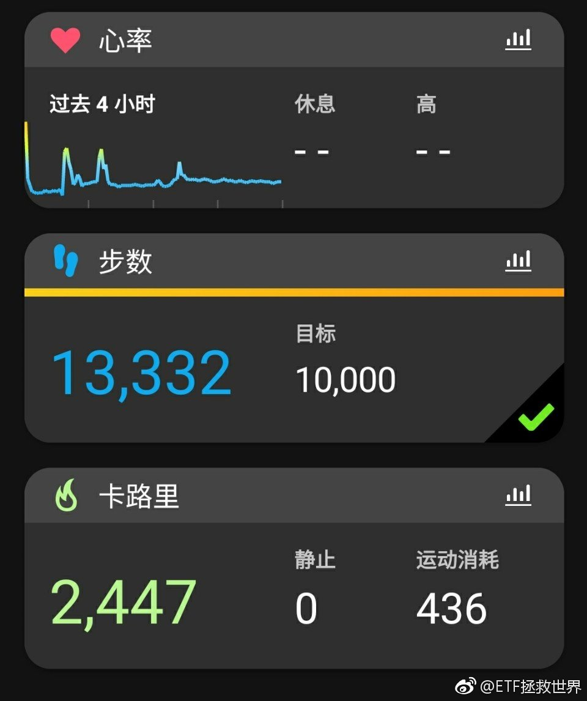

======================================================

ETF拯救世界 (5687069307) @
2018-01-20 21:18:09 Sat  
url: https://weibo.com/5687069307/FFhcS4W2x

每日打卡（137）

搞定。 ​​​

转发[0]  评论[28]  赞[145] 

+++++++++++++++++++++++++++++++++++++++++++++++++++++

图片：

======================================================

ETF拯救世界 (5687069307) @
2018-01-22 09:07:42 Mon  
url: https://weibo.com/5687069307/FFvhncBsA

两融余额再创熔断以来新高，群众的信心越来越足了。 ​​​

转发[16]  评论[64]  赞[131] 

+++++++++++++++++++++++++++++++++++++++++++++++++++++

图片：
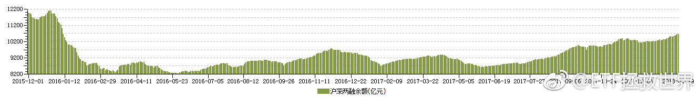

======================================================

ETF拯救世界 (5687069307) @
2018-01-22 09:50:00 Mon  
url: https://weibo.com/5687069307/FFvyybMkk

金融投资中，什么人下场是最惨的。

不是在一波大涨中“踏空”的人。他们没有损失什么。

也不是那些一开始就在大涨中不断炒作的人，未来即使下跌他们也只是利润减少。

下场最惨的人，是一路都非常怀疑上涨，然后越涨心里越难受，越焦虑。最后终于忍不住买入的人。 ​​​

转发[44]  评论[86]  赞[239] 

======================================================

ETF拯救世界 (5687069307) @
2018-01-22 10:01:44 Mon  
url: https://weibo.com/5687069307/FFvDj4M8n

回复@超哥不止洪超哥:我2016年在雪球建了一个测试组合，只买收益率每年只有3%的最差货基，现在跑赢70%组合……//@超哥不止洪超哥:老老实实买余额宝的也能战胜很多投资者

------------------------------------------------------
转推：
>  @ETF拯救世界 (5687069307)
>  2018-01-22 09:50:00 Mon  
>  url: https:/weibo.com/5687069307/FFvyybMkk/

>  金融投资中，什么人下场是最惨的。
>  
>  不是在一波大涨中“踏空”的人。他们没有损失什么。
>  
>  也不是那些一开始就在大涨中不断炒作的人，未来即使下跌他们也只是利润减少。
>  
>  下场最惨的人，是一路都非常怀疑上涨，然后越涨心里越难受，越焦虑。最后终于忍不住买入的人。 ​​​

转发[2]  评论[6]  赞[76] 

======================================================

ETF拯救世界 (5687069307) @
2018-01-22 10:18:22 Mon  
url: https://weibo.com/5687069307/FFvK3a8SB

$中证传媒 sz399971$  不要嘚瑟，还没买够啊喂。 ​​​

转发[14]  评论[69]  赞[94] 

======================================================

ETF拯救世界 (5687069307) @
2018-01-22 10:27:19 Mon  
url: https://weibo.com/5687069307/FFvNGEkBH

涨幅超过沪深300了，搞什么飞机……

------------------------------------------------------
转推：
>  @ETF拯救世界 (5687069307)
>  2018-01-22 10:18:22 Mon  
>  url: https:/weibo.com/5687069307/FFvK3a8SB/

>  $中证传媒 sz399971$  不要嘚瑟，还没买够啊喂。 ​​​

转发[3]  评论[23]  赞[71] 

======================================================

ETF拯救世界 (5687069307) @
2018-01-22 10:37:20 Mon  
url: https://weibo.com/5687069307/FFvRKnh3k

回复@穿越30年:跌了三年了，随时会涨。。//@穿越30年:回复@泸州单身俱乐部--剑平:跌了3年了，我也不信这就开始涨了 [二哈]

------------------------------------------------------
转推：
>  @ETF拯救世界 (5687069307)
>  2018-01-22 10:18:22 Mon  
>  url: https:/weibo.com/5687069307/FFvK3a8SB/

>  $中证传媒 sz399971$  不要嘚瑟，还没买够啊喂。 ​​​

转发[7]  评论[20]  赞[84] 

======================================================

ETF拯救世界 (5687069307) @
2018-01-22 10:58:25 Mon  
url: https://weibo.com/5687069307/FFw0k1RtW

回复@发ass:最近这几次节奏确实还不错。可以吹几个礼拜了。[doge]//@发ass:上次红利没跟车之后，悔得肠子都青了。这次第一时间跟了//@ETF拯救世界:回复@穿越30年:跌了三年了，随时会涨。。//@穿越30年:回复@泸州单身俱乐部--剑平:跌了3年了，我也不信这就开始涨了 [二哈]

------------------------------------------------------
转推：
>  @ETF拯救世界 (5687069307)
>  2018-01-22 10:18:22 Mon  
>  url: https:/weibo.com/5687069307/FFvK3a8SB/

>  $中证传媒 sz399971$  不要嘚瑟，还没买够啊喂。 ​​​

转发[5]  评论[43]  赞[89] 

======================================================

ETF拯救世界 (5687069307) @
2018-01-22 11:02:10 Mon  
url: https://weibo.com/5687069307/FFw1QgQBa

回复@宁志忠:今天可以吧。因为场外的链接基金可能仓位还不足，今天的上涨恐怕只能吃一部分。//@宁志忠:益达，昨天银行卡刚刚绑定且慢，现在还能跟这趟车吗？//@ETF拯救世界:回复@发ass:最近这几次节奏确实还不错。可以吹几个礼拜了。[doge]

------------------------------------------------------
转推：
>  @ETF拯救世界 (5687069307)
>  2018-01-22 10:18:22 Mon  
>  url: https:/weibo.com/5687069307/FFvK3a8SB/

>  $中证传媒 sz399971$  不要嘚瑟，还没买够啊喂。 ​​​

转发[0]  评论[25]  赞[78] 

======================================================

ETF拯救世界 (5687069307) @
2018-01-22 11:36:51 Mon  
url: https://weibo.com/5687069307/FFwfUxMbs

$养老产业 sz399812$   终于也快新高了。不容易。 ​​​

转发[6]  评论[17]  赞[93] 

======================================================

ETF拯救世界 (5687069307) @
2018-01-22 13:01:32 Mon  
url: https://weibo.com/5687069307/FFwOhCmOP

3%。奶一口，下来吧孩子//@ETF拯救世界:回复@发ass:最近这几次节奏确实还不错。可以吹几个礼拜了。[doge]//@发ass:上次红利没跟车之后，悔得肠子都青了。这次第一时间跟了//@ETF拯救世界:回复@穿越30年:跌了三年了，随时会涨。。

------------------------------------------------------
转推：
>  @ETF拯救世界 (5687069307)
>  2018-01-22 10:18:22 Mon  
>  url: https:/weibo.com/5687069307/FFvK3a8SB/

>  $中证传媒 sz399971$  不要嘚瑟，还没买够啊喂。 ​​​

转发[1]  评论[33]  赞[80] 

======================================================

ETF拯救世界 (5687069307) @
2018-01-22 13:47:27 Mon  
url: https://weibo.com/5687069307/FFx6V091F

$159938 溢价了，你懂的。 ​​​

转发[1]  评论[32]  赞[100] 

======================================================

ETF拯救世界 (5687069307) @
2018-01-22 14:18:29 Mon  
url: https://weibo.com/5687069307/FFxjwlzdC

其实你们想过没有，这样涨有什么好的。还有7个交易日就要下个月发车了，这么涨还买个P呢。。。

本来已经计划好买什么了…… ​​​

转发[6]  评论[121]  赞[160] 

======================================================

ETF拯救世界 (5687069307) @
2018-01-22 14:50:44 Mon  
url: https://weibo.com/5687069307/FFxwCjcaN

回复@努力12367:怎么证明你这条是正经的问题而不是没事儿扯淡呢……//@努力12367:E大，转型情感类话题吧。我遇到一个我很喜欢的妹子，而且她也很喜欢我。我是处男，可惜她不是。我好难受啊[泪]

------------------------------------------------------
转推：
>  @ETF拯救世界 (5687069307)
>  2018-01-22 14:18:29 Mon  
>  url: https:/weibo.com/5687069307/FFxjwlzdC/

>  其实你们想过没有，这样涨有什么好的。还有7个交易日就要下个月发车了，这么涨还买个P呢。。。
>  
>  本来已经计划好买什么了…… ​​​

转发[2]  评论[34]  赞[65] 

======================================================

ETF拯救世界 (5687069307) @
2018-01-22 14:54:06 Mon  
url: https://weibo.com/5687069307/FFxxYyWIM

真的稳。底部不断抬高。喜欢。

------------------------------------------------------
转推：
>  @ETF拯救世界 (5687069307)
>  2018-01-22 11:36:51 Mon  
>  url: https:/weibo.com/5687069307/FFwfUxMbs/

>  $养老产业 sz399812$   终于也快新高了。不容易。 ​​​

转发[2]  评论[36]  赞[93] 

======================================================

ETF拯救世界 (5687069307) @
2018-01-22 15:24:15 Mon  
url: https://weibo.com/5687069307/FFxKdCh4e

回复@孤独者生存1:第一：左臂肘关节上方三寸的地方是否有守宫砂。第二：右臂肱二头肌是否比左臂发达，也就是是否有俗称的麒麟臂。//@孤独者生存1:请问E老师，处与非处，男的如果鉴定？[笑cry][生病]//@ETF拯救世界:回复@努力12367:怎么证明你这条是正经的问题而不是没事儿扯淡呢……

------------------------------------------------------
转推：
>  @ETF拯救世界 (5687069307)
>  2018-01-22 14:18:29 Mon  
>  url: https:/weibo.com/5687069307/FFxjwlzdC/

>  其实你们想过没有，这样涨有什么好的。还有7个交易日就要下个月发车了，这么涨还买个P呢。。。
>  
>  本来已经计划好买什么了…… ​​​

转发[1]  评论[64]  赞[96] 

======================================================

ETF拯救世界 (5687069307) @
2018-01-22 17:14:04 Mon  
url: https://weibo.com/5687069307/FFysNlUks

我再也不相信美女了。//@林萍在日本:[笑cry][笑cry]//@空山幽静:你快清醒一点！//@大熊弟不是PDD:我透哇。。。。。//@组长_失了个智: 哈哈哈哈哈哈哈//@腐宅姬:[跪了]//@动漫基地: 一定要看到最后太骚了[允悲]//@星尘使徒: 从此打开了新世界的大门[笑而不语]//@若你成花成霜:哈哈哈哈

------------------------------------------------------
转推：
>  @ ()
>  2018-01-22 15:15:07 Mon  
>  url: 

>  该账号因被投诉违反《微博社区公约》的相关规定，现已无法查看。查看帮助 https://kefu.weibo.com/faqdetail?id=13216

转发[19]  评论[28]  赞[49] 

======================================================

ETF拯救世界 (5687069307) @
2018-01-22 22:11:50 Mon  
url: https://weibo.com/5687069307/FFApEqUB3

今天传媒场外净值只增长了0.5x%。看基金经理在雪球说，应该是周五申购太多，规模增加太快导致。估计原来两千万的场外基金已经被咱们干到8000万了。这个真的没办法，正好赶上大涨了。场内没有这个问题。 ​​​

转发[10]  评论[107]  赞[136] 

======================================================

ETF拯救世界 (5687069307) @
2018-01-23 08:14:24 Tue  
url: https://weibo.com/5687069307/FFEmew3HD

冻僵了 ​​​

转发[0]  评论[57]  赞[80] 

+++++++++++++++++++++++++++++++++++++++++++++++++++++

图片：
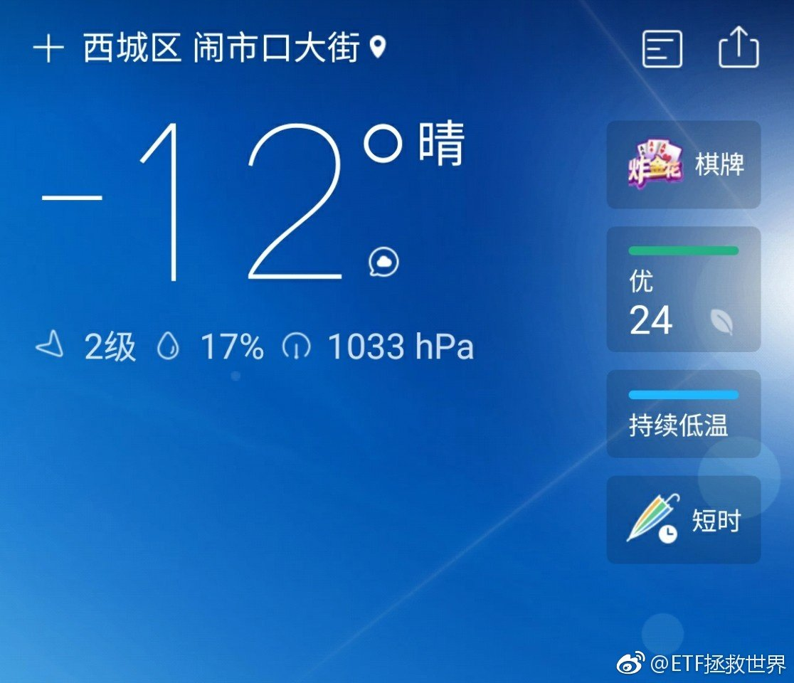

======================================================

ETF拯救世界 (5687069307) @
2018-01-23 09:17:23 Tue  
url: https://weibo.com/5687069307/FFELOaBZt

第一次阅读量超过4万，纪念一下。

什么时候我也有10万+的文章，是不是就可以成为网红了。 ​​​

转发[3]  评论[97]  赞[229] 

+++++++++++++++++++++++++++++++++++++++++++++++++++++

图片：

======================================================

ETF拯救世界 (5687069307) @
2018-01-23 09:43:43 Tue  
url: https://weibo.com/5687069307/FFEWumcku

$中证传媒 sz399971$   又来？

对于要建仓的场外链接基金来说，今天最差的一种走势就是先涨后跌…… ​​​

转发[2]  评论[20]  赞[69] 

======================================================

ETF拯救世界 (5687069307) @
2018-01-23 09:51:00 Tue  
url: https://weibo.com/5687069307/FFEZrx147

这次传媒可以吹一阵了吧……

------------------------------------------------------
转推：
>  @ETF拯救世界 (5687069307)
>  2018-01-23 09:43:43 Tue  
>  url: https:/weibo.com/5687069307/FFEWumcku/

>  $中证传媒 sz399971$   又来？
>  
>  对于要建仓的场外链接基金来说，今天最差的一种走势就是先涨后跌…… ​​​

转发[0]  评论[42]  赞[79] 

======================================================

ETF拯救世界 (5687069307) @
2018-01-23 10:05:08 Tue  
url: https://weibo.com/5687069307/FFF5bk5sO

按照这个节奏，50为代表的大蓝筹上半年应该就可以造个万人坑出来~

不过咱们的持仓依然不动……策略+纪律>预测…… ​​​

转发[29]  评论[52]  赞[161] 

======================================================

ETF拯救世界 (5687069307) @
2018-01-23 10:22:21 Tue  
url: https://weibo.com/5687069307/FFFcauThB

乐视除了主动抛售的股票，有几个方面的股票一定会抛。一个是各大指数基金的持仓。之前乐视除了是创业板之类指数的成分股，甚至是沪深300的成分股。现在已经调出来了，有很多基金必须要抛。第二是质押部分，机构也要抛。这些筹码消化掉，再说其他机构散户的抛盘吧。不知道多少钱会有人接？

------------------------------------------------------
转推：
>  @财联社APP (2868676035)
>  2018-01-23 10:19:23 Tue  
>  url: https:/weibo.com/2868676035/FFFaYlkvF/

>  对于“孙宏斌孙总会不会接手贾跃亭在乐视网的持股，还是会引入新的战略投资者来接手？”的问题，乐视网称，贾跃亭先生目前为乐视网第一大股东，持股25.67%，融创中国持股乐视网8.56%，孙宏斌先生为融创中国的实际控制人。目前贾跃亭并未表达对所持乐视网股权的处置安排，也未表示不对所持股权在质押机 ​​​

转发[7]  评论[27]  赞[61] 

======================================================

ETF拯救世界 (5687069307) @
2018-01-23 10:31:18 Tue  
url: https://weibo.com/5687069307/FFFfNlh29

$162411  好消息不断…… ​​​

转发[2]  评论[25]  赞[96] 

======================================================

ETF拯救世界 (5687069307) @
2018-01-23 10:41:45 Tue  
url: https://weibo.com/5687069307/FFFk2E1lH

其实想一想，套在山顶的人也没什么好埋怨的。

如果不是自己看着暴涨，贪心杀进去，又怎么会被套。

一切都是天意。 ​​​

转发[13]  评论[36]  赞[144] 

======================================================

ETF拯救世界 (5687069307) @
2018-01-23 11:01:53 Tue  
url: https://weibo.com/5687069307/FFFsdpiQg

我现阶段的投资逻辑：

看好中国和A股，就不可能只看好100只股票。

A股目前3400只股票，大涨的是中证100的100只。沪深300中的剩下200只和再往后的中证500基本不动。

都说A股港股化，好的，就算未来严格退市+仙股遍地，3400只里面，2400只都是垃圾可以不可以？还不行？那么3400只里面，3000只都是垃圾 ​​​

转发[85]  评论[143]  赞[304] 

======================================================

ETF拯救世界 (5687069307) @
2018-01-23 11:28:10 Tue  
url: https://weibo.com/5687069307/FFFCTjFDY

回复@小牧yc:奇怪的是，这20万人很沉默，基本听不到他们的声音啊。//@小牧yc:2017-10-28 股东人数185875，将近20万人。。。。

------------------------------------------------------
转推：
>  @财联社APP (2868676035)
>  2018-01-23 10:19:23 Tue  
>  url: https:/weibo.com/2868676035/FFFaYlkvF/

>  对于“孙宏斌孙总会不会接手贾跃亭在乐视网的持股，还是会引入新的战略投资者来接手？”的问题，乐视网称，贾跃亭先生目前为乐视网第一大股东，持股25.67%，融创中国持股乐视网8.56%，孙宏斌先生为融创中国的实际控制人。目前贾跃亭并未表达对所持乐视网股权的处置安排，也未表示不对所持股权在质押机 ​​​

转发[1]  评论[17]  赞[51] 

======================================================

ETF拯救世界 (5687069307) @
2018-01-23 11:29:17 Tue  
url: https://weibo.com/5687069307/FFFDktFJe

回复@文小陈c:对不对？还有哦，我那时候写的会买的500估值，已经比现在高了哦。//@文小陈c:最早一批铁粉，想起益达两年多前写的荒岛十年，“50和恒生的现估值”，眨眼间就快到万人坑了，我A真是个神奇的地方～

------------------------------------------------------
转推：
>  @ETF拯救世界 (5687069307)
>  2018-01-23 10:05:08 Tue  
>  url: https:/weibo.com/5687069307/FFF5bk5sO/

>  按照这个节奏，50为代表的大蓝筹上半年应该就可以造个万人坑出来~
>  
>  不过咱们的持仓依然不动……策略+纪律>预测…… ​​​

转发[10]  评论[37]  赞[83] 

======================================================

ETF拯救世界 (5687069307) @
2018-01-23 11:38:03 Tue  
url: https://weibo.com/5687069307/FFFGTdeQ1

至少先上个英国ETF好吗。

------------------------------------------------------
转推：
>  @ ()
>  2018-01-23 11:12:31 Tue  
>  url: 

>  抱歉，此微博已被作者删除。查看帮助：http://t.cn/Rfd3rQV

转发[2]  评论[25]  赞[95] 

======================================================

ETF拯救世界 (5687069307) @
2018-01-23 13:47:43 Tue  
url: https://weibo.com/5687069307/FFGxxf3d7

回复@善广辉:现在看，除了当时可以买的50和恒生，到目前，500和养老算是符合标准了。就看3个月后的年报季报了。

------------------------------------------------------
转推：
>  @ETF拯救世界 (5687069307)
>  2018-01-23 10:05:08 Tue  
>  url: https:/weibo.com/5687069307/FFF5bk5sO/

>  按照这个节奏，50为代表的大蓝筹上半年应该就可以造个万人坑出来~
>  
>  不过咱们的持仓依然不动……策略+纪律>预测…… ​​​

转发[3]  评论[25]  赞[89] 

======================================================

ETF拯救世界 (5687069307) @
2018-01-23 14:55:43 Tue  
url: https://weibo.com/5687069307/FFGZ8cw5k

$中证传媒 sz399971$  光头收盘，稳如狗。

然而，还是50和红利最高……当然，还有恒生。

对于恒生，我已经设定了下次再平衡的标准。如果它达到了，月底会来一次。 ​​​

转发[1]  评论[84]  赞[122] 

======================================================

ETF拯救世界 (5687069307) @
2018-01-23 14:58:23 Tue  
url: https://weibo.com/5687069307/FFH0dyF3C

回复@快乐Daisy1115:如果是可口可乐肯德基的我当然Ok啊。然而大部分都是p2p和各种理财平台，我还有点底线，不会为了钱接这种。//@快乐Daisy1115:回复@乐活广场com:可以接点，赚个油钱，我们不介意的

------------------------------------------------------
转推：
>  @ETF拯救世界 (5687069307)
>  2018-01-23 09:17:23 Tue  
>  url: https:/weibo.com/5687069307/FFELOaBZt/

>  第一次阅读量超过4万，纪念一下。
>  
>  什么时候我也有10万+的文章，是不是就可以成为网红了。 ​​​

转发[1]  评论[77]  赞[177] 

======================================================

ETF拯救世界 (5687069307) @
2018-01-24 09:06:15 Wed  
url: https://weibo.com/5687069307/FFO7MgaJ1

乐视的20万股东中，如果有人只是有一部分分仓给乐视，那没有大问题。退一步，就算是重仓，也无非是看错股票而已。

如果是满仓甚至融资买入，那基本上的结论就是，没有入金融投资的门。

金融投资最重要的不是赚多少，而是不死。

即使概率极低的黑天鹅，也要在投资前考虑到。一次把命压上，没事，两次 ​​​

转发[112]  评论[117]  赞[216] 

======================================================

ETF拯救世界 (5687069307) @
2018-01-24 09:12:52 Wed  
url: https://weibo.com/5687069307/FFOatgjH9

回复@眼睛视界:你再记一道数学题：90%的获胜概率，连续玩十次，获胜的概率就只剩34.87%。别以为胜率高就可以赌命，玩多了，赌不起的。不怕输，怕的是输了命没了。//@眼睛视界:这段话太深刻了。记录下来

------------------------------------------------------
转推：
>  @ETF拯救世界 (5687069307)
>  2018-01-24 09:06:15 Wed  
>  url: https:/weibo.com/5687069307/FFO7MgaJ1/

>  乐视的20万股东中，如果有人只是有一部分分仓给乐视，那没有大问题。退一步，就算是重仓，也无非是看错股票而已。
>  
>  如果是满仓甚至融资买入，那基本上的结论就是，没有入金融投资的门。
>  
>  金融投资最重要的不是赚多少，而是不死。
>  
>  即使概率极低的黑天鹅，也要在投资前考虑到。一次把命压上，没事，两次 ​​​

转发[29]  评论[41]  赞[109] 

======================================================

ETF拯救世界 (5687069307) @
2018-01-24 09:25:13 Wed  
url: https://weibo.com/5687069307/FFOftukjk

乐视的第三、第九、第十大股东是GJD，估计后面还有。问题：GJD有没有优先卖出通道…… ​​​

转发[2]  评论[34]  赞[87] 

======================================================

ETF拯救世界 (5687069307) @
2018-01-24 10:08:24 Wed  
url: https://weibo.com/5687069307/FFOx0hVB1

回复@愤怒的小小小小鸟:你再好好想想。连续十次是一个整体，怎么会是独立的？十个人赌博，1个人必败。每一轮淘汰一个人后，其它九个人都走了，那才是独立的。人都不走，连续玩十轮，连续获胜的概率是多大？怎么会是独立的？

------------------------------------------------------
转推：
>  @ETF拯救世界 (5687069307)
>  2018-01-24 09:06:15 Wed  
>  url: https:/weibo.com/5687069307/FFO7MgaJ1/

>  乐视的20万股东中，如果有人只是有一部分分仓给乐视，那没有大问题。退一步，就算是重仓，也无非是看错股票而已。
>  
>  如果是满仓甚至融资买入，那基本上的结论就是，没有入金融投资的门。
>  
>  金融投资最重要的不是赚多少，而是不死。
>  
>  即使概率极低的黑天鹅，也要在投资前考虑到。一次把命压上，没事，两次 ​​​

转发[4]  评论[8]  赞[56] 

======================================================

ETF拯救世界 (5687069307) @
2018-01-24 10:16:14 Wed  
url: https://weibo.com/5687069307/FFOAboTf9

即使获胜的概率很高，如果你不停得玩，玩的次数越多，那么连胜的概率就越低。

这里就引出一个关键的问题，也就是老巴说的：打卡机。

老巴说，一辈子如果只有20次机会，你会做什么投资。这其实是非常睿智的。不仅包含了要严格筛选投资标的的问题，还有下手次数不要太多。

同样的意思，还包含在他另一 ​​​

转发[72]  评论[76]  赞[174] 

======================================================

ETF拯救世界 (5687069307) @
2018-01-24 10:17:10 Wed  
url: https://weibo.com/5687069307/FFOAz3n1b

$中证传媒 sz399971$   又来了。舒坦。 ​​​

转发[5]  评论[33]  赞[81] 

======================================================

ETF拯救世界 (5687069307) @
2018-01-24 10:22:21 Wed  
url: https://weibo.com/5687069307/FFOCFo2St

在金融投资中，只要做到一点，就基本问题不大了。

“只有别人给你接盘，你不会给别人接盘。”

有些人说，你不接我就涨，越涨越高你总会来接盘。

搞笑，你越涨越高关我P事。比特币几个月涨那么多，照你这说法，我是不是要去跳楼了？

恒生你再敢继续疯涨，我们就继续卖。 ​​​

转发[41]  评论[53]  赞[143] 

======================================================

ETF拯救世界 (5687069307) @
2018-01-24 10:31:05 Wed  
url: https://weibo.com/5687069307/FFOGddBEs

我比你们想象的更爱传媒股……

别追了，50%了。。记得买的时候在微博贴了K线，还有个评论里的哥们居然看出来是哪只了……只能说他真的NB。 ​​​

转发[3]  评论[30]  赞[88] 

+++++++++++++++++++++++++++++++++++++++++++++++++++++

图片：

======================================================

ETF拯救世界 (5687069307) @
2018-01-24 10:32:53 Wed  
url: https://weibo.com/5687069307/FFOGWq0Q6

回复@张大山gz:一次买了两份，已经不少了……//@张大山gz:看着它涨，总有底部买少了的感觉。佩服E大的淡定，坚守纪律[good]

------------------------------------------------------
转推：
>  @ETF拯救世界 (5687069307)
>  2018-01-24 10:17:10 Wed  
>  url: https:/weibo.com/5687069307/FFOAz3n1b/

>  $中证传媒 sz399971$   又来了。舒坦。 ​​​

转发[1]  评论[13]  赞[61] 

======================================================

ETF拯救世界 (5687069307) @
2018-01-24 10:34:13 Wed  
url: https://weibo.com/5687069307/FFOHu77ZT

回复@达达尼敖:传媒场外的我劝各位一句，千万别因为没跟上赎回。我个人认为，那么大的基金公司不会这么业余。给点耐心你再看看。//@达达尼敖:场外的表示然并软

------------------------------------------------------
转推：
>  @ETF拯救世界 (5687069307)
>  2018-01-24 10:17:10 Wed  
>  url: https:/weibo.com/5687069307/FFOAz3n1b/

>  $中证传媒 sz399971$   又来了。舒坦。 ​​​

转发[2]  评论[35]  赞[72] 

======================================================

ETF拯救世界 (5687069307) @
2018-01-24 10:36:43 Wed  
url: https://weibo.com/5687069307/FFOIv3TGE

$512980  [挤眼] ​​​

转发[3]  评论[45]  赞[103] 

======================================================

ETF拯救世界 (5687069307) @
2018-01-24 10:53:10 Wed  
url: https://weibo.com/5687069307/FFOPb0TGT

回复@秦雪晖23333:人家是模拟盘。你6块钱不如捐给我呢……//@秦雪晖23333:回复@绿地213:今天看雪球有个叫 水煮砖头的网友，亏了20多w了。哎，我还捐了30块。。是我雪球钱包里的全部余额[允悲][允悲]

------------------------------------------------------
转推：
>  @ETF拯救世界 (5687069307)
>  2018-01-24 10:22:21 Wed  
>  url: https:/weibo.com/5687069307/FFOCFo2St/

>  在金融投资中，只要做到一点，就基本问题不大了。
>  
>  “只有别人给你接盘，你不会给别人接盘。”
>  
>  有些人说，你不接我就涨，越涨越高你总会来接盘。
>  
>  搞笑，你越涨越高关我P事。比特币几个月涨那么多，照你这说法，我是不是要去跳楼了？
>  
>  恒生你再敢继续疯涨，我们就继续卖。 ​​​

转发[1]  评论[11]  赞[74] 

======================================================

ETF拯救世界 (5687069307) @
2018-01-24 11:31:47 Wed  
url: https://weibo.com/5687069307/FFP4QBiYd

这下月底真的没什么可以买了。

别看了别看了，散了散了啊。 ​​​

转发[27]  评论[99]  赞[147] 

======================================================

ETF拯救世界 (5687069307) @
2018-01-24 11:41:27 Wed  
url: https://weibo.com/5687069307/FFP8M7WQd

“金融投资想要赚钱无非是四个字：低买高卖。每个人都懂，然而能做到的人就少之又少。

道理很简单，“低”的东西一定是不被看好的。“高”的东西一定是众星捧月。所有人都不看好的时候，你怎么才能下决心走出羊群，到另一片没人跟你抢的地方去享受美食？

其实真的很难。

人类和羊群是一样的。走出羊 ​​​

转发[93]  评论[115]  赞[250] 

======================================================

ETF拯救世界 (5687069307) @
2018-01-24 12:18:38 Wed  
url: https://weibo.com/5687069307/FFPnRhMP0

回复@快乐行者9:我自己买了EWU，英国；EFA，非美发达国家；EWP，西班牙。都已经涨了很多了，买一点问题不大，别多。//@快乐行者9:E大，给推个美股可以交易的指数呗，开了盈透账户，坐看账户里美元贬值[泪]

------------------------------------------------------
转推：
>  @ETF拯救世界 (5687069307)
>  2018-01-24 11:31:47 Wed  
>  url: https:/weibo.com/5687069307/FFP4QBiYd/

>  这下月底真的没什么可以买了。
>  
>  别看了别看了，散了散了啊。 ​​​

转发[22]  评论[29]  赞[68] 

======================================================

ETF拯救世界 (5687069307) @
2018-01-24 12:28:24 Wed  
url: https://weibo.com/5687069307/FFPrP8ucl

有没有人告诉我这个有什么好玩的。玩了一会没感觉到亮点是什么啊…… ​​​

转发[3]  评论[84]  赞[67] 

+++++++++++++++++++++++++++++++++++++++++++++++++++++

图片：

======================================================

ETF拯救世界 (5687069307) @
2018-01-24 13:06:43 Wed  
url: https://weibo.com/5687069307/FFPHnEqvK

$养老产业 sz399812$  稳了，新高。 ​​​

转发[0]  评论[11]  赞[85] 

======================================================

ETF拯救世界 (5687069307) @
2018-01-24 13:16:00 Wed  
url: https://weibo.com/5687069307/FFPL9oxDD

$证券公司 sz399975$  弹性…… ​​​

转发[5]  评论[31]  赞[71] 

======================================================

ETF拯救世界 (5687069307) @
2018-01-24 13:30:49 Wed  
url: https://weibo.com/5687069307/FFPRaB2H2

回复@morninggloy:相信我，经验值很多钱。真的值很多钱。//@morninggloy:难怪这个网格要10%[委屈]

------------------------------------------------------
转推：
>  @ETF拯救世界 (5687069307)
>  2018-01-24 13:16:00 Wed  
>  url: https:/weibo.com/5687069307/FFPL9oxDD/

>  $证券公司 sz399975$  弹性…… ​​​

转发[4]  评论[36]  赞[102] 

======================================================

ETF拯救世界 (5687069307) @
2018-01-24 13:43:01 Wed  
url: https://weibo.com/5687069307/FFPW7mzh6

又来了……第二个10%。 ​​​

转发[1]  评论[47]  赞[114] 

+++++++++++++++++++++++++++++++++++++++++++++++++++++

图片：
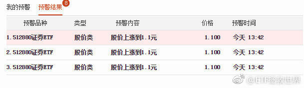

======================================================

ETF拯救世界 (5687069307) @
2018-01-24 13:57:49 Wed  
url: https://weibo.com/5687069307/FFQ27C5QL

我去开会，不要掉链子。

还是把会议延后……毕竟传媒有点厉害了。 ​​​

转发[0]  评论[58]  赞[141] 

======================================================

ETF拯救世界 (5687069307) @
2018-01-24 17:14:35 Wed  
url: https://weibo.com/5687069307/FFRjZtuwP

刚看了两个数据，说江苏浙江初婚年龄都30以上了。其他地方估计也不会差太多。

我想了想，决定把锅甩给日韩两国。

为什么，大家想。

现在的姑娘是不是好多都爱看韩剧。好嘛，一打开，又是李敏镐又是宋仲基，要颜有颜要身材有身材要钱有钱，还温柔。

然后回头一看旁边的男人们……现在的姑娘又经济独 ​​​

转发[35]  评论[260]  赞[304] 

======================================================

ETF拯救世界 (5687069307) @
2018-01-24 17:37:14 Wed  
url: https://weibo.com/5687069307/FFRtc5Xxb

“这次不一样”//@佐罗_厚恩投资:转发微博

------------------------------------------------------
转推：
>  @21世纪经济报道 (1651428902)
>  2018-01-24 16:58:15 Wed  
>  url: https:/weibo.com/1651428902/FFRdmsYbe/

>  【李小加：港股当前市况与上两轮牛市不同】李小加表示对现时港股成交额大幅攀升感到高兴，今年来日均成交额达到1500亿-1600亿港元，“与2007年及2015年不一样，自去年以来，香港市场不仅受惠外围乐观情绪，市场本身也出现实际转变，例如上市制度改革吸引了更多投资者来港。”http://t.cn/RQ1wJW3 ​​​

转发[8]  评论[78]  赞[78] 

======================================================

ETF拯救世界 (5687069307) @
2018-01-24 21:40:49 Wed  
url: https://weibo.com/5687069307/FFT43vWHw

每日打卡（138）

明显感觉有效果啊 ​​​

转发[0]  评论[33]  赞[129] 

+++++++++++++++++++++++++++++++++++++++++++++++++++++

图片：

======================================================

ETF拯救世界 (5687069307) @
2018-01-25 08:51:07 Thu  
url: https://weibo.com/5687069307/FFXs8elKD

回复@三I竹I田:23个品种，赚钱的18个，最大盈利63%，三个浮亏不超过0.3%，最大浮亏是两个2%。可能他正好买了那两个浮亏的债券吧……//@三I竹I田:回复@双全10086:上一期跟投的券商买没有嘛？赚钱没有？

------------------------------------------------------
转推：
>  @ETF拯救世界 (5687069307)
>  2018-01-24 17:14:35 Wed  
>  url: https:/weibo.com/5687069307/FFRjZtuwP/

>  刚看了两个数据，说江苏浙江初婚年龄都30以上了。其他地方估计也不会差太多。
>  
>  我想了想，决定把锅甩给日韩两国。
>  
>  为什么，大家想。
>  
>  现在的姑娘是不是好多都爱看韩剧。好嘛，一打开，又是李敏镐又是宋仲基，要颜有颜要身材有身材要钱有钱，还温柔。
>  
>  然后回头一看旁边的男人们……现在的姑娘又经济独 ​​​

转发[2]  评论[82]  赞[89] 

======================================================

ETF拯救世界 (5687069307) @
2018-01-25 10:09:59 Thu  
url: https://weibo.com/5687069307/G00vP5Lgw

即使你在2017年5月买入传媒，浮亏近一年，还是会在距离大底3天内赚钱了。

这就是我说的，控制好成本，不要怕浮亏。牛市来了，你那点浮亏一周，半个月就就赚钱。

这些话说太多，你没经历过永远不会懂。经历一次才懂，可惜，已经付出很多很多年的时间。 ​​​

转发[32]  评论[86]  赞[196] 

======================================================

ETF拯救世界 (5687069307) @
2018-01-25 10:15:19 Thu  
url: https://weibo.com/5687069307/G00xZc9f0

回复@孔熙佑241:这次？[挖鼻]//@孔熙佑241:起飞前一天精准买入，跟着E大这次操作太666

------------------------------------------------------
转推：
>  @ETF拯救世界 (5687069307)
>  2018-01-25 10:09:59 Thu  
>  url: https:/weibo.com/5687069307/G00vP5Lgw/

>  即使你在2017年5月买入传媒，浮亏近一年，还是会在距离大底3天内赚钱了。
>  
>  这就是我说的，控制好成本，不要怕浮亏。牛市来了，你那点浮亏一周，半个月就就赚钱。
>  
>  这些话说太多，你没经历过永远不会懂。经历一次才懂，可惜，已经付出很多很多年的时间。 ​​​

转发[1]  评论[42]  赞[87] 

======================================================

ETF拯救世界 (5687069307) @
2018-01-25 11:18:26 Thu  
url: https://weibo.com/5687069307/G00XC3BZQ

不少人会在“价值投资元年”之后，在一些“蓝筹股”上套3-5年 ​​​

转发[217]  评论[139]  赞[288] 

======================================================

ETF拯救世界 (5687069307) @
2018-01-25 13:29:26 Thu  
url: https://weibo.com/5687069307/G01OMh0vg

回复@润泽20170101:http://t.cn/RQgzyop  2016年底一部分美元换了英镑。去年英镑兑美元涨了9个多点，今年不到一个月已经6个点。//@润泽20170101:E大的美元怎么对冲的

------------------------------------------------------
转推：
>  @ETF拯救世界 (5687069307)
>  2018-01-25 11:18:26 Thu  
>  url: https:/weibo.com/5687069307/G00XC3BZQ/

>  不少人会在“价值投资元年”之后，在一些“蓝筹股”上套3-5年 ​​​

转发[9]  评论[21]  赞[79] 

======================================================

ETF拯救世界 (5687069307) @
2018-01-25 14:28:00 Thu  
url: https://weibo.com/5687069307/G02cyaXYh

今天传媒这个长上影不知道埋了多少英雄进去，为什么要追实在是不懂……

一般这样的长上影出来，明天就不会太好。哈哈。 ​​​

转发[24]  评论[49]  赞[170] 

======================================================

ETF拯救世界 (5687069307) @
2018-01-25 14:38:51 Thu  
url: https://weibo.com/5687069307/G02gXdRnX

其实计划中大概有45-50份是除非出现“极度价值”，否则不会买下去的。这也是最后的敢死部队，大获全胜的最后希望。

所以说，其实一般情况下可供投资的也就是20多30份了…… ​​​

转发[32]  评论[159]  赞[199] 

======================================================

ETF拯救世界 (5687069307) @
2018-01-25 15:07:22 Thu  
url: https://weibo.com/5687069307/G02sxi5UF

今天没法新高了。预计跌幅0.2x%。

一瞬间，感受不到生命的温度，仿佛世界都在与我为敌。

财富如水，就在这一天，解押够moment，居然流到别人账户里了。

心累了，做了个重要的决定。

退博了。与你道别。

去思考人生、规划梦想，去找寻那朵丢失的栀子花。

退博持续时间：一小时又3分17秒。 

勿念 ​​​

转发[2]  评论[193]  赞[238] 

======================================================

ETF拯救世界 (5687069307) @
2018-01-25 23:14:02 Thu  
url: https://weibo.com/5687069307/G05E4eA0X

回复@圣善周闻宗:跟你们说了不要急，那么大公司不会这么业余//@圣善周闻宗:回复@小七薪:重点是跑赢了指数不少。。活久见

------------------------------------------------------
转推：
>  @ETF拯救世界 (5687069307)
>  2018-01-25 14:28:00 Thu  
>  url: https:/weibo.com/5687069307/G02cyaXYh/

>  今天传媒这个长上影不知道埋了多少英雄进去，为什么要追实在是不懂……
>  
>  一般这样的长上影出来，明天就不会太好。哈哈。 ​​​

转发[17]  评论[29]  赞[84] 

======================================================

ETF拯救世界 (5687069307) @
2018-01-26 09:12:16 Fri  
url: https://weibo.com/5687069307/G09yTh5pB

回复@吃货神圣不可侵犯:有所为有所不为，目前我不买军工//@吃货神圣不可侵犯:e大e大 最近几天好像看到雪球和且慢某些组合都开始对军工蠢蠢欲动了 e大有何看法[憧憬]//@ETF拯救世界:回复@圣善周闻宗:跟你们说了不要急，那么大公司不会这么业余

------------------------------------------------------
转推：
>  @ETF拯救世界 (5687069307)
>  2018-01-25 14:28:00 Thu  
>  url: https:/weibo.com/5687069307/G02cyaXYh/

>  今天传媒这个长上影不知道埋了多少英雄进去，为什么要追实在是不懂……
>  
>  一般这样的长上影出来，明天就不会太好。哈哈。 ​​​

转发[14]  评论[24]  赞[78] 

======================================================

ETF拯救世界 (5687069307) @
2018-01-26 09:37:57 Fri  
url: https://weibo.com/5687069307/G09JjtDCr

$中证传媒 sz399971$   我就默默的看着你装B…… ​​​

转发[3]  评论[42]  赞[97] 

======================================================

ETF拯救世界 (5687069307) @
2018-01-26 11:00:28 Fri  
url: https://weibo.com/5687069307/G0agOd5aU

回复@tcwjdid:军工是炒作属性，PE是安全边际。没有安全边际的炒作我这辈子也不会干。//@tcwjdid:买军工不能看pe，因为是国家管制+垄断行业，因为不懂所以不买//@ETF拯救世界:回复@吃货神圣不可侵犯:有所为有所不为，目前我不买军工

------------------------------------------------------
转推：
>  @ETF拯救世界 (5687069307)
>  2018-01-25 14:28:00 Thu  
>  url: https:/weibo.com/5687069307/G02cyaXYh/

>  今天传媒这个长上影不知道埋了多少英雄进去，为什么要追实在是不懂……
>  
>  一般这样的长上影出来，明天就不会太好。哈哈。 ​​​

转发[13]  评论[12]  赞[100] 

======================================================

ETF拯救世界 (5687069307) @
2018-01-26 11:11:09 Fri  
url: https://weibo.com/5687069307/G0al8uuxb

$恒生指数 hkHSI$   我个人观点，它正在制造一个堪比2007年的泡沫。 ​​​

转发[18]  评论[50]  赞[145] 

======================================================

ETF拯救世界 (5687069307) @
2018-01-26 11:21:50 Fri  
url: https://weibo.com/5687069307/G0apuihaR

回复@快乐行者85762:不要主动预测泡沫何时破，更不要做空。索罗斯怎么说的？识别泡沫，享受泡沫，在泡沫破灭前悄悄离去。最后的疯狂通常利润最丰厚。enjoy。//@快乐行者85762:那就来个泡泡浴吧[酷]

------------------------------------------------------
转推：
>  @ETF拯救世界 (5687069307)
>  2018-01-26 11:11:09 Fri  
>  url: https:/weibo.com/5687069307/G0al8uuxb/

>  $恒生指数 hkHSI$   我个人观点，它正在制造一个堪比2007年的泡沫。 ​​​

转发[9]  评论[21]  赞[102] 

======================================================

ETF拯救世界 (5687069307) @
2018-01-26 11:27:08 Fri  
url: https://weibo.com/5687069307/G0arCEuLA

享受泡沫和享受泡沫并不同。

像刚才说的，首先要做到的是识别泡沫。也就是说你知道危险。然后才是享受泡沫。你知道危险，但你依然享受。然后才是在破灭前离开。

另一种就不同了。另一种是，根本不知道这是泡沫。坚信是合理的。他们从来不会想到危险，也不会想到破灭前离开。因为在一个上涨的品种上， ​​​

转发[47]  评论[86]  赞[206] 

======================================================

ETF拯救世界 (5687069307) @
2018-01-26 13:08:43 Fri  
url: https://weibo.com/5687069307/G0b6RAXuU

谁能想到，pony买$网宿科技 sz300017$  利好传媒……

------------------------------------------------------
转推：
>  @ETF拯救世界 (5687069307)
>  2018-01-26 09:37:57 Fri  
>  url: https:/weibo.com/5687069307/G09JjtDCr/

>  $中证传媒 sz399971$   我就默默的看着你装B…… ​​​

转发[1]  评论[29]  赞[92] 

======================================================

ETF拯救世界 (5687069307) @
2018-01-26 14:01:11 Fri  
url: https://weibo.com/5687069307/G0bsa8Cmm

所有指数都在涨，结果涨跌家数对比是1300:1900…… ​​​

转发[2]  评论[20]  赞[114] 

======================================================

ETF拯救世界 (5687069307) @
2018-01-26 14:03:32 Fri  
url: https://weibo.com/5687069307/G0bt7gKME

分级A跌的我又开始感兴趣了。2年多了，好想它们 ​​​

转发[46]  评论[181]  赞[209] 

======================================================

ETF拯救世界 (5687069307) @
2018-01-28 14:27:17 Sun  
url: https://weibo.com/5687069307/G0utKrjIw

现在演黄婆婆不用化妆了……

------------------------------------------------------
转推：
>  @ ()
>  2018-01-28 13:55:03 Sun  
>  url: 

>  抱歉，作者已设置仅展示半年内微博，此微博已不可见。 ​​​

转发[3]  评论[40]  赞[69] 

======================================================

ETF拯救世界 (5687069307) @
2018-01-28 21:29:46 Sun  
url: https://weibo.com/5687069307/G0xff6iXa

分级b本身长期持有就是必死。正常情况下是几年死一次，如果上折过就有可能一年死几次。分级b千万不可以长期持有，上涨趋势阶段性拿拿还可以

------------------------------------------------------
转推：
>  @ ()
>  2018-01-28 20:53:41 Sun  
>  url: 

>  该账号因被投诉违反《微博社区公约》的相关规定，现已无法查看。查看帮助 https://kefu.weibo.com/faqdetail?id=13216

转发[22]  评论[27]  赞[97] 

======================================================

ETF拯救世界 (5687069307) @
2018-01-28 21:43:40 Sun  
url: https://weibo.com/5687069307/G0xkSlOTA

回复@九州风语者:这个真的不能一概而论。情况特别复杂，一两句说不清。分级a是含看跌期权的债券。分级b是杠杆率随时变动的杠杆基金。还有各种折溢价变化。非常好玩，同时对一般人来说非常危险//@九州风语者:那上折过的分级B，是不是对分级A来说就是一个好事呢？

------------------------------------------------------
转推：
>  @ ()
>  2018-01-28 20:53:41 Sun  
>  url: 

>  该账号因被投诉违反《微博社区公约》的相关规定，现已无法查看。查看帮助 https://kefu.weibo.com/faqdetail?id=13216

转发[7]  评论[14]  赞[67] 

======================================================

ETF拯救世界 (5687069307) @
2018-01-28 22:06:16 Sun  
url: https://weibo.com/5687069307/G0xu3dzSJ

每日打卡（139）

一直在练，有时候忘了上传…… ​​​

转发[0]  评论[16]  赞[118] 

+++++++++++++++++++++++++++++++++++++++++++++++++++++

图片：

======================================================

ETF拯救世界 (5687069307) @
2018-01-29 09:44:08 Mon  
url: https://weibo.com/5687069307/G0C3ju1DG

一转眼就29号了……真快啊。 ​​​

转发[8]  评论[75]  赞[135] 

======================================================

ETF拯救世界 (5687069307) @
2018-01-29 10:04:59 Mon  
url: https://weibo.com/5687069307/G0CbMA4Zh

回复@zoeyllyeoz:有什么好建议，各位？//@zoeyllyeoz:E大一家春节有啥休假安排涅？

------------------------------------------------------
转推：
>  @ETF拯救世界 (5687069307)
>  2018-01-29 09:44:08 Mon  
>  url: https:/weibo.com/5687069307/G0C3ju1DG/

>  一转眼就29号了……真快啊。 ​​​

转发[3]  评论[66]  赞[67] 

======================================================

ETF拯救世界 (5687069307) @
2018-01-29 11:06:56 Mon  
url: https://weibo.com/5687069307/G0CAUFeTn

回复@安乐健:少说话，多许愿……//@安乐健:太赞了，翻绿了

------------------------------------------------------
转推：
>  @ETF拯救世界 (5687069307)
>  2018-01-29 09:44:08 Mon  
>  url: https:/weibo.com/5687069307/G0C3ju1DG/

>  一转眼就29号了……真快啊。 ​​​

转发[2]  评论[24]  赞[91] 

======================================================

ETF拯救世界 (5687069307) @
2018-01-29 11:24:04 Mon  
url: https://weibo.com/5687069307/G0CHT18fu

回复@晞诺稳投:看过，想去玩。多少钱一次……//@晞诺稳投:不知道e大看过西部世界 没 推荐[憧憬]//@ETF拯救世界:回复@zoeyllyeoz:有什么好建议，各位？//@zoeyllyeoz:E大一家春节有啥休假安排涅？

------------------------------------------------------
转推：
>  @ETF拯救世界 (5687069307)
>  2018-01-29 09:44:08 Mon  
>  url: https:/weibo.com/5687069307/G0C3ju1DG/

>  一转眼就29号了……真快啊。 ​​​

转发[2]  评论[7]  赞[45] 

======================================================

ETF拯救世界 (5687069307) @
2018-01-29 11:27:27 Mon  
url: https://weibo.com/5687069307/G0CJfy1AA

前几天，很多评论都特别焦虑，“是不是牛市来了？”

今天，很多股票都出现暴跌的走势。可能又有很多朋友焦虑，“是不是要熊市了？”

未来如何，根本不可知。你能把握的就是自己账户里的资金、持仓品种，以及自己的心态情绪。

买入便宜的东西，分配好资产，踏踏实实等着更便宜或者价值回归。至于未来 ​​​

转发[33]  评论[78]  赞[204] 

======================================================

ETF拯救世界 (5687069307) @
2018-01-29 11:36:57 Mon  
url: https://weibo.com/5687069307/G0CN7d2gF

回复@瑞芝如海:我知道啊。我是说那里面的虚拟世界多少钱一次，我想去玩！//@瑞芝如海:《西部世界》是个美剧[喵喵]//@ETF拯救世界:回复@晞诺稳投:看过，想去玩。多少钱一次……//@晞诺稳投:不知道e大看过西部世界 没 推荐[憧憬]//@ETF拯救世界:回复@zoeyllyeoz:有什么好建议，各位？

------------------------------------------------------
转推：
>  @ETF拯救世界 (5687069307)
>  2018-01-29 09:44:08 Mon  
>  url: https:/weibo.com/5687069307/G0C3ju1DG/

>  一转眼就29号了……真快啊。 ​​​

转发[1]  评论[14]  赞[43] 

======================================================

ETF拯救世界 (5687069307) @
2018-01-29 11:37:50 Mon  
url: https://weibo.com/5687069307/G0CNt1NJt

回复@飞雨的魔法袋:最近在严打，封杀了1000多个网红。谁能想到，我的网红之梦还没开始就结束了，嘤嘤！//@飞雨的魔法袋:回复@zoeyllyeoz:直播，千万粉丝网红第一步

------------------------------------------------------
转推：
>  @ETF拯救世界 (5687069307)
>  2018-01-29 09:44:08 Mon  
>  url: https:/weibo.com/5687069307/G0C3ju1DG/

>  一转眼就29号了……真快啊。 ​​​

转发[0]  评论[21]  赞[73] 

======================================================

ETF拯救世界 (5687069307) @
2018-01-29 11:47:57 Mon  
url: https://weibo.com/5687069307/G0CRA3fYk

因为用人单位的招聘部门精力是有限的。学历是一个简便快捷的筛选器。虽然不可避免会把部分有能力的人筛掉，但名校高学历中能力强的比例还是会大一些。这个没有办法。

------------------------------------------------------
转推：
>  @ ()
>  2018-01-29 11:46:07 Mon  
>  url: 

>  抱歉，作者已设置仅展示半年内微博，此微博已不可见。 ​​​

转发[13]  评论[42]  赞[89] 

======================================================

ETF拯救世界 (5687069307) @
2018-01-29 14:09:56 Mon  
url: https://weibo.com/5687069307/G0DNcwEtv

不要说话。____。 ​​​

转发[0]  评论[72]  赞[135] 

======================================================

ETF拯救世界 (5687069307) @
2018-01-29 14:24:10 Mon  
url: https://weibo.com/5687069307/G0DSYEH5J

这个新闻我看了两遍，不吐不快了。

到底这个人要求什么样的父母？完美的？对不起，没有完美的人，没有完美的父母。他说的有几条特别在意的我实在不懂。比如出去玩导游开玩笑让他和两个女生住一起，怪父母不反驳。你都18了，不爽就怼回去啊。谁成长的过程中没有几个SB亲戚或者SB的人开一些特别SB的玩笑 ​​​

转发[30]  评论[120]  赞[102] 

======================================================

ETF拯救世界 (5687069307) @
2018-01-29 14:48:52 Mon  
url: https://weibo.com/5687069307/G0E30ELHA

回复@青梅如豆的家园:是啊。我总是对四岁的儿子说，我是你最好的朋友。我是把他当做一个“人”来看。尊重是基础。但是父母真的很难永远一点错都不犯，不可能每句话都那么合适。哎。

------------------------------------------------------
转推：
>  @ETF拯救世界 (5687069307)
>  2018-01-29 14:24:10 Mon  
>  url: https:/weibo.com/5687069307/G0DSYEH5J/

>  这个新闻我看了两遍，不吐不快了。
>  
>  到底这个人要求什么样的父母？完美的？对不起，没有完美的人，没有完美的父母。他说的有几条特别在意的我实在不懂。比如出去玩导游开玩笑让他和两个女生住一起，怪父母不反驳。你都18了，不爽就怼回去啊。谁成长的过程中没有几个SB亲戚或者SB的人开一些特别SB的玩笑 ​​​

转发[5]  评论[18]  赞[51] 

======================================================

ETF拯救世界 (5687069307) @
2018-01-29 14:58:52 Mon  
url: https://weibo.com/5687069307/G0E747XHP

今天计划跌幅-0.5x%……

太凶残了 ​​​

转发[3]  评论[59]  赞[105] 

======================================================

ETF拯救世界 (5687069307) @
2018-01-29 15:03:46 Mon  
url: https://weibo.com/5687069307/G0E93CsxX

上飞机头等舱为什么不跟经济舱的人一起排队？想要绝对的公平恐怕是没有的。

------------------------------------------------------
转推：
>  @ ()
>  2018-01-29 15:01:12 Mon  
>  url: 

>  抱歉，作者已设置仅展示半年内微博，此微博已不可见。 ​​​

转发[2]  评论[25]  赞[52] 

======================================================

ETF拯救世界 (5687069307) @
2018-01-29 15:05:13 Mon  
url: https://weibo.com/5687069307/G0E9El5VB

回复@蜀中弟子:今天是大盘股跌得多。300是-1.8%；500是1.1%。创业板还不到1%。//@蜀中弟子:计划稳如狗啊，不过今天是少见的大小盘一起跌

------------------------------------------------------
转推：
>  @ETF拯救世界 (5687069307)
>  2018-01-29 14:58:52 Mon  
>  url: https:/weibo.com/5687069307/G0E747XHP/

>  今天计划跌幅-0.5x%……
>  
>  太凶残了 ​​​

转发[0]  评论[13]  赞[60] 

======================================================

ETF拯救世界 (5687069307) @
2018-01-29 15:27:54 Mon  
url: https://weibo.com/5687069307/G0EiQA1qD

回复@拙讷隐于市:不是。不同的是，有人选择了谅解，有人选择了不再纠缠过去，有人选择了转移注意力，集中精力活好当下。在中国，大部分孩子都能写出一万字父母对自己心灵的伤害。

------------------------------------------------------
转推：
>  @ETF拯救世界 (5687069307)
>  2018-01-29 14:24:10 Mon  
>  url: https:/weibo.com/5687069307/G0DSYEH5J/

>  这个新闻我看了两遍，不吐不快了。
>  
>  到底这个人要求什么样的父母？完美的？对不起，没有完美的人，没有完美的父母。他说的有几条特别在意的我实在不懂。比如出去玩导游开玩笑让他和两个女生住一起，怪父母不反驳。你都18了，不爽就怼回去啊。谁成长的过程中没有几个SB亲戚或者SB的人开一些特别SB的玩笑 ​​​

转发[7]  评论[15]  赞[50] 

======================================================

ETF拯救世界 (5687069307) @
2018-01-29 15:37:15 Mon  
url: https://weibo.com/5687069307/G0EmE57gh

做个结语，关于刚才那个与父母关系的话题。

第一个，同情心，同理心，换位思考。把自己代入父母的情境，看看有没有什么新的感受。或者真的为人父母了，看看跟以前的感受会不会不同。

第二，太细腻的人，尽量活得糙一点…… ​​​​如果导游跟我说，让我和那两个姑娘一起住，我会开心的说：好啊，她 ​​​

转发[31]  评论[68]  赞[160] 

======================================================

ETF拯救世界 (5687069307) @
2018-01-29 17:27:05 Mon  
url: https://weibo.com/5687069307/G0F5ephCl

回复@天外的琴弦:http://t.cn/RG1BRfO //@天外的琴弦:E大，想问下哈，在哪可以看到分级a的约定收益率

------------------------------------------------------
转推：
>  @ETF拯救世界 (5687069307)
>  2018-01-29 15:37:15 Mon  
>  url: https:/weibo.com/5687069307/G0EmE57gh/

>  做个结语，关于刚才那个与父母关系的话题。
>  
>  第一个，同情心，同理心，换位思考。把自己代入父母的情境，看看有没有什么新的感受。或者真的为人父母了，看看跟以前的感受会不会不同。
>  
>  第二，太细腻的人，尽量活得糙一点…… ​​​​如果导游跟我说，让我和那两个姑娘一起住，我会开心的说：好啊，她 ​​​

转发[13]  评论[4]  赞[61] 

======================================================

ETF拯救世界 (5687069307) @
2018-01-29 17:37:00 Mon  
url: https://weibo.com/5687069307/G0F9fdnru

2015年5月，估值172倍的信息产业在不断疯狂杀估值的情况下，已经回到了45左右。

虽然依然高，但追赶其它指数，最终达成所有指数估值汇聚一点的节奏在持续。

没法更好了。 ​​​

转发[22]  评论[58]  赞[196] 

======================================================

ETF拯救世界 (5687069307) @
2018-01-29 19:33:20 Mon  
url: https://weibo.com/5687069307/G0FUsDGl0

乐视到底坑了多少人多少钱啊……

------------------------------------------------------
转推：
>  @新浪财经 (1638782947)
>  2018-01-29 19:05:39 Mon  
>  url: https:/weibo.com/1638782947/G0FJevqYp/

>  【乐视体育雷振剑辞职 投资人:对大家来说都是一种解脱】1月26日，网上曝出雷振剑正式向董事会提出辞去乐视体育CEO等职务申请。雷振剑称：“我之前已经替公司跟我朋友借了几千万，甚至自己连垫带借也给了公司1000来万，现在只能通过重组来改变。投资者王敏说“雷振剑的辞职，对大家来说都是一种解脱。” ​​​

转发[0]  评论[19]  赞[64] 

======================================================

ETF拯救世界 (5687069307) @
2018-01-29 20:42:56 Mon  
url: https://weibo.com/5687069307/G0GmJfKLU

每日打卡（140）

随便练练 ​​​

转发[0]  评论[64]  赞[114] 

+++++++++++++++++++++++++++++++++++++++++++++++++++++

图片：

======================================================

ETF拯救世界 (5687069307) @
2018-01-30 12:58:05 Tue  
url: https://weibo.com/5687069307/G0MKxi9Oa

7万关注留念。

不说话主要是今天很忙，下午还要忙，估计说不了几句话。

勿念。 ​​​

转发[2]  评论[129]  赞[311] 

+++++++++++++++++++++++++++++++++++++++++++++++++++++

图片：

======================================================

ETF拯救世界 (5687069307) @
2018-01-30 19:22:01 Tue  
url: https://weibo.com/5687069307/G0PgnfiTu

把剩下的2000万看住了，不再让她卷走了！

------------------------------------------------------
转推：
>  @澎湃新闻 (5044281310)
>  2018-01-30 19:00:03 Tue  
>  url: https:/weibo.com/5044281310/G0P7sn2BN/

>  【法治课｜假如亲闺女卷走你300万积蓄去挥霍，你该咋办？】最近，微博上叫做“一个失业父亲等待女儿归”的账号引发了大家的关注。这位父亲在文章中泣不成声，痛斥女儿将自己为她存的300万积蓄（包括学费）和男朋友在加拿大挥霍无度，还把自己和全家人拉黑。若本案证明基本事实为女儿在父亲不知情的情况 ​​​

转发[0]  评论[17]  赞[58] 

======================================================

ETF拯救世界 (5687069307) @
2018-01-30 19:29:21 Tue  
url: https://weibo.com/5687069307/G0PjlDJWl

今天下午去一家公司开会，我们都夸80后美女老总年轻。美女老总笑着指着我说他才年轻呢，90后吧。

我不开心的说我是00后，唔该！

我长得有那么老吗！[doge]

还得继续坚持锻炼啊，是不是要开始用面膜了，懂的展开讲讲。 ​​​

转发[3]  评论[141]  赞[197] 

======================================================

ETF拯救世界 (5687069307) @
2018-01-31 09:41:56 Wed  
url: https://weibo.com/5687069307/G0UTpEIzj

旺旺大礼包 ​​​

转发[2]  评论[115]  赞[180] 

======================================================

ETF拯救世界 (5687069307) @
2018-01-31 10:19:35 Wed  
url: https://weibo.com/5687069307/G0V8HfLL1

不要保时捷法拉利的。

不到真正满地金子的时候，要控制节奏。节奏很重要。 ​​​

转发[6]  评论[67]  赞[205] 

======================================================

ETF拯救世界 (5687069307) @
2018-01-31 10:51:45 Wed  
url: https://weibo.com/5687069307/G0VlKiyNb

喷了。包括今天计划最近三天下跌幅度分别是0.5、0.2、0.3。

太凶残了吧！要知道生扛三轮股灾最大跌幅也不过0.72%。

瑟瑟发抖的我准备晚上发车加仓了…… ​​​

转发[54]  评论[189]  赞[325] 

======================================================

ETF拯救世界 (5687069307) @
2018-01-31 13:06:31 Wed  
url: https://weibo.com/5687069307/G0WerDIRa

回复@上头云:将近一半股票pe不到20倍，成交低迷，无人问津，聚会无人再讨论股票，很多人说再也没戏了或者还要熊五年暂停IPO，有人跳楼，大面积爆仓，私募关门失联，券商员工没钱吃饭……//@上头云:E大，市场最便宜的时候是怎么样一种场景，你能说说不，我看到好多创业板股票都打2,3折了

------------------------------------------------------
转推：
>  @ETF拯救世界 (5687069307)
>  2018-01-31 10:51:45 Wed  
>  url: https:/weibo.com/5687069307/G0VlKiyNb/

>  喷了。包括今天计划最近三天下跌幅度分别是0.5、0.2、0.3。
>  
>  太凶残了吧！要知道生扛三轮股灾最大跌幅也不过0.72%。
>  
>  瑟瑟发抖的我准备晚上发车加仓了…… ​​​

转发[27]  评论[56]  赞[111] 

======================================================

ETF拯救世界 (5687069307) @
2018-01-31 13:23:34 Wed  
url: https://weibo.com/5687069307/G0WlnkB6H

回复@Souvenir凡:不可能。知易行难。大多数人在底部会怀疑和悔恨——回本再也不玩了！//@Souvenir凡:像你这样的人越来越多了。又会怎么样。市场还会给机会吗？

------------------------------------------------------
转推：
>  @ETF拯救世界 (5687069307)
>  2018-01-31 10:51:45 Wed  
>  url: https:/weibo.com/5687069307/G0VlKiyNb/

>  喷了。包括今天计划最近三天下跌幅度分别是0.5、0.2、0.3。
>  
>  太凶残了吧！要知道生扛三轮股灾最大跌幅也不过0.72%。
>  
>  瑟瑟发抖的我准备晚上发车加仓了…… ​​​

转发[3]  评论[31]  赞[88] 

======================================================

ETF拯救世界 (5687069307) @
2018-01-31 13:39:02 Wed  
url: https://weibo.com/5687069307/G0WrDz98m

午后的星巴克，MacBook Pro，三百亿并购，pre-a融资，“两天跌了15%，哦，19了”。

当代金融生活。 ​​​

转发[2]  评论[18]  赞[87] 

======================================================

ETF拯救世界 (5687069307) @
2018-01-31 13:45:10 Wed  
url: https://weibo.com/5687069307/G0Wu939Zd

白天不发车是不是失策了 [doge]

------------------------------------------------------
转推：
>  @ETF拯救世界 (5687069307)
>  2018-01-31 10:51:45 Wed  
>  url: https:/weibo.com/5687069307/G0VlKiyNb/

>  喷了。包括今天计划最近三天下跌幅度分别是0.5、0.2、0.3。
>  
>  太凶残了吧！要知道生扛三轮股灾最大跌幅也不过0.72%。
>  
>  瑟瑟发抖的我准备晚上发车加仓了…… ​​​

转发[5]  评论[42]  赞[72] 

======================================================

ETF拯救世界 (5687069307) @
2018-01-31 13:48:16 Wed  
url: https://weibo.com/5687069307/G0Wvp6rJP

不过今天的数据非常关键。只要没人捣乱，会非常非常好。可能会影响开几趟车。//@ETF拯救世界:白天不发车是不是失策了 [doge]

------------------------------------------------------
转推：
>  @ETF拯救世界 (5687069307)
>  2018-01-31 10:51:45 Wed  
>  url: https:/weibo.com/5687069307/G0VlKiyNb/

>  喷了。包括今天计划最近三天下跌幅度分别是0.5、0.2、0.3。
>  
>  太凶残了吧！要知道生扛三轮股灾最大跌幅也不过0.72%。
>  
>  瑟瑟发抖的我准备晚上发车加仓了…… ​​​

转发[3]  评论[23]  赞[85] 

======================================================

ETF拯救世界 (5687069307) @
2018-01-31 13:57:35 Wed  
url: https://weibo.com/5687069307/G0WzbnAig

回复@观音山上拜观音:几乎所有品种都可以做担保品。有“融”字的是可以融资买入的。//@观音山上拜观音:广发医药还是融资担保品吗？怎么上面的融字没有了😔//@ETF拯救世界:不过今天的数据非常关键。只要没人捣乱，会非常非常好。可能会影响开几趟车。

------------------------------------------------------
转推：
>  @ETF拯救世界 (5687069307)
>  2018-01-31 10:51:45 Wed  
>  url: https:/weibo.com/5687069307/G0VlKiyNb/

>  喷了。包括今天计划最近三天下跌幅度分别是0.5、0.2、0.3。
>  
>  太凶残了吧！要知道生扛三轮股灾最大跌幅也不过0.72%。
>  
>  瑟瑟发抖的我准备晚上发车加仓了…… ​​​

转发[1]  评论[7]  赞[69] 

======================================================

ETF拯救世界 (5687069307) @
2018-01-31 14:15:07 Wed  
url: https://weibo.com/5687069307/G0WGixusn

中证1000三年新低了。这才是真正的中国股市，而不是那几十一百多只集中力量办大事做上去的股票。

几千万股民买的是其它3000只不断创出新低的股票。大多数人正在承受估值回归的痛苦。

没办法，买的太贵了，不容易赚钱。这就是金融投资的铁律。 ​​​

转发[82]  评论[71]  赞[185] 

======================================================

ETF拯救世界 (5687069307) @
2018-01-31 14:22:02 Wed  
url: https://weibo.com/5687069307/G0WJ6ya5G

微博4万人关注我，留念。虽然我知道，其中有35000是僵尸……

基本上微博增加1000人关注，对应的公众号就会多1万…… ​​​

转发[6]  评论[248]  赞[349] 

======================================================

ETF拯救世界 (5687069307) @
2018-01-31 14:31:49 Wed  
url: https://weibo.com/5687069307/G0WN52X2H

回复@钮钴禄-八戒:非常多。很无耻。有些无耻到会把微博扯淡的话一字不差的抄进去。但是你又能怎么样。好气哦。//@钮钴禄-八戒:[污]公众号抄袭。e大的不少

------------------------------------------------------
转推：
>  @ETF拯救世界 (5687069307)
>  2018-01-31 14:22:02 Wed  
>  url: https:/weibo.com/5687069307/G0WJ6ya5G/

>  微博4万人关注我，留念。虽然我知道，其中有35000是僵尸……
>  
>  基本上微博增加1000人关注，对应的公众号就会多1万…… ​​​

转发[1]  评论[44]  赞[143] 

======================================================

ETF拯救世界 (5687069307) @
2018-01-31 14:49:32 Wed  
url: https://weibo.com/5687069307/G0WUgFBnj

谢谢不救之恩。

去做事了！ ​​​

转发[10]  评论[152]  赞[195] 

+++++++++++++++++++++++++++++++++++++++++++++++++++++

图片：
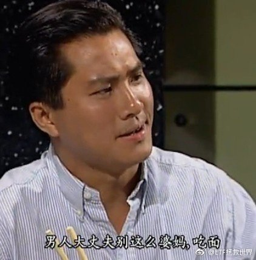

======================================================

ETF拯救世界 (5687069307) @
2018-01-31 22:51:51 Wed  
url: https://weibo.com/5687069307/G1042AXG1

每日打卡（171）

坚持 ​​​

转发[3]  评论[15]  赞[119] 

+++++++++++++++++++++++++++++++++++++++++++++++++++++

图片：

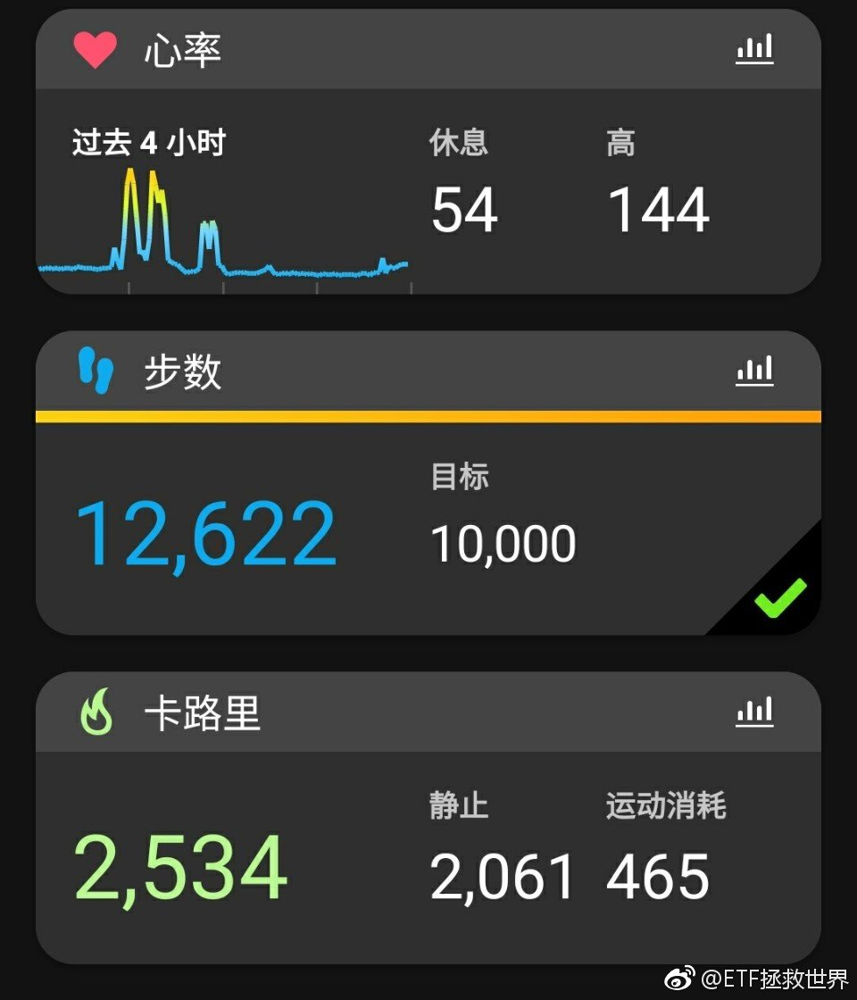

======================================================

ETF拯救世界 (5687069307) @
2018-02-01 08:37:27 Thu  
url: https://weibo.com/5687069307/G13TJjJUT

回复@Halle噜呀:有人在行动。

------------------------------------------------------
转推：
>  @ETF拯救世界 (5687069307)
>  2018-01-31 22:51:51 Wed  
>  url: https:/weibo.com/5687069307/G1042AXG1/

>  每日打卡（171）
>  
>  坚持 ​​​

转发[0]  评论[24]  赞[54] 

======================================================

ETF拯救世界 (5687069307) @
2018-02-01 09:08:11 Thu  
url: https://weibo.com/5687069307/G146cBNMb

回复@文森特isALLIN:你说的哪个股指？1月24日计划与沪深300同创新高，之后沪深300下跌2.6%，计划回撤1.18%。其它指数，中证500低于9月高点10%，中证1000更是在昨天创出三年新低。你说的是哪个指数？//@文森特isALLIN:e大，最近股指不是涨了好多嘛？为啥咱们的计划一直在跌呢？

------------------------------------------------------
转推：
>  @ETF拯救世界 (5687069307)
>  2018-01-31 10:51:45 Wed  
>  url: https:/weibo.com/5687069307/G0VlKiyNb/

>  喷了。包括今天计划最近三天下跌幅度分别是0.5、0.2、0.3。
>  
>  太凶残了吧！要知道生扛三轮股灾最大跌幅也不过0.72%。
>  
>  瑟瑟发抖的我准备晚上发车加仓了…… ​​​

转发[1]  评论[33]  赞[62] 

======================================================

ETF拯救世界 (5687069307) @
2018-02-01 09:40:05 Thu  
url: https://weibo.com/5687069307/G14ja5NFr

基本上从这个月起，只要没有大幅反弹，计划应该就开始进入“真正”的建仓期了。

之前的算是少量配置期。

目前这个区域，自从2014年6月突破后，4年后才回来，真的很不容易。

可以买买买了。

不过也不要特别乐观。上一轮在2011年9月跌入这个区域后，三年后的2014年才再次突破，这么长的时间，可以说 ​​​

转发[91]  评论[159]  赞[299] 

======================================================

ETF拯救世界 (5687069307) @
2018-02-01 09:58:59 Thu  
url: https://weibo.com/5687069307/G14qPwLLz

昨天评论707条，有83.5%是吐槽买的太少的。

图样。

你们对资本市场的风险根本一无所知…… ​​​

转发[53]  评论[120]  赞[251] 

======================================================

ETF拯救世界 (5687069307) @
2018-02-01 10:25:19 Thu  
url: https://weibo.com/5687069307/G14BwCIFu

回复@yedn:没有这么多。大量的恒生油黄金债券。我这里说的是A股。

------------------------------------------------------
转推：
>  @ETF拯救世界 (5687069307)
>  2018-02-01 09:40:05 Thu  
>  url: https:/weibo.com/5687069307/G14ja5NFr/

>  基本上从这个月起，只要没有大幅反弹，计划应该就开始进入“真正”的建仓期了。
>  
>  之前的算是少量配置期。
>  
>  目前这个区域，自从2014年6月突破后，4年后才回来，真的很不容易。
>  
>  可以买买买了。
>  
>  不过也不要特别乐观。上一轮在2011年9月跌入这个区域后，三年后的2014年才再次突破，这么长的时间，可以说 ​​​

转发[0]  评论[9]  赞[76] 

======================================================

ETF拯救世界 (5687069307) @
2018-02-01 10:52:57 Thu  
url: https://weibo.com/5687069307/G14MKeVMA

中证1000如果到4500-5000我不会吃惊。跌破4500会比较出乎我的意料。

------------------------------------------------------
转推：
>  @ETF拯救世界 (5687069307)
>  2018-01-31 14:15:07 Wed  
>  url: https:/weibo.com/5687069307/G0WGixusn/

>  中证1000三年新低了。这才是真正的中国股市，而不是那几十一百多只集中力量办大事做上去的股票。
>  
>  几千万股民买的是其它3000只不断创出新低的股票。大多数人正在承受估值回归的痛苦。
>  
>  没办法，买的太贵了，不容易赚钱。这就是金融投资的铁律。 ​​​

转发[50]  评论[37]  赞[87] 

======================================================

ETF拯救世界 (5687069307) @
2018-02-01 10:55:34 Thu  
url: https://weibo.com/5687069307/G14NO6VT2

回复@人-丑-就-要-多-读-书:不是要到。再说一次，我不预测，预测不了。只是说4500-5000我不吃惊，也做好了应对策略，在预期之内。超过了就超出我的预期了。//@人-丑-就-要-多-读-书:现在6669，我没看错吧，要到5000？[污]

------------------------------------------------------
转推：
>  @ETF拯救世界 (5687069307)
>  2018-01-31 14:15:07 Wed  
>  url: https:/weibo.com/5687069307/G0WGixusn/

>  中证1000三年新低了。这才是真正的中国股市，而不是那几十一百多只集中力量办大事做上去的股票。
>  
>  几千万股民买的是其它3000只不断创出新低的股票。大多数人正在承受估值回归的痛苦。
>  
>  没办法，买的太贵了，不容易赚钱。这就是金融投资的铁律。 ​​​

转发[7]  评论[13]  赞[68] 

======================================================

ETF拯救世界 (5687069307) @
2018-02-01 10:58:36 Thu  
url: https://weibo.com/5687069307/G14P1pvIS

回复@菜猫时代:30%并不可怕。这个幅度，完全可以把总成本控制在距离底部10%-15%的区域。之后就是关上账户几年后打开数钱。这是说指数。个股我可不敢说，弄不好有些股票永远也涨不起来了。//@菜猫时代:可能还有2000点，30%，太可怕了。

------------------------------------------------------
转推：
>  @ETF拯救世界 (5687069307)
>  2018-01-31 14:15:07 Wed  
>  url: https:/weibo.com/5687069307/G0WGixusn/

>  中证1000三年新低了。这才是真正的中国股市，而不是那几十一百多只集中力量办大事做上去的股票。
>  
>  几千万股民买的是其它3000只不断创出新低的股票。大多数人正在承受估值回归的痛苦。
>  
>  没办法，买的太贵了，不容易赚钱。这就是金融投资的铁律。 ​​​

转发[28]  评论[14]  赞[86] 

======================================================

ETF拯救世界 (5687069307) @
2018-02-01 11:02:30 Thu  
url: https://weibo.com/5687069307/G14QCqFri

回复@马甲不停:2月有可能随时发车。目前的情况来看。昨天不是说了吗，弄不好情人节有大礼包。//@马甲不停:今天是不是再多增加一份？[微笑]

------------------------------------------------------
转推：
>  @ETF拯救世界 (5687069307)
>  2018-01-31 14:15:07 Wed  
>  url: https:/weibo.com/5687069307/G0WGixusn/

>  中证1000三年新低了。这才是真正的中国股市，而不是那几十一百多只集中力量办大事做上去的股票。
>  
>  几千万股民买的是其它3000只不断创出新低的股票。大多数人正在承受估值回归的痛苦。
>  
>  没办法，买的太贵了，不容易赚钱。这就是金融投资的铁律。 ​​​

转发[20]  评论[27]  赞[95] 

======================================================

ETF拯救世界 (5687069307) @
2018-02-01 11:10:11 Thu  
url: https://weibo.com/5687069307/G14TJrrja

好久没有买医药和养老了吧。你看这不就回来了。不用急，该买肯定买，这两个加起来至少要20%仓位呢。 ​​​

转发[17]  评论[70]  赞[178] 

======================================================

ETF拯救世界 (5687069307) @
2018-02-01 11:19:23 Thu  
url: https://weibo.com/5687069307/G14Xt4rJC

记住，2年前恒生浮亏超过10%。现在60%+

哪个品种浮亏超过这个再操心吧。别有点波动就急得不得了。

记住，你买的是指数，不会死。你还有很多很多钱没买下去，以后成本会很低，会赚钱的。 ​​​

转发[48]  评论[161]  赞[318] 

======================================================

ETF拯救世界 (5687069307) @
2018-02-01 14:00:45 Thu  
url: https://weibo.com/5687069307/G160XFIdq

回复@mp86pgd:你为什么会这么机智。清华毕业的吧！//@mp86pgd:我改成了红跌绿涨，现在看见红色也就美滋滋了

------------------------------------------------------
转推：
>  @ETF拯救世界 (5687069307)
>  2018-02-01 11:19:23 Thu  
>  url: https:/weibo.com/5687069307/G14Xt4rJC/

>  记住，2年前恒生浮亏超过10%。现在60%+
>  
>  哪个品种浮亏超过这个再操心吧。别有点波动就急得不得了。
>  
>  记住，你买的是指数，不会死。你还有很多很多钱没买下去，以后成本会很低，会赚钱的。 ​​​

转发[1]  评论[34]  赞[103] 

======================================================

ETF拯救世界 (5687069307) @
2018-02-01 14:01:51 Thu  
url: https://weibo.com/5687069307/G161q5wyh

回复@python路:每天少好几万。谁能安慰一下我。//@python路:e大千万级资金，这几天回撤也有几十万，还时不时安慰几万块钱小散，佩服佩服[作揖]

------------------------------------------------------
转推：
>  @ETF拯救世界 (5687069307)
>  2018-02-01 11:19:23 Thu  
>  url: https:/weibo.com/5687069307/G14Xt4rJC/

>  记住，2年前恒生浮亏超过10%。现在60%+
>  
>  哪个品种浮亏超过这个再操心吧。别有点波动就急得不得了。
>  
>  记住，你买的是指数，不会死。你还有很多很多钱没买下去，以后成本会很低，会赚钱的。 ​​​

转发[2]  评论[104]  赞[160] 

======================================================

ETF拯救世界 (5687069307) @
2018-02-01 14:54:51 Thu  
url: https://weibo.com/5687069307/G16mVjAW7

随时准备开车。留几份现金没错的//@ETF拯救世界:回复@马甲不停:2月有可能随时发车。目前的情况来看。昨天不是说了吗，弄不好情人节有大礼包。//@马甲不停:今天是不是再多增加一份？[微笑]

------------------------------------------------------
转推：
>  @ETF拯救世界 (5687069307)
>  2018-01-31 14:15:07 Wed  
>  url: https:/weibo.com/5687069307/G0WGixusn/

>  中证1000三年新低了。这才是真正的中国股市，而不是那几十一百多只集中力量办大事做上去的股票。
>  
>  几千万股民买的是其它3000只不断创出新低的股票。大多数人正在承受估值回归的痛苦。
>  
>  没办法，买的太贵了，不容易赚钱。这就是金融投资的铁律。 ​​​

转发[15]  评论[52]  赞[91] 

======================================================

ETF拯救世界 (5687069307) @
2018-02-01 15:10:35 Thu  
url: https://weibo.com/5687069307/G16tjhcUE

回复@小涛子大人:你有点能体会到我20121128的感受了//@小涛子大人:收盘手已经激动得颤抖了，能生在这个时代太好了//@ETF拯救世界:随时准备开车。留几份现金没错的//@ETF拯救世界:回复@马甲不停:2月有可能随时发车。目前的情况来看。昨天不是说了吗，弄不好情人节有大礼包。

------------------------------------------------------
转推：
>  @ETF拯救世界 (5687069307)
>  2018-01-31 14:15:07 Wed  
>  url: https:/weibo.com/5687069307/G0WGixusn/

>  中证1000三年新低了。这才是真正的中国股市，而不是那几十一百多只集中力量办大事做上去的股票。
>  
>  几千万股民买的是其它3000只不断创出新低的股票。大多数人正在承受估值回归的痛苦。
>  
>  没办法，买的太贵了，不容易赚钱。这就是金融投资的铁律。 ​​​

转发[9]  评论[33]  赞[74] 

======================================================

ETF拯救世界 (5687069307) @
2018-02-01 15:19:07 Thu  
url: https://weibo.com/5687069307/G16wM7rDl

700多条留言了……我先不看了，跑数据去了。

数据如果特别好就加车。反正如果不反弹，情人节那车肯定不会小。 ​​​

转发[18]  评论[58]  赞[154] 

+++++++++++++++++++++++++++++++++++++++++++++++++++++

图片：
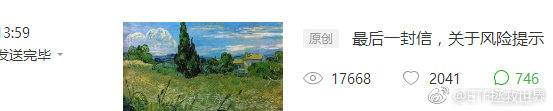

======================================================

ETF拯救世界 (5687069307) @
2018-02-01 15:27:41 Thu  
url: https://weibo.com/5687069307/G16AfuDDk

全市场出来了，2014年6月以来新低。我有个想法。

------------------------------------------------------
转推：
>  @ETF拯救世界 (5687069307)
>  2018-02-01 15:19:07 Thu  
>  url: https:/weibo.com/5687069307/G16wM7rDl/

>  700多条留言了……我先不看了，跑数据去了。
>  
>  数据如果特别好就加车。反正如果不反弹，情人节那车肯定不会小。 ​​​

转发[13]  评论[147]  赞[191] 

======================================================

ETF拯救世界 (5687069307) @
2018-02-01 15:45:57 Thu  
url: https://weibo.com/5687069307/G16HFj03X

怎么说呢。就是那种感觉吧。

姑娘们，想买的包包，漂亮衣服。男人们想买的各种3C产品，汽车。一直想买，等了两三年，终于开始打折了。已经6折了。三折就在不远处。

就是这种感觉。体会一下。 ​​​

转发[22]  评论[177]  赞[361] 

======================================================

ETF拯救世界 (5687069307) @
2018-02-01 19:55:35 Thu  
url: https://weibo.com/5687069307/G18kZtZwi

1000多条，一条条看完了。

行了，以后不会受到噪音干扰，一个字，就是干。 ​​​

转发[3]  评论[234]  赞[490] 

+++++++++++++++++++++++++++++++++++++++++++++++++++++

图片：

======================================================

ETF拯救世界 (5687069307) @
2018-02-02 09:41:48 Fri  
url: https://weibo.com/5687069307/G1dKm5dxc

节奏是艺术。

------------------------------------------------------
转推：
>  @ETF拯救世界 (5687069307)
>  2018-02-01 09:58:59 Thu  
>  url: https:/weibo.com/5687069307/G14qPwLLz/

>  昨天评论707条，有83.5%是吐槽买的太少的。
>  
>  图样。
>  
>  你们对资本市场的风险根本一无所知…… ​​​

转发[44]  评论[78]  赞[122] 

======================================================

ETF拯救世界 (5687069307) @
2018-02-02 09:47:45 Fri  
url: https://weibo.com/5687069307/G1dMLCp3T

回复@0瞎晃悠0:不会连续下跌的。要吸引一部分人冲进去接盘抢反弹，然后才能继续跌。这个位置，暴跌没有大事，阴跌才会跌透。//@0瞎晃悠0:求教：之前说提到过大概6-9个月，看这架势5月底之前是不是就差不多了？//@ETF拯救世界:节奏是艺术。

------------------------------------------------------
转推：
>  @ETF拯救世界 (5687069307)
>  2018-02-01 09:58:59 Thu  
>  url: https:/weibo.com/5687069307/G14qPwLLz/

>  昨天评论707条，有83.5%是吐槽买的太少的。
>  
>  图样。
>  
>  你们对资本市场的风险根本一无所知…… ​​​

转发[16]  评论[66]  赞[102] 

======================================================

ETF拯救世界 (5687069307) @
2018-02-02 10:34:15 Fri  
url: https://weibo.com/5687069307/G1e5E5RU8

反弹了就踏实了，不考虑加车了。该干嘛干嘛去吧都。。 ​​​

转发[35]  评论[101]  赞[149] 

======================================================

ETF拯救世界 (5687069307) @
2018-02-02 10:55:28 Fri  
url: https://weibo.com/5687069307/G1eeg2RVe

回复@后生天天uping:估值比2016年同样的点位已经下降25%了。这就是指数投资只要买的不贵就极大概率会赚钱的重要原因之一。如果再过两年指数点位还不动，就是历史最低估值！//@后生天天uping:回复@小涛子大人:几乎是16年的水平了

------------------------------------------------------
转推：
>  @ETF拯救世界 (5687069307)
>  2018-02-02 10:34:15 Fri  
>  url: https:/weibo.com/5687069307/G1e5E5RU8/

>  反弹了就踏实了，不考虑加车了。该干嘛干嘛去吧都。。 ​​​

转发[30]  评论[48]  赞[111] 

======================================================

ETF拯救世界 (5687069307) @
2018-02-02 11:17:34 Fri  
url: https://weibo.com/5687069307/G1ene6MOy

回复@Cubic_N:都在考虑中。所以信息已经远远低于中枢为什么我们还没买//@Cubic_N:E大你的模型中会考虑估值中枢的变化吗？国内的经济发展和债务现状已经不容乐观了呀[笑cry]

------------------------------------------------------
转推：
>  @ETF拯救世界 (5687069307)
>  2018-02-02 10:34:15 Fri  
>  url: https:/weibo.com/5687069307/G1e5E5RU8/

>  反弹了就踏实了，不考虑加车了。该干嘛干嘛去吧都。。 ​​​

转发[5]  评论[38]  赞[102] 

======================================================

ETF拯救世界 (5687069307) @
2018-02-02 13:56:44 Fri  
url: https://weibo.com/5687069307/G1fpPvH6Z

喷了，情人节的礼包得多大啊。 ​​​

转发[37]  评论[145]  赞[193] 

======================================================

ETF拯救世界 (5687069307) @
2018-02-02 13:59:15 Fri  
url: https://weibo.com/5687069307/G1fqR3uss

我四岁儿子昨天晚上跟我说：“XX（女）在校车上抱着我的胳膊，靠着我。”“为什么？”“她可能喜欢我。”“你说什么？”“我没说什么，挺舒服的。”“……”

------------------------------------------------------
转推：
>  @ ()
>  2018-02-02 13:51:03 Fri  
>  url: 

>  抱歉，作者已设置仅展示半年内微博，此微博已不可见。 ​​​

转发[8]  评论[88]  赞[131] 

======================================================

ETF拯救世界 (5687069307) @
2018-02-02 14:55:10 Fri  
url: https://weibo.com/5687069307/G1fNyaBhe

回复@glay_lee:没有调低预期，本来就给它的预期配置少，买2%了，不会再买太多了，接下来的会用于将它的成本降低到最低点10-15以内

------------------------------------------------------
转推：
>  @ETF拯救世界 (5687069307)
>  2018-02-02 13:56:44 Fri  
>  url: https:/weibo.com/5687069307/G1fpPvH6Z/

>  喷了，情人节的礼包得多大啊。 ​​​

转发[1]  评论[22]  赞[92] 

======================================================

ETF拯救世界 (5687069307) @
2018-02-02 16:46:25 Fri  
url: https://weibo.com/5687069307/G1gwHCOHP

回复@协和雪碧:给你打气，环保PE已经到了2012年底最低值附近了。我不敢说它不会大跌了，总之你长期拿这个价格不会赔钱。我有这个自信。拿着吧。忘了它就行了……//@协和雪碧:回复@BuBu蛇:是我错了… 提前加仓了，现在套的想哭

------------------------------------------------------
转推：
>  @ETF拯救世界 (5687069307)
>  2018-02-02 13:56:44 Fri  
>  url: https:/weibo.com/5687069307/G1fpPvH6Z/

>  喷了，情人节的礼包得多大啊。 ​​​

转发[18]  评论[66]  赞[142] 

======================================================

ETF拯救世界 (5687069307) @
2018-02-02 16:57:55 Fri  
url: https://weibo.com/5687069307/G1gBneYF4

回复@LEVELEEE:还没低于当时，不过接近了。我买哪个都是有节奏的。各位也可以从环保上体会一下未来也许会出现的情况，也就是说，我们建仓基本完毕了，又跌了10%，做个心理准备。当然环保还没完……

------------------------------------------------------
转推：
>  @ETF拯救世界 (5687069307)
>  2018-02-02 13:56:44 Fri  
>  url: https:/weibo.com/5687069307/G1fpPvH6Z/

>  喷了，情人节的礼包得多大啊。 ​​​

转发[7]  评论[50]  赞[135] 

======================================================

ETF拯救世界 (5687069307) @
2018-02-04 21:41:11 Sun  
url: https://weibo.com/5687069307/G1BjlpBeD

每日打卡（142）

明天崩不崩。痛快点，大家都很忙的。 ​​​

转发[0]  评论[108]  赞[170] 

+++++++++++++++++++++++++++++++++++++++++++++++++++++

图片：

======================================================

ETF拯救世界 (5687069307) @
2018-02-05 09:52:09 Mon  
url: https://weibo.com/5687069307/G1G63grGl

不要催，不要问。节奏我会控制好。就酱。//@ETF拯救世界:节奏是艺术。

------------------------------------------------------
转推：
>  @ETF拯救世界 (5687069307)
>  2018-02-01 09:58:59 Thu  
>  url: https:/weibo.com/5687069307/G14qPwLLz/

>  昨天评论707条，有83.5%是吐槽买的太少的。
>  
>  图样。
>  
>  你们对资本市场的风险根本一无所知…… ​​​

转发[3]  评论[97]  赞[200] 

======================================================

ETF拯救世界 (5687069307) @
2018-02-05 10:17:59 Mon  
url: https://weibo.com/5687069307/G1GgwprlC

买也好卖也好，永远问问自己舒服不舒服。也就是目前的情况下跌30%和上涨50%，舒服不舒服。 ​​​

转发[26]  评论[74]  赞[193] 

======================================================

ETF拯救世界 (5687069307) @
2018-02-05 10:35:23 Mon  
url: https://weibo.com/5687069307/G1GnADXQT

五粮液下跌快20%了。

所谓价值股就可以闭眼买入，这种思维被不断灌输进很多人的思维中。

很多人这几个月突然发现以前不赚钱是因为没有买入“价值股”，现在终于找到了一条赚钱的终极之路。

上涨的时候买入短期会很舒服。因为上涨趋势中，你怎么买都会赚钱。但是趋势一旦改变，你就会欲哭无泪。

下 ​​​

转发[69]  评论[123]  赞[237] 

======================================================

ETF拯救世界 (5687069307) @
2018-02-05 11:01:37 Mon  
url: https://weibo.com/5687069307/G1GyfotO2

回复@linsuozhang2009:是啊。中证红利，2018年才突破2007年的高点，2009-2014五年没有任何涨幅，其中几年时间横盘不动。试问2014年初会有几个人看好它。要知道07年的高点中证500在2010年就突破了，那时候红利还不到07年高点的一半。没有策略是全时万能的。

------------------------------------------------------
转推：
>  @ETF拯救世界 (5687069307)
>  2018-02-05 10:17:59 Mon  
>  url: https:/weibo.com/5687069307/G1GgwprlC/

>  买也好卖也好，永远问问自己舒服不舒服。也就是目前的情况下跌30%和上涨50%，舒服不舒服。 ​​​

转发[13]  评论[35]  赞[110] 

======================================================

ETF拯救世界 (5687069307) @
2018-02-05 13:40:53 Mon  
url: https://weibo.com/5687069307/G1HAT9wUh

其实很多时候，我们看的鸡汤都将“努力”忽悠的有点过分了。

人这一辈子，运气其实同样重要，很多时候甚至更重要。

比如中证500，咱们如果可以在4500买到，那就是运气极好的。5000以下也不错，可以说未来5-10年的不错收益率可以保证了。

当然，努力也非常重要，否则运气来了的时候也抓不住。运气走 ​​​

转发[59]  评论[114]  赞[190] 

======================================================

ETF拯救世界 (5687069307) @
2018-02-05 13:48:32 Mon  
url: https://weibo.com/5687069307/G1HDZv13I

回复@请输入昵称_昵称:2008年我的博客，那时候我刚7岁：http://t.cn/RlVkVsf //@请输入昵称_昵称:最近流行一命二运三风水四积阴德五读书，几千年传下来有点道理

------------------------------------------------------
转推：
>  @ETF拯救世界 (5687069307)
>  2018-02-05 13:40:53 Mon  
>  url: https:/weibo.com/5687069307/G1HAT9wUh/

>  其实很多时候，我们看的鸡汤都将“努力”忽悠的有点过分了。
>  
>  人这一辈子，运气其实同样重要，很多时候甚至更重要。
>  
>  比如中证500，咱们如果可以在4500买到，那就是运气极好的。5000以下也不错，可以说未来5-10年的不错收益率可以保证了。
>  
>  当然，努力也非常重要，否则运气来了的时候也抓不住。运气走 ​​​

转发[7]  评论[50]  赞[103] 

======================================================

ETF拯救世界 (5687069307) @
2018-02-05 14:50:35 Mon  
url: https://weibo.com/5687069307/G1I3baq3m

如果医药这次有机会到理想区域，未来恐怕就不是5-10年的问题了，而是10-15甚至20年不用担心金融投资收益率……

在一般情况下，至少不会差。如果碰上疯牛慢牛，收益率就会很棒。只是不知道有没有这个机会，都是天意。

这是一个2005-2015十年二十倍的指数…… ​​​

转发[109]  评论[106]  赞[191] 

======================================================

ETF拯救世界 (5687069307) @
2018-02-05 14:59:19 Mon  
url: https://weibo.com/5687069307/G1I6JkDd9

回复@静待晚秋:医药现在的估值比2005年高67%……如果以那个标准的话，不用急。不过那个情况真的太难得了。//@静待晚秋:意思是医药有可能下来，[笑而不语]我还没上医药车呢。

------------------------------------------------------
转推：
>  @ETF拯救世界 (5687069307)
>  2018-02-05 14:50:35 Mon  
>  url: https:/weibo.com/5687069307/G1I3baq3m/

>  如果医药这次有机会到理想区域，未来恐怕就不是5-10年的问题了，而是10-15甚至20年不用担心金融投资收益率……
>  
>  在一般情况下，至少不会差。如果碰上疯牛慢牛，收益率就会很棒。只是不知道有没有这个机会，都是天意。
>  
>  这是一个2005-2015十年二十倍的指数…… ​​​

转发[53]  评论[24]  赞[83] 

======================================================

ETF拯救世界 (5687069307) @
2018-02-05 15:32:06 Mon  
url: https://weibo.com/5687069307/G1Ik26bhp

今日最新数据，全指医药估值跌回2013年6月水平。也就是说近五年最低。（绝对值依然不低）你们都没有意识到目前大部分股票每天这么跌到底意味着什么。美丽新世界。//@ETF拯救世界:回复@静待晚秋:医药现在的估值比2005年高67%……如果以那个标准的话，不用急。不过那个情况真的太难得了。

------------------------------------------------------
转推：
>  @ETF拯救世界 (5687069307)
>  2018-02-05 14:50:35 Mon  
>  url: https:/weibo.com/5687069307/G1I3baq3m/

>  如果医药这次有机会到理想区域，未来恐怕就不是5-10年的问题了，而是10-15甚至20年不用担心金融投资收益率……
>  
>  在一般情况下，至少不会差。如果碰上疯牛慢牛，收益率就会很棒。只是不知道有没有这个机会，都是天意。
>  
>  这是一个2005-2015十年二十倍的指数…… ​​​

转发[39]  评论[120]  赞[184] 

======================================================

ETF拯救世界 (5687069307) @
2018-02-05 22:05:37 Mon  
url: https://weibo.com/5687069307/G1KTL8HJv

每日打卡（143）

越来越近了 ​​​

转发[1]  评论[36]  赞[112] 

+++++++++++++++++++++++++++++++++++++++++++++++++++++

图片：

======================================================

ETF拯救世界 (5687069307) @
2018-02-06 06:13:12 Tue  
url: https://weibo.com/5687069307/G1O5F9O0k

美国证 监会干嘛吃的，为什么不组织花旗高盛筹集资金救市。

美联储为什么不投两万亿美金买道琼斯30。

我看美国不行，迟早药丸。 ​​​

转发[30]  评论[75]  赞[160] 

+++++++++++++++++++++++++++++++++++++++++++++++++++++

图片：

======================================================

ETF拯救世界 (5687069307) @
2018-02-06 06:18:54 Tue  
url: https://weibo.com/5687069307/G1O7Z8jb0

回复@葫芦岛心灵的旅途:你这个想法非常大胆。负责任的告诉你，如果真的如此，必提前开卡车//@葫芦岛心灵的旅途:迟早要买，我们也要买。 一个想法，不一定对。 中午跌狠了，有车加吗，比如中正500跌4%[喵喵][喵喵][喵喵][喵喵]

------------------------------------------------------
转推：
>  @ETF拯救世界 (5687069307)
>  2018-02-06 06:13:12 Tue  
>  url: https:/weibo.com/5687069307/G1O5F9O0k/

>  美国证 监会干嘛吃的，为什么不组织花旗高盛筹集资金救市。
>  
>  美联储为什么不投两万亿美金买道琼斯30。
>  
>  我看美国不行，迟早药丸。 ​​​

转发[14]  评论[60]  赞[104] 

======================================================

ETF拯救世界 (5687069307) @
2018-02-06 08:21:22 Tue  
url: https://weibo.com/5687069307/G1OVH5cGw

回复@不畏雾霾遮望眼:我反手就给你一…………张车票

------------------------------------------------------
转推：
>  @ETF拯救世界 (5687069307)
>  2018-02-06 06:13:12 Tue  
>  url: https:/weibo.com/5687069307/G1O5F9O0k/

>  美国证 监会干嘛吃的，为什么不组织花旗高盛筹集资金救市。
>  
>  美联储为什么不投两万亿美金买道琼斯30。
>  
>  我看美国不行，迟早药丸。 ​​​

转发[2]  评论[22]  赞[67] 

======================================================

ETF拯救世界 (5687069307) @
2018-02-06 08:51:42 Tue  
url: https://weibo.com/5687069307/G1P80joGB

回复@用户6099242654:昨日505只标普500成分股中，有两只上涨。503只下跌。1946只罗素2000成分股中，87只上涨。//@用户6099242654:谁能来一个美股上涨跟下跌股票的比例？//@ETF拯救世界:回复@葫芦岛心灵的旅途:你这个想法非常大胆。负责任的告诉你，如果真的如此，必提前开卡车

------------------------------------------------------
转推：
>  @ETF拯救世界 (5687069307)
>  2018-02-06 06:13:12 Tue  
>  url: https:/weibo.com/5687069307/G1O5F9O0k/

>  美国证 监会干嘛吃的，为什么不组织花旗高盛筹集资金救市。
>  
>  美联储为什么不投两万亿美金买道琼斯30。
>  
>  我看美国不行，迟早药丸。 ​​​

转发[5]  评论[64]  赞[79] 

======================================================

ETF拯救世界 (5687069307) @
2018-02-06 10:39:39 Tue  
url: https://weibo.com/5687069307/G1PPP3TYh

我急需开发一个盘中可以计算估值的工具。 ​​​

转发[9]  评论[148]  赞[214] 

======================================================

ETF拯救世界 (5687069307) @
2018-02-06 10:54:38 Tue  
url: https://weibo.com/5687069307/G1PVU9KJY

再复习一次。现在有没有新的感悟，尤其是性子比较急的朋友。

------------------------------------------------------
转推：
>  @ETF拯救世界 (5687069307)
>  2017-11-23 10:55:31 Thu  
>  url: https:/weibo.com/5687069307/FwollhU4i/

>  为什么要定时交易。
>  
>  我告诉你真正的原因。
>  
>  那就是资本市场的中短期不可预测性。
>  
>  我们的任务，是把手中有限的资源，最合理优化的分配到“低估”品种上。如果“觉得”，又或者是根据“数据”，只要便宜就买，贵了就卖，很可能买卖都在半山腰。
>  
>  金融交易不是数学题。便宜了就不会跌，贵了就不会涨？不 ​​​

转发[26]  评论[94]  赞[189] 

======================================================

ETF拯救世界 (5687069307) @
2018-02-06 11:18:11 Tue  
url: https://weibo.com/5687069307/G1Q5sfXQ6

想干，但是数据要15:30才算出来。中午试着弄一下盘中数据吧。不知道准不准。

------------------------------------------------------
转推：
>  @ETF拯救世界 (5687069307)
>  2018-02-06 10:39:39 Tue  
>  url: https:/weibo.com/5687069307/G1PPP3TYh/

>  我急需开发一个盘中可以计算估值的工具。 ​​​

转发[5]  评论[102]  赞[160] 

======================================================

ETF拯救世界 (5687069307) @
2018-02-06 12:12:36 Tue  
url: https://weibo.com/5687069307/G1Qryub1d

干了。先不看留言了，出去走走。去吹吹风……//@ETF拯救世界:想干，但是数据要15:30才算出来。中午试着弄一下盘中数据吧。不知道准不准。

------------------------------------------------------
转推：
>  @ETF拯救世界 (5687069307)
>  2018-02-06 10:39:39 Tue  
>  url: https:/weibo.com/5687069307/G1PPP3TYh/

>  我急需开发一个盘中可以计算估值的工具。 ​​​

转发[2]  评论[97]  赞[144] 

======================================================

ETF拯救世界 (5687069307) @
2018-02-06 12:45:51 Tue  
url: https://weibo.com/5687069307/G1QF33Ev4

回复@天影198:瞧瞧人家……//@天影198:中午出去吃泰国菜，想着EE还要在办公室算数据，想给你带个外卖🍗//@ETF拯救世界:想干，但是数据要15:30才算出来。中午试着弄一下盘中数据吧。不知道准不准。

------------------------------------------------------
转推：
>  @ETF拯救世界 (5687069307)
>  2018-02-06 10:39:39 Tue  
>  url: https:/weibo.com/5687069307/G1PPP3TYh/

>  我急需开发一个盘中可以计算估值的工具。 ​​​

转发[1]  评论[49]  赞[102] 

======================================================

ETF拯救世界 (5687069307) @
2018-02-06 13:07:42 Tue  
url: https://weibo.com/5687069307/G1QNUBpRJ

159938场内不要溢价抢！！！ ​​​

转发[3]  评论[110]  赞[130] 

======================================================

ETF拯救世界 (5687069307) @
2018-02-06 13:16:26 Tue  
url: https://weibo.com/5687069307/G1QRs9PYE

有没有闻到恐慌的气息。

别人的，你自己的。 ​​​

转发[50]  评论[199]  赞[185] 

======================================================

ETF拯救世界 (5687069307) @
2018-02-06 13:51:47 Tue  
url: https://weibo.com/5687069307/G1R5OeJfN

再说一次，指数基金不会死。而且我们买的都至少是不贵，有的已经算是便宜。给时间，一定会有好结果。第二，还有很多资金，会尽量将成本控制的比较低。第三，我相信绝大多数人每天减少的资产不会比我多。踏踏实实的。多大点事儿啊……

------------------------------------------------------
转推：
>  @ETF拯救世界 (5687069307)
>  2018-02-06 13:16:26 Tue  
>  url: https:/weibo.com/5687069307/G1QRs9PYE/

>  有没有闻到恐慌的气息。
>  
>  别人的，你自己的。 ​​​

转发[42]  评论[109]  赞[201] 

======================================================

ETF拯救世界 (5687069307) @
2018-02-06 13:56:55 Tue  
url: https://weibo.com/5687069307/G1R7TmGL5

NO！！！ ​​​

转发[3]  评论[137]  赞[111] 

======================================================

ETF拯救世界 (5687069307) @
2018-02-06 14:29:15 Tue  
url: https://weibo.com/5687069307/G1Rl18HbW

回复@我在故快乐:讲真，现在还远没到拼信仰的时候……//@我在故快乐:将来会加倍还给我们的，在这个时候，就是有没有信仰，能不能坚持执行的事了。

------------------------------------------------------
转推：
>  @ETF拯救世界 (5687069307)
>  2018-02-06 13:16:26 Tue  
>  url: https:/weibo.com/5687069307/G1QRs9PYE/

>  有没有闻到恐慌的气息。
>  
>  别人的，你自己的。 ​​​

转发[18]  评论[50]  赞[101] 

======================================================

ETF拯救世界 (5687069307) @
2018-02-06 14:41:18 Tue  
url: https://weibo.com/5687069307/G1RpUhgqh

今天这是管不了了还是撒手不管了……很放纵的感觉啊。 ​​​

转发[11]  评论[122]  赞[162] 

======================================================

ETF拯救世界 (5687069307) @
2018-02-06 14:53:00 Tue  
url: https://weibo.com/5687069307/G1RuEBvYD

回复@Chaos怒了:500跌20%-25%我已经满仓。说到做到，做不到发一万块红包给你们。//@Chaos怒了:我估算500再跌20%-30%才到拼信仰的时候[摊手]//@ETF拯救世界:回复@我在故快乐:讲真，现在还远没到拼信仰的时候……

------------------------------------------------------
转推：
>  @ETF拯救世界 (5687069307)
>  2018-02-06 13:16:26 Tue  
>  url: https:/weibo.com/5687069307/G1QRs9PYE/

>  有没有闻到恐慌的气息。
>  
>  别人的，你自己的。 ​​​

转发[17]  评论[126]  赞[163] 

======================================================

ETF拯救世界 (5687069307) @
2018-02-06 15:08:12 Tue  
url: https://weibo.com/5687069307/G1RAPyN68

回复@冷饮疯子:明天要有几百家停牌了。//@冷饮疯子:411家跌停，108比3015[二哈]

------------------------------------------------------
转推：
>  @ETF拯救世界 (5687069307)
>  2018-02-06 14:41:18 Tue  
>  url: https:/weibo.com/5687069307/G1RpUhgqh/

>  今天这是管不了了还是撒手不管了……很放纵的感觉啊。 ​​​

转发[3]  评论[37]  赞[116] 

======================================================

ETF拯救世界 (5687069307) @
2018-02-06 15:29:33 Tue  
url: https://weibo.com/5687069307/G1RJutXzq

今天的数据感动到想哭。 ​​​

转发[10]  评论[276]  赞[367] 

======================================================

ETF拯救世界 (5687069307) @
2018-02-06 17:40:18 Tue  
url: https://weibo.com/5687069307/G1SAz4pb9

今天分级A大涨……

------------------------------------------------------
转推：
>  @ETF拯救世界 (5687069307)
>  2018-01-26 14:03:32 Fri  
>  url: https:/weibo.com/5687069307/G0bt7gKME/

>  分级A跌的我又开始感兴趣了。2年多了，好想它们 ​​​

转发[20]  评论[70]  赞[159] 

======================================================

ETF拯救世界 (5687069307) @
2018-02-07 09:28:25 Wed  
url: https://weibo.com/5687069307/G1YNptYIL

回复@小小的nananana:昨天只是一个预演。各位。好好体会一下昨天自己的心情，自己做了些什么。是害怕的卖出还是高兴地买入。这个预演对未来也许会出现的极度黑暗之下自己该怎么做有很大帮助。一点点累积正确的经验，不断进步。不要总是犯同样的错误。//@小小的nananana:益达，这次择时太给力啦！

------------------------------------------------------
转推：
>  @ETF拯救世界 (5687069307)
>  2018-01-26 14:03:32 Fri  
>  url: https:/weibo.com/5687069307/G0bt7gKME/

>  分级A跌的我又开始感兴趣了。2年多了，好想它们 ​​​

转发[16]  评论[94]  赞[176] 

======================================================

ETF拯救世界 (5687069307) @
2018-02-07 09:33:03 Wed  
url: https://weibo.com/5687069307/G1YPhAf2v

有时候当时的感觉是无比黑暗再无希望，其实到了事后再想，都是风轻云淡。

但是这种感觉你自己不体会一次并不能理解。 ​​​

转发[24]  评论[128]  赞[292] 

======================================================

ETF拯救世界 (5687069307) @
2018-02-07 10:48:31 Wed  
url: https://weibo.com/5687069307/G1ZjV13nG

美帝甩锅了：你A下跌与我无关 ​​​

转发[4]  评论[85]  赞[196] 

======================================================

ETF拯救世界 (5687069307) @
2018-02-07 11:01:56 Wed  
url: https://weibo.com/5687069307/G1ZpmsgPY

真的很感慨，也很感动。

等了几年，又一次资产飞跃的机会要来了。

耐心真的是优质特征。 ​​​

转发[54]  评论[250]  赞[458] 

======================================================

ETF拯救世界 (5687069307) @
2018-02-07 13:41:19 Wed  
url: https://weibo.com/5687069307/G20s3r2ic

吃顿饭回来这样了，不知道从何看起…… ​​​

转发[1]  评论[74]  赞[132] 

+++++++++++++++++++++++++++++++++++++++++++++++++++++

图片：

======================================================

ETF拯救世界 (5687069307) @
2018-02-07 14:10:57 Wed  
url: https://weibo.com/5687069307/G20E5hOT6

……原来你竟然是这样的五粮液……

------------------------------------------------------
转推：
>  @ETF拯救世界 (5687069307)
>  2018-02-05 10:35:23 Mon  
>  url: https:/weibo.com/5687069307/G1GnADXQT/

>  五粮液下跌快20%了。
>  
>  所谓价值股就可以闭眼买入，这种思维被不断灌输进很多人的思维中。
>  
>  很多人这几个月突然发现以前不赚钱是因为没有买入“价值股”，现在终于找到了一条赚钱的终极之路。
>  
>  上涨的时候买入短期会很舒服。因为上涨趋势中，你怎么买都会赚钱。但是趋势一旦改变，你就会欲哭无泪。
>  
>  下 ​​​

转发[8]  评论[26]  赞[96] 

======================================================

ETF拯救世界 (5687069307) @
2018-02-07 14:58:45 Wed  
url: https://weibo.com/5687069307/G20Xugh08

为什么感觉队里的兄弟有点破罐子破摔了。

爱谁谁，不管了。 ​​​

转发[8]  评论[150]  赞[210] 

======================================================

ETF拯救世界 (5687069307) @
2018-02-07 16:54:20 Wed  
url: https://weibo.com/5687069307/G21Ip7CYb

这种情况会越来越多的。中小股票跌了这么多年，终有一天会被价值发现。投资者不发现，公司就自己发现。

------------------------------------------------------
转推：
>  @财联社APP (2868676035)
>  2018-02-07 16:48:29 Wed  
>  url: https:/weibo.com/2868676035/G21G1BLLE/

>  兔宝宝：公司决定以自有资金回购公司股份，回购的股份将予以注销并相应减少注册资本，回购价格为不超过15元/股，回购的资金总额不低于1亿元，最高不超过3亿元。 ​​​

转发[14]  评论[35]  赞[103] 

======================================================

ETF拯救世界 (5687069307) @
2018-02-07 17:09:47 Wed  
url: https://weibo.com/5687069307/G21OFCRH2

回复@幸福呱呱:大家注意！我不是说兔宝宝好！也不知道这次回购安的什么心。我是说，跌的太低了，回购和增持会越来越多的。价值发现。。。绝不谈个股！//@幸福呱呱:E大能带着炒股吗？新手这就开账户去[挤眼][挤眼]

------------------------------------------------------
转推：
>  @财联社APP (2868676035)
>  2018-02-07 16:48:29 Wed  
>  url: https:/weibo.com/2868676035/G21G1BLLE/

>  兔宝宝：公司决定以自有资金回购公司股份，回购的股份将予以注销并相应减少注册资本，回购价格为不超过15元/股，回购的资金总额不低于1亿元，最高不超过3亿元。 ​​​

转发[6]  评论[36]  赞[84] 

======================================================

ETF拯救世界 (5687069307) @
2018-02-08 07:36:17 Thu  
url: https://weibo.com/5687069307/G27uo5joQ

价投命短的积累钱少，都没法成名。复利导致最后十年可能赚到所有财产的90%。//@买买提X:这个不懂，老外的说法是做长线价值投资的长寿~

------------------------------------------------------
转推：
>  @甫学进 (1202022692)
>  2018-02-07 19:28:46 Wed  
>  url: https:/weibo.com/1202022692/G22J5EFBB/

>  练字健康长寿@鸡毛蒜皮与鸡毛蒜皮 @朱毅 很有道理。
>  古往今来，绝大数书法家均为高寿。如唐代欧阳询85岁，柳公权88岁，明代文征明90岁，历史上四个帝王书家梁武帝萧衍86岁，武则天82岁，宋高宗赵构81岁，乾隆89岁。东汉以来,约有150位书法家，平均年龄为71岁。明清两代人的平圴寿命为33岁,但书法家的寿 ​​​

转发[12]  评论[41]  赞[90] 

======================================================

ETF拯救世界 (5687069307) @
2018-02-08 08:52:35 Thu  
url: https://weibo.com/5687069307/G27Zmccbg

最近白银波动也小了，一个月成交一笔…… ​​​

转发[3]  评论[65]  赞[74] 

+++++++++++++++++++++++++++++++++++++++++++++++++++++

图片：

======================================================

ETF拯救世界 (5687069307) @
2018-02-08 09:27:02 Thu  
url: https://weibo.com/5687069307/G28dkwn8q

年度私募冠军很少有善终的。不信把近十年私募冠军拿出来看看。第一没什么好，长期保持在前30%的才是最棒的

------------------------------------------------------
转推：
>  @ ()
>  2018-02-08 09:20:24 Thu  
>  url: 

>  抱歉，此微博已被作者删除。查看帮助：http://t.cn/Rfd3rQV

转发[11]  评论[21]  赞[87] 

======================================================

ETF拯救世界 (5687069307) @
2018-02-08 09:50:05 Thu  
url: https://weibo.com/5687069307/G28mGz3Fy

前天难道又是阶段最低 ​​​

转发[3]  评论[122]  赞[149] 

======================================================

ETF拯救世界 (5687069307) @
2018-02-08 10:57:00 Thu  
url: https://weibo.com/5687069307/G28NRcHuC

第一，场内场外我每次都写得清清楚楚，代码都有，自己选。第二，如果让我说，大部分人其实适合场外。目前我们的ETF市场不成熟，很多品种交易量承受不了我们这么多人同时交易的需求。第三，每个品种都有它的仓位配比上限。环保本身给的仓位就不会很大，所以不会看见跌就买。说过很多次了。

------------------------------------------------------
转推：
>  @GeForce (2109434382)
>  2018-02-08 10:26:00 Thu  
>  url: https:/weibo.com/2109434382/G28Bh6vr6/

>  E大，有两个问题想请教您。长赢计划中持仓的中证环保指数，较买入时均价跌幅已达14%以上，均值已创历史新低，2月第二次发车中怎么不考虑买入此指数。是否因此基金规模较小且成立时间较短;还是估值发生变化有进一步下跌的可能而不考虑加仓？@ETF拯救世界  @且慢管家  
>  
>  且慢中买入的都是场外基金，可E大 ​​​

转发[26]  评论[61]  赞[105] 

======================================================

ETF拯救世界 (5687069307) @
2018-02-08 11:16:56 Thu  
url: https://weibo.com/5687069307/G28VWEqdn

回复@沙柳垂钓:你从哪儿拿的数据。跟我自己算的不同。另外，进入历史最低15%就要重仓这种说法合理吗。不合理。一叶障目了。我买东西要考虑的因素非常多，历史区间因素只占14.89%的比重。

------------------------------------------------------
转推：
>  @GeForce (2109434382)
>  2018-02-08 10:26:00 Thu  
>  url: https:/weibo.com/2109434382/G28Bh6vr6/

>  E大，有两个问题想请教您。长赢计划中持仓的中证环保指数，较买入时均价跌幅已达14%以上，均值已创历史新低，2月第二次发车中怎么不考虑买入此指数。是否因此基金规模较小且成立时间较短;还是估值发生变化有进一步下跌的可能而不考虑加仓？@ETF拯救世界  @且慢管家  
>  
>  且慢中买入的都是场外基金，可E大 ​​​

转发[6]  评论[34]  赞[81] 

======================================================

ETF拯救世界 (5687069307) @
2018-02-08 11:17:20 Thu  
url: https://weibo.com/5687069307/G28W73Dko

回复@吃货的幸福味道:不关注公众号 chinaetfs 的都不是真爱。//@吃货的幸福味道:每次有写场内场外代码吗？没的看到啊，只看到场外的代码，我是在且慢上看的

------------------------------------------------------
转推：
>  @GeForce (2109434382)
>  2018-02-08 10:26:00 Thu  
>  url: https:/weibo.com/2109434382/G28Bh6vr6/

>  E大，有两个问题想请教您。长赢计划中持仓的中证环保指数，较买入时均价跌幅已达14%以上，均值已创历史新低，2月第二次发车中怎么不考虑买入此指数。是否因此基金规模较小且成立时间较短;还是估值发生变化有进一步下跌的可能而不考虑加仓？@ETF拯救世界  @且慢管家  
>  
>  且慢中买入的都是场外基金，可E大 ​​​

转发[0]  评论[48]  赞[109] 

======================================================

ETF拯救世界 (5687069307) @
2018-02-08 11:29:35 Thu  
url: https://weibo.com/5687069307/G2915bV5l

怎么搞的。是不是参加冬奥会去了。

------------------------------------------------------
转推：
>  @ETF拯救世界 (5687069307)
>  2018-02-07 14:58:45 Wed  
>  url: https:/weibo.com/5687069307/G20Xugh08/

>  为什么感觉队里的兄弟有点破罐子破摔了。
>  
>  爱谁谁，不管了。 ​​​

转发[3]  评论[81]  赞[108] 

======================================================

ETF拯救世界 (5687069307) @
2018-02-08 12:15:13 Thu  
url: https://weibo.com/5687069307/G29jBtpIA

回复@中江笑天:金融危机可能。没有金融危机30%到头了。做投资就怕涨起来信心百倍，跌下去感觉无限深渊。//@中江笑天:E大，深圳交易所公布的中小板平均市盈率现在是38倍，极度低估时曾经到过18倍。从这个指数看市场如果极端情况下还有可能下跌50%，请教您怎么看？感觉您比俺更乐观。

------------------------------------------------------
转推：
>  @ETF拯救世界 (5687069307)
>  2018-02-07 11:01:56 Wed  
>  url: https:/weibo.com/5687069307/G1ZpmsgPY/

>  真的很感慨，也很感动。
>  
>  等了几年，又一次资产飞跃的机会要来了。
>  
>  耐心真的是优质特征。 ​​​

转发[11]  评论[59]  赞[120] 

======================================================

ETF拯救世界 (5687069307) @
2018-02-08 14:15:00 Thu  
url: https://weibo.com/5687069307/G2a6e6Aex

谁能想到这么快！

------------------------------------------------------
转推：
>  @ETF拯救世界 (5687069307)
>  2018-01-25 11:18:26 Thu  
>  url: https:/weibo.com/5687069307/G00XC3BZQ/

>  不少人会在“价值投资元年”之后，在一些“蓝筹股”上套3-5年 ​​​

转发[8]  评论[87]  赞[171] 

======================================================

ETF拯救世界 (5687069307) @
2018-02-08 15:53:28 Thu  
url: https://weibo.com/5687069307/G2aKc59q9

我反思了一下，最近总是黑“蓝筹股”也是不对的。

毕竟无论是恒生、50还是红利，都只有15、16倍的估值，绝对值来讲真的没那么贵。也就是说，它们的成分股，大部分并不会让你套3-5年。

有些“蓝筹股”还是会套。这个也没办法。

我只希望红利继续压一压，咱们继续买。总体看，大盘、价值股配置的还是 ​​​

转发[12]  评论[84]  赞[228] 

======================================================

ETF拯救世界 (5687069307) @
2018-02-08 21:53:04 Thu  
url: https://weibo.com/5687069307/G2d69dibk

每日打卡（144）

快过年了 ​​​

转发[0]  评论[23]  赞[141] 

+++++++++++++++++++++++++++++++++++++++++++++++++++++

图片：

======================================================

ETF拯救世界 (5687069307) @
2018-02-09 05:38:29 Fri  
url: https://weibo.com/5687069307/G2g94gXqV

很多人会慢慢感受到风险的真正含义，节奏是最重要的。//@ETF拯救世界:节奏是艺术。

------------------------------------------------------
转推：
>  @ETF拯救世界 (5687069307)
>  2018-02-01 09:58:59 Thu  
>  url: https:/weibo.com/5687069307/G14qPwLLz/

>  昨天评论707条，有83.5%是吐槽买的太少的。
>  
>  图样。
>  
>  你们对资本市场的风险根本一无所知…… ​​​

转发[17]  评论[61]  赞[157] 

======================================================

ETF拯救世界 (5687069307) @
2018-02-09 06:10:06 Fri  
url: https://weibo.com/5687069307/G2glUjI9j

回复@事以理成:现在看要不了这么多。最多最多五份。没到扫射区域//@事以理成:帅帅的益大，情人节大礼包准备10份够不够？年前资金紧张，要提前预留出来。[坏笑]//@ETF拯救世界:很多人会慢慢感受到风险的真正含义，节奏是最重要的。//@ETF拯救世界:节奏是艺术。

------------------------------------------------------
转推：
>  @ETF拯救世界 (5687069307)
>  2018-02-01 09:58:59 Thu  
>  url: https:/weibo.com/5687069307/G14qPwLLz/

>  昨天评论707条，有83.5%是吐槽买的太少的。
>  
>  图样。
>  
>  你们对资本市场的风险根本一无所知…… ​​​

转发[2]  评论[145]  赞[132] 

======================================================

ETF拯救世界 (5687069307) @
2018-02-09 08:40:14 Fri  
url: https://weibo.com/5687069307/G2hkPxTNO

回复@罗司徒:是啊。现在这么跌你要做空美股吗。任何时候我都不做空。//@罗司徒:前段时间还说永远不要做空美股，享受泡沫[二哈][doge]//@ETF拯救世界:很多人会慢慢感受到风险的真正含义，节奏是最重要的。//@ETF拯救世界:节奏是艺术。

------------------------------------------------------
转推：
>  @ETF拯救世界 (5687069307)
>  2018-02-01 09:58:59 Thu  
>  url: https:/weibo.com/5687069307/G14qPwLLz/

>  昨天评论707条，有83.5%是吐槽买的太少的。
>  
>  图样。
>  
>  你们对资本市场的风险根本一无所知…… ​​​

转发[6]  评论[206]  赞[128] 

======================================================

ETF拯救世界 (5687069307) @
2018-02-09 11:55:37 Fri  
url: https://weibo.com/5687069307/G2iC9bzLV

又开了一上午会。 ​​​

转发[3]  评论[90]  赞[148] 

======================================================

ETF拯救世界 (5687069307) @
2018-02-09 12:12:28 Fri  
url: https://weibo.com/5687069307/G2iIZbbSr

先别说那么多，又是300多条评论没看了。

我就说两个字，冷静。

然后再想，指数不会死。我们买的不高，会回去的。还有很多钱，可以买到便宜货了。三折那种。

冷静了吧。

踏踏实实看戏，执行策略。 ​​​

转发[21]  评论[72]  赞[213] 

======================================================

ETF拯救世界 (5687069307) @
2018-02-09 12:16:50 Fri  
url: https://weibo.com/5687069307/G2iKKufwT

至于要不要提前开车，对不起，没到时间，还有两个交易日，我没理由破坏规矩。到时候可能更高，也可能更低。除非今天数据出来特别NB，我周日晚上加车，否则还是按时。

------------------------------------------------------
转推：
>  @ETF拯救世界 (5687069307)
>  2018-02-09 12:12:28 Fri  
>  url: https:/weibo.com/5687069307/G2iIZbbSr/

>  先别说那么多，又是300多条评论没看了。
>  
>  我就说两个字，冷静。
>  
>  然后再想，指数不会死。我们买的不高，会回去的。还有很多钱，可以买到便宜货了。三折那种。
>  
>  冷静了吧。
>  
>  踏踏实实看戏，执行策略。 ​​​

转发[8]  评论[66]  赞[204] 

======================================================

ETF拯救世界 (5687069307) @
2018-02-09 13:08:22 Fri  
url: https://weibo.com/5687069307/G2j5FooiI

先准备十份，能不能用得上我不知道。 ​​​

转发[17]  评论[239]  赞[344] 

======================================================

ETF拯救世界 (5687069307) @
2018-02-09 13:50:43 Fri  
url: https://weibo.com/5687069307/G2jmRxiNv

回复@ETF拯救世界:兜兜转转一个多月，终于回到我能理解的29500下方。感谢市场。

------------------------------------------------------
转推：
>  @ETF拯救世界 (5687069307)
>  2017-11-30 09:33:22 Thu  
>  url: https:/weibo.com/5687069307/FxrNtppo0/

>  $恒生指数 hkHSI$   低于29500了。短期还是中期呢。 ​​​

转发[0]  评论[71]  赞[133] 

======================================================

ETF拯救世界 (5687069307) @
2018-02-09 14:42:18 Fri  
url: https://weibo.com/5687069307/G2jHOeiLe

今天真的没时间看评论了。一天都很忙。这种时候要做正事了。 ​​​

转发[2]  评论[110]  赞[229] 

======================================================

ETF拯救世界 (5687069307) @
2018-02-09 17:07:11 Fri  
url: https://weibo.com/5687069307/G2kEC35mS

今天NB了。1%资产蒸发了。

1%！！！！其实是1点多！

有没有人抱抱安慰一下。[抱抱] ​​​

转发[11]  评论[432]  赞[424] 

======================================================

ETF拯救世界 (5687069307) @
2018-02-11 09:11:50 Sun  
url: https://weibo.com/5687069307/G2AoF3uJm

上班的打个卡，互相安慰一下。

不开盘为什么要上班！ ​​​

转发[4]  评论[299]  赞[522] 

======================================================

ETF拯救世界 (5687069307) @
2018-02-11 10:29:38 Sun  
url: https://weibo.com/5687069307/G2AUelvD1

我刚才想到一件事。

其实我特别想看看各地的朋友是怎么过年的。吃什么啊，玩什么啊，有什么有意思的事儿啊。要不咱们创建一个话题，各位把过年的照片都发到自己的微博上，然后加个话题，让我眼馋一下，哈哈。

然后我选一个觉得最好的，送一本达里奥的《原则》给你……如果好的照片多也许还有别的礼物 ​​​

转发[6]  评论[113]  赞[204] 

======================================================

ETF拯救世界 (5687069307) @
2018-02-11 19:45:34 Sun  
url: https://weibo.com/5687069307/G2ExTkZCv

#ee开心过年#   超赞啊朋友们！今天外面忙了一天，回来看到这么多朋友已经开始发照片了。感觉到年味了！

直接点上面这个话题就可以看。自己发的微博加上 #ee开心过年#  别人就都能看到~~ ​​​

转发[0]  评论[27]  赞[121] 

======================================================

ETF拯救世界 (5687069307) @
2018-02-11 22:51:54 Sun  
url: https://weibo.com/5687069307/G2FLwwzCH

每日打卡（145）

看雪球，觉得私募锁定五年才合理。就是不知道有没有人买了…… ​​​

转发[0]  评论[39]  赞[94] 

+++++++++++++++++++++++++++++++++++++++++++++++++++++

图片：

======================================================

ETF拯救世界 (5687069307) @
2018-02-12 09:11:35 Mon  
url: https://weibo.com/5687069307/G2JP3oaZB

为什么我一直想去一次山西呢……今年必须去。

------------------------------------------------------
转推：
>  @ ()
>  2018-02-11 21:18:50 Sun  
>  url: 

>  抱歉，此微博已被作者删除。查看帮助：http://t.cn/Rfd3rQV

转发[2]  评论[62]  赞[91] 

======================================================

ETF拯救世界 (5687069307) @
2018-02-12 09:13:56 Mon  
url: https://weibo.com/5687069307/G2JQ0tQi0

一定要找个时间自驾周游一圈，请各位带我去吃当地最好吃的好东西了。

------------------------------------------------------
转推：
>  @ ()
>  2018-02-11 20:31:38 Sun  
>  url: 

>  该账号因被投诉违反《微博社区公约》的相关规定，现已无法查看。查看帮助 https://kefu.weibo.com/faqdetail?id=13216

转发[2]  评论[89]  赞[120] 

======================================================

ETF拯救世界 (5687069307) @
2018-02-12 09:20:18 Mon  
url: https://weibo.com/5687069307/G2JSACY0K

月中发车是这样，如果继续大跌就今天发。如果反弹了就明天白天或者晚上发。就酱 ​​​

转发[6]  评论[129]  赞[224] 

======================================================

ETF拯救世界 (5687069307) @
2018-02-12 09:30:05 Mon  
url: https://weibo.com/5687069307/G2JWz5Qfi

2008年，我为什么会一直到9、10月开始买，11、12月才把绝大多数仓位买进去。

说起来你可能不信，那时候我看趋势。

我的一套判断趋势的方法，在上涨/下跌趋势非常明显的时候特别好用，震荡市不好用。

迄今为止，主要以趋势为投资依据，只有2008年一年。但那次真的救命了。其它的时间，是价值为主，趋 ​​​

转发[65]  评论[105]  赞[253] 

======================================================

ETF拯救世界 (5687069307) @
2018-02-12 09:36:24 Mon  
url: https://weibo.com/5687069307/G2JZ7qQzc

微博上都是自己人，有些话可以说的稍微明白一点。

对于资管机构来说，公募还好点，尤其是私募。天生的有重仓满仓的冲动。因为客户的资金对于资金管理人员来说，其实是免费的杠杆。只有赚得越多，他们才能提成越高。

但是就像人和人不同，私募和私募也不同。有一部分私募是真的希望与客户双赢，以为客 ​​​

转发[46]  评论[140]  赞[322] 

======================================================

ETF拯救世界 (5687069307) @
2018-02-12 10:34:30 Mon  
url: https://weibo.com/5687069307/G2KmIrSL0

回复@我是子轩的爸爸:这就是相信自己主观能力还是相信自己的策略。这不是分裂，是一种选择。//@我是子轩的爸爸:张老师刚刚发文说，本周大买特买沪深300指数基金c端抄底。而他的二八策略上周五刚刚清了。也蛮“人格分裂”啊。做投资真不容易。

------------------------------------------------------
转推：
>  @ETF拯救世界 (5687069307)
>  2018-02-12 09:30:05 Mon  
>  url: https:/weibo.com/5687069307/G2JWz5Qfi/

>  2008年，我为什么会一直到9、10月开始买，11、12月才把绝大多数仓位买进去。
>  
>  说起来你可能不信，那时候我看趋势。
>  
>  我的一套判断趋势的方法，在上涨/下跌趋势非常明显的时候特别好用，震荡市不好用。
>  
>  迄今为止，主要以趋势为投资依据，只有2008年一年。但那次真的救命了。其它的时间，是价值为主，趋 ​​​

转发[14]  评论[12]  赞[87] 

======================================================

ETF拯救世界 (5687069307) @
2018-02-12 10:36:38 Mon  
url: https://weibo.com/5687069307/G2KnAfxBf

回复@落宾:是的。我一不撕逼，二不炒作，你想在微博的茫茫人海中找到我很难。所以一定是真爱才会关注我……//@落宾:老大，微博上反倒基本都是您的粉丝居多？有点难以置信，微博是比雪球更开放的平台哦

------------------------------------------------------
转推：
>  @ETF拯救世界 (5687069307)
>  2018-02-12 09:36:24 Mon  
>  url: https:/weibo.com/5687069307/G2JZ7qQzc/

>  微博上都是自己人，有些话可以说的稍微明白一点。
>  
>  对于资管机构来说，公募还好点，尤其是私募。天生的有重仓满仓的冲动。因为客户的资金对于资金管理人员来说，其实是免费的杠杆。只有赚得越多，他们才能提成越高。
>  
>  但是就像人和人不同，私募和私募也不同。有一部分私募是真的希望与客户双赢，以为客 ​​​

转发[2]  评论[80]  赞[216] 

======================================================

ETF拯救世界 (5687069307) @
2018-02-12 10:40:59 Mon  
url: https://weibo.com/5687069307/G2Kplg4Rr

回复@谢日_40447:我会设计完善自己的策略，然后在科学执行的时候加一点点艺术。肯定不会自己的策略要求我买，我自己卖。我不相信自己，因为我有喜怒哀乐。我更相信没有感情的机械化策略。//@谢日_40447:e大，主观能力和策略哪个更重要

------------------------------------------------------
转推：
>  @ETF拯救世界 (5687069307)
>  2018-02-12 09:30:05 Mon  
>  url: https:/weibo.com/5687069307/G2JWz5Qfi/

>  2008年，我为什么会一直到9、10月开始买，11、12月才把绝大多数仓位买进去。
>  
>  说起来你可能不信，那时候我看趋势。
>  
>  我的一套判断趋势的方法，在上涨/下跌趋势非常明显的时候特别好用，震荡市不好用。
>  
>  迄今为止，主要以趋势为投资依据，只有2008年一年。但那次真的救命了。其它的时间，是价值为主，趋 ​​​

转发[10]  评论[61]  赞[161] 

======================================================

ETF拯救世界 (5687069307) @
2018-02-12 14:47:18 Mon  
url: https://weibo.com/5687069307/G2M1kqynB

涨一天牛市来了，跌一天瑟瑟发抖。

这是病，得治。

不要怕抄不到底。多那么两三个点的成本，毫无所谓。一个是放到长期来看不重要。一个是卖的时候晚一周就能多十个点的收益。

还是按节奏，大概率明天发车。 ​​​

转发[31]  评论[165]  赞[318] 

======================================================

ETF拯救世界 (5687069307) @
2018-02-12 16:14:09 Mon  
url: https://weibo.com/5687069307/G2MAzxcDW

我A收盘后你跳，辣鸡。

------------------------------------------------------
转推：
>  @财联社APP (2868676035)
>  2018-02-12 16:12:41 Mon  
>  url: https:/weibo.com/2868676035/G2MzYACf5/

>  香港恒生指数2月12日收盘下跌47.79点，跌幅0.16%，报29459.63点。 ​​​

转发[0]  评论[35]  赞[96] 

======================================================

ETF拯救世界 (5687069307) @
2018-02-12 17:59:45 Mon  
url: https://weibo.com/5687069307/G2NhrdUC4

利好保险股，参保率将大大增加。别问我为什么这么想，因为我已经开始找合适的补充医疗保险了……有没有懂的推荐一下……

------------------------------------------------------
转推：
>  @ ()
>  2018-02-12 17:51:37 Mon  
>  url: 

>  抱歉，此微博已被作者删除。查看帮助：http://t.cn/Rfd3rQV

转发[38]  评论[176]  赞[122] 

======================================================

ETF拯救世界 (5687069307) @
2018-02-13 09:01:05 Tue  
url: https://weibo.com/5687069307/G2Tbio3LE

回复@讨厌抱怨:巴菲特会一直买到成为大股东，然后进入董事会改造或者维持公司。华盛顿邮报如此，富国如此，盖可也是如此。买错了就重组，比如哈萨维。//@讨厌抱怨:不知道怎么做到比ceo还了解公司的

------------------------------------------------------
转推：
>  @ ()
>  2018-02-13 07:50:51 Tue  
>  url: 

>  抱歉，此微博已被作者删除。查看帮助：http://t.cn/Rfd3rQV

转发[12]  评论[71]  赞[114] 

======================================================

ETF拯救世界 (5687069307) @
2018-02-13 11:32:25 Tue  
url: https://weibo.com/5687069307/G2UaI3Etg

大卡车变独轮车了，各位，开车了…… ​​​

转发[8]  评论[194]  赞[326] 

======================================================

ETF拯救世界 (5687069307) @
2018-02-13 13:39:38 Tue  
url: https://weibo.com/5687069307/G2V0m4xvo

玩儿我呢4不4.[哼]

------------------------------------------------------
转推：
>  @ETF拯救世界 (5687069307)
>  2018-02-13 11:32:25 Tue  
>  url: https:/weibo.com/5687069307/G2UaI3Etg/

>  大卡车变独轮车了，各位，开车了…… ​​​

转发[1]  评论[107]  赞[153] 

======================================================

ETF拯救世界 (5687069307) @
2018-02-13 22:03:04 Tue  
url: https://weibo.com/5687069307/G2YiHensz

每日打卡（146）

今天有没有虚度。 ​​​

转发[1]  评论[25]  赞[148] 

+++++++++++++++++++++++++++++++++++++++++++++++++++++

图片：

======================================================

ETF拯救世界 (5687069307) @
2018-02-14 09:15:38 Wed  
url: https://weibo.com/5687069307/G32HGoIF4

看见这个我想起来有一次在张家界爬山，下大雨，到山上全身湿透了，又饿又冷。山上有个饭馆，只有辣菜。从不吃辣的我，就着那些辣菜吃了三碗米饭……从此开始能吃辣了。。

------------------------------------------------------
转推：
>  @你好大麦茶 (6013821801)
>  2018-02-13 22:43:39 Tue  
>  url: https:/weibo.com/6013821801/G2YzatsJm/

>  #ee开心过年#湖南腊肉，山里冬笋肉片汤，油炸小鱼，围炉夜话，开启养猪模式 ​​​

转发[1]  评论[58]  赞[141] 

======================================================

ETF拯救世界 (5687069307) @
2018-02-14 09:40:49 Wed  
url: https://weibo.com/5687069307/G32RUxDqx

#ee开心过年# 校车上小姑娘抱着的就是他，别让他跑了！ ​​​

转发[14]  评论[341]  赞[703] 

+++++++++++++++++++++++++++++++++++++++++++++++++++++

图片：

======================================================

ETF拯救世界 (5687069307) @
2018-02-14 14:42:26 Wed  
url: https://weibo.com/5687069307/G34Ql9T7M

至少昨天开车比今天强。人生中的小确幸……

------------------------------------------------------
转推：
>  @ETF拯救世界 (5687069307)
>  2018-02-13 11:32:25 Tue  
>  url: https:/weibo.com/5687069307/G2UaI3Etg/

>  大卡车变独轮车了，各位，开车了…… ​​​

转发[1]  评论[63]  赞[191] 

======================================================

ETF拯救世界 (5687069307) @
2018-02-14 17:07:09 Wed  
url: https://weibo.com/5687069307/G35N57KSs

没杀过。晕血的朋友不要点进这个话题了，又是杀鸡又是杀羊的场面太刺激了。虽然红色是好兆头……哈哈。

------------------------------------------------------
转推：
>  @长睫毛的小都 (3672139510)
>  2018-02-14 12:47:01 Wed  
>  url: https:/weibo.com/3672139510/G345tyez8/

>  #ee开心过年#又在媳妇儿家过年。每年来陕西，性格豪爽却从没有杀过鸡的岳父都会指派姐夫捉鸡、杀鸡，几年下来，姐夫也是一个杀鸡的好手。E大杀过🐔吗？[馋嘴][笑而不语] ​​​

转发[4]  评论[15]  赞[47] 

======================================================

ETF拯救世界 (5687069307) @
2018-02-14 17:31:09 Wed  
url: https://weibo.com/5687069307/G35WP4kOh

回复@渝夏夜的微风-hc:我个人认为大家都是地球生物链的，吃来吃去都好正常嘅！唯一一点，不要虐待，一击致命，不要为了变态的快感虐待动物。//@渝夏夜的微风-hc:关于杀生和吃肉，e大怎么想的？我不想杀生，但做好的肉摆上桌又忍不住吃，我就告诉自己，只为了营养吃肉，不能浪费，不能吃多

------------------------------------------------------
转推：
>  @长睫毛的小都 (3672139510)
>  2018-02-14 12:47:01 Wed  
>  url: https:/weibo.com/3672139510/G345tyez8/

>  #ee开心过年#又在媳妇儿家过年。每年来陕西，性格豪爽却从没有杀过鸡的岳父都会指派姐夫捉鸡、杀鸡，几年下来，姐夫也是一个杀鸡的好手。E大杀过🐔吗？[馋嘴][笑而不语] ​​​

转发[3]  评论[33]  赞[104] 

======================================================

ETF拯救世界 (5687069307) @
2018-02-15 10:06:16 Thu  
url: https://weibo.com/5687069307/G3csJpNZy

亲们，别忘了看公众号消息呀。 ​​​

转发[3]  评论[425]  赞[456] 

======================================================

ETF拯救世界 (5687069307) @
2018-02-15 19:03:48 Thu  
url: https://weibo.com/5687069307/G3fYVln2z

哈哈，2、3分钟之内就抢完了。厉害了你们。抢到的朋友来说说抢了多少。

祝大家新春大吉，资产嘉玲！过年去了！ ​​​

转发[10]  评论[466]  赞[301] 

======================================================

ETF拯救世界 (5687069307) @
2018-02-15 19:42:09 Thu  
url: https://weibo.com/5687069307/G3geuqCeb

回复@刘新锋96829:10分钟是红包包好到抢完的时间。我提前8分钟1852包好红包，然后1900发提示开始，1902抢完。。//@刘新锋96829:怎么两分钟就没了，提示又说10分钟抢完。

------------------------------------------------------
转推：
>  @ETF拯救世界 (5687069307)
>  2018-02-15 19:03:48 Thu  
>  url: https:/weibo.com/5687069307/G3fYVln2z/

>  哈哈，2、3分钟之内就抢完了。厉害了你们。抢到的朋友来说说抢了多少。
>  
>  祝大家新春大吉，资产嘉玲！过年去了！ ​​​

转发[0]  评论[103]  赞[126] 

======================================================

ETF拯救世界 (5687069307) @
2018-02-16 10:32:40 Fri  
url: https://weibo.com/5687069307/G3m3WwxLc

哈哈，不错。为什么每个菜上都放两片胡萝卜……

------------------------------------------------------
转推：
>  @宝宝的妈2017 (2093270082)
>  2018-02-15 21:51:26 Thu  
>  url: https:/weibo.com/2093270082/G3h4Y5f7Z/

>  #ee开心过年# ​​​

转发[0]  评论[24]  赞[69] 

======================================================

ETF拯救世界 (5687069307) @
2018-02-16 10:37:22 Fri  
url: https://weibo.com/5687069307/G3m5RFAnj

这个要学习。我也很喜欢烤东西……

------------------------------------------------------
转推：
>  @ ()
>  2018-02-15 05:02:12 Thu  
>  url: 

>  抱歉，此微博已被作者删除。查看帮助：http://t.cn/Rfd3rQV

转发[7]  评论[16]  赞[86] 

======================================================

ETF拯救世界 (5687069307) @
2018-02-16 13:36:25 Fri  
url: https://weibo.com/5687069307/G3ngwFLcy

别吃了，说你呢！[挖鼻] ​​​

转发[3]  评论[96]  赞[176] 

======================================================

ETF拯救世界 (5687069307) @
2018-02-16 20:44:12 Fri  
url: https://weibo.com/5687069307/G3q4aEV7Y

每日打卡（147）

螳臂挡车 ​​​

转发[0]  评论[33]  赞[178] 

+++++++++++++++++++++++++++++++++++++++++++++++++++++

图片：

======================================================

ETF拯救世界 (5687069307) @
2018-02-20 17:34:00 Tue  
url: https://weibo.com/5687069307/G40wXqizE

看了看评论的贴图，怎么讲，这样拥挤的旅游倒贴我钱我都不去……加点钱境外游多好，最讨厌人多的地方。

------------------------------------------------------
转推：
>  @石言呓语 (1420099171)
>  2018-02-20 13:02:28 Tue  
>  url: https:/weibo.com/1420099171/G3YKK7Yri/

>  一天游客4万多人，乐山大佛几乎被挤哭。 而成都宽窄巷子这几天根本挤不进去，熊猫基地每天要迎接超过8万以上的游客被熊猫参观。自贡灯会也是人山人海。今年春节，四川成为了第一旅游目的地，另外广州和重庆也是人满为患。这些城市的美食比美景更有知名度，美食会不会是以后家庭旅游的第一目标？ ​​​

转发[7]  评论[67]  赞[111] 

======================================================

ETF拯救世界 (5687069307) @
2018-02-21 22:15:27 Wed  
url: https://weibo.com/5687069307/G4bNHaRvz

每日打卡（148）

有时候练了忘了打卡。

明天赌场又要开门啦。 ​​​

转发[0]  评论[42]  赞[159] 

+++++++++++++++++++++++++++++++++++++++++++++++++++++

图片：

======================================================

ETF拯救世界 (5687069307) @
2018-02-22 09:51:28 Thu  
url: https://weibo.com/5687069307/G4gmd44hT

看着好吃啊。

------------------------------------------------------
转推：
>  @ ()
>  2018-02-21 18:05:59 Wed  
>  url: 

>  抱歉，由于作者设置，你暂时没有这条微博的查看权限哦。查看帮助：http://t.cn/RfdBJrG ​​​

转发[1]  评论[5]  赞[40] 

======================================================

ETF拯救世界 (5687069307) @
2018-02-22 09:51:58 Thu  
url: https://weibo.com/5687069307/G4gmpv0Au

棒。有机会一定去看看。

------------------------------------------------------
转推：
>  @NGLS1212 (2248683167)
>  2018-02-21 12:18:16 Wed  
>  url: https:/weibo.com/2248683167/G47TitrdM/

>  #ee开心过年# 空气清新，人烟稀少，心情美丽！ http://t.cn/z82Yo0J ​​​

转发[6]  评论[10]  赞[40] 

======================================================

ETF拯救世界 (5687069307) @
2018-02-22 09:52:57 Thu  
url: https://weibo.com/5687069307/G4gmOh4WM

前几张貌似是个奥莱。喜欢逛美国的奥莱……

------------------------------------------------------
转推：
>  @幸福角落儿真的好 (2691043014)
>  2018-02-21 00:46:01 Wed  
>  url: https:/weibo.com/2691043014/G43mjpWl1/

>  #ee开心过年# 在我美丽的大中华乡村过大年，初二飞🇺🇸迈阿密，天空蓝蓝，气温舒适，最关键是人不多，轻松自在[可爱]遥祝E大和E粉们新年快乐！跟着E大做投资很幸运也很幸福！[赞][可爱] http://t.cn/RGoajS0 ​​​

转发[1]  评论[7]  赞[41] 

======================================================

ETF拯救世界 (5687069307) @
2018-02-22 09:54:07 Thu  
url: https://weibo.com/5687069307/G4gnhxNjr

棒！新疆菜是我的最爱之一

------------------------------------------------------
转推：
>  @贾小满的留白 (3028257722)
>  2018-02-20 17:42:00 Tue  
>  url: https:/weibo.com/3028257722/G40AcBqJf/

>  #ee开心过年#欢迎E大来新疆[太开心] http://t.cn/R6zd3GS ​​​

转发[1]  评论[14]  赞[56] 

======================================================

ETF拯救世界 (5687069307) @
2018-02-22 09:58:57 Thu  
url: https://weibo.com/5687069307/G4gpfiTox

为什么看着看着，看饿了。本来想禁食两天的！

------------------------------------------------------
转推：
>  @素心看世界 (1796239184)
>  2018-02-16 15:14:15 Fri  
>  url: https:/weibo.com/1796239184/G3nUfkNhv/

>  #ee开心过年# ​​​

转发[0]  评论[12]  赞[50] 

======================================================

ETF拯救世界 (5687069307) @
2018-02-22 10:00:41 Thu  
url: https://weibo.com/5687069307/G4gpXmUUn

饺子包的很有特点！

------------------------------------------------------
转推：
>  @兔纸加了个油 (2063862211)
>  2018-02-16 10:36:58 Fri  
>  url: https:/weibo.com/2063862211/G3m5HiSny/

>  #ee开心过年#  ​​​爸妈第一次来美国陪我们过年，年夜饭档次提升了N倍，新年快乐，资产加0 http://t.cn/Ry8wja7 ​​​

转发[2]  评论[13]  赞[61] 

======================================================

ETF拯救世界 (5687069307) @
2018-02-22 11:26:15 Thu  
url: https://weibo.com/5687069307/G4gYFEhFF

回复@循环的风景:这轮调整接近最低点的地方开两次车，买了4份。别人在割肉，你在买买买。计划应该能先于所有指数创出新高。至于说买的够不够多，继续看看再说。//@循环的风景:一涨就感觉上不了车了[允悲]//@ETF拯救世界:饺子包的很有特点！

------------------------------------------------------
转推：
>  @兔纸加了个油 (2063862211)
>  2018-02-16 10:36:58 Fri  
>  url: https:/weibo.com/2063862211/G3m5HiSny/

>  #ee开心过年#  ​​​爸妈第一次来美国陪我们过年，年夜饭档次提升了N倍，新年快乐，资产加0 http://t.cn/Ry8wja7 ​​​

转发[0]  评论[58]  赞[115] 

======================================================

ETF拯救世界 (5687069307) @
2018-02-22 15:25:34 Thu  
url: https://weibo.com/5687069307/G4ixP4jpU

谁一个月前这样说：“我们现在正处在黄金时期。通货膨胀不是问题。增长是好的，一切都非常好，税收法律的变化带来了巨大的刺激。美国公司减税将进一步推动经济和股市进入第九个好年头。在这种背景下，达里奥说持有现金而不是投资风险资产，如股票，可能是一个错误的策略，可能会使投资者损失。”[doge]

------------------------------------------------------
转推：
>  @ ()
>  2018-02-22 15:06:21 Thu  
>  url: 

>  抱歉，作者已设置仅展示半年内微博，此微博已不可见。 ​​​

转发[7]  评论[23]  赞[68] 

======================================================

ETF拯救世界 (5687069307) @
2018-02-22 15:34:40 Thu  
url: https://weibo.com/5687069307/G4iBw0cFD

回复@胜兵先胜Alvin:其实主要还是看他做了什么，而不是说了什么。有没有可能声东击西，明修栈道，也有可能。继续观察。//@胜兵先胜Alvin:我最近还在读他的《原则》。但是从最近他的几个言谈和行为来看，桥水很没有原则啊

------------------------------------------------------
转推：
>  @ ()
>  2018-02-22 15:06:21 Thu  
>  url: 

>  抱歉，作者已设置仅展示半年内微博，此微博已不可见。 ​​​

转发[1]  评论[17]  赞[66] 

======================================================

ETF拯救世界 (5687069307) @
2018-02-22 22:03:51 Thu  
url: https://weibo.com/5687069307/G4l9u5VZM

每日打卡（149）

其实还做了深蹲 ​​​

转发[0]  评论[39]  赞[156] 

+++++++++++++++++++++++++++++++++++++++++++++++++++++

图片：

======================================================

ETF拯救世界 (5687069307) @
2018-02-23 10:51:14 Fri  
url: https://weibo.com/5687069307/G4qaXEJX6

目前仓位已经很合适了。除非A股整体估值下降到下一个区间，否则不会再大幅加仓。 ​​​

转发[6]  评论[123]  赞[305] 

======================================================

ETF拯救世界 (5687069307) @
2018-02-24 11:13:16 Sat  
url: https://weibo.com/5687069307/G4zKoydTE

老百姓还是不富裕，毕竟发展中国家。东京人均收入是30万人民币。美国是五万多美元。然而房价差的不多了

------------------------------------------------------
转推：
>  @网易财经 (1974561081)
>  2018-02-24 10:41:17 Sat  
>  url: https:/weibo.com/1974561081/G4zxqhZJa/

>  #网易财经# 【2017年谁挣钱最多？京沪人均可支配收入逼近6万元】国家统计局近日公布了31个省份2017年居民人均可支配收入。数据显示，10省份人均可支配收入超过全国水平。上海、北京2017年居民人均可支配收入逼近6万元大关，上海以58987.96元位居全国首位。 http://t.cn/RE2o5rI @网易新闻客户端  ​​​

转发[17]  评论[66]  赞[103] 

======================================================

ETF拯救世界 (5687069307) @
2018-02-24 20:01:19 Sat  
url: https://weibo.com/5687069307/G4DcK5eDr

每日打卡（160）

今天看了红海行动，很燃，这几年我唯一给五星的国产片。

激发男性荷尔蒙。以后每天要加一组运动了。

如果你也喜欢，可以再去看看疯狂的麦克斯，MAD MAX 4，同样很燃。 ​​​

转发[3]  评论[34]  赞[119] 

+++++++++++++++++++++++++++++++++++++++++++++++++++++

图片：

======================================================

ETF拯救世界 (5687069307) @
2018-02-24 20:10:14 Sat  
url: https://weibo.com/5687069307/G4DgmiZRH

回复@ETF未来式:我给战狼二的打分。 http://t.cn/REyojSu //@ETF未来式:和战狼2相比哪个更好哟

------------------------------------------------------
转推：
>  @ETF拯救世界 (5687069307)
>  2018-02-24 20:01:19 Sat  
>  url: https:/weibo.com/5687069307/G4DcK5eDr/

>  每日打卡（160）
>  
>  今天看了红海行动，很燃，这几年我唯一给五星的国产片。
>  
>  激发男性荷尔蒙。以后每天要加一组运动了。
>  
>  如果你也喜欢，可以再去看看疯狂的麦克斯，MAD MAX 4，同样很燃。 ​​​

转发[0]  评论[25]  赞[57] 

======================================================

ETF拯救世界 (5687069307) @
2018-02-24 20:23:19 Sat  
url: https://weibo.com/5687069307/G4DlFu0UN

红海 唐人街 捉妖同日上映。第一天无论票房还是排片，红海都远远落后，甚至比不上女儿国。

再看今天。红海已经连续第二天逆袭拿到单日冠军。这完全是口碑的逆袭。

好东西就是好东西，人民是有分辨能力的。好不好，时间会给出答案。 ​​​

转发[7]  评论[93]  赞[145] 

+++++++++++++++++++++++++++++++++++++++++++++++++++++

图片：

======================================================

ETF拯救世界 (5687069307) @
2018-02-26 08:04:52 Mon  
url: https://weibo.com/5687069307/G4RmVr5v0

不想让别人听到的话，最好不要说。 ​​​

转发[7]  评论[62]  赞[215] 

======================================================

ETF拯救世界 (5687069307) @
2018-02-26 09:14:08 Mon  
url: https://weibo.com/5687069307/G4RP36n78

我的观点：任何投资品种，不会死的那种，从最高价跌到20%-32%就是极限大底。一般32%就是非常不错了，极限品种会到20%，那就是钻石底。比如上一波比特币，从2万到6000，正好30%。个人认为，房价也是如此。

------------------------------------------------------
转推：
>  @ ()
>  2018-02-26 08:50:42 Mon  
>  url: 

>  抱歉，作者已设置仅展示半年内微博，此微博已不可见。 ​​​

转发[168]  评论[143]  赞[129] 

======================================================

ETF拯救世界 (5687069307) @
2018-02-26 09:25:54 Mon  
url: https://weibo.com/5687069307/G4RTPcm97

回复@无忧正走向人生巅峰:两个问题，第一，说说怎么了。第二，我是什么人设。//@无忧正走向人生巅峰:益达别说比特币  不然人设要崩塌

------------------------------------------------------
转推：
>  @ ()
>  2018-02-26 08:50:42 Mon  
>  url: 

>  抱歉，作者已设置仅展示半年内微博，此微博已不可见。 ​​​

转发[0]  评论[17]  赞[56] 

======================================================

ETF拯救世界 (5687069307) @
2018-02-26 09:41:41 Mon  
url: https://weibo.com/5687069307/G4S0e3XXY

回复@终生专注交易和养生:谢谢你帮我用实例完美论证了我的结论。虽然是因为你没有好好看我说了什么吧。//@终生专注交易和养生:你没见过日本房价跌幅，70%，你也没见过香港房价跌幅65%，你没见过2008年A股跌幅80%吗

------------------------------------------------------
转推：
>  @ ()
>  2018-02-26 08:50:42 Mon  
>  url: 

>  抱歉，作者已设置仅展示半年内微博，此微博已不可见。 ​​​

转发[5]  评论[38]  赞[70] 

======================================================

ETF拯救世界 (5687069307) @
2018-02-26 09:48:07 Mon  
url: https://weibo.com/5687069307/G4S2Q0psB

即使在相对擅长的领域，我也会错。太正常了，谁不会错？谁要说自己不会错谁就是傻子，或者骗子。

“错”的原因，一方面是因为自己的眼界和知识所局限，一方面是整个人类的认知水平所限——也就是说，其实绝大多数人都是错的，你也跑不了。

错了很正常。不过有两点需要注意：

第一，你犯的错会不会让 ​​​

转发[33]  评论[69]  赞[206] 

======================================================

ETF拯救世界 (5687069307) @
2018-02-26 09:58:40 Mon  
url: https://weibo.com/5687069307/G4S77hBjL

回复@wander0403:说美股。2000年纳指最高点5132,2002年最低点1160，是最高点的22.6%。完美。这里说的是极限，并不是说每次都会跌到。注意审题。

------------------------------------------------------
转推：
>  @ ()
>  2018-02-26 08:50:42 Mon  
>  url: 

>  抱歉，作者已设置仅展示半年内微博，此微博已不可见。 ​​​

转发[7]  评论[6]  赞[67] 

======================================================

ETF拯救世界 (5687069307) @
2018-02-26 10:08:11 Mon  
url: https://weibo.com/5687069307/G4SaYCW1G

回复@王冠every:到不到不是我们要考虑的。不能死等到，也不能判断肯定到不了。我们要考虑的是：如果到了30%或者20%，我们不会死，或者说，你能接受这样的损失。按照这个原则，布局。向死而生，会过的很幸福。

------------------------------------------------------
转推：
>  @ ()
>  2018-02-26 08:50:42 Mon  
>  url: 

>  抱歉，作者已设置仅展示半年内微博，此微博已不可见。 ​​​

转发[31]  评论[34]  赞[95] 

======================================================

ETF拯救世界 (5687069307) @
2018-02-26 10:25:05 Mon  
url: https://weibo.com/5687069307/G4ShQe9xN

回复@厉欧:估值跌幅肯定不重要，因为与时间有关。另外，估值没有一个“必然”的区间。你觉得20很低，可能会继续到10，又可能到5。所以要从很多维度去考虑，找到一个大概率的共振区间。当所有维度都指向一个地方，那个地方恐怕就很值得关注了。

------------------------------------------------------
转推：
>  @ ()
>  2018-02-26 08:50:42 Mon  
>  url: 

>  抱歉，作者已设置仅展示半年内微博，此微博已不可见。 ​​​

转发[17]  评论[25]  赞[77] 

======================================================

ETF拯救世界 (5687069307) @
2018-02-26 10:53:56 Mon  
url: https://weibo.com/5687069307/G4Stydbjq

回复@关耳人圭:我看过一千多部电影。真的觉得不错的才会推荐……//@关耳人圭:看了益达推荐昨天去看了红海行动~震撼啊！

------------------------------------------------------
转推：
>  @ETF拯救世界 (5687069307)
>  2018-02-24 20:23:19 Sat  
>  url: https:/weibo.com/5687069307/G4DlFu0UN/

>  红海 唐人街 捉妖同日上映。第一天无论票房还是排片，红海都远远落后，甚至比不上女儿国。
>  
>  再看今天。红海已经连续第二天逆袭拿到单日冠军。这完全是口碑的逆袭。
>  
>  好东西就是好东西，人民是有分辨能力的。好不好，时间会给出答案。 ​​​

转发[2]  评论[21]  赞[67] 

======================================================

ETF拯救世界 (5687069307) @
2018-02-26 10:59:43 Mon  
url: https://weibo.com/5687069307/G4SvTxyLT

对，我想了想，有朋友提示的没错。我确实不能100%确认比特币不会死。90%也不能。所以这里用比特币的例子并不十分合适。虽然这次确实是30%……

------------------------------------------------------
转推：
>  @ ()
>  2018-02-26 08:50:42 Mon  
>  url: 

>  抱歉，作者已设置仅展示半年内微博，此微博已不可见。 ​​​

转发[2]  评论[16]  赞[54] 

======================================================

ETF拯救世界 (5687069307) @
2018-02-26 11:21:25 Mon  
url: https://weibo.com/5687069307/G4SEHBtX9

三星的系统慢问题不解决不会再买了。虽然屏幕和相机真的太棒了……一个好点的系统对三星来说就这么难吗，真的不理解啊。

------------------------------------------------------
转推：
>  @日经中文网 (2478163131)
>  2018-02-26 11:01:22 Mon  
>  url: https:/weibo.com/2478163131/G4SwzhO3l/

>  【三星3月16日上市Galaxy S9】
>  
>   在移动通信展览会“世界移动通信大会（MWC）”开幕之前，韩国三星电子发布消息称，将于3月16日发售最新款智能手机“Galaxy S9”。除了新增自身开发的人脸创作3D表情功能之外，还提高了摄像头的性能。受电池起火问题的影响，三星2017年没有发布新款智能手机，其希望 ​​​

转发[6]  评论[108]  赞[71] 

======================================================

ETF拯救世界 (5687069307) @
2018-02-26 15:20:47 Mon  
url: https://weibo.com/5687069307/G4UdRxFkc

回复@长风破浪100:我说三星系统慢不会再买了也是吹捧三星？另外提醒你，台湾不是国家，是地区。另外，我觉得日本很多方面不错，不少值得我们学习的地方。建议你有空也去走走看看。//@长风破浪100:E大作为公众大V，其实言行还是应该检点一点。上次说日本和台湾这两个国家。这次又吹捧三星。

------------------------------------------------------
转推：
>  @日经中文网 (2478163131)
>  2018-02-26 11:01:22 Mon  
>  url: https:/weibo.com/2478163131/G4SwzhO3l/

>  【三星3月16日上市Galaxy S9】
>  
>   在移动通信展览会“世界移动通信大会（MWC）”开幕之前，韩国三星电子发布消息称，将于3月16日发售最新款智能手机“Galaxy S9”。除了新增自身开发的人脸创作3D表情功能之外，还提高了摄像头的性能。受电池起火问题的影响，三星2017年没有发布新款智能手机，其希望 ​​​

转发[0]  评论[81]  赞[97] 

======================================================

ETF拯救世界 (5687069307) @
2018-02-26 16:04:00 Mon  
url: https://weibo.com/5687069307/G4Uvpw4lx

除了不理解为什么对谈恋爱也没有欲望以外，竟然有点羡慕这样的低欲望生活……

------------------------------------------------------
转推：
>  @挖龙脉的超级鹿鼎公 (3962719063)
>  2018-02-26 15:34:42 Mon  
>  url: https:/weibo.com/3962719063/G4Ujw1Kac/

>  日本国立社会保障与人口问题研究所的调查报告：
>  日本18至34岁女性中，有39%还是处女，日本18至34岁的男性中，有36%是“童子身”
>  调查报告还显示：
>  18岁至34岁的女性中，有一半人没有男朋友；
>  在35岁至39岁的年龄段中有26%的女性和28%的男性从未有过性经验；
>  而日本34岁以下的女性的处女率达到40%； ​ ​​​

转发[31]  评论[82]  赞[90] 

======================================================

ETF拯救世界 (5687069307) @
2018-02-27 08:16:58 Tue  
url: https://weibo.com/5687069307/G50SkAH6H

投资中可能遇到的情景是可以穷举的，所以如果一个投资者把每一个情景出现的时候的决策原则都提前想好，面临决策的时候只需要针对当时当地特定的情景进行模式识别，然后按事先设定的准则行事，其决策的准确度和效率都会大大提高。而这一套决策准则在经过现实生活中不同的决策情境的测试考验中不断改进和 ​​​

转发[70]  评论[98]  赞[161] 

======================================================

ETF拯救世界 (5687069307) @
2018-02-27 09:20:53 Tue  
url: https://weibo.com/5687069307/G51ihgo2h

当年你那么红！拿点钱跟投计划也不会破产了。怎么港，暴发户一般来说很难守住财。中了彩票，几百万，三五七年也就败光了。因为什么，因为不知道怎么理财啊。

------------------------------------------------------
转推：
>  @环球市场播报 (1640337222)
>  2018-02-27 08:20:17 Tue  
>  url: https:/weibo.com/1640337222/G50TFBLiX/

>  【美说唱歌手50 Cent已破产 靠比特币赚钱纯属吹牛】50 Cent承认，有关自己2014年一张专辑接受比特币付款从而赚了800万美元的说法纯属吹牛，自己从未拥有过任何比特币。事实上，这位歌手早已破产。相关报道出现后，他觉得对自己的形象或品牌有利无害，因此采取了默认态度，甚至在社交媒体上进行吹嘘。 ​​​

转发[7]  评论[28]  赞[80] 

======================================================

ETF拯救世界 (5687069307) @
2018-02-27 09:23:46 Tue  
url: https://weibo.com/5687069307/G51jrkKpF

回复@glay_lee:一本书，能有一两句话让你提高境界就值了。就像一次旅行，有一两张满意的照片就不错了……//@glay_lee:略有失望，但是对其中的心理学和脑科学的分析感兴趣，原则五步法也比较实用。其他的感觉一般。

------------------------------------------------------
转推：
>  @ETF拯救世界 (5687069307)
>  2018-02-27 08:16:58 Tue  
>  url: https:/weibo.com/5687069307/G50SkAH6H/

>  投资中可能遇到的情景是可以穷举的，所以如果一个投资者把每一个情景出现的时候的决策原则都提前想好，面临决策的时候只需要针对当时当地特定的情景进行模式识别，然后按事先设定的准则行事，其决策的准确度和效率都会大大提高。而这一套决策准则在经过现实生活中不同的决策情境的测试考验中不断改进和 ​​​

转发[21]  评论[19]  赞[59] 

======================================================

ETF拯救世界 (5687069307) @
2018-02-27 09:32:09 Tue  
url: https://weibo.com/5687069307/G51mR0vKW

尤其是老外的书。你们发现没有。其实一本书，基本上两三句话，最多一页就能说清楚的事，他能写一本书。特别神奇，真的。全是各种案例，各种废话。神了！//@ETF拯救世界:回复@glay_lee:一本书，能有一两句话让你提高境界就值了。就像一次旅行，有一两张满意的照片就不错了……

------------------------------------------------------
转推：
>  @ETF拯救世界 (5687069307)
>  2018-02-27 08:16:58 Tue  
>  url: https:/weibo.com/5687069307/G50SkAH6H/

>  投资中可能遇到的情景是可以穷举的，所以如果一个投资者把每一个情景出现的时候的决策原则都提前想好，面临决策的时候只需要针对当时当地特定的情景进行模式识别，然后按事先设定的准则行事，其决策的准确度和效率都会大大提高。而这一套决策准则在经过现实生活中不同的决策情境的测试考验中不断改进和 ​​​

转发[16]  评论[79]  赞[112] 

======================================================

ETF拯救世界 (5687069307) @
2018-02-27 09:38:02 Tue  
url: https://weibo.com/5687069307/G51pf03q8

悲剧了。预警报出来了，该卖了，结果找不到哪个账户买的了。

前一段时间每天各种策略买太多，忘了记账了…… ​​​

转发[75]  评论[92]  赞[124] 

+++++++++++++++++++++++++++++++++++++++++++++++++++++

图片：

======================================================

ETF拯救世界 (5687069307) @
2018-02-27 09:46:33 Tue  
url: https://weibo.com/5687069307/G51sHdu3J

不瞒你说，月底唯一可以买的就是传媒了。

结果它又这样。

什么意思，不让买了是吗。 ​​​

转发[128]  评论[64]  赞[125] 

======================================================

ETF拯救世界 (5687069307) @
2018-02-27 10:28:27 Tue  
url: https://weibo.com/5687069307/G51JHyL3K

很多人买“蓝筹股”、“绩优股”，不仅没有考虑到短期涨幅过大接盘的问题，更没有考虑到历史的进程。也就是说，这些过去的蓝筹股，随着经济环境的转变，是否还是未来的“蓝筹股”？ ​​​

转发[15]  评论[28]  赞[141] 

======================================================

ETF拯救世界 (5687069307) @
2018-02-27 10:44:16 Tue  
url: https://weibo.com/5687069307/G51Q7fhLV

删了，还是坚持不说股票。 ​​​

转发[4]  评论[25]  赞[98] 

======================================================

ETF拯救世界 (5687069307) @
2018-02-27 11:17:45 Tue  
url: https://weibo.com/5687069307/G523HFCks

回复@Paul6_chicago:这次只到4，有点意外。我偏向于认为可以到4.5或者5以上。不过看样子今天我们的国内债券就都可以盈利了……//@Paul6_chicago:E大，十年国债算是到底了吗？@ETF拯救世界

------------------------------------------------------
转推：
>  @ETF拯救世界 (5687069307)
>  2018-02-27 09:46:33 Tue  
>  url: https:/weibo.com/5687069307/G51sHdu3J/

>  不瞒你说，月底唯一可以买的就是传媒了。
>  
>  结果它又这样。
>  
>  什么意思，不让买了是吗。 ​​​

转发[5]  评论[20]  赞[68] 

======================================================

ETF拯救世界 (5687069307) @
2018-02-27 11:40:59 Tue  
url: https://weibo.com/5687069307/G52d8suf8

回复@良民博博:看你自己的策略。是长线还是短线，是吃波动还是吃长牛。//@良民博博:我也有创业etf啊，这么快就到卖的季节了？

------------------------------------------------------
转推：
>  @ETF拯救世界 (5687069307)
>  2018-02-27 10:44:16 Tue  
>  url: https:/weibo.com/5687069307/G51Q7fhLV/

>  删了，还是坚持不说股票。 ​​​

转发[2]  评论[4]  赞[55] 

======================================================

ETF拯救世界 (5687069307) @
2018-02-27 12:57:06 Tue  
url: https://weibo.com/5687069307/G52I2tIOE

回复@carol_张:从前两次计划的情况看，基本是建仓期两三年，持有期两三年，卖出期半年到一年//@carol_张:e大，刚开始在且慢上跟您买，且慢的补仓策略就是低于您的建仓价就建议补仓。那么请教您的长赢策略只有买进，从来不卖出吗？

------------------------------------------------------
转推：
>  @ETF拯救世界 (5687069307)
>  2018-02-27 09:38:02 Tue  
>  url: https:/weibo.com/5687069307/G51pf03q8/

>  悲剧了。预警报出来了，该卖了，结果找不到哪个账户买的了。
>  
>  前一段时间每天各种策略买太多，忘了记账了…… ​​​

转发[41]  评论[37]  赞[99] 

======================================================

ETF拯救世界 (5687069307) @
2018-02-27 13:10:55 Tue  
url: https://weibo.com/5687069307/G52NEhV0I

回复@carol_张:不出意外今年内搞定//@carol_张:回复@ETF拯救世界:谢谢答复。我看您的计划15年8月建仓，差不多2年半了，建仓79份，建仓进度不算快。是否这次周期会有所拉长呢。或者后面加速。。。？

------------------------------------------------------
转推：
>  @ETF拯救世界 (5687069307)
>  2018-02-27 09:38:02 Tue  
>  url: https:/weibo.com/5687069307/G51pf03q8/

>  悲剧了。预警报出来了，该卖了，结果找不到哪个账户买的了。
>  
>  前一段时间每天各种策略买太多，忘了记账了…… ​​​

转发[22]  评论[32]  赞[86] 

======================================================

ETF拯救世界 (5687069307) @
2018-02-27 13:28:12 Tue  
url: https://weibo.com/5687069307/G52UEAW4E

回复@吃瓜群众不腰疼:不是杞人忧天。做投资当然要把所有情况考虑清楚。盲目的乐观非常要命。但也不要盲目悲观。把最差的情况作为参数放入你的体系，保证最坏情况发生的时候你还活着就可以。当然你要说A股完了，那买指数也完了。不过如果那种情况发生，你的钱除非换成美元黄金，不然放在哪里都一样。

------------------------------------------------------
转推：
>  @ETF拯救世界 (5687069307)
>  2018-02-27 09:38:02 Tue  
>  url: https:/weibo.com/5687069307/G51pf03q8/

>  悲剧了。预警报出来了，该卖了，结果找不到哪个账户买的了。
>  
>  前一段时间每天各种策略买太多，忘了记账了…… ​​​

转发[12]  评论[14]  赞[69] 

======================================================

ETF拯救世界 (5687069307) @
2018-02-27 13:40:57 Tue  
url: https://weibo.com/5687069307/G52ZPun1d

十年后，你回头看，A股指数投资，赚钱不是问题。

问题是，收益率。

有可能收益率很低。

所以我们要极力避免这种情况的发生。怎么避免，就是尽量买的便宜一点。

中证500，目前的点位大概是2015年2月的点位。这三年，大概只有不到30个交易日价格低于目前。也就是说，过去三年你除了这几十个交易日， ​​​

转发[74]  评论[117]  赞[226] 

======================================================

ETF拯救世界 (5687069307) @
2018-02-27 13:52:01 Tue  
url: https://weibo.com/5687069307/G534krXMx

获利盘还剩12%。基本上绝大多数筹码都集中在30-40之间，形成密集成交区。这只股票是观察本轮港股牛市的标杆。

------------------------------------------------------
转推：
>  @ETF拯救世界 (5687069307)
>  2017-12-04 09:36:18 Mon  
>  url: https:/weibo.com/5687069307/Fy3wE2Hh9/

>  8848获利筹码只剩55%了。这个股票换手虽然低，但是在高位几个月了，基本上接盘的都吃饱了。。。 ​​​

转发[9]  评论[27]  赞[83] 

======================================================

ETF拯救世界 (5687069307) @
2018-02-27 14:07:12 Tue  
url: https://weibo.com/5687069307/G53av9uOO

你一生都要从错误中学习。对于大多数普通人来说，要需要学会平衡自己的投资组合，保持投资健康。 ——我们正在做的事。

------------------------------------------------------
转推：
>  @ ()
>  2018-02-27 13:52:46 Tue  
>  url: 

>  抱歉，此微博已被作者删除。查看帮助：http://t.cn/Rfd3rQV

转发[23]  评论[15]  赞[93] 

======================================================

ETF拯救世界 (5687069307) @
2018-02-27 14:11:26 Tue  
url: https://weibo.com/5687069307/G53cdunvh

辣鸡……$中证传媒 sz399971$

------------------------------------------------------
转推：
>  @ETF拯救世界 (5687069307)
>  2018-02-27 09:46:33 Tue  
>  url: https:/weibo.com/5687069307/G51sHdu3J/

>  不瞒你说，月底唯一可以买的就是传媒了。
>  
>  结果它又这样。
>  
>  什么意思，不让买了是吗。 ​​​

转发[119]  评论[20]  赞[73] 

======================================================

ETF拯救世界 (5687069307) @
2018-02-27 14:35:07 Tue  
url: https://weibo.com/5687069307/G53lPec8n

回复@小小牛XY:在这个区域，它们的仓位基本差不多了。再加仓，要下一个区域。//@小小牛XY:可惜，之前广发医药，养老产业都挺低的。。。//@ETF拯救世界:辣鸡……$中证传媒 sz399971$

------------------------------------------------------
转推：
>  @ETF拯救世界 (5687069307)
>  2018-02-27 09:46:33 Tue  
>  url: https:/weibo.com/5687069307/G51sHdu3J/

>  不瞒你说，月底唯一可以买的就是传媒了。
>  
>  结果它又这样。
>  
>  什么意思，不让买了是吗。 ​​​

转发[116]  评论[19]  赞[70] 

======================================================

ETF拯救世界 (5687069307) @
2018-02-27 15:28:24 Tue  
url: https://weibo.com/5687069307/G53Hsubt8

回复@请输入昵称_昵称:说得真好啊。[doge]//@请输入昵称_昵称:得意时不张狂，末路时不慌张---e大语。[可爱]//@ETF拯救世界:回复@小小牛XY:在这个区域，它们的仓位基本差不多了。再加仓，要下一个区域。//@小小牛XY:可惜，之前广发医药，养老产业都挺低的。。。

------------------------------------------------------
转推：
>  @ETF拯救世界 (5687069307)
>  2018-02-27 09:46:33 Tue  
>  url: https:/weibo.com/5687069307/G51sHdu3J/

>  不瞒你说，月底唯一可以买的就是传媒了。
>  
>  结果它又这样。
>  
>  什么意思，不让买了是吗。 ​​​

转发[3]  评论[8]  赞[79] 

======================================================

ETF拯救世界 (5687069307) @
2018-02-27 16:04:33 Tue  
url: https://weibo.com/5687069307/G53W8gld3

回复@gyf9422:券商=全市场杠杆指数。所以券商好的投资机会是全市场在最低区间。更好的投资机会是从最低区间开始突破时。（价值69.3万的一句话）

------------------------------------------------------
转推：
>  @ETF拯救世界 (5687069307)
>  2018-02-27 09:46:33 Tue  
>  url: https:/weibo.com/5687069307/G51sHdu3J/

>  不瞒你说，月底唯一可以买的就是传媒了。
>  
>  结果它又这样。
>  
>  什么意思，不让买了是吗。 ​​​

转发[105]  评论[136]  赞[245] 

======================================================

ETF拯救世界 (5687069307) @
2018-02-27 21:51:41 Tue  
url: https://weibo.com/5687069307/G56d1B2sW

很多人看PB投资券商指数。呵呵，你们不知道，真正的熊市券商的坑有多大，净资产会减少多少。看，资产减值了一个。

------------------------------------------------------
转推：
>  @巨潮资讯网 (2239792910)
>  2018-02-27 16:48:07 Tue  
>  url: https:/weibo.com/2239792910/G54dOgPDh/

>  【西部证券：计提质押股票“乐视网”融出资金资产减值准备4.39亿】西部证券2017年营收为31.7亿元，同比下降6.94%；净利为7.36亿元，同比下降34.52%。净利减少幅度较大的主要原因为计提金融资产减值准备较多所致。公司进行了单项金融资产减值测试，信用交易业务质押股票“乐视网”融出资金本金作为单项 ​​​

转发[29]  评论[39]  赞[88] 

======================================================

ETF拯救世界 (5687069307) @
2018-02-27 21:55:36 Tue  
url: https://weibo.com/5687069307/G56eCjE0I

每日打卡（161）

坚持。明天会很忙 ​​​

转发[0]  评论[14]  赞[95] 

+++++++++++++++++++++++++++++++++++++++++++++++++++++

图片：

======================================================

ETF拯救世界 (5687069307) @
2018-02-27 22:07:23 Tue  
url: https://weibo.com/5687069307/G56joEgYx

投资股市部分不会超过30%。另外没听说过哪个机构要建仓满世界嚷嚷我要建仓了//@亟兮般若:果然是社保来了[允悲][允悲][允悲][允悲]

------------------------------------------------------
转推：
>  @央视财经 (2258727970)
>  2018-02-27 21:21:59 Tue  
>  url: https:/weibo.com/2258727970/G560YiwBo/

>  【大消息！人社部：逾2800亿元地方养老金已到账并开始投资】昨天，人社部副部长游钧新闻发布会上表示，去年基本养老保险基金投资运营稳步推进，北京、安徽等10个省市签署了4400亿元的委托投资合同，2831.5亿元资金已经到账并开始投资。 http://t.cn/REfAL2x ​​​

转发[18]  评论[38]  赞[89] 

======================================================

ETF拯救世界 (5687069307) @
2018-02-28 09:06:22 Wed  
url: https://weibo.com/5687069307/G5aCSBVQW

回复@手机用户2828591421:我人微言轻，就算喊卖房加杠杆买入也不会影响市场。超大机构就不同了，买什么东西一定是静悄悄建仓。否则成本会大涨。除非这个机构主要目的不是赚钱。显然社保基金是要赚钱的//@手机用户2828591421:E大不就是满世界嚷嚷要建仓了吗

------------------------------------------------------
转推：
>  @央视财经 (2258727970)
>  2018-02-27 21:21:59 Tue  
>  url: https:/weibo.com/2258727970/G560YiwBo/

>  【大消息！人社部：逾2800亿元地方养老金已到账并开始投资】昨天，人社部副部长游钧新闻发布会上表示，去年基本养老保险基金投资运营稳步推进，北京、安徽等10个省市签署了4400亿元的委托投资合同，2831.5亿元资金已经到账并开始投资。 http://t.cn/REfAL2x ​​​

转发[9]  评论[21]  赞[68] 

======================================================

ETF拯救世界 (5687069307) @
2018-02-28 09:31:09 Wed  
url: https://weibo.com/5687069307/G5aMWqH2h

潮水退去，才知道谁在洗澡。 ​​​

转发[1]  评论[37]  赞[132] 

======================================================

ETF拯救世界 (5687069307) @
2018-02-28 09:42:18 Wed  
url: https://weibo.com/5687069307/G5aRt5yih

今天3 6 0市值4000多亿。在美国退市前600多亿。公司没变，市值增加6倍多。

大型魔幻现场。 ​​​

转发[34]  评论[47]  赞[163] 

======================================================

ETF拯救世界 (5687069307) @
2018-02-28 09:56:33 Wed  
url: https://weibo.com/5687069307/G5aXg7zTM

长期看，大概率赚大钱的股票就是：

吃 喝 玩 乐

还可以加上

生 老 病 死

其它的，阶段性玩玩。 ​​​

转发[112]  评论[102]  赞[209] 

======================================================

ETF拯救世界 (5687069307) @
2018-02-28 10:26:16 Wed  
url: https://weibo.com/5687069307/G5b9jrhtO

大股票好的时候，有人会告诉你小股票再也没戏了，大股票一定会溢价的。

小股票好的时候，有人告诉你大烂臭死定了，永远不会涨。

之所以这么说，是因为有人傻，还有人就是坏。

始终应该用客观的角度去看待问题。均值会回归，低买高卖，永远不会错。

别人说什么没那么重要。 ​​​

转发[114]  评论[87]  赞[227] 

======================================================

ETF拯救世界 (5687069307) @
2018-02-28 11:02:51 Wed  
url: https://weibo.com/5687069307/G5bo9xuWE

$中证传媒 sz399971$SXXX…… ​​​

转发[1]  评论[37]  赞[81] 

======================================================

ETF拯救世界 (5687069307) @
2018-02-28 11:14:52 Wed  
url: https://weibo.com/5687069307/G5bt2t4Qs

跌停。市值减少10%。

------------------------------------------------------
转推：
>  @ETF拯救世界 (5687069307)
>  2018-02-28 09:42:18 Wed  
>  url: https:/weibo.com/5687069307/G5aRt5yih/

>  今天3 6 0市值4000多亿。在美国退市前600多亿。公司没变，市值增加6倍多。
>  
>  大型魔幻现场。 ​​​

转发[2]  评论[11]  赞[65] 

======================================================

ETF拯救世界 (5687069307) @
2018-02-28 11:32:44 Wed  
url: https://weibo.com/5687069307/G5bAitUAE

回复@用户6258578557:建议，不要在估值高的地方买入太多筹码。那样很难摊低成本，最终很难有好收益。目前创业板又回到40多倍了。这个我个人认为不便宜。如果是我我会暂停投入，以后再继续买。//@用户6258578557:回复@ETF改变生活:17年六月定投到现在，创业还亏两个点，纠结去留！

------------------------------------------------------
转推：
>  @ETF拯救世界 (5687069307)
>  2018-02-28 10:26:16 Wed  
>  url: https:/weibo.com/5687069307/G5b9jrhtO/

>  大股票好的时候，有人会告诉你小股票再也没戏了，大股票一定会溢价的。
>  
>  小股票好的时候，有人告诉你大烂臭死定了，永远不会涨。
>  
>  之所以这么说，是因为有人傻，还有人就是坏。
>  
>  始终应该用客观的角度去看待问题。均值会回归，低买高卖，永远不会错。
>  
>  别人说什么没那么重要。 ​​​

转发[59]  评论[21]  赞[81] 

======================================================

ETF拯救世界 (5687069307) @
2018-02-28 11:35:24 Wed  
url: https://weibo.com/5687069307/G5bBniYmV

很多品种的双头做的好漂亮。 ​​​

转发[4]  评论[29]  赞[90] 

======================================================

ETF拯救世界 (5687069307) @
2018-02-28 11:43:47 Wed  
url: https://weibo.com/5687069307/G5bELCYQE

回复@mtuo2001:新来的吧。定投基金的可以取关我了。//@mtuo2001:你这就是判断大盘走势了，那我不如做股票，基金搞个定投算了，长期持有，又做股票又做基金，还上班就忙不过来

------------------------------------------------------
转推：
>  @ETF拯救世界 (5687069307)
>  2018-02-28 10:26:16 Wed  
>  url: https:/weibo.com/5687069307/G5b9jrhtO/

>  大股票好的时候，有人会告诉你小股票再也没戏了，大股票一定会溢价的。
>  
>  小股票好的时候，有人告诉你大烂臭死定了，永远不会涨。
>  
>  之所以这么说，是因为有人傻，还有人就是坏。
>  
>  始终应该用客观的角度去看待问题。均值会回归，低买高卖，永远不会错。
>  
>  别人说什么没那么重要。 ​​​

转发[4]  评论[15]  赞[70] 

======================================================

ETF拯救世界 (5687069307) @
2018-02-28 11:45:27 Wed  
url: https://weibo.com/5687069307/G5bFrAULR

回复@童言无忌Orz:这么说吧，如果一定要继续投，那也可以。不过最好在便宜的时候加倍投，那样收益率还能高点。30-35以下加倍吧。//@童言无忌Orz:请问E大觉得创业板多少倍是合适的呢，我也在定投创业板

------------------------------------------------------
转推：
>  @ETF拯救世界 (5687069307)
>  2018-02-28 10:26:16 Wed  
>  url: https:/weibo.com/5687069307/G5b9jrhtO/

>  大股票好的时候，有人会告诉你小股票再也没戏了，大股票一定会溢价的。
>  
>  小股票好的时候，有人告诉你大烂臭死定了，永远不会涨。
>  
>  之所以这么说，是因为有人傻，还有人就是坏。
>  
>  始终应该用客观的角度去看待问题。均值会回归，低买高卖，永远不会错。
>  
>  别人说什么没那么重要。 ​​​

转发[16]  评论[25]  赞[66] 

======================================================

ETF拯救世界 (5687069307) @
2018-02-28 11:46:39 Wed  
url: https://weibo.com/5687069307/G5bFWolYr

回复@放弃围脖放弃治疗:苹果是农业股好吗。当我们白痴啊。可笑。拉黑你。//@放弃围脖放弃治疗:要不巴菲特怎么那么爱食品股呢~什么喜诗糖果 DQ 可口可乐 亨氏 现在还重仓苹果[doge]

------------------------------------------------------
转推：
>  @ETF拯救世界 (5687069307)
>  2018-02-28 09:56:33 Wed  
>  url: https:/weibo.com/5687069307/G5aXg7zTM/

>  长期看，大概率赚大钱的股票就是：
>  
>  吃 喝 玩 乐
>  
>  还可以加上
>  
>  生 老 病 死
>  
>  其它的，阶段性玩玩。 ​​​

转发[4]  评论[26]  赞[90] 

======================================================

ETF拯救世界 (5687069307) @
2018-02-28 11:59:30 Wed  
url: https://weibo.com/5687069307/G5bL9iGTK

回复@mtuo2001:举个例子吧。180ETF。如果你从2007年6月开始定投，那时候价格与现在一样。那么11年过去，你的收益率是48%。还不如买货币基金。你真的能接受这样的结果吗。如果是去年2月，你十年收益率只有28%。每年不到3%。你确定没问题？这还是低估指数，你知道定投太多高估指数十年后有多惨吗？

------------------------------------------------------
转推：
>  @ETF拯救世界 (5687069307)
>  2018-02-28 10:26:16 Wed  
>  url: https:/weibo.com/5687069307/G5b9jrhtO/

>  大股票好的时候，有人会告诉你小股票再也没戏了，大股票一定会溢价的。
>  
>  小股票好的时候，有人告诉你大烂臭死定了，永远不会涨。
>  
>  之所以这么说，是因为有人傻，还有人就是坏。
>  
>  始终应该用客观的角度去看待问题。均值会回归，低买高卖，永远不会错。
>  
>  别人说什么没那么重要。 ​​​

转发[17]  评论[44]  赞[121] 

======================================================

ETF拯救世界 (5687069307) @
2018-02-28 12:53:12 Wed  
url: https://weibo.com/5687069307/G5c6XuKsO

自从在美国知道美国房子每年那么多房产税后，我就不吐槽咱们的70年了。其实都是一个意思。

------------------------------------------------------
转推：
>  @老曾阿牛 (2635695961)
>  2018-02-28 11:41:15 Wed  
>  url: https:/weibo.com/2635695961/G5bDKrFEe/

>  真实的美国房产投资案例：之前我微博介绍过，大家可以到我的微博首页去搜索一下，现在给大家更新一下最新情况。
>  
>  我们一家2011年全家去美国留学，包括我和我老二都是拿留学签证去的，在坐标为大纽约地区、距离曼哈顿45分钟的车程地方，以180万的价格买了栋450平米房子，前后都可以看见大海，后面还是公 ​​​

转发[31]  评论[29]  赞[81] 

======================================================

ETF拯救世界 (5687069307) @
2018-02-28 13:32:40 Wed  
url: https://weibo.com/5687069307/G5cmYDIaL

出去办事了，下午不用刷微博了。 ​​​

转发[3]  评论[153]  赞[179] 

======================================================

ETF拯救世界 (5687069307) @
2018-03-01 12:23:03 Thu  
url: https://weibo.com/5687069307/G5lldfBYN

[doge] ​​​

转发[2]  评论[241]  赞[323] 

+++++++++++++++++++++++++++++++++++++++++++++++++++++

图片：

======================================================

ETF拯救世界 (5687069307) @
2018-03-02 06:12:30 Fri  
url: https://weibo.com/5687069307/G5sliCHIm

这就叫做东方不亮西方亮。继续加仓美德的日子还会远吗？

说实话，还挺远的，除非持续下跌……[允悲] ​​​

转发[10]  评论[121]  赞[225] 

+++++++++++++++++++++++++++++++++++++++++++++++++++++

图片：

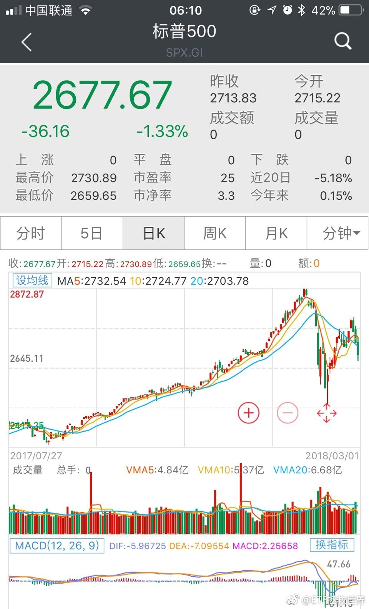

======================================================

ETF拯救世界 (5687069307) @
2018-03-02 09:53:15 Fri  
url: https://weibo.com/5687069307/G5tMTyGae

谁能想到，价值投资元年的忽悠竟然是蓝筹接盘总动员

------------------------------------------------------
转推：
>  @ETF拯救世界 (5687069307)
>  2018-01-25 11:18:26 Thu  
>  url: https:/weibo.com/5687069307/G00XC3BZQ/

>  不少人会在“价值投资元年”之后，在一些“蓝筹股”上套3-5年 ​​​

转发[15]  评论[40]  赞[122] 

======================================================

ETF拯救世界 (5687069307) @
2018-03-02 10:07:28 Fri  
url: https://weibo.com/5687069307/G5tSG1DIQ

回复@手机用户2831823203:我经常预测。关键是你会把多少预测放入你的交易系统。好好想想区别//@手机用户2831823203:这属于预测吗？我们不是不预测吗//@ETF拯救世界:谁能想到，价值投资元年的忽悠竟然是蓝筹接盘总动员

------------------------------------------------------
转推：
>  @ETF拯救世界 (5687069307)
>  2018-01-25 11:18:26 Thu  
>  url: https:/weibo.com/5687069307/G00XC3BZQ/

>  不少人会在“价值投资元年”之后，在一些“蓝筹股”上套3-5年 ​​​

转发[1]  评论[26]  赞[85] 

======================================================

ETF拯救世界 (5687069307) @
2018-03-02 10:58:44 Fri  
url: https://weibo.com/5687069307/G5udtxh9o

回复@djndnehwbbf:红利红了……这就是为什么跟我自己的主观判断相比，我更相信自己的系统。人总是会有感情，也会有很多主观错误，系统可靠多了。//@djndnehwbbf:老大，我有一点搞不清楚，既然这样，为什么还要继续买入中证红利呢？中证红利不也是属于大盘股为主吗？@ETF拯救世界

------------------------------------------------------
转推：
>  @ETF拯救世界 (5687069307)
>  2018-01-25 11:18:26 Thu  
>  url: https:/weibo.com/5687069307/G00XC3BZQ/

>  不少人会在“价值投资元年”之后，在一些“蓝筹股”上套3-5年 ​​​

转发[3]  评论[11]  赞[101] 

======================================================

ETF拯救世界 (5687069307) @
2018-03-02 11:07:56 Fri  
url: https://weibo.com/5687069307/G5uhdvkbG

红利是一个价值策略。这个策略长期看有效，短期可能持久低迷，有可能是好几年。所以不能全部买它，要有配置，适应各个阶段 ​​​

转发[30]  评论[97]  赞[223] 

======================================================

ETF拯救世界 (5687069307) @
2018-03-02 12:00:29 Fri  
url: https://weibo.com/5687069307/G5uCyaWwg

即使队友不给力，也要撑到最后拿第一。

可以加我晚上一起吃鸡…… ​​​

转发[3]  评论[84]  赞[172] 

+++++++++++++++++++++++++++++++++++++++++++++++++++++

图片：
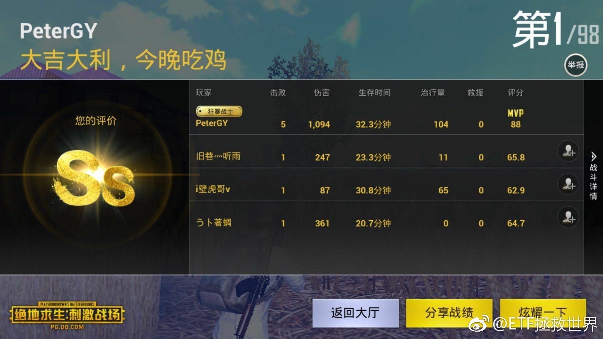

======================================================

ETF拯救世界 (5687069307) @
2018-03-02 20:57:56 Fri  
url: https://weibo.com/5687069307/G5y8Hsr4C

加仓德国的日子可能不会很远了。 ​​​

转发[16]  评论[125]  赞[242] 

+++++++++++++++++++++++++++++++++++++++++++++++++++++

图片：
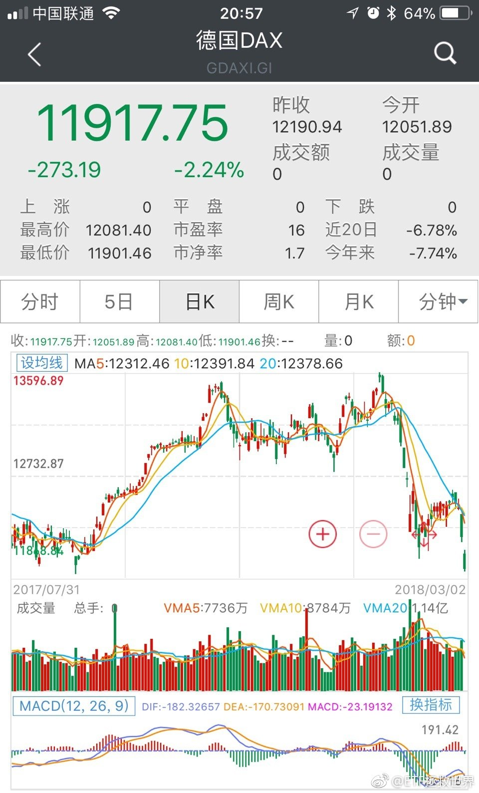

======================================================

ETF拯救世界 (5687069307) @
2018-03-03 09:03:36 Sat  
url: https://weibo.com/5687069307/G5CTfq9KS

魔幻

------------------------------------------------------
转推：
>  @澎湃新闻 (5044281310)
>  2018-03-02 23:13:03 Fri  
>  url: https:/weibo.com/5044281310/G5z1xCcQ1/

>  【SUV与小轿车斗气互撞，车碎片洒一地】http://t.cn/REKk3Qk 2月12日，湖南株州，一辆SUV和小轿车在路边互撞，撞击导致SUV车头和小车车尾受损。其间小车下来的一男子叫嚣SUV，被SUV几度缓撞。旁边者表示无能为力。（视频来源：综合网络）http://t.cn/REKk3QF ​​​

转发[5]  评论[40]  赞[37] 

======================================================

ETF拯救世界 (5687069307) @
2018-03-03 12:23:54 Sat  
url: https://weibo.com/5687069307/G5EcxznIJ

这是网易的股价。目前美股估值十几年最高，中概股更贵。

参照3 6 0的案例，这些股票回来市值都要一两万亿。

真正高速成长的肉没吃到，庞然大物又要回来了。

十一年前中石油的一幕又要重演吗。 ​​​

转发[19]  评论[86]  赞[123] 

+++++++++++++++++++++++++++++++++++++++++++++++++++++

图片：
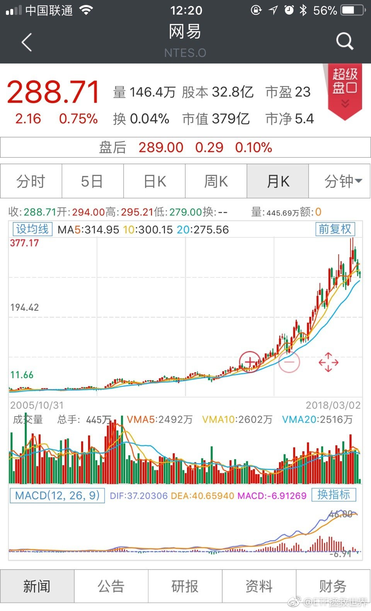

======================================================

ETF拯救世界 (5687069307) @
2018-03-03 18:40:25 Sat  
url: https://weibo.com/5687069307/G5GFnrsQP

稳超了。后劲不减 ​​​

转发[4]  评论[28]  赞[59] 

+++++++++++++++++++++++++++++++++++++++++++++++++++++

图片：

======================================================

ETF拯救世界 (5687069307) @
2018-03-03 18:48:49 Sat  
url: https://weibo.com/5687069307/G5GIN5cI5

回复@后生天天uping:不是单位组织看到吗……//@后生天天uping:看了厉害了我的国，感觉医疗，养老的前景以后会不错。[馋嘴][馋嘴]

------------------------------------------------------
转推：
>  @ETF拯救世界 (5687069307)
>  2018-03-03 18:40:25 Sat  
>  url: https:/weibo.com/5687069307/G5GFnrsQP/

>  稳超了。后劲不减 ​​​

转发[3]  评论[16]  赞[45] 

======================================================

ETF拯救世界 (5687069307) @
2018-03-03 19:49:58 Sat  
url: https://weibo.com/5687069307/G5H7BErmR

回复@诸葛不亮_若如初见:40倍肯定买不到。据说现在估值12000亿，它现在利润有300亿？//@诸葛不亮_若如初见:回复@ETF拯救世界:A股太丧病了。。。听说最近小米可能在A股上市，我也就肯给他40倍……

------------------------------------------------------
转推：
>  @ETF拯救世界 (5687069307)
>  2018-03-03 12:23:54 Sat  
>  url: https:/weibo.com/5687069307/G5EcxznIJ/

>  这是网易的股价。目前美股估值十几年最高，中概股更贵。
>  
>  参照3 6 0的案例，这些股票回来市值都要一两万亿。
>  
>  真正高速成长的肉没吃到，庞然大物又要回来了。
>  
>  十一年前中石油的一幕又要重演吗。 ​​​

转发[2]  评论[32]  赞[54] 

======================================================

ETF拯救世界 (5687069307) @
2018-03-03 20:25:13 Sat  
url: https://weibo.com/5687069307/G5HlV4TUp

我在豆瓣给电影评分的标准是这样的。

五星就是可以看很多次也不烦，不腻，不觉得无聊。又或者是各方面都特别满意，觉得真好啊。

代表：

寻梦环游记 Coco；

疯狂的麦克斯4：狂暴之路 Mad Max: Fury Road；

荒蛮故事 Relatos salvajes

遗愿清单 The Bucket List

宿醉 The Hangover

天使爱美丽 Le ​​​

转发[226]  评论[165]  赞[251] 

======================================================

ETF拯救世界 (5687069307) @
2018-03-03 22:42:44 Sat  
url: https://weibo.com/5687069307/G5IfJuc9k

每日打卡（162）

这几天有点不舒服，恢复正常锻炼节奏 ​​​

转发[1]  评论[36]  赞[98] 

+++++++++++++++++++++++++++++++++++++++++++++++++++++

图片：

======================================================

ETF拯救世界 (5687069307) @
2018-03-04 20:26:38 Sun  
url: https://weibo.com/5687069307/G5QMZkhFm

在看《腾讯传》

有很多感触。

一个公司的发展，运气到底占多大比重？

这本书也推荐给各位。 ​​​

转发[27]  评论[90]  赞[185] 

+++++++++++++++++++++++++++++++++++++++++++++++++++++

图片：
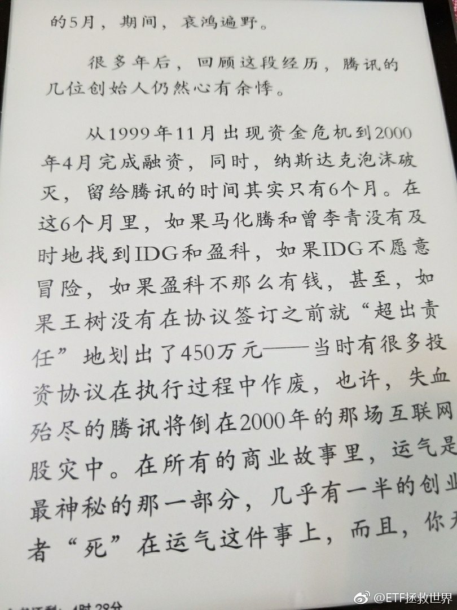

======================================================

ETF拯救世界 (5687069307) @
2018-03-05 08:37:11 Mon  
url: https://weibo.com/5687069307/G5Vzwh43I

回复@唐僧用飃柔:迷雾我给五星的原因，只因为最后一幕：永远不要放弃希望//@唐僧用飃柔:《迷雾》是我看过一遍就再也忘不了的电影，但我总觉得哪里不对？努力自救的都死了，反而那些听天由命的活了，难道灾难来临我们要学会放弃求生？

------------------------------------------------------
转推：
>  @ETF拯救世界 (5687069307)
>  2018-03-03 20:25:13 Sat  
>  url: https:/weibo.com/5687069307/G5HlV4TUp/

>  我在豆瓣给电影评分的标准是这样的。
>  
>  五星就是可以看很多次也不烦，不腻，不觉得无聊。又或者是各方面都特别满意，觉得真好啊。
>  
>  代表：
>  
>  寻梦环游记 Coco；
>  
>  疯狂的麦克斯4：狂暴之路 Mad Max: Fury Road；
>  
>  荒蛮故事 Relatos salvajes
>  
>  遗愿清单 The Bucket List
>  
>  宿醉 The Hangover
>  
>  天使爱美丽 Le ​​​

转发[10]  评论[24]  赞[87] 

======================================================

ETF拯救世界 (5687069307) @
2018-03-05 09:35:59 Mon  
url: https://weibo.com/5687069307/G5VXo3GpJ

回复@背着新水壶去上学:当然有了。如果像你所说，那么说深了，有这样的老爸也是运气。对不对？//@背着新水壶去上学:如果没有马化腾老爸的关系，盈科能出手吗？笑话啊！这世上，是没有运气二字的。

------------------------------------------------------
转推：
>  @ETF拯救世界 (5687069307)
>  2018-03-04 20:26:38 Sun  
>  url: https:/weibo.com/5687069307/G5QMZkhFm/

>  在看《腾讯传》
>  
>  有很多感触。
>  
>  一个公司的发展，运气到底占多大比重？
>  
>  这本书也推荐给各位。 ​​​

转发[2]  评论[32]  赞[76] 

======================================================

ETF拯救世界 (5687069307) @
2018-03-05 09:46:50 Mon  
url: https://weibo.com/5687069307/G5W1NoQit

一点感悟。

一个人，想要成功，一定必然需要运气。你生在70、80、90年代的本朝，就是运气。要比生在埃塞俄比亚，或者生在某些年代就是要运气好。又或者极端一点，父亲是谁母亲是谁，给你多少资源，给你多少智商，培养你什么样的情商，当然也都是运气。

想要成功，更是要运气。可能是碰巧某个机会砸到 ​​​

转发[69]  评论[136]  赞[370] 

======================================================

ETF拯救世界 (5687069307) @
2018-03-05 10:01:53 Mon  
url: https://weibo.com/5687069307/G5W7TjxiR

恒生，就看我给的上限29500能不能撑住了。撑不住就算是回归正常了，还继续疯就呵呵呵。 ​​​

转发[1]  评论[27]  赞[125] 

======================================================

ETF拯救世界 (5687069307) @
2018-03-05 13:12:27 Mon  
url: https://weibo.com/5687069307/G5XnftuCD

你有没有发现，对未来80%的忧虑都是无意义的。事后通常会发现，根本没有想象中那么困难。

其实，真正的灾难，来自于你的预期之外。 ​​​

转发[50]  评论[51]  赞[306] 

======================================================

ETF拯救世界 (5687069307) @
2018-03-05 13:19:08 Mon  
url: https://weibo.com/5687069307/G5XpXCvTR

昨天刚给了《逃出绝命镇》3星，今天人家就获奥斯卡奖了！

------------------------------------------------------
转推：
>  @守望好莱坞 (1803310643)
>  2018-03-05 12:50:57 Mon  
>  url: https:/weibo.com/1803310643/G5Xew6CLe/

>  第90届#奥斯卡#奖项全部颁出↓《水形物语》获最佳影片，陀螺也获最佳导演，成最大赢家。弗朗西斯·麦克道曼凭《三块广告牌》获影后，加里·奥德曼凭《至暗时刻》封影帝。罗杰·迪金斯14次奥提后终于凭《银翼杀手2049》首次拿下最佳摄影。《请以你的名字呼唤我》获最佳改编剧本，《逃出绝命镇》最佳原创剧 ​​​

转发[5]  评论[21]  赞[46] 

======================================================

ETF拯救世界 (5687069307) @
2018-03-05 13:28:48 Mon  
url: https://weibo.com/5687069307/G5XtToT0N

回复@蜀中弟子:这片子在美国得奖，很大程度是种族问题的政治正确。咱们看没有那么深的体会。看了就知道。//@蜀中弟子:这叫打脸吗？e大[二哈][二哈][二哈]//@ETF拯救世界:昨天刚给了《逃出绝命镇》3星，今天人家就获奥斯卡奖了！

------------------------------------------------------
转推：
>  @守望好莱坞 (1803310643)
>  2018-03-05 12:50:57 Mon  
>  url: https:/weibo.com/1803310643/G5Xew6CLe/

>  第90届#奥斯卡#奖项全部颁出↓《水形物语》获最佳影片，陀螺也获最佳导演，成最大赢家。弗朗西斯·麦克道曼凭《三块广告牌》获影后，加里·奥德曼凭《至暗时刻》封影帝。罗杰·迪金斯14次奥提后终于凭《银翼杀手2049》首次拿下最佳摄影。《请以你的名字呼唤我》获最佳改编剧本，《逃出绝命镇》最佳原创剧 ​​​

转发[2]  评论[19]  赞[37] 

======================================================

ETF拯救世界 (5687069307) @
2018-03-05 15:59:50 Mon  
url: https://weibo.com/5687069307/G5Ytc1F2F

太坏了，每次3点以后开始跳。 ​​​

转发[2]  评论[37]  赞[105] 

+++++++++++++++++++++++++++++++++++++++++++++++++++++

图片：
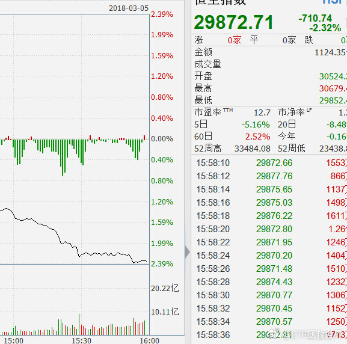

======================================================

ETF拯救世界 (5687069307) @
2018-03-06 09:39:49 Tue  
url: https://weibo.com/5687069307/G65pqCmZf

$全指医药 sh000991$  快回一万了，奶一口 ​​​

转发[27]  评论[41]  赞[98] 

======================================================

ETF拯救世界 (5687069307) @
2018-03-06 09:41:54 Tue  
url: https://weibo.com/5687069307/G65qhz2HL

回复@良民博博:怎么飞了，2月不是买了吗。//@良民博博:全飞了[泪][泪][泪]

------------------------------------------------------
转推：
>  @ETF拯救世界 (5687069307)
>  2018-03-06 09:39:49 Tue  
>  url: https:/weibo.com/5687069307/G65pqCmZf/

>  $全指医药 sh000991$  快回一万了，奶一口 ​​​

转发[6]  评论[32]  赞[69] 

======================================================

ETF拯救世界 (5687069307) @
2018-03-06 10:15:54 Tue  
url: https://weibo.com/5687069307/G65E5kizP

目前医药+养老的持仓已经超过10%了。少吗，一点都不少了。10%已经足够影响整个组合的表现了。

当然以后还会买，不过一定是更便宜的地方。目前这个区域，足够足够了。飞不飞，不关我事了。 ​​​

转发[50]  评论[64]  赞[164] 

======================================================

ETF拯救世界 (5687069307) @
2018-03-06 10:29:56 Tue  
url: https://weibo.com/5687069307/G65JMpj9u

别人被暴跌弄得焦头烂额疯狂杀跌的时候，你安安静静点击买入按钮拿到便宜筹码的感觉，

是不是很过瘾。

做生意就是低买高卖。就这么简单。 ​​​

转发[25]  评论[52]  赞[208] 

======================================================

ETF拯救世界 (5687069307) @
2018-03-06 10:52:08 Tue  
url: https://weibo.com/5687069307/G65SNbP1A

$国证食品 sz399396$  不知道什么时候还可以买。 ​​​

转发[1]  评论[27]  赞[84] 

======================================================

ETF拯救世界 (5687069307) @
2018-03-06 10:59:56 Tue  
url: https://weibo.com/5687069307/G65VXqIua

回复@家有八妹:长线仓位我的建议是不要乱动。想做波段就用短线仓位做。为什么，我告诉你。未来有一次，当你涨了一点卖出等更低的时候，它就这么一路向上起飞了。那么，你浪费的是几年的时间。这样做的成本非常高，损失的利润要比波段赚的那点收益多很多。

------------------------------------------------------
转推：
>  @ETF拯救世界 (5687069307)
>  2018-03-06 10:15:54 Tue  
>  url: https:/weibo.com/5687069307/G65E5kizP/

>  目前医药+养老的持仓已经超过10%了。少吗，一点都不少了。10%已经足够影响整个组合的表现了。
>  
>  当然以后还会买，不过一定是更便宜的地方。目前这个区域，足够足够了。飞不飞，不关我事了。 ​​​

转发[32]  评论[53]  赞[148] 

======================================================

ETF拯救世界 (5687069307) @
2018-03-06 11:12:50 Tue  
url: https://weibo.com/5687069307/G661caaso

回复@落宾:2015年至今，100跑输全指医药10个点，我不清楚为什么那么多人来问100。如果我买了100，会不会很多人来问为什么不买全指，不卖300医药 500医药？至于估值，我只能说，远远不是最低。其他人的数据我不评价。//@落宾:益达，梧桐树说医药100估值历史最低了，您的数据如何？为何不选100

------------------------------------------------------
转推：
>  @ETF拯救世界 (5687069307)
>  2018-03-06 09:39:49 Tue  
>  url: https:/weibo.com/5687069307/G65pqCmZf/

>  $全指医药 sh000991$  快回一万了，奶一口 ​​​

转发[15]  评论[60]  赞[107] 

======================================================

ETF拯救世界 (5687069307) @
2018-03-06 13:23:18 Tue  
url: https://weibo.com/5687069307/G66S931Br

功力一天不如一天

------------------------------------------------------
转推：
>  @ETF拯救世界 (5687069307)
>  2018-03-06 09:39:49 Tue  
>  url: https:/weibo.com/5687069307/G65pqCmZf/

>  $全指医药 sh000991$  快回一万了，奶一口 ​​​

转发[3]  评论[39]  赞[101] 

======================================================

ETF拯救世界 (5687069307) @
2018-03-06 13:42:15 Tue  
url: https://weibo.com/5687069307/G66ZQheYm

回复@桐妈品质团:未来医药的走势其实很微妙。所以我会更加谨慎买入剩下的仓位。何况医药目前将近40倍并不算什么特大机会。//@桐妈品质团:未来十年因为医保控费的关系应该全指医疗增长不会像过去十年那样年化20%了

------------------------------------------------------
转推：
>  @ETF拯救世界 (5687069307)
>  2018-03-06 09:39:49 Tue  
>  url: https:/weibo.com/5687069307/G65pqCmZf/

>  $全指医药 sh000991$  快回一万了，奶一口 ​​​

转发[6]  评论[14]  赞[90] 

======================================================

ETF拯救世界 (5687069307) @
2018-03-06 14:03:32 Tue  
url: https://weibo.com/5687069307/G678u4iwt

$中证红利 sz399922$  不错。 ​​​

转发[0]  评论[27]  赞[120] 

======================================================

ETF拯救世界 (5687069307) @
2018-03-06 15:40:59 Tue  
url: https://weibo.com/5687069307/G67M2hTKN

截至今日，中证500有14只成分股公布年报。两家业绩下降，12家上升。平均增速超过40%……

204家公布业绩快报，平均增速15%以上。

喜欢500。为什么？

因为比300多200啊！ ​​​

转发[16]  评论[82]  赞[244] 

======================================================

ETF拯救世界 (5687069307) @
2018-03-06 17:12:55 Tue  
url: https://weibo.com/5687069307/G68nm3HiH

回复@石头里的虫子:每次买入都比现价低，你之前是怎么做到亏损的？ http://t.cn/RETCecq //@石头里的虫子:回复@悠然见南山98518:我也红了。//@ETF拯救世界:回复@良民博博:怎么飞了，2月不是买了吗。//@良民博博:全飞了[泪][泪][泪]

------------------------------------------------------
转推：
>  @ETF拯救世界 (5687069307)
>  2018-03-06 09:39:49 Tue  
>  url: https:/weibo.com/5687069307/G65pqCmZf/

>  $全指医药 sh000991$  快回一万了，奶一口 ​​​

转发[3]  评论[24]  赞[59] 

======================================================

ETF拯救世界 (5687069307) @
2018-03-06 17:19:21 Tue  
url: https://weibo.com/5687069307/G68pXAOuw

看了一眼，2016年12月买入那次与前几天价格差不多，但是一年过去，估值下降了19%……//@ETF拯救世界:回复@石头里的虫子:每次买入都比现价低，你之前是怎么做到亏损的？ http://t.cn/RETCecq //@石头里的虫子:回复@悠然见南山98518:我也红了。//@ETF拯救世界:回复@良民博博:怎么飞了，2月不是买了吗。

------------------------------------------------------
转推：
>  @ETF拯救世界 (5687069307)
>  2018-03-06 09:39:49 Tue  
>  url: https:/weibo.com/5687069307/G65pqCmZf/

>  $全指医药 sh000991$  快回一万了，奶一口 ​​​

转发[2]  评论[26]  赞[74] 

======================================================

ETF拯救世界 (5687069307) @
2018-03-06 21:59:23 Tue  
url: https://weibo.com/5687069307/G6afD7nhL

每日打卡（163）

坚持。感觉有必要加量了 ​​​

转发[1]  评论[25]  赞[133] 

+++++++++++++++++++++++++++++++++++++++++++++++++++++

图片：

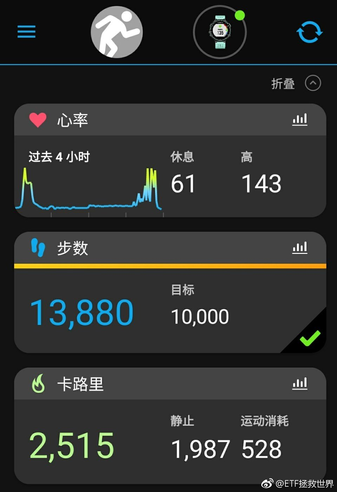

======================================================

ETF拯救世界 (5687069307) @
2018-03-07 09:11:01 Wed  
url: https://weibo.com/5687069307/G6eEeDh3e

一条新闻告诉你重仓单一品种的风险。

今天，“14富贵鸟”再次因为暴跌30%，被交易所暂时停牌。收盘后，“14富贵鸟”报8.56元。从公司价值上看，由于富贵鸟公司至少存在49.09亿元资产金额很可能无法收回，导致富贵鸟债务总额约30亿元，而公司账面流动资金不足1亿元。各种迹象显示，公司违约风 ​​​

转发[37]  评论[32]  赞[111] 

======================================================

ETF拯救世界 (5687069307) @
2018-03-07 09:15:26 Wed  
url: https://weibo.com/5687069307/G6eG2oC8r

不过讲真，投资十几年，第一次见到8块的债券。。 ​​​

转发[39]  评论[64]  赞[124] 

+++++++++++++++++++++++++++++++++++++++++++++++++++++

图片：
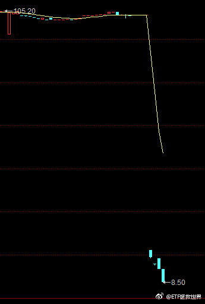

======================================================

ETF拯救世界 (5687069307) @
2018-03-07 09:43:13 Wed  
url: https://weibo.com/5687069307/G6eRjuP1M

迷雾，这电影，看完了，体会就是，其实人最怕的是什么。

我感觉，最怕的是——未知。

为什么绝大多数人都怕黑，因为黑暗里面的东西是未知的。迷雾中也是，你看不清就会害怕。因为你不知道下一步是万丈深渊还是什么更恐怖的东西。

所以不要嘲笑为什么很多人在底部割肉。因为未知。不知道未来会怎样， ​​​

转发[72]  评论[91]  赞[234] 

======================================================

ETF拯救世界 (5687069307) @
2018-03-07 09:52:18 Wed  
url: https://weibo.com/5687069307/G6eV0fnBo

回复@做而论道725:能力圈。举个例子来说，马戏团里的高空飞人演员说，每次表演要注意1234，就没问题了。这时候你知道他有这个能力做到但你不行。投资同样，巴菲特有能力找出好鸡蛋而且看好篮子（买成大股东控制公司）。但他知道，99%的人不行。所以他连续十几次推荐指数基金。他能做到的99%的人做不到

------------------------------------------------------
转推：
>  @ETF拯救世界 (5687069307)
>  2018-03-07 09:11:01 Wed  
>  url: https:/weibo.com/5687069307/G6eEeDh3e/

>  一条新闻告诉你重仓单一品种的风险。
>  
>  今天，“14富贵鸟”再次因为暴跌30%，被交易所暂时停牌。收盘后，“14富贵鸟”报8.56元。从公司价值上看，由于富贵鸟公司至少存在49.09亿元资产金额很可能无法收回，导致富贵鸟债务总额约30亿元，而公司账面流动资金不足1亿元。各种迹象显示，公司违约风 ​​​

转发[14]  评论[16]  赞[96] 

======================================================

ETF拯救世界 (5687069307) @
2018-03-07 09:56:34 Wed  
url: https://weibo.com/5687069307/G6eWJtXXq

什么意思是不是要阶段新高了//@ETF拯救世界:功力一天不如一天

------------------------------------------------------
转推：
>  @ETF拯救世界 (5687069307)
>  2018-03-06 09:39:49 Tue  
>  url: https:/weibo.com/5687069307/G65pqCmZf/

>  $全指医药 sh000991$  快回一万了，奶一口 ​​​

转发[2]  评论[21]  赞[79] 

======================================================

ETF拯救世界 (5687069307) @
2018-03-07 10:30:41 Wed  
url: https://weibo.com/5687069307/G6faAbu1K

这几天跟两位微博的朋友组队吃鸡。一次第四一次第二。

怎么讲，本来我是想抱大腿的，结果两次都是剩我一个人在干，变成了大腿。

你们好好练，到时候组个战队，开直播，变成游戏直播网红，美滋滋。

到现在都不知道是跟哪两位组的，评论里报个名！ ​​​

转发[5]  评论[63]  赞[113] 

======================================================

ETF拯救世界 (5687069307) @
2018-03-07 10:49:56 Wed  
url: https://weibo.com/5687069307/G6fiouFMp

回复@lihuanan:哈哈，是你。打完后加那两个妹子好友没有。[doge]//@lihuanan:E大，昨天9点左右，你我，跟两妹子一起。抱你大腿了[笑cry]

------------------------------------------------------
转推：
>  @ETF拯救世界 (5687069307)
>  2018-03-07 10:30:41 Wed  
>  url: https:/weibo.com/5687069307/G6faAbu1K/

>  这几天跟两位微博的朋友组队吃鸡。一次第四一次第二。
>  
>  怎么讲，本来我是想抱大腿的，结果两次都是剩我一个人在干，变成了大腿。
>  
>  你们好好练，到时候组个战队，开直播，变成游戏直播网红，美滋滋。
>  
>  到现在都不知道是跟哪两位组的，评论里报个名！ ​​​

转发[0]  评论[34]  赞[80] 

======================================================

ETF拯救世界 (5687069307) @
2018-03-07 14:07:31 Wed  
url: https://weibo.com/5687069307/G6gAB4DXs

为期两周的贤者时间不用看盘 ​​​

转发[3]  评论[66]  赞[144] 

======================================================

ETF拯救世界 (5687069307) @
2018-03-07 14:45:26 Wed  
url: https://weibo.com/5687069307/G6gPZqF3Z

震惊！贤者时间结束了！

------------------------------------------------------
转推：
>  @ETF拯救世界 (5687069307)
>  2018-03-07 14:07:31 Wed  
>  url: https:/weibo.com/5687069307/G6gAB4DXs/

>  为期两周的贤者时间不用看盘 ​​​

转发[1]  评论[94]  赞[150] 

======================================================

ETF拯救世界 (5687069307) @
2018-03-08 08:10:37 Thu  
url: https://weibo.com/5687069307/G6nGe6rCB

没有刘海会买一个。太反人类的设计，完美主义者接受不能

------------------------------------------------------
转推：
>  @ ()
>  2018-03-08 08:08:39 Thu  
>  url: 

>  抱歉，作者已设置仅展示半年内微博，此微博已不可见。 ​​​

转发[0]  评论[21]  赞[77] 

======================================================

ETF拯救世界 (5687069307) @
2018-03-08 08:21:22 Thu  
url: https://weibo.com/5687069307/G6nKAtLY8

妹子们，节日快乐！

一会发个红包，只有妹子能领！ ​​​

转发[2]  评论[92]  赞[156] 

======================================================

ETF拯救世界 (5687069307) @
2018-03-08 08:30:34 Thu  
url: https://weibo.com/5687069307/G6nOk7HEN

回复@小王紙D:微博发，930不见不散！//@小王紙D:一会儿是什么时候

------------------------------------------------------
转推：
>  @ETF拯救世界 (5687069307)
>  2018-03-08 08:21:22 Thu  
>  url: https:/weibo.com/5687069307/G6nKAtLY8/

>  妹子们，节日快乐！
>  
>  一会发个红包，只有妹子能领！ ​​​

转发[1]  评论[22]  赞[83] 

======================================================

ETF拯救世界 (5687069307) @
2018-03-08 08:39:49 Thu  
url: https://weibo.com/5687069307/G6nS5j7KG

回复@深蓝的大海013:500个应该够了。男人不要抢，考验素质的时候到了//@深蓝的大海013:春节红包差点没抢到，这回还是只能看看了//@ETF拯救世界:回复@小王紙D:微博发，930不见不散！//@小王紙D:一会儿是什么时候

------------------------------------------------------
转推：
>  @ETF拯救世界 (5687069307)
>  2018-03-08 08:21:22 Thu  
>  url: https:/weibo.com/5687069307/G6nKAtLY8/

>  妹子们，节日快乐！
>  
>  一会发个红包，只有妹子能领！ ​​​

转发[0]  评论[68]  赞[108] 

======================================================

ETF拯救世界 (5687069307) @
2018-03-08 09:32:09 Thu  
url: https://weibo.com/5687069307/G6odk3JE0

#ETF拯救世界的红包#感谢一年来大家对我的爱与支持！我往红包里塞了现金，特来为大家送上好运，狗年旺旺，领到红包旺上加旺！http://t.cn/REEM8ny ​​​

转发[13]  评论[197]  赞[146] 

======================================================

ETF拯救世界 (5687069307) @
2018-03-08 09:34:13 Thu  
url: https://weibo.com/5687069307/G6oea0GXs

纳尼？？？500个抢完了？？？

------------------------------------------------------
转推：
>  @ETF拯救世界 (5687069307)
>  2018-03-08 09:32:09 Thu  
>  url: https:/weibo.com/5687069307/G6odk3JE0/

>  #ETF拯救世界的红包#感谢一年来大家对我的爱与支持！我往红包里塞了现金，特来为大家送上好运，狗年旺旺，领到红包旺上加旺！http://t.cn/REEM8ny ​​​

转发[1]  评论[103]  赞[83] 

======================================================

ETF拯救世界 (5687069307) @
2018-03-08 09:37:05 Thu  
url: https://weibo.com/5687069307/G6ofkqO7g

大多数都没见过啊。以后不能这样发了，感觉好多人为了抢红包混进来了。 ​​​

转发[5]  评论[201]  赞[134] 

+++++++++++++++++++++++++++++++++++++++++++++++++++++

图片：
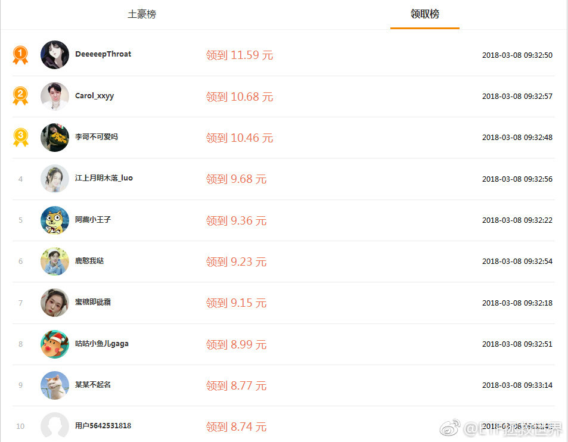

======================================================

ETF拯救世界 (5687069307) @
2018-03-08 09:59:25 Thu  
url: https://weibo.com/5687069307/G6ooobyje

继续//@ETF拯救世界:什么意思是不是要阶段新高了//@ETF拯救世界:功力一天不如一天

------------------------------------------------------
转推：
>  @ETF拯救世界 (5687069307)
>  2018-03-06 09:39:49 Tue  
>  url: https:/weibo.com/5687069307/G65pqCmZf/

>  $全指医药 sh000991$  快回一万了，奶一口 ​​​

转发[1]  评论[7]  赞[65] 

======================================================

ETF拯救世界 (5687069307) @
2018-03-08 10:03:27 Thu  
url: https://weibo.com/5687069307/G6oq24wsZ

回复@不装X你值得拥有:可以分性别，也可以分关注时间，但是不能同时！所以怎么选都是错啊。//@不装X你值得拥有:微博发红包可以设置只能女性抢红包还有什么老粉的吗

------------------------------------------------------
转推：
>  @ETF拯救世界 (5687069307)
>  2018-03-08 09:37:05 Thu  
>  url: https:/weibo.com/5687069307/G6ofkqO7g/

>  大多数都没见过啊。以后不能这样发了，感觉好多人为了抢红包混进来了。 ​​​

转发[1]  评论[24]  赞[72] 

======================================================

ETF拯救世界 (5687069307) @
2018-03-08 10:09:56 Thu  
url: https://weibo.com/5687069307/G6osECC6R

回复@干物妹土間埋酱:钱让机器人或者其他不认识的人抢走了我怎么能开心。。等于掉路上让风吹走以后落在火堆里烧成灰吹散在太平洋小岛上让土埋住了啊。给各位老朋友就不一样了。。//@干物妹土間埋酱:你开森就好

------------------------------------------------------
转推：
>  @ETF拯救世界 (5687069307)
>  2018-03-08 09:37:05 Thu  
>  url: https:/weibo.com/5687069307/G6ofkqO7g/

>  大多数都没见过啊。以后不能这样发了，感觉好多人为了抢红包混进来了。 ​​​

转发[0]  评论[99]  赞[129] 

======================================================

ETF拯救世界 (5687069307) @
2018-03-08 10:23:49 Thu  
url: https://weibo.com/5687069307/G6oyicn8s

$全指医药 sh000991$  这种，短线有波动，长线几年不动，有人问，为什么高位不卖了，低位买回来做波段多好啊。

这其实是个伪命题。道理很简单，你根本不知道到底哪里是短期高位，低位。怎么做波段？

其实你去观察有的趋势策略，在接近最低点卖出后，刚刚高点接回来或者到现在还没接回来。这就很麻烦 ​​​

转发[83]  评论[145]  赞[234] 

======================================================

ETF拯救世界 (5687069307) @
2018-03-08 11:27:15 Thu  
url: https://weibo.com/5687069307/G6oY2rtit

这么多年金融投资，有一个特别重要的感悟。

一个品种，只要你买的够低，不要担心它不涨。低的时候你就一直买，越低越买，越买越多。

只要这个品种没问题，只要你的成本低，它早晚会一飞冲天。但什么时候涨，真的不知道。可能一两个月，可能一二三五年。起飞的日子总是出乎意料，总是非常神秘的。

但 ​​​

转发[99]  评论[168]  赞[366] 

======================================================

ETF拯救世界 (5687069307) @
2018-03-08 13:29:17 Thu  
url: https://weibo.com/5687069307/G6pLz9dli

[拜拜]//@ETF拯救世界:继续//@ETF拯救世界:什么意思是不是要阶段新高了//@ETF拯救世界:功力一天不如一天

------------------------------------------------------
转推：
>  @ETF拯救世界 (5687069307)
>  2018-03-06 09:39:49 Tue  
>  url: https:/weibo.com/5687069307/G65pqCmZf/

>  $全指医药 sh000991$  快回一万了，奶一口 ​​​

转发[0]  评论[35]  赞[86] 

======================================================

ETF拯救世界 (5687069307) @
2018-03-08 14:14:19 Thu  
url: https://weibo.com/5687069307/G6q3R0BTv

今天计划以30%多的仓位做到了跑赢60%股票涨幅。。论持有强势品种的重要性。 ​​​

转发[7]  评论[52]  赞[237] 

======================================================

ETF拯救世界 (5687069307) @
2018-03-08 15:04:58 Thu  
url: https://weibo.com/5687069307/G6qopsylZ

$中证环保 sh000827$   $中证红利 sz399922$   今天几个宝宝表现都不错。 ​​​

转发[8]  评论[29]  赞[140] 

======================================================

ETF拯救世界 (5687069307) @
2018-03-08 15:09:02 Thu  
url: https://weibo.com/5687069307/G6qq3CINF

回复@totwo_9751:人生呢，最重要就是开心。每天都开开心心的多好。挣钱的时候觉得还有钱没投入，没赚够。赔钱的时候更难受，那还有没有高兴的时候啦。//@totwo_9751:不是还有一半资金没投入吗？没到开心的时候吧

------------------------------------------------------
转推：
>  @ETF拯救世界 (5687069307)
>  2018-03-08 15:04:58 Thu  
>  url: https:/weibo.com/5687069307/G6qopsylZ/

>  $中证环保 sh000827$   $中证红利 sz399922$   今天几个宝宝表现都不错。 ​​​

转发[7]  评论[27]  赞[181] 

======================================================

ETF拯救世界 (5687069307) @
2018-03-08 15:18:42 Thu  
url: https://weibo.com/5687069307/G6qtZ8hqi

回复@漂浮222:每篇公众号文章有4万左右阅读。1000-2000点赞，100-300打赏，500-1000评论。这些数字加起来，也不到参考计划的人的10%。什么意思呢，意思就是我已经习惯了。这种事情不能幻想每个人都会谢谢你，不要这么想。预期没一个人做出任何反应，结果还有一些人会反应一下，你就会很开心了……

------------------------------------------------------
转推：
>  @ETF拯救世界 (5687069307)
>  2018-03-08 09:32:09 Thu  
>  url: https:/weibo.com/5687069307/G6odk3JE0/

>  #ETF拯救世界的红包#感谢一年来大家对我的爱与支持！我往红包里塞了现金，特来为大家送上好运，狗年旺旺，领到红包旺上加旺！http://t.cn/REEM8ny ​​​

转发[8]  评论[123]  赞[344] 

======================================================

ETF拯救世界 (5687069307) @
2018-03-08 15:31:06 Thu  
url: https://weibo.com/5687069307/G6qz1sLV2

回复@山喵饲养员:朝阳仁波切给我开过天眼。//@山喵饲养员:E大怎么得知多少人跟投计划呢？

------------------------------------------------------
转推：
>  @ETF拯救世界 (5687069307)
>  2018-03-08 09:32:09 Thu  
>  url: https:/weibo.com/5687069307/G6odk3JE0/

>  #ETF拯救世界的红包#感谢一年来大家对我的爱与支持！我往红包里塞了现金，特来为大家送上好运，狗年旺旺，领到红包旺上加旺！http://t.cn/REEM8ny ​​​

转发[0]  评论[28]  赞[122] 

======================================================

ETF拯救世界 (5687069307) @
2018-03-08 16:36:44 Thu  
url: https://weibo.com/5687069307/G6qZEFIjL

回复@手机用户3134109401:别这样。我说这些不是让你们说谢谢或者打赏好吗。。更不是矫情，是那位朋友正好说到这个了，我说说自己的想法，我没什么预期。比如说发红包，这几个节日发了也有一万多了吧，要是为了听谢谢是不是有点贵。主要还是希望大家都开开心心的呗。

------------------------------------------------------
转推：
>  @ETF拯救世界 (5687069307)
>  2018-03-08 09:32:09 Thu  
>  url: https:/weibo.com/5687069307/G6odk3JE0/

>  #ETF拯救世界的红包#感谢一年来大家对我的爱与支持！我往红包里塞了现金，特来为大家送上好运，狗年旺旺，领到红包旺上加旺！http://t.cn/REEM8ny ​​​

转发[0]  评论[81]  赞[264] 

======================================================

ETF拯救世界 (5687069307) @
2018-03-08 21:10:54 Thu  
url: https://weibo.com/5687069307/G6sMWrM6X

每日打卡（164）

坚持做一件简单的事 ​​​

转发[1]  评论[32]  赞[186] 

+++++++++++++++++++++++++++++++++++++++++++++++++++++

图片：

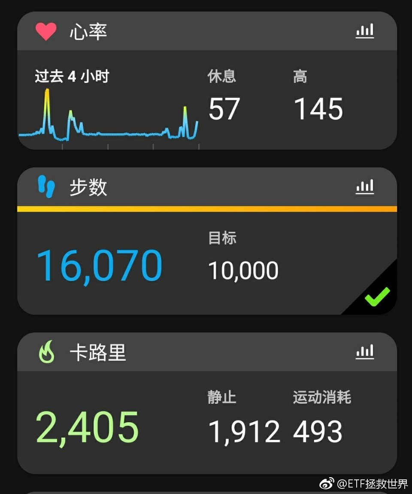

======================================================

ETF拯救世界 (5687069307) @
2018-03-09 10:15:06 Fri  
url: https://weibo.com/5687069307/G6xVfsyVN

三只国内债基终于全都出坑了。美元债还在坑里。-2%。

[摊手] ​​​

转发[1]  评论[39]  赞[152] 

======================================================

ETF拯救世界 (5687069307) @
2018-03-09 10:26:41 Fri  
url: https://weibo.com/5687069307/G6xZWuj4e

股票（境内外）/国债/原油黄金/外汇

说白了就这四个大类。不同的周期把权重多给不同的品种，就能做到达里奥说的“全天候”。

基本上任何时间段，这四种东西一定有上涨的。基本上没见过所有东西同时下跌的时候。 ​​​

转发[88]  评论[99]  赞[228] 

======================================================

ETF拯救世界 (5687069307) @
2018-03-09 10:45:24 Fri  
url: https://weibo.com/5687069307/G6y7y8CGr

$中证传媒 sz399971$  今天轮到你了？milk一下 ​​​

转发[4]  评论[48]  赞[130] 

======================================================

ETF拯救世界 (5687069307) @
2018-03-09 11:24:19 Fri  
url: https://weibo.com/5687069307/G6ynln2XP

回复@IMcygnus:请尊重阶段性股神谢谢。//@IMcygnus:E大 最近身边股神又开始活跃了。。。股神爱说自己挣钱，怎么不说自己断过腿。。

------------------------------------------------------
转推：
>  @ETF拯救世界 (5687069307)
>  2018-03-09 10:45:24 Fri  
>  url: https:/weibo.com/5687069307/G6y7y8CGr/

>  $中证传媒 sz399971$  今天轮到你了？milk一下 ​​​

转发[0]  评论[17]  赞[91] 

======================================================

ETF拯救世界 (5687069307) @
2018-03-09 11:25:34 Fri  
url: https://weibo.com/5687069307/G6ynR15eD

又是2%的品种。不过这个比医药少多了。anyway，赚钱就要happy。

------------------------------------------------------
转推：
>  @ETF拯救世界 (5687069307)
>  2018-03-09 10:45:24 Fri  
>  url: https:/weibo.com/5687069307/G6y7y8CGr/

>  $中证传媒 sz399971$  今天轮到你了？milk一下 ​​​

转发[2]  评论[21]  赞[95] 

======================================================

ETF拯救世界 (5687069307) @
2018-03-09 11:29:15 Fri  
url: https://weibo.com/5687069307/G6ypluvcU

基本上一轮深坑后，有三种人。

第一种是底部卖出了。止损，趋势。现在泪在眼里，苦在心里。

第二种是没买没卖，坐了过山车。心里不舒服，觉得没钱低位补仓不开心。

第三种是低位买了，笑嘻嘻。

对了，还有第四种，就是在座的某些ladies and 乡亲们！低位买了，一二三，连开三车，还觉得买的不够， ​​​

转发[45]  评论[135]  赞[190] 

======================================================

ETF拯救世界 (5687069307) @
2018-03-09 11:37:14 Fri  
url: https://weibo.com/5687069307/G6ysArDpp

回复@做而论道725:我有自己的标准数据和策略。无论如何，剩下的40%仓位我不会在2.9那个位置全都买入。距离标准还有距离。//@做而论道725:关于深坑，我感觉弱弱貌似不错，益达可以去看看 尤其是2.9那次说的

------------------------------------------------------
转推：
>  @ETF拯救世界 (5687069307)
>  2018-03-09 11:29:15 Fri  
>  url: https:/weibo.com/5687069307/G6ypluvcU/

>  基本上一轮深坑后，有三种人。
>  
>  第一种是底部卖出了。止损，趋势。现在泪在眼里，苦在心里。
>  
>  第二种是没买没卖，坐了过山车。心里不舒服，觉得没钱低位补仓不开心。
>  
>  第三种是低位买了，笑嘻嘻。
>  
>  对了，还有第四种，就是在座的某些ladies and 乡亲们！低位买了，一二三，连开三车，还觉得买的不够， ​​​

转发[4]  评论[25]  赞[91] 

======================================================

ETF拯救世界 (5687069307) @
2018-03-09 11:43:21 Fri  
url: https://weibo.com/5687069307/G6yv44elt

不要一个上涨就认为牛市来了，再没有机会买入。也不要一个下跌就要金融危机。

我再说一次，金融市场的机会永远都有，只要你活着，就能看到无数机会向你扑来。

你以为的底，未必是底。别人说什么，可以参考，但不能做为操作的依据。一切按照自己的体系来，赚钱只是一开始就被设计好的结果实现了而已。 ​​​

转发[80]  评论[79]  赞[267] 

======================================================

ETF拯救世界 (5687069307) @
2018-03-09 11:47:55 Fri  
url: https://weibo.com/5687069307/G6ywVDZm6

回复@酒舞之樽:这次下跌后，相信很多人才会真的认识到@且慢管家  的补仓提醒有多么重要。建议仓位不够的朋友还是要用起来。关键时刻真的管用。当然，细节还可以进步，比如提醒的时机，如果是当天提醒就更及时了。//@酒舞之樽:第五种，补车补一半，结果车飞上天了[允悲]

------------------------------------------------------
转推：
>  @ETF拯救世界 (5687069307)
>  2018-03-09 11:29:15 Fri  
>  url: https:/weibo.com/5687069307/G6ypluvcU/

>  基本上一轮深坑后，有三种人。
>  
>  第一种是底部卖出了。止损，趋势。现在泪在眼里，苦在心里。
>  
>  第二种是没买没卖，坐了过山车。心里不舒服，觉得没钱低位补仓不开心。
>  
>  第三种是低位买了，笑嘻嘻。
>  
>  对了，还有第四种，就是在座的某些ladies and 乡亲们！低位买了，一二三，连开三车，还觉得买的不够， ​​​

转发[14]  评论[48]  赞[132] 

======================================================

ETF拯救世界 (5687069307) @
2018-03-09 13:21:33 Fri  
url: https://weibo.com/5687069307/G6z8VzLHa

$中证环保 sh000827$   可能没人注意，15个交易日中，只有2天下跌。 ​​​

转发[5]  评论[30]  赞[111] 

======================================================

ETF拯救世界 (5687069307) @
2018-03-09 13:29:33 Fri  
url: https://weibo.com/5687069307/G6zcb7RcM

$养老产业 sz399812$   谁能想到默默无闻的它有可能先收回失地。失敬了。 ​​​

转发[2]  评论[43]  赞[125] 

======================================================

ETF拯救世界 (5687069307) @
2018-03-09 13:43:52 Fri  
url: https://weibo.com/5687069307/G6zhZzRwB

回复@我是风清扬201412:这次下跌，对很多人是一次非常好的训练。没有这次训练，未来也许会犯极为关键的致命错误了。

------------------------------------------------------
转推：
>  @ETF拯救世界 (5687069307)
>  2018-03-09 13:21:33 Fri  
>  url: https:/weibo.com/5687069307/G6z8VzLHa/

>  $中证环保 sh000827$   可能没人注意，15个交易日中，只有2天下跌。 ​​​

转发[3]  评论[34]  赞[120] 

======================================================

ETF拯救世界 (5687069307) @
2018-03-09 13:59:45 Fri  
url: https://weibo.com/5687069307/G6zor7W8G

21个品种还剩4个浮亏，一个油，一个黄金，一个海外债，一个券商。浮亏全部不超过5%。

其它全部盈利。最高的超过50%。 ​​​

转发[25]  评论[95]  赞[253] 

======================================================

ETF拯救世界 (5687069307) @
2018-03-09 14:24:01 Fri  
url: https://weibo.com/5687069307/G6zyidAir

回复@金顶佛光:再给我一次机会，我还是不会买。45倍估值买一个指数，除非你把我打傻。//@金顶佛光:没有买信息，有点可惜

------------------------------------------------------
转推：
>  @ETF拯救世界 (5687069307)
>  2018-03-09 13:59:45 Fri  
>  url: https:/weibo.com/5687069307/G6zor7W8G/

>  21个品种还剩4个浮亏，一个油，一个黄金，一个海外债，一个券商。浮亏全部不超过5%。
>  
>  其它全部盈利。最高的超过50%。 ​​​

转发[19]  评论[51]  赞[98] 

======================================================

ETF拯救世界 (5687069307) @
2018-03-09 15:04:52 Fri  
url: https://weibo.com/5687069307/G6zORzL5q

回复@浅九深:不好意思，我们有创业板指数。说到接盘，只有别人接我们的，谢谢关心。//@浅九深:你们可能还不相信创业板会有大行情，等你们相信时，应该快3000点了吧？你们冲进去，就套死在里边//@ETF拯救世界:回复@金顶佛光:再给我一次机会，我还是不会买。45倍估值买一个指数，除非你把我打傻。

------------------------------------------------------
转推：
>  @ETF拯救世界 (5687069307)
>  2018-03-09 13:59:45 Fri  
>  url: https:/weibo.com/5687069307/G6zor7W8G/

>  21个品种还剩4个浮亏，一个油，一个黄金，一个海外债，一个券商。浮亏全部不超过5%。
>  
>  其它全部盈利。最高的超过50%。 ​​​

转发[3]  评论[42]  赞[111] 

======================================================

ETF拯救世界 (5687069307) @
2018-03-09 15:07:09 Fri  
url: https://weibo.com/5687069307/G6zPNfkJL

回复@Cubic_N:增速又高，估值又低，未来行业前景还好，你帮着说一个符合标准的品种//@Cubic_N:回复@投资雷达:估值只是历史分位低。如果从利润增速角度看，估值偏高//@ETF拯救世界:回复@金顶佛光:再给我一次机会，我还是不会买。45倍估值买一个指数，除非你把我打傻。//@金顶佛光:没有买信息，有点可惜

------------------------------------------------------
转推：
>  @ETF拯救世界 (5687069307)
>  2018-03-09 13:59:45 Fri  
>  url: https:/weibo.com/5687069307/G6zor7W8G/

>  21个品种还剩4个浮亏，一个油，一个黄金，一个海外债，一个券商。浮亏全部不超过5%。
>  
>  其它全部盈利。最高的超过50%。 ​​​

转发[4]  评论[28]  赞[90] 

======================================================

ETF拯救世界 (5687069307) @
2018-03-09 15:54:42 Fri  
url: https://weibo.com/5687069307/G6A961l9e

回复@秋叶纷飞2016:记住三点：第一，指数不会死，长期一定越来越高。第二，我们买的一定不贵。第三，还有很多钱没买，即使再跌成本也会越来越低。怕什么，就是干！//@秋叶纷飞2016:机会来的时候，总是害怕怎么办？

------------------------------------------------------
转推：
>  @ETF拯救世界 (5687069307)
>  2018-03-09 11:43:21 Fri  
>  url: https:/weibo.com/5687069307/G6yv44elt/

>  不要一个上涨就认为牛市来了，再没有机会买入。也不要一个下跌就要金融危机。
>  
>  我再说一次，金融市场的机会永远都有，只要你活着，就能看到无数机会向你扑来。
>  
>  你以为的底，未必是底。别人说什么，可以参考，但不能做为操作的依据。一切按照自己的体系来，赚钱只是一开始就被设计好的结果实现了而已。 ​​​

转发[25]  评论[40]  赞[159] 

======================================================

ETF拯救世界 (5687069307) @
2018-03-09 15:59:58 Fri  
url: https://weibo.com/5687069307/G6AbeCMal

我有一点觉得特别好笑，为什么有的人总认为：你现在不买，以后高位等着你来接盘！

这个说法有两个特别可笑的地方。

第一，为什么一定要买这个品种。“价值投资元年”之前我们就布局了50恒生300红利。价值投资元年中，我们开始布局500创业传媒医药养老。你大蓝筹涨你的，我买不涨的东西。现在不涨的起 ​​​

转发[43]  评论[124]  赞[188] 

======================================================

ETF拯救世界 (5687069307) @
2018-03-09 16:54:01 Fri  
url: https://weibo.com/5687069307/G6Axb6ESB

回复@蓝天翔雁:hey,dude,that's me.//@蓝天翔雁:就是不太明白，你经常重复来重复去说服那些留言，有啥意义呢

------------------------------------------------------
转推：
>  @ETF拯救世界 (5687069307)
>  2018-03-09 15:59:58 Fri  
>  url: https:/weibo.com/5687069307/G6AbeCMal/

>  我有一点觉得特别好笑，为什么有的人总认为：你现在不买，以后高位等着你来接盘！
>  
>  这个说法有两个特别可笑的地方。
>  
>  第一，为什么一定要买这个品种。“价值投资元年”之前我们就布局了50恒生300红利。价值投资元年中，我们开始布局500创业传媒医药养老。你大蓝筹涨你的，我买不涨的东西。现在不涨的起 ​​​

转发[16]  评论[62]  赞[94] 

======================================================

ETF拯救世界 (5687069307) @
2018-03-09 18:25:21 Fri  
url: https://weibo.com/5687069307/G6B8f9NHg

回复@诸葛不亮_若如初见:趋势投资本身没有错，但不适合大多数人。如果一个品种我说1块买，跌到9毛我卖了。涨回1.03我又买回来，跌到0.92我又卖了。99%的人要么会觉得我这个人是脑残，要不就会觉得这个策略太2了。即使这个策略未来会在牛市中赚几倍。震荡市不断低卖高买，没几个人可以坚定执行下去的。

------------------------------------------------------
转推：
>  @ETF拯救世界 (5687069307)
>  2018-03-09 15:59:58 Fri  
>  url: https:/weibo.com/5687069307/G6AbeCMal/

>  我有一点觉得特别好笑，为什么有的人总认为：你现在不买，以后高位等着你来接盘！
>  
>  这个说法有两个特别可笑的地方。
>  
>  第一，为什么一定要买这个品种。“价值投资元年”之前我们就布局了50恒生300红利。价值投资元年中，我们开始布局500创业传媒医药养老。你大蓝筹涨你的，我买不涨的东西。现在不涨的起 ​​​

转发[11]  评论[62]  赞[125] 

======================================================

ETF拯救世界 (5687069307) @
2018-03-09 22:07:20 Fri  
url: https://weibo.com/5687069307/G6CAlrAZj

有没有人，都干嘛呢，聊点什么。

今天没回家。

出差呢。 ​​​

转发[28]  评论[853]  赞[287] 

======================================================

ETF拯救世界 (5687069307) @
2018-03-10 01:00:36 Sat  
url: https://weibo.com/5687069307/G6DIG18xQ

好了，散了散了，睡觉去吧~~~

------------------------------------------------------
转推：
>  @ETF拯救世界 (5687069307)
>  2018-03-09 22:07:20 Fri  
>  url: https:/weibo.com/5687069307/G6CAlrAZj/

>  有没有人，都干嘛呢，聊点什么。
>  
>  今天没回家。
>  
>  出差呢。 ​​​

转发[0]  评论[84]  赞[117] 

======================================================

ETF拯救世界 (5687069307) @
2018-03-11 10:40:37 Sun  
url: https://weibo.com/5687069307/G6QWBz8K4

因为教师医生公务员的孩子上北大的数量最多吧。这样的数据不全面

------------------------------------------------------
转推：
>  @鹿鸣心理 (1350886567)
>  2018-03-10 13:31:40 Sat  
>  url: https:/weibo.com/1350886567/G6IDx9RWK/

>  自杀学生父母职业分布。教师、医护、公务员位列前三。by 北大徐凯文教授. ​​​

转发[7]  评论[46]  赞[109] 

======================================================

ETF拯救世界 (5687069307) @
2018-03-11 21:18:39 Sun  
url: https://weibo.com/5687069307/G6V7A1UAV

每日打卡（165）

日常锻炼。 ​​​

转发[0]  评论[24]  赞[137] 

+++++++++++++++++++++++++++++++++++++++++++++++++++++

图片：

======================================================

ETF拯救世界 (5687069307) @
2018-03-12 09:21:02 Mon  
url: https://weibo.com/5687069307/G6ZQNzdjI

真好，暴露坐标后二向箔已经在路上了。大家吃好，玩好。//@买买提X:填了。。好期待，外星人会给我发邮件么？

------------------------------------------------------
转推：
>  @NASA爱好者 (2206258462)
>  2018-03-12 01:15:08 Mon  
>  url: https:/weibo.com/2206258462/G6WFzcVku/

>  NASA在帕克太阳探测器上放置了一枚芯片，邀请公众填写自己的名字，在今年夏天随着帕克太阳探测器一同送至离太阳最近的地方。报名地址：http://t.cn/RE8SaJW ，截止日期为2018年4月27日。这段视频由“杨Arthur”听译。
>  
>  尽管帕克太阳探测器会为我们对理解日冕，并了解太阳风的起源和演化带来革命性的认 ​​​

转发[14]  评论[29]  赞[59] 

======================================================

ETF拯救世界 (5687069307) @
2018-03-12 09:27:02 Mon  
url: https://weibo.com/5687069307/G6ZTehf03

$养老产业 sz399812$   还是 $全指医药 sh000991$ ，谁先新高。 ​​​

转发[2]  评论[40]  赞[95] 

======================================================

ETF拯救世界 (5687069307) @
2018-03-12 10:01:02 Mon  
url: https://weibo.com/5687069307/G7071oLEK

有没有一点理解为什么最近一年我们都在布局非大蓝筹指数了。

别人吹蓝筹的时候，我们布局其它的。等别人踩烂臭追小的，我们再买大蓝筹。

永远让别人给咱们接盘。 ​​​

转发[21]  评论[67]  赞[286] 

======================================================

ETF拯救世界 (5687069307) @
2018-03-12 10:16:37 Mon  
url: https://weibo.com/5687069307/G70dlv18f

$中证传媒 sz399971$   也不错。底部补仓的新朋友赚嗨了 ​​​

转发[4]  评论[45]  赞[114] 

======================================================

ETF拯救世界 (5687069307) @
2018-03-12 10:45:48 Mon  
url: https://weibo.com/5687069307/G70pcsZYU

关于为什么不“高位卖出，低位买回”，这样的说法。

这样做，理论上是可行的。但是实际操作起来很难。因为你要保证卖出后就跌，然后还要保证涨之前能买回来。真的真的很难。

比如我之前买的一只港股。

http://t.cn/REkUd2b

一个月赚了20%。美滋滋卖掉了。想跌回去再买。结果今天一天涨了20%。

这 ​​​

转发[66]  评论[109]  赞[199] 

======================================================

ETF拯救世界 (5687069307) @
2018-03-12 10:57:44 Mon  
url: https://weibo.com/5687069307/G70u2CS7b

回复@蜜糖即砒霜:我周末正在看量子物理。准备将经典物理的波动与投资结合起来。。//@蜜糖即砒霜:三体看了2遍，入坑理论物理[吃瓜]推荐E大看一看//@ETF拯救世界:真好，暴露坐标后二向箔已经在路上了。大家吃好，玩好。//@买买提X:填了。。好期待，外星人会给我发邮件么？

------------------------------------------------------
转推：
>  @NASA爱好者 (2206258462)
>  2018-03-12 01:15:08 Mon  
>  url: https:/weibo.com/2206258462/G6WFzcVku/

>  NASA在帕克太阳探测器上放置了一枚芯片，邀请公众填写自己的名字，在今年夏天随着帕克太阳探测器一同送至离太阳最近的地方。报名地址：http://t.cn/RE8SaJW ，截止日期为2018年4月27日。这段视频由“杨Arthur”听译。
>  
>  尽管帕克太阳探测器会为我们对理解日冕，并了解太阳风的起源和演化带来革命性的认 ​​​

转发[6]  评论[40]  赞[67] 

======================================================

ETF拯救世界 (5687069307) @
2018-03-12 11:01:56 Mon  
url: https://weibo.com/5687069307/G70vKsO5I

不错，一个帖子奶死两个。

------------------------------------------------------
转推：
>  @ETF拯救世界 (5687069307)
>  2018-03-12 09:27:02 Mon  
>  url: https:/weibo.com/5687069307/G6ZTehf03/

>  $养老产业 sz399812$   还是 $全指医药 sh000991$ ，谁先新高。 ​​​

转发[0]  评论[40]  赞[108] 

======================================================

ETF拯救世界 (5687069307) @
2018-03-12 11:07:08 Mon  
url: https://weibo.com/5687069307/G70xRDtp3

回复@小祝Joochill:真的假的。我一直认为金融市场一定与物理有相关性，只是还没有被发掘出来。很简单，金融是波动的，一定有规律。无非是一些外部变量和内部变量影响了波动的频率和力度。我个人认为大有可为。//@小祝Joochill:E大，我是物理学博士，咱们可以探讨[并不简单]

------------------------------------------------------
转推：
>  @NASA爱好者 (2206258462)
>  2018-03-12 01:15:08 Mon  
>  url: https:/weibo.com/2206258462/G6WFzcVku/

>  NASA在帕克太阳探测器上放置了一枚芯片，邀请公众填写自己的名字，在今年夏天随着帕克太阳探测器一同送至离太阳最近的地方。报名地址：http://t.cn/RE8SaJW ，截止日期为2018年4月27日。这段视频由“杨Arthur”听译。
>  
>  尽管帕克太阳探测器会为我们对理解日冕，并了解太阳风的起源和演化带来革命性的认 ​​​

转发[3]  评论[86]  赞[70] 

======================================================

ETF拯救世界 (5687069307) @
2018-03-12 13:56:05 Mon  
url: https://weibo.com/5687069307/G71ErbONu

风又吹到传媒了。今天涨幅第一。

------------------------------------------------------
转推：
>  @ETF拯救世界 (5687069307)
>  2018-03-12 10:16:37 Mon  
>  url: https:/weibo.com/5687069307/G70dlv18f/

>  $中证传媒 sz399971$   也不错。底部补仓的新朋友赚嗨了 ​​​

转发[2]  评论[38]  赞[129] 

======================================================

ETF拯救世界 (5687069307) @
2018-03-12 14:58:34 Mon  
url: https://weibo.com/5687069307/G723Ntwwc

继续以1/3的仓位完胜沪深300。

怎么港，买入不同特点的指数是非常有必要的。 ​​​

转发[12]  评论[66]  赞[227] 

======================================================

ETF拯救世界 (5687069307) @
2018-03-12 15:45:26 Mon  
url: https://weibo.com/5687069307/G72mP4f6m

回复@charles_MAO:有产品我就会开始关注，计算历史估值，设计投资方案，纳入整个体系。现在有些品种不关注，是因为没有产品，关注也没用。

------------------------------------------------------
转推：
>  @ETF拯救世界 (5687069307)
>  2018-03-12 14:58:34 Mon  
>  url: https:/weibo.com/5687069307/G723Ntwwc/

>  继续以1/3的仓位完胜沪深300。
>  
>  怎么港，买入不同特点的指数是非常有必要的。 ​​​

转发[6]  评论[49]  赞[126] 

======================================================

ETF拯救世界 (5687069307) @
2018-03-13 08:25:13 Tue  
url: https://weibo.com/5687069307/G78UDkkBN

分享单曲http://t.cn/REsev0n（@网易云音乐）

对了，很多朋友问前天文章背景音乐是谁唱的，是赵鹏。

我一般听歌都是听节奏和旋律，然而赵鹏怎么港，完全就是听声音了。建议听的时候用稍微好点的设备。 

可以再听听这首。 ​​​

转发[3]  评论[111]  赞[135] 

======================================================

ETF拯救世界 (5687069307) @
2018-03-13 13:19:54 Tue  
url: https://weibo.com/5687069307/G7aQflbt8

$中证传媒 sz399971$  搞事情啊。 ​​​

转发[7]  评论[82]  赞[140] 

+++++++++++++++++++++++++++++++++++++++++++++++++++++

图片：
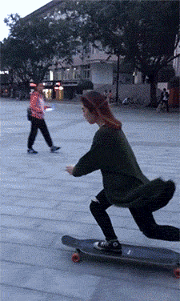

======================================================

ETF拯救世界 (5687069307) @
2018-03-13 15:00:56 Tue  
url: https://weibo.com/5687069307/G7bvg3rSQ

今天回撤0.28%。解个世界都好残酷。 ​​​

转发[9]  评论[117]  赞[186] 

======================================================

ETF拯救世界 (5687069307) @
2018-03-13 19:10:32 Tue  
url: https://weibo.com/5687069307/G7d8zh0wv

天啊写的太好了//@电疗哥-归去来兮:美好的爱情，自带光亮；纯真的情人，都是诗人！ [酷]

------------------------------------------------------
转推：
>  @新京报 (1644114654)
>  2018-03-13 16:43:53 Tue  
>  url: https:/weibo.com/1644114654/G7cb2zbLl/

>  【“她就是我的光”  小学生“暗恋”作文惊呆网友：神来之笔[跪了]】还记得写出“深度逆天”的《看沙漏》的小邵同学吗？近日，有人又在宁波华天小学王老师@我们1班王悦微 微博翻出了他的另一篇作文《第一次奋进》。仔细读完，嗯……明明是《第一次暗恋》嘛！网友直呼“文笔太好了”、“第一句就被迷住 ​​​

转发[68]  评论[52]  赞[128] 

======================================================

ETF拯救世界 (5687069307) @
2018-03-14 07:16:37 Wed  
url: https://weibo.com/5687069307/G7hThDYlt

你看到的，也许是事实，但不一定是全部真相。

不想着怎么提高自己，提升消费者体验，天天想着怎么勾结掌握话语权的人黑对手，这样的机构就是辣鸡。

到底谁退换货容易，到底谁假货多，大家心里都有数。 ​​​

转发[10]  评论[133]  赞[187] 

======================================================

ETF拯救世界 (5687069307) @
2018-03-14 07:56:32 Wed  
url: https://weibo.com/5687069307/G7i9uji2q

我没那么狭隘啊。我没做过大范围调查，只是自己的购物感受。有朋友有不同看法很正常，个体体验嘛。

就像我说的，你喜欢一个人可能有很多理由，不喜欢一个人可能就因为很小的原因甚至一句话。不喜欢一个网站，那就太容易了，因为整个流程任何地方任何一次让你感受不好，基本上就死刑了。

但我想说的是 ​​​

转发[12]  评论[177]  赞[256] 

======================================================

ETF拯救世界 (5687069307) @
2018-03-14 13:18:44 Wed  
url: https://weibo.com/5687069307/G7kggAZOY

今天肯定不会开车了，月底开 ​​​

转发[1]  评论[131]  赞[250] 

======================================================

ETF拯救世界 (5687069307) @
2018-03-14 15:33:08 Wed  
url: https://weibo.com/5687069307/G7l8P7hEU

回复@大象鼻子看看特别长:关键看有没有油。//@大象鼻子看看特别长:开不开车关键看什么？

------------------------------------------------------
转推：
>  @ETF拯救世界 (5687069307)
>  2018-03-14 13:18:44 Wed  
>  url: https:/weibo.com/5687069307/G7kggAZOY/

>  今天肯定不会开车了，月底开 ​​​

转发[0]  评论[92]  赞[163] 

======================================================

ETF拯救世界 (5687069307) @
2018-03-15 08:30:27 Thu  
url: https://weibo.com/5687069307/G7rNL8gro

几率很小的。现在希望你多生，以后zc倾向一定是打压独生子女的zc，怎么会给你这种假//@佐罗_厚恩投资:转发微博

------------------------------------------------------
转推：
>  @每日经济新闻 (1649173367)
>  2018-03-15 07:34:33 Thu  
>  url: https:/weibo.com/1649173367/G7rr42cGu/

>  #我与两会零距离#【两会代表委员建议：全国推广“独生子女照料陪护假”】此前，全国已有8个省份通过地方立法建立了独生子女家庭老年人护理假制度。有全国人大代表建议，在取得成功经验后，有必要在全国范围推广，让更多的人享受到这一制度红利。http://t.cn/RnzkJdC ​​​

转发[4]  评论[71]  赞[77] 

======================================================

ETF拯救世界 (5687069307) @
2018-03-15 09:04:34 Thu  
url: https://weibo.com/5687069307/G7s1Bgg5m

现在最高的一篇阅读已经4.6万了。离10万+还远吗。

也是一种成就感啊。

要知道我这种可不是什么蹭热点抓眼球的文章…… ​​​

转发[127]  评论[79]  赞[235] 

+++++++++++++++++++++++++++++++++++++++++++++++++++++

图片：

======================================================

ETF拯救世界 (5687069307) @
2018-03-15 09:42:22 Thu  
url: https://weibo.com/5687069307/G7sgWqYte

回复@依然肉多多ETF:真正的牛市，能跑赢一个好的ETF组合的买股票的人会非常少。信不信由你，我先把话撂这儿。指数基金最大的作用是在牛市才能被发挥出来。//@依然肉多多ETF:我周围有20多年股龄的老人都认为熊市才买etf，牛市买股票

------------------------------------------------------
转推：
>  @ETF拯救世界 (5687069307)
>  2018-03-15 09:04:34 Thu  
>  url: https:/weibo.com/5687069307/G7s1Bgg5m/

>  现在最高的一篇阅读已经4.6万了。离10万+还远吗。
>  
>  也是一种成就感啊。
>  
>  要知道我这种可不是什么蹭热点抓眼球的文章…… ​​​

转发[124]  评论[48]  赞[126] 

======================================================

ETF拯救世界 (5687069307) @
2018-03-15 09:59:18 Thu  
url: https://weibo.com/5687069307/G7snOwqr2

回复@美食嬷嬷茶:没错。我特别建议投ETF的时候也自己投股票。大部分人发现自己炒股没天分就踏实了。小部分发现有天分以后就能赚更多了。可以说百利无一害//@美食嬷嬷茶:所以益达建议7 3比例分配计划和自己操作股票，万一自己有股神的潜质呢 http://t.cn/RH0a5Ks 

------------------------------------------------------
转推：
>  @ETF拯救世界 (5687069307)
>  2018-03-15 09:04:34 Thu  
>  url: https:/weibo.com/5687069307/G7s1Bgg5m/

>  现在最高的一篇阅读已经4.6万了。离10万+还远吗。
>  
>  也是一种成就感啊。
>  
>  要知道我这种可不是什么蹭热点抓眼球的文章…… ​​​

转发[6]  评论[23]  赞[100] 

======================================================

ETF拯救世界 (5687069307) @
2018-03-15 10:01:21 Thu  
url: https://weibo.com/5687069307/G7soDBDXO

回复@asdasdsadasdadad:不是涨幅问题。是你能赚多少问题。有些10倍股，绝大多数人也就赚个30%、50%。为什么，有几个人能拿住股票？你知道多少是贵？心里不踏实，根本就拿不住。踏踏实实拿住指数去掉头尾吃到大部分利润，秒杀绝大多数追涨杀跌的股民。你以为牛市都挣钱么，错，大牛市也只有70%的人挣钱

------------------------------------------------------
转推：
>  @ETF拯救世界 (5687069307)
>  2018-03-15 09:04:34 Thu  
>  url: https:/weibo.com/5687069307/G7s1Bgg5m/

>  现在最高的一篇阅读已经4.6万了。离10万+还远吗。
>  
>  也是一种成就感啊。
>  
>  要知道我这种可不是什么蹭热点抓眼球的文章…… ​​​

转发[94]  评论[43]  赞[119] 

======================================================

ETF拯救世界 (5687069307) @
2018-03-15 10:05:36 Thu  
url: https://weibo.com/5687069307/G7sqmAoKl

很多人可能又忘了老巴和对冲基金的十年赌约了。这十年，美股牛市，标普500秒杀所有组合中的基金。十年标普500涨幅125%，组合里的对冲基金最大收益88%，最小才2.8%。炒股，很多东西不是那么简单的。

------------------------------------------------------
转推：
>  @ETF拯救世界 (5687069307)
>  2018-03-15 09:04:34 Thu  
>  url: https:/weibo.com/5687069307/G7s1Bgg5m/

>  现在最高的一篇阅读已经4.6万了。离10万+还远吗。
>  
>  也是一种成就感啊。
>  
>  要知道我这种可不是什么蹭热点抓眼球的文章…… ​​​

转发[9]  评论[23]  赞[109] 

======================================================

ETF拯救世界 (5687069307) @
2018-03-15 10:30:23 Thu  
url: https://weibo.com/5687069307/G7sAr17ku

回复@kaka涛:宏观经济≠股市走势。//@kaka涛:有观点说现在的改革政策还是比较给力，经济也有触底迹象，1819年有可能开启新一轮牛市，你怎么看？@ETF拯救世界

------------------------------------------------------
转推：
>  @ETF拯救世界 (5687069307)
>  2018-03-15 09:04:34 Thu  
>  url: https:/weibo.com/5687069307/G7s1Bgg5m/

>  现在最高的一篇阅读已经4.6万了。离10万+还远吗。
>  
>  也是一种成就感啊。
>  
>  要知道我这种可不是什么蹭热点抓眼球的文章…… ​​​

转发[67]  评论[22]  赞[84] 

======================================================

ETF拯救世界 (5687069307) @
2018-03-15 10:39:26 Thu  
url: https://weibo.com/5687069307/G7sE77Cqb

回复@左边是璞玉wwwwwww21985:股市走势我只从三个维度观察：长期看估值，中短期看资金和情绪。政策之类的会影响的还是资金和情绪，所以最关键的还是这三个维度。//@左边是璞玉wwwwwww21985:等于不等于是数学问题 那么问题来了 宏观经济对股市的影响有多大呢 倾巢之下岂有完卵 [二哈]

------------------------------------------------------
转推：
>  @ETF拯救世界 (5687069307)
>  2018-03-15 09:04:34 Thu  
>  url: https:/weibo.com/5687069307/G7s1Bgg5m/

>  现在最高的一篇阅读已经4.6万了。离10万+还远吗。
>  
>  也是一种成就感啊。
>  
>  要知道我这种可不是什么蹭热点抓眼球的文章…… ​​​

转发[44]  评论[36]  赞[111] 

======================================================

ETF拯救世界 (5687069307) @
2018-03-15 10:53:27 Thu  
url: https://weibo.com/5687069307/G7sJN1Xh5

回复@卧梅-闻花:昨天我公众号发的那段话就是这个意思。能赚多少，谁也不知道。因为谁也不知道未来市场会怎么走。我能做到的，就是在投入金融市场这个前提下，尽量做到最好。

------------------------------------------------------
转推：
>  @ETF拯救世界 (5687069307)
>  2018-03-15 09:04:34 Thu  
>  url: https:/weibo.com/5687069307/G7s1Bgg5m/

>  现在最高的一篇阅读已经4.6万了。离10万+还远吗。
>  
>  也是一种成就感啊。
>  
>  要知道我这种可不是什么蹭热点抓眼球的文章…… ​​​

转发[3]  评论[16]  赞[117] 

======================================================

ETF拯救世界 (5687069307) @
2018-03-15 11:29:44 Thu  
url: https://weibo.com/5687069307/G7sYx2LQi

回复@你在红楼我在西游V:10%，基本是7年翻一番。可能有人觉得太少太少了。类比一下房价。10%年化，目前北京均价可能5-6万。7年后就是10-12万，14年后就是20-24万，21年后就是40-48万。不出现恶性通胀，这个可能性有多大，不知道~

------------------------------------------------------
转推：
>  @ETF拯救世界 (5687069307)
>  2018-03-15 09:04:34 Thu  
>  url: https:/weibo.com/5687069307/G7s1Bgg5m/

>  现在最高的一篇阅读已经4.6万了。离10万+还远吗。
>  
>  也是一种成就感啊。
>  
>  要知道我这种可不是什么蹭热点抓眼球的文章…… ​​​

转发[16]  评论[65]  赞[102] 

======================================================

ETF拯救世界 (5687069307) @
2018-03-15 12:36:18 Thu  
url: https://weibo.com/5687069307/G7tpxw3RY

回复@东艾西通杜:给人出主意买红利基金的是没有认真思考。人家要求是持续分红，因为要生活。红利指数虽然每年有3-4的股息率，但是基金可不保证每年分红。亏损年度就可以不分，那时候卖掉等于底部割肉。然后就像去年一年又分掉30%。这都不符合人家的要求。长期，持续从组合中提取资金是要认真设计的。

------------------------------------------------------
转推：
>  @ETF拯救世界 (5687069307)
>  2018-03-15 09:04:34 Thu  
>  url: https:/weibo.com/5687069307/G7s1Bgg5m/

>  现在最高的一篇阅读已经4.6万了。离10万+还远吗。
>  
>  也是一种成就感啊。
>  
>  要知道我这种可不是什么蹭热点抓眼球的文章…… ​​​

转发[8]  评论[30]  赞[96] 

======================================================

ETF拯救世界 (5687069307) @
2018-03-15 12:44:04 Thu  
url: https://weibo.com/5687069307/G7tsHsQbY

回复@双份水果硬糖v4:我倒是不太担心这个。我总感觉，几十年上百年后，绝大多数工作已经不需要人去做了。甚至战争也不需要人在一线了，只要有一小部分人在后面指挥机器就可以。那时候人类主要的任务是享受生活。当然我说的是人类总体。国家和民族的问题就需要具体探讨了

------------------------------------------------------
转推：
>  @每日经济新闻 (1649173367)
>  2018-03-15 07:34:33 Thu  
>  url: https:/weibo.com/1649173367/G7rr42cGu/

>  #我与两会零距离#【两会代表委员建议：全国推广“独生子女照料陪护假”】此前，全国已有8个省份通过地方立法建立了独生子女家庭老年人护理假制度。有全国人大代表建议，在取得成功经验后，有必要在全国范围推广，让更多的人享受到这一制度红利。http://t.cn/RnzkJdC ​​​

转发[2]  评论[18]  赞[70] 

======================================================

ETF拯救世界 (5687069307) @
2018-03-15 23:01:05 Thu  
url: https://weibo.com/5687069307/G7xv8Fy9S

每日打卡（166）

坚持 ​​​

转发[1]  评论[17]  赞[119] 

+++++++++++++++++++++++++++++++++++++++++++++++++++++

图片：

======================================================

ETF拯救世界 (5687069307) @
2018-03-16 08:43:02 Fri  
url: https://weibo.com/5687069307/G7Bjma55f

定速巡航少用吧……

------------------------------------------------------
转推：
>  @雨燕的翅膀2011 (2594534342)
>  2018-03-15 20:21:18 Thu  
>  url: https:/weibo.com/2594534342/G7wsigWI5/

>  #交通微语# 河南一奔驰车定速巡航失控，上演狂奔闯收费站一幕！
>  
>  2012年11月，浙江一车主驾车行至杭浦高速，突然发现车辆的定速巡航无法解除，上演生死时速。此事曾在全国范围内引起强烈关注。
>  
>  时隔数年后，2018年3月14日晚，现实版的“索命定速巡航”生死时速又在河南通往陕西的连霍高速上上演：
>  
>  河 ​​​

转发[21]  评论[55]  赞[52] 

======================================================

ETF拯救世界 (5687069307) @
2018-03-16 09:13:10 Fri  
url: https://weibo.com/5687069307/G7BvAo0R1

可能一直在看开机照片。//@华尔街见闻APP:打得一手好广告

------------------------------------------------------
转推：
>  @见闻研究所 (6167846250)
>  2018-03-15 19:34:47 Thu  
>  url: https:/weibo.com/6167846250/G7w9pawXE/

>  【董明珠：其他手机看两个小时眼睛就发涩发痛，我的看一天都没事】3月15日，格力电器董事长董明珠在接受采访时表示，很多人看手机两个小时眼睛就发涩发干，但是格力手机看一天都不会有这种现象。董姐为自家手机打广告已经不是第一次了，这些年董姐化身广告狂人，抓住一切机会路演自家产品，你会被她的 ​​​

转发[5]  评论[18]  赞[56] 

======================================================

ETF拯救世界 (5687069307) @
2018-03-16 09:21:42 Fri  
url: https://weibo.com/5687069307/G7Bz3fYxH

回复@落宾:没有没有。我非常尊重这样有能力有魄力的企业家。何况是女性，女性想要做点成绩出来在现在的社会上其实更难。就是开个小玩笑……//@落宾:貌似老大不太喜欢董姐姐？//@ETF拯救世界:可能一直在看开机照片。//@华尔街见闻APP:打得一手好广告

------------------------------------------------------
转推：
>  @见闻研究所 (6167846250)
>  2018-03-15 19:34:47 Thu  
>  url: https:/weibo.com/6167846250/G7w9pawXE/

>  【董明珠：其他手机看两个小时眼睛就发涩发痛，我的看一天都没事】3月15日，格力电器董事长董明珠在接受采访时表示，很多人看手机两个小时眼睛就发涩发干，但是格力手机看一天都不会有这种现象。董姐为自家手机打广告已经不是第一次了，这些年董姐化身广告狂人，抓住一切机会路演自家产品，你会被她的 ​​​

转发[2]  评论[26]  赞[61] 

======================================================

ETF拯救世界 (5687069307) @
2018-03-16 10:34:07 Fri  
url: https://weibo.com/5687069307/G7C2rwoAZ

我预感$全指医药 sh000991$  这一把新高应该是稳的。之后就不知道了。 ​​​

转发[129]  评论[43]  赞[123] 

======================================================

ETF拯救世界 (5687069307) @
2018-03-16 10:55:04 Fri  
url: https://weibo.com/5687069307/G7CaWEPhy

投资讲不讲运气，我觉得当然讲。就不说你会不会碰到牛市极高溢价卖出这个运气了。

你有没有运气20-25之间买入$全指医药 sh000991$  就是运气。 如果能，那中期年化收益15+毫无问题。

关键就是运气来的时候要抓住。这个不是每个人都能做到的。 ​​​

转发[24]  评论[116]  赞[178] 

======================================================

ETF拯救世界 (5687069307) @
2018-03-16 12:10:56 Fri  
url: https://weibo.com/5687069307/G7CFKck9b

也就那么回事吧 ​​​

转发[1]  评论[67]  赞[155] 

+++++++++++++++++++++++++++++++++++++++++++++++++++++

图片：
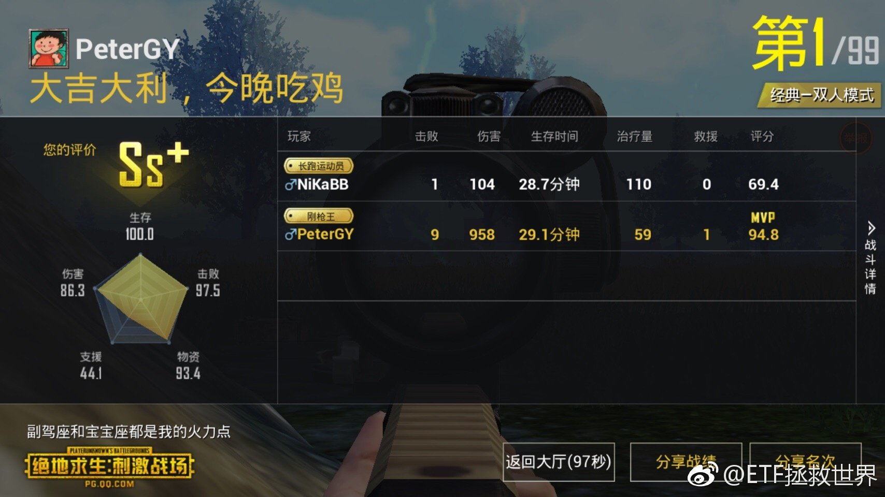

======================================================

ETF拯救世界 (5687069307) @
2018-03-16 16:12:00 Fri  
url: https://weibo.com/5687069307/G7EfACWP1

退博了。

------------------------------------------------------
转推：
>  @ETF拯救世界 (5687069307)
>  2018-03-16 10:34:07 Fri  
>  url: https:/weibo.com/5687069307/G7C2rwoAZ/

>  我预感$全指医药 sh000991$  这一把新高应该是稳的。之后就不知道了。 ​​​

转发[5]  评论[97]  赞[110] 

======================================================

ETF拯救世界 (5687069307) @
2018-03-16 16:36:15 Fri  
url: https://weibo.com/5687069307/G7Epr8Qdk

不过今天沪深300是-0.97%，中证500是-0.55%。我测算计划大致回撤0.18%左右。仓位虽然越来越高，但是回撤风险还是控制住了。//@ETF拯救世界:退博了。

------------------------------------------------------
转推：
>  @ETF拯救世界 (5687069307)
>  2018-03-16 10:34:07 Fri  
>  url: https:/weibo.com/5687069307/G7C2rwoAZ/

>  我预感$全指医药 sh000991$  这一把新高应该是稳的。之后就不知道了。 ​​​

转发[3]  评论[38]  赞[140] 

======================================================

ETF拯救世界 (5687069307) @
2018-03-19 09:34:26 Mon  
url: https://weibo.com/5687069307/G83VI7UwA

知道月中为什么不开车了吧。

老司机的世界你不懂。 ​​​

转发[15]  评论[56]  赞[131] 

+++++++++++++++++++++++++++++++++++++++++++++++++++++

图片：

======================================================

ETF拯救世界 (5687069307) @
2018-03-19 09:40:30 Mon  
url: https://weibo.com/5687069307/G83Yayl7f

回复@livston09:第三轮以来，有。往前翻，吓死你。比如2015年12月底。那个月，还卖出了。4天后，你懂的。//@livston09:有过月末不开车的先河吗？

------------------------------------------------------
转推：
>  @ETF拯救世界 (5687069307)
>  2018-03-19 09:34:26 Mon  
>  url: https:/weibo.com/5687069307/G83VI7UwA/

>  知道月中为什么不开车了吧。
>  
>  老司机的世界你不懂。 ​​​

转发[1]  评论[4]  赞[74] 

======================================================

ETF拯救世界 (5687069307) @
2018-03-19 09:41:30 Mon  
url: https://weibo.com/5687069307/G83Yzlo9l

医药和传媒又要来打脸吗。准备退博了。

------------------------------------------------------
转推：
>  @ETF拯救世界 (5687069307)
>  2018-03-19 09:34:26 Mon  
>  url: https:/weibo.com/5687069307/G83VI7UwA/

>  知道月中为什么不开车了吧。
>  
>  老司机的世界你不懂。 ​​​

转发[1]  评论[30]  赞[90] 

======================================================

ETF拯救世界 (5687069307) @
2018-03-19 10:20:40 Mon  
url: https://weibo.com/5687069307/G84eu1vMZ

现在沪深300+0.26%，中证500+0.24%。

30%多仓位的计划预估+0.26%。

宽基为基础，精选行业+策略指数。

低仓位就能跟上大盘。有没有想过仓位上去后牛市会怎样。

再加点杠杆呢？ ​​​

转发[73]  评论[107]  赞[182] 

======================================================

ETF拯救世界 (5687069307) @
2018-03-19 10:42:16 Mon  
url: https://weibo.com/5687069307/G84nftweQ

回复@石头里的虫子:到那个时候，我家庭资产90%都会放进去。再跌20%，有可能。但是我会毫无感觉，因为经历过好几次了，知道是什么结果。在那个地方，无论你会怎么做，下一次都会毫无感觉了。但是，下一次，又要间隔至少5-7年。

------------------------------------------------------
转推：
>  @ETF拯救世界 (5687069307)
>  2018-03-19 10:20:40 Mon  
>  url: https:/weibo.com/5687069307/G84eu1vMZ/

>  现在沪深300+0.26%，中证500+0.24%。
>  
>  30%多仓位的计划预估+0.26%。
>  
>  宽基为基础，精选行业+策略指数。
>  
>  低仓位就能跟上大盘。有没有想过仓位上去后牛市会怎样。
>  
>  再加点杠杆呢？ ​​​

转发[16]  评论[21]  赞[93] 

======================================================

ETF拯救世界 (5687069307) @
2018-03-19 10:50:24 Mon  
url: https://weibo.com/5687069307/G84qxiz0B

回复@后生天天uping:这个很难把握。其实谁也不知道到底哪里才是最低。只要大部分筹码买在底部区域就足够了。还有一种办法，左侧买大部分，小部分右侧买入。这些都会体现在计划里。计划包含的东西比一般人想象的多的多。（我怎么记得这段话说过两次了）

------------------------------------------------------
转推：
>  @ETF拯救世界 (5687069307)
>  2018-03-19 10:20:40 Mon  
>  url: https:/weibo.com/5687069307/G84eu1vMZ/

>  现在沪深300+0.26%，中证500+0.24%。
>  
>  30%多仓位的计划预估+0.26%。
>  
>  宽基为基础，精选行业+策略指数。
>  
>  低仓位就能跟上大盘。有没有想过仓位上去后牛市会怎样。
>  
>  再加点杠杆呢？ ​​​

转发[21]  评论[23]  赞[105] 

======================================================

ETF拯救世界 (5687069307) @
2018-03-19 10:59:13 Mon  
url: https://weibo.com/5687069307/G84u7uuiS

其实你只要做做数学题就知道，底部的20%并不那么重要。

如果1000点是绝对最低点，那么你的成本是1000还是1200，其实差别没那么大。

同样是5000点卖出，1000点获利是400%，1200点成本获利317%。真的没差。

我最近在看一本书，里面有某位大师的所有重要交易。你会发现，他从来都没有买在最低过。经常 ​​​

转发[97]  评论[110]  赞[227] 

======================================================

ETF拯救世界 (5687069307) @
2018-03-19 11:15:24 Mon  
url: https://weibo.com/5687069307/G84AHirah

再奶。我就不信每次都那么邪门。

------------------------------------------------------
转推：
>  @ETF拯救世界 (5687069307)
>  2018-03-16 10:34:07 Fri  
>  url: https:/weibo.com/5687069307/G7C2rwoAZ/

>  我预感$全指医药 sh000991$  这一把新高应该是稳的。之后就不知道了。 ​​​

转发[0]  评论[42]  赞[101] 

======================================================

ETF拯救世界 (5687069307) @
2018-03-19 11:42:20 Mon  
url: https://weibo.com/5687069307/G84LDaN9e

回复@ncfengbo:我们还有其它20个。如果都不涨，那你还遗憾什么。说明这个市场上几乎没人挣钱了。//@ncfengbo:e大，如果这个指数就涨了20%怎么办？不是没赚到钱?似乎和你经常说的（要买的足够便宜）有点矛盾啊

------------------------------------------------------
转推：
>  @ETF拯救世界 (5687069307)
>  2018-03-19 10:59:13 Mon  
>  url: https:/weibo.com/5687069307/G84u7uuiS/

>  其实你只要做做数学题就知道，底部的20%并不那么重要。
>  
>  如果1000点是绝对最低点，那么你的成本是1000还是1200，其实差别没那么大。
>  
>  同样是5000点卖出，1000点获利是400%，1200点成本获利317%。真的没差。
>  
>  我最近在看一本书，里面有某位大师的所有重要交易。你会发现，他从来都没有买在最低过。经常 ​​​

转发[13]  评论[17]  赞[90] 

======================================================

ETF拯救世界 (5687069307) @
2018-03-19 12:31:56 Mon  
url: https://weibo.com/5687069307/G855L1ZTt

今晚可以开始跑步了 ​​​

转发[0]  评论[47]  赞[128] 

======================================================

ETF拯救世界 (5687069307) @
2018-03-19 13:37:11 Mon  
url: https://weibo.com/5687069307/G85wfocCL

山雨欲来风满楼 ​​​

转发[16]  评论[152]  赞[226] 

======================================================

ETF拯救世界 (5687069307) @
2018-03-19 13:42:35 Mon  
url: https://weibo.com/5687069307/G85yrjSiz

回复@不装X你值得拥有:会有一个区域如果我没买够，涨了，我会很不舒服。然而，这里？呵呵。涨就涨吧，我能力所限，这个位置，一定不会满仓。//@不装X你值得拥有:e大我现在涨了反而会不爽，担心就这样一涨不复返，虽然股灾后还有不少股票套在山上，但因为看了您的理念，更希望跌下来更好广积粮，

------------------------------------------------------
转推：
>  @ETF拯救世界 (5687069307)
>  2018-03-19 10:59:13 Mon  
>  url: https:/weibo.com/5687069307/G84u7uuiS/

>  其实你只要做做数学题就知道，底部的20%并不那么重要。
>  
>  如果1000点是绝对最低点，那么你的成本是1000还是1200，其实差别没那么大。
>  
>  同样是5000点卖出，1000点获利是400%，1200点成本获利317%。真的没差。
>  
>  我最近在看一本书，里面有某位大师的所有重要交易。你会发现，他从来都没有买在最低过。经常 ​​​

转发[6]  评论[47]  赞[103] 

======================================================

ETF拯救世界 (5687069307) @
2018-03-19 14:20:04 Mon  
url: https://weibo.com/5687069307/G85NEwOe5

还差80点。

------------------------------------------------------
转推：
>  @ETF拯救世界 (5687069307)
>  2018-03-16 10:34:07 Fri  
>  url: https:/weibo.com/5687069307/G7C2rwoAZ/

>  我预感$全指医药 sh000991$  这一把新高应该是稳的。之后就不知道了。 ​​​

转发[53]  评论[19]  赞[69] 

======================================================

ETF拯救世界 (5687069307) @
2018-03-19 14:24:14 Mon  
url: https://weibo.com/5687069307/G85PloBGl

$159938 还差7厘//@ETF拯救世界:还差80点。

------------------------------------------------------
转推：
>  @ETF拯救世界 (5687069307)
>  2018-03-16 10:34:07 Fri  
>  url: https:/weibo.com/5687069307/G7C2rwoAZ/

>  我预感$全指医药 sh000991$  这一把新高应该是稳的。之后就不知道了。 ​​​

转发[1]  评论[4]  赞[63] 

======================================================

ETF拯救世界 (5687069307) @
2018-03-19 14:30:33 Mon  
url: https://weibo.com/5687069307/G85RU7VmY

回复@ETF信徒者:这个属于把西瓜和黄瓜放在一起比较谁好吃。我不是评价谁便宜谁贵，不同行业的股票不可以这么比。//@ETF信徒者:飘仙说：“恒瑞医药的市值快接近2500亿元的交通银行了。交通银行一年700亿净利润。恒瑞2017年大约30亿。”对于这样的情况合理吗//@ETF拯救世界:还差80点。

------------------------------------------------------
转推：
>  @ETF拯救世界 (5687069307)
>  2018-03-16 10:34:07 Fri  
>  url: https:/weibo.com/5687069307/G7C2rwoAZ/

>  我预感$全指医药 sh000991$  这一把新高应该是稳的。之后就不知道了。 ​​​

转发[4]  评论[17]  赞[71] 

======================================================

ETF拯救世界 (5687069307) @
2018-03-19 14:54:57 Mon  
url: https://weibo.com/5687069307/G861O6Z07

回复@梓溪20180316:强不到哪儿去啊。你这样，真正的牛市里根本赚不到什么钱。做对20次小波段，一次牛市卖飞了就几年白玩。当然，长线仓坚持，另一部分资金做波段没问题。

------------------------------------------------------
转推：
>  @ETF拯救世界 (5687069307)
>  2018-03-16 10:34:07 Fri  
>  url: https:/weibo.com/5687069307/G7C2rwoAZ/

>  我预感$全指医药 sh000991$  这一把新高应该是稳的。之后就不知道了。 ​​​

转发[30]  评论[14]  赞[91] 

======================================================

ETF拯救世界 (5687069307) @
2018-03-19 15:26:08 Mon  
url: https://weibo.com/5687069307/G86esCrec

回复@好心情S65:长线是为了赚大钱，短线波动是为了提高资金利用率，提高收益率。跟哪个效果好无关。包括各种套利，网格等等都是有效获得收益率的手段。//@好心情S65:一部分长线，一部分短线，哪个最终效果好是不是还是靠运气呢？

------------------------------------------------------
转推：
>  @ETF拯救世界 (5687069307)
>  2018-03-16 10:34:07 Fri  
>  url: https:/weibo.com/5687069307/G7C2rwoAZ/

>  我预感$全指医药 sh000991$  这一把新高应该是稳的。之后就不知道了。 ​​​

转发[18]  评论[26]  赞[98] 

======================================================

ETF拯救世界 (5687069307) @
2018-03-19 17:04:34 Mon  
url: https://weibo.com/5687069307/G86SqljrD

[并不简单] 今年会很好。

------------------------------------------------------
转推：
>  @ ()
>  2018-03-19 16:59:33 Mon  
>  url: 

>  抱歉，作者已设置仅展示半年内微博，此微博已不可见。 ​​​

转发[3]  评论[51]  赞[137] 

======================================================

ETF拯救世界 (5687069307) @
2018-03-19 21:22:28 Mon  
url: https://weibo.com/5687069307/G88z6f7nj

每日打卡（167）

没有去跑步，多做一组。

问个问题，你现在最想要的是什么 ​​​

转发[0]  评论[194]  赞[93] 

+++++++++++++++++++++++++++++++++++++++++++++++++++++

图片：

======================================================

ETF拯救世界 (5687069307) @
2018-03-20 05:32:26 Tue  
url: https://weibo.com/5687069307/G8bLYxtCJ

美国。谁翻译的这个名字。//@昆山法律:富裕程度追敢的速度还行，社会文明程度差距太大

------------------------------------------------------
转推：
>  @Kevin在纽约 (6479869715)
>  2018-03-19 18:27:57 Mon  
>  url: https:/weibo.com/6479869715/G87qgl5w9/

>  刚从美国国务院领事事务局（Bureau of Consular Affairs）官网看到一组数据：从1999年到2016年，美国家庭共收养了26.7万名外国孤儿，其中7.8万名来自中国，占总数的三成。 这7.8万中国孤儿中，有86%为女孩，患有某种先天性疾病的占了很大比例。
>  一位家住明尼苏达州的沃森夫妇，为了领养一位患有唐 ​​​

转发[10]  评论[46]  赞[75] 

======================================================

ETF拯救世界 (5687069307) @
2018-03-20 09:28:16 Tue  
url: https://weibo.com/5687069307/G8djHbBK6

[doge]

------------------------------------------------------
转推：
>  @ETF拯救世界 (5687069307)
>  2018-03-19 09:34:26 Mon  
>  url: https:/weibo.com/5687069307/G83VI7UwA/

>  知道月中为什么不开车了吧。
>  
>  老司机的世界你不懂。 ​​​

转发[0]  评论[26]  赞[69] 

======================================================

ETF拯救世界 (5687069307) @
2018-03-20 09:38:40 Tue  
url: https://weibo.com/5687069307/G8dnVi96A

昨天看 帕丁顿熊2 Paddington 2。

几年没见的休格兰特怎么变成这样了。我印象中的他还是诺丁山，四个婚礼一个葬礼，甚至后面的真爱至上里面的样子。

岁月是把杀猪刀。sigh。 ​​​

转发[5]  评论[31]  赞[78] 

+++++++++++++++++++++++++++++++++++++++++++++++++++++

图片：

======================================================

ETF拯救世界 (5687069307) @
2018-03-20 09:42:43 Tue  
url: https://weibo.com/5687069307/G8dpzgMYI

还差50点，畀面我啦//@ETF拯救世界:还差80点。

------------------------------------------------------
转推：
>  @ETF拯救世界 (5687069307)
>  2018-03-16 10:34:07 Fri  
>  url: https:/weibo.com/5687069307/G7C2rwoAZ/

>  我预感$全指医药 sh000991$  这一把新高应该是稳的。之后就不知道了。 ​​​

转发[0]  评论[10]  赞[66] 

======================================================

ETF拯救世界 (5687069307) @
2018-03-20 09:44:30 Tue  
url: https://weibo.com/5687069307/G8dqiacqE

$159938  新高。恭喜各位。//@ETF拯救世界:还差80点。

------------------------------------------------------
转推：
>  @ETF拯救世界 (5687069307)
>  2018-03-16 10:34:07 Fri  
>  url: https:/weibo.com/5687069307/G7C2rwoAZ/

>  我预感$全指医药 sh000991$  这一把新高应该是稳的。之后就不知道了。 ​​​

转发[12]  评论[40]  赞[99] 

======================================================

ETF拯救世界 (5687069307) @
2018-03-20 09:52:36 Tue  
url: https://weibo.com/5687069307/G8dtAoxBr

$全指医药 sh000991$  指数也新高了。“稳”这个字我不经常用。用了就是大事件。//@ETF拯救世界:$159938  新高。恭喜各位。//@ETF拯救世界:还差80点。

------------------------------------------------------
转推：
>  @ETF拯救世界 (5687069307)
>  2018-03-16 10:34:07 Fri  
>  url: https:/weibo.com/5687069307/G7C2rwoAZ/

>  我预感$全指医药 sh000991$  这一把新高应该是稳的。之后就不知道了。 ​​​

转发[10]  评论[25]  赞[103] 

======================================================

ETF拯救世界 (5687069307) @
2018-03-20 10:05:43 Tue  
url: https://weibo.com/5687069307/G8dyUoZGw

不过各位，不要太乐观。我个人不太相信医药会在这里有什么大的独立行情。毕竟太贵。长期看，我还是很喜欢这个行业。以后还会继续买。//@ETF拯救世界:$全指医药 sh000991$  指数也新高了。“稳”这个字我不经常用。用了就是大事件。//@ETF拯救世界:$159938  新高。恭喜各位。//@ETF拯救世界:还差80点。

------------------------------------------------------
转推：
>  @ETF拯救世界 (5687069307)
>  2018-03-16 10:34:07 Fri  
>  url: https:/weibo.com/5687069307/G7C2rwoAZ/

>  我预感$全指医药 sh000991$  这一把新高应该是稳的。之后就不知道了。 ​​​

转发[7]  评论[44]  赞[112] 

======================================================

ETF拯救世界 (5687069307) @
2018-03-20 10:23:00 Tue  
url: https://weibo.com/5687069307/G8dFV75qG

知不知道为什么买的低能赚很多很多，收益率远超这个世界上绝大多数投资的收益率。

因为“低”太难了。过去二十年，只出现过3次。05 08 12。

如果那么简单就能出现，所有人收益率都很高，可能吗，不可能的。

然而你又不能死等低的出现。万一回不去呢。

这个度怎么拿捏真的不容易。 ​​​

转发[147]  评论[98]  赞[254] 

======================================================

ETF拯救世界 (5687069307) @
2018-03-20 10:38:43 Tue  
url: https://weibo.com/5687069307/G8dMi8l7p

回复@无益清狂:人家可是卖房然后给咱们交几万美元来领养……//@无益清狂:这种真的是只有生活无忧且有信仰的家庭才会做的事吧，虽然目前没办法理解，但是真的很钦佩//@ETF拯救世界:美国。谁翻译的这个名字。//@昆山法律:富裕程度追敢的速度还行，社会文明程度差距太大

------------------------------------------------------
转推：
>  @Kevin在纽约 (6479869715)
>  2018-03-19 18:27:57 Mon  
>  url: https:/weibo.com/6479869715/G87qgl5w9/

>  刚从美国国务院领事事务局（Bureau of Consular Affairs）官网看到一组数据：从1999年到2016年，美国家庭共收养了26.7万名外国孤儿，其中7.8万名来自中国，占总数的三成。 这7.8万中国孤儿中，有86%为女孩，患有某种先天性疾病的占了很大比例。
>  一位家住明尼苏达州的沃森夫妇，为了领养一位患有唐 ​​​

转发[5]  评论[19]  赞[80] 

======================================================

ETF拯救世界 (5687069307) @
2018-03-20 10:42:03 Tue  
url: https://weibo.com/5687069307/G8dNEFijA

回复@医命相卜山:价格永远也回不到原来了。即使是创业板也不会回到2012了。这就是长期投资指数一定会赚钱的根本。波动的话，GJD先离场再说吧。不离场，那就慢慢磨。外资没多少钱，赌徒们又不可能几年就有变化。所以最大的主线还是GJD。

------------------------------------------------------
转推：
>  @ETF拯救世界 (5687069307)
>  2018-03-20 10:23:00 Tue  
>  url: https:/weibo.com/5687069307/G8dFV75qG/

>  知不知道为什么买的低能赚很多很多，收益率远超这个世界上绝大多数投资的收益率。
>  
>  因为“低”太难了。过去二十年，只出现过3次。05 08 12。
>  
>  如果那么简单就能出现，所有人收益率都很高，可能吗，不可能的。
>  
>  然而你又不能死等低的出现。万一回不去呢。
>  
>  这个度怎么拿捏真的不容易。 ​​​

转发[85]  评论[29]  赞[111] 

======================================================

ETF拯救世界 (5687069307) @
2018-03-20 13:03:46 Tue  
url: https://weibo.com/5687069307/G8eJbgZID

回复@橡皮擦对阵:不知道。我经常主观判断后市，但操作从不依据这些判断。//@橡皮擦对阵:医药今天是不是该清仓了？以后再买？

------------------------------------------------------
转推：
>  @ETF拯救世界 (5687069307)
>  2018-03-20 10:23:00 Tue  
>  url: https:/weibo.com/5687069307/G8dFV75qG/

>  知不知道为什么买的低能赚很多很多，收益率远超这个世界上绝大多数投资的收益率。
>  
>  因为“低”太难了。过去二十年，只出现过3次。05 08 12。
>  
>  如果那么简单就能出现，所有人收益率都很高，可能吗，不可能的。
>  
>  然而你又不能死等低的出现。万一回不去呢。
>  
>  这个度怎么拿捏真的不容易。 ​​​

转发[72]  评论[18]  赞[88] 

======================================================

ETF拯救世界 (5687069307) @
2018-03-20 13:21:42 Tue  
url: https://weibo.com/5687069307/G8eQsdHJv

回复@石头里的虫子:我赚大钱的交易中，没有一次是今天卖了等过几天低点买回来这样做的。无一例外都是低位买入，死死拿住，无论如何波动都不下车，几年后疯狂时候卖给接盘侠。//@石头里的虫子:理论上，今天卖了，过两天低位买回，不过，你老是这么干，总有一天你要在更高的位置接回来。

------------------------------------------------------
转推：
>  @ETF拯救世界 (5687069307)
>  2018-03-20 10:23:00 Tue  
>  url: https:/weibo.com/5687069307/G8dFV75qG/

>  知不知道为什么买的低能赚很多很多，收益率远超这个世界上绝大多数投资的收益率。
>  
>  因为“低”太难了。过去二十年，只出现过3次。05 08 12。
>  
>  如果那么简单就能出现，所有人收益率都很高，可能吗，不可能的。
>  
>  然而你又不能死等低的出现。万一回不去呢。
>  
>  这个度怎么拿捏真的不容易。 ​​​

转发[66]  评论[47]  赞[151] 

======================================================

ETF拯救世界 (5687069307) @
2018-03-20 14:00:25 Tue  
url: https://weibo.com/5687069307/G8f6b37Z8

回复@美好一诺:其实不难判断。难以判断的是疯狂可以持续多长时间。//@美好一诺:疯狂，很难判断//@ETF拯救世界:回复@石头里的虫子:我赚大钱的交易中，没有一次是今天卖了等过几天低点买回来这样做的。无一例外都是低位买入，死死拿住，无论如何波动都不下车，几年后疯狂时候卖给接盘侠。

------------------------------------------------------
转推：
>  @ETF拯救世界 (5687069307)
>  2018-03-20 10:23:00 Tue  
>  url: https:/weibo.com/5687069307/G8dFV75qG/

>  知不知道为什么买的低能赚很多很多，收益率远超这个世界上绝大多数投资的收益率。
>  
>  因为“低”太难了。过去二十年，只出现过3次。05 08 12。
>  
>  如果那么简单就能出现，所有人收益率都很高，可能吗，不可能的。
>  
>  然而你又不能死等低的出现。万一回不去呢。
>  
>  这个度怎么拿捏真的不容易。 ​​​

转发[25]  评论[32]  赞[107] 

======================================================

ETF拯救世界 (5687069307) @
2018-03-20 15:05:28 Tue  
url: https://weibo.com/5687069307/G8fwzpdC1

回复@asekiyoshi:任何股票高估值买都不要预期收益率太高。这就是我的想法。//@asekiyoshi:E大认为现在买恒瑞医药，将来的收益率会如何？恒瑞第一次站上80倍pe是07年6月，第二次是08年1月，然后回调40%，本月是第三次//@ETF拯救世界:回复@美好一诺:其实不难判断。难以判断的是疯狂可以持续多长时间。

------------------------------------------------------
转推：
>  @ETF拯救世界 (5687069307)
>  2018-03-20 10:23:00 Tue  
>  url: https:/weibo.com/5687069307/G8dFV75qG/

>  知不知道为什么买的低能赚很多很多，收益率远超这个世界上绝大多数投资的收益率。
>  
>  因为“低”太难了。过去二十年，只出现过3次。05 08 12。
>  
>  如果那么简单就能出现，所有人收益率都很高，可能吗，不可能的。
>  
>  然而你又不能死等低的出现。万一回不去呢。
>  
>  这个度怎么拿捏真的不容易。 ​​​

转发[9]  评论[23]  赞[110] 

======================================================

ETF拯救世界 (5687069307) @
2018-03-21 07:37:37 Wed  
url: https://weibo.com/5687069307/G8m1idZYA

回复@高人藤:我的数据，模型，量化策略全部实时更新最新报表//@高人藤:e大，咨询一下昨天中国平安出年报，利润大幅增长，包含中国平安的指数会在今天调整估值吗？//@ETF拯救世界:回复@asekiyoshi:任何股票高估值买都不要预期收益率太高。这就是我的想法。

------------------------------------------------------
转推：
>  @ETF拯救世界 (5687069307)
>  2018-03-20 10:23:00 Tue  
>  url: https:/weibo.com/5687069307/G8dFV75qG/

>  知不知道为什么买的低能赚很多很多，收益率远超这个世界上绝大多数投资的收益率。
>  
>  因为“低”太难了。过去二十年，只出现过3次。05 08 12。
>  
>  如果那么简单就能出现，所有人收益率都很高，可能吗，不可能的。
>  
>  然而你又不能死等低的出现。万一回不去呢。
>  
>  这个度怎么拿捏真的不容易。 ​​​

转发[3]  评论[36]  赞[127] 

======================================================

ETF拯救世界 (5687069307) @
2018-03-21 09:13:38 Wed  
url: https://weibo.com/5687069307/G8mEgau01

又到一个整数，留念。

对于一个每个月更新2-3次的公众号来说，也算不错了。。 ​​​

转发[0]  评论[35]  赞[198] 

+++++++++++++++++++++++++++++++++++++++++++++++++++++

图片：

======================================================

ETF拯救世界 (5687069307) @
2018-03-21 09:32:21 Wed  
url: https://weibo.com/5687069307/G8mLRbYT3

$159938 溢价了。你懂的。 ​​​

转发[1]  评论[22]  赞[97] 

======================================================

ETF拯救世界 (5687069307) @
2018-03-21 09:33:24 Wed  
url: https://weibo.com/5687069307/G8mMhu625

晚了！

------------------------------------------------------
转推：
>  @ETF拯救世界 (5687069307)
>  2018-03-21 09:32:21 Wed  
>  url: https:/weibo.com/5687069307/G8mLRbYT3/

>  $159938 溢价了。你懂的。 ​​​

转发[0]  评论[19]  赞[79] 

======================================================

ETF拯救世界 (5687069307) @
2018-03-21 11:14:24 Wed  
url: https://weibo.com/5687069307/G8nrhiFSx

昨天看各路大v激动的发帖，我以为今天平安要涨停…… ​​​

转发[8]  评论[70]  赞[174] 

======================================================

ETF拯救世界 (5687069307) @
2018-03-21 14:10:14 Wed  
url: https://weibo.com/5687069307/G8oAEiocA

[摊手] 万万没想到

------------------------------------------------------
转推：
>  @ETF拯救世界 (5687069307)
>  2018-03-21 11:14:24 Wed  
>  url: https:/weibo.com/5687069307/G8nrhiFSx/

>  昨天看各路大v激动的发帖，我以为今天平安要涨停…… ​​​

转发[1]  评论[43]  赞[82] 

======================================================

ETF拯救世界 (5687069307) @
2018-03-21 14:30:44 Wed  
url: https://weibo.com/5687069307/G8oIYcdoo

目前很敏感，整个市场，环境。一动不如一静。踏踏实实等。 ​​​

转发[2]  评论[46]  赞[172] 

======================================================

ETF拯救世界 (5687069307) @
2018-03-21 14:45:00 Wed  
url: https://weibo.com/5687069307/G8oOLfFEd

如果医药新高+月中不发车这两个居然同时对了，那说明什么。你展开讲讲。

------------------------------------------------------
转推：
>  @ETF拯救世界 (5687069307)
>  2018-03-19 09:34:26 Mon  
>  url: https:/weibo.com/5687069307/G83VI7UwA/

>  知道月中为什么不开车了吧。
>  
>  老司机的世界你不懂。 ​​​

转发[4]  评论[104]  赞[103] 

======================================================

ETF拯救世界 (5687069307) @
2018-03-21 15:00:10 Wed  
url: https://weibo.com/5687069307/G8oUV0Bx1

今天预估跌幅0.2%。 ​​​

转发[1]  评论[65]  赞[119] 

======================================================

ETF拯救世界 (5687069307) @
2018-03-21 22:46:07 Wed  
url: https://weibo.com/5687069307/G8rY2pf7g

是不是要突破了 ​​​

转发[5]  评论[26]  赞[85] 

+++++++++++++++++++++++++++++++++++++++++++++++++++++

图片：
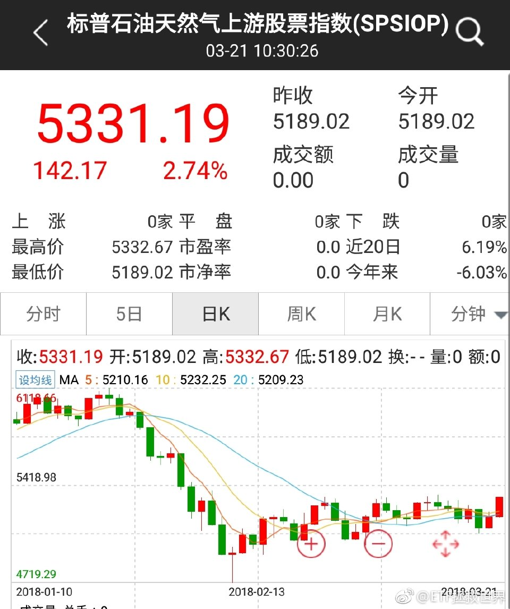

======================================================

ETF拯救世界 (5687069307) @
2018-03-21 22:52:04 Wed  
url: https://weibo.com/5687069307/G8s0t8SZD

来劲了嘿 http://t.cn/RnJ18Lm

------------------------------------------------------
转推：
>  @ETF拯救世界 (5687069307)
>  2018-03-21 22:46:07 Wed  
>  url: https:/weibo.com/5687069307/G8rY2pf7g/

>  是不是要突破了 ​​​

转发[2]  评论[22]  赞[80] 

======================================================

ETF拯救世界 (5687069307) @
2018-03-21 22:58:01 Wed  
url: https://weibo.com/5687069307/G8s2SlCvY

怀念那次油气溢价6%套利赔钱的经历。

为什么，因为当天晚上美国基准涨了8%[doge] ​​​

转发[2]  评论[44]  赞[143] 

======================================================

ETF拯救世界 (5687069307) @
2018-03-22 09:30:03 Thu  
url: https://weibo.com/5687069307/G8wbpuunr

今天所有国内债，油气都已经出坑。还剩一个海外债和黄金在坑里。2%左右。

讲真，赔钱太难了。[doge] ​​​

转发[6]  评论[54]  赞[215] 

======================================================

ETF拯救世界 (5687069307) @
2018-03-22 09:34:01 Thu  
url: https://weibo.com/5687069307/G8wd21cxW

腾讯，60倍PE。未来五年看，真的能有特别好的收益率吗。

学习了。 ​​​

转发[338]  评论[87]  赞[201] 

======================================================

ETF拯救世界 (5687069307) @
2018-03-22 10:07:36 Thu  
url: https://weibo.com/5687069307/G8wqF9zU1

以前我写过一篇文章，整个证券市场是一个丛林。有它整个的生态系统。

食物链从高到低。

做为比较低层次的生物，基本处于食物链底部的人，想要在这市场中不死，然后还越来越大，实力越来越强，一定要有特别的能力。

第一步是找到自己在食物链中的位置，第二部是找到活下去的方法。

比如，死死盯住猎 ​​​

转发[85]  评论[132]  赞[341] 

======================================================

ETF拯救世界 (5687069307) @
2018-03-22 10:31:53 Thu  
url: https://weibo.com/5687069307/G8wAwsGz2

因为月中没有开车而不开心的人已经破涕为笑。 ​​​

转发[5]  评论[77]  赞[231] 

======================================================

ETF拯救世界 (5687069307) @
2018-03-22 10:47:25 Thu  
url: https://weibo.com/5687069307/G8wGP73Pz

之前有没有人感受到。

------------------------------------------------------
转推：
>  @ETF拯救世界 (5687069307)
>  2018-03-19 13:37:11 Mon  
>  url: https:/weibo.com/5687069307/G85wfocCL/

>  山雨欲来风满楼 ​​​

转发[3]  评论[140]  赞[162] 

======================================================

ETF拯救世界 (5687069307) @
2018-03-22 15:03:40 Thu  
url: https://weibo.com/5687069307/G8ymPDiTG

[中国赞]

------------------------------------------------------
转推：
>  @且慢管家 (6186312580)
>  2018-03-22 14:28:46 Thu  
>  url: https:/weibo.com/6186312580/G8y8FrzjW/

>  [威武]盈米财富凭借行业变革者之勇气，重构基金销售的价值链，践行买方投顾等行业贡献，与天天、蚂蚁等行业前辈同获基金行业重磅大奖【最佳独立基金销售机构】我们将不忘初心，继续砥砺前行。[干杯] ​​​

转发[4]  评论[40]  赞[146] 

======================================================

ETF拯救世界 (5687069307) @
2018-03-22 15:47:46 Thu  
url: https://weibo.com/5687069307/G8yEJsU5J

支持！太棒了！

------------------------------------------------------
转推：
>  @ ()
>  2018-03-22 15:40:03 Thu  
>  url: 

>  抱歉，作者已设置仅展示半年内微博，此微博已不可见。 ​​​

转发[10]  评论[41]  赞[85] 

======================================================

ETF拯救世界 (5687069307) @
2018-03-22 16:02:07 Thu  
url: https://weibo.com/5687069307/G8yKyAkv1

回复@asdasdsadasdadad:我也许会买，但绝对不会买很多。甚至只会买一点。只因为一点：目前不合法。没有正规可靠的交易所，没有资金进出安全性保证，没有法律保护，让我把积累了这么多年的资产买进去，我暂时接受不了。买一点玩玩可以，买太多不可能。等什么时候有了合法的投资途径，我才会考虑正式投入

------------------------------------------------------
转推：
>  @ ()
>  2018-03-22 15:40:03 Thu  
>  url: 

>  抱歉，作者已设置仅展示半年内微博，此微博已不可见。 ​​​

转发[1]  评论[19]  赞[57] 

======================================================

ETF拯救世界 (5687069307) @
2018-03-23 05:32:39 Fri  
url: https://weibo.com/5687069307/G8E3yp5OC

还会远吗 ​​​

转发[8]  评论[143]  赞[207] 

+++++++++++++++++++++++++++++++++++++++++++++++++++++

图片：
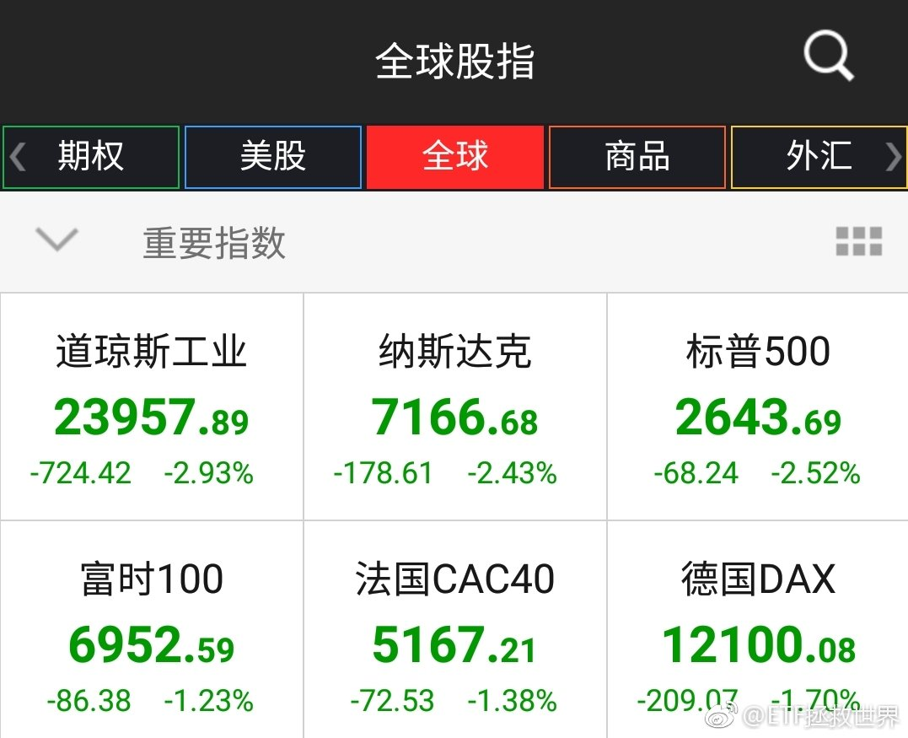

======================================================

ETF拯救世界 (5687069307) @
2018-03-23 08:30:00 Fri  
url: https://weibo.com/5687069307/G8FdxxfZW

想加车某个品种，没决定 ​​​

转发[13]  评论[160]  赞[236] 

======================================================

ETF拯救世界 (5687069307) @
2018-03-23 09:12:34 Fri  
url: https://weibo.com/5687069307/G8FuOFaoB

回复@蔷薇欧欧:买啊怎么办。2015年到现在等的不就是这个吗。//@蔷薇欧欧:如果中美贸易战开打，经济增长放缓，股市很长一段时间下跌，股债双杀的情况出现的话，怎么办呢益达？

------------------------------------------------------
转推：
>  @ETF拯救世界 (5687069307)
>  2018-03-23 08:30:00 Fri  
>  url: https:/weibo.com/5687069307/G8FdxxfZW/

>  想加车某个品种，没决定 ​​​

转发[10]  评论[0]  赞[216] 

======================================================

ETF拯救世界 (5687069307) @
2018-03-23 09:26:11 Fri  
url: https://weibo.com/5687069307/G8FAm3UVW

今天可能都懂了。

------------------------------------------------------
转推：
>  @ETF拯救世界 (5687069307)
>  2018-03-19 09:34:26 Mon  
>  url: https:/weibo.com/5687069307/G83VI7UwA/

>  知道月中为什么不开车了吧。
>  
>  老司机的世界你不懂。 ​​​

转发[1]  评论[133]  赞[205] 

======================================================

ETF拯救世界 (5687069307) @
2018-03-23 09:35:14 Fri  
url: https://weibo.com/5687069307/G8FE1geYc

今天跌破3000亿。

------------------------------------------------------
转推：
>  @ETF拯救世界 (5687069307)
>  2018-02-28 09:42:18 Wed  
>  url: https:/weibo.com/5687069307/G5aRt5yih/

>  今天3 6 0市值4000多亿。在美国退市前600多亿。公司没变，市值增加6倍多。
>  
>  大型魔幻现场。 ​​​

转发[3]  评论[63]  赞[114] 

======================================================

ETF拯救世界 (5687069307) @
2018-03-23 10:40:21 Fri  
url: https://weibo.com/5687069307/G8G4s5nOq

腾讯成交1000亿。有人星夜赶考，有人辞官回家。 ​​​

转发[8]  评论[51]  赞[161] 

======================================================

ETF拯救世界 (5687069307) @
2018-03-23 11:24:20 Fri  
url: https://weibo.com/5687069307/G8Gmimxew

统一回答一下，今天不会加车。道理很简单，我们买和不买的空间不可能是3%。跌3%什么也不是。

仓位合适，一切按部就班。正式车也就还有一周了。看看数据，提前2、3天倒是有可能。

其实今天倒是想加个非A品种。再看看吧。 ​​​

转发[13]  评论[109]  赞[219] 

======================================================

ETF拯救世界 (5687069307) @
2018-03-23 11:27:54 Fri  
url: https://weibo.com/5687069307/G8GnKuC1y

回复@碾米机:拍照真的好！碾压其它所有品牌！颜值高！手感舒服！但是系统渣渣辉！真的是没有完美的东西啊。//@碾米机:e大，s8可好用？最近想换个拍照好的手机

------------------------------------------------------
转推：
>  @ETF拯救世界 (5687069307)
>  2018-03-23 05:32:39 Fri  
>  url: https:/weibo.com/5687069307/G8E3yp5OC/

>  还会远吗 ​​​

转发[1]  评论[32]  赞[68] 

======================================================

ETF拯救世界 (5687069307) @
2018-03-23 14:01:10 Fri  
url: https://weibo.com/5687069307/G8HnXyCTq

。。。改成?%比较合适。

------------------------------------------------------
转推：
>  @ETF拯救世界 (5687069307)
>  2018-03-23 11:24:20 Fri  
>  url: https:/weibo.com/5687069307/G8Gmimxew/

>  统一回答一下，今天不会加车。道理很简单，我们买和不买的空间不可能是3%。跌3%什么也不是。
>  
>  仓位合适，一切按部就班。正式车也就还有一周了。看看数据，提前2、3天倒是有可能。
>  
>  其实今天倒是想加个非A品种。再看看吧。 ​​​

转发[3]  评论[82]  赞[112] 

======================================================

ETF拯救世界 (5687069307) @
2018-03-23 14:19:15 Fri  
url: https://weibo.com/5687069307/G8HviC04T

雨有点大。

------------------------------------------------------
转推：
>  @ETF拯救世界 (5687069307)
>  2018-03-19 13:37:11 Mon  
>  url: https:/weibo.com/5687069307/G85wfocCL/

>  山雨欲来风满楼 ​​​

转发[6]  评论[155]  赞[170] 

======================================================

ETF拯救世界 (5687069307) @
2018-03-23 15:26:50 Fri  
url: https://weibo.com/5687069307/G8HWJtY2A

这个月计划搞不好要2015年7月以来第四次月度净值回撤了。

前三次分别是16年12月，17年11月和18年2月。

之前三次股灾都没回撤，没办法，随着仓位的加大，不可避免~ ​​​

转发[13]  评论[82]  赞[207] 

======================================================

ETF拯救世界 (5687069307) @
2018-03-23 15:41:24 Fri  
url: https://weibo.com/5687069307/G8I2EdaF6

今天的数据有点crazy。周日发不发是个问题。 ​​​

转发[8]  评论[164]  赞[232] 

======================================================

ETF拯救世界 (5687069307) @
2018-03-23 18:17:02 Fri  
url: https://weibo.com/5687069307/G8J3OFtxD

三年又三年，什么时候可以让我们好好买点便宜货[泪]

------------------------------------------------------
转推：
>  @蓝鲸财经记者工作平台 (1885454921)
>  2018-03-23 18:15:56 Fri  
>  url: https:/weibo.com/1885454921/G8J3nc6fY/

>  【鲸快讯:知情人士称中国国家相关资金今日买入部分蓝筹股 避免股市跌幅加剧】3月23日讯,新浪援引彭博报道,知情人士称,中国国家相关资金今日入市干预,买入部分蓝筹股。国家相关资金入市只是为维护市场稳定,并非为推高股价。今日买入中国人寿、中国石化等蓝筹股;全天都进行维稳操作,下午操作的力度加大。 ​​​

转发[9]  评论[70]  赞[122] 

======================================================

ETF拯救世界 (5687069307) @
2018-03-23 21:54:34 Fri  
url: https://weibo.com/5687069307/G8Ku7gPqc

不明白为什么买债券的同学懂了吧 ​​​

转发[12]  评论[145]  赞[277] 

+++++++++++++++++++++++++++++++++++++++++++++++++++++

图片：
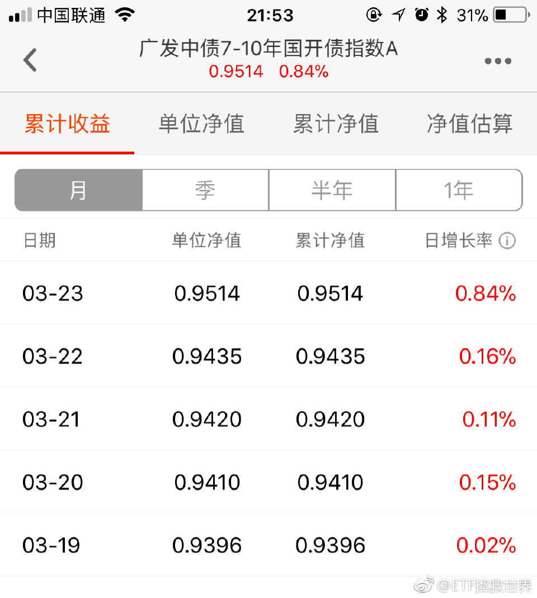

======================================================

ETF拯救世界 (5687069307) @
2018-03-24 22:08:11 Sat  
url: https://weibo.com/5687069307/G8U09amHD

这样结婚有任何意义吗？

------------------------------------------------------
转推：
>  @网易财经 (1974561081)
>  2018-03-24 19:30:04 Sat  
>  url: https:/weibo.com/1974561081/G8SXXsqDt/

>  【甘肃相亲纪实|飞涨的彩礼：“人家女娃卖二三十万，凭啥我家七八万”】在甘肃乡村，男女比例失调，一个女孩有七八个男生排队相亲，男方要有房有车再加上二三十万元的彩礼，往往耗空积蓄再背上债务。女方要求则几近苛刻，“离了沟近的不去，近视的不行，抽烟的不要，有房没车不行…”小徐大专毕业、相 ​​​

转发[12]  评论[119]  赞[81] 

======================================================

ETF拯救世界 (5687069307) @
2018-03-26 09:11:21 Mon  
url: https://weibo.com/5687069307/G97LOvp7d

仔细观察，你会发现，投资的原则，很难遵守。大部分人，绝大多数人，都做不到。

设计一个系统，一个体系，一个策略。开始之前想得好好的，一定要按照策略来。然后，发生一些事，你突然又觉得，我要主观做一些动作。然后策略不遵守了，体系崩塌了。

主观，我从来不相信主观。

谁要主观判断行情，一次 ​​​

转发[97]  评论[169]  赞[361] 

======================================================

ETF拯救世界 (5687069307) @
2018-03-26 09:39:39 Mon  
url: https://weibo.com/5687069307/G97XiAKQU

给不给机会提前为国接盘？ ​​​

转发[4]  评论[168]  赞[199] 

======================================================

ETF拯救世界 (5687069307) @
2018-03-26 10:00:19 Mon  
url: https://weibo.com/5687069307/G985GneBg

老司机的尴尬 ​​​

转发[11]  评论[90]  赞[149] 

+++++++++++++++++++++++++++++++++++++++++++++++++++++

图片：
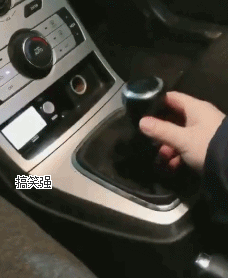

======================================================

ETF拯救世界 (5687069307) @
2018-03-26 11:05:27 Mon  
url: https://weibo.com/5687069307/G98w85S2E

$中证银行 sz399986$   这几个月刚刚皈依价值投资的朋友又被割了。 ​​​

转发[11]  评论[66]  赞[135] 

======================================================

ETF拯救世界 (5687069307) @
2018-03-26 11:14:35 Mon  
url: https://weibo.com/5687069307/G98zQh3tM

呵呵，还不是要跌回来。

来自老司机的迷之自信。 ​​​

转发[1]  评论[92]  赞[177] 

+++++++++++++++++++++++++++++++++++++++++++++++++++++

图片：

======================================================

ETF拯救世界 (5687069307) @
2018-03-26 12:09:30 Mon  
url: https://weibo.com/5687069307/G98W81zwt

[doge]

------------------------------------------------------
转推：
>  @ETF拯救世界 (5687069307)
>  2018-01-25 11:18:26 Thu  
>  url: https:/weibo.com/5687069307/G00XC3BZQ/

>  不少人会在“价值投资元年”之后，在一些“蓝筹股”上套3-5年 ​​​

转发[8]  评论[81]  赞[164] 

======================================================

ETF拯救世界 (5687069307) @
2018-03-26 15:07:34 Mon  
url: https://weibo.com/5687069307/G9a6p7Xvi

散了散了，踏踏实实等月末了。 ​​​

转发[3]  评论[68]  赞[200] 

======================================================

ETF拯救世界 (5687069307) @
2018-03-26 15:54:36 Mon  
url: https://weibo.com/5687069307/G9apuALUB

今天数据出来，有些品种便宜哭了。

为什么这么便宜，点解。

但是从趋势看即将开始暴跌。

趋势和价值能不能统一在一个体系中？这是个大问题。 ​​​

转发[33]  评论[204]  赞[294] 

======================================================

ETF拯救世界 (5687069307) @
2018-03-26 22:15:29 Mon  
url: https://weibo.com/5687069307/G9cU63qXT

每日打卡（168）

坚持 ​​​

转发[0]  评论[15]  赞[123] 

+++++++++++++++++++++++++++++++++++++++++++++++++++++

图片：

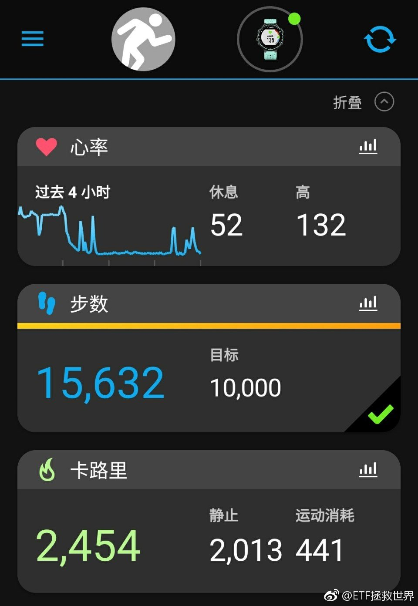

======================================================

ETF拯救世界 (5687069307) @
2018-03-26 22:41:50 Mon  
url: https://weibo.com/5687069307/G9d4MvmCB

美国涨了点，欧洲跌了啊。

而且，美国涨不涨跟咱们也没关系。还有几天，踏踏实实的。 ​​​

转发[5]  评论[59]  赞[162] 

+++++++++++++++++++++++++++++++++++++++++++++++++++++

图片：
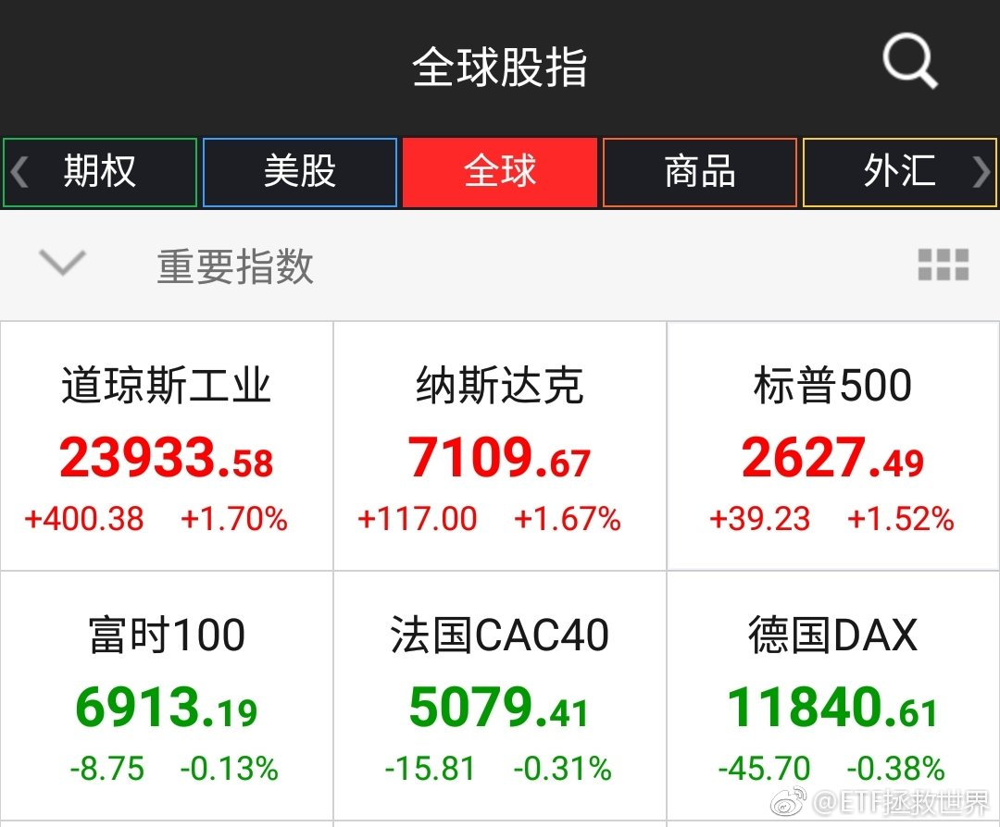

======================================================

ETF拯救世界 (5687069307) @
2018-03-27 09:30:33 Tue  
url: https://weibo.com/5687069307/G9hk69vbT

最近做趋势和主观判断的都很郁闷 ​​​

转发[9]  评论[71]  赞[158] 

======================================================

ETF拯救世界 (5687069307) @
2018-03-27 09:45:18 Tue  
url: https://weibo.com/5687069307/G9hq5i1ZX

回复@小磊_哥:为什么要发？我们不是月底定时吗。定好的策略不执行和咸鱼有什么区别？//@小磊_哥:e大昨天为啥不发车啊[允悲]

------------------------------------------------------
转推：
>  @ETF拯救世界 (5687069307)
>  2018-03-27 09:30:33 Tue  
>  url: https:/weibo.com/5687069307/G9hk69vbT/

>  最近做趋势和主观判断的都很郁闷 ​​​

转发[6]  评论[58]  赞[180] 

======================================================

ETF拯救世界 (5687069307) @
2018-03-27 10:17:22 Tue  
url: https://weibo.com/5687069307/G9hD7dWaU

讲真是不是又要新高了。计划第二大持仓，a股第一大

------------------------------------------------------
转推：
>  @ETF拯救世界 (5687069307)
>  2018-03-16 10:34:07 Fri  
>  url: https:/weibo.com/5687069307/G7C2rwoAZ/

>  我预感$全指医药 sh000991$  这一把新高应该是稳的。之后就不知道了。 ​​​

转发[65]  评论[66]  赞[121] 

======================================================

ETF拯救世界 (5687069307) @
2018-03-27 11:03:53 Tue  
url: https://weibo.com/5687069307/G9hVZ1tZU

回复@蜜蜂猴子葡萄蝙蝠:+30%之前不要提再平衡。//@蜜蜂猴子葡萄蝙蝠:医药是不是要再平衡呢?//@ETF拯救世界:讲真是不是又要新高了。计划第二大持仓，a股第一大

------------------------------------------------------
转推：
>  @ETF拯救世界 (5687069307)
>  2018-03-16 10:34:07 Fri  
>  url: https:/weibo.com/5687069307/G7C2rwoAZ/

>  我预感$全指医药 sh000991$  这一把新高应该是稳的。之后就不知道了。 ​​​

转发[14]  评论[29]  赞[113] 

======================================================

ETF拯救世界 (5687069307) @
2018-03-27 11:39:38 Tue  
url: https://weibo.com/5687069307/G9iav9m5x

最近大盘股又成辣鸡了。咱们还是老规矩，捡辣鸡。 ​​​

转发[9]  评论[126]  赞[258] 

======================================================

ETF拯救世界 (5687069307) @
2018-03-27 13:00:12 Tue  
url: https://weibo.com/5687069307/G9iHcb74y

回复@我陪你试婚纱:通俗来讲就是 劫富济贫//@我陪你试婚纱:什么是再平衡呢//@ETF拯救世界:回复@蜜蜂猴子葡萄蝙蝠:+30%之前不要提再平衡。//@蜜蜂猴子葡萄蝙蝠:医药是不是要再平衡呢?//@ETF拯救世界:讲真是不是又要新高了。计划第二大持仓，a股第一大

------------------------------------------------------
转推：
>  @ETF拯救世界 (5687069307)
>  2018-03-16 10:34:07 Fri  
>  url: https:/weibo.com/5687069307/G7C2rwoAZ/

>  我预感$全指医药 sh000991$  这一把新高应该是稳的。之后就不知道了。 ​​​

转发[7]  评论[35]  赞[110] 

======================================================

ETF拯救世界 (5687069307) @
2018-03-27 21:47:38 Tue  
url: https://weibo.com/5687069307/G9m9hEDV5

每日打卡（169）

颈椎痛，今天治疗颈椎 ​​​

转发[1]  评论[70]  赞[115] 

+++++++++++++++++++++++++++++++++++++++++++++++++++++

图片：

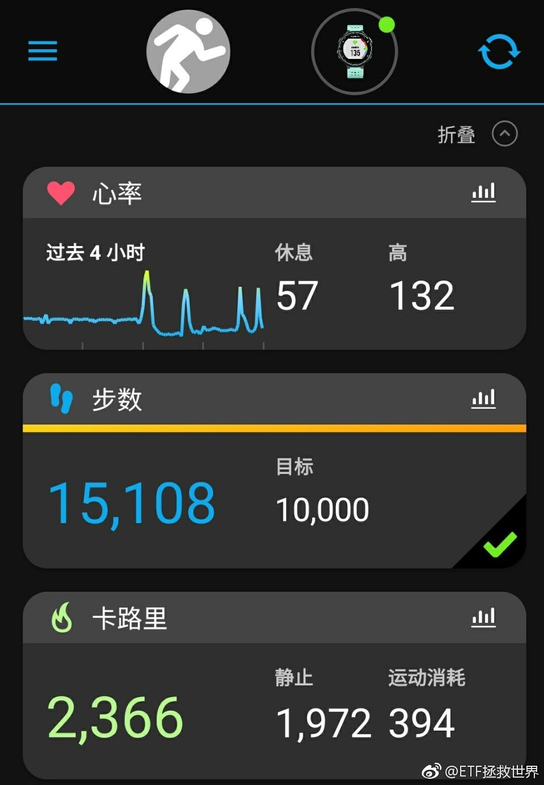

======================================================

ETF拯救世界 (5687069307) @
2018-03-28 06:22:26 Wed  
url: https://weibo.com/5687069307/G9pwfhbrU

急什么 ​​​

转发[4]  评论[173]  赞[211] 

+++++++++++++++++++++++++++++++++++++++++++++++++++++

图片：
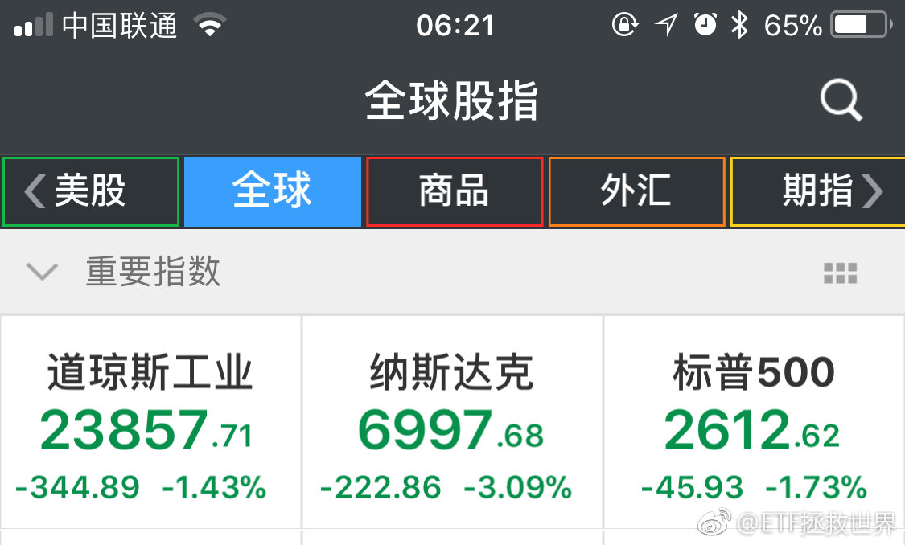

======================================================

ETF拯救世界 (5687069307) @
2018-03-28 09:43:50 Wed  
url: https://weibo.com/5687069307/G9qPZx6co

服了//@ETF拯救世界:讲真是不是又要新高了。计划第二大持仓，a股第一大

------------------------------------------------------
转推：
>  @ETF拯救世界 (5687069307)
>  2018-03-16 10:34:07 Fri  
>  url: https:/weibo.com/5687069307/G7C2rwoAZ/

>  我预感$全指医药 sh000991$  这一把新高应该是稳的。之后就不知道了。 ​​​

转发[5]  评论[66]  赞[111] 

======================================================

ETF拯救世界 (5687069307) @
2018-03-28 12:28:50 Wed  
url: https://weibo.com/5687069307/G9rUYmyXg

回复@成诚己:想多了，开会去了。//@成诚己:我怎么感觉e大一直没说话是去写发车文章去了[太开心]，e大，颈椎问题伏案久了要起来走走哦。//@ETF拯救世界:服了//@ETF拯救世界:讲真是不是又要新高了。计划第二大持仓，a股第一大

------------------------------------------------------
转推：
>  @ETF拯救世界 (5687069307)
>  2018-03-16 10:34:07 Fri  
>  url: https:/weibo.com/5687069307/G7C2rwoAZ/

>  我预感$全指医药 sh000991$  这一把新高应该是稳的。之后就不知道了。 ​​​

转发[0]  评论[11]  赞[76] 

======================================================

ETF拯救世界 (5687069307) @
2018-03-28 12:30:15 Wed  
url: https://weibo.com/5687069307/G9rVxx7XH

30%了。//@ETF拯救世界:……原来你竟然是这样的五粮液……

------------------------------------------------------
转推：
>  @ETF拯救世界 (5687069307)
>  2018-02-05 10:35:23 Mon  
>  url: https:/weibo.com/5687069307/G1GnADXQT/

>  五粮液下跌快20%了。
>  
>  所谓价值股就可以闭眼买入，这种思维被不断灌输进很多人的思维中。
>  
>  很多人这几个月突然发现以前不赚钱是因为没有买入“价值股”，现在终于找到了一条赚钱的终极之路。
>  
>  上涨的时候买入短期会很舒服。因为上涨趋势中，你怎么买都会赚钱。但是趋势一旦改变，你就会欲哭无泪。
>  
>  下 ​​​

转发[6]  评论[16]  赞[93] 

======================================================

ETF拯救世界 (5687069307) @
2018-03-28 12:40:49 Wed  
url: https://weibo.com/5687069307/G9rZPug8Y

朋友们，怎么港。

有些我们一直喜欢的东西，食品饮料，消费，甚至包括中概，总有机会入手的。如果不合标准，就不买。但总会有合标准的时候。

投资的世界充满迷雾，但我们有自己的标准，我们坚守信念，结局就不会差。

至于已经买了的？如果有好机会，当然多多益善。 ​​​

转发[31]  评论[112]  赞[262] 

======================================================

ETF拯救世界 (5687069307) @
2018-03-28 13:46:38 Wed  
url: https://weibo.com/5687069307/G9sqy0PfL

有时候趋势是有用的。但很多“价值投资者”不这么看。很多人非此即彼，非黑即白。思维不够开放。有用的东西就拿来用，当然，怎么用是关键。

------------------------------------------------------
转推：
>  @ETF拯救世界 (5687069307)
>  2018-03-26 15:54:36 Mon  
>  url: https:/weibo.com/5687069307/G9apuALUB/

>  今天数据出来，有些品种便宜哭了。
>  
>  为什么这么便宜，点解。
>  
>  但是从趋势看即将开始暴跌。
>  
>  趋势和价值能不能统一在一个体系中？这是个大问题。 ​​​

转发[13]  评论[35]  赞[142] 

======================================================

ETF拯救世界 (5687069307) @
2018-03-28 14:21:49 Wed  
url: https://weibo.com/5687069307/G9sEPhLfT

作业炒得好，炒股穷到老！

------------------------------------------------------
转推：
>  @挖龙脉的超级鹿鼎公 (3962719063)
>  2018-03-28 14:20:18 Wed  
>  url: https:/weibo.com/3962719063/G9sEdcc72/

>  500股太保居然这么大威力[吃惊] ​​​

转发[21]  评论[15]  赞[106] 

======================================================

ETF拯救世界 (5687069307) @
2018-03-28 14:25:43 Wed  
url: https://weibo.com/5687069307/G9sGq0089

回复@恐龙02:我的作业有几个特点：1，买卖点明确。2，高于我的买入价禁止买入。这两个特点有别于其它，保证了只要我不赔，其他人也赔不了。这两点非常关键。因为品种再好，买卖价格不对，也无法盈利。//@恐龙02:我抄益达大作业会发财的[good]//@ETF拯救世界:作业炒得好，炒股穷到老！

------------------------------------------------------
转推：
>  @挖龙脉的超级鹿鼎公 (3962719063)
>  2018-03-28 14:20:18 Wed  
>  url: https:/weibo.com/3962719063/G9sEdcc72/

>  500股太保居然这么大威力[吃惊] ​​​

转发[17]  评论[65]  赞[181] 

======================================================

ETF拯救世界 (5687069307) @
2018-03-28 17:46:36 Wed  
url: https://weibo.com/5687069307/G9tZWDoLT

正常。股票涨高了就是卖的。难道拿一辈子吗。

------------------------------------------------------
转推：
>  @蓝鲸财经记者工作平台 (1885454921)
>  2018-03-28 17:44:05 Wed  
>  url: https:/weibo.com/1885454921/G9tYVqO8H/

>  【鲸快讯】3月28日讯，腾讯控股总裁刘炽平在3月27日减持100万股腾讯股份。 ​​​

转发[5]  评论[15]  赞[119] 

======================================================

ETF拯救世界 (5687069307) @
2018-03-28 19:28:27 Wed  
url: https://weibo.com/5687069307/G9uFi5r1k

$中证500 sz399905$ 利润可能要增加不少

------------------------------------------------------
转推：
>  @东方财富网 (1801487174)
>  2018-03-28 19:12:12 Wed  
>  url: https:/weibo.com/1801487174/G9uyH8Pbs/

>  【国务院：5月1日起制造业等增值税税率从17%降至16%】国务院常务会议确定深化增值税改革措施，5月1日起制造业等增值税税率从17%降至16%，预计全年减税2400亿元，将纳税人年销售额标准由50和80万上调至500万元。http://t.cn/RnQHYbw ​​​

转发[8]  评论[41]  赞[144] 

======================================================

ETF拯救世界 (5687069307) @
2018-03-28 20:55:12 Wed  
url: https://weibo.com/5687069307/G9vev98ee

大家辛苦了。看完视频觉得做的事有意义，同时压力也不小。一起努力吧！

http://t.cn/RnQD52i ​​​

转发[30]  评论[320]  赞[708] 

======================================================

ETF拯救世界 (5687069307) @
2018-03-28 21:56:06 Wed  
url: https://weibo.com/5687069307/G9vDdBghB

这是小米被黑的最惨的一次

------------------------------------------------------
转推：
>  @ ()
>  2018-03-28 21:51:55 Wed  
>  url: 

>  抱歉，作者已设置仅展示半年内微博，此微博已不可见。 ​​​

转发[19]  评论[167]  赞[94] 

======================================================

ETF拯救世界 (5687069307) @
2018-03-29 13:45:04 Thu  
url: https://weibo.com/5687069307/G9BQphp1T

今天要是涨就周末发车。跌就今晚发。

无所谓。

耗着呗。 ​​​

转发[8]  评论[211]  赞[323] 

======================================================

ETF拯救世界 (5687069307) @
2018-03-30 10:34:35 Fri  
url: https://weibo.com/5687069307/G9K1A1Eax

有点饿，你中午吃什么。 ​​​

转发[6]  评论[263]  赞[138] 

======================================================

ETF拯救世界 (5687069307) @
2018-03-30 10:57:55 Fri  
url: https://weibo.com/5687069307/G9Kb3x7pb

$全指医药 sh000991$   真的是很喜欢这个。不是因为涨了。就是现在太贵。没法买太多。 ​​​

转发[6]  评论[71]  赞[180] 

======================================================

ETF拯救世界 (5687069307) @
2018-03-30 13:24:57 Fri  
url: https://weibo.com/5687069307/G9L8JjBBv

你信不信中小股票一直涨？不信，好，那就一直涨。

信了？Duang，归你了。

——来自1月大盘股的经验。 ​​​

转发[33]  评论[75]  赞[248] 

======================================================

ETF拯救世界 (5687069307) @
2018-03-30 13:38:49 Fri  
url: https://weibo.com/5687069307/G9LendFxn

回复@YAN_楚平:应对什么。我们买了不少了。//@YAN_楚平:怎么应对E大

------------------------------------------------------
转推：
>  @ETF拯救世界 (5687069307)
>  2018-03-30 13:24:57 Fri  
>  url: https:/weibo.com/5687069307/G9L8JjBBv/

>  你信不信中小股票一直涨？不信，好，那就一直涨。
>  
>  信了？Duang，归你了。
>  
>  ——来自1月大盘股的经验。 ​​​

转发[8]  评论[13]  赞[92] 

======================================================

ETF拯救世界 (5687069307) @
2018-03-30 13:56:59 Fri  
url: https://weibo.com/5687069307/G9LlK3Ixf

回复@i云腾致雨:我个人认为，创业板40倍开始飞的几率不太大。所以暂时不加仓。//@i云腾致雨:创业板买的少[吃瓜]//@ETF拯救世界:回复@YAN_楚平:应对什么。我们买了不少了。//@YAN_楚平:怎么应对E大

------------------------------------------------------
转推：
>  @ETF拯救世界 (5687069307)
>  2018-03-30 13:24:57 Fri  
>  url: https:/weibo.com/5687069307/G9L8JjBBv/

>  你信不信中小股票一直涨？不信，好，那就一直涨。
>  
>  信了？Duang，归你了。
>  
>  ——来自1月大盘股的经验。 ​​​

转发[7]  评论[55]  赞[143] 

======================================================

ETF拯救世界 (5687069307) @
2018-03-30 15:34:51 Fri  
url: https://weibo.com/5687069307/G9LZtjt32

服不服。新高。一句投资金句告诉你：新高不卖。//@ETF拯救世界:讲真是不是又要新高了。计划第二大持仓，a股第一大

------------------------------------------------------
转推：
>  @ETF拯救世界 (5687069307)
>  2018-03-16 10:34:07 Fri  
>  url: https:/weibo.com/5687069307/G7C2rwoAZ/

>  我预感$全指医药 sh000991$  这一把新高应该是稳的。之后就不知道了。 ​​​

转发[39]  评论[166]  赞[206] 

======================================================

ETF拯救世界 (5687069307) @
2018-04-02 09:31:02 Mon  
url: https://weibo.com/5687069307/GabTi0GpZ

除了你遵守自己的策略。主动操作来讲，新高不要卖。//@ETF拯救世界:服不服。新高。一句投资金句告诉你：新高不卖。//@ETF拯救世界:讲真是不是又要新高了。计划第二大持仓，a股第一大

------------------------------------------------------
转推：
>  @ETF拯救世界 (5687069307)
>  2018-03-16 10:34:07 Fri  
>  url: https:/weibo.com/5687069307/G7C2rwoAZ/

>  我预感$全指医药 sh000991$  这一把新高应该是稳的。之后就不知道了。 ​​​

转发[14]  评论[12]  赞[91] 

======================================================

ETF拯救世界 (5687069307) @
2018-04-02 09:41:54 Mon  
url: https://weibo.com/5687069307/GabXH0drn

回复@Cubic_N:在上涨趋势中，只有一天你会卖在最高点。你猜，最高点是今天的概率有多大？//@Cubic_N:E大能不能讲讲为什么呀//@ETF拯救世界:除了你遵守自己的策略。主动操作来讲，新高不要卖。//@ETF拯救世界:服不服。新高。一句投资金句告诉你：新高不卖。

------------------------------------------------------
转推：
>  @ETF拯救世界 (5687069307)
>  2018-03-16 10:34:07 Fri  
>  url: https:/weibo.com/5687069307/G7C2rwoAZ/

>  我预感$全指医药 sh000991$  这一把新高应该是稳的。之后就不知道了。 ​​​

转发[8]  评论[19]  赞[72] 

======================================================

ETF拯救世界 (5687069307) @
2018-04-02 09:43:35 Mon  
url: https://weibo.com/5687069307/GabYni60n

$证券公司 sz399975$  FXXX! ​​​

转发[1]  评论[113]  赞[89] 

======================================================

ETF拯救世界 (5687069307) @
2018-04-02 10:05:25 Mon  
url: https://weibo.com/5687069307/Gac7ehzKJ

如果今天   $证券公司(SZ399975)$​   涨幅过大，我会发信息建议场外部分取消申购。如果取消，大概1-2点吧。 ​​​

转发[26]  评论[103]  赞[171] 

======================================================

ETF拯救世界 (5687069307) @
2018-04-02 11:17:05 Mon  
url: https://weibo.com/5687069307/GacAkikEA

一分钟都不差的最高点发出警告后，一路下跌。警报暂时解除，马照跑，舞照跳。

------------------------------------------------------
转推：
>  @ETF拯救世界 (5687069307)
>  2018-04-02 10:05:25 Mon  
>  url: https:/weibo.com/5687069307/Gac7ehzKJ/

>  如果今天   $证券公司(SZ399975)$​   涨幅过大，我会发信息建议场外部分取消申购。如果取消，大概1-2点吧。 ​​​

转发[1]  评论[92]  赞[167] 

======================================================

ETF拯救世界 (5687069307) @
2018-04-02 14:08:32 Mon  
url: https://weibo.com/5687069307/GadHV28J2

回复@D8奇迹:现价1.009，你的成本价是0.9971，你的累计收益怎么会是-1.45%。我倒是要请你解释解释。//@D8奇迹:回复@路漫漫其修远兮______:楼下回复场内场外的就是瞎扯蛋。 我就是场内跟车，成本价跟益达一模一样：0.9971。我的累计收益是-1.45个点。谁给解释解释！

------------------------------------------------------
转推：
>  @ETF拯救世界 (5687069307)
>  2018-04-02 10:05:25 Mon  
>  url: https:/weibo.com/5687069307/Gac7ehzKJ/

>  如果今天   $证券公司(SZ399975)$​   涨幅过大，我会发信息建议场外部分取消申购。如果取消，大概1-2点吧。 ​​​

转发[20]  评论[47]  赞[59] 

======================================================

ETF拯救世界 (5687069307) @
2018-04-02 14:19:34 Mon  
url: https://weibo.com/5687069307/GadMouLhD

不过话说回来，最近传媒场外连接表现确实有问题。也难怪有朋友郁闷。希望未来有好转吧。//@ETF拯救世界:回复@D8奇迹:现价1.009，你的成本价是0.9971，你的累计收益怎么会是-1.45%。我倒是要请你解释解释。

------------------------------------------------------
转推：
>  @ETF拯救世界 (5687069307)
>  2018-04-02 10:05:25 Mon  
>  url: https:/weibo.com/5687069307/Gac7ehzKJ/

>  如果今天   $证券公司(SZ399975)$​   涨幅过大，我会发信息建议场外部分取消申购。如果取消，大概1-2点吧。 ​​​

转发[1]  评论[11]  赞[55] 

======================================================

ETF拯救世界 (5687069307) @
2018-04-02 14:26:48 Mon  
url: https://weibo.com/5687069307/GadPkzKl4

回复@路漫漫其修远兮______:已经说过了。我是第二天场内买入ETF。你是场外买链接基金。由于各种原因，场外链接基金最近表现差一些。就是因为这个。我不可能每个人的小问题都一一作答。要知道每天后台有几百个各种问题在问我。这样的问题自己完全可以解决。

------------------------------------------------------
转推：
>  @ETF拯救世界 (5687069307)
>  2018-04-02 10:05:25 Mon  
>  url: https:/weibo.com/5687069307/Gac7ehzKJ/

>  如果今天   $证券公司(SZ399975)$​   涨幅过大，我会发信息建议场外部分取消申购。如果取消，大概1-2点吧。 ​​​

转发[17]  评论[40]  赞[85] 

======================================================

ETF拯救世界 (5687069307) @
2018-04-02 14:34:46 Mon  
url: https://weibo.com/5687069307/GadSzsk1q

回复@路漫漫其修远兮______:我最后再回一次。每次发车我都会提供场内场外两个代码，因为有人买场内，有人买场外，各位可以按需选择。且慢只能买场外，所以成本当然是场外。我本人有些品种场内，有些品种场外。有时候还会场内外转换套利。我不知道该怎么做才能达到你的预期。

------------------------------------------------------
转推：
>  @ETF拯救世界 (5687069307)
>  2018-04-02 10:05:25 Mon  
>  url: https:/weibo.com/5687069307/Gac7ehzKJ/

>  如果今天   $证券公司(SZ399975)$​   涨幅过大，我会发信息建议场外部分取消申购。如果取消，大概1-2点吧。 ​​​

转发[14]  评论[41]  赞[95] 

======================================================

ETF拯救世界 (5687069307) @
2018-04-02 14:43:14 Mon  
url: https://weibo.com/5687069307/GadW0dXrY

场内好还是场外好？没什么大区别。

今天券商收盘+1.2%，场外也应该是+1.2%。如果开盘就买场内的，当然是成本少1.2%。如果高点追场内的呢？半天过去已经浮亏1.8%了，还不如场外买。

我自己当然也是。有心的朋友可以看看我自己公众号的每个品种收益率和且慢的收益率。大部分品种都有一点点不一样。我自 ​​​

转发[29]  评论[122]  赞[265] 

======================================================

ETF拯救世界 (5687069307) @
2018-04-02 15:42:14 Mon  
url: https://weibo.com/5687069307/GaejX3tLL

回复@你说吧___:这是很大的问题。我不知道大家还记不记得2016年的xx原油。那时候刚几个人跟？我们可以把成交量拉到前一天的十倍。现在呢？如果不是很多朋友场外分流，你信不信80%的ETF根本无法承受我们的冲击。场内的朋友，还要做好未来卖的时候卖不出去的危险……

------------------------------------------------------
转推：
>  @ETF拯救世界 (5687069307)
>  2018-04-02 10:05:25 Mon  
>  url: https:/weibo.com/5687069307/Gac7ehzKJ/

>  如果今天   $证券公司(SZ399975)$​   涨幅过大，我会发信息建议场外部分取消申购。如果取消，大概1-2点吧。 ​​​

转发[7]  评论[105]  赞[125] 

======================================================

ETF拯救世界 (5687069307) @
2018-04-02 21:19:41 Mon  
url: https://weibo.com/5687069307/GagwVdnrL

每日打卡（170）

这几天坚持的不好，要努力了 ​​​

转发[0]  评论[21]  赞[132] 

+++++++++++++++++++++++++++++++++++++++++++++++++++++

图片：

======================================================

ETF拯救世界 (5687069307) @
2018-04-03 00:10:39 Tue  
url: https://weibo.com/5687069307/GahEjy5fw

买美股的日子还会远吗 ​​​

转发[11]  评论[84]  赞[205] 

+++++++++++++++++++++++++++++++++++++++++++++++++++++

图片：

======================================================

ETF拯救世界 (5687069307) @
2018-04-03 08:43:55 Tue  
url: https://weibo.com/5687069307/Gal0E7Q0z

准备抢个mix 2s玩玩。有没有用mix 2的朋友说说好不好玩。 ​​​

转发[8]  评论[106]  赞[95] 

======================================================

ETF拯救世界 (5687069307) @
2018-04-03 09:31:54 Tue  
url: https://weibo.com/5687069307/Galk7uoJQ

6-9个月之内搞定你是不是有点相信了。 ​​​

转发[4]  评论[109]  赞[203] 

======================================================

ETF拯救世界 (5687069307) @
2018-04-03 09:56:09 Tue  
url: https://weibo.com/5687069307/GaltYiXmI

我要去抢了，等我好消息。 ​​​

转发[1]  评论[47]  赞[119] 

======================================================

ETF拯救世界 (5687069307) @
2018-04-03 10:01:26 Tue  
url: https://weibo.com/5687069307/Galw7iptZ

没抢到。[拜拜][鄙视]

------------------------------------------------------
转推：
>  @ETF拯救世界 (5687069307)
>  2018-04-03 09:56:09 Tue  
>  url: https:/weibo.com/5687069307/GaltYiXmI/

>  我要去抢了，等我好消息。 ​​​

转发[0]  评论[42]  赞[89] 

======================================================

ETF拯救世界 (5687069307) @
2018-04-03 10:05:11 Tue  
url: https://weibo.com/5687069307/GalxE9o03

超过30%了。

------------------------------------------------------
转推：
>  @ETF拯救世界 (5687069307)
>  2018-01-04 14:12:41 Thu  
>  url: https:/weibo.com/5687069307/FCNAebMp1/

>  没想到浓眉大眼的保险股也跌了20%…… ​​​

转发[9]  评论[39]  赞[116] 

======================================================

ETF拯救世界 (5687069307) @
2018-04-03 10:54:56 Tue  
url: https://weibo.com/5687069307/GalRPxt5Q

$证券公司 sz399975$   哪尼？ ​​​

转发[3]  评论[28]  赞[96] 

======================================================

ETF拯救世界 (5687069307) @
2018-04-03 11:14:16 Tue  
url: https://weibo.com/5687069307/GalZGfLCr

几天前浮亏超过12个点的券商，现在浮亏只有3个多。

这是一个连跌4年的指数，刚刚见到4年新低。1800跌到650。

亏损真的很难。感受一下。 ​​​

转发[25]  评论[68]  赞[181] 

======================================================

ETF拯救世界 (5687069307) @
2018-04-03 11:17:49 Tue  
url: https://weibo.com/5687069307/Gam184sNJ

回复@小号1234567小童鞋:好的。从现在开始不要再给他看了。一个建议。[doge]//@小号1234567小童鞋:e大，老豆看了我医药的收益之后，打算等他的定期理财到期后交给我[太开心]

------------------------------------------------------
转推：
>  @ETF拯救世界 (5687069307)
>  2018-04-03 11:14:16 Tue  
>  url: https:/weibo.com/5687069307/GalZGfLCr/

>  几天前浮亏超过12个点的券商，现在浮亏只有3个多。
>  
>  这是一个连跌4年的指数，刚刚见到4年新低。1800跌到650。
>  
>  亏损真的很难。感受一下。 ​​​

转发[5]  评论[32]  赞[149] 

======================================================

ETF拯救世界 (5687069307) @
2018-04-03 14:07:06 Tue  
url: https://weibo.com/5687069307/Gan7PwWGA

一个不会死的品种，除非它是真正的超级成长品种，会不停的涨以外。

想要获得高收益，有两点。

一个是横盘时间够久。越久，未来涨的越高。

一个是跌的够深。跌的越深，爆发力越强。

所以每一个点的下跌，都代表了未来一个多点的收益。正常成长收益+回归收益就是你的真实收益。

所以，除非你是真的 ​​​

转发[92]  评论[149]  赞[355] 

======================================================

ETF拯救世界 (5687069307) @
2018-04-04 08:00:26 Wed  
url: https://weibo.com/5687069307/Gau9v8e9q

[允悲] ​​​

转发[1]  评论[73]  赞[169] 

+++++++++++++++++++++++++++++++++++++++++++++++++++++

图片：

======================================================

ETF拯救世界 (5687069307) @
2018-04-04 09:27:05 Wed  
url: https://weibo.com/5687069307/GauIFy9Hu

现在再回头看我以前写的，是不是更明白是什么意思了？不要卖。过山车，会有，但下去了你买更多，回来就赚更多！而且新高！不断新高！//@ETF拯救世界:不要卖。//@ETF拯救世界:继续说。不要卖。

------------------------------------------------------
转推：
>  @ETF拯救世界 (5687069307)
>  2017-10-18 11:27:47 Wed  
>  url: https:/weibo.com/5687069307/FqVaz4iTP/

>  $全指医药 sh000991$ $养老产业 sz399812$ 
>  
>  事情还没有结束。 ​​​

转发[14]  评论[71]  赞[181] 

======================================================

ETF拯救世界 (5687069307) @
2018-04-04 09:49:46 Wed  
url: https://weibo.com/5687069307/GauRSqngc

这不是化妆，这是易容术。

------------------------------------------------------
转推：
>  @ ()
>  2018-04-03 22:02:42 Tue  
>  url: 

>  抱歉，作者已设置仅展示半年内微博，此微博已不可见。 ​​​

转发[8]  评论[24]  赞[80] 

======================================================

ETF拯救世界 (5687069307) @
2018-04-04 12:23:11 Wed  
url: https://weibo.com/5687069307/GavS9lQC4

我高中时候约会就去美术馆了……//@夏阿:我约会也喜欢去美术馆，没约成而已，主要是美术馆不行。

------------------------------------------------------
转推：
>  @新浪艺术 (1880233081)
>  2018-04-04 11:55:10 Wed  
>  url: https:/weibo.com/1880233081/GavGMf9sF/

>  【日本年轻男女为什么都喜欢跑到美术馆去约会】日本的年轻男女为什么都喜欢跑到美术馆去约会？高档餐厅、电影院、咖啡厅……你是否已经发现，平日里休闲娱乐、约会的场所好像都已经被玩腻了，毫无新意？于是，在日本城市美术馆所举办的热门展览上，放眼看去都是男女情侣。http://t.cn/Rm7H27V ​​​

转发[7]  评论[75]  赞[90] 

======================================================

ETF拯救世界 (5687069307) @
2018-04-04 16:19:31 Wed  
url: https://weibo.com/5687069307/Gaxq4Do03

黄金开始表演了。白银网格可以稍微放大一点。 ​​​

转发[13]  评论[37]  赞[139] 

======================================================

ETF拯救世界 (5687069307) @
2018-04-04 16:27:57 Wed  
url: https://weibo.com/5687069307/GaxtvqDac

回复@沙恩霍斯特号:德国下一步补仓位置我给到10000点左右吧。//@沙恩霍斯特号:全球暴跌啊

------------------------------------------------------
转推：
>  @ETF拯救世界 (5687069307)
>  2018-04-04 16:19:31 Wed  
>  url: https:/weibo.com/5687069307/Gaxq4Do03/

>  黄金开始表演了。白银网格可以稍微放大一点。 ​​​

转发[6]  评论[28]  赞[110] 

======================================================

ETF拯救世界 (5687069307) @
2018-04-04 19:14:13 Wed  
url: https://weibo.com/5687069307/GayyZh9xN

现在外面雨夹雪。好像很冷，不想出门，但是要回家，还是得走啊。

等了一个冬天的雪，4月份下了。魔幻现实主义。 ​​​

转发[2]  评论[76]  赞[200] 

======================================================

ETF拯救世界 (5687069307) @
2018-04-04 20:05:29 Wed  
url: https://weibo.com/5687069307/GayTNqwXC

有位朋友把文章里出现过的歌做了个歌单。

非常感谢这位朋友，需要的可以收藏……

分享歌单http://t.cn/RmZMq8v（@网易云音乐） ​​​

转发[57]  评论[61]  赞[267] 

======================================================

ETF拯救世界 (5687069307) @
2018-04-05 02:43:54 Thu  
url: https://weibo.com/5687069307/GaBvw3AhE

美国人根本没在怕的 ​​​

转发[8]  评论[104]  赞[145] 

+++++++++++++++++++++++++++++++++++++++++++++++++++++

图片：

======================================================

ETF拯救世界 (5687069307) @
2018-04-06 06:57:50 Fri  
url: https://weibo.com/5687069307/GaMB5wv3l

波动越大赚钱越快，你感受一下

------------------------------------------------------
转推：
>  @老马自奋蹄 (1807436544)
>  2018-04-06 00:08:50 Fri  
>  url: https:/weibo.com/1807436544/GaJV4BWRp/

>  实验证明：道路越是坎坷，前进的速度越快！人生就要浪起来～（http://t.cn/RmwRS7z） ​​​

转发[67]  评论[55]  赞[225] 

======================================================

ETF拯救世界 (5687069307) @
2018-04-06 07:52:27 Fri  
url: https://weibo.com/5687069307/GaMXg9XIi

你们就趁着我们放假折腾吧。

------------------------------------------------------
转推：
>  @ ()
>  2018-04-06 07:27:40 Fri  
>  url: 

>  抱歉，此微博已被作者删除。查看帮助：http://t.cn/Rfd3rQV

转发[4]  评论[51]  赞[110] 

======================================================

ETF拯救世界 (5687069307) @
2018-04-07 13:39:37 Sat  
url: https://weibo.com/5687069307/GaYEFfOfl

我感觉，天天为了年薪不到100万，学区房等等焦虑的人是因为生活过得太安稳了。

哪天生活给你来一记重锤，你才知道以前的“焦虑”多么SB. ​​​

转发[30]  评论[93]  赞[328] 

======================================================

ETF拯救世界 (5687069307) @
2018-04-07 15:11:05 Sat  
url: https://weibo.com/5687069307/GaZfN7vct

不焦虑真的很难。元首也焦虑。 ​​​

转发[4]  评论[53]  赞[139] 

+++++++++++++++++++++++++++++++++++++++++++++++++++++

图片：
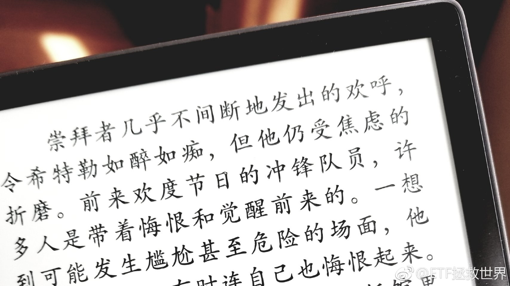

======================================================

ETF拯救世界 (5687069307) @
2018-04-08 09:28:41 Sun  
url: https://weibo.com/5687069307/Gb6rj7J1s

这样的天气不去北海划船可能已经触犯刑法了。 ​​​

转发[0]  评论[32]  赞[130] 

======================================================

ETF拯救世界 (5687069307) @
2018-04-08 09:40:30 Sun  
url: https://weibo.com/5687069307/Gb6w6p5Mb

我预计平盘报收。比美股上蹿下跳不知道高到哪里去了。

------------------------------------------------------
转推：
>  @亟兮般若 (1769469393)
>  2018-04-08 09:38:55 Sun  
>  url: https:/weibo.com/1769469393/Gb6vstH7Z/

>  今天看来走势很平稳，贸易战对A股影响不大嘛[允悲][允悲][允悲][允悲] ​​​

转发[5]  评论[45]  赞[107] 

======================================================

ETF拯救世界 (5687069307) @
2018-04-08 11:21:46 Sun  
url: https://weibo.com/5687069307/Gb7bcm0ZD

男孩女孩都要教育。

------------------------------------------------------
转推：
>  @王大伟 (1227198941)
>  2018-04-07 07:11:44 Sat  
>  url: https:/weibo.com/1227198941/GaW7egaKq/

>  告诉女孩，身边也有大灰狼
>  
>  当了一辈子警察，有两件事情，不忍去看。不忍去听，一个是拐卖孩子，再有一个就是欺负小女孩。
>  何为菩萨？天使？理想？归宿？桑枣中学的叶校长苦口婆心教孩子演习，汶川地震时孩子无一死伤，被家长称为菩萨。有人吃斋、有人念佛。也许，我们每一个凡人，护士、教师，忽然顿 ​​​

转发[42]  评论[14]  赞[103] 

======================================================

ETF拯救世界 (5687069307) @
2018-04-08 11:41:17 Sun  
url: https://weibo.com/5687069307/Gb7j87dvF

最近看了几个新闻，有些想法，不一定成熟，说出来讨论。

是关于几个自杀大学生的新闻。

我在这里不想说涉事教师的问题，自会有公断，我想讨论的，是孩子走到自杀这一步，父母有没有问题。

我想每个人的人生，或多或少都会遇到很多挫折。但想到去自杀的人不会是大多数，真的去做的更少。我没想过自杀 ​​​

转发[65]  评论[121]  赞[378] 

======================================================

ETF拯救世界 (5687069307) @
2018-04-08 14:29:58 Sun  
url: https://weibo.com/5687069307/Gb8pB8Ujt

我想了想，父母做什么事会导致孩子不愿意跟父母沟通了呢。

第一是欺骗。比如承诺的事不做。
第二是嘲笑。比如孩子觉得很自豪的事情被父母无情嘲笑。
第三是不重视或者不支持。比如孩子的想法不当回事，把自己的意愿强加给孩子，孩子说什么都没用，只是父母的傀儡。

总而言之就是不把孩子当成平等的人 ​​​

转发[103]  评论[76]  赞[222] 

======================================================

ETF拯救世界 (5687069307) @
2018-04-08 14:49:23 Sun  
url: https://weibo.com/5687069307/Gb8xtxONU

回复@2006好好2018:我还是之前的那个观点，这个社会的苦，足够孩子吃了。你不给他主动设置障碍，这一辈子他都有无数的苦要吃。一个人的极限承受能力应该不是吃苦越来越多承受能力越来越强，而是心中的信念或者爱足够支撑自己走下去。

------------------------------------------------------
转推：
>  @ETF拯救世界 (5687069307)
>  2018-04-08 14:29:58 Sun  
>  url: https:/weibo.com/5687069307/Gb8pB8Ujt/

>  我想了想，父母做什么事会导致孩子不愿意跟父母沟通了呢。
>  
>  第一是欺骗。比如承诺的事不做。
>  第二是嘲笑。比如孩子觉得很自豪的事情被父母无情嘲笑。
>  第三是不重视或者不支持。比如孩子的想法不当回事，把自己的意愿强加给孩子，孩子说什么都没用，只是父母的傀儡。
>  
>  总而言之就是不把孩子当成平等的人 ​​​

转发[45]  评论[50]  赞[248] 

======================================================

ETF拯救世界 (5687069307) @
2018-04-08 15:02:37 Sun  
url: https://weibo.com/5687069307/Gb8CQAgKU

就比如说吧，你拿着指数基金上上下下左左右右BABA波动很多次还在浮亏，那让你继续拿下去的动力是未来会赚钱的希望还是波动多了赔得多了习惯了……[doge]

------------------------------------------------------
转推：
>  @ETF拯救世界 (5687069307)
>  2018-04-08 14:29:58 Sun  
>  url: https:/weibo.com/5687069307/Gb8pB8Ujt/

>  我想了想，父母做什么事会导致孩子不愿意跟父母沟通了呢。
>  
>  第一是欺骗。比如承诺的事不做。
>  第二是嘲笑。比如孩子觉得很自豪的事情被父母无情嘲笑。
>  第三是不重视或者不支持。比如孩子的想法不当回事，把自己的意愿强加给孩子，孩子说什么都没用，只是父母的傀儡。
>  
>  总而言之就是不把孩子当成平等的人 ​​​

转发[8]  评论[47]  赞[140] 

======================================================

ETF拯救世界 (5687069307) @
2018-04-09 09:39:05 Mon  
url: https://weibo.com/5687069307/GbfW1tWgz

今天不能跌，GJD加油。仗还没打，气势不能输。 ​​​

转发[10]  评论[47]  赞[195] 

======================================================

ETF拯救世界 (5687069307) @
2018-04-09 09:59:46 Mon  
url: https://weibo.com/5687069307/Gbg4q6GfK

做大判断要了解LD的意图。第一是稳定，第二是面子。有稳定给面子，一切都好说。

------------------------------------------------------
转推：
>  @ETF拯救世界 (5687069307)
>  2018-04-09 09:39:05 Mon  
>  url: https:/weibo.com/5687069307/GbfW1tWgz/

>  今天不能跌，GJD加油。仗还没打，气势不能输。 ​​​

转发[4]  评论[39]  赞[148] 

======================================================

ETF拯救世界 (5687069307) @
2018-04-09 14:46:14 Mon  
url: https://weibo.com/5687069307/GbhWHdqPp

2分，50元。感觉是在鼓励。

------------------------------------------------------
转推：
>  @澎湃新闻 (5044281310)
>  2018-04-09 14:44:03 Mon  
>  url: https:/weibo.com/5044281310/GbhVOhLu3/

>  【开车录唱歌视频、双手脱靶“比心”，浙江一抖音女主播被罚】 http://t.cn/RmVk1uf 澎湃新闻4月9日从台州市公安局网络警察支队获悉，支队接网民举报后联合交警查实，违法嫌疑人林某5日驾驶奔驰越野车时，把手机放在副驾前中控台的手机架上，用手机前置摄像头拍了一段15秒的视频。视频中，林某未系安全 ​​​

转发[1]  评论[35]  赞[71] 

======================================================

ETF拯救世界 (5687069307) @
2018-04-09 15:02:09 Mon  
url: https://weibo.com/5687069307/Gbi39DXHm

沪深300收盘-0.03%。任务完成的不完美。好在上证挺住了。明天继续加油。气势不能输！

------------------------------------------------------
转推：
>  @ETF拯救世界 (5687069307)
>  2018-04-09 09:39:05 Mon  
>  url: https:/weibo.com/5687069307/GbfW1tWgz/

>  今天不能跌，GJD加油。仗还没打，气势不能输。 ​​​

转发[0]  评论[34]  赞[140] 

======================================================

ETF拯救世界 (5687069307) @
2018-04-09 16:10:11 Mon  
url: https://weibo.com/5687069307/GbiuM178i

问问有经验的，带4、5岁的孩子出去玩的话，什么地方比较好。

邮轮。或者国内比较休闲的地方，杭州之类的。还有没有更好的主意。从没带孩子出远门，我觉得可以开始了。 ​​​

转发[48]  评论[433]  赞[168] 

======================================================

ETF拯救世界 (5687069307) @
2018-04-10 09:47:57 Tue  
url: https://weibo.com/5687069307/Gbpq762Hg

$证券公司 sz399975$  能跳多高 ​​​

转发[3]  评论[33]  赞[101] 

======================================================

ETF拯救世界 (5687069307) @
2018-04-10 10:39:30 Tue  
url: https://weibo.com/5687069307/GbpL2ElqE

鸡肋时间。

特别鸡肋。干点别的去吧。 ​​​

转发[0]  评论[26]  赞[141] 

======================================================

ETF拯救世界 (5687069307) @
2018-04-10 11:24:29 Tue  
url: https://weibo.com/5687069307/Gbq3iDrtp

不放点诱饵你怎么上钩。太坏了。 ​​​

转发[5]  评论[55]  赞[162] 

======================================================

ETF拯救世界 (5687069307) @
2018-04-10 14:01:59 Tue  
url: https://weibo.com/5687069307/Gbr5entJ0

回复@落叶女青年7998:目前看可能性不太大。在目前这个区域，该买的都已经买的差不多了。仓位也挺合适。随缘吧。//@落叶女青年7998:老大，四月中旬发车不？

------------------------------------------------------
转推：
>  @ETF拯救世界 (5687069307)
>  2018-04-10 11:24:29 Tue  
>  url: https:/weibo.com/5687069307/Gbq3iDrtp/

>  不放点诱饵你怎么上钩。太坏了。 ​​​

转发[2]  评论[34]  赞[94] 

======================================================

ETF拯救世界 (5687069307) @
2018-04-10 15:05:16 Tue  
url: https://weibo.com/5687069307/GbruV6ECn

再创收盘新高。不要卖。

------------------------------------------------------
转推：
>  @ETF拯救世界 (5687069307)
>  2017-10-18 11:27:47 Wed  
>  url: https:/weibo.com/5687069307/FqVaz4iTP/

>  $全指医药 sh000991$ $养老产业 sz399812$ 
>  
>  事情还没有结束。 ​​​

转发[4]  评论[92]  赞[150] 

======================================================

ETF拯救世界 (5687069307) @
2018-04-10 23:07:15 Tue  
url: https://weibo.com/5687069307/GbuEyqIpX

三个月了，总算有点波动了 ​​​

转发[1]  评论[41]  赞[139] 

+++++++++++++++++++++++++++++++++++++++++++++++++++++

图片：

======================================================

ETF拯救世界 (5687069307) @
2018-04-10 23:41:52 Tue  
url: https://weibo.com/5687069307/GbuSByQoM

每日打卡（171）

19000步 ​​​

转发[0]  评论[16]  赞[125] 

+++++++++++++++++++++++++++++++++++++++++++++++++++++

图片：

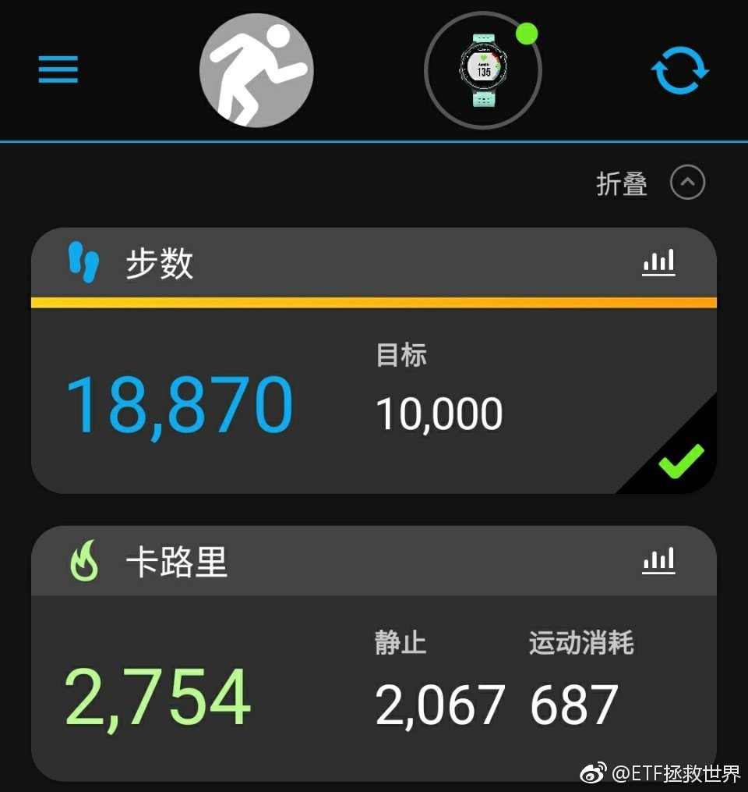

======================================================

ETF拯救世界 (5687069307) @
2018-04-11 09:35:12 Wed  
url: https://weibo.com/5687069307/GbyLrmfoZ

舒服。 ​​​

转发[0]  评论[56]  赞[139] 

======================================================

ETF拯救世界 (5687069307) @
2018-04-11 11:26:17 Wed  
url: https://weibo.com/5687069307/GbzuxhvGI

开不开沪伦通无所谓，能不能先把英国ETF发了？现在估值16倍多，是个不错的买入时机啊。英镑又在相对低位，赶紧的。

------------------------------------------------------
转推：
>  @ ()
>  2018-04-11 11:17:22 Wed  
>  url: 

>  抱歉，作者已设置仅展示半年内微博，此微博已不可见。 ​​​

转发[19]  评论[61]  赞[166] 

======================================================

ETF拯救世界 (5687069307) @
2018-04-11 15:09:57 Wed  
url: https://weibo.com/5687069307/GbAXjxTWy

回复@山水6666:非常操心。认真带一个孩子，才知道带孩子有多累，要操多少心。如果只是回家和孩子做做游戏，玩玩，两个三个都无所谓。当然越多越好……这世界上的累是公平的。你觉得不累，就是有人替你累了。

------------------------------------------------------
转推：
>  @ETF拯救世界 (5687069307)
>  2018-04-09 16:10:11 Mon  
>  url: https:/weibo.com/5687069307/GbiuM178i/

>  问问有经验的，带4、5岁的孩子出去玩的话，什么地方比较好。
>  
>  邮轮。或者国内比较休闲的地方，杭州之类的。还有没有更好的主意。从没带孩子出远门，我觉得可以开始了。 ​​​

转发[9]  评论[78]  赞[205] 

======================================================

ETF拯救世界 (5687069307) @
2018-04-12 09:22:33 Thu  
url: https://weibo.com/5687069307/GbI6NE7wv

祸从口出。沉默是金。

------------------------------------------------------
转推：
>  @新京报我们视频 (6124642021)
>  2018-04-11 22:14:35 Wed  
>  url: https:/weibo.com/6124642021/GbDJG2X3x/

>  【在逃嫌疑人正跟妹子吹牛 没想到周围有11名便衣民警也在宵夜】4月10日，浙江乐清一家夜宵店内，有桌人聊得火热，一男子大声吹嘘自己，引起旁边民警的注意。民警陈建锋说，自己一抬头刚好和男子对视了一下，短短几秒钟他迅速想起男子是名在逃嫌疑人。“我们拍着他的肩膀叫他名字，他当时就愣住了”。 ​​​

转发[3]  评论[26]  赞[64] 

======================================================

ETF拯救世界 (5687069307) @
2018-04-12 11:14:37 Thu  
url: https://weibo.com/5687069307/GbIQhdUab

$全指医药 sh000991$   不要卖 ​​​

转发[125]  评论[58]  赞[134] 

======================================================

ETF拯救世界 (5687069307) @
2018-04-12 11:28:14 Thu  
url: https://weibo.com/5687069307/GbIVOAhWT

回复@902yuyu:你种了100亩地，种的是玉米。会不会在春天刚刚发芽的时候把所有青苗拔掉。很多人会。我不会。我要的是秋天的玉米，不是春天的苗。所以很多人每年都在忙碌，什么也没收获过。//@902yuyu:其实你要不说，我真是想卖掉了

------------------------------------------------------
转推：
>  @ETF拯救世界 (5687069307)
>  2018-04-12 11:14:37 Thu  
>  url: https:/weibo.com/5687069307/GbIQhdUab/

>  $全指医药 sh000991$   不要卖 ​​​

转发[17]  评论[30]  赞[122] 

======================================================

ETF拯救世界 (5687069307) @
2018-04-12 11:40:50 Thu  
url: https://weibo.com/5687069307/GbJ0W0Pz5

所有指数类产品，过去十年，我没有亏损卖出过任何一个品种。亏是不可能亏的，一辈子都不会亏。要么是想方设法把成本降下来，要么是死死拿住等风来。

所以，只要你不亏损卖出，就会翻盘。

某个时期，如果你害怕的一定要亏损卖出，谁都救不了你。 ​​​

转发[72]  评论[93]  赞[222] 

======================================================

ETF拯救世界 (5687069307) @
2018-04-12 11:48:30 Thu  
url: https://weibo.com/5687069307/GbJ42iU2R

回复@八月未央歌Ed:不懂为什么不安。中国最好的几百家医药公司的股权在你手上，你的成本比最高点低了40%多，如果能回去，你就翻番了。 买的也不多，再跌大把钱摊低成本。怕什么，怕的点在哪里？//@八月未央歌Ed:现在又觉得买少了，忘了当初拿着时是怎样的惴惴不安

------------------------------------------------------
转推：
>  @ETF拯救世界 (5687069307)
>  2018-04-12 11:14:37 Thu  
>  url: https:/weibo.com/5687069307/GbIQhdUab/

>  $全指医药 sh000991$   不要卖 ​​​

转发[13]  评论[32]  赞[116] 

======================================================

ETF拯救世界 (5687069307) @
2018-04-12 12:25:58 Thu  
url: https://weibo.com/5687069307/GbJjfxEzr

回复@江湖人称再议哥:你太有天分了。趋势投资的部分，这两句都是金句。股票涨起来没有天花板，跌起来地下室下面还有18层地狱……但是只对趋势有效，价值投资当然是够便宜就买了。左侧右侧不同逻辑。//@江湖人称再议哥:新高不卖是不是对应新低不买？

------------------------------------------------------
转推：
>  @ETF拯救世界 (5687069307)
>  2018-04-12 11:14:37 Thu  
>  url: https:/weibo.com/5687069307/GbIQhdUab/

>  $全指医药 sh000991$   不要卖 ​​​

转发[82]  评论[38]  赞[110] 

======================================================

ETF拯救世界 (5687069307) @
2018-04-12 12:34:56 Thu  
url: https://weibo.com/5687069307/GbJmTjMHZ

回复@nasaznk:主动基金的最大问题在于“不可测”。你不知道它会干什么。比如会不会底部减仓，高位加仓，会不会熊市一路重仓，牛市一路轻仓。所以不好说。//@nasaznk:是不是买普通基金也要按这个思路？

------------------------------------------------------
转推：
>  @ETF拯救世界 (5687069307)
>  2018-04-12 11:40:50 Thu  
>  url: https:/weibo.com/5687069307/GbJ0W0Pz5/

>  所有指数类产品，过去十年，我没有亏损卖出过任何一个品种。亏是不可能亏的，一辈子都不会亏。要么是想方设法把成本降下来，要么是死死拿住等风来。
>  
>  所以，只要你不亏损卖出，就会翻盘。
>  
>  某个时期，如果你害怕的一定要亏损卖出，谁都救不了你。 ​​​

转发[15]  评论[17]  赞[107] 

======================================================

ETF拯救世界 (5687069307) @
2018-04-12 13:42:14 Thu  
url: https://weibo.com/5687069307/GbJOdmJlj

回复@一起去海淘:你也算有天分。这正是趋势交易的一个精髓。但注意，不是随便一个新高都可以加买。长阳放量突破长期横盘区域最高点连线的新高最值得入手。横盘时间越长，之后的走势越值得期待。这都是所谓右侧交易的东西了。//@一起去海淘:SO，新高要加买？

------------------------------------------------------
转推：
>  @ETF拯救世界 (5687069307)
>  2018-04-12 11:14:37 Thu  
>  url: https:/weibo.com/5687069307/GbIQhdUab/

>  $全指医药 sh000991$   不要卖 ​​​

转发[52]  评论[52]  赞[124] 

======================================================

ETF拯救世界 (5687069307) @
2018-04-12 13:49:28 Thu  
url: https://weibo.com/5687069307/GbJR962xb

回复@小狗上马路:谁也没说过吧！当年雪球短线实盘大赛了解一下……//@小狗上马路:谁说我们E哥不懂技术

------------------------------------------------------
转推：
>  @ETF拯救世界 (5687069307)
>  2018-04-12 11:14:37 Thu  
>  url: https:/weibo.com/5687069307/GbIQhdUab/

>  $全指医药 sh000991$   不要卖 ​​​

转发[2]  评论[18]  赞[81] 

======================================================

ETF拯救世界 (5687069307) @
2018-04-12 14:04:22 Thu  
url: https://weibo.com/5687069307/GbJXc4Zd3

投资这件事吧，都说是科学和艺术，这个我做个比喻你就懂了。

没错，投资是艺术，但它首先是科学，怎么理解。

咱们大家来投资，就是开始做一件工作。刚开始嘛，大家肯定要学习怎么干。干的效果也不一样。

都是一般工人，但有的就能勉强糊口，有的做一个坏一个，很明显就不是吃这碗饭的。

能糊口的人 ​​​

转发[95]  评论[131]  赞[281] 

======================================================

ETF拯救世界 (5687069307) @
2018-04-12 14:28:59 Thu  
url: https://weibo.com/5687069307/GbK7bqcC8

关于内涵段子，我居然都没下载过，也没用过，可能真是老了。

不过有一个特别不明白，北京马路上好多车后面都贴着“内涵段子”的车贴。这是什么情况，自发做广告吗。真爱用户？ ​​​

转发[2]  评论[108]  赞[118] 

======================================================

ETF拯救世界 (5687069307) @
2018-04-13 07:22:23 Fri  
url: https://weibo.com/5687069307/GbQKx4SvH

今天退博八小时 ​​​

转发[0]  评论[120]  赞[170] 

======================================================

ETF拯救世界 (5687069307) @
2018-04-13 16:30:30 Fri  
url: https://weibo.com/5687069307/GbUl0ja05

回来了！我去探索地球了。

月中发车不发车是个问题，周日看吧。 ​​​

转发[6]  评论[110]  赞[235] 

+++++++++++++++++++++++++++++++++++++++++++++++++++++

图片：

======================================================

ETF拯救世界 (5687069307) @
2018-04-14 22:34:24 Sat  
url: https://weibo.com/5687069307/Gc69d3KxG

每日打卡（172）

要增加频率了。 ​​​

转发[0]  评论[30]  赞[126] 

+++++++++++++++++++++++++++++++++++++++++++++++++++++

图片：

======================================================

ETF拯救世界 (5687069307) @
2018-04-15 21:13:32 Sun  
url: https://weibo.com/5687069307/Gcf2Sw2cI

每日打卡（173）

坚持 ​​​

转发[0]  评论[21]  赞[108] 

+++++++++++++++++++++++++++++++++++++++++++++++++++++

图片：

======================================================

ETF拯救世界 (5687069307) @
2018-04-16 09:44:33 Mon  
url: https://weibo.com/5687069307/GcjXIuU8r

这样来几天的话，弄不好月中的车会补上。不一定，看情况吧。世事难料。 ​​​

转发[2]  评论[39]  赞[188] 

======================================================

ETF拯救世界 (5687069307) @
2018-04-16 10:22:15 Mon  
url: https://weibo.com/5687069307/Gckd121nH

趋势一旦形成，就很难改变。无论上升还是下降。

而且会有惯性。便宜了会更便宜，贵了会更贵。

所以趋势转折的时候不要着急接飞刀，小心手。 ​​​

转发[48]  评论[77]  赞[250] 

======================================================

ETF拯救世界 (5687069307) @
2018-04-16 11:05:44 Mon  
url: https://weibo.com/5687069307/GckuFwmFe

哪能港，月中不发车威力已经这么大了？ ​​​

转发[2]  评论[40]  赞[146] 

======================================================

ETF拯救世界 (5687069307) @
2018-04-16 11:08:08 Mon  
url: https://weibo.com/5687069307/GckvEs9hE

看了看上个月中不发车后的走势，神了嘿。

------------------------------------------------------
转推：
>  @ETF拯救世界 (5687069307)
>  2018-04-16 11:05:44 Mon  
>  url: https:/weibo.com/5687069307/GckuFwmFe/

>  哪能港，月中不发车威力已经这么大了？ ​​​

转发[0]  评论[13]  赞[113] 

======================================================

ETF拯救世界 (5687069307) @
2018-04-16 11:12:38 Mon  
url: https://weibo.com/5687069307/GckxsFwuI

回复@胡桃子他爸:主要靠蒙。//@胡桃子他爸:回复@ETF拯救世界:关键是如何定义高与低呢？

------------------------------------------------------
转推：
>  @ETF拯救世界 (5687069307)
>  2018-04-16 11:05:44 Mon  
>  url: https:/weibo.com/5687069307/GckuFwmFe/

>  哪能港，月中不发车威力已经这么大了？ ​​​

转发[0]  评论[25]  赞[122] 

======================================================

ETF拯救世界 (5687069307) @
2018-04-16 13:24:44 Mon  
url: https://weibo.com/5687069307/Gclp5zNmf

周末去摸了摸真机，还是感觉厚了。摸惯s8的手有点不适应。所以还是先不买了。给家里人买了个苹果x。太难用了！面容解锁难用，指纹解锁没了，大多数时间都得输密码。然后用起来没有实体键感觉各种不方便。。以前快捷方式是上划，现在变成什么了？我想锁定竖屏找了半天没有气坏了。

------------------------------------------------------
转推：
>  @ETF拯救世界 (5687069307)
>  2018-04-03 08:43:55 Tue  
>  url: https:/weibo.com/5687069307/Gal0E7Q0z/

>  准备抢个mix 2s玩玩。有没有用mix 2的朋友说说好不好玩。 ​​​

转发[7]  评论[57]  赞[73] 

======================================================

ETF拯救世界 (5687069307) @
2018-04-16 13:31:55 Mon  
url: https://weibo.com/5687069307/Gcls0t9Vd

回复@卡农inD:比如说吧，带个口罩或者太阳镜，解不了吧。再比如想看个时间，结果啪解锁了。s8也有面容解锁虹膜解锁，但是因为有指纹所以可以关掉那些。x关掉面容只能输密码了。还有以前打开手电计算器那些快捷方式的主页上划现在变成什么了……//@卡农inD:我用的挺好啊

------------------------------------------------------
转推：
>  @ETF拯救世界 (5687069307)
>  2018-04-03 08:43:55 Tue  
>  url: https:/weibo.com/5687069307/Gal0E7Q0z/

>  准备抢个mix 2s玩玩。有没有用mix 2的朋友说说好不好玩。 ​​​

转发[0]  评论[14]  赞[46] 

======================================================

ETF拯救世界 (5687069307) @
2018-04-16 13:42:22 Mon  
url: https://weibo.com/5687069307/GclwfpqXH

1月25日。值得纪念。

------------------------------------------------------
转推：
>  @ETF拯救世界 (5687069307)
>  2018-01-25 11:18:26 Thu  
>  url: https:/weibo.com/5687069307/G00XC3BZQ/

>  不少人会在“价值投资元年”之后，在一些“蓝筹股”上套3-5年 ​​​

转发[47]  评论[21]  赞[132] 

======================================================

ETF拯救世界 (5687069307) @
2018-04-16 14:02:03 Mon  
url: https://weibo.com/5687069307/GclEffgzd

回复@金顶佛光:不好意思做不到所有品种都买在最低。我只能说14 pe 1.5 pb 每年三个多点股息买不了吃亏买不了上当。//@金顶佛光:中证红利岂不是买得有点高//@ETF拯救世界:1月25日。值得纪念。

------------------------------------------------------
转推：
>  @ETF拯救世界 (5687069307)
>  2018-01-25 11:18:26 Thu  
>  url: https:/weibo.com/5687069307/G00XC3BZQ/

>  不少人会在“价值投资元年”之后，在一些“蓝筹股”上套3-5年 ​​​

转发[43]  评论[36]  赞[128] 

======================================================

ETF拯救世界 (5687069307) @
2018-04-16 14:33:09 Mon  
url: https://weibo.com/5687069307/GclQRoKeQ

回复@慢慢落:墨菲定律了解一下//@慢慢落:回复@ETF拯救世界:我老婆的 iPhone X 摔了一下，外表无伤，但是前置摄像头就坏了，face ID 也就不能工作了；之前买的国行iPhone 6和iPhone 7 plus，百摔无事，这次自信的买了一个日版iPhone X就这样了，真是[太阳][doge]

------------------------------------------------------
转推：
>  @ETF拯救世界 (5687069307)
>  2018-04-03 08:43:55 Tue  
>  url: https:/weibo.com/5687069307/Gal0E7Q0z/

>  准备抢个mix 2s玩玩。有没有用mix 2的朋友说说好不好玩。 ​​​

转发[0]  评论[11]  赞[59] 

======================================================

ETF拯救世界 (5687069307) @
2018-04-16 14:33:57 Mon  
url: https://weibo.com/5687069307/GclRbuX38

回复@南直隶吏部尚书:这又不同了。个股以及板块，与相对宽基的指数还是有区别。比如，如果银行业突然面临某些整体问题呢。//@南直隶吏部尚书:那我买了几个银行，pe<10，破净，如何？

------------------------------------------------------
转推：
>  @ETF拯救世界 (5687069307)
>  2018-01-25 11:18:26 Thu  
>  url: https:/weibo.com/5687069307/G00XC3BZQ/

>  不少人会在“价值投资元年”之后，在一些“蓝筹股”上套3-5年 ​​​

转发[30]  评论[21]  赞[85] 

======================================================

ETF拯救世界 (5687069307) @
2018-04-16 16:04:33 Mon  
url: https://weibo.com/5687069307/GcmrXv2Jl

回复@Sunrise光光光:最不喜欢没有数据全凭感觉的。最关键一点，我的红利只有14倍，你的300是24 http://t.cn/RmH392P //@Sunrise光光光:回复@Sunrise光光光:走势雷同 指标雷同  性质也雷同  涨幅看510300比中证红利还高些

------------------------------------------------------
转推：
>  @ETF拯救世界 (5687069307)
>  2018-01-25 11:18:26 Thu  
>  url: https:/weibo.com/5687069307/G00XC3BZQ/

>  不少人会在“价值投资元年”之后，在一些“蓝筹股”上套3-5年 ​​​

转发[24]  评论[14]  赞[72] 

======================================================

ETF拯救世界 (5687069307) @
2018-04-16 16:13:19 Mon  
url: https://weibo.com/5687069307/GcmvwflSl

对了，还有，富国红利这三年还跑赢全收益指数6%，等于跑赢300etf大概36%以上了。//@ETF拯救世界:回复@Sunrise光光光:最不喜欢没有数据全凭感觉的。最关键一点，我的红利只有14倍，你的300是24 http://t.cn/RmH392P 

------------------------------------------------------
转推：
>  @ETF拯救世界 (5687069307)
>  2018-01-25 11:18:26 Thu  
>  url: https:/weibo.com/5687069307/G00XC3BZQ/

>  不少人会在“价值投资元年”之后，在一些“蓝筹股”上套3-5年 ​​​

转发[20]  评论[12]  赞[82] 

======================================================

ETF拯救世界 (5687069307) @
2018-04-16 16:24:10 Mon  
url: https://weibo.com/5687069307/GcmzVh4Fp

回复@浅九深:我从来不看官方或者软件上的数据。我不会把积累了十几年的资金放到一个不知道正确与否的数据上。所以从十年前我就开始自己计算记录数据了。如果我相信这个数据，恐怕2015年已经死了。//@浅九深:请问下你说的是市盈率吗？ http://t.cn/RmHr1Jy 

------------------------------------------------------
转推：
>  @ETF拯救世界 (5687069307)
>  2018-01-25 11:18:26 Thu  
>  url: https:/weibo.com/5687069307/G00XC3BZQ/

>  不少人会在“价值投资元年”之后，在一些“蓝筹股”上套3-5年 ​​​

转发[12]  评论[52]  赞[116] 

======================================================

ETF拯救世界 (5687069307) @
2018-04-16 18:00:14 Mon  
url: https://weibo.com/5687069307/GcncV2455

从今天起商界奇才我只服YT Jia

------------------------------------------------------
转推：
>  @财联社APP (2868676035)
>  2018-04-16 17:57:23 Mon  
>  url: https:/weibo.com/2868676035/GcnbLbSTk/

>  【恒大3亿美元入股FF 当时FF估值仅15亿美元】财联社4月16日讯，贾跃亭的美国新创造车公司Faraday Future（FF）的神秘投资人浮出水面。4月16日，从不同信源处获悉，房地产商恒大集团参与了FF的新一轮投资。一位接近交易的知情人士称，恒大集团位于香港的基金在2017年年底，投资了FF注册于开曼的离岸公司 ​​​

转发[2]  评论[30]  赞[105] 

======================================================

ETF拯救世界 (5687069307) @
2018-04-16 22:43:38 Mon  
url: https://weibo.com/5687069307/Gcp3X1m4e

每日打卡（174）

今天来点新鲜的 ​​​

转发[0]  评论[7]  赞[69] 

+++++++++++++++++++++++++++++++++++++++++++++++++++++

图片：

======================================================

ETF拯救世界 (5687069307) @
2018-04-16 22:47:03 Mon  
url: https://weibo.com/5687069307/Gcp5l1Q2R

今天被建信500坑了。以后不能配太多增强指基 ​​​

转发[5]  评论[75]  赞[147] 

======================================================

ETF拯救世界 (5687069307) @
2018-04-17 09:36:13 Tue  
url: https://weibo.com/5687069307/GctkPeJnM

$128034  这就是转债。转债的机会要好好把握。 ​​​

转发[9]  评论[54]  赞[107] 

======================================================

ETF拯救世界 (5687069307) @
2018-04-17 09:45:29 Tue  
url: https://weibo.com/5687069307/GctoB07zt

一大波GJD即将来临 ​​​

转发[3]  评论[32]  赞[117] 

======================================================

ETF拯救世界 (5687069307) @
2018-04-17 10:15:34 Tue  
url: https://weibo.com/5687069307/GctAO55Rd

这种时候，问问你自己的内心。如果发生连续暴跌，或者市场趋势反转牛市开始。自己的仓位舒服不舒服。

调整到舒服。 ​​​

转发[16]  评论[91]  赞[174] 

======================================================

ETF拯救世界 (5687069307) @
2018-04-17 11:27:21 Tue  
url: https://weibo.com/5687069307/Gcu3Wrbs9

回复@ETF信徒者:这一波不算完美，毕竟仓位大了，净值肯定要损失。不过当然依然很安全。再说一次，即使所有人都要死，我们也要做最后倒下的一批。//@ETF信徒者:又一次完美的避过了下跌，E大你的体系是不是有点牛的一塌糊涂，[good][good][good]

------------------------------------------------------
转推：
>  @ETF拯救世界 (5687069307)
>  2018-04-17 10:15:34 Tue  
>  url: https:/weibo.com/5687069307/GctAO55Rd/

>  这种时候，问问你自己的内心。如果发生连续暴跌，或者市场趋势反转牛市开始。自己的仓位舒服不舒服。
>  
>  调整到舒服。 ​​​

转发[3]  评论[39]  赞[150] 

======================================================

ETF拯救世界 (5687069307) @
2018-04-17 13:34:44 Tue  
url: https://weibo.com/5687069307/GcuTDzmXK

是不是逼我发车？呵呵，就不发。有本事跌更多。[doge]

------------------------------------------------------
转推：
>  @ETF拯救世界 (5687069307)
>  2018-04-16 09:44:33 Mon  
>  url: https:/weibo.com/5687069307/GcjXIuU8r/

>  这样来几天的话，弄不好月中的车会补上。不一定，看情况吧。世事难料。 ​​​

转发[0]  评论[45]  赞[137] 

======================================================

ETF拯救世界 (5687069307) @
2018-04-17 13:40:01 Tue  
url: https://weibo.com/5687069307/GcuVN9unk

我有个观察，你们注意一下。

很多特别乐观的人，包括散户和私募等等，投资的时间都很短。

没有经历过11、12，更别说08。

A股的风险，他们并不真的了解。自己的资金还好说，杠杆，或者是客户的资金，就未必能那么踏实的扛过真正的熊市。 ​​​

转发[13]  评论[81]  赞[182] 

======================================================

ETF拯救世界 (5687069307) @
2018-04-17 14:17:45 Tue  
url: https://weibo.com/5687069307/Gcvb6zR9i

只希望GJD不要动手，好好让市场回归。我们会来护盘的。 ​​​

转发[16]  评论[51]  赞[180] 

======================================================

ETF拯救世界 (5687069307) @
2018-04-17 14:36:41 Tue  
url: https://weibo.com/5687069307/GcviNfemg

回复@贰零壹柒无所谓:讲真，从我的趋势系统看，明显走弱已经很久了，怎么会毫无征兆呢。当然很多人不信这个罢了。//@贰零壹柒无所谓:毫无征兆下跌，这是为什么呢[允悲]

------------------------------------------------------
转推：
>  @ETF拯救世界 (5687069307)
>  2018-04-17 14:17:45 Tue  
>  url: https:/weibo.com/5687069307/Gcvb6zR9i/

>  只希望GJD不要动手，好好让市场回归。我们会来护盘的。 ​​​

转发[4]  评论[22]  赞[116] 

======================================================

ETF拯救世界 (5687069307) @
2018-04-17 14:47:37 Tue  
url: https://weibo.com/5687069307/GcvnejM8B

谢谢！不过今天不买，不好意思！

------------------------------------------------------
转推：
>  @ETF拯救世界 (5687069307)
>  2018-04-17 14:17:45 Tue  
>  url: https:/weibo.com/5687069307/Gcvb6zR9i/

>  只希望GJD不要动手，好好让市场回归。我们会来护盘的。 ​​​

转发[7]  评论[57]  赞[125] 

======================================================

ETF拯救世界 (5687069307) @
2018-04-17 15:14:48 Tue  
url: https://weibo.com/5687069307/GcvygmLdv

回复@iuanqiang:谢谢这位朋友！昨天s8升级后，基本不卡了。支持双开了。比较完美，感觉还能玩半年。//@iuanqiang:s8升级8.0后感觉速度暴增啊 电量控制也好了一些 ，老大赶紧也试试

------------------------------------------------------
转推：
>  @ETF拯救世界 (5687069307)
>  2018-04-03 08:43:55 Tue  
>  url: https:/weibo.com/5687069307/Gal0E7Q0z/

>  准备抢个mix 2s玩玩。有没有用mix 2的朋友说说好不好玩。 ​​​

转发[4]  评论[31]  赞[78] 

======================================================

ETF拯救世界 (5687069307) @
2018-04-17 19:32:28 Tue  
url: https://weibo.com/5687069307/GcxeQFsMv

我错了，以后不再开GJD的玩笑了！//@ETF拯救世界:谢谢！不过今天不买，不好意思！

------------------------------------------------------
转推：
>  @ETF拯救世界 (5687069307)
>  2018-04-17 14:17:45 Tue  
>  url: https:/weibo.com/5687069307/Gcvb6zR9i/

>  只希望GJD不要动手，好好让市场回归。我们会来护盘的。 ​​​

转发[3]  评论[94]  赞[137] 

======================================================

ETF拯救世界 (5687069307) @
2018-04-18 09:21:47 Wed  
url: https://weibo.com/5687069307/GcCFsCGT2

被央妈搞得心浮气躁，喝了一杯星冰乐凉快多了。

坐看今天群魔乱舞。 ​​​

转发[13]  评论[134]  赞[178] 

======================================================

ETF拯救世界 (5687069307) @
2018-04-18 10:26:18 Wed  
url: https://weibo.com/5687069307/GcD5Fibor

回复@关耳人圭:如果那样，准备迎接飞跃吧。//@关耳人圭:e大，这次贸易战会不会像金融危机一样是个机会，中兴被禁，科技股是不是会遭殃

------------------------------------------------------
转推：
>  @ETF拯救世界 (5687069307)
>  2018-04-18 09:21:47 Wed  
>  url: https:/weibo.com/5687069307/GcCFsCGT2/

>  被央妈搞得心浮气躁，喝了一杯星冰乐凉快多了。
>  
>  坐看今天群魔乱舞。 ​​​

转发[2]  评论[23]  赞[101] 

======================================================

ETF拯救世界 (5687069307) @
2018-04-18 10:39:20 Wed  
url: https://weibo.com/5687069307/GcDaWEXR4

回复@88免费收录网址导航:你不开我不开，谁来保卫祖国保卫家！//@88免费收录网址导航:今天这车要不要继续开啊？

------------------------------------------------------
转推：
>  @ETF拯救世界 (5687069307)
>  2018-04-18 09:21:47 Wed  
>  url: https:/weibo.com/5687069307/GcCFsCGT2/

>  被央妈搞得心浮气躁，喝了一杯星冰乐凉快多了。
>  
>  坐看今天群魔乱舞。 ​​​

转发[5]  评论[20]  赞[113] 

======================================================

ETF拯救世界 (5687069307) @
2018-04-18 10:41:26 Wed  
url: https://weibo.com/5687069307/GcDbNAxak

回复@恶人假mm:因为要保命。都死光了怎么护盘。//@恶人假mm:会不会开的太少了点[允悲][允悲]//@ETF拯救世界:回复@88免费收录网址导航:你不开我不开，谁来保卫祖国保卫家！//@88免费收录网址导航:今天这车要不要继续开啊？

------------------------------------------------------
转推：
>  @ETF拯救世界 (5687069307)
>  2018-04-18 09:21:47 Wed  
>  url: https:/weibo.com/5687069307/GcCFsCGT2/

>  被央妈搞得心浮气躁，喝了一杯星冰乐凉快多了。
>  
>  坐看今天群魔乱舞。 ​​​

转发[2]  评论[11]  赞[99] 

======================================================

ETF拯救世界 (5687069307) @
2018-04-18 10:44:23 Wed  
url: https://weibo.com/5687069307/GcDd05ITn

喷了，万万没想到。

下午会怎样？3000守不守，学习好的说说。 ​​​

转发[10]  评论[151]  赞[183] 

======================================================

ETF拯救世界 (5687069307) @
2018-04-18 13:38:35 Wed  
url: https://weibo.com/5687069307/GcElIg8Xa

回复@天啊我是笨蛋还不行:每次都这样说明____//@天啊我是笨蛋还不行:你自己说你是不是毒奶。。。10：44全天最低点

------------------------------------------------------
转推：
>  @ETF拯救世界 (5687069307)
>  2018-04-18 10:44:23 Wed  
>  url: https:/weibo.com/5687069307/GcDd05ITn/

>  喷了，万万没想到。
>  
>  下午会怎样？3000守不守，学习好的说说。 ​​​

转发[2]  评论[53]  赞[86] 

======================================================

ETF拯救世界 (5687069307) @
2018-04-18 14:16:03 Wed  
url: https://weibo.com/5687069307/GcEAUxDTH

回复@可爱多兄弟:没明白为什么不发。因为涨了0.2%？//@可爱多兄弟:红利还发车吗 同学们

------------------------------------------------------
转推：
>  @ETF拯救世界 (5687069307)
>  2018-04-18 10:44:23 Wed  
>  url: https:/weibo.com/5687069307/GcDd05ITn/

>  喷了，万万没想到。
>  
>  下午会怎样？3000守不守，学习好的说说。 ​​​

转发[2]  评论[74]  赞[111] 

======================================================

ETF拯救世界 (5687069307) @
2018-04-18 17:32:24 Wed  
url: https://weibo.com/5687069307/GcFSC4W1c

2015年80倍的一个指数目前只有26倍了。天了噜。群众的情绪太可怕了。 ​​​

转发[18]  评论[82]  赞[190] 

======================================================

ETF拯救世界 (5687069307) @
2018-04-18 19:12:58 Wed  
url: https://weibo.com/5687069307/GcGxr0c36

三个月了……敢不敢波动一下 ​​​

转发[2]  评论[49]  赞[78] 

+++++++++++++++++++++++++++++++++++++++++++++++++++++

图片：

======================================================

ETF拯救世界 (5687069307) @
2018-04-18 19:55:16 Wed  
url: https://weibo.com/5687069307/GcGOBmYf1

//@医生妈妈欧茜:谭秦东多次提到我的名字，说是看了我的文章后写出了导致他被“跨省”的文章。他指的应该是这篇：http://t.cn/Rm3y3Dc

------------------------------------------------------
转推：
>  @ ()
>  2018-04-18 09:22:44 Wed  
>  url: 

>  抱歉，由于作者设置，你暂时没有这条微博的查看权限哦。查看帮助：http://t.cn/RfdBWwP ​​​

转发[23]  评论[19]  赞[63] 

======================================================

ETF拯救世界 (5687069307) @
2018-04-18 21:17:43 Wed  
url: https://weibo.com/5687069307/GcHm4kCB3

今天债基飞了 ​​​

转发[1]  评论[28]  赞[152] 

======================================================

ETF拯救世界 (5687069307) @
2018-04-18 21:31:12 Wed  
url: https://weibo.com/5687069307/GcHrxw7Tv

之前很多朋友说，债券没有搞头，我就不跟了。

我一般不会反驳或者解释。没用，只有你自己经历过才会懂。

我的每一笔操作，都是用时间累积出来的。

慢慢看吧。 ​​​

转发[17]  评论[89]  赞[267] 

+++++++++++++++++++++++++++++++++++++++++++++++++++++

图片：

======================================================

ETF拯救世界 (5687069307) @
2018-04-18 21:51:19 Wed  
url: https://weibo.com/5687069307/GcHzHmPrg

没有不好的品种，只有不好的价格 ​​​

转发[8]  评论[36]  赞[149] 

+++++++++++++++++++++++++++++++++++++++++++++++++++++

图片：
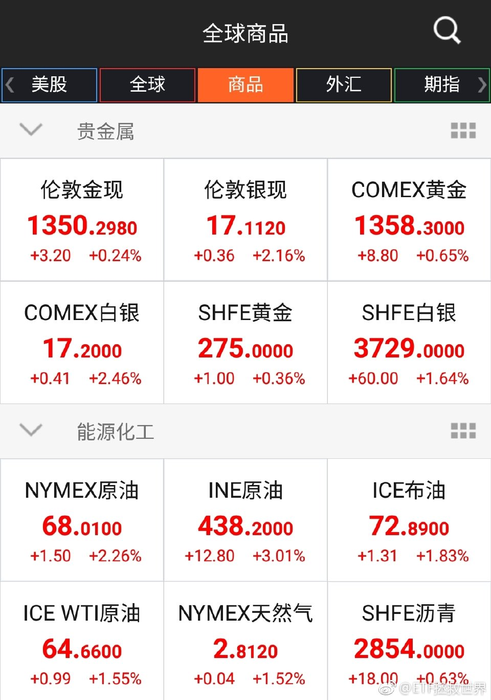

======================================================

ETF拯救世界 (5687069307) @
2018-04-19 06:24:51 Thu  
url: https://weibo.com/5687069307/GcKW91HDO

三年多新高了。油气能跟上吗 ​​​

转发[4]  评论[42]  赞[113] 

+++++++++++++++++++++++++++++++++++++++++++++++++++++

图片：

======================================================

ETF拯救世界 (5687069307) @
2018-04-19 07:50:48 Thu  
url: https://weibo.com/5687069307/GcLv2kFRq

废话，彩票中大奖的人更少，买的人更多。要是开放合法赌场，玩的人也不会少。每个人都觉得自己能从别人兜里把钱挣出来。 http://t.cn/R8BGMEU ​​​

转发[18]  评论[15]  赞[108] 

======================================================

ETF拯救世界 (5687069307) @
2018-04-19 08:03:08 Thu  
url: https://weibo.com/5687069307/GcLA2Ai68

中兴这么大公司，怎么感觉说破产就能破产。

个股风险太大。 ​​​

转发[11]  评论[68]  赞[177] 

======================================================

ETF拯救世界 (5687069307) @
2018-04-19 08:06:16 Thu  
url: https://weibo.com/5687069307/GcLBjuD7W

回复@阿呆呆君:一辈子不卖？只要你卖，就是赚了别人的钱。不好意思，我第一希望赚经济增长的钱，第二希望赚别人的钱。毕竟在股市，赚别人的钱比别人赚自己的钱开心多了。//@阿呆呆君:我希望让优质企业帮我赚钱，而不是赚别人口袋里的钱。

------------------------------------------------------
转推：
>  @ETF拯救世界 (5687069307)
>  2018-04-19 07:50:48 Thu  
>  url: https:/weibo.com/5687069307/GcLv2kFRq/

>  废话，彩票中大奖的人更少，买的人更多。要是开放合法赌场，玩的人也不会少。每个人都觉得自己能从别人兜里把钱挣出来。 http://t.cn/R8BGMEU ​​​

转发[7]  评论[33]  赞[123] 

======================================================

ETF拯救世界 (5687069307) @
2018-04-19 11:34:10 Thu  
url: https://weibo.com/5687069307/GcMXHvA5T

昨天有没有人因为涨了0.4%没买的。

哭晕在厕所了吧。 ​​​

转发[25]  评论[115]  赞[187] 

======================================================

ETF拯救世界 (5687069307) @
2018-04-19 12:01:43 Thu  
url: https://weibo.com/5687069307/GcN8T0RrM

转发微博

------------------------------------------------------
转推：
>  @数知实验室 (5676384100)
>  2018-04-19 11:01:03 Thu  
>  url: https:/weibo.com/5676384100/GcMKgbUpy/

>  麦肯锡发布的中美科技差距雷达图[并不简单] ​​​

转发[53]  评论[41]  赞[92] 

======================================================

ETF拯救世界 (5687069307) @
2018-04-19 14:59:03 Thu  
url: https://weibo.com/5687069307/GcOiRu6lR

今天心情不好。跟投资无关。 ​​​

转发[2]  评论[190]  赞[158] 

======================================================

ETF拯救世界 (5687069307) @
2018-04-19 15:32:51 Thu  
url: https://weibo.com/5687069307/GcOwAdU1G

今天涨了，然后……估值还在下降……

------------------------------------------------------
转推：
>  @ETF拯救世界 (5687069307)
>  2018-04-18 17:32:24 Wed  
>  url: https:/weibo.com/5687069307/GcFSC4W1c/

>  2015年80倍的一个指数目前只有26倍了。天了噜。群众的情绪太可怕了。 ​​​

转发[6]  评论[97]  赞[175] 

======================================================

ETF拯救世界 (5687069307) @
2018-04-19 21:31:21 Thu  
url: https://weibo.com/5687069307/GcQS6eN7W

每日打卡（175）

从今天开始，连续打卡40天。除非生病。欢迎监督。 ​​​

转发[1]  评论[52]  赞[245] 

+++++++++++++++++++++++++++++++++++++++++++++++++++++

图片：

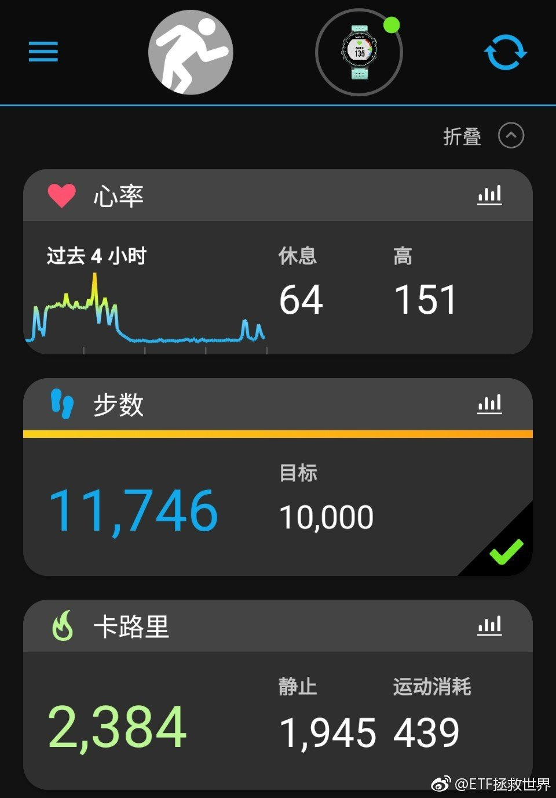

======================================================

ETF拯救世界 (5687069307) @
2018-04-20 10:57:50 Fri  
url: https://weibo.com/5687069307/GcW9sni3f

超过35%了。个股风险太大//@ETF拯救世界:超过30%了。

------------------------------------------------------
转推：
>  @ETF拯救世界 (5687069307)
>  2018-01-04 14:12:41 Thu  
>  url: https:/weibo.com/5687069307/FCNAebMp1/

>  没想到浓眉大眼的保险股也跌了20%…… ​​​

转发[7]  评论[25]  赞[110] 

======================================================

ETF拯救世界 (5687069307) @
2018-04-20 11:04:11 Fri  
url: https://weibo.com/5687069307/GcWc1jsAn

又醒了！

------------------------------------------------------
转推：
>  @ETF拯救世界 (5687069307)
>  2018-04-19 11:34:10 Thu  
>  url: https:/weibo.com/5687069307/GcMXHvA5T/

>  昨天有没有人因为涨了0.4%没买的。
>  
>  哭晕在厕所了吧。 ​​​

转发[21]  评论[46]  赞[98] 

======================================================

ETF拯救世界 (5687069307) @
2018-04-20 11:10:28 Fri  
url: https://weibo.com/5687069307/GcWeA2yjs

回复@润泽20170101:这个时间段我几年前就提出来了啊。可以看看我15年aeb的时间路线图。当然，当时没想到有gjd，延长了熊市时间。当时我预测2-3年建仓完毕，现在快三年了//@润泽20170101:市场都传言2018会有一个很低的买点，我们要不要信//@ETF拯救世界:又醒了！

------------------------------------------------------
转推：
>  @ETF拯救世界 (5687069307)
>  2018-04-19 11:34:10 Thu  
>  url: https:/weibo.com/5687069307/GcMXHvA5T/

>  昨天有没有人因为涨了0.4%没买的。
>  
>  哭晕在厕所了吧。 ​​​

转发[20]  评论[59]  赞[117] 

======================================================

ETF拯救世界 (5687069307) @
2018-04-20 13:01:21 Fri  
url: https://weibo.com/5687069307/GcWXAmGUi

这个周末降什么。 ​​​

转发[1]  评论[79]  赞[132] 

======================================================

ETF拯救世界 (5687069307) @
2018-04-20 13:05:17 Fri  
url: https://weibo.com/5687069307/GcWZbm9lh

中午吃的韭菜饺子…… ​​​

转发[2]  评论[54]  赞[119] 

+++++++++++++++++++++++++++++++++++++++++++++++++++++

图片：
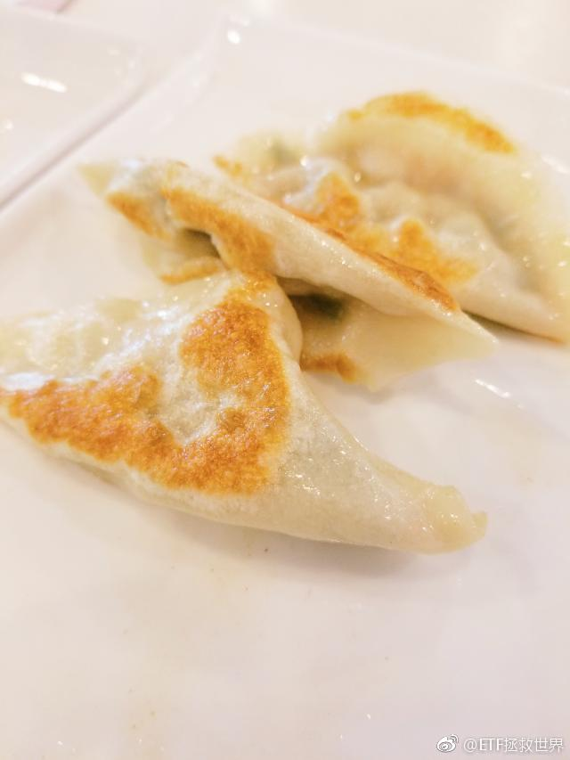

======================================================

ETF拯救世界 (5687069307) @
2018-04-20 13:10:09 Fri  
url: https://weibo.com/5687069307/GcX1aj7c4

回复@Mr-Artificial:俗。我只喝92年的芬达//@Mr-Artificial:配的是82拉菲....

------------------------------------------------------
转推：
>  @ETF拯救世界 (5687069307)
>  2018-04-20 13:05:17 Fri  
>  url: https:/weibo.com/5687069307/GcWZbm9lh/

>  中午吃的韭菜饺子…… ​​​

转发[0]  评论[27]  赞[92] 

======================================================

ETF拯救世界 (5687069307) @
2018-04-20 13:50:10 Fri  
url: https://weibo.com/5687069307/GcXhpiBTH

回复@蝙蝠侠tt:已经达成一半了。超预期的是当时分级A赚了50%//@蝙蝠侠tt:15年aeb的时间路线图：2015年6月建立组合。未来2、3年的总路线是，先吃分级A，预期收益在35%以上；二吃ETF；如果有估值大底出现，三吃分级B。最终实现200%（净值到3）以上的收益。

------------------------------------------------------
转推：
>  @ETF拯救世界 (5687069307)
>  2018-04-19 11:34:10 Thu  
>  url: https:/weibo.com/5687069307/GcMXHvA5T/

>  昨天有没有人因为涨了0.4%没买的。
>  
>  哭晕在厕所了吧。 ​​​

转发[13]  评论[61]  赞[123] 

======================================================

ETF拯救世界 (5687069307) @
2018-04-20 15:00:38 Fri  
url: https://weibo.com/5687069307/GcXK0fghE

今天计划继续回撤0.5%。 ​​​

转发[1]  评论[47]  赞[134] 

======================================================

ETF拯救世界 (5687069307) @
2018-04-20 15:06:35 Fri  
url: https://weibo.com/5687069307/GcXMq41tp

我感觉今天数据会非常好。 ​​​

转发[18]  评论[93]  赞[193] 

======================================================

ETF拯救世界 (5687069307) @
2018-04-20 15:08:18 Fri  
url: https://weibo.com/5687069307/GcXN7fF7P

回复@吉利可爱:你什么仓位。//@吉利可爱:E大，贸易战让我觉得好害怕哦，求安慰。

------------------------------------------------------
转推：
>  @ETF拯救世界 (5687069307)
>  2018-04-20 15:06:35 Fri  
>  url: https:/weibo.com/5687069307/GcXMq41tp/

>  我感觉今天数据会非常好。 ​​​

转发[11]  评论[118]  赞[103] 

======================================================

ETF拯救世界 (5687069307) @
2018-04-20 23:41:36 Fri  
url: https://weibo.com/5687069307/Gd19sE1Od

每日打卡（176）

坚持 ​​​

转发[0]  评论[29]  赞[140] 

+++++++++++++++++++++++++++++++++++++++++++++++++++++

图片：

======================================================

ETF拯救世界 (5687069307) @
2018-04-21 21:49:00 Sat  
url: https://weibo.com/5687069307/Gd9Qgk6hi

哎。本来可以避免的悲剧

------------------------------------------------------
转推：
>  @澎湃新闻 (5044281310)
>  2018-04-21 17:44:36 Sat  
>  url: https:/weibo.com/5044281310/Gd8f3Eocy/

>  【悲剧：幼童忽然窜出，遭汽车碾压身亡】http://t.cn/RuhkNl4 4月17日，山西临汾。某小区出入口处，一名幼童突然冲出，恰巧一辆轿车刚好经过，撞倒幼童并将其碾压致死。目前，交警正在对此起事故进行调查。http://t.cn/RuhkNlb ​​​

转发[54]  评论[43]  赞[37] 

======================================================

ETF拯救世界 (5687069307) @
2018-04-21 23:50:51 Sat  
url: https://weibo.com/5687069307/GdaDIlxUF

每日打卡（177）

睡觉！ ​​​

转发[0]  评论[13]  赞[82] 

+++++++++++++++++++++++++++++++++++++++++++++++++++++

图片：

======================================================

ETF拯救世界 (5687069307) @
2018-04-22 01:34:47 Sun  
url: https://weibo.com/5687069307/GdbjU2fkV

并没有睡…… ​​​

转发[3]  评论[116]  赞[123] 

======================================================

ETF拯救世界 (5687069307) @
2018-04-22 16:21:08 Sun  
url: https://weibo.com/5687069307/Gdh7FyDKt

回复@司空假面:我转发这个不是猎奇，更不是为了让大家难受。而是希望大家能吸取教训。无论是带孩子还是开车。我还给我儿子看了，跟他说如果过马路再不看车就会这样被撞。我希望从错误中增加经验，如果不是自己犯错又能学到东西更好。当然最好谁也不犯错//@司空假面:不要发这张种视频了

------------------------------------------------------
转推：
>  @澎湃新闻 (5044281310)
>  2018-04-21 17:44:36 Sat  
>  url: https:/weibo.com/5044281310/Gd8f3Eocy/

>  【悲剧：幼童忽然窜出，遭汽车碾压身亡】http://t.cn/RuhkNl4 4月17日，山西临汾。某小区出入口处，一名幼童突然冲出，恰巧一辆轿车刚好经过，撞倒幼童并将其碾压致死。目前，交警正在对此起事故进行调查。http://t.cn/RuhkNlb ​​​

转发[39]  评论[50]  赞[145] 

======================================================

ETF拯救世界 (5687069307) @
2018-04-22 22:29:13 Sun  
url: https://weibo.com/5687069307/Gdjx4DRG8

每日打卡（178）

加油 ​​​

转发[0]  评论[22]  赞[128] 

+++++++++++++++++++++++++++++++++++++++++++++++++++++

图片：

======================================================

ETF拯救世界 (5687069307) @
2018-04-23 09:42:15 Mon  
url: https://weibo.com/5687069307/GdnWgg8hr

看来3000点是LD的底线 ​​​

转发[11]  评论[66]  赞[139] 

======================================================

ETF拯救世界 (5687069307) @
2018-04-23 09:54:13 Mon  
url: https://weibo.com/5687069307/Gdo17ES1l

回复@葫芦岛心灵的旅途:咱们自己研究的时候不看。研究对手，或者说，其它人看重的东西当然有必要。//@葫芦岛心灵的旅途:你说不看上证了[二哈][二哈][二哈][二哈]

------------------------------------------------------
转推：
>  @ETF拯救世界 (5687069307)
>  2018-04-23 09:42:15 Mon  
>  url: https:/weibo.com/5687069307/GdnWgg8hr/

>  看来3000点是LD的底线 ​​​

转发[6]  评论[26]  赞[123] 

======================================================

ETF拯救世界 (5687069307) @
2018-04-23 12:34:03 Mon  
url: https://weibo.com/5687069307/Gdp40d5Wt

这件事，如果你是孩子的家长，会怎么处理。大家都展开讲讲我听听……

------------------------------------------------------
转推：
>  @央视新闻 (2656274875)
>  2018-04-23 12:31:11 Mon  
>  url: https:/weibo.com/2656274875/Gdp2Q6U5G/

>  【孕妇故意绊倒男童：孕妇道歉 双方已和解】19日，陕西宝鸡某餐厅，一男童掀门帘时，不小心碰到坐在店门口的孕妇，随后，该孕妇故意伸腿将男童绊倒。目前男童还在医院观察，结果显示并无大碍。事发第二天，孕妇和男孩父母在派出所进行调解，该孕妇当面向男孩父母道歉并表示愿意承担医药费。男孩父母则 ​​​

转发[7]  评论[96]  赞[42] 

======================================================

ETF拯救世界 (5687069307) @
2018-04-23 12:51:45 Mon  
url: https://weibo.com/5687069307/GdpbbfBZN

朋友们，逆回购准备走一波了 ​​​

转发[1]  评论[54]  赞[131] 

======================================================

ETF拯救世界 (5687069307) @
2018-04-23 13:08:45 Mon  
url: https://weibo.com/5687069307/Gdpi53PgT

回复@何托尼:这个孩子的父亲非常……我不知道怎么说。之前媒体采访他，他说，“对方已经来协商了，这件事就这样了，告一段落了”。好像是非常不喜欢媒体跟进。这什么情况，拿了点钱就这样了？//@何托尼:很难想象自己是当时人，而且对孩子父母的处理方法表示钦佩

------------------------------------------------------
转推：
>  @央视新闻 (2656274875)
>  2018-04-23 12:31:11 Mon  
>  url: https:/weibo.com/2656274875/Gdp2Q6U5G/

>  【孕妇故意绊倒男童：孕妇道歉 双方已和解】19日，陕西宝鸡某餐厅，一男童掀门帘时，不小心碰到坐在店门口的孕妇，随后，该孕妇故意伸腿将男童绊倒。目前男童还在医院观察，结果显示并无大碍。事发第二天，孕妇和男孩父母在派出所进行调解，该孕妇当面向男孩父母道歉并表示愿意承担医药费。男孩父母则 ​​​

转发[3]  评论[21]  赞[30] 

======================================================

ETF拯救世界 (5687069307) @
2018-04-23 13:28:43 Mon  
url: https://weibo.com/5687069307/Gdpqc18bB

毒奶来了：

本月准备4-6份。 ​​​

转发[26]  评论[159]  赞[310] 

======================================================

ETF拯救世界 (5687069307) @
2018-04-23 14:00:17 Mon  
url: https://weibo.com/5687069307/GdpD0gy0e

毒奶都没用了你就知道市场有多弱了。

------------------------------------------------------
转推：
>  @ETF拯救世界 (5687069307)
>  2018-04-23 13:28:43 Mon  
>  url: https:/weibo.com/5687069307/Gdpqc18bB/

>  毒奶来了：
>  
>  本月准备4-6份。 ​​​

转发[2]  评论[78]  赞[167] 

======================================================

ETF拯救世界 (5687069307) @
2018-04-23 14:29:33 Mon  
url: https://weibo.com/5687069307/GdpOSlZSI

打开账户一看赔成渣了。求安慰。[可怜] ​​​

转发[4]  评论[168]  赞[268] 

======================================================

ETF拯救世界 (5687069307) @
2018-04-23 16:43:47 Mon  
url: https://weibo.com/5687069307/GdqHn472j

也许周二也说不定！//@且慢管家:各位长赢粉丝，E大在微博提示：月底发车预计将在本周三或本周四，发车份数为4-6份。因此，小慢建议您做好资金安排，提前充值盈米宝[心]

------------------------------------------------------
转推：
>  @ETF拯救世界 (5687069307)
>  2018-04-23 13:28:43 Mon  
>  url: https:/weibo.com/5687069307/Gdpqc18bB/

>  毒奶来了：
>  
>  本月准备4-6份。 ​​​

转发[3]  评论[60]  赞[136] 

======================================================

ETF拯救世界 (5687069307) @
2018-04-23 16:47:41 Mon  
url: https://weibo.com/5687069307/GdqIWuEwi

满足各位的要求。 ​​​

转发[6]  评论[242]  赞[316] 

======================================================

ETF拯救世界 (5687069307) @
2018-04-23 23:08:47 Mon  
url: https://weibo.com/5687069307/GdtdDjN5R

每日打卡（179）

加油 ​​​

转发[0]  评论[26]  赞[114] 

+++++++++++++++++++++++++++++++++++++++++++++++++++++

图片：

======================================================

ETF拯救世界 (5687069307) @
2018-04-24 06:12:22 Tue  
url: https://weibo.com/5687069307/GdvZzbUnb

哈哈哈哈债王来了。//@见闻实时新闻:“新债王”Gundlach：做空Facebook，多做在美上市油气开采ETF-SPDR。#Facebook# #新债王Gundlach# #Gundlach#

------------------------------------------------------
转推：
>  @ ()
>  2018-04-24 04:28:52 Tue  
>  url: 

>  抱歉，作者已设置仅展示半年内微博，此微博已不可见。 ​​​

转发[0]  评论[64]  赞[73] 

======================================================

ETF拯救世界 (5687069307) @
2018-04-24 10:15:58 Tue  
url: https://weibo.com/5687069307/GdxArtq0q

散了散了啊。

------------------------------------------------------
转推：
>  @ETF拯救世界 (5687069307)
>  2018-04-23 13:28:43 Mon  
>  url: https:/weibo.com/5687069307/Gdpqc18bB/

>  毒奶来了：
>  
>  本月准备4-6份。 ​​​

转发[7]  评论[184]  赞[173] 

======================================================

ETF拯救世界 (5687069307) @
2018-04-24 10:43:24 Tue  
url: https://weibo.com/5687069307/GdxLA3Rmy

18号加车的红利赚钱了你们不高兴吗！做人最重要是开心。

[并不简单] ​​​

转发[4]  评论[162]  赞[266] 

======================================================

ETF拯救世界 (5687069307) @
2018-04-24 11:24:34 Tue  
url: https://weibo.com/5687069307/Gdy2i2Q8k

$128012 辉丰转债 这年头连可转债都信不过了。 ​​​

转发[2]  评论[36]  赞[113] 

======================================================

ETF拯救世界 (5687069307) @
2018-04-24 13:22:57 Tue  
url: https://weibo.com/5687069307/GdyOlrWjH

开始造势？

------------------------------------------------------
转推：
>  @ ()
>  2018-04-24 13:12:14 Tue  
>  url: 

>  该账号因被投诉违反《微博社区公约》的相关规定，现已无法查看。查看帮助 https://kefu.weibo.com/faqdetail?id=13216

转发[0]  评论[16]  赞[76] 

======================================================

ETF拯救世界 (5687069307) @
2018-04-24 13:28:12 Tue  
url: https://weibo.com/5687069307/GdyQthaZ2

有没有让你特别烦的事，特别麻烦，需要解决但你又特别不想干。

只有一个办法，缓解焦虑，彻底解决：

开始干。就这么简单。不要逃避，别绕着走。

Just do IT。dodododododododo. ​​​

转发[73]  评论[95]  赞[300] 

======================================================

ETF拯救世界 (5687069307) @
2018-04-24 14:14:54 Tue  
url: https://weibo.com/5687069307/Gdz9qqfVo

传媒真的犀利，3%。

未来的牛市中，不可限量。 ​​​

转发[8]  评论[77]  赞[201] 

======================================================

ETF拯救世界 (5687069307) @
2018-04-24 14:23:48 Tue  
url: https://weibo.com/5687069307/Gdzd2qGaw

今晚北京有63万儿子和闺女突然变得孝顺了。

------------------------------------------------------
转推：
>  @网易财经 (1974561081)
>  2018-04-24 10:23:03 Tue  
>  url: https:/weibo.com/1974561081/GdxDjCCkH/

>  #网易财经# 【老人花30元中了9921万！他对孩子保守了秘密｜亲爹的用心】2018年4月16日晚开奖的体彩大乐透第18043期，一位北京的退休大爷花了30元独中12注（其中6注追加）一等奖，奖金总额高达9921万元。
>  老人说：“怎么使用奖金还没想好，但是我们不能因为中奖打扰了平静的生活。”
>  他接着说，“现在我 ​​​

转发[12]  评论[51]  赞[141] 

======================================================

ETF拯救世界 (5687069307) @
2018-04-25 08:47:14 Wed  
url: https://weibo.com/5687069307/GdGqVilWO

今天早餐吃这个 ​​​

转发[3]  评论[103]  赞[151] 

+++++++++++++++++++++++++++++++++++++++++++++++++++++

图片：
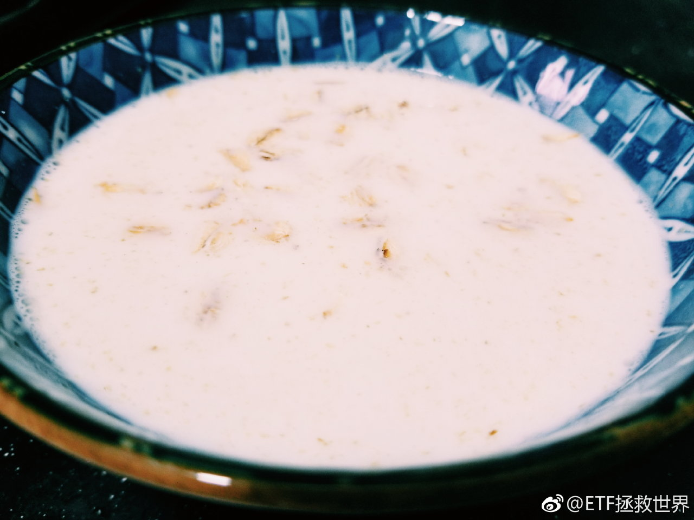

======================================================

ETF拯救世界 (5687069307) @
2018-04-25 14:18:54 Wed  
url: https://weibo.com/5687069307/GdIBy2VoH

哎

------------------------------------------------------
转推：
>  @ETF拯救世界 (5687069307)
>  2018-03-22 09:34:01 Thu  
>  url: https:/weibo.com/5687069307/G8wd21cxW/

>  腾讯，60倍PE。未来五年看，真的能有特别好的收益率吗。
>  
>  学习了。 ​​​

转发[11]  评论[14]  赞[92] 

======================================================

ETF拯救世界 (5687069307) @
2018-04-25 14:22:50 Wed  
url: https://weibo.com/5687069307/GdID91m6N

$全指医药 sh000991$  这是要新高还是做双头 ​​​

转发[4]  评论[56]  赞[98] 

======================================================

ETF拯救世界 (5687069307) @
2018-04-25 14:39:26 Wed  
url: https://weibo.com/5687069307/GdIJSz89V

回复@大土狗40贱-玩物长志:我这是疑问，疑问有什么早不早的？不好意思，我就喜欢唱反调。//@大土狗40贱-玩物长志:讲真，现在你说这话还太早

------------------------------------------------------
转推：
>  @ETF拯救世界 (5687069307)
>  2018-03-22 09:34:01 Thu  
>  url: https:/weibo.com/5687069307/G8wd21cxW/

>  腾讯，60倍PE。未来五年看，真的能有特别好的收益率吗。
>  
>  学习了。 ​​​

转发[6]  评论[16]  赞[84] 

======================================================

ETF拯救世界 (5687069307) @
2018-04-25 15:00:44 Wed  
url: https://weibo.com/5687069307/GdISwAjqM

回复@adores2017:这个市场上，涨时看涨人很多。所以你能看到很多股票涨了很多之后有越来越多的人看好。不好意思，我不会干这种事。//@adores2017:就喜欢听你唱反调//@ETF拯救世界:回复@大土狗40贱-玩物长志:我这是疑问，疑问有什么早不早的？不好意思，我就喜欢唱反调。

------------------------------------------------------
转推：
>  @ETF拯救世界 (5687069307)
>  2018-03-22 09:34:01 Thu  
>  url: https:/weibo.com/5687069307/G8wd21cxW/

>  腾讯，60倍PE。未来五年看，真的能有特别好的收益率吗。
>  
>  学习了。 ​​​

转发[5]  评论[15]  赞[82] 

======================================================

ETF拯救世界 (5687069307) @
2018-04-25 15:03:48 Wed  
url: https://weibo.com/5687069307/GdITM3O5f

回复@G老思随笔:个股真的不能死看PE。不是说低于多少就能买，高于多少就不行。个股和指数投资完全不是一个思路。腾讯的话，我个人觉得一个要参照一下FANG的估值，一个是考虑一下增速。如果我买，我还会大概看看技术走势。//@G老思随笔:e大觉得腾讯这类股票多少pe合适？

------------------------------------------------------
转推：
>  @ETF拯救世界 (5687069307)
>  2018-03-22 09:34:01 Thu  
>  url: https:/weibo.com/5687069307/G8wd21cxW/

>  腾讯，60倍PE。未来五年看，真的能有特别好的收益率吗。
>  
>  学习了。 ​​​

转发[9]  评论[38]  赞[82] 

======================================================

ETF拯救世界 (5687069307) @
2018-04-25 15:08:39 Wed  
url: https://weibo.com/5687069307/GdIVK2oHZ

回复@E大E粉:节哀。这个也不是不太平，就是随机事件，赶上了。对于个人来讲，就是命运。很多时候，不好的事情发生在自己身上，我们都会问“老天爷为什么这么不公平”……其实就是随机。

------------------------------------------------------
转推：
>  @ETF拯救世界 (5687069307)
>  2018-03-22 09:34:01 Thu  
>  url: https:/weibo.com/5687069307/G8wd21cxW/

>  腾讯，60倍PE。未来五年看，真的能有特别好的收益率吗。
>  
>  学习了。 ​​​

转发[1]  评论[18]  赞[81] 

======================================================

ETF拯救世界 (5687069307) @
2018-04-25 17:41:42 Wed  
url: https://weibo.com/5687069307/GdJVS6nWe

回复@追求确定性2:我又要走了。5月！//@追求确定性2:搞了半天，深成指还在一般点以上。我记得去年E大出口，旅游的时候就，在那个地方。

------------------------------------------------------
转推：
>  @ETF拯救世界 (5687069307)
>  2018-04-25 14:22:50 Wed  
>  url: https:/weibo.com/5687069307/GdID91m6N/

>  $全指医药 sh000991$  这是要新高还是做双头 ​​​

转发[1]  评论[48]  赞[111] 

======================================================

ETF拯救世界 (5687069307) @
2018-04-25 23:23:16 Wed  
url: https://weibo.com/5687069307/GdMavk7Nr

每日打卡（180）

昨天有事没有练，今天补上，谢谢监督！ ​​​

转发[0]  评论[10]  赞[148] 

+++++++++++++++++++++++++++++++++++++++++++++++++++++

图片：

======================================================

ETF拯救世界 (5687069307) @
2018-04-26 08:45:18 Thu  
url: https://weibo.com/5687069307/GdPQDDFGL

环保也是独角兽选项。讲真，目前环保指数的增速和估值让我有点迷惑啊。还能怎么办，继续干啊

------------------------------------------------------
转推：
>  @ ()
>  2018-04-26 08:23:14 Thu  
>  url: 

>  抱歉，作者已设置仅展示半年内微博，此微博已不可见。 ​​​

转发[9]  评论[80]  赞[137] 

======================================================

ETF拯救世界 (5687069307) @
2018-04-26 11:57:14 Thu  
url: https://weibo.com/5687069307/GdR6xsPxn

再过半小时，有骨气，不见不散 ​​​

转发[1]  评论[105]  赞[226] 

======================================================

ETF拯救世界 (5687069307) @
2018-04-26 12:35:56 Thu  
url: https://weibo.com/5687069307/GdRmfpfRt

下一站，天后。

滴滴。 ​​​

转发[2]  评论[180]  赞[248] 

======================================================

ETF拯救世界 (5687069307) @
2018-04-26 14:01:28 Thu  
url: https://weibo.com/5687069307/GdRUYoLSs

不会成真吧！

------------------------------------------------------
转推：
>  @ETF拯救世界 (5687069307)
>  2018-01-25 11:18:26 Thu  
>  url: https:/weibo.com/5687069307/G00XC3BZQ/

>  不少人会在“价值投资元年”之后，在一些“蓝筹股”上套3-5年 ​​​

转发[2]  评论[71]  赞[154] 

======================================================

ETF拯救世界 (5687069307) @
2018-04-26 17:12:35 Thu  
url: https://weibo.com/5687069307/GdTaxxNzf

还是微博好啊。回家了，出去玩回来之前不去球球了。请监督我。 ​​​

转发[3]  评论[168]  赞[391] 

======================================================

ETF拯救世界 (5687069307) @
2018-04-26 23:37:25 Thu  
url: https://weibo.com/5687069307/GdVGKftOI

每日打卡（181）

晚安！ ​​​

转发[1]  评论[27]  赞[131] 

+++++++++++++++++++++++++++++++++++++++++++++++++++++

图片：
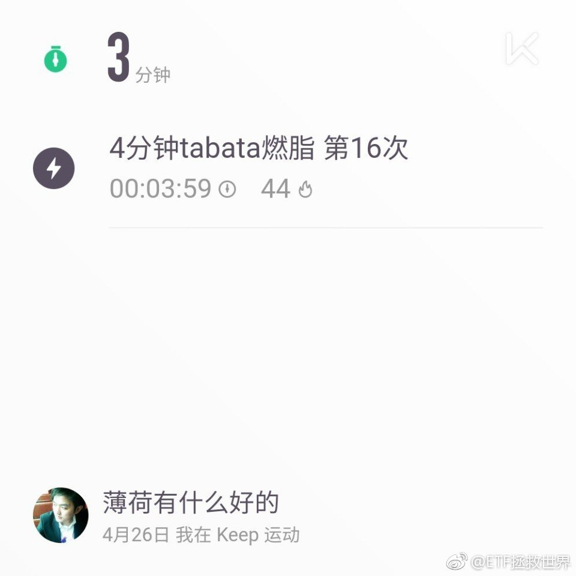

======================================================

ETF拯救世界 (5687069307) @
2018-04-27 09:02:08 Fri  
url: https://weibo.com/5687069307/GdZnY10WC

为什么感觉鑫鑫笑得好无邪……

------------------------------------------------------
转推：
>  @ ()
>  2018-04-27 09:00:05 Fri  
>  url: 

>  抱歉，作者已设置仅展示半年内微博，此微博已不可见。 ​​​

转发[7]  评论[36]  赞[69] 

======================================================

ETF拯救世界 (5687069307) @
2018-04-27 09:22:36 Fri  
url: https://weibo.com/5687069307/GdZwh3mu1

格力这个事情，我谈两点，小王你记一下，会后给班子成员传达一下。

第一个是红利基金恐怕要卖格力了。尤其是深红利，重仓格力。

第二个是强势的女人好可怕！ ​​​

转发[46]  评论[107]  赞[261] 

======================================================

ETF拯救世界 (5687069307) @
2018-04-27 09:52:55 Fri  
url: https://weibo.com/5687069307/GdZIzDFFh

伊利怎么也崩了。短短三个月时间，小甜甜就变成牛夫人了？

其实，企业，都是好企业。只是，忽悠的太可怕了。价值投资元年。独立思考，真的非常重要。不要听忽悠，当所有人都开始忽悠的时候，你就得想想了。 ​​​

转发[81]  评论[35]  赞[166] 

======================================================

ETF拯救世界 (5687069307) @
2018-04-27 09:56:08 Fri  
url: https://weibo.com/5687069307/GdZJSiSnr

不过我想说的是，消费快进入射程了。这是最后几个我们还没有收入囊中的好品种之一。 ​​​

转发[13]  评论[67]  赞[217] 

======================================================

ETF拯救世界 (5687069307) @
2018-04-27 10:00:24 Fri  
url: https://weibo.com/5687069307/GdZLBycyV

回复@杨舟老师讲物理耶90208:大家再回想一下，平安年报公布的当晚，是如何群情激昂的。再回头看第二天的股价。//@杨舟老师讲物理耶90208:老大，中国平安崩了！

------------------------------------------------------
转推：
>  @ETF拯救世界 (5687069307)
>  2018-04-27 09:52:55 Fri  
>  url: https:/weibo.com/5687069307/GdZIzDFFh/

>  伊利怎么也崩了。短短三个月时间，小甜甜就变成牛夫人了？
>  
>  其实，企业，都是好企业。只是，忽悠的太可怕了。价值投资元年。独立思考，真的非常重要。不要听忽悠，当所有人都开始忽悠的时候，你就得想想了。 ​​​

转发[63]  评论[26]  赞[94] 

======================================================

ETF拯救世界 (5687069307) @
2018-04-27 10:22:15 Fri  
url: https://weibo.com/5687069307/GdZUu6EPh

昨天发车是正确的。 ​​​

转发[0]  评论[64]  赞[264] 

======================================================

ETF拯救世界 (5687069307) @
2018-04-27 10:33:55 Fri  
url: https://weibo.com/5687069307/GdZZduRiP

可能很少有朋友真的理解我有多喜欢医药。

特别喜欢。最喜欢，没有之一。

计划目前配了不少了，最终应该至少配15%以上。 ​​​

转发[34]  评论[105]  赞[227] 

======================================================

ETF拯救世界 (5687069307) @
2018-04-27 10:56:43 Fri  
url: https://weibo.com/5687069307/Ge08tmRIz

各位做投资，一定一定要注意的就是均值回归。没有什么品种能长期保持持续高增长。

大周期，十年为单位。一个品种十年很好，下一个十年极大概率会非常不好。反之亦然。

小周期，甚至一年就可以。一年表现太好，下一年就就会比较一般。

当然，都是有前提的，不是简单的买差卖好就可以。要结合很多东西 ​​​

转发[199]  评论[123]  赞[259] 

======================================================

ETF拯救世界 (5687069307) @
2018-04-27 11:06:09 Fri  
url: https://weibo.com/5687069307/Ge0ciEPBu

回复@One_95:我说的下一个十年会比较一般，时间起点是上一个十年特别好结束的时候。下一个十年中挖坑的时候买入，收益率依然会好。但是一直持有的这十年就会很一般。//@One_95:医药、消费还有信息行业过去十年收益很不错，下一个十年应该也能高于市场平均水平吧。

------------------------------------------------------
转推：
>  @ETF拯救世界 (5687069307)
>  2018-04-27 10:56:43 Fri  
>  url: https:/weibo.com/5687069307/Ge08tmRIz/

>  各位做投资，一定一定要注意的就是均值回归。没有什么品种能长期保持持续高增长。
>  
>  大周期，十年为单位。一个品种十年很好，下一个十年极大概率会非常不好。反之亦然。
>  
>  小周期，甚至一年就可以。一年表现太好，下一年就就会比较一般。
>  
>  当然，都是有前提的，不是简单的买差卖好就可以。要结合很多东西 ​​​

转发[103]  评论[16]  赞[109] 

======================================================

ETF拯救世界 (5687069307) @
2018-04-27 11:07:16 Fri  
url: https://weibo.com/5687069307/Ge0cL0ICv

福耀玻璃也叛变了。

价值元年要坑死多少人。 ​​​

转发[13]  评论[77]  赞[157] 

======================================================

ETF拯救世界 (5687069307) @
2018-04-27 11:37:10 Fri  
url: https://weibo.com/5687069307/Ge0oTmDWH

之前是小股票投资者崩溃了，现在很多蓝筹投资者也崩溃了。

朋友们，等了3年的那个时刻越来越近了。

什么时候你感觉自己快崩溃了，基本上就是那个时间点了。

我的心情，你是体会不到的。

感谢资本市场。 ​​​

转发[63]  评论[133]  赞[341] 

======================================================

ETF拯救世界 (5687069307) @
2018-04-27 11:50:08 Fri  
url: https://weibo.com/5687069307/Ge0ua9tY8

刚才有个喷子，在评论里说，股票跌，指数投资也会死。

是的，指数是股票组成的，所以股票都跌，指数也会跌。但是，注意审题：

指数不会死。股票不同，股票、公司会死。也就是说，再也上不来了。而且，正因为如此，你不知道它是否还能回来，心里在最黑暗的时候就会很不踏实，越不踏实越拿不住，再好的 ​​​

转发[91]  评论[131]  赞[330] 

======================================================

ETF拯救世界 (5687069307) @
2018-04-27 12:03:31 Fri  
url: https://weibo.com/5687069307/Ge0zAp6im

回复@可可bixinhaner:红利13倍估值，进入历史最低区域。市净率接近1.3。长期看这样的品种必然能收益不错。当然，趋势很差，所以昨天没有买入。拉开距离，继续买。如果PE能到10，PB能到1.1以下，可以上杠杆了。

------------------------------------------------------
转推：
>  @ETF拯救世界 (5687069307)
>  2018-04-27 09:52:55 Fri  
>  url: https:/weibo.com/5687069307/GdZIzDFFh/

>  伊利怎么也崩了。短短三个月时间，小甜甜就变成牛夫人了？
>  
>  其实，企业，都是好企业。只是，忽悠的太可怕了。价值投资元年。独立思考，真的非常重要。不要听忽悠，当所有人都开始忽悠的时候，你就得想想了。 ​​​

转发[58]  评论[73]  赞[197] 

======================================================

ETF拯救世界 (5687069307) @
2018-04-27 12:12:18 Fri  
url: https://weibo.com/5687069307/Ge0D9sqyG

回复@Psyche-healer:一个牛市，错过涨幅最大的10个交易日，将错过70%的涨幅。//@Psyche-healer:50%的涨幅是在5%的时间内实现的。//@ETF拯救世界: 我说的下一个十年会比较一般，时间起点是上一个十年特别好结束的时候。下一个十年中挖坑的时候买入，收益率依然会好。但是一直持有的这十年就会很一般。

------------------------------------------------------
转推：
>  @ETF拯救世界 (5687069307)
>  2018-04-27 10:56:43 Fri  
>  url: https:/weibo.com/5687069307/Ge08tmRIz/

>  各位做投资，一定一定要注意的就是均值回归。没有什么品种能长期保持持续高增长。
>  
>  大周期，十年为单位。一个品种十年很好，下一个十年极大概率会非常不好。反之亦然。
>  
>  小周期，甚至一年就可以。一年表现太好，下一年就就会比较一般。
>  
>  当然，都是有前提的，不是简单的买差卖好就可以。要结合很多东西 ​​​

转发[88]  评论[35]  赞[135] 

======================================================

ETF拯救世界 (5687069307) @
2018-04-27 12:18:47 Fri  
url: https://weibo.com/5687069307/Ge0FMAi9C

回复@很多话不想说:所以，很多人在牛市里也赚不到钱。因为他们不断逃顶，不断切换，错过大涨。牛市中，坚定持有到高估是唯一选择。//@很多话不想说:太让我意外了//@ETF拯救世界:回复@Psyche-healer:一个牛市，错过涨幅最大的10个交易日，将错过70%的涨幅。

------------------------------------------------------
转推：
>  @ETF拯救世界 (5687069307)
>  2018-04-27 10:56:43 Fri  
>  url: https:/weibo.com/5687069307/Ge08tmRIz/

>  各位做投资，一定一定要注意的就是均值回归。没有什么品种能长期保持持续高增长。
>  
>  大周期，十年为单位。一个品种十年很好，下一个十年极大概率会非常不好。反之亦然。
>  
>  小周期，甚至一年就可以。一年表现太好，下一年就就会比较一般。
>  
>  当然，都是有前提的，不是简单的买差卖好就可以。要结合很多东西 ​​​

转发[39]  评论[26]  赞[147] 

======================================================

ETF拯救世界 (5687069307) @
2018-04-27 12:22:54 Fri  
url: https://weibo.com/5687069307/Ge0HrDr34

回复@kaka-98:卖出要比买入难10倍。也许是20倍。//@kaka-98:这样对逃顶会不会要求很高，对于像我们吃中段的，也会导致很多吃不到？//@ETF拯救世界:回复@Psyche-healer:一个牛市，错过涨幅最大的10个交易日，将错过70%的涨幅。//@Psyche-healer:50%的涨幅是在5%的时间内实现的。

------------------------------------------------------
转推：
>  @ETF拯救世界 (5687069307)
>  2018-04-27 10:56:43 Fri  
>  url: https:/weibo.com/5687069307/Ge08tmRIz/

>  各位做投资，一定一定要注意的就是均值回归。没有什么品种能长期保持持续高增长。
>  
>  大周期，十年为单位。一个品种十年很好，下一个十年极大概率会非常不好。反之亦然。
>  
>  小周期，甚至一年就可以。一年表现太好，下一年就就会比较一般。
>  
>  当然，都是有前提的，不是简单的买差卖好就可以。要结合很多东西 ​​​

转发[30]  评论[66]  赞[158] 

======================================================

ETF拯救世界 (5687069307) @
2018-04-27 17:23:36 Fri  
url: https://weibo.com/5687069307/Ge2Fw7JlC

韩国股市估值会不会大幅提升？要不要买点韩国ETF ​​​

转发[9]  评论[59]  赞[187] 

======================================================

ETF拯救世界 (5687069307) @
2018-04-27 18:12:22 Fri  
url: https://weibo.com/5687069307/Ge2Zj38ds

即将进入随时加车区域。但我尽量控制一个月不超过4次。

越来越值得期待了。 ​​​

转发[135]  评论[241]  赞[467] 

======================================================

ETF拯救世界 (5687069307) @
2018-04-27 19:26:16 Fri  
url: https://weibo.com/5687069307/Ge3tjbEAA

担心买太快的朋友不用太担心，节奏我当然会控制。2015年至今已经3年了，如果你了解过去，会发现一点都不用担心节奏会太快。3年我都能等，怎么会乱开枪。所有能看到的利空我都已经放入体系，所有看不到不知道的我也会有所准备。现在还远没到show hand的时候，不过随着时间和空间的变化我们的节奏会加快

------------------------------------------------------
转推：
>  @ETF拯救世界 (5687069307)
>  2018-04-27 18:12:22 Fri  
>  url: https:/weibo.com/5687069307/Ge2Zj38ds/

>  即将进入随时加车区域。但我尽量控制一个月不超过4次。
>  
>  越来越值得期待了。 ​​​

转发[16]  评论[79]  赞[255] 

======================================================

ETF拯救世界 (5687069307) @
2018-04-27 20:04:15 Fri  
url: https://weibo.com/5687069307/Ge3IJ3unq

回复@崂山太和观:我们在持续买美元债，没发现吗。//@崂山太和观:e大，有人判断最近贸易战可能导致人民币会贬值，可以考虑配置境外市场。现在我国贸易是双逆差了。

------------------------------------------------------
转推：
>  @ETF拯救世界 (5687069307)
>  2018-04-27 18:12:22 Fri  
>  url: https:/weibo.com/5687069307/Ge2Zj38ds/

>  即将进入随时加车区域。但我尽量控制一个月不超过4次。
>  
>  越来越值得期待了。 ​​​

转发[7]  评论[57]  赞[130] 

======================================================

ETF拯救世界 (5687069307) @
2018-04-27 22:30:09 Fri  
url: https://weibo.com/5687069307/Ge4FWy4r7

每日打卡（182）

搞定 ​​​

转发[1]  评论[25]  赞[177] 

+++++++++++++++++++++++++++++++++++++++++++++++++++++

图片：

======================================================

ETF拯救世界 (5687069307) @
2018-04-28 09:03:21 Sat  
url: https://weibo.com/5687069307/Ge8OXeoGt

今年沪深300下跌6.8%，中证500下跌6.24%。

权益类仓位已经达到50%的计划净值下跌0.48%。不到指数跌幅的10%。

熊市不赔钱，牛市跟上指数。这就是原则。 ​​​

转发[27]  评论[106]  赞[368] 

======================================================

ETF拯救世界 (5687069307) @
2018-04-28 09:42:45 Sat  
url: https://weibo.com/5687069307/Ge94WDGC4

看了公交车上打孩子那个视频，和米脂杀中学生的那个新闻，我对无脑喷子就感觉可以理解了。

有人是真的傻的，有人是真的坏的，有人是真的又傻又坏。

杜绝不了。 ​​​

转发[16]  评论[57]  赞[164] 

======================================================

ETF拯救世界 (5687069307) @
2018-04-28 09:48:36 Sat  
url: https://weibo.com/5687069307/Ge97km437

回复@xlzy24:兄弟，听我一句过来人的。你能看到的风险，全都不是风险。而是帮你挖黄金坑的铲子。当所有人瑟瑟发抖的时候，你笑着买就对了。不要说十年后，你就是五年、三年后回头看你说的这些，什么都不是。投资的时候问两个问题：1，会不会死。2：够不够便宜。然后根据概率做好资产配置。齐活。

------------------------------------------------------
转推：
>  @ETF拯救世界 (5687069307)
>  2018-04-27 18:12:22 Fri  
>  url: https:/weibo.com/5687069307/Ge2Zj38ds/

>  即将进入随时加车区域。但我尽量控制一个月不超过4次。
>  
>  越来越值得期待了。 ​​​

转发[88]  评论[58]  赞[210] 

======================================================

ETF拯救世界 (5687069307) @
2018-04-28 09:57:42 Sat  
url: https://weibo.com/5687069307/Ge9b1m9G5

回复@Yanb丶:公交车我坐啊。不过孩子不坐，上周五岁的孩子第一次坐公交。我儿子首先不可能这样去踢别人，任何时候都99%不可能。2，我在外面视线几乎不会离开儿子身上。如果他这样踢，我会马上让他跟别人道歉。3，如果我没看见，他踢了，这样被打了。我会马上叫司机停车关门，叫120报警然后干这个畜生

------------------------------------------------------
转推：
>  @ETF拯救世界 (5687069307)
>  2018-04-28 09:42:45 Sat  
>  url: https:/weibo.com/5687069307/Ge94WDGC4/

>  看了公交车上打孩子那个视频，和米脂杀中学生的那个新闻，我对无脑喷子就感觉可以理解了。
>  
>  有人是真的傻的，有人是真的坏的，有人是真的又傻又坏。
>  
>  杜绝不了。 ​​​

转发[12]  评论[48]  赞[136] 

======================================================

ETF拯救世界 (5687069307) @
2018-04-28 10:42:39 Sat  
url: https://weibo.com/5687069307/Ge9tge3yn

[doge]

------------------------------------------------------
转推：
>  @股海十一少 (2120098567)
>  2018-04-28 10:36:10 Sat  
>  url: https:/weibo.com/2120098567/Ge9qCtMQM/

>  这个图牛 ​​​

转发[32]  评论[30]  赞[127] 

======================================================

ETF拯救世界 (5687069307) @
2018-04-28 10:49:12 Sat  
url: https://weibo.com/5687069307/Ge9vV8pAZ

回复@ETF改变生活:是的。教育他不能打人。不过我一定还会同时教育他，不要被人打。有人打你，对方也是一个人就打回去。对方人多就跑，回来告诉爸爸。。//@ETF改变生活:回复@漫天污云:还有一个就是教育的问题，不能随便踢人，我小孩能听懂话的时候，打爷爷奶奶，打她妈妈，我都会严厉喝止，有时会打手

------------------------------------------------------
转推：
>  @ETF拯救世界 (5687069307)
>  2018-04-28 09:42:45 Sat  
>  url: https:/weibo.com/5687069307/Ge94WDGC4/

>  看了公交车上打孩子那个视频，和米脂杀中学生的那个新闻，我对无脑喷子就感觉可以理解了。
>  
>  有人是真的傻的，有人是真的坏的，有人是真的又傻又坏。
>  
>  杜绝不了。 ​​​

转发[6]  评论[20]  赞[122] 

======================================================

ETF拯救世界 (5687069307) @
2018-04-28 10:54:11 Sat  
url: https://weibo.com/5687069307/Ge9xW4JWJ

回复@梓溪20180316:高位悲观可以让你不赔钱，低位乐观才能让你赚大钱。绝大多数人都是反过来的，所以赔钱。一小部分人是一直悲观的，不会赔，但挣不到大钱。极少数人才能做到。反人性真的特别难。解决方法是建立一套机械化的体系，抛弃自我，让体系做决定，自己执行就可以了。

------------------------------------------------------
转推：
>  @ETF拯救世界 (5687069307)
>  2018-04-27 18:12:22 Fri  
>  url: https:/weibo.com/5687069307/Ge2Zj38ds/

>  即将进入随时加车区域。但我尽量控制一个月不超过4次。
>  
>  越来越值得期待了。 ​​​

转发[51]  评论[41]  赞[196] 

======================================================

ETF拯救世界 (5687069307) @
2018-04-28 11:16:26 Sat  
url: https://weibo.com/5687069307/Ge9GY1M00

刚才有朋友说，老手容易抄在半山腰。

是的，很多老手会。但你好好观察一下，什么样的人容易抄在半山腰。

“这里就是铁底了，确定了”。“沪深300绝对不会再跌了”。“这只股票现在就是未来十年大底，满仓干了。”

一般是这种。

股票便宜还是贵，都是一个区间。有三个区间。贵、正常、便宜。如果你 ​​​

转发[88]  评论[159]  赞[310] 

======================================================

ETF拯救世界 (5687069307) @
2018-04-28 13:46:20 Sat  
url: https://weibo.com/5687069307/GeaFOhv6x

国内有没有学冲浪的地方。最好在北方。 ​​​

转发[0]  评论[65]  赞[103] 

======================================================

ETF拯救世界 (5687069307) @
2018-04-28 14:59:18 Sat  
url: https://weibo.com/5687069307/Geb9r6Yts

500的一季报统计了一下，情况有点不好。

去年年报500总体增长有20多个点，一季报只有十几个点了。当然，十几个点一定是常态，怎么可能宽基指数一直保持20多个点的增速。

除了500，各指数增速都在降。包括2017年NB闪闪的环保。也是降到了十几个点。

只有一个指数的增速上升了，从十几个点到二十几个 ​​​

转发[62]  评论[150]  赞[260] 

======================================================

ETF拯救世界 (5687069307) @
2018-04-28 15:51:02 Sat  
url: https://weibo.com/5687069307/Gebur2qCO

回复@nasaznk:我说该出手时就出手。也就是计划出手的时候！怎么理解的！//@nasaznk:回复@ETF拯救世界:意思是医药现在这个价位也可以入？

------------------------------------------------------
转推：
>  @ETF拯救世界 (5687069307)
>  2018-04-28 14:59:18 Sat  
>  url: https:/weibo.com/5687069307/Geb9r6Yts/

>  500的一季报统计了一下，情况有点不好。
>  
>  去年年报500总体增长有20多个点，一季报只有十几个点了。当然，十几个点一定是常态，怎么可能宽基指数一直保持20多个点的增速。
>  
>  除了500，各指数增速都在降。包括2017年NB闪闪的环保。也是降到了十几个点。
>  
>  只有一个指数的增速上升了，从十几个点到二十几个 ​​​

转发[3]  评论[29]  赞[94] 

======================================================

ETF拯救世界 (5687069307) @
2018-04-28 17:23:27 Sat  
url: https://weibo.com/5687069307/Gec5WxKrt

回复@z独角兽z:错。你去看看创业板+1000等指数是哪天起步牛市的。是2012年11月底。为什么我记得这么清楚，请移步雪球看我的第一篇帖子。你会震惊。//@z独角兽z:上一轮熊市从09年跌了3年见底，然后底部横盘2年，到14年下半年启动牛市，时间漫长啊

------------------------------------------------------
转推：
>  @ETF拯救世界 (5687069307)
>  2018-04-27 11:37:10 Fri  
>  url: https:/weibo.com/5687069307/Ge0oTmDWH/

>  之前是小股票投资者崩溃了，现在很多蓝筹投资者也崩溃了。
>  
>  朋友们，等了3年的那个时刻越来越近了。
>  
>  什么时候你感觉自己快崩溃了，基本上就是那个时间点了。
>  
>  我的心情，你是体会不到的。
>  
>  感谢资本市场。 ​​​

转发[11]  评论[48]  赞[154] 

======================================================

ETF拯救世界 (5687069307) @
2018-04-28 17:49:55 Sat  
url: https://weibo.com/5687069307/GecgGC4L9

公众号每个月3、4篇文章确实太少了。大家有没有什么想看的主题，我可以写写。

什么都可以。评论里可以提议一下，觉得别人的提议好的也可以点赞，点赞多的或者评论提及多的我会优先考虑。

但是有些东西不会写。比如我的投资策略的具体细节，估值方法公式之类的……这个海涵吧。 ​​​

转发[17]  评论[479]  赞[343] 

======================================================

ETF拯救世界 (5687069307) @
2018-04-29 21:34:25 Sun  
url: https://weibo.com/5687069307/Genaje8hq

每日打卡（183）

昨天有活动，没时间锻炼…… ​​​

转发[0]  评论[23]  赞[153] 

+++++++++++++++++++++++++++++++++++++++++++++++++++++

图片：

======================================================

ETF拯救世界 (5687069307) @
2018-04-30 09:16:12 Mon  
url: https://weibo.com/5687069307/GerLavj5K

看看30年前漫画家的想象。 http://t.cn/RuNRlEm

------------------------------------------------------
转推：
>  @科技工程与生活 (5999218410)
>  2018-04-28 20:25:09 Sat  
>  url: https:/weibo.com/5999218410/GedhHj13l/

>  【史上最安全摩托车！】 撞不倒的最安全摩托车  苹果公司都想收购的公司，Lit Motors利用5000~12000转/s的陀螺仪保持车身平衡。采用特斯拉电池，满电可行驶320公里，最高时速160km/h，还有智能语音控制功能。就想问啥时候卖，我要做风一样的男子[偷笑][偷笑]  #科技#  #摩托车#   #道路交通安全#  ​​​

转发[12]  评论[56]  赞[112] 

======================================================

ETF拯救世界 (5687069307) @
2018-05-01 10:52:28 Tue  
url: https://weibo.com/5687069307/GeBOK8Q2I

其实我想知道，如果我家被偷，我要拦住小偷，小偷拿棒球棒要揍我，邻居来帮我抓小偷，打了小偷。我和邻居是犯法吗。如果是犯法，也就是说小偷跑了就没事了，因为没人会因为几串香蕉被通缉

------------------------------------------------------
转推：
>  @ ()
>  2018-05-01 10:12:39 Tue  
>  url: 

>  抱歉，作者已设置仅展示半年内微博，此微博已不可见。 ​​​

转发[13]  评论[105]  赞[84] 

======================================================

ETF拯救世界 (5687069307) @
2018-05-02 09:17:05 Wed  
url: https://weibo.com/5687069307/GeKCw5D08

希望美元走一波，美元债也动一动。

------------------------------------------------------
转推：
>  @ ()
>  2018-05-02 09:16:22 Wed  
>  url: 

>  抱歉，作者已设置仅展示半年内微博，此微博已不可见。 ​​​

转发[1]  评论[20]  赞[94] 

======================================================

ETF拯救世界 (5687069307) @
2018-05-02 09:34:59 Wed  
url: https://weibo.com/5687069307/GeKJMoqOO

浓眉大眼的阿胶也快跌停了。

救救蓝筹股。[哼] ​​​

转发[22]  评论[36]  赞[128] 

======================================================

ETF拯救世界 (5687069307) @
2018-05-02 09:41:06 Wed  
url: https://weibo.com/5687069307/GeKMgoNbn

回复@慎独慎入慎犬儒:不好意思，全指医药即将新高了！//@慎独慎入慎犬儒:片子癀，云南白药！如果这波药酒事件能把医药指数拉下来就笑死了！！！

------------------------------------------------------
转推：
>  @ETF拯救世界 (5687069307)
>  2018-05-02 09:34:59 Wed  
>  url: https:/weibo.com/5687069307/GeKJMoqOO/

>  浓眉大眼的阿胶也快跌停了。
>  
>  救救蓝筹股。[哼] ​​​

转发[2]  评论[7]  赞[91] 

======================================================

ETF拯救世界 (5687069307) @
2018-05-02 09:42:02 Wed  
url: https://weibo.com/5687069307/GeKMEimUr

回复@ETF信徒者:1月的时候，你有没有感受到一种氛围。就是价投们的狂欢。有没有一种寒冷的感觉。如果你有，就能先知先觉了。我有。//@ETF信徒者:价值元年坑了多少散户，E大我想问一下，如何才能做到先知先觉，而不是被坑杀了，才发现自己被人卖了还在帮别人数钱[二哈][二哈][二哈]

------------------------------------------------------
转推：
>  @ETF拯救世界 (5687069307)
>  2018-05-02 09:34:59 Wed  
>  url: https:/weibo.com/5687069307/GeKJMoqOO/

>  浓眉大眼的阿胶也快跌停了。
>  
>  救救蓝筹股。[哼] ​​​

转发[10]  评论[21]  赞[115] 

======================================================

ETF拯救世界 (5687069307) @
2018-05-02 09:46:07 Wed  
url: https://weibo.com/5687069307/GeKOiwtqP

$全指医药 sh000991$   记住，新高不卖。

拿着上涨的东西不要随便乱跑。 ​​​

转发[34]  评论[39]  赞[146] 

======================================================

ETF拯救世界 (5687069307) @
2018-05-02 09:56:18 Wed  
url: https://weibo.com/5687069307/GeKSqo1co

$159938  基金率先新高。不卖。

一支穿云箭，千军万马来相见。等超级大机构、机构、价投、散户，依次接盘后我们再撤。 ​​​

转发[9]  评论[28]  赞[186] 

======================================================

ETF拯救世界 (5687069307) @
2018-05-02 09:59:23 Wed  
url: https://weibo.com/5687069307/GeKTG7xZi

回复@疯吹了无痕:热门是因为真的好还是宣传工作做得好？先回答这个问题再讨论。//@疯吹了无痕:e大，能不能谈谈对现在雪球热门的指数基金的看法，比如红机机会501029，500行业中性低波动003318等。

------------------------------------------------------
转推：
>  @ETF拯救世界 (5687069307)
>  2018-05-02 09:46:07 Wed  
>  url: https:/weibo.com/5687069307/GeKOiwtqP/

>  $全指医药 sh000991$   记住，新高不卖。
>  
>  拿着上涨的东西不要随便乱跑。 ​​​

转发[11]  评论[29]  赞[88] 

======================================================

ETF拯救世界 (5687069307) @
2018-05-02 10:04:22 Wed  
url: https://weibo.com/5687069307/GeKVI2V2v

回复@岁月静好啊好:这你就错了。你知道有多少人害怕坐电梯在上涨的时候不停的卖出吗。这才是普通正常人的反应。//@岁月静好啊好:不用说的吧，e帅，涨的时候没有想卖的。

------------------------------------------------------
转推：
>  @ETF拯救世界 (5687069307)
>  2018-05-02 09:46:07 Wed  
>  url: https:/weibo.com/5687069307/GeKOiwtqP/

>  $全指医药 sh000991$   记住，新高不卖。
>  
>  拿着上涨的东西不要随便乱跑。 ​​​

转发[16]  评论[29]  赞[113] 

======================================================

ETF拯救世界 (5687069307) @
2018-05-02 10:13:32 Wed  
url: https://weibo.com/5687069307/GeKZqvkr1

一个品种，十年、二十年，如果涨的很好，你能拿住，恭喜你，能赚很多。

比这更出色的，是你能吃到大波段。也就是高点附近卖出，低点附近买入。十年有2、3次，那你的收益率会出现暴击。十年过去，你已经封神。

比如全指医药，2005-2015涨了20倍。是2000%！然而你如果能做好2个波段，30-50倍妥妥的。记 ​​​

转发[121]  评论[156]  赞[347] 

+++++++++++++++++++++++++++++++++++++++++++++++++++++

图片：
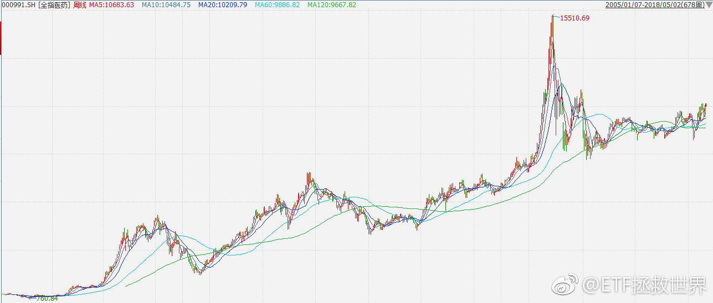

======================================================

ETF拯救世界 (5687069307) @
2018-05-02 10:50:52 Wed  
url: https://weibo.com/5687069307/GeLezwEWF

再说一次，消费、医药强，代表环境不好，因为这些都是所谓的“防守股”。

所以，接下来不要太乐观。当然，对我们来说是好事，业绩增长+估值降低，底部区域会更加快速的到来。

就等不知道出什么事砸出来的大坑了。 ​​​

转发[70]  评论[101]  赞[293] 

======================================================

ETF拯救世界 (5687069307) @
2018-05-02 11:03:06 Wed  
url: https://weibo.com/5687069307/GeLjy7PQl

回复@索亚VEXX:价格和市场被严格控制的东西有什么好谈的。。也谈不了。//@索亚VEXX:益达 想听听你关于楼市的看法。其实我把楼市也用股市标准衡量，房租多少年够房价就是他的市盈率，现在看好多城市的楼市市盈率也40-50了。

------------------------------------------------------
转推：
>  @ETF拯救世界 (5687069307)
>  2018-05-02 10:50:52 Wed  
>  url: https:/weibo.com/5687069307/GeLezwEWF/

>  再说一次，消费、医药强，代表环境不好，因为这些都是所谓的“防守股”。
>  
>  所以，接下来不要太乐观。当然，对我们来说是好事，业绩增长+估值降低，底部区域会更加快速的到来。
>  
>  就等不知道出什么事砸出来的大坑了。 ​​​

转发[2]  评论[29]  赞[108] 

======================================================

ETF拯救世界 (5687069307) @
2018-05-02 11:57:49 Wed  
url: https://weibo.com/5687069307/GeLFKrnZI

回复@冬_zi_zinedineZidane:我的意思是，先定义“热门”。到底是讨论的人多，还是买的人多，还是表现好，区分对待。当然，从我的角度讲，我最讨厌的东西就是“热门”。我喜欢买冷门的东西，越冷越喜欢。//@冬_zi_zinedineZidane:E大言下之意，就是它们的热门是宣传做得好？

------------------------------------------------------
转推：
>  @ETF拯救世界 (5687069307)
>  2018-05-02 09:46:07 Wed  
>  url: https:/weibo.com/5687069307/GeKOiwtqP/

>  $全指医药 sh000991$   记住，新高不卖。
>  
>  拿着上涨的东西不要随便乱跑。 ​​​

转发[4]  评论[14]  赞[92] 

======================================================

ETF拯救世界 (5687069307) @
2018-05-02 12:01:29 Wed  
url: https://weibo.com/5687069307/GeLHeCqR9

有没有发现被撒狗粮的战友们没有一个开心的……

------------------------------------------------------
转推：
>  @ ()
>  2018-05-02 11:44:36 Wed  
>  url: 

>  抱歉，作者已设置仅展示半年内微博，此微博已不可见。 ​​​

转发[7]  评论[18]  赞[73] 

======================================================

ETF拯救世界 (5687069307) @
2018-05-02 12:09:16 Wed  
url: https://weibo.com/5687069307/GeLKpcXUx

回复@好心情S65:如果分级基金消失，按照净值处理AB，那么A……然后B……自己发挥想象吧。//@好心情S65:益达，今天分级A怎么个意思，要出啥大事了吗？//@ETF拯救世界:有没有发现被撒狗粮的战友们没有一个开心的……

------------------------------------------------------
转推：
>  @ ()
>  2018-05-02 11:44:36 Wed  
>  url: 

>  抱歉，作者已设置仅展示半年内微博，此微博已不可见。 ​​​

转发[5]  评论[21]  赞[66] 

======================================================

ETF拯救世界 (5687069307) @
2018-05-02 12:43:09 Wed  
url: https://weibo.com/5687069307/GeLYaeXLf

回复@润泽20170101:下一篇公众号文章就写电梯吧。“那些年，我追过的女孩……”不是，打错字了，“那些年，我坐过的电梯……”//@润泽20170101:电梯比套牢还恐怖，thats me！！！每天过来读圣经，希望不要害怕。

------------------------------------------------------
转推：
>  @ETF拯救世界 (5687069307)
>  2018-05-02 09:46:07 Wed  
>  url: https:/weibo.com/5687069307/GeKOiwtqP/

>  $全指医药 sh000991$   记住，新高不卖。
>  
>  拿着上涨的东西不要随便乱跑。 ​​​

转发[9]  评论[40]  赞[123] 

======================================================

ETF拯救世界 (5687069307) @
2018-05-02 12:57:21 Wed  
url: https://weibo.com/5687069307/GeM3Vujvx

回复@ZhangJimmy:电梯就是，永远在最低层和最高层之间波动。你如果在高层不下去，就会被带到底层。然后周而复始，只有波动，没有突破。很多人害怕自己持有的品种也会这样，所以总是希望低位买入，高位卖出。想法是没错，可是如果判断错了，你坐的不是电梯，而是火箭，你下去以后它就飞了，那就非常惨了

------------------------------------------------------
转推：
>  @ETF拯救世界 (5687069307)
>  2018-05-02 09:46:07 Wed  
>  url: https:/weibo.com/5687069307/GeKOiwtqP/

>  $全指医药 sh000991$   记住，新高不卖。
>  
>  拿着上涨的东西不要随便乱跑。 ​​​

转发[7]  评论[20]  赞[118] 

======================================================

ETF拯救世界 (5687069307) @
2018-05-02 13:13:16 Wed  
url: https://weibo.com/5687069307/GeManCNai

我最近在想一件事。

目前A股全市场估值即将进入低估区域。就像之前两次，没有意外。

但进入低估，只是说下跌空间不大，并不一定是要涨。在一个区间震荡几年，也很正常。如果这样，那么几年不挣钱恐怕也没什么意思。

所以，我考虑在计划里用一小部分资金公布一个吃波段的附加策略。还没想好，只是有 ​​​

转发[37]  评论[304]  赞[697] 

======================================================

ETF拯救世界 (5687069307) @
2018-05-02 13:51:32 Wed  
url: https://weibo.com/5687069307/GeMpVafZM

球球上有一位 @方舟88 ，429还在发帖，突然就去了。虽然不是很熟悉，但也经常看到他的帖子，真的很震惊。

非常惋惜，一路走好。

还有之前的大v @樱桃之王，也是突然之间说没就没了。

年纪都不大，三四十岁。

其它的养生之道就不必说了，活在世上意外也很多说不过来。只是一点，各位，在这个市场上 ​​​

转发[39]  评论[119]  赞[275] 

======================================================

ETF拯救世界 (5687069307) @
2018-05-02 14:01:32 Wed  
url: https://weibo.com/5687069307/GeMtYkKzB

还有一个，想做的事情赶紧做。别等。 ​​​

转发[12]  评论[96]  赞[249] 

======================================================

ETF拯救世界 (5687069307) @
2018-05-02 15:56:46 Wed  
url: https://weibo.com/5687069307/GeNeKmMDA

回复@飞雨的魔法袋:你居然当真了。很明显是小说啊。//@飞雨的魔法袋:回复@奥斯特洛夫大柴夫斯基:元神这么认真的炒股和生活，这次他太惨了，笑不出来。

------------------------------------------------------
转推：
>  @ETF拯救世界 (5687069307)
>  2018-05-02 13:51:32 Wed  
>  url: https:/weibo.com/5687069307/GeMpVafZM/

>  球球上有一位 @方舟88 ，429还在发帖，突然就去了。虽然不是很熟悉，但也经常看到他的帖子，真的很震惊。
>  
>  非常惋惜，一路走好。
>  
>  还有之前的大v @樱桃之王，也是突然之间说没就没了。
>  
>  年纪都不大，三四十岁。
>  
>  其它的养生之道就不必说了，活在世上意外也很多说不过来。只是一点，各位，在这个市场上 ​​​

转发[3]  评论[15]  赞[84] 

======================================================

ETF拯救世界 (5687069307) @
2018-05-02 16:16:53 Wed  
url: https://weibo.com/5687069307/GeNmUxtrV

你们可能没有注意过，雪球上的卖惨文评论量特别高。不仅是大v的，哪怕是没有一个粉丝，只要写的够惨，评论也特别多。

我想，有三个原因。

第一，好为人师。你会看到评论里很多人指导发帖人应该怎么投资。这是一种人类的本能，挡不住。尤其是炒股的人，在社会上基本没有地位。在家里也不受待见，好不 ​​​

转发[17]  评论[122]  赞[284] 

======================================================

ETF拯救世界 (5687069307) @
2018-05-02 21:07:41 Wed  
url: https://weibo.com/5687069307/GePgWDZG7

每日打卡（184）

前两天身体不舒服，没有锻炼。

这个月要加强力量训练，月底去学冲浪，印度洋，有浪！想做的就要做。

人生目标增加了一个，腰围保持85厘米以下。 ​​​

转发[2]  评论[61]  赞[213] 

+++++++++++++++++++++++++++++++++++++++++++++++++++++

图片：

======================================================

ETF拯救世界 (5687069307) @
2018-05-03 09:29:42 Thu  
url: https://weibo.com/5687069307/GeU87DPtL

上次说可转债有人买了吗 ​​​

转发[13]  评论[69]  赞[99] 

+++++++++++++++++++++++++++++++++++++++++++++++++++++

图片：

======================================================

ETF拯救世界 (5687069307) @
2018-05-03 09:38:25 Thu  
url: https://weibo.com/5687069307/GeUbFzmbn

球球跟我撕过的大v有三个。现在一个深成B挂了，一个……就不说了。

还剩一个。[doge] ​​​

转发[3]  评论[92]  赞[170] 

======================================================

ETF拯救世界 (5687069307) @
2018-05-03 09:41:21 Thu  
url: https://weibo.com/5687069307/GeUcRoM8O

回复@不戒唐:我不会买，太贵。我买东西不是因为有钱，或者这个东西出了。而是因为：那个东西值得买。//@不戒唐:工银瑞信印度市场基金发售。。。

------------------------------------------------------
转推：
>  @ETF拯救世界 (5687069307)
>  2018-05-03 09:29:42 Thu  
>  url: https:/weibo.com/5687069307/GeU87DPtL/

>  上次说可转债有人买了吗 ​​​

转发[10]  评论[9]  赞[88] 

======================================================

ETF拯救世界 (5687069307) @
2018-05-03 09:48:12 Thu  
url: https://weibo.com/5687069307/GeUfE13L6

分级基金真的是太好太好的投资品种了。真的太好了。赚好多钱。

为什么说它好，因为它能够计算。能够通过计算知道价值和如何交易的品种都是最好的品种。确定性极高。

为什么要干掉这么好的品种？？？？？

欲哭无泪。 ​​​

转发[12]  评论[58]  赞[155] 

======================================================

ETF拯救世界 (5687069307) @
2018-05-03 09:50:22 Thu  
url: https://weibo.com/5687069307/GeUgwmsK7

加车模式启动。发车时间临时改为每周评估。 ​​​

转发[32]  评论[163]  赞[445] 

======================================================

ETF拯救世界 (5687069307) @
2018-05-03 10:10:00 Thu  
url: https://weibo.com/5687069307/GeUourQSC

记住，想办法，活下去。 ​​​

转发[21]  评论[38]  赞[195] 

======================================================

ETF拯救世界 (5687069307) @
2018-05-03 10:14:19 Thu  
url: https://weibo.com/5687069307/GeUqfq8Jo

今天券商+油气+黄金+债券+dax立功了 ​​​

转发[2]  评论[23]  赞[181] 

======================================================

ETF拯救世界 (5687069307) @
2018-05-03 10:28:59 Thu  
url: https://weibo.com/5687069307/GeUwcbGHj

回复@利利亚斯的守门人:先看看效果吧。dax这两年不是很好。在国内买个靠谱的QDII指基真的很难。//@利利亚斯的守门人:这就是个坑！先前官方小编还在雪球上说不是fof，打开招募说明是一看，就是fof，那也就算了，tmd还收1.6%的管理费。老老实实做一个跟踪msci印度的基金对他们好像很困难的样子。

------------------------------------------------------
转推：
>  @ETF拯救世界 (5687069307)
>  2018-05-03 09:29:42 Thu  
>  url: https:/weibo.com/5687069307/GeU87DPtL/

>  上次说可转债有人买了吗 ​​​

转发[2]  评论[13]  赞[63] 

======================================================

ETF拯救世界 (5687069307) @
2018-05-03 10:38:58 Thu  
url: https://weibo.com/5687069307/GeUAf4HWE

回复@秦雪晖23333:我倒不认为这种整数关口有什么用。2005年跌破1000点，中金喊出700目标位，结果不是998见底。我认为更关键的是趋势。目前趋势稀烂很多人还在幻想大牛市马上来……目前就是先保命，收集筹码，等待戈多。

------------------------------------------------------
转推：
>  @ETF拯救世界 (5687069307)
>  2018-05-03 10:10:00 Thu  
>  url: https:/weibo.com/5687069307/GeUourQSC/

>  记住，想办法，活下去。 ​​​

转发[11]  评论[44]  赞[165] 

======================================================

ETF拯救世界 (5687069307) @
2018-05-03 11:25:05 Thu  
url: https://weibo.com/5687069307/GeUSY6sMB

从现在起，各位做好心理准备，迎接漫漫阴跌吧。没什么大问题，解决心理问题以后逢低布局就可以。

最主要是心理问题。所有希望都被磨平后的麻木与绝望是需要警惕的。 ​​​

转发[235]  评论[157]  赞[358] 

======================================================

ETF拯救世界 (5687069307) @
2018-05-03 11:41:32 Thu  
url: https://weibo.com/5687069307/GeUZE3Sjs

回复@Terry张_:万一你说的“底部”不到就开始涨了呢。目前的仓位，是我的体系根据概率计算出的，我自认为合理的仓位。可以应对跌到你说的底部，也可以应对突然开始上涨。未来是未知的，模糊的，没有一定会发生的，只能根据概率下注。

------------------------------------------------------
转推：
>  @ETF拯救世界 (5687069307)
>  2018-05-03 11:25:05 Thu  
>  url: https:/weibo.com/5687069307/GeUSY6sMB/

>  从现在起，各位做好心理准备，迎接漫漫阴跌吧。没什么大问题，解决心理问题以后逢低布局就可以。
>  
>  最主要是心理问题。所有希望都被磨平后的麻木与绝望是需要警惕的。 ​​​

转发[11]  评论[19]  赞[134] 

======================================================

ETF拯救世界 (5687069307) @
2018-05-03 11:43:44 Thu  
url: https://weibo.com/5687069307/GeV0xlHGb

回复@陈治鸣:就是因为反弹了我才说的。这就是阴跌的特征啊。波动0.x%。给你点希望，然后再跌0.x%。什么叫阴？就是跌了很久很久你发现根本没跌多少。这种最讨厌，完全就是用时间换空间。//@陈治鸣:刚说完就开始涨，几个意思啊

------------------------------------------------------
转推：
>  @ETF拯救世界 (5687069307)
>  2018-05-03 11:25:05 Thu  
>  url: https:/weibo.com/5687069307/GeUSY6sMB/

>  从现在起，各位做好心理准备，迎接漫漫阴跌吧。没什么大问题，解决心理问题以后逢低布局就可以。
>  
>  最主要是心理问题。所有希望都被磨平后的麻木与绝望是需要警惕的。 ​​​

转发[14]  评论[37]  赞[126] 

======================================================

ETF拯救世界 (5687069307) @
2018-05-03 12:00:18 Thu  
url: https://weibo.com/5687069307/GeV7gh6An

手机如果没有太大突破，出货量应该会没那么高成长了。这个时候上市很合适。我还是很欣赏雷军的。 ​​​

转发[7]  评论[32]  赞[151] 

======================================================

ETF拯救世界 (5687069307) @
2018-05-03 12:17:05 Thu  
url: https://weibo.com/5687069307/GeVe4vkoN

回复@伊闼基:小米的东西合适的话我都愿意试试。我现场听过一次雷军关于新国货的演讲。//@伊闼基:小米牌空调，你买不买？@ETF拯救世界

------------------------------------------------------
转推：
>  @ETF拯救世界 (5687069307)
>  2018-05-03 12:00:18 Thu  
>  url: https:/weibo.com/5687069307/GeV7gh6An/

>  手机如果没有太大突破，出货量应该会没那么高成长了。这个时候上市很合适。我还是很欣赏雷军的。 ​​​

转发[3]  评论[41]  赞[101] 

======================================================

ETF拯救世界 (5687069307) @
2018-05-03 13:47:24 Thu  
url: https://weibo.com/5687069307/GeVOJtPSt

一个品种到底有什么价值，咱们做投资应该心里门儿清才行。

比如有的品种，只有交易价值，没有长期持有价值。什么品种，比如黄金，油之类的。就是持有大波段。

有的品种可以超长期持有，收益还会不错。比如宽基或者好行业的指数基金。ETF。

如果你把有些有交易价值的品种当做长期价值品种持有，有时 ​​​

转发[120]  评论[147]  赞[311] 

======================================================

ETF拯救世界 (5687069307) @
2018-05-03 14:06:01 Thu  
url: https://weibo.com/5687069307/GeVWi52oI

谁能想到650点浮亏十几个点的券商到700点只浮亏3%了。

再说一次，计划里的任何品种，我说的是任何，我都会尽量将成本控制在最低价格的10%-15%之内。牛市来临后，1-2周变成浮盈，之后开始爆发。那时候你才会发现，之前不论多长时间的等待都是值的。 ​​​

转发[40]  评论[165]  赞[453] 

======================================================

ETF拯救世界 (5687069307) @
2018-05-04 08:39:48 Fri  
url: https://weibo.com/5687069307/Gf3emDVdK

上午有事。不用刷了。 ​​​

转发[0]  评论[112]  赞[227] 

+++++++++++++++++++++++++++++++++++++++++++++++++++++

图片：

======================================================

ETF拯救世界 (5687069307) @
2018-05-04 11:01:42 Fri  
url: https://weibo.com/5687069307/Gf49YkuWY

$全指医药 sh000991$   记住，新高不卖。不 要 卖！ ​​​

转发[26]  评论[67]  赞[194] 

======================================================

ETF拯救世界 (5687069307) @
2018-05-04 11:10:19 Fri  
url: https://weibo.com/5687069307/Gf4dtboeI

你现在回头看，2月6日的临时加车 $全指医药 sh000991$ 

你就会明白，危机的时候出手干会有什么后果。别人心惊胆战疯狂卖出的时候，你去接盘的结果。

这次没有大笔扫货，不用着急。会有那一天，一次次正反馈应该会把你教育的坚强一点。扫货日不会太远。 ​​​

转发[17]  评论[73]  赞[207] 

+++++++++++++++++++++++++++++++++++++++++++++++++++++

图片：
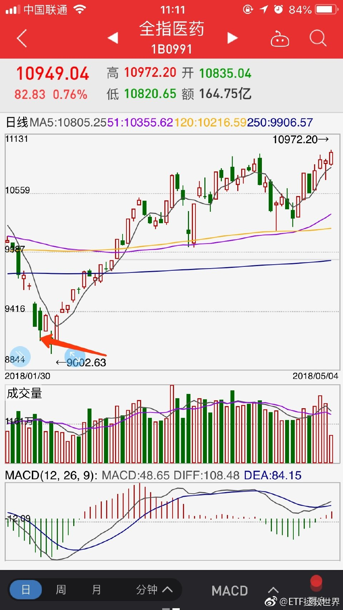

======================================================

ETF拯救世界 (5687069307) @
2018-05-04 11:30:10 Fri  
url: https://weibo.com/5687069307/Gf4lwy7h0

别人家的粉丝。 [拜拜]

------------------------------------------------------
转推：
>  @网易财经 (1974561081)
>  2018-05-04 10:33:56 Fri  
>  url: https:/weibo.com/1974561081/Gf3YHsD7l/

>  【“为所欲为”四个字就是这么写的】范冰冰的弟弟@范丞丞Adam0616 在微博上发了个付费照片，要想看照片先要付60元，结果有8万人付款，一觉醒来赚了480万！[允悲] @来去之间 来总是不是找到了新的利润增长点了！ ​​​（via.互联网那点事儿） ​​​

转发[14]  评论[76]  赞[104] 

======================================================

ETF拯救世界 (5687069307) @
2018-05-04 11:42:22 Fri  
url: https://weibo.com/5687069307/Gf4qtBPhb

这1444444444是什么意思。

活得越久，越知道活着的可贵。在金融市场，只要不死，不受重伤，资产稳步增加，爆发，增加，爆发，这样循环，最终结果都会很好。

违背一些基本的原则，巨幅波动，真的很危险。不知道哪次就彻底埋进去了。

所以有人说，不要在意回撤，满仓干，永远满仓。说实话，我无法认同 ​​​

转发[32]  评论[72]  赞[183] 

+++++++++++++++++++++++++++++++++++++++++++++++++++++

图片：
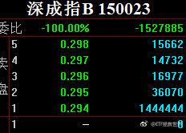

======================================================

ETF拯救世界 (5687069307) @
2018-05-04 12:32:08 Fri  
url: https://weibo.com/5687069307/Gf4KGblgx

回复@芷蓝风:逢年过节还发红包的事了解一下。（包括38节）//@芷蓝风:别人家的偶像向粉丝收钱，我家偶像授之以渔又授之以鱼，感觉跟对了人!//@ETF拯救世界:别人家的粉丝。 [拜拜]

------------------------------------------------------
转推：
>  @网易财经 (1974561081)
>  2018-05-04 10:33:56 Fri  
>  url: https:/weibo.com/1974561081/Gf3YHsD7l/

>  【“为所欲为”四个字就是这么写的】范冰冰的弟弟@范丞丞Adam0616 在微博上发了个付费照片，要想看照片先要付60元，结果有8万人付款，一觉醒来赚了480万！[允悲] @来去之间 来总是不是找到了新的利润增长点了！ ​​​（via.互联网那点事儿） ​​​

转发[1]  评论[67]  赞[186] 

======================================================

ETF拯救世界 (5687069307) @
2018-05-04 13:16:30 Fri  
url: https://weibo.com/5687069307/Gf52GzC8C

实在忍不住的，等13000可以平衡一点。之前不卖，坐电梯也无所谓。

------------------------------------------------------
转推：
>  @ETF拯救世界 (5687069307)
>  2018-05-04 11:01:42 Fri  
>  url: https:/weibo.com/5687069307/Gf49YkuWY/

>  $全指医药 sh000991$   记住，新高不卖。不 要 卖！ ​​​

转发[23]  评论[33]  赞[138] 

======================================================

ETF拯救世界 (5687069307) @
2018-05-04 13:28:26 Fri  
url: https://weibo.com/5687069307/Gf57x6mko

回复@很多话不想说:每种花开放的时间不同。我们持仓的品种都会有疯狂的时候，不信走着瞧。//@很多话不想说:终于轮到医药火一把了//@ETF拯救世界:实在忍不住的，等13000可以平衡一点。之前不卖，坐电梯也无所谓。

------------------------------------------------------
转推：
>  @ETF拯救世界 (5687069307)
>  2018-05-04 11:01:42 Fri  
>  url: https:/weibo.com/5687069307/Gf49YkuWY/

>  $全指医药 sh000991$   记住，新高不卖。不 要 卖！ ​​​

转发[11]  评论[20]  赞[128] 

======================================================

ETF拯救世界 (5687069307) @
2018-05-04 13:33:03 Fri  
url: https://weibo.com/5687069307/Gf59ozGk0

大家注意观察，媒体、大v什么时候开始集体吹医药。 ​​​

转发[11]  评论[56]  赞[195] 

======================================================

ETF拯救世界 (5687069307) @
2018-05-04 13:34:07 Fri  
url: https://weibo.com/5687069307/Gf59Psf0y

回复@酩酊大醉的三藏:500和环保满打满算正式开始投不到2年，大概也就1年。这就花儿也谢了？没做好3、5年不涨的准备不要投资。//@酩酊大醉的三藏:等中证500跟环保已经等得花都谢了。。。//@ETF拯救世界:回复@很多话不想说:每种花开放的时间不同。我们持仓的品种都会有疯狂的时候，不信走着瞧。

------------------------------------------------------
转推：
>  @ETF拯救世界 (5687069307)
>  2018-05-04 11:01:42 Fri  
>  url: https:/weibo.com/5687069307/Gf49YkuWY/

>  $全指医药 sh000991$   记住，新高不卖。不 要 卖！ ​​​

转发[6]  评论[21]  赞[154] 

======================================================

ETF拯救世界 (5687069307) @
2018-05-04 13:38:23 Fri  
url: https://weibo.com/5687069307/Gf5bzFpsL

回复@出去走走吧365:你好好翻翻我的微博。再看看发车记录，是谁在医药最黑暗的时候一车一车买成第一重仓。这叫吹？拉黑不送。//@出去走走吧365:你在吹

------------------------------------------------------
转推：
>  @ETF拯救世界 (5687069307)
>  2018-05-04 13:33:03 Fri  
>  url: https:/weibo.com/5687069307/Gf59ozGk0/

>  大家注意观察，媒体、大v什么时候开始集体吹医药。 ​​​

转发[2]  评论[46]  赞[177] 

======================================================

ETF拯救世界 (5687069307) @
2018-05-04 13:45:18 Fri  
url: https://weibo.com/5687069307/Gf5enoB6Q

全指医药第三轮计划发车全纪录。 ​​​

转发[16]  评论[99]  赞[321] 

+++++++++++++++++++++++++++++++++++++++++++++++++++++

图片：

======================================================

ETF拯救世界 (5687069307) @
2018-05-04 13:53:17 Fri  
url: https://weibo.com/5687069307/Gf5hCkvgx

第三轮计划50买入全纪录 ​​​

转发[15]  评论[70]  赞[279] 

+++++++++++++++++++++++++++++++++++++++++++++++++++++

图片：
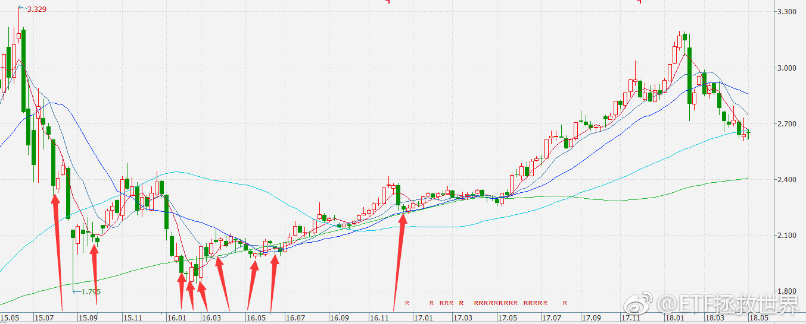

======================================================

ETF拯救世界 (5687069307) @
2018-05-04 13:56:57 Fri  
url: https://weibo.com/5687069307/Gf5j6u1Bs

第三轮计划恒生ETF买入全纪录 

谁还记得恒生浮亏10%的时候有人在公众号埋怨我的事。 ​​​

转发[28]  评论[131]  赞[328] 

+++++++++++++++++++++++++++++++++++++++++++++++++++++

图片：

======================================================

ETF拯救世界 (5687069307) @
2018-05-04 14:06:19 Fri  
url: https://weibo.com/5687069307/Gf5mUmdjJ

这是浮亏的券商，你有多害怕 ​​​

转发[15]  评论[138]  赞[267] 

+++++++++++++++++++++++++++++++++++++++++++++++++++++

图片：
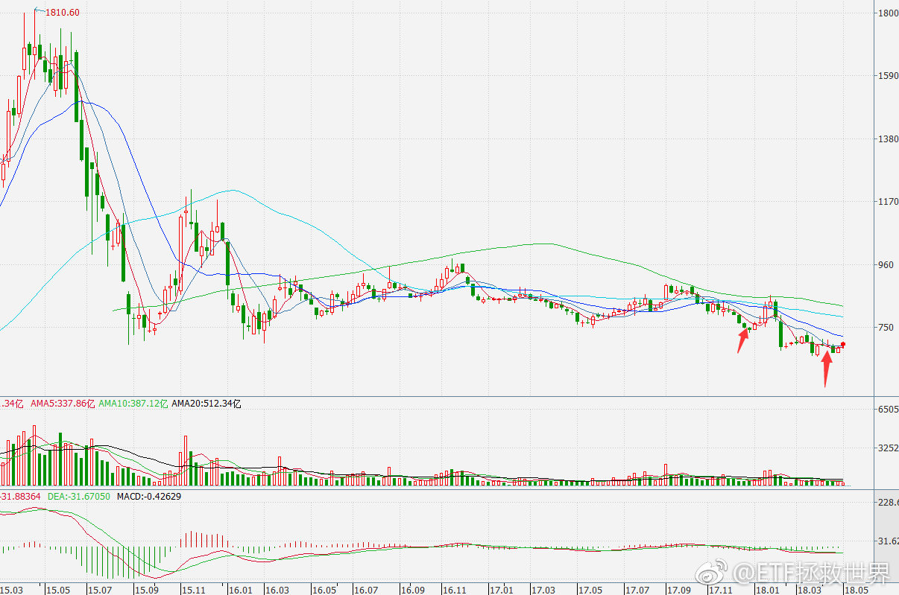

======================================================

ETF拯救世界 (5687069307) @
2018-05-04 14:29:32 Fri  
url: https://weibo.com/5687069307/Gf5wlqHc1

是不是又要我毒奶护盘了。

------------------------------------------------------
转推：
>  @ETF拯救世界 (5687069307)
>  2018-05-03 09:50:22 Thu  
>  url: https:/weibo.com/5687069307/GeUgwmsK7/

>  加车模式启动。发车时间临时改为每周评估。 ​​​

转发[16]  评论[62]  赞[196] 

======================================================

ETF拯救世界 (5687069307) @
2018-05-04 14:31:55 Fri  
url: https://weibo.com/5687069307/Gf5xitu8P

回复@行走世间一只喵:不是记仇。我估计绝大多数人体会不到我的心情。自己的计划公布出来，愿意参考的，他浮亏一点来埋怨你。后面赚50%一个谢字都不会说。心情很复杂。//@行走世间一只喵:记仇哈哈

------------------------------------------------------
转推：
>  @ETF拯救世界 (5687069307)
>  2018-05-04 13:56:57 Fri  
>  url: https:/weibo.com/5687069307/Gf5j6u1Bs/

>  第三轮计划恒生ETF买入全纪录 
>  
>  谁还记得恒生浮亏10%的时候有人在公众号埋怨我的事。 ​​​

转发[10]  评论[252]  赞[375] 

======================================================

ETF拯救世界 (5687069307) @
2018-05-04 15:20:03 Fri  
url: https://weibo.com/5687069307/Gf5QQ0j9F

回复@点滴的过往:我从来不推荐别人投资股市。虽然我自己赚了很多，但我从来不忽悠任何人入市。我也不会给跨越房地产股市的跨大类建议。前提是，你自己希望投资股市的话，我的看法就是科学的投资指数基金胜面会非常大。所以，一旦发生任何影响股市整体的大事件，我也认为，指数比个体公司抗击打能力强。

------------------------------------------------------
转推：
>  @ETF拯救世界 (5687069307)
>  2018-05-03 09:50:22 Thu  
>  url: https:/weibo.com/5687069307/GeUgwmsK7/

>  加车模式启动。发车时间临时改为每周评估。 ​​​

转发[11]  评论[88]  赞[334] 

======================================================

ETF拯救世界 (5687069307) @
2018-05-05 20:13:36 Sat  
url: https://weibo.com/5687069307/GfhcuaozO

每日打卡（185）

前两天都练了，没有贴到微博。今天练不了了，爬了一天山 ​​​

转发[5]  评论[64]  赞[244] 

+++++++++++++++++++++++++++++++++++++++++++++++++++++

图片：
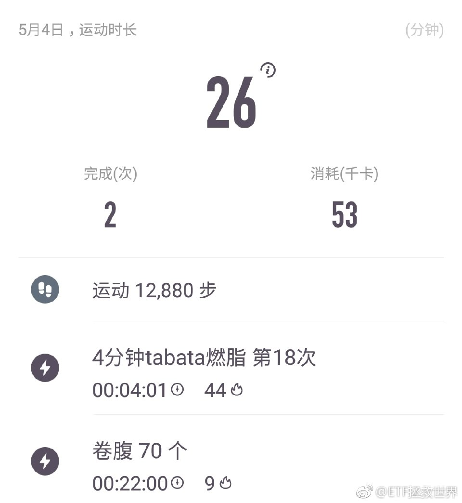
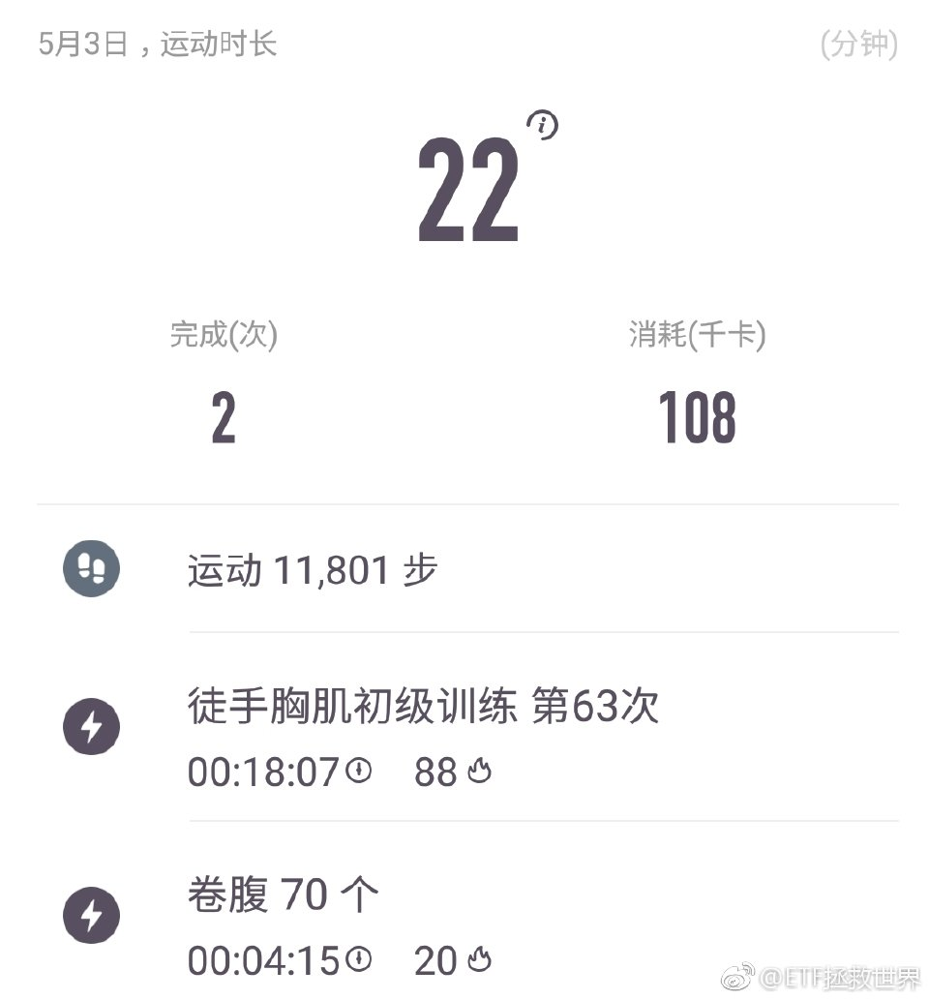

======================================================

ETF拯救世界 (5687069307) @
2018-05-06 11:01:01 Sun  
url: https://weibo.com/5687069307/Gfn0Gf4Kj

回复@沙杨_Destiny:这样也行？太可怕了。不管去哪玩，最重要是人少。人多的话，再好的地方我也不喜欢。这里比较小众，人少，风景也不错。日常爬爬可以考虑。//@沙杨_Destiny:百度识图到了，这是北京房山圣莲山的莲子峰[哈哈][喵喵][思考]

------------------------------------------------------
转推：
>  @ETF拯救世界 (5687069307)
>  2018-05-05 20:13:36 Sat  
>  url: https:/weibo.com/5687069307/GfhcuaozO/

>  每日打卡（185）
>  
>  前两天都练了，没有贴到微博。今天练不了了，爬了一天山 ​​​

转发[2]  评论[35]  赞[121] 

======================================================

ETF拯救世界 (5687069307) @
2018-05-06 22:39:37 Sun  
url: https://weibo.com/5687069307/GfrAfsmsF

每日打卡（186）

睡觉 ​​​

转发[1]  评论[26]  赞[131] 

+++++++++++++++++++++++++++++++++++++++++++++++++++++

图片：

======================================================

ETF拯救世界 (5687069307) @
2018-05-07 09:40:24 Mon  
url: https://weibo.com/5687069307/GfvUsAzsK

$全指医药 sh000991$  继续新高。不用我嘱咐了吧。

记住，赚钱的时候千万别赚了三瓜两枣就着急卖掉。那样，你一辈子也发不了大财。

对一次两次，终究有一次后悔莫及。 ​​​

转发[81]  评论[79]  赞[213] 

======================================================

ETF拯救世界 (5687069307) @
2018-05-07 09:47:07 Mon  
url: https://weibo.com/5687069307/GfvXccwNI

回复@ETF信徒者:我没那么乐观。短期飚的话，我能理解的点位是13500-14000吧。以后每年增加900点。//@ETF信徒者:坚决拿住，坐等到15000

------------------------------------------------------
转推：
>  @ETF拯救世界 (5687069307)
>  2018-05-07 09:40:24 Mon  
>  url: https:/weibo.com/5687069307/GfvUsAzsK/

>  $全指医药 sh000991$  继续新高。不用我嘱咐了吧。
>  
>  记住，赚钱的时候千万别赚了三瓜两枣就着急卖掉。那样，你一辈子也发不了大财。
>  
>  对一次两次，终究有一次后悔莫及。 ​​​

转发[42]  评论[43]  赞[125] 

======================================================

ETF拯救世界 (5687069307) @
2018-05-07 09:53:14 Mon  
url: https://weibo.com/5687069307/GfvZFvp8q

再回头看去年10月的微博，感受是不是更深了。医药中间过山车了，跌很深，几乎到了我们的成本。然后我们果断加仓，现在回来了，蹦的更高，而且因为加仓，赚的比之前多很多。不要怕过山车，怕什么？跌了就买，以后赚更多。指数是向上的。轻易不要跑。

------------------------------------------------------
转推：
>  @ETF拯救世界 (5687069307)
>  2017-10-13 11:08:44 Fri  
>  url: https:/weibo.com/5687069307/Fq9Uly1BJ/

>  三个字，不要卖。你的成本很低，踏踏实实拿着。不要怕过山车，即使过山车，下次回来你赚更多。
>  
>  这话说过好多次，回头看看，是不是正确的？没错，过山车好几次，每次回来是不是利润增加一大截？
>  
>  拿着。 ​​​

转发[25]  评论[73]  赞[223] 

======================================================

ETF拯救世界 (5687069307) @
2018-05-07 10:55:42 Mon  
url: https://weibo.com/5687069307/Gfwp1AAfI

别惦记了。干正经事儿去吧。正常发车。//@ETF拯救世界:是不是又要我毒奶护盘了。

------------------------------------------------------
转推：
>  @ETF拯救世界 (5687069307)
>  2018-05-03 09:50:22 Thu  
>  url: https:/weibo.com/5687069307/GeUgwmsK7/

>  加车模式启动。发车时间临时改为每周评估。 ​​​

转发[2]  评论[66]  赞[136] 

======================================================

ETF拯救世界 (5687069307) @
2018-05-07 11:24:22 Mon  
url: https://weibo.com/5687069307/GfwAFamzD

你要感受一下计划“第一重仓”的威力。

16年以后，计划第一重仓是恒生+50。结果你知道了。

到今年初，第一重仓变成医药+养老（50%医药股），结果你也知道了。

现在第一重仓变成500（500+增强）。第二重仓是红利。 ​​​

转发[42]  评论[198]  赞[290] 

======================================================

ETF拯救世界 (5687069307) @
2018-05-07 11:34:51 Mon  
url: https://weibo.com/5687069307/GfwEUpgLH

安迪，安迪是你吗安迪！ http://t.cn/RuFPe95

------------------------------------------------------
转推：
>  @ ()
>  2018-05-07 10:11:36 Mon  
>  url: 

>  抱歉，作者已设置仅展示半年内微博，此微博已不可见。 ​​​

转发[2]  评论[44]  赞[93] 

======================================================

ETF拯救世界 (5687069307) @
2018-05-07 13:30:23 Mon  
url: https://weibo.com/5687069307/GfxpO3j7l

比较遗憾的是，本来打算下次买入的某品种今天暴涨。

人生就是这样啊。 ​​​

转发[6]  评论[125]  赞[172] 

======================================================

ETF拯救世界 (5687069307) @
2018-05-07 13:33:36 Mon  
url: https://weibo.com/5687069307/Gfxr7ktEp

500目前是除创业板外所有宽基指数涨幅第一。

------------------------------------------------------
转推：
>  @ETF拯救世界 (5687069307)
>  2018-05-07 11:24:22 Mon  
>  url: https:/weibo.com/5687069307/GfwAFamzD/

>  你要感受一下计划“第一重仓”的威力。
>  
>  16年以后，计划第一重仓是恒生+50。结果你知道了。
>  
>  到今年初，第一重仓变成医药+养老（50%医药股），结果你也知道了。
>  
>  现在第一重仓变成500（500+增强）。第二重仓是红利。 ​​​

转发[7]  评论[56]  赞[176] 

======================================================

ETF拯救世界 (5687069307) @
2018-05-07 14:42:21 Mon  
url: https://weibo.com/5687069307/GfxT22U0X

光头光脚新高，哪有理由不持有。当然短期涨幅过大回调消化也很正常。你的浮盈越来越大，那种小波动就不会在意了。所以我跟你说什么人最容易卖，就是在成本附近波动的时候。一会亏一会赚。真的赚了几十个点就无所谓了。

------------------------------------------------------
转推：
>  @ETF拯救世界 (5687069307)
>  2018-05-07 09:40:24 Mon  
>  url: https:/weibo.com/5687069307/GfvUsAzsK/

>  $全指医药 sh000991$  继续新高。不用我嘱咐了吧。
>  
>  记住，赚钱的时候千万别赚了三瓜两枣就着急卖掉。那样，你一辈子也发不了大财。
>  
>  对一次两次，终究有一次后悔莫及。 ​​​

转发[18]  评论[58]  赞[187] 

======================================================

ETF拯救世界 (5687069307) @
2018-05-07 14:55:15 Mon  
url: https://weibo.com/5687069307/GfxYgdWTF

养老还差3%新高，废柴。 ​​​

转发[7]  评论[62]  赞[147] 

======================================================

ETF拯救世界 (5687069307) @
2018-05-07 15:09:37 Mon  
url: https://weibo.com/5687069307/Gfy45zZfk

发帖日至今下跌20%了。学习好的讲讲什么时候可以买。

------------------------------------------------------
转推：
>  @ETF拯救世界 (5687069307)
>  2018-03-22 09:34:01 Thu  
>  url: https:/weibo.com/5687069307/G8wd21cxW/

>  腾讯，60倍PE。未来五年看，真的能有特别好的收益率吗。
>  
>  学习了。 ​​​

转发[26]  评论[70]  赞[137] 

======================================================

ETF拯救世界 (5687069307) @
2018-05-07 15:11:55 Mon  
url: https://weibo.com/5687069307/Gfy51vljX

回复@hei-jude:难道还有人不知道公众号  chinaetfs 的吗！//@hei-jude:最近才有一笔资金，益达指导一下如何跟车呀。。。。还没看懂具体是指那只

------------------------------------------------------
转推：
>  @ETF拯救世界 (5687069307)
>  2018-05-07 09:40:24 Mon  
>  url: https:/weibo.com/5687069307/GfvUsAzsK/

>  $全指医药 sh000991$  继续新高。不用我嘱咐了吧。
>  
>  记住，赚钱的时候千万别赚了三瓜两枣就着急卖掉。那样，你一辈子也发不了大财。
>  
>  对一次两次，终究有一次后悔莫及。 ​​​

转发[0]  评论[23]  赞[84] 

======================================================

ETF拯救世界 (5687069307) @
2018-05-07 15:50:37 Mon  
url: https://weibo.com/5687069307/GfykK5dzm

回复@半生流离醉:sorry，我没质疑。没那个能力。我是把融创当成观察情绪的一面镜子。融创是这几年我见过最有代表性的镜子了。//@半生流离醉:20%不算什么吧。你一直质疑的融创，也没怎么跌啊。熊市跌20%算很不错了吧。

------------------------------------------------------
转推：
>  @ETF拯救世界 (5687069307)
>  2018-03-22 09:34:01 Thu  
>  url: https:/weibo.com/5687069307/G8wd21cxW/

>  腾讯，60倍PE。未来五年看，真的能有特别好的收益率吗。
>  
>  学习了。 ​​​

转发[14]  评论[16]  赞[107] 

======================================================

ETF拯救世界 (5687069307) @
2018-05-07 16:18:28 Mon  
url: https://weibo.com/5687069307/Gfyw2lOOd

我发现，还是有朋友是这样。就是，自己持有的品种，别人稍微有点质疑，有时候连质疑都算不上就不开心，不高兴。

哪能港，这样真的好吗。

我是无所谓的。我买什么东西，买的再多，你说它不好我都完全不care。因为对这个东西我心里有底，你说什么我一点都不在乎。因为我知道我比你强，强者会在乎弱者的 ​​​

转发[30]  评论[153]  赞[396] 

======================================================

ETF拯救世界 (5687069307) @
2018-05-07 23:01:12 Mon  
url: https://weibo.com/5687069307/GfB9v71IA

每日打卡（187）

又睡晚了。 ​​​

转发[1]  评论[25]  赞[119] 

+++++++++++++++++++++++++++++++++++++++++++++++++++++

图片：

======================================================

ETF拯救世界 (5687069307) @
2018-05-08 06:27:24 Tue  
url: https://weibo.com/5687069307/GfE4Cqefv

回复@CZ梦想:是的。在沪深300再涨15%才能新高的情况下，我们还差2%。没什么，新高是计划的常态。//@CZ梦想:整体又快新高了，@ETF拯救世界

------------------------------------------------------
转推：
>  @ETF拯救世界 (5687069307)
>  2018-05-07 14:55:15 Mon  
>  url: https:/weibo.com/5687069307/GfxYgdWTF/

>  养老还差3%新高，废柴。 ​​​

转发[4]  评论[28]  赞[126] 

======================================================

ETF拯救世界 (5687069307) @
2018-05-08 06:30:32 Tue  
url: https://weibo.com/5687069307/GfE5TCnfU

回复@我有大头:我现在绝对不会买。我买东西不是因为有了或者有钱，而是因为值得买。再说一次。//@我有大头:印度基金E大有没有考虑//@ETF拯救世界:回复@CZ梦想:是的。在沪深300再涨15%才能新高的情况下，我们还差2%。没什么，新高是计划的常态。//@CZ梦想:整体又快新高了，@ETF拯救世界

------------------------------------------------------
转推：
>  @ETF拯救世界 (5687069307)
>  2018-05-07 14:55:15 Mon  
>  url: https:/weibo.com/5687069307/GfxYgdWTF/

>  养老还差3%新高，废柴。 ​​​

转发[3]  评论[59]  赞[142] 

======================================================

ETF拯救世界 (5687069307) @
2018-05-08 11:48:13 Tue  
url: https://weibo.com/5687069307/GfGaQ9np9

又来吃煎饺了。今天不吃韭菜的，吃牛肉馅 ​​​

转发[2]  评论[86]  赞[240] 

+++++++++++++++++++++++++++++++++++++++++++++++++++++

图片：
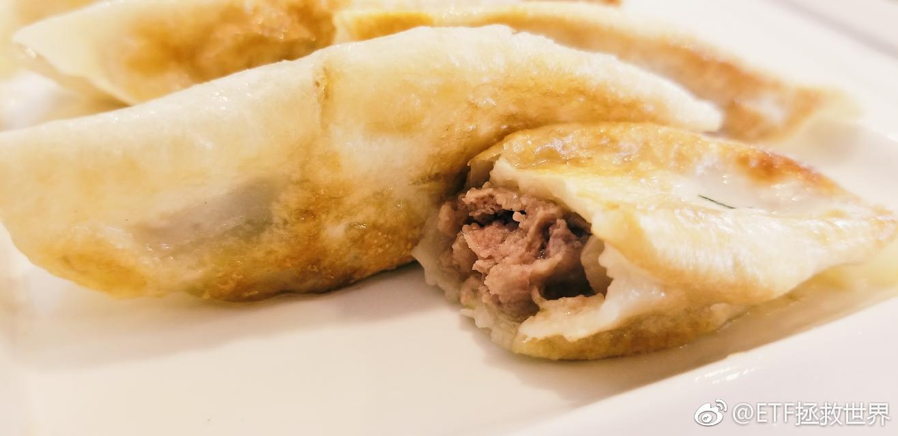

======================================================

ETF拯救世界 (5687069307) @
2018-05-08 12:22:08 Tue  
url: https://weibo.com/5687069307/GfGoBw2iO

哪能港，浓眉大眼的上海人也打架？

------------------------------------------------------
转推：
>  @澎湃新闻 (5044281310)
>  2018-05-08 12:17:03 Tue  
>  url: https:/weibo.com/5044281310/GfGmxgAwj/

>  【上海公布高架捉对厮打男女处罚：一男子拘十日另一男子拘五日】 http://t.cn/R3hZoRK 5月7日11时10分许，上海警方接报警称，延安路高架西向东方向近西藏南路下匝道处有两辆小客车停于道路中间，随车人员（共4人）互相扭打。接报后，民警迅速到场将4人带回调查。目前，违法人员顾某（男、红色小客车驾 ​​​

转发[6]  评论[47]  赞[75] 

======================================================

ETF拯救世界 (5687069307) @
2018-05-08 13:11:51 Tue  
url: https://weibo.com/5687069307/GfGIMFReR

今天两市交易的3200只股票中，跑赢50的510只，占比16%。

跑赢红利的920只，占比29%。 ​​​

转发[12]  评论[67]  赞[230] 

======================================================

ETF拯救世界 (5687069307) @
2018-05-08 16:06:45 Tue  
url: https://weibo.com/5687069307/GfHRMgNKk

回复@等风来zc:这届北京基民不行。//@等风来zc:支付宝显示今年基金收益率1.93%，竟然超过92.4%的北京基民[doge]

------------------------------------------------------
转推：
>  @ETF拯救世界 (5687069307)
>  2018-05-08 13:11:51 Tue  
>  url: https:/weibo.com/5687069307/GfGIMFReR/

>  今天两市交易的3200只股票中，跑赢50的510只，占比16%。
>  
>  跑赢红利的920只，占比29%。 ​​​

转发[3]  评论[67]  赞[128] 

======================================================

ETF拯救世界 (5687069307) @
2018-05-08 18:28:25 Tue  
url: https://weibo.com/5687069307/GfINhroCG

有8位数金融资产多吗。绝大多数时候你会觉得还可以，买东西不用太考虑价格，追求品质，生活的还算愉快。

但是不要浏览帝都链家网站。哪怕是换房升级，你也会发现，你其实是个穷人…… ​​​

转发[28]  评论[282]  赞[310] 

======================================================

ETF拯救世界 (5687069307) @
2018-05-08 22:30:23 Tue  
url: https://weibo.com/5687069307/GfKnuE38q

今天跑步了，不练了 ​​​

转发[1]  评论[42]  赞[177] 

+++++++++++++++++++++++++++++++++++++++++++++++++++++

图片：
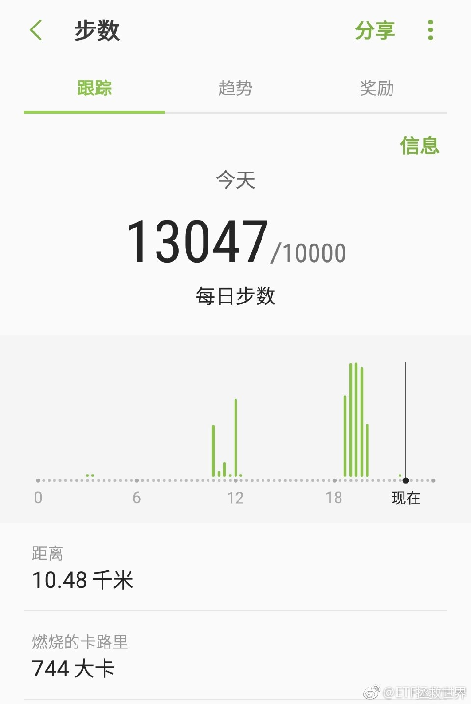

======================================================

ETF拯救世界 (5687069307) @
2018-05-09 09:10:19 Wed  
url: https://weibo.com/5687069307/GfOzeADYS

男生洗个澡快的五分钟就行了吧。至于一个月连五分钟都腾不出来吗。。

------------------------------------------------------
转推：
>  @ ()
>  2018-05-09 06:40:02 Wed  
>  url: 

>  抱歉，作者已设置仅展示半年内微博，此微博已不可见。 ​​​

转发[13]  评论[78]  赞[61] 

======================================================

ETF拯救世界 (5687069307) @
2018-05-09 09:17:03 Wed  
url: https://weibo.com/5687069307/GfOBYxCej

$162411 下一压力位是16年底的0.78了。

计划的两份先拿稳，网格继续做起来。 ​​​

转发[14]  评论[187]  赞[226] 

======================================================

ETF拯救世界 (5687069307) @
2018-05-09 10:11:45 Wed  
url: https://weibo.com/5687069307/GfOYbfVXh

计划的油气应该是又一次正反馈。

当年曾经出现过-15%的情况，这是第三轮计划最大的浮亏。当然，只有一份。

然后补仓，然后暴力反转，然后现在盈利接近18%，年化20多个点。今天已经52周新高了，未来会涨多少还不知道。

这样的事情未来会一再发生。就是这么简单。买的贵点，毫无所谓。控制住总成本， ​​​

转发[60]  评论[181]  赞[331] 

======================================================

ETF拯救世界 (5687069307) @
2018-05-09 13:21:07 Wed  
url: https://weibo.com/5687069307/GfQd2Cc5a

回复@Rinderbraten:最怕你这样话说不清楚的。没有他说的付费专栏，是回答过两个微博付费问题，现在已经可以免费看了。//@Rinderbraten:回复@木头队长:付费专栏里面可以免费看，我替老大回答了

------------------------------------------------------
转推：
>  @ETF拯救世界 (5687069307)
>  2018-05-09 10:11:45 Wed  
>  url: https:/weibo.com/5687069307/GfOYbfVXh/

>  计划的油气应该是又一次正反馈。
>  
>  当年曾经出现过-15%的情况，这是第三轮计划最大的浮亏。当然，只有一份。
>  
>  然后补仓，然后暴力反转，然后现在盈利接近18%，年化20多个点。今天已经52周新高了，未来会涨多少还不知道。
>  
>  这样的事情未来会一再发生。就是这么简单。买的贵点，毫无所谓。控制住总成本， ​​​

转发[0]  评论[32]  赞[119] 

======================================================

ETF拯救世界 (5687069307) @
2018-05-09 14:04:14 Wed  
url: https://weibo.com/5687069307/GfQuy0u2I

我想到一个问题。

大家身边有没有之前买了好几套房，然后这几年卖出一两套拿着钱去享受生活的。

我身边的多套房持有者，有卖的。卖了的都是继续买更大更贵贷款更多的房子。而且是各种手段规避政策，离婚什么的。

好像很少听说谁把房卖了就不再买的。都是越买越多。 好像绝大多数人都是纸面富贵。 ​​​

转发[210]  评论[324]  赞[290] 

======================================================

ETF拯救世界 (5687069307) @
2018-05-09 15:05:34 Wed  
url: https://weibo.com/5687069307/GfQTrkEah

回复@用户y49f7o7jj4:这我不能说。我只能透露一点，下轮牛市的涨幅相当粗俗。//@用户y49f7o7jj4:老大，来碗精神鸡汤吧，说说下次牛市能翻倍不？

------------------------------------------------------
转推：
>  @ETF拯救世界 (5687069307)
>  2018-05-09 14:04:14 Wed  
>  url: https:/weibo.com/5687069307/GfQuy0u2I/

>  我想到一个问题。
>  
>  大家身边有没有之前买了好几套房，然后这几年卖出一两套拿着钱去享受生活的。
>  
>  我身边的多套房持有者，有卖的。卖了的都是继续买更大更贵贷款更多的房子。而且是各种手段规避政策，离婚什么的。
>  
>  好像很少听说谁把房卖了就不再买的。都是越买越多。 好像绝大多数人都是纸面富贵。 ​​​

转发[78]  评论[87]  赞[161] 

======================================================

ETF拯救世界 (5687069307) @
2018-05-09 15:34:52 Wed  
url: https://weibo.com/5687069307/GfR5kABmq

回复@用户y49f7o7jj4:极大概率能。历史上阴跌时间最长的是2001-2005，整整4年。然后是2007-2012，也是4年，不过中间大幅反弹过，好过很多。这一轮2015至今已经3年。本来极有希望在一年内见到大底。问题在于目前有GJD一两万亿资金维稳，市场始终无法价值回归，只能靠时间换空间。但最晚也不会超过2020。

------------------------------------------------------
转推：
>  @ETF拯救世界 (5687069307)
>  2018-05-09 14:04:14 Wed  
>  url: https:/weibo.com/5687069307/GfQuy0u2I/

>  我想到一个问题。
>  
>  大家身边有没有之前买了好几套房，然后这几年卖出一两套拿着钱去享受生活的。
>  
>  我身边的多套房持有者，有卖的。卖了的都是继续买更大更贵贷款更多的房子。而且是各种手段规避政策，离婚什么的。
>  
>  好像很少听说谁把房卖了就不再买的。都是越买越多。 好像绝大多数人都是纸面富贵。 ​​​

转发[67]  评论[99]  赞[177] 

======================================================

ETF拯救世界 (5687069307) @
2018-05-09 16:07:59 Wed  
url: https://weibo.com/5687069307/GfRiMbcWq

对于“时间换空间”，我用一个例子你就懂了。

2016年5月，深综指与目前大致差不多。当时月末全市场外部数据加权估值是35倍。

今天是27倍，下降了大概22%。

等权下降更多，降了28%。

那我告诉你，两年后深综指如果还是这个点位，按照这个增速，加权估值将降至21倍。知道21倍是什么意思吗，是2012年1 ​​​

转发[111]  评论[164]  赞[325] 

======================================================

ETF拯救世界 (5687069307) @
2018-05-09 16:24:44 Wed  
url: https://weibo.com/5687069307/GfRpzzPWR

回复@April·D·S:我测算最近几年A股上市公司利润增长去掉统计局通胀数据也有9-11%的增速。我有一套房子现在大概8-9万，我很怀疑未来它能否每年涨10%。7年后20万一平米？我的贫穷限制了我的想象。

------------------------------------------------------
转推：
>  @ETF拯救世界 (5687069307)
>  2018-05-09 14:04:14 Wed  
>  url: https:/weibo.com/5687069307/GfQuy0u2I/

>  我想到一个问题。
>  
>  大家身边有没有之前买了好几套房，然后这几年卖出一两套拿着钱去享受生活的。
>  
>  我身边的多套房持有者，有卖的。卖了的都是继续买更大更贵贷款更多的房子。而且是各种手段规避政策，离婚什么的。
>  
>  好像很少听说谁把房卖了就不再买的。都是越买越多。 好像绝大多数人都是纸面富贵。 ​​​

转发[23]  评论[98]  赞[143] 

======================================================

ETF拯救世界 (5687069307) @
2018-05-09 17:06:16 Wed  
url: https://weibo.com/5687069307/GfRGr185D

回复@裁缝跑路:怎么可能10%。你好好想想，除了房子，什么东西每年涨10%了？好多东西比10年前还便宜了。很多人觉得钱不够花了，一个是房子，一个是自己消费升级了。老想用买地摊包的钱买PRADA怎么可能。如果消费不升级，看看东西能比十年前贵多少。//@裁缝跑路:通胀怎么算的 说是一年有10%

------------------------------------------------------
转推：
>  @ETF拯救世界 (5687069307)
>  2018-05-09 14:04:14 Wed  
>  url: https:/weibo.com/5687069307/GfQuy0u2I/

>  我想到一个问题。
>  
>  大家身边有没有之前买了好几套房，然后这几年卖出一两套拿着钱去享受生活的。
>  
>  我身边的多套房持有者，有卖的。卖了的都是继续买更大更贵贷款更多的房子。而且是各种手段规避政策，离婚什么的。
>  
>  好像很少听说谁把房卖了就不再买的。都是越买越多。 好像绝大多数人都是纸面富贵。 ​​​

转发[8]  评论[126]  赞[134] 

======================================================

ETF拯救世界 (5687069307) @
2018-05-10 09:36:26 Thu  
url: https://weibo.com/5687069307/GfYaleDGT

$162411   随时受不了 ​​​

转发[43]  评论[79]  赞[174] 

======================================================

ETF拯救世界 (5687069307) @
2018-05-10 09:48:29 Thu  
url: https://weibo.com/5687069307/GfYfepfND

回复@日照雷门peter:个股不论，只说指数品种。人气越低迷，看好的人越少，表现越差，利空越多，机构越低配——就是最大的利好。不要听媒体和大v忽悠强势品种，那是在找接盘侠。我们要做的是买垃圾，被别人忽悠起来以后卖给接盘侠。

------------------------------------------------------
转推：
>  @ETF拯救世界 (5687069307)
>  2018-05-10 09:36:26 Thu  
>  url: https:/weibo.com/5687069307/GfYaleDGT/

>  $162411   随时受不了 ​​​

转发[40]  评论[52]  赞[230] 

======================================================

ETF拯救世界 (5687069307) @
2018-05-10 10:18:23 Thu  
url: https://weibo.com/5687069307/GfYrmpzsh

$全指医药 sh000991$   又内什么了。千万别内什么。 ​​​

转发[29]  评论[53]  赞[186] 

======================================================

ETF拯救世界 (5687069307) @
2018-05-10 10:32:20 Thu  
url: https://weibo.com/5687069307/GfYx24HAs

$养老产业 sz399812$   新高稳不稳。学习好的讲讲。 ​​​

转发[0]  评论[64]  赞[166] 

======================================================

ETF拯救世界 (5687069307) @
2018-05-10 11:05:27 Thu  
url: https://weibo.com/5687069307/GfYKtplJU

回复@我和猪猪一起生活:等媒体、大v和自媒体的消息。。//@我和猪猪一起生活:佩琪，这两天看到银河，华福之类的券商开始吹医药了[笑cry]

------------------------------------------------------
转推：
>  @ETF拯救世界 (5687069307)
>  2018-05-10 10:18:23 Thu  
>  url: https:/weibo.com/5687069307/GfYrmpzsh/

>  $全指医药 sh000991$   又内什么了。千万别内什么。 ​​​

转发[5]  评论[64]  赞[143] 

======================================================

ETF拯救世界 (5687069307) @
2018-05-10 14:02:14 Thu  
url: https://weibo.com/5687069307/GfZUeitWf

不知道为什么最近又开始WW了。 ​​​

转发[3]  评论[55]  赞[133] 

======================================================

ETF拯救世界 (5687069307) @
2018-05-10 14:10:52 Thu  
url: https://weibo.com/5687069307/GfZXLgdnM

A股就是这样，炒什么都是一把到底。简单粗暴，不讲节奏。

------------------------------------------------------
转推：
>  @ETF拯救世界 (5687069307)
>  2018-05-10 10:18:23 Thu  
>  url: https:/weibo.com/5687069307/GfYrmpzsh/

>  $全指医药 sh000991$   又内什么了。千万别内什么。 ​​​

转发[20]  评论[22]  赞[122] 

======================================================

ETF拯救世界 (5687069307) @
2018-05-10 14:16:33 Thu  
url: https://weibo.com/5687069307/Gg002uIJz

回复@蜀中弟子:很明显啊，GJD当时正在打开交易软件准备下单了。这都预判不出来还炒股？！//@蜀中弟子:e大，请靠诉我你为什么这么牛逼，你发这条微博的时候盘面还在一路向下，发了之后立马反转了，从哪些指标判断的呢

------------------------------------------------------
转推：
>  @ETF拯救世界 (5687069307)
>  2018-05-10 14:02:14 Thu  
>  url: https:/weibo.com/5687069307/GfZUeitWf/

>  不知道为什么最近又开始WW了。 ​​​

转发[1]  评论[37]  赞[140] 

======================================================

ETF拯救世界 (5687069307) @
2018-05-10 14:31:09 Thu  
url: https://weibo.com/5687069307/Gg05Y50ow

回复@草籽素:想出就出，舒服最重要。//@草籽素:20点了，医药油气都想出了[拜拜]//@ETF拯救世界:A股就是这样，炒什么都是一把到底。简单粗暴，不讲节奏。

------------------------------------------------------
转推：
>  @ETF拯救世界 (5687069307)
>  2018-05-10 10:18:23 Thu  
>  url: https:/weibo.com/5687069307/GfYrmpzsh/

>  $全指医药 sh000991$   又内什么了。千万别内什么。 ​​​

转发[1]  评论[32]  赞[102] 

======================================================

ETF拯救世界 (5687069307) @
2018-05-10 14:39:25 Thu  
url: https://weibo.com/5687069307/Gg09kqZVo

今天大概率继续光头，温和放量，可以说很舒服了。//@ETF拯救世界:A股就是这样，炒什么都是一把到底。简单粗暴，不讲节奏。

------------------------------------------------------
转推：
>  @ETF拯救世界 (5687069307)
>  2018-05-10 10:18:23 Thu  
>  url: https:/weibo.com/5687069307/GfYrmpzsh/

>  $全指医药 sh000991$   又内什么了。千万别内什么。 ​​​

转发[15]  评论[112]  赞[162] 

======================================================

ETF拯救世界 (5687069307) @
2018-05-10 21:43:37 Thu  
url: https://weibo.com/5687069307/Gg2Vvkvs7

每日打卡（188）

昨天锻炼了，没贴。今天跑步了，不练了 ​​​

转发[2]  评论[105]  赞[196] 

+++++++++++++++++++++++++++++++++++++++++++++++++++++

图片：
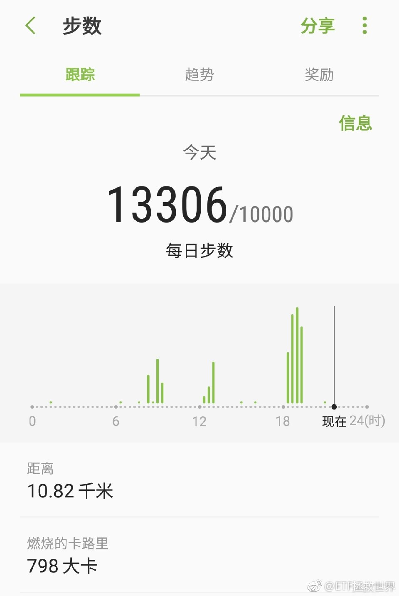

======================================================

ETF拯救世界 (5687069307) @
2018-05-11 09:35:47 Fri  
url: https://weibo.com/5687069307/Gg7AzdR3f

我觉得是不是应该调整调整了。这么拉上去不是事儿啊。//@ETF拯救世界:今天大概率继续光头，温和放量，可以说很舒服了。//@ETF拯救世界:A股就是这样，炒什么都是一把到底。简单粗暴，不讲节奏。

------------------------------------------------------
转推：
>  @ETF拯救世界 (5687069307)
>  2018-05-10 10:18:23 Thu  
>  url: https:/weibo.com/5687069307/GfYrmpzsh/

>  $全指医药 sh000991$   又内什么了。千万别内什么。 ​​​

转发[9]  评论[74]  赞[113] 

======================================================

ETF拯救世界 (5687069307) @
2018-05-11 09:41:28 Fri  
url: https://weibo.com/5687069307/Gg7CSz6Ng

目前$全指医药 sh000991$  与2015年12月底的点位差不多，但是估值已经从当时的69倍下降到41倍。

这就是成长的力量。这就是指数为什么长期看一定会向上的原因。 ​​​

转发[21]  评论[53]  赞[215] 

======================================================

ETF拯救世界 (5687069307) @
2018-05-11 09:49:16 Fri  
url: https://weibo.com/5687069307/Gg7G2rGSe

这几个月每天都说不要卖，现在有点懂了吧。我发的东西你当时不一定懂，几个月几年后再回头看才能明白。

------------------------------------------------------
转推：
>  @ETF拯救世界 (5687069307)
>  2018-04-12 11:14:37 Thu  
>  url: https:/weibo.com/5687069307/GbIQhdUab/

>  $全指医药 sh000991$   不要卖 ​​​

转发[6]  评论[62]  赞[169] 

======================================================

ETF拯救世界 (5687069307) @
2018-05-11 09:54:25 Fri  
url: https://weibo.com/5687069307/Gg7I8ta0k

总是忍不住卖掉上涨品种的朋友，我告诉你一个秘诀：

下次买场外基金试试。

眼不见为净。 ​​​

转发[25]  评论[90]  赞[243] 

======================================================

ETF拯救世界 (5687069307) @
2018-05-11 09:59:06 Fri  
url: https://weibo.com/5687069307/Gg7K2rd4B

回复@没人知道我是谁2011:你知道为什么很多人能在房子上赚钱吗。因为房子交易太麻烦了。如果房子也是有个市场每天开盘，点一下就卖出，90%的人拿不住非自住房。//@没人知道我是谁2011:是啊，所以我尽量买场外，感受区别太大了，这好像有生理上的原因。

------------------------------------------------------
转推：
>  @ETF拯救世界 (5687069307)
>  2018-05-11 09:54:25 Fri  
>  url: https:/weibo.com/5687069307/Gg7I8ta0k/

>  总是忍不住卖掉上涨品种的朋友，我告诉你一个秘诀：
>  
>  下次买场外基金试试。
>  
>  眼不见为净。 ​​​

转发[11]  评论[65]  赞[180] 

======================================================

ETF拯救世界 (5687069307) @
2018-05-11 10:41:42 Fri  
url: https://weibo.com/5687069307/Gg81krvma

感受一下。 [doge] ​​​

转发[15]  评论[68]  赞[208] 

+++++++++++++++++++++++++++++++++++++++++++++++++++++

图片：

======================================================

ETF拯救世界 (5687069307) @
2018-05-11 10:58:56 Fri  
url: https://weibo.com/5687069307/Gg88kdJ8M

回复@你说吧___:我觉得不会。第三轮是从2015年7月初开始的，我公布的是长线投资计划，我自己还做了各种其他投资。比如分级A当时几个月赚了几十个点。如果我做私募，从2015年7月至今，收益率至少在70%以上。我很难相信这样的几乎不回撤，收益率又高的还要被喷。另外，评价一个组合，还是要经过一轮牛熊

------------------------------------------------------
转推：
>  @ETF拯救世界 (5687069307)
>  2018-05-11 10:41:42 Fri  
>  url: https:/weibo.com/5687069307/Gg81krvma/

>  感受一下。 [doge] ​​​

转发[6]  评论[35]  赞[181] 

======================================================

ETF拯救世界 (5687069307) @
2018-05-11 11:14:57 Fri  
url: https://weibo.com/5687069307/Gg8ePgcr7

还挺听话的。第一调整目标位10500吧。悠着点才对啊。//@ETF拯救世界:我觉得是不是应该调整调整了。这么拉上去不是事儿啊。//@ETF拯救世界:今天大概率继续光头，温和放量，可以说很舒服了。//@ETF拯救世界:A股就是这样，炒什么都是一把到底。简单粗暴，不讲节奏。

------------------------------------------------------
转推：
>  @ETF拯救世界 (5687069307)
>  2018-05-10 10:18:23 Thu  
>  url: https:/weibo.com/5687069307/GfYrmpzsh/

>  $全指医药 sh000991$   又内什么了。千万别内什么。 ​​​

转发[4]  评论[51]  赞[161] 

======================================================

ETF拯救世界 (5687069307) @
2018-05-11 14:02:50 Fri  
url: https://weibo.com/5687069307/Gg9kYe507

已经连续三天了。市场快速下跌的时候就拉起来。

咱们一起看看，这样的后果会怎样。观察。 ​​​

转发[6]  评论[86]  赞[219] 

======================================================

ETF拯救世界 (5687069307) @
2018-05-11 15:01:22 Fri  
url: https://weibo.com/5687069307/Gg9IJdHeP

谢谢队里的兄弟们，毕竟快15号了。 ​​​

转发[4]  评论[77]  赞[256] 

======================================================

ETF拯救世界 (5687069307) @
2018-05-11 15:30:22 Fri  
url: https://weibo.com/5687069307/Gg9Uv6wnj

有没有懂心理学的朋友帮我分析一下我的症状：

为什么我看到那些猛吹热门股，猛吹几年已经涨了几十倍上百倍还能再涨无限倍的人总是特别厌恶，特别特别不喜欢。包括大盘。明明已经涨到天上奇贵无比了还要吹黄金十年。

这个症状可能已经有十年了。我自己觉得可能是一种心理疾病，有没有懂的帮我分析分析 ​​​

转发[19]  评论[249]  赞[219] 

======================================================

ETF拯救世界 (5687069307) @
2018-05-11 17:02:50 Fri  
url: https://weibo.com/5687069307/Ggaw26H2n

为什么说十年呢。因为我第一次感觉自己有这个问题，是2007年。那时候有个叫沙 黾 农的，可能是当时新浪博客力推的吧。总之粉丝特别多，他就在一路说黄金十年，几万点。最高点也是，08年也是，结果当然不用说。当时我就非常气愤，都不看看数据吗？然而当时有种无力感，就是没人听你在说什么，更没人信你

------------------------------------------------------
转推：
>  @ETF拯救世界 (5687069307)
>  2018-05-11 15:30:22 Fri  
>  url: https:/weibo.com/5687069307/Gg9Uv6wnj/

>  有没有懂心理学的朋友帮我分析一下我的症状：
>  
>  为什么我看到那些猛吹热门股，猛吹几年已经涨了几十倍上百倍还能再涨无限倍的人总是特别厌恶，特别特别不喜欢。包括大盘。明明已经涨到天上奇贵无比了还要吹黄金十年。
>  
>  这个症状可能已经有十年了。我自己觉得可能是一种心理疾病，有没有懂的帮我分析分析 ​​​

转发[7]  评论[127]  赞[212] 

======================================================

ETF拯救世界 (5687069307) @
2018-05-11 17:20:44 Fri  
url: https://weibo.com/5687069307/GgaDis6iX

周末公众号必须发篇文章。无论写点什么，你可以监督。做不到的话请我吃饭。 ​​​

转发[7]  评论[261]  赞[567] 

======================================================

ETF拯救世界 (5687069307) @
2018-05-11 23:48:50 Fri  
url: https://weibo.com/5687069307/GgdaPDWYn

每日打卡（189）

今天是早上跑步。 ​​​

转发[1]  评论[37]  赞[202] 

+++++++++++++++++++++++++++++++++++++++++++++++++++++

图片：

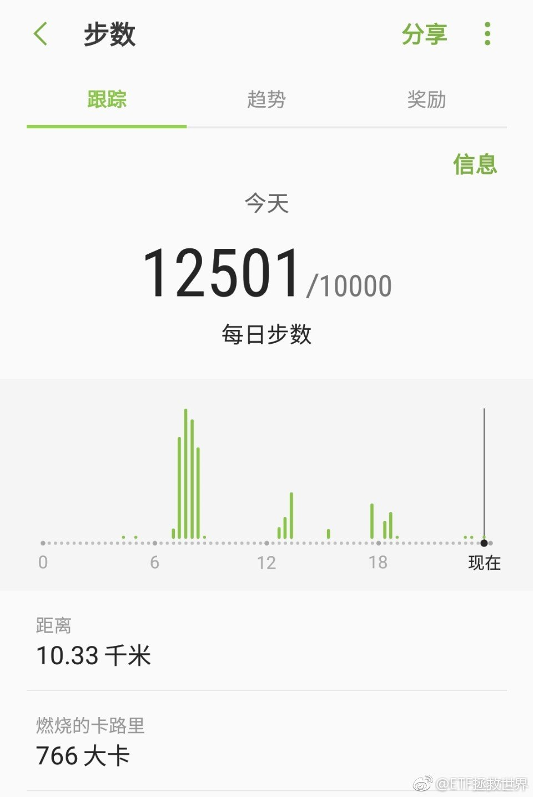

======================================================

ETF拯救世界 (5687069307) @
2018-05-13 21:50:13 Sun  
url: https://weibo.com/5687069307/GgvfG2yCL

有点感冒，今天先不练了 ​​​

转发[1]  评论[163]  赞[176] 

======================================================

ETF拯救世界 (5687069307) @
2018-05-14 12:04:35 Mon  
url: https://weibo.com/5687069307/GgAQsAGzr

没事，基本好了。这几天很忙。 ​​​

转发[0]  评论[97]  赞[340] 

======================================================

ETF拯救世界 (5687069307) @
2018-05-14 14:38:38 Mon  
url: https://weibo.com/5687069307/GgBQZs7tQ

周末实地调研一圈，才发现北京房价去年3月以来真的跌了。核心地区，学区跌的少一点，十个点左右。越往外跌得越多，3环就跌了20%。再往外就不知道了。

目前看影响二手市场的因素主要是信贷政策，真的是釜底抽薪。杠杆降下来很多人就买不起了。 ​​​

转发[20]  评论[281]  赞[334] 

======================================================

ETF拯救世界 (5687069307) @
2018-05-15 10:04:59 Tue  
url: https://weibo.com/5687069307/GgJupybuA

$全指医药 sh000991$   什么也不用说了吧。

在写东西。 ​​​

转发[4]  评论[244]  赞[310] 

======================================================

ETF拯救世界 (5687069307) @
2018-05-15 14:14:57 Tue  
url: https://weibo.com/5687069307/GgL7SguVn

什么意思，中午发车也会被截胡？ ​​​

转发[3]  评论[161]  赞[221] 

======================================================

ETF拯救世界 (5687069307) @
2018-05-15 14:42:02 Tue  
url: https://weibo.com/5687069307/GgLiRE7sU

$中证传媒 sz399971$   你们这帮操盘的心不会痛吗。 ​​​

转发[4]  评论[168]  赞[205] 

======================================================

ETF拯救世界 (5687069307) @
2018-05-15 16:00:21 Tue  
url: https://weibo.com/5687069307/GgLOFdqNy

医药20+了。未来A股所有品种都会有20+，而且只是起步。

投资应该是很快乐的一件事。 ​​​

转发[54]  评论[132]  赞[359] 

======================================================

ETF拯救世界 (5687069307) @
2018-05-15 16:52:08 Tue  
url: https://weibo.com/5687069307/GgM9G0Pue

回复@奇葩一朵一朵:这个结论现在不够稳。如果跌到我希望的4500-5000，这个实现的概率就非常非常大。而且不需要五年。//@奇葩一朵一朵:e大，现在买中证500，五年后是不是大概率15%的年化[阴险]@ETF拯救世界

------------------------------------------------------
转推：
>  @ETF拯救世界 (5687069307)
>  2018-05-15 16:00:21 Tue  
>  url: https:/weibo.com/5687069307/GgLOFdqNy/

>  医药20+了。未来A股所有品种都会有20+，而且只是起步。
>  
>  投资应该是很快乐的一件事。 ​​​

转发[44]  评论[37]  赞[148] 

======================================================

ETF拯救世界 (5687069307) @
2018-05-15 17:01:11 Tue  
url: https://weibo.com/5687069307/GgMdm8F74

刚才我看这几张图，你有没有发现特别像非洲草原上的鬣狗。一群小鬣狗在猎物体力不支的时候一起冲上去大吃一顿……

对方有力气的时候，只是找机会咬一口就跑，然后很长时间不动，静静等机会。

机会来了就一顿咬。

感受一下。小红剪头。 ​​​

转发[30]  评论[98]  赞[206] 

+++++++++++++++++++++++++++++++++++++++++++++++++++++

图片：
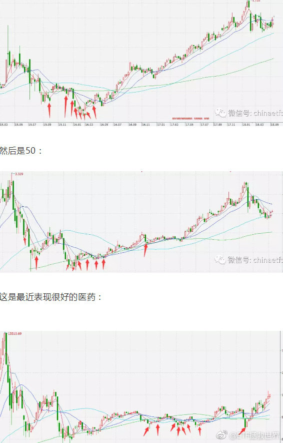

======================================================

ETF拯救世界 (5687069307) @
2018-05-15 17:22:25 Tue  
url: https://weibo.com/5687069307/GgMlY8jWo

回复@橄榄树_枝:不知道，看命。因为我不知道下轮牛市什么时候来，最终幅度有多少，我们能坚持到哪里。我只能尽量把自己的成本压到力所能及的最低，无论未来发生什么都掌握主动权。//@橄榄树_枝:老大，未来牛市高位卖出后，本轮计划年化大概能到多少？

------------------------------------------------------
转推：
>  @ETF拯救世界 (5687069307)
>  2018-05-15 16:00:21 Tue  
>  url: https:/weibo.com/5687069307/GgLOFdqNy/

>  医药20+了。未来A股所有品种都会有20+，而且只是起步。
>  
>  投资应该是很快乐的一件事。 ​​​

转发[25]  评论[35]  赞[197] 

======================================================

ETF拯救世界 (5687069307) @
2018-05-15 17:55:48 Tue  
url: https://weibo.com/5687069307/GgMzwdbbs

回复@梦之彼方2082:上次在目前估值是2013年12月，这5.5年涨了61%。这应该就是你说的“正常收益”。碰到牛市的话，是2年后涨了205%。这就是你说的“意外之财”

------------------------------------------------------
转推：
>  @ETF拯救世界 (5687069307)
>  2018-05-15 16:00:21 Tue  
>  url: https:/weibo.com/5687069307/GgLOFdqNy/

>  医药20+了。未来A股所有品种都会有20+，而且只是起步。
>  
>  投资应该是很快乐的一件事。 ​​​

转发[14]  评论[55]  赞[202] 

======================================================

ETF拯救世界 (5687069307) @
2018-05-16 09:21:27 Wed  
url: https://weibo.com/5687069307/GgSDen3DI

活久见。A股的韭菜就是好割。

------------------------------------------------------
转推：
>  @ETF拯救世界 (5687069307)
>  2018-02-28 09:42:18 Wed  
>  url: https:/weibo.com/5687069307/G5aRt5yih/

>  今天3 6 0市值4000多亿。在美国退市前600多亿。公司没变，市值增加6倍多。
>  
>  大型魔幻现场。 ​​​

转发[10]  评论[57]  赞[155] 

======================================================

ETF拯救世界 (5687069307) @
2018-05-16 09:40:44 Wed  
url: https://weibo.com/5687069307/GgSL4c9LS

回复@vivi6073007160:当然。任何与合作有关的事，都要看人品。这个世界上没有神圣的人，不能要求别人一尘不染。但有一点，一定要有底线。没有底线的人，一定要离得越远越好。//@vivi6073007160:三六零现在缺钱吗？买股票是不是也看看人品

------------------------------------------------------
转推：
>  @ETF拯救世界 (5687069307)
>  2018-02-28 09:42:18 Wed  
>  url: https:/weibo.com/5687069307/G5aRt5yih/

>  今天3 6 0市值4000多亿。在美国退市前600多亿。公司没变，市值增加6倍多。
>  
>  大型魔幻现场。 ​​​

转发[7]  评论[24]  赞[155] 

======================================================

ETF拯救世界 (5687069307) @
2018-05-16 09:53:05 Wed  
url: https://weibo.com/5687069307/GgSQ4qn66

$全指医药 sh000991$   即使你NB的在上周四卖掉，躲过周五的暴跌。然而如果你周五周一没有买回来，现在还是少赚了。

那么你一直持有到周四卖掉，周五周一买回来的概率有多大呢。

操作一次收益率增加了多少呢。买不回来的概率多大呢。

这就是投资。 ​​​

转发[21]  评论[68]  赞[234] 

======================================================

ETF拯救世界 (5687069307) @
2018-05-16 10:04:44 Wed  
url: https://weibo.com/5687069307/GgSUOutcW

2007年也有人说“死了都不卖”。结果真的死了。

我经常说不要卖，与那个截然不同。昨天贴的图你也能看出来，我们的品种都是底部辛辛苦苦收集到的廉价筹码，这样的操作是大机构级别的收集筹码形态，不是追高暴涨品种拿到的。

既然收集筹码这么辛苦，赚一二十个点就走吗。那不是我的目标。

成本低，品 ​​​

转发[66]  评论[108]  赞[357] 

======================================================

ETF拯救世界 (5687069307) @
2018-05-16 10:07:15 Wed  
url: https://weibo.com/5687069307/GgSVPpHwD

另外，我与很多人不同的是，涨起来了我就不会吹还有多好，还能涨多少，空间还很大，暗示你现在买可以赚很多。我做不到这样的事，我希望你们成本都比我低，我赔了你们都在赚才好。我不希望忽悠任何人帮我抬轿子。看着那种人我都生气……

------------------------------------------------------
转推：
>  @ETF拯救世界 (5687069307)
>  2018-05-16 10:04:44 Wed  
>  url: https:/weibo.com/5687069307/GgSUOutcW/

>  2007年也有人说“死了都不卖”。结果真的死了。
>  
>  我经常说不要卖，与那个截然不同。昨天贴的图你也能看出来，我们的品种都是底部辛辛苦苦收集到的廉价筹码，这样的操作是大机构级别的收集筹码形态，不是追高暴涨品种拿到的。
>  
>  既然收集筹码这么辛苦，赚一二十个点就走吗。那不是我的目标。
>  
>  成本低，品 ​​​

转发[13]  评论[84]  赞[348] 

======================================================

ETF拯救世界 (5687069307) @
2018-05-16 10:57:05 Wed  
url: https://weibo.com/5687069307/GgTg3u3p1

恭喜  $全指医药 sh000991$  喜提新高。

左手事业，右手家庭，幸福人生！ ​​​

转发[26]  评论[63]  赞[246] 

======================================================

ETF拯救世界 (5687069307) @
2018-05-16 11:07:16 Wed  
url: https://weibo.com/5687069307/GgTkbFS8i

回复@韩跑跑走一走:正常的生理反应。很多人吓得已经点击卖出了。//@韩跑跑走一走:这么拉，我有点害怕啊。。。

------------------------------------------------------
转推：
>  @ETF拯救世界 (5687069307)
>  2018-05-16 10:57:05 Wed  
>  url: https:/weibo.com/5687069307/GgTg3u3p1/

>  恭喜  $全指医药 sh000991$  喜提新高。
>  
>  左手事业，右手家庭，幸福人生！ ​​​

转发[15]  评论[30]  赞[114] 

======================================================

ETF拯救世界 (5687069307) @
2018-05-16 11:11:30 Wed  
url: https://weibo.com/5687069307/GgTlUDtgt

投资这件事，要自始至终都是反人性的。

买入，持有，卖出。全都是。

只有做到一般人做不到的事，才能赚到一般人赚不到的钱。 ​​​

转发[58]  评论[68]  赞[370] 

======================================================

ETF拯救世界 (5687069307) @
2018-05-16 11:17:04 Wed  
url: https://weibo.com/5687069307/GgToapMMM

回复@stealstar612:不知道你是什么品种。你这么高开始，年化15%不容易。//@stealstar612:我打算浮盈45%左右才会分批卖出。2015年7月最高点开始定投，坚持了快3年，不可能平均年率15%都不到就卖出的。//@ETF拯救世界:回复@韩跑跑走一走:正常的生理反应。很多人吓得已经点击卖出了。

------------------------------------------------------
转推：
>  @ETF拯救世界 (5687069307)
>  2018-05-16 10:57:05 Wed  
>  url: https:/weibo.com/5687069307/GgTg3u3p1/

>  恭喜  $全指医药 sh000991$  喜提新高。
>  
>  左手事业，右手家庭，幸福人生！ ​​​

转发[13]  评论[48]  赞[115] 

======================================================

ETF拯救世界 (5687069307) @
2018-05-16 13:16:13 Wed  
url: https://weibo.com/5687069307/GgUax4DON

回复@梁小雨:第三轮是最高点开始的。因为那时候第二轮正式结束//@梁小雨:回复@终于找到在哪改名字:而且，他是最高点开始的，Ｅ大是股灾后开始的，再加上计划的科学性…这样的差距不是一点点//@ETF拯救世界:回复@stealstar612:不知道你是什么品种。你这么高开始，年化15%不容易。

------------------------------------------------------
转推：
>  @ETF拯救世界 (5687069307)
>  2018-05-16 10:57:05 Wed  
>  url: https:/weibo.com/5687069307/GgTg3u3p1/

>  恭喜  $全指医药 sh000991$  喜提新高。
>  
>  左手事业，右手家庭，幸福人生！ ​​​

转发[0]  评论[20]  赞[114] 

======================================================

ETF拯救世界 (5687069307) @
2018-05-16 13:36:03 Wed  
url: https://weibo.com/5687069307/GgUiAaLet

$养老产业 sz399812$ 新高。

该说的每天都说，不说了。好好享受吧。 ​​​

转发[5]  评论[48]  赞[177] 

======================================================

ETF拯救世界 (5687069307) @
2018-05-16 13:45:55 Wed  
url: https://weibo.com/5687069307/GgUmAnEoJ

看评论就知道，即使底部能买够，也至少有一半的人要浪费牛市。

无论你卖对多少次，一次错误就会大幅拉低你的收益率。

这是训练。 ​​​

转发[34]  评论[146]  赞[373] 

======================================================

ETF拯救世界 (5687069307) @
2018-05-17 09:30:33 Thu  
url: https://weibo.com/5687069307/Gh27qygYd

$162411  开始挑战2016年高点。 ​​​

转发[1]  评论[52]  赞[162] 

======================================================

ETF拯救世界 (5687069307) @
2018-05-17 09:39:30 Thu  
url: https://weibo.com/5687069307/Gh2b42qQ1

我来告诉你一个残酷的事实，为什么你拿不住上涨的品种：

因为你穷。

[并不简单] ​​​

转发[260]  评论[303]  赞[715] 

======================================================

ETF拯救世界 (5687069307) @
2018-05-17 09:52:38 Thu  
url: https://weibo.com/5687069307/Gh2gom1xv

回复@观音山上拜观音:不需要这份钱迅速增值改善生活，就能拿得住。今天看了一个新闻，说有人找回20年前的股票1500变成50万，大概一个意思。总想快进快出抓住每一个机会，就不容易拿住。

------------------------------------------------------
转推：
>  @ETF拯救世界 (5687069307)
>  2018-05-17 09:39:30 Thu  
>  url: https:/weibo.com/5687069307/Gh2b42qQ1/

>  我来告诉你一个残酷的事实，为什么你拿不住上涨的品种：
>  
>  因为你穷。
>  
>  [并不简单] ​​​

转发[14]  评论[46]  赞[201] 

======================================================

ETF拯救世界 (5687069307) @
2018-05-17 11:20:43 Thu  
url: https://weibo.com/5687069307/Gh2Q99YPr

昨天评论里说是不是牛市来了，感觉不会跌了的朋友。

有没有又感觉熊市来了，感觉很难再涨了。

不要感觉，不要预判。用数据分析概率。 ​​​

转发[20]  评论[159]  赞[311] 

======================================================

ETF拯救世界 (5687069307) @
2018-05-17 13:23:30 Thu  
url: https://weibo.com/5687069307/Gh3DZqtj5

回复@年轻的真的:有可能结束了啊，什么都有可能发生。但是这跟我们长期持有没有任何关系。//@年轻的真的:前两天，趋势交易的奶爸发文说医药行情到头了！[允悲]

------------------------------------------------------
转推：
>  @ETF拯救世界 (5687069307)
>  2018-05-17 11:20:43 Thu  
>  url: https:/weibo.com/5687069307/Gh2Q99YPr/

>  昨天评论里说是不是牛市来了，感觉不会跌了的朋友。
>  
>  有没有又感觉熊市来了，感觉很难再涨了。
>  
>  不要感觉，不要预判。用数据分析概率。 ​​​

转发[0]  评论[31]  赞[128] 

======================================================

ETF拯救世界 (5687069307) @
2018-05-17 13:44:40 Thu  
url: https://weibo.com/5687069307/Gh3MzCAzc

趋势交易也没什么不好，只要你会用。2008年我没赔钱，我说实话，是趋势救了我。

就凭这一张图。

因为根据价值，6000跌到3000怎么也要进去了，可是趋势明明白白是不行。最后干到1600。

但是趋势不是根本。是参考。我们买卖一个东西，根本还是那个东西值多少钱。这才是做生意的根本。

而且，趋势有时 ​​​

转发[133]  评论[190]  赞[259] 

+++++++++++++++++++++++++++++++++++++++++++++++++++++

图片：

======================================================

ETF拯救世界 (5687069307) @
2018-05-17 14:35:42 Thu  
url: https://weibo.com/5687069307/Gh47iqdhK

里面有个人，不然哪用那么大的柜子。怎么讲，弄个铁壳子躲在里面贴膜，这生意很好做了，一个月赚一万。推荐给缺钱的朋友。

------------------------------------------------------
转推：
>  @新财富杂志 (1708922835)
>  2018-05-17 14:29:09 Thu  
>  url: https:/weibo.com/1708922835/Gh44Dcvl0/

>  【祖传贴膜要失业了！贴膜机器人上线 轻松月入过万】"无气泡、无失误、4分钟精准贴膜"...近日，一台方形机器人现身长沙理工大学云塘校区，扫描二维码付款就能贴膜，且能识别一百多种主流手机型号。发明人透露，机器人一个月能收入1.5万元。网友：贴膜小哥哭晕在天桥…[喵喵][喵喵]http://t.cn/R3pZNLk ​​​

转发[7]  评论[71]  赞[116] 

======================================================

ETF拯救世界 (5687069307) @
2018-05-17 14:55:01 Thu  
url: https://weibo.com/5687069307/Gh4f8comA

$160416  石油基金已经回到2014年的价格了…… ​​​

转发[7]  评论[27]  赞[143] 

======================================================

ETF拯救世界 (5687069307) @
2018-05-17 15:06:36 Thu  
url: https://weibo.com/5687069307/Gh4jQ843n

回复@佩清06587:比计划多点，但也不多。是真的买少了。这个品种我2016年就在雪球说过，比较后悔没有在计划里继续再买一份。到现在为止第三轮计划只后悔这个。如果勉强的话还可以加上那次限价的食品饮料……//@佩清06587:回复@谷爆:你的是一点点，别人的很多的[二哈]

------------------------------------------------------
转推：
>  @ETF拯救世界 (5687069307)
>  2018-05-17 14:55:01 Thu  
>  url: https:/weibo.com/5687069307/Gh4f8comA/

>  $160416  石油基金已经回到2014年的价格了…… ​​​

转发[3]  评论[31]  赞[114] 

======================================================

ETF拯救世界 (5687069307) @
2018-05-17 15:51:26 Thu  
url: https://weibo.com/5687069307/Gh4C243vh

从今天的数据看，现在买印度还不如买沪深300。上证50比它便宜一半。

比两年前贵了60%。

我反正不会买。 ​​​

转发[11]  评论[51]  赞[182] 

======================================================

ETF拯救世界 (5687069307) @
2018-05-17 16:38:48 Thu  
url: https://weibo.com/5687069307/Gh4Vg1Ncc

回复@饿鱼000:2008年5月，上证3400点，当时全市场外部数据加权估值是32倍。一个月后跌到2700点，该数据是26倍。最低是10月的16倍，1700点。今天收盘是27倍。//@饿鱼000:请教E大，当年指数从6000到3000时，市盈率大概在什么位置？

------------------------------------------------------
转推：
>  @ETF拯救世界 (5687069307)
>  2018-05-17 13:44:40 Thu  
>  url: https:/weibo.com/5687069307/Gh3MzCAzc/

>  趋势交易也没什么不好，只要你会用。2008年我没赔钱，我说实话，是趋势救了我。
>  
>  就凭这一张图。
>  
>  因为根据价值，6000跌到3000怎么也要进去了，可是趋势明明白白是不行。最后干到1600。
>  
>  但是趋势不是根本。是参考。我们买卖一个东西，根本还是那个东西值多少钱。这才是做生意的根本。
>  
>  而且，趋势有时 ​​​

转发[26]  评论[54]  赞[117] 

======================================================

ETF拯救世界 (5687069307) @
2018-05-17 16:39:49 Thu  
url: https://weibo.com/5687069307/Gh4VG39zY

回复@E7ic:我说的是估值，不是指数。至于为什么指数与估值同步，我就不知道了。没有研究过印度30的成长性。//@E7ic:为嘛指数极值波动60%就是贵了60%，印度不成长嘛？

------------------------------------------------------
转推：
>  @ETF拯救世界 (5687069307)
>  2018-05-17 15:51:26 Thu  
>  url: https:/weibo.com/5687069307/Gh4C243vh/

>  从今天的数据看，现在买印度还不如买沪深300。上证50比它便宜一半。
>  
>  比两年前贵了60%。
>  
>  我反正不会买。 ​​​

转发[5]  评论[29]  赞[122] 

======================================================

ETF拯救世界 (5687069307) @
2018-05-17 21:53:56 Thu  
url: https://weibo.com/5687069307/Gh6ZauPmr

做波段非常合适 ​​​

转发[10]  评论[89]  赞[194] 

+++++++++++++++++++++++++++++++++++++++++++++++++++++

图片：
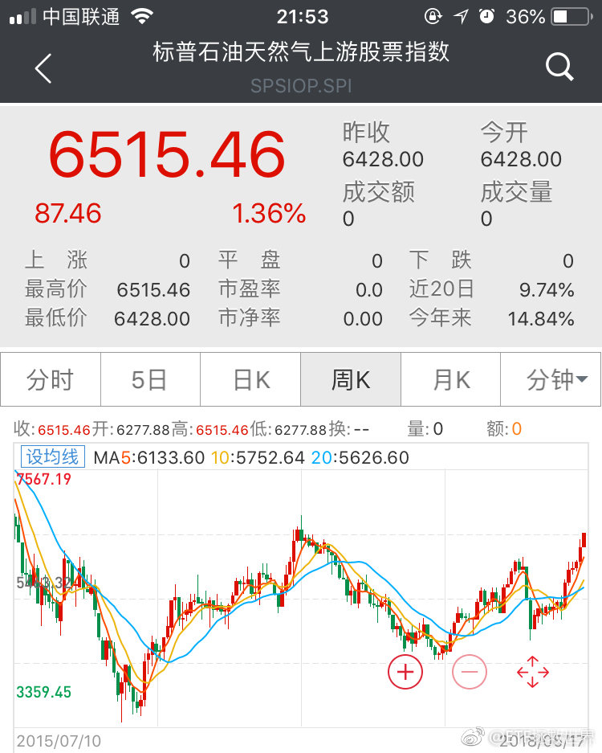

======================================================

ETF拯救世界 (5687069307) @
2018-05-18 07:35:18 Fri  
url: https://weibo.com/5687069307/GhaN9t79a

回复@你在红楼我在西游V:这种事情会不断发生。所以我说，在很差的时候不要再听这种言论。当然，很少有人能做到。慢慢训练吧

------------------------------------------------------
转推：
>  @ETF拯救世界 (5687069307)
>  2018-05-17 21:53:56 Thu  
>  url: https:/weibo.com/5687069307/Gh6ZauPmr/

>  做波段非常合适 ​​​

转发[4]  评论[45]  赞[140] 

======================================================

ETF拯救世界 (5687069307) @
2018-05-18 09:58:49 Fri  
url: https://weibo.com/5687069307/GhbJoCgHf

这就是阴跌。其实阴跌最大的伤害是让你丧失希望，其它的倒也无所谓。账面市值可以通过各种办法保住。熊市不是没机会，尽量不赔钱。赔一点也没事。最重要的是要保持希望。

------------------------------------------------------
转推：
>  @ETF拯救世界 (5687069307)
>  2018-05-03 11:25:05 Thu  
>  url: https:/weibo.com/5687069307/GeUSY6sMB/

>  从现在起，各位做好心理准备，迎接漫漫阴跌吧。没什么大问题，解决心理问题以后逢低布局就可以。
>  
>  最主要是心理问题。所有希望都被磨平后的麻木与绝望是需要警惕的。 ​​​

转发[43]  评论[67]  赞[210] 

======================================================

ETF拯救世界 (5687069307) @
2018-05-18 10:01:35 Fri  
url: https://weibo.com/5687069307/GhbKwqSR9

回复@ss游鱼:没有就没有呗。每个人都有自己的命运，改变不了。我管得了这么多吗？我只能做好我自己的事。//@ss游鱼:问题是，你能坚持，跟随的人有能力耐心坚持？

------------------------------------------------------
转推：
>  @ETF拯救世界 (5687069307)
>  2018-05-03 11:25:05 Thu  
>  url: https:/weibo.com/5687069307/GeUSY6sMB/

>  从现在起，各位做好心理准备，迎接漫漫阴跌吧。没什么大问题，解决心理问题以后逢低布局就可以。
>  
>  最主要是心理问题。所有希望都被磨平后的麻木与绝望是需要警惕的。 ​​​

转发[20]  评论[99]  赞[227] 

======================================================

ETF拯救世界 (5687069307) @
2018-05-18 10:11:34 Fri  
url: https://weibo.com/5687069307/GhbOA9MHc

回复@ss游鱼:我就想问你你想让我怎么做？该说的我从2015年开始就每次发车都说：熊市可能3-5年，每次品种也有最大下跌幅度，30%-50%。每次都提醒可能会很黑暗。我还应该做什么，您指教一下？现在几乎所有品种都赚钱，还会有这种质疑。我不敢想象真的最黑暗的时候会有怎样的声音。

------------------------------------------------------
转推：
>  @ETF拯救世界 (5687069307)
>  2018-05-03 11:25:05 Thu  
>  url: https:/weibo.com/5687069307/GeUSY6sMB/

>  从现在起，各位做好心理准备，迎接漫漫阴跌吧。没什么大问题，解决心理问题以后逢低布局就可以。
>  
>  最主要是心理问题。所有希望都被磨平后的麻木与绝望是需要警惕的。 ​​​

转发[6]  评论[89]  赞[171] 

======================================================

ETF拯救世界 (5687069307) @
2018-05-18 10:15:39 Fri  
url: https://weibo.com/5687069307/GhbQemCZo

回复@ss游鱼:好的。为了避免你影响我情绪导致恒生大底的事再次发生，拉黑不见，拜拜了您呐。//@ss游鱼:回复@ETF拯救世界:你有信心就好哈。可能我对接下来比较悲观。没有，只是我个人想法而已。你按照理念就好了。

------------------------------------------------------
转推：
>  @ETF拯救世界 (5687069307)
>  2018-05-03 11:25:05 Thu  
>  url: https:/weibo.com/5687069307/GeUSY6sMB/

>  从现在起，各位做好心理准备，迎接漫漫阴跌吧。没什么大问题，解决心理问题以后逢低布局就可以。
>  
>  最主要是心理问题。所有希望都被磨平后的麻木与绝望是需要警惕的。 ​​​

转发[8]  评论[97]  赞[212] 

======================================================

ETF拯救世界 (5687069307) @
2018-05-18 10:22:36 Fri  
url: https://weibo.com/5687069307/GhbT3koT8

商品的周期，一般都是大周期。多大，很多时候需要用十年这个周期去衡量。

稍微给点耐心。 ​​​

转发[52]  评论[65]  赞[227] 

======================================================

ETF拯救世界 (5687069307) @
2018-05-18 10:42:19 Fri  
url: https://weibo.com/5687069307/Ghc13ujcD

毒奶功力还在。 ​​​

转发[72]  评论[42]  赞[174] 

======================================================

ETF拯救世界 (5687069307) @
2018-05-18 11:15:09 Fri  
url: https://weibo.com/5687069307/GhcenFhnx

回复@Terry张_:会有影响。会调整策略参数应对。//@Terry张_:@ETF拯救世界 E大，现在减少千亿美元的贸易逆差已成定局，那意味着将会大量进口外国产品，或减少出口，拿这个对上市企业盈利肯定有大影响吧？这个变量会对估值产生影响吗？谢谢

------------------------------------------------------
转推：
>  @ETF拯救世界 (5687069307)
>  2018-05-18 10:42:19 Fri  
>  url: https:/weibo.com/5687069307/Ghc13ujcD/

>  毒奶功力还在。 ​​​

转发[71]  评论[19]  赞[131] 

======================================================

ETF拯救世界 (5687069307) @
2018-05-18 11:17:25 Fri  
url: https://weibo.com/5687069307/GhcfjgSyU

回复@waslj0603:对很多人来说，坑是灾难。对另一些人来说，坑里有钻石。区别在于，你是否对随时可能会出现的坑做好思想准备，以及，坑真的出现后，你是否准备好了挖钻石的铲子。//@waslj0603:油气最多时亏了20个点，网格和套利现在盈利40几个点[拜拜]

------------------------------------------------------
转推：
>  @ETF拯救世界 (5687069307)
>  2018-05-18 10:22:36 Fri  
>  url: https:/weibo.com/5687069307/GhbT3koT8/

>  商品的周期，一般都是大周期。多大，很多时候需要用十年这个周期去衡量。
>  
>  稍微给点耐心。 ​​​

转发[27]  评论[38]  赞[183] 

======================================================

ETF拯救世界 (5687069307) @
2018-05-18 11:31:54 Fri  
url: https://weibo.com/5687069307/GhclbEnPR

回复@Terry张_:我分享一个经验，那就是每天看财经新闻，你会发现每天都在危机中。至少过去十几年，几乎没有一天是没事的。其实到最后，真的没事。哪怕有过百年不遇金融危机。自己坚持一些原则，比如没有大的杠杆，保持现金流，适度保守，分散投资，危机中敢于买入，最后结果都不会太差。视野还是要放远

------------------------------------------------------
转推：
>  @ETF拯救世界 (5687069307)
>  2018-05-18 10:42:19 Fri  
>  url: https:/weibo.com/5687069307/Ghc13ujcD/

>  毒奶功力还在。 ​​​

转发[64]  评论[124]  赞[381] 

======================================================

ETF拯救世界 (5687069307) @
2018-05-18 13:21:05 Fri  
url: https://weibo.com/5687069307/Ghd3utkKY

目前计划里面，大盘价值股建仓大概一半了，中盘医药大概一半，小盘信息消费发达国家等不到10%，很舒服。 ​​​

转发[9]  评论[106]  赞[267] 

======================================================

ETF拯救世界 (5687069307) @
2018-05-18 14:41:44 Fri  
url: https://weibo.com/5687069307/GhdAevpiI

$中证传媒 sz399971$   人家中石油带着上证涨你来什么劲…… ​​​

转发[26]  评论[55]  赞[166] 

======================================================

ETF拯救世界 (5687069307) @
2018-05-18 15:17:36 Fri  
url: https://weibo.com/5687069307/GhdONhfrw

今天可能涨0.3%-0.4%。以这个仓位，基本跟上全市场涨幅了。毕竟今天还有1000多只股票下跌。

还有不到1%就又新高了。总而言之上涨下跌都ok的状态是最好的。像上午那位担心未来而空仓，一点都不敢买的，碰到上涨心态很容易失衡。心态完了就都完了。 ​​​

转发[15]  评论[90]  赞[281] 

======================================================

ETF拯救世界 (5687069307) @
2018-05-18 16:54:18 Fri  
url: https://weibo.com/5687069307/Ghes2DF3O

低调的重要性怎么强调都不为过。真的。

------------------------------------------------------
转推：
>  @ ()
>  2018-05-18 16:47:01 Fri  
>  url: 

>  抱歉，作者已设置仅展示半年内微博，此微博已不可见。 ​​​

转发[22]  评论[123]  赞[227] 

======================================================

ETF拯救世界 (5687069307) @
2018-05-19 19:40:05 Sat  
url: https://weibo.com/5687069307/GhoXPxKW4

回复@年轻的真的:所以开车的，低位应该买油气对冲油价上涨。弄不好十年二十年油钱赚出来了。现在就别追了。

------------------------------------------------------
转推：
>  @ETF拯救世界 (5687069307)
>  2018-05-18 14:41:44 Fri  
>  url: https:/weibo.com/5687069307/GhdAevpiI/

>  $中证传媒 sz399971$   人家中石油带着上证涨你来什么劲…… ​​​

转发[22]  评论[76]  赞[178] 

======================================================

ETF拯救世界 (5687069307) @
2018-05-21 09:40:09 Mon  
url: https://weibo.com/5687069307/GhDTjorm6

回复@羊样佯徉烊蛘珜垟眻:我不敢奶。我还是挺希望它涨的。因为给它的仓位已经配置的差不多了，基本不会再买太多了。ps，你这个头像怎么回事。//@羊样佯徉烊蛘珜垟眻:今天环保要飞车……[doge]

------------------------------------------------------
转推：
>  @ETF拯救世界 (5687069307)
>  2018-05-18 14:41:44 Fri  
>  url: https:/weibo.com/5687069307/GhdAevpiI/

>  $中证传媒 sz399971$   人家中石油带着上证涨你来什么劲…… ​​​

转发[8]  评论[30]  赞[114] 

======================================================

ETF拯救世界 (5687069307) @
2018-05-21 09:47:58 Mon  
url: https://weibo.com/5687069307/GhDWurETV

账户利润在奔跑。还差0.5%新高。

做A股为什么会赔钱，不懂。 ​​​

转发[3]  评论[48]  赞[223] 

======================================================

ETF拯救世界 (5687069307) @
2018-05-21 09:50:20 Mon  
url: https://weibo.com/5687069307/GhDXrxDMH

回复@不可思议的暖:月初错过一次买入机会。不过下一波热点大概率不是它。//@不可思议的暖:e大消费指数还没到开始可以开始买入的位置吗？//@ETF拯救世界:回复@羊样佯徉烊蛘珜垟眻:我不敢奶。我还是挺希望它涨的。因为给它的仓位已经配置的差不多了，基本不会再买太多了。ps，你这个头像怎么回事。

------------------------------------------------------
转推：
>  @ETF拯救世界 (5687069307)
>  2018-05-18 14:41:44 Fri  
>  url: https:/weibo.com/5687069307/GhdAevpiI/

>  $中证传媒 sz399971$   人家中石油带着上证涨你来什么劲…… ​​​

转发[5]  评论[40]  赞[102] 

======================================================

ETF拯救世界 (5687069307) @
2018-05-21 10:41:25 Mon  
url: https://weibo.com/5687069307/GhEibeTnT

怀疑人生了 ​​​

转发[83]  评论[54]  赞[175] 

+++++++++++++++++++++++++++++++++++++++++++++++++++++

图片：
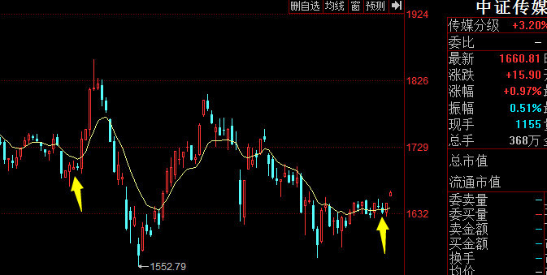

======================================================

ETF拯救世界 (5687069307) @
2018-05-21 10:53:22 Mon  
url: https://weibo.com/5687069307/GhEn23g3F

回复@狂奔笨狼:500是坠吼的宽基。以后就知道了。//@狂奔笨狼:500也要怀疑人生[笑cry][笑cry]

------------------------------------------------------
转推：
>  @ETF拯救世界 (5687069307)
>  2018-05-21 10:41:25 Mon  
>  url: https:/weibo.com/5687069307/GhEibeTnT/

>  怀疑人生了 ​​​

转发[78]  评论[40]  赞[137] 

======================================================

ETF拯救世界 (5687069307) @
2018-05-21 11:04:27 Mon  
url: https://weibo.com/5687069307/GhErx4qxm

回复@年轻的真的:未来赚钱的格局中，一定是宽基赚钱最多，因为配置的最多。涨幅不一定是最大，但主力一定是宽基。其它的角色不一样。有医药这样在弱市中挣分的，也有在牛市中狂奔的。可以说非常舒服。//@年轻的真的:懂e大的意思了，500肯定是未来e家军赚钱的一支劲旅！

------------------------------------------------------
转推：
>  @ETF拯救世界 (5687069307)
>  2018-05-21 10:41:25 Mon  
>  url: https:/weibo.com/5687069307/GhEibeTnT/

>  怀疑人生了 ​​​

转发[73]  评论[37]  赞[152] 

======================================================

ETF拯救世界 (5687069307) @
2018-05-21 11:16:03 Mon  
url: https://weibo.com/5687069307/GhEweEQDc

回复@大叔爱吃素:500不一定狂奔。它能保证跟上牛市的涨幅，这已经非常难能可贵。牛市中至少有一半股票涨幅跟不上指数。军工和信息狂奔的概率非常大。//@大叔爱吃素:请问E大，牛市狂奔的品种，除了证券，创业板，中证500外，还有其他的么？

------------------------------------------------------
转推：
>  @ETF拯救世界 (5687069307)
>  2018-05-21 10:41:25 Mon  
>  url: https:/weibo.com/5687069307/GhEibeTnT/

>  怀疑人生了 ​​​

转发[43]  评论[67]  赞[156] 

======================================================

ETF拯救世界 (5687069307) @
2018-05-21 13:36:35 Mon  
url: https://weibo.com/5687069307/GhFrh5LRb

场内 $162411 油气居然溢价了。群众情绪转变的很快。 ​​​

转发[4]  评论[32]  赞[182] 

======================================================

ETF拯救世界 (5687069307) @
2018-05-21 13:38:06 Mon  
url: https://weibo.com/5687069307/GhFrTc4dp

人生啊，就是一个麻烦接一个麻烦。

解决麻烦去了。 ​​​

转发[5]  评论[107]  赞[246] 

======================================================

ETF拯救世界 (5687069307) @
2018-05-21 19:21:50 Mon  
url: https://weibo.com/5687069307/GhHHq2BUM

如果这样，分级b，尤其是深成b要死人了//@时光精致:分级的玩法消失。。。

------------------------------------------------------
转推：
>  @财联社APP (2868676035)
>  2018-05-21 18:41:03 Mon  
>  url: https:/weibo.com/2868676035/GhHqRw8cC/

>  【基金公司人士：监管要求6月30日之前分级基金要转型成指数基金】财联社5月21日讯，从多家基金公司获悉，关于分级基金有了进一步的窗口指导，其中关键的一点就是分级的存续期可能不会等到2020年底了。有基金公司人士表示，"最近确实接到了通知，要求在6月30日之前分级基金要转型，转型成指数基金。"（ ​​​

转发[19]  评论[84]  赞[113] 

======================================================

ETF拯救世界 (5687069307) @
2018-05-22 06:31:48 Tue  
url: https://weibo.com/5687069307/GhM5mfDld

持有才能赚钱 ​​​

转发[13]  评论[117]  赞[281] 

+++++++++++++++++++++++++++++++++++++++++++++++++++++

图片：

======================================================

ETF拯救世界 (5687069307) @
2018-05-22 09:33:53 Tue  
url: https://weibo.com/5687069307/GhNhgqNiO

连续剧，第二季开始了。

------------------------------------------------------
转推：
>  @ ()
>  2018-05-21 18:17:48 Mon  
>  url: 

>  抱歉，此微博已被作者删除。查看帮助：http://t.cn/Rfd3rQV

转发[4]  评论[51]  赞[70] 

======================================================

ETF拯救世界 (5687069307) @
2018-05-22 09:47:05 Tue  
url: https://weibo.com/5687069307/GhNmCyWdR

$150023 深成B ，一声叹息。

老朋友都知道，两年前我跟一位分级专家有过关于分级基金的一些争论。这位分级专家后来到我的aeb组合下面留言，说没有他的组合做得好。

后来他的一个组合做的确实不错，最高做到了2。

后来，就没有后来了。豪赌深成B，近乎满仓，组合自最高点即将腰斩，目前净值1.11。另 ​​​

转发[41]  评论[116]  赞[230] 

======================================================

ETF拯救世界 (5687069307) @
2018-05-22 09:50:05 Tue  
url: https://weibo.com/5687069307/GhNnQdu11

回复@股市少先队员:我建议你下个抖音。我昨天下了一个，看了几个化妆视频。暗下决心，以后再也不相信美女了。除非看过卸妆后的样子……//@股市少先队员:欣欣长相是我心中的女神//@ETF拯救世界:连续剧，第二季开始了。

------------------------------------------------------
转推：
>  @ ()
>  2018-05-21 18:17:48 Mon  
>  url: 

>  抱歉，此微博已被作者删除。查看帮助：http://t.cn/Rfd3rQV

转发[1]  评论[33]  赞[83] 

======================================================

ETF拯救世界 (5687069307) @
2018-05-22 09:52:12 Tue  
url: https://weibo.com/5687069307/GhNoHpm4t

$全指医药 sh000991$   又来？随时受不了。 ​​​

转发[1]  评论[41]  赞[150] 

======================================================

ETF拯救世界 (5687069307) @
2018-05-22 10:14:58 Tue  
url: https://weibo.com/5687069307/GhNxWE9iB

回复@nfbbc:不一定。我怎么想找机会买点呢//@nfbbc:益达，现在是不是分级B都最好不要碰了？

------------------------------------------------------
转推：
>  @ETF拯救世界 (5687069307)
>  2018-05-22 09:47:05 Tue  
>  url: https:/weibo.com/5687069307/GhNmCyWdR/

>  $150023 深成B ，一声叹息。
>  
>  老朋友都知道，两年前我跟一位分级专家有过关于分级基金的一些争论。这位分级专家后来到我的aeb组合下面留言，说没有他的组合做得好。
>  
>  后来他的一个组合做的确实不错，最高做到了2。
>  
>  后来，就没有后来了。豪赌深成B，近乎满仓，组合自最高点即将腰斩，目前净值1.11。另 ​​​

转发[7]  评论[30]  赞[117] 

======================================================

ETF拯救世界 (5687069307) @
2018-05-22 10:17:03 Tue  
url: https://weibo.com/5687069307/GhNyN0tFW

医药什么时候离场？一个是之前说的点位，一个是判断一下现在是什么人在买。

超级大机构？价投机构？趋势机构？散户？接盘侠？ ​​​

转发[95]  评论[63]  赞[227] 

======================================================

ETF拯救世界 (5687069307) @
2018-05-22 10:34:25 Tue  
url: https://weibo.com/5687069307/GhNFQ0xcZ

2200只股票下跌，计划依然顽强的扛着红色…… ​​​

转发[1]  评论[28]  赞[207] 

======================================================

ETF拯救世界 (5687069307) @
2018-05-22 10:37:27 Tue  
url: https://weibo.com/5687069307/GhNH3Bd7V

回复@做而论道725:我观测的数据分这几个大类：估值、资金、情绪、趋势。作为参数放入体系做配置。

------------------------------------------------------
转推：
>  @ETF拯救世界 (5687069307)
>  2018-05-22 10:17:03 Tue  
>  url: https:/weibo.com/5687069307/GhNyN0tFW/

>  医药什么时候离场？一个是之前说的点位，一个是判断一下现在是什么人在买。
>  
>  超级大机构？价投机构？趋势机构？散户？接盘侠？ ​​​

转发[58]  评论[71]  赞[182] 

======================================================

ETF拯救世界 (5687069307) @
2018-05-22 13:10:08 Tue  
url: https://weibo.com/5687069307/GhOH2whIG

竞猜:养老医药谁先新高 ​​​

转发[40]  评论[89]  赞[149] 

======================================================

ETF拯救世界 (5687069307) @
2018-05-22 13:50:08 Tue  
url: https://weibo.com/5687069307/GhOXhhl4x

不知道为什么，我看到“mi boy”这个词组就觉得很好笑…… ​​​

转发[1]  评论[37]  赞[114] 

======================================================

ETF拯救世界 (5687069307) @
2018-05-22 14:33:00 Tue  
url: https://weibo.com/5687069307/GhPeGpTf7

太激烈了……

------------------------------------------------------
转推：
>  @ETF拯救世界 (5687069307)
>  2018-05-22 13:10:08 Tue  
>  url: https:/weibo.com/5687069307/GhOH2whIG/

>  竞猜:养老医药谁先新高 ​​​

转发[36]  评论[23]  赞[113] 

======================================================

ETF拯救世界 (5687069307) @
2018-05-22 14:39:52 Tue  
url: https://weibo.com/5687069307/GhPhsElpY

养老赢了。新高。如果今天收光头阳线就更好。为什么我很重视新高？因为新高代表趋势。//@ETF拯救世界:太激烈了……

------------------------------------------------------
转推：
>  @ETF拯救世界 (5687069307)
>  2018-05-22 13:10:08 Tue  
>  url: https:/weibo.com/5687069307/GhOH2whIG/

>  竞猜:养老医药谁先新高 ​​​

转发[35]  评论[54]  赞[175] 

======================================================

ETF拯救世界 (5687069307) @
2018-05-22 15:00:49 Tue  
url: https://weibo.com/5687069307/GhPpY7Ero

今天医药+养老全部新高+光头收盘。形态非常好。还是老话，新高不卖。谁要是连指数基金都拿不住，那就更不要说股票了。可以说你在股市赚大钱的希望微乎其微了。//@ETF拯救世界:养老赢了。新高。如果今天收光头阳线就更好。为什么我很重视新高？因为新高代表趋势。//@ETF拯救世界:太激烈了……

------------------------------------------------------
转推：
>  @ETF拯救世界 (5687069307)
>  2018-05-22 13:10:08 Tue  
>  url: https:/weibo.com/5687069307/GhOH2whIG/

>  竞猜:养老医药谁先新高 ​​​

转发[22]  评论[66]  赞[237] 

======================================================

ETF拯救世界 (5687069307) @
2018-05-22 15:23:18 Tue  
url: https://weibo.com/5687069307/GhPz60p9f

沪深300距离新高还有10%。计划还差0.5%。如果自己有些波段策略的朋友账户早就新高了。

市场怎么走不重要，重要的是账户里面钱越来越多。 ​​​

转发[14]  评论[122]  赞[253] 

+++++++++++++++++++++++++++++++++++++++++++++++++++++

图片：

======================================================

ETF拯救世界 (5687069307) @
2018-05-23 09:07:26 Wed  
url: https://weibo.com/5687069307/GhWx1weea

0607年大牛股吉恩镍业谁还记得。

要退市了。

几万人挂了。如果像美国一样，每年退市的比上市的多，估计垃圾小盘股就很少有人敢炒了。 ​​​

转发[18]  评论[58]  赞[196] 

======================================================

ETF拯救世界 (5687069307) @
2018-05-23 09:31:20 Wed  
url: https://weibo.com/5687069307/GhWGIwsQI

$150023  能见1字头么 ​​​

转发[27]  评论[41]  赞[117] 

======================================================

ETF拯救世界 (5687069307) @
2018-05-23 09:36:15 Wed  
url: https://weibo.com/5687069307/GhWIIm5tw

$全指医药 sh000991$   新高不卖懂不啦。 ​​​

转发[1]  评论[31]  赞[153] 

======================================================

ETF拯救世界 (5687069307) @
2018-05-23 09:39:33 Wed  
url: https://weibo.com/5687069307/GhWK42CsR

回复@佩奇带我飞:手里那些现在平平无奇的，未来也将变成明星。我不急，谁急谁就卖掉不涨的去追涨的……

------------------------------------------------------
转推：
>  @ETF拯救世界 (5687069307)
>  2018-05-23 09:07:26 Wed  
>  url: https:/weibo.com/5687069307/GhWx1weea/

>  0607年大牛股吉恩镍业谁还记得。
>  
>  要退市了。
>  
>  几万人挂了。如果像美国一样，每年退市的比上市的多，估计垃圾小盘股就很少有人敢炒了。 ​​​

转发[4]  评论[15]  赞[133] 

======================================================

ETF拯救世界 (5687069307) @
2018-05-23 09:44:34 Wed  
url: https://weibo.com/5687069307/GhWM6bz7f

新高不卖这四个字，说起来简单，你得想明白背后的道理。

一个品种上涨的过程中，会有无数新高，也会有最后一个新高。你并不知道今天的新高是不是最后一个，但是根据概率，是最后一个的并不大。

投资是概率学，你要根据概率投资，选择大概率的事情做。也许医药今天就是最后一个新高，今天就可能开始跌 ​​​

转发[184]  评论[161]  赞[299] 

======================================================

ETF拯救世界 (5687069307) @
2018-05-23 09:55:25 Wed  
url: https://weibo.com/5687069307/GhWQuzD0h

回复@韩跑跑走一走:除了周期股指数，任何指数都是如此。无非是有的行业弱周期，有的行业波动大，有的增速快有的慢而已。还有就是，牛市来了某些行业容易被炒作。所以绝大多数指数都长期永远向上。这就是投资指数的获利确定性。当然，不能买贵。

------------------------------------------------------
转推：
>  @ETF拯救世界 (5687069307)
>  2018-05-23 09:44:34 Wed  
>  url: https:/weibo.com/5687069307/GhWM6bz7f/

>  新高不卖这四个字，说起来简单，你得想明白背后的道理。
>  
>  一个品种上涨的过程中，会有无数新高，也会有最后一个新高。你并不知道今天的新高是不是最后一个，但是根据概率，是最后一个的并不大。
>  
>  投资是概率学，你要根据概率投资，选择大概率的事情做。也许医药今天就是最后一个新高，今天就可能开始跌 ​​​

转发[28]  评论[29]  赞[154] 

======================================================

ETF拯救世界 (5687069307) @
2018-05-23 09:56:45 Wed  
url: https://weibo.com/5687069307/GhWR2hbls

回复@蓝图806:投资也好，做人也好，都尽量留些余地，留点钱给别人赚。你吃中间大部分，有人吃底部，有人吃最高，大家都开开心心多好。所有钱都你挣，不怕遭人嫉妒折寿啊。。

------------------------------------------------------
转推：
>  @ETF拯救世界 (5687069307)
>  2018-05-23 09:44:34 Wed  
>  url: https:/weibo.com/5687069307/GhWM6bz7f/

>  新高不卖这四个字，说起来简单，你得想明白背后的道理。
>  
>  一个品种上涨的过程中，会有无数新高，也会有最后一个新高。你并不知道今天的新高是不是最后一个，但是根据概率，是最后一个的并不大。
>  
>  投资是概率学，你要根据概率投资，选择大概率的事情做。也许医药今天就是最后一个新高，今天就可能开始跌 ​​​

转发[34]  评论[34]  赞[194] 

======================================================

ETF拯救世界 (5687069307) @
2018-05-23 10:17:03 Wed  
url: https://weibo.com/5687069307/GhWZhvp1T

回复@stealstar612:悟性不够。新高不卖正是因为不追求卖在最高这个贪念，你好好领悟一下。//@stealstar612:所以，这不是与新高不卖有点矛盾吗？余量留在哪？

------------------------------------------------------
转推：
>  @ETF拯救世界 (5687069307)
>  2018-05-23 09:44:34 Wed  
>  url: https:/weibo.com/5687069307/GhWM6bz7f/

>  新高不卖这四个字，说起来简单，你得想明白背后的道理。
>  
>  一个品种上涨的过程中，会有无数新高，也会有最后一个新高。你并不知道今天的新高是不是最后一个，但是根据概率，是最后一个的并不大。
>  
>  投资是概率学，你要根据概率投资，选择大概率的事情做。也许医药今天就是最后一个新高，今天就可能开始跌 ​​​

转发[19]  评论[35]  赞[145] 

======================================================

ETF拯救世界 (5687069307) @
2018-05-23 10:27:00 Wed  
url: https://weibo.com/5687069307/GhX3jsA3Z

为什么说“每年跑赢最强指数”是梦中的事？我举几个例子给你。

2013年，很多人认为是熊市，因为那年沪深300下跌6个多点。但你知道涨幅最高的指数涨了多少吗？

就是现在的辣鸡中证传媒，那年，传媒暴涨102%。创业板也涨了79%

你能跑赢吗？这种情况，我对自己的要求，当年赚30%-40%就已经很满意。大概 ​​​

转发[130]  评论[169]  赞[340] 

======================================================

ETF拯救世界 (5687069307) @
2018-05-23 10:50:00 Wed  
url: https://weibo.com/5687069307/GhXcEEUox

这里又引申出一条有意思的推论：如果上面的涨幅是股票涨幅，我相信很多人会觉得很牛。那么，你在3000只股票里找到一只这样涨幅的股票容易，还是在30只指数里找到一只这样的指数容易？又是概率题，可惜，很多人脑子里的指数，只是上证那个辣鸡。

------------------------------------------------------
转推：
>  @ETF拯救世界 (5687069307)
>  2018-05-23 10:27:00 Wed  
>  url: https:/weibo.com/5687069307/GhX3jsA3Z/

>  为什么说“每年跑赢最强指数”是梦中的事？我举几个例子给你。
>  
>  2013年，很多人认为是熊市，因为那年沪深300下跌6个多点。但你知道涨幅最高的指数涨了多少吗？
>  
>  就是现在的辣鸡中证传媒，那年，传媒暴涨102%。创业板也涨了79%
>  
>  你能跑赢吗？这种情况，我对自己的要求，当年赚30%-40%就已经很满意。大概 ​​​

转发[40]  评论[69]  赞[244] 

======================================================

ETF拯救世界 (5687069307) @
2018-05-23 14:05:01 Wed  
url: https://weibo.com/5687069307/GhYtOtAcd

担心牛市来了还没买够的朋友又踏实了吧。

不要急，一切都是最好的安排。

这个市场会把最好的机会留给最独立的思想者。做的和大多数人一样，注定也是大多数人的命运。 ​​​

转发[22]  评论[111]  赞[396] 

======================================================

ETF拯救世界 (5687069307) @
2018-05-23 14:10:26 Wed  
url: https://weibo.com/5687069307/GhYw1jEh7

回复@慈禧太后的微博:老佛爷说了算//@慈禧太后的微博:牛市还要几年吧，按照中国股市尿性

------------------------------------------------------
转推：
>  @ETF拯救世界 (5687069307)
>  2018-05-23 14:05:01 Wed  
>  url: https:/weibo.com/5687069307/GhYtOtAcd/

>  担心牛市来了还没买够的朋友又踏实了吧。
>  
>  不要急，一切都是最好的安排。
>  
>  这个市场会把最好的机会留给最独立的思想者。做的和大多数人一样，注定也是大多数人的命运。 ​​​

转发[1]  评论[42]  赞[161] 

======================================================

ETF拯救世界 (5687069307) @
2018-05-23 20:27:21 Wed  
url: https://weibo.com/5687069307/Gi0Z0gsT3

月底去学冲浪的计划泡汤了。我和孩子病都没好。不知道预定的酒店飞机票能拿回多少钱，还好我机智的买了无理由取消险……

过几天汇报一下保险有没有顺利理赔……

冲浪还是要学的，希望6月能成行！ ​​​

转发[5]  评论[296]  赞[345] 

======================================================

ETF拯救世界 (5687069307) @
2018-05-24 08:56:54 Thu  
url: https://weibo.com/5687069307/Gi5Tf1K51

局面的几个采访可以看看。电视剧都不敢这么拍。

------------------------------------------------------
转推：
>  @局面 (6294930327)
>  2018-05-23 15:05:15 Wed  
>  url: https:/weibo.com/6294930327/GhYSgm0kq/

>  【#局面专访##程序员苏享茂之死#01：苏享茂自杀前14小时 与翟欣欣沟通细节披露】2017年9月7日凌晨，WePhone创始人苏享茂跳楼身亡，留下遗书称自杀与前妻翟欣欣有关，引发舆论关注。此后，节目组多次联系翟欣欣方，其律师表示翟暂不接受采访。关于苏享茂自杀的真正原因，翟苏之间到底是什么样的关系，一 ​​​

转发[23]  评论[38]  赞[90] 

======================================================

ETF拯救世界 (5687069307) @
2018-05-24 09:24:07 Thu  
url: https://weibo.com/5687069307/Gi64iiAJ6

回复@用户6452827406:你这个400买不买两可了。保险一个人就得150。我订单可能得理赔上万，所以还比较值。//@用户6452827406:益达还有这种保险吗，我前几天退机票要了400元呢，什么保险这么好

------------------------------------------------------
转推：
>  @ETF拯救世界 (5687069307)
>  2018-05-23 20:27:21 Wed  
>  url: https:/weibo.com/5687069307/Gi0Z0gsT3/

>  月底去学冲浪的计划泡汤了。我和孩子病都没好。不知道预定的酒店飞机票能拿回多少钱，还好我机智的买了无理由取消险……
>  
>  过几天汇报一下保险有没有顺利理赔……
>  
>  冲浪还是要学的，希望6月能成行！ ​​​

转发[3]  评论[32]  赞[103] 

======================================================

ETF拯救世界 (5687069307) @
2018-05-24 11:59:36 Thu  
url: https://weibo.com/5687069307/Gi75oz7zN

马蓉那件事，其实并没有给我太多意外的感觉。虽然无耻，但也算是合理范围内。不爱一个人，但因为其它原因，跟他结婚，跟他生了孩子。然后爱上了另一个人。

翟欣欣这个真的让我感到有点震撼。人坏起来确实是没有边际没有底线的。

谋财害命，也真的是要把你榨干才罢休。

别说男主傻，单纯。可能只是因 ​​​

转发[160]  评论[375]  赞[691] 

======================================================

ETF拯救世界 (5687069307) @
2018-05-24 12:42:41 Thu  
url: https://weibo.com/5687069307/Gi7mTmrGl

还有两条经验分享一下。

一个是不露富。你很难分清对方是爱你的钱还是爱你的人。

第二是切忌交浅言深。刚刚交往几个月，就把公司的情况全都说出来，这是致命的问题。

不知道该说什么，就别说。

沉默是金。 ​​​

转发[70]  评论[84]  赞[354] 

======================================================

ETF拯救世界 (5687069307) @
2018-05-24 13:43:26 Thu  
url: https://weibo.com/5687069307/Gi7LydKT8

再说一次，一定要做好长期抗战的心理准备。其他的问题不大，关键是心理准备。希望，意志，最重要。一切尽在掌握。

------------------------------------------------------
转推：
>  @ETF拯救世界 (5687069307)
>  2018-05-03 11:25:05 Thu  
>  url: https:/weibo.com/5687069307/GeUSY6sMB/

>  从现在起，各位做好心理准备，迎接漫漫阴跌吧。没什么大问题，解决心理问题以后逢低布局就可以。
>  
>  最主要是心理问题。所有希望都被磨平后的麻木与绝望是需要警惕的。 ​​​

转发[54]  评论[93]  赞[269] 

======================================================

ETF拯救世界 (5687069307) @
2018-05-24 14:02:39 Thu  
url: https://weibo.com/5687069307/Gi7TmgNof

回复@金顶佛光:L的平底时间越长，未来爆发就越猛烈越持久。//@金顶佛光:会不会长期L型//@ETF拯救世界:再说一次，一定要做好长期抗战的心理准备。其他的问题不大，关键是心理准备。希望，意志，最重要。一切尽在掌握。

------------------------------------------------------
转推：
>  @ETF拯救世界 (5687069307)
>  2018-05-03 11:25:05 Thu  
>  url: https:/weibo.com/5687069307/GeUSY6sMB/

>  从现在起，各位做好心理准备，迎接漫漫阴跌吧。没什么大问题，解决心理问题以后逢低布局就可以。
>  
>  最主要是心理问题。所有希望都被磨平后的麻木与绝望是需要警惕的。 ​​​

转发[15]  评论[49]  赞[173] 

======================================================

ETF拯救世界 (5687069307) @
2018-05-24 14:08:16 Thu  
url: https://weibo.com/5687069307/Gi7VDeP6z

据我所知，球球某著名私募最近已经全面建仓医药了。

按顺序来，别急。 ​​​

转发[14]  评论[109]  赞[325] 

======================================================

ETF拯救世界 (5687069307) @
2018-05-24 14:24:40 Thu  
url: https://weibo.com/5687069307/Gi82hF57o

很多事情，提前说，你会觉得可笑。

很久以后，明白真相的你，眼泪掉下来。 ​​​

转发[14]  评论[164]  赞[400] 

======================================================

ETF拯救世界 (5687069307) @
2018-05-25 13:19:51 Fri  
url: https://weibo.com/5687069307/Gih2tsZzG

$全指医药 sh000991$ 你身边的散户开始买医药了吗。

新高。 ​​​

转发[6]  评论[192]  赞[247] 

======================================================

ETF拯救世界 (5687069307) @
2018-05-25 14:50:29 Fri  
url: https://weibo.com/5687069307/GihDgirZp

传媒高点下来跌了70%，持仓部分浮亏4个多点，这就叫跌成狗？

以后有让我感觉在发牢骚的直接拉黑。 ​​​

转发[137]  评论[233]  赞[451] 

======================================================

ETF拯救世界 (5687069307) @
2018-05-25 15:00:01 Fri  
url: https://weibo.com/5687069307/GihH8B56Z

你知道指数跌70%你买，如果它回到高点你赚多少吗。

是233%。

当年我买上汽的时候是6块。我朋友是几个月前36买的。我跟他说，等你回本我赚500%。

当然最后我没赚500%，只赚了400%。

但是你无论如何几乎不可能买在最低点。指数从最高点跌70%-80%，已经是大底区域了。80%，几乎是极限。 ​​​

转发[66]  评论[180]  赞[427] 

======================================================

ETF拯救世界 (5687069307) @
2018-05-25 15:10:32 Fri  
url: https://weibo.com/5687069307/GihLp4FdT

拉上证和沪深300没事。决定我们仓位的是全市场。

只要全市场大多数股票调整，仓位就有的加。 ​​​

转发[25]  评论[125]  赞[336] 

======================================================

ETF拯救世界 (5687069307) @
2018-05-25 19:59:20 Fri  
url: https://weibo.com/5687069307/GijEDiQil

我在这里说一下，不要在我的评论里为有些网站做广告。

我对某些网站很不喜欢。整个思路抄我的，拿去卖钱。甚至通过某些方式知道我的最新分析思路，几个月后又改头换面出现在网站上开始卖钱。

我不喜欢，但我没有说过什么。但是，如果再有人在我的评论里给他们做广告，我一定删掉。发现第二次马上拉黑 ​​​

转发[7]  评论[191]  赞[520] 

======================================================

ETF拯救世界 (5687069307) @
2018-05-27 07:22:45 Sun  
url: https://weibo.com/5687069307/GixywlAhb

大部分被撞的没有遵守交通规则是一个，但我还有一个感想:千万不要对开车的人有太多信任，因为你不知道他是喝酒了吸毒了或者根本不会开车，过马路的时候一定小心，不要把希望寄托在司机会及时刹车上!

------------------------------------------------------
转推：
>  @ ()
>  2018-05-26 14:32:39 Sat  
>  url: 

>  该账号因被投诉违反《微博社区公约》的相关规定，现已无法查看。查看帮助 https://kefu.weibo.com/faqdetail?id=13216

转发[105]  评论[98]  赞[260] 

======================================================

ETF拯救世界 (5687069307) @
2018-05-27 11:53:02 Sun  
url: https://weibo.com/5687069307/GizkegZIx

独立思考，对绝大多数人来说，很难

------------------------------------------------------
转推：
>  @月风_投资笔记 (1670659923)
>  2018-05-27 02:29:47 Sun  
>  url: https:/weibo.com/1670659923/GivDBu9fo/

>  发布了头条文章：《当正义的科普专家开始“作恶”》  http://t.cn/R1UYT5V ​​​

转发[45]  评论[75]  赞[172] 

======================================================

ETF拯救世界 (5687069307) @
2018-05-28 09:02:21 Mon  
url: https://weibo.com/5687069307/GiHDrx5Zk

回复@纯棉纱布毛毯海绵弹床:这是谁跟你说的？2008年危机的时候多少机构找老爷子要钱，当时手里有钱的没几个人，他手里有过百亿美元。最后买了渊源很深的高盛可转债，事后大赚一笔。现在他手里还有几百亿美元等着买好东西。所谓满仓穿越牛熊这样的说法骗骗小白就算了，谁信谁傻。

------------------------------------------------------
转推：
>  @ETF拯救世界 (5687069307)
>  2018-05-25 15:10:32 Fri  
>  url: https:/weibo.com/5687069307/GihLp4FdT/

>  拉上证和沪深300没事。决定我们仓位的是全市场。
>  
>  只要全市场大多数股票调整，仓位就有的加。 ​​​

转发[12]  评论[39]  赞[176] 

======================================================

ETF拯救世界 (5687069307) @
2018-05-28 09:29:22 Mon  
url: https://weibo.com/5687069307/GiHOpskKV

独立思考难不难，真的很难。透过表面看本质更难。

说起满仓穿越牛熊这个，我想起一个事情，有些感想分享一下。

前几天我在某财经论坛看到老板发帖说，从来都是满仓，08年也满仓，15年也满仓。

这个事情你就要好好琢磨琢磨了。首先，在没有证据证明别人在说瞎话的时候，我都是默认对方是诚实的人。也 ​​​

转发[84]  评论[153]  赞[405] 

======================================================

ETF拯救世界 (5687069307) @
2018-05-28 09:38:53 Mon  
url: https://weibo.com/5687069307/GiHSh6sPq

$162411  油气这样的品种不做波段真是暴殄天物…… ​​​

转发[10]  评论[80]  赞[225] 

======================================================

ETF拯救世界 (5687069307) @
2018-05-28 10:45:35 Mon  
url: https://weibo.com/5687069307/GiIjlbFrB

温习一下。

------------------------------------------------------
转推：
>  @ETF拯救世界 (5687069307)
>  2017-06-23 11:23:14 Fri  
>  url: https:/weibo.com/5687069307/F988CrnGy/

>  下跌不会死人，反弹才会。 ​​​

转发[15]  评论[59]  赞[186] 

======================================================

ETF拯救世界 (5687069307) @
2018-05-28 11:28:35 Mon  
url: https://weibo.com/5687069307/GiIAOdQPn

回复@雪顶的酥糖:绝大多数涨上去以后买的现在的结果是？反弹以后买入的会死。//@雪顶的酥糖:E大你是在毒奶吗？去年说完这句话，大盘向上了。//@ETF拯救世界:温习一下。

------------------------------------------------------
转推：
>  @ETF拯救世界 (5687069307)
>  2017-06-23 11:23:14 Fri  
>  url: https:/weibo.com/5687069307/F988CrnGy/

>  下跌不会死人，反弹才会。 ​​​

转发[11]  评论[35]  赞[127] 

======================================================

ETF拯救世界 (5687069307) @
2018-05-28 11:50:35 Mon  
url: https://weibo.com/5687069307/GiIJJ2idI

[doge]

------------------------------------------------------
转推：
>  @ ()
>  2018-05-28 11:08:33 Mon  
>  url: 

>  根据相关法律法规和政策，该微博已被删除。查看帮助：http://t.cn/Rfd1A92

转发[9]  评论[71]  赞[60] 

======================================================

ETF拯救世界 (5687069307) @
2018-05-28 13:57:17 Mon  
url: https://weibo.com/5687069307/GiJza0cDS

$全指医药 sh000991$ $养老产业 sz399812$ 

双双新高。现在是等群众入场拉一波成交量。  ​​​

转发[10]  评论[93]  赞[222] 

======================================================

ETF拯救世界 (5687069307) @
2018-05-28 15:34:22 Mon  
url: https://weibo.com/5687069307/GiKcz7pZy

立个flag。

两年内，计划内将出现除50/300/医药/养老外，其它A股指数基金+50%的情况。可能不止一只。

但是

我不知道是谁…… ​​​

转发[57]  评论[200]  赞[328] 

======================================================

ETF拯救世界 (5687069307) @
2018-05-28 16:10:17 Mon  
url: https://weibo.com/5687069307/GiKr9o137

回复@ch506:你要知道，一个品种，涨不涨，涨多少，群众基础也很重要。既然它还没涨就这么多人推，可想而知以后涨起来忽悠的人会有多少。这是好事。//@ch506:回复@求财不劫色:我发现500现在到处有人在推荐，公众号，券商客户经理，QQ群，都在推荐，俺们的500会不会被玩坏啊[doge]

------------------------------------------------------
转推：
>  @ETF拯救世界 (5687069307)
>  2018-05-28 15:34:22 Mon  
>  url: https:/weibo.com/5687069307/GiKcz7pZy/

>  立个flag。
>  
>  两年内，计划内将出现除50/300/医药/养老外，其它A股指数基金+50%的情况。可能不止一只。
>  
>  但是
>  
>  我不知道是谁…… ​​​

转发[15]  评论[25]  赞[135] 

======================================================

ETF拯救世界 (5687069307) @
2018-05-28 16:16:38 Mon  
url: https://weibo.com/5687069307/GiKtIAkBs

回复@你在红楼我在西游V:有可能。也有可能下降。每年两次调整成分股是指数估值大幅变动的日子。下次是6.11，很多指数要换。//@你在红楼我在西游V:指数的成分股调整对我们计划有什么影响？会不会调入估值比较高的上市公司，让我们的指数估值有所抬升。

------------------------------------------------------
转推：
>  @ETF拯救世界 (5687069307)
>  2018-05-28 15:34:22 Mon  
>  url: https:/weibo.com/5687069307/GiKcz7pZy/

>  立个flag。
>  
>  两年内，计划内将出现除50/300/医药/养老外，其它A股指数基金+50%的情况。可能不止一只。
>  
>  但是
>  
>  我不知道是谁…… ​​​

转发[12]  评论[20]  赞[106] 

======================================================

ETF拯救世界 (5687069307) @
2018-05-28 17:00:00 Mon  
url: https://weibo.com/5687069307/GiKLkujiv

回复@B-B-Y:我不同意你这种说法。涨到100的85倍的恒瑞和360都进了50，能好到哪儿。相反，好些跌到姥姥家跌的他妈都不认识的股票从300自然落入500，我觉得特别好。哪怕有几个垃圾，n/500怕什么……

------------------------------------------------------
转推：
>  @ETF拯救世界 (5687069307)
>  2018-05-28 15:34:22 Mon  
>  url: https:/weibo.com/5687069307/GiKcz7pZy/

>  立个flag。
>  
>  两年内，计划内将出现除50/300/医药/养老外，其它A股指数基金+50%的情况。可能不止一只。
>  
>  但是
>  
>  我不知道是谁…… ​​​

转发[6]  评论[32]  赞[165] 

======================================================

ETF拯救世界 (5687069307) @
2018-05-28 17:55:23 Mon  
url: https://weibo.com/5687069307/GiL7O0md2

最近内敛的小马哥出镜次数明显多了，为什么。//@曹增辉:[good][good]

------------------------------------------------------
转推：
>  @大佬时间 (6279804563)
>  2018-05-28 12:55:29 Mon  
>  url: https:/weibo.com/6279804563/GiJa57WLO/

>  【马化腾：赋能太霸道 腾讯希望做助手 用也可以不用也行】5月28日，在2018数博会的数字经济高端对话上，马化腾表示过去虽然腾讯在谈赋能，但最近发现很多企业并不接受赋能，今后腾讯希望做助手。“如果赋能的话你好像是上帝视角，在命令别人做事，太霸道了。” http://t.cn/R15D4DU ​​​

转发[4]  评论[34]  赞[71] 

======================================================

ETF拯救世界 (5687069307) @
2018-05-28 20:00:19 Mon  
url: https://weibo.com/5687069307/GiLWw0mcC

哈哈哈京腔标准，毕竟看编辑部故事学的中文//@斯库里:这位太君要是偷地雷的，那也就让他偷了。[允悲]

------------------------------------------------------
转推：
>  @大爱宜昌 (1254175274)
>  2018-05-20 20:24:44 Sun  
>  url: https:/weibo.com/1254175274/GhyGs8ORm/

>  #袁楚皓[超话]# #北京老外图鉴# 每个人都觉得老外越来越多，但数据却说，在北京的老外真的越来越少。我们选择把这些还在北京的老外拍了下来，做成了《北京老外图鉴》。第一期是一个叫小松洋大的日本人，一张嘴是地道北京口音，喜欢听大张伟，吃铜涮肉。但最近他因为“户口”，正在被迫逃离北京。 ​​​

转发[8]  评论[25]  赞[71] 

======================================================

ETF拯救世界 (5687069307) @
2018-05-29 09:41:49 Tue  
url: https://weibo.com/5687069307/GiRjXw065

$全指医药 sh000991$   $养老产业 sz399812$ 

随时受不了。

瞎卖的人已经哭晕在厕所。 ​​​

转发[3]  评论[74]  赞[154] 

======================================================

ETF拯救世界 (5687069307) @
2018-05-29 09:48:13 Tue  
url: https://weibo.com/5687069307/GiRmyBWVs

回复@Godric_Chang:很多朋友已经开始独立思考了。这是非常关键的一步。//@Godric_Chang:还记得那阵全雪球都在吹红利，各种分析，现在开始轮换到医药了...

------------------------------------------------------
转推：
>  @ETF拯救世界 (5687069307)
>  2018-05-29 09:41:49 Tue  
>  url: https:/weibo.com/5687069307/GiRjXw065/

>  $全指医药 sh000991$   $养老产业 sz399812$ 
>  
>  随时受不了。
>  
>  瞎卖的人已经哭晕在厕所。 ​​​

转发[2]  评论[14]  赞[120] 

======================================================

ETF拯救世界 (5687069307) @
2018-05-29 09:49:33 Tue  
url: https://weibo.com/5687069307/GiRn5D911

一年后的爆款，不会是医药也不会是消费，而是目前不受待见的那些渣渣辉。 ​​​

转发[31]  评论[129]  赞[291] 

======================================================

ETF拯救世界 (5687069307) @
2018-05-29 10:21:49 Tue  
url: https://weibo.com/5687069307/GiRAciLEv

有些“价值蓝筹股”已经崩盘的节奏了。

------------------------------------------------------
转推：
>  @ETF拯救世界 (5687069307)
>  2018-01-25 11:18:26 Thu  
>  url: https:/weibo.com/5687069307/G00XC3BZQ/

>  不少人会在“价值投资元年”之后，在一些“蓝筹股”上套3-5年 ​​​

转发[6]  评论[55]  赞[147] 

======================================================

ETF拯救世界 (5687069307) @
2018-05-29 10:42:09 Tue  
url: https://weibo.com/5687069307/GiRIrrMKM

一把干到目标位？慢慢涨不好吗//@ETF拯救世界:回复@ETF信徒者:我没那么乐观。短期飚的话，我能理解的点位是13500-14000吧。以后每年增加900点。//@ETF信徒者:坚决拿住，坐等到15000

------------------------------------------------------
转推：
>  @ETF拯救世界 (5687069307)
>  2018-05-07 09:40:24 Mon  
>  url: https:/weibo.com/5687069307/GfvUsAzsK/

>  $全指医药 sh000991$  继续新高。不用我嘱咐了吧。
>  
>  记住，赚钱的时候千万别赚了三瓜两枣就着急卖掉。那样，你一辈子也发不了大财。
>  
>  对一次两次，终究有一次后悔莫及。 ​​​

转发[9]  评论[33]  赞[121] 

======================================================

ETF拯救世界 (5687069307) @
2018-05-29 10:56:33 Tue  
url: https://weibo.com/5687069307/GiROiklPR

最近两年携程出了不少事。但这次订单取消我对携程还是挺满意的。

酒店定的时候就写清楚不可取消，但是携程还是要了病历什么的去跟酒店协调，最后一分不差都退了。

现在就是扣了去程的几千块机票，大部分费用已经非常及时的退回来了。这几千块机票正在走无理由取消险的流程，应该也没问题。携程说保险 ​​​

转发[4]  评论[64]  赞[250] 

======================================================

ETF拯救世界 (5687069307) @
2018-05-29 11:10:02 Tue  
url: https://weibo.com/5687069307/GiRTLyrq8

去年的价值大蓝筹也好，今年的医药也好，都是一样的。资金不够，抱团取暖，找到一个突破点大家猛干。

心里得明白是怎么回事。

全面牛市目前不现实，轮动找乐子吧。 ​​​

转发[98]  评论[73]  赞[280] 

======================================================

ETF拯救世界 (5687069307) @
2018-05-29 11:33:06 Tue  
url: https://weibo.com/5687069307/GiS38dQGY

回复@你在红楼我在西游V:你如果想每年就赚7%-11%，那就是企业增长+通胀。如果你想12%-24%，多出来的就是别人的口袋。如果你想24%+，那就得去找骗子了。//@你在红楼我在西游V:益达，我们的收益主要来源于企业的成长，还是别人的口袋？

------------------------------------------------------
转推：
>  @ETF拯救世界 (5687069307)
>  2018-05-29 11:10:02 Tue  
>  url: https:/weibo.com/5687069307/GiRTLyrq8/

>  去年的价值大蓝筹也好，今年的医药也好，都是一样的。资金不够，抱团取暖，找到一个突破点大家猛干。
>  
>  心里得明白是怎么回事。
>  
>  全面牛市目前不现实，轮动找乐子吧。 ​​​

转发[42]  评论[42]  赞[193] 

======================================================

ETF拯救世界 (5687069307) @
2018-05-29 11:36:28 Tue  
url: https://weibo.com/5687069307/GiS4v4DGu

如果你能不被别人忽悠，基本就告别赔钱了。

如果你能在别人忽悠之前买入，赚钱就不难了。

不做坏事也可以赚钱。 ​​​

转发[27]  评论[73]  赞[258] 

======================================================

ETF拯救世界 (5687069307) @
2018-05-29 11:51:00 Tue  
url: https://weibo.com/5687069307/GiSaowhIW

回复@bittersweet4:我看了看，招行2014年以来的涨幅分别是：77%；14%；2%；72%。今年下跌1.72%。已经很强了。涨这么多，调整调整太正常了。//@bittersweet4:E大。。。银行股怎么这么个鸟样

------------------------------------------------------
转推：
>  @ETF拯救世界 (5687069307)
>  2018-05-29 11:10:02 Tue  
>  url: https:/weibo.com/5687069307/GiRTLyrq8/

>  去年的价值大蓝筹也好，今年的医药也好，都是一样的。资金不够，抱团取暖，找到一个突破点大家猛干。
>  
>  心里得明白是怎么回事。
>  
>  全面牛市目前不现实，轮动找乐子吧。 ​​​

转发[7]  评论[41]  赞[137] 

======================================================

ETF拯救世界 (5687069307) @
2018-05-29 14:37:46 Tue  
url: https://weibo.com/5687069307/GiTg5pAuT

$全指医药 sh000991$   非常差的形态 ​​​

转发[3]  评论[91]  赞[176] 

======================================================

ETF拯救世界 (5687069307) @
2018-05-29 14:49:10 Tue  
url: https://weibo.com/5687069307/GiTkIjuST

最强势指数如果崩盘，那就是信心彻底崩溃。 ​​​

转发[18]  评论[160]  赞[312] 

======================================================

ETF拯救世界 (5687069307) @
2018-05-29 15:21:21 Tue  
url: https://weibo.com/5687069307/GiTxMjW1L

今天净值大幅回撤0.5%，目瞪口呆，心如刀割，摸一摸眼角，有眼泪流下来。 ​​​

转发[5]  评论[192]  赞[356] 

======================================================

ETF拯救世界 (5687069307) @
2018-05-29 16:04:52 Tue  
url: https://weibo.com/5687069307/GiTPrmA6W

立个flag，5000点买满500仓位。 ​​​

转发[169]  评论[294]  赞[482] 

======================================================

ETF拯救世界 (5687069307) @
2018-05-30 09:32:26 Wed  
url: https://weibo.com/5687069307/Gj0GDF0we

买了一大堆货等着MSCI的老油条们接货的人已经懵了。 ​​​

转发[4]  评论[49]  赞[190] 

======================================================

ETF拯救世界 (5687069307) @
2018-05-30 09:33:21 Wed  
url: https://weibo.com/5687069307/Gj0H1m225

竞猜：GJD今天动手不动手。 ​​​

转发[7]  评论[105]  赞[143] 

======================================================

ETF拯救世界 (5687069307) @
2018-05-30 09:34:44 Wed  
url: https://weibo.com/5687069307/Gj0HAwhOn

回复@萍萍姐的小屋:我不发。[doge]//@萍萍姐的小屋:这就要看E大发不发车了！[doge]

------------------------------------------------------
转推：
>  @ETF拯救世界 (5687069307)
>  2018-05-30 09:33:21 Wed  
>  url: https:/weibo.com/5687069307/Gj0H1m225/

>  竞猜：GJD今天动手不动手。 ​​​

转发[1]  评论[28]  赞[121] 

======================================================

ETF拯救世界 (5687069307) @
2018-05-30 09:36:26 Wed  
url: https://weibo.com/5687069307/Gj0IhmOPY

回复@笨鸡互啄:敌若动我乱动。//@笨鸡互啄:敌不动我动

------------------------------------------------------
转推：
>  @ETF拯救世界 (5687069307)
>  2018-05-30 09:33:21 Wed  
>  url: https:/weibo.com/5687069307/Gj0H1m225/

>  竞猜：GJD今天动手不动手。 ​​​

转发[1]  评论[35]  赞[112] 

======================================================

ETF拯救世界 (5687069307) @
2018-05-30 09:49:59 Wed  
url: https://weibo.com/5687069307/Gj0NM77EE

就你们这点定力，08年和1213年可能会被黄土埋了脖子。

别吵吵，看戏。

咱们的部队是进场定乾坤的，不是胸口写个勇和敌人大乱斗无谓牺牲用的。 ​​​

转发[28]  评论[109]  赞[343] 

======================================================

ETF拯救世界 (5687069307) @
2018-05-30 09:56:56 Wed  
url: https://weibo.com/5687069307/Gj0QB0RTf

回复@家有八妹:首先我一直很淡定。其次跟仓位有关，我们的仓位已经上去了，不用那么着急买。你已经有一部分部队下去打仗了，赢了也会分很多战利品了，还急什么。//@家有八妹:大家有没有发现这次调整e大很冷静？说明力度不小啊

------------------------------------------------------
转推：
>  @ETF拯救世界 (5687069307)
>  2018-05-30 09:49:59 Wed  
>  url: https:/weibo.com/5687069307/Gj0NM77EE/

>  就你们这点定力，08年和1213年可能会被黄土埋了脖子。
>  
>  别吵吵，看戏。
>  
>  咱们的部队是进场定乾坤的，不是胸口写个勇和敌人大乱斗无谓牺牲用的。 ​​​

转发[6]  评论[30]  赞[145] 

======================================================

ETF拯救世界 (5687069307) @
2018-05-30 10:03:28 Wed  
url: https://weibo.com/5687069307/Gj0TfjRn9

另外，加不加车，你得考虑清楚你的策略。

我们的策略就是月底。充其量提前一天。今天是2天，这不合规矩。

不合规矩的意思就是“主观判断”。我不希望自己的投资中有太多主观判断。我希望能严格遵守一套体系。如果我遵守体系，成本高了点，没问题，因为我遵守体系了。我很自豪。

如果我主观判断，错 ​​​

转发[106]  评论[191]  赞[360] 

======================================================

ETF拯救世界 (5687069307) @
2018-05-30 10:16:49 Wed  
url: https://weibo.com/5687069307/Gj0YFfKfw

回复@hei-jude:强势品种第一次回调不用太害怕。很多一直等着上车的人会利用这次回调冲进去。//@hei-jude:现在医药又涨了，什么情况？资金还是没有别的去处

------------------------------------------------------
转推：
>  @ETF拯救世界 (5687069307)
>  2018-05-30 10:03:28 Wed  
>  url: https:/weibo.com/5687069307/Gj0TfjRn9/

>  另外，加不加车，你得考虑清楚你的策略。
>  
>  我们的策略就是月底。充其量提前一天。今天是2天，这不合规矩。
>  
>  不合规矩的意思就是“主观判断”。我不希望自己的投资中有太多主观判断。我希望能严格遵守一套体系。如果我遵守体系，成本高了点，没问题，因为我遵守体系了。我很自豪。
>  
>  如果我主观判断，错 ​​​

转发[40]  评论[55]  赞[151] 

======================================================

ETF拯救世界 (5687069307) @
2018-05-30 10:43:15 Wed  
url: https://weibo.com/5687069307/Gj19ooi5L

拿券商PEPB说事儿的，只能说还没入门。 ​​​

转发[20]  评论[95]  赞[183] 

======================================================

ETF拯救世界 (5687069307) @
2018-05-30 11:01:53 Wed  
url: https://weibo.com/5687069307/Gj1gY0pdz

回复@老高GG:很多人的问题是对最差的情况想象的太好了。//@老高GG:399975果然有像400点进发的趋势哈

------------------------------------------------------
转推：
>  @ETF拯救世界 (5687069307)
>  2018-05-30 10:43:15 Wed  
>  url: https:/weibo.com/5687069307/Gj19ooi5L/

>  拿券商PEPB说事儿的，只能说还没入门。 ​​​

转发[6]  评论[38]  赞[120] 

======================================================

ETF拯救世界 (5687069307) @
2018-05-30 11:12:43 Wed  
url: https://weibo.com/5687069307/Gj1lm6K6F

回复@卖萌货微博:好的。here we go！//@卖萌货微博:微博也换个头像吧 。。//@ETF拯救世界:回复@老高GG:很多人的问题是对最差的情况想象的太好了。//@老高GG:399975果然有像400点进发的趋势哈

------------------------------------------------------
转推：
>  @ETF拯救世界 (5687069307)
>  2018-05-30 10:43:15 Wed  
>  url: https:/weibo.com/5687069307/Gj19ooi5L/

>  拿券商PEPB说事儿的，只能说还没入门。 ​​​

转发[1]  评论[52]  赞[122] 

======================================================

ETF拯救世界 (5687069307) @
2018-05-30 11:32:44 Wed  
url: https://weibo.com/5687069307/Gj1ttAqTQ

今天更惨，0.7%了。生活好难。

------------------------------------------------------
转推：
>  @ETF拯救世界 (5687069307)
>  2018-05-29 15:21:21 Tue  
>  url: https:/weibo.com/5687069307/GiTxMjW1L/

>  今天净值大幅回撤0.5%，目瞪口呆，心如刀割，摸一摸眼角，有眼泪流下来。 ​​​

转发[1]  评论[106]  赞[209] 

======================================================

ETF拯救世界 (5687069307) @
2018-05-30 11:39:38 Wed  
url: https://weibo.com/5687069307/Gj1whlLNh

公众号9万了。

一个月三、四篇，这么多不容易。 ​​​

转发[1]  评论[123]  赞[468] 

+++++++++++++++++++++++++++++++++++++++++++++++++++++

图片：

======================================================

ETF拯救世界 (5687069307) @
2018-05-30 13:05:27 Wed  
url: https://weibo.com/5687069307/Gj2578SEP

我相信gjd下午会动手。不为别的，只因为面子最重要。  ​​​

转发[5]  评论[106]  赞[237] 

======================================================

ETF拯救世界 (5687069307) @
2018-05-30 13:43:43 Wed  
url: https://weibo.com/5687069307/Gj2kE8koj

你们谁有抖音号，能不能贴出来。我去看看各位的表演……还挺好奇的…… ​​​

转发[1]  评论[77]  赞[152] 

======================================================

ETF拯救世界 (5687069307) @
2018-05-30 14:30:24 Wed  
url: https://weibo.com/5687069307/Gj2DBkhw6

未来会怎么走，我第一信价值，第二信趋势，第三信占卜，第四信天象，第五信大v。

什么？我也是红v？

没错，我的判断不如占卜和天象…… ​​​

转发[14]  评论[84]  赞[229] 

======================================================

ETF拯救世界 (5687069307) @
2018-05-30 14:34:33 Wed  
url: https://weibo.com/5687069307/Gj2FhkzFC

回复@-刘大遥-:我今天反向奶了两次，用心良苦谁能懂。//@-刘大遥-:今天益达没有奶，哈哈啊哈

------------------------------------------------------
转推：
>  @ETF拯救世界 (5687069307)
>  2018-05-30 14:30:24 Wed  
>  url: https:/weibo.com/5687069307/Gj2DBkhw6/

>  未来会怎么走，我第一信价值，第二信趋势，第三信占卜，第四信天象，第五信大v。
>  
>  什么？我也是红v？
>  
>  没错，我的判断不如占卜和天象…… ​​​

转发[0]  评论[64]  赞[159] 

======================================================

ETF拯救世界 (5687069307) @
2018-05-30 15:00:02 Wed  
url: https://weibo.com/5687069307/Gj2PCvdUf

今天损失0.9%。真的牛了。

今天所有A股涨幅中位数是下跌4%。感谢。 ​​​

转发[12]  评论[179]  赞[258] 

======================================================

ETF拯救世界 (5687069307) @
2018-05-30 15:08:29 Wed  
url: https://weibo.com/5687069307/Gj2T3hHqo

前几天，有朋友在评论里说，感觉跌不下去了。

然后，就这样了。

这不是第一次了。为什么，这特别有意思。

第一，“感觉”靠谱不靠谱。

第二，很多人的感觉如果差不多，那么会不会很容易出现相反的未来。

第三，相反的未来与很多人的感觉，是不是互为因果的。 ​​​

转发[23]  评论[116]  赞[242] 

======================================================

ETF拯救世界 (5687069307) @
2018-05-30 15:17:45 Wed  
url: https://weibo.com/5687069307/Gj2WOr7jN

回复@zshixin:sorry，在这个市场上，你跟别人思维一样，就会被割。//@zshixin:跟着e大买几年的话，估计思维都跟常人不一样了

------------------------------------------------------
转推：
>  @ETF拯救世界 (5687069307)
>  2018-05-30 15:00:02 Wed  
>  url: https:/weibo.com/5687069307/Gj2PCvdUf/

>  今天损失0.9%。真的牛了。
>  
>  今天所有A股涨幅中位数是下跌4%。感谢。 ​​​

转发[5]  评论[95]  赞[182] 

======================================================

ETF拯救世界 (5687069307) @
2018-05-30 16:47:40 Wed  
url: https://weibo.com/5687069307/Gj3xjjMqg

看了一圈，发现居然没什么可以买的。悲哀了。 ​​​

转发[6]  评论[195]  赞[267] 

======================================================

ETF拯救世界 (5687069307) @
2018-05-30 17:26:20 Wed  
url: https://weibo.com/5687069307/Gj3N0mXtM

做发车文章的表格图表好烦。

招个助理算了。

条件：差不多就行。

报酬：业界无竞争力 ​​​

转发[9]  评论[379]  赞[426] 

======================================================

ETF拯救世界 (5687069307) @
2018-05-31 00:18:17 Thu  
url: https://weibo.com/5687069307/Gj6udpb9z

谢谢！ ​​​

转发[4]  评论[163]  赞[335] 

+++++++++++++++++++++++++++++++++++++++++++++++++++++

图片：

======================================================

ETF拯救世界 (5687069307) @
2018-05-31 13:22:04 Thu  
url: https://weibo.com/5687069307/GjbCm6aJV

无耻！ ​​​

转发[6]  评论[151]  赞[182] 

======================================================

ETF拯救世界 (5687069307) @
2018-05-31 13:41:31 Thu  
url: https://weibo.com/5687069307/GjbKfskW0

我是开玩笑说大盘。但好多朋友评论DJ，我得去了解一下怎么回事……

------------------------------------------------------
转推：
>  @ETF拯救世界 (5687069307)
>  2018-05-31 13:22:04 Thu  
>  url: https:/weibo.com/5687069307/GjbCm6aJV/

>  无耻！ ​​​

转发[2]  评论[64]  赞[143] 

======================================================

ETF拯救世界 (5687069307) @
2018-05-31 14:03:48 Thu  
url: https://weibo.com/5687069307/GjbTii1pT

是这样了。所以第一波暴跌别怕，强势品种会有人“抄底”。下面关键是看能否尽快有效新高。看戏。//@ETF拯救世界:回复@hei-jude:强势品种第一次回调不用太害怕。很多一直等着上车的人会利用这次回调冲进去。//@hei-jude:现在医药又涨了，什么情况？资金还是没有别的去处

------------------------------------------------------
转推：
>  @ETF拯救世界 (5687069307)
>  2018-05-30 10:03:28 Wed  
>  url: https:/weibo.com/5687069307/Gj0TfjRn9/

>  另外，加不加车，你得考虑清楚你的策略。
>  
>  我们的策略就是月底。充其量提前一天。今天是2天，这不合规矩。
>  
>  不合规矩的意思就是“主观判断”。我不希望自己的投资中有太多主观判断。我希望能严格遵守一套体系。如果我遵守体系，成本高了点，没问题，因为我遵守体系了。我很自豪。
>  
>  如果我主观判断，错 ​​​

转发[17]  评论[44]  赞[152] 

======================================================

ETF拯救世界 (5687069307) @
2018-05-31 14:33:55 Thu  
url: https://weibo.com/5687069307/Gjc5wvMq4

对了，昨天那个说要招助理的啊。怎么回事。

评论几百个还有好多私信。我就不一一回了，回不过来……

各种学习好工作好的，各种E啊F什么的我也看不懂，还有推荐前女友的是怎么回事……

反正就是感谢各位支持和信任吧。我也对以后如果自己做点什么事能免费使用劳动力有信心了。。

然后这次的话，我还 ​​​

转发[2]  评论[94]  赞[281] 

======================================================

ETF拯救世界 (5687069307) @
2018-05-31 15:29:01 Thu  
url: https://weibo.com/5687069307/GjcrSEUoP

特么是不是逗我呢。一年多没买300了，第一次买就涨幅宽基第一？

冷静，冷静…… ​​​

转发[6]  评论[141]  赞[248] 

+++++++++++++++++++++++++++++++++++++++++++++++++++++

图片：

======================================================

ETF拯救世界 (5687069307) @
2018-05-31 16:03:45 Thu  
url: https://weibo.com/5687069307/GjcFZ3jvR

怎么办。我怎么感觉，如果未来真的有极限底，会被我们买起来的。

一份而已啊。 ​​​

转发[11]  评论[211]  赞[268] 

+++++++++++++++++++++++++++++++++++++++++++++++++++++

图片：

======================================================

ETF拯救世界 (5687069307) @
2018-05-31 16:48:29 Thu  
url: https://weibo.com/5687069307/GjcY8xjvn

从年初的大蓝筹，到现在的医药。这一路你应该特别清楚的看到，一个品种在没有启动，或者启动涨的不多的时候，是如何无人问津。

随着涨幅越来越大，推荐看好的人越来越多。基金公司、券商、媒体、大v开始群体看好。

推荐的人越来越多，理由越来越充分。然后，推动价格继续上涨。

做为一个理性投资者 ​​​

转发[68]  评论[196]  赞[421] 

======================================================

ETF拯救世界 (5687069307) @
2018-06-01 09:29:29 Fri  
url: https://weibo.com/5687069307/Gjjwryc4L

感觉不会再爱了。[拜拜] ​​​

转发[28]  评论[120]  赞[188] 

======================================================

ETF拯救世界 (5687069307) @
2018-06-01 10:27:25 Fri  
url: https://weibo.com/5687069307/GjjTXt2ds

今天是不是应该给自己送个礼物。你有什么一直想买还没买的东西吗，说来听听，参考一下 ​​​

转发[6]  评论[270]  赞[181] 

======================================================

ETF拯救世界 (5687069307) @
2018-06-01 11:17:09 Fri  
url: https://weibo.com/5687069307/Gjke8yNXB

回复@急速火狐:是啊，连续两天高位放大量，反弹无力。//@急速火狐:感觉医药不太好了。

------------------------------------------------------
转推：
>  @ETF拯救世界 (5687069307)
>  2018-06-01 09:29:29 Fri  
>  url: https:/weibo.com/5687069307/Gjjwryc4L/

>  感觉不会再爱了。[拜拜] ​​​

转发[26]  评论[13]  赞[101] 

======================================================

ETF拯救世界 (5687069307) @
2018-06-01 11:21:58 Fri  
url: https://weibo.com/5687069307/Gjkg6kUR2

我发现好多朋友想要的东西我都有，有空我可以聊聊使用体会……有些东西确实很不错，能提高生活质量。 ​​​

转发[11]  评论[162]  赞[213] 

======================================================

ETF拯救世界 (5687069307) @
2018-06-01 11:28:03 Fri  
url: https://weibo.com/5687069307/Gjkiz65Os

回复@mmmm123456987:问题是医药现在比2013年还便宜，让我卖，我实在下不了手啊！//@mmmm123456987:要卖了吗//@ETF拯救世界:回复@急速火狐:是啊，连续两天高位放大量，反弹无力。//@急速火狐:感觉医药不太好了。

------------------------------------------------------
转推：
>  @ETF拯救世界 (5687069307)
>  2018-06-01 09:29:29 Fri  
>  url: https:/weibo.com/5687069307/Gjjwryc4L/

>  感觉不会再爱了。[拜拜] ​​​

转发[25]  评论[29]  赞[111] 

======================================================

ETF拯救世界 (5687069307) @
2018-06-01 11:31:17 Fri  
url: https://weibo.com/5687069307/GjkjSE7DF

回复@慢城畔海:是的。电梯肯定是让人郁闷。但这个事情我说过好多次了。如果真的电梯下去，我们会继续买。然后，再次回到这里的时候，我们会赚的多很多。//@慢城畔海:想卖的都是害怕坐电梯的。[doge]//@ETF拯救世界:回复@mmmm123456987:问题是医药现在比2013年还便宜，让我卖，我实在下不了手啊！

------------------------------------------------------
转推：
>  @ETF拯救世界 (5687069307)
>  2018-06-01 09:29:29 Fri  
>  url: https:/weibo.com/5687069307/Gjjwryc4L/

>  感觉不会再爱了。[拜拜] ​​​

转发[21]  评论[22]  赞[134] 

======================================================

ETF拯救世界 (5687069307) @
2018-06-01 11:37:55 Fri  
url: https://weibo.com/5687069307/GjkmziRZo

回复@老高GG:老外：“我没进”//@老高GG:大盘果然熊啊  全部空头排列 让你MSCI进来  先教教老外做人[哈哈]//@ETF拯救世界:回复@慢城畔海:是的。电梯肯定是让人郁闷。但这个事情我说过好多次了。如果真的电梯下去，我们会继续买。然后，再次回到这里的时候，我们会赚的多很多。

------------------------------------------------------
转推：
>  @ETF拯救世界 (5687069307)
>  2018-06-01 09:29:29 Fri  
>  url: https:/weibo.com/5687069307/Gjjwryc4L/

>  感觉不会再爱了。[拜拜] ​​​

转发[1]  评论[21]  赞[102] 

======================================================

ETF拯救世界 (5687069307) @
2018-06-01 12:16:58 Fri  
url: https://weibo.com/5687069307/GjkCr3PWK

回复@O_Zhong_O:全指医药你我这一生能见到30万点，甚至40万点。//@O_Zhong_O:E大，下去以后再也上不来的概率是不是也存在？[doge]//@ETF拯救世界:回复@慢城畔海:是的。电梯肯定是让人郁闷。但这个事情我说过好多次了。如果真的电梯下去，我们会继续买。然后，再次回到这里的时候，我们会赚的多很多。

------------------------------------------------------
转推：
>  @ETF拯救世界 (5687069307)
>  2018-06-01 09:29:29 Fri  
>  url: https:/weibo.com/5687069307/Gjjwryc4L/

>  感觉不会再爱了。[拜拜] ​​​

转发[14]  评论[32]  赞[161] 

======================================================

ETF拯救世界 (5687069307) @
2018-06-01 12:24:16 Fri  
url: https://weibo.com/5687069307/GjkFoeb3R

我的最爱。一定要活到它30万点那天…… ​​​

转发[59]  评论[191]  赞[361] 

+++++++++++++++++++++++++++++++++++++++++++++++++++++

图片：
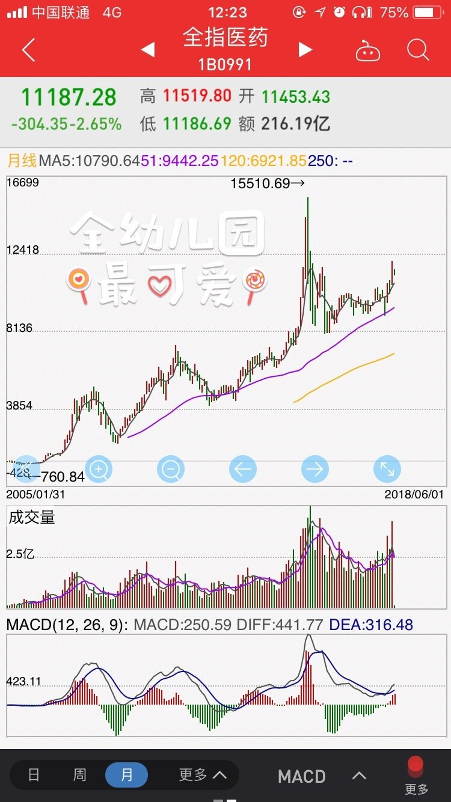

======================================================

ETF拯救世界 (5687069307) @
2018-06-01 16:04:20 Fri  
url: https://weibo.com/5687069307/Gjm6Ikl8b

回复@Lily-invest:20倍，我觉得你很难见到。过去14年中，低于30倍的时候只有11个月，其中9个月出现在2004-2005。过去13年只有两个月低于30倍。700点最惨的时候也有25倍。//@Lily-invest:期待医药20倍的那天🙏🙏跟着益达准没错了[笑而不语][笑而不语]

------------------------------------------------------
转推：
>  @ETF拯救世界 (5687069307)
>  2018-06-01 12:24:16 Fri  
>  url: https:/weibo.com/5687069307/GjkFoeb3R/

>  我的最爱。一定要活到它30万点那天…… ​​​

转发[30]  评论[103]  赞[173] 

======================================================

ETF拯救世界 (5687069307) @
2018-06-04 08:42:48 Mon  
url: https://weibo.com/5687069307/GjLuZvjZU

回复@化工_达人:如果传媒可以跌到最高点的25%-20%，我将突破给它预留的仓位，可以加到10%-15%。目标x倍。如果能成真，将是第三轮计划的第一个放手一搏的品种。人生能有几回搏。//@化工_达人:问题来了，崔永元怼范冰冰事件，传媒指数再来一脚，会不会出黄金坑[吃瓜][吃瓜]

------------------------------------------------------
转推：
>  @ETF拯救世界 (5687069307)
>  2018-05-25 14:50:29 Fri  
>  url: https:/weibo.com/5687069307/GihDgirZp/

>  传媒高点下来跌了70%，持仓部分浮亏4个多点，这就叫跌成狗？
>  
>  以后有让我感觉在发牢骚的直接拉黑。 ​​​

转发[119]  评论[76]  赞[181] 

======================================================

ETF拯救世界 (5687069307) @
2018-06-04 08:57:52 Mon  
url: https://weibo.com/5687069307/GjLB60oNp

950-1200点左右。大概率是1000点梭哈。到不了就给常规仓位。//@ETF拯救世界:回复@化工_达人:如果传媒可以跌到最高点的25%-20%，我将突破给它预留的仓位，可以加到10%-15%。目标x倍。如果能成真，将是第三轮计划的第一个放手一搏的品种。人生能有几回搏。

------------------------------------------------------
转推：
>  @ETF拯救世界 (5687069307)
>  2018-05-25 14:50:29 Fri  
>  url: https:/weibo.com/5687069307/GihDgirZp/

>  传媒高点下来跌了70%，持仓部分浮亏4个多点，这就叫跌成狗？
>  
>  以后有让我感觉在发牢骚的直接拉黑。 ​​​

转发[61]  评论[74]  赞[168] 

======================================================

ETF拯救世界 (5687069307) @
2018-06-04 08:59:24 Mon  
url: https://weibo.com/5687069307/GjLBJ1EYB

回复@赐予我力量吧:sorry，你可能不了解我。布加迪威龙如果不给我100-50的神券，我是不会买的。//@赐予我力量吧:e大的意思 告诫你们是618忍住手  多过几天布加迪威龙马上就要打3折了

------------------------------------------------------
转推：
>  @ETF拯救世界 (5687069307)
>  2018-05-25 14:50:29 Fri  
>  url: https:/weibo.com/5687069307/GihDgirZp/

>  传媒高点下来跌了70%，持仓部分浮亏4个多点，这就叫跌成狗？
>  
>  以后有让我感觉在发牢骚的直接拉黑。 ​​​

转发[22]  评论[39]  赞[135] 

======================================================

ETF拯救世界 (5687069307) @
2018-06-04 10:18:00 Mon  
url: https://weibo.com/5687069307/GjM7D4UkK

回复@喜欢富兰克林:我看了一下，很NB。那时候沪深300估值与现在一模一样。当时2800，现在3800。涨了36%。现在500估值比当时低18%，指数涨了101%。//@喜欢富兰克林:E兄，十年前，也就是2008年的6月份，大盘3100点，那时的沪深300市盈率是多少？现在沪深300是13倍左右，那时估计要25倍左右了吧

------------------------------------------------------
转推：
>  @ETF拯救世界 (5687069307)
>  2018-05-25 14:50:29 Fri  
>  url: https:/weibo.com/5687069307/GihDgirZp/

>  传媒高点下来跌了70%，持仓部分浮亏4个多点，这就叫跌成狗？
>  
>  以后有让我感觉在发牢骚的直接拉黑。 ​​​

转发[16]  评论[59]  赞[159] 

======================================================

ETF拯救世界 (5687069307) @
2018-06-04 10:21:48 Mon  
url: https://weibo.com/5687069307/GjM9atkNJ

回复@Henry00:算半黑不黑吧。这种颜色的天鹅，我们的系统完全可以屏蔽风险。对我们的组合没有任何杀伤力。//@Henry00:崔和范那摊事，算是传媒黑天鹅呢//@ETF拯救世界:回复@赐予我力量吧:sorry，你可能不了解我。布加迪威龙如果不给我100-50的神券，我是不会买的。

------------------------------------------------------
转推：
>  @ETF拯救世界 (5687069307)
>  2018-05-25 14:50:29 Fri  
>  url: https:/weibo.com/5687069307/GihDgirZp/

>  传媒高点下来跌了70%，持仓部分浮亏4个多点，这就叫跌成狗？
>  
>  以后有让我感觉在发牢骚的直接拉黑。 ​​​

转发[3]  评论[15]  赞[122] 

======================================================

ETF拯救世界 (5687069307) @
2018-06-04 10:34:39 Mon  
url: https://weibo.com/5687069307/GjMeo68nz

传媒这种情况，未来就是两步走。

第一，拉大建仓间隔，每次建仓都要有效降低成本。在正常区间建立正常仓位。

第二，在非正常区间，大力加仓。超配。 ​​​

转发[59]  评论[113]  赞[312] 

======================================================

ETF拯救世界 (5687069307) @
2018-06-04 10:39:29 Mon  
url: https://weibo.com/5687069307/GjMglbXoA

传媒其实也是在还债。这个指数2013年上涨102%（当年涨幅第一，同期沪深300下跌8%），2014年上涨19%，2015年到最高峰的时候是上涨159%，年度收盘上涨69%。

最疯狂的时候估值超过120倍，现在即将低于25。

均值回归。就是这样，一轮又一轮。是赔是赚，赔多少，赚多少，全看你是买在轮回的哪个位置了。 ​​​

转发[72]  评论[90]  赞[293] 

======================================================

ETF拯救世界 (5687069307) @
2018-06-04 11:38:09 Mon  
url: https://weibo.com/5687069307/GjMEa85d7

现在想，还珠格格是不是神剧。ZW,FBB,LXR,ZJ，都是娱乐版风口浪尖的人物啊。

前两个更是让很多股民闻风丧胆…… ​​​

转发[3]  评论[50]  赞[184] 

======================================================

ETF拯救世界 (5687069307) @
2018-06-04 12:05:06 Mon  
url: https://weibo.com/5687069307/GjMP5BarF

怎么讲，可以说非常理性和科学的同时，又加上了一些神秘主义的加持，你赢了 ​​​

转发[1]  评论[53]  赞[228] 

+++++++++++++++++++++++++++++++++++++++++++++++++++++

图片：

======================================================

ETF拯救世界 (5687069307) @
2018-06-04 12:09:08 Mon  
url: https://weibo.com/5687069307/GjMQJBqFy

回复@梁建光:这些早在模型的变量中体现了。所以为什么医药加养老只有十个点？

------------------------------------------------------
转推：
>  @ETF拯救世界 (5687069307)
>  2018-06-01 12:24:16 Fri  
>  url: https:/weibo.com/5687069307/GjkFoeb3R/

>  我的最爱。一定要活到它30万点那天…… ​​​

转发[3]  评论[15]  赞[130] 

======================================================

ETF拯救世界 (5687069307) @
2018-06-04 12:41:57 Mon  
url: https://weibo.com/5687069307/GjN43vlPc

关于使用笔记本的一点体会。

用苹果MBP之前，用过索尼的13寸小本。觉得简直没法用，分辨率调高了字特别小，分辨率调低了模模糊糊。后来用了MBP，发现13寸原来也可以这么清楚，windows是渣。

后来用了微软的surface，发现原来不是windows的问题。windows也可以做到13寸，分辨率调高，字不小。

是屏幕 ​​​

转发[14]  评论[118]  赞[192] 

======================================================

ETF拯救世界 (5687069307) @
2018-06-04 15:01:22 Mon  
url: https://weibo.com/5687069307/GjNYE9YTS

这次旅游无理由取消险的情况汇报一下。

全赔了，100%。本来条款里是自身原因赔80%，非自身原因赔100%。结果要了病历，100%全赔付了。也挺方便，网上自助报案，上传材料。

整个过程损失了四百多保险费，比我想象的好多了。

不错。 ​​​

转发[6]  评论[50]  赞[205] 

======================================================

ETF拯救世界 (5687069307) @
2018-06-04 15:11:41 Mon  
url: https://weibo.com/5687069307/GjO2PB4cA

回复@泡泡沫In:我连哪个保险都没说怎么拉客户？这种小钱我会赚？太不了解我。我在公众号如果推个广告够出去玩几次了，你看我推过一个广告吗……//@泡泡沫In:那不错，这是为了拉客户给了优待吗

------------------------------------------------------
转推：
>  @ETF拯救世界 (5687069307)
>  2018-06-04 15:01:22 Mon  
>  url: https:/weibo.com/5687069307/GjNYE9YTS/

>  这次旅游无理由取消险的情况汇报一下。
>  
>  全赔了，100%。本来条款里是自身原因赔80%，非自身原因赔100%。结果要了病历，100%全赔付了。也挺方便，网上自助报案，上传材料。
>  
>  整个过程损失了四百多保险费，比我想象的好多了。
>  
>  不错。 ​​​

转发[1]  评论[81]  赞[180] 

======================================================

ETF拯救世界 (5687069307) @
2018-06-04 15:46:26 Mon  
url: https://weibo.com/5687069307/GjOgWgJw1

我是想说说买的各种东西的感受，比如有几位朋友说的降噪耳机，BOSE也买了，大法也买了。

可是也不好说，一方面说好有做广告的嫌疑，一方面好不好的每个人感受不同，人要看了你写的买了不满意怎么办…… ​​​

转发[4]  评论[113]  赞[160] 

======================================================

ETF拯救世界 (5687069307) @
2018-06-05 09:40:16 Tue  
url: https://weibo.com/5687069307/GjViOcvwK

鉴于有人理解能力有问题，上一条就删了。

大概几年前开始吧，我在一个叫“days matter”的软件上开了两个倒计时。一个是“到40岁”还有几天，一个是“到终点”还有几天。终点我定的是80岁。

人们总觉得未来还很长，可以把时间浪费在很多无谓的事情上。其实，可能也没那么长。一天天就减少了。

然而 ​​​

转发[50]  评论[131]  赞[420] 

======================================================

ETF拯救世界 (5687069307) @
2018-06-05 10:01:53 Tue  
url: https://weibo.com/5687069307/GjVrAb1XY

立个flag，医药我不会卖的。

13000之前。或者12500…… ​​​

转发[125]  评论[91]  赞[243] 

======================================================

ETF拯救世界 (5687069307) @
2018-06-05 10:36:49 Tue  
url: https://weibo.com/5687069307/GjVFLBah4

回复@努力成为Master陈:500的flag不是立过了吗。5000点买满。认识极限4500，再跌就超出我的认识范围了。//@努力成为Master陈:e大给500立个flag

------------------------------------------------------
转推：
>  @ETF拯救世界 (5687069307)
>  2018-06-05 10:01:53 Tue  
>  url: https:/weibo.com/5687069307/GjVrAb1XY/

>  立个flag，医药我不会卖的。
>  
>  13000之前。或者12500…… ​​​

转发[87]  评论[43]  赞[141] 

======================================================

ETF拯救世界 (5687069307) @
2018-06-05 11:16:03 Tue  
url: https://weibo.com/5687069307/GjVVGuR0T

回复@陈叔爱吃五花肉:如果传媒能见到1000点，你买入，你的3-5年收益率会远超巴菲特。那时候你就不叫人家半死不活了。//@陈叔爱吃五花肉:传媒环保这种一直半死不活的在1000？//@ETF拯救世界:回复@努力成为Master陈:500的flag不是立过了吗。5000点买满。认识极限4500，再跌就超出我的认识范围了。

------------------------------------------------------
转推：
>  @ETF拯救世界 (5687069307)
>  2018-06-05 10:01:53 Tue  
>  url: https:/weibo.com/5687069307/GjVrAb1XY/

>  立个flag，医药我不会卖的。
>  
>  13000之前。或者12500…… ​​​

转发[65]  评论[83]  赞[146] 

======================================================

ETF拯救世界 (5687069307) @
2018-06-05 11:42:56 Tue  
url: https://weibo.com/5687069307/GjW6Bbc2S

回复@王冠every:如果投资就是看看市盈率ROE这么简单，那么数学家和会计师应该是最成功的投资者了吧。你见过几个数学家和会计师投资赚大钱了。如果继续这种线性思维，将失去大量的投资机会。

------------------------------------------------------
转推：
>  @ETF拯救世界 (5687069307)
>  2018-06-05 10:01:53 Tue  
>  url: https:/weibo.com/5687069307/GjVrAb1XY/

>  立个flag，医药我不会卖的。
>  
>  13000之前。或者12500…… ​​​

转发[23]  评论[32]  赞[145] 

======================================================

ETF拯救世界 (5687069307) @
2018-06-05 11:49:28 Tue  
url: https://weibo.com/5687069307/GjW9ftmdf

回复@聪明不如走好运:不买高市盈率和只买低市盈率是两种完全不同的概念。狗股策略是一种不错的策略，但我不认可它成为一个人全部的投资策略。我需要的是全天候的体系，要在体系中搭配各种策略应对各种局面。//@聪明不如走好运:已知且被公认最成功的投资者巴菲特 确实没碰过市盈率特别高的票

------------------------------------------------------
转推：
>  @ETF拯救世界 (5687069307)
>  2018-06-05 10:01:53 Tue  
>  url: https:/weibo.com/5687069307/GjVrAb1XY/

>  立个flag，医药我不会卖的。
>  
>  13000之前。或者12500…… ​​​

转发[11]  评论[33]  赞[147] 

======================================================

ETF拯救世界 (5687069307) @
2018-06-05 12:43:25 Tue  
url: https://weibo.com/5687069307/GjWv9fO1T

回复@桑丘的那头蠢驴:深套是多少？仓位4%，浮亏12%，总市值的0.4%。我给你们两个一个建议，趁早停止参考计划。我要怎么提，十几个品种每个每天说几遍？再说一次，停止参考计划！你们还没做好投资股市的准备！

------------------------------------------------------
转推：
>  @ETF拯救世界 (5687069307)
>  2018-06-05 10:01:53 Tue  
>  url: https:/weibo.com/5687069307/GjVrAb1XY/

>  立个flag，医药我不会卖的。
>  
>  13000之前。或者12500…… ​​​

转发[6]  评论[62]  赞[193] 

======================================================

ETF拯救世界 (5687069307) @
2018-06-05 12:58:03 Tue  
url: https://weibo.com/5687069307/GjWB5uyFw

每次某个品种浮亏到超过10%，就有人开始各种牢骚。你们想想是不是。恒生，油气。

结果呢，哪个最后不是赚不少？

很多道理说来简单，你自己做起来才知道什么样。

12%深套？什么鬼？仓位4%啊。

一个跌幅超过50%的指数，坏消息不断，你跟着市场怕了？

存余额宝去吧。追利好不断的强势品种去吧。

这 ​​​

转发[17]  评论[176]  赞[396] 

======================================================

ETF拯救世界 (5687069307) @
2018-06-05 13:08:24 Tue  
url: https://weibo.com/5687069307/GjWFi8iGU

通过我观察那么多年，发现

你告诉别人品种，不行。再加上买卖价格，还是不行。再加上仓位管理，依然不行。

我想，加上投资心理管理和预期控制总行了吧，结果还是不行。

一句话，某些人注定不适合权益类金融投资。 ​​​

转发[29]  评论[290]  赞[498] 

======================================================

ETF拯救世界 (5687069307) @
2018-06-05 16:39:35 Tue  
url: https://weibo.com/5687069307/GjY30vXsb

今天回血不少！晚上不用再哭着吃面了！

准备吃牛排。牛排已经买好了，谁有好的牛排酱推荐吗…… ​​​

转发[2]  评论[161]  赞[288] 

======================================================

ETF拯救世界 (5687069307) @
2018-06-05 21:24:54 Tue  
url: https://weibo.com/5687069307/GjZUOEqYr

五分熟西冷

没有酱…… ​​​

转发[6]  评论[112]  赞[215] 

+++++++++++++++++++++++++++++++++++++++++++++++++++++

图片：
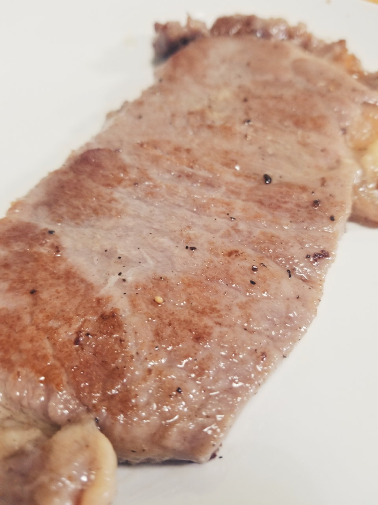
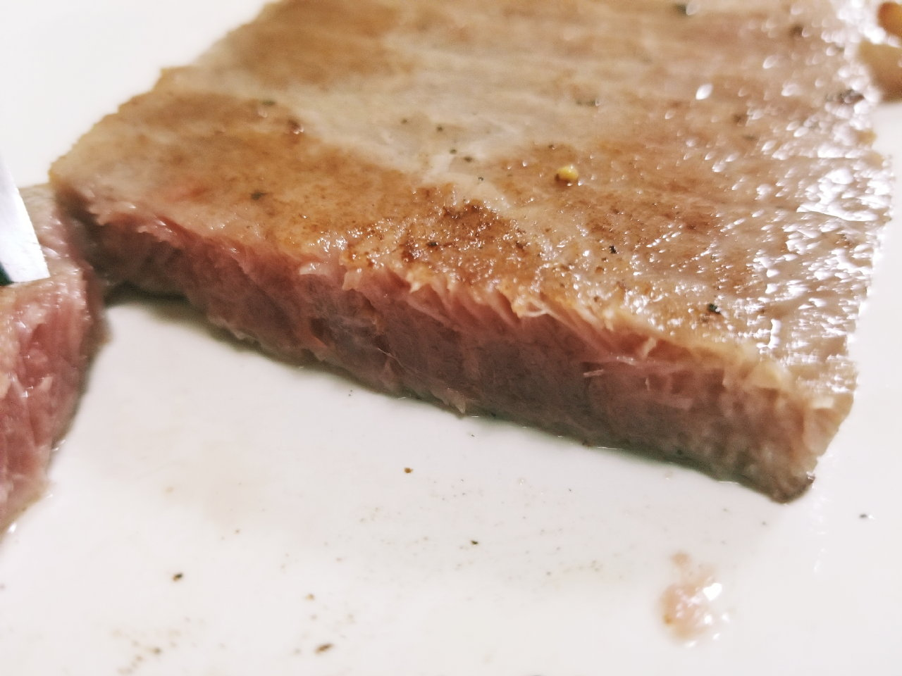

======================================================

ETF拯救世界 (5687069307) @
2018-06-05 21:49:28 Tue  
url: https://weibo.com/5687069307/Gk04Mv1Gv

每日打卡（190）

还是咳嗽，凑合跑了几公里。 ​​​

转发[1]  评论[78]  赞[180] 

+++++++++++++++++++++++++++++++++++++++++++++++++++++

图片：
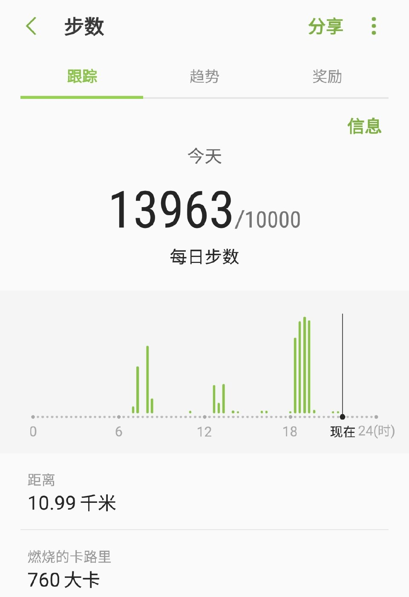

======================================================

ETF拯救世界 (5687069307) @
2018-06-05 22:08:43 Tue  
url: https://weibo.com/5687069307/Gk0cBt8k6

油气为什么不跟跌，好气哦 ​​​

转发[9]  评论[46]  赞[160] 

+++++++++++++++++++++++++++++++++++++++++++++++++++++

图片：
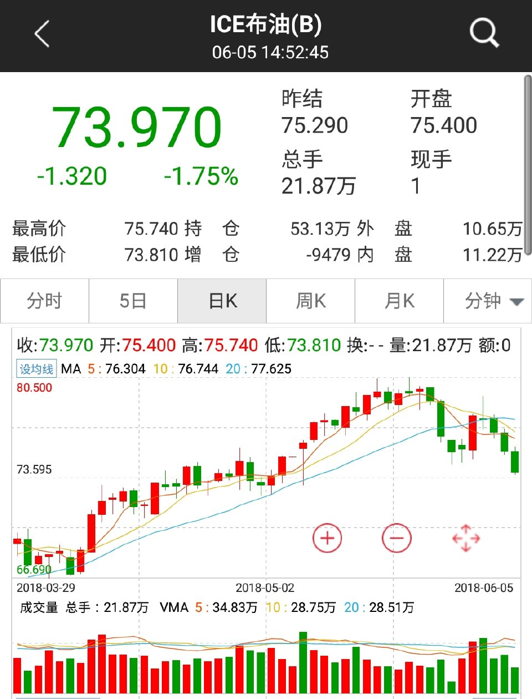

======================================================

ETF拯救世界 (5687069307) @
2018-06-05 22:43:20 Tue  
url: https://weibo.com/5687069307/Gk0qEwMAJ

回复@葱葱AQQ:话说的太早了。万一过几天又猛涨就难看了。能低位再接回来再得瑟吧……//@葱葱AQQ:会卖的是师傅！不服不行！感恩益达！[作揖]

------------------------------------------------------
转推：
>  @ETF拯救世界 (5687069307)
>  2018-06-05 22:08:43 Tue  
>  url: https:/weibo.com/5687069307/Gk0cBt8k6/

>  油气为什么不跟跌，好气哦 ​​​

转发[6]  评论[105]  赞[168] 

======================================================

ETF拯救世界 (5687069307) @
2018-06-06 10:42:55 Wed  
url: https://weibo.com/5687069307/Gk58Jb3lY

有时候真的特别感动，总觉得自己也没做什么，好多朋友就对我特别好。

我也不知道说什么了，只能用尽全力做的再好一点。

不说了，说多了矫情。 ​​​

转发[24]  评论[732]  赞[1330] 

======================================================

ETF拯救世界 (5687069307) @
2018-06-07 07:54:30 Thu  
url: https://weibo.com/5687069307/GkdsS80M5

谢谢！[蛋糕]

虚岁60了！以后请尊重老年人！ ​​​

转发[21]  评论[898]  赞[1239] 

======================================================

ETF拯救世界 (5687069307) @
2018-06-07 10:34:57 Thu  
url: https://weibo.com/5687069307/GkevZnosv

好多人想的是CDR基金能不能挣钱，为什么我想的是几千亿抽血原来的股票怎么办。 ​​​

转发[12]  评论[181]  赞[373] 

======================================================

ETF拯救世界 (5687069307) @
2018-06-07 14:26:58 Thu  
url: https://weibo.com/5687069307/Gkg2aCD6K

我发现有人太贱了。公众号功能改版，必须关联一个微信账号，同时必须起个唯一的作者名字。

然后我输入“ETF拯救世界”，发现已经被别人占用了。

怎么那么贱啊。

以后可能公众号文章你就看不到“ETF拯救世界”这个作者名了……哪位朋友要发现哪个公众号用了这个作者名通知我一下……

我改个什么名字 ​​​

转发[14]  评论[370]  赞[277] 

======================================================

ETF拯救世界 (5687069307) @
2018-06-08 09:17:47 Fri  
url: https://weibo.com/5687069307/GknrayydJ

好了，这几天乱七八糟的过去了。咱们继续开始日常吐槽模式。

我想周末写篇跟投资关系不是特别大的东西，你兹不兹瓷。 ​​​

转发[3]  评论[341]  赞[936] 

======================================================

ETF拯救世界 (5687069307) @
2018-06-08 09:36:40 Fri  
url: https://weibo.com/5687069307/GknyQ0Iyv

跌的有点惨了，我再奶一把，队里的兄弟们可以拉了。不过，跟各位特别真诚的说一句，这个阴跌的时间越长，越折磨人，未来的爆发越震撼。两个条件，第一，极度便宜。第二，某件大事催化剂。

------------------------------------------------------
转推：
>  @ETF拯救世界 (5687069307)
>  2018-05-03 11:25:05 Thu  
>  url: https:/weibo.com/5687069307/GeUSY6sMB/

>  从现在起，各位做好心理准备，迎接漫漫阴跌吧。没什么大问题，解决心理问题以后逢低布局就可以。
>  
>  最主要是心理问题。所有希望都被磨平后的麻木与绝望是需要警惕的。 ​​​

转发[33]  评论[224]  赞[354] 

======================================================

ETF拯救世界 (5687069307) @
2018-06-08 10:47:22 Fri  
url: https://weibo.com/5687069307/Gko1xdvTl

我告诉你一个数学常识：

下跌33%，涨回去就会赚50%。

请问，你希望不希望你想买的东西下跌33%。

[并不简单] ​​​

转发[33]  评论[196]  赞[467] 

======================================================

ETF拯救世界 (5687069307) @
2018-06-08 12:33:27 Fri  
url: https://weibo.com/5687069307/GkoIACGXR

$中证传媒 sz399971$   真的牛了。15年6月以来连跌3年，跌幅68%。

70%了，80%还会远吗……

计划1.8%仓位瑟瑟发抖中。 ​​​

转发[27]  评论[132]  赞[321] 

======================================================

ETF拯救世界 (5687069307) @
2018-06-08 13:19:29 Fri  
url: https://weibo.com/5687069307/Gkp1hBnI8

不要急，节奏我自然会控制好。

尽在掌握。 ​​​

转发[7]  评论[118]  赞[436] 

======================================================

ETF拯救世界 (5687069307) @
2018-06-08 13:53:05 Fri  
url: https://weibo.com/5687069307/GkpeVg7vI

其实现在的情况真的很差。特别差。别老盯着几个明星股，至少3000只股票一直在下跌，连创新低。

但你知道你为什么心里不慌嘛，因为你已经做好准备了。

没准备的人才慌，因为他们不知道发生什么了，以后还会发生什么。

第一步，分析所有可能发生的事。第二步，对所有可能发生的做好预案。

当然，其实 ​​​

转发[44]  评论[231]  赞[488] 

======================================================

ETF拯救世界 (5687069307) @
2018-06-08 21:59:51 Fri  
url: https://weibo.com/5687069307/GksquAX7f

今天计划回撤0.4，几个增强指基表现真不错 ​​​

转发[13]  评论[119]  赞[305] 

======================================================

ETF拯救世界 (5687069307) @
2018-06-09 15:58:12 Sat  
url: https://weibo.com/5687069307/GkzuczEEq

拿回来了。[并不简单]

------------------------------------------------------
转推：
>  @ETF拯救世界 (5687069307)
>  2018-06-07 14:26:58 Thu  
>  url: https:/weibo.com/5687069307/Gkg2aCD6K/

>  我发现有人太贱了。公众号功能改版，必须关联一个微信账号，同时必须起个唯一的作者名字。
>  
>  然后我输入“ETF拯救世界”，发现已经被别人占用了。
>  
>  怎么那么贱啊。
>  
>  以后可能公众号文章你就看不到“ETF拯救世界”这个作者名了……哪位朋友要发现哪个公众号用了这个作者名通知我一下……
>  
>  我改个什么名字 ​​​

转发[3]  评论[157]  赞[684] 

======================================================

ETF拯救世界 (5687069307) @
2018-06-11 09:00:08 Mon  
url: https://weibo.com/5687069307/GkPBuFJdY

回复@ETF改变生活:下午三点半即可知道答案。我比较期待。//@ETF改变生活:今天指数调整，不知对估值有什么影响

------------------------------------------------------
转推：
>  @ETF拯救世界 (5687069307)
>  2018-06-08 21:59:51 Fri  
>  url: https:/weibo.com/5687069307/GksquAX7f/

>  今天计划回撤0.4，几个增强指基表现真不错 ​​​

转发[9]  评论[9]  赞[132] 

======================================================

ETF拯救世界 (5687069307) @
2018-06-11 09:11:48 Mon  
url: https://weibo.com/5687069307/GkPGenX1F

回复@酩酊大醉的三藏:据我根据进出名单之前的计算，500会稍微下降，但是不多。//@酩酊大醉的三藏:比较好奇500的估值会不会进一步下降//@ETF拯救世界:回复@ETF改变生活:下午三点半即可知道答案。我比较期待。//@ETF改变生活:今天指数调整，不知对估值有什么影响

------------------------------------------------------
转推：
>  @ETF拯救世界 (5687069307)
>  2018-06-08 21:59:51 Fri  
>  url: https:/weibo.com/5687069307/GksquAX7f/

>  今天计划回撤0.4，几个增强指基表现真不错 ​​​

转发[8]  评论[13]  赞[117] 

======================================================

ETF拯救世界 (5687069307) @
2018-06-11 09:16:49 Mon  
url: https://weibo.com/5687069307/GkPIgCsfq

回复@妖艳贱货不要来:没有多低啊。距离2008年底还有34%的下跌空间呢。easy//@妖艳贱货不要来:500估值已经这么低估了，怎么还没有大资金建仓呢//@ETF拯救世界:回复@酩酊大醉的三藏:据我根据进出名单之前的计算，500会稍微下降，但是不多。//@酩酊大醉的三藏:比较好奇500的估值会不会进一步下降

------------------------------------------------------
转推：
>  @ETF拯救世界 (5687069307)
>  2018-06-08 21:59:51 Fri  
>  url: https:/weibo.com/5687069307/GksquAX7f/

>  今天计划回撤0.4，几个增强指基表现真不错 ​​​

转发[4]  评论[73]  赞[157] 

======================================================

ETF拯救世界 (5687069307) @
2018-06-11 14:10:02 Mon  
url: https://weibo.com/5687069307/GkRDicWmh

不要猜底。一个建议。//@ETF拯救世界:再说一次，一定要做好长期抗战的心理准备。其他的问题不大，关键是心理准备。希望，意志，最重要。一切尽在掌握。

------------------------------------------------------
转推：
>  @ETF拯救世界 (5687069307)
>  2018-05-03 11:25:05 Thu  
>  url: https:/weibo.com/5687069307/GeUSY6sMB/

>  从现在起，各位做好心理准备，迎接漫漫阴跌吧。没什么大问题，解决心理问题以后逢低布局就可以。
>  
>  最主要是心理问题。所有希望都被磨平后的麻木与绝望是需要警惕的。 ​​​

转发[12]  评论[107]  赞[203] 

======================================================

ETF拯救世界 (5687069307) @
2018-06-11 14:46:03 Mon  
url: https://weibo.com/5687069307/GkRRUtInW

回复@佛系坤少:挠挠。//@佛系坤少:老大，战略配售能不能买？有点痒//@ETF拯救世界:不要猜底。一个建议。//@ETF拯救世界:再说一次，一定要做好长期抗战的心理准备。其他的问题不大，关键是心理准备。希望，意志，最重要。一切尽在掌握。

------------------------------------------------------
转推：
>  @ETF拯救世界 (5687069307)
>  2018-05-03 11:25:05 Thu  
>  url: https:/weibo.com/5687069307/GeUSY6sMB/

>  从现在起，各位做好心理准备，迎接漫漫阴跌吧。没什么大问题，解决心理问题以后逢低布局就可以。
>  
>  最主要是心理问题。所有希望都被磨平后的麻木与绝望是需要警惕的。 ​​​

转发[1]  评论[35]  赞[139] 

======================================================

ETF拯救世界 (5687069307) @
2018-06-11 14:47:11 Mon  
url: https://weibo.com/5687069307/GkRSmA2hR

今天数据没出来，但如果尾盘半个小时没有猫腻，那么今天A股全市场PB应该会降至2.5以下了。

这是一个标志性的事件。意味着进入真正意义上的“低估”区域。

绝不仅仅是对比历史，还包括横向对比各国市场。

感谢资本市场，感谢这时代。

show time.

当然，前路依然崎岖。主要阻力来自于非市场因素。不 ​​​

转发[149]  评论[252]  赞[420] 

+++++++++++++++++++++++++++++++++++++++++++++++++++++

图片：
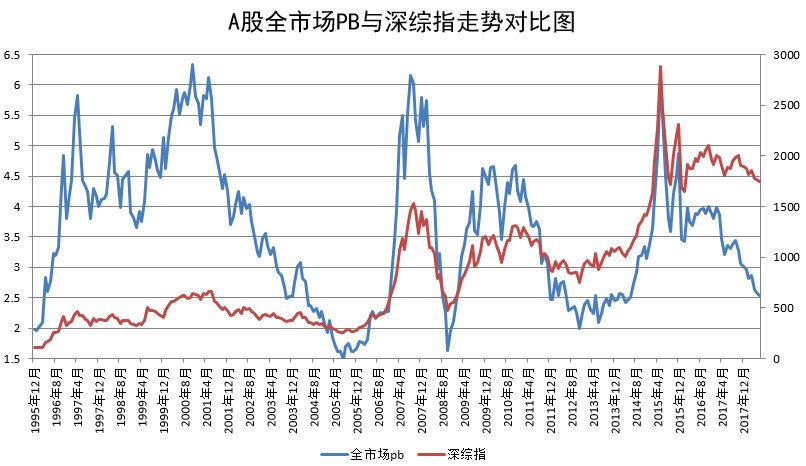

======================================================

ETF拯救世界 (5687069307) @
2018-06-11 15:52:11 Mon  
url: https://weibo.com/5687069307/GkSiKnix7

打脸了，没破。 [二哈]

------------------------------------------------------
转推：
>  @ETF拯救世界 (5687069307)
>  2018-06-11 14:47:11 Mon  
>  url: https:/weibo.com/5687069307/GkRSmA2hR/

>  今天数据没出来，但如果尾盘半个小时没有猫腻，那么今天A股全市场PB应该会降至2.5以下了。
>  
>  这是一个标志性的事件。意味着进入真正意义上的“低估”区域。
>  
>  绝不仅仅是对比历史，还包括横向对比各国市场。
>  
>  感谢资本市场，感谢这时代。
>  
>  show time.
>  
>  当然，前路依然崎岖。主要阻力来自于非市场因素。不 ​​​

转发[13]  评论[162]  赞[223] 

======================================================

ETF拯救世界 (5687069307) @
2018-06-12 10:08:26 Tue  
url: https://weibo.com/5687069307/GkZtJ4DSU

GJD的操盘手一定在骂娘。当然，Zj也在骂…… ​​​

转发[2]  评论[86]  赞[200] 

======================================================

ETF拯救世界 (5687069307) @
2018-06-12 10:18:59 Tue  
url: https://weibo.com/5687069307/GkZy06oQU

八年来第一次进医院看病，咳嗽一个月了。

医生看完化验单，说，什么事都没有。

[费解] ​​​

转发[12]  评论[413]  赞[330] 

======================================================

ETF拯救世界 (5687069307) @
2018-06-12 13:56:03 Tue  
url: https://weibo.com/5687069307/Gl0Y6zUj6

谢谢大家。几百条建议，我准备神农尝百草了。哪天朕突然不发微博公众号球球就是被你们某剂方子给害了……应该没什么事……[可怜]

------------------------------------------------------
转推：
>  @ETF拯救世界 (5687069307)
>  2018-06-12 10:18:59 Tue  
>  url: https:/weibo.com/5687069307/GkZy06oQU/

>  八年来第一次进医院看病，咳嗽一个月了。
>  
>  医生看完化验单，说，什么事都没有。
>  
>  [费解] ​​​

转发[1]  评论[137]  赞[221] 

======================================================

ETF拯救世界 (5687069307) @
2018-06-12 14:41:09 Tue  
url: https://weibo.com/5687069307/Gl1gq5SDU

除了指数基金，各位可以选择一些消费类的股票，超长期持有。除非全市场极度高估，不卖。

我不是说现在买，总有特别好的买入机会，买了就别卖放着就行了。

反正就是那些吃吃喝喝的股票。大品牌。你经常买的那些。

医药的话，专业性挺强，买点指数基金就行了。

其它行业的股票，一般都是阶段性周期性 ​​​

转发[426]  评论[289]  赞[435] 

======================================================

ETF拯救世界 (5687069307) @
2018-06-12 15:10:14 Tue  
url: https://weibo.com/5687069307/Gl1sdsiqU

回复@写代码的YuHao:当然了。美股历史上超级大牛股就是消费+医药。其它各领风骚的都灰飞烟灭了。//@写代码的YuHao:对美股也适用吧？

------------------------------------------------------
转推：
>  @ETF拯救世界 (5687069307)
>  2018-06-12 14:41:09 Tue  
>  url: https:/weibo.com/5687069307/Gl1gq5SDU/

>  除了指数基金，各位可以选择一些消费类的股票，超长期持有。除非全市场极度高估，不卖。
>  
>  我不是说现在买，总有特别好的买入机会，买了就别卖放着就行了。
>  
>  反正就是那些吃吃喝喝的股票。大品牌。你经常买的那些。
>  
>  医药的话，专业性挺强，买点指数基金就行了。
>  
>  其它行业的股票，一般都是阶段性周期性 ​​​

转发[36]  评论[22]  赞[122] 

======================================================

ETF拯救世界 (5687069307) @
2018-06-12 15:13:22 Tue  
url: https://weibo.com/5687069307/Gl1tunLWQ

回复@堺小黑:当然可以。我想很多朋友都记得几年前我在雪球发的六个必配品种：50、500、创业、医药、消费、信息产业。买了这六个基本上任何行情都落不下了。目前艰难买入中。//@堺小黑:510500这种可以买了长持吗？

------------------------------------------------------
转推：
>  @ETF拯救世界 (5687069307)
>  2018-06-12 14:41:09 Tue  
>  url: https:/weibo.com/5687069307/Gl1gq5SDU/

>  除了指数基金，各位可以选择一些消费类的股票，超长期持有。除非全市场极度高估，不卖。
>  
>  我不是说现在买，总有特别好的买入机会，买了就别卖放着就行了。
>  
>  反正就是那些吃吃喝喝的股票。大品牌。你经常买的那些。
>  
>  医药的话，专业性挺强，买点指数基金就行了。
>  
>  其它行业的股票，一般都是阶段性周期性 ​​​

转发[119]  评论[100]  赞[193] 

======================================================

ETF拯救世界 (5687069307) @
2018-06-12 15:16:16 Tue  
url: https://weibo.com/5687069307/Gl1uFmeBQ

回复@风中的黑森林:我说了，不是现在买。以后总有特别好的机会。一定要记住，资本市场最不缺的就是机会。从来没有所谓“不可错过”的机会。//@风中的黑森林:不过近期消费类基金创新高，追入需谨慎呐同学们

------------------------------------------------------
转推：
>  @ETF拯救世界 (5687069307)
>  2018-06-12 14:41:09 Tue  
>  url: https:/weibo.com/5687069307/Gl1gq5SDU/

>  除了指数基金，各位可以选择一些消费类的股票，超长期持有。除非全市场极度高估，不卖。
>  
>  我不是说现在买，总有特别好的买入机会，买了就别卖放着就行了。
>  
>  反正就是那些吃吃喝喝的股票。大品牌。你经常买的那些。
>  
>  医药的话，专业性挺强，买点指数基金就行了。
>  
>  其它行业的股票，一般都是阶段性周期性 ​​​

转发[21]  评论[32]  赞[153] 

======================================================

ETF拯救世界 (5687069307) @
2018-06-12 15:17:02 Tue  
url: https://weibo.com/5687069307/Gl1uZ8DCe

回复@吕凯飘在北京:算大消费吧。我看申万好像要把腾讯和网易CDR纳入传媒板块了。//@吕凯飘在北京:腾讯也算消费类的吧？//@ETF拯救世界:回复@写代码的YuHao:当然了。美股历史上超级大牛股就是消费+医药。其它各领风骚的都灰飞烟灭了。//@写代码的YuHao:对美股也适用吧？

------------------------------------------------------
转推：
>  @ETF拯救世界 (5687069307)
>  2018-06-12 14:41:09 Tue  
>  url: https:/weibo.com/5687069307/Gl1gq5SDU/

>  除了指数基金，各位可以选择一些消费类的股票，超长期持有。除非全市场极度高估，不卖。
>  
>  我不是说现在买，总有特别好的买入机会，买了就别卖放着就行了。
>  
>  反正就是那些吃吃喝喝的股票。大品牌。你经常买的那些。
>  
>  医药的话，专业性挺强，买点指数基金就行了。
>  
>  其它行业的股票，一般都是阶段性周期性 ​​​

转发[16]  评论[31]  赞[128] 

======================================================

ETF拯救世界 (5687069307) @
2018-06-12 19:21:27 Tue  
url: https://weibo.com/5687069307/Gl36bxS8n

喷了，上一篇夜话打赏的朋友已经969人了，是不是你们怕我不接着写了，用金钱来腐蚀我？ 

没用的。我会是那种为了钱卖艺的人吗？省省吧。[doge]

PS，难道没想过用美人计试试吗？[挖鼻] ​​​

转发[4]  评论[274]  赞[439] 

+++++++++++++++++++++++++++++++++++++++++++++++++++++

图片：

======================================================

ETF拯救世界 (5687069307) @
2018-06-13 09:35:09 Wed  
url: https://weibo.com/5687069307/Gl8GHA0MC

个股。一天，40%。A股也一样，4个跌停也没差。

你说，你低位买的吧，利润减少40%。

高位买的吧，不说了。多少年白干了。

个股还是不能单压，还是得分散配置。所谓集中投资满仓穿越牛熊，只是那些幸存者偏差剩下的人跟你扯的蛋。你信了，也有可能是幸运的，也有可能不是。自己想清楚就行。

不过，最 ​​​

转发[60]  评论[154]  赞[287] 

+++++++++++++++++++++++++++++++++++++++++++++++++++++

图片：
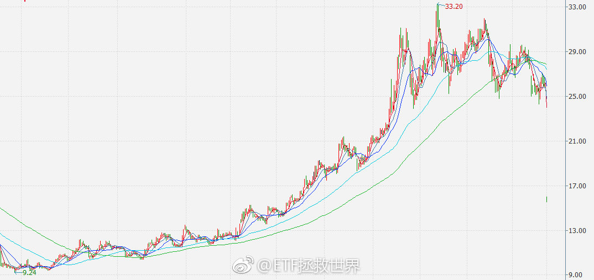

======================================================

ETF拯救世界 (5687069307) @
2018-06-13 11:12:22 Wed  
url: https://weibo.com/5687069307/Gl9kazpFY

回复@香克斯芒007:投入感情。控制节奏。加油，你行的。//@香克斯芒007:E大。我就不夸你的投资水平了，我就想问，为什么连你的文笔都这么的优秀？为什么？你是不是开挂了？@ETF拯救世界  写作是不是你有特殊的技巧？

------------------------------------------------------
转推：
>  @ETF拯救世界 (5687069307)
>  2018-06-13 09:35:09 Wed  
>  url: https:/weibo.com/5687069307/Gl8GHA0MC/

>  个股。一天，40%。A股也一样，4个跌停也没差。
>  
>  你说，你低位买的吧，利润减少40%。
>  
>  高位买的吧，不说了。多少年白干了。
>  
>  个股还是不能单压，还是得分散配置。所谓集中投资满仓穿越牛熊，只是那些幸存者偏差剩下的人跟你扯的蛋。你信了，也有可能是幸运的，也有可能不是。自己想清楚就行。
>  
>  不过，最 ​​​

转发[8]  评论[61]  赞[136] 

======================================================

ETF拯救世界 (5687069307) @
2018-06-13 13:43:23 Wed  
url: https://weibo.com/5687069307/GlajsetoL

调剂是什么意思。是不是北京和广东的养老金盈余要补到那些快穿底的地方去。学习好的朋友说说。

------------------------------------------------------
转推：
>  @蓝鲸财经记者工作平台 (1885454921)
>  2018-06-13 13:29:04 Wed  
>  url: https:/weibo.com/1885454921/GladElTx6/

>  国务院印发通知，决定建立养老保险基金中央调剂制度。（新华社） ​​​

转发[12]  评论[141]  赞[146] 

======================================================

ETF拯救世界 (5687069307) @
2018-06-13 16:03:25 Wed  
url: https://weibo.com/5687069307/GlbeiAaDM

开完会回来怎么这样了。

没我的毒奶还是不行啊。

哈哈哈哈哈。

什么时候发车不敢奶了。 ​​​

转发[2]  评论[116]  赞[227] 

======================================================

ETF拯救世界 (5687069307) @
2018-06-13 16:24:30 Wed  
url: https://weibo.com/5687069307/GlbmRjhnv

这一轮熊市，你能赚多少我觉得就不要预期了。

但你应该知道一件事。

就是，无论有多熊，你在资本市场死去的可能性，

几乎没有。

舒服。 ​​​

转发[37]  评论[75]  赞[247] 

======================================================

ETF拯救世界 (5687069307) @
2018-06-13 16:29:58 Wed  
url: https://weibo.com/5687069307/Glbp53CdC

回复@佳峻爸2013:我们的A股仓位超过60%-70%大概率就快了。//@佳峻爸2013:熊市啥时候能结束？等了好久了…

------------------------------------------------------
转推：
>  @ETF拯救世界 (5687069307)
>  2018-06-13 16:24:30 Wed  
>  url: https:/weibo.com/5687069307/GlbmRjhnv/

>  这一轮熊市，你能赚多少我觉得就不要预期了。
>  
>  但你应该知道一件事。
>  
>  就是，无论有多熊，你在资本市场死去的可能性，
>  
>  几乎没有。
>  
>  舒服。 ​​​

转发[16]  评论[88]  赞[174] 

======================================================

ETF拯救世界 (5687069307) @
2018-06-13 17:23:47 Wed  
url: https://weibo.com/5687069307/GlbKVfop9

今天收盘后，计划今年年度计算可能就变成浮亏了。大概0.2%左右吧。中证500已经下跌10%了。。

看了一下，今年A股下跌家数78%。跌幅中位数是-13%。跌幅超过20%的股票有1089只……

当然，上涨的也有22%……

不过我估计今年计划不会是亏损。年底看。 ​​​

转发[72]  评论[118]  赞[245] 

======================================================

ETF拯救世界 (5687069307) @
2018-06-13 17:33:41 Wed  
url: https://weibo.com/5687069307/GlbOWDOus

回复@宋隆河:不是第三轮计划浮亏，是今年。计划还有十几个点的收益扛造。对应大盘指数下跌大概要30%。也就是说，同期中证500要跌80%，第三轮计划才会浮亏。//@宋隆河:传说中的浮亏终于来了[笑cry]

------------------------------------------------------
转推：
>  @ETF拯救世界 (5687069307)
>  2018-06-13 17:23:47 Wed  
>  url: https:/weibo.com/5687069307/GlbKVfop9/

>  今天收盘后，计划今年年度计算可能就变成浮亏了。大概0.2%左右吧。中证500已经下跌10%了。。
>  
>  看了一下，今年A股下跌家数78%。跌幅中位数是-13%。跌幅超过20%的股票有1089只……
>  
>  当然，上涨的也有22%……
>  
>  不过我估计今年计划不会是亏损。年底看。 ​​​

转发[7]  评论[31]  赞[133] 

======================================================

ETF拯救世界 (5687069307) @
2018-06-13 17:48:07 Wed  
url: https://weibo.com/5687069307/GlbUNt7P1

回复@lzg54:左右互搏，我是真的看不懂。//@lzg54:本来E大担心国家队，现在好了，熊市发独角兽，估计今年计划就能打满。

------------------------------------------------------
转推：
>  @ETF拯救世界 (5687069307)
>  2018-06-13 17:23:47 Wed  
>  url: https:/weibo.com/5687069307/GlbKVfop9/

>  今天收盘后，计划今年年度计算可能就变成浮亏了。大概0.2%左右吧。中证500已经下跌10%了。。
>  
>  看了一下，今年A股下跌家数78%。跌幅中位数是-13%。跌幅超过20%的股票有1089只……
>  
>  当然，上涨的也有22%……
>  
>  不过我估计今年计划不会是亏损。年底看。 ​​​

转发[43]  评论[69]  赞[152] 

======================================================

ETF拯救世界 (5687069307) @
2018-06-14 08:55:33 Thu  
url: https://weibo.com/5687069307/GlhR81zeQ

回复@Luckier1:朋友，以我十几年的投资经验，跟你说两点。第一，股市涨跌与宏观经济数据并不密切相关，中短期来看。超长期有关。所以经济数据好不好与我们长期投资关系不大。第二，正因为数据不好，才有便宜货让我们买，难道什么都好了，涨到牛市了再买吗。

------------------------------------------------------
转推：
>  @ETF拯救世界 (5687069307)
>  2018-06-13 17:23:47 Wed  
>  url: https:/weibo.com/5687069307/GlbKVfop9/

>  今天收盘后，计划今年年度计算可能就变成浮亏了。大概0.2%左右吧。中证500已经下跌10%了。。
>  
>  看了一下，今年A股下跌家数78%。跌幅中位数是-13%。跌幅超过20%的股票有1089只……
>  
>  当然，上涨的也有22%……
>  
>  不过我估计今年计划不会是亏损。年底看。 ​​​

转发[38]  评论[66]  赞[197] 

======================================================

ETF拯救世界 (5687069307) @
2018-06-14 09:06:19 Thu  
url: https://weibo.com/5687069307/GlhVv09LF

GDP增速、工业增加值、甚至CPI、PMI，实际上，与股市涨跌关系并不大。

你好好想想，过去三十年中国GDP疯涨，最后在股市赚钱的人有几个？

股市涨不涨，最关键的是三点因素。

长期看，估值。估值低，即使经济增速放缓，只要经济不出大问题，那么买入持有的人都大概率赚钱。估值高，经济增速再高你也很 ​​​

转发[246]  评论[196]  赞[408] 

======================================================

ETF拯救世界 (5687069307) @
2018-06-14 09:21:02 Thu  
url: https://weibo.com/5687069307/Gli1tyPUa

回复@天使爱跳舞223:我的体系已经包含了应对所有可以考虑到的事情的方案。所谓金融危机当然也在其中。你只需要记住两点：第一，指数不会死。第二，危机二字，有危才有机。没有危，凭什么你能赚大钱？//@天使爱跳舞223:如果发生金融危机呢？对咱们的计划有多大的影响？

------------------------------------------------------
转推：
>  @ETF拯救世界 (5687069307)
>  2018-06-14 09:06:19 Thu  
>  url: https:/weibo.com/5687069307/GlhVv09LF/

>  GDP增速、工业增加值、甚至CPI、PMI，实际上，与股市涨跌关系并不大。
>  
>  你好好想想，过去三十年中国GDP疯涨，最后在股市赚钱的人有几个？
>  
>  股市涨不涨，最关键的是三点因素。
>  
>  长期看，估值。估值低，即使经济增速放缓，只要经济不出大问题，那么买入持有的人都大概率赚钱。估值高，经济增速再高你也很 ​​​

转发[32]  评论[47]  赞[223] 

======================================================

ETF拯救世界 (5687069307) @
2018-06-14 10:12:03 Thu  
url: https://weibo.com/5687069307/Glimb9Zgn

有心报国，国先拉了。 ​​​

转发[6]  评论[74]  赞[224] 

======================================================

ETF拯救世界 (5687069307) @
2018-06-14 10:13:19 Thu  
url: https://weibo.com/5687069307/GlimH3Sic

是不是都买房去了。

------------------------------------------------------
转推：
>  @ ()
>  2018-06-14 10:07:45 Thu  
>  url: 

>  抱歉，此微博已被作者删除。查看帮助：http://t.cn/Rfd3rQV

转发[9]  评论[85]  赞[135] 

======================================================

ETF拯救世界 (5687069307) @
2018-06-14 10:27:19 Thu  
url: https://weibo.com/5687069307/GlisnhOY5

群众：我不跟。GJD：跟一个要反转了。群众：借我点钱。

------------------------------------------------------
转推：
>  @ETF拯救世界 (5687069307)
>  2018-06-14 10:12:03 Thu  
>  url: https:/weibo.com/5687069307/Glimb9Zgn/

>  有心报国，国先拉了。 ​​​

转发[4]  评论[127]  赞[230] 

======================================================

ETF拯救世界 (5687069307) @
2018-06-14 13:48:22 Thu  
url: https://weibo.com/5687069307/GljLZiJap

看看盘，有没有闻到恐慌的气味。 ​​​

转发[8]  评论[372]  赞[357] 

======================================================

ETF拯救世界 (5687069307) @
2018-06-15 10:03:12 Fri  
url: https://weibo.com/5687069307/GlrJ5dAHv

凉凉 ​​​

转发[2]  评论[135]  赞[226] 

======================================================

ETF拯救世界 (5687069307) @
2018-06-15 10:14:33 Fri  
url: https://weibo.com/5687069307/GlrNGBGKH

$中证金融 sz399934$  万绿丛中一点红。辣鸡，又要追高建仓 ​​​

转发[1]  评论[72]  赞[181] 

======================================================

ETF拯救世界 (5687069307) @
2018-06-15 10:54:07 Fri  
url: https://weibo.com/5687069307/Gls3L2MG0

快了 [并不简单]

------------------------------------------------------
转推：
>  @ETF拯救世界 (5687069307)
>  2018-05-29 16:04:52 Tue  
>  url: https:/weibo.com/5687069307/GiTPrmA6W/

>  立个flag，5000点买满500仓位。 ​​​

转发[21]  评论[146]  赞[293] 

======================================================

ETF拯救世界 (5687069307) @
2018-06-15 11:33:47 Fri  
url: https://weibo.com/5687069307/GlsjRdRMB

还是那句话，控制节奏。不用急不要慌。

节奏。 ​​​

转发[34]  评论[184]  赞[383] 

======================================================

ETF拯救世界 (5687069307) @
2018-06-15 13:42:45 Fri  
url: https://weibo.com/5687069307/GltacCMlm

回复@平常心的Alan:我要看的是这些人心理和情绪的改变。//@平常心的Alan:e大，您怎么看有些人说的A股估值体系的改变？

------------------------------------------------------
转推：
>  @ETF拯救世界 (5687069307)
>  2018-06-15 11:33:47 Fri  
>  url: https:/weibo.com/5687069307/GlsjRdRMB/

>  还是那句话，控制节奏。不用急不要慌。
>  
>  节奏。 ​​​

转发[22]  评论[54]  赞[170] 

======================================================

ETF拯救世界 (5687069307) @
2018-06-15 14:32:54 Fri  
url: https://weibo.com/5687069307/GltuynwVk

回复@天啊我是笨蛋还不行:不会。不过我知道，现在很多人心里已经开始有点疑虑了。//@天啊我是笨蛋还不行:益达啊，我问一句，你不觉得很奇怪吗，这轮所有人都能跟车跟的下去。。。而且大家都很兴奋啊，确定这里是底？//@ETF拯救世界:回复@平常心的Alan:我要看的是这些人心理和情绪的改变。

------------------------------------------------------
转推：
>  @ETF拯救世界 (5687069307)
>  2018-06-15 11:33:47 Fri  
>  url: https:/weibo.com/5687069307/GlsjRdRMB/

>  还是那句话，控制节奏。不用急不要慌。
>  
>  节奏。 ​​​

转发[21]  评论[88]  赞[163] 

======================================================

ETF拯救世界 (5687069307) @
2018-06-15 14:44:34 Fri  
url: https://weibo.com/5687069307/GltzioI8L

回复@石头里的虫子:计划损失25%意味着大盘从现在开始要跌60%。//@石头里的虫子:想起《滚雪球》里面说到红杉基金在1973年损失25%，1974年损失更多，最大投资人动不动就打电话痛骂比尔鲁安。//@ETF拯救世界:回复@天啊我是笨蛋还不行:不会。不过我知道，现在很多人心里已经开始有点疑虑了。

------------------------------------------------------
转推：
>  @ETF拯救世界 (5687069307)
>  2018-06-15 11:33:47 Fri  
>  url: https:/weibo.com/5687069307/GlsjRdRMB/

>  还是那句话，控制节奏。不用急不要慌。
>  
>  节奏。 ​​​

转发[18]  评论[64]  赞[162] 

======================================================

ETF拯救世界 (5687069307) @
2018-06-15 15:11:28 Fri  
url: https://weibo.com/5687069307/GltKd36fq

回复@十洲山水:其实主要原因就是你没经历过。经历过就懂了。以后你每天暴增的时候根本就想不起来现在每天波动的感受了。不过这个没办法，说了你也不明白。没经历过的事你怎么会明白。

------------------------------------------------------
转推：
>  @ETF拯救世界 (5687069307)
>  2018-06-15 11:33:47 Fri  
>  url: https:/weibo.com/5687069307/GlsjRdRMB/

>  还是那句话，控制节奏。不用急不要慌。
>  
>  节奏。 ​​​

转发[12]  评论[92]  赞[231] 

======================================================

ETF拯救世界 (5687069307) @
2018-06-15 17:14:05 Fri  
url: https://weibo.com/5687069307/GluxYBokW

大家开开心心过周末！可以看看球。生活多美好。

周末要不要再写一篇东西，还没想好。别催，别期待，可能不写，也可能写。

开心点都！ ​​​

转发[4]  评论[237]  赞[732] 

======================================================

ETF拯救世界 (5687069307) @
2018-06-16 23:25:18 Sat  
url: https://weibo.com/5687069307/GlGp9oPj9

不要上那种有打折信息的网站。

真的。看起来很多东西折扣很多很便宜，其实你会买很多以前不会买的东西，而且都是很贵的东西！

不说了，还信用卡去了。 ​​​

转发[10]  评论[155]  赞[369] 

======================================================

ETF拯救世界 (5687069307) @
2018-06-19 08:40:12 Tue  
url: https://weibo.com/5687069307/Gm2TnuZwn

哈哈哈哈哈哈哈，让你们不申购战投基金

------------------------------------------------------
转推：
>  @ ()
>  2018-06-19 08:37:43 Tue  
>  url: 

>  抱歉，作者已设置仅展示半年内微博，此微博已不可见。 ​​​

转发[7]  评论[48]  赞[123] 

======================================================

ETF拯救世界 (5687069307) @
2018-06-19 09:09:01 Tue  
url: https://weibo.com/5687069307/Gm354Aez1

有人昨天晚上还担心要崩盘了，早上听说小米暂缓突然又觉得牛市要来了。 ​​​

转发[4]  评论[36]  赞[181] 

======================================================

ETF拯救世界 (5687069307) @
2018-06-19 09:18:14 Tue  
url: https://weibo.com/5687069307/Gm38OebZ0

回复@亹亹Vk:后天走。鉴于去年去欧洲十几天A股发生的事，决定这次带上笔记本。//@亹亹Vk:还是去环球旅行吧

------------------------------------------------------
转推：
>  @ETF拯救世界 (5687069307)
>  2018-06-19 09:09:01 Tue  
>  url: https:/weibo.com/5687069307/Gm354Aez1/

>  有人昨天晚上还担心要崩盘了，早上听说小米暂缓突然又觉得牛市要来了。 ​​​

转发[1]  评论[56]  赞[182] 

======================================================

ETF拯救世界 (5687069307) @
2018-06-19 09:28:12 Tue  
url: https://weibo.com/5687069307/Gm3cRt7FC

每周发车模式正式启动！ ​​​

转发[16]  评论[144]  赞[535] 

======================================================

ETF拯救世界 (5687069307) @
2018-06-19 09:33:07 Tue  
url: https://weibo.com/5687069307/Gm3eRh4sF

井喷式网格预警…… ​​​

转发[19]  评论[113]  赞[297] 

+++++++++++++++++++++++++++++++++++++++++++++++++++++

图片：
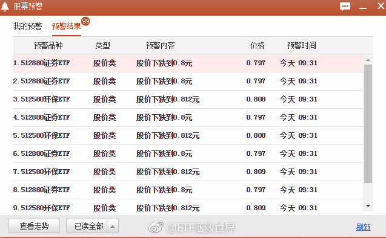

======================================================

ETF拯救世界 (5687069307) @
2018-06-19 10:22:29 Tue  
url: https://weibo.com/5687069307/Gm3yTt4vU

我再说两个最重要的字：

节奏。 ​​​

转发[24]  评论[133]  赞[302] 

======================================================

ETF拯救世界 (5687069307) @
2018-06-19 10:51:39 Tue  
url: https://weibo.com/5687069307/Gm3KJtfJ7

回复@泸州单身俱乐部--剑平:是的。但是这都说的是趋势投资模式，与我们的有不同。不买不卖是说不一把梭的买卖，而不是根据时间空间的再平衡调整。//@泸州单身俱乐部--剑平:E大，记得你说过新高不卖，那对应的是不是新低不买呢？[微笑]

------------------------------------------------------
转推：
>  @ETF拯救世界 (5687069307)
>  2018-06-19 10:22:29 Tue  
>  url: https:/weibo.com/5687069307/Gm3yTt4vU/

>  我再说两个最重要的字：
>  
>  节奏。 ​​​

转发[14]  评论[42]  赞[148] 

======================================================

ETF拯救世界 (5687069307) @
2018-06-19 11:14:14 Tue  
url: https://weibo.com/5687069307/Gm3TU2WAW

中午发车。为国护盘。 ​​​

转发[20]  评论[479]  赞[706] 

======================================================

ETF拯救世界 (5687069307) @
2018-06-19 14:23:21 Tue  
url: https://weibo.com/5687069307/Gm58Fe9cK

没想到这么疯狂，中午是不是买少了 ​​​

转发[2]  评论[229]  赞[289] 

======================================================

ETF拯救世界 (5687069307) @
2018-06-19 14:30:38 Tue  
url: https://weibo.com/5687069307/Gm5bCrs9f

绝大多数朋友终于意识到150份的重要性了。

该发生的总会发生。 ​​​

转发[7]  评论[90]  赞[323] 

======================================================

ETF拯救世界 (5687069307) @
2018-06-19 14:32:28 Tue  
url: https://weibo.com/5687069307/Gm5cn6tGb

我承认，我看错了。我以为是阴跌，结果出现股灾了。我以为他们是王者，谁知道是青铜……//@ETF拯救世界:再说一次，一定要做好长期抗战的心理准备。其他的问题不大，关键是心理准备。希望，意志，最重要。一切尽在掌握。

------------------------------------------------------
转推：
>  @ETF拯救世界 (5687069307)
>  2018-05-03 11:25:05 Thu  
>  url: https:/weibo.com/5687069307/GeUSY6sMB/

>  从现在起，各位做好心理准备，迎接漫漫阴跌吧。没什么大问题，解决心理问题以后逢低布局就可以。
>  
>  最主要是心理问题。所有希望都被磨平后的麻木与绝望是需要警惕的。 ​​​

转发[6]  评论[103]  赞[223] 

======================================================

ETF拯救世界 (5687069307) @
2018-06-19 14:37:02 Tue  
url: https://weibo.com/5687069307/Gm5edsaoN

喷了，这么快！！！！！！！！！//@ETF拯救世界:快了 [并不简单]

------------------------------------------------------
转推：
>  @ETF拯救世界 (5687069307)
>  2018-05-29 16:04:52 Tue  
>  url: https:/weibo.com/5687069307/GiTPrmA6W/

>  立个flag，5000点买满500仓位。 ​​​

转发[10]  评论[197]  赞[204] 

======================================================

ETF拯救世界 (5687069307) @
2018-06-19 14:50:23 Tue  
url: https://weibo.com/5687069307/Gm5jDrp09

回复@天啊我是笨蛋还不行:我怎么觉得他们比我还兴奋……//@天啊我是笨蛋还不行:益达啊。。。你还记得我跟你说的吗？之前跟车的人都很兴奋啊。。。今天终于有点可怕的感觉了//@ETF拯救世界:喷了，这么快！！！！！！！！！//@ETF拯救世界:快了 [并不简单]

------------------------------------------------------
转推：
>  @ETF拯救世界 (5687069307)
>  2018-05-29 16:04:52 Tue  
>  url: https:/weibo.com/5687069307/GiTPrmA6W/

>  立个flag，5000点买满500仓位。 ​​​

转发[1]  评论[112]  赞[176] 

======================================================

ETF拯救世界 (5687069307) @
2018-06-19 14:52:48 Tue  
url: https://weibo.com/5687069307/Gm5kCBMSp

$中证500 sz399905$   跌破5000时，就是我们再次发车日。本月如果再发车，可能需要4-5份以上。看自己情况准备吧。

投资太有意思了不是吗。 ​​​

转发[21]  评论[274]  赞[399] 

======================================================

ETF拯救世界 (5687069307) @
2018-06-19 15:29:32 Tue  
url: https://weibo.com/5687069307/Gm5zwBqSo

2012年底不远了。然后是2005，然后是2008。

我的准备只能做到2008，如果再低，就超出我的理解范围了，我就只能装死了。当然，会留一部分右侧。怎么也不能真死是吧。 ​​​

转发[101]  评论[261]  赞[524] 

+++++++++++++++++++++++++++++++++++++++++++++++++++++

图片：
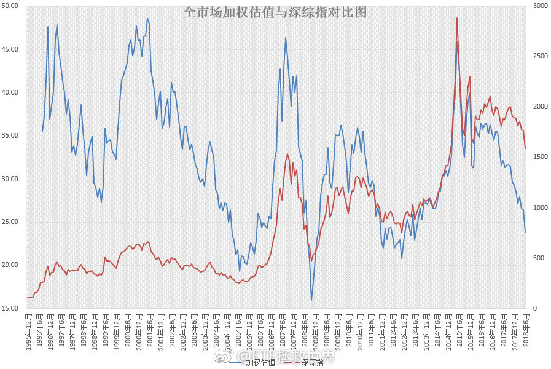

======================================================

ETF拯救世界 (5687069307) @
2018-06-19 17:19:08 Tue  
url: https://weibo.com/5687069307/Gm6i1kcMe

辣鸡美元债敢不敢涨一点……

------------------------------------------------------
转推：
>  @ ()
>  2018-06-19 17:06:30 Tue  
>  url: 

>  该账号因被投诉违反《微博社区公约》的相关规定，现已无法查看。查看帮助 https://kefu.weibo.com/faqdetail?id=13216

转发[4]  评论[23]  赞[109] 

======================================================

ETF拯救世界 (5687069307) @
2018-06-19 17:24:59 Tue  
url: https://weibo.com/5687069307/Gm6ko9Oq5

下定决心更新了一下理财软件的收盘价，看了一眼总资产变化……

糟糕，是心肌梗塞的感觉。 ​​​

转发[48]  评论[198]  赞[303] 

======================================================

ETF拯救世界 (5687069307) @
2018-06-19 18:17:19 Tue  
url: https://weibo.com/5687069307/Gm6FDaLqG

回复@用户y49f7o7jj4:远没到我的预计范围啊。比如500我认知极限是4600点。现在5100。还有10%呢。//@用户y49f7o7jj4:老大，现在情况还在您的预想范围吗？

------------------------------------------------------
转推：
>  @ETF拯救世界 (5687069307)
>  2018-06-19 17:24:59 Tue  
>  url: https:/weibo.com/5687069307/Gm6ko9Oq5/

>  下定决心更新了一下理财软件的收盘价，看了一眼总资产变化……
>  
>  糟糕，是心肌梗塞的感觉。 ​​​

转发[33]  评论[33]  赞[143] 

======================================================

ETF拯救世界 (5687069307) @
2018-06-19 18:24:20 Tue  
url: https://weibo.com/5687069307/Gm6ItAHcf

我跟你说个真实的感受。几年以后的。你的感受。

那时候你回想现在或者未来一段时期，根本想不起来痛苦和难受的感觉了。好像从没有过那样的感觉。

最大的可能，是你后悔为什么当时没有多买一点。

不信你就记着我说的，看看到时候是不是这样想。当然，别因为这几句话就满仓。控制好节奏。问问自己，买 ​​​

转发[70]  评论[225]  赞[403] 

======================================================

ETF拯救世界 (5687069307) @
2018-06-19 18:53:34 Tue  
url: https://weibo.com/5687069307/Gm6UlnOeY

回复@雪夜途经你的盛放:不是。指数随着时间的推移会不断上涨。顶部，底部都会不断抬高。明年此时的极限点就变成4900-5000点了。//@雪夜途经你的盛放:杠一下。之前老大说认知极限是4500呢，今天认知极限涨了100是指数名单调整的结果么？今天一想到这，就忍住了剁手。

------------------------------------------------------
转推：
>  @ETF拯救世界 (5687069307)
>  2018-06-19 17:24:59 Tue  
>  url: https:/weibo.com/5687069307/Gm6ko9Oq5/

>  下定决心更新了一下理财软件的收盘价，看了一眼总资产变化……
>  
>  糟糕，是心肌梗塞的感觉。 ​​​

转发[21]  评论[54]  赞[174] 

======================================================

ETF拯救世界 (5687069307) @
2018-06-19 19:54:31 Tue  
url: https://weibo.com/5687069307/Gm7j5iTeW

回复@歪嘴笑笑笑:今天球球有个加杠杆的大v哭了。我建议普通人还是不要上杠杆。买指数是大概率胜，随便加杠杆是大概率要出事的。//@歪嘴笑笑笑:E大，加杠杆是怎么样的思路，可以谈谈吗！

------------------------------------------------------
转推：
>  @ETF拯救世界 (5687069307)
>  2018-06-19 17:24:59 Tue  
>  url: https:/weibo.com/5687069307/Gm6ko9Oq5/

>  下定决心更新了一下理财软件的收盘价，看了一眼总资产变化……
>  
>  糟糕，是心肌梗塞的感觉。 ​​​

转发[9]  评论[110]  赞[213] 

======================================================

ETF拯救世界 (5687069307) @
2018-06-20 09:47:42 Wed  
url: https://weibo.com/5687069307/GmcLh6KBd

就是那么刺激。GJD敢不敢不要出手？ ​​​

转发[25]  评论[158]  赞[307] 

======================================================

ETF拯救世界 (5687069307) @
2018-06-20 10:59:08 Wed  
url: https://weibo.com/5687069307/GmdegfJ5H

回复@默与婷:其实你可以思考一个问题。或者看看这些人2015年的发帖。在2015年，中证500接近12000点的时候，他们有没有看空。如果没有，在2018年，500即将跌破5000点的时候，看空了。其他的话我不多说。

------------------------------------------------------
转推：
>  @ETF拯救世界 (5687069307)
>  2018-06-20 09:47:42 Wed  
>  url: https:/weibo.com/5687069307/GmcLh6KBd/

>  就是那么刺激。GJD敢不敢不要出手？ ​​​

转发[17]  评论[57]  赞[204] 

======================================================

ETF拯救世界 (5687069307) @
2018-06-20 11:06:47 Wed  
url: https://weibo.com/5687069307/GmdhmBDrk

$全指信息 sh000993$   4年新低了。一直需要配置，一直没有买。现在还是不买，依然贵。继续等。

熊市医药+消费会表现好。

牛市就要看科技、信息。风险偏好不同。如果这一轮信息可以砸到很便宜，下轮牛市大概率的王者之一是它。 ​​​

转发[225]  评论[228]  赞[394] 

======================================================

ETF拯救世界 (5687069307) @
2018-06-20 12:07:16 Wed  
url: https://weibo.com/5687069307/GmdFVCBT7

不过，超长期来看，10-30年的投资维度。

还是医药+消费。这个观点已经持续十年了。低位买入，有能力做超大波段就做超大波段，没能力就死死拿着。最后结果总不会差。买的够低，长期年化15%+不是大问题。

这个大概率不会错。 ​​​

转发[129]  评论[144]  赞[352] 

======================================================

ETF拯救世界 (5687069307) @
2018-06-20 12:23:53 Wed  
url: https://weibo.com/5687069307/GmdMG1ir5

回复@nemours-2号炉:我从没听说过这个人，今天一看居然10w粉丝？然而每个帖子评论居然只有不到10条，大多1、2条。这个有点奇怪了。另外，500PE腰斩？[微笑]//@nemours-2号炉:回复@黄连树:方何之子昨天说500pe得腰斩[允悲]

------------------------------------------------------
转推：
>  @ETF拯救世界 (5687069307)
>  2018-06-20 09:47:42 Wed  
>  url: https:/weibo.com/5687069307/GmcLh6KBd/

>  就是那么刺激。GJD敢不敢不要出手？ ​​​

转发[3]  评论[61]  赞[111] 

======================================================

ETF拯救世界 (5687069307) @
2018-06-20 12:45:11 Wed  
url: https://weibo.com/5687069307/GmdVk3Q7z

我大概跟大家说一下500的估值历史，大家心里也有个数。

目前中证500全收益指数比2008年1月和2010年12月两次顶部区域都高一点，大概高5%。也就是说你如果在这两个月买了，10年，以及8年后，只能赚5%。

为什么呢。因为这两个月，500的PE分别是58倍和45倍。所以你看，千万不要买贵了。

10年过去，指数 ​​​

转发[360]  评论[293]  赞[599] 

======================================================

ETF拯救世界 (5687069307) @
2018-06-20 12:49:01 Wed  
url: https://weibo.com/5687069307/GmdWS4G03

回复@南海恶神的师傅:会配置。但现在我肯定不会买。违反我的原则了。//@南海恶神的师傅:回复@不说的树:不可能的//@ETF拯救世界:回复@nemours-2号炉:我从没听说过这个人，今天一看居然10w粉丝？然而每个帖子评论居然只有不到10条，大多1、2条。这个有点奇怪了。另外，500PE腰斩？[微笑]

------------------------------------------------------
转推：
>  @ETF拯救世界 (5687069307)
>  2018-06-20 09:47:42 Wed  
>  url: https:/weibo.com/5687069307/GmcLh6KBd/

>  就是那么刺激。GJD敢不敢不要出手？ ​​​

转发[0]  评论[8]  赞[113] 

======================================================

ETF拯救世界 (5687069307) @
2018-06-20 12:52:01 Wed  
url: https://weibo.com/5687069307/GmdY5qZrL

回复@lenezzaa:是的，这次不一样。不过我想告诉你的，是美国纳斯达克以及美国中小指比500要贵。是不是美国也没有参考价值？更不要说很多人喜欢的印度了。所有人都说，未来要不一样了。我倒要看看20倍的500能不能赚钱。

------------------------------------------------------
转推：
>  @ETF拯救世界 (5687069307)
>  2018-06-20 12:45:11 Wed  
>  url: https:/weibo.com/5687069307/GmdVk3Q7z/

>  我大概跟大家说一下500的估值历史，大家心里也有个数。
>  
>  目前中证500全收益指数比2008年1月和2010年12月两次顶部区域都高一点，大概高5%。也就是说你如果在这两个月买了，10年，以及8年后，只能赚5%。
>  
>  为什么呢。因为这两个月，500的PE分别是58倍和45倍。所以你看，千万不要买贵了。
>  
>  10年过去，指数 ​​​

转发[24]  评论[32]  赞[161] 

======================================================

ETF拯救世界 (5687069307) @
2018-06-20 13:07:37 Wed  
url: https://weibo.com/5687069307/Gme4qaY9Z

很多人最大的问题，就是会被最近发生的事情迷惑，以为最近发生的就是永恒。

这几年，拜GJD托底所赐，资金抱团大蓝筹，很多人认为中小股票完蛋了没戏了。

我之前说过很多次，中小股票现在确实还是贵。比如创业1000咱们几乎还没买，就是因为贵。但你不能因为它贵就说它未来没戏了。就算美国、香港，这 ​​​

转发[80]  评论[160]  赞[412] 

======================================================

ETF拯救世界 (5687069307) @
2018-06-20 13:18:29 Wed  
url: https://weibo.com/5687069307/Gme8P9fBH

回复@资源分配师:越跌，看空的声音与理由会越多。这个时候，才是看清真相的时候。//@资源分配师:支持益达，我更乐观，已经大笔扫货500了。最近雪球上的确有很多奇怪的言论，归隐林地这种老人居然说TTM PE只有银行和钢铁低于30，其他行业估值high高，还贴了张图出来，真是见了鬼了。

------------------------------------------------------
转推：
>  @ETF拯救世界 (5687069307)
>  2018-06-20 12:45:11 Wed  
>  url: https:/weibo.com/5687069307/GmdVk3Q7z/

>  我大概跟大家说一下500的估值历史，大家心里也有个数。
>  
>  目前中证500全收益指数比2008年1月和2010年12月两次顶部区域都高一点，大概高5%。也就是说你如果在这两个月买了，10年，以及8年后，只能赚5%。
>  
>  为什么呢。因为这两个月，500的PE分别是58倍和45倍。所以你看，千万不要买贵了。
>  
>  10年过去，指数 ​​​

转发[6]  评论[12]  赞[144] 

======================================================

ETF拯救世界 (5687069307) @
2018-06-20 13:20:07 Wed  
url: https://weibo.com/5687069307/Gme9uxGOs

是不是有人看了我微博开始拉了。是不是你，队里的兄弟。太给面子了吓吓侬。

------------------------------------------------------
转推：
>  @ETF拯救世界 (5687069307)
>  2018-06-20 12:45:11 Wed  
>  url: https:/weibo.com/5687069307/GmdVk3Q7z/

>  我大概跟大家说一下500的估值历史，大家心里也有个数。
>  
>  目前中证500全收益指数比2008年1月和2010年12月两次顶部区域都高一点，大概高5%。也就是说你如果在这两个月买了，10年，以及8年后，只能赚5%。
>  
>  为什么呢。因为这两个月，500的PE分别是58倍和45倍。所以你看，千万不要买贵了。
>  
>  10年过去，指数 ​​​

转发[11]  评论[123]  赞[231] 

======================================================

ETF拯救世界 (5687069307) @
2018-06-20 15:01:58 Wed  
url: https://weibo.com/5687069307/GmeOQhrbL

回复@中国动量:券商，如果重仓，就要做好三年不开张开张吃三年的准备。//@中国动量:E大，我觉得目前券商etf很便宜，从2015年高点下来，跌幅70%以上，值得定投买入。请问E大的看法？

------------------------------------------------------
转推：
>  @ETF拯救世界 (5687069307)
>  2018-06-20 11:06:47 Wed  
>  url: https:/weibo.com/5687069307/GmdhmBDrk/

>  $全指信息 sh000993$   4年新低了。一直需要配置，一直没有买。现在还是不买，依然贵。继续等。
>  
>  熊市医药+消费会表现好。
>  
>  牛市就要看科技、信息。风险偏好不同。如果这一轮信息可以砸到很便宜，下轮牛市大概率的王者之一是它。 ​​​

转发[33]  评论[82]  赞[145] 

======================================================

ETF拯救世界 (5687069307) @
2018-06-20 15:06:57 Wed  
url: https://weibo.com/5687069307/GmeQRfegC

回复@titie89:重仓慎重。计划这样只有不到两个点的轻仓还是可以拿。券商这个版块还是挺奇葩的。经常与众不同。//@titie89:e大，之前听到一个说法，因为券商行业后期有一定利空因素，所以券商etf不值得配置。这个您怎么看？

------------------------------------------------------
转推：
>  @ETF拯救世界 (5687069307)
>  2018-06-20 11:06:47 Wed  
>  url: https:/weibo.com/5687069307/GmdhmBDrk/

>  $全指信息 sh000993$   4年新低了。一直需要配置，一直没有买。现在还是不买，依然贵。继续等。
>  
>  熊市医药+消费会表现好。
>  
>  牛市就要看科技、信息。风险偏好不同。如果这一轮信息可以砸到很便宜，下轮牛市大概率的王者之一是它。 ​​​

转发[16]  评论[194]  赞[168] 

======================================================

ETF拯救世界 (5687069307) @
2018-06-21 14:50:58 Thu  
url: https://weibo.com/5687069307/GmoaRzz8b

下了飞机定睛一看

原来是股灾。[并不简单]  ​​​

转发[9]  评论[337]  赞[421] 

======================================================

ETF拯救世界 (5687069307) @
2018-06-21 15:17:36 Thu  
url: https://weibo.com/5687069307/GmolG3Syr

回复@去年十二月十二日:第一次带孩子出远门，还是来最低难度的地方。如果表现好以后再加大难度。//@去年十二月十二日:以为老师去南半球呢，很热吧，介绍一个岛给你，塔斯马尼亚岛，环境不错。

------------------------------------------------------
转推：
>  @ETF拯救世界 (5687069307)
>  2018-06-21 14:50:58 Thu  
>  url: https:/weibo.com/5687069307/GmoaRzz8b/

>  下了飞机定睛一看
>  
>  原来是股灾。[并不简单] http://t.cn/R2WJvL6 ​​​

转发[1]  评论[92]  赞[176] 

======================================================

ETF拯救世界 (5687069307) @
2018-06-21 17:09:26 Thu  
url: https://weibo.com/5687069307/Gmp54oMPq

不过说起来也真的挺邪门的。去年我出去的二十天内就跌出了沪深300的最低点。蓝筹牛市从那天启航。我记得很清楚，那天我在达沃斯。

这次出去十天会不会跌出谁的最低点？ ​​​

转发[94]  评论[136]  赞[341] 

======================================================

ETF拯救世界 (5687069307) @
2018-06-21 17:18:30 Thu  
url: https://weibo.com/5687069307/Gmp8KvPPX

真是比较震惊了，连中证1000都快跌入30倍了。要知道2015是100倍啊。

------------------------------------------------------
转推：
>  @ETF拯救世界 (5687069307)
>  2018-06-21 17:09:26 Thu  
>  url: https:/weibo.com/5687069307/Gmp54oMPq/

>  不过说起来也真的挺邪门的。去年我出去的二十天内就跌出了沪深300的最低点。蓝筹牛市从那天启航。我记得很清楚，那天我在达沃斯。
>  
>  这次出去十天会不会跌出谁的最低点？ ​​​

转发[69]  评论[56]  赞[212] 

======================================================

ETF拯救世界 (5687069307) @
2018-06-21 17:23:39 Thu  
url: https://weibo.com/5687069307/GmpaQvzGy

回复@ETF拯救世界:历史性时刻不远了。还记得我说的6-9个月吗。太NB了。中小股票再暴力几天就够了。//@ETF拯救世界:真是比较震惊了，连中证1000都快跌入30倍了。要知道2015是100倍啊。

------------------------------------------------------
转推：
>  @ETF拯救世界 (5687069307)
>  2018-06-21 17:09:26 Thu  
>  url: https:/weibo.com/5687069307/Gmp54oMPq/

>  不过说起来也真的挺邪门的。去年我出去的二十天内就跌出了沪深300的最低点。蓝筹牛市从那天启航。我记得很清楚，那天我在达沃斯。
>  
>  这次出去十天会不会跌出谁的最低点？ ​​​

转发[16]  评论[117]  赞[265] 

======================================================

ETF拯救世界 (5687069307) @
2018-06-21 19:03:36 Thu  
url: https://weibo.com/5687069307/GmpPprpqf

不要激动，历史最低19。08金融危机。现在还在30以上。//@ETF拯救世界:真是比较震惊了，连中证1000都快跌入30倍了。要知道2015是100倍啊。

------------------------------------------------------
转推：
>  @ETF拯救世界 (5687069307)
>  2018-06-21 17:09:26 Thu  
>  url: https:/weibo.com/5687069307/Gmp54oMPq/

>  不过说起来也真的挺邪门的。去年我出去的二十天内就跌出了沪深300的最低点。蓝筹牛市从那天启航。我记得很清楚，那天我在达沃斯。
>  
>  这次出去十天会不会跌出谁的最低点？ ​​​

转发[39]  评论[73]  赞[174] 

======================================================

ETF拯救世界 (5687069307) @
2018-06-21 19:10:35 Thu  
url: https://weibo.com/5687069307/GmpSfyDF7

回复@CC_轨迹:其实我真的不懂，投资这件事，别人怎么说真的这么重要吗。你自己在干什么，自己的优势是什么，劣势是什么，未来大概率会发生什么，小概率会怎样，最差如何，最好如何。想清楚，为什么要看别人怎么说？99%不断评论别人的人一毛钱都赚不到。

------------------------------------------------------
转推：
>  @ETF拯救世界 (5687069307)
>  2018-06-21 17:09:26 Thu  
>  url: https:/weibo.com/5687069307/Gmp54oMPq/

>  不过说起来也真的挺邪门的。去年我出去的二十天内就跌出了沪深300的最低点。蓝筹牛市从那天启航。我记得很清楚，那天我在达沃斯。
>  
>  这次出去十天会不会跌出谁的最低点？ ​​​

转发[19]  评论[76]  赞[267] 

======================================================

ETF拯救世界 (5687069307) @
2018-06-22 07:28:52 Fri  
url: https://weibo.com/5687069307/GmuHUgLTG

回复@book41:我不会这么业余的。知道很多人为什么说1000历史最低吗，因为他们没有历史数据。 http://t.cn/RrzsnWC //@book41:@ETF拯救世界   08年，中证1000不是还没有吗//@ETF拯救世界:不要激动，历史最低19。08金融危机。现在还在30以上。

------------------------------------------------------
转推：
>  @ETF拯救世界 (5687069307)
>  2018-06-21 17:09:26 Thu  
>  url: https:/weibo.com/5687069307/Gmp54oMPq/

>  不过说起来也真的挺邪门的。去年我出去的二十天内就跌出了沪深300的最低点。蓝筹牛市从那天启航。我记得很清楚，那天我在达沃斯。
>  
>  这次出去十天会不会跌出谁的最低点？ ​​​

转发[10]  评论[194]  赞[301] 

======================================================

ETF拯救世界 (5687069307) @
2018-06-24 12:29:56 Sun  
url: https://weibo.com/5687069307/GmPx71oAV

出太阳就去冲浪游泳，下雨就在房间泳池边上看书，还会有只小鸟来陪你，这才是休假啊。

不过还是不建议住带泳池的小别墅。因为孩子虽然会在里面玩的很高兴，但是当他问:“我们家为什么没有游泳池”的时候，场面一度会相当尴尬。 ​​​

转发[11]  评论[128]  赞[507] 

+++++++++++++++++++++++++++++++++++++++++++++++++++++

图片：
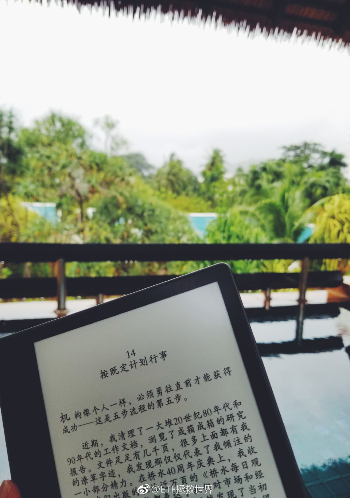
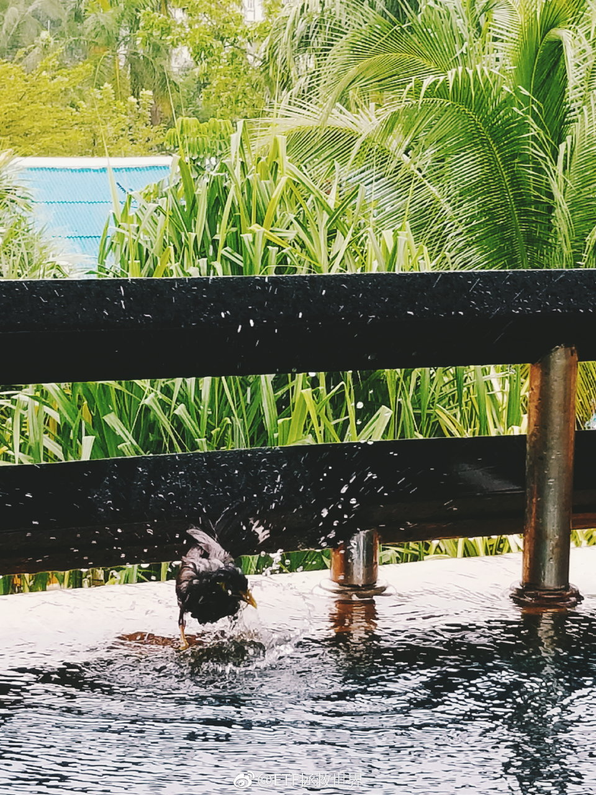

======================================================

ETF拯救世界 (5687069307) @
2018-06-24 13:01:38 Sun  
url: https://weibo.com/5687069307/GmPJZ912j

准备上板了。浪起来。 http://t.cn/Rr5288C ​​​

转发[8]  评论[115]  赞[589] 

======================================================

ETF拯救世界 (5687069307) @
2018-06-24 18:22:10 Sun  
url: https://weibo.com/5687069307/GmRQ5cKcM

生活小贴士:

防水手机也不要下海。[拜拜] ​​​

转发[2]  评论[116]  赞[289] 

======================================================

ETF拯救世界 (5687069307) @
2018-06-24 18:30:09 Sun  
url: https://weibo.com/5687069307/GmRTk86jv

降准了。本来打算下周继续买的金融地产指数还能买到吗。 ​​​

转发[12]  评论[134]  赞[303] 

======================================================

ETF拯救世界 (5687069307) @
2018-06-25 13:52:51 Mon  
url: https://weibo.com/5687069307/GmZvgjT8z

功力不减

------------------------------------------------------
转推：
>  @ETF拯救世界 (5687069307)
>  2018-06-24 18:30:09 Sun  
>  url: https:/weibo.com/5687069307/GmRTk86jv/

>  降准了。本来打算下周继续买的金融地产指数还能买到吗。 ​​​

转发[0]  评论[94]  赞[223] 

======================================================

ETF拯救世界 (5687069307) @
2018-06-25 14:04:40 Mon  
url: https://weibo.com/5687069307/GmZA3AAKs

今天腾讯提示我，有人投诉另一个公众号抄袭我的文章，作为公众号运营人是否确认投诉。

我点进链接一看，厉害了。该公众号把我那篇《凭什么赚钱》的文章居然做成漫画放出来了。这可是一家投资机构，不是个人。

当然确认投诉了。也特别感谢这位投诉的朋友。几年前第二轮计划就是因为有人抄袭我才设定了 ​​​

转发[3]  评论[111]  赞[426] 

======================================================

ETF拯救世界 (5687069307) @
2018-06-25 14:14:10 Mon  
url: https://weibo.com/5687069307/GmZDV0hff

来，学习一下怎么抄的。有这功夫自己写不好吗。

http://t.cn/RrIht7m ​​​

转发[1]  评论[194]  赞[234] 

======================================================

ETF拯救世界 (5687069307) @
2018-06-25 16:54:56 Mon  
url: https://weibo.com/5687069307/Gn0Hb6Rxp

越来越佩服YT。超厉害！

------------------------------------------------------
转推：
>  @蓝鲸财经记者工作平台 (1885454921)
>  2018-06-25 16:46:41 Mon  
>  url: https:/weibo.com/1885454921/Gn0DP5rFe/

>  【鲸快讯】6月25日讯，许家印买下FF，恒大正式入主法拉第未来FF。 ​​​

转发[13]  评论[84]  赞[164] 

======================================================

ETF拯救世界 (5687069307) @
2018-06-26 08:20:22 Tue  
url: https://weibo.com/5687069307/Gn6KO1sEN

回复@chen_扬:是啊，很多人太乐观，也没有弄清楚估值的细节。能保证自己在发生任何情况都不死，是必备技能。可惜，很多人还没有完全领悟//@chen_扬:560了，700点喊抄底质疑600点可能性的人还好吗[doge]

------------------------------------------------------
转推：
>  @ETF拯救世界 (5687069307)
>  2017-12-20 10:18:32 Wed  
>  url: https:/weibo.com/5687069307/FAuDJkEdN/

>  $证券公司 sz399975$   够狠。跌破753就是700见了。然后就是我们的补仓点位，600…… ​​​

转发[12]  评论[80]  赞[178] 

======================================================

ETF拯救世界 (5687069307) @
2018-06-26 09:34:40 Tue  
url: https://weibo.com/5687069307/Gn7eXDevy

节奏，注意节奏 ​​​

转发[2]  评论[140]  赞[273] 

======================================================

ETF拯救世界 (5687069307) @
2018-06-26 09:57:30 Tue  
url: https://weibo.com/5687069307/Gn7oeDko2

本帖发出次日，沪深300见顶。我说的很多话并不好听，但是通常有用，有时候能救命。

------------------------------------------------------
转推：
>  @ETF拯救世界 (5687069307)
>  2018-01-25 11:18:26 Thu  
>  url: https:/weibo.com/5687069307/G00XC3BZQ/

>  不少人会在“价值投资元年”之后，在一些“蓝筹股”上套3-5年 ​​​

转发[33]  评论[66]  赞[258] 

======================================================

ETF拯救世界 (5687069307) @
2018-06-26 10:05:56 Tue  
url: https://weibo.com/5687069307/Gn7rEaVdJ

保守能让你活得更久，但永远保守无法让你资产飞跃。

审时度势，人弃我取，逆人性而为。永远与大多数人的思维模式保持距离。 ​​​

转发[75]  评论[125]  赞[374] 

======================================================

ETF拯救世界 (5687069307) @
2018-06-26 10:22:41 Tue  
url: https://weibo.com/5687069307/Gn7ysd0ve

回复@鱼香基丝:因为怎么跌我们的50 300都不会被套//@鱼香基丝:可您当时也没清仓沪深300和上证50啊，见顶了咋自己不清仓呢？[太开心]//@ETF拯救世界:本帖发出次日，沪深300见顶。我说的很多话并不好听，但是通常有用，有时候能救命。

------------------------------------------------------
转推：
>  @ETF拯救世界 (5687069307)
>  2018-01-25 11:18:26 Thu  
>  url: https:/weibo.com/5687069307/G00XC3BZQ/

>  不少人会在“价值投资元年”之后，在一些“蓝筹股”上套3-5年 ​​​

转发[23]  评论[54]  赞[143] 

======================================================

ETF拯救世界 (5687069307) @
2018-06-26 10:37:49 Tue  
url: https://weibo.com/5687069307/Gn7EAr9KA

回复@走在大航边:球球就是让你知道大多数人在想什么的地方啊//@走在大航边:永远与大多数人的思维模式保持距离，难！有时候不知道大多数人在想什么。

------------------------------------------------------
转推：
>  @ETF拯救世界 (5687069307)
>  2018-06-26 10:05:56 Tue  
>  url: https:/weibo.com/5687069307/Gn7rEaVdJ/

>  保守能让你活得更久，但永远保守无法让你资产飞跃。
>  
>  审时度势，人弃我取，逆人性而为。永远与大多数人的思维模式保持距离。 ​​​

转发[16]  评论[56]  赞[146] 

======================================================

ETF拯救世界 (5687069307) @
2018-06-26 11:02:41 Tue  
url: https://weibo.com/5687069307/Gn7OHcZOG

回复@王大哈hahawang:5000就这么难吗！好气哦，游泳去了[怒]//@王大哈hahawang:e大  我感觉500真的到底了  跌不下去了啊！//@ETF拯救世界:回复@鱼香基丝:因为怎么跌我们的50 300都不会被套//@鱼香基丝:可您当时也没清仓沪深300和上证50啊，见顶了咋自己不清仓呢？[太开心]

------------------------------------------------------
转推：
>  @ETF拯救世界 (5687069307)
>  2018-01-25 11:18:26 Thu  
>  url: https:/weibo.com/5687069307/G00XC3BZQ/

>  不少人会在“价值投资元年”之后，在一些“蓝筹股”上套3-5年 ​​​

转发[3]  评论[61]  赞[131] 

======================================================

ETF拯救世界 (5687069307) @
2018-06-26 11:25:58 Tue  
url: https://weibo.com/5687069307/Gn7Y9b2QF

回复@元气-2017:很多人不明白在我的体系中，买入区域，持有区域和卖出区域的区别。不卖不代表可以买//@元气-2017:这回答牵强了，不会套和把到手的利润白白还回去是一样的么？//@ETF拯救世界:回复@鱼香基丝:因为怎么跌我们的50 300都不会被套

------------------------------------------------------
转推：
>  @ETF拯救世界 (5687069307)
>  2018-01-25 11:18:26 Thu  
>  url: https:/weibo.com/5687069307/G00XC3BZQ/

>  不少人会在“价值投资元年”之后，在一些“蓝筹股”上套3-5年 ​​​

转发[15]  评论[64]  赞[158] 

======================================================

ETF拯救世界 (5687069307) @
2018-06-26 11:34:34 Tue  
url: https://weibo.com/5687069307/Gn81Dd9al

回复@joans2018:算。但我是五月买的，跌了几十个点以后。不是1月25买。而且只买了0.6%。怎么这些都要解释吗//@joans2018:那之前买的全指金融算不算蓝筹范围内呢[汗]//@ETF拯救世界:回复@元气-2017:很多人不明白在我的体系中，买入区域，持有区域和卖出区域的区别。不卖不代表可以买

------------------------------------------------------
转推：
>  @ETF拯救世界 (5687069307)
>  2018-01-25 11:18:26 Thu  
>  url: https:/weibo.com/5687069307/G00XC3BZQ/

>  不少人会在“价值投资元年”之后，在一些“蓝筹股”上套3-5年 ​​​

转发[4]  评论[193]  赞[174] 

======================================================

ETF拯救世界 (5687069307) @
2018-06-26 14:41:00 Tue  
url: https://weibo.com/5687069307/Gn9fjgNho

回复@牛one:刚从游泳池回来。除了我们一家都是欧洲人，我估计大部分都是俄罗斯的。穿着比基尼的姑娘们身材我不多说了。图没拍！自己脑补吧。//@牛one:假期愉快！[并不简单]不要浪费时间搭理这些问题了，上个比坚尼照啊！

------------------------------------------------------
转推：
>  @ETF拯救世界 (5687069307)
>  2018-01-25 11:18:26 Thu  
>  url: https:/weibo.com/5687069307/G00XC3BZQ/

>  不少人会在“价值投资元年”之后，在一些“蓝筹股”上套3-5年 ​​​

转发[0]  评论[143]  赞[185] 

======================================================

ETF拯救世界 (5687069307) @
2018-06-26 16:24:50 Tue  
url: https://weibo.com/5687069307/Gn9Vs1qq6

球球有活动，我得奖了，奖品一个华为手机，然后我送给投我票的朋友了。

为什么微博没有人送我东西？我可以转送给大家啊，急死我了。

要不然这样，下次再有人找我在微博做广告，我接一个。拿到的广告费分给大家，这个办法好不好，你资瓷不资瓷。 ​​​

转发[7]  评论[336]  赞[599] 

======================================================

ETF拯救世界 (5687069307) @
2018-06-26 20:54:43 Tue  
url: https://weibo.com/5687069307/GnbH0fMdC

特别同意大霄老师的建议，出台强力政策稳定市场。这样就可以让本来一年就可以跌完的熊市拖十年，熊十年，这样大家就都安安心心工作不惦记赌博了。什么？你说经济规律？不存在的。

------------------------------------------------------
转推：
>  @ ()
>  2018-06-26 18:48:57 Tue  
>  url: 

>  抱歉，作者已设置仅展示半年内微博，此微博已不可见。 ​​​

转发[8]  评论[68]  赞[227] 

======================================================

ETF拯救世界 (5687069307) @
2018-06-26 21:35:30 Tue  
url: https://weibo.com/5687069307/GnbXxwkl6

麻蛋，算错时间了。丢人了。[doge]

辣鸡surface显示的系统时间居然不是当地时间…… ​​​

转发[0]  评论[86]  赞[157] 

======================================================

ETF拯救世界 (5687069307) @
2018-06-26 21:45:40 Tue  
url: https://weibo.com/5687069307/Gnc1G1Hdw

这次带出来的电子产品，大部分都自动校准当地时间，比较方便。三星还自动在锁屏显示当地与出发地两个时间，很不错。佳明的表会根据gps校对时间。

surface为什么没有联网自动改时间呢。不过总体来说，surface这次出行算是完成任务。基本的文档操作以及娱乐功能没问题，轻，小巧。飞机上可以当平板使用 ​​​

转发[3]  评论[46]  赞[115] 

+++++++++++++++++++++++++++++++++++++++++++++++++++++

图片：
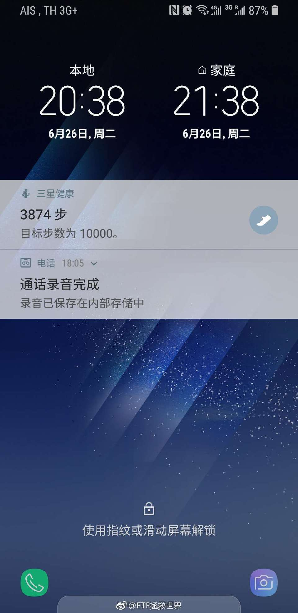

======================================================

ETF拯救世界 (5687069307) @
2018-06-26 22:00:28 Tue  
url: https://weibo.com/5687069307/Gnc7G42py

对虚岁60的老人来说，23点已经是深夜了，你们年轻人了解一下。

所以尽量不要跟长辈一起住，大家生活习惯都不同怎么住！ ​​​

转发[2]  评论[76]  赞[243] 

======================================================

ETF拯救世界 (5687069307) @
2018-06-26 22:33:43 Tue  
url: https://weibo.com/5687069307/Gnclbe5OM

“散户是不是都是追涨杀跌的？”

这个还用别人说吗。看看身边曾经炒股的朋友亲戚同事。问问他们现在是否还买入跌跌不休不到3000点的股票？绝大部分都肯定跟你说炒股赚不了钱，都是骗局，不要炒股。同样一批人，大牛市会重新杀回来接盘。

自己做的就是赔钱的标准动作却怪市场不给力。A股之所以牛短熊 ​​​

转发[105]  评论[249]  赞[279] 

======================================================

ETF拯救世界 (5687069307) @
2018-06-26 23:30:44 Tue  
url: https://weibo.com/5687069307/GncIkrZmw

回复@冯大雄君:你问问自己，有没有通过不道德的，或者违法的手段赚别人的钱？如果没有，有什么可困惑的？你高考的时候多考一分，会有几千几万人被你踩在脚下，可能就考不上理想的学校了，你是不是损人利己？你通过自己的知识智商意志赚钱，有什么困惑。

------------------------------------------------------
转推：
>  @ETF拯救世界 (5687069307)
>  2018-06-26 22:33:43 Tue  
>  url: https:/weibo.com/5687069307/Gnclbe5OM/

>  “散户是不是都是追涨杀跌的？”
>  
>  这个还用别人说吗。看看身边曾经炒股的朋友亲戚同事。问问他们现在是否还买入跌跌不休不到3000点的股票？绝大部分都肯定跟你说炒股赚不了钱，都是骗局，不要炒股。同样一批人，大牛市会重新杀回来接盘。
>  
>  自己做的就是赔钱的标准动作却怪市场不给力。A股之所以牛短熊 ​​​

转发[7]  评论[36]  赞[168] 

======================================================

ETF拯救世界 (5687069307) @
2018-06-27 07:43:35 Wed  
url: https://weibo.com/5687069307/GnfWn8cs8

回复@Alex森岚:底部区域不是靠猜的。这么说吧，全中国最好的几百家公司，一倍多市净率，就是底部区域。系统风险也许会有，但你看看历史，哪次系统风险不是真正的钻石坑？我们需要的是做好准备捡钻石而非吓得抱着现金发抖

------------------------------------------------------
转推：
>  @ETF拯救世界 (5687069307)
>  2018-06-26 22:33:43 Tue  
>  url: https:/weibo.com/5687069307/Gnclbe5OM/

>  “散户是不是都是追涨杀跌的？”
>  
>  这个还用别人说吗。看看身边曾经炒股的朋友亲戚同事。问问他们现在是否还买入跌跌不休不到3000点的股票？绝大部分都肯定跟你说炒股赚不了钱，都是骗局，不要炒股。同样一批人，大牛市会重新杀回来接盘。
>  
>  自己做的就是赔钱的标准动作却怪市场不给力。A股之所以牛短熊 ​​​

转发[41]  评论[66]  赞[200] 

======================================================

ETF拯救世界 (5687069307) @
2018-06-27 07:55:57 Wed  
url: https://weibo.com/5687069307/Gng1oiPUV

什么叫情绪，我告诉你什么叫情绪。

2000 2007 2015，全市场市净率都接近7倍。你愿意用7倍市净率去抢股票，还幻想一万点。

2005 2008 2012，全市场市净率都是一倍多。然而这些时候成交低迷，没有人愿意买股票。

2018，现在又快跌破2倍了。更多的人开始担心经济危机，开始担心过去的经验无用了。

这 ​​​

转发[182]  评论[238]  赞[468] 

======================================================

ETF拯救世界 (5687069307) @
2018-06-27 08:53:29 Wed  
url: https://weibo.com/5687069307/GngoK9gMd

本来是要居民加杠杆给企业和那什么接盘负债，没想到居民加了杠杆把以前的债务接过来以后，企业和那什么的负债更高了。

------------------------------------------------------
转推：
>  @ ()
>  2018-06-27 08:48:03 Wed  
>  url: 

>  抱歉，作者已设置仅展示半年内微博，此微博已不可见。 ​​​

转发[22]  评论[56]  赞[139] 

======================================================

ETF拯救世界 (5687069307) @
2018-06-27 10:44:55 Wed  
url: https://weibo.com/5687069307/Gnh7YEyLe

关键时点，关键政策，催化剂。懂的自然懂，不用多说。//@ETF拯救世界:回复@半生流离醉:sorry，我没质疑。没那个能力。我是把融创当成观察情绪的一面镜子。融创是这几年我见过最有代表性的镜子了。//@半生流离醉:20%不算什么吧。你一直质疑的融创，也没怎么跌啊。熊市跌20%算很不错了吧。

------------------------------------------------------
转推：
>  @ETF拯救世界 (5687069307)
>  2018-03-22 09:34:01 Thu  
>  url: https:/weibo.com/5687069307/G8wd21cxW/

>  腾讯，60倍PE。未来五年看，真的能有特别好的收益率吗。
>  
>  学习了。 ​​​

转发[7]  评论[37]  赞[137] 

======================================================

ETF拯救世界 (5687069307) @
2018-06-27 10:51:28 Wed  
url: https://weibo.com/5687069307/GnhaDgYek

我再送各位一个贴士，关于在球球观察情绪的方法。

就是你注意观察，现在谁最红。

谁最受群众追捧，谁发个帖几百上千回复，打赏的人上百。

那你就要注意，把他捧红的那个股票或者板块就很危险了。

不信你回想一下是不是这样。 ​​​

转发[46]  评论[215]  赞[272] 

======================================================

ETF拯救世界 (5687069307) @
2018-06-27 10:56:36 Wed  
url: https://weibo.com/5687069307/GnhcIoqaj

回复@云雾China:这个我不知道。因为我说”要敬畏市场“，他把我拉黑了。[拜拜]//@云雾China:现在最红的是黄建平吧[吃瓜]

------------------------------------------------------
转推：
>  @ETF拯救世界 (5687069307)
>  2018-06-27 10:51:28 Wed  
>  url: https:/weibo.com/5687069307/GnhaDgYek/

>  我再送各位一个贴士，关于在球球观察情绪的方法。
>  
>  就是你注意观察，现在谁最红。
>  
>  谁最受群众追捧，谁发个帖几百上千回复，打赏的人上百。
>  
>  那你就要注意，把他捧红的那个股票或者板块就很危险了。
>  
>  不信你回想一下是不是这样。 ​​​

转发[3]  评论[109]  赞[145] 

======================================================

ETF拯救世界 (5687069307) @
2018-06-27 11:46:31 Wed  
url: https://weibo.com/5687069307/GnhwYzq5x

大家可以观察一个股票跌破长期高位横盘平台后的表现。作为一个案例。

------------------------------------------------------
转推：
>  @ETF拯救世界 (5687069307)
>  2017-12-04 09:36:18 Mon  
>  url: https:/weibo.com/5687069307/Fy3wE2Hh9/

>  8848获利筹码只剩55%了。这个股票换手虽然低，但是在高位几个月了，基本上接盘的都吃饱了。。。 ​​​

转发[14]  评论[119]  赞[203] 

======================================================

ETF拯救世界 (5687069307) @
2018-06-27 14:31:39 Wed  
url: https://weibo.com/5687069307/GniC0iMk8

利好:我的假期即将结束…… ​​​

转发[14]  评论[298]  赞[569] 

======================================================

ETF拯救世界 (5687069307) @
2018-06-27 15:36:15 Wed  
url: https://weibo.com/5687069307/Gnj2e8ens

你们自己看看，评论里有点熊市的样子吗？严肃点！不成体统。

------------------------------------------------------
转推：
>  @ETF拯救世界 (5687069307)
>  2018-06-27 14:31:39 Wed  
>  url: https:/weibo.com/5687069307/GniC0iMk8/

>  利好:我的假期即将结束…… ​​​

转发[4]  评论[230]  赞[326] 

======================================================

ETF拯救世界 (5687069307) @
2018-06-27 16:58:47 Wed  
url: https://weibo.com/5687069307/GnjzJ9VUz

你们心态好是因为还有很多钱抄底。

现在再回忆一下大v们倡导的满仓穿越牛熊。 ​​​

转发[19]  评论[219]  赞[372] 

======================================================

ETF拯救世界 (5687069307) @
2018-06-27 18:35:33 Wed  
url: https://weibo.com/5687069307/Gnkd0iFyT

熊市不要随便猜底。但是你必须知道，底越来越近了。

看起来是废话？好好体会一下。很重要。 ​​​

转发[66]  评论[180]  赞[389] 

======================================================

ETF拯救世界 (5687069307) @
2018-06-27 21:52:45 Wed  
url: https://weibo.com/5687069307/Gnlv33vFS

回复@谷二两:现在才说是不是晚了。我们每个月一两辆小推车推了三年了。够慢吧。//@谷二两:今天在别处看到一句话，其实熊市的时候，你可以走得慢一点，慢慢你就会发现你想走的路上全都是尸体…

------------------------------------------------------
转推：
>  @ETF拯救世界 (5687069307)
>  2018-06-27 18:35:33 Wed  
>  url: https:/weibo.com/5687069307/Gnkd0iFyT/

>  熊市不要随便猜底。但是你必须知道，底越来越近了。
>  
>  看起来是废话？好好体会一下。很重要。 ​​​

转发[9]  评论[48]  赞[177] 

======================================================

ETF拯救世界 (5687069307) @
2018-06-27 22:09:43 Wed  
url: https://weibo.com/5687069307/GnlBWm4f2

回复@周蝶梦庄:如果到，会写。目前距离那个估值大概十个点左右//@周蝶梦庄:请问E大一个问题啊，现在距离您写2012年11月28日那种文章还有多大空间呢，到了那种时候，您会不会也写一篇那样的文章呢，谢谢E大，望答复！

------------------------------------------------------
转推：
>  @ETF拯救世界 (5687069307)
>  2018-06-27 18:35:33 Wed  
>  url: https:/weibo.com/5687069307/Gnkd0iFyT/

>  熊市不要随便猜底。但是你必须知道，底越来越近了。
>  
>  看起来是废话？好好体会一下。很重要。 ​​​

转发[14]  评论[96]  赞[219] 

======================================================

ETF拯救世界 (5687069307) @
2018-06-28 05:43:54 Thu  
url: https://weibo.com/5687069307/GnoAhnrVG

美股被我A带坏了。

什么时候才能配美股啊。 ​​​

转发[3]  评论[266]  赞[310] 

======================================================

ETF拯救世界 (5687069307) @
2018-06-28 14:01:34 Thu  
url: https://weibo.com/5687069307/GnrQi6PCR

2800就别守了，守2700吧。。 ​​​

转发[46]  评论[332]  赞[369] 

======================================================

ETF拯救世界 (5687069307) @
2018-06-28 15:14:11 Thu  
url: https://weibo.com/5687069307/GnsjM5LPJ

回复@glay_lee:哪有的事儿呢。[doge]//@glay_lee:说，队里是不是有人[doge]

------------------------------------------------------
转推：
>  @ETF拯救世界 (5687069307)
>  2018-06-28 14:01:34 Thu  
>  url: https:/weibo.com/5687069307/GnrQi6PCR/

>  2800就别守了，守2700吧。。 ​​​

转发[2]  评论[31]  赞[120] 

======================================================

ETF拯救世界 (5687069307) @
2018-06-28 15:18:23 Thu  
url: https://weibo.com/5687069307/GnsltfLQ0

回复@艺名孙小山:我是乐观还是悲观，学习好的讲讲。//@艺名孙小山:黄燕铭看到2500。。。为啥机构都很悲观，而雪球上还是比较乐观呢、、、

------------------------------------------------------
转推：
>  @ETF拯救世界 (5687069307)
>  2018-06-28 14:01:34 Thu  
>  url: https:/weibo.com/5687069307/GnrQi6PCR/

>  2800就别守了，守2700吧。。 ​​​

转发[6]  评论[153]  赞[152] 

======================================================

ETF拯救世界 (5687069307) @
2018-06-28 15:28:01 Thu  
url: https://weibo.com/5687069307/GnspnxYPO

不过，说起球球的人乐观。其实我从4年前开始上球球就有这个感觉。

感觉很多人根本没有经历过真正的熊市。包括很多大v。

我当时真的很震惊，尤其是2015年。看着他们的发言，心中就一个疑问：

05、08年和11 12他们是怎么活下来的？

总体来说，球球真的是从上到下乐观洋溢的一个地方。谨慎的人会被喷 ​​​

转发[16]  评论[160]  赞[278] 

======================================================

ETF拯救世界 (5687069307) @
2018-06-28 15:48:32 Thu  
url: https://weibo.com/5687069307/GnsxI4Tcy

今天红利市净率快跌破1倍了。

超赞的。 ​​​

转发[23]  评论[272]  赞[474] 

======================================================

ETF拯救世界 (5687069307) @
2018-06-29 05:15:35 Fri  
url: https://weibo.com/5687069307/GnxPi8tHK

债券的意义。现在懂了吧 ​​​

转发[37]  评论[149]  赞[314] 

+++++++++++++++++++++++++++++++++++++++++++++++++++++

图片：
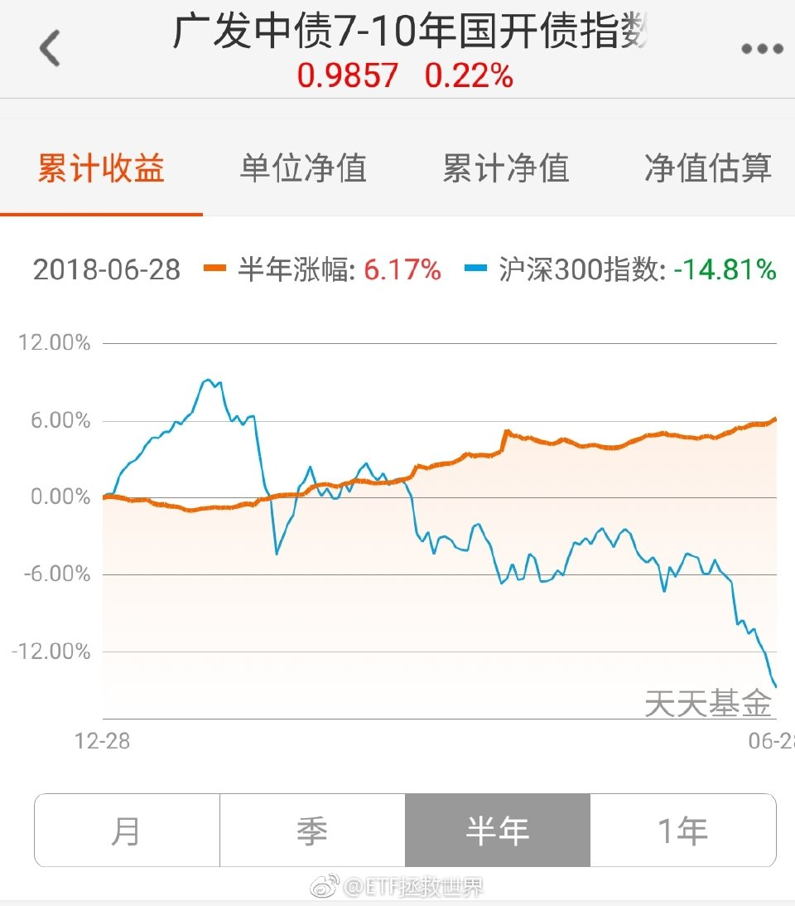

======================================================

ETF拯救世界 (5687069307) @
2018-06-29 06:21:43 Fri  
url: https://weibo.com/5687069307/Gnyg8BcCf

回复@花花世界231:无论你能不能坚持住，不用来我这里报告。否则拉黑。其他人也一样。不好意思。别给我压力，除非你以后赚钱的时候给我分20%。//@花花世界231:目前浮亏2万＋[汗]希望自己能坚持住[太开心][太开心]

------------------------------------------------------
转推：
>  @ETF拯救世界 (5687069307)
>  2018-06-29 05:15:35 Fri  
>  url: https:/weibo.com/5687069307/GnxPi8tHK/

>  债券的意义。现在懂了吧 ​​​

转发[7]  评论[165]  赞[353] 

======================================================

ETF拯救世界 (5687069307) @
2018-06-29 08:05:21 Fri  
url: https://weibo.com/5687069307/GnyWcouQt

计划半年成绩：A股40%多仓位，加上港股超过50%仓位。全是指数基金，这个回撤幅度算是合格。

计划上次年度亏损还是2012年，今年我觉得也不会亏。 ​​​

转发[74]  评论[152]  赞[319] 

+++++++++++++++++++++++++++++++++++++++++++++++++++++

图片：
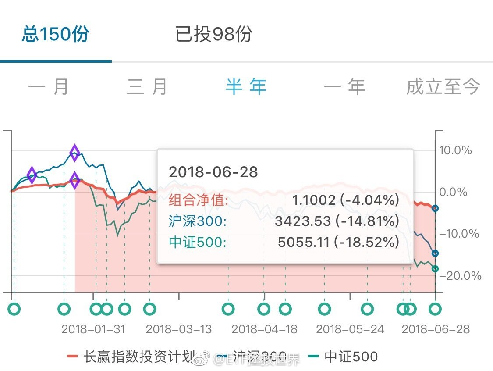

======================================================

ETF拯救世界 (5687069307) @
2018-06-29 08:51:49 Fri  
url: https://weibo.com/5687069307/Gnzf3DA43

如果我没搞错的话，不是一直在走自己的行情吗。是我瞎了？

------------------------------------------------------
转推：
>  @ ()
>  2018-06-29 08:48:09 Fri  
>  url: 

>  抱歉，作者已设置仅展示半年内微博，此微博已不可见。 ​​​

转发[5]  评论[42]  赞[162] 

======================================================

ETF拯救世界 (5687069307) @
2018-06-29 08:54:22 Fri  
url: https://weibo.com/5687069307/Gnzg5oGeb

我的偶像之一。老了……

------------------------------------------------------
转推：
>  @澎湃新闻 (5044281310)
>  2018-06-29 08:10:58 Fri  
>  url: https:/weibo.com/5044281310/GnyYue52x/

>  【汕头大学举行2018毕业礼，李嘉诚“谢幕”致辞】6月29日上午，汕头大学举行2018届毕业典礼。汕头大学校董会名誉主席李嘉诚出席并致辞，他将在毕业礼后辞去其职务，交棒给二儿子李泽楷，现场安排交棒仪式。 http://t.cn/Rrjv9hy . ​​​

转发[28]  评论[56]  赞[124] 

======================================================

ETF拯救世界 (5687069307) @
2018-06-29 09:17:08 Fri  
url: https://weibo.com/5687069307/GnzplhHsI

回复@-昂昂-:历史上从没出现过这几年这种分化如此严重的情况。低的低到10倍，高的还在50多倍。从2000年开始就没出现过。后面怎么走，值得期待。

------------------------------------------------------
转推：
>  @ETF拯救世界 (5687069307)
>  2018-06-29 08:05:21 Fri  
>  url: https:/weibo.com/5687069307/GnyWcouQt/

>  计划半年成绩：A股40%多仓位，加上港股超过50%仓位。全是指数基金，这个回撤幅度算是合格。
>  
>  计划上次年度亏损还是2012年，今年我觉得也不会亏。 ​​​

转发[14]  评论[31]  赞[126] 

======================================================

ETF拯救世界 (5687069307) @
2018-06-29 09:23:11 Fri  
url: https://weibo.com/5687069307/GnzrNuG4k

回复@fight2021:商业上的东西不说了。太多人有所谓的“成功”。我最佩服李老板从年轻时候就信守承诺，说到的一定要做到，即使自己吃亏。到了功成名就，华人首富，依然对其它人平易近人，客客气气，毫无傲气。这些都是从各种新闻、视频、传记中感受到的。非常敬佩。

------------------------------------------------------
转推：
>  @澎湃新闻 (5044281310)
>  2018-06-29 08:10:58 Fri  
>  url: https:/weibo.com/5044281310/GnyYue52x/

>  【汕头大学举行2018毕业礼，李嘉诚“谢幕”致辞】6月29日上午，汕头大学举行2018届毕业典礼。汕头大学校董会名誉主席李嘉诚出席并致辞，他将在毕业礼后辞去其职务，交棒给二儿子李泽楷，现场安排交棒仪式。 http://t.cn/Rrjv9hy . ​​​

转发[16]  评论[28]  赞[156] 

======================================================

ETF拯救世界 (5687069307) @
2018-06-29 09:38:02 Fri  
url: https://weibo.com/5687069307/GnzxOD8cP

其实德国也不贵了，可以继续加了。

但是！513030真的跟的太差了。每年跑输基准几个点，有一年跑输20个点。

只能等再便宜点，多给它点容错空间吧。

QDII真是服了。

跟汇率无关，基准是排除汇率因素的。 ​​​

转发[9]  评论[67]  赞[158] 

======================================================

ETF拯救世界 (5687069307) @
2018-06-29 09:45:09 Fri  
url: https://weibo.com/5687069307/GnzAI5cP7

今天如果反弹，那么昨天的买入舒服不舒服。仓位舒服不舒服。

如果继续跌，仓位舒服不舒服。

问问自己。

我估计大多数人是很舒服的。那你就不会犯错。

不舒服，紧张，慌乱，就很容易出错。 ​​​

转发[11]  评论[136]  赞[194] 

======================================================

ETF拯救世界 (5687069307) @
2018-06-29 09:56:54 Fri  
url: https://weibo.com/5687069307/GnzFtvWe7

夜观天象，算了一卦，99%概率不会跌破2400。[doge]

如果破了，我就删帖。[doge] ​​​

转发[30]  评论[191]  赞[432] 

+++++++++++++++++++++++++++++++++++++++++++++++++++++

图片：
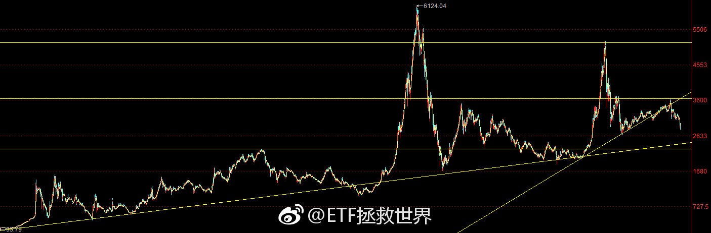

======================================================

ETF拯救世界 (5687069307) @
2018-06-29 10:28:09 Fri  
url: https://weibo.com/5687069307/GnzSa7xVn

传媒今天能不能搞3%？ ​​​

转发[8]  评论[60]  赞[170] 

======================================================

ETF拯救世界 (5687069307) @
2018-06-29 10:51:36 Fri  
url: https://weibo.com/5687069307/GnA1Gvwnd

这么听话实在不好意思了。

------------------------------------------------------
转推：
>  @ETF拯救世界 (5687069307)
>  2018-06-29 10:28:09 Fri  
>  url: https:/weibo.com/5687069307/GnzSa7xVn/

>  传媒今天能不能搞3%？ ​​​

转发[7]  评论[39]  赞[133] 

======================================================

ETF拯救世界 (5687069307) @
2018-06-29 10:56:51 Fri  
url: https://weibo.com/5687069307/GnA3Oistw

再说一次，目前有点浮亏根本不要在意。

只要你相信A股在你有生之年还有牛市，那你的浮亏在牛市来临的1-2周之内会变成盈利。

这个说过很多次，但是只有真的发生了你才明白是怎么回事。

我说的很多东西，随着时间的推移，都一一实现。这个也不会例外。 ​​​

转发[39]  评论[132]  赞[346] 

======================================================

ETF拯救世界 (5687069307) @
2018-06-29 11:33:38 Fri  
url: https://weibo.com/5687069307/GnAiK5a0B

半年浮亏还剩3%了。今年盈利很乐观。

------------------------------------------------------
转推：
>  @ETF拯救世界 (5687069307)
>  2018-06-29 08:05:21 Fri  
>  url: https:/weibo.com/5687069307/GnyWcouQt/

>  计划半年成绩：A股40%多仓位，加上港股超过50%仓位。全是指数基金，这个回撤幅度算是合格。
>  
>  计划上次年度亏损还是2012年，今年我觉得也不会亏。 ​​​

转发[37]  评论[48]  赞[144] 

======================================================

ETF拯救世界 (5687069307) @
2018-06-29 11:43:48 Fri  
url: https://weibo.com/5687069307/GnAmS09fD

回复@牛牛s:一天反弹什么也说明不了。目前中长期趋势没有变化。反弹是下降趋势中经常出现的，跌多了弹一下很正常。什么时候趋势扭转再说吧。//@牛牛s:E大，我伤心了，说好的熊市呢，60车资金已到位，准备大干一票，然后冬眠两年，突然没了[泪][泪][泪][泪]

------------------------------------------------------
转推：
>  @ETF拯救世界 (5687069307)
>  2018-06-29 08:05:21 Fri  
>  url: https:/weibo.com/5687069307/GnyWcouQt/

>  计划半年成绩：A股40%多仓位，加上港股超过50%仓位。全是指数基金，这个回撤幅度算是合格。
>  
>  计划上次年度亏损还是2012年，今年我觉得也不会亏。 ​​​

转发[13]  评论[43]  赞[137] 

======================================================

ETF拯救世界 (5687069307) @
2018-06-29 11:51:52 Fri  
url: https://weibo.com/5687069307/GnAq920PC

回复@godshan:只要是我们买的基金，就不用担心份额太少清盘。为什么我就不说了。自己体会。不信可以注意看看金融地产的半年报数据。//@godshan:回复@VX北城不夏:亲，你这回答没看懂啊，前面说不会，后面又说最近有个因为份额太少清盘了？[允悲]

------------------------------------------------------
转推：
>  @ETF拯救世界 (5687069307)
>  2018-06-29 05:15:35 Fri  
>  url: https:/weibo.com/5687069307/GnxPi8tHK/

>  债券的意义。现在懂了吧 ​​​

转发[4]  评论[63]  赞[126] 

======================================================

ETF拯救世界 (5687069307) @
2018-06-29 12:21:59 Fri  
url: https://weibo.com/5687069307/GnACmAGsn

今天国债继续大涨。

------------------------------------------------------
转推：
>  @ETF拯救世界 (5687069307)
>  2018-06-29 05:15:35 Fri  
>  url: https:/weibo.com/5687069307/GnxPi8tHK/

>  债券的意义。现在懂了吧 ​​​

转发[4]  评论[53]  赞[174] 

======================================================

ETF拯救世界 (5687069307) @
2018-06-29 13:15:26 Fri  
url: https://weibo.com/5687069307/GnAY3nv33

有没有可能4%。//@ETF拯救世界:这么听话实在不好意思了。

------------------------------------------------------
转推：
>  @ETF拯救世界 (5687069307)
>  2018-06-29 10:28:09 Fri  
>  url: https:/weibo.com/5687069307/GnzSa7xVn/

>  传媒今天能不能搞3%？ ​​​

转发[5]  评论[64]  赞[137] 

======================================================

ETF拯救世界 (5687069307) @
2018-06-29 13:48:23 Fri  
url: https://weibo.com/5687069307/GnBbr8fpd

队里的兄弟们悠着点啊。5%肯定到不了了。[doge]//@ETF拯救世界:有没有可能4%。//@ETF拯救世界:这么听话实在不好意思了。

------------------------------------------------------
转推：
>  @ETF拯救世界 (5687069307)
>  2018-06-29 10:28:09 Fri  
>  url: https:/weibo.com/5687069307/GnzSa7xVn/

>  传媒今天能不能搞3%？ ​​​

转发[3]  评论[28]  赞[128] 

======================================================

ETF拯救世界 (5687069307) @
2018-06-29 13:52:29 Fri  
url: https://weibo.com/5687069307/GnBd6Bekq

回复@看我看我252:某一天，我们持有的某些指数，一天就能涨8%以上。爱信不信了。//@看我看我252:太慢了，能不能来个涨停//@ETF拯救世界:队里的兄弟们悠着点啊。5%肯定到不了了。[doge]//@ETF拯救世界:有没有可能4%。//@ETF拯救世界:这么听话实在不好意思了。

------------------------------------------------------
转推：
>  @ETF拯救世界 (5687069307)
>  2018-06-29 10:28:09 Fri  
>  url: https:/weibo.com/5687069307/GnzSa7xVn/

>  传媒今天能不能搞3%？ ​​​

转发[2]  评论[54]  赞[177] 

======================================================

ETF拯救世界 (5687069307) @
2018-06-29 13:57:09 Fri  
url: https://weibo.com/5687069307/GnBeZzZMO

昨天没有申购或者买入的今天就先算了吧。这也太暴力了。或者少买点。 ​​​

转发[21]  评论[174]  赞[236] 

======================================================

ETF拯救世界 (5687069307) @
2018-06-29 14:06:47 Fri  
url: https://weibo.com/5687069307/GnBiUaCx6

回复@看我看我252:昨天真的写的很急。因为必须当天发车。我不瞒大家说，慌乱之中，少发了一车……//@看我看我252:益达，你是不是提前结束假期回来主持大局维稳来了。

------------------------------------------------------
转推：
>  @ETF拯救世界 (5687069307)
>  2018-06-29 13:57:09 Fri  
>  url: https:/weibo.com/5687069307/GnBeZzZMO/

>  昨天没有申购或者买入的今天就先算了吧。这也太暴力了。或者少买点。 ​​​

转发[14]  评论[263]  赞[239] 

======================================================

ETF拯救世界 (5687069307) @
2018-06-29 15:06:35 Fri  
url: https://weibo.com/5687069307/GnBHb6vmb

年底只要收在2900，年度就可以不亏了。如果下半年继续暴力下跌，那么年底收在2800甚至更低就可以不亏。熊市每年不亏，牛市跟上。很难实现的目标，但值得努力。//@ETF拯救世界:半年浮亏还剩3%了。今年盈利很乐观。

------------------------------------------------------
转推：
>  @ETF拯救世界 (5687069307)
>  2018-06-29 08:05:21 Fri  
>  url: https:/weibo.com/5687069307/GnyWcouQt/

>  计划半年成绩：A股40%多仓位，加上港股超过50%仓位。全是指数基金，这个回撤幅度算是合格。
>  
>  计划上次年度亏损还是2012年，今年我觉得也不会亏。 ​​​

转发[20]  评论[85]  赞[299] 

======================================================

ETF拯救世界 (5687069307) @
2018-06-29 16:05:39 Fri  
url: https://weibo.com/5687069307/GnC59rMnW

下半年应该是大部分价值仓位布局完毕的最后日子了。

小部分趋势仓位有可能会多保留几个月。

一个预感，不一定准。 ​​​

转发[37]  评论[263]  赞[496] 

======================================================

ETF拯救世界 (5687069307) @
2018-06-30 12:43:55 Sat  
url: https://weibo.com/5687069307/GnKbLtxtR

私募猛如虎。

买私募真的要擦亮眼睛好好选。 ​​​

转发[7]  评论[123]  赞[299] 

======================================================

ETF拯救世界 (5687069307) @
2018-06-30 15:19:45 Sat  
url: https://weibo.com/5687069307/GnLd1yaAc

君子爱财，取之有道。

送给各位好友。 ​​​

转发[4]  评论[113]  赞[440] 

======================================================

ETF拯救世界 (5687069307) @
2018-06-30 18:31:48 Sat  
url: https://weibo.com/5687069307/GnMsYgGDy

之前用的iPhone彻底凉了，只能把以前的拿出来用。

防水手机不要碰海水，一定要记住…… ​​​

转发[4]  评论[134]  赞[254] 

======================================================

ETF拯救世界 (5687069307) @
2018-06-30 19:09:18 Sat  
url: https://weibo.com/5687069307/GnMIc6sVf

又想写点东西了。 ​​​

转发[2]  评论[235]  赞[613] 

======================================================

ETF拯救世界 (5687069307) @
2018-07-01 22:25:37 Sun  
url: https://weibo.com/5687069307/GnXqnjrVy

每日打卡（191）

痊愈了，正式恢复每日打卡 ​​​

转发[0]  评论[67]  赞[359] 

+++++++++++++++++++++++++++++++++++++++++++++++++++++

图片：

======================================================

ETF拯救世界 (5687069307) @
2018-07-02 09:37:36 Mon  
url: https://weibo.com/5687069307/Go1P8k0ER

喷了，球球周末大战还有人做了个双方对阵图，也是闲的……

观察球球是非常有意思的。球球和微博、公众号都完全不同。我一直说，球球就像个小村庄。微博像个国际大都市。你比如，你在北京生活的感受，一定跟在小镇小村生活不一样。我虽然没在小镇和村里生活过，但我大概也能知道是一个什么状况。

观察 ​​​

转发[12]  评论[79]  赞[266] 

======================================================

ETF拯救世界 (5687069307) @
2018-07-02 09:52:07 Mon  
url: https://weibo.com/5687069307/Go1V1w6gy

估值有没有用？有用。估值可以告诉你大致的范围。顶部底部。不会差太多。

但估值不能告诉你哪里是大底哪里是大顶。价格由很多东西决定，不止估值。

目前的趋势看不出好转的迹象。下降趋势中经常反弹，反弹了也不能说明什么。下跌过程中经常猜底，或者一个反弹就说趋势变了，只能说是naive。

或者说 ​​​

转发[141]  评论[177]  赞[365] 

======================================================

ETF拯救世界 (5687069307) @
2018-07-02 10:08:04 Mon  
url: https://weibo.com/5687069307/Go21urRcg

回复@ETF拯救世界:快40%了。服了。//@ETF拯救世界:超过30%了。

------------------------------------------------------
转推：
>  @ETF拯救世界 (5687069307)
>  2018-01-04 14:12:41 Thu  
>  url: https:/weibo.com/5687069307/FCNAebMp1/

>  没想到浓眉大眼的保险股也跌了20%…… ​​​

转发[23]  评论[41]  赞[136] 

======================================================

ETF拯救世界 (5687069307) @
2018-07-02 10:13:15 Mon  
url: https://weibo.com/5687069307/Go23C2LUP

数学题：如果某股票跌40%，那么回到高点，你会赚：________。第二道数学题，一个股票跌40%你买入，当它从最高点跌70%的时候，你跌40%买入的部分，下跌是百分之_____//@ETF拯救世界:回复@ETF拯救世界:快40%了。服了。//@ETF拯救世界:超过30%了。

------------------------------------------------------
转推：
>  @ETF拯救世界 (5687069307)
>  2018-01-04 14:12:41 Thu  
>  url: https:/weibo.com/5687069307/FCNAebMp1/

>  没想到浓眉大眼的保险股也跌了20%…… ​​​

转发[19]  评论[79]  赞[166] 

======================================================

ETF拯救世界 (5687069307) @
2018-07-02 10:20:47 Mon  
url: https://weibo.com/5687069307/Go26F7w1u

回复@佛系大猫:虽然我没见过真机，但我觉得nex和find x会不会很厚。毕竟一个升降摄像头啊。我对手感要求很高的。目前摸着最舒服的，屏幕看着最舒服的还是我的s8。极品。//@佛系大猫:我始终觉得，现在性价比和外观等综合考虑，nex s是最佳选择，find x太贵，刘海屏又不喜欢

------------------------------------------------------
转推：
>  @ETF拯救世界 (5687069307)
>  2018-06-30 18:31:48 Sat  
>  url: https:/weibo.com/5687069307/GnMsYgGDy/

>  之前用的iPhone彻底凉了，只能把以前的拿出来用。
>  
>  防水手机不要碰海水，一定要记住…… ​​​

转发[0]  评论[59]  赞[108] 

======================================================

ETF拯救世界 (5687069307) @
2018-07-02 11:22:16 Mon  
url: https://weibo.com/5687069307/Go2vCkyjH

趋势真的很重要。做为普通人，你没有能力改变趋势。只能顺势而为。

不要妄图螳臂当车。

悄悄的，慢慢的买点便宜货屯起来。想赚大钱，等趋势改变才有可能。

放平心态，吃喝玩乐才是王道。 ​​​

转发[45]  评论[102]  赞[341] 

======================================================

ETF拯救世界 (5687069307) @
2018-07-02 14:41:58 Mon  
url: https://weibo.com/5687069307/Go3OG0R8g

真❁股灾 ​​​

转发[1]  评论[83]  赞[215] 

======================================================

ETF拯救世界 (5687069307) @
2018-07-02 14:44:02 Mon  
url: https://weibo.com/5687069307/Go3Pw4MuI

好了，周四没有来得及申购的，今天可以动手了。听我的没错的

------------------------------------------------------
转推：
>  @ETF拯救世界 (5687069307)
>  2018-06-29 13:57:09 Fri  
>  url: https:/weibo.com/5687069307/GnBeZzZMO/

>  昨天没有申购或者买入的今天就先算了吧。这也太暴力了。或者少买点。 ​​​

转发[2]  评论[148]  赞[246] 

======================================================

ETF拯救世界 (5687069307) @
2018-07-02 14:57:01 Mon  
url: https://weibo.com/5687069307/Go3UMwtMb

我再说一次，节奏

看看你自己的账户，东西还少吗。急什么。你又不是开印钞厂的。

节奏！

给空间，空间！！

新低后面跟的大概率是什么，你心里没点数吗。[doge] ​​​

转发[61]  评论[204]  赞[338] 

======================================================

ETF拯救世界 (5687069307) @
2018-07-02 15:02:34 Mon  
url: https://weibo.com/5687069307/Go3X2AOvK

回复@狸大猫猫:钱多钱少没有关系。有一亿不知道控制节奏，也都折进去了。有十万控制节奏，依然开开心心捡辣鸡。水平不够，控制的钱越多，毁灭性越大。//@狸大猫猫:钱少的时候就要注意节奏，现在就痛恨自己钱少 [二哈]

------------------------------------------------------
转推：
>  @ETF拯救世界 (5687069307)
>  2018-07-02 14:57:01 Mon  
>  url: https:/weibo.com/5687069307/Go3UMwtMb/

>  我再说一次，节奏
>  
>  看看你自己的账户，东西还少吗。急什么。你又不是开印钞厂的。
>  
>  节奏！
>  
>  给空间，空间！！
>  
>  
>  新低后面跟的大概率是什么，你心里没点数吗。[doge] ​​​

转发[13]  评论[75]  赞[228] 

======================================================

ETF拯救世界 (5687069307) @
2018-07-02 16:22:34 Mon  
url: https://weibo.com/5687069307/Go4tvuXTc

我以为跌多少呢，算完全市场估值发现没减少多少啊。

定睛一看，500还在5100多点呢。

多大点事儿啊。不就是大蓝筹开始杀跌了吗。这不应该在半年前就预料到了吗…… ​​​

转发[13]  评论[91]  赞[294] 

======================================================

ETF拯救世界 (5687069307) @
2018-07-02 16:40:36 Mon  
url: https://weibo.com/5687069307/Go4APmItW

你知道抱团取暖的问题是什么吗。是，谁都别跑。只要有跑的，大家都跑。都跑就没人接。其实我对蓝筹没有成见，但你们不能组团忽悠让别人给你们接盘吧，有点不地道。“价值投资元年”，老乡们，长点心眼吧。人家去年翻番了，吃饱了抹抹嘴要走，谁来买单？

------------------------------------------------------
转推：
>  @ETF拯救世界 (5687069307)
>  2017-11-23 14:32:38 Thu  
>  url: https:/weibo.com/5687069307/FwpLteV4R/

>  这两年来，A股（我是说A股，不是沪深300），基本按照预期在运行。当然，由于有一万多亿那什么在里面，比之前两次多了很多波折。
>  
>  今年这一波几十只一百多只大蓝筹的行情，当然不能说全是GJD的原因。根本原因当然是2016年2月估值够低，当月50、恒生、红利都是历史最低估值区域。
>  
>  但GJD是非常重要的因素 ​​​

转发[79]  评论[40]  赞[214] 

======================================================

ETF拯救世界 (5687069307) @
2018-07-02 16:45:45 Mon  
url: https://weibo.com/5687069307/Go4CVr630

低位买入的问题不是很大，高位接盘的朋友，有些股票，3-5年，做好准备。在A股，不赔钱的第一课就是，不要被忽悠去接那些短期暴涨的盘。任何理由任何漂亮说法都不信。

------------------------------------------------------
转推：
>  @ETF拯救世界 (5687069307)
>  2018-01-25 11:18:26 Thu  
>  url: https:/weibo.com/5687069307/G00XC3BZQ/

>  不少人会在“价值投资元年”之后，在一些“蓝筹股”上套3-5年 ​​​

转发[42]  评论[91]  赞[263] 

======================================================

ETF拯救世界 (5687069307) @
2018-07-02 17:48:52 Mon  
url: https://weibo.com/5687069307/Go52xlHh4

回复@王大哈hahawang:对于问这种问题的朋友，你要注意，我们已经开始买金融指数了。我不敢说不会跌了，但在我眼中，开始有价值了。//@王大哈hahawang:e大 平安还会继续跌吗？现在套10% 要不要割肉止损？

------------------------------------------------------
转推：
>  @ETF拯救世界 (5687069307)
>  2018-01-25 11:18:26 Thu  
>  url: https:/weibo.com/5687069307/G00XC3BZQ/

>  不少人会在“价值投资元年”之后，在一些“蓝筹股”上套3-5年 ​​​

转发[9]  评论[52]  赞[185] 

======================================================

ETF拯救世界 (5687069307) @
2018-07-02 18:40:31 Mon  
url: https://weibo.com/5687069307/Go5nvfNMn

如果CDR停了，卖的几百亿基金怎么办。

好戏不断。 ​​​

转发[11]  评论[114]  赞[249] 

======================================================

ETF拯救世界 (5687069307) @
2018-07-03 06:23:45 Tue  
url: https://weibo.com/5687069307/Go9YWxo1o

回复@袋鼠2006:拉黑。//@袋鼠2006:E大，今年开始在且慢跟车，都亏了8%，好煎熬啊

------------------------------------------------------
转推：
>  @ETF拯救世界 (5687069307)
>  2018-07-02 14:57:01 Mon  
>  url: https:/weibo.com/5687069307/Go3UMwtMb/

>  我再说一次，节奏
>  
>  看看你自己的账户，东西还少吗。急什么。你又不是开印钞厂的。
>  
>  节奏！
>  
>  给空间，空间！！
>  
>  
>  新低后面跟的大概率是什么，你心里没点数吗。[doge] ​​​

转发[10]  评论[135]  赞[274] 

======================================================

ETF拯救世界 (5687069307) @
2018-07-03 07:59:18 Tue  
url: https://weibo.com/5687069307/GoaBJjy5d

回复@王千炎:他是持仓部分八个点。我辛辛苦苦做的配置，下跌过程中对冲的跌幅白做了？我分150份是扯淡呢吗。就像你买个基金，它有个持仓品种跌了8%就崩溃了？不看基金净值？//@王千炎:8个点就煎熬了，怕不是没经历过5178满仓扛到2638吧，人生啊，还是要多经历一些[吃瓜][doge]

------------------------------------------------------
转推：
>  @ETF拯救世界 (5687069307)
>  2018-07-02 14:57:01 Mon  
>  url: https:/weibo.com/5687069307/Go3UMwtMb/

>  我再说一次，节奏
>  
>  看看你自己的账户，东西还少吗。急什么。你又不是开印钞厂的。
>  
>  节奏！
>  
>  给空间，空间！！
>  
>  
>  新低后面跟的大概率是什么，你心里没点数吗。[doge] ​​​

转发[8]  评论[103]  赞[175] 

======================================================

ETF拯救世界 (5687069307) @
2018-07-03 08:54:34 Tue  
url: https://weibo.com/5687069307/GoaYa9vj4

评论里面信息不知道真假，各位自己判断一下。

------------------------------------------------------
转推：
>  @ ()
>  2018-07-02 15:11:08 Mon  
>  url: 

>  抱歉，此微博已被作者删除。查看帮助：http://t.cn/Rfd3rQV

转发[13]  评论[59]  赞[84] 

======================================================

ETF拯救世界 (5687069307) @
2018-07-03 08:59:52 Tue  
url: https://weibo.com/5687069307/Gob0jpl7G

谨慎乐观。

什么意思。

就是保守，但是乐观。

什么意思。

就是，天塌了你也不会死。如果一定要死，撑到最后一批死。因为你很谨慎，保守。防守好，全场不丢球或者只丢一个。

但是很乐观。相信一定会好，自己一定能进球，至少两个。

盲目乐观，盲目悲观都不足取。

为什么。

盲目乐观挂得早。盲目 ​​​

转发[48]  评论[102]  赞[303] 

======================================================

ETF拯救世界 (5687069307) @
2018-07-03 09:33:46 Tue  
url: https://weibo.com/5687069307/Gobe4w3Pn

“客官别走，再来玩玩”。

熊市中的每一次反弹。 ​​​

转发[9]  评论[105]  赞[278] 

======================================================

ETF拯救世界 (5687069307) @
2018-07-03 10:35:31 Tue  
url: https://weibo.com/5687069307/GobD8u8HX

1月，我在球球上说，3万2的恒指在吹一个大泡泡。

被人喷惨了。

另一个v说恒指干到48000，打赏无数。

群众。

现在，28000的恒指，快要回到正常区域了。25000-26000正常中枢。 ​​​

转发[35]  评论[98]  赞[240] 

======================================================

ETF拯救世界 (5687069307) @
2018-07-03 10:40:35 Tue  
url: https://weibo.com/5687069307/GobFbwl9k

回复@大鳄鱼的投资笔记:你想成为V，或者私募想成绩特别好其实不难。就是乐观。特别乐观。赶上牛市就能一战成名。熊市赔了，没事。牛市大家就忘了，你还是NB。至于以后么，很多人就不在意了。钱挣到了。//@大鳄鱼的投资笔记:球球的V多是特别乐观……

------------------------------------------------------
转推：
>  @ETF拯救世界 (5687069307)
>  2018-07-03 10:35:31 Tue  
>  url: https:/weibo.com/5687069307/GobD8u8HX/

>  1月，我在球球上说，3万2的恒指在吹一个大泡泡。
>  
>  被人喷惨了。
>  
>  另一个v说恒指干到48000，打赏无数。
>  
>  
>  群众。
>  
>  
>  现在，28000的恒指，快要回到正常区域了。25000-26000正常中枢。 ​​​

转发[8]  评论[27]  赞[152] 

======================================================

ETF拯救世界 (5687069307) @
2018-07-03 10:59:19 Tue  
url: https://weibo.com/5687069307/GobMNrSXP

今天杀前期强势股。

熊市，就是谁也别嘚瑟。轮着来，不要急，早晚到你。 ​​​

转发[21]  评论[66]  赞[251] 

======================================================

ETF拯救世界 (5687069307) @
2018-07-03 11:04:44 Tue  
url: https://weibo.com/5687069307/GobOZFmVE

回复@南海恶神的师傅:500都没有新低，空间极度不够，怎么发。//@南海恶神的师傅:看来下午发车有望

------------------------------------------------------
转推：
>  @ETF拯救世界 (5687069307)
>  2018-07-03 10:59:19 Tue  
>  url: https:/weibo.com/5687069307/GobMNrSXP/

>  今天杀前期强势股。
>  
>  熊市，就是谁也别嘚瑟。轮着来，不要急，早晚到你。 ​​​

转发[4]  评论[22]  赞[136] 

======================================================

ETF拯救世界 (5687069307) @
2018-07-03 11:07:55 Tue  
url: https://weibo.com/5687069307/GobQhqfSi

不过我必须承认，我没想到会是这样的下跌方式。我以为阴跌是大概率。

但是没事，体系完全可以应对这样的意外。

一个成熟的体系，不仅应该对你能预料到的事情做出应对，也应该对意料不到的有容错性。 ​​​

转发[18]  评论[167]  赞[356] 

======================================================

ETF拯救世界 (5687069307) @
2018-07-03 11:19:06 Tue  
url: https://weibo.com/5687069307/GobUP3veA

2700就别守了，守……嗯？人呢？GJD解散了？

------------------------------------------------------
转推：
>  @ETF拯救世界 (5687069307)
>  2018-06-28 14:01:34 Thu  
>  url: https:/weibo.com/5687069307/GnrQi6PCR/

>  2800就别守了，守2700吧。。 ​​​

转发[14]  评论[207]  赞[236] 

======================================================

ETF拯救世界 (5687069307) @
2018-07-03 11:54:15 Tue  
url: https://weibo.com/5687069307/Goc963V35

回复@Iceberg9804:之前我们买的美元债代表我的看法了。可惜这个辣鸡真的是一个辣鸡。//@Iceberg9804:@ETF拯救世界 您对近期人民币连续贬值，怎么看！//@ETF拯救世界:2700就别守了，守……嗯？人呢？GJD解散了？

------------------------------------------------------
转推：
>  @ETF拯救世界 (5687069307)
>  2018-06-28 14:01:34 Thu  
>  url: https:/weibo.com/5687069307/GnrQi6PCR/

>  2800就别守了，守2700吧。。 ​​​

转发[6]  评论[110]  赞[169] 

======================================================

ETF拯救世界 (5687069307) @
2018-07-03 16:28:53 Tue  
url: https://weibo.com/5687069307/GodWzmpFN

下午出去办事了 ​​​

转发[1]  评论[69]  赞[170] 

======================================================

ETF拯救世界 (5687069307) @
2018-07-03 16:44:00 Tue  
url: https://weibo.com/5687069307/Goe2IgeFw

喷了，11:19。最低点。还说微博没被监控？一次两次，次次都是如此，是我技术好吗！//@ETF拯救世界:2700就别守了，守……嗯？人呢？GJD解散了？

------------------------------------------------------
转推：
>  @ETF拯救世界 (5687069307)
>  2018-06-28 14:01:34 Thu  
>  url: https:/weibo.com/5687069307/GnrQi6PCR/

>  2800就别守了，守2700吧。。 ​​​

转发[2]  评论[74]  赞[219] 

======================================================

ETF拯救世界 (5687069307) @
2018-07-03 16:59:50 Tue  
url: https://weibo.com/5687069307/Goe98A58T

害怕股灾危机的至于害怕吗？你有多少资金在账户里你没点数吗？从大v到小散到各类私募都满仓了，他们不怕股灾你怕什么？

害怕牛市开启的至于害怕吗？你已经有那么多筹码了，还有15%-20%只要确认趋势改变就会买进去，怕什么？足够你吃肉了。

总结：害怕的都是______。 ​​​

转发[44]  评论[212]  赞[310] 

======================================================

ETF拯救世界 (5687069307) @
2018-07-03 17:41:25 Tue  
url: https://weibo.com/5687069307/Goeq0Ckah

回复@花悟菩提:第一，不是“指导“，是公开我自己的计划怎么做。第二，如果只有买没有卖，算什么一轮？有始有终，才是王道。//@花悟菩提:回复@黄连树:小白刚加入不久，想问下同学们，投完了这150份，计划一直指导到这150份卖完吗？

------------------------------------------------------
转推：
>  @ETF拯救世界 (5687069307)
>  2018-07-03 16:59:50 Tue  
>  url: https:/weibo.com/5687069307/Goe98A58T/

>  害怕股灾危机的至于害怕吗？你有多少资金在账户里你没点数吗？从大v到小散到各类私募都满仓了，他们不怕股灾你怕什么？
>  
>  害怕牛市开启的至于害怕吗？你已经有那么多筹码了，还有15%-20%只要确认趋势改变就会买进去，怕什么？足够你吃肉了。
>  
>  总结：害怕的都是______。 ​​​

转发[2]  评论[66]  赞[262] 

======================================================

ETF拯救世界 (5687069307) @
2018-07-03 21:08:59 Tue  
url: https://weibo.com/5687069307/GofMgzDKs

日本球迷会赛后打扫坐席一直就知道，球员也这样真的有点惊讶了。日本有不少值得我们学习的地方。

------------------------------------------------------
转推：
>  @林萍在日本 (1593933550)
>  2018-07-03 10:17:34 Tue  
>  url: https:/weibo.com/1593933550/GobvRhqgJ/

>  一早一条推特火了，负责本届世界杯场地工作的国际足联工作人员看到日本队使用的更衣室以后发了照片写了如下感言：
>  他们在第94分钟输掉了比赛。然后他们在场内感谢了球迷、清理了所有东西（包括替补席和更衣室）、接受了媒体的采访。甚至还用俄语留下了“谢谢”。。。。#世界杯吐槽大会#  #世界杯# ​​​

转发[15]  评论[85]  赞[180] 

======================================================

ETF拯救世界 (5687069307) @
2018-07-03 22:02:07 Tue  
url: https://weibo.com/5687069307/Gog7Pmu3b

每日打卡（192）

坚持 ​​​

转发[0]  评论[34]  赞[214] 

+++++++++++++++++++++++++++++++++++++++++++++++++++++

图片：

======================================================

ETF拯救世界 (5687069307) @
2018-07-04 07:48:57 Wed  
url: https://weibo.com/5687069307/GojY1aY6V

其实，独立思考适用于所有问题，不止是投资。

我们从小接受的是统一思维的教育。应试的时候当然要背标准答案，但是思考就不要了。

好多东西，别人告诉你的，未必是全部真相。有可能是局部真相，有可能就是假的。想要弄清全部真相，至少要学会独立思考。进一步，可以多去看看书，多走走路，多认识一些 ​​​

转发[87]  评论[211]  赞[459] 

======================================================

ETF拯救世界 (5687069307) @
2018-07-04 08:47:02 Wed  
url: https://weibo.com/5687069307/GoklBkPGN

与大多数讽刺挖苦的人不同，我个人认为，从现在开始，十年后，2028年，沪深300&中证500的涨幅一定大于同期的标普500。风水轮流转。

------------------------------------------------------
转推：
>  @财联社APP (2868676035)
>  2018-07-04 08:31:11 Wed  
>  url: https:/weibo.com/2868676035/Gokfa45tv/

>  【证券日报：中国股市做好三件事就能走强】财联社7月4日讯，很多投资者感到不解，为什么中国经济基本面稳定向好，股市却如此“错位”。不少人问：为什么美国股市那么坚挺，中国股市一跌再跌呢？但凡事有利就有弊，华尔街大鳄们集体维护其股市市值，已经接近走到了尽头。美国股市连续上涨9年多了，无论 ​​​

转发[64]  评论[58]  赞[285] 

======================================================

ETF拯救世界 (5687069307) @
2018-07-04 08:53:41 Wed  
url: https://weibo.com/5687069307/GokoiA1Gq

过去十年，A股表现很差吗？中证500已经三年大熊市了。就这样，从2008年低点算起，也涨了249%，但是2015年最高点可是涨了681%。标普500天天新高，十年前最低点到现在也不过是涨了307%。A股一点都不差，只是波动大了点。但是波动大不正是超额利润的来源吗。当然，对高位买入的人来说……

------------------------------------------------------
转推：
>  @财联社APP (2868676035)
>  2018-07-04 08:31:11 Wed  
>  url: https:/weibo.com/2868676035/Gokfa45tv/

>  【证券日报：中国股市做好三件事就能走强】财联社7月4日讯，很多投资者感到不解，为什么中国经济基本面稳定向好，股市却如此“错位”。不少人问：为什么美国股市那么坚挺，中国股市一跌再跌呢？但凡事有利就有弊，华尔街大鳄们集体维护其股市市值，已经接近走到了尽头。美国股市连续上涨9年多了，无论 ​​​

转发[36]  评论[52]  赞[215] 

======================================================

ETF拯救世界 (5687069307) @
2018-07-04 09:04:56 Wed  
url: https://weibo.com/5687069307/GoksSdceN

我们买的所有份数7-10国开债全部盈利。

然后，这个基金净值还没回1。

也就是说，一个产品赚不赚钱，或者说，一个指数，一个市场很多年后你看涨没涨，都不重要。

你依然能赚钱。

你信不信。

2010年我写过，“很多年后上证还在3000点我们也能赚很多。”结果8年后上证连2700都没到，我们依然赚了很多 ​​​

转发[46]  评论[91]  赞[257] 

======================================================

ETF拯救世界 (5687069307) @
2018-07-04 09:10:35 Wed  
url: https://weibo.com/5687069307/Gokv9q72N

回复@ch506:男人重感情。女人不行。//@ch506:回复@用户2253967720:为啥表白的E粉都是男的？[doge][doge][doge]

------------------------------------------------------
转推：
>  @财联社APP (2868676035)
>  2018-07-04 08:31:11 Wed  
>  url: https:/weibo.com/2868676035/Gokfa45tv/

>  【证券日报：中国股市做好三件事就能走强】财联社7月4日讯，很多投资者感到不解，为什么中国经济基本面稳定向好，股市却如此“错位”。不少人问：为什么美国股市那么坚挺，中国股市一跌再跌呢？但凡事有利就有弊，华尔街大鳄们集体维护其股市市值，已经接近走到了尽头。美国股市连续上涨9年多了，无论 ​​​

转发[1]  评论[127]  赞[170] 

======================================================

ETF拯救世界 (5687069307) @
2018-07-04 09:18:14 Wed  
url: https://weibo.com/5687069307/Gokyh3iAk

回复@蕾921:通常来讲十年是一个周期。但是碰上国运兴隆，20年也有可能。关键看在节点上能否出现大幅提高社会劳动生产率的划时代技术。如果没有，十年也就差不多了。//@蕾921:回复@ETF拯救世界: 那下一次如是长牛，是不是要10年后再闭环呢？

------------------------------------------------------
转推：
>  @ETF拯救世界 (5687069307)
>  2018-07-03 16:59:50 Tue  
>  url: https:/weibo.com/5687069307/Goe98A58T/

>  害怕股灾危机的至于害怕吗？你有多少资金在账户里你没点数吗？从大v到小散到各类私募都满仓了，他们不怕股灾你怕什么？
>  
>  害怕牛市开启的至于害怕吗？你已经有那么多筹码了，还有15%-20%只要确认趋势改变就会买进去，怕什么？足够你吃肉了。
>  
>  总结：害怕的都是______。 ​​​

转发[11]  评论[18]  赞[146] 

======================================================

ETF拯救世界 (5687069307) @
2018-07-04 09:22:40 Wed  
url: https://weibo.com/5687069307/GokA49oZJ

回复@D8奇迹:我一直说我们在做的是超级大机构才会做的事情。几年后就都懂了。//@D8奇迹:又一个抄底信号？机构和大户借道ETF增持 大中小盘股全受益  ——同花顺。益达威武霸气

------------------------------------------------------
转推：
>  @ETF拯救世界 (5687069307)
>  2018-07-04 09:04:56 Wed  
>  url: https:/weibo.com/5687069307/GoksSdceN/

>  我们买的所有份数7-10国开债全部盈利。
>  
>  然后，这个基金净值还没回1。
>  
>  也就是说，一个产品赚不赚钱，或者说，一个指数，一个市场很多年后你看涨没涨，都不重要。
>  
>  你依然能赚钱。
>  
>  你信不信。
>  
>  2010年我写过，“很多年后上证还在3000点我们也能赚很多。”结果8年后上证连2700都没到，我们依然赚了很多 ​​​

转发[7]  评论[46]  赞[177] 

======================================================

ETF拯救世界 (5687069307) @
2018-07-04 10:05:35 Wed  
url: https://weibo.com/5687069307/GokRubyTK

稍微反弹一下：见底了见底了快抄底踏空怎么办。

跌一跌：完蛋了危机了崩溃了。

正常点行吗。没那么好，也没那么坏。按照几率配置资源，下注。踏踏实实的。

我怎么看你这一个熊市恨不得要抄300多个大底。 ​​​

转发[39]  评论[112]  赞[269] 

======================================================

ETF拯救世界 (5687069307) @
2018-07-04 10:15:28 Wed  
url: https://weibo.com/5687069307/GokVvgQjb

回复@中原李李:如果是这样，不买股票，你有什么保全财富的应对之策吗。//@中原李李:讲真，贸易战硬打起来可能导致中国经济长期趋势转入大萧条，A股可能50年之内都回不到3000点之上，楼主有应对此风险的预案和措施么

------------------------------------------------------
转推：
>  @ETF拯救世界 (5687069307)
>  2018-07-04 10:05:35 Wed  
>  url: https:/weibo.com/5687069307/GokRubyTK/

>  稍微反弹一下：见底了见底了快抄底踏空怎么办。
>  
>  跌一跌：完蛋了危机了崩溃了。
>  
>  正常点行吗。没那么好，也没那么坏。按照几率配置资源，下注。踏踏实实的。
>  
>  我怎么看你这一个熊市恨不得要抄300多个大底。 ​​​

转发[10]  评论[83]  赞[146] 

======================================================

ETF拯救世界 (5687069307) @
2018-07-04 10:24:12 Wed  
url: https://weibo.com/5687069307/GokZ2vEZ4

前面这位朋友提的问题，不是说不可能。萧条几十年。有没有可能，有。没有什么事情是不可能的。

有几个问题要注意一下。

股市之所以不断的跌，就是因为各种悲观情绪，预期越来越多。记不记得我之前说的决定涨跌三要素？ 估值、资金、情绪。这样的问题，就是情绪。

如果真的出现那样的萧条，你的资产 ​​​

转发[98]  评论[165]  赞[466] 

======================================================

ETF拯救世界 (5687069307) @
2018-07-04 10:32:42 Wed  
url: https://weibo.com/5687069307/Gol2urkK5

另外，我说一点。

我从来没有鼓励过任何人投资股市。包括我的亲朋好友。对于跨大类的资产建议，包括房地产与股市的转换之类的问题也从来不说。

我只是对有意投资股市的朋友有一点自己的建议。比如建议通过科学的方法投资指数基金。因为我觉得这样获胜的概率比自己瞎炒大的多的多。

我也不建议各位鼓 ​​​

转发[51]  评论[162]  赞[440] 

======================================================

ETF拯救世界 (5687069307) @
2018-07-04 11:05:40 Wed  
url: https://weibo.com/5687069307/GolfScWD7

我说几个指数的极限认知吧。极限认知就是跌到这个点位是我能理解的，再跌就不理解了。不排除还会跌，不过我不理解。当然也有可能跌不到。

上证大概是2300-2400。

300大概是2800左右。

500是4600左右。

医药7800-8000左右。

消费7500左右。 ​​​

转发[560]  评论[385]  赞[540] 

======================================================

ETF拯救世界 (5687069307) @
2018-07-04 11:34:05 Wed  
url: https://weibo.com/5687069307/GolrphdJ8

回复@lewvi:创业板指1100-1200吧。我的认知极限。//@lewvi:创业板指呢 e达

------------------------------------------------------
转推：
>  @ETF拯救世界 (5687069307)
>  2018-07-04 11:05:40 Wed  
>  url: https:/weibo.com/5687069307/GolfScWD7/

>  我说几个指数的极限认知吧。极限认知就是跌到这个点位是我能理解的，再跌就不理解了。不排除还会跌，不过我不理解。当然也有可能跌不到。
>  
>  上证大概是2300-2400。
>  
>  300大概是2800左右。
>  
>  500是4600左右。
>  
>  医药7800-8000左右。
>  
>  消费7500左右。 ​​​

转发[92]  评论[116]  赞[173] 

======================================================

ETF拯救世界 (5687069307) @
2018-07-04 13:54:04 Wed  
url: https://weibo.com/5687069307/Gomme8XJu

恒指终于跌的比上次减持的地方低了……低了2%。

正义不会缺席。[允悲]

看看什么时候买回来吧。 ​​​

转发[11]  评论[38]  赞[187] 

======================================================

ETF拯救世界 (5687069307) @
2018-07-04 13:59:54 Wed  
url: https://weibo.com/5687069307/GomoB1IWS

回复@joy1206:本来不想回答，但问的人太多了。我说一下，我自己如果有操作的我会说。如果没有我不会说。至于分级母基到底是怎么回事，真有心的朋友去看看资料，我这里不会做普及知识的工作。//@joy1206:益达，指数分级证券投资基金502010 要份额折算业务了  要先卖出规避吗

------------------------------------------------------
转推：
>  @ETF拯救世界 (5687069307)
>  2018-07-04 13:54:04 Wed  
>  url: https:/weibo.com/5687069307/Gomme8XJu/

>  恒指终于跌的比上次减持的地方低了……低了2%。
>  
>  正义不会缺席。[允悲]
>  
>  看看什么时候买回来吧。 ​​​

转发[3]  评论[16]  赞[127] 

======================================================

ETF拯救世界 (5687069307) @
2018-07-04 14:03:16 Wed  
url: https://weibo.com/5687069307/GompXvBIn

有朋友可能觉得，最后10%你没吃到啊，没有平衡在最高点啊。

那是你事后看。放到当时，一年半的时间涨50%，我减持一点，平衡一部分，也很合理吧。

我始终想不明白，为什么有人说我在一年半赚了50%以上的指数，还是“很便宜”。那我买的时候是什么？

不带这么忽悠人的。

还有人在最高点上5-6倍的杠杆 ​​​

转发[17]  评论[74]  赞[200] 

+++++++++++++++++++++++++++++++++++++++++++++++++++++

图片：
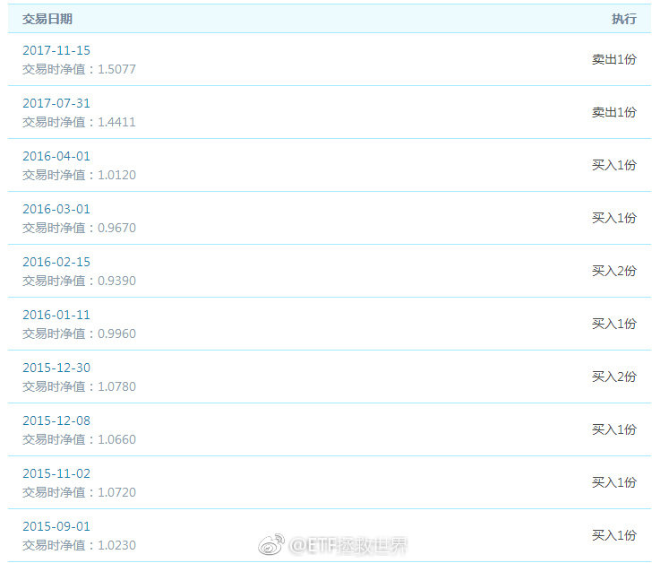

======================================================

ETF拯救世界 (5687069307) @
2018-07-04 14:23:38 Wed  
url: https://weibo.com/5687069307/GomyedCZI

H股这一波完败于恒生。

最惨的是，H股在高点又把恒生那些涨得好的成分股换进成分股了。规则变了。

吃肉的时候没捞到，挨打的时候跑不了。

跟当年深成指一样。 ​​​

转发[55]  评论[41]  赞[221] 

======================================================

ETF拯救世界 (5687069307) @
2018-07-04 14:30:04 Wed  
url: https://weibo.com/5687069307/GomAQnZI6

回复@MyD_XkL:我选恒生主要在于我要让组合多样化，相关性减弱。买H和买50区别不大，只是涨幅大小的区别。恒生的腾讯港交所这样的股票是我组合中需要的。我不是买便宜，而是买配置。//@MyD_XkL:我们可以翻一下益达以前回答的问题，为什么不选h股！佩服益达[亲亲]

------------------------------------------------------
转推：
>  @ETF拯救世界 (5687069307)
>  2018-07-04 14:23:38 Wed  
>  url: https:/weibo.com/5687069307/GomyedCZI/

>  H股这一波完败于恒生。
>  
>  最惨的是，H股在高点又把恒生那些涨得好的成分股换进成分股了。规则变了。
>  
>  吃肉的时候没捞到，挨打的时候跑不了。
>  
>  跟当年深成指一样。 ​​​

转发[34]  评论[37]  赞[161] 

======================================================

ETF拯救世界 (5687069307) @
2018-07-04 14:33:10 Wed  
url: https://weibo.com/5687069307/GomC69uXW

我再说明一下，防止有阅读能力不佳的朋友误会，之前就发生过。我说的“可以理解的极限”，不代表我认为指数会跌到那里。指数到多少点只有上帝知道，谁说能猜到谁就是骗子，或者傻子。我是说，这个点位是我能理解的极限，我做好准备到这里了。到这里我不会意外。ok？

------------------------------------------------------
转推：
>  @ETF拯救世界 (5687069307)
>  2018-07-04 11:05:40 Wed  
>  url: https:/weibo.com/5687069307/GolfScWD7/

>  我说几个指数的极限认知吧。极限认知就是跌到这个点位是我能理解的，再跌就不理解了。不排除还会跌，不过我不理解。当然也有可能跌不到。
>  
>  上证大概是2300-2400。
>  
>  300大概是2800左右。
>  
>  500是4600左右。
>  
>  医药7800-8000左右。
>  
>  消费7500左右。 ​​​

转发[25]  评论[51]  赞[226] 

======================================================

ETF拯救世界 (5687069307) @
2018-07-04 14:38:14 Wed  
url: https://weibo.com/5687069307/GomE9uOYl

今天不办事。 ​​​

转发[11]  评论[131]  赞[219] 

======================================================

ETF拯救世界 (5687069307) @
2018-07-04 15:10:54 Wed  
url: https://weibo.com/5687069307/GomRq7hWe

回复@佛系大猫:不要看我们的债券赚钱了就觉得债基好要买债基。你问问那些2016年在球球听人忽悠买了债基的朋友亏成什么样了。债市波动也很大，目前也很敏感，收益率也不高了。

------------------------------------------------------
转推：
>  @ETF拯救世界 (5687069307)
>  2018-07-04 14:38:14 Wed  
>  url: https:/weibo.com/5687069307/GomE9uOYl/

>  今天不办事。 ​​​

转发[9]  评论[51]  赞[165] 

======================================================

ETF拯救世界 (5687069307) @
2018-07-04 15:42:44 Wed  
url: https://weibo.com/5687069307/Gon4kDfFI

中证500即将回到2012.11。下一步就是2008.10月了。

喷了。 ​​​

转发[44]  评论[149]  赞[334] 

======================================================

ETF拯救世界 (5687069307) @
2018-07-04 16:03:21 Wed  
url: https://weibo.com/5687069307/GoncHvUUd

回复@国民偶像superIQer:中报+三季报我估计会降5%起。也就是说，目前已经低于2012年底以及2005年底了。全收益点位2012.11是2971，目前是5752。//@国民偶像superIQer:e大 马上中报出来估值还得降吧

------------------------------------------------------
转推：
>  @ETF拯救世界 (5687069307)
>  2018-07-04 15:42:44 Wed  
>  url: https:/weibo.com/5687069307/Gon4kDfFI/

>  中证500即将回到2012.11。下一步就是2008.10月了。
>  
>  喷了。 ​​​

转发[21]  评论[62]  赞[183] 

======================================================

ETF拯救世界 (5687069307) @
2018-07-04 17:13:59 Wed  
url: https://weibo.com/5687069307/GonFncRpS

很文明啊，连一句骂都没有。点赞。//@蓝鲸财经记者工作平台:[允悲]

------------------------------------------------------
转推：
>  @Happy张江 (2709577332)
>  2018-07-04 16:02:30 Wed  
>  url: https:/weibo.com/2709577332/GoncmwspW/

>  哇塞！来感受下战斗民族#俄罗斯#北部城市下诺夫哥罗德街头，公交车上的一场窗户拉锯战，参战双方展现出的冷静、耐心与韧性令人惊叹……仿佛看了场你来我往的攻守大战！！！[doge] http://t.cn/RdweJQM ​​​

转发[16]  评论[45]  赞[89] 

======================================================

ETF拯救世界 (5687069307) @
2018-07-04 17:27:20 Wed  
url: https://weibo.com/5687069307/GonKN7jw2

怎么搞的。江浙沪包邮搞得年轻人都不结婚了吗，我看思想问题要抓一抓了。//@挖龙脉的超级鹿鼎公:转发微博

------------------------------------------------------
转推：
>  @杭州微博城事 (1961594843)
>  2018-07-04 16:21:58 Wed  
>  url: https:/weibo.com/1961594843/Gonkg8dX4/

>  【杭州年轻人都不爱结婚了？全国结婚率浙江倒数第二[二哈]】#杭州身边事# 近日，民政部发布2018年第一季度全国结婚人数数据：301.7 万对，同比下降5.7% 。其中上海、浙江、天津等经济发达地区结婚率普遍较低。浙江的结婚率仅高于上海，排全国倒数第二。杭州发布的一组数据显示：2017年男性初婚平均年龄 ​​​

转发[5]  评论[50]  赞[85] 

======================================================

ETF拯救世界 (5687069307) @
2018-07-04 17:34:15 Wed  
url: https://weibo.com/5687069307/GonNBct5f

准备组织一个“江浙沪ETF投资论坛暨优质单身男女互撩爬梯” ​​​

转发[12]  评论[327]  赞[349] 

======================================================

ETF拯救世界 (5687069307) @
2018-07-04 17:40:02 Wed  
url: https://weibo.com/5687069307/GonPWxpVi

回复@梦游鱼生活在路上:搞笑，关注我的哪有劣质的？不存在的。劣质的都关注别人去了。//@梦游鱼生活在路上:劣质的可以报名吗[doge]

------------------------------------------------------
转推：
>  @ETF拯救世界 (5687069307)
>  2018-07-04 17:34:15 Wed  
>  url: https:/weibo.com/5687069307/GonNBct5f/

>  准备组织一个“江浙沪ETF投资论坛暨优质单身男女互撩爬梯” ​​​

转发[1]  评论[115]  赞[316] 

======================================================

ETF拯救世界 (5687069307) @
2018-07-04 23:05:26 Wed  
url: https://weibo.com/5687069307/GopY1z5s2

每日打卡（192）

坚持。选择很难。 ​​​

转发[1]  评论[48]  赞[241] 

+++++++++++++++++++++++++++++++++++++++++++++++++++++

图片：

======================================================

ETF拯救世界 (5687069307) @
2018-07-05 11:06:00 Thu  
url: https://weibo.com/5687069307/GouGvjKLe

开会回来，看盘，

磨磨唧唧人神共愤。 ​​​

转发[1]  评论[134]  赞[279] 

======================================================

ETF拯救世界 (5687069307) @
2018-07-05 11:37:08 Thu  
url: https://weibo.com/5687069307/GouT8DUTZ

手里有现金的在笑。

手里全是现金的是刚割肉的，害怕反弹，慌。

手里没现金的表面镇静，实际有点慌了。会不会发生什么大事？

你在笑还是慌了。 ​​​

转发[28]  评论[293]  赞[315] 

======================================================

ETF拯救世界 (5687069307) @
2018-07-05 11:49:41 Thu  
url: https://weibo.com/5687069307/GouYez0QX

回复@大槐树sz:我不上杠杆就不会慌。那么多买了一辈子都涨不回去股票的人都不慌，我2000多成本的指数基金慌什么。//@大槐树sz:跌到2000以下，你可能也要慌

------------------------------------------------------
转推：
>  @ETF拯救世界 (5687069307)
>  2018-07-05 11:37:08 Thu  
>  url: https:/weibo.com/5687069307/GouT8DUTZ/

>  手里有现金的在笑。
>  
>  手里全是现金的是刚割肉的，害怕反弹，慌。
>  
>  手里没现金的表面镇静，实际有点慌了。会不会发生什么大事？
>  
>  你在笑还是慌了。 ​​​

转发[6]  评论[50]  赞[196] 

======================================================

ETF拯救世界 (5687069307) @
2018-07-05 11:55:37 Thu  
url: https://weibo.com/5687069307/Gov0E3n0r

我有个想法…… ​​​

转发[15]  评论[390]  赞[359] 

======================================================

ETF拯救世界 (5687069307) @
2018-07-05 13:46:35 Thu  
url: https://weibo.com/5687069307/GovJGq5ho

冷静一下！听我解释！

------------------------------------------------------
转推：
>  @ETF拯救世界 (5687069307)
>  2018-05-29 16:04:52 Tue  
>  url: https:/weibo.com/5687069307/GiTPrmA6W/

>  立个flag，5000点买满500仓位。 ​​​

转发[4]  评论[174]  赞[223] 

======================================================

ETF拯救世界 (5687069307) @
2018-07-05 13:48:32 Thu  
url: https://weibo.com/5687069307/GovKtvbgl

这一轮不知道有多少私募要爆仓了。 ​​​

转发[2]  评论[95]  赞[253] 

======================================================

ETF拯救世界 (5687069307) @
2018-07-05 14:02:29 Thu  
url: https://weibo.com/5687069307/GovQ8y4Wk

各位如果跳出自己的账户，自己的情绪。打开k线，无论是各种指数，或者绝大多数股票的k线。

好好看看。

设想一下自己满仓持有的是这些股票，有没有一丝凉意。反正刚才我看了看，感觉有点恐怖了。

活着真好。现金是空气。 ​​​

转发[22]  评论[126]  赞[358] 

======================================================

ETF拯救世界 (5687069307) @
2018-07-05 14:21:26 Thu  
url: https://weibo.com/5687069307/GovXPsB93

注意，目前有些资金是“不得不卖”。也就是说它不会管持有的东西值几个钱，必须卖。

就像你看的电视剧里，穷困潦倒的富二代富三代，拿着祖传的宝贝去当铺当两个大洋买馒头吃。其实那东西很值钱。

这时候，就是你收宝贝的好时机。首先，你得有眼光。第二，你得有钱。

缺一个都不行。

还好，咱们都有 ​​​

转发[46]  评论[116]  赞[303] 

======================================================

ETF拯救世界 (5687069307) @
2018-07-05 14:27:16 Thu  
url: https://weibo.com/5687069307/Gow0chNWu

说个让你们开心的事：

我有股票跌60%了…… ​​​

转发[9]  评论[277]  赞[361] 

======================================================

ETF拯救世界 (5687069307) @
2018-07-05 14:38:38 Thu  
url: https://weibo.com/5687069307/Gow4Ol8MM

好了，破了。这样，说一下。500仓位买满是15%-20%。大概率是15%左右。目前大概是10%。还有5%，也就是大概8-9份。4600-5000之间会加速建仓，全部买完。然后500的仓位就买完了。

------------------------------------------------------
转推：
>  @ETF拯救世界 (5687069307)
>  2018-05-29 16:04:52 Tue  
>  url: https:/weibo.com/5687069307/GiTPrmA6W/

>  立个flag，5000点买满500仓位。 ​​​

转发[68]  评论[221]  赞[377] 

======================================================

ETF拯救世界 (5687069307) @
2018-07-05 14:50:06 Thu  
url: https://weibo.com/5687069307/Gow9t37Z2

$510050   50居然是红的？

好气哦！ ​​​

转发[2]  评论[140]  赞[231] 

======================================================

ETF拯救世界 (5687069307) @
2018-07-05 15:50:51 Thu  
url: https://weibo.com/5687069307/Gowy7FkpA

今天的数据，有1000家公司的估值水平已经是2008年金融危机的次底部水平了。

再跌就是2008年10月。真够悲观的。 ​​​

转发[33]  评论[129]  赞[333] 

======================================================

ETF拯救世界 (5687069307) @
2018-07-05 15:56:13 Thu  
url: https://weibo.com/5687069307/GowAj1iTc

在A股。通常来讲，5年就有一次，十年就有两次特别好的机会。

各位，属于你的第一次大机会不远了。

敌人还会疯狂进攻。

做好准备。等他们进入最佳坑杀区域，咱们一起为负伤的兄弟们复仇。 ​​​

转发[103]  评论[244]  赞[443] 

======================================================

ETF拯救世界 (5687069307) @
2018-07-05 16:18:51 Thu  
url: https://weibo.com/5687069307/GowJulWIB

但是！全市场&小股票的估值，距离2008年最低，还有30%左右的空间。诡异的市场，便宜的到10倍，贵的依然40-50。

------------------------------------------------------
转推：
>  @ETF拯救世界 (5687069307)
>  2018-07-05 15:56:13 Thu  
>  url: https:/weibo.com/5687069307/GowAj1iTc/

>  在A股。通常来讲，5年就有一次，十年就有两次特别好的机会。
>  
>  各位，属于你的第一次大机会不远了。
>  
>  敌人还会疯狂进攻。
>  
>  做好准备。等他们进入最佳坑杀区域，咱们一起为负伤的兄弟们复仇。 ​​​

转发[38]  评论[137]  赞[229] 

======================================================

ETF拯救世界 (5687069307) @
2018-07-05 17:07:34 Thu  
url: https://weibo.com/5687069307/Gox3gn5J1

去忙了会别的，回来一看：

看不过来了。招个秘书帮我看评论吧。 ​​​

转发[2]  评论[159]  赞[281] 

+++++++++++++++++++++++++++++++++++++++++++++++++++++

图片：
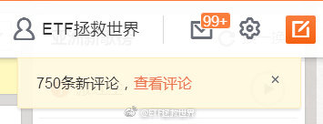

======================================================

ETF拯救世界 (5687069307) @
2018-07-06 09:29:46 Fri  
url: https://weibo.com/5687069307/GoDtWid0a

今天会很精彩。 ​​​

转发[15]  评论[296]  赞[352] 

======================================================

ETF拯救世界 (5687069307) @
2018-07-06 10:33:51 Fri  
url: https://weibo.com/5687069307/GoDTWsbp1

冷静一下，注意节奏。 ​​​

转发[10]  评论[153]  赞[261] 

======================================================

ETF拯救世界 (5687069307) @
2018-07-06 11:05:18 Fri  
url: https://weibo.com/5687069307/GoE6IqSHX

回复@天啊我是笨蛋还不行:肯定不发。又不是开印钞厂的。给空间。//@天啊我是笨蛋还不行:中午不发车？我不信

------------------------------------------------------
转推：
>  @ETF拯救世界 (5687069307)
>  2018-07-06 10:33:51 Fri  
>  url: https:/weibo.com/5687069307/GoDTWsbp1/

>  冷静一下，注意节奏。 ​​​

转发[4]  评论[67]  赞[173] 

======================================================

ETF拯救世界 (5687069307) @
2018-07-06 11:12:06 Fri  
url: https://weibo.com/5687069307/GoE9u5BWL

“结果8年后上证连2700都没到”，你以为是笔误吗。呵呵哒。真的是笔误。

------------------------------------------------------
转推：
>  @ETF拯救世界 (5687069307)
>  2018-07-04 09:04:56 Wed  
>  url: https:/weibo.com/5687069307/GoksSdceN/

>  我们买的所有份数7-10国开债全部盈利。
>  
>  然后，这个基金净值还没回1。
>  
>  也就是说，一个产品赚不赚钱，或者说，一个指数，一个市场很多年后你看涨没涨，都不重要。
>  
>  你依然能赚钱。
>  
>  你信不信。
>  
>  2010年我写过，“很多年后上证还在3000点我们也能赚很多。”结果8年后上证连2700都没到，我们依然赚了很多 ​​​

转发[10]  评论[45]  赞[178] 

======================================================

ETF拯救世界 (5687069307) @
2018-07-06 11:15:22 Fri  
url: https://weibo.com/5687069307/GoEaOdX4d

球球上加杠杆的有没有最新消息。包打听在哪里。 ​​​

转发[7]  评论[119]  赞[190] 

======================================================

ETF拯救世界 (5687069307) @
2018-07-06 11:18:41 Fri  
url: https://weibo.com/5687069307/GoEc8DFiG

回复@O_Zhong_O:2015年唱多的是不是同一批人。确认一下。//@O_Zhong_O:E大，现在很多大V在唱衰，世界在孤立中国//@ETF拯救世界:“结果8年后上证连2700都没到”，你以为是笔误吗。呵呵哒。真的是笔误。

------------------------------------------------------
转推：
>  @ETF拯救世界 (5687069307)
>  2018-07-04 09:04:56 Wed  
>  url: https:/weibo.com/5687069307/GoksSdceN/

>  我们买的所有份数7-10国开债全部盈利。
>  
>  然后，这个基金净值还没回1。
>  
>  也就是说，一个产品赚不赚钱，或者说，一个指数，一个市场很多年后你看涨没涨，都不重要。
>  
>  你依然能赚钱。
>  
>  你信不信。
>  
>  2010年我写过，“很多年后上证还在3000点我们也能赚很多。”结果8年后上证连2700都没到，我们依然赚了很多 ​​​

转发[6]  评论[20]  赞[159] 

======================================================

ETF拯救世界 (5687069307) @
2018-07-06 11:26:20 Fri  
url: https://weibo.com/5687069307/GoEffE0yg

别走开，下午更精彩。

------------------------------------------------------
转推：
>  @ETF拯救世界 (5687069307)
>  2018-07-06 09:29:46 Fri  
>  url: https:/weibo.com/5687069307/GoDtWid0a/

>  今天会很精彩。 ​​​

转发[5]  评论[163]  赞[283] 

======================================================

ETF拯救世界 (5687069307) @
2018-07-06 12:43:49 Fri  
url: https://weibo.com/5687069307/GoEKHAnQF

今天各位可以观察一下大利空实现之前，实现之后，资本市场如何反应。

也可以多观察两天。因为短期走势未必代表市场的意志。 ​​​

转发[24]  评论[131]  赞[317] 

======================================================

ETF拯救世界 (5687069307) @
2018-07-06 13:26:24 Fri  
url: https://weibo.com/5687069307/GoF1Zo472

25个月第一次重买50，是不是最低点。开心。 ​​​

转发[13]  评论[298]  赞[462] 

======================================================

ETF拯救世界 (5687069307) @
2018-07-06 15:53:01 Fri  
url: https://weibo.com/5687069307/GoFZv7ENi

开会回来，无惊无喜。

都散了啊，别围着看了，说你呢。别看别人就是你！ ​​​

转发[2]  评论[116]  赞[230] 

======================================================

ETF拯救世界 (5687069307) @
2018-07-06 16:14:20 Fri  
url: https://weibo.com/5687069307/GoG89vj3f

我想到一件事。

比如说你和一人，他比你能打。然后啪，给你一嘴巴。

说，你不许还手，你要敢还手我再打你十个大嘴巴。

然后你看了看围观群众，发现没人帮你。拿出来手机要摇银儿发现也没什么朋友。

你会怎么做。打的话，你肯定打不过那种。弄不好会被打残。

不顾一切还手还是打110报警。 ​​​

转发[36]  评论[524]  赞[306] 

======================================================

ETF拯救世界 (5687069307) @
2018-07-06 19:45:32 Fri  
url: https://weibo.com/5687069307/GoHvSsNEF

朋友们，最近我又有一条人生经验：

周末文章说…… ​​​

转发[0]  评论[304]  赞[473] 

======================================================

ETF拯救世界 (5687069307) @
2018-07-06 23:15:39 Fri  
url: https://weibo.com/5687069307/GoITai7PI

什么东西啊，美国人一点都不在乎啊，还涨啊。

能不能认真点打贸易战啊，好气哦。

$标普指数 .INX$ ​​​

转发[15]  评论[437]  赞[330] 

======================================================

ETF拯救世界 (5687069307) @
2018-07-07 13:14:33 Sat  
url: https://weibo.com/5687069307/GoOnFpc7G

大周末的，让好多朋友操心了，不好意思。

算是正式离开球球了。其实不是只因为这件事。算是最后一根稻草。

主要我感觉在那边我变成了一个特别二的人。总是跟各种各样的人掰扯，浪费时间，心情变糟，根本无暇输出有用的东西，对不起关注我的十几万人。

彻底离开。就是特别遗憾，我的AEB组合达到预期 ​​​

转发[40]  评论[569]  赞[828] 

======================================================

ETF拯救世界 (5687069307) @
2018-07-07 13:40:08 Sat  
url: https://weibo.com/5687069307/GoOy3DjSJ

但是今天特别让我感动的，是近千评论里绝大多数都是念我好的。好些没什么交集的大V也发帖支持。能这样也算没白混几年。更让我增加很多沿着这条路坚定走下去的信心。

------------------------------------------------------
转推：
>  @ETF拯救世界 (5687069307)
>  2018-07-07 13:14:33 Sat  
>  url: https:/weibo.com/5687069307/GoOnFpc7G/

>  大周末的，让好多朋友操心了，不好意思。
>  
>  算是正式离开球球了。其实不是只因为这件事。算是最后一根稻草。
>  
>  主要我感觉在那边我变成了一个特别二的人。总是跟各种各样的人掰扯，浪费时间，心情变糟，根本无暇输出有用的东西，对不起关注我的十几万人。
>  
>  彻底离开。就是特别遗憾，我的AEB组合达到预期 ​​​

转发[5]  评论[102]  赞[434] 

======================================================

ETF拯救世界 (5687069307) @
2018-07-07 13:41:15 Sat  
url: https://weibo.com/5687069307/GoOywjDHf

回复@ETF拯救世界:然后，球球把我那篇帖子的转发屏蔽了……//@ETF拯救世界:但是今天特别让我感动的，是近千评论里绝大多数都是念我好的。好些没什么交集的大V也发帖支持。能这样也算没白混几年。更让我增加很多沿着这条路坚定走下去的信心。

------------------------------------------------------
转推：
>  @ETF拯救世界 (5687069307)
>  2018-07-07 13:14:33 Sat  
>  url: https:/weibo.com/5687069307/GoOnFpc7G/

>  大周末的，让好多朋友操心了，不好意思。
>  
>  算是正式离开球球了。其实不是只因为这件事。算是最后一根稻草。
>  
>  主要我感觉在那边我变成了一个特别二的人。总是跟各种各样的人掰扯，浪费时间，心情变糟，根本无暇输出有用的东西，对不起关注我的十几万人。
>  
>  彻底离开。就是特别遗憾，我的AEB组合达到预期 ​​​

转发[9]  评论[92]  赞[194] 

======================================================

ETF拯救世界 (5687069307) @
2018-07-07 13:53:01 Sat  
url: https://weibo.com/5687069307/GoODiltkB

回复@随雨的风筝:时间线上看不到。比如你关注梁宏，但是你刷你的主页是看不到他的转发的。但是在他的主页里可以看到//@随雨的风筝:没屏蔽，刚转发了，可以的。//@ETF拯救世界:回复@ETF拯救世界:然后，球球把我那篇帖子的转发屏蔽了……

------------------------------------------------------
转推：
>  @ETF拯救世界 (5687069307)
>  2018-07-07 13:14:33 Sat  
>  url: https:/weibo.com/5687069307/GoOnFpc7G/

>  大周末的，让好多朋友操心了，不好意思。
>  
>  算是正式离开球球了。其实不是只因为这件事。算是最后一根稻草。
>  
>  主要我感觉在那边我变成了一个特别二的人。总是跟各种各样的人掰扯，浪费时间，心情变糟，根本无暇输出有用的东西，对不起关注我的十几万人。
>  
>  彻底离开。就是特别遗憾，我的AEB组合达到预期 ​​​

转发[0]  评论[32]  赞[145] 

======================================================

ETF拯救世界 (5687069307) @
2018-07-07 13:58:43 Sat  
url: https://weibo.com/5687069307/GoOFBnWD5

回复@风听树吟4931:丹书和黑暗时代可以，是在他们之后屏蔽的。雪球这样说。雪球的人跟我说是不希望事情扩大。//@风听树吟4931:回复@ETF拯救世界:我关注的丹书，黑暗时代都看的到//@ETF拯救世界:回复@ETF拯救世界:然后，球球把我那篇帖子的转发屏蔽了……

------------------------------------------------------
转推：
>  @ETF拯救世界 (5687069307)
>  2018-07-07 13:14:33 Sat  
>  url: https:/weibo.com/5687069307/GoOnFpc7G/

>  大周末的，让好多朋友操心了，不好意思。
>  
>  算是正式离开球球了。其实不是只因为这件事。算是最后一根稻草。
>  
>  主要我感觉在那边我变成了一个特别二的人。总是跟各种各样的人掰扯，浪费时间，心情变糟，根本无暇输出有用的东西，对不起关注我的十几万人。
>  
>  彻底离开。就是特别遗憾，我的AEB组合达到预期 ​​​

转发[3]  评论[82]  赞[171] 

======================================================

ETF拯救世界 (5687069307) @
2018-07-07 14:09:59 Sat  
url: https://weibo.com/5687069307/GoOKb3E9Q

回复@喜欢ETF:千万不要。不要有理变成没理。一切走合法途径//@喜欢ETF:回复@细雨龙腾:那人电话多少，我们打电话骚扰

------------------------------------------------------
转推：
>  @ETF拯救世界 (5687069307)
>  2018-07-06 23:15:39 Fri  
>  url: https:/weibo.com/5687069307/GoITai7PI/

>  什么东西啊，美国人一点都不在乎啊，还涨啊。
>  
>  能不能认真点打贸易战啊，好气哦。
>  
>  $标普指数 .INX$ ​​​

转发[7]  评论[97]  赞[204] 

======================================================

ETF拯救世界 (5687069307) @
2018-07-07 14:52:32 Sat  
url: https://weibo.com/5687069307/GoP1sepiX

回复@菠萝油园丁大白:不可能的，那都是我的心血思考和记录。都特别珍贵，绝对不删。//@菠萝油园丁大白:恳求益达别像唐朝那样删光帖子，留个回忆给我们[悲伤]//@ETF拯救世界:回复@喜欢ETF:千万不要。不要有理变成没理。一切走合法途径//@喜欢ETF:回复@细雨龙腾:那人电话多少，我们打电话骚扰

------------------------------------------------------
转推：
>  @ETF拯救世界 (5687069307)
>  2018-07-06 23:15:39 Fri  
>  url: https:/weibo.com/5687069307/GoITai7PI/

>  什么东西啊，美国人一点都不在乎啊，还涨啊。
>  
>  能不能认真点打贸易战啊，好气哦。
>  
>  $标普指数 .INX$ ​​​

转发[6]  评论[258]  赞[359] 

======================================================

ETF拯救世界 (5687069307) @
2018-07-08 17:58:18 Sun  
url: https://weibo.com/5687069307/GoZFlpyGB

公众号，十分钟后发布文章。

不看不是中国人。[并不简单] ​​​

转发[11]  评论[596]  赞[1003] 

======================================================

ETF拯救世界 (5687069307) @
2018-07-08 18:58:31 Sun  
url: https://weibo.com/5687069307/Gp03N3gUm

我希望这事在我公开发布的东西中就结束在这一刻了。

后续的事情我会继续做，但不要整天这样干扰大家的生活了。这是我自己的事，我来处理。

我还会跟大家继续谈投资，谈生活。

周末过去了，新的一周开始了，让辣鸡事情留在这一秒。 ​​​

转发[5]  评论[341]  赞[798] 

======================================================

ETF拯救世界 (5687069307) @
2018-07-08 20:06:42 Sun  
url: https://weibo.com/5687069307/Gp0vt0ysE

其实自己做的有些事回想起来自己会觉得很有意思。。

一般很多券商都会联系有影响力的人推荐开户什么的。每天很多人联系我，我没有答应过。

几年前，有一个我特别喜欢的朋友也有这个任务了，我就帮了他。但也没在公开的地方推荐，只是在一个很小范围内给一些朋友做了推荐。

因为给的条件很优惠（两融 ​​​

转发[6]  评论[312]  赞[511] 

======================================================

ETF拯救世界 (5687069307) @
2018-07-08 21:16:21 Sun  
url: https://weibo.com/5687069307/Gp0XJtlcj

公众号后台留言已经有安定医院的大夫要帮我治疗了。

哪能港，朋友们，我的症状已经表现的这么严重了吗！

开个玩笑，谢谢这位医生…… ​​​

转发[3]  评论[152]  赞[356] 

======================================================

ETF拯救世界 (5687069307) @
2018-07-08 22:34:57 Sun  
url: https://weibo.com/5687069307/Gp1tDz9fJ

不行了，今天真看不完了。还剩1000条没看。

明天继续看吧……老年人要早点睡觉去了…… ​​​

转发[7]  评论[176]  赞[435] 

+++++++++++++++++++++++++++++++++++++++++++++++++++++

图片：
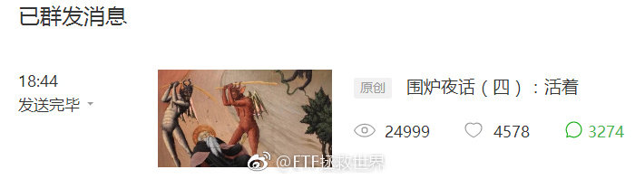

======================================================

ETF拯救世界 (5687069307) @
2018-07-09 09:06:25 Mon  
url: https://weibo.com/5687069307/Gp5BX75wG

据说今天要大涨？

真的假的。

两办怎么没通知我。 ​​​

转发[3]  评论[175]  赞[323] 

======================================================

ETF拯救世界 (5687069307) @
2018-07-09 09:40:41 Mon  
url: https://weibo.com/5687069307/Gp5PRmqnj

喷了，真的假的，第三轮计划50买入全纪录。 ​​​

转发[11]  评论[136]  赞[384] 

+++++++++++++++++++++++++++++++++++++++++++++++++++++

图片：
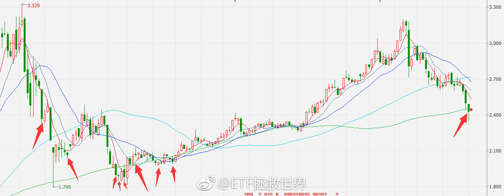

======================================================

ETF拯救世界 (5687069307) @
2018-07-09 10:13:45 Mon  
url: https://weibo.com/5687069307/Gp63hrFdR

上证反弹200点是正常反弹范围。如果超了，就要考虑反转可能性。

你问我为什么这么说。

当然是瞎蒙的。 ​​​

转发[14]  评论[141]  赞[399] 

======================================================

ETF拯救世界 (5687069307) @
2018-07-09 10:20:58 Mon  
url: https://weibo.com/5687069307/Gp66deMK2

本来周末文章是想讨论一下未来一段时间走势的问题。结果被这破事儿占了两天。

好气哦。

这周末再说吧。 ​​​

转发[5]  评论[179]  赞[430] 

======================================================

ETF拯救世界 (5687069307) @
2018-07-09 11:56:16 Mon  
url: https://weibo.com/5687069307/Gp6IU0Nr6

这次反弹到多少计划会创新高？我初步估计3000-3200？

这就是投资的乐趣。你不用管股市涨不涨，只要有波动，你就能让自己的成本越来越低，筹码越来越多，最后赚的也越来越多。

想要赔钱也很简单，反着做就可以：高位越买越多，低位开始卖。

你以为我们低位买的是谁的筹码？ ​​​

转发[85]  评论[130]  赞[305] 

======================================================

ETF拯救世界 (5687069307) @
2018-07-09 12:09:37 Mon  
url: https://weibo.com/5687069307/Gp6OjlV3z

回复@微鲸发展:我不信A股会一直在2000多点。这是不可能的。十年后，2028年，300、500如果没有五倍以上涨幅我会比较惊讶。//@微鲸发展:就怕这个筹码终究不值钱

------------------------------------------------------
转推：
>  @ETF拯救世界 (5687069307)
>  2018-07-09 11:56:16 Mon  
>  url: https:/weibo.com/5687069307/Gp6IU0Nr6/

>  这次反弹到多少计划会创新高？我初步估计3000-3200？
>  
>  这就是投资的乐趣。你不用管股市涨不涨，只要有波动，你就能让自己的成本越来越低，筹码越来越多，最后赚的也越来越多。
>  
>  想要赔钱也很简单，反着做就可以：高位越买越多，低位开始卖。
>  
>  你以为我们低位买的是谁的筹码？ ​​​

转发[43]  评论[39]  赞[180] 

======================================================

ETF拯救世界 (5687069307) @
2018-07-09 12:18:56 Mon  
url: https://weibo.com/5687069307/Gp6S6iYjN

回复@安小之18:未来怎么走谁也不能确定。大趋势的判断需要底部走出样子来才能看出。不要肯定的认为这是反弹或者反转。设计好应对各种可能的策略到时候执行就可以。//@安小之18:亲们，是不是说到3000多点还会下跌回来？

------------------------------------------------------
转推：
>  @ETF拯救世界 (5687069307)
>  2018-07-09 11:56:16 Mon  
>  url: https:/weibo.com/5687069307/Gp6IU0Nr6/

>  这次反弹到多少计划会创新高？我初步估计3000-3200？
>  
>  这就是投资的乐趣。你不用管股市涨不涨，只要有波动，你就能让自己的成本越来越低，筹码越来越多，最后赚的也越来越多。
>  
>  想要赔钱也很简单，反着做就可以：高位越买越多，低位开始卖。
>  
>  你以为我们低位买的是谁的筹码？ ​​​

转发[9]  评论[32]  赞[168] 

======================================================

ETF拯救世界 (5687069307) @
2018-07-09 12:58:12 Mon  
url: https://weibo.com/5687069307/Gp7826Xv6

回复@王者华山:2008年，中证500最低1488，目前涨幅241%。期间最高涨到11616，涨幅680%。目前500估值与2008年次低点估值几乎一致。可自行判断未来十年A股会否有可能出现哪怕一次大牛市。//@王者华山:2008年时，有没有人说这些话？

------------------------------------------------------
转推：
>  @ETF拯救世界 (5687069307)
>  2018-07-09 11:56:16 Mon  
>  url: https:/weibo.com/5687069307/Gp6IU0Nr6/

>  这次反弹到多少计划会创新高？我初步估计3000-3200？
>  
>  这就是投资的乐趣。你不用管股市涨不涨，只要有波动，你就能让自己的成本越来越低，筹码越来越多，最后赚的也越来越多。
>  
>  想要赔钱也很简单，反着做就可以：高位越买越多，低位开始卖。
>  
>  你以为我们低位买的是谁的筹码？ ​​​

转发[25]  评论[54]  赞[198] 

======================================================

ETF拯救世界 (5687069307) @
2018-07-09 13:04:34 Mon  
url: https://weibo.com/5687069307/Gp7aCiKmm

再跟大家分享一下牛熊市大多数人的想法。

在牛市中，绝大多数人都不信股市还会跌到一个很低的地方。怎么看都不可能，一路向上，情绪激昂。怎么可能跌？哪怕跌，也一定是到更高的地方以后才会跌。

熊市中则相反。绝大多数人甚至想象不出牛市的样子。因为各种因素都太差了，差到没人相信未来股市会走牛 ​​​

转发[70]  评论[200]  赞[363] 

======================================================

ETF拯救世界 (5687069307) @
2018-07-09 15:13:58 Mon  
url: https://weibo.com/5687069307/Gp818ypYx

回复@小马快乐跑:气什么。我们仓位越加越重，7月以来一周多时间已经连发两车，买的这么低，今天净值将大幅反弹，开心都来不及啊。//@小马快乐跑:怎么不跌了，好气哟

------------------------------------------------------
转推：
>  @ETF拯救世界 (5687069307)
>  2018-07-09 13:04:34 Mon  
>  url: https:/weibo.com/5687069307/Gp7aCiKmm/

>  再跟大家分享一下牛熊市大多数人的想法。
>  
>  在牛市中，绝大多数人都不信股市还会跌到一个很低的地方。怎么看都不可能，一路向上，情绪激昂。怎么可能跌？哪怕跌，也一定是到更高的地方以后才会跌。
>  
>  熊市中则相反。绝大多数人甚至想象不出牛市的样子。因为各种因素都太差了，差到没人相信未来股市会走牛 ​​​

转发[8]  评论[70]  赞[153] 

======================================================

ETF拯救世界 (5687069307) @
2018-07-09 15:18:11 Mon  
url: https://weibo.com/5687069307/Gp82QFgn8

回复@要么唯一要么第一:这不是“说”。而是跟几万人一起“做”的。计划了解一下。//@要么唯一要么第一:你看跌，涨了又说自己加仓了[允悲]//@ETF拯救世界:回复@小马快乐跑:气什么。我们仓位越加越重，7月以来一周多时间已经连发两车，买的这么低，今天净值将大幅反弹，开心都来不及啊。

------------------------------------------------------
转推：
>  @ETF拯救世界 (5687069307)
>  2018-07-09 13:04:34 Mon  
>  url: https:/weibo.com/5687069307/Gp7aCiKmm/

>  再跟大家分享一下牛熊市大多数人的想法。
>  
>  在牛市中，绝大多数人都不信股市还会跌到一个很低的地方。怎么看都不可能，一路向上，情绪激昂。怎么可能跌？哪怕跌，也一定是到更高的地方以后才会跌。
>  
>  熊市中则相反。绝大多数人甚至想象不出牛市的样子。因为各种因素都太差了，差到没人相信未来股市会走牛 ​​​

转发[1]  评论[56]  赞[163] 

======================================================

ETF拯救世界 (5687069307) @
2018-07-09 18:32:30 Mon  
url: https://weibo.com/5687069307/Gp9jJ2Z7C

4000留言。我毛估估，这个公众号五年内不可能再有文章打破这个留言记录了……我会每条都看的。 http://t.cn/RdWJej7

------------------------------------------------------
转推：
>  @ETF拯救世界 (5687069307)
>  2018-07-08 22:34:57 Sun  
>  url: https:/weibo.com/5687069307/Gp1tDz9fJ/

>  不行了，今天真看不完了。还剩1000条没看。
>  
>  明天继续看吧……老年人要早点睡觉去了…… ​​​

转发[3]  评论[255]  赞[426] 

======================================================

ETF拯救世界 (5687069307) @
2018-07-09 22:58:48 Mon  
url: https://weibo.com/5687069307/Gpb3Outmy

每日打卡（193）

坚持！ ​​​

转发[1]  评论[44]  赞[301] 

+++++++++++++++++++++++++++++++++++++++++++++++++++++

图片：

======================================================

ETF拯救世界 (5687069307) @
2018-07-10 08:45:41 Tue  
url: https://weibo.com/5687069307/GpeU28kpz

不错。

六天逾240亿元借道ETF入市 华安创业板50ETF破百亿 http://t.cn/RdjEJkx ​​​

转发[39]  评论[118]  赞[212] 

======================================================

ETF拯救世界 (5687069307) @
2018-07-10 10:20:01 Tue  
url: https://weibo.com/5687069307/Gpfwk6Cy7

回复@穿越30年:这事也不好说。几个月前说大资金大幅申购券商指数基金，结果还不是凉凉了//@穿越30年:益达，按你的理解，是什么资金在大笔申购ETF呢？应该不是追涨杀跌的散户，也不会是公募基金，他们大都是直接买股票的...

------------------------------------------------------
转推：
>  @ETF拯救世界 (5687069307)
>  2018-07-10 08:45:41 Tue  
>  url: https:/weibo.com/5687069307/GpeU28kpz/

>  不错。
>  
>  六天逾240亿元借道ETF入市 华安创业板50ETF破百亿 http://t.cn/RdjEJkx ​​​

转发[24]  评论[30]  赞[107] 

======================================================

ETF拯救世界 (5687069307) @
2018-07-10 10:34:59 Tue  
url: https://weibo.com/5687069307/GpfCpa3eT

回复@巧巧蜂蜜:我心目中的神操作是2013年上半年真正的GJD入场扫货50和180,2015年5月清仓走人。叹为观止。//@巧巧蜂蜜:大资金左侧入场，凉凉也是很正常的//@ETF拯救世界:回复@穿越30年:这事也不好说。几个月前说大资金大幅申购券商指数基金，结果还不是凉凉了

------------------------------------------------------
转推：
>  @ETF拯救世界 (5687069307)
>  2018-07-10 08:45:41 Tue  
>  url: https:/weibo.com/5687069307/GpeU28kpz/

>  不错。
>  
>  六天逾240亿元借道ETF入市 华安创业板50ETF破百亿 http://t.cn/RdjEJkx ​​​

转发[15]  评论[33]  赞[138] 

======================================================

ETF拯救世界 (5687069307) @
2018-07-10 10:39:55 Tue  
url: https://weibo.com/5687069307/GpfEoD2tf

来，让你们看一下真正的GJD实力。不是2015年下半年之后的那只

2013年：
http://t.cn/RdTtuBy

2015年：
http://t.cn/R2fBgzk

说股神，我只认大内高手。 ​​​

转发[114]  评论[108]  赞[224] 

======================================================

ETF拯救世界 (5687069307) @
2018-07-10 10:49:41 Tue  
url: https://weibo.com/5687069307/GpfIn8iUR

回复@火眼金睛_qq:买ETF有什么底牌。买点第二轮计划与他们差不多。卖点就差多了。我们4月就卖掉大部分了，然而他们5月才走，又多吃了不少。这种操作无须底牌。稍微有点理智就行。他们牛在真是从头吃到尾。//@火眼金睛_qq:靠，这些都是看了底牌的选手。不公平

------------------------------------------------------
转推：
>  @ETF拯救世界 (5687069307)
>  2018-07-10 10:39:55 Tue  
>  url: https:/weibo.com/5687069307/GpfEoD2tf/

>  来，让你们看一下真正的GJD实力。不是2015年下半年之后的那只
>  
>  2013年：
>  http://t.cn/RdTtuBy
>  
>  2015年：
>  http://t.cn/R2fBgzk
>  
>  说股神，我只认大内高手。 ​​​

转发[46]  评论[65]  赞[148] 

======================================================

ETF拯救世界 (5687069307) @
2018-07-10 10:59:30 Tue  
url: https://weibo.com/5687069307/GpfMlxnY2

回复@间歇性精神病828:其实不会有什么影响。他们进出也就几百亿。但是2015年仅杠杆资金，两融余额就有23000亿，场外配资估计得再加几万亿。GJD那几百亿扔进去水花都没有。

------------------------------------------------------
转推：
>  @ETF拯救世界 (5687069307)
>  2018-07-10 10:39:55 Tue  
>  url: https:/weibo.com/5687069307/GpfEoD2tf/

>  来，让你们看一下真正的GJD实力。不是2015年下半年之后的那只
>  
>  2013年：
>  http://t.cn/RdTtuBy
>  
>  2015年：
>  http://t.cn/R2fBgzk
>  
>  说股神，我只认大内高手。 ​​​

转发[12]  评论[19]  赞[113] 

======================================================

ETF拯救世界 (5687069307) @
2018-07-10 11:09:32 Tue  
url: https://weibo.com/5687069307/GpfQqssN8

回复@nemours-2号炉:人家吃完了走了，你在那舔盘子的时候，服务员拿着账单找你来了。为了两口菜汤，你把一桌子的单给买了。//@nemours-2号炉:回复@牛牛s:舔舔盘子可爱

------------------------------------------------------
转推：
>  @ETF拯救世界 (5687069307)
>  2018-07-10 10:39:55 Tue  
>  url: https:/weibo.com/5687069307/GpfEoD2tf/

>  来，让你们看一下真正的GJD实力。不是2015年下半年之后的那只
>  
>  2013年：
>  http://t.cn/RdTtuBy
>  
>  2015年：
>  http://t.cn/R2fBgzk
>  
>  说股神，我只认大内高手。 ​​​

转发[9]  评论[64]  赞[183] 

======================================================

ETF拯救世界 (5687069307) @
2018-07-10 11:26:50 Tue  
url: https://weibo.com/5687069307/GpfXrsMZi

回复@感恩禅心:这个是正道。钱不能让你一个人赚了，保持一份佛心，留点钱给别人赚，反而会更好。不信各位可以试试。总想赚尽最后一个铜板，太贪就可能出事。//@感恩禅心:总要留点给别人吃吧

------------------------------------------------------
转推：
>  @ETF拯救世界 (5687069307)
>  2018-07-10 10:39:55 Tue  
>  url: https:/weibo.com/5687069307/GpfEoD2tf/

>  来，让你们看一下真正的GJD实力。不是2015年下半年之后的那只
>  
>  2013年：
>  http://t.cn/RdTtuBy
>  
>  2015年：
>  http://t.cn/R2fBgzk
>  
>  说股神，我只认大内高手。 ​​​

转发[22]  评论[52]  赞[206] 

======================================================

ETF拯救世界 (5687069307) @
2018-07-10 14:08:12 Tue  
url: https://weibo.com/5687069307/Gph0Wp9mR

回复@一场清风一场秋梦:我是有心帮助各位有需求的帅哥美女，但太多问题了啊。比如，万一非单身人士来欺骗感情怎么办。。//@一场清风一场秋梦:我只关心江浙沪e大相亲会[doge][doge][doge]

------------------------------------------------------
转推：
>  @ETF拯救世界 (5687069307)
>  2018-07-10 10:39:55 Tue  
>  url: https:/weibo.com/5687069307/GpfEoD2tf/

>  来，让你们看一下真正的GJD实力。不是2015年下半年之后的那只
>  
>  2013年：
>  http://t.cn/RdTtuBy
>  
>  2015年：
>  http://t.cn/R2fBgzk
>  
>  说股神，我只认大内高手。 ​​​

转发[8]  评论[85]  赞[111] 

======================================================

ETF拯救世界 (5687069307) @
2018-07-10 15:07:22 Tue  
url: https://weibo.com/5687069307/GphoXme2x

一年没有答题了吧，简单回答一个问题。

我回答了 @大不拉不dabulabu 的问题，问题价值￥99.00，大家快来花1元围观~ http://t.cn/RdOCDpW ​​​

转发[337]  评论[307]  赞[542] 

======================================================

ETF拯救世界 (5687069307) @
2018-07-10 15:11:49 Tue  
url: https://weibo.com/5687069307/GphqLokFu

回复@河上雨:我这一年多，后台几百个问题，回答了一个。99块。您可太操心了。别的不说，每年给大家过年红包我就发小一万，您赶紧休息休息吧。//@河上雨:股市里那么赚钱，那么神算，何需还要收费微博？？？！！！

------------------------------------------------------
转推：
>  @ETF拯救世界 (5687069307)
>  2018-07-10 15:07:22 Tue  
>  url: https:/weibo.com/5687069307/GphoXme2x/

>  一年没有答题了吧，简单回答一个问题。
>  
>  我回答了 @大不拉不dabulabu 的问题，问题价值￥99.00，大家快来花1元围观~ http://t.cn/RdOCDpW ​​​

转发[0]  评论[50]  赞[104] 

======================================================

ETF拯救世界 (5687069307) @
2018-07-10 15:16:53 Tue  
url: https://weibo.com/5687069307/GphsPjJqw

回复@卖萌货微博:其实公众号有个周末问答，也好久没更新了。我准备把好的问题归拢一下放在那里回答。今天闲着没事答一个又被质疑了。[doge]//@卖萌货微博:回复@ETF拯救世界:希望花点时间把高质量提问的都答啦。太想看了。不过很浪费E大休息的时间来讲自己的投资逻辑和想法。

------------------------------------------------------
转推：
>  @ETF拯救世界 (5687069307)
>  2018-07-10 15:07:22 Tue  
>  url: https:/weibo.com/5687069307/GphoXme2x/

>  一年没有答题了吧，简单回答一个问题。
>  
>  我回答了 @大不拉不dabulabu 的问题，问题价值￥99.00，大家快来花1元围观~ http://t.cn/RdOCDpW ​​​

转发[1]  评论[19]  赞[103] 

======================================================

ETF拯救世界 (5687069307) @
2018-07-10 15:18:33 Tue  
url: https://weibo.com/5687069307/GphtvgtWs

回复@我是真的不知道用什么昵称:其实他的质疑也合理。但只能说他不了解我。哪怕他知道前几天球球活动我得了华为手机转手送给粉丝的事，估计这种质疑就不会有了。//@我是真的不知道用什么昵称:回复@河上雨:为什么总有些人内心如此阴暗？阴阳怪气的 看着难受

------------------------------------------------------
转推：
>  @ETF拯救世界 (5687069307)
>  2018-07-10 15:07:22 Tue  
>  url: https:/weibo.com/5687069307/GphoXme2x/

>  一年没有答题了吧，简单回答一个问题。
>  
>  我回答了 @大不拉不dabulabu 的问题，问题价值￥99.00，大家快来花1元围观~ http://t.cn/RdOCDpW ​​​

转发[8]  评论[54]  赞[81] 

======================================================

ETF拯救世界 (5687069307) @
2018-07-10 15:45:04 Tue  
url: https://weibo.com/5687069307/GphEgg4fg

回复@有波动有机会:99一位。被选中的提问的人会赚很多。有一半围观答案的收入归提问人。所以谁能想出好的问题，谁就能赚钱。。收益率会非常高。//@有波动有机会:我E大回答问题只看心情，不看价格！

------------------------------------------------------
转推：
>  @ETF拯救世界 (5687069307)
>  2018-07-10 15:07:22 Tue  
>  url: https:/weibo.com/5687069307/GphoXme2x/

>  一年没有答题了吧，简单回答一个问题。
>  
>  我回答了 @大不拉不dabulabu 的问题，问题价值￥99.00，大家快来花1元围观~ http://t.cn/RdOCDpW ​​​

转发[6]  评论[31]  赞[97] 

======================================================

ETF拯救世界 (5687069307) @
2018-07-10 16:04:11 Tue  
url: https://weibo.com/5687069307/GphM1eq94

回复@看我看我252:不限制。我不能告诉你什么话题最好，我只能说，群众们都很庸俗。//@看我看我252:回复@ETF拯救世界:我得好好想想，话题限制范围吗

------------------------------------------------------
转推：
>  @ETF拯救世界 (5687069307)
>  2018-07-10 15:07:22 Tue  
>  url: https:/weibo.com/5687069307/GphoXme2x/

>  一年没有答题了吧，简单回答一个问题。
>  
>  我回答了 @大不拉不dabulabu 的问题，问题价值￥99.00，大家快来花1元围观~ http://t.cn/RdOCDpW ​​​

转发[3]  评论[29]  赞[84] 

======================================================

ETF拯救世界 (5687069307) @
2018-07-10 16:08:55 Tue  
url: https://weibo.com/5687069307/GphNWBHS1

$162411  油气7毛了。

你们谁还记得十个月前，净值3毛多的时候，多少人说石油价格再也涨不起来了，电动车的世界来了。

任何品种，低位的时候，一定有无数理由看衰它。你根本就不要在意任何噪音。好好分析这个品种本身，找到适合它的策略。

听大众的噪音，能赚钱是奇迹。 ​​​

转发[41]  评论[156]  赞[312] 

======================================================

ETF拯救世界 (5687069307) @
2018-07-10 16:48:52 Tue  
url: https://weibo.com/5687069307/Gpi4acSjC

回复@ch506:健身。弄个好的发型。首撩成功率增加37.4个巴仙。//@ch506:想请问E大有没有什么快速自我提升的方法，可以增加撩妹成功率的分享一下，最好具体展开讲讲（这个够俗气？）[doge][doge][doge]//@ETF拯救世界:回复@看我看我252:不限制。我不能告诉你什么话题最好，我只能说，群众们都很庸俗。

------------------------------------------------------
转推：
>  @ETF拯救世界 (5687069307)
>  2018-07-10 15:07:22 Tue  
>  url: https:/weibo.com/5687069307/GphoXme2x/

>  一年没有答题了吧，简单回答一个问题。
>  
>  我回答了 @大不拉不dabulabu 的问题，问题价值￥99.00，大家快来花1元围观~ http://t.cn/RdOCDpW ​​​

转发[2]  评论[97]  赞[106] 

======================================================

ETF拯救世界 (5687069307) @
2018-07-10 20:17:42 Tue  
url: https://weibo.com/5687069307/GpjqVwqdM

看到一个好问题。如果我回答，提问人至少能赚2000。

但是我不会回答。

我会在公众号写篇文章回答。不要钱。

就最近。 ​​​

转发[5]  评论[251]  赞[655] 

======================================================

ETF拯救世界 (5687069307) @
2018-07-10 22:17:44 Tue  
url: https://weibo.com/5687069307/GpkdE4Ek4

每日打卡（194）

坚持。总感觉应该加量 ​​​

转发[0]  评论[44]  赞[197] 

+++++++++++++++++++++++++++++++++++++++++++++++++++++

图片：

======================================================

ETF拯救世界 (5687069307) @
2018-07-11 09:05:07 Wed  
url: https://weibo.com/5687069307/GposqirvW

2000亿，今天又要好看了。

连续剧啊，高潮不断。 ​​​

转发[41]  评论[169]  赞[265] 

======================================================

ETF拯救世界 (5687069307) @
2018-07-11 09:11:28 Wed  
url: https://weibo.com/5687069307/GpouZy3Hm

回复@夜雨梧桐2010:这得美国队里有银儿吧//@夜雨梧桐2010:没看到消息啊，队长，是队里内部通知的吗？

------------------------------------------------------
转推：
>  @ETF拯救世界 (5687069307)
>  2018-07-11 09:05:07 Wed  
>  url: https:/weibo.com/5687069307/GposqirvW/

>  2000亿，今天又要好看了。
>  
>  连续剧啊，高潮不断。 ​​​

转发[33]  评论[109]  赞[154] 

======================================================

ETF拯救世界 (5687069307) @
2018-07-11 10:25:24 Wed  
url: https://weibo.com/5687069307/GpoZ0jrGG

回复@A小散的梦想:想多了。目前距离上次买入没有什么空间，没必要着急发车。眼看快月中了，急什么，不要急。踏踏实实的。//@A小散的梦想:E大一个小时没发言，肯定是写发车文去了，兄弟姐妹们准备子弹吧😄//@ETF拯救世界:回复@夜雨梧桐2010:这得美国队里有银儿吧

------------------------------------------------------
转推：
>  @ETF拯救世界 (5687069307)
>  2018-07-11 09:05:07 Wed  
>  url: https:/weibo.com/5687069307/GposqirvW/

>  2000亿，今天又要好看了。
>  
>  连续剧啊，高潮不断。 ​​​

转发[30]  评论[59]  赞[190] 

======================================================

ETF拯救世界 (5687069307) @
2018-07-11 10:49:18 Wed  
url: https://weibo.com/5687069307/Gpp8HhLOO

我理解的“趋势”，与很多人不同。好多人一天两天，就能看出趋势变了。

我不行，我能力比较差。在我的观察体系中，可能甚至需要数周，才能判断大概率趋势变了还是没变。

确实，我没有那些灵敏度高的人抓到超级大底的可能性大。但是，我的概率会比较大。而且我很难被骗。你拉两根阳线想骗我，呵呵哒。 ​​​

转发[90]  评论[229]  赞[477] 

======================================================

ETF拯救世界 (5687069307) @
2018-07-11 11:01:57 Wed  
url: https://weibo.com/5687069307/GppdQ9hMZ

另外，我不知道是微博新关注我的人比较多，还是球球的喷子跟过来了。

稍微反弹一点就冷嘲热讽。

喷了。

你是不是以为我是空头呢？你以为我看跌呢？

哥们，把键盘收起来吧。我的仓位非常舒服。涨了我特别开心，跌了也很开心。

如果能更低呢，当然不错。我还有钱， 买了以后能赚更多。涨了呢不知道 ​​​

转发[17]  评论[243]  赞[406] 

======================================================

ETF拯救世界 (5687069307) @
2018-07-11 11:16:26 Wed  
url: https://weibo.com/5687069307/GppjItOGi

回复@adnap_314:下次你们领导开会的时候说完话，你说一句呵呵哒，就知道什么意思了。//@adnap_314:益达益达，呵呵哒是啥意思，我也想呵呵哒呵呵哒[doge]

------------------------------------------------------
转推：
>  @ETF拯救世界 (5687069307)
>  2018-07-11 10:49:18 Wed  
>  url: https:/weibo.com/5687069307/Gpp8HhLOO/

>  我理解的“趋势”，与很多人不同。好多人一天两天，就能看出趋势变了。
>  
>  我不行，我能力比较差。在我的观察体系中，可能甚至需要数周，才能判断大概率趋势变了还是没变。
>  
>  确实，我没有那些灵敏度高的人抓到超级大底的可能性大。但是，我的概率会比较大。而且我很难被骗。你拉两根阳线想骗我，呵呵哒。 ​​​

转发[0]  评论[45]  赞[163] 

======================================================

ETF拯救世界 (5687069307) @
2018-07-11 11:26:37 Wed  
url: https://weibo.com/5687069307/GppnR1ZYZ

回复@加糖_咖啡:没错啊。月初一发，上次一发，月中一发，第三周一发。哪儿错了。//@加糖_咖啡:说好的每周一发呢[泪]//@ETF拯救世界:回复@A小散的梦想:想多了。目前距离上次买入没有什么空间，没必要着急发车。眼看快月中了，急什么，不要急。踏踏实实的。

------------------------------------------------------
转推：
>  @ETF拯救世界 (5687069307)
>  2018-07-11 09:05:07 Wed  
>  url: https:/weibo.com/5687069307/GposqirvW/

>  2000亿，今天又要好看了。
>  
>  连续剧啊，高潮不断。 ​​​

转发[27]  评论[71]  赞[149] 

======================================================

ETF拯救世界 (5687069307) @
2018-07-11 13:35:29 Wed  
url: https://weibo.com/5687069307/Gpqea1cHE

回复@用户5319322024:我本人鼓励大家用keep锻炼完发自拍然后圈我，大家互相监督……//@用户5319322024:回复@litterwitch:不早说？我刚刚删了keep[挖鼻]

------------------------------------------------------
转推：
>  @ETF拯救世界 (5687069307)
>  2018-07-11 11:01:57 Wed  
>  url: https:/weibo.com/5687069307/GppdQ9hMZ/

>  另外，我不知道是微博新关注我的人比较多，还是球球的喷子跟过来了。
>  
>  稍微反弹一点就冷嘲热讽。
>  
>  喷了。
>  
>  你是不是以为我是空头呢？你以为我看跌呢？
>  
>  哥们，把键盘收起来吧。我的仓位非常舒服。涨了我特别开心，跌了也很开心。
>  
>  如果能更低呢，当然不错。我还有钱， 买了以后能赚更多。涨了呢不知道 ​​​

转发[1]  评论[55]  赞[135] 

======================================================

ETF拯救世界 (5687069307) @
2018-07-11 13:46:46 Wed  
url: https://weibo.com/5687069307/GpqiJm5al

回复@姜小葵77:如果再这么跌下去，我怀疑不远的未来会发生一次非常强烈的反弹。//@姜小葵77:500又破5000了[嘻嘻]//@ETF拯救世界:回复@加糖_咖啡:没错啊。月初一发，上次一发，月中一发，第三周一发。哪儿错了。//@加糖_咖啡:说好的每周一发呢[泪]

------------------------------------------------------
转推：
>  @ETF拯救世界 (5687069307)
>  2018-07-11 09:05:07 Wed  
>  url: https:/weibo.com/5687069307/GposqirvW/

>  2000亿，今天又要好看了。
>  
>  连续剧啊，高潮不断。 ​​​

转发[21]  评论[50]  赞[180] 

======================================================

ETF拯救世界 (5687069307) @
2018-07-11 14:01:20 Wed  
url: https://weibo.com/5687069307/GpqoEmOsJ

回复@喜欢ETF:我考虑好了。95%确定了。基本长线仓位布置完毕后，在计划里用一部分资金做波段。应对未来可能出现的只有波动没有涨幅的情况。//@喜欢ETF:E大带我们做波段//@ETF拯救世界:回复@姜小葵77:如果再这么跌下去，我怀疑不远的未来会发生一次非常强烈的反弹。//@姜小葵77:500又破5000了[嘻嘻]

------------------------------------------------------
转推：
>  @ETF拯救世界 (5687069307)
>  2018-07-11 09:05:07 Wed  
>  url: https:/weibo.com/5687069307/GposqirvW/

>  2000亿，今天又要好看了。
>  
>  连续剧啊，高潮不断。 ​​​

转发[17]  评论[116]  赞[321] 

======================================================

ETF拯救世界 (5687069307) @
2018-07-11 14:18:13 Wed  
url: https://weibo.com/5687069307/GpqvvzjyF

回复@日照雷门peter:今天两只500etf都放巨量。不知道是谁在进场。//@日照雷门peter:500出现13万手买单，土豪[允悲]捡漏都拣不了啊[泪][泪]//@ETF拯救世界:回复@喜欢ETF:我考虑好了。95%确定了。基本长线仓位布置完毕后，在计划里用一部分资金做波段。应对未来可能出现的只有波动没有涨幅的情况。

------------------------------------------------------
转推：
>  @ETF拯救世界 (5687069307)
>  2018-07-11 09:05:07 Wed  
>  url: https:/weibo.com/5687069307/GposqirvW/

>  2000亿，今天又要好看了。
>  
>  连续剧啊，高潮不断。 ​​​

转发[7]  评论[54]  赞[155] 

======================================================

ETF拯救世界 (5687069307) @
2018-07-11 14:34:38 Wed  
url: https://weibo.com/5687069307/GpqCamKJu

回复@谷爆:别发这种了。节奏我会掌握好。自己的黑车可以随便开。//@谷爆:队长我们还等什么？跑步进场吧！//@ETF拯救世界:回复@日照雷门peter:今天两只500etf都放巨量。不知道是谁在进场。//@日照雷门peter:500出现13万手买单，土豪[允悲]捡漏都拣不了啊[泪][泪]

------------------------------------------------------
转推：
>  @ETF拯救世界 (5687069307)
>  2018-07-11 09:05:07 Wed  
>  url: https:/weibo.com/5687069307/GposqirvW/

>  2000亿，今天又要好看了。
>  
>  连续剧啊，高潮不断。 ​​​

转发[1]  评论[79]  赞[174] 

======================================================

ETF拯救世界 (5687069307) @
2018-07-11 15:00:14 Wed  
url: https://weibo.com/5687069307/GpqMyBrrE

刚看到，喷了。 ​​​

转发[6]  评论[86]  赞[168] 

+++++++++++++++++++++++++++++++++++++++++++++++++++++

图片：

======================================================

ETF拯救世界 (5687069307) @
2018-07-11 15:05:33 Wed  
url: https://weibo.com/5687069307/GpqOJ4R0k

回复@石头里的虫子:我看到了。她说的其他东西我就不评价了，“其他的质疑，确有不严谨之处（绝无伪造），双方沟通中早已解释和致歉。”完全是乱扯。解释和道歉完全没有。可惜我不能在雪球发东西了。//@石头里的虫子:还有更喷的:白话投资说你投降了。

------------------------------------------------------
转推：
>  @ETF拯救世界 (5687069307)
>  2018-07-11 15:00:14 Wed  
>  url: https:/weibo.com/5687069307/GpqMyBrrE/

>  刚看到，喷了。 ​​​

转发[4]  评论[138]  赞[121] 

======================================================

ETF拯救世界 (5687069307) @
2018-07-11 15:50:49 Wed  
url: https://weibo.com/5687069307/Gpr75A5ZU

回复@花悟菩提:雪球有些员工真的特别好。帮我把两家同样被诬陷的公司拉到一起商量对策。我是真的感激。但是平台，我就不评价了。对我的帖子限流，为我说话的没有一句脏话也禁言。不说了。就此结束。//@花悟菩提:雪球作为平台方都不管吗？这么无作为以后只会越办越差

------------------------------------------------------
转推：
>  @ETF拯救世界 (5687069307)
>  2018-07-11 15:00:14 Wed  
>  url: https:/weibo.com/5687069307/GpqMyBrrE/

>  刚看到，喷了。 ​​​

转发[1]  评论[69]  赞[148] 

======================================================

ETF拯救世界 (5687069307) @
2018-07-11 16:14:44 Wed  
url: https://weibo.com/5687069307/GprgNsyV3

说出来你不信

连中证1000都快跌破2PB了…… ​​​

转发[18]  评论[123]  赞[223] 

======================================================

ETF拯救世界 (5687069307) @
2018-07-11 16:22:53 Wed  
url: https://weibo.com/5687069307/Gprk6uTc8

回复@laosui666:不至于，上次是2013年4月。也就5年。连2012年底都没到呢。更不用说2008。还要努力啊。//@laosui666:十年一遇啊[笑cry]

------------------------------------------------------
转推：
>  @ETF拯救世界 (5687069307)
>  2018-07-11 16:14:44 Wed  
>  url: https:/weibo.com/5687069307/GprgNsyV3/

>  说出来你不信
>  
>  连中证1000都快跌破2PB了…… ​​​

转发[11]  评论[68]  赞[171] 

======================================================

ETF拯救世界 (5687069307) @
2018-07-11 18:36:01 Wed  
url: https://weibo.com/5687069307/Gpsc96CYc

关于那件事，本来说了不说了。但既然事情又有了变化，我再多说几句。这几句话，主要是说给各位关注我的朋友的。

特别感谢大家的支持。从那天晚上开始，到现在几天的时间，切切实实感受到潮水一样的支持。这也是我为什么能迅速恢复情绪，把注意力转向正常生活和投资的关键。

今天对方发的这个东西，每 ​​​

转发[22]  评论[286]  赞[929] 

======================================================

ETF拯救世界 (5687069307) @
2018-07-11 18:57:07 Wed  
url: https://weibo.com/5687069307/GpskIpUIA

回复@进击的足球小将:各种渠道联系我的律师朋友一共十三位，有各个领域的，北京上海广州都有。还两位我都比较吃惊居然在关注我，相当有名气。加上我自己的朋友，律师肯定够了。。只能说，十万关注我的人里面真是藏龙卧虎……//@进击的足球小将:如果有个律师，会不会好一点

------------------------------------------------------
转推：
>  @ETF拯救世界 (5687069307)
>  2018-07-11 18:36:01 Wed  
>  url: https:/weibo.com/5687069307/Gpsc96CYc/

>  关于那件事，本来说了不说了。但既然事情又有了变化，我再多说几句。这几句话，主要是说给各位关注我的朋友的。
>  
>  特别感谢大家的支持。从那天晚上开始，到现在几天的时间，切切实实感受到潮水一样的支持。这也是我为什么能迅速恢复情绪，把注意力转向正常生活和投资的关键。
>  
>  今天对方发的这个东西，每 ​​​

转发[3]  评论[160]  赞[382] 

======================================================

ETF拯救世界 (5687069307) @
2018-07-11 22:53:30 Wed  
url: https://weibo.com/5687069307/GptSFjlF9

是的看到了，标普500重挫0.4%。我A微跌2%

------------------------------------------------------
转推：
>  @ ()
>  2018-07-11 22:49:48 Wed  
>  url: 

>  抱歉，此微博已被作者删除。查看帮助：http://t.cn/Rfd3rQV

转发[1]  评论[50]  赞[176] 

======================================================

ETF拯救世界 (5687069307) @
2018-07-11 23:00:00 Wed  
url: https://weibo.com/5687069307/GptViE0pX

人多真的不是国富民强的根本。

------------------------------------------------------
转推：
>  @财联社APP (2868676035)
>  2018-07-11 22:34:19 Wed  
>  url: https:/weibo.com/2868676035/GptKSbCGB/

>  【国家卫健委已组织专家研究奖励生育可能性 测算对不同孩次家庭给予奖励 年底或上报有关部门】今年以来，国家卫健委已组织专家，研究奖励生育的可能性，测算对不同孩次家庭给予奖励，所能带来对刺激生育的不同效果。研究预计将在年底完成，届时可能上报国家有关部门。该研究将探讨包括对生育子女家庭给 ​​​

转发[10]  评论[99]  赞[158] 

======================================================

ETF拯救世界 (5687069307) @
2018-07-11 23:11:55 Wed  
url: https://weibo.com/5687069307/Gpu08lIWJ

7左右开始出辣鸡美元债。要你何用。 ​​​

转发[4]  评论[91]  赞[204] 

+++++++++++++++++++++++++++++++++++++++++++++++++++++

图片：
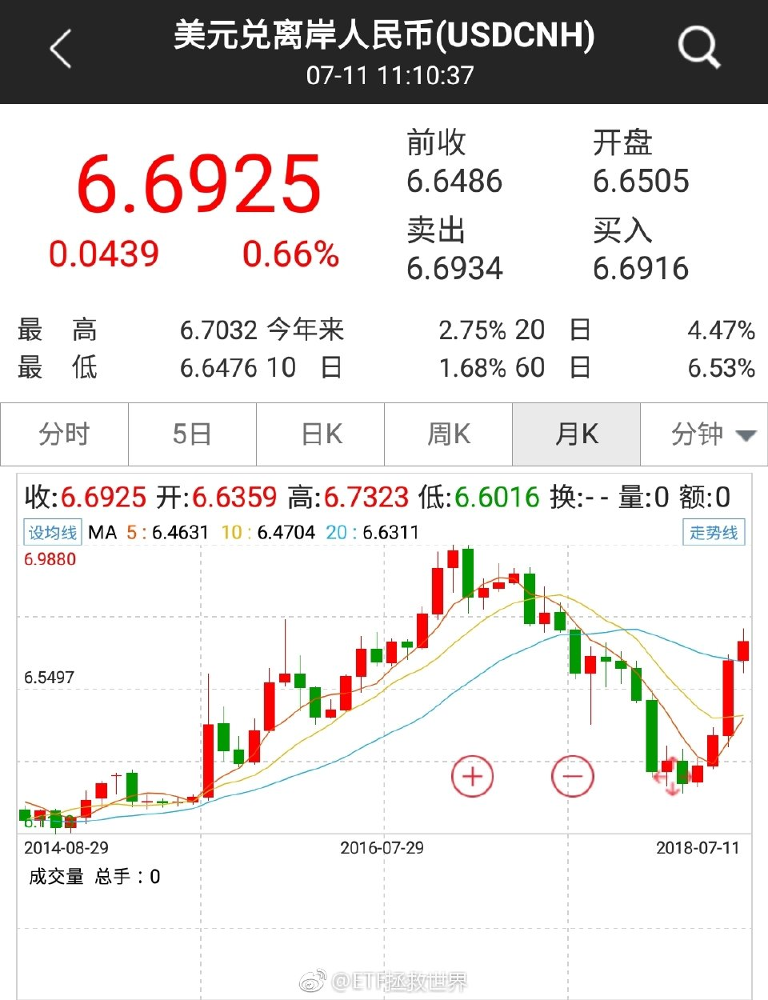

======================================================

ETF拯救世界 (5687069307) @
2018-07-12 10:11:09 Thu  
url: https://weibo.com/5687069307/GpyjIoHOY

$全指医药 sh000991$   医药最稳。 ​​​

转发[4]  评论[77]  赞[184] 

======================================================

ETF拯救世界 (5687069307) @
2018-07-12 10:22:26 Thu  
url: https://weibo.com/5687069307/Gpyoi3Y1i

看到一些关于是否应该始终满仓的争论。

我总是不清楚，为什么每个人都认为这个世界上只有一条真理，为什么不可以多元化生存？

适合你的，未必适合别人。你让一个20岁的年轻人，和一个60岁的老年人投资策略一样，可能吗？更不用说，我一直吐槽的，很多人说满仓，只是一小部分资产满仓而已。真的跌了， ​​​

转发[72]  评论[166]  赞[360] 

======================================================

ETF拯救世界 (5687069307) @
2018-07-12 10:35:17 Thu  
url: https://weibo.com/5687069307/GpytvCToW

回复@ETF拯救NATAS:我都忘了。我准备把以前球球有价值的文章，重新好好弄一弄，都发到公众号上。几年以后回头看，很多东西更有意义。同时，当时预期的很多事情已经成真，可以开始干了。

------------------------------------------------------
转推：
>  @ETF拯救世界 (5687069307)
>  2018-07-12 10:22:26 Thu  
>  url: https:/weibo.com/5687069307/Gpyoi3Y1i/

>  看到一些关于是否应该始终满仓的争论。
>  
>  我总是不清楚，为什么每个人都认为这个世界上只有一条真理，为什么不可以多元化生存？
>  
>  适合你的，未必适合别人。你让一个20岁的年轻人，和一个60岁的老年人投资策略一样，可能吗？更不用说，我一直吐槽的，很多人说满仓，只是一小部分资产满仓而已。真的跌了， ​​​

转发[5]  评论[73]  赞[284] 

======================================================

ETF拯救世界 (5687069307) @
2018-07-12 10:38:33 Thu  
url: https://weibo.com/5687069307/GpyuQoRRm

回复@你在红楼我在西游V:我看那篇文章了。我还挺同意的。目前确实在低估区域。注意，是区域。//@你在红楼我在西游V:新华社发文说A股低估了,是啊，4000点才是牛市的起点,现在3000都没有[doge]

------------------------------------------------------
转推：
>  @ETF拯救世界 (5687069307)
>  2018-07-12 10:11:09 Thu  
>  url: https:/weibo.com/5687069307/GpyjIoHOY/

>  $全指医药 sh000991$   医药最稳。 ​​​

转发[2]  评论[15]  赞[139] 

======================================================

ETF拯救世界 (5687069307) @
2018-07-12 10:39:26 Thu  
url: https://weibo.com/5687069307/Gpyvcw2Kn

回复@LL_96:这怎么是浪费精力呢。这是讨论投资理念。这一条东西，是一个投资人所有投资体系的根基。你选择怎样的投资体系，第一条要解决的就是这个问题。非常非常有意义。//@LL_96:别再浪费精力说这些了

------------------------------------------------------
转推：
>  @ETF拯救世界 (5687069307)
>  2018-07-12 10:22:26 Thu  
>  url: https:/weibo.com/5687069307/Gpyoi3Y1i/

>  看到一些关于是否应该始终满仓的争论。
>  
>  我总是不清楚，为什么每个人都认为这个世界上只有一条真理，为什么不可以多元化生存？
>  
>  适合你的，未必适合别人。你让一个20岁的年轻人，和一个60岁的老年人投资策略一样，可能吗？更不用说，我一直吐槽的，很多人说满仓，只是一小部分资产满仓而已。真的跌了， ​​​

转发[9]  评论[44]  赞[210] 

======================================================

ETF拯救世界 (5687069307) @
2018-07-12 10:53:53 Thu  
url: https://weibo.com/5687069307/GpyB42mnx

目前医药+养老≈12%；

500≈11%；

红利+50+300≈15%；

港股≈8%；

占大头的这几个我认为基本仓位已经建立起来了。每类最多是15%-20%。所以踏踏实实的。 ​​​

转发[112]  评论[209]  赞[333] 

======================================================

ETF拯救世界 (5687069307) @
2018-07-12 11:22:44 Thu  
url: https://weibo.com/5687069307/GpyMLoy33

好消息，中报已经开始披露了。

7月有134家；

8月所有半年报披露完成。

也就是说，未来一个月，全部指数估值又将出现系统性下降。

再过两个月三季报也将披露完毕。关键点就在这几个月了。 ​​​

转发[39]  评论[112]  赞[293] 

======================================================

ETF拯救世界 (5687069307) @
2018-07-12 11:41:11 Thu  
url: https://weibo.com/5687069307/GpyUfB88m

回复@柳暗花明又二村了:如果没有2000亿的事情，之前的反弹会延续。太弱了，必须要反弹啊。下一步是什么情况还需要继续观察。//@柳暗花明又二村了:E大短线也是神准，昨天就说过暴力反弹不远了……

------------------------------------------------------
转推：
>  @ETF拯救世界 (5687069307)
>  2018-07-12 11:22:44 Thu  
>  url: https:/weibo.com/5687069307/GpyMLoy33/

>  好消息，中报已经开始披露了。
>  
>  7月有134家；
>  
>  8月所有半年报披露完成。
>  
>  也就是说，未来一个月，全部指数估值又将出现系统性下降。
>  
>  再过两个月三季报也将披露完毕。关键点就在这几个月了。 ​​​

转发[2]  评论[12]  赞[136] 

======================================================

ETF拯救世界 (5687069307) @
2018-07-12 11:44:43 Thu  
url: https://weibo.com/5687069307/GpyVHeKN5

回复@动感超人diudiudiu:急就打啊。你账户密码忘了？//@动感超人diudiudiu:E大！他怎么涨起来了！！！还有子弹没出手！好急！！

------------------------------------------------------
转推：
>  @ETF拯救世界 (5687069307)
>  2018-07-12 11:22:44 Thu  
>  url: https:/weibo.com/5687069307/GpyMLoy33/

>  好消息，中报已经开始披露了。
>  
>  7月有134家；
>  
>  8月所有半年报披露完成。
>  
>  也就是说，未来一个月，全部指数估值又将出现系统性下降。
>  
>  再过两个月三季报也将披露完毕。关键点就在这几个月了。 ​​​

转发[0]  评论[59]  赞[170] 

======================================================

ETF拯救世界 (5687069307) @
2018-07-12 11:51:33 Thu  
url: https://weibo.com/5687069307/GpyYswJ3e

3500点的时候，我们比现在仓位低很多。那时候你都不急，结果跌到2800，仓位增加了十几个点，开始急了？

谁急谁加啊。适合自己就行啊。就记住一句话，加到涨跌都舒服，完事。 ​​​

转发[8]  评论[122]  赞[368] 

======================================================

ETF拯救世界 (5687069307) @
2018-07-12 13:31:50 Thu  
url: https://weibo.com/5687069307/GpzDaES1m

确认底部有两种方法：

第一种是不断的猜底：幼儿底，婴儿底，尿布底。

第二种是市场走出底部后判断趋势改变。

无论哪种方法，你必须先承认自己対预测的无知。然后对自己判断正确与否都有相对预案。

昨天我就说了，“如果再这么跌下去，我怀疑不远的未来会发生一次非常强烈的反弹。”这不是预测的准 ​​​

转发[69]  评论[148]  赞[333] 

======================================================

ETF拯救世界 (5687069307) @
2018-07-12 13:36:38 Thu  
url: https://weibo.com/5687069307/GpzF7vPYO

不是我说，总是让我感到很惊喜。

你们自己看看，是不是在用心做事？

一个产品，用心不用心，你能感受到的。

据说很快就上线了。 ​​​

转发[138]  评论[147]  赞[340] 

+++++++++++++++++++++++++++++++++++++++++++++++++++++

图片：

======================================================

ETF拯救世界 (5687069307) @
2018-07-12 13:46:14 Thu  
url: https://weibo.com/5687069307/GpzJ0Bd9s

回复@D8奇迹:未来的牛市，这个指数大概率会非常疯狂。//@D8奇迹:全指信息弹性真大

------------------------------------------------------
转推：
>  @ETF拯救世界 (5687069307)
>  2018-07-12 13:36:38 Thu  
>  url: https:/weibo.com/5687069307/GpzF7vPYO/

>  不是我说，总是让我感到很惊喜。
>  
>  你们自己看看，是不是在用心做事？
>  
>  一个产品，用心不用心，你能感受到的。
>  
>  据说很快就上线了。 ​​​

转发[121]  评论[49]  赞[161] 

======================================================

ETF拯救世界 (5687069307) @
2018-07-12 14:02:48 Thu  
url: https://weibo.com/5687069307/GpzPKcM1z

回复@潺潺的清河:两年内93.6%概率启动。[偷笑]//@潺潺的清河:未来十年不会有牛市//@ETF拯救世界:回复@D8奇迹:未来的牛市，这个指数大概率会非常疯狂。//@D8奇迹:全指信息弹性真大

------------------------------------------------------
转推：
>  @ETF拯救世界 (5687069307)
>  2018-07-12 13:36:38 Thu  
>  url: https:/weibo.com/5687069307/GpzF7vPYO/

>  不是我说，总是让我感到很惊喜。
>  
>  你们自己看看，是不是在用心做事？
>  
>  一个产品，用心不用心，你能感受到的。
>  
>  据说很快就上线了。 ​​​

转发[105]  评论[165]  赞[239] 

======================================================

ETF拯救世界 (5687069307) @
2018-07-12 15:37:53 Thu  
url: https://weibo.com/5687069307/GpAsl41TK

昨天，我发了20多条微博。每条4、5万人看。一天大概100多万。一个月2000万吧。

然后，新浪看关注我的粉丝这么少，才不到8万，居然每天有100多万阅读，所以认为我肯定是刷的，就把我的金v取消了……金v的标准是每个月1000万阅读。

他们没看看我的评论数比那些几十万的博主还多，可能更没见过3万多阅读 ​​​

转发[16]  评论[349]  赞[544] 

+++++++++++++++++++++++++++++++++++++++++++++++++++++

图片：

======================================================

ETF拯救世界 (5687069307) @
2018-07-12 15:55:17 Thu  
url: https://weibo.com/5687069307/GpAzoE7sV

回复@拿破顿:我一直奇怪，说我无私什么的。我到底干什么了？不就是把自己的投资计划发出来了吗。从2010年开始就发啊，只是从博客转到公众号而已。还干嘛了？不就是隔几个礼拜写篇文章，每天在微博扯扯淡。没干嘛啊。这叫什么无私。至于过年发红包送手机那些，都是平常大家打赏给我的，又不是我自己的钱

------------------------------------------------------
转推：
>  @ETF拯救世界 (5687069307)
>  2018-07-12 15:37:53 Thu  
>  url: https:/weibo.com/5687069307/GpAsl41TK/

>  昨天，我发了20多条微博。每条4、5万人看。一天大概100多万。一个月2000万吧。
>  
>  然后，新浪看关注我的粉丝这么少，才不到8万，居然每天有100多万阅读，所以认为我肯定是刷的，就把我的金v取消了……金v的标准是每个月1000万阅读。
>  
>  他们没看看我的评论数比那些几十万的博主还多，可能更没见过3万多阅读 ​​​

转发[2]  评论[181]  赞[315] 

======================================================

ETF拯救世界 (5687069307) @
2018-07-12 17:09:16 Thu  
url: https://weibo.com/5687069307/GpB3qx9nS

回复@Halle噜呀:你可别瞎搞了……人家那是记笔记呢。我也经常这样把有用的东西存到印象笔记啊。很好用。微信微博都可以。你以为我那些资料都是怎么存下来的……还有网页版，一键剪藏。好用。//@Halle噜呀:@曹增辉 能不能干点正事，把博主下面艾特某印象笔记的号都封一封。大家顶我上去

------------------------------------------------------
转推：
>  @ETF拯救世界 (5687069307)
>  2018-07-12 15:37:53 Thu  
>  url: https:/weibo.com/5687069307/GpAsl41TK/

>  昨天，我发了20多条微博。每条4、5万人看。一天大概100多万。一个月2000万吧。
>  
>  然后，新浪看关注我的粉丝这么少，才不到8万，居然每天有100多万阅读，所以认为我肯定是刷的，就把我的金v取消了……金v的标准是每个月1000万阅读。
>  
>  他们没看看我的评论数比那些几十万的博主还多，可能更没见过3万多阅读 ​​​

转发[1]  评论[56]  赞[137] 

======================================================

ETF拯救世界 (5687069307) @
2018-07-12 17:10:54 Thu  
url: https://weibo.com/5687069307/GpB45F5tB

我去，加回来了。喷了。谢谢 @曹增辉  曹老板，虽然不知道是不是你帮的忙……

------------------------------------------------------
转推：
>  @ETF拯救世界 (5687069307)
>  2018-07-12 15:37:53 Thu  
>  url: https:/weibo.com/5687069307/GpAsl41TK/

>  昨天，我发了20多条微博。每条4、5万人看。一天大概100多万。一个月2000万吧。
>  
>  然后，新浪看关注我的粉丝这么少，才不到8万，居然每天有100多万阅读，所以认为我肯定是刷的，就把我的金v取消了……金v的标准是每个月1000万阅读。
>  
>  他们没看看我的评论数比那些几十万的博主还多，可能更没见过3万多阅读 ​​​

转发[0]  评论[75]  赞[189] 

======================================================

ETF拯救世界 (5687069307) @
2018-07-12 17:29:05 Thu  
url: https://weibo.com/5687069307/GpBbtnWu5

回复@小小8885376:有可能会。因为历史只是历史，未来可能发生变化。所以还要用其它辅助的依据来判断。总之操作的时候，你把这个因素考虑进去，有应对的办法就行了。做好：历史依然有效、无效两手准备。

------------------------------------------------------
转推：
>  @ETF拯救世界 (5687069307)
>  2018-07-12 11:22:44 Thu  
>  url: https:/weibo.com/5687069307/GpyMLoy33/

>  好消息，中报已经开始披露了。
>  
>  7月有134家；
>  
>  8月所有半年报披露完成。
>  
>  也就是说，未来一个月，全部指数估值又将出现系统性下降。
>  
>  再过两个月三季报也将披露完毕。关键点就在这几个月了。 ​​​

转发[3]  评论[46]  赞[182] 

======================================================

ETF拯救世界 (5687069307) @
2018-07-12 21:27:22 Thu  
url: https://weibo.com/5687069307/GpCKc3YoY

富国的这只增强真的厉害，无论涨跌天天跑赢 ​​​

转发[54]  评论[126]  赞[367] 

+++++++++++++++++++++++++++++++++++++++++++++++++++++

图片：
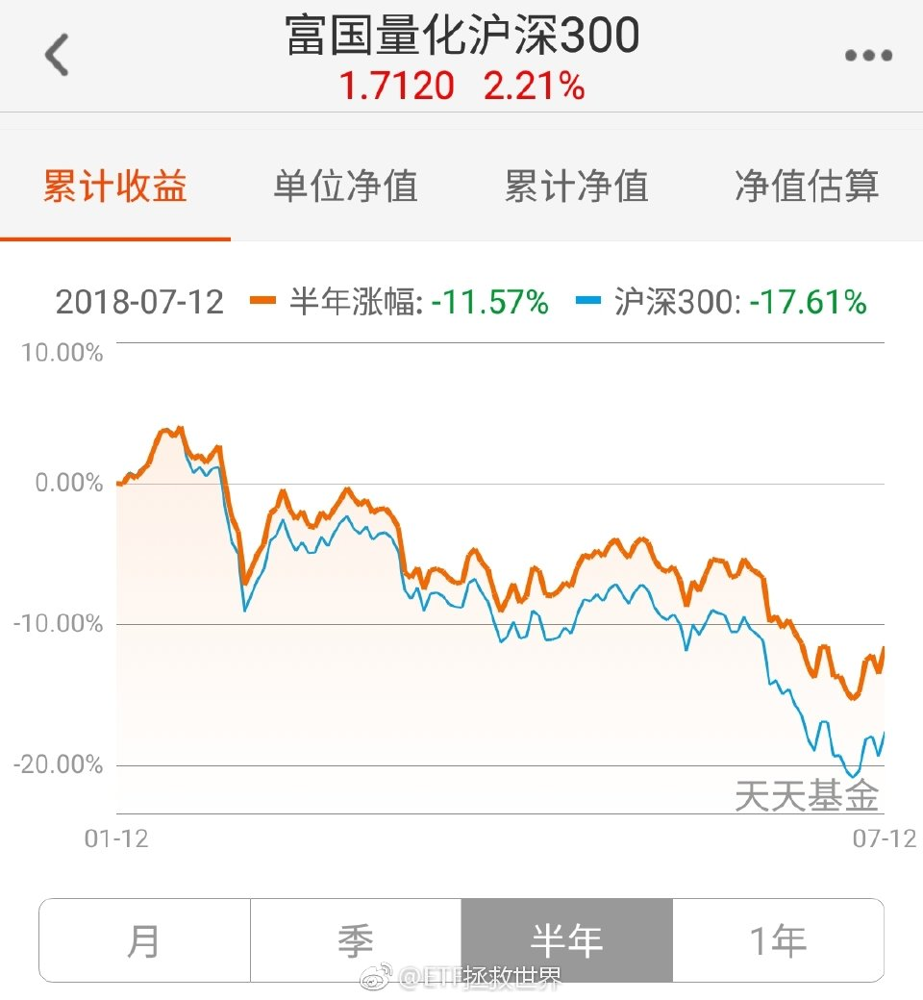

======================================================

ETF拯救世界 (5687069307) @
2018-07-13 08:51:24 Fri  
url: https://weibo.com/5687069307/GpHdQjkDf

发布了头条文章：《还是得客客气气的》 ，随便聊聊，您随便看看。 http://t.cn/RdFbbKy ​​​

转发[40]  评论[267]  赞[877] 

======================================================

ETF拯救世界 (5687069307) @
2018-07-13 09:45:13 Fri  
url: https://weibo.com/5687069307/GpHzGcmqG

回复@湛江街拍:建信500一点都不差。2015、2016都是500增强指基第一。2015年跑赢富国500高达17个点，2016年富国500下跌6%，建信上涨1%。建信之所以最近一般，很大因素是因为我们把它搞大了……//@湛江街拍:e大，富国几个增强基金做不错，为什么我们不选富国500，而是建信500呢？

------------------------------------------------------
转推：
>  @ETF拯救世界 (5687069307)
>  2018-07-12 21:27:22 Thu  
>  url: https:/weibo.com/5687069307/GpCKc3YoY/

>  富国的这只增强真的厉害，无论涨跌天天跑赢 ​​​

转发[19]  评论[157]  赞[219] 

======================================================

ETF拯救世界 (5687069307) @
2018-07-13 09:55:44 Fri  
url: https://weibo.com/5687069307/GpHDXjlvx

$全指医药 sh000991$   还是医药最高！犀利。是不是又向新高去了。 ​​​

转发[2]  评论[134]  赞[243] 

======================================================

ETF拯救世界 (5687069307) @
2018-07-13 13:07:22 Fri  
url: https://weibo.com/5687069307/GpITK0hbh

$小米集团－Ｗ hk01810$   mi boy的实力果然不容小瞧。 ​​​

转发[1]  评论[50]  赞[151] 

======================================================

ETF拯救世界 (5687069307) @
2018-07-13 13:47:29 Fri  
url: https://weibo.com/5687069307/GpJa14Ysf

回复@冯二宝6538187080:倒不是点的问题，而是还是贵现在。40多倍的估值买一个指数，长久看赚大钱的概率略低。30多我可能会开始布局。//@冯二宝6538187080:e大 能不能说一下 大概多少点布局全指信息呢//@ETF拯救世界:回复@潺潺的清河:两年内93.6%概率启动。[偷笑]//@潺潺的清河:未来十年不会有牛市

------------------------------------------------------
转推：
>  @ETF拯救世界 (5687069307)
>  2018-07-12 13:36:38 Thu  
>  url: https:/weibo.com/5687069307/GpzF7vPYO/

>  不是我说，总是让我感到很惊喜。
>  
>  你们自己看看，是不是在用心做事？
>  
>  一个产品，用心不用心，你能感受到的。
>  
>  据说很快就上线了。 ​​​

转发[64]  评论[58]  赞[119] 

======================================================

ETF拯救世界 (5687069307) @
2018-07-13 13:53:51 Fri  
url: https://weibo.com/5687069307/GpJcBzgii

指数和股票不同。股票你买亏损股都有可能赚大钱。指数就不是。指数你不能买太贵，否则赚钱的概率很低。不是说不可能，而是长远看，很低。

另外，如果你去研究一下巴菲特买股票的历史，你会发现，绝大多数他买的股票，PE都不超过20倍。虽然他买的时候并不用pe估值。 ​​​

转发[40]  评论[158]  赞[236] 

======================================================

ETF拯救世界 (5687069307) @
2018-07-13 14:01:12 Fri  
url: https://weibo.com/5687069307/GpJfBa6g1

论健身与练拳的必要性。

------------------------------------------------------
转推：
>  @梨视频 (6004281123)
>  2018-07-12 22:15:40 Thu  
>  url: https:/weibo.com/6004281123/GpD3NtPLs/

>  【#华裔遭美国白人找茬踹车#：我若是黑人，他绝对不敢[思考]】近日，旧金山一华裔车主与一白人男子发生冲突。白人男子指其引擎声太响踢踹轿车。华裔司机说，我如果是个黑人司机，这个白人一定不会踹车。@微辣Video （信息来源：ins@nanunlimited ）http://t.cn/RdD5nyF ​​​

转发[31]  评论[62]  赞[141] 

======================================================

ETF拯救世界 (5687069307) @
2018-07-13 14:21:06 Fri  
url: https://weibo.com/5687069307/GpJnFE7rD

回复@你在红楼我在西游V:创业板是从2015年的120倍跌下来的。了解一下。//@你在红楼我在西游V:感觉创业板跌了这么多，估值还那么高？//@ETF拯救世界:回复@冯二宝6538187080:倒不是点的问题，而是还是贵现在。40多倍的估值买一个指数，长久看赚大钱的概率略低。30多我可能会开始布局。

------------------------------------------------------
转推：
>  @ETF拯救世界 (5687069307)
>  2018-07-12 13:36:38 Thu  
>  url: https:/weibo.com/5687069307/GpzF7vPYO/

>  不是我说，总是让我感到很惊喜。
>  
>  你们自己看看，是不是在用心做事？
>  
>  一个产品，用心不用心，你能感受到的。
>  
>  据说很快就上线了。 ​​​

转发[35]  评论[20]  赞[111] 

======================================================

ETF拯救世界 (5687069307) @
2018-07-13 14:28:20 Fri  
url: https://weibo.com/5687069307/GpJqBr8Yo

回复@葱葱AQQ:2015年第二轮计划大概3、4月大量卖出。站在5、6月看，后面的一大块利润没吃到。但是我站在理性的角度，在4月，沪深300估值45倍，中小板80倍，创业板90倍，全市场到了60倍，全都是超级股灾的标准，那时候跑，即使到现在，我也不认为有什么问题。//@葱葱AQQ:120倍！谁能想到那么的疯狂？

------------------------------------------------------
转推：
>  @ETF拯救世界 (5687069307)
>  2018-07-12 13:36:38 Thu  
>  url: https:/weibo.com/5687069307/GpzF7vPYO/

>  不是我说，总是让我感到很惊喜。
>  
>  你们自己看看，是不是在用心做事？
>  
>  一个产品，用心不用心，你能感受到的。
>  
>  据说很快就上线了。 ​​​

转发[30]  评论[74]  赞[171] 

======================================================

ETF拯救世界 (5687069307) @
2018-07-13 14:33:09 Fri  
url: https://weibo.com/5687069307/GpJsyApPI

回复@qzy6_87413:120倍的创业板跌到30多倍，我买入1%，我不认为有什么太大的问题。//@qzy6_87413:那为啥去年e大那么贵的时候买创业板呢？有点不懂//@ETF拯救世界:回复@冯二宝6538187080:倒不是点的问题，而是还是贵现在。40多倍的估值买一个指数，长久看赚大钱的概率略低。30多我可能会开始布局。

------------------------------------------------------
转推：
>  @ETF拯救世界 (5687069307)
>  2018-07-12 13:36:38 Thu  
>  url: https:/weibo.com/5687069307/GpzF7vPYO/

>  不是我说，总是让我感到很惊喜。
>  
>  你们自己看看，是不是在用心做事？
>  
>  一个产品，用心不用心，你能感受到的。
>  
>  据说很快就上线了。 ​​​

转发[13]  评论[29]  赞[138] 

======================================================

ETF拯救世界 (5687069307) @
2018-07-13 14:39:24 Fri  
url: https://weibo.com/5687069307/GpJv62HhG

在证券市场上，理性的人很难赔钱。但是太理性的人赚不到大钱。

当然，理性已经很难了。大多数人是非理性的。

所以，在理性和疯狂之间要找到一个平衡点，心里非常明白，身体却要跟大众一起狂欢。还要在午夜之前全身而退，这样综合起来，要求非常高。正因为这样，赚大钱的人很少。这太难了，不仅跟实力 ​​​

转发[73]  评论[188]  赞[398] 

======================================================

ETF拯救世界 (5687069307) @
2018-07-13 17:06:12 Fri  
url: https://weibo.com/5687069307/GpKsGzYdI

回复@dzb__:你买创业50是50家公司，创业板指数是100家公司，不用你买整个创业板啊。就像你买上证50不是买上证1000多家公司一样。

------------------------------------------------------
转推：
>  @ETF拯救世界 (5687069307)
>  2018-07-12 13:36:38 Thu  
>  url: https:/weibo.com/5687069307/GpzF7vPYO/

>  不是我说，总是让我感到很惊喜。
>  
>  你们自己看看，是不是在用心做事？
>  
>  一个产品，用心不用心，你能感受到的。
>  
>  据说很快就上线了。 ​​​

转发[5]  评论[20]  赞[148] 

======================================================

ETF拯救世界 (5687069307) @
2018-07-13 17:08:06 Fri  
url: https://weibo.com/5687069307/GpKts93NW

今天净值增加0.28%左右。不过不失，凑凑合合，就那么回事吧。

所以你不要总是担心牛市来了赶不上趟了。今天沪深300才0.33%。即使真的牛市开启，也差不到哪儿去。何况趋势仓位还没加。

就跟你说，踏踏实实的。舒服最重要。 ​​​

转发[11]  评论[158]  赞[439] 

======================================================

ETF拯救世界 (5687069307) @
2018-07-16 00:45:18 Mon  
url: https://weibo.com/5687069307/Gq6k186Gu

是不是钦定了。 ​​​

转发[0]  评论[68]  赞[200] 

======================================================

ETF拯救世界 (5687069307) @
2018-07-16 08:41:51 Mon  
url: https://weibo.com/5687069307/Gq9rrEw0W

算是个里程碑了。

开始看留言。 ​​​

转发[2]  评论[80]  赞[380] 

+++++++++++++++++++++++++++++++++++++++++++++++++++++

图片：

======================================================

ETF拯救世界 (5687069307) @
2018-07-16 09:56:43 Mon  
url: https://weibo.com/5687069307/Gq9VQkRVS

回复@夜雨梧桐2010:黑夜给了你黑色的眼睛，你却用它来寻找不可描述的数字。//@夜雨梧桐2010:E哥，你这也太能创造故事了，又是10又是69的……

------------------------------------------------------
转推：
>  @ETF拯救世界 (5687069307)
>  2018-07-16 08:41:51 Mon  
>  url: https:/weibo.com/5687069307/Gq9rrEw0W/

>  算是个里程碑了。
>  
>  开始看留言。 ​​​

转发[1]  评论[50]  赞[172] 

======================================================

ETF拯救世界 (5687069307) @
2018-07-16 10:16:47 Mon  
url: https://weibo.com/5687069307/Gqa3Zlx4B

几张图告诉你为什么卖比买难100倍。

买都可以精准买在阶段最低。但卖你很难卖在阶段最高。（50那次卖出是换了红利）

如果不贵，就坚定持有。 ​​​

转发[72]  评论[103]  赞[272] 

+++++++++++++++++++++++++++++++++++++++++++++++++++++

图片：
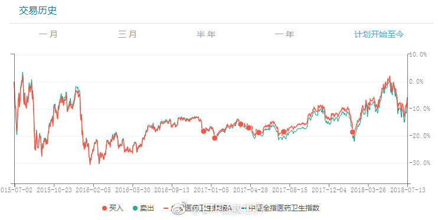

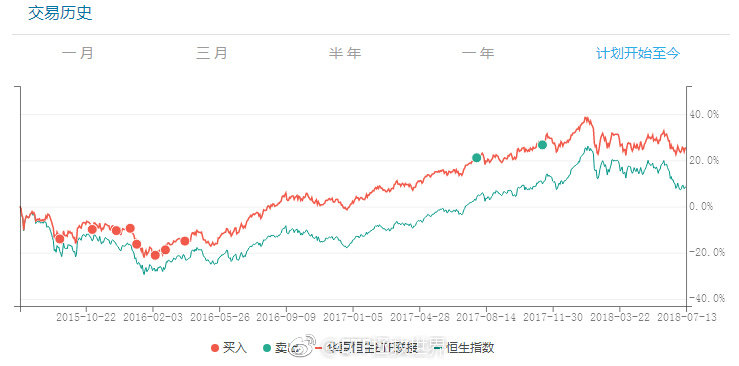
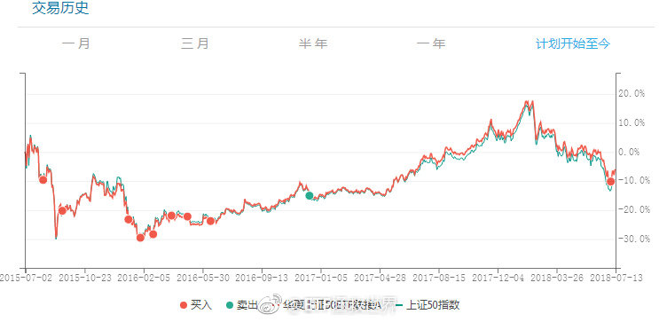
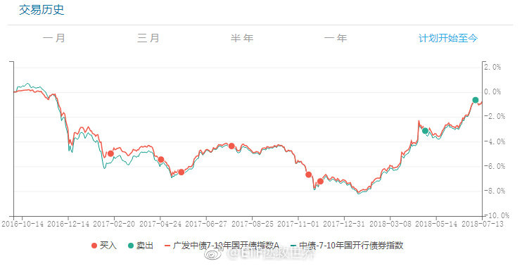

======================================================

ETF拯救世界 (5687069307) @
2018-07-16 10:20:57 Mon  
url: https://weibo.com/5687069307/Gqa5FBqj5

回复@单眼皮的小明明:贵不难判断。但是市场不会因为贵就停止上涨。最难的是判断人性的疯狂。//@单眼皮的小明明:难在判断什么时候算贵了

------------------------------------------------------
转推：
>  @ETF拯救世界 (5687069307)
>  2018-07-16 10:16:47 Mon  
>  url: https:/weibo.com/5687069307/Gqa3Zlx4B/

>  几张图告诉你为什么卖比买难100倍。
>  
>  买都可以精准买在阶段最低。但卖你很难卖在阶段最高。（50那次卖出是换了红利）
>  
>  如果不贵，就坚定持有。 ​​​

转发[28]  评论[80]  赞[197] 

======================================================

ETF拯救世界 (5687069307) @
2018-07-16 11:56:40 Mon  
url: https://weibo.com/5687069307/GqaIx6Bq3

看了看账户，有点舒服。 ​​​

转发[3]  评论[147]  赞[267] 

======================================================

ETF拯救世界 (5687069307) @
2018-07-16 13:30:53 Mon  
url: https://weibo.com/5687069307/GqbkM8iXL

这次金融行业感觉要先有钻石坑了。

最后会不会蝴蝶效应，边走边看。 ​​​

转发[10]  评论[84]  赞[336] 

======================================================

ETF拯救世界 (5687069307) @
2018-07-16 14:28:41 Mon  
url: https://weibo.com/5687069307/GqbIeuQHB

去年年报和今年一季报，医药+养老都是15%以上增速。不高，但是在各行业中已经是很不错的了。

看半年报了。目前医药已知的五只股票半年报，增速在30%多。但是这个不具代表性。

不过最大的问题，这两个品种，还是不够便宜。当然，也几乎从没有真正的“便宜”过。

如果能在25以下买医药，可能就是投资 ​​​

转发[64]  评论[118]  赞[266] 

======================================================

ETF拯救世界 (5687069307) @
2018-07-16 14:49:07 Mon  
url: https://weibo.com/5687069307/GqbQwDM0U

回复@厉欧:金融危机最低27//@厉欧:E大，2011年全指医药指数发布之前，有没有PE低于25发生过？@ETF拯救世界

------------------------------------------------------
转推：
>  @ETF拯救世界 (5687069307)
>  2018-07-16 14:28:41 Mon  
>  url: https:/weibo.com/5687069307/GqbIeuQHB/

>  去年年报和今年一季报，医药+养老都是15%以上增速。不高，但是在各行业中已经是很不错的了。
>  
>  看半年报了。目前医药已知的五只股票半年报，增速在30%多。但是这个不具代表性。
>  
>  不过最大的问题，这两个品种，还是不够便宜。当然，也几乎从没有真正的“便宜”过。
>  
>  如果能在25以下买医药，可能就是投资 ​​​

转发[20]  评论[62]  赞[143] 

======================================================

ETF拯救世界 (5687069307) @
2018-07-16 16:01:13 Mon  
url: https://weibo.com/5687069307/GqcjNlede

周五沪深300上涨0.33%，计划净值增加0.32%。

今天沪深300下跌0.59%，计划净值预估下降0.05%。

打扰了。 ​​​

转发[4]  评论[83]  赞[413] 

======================================================

ETF拯救世界 (5687069307) @
2018-07-16 16:17:36 Mon  
url: https://weibo.com/5687069307/GqcqrwJZX

云音乐更新歌单那哥们掉链子了……两首没更新啦。 ​​​

转发[0]  评论[110]  赞[234] 

======================================================

ETF拯救世界 (5687069307) @
2018-07-17 07:53:12 Tue  
url: https://weibo.com/5687069307/GqiydeCER

掐指一算，今日不宜出门。 ​​​

转发[1]  评论[118]  赞[230] 

======================================================

ETF拯救世界 (5687069307) @
2018-07-17 08:57:39 Tue  
url: https://weibo.com/5687069307/GqiYndH8M

原油敢不敢跌回50。

我发现是不是别的品种不用做了，每年来回吃油就行。[doge] ​​​

转发[7]  评论[103]  赞[269] 

======================================================

ETF拯救世界 (5687069307) @
2018-07-17 10:01:58 Tue  
url: https://weibo.com/5687069307/GqjosEzBY

$沪深300 sh000300$ 

震惊！固定发车日只买一份A股品种的原因找到了！ ​​​

转发[2]  评论[73]  赞[208] 

======================================================

ETF拯救世界 (5687069307) @
2018-07-17 10:14:23 Tue  
url: https://weibo.com/5687069307/GqjtwfeGl

腾讯能不能守住前期低点是我比较关注的。好消息是估值已经降至35倍。

------------------------------------------------------
转推：
>  @ETF拯救世界 (5687069307)
>  2018-03-22 09:34:01 Thu  
>  url: https:/weibo.com/5687069307/G8wd21cxW/

>  腾讯，60倍PE。未来五年看，真的能有特别好的收益率吗。
>  
>  学习了。 ​​​

转发[32]  评论[31]  赞[157] 

======================================================

ETF拯救世界 (5687069307) @
2018-07-17 10:23:32 Tue  
url: https://weibo.com/5687069307/Gqjxe62DI

我这半年多关注的8848和腾讯，不是说对这两家公司有什么看法，我是在观察情绪。

这两家公司在持续暴涨的时候，带了很多很多情绪。尤其是前者。很多人因为没买后悔的夜不能寐，很多人买了抱持坚定信念可以再涨好几倍。

一家公司，一个行业，到底是不是真的能预判五年、十年后？

很难讲。前几天看到一 ​​​

转发[88]  评论[146]  赞[301] 

======================================================

ETF拯救世界 (5687069307) @
2018-07-17 10:55:59 Tue  
url: https://weibo.com/5687069307/GqjKozJRz

其实我挺想知道的，这么多爆掉的p2p，怎么就连一点渣都没剩下。这么多钱最后都去哪儿了。

学习好的给讲讲。 ​​​

转发[9]  评论[231]  赞[257] 

======================================================

ETF拯救世界 (5687069307) @
2018-07-17 11:26:16 Tue  
url: https://weibo.com/5687069307/GqjWGDYs6

再说件不开心的事让你们开心一下：

前几天刚换的苹果又坏了，昨天淋了一点雨。耳机插孔和关机键出问题了。

一个月不到两个。

什么玩意儿啊…… ​​​

转发[5]  评论[209]  赞[209] 

======================================================

ETF拯救世界 (5687069307) @
2018-07-17 13:02:41 Tue  
url: https://weibo.com/5687069307/GqkzPe2PI

回复@O蒲公英的种子O:我不扔手机。苹果从4S到X除了8都买了。都放着呢，除了一个7让海水泡了，一个6SP耳机孔出问题了，一个X正在用，其他的有没有人要。//@O蒲公英的种子O:别扔了，还能换个盆，304不锈钢的，了解下[doge]

------------------------------------------------------
转推：
>  @ETF拯救世界 (5687069307)
>  2018-07-17 11:26:16 Tue  
>  url: https:/weibo.com/5687069307/GqjWGDYs6/

>  再说件不开心的事让你们开心一下：
>  
>  前几天刚换的苹果又坏了，昨天淋了一点雨。耳机插孔和关机键出问题了。
>  
>  一个月不到两个。
>  
>  什么玩意儿啊…… ​​​

转发[1]  评论[247]  赞[136] 

======================================================

ETF拯救世界 (5687069307) @
2018-07-17 14:06:18 Tue  
url: https://weibo.com/5687069307/GqkZEc6MJ

还有人怀疑钻石坑吗。

可能没了。

但一会儿往上拉一下又怀疑了吧。 ​​​

转发[5]  评论[104]  赞[270] 

======================================================

ETF拯救世界 (5687069307) @
2018-07-17 14:40:30 Tue  
url: https://weibo.com/5687069307/GqldwBDdZ

其实很多品种空间真的不大了。很难再跌30%以上。

但是时间就不好说了。这个大底可能要磨一段时间了。 ​​​

转发[11]  评论[120]  赞[269] 

======================================================

ETF拯救世界 (5687069307) @
2018-07-17 15:01:23 Tue  
url: https://weibo.com/5687069307/Gqlm0mCKg

回复@淡泊宁静以养心:新关注我吧。日常操作。//@淡泊宁静以养心:神了！最低点！

------------------------------------------------------
转推：
>  @ETF拯救世界 (5687069307)
>  2018-07-17 14:06:18 Tue  
>  url: https:/weibo.com/5687069307/GqkZEc6MJ/

>  还有人怀疑钻石坑吗。
>  
>  可能没了。
>  
>  但一会儿往上拉一下又怀疑了吧。 ​​​

转发[1]  评论[43]  赞[173] 

======================================================

ETF拯救世界 (5687069307) @
2018-07-17 15:06:47 Tue  
url: https://weibo.com/5687069307/GqloceHG6

年初蓝筹上涨，本身是没问题的。问题是涨的太快太猛。

现在是什么情况，服了。10倍的东西还要跌，40、50的居然领涨。你要说某只成长股50就算了，这可是几百只50倍以上的往上干啊。

我就看着你疯。

继续布局辣鸡。 ​​​

转发[26]  评论[173]  赞[299] 

======================================================

ETF拯救世界 (5687069307) @
2018-07-17 23:34:12 Tue  
url: https://weibo.com/5687069307/GqoI9F5Be

老这样多不好意思。 ​​​

转发[7]  评论[95]  赞[247] 

+++++++++++++++++++++++++++++++++++++++++++++++++++++

图片：
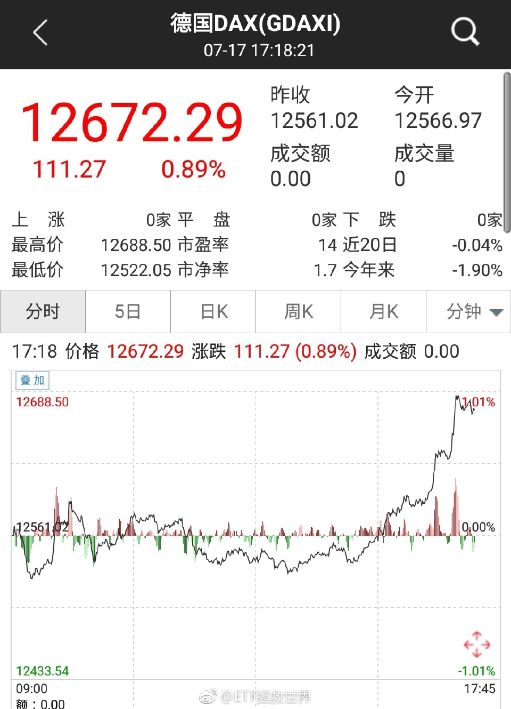

======================================================

ETF拯救世界 (5687069307) @
2018-07-18 08:40:23 Wed  
url: https://weibo.com/5687069307/GqshR3Gxh

这就是为什么我要做京享值超过8万的plus会员，为什么要持有京东股票。

周末买了个天龙功放，有噪音，昨晚申请换货。二话不说上门换新。

买东西买的很舒服。 ​​​

转发[17]  评论[146]  赞[133] 

+++++++++++++++++++++++++++++++++++++++++++++++++++++

图片：
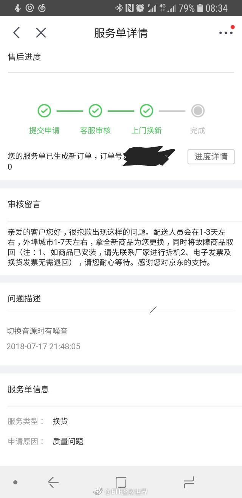

======================================================

ETF拯救世界 (5687069307) @
2018-07-18 08:49:12 Wed  
url: https://weibo.com/5687069307/GqslqEDih

回复@星云Bert:你可真扯淡，看不惯你这种人，瞎忽悠。京东方是京东和新东方合资成立的，各占30%股份，京东并没有控股。[哼]//@星云Bert:回复@我是队长别怕:算，京东方是京东控股的

------------------------------------------------------
转推：
>  @ETF拯救世界 (5687069307)
>  2018-07-18 08:40:23 Wed  
>  url: https:/weibo.com/5687069307/GqshR3Gxh/

>  这就是为什么我要做京享值超过8万的plus会员，为什么要持有京东股票。
>  
>  周末买了个天龙功放，有噪音，昨晚申请换货。二话不说上门换新。
>  
>  买东西买的很舒服。 ​​​

转发[10]  评论[52]  赞[93] 

======================================================

ETF拯救世界 (5687069307) @
2018-07-18 09:08:50 Wed  
url: https://weibo.com/5687069307/Gqstp5Pa3

回复@随便一个动作:我们贡献了多少。

------------------------------------------------------
转推：
>  @ETF拯救世界 (5687069307)
>  2018-07-18 08:40:23 Wed  
>  url: https:/weibo.com/5687069307/GqshR3Gxh/

>  这就是为什么我要做京享值超过8万的plus会员，为什么要持有京东股票。
>  
>  周末买了个天龙功放，有噪音，昨晚申请换货。二话不说上门换新。
>  
>  买东西买的很舒服。 ​​​

转发[1]  评论[17]  赞[67] 

======================================================

ETF拯救世界 (5687069307) @
2018-07-18 09:11:05 Wed  
url: https://weibo.com/5687069307/GqsujsBmq

你已成为这些公司的股东。讲真，传给孙子毫无问题。 ​​​

转发[36]  评论[82]  赞[198] 

+++++++++++++++++++++++++++++++++++++++++++++++++++++

图片：
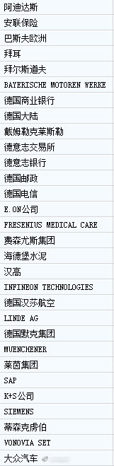

======================================================

ETF拯救世界 (5687069307) @
2018-07-18 09:15:34 Wed  
url: https://weibo.com/5687069307/Gqsw8mgrb

回复@Aaaaaraaaq:基本上都是。曾经在天M某“旗舰店”买过一个，结果各种问题，甚至看评论说有可能连充电器都被换了。吓得连机子都没开就退货了。自己感觉还是JD买电子产品放心一点。//@Aaaaaraaaq:E大手机都是在京东买的吗？我感觉自营很可靠，可身边的人都不这么认为

------------------------------------------------------
转推：
>  @ETF拯救世界 (5687069307)
>  2018-07-18 08:40:23 Wed  
>  url: https:/weibo.com/5687069307/GqshR3Gxh/

>  这就是为什么我要做京享值超过8万的plus会员，为什么要持有京东股票。
>  
>  周末买了个天龙功放，有噪音，昨晚申请换货。二话不说上门换新。
>  
>  买东西买的很舒服。 ​​​

转发[6]  评论[32]  赞[80] 

======================================================

ETF拯救世界 (5687069307) @
2018-07-18 09:24:39 Wed  
url: https://weibo.com/5687069307/GqszP6LAq

回复@梦游鱼生活在路上:机子不能开。苹果手机一旦开机激活就不能退了。甚至天M店你只要撕开包装就要扯皮了。比如去售后检测等等。看评论，收到货的各种问题。难道我看别人的还不够吗，还非得自己再试试？最后，我发现那家中移动旗舰店都是假的……

------------------------------------------------------
转推：
>  @ETF拯救世界 (5687069307)
>  2018-07-18 08:40:23 Wed  
>  url: https:/weibo.com/5687069307/GqshR3Gxh/

>  这就是为什么我要做京享值超过8万的plus会员，为什么要持有京东股票。
>  
>  周末买了个天龙功放，有噪音，昨晚申请换货。二话不说上门换新。
>  
>  买东西买的很舒服。 ​​​

转发[3]  评论[39]  赞[90] 

======================================================

ETF拯救世界 (5687069307) @
2018-07-18 09:38:29 Wed  
url: https://weibo.com/5687069307/GqsFr9A6e

有波动就有利润。 ​​​

转发[8]  评论[59]  赞[124] 

+++++++++++++++++++++++++++++++++++++++++++++++++++++

图片：
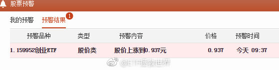

======================================================

ETF拯救世界 (5687069307) @
2018-07-18 09:54:09 Wed  
url: https://weibo.com/5687069307/GqsLNEVps

图片评论 全靠策略。不主观判断涨跌。不过这距离最高价就差一厘也真是有点过分了。 http://t.cn/Rga2RRs

------------------------------------------------------
转推：
>  @ETF拯救世界 (5687069307)
>  2018-07-18 09:38:29 Wed  
>  url: https:/weibo.com/5687069307/GqsFr9A6e/

>  有波动就有利润。 ​​​

转发[4]  评论[24]  赞[109] 

======================================================

ETF拯救世界 (5687069307) @
2018-07-18 09:59:28 Wed  
url: https://weibo.com/5687069307/GqsNXtvwj

回复@阿笨的微博:德国商业银行上面那个。第一个字母合起来组成“BMW”。//@阿笨的微博:哪个是宝马

------------------------------------------------------
转推：
>  @ETF拯救世界 (5687069307)
>  2018-07-18 09:11:05 Wed  
>  url: https:/weibo.com/5687069307/GqsujsBmq/

>  你已成为这些公司的股东。讲真，传给孙子毫无问题。 ​​​

转发[5]  评论[38]  赞[93] 

======================================================

ETF拯救世界 (5687069307) @
2018-07-18 10:05:55 Wed  
url: https://weibo.com/5687069307/GqsQzse19

国债继续大涨。7-10国开债也会跟上。

这次唯一遗憾的是收益率没到5。哪怕是到4.5都好啊。 ​​​

转发[79]  评论[51]  赞[150] 

+++++++++++++++++++++++++++++++++++++++++++++++++++++

图片：
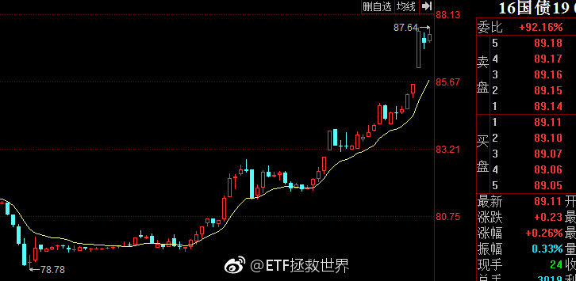

======================================================

ETF拯救世界 (5687069307) @
2018-07-18 10:23:31 Wed  
url: https://weibo.com/5687069307/GqsXIlZSm

$中证环保 sh000827$   野百合也有春天。保持涨幅领先半小时。 ​​​

转发[0]  评论[42]  赞[157] 

======================================================

ETF拯救世界 (5687069307) @
2018-07-18 10:32:27 Wed  
url: https://weibo.com/5687069307/Gqt1leHwy

回复@葱葱AQQ:我不说这次。但是你造吗，国债还有个属性是“避险”。在其他品种非常危险的时候，国债有可能成为最后的避风港。这是它的属性之一。//@葱葱AQQ:后进生请教：国债上涨的逻辑是什么？因为投资者判断后面会继续放水、所以看跌远期利率？

------------------------------------------------------
转推：
>  @ETF拯救世界 (5687069307)
>  2018-07-18 10:05:55 Wed  
>  url: https:/weibo.com/5687069307/GqsQzse19/

>  国债继续大涨。7-10国开债也会跟上。
>  
>  这次唯一遗憾的是收益率没到5。哪怕是到4.5都好啊。 ​​​

转发[43]  评论[28]  赞[106] 

======================================================

ETF拯救世界 (5687069307) @
2018-07-18 10:37:58 Wed  
url: https://weibo.com/5687069307/Gqt3AsbPF

回复@大明190736:永远不亏损卖出任何品种。铁律。所以，只买不会死的品种。//@大明190736:海外债快回本了。。。//@ETF拯救世界:回复@葱葱AQQ:我不说这次。但是你造吗，国债还有个属性是“避险”。在其他品种非常危险的时候，国债有可能成为最后的避风港。这是它的属性之一。

------------------------------------------------------
转推：
>  @ETF拯救世界 (5687069307)
>  2018-07-18 10:05:55 Wed  
>  url: https:/weibo.com/5687069307/GqsQzse19/

>  国债继续大涨。7-10国开债也会跟上。
>  
>  这次唯一遗憾的是收益率没到5。哪怕是到4.5都好啊。 ​​​

转发[17]  评论[15]  赞[139] 

======================================================

ETF拯救世界 (5687069307) @
2018-07-18 10:41:33 Wed  
url: https://weibo.com/5687069307/Gqt52gxOi

浓眉大眼的万科也腰斩了。

房价还没开始跌呢。 ​​​

转发[3]  评论[88]  赞[215] 

======================================================

ETF拯救世界 (5687069307) @
2018-07-18 11:06:00 Wed  
url: https://weibo.com/5687069307/GqteXt7wI

回复@ruannuan:日欧0关税自贸协定这种消息我是不会提前知道的。//@ruannuan:老大能说说买他的逻辑吗？我在wind上看，现在是他的最高点，怎么就便宜呢？

------------------------------------------------------
转推：
>  @ETF拯救世界 (5687069307)
>  2018-07-17 23:34:12 Tue  
>  url: https:/weibo.com/5687069307/GqoI9F5Be/

>  老这样多不好意思。 ​​​

转发[3]  评论[14]  赞[129] 

======================================================

ETF拯救世界 (5687069307) @
2018-07-18 11:09:30 Wed  
url: https://weibo.com/5687069307/GqtgnvC6T

回复@梓溪20180316:我惊呆了。你们都以为阿迪是哪个国家的！//@梓溪20180316:回复@ETF拯救世界:我从来没想到阿迪达斯是德国的。。

------------------------------------------------------
转推：
>  @ETF拯救世界 (5687069307)
>  2018-07-18 09:11:05 Wed  
>  url: https:/weibo.com/5687069307/GqsujsBmq/

>  你已成为这些公司的股东。讲真，传给孙子毫无问题。 ​​​

转发[8]  评论[159]  赞[131] 

======================================================

ETF拯救世界 (5687069307) @
2018-07-18 11:44:16 Wed  
url: https://weibo.com/5687069307/Gqtuv3R62

炒小米的和腾讯的是不是一拨人。卖了腾讯去买小米了。 ​​​

转发[0]  评论[43]  赞[157] 

======================================================

ETF拯救世界 (5687069307) @
2018-07-18 11:51:00 Wed  
url: https://weibo.com/5687069307/Gqtxe3cpA

回复@8点钟的太阳_13214:不好意思，这次真的不算大。因为跌的时候收益率还是不够高。我曾经在5%的时候重仓债券，大熊市赚30%。也是希望有机会跟各位再体会一下。所以无论什么品种，只要有波动，就能挣钱。低买高卖即可。

------------------------------------------------------
转推：
>  @ETF拯救世界 (5687069307)
>  2018-07-18 10:05:55 Wed  
>  url: https:/weibo.com/5687069307/GqsQzse19/

>  国债继续大涨。7-10国开债也会跟上。
>  
>  这次唯一遗憾的是收益率没到5。哪怕是到4.5都好啊。 ​​​

转发[18]  评论[25]  赞[156] 

======================================================

ETF拯救世界 (5687069307) @
2018-07-18 12:01:27 Wed  
url: https://weibo.com/5687069307/GqtBt4rdf

就是这个。

------------------------------------------------------
转推：
>  @ ()
>  2018-07-18 08:18:37 Wed  
>  url: 

>  抱歉，作者已设置仅展示半年内微博，此微博已不可见。 ​​​

转发[12]  评论[40]  赞[141] 

======================================================

ETF拯救世界 (5687069307) @
2018-07-18 13:40:00 Wed  
url: https://weibo.com/5687069307/GquftboxM

提示一下，dax溢价0.8%了。我们买之前是折价的。场内别乱追了 ​​​

转发[6]  评论[49]  赞[186] 

======================================================

ETF拯救世界 (5687069307) @
2018-07-18 13:58:40 Wed  
url: https://weibo.com/5687069307/Gqun2BZmH

无论是什么投资，本金的安全是最最最重要的。

可能是我的思维模式比较保守。P2P这么多年来，投过两个公司。一个是好多年前，得7、8年前了吧，那时候张化桥宣传有利网，我投了点。到期就撤了。第二个投过陆金所，分成好几个标的投，但是其中一个总是有逾期，到期后我就停了。一直也没管，钱应该还在账 ​​​

转发[152]  评论[331]  赞[483] 

======================================================

ETF拯救世界 (5687069307) @
2018-07-18 14:23:12 Wed  
url: https://weibo.com/5687069307/Gqux0htAT

这条新闻我收藏了。目前纳斯达克100估值接近30倍。有意思。 【贝索斯个人财富超过1500亿美元 超过1999年的盖茨】JeffBezos）成为现代史上最富有之人彭博亿万富翁指数显示，贝索斯的个人财富刚刚跨过1500亿美元大关，这比位居第二... 原文：http://t.cn/RgIlLQ7 （分享自@微博搜索） ​​​

转发[43]  评论[66]  赞[175] 

======================================================

ETF拯救世界 (5687069307) @
2018-07-18 14:57:30 Wed  
url: https://weibo.com/5687069307/GquKVnyvh

回复@沉默地飞扬:“保住本金”的意思不是说没有波动。没有波动是银行存款。保住本金的意思是，中长期看，本金不会损失，还会有满意的收益率。短期波动谁也没有办法，只能靠组合争取降低波动率

------------------------------------------------------
转推：
>  @ETF拯救世界 (5687069307)
>  2018-07-18 13:58:40 Wed  
>  url: https:/weibo.com/5687069307/Gqun2BZmH/

>  无论是什么投资，本金的安全是最最最重要的。
>  
>  可能是我的思维模式比较保守。P2P这么多年来，投过两个公司。一个是好多年前，得7、8年前了吧，那时候张化桥宣传有利网，我投了点。到期就撤了。第二个投过陆金所，分成好几个标的投，但是其中一个总是有逾期，到期后我就停了。一直也没管，钱应该还在账 ​​​

转发[24]  评论[19]  赞[163] 

======================================================

ETF拯救世界 (5687069307) @
2018-07-18 15:04:06 Wed  
url: https://weibo.com/5687069307/GquNBtI78

回复@Felix1973:你是哪个p2p的老板。现在美国住的还习惯吗。//@Felix1973:我就是靠p2p起家的

------------------------------------------------------
转推：
>  @ETF拯救世界 (5687069307)
>  2018-07-18 13:58:40 Wed  
>  url: https:/weibo.com/5687069307/Gqun2BZmH/

>  无论是什么投资，本金的安全是最最最重要的。
>  
>  可能是我的思维模式比较保守。P2P这么多年来，投过两个公司。一个是好多年前，得7、8年前了吧，那时候张化桥宣传有利网，我投了点。到期就撤了。第二个投过陆金所，分成好几个标的投，但是其中一个总是有逾期，到期后我就停了。一直也没管，钱应该还在账 ​​​

转发[10]  评论[60]  赞[184] 

======================================================

ETF拯救世界 (5687069307) @
2018-07-18 16:25:55 Wed  
url: https://weibo.com/5687069307/GqvkP2Ama

溢价被干到1.6%

------------------------------------------------------
转推：
>  @ETF拯救世界 (5687069307)
>  2018-07-18 13:40:00 Wed  
>  url: https:/weibo.com/5687069307/GquftboxM/

>  提示一下，dax溢价0.8%了。我们买之前是折价的。场内别乱追了 ​​​

转发[3]  评论[77]  赞[170] 

======================================================

ETF拯救世界 (5687069307) @
2018-07-19 09:47:59 Thu  
url: https://weibo.com/5687069307/GqC9N3F09

7附近开始出货。立个flag

------------------------------------------------------
转推：
>  @ ()
>  2018-07-19 09:46:05 Thu  
>  url: 

>  抱歉，此微博已被作者删除。查看帮助：http://t.cn/Rfd3rQV

转发[15]  评论[59]  赞[169] 

======================================================

ETF拯救世界 (5687069307) @
2018-07-19 10:09:26 Thu  
url: https://weibo.com/5687069307/GqCiuBDq0

我看，这样的情况下，每天盯盘会让你觉得很无聊。

我的建议是，删掉行情软件。回归生活。回归亲人朋友的身边。不再想股市这点烦心事。

然后，你会发现，

更无聊了。 ​​​

转发[63]  评论[179]  赞[347] 

======================================================

ETF拯救世界 (5687069307) @
2018-07-19 10:33:30 Thu  
url: https://weibo.com/5687069307/GqCsgDO0m

回复@青柠乐茶:再买点股票。今天我的某只股票预警又跳出来了，跌了30%，该补仓了。买点股票你会发现，很充实。人也会充满上进心，不会再想财务自由做社会的蛀虫了。//@青柠乐茶:自从买了ETF后觉得每天都很无聊，想问E大平时怎样打发时间的？

------------------------------------------------------
转推：
>  @ETF拯救世界 (5687069307)
>  2018-07-19 10:09:26 Thu  
>  url: https:/weibo.com/5687069307/GqCiuBDq0/

>  我看，这样的情况下，每天盯盘会让你觉得很无聊。
>  
>  我的建议是，删掉行情软件。回归生活。回归亲人朋友的身边。不再想股市这点烦心事。
>  
>  然后，你会发现，
>  
>  
>  
>  
>  
>  
>  
>  
>  
>  更无聊了。 ​​​

转发[19]  评论[76]  赞[186] 

======================================================

ETF拯救世界 (5687069307) @
2018-07-19 10:52:10 Thu  
url: https://weibo.com/5687069307/GqCzQvdGm

回复@青柠乐茶:股票和指数基金玩法肯定不同。指数基金的策略前提是：不会死。而股票有可能死，所以出发点就完全不同，导致策略也不同。股票交易三种方式，价值、趋势、量化。我用量化方式买入一篮子股票，现在主要是为了打新。但是股票仓位占比极低，全部几十只加起来才十几个点。

------------------------------------------------------
转推：
>  @ETF拯救世界 (5687069307)
>  2018-07-19 10:09:26 Thu  
>  url: https:/weibo.com/5687069307/GqCiuBDq0/

>  我看，这样的情况下，每天盯盘会让你觉得很无聊。
>  
>  我的建议是，删掉行情软件。回归生活。回归亲人朋友的身边。不再想股市这点烦心事。
>  
>  然后，你会发现，
>  
>  
>  
>  
>  
>  
>  
>  
>  
>  更无聊了。 ​​​

转发[34]  评论[49]  赞[145] 

======================================================

ETF拯救世界 (5687069307) @
2018-07-19 10:58:33 Thu  
url: https://weibo.com/5687069307/GqCCqEcow

回复@苏黎世投机者:是策略问题。不同的人用不同的策略，拿股票来说。重仓某只与很轻的仓位持有，策略完全不同。就像刚才说的下跌30%的那只，补完了仓位从0.12%上升到0.25%了。这与重仓持有就是完全不同的策略，买卖方式完全不同。重仓持有的话，下跌30%已经是大灾难了。

------------------------------------------------------
转推：
>  @ETF拯救世界 (5687069307)
>  2018-07-19 10:09:26 Thu  
>  url: https:/weibo.com/5687069307/GqCiuBDq0/

>  我看，这样的情况下，每天盯盘会让你觉得很无聊。
>  
>  我的建议是，删掉行情软件。回归生活。回归亲人朋友的身边。不再想股市这点烦心事。
>  
>  然后，你会发现，
>  
>  
>  
>  
>  
>  
>  
>  
>  
>  更无聊了。 ​​​

转发[7]  评论[23]  赞[128] 

======================================================

ETF拯救世界 (5687069307) @
2018-07-19 11:05:10 Thu  
url: https://weibo.com/5687069307/GqCF7jRI8

我说的“任何品种不赚钱一定不走”，是有前提的。

第一个前提是，这个品种不会死。这个标准就能筛掉70%的投资品种了。

第二个前提是，成本非常便宜。不一定是最便宜，一定是非常便宜。

第三个前提是，我已经将出现黑天鹅的情况做了预期。即使发生了极低概率，它真的死了，也不会对整个组合产生致命 ​​​

转发[124]  评论[198]  赞[336] 

======================================================

ETF拯救世界 (5687069307) @
2018-07-19 11:12:41 Thu  
url: https://weibo.com/5687069307/GqCIaq7P8

如果这波反弹就此结束，那真的是远远弱于我的预期。熊市中这么弱的反弹都很少见。我以为至少得碰碰2850-2900呢。 ​​​

转发[30]  评论[95]  赞[267] 

======================================================

ETF拯救世界 (5687069307) @
2018-07-19 11:16:24 Thu  
url: https://weibo.com/5687069307/GqCJG8Z5A

难道下周又要开车了？好气哦。

涨几天休息休息不好吗。

BGM库存快空了啊喂。 ​​​

转发[13]  评论[171]  赞[317] 

+++++++++++++++++++++++++++++++++++++++++++++++++++++

图片：

======================================================

ETF拯救世界 (5687069307) @
2018-07-19 13:18:36 Thu  
url: https://weibo.com/5687069307/GqDxgEfDJ

今天涨跌家数1:5，中小股股票继续回归。很好，很健康。 ​​​

转发[40]  评论[75]  赞[240] 

======================================================

ETF拯救世界 (5687069307) @
2018-07-19 14:05:35 Thu  
url: https://weibo.com/5687069307/GqDQm8Bn4

回复@ETF未来式:如果你过去二十年一直在跟踪宏观经济，你会发现每天都有各种各样严重的问题。每次都好像过不去了。包括宏观，房价各种各样的。但是其实一直没什么大事，即使经历了金融危机，大多数人还是越来越好。还是那句话，保守的乐观。不保守，会死的快。不乐观，这辈子也就这样了。

------------------------------------------------------
转推：
>  @ETF拯救世界 (5687069307)
>  2018-07-19 13:18:36 Thu  
>  url: https:/weibo.com/5687069307/GqDxgEfDJ/

>  今天涨跌家数1:5，中小股股票继续回归。很好，很健康。 ​​​

转发[34]  评论[68]  赞[237] 

======================================================

ETF拯救世界 (5687069307) @
2018-07-19 14:06:48 Thu  
url: https://weibo.com/5687069307/GqDQQiOwO

如果两只会新低，谁会先行一步……

------------------------------------------------------
转推：
>  @ETF拯救世界 (5687069307)
>  2018-07-17 10:23:32 Tue  
>  url: https:/weibo.com/5687069307/Gqjxe62DI/

>  我这半年多关注的8848和腾讯，不是说对这两家公司有什么看法，我是在观察情绪。
>  
>  这两家公司在持续暴涨的时候，带了很多很多情绪。尤其是前者。很多人因为没买后悔的夜不能寐，很多人买了抱持坚定信念可以再涨好几倍。
>  
>  一家公司，一个行业，到底是不是真的能预判五年、十年后？
>  
>  很难讲。前几天看到一 ​​​

转发[20]  评论[43]  赞[131] 

======================================================

ETF拯救世界 (5687069307) @
2018-07-19 14:52:34 Thu  
url: https://weibo.com/5687069307/GqE9q5uGk

8848赢了。有心的朋友可以好好回顾一次这次的情况，包括大众的狂热，以及其他。相信对未来的投资会有非常大的帮助。会让你更加冷静看待这个市场的鼓噪。//@ETF拯救世界:如果两只会新低，谁会先行一步……

------------------------------------------------------
转推：
>  @ETF拯救世界 (5687069307)
>  2018-07-17 10:23:32 Tue  
>  url: https:/weibo.com/5687069307/Gqjxe62DI/

>  我这半年多关注的8848和腾讯，不是说对这两家公司有什么看法，我是在观察情绪。
>  
>  这两家公司在持续暴涨的时候，带了很多很多情绪。尤其是前者。很多人因为没买后悔的夜不能寐，很多人买了抱持坚定信念可以再涨好几倍。
>  
>  一家公司，一个行业，到底是不是真的能预判五年、十年后？
>  
>  很难讲。前几天看到一 ​​​

转发[16]  评论[76]  赞[157] 

======================================================

ETF拯救世界 (5687069307) @
2018-07-19 17:44:10 Thu  
url: https://weibo.com/5687069307/GqFh52vt0

6.8了，6.9以上开始出。我预料到了人民币贬值，但没预料到美元债像个弱鸡。//@ETF拯救世界:7附近开始出货。立个flag

------------------------------------------------------
转推：
>  @ ()
>  2018-07-19 09:46:05 Thu  
>  url: 

>  抱歉，此微博已被作者删除。查看帮助：http://t.cn/Rfd3rQV

转发[5]  评论[78]  赞[158] 

======================================================

ETF拯救世界 (5687069307) @
2018-07-19 18:57:50 Thu  
url: https://weibo.com/5687069307/GqFKYDspq

最好的慈善是先让自己，家人生活的好。还有余力再去帮助别人。

------------------------------------------------------
转推：
>  @ ()
>  2018-07-19 18:36:09 Thu  
>  url: 

>  抱歉，作者已设置仅展示半年内微博，此微博已不可见。 ​​​

转发[25]  评论[62]  赞[362] 

======================================================

ETF拯救世界 (5687069307) @
2018-07-20 08:46:11 Fri  
url: https://weibo.com/5687069307/GqLbcqK06

空调的发明者堪称伟大。

不接受质疑。 ​​​

转发[3]  评论[120]  赞[320] 

======================================================

ETF拯救世界 (5687069307) @
2018-07-20 08:58:08 Fri  
url: https://weibo.com/5687069307/GqLg3fl99

黄金快跌破1200了，我们什么时候动手？

2011年1900清仓后一直没有真正建仓。十年一个轮回，开始关注。 ​​​

转发[72]  评论[139]  赞[220] 

+++++++++++++++++++++++++++++++++++++++++++++++++++++

图片：
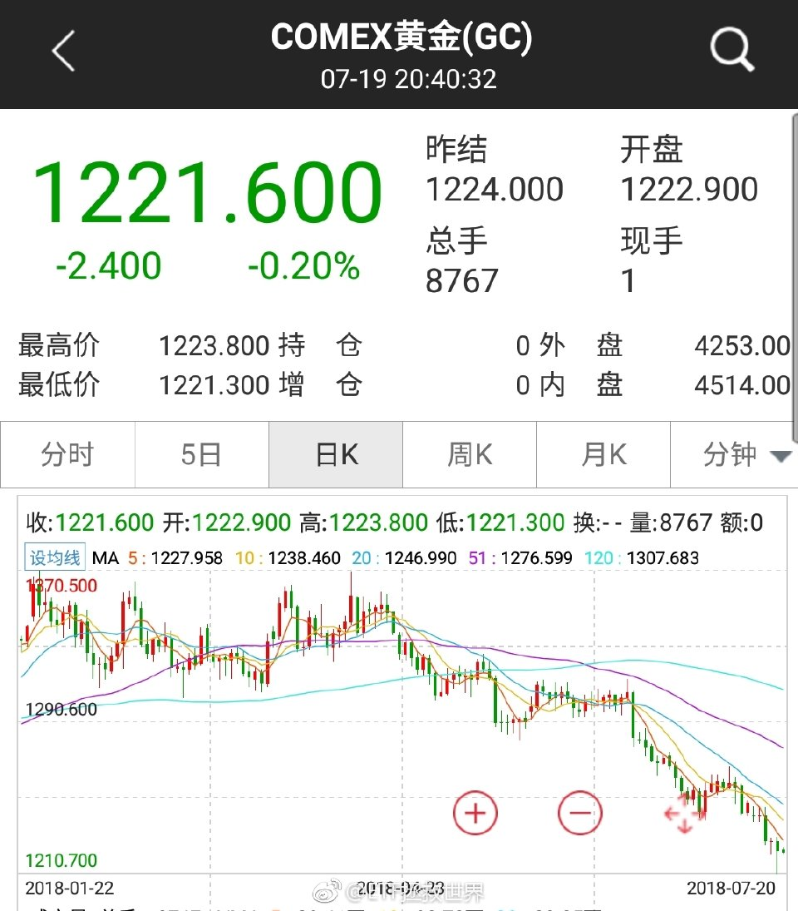

======================================================

ETF拯救世界 (5687069307) @
2018-07-20 09:33:16 Fri  
url: https://weibo.com/5687069307/GqLujliKE

A股是一个波动特别大的市场。只要大方向做对了，赚钱就会又快又多。

但是因为波动大，所以会有比较长的时间是下跌。因为涨的时候快，一步到位了，所以通常会用很久的下跌去修复。

那么，一个总的逻辑就应该是，在A股暴涨的时候尽量跟上。在A股长时间的下跌过程中，尽量保持不亏损。这样几轮过后，收 ​​​

转发[154]  评论[242]  赞[331] 

======================================================

ETF拯救世界 (5687069307) @
2018-07-20 09:36:20 Fri  
url: https://weibo.com/5687069307/GqLvy9SQA

无论是突破平台后的新高，还是跌破平台后的新低。

后面大概率跟的还是新高和新低。

不信你观察一下。 ​​​

转发[59]  评论[69]  赞[207] 

======================================================

ETF拯救世界 (5687069307) @
2018-07-20 09:38:10 Fri  
url: https://weibo.com/5687069307/GqLwiArcO

感觉鹅厂也不甘落后啊。//@ETF拯救世界:8848赢了。有心的朋友可以好好回顾一次这次的情况，包括大众的狂热，以及其他。相信对未来的投资会有非常大的帮助。会让你更加冷静看待这个市场的鼓噪。//@ETF拯救世界:如果两只会新低，谁会先行一步……

------------------------------------------------------
转推：
>  @ETF拯救世界 (5687069307)
>  2018-07-17 10:23:32 Tue  
>  url: https:/weibo.com/5687069307/Gqjxe62DI/

>  我这半年多关注的8848和腾讯，不是说对这两家公司有什么看法，我是在观察情绪。
>  
>  这两家公司在持续暴涨的时候，带了很多很多情绪。尤其是前者。很多人因为没买后悔的夜不能寐，很多人买了抱持坚定信念可以再涨好几倍。
>  
>  一家公司，一个行业，到底是不是真的能预判五年、十年后？
>  
>  很难讲。前几天看到一 ​​​

转发[5]  评论[8]  赞[80] 

======================================================

ETF拯救世界 (5687069307) @
2018-07-20 09:39:38 Fri  
url: https://weibo.com/5687069307/GqLwTy9Rl

回复@O_Zhong_O:五年后回头看这条消息会有无限感慨。

------------------------------------------------------
转推：
>  @ETF拯救世界 (5687069307)
>  2018-07-20 09:36:20 Fri  
>  url: https:/weibo.com/5687069307/GqLvy9SQA/

>  无论是突破平台后的新高，还是跌破平台后的新低。
>  
>  后面大概率跟的还是新高和新低。
>  
>  不信你观察一下。 ​​​

转发[11]  评论[14]  赞[138] 

======================================================

ETF拯救世界 (5687069307) @
2018-07-20 09:41:44 Fri  
url: https://weibo.com/5687069307/GqLxL3gXu

回复@美味果冻64516:白银基金161226万万不可以买。想玩白银网格可以去银行买纸白银。支持美元玩，跟的更好。//@美味果冻64516:想弄点白银基金来着

------------------------------------------------------
转推：
>  @ETF拯救世界 (5687069307)
>  2018-07-20 08:58:08 Fri  
>  url: https:/weibo.com/5687069307/GqLg3fl99/

>  黄金快跌破1200了，我们什么时候动手？
>  
>  2011年1900清仓后一直没有真正建仓。十年一个轮回，开始关注。 ​​​

转发[34]  评论[46]  赞[105] 

======================================================

ETF拯救世界 (5687069307) @
2018-07-20 09:44:35 Fri  
url: https://weibo.com/5687069307/GqLyUcgG8

新低。//@ETF拯救世界:感觉鹅厂也不甘落后啊。//@ETF拯救世界:8848赢了。有心的朋友可以好好回顾一次这次的情况，包括大众的狂热，以及其他。相信对未来的投资会有非常大的帮助。会让你更加冷静看待这个市场的鼓噪。//@ETF拯救世界:如果两只会新低，谁会先行一步……

------------------------------------------------------
转推：
>  @ETF拯救世界 (5687069307)
>  2018-07-17 10:23:32 Tue  
>  url: https:/weibo.com/5687069307/Gqjxe62DI/

>  我这半年多关注的8848和腾讯，不是说对这两家公司有什么看法，我是在观察情绪。
>  
>  这两家公司在持续暴涨的时候，带了很多很多情绪。尤其是前者。很多人因为没买后悔的夜不能寐，很多人买了抱持坚定信念可以再涨好几倍。
>  
>  一家公司，一个行业，到底是不是真的能预判五年、十年后？
>  
>  很难讲。前几天看到一 ​​​

转发[3]  评论[14]  赞[92] 

======================================================

ETF拯救世界 (5687069307) @
2018-07-20 09:49:59 Fri  
url: https://weibo.com/5687069307/GqLB69wgb

回复@李白先生vip:这不是经验。你要看它持有的是什么品种。持有期货品种的基金不可以买，比如南方油，比如226.。长期损耗让我们根本无法长期持有。//@李白先生vip:经验是无价之宝

------------------------------------------------------
转推：
>  @ETF拯救世界 (5687069307)
>  2018-07-20 08:58:08 Fri  
>  url: https:/weibo.com/5687069307/GqLg3fl99/

>  黄金快跌破1200了，我们什么时候动手？
>  
>  2011年1900清仓后一直没有真正建仓。十年一个轮回，开始关注。 ​​​

转发[20]  评论[41]  赞[122] 

======================================================

ETF拯救世界 (5687069307) @
2018-07-20 09:57:17 Fri  
url: https://weibo.com/5687069307/GqLE3FGss

腰斩。经典的散户顶部接盘实例。

------------------------------------------------------
转推：
>  @ETF拯救世界 (5687069307)
>  2017-12-04 09:36:18 Mon  
>  url: https:/weibo.com/5687069307/Fy3wE2Hh9/

>  8848获利筹码只剩55%了。这个股票换手虽然低，但是在高位几个月了，基本上接盘的都吃饱了。。。 ​​​

转发[5]  评论[39]  赞[123] 

======================================================

ETF拯救世界 (5687069307) @
2018-07-20 10:01:13 Fri  
url: https://weibo.com/5687069307/GqLFEixiU

$恒生指数 hkHSI$  有没有机会在25000左右把之前平衡掉的接回来？ ​​​

转发[9]  评论[30]  赞[116] 

======================================================

ETF拯救世界 (5687069307) @
2018-07-20 10:02:17 Fri  
url: https://weibo.com/5687069307/GqLG5vUw0

回复@ETF信徒者:别说话，_____。

------------------------------------------------------
转推：
>  @ETF拯救世界 (5687069307)
>  2018-07-17 10:23:32 Tue  
>  url: https:/weibo.com/5687069307/Gqjxe62DI/

>  我这半年多关注的8848和腾讯，不是说对这两家公司有什么看法，我是在观察情绪。
>  
>  这两家公司在持续暴涨的时候，带了很多很多情绪。尤其是前者。很多人因为没买后悔的夜不能寐，很多人买了抱持坚定信念可以再涨好几倍。
>  
>  一家公司，一个行业，到底是不是真的能预判五年、十年后？
>  
>  很难讲。前几天看到一 ​​​

转发[0]  评论[36]  赞[89] 

======================================================

ETF拯救世界 (5687069307) @
2018-07-20 10:07:05 Fri  
url: https://weibo.com/5687069307/GqLI2pJOh

国债继续疯。收益率破3清仓债券。 ​​​

转发[35]  评论[62]  赞[162] 

+++++++++++++++++++++++++++++++++++++++++++++++++++++

图片：
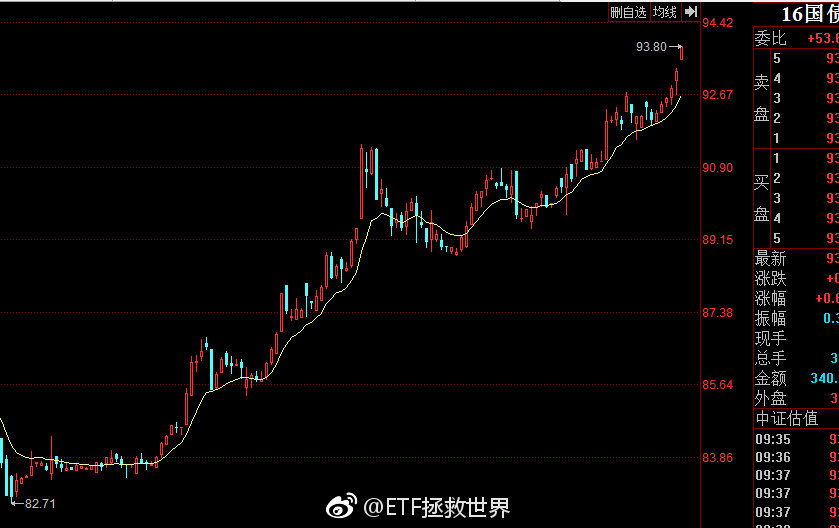

======================================================

ETF拯救世界 (5687069307) @
2018-07-20 10:13:03 Fri  
url: https://weibo.com/5687069307/GqLKsuhQW

回复@陶醉6松手4电学_337:央妈都带人来给你接盘了你还不卖？//@陶醉6松手4电学_337:昨天，央行要求商业银行买等级低的债券。是利好债市的啊！！咋就要清仓呢？

------------------------------------------------------
转推：
>  @ETF拯救世界 (5687069307)
>  2018-07-20 10:07:05 Fri  
>  url: https:/weibo.com/5687069307/GqLI2pJOh/

>  国债继续疯。收益率破3清仓债券。 ​​​

转发[14]  评论[55]  赞[144] 

======================================================

ETF拯救世界 (5687069307) @
2018-07-20 10:30:24 Fri  
url: https://weibo.com/5687069307/GqLRvdhle

我有种预感。这一波恒生我们有机会加到10%+，甚至15%+。 ​​​

转发[12]  评论[93]  赞[247] 

======================================================

ETF拯救世界 (5687069307) @
2018-07-20 10:39:12 Fri  
url: https://weibo.com/5687069307/GqLV4dxqN

打扰了。[拜拜]

------------------------------------------------------
转推：
>  @ETF拯救世界 (5687069307)
>  2018-07-20 10:30:24 Fri  
>  url: https:/weibo.com/5687069307/GqLRvdhle/

>  我有种预感。这一波恒生我们有机会加到10%+，甚至15%+。 ​​​

转发[1]  评论[68]  赞[154] 

======================================================

ETF拯救世界 (5687069307) @
2018-07-20 11:58:14 Fri  
url: https://weibo.com/5687069307/GqMr9x3xy

今天球球头条有个帖子，叫做“腾讯创新低，该买还是该卖。”

去看看评论。

再去找找1月底关于腾讯的帖子以及评论。

你会对这个市场的投资人有更深刻的理解。 ​​​

转发[17]  评论[87]  赞[191] 

======================================================

ETF拯救世界 (5687069307) @
2018-07-20 12:13:15 Fri  
url: https://weibo.com/5687069307/GqMxfrvGr

刷球球，除了学习投资知识，怎么观察群众情绪？我一般观察以下几点：

第一，对于大盘、个股，群众是如何一致性的看多看好，对于不同声音一致性的打压，尤其是短期涨幅巨大的情况下。一般出现这种情况就要小心。反之亦然。

第二，对于大V的受欢迎程度。如果某大v在某段时间内突然爆红，极受欢迎，则要 ​​​

转发[182]  评论[267]  赞[322] 

======================================================

ETF拯救世界 (5687069307) @
2018-07-20 12:30:09 Fri  
url: https://weibo.com/5687069307/GqME703ta

回复@奥斯特洛夫大柴夫斯基:我没明白，私募基金怎么会发行失败的？学习好的给讲讲。不是几百万就能成立吗。//@奥斯特洛夫大柴夫斯基:雪球上有个亿万富翁产品发行失败，哈哈，快去围观

------------------------------------------------------
转推：
>  @ETF拯救世界 (5687069307)
>  2018-07-20 12:13:15 Fri  
>  url: https:/weibo.com/5687069307/GqMxfrvGr/

>  刷球球，除了学习投资知识，怎么观察群众情绪？我一般观察以下几点：
>  
>  第一，对于大盘、个股，群众是如何一致性的看多看好，对于不同声音一致性的打压，尤其是短期涨幅巨大的情况下。一般出现这种情况就要小心。反之亦然。
>  
>  第二，对于大V的受欢迎程度。如果某大v在某段时间内突然爆红，极受欢迎，则要 ​​​

转发[5]  评论[30]  赞[104] 

======================================================

ETF拯救世界 (5687069307) @
2018-07-20 12:41:54 Fri  
url: https://weibo.com/5687069307/GqMISrOPp

接着上一条说。

我们观察群众情绪，一方面是体验市场温度。一方面是给我们自己做出警示。

具体说，

如果过去一段时间我们自己表现的太好，则一定要更加严格谨慎的对待接下来的考验。反复确认之前成功的策略以及品种是否有可能均值回归。

尽量将自己的成绩持久性的保持在前20%-30%。不要做最好。如 ​​​

转发[84]  评论[159]  赞[292] 

======================================================

ETF拯救世界 (5687069307) @
2018-07-20 13:35:55 Fri  
url: https://weibo.com/5687069307/GqN4O1d5f

$全指金融 sh000992$   回本有望了…… ​​​

转发[2]  评论[38]  赞[151] 

======================================================

ETF拯救世界 (5687069307) @
2018-07-20 13:43:20 Fri  
url: https://weibo.com/5687069307/GqN7Orjy4

涨了一个点觉得仓位低难受的不得了的人自己去加仓，不要到我这里抱怨。否则一律拉黑。

50也加了，券商也加了，金融也加了。还觉得不行的赶紧取关。 ​​​

转发[10]  评论[81]  赞[291] 

======================================================

ETF拯救世界 (5687069307) @
2018-07-20 13:56:57 Fri  
url: https://weibo.com/5687069307/GqNdlbVXd

回复@封单爱吐槽:我以后还是闭嘴算了。只干不说。//@封单爱吐槽:e大你的嘴是开了光的呀//@ETF拯救世界:回复@陶醉6松手4电学_337:央妈都带人来给你接盘了你还不卖？//@陶醉6松手4电学_337:昨天，央行要求商业银行买等级低的债券。是利好债市的啊！！咋就要清仓呢？

------------------------------------------------------
转推：
>  @ETF拯救世界 (5687069307)
>  2018-07-20 10:07:05 Fri  
>  url: https:/weibo.com/5687069307/GqLI2pJOh/

>  国债继续疯。收益率破3清仓债券。 ​​​

转发[2]  评论[19]  赞[111] 

======================================================

ETF拯救世界 (5687069307) @
2018-07-20 13:59:35 Fri  
url: https://weibo.com/5687069307/GqNepoTGW

注意 $全指金融 sh000992$   之前我们浮亏4个多点。今天弄不好一把干红。

这就是我一直在强调的，“你那点浮亏，牛市来了，一周，最多半个月就翻红，然后开始资产飞跃。”

今天是不是反转日，我不知道。但是你可以感受一下我说的意思。有点浮亏，浮亏几年，根本不是问题。只要浮亏幅度不大，分分钟变 ​​​

转发[31]  评论[101]  赞[271] 

======================================================

ETF拯救世界 (5687069307) @
2018-07-20 14:18:09 Fri  
url: https://weibo.com/5687069307/GqNlWCg5h

$中证转债 sh000832$   $中证红利 sz399922$   开始赚钱。 ​​​

转发[5]  评论[59]  赞[167] 

======================================================

ETF拯救世界 (5687069307) @
2018-07-20 14:25:02 Fri  
url: https://weibo.com/5687069307/GqNoK27bV

我就说这么弱的反弹真的没见过。看来还要继续。2900上下浮动50个点都算正常情况。

------------------------------------------------------
转推：
>  @ETF拯救世界 (5687069307)
>  2018-07-19 11:12:41 Thu  
>  url: https:/weibo.com/5687069307/GqCIaq7P8/

>  如果这波反弹就此结束，那真的是远远弱于我的预期。熊市中这么弱的反弹都很少见。我以为至少得碰碰2850-2900呢。 ​​​

转发[16]  评论[52]  赞[196] 

======================================================

ETF拯救世界 (5687069307) @
2018-07-20 14:31:43 Fri  
url: https://weibo.com/5687069307/GqNrs8GW5

关于网格。有波动就有利润。提款机。

注意，如果你也要做，请一定做好压力测试。这是最关键的。 ​​​

转发[30]  评论[145]  赞[337] 

+++++++++++++++++++++++++++++++++++++++++++++++++++++

图片：
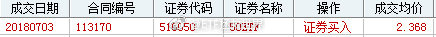
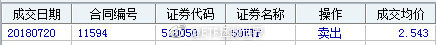

======================================================

ETF拯救世界 (5687069307) @
2018-07-20 14:38:52 Fri  
url: https://weibo.com/5687069307/GqNumaxSn

波段仓位和长线仓位毫无关系。这个不要弄错。

未来会发生什么，我们都不知道。也许一个区间波动几年不涨。这个时候，波段仓位可以提供源源不断的利润。但是如果开始长牛，只做波段又赚不到大钱，所以长线仓位要拿死。

之前我说，考虑在计划中加入波段仓位，就是干这个用的。有机会会加进去。不过这个 ​​​

转发[46]  评论[186]  赞[350] 

======================================================

ETF拯救世界 (5687069307) @
2018-07-20 21:47:08 Fri  
url: https://weibo.com/5687069307/GqQicdMMs

每日打卡（195）

坚持 ​​​

转发[0]  评论[38]  赞[298] 

+++++++++++++++++++++++++++++++++++++++++++++++++++++

图片：

======================================================

ETF拯救世界 (5687069307) @
2018-07-22 08:36:12 Sun  
url: https://weibo.com/5687069307/Gr3Y90pmC

今天巡视北二环，昨天视察了东二环。

谁能想到我即将成为接盘侠。 

苍天饶过谁。 ​​​

转发[16]  评论[318]  赞[368] 

======================================================

ETF拯救世界 (5687069307) @
2018-07-22 16:44:54 Sun  
url: https://weibo.com/5687069307/Gr7avAr6p

回复@摇身一变我就是孙悟空:可能你挣了钱是要带到那边去吧。我不是，无论是工作还是投资挣得钱我都是要花的。该花的时候就花，不然挣钱干嘛？顺便说一句，这个评论点赞的全都拉黑//@摇身一变我就是孙悟空:所以etf没啥用 最后还是得房子 哈哈哈哈哈哈 人生讽刺啊

------------------------------------------------------
转推：
>  @ETF拯救世界 (5687069307)
>  2018-07-22 08:36:12 Sun  
>  url: https:/weibo.com/5687069307/Gr3Y90pmC/

>  今天巡视北二环，昨天视察了东二环。
>  
>  谁能想到我即将成为接盘侠。 
>  
>  苍天饶过谁。 ​​​

转发[2]  评论[77]  赞[149] 

======================================================

ETF拯救世界 (5687069307) @
2018-07-22 16:59:03 Sun  
url: https://weibo.com/5687069307/Gr7gfnYWc

投资是为了什么呢。其实绝大多数人投资都是想用投资收益过上想过的日子，买想买的东西——不眨眼那种买。

你不会说，你在股票上挣了钱还是要买奥利奥，迪奥，奥迪啊，好讽刺啊。你居然没有把股票拿到临终那一天啊，你怎么不吃糠咽菜去积攒基金份额啊。

买学区房当然也一样，这就是个消费品。想投资房 ​​​

转发[34]  评论[169]  赞[351] 

======================================================

ETF拯救世界 (5687069307) @
2018-07-22 20:43:04 Sun  
url: https://weibo.com/5687069307/Gr8Jb5a4q

回复@伟哥就是你伟哥:我的感受和绝大多数人一样。但我知道这件事可能也很难真正改变什么。后续的发展可以参照十年前。至于医药指数的投资，如果真的挖深坑，我愿意为国护盘。//@伟哥就是你伟哥:E大，有空能谈谈你对这段时间沸沸扬扬的疫苗造假事件的看法吗？

------------------------------------------------------
转推：
>  @ETF拯救世界 (5687069307)
>  2018-07-22 08:36:12 Sun  
>  url: https:/weibo.com/5687069307/Gr3Y90pmC/

>  今天巡视北二环，昨天视察了东二环。
>  
>  谁能想到我即将成为接盘侠。 
>  
>  苍天饶过谁。 ​​​

转发[9]  评论[49]  赞[184] 

======================================================

ETF拯救世界 (5687069307) @
2018-07-22 22:10:15 Sun  
url: https://weibo.com/5687069307/Gr9izp8v2

回复@A夜如故:据官方说法，这次疫苗主要是效价指标不合格，就是可能会失效，对健康应该没什么危害，打了这些批次的家长暂时不用太担心。后续密切关注吧，另外是不是要补种疫苗

------------------------------------------------------
转推：
>  @ETF拯救世界 (5687069307)
>  2018-07-22 08:36:12 Sun  
>  url: https:/weibo.com/5687069307/Gr3Y90pmC/

>  今天巡视北二环，昨天视察了东二环。
>  
>  谁能想到我即将成为接盘侠。 
>  
>  苍天饶过谁。 ​​​

转发[1]  评论[78]  赞[129] 

======================================================

ETF拯救世界 (5687069307) @
2018-07-22 23:28:29 Sun  
url: https://weibo.com/5687069307/Gr9Okht5V

不知道该说什么。也不知道怎么说。

不过，在三周后，没人再提起这件事的时候，我依然会持续关注。

就像持续关注这些年那些轰动一时的事件后续发展一样。

关注热门事件的后续发展，会让你有两点感悟。

第一是，你一定想不到，大多数事件会最终不了了之。

第二是，几乎什么都没改变。

到底从什么时 ​​​

转发[66]  评论[162]  赞[371] 

======================================================

ETF拯救世界 (5687069307) @
2018-07-23 08:40:05 Mon  
url: https://weibo.com/5687069307/Grdqdn9ai

就是这13位，已拉黑。如果有误伤的，不好意思了。

最近水逆的厉害，很多不顺心的事情，心情不好，以后心情好了再解黑。

昨天车还出问题了，突然自动熄火，不知道是不是自动启停出问题了。抽空去查查。

刚买完DAX就出这事，感觉是，你爱德国然而德国不爱你……[doge] ​​​

转发[3]  评论[169]  赞[187] 

+++++++++++++++++++++++++++++++++++++++++++++++++++++

图片：
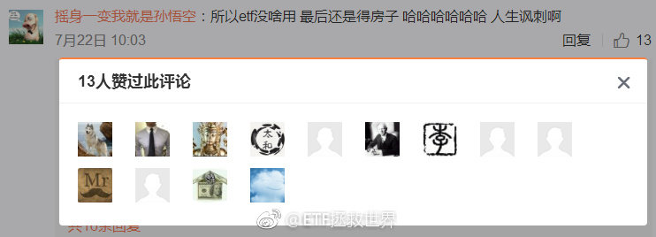

======================================================

ETF拯救世界 (5687069307) @
2018-07-23 08:44:23 Mon  
url: https://weibo.com/5687069307/GrdrXtD2F

//@陈宇极品投资: 转发微博

------------------------------------------------------
转推：
>  @ ()
>  2018-07-23 08:40:02 Mon  
>  url: 

>  抱歉，此微博已被作者删除。查看帮助：http://t.cn/Rfd3rQV

转发[36]  评论[23]  赞[74] 

======================================================

ETF拯救世界 (5687069307) @
2018-07-23 09:47:07 Mon  
url: https://weibo.com/5687069307/GrdRqi0ny

你看，所以其实没有什么行业是完全安全的，更别说个股了。

食品饮料安全吗？三聚和塑化剂的事这么快就忘了？

医药安全吗？你看看。

金融地产？

公用事业？

其实到处都是坑。

所以，指数投资+低估是躲坑最佳方式。对于普通投资者来讲。 ​​​

转发[117]  评论[128]  赞[328] 

======================================================

ETF拯救世界 (5687069307) @
2018-07-23 10:04:52 Mon  
url: https://weibo.com/5687069307/GrdYCrd03

但是，说一点我的经验：每次某个行业出大事挖大坑，事后看，都是真正的钻石机会。

------------------------------------------------------
转推：
>  @ETF拯救世界 (5687069307)
>  2018-07-23 09:47:07 Mon  
>  url: https:/weibo.com/5687069307/GrdRqi0ny/

>  你看，所以其实没有什么行业是完全安全的，更别说个股了。
>  
>  食品饮料安全吗？三聚和塑化剂的事这么快就忘了？
>  
>  医药安全吗？你看看。
>  
>  金融地产？
>  
>  公用事业？
>  
>  其实到处都是坑。
>  
>  所以，指数投资+低估是躲坑最佳方式。对于普通投资者来讲。 ​​​

转发[54]  评论[90]  赞[258] 

======================================================

ETF拯救世界 (5687069307) @
2018-07-23 10:11:33 Mon  
url: https://weibo.com/5687069307/Gre1kzdug

前期低点一旦守不住，平台破了就很麻烦。新低和新高一样，大概率都会继续。但是，请看到这条微博的朋友不要因为这个卖出你持有的腾讯，这个锅我背不起。我只是就事论事。否则以后什么都不敢说了。//@ETF拯救世界:腾讯能不能守住前期低点是我比较关注的。好消息是估值已经降至35倍。

------------------------------------------------------
转推：
>  @ETF拯救世界 (5687069307)
>  2018-03-22 09:34:01 Thu  
>  url: https:/weibo.com/5687069307/G8wd21cxW/

>  腾讯，60倍PE。未来五年看，真的能有特别好的收益率吗。
>  
>  学习了。 ​​​

转发[25]  评论[53]  赞[175] 

======================================================

ETF拯救世界 (5687069307) @
2018-07-23 10:42:42 Mon  
url: https://weibo.com/5687069307/GredZ8iYX

回复@DG无为:你这个创意真的太好了。我有时候会想，如果真的写书，起什么名字。看到你这个我觉得真不错啊。《指数基金拯救世界》也可以。//@DG无为:回复@生长的韭菜:我估计可能就叫《ETF拯救世界》

------------------------------------------------------
转推：
>  @ETF拯救世界 (5687069307)
>  2018-03-22 09:34:01 Thu  
>  url: https:/weibo.com/5687069307/G8wd21cxW/

>  腾讯，60倍PE。未来五年看，真的能有特别好的收益率吗。
>  
>  学习了。 ​​​

转发[2]  评论[69]  赞[156] 

======================================================

ETF拯救世界 (5687069307) @
2018-07-23 10:49:33 Mon  
url: https://weibo.com/5687069307/GregLoKmB

回复@勤奋happyfire:主动基金的问题就是确实无法把握它的表现。即使跌了很多，也不知道补仓的话未来基金经理会不会继续踩坑。如果是我，可能会把空间拉的大一点慢慢补仓。

------------------------------------------------------
转推：
>  @ETF拯救世界 (5687069307)
>  2018-07-23 09:47:07 Mon  
>  url: https:/weibo.com/5687069307/GrdRqi0ny/

>  你看，所以其实没有什么行业是完全安全的，更别说个股了。
>  
>  食品饮料安全吗？三聚和塑化剂的事这么快就忘了？
>  
>  医药安全吗？你看看。
>  
>  金融地产？
>  
>  公用事业？
>  
>  其实到处都是坑。
>  
>  所以，指数投资+低估是躲坑最佳方式。对于普通投资者来讲。 ​​​

转发[14]  评论[30]  赞[124] 

======================================================

ETF拯救世界 (5687069307) @
2018-07-23 11:21:30 Mon  
url: https://weibo.com/5687069307/GretJucrK

其实入门的话，罗总这本介绍指数基金的书是很不错的。有希望了解指数基金的朋友可以看看~~

------------------------------------------------------
转推：
>  @老罗话指数投资 (6177581254)
>  2018-07-23 10:53:49 Mon  
>  url: https:/weibo.com/6177581254/Greiv2EGN/

>  发布了头条文章：《老罗新书上市，京东大促销两天，55元2本》  http://t.cn/RgdAgb7 ​​​

转发[36]  评论[158]  赞[218] 

======================================================

ETF拯救世界 (5687069307) @
2018-07-23 12:44:53 Mon  
url: https://weibo.com/5687069307/Grf1zpC9x

如果出了事，不是捂着盖着，而是解决它，真的会福泽万世。作为一个父亲，看完这样的报道，再想想现在发生的，心如刀割。致敬有良知的记者。

------------------------------------------------------
转推：
>  @新浪财经 (1638782947)
>  2018-07-23 10:33:20 Mon  
>  url: https:/weibo.com/1638782947/GreabmExj/

>  【8年前疫苗案记者一语成谶:山西案不了了之全国必出事】事实上，国内最早揭露疫苗问题黑幕的是著名的调查记者——中国经济时报前首席记者王克勤。数年前，王克勤在一次接受媒体采访时表示：“山西疫苗案不了了之，山东及全国必出问题！”没想到，今天的事情印证了他的预言。王克勤一语成谶，令人唏嘘。 ​​​

转发[59]  评论[49]  赞[292] 

======================================================

ETF拯救世界 (5687069307) @
2018-07-23 12:55:49 Mon  
url: https://weibo.com/5687069307/Grf61aBHU

其实你们大多数人，甚至大多数父母，可能没有体会过刚才那篇文章里那种孩子出事后撕裂般的痛苦。

我儿子曾经有一次病了，做了检查，疑似很严重。如果确诊，是没有办法治疗的那种。

知道这个检查结果我就崩溃了。带着他到各大医院去看，根本不在乎花多少钱，那时候钱已经没意义了，找最好的医生，做最 ​​​

转发[91]  评论[341]  赞[937] 

======================================================

ETF拯救世界 (5687069307) @
2018-07-23 13:18:32 Mon  
url: https://weibo.com/5687069307/GrffeBpJZ

50的买点为何总是这么风骚……再次买在最低，今天又领涨。

其实50真的很棒，只要你会玩…… ​​​

转发[22]  评论[90]  赞[326] 

+++++++++++++++++++++++++++++++++++++++++++++++++++++

图片：
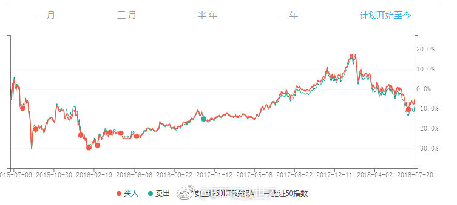

======================================================

ETF拯救世界 (5687069307) @
2018-07-23 13:48:03 Mon  
url: https://weibo.com/5687069307/Grfrdse8E

医药趋势已坏，不要频繁抄底，注意节奏 ​​​

转发[47]  评论[223]  赞[509] 

======================================================

ETF拯救世界 (5687069307) @
2018-07-24 06:51:24 Tue  
url: https://weibo.com/5687069307/Grm8B7RtV

回复@追求确定性2:连涨15个交易日，野百合也有春天。买辣鸡没错的//@追求确定性2:昨天美元债大涨啊，我的正1%了。

------------------------------------------------------
转推：
>  @ETF拯救世界 (5687069307)
>  2018-07-23 13:18:32 Mon  
>  url: https:/weibo.com/5687069307/GrffeBpJZ/

>  50的买点为何总是这么风骚……再次买在最低，今天又领涨。
>  
>  其实50真的很棒，只要你会玩…… ​​​

转发[14]  评论[102]  赞[210] 

======================================================

ETF拯救世界 (5687069307) @
2018-07-24 10:19:42 Tue  
url: https://weibo.com/5687069307/Grnv97y2y

富国300，全指金融开始盈利。 ​​​

转发[2]  评论[67]  赞[249] 

======================================================

ETF拯救世界 (5687069307) @
2018-07-24 10:23:45 Tue  
url: https://weibo.com/5687069307/GrnwMrW0g

回复@炒饭821:还没签呢！疯了。//@炒饭821:老大，通稿新政策影响挺大的啊，医药也翻红了，难道股市楼市真的要活跃了，你这房子买的点厉害了[作揖]//@ETF拯救世界:回复@追求确定性2:连涨15个交易日，野百合也有春天。买辣鸡没错的//@追求确定性2:昨天美元债大涨啊，我的正1%了。

------------------------------------------------------
转推：
>  @ETF拯救世界 (5687069307)
>  2018-07-23 13:18:32 Mon  
>  url: https:/weibo.com/5687069307/GrffeBpJZ/

>  50的买点为何总是这么风骚……再次买在最低，今天又领涨。
>  
>  其实50真的很棒，只要你会玩…… ​​​

转发[2]  评论[57]  赞[108] 

======================================================

ETF拯救世界 (5687069307) @
2018-07-24 10:24:45 Tue  
url: https://weibo.com/5687069307/Grnxcffim

回复@向往世界的游星:2900±50是压力//@向往世界的游星:如你所说，反弹2900点//@ETF拯救世界:回复@追求确定性2:连涨15个交易日，野百合也有春天。买辣鸡没错的//@追求确定性2:昨天美元债大涨啊，我的正1%了。

------------------------------------------------------
转推：
>  @ETF拯救世界 (5687069307)
>  2018-07-23 13:18:32 Mon  
>  url: https:/weibo.com/5687069307/GrffeBpJZ/

>  50的买点为何总是这么风骚……再次买在最低，今天又领涨。
>  
>  其实50真的很棒，只要你会玩…… ​​​

转发[5]  评论[72]  赞[167] 

======================================================

ETF拯救世界 (5687069307) @
2018-07-24 12:07:05 Tue  
url: https://weibo.com/5687069307/GrocJoaKo

分享两个最近的案例：

一，500网格。一个小网可以出货了。

二，我经常说的“让大家开心一下，我某个股票又跌了30%”。是的，我会用一小部分资金配置打新门票，再等权买入一堆量化选出的股票。其中一个下跌30%补仓的例子是这样：

我对于门票股的补仓价位，是该股下跌30%；60%；90%各补一次。金额与初 ​​​

转发[215]  评论[341]  赞[490] 

+++++++++++++++++++++++++++++++++++++++++++++++++++++

图片：
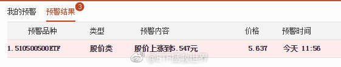
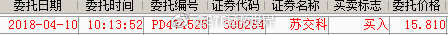

======================================================

ETF拯救世界 (5687069307) @
2018-07-24 13:16:54 Tue  
url: https://weibo.com/5687069307/GroF4nGF8

目前所有持仓品种，浮亏的没有超过15%的。

25只品种中，还有8只浮亏。超过10%的有三只。

不知道什么叫赔钱。

牛市会不会来？一定会来。来了所有品种两周内翻红。 ​​​

转发[11]  评论[237]  赞[507] 

======================================================

ETF拯救世界 (5687069307) @
2018-07-25 09:57:21 Wed  
url: https://weibo.com/5687069307/GrwMzlYpc

传媒是不是又加在底部了 ​​​

转发[9]  评论[125]  赞[284] 

======================================================

ETF拯救世界 (5687069307) @
2018-07-25 10:22:34 Wed  
url: https://weibo.com/5687069307/GrwWO53Kq

回复@小小宇宙要爆发啊啊:再次奶在最高点。虽然最近水逆，但功力还在，放心了//@小小宇宙要爆发啊啊:高点也奶得精准，毒奶神功，名不虚传哈哈哈[doge]

------------------------------------------------------
转推：
>  @ETF拯救世界 (5687069307)
>  2018-07-25 09:57:21 Wed  
>  url: https:/weibo.com/5687069307/GrwMzlYpc/

>  传媒是不是又加在底部了 ​​​

转发[1]  评论[26]  赞[145] 

======================================================

ETF拯救世界 (5687069307) @
2018-07-25 10:24:19 Wed  
url: https://weibo.com/5687069307/GrwXw66H5

回复@8点钟的太阳_13214:50的关键是，两年多来第一次买入……//@8点钟的太阳_13214:我感觉最近50加仓位置E大选择的时点太棒了，我居然短期盈利快到10%了。传媒没的说

------------------------------------------------------
转推：
>  @ETF拯救世界 (5687069307)
>  2018-07-25 09:57:21 Wed  
>  url: https:/weibo.com/5687069307/GrwMzlYpc/

>  传媒是不是又加在底部了 ​​​

转发[3]  评论[37]  赞[175] 

======================================================

ETF拯救世界 (5687069307) @
2018-07-25 10:34:39 Wed  
url: https://weibo.com/5687069307/Grx1HvuLV

敢不敢新高 ​​​

转发[12]  评论[49]  赞[196] 

+++++++++++++++++++++++++++++++++++++++++++++++++++++

图片：

======================================================

ETF拯救世界 (5687069307) @
2018-07-25 11:55:30 Wed  
url: https://weibo.com/5687069307/GrxywhF9n

太听话了吧。

------------------------------------------------------
转推：
>  @ETF拯救世界 (5687069307)
>  2018-07-25 10:34:39 Wed  
>  url: https:/weibo.com/5687069307/Grx1HvuLV/

>  敢不敢新高 ​​​

转发[5]  评论[25]  赞[122] 

======================================================

ETF拯救世界 (5687069307) @
2018-07-25 12:23:11 Wed  
url: https://weibo.com/5687069307/GrxJL3TyG

回复@小散逆袭史-铁粉小伍:看了，确实不行。都不要看了。以后谁再来我这里做广告我就评论“看过了，不行，千万不要去看”，然后置顶。//@小散逆袭史-铁粉小伍:回复@如醉且坠:没看就在说不行//@ETF拯救世界:太听话了吧。

------------------------------------------------------
转推：
>  @ETF拯救世界 (5687069307)
>  2018-07-25 10:34:39 Wed  
>  url: https:/weibo.com/5687069307/Grx1HvuLV/

>  敢不敢新高 ​​​

转发[2]  评论[44]  赞[134] 

======================================================

ETF拯救世界 (5687069307) @
2018-07-25 12:54:13 Wed  
url: https://weibo.com/5687069307/GrxWmFRUs

人成年后到底记不记得六岁时候父母的样子？

------------------------------------------------------
转推：
>  @央视新闻 (2656274875)
>  2018-07-25 12:44:18 Wed  
>  url: https:/weibo.com/2656274875/GrxSkFuUo/

>  【转发帮帮他！六旬老人在儿子失踪处摆摊30年：只想再见他一面[悲伤]】1987年，四川绵阳成绵路，韩峰6岁的儿子在自家修表摊前失踪，疑似被拐。四处找寻无果后，30年来，韩峰每天7点准时出门，到11公里外坚持摆修表摊，苦苦等待奇迹出现。韩峰说：“我不想也不会强迫他回到我身边，我只是，想再见他一面 ​​​

转发[7]  评论[39]  赞[81] 

======================================================

ETF拯救世界 (5687069307) @
2018-07-25 13:03:39 Wed  
url: https://weibo.com/5687069307/Gry0cgqmF

男人要管住自己的下半身啊[并不简单]最近出事比较多

------------------------------------------------------
转推：
>  @北京人不知道的北京事儿 (1662214194)
>  2018-07-25 10:55:21 Wed  
>  url: https:/weibo.com/1662214194/Grxa76uoE/

>  一位女生举报前《中国新闻周刊》编委章文强奸，章文曾恐吓受害者：“如果因为你而导致我儿子不能出国读书，我会采取一切可以采取的手段！”。。。事发后多名女生（包括蒋方舟、易小荷）站出来指认章文有过性骚扰行为，转发曝光这人渣！[怒][怒][怒] ​​​

转发[20]  评论[47]  赞[82] 

======================================================

ETF拯救世界 (5687069307) @
2018-07-25 13:07:32 Wed  
url: https://weibo.com/5687069307/Gry1LuhtJ

回复@三角精神:没懂。你说的这两个哪个是上半身完成的？//@三角精神:你这是混淆了强奸和乱交的区别。//@ETF拯救世界:男人要管住自己的下半身啊[并不简单]最近出事比较多

------------------------------------------------------
转推：
>  @北京人不知道的北京事儿 (1662214194)
>  2018-07-25 10:55:21 Wed  
>  url: https:/weibo.com/1662214194/Grxa76uoE/

>  一位女生举报前《中国新闻周刊》编委章文强奸，章文曾恐吓受害者：“如果因为你而导致我儿子不能出国读书，我会采取一切可以采取的手段！”。。。事发后多名女生（包括蒋方舟、易小荷）站出来指认章文有过性骚扰行为，转发曝光这人渣！[怒][怒][怒] ​​​

转发[1]  评论[34]  赞[62] 

======================================================

ETF拯救世界 (5687069307) @
2018-07-25 13:20:05 Wed  
url: https://weibo.com/5687069307/Gry6Rkexs

回复@搬砖能手王富贵233:这也一样啊。做任何事情都想清楚能不能承受最坏的结果，想清楚了再做。自控力体现在各个方面。//@搬砖能手王富贵233:这种事情谁知道呢？说不定是你情我愿的，女方知道他渣男后就反目成仇，我们又不是当事人，不知道

------------------------------------------------------
转推：
>  @北京人不知道的北京事儿 (1662214194)
>  2018-07-25 10:55:21 Wed  
>  url: https:/weibo.com/1662214194/Grxa76uoE/

>  一位女生举报前《中国新闻周刊》编委章文强奸，章文曾恐吓受害者：“如果因为你而导致我儿子不能出国读书，我会采取一切可以采取的手段！”。。。事发后多名女生（包括蒋方舟、易小荷）站出来指认章文有过性骚扰行为，转发曝光这人渣！[怒][怒][怒] ​​​

转发[12]  评论[19]  赞[98] 

======================================================

ETF拯救世界 (5687069307) @
2018-07-25 13:53:09 Wed  
url: https://weibo.com/5687069307/GrykhqoTI

你们有没有发现一件事。

为什么古天乐吴彦祖吴尊刘德华这些巨帅身材又好的男人

不会乱搞。而且是好老公好爸爸。

至少咱们没听说。

明明机会很多啊。 ​​​

转发[9]  评论[266]  赞[217] 

======================================================

ETF拯救世界 (5687069307) @
2018-07-25 15:05:46 Wed  
url: https://weibo.com/5687069307/GryNL1NEJ

自动熄火重启有故障提示后续:

去4s店检查，行车电脑没有任何故障码记录，也就是说没事，不知道为什么有故障提示。

检查的时候我出去办事了，回来车洗了，玻璃水加满了，60块打车票报了，离合匹配了，又蹭了顿饭，最后和店里的妹子们谈笑风生。

哪能港，就是感觉你爱德国，德国又爱你了。

水逆是不 ​​​

转发[0]  评论[120]  赞[214] 

======================================================

ETF拯救世界 (5687069307) @
2018-07-25 15:09:42 Wed  
url: https://weibo.com/5687069307/GryPm4Wu3

回复@小散逆袭史-铁粉小伍:你这个素质，这辈子也就在网上给人做水军了。所以我不会跟你计较的。生活很难吧，加油。//@小散逆袭史-铁粉小伍:sb//@ETF拯救世界:回复@小散逆袭史-铁粉小伍:看了，确实不行。都不要看了。以后谁再来我这里做广告我就评论“看过了，不行，千万不要去看”，然后置顶。

------------------------------------------------------
转推：
>  @ETF拯救世界 (5687069307)
>  2018-07-25 10:34:39 Wed  
>  url: https:/weibo.com/5687069307/Grx1HvuLV/

>  敢不敢新高 ​​​

转发[0]  评论[72]  赞[196] 

======================================================

ETF拯救世界 (5687069307) @
2018-07-25 16:44:16 Wed  
url: https://weibo.com/5687069307/GrzrJE4Pe

如果我这两年内能安排好所有必须完成的事，顺利退休，那我会做一件特别特别有意思的事。

90%的人看到都会觉得有意思的事。应该没人做过。但也许是很多人的梦想。

如果真的做了，我可能会红！

敬请期待…… ​​​

转发[43]  评论[588]  赞[551] 

======================================================

ETF拯救世界 (5687069307) @
2018-07-25 16:55:32 Wed  
url: https://weibo.com/5687069307/GrzwjE0HX

很多人的思维太集中在投资了，没有想象力。90%的人都觉得有意思的事情，极大概率跟投资无关。跟人生有关。特有意思。

------------------------------------------------------
转推：
>  @ETF拯救世界 (5687069307)
>  2018-07-25 16:44:16 Wed  
>  url: https:/weibo.com/5687069307/GrzrJE4Pe/

>  如果我这两年内能安排好所有必须完成的事，顺利退休，那我会做一件特别特别有意思的事。
>  
>  90%的人看到都会觉得有意思的事。应该没人做过。但也许是很多人的梦想。
>  
>  如果真的做了，我可能会红！
>  
>  敬请期待…… ​​​

转发[14]  评论[319]  赞[285] 

======================================================

ETF拯救世界 (5687069307) @
2018-07-26 13:13:42 Thu  
url: https://weibo.com/5687069307/GrHuLsPfv

非常忙，勿念。 ​​​

转发[1]  评论[252]  赞[446] 

======================================================

ETF拯救世界 (5687069307) @
2018-07-27 06:29:39 Fri  
url: https://weibo.com/5687069307/GrOhg4ybB

我以为要三周大家才会忘掉。

谁能想到，只需要三天。

很有意思。 ​​​

转发[9]  评论[225]  赞[314] 

======================================================

ETF拯救世界 (5687069307) @
2018-07-27 08:48:23 Fri  
url: https://weibo.com/5687069307/GrPbzlHeu

最近一线实体亲测调研了帝都房地产二手市场。

几点初步感想。

杠杆越来越大。因为卖房的人几乎没有拿现金走人的。都是卖了房加杠杆继续买。

关键是，杠杆本身已经很大了。我谈了那么多套，各种各样的情况之前都没听说过。比如，把房子抵押出去已经是最普通的情况。二抵也不在少数。

抵押在银行的还 ​​​

转发[47]  评论[223]  赞[358] 

======================================================

ETF拯救世界 (5687069307) @
2018-07-27 08:50:26 Fri  
url: https://weibo.com/5687069307/GrPcp6hcb

回复@天外的琴弦:卖地的是链条最后的那一环。//@天外的琴弦:卖房，加杠杆买，这个链条总有最后一个卖房的人。

------------------------------------------------------
转推：
>  @ETF拯救世界 (5687069307)
>  2018-07-27 08:48:23 Fri  
>  url: https:/weibo.com/5687069307/GrPbzlHeu/

>  最近一线实体亲测调研了帝都房地产二手市场。
>  
>  几点初步感想。
>  
>  杠杆越来越大。因为卖房的人几乎没有拿现金走人的。都是卖了房加杠杆继续买。
>  
>  关键是，杠杆本身已经很大了。我谈了那么多套，各种各样的情况之前都没听说过。比如，把房子抵押出去已经是最普通的情况。二抵也不在少数。
>  
>  抵押在银行的还 ​​​

转发[4]  评论[25]  赞[105] 

======================================================

ETF拯救世界 (5687069307) @
2018-07-27 09:14:09 Fri  
url: https://weibo.com/5687069307/GrPm1CHFZ

忙的刚看到。

另外，美元债连涨几十个交易日了吧。辣鸡知耻后勇了。 ​​​

转发[0]  评论[43]  赞[143] 

+++++++++++++++++++++++++++++++++++++++++++++++++++++

图片：
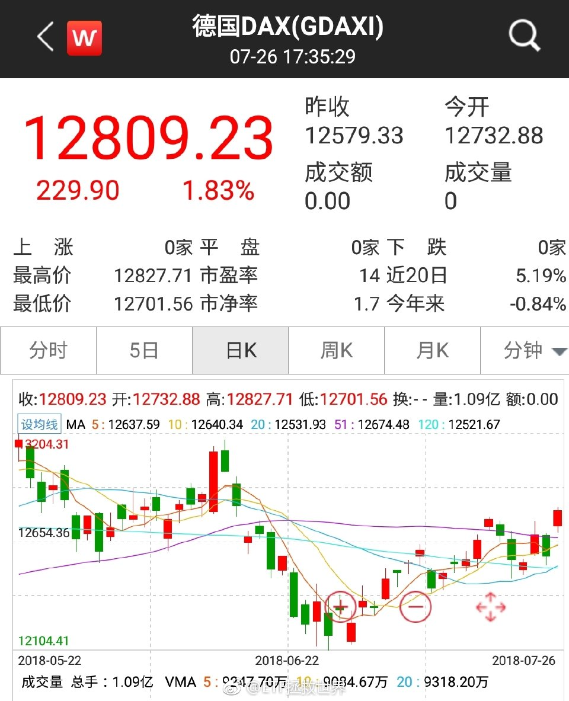

======================================================

ETF拯救世界 (5687069307) @
2018-07-27 09:22:04 Fri  
url: https://weibo.com/5687069307/GrPpf6pyS

$Facebook FB$   一天20%，几个月白涨了。

有没有只涨不跌的股票？

我看，没有。

而且，越多人认为只会涨不会跌的，其实杀伤力越大。 ​​​

转发[5]  评论[56]  赞[167] 

======================================================

ETF拯救世界 (5687069307) @
2018-07-27 09:37:35 Fri  
url: https://weibo.com/5687069307/GrPvxsJUy

$513030  溢价1.8%了。至于吗 ​​​

转发[1]  评论[30]  赞[133] 

======================================================

ETF拯救世界 (5687069307) @
2018-07-27 09:55:23 Fri  
url: https://weibo.com/5687069307/GrPCLoK37

$腾讯控股 hk00700$  股王能否守住前期低点？这是价值投资的湮灭还是道德的沦丧，人性的扭曲？

答案即将揭晓…… ​​​

转发[1]  评论[51]  赞[150] 

======================================================

ETF拯救世界 (5687069307) @
2018-07-27 10:03:23 Fri  
url: https://weibo.com/5687069307/GrPG0D4Qk

2.1%了。越说越来劲。不要追。

------------------------------------------------------
转推：
>  @ETF拯救世界 (5687069307)
>  2018-07-27 09:37:35 Fri  
>  url: https:/weibo.com/5687069307/GrPvxsJUy/

>  $513030  溢价1.8%了。至于吗 ​​​

转发[0]  评论[37]  赞[134] 

======================================================

ETF拯救世界 (5687069307) @
2018-07-27 10:33:55 Fri  
url: https://weibo.com/5687069307/GrPSpdGTG

看着这样的走势，想起单大师的经典了：

忽冷忽热爱感冒，刮风下雨怎知道。

据小道消息，从西伯利亚来了一股暖压槽，正在由北向南缓缓地移动。

然后，忽儿向东，忽儿向西，一会儿向南，一会儿向北…… ​​​

转发[2]  评论[105]  赞[212] 

======================================================

ETF拯救世界 (5687069307) @
2018-07-27 11:44:44 Fri  
url: https://weibo.com/5687069307/GrQl919u1

这个4%真的是没想到。那么，18-40岁年龄段的本科有30%-40%了吧。

------------------------------------------------------
转推：
>  @蓝鲸财经记者工作平台 (1885454921)
>  2018-07-26 23:59:45 Thu  
>  url: https:/weibo.com/1885454921/GrLIZF4ij/

>  美团王兴的分析很好地回答了拼多多的三亿用户在哪里[思考] ​​​

转发[43]  评论[115]  赞[152] 

======================================================

ETF拯救世界 (5687069307) @
2018-07-27 11:58:18 Fri  
url: https://weibo.com/5687069307/GrQqEj8Hn

[good][good][good][good][good][good]

------------------------------------------------------
转推：
>  @财联社APP (2868676035)
>  2018-07-27 11:55:29 Fri  
>  url: https:/weibo.com/2868676035/GrQpw34jl/

>  财联社7月27日讯，近日，北京部分银行有网点的首套房贷利率在基准利率基础上上浮40%，也有银行的部分网点首套房房贷利率上浮30%。不过，首套主流仍是基准利率基础上上浮10%，二套房房贷利率主流仍是在基准利率基础上上浮20%。（券商中国） ​​​

转发[5]  评论[62]  赞[123] 

======================================================

ETF拯救世界 (5687069307) @
2018-07-27 12:00:31 Fri  
url: https://weibo.com/5687069307/GrQrz40HV

笑出声了。

------------------------------------------------------
转推：
>  @吃瓜群众CJ (1885688010)
>  2018-07-27 10:47:20 Fri  
>  url: https:/weibo.com/1885688010/GrPXQlI5r/

>  惊了，绝美虐恋让人无法呼吸 ​​​

转发[57]  评论[127]  赞[184] 

======================================================

ETF拯救世界 (5687069307) @
2018-07-27 16:38:32 Fri  
url: https://weibo.com/5687069307/GrSgppJPn

准备。快6.9了。//@蓝鲸财经记者工作平台:【鲸滚动】在岸人民币兑美元官方收盘报6.8246，创2017年6月26日来新低。离岸人民币跌破6.83关口。//@蓝鲸财经记者工作平台:【鲸滚动】7月27日讯，在岸人民币兑美元跌近300点，跌破6.82关口。

------------------------------------------------------
转推：
>  @蓝鲸财经记者工作平台 (1885454921)
>  2018-07-26 09:16:50 Thu  
>  url: https:/weibo.com/1885454921/GrFWCt1Lh/

>  鲸快讯：7月26日讯，人民币兑美元中间价报6.7662，上调378点，上一交易日中间价6.8040。 ​​​

转发[5]  评论[91]  赞[204] 

======================================================

ETF拯救世界 (5687069307) @
2018-07-30 06:59:17 Mon  
url: https://weibo.com/5687069307/GsgKMurbl

在委内瑞拉，黄金美元股票指数都是不错的选择

------------------------------------------------------
转推：
>  @ ()
>  2018-07-29 11:05:54 Sun  
>  url: 

>  抱歉，作者已设置仅展示半年内微博，此微博已不可见。 ​​​

转发[5]  评论[50]  赞[125] 

======================================================

ETF拯救世界 (5687069307) @
2018-07-30 08:22:22 Mon  
url: https://weibo.com/5687069307/Gshivqd30

讲真，这么对比看北京的房价也不是很离谱。1000万多一点，二环内，距离广场直线距离不到两公里，各种设施极其成熟，交通便利，好学校，100平出头。//@挖龙脉的超级鹿鼎公:转发微博

------------------------------------------------------
转推：
>  @ ()
>  2018-07-30 07:48:03 Mon  
>  url: 

>  抱歉，作者已设置仅展示半年内微博，此微博已不可见。 ​​​

转发[21]  评论[84]  赞[122] 

======================================================

ETF拯救世界 (5687069307) @
2018-07-30 08:55:12 Mon  
url: https://weibo.com/5687069307/GshvPysq2

回复@whole丧心病狂:我十年前第一次去美国，了解那边的制度后就发现，其实都一样。他是有永久产权，但每年得交税，税还不低。那以后我再也不吐槽70年//@whole丧心病狂:关键是我们只能买房子产权，资本主义国家是能连地一起买了。不一样吧[跪了][跪了][跪了]

------------------------------------------------------
转推：
>  @ ()
>  2018-07-30 07:48:03 Mon  
>  url: 

>  抱歉，作者已设置仅展示半年内微博，此微博已不可见。 ​​​

转发[13]  评论[76]  赞[141] 

======================================================

ETF拯救世界 (5687069307) @
2018-07-30 09:21:43 Mon  
url: https://weibo.com/5687069307/GshGAvUpJ

恭喜什么，我又没买……就是汇报一下调查的真实行情……穷，买不起……

[并不简单] ​​​

转发[2]  评论[104]  赞[183] 

======================================================

ETF拯救世界 (5687069307) @
2018-07-30 09:38:55 Mon  
url: https://weibo.com/5687069307/GshNzqaor

继续新低//@ETF拯救世界:前期低点一旦守不住，平台破了就很麻烦。新低和新高一样，大概率都会继续。但是，请看到这条微博的朋友不要因为这个卖出你持有的腾讯，这个锅我背不起。我只是就事论事。否则以后什么都不敢说了。

------------------------------------------------------
转推：
>  @ETF拯救世界 (5687069307)
>  2018-03-22 09:34:01 Thu  
>  url: https:/weibo.com/5687069307/G8wd21cxW/

>  腾讯，60倍PE。未来五年看，真的能有特别好的收益率吗。
>  
>  学习了。 ​​​

转发[10]  评论[17]  赞[119] 

======================================================

ETF拯救世界 (5687069307) @
2018-07-30 09:42:08 Mon  
url: https://weibo.com/5687069307/GshOSm8y1

$128012  这年头连转债都不能相信了 ​​​

转发[5]  评论[44]  赞[143] 

======================================================

ETF拯救世界 (5687069307) @
2018-07-30 09:48:43 Mon  
url: https://weibo.com/5687069307/GshRxuKnR

发微博是真的有用啊

------------------------------------------------------
转推：
>  @ ()
>  2018-07-30 09:47:54 Mon  
>  url: 

>  抱歉，作者已设置仅展示半年内微博，此微博已不可见。 ​​​

转发[13]  评论[35]  赞[107] 

======================================================

ETF拯救世界 (5687069307) @
2018-07-30 10:53:12 Mon  
url: https://weibo.com/5687069307/GsihIFs2L

回复@深南椰风:别这样，低调点好吗。//@深南椰风:益达，全指医药又新低了，不夸下自己？[米奇比心]

------------------------------------------------------
转推：
>  @ETF拯救世界 (5687069307)
>  2018-07-23 13:48:03 Mon  
>  url: https:/weibo.com/5687069307/Grfrdse8E/

>  医药趋势已坏，不要频繁抄底，注意节奏 ​​​

转发[6]  评论[140]  赞[203] 

======================================================

ETF拯救世界 (5687069307) @
2018-07-30 12:18:49 Mon  
url: https://weibo.com/5687069307/GsiQtpdQ9

我相信央妈不会允许到7。6.9附近会有动作

------------------------------------------------------
转推：
>  @ ()
>  2018-07-30 11:45:15 Mon  
>  url: 

>  抱歉，此微博已被作者删除。查看帮助：http://t.cn/Rfd3rQV

转发[8]  评论[83]  赞[155] 

======================================================

ETF拯救世界 (5687069307) @
2018-07-30 13:38:52 Mon  
url: https://weibo.com/5687069307/GsjmYnqvL

踏踏实实的，按照自己的节奏来，不要被别人的情绪和k线影响自己的节奏。

一场比赛你想赢，就要把比赛节奏控制在自己的频率下。总跟着别人的节奏走，连球都摸不到。 ​​​

转发[19]  评论[101]  赞[378] 

======================================================

ETF拯救世界 (5687069307) @
2018-07-30 14:18:29 Mon  
url: https://weibo.com/5687069307/GsjD32V7l

我的感觉，家长有能力的话，能帮就帮一把。能帮多少看家庭实力，别为了孩子降低生活水平就行。扶上马，送一程，孩子起点高了，后面不会吃亏。

------------------------------------------------------
转推：
>  @新浪新闻 (2028810631)
>  2018-07-30 13:43:13 Mon  
>  url: https:/weibo.com/2028810631/GsjoJoj56/

>  【儿子想在杭州买套房,妈妈写了一封信拒绝了：你终归要自己飞翔！】近日一封信走红，孩子为了以后找女朋友考虑，想要父母帮他买套房。妈妈写信拒绝：你终归是要自己飞翔的，而我和你爸爸只是你坚强的后盾，而不是永远顶在前面的那个http://t.cn/ReCL1P6对此，有人认为90后压力大，父母该帮衬一点；也有 ​​​

转发[8]  评论[60]  赞[204] 

======================================================

ETF拯救世界 (5687069307) @
2018-07-30 14:35:36 Mon  
url: https://weibo.com/5687069307/GsjK0ambj

其实吧，你说人和人，智商真的差很多吗。我觉得除了那种天赋异禀的人，其实普通人绝大多数人都差不多。99%的人都差不多。

剩下的是什么区别，情商，性格。然后就是家庭，背景。可能就决定很多事。

我之前看报告，说最近这些年，考上TOP2,985的农村孩子比例越来越少了，城市的越来越多。农村孩子和城 ​​​

转发[83]  评论[154]  赞[447] 

======================================================

ETF拯救世界 (5687069307) @
2018-07-30 14:48:14 Mon  
url: https://weibo.com/5687069307/GsjP89fLA

最高2910。[doge]//@ETF拯救世界:我就说这么弱的反弹真的没见过。看来还要继续。2900上下浮动50个点都算正常情况。

------------------------------------------------------
转推：
>  @ETF拯救世界 (5687069307)
>  2018-07-19 11:12:41 Thu  
>  url: https:/weibo.com/5687069307/GqCIaq7P8/

>  如果这波反弹就此结束，那真的是远远弱于我的预期。熊市中这么弱的反弹都很少见。我以为至少得碰碰2850-2900呢。 ​​​

转发[12]  评论[45]  赞[174] 

======================================================

ETF拯救世界 (5687069307) @
2018-07-30 14:58:48 Mon  
url: https://weibo.com/5687069307/GsjTq6YC1

回复@周夢在緬甸:不知道。是继续还是结束，最近几天非常重要，要观察。能不能撑住，很重要。//@周夢在緬甸:反弹结束了？//@ETF拯救世界:最高2910。[doge]//@ETF拯救世界:我就说这么弱的反弹真的没见过。看来还要继续。2900上下浮动50个点都算正常情况。

------------------------------------------------------
转推：
>  @ETF拯救世界 (5687069307)
>  2018-07-19 11:12:41 Thu  
>  url: https:/weibo.com/5687069307/GqCIaq7P8/

>  如果这波反弹就此结束，那真的是远远弱于我的预期。熊市中这么弱的反弹都很少见。我以为至少得碰碰2850-2900呢。 ​​​

转发[9]  评论[90]  赞[184] 

======================================================

ETF拯救世界 (5687069307) @
2018-07-31 09:00:24 Tue  
url: https://weibo.com/5687069307/GsqYr21fr

回复@悠然见南山98518:你这种情况我早就在之前的文章里精准预料到了。还是那句话，我写的很多东西你当时觉得不重要，几年后才会发现，当时如果重视就好了！

------------------------------------------------------
转推：
>  @ETF拯救世界 (5687069307)
>  2018-07-19 11:12:41 Thu  
>  url: https:/weibo.com/5687069307/GqCIaq7P8/

>  如果这波反弹就此结束，那真的是远远弱于我的预期。熊市中这么弱的反弹都很少见。我以为至少得碰碰2850-2900呢。 ​​​

转发[2]  评论[31]  赞[154] 

======================================================

ETF拯救世界 (5687069307) @
2018-07-31 09:26:05 Tue  
url: https://weibo.com/5687069307/Gsr8QDoxi

继续新低。老这么跌也不是事儿，还不反弹反弹换换手？//@ETF拯救世界:继续新低//@ETF拯救世界:前期低点一旦守不住，平台破了就很麻烦。新低和新高一样，大概率都会继续。但是，请看到这条微博的朋友不要因为这个卖出你持有的腾讯，这个锅我背不起。我只是就事论事。否则以后什么都不敢说了。

------------------------------------------------------
转推：
>  @ETF拯救世界 (5687069307)
>  2018-03-22 09:34:01 Thu  
>  url: https:/weibo.com/5687069307/G8wd21cxW/

>  腾讯，60倍PE。未来五年看，真的能有特别好的收益率吗。
>  
>  学习了。 ​​​

转发[8]  评论[28]  赞[143] 

======================================================

ETF拯救世界 (5687069307) @
2018-07-31 09:56:43 Tue  
url: https://weibo.com/5687069307/GsrlidTHc

两只股票春风得意的时候，买入者极度乐观的情绪，没买的人极度焦躁，这是非常生动的一课，各位应该好好回顾，好好体会。与价值无关，情绪。

------------------------------------------------------
转推：
>  @ETF拯救世界 (5687069307)
>  2018-07-17 10:23:32 Tue  
>  url: https:/weibo.com/5687069307/Gqjxe62DI/

>  我这半年多关注的8848和腾讯，不是说对这两家公司有什么看法，我是在观察情绪。
>  
>  这两家公司在持续暴涨的时候，带了很多很多情绪。尤其是前者。很多人因为没买后悔的夜不能寐，很多人买了抱持坚定信念可以再涨好几倍。
>  
>  一家公司，一个行业，到底是不是真的能预判五年、十年后？
>  
>  很难讲。前几天看到一 ​​​

转发[24]  评论[93]  赞[255] 

======================================================

ETF拯救世界 (5687069307) @
2018-07-31 11:21:40 Tue  
url: https://weibo.com/5687069307/GsrTMqxV7

中午不发车，都别惦记了。

漫长冬夜，还是自己找点乐子比较容易扛过去。这行情不看比看强。 ​​​

转发[9]  评论[217]  赞[408] 

======================================================

ETF拯救世界 (5687069307) @
2018-07-31 14:18:31 Tue  
url: https://weibo.com/5687069307/Gst3yvUaS

跟你说别盯盘吧。盯着盯着人家诱惑一下你又杀进去了。

佛系投资。 ​​​

转发[7]  评论[95]  赞[267] 

======================================================

ETF拯救世界 (5687069307) @
2018-07-31 15:40:23 Tue  
url: https://weibo.com/5687069307/GstAMCsH1

2018年7月最后一个交易日，全指医药里程碑的一天：

2012年11月以来，全指医药首次进入历史最低估值区域。

6年了。 ​​​

转发[73]  评论[255]  赞[421] 

======================================================

ETF拯救世界 (5687069307) @
2018-07-31 16:17:08 Tue  
url: https://weibo.com/5687069307/GstPHB0dr

美的这次回购我觉得很奇怪。从16涨到64，只跌到了50，公司就坐不住了。为什么这么急于稳定股价？是有股权激励还是要增发啊。真的不太理解。20、30的时候怎么不着急呢。

------------------------------------------------------
转推：
>  @巨潮资讯网 (2239792910)
>  2018-07-31 15:55:50 Tue  
>  url: https:/weibo.com/2239792910/GstH3uu1o/

>  【美的集团：已耗资约8亿元回购1672万股股份】截止7月31日，美的集团以集中竞价方式回购股份1672万股，占公司截止7月30日总股本的0.2519%，最高成交价为48.40元/股，最低成交价为47.02元/股，支付的总金额约8亿元。 ​​​

转发[23]  评论[40]  赞[112] 

======================================================

ETF拯救世界 (5687069307) @
2018-07-31 16:54:18 Tue  
url: https://weibo.com/5687069307/Gsu4N84j0

果然，看了一眼大事记，5.8有股权激励。“本计划所采用的激励形式为限制性股票，其股票来源为美的集团向激励对象定向发行新股。价格28.77”。5.22回购预案。

------------------------------------------------------
转推：
>  @巨潮资讯网 (2239792910)
>  2018-07-31 15:55:50 Tue  
>  url: https:/weibo.com/2239792910/GstH3uu1o/

>  【美的集团：已耗资约8亿元回购1672万股股份】截止7月31日，美的集团以集中竞价方式回购股份1672万股，占公司截止7月30日总股本的0.2519%，最高成交价为48.40元/股，最低成交价为47.02元/股，支付的总金额约8亿元。 ​​​

转发[15]  评论[19]  赞[95] 

======================================================

ETF拯救世界 (5687069307) @
2018-07-31 16:57:59 Tue  
url: https://weibo.com/5687069307/Gsu6hxWb3

谨言慎行，永远没错……

------------------------------------------------------
转推：
>  @ ()
>  2018-07-31 12:38:09 Tue  
>  url: 

>  该账号因被投诉违反《微博社区公约》的相关规定，现已无法查看。查看帮助 https://kefu.weibo.com/faqdetail?id=13216

转发[5]  评论[48]  赞[121] 

======================================================

ETF拯救世界 (5687069307) @
2018-07-31 17:15:51 Tue  
url: https://weibo.com/5687069307/Gsudxihd0

预告一下，本来应该今晚发车，但是时间太紧来不及了。明天上午或者中午吧。 ​​​

转发[4]  评论[165]  赞[351] 

======================================================

ETF拯救世界 (5687069307) @
2018-07-31 17:18:08 Tue  
url: https://weibo.com/5687069307/GsueteNHN

防不胜防。想了半天，这个真的没法躲了。

------------------------------------------------------
转推：
>  @新浪视频 (1640601392)
>  2018-07-31 17:03:04 Tue  
>  url: https:/weibo.com/1640601392/Gsu8lusRQ/

>  【正面监控视频曝光！杭州奔驰车冲撞人群致4人死亡】7月30日，杭州市西湖区竞舟路文二西路口发生一起重大道路交通事故，截至7月31日5时，该事故已致4人死亡1人伤势较重、12人留院观察，肇事车辆已送第三方专业机构检测，肇事驾驶人陈某某现在警方控制下接受医院治疗，初步排除其酒驾、毒驾嫌疑。  ​​​

转发[17]  评论[86]  赞[87] 

======================================================

ETF拯救世界 (5687069307) @
2018-08-01 09:37:48 Wed  
url: https://weibo.com/5687069307/GsAE6p0IC

哥儿俩每天轮着凉……//@ETF拯救世界:两只股票春风得意的时候，买入者极度乐观的情绪，没买的人极度焦躁，这是非常生动的一课，各位应该好好回顾，好好体会。与价值无关，情绪。

------------------------------------------------------
转推：
>  @ETF拯救世界 (5687069307)
>  2018-07-17 10:23:32 Tue  
>  url: https:/weibo.com/5687069307/Gqjxe62DI/

>  我这半年多关注的8848和腾讯，不是说对这两家公司有什么看法，我是在观察情绪。
>  
>  这两家公司在持续暴涨的时候，带了很多很多情绪。尤其是前者。很多人因为没买后悔的夜不能寐，很多人买了抱持坚定信念可以再涨好几倍。
>  
>  一家公司，一个行业，到底是不是真的能预判五年、十年后？
>  
>  很难讲。前几天看到一 ​​​

转发[7]  评论[52]  赞[162] 

======================================================

ETF拯救世界 (5687069307) @
2018-08-01 10:20:07 Wed  
url: https://weibo.com/5687069307/GsAVih4Nj

7月财新中国制造业PMI录得50.8 创八个月新低。产出增速、新订单增速均出现放缓，新出口订单指数创25个月以来最低，通胀压力减弱，制造业景气度温和走弱。 ​​​

转发[9]  评论[89]  赞[224] 

======================================================

ETF拯救世界 (5687069307) @
2018-08-01 12:03:53 Wed  
url: https://weibo.com/5687069307/GsBBpefN7

谁的手比较快？ ​​​

转发[6]  评论[212]  赞[296] 

======================================================

ETF拯救世界 (5687069307) @
2018-08-01 13:29:51 Wed  
url: https://weibo.com/5687069307/GsCaizeYU

太乐观的人可能要挂一批。 ​​​

转发[3]  评论[49]  赞[229] 

======================================================

ETF拯救世界 (5687069307) @
2018-08-01 13:31:40 Wed  
url: https://weibo.com/5687069307/GsCb2jvOu

另外，没有经历过0405,08,1112的朋友们，现在可以用心去体会危机的感觉了。 ​​​

转发[9]  评论[140]  赞[262] 

======================================================

ETF拯救世界 (5687069307) @
2018-08-01 13:46:11 Wed  
url: https://weibo.com/5687069307/GsCgVAMxP

节奏就是，上周没发车，今天发一车。如果下次是月中发车，那么就是一个月只发了一车。

代表我的态度了。

节奏，节奏。 ​​​

转发[14]  评论[88]  赞[305] 

======================================================

ETF拯救世界 (5687069307) @
2018-08-01 13:54:05 Wed  
url: https://weibo.com/5687069307/GsCk8qJFw

乐观的人早就满仓被套了。悲观的人在逃跑。

我们拿着现金在捡辣鸡。 ​​​

转发[14]  评论[108]  赞[371] 

======================================================

ETF拯救世界 (5687069307) @
2018-08-01 14:32:18 Wed  
url: https://weibo.com/5687069307/GsCzEe1ZB

各大指数开始考验前期低点。

前期低点有多重要，现在已经不用我说了吧 ​​​

转发[14]  评论[106]  赞[314] 

======================================================

ETF拯救世界 (5687069307) @
2018-08-01 14:39:46 Wed  
url: https://weibo.com/5687069307/GsCCGw2jg

现在想，那些买CDR基金的人非常明智了。

虽然CDR黄了，连货基收益都拿不到。但是不赔当赚，可以说大赢家了。

就是不知道几年封闭期以后什么样。 ​​​

转发[8]  评论[110]  赞[283] 

======================================================

ETF拯救世界 (5687069307) @
2018-08-02 09:40:47 Thu  
url: https://weibo.com/5687069307/GsK5OCueX

惨！ ​​​

转发[2]  评论[98]  赞[198] 

======================================================

ETF拯救世界 (5687069307) @
2018-08-02 09:44:15 Thu  
url: https://weibo.com/5687069307/GsK7enF9w

还是那句话，注意节奏。

你家不是开矿的，也做不到很多人“昨天涨的时候满仓了，今天明天跌了继续加仓”那样 ​​​

转发[12]  评论[75]  赞[248] 

======================================================

ETF拯救世界 (5687069307) @
2018-08-02 09:49:47 Thu  
url: https://weibo.com/5687069307/GsK9tjYHH

今天是一块凉。//@ETF拯救世界:哥儿俩每天轮着凉……//@ETF拯救世界:两只股票春风得意的时候，买入者极度乐观的情绪，没买的人极度焦躁，这是非常生动的一课，各位应该好好回顾，好好体会。与价值无关，情绪。

------------------------------------------------------
转推：
>  @ETF拯救世界 (5687069307)
>  2018-07-17 10:23:32 Tue  
>  url: https:/weibo.com/5687069307/Gqjxe62DI/

>  我这半年多关注的8848和腾讯，不是说对这两家公司有什么看法，我是在观察情绪。
>  
>  这两家公司在持续暴涨的时候，带了很多很多情绪。尤其是前者。很多人因为没买后悔的夜不能寐，很多人买了抱持坚定信念可以再涨好几倍。
>  
>  一家公司，一个行业，到底是不是真的能预判五年、十年后？
>  
>  很难讲。前几天看到一 ​​​

转发[1]  评论[16]  赞[121] 

======================================================

ETF拯救世界 (5687069307) @
2018-08-02 09:56:29 Thu  
url: https://weibo.com/5687069307/GsKcbF4TL

来，各位，投个票。我观察一下情绪。微博直接有投票，不像球球那么麻烦点赞了。

我发起了一个投票 【面对A股，你现在的情绪是】http://t.cn/RemSyo3 ​​​

转发[2641]  评论[3557]  赞[198] 

======================================================

ETF拯救世界 (5687069307) @
2018-08-02 10:00:33 Thu  
url: https://weibo.com/5687069307/GsKdQeVjV

在这样跌下去，未来会赚多少我已经没有概念了……

钻石底真的越来越近了…… ​​​

转发[33]  评论[328]  赞[473] 

======================================================

ETF拯救世界 (5687069307) @
2018-08-02 10:13:52 Thu  
url: https://weibo.com/5687069307/GsKjfkMMk

我说过很多次，在A股，你太乐观会死的很快，太悲观赚不到什么钱。

这句话可能以前你不太在意，现在越来越对前半句有体会了。然后，几年后，你会发现后半句更绝了。 ​​​

转发[80]  评论[172]  赞[466] 

======================================================

ETF拯救世界 (5687069307) @
2018-08-02 10:30:55 Thu  
url: https://weibo.com/5687069307/GsKqb00xD

开会。 ​​​

转发[0]  评论[82]  赞[210] 

======================================================

ETF拯救世界 (5687069307) @
2018-08-02 11:24:00 Thu  
url: https://weibo.com/5687069307/GsKLHEMfs

现在各位回头想，几个月前鹅厂南非大股东巨额减持，总裁刘炽平减持100万股，他们才是大玩家。 ​​​

转发[13]  评论[49]  赞[310] 

======================================================

ETF拯救世界 (5687069307) @
2018-08-02 11:25:32 Thu  
url: https://weibo.com/5687069307/GsKMl138M

每周发车模式再次恢复运行。 ​​​

转发[8]  评论[148]  赞[524] 

======================================================

ETF拯救世界 (5687069307) @
2018-08-02 11:47:15 Thu  
url: https://weibo.com/5687069307/GsKV934Kd

刚才看见有个评论说，“股市是你家开的啊”

特别有意思。为什么，因为这句话这几年经常在我脑子里响起，因为三年前球球上也有个人这么说。

“股市是你家开的啊，你说跌就跌？踏空狗。”

三年过去，踏空狗活得很好。不知道那位仁兄还好吗。 ​​​

转发[8]  评论[77]  赞[332] 

======================================================

ETF拯救世界 (5687069307) @
2018-08-02 11:50:56 Thu  
url: https://weibo.com/5687069307/GsKWEcAc8

“未来会赚多少没概念”是什么意思？

投资指数，能赚多少，正常情况下是有概念的。不会超过一定范围。比如买的低，长期长期可能6%-15%。

但是低到一定地步，就没概念了。甚至可能两三年年化可以50%，已经不能用常理推断。

什么都不懂就来喷，悲哀。 ​​​

转发[52]  评论[116]  赞[353] 

======================================================

ETF拯救世界 (5687069307) @
2018-08-02 11:55:50 Thu  
url: https://weibo.com/5687069307/GsKYDnO51

军工信息归位日，A股见底时

------------------------------------------------------
转推：
>  @ ()
>  2018-08-02 11:36:04 Thu  
>  url: 

>  抱歉，作者已设置仅展示半年内微博，此微博已不可见。 ​​​

转发[69]  评论[169]  赞[319] 

======================================================

ETF拯救世界 (5687069307) @
2018-08-02 13:04:14 Thu  
url: https://weibo.com/5687069307/GsLqoBpAU

[哼] ​​​

转发[2]  评论[178]  赞[420] 

+++++++++++++++++++++++++++++++++++++++++++++++++++++

图片：

======================================================

ETF拯救世界 (5687069307) @
2018-08-02 13:25:54 Thu  
url: https://weibo.com/5687069307/GsLzc6Zh6

500开始挑战我做人的底线了。

4600-4700 ​​​

转发[29]  评论[303]  赞[482] 

======================================================

ETF拯救世界 (5687069307) @
2018-08-02 16:37:52 Thu  
url: https://weibo.com/5687069307/GsMP74MmM

今天开始，A股进入过去二十年第四次“持有股票优于持有债券”的时期。

上一次该时期是2012-2013。 ​​​

转发[153]  评论[272]  赞[603] 

======================================================

ETF拯救世界 (5687069307) @
2018-08-02 16:42:32 Thu  
url: https://weibo.com/5687069307/GsMR0rPA6

环保指数估值即将跌破20倍。

[鄙视] ​​​

转发[32]  评论[116]  赞[367] 

======================================================

ETF拯救世界 (5687069307) @
2018-08-02 18:10:34 Thu  
url: https://weibo.com/5687069307/GsNqK3bPV

有道理是有道理，但如果自己低位买入，赚了几倍还不停再看高几倍极力宣扬还是低估，很多事情就很难说清了。你可以说跟的人没脑子，自作自受，但吹票的人未免少了一些同理心以及善良。

------------------------------------------------------
转推：
>  @挖龙脉的超级鹿鼎公 (3962719063)
>  2018-08-02 16:14:45 Thu  
>  url: https:/weibo.com/3962719063/GsMFJf1aR/

>  好有道理 ​​​

转发[14]  评论[58]  赞[317] 

======================================================

ETF拯救世界 (5687069307) @
2018-08-02 18:23:54 Thu  
url: https://weibo.com/5687069307/GsNw9mEv6

这么说吧。

我一直看到有一种论调：别人说股票是别人的权利，再怎么吹，你是成年人，你愿意跟，赔多少也是你自己的事。正好让那些不适合股市的人赔光，走人。

这样的说法，看起来有点道理，但我始终始终无法接受。

那么，买P2P的人是不是也应该自作自受？被忽悠瘸了买保健品的大爷大妈呢？被电信诈 ​​​

转发[35]  评论[276]  赞[744] 

======================================================

ETF拯救世界 (5687069307) @
2018-08-03 09:07:10 Fri  
url: https://weibo.com/5687069307/GsTiFt8lm

鹅厂怎么也得反弹个10%吧……这个数字怎么算出来的，蒙的。 ​​​

转发[68]  评论[64]  赞[176] 

======================================================

ETF拯救世界 (5687069307) @
2018-08-03 09:40:39 Fri  
url: https://weibo.com/5687069307/GsTwgftqV

低调一点多好。

------------------------------------------------------
转推：
>  @ ()
>  2018-08-03 09:00:30 Fri  
>  url: 

>  抱歉，此微博已被作者删除。查看帮助：http://t.cn/Rfd3rQV

转发[0]  评论[32]  赞[100] 

======================================================

ETF拯救世界 (5687069307) @
2018-08-03 10:09:52 Fri  
url: https://weibo.com/5687069307/GsTI7nbY8

时间，空间。

牛市或者熊市，必须给时间。每天买，家里不是开矿的，你没那么多钱。

给了时间，空间就会拉开。熊市成本会大幅降低，牛市利润会飞速增长。

节奏。 ​​​

转发[85]  评论[163]  赞[371] 

======================================================

ETF拯救世界 (5687069307) @
2018-08-03 10:14:26 Fri  
url: https://weibo.com/5687069307/GsTJYmf90

浓眉大眼的白酒也跳。

没法活了。 ​​​

转发[8]  评论[45]  赞[194] 

======================================================

ETF拯救世界 (5687069307) @
2018-08-03 10:17:23 Fri  
url: https://weibo.com/5687069307/GsTLawznw

美帝企业，苹果这样的，挣了钱，好多现金，回购股票，流通股本减少，每股价值提升，股价上涨，股民管理层一起笑哈哈。

我朝某些企业，赚了大钱，现金几百亿，也不回购也不好好分红，又没有什么资本支出，低息借给地方政府。

差距有点大啊。 ​​​

转发[16]  评论[91]  赞[273] 

======================================================

ETF拯救世界 (5687069307) @
2018-08-03 10:32:16 Fri  
url: https://weibo.com/5687069307/GsTRdfqvG

很多人的信心已经处在崩溃边缘了。 ​​​

转发[12]  评论[241]  赞[328] 

======================================================

ETF拯救世界 (5687069307) @
2018-08-03 10:57:14 Fri  
url: https://weibo.com/5687069307/GsU1lqsDx

1月26日，恒生见顶前一天。

被骂的狗血喷头。

太可惜了，我没法在雪球再做情绪测试了。

那才是测试群众情绪的最佳场所。

当时看到48000的v是群众心中的神。

http://t.cn/Red6Uws ​​​

转发[24]  评论[116]  赞[237] 

======================================================

ETF拯救世界 (5687069307) @
2018-08-03 11:05:33 Fri  
url: https://weibo.com/5687069307/GsU4IFdLD

不会见到0字头吧！0.0xx……

------------------------------------------------------
转推：
>  @ETF拯救世界 (5687069307)
>  2018-05-23 09:31:20 Wed  
>  url: https:/weibo.com/5687069307/GhWGIwsQI/

>  $150023  能见1字头么 ​​​

转发[26]  评论[40]  赞[122] 

======================================================

ETF拯救世界 (5687069307) @
2018-08-03 11:10:33 Fri  
url: https://weibo.com/5687069307/GsU6KvGbJ

回复@安小之18:指数就是股票组成的，这个说法不觉得很可笑吗。宽基+高弹性指数秒杀大多数股票。另外，你以为股票涨10倍，拿着的人能赚多少？我不会告诉你70%炒股的人牛市也赔钱的……//@安小之18:E大，对于“牛市中指数没有股票盈利多”这种说法你怎么看？

------------------------------------------------------
转推：
>  @ETF拯救世界 (5687069307)
>  2018-05-23 09:31:20 Wed  
>  url: https:/weibo.com/5687069307/GhWGIwsQI/

>  $150023  能见1字头么 ​​​

转发[19]  评论[53]  赞[159] 

======================================================

ETF拯救世界 (5687069307) @
2018-08-03 11:17:28 Fri  
url: https://weibo.com/5687069307/GsU9zcpX9

回复@路上有只羊:我有种感觉，球球是鼓励或者说默许喷子的。没有喷子就没有流量。流量才是最重要的。这个我没有什么证据，只是自己的感觉。真正有价值的东西，一定是与大多数人的思考结果不同的，一定很多人不同意。球球对逆向思维是扼杀状态。

------------------------------------------------------
转推：
>  @ETF拯救世界 (5687069307)
>  2018-08-03 10:57:14 Fri  
>  url: https:/weibo.com/5687069307/GsU1lqsDx/

>  1月26日，恒生见顶前一天。
>  
>  被骂的狗血喷头。
>  
>  太可惜了，我没法在雪球再做情绪测试了。
>  
>  那才是测试群众情绪的最佳场所。
>  
>  当时看到48000的v是群众心中的神。
>  
>  http://t.cn/Red6Uws ​​​

转发[12]  评论[105]  赞[223] 

======================================================

ETF拯救世界 (5687069307) @
2018-08-03 11:30:38 Fri  
url: https://weibo.com/5687069307/GsUeUnhSz

回复@Elainealry:再稳一稳。让美元债再飞一飞。//@Elainealry:离岸汇率已经破6.9了我们要做点什么吗[哈哈][哈哈][哈哈]

------------------------------------------------------
转推：
>  @ETF拯救世界 (5687069307)
>  2018-08-03 10:57:14 Fri  
>  url: https:/weibo.com/5687069307/GsU1lqsDx/

>  1月26日，恒生见顶前一天。
>  
>  被骂的狗血喷头。
>  
>  太可惜了，我没法在雪球再做情绪测试了。
>  
>  那才是测试群众情绪的最佳场所。
>  
>  当时看到48000的v是群众心中的神。
>  
>  http://t.cn/Red6Uws ​​​

转发[4]  评论[46]  赞[167] 

======================================================

ETF拯救世界 (5687069307) @
2018-08-03 13:11:33 Fri  
url: https://weibo.com/5687069307/GsUTRfa5p

回复@阿奕长官:不好意思，我没法预测哪里是反弹高位。你知道谁有这个能力吗。//@阿奕长官:E大，请教一下:我基本上按您发车全部跟了全指医药001180，现在这个品种盈利从几千跌回到几百，为什么当初没有发指令高位卖了低位再买？这个问题您在策略中怎么考虑的？谢谢

------------------------------------------------------
转推：
>  @ETF拯救世界 (5687069307)
>  2018-08-03 10:14:26 Fri  
>  url: https:/weibo.com/5687069307/GsTJYmf90/

>  浓眉大眼的白酒也跳。
>  
>  没法活了。 ​​​

转发[4]  评论[95]  赞[161] 

======================================================

ETF拯救世界 (5687069307) @
2018-08-03 13:25:01 Fri  
url: https://weibo.com/5687069307/GsUZktBgo

还剩7%，给不给面子。

------------------------------------------------------
转推：
>  @ETF拯救世界 (5687069307)
>  2018-08-03 09:07:10 Fri  
>  url: https:/weibo.com/5687069307/GsTiFt8lm/

>  鹅厂怎么也得反弹个10%吧……这个数字怎么算出来的，蒙的。 ​​​

转发[1]  评论[16]  赞[124] 

======================================================

ETF拯救世界 (5687069307) @
2018-08-03 13:31:04 Fri  
url: https://weibo.com/5687069307/GsV1Nhh5Y

刚才那位朋友的问题，我不是没有解决办法。而是暂时没有用到计划里。

接下来我准备尝试用一下。可能下次发车就会用。可以部分的解决波动利润问题。 ​​​

转发[3]  评论[82]  赞[270] 

======================================================

ETF拯救世界 (5687069307) @
2018-08-03 13:38:23 Fri  
url: https://weibo.com/5687069307/GsV4Ll2DP

小米，年轻人第一支被套的股票……

------------------------------------------------------
转推：
>  @小米公司陈曦 (2651381433)
>  2018-06-22 10:54:12 Fri  
>  url: https:/weibo.com/2651381433/Gmw3gaYeG/

>  联交所第一支同股不同权的股票[鼓掌][鼓掌][鼓掌]
>  股票代码：1810（18年上市，10年创立）
>  年轻人的第一支股票，亲爱的米粉们，账户开好了吗[偷笑][偷笑] ​​​

转发[32]  评论[51]  赞[191] 

======================================================

ETF拯救世界 (5687069307) @
2018-08-03 14:02:52 Fri  
url: https://weibo.com/5687069307/GsVeHrXb0

喷了。谁能想到真有可能见4字头了。当时可是800多点啊。最高是1800。

------------------------------------------------------
转推：
>  @ETF拯救世界 (5687069307)
>  2017-12-15 09:50:04 Fri  
>  url: https:/weibo.com/5687069307/FzJjHqeZF/

>  $证券公司 sz399975$   我认为360-400点应该是极限底部了…… ​​​

转发[27]  评论[65]  赞[211] 

======================================================

ETF拯救世界 (5687069307) @
2018-08-03 14:11:28 Fri  
url: https://weibo.com/5687069307/GsVibs9xy

其实绝大多数人来投资股票，最大的问题是两点：

第一，是买之前没想到过自己会赔。

第二，是想到自己会赔，但没想到买的东西会跌这么多。

也就是预期不够。预期不够就没有应对策略，没有应对策略，最坏的事情发生了就一脸懵逼。

如果你对最坏的情况已经有了预期（比如，该品种目前买入最大下跌幅度 ​​​

转发[127]  评论[228]  赞[378] 

======================================================

ETF拯救世界 (5687069307) @
2018-08-03 14:51:51 Fri  
url: https://weibo.com/5687069307/GsVyzCb7G

太坏了，又骗了多少人进去一锅焖了…… ​​​

转发[5]  评论[142]  赞[271] 

======================================================

ETF拯救世界 (5687069307) @
2018-08-03 15:46:11 Fri  
url: https://weibo.com/5687069307/GsVUDanuI

养老产业估值已经跌破2008年10月金融危机大底。

然而，军工信息依然高高高高在上。

好气哦。 ​​​

转发[74]  评论[184]  赞[295] 

======================================================

ETF拯救世界 (5687069307) @
2018-08-03 16:06:22 Fri  
url: https://weibo.com/5687069307/GsW2PbfR0

看了看自选股。开始杀白马了。

这就是熊市。通杀。

苍天饶过谁。 ​​​

转发[16]  评论[65]  赞[300] 

======================================================

ETF拯救世界 (5687069307) @
2018-08-03 16:09:50 Fri  
url: https://weibo.com/5687069307/GsW4elVJz

回复@悠然见南山98518:500即将跌破2012年底。开始杀向08年。//@悠然见南山98518:可能除了军工信息，其它的都接近或超过12年的低，不知猜的如何[二哈]

------------------------------------------------------
转推：
>  @ETF拯救世界 (5687069307)
>  2018-08-03 15:46:11 Fri  
>  url: https:/weibo.com/5687069307/GsVUDanuI/

>  养老产业估值已经跌破2008年10月金融危机大底。
>  
>  然而，军工信息依然高高高高在上。
>  
>  好气哦。 ​​​

转发[16]  评论[45]  赞[161] 

======================================================

ETF拯救世界 (5687069307) @
2018-08-03 16:16:10 Fri  
url: https://weibo.com/5687069307/GsW6OcLdw

回复@flight09:军工2015年估值是220倍，了解一下。//@flight09:我看了下军工指数从3040高点到现在的902，估值还是很高么[泪]

------------------------------------------------------
转推：
>  @ETF拯救世界 (5687069307)
>  2018-08-03 15:46:11 Fri  
>  url: https:/weibo.com/5687069307/GsVUDanuI/

>  养老产业估值已经跌破2008年10月金融危机大底。
>  
>  然而，军工信息依然高高高高在上。
>  
>  好气哦。 ​​​

转发[11]  评论[49]  赞[142] 

======================================================

ETF拯救世界 (5687069307) @
2018-08-03 16:27:18 Fri  
url: https://weibo.com/5687069307/GsWbk1w44

回复@fight2021:从下往上数第二层。//@fight2021:如果共五层地狱，那么现在我们在哪一层？

------------------------------------------------------
转推：
>  @ETF拯救世界 (5687069307)
>  2018-08-03 15:46:11 Fri  
>  url: https:/weibo.com/5687069307/GsVUDanuI/

>  养老产业估值已经跌破2008年10月金融危机大底。
>  
>  然而，军工信息依然高高高高在上。
>  
>  好气哦。 ​​​

转发[9]  评论[92]  赞[207] 

======================================================

ETF拯救世界 (5687069307) @
2018-08-03 16:39:46 Fri  
url: https://weibo.com/5687069307/GsWgnw6N4

“满仓穿越牛熊”。

“持有好公司，不在意股价波动。”

[悲伤] ​​​

转发[20]  评论[188]  赞[341] 

======================================================

ETF拯救世界 (5687069307) @
2018-08-03 16:59:43 Fri  
url: https://weibo.com/5687069307/GsWotwSHQ

也就是在微博。如果在球球我说这些能被喷到北极去……感谢你们不喷之恩。（其实是喷的都拉黑了）

------------------------------------------------------
转推：
>  @ETF拯救世界 (5687069307)
>  2018-08-03 16:39:46 Fri  
>  url: https:/weibo.com/5687069307/GsWgnw6N4/

>  “满仓穿越牛熊”。
>  
>  “持有好公司，不在意股价波动。”
>  
>  [悲伤] ​​​

转发[8]  评论[137]  赞[409] 

======================================================

ETF拯救世界 (5687069307) @
2018-08-03 20:13:20 Fri  
url: https://weibo.com/5687069307/GsXF4xVQe

央妈如约出手，6.9。[微笑]//@ETF拯救世界:我相信央妈不会允许到7。6.9附近会有动作

------------------------------------------------------
转推：
>  @ ()
>  2018-07-30 11:45:15 Mon  
>  url: 

>  抱歉，此微博已被作者删除。查看帮助：http://t.cn/Rfd3rQV

转发[3]  评论[97]  赞[240] 

======================================================

ETF拯救世界 (5687069307) @
2018-08-04 08:29:10 Sat  
url: https://weibo.com/5687069307/Gt2tK8Ga2

还没散呢？ ​​​

转发[5]  评论[108]  赞[167] 

+++++++++++++++++++++++++++++++++++++++++++++++++++++

图片：
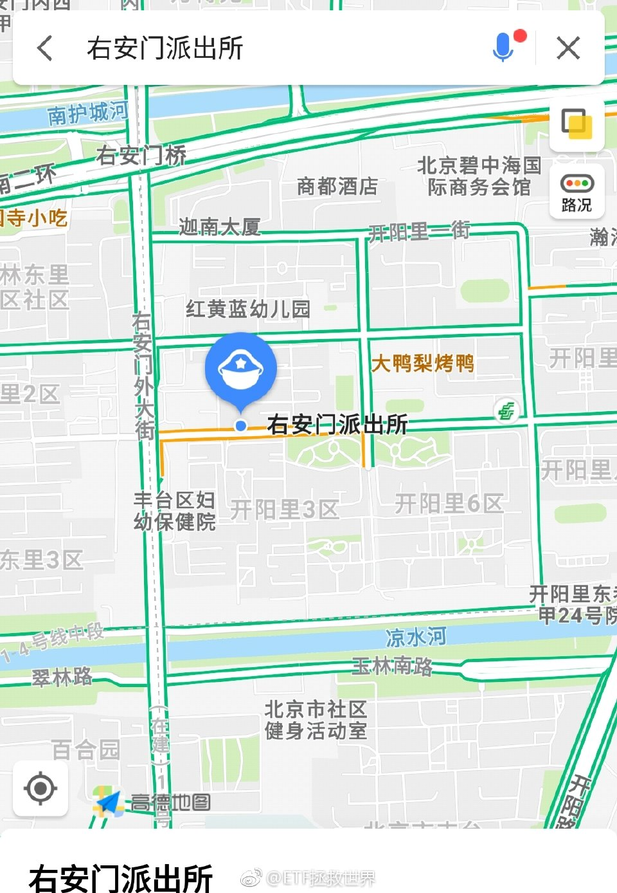

======================================================

ETF拯救世界 (5687069307) @
2018-08-05 17:58:22 Sun  
url: https://weibo.com/5687069307/GtfDhh9X1

想写点什么，打开电脑坐了半天觉得现在也没什么好写的。

锻炼去了…… ​​​

转发[1]  评论[131]  赞[340] 

======================================================

ETF拯救世界 (5687069307) @
2018-08-05 22:02:30 Sun  
url: https://weibo.com/5687069307/GthenrZDT

最近一段时间，各位在网上看东西的时候，要更加客观理性。

理性很难。别人疯狂的时候，或者别人恐惧的时候，理性都很重要。

这个世界上没有天堂，每个国家每个地区都有自己的问题。不要粉饰太平，也不要杞人忧天。

再次提醒，无论看到什么，都要客观，理性，独立思考。

独立思考！你看到的，未必是 ​​​

转发[44]  评论[141]  赞[306] 

======================================================

ETF拯救世界 (5687069307) @
2018-08-05 22:06:11 Sun  
url: https://weibo.com/5687069307/GthfSdA42

回复@Yoran_咩咩咩:说说你身边的崩溃和苦日子的例子。不要听说的，说说真实发生的。//@Yoran_咩咩咩:各种经济奔溃，各种苦日子刚开始，说实话好难

------------------------------------------------------
转推：
>  @ETF拯救世界 (5687069307)
>  2018-08-05 22:02:30 Sun  
>  url: https:/weibo.com/5687069307/GthenrZDT/

>  最近一段时间，各位在网上看东西的时候，要更加客观理性。
>  
>  理性很难。别人疯狂的时候，或者别人恐惧的时候，理性都很重要。
>  
>  这个世界上没有天堂，每个国家每个地区都有自己的问题。不要粉饰太平，也不要杞人忧天。
>  
>  再次提醒，无论看到什么，都要客观，理性，独立思考。
>  
>  独立思考！你看到的，未必是 ​​​

转发[11]  评论[134]  赞[131] 

======================================================

ETF拯救世界 (5687069307) @
2018-08-05 22:20:11 Sun  
url: https://weibo.com/5687069307/GthlyrxU0

有没有你关注的人，之前一直信心满满的满仓满融，最近开始有点含糊，甚至真的减仓的。 ​​​

转发[13]  评论[161]  赞[242] 

======================================================

ETF拯救世界 (5687069307) @
2018-08-05 23:00:32 Sun  
url: https://weibo.com/5687069307/GthBVqti1

每日打卡（196）

刚才看了看计划，今年净值下跌5%了。

多少年都没赔钱了，今年要开荤？年底前要翻身！ ​​​

转发[8]  评论[57]  赞[256] 

+++++++++++++++++++++++++++++++++++++++++++++++++++++

图片：

======================================================

ETF拯救世界 (5687069307) @
2018-08-05 23:24:41 Sun  
url: https://weibo.com/5687069307/GthLJfnKi

曾经在威尼斯的码头上坐了一个小时看云。威尼斯真的美，有机会要去看看。

------------------------------------------------------
转推：
>  @路凡夫 (5992159621)
>  2018-08-05 20:10:03 Sun  
>  url: https:/weibo.com/5992159621/GtguJaVSl/

>  威尼斯水城的落日跟余晖http://t.cn/Rmfdnws ​​​

转发[41]  评论[57]  赞[214] 

======================================================

ETF拯救世界 (5687069307) @
2018-08-06 09:01:56 Mon  
url: https://weibo.com/5687069307/Gtly2vGmP

我回忆了一下，发现自己对某个去过地方的印象，居然很大程度上不是来自于那里的景色和历史，而是来自于那里的人。

接触到的人好，对那里就有很好的印象。接触到的人一般，印象就会很差。

目前来说，印象最好的是，说出来政治很不正确的美国和日本。

美国老百姓是真的热情，有礼貌，甚至有点，用我们 ​​​

转发[74]  评论[211]  赞[371] 

======================================================

ETF拯救世界 (5687069307) @
2018-08-06 09:16:33 Mon  
url: https://weibo.com/5687069307/GtlDY83yR

这周随时发车。2车以上。不会超过5车。 ​​​

转发[6]  评论[96]  赞[325] 

======================================================

ETF拯救世界 (5687069307) @
2018-08-06 09:21:07 Mon  
url: https://weibo.com/5687069307/GtlFP5BIi

论加强锻炼的重要性。//@新京报我们视频:交警：你要skr止啊[doge]//@-强说着忧愁的孩子-:累死skr人

------------------------------------------------------
转推：
>  @新京报我们视频 (6124642021)
>  2018-08-03 23:21:08 Fri  
>  url: https:/weibo.com/6124642021/GsYTiEc2e/

>  【#史上最无力的逃逸# 司机遇查龟速逃跑 交警一路陪跑：“要不歇会？”】8月2日，湖北襄阳，一名男子遇到交警检查时，打开车门下车就往收费站外跑。
>  交警：“你跑得过我吗？来来来来，给我跑！”
>  男子：拿着手机提了一下裤子，继续跑……
>  交警：就你这体格还跟我跑？停下吧
>  男子：我坐会，歇口气。 ​​​

转发[11]  评论[17]  赞[75] 

======================================================

ETF拯救世界 (5687069307) @
2018-08-06 09:34:32 Mon  
url: https://weibo.com/5687069307/GtlLgyLJ3

强势股开始补跌。熊市进入新阶段了。 ​​​

转发[12]  评论[81]  赞[293] 

======================================================

ETF拯救世界 (5687069307) @
2018-08-06 10:02:03 Mon  
url: https://weibo.com/5687069307/GtlWrrfz7

想为国护盘，然，国不给机会。那么我们就等着吧。

------------------------------------------------------
转推：
>  @ETF拯救世界 (5687069307)
>  2018-08-06 09:16:33 Mon  
>  url: https:/weibo.com/5687069307/GtlDY83yR/

>  这周随时发车。2车以上。不会超过5车。 ​​​

转发[1]  评论[98]  赞[231] 

======================================================

ETF拯救世界 (5687069307) @
2018-08-06 10:34:22 Mon  
url: https://weibo.com/5687069307/Gtm9ynbLA

帮两位关注我的朋友转两条消息，我没有亲自查证过，但我想还是帮个忙。请各位自行分辨吧。

祝福他们。

一个是走失的孩子：

http://t.cn/RD25bLR

一个是一位病人：

http://t.cn/RD2Co3U ​​​

转发[48]  评论[82]  赞[142] 

======================================================

ETF拯救世界 (5687069307) @
2018-08-06 10:36:31 Mon  
url: https://weibo.com/5687069307/GtmaqoO91

一年过去，医药满仓点位上升至7700点。//@ETF拯救世界:说正经的吧。以目前的情况，医药满仓点位是7000，减仓区域是12000-13000。这几个数字每年增加500-1000点。//@ETF拯救世界:回复@求财不劫色:放过它！医药还是个孩子！//@求财不劫色:什么时候医药才能减呢？

------------------------------------------------------
转推：
>  @ETF拯救世界 (5687069307)
>  2017-08-22 09:42:34 Tue  
>  url: https:/weibo.com/5687069307/Fif7yjvZX/

>  现在还在喊港股有极大投资价值的都是坏人。 ​​​

转发[107]  评论[179]  赞[216] 

======================================================

ETF拯救世界 (5687069307) @
2018-08-06 10:47:16 Mon  
url: https://weibo.com/5687069307/GtmeN7NAj

GUO:还是你们来吧。 ​​​

转发[1]  评论[156]  赞[269] 

======================================================

ETF拯救世界 (5687069307) @
2018-08-06 13:00:28 Mon  
url: https://weibo.com/5687069307/Gtn6Qx6ct

滴滴！！！ ​​​

转发[16]  评论[226]  赞[310] 

======================================================

ETF拯救世界 (5687069307) @
2018-08-06 13:23:36 Mon  
url: https://weibo.com/5687069307/GtngfylBH

回复@小饺子ww:刚才下楼吃饭有很多滴滴邦邦恰恰恰，比过去三年见过的总数还多……//@小饺子ww:滴滴～邦邦～恰恰恰～[doge]

------------------------------------------------------
转推：
>  @ETF拯救世界 (5687069307)
>  2018-08-06 13:00:28 Mon  
>  url: https:/weibo.com/5687069307/Gtn6Qx6ct/

>  滴滴！！！ ​​​

转发[1]  评论[49]  赞[126] 

======================================================

ETF拯救世界 (5687069307) @
2018-08-06 13:32:56 Mon  
url: https://weibo.com/5687069307/Gtnk2cAHz

要拉回去？中午发车都不行了？以后收盘前十分钟？ ​​​

转发[2]  评论[130]  赞[237] 

======================================================

ETF拯救世界 (5687069307) @
2018-08-06 14:04:37 Mon  
url: https://weibo.com/5687069307/GtnwTs6MK

指数好歹是有底的。

3000多只股票里面，至少有2000多只的底真的不知道在哪儿了。。 ​​​

转发[14]  评论[61]  赞[240] 

======================================================

ETF拯救世界 (5687069307) @
2018-08-06 14:07:16 Mon  
url: https://weibo.com/5687069307/GtnxYcL50

真.股灾。 ​​​

转发[2]  评论[109]  赞[264] 

======================================================

ETF拯救世界 (5687069307) @
2018-08-06 14:21:38 Mon  
url: https://weibo.com/5687069307/GtnDNDqKD

信心已经完全崩盘了。

本来以为自己可以坚定持仓的开始卖了。 ​​​

转发[15]  评论[126]  赞[321] 

======================================================

ETF拯救世界 (5687069307) @
2018-08-06 14:26:36 Mon  
url: https://weibo.com/5687069307/GtnFOBuFH

A股历史上，20倍以下的中证500，只在金融危机最底部的那个月出现过一次。

2008年10月。

7年后，它从1500点，涨到了12000点。涨幅700%。

难道这次会再次创造奇迹吗。又能见到1字头了？

感谢资本市场。 ​​​

转发[235]  评论[259]  赞[372] 

======================================================

ETF拯救世界 (5687069307) @
2018-08-06 14:34:42 Mon  
url: https://weibo.com/5687069307/GtnJ6rIdZ

是不是有一批私募要挂了 ​​​

转发[3]  评论[76]  赞[216] 

======================================================

ETF拯救世界 (5687069307) @
2018-08-06 14:36:10 Mon  
url: https://weibo.com/5687069307/GtnJHq0PW

回复@爱编程的猫:目前28//@爱编程的猫:期待 E 大全市场估值 25 倍以下的战斗檄文[馋嘴]

------------------------------------------------------
转推：
>  @ETF拯救世界 (5687069307)
>  2018-08-06 14:26:36 Mon  
>  url: https:/weibo.com/5687069307/GtnFOBuFH/

>  A股历史上，20倍以下的中证500，只在金融危机最底部的那个月出现过一次。
>  
>  2008年10月。
>  
>  7年后，它从1500点，涨到了12000点。涨幅700%。
>  
>  难道这次会再次创造奇迹吗。又能见到1字头了？
>  
>  感谢资本市场。 ​​​

转发[107]  评论[76]  赞[177] 

======================================================

ETF拯救世界 (5687069307) @
2018-08-06 15:09:27 Mon  
url: https://weibo.com/5687069307/GtnXdq3KW

回复@风声边界617:4-10个月内必然走出大底区域。最佳建仓时机就剩几个月了。//@风声边界617:益达总结下，黑夜还要多久[泪]//@ETF拯救世界:回复@爱编程的猫:目前28//@爱编程的猫:期待 E 大全市场估值 25 倍以下的战斗檄文[馋嘴]

------------------------------------------------------
转推：
>  @ETF拯救世界 (5687069307)
>  2018-08-06 14:26:36 Mon  
>  url: https:/weibo.com/5687069307/GtnFOBuFH/

>  A股历史上，20倍以下的中证500，只在金融危机最底部的那个月出现过一次。
>  
>  2008年10月。
>  
>  7年后，它从1500点，涨到了12000点。涨幅700%。
>  
>  难道这次会再次创造奇迹吗。又能见到1字头了？
>  
>  感谢资本市场。 ​​​

转发[85]  评论[161]  赞[259] 

======================================================

ETF拯救世界 (5687069307) @
2018-08-06 15:10:53 Mon  
url: https://weibo.com/5687069307/GtnXNeEfl

回复@从容淡定2003:这就是为什么只要买的够低，指数投资是极大概率挣钱的。至于挣多少，要看你买的多低，以及未来会有多疯狂了。尤其后者，更是随缘了。。//@从容淡定2003:7年前的20倍和今年的20倍相比，指数涨了不少呀

------------------------------------------------------
转推：
>  @ETF拯救世界 (5687069307)
>  2018-08-06 14:26:36 Mon  
>  url: https:/weibo.com/5687069307/GtnFOBuFH/

>  A股历史上，20倍以下的中证500，只在金融危机最底部的那个月出现过一次。
>  
>  2008年10月。
>  
>  7年后，它从1500点，涨到了12000点。涨幅700%。
>  
>  难道这次会再次创造奇迹吗。又能见到1字头了？
>  
>  感谢资本市场。 ​​​

转发[29]  评论[53]  赞[198] 

======================================================

ETF拯救世界 (5687069307) @
2018-08-06 15:31:11 Mon  
url: https://weibo.com/5687069307/Gto624r2F

无论现在的你是什么情绪。

很多年以后回头看，你都会感谢现在坚持买入的自己。 ​​​

转发[76]  评论[339]  赞[675] 

======================================================

ETF拯救世界 (5687069307) @
2018-08-06 16:04:40 Mon  
url: https://weibo.com/5687069307/GtojCA4C3

离开了，依然还会有痕迹…… ​​​

转发[10]  评论[171]  赞[318] 

+++++++++++++++++++++++++++++++++++++++++++++++++++++

图片：
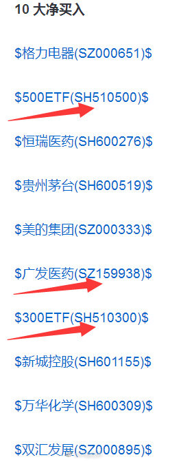

======================================================

ETF拯救世界 (5687069307) @
2018-08-06 17:16:59 Mon  
url: https://weibo.com/5687069307/GtoMYvPjG

前面两个孩子……没了。想说一句，各位父母们，带孩子出门的时候都长点心吧。

------------------------------------------------------
转推：
>  @ETF拯救世界 (5687069307)
>  2018-08-06 10:34:22 Mon  
>  url: https:/weibo.com/5687069307/Gtm9ynbLA/

>  帮两位关注我的朋友转两条消息，我没有亲自查证过，但我想还是帮个忙。请各位自行分辨吧。
>  
>  祝福他们。
>  
>  一个是走失的孩子：
>  
>  http://t.cn/RD25bLR
>  
>  一个是一位病人：
>  
>  http://t.cn/RD2Co3U ​​​

转发[5]  评论[77]  赞[116] 

======================================================

ETF拯救世界 (5687069307) @
2018-08-07 08:14:26 Tue  
url: https://weibo.com/5687069307/GtuFfw0Z4

估计不少公司的质押要爆了 ​​​

转发[6]  评论[130]  赞[266] 

======================================================

ETF拯救世界 (5687069307) @
2018-08-07 09:32:27 Tue  
url: https://weibo.com/5687069307/GtvaV7gGY

反弹了吗。如果是，医药每次都买在最低点是什么鬼。 ​​​

转发[34]  评论[126]  赞[259] 

======================================================

ETF拯救世界 (5687069307) @
2018-08-07 09:37:26 Tue  
url: https://weibo.com/5687069307/GtvcX0mE6

回复@風灬忘川水:暴跌的熊市是送钱，暴涨的牛市是送命。听起来很sb的话，懂的人才会赚钱。//@風灬忘川水:还好昨天把医药补的差不多了，养老也补完了，美滋滋

------------------------------------------------------
转推：
>  @ETF拯救世界 (5687069307)
>  2018-08-07 09:32:27 Tue  
>  url: https:/weibo.com/5687069307/GtvaV7gGY/

>  反弹了吗。如果是，医药每次都买在最低点是什么鬼。 ​​​

转发[27]  评论[84]  赞[251] 

======================================================

ETF拯救世界 (5687069307) @
2018-08-07 10:00:34 Tue  
url: https://weibo.com/5687069307/GtvmktBxg

A股 ​​​

转发[81]  评论[115]  赞[222] 

+++++++++++++++++++++++++++++++++++++++++++++++++++++

图片：

======================================================

ETF拯救世界 (5687069307) @
2018-08-07 10:13:33 Tue  
url: https://weibo.com/5687069307/GtvrBgItr

目前A股正在向05/12年狂奔。马上就到了。能撑住就撑住，撑不住就08年。

要知道08年可是全球金融海啸，经济危机。那时候美国德国英国估值只有10倍。现在美帝在23-28。

如果好好的真的冲向08年，真是非常神奇了。到底是情绪的错杀还是资本市场先行指标发挥作用了？

拭目以待吧。总之，各位在经历一个 ​​​

转发[98]  评论[363]  赞[490] 

======================================================

ETF拯救世界 (5687069307) @
2018-08-07 11:42:23 Tue  
url: https://weibo.com/5687069307/Gtw1F0txs

养老产业，目前点位与2015年1月，2016年2月基本一致。

然而，2015年1月估值49倍，2016年2月估值38倍。

目前，只有25倍。

我个人不太相信2年后还是这个点位，如果这样，估值会到15倍左右。无论如何我也不信。因为这是一个增长在十几个点的优质指数。

如果真的有机会到20以下买入，我相信未来十年收 ​​​

转发[181]  评论[250]  赞[356] 

======================================================

ETF拯救世界 (5687069307) @
2018-08-07 11:55:34 Tue  
url: https://weibo.com/5687069307/Gtw71akVx

目前养老80只成分股有十只披露或预披露半年报，只有一只永辉利润下降，8只利润增长在20%以上，6只在40%以上。当然，全部披露后，我估计也就10%-15%之间吧。但已经相当不错了。个人认为，该指数极限跌幅给15%-23%比较合理。那里是钻石区域。

------------------------------------------------------
转推：
>  @ETF拯救世界 (5687069307)
>  2018-08-07 11:42:23 Tue  
>  url: https:/weibo.com/5687069307/Gtw1F0txs/

>  养老产业，目前点位与2015年1月，2016年2月基本一致。
>  
>  然而，2015年1月估值49倍，2016年2月估值38倍。
>  
>  目前，只有25倍。
>  
>  我个人不太相信2年后还是这个点位，如果这样，估值会到15倍左右。无论如何我也不信。因为这是一个增长在十几个点的优质指数。
>  
>  如果真的有机会到20以下买入，我相信未来十年收 ​​​

转发[65]  评论[140]  赞[223] 

======================================================

ETF拯救世界 (5687069307) @
2018-08-07 13:02:45 Tue  
url: https://weibo.com/5687069307/Gtwyh1aNY

相信很多人心中现在有一个终极疑问:

是不是反转了？我是不是要踏空了？ ​​​

转发[11]  评论[180]  赞[283] 

======================================================

ETF拯救世界 (5687069307) @
2018-08-07 13:40:36 Tue  
url: https://weibo.com/5687069307/GtwNEiN9v

谁能想到，第二天就想跟自己说thank you了。

------------------------------------------------------
转推：
>  @ETF拯救世界 (5687069307)
>  2018-08-06 15:31:11 Mon  
>  url: https:/weibo.com/5687069307/Gto624r2F/

>  无论现在的你是什么情绪。
>  
>  很多年以后回头看，你都会感谢现在坚持买入的自己。 ​​​

转发[4]  评论[57]  赞[264] 

======================================================

ETF拯救世界 (5687069307) @
2018-08-07 13:50:44 Tue  
url: https://weibo.com/5687069307/GtwRL07wc

医药买点。

也许这就是缘份吧…… ​​​

转发[14]  评论[114]  赞[336] 

+++++++++++++++++++++++++++++++++++++++++++++++++++++

图片：

======================================================

ETF拯救世界 (5687069307) @
2018-08-07 14:04:40 Tue  
url: https://weibo.com/5687069307/GtwXprJV2

目前的仓位情况是这样的。

A股大致在50%左右。趋势如果真的改变，会右侧买入十个点左右。加起来是60个点左右。

境外的部分加起来十个点左右。其它转债之类的全都算上，一共70多个点。还有点债油等等。

所以现金部分大概也就20个点左右吧。

这是说如果就此反转，不会出现钻石底的情况，有20%会没机 ​​​

转发[91]  评论[238]  赞[398] 

======================================================

ETF拯救世界 (5687069307) @
2018-08-07 14:15:39 Tue  
url: https://weibo.com/5687069307/Gtx1S3wLn

之前忧心忡忡的朋友，涨几天你的所有担忧就都没了。趋势一反转，所有人的担忧都没了。

好像突然之间所有问题都解决了。

什么叫情绪，你将会有深刻的体会。 ​​​

转发[102]  评论[99]  赞[364] 

======================================================

ETF拯救世界 (5687069307) @
2018-08-07 14:20:25 Tue  
url: https://weibo.com/5687069307/Gtx3OkUk1

非常尴尬了。500一天就反弹了两个多点。这样下去，说话就到波段卖出位置了。

然而连7天都没有，时间不够啊。 ​​​

转发[7]  评论[137]  赞[297] 

======================================================

ETF拯救世界 (5687069307) @
2018-08-07 15:10:46 Tue  
url: https://weibo.com/5687069307/Gtxof5vt4

不要预测。反弹还是反转，不要预测。你预测不了。

昨天收盘，全市场顺利回到历史最低区域。未来发生任何事情都有可能，不要预测。一方面是逢低就买，一方面叫做顺势而为。不要把自己的意志强加在市场上。

有些行业的估值低到可耻。甚至已经低于2008。这些行业来说，就此开始涨也没什么意外。

所以在 ​​​

转发[82]  评论[187]  赞[396] 

======================================================

ETF拯救世界 (5687069307) @
2018-08-07 15:20:45 Tue  
url: https://weibo.com/5687069307/Gtxsier8c

昨天的BGM意义重大。 ​​​

转发[1]  评论[148]  赞[308] 

======================================================

ETF拯救世界 (5687069307) @
2018-08-07 17:40:53 Tue  
url: https://weibo.com/5687069307/GtynaF6Tx

看网上那些调侃A股十年不涨的段子，笑笑就行了，你千万别当真。

A股不是不涨。昨天说的，中证500从2008年到2015年，7年涨了700%，比美帝最牛的纳斯达克牛多了。

A股是有自己的特点，就是行情来了，快，猛。别人十年的事儿，它两年就干完了。

橘生淮南则为枳。很多人看了点美帝价投写的书就来照搬， ​​​

转发[267]  评论[322]  赞[630] 

======================================================

ETF拯救世界 (5687069307) @
2018-08-07 20:05:25 Tue  
url: https://weibo.com/5687069307/GtzjQrg7z

我的车里有把锤子，在儿童座椅下面。跟儿子说了，哪天被困在车里用这个敲玻璃。不知道他能不能敲开，舍不得实战演习……

------------------------------------------------------
转推：
>  @澎湃新闻 (5044281310)
>  2018-08-07 18:27:53 Tue  
>  url: https:/weibo.com/5044281310/GtyGfwiKD/

>  【四川南充7岁男孩正午时被父母遗忘车内，高温窒息而亡】8月5日中午，四川省南充市南部县火峰乡，明明父母带着他开车出去办事，回家途中，一直将他忘记在车内，等到最终发现他时，孩子横躺在后排座上，手指甲、嘴唇发青，经120抢救无效死亡。医生称孩子“属于窒息死亡，主要是高温引起。”事发时正值晌 ​​​

转发[15]  评论[135]  赞[151] 

======================================================

ETF拯救世界 (5687069307) @
2018-08-08 09:06:00 Wed  
url: https://weibo.com/5687069307/GtEqGb1d0

车里面放锤子，教孩子怎么砸窗户这件事，是一道防线。

并不是说有了这道防线就不用每次下车时候一定要把孩子带下来。

跟投资一样，你不知道会发生什么意外。但是要尽量做好发生意外的准备，即使发生能预计到最坏的事，也要安全。

一道防线，两道防线。把能想到的最坏的情况都想到，然后用策略去解决 ​​​

转发[20]  评论[74]  赞[241] 

======================================================

ETF拯救世界 (5687069307) @
2018-08-08 09:12:10 Wed  
url: https://weibo.com/5687069307/GtEtblDz8

颈椎非常不舒服。还有救吗 ​​​

转发[21]  评论[439]  赞[139] 

======================================================

ETF拯救世界 (5687069307) @
2018-08-08 09:28:06 Wed  
url: https://weibo.com/5687069307/GtEzEhItR

刚才看了看雪球，已经有大v开始跑了。在2700多点。开始跑了，准备清仓了。

不止一个。

开始散播悲观言论的更多。

球球啊，球球。观察情绪太棒的地方了！ ​​​

转发[28]  评论[168]  赞[342] 

======================================================

ETF拯救世界 (5687069307) @
2018-08-08 09:46:52 Wed  
url: https://weibo.com/5687069307/GtEHgweSn

回复@研究病毒的chan:你这个结论有依据吗？//@研究病毒的chan:散户越来越自信，大V和机构越来越恐慌，为啥呢？

------------------------------------------------------
转推：
>  @ETF拯救世界 (5687069307)
>  2018-08-08 09:28:06 Wed  
>  url: https:/weibo.com/5687069307/GtEzEhItR/

>  刚才看了看雪球，已经有大v开始跑了。在2700多点。开始跑了，准备清仓了。
>  
>  不止一个。
>  
>  开始散播悲观言论的更多。
>  
>  球球啊，球球。观察情绪太棒的地方了！ ​​​

转发[3]  评论[70]  赞[124] 

======================================================

ETF拯救世界 (5687069307) @
2018-08-08 10:02:58 Wed  
url: https://weibo.com/5687069307/GtENNBbbl

其实我想看看，现在开始看空的人，在2015年5月是怎么说的。

如果在5000点看多，2700开始看空，那就可以毫无疑问的断言，是水货。

不管文章写得多漂亮。

注意，我说的是开始看空。如果从4000多一路看空下来，是另一回事。和2700、2800开始看空不一样。 ​​​

转发[18]  评论[125]  赞[243] 

======================================================

ETF拯救世界 (5687069307) @
2018-08-08 10:09:07 Wed  
url: https://weibo.com/5687069307/GtEQiubkH

各位一定要注意，所谓的机构和机构也是不同的。

我只关注超级大机构的动向。比如险资，比如2015年前的汇金。他们才是真正的价值投资者。

公募整体没有关注的价值，有一小部分可以关注。

私募整体没有观测价值。为什么，因为绝大多数私募都有清盘线。85或者80、75就清盘了。这种时候，他即使看多也不 ​​​

转发[134]  评论[208]  赞[365] 

======================================================

ETF拯救世界 (5687069307) @
2018-08-08 10:20:26 Wed  
url: https://weibo.com/5687069307/GtEUTjm0e

回复@十里堡彭于晏:当年中信证券自营业务巨亏30亿，整个自营部门解散。//@十里堡彭于晏:就是，别迷信机构，机构亏钱的多了去了。

------------------------------------------------------
转推：
>  @ETF拯救世界 (5687069307)
>  2018-08-08 10:09:07 Wed  
>  url: https:/weibo.com/5687069307/GtEQiubkH/

>  各位一定要注意，所谓的机构和机构也是不同的。
>  
>  我只关注超级大机构的动向。比如险资，比如2015年前的汇金。他们才是真正的价值投资者。
>  
>  公募整体没有关注的价值，有一小部分可以关注。
>  
>  私募整体没有观测价值。为什么，因为绝大多数私募都有清盘线。85或者80、75就清盘了。这种时候，他即使看多也不 ​​​

转发[14]  评论[44]  赞[150] 

======================================================

ETF拯救世界 (5687069307) @
2018-08-08 11:09:49 Wed  
url: https://weibo.com/5687069307/GtFeW9lXm

到今天为止，只有10%的公司披露半年报。

有一半的公司会在最后一周披露。所以下半月估值变动将非常明显。有些板块会自然下降5%以上。

这个月还是很关键的 ​​​

转发[18]  评论[67]  赞[288] 

======================================================

ETF拯救世界 (5687069307) @
2018-08-08 11:13:53 Wed  
url: https://weibo.com/5687069307/GtFgAoacE

有一个品种其实已经不贵了，但是趋势真的太差了。是刚刚从强转弱的那种差。

所以这次还是选择了没有买入。对于大多数心理承受能力差的朋友来说，这样的破位所带来的跌幅恐怕很难接受。希望最近有机会买入。

是我最喜欢的六个品种之一。这个买了以后，六个里面就剩一个了。 ​​​

转发[109]  评论[411]  赞[346] 

======================================================

ETF拯救世界 (5687069307) @
2018-08-08 13:57:52 Wed  
url: https://weibo.com/5687069307/GtGl9y347

我看有人讨论a股利润下降的问题。过去几个季度是这样的。

按照我的计算，2017年前三季度全市场利润增长12%左右，全年增长12%左右。

2018年一季度全市场利润增长7-8%左右，增速比17年下滑了。半年报目前披露和预披露的400多家，增速是15%左右。这个不能算数，因为一般是好公司会先披露。半年报全部的 ​​​

转发[40]  评论[85]  赞[237] 

======================================================

ETF拯救世界 (5687069307) @
2018-08-08 14:04:48 Wed  
url: https://weibo.com/5687069307/GtGnXA2VU

又看了一眼，2017年一季度全市场增长是16%左右。也就是说最近几个季度确实增速在下降。

------------------------------------------------------
转推：
>  @ETF拯救世界 (5687069307)
>  2018-08-08 13:57:52 Wed  
>  url: https:/weibo.com/5687069307/GtGl9y347/

>  我看有人讨论a股利润下降的问题。过去几个季度是这样的。
>  
>  按照我的计算，2017年前三季度全市场利润增长12%左右，全年增长12%左右。
>  
>  2018年一季度全市场利润增长7-8%左右，增速比17年下滑了。半年报目前披露和预披露的400多家，增速是15%左右。这个不能算数，因为一般是好公司会先披露。半年报全部的 ​​​

转发[8]  评论[23]  赞[148] 

======================================================

ETF拯救世界 (5687069307) @
2018-08-08 14:13:19 Wed  
url: https://weibo.com/5687069307/GtGrq8tr5

资本市场其实非常敏感。我个人认为最敏感的市场是债市，然后就是股市了。

股市大多数时间是比较理智的，能大致反映上市公司的情况。

所以，不要过于乐观，这一路满仓满融抄底我并不认同。但也绝对没必要太悲观。目前的下跌已经反映了很多坏的预期。

还是那句话，控制节奏，捡辣鸡。乐观的人死得早， ​​​

转发[103]  评论[116]  赞[317] 

======================================================

ETF拯救世界 (5687069307) @
2018-08-08 14:16:31 Wed  
url: https://weibo.com/5687069307/GtGsItkFj

昨天弄错了，其实这才是A股 ​​​

转发[9]  评论[68]  赞[236] 

+++++++++++++++++++++++++++++++++++++++++++++++++++++

图片：
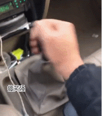

======================================================

ETF拯救世界 (5687069307) @
2018-08-08 14:29:51 Wed  
url: https://weibo.com/5687069307/GtGy8bc58

回复@我叫你一声你敢答应嘛233:我不怕被打脸。大多数指数再跌20%就是世纪铁底。我不是说一定跌到，而是说最差也就这样了。钦定了。//@我叫你一声你敢答应嘛233:啥时候是个底？

------------------------------------------------------
转推：
>  @ETF拯救世界 (5687069307)
>  2018-08-08 14:13:19 Wed  
>  url: https:/weibo.com/5687069307/GtGrq8tr5/

>  资本市场其实非常敏感。我个人认为最敏感的市场是债市，然后就是股市了。
>  
>  股市大多数时间是比较理智的，能大致反映上市公司的情况。
>  
>  所以，不要过于乐观，这一路满仓满融抄底我并不认同。但也绝对没必要太悲观。目前的下跌已经反映了很多坏的预期。
>  
>  还是那句话，控制节奏，捡辣鸡。乐观的人死得早， ​​​

转发[47]  评论[131]  赞[291] 

======================================================

ETF拯救世界 (5687069307) @
2018-08-08 14:52:00 Wed  
url: https://weibo.com/5687069307/GtGH7sKCj

为了多买点辣鸡，我决定note9暂时不买了。消费降级。

共克时艰。 ​​​

转发[13]  评论[365]  赞[551] 

======================================================

ETF拯救世界 (5687069307) @
2018-08-08 15:12:50 Wed  
url: https://weibo.com/5687069307/GtGPzFINF

送大家一张图。看颜色即可。最近十年的行业估值图。

绿色是低估，红色是高估。

第一波绿色是08年。第二波是12-13年。第三波就是现在。

红色第一波是09-10。第二波是14-15。

一图胜千言，我不用说太多。

这次会不同？

每次都有人说，这次不同。

其实，没什么不同。

2012年至今，6年了。 ​​​

转发[170]  评论[491]  赞[518] 

+++++++++++++++++++++++++++++++++++++++++++++++++++++

图片：

======================================================

ETF拯救世界 (5687069307) @
2018-08-08 17:22:06 Wed  
url: https://weibo.com/5687069307/GtHG33fBW

赶紧跌。卖好多了等着买回来呢。

------------------------------------------------------
转推：
>  @ ()
>  2018-08-08 16:39:31 Wed  
>  url: 

>  抱歉，作者已设置仅展示半年内微博，此微博已不可见。 ​​​

转发[9]  评论[56]  赞[216] 

======================================================

ETF拯救世界 (5687069307) @
2018-08-09 09:43:10 Thu  
url: https://weibo.com/5687069307/GtO6gj3Rx

这个区域还在怕的人，这辈子在金融市场也就那样了。 ​​​

转发[90]  评论[121]  赞[373] 

======================================================

ETF拯救世界 (5687069307) @
2018-08-09 09:48:07 Thu  
url: https://weibo.com/5687069307/GtO8hgmXt

回复@郑弯弯直直:市场底部区域，就是要不停的震荡，涨涨跌跌，洗掉所有不坚定的人。最后几根大阴线干掉那些假装坚定的，最后崩溃的，然后，嘿嘿嘿。//@郑弯弯直直:昨天拉50 能源股 砸全指信息 创业板使劲跌 今天反过来：弹能源股猛砸 全指信息猛拉… 感觉几乎每天都这样 。[汗]

------------------------------------------------------
转推：
>  @ETF拯救世界 (5687069307)
>  2018-08-09 09:43:10 Thu  
>  url: https:/weibo.com/5687069307/GtO6gj3Rx/

>  这个区域还在怕的人，这辈子在金融市场也就那样了。 ​​​

转发[35]  评论[80]  赞[225] 

======================================================

ETF拯救世界 (5687069307) @
2018-08-09 09:49:26 Thu  
url: https://weibo.com/5687069307/GtO8O5N18

回复@愿苍天举剑:不好意思，我这个大区域得4个月以上。您明年再来吧。//@愿苍天举剑:话说那么绝对干嘛。过一个月再来看

------------------------------------------------------
转推：
>  @ETF拯救世界 (5687069307)
>  2018-08-09 09:43:10 Thu  
>  url: https:/weibo.com/5687069307/GtO6gj3Rx/

>  这个区域还在怕的人，这辈子在金融市场也就那样了。 ​​​

转发[14]  评论[61]  赞[178] 

======================================================

ETF拯救世界 (5687069307) @
2018-08-09 09:58:09 Thu  
url: https://weibo.com/5687069307/GtOclDaOg

新关注我的朋友，现在看我的言论，觉得我是个多头。

老朋友都知道，2015年上半年开始我在球球做为空头代表天天被人骂，骂到关评论。

一个人，低位看多，高位依然看多，不难。一个人，高位看空，低位继续看空，也不难。

难的是高位看空，低位看多。

体会一下。 ​​​

转发[24]  评论[145]  赞[480] 

======================================================

ETF拯救世界 (5687069307) @
2018-08-09 10:03:46 Thu  
url: https://weibo.com/5687069307/GtOeCykLq

回复@陈诺-2009:非常奇怪。目前今年计划浮亏4、5个点。但我强烈感觉年底会转正。我的感觉准不准，就在此一战了。如果不准，我准备第32次封博了。//@陈诺-2009:之前E大说对今年实现正收益是很有信心的，四个月后让别人来追高[喵喵]

------------------------------------------------------
转推：
>  @ETF拯救世界 (5687069307)
>  2018-08-09 09:43:10 Thu  
>  url: https:/weibo.com/5687069307/GtO6gj3Rx/

>  这个区域还在怕的人，这辈子在金融市场也就那样了。 ​​​

转发[11]  评论[75]  赞[219] 

======================================================

ETF拯救世界 (5687069307) @
2018-08-09 10:04:50 Thu  
url: https://weibo.com/5687069307/GtOf423q9

到没到10%。这么听话好烦哦。[doge]

------------------------------------------------------
转推：
>  @ETF拯救世界 (5687069307)
>  2018-08-03 09:07:10 Fri  
>  url: https:/weibo.com/5687069307/GsTiFt8lm/

>  鹅厂怎么也得反弹个10%吧……这个数字怎么算出来的，蒙的。 ​​​

转发[0]  评论[30]  赞[164] 

======================================================

ETF拯救世界 (5687069307) @
2018-08-09 10:12:51 Thu  
url: https://weibo.com/5687069307/GtOiiDp3i

情绪这个东西，你真的没法说。羊群，旅鼠，乌合之众。你不经历一次，你不知道这都是什么意思。

大事，什么是大事。有人说目前的情况坏过08年。我拜托你，2008年是什么情况了，强烈建议去看看保尔森和盖特纳的回忆录。

什么是大事，2011年欧洲多少国家都要关门破产了。欧元都快挂了。

但你回头看，哪 ​​​

转发[119]  评论[225]  赞[379] 

======================================================

ETF拯救世界 (5687069307) @
2018-08-09 10:18:13 Thu  
url: https://weibo.com/5687069307/GtOkul95q

回复@RobinAmos:讲真，美国是想和你好好做生意，多占点便宜而已。这么大的贸易伙伴，弄死你？另外，让美国搞一搞，长远看，也许我们很多事情会变得更好。这个不能往深处说了。//@RobinAmos:这些国家没被美国搞

------------------------------------------------------
转推：
>  @ETF拯救世界 (5687069307)
>  2018-08-09 10:12:51 Thu  
>  url: https:/weibo.com/5687069307/GtOiiDp3i/

>  情绪这个东西，你真的没法说。羊群，旅鼠，乌合之众。你不经历一次，你不知道这都是什么意思。
>  
>  大事，什么是大事。有人说目前的情况坏过08年。我拜托你，2008年是什么情况了，强烈建议去看看保尔森和盖特纳的回忆录。
>  
>  什么是大事，2011年欧洲多少国家都要关门破产了。欧元都快挂了。
>  
>  但你回头看，哪 ​​​

转发[16]  评论[64]  赞[271] 

======================================================

ETF拯救世界 (5687069307) @
2018-08-09 10:24:29 Thu  
url: https://weibo.com/5687069307/GtOn2obZJ

你知道为什么要洗掉不坚定的人吗。

因为这些人特别讨厌。

涨一涨他们就卖，弄得根本涨不动。——一个队伍里有思想不统一的，队伍根本没有战斗力了。

所以市场先生一琢磨，干脆在底部把他们洗出去。弄得他们一抄底就套，一抄底就套。最后套的不敢抄了，市场先生带着意志坚定的队友向着东北方向出发了 ​​​

转发[73]  评论[221]  赞[423] 

======================================================

ETF拯救世界 (5687069307) @
2018-08-09 10:47:28 Thu  
url: https://weibo.com/5687069307/GtOwmp67u

第一次波段操作目前为止非常顺利。能不能顺利出掉看看运气如何。 ​​​

转发[4]  评论[88]  赞[310] 

======================================================

ETF拯救世界 (5687069307) @
2018-08-09 10:49:22 Thu  
url: https://weibo.com/5687069307/GtOx8fgjE

回复@下一个春天2015:对这种真的只能拉黑了。大家说是不是。//@下一个春天2015:昨天不是说指数下跌20%吗，又变了啊

------------------------------------------------------
转推：
>  @ETF拯救世界 (5687069307)
>  2018-08-09 10:24:29 Thu  
>  url: https:/weibo.com/5687069307/GtOn2obZJ/

>  你知道为什么要洗掉不坚定的人吗。
>  
>  因为这些人特别讨厌。
>  
>  涨一涨他们就卖，弄得根本涨不动。——一个队伍里有思想不统一的，队伍根本没有战斗力了。
>  
>  所以市场先生一琢磨，干脆在底部把他们洗出去。弄得他们一抄底就套，一抄底就套。最后套的不敢抄了，市场先生带着意志坚定的队友向着东北方向出发了 ​​​

转发[3]  评论[143]  赞[351] 

======================================================

ETF拯救世界 (5687069307) @
2018-08-09 10:53:35 Thu  
url: https://weibo.com/5687069307/GtOyQlPTi

真服了，这句话说得还不够清楚是吗？语文是看拉丁语教材自学的？//@ETF拯救世界: 回复@我叫你一声你敢答应嘛233:我不怕被打脸。大多数指数再跌20%就是世纪铁底。我不是说一定跌到，而是说最差也就这样了。钦定了。//@我叫你一声你敢答应嘛233:啥时候是个底？

------------------------------------------------------
转推：
>  @ETF拯救世界 (5687069307)
>  2018-08-08 14:13:19 Wed  
>  url: https:/weibo.com/5687069307/GtGrq8tr5/

>  资本市场其实非常敏感。我个人认为最敏感的市场是债市，然后就是股市了。
>  
>  股市大多数时间是比较理智的，能大致反映上市公司的情况。
>  
>  所以，不要过于乐观，这一路满仓满融抄底我并不认同。但也绝对没必要太悲观。目前的下跌已经反映了很多坏的预期。
>  
>  还是那句话，控制节奏，捡辣鸡。乐观的人死得早， ​​​

转发[7]  评论[110]  赞[208] 

======================================================

ETF拯救世界 (5687069307) @
2018-08-09 13:16:46 Thu  
url: https://weibo.com/5687069307/GtPuXzAQf

别的指数都奔3%甚至4%了，辣鸡上证只有不到2%。

这就是上证 ​​​

转发[35]  评论[104]  赞[254] 

======================================================

ETF拯救世界 (5687069307) @
2018-08-09 13:56:18 Thu  
url: https://weibo.com/5687069307/GtPL0tw0I

做投资，少看那些喜欢讲宏观的人写的东西。

文章写得漂亮，大趋势，大转折。未来三五七年宏观经济走势门儿清，前后五百年大势运筹帷幄。

说真的，对你的投资没有任何卵用。甚至副作用极大。

金融投资，就回到金融投资的本质。公司、行业、资金、情绪、政策、策略、体系。有的没的看那么多你挣不到钱 ​​​

转发[171]  评论[225]  赞[426] 

======================================================

ETF拯救世界 (5687069307) @
2018-08-09 13:59:37 Thu  
url: https://weibo.com/5687069307/GtPMm8nAB

回复@巍在旦夕:未来牛市更牛。就看能买多少了。//@巍在旦夕:全指信息真牛

------------------------------------------------------
转推：
>  @ETF拯救世界 (5687069307)
>  2018-08-09 13:16:46 Thu  
>  url: https:/weibo.com/5687069307/GtPuXzAQf/

>  别的指数都奔3%甚至4%了，辣鸡上证只有不到2%。
>  
>  这就是上证 ​​​

转发[18]  评论[41]  赞[147] 

======================================================

ETF拯救世界 (5687069307) @
2018-08-09 14:08:57 Thu  
url: https://weibo.com/5687069307/GtPQ9lyKe

回复@老张不高兴:怎么定义便宜呢。已经有1/3，接近1000家公司PE不到20倍了，真的一点都买不了吗。也不至于吧。太图便宜也是一种病，只能去拼夕夕买东西了。//@老张不高兴:已经跌了不少可还是不便宜，难道只能右侧买入了//@ETF拯救世界:回复@巍在旦夕:未来牛市更牛。就看能买多少了。

------------------------------------------------------
转推：
>  @ETF拯救世界 (5687069307)
>  2018-08-09 13:16:46 Thu  
>  url: https:/weibo.com/5687069307/GtPuXzAQf/

>  别的指数都奔3%甚至4%了，辣鸡上证只有不到2%。
>  
>  这就是上证 ​​​

转发[9]  评论[38]  赞[159] 

======================================================

ETF拯救世界 (5687069307) @
2018-08-09 14:19:42 Thu  
url: https://weibo.com/5687069307/GtPUvpdyh

今年计划浮亏幅度收窄至3.x%。如果涨上去，将先于所有指数创出新高。//@ETF拯救世界:回复@陈诺-2009:非常奇怪。目前今年计划浮亏4、5个点。但我强烈感觉年底会转正。我的感觉准不准，就在此一战了。如果不准，我准备第32次封博了。

------------------------------------------------------
转推：
>  @ETF拯救世界 (5687069307)
>  2018-08-09 09:43:10 Thu  
>  url: https:/weibo.com/5687069307/GtO6gj3Rx/

>  这个区域还在怕的人，这辈子在金融市场也就那样了。 ​​​

转发[6]  评论[47]  赞[194] 

======================================================

ETF拯救世界 (5687069307) @
2018-08-09 14:29:49 Thu  
url: https://weibo.com/5687069307/GtPYCoruf

回复@日天小清新丶:或者这么说吧。如果文章里面有逻辑，有数据，可以看过程，少看结论。如果逻辑数据都没有就不用看了。//@日天小清新丶:一直很喜欢看海通宏观姜超的文章，现在，决定不看了

------------------------------------------------------
转推：
>  @ETF拯救世界 (5687069307)
>  2018-08-09 13:56:18 Thu  
>  url: https:/weibo.com/5687069307/GtPL0tw0I/

>  做投资，少看那些喜欢讲宏观的人写的东西。
>  
>  文章写得漂亮，大趋势，大转折。未来三五七年宏观经济走势门儿清，前后五百年大势运筹帷幄。
>  
>  说真的，对你的投资没有任何卵用。甚至副作用极大。
>  
>  金融投资，就回到金融投资的本质。公司、行业、资金、情绪、政策、策略、体系。有的没的看那么多你挣不到钱 ​​​

转发[13]  评论[29]  赞[159] 

======================================================

ETF拯救世界 (5687069307) @
2018-08-09 14:37:26 Thu  
url: https://weibo.com/5687069307/GtQ1HzN2t

今天中证500涨幅超过2.6%，全市场涨幅超过它的股票只有1100只，不到1/3。

创业板涨幅3.7%，涨幅超过它的股票有550只，占比16%。

如果是大股票行情，那么超过沪深300或者上证50的股票更少。

你何德何能认为自己的股票在牛市上涨中一定能超过指数？讲真，有50%概率超过就不错了。

何况，股票你还拿不 ​​​

转发[89]  评论[388]  赞[500] 

======================================================

ETF拯救世界 (5687069307) @
2018-08-10 09:07:15 Fri  
url: https://weibo.com/5687069307/GtXibuNvx

回复@ppott2017:祝早日康复。虽然这个问题我之前总是在说，但有些事情突然发生也没办法。真的要用钱，那就只能卖掉。我的体系中，唯一不确定的就是无法预判牛市什么时候来，所以最好用闲钱。另外，商业医疗或者重疾险真的挺有必要的。再次祝早日康复！

------------------------------------------------------
转推：
>  @ETF拯救世界 (5687069307)
>  2018-08-09 14:37:26 Thu  
>  url: https:/weibo.com/5687069307/GtQ1HzN2t/

>  今天中证500涨幅超过2.6%，全市场涨幅超过它的股票只有1100只，不到1/3。
>  
>  创业板涨幅3.7%，涨幅超过它的股票有550只，占比16%。
>  
>  如果是大股票行情，那么超过沪深300或者上证50的股票更少。
>  
>  你何德何能认为自己的股票在牛市上涨中一定能超过指数？讲真，有50%概率超过就不错了。
>  
>  何况，股票你还拿不 ​​​

转发[7]  评论[39]  赞[147] 

======================================================

ETF拯救世界 (5687069307) @
2018-08-10 09:16:25 Fri  
url: https://weibo.com/5687069307/GtXlTFdwP

有人问今年-10%怎么办那个，你们回答的都没到点子上。

关键问题在于：仓位控制，资产配置。

他从今年开始参考，我估计仓位也就30%-35%。持仓部分下跌10%，也就是总资产损失了3%多一点。

今年大盘下跌20%多，股票中位数下跌20%多。

为什么第二轮计划我要把资产分成50份，第三轮分成150份。就是因为 ​​​

转发[54]  评论[196]  赞[479] 

======================================================

ETF拯救世界 (5687069307) @
2018-08-10 09:18:22 Fri  
url: https://weibo.com/5687069307/GtXmHkd7s

回复@老刘想长胖:另外，给他点赞的8个人也全部拉黑。//@老刘想长胖:跟投长赢半年以来收益-10%，我该怎么办

------------------------------------------------------
转推：
>  @ETF拯救世界 (5687069307)
>  2018-08-09 14:37:26 Thu  
>  url: https:/weibo.com/5687069307/GtQ1HzN2t/

>  今天中证500涨幅超过2.6%，全市场涨幅超过它的股票只有1100只，不到1/3。
>  
>  创业板涨幅3.7%，涨幅超过它的股票有550只，占比16%。
>  
>  如果是大股票行情，那么超过沪深300或者上证50的股票更少。
>  
>  你何德何能认为自己的股票在牛市上涨中一定能超过指数？讲真，有50%概率超过就不错了。
>  
>  何况，股票你还拿不 ​​​

转发[3]  评论[124]  赞[190] 

======================================================

ETF拯救世界 (5687069307) @
2018-08-10 09:53:53 Fri  
url: https://weibo.com/5687069307/GtXB6zJNl

好了，事情我自己处理。咱们还是说正事。又到了每日一吹的时间：

医药又来？又买到最低了？

$全指医药 sh000991$ ​​​

转发[11]  评论[201]  赞[402] 

+++++++++++++++++++++++++++++++++++++++++++++++++++++

图片：

======================================================

ETF拯救世界 (5687069307) @
2018-08-10 10:18:29 Fri  
url: https://weibo.com/5687069307/GtXL616rz

其实在微博大多数拉黑，不是什么别的原因，是因为我不想让不理性的抱怨影响我的心态。

当年恒生的一幕我不希望再发生。

还请多担待了。 ​​​

转发[7]  评论[221]  赞[638] 

======================================================

ETF拯救世界 (5687069307) @
2018-08-10 10:46:34 Fri  
url: https://weibo.com/5687069307/GtXWuvq0v

目前养老+医药的仓位已经12%了。距离15%-20%的最终目标其实并不远了。

还要给最差情况的7700-7800留一些余地。所以基本上医药这块各位可以稳了。

经过前几天的大跌，相信大多数人也都补到这个仓位了。踏踏实实的都。 ​​​

转发[66]  评论[246]  赞[370] 

======================================================

ETF拯救世界 (5687069307) @
2018-08-10 11:12:48 Fri  
url: https://weibo.com/5687069307/GtY79dbgD

回复@一想调味剂116:不用急，趋势这么差。说起下跌，A股从来不会让我们失望。//@一想调味剂116:后悔死了，周一周三各买了一份，还想着更低的

------------------------------------------------------
转推：
>  @ETF拯救世界 (5687069307)
>  2018-08-10 10:46:34 Fri  
>  url: https:/weibo.com/5687069307/GtXWuvq0v/

>  目前养老+医药的仓位已经12%了。距离15%-20%的最终目标其实并不远了。
>  
>  还要给最差情况的7700-7800留一些余地。所以基本上医药这块各位可以稳了。
>  
>  经过前几天的大跌，相信大多数人也都补到这个仓位了。踏踏实实的都。 ​​​

转发[17]  评论[124]  赞[286] 

======================================================

ETF拯救世界 (5687069307) @
2018-08-10 13:25:09 Fri  
url: https://weibo.com/5687069307/GtYYQtkOf

今天看到一篇文章，说鹅厂已经赶不上互联网的发展了，4g 5g没有入口。

真是墙倒众人推，破鼓万人捶啊。半年前都干嘛去了呢。

任何东西都是这样，跌下去就各种理由差，涨上去就各种理由好。 ​​​

转发[13]  评论[64]  赞[255] 

======================================================

ETF拯救世界 (5687069307) @
2018-08-10 13:35:26 Fri  
url: https://weibo.com/5687069307/GtZ32g4F6

截至今日，13家养老产业成分股披露或预披露中报。

12家利润增加（只有永辉一家下降），超过10%的11家，超过20%的10家，超过40%的7家。

恒瑞这种增加20%的只能排在第10位。

剩下的60多家给点力。 ​​​

转发[10]  评论[48]  赞[206] 

======================================================

ETF拯救世界 (5687069307) @
2018-08-10 14:19:26 Fri  
url: https://weibo.com/5687069307/GtZkTpGzw

回复@23RRRR:还是有差距的。如果2016年8月15日第一次开始投资中证500指数，到目前为止共投资24次，收益率-18.03%。计划持有18份，收益率大致是-14%左右。以后计划每次投入都会比定时定额更加快速拉低成本。//@23RRRR:回复@戒不了你MZ:中证500亏了10多个点，大概跟计划收益差不多

------------------------------------------------------
转推：
>  @ETF拯救世界 (5687069307)
>  2018-08-09 13:16:46 Thu  
>  url: https:/weibo.com/5687069307/GtPuXzAQf/

>  别的指数都奔3%甚至4%了，辣鸡上证只有不到2%。
>  
>  这就是上证 ​​​

转发[8]  评论[31]  赞[125] 

======================================================

ETF拯救世界 (5687069307) @
2018-08-10 14:25:53 Fri  
url: https://weibo.com/5687069307/GtZnvDHWX

回复@做而论道725:我没有把做波段的一份算进来。如果算进来收益率还会高一些。//@做而论道725:益达，数据有出入？中证6份，建信11份，富国一份，903一份，500类资产应该是19份吧

------------------------------------------------------
转推：
>  @ETF拯救世界 (5687069307)
>  2018-08-09 13:16:46 Thu  
>  url: https:/weibo.com/5687069307/GtPuXzAQf/

>  别的指数都奔3%甚至4%了，辣鸡上证只有不到2%。
>  
>  这就是上证 ​​​

转发[0]  评论[9]  赞[124] 

======================================================

ETF拯救世界 (5687069307) @
2018-08-10 14:29:37 Fri  
url: https://weibo.com/5687069307/GtZp1CGuZ

500其实算是买的一般的，原因很多。因为之前没有什么可以买的时候，我都是默认买500的。

50就威武很多了。

我们的上证50是2015年8月开始买第一次。如果那个时候开始定投到现在，投资37次，收益率7%。

我们的收益率是22%。

这个问题其实就牵扯到我打算在锦囊里说的“节奏”问题。

定时定额投资，很 ​​​

转发[50]  评论[153]  赞[317] 

======================================================

ETF拯救世界 (5687069307) @
2018-08-10 14:39:36 Fri  
url: https://weibo.com/5687069307/GtZt59Ge1

下周有一个愿望，500C顺利的以好价格出掉。大家一起感受一下波段的乐趣。

我希望周收益率可以到6%-8%左右。 ​​​

转发[7]  评论[204]  赞[499] 

======================================================

ETF拯救世界 (5687069307) @
2018-08-10 15:49:29 Fri  
url: https://weibo.com/5687069307/GtZVsbaQq

现在各种政策转向太快了。前几年还严控，现在要鼓励了。真是防不胜防啊。

------------------------------------------------------
转推：
>  @ ()
>  2018-08-10 15:12:48 Fri  
>  url: 

>  抱歉，作者已设置仅展示半年内微博，此微博已不可见。 ​​​

转发[12]  评论[118]  赞[156] 

======================================================

ETF拯救世界 (5687069307) @
2018-08-10 16:18:00 Fri  
url: https://weibo.com/5687069307/Gu071n5P6

同学们有没有开电动车的讲讲是不是这样啊。

------------------------------------------------------
转推：
>  @ ()
>  2018-08-10 14:09:47 Fri  
>  url: 

>  抱歉，作者已设置仅展示半年内微博，此微博已不可见。 ​​​

转发[18]  评论[136]  赞[110] 

======================================================

ETF拯救世界 (5687069307) @
2018-08-10 17:52:09 Fri  
url: https://weibo.com/5687069307/Gu0Jfaos6

哈哈哈。你可以骗我，但注意次数。

------------------------------------------------------
转推：
>  @ ()
>  2018-08-10 17:16:55 Fri  
>  url: 

>  抱歉，作者已设置仅展示半年内微博，此微博已不可见。 ​​​

转发[3]  评论[43]  赞[181] 

======================================================

ETF拯救世界 (5687069307) @
2018-08-10 21:46:12 Fri  
url: https://weibo.com/5687069307/Gu2geFhX7

欧洲又要危机？ ​​​

转发[1]  评论[138]  赞[270] 

======================================================

ETF拯救世界 (5687069307) @
2018-08-11 18:59:35 Sat  
url: https://weibo.com/5687069307/GuaB6t0iq

2016年2月，降低二套首付比例，时任央行行长表示，“从宏观层面看，中国若想控制杠杆率，关键还是要看如何应对企业杠杆率过高的问题。从总量上来讲，个人消费贷款的杠杆率不太高。个人住房贷款占银行总贷款中的比重还是相对偏低的”居民加杠杆开始。

------------------------------------------------------
转推：
>  @新财富杂志 (1708922835)
>  2018-08-11 18:35:03 Sat  
>  url: https:/weibo.com/1708922835/Guar9b6P7/

>  【逐年统计家庭债务攀升率，房价已到不遏制不行程度！】家庭债务问题其实已经非常严重，逼近家庭部门能承受的极限，对消费已形成挤出效应，致使消费增速连续7年下滑、企业经营活力下降并被动加杠杆，严重拖累了结构性去杠杆的进程和经济发展。更严重的是，该负面效应已经溢出到了企业和金融系统，加剧 ​​​

转发[21]  评论[157]  赞[202] 

======================================================

ETF拯救世界 (5687069307) @
2018-08-12 21:36:12 Sun  
url: https://weibo.com/5687069307/Gul3bacy7

回复@快乐行者9:你因为对方是少妇头像才撩了半个月吧！再次提醒大家，我不会主动私信任何人，没有群，不指导操作，不要上当！

------------------------------------------------------
转推：
>  @ETF拯救世界 (5687069307)
>  2018-01-16 17:17:40 Tue  
>  url: https:/weibo.com/5687069307/FEDVh1F3k/

>  你们这些骗子，你们都是大垃圾。我第一次在公开场合骂人。
>  
>  你爸你妈把你生出来就是让你骗人的吗？你有手有脚一定要靠骗人挣钱吗？
>  
>  别人辛辛苦苦挣点钱容易吗？你不怕遭雷劈？？？不怕生孩子没有生殖器？
>  
>  我们一起诅咒你！
>  
>  各位朋友，大家自己也要提高警惕啊！我已经发过很多次提示了，那些主动联系 ​​​

转发[3]  评论[41]  赞[122] 

======================================================

ETF拯救世界 (5687069307) @
2018-08-13 09:28:48 Mon  
url: https://weibo.com/5687069307/GupIpmdtT

15号发车，欧洲也来助攻？ ​​​

转发[3]  评论[99]  赞[323] 

======================================================

ETF拯救世界 (5687069307) @
2018-08-13 09:36:04 Mon  
url: https://weibo.com/5687069307/GupLmBhDC

价投普遍不相信趋势。

其实，趋势都好重要嘅！ ​​​

转发[16]  评论[83]  赞[333] 

======================================================

ETF拯救世界 (5687069307) @
2018-08-13 09:48:56 Mon  
url: https://weibo.com/5687069307/GupQArdVY

所谓价值，所谓趋势，左侧右侧，其实就像当年华山派剑宗气宗之争。

争什么呢，挣钱才是王道啊。

价值就不会出问题吗？未来的公司，未来的行业，未来的世界，你能那么确定？一旦看错，几十年就浪费了。别说那些成功的人，那些没有成功的价投十倍于他们。

趋势就不会出问题吗？明明已经巨便宜了还在杀 ​​​

转发[89]  评论[238]  赞[498] 

======================================================

ETF拯救世界 (5687069307) @
2018-08-13 11:17:57 Mon  
url: https://weibo.com/5687069307/GuqqIClhh

回复@业余定投者:调整仓位到不慌为止。//@业余定投者:说实话我有点心慌慌

------------------------------------------------------
转推：
>  @ETF拯救世界 (5687069307)
>  2018-08-13 09:48:56 Mon  
>  url: https:/weibo.com/5687069307/GupQArdVY/

>  所谓价值，所谓趋势，左侧右侧，其实就像当年华山派剑宗气宗之争。
>  
>  争什么呢，挣钱才是王道啊。
>  
>  价值就不会出问题吗？未来的公司，未来的行业，未来的世界，你能那么确定？一旦看错，几十年就浪费了。别说那些成功的人，那些没有成功的价投十倍于他们。
>  
>  趋势就不会出问题吗？明明已经巨便宜了还在杀 ​​​

转发[3]  评论[80]  赞[193] 

======================================================

ETF拯救世界 (5687069307) @
2018-08-13 13:36:49 Mon  
url: https://weibo.com/5687069307/Gurl5o3yo

国开债是不是又卖在高点了。[doge] ​​​

转发[1]  评论[52]  赞[251] 

+++++++++++++++++++++++++++++++++++++++++++++++++++++

图片：

======================================================

ETF拯救世界 (5687069307) @
2018-08-13 13:53:13 Mon  
url: https://weibo.com/5687069307/GurrKc0S8

国开债这一轮总体来说还可以，没犯什么大错。不过，在箭头这个地方为什么没买呢。

想不起来了。

是不是在等4.5？下次得注意。 ​​​

转发[19]  评论[80]  赞[205] 

+++++++++++++++++++++++++++++++++++++++++++++++++++++

图片：

======================================================

ETF拯救世界 (5687069307) @
2018-08-13 13:58:39 Mon  
url: https://weibo.com/5687069307/GurtX0e6A

怎么涨回去了。

表脸。

说好一起到白头，你却偷偷焗了油。

辣鸡。 ​​​

转发[6]  评论[64]  赞[296] 

======================================================

ETF拯救世界 (5687069307) @
2018-08-13 14:03:44 Mon  
url: https://weibo.com/5687069307/Gurw1cUGR

回复@shimeihaojie:我对这次500c首战告捷还是挺看好的。奶一口。//@shimeihaojie:下午500可能会翻红，要不要出500C呀。[哆啦A梦吃惊]

------------------------------------------------------
转推：
>  @ETF拯救世界 (5687069307)
>  2018-08-13 13:53:13 Mon  
>  url: https:/weibo.com/5687069307/GurrKc0S8/

>  国开债这一轮总体来说还可以，没犯什么大错。不过，在箭头这个地方为什么没买呢。
>  
>  想不起来了。
>  
>  是不是在等4.5？下次得注意。 ​​​

转发[2]  评论[37]  赞[170] 

======================================================

ETF拯救世界 (5687069307) @
2018-08-13 14:33:41 Mon  
url: https://weibo.com/5687069307/GurIapAyZ

500c风骚的买入点。如果卖出点是阶段高点就完美了。 ​​​

转发[17]  评论[141]  赞[378] 

+++++++++++++++++++++++++++++++++++++++++++++++++++++

图片：
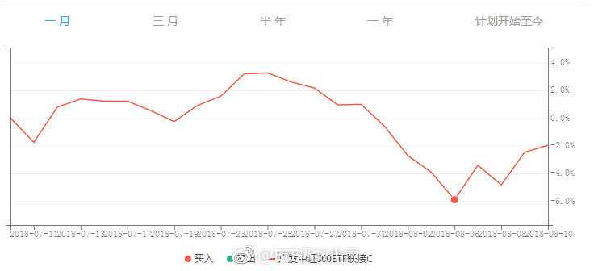

======================================================

ETF拯救世界 (5687069307) @
2018-08-13 16:06:54 Mon  
url: https://weibo.com/5687069307/Gusk0maAt

回复@天生歌者不唱歌:哪有的事儿呢。[doge]//@天生歌者不唱歌:回复@ETF拯救世界:我不信[doge]每次蒙这么准，一定是国家队里有人

------------------------------------------------------
转推：
>  @ETF拯救世界 (5687069307)
>  2018-08-13 14:33:41 Mon  
>  url: https:/weibo.com/5687069307/GurIapAyZ/

>  500c风骚的买入点。如果卖出点是阶段高点就完美了。 ​​​

转发[2]  评论[129]  赞[213] 

======================================================

ETF拯救世界 (5687069307) @
2018-08-14 13:42:25 Tue  
url: https://weibo.com/5687069307/GuANRrMnb

还真没反弹到10%就回来了。看看能不能守住前期低点吧。大热门真的要离远一点。股票如此，人也是如此。

------------------------------------------------------
转推：
>  @ETF拯救世界 (5687069307)
>  2018-08-03 09:07:10 Fri  
>  url: https:/weibo.com/5687069307/GsTiFt8lm/

>  鹅厂怎么也得反弹个10%吧……这个数字怎么算出来的，蒙的。 ​​​

转发[62]  评论[86]  赞[219] 

======================================================

ETF拯救世界 (5687069307) @
2018-08-14 13:50:04 Tue  
url: https://weibo.com/5687069307/GuAQXzfGP

有没有想在球球出名的朋友。我送你一条经验贴士。

经验来自于我连续观察超过十年的大v。

经验就是，看多。

强烈看多，极具浪漫主义，革命色彩的看多。总有一天你的东西会涨，涨的时候继续看多。

而且看多的程度要天马行空。

比如2015年5月要看到上证30000点。比如2018年2月要看到恒指几个月内到40 ​​​

转发[23]  评论[172]  赞[328] 

======================================================

ETF拯救世界 (5687069307) @
2018-08-14 14:18:08 Tue  
url: https://weibo.com/5687069307/GuB2m26f4

一直惦记恒生的朋友们，你们的机会来了。

24000开始入货。 ​​​

转发[71]  评论[166]  赞[407] 

======================================================

ETF拯救世界 (5687069307) @
2018-08-14 14:31:07 Tue  
url: https://weibo.com/5687069307/GuB7CwtKE

有没有感觉暗流涌动。 ​​​

转发[3]  评论[165]  赞[301] 

======================================================

ETF拯救世界 (5687069307) @
2018-08-14 20:22:16 Tue  
url: https://weibo.com/5687069307/GuDq9xRKt

有没有发现，很久没人吐槽PM2.5了。

反正就我的体会，这两年北京的空气有改善。看了看数据，确实如此。

希望越来越好吧。 ​​​

转发[7]  评论[83]  赞[175] 

+++++++++++++++++++++++++++++++++++++++++++++++++++++

图片：
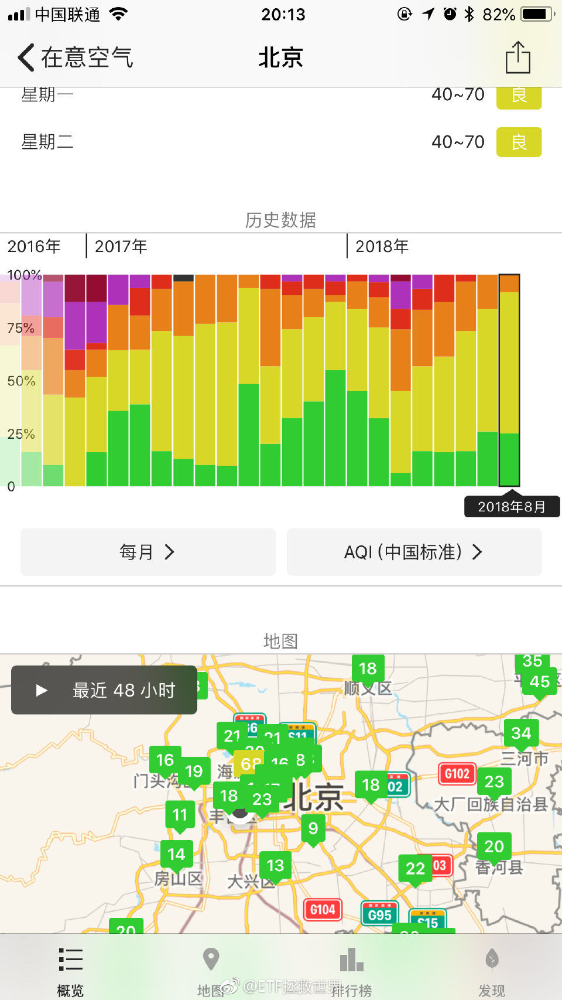

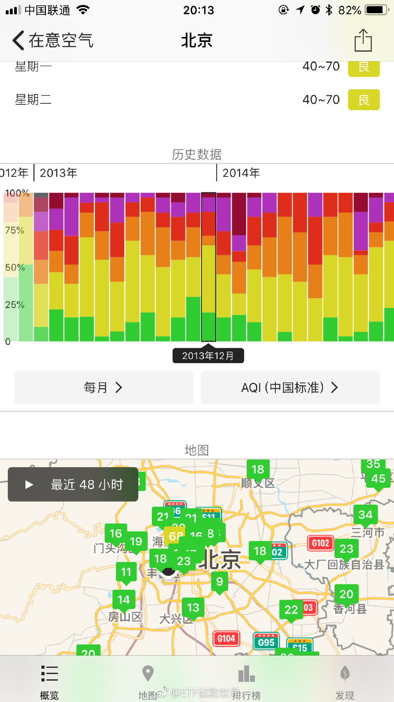

======================================================

ETF拯救世界 (5687069307) @
2018-08-14 20:54:32 Tue  
url: https://weibo.com/5687069307/GuDDffBTi

回复@比神还N:我建议下个“在意空气”软件，比较一下比如石家庄等城市与前几年的变化，然后再骂。客观的用数据说话比用情绪好一点//@比神还N:尼玛比的，北京好了，周边还是那么垃圾，空气越来越差，曰。

------------------------------------------------------
转推：
>  @ETF拯救世界 (5687069307)
>  2018-08-14 20:22:16 Tue  
>  url: https:/weibo.com/5687069307/GuDq9xRKt/

>  有没有发现，很久没人吐槽PM2.5了。
>  
>  反正就我的体会，这两年北京的空气有改善。看了看数据，确实如此。
>  
>  希望越来越好吧。 ​​​

转发[2]  评论[24]  赞[94] 

======================================================

ETF拯救世界 (5687069307) @
2018-08-14 20:58:11 Tue  
url: https://weibo.com/5687069307/GuDEJsVV4

这是石家庄的1718与1314对比。

当然，有人还会说，为了空气好，很多工厂停工了。

是啊，大家都想什么都不变然后空气变好了，可能吗。 ​​​

转发[1]  评论[74]  赞[166] 

+++++++++++++++++++++++++++++++++++++++++++++++++++++

图片：
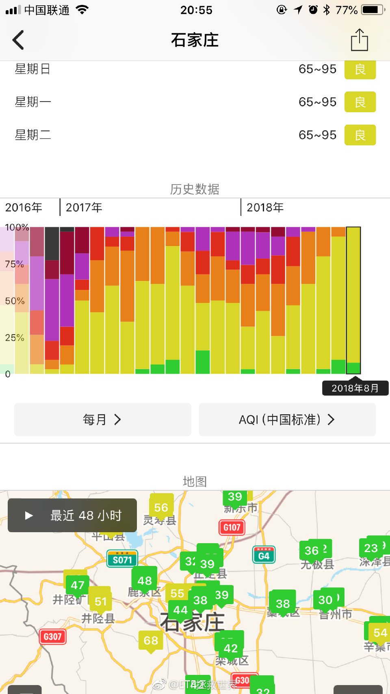
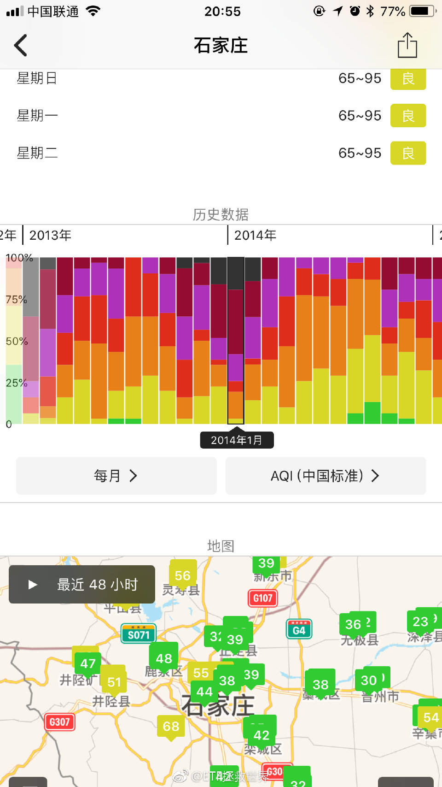

======================================================

ETF拯救世界 (5687069307) @
2018-08-14 23:08:34 Tue  
url: https://weibo.com/5687069307/GuEvFfasO

浓眉大眼的中概股也崩了 ​​​

转发[6]  评论[101]  赞[295] 

======================================================

ETF拯救世界 (5687069307) @
2018-08-15 10:06:08 Wed  
url: https://weibo.com/5687069307/GuIOz4Ezo

新低没守住。继续寻底吧。//@ETF拯救世界:还真没反弹到10%就回来了。看看能不能守住前期低点吧。大热门真的要离远一点。股票如此，人也是如此。

------------------------------------------------------
转推：
>  @ETF拯救世界 (5687069307)
>  2018-08-03 09:07:10 Fri  
>  url: https:/weibo.com/5687069307/GsTiFt8lm/

>  鹅厂怎么也得反弹个10%吧……这个数字怎么算出来的，蒙的。 ​​​

转发[52]  评论[163]  赞[203] 

======================================================

ETF拯救世界 (5687069307) @
2018-08-15 13:20:34 Wed  
url: https://weibo.com/5687069307/GuK5ua2Jx

刚收到内部消息，

股灾了！（绝密） ​​​

转发[30]  评论[427]  赞[495] 

======================================================

ETF拯救世界 (5687069307) @
2018-08-15 15:09:41 Wed  
url: https://weibo.com/5687069307/GuKNM6enT

回复@战场男舞神:你可能没弄清楚公募和私募的区别。公募基金跑路的话，那个时候基本上你的银行存款也不会太安全了。第二，我没有推荐你什么，我是把自己的操作公布出来。各位自己做投资，我真的希望能了解一下最最最基本的金融知识。如果连最基本的东西都不懂，我真心不希望你来看我的计划。

------------------------------------------------------
转推：
>  @ETF拯救世界 (5687069307)
>  2018-08-15 13:20:34 Wed  
>  url: https:/weibo.com/5687069307/GuK5ua2Jx/

>  刚收到内部消息，
>  
>  股灾了！（绝密） ​​​

转发[6]  评论[66]  赞[198] 

======================================================

ETF拯救世界 (5687069307) @
2018-08-15 15:14:25 Wed  
url: https://weibo.com/5687069307/GuKPHavfm

再次重申：

1：我不说任何股票，防止道德风险；

2：我不说任何主动基金，防止老鼠仓，防止道德风险；

3：我不投资小规模公募基金公司发行的指数基金产品，只投最大的那几家。

如果在中国的金融市场上，华夏 南方 易方达 广发 富国 华安这些最大的，管理几万亿资产，管理中国社保 养老基金，管理无 ​​​

转发[70]  评论[172]  赞[443] 

======================================================

ETF拯救世界 (5687069307) @
2018-08-15 15:19:51 Wed  
url: https://weibo.com/5687069307/GuKRUlE4S

回复@守夜人201:是的。钱根本就不在基金公司，它倒是想拿着钱跑呢。也可能是跟托管银行一起跑吧。//@守夜人201:公募基金采取双受托模式，基金公司负责投资运作，托管银行负责保障募集资金安全。基金公司怎么跑路？跑啥路？

------------------------------------------------------
转推：
>  @ETF拯救世界 (5687069307)
>  2018-08-15 15:14:25 Wed  
>  url: https:/weibo.com/5687069307/GuKPHavfm/

>  再次重申：
>  
>  1：我不说任何股票，防止道德风险；
>  
>  2：我不说任何主动基金，防止老鼠仓，防止道德风险；
>  
>  3：我不投资小规模公募基金公司发行的指数基金产品，只投最大的那几家。
>  
>  如果在中国的金融市场上，华夏 南方 易方达 广发 富国 华安这些最大的，管理几万亿资产，管理中国社保 养老基金，管理无 ​​​

转发[12]  评论[100]  赞[181] 

======================================================

ETF拯救世界 (5687069307) @
2018-08-15 17:45:47 Wed  
url: https://weibo.com/5687069307/GuLP8ms5c

6.9附近开始出货说到做到

------------------------------------------------------
转推：
>  @ ()
>  2018-08-15 17:33:50 Wed  
>  url: 

>  该账号因被投诉违反《微博社区公约》的相关规定，现已无法查看。查看帮助 https://kefu.weibo.com/faqdetail?id=13216

转发[16]  评论[48]  赞[147] 

======================================================

ETF拯救世界 (5687069307) @
2018-08-15 18:06:52 Wed  
url: https://weibo.com/5687069307/GuLXH4mMr

回复@98号元素:这里会有一场争夺战//@98号元素:E大，扔个骰子，觉得汇率会破7吗？[doge]//@ETF拯救世界:6.9附近开始出货说到做到

------------------------------------------------------
转推：
>  @ ()
>  2018-08-15 17:33:50 Wed  
>  url: 

>  该账号因被投诉违反《微博社区公约》的相关规定，现已无法查看。查看帮助 https://kefu.weibo.com/faqdetail?id=13216

转发[12]  评论[43]  赞[118] 

======================================================

ETF拯救世界 (5687069307) @
2018-08-15 21:34:45 Wed  
url: https://weibo.com/5687069307/GuNk57X2V

明天鹅厂会怎样？我真佩服南非大股东和市场先生

------------------------------------------------------
转推：
>  @ETF拯救世界 (5687069307)
>  2018-03-22 09:34:01 Thu  
>  url: https:/weibo.com/5687069307/G8wd21cxW/

>  腾讯，60倍PE。未来五年看，真的能有特别好的收益率吗。
>  
>  学习了。 ​​​

转发[5]  评论[100]  赞[222] 

======================================================

ETF拯救世界 (5687069307) @
2018-08-16 09:06:32 Thu  
url: https://weibo.com/5687069307/GuRQRmGis

今天会不会很刺激？

惊不惊喜，开不开心？

猜不到吧！ ​​​

转发[39]  评论[202]  赞[287] 

======================================================

ETF拯救世界 (5687069307) @
2018-08-16 09:18:04 Thu  
url: https://weibo.com/5687069307/GuRVyu8UT

回复@佳峻爸2013:据我观察球球上，只要有v说大奇迹日，事后看，通常都是又一波暴跌的起点。不信你们去看看。//@佳峻爸2013:大奇迹日！

------------------------------------------------------
转推：
>  @ETF拯救世界 (5687069307)
>  2018-08-16 09:06:32 Thu  
>  url: https:/weibo.com/5687069307/GuRQRmGis/

>  今天会不会很刺激？
>  
>  惊不惊喜，开不开心？
>  
>  猜不到吧！ ​​​

转发[7]  评论[32]  赞[171] 

======================================================

ETF拯救世界 (5687069307) @
2018-08-16 09:19:40 Thu  
url: https://weibo.com/5687069307/GuRWcntpt

回复@dotajjyy:不会太远了。即将进入真正的十年大底区域。//@dotajjyy:E大什么时候才是底

------------------------------------------------------
转推：
>  @ETF拯救世界 (5687069307)
>  2018-08-16 09:06:32 Thu  
>  url: https:/weibo.com/5687069307/GuRQRmGis/

>  今天会不会很刺激？
>  
>  惊不惊喜，开不开心？
>  
>  猜不到吧！ ​​​

转发[14]  评论[80]  赞[225] 

======================================================

ETF拯救世界 (5687069307) @
2018-08-16 09:22:41 Thu  
url: https://weibo.com/5687069307/GuRXpDVzI

新低和新高真的一定要重视。尤其是突破/跌破平台后的。一个经验，免费分享。价值388.68万。//@ETF拯救世界:新低没守住。继续寻底吧。//@ETF拯救世界:还真没反弹到10%就回来了。看看能不能守住前期低点吧。大热门真的要离远一点。股票如此，人也是如此。

------------------------------------------------------
转推：
>  @ETF拯救世界 (5687069307)
>  2018-08-03 09:07:10 Fri  
>  url: https:/weibo.com/5687069307/GsTiFt8lm/

>  鹅厂怎么也得反弹个10%吧……这个数字怎么算出来的，蒙的。 ​​​

转发[44]  评论[115]  赞[224] 

======================================================

ETF拯救世界 (5687069307) @
2018-08-16 10:00:13 Thu  
url: https://weibo.com/5687069307/GuScEDiCA

围观一下。确认了，是专门过来黑的。不知道谁派来的。记录：2018年8月16日，上证2690点，“投资指数基金是骗局”//回复@战场男舞神:感觉你和这帮粉丝的言行 完全就是个传销诈骗组织嘛 我也没说啥就问了下风险 瞧你们各个那猴急洗白的样 被人骗了 还傻乎乎的帮人数钱

------------------------------------------------------
转推：
>  @ETF拯救世界 (5687069307)
>  2018-08-15 13:20:34 Wed  
>  url: https:/weibo.com/5687069307/GuK5ua2Jx/

>  刚收到内部消息，
>  
>  股灾了！（绝密） ​​​

转发[5]  评论[137]  赞[186] 

======================================================

ETF拯救世界 (5687069307) @
2018-08-16 10:18:32 Thu  
url: https://weibo.com/5687069307/GuSk5Ekrl

回复@yaoyan02:失望什么。如果市场短期走势你可以预测到，那就不叫市场了。市场总是会出乎你的意料。所以别预测，看市场表演。猜不到吧！//@yaoyan02:有点失望

------------------------------------------------------
转推：
>  @ETF拯救世界 (5687069307)
>  2018-08-16 09:06:32 Thu  
>  url: https:/weibo.com/5687069307/GuRQRmGis/

>  今天会不会很刺激？
>  
>  惊不惊喜，开不开心？
>  
>  猜不到吧！ ​​​

转发[6]  评论[56]  赞[177] 

======================================================

ETF拯救世界 (5687069307) @
2018-08-16 10:27:50 Thu  
url: https://weibo.com/5687069307/GuSnRDIkK

再说一次：

一轮熊市，只有一个真正的“大底”，只有一个真正的“大奇迹日”。

在那之前，会有300-1200个假底。

你可以想想，在不断的新低中，今天是“大底”的可能性是多大？

你要做的，是放弃“抄底”的思维。想办法让自己的筹码分布在一个底部“区域”。

因为如果你一定要抄底，则很可能把大部 ​​​

转发[153]  评论[343]  赞[501] 

======================================================

ETF拯救世界 (5687069307) @
2018-08-16 10:58:11 Thu  
url: https://weibo.com/5687069307/GuSAcalUx

全指医药截至今日有76家公司披露/预披露半年报。

其中17家利润下降，58只上升。48只升10%以上，39只升20%以上，30只升30%以上。

依然很强。 ​​​

转发[24]  评论[72]  赞[298] 

======================================================

ETF拯救世界 (5687069307) @
2018-08-16 11:06:59 Thu  
url: https://weibo.com/5687069307/GuSDLbpGt

看了一眼第三轮计划以来，A股的股票涨跌幅。

2015年7月1日以来，截止昨天收盘：

2744只股票中：

285只上涨，占比10.39%。

涨幅超过20%的181只，占比6.6%。

2459只股票下跌，可以说惨不忍睹。

跌幅超过60%的是890只，占比32%。也就是说，1/3的股票下跌超过60%。

86只股票下跌超过80%。可以说如果 ​​​

转发[137]  评论[156]  赞[285] 

======================================================

ETF拯救世界 (5687069307) @
2018-08-16 11:16:17 Thu  
url: https://weibo.com/5687069307/GuSHxtN7K

回复@finalphoenix00:http://t.cn/RDsstvm //@finalphoenix00:所以普通人在A股到底能不能赚钱？

------------------------------------------------------
转推：
>  @ETF拯救世界 (5687069307)
>  2018-08-16 11:06:59 Thu  
>  url: https:/weibo.com/5687069307/GuSDLbpGt/

>  看了一眼第三轮计划以来，A股的股票涨跌幅。
>  
>  2015年7月1日以来，截止昨天收盘：
>  
>  2744只股票中：
>  
>  285只上涨，占比10.39%。
>  
>  涨幅超过20%的181只，占比6.6%。
>  
>  2459只股票下跌，可以说惨不忍睹。
>  
>  跌幅超过60%的是890只，占比32%。也就是说，1/3的股票下跌超过60%。
>  
>  86只股票下跌超过80%。可以说如果 ​​​

转发[48]  评论[66]  赞[229] 

======================================================

ETF拯救世界 (5687069307) @
2018-08-16 11:26:49 Thu  
url: https://weibo.com/5687069307/GuSLOgoL7

回复@开心快乐追求:第一，大部分人赔就是因为文章中说的牛市进来熊市出去。你反着做怎么不赔？第二，你一定要在熊市建仓的时候说不赚钱，我也没办法。好在我从2010年开始在博客公布第二轮计划，到2015年几十位朋友一共赚了5000多万这件事正好回答你的问题。

------------------------------------------------------
转推：
>  @ETF拯救世界 (5687069307)
>  2018-08-16 11:06:59 Thu  
>  url: https:/weibo.com/5687069307/GuSDLbpGt/

>  看了一眼第三轮计划以来，A股的股票涨跌幅。
>  
>  2015年7月1日以来，截止昨天收盘：
>  
>  2744只股票中：
>  
>  285只上涨，占比10.39%。
>  
>  涨幅超过20%的181只，占比6.6%。
>  
>  2459只股票下跌，可以说惨不忍睹。
>  
>  跌幅超过60%的是890只，占比32%。也就是说，1/3的股票下跌超过60%。
>  
>  86只股票下跌超过80%。可以说如果 ​​​

转发[18]  评论[73]  赞[220] 

======================================================

ETF拯救世界 (5687069307) @
2018-08-16 11:31:37 Thu  
url: https://weibo.com/5687069307/GuSNL7c02

2010年开始的第二轮计划，到2012年的时候一定是没有赚钱。好在那时候看的人也少，参考的人也少，都是真正懂投资的，杂音也少，没人抱怨什么。

最后大家一起爆发，一起开心在2015年吃完大餐买单之前起身走人。再去下一家饭馆开始等着上菜。

不像现在，关注的人多了，各种埋怨在熊市里为什么没有赚大钱 ​​​

转发[23]  评论[338]  赞[650] 

======================================================

ETF拯救世界 (5687069307) @
2018-08-16 14:43:39 Thu  
url: https://weibo.com/5687069307/GuU3HB1XM

双汇怎么跌停了。

是不是浓眉大眼的食品饮料也开始补跌了。 ​​​

转发[31]  评论[89]  赞[170] 

======================================================

ETF拯救世界 (5687069307) @
2018-08-16 14:47:16 Thu  
url: https://weibo.com/5687069307/GuU5axrsy

回复@放开我我要工作:有没有完全安全的股票。我看，没有。连鹅厂这种都有风险。食品饮料，医药是典型的弱周期，依然随时出事。更不要讲强周期了。结论是：指数大法好！//@放开我我要工作:猪瘟到了双汇郑州工厂了

------------------------------------------------------
转推：
>  @ETF拯救世界 (5687069307)
>  2018-08-16 14:43:39 Thu  
>  url: https:/weibo.com/5687069307/GuU3HB1XM/

>  双汇怎么跌停了。
>  
>  是不是浓眉大眼的食品饮料也开始补跌了。 ​​​

转发[22]  评论[41]  赞[197] 

======================================================

ETF拯救世界 (5687069307) @
2018-08-16 14:51:52 Thu  
url: https://weibo.com/5687069307/GuU72pkof

回复@金魚草_:什么时候确实不知道。不过这种走势，不跌就罢了，一旦开始跌，没个3、5、7年缓不过来。理由是什么？没有，蒙的。//@金魚草_:长江电力 何时补跌？

------------------------------------------------------
转推：
>  @ETF拯救世界 (5687069307)
>  2018-08-16 14:43:39 Thu  
>  url: https:/weibo.com/5687069307/GuU3HB1XM/

>  双汇怎么跌停了。
>  
>  是不是浓眉大眼的食品饮料也开始补跌了。 ​​​

转发[4]  评论[49]  赞[148] 

======================================================

ETF拯救世界 (5687069307) @
2018-08-16 15:12:15 Thu  
url: https://weibo.com/5687069307/GuUfjqlQM

你可能没发现，越是大熊市，突然爆出来的利空就越多。

2008年金融危机就金融危机吧，突然出来一个三聚氰胺。伊利马上被干到地狱里了。

利空叠加利空，各种坏消息越来越多。

要不然你以为为什么2008年10月最后一根大阴线一个月居然跌了25%？要知道之前11个月已经跌了63%了！ ​​​

转发[77]  评论[153]  赞[257] 

======================================================

ETF拯救世界 (5687069307) @
2018-08-16 15:15:20 Thu  
url: https://weibo.com/5687069307/GuUgz6OIf

回复@唐僧用飃柔:不是，你算错了。跌63%的基础上，再跌25%，是72%……//@唐僧用飃柔:所以合计跌了88％，跌的这么厉害啊

------------------------------------------------------
转推：
>  @ETF拯救世界 (5687069307)
>  2018-08-16 15:12:15 Thu  
>  url: https:/weibo.com/5687069307/GuUfjqlQM/

>  你可能没发现，越是大熊市，突然爆出来的利空就越多。
>  
>  2008年金融危机就金融危机吧，突然出来一个三聚氰胺。伊利马上被干到地狱里了。
>  
>  利空叠加利空，各种坏消息越来越多。
>  
>  要不然你以为为什么2008年10月最后一根大阴线一个月居然跌了25%？要知道之前11个月已经跌了63%了！ ​​​

转发[15]  评论[43]  赞[145] 

======================================================

ETF拯救世界 (5687069307) @
2018-08-16 15:26:59 Thu  
url: https://weibo.com/5687069307/GuUlieE2r

其实我建议各位也去关注一些可以被证明经历过至少2轮以上牛熊，并且可以被证明两轮过后活的很好赚了不少钱的人。

你可以看看他们现在是怎么做的。

我觉得大多数这样的人，还是会有一些共性的。也许投资方法，投资标的不是太一样。但总是有些共同点的。比如对收益/风险的判断等等。 ​​​

转发[36]  评论[197]  赞[313] 

======================================================

ETF拯救世界 (5687069307) @
2018-08-16 16:03:48 Thu  
url: https://weibo.com/5687069307/GuUAfdy3v

[偷笑]

------------------------------------------------------
转推：
>  @ ()
>  2018-08-16 15:23:50 Thu  
>  url: 

>  抱歉，作者已设置仅展示半年内微博，此微博已不可见。 ​​​

转发[6]  评论[47]  赞[165] 

======================================================

ETF拯救世界 (5687069307) @
2018-08-16 16:20:19 Thu  
url: https://weibo.com/5687069307/GuUGWFUyS

对本轮熊市，我暂时会将预期极限放在2005和2012年的低值上。这两个时间的低值是一致的。

当然我也会对2008年的情况做出准备。

但是如果真的连2008年的低值都撑不住，我就没有概念会到哪里了。

现在？急什么，连2005和2012都没到呢。 ​​​

转发[226]  评论[291]  赞[431] 

======================================================

ETF拯救世界 (5687069307) @
2018-08-17 09:58:23 Fri  
url: https://weibo.com/5687069307/Gv1CpsZ4E

如果可以7700点附近买入医药，那未来5-10年关上账户等着数钱就对了。 ​​​

转发[333]  评论[409]  赞[534] 

======================================================

ETF拯救世界 (5687069307) @
2018-08-17 11:41:57 Fri  
url: https://weibo.com/5687069307/Gv2irEnRO

一上午没看盘，嗬，又坑杀一批抢反弹的啊。

想起年初很多公众号的文章：

“先生，这是牛市。牛市就是要解决问题的。”

[疑问][疑问][疑问] ​​​

转发[54]  评论[212]  赞[297] 

======================================================

ETF拯救世界 (5687069307) @
2018-08-17 13:17:54 Fri  
url: https://weibo.com/5687069307/Gv2Vo6JWW

看了眼账户，太惨了，想去卖血。

大平层变老破小了。 ​​​

转发[2]  评论[122]  赞[274] 

======================================================

ETF拯救世界 (5687069307) @
2018-08-17 13:21:58 Fri  
url: https://weibo.com/5687069307/Gv2X2FA1k

回复@ETF是什么:照你这个，军工还得跌75%，太狠了！//@ETF是什么:跌多了为什么我觉得银行证券5-10pe，医药消费环保10-15pe，科技军工15-20pe才是合理估值，现在有些行业估值太高了

------------------------------------------------------
转推：
>  @ETF拯救世界 (5687069307)
>  2018-08-17 11:41:57 Fri  
>  url: https:/weibo.com/5687069307/Gv2irEnRO/

>  一上午没看盘，嗬，又坑杀一批抢反弹的啊。
>  
>  想起年初很多公众号的文章：
>  
>  “先生，这是牛市。牛市就是要解决问题的。”
>  
>  [疑问][疑问][疑问] ​​​

转发[47]  评论[38]  赞[125] 

======================================================

ETF拯救世界 (5687069307) @
2018-08-17 13:32:55 Fri  
url: https://weibo.com/5687069307/Gv31u30N1

刚才看评论里有人去别人的公众号问计划的事。公众号居然还洋洋洒洒说一大篇。

要是问我，我根本不会解释和按摩。

所有别人暴跌之后才开始做的按摩，我下跌前就提醒过一万次了。我的配置也完全能够应对这个级别的下跌。

现在慌？我不会劝。因为第一，你没好好看我的东西，你根本不理解我在做什么。

 ​​​

转发[11]  评论[160]  赞[308] 

======================================================

ETF拯救世界 (5687069307) @
2018-08-17 13:51:53 Fri  
url: https://weibo.com/5687069307/Gv39bxsZK

股债双杀。 ​​​

转发[7]  评论[50]  赞[156] 

+++++++++++++++++++++++++++++++++++++++++++++++++++++

图片：

======================================================

ETF拯救世界 (5687069307) @
2018-08-17 13:57:25 Fri  
url: https://weibo.com/5687069307/Gv3br6oaj

不过话说回来——

三年多，300下跌接近30%，500下跌超过40%，我们才买了50%A股仓位，大量仓位还是最近买的，除了A股其它买的所有品种除了黄金都在挣钱，计划整体依然在盈利，这种情况，如果还吓得到处问：

你真的真的真的不太适合做权益类金融投资。

我是说真的。 ​​​

转发[35]  评论[114]  赞[277] 

======================================================

ETF拯救世界 (5687069307) @
2018-08-17 14:01:57 Fri  
url: https://weibo.com/5687069307/Gv3dhoqgG

另外，今年300下跌19%，500下跌23%，我们的计划下跌5.8%。这可是有60%以上权益仓位的状况下取得的成绩。你知道这代表什么样的风控水平吗？这还吓成这样，真的赶紧离开！

------------------------------------------------------
转推：
>  @ETF拯救世界 (5687069307)
>  2018-08-17 13:57:25 Fri  
>  url: https:/weibo.com/5687069307/Gv3br6oaj/

>  不过话说回来——
>  
>  三年多，300下跌接近30%，500下跌超过40%，我们才买了50%A股仓位，大量仓位还是最近买的，除了A股其它买的所有品种除了黄金都在挣钱，计划整体依然在盈利，这种情况，如果还吓得到处问：
>  
>  你真的真的真的不太适合做权益类金融投资。
>  
>  我是说真的。 ​​​

转发[18]  评论[56]  赞[194] 

======================================================

ETF拯救世界 (5687069307) @
2018-08-17 14:03:40 Fri  
url: https://weibo.com/5687069307/Gv3dYfnHP

今晚写篇公众号，清洗一下。//@ETF拯救世界:另外，今年300下跌19%，500下跌23%，我们的计划下跌5.8%。这可是有60%以上权益仓位的状况下取得的成绩。你知道这代表什么样的风控水平吗？这还吓成这样，真的赶紧离开！

------------------------------------------------------
转推：
>  @ETF拯救世界 (5687069307)
>  2018-08-17 13:57:25 Fri  
>  url: https:/weibo.com/5687069307/Gv3br6oaj/

>  不过话说回来——
>  
>  三年多，300下跌接近30%，500下跌超过40%，我们才买了50%A股仓位，大量仓位还是最近买的，除了A股其它买的所有品种除了黄金都在挣钱，计划整体依然在盈利，这种情况，如果还吓得到处问：
>  
>  你真的真的真的不太适合做权益类金融投资。
>  
>  我是说真的。 ​​​

转发[1]  评论[64]  赞[227] 

======================================================

ETF拯救世界 (5687069307) @
2018-08-17 14:04:44 Fri  
url: https://weibo.com/5687069307/Gv3epadtG

回复@浅小染86129:这样的情况下周必有车。//@浅小染86129:支持益达，8月的车发完了吗？[允悲]//@ETF拯救世界:另外，今年300下跌19%，500下跌23%，我们的计划下跌5.8%。这可是有60%以上权益仓位的状况下取得的成绩。你知道这代表什么样的风控水平吗？这还吓成这样，真的赶紧离开！

------------------------------------------------------
转推：
>  @ETF拯救世界 (5687069307)
>  2018-08-17 13:57:25 Fri  
>  url: https:/weibo.com/5687069307/Gv3br6oaj/

>  不过话说回来——
>  
>  三年多，300下跌接近30%，500下跌超过40%，我们才买了50%A股仓位，大量仓位还是最近买的，除了A股其它买的所有品种除了黄金都在挣钱，计划整体依然在盈利，这种情况，如果还吓得到处问：
>  
>  你真的真的真的不太适合做权益类金融投资。
>  
>  我是说真的。 ​​​

转发[6]  评论[49]  赞[178] 

======================================================

ETF拯救世界 (5687069307) @
2018-08-17 14:18:57 Fri  
url: https://weibo.com/5687069307/Gv3kaFWyh

回复@23RRRR:军工信息不死，牛市不来。//@23RRRR:e大军工多少会考虑开始进[偷笑]//@ETF拯救世界:回复@ETF是什么:照你这个，军工还得跌75%，太狠了！//@ETF是什么:跌多了为什么我觉得银行证券5-10pe，医药消费环保10-15pe，科技军工15-20pe才是合理估值，现在有些行业估值太高了

------------------------------------------------------
转推：
>  @ETF拯救世界 (5687069307)
>  2018-08-17 11:41:57 Fri  
>  url: https:/weibo.com/5687069307/Gv2irEnRO/

>  一上午没看盘，嗬，又坑杀一批抢反弹的啊。
>  
>  想起年初很多公众号的文章：
>  
>  “先生，这是牛市。牛市就是要解决问题的。”
>  
>  [疑问][疑问][疑问] ​​​

转发[39]  评论[64]  赞[146] 

======================================================

ETF拯救世界 (5687069307) @
2018-08-17 14:25:09 Fri  
url: https://weibo.com/5687069307/Gv3mH2HeP

军工，2008年最低20倍。2012年最低33倍。

现在，50倍。

我倒不是说它不会继续炒，但我肯定不会去买50倍的指数。我不知道它成长性有多高，还是说只是炒概念？

不好意思，我真不喜欢炒概念。那么多人也承受不起这个风险。这个钱赚不到我认了。 ​​​

转发[73]  评论[167]  赞[257] 

======================================================

ETF拯救世界 (5687069307) @
2018-08-17 14:37:56 Fri  
url: https://weibo.com/5687069307/Gv3rSvxSK

咱们8800的食品是不是又有机会了！ ​​​

转发[15]  评论[89]  赞[247] 

======================================================

ETF拯救世界 (5687069307) @
2018-08-17 14:43:59 Fri  
url: https://weibo.com/5687069307/Gv3ul2xb7

上次有这样的经历，还是2011/2012。

时光荏苒。日子过得太快了。

一转眼我都23了。 ​​​

转发[11]  评论[147]  赞[389] 

======================================================

ETF拯救世界 (5687069307) @
2018-08-17 14:48:36 Fri  
url: https://weibo.com/5687069307/Gv3wd9eMN

我看，周末要开个会了。

那个谁谁谁，班子的同志都通知一下。 ​​​

转发[8]  评论[143]  赞[381] 

======================================================

ETF拯救世界 (5687069307) @
2018-08-17 14:54:41 Fri  
url: https://weibo.com/5687069307/Gv3yGv8if

我想了一下。大家都是正常人，有没经历过的，慌也是正常。不过，你看是不是等破了05和12的底再慌。最好破了08的底再慌。那时候我也蒙圈了，没见过啊。那时候大家再抱一块哆嗦也不迟。现在一切都在正常范围内，几年一次，慌什么。

------------------------------------------------------
转推：
>  @ETF拯救世界 (5687069307)
>  2018-08-16 16:20:19 Thu  
>  url: https:/weibo.com/5687069307/GuUGWFUyS/

>  对本轮熊市，我暂时会将预期极限放在2005和2012年的低值上。这两个时间的低值是一致的。
>  
>  当然我也会对2008年的情况做出准备。
>  
>  但是如果真的连2008年的低值都撑不住，我就没有概念会到哪里了。
>  
>  现在？急什么，连2005和2012都没到呢。 ​​​

转发[32]  评论[171]  赞[335] 

======================================================

ETF拯救世界 (5687069307) @
2018-08-17 15:11:29 Fri  
url: https://weibo.com/5687069307/Gv3Fv2nil

刚才有朋友问我，这么低了，是谁在卖。

除了那些主动卖的，也就是吓傻了的，心理和外界压力承受不住的等等人，还有很多人是——

不得不卖。

比如，公募私募基金。很多人赎回，不得不卖。前几天梁大师在球球就说了，很多人要赎回。其实更多的私募没说，现在肯定是赎回大于申购。所以他们必须卖，拿了 ​​​

转发[173]  评论[349]  赞[454] 

======================================================

ETF拯救世界 (5687069307) @
2018-08-17 15:31:59 Fri  
url: https://weibo.com/5687069307/Gv3NPej0Q

好多人问现在离0512还有多远。今天收盘最新数据，距离05/12平均值还差11%。这不是上证，是全市场。另外，考虑业绩增长，不跌的话一年多左右也就差不多到了。你要知道，这可是过去20年最便宜的第二和第三。目前是最便宜第四阶段。第一当之无愧的08。这次能不能当个冠军？

------------------------------------------------------
转推：
>  @ETF拯救世界 (5687069307)
>  2018-08-16 16:20:19 Thu  
>  url: https:/weibo.com/5687069307/GuUGWFUyS/

>  对本轮熊市，我暂时会将预期极限放在2005和2012年的低值上。这两个时间的低值是一致的。
>  
>  当然我也会对2008年的情况做出准备。
>  
>  但是如果真的连2008年的低值都撑不住，我就没有概念会到哪里了。
>  
>  现在？急什么，连2005和2012都没到呢。 ​​​

转发[86]  评论[159]  赞[270] 

======================================================

ETF拯救世界 (5687069307) @
2018-08-17 15:42:29 Fri  
url: https://weibo.com/5687069307/Gv3S56ISh

环保和传媒这两个货即将双双跌破20倍。

2015年，一个80倍一个120倍。

喷了。 ​​​

转发[56]  评论[198]  赞[390] 

======================================================

ETF拯救世界 (5687069307) @
2018-08-17 15:50:08 Fri  
url: https://weibo.com/5687069307/Gv3Vbv0BT

很多人不知道，意识不到，自己已经站在第一次财富飞跃的起点不远处。

至少从空间来讲，不远了。

我就不同了，我都飞四次了。

[并不简单]

像第三次一样，我会写一篇东西，纪念那个起点。 ​​​

转发[150]  评论[465]  赞[686] 

+++++++++++++++++++++++++++++++++++++++++++++++++++++

图片：
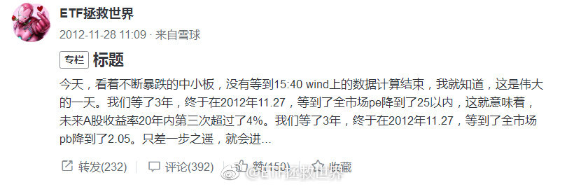

======================================================

ETF拯救世界 (5687069307) @
2018-08-17 17:48:40 Fri  
url: https://weibo.com/5687069307/Gv4HirCs8

为什么印度30可以

比上证50贵131%；

比沪深300贵44%；

比中证500贵27%。

要知道，那是30指数哦。按理说跟50对标才对。

目前英/德/美/澳/新，基本都在17-22倍之间。

西/意/法稍低，在13-15。

A股50-500标段，从全球对比也不贵了。

我倒是真的好奇，很多人每年都在悲观的悲观未来到底是什么样子 ​​​

转发[33]  评论[202]  赞[319] 

======================================================

ETF拯救世界 (5687069307) @
2018-08-17 22:31:08 Fri  
url: https://weibo.com/5687069307/Gv6xX67Jq

回复@wz郑小厨:明天吧，别等了。。今天没时间写了//@wz郑小厨:在等文章呢，有多少人和我一样的//@ETF拯救世界:回复@乔松狡童:结束了。等消息吧。//@乔松狡童:神了，马上就开。 http://t.cn/Rk2YcJC

------------------------------------------------------
转推：
>  @ETF拯救世界 (5687069307)
>  2018-08-17 14:48:36 Fri  
>  url: https:/weibo.com/5687069307/Gv3wd9eMN/

>  我看，周末要开个会了。
>  
>  那个谁谁谁，班子的同志都通知一下。 ​​​

转发[0]  评论[59]  赞[186] 

======================================================

ETF拯救世界 (5687069307) @
2018-08-18 11:06:44 Sat  
url: https://weibo.com/5687069307/GvbuEnWu5

哈哈哈哈，微博上只有大宵能让我开心笑出声了//@李大霄:本来不想继续了，可有这么多人的力挺，我就继续坚持一下吧//@股道热肠也://@但斌:请继续！//@李大霄:[心]

------------------------------------------------------
转推：
>  @ ()
>  2018-08-18 06:02:18 Sat  
>  url: 

>  抱歉，作者已设置仅展示半年内微博，此微博已不可见。 ​​​

转发[6]  评论[85]  赞[197] 

======================================================

ETF拯救世界 (5687069307) @
2018-08-18 13:48:32 Sat  
url: https://weibo.com/5687069307/GvcykfQTs

不行了，1600评论一个小时看了一半。先休息休息，一会再看剩下的。。 ​​​

转发[2]  评论[171]  赞[426] 

+++++++++++++++++++++++++++++++++++++++++++++++++++++

图片：

======================================================

ETF拯救世界 (5687069307) @
2018-08-18 18:23:13 Sat  
url: https://weibo.com/5687069307/GvelPeRcF

如果周末不捣乱，周一不大幅反弹，会加3-5份。

希望老爷们这几天好好休息休息，不要再救市了！A股从2015年惨到2018就是救出来的。

市场的东西，就让市场来定价好吗。 ​​​

转发[73]  评论[364]  赞[727] 

======================================================

ETF拯救世界 (5687069307) @
2018-08-20 09:37:48 Mon  
url: https://weibo.com/5687069307/GvtLxEJNz

保守的乐观。

不保守，会死的快。不乐观，这辈子也就这样了。

至少前半句你现在懂了。后半句还要用时间来验证。

节奏，节奏！ ​​​

转发[123]  评论[107]  赞[355] 

======================================================

ETF拯救世界 (5687069307) @
2018-08-20 09:40:14 Mon  
url: https://weibo.com/5687069307/GvtMx91bP

如果今天强力反弹就不买了。涨跌随意。

------------------------------------------------------
转推：
>  @ETF拯救世界 (5687069307)
>  2018-08-18 18:23:13 Sat  
>  url: https:/weibo.com/5687069307/GvelPeRcF/

>  如果周末不捣乱，周一不大幅反弹，会加3-5份。
>  
>  希望老爷们这几天好好休息休息，不要再救市了！A股从2015年惨到2018就是救出来的。
>  
>  市场的东西，就让市场来定价好吗。 ​​​

转发[28]  评论[74]  赞[188] 

======================================================

ETF拯救世界 (5687069307) @
2018-08-20 09:44:37 Mon  
url: https://weibo.com/5687069307/GvtOj3h0X

回复@龙水六队:一点都不高深。告诉你原则：每周最多只能买一次。能懂吗？我估计你还是不懂。是不是还是太高深了？//@龙水六队:故意，上星期五买不就好了吗，假装莫测高深//@ETF拯救世界:如果今天强力反弹就不买了。涨跌随意。

------------------------------------------------------
转推：
>  @ETF拯救世界 (5687069307)
>  2018-08-18 18:23:13 Sat  
>  url: https:/weibo.com/5687069307/GvelPeRcF/

>  如果周末不捣乱，周一不大幅反弹，会加3-5份。
>  
>  希望老爷们这几天好好休息休息，不要再救市了！A股从2015年惨到2018就是救出来的。
>  
>  市场的东西，就让市场来定价好吗。 ​​​

转发[21]  评论[88]  赞[191] 

======================================================

ETF拯救世界 (5687069307) @
2018-08-20 09:49:18 Mon  
url: https://weibo.com/5687069307/GvtQcCSQS

回复@胡鹏171:非常非常乐观了可以说。这是计划体系最乐观的情况。每周一次。如果这周还买，将是第三轮计划三年来第一次一个月买四次！//@胡鹏171:原来是一个月只能买一次，一周一次已经够乐观了

------------------------------------------------------
转推：
>  @ETF拯救世界 (5687069307)
>  2018-08-18 18:23:13 Sat  
>  url: https:/weibo.com/5687069307/GvelPeRcF/

>  如果周末不捣乱，周一不大幅反弹，会加3-5份。
>  
>  希望老爷们这几天好好休息休息，不要再救市了！A股从2015年惨到2018就是救出来的。
>  
>  市场的东西，就让市场来定价好吗。 ​​​

转发[8]  评论[43]  赞[203] 

======================================================

ETF拯救世界 (5687069307) @
2018-08-20 09:52:19 Mon  
url: https://weibo.com/5687069307/GvtRqzp8o

为什么要定时间？比如一个月，两周或者一周。

因为，无论熊市还是牛市，又或者是震荡市，你要给行情发展以时间。今天买，明天买，除非你有极强的现金流，否则撑不了多少久。然后你会发现，熊市买在半山腰以上，牛市卖在半山腰以下。

用一些策略，强制自己忍一忍。时间就是一个角度。空间也是一个角度 ​​​

转发[245]  评论[398]  赞[698] 

======================================================

ETF拯救世界 (5687069307) @
2018-08-20 10:12:57 Mon  
url: https://weibo.com/5687069307/GvtZOojmk

截至今天，医药有1/3公司披露预披露半年报，业绩增长继续维持20%以上。

养老有1/4公布，维持20%以上。

养老如果按照一季报的业绩增长看，目前PEG已经小于1。

厉害了。 ​​​

转发[33]  评论[184]  赞[350] 

======================================================

ETF拯救世界 (5687069307) @
2018-08-20 11:15:06 Mon  
url: https://weibo.com/5687069307/Gvup34CRw

当然是干了 ​​​

转发[9]  评论[224]  赞[360] 

======================================================

ETF拯救世界 (5687069307) @
2018-08-20 11:32:09 Mon  
url: https://weibo.com/5687069307/GvuvXwj3q

是不是逗我呢。[摊手]

------------------------------------------------------
转推：
>  @ETF拯救世界 (5687069307)
>  2018-08-20 11:15:06 Mon  
>  url: https:/weibo.com/5687069307/Gvup34CRw/

>  当然是干了 ​​​

转发[6]  评论[409]  赞[268] 

======================================================

ETF拯救世界 (5687069307) @
2018-08-20 16:00:23 Mon  
url: https://weibo.com/5687069307/GvwgQ2u3a

刚有朋友告诉我，在某投资论坛看到有人在议论我。没仔细看，反正就是各个角度各种喷吧。但是有两条比较诡异。

第一条说我是装逼犯，为什么，因为我否定了所有除指数投资外的所有投资方式。

我去。什么鬼？我不知道说了多少遍，无论是价值、趋势、个股、衍生品，我认为都没有什么优劣之分。只是适合的 ​​​

转发[23]  评论[490]  赞[604] 

======================================================

ETF拯救世界 (5687069307) @
2018-08-20 16:16:02 Mon  
url: https://weibo.com/5687069307/GvwncckTE

另外，我的感觉，很多人是在以“神”的标准来要求别人。

熊市，不可以有任何亏损。牛市，要完全追上指数，甚至要比指数多赚很多才行。否则就是“连指数涨幅都比不上的辣鸡”。无论任何时候，你都一定要做的特别好。做的特别好也不行，你的名字取得太辣鸡。我看着不顺眼。名字也没什么可以喷的？为什么 ​​​

转发[15]  评论[185]  赞[452] 

======================================================

ETF拯救世界 (5687069307) @
2018-08-20 16:24:26 Mon  
url: https://weibo.com/5687069307/GvwqBqcDR

我看有好多朋友今天跳车了。其实没什么必要吧。

差那么零点几个百分点不至于的。当然，过几天是可能更低，熊市嘛。

不过反正我觉得总想买到最低也是一种病。。 ​​​

转发[45]  评论[393]  赞[602] 

======================================================

ETF拯救世界 (5687069307) @
2018-08-20 17:07:22 Mon  
url: https://weibo.com/5687069307/GvwI1sHAR

有句话不知当讲不当讲 ​​​

转发[16]  评论[279]  赞[337] 

+++++++++++++++++++++++++++++++++++++++++++++++++++++

图片：

======================================================

ETF拯救世界 (5687069307) @
2018-08-20 21:13:12 Mon  
url: https://weibo.com/5687069307/GvyjOwsCm

//@月风_投资笔记: 保险机构开始左侧买入了，这种思路框架毕竟我太熟悉了。

------------------------------------------------------
转推：
>  @财联社APP (2868676035)
>  2018-08-20 20:57:22 Mon  
>  url: https:/weibo.com/2868676035/GvydnzGlV/

>  ​【主流保险机构确认今日加仓 每家规模在数亿元】财联社8月20日讯，上证报获悉，主流保险机构参与了主力资金8月20日的“精彩表演”。多家大型保险公司确认已在当日加仓，加仓标的包括沪深300指数、中证500指数及金融股，每家的加仓规模有数亿元。 ​​​

转发[33]  评论[124]  赞[250] 

======================================================

ETF拯救世界 (5687069307) @
2018-08-21 06:03:57 Tue  
url: https://weibo.com/5687069307/GvBNf3kPx

看微博好像宏观马上就要崩了，各种公司举步维艰。看上市公司半年报平均增长15%+。

感觉是两个世界。 ​​​

转发[36]  评论[233]  赞[485] 

======================================================

ETF拯救世界 (5687069307) @
2018-08-21 09:34:39 Tue  
url: https://weibo.com/5687069307/GvDaLjY9m

金融市场就是轮回。

潮起潮落。

不仅能看到价格的涨跌，均值的回归。还能看到各种生旦净末丑的表演。

你说多有意思。

可以说是世界第三有意思的事情了。 ​​​

转发[26]  评论[97]  赞[290] 

======================================================

ETF拯救世界 (5687069307) @
2018-08-21 09:50:29 Tue  
url: https://weibo.com/5687069307/GvDhchQO8

目前仓位50%+了。基本上都是价值仓位。

目前看，50有可能第一个进趋势仓位？看戏。

舒服。 ​​​

转发[39]  评论[135]  赞[287] 

======================================================

ETF拯救世界 (5687069307) @
2018-08-21 10:14:06 Tue  
url: https://weibo.com/5687069307/GvDqMfxWD

今年A股股票下跌中位数33%……

1100只下跌超过40%。

445只下跌超过50%。

下跌最多的是90%…… ​​​

转发[44]  评论[65]  赞[225] 

======================================================

ETF拯救世界 (5687069307) @
2018-08-21 10:30:30 Tue  
url: https://weibo.com/5687069307/GvDxr1y1l

回复@光O君:“会买养老的女孩运气总不会差”//@光O君:昨天养老又买在低点了！？？

------------------------------------------------------
转推：
>  @ETF拯救世界 (5687069307)
>  2018-08-21 09:50:29 Tue  
>  url: https:/weibo.com/5687069307/GvDhchQO8/

>  目前仓位50%+了。基本上都是价值仓位。
>  
>  目前看，50有可能第一个进趋势仓位？看戏。
>  
>  舒服。 ​​​

转发[1]  评论[54]  赞[175] 

======================================================

ETF拯救世界 (5687069307) @
2018-08-21 10:33:16 Tue  
url: https://weibo.com/5687069307/GvDyyqF0S

回复@古铜色的林奇罗曼史:最多8成。最多。//@古铜色的林奇罗曼史:E大，最终A股仓位会占到多大比例，七成？八成？@ETF拯救世界

------------------------------------------------------
转推：
>  @ETF拯救世界 (5687069307)
>  2018-08-21 09:50:29 Tue  
>  url: https:/weibo.com/5687069307/GvDhchQO8/

>  目前仓位50%+了。基本上都是价值仓位。
>  
>  目前看，50有可能第一个进趋势仓位？看戏。
>  
>  舒服。 ​​​

转发[19]  评论[43]  赞[148] 

======================================================

ETF拯救世界 (5687069307) @
2018-08-21 10:35:04 Tue  
url: https://weibo.com/5687069307/GvDzhjM9J

突然想到，那些拿着下跌50%股票的人，看到你们这样为了0.x%百分点跳车可能会气哭吧。——身在福中不知福啊。

------------------------------------------------------
转推：
>  @ETF拯救世界 (5687069307)
>  2018-08-20 16:24:26 Mon  
>  url: https:/weibo.com/5687069307/GvwqBqcDR/

>  我看有好多朋友今天跳车了。其实没什么必要吧。
>  
>  差那么零点几个百分点不至于的。当然，过几天是可能更低，熊市嘛。
>  
>  不过反正我觉得总想买到最低也是一种病。。 ​​​

转发[6]  评论[130]  赞[260] 

======================================================

ETF拯救世界 (5687069307) @
2018-08-21 10:45:26 Tue  
url: https://weibo.com/5687069307/GvDDuyeRc

不管昨天险资入场消息是真是假，也不管是否是被要求入场。

显而易见的是，目前的A股，总体不贵，一部分股票肉眼可见的便宜。

真正的大资金，超级大机构，在这里不开始买，一定是不合格的。

你正在做的事情，极大概率是和超级大机构步调一致的事。

2013年我看到汇 金重仓买入50 180就意识到这个问题 ​​​

转发[113]  评论[237]  赞[382] 

======================================================

ETF拯救世界 (5687069307) @
2018-08-21 11:00:35 Tue  
url: https://weibo.com/5687069307/GvDJE34mC

回复@风邪尘66828:2015年后已经没用了。股灾后它们作为救 市资金进来，已经掺杂太多其它的因素，不是以前只考虑投资收益的问题了。再看hj已经没有意义。//@风邪尘66828:益达，怎么看汇金的资金布局时间呢

------------------------------------------------------
转推：
>  @ETF拯救世界 (5687069307)
>  2018-08-21 10:45:26 Tue  
>  url: https:/weibo.com/5687069307/GvDDuyeRc/

>  不管昨天险资入场消息是真是假，也不管是否是被要求入场。
>  
>  显而易见的是，目前的A股，总体不贵，一部分股票肉眼可见的便宜。
>  
>  真正的大资金，超级大机构，在这里不开始买，一定是不合格的。
>  
>  你正在做的事情，极大概率是和超级大机构步调一致的事。
>  
>  2013年我看到汇 金重仓买入50 180就意识到这个问题 ​​​

转发[15]  评论[34]  赞[165] 

======================================================

ETF拯救世界 (5687069307) @
2018-08-21 11:08:00 Tue  
url: https://weibo.com/5687069307/GvDMEunWv

不要跌一跌就世界末日，涨一涨就牛市来了。

不成熟。

淡定点。世界不会太坏，也不会太好。便宜了就买点，贵了就卖点。踏踏实实，舒舒服服。

再大的利空，回头看，也就那么回事。如果你回头看发现真的完蛋了，那你担心也没用不是吗。 ​​​

转发[54]  评论[236]  赞[451] 

======================================================

ETF拯救世界 (5687069307) @
2018-08-21 12:35:57 Tue  
url: https://weibo.com/5687069307/GvEmm1ZRZ

我能怎么办，只好转发让他出名啦。这辈子最讨厌不遵守规则的人

------------------------------------------------------
转推：
>  @北京人不知道的北京事儿 (1662214194)
>  2018-08-21 11:40:42 Tue  
>  url: https:/weibo.com/1662214194/GvDZVqLb4/

>  【拜托大家帮忙转发扩散！看看谁认识它？[衰]】@用户56678394 ：今天早上开往北京南站的G334次列车上，这男的死霸着这个靠窗的座位，不肯坐到自己车票上的座位，被他强占了座位的姑娘只能站着劝他，他竟然还趾高气昂的对人家姑娘说：“谁规定一定要按号入座？现在你有三个选择：要么你自己站着，要么你 ​​​

转发[403]  评论[195]  赞[301] 

======================================================

ETF拯救世界 (5687069307) @
2018-08-21 16:22:53 Tue  
url: https://weibo.com/5687069307/GvFQsFc3a

非常神奇的是今天全市场估值只涨了一点点点。

业绩披露期真是有意思。 ​​​

转发[59]  评论[130]  赞[288] 

======================================================

ETF拯救世界 (5687069307) @
2018-08-21 16:41:55 Tue  
url: https://weibo.com/5687069307/GvFYc0tCL

回复@追求确定性2:我现在说这个可能很多人觉得我是s*，但未来A股也会创出n年长牛的记录。希望微博关门之前能见到，留个纪念。

------------------------------------------------------
转推：
>  @ETF拯救世界 (5687069307)
>  2018-08-21 16:22:53 Tue  
>  url: https:/weibo.com/5687069307/GvFQsFc3a/

>  非常神奇的是今天全市场估值只涨了一点点点。
>  
>  业绩披露期真是有意思。 ​​​

转发[49]  评论[116]  赞[270] 

======================================================

ETF拯救世界 (5687069307) @
2018-08-21 17:01:32 Tue  
url: https://weibo.com/5687069307/GvG69tCWT

回复@无所谓1816:不急，刚50%+仓位，还有很多钱，大伙都盼着跌呢。//@无所谓1816:你别急，年底再下结论也不算晚。毛衣大战还没有开始作用。  年底你很可能看到业绩公布，越跌估值越高

------------------------------------------------------
转推：
>  @ETF拯救世界 (5687069307)
>  2018-08-21 16:22:53 Tue  
>  url: https:/weibo.com/5687069307/GvFQsFc3a/

>  非常神奇的是今天全市场估值只涨了一点点点。
>  
>  业绩披露期真是有意思。 ​​​

转发[17]  评论[73]  赞[188] 

======================================================

ETF拯救世界 (5687069307) @
2018-08-21 17:15:36 Tue  
url: https://weibo.com/5687069307/GvGbS6Eec

今天

沪深300 +1.8%
中证500 +1.2%
50 +1.5%
医药 +3.2%
养老 +2.5%
创业 +1.5%
消费 +3%
红利 +1.3%

全部A股涨幅中位数是：

0.8%。

也就是说从全部股民的角度讲，买股票一半概率低于0.8，一半概率高于0.8。

“牛市买指数不如炒股赚钱多。”

？？？？？

牛市中的“赚了指数不赚钱”也了解一下。 ​​​

转发[50]  评论[155]  赞[326] 

======================================================

ETF拯救世界 (5687069307) @
2018-08-21 21:52:07 Tue  
url: https://weibo.com/5687069307/GvI06DwVp

手机，电动车，芯片

------------------------------------------------------
转推：
>  @财联社APP (2868676035)
>  2018-08-21 21:35:36 Tue  
>  url: https:/weibo.com/2868676035/GvHTowx5E/

>  ​【董明珠芯片团队曝光：格力电器10亿元注册集成电路全资子公司】财联社8月21日讯，近日，格力电器进军芯片行业的说法有了实际行动。国家企业信用信息公示系统显示，2018年8月14日，珠海零边界集成电路有限公司成立，注册资本达10亿元，经营范围为半导体、集成电路、芯片、电子元器件、电子产品的设计 ​​​

转发[7]  评论[45]  赞[125] 

======================================================

ETF拯救世界 (5687069307) @
2018-08-21 21:52:54 Tue  
url: https://weibo.com/5687069307/GvI0q7KMf

回复@饿鱼000:08年美股最低十倍，目前23-27//@饿鱼000:一直很好奇，美股的十年长牛行情，估值是一直保持着正常估值吗？还是pc  pb也有暴涨的时候？//@ETF拯救世界:回复@追求确定性2:我现在说这个可能很多人觉得我是s*，但未来A股也会创出n年长牛的记录。希望微博关门之前能见到，留个纪念。

------------------------------------------------------
转推：
>  @ETF拯救世界 (5687069307)
>  2018-08-21 16:22:53 Tue  
>  url: https:/weibo.com/5687069307/GvFQsFc3a/

>  非常神奇的是今天全市场估值只涨了一点点点。
>  
>  业绩披露期真是有意思。 ​​​

转发[9]  评论[27]  赞[139] 

======================================================

ETF拯救世界 (5687069307) @
2018-08-21 21:53:53 Tue  
url: https://weibo.com/5687069307/GvI0OBqTl

回复@观音山上拜观音:我在ins关注她了，她经常贴照片//@观音山上拜观音:刚看了e大的网易博客，作为回馈@ETF拯救世界 http://t.cn/RkS2C2u //@ETF拯救世界:回复@无所谓1816:不急，刚50%+仓位，还有很多钱，大伙都盼着跌呢。

------------------------------------------------------
转推：
>  @ETF拯救世界 (5687069307)
>  2018-08-21 16:22:53 Tue  
>  url: https:/weibo.com/5687069307/GvFQsFc3a/

>  非常神奇的是今天全市场估值只涨了一点点点。
>  
>  业绩披露期真是有意思。 ​​​

转发[7]  评论[98]  赞[136] 

======================================================

ETF拯救世界 (5687069307) @
2018-08-21 22:25:43 Tue  
url: https://weibo.com/5687069307/GvIdJF434

每日打卡（196）

正式恢复训练。 ​​​

转发[0]  评论[64]  赞[310] 

+++++++++++++++++++++++++++++++++++++++++++++++++++++

图片：

======================================================

ETF拯救世界 (5687069307) @
2018-08-22 09:30:00 Wed  
url: https://weibo.com/5687069307/GvMznbuzt

高盛策略师本·斯奈德（Ben Snider）在周一的“对冲基金趋势监测”报告中表示，今年截至8月17日，股票型对冲基金平均下跌1%，而标准普尔500指数的涨幅为8%。

——美国收取高昂管理费的对冲基金继续被指数碾压。 ​​​

转发[18]  评论[167]  赞[372] 

======================================================

ETF拯救世界 (5687069307) @
2018-08-22 16:33:09 Wed  
url: https://weibo.com/5687069307/GvPl8sw0g

今日A股全市场估值再创2012年11月以来新低。 ​​​

转发[214]  评论[420]  赞[783] 

======================================================

ETF拯救世界 (5687069307) @
2018-08-23 07:03:51 Thu  
url: https://weibo.com/5687069307/GvV2y5Gy2

再加老百姓就真没钱消费了

------------------------------------------------------
转推：
>  @ ()
>  2018-08-22 22:47:11 Wed  
>  url: 

>  抱歉，作者已设置仅展示半年内微博，此微博已不可见。 ​​​

转发[19]  评论[93]  赞[170] 

======================================================

ETF拯救世界 (5687069307) @
2018-08-23 07:21:53 Thu  
url: https://weibo.com/5687069307/GvV9RANl2

截至今日，养老产业80家成分股中有33家披露半年报。

33家中只有5家利润下降。

静态PEG已经=1……当然剩下的40多家业绩不会这么好。我估计整体增速在15%+。

还有8天。 ​​​

转发[99]  评论[197]  赞[331] 

======================================================

ETF拯救世界 (5687069307) @
2018-08-23 08:09:23 Thu  
url: https://weibo.com/5687069307/GvVt9v4Pb

接受道歉，但建议五年不能坐高铁。或者尽快把这样的惩罚措施纳入法律法规，严格执行

------------------------------------------------------
转推：
>  @北京人不知道的北京事儿 (1662214194)
>  2018-08-23 08:03:42 Thu  
>  url: https:/weibo.com/1662214194/GvVqQcLsF/

>  【高铁“霸座”男子夜晚录道歉视频：深表悔恨和自责 并对当事人和全国人民道歉】8月22日晚，高铁“霸座”男子的孙某录制道歉视频称，对霸占座位一事深表悔恨和自责，向当事人和全国人民表示诚挚道歉。此前8月21日上午，济南开往北京南站的G334次列车上，他霸占一位刚毕业女生的座位，乘务员与其沟通， ​​​

转发[40]  评论[94]  赞[256] 

======================================================

ETF拯救世界 (5687069307) @
2018-08-23 08:37:07 Thu  
url: https://weibo.com/5687069307/GvVEpaz8l

回复@o米幂:如果没有惩罚，相信我，这个人一辈子都会这样，甚至变本加厉。如果这样的事情没有受到惩罚，会有无数人学习他。素质的提高不仅靠教育，还要靠惩罚

------------------------------------------------------
转推：
>  @北京人不知道的北京事儿 (1662214194)
>  2018-08-23 08:03:42 Thu  
>  url: https:/weibo.com/1662214194/GvVqQcLsF/

>  【高铁“霸座”男子夜晚录道歉视频：深表悔恨和自责 并对当事人和全国人民道歉】8月22日晚，高铁“霸座”男子的孙某录制道歉视频称，对霸占座位一事深表悔恨和自责，向当事人和全国人民表示诚挚道歉。此前8月21日上午，济南开往北京南站的G334次列车上，他霸占一位刚毕业女生的座位，乘务员与其沟通， ​​​

转发[21]  评论[130]  赞[358] 

======================================================

ETF拯救世界 (5687069307) @
2018-08-23 10:15:57 Thu  
url: https://weibo.com/5687069307/GvWivEWCB

太便宜了，随时受不了 ​​​

转发[10]  评论[262]  赞[405] 

======================================================

ETF拯救世界 (5687069307) @
2018-08-23 12:28:32 Thu  
url: https://weibo.com/5687069307/GvXakmyQj

谁能想到原来是跌的受不了了

------------------------------------------------------
转推：
>  @ETF拯救世界 (5687069307)
>  2018-08-23 10:15:57 Thu  
>  url: https:/weibo.com/5687069307/GvWivEWCB/

>  太便宜了，随时受不了 ​​​

转发[3]  评论[71]  赞[218] 

======================================================

ETF拯救世界 (5687069307) @
2018-08-23 12:41:35 Thu  
url: https://weibo.com/5687069307/GvXfDfTJz

交朋友，做生意，结婚，一定要找有底线的人。一个人的底线接触久了，会体现在一言一行中。劝各位离没有底线的人远一点，真的，是为自己好。否则早晚倒霉。

------------------------------------------------------
转推：
>  @北京人不知道的北京事儿 (1662214194)
>  2018-08-23 12:18:08 Thu  
>  url: https:/weibo.com/1662214194/GvX67tS3L/

>  高铁“霸座男”孙博士还有这事儿呢？网友私信：2016年在北京海淀，孙博士伪造房东委托书，把租来的房又租给了好几个租客，拿了租客们的钱，也不给房东交房租，玩儿人间蒸发。。。导致房东直接找到租客们要钱，租客们最后费尽千辛万苦找到孙博士的家，把他扭送到派出所，博士这才把钱吐出来。。。[摊手] ​​​

转发[87]  评论[87]  赞[266] 

======================================================

ETF拯救世界 (5687069307) @
2018-08-23 13:08:33 Thu  
url: https://weibo.com/5687069307/GvXqA4lNJ

回复@sashanana:不是缺钱，很明显，做这种事对他来说是一种乐趣。我怀疑这个人童年有过阴影。//@sashanana:这个博士是有多缺钱才会如此算计

------------------------------------------------------
转推：
>  @北京人不知道的北京事儿 (1662214194)
>  2018-08-23 12:18:08 Thu  
>  url: https:/weibo.com/1662214194/GvX67tS3L/

>  高铁“霸座男”孙博士还有这事儿呢？网友私信：2016年在北京海淀，孙博士伪造房东委托书，把租来的房又租给了好几个租客，拿了租客们的钱，也不给房东交房租，玩儿人间蒸发。。。导致房东直接找到租客们要钱，租客们最后费尽千辛万苦找到孙博士的家，把他扭送到派出所，博士这才把钱吐出来。。。[摊手] ​​​

转发[12]  评论[72]  赞[144] 

======================================================

ETF拯救世界 (5687069307) @
2018-08-23 14:01:03 Thu  
url: https://weibo.com/5687069307/GvXLTa9Kd

太舒服了，你舒服不舒服。 ​​​

转发[2]  评论[121]  赞[224] 

======================================================

ETF拯救世界 (5687069307) @
2018-08-23 14:05:54 Thu  
url: https://weibo.com/5687069307/GvXNRfwNA

回复@Eyo-Tan:凭能力借的钱为什么要还？做为借出方，应该有的觉悟是：借给亲戚朋友钱就该当丢了……//@Eyo-Tan:有些人是真恶心，我就遇到个一人：刚开始TMD成天兄弟兄弟的，借了钱就开始玩失踪，电话不接，信息不回，各种借口。涉及到钱财方面的真的不能信任何人，搞到现在好像我在求着他还钱一样

------------------------------------------------------
转推：
>  @北京人不知道的北京事儿 (1662214194)
>  2018-08-23 12:18:08 Thu  
>  url: https:/weibo.com/1662214194/GvX67tS3L/

>  高铁“霸座男”孙博士还有这事儿呢？网友私信：2016年在北京海淀，孙博士伪造房东委托书，把租来的房又租给了好几个租客，拿了租客们的钱，也不给房东交房租，玩儿人间蒸发。。。导致房东直接找到租客们要钱，租客们最后费尽千辛万苦找到孙博士的家，把他扭送到派出所，博士这才把钱吐出来。。。[摊手] ​​​

转发[12]  评论[31]  赞[86] 

======================================================

ETF拯救世界 (5687069307) @
2018-08-23 14:14:05 Thu  
url: https://weibo.com/5687069307/GvXRba7ZK

回复@李国辉00650:对。只要借，我就没打算要回来了。能还意外之喜，不能还意料之中。否则不仅钱没了，亲戚朋友也没了。所以，我，轻易不跟亲戚朋友有金钱来往。//@李国辉00650:你借给亲戚朋友的钱就当丢了？

------------------------------------------------------
转推：
>  @北京人不知道的北京事儿 (1662214194)
>  2018-08-23 12:18:08 Thu  
>  url: https:/weibo.com/1662214194/GvX67tS3L/

>  高铁“霸座男”孙博士还有这事儿呢？网友私信：2016年在北京海淀，孙博士伪造房东委托书，把租来的房又租给了好几个租客，拿了租客们的钱，也不给房东交房租，玩儿人间蒸发。。。导致房东直接找到租客们要钱，租客们最后费尽千辛万苦找到孙博士的家，把他扭送到派出所，博士这才把钱吐出来。。。[摊手] ​​​

转发[9]  评论[40]  赞[111] 

======================================================

ETF拯救世界 (5687069307) @
2018-08-23 14:32:01 Thu  
url: https://weibo.com/5687069307/GvXYslTVo

硕士毕业论文：《法治建设中的法律与道德》 喷了。

------------------------------------------------------
转推：
>  @北京人不知道的北京事儿 (1662214194)
>  2018-08-23 14:18:55 Thu  
>  url: https:/weibo.com/1662214194/GvXT8Czwa/

>  高铁“霸座男”孙博士的那些事儿又来了，他同校同学也站出来爆料了！在校发有诱惑性质的流氓传单和相亲广告、硕转博考试作弊被抓，烂人还真不是偶尔烂一次。。。还有，图一给姑娘打码的那句话，这孙博士简直就是人渣中的人渣！！[怒]等核实汇总完连证据一并发出！ ​​​

转发[318]  评论[92]  赞[139] 

======================================================

ETF拯救世界 (5687069307) @
2018-08-23 14:53:41 Thu  
url: https://weibo.com/5687069307/GvY7g8Nob

再说一条拒绝借钱的终极方法吧。

你去球球，经常有那种卖惨帖，里面会有账户截图。你找个惨的，赔80% 那种，把图存下来。以后有人借钱，你不想借就发给他。。或者你自己找个假交易软件弄一张，还能带你的名字，那些大v能把账户P的赚钱，你为什么不能P赔钱？

一般这种图发过去，说被套了，就没人借了 ​​​

转发[86]  评论[137]  赞[248] 

======================================================

ETF拯救世界 (5687069307) @
2018-08-23 15:03:52 Thu  
url: https://weibo.com/5687069307/GvYbo5W1N

回复@大明190736:029和880特点不同。大盘股牛的时候880牛，小盘股牛的时候029占优势。你记住这点就能把握了。场外的032优势是长期跑赢基准，真的服了。不知道怎么具体增强策略是怎么做的。厉害。

------------------------------------------------------
转推：
>  @ETF拯救世界 (5687069307)
>  2018-08-23 14:53:41 Thu  
>  url: https:/weibo.com/5687069307/GvY7g8Nob/

>  再说一条拒绝借钱的终极方法吧。
>  
>  你去球球，经常有那种卖惨帖，里面会有账户截图。你找个惨的，赔80% 那种，把图存下来。以后有人借钱，你不想借就发给他。。或者你自己找个假交易软件弄一张，还能带你的名字，那些大v能把账户P的赚钱，你为什么不能P赔钱？
>  
>  一般这种图发过去，说被套了，就没人借了 ​​​

转发[67]  评论[106]  赞[162] 

======================================================

ETF拯救世界 (5687069307) @
2018-08-23 16:02:46 Thu  
url: https://weibo.com/5687069307/GvYzixOxV

回复@黄连树:呵呵。//@黄连树:回复@远见至胜:百度是没有的。。益达这里很可能算错了，实话实说。虽然暂时不影响大局势的判断。

------------------------------------------------------
转推：
>  @ETF拯救世界 (5687069307)
>  2018-08-23 07:21:53 Thu  
>  url: https:/weibo.com/5687069307/GvV9RANl2/

>  截至今日，养老产业80家成分股中有33家披露半年报。
>  
>  33家中只有5家利润下降。
>  
>  静态PEG已经=1……当然剩下的40多家业绩不会这么好。我估计整体增速在15%+。
>  
>  还有8天。 ​​​

转发[9]  评论[63]  赞[90] 

======================================================

ETF拯救世界 (5687069307) @
2018-08-23 16:15:36 Thu  
url: https://weibo.com/5687069307/GvYEvd3yV

谁再在我的评论里给网站做广告一律拉黑。

抄我的思路就算了还来做广告。 ​​​

转发[9]  评论[154]  赞[359] 

======================================================

ETF拯救世界 (5687069307) @
2018-08-23 19:10:25 Thu  
url: https://weibo.com/5687069307/GvZNt6GBP

“以后上车大家想坐哪儿就可以坐哪儿”。神了！

------------------------------------------------------
转推：
>  @ ()
>  2018-08-23 19:04:27 Thu  
>  url: 

>  抱歉，作者已设置仅展示半年内微博，此微博已不可见。 ​​​

转发[30]  评论[123]  赞[146] 

======================================================

ETF拯救世界 (5687069307) @
2018-08-23 19:17:26 Thu  
url: https://weibo.com/5687069307/GvZQjajSs

回复@徐小自言自语者:@ETF拯救世界: 世界不是白的你就要在肮脏的猪圈里生活？身边的肮脏事多就是你也去干脏事的借口？辣鸡。//@徐小自言自语者:不违法就是不违法，哪那么多矫情，不要以为世界理应是白色的，看看自己身边那么多肮脏事吧，能别那么玻璃表吗？

------------------------------------------------------
转推：
>  @ ()
>  2018-08-23 19:04:27 Thu  
>  url: 

>  抱歉，作者已设置仅展示半年内微博，此微博已不可见。 ​​​

转发[7]  评论[88]  赞[215] 

======================================================

ETF拯救世界 (5687069307) @
2018-08-23 19:46:24 Thu  
url: https://weibo.com/5687069307/Gw024bOWG

有一次去美国，在纽瓦克机场，航班有问题，我去咨询台问。

咨询台前，排了很多人，我和同伴觉得自己的这个问题比较简单，一句话就能解决我们的疑惑，就直接去最前面工作人员那里问。

我至今还记得那个黑人女性工作人员是怎么用坚定的眼神和语气告诉我们，去排队。大家都在排队，你们也要排。

后来有 ​​​

转发[74]  评论[244]  赞[625] 

======================================================

ETF拯救世界 (5687069307) @
2018-08-23 19:52:39 Thu  
url: https://weibo.com/5687069307/Gw04C1VSg

回复@站在空气稀薄地带:一个社会普遍不遵守规矩，没有契约意识，会让社会运行成本大大提高。每个人都会活得特别累，时时刻刻提放别人占自己便宜，想办法占别人便宜。累！

------------------------------------------------------
转推：
>  @ETF拯救世界 (5687069307)
>  2018-08-23 19:46:24 Thu  
>  url: https:/weibo.com/5687069307/Gw024bOWG/

>  有一次去美国，在纽瓦克机场，航班有问题，我去咨询台问。
>  
>  咨询台前，排了很多人，我和同伴觉得自己的这个问题比较简单，一句话就能解决我们的疑惑，就直接去最前面工作人员那里问。
>  
>  我至今还记得那个黑人女性工作人员是怎么用坚定的眼神和语气告诉我们，去排队。大家都在排队，你们也要排。
>  
>  后来有 ​​​

转发[30]  评论[102]  赞[346] 

======================================================

ETF拯救世界 (5687069307) @
2018-08-24 07:59:15 Fri  
url: https://weibo.com/5687069307/Gw4Px2rlt

回复@追求确定性2:我还想跟富国讨论一下他们的增强策略呢，人家能告诉我吗。巴菲特能告诉我他怎么估值的吗。自己提出要求别人就要回答这是什么思维？//@追求确定性2:民间科学家对陈景润说你的论证有些小问题，不介意讨论一下吧，真理越辩越明嘛。//@ETF拯救世界:回复@黄连树:呵呵。

------------------------------------------------------
转推：
>  @ETF拯救世界 (5687069307)
>  2018-08-23 07:21:53 Thu  
>  url: https:/weibo.com/5687069307/GvV9RANl2/

>  截至今日，养老产业80家成分股中有33家披露半年报。
>  
>  33家中只有5家利润下降。
>  
>  静态PEG已经=1……当然剩下的40多家业绩不会这么好。我估计整体增速在15%+。
>  
>  还有8天。 ​​​

转发[7]  评论[67]  赞[191] 

======================================================

ETF拯救世界 (5687069307) @
2018-08-24 09:00:34 Fri  
url: https://weibo.com/5687069307/Gw5epswGW

老铁们，我再说点扎心的。

你在网上看到的帖子，或者十几二十块买到的书。99.99%不是真正赚大钱的人的核心策略。

智商不用太高就应该能明白这个。

巴菲特会写书告诉你怎么评估企业价值买卖点怎么把握吗，优秀的量化基金经理会把策略公式给你吗，索罗斯会告诉你怎么根据宏观数据和事件交易吗。

不会 ​​​

转发[445]  评论[654]  赞[1070] 

======================================================

ETF拯救世界 (5687069307) @
2018-08-24 09:12:09 Fri  
url: https://weibo.com/5687069307/Gw5j7rlGR

回复@把球传给三秒后的自己:第二轮计划2012年11月大力买入4.5份（等于现在的13.5份），买后仓位达到82%。几个月后大蓝筹新低继续买入，仓位超过90%。当时只有A股仓位。这些都有公开记录。//@把球传给三秒后的自己:请问一下益达，上一轮熊市的时候，指数etf仓位有多少啊？

------------------------------------------------------
转推：
>  @ETF拯救世界 (5687069307)
>  2018-08-24 09:00:34 Fri  
>  url: https:/weibo.com/5687069307/Gw5epswGW/

>  老铁们，我再说点扎心的。
>  
>  你在网上看到的帖子，或者十几二十块买到的书。99.99%不是真正赚大钱的人的核心策略。
>  
>  智商不用太高就应该能明白这个。
>  
>  巴菲特会写书告诉你怎么评估企业价值买卖点怎么把握吗，优秀的量化基金经理会把策略公式给你吗，索罗斯会告诉你怎么根据宏观数据和事件交易吗。
>  
>  不会 ​​​

转发[61]  评论[65]  赞[167] 

======================================================

ETF拯救世界 (5687069307) @
2018-08-24 09:26:46 Fri  
url: https://weibo.com/5687069307/Gw5p3lnav

中概出什么事了吗。阿里为什么放量大阴线。 ​​​

转发[4]  评论[85]  赞[171] 

======================================================

ETF拯救世界 (5687069307) @
2018-08-24 09:42:08 Fri  
url: https://weibo.com/5687069307/Gw5vhuaIJ

回复@李国辉00650:有啊，未来我们会买啊。再多跌点就买了[doge]//@李国辉00650:中概对我们有影响么？开不了港股

------------------------------------------------------
转推：
>  @ETF拯救世界 (5687069307)
>  2018-08-24 09:26:46 Fri  
>  url: https:/weibo.com/5687069307/Gw5p3lnav/

>  中概出什么事了吗。阿里为什么放量大阴线。 ​​​

转发[1]  评论[24]  赞[146] 

======================================================

ETF拯救世界 (5687069307) @
2018-08-24 10:08:04 Fri  
url: https://weibo.com/5687069307/Gw5FP9HeS

木老师v5，写的真不错……

------------------------------------------------------
转推：
>  @ ()
>  2018-08-23 20:56:54 Thu  
>  url: 

>  该账号因被投诉违反《微博社区公约》的相关规定，现已无法查看。查看帮助 https://kefu.weibo.com/faqdetail?id=13216

转发[23]  评论[55]  赞[108] 

======================================================

ETF拯救世界 (5687069307) @
2018-08-24 10:10:22 Fri  
url: https://weibo.com/5687069307/Gw5GKtIFl

回复@胡适199510:分数不会低，但绝对不适合新手。我估计90%的新手看不完前100页。//@胡适199510:@ETF拯救世界 E大，请教，格雷厄姆的《证券分析》给几分？对新手适合吗？

------------------------------------------------------
转推：
>  @ETF拯救世界 (5687069307)
>  2018-08-24 09:00:34 Fri  
>  url: https:/weibo.com/5687069307/Gw5epswGW/

>  老铁们，我再说点扎心的。
>  
>  你在网上看到的帖子，或者十几二十块买到的书。99.99%不是真正赚大钱的人的核心策略。
>  
>  智商不用太高就应该能明白这个。
>  
>  巴菲特会写书告诉你怎么评估企业价值买卖点怎么把握吗，优秀的量化基金经理会把策略公式给你吗，索罗斯会告诉你怎么根据宏观数据和事件交易吗。
>  
>  不会 ​​​

转发[12]  评论[69]  赞[137] 

======================================================

ETF拯救世界 (5687069307) @
2018-08-24 10:36:45 Fri  
url: https://weibo.com/5687069307/Gw5RstrVM

更新：37家公布业绩，6家下滑。多了一个华谊。整体增速依然维持在20%+。

------------------------------------------------------
转推：
>  @ETF拯救世界 (5687069307)
>  2018-08-23 07:21:53 Thu  
>  url: https:/weibo.com/5687069307/GvV9RANl2/

>  截至今日，养老产业80家成分股中有33家披露半年报。
>  
>  33家中只有5家利润下降。
>  
>  静态PEG已经=1……当然剩下的40多家业绩不会这么好。我估计整体增速在15%+。
>  
>  还有8天。 ​​​

转发[47]  评论[30]  赞[154] 

======================================================

ETF拯救世界 (5687069307) @
2018-08-24 10:45:40 Fri  
url: https://weibo.com/5687069307/Gw5V55bXD

回复@阿艇哥:我建议你看看创业板中小板中证500医药这些除了大盘蓝筹起飞的时间。我可以告诉你：2012年11月28日。波澜壮阔的几倍大牛市开始了。

------------------------------------------------------
转推：
>  @ETF拯救世界 (5687069307)
>  2018-08-24 09:00:34 Fri  
>  url: https:/weibo.com/5687069307/Gw5epswGW/

>  老铁们，我再说点扎心的。
>  
>  你在网上看到的帖子，或者十几二十块买到的书。99.99%不是真正赚大钱的人的核心策略。
>  
>  智商不用太高就应该能明白这个。
>  
>  巴菲特会写书告诉你怎么评估企业价值买卖点怎么把握吗，优秀的量化基金经理会把策略公式给你吗，索罗斯会告诉你怎么根据宏观数据和事件交易吗。
>  
>  不会 ​​​

转发[44]  评论[60]  赞[173] 

======================================================

ETF拯救世界 (5687069307) @
2018-08-24 10:52:49 Fri  
url: https://weibo.com/5687069307/Gw5XZ0yDz

你说这是谁呢，盘中一次次的往上拉。拉的太做作了。 ​​​

转发[1]  评论[98]  赞[228] 

======================================================

ETF拯救世界 (5687069307) @
2018-08-24 11:09:03 Fri  
url: https://weibo.com/5687069307/Gw64z238B

回复@天生歌者不唱歌:2014年之前，小股票已经走了接近2年大牛市了，大股票却一路低迷。为什么那两年价投被说成夹头。蓝筹被说成“烂臭”。此一时彼一时，人们太注重最近发生的事了。//@天生歌者不唱歌:愚钝的我，在这条微博之前还一直以为蓝筹和中小盘是一起跌到最低的[汗]我想太多了

------------------------------------------------------
转推：
>  @ETF拯救世界 (5687069307)
>  2018-08-24 09:00:34 Fri  
>  url: https:/weibo.com/5687069307/Gw5epswGW/

>  老铁们，我再说点扎心的。
>  
>  你在网上看到的帖子，或者十几二十块买到的书。99.99%不是真正赚大钱的人的核心策略。
>  
>  智商不用太高就应该能明白这个。
>  
>  巴菲特会写书告诉你怎么评估企业价值买卖点怎么把握吗，优秀的量化基金经理会把策略公式给你吗，索罗斯会告诉你怎么根据宏观数据和事件交易吗。
>  
>  不会 ​​​

转发[21]  评论[83]  赞[169] 

======================================================

ETF拯救世界 (5687069307) @
2018-08-24 13:21:29 Fri  
url: https://weibo.com/5687069307/Gw6WkepBp

下周要上右侧仓位吗。

好刺激啊。 ​​​

转发[8]  评论[179]  赞[278] 

======================================================

ETF拯救世界 (5687069307) @
2018-08-24 13:44:39 Fri  
url: https://weibo.com/5687069307/Gw75Jcv9J

确认趋势转折的一个标志是大部分宽基/行业趋势走好。

目前没有任何宽基及行业走好，所以不用着急。价值仓位已经买的差不多了，所以更不用急。 ​​​

转发[120]  评论[194]  赞[298] 

======================================================

ETF拯救世界 (5687069307) @
2018-08-24 13:50:05 Fri  
url: https://weibo.com/5687069307/Gw77W2L0V

万万没想到涨了一天全指金融就要盈利了。[doge] ​​​

转发[3]  评论[43]  赞[229] 

======================================================

ETF拯救世界 (5687069307) @
2018-08-24 13:58:08 Fri  
url: https://weibo.com/5687069307/Gw7bcrD6e

是不是底呀，是不是反转了呀，抄不抄啊。

累不累啊。

便宜了你就买，根据便宜的程度，多买点或者少买点。

买到一定地步就停，为可能出现的黑天鹅做点准备。

再然后就静静的等着。

趋势不是一天反转的，从大底那天到大幅拉升至少有几个月时间让你上车。

急什么啊？

我是没见过见底后一路就涨上去 ​​​

转发[136]  评论[285]  赞[429] 

======================================================

ETF拯救世界 (5687069307) @
2018-08-24 14:35:07 Fri  
url: https://weibo.com/5687069307/Gw7qdgv2j

回复@monster的垃圾场:你错把估值当成唯一了。估值低不代表不会跌，反之亦然。何况500估值还是比50高啊。//@monster的垃圾场:为啥中证500现在这个估值下，还在跑输上证50

------------------------------------------------------
转推：
>  @ETF拯救世界 (5687069307)
>  2018-08-24 13:58:08 Fri  
>  url: https:/weibo.com/5687069307/Gw7bcrD6e/

>  是不是底呀，是不是反转了呀，抄不抄啊。
>  
>  累不累啊。
>  
>  便宜了你就买，根据便宜的程度，多买点或者少买点。
>  
>  买到一定地步就停，为可能出现的黑天鹅做点准备。
>  
>  再然后就静静的等着。
>  
>  趋势不是一天反转的，从大底那天到大幅拉升至少有几个月时间让你上车。
>  
>  急什么啊？
>  
>  我是没见过见底后一路就涨上去 ​​​

转发[9]  评论[45]  赞[140] 

======================================================

ETF拯救世界 (5687069307) @
2018-08-24 14:39:42 Fri  
url: https://weibo.com/5687069307/Gw7s57sT7

说时迟那时快，手起韭落……涨跌家数1:2

------------------------------------------------------
转推：
>  @ETF拯救世界 (5687069307)
>  2018-08-24 13:58:08 Fri  
>  url: https:/weibo.com/5687069307/Gw7bcrD6e/

>  是不是底呀，是不是反转了呀，抄不抄啊。
>  
>  累不累啊。
>  
>  便宜了你就买，根据便宜的程度，多买点或者少买点。
>  
>  买到一定地步就停，为可能出现的黑天鹅做点准备。
>  
>  再然后就静静的等着。
>  
>  趋势不是一天反转的，从大底那天到大幅拉升至少有几个月时间让你上车。
>  
>  急什么啊？
>  
>  我是没见过见底后一路就涨上去 ​​​

转发[8]  评论[42]  赞[148] 

======================================================

ETF拯救世界 (5687069307) @
2018-08-24 14:44:58 Fri  
url: https://weibo.com/5687069307/Gw7udrSgq

回复@早起拜瓶迁晚睡读益达:你离他远一点，他怎么也打不到你。所以，管不住手的就别看。//@早起拜瓶迁晚睡读益达:最近是左右打脸行情，打完左边打右边，拉上去掉下来拉上去又掉下来，揉搓韭菜包饺子[二哈]//@ETF拯救世界:说时迟那时快，手起韭落……涨跌家数1:2

------------------------------------------------------
转推：
>  @ETF拯救世界 (5687069307)
>  2018-08-24 13:58:08 Fri  
>  url: https:/weibo.com/5687069307/Gw7bcrD6e/

>  是不是底呀，是不是反转了呀，抄不抄啊。
>  
>  累不累啊。
>  
>  便宜了你就买，根据便宜的程度，多买点或者少买点。
>  
>  买到一定地步就停，为可能出现的黑天鹅做点准备。
>  
>  再然后就静静的等着。
>  
>  趋势不是一天反转的，从大底那天到大幅拉升至少有几个月时间让你上车。
>  
>  急什么啊？
>  
>  我是没见过见底后一路就涨上去 ​​​

转发[6]  评论[33]  赞[132] 

======================================================

ETF拯救世界 (5687069307) @
2018-08-24 15:07:32 Fri  
url: https://weibo.com/5687069307/Gw7Dnn769

按现有的条文，可能确实顶格也就这样处理了……这样的事例其实是提高全民素质的一个好机会，千万别像昨天说的“只是道德问题”那样处理，那就彻底完蛋了。

------------------------------------------------------
转推：
>  @蓝鲸财经记者工作平台 (1885454921)
>  2018-08-24 14:50:19 Fri  
>  url: https:/weibo.com/1885454921/Gw7wnB03Z/

>  高铁"座霸"男被处治安罚款200元，记入铁路征信体系，在一定期限内被限制购票乘坐火车。(人民网) ​​​

转发[11]  评论[92]  赞[223] 

======================================================

ETF拯救世界 (5687069307) @
2018-08-24 15:27:18 Fri  
url: https://weibo.com/5687069307/Gw7LopknK

今日再新低。虽然只比22日低了0.03……

------------------------------------------------------
转推：
>  @ETF拯救世界 (5687069307)
>  2018-08-22 16:33:09 Wed  
>  url: https:/weibo.com/5687069307/GvPl8sw0g/

>  今日A股全市场估值再创2012年11月以来新低。 ​​​

转发[121]  评论[97]  赞[262] 

======================================================

ETF拯救世界 (5687069307) @
2018-08-24 15:35:19 Fri  
url: https://weibo.com/5687069307/Gw7OEezvK

下周如果没有大的意外，会有两个新品种。

A股基本上就齐了。 ​​​

转发[16]  评论[352]  赞[535] 

======================================================

ETF拯救世界 (5687069307) @
2018-08-25 15:47:21 Sat  
url: https://weibo.com/5687069307/Gwhk2dFGb

你说揍人家就算了，还说人家“老”娘们，工作人员妹子受到了十二万点暴击

------------------------------------------------------
转推：
>  @新浪视频 (1640601392)
>  2018-08-25 13:15:03 Sat  
>  url: https:/weibo.com/1640601392/GwgkcuvjE/

>  【上海迪士尼一男孩插队被制止 家长诸多袒护 男孩破口大骂“揍老娘们”[怒]】8月21日，上海迪士尼乐园的飞跃地平线项目排队处，一名10岁左右男孩插队，工作人员发现后劝阻。男孩家长一直诸多借口进行袒护。面对劝阻，男孩态度恶劣，破口大骂工作人员“揍老娘们”，情绪激动，打算对工作人员动手。[哼]  ​​​

转发[16]  评论[148]  赞[141] 

======================================================

ETF拯救世界 (5687069307) @
2018-08-27 08:46:26 Mon  
url: https://weibo.com/5687069307/Gwxqaygfc

更新：41家企业公布，8家下滑，依然保持20%+。医药157家公布，37家下滑，15%+//@ETF拯救世界:更新：37家公布业绩，6家下滑。多了一个华谊。整体增速依然维持在20%+。

------------------------------------------------------
转推：
>  @ETF拯救世界 (5687069307)
>  2018-08-23 07:21:53 Thu  
>  url: https:/weibo.com/5687069307/GvV9RANl2/

>  截至今日，养老产业80家成分股中有33家披露半年报。
>  
>  33家中只有5家利润下降。
>  
>  静态PEG已经=1……当然剩下的40多家业绩不会这么好。我估计整体增速在15%+。
>  
>  还有8天。 ​​​

转发[42]  评论[40]  赞[169] 

======================================================

ETF拯救世界 (5687069307) @
2018-08-27 08:54:30 Mon  
url: https://weibo.com/5687069307/GwxtrAjAN

从整个A股看，目前公布半年报的1900多家里面，有1/3业绩下滑。总体增速保持在13%+。估计全部公布完毕后也就8%-10%。这个速度也算是合理的。 ​​​

转发[52]  评论[52]  赞[233] 

======================================================

ETF拯救世界 (5687069307) @
2018-08-27 09:06:27 Mon  
url: https://weibo.com/5687069307/Gwxyi341L

回复@国民偶像superIQer:500目前280家公布，27%业绩下降，增速在15%+。估计全出来以后在11左右吧。//@国民偶像superIQer:益达 500的增速预计有多少？

------------------------------------------------------
转推：
>  @ETF拯救世界 (5687069307)
>  2018-08-27 08:54:30 Mon  
>  url: https:/weibo.com/5687069307/GwxtrAjAN/

>  从整个A股看，目前公布半年报的1900多家里面，有1/3业绩下滑。总体增速保持在13%+。估计全部公布完毕后也就8%-10%。这个速度也算是合理的。 ​​​

转发[26]  评论[26]  赞[158] 

======================================================

ETF拯救世界 (5687069307) @
2018-08-27 09:19:02 Mon  
url: https://weibo.com/5687069307/GwxDp8O4f

一句话告诉你低位投资指数为什么大概率会赚钱：

低估值买入，未来估值不变的情况下，成分股业绩每年增长，带动指数自然上扬，你赚到指数增长+分红的钱（=全收益指数）

低估值买入，未来有牛市，那么，你赚到的是利润增长带动的指数自然增长+分红+估值增长的双击。比如牛市中估值从20涨到40，那么你赚 ​​​

转发[300]  评论[347]  赞[477] 

======================================================

ETF拯救世界 (5687069307) @
2018-08-27 09:38:07 Mon  
url: https://weibo.com/5687069307/GwxL9jnEA

还是少说点那些有的没的，多说点投资吧…… ​​​

转发[0]  评论[42]  赞[253] 

======================================================

ETF拯救世界 (5687069307) @
2018-08-27 09:45:21 Mon  
url: https://weibo.com/5687069307/GwxO5kkPc

总说美股涨了十年多NB多NB的，A股不行不行不能买，真的不是傻就是坏。

2008年标普500最低666点，你知道这个点位是多少年前的吗。

是1996年2月。

12年，没涨。

这才有了后面的十年长牛。

如果那时候美国人也喷十二年不涨辣鸡不能投了，各种吐槽，能赚到后面十年的钱？

今天中证500全收益指数和07 ​​​

转发[120]  评论[367]  赞[324] 

======================================================

ETF拯救世界 (5687069307) @
2018-08-27 09:52:07 Mon  
url: https://weibo.com/5687069307/GwxQPwuLu

回复@ETF信徒者:然后你注意，多少多少年不创新高的后面，全都是波澜壮阔的大牛市！波浪壮阔的大牛市后面，都是多少多少年不新高！

------------------------------------------------------
转推：
>  @ETF拯救世界 (5687069307)
>  2018-08-27 09:45:21 Mon  
>  url: https:/weibo.com/5687069307/GwxO5kkPc/

>  总说美股涨了十年多NB多NB的，A股不行不行不能买，真的不是傻就是坏。
>  
>  2008年标普500最低666点，你知道这个点位是多少年前的吗。
>  
>  是1996年2月。
>  
>  12年，没涨。
>  
>  这才有了后面的十年长牛。
>  
>  如果那时候美国人也喷十二年不涨辣鸡不能投了，各种吐槽，能赚到后面十年的钱？
>  
>  今天中证500全收益指数和07 ​​​

转发[26]  评论[51]  赞[218] 

======================================================

ETF拯救世界 (5687069307) @
2018-08-27 10:22:15 Mon  
url: https://weibo.com/5687069307/Gwy34mlsl

精准数字：

2005-2018年，东二环内，南三环，房子大概涨幅都在十倍左右。

年化19%。

当然，房子大多数人是上杠杆的。所以实际收益率会更高。

未来十三年，我不敢想象还能涨10倍……

就看未来十年什么资产会涨幅比较大了。 ​​​

转发[44]  评论[94]  赞[218] 

======================================================

ETF拯救世界 (5687069307) @
2018-08-27 10:27:01 Mon  
url: https://weibo.com/5687069307/Gwy4Zpgcd

回复@谷入峰出888:全指医药指数这个区间正好涨幅也是10倍。2015年到过20倍。//@谷入峰出888:同期除沪指以外的指数涨幅也不小！

------------------------------------------------------
转推：
>  @ETF拯救世界 (5687069307)
>  2018-08-27 10:22:15 Mon  
>  url: https:/weibo.com/5687069307/Gwy34mlsl/

>  精准数字：
>  
>  2005-2018年，东二环内，南三环，房子大概涨幅都在十倍左右。
>  
>  年化19%。
>  
>  当然，房子大多数人是上杠杆的。所以实际收益率会更高。
>  
>  未来十三年，我不敢想象还能涨10倍……
>  
>  就看未来十年什么资产会涨幅比较大了。 ​​​

转发[13]  评论[45]  赞[162] 

======================================================

ETF拯救世界 (5687069307) @
2018-08-27 11:01:44 Mon  
url: https://weibo.com/5687069307/Gwyj5wWBh

三年衰神 $中证传媒 sz399971$ 今日逆袭

逆袭半天也是好的。

该指数计划持仓部分收益率再次回到-15%之内……毕竟三年跌了73%要求也不能太高…… ​​​

转发[5]  评论[47]  赞[207] 

======================================================

ETF拯救世界 (5687069307) @
2018-08-27 11:18:31 Mon  
url: https://weibo.com/5687069307/GwypTqVQY

今年计划收益率再次拉回到-5%以内了。

还是觉得今年能正收益。

为什么。

蒙的。 ​​​

转发[4]  评论[53]  赞[250] 

======================================================

ETF拯救世界 (5687069307) @
2018-08-27 11:24:39 Mon  
url: https://weibo.com/5687069307/GwysokDDW

回复@O_Zhong_O:3000新高差不多。为什么，是个谜。//@O_Zhong_O:回到3000点，今年跟的计划就创新高了，为什么 ？

------------------------------------------------------
转推：
>  @ETF拯救世界 (5687069307)
>  2018-08-27 11:18:31 Mon  
>  url: https:/weibo.com/5687069307/GwypTqVQY/

>  今年计划收益率再次拉回到-5%以内了。
>  
>  还是觉得今年能正收益。
>  
>  为什么。
>  
>  蒙的。 ​​​

转发[1]  评论[22]  赞[158] 

======================================================

ETF拯救世界 (5687069307) @
2018-08-27 11:27:50 Mon  
url: https://weibo.com/5687069307/GwytG4XlE

高考可能是咱们这片土地上最公平的事情了，相对来说。你要说各省之间还是不公平那也确实是，但好歹不会牵扯到财富，power之类的。

如果这块都要改，那就真把大部分阶层上升的机会堵死了。 ​​​

转发[18]  评论[106]  赞[335] 

======================================================

ETF拯救世界 (5687069307) @
2018-08-27 11:31:07 Mon  
url: https://weibo.com/5687069307/Gwyv0vBqI

评论里说涨了不开心的，不要抱怨了。赶紧把仓位加到涨跌都舒服的状态。

成熟起来，别像个孩子一样。 ​​​

转发[8]  评论[157]  赞[400] 

======================================================

ETF拯救世界 (5687069307) @
2018-08-27 13:20:51 Mon  
url: https://weibo.com/5687069307/GwzdyvO91

有点舒服 [笑而不语]  ​​​

转发[2]  评论[67]  赞[232] 

======================================================

ETF拯救世界 (5687069307) @
2018-08-27 14:02:11 Mon  
url: https://weibo.com/5687069307/Gwzulh7Kq

之前各种大事小事担心的各位，是不是涨了一天就觉得没那么严重了？

2%而已，涨20%你就会觉得天下太平什么事都没了。

这就是人性，心理。

真的，没那么好也没那么坏。

踏踏实实的。

看远点，指数会不断新高的。 ​​​

转发[43]  评论[103]  赞[328] 

======================================================

ETF拯救世界 (5687069307) @
2018-08-27 14:28:40 Mon  
url: https://weibo.com/5687069307/GwzF5x9T0

回复@Henry00:反转怎么了。真反转趋势仓位加好踏踏实实等资产升值啊。没懂有什么担心的。。//@Henry00:有人担心反转了[doge]

------------------------------------------------------
转推：
>  @ETF拯救世界 (5687069307)
>  2018-08-27 14:02:11 Mon  
>  url: https:/weibo.com/5687069307/Gwzulh7Kq/

>  之前各种大事小事担心的各位，是不是涨了一天就觉得没那么严重了？
>  
>  2%而已，涨20%你就会觉得天下太平什么事都没了。
>  
>  这就是人性，心理。
>  
>  真的，没那么好也没那么坏。
>  
>  踏踏实实的。
>  
>  看远点，指数会不断新高的。 ​​​

转发[2]  评论[34]  赞[185] 

======================================================

ETF拯救世界 (5687069307) @
2018-08-27 14:29:44 Mon  
url: https://weibo.com/5687069307/GwzFw9XMX

回复@Terry张_:第一，反弹还是反转和我们每个人的仓位，判断，毫无关系。市场不会听我们的。第二，世界上没有100%的事。//@Terry张_:还没买够，坚信这只是反弹，不是反转。

------------------------------------------------------
转推：
>  @ETF拯救世界 (5687069307)
>  2018-08-27 14:02:11 Mon  
>  url: https:/weibo.com/5687069307/Gwzulh7Kq/

>  之前各种大事小事担心的各位，是不是涨了一天就觉得没那么严重了？
>  
>  2%而已，涨20%你就会觉得天下太平什么事都没了。
>  
>  这就是人性，心理。
>  
>  真的，没那么好也没那么坏。
>  
>  踏踏实实的。
>  
>  看远点，指数会不断新高的。 ​​​

转发[13]  评论[37]  赞[219] 

======================================================

ETF拯救世界 (5687069307) @
2018-08-27 14:32:46 Mon  
url: https://weibo.com/5687069307/GwzGKm3eo

放弃主观判断，对很多人来说真的太难了。

做一个只会执行程序，不主观臆断的机器人不是那么简单的。 ​​​

转发[35]  评论[100]  赞[357] 

======================================================

ETF拯救世界 (5687069307) @
2018-08-27 14:36:51 Mon  
url: https://weibo.com/5687069307/GwzIpdWEg

一天过后，今年计划收益率能不能收回到-4%以内？

在A股赔钱很难的。[doge] ​​​

转发[14]  评论[148]  赞[412] 

======================================================

ETF拯救世界 (5687069307) @
2018-08-27 15:50:09 Mon  
url: https://weibo.com/5687069307/GwAca1A1m

回复@猪一样的青年:这届博友不行。//@猪一样的青年:为啥今天评论数比较少呢

------------------------------------------------------
转推：
>  @ETF拯救世界 (5687069307)
>  2018-08-27 14:36:51 Mon  
>  url: https:/weibo.com/5687069307/GwzIpdWEg/

>  一天过后，今年计划收益率能不能收回到-4%以内？
>  
>  在A股赔钱很难的。[doge] ​​​

转发[4]  评论[181]  赞[323] 

======================================================

ETF拯救世界 (5687069307) @
2018-08-27 20:06:34 Mon  
url: https://weibo.com/5687069307/GwBSeE03i

[蜡烛][蜡烛][蜡烛] 谁能想到，我最喜欢的动画片是《樱桃小丸子》（凤凰卫视台湾配音版》……感谢作者，一路走好。

------------------------------------------------------
转推：
>  @ ()
>  2018-08-27 19:11:43 Mon  
>  url: 

>  抱歉，作者已设置仅展示半年内微博，此微博已不可见。 ​​​

转发[35]  评论[120]  赞[263] 

======================================================

ETF拯救世界 (5687069307) @
2018-08-28 06:44:19 Tue  
url: https://weibo.com/5687069307/GwG36htGQ

超过半仓跌幅只有指数的1/4，是个谜 ​​​

转发[26]  评论[138]  赞[430] 

+++++++++++++++++++++++++++++++++++++++++++++++++++++

图片：
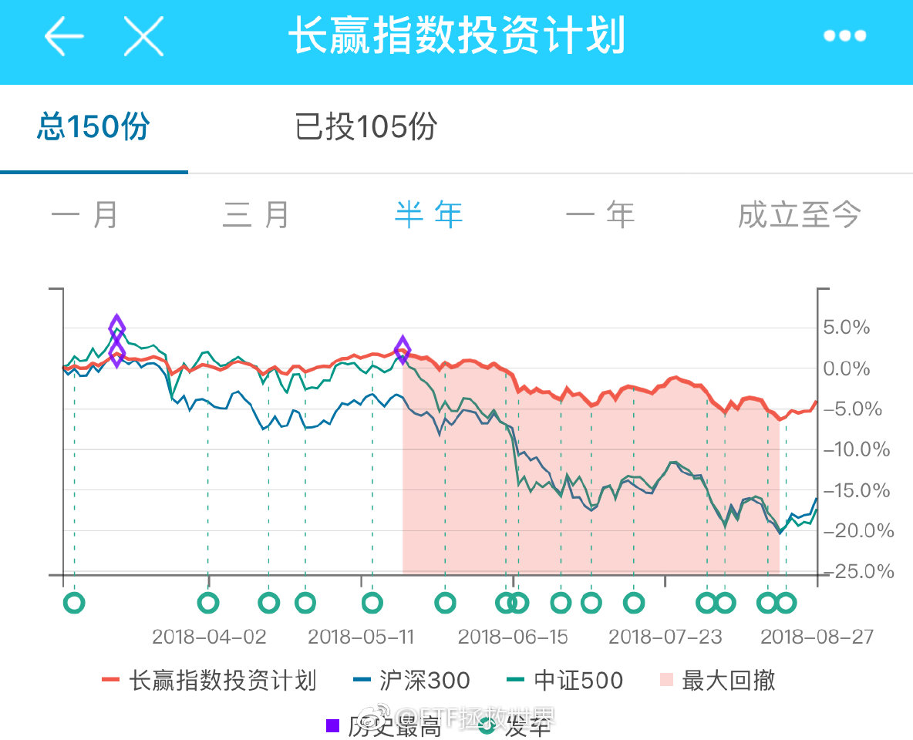

======================================================

ETF拯救世界 (5687069307) @
2018-08-28 09:02:12 Tue  
url: https://weibo.com/5687069307/GwGX3CtgA

更新：58家公布，19家下滑，整体增速下降至13%+。果然是越往后公布越烂。医药保持15%+。//@ETF拯救世界:更新：41家企业公布，8家下滑，依然保持20%+。医药157家公布，37家下滑，15%+//@ETF拯救世界:更新：37家公布业绩，6家下滑。多了一个华谊。整体增速依然维持在20%+。

------------------------------------------------------
转推：
>  @ETF拯救世界 (5687069307)
>  2018-08-23 07:21:53 Thu  
>  url: https:/weibo.com/5687069307/GvV9RANl2/

>  截至今日，养老产业80家成分股中有33家披露半年报。
>  
>  33家中只有5家利润下降。
>  
>  静态PEG已经=1……当然剩下的40多家业绩不会这么好。我估计整体增速在15%+。
>  
>  还有8天。 ​​​

转发[33]  评论[33]  赞[142] 

======================================================

ETF拯救世界 (5687069307) @
2018-08-28 09:04:15 Tue  
url: https://weibo.com/5687069307/GwGXTFsUX

更新：500是330家公布，整体保持15%+。A股有2/3已经公布，整体维持在12%+。//@ETF拯救世界:回复@国民偶像superIQer:500目前280家公布，27%业绩下降，增速在15%+。估计全出来以后在11左右吧。//@国民偶像superIQer:益达 500的增速预计有多少？

------------------------------------------------------
转推：
>  @ETF拯救世界 (5687069307)
>  2018-08-27 08:54:30 Mon  
>  url: https:/weibo.com/5687069307/GwxtrAjAN/

>  从整个A股看，目前公布半年报的1900多家里面，有1/3业绩下滑。总体增速保持在13%+。估计全部公布完毕后也就8%-10%。这个速度也算是合理的。 ​​​

转发[14]  评论[38]  赞[148] 

======================================================

ETF拯救世界 (5687069307) @
2018-08-28 09:17:12 Tue  
url: https://weibo.com/5687069307/GwH3aeOuX

飞了，天意。

------------------------------------------------------
转推：
>  @ETF拯救世界 (5687069307)
>  2018-08-24 15:35:19 Fri  
>  url: https:/weibo.com/5687069307/Gw7OEezvK/

>  下周如果没有大的意外，会有两个新品种。
>  
>  A股基本上就齐了。 ​​​

转发[0]  评论[87]  赞[182] 

======================================================

ETF拯救世界 (5687069307) @
2018-08-28 09:20:16 Tue  
url: https://weibo.com/5687069307/GwH4p2uld

创业50ETF今年以来份额增加了十倍，从3亿到37亿。有意思的是创业50目前37家半年报公布出来，利润增长还不到10%，甚至远低于全市场。

估值目前又是奔40去了。

凭什么啊。 ​​​

转发[28]  评论[91]  赞[231] 

======================================================

ETF拯救世界 (5687069307) @
2018-08-28 09:27:41 Tue  
url: https://weibo.com/5687069307/GwH7ptVlw

5月10号还在历史新高，今年涨幅超过100%。

谁能想到3个月过去持有的话市值还剩10%。还卖不出去。

炒股风险太大了。不重仓赚不了什么钱，重仓了踩雷一辈子就这样了。。 ​​​

转发[50]  评论[102]  赞[231] 

+++++++++++++++++++++++++++++++++++++++++++++++++++++

图片：
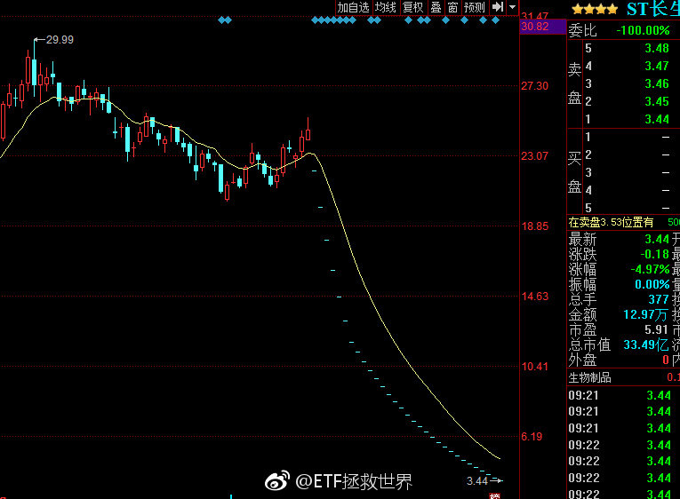

======================================================

ETF拯救世界 (5687069307) @
2018-08-28 09:49:43 Tue  
url: https://weibo.com/5687069307/GwHgm8X2b

回复@牡丹亭集小言:这就是群众基础。不要怀疑牛市会不会来，要相信国人的赌性。你信不信，我信。他们只是在等待50%的涨幅……//@牡丹亭集小言:办公室里的讨论变成了，不要买房，现在拿钱买股票闭着眼睛买都能躺赢[失望]

------------------------------------------------------
转推：
>  @ETF拯救世界 (5687069307)
>  2018-08-28 09:27:41 Tue  
>  url: https:/weibo.com/5687069307/GwH7ptVlw/

>  5月10号还在历史新高，今年涨幅超过100%。
>  
>  谁能想到3个月过去持有的话市值还剩10%。还卖不出去。
>  
>  炒股风险太大了。不重仓赚不了什么钱，重仓了踩雷一辈子就这样了。。 ​​​

转发[14]  评论[52]  赞[171] 

======================================================

ETF拯救世界 (5687069307) @
2018-08-28 09:51:41 Tue  
url: https://weibo.com/5687069307/GwHha4yGS

回复@突然想要换名字:中证红利最好增速也就在10%左右。它基本不会太高增长。因为大量分红的企业已经是成熟期了。另外，它长期估值低，基本上也不可能是高成长股票组成的。。//@突然想要换名字:我猜红利应该是最好的吧？

------------------------------------------------------
转推：
>  @ETF拯救世界 (5687069307)
>  2018-08-23 07:21:53 Thu  
>  url: https:/weibo.com/5687069307/GvV9RANl2/

>  截至今日，养老产业80家成分股中有33家披露半年报。
>  
>  33家中只有5家利润下降。
>  
>  静态PEG已经=1……当然剩下的40多家业绩不会这么好。我估计整体增速在15%+。
>  
>  还有8天。 ​​​

转发[23]  评论[88]  赞[180] 

======================================================

ETF拯救世界 (5687069307) @
2018-08-28 11:05:02 Tue  
url: https://weibo.com/5687069307/GwHKVotMR

最近看电器，之前一直感觉国产白电已经领先世界了。怎么一看某排行排在前面的基本还全是日韩的货啊。。

洗衣机   LG 松下 三星 日立 博世 西门子

冰箱   松下  LG  日立 三星 夏普  三菱 东芝 博世

怎么回事。是排行榜不行还是咱们的机器不行。 ​​​

转发[33]  评论[272]  赞[170] 

======================================================

ETF拯救世界 (5687069307) @
2018-08-28 11:10:33 Tue  
url: https://weibo.com/5687069307/GwHNaj0x5

回复@凯文山姆日记:窗式空调我看排行是LG 通用家电 海尔 北极牌 费里希 格力 肯摩尔，都什么鬼。//@凯文山姆日记:空调是啥情况？

------------------------------------------------------
转推：
>  @ETF拯救世界 (5687069307)
>  2018-08-28 11:05:02 Tue  
>  url: https:/weibo.com/5687069307/GwHKVotMR/

>  最近看电器，之前一直感觉国产白电已经领先世界了。怎么一看某排行排在前面的基本还全是日韩的货啊。。
>  
>  洗衣机   LG 松下 三星 日立 博世 西门子
>  
>  冰箱   松下  LG  日立 三星 夏普  三菱 东芝 博世
>  
>  怎么回事。是排行榜不行还是咱们的机器不行。 ​​​

转发[10]  评论[24]  赞[88] 

======================================================

ETF拯救世界 (5687069307) @
2018-08-28 11:11:35 Tue  
url: https://weibo.com/5687069307/GwHNAiCvE

中央空调：大金 三菱电机 日立 东芝 特灵 三菱重工 麦克维尔 美的 格力。//@ETF拯救世界:回复@凯文山姆日记:窗式空调我看排行是LG 通用家电 海尔 北极牌 费里希 格力 肯摩尔，都什么鬼。//@凯文山姆日记:空调是啥情况？

------------------------------------------------------
转推：
>  @ETF拯救世界 (5687069307)
>  2018-08-28 11:05:02 Tue  
>  url: https:/weibo.com/5687069307/GwHKVotMR/

>  最近看电器，之前一直感觉国产白电已经领先世界了。怎么一看某排行排在前面的基本还全是日韩的货啊。。
>  
>  洗衣机   LG 松下 三星 日立 博世 西门子
>  
>  冰箱   松下  LG  日立 三星 夏普  三菱 东芝 博世
>  
>  怎么回事。是排行榜不行还是咱们的机器不行。 ​​​

转发[7]  评论[117]  赞[120] 

======================================================

ETF拯救世界 (5687069307) @
2018-08-28 13:42:46 Tue  
url: https://weibo.com/5687069307/GwIMWpcva

为什么感觉传媒在咱们最后一次加仓后有点风骚。 ​​​

转发[0]  评论[130]  赞[379] 

======================================================

ETF拯救世界 (5687069307) @
2018-08-28 21:16:55 Tue  
url: https://weibo.com/5687069307/GwLLhrM6x

每日打卡（197）

坚持。每天坚持就会成为习惯。 ​​​

转发[0]  评论[52]  赞[298] 

+++++++++++++++++++++++++++++++++++++++++++++++++++++

图片：

======================================================

ETF拯救世界 (5687069307) @
2018-08-29 10:23:22 Wed  
url: https://weibo.com/5687069307/GwQUvztnU

看了昨天昆山的那个视频，明白了几件事：

第一，小时候不知道为什么浩南哥要把手和刀绑在一起，现在懂了。

第二，性格决定命运是真的。

第三，以后在外面要别太嚣张，要猥琐一点活得会比较久…… ​​​

转发[27]  评论[255]  赞[263] 

+++++++++++++++++++++++++++++++++++++++++++++++++++++

图片：

======================================================

ETF拯救世界 (5687069307) @
2018-08-29 11:37:57 Wed  
url: https://weibo.com/5687069307/GwRoN6xwd

在网上，有一种人投资是永远不会输的。

就是满仓买入。涨了赚大钱，跌了可以借到钱，融资，或者卖房子，再跌就卖第二套继续补。

最后涨了就又成了传奇…… ​​​

转发[20]  评论[113]  赞[251] 

======================================================

ETF拯救世界 (5687069307) @
2018-08-29 11:43:24 Wed  
url: https://weibo.com/5687069307/GwRr0egA2

这段子真的好笑。//@夏阿:厉害了，百度。//@床上的Alice:百度大傻逼//@文森特动物园:......//@牙签Ginger:可怕//@此梗有毒:转发

------------------------------------------------------
转推：
>  @七点半的独角戏 (3334372892)
>  2018-08-29 10:19:25 Wed  
>  url: https:/weibo.com/3334372892/GwQSUhWeU/

>  我因为写了一条讽刺百度的段子，被百度告了。
>  
>  事情的大概过程是这样：
>  1.今年五月份我写了一条关于百度的段子（图1），只存在了不到三天微博就被屏蔽，当时没有想太多。
>  2.八月份，我突然收到了法院的传票，才知道百度把我告了。
>  3.百度的诉讼请求主要是两点：让我微博置顶道歉30天;赔偿百度损失500万 ​​​

转发[105]  评论[38]  赞[99] 

======================================================

ETF拯救世界 (5687069307) @
2018-08-29 11:45:47 Wed  
url: https://weibo.com/5687069307/GwRrXCcQI

“show me the money”虐电脑没什么了不起，怎么把有限的资源玩好才是咱们做投资最重要的事。

------------------------------------------------------
转推：
>  @ETF拯救世界 (5687069307)
>  2018-08-29 11:37:57 Wed  
>  url: https:/weibo.com/5687069307/GwRoN6xwd/

>  在网上，有一种人投资是永远不会输的。
>  
>  就是满仓买入。涨了赚大钱，跌了可以借到钱，融资，或者卖房子，再跌就卖第二套继续补。
>  
>  最后涨了就又成了传奇…… ​​​

转发[9]  评论[64]  赞[188] 

======================================================

ETF拯救世界 (5687069307) @
2018-08-29 14:02:42 Wed  
url: https://weibo.com/5687069307/GwSlxnG8O

每天上微博就感觉进入了大型魔幻现场。不懂你们为什么要追什么宫斗剧，这才是最精彩的好吗。好人！最后的主任也比较魔幻有没有。

------------------------------------------------------
转推：
>  @ ()
>  2018-08-29 06:35:04 Wed  
>  url: 

>  抱歉，作者已设置仅展示半年内微博，此微博已不可见。 ​​​

转发[39]  评论[86]  赞[161] 

======================================================

ETF拯救世界 (5687069307) @
2018-08-29 14:27:09 Wed  
url: https://weibo.com/5687069307/GwSvsxUy5

所以你看，一个反弹你着什么急。

不要预判，反弹还是反转。你让市场自己走，走出来你就知道了。你判断了就会错，错了就会赔钱。 ​​​

转发[24]  评论[117]  赞[346] 

======================================================

ETF拯救世界 (5687069307) @
2018-08-29 15:41:55 Wed  
url: https://weibo.com/5687069307/GwSZOfE8w

谁能想到2015年115倍的创业板已经快跌破30倍了。

那时候买创业板股票的，80%的人20年内真的很难回本了。 ​​​

转发[176]  评论[141]  赞[277] 

======================================================

ETF拯救世界 (5687069307) @
2018-08-29 15:56:19 Wed  
url: https://weibo.com/5687069307/GwT5F7YBf

回复@六六的名单:我个人推荐易方达的app e钱包，买它们的货币基金易现金增利货币B。目前年化还在4.1x。比余额宝的2.x强。央行新规之前，赎回1000万都能即时到账。新规后赎回第二天7点前到账。我不用的现金都扔在里面。//@六六的名单:现金除了放到余额宝还有什么比较合适的存放途径？

------------------------------------------------------
转推：
>  @ETF拯救世界 (5687069307)
>  2018-08-29 15:41:55 Wed  
>  url: https:/weibo.com/5687069307/GwSZOfE8w/

>  谁能想到2015年115倍的创业板已经快跌破30倍了。
>  
>  那时候买创业板股票的，80%的人20年内真的很难回本了。 ​​​

转发[112]  评论[193]  赞[265] 

======================================================

ETF拯救世界 (5687069307) @
2018-08-29 16:06:10 Wed  
url: https://weibo.com/5687069307/GwT9EpE58

回复@钟情嘟嘟哇:一个品种风险大不大你得看它的价格/价值，就是俗称的估值。没有不好的品种，只有不好的价格。创业板便宜了那才是钻石矿。//@钟情嘟嘟哇:创业板根本就不敢看，风险太大了

------------------------------------------------------
转推：
>  @ETF拯救世界 (5687069307)
>  2018-08-29 15:41:55 Wed  
>  url: https:/weibo.com/5687069307/GwSZOfE8w/

>  谁能想到2015年115倍的创业板已经快跌破30倍了。
>  
>  那时候买创业板股票的，80%的人20年内真的很难回本了。 ​​​

转发[32]  评论[98]  赞[181] 

======================================================

ETF拯救世界 (5687069307) @
2018-08-29 17:17:18 Wed  
url: https://weibo.com/5687069307/GwTCwtZTT

回复@从前有个酱油叫小明:如果那样我会被微博销号的你信吗。没人知道是我自己写机器人程序评论还是别人。都这么干我就死了。//@从前有个酱油叫小明:回复@苏黎世投机者:我就说一句，老铁，机器人能不能分享一下，我也想抢沙发，以后老大下边评论都是机器人多棒[good]

------------------------------------------------------
转推：
>  @ETF拯救世界 (5687069307)
>  2018-08-29 15:41:55 Wed  
>  url: https:/weibo.com/5687069307/GwSZOfE8w/

>  谁能想到2015年115倍的创业板已经快跌破30倍了。
>  
>  那时候买创业板股票的，80%的人20年内真的很难回本了。 ​​​

转发[0]  评论[49]  赞[125] 

======================================================

ETF拯救世界 (5687069307) @
2018-08-29 17:40:36 Wed  
url: https://weibo.com/5687069307/GwTLZ4A7g

回复@麦粒珠珠:40倍买的五年内肯定解套了。至少五年内一定有解套的机会。//@麦粒珠珠:40倍左右买了被套的20年内还能解套吗[允悲]//@ETF拯救世界:回复@钟情嘟嘟哇:一个品种风险大不大你得看它的价格/价值，就是俗称的估值。没有不好的品种，只有不好的价格。创业板便宜了那才是钻石矿。

------------------------------------------------------
转推：
>  @ETF拯救世界 (5687069307)
>  2018-08-29 15:41:55 Wed  
>  url: https:/weibo.com/5687069307/GwSZOfE8w/

>  谁能想到2015年115倍的创业板已经快跌破30倍了。
>  
>  那时候买创业板股票的，80%的人20年内真的很难回本了。 ​​​

转发[11]  评论[60]  赞[153] 

======================================================

ETF拯救世界 (5687069307) @
2018-08-29 20:34:30 Wed  
url: https://weibo.com/5687069307/GwUUzlY4n

刚又有人评论里喷我。

奇怪了，有人满仓满融跟我有什么关系，怪我？

如果不是计划这样一份一份的买，多少人早就满仓被套了，能像现在一样指数跌了40%我们才半仓？那些从3500就忽悠大家满仓的你不去喷，来喷我？

真是为了喷已经脸都不要了。

请为我们操心的这位朋友放心，即使所有人都要死，我们也 ​​​

转发[18]  评论[262]  赞[546] 

======================================================

ETF拯救世界 (5687069307) @
2018-08-30 10:31:47 Thu  
url: https://weibo.com/5687069307/Gx0oqgAzg

熊市中空仓，呵呵，说起来容易。

别说你能精确判断熊市，就说稍微有个反弹你心里不慌？我真不信。

慌了追不追？

大家可以想象一下，真的空仓会不会舒服。 ​​​

转发[26]  评论[288]  赞[472] 

======================================================

ETF拯救世界 (5687069307) @
2018-08-30 14:11:06 Thu  
url: https://weibo.com/5687069307/Gx1PruvLj

这种情况还是少说话好。

你不怕这么关键的时候一张嘴就给奶上去了吗。 ​​​

转发[1]  评论[157]  赞[322] 

======================================================

ETF拯救世界 (5687069307) @
2018-08-30 14:39:59 Thu  
url: https://weibo.com/5687069307/Gx21am0fb

8月20日最低点加仓后，十天过去，一波上涨，咱们一分钱都没追。

该买了，又跌回来了。

是不是运气挺好的。

乘胜追击再主动择一下时，明天也许买也许不买。明天或者下周一吧。看明天上午的情况。 ​​​

转发[15]  评论[157]  赞[306] 

======================================================

ETF拯救世界 (5687069307) @
2018-08-30 14:46:32 Thu  
url: https://weibo.com/5687069307/Gx23Pgo9f

回复@鹅鹅鹅2898345891:什么时候我升级了。组织上同意了吗。//@鹅鹅鹅2898345891:f大够淡定

------------------------------------------------------
转推：
>  @ETF拯救世界 (5687069307)
>  2018-08-30 14:39:59 Thu  
>  url: https:/weibo.com/5687069307/Gx21am0fb/

>  8月20日最低点加仓后，十天过去，一波上涨，咱们一分钱都没追。
>  
>  该买了，又跌回来了。
>  
>  是不是运气挺好的。
>  
>  乘胜追击再主动择一下时，明天也许买也许不买。明天或者下周一吧。看明天上午的情况。 ​​​

转发[0]  评论[72]  赞[166] 

======================================================

ETF拯救世界 (5687069307) @
2018-08-30 14:48:35 Thu  
url: https://weibo.com/5687069307/Gx24FjqyI

回复@蜜糖即砒霜:没懂。打开跌停之前你已经准备下单了还是看人家涨停了才觉得应该买？我还可惜错过高圆圆了呢。//@蜜糖即砒霜:可惜错过了长生今天的涨停板[泪]

------------------------------------------------------
转推：
>  @ETF拯救世界 (5687069307)
>  2018-08-30 14:39:59 Thu  
>  url: https:/weibo.com/5687069307/Gx21am0fb/

>  8月20日最低点加仓后，十天过去，一波上涨，咱们一分钱都没追。
>  
>  该买了，又跌回来了。
>  
>  是不是运气挺好的。
>  
>  乘胜追击再主动择一下时，明天也许买也许不买。明天或者下周一吧。看明天上午的情况。 ​​​

转发[5]  评论[88]  赞[209] 

======================================================

ETF拯救世界 (5687069307) @
2018-08-30 15:27:51 Thu  
url: https://weibo.com/5687069307/Gx2kB4rZy

震惊！再创六年新低！比24日低了0.18！当然，距离2012年11月还差2……//@ETF拯救世界:今日再新低。虽然只比22日低了0.03……

------------------------------------------------------
转推：
>  @ETF拯救世界 (5687069307)
>  2018-08-22 16:33:09 Wed  
>  url: https:/weibo.com/5687069307/GvPl8sw0g/

>  今日A股全市场估值再创2012年11月以来新低。 ​​​

转发[106]  评论[81]  赞[218] 

======================================================

ETF拯救世界 (5687069307) @
2018-08-30 15:41:10 Thu  
url: https://weibo.com/5687069307/Gx2q0vofN

回复@wangrui2885_89213:不知道。不过要到08年，还差8……[doge]//@wangrui2885_89213:那也就是说大盘还要再跌15%才行？//@ETF拯救世界:震惊！再创六年新低！比24日低了0.18！当然，距离2012年11月还差2……//@ETF拯救世界:今日再新低。虽然只比22日低了0.03……

------------------------------------------------------
转推：
>  @ETF拯救世界 (5687069307)
>  2018-08-22 16:33:09 Wed  
>  url: https:/weibo.com/5687069307/GvPl8sw0g/

>  今日A股全市场估值再创2012年11月以来新低。 ​​​

转发[86]  评论[47]  赞[151] 

======================================================

ETF拯救世界 (5687069307) @
2018-08-30 16:02:33 Thu  
url: https://weibo.com/5687069307/Gx2yGi27R

回复@为锅接盘:一般来说，A股历史上很少很少出现“全市场利润下降”。最多是增速下降。比如好的年份增长15%，坏的年份增长5%。所以很难出现估值变高，通常是变低快一些慢一些。//@为锅接盘:第三季度估摸着业绩都不会太好，这样的话估值会被动抬高吧。

------------------------------------------------------
转推：
>  @ETF拯救世界 (5687069307)
>  2018-08-22 16:33:09 Wed  
>  url: https:/weibo.com/5687069307/GvPl8sw0g/

>  今日A股全市场估值再创2012年11月以来新低。 ​​​

转发[77]  评论[53]  赞[161] 

======================================================

ETF拯救世界 (5687069307) @
2018-08-30 16:13:47 Thu  
url: https://weibo.com/5687069307/Gx2DfnsXg

回复@桃李麻辣烫:全市场破净简直是不可想象了。历史最低2005和2008都只是1.5而已。//@桃李麻辣烫:E大，我认为，这个不需要多解释，他们好多人等着危机来呢[doge]  对于这些人来说，全市场等权破净他们也不会买，他们比谁都贪婪

------------------------------------------------------
转推：
>  @ETF拯救世界 (5687069307)
>  2018-08-22 16:33:09 Wed  
>  url: https:/weibo.com/5687069307/GvPl8sw0g/

>  今日A股全市场估值再创2012年11月以来新低。 ​​​

转发[56]  评论[56]  赞[149] 

======================================================

ETF拯救世界 (5687069307) @
2018-08-30 16:23:14 Thu  
url: https://weibo.com/5687069307/Gx2H4C3Tv

回复@Lo_诗和远方:立个flag，真能到1.5我上20%-30%杠杆。到1我上50%。//@Lo_诗和远方:万一破了呢，现在很悲观。//@ETF拯救世界:回复@桃李麻辣烫:全市场破净简直是不可想象了。历史最低2005和2008都只是1.5而已。

------------------------------------------------------
转推：
>  @ETF拯救世界 (5687069307)
>  2018-08-22 16:33:09 Wed  
>  url: https:/weibo.com/5687069307/GvPl8sw0g/

>  今日A股全市场估值再创2012年11月以来新低。 ​​​

转发[39]  评论[94]  赞[188] 

======================================================

ETF拯救世界 (5687069307) @
2018-08-30 16:30:39 Thu  
url: https://weibo.com/5687069307/Gx2K5nSf5

可能很多人对全市场破净没有概念。

这么说吧，现在全市场还在2以上。如果要破净，不考虑增长，意味着大多数股票还要跌一半以上。

也意味着上证很有可能跌破1500点。中证500铁定跌破2500点。

我还可以告诉你，标普500PB是3以上，德国英国都在2以上，俄罗斯接近3，印度接近4。

所以说全市场破净，或 ​​​

转发[123]  评论[173]  赞[314] 

======================================================

ETF拯救世界 (5687069307) @
2018-08-30 16:35:26 Thu  
url: https://weibo.com/5687069307/Gx2M1BVGf

全市场破净，那其实想做实业的人根本没必要自己开公司了。直接去买行业的上市公司多好。行业龙头，比净资产还便宜，何必要辛辛苦苦再自己开公司？

------------------------------------------------------
转推：
>  @ETF拯救世界 (5687069307)
>  2018-08-30 16:30:39 Thu  
>  url: https:/weibo.com/5687069307/Gx2K5nSf5/

>  可能很多人对全市场破净没有概念。
>  
>  这么说吧，现在全市场还在2以上。如果要破净，不考虑增长，意味着大多数股票还要跌一半以上。
>  
>  也意味着上证很有可能跌破1500点。中证500铁定跌破2500点。
>  
>  我还可以告诉你，标普500PB是3以上，德国英国都在2以上，俄罗斯接近3，印度接近4。
>  
>  所以说全市场破净，或 ​​​

转发[30]  评论[83]  赞[221] 

======================================================

ETF拯救世界 (5687069307) @
2018-08-30 17:34:15 Thu  
url: https://weibo.com/5687069307/Gx39U7ErO

回复@山前水后0769:你说A股100家公司有假账我信，200、300家也没准。500、700家也不是一点可能没有。但你说3300家公司都做假账？那还不赶紧销户？//@山前水后0769:就怕净资产有水分或者有毒，一个突然巨亏就打没了，甚至会破产退市

------------------------------------------------------
转推：
>  @ETF拯救世界 (5687069307)
>  2018-08-30 16:30:39 Thu  
>  url: https:/weibo.com/5687069307/Gx2K5nSf5/

>  可能很多人对全市场破净没有概念。
>  
>  这么说吧，现在全市场还在2以上。如果要破净，不考虑增长，意味着大多数股票还要跌一半以上。
>  
>  也意味着上证很有可能跌破1500点。中证500铁定跌破2500点。
>  
>  我还可以告诉你，标普500PB是3以上，德国英国都在2以上，俄罗斯接近3，印度接近4。
>  
>  所以说全市场破净，或 ​​​

转发[7]  评论[78]  赞[195] 

======================================================

ETF拯救世界 (5687069307) @
2018-08-30 17:50:56 Thu  
url: https://weibo.com/5687069307/Gx3gGgnIS

每天看两次，每次4小时。

------------------------------------------------------
转推：
>  @ ()
>  2018-08-30 17:07:00 Thu  
>  url: 

>  抱歉，作者已设置仅展示半年内微博，此微博已不可见。 ​​​

转发[2]  评论[54]  赞[199] 

======================================================

ETF拯救世界 (5687069307) @
2018-08-31 08:45:37 Fri  
url: https://weibo.com/5687069307/Gx97PjbEh

回复@Scout上善若水:没什么关联。可是以他的文学素养，想在一句话中更好的骂出你妹 你妈，同时表达出谁喷我谁是随地大小便很难，只好这样组织语言了//@Scout上善若水:回复@guru8:应该理解为，妈妈和妹妹对他说不能大小便，两个人的语气是不一样的。只是这有什么关联吗……确实需要去语文老师那回炉

------------------------------------------------------
转推：
>  @ ()
>  2018-08-30 23:51:26 Thu  
>  url: 

>  抱歉，此微博已被删除。查看帮助：http://t.cn/8sYl7Qb

转发[4]  评论[33]  赞[81] 

======================================================

ETF拯救世界 (5687069307) @
2018-08-31 09:15:28 Fri  
url: https://weibo.com/5687069307/Gx9jWqs4V

今天会很刺激啊。 ​​​

转发[4]  评论[118]  赞[249] 

======================================================

ETF拯救世界 (5687069307) @
2018-08-31 09:20:41 Fri  
url: https://weibo.com/5687069307/Gx9m3hWCk

鹅厂又要凉。所以你看，很多人总是高瞻远瞩的计算某公司未来十年能有多少收入，多少利润，多少现金流，多少折现。

其实有时候真的很虚。随随便便一个政 策的改变，你就歇了。

更何况，高科技领域的东西，真的能一直好下去吗。你说子弹不行，那会不会下一个大炮或者火箭就行了？

很难说吧。

不判断 ​​​

转发[19]  评论[102]  赞[221] 

======================================================

ETF拯救世界 (5687069307) @
2018-08-31 09:31:12 Fri  
url: https://weibo.com/5687069307/Gx9qkn2mB

浓眉大眼的伊利怎么也…… ​​​

转发[2]  评论[58]  赞[160] 

======================================================

ETF拯救世界 (5687069307) @
2018-08-31 09:41:48 Fri  
url: https://weibo.com/5687069307/Gx9uDcUOQ

[doge] ​​​

转发[18]  评论[61]  赞[189] 

+++++++++++++++++++++++++++++++++++++++++++++++++++++

图片：
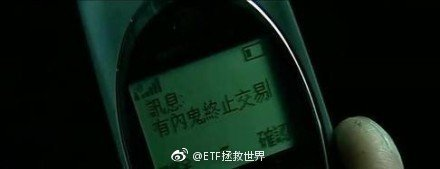

======================================================

ETF拯救世界 (5687069307) @
2018-08-31 09:52:02 Fri  
url: https://weibo.com/5687069307/Gx9yMyWl4

我再说句可能招人烦的话。

其实大多数人，80%或者90%的人吧，不适合为别人做资产管理。

也可能你自己做的还行，但你也很有可能不适合给别人管理资产。更别说有好多人自己做的也根本不行。

所以，如果私募平台不管不顾只想多发展几个人来自己这里发私募，多募集资金，其实对于投资者来讲毫无好处。作 ​​​

转发[25]  评论[166]  赞[339] 

======================================================

ETF拯救世界 (5687069307) @
2018-08-31 10:02:28 Fri  
url: https://weibo.com/5687069307/Gx9D1izmM

回复@asekiyoshi:如果时光可以倒流，问你08年的三聚的伊利，13年塑化剂的茅台，你该不该买？坏消息对于投资者来讲才是最好的消息。//@asekiyoshi:今天养老中了好几枪，游戏，假药，伊利

------------------------------------------------------
转推：
>  @ETF拯救世界 (5687069307)
>  2018-08-31 09:41:48 Fri  
>  url: https:/weibo.com/5687069307/Gx9uDcUOQ/

>  [doge] ​​​

转发[15]  评论[70]  赞[170] 

======================================================

ETF拯救世界 (5687069307) @
2018-08-31 10:19:16 Fri  
url: https://weibo.com/5687069307/Gx9JQ7gih

之前说过，我们的价值仓位已经买了很大了，不急着继续大力买。毕竟你家不是开矿的，资源有限，不像别人是无限资源买买买。好钢用在刀刃上。

趋势方面。

截至目前，所有指数趋势全部向下。本来有一只本周有突破的可能，但这两天又跌回下降趋势。各指数压力线压力极强，很难突破。所以趋势仓位也不会买 ​​​

转发[164]  评论[194]  赞[341] 

======================================================

ETF拯救世界 (5687069307) @
2018-08-31 10:32:06 Fri  
url: https://weibo.com/5687069307/Gx9P2t8e9

回复@LaOldCat:2008年伊利跌了67%，2013年 茅台跌了45%。你觉得鹅厂现在遭遇了当年这两家公司的困境了？我刚才那条说的是高科技企业，伊利和茅台是高科技？阅读理解能力需要提高。//@LaOldCat:e大，小粉关注你很久了，可你现在又是在教育刚才发了鹅厂那条的自己吗[允悲]正反面都是你的立场，根本不败啊

------------------------------------------------------
转推：
>  @ETF拯救世界 (5687069307)
>  2018-08-31 09:41:48 Fri  
>  url: https:/weibo.com/5687069307/Gx9uDcUOQ/

>  [doge] ​​​

转发[1]  评论[33]  赞[115] 

======================================================

ETF拯救世界 (5687069307) @
2018-08-31 10:47:39 Fri  
url: https://weibo.com/5687069307/Gx9Vmk7iv

回复@愿赌服输K:无限现金流在这个区域每半个月买一次红利 300增强 500 医药 消费。之后视情况再增加创业和信息//@愿赌服输K:非杠精 只是想问一下E大 假如有无限现金流现在应该怎么买可以收益最大化

------------------------------------------------------
转推：
>  @ETF拯救世界 (5687069307)
>  2018-08-31 10:19:16 Fri  
>  url: https:/weibo.com/5687069307/Gx9JQ7gih/

>  之前说过，我们的价值仓位已经买了很大了，不急着继续大力买。毕竟你家不是开矿的，资源有限，不像别人是无限资源买买买。好钢用在刀刃上。
>  
>  趋势方面。
>  
>  截至目前，所有指数趋势全部向下。本来有一只本周有突破的可能，但这两天又跌回下降趋势。各指数压力线压力极强，很难突破。所以趋势仓位也不会买 ​​​

转发[119]  评论[237]  赞[275] 

======================================================

ETF拯救世界 (5687069307) @
2018-08-31 11:55:31 Fri  
url: https://weibo.com/5687069307/GxamUB7ut

回复@Henry00:且不说股票本身的问题，这样的，监管层怎么可能允许它爆炒。随时干你，敢火中取栗的可以说是人中龙凤了。//@Henry00:长生跌停了，昨天后悔没买的哪位不知道还后悔么[挖鼻]

------------------------------------------------------
转推：
>  @ETF拯救世界 (5687069307)
>  2018-08-31 09:15:28 Fri  
>  url: https:/weibo.com/5687069307/Gx9jWqs4V/

>  今天会很刺激啊。 ​​​

转发[0]  评论[31]  赞[137] 

======================================================

ETF拯救世界 (5687069307) @
2018-08-31 12:03:32 Fri  
url: https://weibo.com/5687069307/Gxaqa8viM

喷了。以前我的数据、文章、计划，还有那什么被抄也就算了。

昨天发现已经发展到微博也被抄了。

而且是一个字不差的抄啊。

厉害了我的中文网路！ ​​​

转发[4]  评论[164]  赞[297] 

======================================================

ETF拯救世界 (5687069307) @
2018-08-31 12:09:14 Fri  
url: https://weibo.com/5687069307/GxastmvhR

非常谨慎孙宏斌……

------------------------------------------------------
转推：
>  @财联社APP (2868676035)
>  2018-08-31 11:38:41 Fri  
>  url: https:/weibo.com/2868676035/Gxag4w9Na/

>  【孙宏斌 ：买融创股票可能会比买我们的房子空间大很多】融创孙宏斌表示：我们投哪个城市，你如果不住，就没必要买，还是买我们股票吧！中国城市房地产发展很不均衡，有的城市在调控前，就已经涨到很高位，我们还是会优先考虑房价比较低的城市，我们还是会很谨慎地投资。买股票可能会比买我们的房子， ​​​

转发[5]  评论[47]  赞[154] 

======================================================

ETF拯救世界 (5687069307) @
2018-08-31 13:45:33 Fri  
url: https://weibo.com/5687069307/Gxb5zkOdJ

回复@天生歌者不唱歌:这么良心的平台难道不应该支持一下，以后都在且慢申购吗。[doge]//@天生歌者不唱歌:回复@舍豆:基金现在手续费和管理费很低了，能拿出来分的已经很少了，而且蚂蚁财富那里分流特别严重，且慢的客户还是少数

------------------------------------------------------
转推：
>  @ETF拯救世界 (5687069307)
>  2018-08-31 09:52:02 Fri  
>  url: https:/weibo.com/5687069307/Gx9yMyWl4/

>  我再说句可能招人烦的话。
>  
>  其实大多数人，80%或者90%的人吧，不适合为别人做资产管理。
>  
>  也可能你自己做的还行，但你也很有可能不适合给别人管理资产。更别说有好多人自己做的也根本不行。
>  
>  所以，如果私募平台不管不顾只想多发展几个人来自己这里发私募，多募集资金，其实对于投资者来讲毫无好处。作 ​​​

转发[2]  评论[66]  赞[184] 

======================================================

ETF拯救世界 (5687069307) @
2018-08-31 13:51:06 Fri  
url: https://weibo.com/5687069307/Gxb7P52Lv

我说且慢良心，同意不同意。可以回想两件事。

第一个，当年合宜申购的时候。是不是全网热推，每家销售机构都在抢销售份额。

且慢发了个东西，跟你说，我们这里申购也可以，但是去兴全网站上申购费率更合适。

第二个，当年独角兽基金申购的时候。是不是全网热推，每家销售机构都在奋力宣传。

且慢发 ​​​

转发[36]  评论[269]  赞[790] 

======================================================

ETF拯救世界 (5687069307) @
2018-08-31 15:28:09 Fri  
url: https://weibo.com/5687069307/GxbLdjPi1

回复@李蕾_小兽:明天肯定不跌。跌了请你吃饭。//@李蕾_小兽:e大今天不加仓，估计明天还的跌呀

------------------------------------------------------
转推：
>  @ETF拯救世界 (5687069307)
>  2018-08-31 13:51:06 Fri  
>  url: https:/weibo.com/5687069307/Gxb7P52Lv/

>  我说且慢良心，同意不同意。可以回想两件事。
>  
>  第一个，当年合宜申购的时候。是不是全网热推，每家销售机构都在抢销售份额。
>  
>  且慢发了个东西，跟你说，我们这里申购也可以，但是去兴全网站上申购费率更合适。
>  
>  第二个，当年独角兽基金申购的时候。是不是全网热推，每家销售机构都在奋力宣传。
>  
>  且慢发 ​​​

转发[0]  评论[82]  赞[218] 

======================================================

ETF拯救世界 (5687069307) @
2018-08-31 16:18:26 Fri  
url: https://weibo.com/5687069307/Gxc5CA6qu

根据历史经验，最终的底部，还缺少一根月线大阴线……

历史还会重演吗？ ​​​

转发[323]  评论[137]  赞[333] 

======================================================

ETF拯救世界 (5687069307) @
2018-08-31 16:22:42 Fri  
url: https://weibo.com/5687069307/Gxc7mvL7L

2019年起，劳务报酬、稿酬、特许权使用费将合并计算个税。[拜拜]

------------------------------------------------------
转推：
>  @北京人不知道的北京事儿 (1662214194)
>  2018-08-31 15:36:02 Fri  
>  url: https:/weibo.com/1662214194/GxbOpBkyY/

>  新个税法通过！起征点每月5000元，10月1日起实施。戳图二看看你要交多少税？[摊手] ​​​

转发[24]  评论[50]  赞[138] 

======================================================

ETF拯救世界 (5687069307) @
2018-08-31 16:25:28 Fri  
url: https://weibo.com/5687069307/Gxc8tC7E6

回复@黄连树:2005年5月8.5%，2008年10月25%，2012年11月创业板12%，2013年6月沪深300是15%。//@黄连树:过去熊市的月度大阴线出现在几月？

------------------------------------------------------
转推：
>  @ETF拯救世界 (5687069307)
>  2018-08-31 16:18:26 Fri  
>  url: https:/weibo.com/5687069307/Gxc5CA6qu/

>  根据历史经验，最终的底部，还缺少一根月线大阴线……
>  
>  历史还会重演吗？ ​​​

转发[200]  评论[68]  赞[152] 

======================================================

ETF拯救世界 (5687069307) @
2018-08-31 16:29:25 Fri  
url: https://weibo.com/5687069307/Gxca5uTmJ

回复@挖龙脉的超级鹿鼎公:94年7月下跌29%是最低。96年12月下跌13%；96-99一直涨没感觉99是熊市，全年上涨19%。05年5月下跌8%。//@挖龙脉的超级鹿鼎公:这个不一定，96年,99年，05年都没有

------------------------------------------------------
转推：
>  @ETF拯救世界 (5687069307)
>  2018-08-31 16:18:26 Fri  
>  url: https:/weibo.com/5687069307/Gxc5CA6qu/

>  根据历史经验，最终的底部，还缺少一根月线大阴线……
>  
>  历史还会重演吗？ ​​​

转发[19]  评论[43]  赞[161] 

======================================================

ETF拯救世界 (5687069307) @
2018-08-31 16:33:29 Fri  
url: https://weibo.com/5687069307/GxcbJrXPC

不过中证500已经连跌五个月，本月下跌7%，估值是过去13年第三低。点位逼近我的理解极限4600-4700。半年报利润增速11%+。

综上，空间真的不会太大了。 ​​​

转发[99]  评论[201]  赞[402] 

======================================================

ETF拯救世界 (5687069307) @
2018-08-31 17:58:43 Fri  
url: https://weibo.com/5687069307/GxcKko8qE

回复@asekiyoshi:资本利得出来A股将再跌30%。我不太相信会出这个。房产我都信，不信这个。//@asekiyoshi:内部消息，资本利得税与房产税一起开征

------------------------------------------------------
转推：
>  @ETF拯救世界 (5687069307)
>  2018-08-31 16:33:29 Fri  
>  url: https:/weibo.com/5687069307/GxcbJrXPC/

>  不过中证500已经连跌五个月，本月下跌7%，估值是过去13年第三低。点位逼近我的理解极限4600-4700。半年报利润增速11%+。
>  
>  综上，空间真的不会太大了。 ​​​

转发[19]  评论[132]  赞[218] 

======================================================

ETF拯救世界 (5687069307) @
2018-09-01 18:26:01 Sat  
url: https://weibo.com/5687069307/GxmlUzAON

影响中国的案例。[good] 利好A股。[doge]

------------------------------------------------------
转推：
>  @昆山公安 (1799408092)
>  2018-09-01 17:05:22 Sat  
>  url: https:/weibo.com/1799408092/GxlPazpWe/

>  #微发布# 2018年8月27日昆山市震川路于海明致刘海龙死亡案，备受社会舆论关注。公安机关经过缜密侦查，并商请检察机关提前介入，现就该案件调查处理情况予以通报。http://t.cn/RF9orDS ​​​

转发[20]  评论[167]  赞[538] 

======================================================

ETF拯救世界 (5687069307) @
2018-09-02 23:21:40 Sun  
url: https://weibo.com/5687069307/GxxIpl89b

这种事先别急着表态。先看看是什么情况。 ​​​

转发[2]  评论[61]  赞[200] 

======================================================

ETF拯救世界 (5687069307) @
2018-09-02 23:43:13 Sun  
url: https://weibo.com/5687069307/GxxR9yFfd

每日打卡（198）

英雄难过美人关。 ​​​

转发[0]  评论[21]  赞[147] 

+++++++++++++++++++++++++++++++++++++++++++++++++++++

图片：

======================================================

ETF拯救世界 (5687069307) @
2018-09-03 00:32:02 Mon  
url: https://weibo.com/5687069307/GxyaXAzT6

阿里做空榜第三位，腾讯游戏控总量，东哥出事。

中概……[笑而不语] ​​​

转发[9]  评论[87]  赞[279] 

======================================================

ETF拯救世界 (5687069307) @
2018-09-03 09:34:29 Mon  
url: https://weibo.com/5687069307/GxBJ9n7r7

你觉得婚内出轨是不是确认渣男渣女，展开讲讲。

还是三石和查尔斯张潇洒啊，也不结婚，没有什么道德顾虑。。 ​​​

转发[10]  评论[199]  赞[179] 

======================================================

ETF拯救世界 (5687069307) @
2018-09-03 09:41:03 Mon  
url: https://weibo.com/5687069307/GxBLOyQbr

今天会发车，想逆回购的可以忍忍。

我先去做图了…… ​​​

转发[4]  评论[112]  赞[336] 

======================================================

ETF拯救世界 (5687069307) @
2018-09-03 09:41:38 Mon  
url: https://weibo.com/5687069307/GxBM3kXzD

PS：周五的择时看起来又对了。

------------------------------------------------------
转推：
>  @ETF拯救世界 (5687069307)
>  2018-09-03 09:41:03 Mon  
>  url: https:/weibo.com/5687069307/GxBLOyQbr/

>  今天会发车，想逆回购的可以忍忍。
>  
>  我先去做图了…… ​​​

转发[0]  评论[46]  赞[203] 

======================================================

ETF拯救世界 (5687069307) @
2018-09-03 09:46:38 Mon  
url: https://weibo.com/5687069307/GxBO5f0Os

回复@ETF信徒者:奶茶我觉得也就那么回事。想想佟丽娅和张雨绮吧……臭男人没一个好东西。[doge]

------------------------------------------------------
转推：
>  @ETF拯救世界 (5687069307)
>  2018-09-03 09:34:29 Mon  
>  url: https:/weibo.com/5687069307/GxBJ9n7r7/

>  你觉得婚内出轨是不是确认渣男渣女，展开讲讲。
>  
>  还是三石和查尔斯张潇洒啊，也不结婚，没有什么道德顾虑。。 ​​​

转发[2]  评论[73]  赞[139] 

======================================================

ETF拯救世界 (5687069307) @
2018-09-03 09:50:44 Mon  
url: https://weibo.com/5687069307/GxBPKm4CU

有人说我的择时是蒙的。

呵呵呵。

真的是蒙的。 ​​​

转发[3]  评论[109]  赞[284] 

======================================================

ETF拯救世界 (5687069307) @
2018-09-03 09:55:23 Mon  
url: https://weibo.com/5687069307/GxBRDEAcl

回复@i云腾致雨:抖音昨晚已关注。//@i云腾致雨:蒋娉婷觉得怎么样？[挤眼]//@ETF拯救世界:回复@ETF信徒者:奶茶我觉得也就那么回事。想想佟丽娅和张雨绮吧……臭男人没一个好东西。[doge]

------------------------------------------------------
转推：
>  @ETF拯救世界 (5687069307)
>  2018-09-03 09:34:29 Mon  
>  url: https:/weibo.com/5687069307/GxBJ9n7r7/

>  你觉得婚内出轨是不是确认渣男渣女，展开讲讲。
>  
>  还是三石和查尔斯张潇洒啊，也不结婚，没有什么道德顾虑。。 ​​​

转发[0]  评论[72]  赞[95] 

======================================================

ETF拯救世界 (5687069307) @
2018-09-03 11:26:49 Mon  
url: https://weibo.com/5687069307/GxCsKjSmC

群众想象力还是不行。既然没犯法，我怎么感觉应该把奥迪搬走。

------------------------------------------------------
转推：
>  @网易财经 (1974561081)
>  2018-09-03 11:25:45 Mon  
>  url: https:/weibo.com/1974561081/GxCsjte3t/

>  【货车侧翻万斤蜜桃遭哄抢 民警劝阻被大妈反呛：我犯法了吗？】8月31日，山东德州，一辆装载桃子的货车与一奥迪轿车相撞，现场一片狼藉。民警赶到时，有20多名群众正在抢桃，面对劝阻，一女子竟说：“我犯法了吗？”警方表示，哄抢财物的可以处5日以上10日以下的拘留，并处500元罚款，如情节构成犯罪， ​​​

转发[11]  评论[89]  赞[148] 

======================================================

ETF拯救世界 (5687069307) @
2018-09-03 12:43:38 Mon  
url: https://weibo.com/5687069307/GxCXVrKOe

回复@anonymity_somebody:自我管理非常严格，任何碰触禁忌的东西从不评论，不转发。人微言轻，活着还能为社会做点贡献。感受一下。//@anonymity_somebody:E大, 我有点担心, 万一你哪天不小心碰到暗雷, 被封号了咋办? [衰]

------------------------------------------------------
转推：
>  @网易财经 (1974561081)
>  2018-09-03 11:25:45 Mon  
>  url: https:/weibo.com/1974561081/GxCsjte3t/

>  【货车侧翻万斤蜜桃遭哄抢 民警劝阻被大妈反呛：我犯法了吗？】8月31日，山东德州，一辆装载桃子的货车与一奥迪轿车相撞，现场一片狼藉。民警赶到时，有20多名群众正在抢桃，面对劝阻，一女子竟说：“我犯法了吗？”警方表示，哄抢财物的可以处5日以上10日以下的拘留，并处500元罚款，如情节构成犯罪， ​​​

转发[4]  评论[35]  赞[158] 

======================================================

ETF拯救世界 (5687069307) @
2018-09-03 13:13:16 Mon  
url: https://weibo.com/5687069307/GxD9Xhnqp

我看，这波熊市的低点可以降级对标2008了。

未来所有策略围绕这个预期来做。

再低的话我就不知道用哪个预期了。A股历史上还没出现过。 ​​​

转发[286]  评论[192]  赞[375] 

======================================================

ETF拯救世界 (5687069307) @
2018-09-03 13:20:19 Mon  
url: https://weibo.com/5687069307/GxDcNCWbN

不过有几个指数居然已经有走好的趋势。

50  金融  券商。

这个要周五才能确认。 ​​​

转发[27]  评论[107]  赞[257] 

======================================================

ETF拯救世界 (5687069307) @
2018-09-03 13:46:47 Mon  
url: https://weibo.com/5687069307/GxDnyBnfA

什么玩意儿…… ​​​

转发[1]  评论[109]  赞[178] 

+++++++++++++++++++++++++++++++++++++++++++++++++++++

图片：

======================================================

ETF拯救世界 (5687069307) @
2018-09-03 14:09:42 Mon  
url: https://weibo.com/5687069307/GxDwRqVhE

搞什么，500要红？

我只是举个例子啊，亲！ ​​​

转发[11]  评论[204]  赞[232] 

+++++++++++++++++++++++++++++++++++++++++++++++++++++

图片：
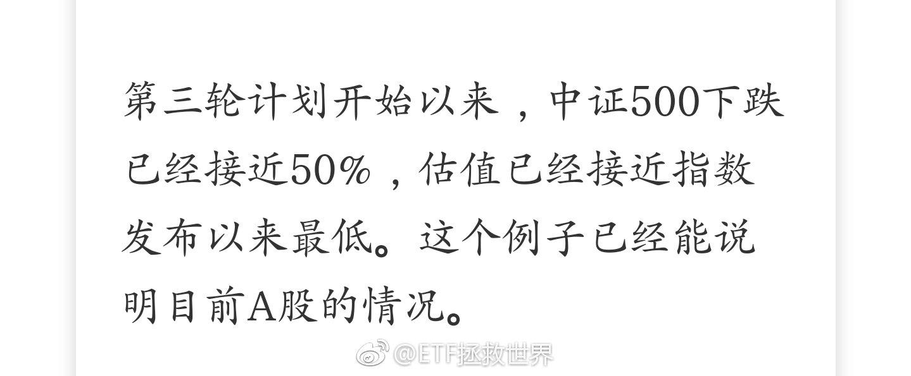

======================================================

ETF拯救世界 (5687069307) @
2018-09-03 14:29:46 Mon  
url: https://weibo.com/5687069307/GxDF0ph25

20号一幕重现。

是巧合，一定是巧合。 ​​​

转发[1]  评论[149]  赞[251] 

======================================================

ETF拯救世界 (5687069307) @
2018-09-03 14:39:50 Mon  
url: https://weibo.com/5687069307/GxDJ5AAHt

想要放逐自己。

浪漫的土耳其，还有东京和巴黎。

人生不如意。

天意难违。

退博算了。 ​​​

转发[4]  评论[127]  赞[215] 

======================================================

ETF拯救世界 (5687069307) @
2018-09-03 15:00:50 Mon  
url: https://weibo.com/5687069307/GxDRCeIXo

300: -0.38%

500: +0.5%

中概：-x%。

单方面宣布择时成功。 [拜拜] ​​​

转发[6]  评论[165]  赞[464] 

======================================================

ETF拯救世界 (5687069307) @
2018-09-03 15:32:44 Mon  
url: https://weibo.com/5687069307/GxE4z6TGD

我选的BGM一开始听觉得还挺好听的。

单曲循环反复听之后发现，更好听了。 ​​​

转发[4]  评论[112]  赞[355] 

======================================================

ETF拯救世界 (5687069307) @
2018-09-03 22:01:03 Mon  
url: https://weibo.com/5687069307/GxGCbjLuu

看了这个新闻，我问五岁的儿子，爸爸玩的打仗游戏可以跳窗户，你能跳吗。他说不可以，会流血会死。那是网络里制造出来的，不是真的。——五岁啊。十三还不明白？

------------------------------------------------------
转推：
>  @ ()
>  2018-09-03 21:29:02 Mon  
>  url: 

>  抱歉，作者已设置仅展示半年内微博，此微博已不可见。 ​​​

转发[42]  评论[142]  赞[200] 

======================================================

ETF拯救世界 (5687069307) @
2018-09-04 09:33:08 Tue  
url: https://weibo.com/5687069307/GxL96hbKh

昨天跳车的朋友伸出你的手，让我看到你~~ ​​​

转发[11]  评论[221]  赞[308] 

======================================================

ETF拯救世界 (5687069307) @
2018-09-04 09:40:33 Tue  
url: https://weibo.com/5687069307/GxLc6FH8Y

“价投不择时”

真能扯淡。

巴菲特盯了30多年才开始入手买可乐和沃尔玛。

有钱就瞎买那叫败家子。 ​​​

转发[34]  评论[77]  赞[306] 

======================================================

ETF拯救世界 (5687069307) @
2018-09-04 09:44:54 Tue  
url: https://weibo.com/5687069307/GxLdRFBvD

我跟你说，为什么要严格遵守规矩。

因为，如果你遵守规矩，做错了，那是规矩的问题。

如果你不遵守规矩，自作聪明，做错了，那是自己的问题。

做错了，你怪规矩不行，心里会很舒服。自己错了，怪自己，觉得自己是废柴，自信心没了，什么都没了。

成功是一种习惯，失败也是。

规矩长期出错，可以修 ​​​

转发[116]  评论[181]  赞[413] 

======================================================

ETF拯救世界 (5687069307) @
2018-09-04 09:47:36 Tue  
url: https://weibo.com/5687069307/GxLeYg5Ib

回复@会走路的鲨鱼儿:蒙的。//@会走路的鲨鱼儿:好像又开在阶段低点了。[doge]

------------------------------------------------------
转推：
>  @ETF拯救世界 (5687069307)
>  2018-09-04 09:40:33 Tue  
>  url: https:/weibo.com/5687069307/GxLc6FH8Y/

>  “价投不择时”
>  
>  真能扯淡。
>  
>  巴菲特盯了30多年才开始入手买可乐和沃尔玛。
>  
>  有钱就瞎买那叫败家子。 ​​​

转发[5]  评论[33]  赞[156] 

======================================================

ETF拯救世界 (5687069307) @
2018-09-04 10:06:48 Tue  
url: https://weibo.com/5687069307/GxLmLpQ3p

慢慢磨吧。牛市早晚会来，只是不知道什么时候。

钱少的你急什么，多给点时间你多投入一点以后赚的更多。

钱多的你更不需要急了。钱那么多你急什么！ ​​​

转发[30]  评论[186]  赞[529] 

======================================================

ETF拯救世界 (5687069307) @
2018-09-04 10:43:46 Tue  
url: https://weibo.com/5687069307/GxLBLBIO1

国债什么时候买回来。 ​​​

转发[4]  评论[56]  赞[205] 

+++++++++++++++++++++++++++++++++++++++++++++++++++++

图片：
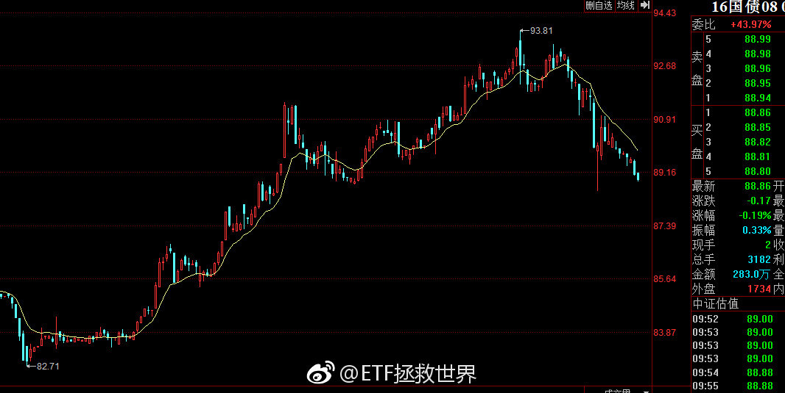

======================================================

ETF拯救世界 (5687069307) @
2018-09-04 11:05:30 Tue  
url: https://weibo.com/5687069307/GxLKABR20

军工继续炒，那就继续跌。//@ETF拯救世界:回复@23RRRR:军工信息不死，牛市不来。//@23RRRR:e大军工多少会考虑开始进[偷笑]//@ETF拯救世界:回复@ETF是什么:照你这个，军工还得跌75%，太狠了！

------------------------------------------------------
转推：
>  @ETF拯救世界 (5687069307)
>  2018-08-17 11:41:57 Fri  
>  url: https:/weibo.com/5687069307/Gv2irEnRO/

>  一上午没看盘，嗬，又坑杀一批抢反弹的啊。
>  
>  想起年初很多公众号的文章：
>  
>  “先生，这是牛市。牛市就是要解决问题的。”
>  
>  [疑问][疑问][疑问] ​​​

转发[12]  评论[58]  赞[155] 

======================================================

ETF拯救世界 (5687069307) @
2018-09-04 11:37:31 Tue  
url: https://weibo.com/5687069307/GxLXB0wik

下午出去视察工作，勿念 ​​​

转发[6]  评论[221]  赞[366] 

+++++++++++++++++++++++++++++++++++++++++++++++++++++

图片：
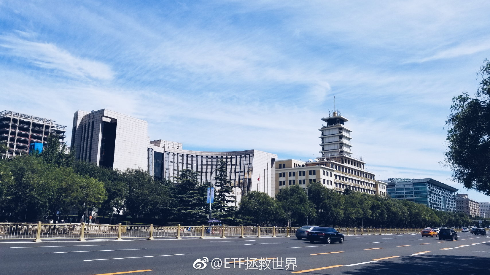

======================================================

ETF拯救世界 (5687069307) @
2018-09-04 15:22:12 Tue  
url: https://weibo.com/5687069307/GxNqNcgnl

老司机的车不要随便跳。一个想法，不一定对

------------------------------------------------------
转推：
>  @ETF拯救世界 (5687069307)
>  2018-09-04 09:33:08 Tue  
>  url: https:/weibo.com/5687069307/GxL96hbKh/

>  昨天跳车的朋友伸出你的手，让我看到你~~ ​​​

转发[2]  评论[125]  赞[314] 

======================================================

ETF拯救世界 (5687069307) @
2018-09-04 15:27:29 Tue  
url: https://weibo.com/5687069307/GxNsVzS1C

回复@唐僧用飃柔:哪有的事呢[doge]//@唐僧用飃柔:又去主持国家队救市工作了

------------------------------------------------------
转推：
>  @ETF拯救世界 (5687069307)
>  2018-09-04 11:37:31 Tue  
>  url: https:/weibo.com/5687069307/GxLXB0wik/

>  下午出去视察工作，勿念 ​​​

转发[2]  评论[72]  赞[161] 

======================================================

ETF拯救世界 (5687069307) @
2018-09-04 17:50:16 Tue  
url: https://weibo.com/5687069307/GxOoT4bjl

最近有一个苦恼，就是感觉好像没什么想吃的东西了。

人生第五大乐趣没了。

聊聊你最爱吃的东西。具体点，比如xx卖的xx。。 ​​​

转发[31]  评论[505]  赞[224] 

======================================================

ETF拯救世界 (5687069307) @
2018-09-04 18:43:34 Tue  
url: https://weibo.com/5687069307/GxOKwjvbY

转型情感博主怎么样。现在有个情感博主离婚了，空了个位子出来，是不是可以试试。

据说男性情感博主受欢迎。

毕竟现在这情况财经博主没前途了。 ​​​

转发[8]  评论[186]  赞[339] 

======================================================

ETF拯救世界 (5687069307) @
2018-09-04 19:31:36 Tue  
url: https://weibo.com/5687069307/GxP419I7n

回复@乔木:我想了半天，没想清楚这个是情感问题还是财经问题，我用哪个身份回答你比较妥当？//@乔木:没钱女朋友要分手怎么办[允悲]

------------------------------------------------------
转推：
>  @ETF拯救世界 (5687069307)
>  2018-09-04 18:43:34 Tue  
>  url: https:/weibo.com/5687069307/GxOKwjvbY/

>  转型情感博主怎么样。现在有个情感博主离婚了，空了个位子出来，是不是可以试试。
>  
>  据说男性情感博主受欢迎。
>  
>  毕竟现在这情况财经博主没前途了。 ​​​

转发[0]  评论[23]  赞[153] 

======================================================

ETF拯救世界 (5687069307) @
2018-09-04 19:33:03 Tue  
url: https://weibo.com/5687069307/GxP4C9YAI

回复@唐僧用飃柔:新女朋友还是新手机？//@唐僧用飃柔:女朋友把我手机摔坏了，最近打算换个新的，有什么推荐的吗？

------------------------------------------------------
转推：
>  @ETF拯救世界 (5687069307)
>  2018-09-04 18:43:34 Tue  
>  url: https:/weibo.com/5687069307/GxOKwjvbY/

>  转型情感博主怎么样。现在有个情感博主离婚了，空了个位子出来，是不是可以试试。
>  
>  据说男性情感博主受欢迎。
>  
>  毕竟现在这情况财经博主没前途了。 ​​​

转发[2]  评论[69]  赞[248] 

======================================================

ETF拯救世界 (5687069307) @
2018-09-04 22:22:29 Tue  
url: https://weibo.com/5687069307/GxQbnuq07

不要嘴炮，以实际行动支持东哥 ​​​

转发[6]  评论[62]  赞[213] 

+++++++++++++++++++++++++++++++++++++++++++++++++++++

图片：

======================================================

ETF拯救世界 (5687069307) @
2018-09-04 22:27:26 Tue  
url: https://weibo.com/5687069307/GxQdocLQM

回复@Kart老万:今天申购中概，美股部分几只价格是明天凌晨美股收盘的价格。腾讯是今天白天港股

------------------------------------------------------
转推：
>  @ETF拯救世界 (5687069307)
>  2018-09-04 22:22:29 Tue  
>  url: https:/weibo.com/5687069307/GxQbnuq07/

>  不要嘴炮，以实际行动支持东哥 ​​​

转发[2]  评论[16]  赞[137] 

======================================================

ETF拯救世界 (5687069307) @
2018-09-04 22:51:40 Tue  
url: https://weibo.com/5687069307/GxQne4jTi

为什么喜欢京东，支持东哥。

是一种感激之情吧。

之前我也说过，没有京东之前，自己是怎么在中关村买电脑买的非常不开心。还得大老远搬回家。更别说质量，假货等等问题了。

这对于一个热衷于3C的男人是多么痛苦的事。

有了京东，一切相关烦恼都没了。

是，无论是京东还是东哥，肯定有各种问题。你 ​​​

转发[17]  评论[176]  赞[423] 

======================================================

ETF拯救世界 (5687069307) @
2018-09-05 08:56:20 Wed  
url: https://weibo.com/5687069307/GxUkEnYhf

有朋友跟我说，球球有位大V的基金净值跌破0.5了。

这种时候不要去嘲笑挖苦别人。落井下石不是什么好品质。

最重要的是，你能从别人失败的例子上学到什么。经验，不是一定要自己犯错才能取得。

这件事，从头到尾，可以总结的东西特别多。而且还不仅仅是投资本身的问题。

我只说一点，以后你看到满仓 ​​​

转发[53]  评论[282]  赞[438] 

======================================================

ETF拯救世界 (5687069307) @
2018-09-05 10:34:47 Wed  
url: https://weibo.com/5687069307/GxUYCsoaH

现在很多私募不设预警线和清盘线。

很多人说，因为是价值投资，没道理越跌越卖。设了预警和清盘线就没法价投了。

其实，清盘和预警对私募投资者来说，是挺重要的一个保护措施。

为什么。

因为私募基金对于私募基金经来说，是一个免费的杠杆。赚的越多，分的越多。所以他们天生有重仓满仓把净值做上 ​​​

转发[32]  评论[143]  赞[301] 

======================================================

ETF拯救世界 (5687069307) @
2018-09-05 12:40:16 Wed  
url: https://weibo.com/5687069307/GxVNylCuP

下午还出去不出去了。 ​​​

转发[1]  评论[92]  赞[194] 

======================================================

ETF拯救世界 (5687069307) @
2018-09-05 12:42:29 Wed  
url: https://weibo.com/5687069307/GxVOsuA7w

目前仓位很合适。稍微放缓发车节奏。等空间。 ​​​

转发[209]  评论[130]  赞[381] 

======================================================

ETF拯救世界 (5687069307) @
2018-09-05 14:18:17 Wed  
url: https://weibo.com/5687069307/GxWrl4M4H

谁能想到鹅厂也被东哥拖下水了。

鹅厂最近也是屋漏偏逢连夜雨。年初的利好怎么变成利空了。

游戏强劲+大范围投资其他公司…… ​​​

转发[5]  评论[46]  赞[197] 

======================================================

ETF拯救世界 (5687069307) @
2018-09-05 14:26:57 Wed  
url: https://weibo.com/5687069307/GxWuRemKq

熬过熊市的诀窍就是少动。还有，要动也要讲节奏。

你去翻2015年开始的第三轮。会发现，最多一个月动一次。有时候一个月动不了一次，两个月才上一次。动也是买1、2份

后来有时候一个月两次，三次。

上个月一个月四次。

频率加快，份数也在逐渐增加。

但是最多也就一个月四次。乱动不行。否则左边脸 ​​​

转发[142]  评论[330]  赞[437] 

======================================================

ETF拯救世界 (5687069307) @
2018-09-05 16:39:08 Wed  
url: https://weibo.com/5687069307/GxXmvvLyh

又跌！破产了，各位，再会！不要炒股！流着泪说。

------------------------------------------------------
转推：
>  @ ()
>  2018-09-05 16:26:32 Wed  
>  url: 

>  抱歉，作者已设置仅展示半年内微博，此微博已不可见。 ​​​

转发[4]  评论[84]  赞[164] 

======================================================

ETF拯救世界 (5687069307) @
2018-09-05 16:42:15 Wed  
url: https://weibo.com/5687069307/GxXnM9PBA

回复@何纯-员外郎:新低。因为总是新低就不说了。下次再说就是跌破2012年11月。意味着，再往前就是2008年11月了。太刺激了吧也。//@何纯-员外郎:E哥，估值新低吗？

------------------------------------------------------
转推：
>  @ETF拯救世界 (5687069307)
>  2018-09-05 14:26:57 Wed  
>  url: https:/weibo.com/5687069307/GxWuRemKq/

>  熬过熊市的诀窍就是少动。还有，要动也要讲节奏。
>  
>  你去翻2015年开始的第三轮。会发现，最多一个月动一次。有时候一个月动不了一次，两个月才上一次。动也是买1、2份
>  
>  后来有时候一个月两次，三次。
>  
>  上个月一个月四次。
>  
>  频率加快，份数也在逐渐增加。
>  
>  但是最多也就一个月四次。乱动不行。否则左边脸 ​​​

转发[19]  评论[91]  赞[194] 

======================================================

ETF拯救世界 (5687069307) @
2018-09-05 17:45:57 Wed  
url: https://weibo.com/5687069307/GxXND9QCT

我再说一次，在我的评论里悲观可以。

说这次比2008更严重，也可以。

但是，好歹跌破我的预期你再来悲观好吗。

现在连我的底线都没碰，甚至还有25%的下跌预期准备，你天天跟我说会差到跌破08。纳尼？

我立个flag，全市场pb不会破1.5。

1.5我就满仓+30%-50%的杠杆。这个杠杆率还能再撑55%-70%下跌不 ​​​

转发[94]  评论[298]  赞[526] 

======================================================

ETF拯救世界 (5687069307) @
2018-09-05 17:57:14 Wed  
url: https://weibo.com/5687069307/GxXSdtrJ4

最近一定要控制节奏。不要太急，不要太激进。现在战场上战况混乱，先拿着手里的筹码认真观察一下。

------------------------------------------------------
转推：
>  @ETF拯救世界 (5687069307)
>  2018-09-05 12:42:29 Wed  
>  url: https:/weibo.com/5687069307/GxVOsuA7w/

>  目前仓位很合适。稍微放缓发车节奏。等空间。 ​​​

转发[172]  评论[139]  赞[344] 

======================================================

ETF拯救世界 (5687069307) @
2018-09-06 06:36:28 Thu  
url: https://weibo.com/5687069307/Gy2QnDieS

为了让大家了解炒股的风险，一觉醒来京东已经巨亏几百美元。

怎么办。今天早餐只能喝自来水了。

炒股害死人，不要炒股。血淋淋的教训。

众筹今天的午饭，一会发支付宝账号。[失望] ​​​

转发[49]  评论[165]  赞[434] 

======================================================

ETF拯救世界 (5687069307) @
2018-09-06 06:54:14 Thu  
url: https://weibo.com/5687069307/Gy2XB2gVC

如果东哥真的是qj，我会认为他很渣，当然不会支持他犯法。

这个当然还能拎得清。 ​​​

转发[3]  评论[141]  赞[239] 

======================================================

ETF拯救世界 (5687069307) @
2018-09-06 08:35:39 Thu  
url: https://weibo.com/5687069307/Gy3CLboV9

刚才认真看了看，美股账户资产占金融资产一个多不到两个点。

其中一半是美元现金，一半权益里面大部分是各国ETF。

其它是美股港股。包括京东网易AMD再生元四只股票。 

感谢 外 管 局和纽约花旗，美元汇不出去救了我…… ​​​

转发[17]  评论[110]  赞[225] 

======================================================

ETF拯救世界 (5687069307) @
2018-09-06 09:19:22 Thu  
url: https://weibo.com/5687069307/Gy3Uv0Km6

今天会不会继续新低。//@ETF拯救世界:继续新低。老这么跌也不是事儿，还不反弹反弹换换手？//@ETF拯救世界:继续新低

------------------------------------------------------
转推：
>  @ETF拯救世界 (5687069307)
>  2018-03-22 09:34:01 Thu  
>  url: https:/weibo.com/5687069307/G8wd21cxW/

>  腾讯，60倍PE。未来五年看，真的能有特别好的收益率吗。
>  
>  学习了。 ​​​

转发[4]  评论[39]  赞[123] 

======================================================

ETF拯救世界 (5687069307) @
2018-09-06 09:38:43 Thu  
url: https://weibo.com/5687069307/Gy42mi23y

未来牛市中最好笑的一句话是什么。

“赚了指数不赚钱。”

……

你直接买指数不就完了吗。。 ​​​

转发[27]  评论[36]  赞[227] 

======================================================

ETF拯救世界 (5687069307) @
2018-09-06 09:40:15 Thu  
url: https://weibo.com/5687069307/Gy42Z0Clt

现在最好笑的一句话是什么：A股还有牛市。[打脸]

------------------------------------------------------
转推：
>  @ETF拯救世界 (5687069307)
>  2018-09-06 09:38:43 Thu  
>  url: https:/weibo.com/5687069307/Gy42mi23y/

>  未来牛市中最好笑的一句话是什么。
>  
>  “赚了指数不赚钱。”
>  
>  ……
>  
>  你直接买指数不就完了吗。。 ​​​

转发[13]  评论[34]  赞[166] 

======================================================

ETF拯救世界 (5687069307) @
2018-09-06 09:41:34 Thu  
url: https://weibo.com/5687069307/Gy43w5G6i

这是今天我收藏进资本市场日记的第一条新闻。

------------------------------------------------------
转推：
>  @全景网 (1752549400)
>  2018-09-06 07:56:43 Thu  
>  url: https:/weibo.com/1752549400/Gy3mXkyM1/

>  【私募平均仓位创近三年新低 机构仓位指标或成反向指标】私募排排网的最新统计数据显示，私募当前的平均仓位为52.61%，其中34.23%的私募处于半仓以下，私募的平均仓位处于近3年的最低水平。据了解，私募群体减仓观望情绪浓重，61.26%的基金经理表示会维持现有仓位不变。从连续的统计数据来看，机构仓位 ​​​

转发[66]  评论[85]  赞[192] 

======================================================

ETF拯救世界 (5687069307) @
2018-09-06 09:50:42 Thu  
url: https://weibo.com/5687069307/Gy47e1vU2

给你们看看我今年收集的，我觉得有意义的新闻。

附赠2015年的。

有价值的东西都在公开信息里，看你能不能识别了。 ​​​

转发[255]  评论[289]  赞[334] 

+++++++++++++++++++++++++++++++++++++++++++++++++++++

图片：

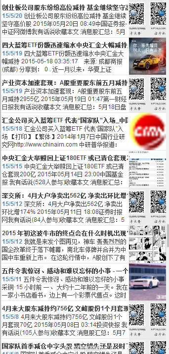

======================================================

ETF拯救世界 (5687069307) @
2018-09-06 10:17:10 Thu  
url: https://weibo.com/5687069307/Gy4hY3bjg

1月：李小加：港股牛市开始，与07年不同。四天后恒指见大顶。1月，GJD大幅减仓，仓位降到20%。A股见大顶，至今下跌25%。1月，合宜一天吸金300亿。目前净值0.83。

------------------------------------------------------
转推：
>  @ETF拯救世界 (5687069307)
>  2018-09-06 09:50:42 Thu  
>  url: https:/weibo.com/5687069307/Gy47e1vU2/

>  给你们看看我今年收集的，我觉得有意义的新闻。
>  
>  附赠2015年的。
>  
>  有价值的东西都在公开信息里，看你能不能识别了。 ​​​

转发[52]  评论[97]  赞[161] 

======================================================

ETF拯救世界 (5687069307) @
2018-09-06 10:19:39 Thu  
url: https://weibo.com/5687069307/Gy4iY45Df

回复@观音山上拜观音:那条新闻是2014年的。我是2015年收录。//@观音山上拜观音:15/5/18汇金买入蓝筹ETF，那时候不是应该卖出吗？

------------------------------------------------------
转推：
>  @ETF拯救世界 (5687069307)
>  2018-09-06 09:50:42 Thu  
>  url: https:/weibo.com/5687069307/Gy47e1vU2/

>  给你们看看我今年收集的，我觉得有意义的新闻。
>  
>  附赠2015年的。
>  
>  有价值的东西都在公开信息里，看你能不能识别了。 ​​​

转发[17]  评论[47]  赞[120] 

======================================================

ETF拯救世界 (5687069307) @
2018-09-06 10:44:03 Thu  
url: https://weibo.com/5687069307/Gy4sSrwtr

1月，两融余额在11000亿，目前8500亿。仅此一项，趋势扭转后就能带来1500-2000亿资金。

私募仓位30%，涨起来后又有几千亿资金。公募机构以及你的亲戚朋友都是低仓位，或者已经离开股市。

市场缺的并不是资金。 ​​​

转发[337]  评论[172]  赞[235] 

+++++++++++++++++++++++++++++++++++++++++++++++++++++

图片：
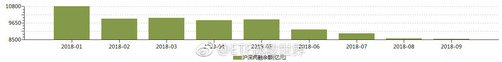

======================================================

ETF拯救世界 (5687069307) @
2018-09-06 10:52:23 Thu  
url: https://weibo.com/5687069307/Gy4wgdeNp

回复@因为迷茫所以仰望星空:两融余额历史上2014年9月首次突破6000亿，至今从未跌破。2015年5-6月最高峰突破2万亿。//@因为迷茫所以仰望星空:两融余额会不会跌破6000亿呢

------------------------------------------------------
转推：
>  @ETF拯救世界 (5687069307)
>  2018-09-06 10:44:03 Thu  
>  url: https:/weibo.com/5687069307/Gy4sSrwtr/

>  1月，两融余额在11000亿，目前8500亿。仅此一项，趋势扭转后就能带来1500-2000亿资金。
>  
>  私募仓位30%，涨起来后又有几千亿资金。公募机构以及你的亲戚朋友都是低仓位，或者已经离开股市。
>  
>  市场缺的并不是资金。 ​​​

转发[263]  评论[51]  赞[109] 

======================================================

ETF拯救世界 (5687069307) @
2018-09-06 10:59:10 Thu  
url: https://weibo.com/5687069307/Gy4z13bxz

回复@老顾例外:我只看融资余额/自由流通总市值（不是流通市值）。我这里有过去7年所有的比例数据。至于m2，房价，股市总市值，参考意义不大。//@老顾例外:两融是个绝对量， 要结合M2，房价总市值， 和股市总市值来看。 百分比更有意义

------------------------------------------------------
转推：
>  @ETF拯救世界 (5687069307)
>  2018-09-06 10:44:03 Thu  
>  url: https:/weibo.com/5687069307/Gy4sSrwtr/

>  1月，两融余额在11000亿，目前8500亿。仅此一项，趋势扭转后就能带来1500-2000亿资金。
>  
>  私募仓位30%，涨起来后又有几千亿资金。公募机构以及你的亲戚朋友都是低仓位，或者已经离开股市。
>  
>  市场缺的并不是资金。 ​​​

转发[235]  评论[108]  赞[132] 

======================================================

ETF拯救世界 (5687069307) @
2018-09-06 11:03:38 Thu  
url: https://weibo.com/5687069307/Gy4APAyiC

回复@hongapplenju:代表自由流通的市值里，有多少市值是被杠杆资金操控。杠杆资金比例越大，闪崩的风险越大。2015年5，A股杠杆资金比例全世界股市最高。比第二名高很多很多。//@hongapplenju:融资余额/自由流通总市值这个值，代表的是，入场意愿开启之后的拉升能力？

------------------------------------------------------
转推：
>  @ETF拯救世界 (5687069307)
>  2018-09-06 10:44:03 Thu  
>  url: https:/weibo.com/5687069307/Gy4sSrwtr/

>  1月，两融余额在11000亿，目前8500亿。仅此一项，趋势扭转后就能带来1500-2000亿资金。
>  
>  私募仓位30%，涨起来后又有几千亿资金。公募机构以及你的亲戚朋友都是低仓位，或者已经离开股市。
>  
>  市场缺的并不是资金。 ​​​

转发[132]  评论[122]  赞[123] 

======================================================

ETF拯救世界 (5687069307) @
2018-09-06 11:13:19 Thu  
url: https://weibo.com/5687069307/Gy4EL7xJa

回复@my_skying:不一样。举例，中石油集团持有的中石油股票是可流通的流通市值。但实际上它不会卖，所以不是自由流通市值。//@my_skying:自由流通和流通不一样吗，有没有课代表解释下[跪了]

------------------------------------------------------
转推：
>  @ETF拯救世界 (5687069307)
>  2018-09-06 10:44:03 Thu  
>  url: https:/weibo.com/5687069307/Gy4sSrwtr/

>  1月，两融余额在11000亿，目前8500亿。仅此一项，趋势扭转后就能带来1500-2000亿资金。
>  
>  私募仓位30%，涨起来后又有几千亿资金。公募机构以及你的亲戚朋友都是低仓位，或者已经离开股市。
>  
>  市场缺的并不是资金。 ​​​

转发[26]  评论[55]  赞[115] 

======================================================

ETF拯救世界 (5687069307) @
2018-09-06 11:15:22 Thu  
url: https://weibo.com/5687069307/Gy4FAsTtT

回复@老高GG:干货很多，目前已经说了将近1%了。//@老高GG:又上干货了 笔记本记录下来//@ETF拯救世界:回复@hongapplenju:代表自由流通的市值里，有多少市值是被杠杆资金操控。杠杆资金比例越大，闪崩的风险越大。2015年5，A股杠杆资金比例全世界股市最高。比第二名高很多很多。

------------------------------------------------------
转推：
>  @ETF拯救世界 (5687069307)
>  2018-09-06 10:44:03 Thu  
>  url: https:/weibo.com/5687069307/Gy4sSrwtr/

>  1月，两融余额在11000亿，目前8500亿。仅此一项，趋势扭转后就能带来1500-2000亿资金。
>  
>  私募仓位30%，涨起来后又有几千亿资金。公募机构以及你的亲戚朋友都是低仓位，或者已经离开股市。
>  
>  市场缺的并不是资金。 ​​​

转发[75]  评论[56]  赞[137] 

======================================================

ETF拯救世界 (5687069307) @
2018-09-06 11:24:23 Thu  
url: https://weibo.com/5687069307/Gy4Jg0Tah

回复@老高GG:目前A股自由流通市值18.5万亿。8500亿两融余额占比4.6%。2015年6月A股自由流通市值26.6万亿，2万亿两融余额占比7.5%，最高应该是超过8%。//@老高GG:@ETF拯救世界 如何把自由流通市值从流通市值里算出来？股票实在太多了[允悲]//@ETF拯救世界:回复@老高GG:干货很多，目前已经说了将近1%了。

------------------------------------------------------
转推：
>  @ETF拯救世界 (5687069307)
>  2018-09-06 10:44:03 Thu  
>  url: https:/weibo.com/5687069307/Gy4sSrwtr/

>  1月，两融余额在11000亿，目前8500亿。仅此一项，趋势扭转后就能带来1500-2000亿资金。
>  
>  私募仓位30%，涨起来后又有几千亿资金。公募机构以及你的亲戚朋友都是低仓位，或者已经离开股市。
>  
>  市场缺的并不是资金。 ​​​

转发[42]  评论[95]  赞[122] 

======================================================

ETF拯救世界 (5687069307) @
2018-09-06 11:26:47 Thu  
url: https://weibo.com/5687069307/Gy4Ke2SUE

你们觉得咱们8800得国证食品到底还有没有希望买到…… ​​​

转发[23]  评论[121]  赞[220] 

======================================================

ETF拯救世界 (5687069307) @
2018-09-06 11:44:56 Thu  
url: https://weibo.com/5687069307/Gy4RB7Tk1

一张图告诉你谁在卖。//@厚恩投资张延昆://@夜道:[伤心]//@不懂不做:炒股风险大,杠杆更要命……

------------------------------------------------------
转推：
>  @信用集 (2698193575)
>  2018-09-04 20:21:44 Tue  
>  url: https:/weibo.com/2698193575/GxPomDj9f/

>  融资炒股三年……太惨了 ​​​

转发[66]  评论[137]  赞[192] 

======================================================

ETF拯救世界 (5687069307) @
2018-09-06 13:46:50 Thu  
url: https://weibo.com/5687069307/Gy5F4mYrX

回复@ETF拯救世界:今天周五。如果最后一小时没有逆转，基本上弱势很确定。节奏一定要控制好。//@ETF拯救世界:最近一定要控制节奏。不要太急，不要太激进。现在战场上战况混乱，先拿着手里的筹码认真观察一下。

------------------------------------------------------
转推：
>  @ETF拯救世界 (5687069307)
>  2018-09-05 12:42:29 Wed  
>  url: https:/weibo.com/5687069307/GxVOsuA7w/

>  目前仓位很合适。稍微放缓发车节奏。等空间。 ​​​

转发[26]  评论[95]  赞[134] 

======================================================

ETF拯救世界 (5687069307) @
2018-09-06 13:55:23 Thu  
url: https://weibo.com/5687069307/Gy5IxstOU

穿越日期定错了！//@ETF拯救世界:回复@ETF拯救世界:今天周五。如果最后一小时没有逆转，基本上弱势很确定。节奏一定要控制好。//@ETF拯救世界:最近一定要控制节奏。不要太急，不要太激进。现在战场上战况混乱，先拿着手里的筹码认真观察一下。

------------------------------------------------------
转推：
>  @ETF拯救世界 (5687069307)
>  2018-09-05 12:42:29 Wed  
>  url: https:/weibo.com/5687069307/GxVOsuA7w/

>  目前仓位很合适。稍微放缓发车节奏。等空间。 ​​​

转发[3]  评论[84]  赞[157] 

======================================================

ETF拯救世界 (5687069307) @
2018-09-06 14:22:30 Thu  
url: https://weibo.com/5687069307/Gy5Ty5YlR

如果一会不反弹，今天pb在2-2.03之间了。 ​​​

转发[143]  评论[112]  赞[243] 

======================================================

ETF拯救世界 (5687069307) @
2018-09-06 14:30:52 Thu  
url: https://weibo.com/5687069307/Gy5WWqYHo

然而，成年人的世界里没有如果。一秒都不差。

------------------------------------------------------
转推：
>  @ETF拯救世界 (5687069307)
>  2018-09-06 14:22:30 Thu  
>  url: https:/weibo.com/5687069307/Gy5Ty5YlR/

>  如果一会不反弹，今天pb在2-2.03之间了。 ​​​

转发[128]  评论[60]  赞[169] 

======================================================

ETF拯救世界 (5687069307) @
2018-09-06 15:15:04 Thu  
url: https://weibo.com/5687069307/Gy6eT0iBp

高难度拉升——反弹一半，让你猜猜能不能进2.03。辣鸡操盘手……//@ETF拯救世界:然而，成年人的世界里没有如果。一秒都不差。

------------------------------------------------------
转推：
>  @ETF拯救世界 (5687069307)
>  2018-09-06 14:22:30 Thu  
>  url: https:/weibo.com/5687069307/Gy5Ty5YlR/

>  如果一会不反弹，今天pb在2-2.03之间了。 ​​​

转发[123]  评论[20]  赞[121] 

======================================================

ETF拯救世界 (5687069307) @
2018-09-06 15:18:29 Thu  
url: https://weibo.com/5687069307/Gy6ghcVZ2

回复@爱探险的公伯千雁:1.5-2。A股钻石区域。我定义的。//@爱探险的公伯千雁:pb进入2以内，是不是就是进入钻石区域了？//@ETF拯救世界:高难度拉升——反弹一半，让你猜猜能不能进2.03。辣鸡操盘手……//@ETF拯救世界:然而，成年人的世界里没有如果。一秒都不差。

------------------------------------------------------
转推：
>  @ETF拯救世界 (5687069307)
>  2018-09-06 14:22:30 Thu  
>  url: https:/weibo.com/5687069307/Gy5Ty5YlR/

>  如果一会不反弹，今天pb在2-2.03之间了。 ​​​

转发[118]  评论[116]  赞[191] 

======================================================

ETF拯救世界 (5687069307) @
2018-09-06 15:26:25 Thu  
url: https://weibo.com/5687069307/Gy6juqlPJ

没到。散了吧。明日再战。

------------------------------------------------------
转推：
>  @ETF拯救世界 (5687069307)
>  2018-09-06 14:22:30 Thu  
>  url: https:/weibo.com/5687069307/Gy5Ty5YlR/

>  如果一会不反弹，今天pb在2-2.03之间了。 ​​​

转发[1]  评论[84]  赞[185] 

======================================================

ETF拯救世界 (5687069307) @
2018-09-06 16:31:36 Thu  
url: https://weibo.com/5687069307/Gy6JXermN

回复@LOOKING-In-your-eyes:我相信真正的超长线大资金现在一定是在布局。包括一部分外资，包括险资，其中就会有社保。就我这十几年对超级大机构的观察，几乎可以确定他们99%在干活。//@LOOKING-In-your-eyes:有消息说社保基金抄底了，是底部特征吗

------------------------------------------------------
转推：
>  @ETF拯救世界 (5687069307)
>  2018-09-06 14:22:30 Thu  
>  url: https:/weibo.com/5687069307/Gy5Ty5YlR/

>  如果一会不反弹，今天pb在2-2.03之间了。 ​​​

转发[56]  评论[178]  赞[279] 

======================================================

ETF拯救世界 (5687069307) @
2018-09-06 17:45:23 Thu  
url: https://weibo.com/5687069307/Gy7dTy4jO

又有写东西的感觉了，周末想写。

不过可能没时间，我打算去大草原放飞一下自我……

随缘吧。

爱你。

以上。 ​​​

转发[8]  评论[213]  赞[402] 

======================================================

ETF拯救世界 (5687069307) @
2018-09-06 19:04:38 Thu  
url: https://weibo.com/5687069307/Gy7K47FFS

学习了

------------------------------------------------------
转推：
>  @ ()
>  2018-09-03 10:29:00 Mon  
>  url: 

>  抱歉，作者已设置仅展示半年内微博，此微博已不可见。 ​​​

转发[6]  评论[31]  赞[84] 

======================================================

ETF拯救世界 (5687069307) @
2018-09-06 19:51:19 Thu  
url: https://weibo.com/5687069307/Gy831iloW

回复@象牙塔事:刚看了十分钟，gja脸上的肉毒杆菌看不下去了//@象牙塔事:@ETF拯救世界TBV新剧   ETF拯救世界 编剧[允悲][允悲][嘻嘻] http://t.cn/RsUgon5 

------------------------------------------------------
转推：
>  @ETF拯救世界 (5687069307)
>  2018-09-06 14:22:30 Thu  
>  url: https:/weibo.com/5687069307/Gy5Ty5YlR/

>  如果一会不反弹，今天pb在2-2.03之间了。 ​​​

转发[1]  评论[40]  赞[127] 

======================================================

ETF拯救世界 (5687069307) @
2018-09-07 07:19:11 Fri  
url: https://weibo.com/5687069307/GycydvQhz

很多男人认为没有小鲜肉姑娘们就会爱上自己这种油腻男人了。

其实并不会好吧…… ​​​

转发[11]  评论[173]  赞[289] 

======================================================

ETF拯救世界 (5687069307) @
2018-09-07 09:30:05 Fri  
url: https://weibo.com/5687069307/GydpmhOTA

个人认为，养老金一定不会够用。即使现在整体来看够用，5-10年内也将大范围不够用。

三个方法延缓或者解决。

第一，加征。就是最近在干的。反对声音很大。

第二，延长退休年龄。还没干，可以预见的是反对声音会更大。

第三，国企增加分红，转入养老金。或者说，国企国有部分股权划转养老金。

我们 ​​​

转发[61]  评论[262]  赞[324] 

======================================================

ETF拯救世界 (5687069307) @
2018-09-07 09:35:10 Fri  
url: https://weibo.com/5687069307/GydrpAQRK

回复@上山下乡的芝士青年:日本人均寿命全世界第二，80多岁吧，还好。另一位邻居男性人均年龄67也打算65退休呢……//@上山下乡的芝士青年:隔壁日本已经打算延迟到70岁退休了瑟瑟发抖……

------------------------------------------------------
转推：
>  @ETF拯救世界 (5687069307)
>  2018-09-07 09:30:05 Fri  
>  url: https:/weibo.com/5687069307/GydpmhOTA/

>  个人认为，养老金一定不会够用。即使现在整体来看够用，5-10年内也将大范围不够用。
>  
>  三个方法延缓或者解决。
>  
>  第一，加征。就是最近在干的。反对声音很大。
>  
>  第二，延长退休年龄。还没干，可以预见的是反对声音会更大。
>  
>  第三，国企增加分红，转入养老金。或者说，国企国有部分股权划转养老金。
>  
>  我们 ​​​

转发[8]  评论[23]  赞[127] 

======================================================

ETF拯救世界 (5687069307) @
2018-09-07 09:37:53 Fri  
url: https://weibo.com/5687069307/GydswbdKW

回复@球鞋酱Sneaker:看6，他脸上也打东西了。。//@球鞋酱Sneaker:听说此大叔最近比较火[doge] http://t.cn/Rs510YY

------------------------------------------------------
转推：
>  @ETF拯救世界 (5687069307)
>  2018-09-07 07:19:11 Fri  
>  url: https:/weibo.com/5687069307/GycydvQhz/

>  很多男人认为没有小鲜肉姑娘们就会爱上自己这种油腻男人了。
>  
>  其实并不会好吧…… ​​​

转发[0]  评论[33]  赞[100] 

======================================================

ETF拯救世界 (5687069307) @
2018-09-07 09:40:12 Fri  
url: https://weibo.com/5687069307/Gydtsnhyh

最近一直在说，股市什么都不缺，利润增长不缺，资金不缺，估值不缺，缺的就是信心。 ​​​

转发[15]  评论[69]  赞[279] 

======================================================

ETF拯救世界 (5687069307) @
2018-09-07 09:51:14 Fri  
url: https://weibo.com/5687069307/GydxWbsXH

今天如果不是惊天大暴涨，趋势依然是down。（今天周五没错了吧）//@ETF拯救世界:回复@ETF拯救世界:今天周五。如果最后一小时没有逆转，基本上弱势很确定。节奏一定要控制好。//@ETF拯救世界:最近一定要控制节奏。不要太急，不要太激进。现在战场上战况混乱，先拿着手里的筹码认真观察一下。

------------------------------------------------------
转推：
>  @ETF拯救世界 (5687069307)
>  2018-09-05 12:42:29 Wed  
>  url: https:/weibo.com/5687069307/GxVOsuA7w/

>  目前仓位很合适。稍微放缓发车节奏。等空间。 ​​​

转发[20]  评论[80]  赞[171] 

======================================================

ETF拯救世界 (5687069307) @
2018-09-07 10:01:43 Fri  
url: https://weibo.com/5687069307/GydCc0BW2

回复@卖面条的麦当劳叔叔:涨停不好吗，最近账户很受伤。计划年度下跌也6个多点了。差不多行了。//@卖面条的麦当劳叔叔:别说了[doge][doge][doge]再奶要涨停了//@ETF拯救世界:今天如果不是惊天大暴涨，趋势依然是down。（今天周五没错了吧）

------------------------------------------------------
转推：
>  @ETF拯救世界 (5687069307)
>  2018-09-05 12:42:29 Wed  
>  url: https:/weibo.com/5687069307/GxVOsuA7w/

>  目前仓位很合适。稍微放缓发车节奏。等空间。 ​​​

转发[3]  评论[56]  赞[155] 

======================================================

ETF拯救世界 (5687069307) @
2018-09-07 11:00:07 Fri  
url: https://weibo.com/5687069307/GydZU5cct

特别需要注意的是，高位持有五年，没有好收益，不代表低位买入，五年后没有好收益。问题来了，鹅厂多少钱买入，持有五年会有好收益。指数投资也是一个道理，指数十年不涨，不代表你赚不到钱。

------------------------------------------------------
转推：
>  @ETF拯救世界 (5687069307)
>  2018-03-22 09:34:01 Thu  
>  url: https:/weibo.com/5687069307/G8wd21cxW/

>  腾讯，60倍PE。未来五年看，真的能有特别好的收益率吗。
>  
>  学习了。 ​​​

转发[33]  评论[64]  赞[192] 

======================================================

ETF拯救世界 (5687069307) @
2018-09-07 11:07:52 Fri  
url: https://weibo.com/5687069307/Gye32vrRL

回复@云锦Thues:每天跟你说永远满仓，然后开个基金组合留20%现金……言行不一的人是我特别害怕的。实话。//@云锦Thues:去年雪球上跟着方丈护盘的那些人，都沉了，连方丈也没法护盘贴了…

------------------------------------------------------
转推：
>  @ETF拯救世界 (5687069307)
>  2018-03-22 09:34:01 Thu  
>  url: https:/weibo.com/5687069307/G8wd21cxW/

>  腾讯，60倍PE。未来五年看，真的能有特别好的收益率吗。
>  
>  学习了。 ​​​

转发[13]  评论[59]  赞[186] 

======================================================

ETF拯救世界 (5687069307) @
2018-09-07 11:24:47 Fri  
url: https://weibo.com/5687069307/Gye9Ul9PN

一张图每天贴都很合适。

------------------------------------------------------
转推：
>  @ETF拯救世界 (5687069307)
>  2018-08-07 10:00:34 Tue  
>  url: https:/weibo.com/5687069307/GtvmktBxg/

>  A股 ​​​

转发[55]  评论[65]  赞[144] 

======================================================

ETF拯救世界 (5687069307) @
2018-09-07 11:32:31 Fri  
url: https://weibo.com/5687069307/Gyed32zK8

前几天某论坛的人喷我，一条罪名是：一会价值一会趋势。挺搞笑的，放在古代他就是剑宗气宗打架时候的小炮灰。内外兼修不可以吗？一定要把自己的视野放那么窄？//@ETF拯救世界:今天如果不是惊天大暴涨，趋势依然是down。（今天周五没错了吧）

------------------------------------------------------
转推：
>  @ETF拯救世界 (5687069307)
>  2018-09-05 12:42:29 Wed  
>  url: https:/weibo.com/5687069307/GxVOsuA7w/

>  目前仓位很合适。稍微放缓发车节奏。等空间。 ​​​

转发[9]  评论[99]  赞[226] 

======================================================

ETF拯救世界 (5687069307) @
2018-09-07 11:34:55 Fri  
url: https://weibo.com/5687069307/Gyee1C8xV

回复@陶陶滔滔涛:军工信息不死，牛市不来。这就是我的信条。//@陶陶滔滔涛:厉害了，军工，信息，传媒闪崩//@ETF拯救世界:一张图每天贴都很合适。

------------------------------------------------------
转推：
>  @ETF拯救世界 (5687069307)
>  2018-08-07 10:00:34 Tue  
>  url: https:/weibo.com/5687069307/GtvmktBxg/

>  A股 ​​​

转发[45]  评论[247]  赞[277] 

======================================================

ETF拯救世界 (5687069307) @
2018-09-10 10:28:42 Mon  
url: https://weibo.com/5687069307/GyG4DiMrj

现在回去翻这样的帖子，心里还是会堵得慌：

为什么几个月后看起来正确的东西，当时要被这么多辣鸡喷。为什么辣鸡可以有权利喷比它高很多的人。

微博也有辣鸡喷，我直接拉黑了。

http://t.cn/Red6Uws ​​​

转发[9]  评论[160]  赞[333] 

======================================================

ETF拯救世界 (5687069307) @
2018-09-10 10:38:19 Mon  
url: https://weibo.com/5687069307/GyG8xkdYJ

对于投资，很多人最主要的问题是视野不够开阔。

比如，看估值，就只看估值。恒生便宜啊，H便宜啊，上杠杆啊，五倍啊，年内涨到48000啊。

投资是综合的。不是看看估值就可以搞定的。

恒生指数是一个波动极大的指数，这点很多人根本就没有意识到。它的波动幅度其实不输于A股。 ​​​

转发[75]  评论[154]  赞[315] 

======================================================

ETF拯救世界 (5687069307) @
2018-09-10 10:40:45 Mon  
url: https://weibo.com/5687069307/GyG9wu6U1

信息挂了，军工还在扛啊。 ​​​

转发[8]  评论[70]  赞[252] 

======================================================

ETF拯救世界 (5687069307) @
2018-09-10 10:43:38 Mon  
url: https://weibo.com/5687069307/GyGaHcrBg

可以的，奶到HK去了。

------------------------------------------------------
转推：
>  @ETF拯救世界 (5687069307)
>  2018-09-10 10:38:19 Mon  
>  url: https:/weibo.com/5687069307/GyG8xkdYJ/

>  对于投资，很多人最主要的问题是视野不够开阔。
>  
>  比如，看估值，就只看估值。恒生便宜啊，H便宜啊，上杠杆啊，五倍啊，年内涨到48000啊。
>  
>  投资是综合的。不是看看估值就可以搞定的。
>  
>  恒生指数是一个波动极大的指数，这点很多人根本就没有意识到。它的波动幅度其实不输于A股。 ​​​

转发[6]  评论[28]  赞[166] 

======================================================

ETF拯救世界 (5687069307) @
2018-09-10 11:01:32 Mon  
url: https://weibo.com/5687069307/GyGhXul5d

谁能想到有望成真。

------------------------------------------------------
转推：
>  @ETF拯救世界 (5687069307)
>  2017-12-15 09:50:04 Fri  
>  url: https:/weibo.com/5687069307/FzJjHqeZF/

>  $证券公司 sz399975$   我认为360-400点应该是极限底部了…… ​​​

转发[33]  评论[46]  赞[188] 

======================================================

ETF拯救世界 (5687069307) @
2018-09-10 11:03:51 Mon  
url: https://weibo.com/5687069307/GyGiUjxah

回复@leletuzi:没有意外的话是周五。除非这几天特大暴跌。//@leletuzi:这周准备发车吗//@ETF拯救世界:谁能想到有望成真。

------------------------------------------------------
转推：
>  @ETF拯救世界 (5687069307)
>  2017-12-15 09:50:04 Fri  
>  url: https:/weibo.com/5687069307/FzJjHqeZF/

>  $证券公司 sz399975$   我认为360-400点应该是极限底部了…… ​​​

转发[16]  评论[71]  赞[190] 

======================================================

ETF拯救世界 (5687069307) @
2018-09-10 11:40:10 Mon  
url: https://weibo.com/5687069307/GyGxDlaDK

如果这个月来一根长阴，那么，这个月，最多下个月，也就差不多见底了。

时间差点，空间就够了。 ​​​

转发[90]  评论[250]  赞[487] 

======================================================

ETF拯救世界 (5687069307) @
2018-09-10 13:20:13 Mon  
url: https://weibo.com/5687069307/GyHcfz0Jp

4690。$中证500 sz399905$   我的理解极限。

再低，就是500的钻石底。 ​​​

转发[94]  评论[235]  赞[305] 

======================================================

ETF拯救世界 (5687069307) @
2018-09-10 13:32:51 Mon  
url: https://weibo.com/5687069307/GyHhnxcjB

对标08，确认。第一个目标是08/05和2012的中间值。全市场PB 1.7倍。

------------------------------------------------------
转推：
>  @ETF拯救世界 (5687069307)
>  2018-09-03 13:13:16 Mon  
>  url: https:/weibo.com/5687069307/GxD9Xhnqp/

>  我看，这波熊市的低点可以降级对标2008了。
>  
>  未来所有策略围绕这个预期来做。
>  
>  再低的话我就不知道用哪个预期了。A股历史上还没出现过。 ​​​

转发[218]  评论[133]  赞[253] 

======================================================

ETF拯救世界 (5687069307) @
2018-09-10 13:42:40 Mon  
url: https://weibo.com/5687069307/GyHlmynrp

一般来讲，一个指数，相同估值的情况下，会有一个比较固定的未来收益率。综合来看，正常买入，年化5%-11%是合理的。

但是如果你买的过高，就赚不到这个钱。会很低，甚至持有20年是负的。

相反，如果你买的特别便宜，则会很大概率超过这个收益率。

现在，特别便宜的情况，越来越近了。 ​​​

转发[74]  评论[156]  赞[342] 

======================================================

ETF拯救世界 (5687069307) @
2018-09-10 13:47:58 Mon  
url: https://weibo.com/5687069307/GyHnw7KvU

中证500，目前的点位与2014年9月基本相同。也就是说，4年没涨。

然而，它的估值已经从4年前的35倍降至目前的21倍。

你买的高，持有4年不挣钱，很正常。虽然中间翻过一倍。

如果未来四年还是不涨，那么估值将从21倍降至12倍。

我告诉你，我不信。

不然，4年后你把这条微博翻出来打我的脸。

4年后 ​​​

转发[106]  评论[239]  赞[414] 

======================================================

ETF拯救世界 (5687069307) @
2018-09-10 13:57:52 Mon  
url: https://weibo.com/5687069307/GyHrxeZ9s

想尽办法不让股价跌下去。重组。//@ETF拯救世界:果然，看了一眼大事记，5.8有股权激励。“本计划所采用的激励形式为限制性股票，其股票来源为美的集团向激励对象定向发行新股。价格28.77”。5.22回购预案。

------------------------------------------------------
转推：
>  @巨潮资讯网 (2239792910)
>  2018-07-31 15:55:50 Tue  
>  url: https:/weibo.com/2239792910/GstH3uu1o/

>  【美的集团：已耗资约8亿元回购1672万股股份】截止7月31日，美的集团以集中竞价方式回购股份1672万股，占公司截止7月30日总股本的0.2519%，最高成交价为48.40元/股，最低成交价为47.02元/股，支付的总金额约8亿元。 ​​​

转发[8]  评论[19]  赞[116] 

======================================================

ETF拯救世界 (5687069307) @
2018-09-10 14:08:00 Mon  
url: https://weibo.com/5687069307/GyHvEc6Qa

讲真，谁来都要扒你一层皮。。

------------------------------------------------------
转推：
>  @ ()
>  2018-09-10 14:00:38 Mon  
>  url: 

>  该账号因被投诉违反《微博社区公约》的相关规定，现已无法查看。查看帮助 https://kefu.weibo.com/faqdetail?id=13216

转发[5]  评论[32]  赞[128] 

======================================================

ETF拯救世界 (5687069307) @
2018-09-10 14:20:01 Mon  
url: https://weibo.com/5687069307/GyHAwuKLP

从历史看，如果这个月可以干10%以上，基本就差不多了//@ETF拯救世界:回复@黄连树:2005年5月8.5%，2008年10月25%，2012年11月创业板12%，2013年6月沪深300是15%。//@黄连树:过去熊市的月度大阴线出现在几月？

------------------------------------------------------
转推：
>  @ETF拯救世界 (5687069307)
>  2018-08-31 16:18:26 Fri  
>  url: https:/weibo.com/5687069307/Gxc5CA6qu/

>  根据历史经验，最终的底部，还缺少一根月线大阴线……
>  
>  历史还会重演吗？ ​​​

转发[169]  评论[115]  赞[180] 

======================================================

ETF拯救世界 (5687069307) @
2018-09-10 14:23:57 Mon  
url: https://weibo.com/5687069307/GyHC7uVWv

回复@云易冷:中证500指数设立以来，只有2008年10月低于现在了……//@云易冷:08年10月也太可怕了吧，股民们不得被吓破胆？[二哈]//@ETF拯救世界:从历史看，如果这个月可以干10%以上，基本就差不多了

------------------------------------------------------
转推：
>  @ETF拯救世界 (5687069307)
>  2018-08-31 16:18:26 Fri  
>  url: https:/weibo.com/5687069307/Gxc5CA6qu/

>  根据历史经验，最终的底部，还缺少一根月线大阴线……
>  
>  历史还会重演吗？ ​​​

转发[21]  评论[110]  赞[187] 

======================================================

ETF拯救世界 (5687069307) @
2018-09-10 14:50:58 Mon  
url: https://weibo.com/5687069307/GyHN5qVBE

不错，光脚。毫无反抗，继续！ ​​​

转发[5]  评论[53]  赞[264] 

======================================================

ETF拯救世界 (5687069307) @
2018-09-10 14:53:21 Mon  
url: https://weibo.com/5687069307/GyHO3oRQB

我毛估估，今天pb破2。到达2012年11月28日数值。

答案30分钟后揭晓。 ​​​

转发[64]  评论[181]  赞[331] 

======================================================

ETF拯救世界 (5687069307) @
2018-09-10 15:27:30 Mon  
url: https://weibo.com/5687069307/GyI1ViKNp

想多了，没破。依然没到2012年底部。继续吧。

------------------------------------------------------
转推：
>  @ETF拯救世界 (5687069307)
>  2018-09-10 14:53:21 Mon  
>  url: https:/weibo.com/5687069307/GyHO3oRQB/

>  我毛估估，今天pb破2。到达2012年11月28日数值。
>  
>  答案30分钟后揭晓。 ​​​

转发[45]  评论[65]  赞[194] 

======================================================

ETF拯救世界 (5687069307) @
2018-09-10 15:29:01 Mon  
url: https://weibo.com/5687069307/GyI2xptB6

现在你们能想到2005年和2008年是什么样的世界了吗。1.5！//@ETF拯救世界:想多了，没破。依然没到2012年底部。继续吧。

------------------------------------------------------
转推：
>  @ETF拯救世界 (5687069307)
>  2018-09-10 14:53:21 Mon  
>  url: https:/weibo.com/5687069307/GyHO3oRQB/

>  我毛估估，今天pb破2。到达2012年11月28日数值。
>  
>  答案30分钟后揭晓。 ​​​

转发[38]  评论[132]  赞[181] 

======================================================

ETF拯救世界 (5687069307) @
2018-09-10 16:07:22 Mon  
url: https://weibo.com/5687069307/GyIi6bHM6

回复@还没入门:不用回到高点。你现在又不是高点投。距离2015年，大部分指数已经跌了60%以上了。当年日本在这个位置大波段也有好几轮了。//@还没入门:就怕郭嘉走一段弯路，个人就耽误了一生。日本股票指数几十年也没回到高点。//@ETF拯救世界:现在你们能想到2005年和2008年是什么样的世界了吗。1.5！

------------------------------------------------------
转推：
>  @ETF拯救世界 (5687069307)
>  2018-09-10 14:53:21 Mon  
>  url: https:/weibo.com/5687069307/GyHO3oRQB/

>  我毛估估，今天pb破2。到达2012年11月28日数值。
>  
>  答案30分钟后揭晓。 ​​​

转发[11]  评论[88]  赞[199] 

======================================================

ETF拯救世界 (5687069307) @
2018-09-10 16:20:39 Mon  
url: https://weibo.com/5687069307/GyInun86G

一位网友私信的，帮他问问。能帮就帮一把。 ​​​

转发[20]  评论[220]  赞[260] 

+++++++++++++++++++++++++++++++++++++++++++++++++++++

图片：

======================================================

ETF拯救世界 (5687069307) @
2018-09-11 07:36:26 Tue  
url: https://weibo.com/5687069307/GyOncmvFP

30%破净是A股绝对大底，就是不知道能不能到了……

------------------------------------------------------
转推：
>  @财联社APP (2868676035)
>  2018-09-11 07:25:14 Tue  
>  url: https:/weibo.com/2868676035/GyOiF6Pcn/

>  ​【破净股数量增至267只 已在可交易股票中占比近8%】财联社9月11日讯，在大盘持续下行中，市场破净个股数量创下历史新高。截至昨日收盘，沪深两市共有267只个股股价跌破每股净资产，在两市所有可交易股票中占比近8%。分析人士认为，在经历了前期的深度调整之后，A股市场的整体估值水平已经处于历史低 ​​​

转发[117]  评论[197]  赞[277] 

======================================================

ETF拯救世界 (5687069307) @
2018-09-11 08:57:56 Tue  
url: https://weibo.com/5687069307/GyOUhmJD2

回复@老顾例外:千万别因为我死扛。这一轮熊市下来a股整体跌幅超过50%，你浮亏5%就扛不住了，真的不要再扛，立即抽身离去再也不要回来。我是认真的。股市不是适合所有人的地方//@老顾例外:有点绝望了， -5%  ， 没有E大的话，自己很难坚持了。

------------------------------------------------------
转推：
>  @财联社APP (2868676035)
>  2018-09-11 07:25:14 Tue  
>  url: https:/weibo.com/2868676035/GyOiF6Pcn/

>  ​【破净股数量增至267只 已在可交易股票中占比近8%】财联社9月11日讯，在大盘持续下行中，市场破净个股数量创下历史新高。截至昨日收盘，沪深两市共有267只个股股价跌破每股净资产，在两市所有可交易股票中占比近8%。分析人士认为，在经历了前期的深度调整之后，A股市场的整体估值水平已经处于历史低 ​​​

转发[41]  评论[406]  赞[289] 

======================================================

ETF拯救世界 (5687069307) @
2018-09-11 11:50:41 Tue  
url: https://weibo.com/5687069307/GyQ2pgSgs

忙了一上午 ​​​

转发[15]  评论[134]  赞[241] 

======================================================

ETF拯救世界 (5687069307) @
2018-09-11 12:21:36 Tue  
url: https://weibo.com/5687069307/GyQeXBFx5

回复@韩跑跑走一走:前几天我看了一个知乎问题:长期不上班会怎样。90%的人会空虚，甚至有抑郁的。//@韩跑跑走一走:整天忙啊忙啊，我们人生的意义在哪里。。。

------------------------------------------------------
转推：
>  @ETF拯救世界 (5687069307)
>  2018-09-11 11:50:41 Tue  
>  url: https:/weibo.com/5687069307/GyQ2pgSgs/

>  忙了一上午 ​​​

转发[13]  评论[107]  赞[197] 

======================================================

ETF拯救世界 (5687069307) @
2018-09-11 12:37:14 Tue  
url: https://weibo.com/5687069307/GyQliDzIN

回复@老顾例外:闲庭信步是因为这样的局面我已经经历过三次，这是第四次。最坏会怎样，之后会怎样，心里大概有谱。放心，明明白白经历两次以后，你也会有谱的。踏踏实实的。指数不会死

------------------------------------------------------
转推：
>  @财联社APP (2868676035)
>  2018-09-11 07:25:14 Tue  
>  url: https:/weibo.com/2868676035/GyOiF6Pcn/

>  ​【破净股数量增至267只 已在可交易股票中占比近8%】财联社9月11日讯，在大盘持续下行中，市场破净个股数量创下历史新高。截至昨日收盘，沪深两市共有267只个股股价跌破每股净资产，在两市所有可交易股票中占比近8%。分析人士认为，在经历了前期的深度调整之后，A股市场的整体估值水平已经处于历史低 ​​​

转发[24]  评论[80]  赞[260] 

======================================================

ETF拯救世界 (5687069307) @
2018-09-11 13:20:35 Tue  
url: https://weibo.com/5687069307/GyQCTBj4V

“2002年获哈佛大学硕士学位，同年入职高盛亚洲。2008年晋升为高盛亚洲区执行董事，凭借努力，逐步晋升为高盛亚洲区董事总经理。”你们猜这说的是谁。//@华尔街见闻APP:投行薪水高，容易吸引年轻人

------------------------------------------------------
转推：
>  @见闻企业家 (6450245751)
>  2018-09-11 12:51:33 Tue  
>  url: https:/weibo.com/6450245751/GyQr76yF0/

>  【柳传志：年轻人第一份工作不要去投行，这样不扎实】柳传志接受@财约你 专访时表示，自己十分认同新希望集团董事长刘永好的观点：年轻人不要一出来工作就做投行，虽然收入高，但是不扎实，最好是在企业里摸爬滚打过再去做投资，这样比较沉稳 http://t.cn/Rs1UcDP ​​​

转发[19]  评论[59]  赞[128] 

======================================================

ETF拯救世界 (5687069307) @
2018-09-11 13:22:16 Tue  
url: https://weibo.com/5687069307/GyQDA9wkx

谁能想到当时460，半年后已经即将跌破300……

------------------------------------------------------
转推：
>  @ETF拯救世界 (5687069307)
>  2018-03-22 09:34:01 Thu  
>  url: https:/weibo.com/5687069307/G8wd21cxW/

>  腾讯，60倍PE。未来五年看，真的能有特别好的收益率吗。
>  
>  学习了。 ​​​

转发[156]  评论[43]  赞[177] 

======================================================

ETF拯救世界 (5687069307) @
2018-09-11 13:28:37 Tue  
url: https://weibo.com/5687069307/GyQG9FJfC

偶然又翻到了当时的这个帖子。幸亏及时叫停，否则将是不亚于中石油的惨案。

然而这样的事情都是怎么决策的。百思不得其解。就像好好的深成指，40只成分股，一定要在中小股票暴涨之后，换成500只成分股，从此一蹶不振。

为什么这么喜欢追最近表现好的东西？从上到下都喜欢？ ​​​

转发[55]  评论[125]  赞[236] 

+++++++++++++++++++++++++++++++++++++++++++++++++++++

图片：

======================================================

ETF拯救世界 (5687069307) @
2018-09-11 13:45:48 Tue  
url: https://weibo.com/5687069307/GyQN8zHs5

回复@崔梓夜:没懂这个月配置中概互联有什么问题？帖子是3月发的，当时所有中概股全部在高位。现在网易腰斩，京东腾讯下跌30%，配置0.6%仓位有问题吗。我还要继续买到5%呢。//@崔梓夜:回复@ETF拯救世界:应该是想问你，为什么发中概互联网的车吧

------------------------------------------------------
转推：
>  @ETF拯救世界 (5687069307)
>  2018-09-11 13:28:37 Tue  
>  url: https:/weibo.com/5687069307/GyQG9FJfC/

>  偶然又翻到了当时的这个帖子。幸亏及时叫停，否则将是不亚于中石油的惨案。
>  
>  然而这样的事情都是怎么决策的。百思不得其解。就像好好的深成指，40只成分股，一定要在中小股票暴涨之后，换成500只成分股，从此一蹶不振。
>  
>  为什么这么喜欢追最近表现好的东西？从上到下都喜欢？ ​​​

转发[8]  评论[52]  赞[141] 

======================================================

ETF拯救世界 (5687069307) @
2018-09-11 13:49:30 Tue  
url: https://weibo.com/5687069307/GyQODlGPd

基金发行越“冷”，越是投资的好时候。反之亦然。

2007年四只QDII发行。当日每只热销百亿，摇号配售。到现在还有净值不到0.5的。

年初的合宜之类的就不用说了。还有前两年热发的定增基金。

前几天看说，有基金发行就卖出去2.5万。你就知道这是投资的黄金时刻了。

抢热门永远没什么好下场。 ​​​

转发[100]  评论[206]  赞[344] 

======================================================

ETF拯救世界 (5687069307) @
2018-09-11 13:59:50 Tue  
url: https://weibo.com/5687069307/GyQSPmhO8

我用一句话解答“为什么明知下跌还要买”

两个字：概率。

你永远也不可能绝对性的预测未来的涨跌。所以你要用概率来判断。最主要的应用就是根据概率布置仓位。

比如这个月买中概，如果未来我打算给5%-6%的仓位，那么买入0.6%大概就是10%。

10%你可以大概理解为：我认为它有90%的概率继续跌，10%的 ​​​

转发[311]  评论[402]  赞[562] 

======================================================

ETF拯救世界 (5687069307) @
2018-09-11 14:07:10 Tue  
url: https://weibo.com/5687069307/GyQVO5gpW

中概互联这些公司，本身并没有太大问题。哪怕一家有，做为一个整体也没太大问题。

但是，非常关键的是，随着他们这个群体在国民经济生活中的重要性越来越大，真正的问题就出现了。

这个我不多解释，懂的自然懂。

所以，要不就是公私合营，要不就是想办法把你弄得小一点，分拆或者其它方法。

永远也 ​​​

转发[59]  评论[174]  赞[298] 

======================================================

ETF拯救世界 (5687069307) @
2018-09-11 14:18:45 Tue  
url: https://weibo.com/5687069307/GyR0vrKxw

再说一次。//@ETF拯救世界:最近一定要控制节奏。不要太急，不要太激进。现在战场上战况混乱，先拿着手里的筹码认真观察一下。

------------------------------------------------------
转推：
>  @ETF拯救世界 (5687069307)
>  2018-09-05 12:42:29 Wed  
>  url: https:/weibo.com/5687069307/GxVOsuA7w/

>  目前仓位很合适。稍微放缓发车节奏。等空间。 ​​​

转发[156]  评论[114]  赞[255] 

======================================================

ETF拯救世界 (5687069307) @
2018-09-11 14:36:15 Tue  
url: https://weibo.com/5687069307/GyR7C0ths

关于概率的选择题：

1：有30%的概率下跌20%。

2：有70%的概率上涨无限。

你选哪个。你应该好好问问自己。 ​​​

转发[53]  评论[191]  赞[336] 

======================================================

ETF拯救世界 (5687069307) @
2018-09-11 14:53:10 Tue  
url: https://weibo.com/5687069307/GyRetuXth

回复@纸上的长河:对每个人来说是不同的。有人害怕第一个发生，所以不买。有人不怕第一个，害怕第二个发生自己手里没东西，所以买。你好好体会一下。//@纸上的长河:回复@小牛乐乐吧:小伙子你没看出来这2个选项是一样的吗？[doge]

------------------------------------------------------
转推：
>  @ETF拯救世界 (5687069307)
>  2018-09-11 14:36:15 Tue  
>  url: https:/weibo.com/5687069307/GyR7C0ths/

>  关于概率的选择题：
>  
>  1：有30%的概率下跌20%。
>  
>  2：有70%的概率上涨无限。
>  
>  你选哪个。你应该好好问问自己。 ​​​

转发[19]  评论[79]  赞[230] 

======================================================

ETF拯救世界 (5687069307) @
2018-09-11 16:25:03 Tue  
url: https://weibo.com/5687069307/GyRPM3hfR

汽车是真正的周期股。这个，林奇在第一本书里就开宗明义的告诉你了。

然而，只有当你一个上升周期赚几倍，或者一个下降周期赔得只剩20%的时候，才会真的懂。

当然，这个周期，一般人很难把握。太多人把汽车当成成长股或者价值股了。都不是。它是周期股。

BTW，感谢那次“捷达换宝马”。 ​​​

转发[134]  评论[274]  赞[405] 

======================================================

ETF拯救世界 (5687069307) @
2018-09-12 08:06:16 Wed  
url: https://weibo.com/5687069307/GyXZOqAyv

刚看到有人说，我把前几年操作分级A/B之类的收益也算进第二轮计划了，这就算是造谣了吧。

如果我把分级的收益也算入计划那计划收益率可以简单再x2。2015年7-8月分级赚了40%多，如果加到计划上会让计划总收益变成17倍。更不要说之前的分级b了。

但这样玩有意思吗？计划就是计划，只有指数基金，只有ET ​​​

转发[47]  评论[231]  赞[296] 

+++++++++++++++++++++++++++++++++++++++++++++++++++++

图片：

======================================================

ETF拯救世界 (5687069307) @
2018-09-12 09:09:27 Wed  
url: https://weibo.com/5687069307/GyYpsqSRr

我想拉黑两个凑个吉祥数…… ​​​

转发[2]  评论[154]  赞[281] 

+++++++++++++++++++++++++++++++++++++++++++++++++++++

图片：

======================================================

ETF拯救世界 (5687069307) @
2018-09-12 09:29:48 Wed  
url: https://weibo.com/5687069307/GyYxIxQoU

我相信长期关注我的朋友，无论是从0910开始，还是2015开始的，都能很清楚一件事，那就是：

我，就是个不折不扣的水货！

低位唱空，高位唱多！低位卖出，高位买入！08、12卖出，07、15买入！低位买分级A，高位接盘分级B！每天预测不停打脸！每次买入都在高位！

各种操作一塌糊涂，股票、指数、黄金、 ​​​

转发[22]  评论[661]  赞[403] 

======================================================

ETF拯救世界 (5687069307) @
2018-09-12 09:46:18 Wed  
url: https://weibo.com/5687069307/GyYEpEJ7f

至于第三轮的预期收益率，我每篇文章上面都写得清清楚楚：“无法预测”

你可以控制自己的成本，但不可能预测自己的收益率。你知道五年后，十年后各个指数多少点？谁能预测？谁说能谁就是骗子或者傻子。

我们能做的，只能是尽量在低位多买点便宜货。然后等着。小富由俭，大富在天。老天爷给你一个2年7 ​​​

转发[29]  评论[205]  赞[368] 

======================================================

ETF拯救世界 (5687069307) @
2018-09-12 09:59:57 Wed  
url: https://weibo.com/5687069307/GyYJXkrUZ

军工这么NB，你说A股能涨吗…… ​​​

转发[16]  评论[89]  赞[256] 

======================================================

ETF拯救世界 (5687069307) @
2018-09-12 10:05:35 Wed  
url: https://weibo.com/5687069307/GyYMfbnql

深成已经-4%了。再来6%基本就是我定义的“长阴”了。。如果一个月-15%，那就确认了。

------------------------------------------------------
转推：
>  @ETF拯救世界 (5687069307)
>  2018-09-10 11:40:10 Mon  
>  url: https:/weibo.com/5687069307/GyGxDlaDK/

>  如果这个月来一根长阴，那么，这个月，最多下个月，也就差不多见底了。
>  
>  时间差点，空间就够了。 ​​​

转发[33]  评论[93]  赞[280] 

======================================================

ETF拯救世界 (5687069307) @
2018-09-12 10:08:59 Wed  
url: https://weibo.com/5687069307/GyYNCB2kx

新低不要着急买。控制好节奏。你家没矿，也不可能像别人一样无限借钱，无限现金流。把已有的资源分配好。不骄不躁，徐而图之。//@ETF拯救世界:再说一次。//@ETF拯救世界:最近一定要控制节奏。不要太急，不要太激进。现在战场上战况混乱，先拿着手里的筹码认真观察一下。

------------------------------------------------------
转推：
>  @ETF拯救世界 (5687069307)
>  2018-09-05 12:42:29 Wed  
>  url: https:/weibo.com/5687069307/GxVOsuA7w/

>  目前仓位很合适。稍微放缓发车节奏。等空间。 ​​​

转发[134]  评论[135]  赞[316] 

======================================================

ETF拯救世界 (5687069307) @
2018-09-12 10:20:59 Wed  
url: https://weibo.com/5687069307/GyYSv979H

再扛两天不好吗……//@ETF拯救世界:新低不要着急买。控制好节奏。你家没矿，也不可能像别人一样无限借钱，无限现金流。把已有的资源分配好。不骄不躁，徐而图之。//@ETF拯救世界:再说一次。

------------------------------------------------------
转推：
>  @ETF拯救世界 (5687069307)
>  2018-09-05 12:42:29 Wed  
>  url: https:/weibo.com/5687069307/GxVOsuA7w/

>  目前仓位很合适。稍微放缓发车节奏。等空间。 ​​​

转发[41]  评论[110]  赞[244] 

======================================================

ETF拯救世界 (5687069307) @
2018-09-12 11:00:00 Wed  
url: https://weibo.com/5687069307/GyZ8l6aj8

回复@小五雀雀:富国红利2008年底成立。你2009年1月第一次投入，到现在，将近十年，总收益率58%。年化可以说非常一般。如果未来在这种市场环境下你退休，恐怕非常有问题。我坚决反对简单定投。尤其是A股。

------------------------------------------------------
转推：
>  @ETF拯救世界 (5687069307)
>  2018-09-05 12:42:29 Wed  
>  url: https:/weibo.com/5687069307/GxVOsuA7w/

>  目前仓位很合适。稍微放缓发车节奏。等空间。 ​​​

转发[32]  评论[114]  赞[257] 

======================================================

ETF拯救世界 (5687069307) @
2018-09-12 11:10:06 Wed  
url: https://weibo.com/5687069307/GyZcrbNg3

回复@梦游鱼生活在路上:当然不是。一开始我以为你真的是随口一说。但我看完你所有的评论，知道你是有备而来要搞事情了。我当然可以告诉你我在2005-2007/08-09,2010-2015，每个阶段的收益率。但是我告诉你后，你会不会要求看历史交易做出证明？我还是可以给你看，你会不会接着要求看交易截图？

------------------------------------------------------
转推：
>  @ETF拯救世界 (5687069307)
>  2018-09-12 08:06:16 Wed  
>  url: https:/weibo.com/5687069307/GyXZOqAyv/

>  刚看到有人说，我把前几年操作分级A/B之类的收益也算进第二轮计划了，这就算是造谣了吧。
>  
>  如果我把分级的收益也算入计划那计划收益率可以简单再x2。2015年7-8月分级赚了40%多，如果加到计划上会让计划总收益变成17倍。更不要说之前的分级b了。
>  
>  但这样玩有意思吗？计划就是计划，只有指数基金，只有ET ​​​

转发[4]  评论[178]  赞[182] 

======================================================

ETF拯救世界 (5687069307) @
2018-09-12 11:31:36 Wed  
url: https://weibo.com/5687069307/GyZl9kNzL

回复@William_SZ:http://t.cn/RnL7KjX 可以看2015年的交易记录。//@William_SZ:2015年7-8月正是股灾吧，E大怎么做到分级赚了40%多的？

------------------------------------------------------
转推：
>  @ETF拯救世界 (5687069307)
>  2018-09-12 08:06:16 Wed  
>  url: https:/weibo.com/5687069307/GyXZOqAyv/

>  刚看到有人说，我把前几年操作分级A/B之类的收益也算进第二轮计划了，这就算是造谣了吧。
>  
>  如果我把分级的收益也算入计划那计划收益率可以简单再x2。2015年7-8月分级赚了40%多，如果加到计划上会让计划总收益变成17倍。更不要说之前的分级b了。
>  
>  但这样玩有意思吗？计划就是计划，只有指数基金，只有ET ​​​

转发[5]  评论[93]  赞[155] 

======================================================

ETF拯救世界 (5687069307) @
2018-09-12 11:51:03 Wed  
url: https://weibo.com/5687069307/GyZt3h4qK

各位朋友都应该了解的，是投资的世界中，没有任何时候都牛逼的投资者。过去没有，现在没有，未来也没有。

潮起潮落，河东河西。一浪接一浪，没有人能永立潮头。

只要你能做到长期看，不犯大错，熊市不赔或者极少亏损，牛市尽量跟上。就ok。至于一些小错误，好好总结，有机会修正就修正，实在修正不了 ​​​

转发[159]  评论[434]  赞[856] 

======================================================

ETF拯救世界 (5687069307) @
2018-09-12 14:38:31 Wed  
url: https://weibo.com/5687069307/Gz0z2a8FO

控制好节奏。没多大点事。//@ETF拯救世界:新低不要着急买。控制好节奏。你家没矿，也不可能像别人一样无限借钱，无限现金流。把已有的资源分配好。不骄不躁，徐而图之。//@ETF拯救世界:再说一次。

------------------------------------------------------
转推：
>  @ETF拯救世界 (5687069307)
>  2018-09-05 12:42:29 Wed  
>  url: https:/weibo.com/5687069307/GxVOsuA7w/

>  目前仓位很合适。稍微放缓发车节奏。等空间。 ​​​

转发[19]  评论[183]  赞[341] 

======================================================

ETF拯救世界 (5687069307) @
2018-09-12 15:17:38 Wed  
url: https://weibo.com/5687069307/Gz0OUe9Nr

各位放心，我没空为这点破事儿生气。。一大堆事儿呢。

今天五岁的儿子跟我说爱上幼儿园同班女孩了，悲喜交加啊！都哪儿学的乱七八糟的！

另外，做为帝都学区房接盘侠的我要开始装修了，有没有靠谱的全屋定制品牌介绍一下。 ​​​

转发[28]  评论[432]  赞[489] 

======================================================

ETF拯救世界 (5687069307) @
2018-09-12 15:33:12 Wed  
url: https://weibo.com/5687069307/Gz0VdntVR

今天全市场PB再创6年新低，但依然没有跌破2，更没有破2012年11月底……

太顽强了。主要原因就是部分股票依然被不断炒作。

我的观点是，都死踏实了才见底。 ​​​

转发[46]  评论[170]  赞[464] 

======================================================

ETF拯救世界 (5687069307) @
2018-09-12 16:23:28 Wed  
url: https://weibo.com/5687069307/Gz1fDiyHz

真的非常有意思。

从过去二十年的情况看，发达国家股市估值基本是步调一致的。比如2008年，美德英大致都在10倍左右。

2011年欧债危机的时候，大家都在13左右。

到了2015年，三个国家都在21-23。

2015年后开始分化。

现在，只有美国一路上扬，维持历史高位22。德国英国已经回落到16、17的历史平均 ​​​

转发[77]  评论[225]  赞[400] 

======================================================

ETF拯救世界 (5687069307) @
2018-09-12 16:35:30 Wed  
url: https://weibo.com/5687069307/Gz1kvydlg

没想到我都走了，大家还是这么有情有义。我真的非常感谢各位。虽然我知道很多圈我的朋友也没有来微博，也看不到这个。。

又得奖了。当然是老规矩，奖品还是送给大家。我无功不受禄。我先联系一下点赞评论最多的安娜，看她要不要。如果不要，我想个办法选一位微博粉丝送出。。虽然没有上次的华为手机好 ​​​

转发[7]  评论[276]  赞[546] 

======================================================

ETF拯救世界 (5687069307) @
2018-09-12 17:06:22 Wed  
url: https://weibo.com/5687069307/Gz1x2qYcS

回复@songxin6691:大家可千万别听我的乱割。我能说，军工是目前所有指数里唯一趋势走好的吗……太诡异了……//@songxin6691:军工再次益达喷，拿着睡不着，刚割肉了点换成了中证养老和富国500！

------------------------------------------------------
转推：
>  @ETF拯救世界 (5687069307)
>  2018-09-12 09:59:57 Wed  
>  url: https:/weibo.com/5687069307/GyYJXkrUZ/

>  军工这么NB，你说A股能涨吗…… ​​​

转发[5]  评论[95]  赞[213] 

======================================================

ETF拯救世界 (5687069307) @
2018-09-13 10:43:15 Thu  
url: https://weibo.com/5687069307/Gz8s1E7ML

喷了，大型诈骗现场 ​​​

转发[5]  评论[207]  赞[368] 

======================================================

ETF拯救世界 (5687069307) @
2018-09-13 11:04:55 Thu  
url: https://weibo.com/5687069307/Gz8AP9ULV

是这个点位。

------------------------------------------------------
转推：
>  @ETF拯救世界 (5687069307)
>  2018-08-17 09:58:23 Fri  
>  url: https:/weibo.com/5687069307/Gv1CpsZ4E/

>  如果可以7700点附近买入医药，那未来5-10年关上账户等着数钱就对了。 ​​​

转发[46]  评论[198]  赞[399] 

======================================================

ETF拯救世界 (5687069307) @
2018-09-13 11:15:19 Thu  
url: https://weibo.com/5687069307/Gz8F2EXQ0

害怕的，想想三聚的伊利，塑化剂的茅台。

超额利润不会风和日丽让你拿到。 ​​​

转发[21]  评论[242]  赞[512] 

======================================================

ETF拯救世界 (5687069307) @
2018-09-13 15:28:56 Thu  
url: https://weibo.com/5687069307/GzajZzA3y

又忙了一下午。

反弹一个点有没有人觉得牛市来了。[笑而不语] ​​​

转发[8]  评论[258]  赞[427] 

======================================================

ETF拯救世界 (5687069307) @
2018-09-13 21:07:38 Thu  
url: https://weibo.com/5687069307/Gzcxt1DdA

太幸运的时候，得告诉自己别嘚瑟，别得意忘形。

福兮祸所伏，祸兮福所倚。

人生的不同其实就是几个关键点的选择。

选对了顺风顺水，选错了坎坎坷坷。

一方面只能寄望自己能够选对，一方面多行善事多积福德，还有什么更好的办法吗。 ​​​

转发[93]  评论[321]  赞[673] 

======================================================

ETF拯救世界 (5687069307) @
2018-09-14 13:24:45 Fri  
url: https://weibo.com/5687069307/GziW541Xb

这几天看到几句话，很有感触，与君共享。

第一句叫做，除了死，都是小事。

第二句叫做，每个磨难都是命中注定，要欣然接受它们。

最近各种事情顺利的出奇，让我不免心生惶恐。居安思危，预先做一些未来遇到挫折的心理建设…… ​​​

转发[92]  评论[227]  赞[429] 

======================================================

ETF拯救世界 (5687069307) @
2018-09-14 13:35:12 Fri  
url: https://weibo.com/5687069307/Gzj0k1Dyf

中午发车也不保险了。怎么办，14:58发吗！ ​​​

转发[7]  评论[190]  赞[266] 

======================================================

ETF拯救世界 (5687069307) @
2018-09-14 14:41:10 Fri  
url: https://weibo.com/5687069307/Gzjr67pYv

我叫你一声军工你敢答应吗！$中证军工 sz399967$

------------------------------------------------------
转推：
>  @ETF拯救世界 (5687069307)
>  2018-09-10 10:40:45 Mon  
>  url: https:/weibo.com/5687069307/GyG9wu6U1/

>  信息挂了，军工还在扛啊。 ​​​

转发[3]  评论[60]  赞[211] 

======================================================

ETF拯救世界 (5687069307) @
2018-09-14 14:45:55 Fri  
url: https://weibo.com/5687069307/Gzjt1uAlO

宽基里面的创业。行业里面的军工信息，再加上医疗（不是医药）。

只要这几个就地伏法，A股必见大底。如果这几个依然炒，那就是遥遥无期。

道理很简单，大底就是大家都要死。几个小丑在旁边蹦跶那可不行。 ​​​

转发[279]  评论[239]  赞[382] 

======================================================

ETF拯救世界 (5687069307) @
2018-09-14 14:51:54 Fri  
url: https://weibo.com/5687069307/GzjvscCQ6

不过讲真，创业也还行了。PE今天收盘应该不到30了。3年前是120倍。最妖孽的是军工。2008年19倍的它，现在依然57倍真让人瑟瑟发抖呢。炒吧，谁让市场最大呢。

------------------------------------------------------
转推：
>  @ETF拯救世界 (5687069307)
>  2018-09-14 14:45:55 Fri  
>  url: https:/weibo.com/5687069307/Gzjt1uAlO/

>  宽基里面的创业。行业里面的军工信息，再加上医疗（不是医药）。
>  
>  只要这几个就地伏法，A股必见大底。如果这几个依然炒，那就是遥遥无期。
>  
>  道理很简单，大底就是大家都要死。几个小丑在旁边蹦跶那可不行。 ​​​

转发[127]  评论[117]  赞[219] 

======================================================

ETF拯救世界 (5687069307) @
2018-09-14 15:13:10 Fri  
url: https://weibo.com/5687069307/GzjE5B01b

回复@不戒唐:2015年6月9日至今，创业板股票下跌中位数68%，也就是只剩下32%。下跌70%的占44%，下跌80%的占15%，最高跌幅98%。投入1万元，还剩200块，嘤嘤嘤。//@不戒唐:15年以来创业板已经跌的只剩下34％了。。。

------------------------------------------------------
转推：
>  @ETF拯救世界 (5687069307)
>  2018-09-14 14:45:55 Fri  
>  url: https:/weibo.com/5687069307/Gzjt1uAlO/

>  宽基里面的创业。行业里面的军工信息，再加上医疗（不是医药）。
>  
>  只要这几个就地伏法，A股必见大底。如果这几个依然炒，那就是遥遥无期。
>  
>  道理很简单，大底就是大家都要死。几个小丑在旁边蹦跶那可不行。 ​​​

转发[65]  评论[61]  赞[166] 

======================================================

ETF拯救世界 (5687069307) @
2018-09-14 15:16:16 Fri  
url: https://weibo.com/5687069307/GzjFll5HA

回复@benson_gogogo:指数合用。股票不合用。那个跌98%的已经退市了。//@benson_gogogo:是否适用跌70%就是底，跌80%就是大底？//@ETF拯救世界:回复@不戒唐:2015年6月9日至今，创业板股票下跌中位数68%，也就是只剩下32%。下跌70%的占44%，下跌80%的占15%，最高跌幅98%。投入1万元，还剩200块，嘤嘤嘤。

------------------------------------------------------
转推：
>  @ETF拯救世界 (5687069307)
>  2018-09-14 14:45:55 Fri  
>  url: https:/weibo.com/5687069307/Gzjt1uAlO/

>  宽基里面的创业。行业里面的军工信息，再加上医疗（不是医药）。
>  
>  只要这几个就地伏法，A股必见大底。如果这几个依然炒，那就是遥遥无期。
>  
>  道理很简单，大底就是大家都要死。几个小丑在旁边蹦跶那可不行。 ​​​

转发[18]  评论[32]  赞[156] 

======================================================

ETF拯救世界 (5687069307) @
2018-09-14 15:17:18 Fri  
url: https://weibo.com/5687069307/GzjFLgTGL

回复@远方诗集:你这样想就错过了2012-2015创业板6倍的涨幅。。//@远方诗集:回复@ETF拯救世界:创业不到20以下真的没胆买啊[泪]

------------------------------------------------------
转推：
>  @ETF拯救世界 (5687069307)
>  2018-09-14 14:45:55 Fri  
>  url: https:/weibo.com/5687069307/Gzjt1uAlO/

>  宽基里面的创业。行业里面的军工信息，再加上医疗（不是医药）。
>  
>  只要这几个就地伏法，A股必见大底。如果这几个依然炒，那就是遥遥无期。
>  
>  道理很简单，大底就是大家都要死。几个小丑在旁边蹦跶那可不行。 ​​​

转发[20]  评论[43]  赞[179] 

======================================================

ETF拯救世界 (5687069307) @
2018-09-14 15:26:44 Fri  
url: https://weibo.com/5687069307/GzjJBc6iq

回复@贰我也:思路正确。2000-2002纳斯达克下跌80%。成就了后面的800%。惨才是好东西。//@贰我也:这是超级大熊，未来应有大牛//@ETF拯救世界: 回复@不戒唐:2015年6月9日至今，创业板股票下跌中位数68%，也就是只剩下32%。下跌70%的占44%，下跌80%的占15%，最高跌幅98%。投入1万元，还剩200块，嘤嘤嘤。

------------------------------------------------------
转推：
>  @ETF拯救世界 (5687069307)
>  2018-09-14 14:45:55 Fri  
>  url: https:/weibo.com/5687069307/Gzjt1uAlO/

>  宽基里面的创业。行业里面的军工信息，再加上医疗（不是医药）。
>  
>  只要这几个就地伏法，A股必见大底。如果这几个依然炒，那就是遥遥无期。
>  
>  道理很简单，大底就是大家都要死。几个小丑在旁边蹦跶那可不行。 ​​​

转发[27]  评论[77]  赞[214] 

======================================================

ETF拯救世界 (5687069307) @
2018-09-14 15:43:23 Fri  
url: https://weibo.com/5687069307/GzjQlzBoN

现在宽基里面，未来收益率低于十年期国债的，只有中小板和创业板了……

其它指数未来收益率全部高于十年期国债。

现在，买债券长期看绝对跑不赢买便宜指数了。 ​​​

转发[94]  评论[142]  赞[323] 

======================================================

ETF拯救世界 (5687069307) @
2018-09-14 15:54:22 Fri  
url: https://weibo.com/5687069307/GzjUOd8Z7

开始看留言，真是个挑战！

每次只能放100条，实在抱歉了~ ​​​

转发[7]  评论[113]  赞[294] 

+++++++++++++++++++++++++++++++++++++++++++++++++++++

图片：

======================================================

ETF拯救世界 (5687069307) @
2018-09-14 17:15:35 Fri  
url: https://weibo.com/5687069307/GzkrM56Bl

有传言说平安主动投资资管部门集体解散。转型指数基金定投和量化。

[doge][doge][doge]

真假不知道。

但是指数投资99.36%概率是未来机构转型方向之一。

其中原因很复杂，我不想说。没空。 ​​​

转发[39]  评论[163]  赞[331] 

======================================================

ETF拯救世界 (5687069307) @
2018-09-14 17:45:29 Fri  
url: https://weibo.com/5687069307/GzkDUpC9K

回复@携风牧云:你有所不知。2014的深成和现在的不是一只。当时是40只低估大蓝筹，2015年高位换成了500只疯狂中小创。

------------------------------------------------------
转推：
>  @ETF拯救世界 (5687069307)
>  2018-09-14 15:43:23 Fri  
>  url: https:/weibo.com/5687069307/GzjQlzBoN/

>  现在宽基里面，未来收益率低于十年期国债的，只有中小板和创业板了……
>  
>  其它指数未来收益率全部高于十年期国债。
>  
>  现在，买债券长期看绝对跑不赢买便宜指数了。 ​​​

转发[23]  评论[108]  赞[220] 

======================================================

ETF拯救世界 (5687069307) @
2018-09-17 08:43:22 Mon  
url: https://weibo.com/5687069307/GzJnm6Zdy

新的一周！人生有无限可能，充满变化！

唯一不变的是继续在A股赔钱。

真好。 ​​​

转发[12]  评论[145]  赞[550] 

======================================================

ETF拯救世界 (5687069307) @
2018-09-17 09:25:42 Mon  
url: https://weibo.com/5687069307/GzJEx2p5E

我又认真看了看这一轮计划的情况，也没弄懂有什么可吐槽的。毕竟权益仓位已经那么大了，怎么可能一点都不跌啊。

总体看，熊市能不赔钱，保住上一轮牛市的收益，建立好仓位，等待下一轮牛市爆发。这就是总思路。到目前为止也做到了。要知道指数已经跌了将近50%了，保持盈利并不容易。

我是想不到更好 ​​​

转发[45]  评论[169]  赞[481] 

+++++++++++++++++++++++++++++++++++++++++++++++++++++

图片：

======================================================

ETF拯救世界 (5687069307) @
2018-09-17 09:33:22 Mon  
url: https://weibo.com/5687069307/GzJHEjhkl

知道为什么只买一份了吧…… ​​​

转发[5]  评论[157]  赞[366] 

======================================================

ETF拯救世界 (5687069307) @
2018-09-17 10:11:15 Mon  
url: https://weibo.com/5687069307/GzJX1eMdw

最近三年，中证1000的跌幅是20%，17%，31%。

算上2015年下半年的19%跌幅，已经下跌了3年半。

最高点至今累计跌幅68%。

A股毫无疑问的处在一个底部区域。只是不知道这个区域到最低精确到还有多少跌幅，这个区域还要持续多久。

我们面对的恐怕是未来十年A股最大的机会。 ​​​

转发[88]  评论[203]  赞[397] 

======================================================

ETF拯救世界 (5687069307) @
2018-09-17 10:31:59 Mon  
url: https://weibo.com/5687069307/GzK5royRY

之前说对标08年。我给几个如果真的到08年大底，各指数的预期跌幅。心里有个数。

全市场：28%左右。

沪深300：26%左右。

中证500：17%左右。

中小板：43%左右。

中证1000：30%左右。

医药：10%左右。

消费：11%左右。

军工：61%左右。

信息：49%左右。

红利：24%左右。

这是以2008年金融危机 ​​​

转发[639]  评论[505]  赞[506] 

======================================================

ETF拯救世界 (5687069307) @
2018-09-17 10:34:43 Mon  
url: https://weibo.com/5687069307/GzK6yhUMh

另外，恒生是26%左右。标普500是53%。

------------------------------------------------------
转推：
>  @ETF拯救世界 (5687069307)
>  2018-09-17 10:31:59 Mon  
>  url: https:/weibo.com/5687069307/GzK5royRY/

>  之前说对标08年。我给几个如果真的到08年大底，各指数的预期跌幅。心里有个数。
>  
>  全市场：28%左右。
>  
>  沪深300：26%左右。
>  
>  中证500：17%左右。
>  
>  中小板：43%左右。
>  
>  中证1000：30%左右。
>  
>  医药：10%左右。
>  
>  消费：11%左右。
>  
>  军工：61%左右。
>  
>  信息：49%左右。
>  
>  红利：24%左右。
>  
>  这是以2008年金融危机 ​​​

转发[81]  评论[91]  赞[203] 

======================================================

ETF拯救世界 (5687069307) @
2018-09-17 10:46:16 Mon  
url: https://weibo.com/5687069307/GzKbf0I9R

但是各位要注意，这个要跟时间结合。时间拖得越久，这个跌幅就越难达到。比如，全市场利润增长如果有10%，那么横盘三年就见底了。

------------------------------------------------------
转推：
>  @ETF拯救世界 (5687069307)
>  2018-09-17 10:31:59 Mon  
>  url: https:/weibo.com/5687069307/GzK5royRY/

>  之前说对标08年。我给几个如果真的到08年大底，各指数的预期跌幅。心里有个数。
>  
>  全市场：28%左右。
>  
>  沪深300：26%左右。
>  
>  中证500：17%左右。
>  
>  中小板：43%左右。
>  
>  中证1000：30%左右。
>  
>  医药：10%左右。
>  
>  消费：11%左右。
>  
>  军工：61%左右。
>  
>  信息：49%左右。
>  
>  红利：24%左右。
>  
>  这是以2008年金融危机 ​​​

转发[140]  评论[89]  赞[219] 

======================================================

ETF拯救世界 (5687069307) @
2018-09-17 10:53:19 Mon  
url: https://weibo.com/5687069307/GzKe6DqNh

回复@陈治鸣:大部分指数的2012年底都已经被干掉了，除了那几个辣鸡……全市场只差一步之遥。//@陈治鸣:12年的底破了吗？//@ETF拯救世界:但是各位要注意，这个要跟时间结合。时间拖得越久，这个跌幅就越难达到。比如，全市场利润增长如果有10%，那么横盘三年就见底了。

------------------------------------------------------
转推：
>  @ETF拯救世界 (5687069307)
>  2018-09-17 10:31:59 Mon  
>  url: https:/weibo.com/5687069307/GzK5royRY/

>  之前说对标08年。我给几个如果真的到08年大底，各指数的预期跌幅。心里有个数。
>  
>  全市场：28%左右。
>  
>  沪深300：26%左右。
>  
>  中证500：17%左右。
>  
>  中小板：43%左右。
>  
>  中证1000：30%左右。
>  
>  医药：10%左右。
>  
>  消费：11%左右。
>  
>  军工：61%左右。
>  
>  信息：49%左右。
>  
>  红利：24%左右。
>  
>  这是以2008年金融危机 ​​​

转发[28]  评论[84]  赞[196] 

======================================================

ETF拯救世界 (5687069307) @
2018-09-17 11:09:45 Mon  
url: https://weibo.com/5687069307/GzKkM0xcO

一个月过去，这个点位提升到7800点左右。

------------------------------------------------------
转推：
>  @ETF拯救世界 (5687069307)
>  2018-08-17 09:58:23 Fri  
>  url: https:/weibo.com/5687069307/Gv1CpsZ4E/

>  如果可以7700点附近买入医药，那未来5-10年关上账户等着数钱就对了。 ​​​

转发[118]  评论[140]  赞[296] 

======================================================

ETF拯救世界 (5687069307) @
2018-09-17 11:52:10 Mon  
url: https://weibo.com/5687069307/GzKBYFM5S

刚才看了看，最近12个月里面，中证500只有一个月是上涨的。

这种事情最近一次发生是2016年2月以前的恒生指数。之前十个月只有一个月上涨。之后涨了83%。

就缺最后一根大阴线了。 ​​​

转发[60]  评论[198]  赞[471] 

======================================================

ETF拯救世界 (5687069307) @
2018-09-17 12:51:30 Mon  
url: https://weibo.com/5687069307/GzL04rHoX

翻了一下各指数历史，今年到现在为止是过去十几年，除2008、2011外最惨的一年了。

颇有赶超2011成为第二惨的态势。

如果你满仓，那确实比较难受。但如果你手里还有钱，那就是越惨越好。不信，你看看08和11年之后就知道了。 ​​​

转发[48]  评论[229]  赞[425] 

======================================================

ETF拯救世界 (5687069307) @
2018-09-17 13:43:58 Mon  
url: https://weibo.com/5687069307/GzLln0EKv

确认了一下，还能再战三百回合。 ​​​

转发[56]  评论[62]  赞[303] 

+++++++++++++++++++++++++++++++++++++++++++++++++++++

图片：

======================================================

ETF拯救世界 (5687069307) @
2018-09-17 13:49:09 Mon  
url: https://weibo.com/5687069307/GzLnthIDl

$全指信息 sh000993$   信息挂的很彻底。军工真顽强啊。今年涨跌幅榜居然还是前三。 ​​​

转发[17]  评论[51]  赞[197] 

======================================================

ETF拯救世界 (5687069307) @
2018-09-17 13:57:56 Mon  
url: https://weibo.com/5687069307/GzLr2AGtq

回复@一指洞天机:全市场PB破2。A股历史只在2005、2008、2012年出现过三次。第四次很有可能就是在最近几天了。//@一指洞天机:大家，破2是个什么意思？

------------------------------------------------------
转推：
>  @ETF拯救世界 (5687069307)
>  2018-09-17 13:43:58 Mon  
>  url: https:/weibo.com/5687069307/GzLln0EKv/

>  确认了一下，还能再战三百回合。 ​​​

转发[51]  评论[127]  赞[257] 

======================================================

ETF拯救世界 (5687069307) @
2018-09-17 14:37:14 Mon  
url: https://weibo.com/5687069307/GzLGZkVcr

回复@asekiyoshi:可能是我眼花了。我看wind给的TTM PE是136倍。140倍吧。//@asekiyoshi:科大讯飞作为全球领先的人工智能公司，为什么市场只给不到14倍估值，比FAANG低那么多？

------------------------------------------------------
转推：
>  @ETF拯救世界 (5687069307)
>  2018-09-17 13:49:09 Mon  
>  url: https:/weibo.com/5687069307/GzLnthIDl/

>  $全指信息 sh000993$   信息挂的很彻底。军工真顽强啊。今年涨跌幅榜居然还是前三。 ​​​

转发[2]  评论[69]  赞[149] 

======================================================

ETF拯救世界 (5687069307) @
2018-09-17 15:03:25 Mon  
url: https://weibo.com/5687069307/GzLRCkjAY

回复@jklsadly:股市做为一个整体，和个股、公司不同。很难出现利润大幅增长，同样，也很难出现整体利润下降。大概过去二十年，只有不到5年出现过小幅下降。之后就会继续增长。如果上市公司业绩持续下降，那基本上就是大问题了。

------------------------------------------------------
转推：
>  @ETF拯救世界 (5687069307)
>  2018-09-17 10:31:59 Mon  
>  url: https:/weibo.com/5687069307/GzK5royRY/

>  之前说对标08年。我给几个如果真的到08年大底，各指数的预期跌幅。心里有个数。
>  
>  全市场：28%左右。
>  
>  沪深300：26%左右。
>  
>  中证500：17%左右。
>  
>  中小板：43%左右。
>  
>  中证1000：30%左右。
>  
>  医药：10%左右。
>  
>  消费：11%左右。
>  
>  军工：61%左右。
>  
>  信息：49%左右。
>  
>  红利：24%左右。
>  
>  这是以2008年金融危机 ​​​

转发[67]  评论[64]  赞[186] 

======================================================

ETF拯救世界 (5687069307) @
2018-09-17 15:15:52 Mon  
url: https://weibo.com/5687069307/GzLWG4TVx

回复@温暖的港湾12345:我刚看了一眼，2008年金融危机，上市公司利润增长依然在5%+。2009年更是暴增至25%+。//@温暖的港湾12345:上市公司再怎么样也是各行各业的龙头或者行业领先地位企业，要是上市公司都不行，那这经济也。。。

------------------------------------------------------
转推：
>  @ETF拯救世界 (5687069307)
>  2018-09-17 10:31:59 Mon  
>  url: https:/weibo.com/5687069307/GzK5royRY/

>  之前说对标08年。我给几个如果真的到08年大底，各指数的预期跌幅。心里有个数。
>  
>  全市场：28%左右。
>  
>  沪深300：26%左右。
>  
>  中证500：17%左右。
>  
>  中小板：43%左右。
>  
>  中证1000：30%左右。
>  
>  医药：10%左右。
>  
>  消费：11%左右。
>  
>  军工：61%左右。
>  
>  信息：49%左右。
>  
>  红利：24%左右。
>  
>  这是以2008年金融危机 ​​​

转发[39]  评论[44]  赞[166] 

======================================================

ETF拯救世界 (5687069307) @
2018-09-17 15:20:24 Mon  
url: https://weibo.com/5687069307/GzLYvza2m

大家都是江湖儿女，何须如此客气！请了！

------------------------------------------------------
转推：
>  @新浪视频 (1640601392)
>  2018-09-17 15:10:49 Mon  
>  url: https:/weibo.com/1640601392/GzLUCtM4k/

>  【暖心！公交司机斑马线礼让小学生 男孩拱手回礼致谢[心]】9月12日山东，董师傅驾驶501路公交车到斑马线处时，看到由于车流量较大，男孩要过马路却被车流赶了回来，董师傅急忙减速，在斑马线前停下，摆手示意男孩先过，男孩一边通过一边抱拳致谢，董师傅也同样微笑着抱拳回敬。 http://t.cn/EvoRgTJ ​​​

转发[17]  评论[50]  赞[276] 

======================================================

ETF拯救世界 (5687069307) @
2018-09-17 15:27:29 Mon  
url: https://weibo.com/5687069307/GzM1o3YC2

回复@愉悦老爹:喷了，2。//@愉悦老爹:破2了吗？E兄。//@ETF拯救世界:回复@温暖的港湾12345:我刚看了一眼，2008年金融危机，上市公司利润增长依然在5%+。2009年更是暴增至25%+。

------------------------------------------------------
转推：
>  @ETF拯救世界 (5687069307)
>  2018-09-17 10:31:59 Mon  
>  url: https:/weibo.com/5687069307/GzK5royRY/

>  之前说对标08年。我给几个如果真的到08年大底，各指数的预期跌幅。心里有个数。
>  
>  全市场：28%左右。
>  
>  沪深300：26%左右。
>  
>  中证500：17%左右。
>  
>  中小板：43%左右。
>  
>  中证1000：30%左右。
>  
>  医药：10%左右。
>  
>  消费：11%左右。
>  
>  军工：61%左右。
>  
>  信息：49%左右。
>  
>  红利：24%左右。
>  
>  这是以2008年金融危机 ​​​

转发[24]  评论[137]  赞[238] 

======================================================

ETF拯救世界 (5687069307) @
2018-09-17 15:46:39 Mon  
url: https://weibo.com/5687069307/GzM9az6BR

奖品人家已经收到了，没拿到的记得春节抢红包   http://t.cn/Evok0yE

------------------------------------------------------
转推：
>  @ETF拯救世界 (5687069307)
>  2018-09-12 16:35:30 Wed  
>  url: https:/weibo.com/5687069307/Gz1kvydlg/

>  没想到我都走了，大家还是这么有情有义。我真的非常感谢各位。虽然我知道很多圈我的朋友也没有来微博，也看不到这个。。
>  
>  又得奖了。当然是老规矩，奖品还是送给大家。我无功不受禄。我先联系一下点赞评论最多的安娜，看她要不要。如果不要，我想个办法选一位微博粉丝送出。。虽然没有上次的华为手机好 ​​​

转发[1]  评论[104]  赞[273] 

======================================================

ETF拯救世界 (5687069307) @
2018-09-17 21:28:57 Mon  
url: https://weibo.com/5687069307/GzOo73SYc

我再说一次，我从来没有鼓励过任何人投资股市。

我从来不会像很多人一样宣传，“长期来看股票是收益率最高的品种。”因为我知道，即使真的收益率高，非理性的大多数人根本也不可能赚钱。他们就是牛市冲进来接盘的。

这种反人性的游戏不要对普通人宣传。

只是如果你对股市投资有兴趣，我认为通过一些 ​​​

转发[45]  评论[233]  赞[526] 

======================================================

ETF拯救世界 (5687069307) @
2018-09-18 08:51:34 Tue  
url: https://weibo.com/5687069307/GzSRayXXm

打吧。人家都把你按在地上抽你嘴巴，还警告你不能还手，你还真一点反抗都没有就认怂？ ​​​

转发[9]  评论[128]  赞[307] 

======================================================

ETF拯救世界 (5687069307) @
2018-09-18 09:00:41 Tue  
url: https://weibo.com/5687069307/GzSUSxIsI

回复@步青云AAA:没事，股票翻番就回本了……//@步青云AAA:买股票亏了50%，指数亏了10%。早知道就不要买股票了[允悲]

------------------------------------------------------
转推：
>  @ETF拯救世界 (5687069307)
>  2018-09-17 21:28:57 Mon  
>  url: https:/weibo.com/5687069307/GzOo73SYc/

>  我再说一次，我从来没有鼓励过任何人投资股市。
>  
>  我从来不会像很多人一样宣传，“长期来看股票是收益率最高的品种。”因为我知道，即使真的收益率高，非理性的大多数人根本也不可能赚钱。他们就是牛市冲进来接盘的。
>  
>  这种反人性的游戏不要对普通人宣传。
>  
>  只是如果你对股市投资有兴趣，我认为通过一些 ​​​

转发[4]  评论[25]  赞[157] 

======================================================

ETF拯救世界 (5687069307) @
2018-09-18 09:24:57 Tue  
url: https://weibo.com/5687069307/GzT4Jzgbl

再说一次，控制节奏。//@ETF拯救世界:新低不要着急买。控制好节奏。你家没矿，也不可能像别人一样无限借钱，无限现金流。把已有的资源分配好。不骄不躁，徐而图之。//@ETF拯救世界:再说一次。

------------------------------------------------------
转推：
>  @ETF拯救世界 (5687069307)
>  2018-09-05 12:42:29 Wed  
>  url: https:/weibo.com/5687069307/GxVOsuA7w/

>  目前仓位很合适。稍微放缓发车节奏。等空间。 ​​​

转发[46]  评论[64]  赞[220] 

======================================================

ETF拯救世界 (5687069307) @
2018-09-18 09:33:20 Tue  
url: https://weibo.com/5687069307/GzT88zkD6

回复@fang宝贝在路上:其实吧，要写有很多写的。比如我早就想把微博上的东西定期归拢一下，贴出来的同时认真展开说说。因为微博说不透。还有把以前博客的东西也整理一下做个回顾点评。还有我每天的投资日记，可以把几年前的放出来。一直没做，一个是太忙，一个是懒，没什么动力……

------------------------------------------------------
转推：
>  @ETF拯救世界 (5687069307)
>  2018-09-05 12:42:29 Wed  
>  url: https:/weibo.com/5687069307/GxVOsuA7w/

>  目前仓位很合适。稍微放缓发车节奏。等空间。 ​​​

转发[6]  评论[84]  赞[243] 

======================================================

ETF拯救世界 (5687069307) @
2018-09-18 09:44:22 Tue  
url: https://weibo.com/5687069307/GzTcC3FPo

帮一位私信我的网友问个问题：

女生，大三。学校某有点地位的老师经常找各种借口请她和另一位女生吃饭。还会有一些比较轻浮的举动，但还未上升到可以举报和报警的那个地步。

请问：

这两位女生该怎么彻底拒绝老师的饭局。怎么彻底让老师断绝可以超出师生关系的幻想。

注意，轻易不能影响师生关系， ​​​

转发[8]  评论[247]  赞[132] 

======================================================

ETF拯救世界 (5687069307) @
2018-09-18 09:55:02 Tue  
url: https://weibo.com/5687069307/GzTgWkGj5

我观察球球上几个前期暴跌的私募，最近一两周净值平稳了很多，应该是减仓了……

说好的一起满仓到白头，你却偷偷焗了油。 ​​​

转发[13]  评论[51]  赞[336] 

======================================================

ETF拯救世界 (5687069307) @
2018-09-18 09:57:36 Tue  
url: https://weibo.com/5687069307/GzThZ2j0U

回复@欢欢在山上追:可说呢。我可以假扮男朋友啊。就是怕姐弟恋显得不真实。[doge]//@欢欢在山上追:怎么没人说吃饭的时候带上E大呢

------------------------------------------------------
转推：
>  @ETF拯救世界 (5687069307)
>  2018-09-18 09:44:22 Tue  
>  url: https:/weibo.com/5687069307/GzTcC3FPo/

>  帮一位私信我的网友问个问题：
>  
>  女生，大三。学校某有点地位的老师经常找各种借口请她和另一位女生吃饭。还会有一些比较轻浮的举动，但还未上升到可以举报和报警的那个地步。
>  
>  请问：
>  
>  这两位女生该怎么彻底拒绝老师的饭局。怎么彻底让老师断绝可以超出师生关系的幻想。
>  
>  注意，轻易不能影响师生关系， ​​​

转发[1]  评论[56]  赞[149] 

======================================================

ETF拯救世界 (5687069307) @
2018-09-18 10:06:25 Tue  
url: https://weibo.com/5687069307/GzTlz0FBY

回复@墨白113:因为你想不到的事：50已经比2008年底还便宜了。50最低点是2016年1月。//@墨白113:E大，请问你怎么没有列出上证50对标2008年估值差距值呢？上证50就是不破位，想买到好难啊//@ETF拯救世界:再说一次，控制节奏。

------------------------------------------------------
转推：
>  @ETF拯救世界 (5687069307)
>  2018-09-05 12:42:29 Wed  
>  url: https:/weibo.com/5687069307/GxVOsuA7w/

>  目前仓位很合适。稍微放缓发车节奏。等空间。 ​​​

转发[22]  评论[79]  赞[183] 

======================================================

ETF拯救世界 (5687069307) @
2018-09-18 10:49:32 Tue  
url: https://weibo.com/5687069307/GzTD3okb6

$150023   0.15了……………… ​​​

转发[8]  评论[61]  赞[188] 

======================================================

ETF拯救世界 (5687069307) @
2018-09-18 11:03:24 Tue  
url: https://weibo.com/5687069307/GzTIGF8c6

总有人说：

指数投资，赶上日本那样的怎么办呀。

拜托了好吗，人家日本从08年到现在涨了240%，又快创1991年以来28年新高了好吗。

日本怎么了日本……比你强多了好吗。。

关键在于，现在又不是2015年5月，你怕什么。有的指数已经跌了76%了，日本最惨时候也就跌80%。 ​​​

转发[59]  评论[110]  赞[305] 

======================================================

ETF拯救世界 (5687069307) @
2018-09-18 11:15:16 Tue  
url: https://weibo.com/5687069307/GzTNvs98A

特别狂傲的人最后都失败了。

不然你给我举个反例。 ​​​

转发[16]  评论[111]  赞[233] 

======================================================

ETF拯救世界 (5687069307) @
2018-09-18 11:17:01 Tue  
url: https://weibo.com/5687069307/GzTOduTZX

$中证军工 sz399967$   是不是要还债了。赶紧的。你不趴下兄弟们都起不来。 ​​​

转发[2]  评论[35]  赞[194] 

======================================================

ETF拯救世界 (5687069307) @
2018-09-18 11:23:58 Tue  
url: https://weibo.com/5687069307/GzTR24EwT

回复@Am_Nobody:不错了，心算一下，年化13%了。要知道日本存银行可基本是0利率。。//@Am_Nobody:十年240%[微笑]

------------------------------------------------------
转推：
>  @ETF拯救世界 (5687069307)
>  2018-09-18 11:03:24 Tue  
>  url: https:/weibo.com/5687069307/GzTIGF8c6/

>  总有人说：
>  
>  指数投资，赶上日本那样的怎么办呀。
>  
>  拜托了好吗，人家日本从08年到现在涨了240%，又快创1991年以来28年新高了好吗。
>  
>  日本怎么了日本……比你强多了好吗。。
>  
>  关键在于，现在又不是2015年5月，你怕什么。有的指数已经跌了76%了，日本最惨时候也就跌80%。 ​​​

转发[18]  评论[39]  赞[156] 

======================================================

ETF拯救世界 (5687069307) @
2018-09-18 11:28:06 Tue  
url: https://weibo.com/5687069307/GzTSInRnX

回复@首体南路也没人:参看我昨天的帖子。跌到历史估值最低，中小板还要跌40%。等中小板跌过历史最低依然止不住再来说这些吧。

------------------------------------------------------
转推：
>  @ETF拯救世界 (5687069307)
>  2018-09-18 11:15:16 Tue  
>  url: https:/weibo.com/5687069307/GzTNvs98A/

>  特别狂傲的人最后都失败了。
>  
>  不然你给我举个反例。 ​​​

转发[10]  评论[17]  赞[144] 

======================================================

ETF拯救世界 (5687069307) @
2018-09-18 11:31:44 Tue  
url: https://weibo.com/5687069307/GzTUc1XyQ

是这样没错了。 ​​​

转发[11]  评论[87]  赞[240] 

======================================================

ETF拯救世界 (5687069307) @
2018-09-18 11:36:43 Tue  
url: https://weibo.com/5687069307/GzTWdi4Es

第一目标位1.7。静态需要全市场下跌15%，但下个月三季报就披露完毕了，毛估估10%吧。第一钻石大底目标位。如果跌破，就是绝对钻石大底目标位。1.5-1.6。在那个地方我除了生活费和右侧资金，一分钱也不会留了//@ETF拯救世界:对标08，确认。第一个目标是08/05和2012的中间值。全市场PB 1.7倍。

------------------------------------------------------
转推：
>  @ETF拯救世界 (5687069307)
>  2018-09-03 13:13:16 Mon  
>  url: https:/weibo.com/5687069307/GxD9Xhnqp/

>  我看，这波熊市的低点可以降级对标2008了。
>  
>  未来所有策略围绕这个预期来做。
>  
>  再低的话我就不知道用哪个预期了。A股历史上还没出现过。 ​​​

转发[163]  评论[203]  赞[292] 

======================================================

ETF拯救世界 (5687069307) @
2018-09-18 12:07:55 Tue  
url: https://weibo.com/5687069307/GzU8SpVpi

回复@dreamjoy6:加杠杆这件事，不是说不行。但是要注意资金的性质和杠杆率。杠杆率320%就很危险了你懂的。//@dreamjoy6:E大，等你右侧时我加杠杆可以吗？@ETF拯救世界

------------------------------------------------------
转推：
>  @ETF拯救世界 (5687069307)
>  2018-09-03 13:13:16 Mon  
>  url: https:/weibo.com/5687069307/GxD9Xhnqp/

>  我看，这波熊市的低点可以降级对标2008了。
>  
>  未来所有策略围绕这个预期来做。
>  
>  再低的话我就不知道用哪个预期了。A股历史上还没出现过。 ​​​

转发[15]  评论[41]  赞[135] 

======================================================

ETF拯救世界 (5687069307) @
2018-09-18 12:12:09 Tue  
url: https://weibo.com/5687069307/GzUaB5BxM

回复@金融专业小能手:过去十年M2从47万亿涨到168万亿了解一下？何况无论多少只股票，横向纵向综合对比给出合理估值并没有什么不同。//@金融专业小能手:3500只股票和1000支股票的时候比估值？猪越来越多，猪肉肯定便宜这道理都不懂

------------------------------------------------------
转推：
>  @ETF拯救世界 (5687069307)
>  2018-09-03 13:13:16 Mon  
>  url: https:/weibo.com/5687069307/GxD9Xhnqp/

>  我看，这波熊市的低点可以降级对标2008了。
>  
>  未来所有策略围绕这个预期来做。
>  
>  再低的话我就不知道用哪个预期了。A股历史上还没出现过。 ​​​

转发[14]  评论[39]  赞[169] 

======================================================

ETF拯救世界 (5687069307) @
2018-09-18 12:20:28 Tue  
url: https://weibo.com/5687069307/GzUdXEAr8

另外我再说一句，预测大底这种事其实没有什么意义。

筹码的买入和卖出，重要的是区域。底部区域布局，顶部区域卖出。一个区域上下一二十个点是正常范围。最后的那个大顶点位和大底点位没意义。你买不到也卖不到。

给出一个极限位置，只是对极限情况有个准备。有个预案。不是说预测一定到，或者到了才 ​​​

转发[132]  评论[223]  赞[415] 

======================================================

ETF拯救世界 (5687069307) @
2018-09-18 12:45:25 Tue  
url: https://weibo.com/5687069307/GzUo6ezcV

别人家的粉丝。[doge]

------------------------------------------------------
转推：
>  @澎湃新闻 (5044281310)
>  2018-09-18 12:26:03 Tue  
>  url: https:/weibo.com/5044281310/GzUgeDs1I/

>  【杭州二胎妈妈：丈夫一个月打赏女主播十几万元，钱要得回来吗】9月15日晚，杭州的周女士称：“最近发现老公在网上给女主播送了很多礼物，有三四万块钱。后来那个女主播加了他微信，两个人聊天内容很暧昧。她还让老公投资一个化妆品代理，又花了7万块。算起来前后一个多月时间里，给那个女的刷了10多万 ​​​

转发[7]  评论[102]  赞[148] 

======================================================

ETF拯救世界 (5687069307) @
2018-09-18 13:34:30 Tue  
url: https://weibo.com/5687069307/GzUI1mfGU

什么意思又想让我把小尾巴改回来吗表脸。

------------------------------------------------------
转推：
>  @ETF拯救世界 (5687069307)
>  2018-09-18 11:31:44 Tue  
>  url: https:/weibo.com/5687069307/GzTUc1XyQ/

>  是这样没错了。 ​​​

转发[2]  评论[38]  赞[149] 

======================================================

ETF拯救世界 (5687069307) @
2018-09-18 13:37:45 Tue  
url: https://weibo.com/5687069307/GzUJldhyD

现在你可以不买，但是如果你还在卖只能说你脑子有包了。 ​​​

转发[21]  评论[94]  赞[301] 

======================================================

ETF拯救世界 (5687069307) @
2018-09-18 14:03:21 Tue  
url: https://weibo.com/5687069307/GzUTJrara

全市场PB2真的是比较敏感的一个地方。//@ETF拯救世界:回复@愉悦老爹:喷了，2。//@愉悦老爹:破2了吗？E兄。//@ETF拯救世界:回复@温暖的港湾12345:我刚看了一眼，2008年金融危机，上市公司利润增长依然在5%+。2009年更是暴增至25%+。

------------------------------------------------------
转推：
>  @ETF拯救世界 (5687069307)
>  2018-09-17 10:31:59 Mon  
>  url: https:/weibo.com/5687069307/GzK5royRY/

>  之前说对标08年。我给几个如果真的到08年大底，各指数的预期跌幅。心里有个数。
>  
>  全市场：28%左右。
>  
>  沪深300：26%左右。
>  
>  中证500：17%左右。
>  
>  中小板：43%左右。
>  
>  中证1000：30%左右。
>  
>  医药：10%左右。
>  
>  消费：11%左右。
>  
>  军工：61%左右。
>  
>  信息：49%左右。
>  
>  红利：24%左右。
>  
>  这是以2008年金融危机 ​​​

转发[15]  评论[57]  赞[155] 

======================================================

ETF拯救世界 (5687069307) @
2018-09-18 14:15:20 Tue  
url: https://weibo.com/5687069307/GzUYB5TNz

我跟你说啊。

你看，昨天说了，今年已经是近十年，除了2008,2011最惨的第三年。

但是，你去问问经历过2011年的人，那年虽然股债双杀，虽然跌幅比今年还大，但你问问他们，或者问问自己，现在对当时的痛苦还记得多少？

我相信没多少了。更别提2015赚大钱的时候。2011的痛苦可以说完全不记得了。

甚 ​​​

转发[103]  评论[182]  赞[414] 

======================================================

ETF拯救世界 (5687069307) @
2018-09-18 14:22:08 Tue  
url: https://weibo.com/5687069307/GzV1muzKl

小尾巴先不改了。纪念那几个小时的钻石坑……//@ETF拯救世界:什么意思又想让我把小尾巴改回来吗表脸。

------------------------------------------------------
转推：
>  @ETF拯救世界 (5687069307)
>  2018-09-18 11:31:44 Tue  
>  url: https:/weibo.com/5687069307/GzTUc1XyQ/

>  是这样没错了。 ​​​

转发[1]  评论[53]  赞[167] 

======================================================

ETF拯救世界 (5687069307) @
2018-09-18 14:37:07 Tue  
url: https://weibo.com/5687069307/GzV7rcurU

如果继续反弹，周五加两个趋势品种。放心，踏空不了，多大点事儿。 ​​​

转发[67]  评论[82]  赞[309] 

======================================================

ETF拯救世界 (5687069307) @
2018-09-18 14:40:15 Tue  
url: https://weibo.com/5687069307/GzV8IrzNG

回复@沪宁线上的男人:根本没必要。你心里明白很多事，急着和不明白的人争论，只是第一等级。再高一级，是静静的看着那些人犯错。不是你不想帮，是帮他们是浪费时间。

------------------------------------------------------
转推：
>  @ETF拯救世界 (5687069307)
>  2018-09-18 13:37:45 Tue  
>  url: https:/weibo.com/5687069307/GzUJldhyD/

>  现在你可以不买，但是如果你还在卖只能说你脑子有包了。 ​​​

转发[10]  评论[19]  赞[188] 

======================================================

ETF拯救世界 (5687069307) @
2018-09-18 14:41:01 Tue  
url: https://weibo.com/5687069307/GzV91lBnu

谁能想到，7月份加的那份50还在赚钱呢…… ​​​

转发[4]  评论[77]  赞[238] 

======================================================

ETF拯救世界 (5687069307) @
2018-09-18 14:46:14 Tue  
url: https://weibo.com/5687069307/GzVb98Xgk

回复@怡子_59052:涨跌都不怕。买个指数基金而已，站着把钱挣了，多大点事儿啊。//@怡子_59052:好爽，星期五可以上车了。以前没E大时，越跌越怕，现在越跌越期待可以买[坏笑]

------------------------------------------------------
转推：
>  @ETF拯救世界 (5687069307)
>  2018-09-18 14:37:07 Tue  
>  url: https:/weibo.com/5687069307/GzV7rcurU/

>  如果继续反弹，周五加两个趋势品种。放心，踏空不了，多大点事儿。 ​​​

转发[3]  评论[24]  赞[183] 

======================================================

ETF拯救世界 (5687069307) @
2018-09-18 14:46:44 Tue  
url: https://weibo.com/5687069307/GzVblyLiL

回复@一壹y:谁能想到为了照顾大家的心情我即将拉黑你呢……//@一壹y:谁能想到，之前没买，7月份一次性补齐的现在红了......

------------------------------------------------------
转推：
>  @ETF拯救世界 (5687069307)
>  2018-09-18 14:41:01 Tue  
>  url: https:/weibo.com/5687069307/GzV91lBnu/

>  谁能想到，7月份加的那份50还在赚钱呢…… ​​​

转发[1]  评论[110]  赞[276] 

======================================================

ETF拯救世界 (5687069307) @
2018-09-18 15:02:01 Tue  
url: https://weibo.com/5687069307/GzVhxDVz2

一个字，舒服。

周五有没有机会干一票？ ​​​

转发[15]  评论[100]  赞[215] 

+++++++++++++++++++++++++++++++++++++++++++++++++++++

图片：

======================================================

ETF拯救世界 (5687069307) @
2018-09-18 15:10:13 Tue  
url: https://weibo.com/5687069307/GzVkSciJ1

回复@奔跑的月光儿:我记得是“江湖救急”。是不是记错了？记得的同学补充一下。顺便说一句，这片子的节奏我很喜欢。但是香港江湖片节奏最喜欢的是“枪火”。配乐和节奏太喜欢了！百看不厌。几个主演也特别棒。//@奔跑的月光儿:为啥我关注的点是，这个是啥电影来着[二哈][允悲]

------------------------------------------------------
转推：
>  @ETF拯救世界 (5687069307)
>  2018-09-18 15:02:01 Tue  
>  url: https:/weibo.com/5687069307/GzVhxDVz2/

>  一个字，舒服。
>  
>  周五有没有机会干一票？ ​​​

转发[7]  评论[70]  赞[125] 

======================================================

ETF拯救世界 (5687069307) @
2018-09-18 15:27:15 Tue  
url: https://weibo.com/5687069307/GzVrN27lp

回复@一地鸡毛_26863:哈哈。因为他对我的体系不了解，这样说很正常。就像之前jsl说一会价值一会趋势是辣鸡一样。简单说两句。我的持仓里面，大部分是根据价值投入。小部分是趋势。我很难解释为什么，三个字黑天鹅吧。最大跌幅是每次计划里都有的，这是深入我骨髓的思考方式也是价值部分投入的节奏参考

------------------------------------------------------
转推：
>  @ETF拯救世界 (5687069307)
>  2018-09-18 14:37:07 Tue  
>  url: https:/weibo.com/5687069307/GzV7rcurU/

>  如果继续反弹，周五加两个趋势品种。放心，踏空不了，多大点事儿。 ​​​

转发[19]  评论[57]  赞[189] 

======================================================

ETF拯救世界 (5687069307) @
2018-09-18 15:28:19 Tue  
url: https://weibo.com/5687069307/GzVsdzkSZ

11年股债双杀，连分级A都暴跌，不是年底回暖当年真的要亏。//@挖龙脉的超级鹿鼎公:11年确实真心难做，比08年难做太多了，那年疯狂做T，才保住不亏本[摊手]

------------------------------------------------------
转推：
>  @ETF拯救世界 (5687069307)
>  2018-09-18 14:15:20 Tue  
>  url: https:/weibo.com/5687069307/GzUYB5TNz/

>  我跟你说啊。
>  
>  你看，昨天说了，今年已经是近十年，除了2008,2011最惨的第三年。
>  
>  但是，你去问问经历过2011年的人，那年虽然股债双杀，虽然跌幅比今年还大，但你问问他们，或者问问自己，现在对当时的痛苦还记得多少？
>  
>  我相信没多少了。更别提2015赚大钱的时候。2011的痛苦可以说完全不记得了。
>  
>  甚 ​​​

转发[11]  评论[38]  赞[165] 

======================================================

ETF拯救世界 (5687069307) @
2018-09-18 15:37:29 Tue  
url: https://weibo.com/5687069307/GzVvWlQ0I

接上面，再说“预判”

不好意思，我从没说过我可以预判市场的走势。我预判不了。我只能根据概率下注。

价值是一种概率，趋势同样是。你不要因为你是价投就看不起趋势。大到这个宇宙，再到每个国家的运势，小到一个人的命运，都有趋势。顺势而为是一种大智慧。当然了，“势”很难判断，同时，我们来做 ​​​

转发[137]  评论[256]  赞[431] 

======================================================

ETF拯救世界 (5687069307) @
2018-09-18 15:43:57 Tue  
url: https://weibo.com/5687069307/GzVyzegvg

另外，我在各种论坛看了几年，有个体会，说出来你感受一下。

就是很多时候，我们觉得某个人很牛，值得关注，其实是因为他的思路和自己一样。比如我看多，某个人也拼命看多，我就会觉得他有水平。反之，我看多的时候你看空，我感觉你就是辣鸡。

如果我以前喜欢的人改变了看法，我看多他突然开始看空， ​​​

转发[108]  评论[196]  赞[458] 

======================================================

ETF拯救世界 (5687069307) @
2018-09-18 16:57:49 Tue  
url: https://weibo.com/5687069307/GzW2y8obh

回复@携风牧云:“趋势”其实就是国外量化策略中很重要的“动量”因子。这个因子是经过长期测试极为有效的量化因子之一。可惜，价投会说这是追涨杀跌的辣鸡……

------------------------------------------------------
转推：
>  @ETF拯救世界 (5687069307)
>  2018-09-18 14:37:07 Tue  
>  url: https:/weibo.com/5687069307/GzV7rcurU/

>  如果继续反弹，周五加两个趋势品种。放心，踏空不了，多大点事儿。 ​​​

转发[33]  评论[63]  赞[199] 

======================================================

ETF拯救世界 (5687069307) @
2018-09-18 17:00:38 Tue  
url: https://weibo.com/5687069307/GzW3H1eqY

回复@求财不劫色:2015年崩溃前我是空头少赚了一点被人骂，现在是多头赔了一点又被人骂。可以说很难做人了。。

------------------------------------------------------
转推：
>  @ETF拯救世界 (5687069307)
>  2018-09-18 15:43:57 Tue  
>  url: https:/weibo.com/5687069307/GzVyzegvg/

>  另外，我在各种论坛看了几年，有个体会，说出来你感受一下。
>  
>  就是很多时候，我们觉得某个人很牛，值得关注，其实是因为他的思路和自己一样。比如我看多，某个人也拼命看多，我就会觉得他有水平。反之，我看多的时候你看空，我感觉你就是辣鸡。
>  
>  如果我以前喜欢的人改变了看法，我看多他突然开始看空， ​​​

转发[22]  评论[47]  赞[246] 

======================================================

ETF拯救世界 (5687069307) @
2018-09-18 17:14:30 Tue  
url: https://weibo.com/5687069307/GzW9k1gyq

回复@梁小雨:肯定当初没关注我球球。这个数据我从2015年就开始跟踪，并根据这个倒计时了2016年初的熔断股灾。但是目前没意义了，因为解禁股也不能随便卖了。//@梁小雨:回复@梁小雨:E大看一下这个数据有没有意义？ http://t.cn/EvWJVWe 

------------------------------------------------------
转推：
>  @ETF拯救世界 (5687069307)
>  2018-09-18 15:43:57 Tue  
>  url: https:/weibo.com/5687069307/GzVyzegvg/

>  另外，我在各种论坛看了几年，有个体会，说出来你感受一下。
>  
>  就是很多时候，我们觉得某个人很牛，值得关注，其实是因为他的思路和自己一样。比如我看多，某个人也拼命看多，我就会觉得他有水平。反之，我看多的时候你看空，我感觉你就是辣鸡。
>  
>  如果我以前喜欢的人改变了看法，我看多他突然开始看空， ​​​

转发[8]  评论[24]  赞[163] 

======================================================

ETF拯救世界 (5687069307) @
2018-09-18 17:32:22 Tue  
url: https://weibo.com/5687069307/GzWgzsnSv

回复@混在中国2012:今天话是有点密，但没感觉有营养啊。。都是随口一说……//@混在中国2012:谢谢今天这么多有营养的分享，让我学到了很多。

------------------------------------------------------
转推：
>  @ETF拯救世界 (5687069307)
>  2018-09-18 14:37:07 Tue  
>  url: https:/weibo.com/5687069307/GzV7rcurU/

>  如果继续反弹，周五加两个趋势品种。放心，踏空不了，多大点事儿。 ​​​

转发[4]  评论[49]  赞[208] 

======================================================

ETF拯救世界 (5687069307) @
2018-09-18 17:50:00 Tue  
url: https://weibo.com/5687069307/GzWnJgE3p

“没人能干得倒我”。惊呆了。//@见闻实时新闻:马云辟谣被迫离职退休：不存在的，没有人能干得倒我

------------------------------------------------------
转推：
>  @ ()
>  2018-09-18 16:56:22 Tue  
>  url: 

>  抱歉，此微博已被作者删除。查看帮助：http://t.cn/Rfd3rQV

转发[5]  评论[74]  赞[203] 

======================================================

ETF拯救世界 (5687069307) @
2018-09-19 09:47:32 Wed  
url: https://weibo.com/5687069307/GA2EoFLgy

回复@天外飞钳:是。日本央行买ETF简直丧心病狂，不输那什么。//@天外飞钳:日本是全靠央行在买买买，快到头了。//@ETF拯救世界:回复@Am_Nobody:不错了，心算一下，年化13%了。要知道日本存银行可基本是0利率。。//@Am_Nobody:十年240%[微笑]

------------------------------------------------------
转推：
>  @ETF拯救世界 (5687069307)
>  2018-09-18 11:03:24 Tue  
>  url: https:/weibo.com/5687069307/GzTIGF8c6/

>  总有人说：
>  
>  指数投资，赶上日本那样的怎么办呀。
>  
>  拜托了好吗，人家日本从08年到现在涨了240%，又快创1991年以来28年新高了好吗。
>  
>  日本怎么了日本……比你强多了好吗。。
>  
>  关键在于，现在又不是2015年5月，你怕什么。有的指数已经跌了76%了，日本最惨时候也就跌80%。 ​​​

转发[6]  评论[32]  赞[132] 

======================================================

ETF拯救世界 (5687069307) @
2018-09-19 10:02:34 Wed  
url: https://weibo.com/5687069307/GA2KuA8ic

一想起持仓、现金、仓位、目前股市的情况，心里就感到特别特别舒服是怎么回事。 ​​​

转发[24]  评论[116]  赞[328] 

======================================================

ETF拯救世界 (5687069307) @
2018-09-19 10:16:07 Wed  
url: https://weibo.com/5687069307/GA2Q0d4rq

回复@微言200112:金融圈太乱了！但是！试问，各位，哪个圈不乱你们说说。//@微言200112:方正饭局，E大怎么看

------------------------------------------------------
转推：
>  @ETF拯救世界 (5687069307)
>  2018-09-19 10:02:34 Wed  
>  url: https:/weibo.com/5687069307/GA2KuA8ic/

>  一想起持仓、现金、仓位、目前股市的情况，心里就感到特别特别舒服是怎么回事。 ​​​

转发[5]  评论[60]  赞[176] 

======================================================

ETF拯救世界 (5687069307) @
2018-09-19 10:16:23 Wed  
url: https://weibo.com/5687069307/GA2Q6oabt

回复@紧跟E大:周五是关键的时间窗口。//@紧跟E大:金融地产和上证50有走出趋势的趋势？

------------------------------------------------------
转推：
>  @ETF拯救世界 (5687069307)
>  2018-09-19 10:02:34 Wed  
>  url: https:/weibo.com/5687069307/GA2KuA8ic/

>  一想起持仓、现金、仓位、目前股市的情况，心里就感到特别特别舒服是怎么回事。 ​​​

转发[4]  评论[37]  赞[161] 

======================================================

ETF拯救世界 (5687069307) @
2018-09-19 10:18:35 Wed  
url: https://weibo.com/5687069307/GA2QZD18Y

回复@J-ToveLo:真好。拉黑你。[拜拜]//@J-ToveLo:新人  两天时间 补了61份 想起来就特别舒服 怎么回事

------------------------------------------------------
转推：
>  @ETF拯救世界 (5687069307)
>  2018-09-19 10:02:34 Wed  
>  url: https:/weibo.com/5687069307/GA2KuA8ic/

>  一想起持仓、现金、仓位、目前股市的情况，心里就感到特别特别舒服是怎么回事。 ​​​

转发[2]  评论[84]  赞[230] 

======================================================

ETF拯救世界 (5687069307) @
2018-09-19 10:29:02 Wed  
url: https://weibo.com/5687069307/GA2VfefZj

为什么不要预判股市走势，这就是例子。要么你就根据价值高抛低吸，要不就等趋势走出来顺势而为。不断预测未来涨跌，不断预测高点低点，并根据预测交易，能挣钱就见鬼了。//@亟兮般若:还记得2014年[允悲]也是靠这个看多的突然看空，我才敢开多一年啊[允悲][允悲]//@丛林岗小学生:[允悲]

------------------------------------------------------
转推：
>  @小树的自我修养 (2099431383)
>  2018-09-18 12:46:21 Tue  
>  url: https:/weibo.com/2099431383/GzUotAlNl/

>  #卦哥家[超话]#特大利好！🐶哥翻空@亟兮般若 ​​​

转发[35]  评论[76]  赞[198] 

======================================================

ETF拯救世界 (5687069307) @
2018-09-19 10:35:25 Wed  
url: https://weibo.com/5687069307/GA2XPFI6C

我有个疑问，前几天到处发帖抱怨参考我的计划浮亏几个点的人，

以后赚钱了，

他会不会到处发帖感谢我呢。

我觉得会。你们觉得呢。毕竟是个人啊！ ​​​

转发[7]  评论[283]  赞[551] 

======================================================

ETF拯救世界 (5687069307) @
2018-09-19 10:45:03 Wed  
url: https://weibo.com/5687069307/GA31Jm2U9

今天最垃圾的辣鸡，有一天会变成闪瞎大家氪金狗眼的明星。

一个品种，如果你买了，等了五年，四年赔钱，第五年突然翻番，这是不是一笔好投资？

前四年所有人觉得是辣鸡，第五年你变成了巴菲特。

你变了吗？品种变了吗？谁都没变。

复利是这样的。

1涨1倍是2。2再涨1倍变成了4。4再涨1倍变成了8。8 ​​​

转发[47]  评论[250]  赞[426] 

======================================================

ETF拯救世界 (5687069307) @
2018-09-19 12:28:20 Wed  
url: https://weibo.com/5687069307/GA3HEveIo

刚看了一眼，500目前仓位已经占13%+了。对于单一品种来说，这个仓位已经不小了。一般单一品种配置最多也就给15%-20%。

无论是继续下探还是趋势转折，都不会加太多了。我估计最多再加6-7份吧。最多了。 ​​​

转发[138]  评论[264]  赞[470] 

======================================================

ETF拯救世界 (5687069307) @
2018-09-19 16:52:42 Wed  
url: https://weibo.com/5687069307/GA5qYnQ1J

回复@热爱过后:为什么一定要有巨头。无论是中国还是美国，历史上看都是小盘股弹性更大。上证就是中石油进去后一蹶不振的。//@热爱过后:回复@swimingcat:按500的编制方法 公司一旦大了就会调出500进入到300  这里面是不会有巨头的

------------------------------------------------------
转推：
>  @ETF拯救世界 (5687069307)
>  2018-09-19 12:28:20 Wed  
>  url: https:/weibo.com/5687069307/GA3HEveIo/

>  刚看了一眼，500目前仓位已经占13%+了。对于单一品种来说，这个仓位已经不小了。一般单一品种配置最多也就给15%-20%。
>  
>  无论是继续下探还是趋势转折，都不会加太多了。我估计最多再加6-7份吧。最多了。 ​​​

转发[16]  评论[71]  赞[240] 

======================================================

ETF拯救世界 (5687069307) @
2018-09-20 07:38:26 Thu  
url: https://weibo.com/5687069307/GAbeug7HQ

回复@多余的余2011:举个例子，2013年50 300跌十几个点，传媒涨超100%。买一只，你那只不被市场喜欢，可能十年不涨，了解一下。//@多余的余2011:既然指数终归能涨起来，又是定投不怕下跌，为何不单买一个指数而要配置很多很多的基金呢？

------------------------------------------------------
转推：
>  @ETF拯救世界 (5687069307)
>  2018-09-19 12:28:20 Wed  
>  url: https:/weibo.com/5687069307/GA3HEveIo/

>  刚看了一眼，500目前仓位已经占13%+了。对于单一品种来说，这个仓位已经不小了。一般单一品种配置最多也就给15%-20%。
>  
>  无论是继续下探还是趋势转折，都不会加太多了。我估计最多再加6-7份吧。最多了。 ​​​

转发[63]  评论[82]  赞[217] 

======================================================

ETF拯救世界 (5687069307) @
2018-09-20 07:43:17 Thu  
url: https://weibo.com/5687069307/GAbgsmDcb

到现在，还有很多人觉得指数就是上证，所有指数都差不多。

事实是，每年A股最好最差指数涨幅差距都有至少几十个点。 ​​​

转发[27]  评论[75]  赞[284] 

======================================================

ETF拯救世界 (5687069307) @
2018-09-20 07:50:12 Thu  
url: https://weibo.com/5687069307/GAbjgnmHX

回复@柏川俊:深研和涨不涨没关系。你把一个指数研究的再透，市场不喜欢它就涨不起来//@柏川俊:低估分散不深研VS集中深研//@ETF拯救世界:回复@多余的余2011:举个例子，2013年50 300跌十几个点，传媒涨超100%。买一只，你那只不被市场喜欢，可能十年不涨，了解一下。

------------------------------------------------------
转推：
>  @ETF拯救世界 (5687069307)
>  2018-09-19 12:28:20 Wed  
>  url: https:/weibo.com/5687069307/GA3HEveIo/

>  刚看了一眼，500目前仓位已经占13%+了。对于单一品种来说，这个仓位已经不小了。一般单一品种配置最多也就给15%-20%。
>  
>  无论是继续下探还是趋势转折，都不会加太多了。我估计最多再加6-7份吧。最多了。 ​​​

转发[31]  评论[38]  赞[187] 

======================================================

ETF拯救世界 (5687069307) @
2018-09-20 07:51:40 Thu  
url: https://weibo.com/5687069307/GAbjRjuTl

再说一句很重要的:

指数基金不是目的，是手段。是做资产配置的最佳手段。

了解一下。 ​​​

转发[91]  评论[156]  赞[405] 

======================================================

ETF拯救世界 (5687069307) @
2018-09-20 08:39:10 Thu  
url: https://weibo.com/5687069307/GAbD990Zk

回复@ETF信徒者:计划下跌6%，被人发帖喷死[哼][委屈]//@ETF信徒者:格上理财8月份的业绩快报显示，今年以来大型私募业绩遭“通杀”。赵军的淡水泉投资、石波的尚雅投资、明达资产等知名私募今年亏损达20%，朱雀投资、源乐晟资产、翼虎投资、民森投资等亏损超15%，百亿股票私募中竟然没有一家是盈利的。

------------------------------------------------------
转推：
>  @ETF拯救世界 (5687069307)
>  2018-09-19 12:28:20 Wed  
>  url: https:/weibo.com/5687069307/GA3HEveIo/

>  刚看了一眼，500目前仓位已经占13%+了。对于单一品种来说，这个仓位已经不小了。一般单一品种配置最多也就给15%-20%。
>  
>  无论是继续下探还是趋势转折，都不会加太多了。我估计最多再加6-7份吧。最多了。 ​​​

转发[10]  评论[65]  赞[169] 

======================================================

ETF拯救世界 (5687069307) @
2018-09-20 08:55:49 Thu  
url: https://weibo.com/5687069307/GAbJTz7Uu

回复@不要慌我来接盘:军工2008年19倍了解一下。现在将近60。//@不要慌我来接盘:回复@-反清复明-:那为什么军工的pe一直那么高？即使在历史最低位的时候

------------------------------------------------------
转推：
>  @ETF拯救世界 (5687069307)
>  2018-09-20 07:51:40 Thu  
>  url: https:/weibo.com/5687069307/GAbjRjuTl/

>  再说一句很重要的:
>  
>  指数基金不是目的，是手段。是做资产配置的最佳手段。
>  
>  了解一下。 ​​​

转发[26]  评论[42]  赞[137] 

======================================================

ETF拯救世界 (5687069307) @
2018-09-20 09:00:32 Thu  
url: https://weibo.com/5687069307/GAbLOlUld

融资一直在减少。目前已经低于16年初，回到14年了。较最高点两万多亿下降将近2/3了

------------------------------------------------------
转推：
>  @挖龙脉的超级鹿鼎公 (3962719063)
>  2018-09-20 08:54:16 Thu  
>  url: https:/weibo.com/3962719063/GAbJgBxpv/

>  昨日两市合计8328.55亿元，较前一交易日减少29.32亿元。
>  ----------------------
>  一涨就跑路族 ​​​

转发[25]  评论[43]  赞[163] 

======================================================

ETF拯救世界 (5687069307) @
2018-09-20 09:07:26 Thu  
url: https://weibo.com/5687069307/GAbOCa5Qp

回复@不说的树:别。你买肯定有买的原因，别因为我说就卖。便宜并不一定涨，贵了也不一定跌。便宜和贵只是投资的一个维度而已。不符合我的要求不一定不符合你的。//@不说的树:持有军工屡被点名的瑟瑟发抖，准备趁这波反弹抛了[允悲]

------------------------------------------------------
转推：
>  @ETF拯救世界 (5687069307)
>  2018-09-20 07:51:40 Thu  
>  url: https:/weibo.com/5687069307/GAbjRjuTl/

>  再说一句很重要的:
>  
>  指数基金不是目的，是手段。是做资产配置的最佳手段。
>  
>  了解一下。 ​​​

转发[10]  评论[26]  赞[162] 

======================================================

ETF拯救世界 (5687069307) @
2018-09-20 09:13:04 Thu  
url: https://weibo.com/5687069307/GAbQTFxM7

冷萃咖啡是不是骗局？

喝起来和美式没有任何区别，然后还贵了9块钱。

咖啡界的世纪大骗局今天被我揭穿了。 ​​​

转发[5]  评论[112]  赞[227] 

======================================================

ETF拯救世界 (5687069307) @
2018-09-20 09:18:16 Thu  
url: https://weibo.com/5687069307/GAbT0wzIw

其实我估计绝大多数人都想不到，投资指数基金，最大的难题并不是买。买很简单，低估买，趋势转折买。成本能差多少，差不了多少，因为无论怎么跌都是有底的。成本控制在底部区域不难。

难的是卖。

涨起来可是没有天花板的。

这已经第三轮了，我还没把卖的问题完全琢磨清楚。无论什么样的策略，总是不 ​​​

转发[210]  评论[370]  赞[432] 

======================================================

ETF拯救世界 (5687069307) @
2018-09-20 09:33:31 Thu  
url: https://weibo.com/5687069307/GAbZcoBGc

回复@湘江边上2018:那你赶上0607就惨了。1200点成本，涨到2400点。眼睁睁看着涨到6100点。5900点回来接盘确认了。//@湘江边上2018:翻番就跑了，管他再涨多少呢

------------------------------------------------------
转推：
>  @ETF拯救世界 (5687069307)
>  2018-09-20 09:18:16 Thu  
>  url: https:/weibo.com/5687069307/GAbT0wzIw/

>  其实我估计绝大多数人都想不到，投资指数基金，最大的难题并不是买。买很简单，低估买，趋势转折买。成本能差多少，差不了多少，因为无论怎么跌都是有底的。成本控制在底部区域不难。
>  
>  难的是卖。
>  
>  涨起来可是没有天花板的。
>  
>  这已经第三轮了，我还没把卖的问题完全琢磨清楚。无论什么样的策略，总是不 ​​​

转发[51]  评论[59]  赞[190] 

======================================================

ETF拯救世界 (5687069307) @
2018-09-20 09:37:25 Thu  
url: https://weibo.com/5687069307/GAc0MbEha

回复@adores2017:说不难的一定是骗子。巴菲特买中石油，1.6成本跌到1.3最低。拿到12清仓，又眼睁睁涨到21。被人抓到cctv逼老爷子承认卖错了。。//@adores2017:第一次听到E大说难[笑cry]

------------------------------------------------------
转推：
>  @ETF拯救世界 (5687069307)
>  2018-09-20 09:18:16 Thu  
>  url: https:/weibo.com/5687069307/GAbT0wzIw/

>  其实我估计绝大多数人都想不到，投资指数基金，最大的难题并不是买。买很简单，低估买，趋势转折买。成本能差多少，差不了多少，因为无论怎么跌都是有底的。成本控制在底部区域不难。
>  
>  难的是卖。
>  
>  涨起来可是没有天花板的。
>  
>  这已经第三轮了，我还没把卖的问题完全琢磨清楚。无论什么样的策略，总是不 ​​​

转发[36]  评论[61]  赞[184] 

======================================================

ETF拯救世界 (5687069307) @
2018-09-20 10:03:11 Thu  
url: https://weibo.com/5687069307/GAcbf9lRX

太喜欢长期国债了，这波动不输给A股。 ​​​

转发[17]  评论[66]  赞[260] 

+++++++++++++++++++++++++++++++++++++++++++++++++++++

图片：

======================================================

ETF拯救世界 (5687069307) @
2018-09-20 10:14:04 Thu  
url: https://weibo.com/5687069307/GAcfF2lWB

回复@ffxua:我0607是4000多点清仓，眼睁睁看到6100。当然，08年买债券等于赚回了4000多到6100的利润，然后指数跌到1600了。整个过程和2015年3、4月下车买分级A，股灾中赚回牛市利润同时毫发无损是一模一样……

------------------------------------------------------
转推：
>  @ETF拯救世界 (5687069307)
>  2018-09-20 09:18:16 Thu  
>  url: https:/weibo.com/5687069307/GAbT0wzIw/

>  其实我估计绝大多数人都想不到，投资指数基金，最大的难题并不是买。买很简单，低估买，趋势转折买。成本能差多少，差不了多少，因为无论怎么跌都是有底的。成本控制在底部区域不难。
>  
>  难的是卖。
>  
>  涨起来可是没有天花板的。
>  
>  这已经第三轮了，我还没把卖的问题完全琢磨清楚。无论什么样的策略，总是不 ​​​

转发[40]  评论[73]  赞[249] 

======================================================

ETF拯救世界 (5687069307) @
2018-09-20 10:19:08 Thu  
url: https://weibo.com/5687069307/GAchInN9X

我忘了以前说没说过了。投资这件事，不亏损，少亏损的意义远超你的想象。

一道简单的数学题：

第一年涨40%，第二年跌20%，如此往复，与每年涨6%谁赚得更多？

答案是每年6%赚得更多。因为别看前一种情况涨40%，跌只有20%，但长期下去，这样的账户收益率也只有5个多点而已。这与一般人直观的感觉，也 ​​​

转发[123]  评论[180]  赞[351] 

======================================================

ETF拯救世界 (5687069307) @
2018-09-20 10:27:15 Thu  
url: https://weibo.com/5687069307/GAcl0yxKe

回复@智慧家666:中石油巴菲特一直买到除集团外的第二大股东，赚了几十亿美元。然而同一只股票A股套了几十万人。没有坏品种，只有坏价格。//@智慧家666:1.6-23什么概念   我去  14.375倍

------------------------------------------------------
转推：
>  @ETF拯救世界 (5687069307)
>  2018-09-20 09:18:16 Thu  
>  url: https:/weibo.com/5687069307/GAbT0wzIw/

>  其实我估计绝大多数人都想不到，投资指数基金，最大的难题并不是买。买很简单，低估买，趋势转折买。成本能差多少，差不了多少，因为无论怎么跌都是有底的。成本控制在底部区域不难。
>  
>  难的是卖。
>  
>  涨起来可是没有天花板的。
>  
>  这已经第三轮了，我还没把卖的问题完全琢磨清楚。无论什么样的策略，总是不 ​​​

转发[18]  评论[31]  赞[204] 

======================================================

ETF拯救世界 (5687069307) @
2018-09-20 10:41:57 Thu  
url: https://weibo.com/5687069307/GAcqYx92F

刚看了一眼，2015年7月第三轮计划开始以来：

432只股票基金中，收益率超过计划的29只，排名百分比6.71%。收益率为正的68只，84%亏损。

1001只配置型基金中，收益率超过计划的249只，排名百分比24.88%。其中收益率为正的358只，64%亏损。

随着计划仓位越来越重，未来的上涨中一定会大幅度超越绝大多 ​​​

转发[37]  评论[152]  赞[344] 

======================================================

ETF拯救世界 (5687069307) @
2018-09-20 10:56:27 Thu  
url: https://weibo.com/5687069307/GAcwRuDTK

回复@我叫何有才的秘密:不是，我下午出去办事就不发微博了……一天的额度上午就用光了。//@我叫何有才的秘密:E大今天发言频率要创记录了，我掐指一算明天要有大卡车[doge][doge][doge]

------------------------------------------------------
转推：
>  @ETF拯救世界 (5687069307)
>  2018-09-20 10:41:57 Thu  
>  url: https:/weibo.com/5687069307/GAcqYx92F/

>  刚看了一眼，2015年7月第三轮计划开始以来：
>  
>  432只股票基金中，收益率超过计划的29只，排名百分比6.71%。收益率为正的68只，84%亏损。
>  
>  1001只配置型基金中，收益率超过计划的249只，排名百分比24.88%。其中收益率为正的358只，64%亏损。
>  
>  随着计划仓位越来越重，未来的上涨中一定会大幅度超越绝大多 ​​​

转发[2]  评论[29]  赞[167] 

======================================================

ETF拯救世界 (5687069307) @
2018-09-20 10:57:51 Thu  
url: https://weibo.com/5687069307/GAcxqAPIf

回复@天才布衣:这种结论不要在熊市下。一个品种一个组合好不好，你至少要在一个牛熊轮回后下结论。你不能因为牛市收益率高就觉得NB，也不能在熊市收益率低就觉得辣鸡。//@天才布衣:哦，那看来买主动的公募基金可能还不如银行理财了

------------------------------------------------------
转推：
>  @ETF拯救世界 (5687069307)
>  2018-09-20 10:19:08 Thu  
>  url: https:/weibo.com/5687069307/GAchInN9X/

>  我忘了以前说没说过了。投资这件事，不亏损，少亏损的意义远超你的想象。
>  
>  一道简单的数学题：
>  
>  第一年涨40%，第二年跌20%，如此往复，与每年涨6%谁赚得更多？
>  
>  答案是每年6%赚得更多。因为别看前一种情况涨40%，跌只有20%，但长期下去，这样的账户收益率也只有5个多点而已。这与一般人直观的感觉，也 ​​​

转发[15]  评论[25]  赞[206] 

======================================================

ETF拯救世界 (5687069307) @
2018-09-20 11:17:08 Thu  
url: https://weibo.com/5687069307/GAcFg7gHo

再发今天最后一条：

无论是选主动公募还是私募，有一种坚决不能买，就是在某个周期里排名特别靠后的。比如后25%或者30%。任何周期里排名这么靠后的都不能买。

排名第一的最好别买，激进。很可能接下来的周期就要吃瘪。大概率变成最差了。前5%-前10%的不是说一定不能买，多看两个周期。

也就是说，表 ​​​

转发[185]  评论[335]  赞[477] 

======================================================

ETF拯救世界 (5687069307) @
2018-09-21 09:37:41 Fri  
url: https://weibo.com/5687069307/GAlrnvYFc

中国互联基本也回来了。

你发现没有。

只要不买A股，我们买什么都赚钱。[doge] ​​​

转发[7]  评论[107]  赞[379] 

======================================================

ETF拯救世界 (5687069307) @
2018-09-21 10:00:18 Fri  
url: https://weibo.com/5687069307/GAlAzfipb

一个酒一个色。

太危险了！ ​​​

转发[11]  评论[103]  赞[241] 

======================================================

ETF拯救世界 (5687069307) @
2018-09-21 10:17:37 Fri  
url: https://weibo.com/5687069307/GAlHBaviP

军工磨磨唧唧不像个男人。

你一下子整5%能咋地？

别逼我打电话摇银儿…… ​​​

转发[6]  评论[60]  赞[261] 

======================================================

ETF拯救世界 (5687069307) @
2018-09-21 10:21:15 Fri  
url: https://weibo.com/5687069307/GAlJ46BMB

回复@monster的垃圾场:无语什么。你没有50吗。我有8份，很开心。你为什么不开心。//@monster的垃圾场:500天天跑输50。无语

------------------------------------------------------
转推：
>  @ETF拯救世界 (5687069307)
>  2018-09-21 10:17:37 Fri  
>  url: https:/weibo.com/5687069307/GAlHBaviP/

>  军工磨磨唧唧不像个男人。
>  
>  你一下子整5%能咋地？
>  
>  别逼我打电话摇银儿…… ​​​

转发[1]  评论[139]  赞[222] 

======================================================

ETF拯救世界 (5687069307) @
2018-09-21 11:46:21 Fri  
url: https://weibo.com/5687069307/GAmhCqvtJ

太坏了。这谁啊这么坏。想骂人。 ​​​

转发[6]  评论[100]  赞[242] 

======================================================

ETF拯救世界 (5687069307) @
2018-09-21 11:58:39 Fri  
url: https://weibo.com/5687069307/GAmmBx6IZ

写完文章发现突然大幅拉升。如果是这样稍微等回调也行。不等也可以。自己定吧。一两个点的事。

------------------------------------------------------
转推：
>  @ETF拯救世界 (5687069307)
>  2018-09-21 11:46:21 Fri  
>  url: https:/weibo.com/5687069307/GAmhCqvtJ/

>  太坏了。这谁啊这么坏。想骂人。 ​​​

转发[4]  评论[142]  赞[282] 

======================================================

ETF拯救世界 (5687069307) @
2018-09-21 13:36:15 Fri  
url: https://weibo.com/5687069307/GAn0dkd22

今天跳车不算错。 ​​​

转发[27]  评论[275]  赞[339] 

======================================================

ETF拯救世界 (5687069307) @
2018-09-21 14:10:29 Fri  
url: https://weibo.com/5687069307/GAne7hZG6

为什么  @飘仙的日记  这么讨厌那谁。

http://t.cn/EvDJVqD ​​​

转发[20]  评论[85]  赞[163] 

======================================================

ETF拯救世界 (5687069307) @
2018-09-21 14:15:50 Fri  
url: https://weibo.com/5687069307/GAngi6dXD

天妒英才 ​​​

转发[3]  评论[190]  赞[274] 

======================================================

ETF拯救世界 (5687069307) @
2018-09-21 15:01:23 Fri  
url: https://weibo.com/5687069307/GAnyMg3Gg

服了，50+金融是今天最猛的两只。

到底是闹哪样啊亲。别这么玩好吗。 ​​​

转发[5]  评论[165]  赞[289] 

======================================================

ETF拯救世界 (5687069307) @
2018-09-21 15:09:45 Fri  
url: https://weibo.com/5687069307/GAnCaEIVi

不用急。趋势变一个我们加一个。还有十几个品种未来可以加。

另外，这么强势的拉升，回调是大概率。跳车的可以到时候加，我也会提醒。

没跳的也没事。两个点。不是大问题。做好会回调的准备就行了。

所以你看，下跌可怕么。一点都不可怕。满世界的利空，涨两天就全没了。

这就是股市。以前这样，现 ​​​

转发[65]  评论[224]  赞[475] 

======================================================

ETF拯救世界 (5687069307) @
2018-09-21 15:11:55 Fri  
url: https://weibo.com/5687069307/GAnD3jFFd

谁能想到，今天全市场股票涨幅大于50和300的只有不到10%。

涨幅大于500的大概1/3。

牛市来了指数涨幅没股票大？

你得多自信才能认为自己一定能选出比指数涨幅大的股票啊。 ​​​

转发[33]  评论[119]  赞[352] 

======================================================

ETF拯救世界 (5687069307) @
2018-09-21 15:38:37 Fri  
url: https://weibo.com/5687069307/GAnNTinPG

开始看留言。只有20分钟时间。 ​​​

转发[0]  评论[150]  赞[216] 

======================================================

ETF拯救世界 (5687069307) @
2018-09-21 16:43:24 Fri  
url: https://weibo.com/5687069307/GAoebxNm4

回复@霸气的april:必须卖啊。不卖跌回去了就亏了！[并不简单]//@霸气的april:我的500飘红了[坏笑] 好想卖啊

------------------------------------------------------
转推：
>  @ETF拯救世界 (5687069307)
>  2018-09-21 15:11:55 Fri  
>  url: https:/weibo.com/5687069307/GAnD3jFFd/

>  谁能想到，今天全市场股票涨幅大于50和300的只有不到10%。
>  
>  涨幅大于500的大概1/3。
>  
>  牛市来了指数涨幅没股票大？
>  
>  你得多自信才能认为自己一定能选出比指数涨幅大的股票啊。 ​​​

转发[3]  评论[61]  赞[163] 

======================================================

ETF拯救世界 (5687069307) @
2018-09-21 16:49:43 Fri  
url: https://weibo.com/5687069307/GAogKt7yp

转发微博

------------------------------------------------------
转推：
>  @且慢管家 (6186312580)
>  2018-09-21 16:47:14 Fri  
>  url: https:/weibo.com/6186312580/GAofK9pSw/

>  不知道大家知不知道，铁锤是我们捡来的，一直以为她是先天性心肌肥厚，这次绝育的时候发现之前是误诊，实际上铁锤是有先天性心包疝，第一张图是铁锤的情况介绍，第二张是诊断书，第三张和第四张是彩超。医生说动手术有一定的风险，所以在此求助靠谱的宠物医生，有没有好的建议，谢谢大家[心] ​​​

转发[2]  评论[14]  赞[98] 

======================================================

ETF拯救世界 (5687069307) @
2018-09-21 17:13:19 Fri  
url: https://weibo.com/5687069307/GAoqkslCD

回复@CloudRobot的梦呓:你不冤，我说要敬畏市场就把我拉黑了。一脸懵逼的我。//@CloudRobot的梦呓:我好像没有说什么，黄就把我拉黑了[允悲][二哈]

------------------------------------------------------
转推：
>  @ETF拯救世界 (5687069307)
>  2018-09-21 14:10:29 Fri  
>  url: https:/weibo.com/5687069307/GAne7hZG6/

>  为什么  @飘仙的日记  这么讨厌那谁。
>  
>  http://t.cn/EvDJVqD ​​​

转发[5]  评论[64]  赞[160] 

======================================================

ETF拯救世界 (5687069307) @
2018-09-21 17:41:41 Fri  
url: https://weibo.com/5687069307/GAoBQlGsK

今年计划浮亏能不能回到5%以内就看今晚了！

超过60%仓位指数怎么做到跌幅只有300的1/3和500的接近1/5的到底。服了。[doge]

PS：同期300跌幅15%；500跌幅23%。

我还是认为今年亏不了。 ​​​

转发[21]  评论[119]  赞[354] 

======================================================

ETF拯救世界 (5687069307) @
2018-09-21 18:07:08 Fri  
url: https://weibo.com/5687069307/GAoMbfKjX

回复@种竹子的:你这是需要让我精确定义股市的时间和空间，我没这个能力。你打听到了记得回来跟我说一声啊。//@种竹子的:e总，什么时候能回钻石底？急。

------------------------------------------------------
转推：
>  @ETF拯救世界 (5687069307)
>  2018-09-21 17:41:41 Fri  
>  url: https:/weibo.com/5687069307/GAoBQlGsK/

>  今年计划浮亏能不能回到5%以内就看今晚了！
>  
>  超过60%仓位指数怎么做到跌幅只有300的1/3和500的接近1/5的到底。服了。[doge]
>  
>  PS：同期300跌幅15%；500跌幅23%。
>  
>  我还是认为今年亏不了。 ​​​

转发[2]  评论[30]  赞[214] 

======================================================

ETF拯救世界 (5687069307) @
2018-09-21 18:13:55 Fri  
url: https://weibo.com/5687069307/GAoOVpznw

我看，很多人依然无法停止对市场的预测。比如，跌到多少点，什么时候能转折。

你能不能换个思维方式。

将市场和你持仓的品种最差的空间情况推演出来，然后推演最差的时间。也就是，时间空间最差的情况预计到。

然后做压力测试。然后根据概率分配仓位。

未来你 我 任何人都没法预测。更别提精准的定 ​​​

转发[303]  评论[442]  赞[679] 

======================================================

ETF拯救世界 (5687069307) @
2018-09-23 09:32:51 Sun  
url: https://weibo.com/5687069307/GAEgq6LbI

需要学会在口水中游泳。还是觉得有点恶心。现在能想到的，没有口水的唯一方法就是隐形，让吐口水的人找不到你。

------------------------------------------------------
转推：
>  @蓝鲸财经记者工作平台 (1885454921)
>  2018-09-23 09:09:51 Sun  
>  url: https:/weibo.com/1885454921/GAE75fvAn/

>  【鲸视频：“马云转移1200亿财产”造谣者道歉称系草率拼贴 ，被别有用心者利用[并不简单]】9月20日马云在2018夏季达沃斯论坛上公开回应“转移1200亿家产”传言。9月21日，最早在网上传播此遥言的微博用户“珂南二世”，发微博向马云和阿里巴巴道歉称，系草率拼贴，被别有用心利用。  ​​​

转发[8]  评论[96]  赞[177] 

======================================================

ETF拯救世界 (5687069307) @
2018-09-23 17:52:20 Sun  
url: https://weibo.com/5687069307/GAHxa2N1S

其实吧。歧视难道不是人类的通病吗。

别说别人，咱们这一圈邻国哪个不被咱们歧视。那些侮辱性的称呼我就不说了。

就说咱们自己，30多个省难道不是转圈鄙视吗。哪个省的人敢说自己没被别的省人歧视过？

别说省之间了，一个省还互相鄙视呢。就我所知，不是有些省南部就看不上北部的吗。

还有，不开地 ​​​

转发[54]  评论[239]  赞[617] 

======================================================

ETF拯救世界 (5687069307) @
2018-09-24 19:59:24 Mon  
url: https://weibo.com/5687069307/GARNertnG

谢谢大家私信和评论里的中秋祝福，没法一一回复，请见谅。

也祝各位中秋快乐！[太开心][亲亲][爱你][鲜花][心][作揖][奥特曼][haha] ​​​

转发[2]  评论[341]  赞[1064] 

======================================================

ETF拯救世界 (5687069307) @
2018-09-25 11:06:31 Tue  
url: https://weibo.com/5687069307/GAXJreBrQ

$全指金融 sh000992$  5090点跳车的可以上车。

------------------------------------------------------
转推：
>  @ETF拯救世界 (5687069307)
>  2018-09-21 13:36:15 Fri  
>  url: https:/weibo.com/5687069307/GAn0dkd22/

>  今天跳车不算错。 ​​​

转发[19]  评论[232]  赞[440] 

======================================================

ETF拯救世界 (5687069307) @
2018-09-25 15:20:08 Tue  
url: https://weibo.com/5687069307/GAZonhyo1

这一天天瞎忙的，正经事发微博都耽误了。 ​​​

转发[5]  评论[196]  赞[485] 

======================================================

ETF拯救世界 (5687069307) @
2018-09-26 09:34:40 Wed  
url: https://weibo.com/5687069307/GB6yEtZSl

踏踏实实拿着。等抬轿。

虽然抬轿的还不知道在哪儿吧。 ​​​

转发[33]  评论[117]  赞[343] 

======================================================

ETF拯救世界 (5687069307) @
2018-09-26 10:06:06 Wed  
url: https://weibo.com/5687069307/GB6LpcS3c

其实各位真的要心怀感激之情了。

这样五年一遇的大底部，真的是咱们积攒廉价筹码的黄金坑。这一次出去后，下次就要等很多年了。当然，这次还要多久出去还不知道。

但这不重要。就是现在能让咱们买这些便宜货，就谢天谢地谢人了。

换个角度想，就像北京11万一平米的房子，打了5折变成5万多了。你说你 ​​​

转发[68]  评论[170]  赞[425] 

======================================================

ETF拯救世界 (5687069307) @
2018-09-26 10:18:11 Wed  
url: https://weibo.com/5687069307/GB6QjeL2I

回复@TB-ETF:如果你有10万，可以给它拉到涨停！不，5万就够了……//@TB-ETF:今天159940，怎么像停牌一样？益达@ETF拯救世界

------------------------------------------------------
转推：
>  @ETF拯救世界 (5687069307)
>  2018-09-26 10:06:06 Wed  
>  url: https:/weibo.com/5687069307/GB6LpcS3c/

>  其实各位真的要心怀感激之情了。
>  
>  这样五年一遇的大底部，真的是咱们积攒廉价筹码的黄金坑。这一次出去后，下次就要等很多年了。当然，这次还要多久出去还不知道。
>  
>  但这不重要。就是现在能让咱们买这些便宜货，就谢天谢地谢人了。
>  
>  换个角度想，就像北京11万一平米的房子，打了5折变成5万多了。你说你 ​​​

转发[3]  评论[24]  赞[146] 

======================================================

ETF拯救世界 (5687069307) @
2018-09-26 10:24:23 Wed  
url: https://weibo.com/5687069307/GB6SPj6Bw

说时迟那时快，抬轿的来了，么么哒。

------------------------------------------------------
转推：
>  @ETF拯救世界 (5687069307)
>  2018-09-26 09:34:40 Wed  
>  url: https:/weibo.com/5687069307/GB6yEtZSl/

>  踏踏实实拿着。等抬轿。
>  
>  虽然抬轿的还不知道在哪儿吧。 ​​​

转发[20]  评论[51]  赞[216] 

======================================================

ETF拯救世界 (5687069307) @
2018-09-26 10:31:36 Wed  
url: https://weibo.com/5687069307/GB6VL0EZb

大指数方面，目前价值仓位布置的差不多了。趋势仓位也进了一次，之后还有机会再进一点。基本上就配齐了。

大指数仓位包括50、300、红利、金融。

踏踏实实的，多大点儿事儿。 ​​​

转发[85]  评论[150]  赞[291] 

======================================================

ETF拯救世界 (5687069307) @
2018-09-26 10:38:02 Wed  
url: https://weibo.com/5687069307/GB6YmjmD4

刚看了一下，目前大指数仓位19.89%，简直完美。标准以及经典的配置比例完成了！

------------------------------------------------------
转推：
>  @ETF拯救世界 (5687069307)
>  2018-09-26 10:31:36 Wed  
>  url: https:/weibo.com/5687069307/GB6VL0EZb/

>  大指数方面，目前价值仓位布置的差不多了。趋势仓位也进了一次，之后还有机会再进一点。基本上就配齐了。
>  
>  大指数仓位包括50、300、红利、金融。
>  
>  踏踏实实的，多大点儿事儿。 ​​​

转发[38]  评论[87]  赞[231] 

======================================================

ETF拯救世界 (5687069307) @
2018-09-26 10:41:48 Wed  
url: https://weibo.com/5687069307/GB6ZTsyPS

回复@狒狒女侠小马甲:我的这些“专业术语”什么书上都没有……类似于个性化的天王盖地虎。

------------------------------------------------------
转推：
>  @ETF拯救世界 (5687069307)
>  2018-09-26 09:34:40 Wed  
>  url: https:/weibo.com/5687069307/GB6yEtZSl/

>  踏踏实实拿着。等抬轿。
>  
>  虽然抬轿的还不知道在哪儿吧。 ​​​

转发[18]  评论[23]  赞[161] 

======================================================

ETF拯救世界 (5687069307) @
2018-09-26 11:00:01 Wed  
url: https://weibo.com/5687069307/GB77iqgNL

感受一下周围。是不是有人开始说牛市来了情绪开始激动起来了。认真感受。记住。

------------------------------------------------------
转推：
>  @ETF拯救世界 (5687069307)
>  2018-08-07 14:15:39 Tue  
>  url: https:/weibo.com/5687069307/Gtx1S3wLn/

>  之前忧心忡忡的朋友，涨几天你的所有担忧就都没了。趋势一反转，所有人的担忧都没了。
>  
>  好像突然之间所有问题都解决了。
>  
>  什么叫情绪，你将会有深刻的体会。 ​​​

转发[29]  评论[86]  赞[228] 

======================================================

ETF拯救世界 (5687069307) @
2018-09-26 11:01:31 Wed  
url: https://weibo.com/5687069307/GB77TBHxH

再说一次，不要看不起50。

50，只要你会玩，真的是神器。

但前提是你会玩。长期持有可不行。波段神器。 ​​​

转发[101]  评论[135]  赞[343] 

======================================================

ETF拯救世界 (5687069307) @
2018-09-26 11:08:22 Wed  
url: https://weibo.com/5687069307/GB7aFxSmw

回复@卤水凤凰:A股几乎没有。因为群众情绪波动太大，导致市场波动极大。在高位不卖出简直是暴殄天物了。//@卤水凤凰:有没有可以无脑长期持有的品种呢？

------------------------------------------------------
转推：
>  @ETF拯救世界 (5687069307)
>  2018-09-26 11:01:31 Wed  
>  url: https:/weibo.com/5687069307/GB77TBHxH/

>  再说一次，不要看不起50。
>  
>  50，只要你会玩，真的是神器。
>  
>  但前提是你会玩。长期持有可不行。波段神器。 ​​​

转发[40]  评论[53]  赞[207] 

======================================================

ETF拯救世界 (5687069307) @
2018-09-26 11:13:28 Wed  
url: https://weibo.com/5687069307/GB7cKp36q

学习好的讲一讲，再也不许新建了，现在的会怎样。来自接盘侠的疑问。

------------------------------------------------------
转推：
>  @北京人不知道的北京事儿 (1662214194)
>  2018-09-26 10:55:02 Wed  
>  url: https:/weibo.com/1662214194/GB75gaTYQ/

>  【北京东西城区禁止新建商品房、医院、诊所、酒店、写字楼 副中心通州禁建机场】
>  
>  北京东城区、西城区：禁止新建纯商品住宅类项目；禁止新设医院、门诊部和诊所；禁止新建酒店、写字楼等大型公建项目。
>  
>  朝阳、海淀、丰台、石景山四区：东、西、北五环路和南四环路以内，禁止新建酒店、写字楼等大型公 ​​​

转发[18]  评论[70]  赞[125] 

======================================================

ETF拯救世界 (5687069307) @
2018-09-26 11:31:14 Wed  
url: https://weibo.com/5687069307/GB7jXxV1F

回复@o米幂:2050年我都40多岁了，想想真可怕啊。//@o米幂:把时间放远一点，想一下2050年的雄安//@ETF拯救世界:学习好的讲一讲，再也不许新建了，现在的会怎样。来自接盘侠的疑问。

------------------------------------------------------
转推：
>  @北京人不知道的北京事儿 (1662214194)
>  2018-09-26 10:55:02 Wed  
>  url: https:/weibo.com/1662214194/GB75gaTYQ/

>  【北京东西城区禁止新建商品房、医院、诊所、酒店、写字楼 副中心通州禁建机场】
>  
>  北京东城区、西城区：禁止新建纯商品住宅类项目；禁止新设医院、门诊部和诊所；禁止新建酒店、写字楼等大型公建项目。
>  
>  朝阳、海淀、丰台、石景山四区：东、西、北五环路和南四环路以内，禁止新建酒店、写字楼等大型公 ​​​

转发[3]  评论[68]  赞[143] 

======================================================

ETF拯救世界 (5687069307) @
2018-09-26 11:48:49 Wed  
url: https://weibo.com/5687069307/GB7r69z6l

回复@幸福摩天轮啊轮:不要猜。制定应对所有可能的投资策略，然后执行。靠猜走势赚不到钱//@幸福摩天轮啊轮:是不是反弹几天就可以割韭菜了，之后跌得比之前还深？一轮牛熊都没经历过的小白yy一下//@ETF拯救世界:感受一下周围。是不是有人开始说牛市来了情绪开始激动起来了。认真感受。记住。

------------------------------------------------------
转推：
>  @ETF拯救世界 (5687069307)
>  2018-08-07 14:15:39 Tue  
>  url: https:/weibo.com/5687069307/Gtx1S3wLn/

>  之前忧心忡忡的朋友，涨几天你的所有担忧就都没了。趋势一反转，所有人的担忧都没了。
>  
>  好像突然之间所有问题都解决了。
>  
>  什么叫情绪，你将会有深刻的体会。 ​​​

转发[11]  评论[38]  赞[192] 

======================================================

ETF拯救世界 (5687069307) @
2018-09-26 12:55:41 Wed  
url: https://weibo.com/5687069307/GB7Sf1OqG

未雨绸缪是对的，但不要对未来太过焦虑。

80%的焦虑没有意义。船到桥头自然直，直不了的焦虑也没用。

尽量考虑清楚细节，做好准备，然后听天由命。 ​​​

转发[62]  评论[92]  赞[385] 

======================================================

ETF拯救世界 (5687069307) @
2018-09-26 13:16:28 Wed  
url: https://weibo.com/5687069307/GB80FFRcD

这一波两笔加仓，一笔最低点当天，一笔启动日。如果第二笔下午不暴涨就是完美了 ​​​

转发[11]  评论[82]  赞[301] 

+++++++++++++++++++++++++++++++++++++++++++++++++++++

图片：

======================================================

ETF拯救世界 (5687069307) @
2018-09-26 13:42:25 Wed  
url: https://weibo.com/5687069307/GB8bd2SEF

目前涨幅大于50的股票有366只，跑输股票占比90%。 ​​​

转发[5]  评论[32]  赞[224] 

======================================================

ETF拯救世界 (5687069307) @
2018-09-26 13:45:34 Wed  
url: https://weibo.com/5687069307/GB8cufqfz

无论涨跌周五又有几只趋势仓位可以加。

踏踏实实的，多大点事儿啊。

踏空？呵呵哒。

不过讲真，现金只剩35份了。子弹也不多了。 ​​​

转发[38]  评论[95]  赞[314] 

======================================================

ETF拯救世界 (5687069307) @
2018-09-26 13:51:46 Wed  
url: https://weibo.com/5687069307/GB8f0dJKU

什么叫做追涨杀跌和接盘？

一波行情，如果涨幅200%。你在100%，150%，190%追进去，那叫追涨，接盘。

你在比最低点上涨5%的地方买进去也叫接盘？

那什么不叫接盘，最低点才不叫接盘？

对别人要求有点高。 ​​​

转发[37]  评论[92]  赞[314] 

======================================================

ETF拯救世界 (5687069307) @
2018-09-26 14:12:49 Wed  
url: https://weibo.com/5687069307/GB8nynhDC

回复@骑着乌龟看海198605:什么时候才能不再预测呢。来，有来的预案。不来，有不来的。爱来不来。我预测不了。不过我认为大概率会来。要不空间，要不时间。//@骑着乌龟看海198605:E大，是否意味着钻石底不会来了？

------------------------------------------------------
转推：
>  @ETF拯救世界 (5687069307)
>  2018-09-26 13:45:34 Wed  
>  url: https:/weibo.com/5687069307/GB8cufqfz/

>  无论涨跌周五又有几只趋势仓位可以加。
>  
>  踏踏实实的，多大点事儿啊。
>  
>  踏空？呵呵哒。
>  
>  不过讲真，现金只剩35份了。子弹也不多了。 ​​​

转发[22]  评论[32]  赞[206] 

======================================================

ETF拯救世界 (5687069307) @
2018-09-26 14:14:51 Wed  
url: https://weibo.com/5687069307/GB8ond0BV

有人说500辣鸡。

你知道今天有66%的股票连500都没跑赢吗。你知道今天有1/3的股票还在下跌吗。 ​​​

转发[16]  评论[46]  赞[273] 

======================================================

ETF拯救世界 (5687069307) @
2018-09-26 14:30:56 Wed  
url: https://weibo.com/5687069307/GB8uU1Ibv

回复@江苏红石:案例：根据主观预测进行操作。供大家思考。无论卖出是对是错，这种交易模式的问题在哪里。//@江苏红石:回复@ETF拯救世界:向E大汇报下：前几日，我脑子坏掉了，把心爱的159938医药在1.2时减了半仓，当时觉得医药政策的利空会让它到1.0以下吧。。呜呜呜[悲伤][悲伤][悲伤]

------------------------------------------------------
转推：
>  @ETF拯救世界 (5687069307)
>  2018-09-26 09:34:40 Wed  
>  url: https:/weibo.com/5687069307/GB6yEtZSl/

>  踏踏实实拿着。等抬轿。
>  
>  虽然抬轿的还不知道在哪儿吧。 ​​​

转发[13]  评论[69]  赞[175] 

======================================================

ETF拯救世界 (5687069307) @
2018-09-26 14:37:16 Wed  
url: https://weibo.com/5687069307/GB8xtidfk

很多朋友没有明白一件事：

在股市上：

你认为的利好，未必会涨。你认为的利空，未必会跌。

推而广之：

大家认为的利好，未必会涨。大家认为的利空，未必会跌。

再推而广之：

你认为的小事，可能会是搅动世界的蝴蝶翅膀。你认为的大事，可能是历史长河中毫不起眼的尘埃。

“你认为”，并不重要。 ​​​

转发[114]  评论[239]  赞[464] 

======================================================

ETF拯救世界 (5687069307) @
2018-09-26 15:11:26 Wed  
url: https://weibo.com/5687069307/GB8LlaOzj

回复@梁小雨:今天涨跌家数对比是1870:1343。股票下跌很正常。指数方面，所有都在涨。无论大小指数。喷了。//@梁小雨:看看我手里的股票、还有中的新股今天居然跌得面目全非[汗]

------------------------------------------------------
转推：
>  @ETF拯救世界 (5687069307)
>  2018-09-26 14:14:51 Wed  
>  url: https:/weibo.com/5687069307/GB8ond0BV/

>  有人说500辣鸡。
>  
>  你知道今天有66%的股票连500都没跑赢吗。你知道今天有1/3的股票还在下跌吗。 ​​​

转发[6]  评论[64]  赞[229] 

======================================================

ETF拯救世界 (5687069307) @
2018-09-27 08:43:17 Thu  
url: https://weibo.com/5687069307/GBfEhDlmi

我觉得，微博这种被一位博主拉黑就禁止评论三天也不合理。

最好改成被3-5个10万粉丝以上的博主拉黑，禁止评论1-3个月比较合理。

如果球球是这样，估计也不会有那么多人被喷子喷走了。 ​​​

转发[3]  评论[60]  赞[258] 

======================================================

ETF拯救世界 (5687069307) @
2018-09-27 09:23:51 Thu  
url: https://weibo.com/5687069307/GBfUKevsR

A股指数基金的普及，以及纳入各种国际指数，是我预期中未来的长期特大牛市的资金基础之一。

持续十年以上的牛市对未来的A股来说不是梦。

当然，涨十年可能幅度也不会很夸张。有可能十年涨幅还没0607两年大…… ​​​

转发[51]  评论[211]  赞[408] 

======================================================

ETF拯救世界 (5687069307) @
2018-09-27 11:30:28 Thu  
url: https://weibo.com/5687069307/GBgK9aJBE

明天又到了关键日。几个指数目前很微妙，可上可下。

也没几个钱了，还剩25%，无所谓了。慢慢耗着吧。 ​​​

转发[24]  评论[117]  赞[345] 

======================================================

ETF拯救世界 (5687069307) @
2018-09-27 13:48:04 Thu  
url: https://weibo.com/5687069307/GBhE0mzWO

股票这玩意吧，你看别人买什么也去买，其实风险很大。

就像你看人家去走钢丝高空飞人你也去一样危险。

我观察的一个高手，收益率很高。但是他强力推的几个股票，你买了拿到现在巨亏的很多。

不是说人家不靠谱，而是说你没有人家的技术。

今天一只又暴跌50%。

但是人家赚了很多。

所以跟股票真的 ​​​

转发[25]  评论[102]  赞[292] 

======================================================

ETF拯救世界 (5687069307) @
2018-09-27 14:01:11 Thu  
url: https://weibo.com/5687069307/GBhJk87Rv

回复@勤奋happyfire:不对。每一个人的风险承受能力和预期收益率以及各种情况都不同。不要看别人，问问自己。跌50%和涨50%现在舒服不舒服。舒服就不要改变。

------------------------------------------------------
转推：
>  @ETF拯救世界 (5687069307)
>  2018-09-27 11:30:28 Thu  
>  url: https:/weibo.com/5687069307/GBgK9aJBE/

>  明天又到了关键日。几个指数目前很微妙，可上可下。
>  
>  也没几个钱了，还剩25%，无所谓了。慢慢耗着吧。 ​​​

转发[5]  评论[24]  赞[169] 

======================================================

ETF拯救世界 (5687069307) @
2018-09-27 14:21:18 Thu  
url: https://weibo.com/5687069307/GBhRuh0s9

风骚的50难道又要红。

2800家下跌。 ​​​

转发[2]  评论[50]  赞[227] 

======================================================

ETF拯救世界 (5687069307) @
2018-09-27 14:46:30 Thu  
url: https://weibo.com/5687069307/GBi1Ioo9E

咱这么算吧。

沪深300是300只。+中证500是800只。再加中证1000，一共1800只。

光300只涨，肯定不是牛市。真牛市至少得这800只甚至1800只一直涨吧。

但是，注意，现在可是有3551只A股。

所以，你要说有1/3甚至一半股票变成一潭死水，甚至很多变成仙股，是真有可能的。

炒股的，只能寄希望于自己拿 ​​​

转发[63]  评论[115]  赞[294] 

======================================================

ETF拯救世界 (5687069307) @
2018-09-27 14:52:27 Thu  
url: https://weibo.com/5687069307/GBi48bs8j

但是，有人所谓的“未来就是跟美股一样，是大盘股的天下，小盘股全完了”这种论调不仅无知，简直就是扯淡。

过去十年罗素2000小盘股指数和标普500和道琼斯工业的对比。

小盘股，永远不要看不起小盘股。无论是香港，美国，还是A股。

记住这个。

垃圾股和小盘股可不是一个概念。 ​​​

转发[102]  评论[137]  赞[353] 

+++++++++++++++++++++++++++++++++++++++++++++++++++++

图片：

======================================================

ETF拯救世界 (5687069307) @
2018-09-27 16:49:15 Thu  
url: https://weibo.com/5687069307/GBiPxqGZo

等你。

------------------------------------------------------
转推：
>  @财联社APP (2868676035)
>  2018-09-27 16:24:19 Thu  
>  url: https:/weibo.com/2868676035/GBiFq7EWC/

>  【富时罗素CEO：中国股票未来有望在富时新兴市场指数占过半权重】财联社9月27日讯，富时罗素首席执行官麦思平表示，富时罗素的最终目标是全面纳入中国A股，未来中国股票（包括A股以及非A股中国股票）有望在富时新兴市场指数中占到50%以上的权重，在富时环球指数中占到6.5%的权重。 ​​​

转发[8]  评论[33]  赞[198] 

======================================================

ETF拯救世界 (5687069307) @
2018-09-27 18:32:29 Thu  
url: https://weibo.com/5687069307/GBjvrr6n7

消费降级太可怕了，突然发现已经一年没买新手机了……

想买又不知道买哪个，好像都没什么特别的，不换又腻了…… ​​​

转发[6]  评论[216]  赞[310] 

======================================================

ETF拯救世界 (5687069307) @
2018-09-27 22:16:06 Thu  
url: https://weibo.com/5687069307/GBkYd4RS9

刚看了一眼，仅美股市场上跟踪标普500指数的ETF规模就超过4万亿人民币。 ​​​

转发[11]  评论[40]  赞[253] 

======================================================

ETF拯救世界 (5687069307) @
2018-09-27 22:23:02 Thu  
url: https://weibo.com/5687069307/GBl11oIeP

回复@Benphen:十年 二十年 三十年 两者的对比结果都不同。我要说明的是美股小盘股不像很多人说的不行。大盘股或小盘股都会有阶段性表现更佳的情况。这就是为什么经典资产配置中美股要同时配置大小盘股。

------------------------------------------------------
转推：
>  @ETF拯救世界 (5687069307)
>  2018-09-27 14:52:27 Thu  
>  url: https:/weibo.com/5687069307/GBi48bs8j/

>  但是，有人所谓的“未来就是跟美股一样，是大盘股的天下，小盘股全完了”这种论调不仅无知，简直就是扯淡。
>  
>  过去十年罗素2000小盘股指数和标普500和道琼斯工业的对比。
>  
>  小盘股，永远不要看不起小盘股。无论是香港，美国，还是A股。
>  
>  记住这个。
>  
>  垃圾股和小盘股可不是一个概念。 ​​​

转发[23]  评论[31]  赞[208] 

======================================================

ETF拯救世界 (5687069307) @
2018-09-27 22:29:08 Thu  
url: https://weibo.com/5687069307/GBl3v6amK

我建议各位，无论看到谁说什么东西，都先去求证一下到底是不是，不要别人家说个结论你就随便信以为真。

很多人大概都没弄懂什么叫港股化就天天跟着别人喊A股要港股化。别人说美股小盘股不行你也跟着说。打开软件看看，长期，分阶段，多看几个大小盘指数，都看看再说。

要独立思考啊，朋友们。 ​​​

转发[35]  评论[121]  赞[460] 

======================================================

ETF拯救世界 (5687069307) @
2018-09-28 10:50:42 Fri  
url: https://weibo.com/5687069307/GBpUvcHkI

嘀嘀。

我出去办事了。这一天给我整的，开个车四脚朝天了。 ​​​

转发[6]  评论[182]  赞[402] 

======================================================

ETF拯救世界 (5687069307) @
2018-09-28 11:24:34 Fri  
url: https://weibo.com/5687069307/GBq8g0HrS

别再说“未来变成日本怎么办”了，人家三十年新高了

------------------------------------------------------
转推：
>  @ ()
>  2018-09-28 11:07:08 Fri  
>  url: 

>  抱歉，此微博已被作者删除。查看帮助：http://t.cn/Rfd3rQV

转发[15]  评论[50]  赞[238] 

======================================================

ETF拯救世界 (5687069307) @
2018-09-28 13:07:35 Fri  
url: https://weibo.com/5687069307/GBqO4jn8z

又来？

心好累。 ​​​

转发[4]  评论[105]  赞[250] 

======================================================

ETF拯救世界 (5687069307) @
2018-09-28 13:32:32 Fri  
url: https://weibo.com/5687069307/GBqYbjI5m

如果没有今天的大涨，300的形态是最完美的趋势转折最佳买点。

涨了就差很多了。稍微有点追高，不完美。 ​​​

转发[20]  评论[100]  赞[315] 

======================================================

ETF拯救世界 (5687069307) @
2018-09-28 13:34:23 Fri  
url: https://weibo.com/5687069307/GBqYW0Ait

回复@haoren17:评论也要关上以后。//@haoren17:创业板没怎么涨[喵喵]

------------------------------------------------------
转推：
>  @ETF拯救世界 (5687069307)
>  2018-09-28 13:07:35 Fri  
>  url: https:/weibo.com/5687069307/GBqO4jn8z/

>  又来？
>  
>  心好累。 ​​​

转发[1]  评论[53]  赞[179] 

======================================================

ETF拯救世界 (5687069307) @
2018-09-28 14:49:25 Fri  
url: https://weibo.com/5687069307/GBrtouuWG

好了，不要涨也不要跌，就这样静静的收盘。

答应我。 ​​​

转发[5]  评论[85]  赞[344] 

======================================================

ETF拯救世界 (5687069307) @
2018-09-28 15:01:24 Fri  
url: https://weibo.com/5687069307/GBrygbuQP

我去买杯咖啡，回来开始看留言。

500多条，还可以。一个小时就看完了。[挖鼻] ​​​

转发[6]  评论[100]  赞[326] 

======================================================

ETF拯救世界 (5687069307) @
2018-09-28 15:28:23 Fri  
url: https://weibo.com/5687069307/GBrJdgggd

回复@Costolo:人家辛辛苦苦一个字一个字打出来的留言，你连看都懒得看吗//@Costolo:为什么这么认真，观察情绪吗？

------------------------------------------------------
转推：
>  @ETF拯救世界 (5687069307)
>  2018-09-28 15:01:24 Fri  
>  url: https:/weibo.com/5687069307/GBrygbuQP/

>  我去买杯咖啡，回来开始看留言。
>  
>  500多条，还可以。一个小时就看完了。[挖鼻] ​​​

转发[3]  评论[104]  赞[407] 

======================================================

ETF拯救世界 (5687069307) @
2018-09-28 17:18:10 Fri  
url: https://weibo.com/5687069307/GBsrM5xjZ

50除非出现回调，否则绝不会再买。它已经脱离我定义的可买入区域。 ​​​

转发[48]  评论[234]  赞[448] 

======================================================

ETF拯救世界 (5687069307) @
2018-09-29 10:26:05 Sat  
url: https://weibo.com/5687069307/GBzb0pz6W

有人吗，都干嘛呢。我在刷数据…… ​​​

转发[4]  评论[547]  赞[604] 

======================================================

ETF拯救世界 (5687069307) @
2018-09-29 13:20:43 Sat  
url: https://weibo.com/5687069307/GBAjTgKnF

我看出来了，第一，今天都很闲，而且赌场不开门更闲了。我国社会劳动生产率急需提高。第二，说正经的没人回复，说不正经的大家都很开心的冒泡了。

------------------------------------------------------
转推：
>  @ETF拯救世界 (5687069307)
>  2018-09-29 10:26:05 Sat  
>  url: https:/weibo.com/5687069307/GBzb0pz6W/

>  有人吗，都干嘛呢。我在刷数据…… ​​​

转发[1]  评论[95]  赞[267] 

======================================================

ETF拯救世界 (5687069307) @
2018-09-29 13:54:16 Sat  
url: https://weibo.com/5687069307/GBAxvtREd

问个正经的吧。

橱柜台面客观原因不能太高，主要是窗台低了点，所以可能13套的洗碗机塞不进去。8套的是不是真的就不好用。有没有用8套的朋友展开讲讲。

要真不行台面做高点也勉强可以。 ​​​

转发[25]  评论[197]  赞[191] 

======================================================

ETF拯救世界 (5687069307) @
2018-09-29 15:28:08 Sat  
url: https://weibo.com/5687069307/GBB9BB3uG

搞定了同学们，原来今年西门子新款真的是矮一些可以放入正常橱柜。不能做高台的原因已经说了，是窗台低。现在解决了。不过因为是国产的，不知道和以前西班牙进口的质量有多大区别。

------------------------------------------------------
转推：
>  @ETF拯救世界 (5687069307)
>  2018-09-29 13:54:16 Sat  
>  url: https:/weibo.com/5687069307/GBAxvtREd/

>  问个正经的吧。
>  
>  橱柜台面客观原因不能太高，主要是窗台低了点，所以可能13套的洗碗机塞不进去。8套的是不是真的就不好用。有没有用8套的朋友展开讲讲。
>  
>  要真不行台面做高点也勉强可以。 ​​​

转发[6]  评论[102]  赞[199] 

======================================================

ETF拯救世界 (5687069307) @
2018-09-30 11:21:53 Sun  
url: https://weibo.com/5687069307/GBIY9nxXv

北京银行T+0理财今天还能做到3.9%……给力了…… ​​​

转发[20]  评论[104]  赞[175] 

======================================================

ETF拯救世界 (5687069307) @
2018-09-30 11:47:26 Sun  
url: https://weibo.com/5687069307/GBJ8wmDdu

回复@季明jimmy:北京的是R2.今天开始计息。我很少买理财，以后可以考虑买一部分。T+0赎回也比现在货基方便多了。//@季明jimmy:招行有3.9。不过是R3风险，R2风险的是3.5

------------------------------------------------------
转推：
>  @ETF拯救世界 (5687069307)
>  2018-09-30 11:21:53 Sun  
>  url: https:/weibo.com/5687069307/GBIY9nxXv/

>  北京银行T+0理财今天还能做到3.9%……给力了…… ​​​

转发[12]  评论[21]  赞[112] 

======================================================

ETF拯救世界 (5687069307) @
2018-09-30 11:49:40 Sun  
url: https://weibo.com/5687069307/GBJ9quJWG

回复@黄土地的吃货姐:我182，太太168。感觉还可以吧，不算矮。//@黄土地的吃货姐:楼主家个子不高[感冒][感冒][感冒][感冒][感冒][感冒][感冒][感冒][感冒][感冒][感冒][感冒][笑cry]

------------------------------------------------------
转推：
>  @ETF拯救世界 (5687069307)
>  2018-09-29 13:54:16 Sat  
>  url: https:/weibo.com/5687069307/GBAxvtREd/

>  问个正经的吧。
>  
>  橱柜台面客观原因不能太高，主要是窗台低了点，所以可能13套的洗碗机塞不进去。8套的是不是真的就不好用。有没有用8套的朋友展开讲讲。
>  
>  要真不行台面做高点也勉强可以。 ​​​

转发[0]  评论[108]  赞[183] 

======================================================

ETF拯救世界 (5687069307) @
2018-09-30 12:34:06 Sun  
url: https://weibo.com/5687069307/GBJrsld4e

回复@醉翁得意:我买了十几年货基没听说过出事，银行理财倒是有出问题的。所以建议大家还是研究清楚再买。//@醉翁得意:银行理财和货币基金有什么区别，风险大吗？//@ETF拯救世界:回复@季明jimmy:北京的是R2.今天开始计息。我很少买理财，以后可以考虑买一部分。T+0赎回也比现在货基方便多了。

------------------------------------------------------
转推：
>  @ETF拯救世界 (5687069307)
>  2018-09-30 11:21:53 Sun  
>  url: https:/weibo.com/5687069307/GBIY9nxXv/

>  北京银行T+0理财今天还能做到3.9%……给力了…… ​​​

转发[6]  评论[76]  赞[173] 

======================================================

ETF拯救世界 (5687069307) @
2018-09-30 20:04:29 Sun  
url: https://weibo.com/5687069307/GBMohqTxk

校长肯定有不对的地方，但是也得教育孩子一件重要的事：不要嘴贱。以后会少吃很多亏……

------------------------------------------------------
转推：
>  @新浪视频 (1640601392)
>  2018-09-30 18:21:03 Sun  
>  url: https:/weibo.com/1640601392/GBLIiaUaT/

>  #微热议#【男生因叫副校长外号遭连扇耳光 家长索赔2万】近日，江西吉安一名12岁男生因叫了副校长外号被连扇耳光。有在场的同学称副校长当时坐在其身上，连扇了20多个耳光。被打学生家长提出了两万元的补偿，副校长称自己只打了两三下，对两万元的补偿也表示无法接受。http://t.cn/EPFuycV ​​​

转发[3]  评论[60]  赞[145] 

======================================================

ETF拯救世界 (5687069307) @
2018-10-01 08:45:21 Mon  
url: https://weibo.com/5687069307/GBRn6qkZj

今天是这几天假期唯一有点空闲时间的。

有没有人在？聊5毛钱的。

财经情感美食健身家居博主同时在线！ ​​​

转发[53]  评论[806]  赞[587] 

+++++++++++++++++++++++++++++++++++++++++++++++++++++

图片：

======================================================

ETF拯救世界 (5687069307) @
2018-10-01 18:17:20 Mon  
url: https://weibo.com/5687069307/GBV7hkIjS

为什么说脸看起来像170的？把脸挡上像不像182（其实是181.5）

------------------------------------------------------
转推：
>  @ETF拯救世界 (5687069307)
>  2017-05-08 11:46:40 Mon  
>  url: https:/weibo.com/5687069307/F28Di4OKn/

>  准备起床，r u ok?
>  
>  [doge] http://t.cn/z8fYx9X ​​​

转发[6]  评论[293]  赞[560] 

======================================================

ETF拯救世界 (5687069307) @
2018-10-04 14:15:41 Thu  
url: https://weibo.com/5687069307/GClOGlnZw

2000年是6.5，2006年是5。5以上应该可以开始干了。到时候可以在美股关注$债券20+美公债指数ETF-iSharesBarcla TLT$ $美超长国债ETF EDV$

------------------------------------------------------
转推：
>  @ ()
>  2018-10-04 12:44:24 Thu  
>  url: 

>  抱歉，此微博已被作者删除。查看帮助：http://t.cn/Rfd3rQV

转发[79]  评论[81]  赞[188] 

======================================================

ETF拯救世界 (5687069307) @
2018-10-04 15:03:56 Thu  
url: https://weibo.com/5687069307/GCm8h8UmC

回复@lizard周:如果到80年代的水平，美股要彻底崩盘十年以上//@lizard周:图片评论 http://t.cn/Ehi4zA8 //@ETF拯救世界:2000年是6.5，2006年是5。5以上应该可以开始干了。到时候可以在美股关注$债券20+美公债指数ETF-iSharesBarcla TLT$ $美超长国债ETF EDV$

------------------------------------------------------
转推：
>  @ ()
>  2018-10-04 12:44:24 Thu  
>  url: 

>  抱歉，此微博已被作者删除。查看帮助：http://t.cn/Rfd3rQV

转发[27]  评论[45]  赞[145] 

======================================================

ETF拯救世界 (5687069307) @
2018-10-04 16:38:51 Thu  
url: https://weibo.com/5687069307/GCmKNi3hB

有朋友不停在评论问恒生。早就说了，下次加仓在23000-24000，随着时间推移增加。目前的情况都在理解范围内。恒生的不理解点位很低，我就不说了

------------------------------------------------------
转推：
>  @ETF拯救世界 (5687069307)
>  2018-08-14 14:18:08 Tue  
>  url: https:/weibo.com/5687069307/GuB2m26f4/

>  一直惦记恒生的朋友们，你们的机会来了。
>  
>  24000开始入货。 ​​​

转发[40]  评论[57]  赞[259] 

======================================================

ETF拯救世界 (5687069307) @
2018-10-04 16:48:26 Thu  
url: https://weibo.com/5687069307/GCmOGsJTX

在跟五岁的儿子玩小黄人大富翁。

玩的过程倒没问题，问题是我跟他进一步定义解释资产和现金流的含义他好像有点懵。

过两年再说吧……先好好玩游戏。[并不简单] ​​​

转发[14]  评论[115]  赞[345] 

+++++++++++++++++++++++++++++++++++++++++++++++++++++

图片：
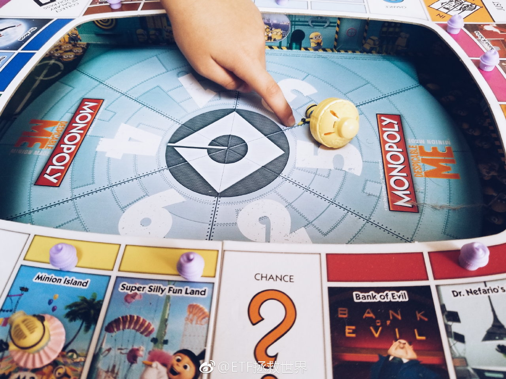

======================================================

ETF拯救世界 (5687069307) @
2018-10-04 22:30:53 Thu  
url: https://weibo.com/5687069307/GCp3H6ucG

有没有知道的帮个忙 ​​​

转发[14]  评论[69]  赞[154] 

+++++++++++++++++++++++++++++++++++++++++++++++++++++

图片：
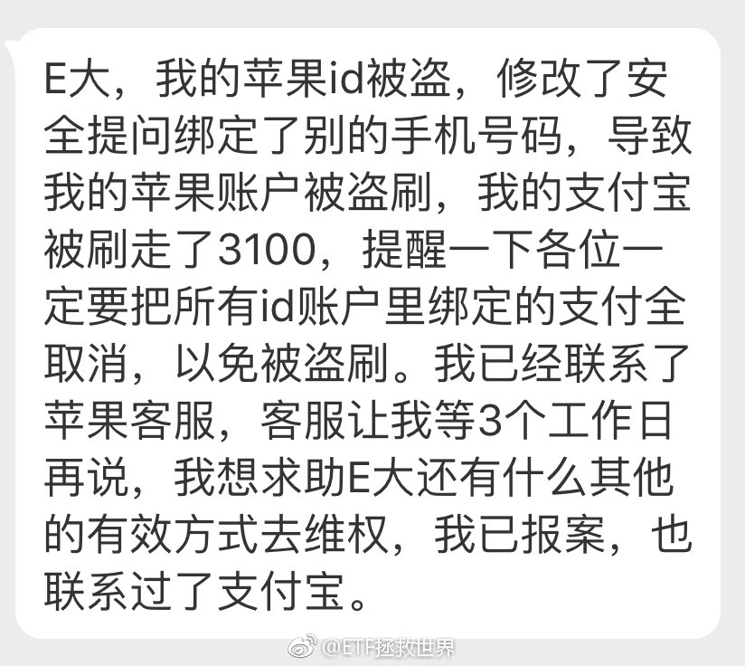

======================================================

ETF拯救世界 (5687069307) @
2018-10-05 08:13:57 Fri  
url: https://weibo.com/5687069307/GCsSlmS1J

这就是我没弄江浙沪相亲会的原因……

------------------------------------------------------
转推：
>  @新浪视频 (1640601392)
>  2018-10-04 18:46:45 Thu  
>  url: https:/weibo.com/1640601392/GCnAIpifF/

>  【继《1818黄金眼》之后 浙江6频道又一个快乐源泉[允悲]】听说，作为正宗的浙江人，必须把《1818黄金眼》《钱塘老娘舅》《相亲才会赢》都看完才能睡觉？今天介绍的这档《相亲才会赢》，顾名思义是一档相亲节目，而今天这期讲的是一个疑点重重的海归男。
>  整期节目就是见证海归男的人设被一一拆穿的过程 ​​​

转发[13]  评论[84]  赞[141] 

======================================================

ETF拯救世界 (5687069307) @
2018-10-05 20:23:23 Fri  
url: https://weibo.com/5687069307/GCxEraez4

最新消息最新消息，苹果把钱退了。 http://t.cn/EhNIenG

------------------------------------------------------
转推：
>  @ETF拯救世界 (5687069307)
>  2018-10-04 22:30:53 Thu  
>  url: https:/weibo.com/5687069307/GCp3H6ucG/

>  有没有知道的帮个忙 ​​​

转发[2]  评论[30]  赞[180] 

======================================================

ETF拯救世界 (5687069307) @
2018-10-05 20:28:25 Fri  
url: https://weibo.com/5687069307/GCxGtmNEH

我跟大家说一件这个月我见到最神奇的事。

参加某抽奖活动，两百人参加，随机选观众抽出一个三等奖。是个女士中奖。

主持人让她抽二等奖，结果她抽出了自己。（买的多抽奖机会就多）

主持人继续让她抽一等奖，结果她又抽出了自己。

惊了。

如果排除有猫腻的可能，这位的运气是不是好的过分了。

后 ​​​

转发[5]  评论[132]  赞[249] 

======================================================

ETF拯救世界 (5687069307) @
2018-10-08 08:42:50 Mon  
url: https://weibo.com/5687069307/GCVlzbs1v

赌场终于要重启了。生活充满激情。

你十一假期都干嘛了，碰到什么不开心的事了？说出来让大家开心开心。 ​​​

转发[2]  评论[198]  赞[342] 

======================================================

ETF拯救世界 (5687069307) @
2018-10-08 09:02:22 Mon  
url: https://weibo.com/5687069307/GCVtuytkp

降准之后，A股怎么走。

大部分人猜测都是错的。不信你走着看。

我的意思，没必要猜。因为没有意义。

不过要密切观察。看看每次大事件是不是催化剂。 ​​​

转发[28]  评论[71]  赞[320] 

======================================================

ETF拯救世界 (5687069307) @
2018-10-08 09:35:32 Mon  
url: https://weibo.com/5687069307/GCVGXkoMu

说你回来你就得回来。那次跳车的可以补了。//@ETF拯救世界:$全指金融 sh000992$  5090点跳车的可以上车。

------------------------------------------------------
转推：
>  @ETF拯救世界 (5687069307)
>  2018-09-21 13:36:15 Fri  
>  url: https:/weibo.com/5687069307/GAn0dkd22/

>  今天跳车不算错。 ​​​

转发[5]  评论[98]  赞[239] 

======================================================

ETF拯救世界 (5687069307) @
2018-10-08 09:54:49 Mon  
url: https://weibo.com/5687069307/GCVOMxvte

雷老板说小米首日买的能赚一倍。那就是17-34。

现价是13，到34能赚160%。

现在的问题是有多少人会相信雷老板了。 ​​​

转发[12]  评论[71]  赞[261] 

======================================================

ETF拯救世界 (5687069307) @
2018-10-08 10:13:49 Mon  
url: https://weibo.com/5687069307/GCVWuE2BA

千万不要让自己的资产和组合大幅亏损。比如跌到0.4。

真的需要很多很多年才能恢复元气，同时，长期收益率会非常平庸。

最重要的，说明自己的体系风控系统几乎没有。 ​​​

转发[53]  评论[123]  赞[393] 

======================================================

ETF拯救世界 (5687069307) @
2018-10-08 10:30:09 Mon  
url: https://weibo.com/5687069307/GCW37Du0F

即将破300//@ETF拯救世界:谁能想到当时460，半年后已经即将跌破300……

------------------------------------------------------
转推：
>  @ETF拯救世界 (5687069307)
>  2018-03-22 09:34:01 Thu  
>  url: https:/weibo.com/5687069307/G8wd21cxW/

>  腾讯，60倍PE。未来五年看，真的能有特别好的收益率吗。
>  
>  学习了。 ​​​

转发[147]  评论[40]  赞[207] 

======================================================

ETF拯救世界 (5687069307) @
2018-10-08 10:42:51 Mon  
url: https://weibo.com/5687069307/GCW8hn7aB

风和日丽的日子里，总是在准备过冬的人经常会被别人嘲笑保守，胆小。

凛冬来临的时候，你才会知道，活着才是最重要的。

在这个市场上，活下去。无论发生什么，都活下去。只要活着，就有希望。

你在温暖的小屋里，盖着毛毯，喝着热可可的时候，永远也体会不到外面大雪中即将冻僵的人是什么感觉。 ​​​

转发[42]  评论[156]  赞[473] 

======================================================

ETF拯救世界 (5687069307) @
2018-10-08 11:06:20 Mon  
url: https://weibo.com/5687069307/GCWhOmj8p

有没有学习好的说说，鹅厂每天回购的股票是注销吗。 ​​​

转发[5]  评论[103]  赞[220] 

======================================================

ETF拯救世界 (5687069307) @
2018-10-08 14:16:44 Mon  
url: https://weibo.com/5687069307/GCXx6nYKm

（股市）

------------------------------------------------------
转推：
>  @ ()
>  2018-10-08 11:46:16 Mon  
>  url: 

>  该账号因被投诉违反《微博社区公约》的相关规定，现已无法查看。查看帮助 https://kefu.weibo.com/faqdetail?id=13216

转发[7]  评论[28]  赞[107] 

======================================================

ETF拯救世界 (5687069307) @
2018-10-08 14:23:50 Mon  
url: https://weibo.com/5687069307/GCXzYzqFi

回复@用户y49f7o7jj4:因为这是熊市//@用户y49f7o7jj4:为啥涨起来很难，跌起来很容易啊！//@ETF拯救世界:（股市）

------------------------------------------------------
转推：
>  @ ()
>  2018-10-08 11:46:16 Mon  
>  url: 

>  该账号因被投诉违反《微博社区公约》的相关规定，现已无法查看。查看帮助 https://kefu.weibo.com/faqdetail?id=13216

转发[3]  评论[19]  赞[123] 

======================================================

ETF拯救世界 (5687069307) @
2018-10-08 14:31:12 Mon  
url: https://weibo.com/5687069307/GCXCY8IyB

这个月三季报出完。如果全月大跌，基本进入钻石底区域没悬念 ​​​

转发[74]  评论[176]  赞[449] 

======================================================

ETF拯救世界 (5687069307) @
2018-10-08 15:02:28 Mon  
url: https://weibo.com/5687069307/GCXPF1ohc

光脚长阴，大概率不会止跌。 ​​​

转发[28]  评论[147]  赞[413] 

======================================================

ETF拯救世界 (5687069307) @
2018-10-08 15:13:02 Mon  
url: https://weibo.com/5687069307/GCXTXgYLv

回复@树欲静风仍不止:先到了历史最低再说吧。目前离历史最低还有30%呢。真破了历史最低再说调低的事儿也不晚。//@树欲静风仍不止:E大，现在是赌的国运，是否钻石底的区域还要调低下。

------------------------------------------------------
转推：
>  @ETF拯救世界 (5687069307)
>  2018-10-08 14:31:12 Mon  
>  url: https:/weibo.com/5687069307/GCXCY8IyB/

>  这个月三季报出完。如果全月大跌，基本进入钻石底区域没悬念 ​​​

转发[35]  评论[24]  赞[192] 

======================================================

ETF拯救世界 (5687069307) @
2018-10-08 15:19:26 Mon  
url: https://weibo.com/5687069307/GCXWxFRU4

回复@BaoZha008:PB 28%，PE 30%。//@BaoZha008:不是20%的吗？//@ETF拯救世界:回复@树欲静风仍不止:先到了历史最低再说吧。目前离历史最低还有30%呢。真破了历史最低再说调低的事儿也不晚。//@树欲静风仍不止:E大，现在是赌的国运，是否钻石底的区域还要调低下。

------------------------------------------------------
转推：
>  @ETF拯救世界 (5687069307)
>  2018-10-08 14:31:12 Mon  
>  url: https:/weibo.com/5687069307/GCXCY8IyB/

>  这个月三季报出完。如果全月大跌，基本进入钻石底区域没悬念 ​​​

转发[29]  评论[90]  赞[242] 

======================================================

ETF拯救世界 (5687069307) @
2018-10-09 10:56:27 Tue  
url: https://weibo.com/5687069307/GD5EipTFI

$中证军工 sz399967$  军工不死，牛市不来。

在路上了。 ​​​

转发[22]  评论[182]  赞[475] 

======================================================

ETF拯救世界 (5687069307) @
2018-10-09 17:11:52 Tue  
url: https://weibo.com/5687069307/GD86Gc3KG

生活啊，总是在意想不到的地方给你点小意外。

其实也好，一直太顺绝对不是好事。

别想太多，努力解决。谋事在人，成事在天。

人生啊，一颗赛艇。 ​​​

转发[15]  评论[110]  赞[402] 

======================================================

ETF拯救世界 (5687069307) @
2018-10-09 17:42:18 Tue  
url: https://weibo.com/5687069307/GD8j26JvC

谁能想到，东城区落户还要入户调查，看是否实际居住了。

正在改水电的我一脸懵逼……

控制中心城区人口的任务很重啊。 ​​​

转发[3]  评论[151]  赞[314] 

======================================================

ETF拯救世界 (5687069307) @
2018-10-10 10:40:04 Wed  
url: https://weibo.com/5687069307/GDeY93E6U

每天除了自选指数和自选股还得关注阿娇。

好累。

[doge] ​​​

转发[7]  评论[135]  赞[272] 

======================================================

ETF拯救世界 (5687069307) @
2018-10-10 11:22:26 Wed  
url: https://weibo.com/5687069307/GDfflcMni

止不住了。新低之后大概率……//@ETF拯救世界:即将破300//@ETF拯救世界:谁能想到当时460，半年后已经即将跌破300……

------------------------------------------------------
转推：
>  @ETF拯救世界 (5687069307)
>  2018-03-22 09:34:01 Thu  
>  url: https:/weibo.com/5687069307/G8wd21cxW/

>  腾讯，60倍PE。未来五年看，真的能有特别好的收益率吗。
>  
>  学习了。 ​​​

转发[137]  评论[50]  赞[171] 

======================================================

ETF拯救世界 (5687069307) @
2018-10-10 11:25:45 Wed  
url: https://weibo.com/5687069307/GDfgGv1NC

7800左右我会一次配满医药仓位。再立个flag。//@ETF拯救世界:一个月过去，这个点位提升到7800点左右。

------------------------------------------------------
转推：
>  @ETF拯救世界 (5687069307)
>  2018-08-17 09:58:23 Fri  
>  url: https:/weibo.com/5687069307/Gv1CpsZ4E/

>  如果可以7700点附近买入医药，那未来5-10年关上账户等着数钱就对了。 ​​​

转发[77]  评论[123]  赞[339] 

======================================================

ETF拯救世界 (5687069307) @
2018-10-10 11:29:31 Wed  
url: https://weibo.com/5687069307/GDfidmtMh

7800的医药指数，可能是你人生中第一个10倍指数。 ​​​

转发[444]  评论[274]  赞[589] 

======================================================

ETF拯救世界 (5687069307) @
2018-10-10 12:37:11 Wed  
url: https://weibo.com/5687069307/GDfJGzCjI

今天看到球球推送了一个头条，叫做“有500万是不是要去专职炒股”

文章写了很多字，算了很多账，我也没仔细看。

我想是这样。

这个问题其实很简单，非常简单。你就运用你小学知识算一道题。

“在不影响你投资收益的情况下，你做一份你喜欢的工作带来的年收入，占500万的百分之多少”

什么意思呢。 ​​​

转发[613]  评论[498]  赞[1257] 

======================================================

ETF拯救世界 (5687069307) @
2018-10-10 12:45:02 Wed  
url: https://weibo.com/5687069307/GDfMS1iLi

回复@E大头号粉丝:是这个意思。500万其实很难讲能让你衣食无忧。但是足以让你有底气选一份自己喜欢的工作做。

------------------------------------------------------
转推：
>  @ETF拯救世界 (5687069307)
>  2018-10-10 12:37:11 Wed  
>  url: https:/weibo.com/5687069307/GDfJGzCjI/

>  今天看到球球推送了一个头条，叫做“有500万是不是要去专职炒股”
>  
>  文章写了很多字，算了很多账，我也没仔细看。
>  
>  我想是这样。
>  
>  这个问题其实很简单，非常简单。你就运用你小学知识算一道题。
>  
>  “在不影响你投资收益的情况下，你做一份你喜欢的工作带来的年收入，占500万的百分之多少”
>  
>  什么意思呢。 ​​​

转发[11]  评论[30]  赞[199] 

======================================================

ETF拯救世界 (5687069307) @
2018-10-10 13:01:59 Wed  
url: https://weibo.com/5687069307/GDfTKpMND

我看有人说，我就什么都不爱干。

我觉得基本是不可能的。每个人一定有自己喜欢干的事。

如果没有经济压力，你又能做一件自己喜欢做，又会得到别人认可和喜欢的事，我相信一定会比你瘫在家里追电视剧让你感觉更好。

比如明朝就有皇帝喜欢做木匠活。不上朝天天在家做木匠活。我敢说这哥们木匠活肯定做 ​​​

转发[59]  评论[163]  赞[422] 

======================================================

ETF拯救世界 (5687069307) @
2018-10-10 13:08:46 Wed  
url: https://weibo.com/5687069307/GDfWvbCk0

我想知道手术中唤醒会不会疼……

------------------------------------------------------
转推：
>  @新浪视频 (1640601392)
>  2018-10-10 12:45:23 Wed  
>  url: https:/weibo.com/1640601392/GDfN0zXiS/

>  【浙江25岁设计师脑内长肿瘤，开颅手术时医生将其唤醒竟唱起了张韶涵的歌[吃瓜]】开颅手术中，患者突然醒来吟唱张韶涵的歌《遗失的美好》，岂不吓人？近日，浙江省人民医院实施了一例术中唤醒手术，术中患者唱歌帮助医生精确切除肿瘤，保护其语言功能。http://t.cn/E7As5mq ​​​

转发[3]  评论[58]  赞[99] 

======================================================

ETF拯救世界 (5687069307) @
2018-10-10 14:04:31 Wed  
url: https://weibo.com/5687069307/GDgj8uQHa

回复@ETF改变生活:2%也有3000万人了……这就是为什么大家觉得有钱人好多。绝对数是真的多，但是98%的人，十几亿人其实都是普通人啊。//@ETF改变生活:看到一个文章，说不算固定财产，有100万现金或者迅速变现的，属于全国2%的人

------------------------------------------------------
转推：
>  @ETF拯救世界 (5687069307)
>  2018-10-10 12:37:11 Wed  
>  url: https:/weibo.com/5687069307/GDfJGzCjI/

>  今天看到球球推送了一个头条，叫做“有500万是不是要去专职炒股”
>  
>  文章写了很多字，算了很多账，我也没仔细看。
>  
>  我想是这样。
>  
>  这个问题其实很简单，非常简单。你就运用你小学知识算一道题。
>  
>  “在不影响你投资收益的情况下，你做一份你喜欢的工作带来的年收入，占500万的百分之多少”
>  
>  什么意思呢。 ​​​

转发[24]  评论[53]  赞[154] 

======================================================

ETF拯救世界 (5687069307) @
2018-10-10 14:16:36 Wed  
url: https://weibo.com/5687069307/GDgo2uPQL

回复@易风云61:大部分集中在广东、北京、江浙沪。分布的其实也还行，主要是比较集中出现在网上就会引起很多人焦虑了。。//@易风云61:这3000万人可能都住的很近[笑cry]

------------------------------------------------------
转推：
>  @ETF拯救世界 (5687069307)
>  2018-10-10 12:37:11 Wed  
>  url: https:/weibo.com/5687069307/GDfJGzCjI/

>  今天看到球球推送了一个头条，叫做“有500万是不是要去专职炒股”
>  
>  文章写了很多字，算了很多账，我也没仔细看。
>  
>  我想是这样。
>  
>  这个问题其实很简单，非常简单。你就运用你小学知识算一道题。
>  
>  “在不影响你投资收益的情况下，你做一份你喜欢的工作带来的年收入，占500万的百分之多少”
>  
>  什么意思呢。 ​​​

转发[10]  评论[31]  赞[165] 

======================================================

ETF拯救世界 (5687069307) @
2018-10-10 14:27:19 Wed  
url: https://weibo.com/5687069307/GDgso3kuU

金融市场真是刺激啊。

3年前130倍估值的传媒，现在估值只剩19倍了。

价格跌了76%，估值下降85%…… ​​​

转发[51]  评论[150]  赞[400] 

======================================================

ETF拯救世界 (5687069307) @
2018-10-10 15:19:00 Wed  
url: https://weibo.com/5687069307/GDgNmtpkH

鹅是不是又搞事情，1.8%了又。 ​​​

转发[1]  评论[54]  赞[211] 

======================================================

ETF拯救世界 (5687069307) @
2018-10-10 15:25:46 Wed  
url: https://weibo.com/5687069307/GDgQ6ECNK

涨的越好的股票，在它身上赔钱的人就会比赚钱的人多好几倍。

很神奇吧。 ​​​

转发[28]  评论[68]  赞[311] 

======================================================

ETF拯救世界 (5687069307) @
2018-10-10 15:40:22 Wed  
url: https://weibo.com/5687069307/GDgW2hec9

问各位一事儿。

现在人工是什么行情。

帝都，普通文员，做一些简单的office操作和编辑工作，处理一些杂事。大专就够了，五险一金。

关键得人品好，有职业道德，不该说的不说。

这种税后多少一位。 ​​​

转发[7]  评论[372]  赞[237] 

======================================================

ETF拯救世界 (5687069307) @
2018-10-11 07:18:56 Thu  
url: https://weibo.com/5687069307/GDn50bdrg

喷了，要不要这么听话。周二刚说完。 ​​​

转发[164]  评论[385]  赞[690] 

+++++++++++++++++++++++++++++++++++++++++++++++++++++

图片：

======================================================

ETF拯救世界 (5687069307) @
2018-10-11 09:37:22 Thu  
url: https://weibo.com/5687069307/GDnZbFL6m

醉了，不会腰斩吧//@ETF拯救世界:止不住了。新低之后大概率……//@ETF拯救世界:即将破300//@ETF拯救世界:谁能想到当时460，半年后已经即将跌破300……

------------------------------------------------------
转推：
>  @ETF拯救世界 (5687069307)
>  2018-03-22 09:34:01 Thu  
>  url: https:/weibo.com/5687069307/G8wd21cxW/

>  腾讯，60倍PE。未来五年看，真的能有特别好的收益率吗。
>  
>  学习了。 ​​​

转发[133]  评论[74]  赞[177] 

======================================================

ETF拯救世界 (5687069307) @
2018-10-11 09:42:31 Thu  
url: https://weibo.com/5687069307/GDo1hFzyR

回复@你好大麦茶:今天A股正式进入钻石坑。（E首发）//@你好大麦茶:E大，这是正式进入钻石坑了吧？//@ETF拯救世界:醉了，不会腰斩吧//@ETF拯救世界:止不住了。新低之后大概率……//@ETF拯救世界:即将破300//@ETF拯救世界:谁能想到当时460，半年后已经即将跌破300……

------------------------------------------------------
转推：
>  @ETF拯救世界 (5687069307)
>  2018-03-22 09:34:01 Thu  
>  url: https:/weibo.com/5687069307/G8wd21cxW/

>  腾讯，60倍PE。未来五年看，真的能有特别好的收益率吗。
>  
>  学习了。 ​​​

转发[129]  评论[391]  赞[523] 

======================================================

ETF拯救世界 (5687069307) @
2018-10-11 10:14:58 Thu  
url: https://weibo.com/5687069307/GDoes9CNP

8848先斩为敬了。

------------------------------------------------------
转推：
>  @ETF拯救世界 (5687069307)
>  2018-07-17 10:23:32 Tue  
>  url: https:/weibo.com/5687069307/Gqjxe62DI/

>  我这半年多关注的8848和腾讯，不是说对这两家公司有什么看法，我是在观察情绪。
>  
>  这两家公司在持续暴涨的时候，带了很多很多情绪。尤其是前者。很多人因为没买后悔的夜不能寐，很多人买了抱持坚定信念可以再涨好几倍。
>  
>  一家公司，一个行业，到底是不是真的能预判五年、十年后？
>  
>  很难讲。前几天看到一 ​​​

转发[4]  评论[67]  赞[211] 

======================================================

ETF拯救世界 (5687069307) @
2018-10-11 10:32:29 Thu  
url: https://weibo.com/5687069307/GDolz16PW

这个月能不能干一根10%以上的大阴线？如果能，三个月内90%概率见大底。//@ETF拯救世界:从历史看，如果这个月可以干10%以上，基本就差不多了//@ETF拯救世界:回复@黄连树:2005年5月8.5%，2008年10月25%，2012年11月创业板12%，2013年6月沪深300是15%。//@黄连树:过去熊市的月度大阴线出现在几月？

------------------------------------------------------
转推：
>  @ETF拯救世界 (5687069307)
>  2018-08-31 16:18:26 Fri  
>  url: https:/weibo.com/5687069307/Gxc5CA6qu/

>  根据历史经验，最终的底部，还缺少一根月线大阴线……
>  
>  历史还会重演吗？ ​​​

转发[100]  评论[163]  赞[310] 

======================================================

ETF拯救世界 (5687069307) @
2018-10-11 10:52:27 Thu  
url: https://weibo.com/5687069307/GDotFEekX

看来今天不写一篇文章不行了。

估计很多朋友已经要崩了。 ​​​

转发[15]  评论[454]  赞[622] 

======================================================

ETF拯救世界 (5687069307) @
2018-10-11 10:59:43 Thu  
url: https://weibo.com/5687069307/GDowBCT5N

深成已经连跌9个月，如果最后再来一根10%以上的大阴线。

未来的画面太美我已经不能想象了。 ​​​

转发[111]  评论[117]  赞[469] 

======================================================

ETF拯救世界 (5687069307) @
2018-10-11 11:02:13 Thu  
url: https://weibo.com/5687069307/GDoxDdeO0

中证500最近13个月只涨了1个月。物极必反。各位看戏吧。

------------------------------------------------------
转推：
>  @ETF拯救世界 (5687069307)
>  2018-10-11 10:59:43 Thu  
>  url: https:/weibo.com/5687069307/GDowBCT5N/

>  深成已经连跌9个月，如果最后再来一根10%以上的大阴线。
>  
>  未来的画面太美我已经不能想象了。 ​​​

转发[79]  评论[336]  赞[474] 

======================================================

ETF拯救世界 (5687069307) @
2018-10-11 13:03:03 Thu  
url: https://weibo.com/5687069307/GDpkG76Tz

回复@小河51888:我今天缩水几十万，没什么感觉。为什么不高兴？剩下的钱可以买到更便宜的啊。留着那些现金不就是为了现在吗？叶公好龙？//@小河51888:心疼死了，看到那么多人很快乐，我只能说你们仓位不重，如果也买了100多份，还这么欢乐那就是每份钱太少了。

------------------------------------------------------
转推：
>  @ETF拯救世界 (5687069307)
>  2018-10-11 10:59:43 Thu  
>  url: https:/weibo.com/5687069307/GDowBCT5N/

>  深成已经连跌9个月，如果最后再来一根10%以上的大阴线。
>  
>  未来的画面太美我已经不能想象了。 ​​​

转发[29]  评论[186]  赞[371] 

======================================================

ETF拯救世界 (5687069307) @
2018-10-11 13:08:06 Thu  
url: https://weibo.com/5687069307/GDpmJaARM

再警告一次，有抱怨的直接拉黑。

我这一天天要处理的事情那么多，资产也在缩水，又没收你管理费又不要你提成，没空听你哔哔。

觉得难受就自己炒股去，试试到时候你还敢不敢打开账户看。

[鄙视] ​​​

转发[8]  评论[517]  赞[879] 

======================================================

ETF拯救世界 (5687069307) @
2018-10-11 14:29:16 Thu  
url: https://weibo.com/5687069307/GDpTGdBV1

给大家交个底吧。

今天肯定破2了。我的预期极限是1.5左右。

如果再低，我就没有预案躺下装死了。

虽然已经比95%以上的人保守了，但如果真发生也没办法。

没装过死，不过应该也不难。估计眼睛一闭一睁也就过去了…… ​​​

转发[214]  评论[436]  赞[669] 

======================================================

ETF拯救世界 (5687069307) @
2018-10-11 14:36:35 Thu  
url: https://weibo.com/5687069307/GDpWE1uqu

回复@myaspiration:有三次。05 08 12。12年只破了一天。05之后两年七倍，08之后半年一倍。12之后中小股票三年7倍//@myaspiration:历史上有几次破2

------------------------------------------------------
转推：
>  @ETF拯救世界 (5687069307)
>  2018-10-11 14:29:16 Thu  
>  url: https:/weibo.com/5687069307/GDpTGdBV1/

>  给大家交个底吧。
>  
>  今天肯定破2了。我的预期极限是1.5左右。
>  
>  如果再低，我就没有预案躺下装死了。
>  
>  虽然已经比95%以上的人保守了，但如果真发生也没办法。
>  
>  没装过死，不过应该也不难。估计眼睛一闭一睁也就过去了…… ​​​

转发[123]  评论[285]  赞[416] 

======================================================

ETF拯救世界 (5687069307) @
2018-10-11 15:43:18 Thu  
url: https://weibo.com/5687069307/GDqnIDSfZ

今天=

2005年3月

3个月后，998。 ​​​

转发[180]  评论[555]  赞[680] 

======================================================

ETF拯救世界 (5687069307) @
2018-10-11 16:33:37 Thu  
url: https://weibo.com/5687069307/GDqI9a4GO

个人认为，暂停IPO不会太远了。 ​​​

转发[36]  评论[294]  赞[563] 

======================================================

ETF拯救世界 (5687069307) @
2018-10-12 07:32:56 Fri  
url: https://weibo.com/5687069307/GDwBbc1nr

这种人我不拉黑了。拍照留念。

为什么，

知道他为什么肉疼吗。因为以前我说最大跌幅的时候，他不当回事，认为不可能。不做压力测试，结果真的发生了，崩溃了。

咱们对目前的情况早就做好准备，从心态到仓位。他永远不会理解，再跌20%也在我们的预期中，也有应对预案，也不会崩。

他只是以为别人都 ​​​

转发[25]  评论[486]  赞[539] 

+++++++++++++++++++++++++++++++++++++++++++++++++++++

图片：

======================================================

ETF拯救世界 (5687069307) @
2018-10-12 14:35:01 Fri  
url: https://weibo.com/5687069307/GDzmvfQhI

别看指数涨的热热闹闹，今天涨跌家数对比是1300:2100 ​​​

转发[6]  评论[165]  赞[364] 

======================================================

ETF拯救世界 (5687069307) @
2018-10-12 15:09:08 Fri  
url: https://weibo.com/5687069307/GDzAlD1dN

有人问我什么时候会上杠杆。

目前是1.8x。

大概在1.6左右会开始上。

策略方面，大概就是钻石区域加杠杆，到了黄金边缘清掉。吃一小段。

杠杆率方面，不会超过30%。也就是1.3。30%的话，计算下来，要跌70%才会挂。我不太相信到了1.6还能跌70%……所以基本性命无忧。

一个参考。

杠杆这个东西，能 ​​​

转发[249]  评论[357]  赞[520] 

======================================================

ETF拯救世界 (5687069307) @
2018-10-12 15:15:35 Fri  
url: https://weibo.com/5687069307/GDzCYce2o

谁能想到呢。

------------------------------------------------------
转推：
>  @ETF拯救世界 (5687069307)
>  2017-12-15 09:50:04 Fri  
>  url: https:/weibo.com/5687069307/FzJjHqeZF/

>  $证券公司 sz399975$   我认为360-400点应该是极限底部了…… ​​​

转发[43]  评论[147]  赞[231] 

======================================================

ETF拯救世界 (5687069307) @
2018-10-12 15:47:21 Fri  
url: https://weibo.com/5687069307/GDzPRutL0

今天继续下降。

快破1.8了。 ​​​

转发[35]  评论[172]  赞[423] 

======================================================

ETF拯救世界 (5687069307) @
2018-10-12 16:08:18 Fri  
url: https://weibo.com/5687069307/GDzYmDZLb

挡在500和1000前面的，只有2008年10月了……谁能想到，连1000这种小指数都杀向20倍了…… ​​​

转发[37]  评论[144]  赞[378] 

======================================================

ETF拯救世界 (5687069307) @
2018-10-12 16:41:28 Fri  
url: https://weibo.com/5687069307/GDAbPr6sd

回复@龙水六队:目前券商指数占计划仓位的1.68%，浮亏23%，如果跌到350点，我会把浮亏变成18%以内。你信吗。当然，以你的那什么，肯定想不通，来，一起等着见证奇迹的时刻……//@龙水六队:别删贴，极限了你也没有应对之策 在A股亏钱是很难的事吗//@ETF拯救世界:谁能想到呢。

------------------------------------------------------
转推：
>  @ETF拯救世界 (5687069307)
>  2017-12-15 09:50:04 Fri  
>  url: https:/weibo.com/5687069307/FzJjHqeZF/

>  $证券公司 sz399975$   我认为360-400点应该是极限底部了…… ​​​

转发[21]  评论[103]  赞[284] 

======================================================

ETF拯救世界 (5687069307) @
2018-10-12 16:54:12 Fri  
url: https://weibo.com/5687069307/GDAh00EVH

这三年来，300+500平均跌幅接近40%，全部A股股票跌幅中位数-56%，44%的股票跌幅超过60%，五只股票里就有一只跌幅超过70%。上涨的股票只占8.3%。

千股跌停的股灾不知道多少轮。

同期，我的计划还在盈利。最大回撤12%。

注意，这是在A股几乎已经跌到了最便宜时候的成绩。

A股当然很难赔钱。在这个熊 ​​​

转发[131]  评论[446]  赞[980] 

+++++++++++++++++++++++++++++++++++++++++++++++++++++

图片：

======================================================

ETF拯救世界 (5687069307) @
2018-10-12 17:14:23 Fri  
url: https://weibo.com/5687069307/GDApc0pUJ

A股是辣鸡吗，美股是天堂吗。

万万没想到的是，其实……

十六年过去，美股才追上A股。

美股看起来容易赚钱是因为波动小，长牛。你什么时候进去都很容易解套。

A股波动太大，散户又容易牛市追涨，熊市杀跌，所以赔钱得多。

但你只要反过来做，牛市卖出，熊市买入，你获利的机会，以及获利的幅度， ​​​

转发[177]  评论[288]  赞[662] 

+++++++++++++++++++++++++++++++++++++++++++++++++++++

图片：

======================================================

ETF拯救世界 (5687069307) @
2018-10-13 22:53:12 Sat  
url: https://weibo.com/5687069307/GDM3dfjvG

为什么会这么忙。

我希望明年开始，过一段特别悠闲的日子。

每天无所事事的放浪形骸。 ​​​

转发[9]  评论[258]  赞[649] 

======================================================

ETF拯救世界 (5687069307) @
2018-10-15 09:41:14 Mon  
url: https://weibo.com/5687069307/GDZIKhgnI

这几天忙得没空看评论。现在，看还是不看，是个问题……估计今天也没时间了。

中午还得嘀嘀呢。

今天别涨好吗！ ​​​

转发[1]  评论[177]  赞[371] 

+++++++++++++++++++++++++++++++++++++++++++++++++++++

图片：
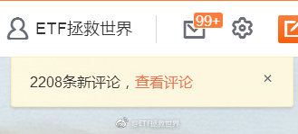

======================================================

ETF拯救世界 (5687069307) @
2018-10-15 09:59:39 Mon  
url: https://weibo.com/5687069307/GDZQdj00U

真 辣鸡。

今天的一个品种1%+了。 ​​​

转发[13]  评论[346]  赞[358] 

======================================================

ETF拯救世界 (5687069307) @
2018-10-15 15:02:51 Mon  
url: https://weibo.com/5687069307/GE1Pi9eH0

全指医药历史上从没出现过月线五连跌。见证历史了。 ​​​

转发[63]  评论[195]  赞[447] 

======================================================

ETF拯救世界 (5687069307) @
2018-10-15 15:14:10 Mon  
url: https://weibo.com/5687069307/GE1TSFHSV

上周五两市融资额已经不到8000亿。

2014年11月以来首次跌破8000亿。

最高是2015年6月的23000亿。

2013年底是3400亿。

2012年底是856亿。

这些融资客也快撑不住了。 ​​​

转发[96]  评论[154]  赞[315] 

======================================================

ETF拯救世界 (5687069307) @
2018-10-15 15:19:14 Mon  
url: https://weibo.com/5687069307/GE1VWiUIi

很多人卖，是真的没办法了。有些是强制平仓，有些是杠杆上的太大撑不住了。

还有各种质押之类的。

2015年的市场是杠杆牛。之所以涨到了历史从没有过的高位，是因为加了不知道多少杠杆。

现在是去杠杆。很明显已经是杀过头了。手里的钱不要急，节奏还需要继续控制。 ​​​

转发[60]  评论[192]  赞[470] 

======================================================

ETF拯救世界 (5687069307) @
2018-10-15 15:28:13 Mon  
url: https://weibo.com/5687069307/GE1ZAlI9j

今天收盘，1.7x

------------------------------------------------------
转推：
>  @ETF拯救世界 (5687069307)
>  2018-10-12 15:09:08 Fri  
>  url: https:/weibo.com/5687069307/GDzAlD1dN/

>  有人问我什么时候会上杠杆。
>  
>  目前是1.8x。
>  
>  大概在1.6左右会开始上。
>  
>  策略方面，大概就是钻石区域加杠杆，到了黄金边缘清掉。吃一小段。
>  
>  杠杆率方面，不会超过30%。也就是1.3。30%的话，计算下来，要跌70%才会挂。我不太相信到了1.6还能跌70%……所以基本性命无忧。
>  
>  一个参考。
>  
>  杠杆这个东西，能 ​​​

转发[70]  评论[342]  赞[486] 

======================================================

ETF拯救世界 (5687069307) @
2018-10-16 07:17:38 Tue  
url: https://weibo.com/5687069307/GE8cXBRTG

一般人真的不要轻易尝试满仓穿越牛熊。当然，我这样说在球球就是ZZ不正确。//@挖龙脉的超级鹿鼎公:[坏笑]

------------------------------------------------------
转推：
>  @ ()
>  2018-10-15 22:38:18 Mon  
>  url: 

>  该账号因被投诉违反法律法规和《微博社区公约》的相关规定，现已无法查看。查看帮助 https://kefu.weibo.com/faqdetail?id=13216

转发[32]  评论[77]  赞[225] 

======================================================

ETF拯救世界 (5687069307) @
2018-10-16 08:14:14 Tue  
url: https://weibo.com/5687069307/GE8zVz6cn

回复@feefine:现金分红//@feefine:益达，博时信用纯债预计18号要分红了，分红方式咱们E部队选哪个呢？@ETF拯救世界//@ETF拯救世界:一般人真的不要轻易尝试满仓穿越牛熊。当然，我这样说在球球就是ZZ不正确。//@挖龙脉的超级鹿鼎公:[坏笑]

------------------------------------------------------
转推：
>  @ ()
>  2018-10-15 22:38:18 Mon  
>  url: 

>  该账号因被投诉违反法律法规和《微博社区公约》的相关规定，现已无法查看。查看帮助 https://kefu.weibo.com/faqdetail?id=13216

转发[3]  评论[7]  赞[115] 

======================================================

ETF拯救世界 (5687069307) @
2018-10-16 08:15:38 Tue  
url: https://weibo.com/5687069307/GE8Av2TSc

回复@终于找到在哪改名字:计划整体是一个基金的话。你再看看收益率是多少？我辛辛苦苦做好仓位配置。你不能只看已经买的//@终于找到在哪改名字:那个时间开始跟车的收益率应该差不多，不要打我//@ETF拯救世界:一般人真的不要轻易尝试满仓穿越牛熊。当然，我这样说在球球就是ZZ不正确。

------------------------------------------------------
转推：
>  @ ()
>  2018-10-15 22:38:18 Mon  
>  url: 

>  该账号因被投诉违反法律法规和《微博社区公约》的相关规定，现已无法查看。查看帮助 https://kefu.weibo.com/faqdetail?id=13216

转发[12]  评论[43]  赞[179] 

======================================================

ETF拯救世界 (5687069307) @
2018-10-16 08:17:48 Tue  
url: https://weibo.com/5687069307/GE8BnmGE8

四月至今跌20%跟计划差不多这种话从何讲起呢？ ​​​

转发[11]  评论[93]  赞[253] 

+++++++++++++++++++++++++++++++++++++++++++++++++++++

图片：
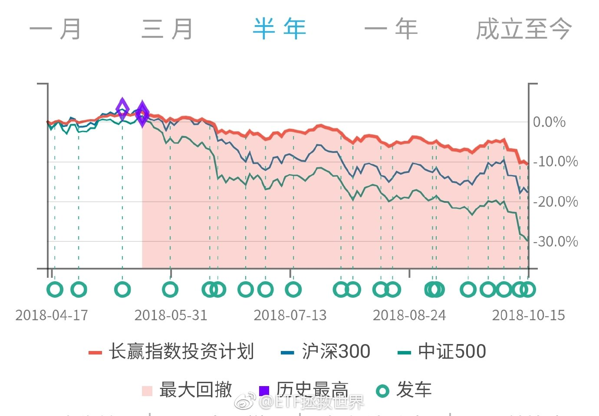

======================================================

ETF拯救世界 (5687069307) @
2018-10-16 08:27:32 Tue  
url: https://weibo.com/5687069307/GE8FklitV

这几天看见很多人说要跌到1500  1000

这些人和2015年高喊30000点的神棍有何区别？ ​​​

转发[25]  评论[127]  赞[421] 

======================================================

ETF拯救世界 (5687069307) @
2018-10-16 09:00:13 Tue  
url: https://weibo.com/5687069307/GE8SBiIIt

刚才有朋友说，在大底区域，八成仓位和满仓是不是差别不大了。

一定程度没错，但是没有考虑几个因素。

第一是极值的出现。极值很难出现，二十年一两次，但也是有概率。要做准备。

第二是心理因素。我做的配置一定是适合绝大多数人应对可能出现的绝大多数情况。能让大多数人在最差的情况下也不会崩溃 ​​​

转发[60]  评论[210]  赞[335] 

+++++++++++++++++++++++++++++++++++++++++++++++++++++

图片：

======================================================

ETF拯救世界 (5687069307) @
2018-10-16 09:48:50 Tue  
url: https://weibo.com/5687069307/GE9ckkJGg

很多人说历史数据是刻舟求剑，也有人说未来会不同。

说几个数，同不同的凑合看吧。做个参考。

目前的全市场pb，是从1995年至今23年276个月中：

从低到高第十四位。

低于现在的十三个月，有十二个月出现在2005-2006。2006年以后至今十二年，只有2008年10月的1664低于现在。

我说是钻石坑，不过分吧 ​​​

转发[235]  评论[185]  赞[433] 

======================================================

ETF拯救世界 (5687069307) @
2018-10-16 09:53:30 Tue  
url: https://weibo.com/5687069307/GE9edjl5F

但是有一件事各位也要理解，就是价值短期内通常与价格无关。也就是说，特别贵了还可能涨，特别低了也可能跌。很多人就死在认为很便宜了然后孤注一掷加满杠杆，最后在旅鼠的践踏中挂了……研究贵还是便宜，目的是保证自己买在低位区域，卖在高位区域而已。

------------------------------------------------------
转推：
>  @ETF拯救世界 (5687069307)
>  2018-10-16 09:48:50 Tue  
>  url: https:/weibo.com/5687069307/GE9ckkJGg/

>  很多人说历史数据是刻舟求剑，也有人说未来会不同。
>  
>  说几个数，同不同的凑合看吧。做个参考。
>  
>  目前的全市场pb，是从1995年至今23年276个月中：
>  
>  从低到高第十四位。
>  
>  低于现在的十三个月，有十二个月出现在2005-2006。2006年以后至今十二年，只有2008年10月的1664低于现在。
>  
>  我说是钻石坑，不过分吧 ​​​

转发[64]  评论[89]  赞[293] 

======================================================

ETF拯救世界 (5687069307) @
2018-10-16 09:55:39 Tue  
url: https://weibo.com/5687069307/GE9f5ovUV

$证券公司 sz399975$   谢谢啊 ​​​

转发[16]  评论[49]  赞[224] 

======================================================

ETF拯救世界 (5687069307) @
2018-10-16 10:07:48 Tue  
url: https://weibo.com/5687069307/GE9k1yBqY

回复@寻不到的背影l:你说得对。前提是你在三年前知道这三年股市暴跌60%。同时，未来你还能再最底部抄底进去，一点都不能买高，否则你的15%瞬间没了。问问自己，能吗。//@寻不到的背影l:回复@bruce天是你吗:三年银行理财都有15%+了

------------------------------------------------------
转推：
>  @ETF拯救世界 (5687069307)
>  2018-10-16 09:48:50 Tue  
>  url: https:/weibo.com/5687069307/GE9ckkJGg/

>  很多人说历史数据是刻舟求剑，也有人说未来会不同。
>  
>  说几个数，同不同的凑合看吧。做个参考。
>  
>  目前的全市场pb，是从1995年至今23年276个月中：
>  
>  从低到高第十四位。
>  
>  低于现在的十三个月，有十二个月出现在2005-2006。2006年以后至今十二年，只有2008年10月的1664低于现在。
>  
>  我说是钻石坑，不过分吧 ​​​

转发[17]  评论[84]  赞[224] 

======================================================

ETF拯救世界 (5687069307) @
2018-10-16 10:10:54 Tue  
url: https://weibo.com/5687069307/GE9lia6sI

回复@南耕:券商指数从最高点跌下来跌幅超过74%。如果这个价位收盘，我们的持仓浮亏17%。昨天买了，今天涨了，为什么不谢？做人知道感恩，人生会变得有趣得多。一个建议。//@南耕:证券亏成这样，还谢？

------------------------------------------------------
转推：
>  @ETF拯救世界 (5687069307)
>  2018-10-16 09:55:39 Tue  
>  url: https:/weibo.com/5687069307/GE9f5ovUV/

>  $证券公司 sz399975$   谢谢啊 ​​​

转发[10]  评论[85]  赞[302] 

======================================================

ETF拯救世界 (5687069307) @
2018-10-16 10:15:59 Tue  
url: https://weibo.com/5687069307/GE9nlbpxN

$证券公司 sz399975$ 

券商指数我们的平均成本。如果再跌，未来我们的成本会继续下降。

我倒是想问问，有些人是不是惦记着所有品种都买在最低点才算做的好？ ​​​

转发[34]  评论[115]  赞[345] 

+++++++++++++++++++++++++++++++++++++++++++++++++++++

图片：
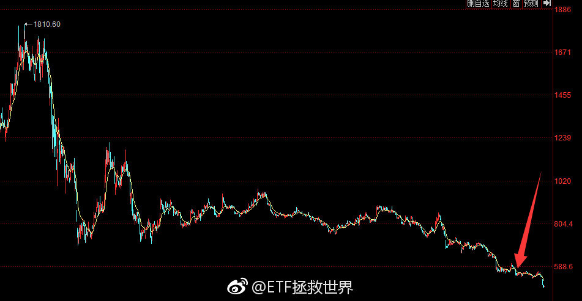

======================================================

ETF拯救世界 (5687069307) @
2018-10-16 10:22:02 Tue  
url: https://weibo.com/5687069307/GE9pO1TWt

传媒也一样。账面浮亏稍微大了点，但其实咱们的成本是这里。

你恐怕没想到吧。 ​​​

转发[26]  评论[96]  赞[346] 

+++++++++++++++++++++++++++++++++++++++++++++++++++++

图片：

======================================================

ETF拯救世界 (5687069307) @
2018-10-16 10:25:39 Tue  
url: https://weibo.com/5687069307/GE9rh2wud

医药的成本是这样的。 ​​​

转发[26]  评论[90]  赞[331] 

+++++++++++++++++++++++++++++++++++++++++++++++++++++

图片：
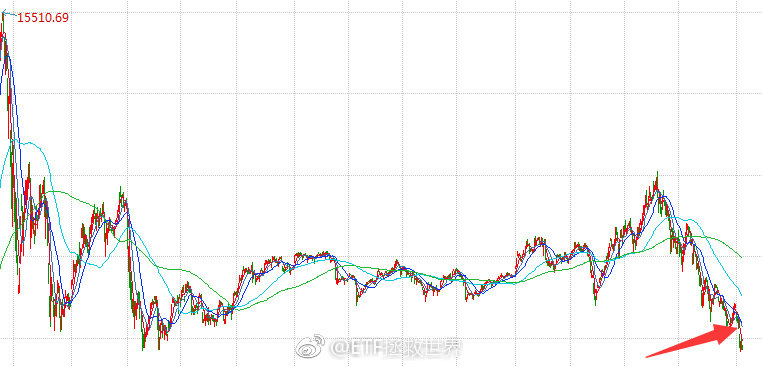

======================================================

ETF拯救世界 (5687069307) @
2018-10-16 10:32:41 Tue  
url: https://weibo.com/5687069307/GE9u82hpe

这是几只500基金的平均成本位置。

你不站得高一点，看得多一点，永远不知道真相是什么。

这是几只浮亏较大的品种，个人认为已经很不错了。总体看，更不用说，第三轮计划的成本完全控制住了。 ​​​

转发[31]  评论[134]  赞[374] 

+++++++++++++++++++++++++++++++++++++++++++++++++++++

图片：
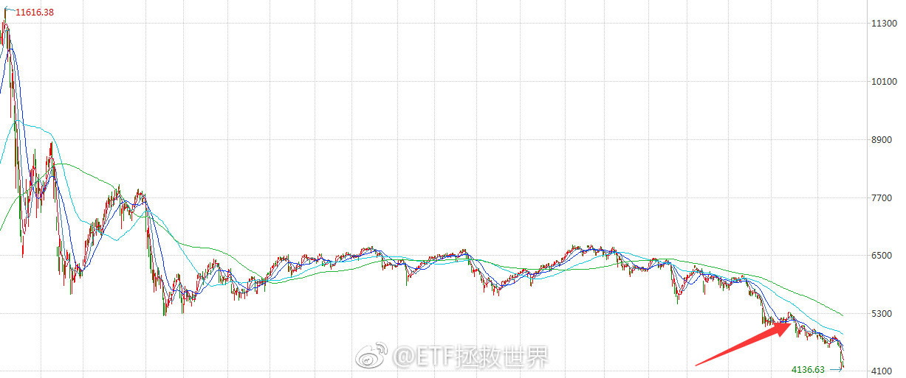

======================================================

ETF拯救世界 (5687069307) @
2018-10-16 10:53:53 Tue  
url: https://weibo.com/5687069307/GE9CJm5xU

那些盈利品种的成本位置就不放了。没意思。

最后放一个第三轮计划开始以来目前的持仓总成本，未来还会继续下降。看完这些图你就应该知道，我们的成本控制在熊市底部区域是确定的。当然，是不是底部区域你现在不知道，几年后就知道了。

所以，除非A股永远不会再涨，否则，你怎么可能不挣钱。

如果你 ​​​

转发[38]  评论[116]  赞[360] 

+++++++++++++++++++++++++++++++++++++++++++++++++++++

图片：

======================================================

ETF拯救世界 (5687069307) @
2018-10-16 11:00:40 Tue  
url: https://weibo.com/5687069307/GE9Ftw68G

本月主要指数跌幅已经10%以上了。如果能到20%，基本没问题了。至少会有一波特别强烈的反弹。//@ETF拯救世界:这个月能不能干一根10%以上的大阴线？如果能，三个月内90%概率见大底。//@ETF拯救世界:从历史看，如果这个月可以干10%以上，基本就差不多了

------------------------------------------------------
转推：
>  @ETF拯救世界 (5687069307)
>  2018-08-31 16:18:26 Fri  
>  url: https:/weibo.com/5687069307/Gxc5CA6qu/

>  根据历史经验，最终的底部，还缺少一根月线大阴线……
>  
>  历史还会重演吗？ ​​​

转发[41]  评论[107]  赞[291] 

======================================================

ETF拯救世界 (5687069307) @
2018-10-16 11:05:19 Tue  
url: https://weibo.com/5687069307/GE9Hnc3HB

真的，别不信。

------------------------------------------------------
转推：
>  @ETF拯救世界 (5687069307)
>  2018-09-11 16:25:03 Tue  
>  url: https:/weibo.com/5687069307/GyRPM3hfR/

>  汽车是真正的周期股。这个，林奇在第一本书里就开宗明义的告诉你了。
>  
>  然而，只有当你一个上升周期赚几倍，或者一个下降周期赔得只剩20%的时候，才会真的懂。
>  
>  当然，这个周期，一般人很难把握。太多人把汽车当成成长股或者价值股了。都不是。它是周期股。
>  
>  BTW，感谢那次“捷达换宝马”。 ​​​

转发[23]  评论[87]  赞[251] 

======================================================

ETF拯救世界 (5687069307) @
2018-10-16 12:00:13 Tue  
url: https://weibo.com/5687069307/GEa3EyZiN

谁能想到这么快就达成了。1.7即将到位……再说一次，08以及05就是我认识中的极限位置。再低，我没见过，也没有预案了。直接买完躺下享受市场的蹂躏……

------------------------------------------------------
转推：
>  @ETF拯救世界 (5687069307)
>  2018-09-03 13:13:16 Mon  
>  url: https:/weibo.com/5687069307/GxD9Xhnqp/

>  我看，这波熊市的低点可以降级对标2008了。
>  
>  未来所有策略围绕这个预期来做。
>  
>  再低的话我就不知道用哪个预期了。A股历史上还没出现过。 ​​​

转发[59]  评论[171]  赞[340] 

======================================================

ETF拯救世界 (5687069307) @
2018-10-16 12:02:52 Tue  
url: https://weibo.com/5687069307/GEa4Jn4bv

冯绍峰已经40了。（保养得真不错）

------------------------------------------------------
转推：
>  @ ()
>  2018-10-16 11:33:09 Tue  
>  url: 

>  抱歉，作者已设置仅展示半年内微博，此微博已不可见。 ​​​

转发[8]  评论[60]  赞[141] 

======================================================

ETF拯救世界 (5687069307) @
2018-10-16 12:14:00 Tue  
url: https://weibo.com/5687069307/GEa9faWJU

截至今日，40多家公司公布三季报。平均利润增幅在15%+。

最终情况要等最后一周，有2000多家公司都在那一周公布。 ​​​

转发[77]  评论[55]  赞[254] 

======================================================

ETF拯救世界 (5687069307) @
2018-10-16 12:25:44 Tue  
url: https://weibo.com/5687069307/GEae0FUmP

回复@豆花鸵鸟动:还记得这个吗。http://t.cn/RxS1TkL 现在，就是18。//@豆花鸵鸟动:E大请问您如何看待现在500的点位

------------------------------------------------------
转推：
>  @ETF拯救世界 (5687069307)
>  2018-10-16 12:14:00 Tue  
>  url: https:/weibo.com/5687069307/GEa9faWJU/

>  截至今日，40多家公司公布三季报。平均利润增幅在15%+。
>  
>  最终情况要等最后一周，有2000多家公司都在那一周公布。 ​​​

转发[51]  评论[83]  赞[232] 

======================================================

ETF拯救世界 (5687069307) @
2018-10-16 12:44:46 Tue  
url: https://weibo.com/5687069307/GEalK0sk3

回复@法国梧桐树NJ:增速下滑还是利润下降？这个还是不同的。增速下滑很正常，经济都有周期。整体利润下降就比较麻烦了。历史上几乎没有出现过整体利润下降。//@法国梧桐树NJ:根据业绩预报，创业板三季报业绩增长大幅下滑

------------------------------------------------------
转推：
>  @ETF拯救世界 (5687069307)
>  2018-10-16 12:14:00 Tue  
>  url: https:/weibo.com/5687069307/GEa9faWJU/

>  截至今日，40多家公司公布三季报。平均利润增幅在15%+。
>  
>  最终情况要等最后一周，有2000多家公司都在那一周公布。 ​​​

转发[15]  评论[22]  赞[171] 

======================================================

ETF拯救世界 (5687069307) @
2018-10-16 12:45:56 Tue  
url: https://weibo.com/5687069307/GEamddKur

回复@Tony身价不过亿不娶赵丽颖:节哀……要不你考虑一下热巴或者娜扎？//@Tony身价不过亿不娶赵丽颖:我怎么办？//@ETF拯救世界:冯绍峰已经40了。（保养得真不错）

------------------------------------------------------
转推：
>  @ ()
>  2018-10-16 11:33:09 Tue  
>  url: 

>  抱歉，作者已设置仅展示半年内微博，此微博已不可见。 ​​​

转发[4]  评论[47]  赞[140] 

======================================================

ETF拯救世界 (5687069307) @
2018-10-16 12:56:59 Tue  
url: https://weibo.com/5687069307/GEaqHhiDW

现在什么也不用说了。心理素质差的就关上账户。好的就继续看盘。

等着——买——等着——买——等着——等着。

也就这样了。等吧。 ​​​

转发[36]  评论[142]  赞[474] 

======================================================

ETF拯救世界 (5687069307) @
2018-10-16 12:58:35 Tue  
url: https://weibo.com/5687069307/GEarm5bWR

为什么我没有这样的邻居。感觉专业知识过硬素质高修养好……

------------------------------------------------------
转推：
>  @北京人不知道的北京事儿 (1662214194)
>  2018-10-16 12:53:43 Tue  
>  url: https:/weibo.com/1662214194/GEapnqDCE/

>  转自网友，中国好邻居。。。[允悲][允悲] ​​​

转发[23]  评论[51]  赞[291] 

======================================================

ETF拯救世界 (5687069307) @
2018-10-16 13:18:33 Tue  
url: https://weibo.com/5687069307/GEazruhQQ

不用怕，不到最后一天，你不知道今年是赚钱还是赔钱。。

那年，我到11月末还在赔钱，谁能想到呢。 ​​​

转发[22]  评论[127]  赞[417] 

+++++++++++++++++++++++++++++++++++++++++++++++++++++

图片：

======================================================

ETF拯救世界 (5687069307) @
2018-10-16 13:47:48 Tue  
url: https://weibo.com/5687069307/GEaLkbP64

忙死了……阿娇要爆啊。

------------------------------------------------------
转推：
>  @ETF拯救世界 (5687069307)
>  2018-10-10 10:40:04 Wed  
>  url: https:/weibo.com/5687069307/GDeY93E6U/

>  每天除了自选指数和自选股还得关注阿娇。
>  
>  好累。
>  
>  [doge] ​​​

转发[1]  评论[145]  赞[214] 

======================================================

ETF拯救世界 (5687069307) @
2018-10-16 13:53:01 Tue  
url: https://weibo.com/5687069307/GEaNrmALk

159938场内溢价3%。有条件的朋友可以场内外套利。 ​​​

转发[12]  评论[137]  赞[271] 

======================================================

ETF拯救世界 (5687069307) @
2018-10-16 14:09:14 Tue  
url: https://weibo.com/5687069307/GEaU1sEji

这一次，A股的水分会被挤得比历史上任何一次都干。

现在各位经历的，是几十年也很少会出现的伟大时刻。现在的这个情况，未来会在很多年里被无数人回忆。 ​​​

转发[155]  评论[379]  赞[675] 

======================================================

ETF拯救世界 (5687069307) @
2018-10-16 14:30:10 Tue  
url: https://weibo.com/5687069307/GEb2wk1pT

目前债券也没什么持有价值了。下次发车会至少卖掉一半。

子弹，还有不少呢。死不了。 ​​​

转发[111]  评论[100]  赞[362] 

======================================================

ETF拯救世界 (5687069307) @
2018-10-16 14:34:44 Tue  
url: https://weibo.com/5687069307/GEb4njtKh

回复@牛牛s:不会。我估计1.75差不多破了。//@牛牛s:E大全市场PB今天破1.7了吧？

------------------------------------------------------
转推：
>  @ETF拯救世界 (5687069307)
>  2018-10-16 14:30:10 Tue  
>  url: https:/weibo.com/5687069307/GEb2wk1pT/

>  目前债券也没什么持有价值了。下次发车会至少卖掉一半。
>  
>  子弹，还有不少呢。死不了。 ​​​

转发[71]  评论[35]  赞[181] 

======================================================

ETF拯救世界 (5687069307) @
2018-10-16 14:35:06 Tue  
url: https://weibo.com/5687069307/GEb4wpp1w

回复@老衲成全了师太:不要加场内。溢价太多。要买就买场外。//@老衲成全了师太:全指医药，忍不住了，想加肿么办。

------------------------------------------------------
转推：
>  @ETF拯救世界 (5687069307)
>  2018-10-16 14:30:10 Tue  
>  url: https:/weibo.com/5687069307/GEb2wk1pT/

>  目前债券也没什么持有价值了。下次发车会至少卖掉一半。
>  
>  子弹，还有不少呢。死不了。 ​​​

转发[22]  评论[125]  赞[214] 

======================================================

ETF拯救世界 (5687069307) @
2018-10-16 14:45:40 Tue  
url: https://weibo.com/5687069307/GEb8OlXJf

回复@Insulation_NS:我其实挺希望有个别人看不到的小花园，咱们大家在里面扯淡。在微博虽然已经不算引人注意了，但别人暴亏的时候咱们这样让人看到也不好……//@Insulation_NS:刚看了球球网友收集的大v爆亏的帖子，怎么感觉外面血雨腥风，这里云淡风轻呢。。

------------------------------------------------------
转推：
>  @ETF拯救世界 (5687069307)
>  2018-10-16 14:30:10 Tue  
>  url: https:/weibo.com/5687069307/GEb2wk1pT/

>  目前债券也没什么持有价值了。下次发车会至少卖掉一半。
>  
>  子弹，还有不少呢。死不了。 ​​​

转发[6]  评论[159]  赞[297] 

======================================================

ETF拯救世界 (5687069307) @
2018-10-16 14:48:33 Tue  
url: https://weibo.com/5687069307/GEb9Z4Ceo

一个字儿都不用改……

------------------------------------------------------
转推：
>  @ETF拯救世界 (5687069307)
>  2018-10-08 15:02:28 Mon  
>  url: https:/weibo.com/5687069307/GCXPF1ohc/

>  光脚长阴，大概率不会止跌。 ​​​

转发[10]  评论[197]  赞[366] 

======================================================

ETF拯救世界 (5687069307) @
2018-10-16 15:30:20 Tue  
url: https://weibo.com/5687069307/GEbqWsrTJ

没到1.75。//@ETF拯救世界:回复@牛牛s:不会。我估计1.75差不多破了。//@牛牛s:E大全市场PB今天破1.7了吧？

------------------------------------------------------
转推：
>  @ETF拯救世界 (5687069307)
>  2018-10-16 14:30:10 Tue  
>  url: https:/weibo.com/5687069307/GEb2wk1pT/

>  目前债券也没什么持有价值了。下次发车会至少卖掉一半。
>  
>  子弹，还有不少呢。死不了。 ​​​

转发[60]  评论[54]  赞[194] 

======================================================

ETF拯救世界 (5687069307) @
2018-10-16 15:32:42 Tue  
url: https://weibo.com/5687069307/GEbrU7vxE

医药指数2004年以来估值最低。

同时碰到了7800我的心理预期位。

从今天起，支撑和估值对医药已经无效了。只剩下情绪了。 ​​​

转发[114]  评论[379]  赞[627] 

======================================================

ETF拯救世界 (5687069307) @
2018-10-16 16:11:08 Tue  
url: https://weibo.com/5687069307/GEbHvfOVn

说个数据吧。

今年，A股股票下跌中位数是38%。

上涨的股票只有5%。

每五只股票里面就有一只腰斩。

真的十年没见过这样的情况了。

网上各种爆仓此起彼伏……

计划也扛不住了，今年下跌了11%…… ​​​

转发[160]  评论[292]  赞[546] 

======================================================

ETF拯救世界 (5687069307) @
2018-10-16 17:57:58 Tue  
url: https://weibo.com/5687069307/GEcoRBq9m

这个月一直没有更新理财软件的收盘价。刚才深呼吸做好心理准备收了一下。

几辆xx没了。

真好。。。 ​​​

转发[12]  评论[282]  赞[468] 

======================================================

ETF拯救世界 (5687069307) @
2018-10-17 08:32:30 Wed  
url: https://weibo.com/5687069307/GEi7QuQcy

回复@减肥吧狗子达:股市反映的不是现在，而是未来。当你看到知更鸟时，春天已经过去了。//@减肥吧狗子达:目前这个金融形式，你们凭什么认为2个月后会有好转？

------------------------------------------------------
转推：
>  @ETF拯救世界 (5687069307)
>  2018-10-16 16:11:08 Tue  
>  url: https:/weibo.com/5687069307/GEbHvfOVn/

>  说个数据吧。
>  
>  今年，A股股票下跌中位数是38%。
>  
>  上涨的股票只有5%。
>  
>  每五只股票里面就有一只腰斩。
>  
>  真的十年没见过这样的情况了。
>  
>  网上各种爆仓此起彼伏……
>  
>  
>  计划也扛不住了，今年下跌了11%…… ​​​

转发[91]  评论[250]  赞[371] 

======================================================

ETF拯救世界 (5687069307) @
2018-10-17 09:46:28 Wed  
url: https://weibo.com/5687069307/GEiBRsMPy

你好好想想，这几年的鬼故事。

港股边缘化，石油完蛋了……

哪次不是那些墙头草在最低谷的时候吓破了胆出来制造恐慌气息？

结果呢。

你用三年前20% 30%的价格买打折指数，还吓得哆哩哆嗦，能挣钱？

不要一错再错。干点以后让自己骄傲的事。 ​​​

转发[62]  评论[374]  赞[604] 

======================================================

ETF拯救世界 (5687069307) @
2018-10-17 11:28:31 Wed  
url: https://weibo.com/5687069307/GEjhhhJZJ

我说你们这么着急买的是家里有矿吗。

不好意思，我有我的节奏。时间空间都很严格。

你想买就买呗。别催我。 ​​​

转发[17]  评论[192]  赞[493] 

======================================================

ETF拯救世界 (5687069307) @
2018-10-17 11:35:47 Wed  
url: https://weibo.com/5687069307/GEjkevipf

“医药指数以后不行了”

96倍的时候，不说；80倍的时候，不说，60倍、50倍、40倍的时候，不说……

终于，快跌破20倍了——

“医药指数以后不行了”

excellent！ ​​​

转发[102]  评论[247]  赞[558] 

======================================================

ETF拯救世界 (5687069307) @
2018-10-17 12:08:52 Wed  
url: https://weibo.com/5687069307/GEjxFePgn

“只看历史是刻舟求剑”

那当然了，还用说吗？

咱们是只看历史吗。呵呵。。

我告儿你，只看历史的人，在自己认为的低位已经满仓甚至加杠杆干进去了。现在有一半已经爆仓了。

咱们呢。你也经常来看我的东西，还没发现一个有趣的现象？

我经常会对一些指数提出一些“理解极限”的说法，然而，你还没 ​​​

转发[91]  评论[270]  赞[692] 

======================================================

ETF拯救世界 (5687069307) @
2018-10-17 12:25:35 Wed  
url: https://weibo.com/5687069307/GEjEs16Iv

前几天说的事基本搞定了。

现在去落实。如果最终成功，今天下午或晚上，最迟不超过24点，发红包。

力度和程序跟过年时候差不多。

公众号发。

碰到贵人了。

另外，跟大家说，再困难的事情，不要放弃。努力。只要有一丝希望就去努力。 ​​​

转发[19]  评论[341]  赞[659] 

======================================================

ETF拯救世界 (5687069307) @
2018-10-17 12:38:26 Wed  
url: https://weibo.com/5687069307/GEjJFhuZE

回复@E三舀:我是借钱给大家发红包。333%仓位痛苦不堪彻夜不眠泪流满面持有中。//@E三舀:恭喜恭喜，红包就算了哦，熊市，留着多买点

------------------------------------------------------
转推：
>  @ETF拯救世界 (5687069307)
>  2018-10-17 12:25:35 Wed  
>  url: https:/weibo.com/5687069307/GEjEs16Iv/

>  前几天说的事基本搞定了。
>  
>  现在去落实。如果最终成功，今天下午或晚上，最迟不超过24点，发红包。
>  
>  力度和程序跟过年时候差不多。
>  
>  公众号发。
>  
>  碰到贵人了。
>  
>  另外，跟大家说，再困难的事情，不要放弃。努力。只要有一丝希望就去努力。 ​​​

转发[7]  评论[52]  赞[207] 

======================================================

ETF拯救世界 (5687069307) @
2018-10-17 12:43:14 Wed  
url: https://weibo.com/5687069307/GEjLBunoN

回复@老伯其实很年轻:人和人差距太大了。别人杠杆被套每天收几千打赏，我杠杆被套被你们嘲笑。退博算了。//@老伯其实很年轻:[允悲]益达你能不能别这么搞笑，受不鸟了，肚子疼//@ETF拯救世界:回复@E三舀:我是借钱给大家发红包。333%仓位痛苦不堪彻夜不眠泪流满面持有中。

------------------------------------------------------
转推：
>  @ETF拯救世界 (5687069307)
>  2018-10-17 12:25:35 Wed  
>  url: https:/weibo.com/5687069307/GEjEs16Iv/

>  前几天说的事基本搞定了。
>  
>  现在去落实。如果最终成功，今天下午或晚上，最迟不超过24点，发红包。
>  
>  力度和程序跟过年时候差不多。
>  
>  公众号发。
>  
>  碰到贵人了。
>  
>  另外，跟大家说，再困难的事情，不要放弃。努力。只要有一丝希望就去努力。 ​​​

转发[0]  评论[57]  赞[251] 

======================================================

ETF拯救世界 (5687069307) @
2018-10-17 12:47:02 Wed  
url: https://weibo.com/5687069307/GEjNablud

回复@902yuyu:你造吗，自从关注我的人多了，我都不敢开玩笑了。。。每次说话都得想半天看会不会被很多朋友误解。。//@902yuyu:E大，333%的仓位，加了杠杠啊，您告诉过我们不要加杠杠的//@ETF拯救世界:回复@E三舀:我是借钱给大家发红包。333%仓位痛苦不堪彻夜不眠泪流满面持有中。

------------------------------------------------------
转推：
>  @ETF拯救世界 (5687069307)
>  2018-10-17 12:25:35 Wed  
>  url: https:/weibo.com/5687069307/GEjEs16Iv/

>  前几天说的事基本搞定了。
>  
>  现在去落实。如果最终成功，今天下午或晚上，最迟不超过24点，发红包。
>  
>  力度和程序跟过年时候差不多。
>  
>  公众号发。
>  
>  碰到贵人了。
>  
>  另外，跟大家说，再困难的事情，不要放弃。努力。只要有一丝希望就去努力。 ​​​

转发[5]  评论[144]  赞[330] 

======================================================

ETF拯救世界 (5687069307) @
2018-10-17 16:06:02 Wed  
url: https://weibo.com/5687069307/GEl5Vx2SM

我的一点想法，

钱这个东西，财聚财散，如同流水，不要太精明。

一个不能贪。有些钱来得容易，未必是好事。如果再加上胃口越来越大，你的命未必能承受。

第二个要善于散。有了什么大家都分分。别老想着占别人便宜，多让别人占占便宜真挺好的。

时也运也命也。时势，命数，运气。好的时候少一点嘚瑟 ​​​

转发[156]  评论[345]  赞[958] 

======================================================

ETF拯救世界 (5687069307) @
2018-10-17 16:53:46 Wed  
url: https://weibo.com/5687069307/GElpj1wFo

回复@Flyingmarxback:我是真的挺佩服他。各方面都很出色的人，居然没听过什么绯闻，没什么负面。经常有人看到他坐地铁，菜市场买菜，还在马路上清理被风吹倒的树。跟结发妻恩爱这么多年，最后把财富都捐了。服。

------------------------------------------------------
转推：
>  @ETF拯救世界 (5687069307)
>  2018-10-17 16:06:02 Wed  
>  url: https:/weibo.com/5687069307/GEl5Vx2SM/

>  我的一点想法，
>  
>  钱这个东西，财聚财散，如同流水，不要太精明。
>  
>  一个不能贪。有些钱来得容易，未必是好事。如果再加上胃口越来越大，你的命未必能承受。
>  
>  第二个要善于散。有了什么大家都分分。别老想着占别人便宜，多让别人占占便宜真挺好的。
>  
>  时也运也命也。时势，命数，运气。好的时候少一点嘚瑟 ​​​

转发[15]  评论[70]  赞[372] 

======================================================

ETF拯救世界 (5687069307) @
2018-10-17 17:47:02 Wed  
url: https://weibo.com/5687069307/GElKVnxMu

小气的人身体容易不好。

所以没事儿别老是小肚鸡肠的，今天看这个不好，明天看那个不顺眼。别人混得好了你嫉妒，别人混的差了你嘲笑。

少琢磨人，多琢磨事儿。

反正我观察一些老是叨叨别人的人，容易生大病。。真的。。

也算是自我鞭策的一条微博吧…… ​​​

转发[85]  评论[138]  赞[569] 

======================================================

ETF拯救世界 (5687069307) @
2018-10-17 18:37:59 Wed  
url: https://weibo.com/5687069307/GEm5Bxb5w

支付宝红包还是只能包300个。麻烦死了。。还是发3个，一共900个。我原来是想发2000个。 ​​​

转发[3]  评论[78]  赞[354] 

======================================================

ETF拯救世界 (5687069307) @
2018-10-17 18:43:49 Wed  
url: https://weibo.com/5687069307/GEm7Yout8

不会太早。9点-10点之间吧。别报太大希望。。人太多，几率不会太大。。一会见。 ​​​

转发[2]  评论[129]  赞[354] 

======================================================

ETF拯救世界 (5687069307) @
2018-10-17 20:41:21 Wed  
url: https://weibo.com/5687069307/GEmTGhA82

快抢！貌似大家手都很慢！

喷了。除了且慢，第一个和第三个简直只要输入就有的拿。。 ​​​

转发[8]  评论[269]  赞[310] 

======================================================

ETF拯救世界 (5687069307) @
2018-10-17 20:44:41 Wed  
url: https://weibo.com/5687069307/GEmV2aCDw

好了抢完了散了散了啊。

------------------------------------------------------
转推：
>  @ETF拯救世界 (5687069307)
>  2018-10-17 20:41:21 Wed  
>  url: https:/weibo.com/5687069307/GEmTGhA82/

>  快抢！貌似大家手都很慢！
>  
>  喷了。除了且慢，第一个和第三个简直只要输入就有的拿。。 ​​​

转发[3]  评论[287]  赞[336] 

======================================================

ETF拯救世界 (5687069307) @
2018-10-17 20:59:53 Wed  
url: https://weibo.com/5687069307/GEn1cAH0F

要不以后我开始接广告吧。赚到钱给各位发红包……[doge] ​​​

转发[3]  评论[417]  赞[904] 

======================================================

ETF拯救世界 (5687069307) @
2018-10-18 12:43:28 Thu  
url: https://weibo.com/5687069307/GEtcdcwim

回复@ETF拯救世界:这个月要不要挑战一下08年呢//@ETF拯救世界:回复@黄连树:2005年5月8.5%，2008年10月25%，2012年11月创业板12%，2013年6月沪深300是15%。

------------------------------------------------------
转推：
>  @ETF拯救世界 (5687069307)
>  2018-08-31 16:18:26 Fri  
>  url: https:/weibo.com/5687069307/Gxc5CA6qu/

>  根据历史经验，最终的底部，还缺少一根月线大阴线……
>  
>  历史还会重演吗？ ​​​

转发[44]  评论[464]  赞[454] 

======================================================

ETF拯救世界 (5687069307) @
2018-10-18 15:52:53 Thu  
url: https://weibo.com/5687069307/GEur5udkp

又在外面跑一天……一小时后算算到多少了，一会汇报//@ETF拯救世界:没到1.75。//@ETF拯救世界:回复@牛牛s:不会。我估计1.75差不多破了。//@牛牛s:E大全市场PB今天破1.7了吧？

------------------------------------------------------
转推：
>  @ETF拯救世界 (5687069307)
>  2018-10-16 14:30:10 Tue  
>  url: https:/weibo.com/5687069307/GEb2wk1pT/

>  目前债券也没什么持有价值了。下次发车会至少卖掉一半。
>  
>  子弹，还有不少呢。死不了。 ​​​

转发[49]  评论[173]  赞[323] 

======================================================

ETF拯救世界 (5687069307) @
2018-10-18 16:34:37 Thu  
url: https://weibo.com/5687069307/GEuI1EWgT

即将跌破1.7。1.6近在眼前。2008年底快到了。//@ETF拯救世界:又在外面跑一天……一小时后算算到多少了，一会汇报//@ETF拯救世界:没到1.75。//@ETF拯救世界:回复@牛牛s:不会。我估计1.75差不多破了。//@牛牛s:E大全市场PB今天破1.7了吧？

------------------------------------------------------
转推：
>  @ETF拯救世界 (5687069307)
>  2018-10-16 14:30:10 Tue  
>  url: https:/weibo.com/5687069307/GEb2wk1pT/

>  目前债券也没什么持有价值了。下次发车会至少卖掉一半。
>  
>  子弹，还有不少呢。死不了。 ​​​

转发[43]  评论[222]  赞[429] 

======================================================

ETF拯救世界 (5687069307) @
2018-10-18 16:59:22 Thu  
url: https://weibo.com/5687069307/GEuS4zAB7

来，朋友们。写个评论，真实的描述一下你现在对于股市，对于自己账户的情况的感想。

真实点，没事。激动，淡定，慌张都没有所谓正确和错误。 ​​​

转发[131]  评论[2957]  赞[933] 

======================================================

ETF拯救世界 (5687069307) @
2018-10-19 13:17:47 Fri  
url: https://weibo.com/5687069307/GECQDb6SK

人在呢人在呢。

这几天又累病了……没事，小感冒。 ​​​

转发[5]  评论[492]  赞[555] 

======================================================

ETF拯救世界 (5687069307) @
2018-10-19 13:54:05 Fri  
url: https://weibo.com/5687069307/GED5mukZG

那些浮亏大点的品种，你浮亏个十几二十个点，吓得心惊胆战真没必要。

第一，你还有现金摊低成本。

第二，你看着一天就涨3%，别说牛市了，随便一个反弹你就盈利了。再反弹一点就比你存余额宝三年挣得多了。怕什么啊。

更别提浮亏小的了。

再说一次，现在是钻石坑！几乎是A股市场历史最低，别干傻事 ​​​

转发[75]  评论[327]  赞[622] 

======================================================

ETF拯救世界 (5687069307) @
2018-10-19 14:18:35 Fri  
url: https://weibo.com/5687069307/GEDfjcPyx

我个人啊，建议你们不要鼓励现在要清仓的人坚定持有。

手上品种浮亏几个点到十几二十个点不等，根据开始的时间不同，总盈利从正的到浮亏十几个点都有。

但如果才浮亏这么点就压力巨大，扛不住了，我说你们也别劝。

不是每个人都适合金融市场。一点点浮亏就如灭顶之灾，加上不够理性，在这种时候，很 ​​​

转发[69]  评论[274]  赞[718] 

======================================================

ETF拯救世界 (5687069307) @
2018-10-19 15:00:57 Fri  
url: https://weibo.com/5687069307/GEDwvnzE4

你得清楚在这种钻石底到底是什么人还在卖。

第一个是融资、质押这种杠杆爆仓了。没办法在卖。

第二个是能力、经验、心理素质不行的人。真是被账户被各种言论吓破胆了。这种人很多，毕竟70%都是散户。

第三是有风控要求的资金。私募啊之类的，也是没办法。必须卖。

你说你一个个人投资者，又没人看 ​​​

转发[230]  评论[511]  赞[865] 

======================================================

ETF拯救世界 (5687069307) @
2018-10-19 16:55:50 Fri  
url: https://weibo.com/5687069307/GEEh8qsnm

其实我一直有个疑问，有没有学医的朋友说说。到底是心脏病导致人很容易激动，还是人经常很激动导致心脏病。。反正我知道几个脾气急的心脏都不太好。。

------------------------------------------------------
转推：
>  @北京人不知道的北京事儿 (1662214194)
>  2018-10-19 16:23:37 Fri  
>  url: https:/weibo.com/1662214194/GEE43B9mh/

>  【摩托车手与的哥争执病发身亡：在特警队工作】近日，黑龙江哈尔滨，“摩托车手与的哥起争执心脏病发身亡，的哥被批捕”引发网友关注。哈医大一院相关人员表示，死者为特警中队一院分队辅警。特警中队证实，死者此前在队里工作。
>  
>  事件回看：出租车司机滕某停车后，一摩托车驾驶员追上来踢打车门，认为 ​​​

转发[14]  评论[255]  赞[141] 

======================================================

ETF拯救世界 (5687069307) @
2018-10-22 09:27:56 Mon  
url: https://weibo.com/5687069307/GF3COwHDt

如果这么涨，这周的车就很难发了。只能等月底了。

钻石底难道真的稍纵即逝吗。

都是缘分啊。 ​​​

转发[18]  评论[152]  赞[399] 

======================================================

ETF拯救世界 (5687069307) @
2018-10-22 09:32:37 Mon  
url: https://weibo.com/5687069307/GF3EJ58Lm

在极度便宜或者极度贵的区域，任何事件——货币或者财政政策、又或者是针对股市的特定政策，都有可能是行情改变的催化剂。这也是大家说A股是“政策市”的原因。其实不是政策市，而是催化剂发生作用了。

------------------------------------------------------
转推：
>  @正直的磊哥 (1771474495)
>  2018-10-22 09:25:24 Mon  
>  url: https:/weibo.com/1771474495/GF3BNkpiG/

>  这周末，各类媒体说的最多的就是政策底。按照历史经验，所谓政策底都是虚的，也没有一次熊市大底是靠官员用嘴吹出来的。跌这么久了，空间也大了，出超跌反弹是很正常的。我还是之前的观点，只看反弹不谈底。真正见大底，还早得很 ​​​

转发[64]  评论[84]  赞[298] 

======================================================

ETF拯救世界 (5687069307) @
2018-10-22 09:33:12 Mon  
url: https://weibo.com/5687069307/GF3EXvUVy

$证券公司 sz399975$  15日加仓的券商引发舒适的感觉。 ​​​

转发[686]  评论[92]  赞[370] 

======================================================

ETF拯救世界 (5687069307) @
2018-10-22 09:46:10 Mon  
url: https://weibo.com/5687069307/GF3Ke4XHX

谁能想到，两天过去，券商的浮亏已经收窄到10%以内了。你要知道这个指数跌了70%多。以前我跟你说，你的那点浮亏，牛市来了，两周就会转盈利，然后就是资产飞跃之旅。你不信，现在有点信了吗。记住，熊市只要做到不亏或者少亏，同时拿够筹码，你就是未来的王者。

------------------------------------------------------
转推：
>  @ETF拯救世界 (5687069307)
>  2018-10-22 09:33:12 Mon  
>  url: https:/weibo.com/5687069307/GF3EXvUVy/

>  $证券公司 sz399975$  15日加仓的券商引发舒适的感觉。 ​​​

转发[119]  评论[124]  赞[385] 

======================================================

ETF拯救世界 (5687069307) @
2018-10-22 09:57:41 Mon  
url: https://weibo.com/5687069307/GF3OTDm6L

我的建议就是停止预测。低了就买，高了就卖。一切按照策略和模型走。机械执行。不要掺杂主观判断。

这几乎是生存下去的唯一方式。 ​​​

转发[99]  评论[131]  赞[587] 

======================================================

ETF拯救世界 (5687069307) @
2018-10-22 10:02:59 Mon  
url: https://weibo.com/5687069307/GF3R3cbfN

又开回来了。真好……

------------------------------------------------------
转推：
>  @ETF拯救世界 (5687069307)
>  2018-10-16 17:57:58 Tue  
>  url: https:/weibo.com/5687069307/GEcoRBq9m/

>  这个月一直没有更新理财软件的收盘价。刚才深呼吸做好心理准备收了一下。
>  
>  几辆xx没了。
>  
>  真好。。。 ​​​

转发[0]  评论[46]  赞[305] 

======================================================

ETF拯救世界 (5687069307) @
2018-10-22 10:03:59 Mon  
url: https://weibo.com/5687069307/GF3RsBiKa

如果你表演一下指数涨停，让新朋友们都看看，我也没什么意见。。。

------------------------------------------------------
转推：
>  @ETF拯救世界 (5687069307)
>  2018-10-22 09:33:12 Mon  
>  url: https:/weibo.com/5687069307/GF3EXvUVy/

>  $证券公司 sz399975$  15日加仓的券商引发舒适的感觉。 ​​​

转发[476]  评论[125]  赞[317] 

======================================================

ETF拯救世界 (5687069307) @
2018-10-22 10:10:35 Mon  
url: https://weibo.com/5687069307/GF3U8mGEk

“牛市指数涨幅不行”

喷了，今天跑赢300+500的股票不到1/3。更不用说券商这种直冲涨停的指数了。

看不起牛市指数的人是多有信心自己能买到并且坚定持有超级大牛股啊…… ​​​

转发[32]  评论[111]  赞[415] 

======================================================

ETF拯救世界 (5687069307) @
2018-10-22 10:17:20 Mon  
url: https://weibo.com/5687069307/GF3WSj2xE

熊市不会死人。

反弹也不会死人——只要你不重仓追。

你重仓追的话，反弹会死人。 ​​​

转发[42]  评论[178]  赞[415] 

======================================================

ETF拯救世界 (5687069307) @
2018-10-22 10:39:51 Mon  
url: https://weibo.com/5687069307/GF4614uwO

有几年没看见指数涨停了。来，朋友们一起来看牛魔王……//@ETF拯救世界:如果你表演一下指数涨停，让新朋友们都看看，我也没什么意见。。。

------------------------------------------------------
转推：
>  @ETF拯救世界 (5687069307)
>  2018-10-22 09:33:12 Mon  
>  url: https:/weibo.com/5687069307/GF3EXvUVy/

>  $证券公司 sz399975$  15日加仓的券商引发舒适的感觉。 ​​​

转发[455]  评论[132]  赞[318] 

======================================================

ETF拯救世界 (5687069307) @
2018-10-22 10:47:58 Mon  
url: https://weibo.com/5687069307/GF49jyY0F

回复@江河之走:下一次牛市是科技信息股领衔的牛市。//@江河之走:哪些指数为牛市利器?创业板?传媒?证券?信息?还有吗？//@ETF拯救世界:有几年没看见指数涨停了。来，朋友们一起来看牛魔王……//@ETF拯救世界:如果你表演一下指数涨停，让新朋友们都看看，我也没什么意见。。。

------------------------------------------------------
转推：
>  @ETF拯救世界 (5687069307)
>  2018-10-22 09:33:12 Mon  
>  url: https:/weibo.com/5687069307/GF3EXvUVy/

>  $证券公司 sz399975$  15日加仓的券商引发舒适的感觉。 ​​​

转发[425]  评论[101]  赞[280] 

======================================================

ETF拯救世界 (5687069307) @
2018-10-22 10:51:09 Mon  
url: https://weibo.com/5687069307/GF4aBDTTa

回复@扮布丁的马甲:我们不能阻止任何人在底部丧失希望，做出非理性的事。因为这才是正常的人性。//@扮布丁的马甲:不知道前两天清仓的那位朋友是何感想，太可惜了！//@ETF拯救世界:如果你表演一下指数涨停，让新朋友们都看看，我也没什么意见。。。

------------------------------------------------------
转推：
>  @ETF拯救世界 (5687069307)
>  2018-10-22 09:33:12 Mon  
>  url: https:/weibo.com/5687069307/GF3EXvUVy/

>  $证券公司 sz399975$  15日加仓的券商引发舒适的感觉。 ​​​

转发[8]  评论[52]  赞[241] 

======================================================

ETF拯救世界 (5687069307) @
2018-10-22 11:02:49 Mon  
url: https://weibo.com/5687069307/GF4fl4x5g

回复@沐阳的夏:情绪不稳定来源于“意外”。无论是意外的喜还是悲。资本市场这点波动都在意料之中，当然也就没有什么不稳定。//@沐阳的夏:E大是不是天生就是情绪稳定之人？

------------------------------------------------------
转推：
>  @ETF拯救世界 (5687069307)
>  2018-10-22 09:33:12 Mon  
>  url: https:/weibo.com/5687069307/GF3EXvUVy/

>  $证券公司 sz399975$  15日加仓的券商引发舒适的感觉。 ​​​

转发[69]  评论[61]  赞[266] 

======================================================

ETF拯救世界 (5687069307) @
2018-10-22 11:12:02 Mon  
url: https://weibo.com/5687069307/GF4j509KF

万万没想到1810跌下来的指数在500多点已经快回本了。

------------------------------------------------------
转推：
>  @ETF拯救世界 (5687069307)
>  2018-10-16 10:15:59 Tue  
>  url: https:/weibo.com/5687069307/GE9nlbpxN/

>  $证券公司 sz399975$ 
>  
>  券商指数我们的平均成本。如果再跌，未来我们的成本会继续下降。
>  
>  我倒是想问问，有些人是不是惦记着所有品种都买在最低点才算做的好？ ​​​

转发[10]  评论[103]  赞[308] 

======================================================

ETF拯救世界 (5687069307) @
2018-10-22 11:20:07 Mon  
url: https://weibo.com/5687069307/GF4mmzwob

回复@从来就没听说过什么人民:很多人评价指数只看过去和现在，我买什么看的是未来。500不会让我失望。//@从来就没听说过什么人民:中证500今天也扬眉吐气了一把，涨幅终于超过50和300了

------------------------------------------------------
转推：
>  @ETF拯救世界 (5687069307)
>  2018-10-22 09:33:12 Mon  
>  url: https:/weibo.com/5687069307/GF3EXvUVy/

>  $证券公司 sz399975$  15日加仓的券商引发舒适的感觉。 ​​​

转发[53]  评论[195]  赞[354] 

======================================================

ETF拯救世界 (5687069307) @
2018-10-22 14:57:55 Mon  
url: https://weibo.com/5687069307/GF5MLDsz5

回复@---青年润之:我很纳闷你们怎么做到的。不算今天目前持仓的几个500跌幅是31/22/15/8，怎么做到综合下跌29的？//@---青年润之:回复@Ulquiorra-L:-29.78%[微笑]//@ETF拯救世界:回复@从来就没听说过什么人民:很多人评价指数只看过去和现在，我买什么看的是未来。500不会让我失望。

------------------------------------------------------
转推：
>  @ETF拯救世界 (5687069307)
>  2018-10-22 09:33:12 Mon  
>  url: https:/weibo.com/5687069307/GF3EXvUVy/

>  $证券公司 sz399975$  15日加仓的券商引发舒适的感觉。 ​​​

转发[36]  评论[169]  赞[190] 

======================================================

ETF拯救世界 (5687069307) @
2018-10-22 15:25:37 Mon  
url: https://weibo.com/5687069307/GF5Y0tDsD

回复@百里陌香:你这个信心消磨，要看是什么信心。如果总是认为未来一年翻番三年十倍，趁早该干嘛干嘛去别耽误时间。如果是长期预期就是10%-15%，前期多投入几年也没关系，就当零存整取了，这有什么消磨的。没准最后还能有个惊喜。

------------------------------------------------------
转推：
>  @ETF拯救世界 (5687069307)
>  2018-10-22 09:33:12 Mon  
>  url: https:/weibo.com/5687069307/GF3EXvUVy/

>  $证券公司 sz399975$  15日加仓的券商引发舒适的感觉。 ​​​

转发[30]  评论[173]  赞[323] 

======================================================

ETF拯救世界 (5687069307) @
2018-10-23 08:38:43 Tue  
url: https://weibo.com/5687069307/GFcJlhdwN

回复@渝夏夜的微风-hc:理性的钱知道现在该干什么。

------------------------------------------------------
转推：
>  @ETF拯救世界 (5687069307)
>  2018-10-22 09:33:12 Mon  
>  url: https:/weibo.com/5687069307/GF3EXvUVy/

>  $证券公司 sz399975$  15日加仓的券商引发舒适的感觉。 ​​​

转发[3]  评论[67]  赞[208] 

======================================================

ETF拯救世界 (5687069307) @
2018-10-23 09:33:43 Tue  
url: https://weibo.com/5687069307/GFd5FoCCC

昨天场外申购券商指数，今天场内卖出，又是一个3%的套利空间。

当然，马后炮并没什么x用……下次也不一定有用，万一今天跌了呢。 ​​​

转发[46]  评论[122]  赞[310] 

======================================================

ETF拯救世界 (5687069307) @
2018-10-23 09:54:02 Tue  
url: https://weibo.com/5687069307/GFddUgpgR

回复@年轻人老了0_0:我当然说的是原来场内就持有的。我说的很清楚，降低持仓成本。你说的叫做裸套，我说的是降低已经持有的持仓成本。我做的各种套利基本都不会裸套。

------------------------------------------------------
转推：
>  @ETF拯救世界 (5687069307)
>  2018-10-23 09:33:43 Tue  
>  url: https:/weibo.com/5687069307/GFd5FoCCC/

>  昨天场外申购券商指数，今天场内卖出，又是一个3%的套利空间。
>  
>  当然，马后炮并没什么x用……下次也不一定有用，万一今天跌了呢。 ​​​

转发[15]  评论[30]  赞[196] 

======================================================

ETF拯救世界 (5687069307) @
2018-10-23 10:15:48 Tue  
url: https://weibo.com/5687069307/GFdmKqUVd

到今天才400多家披露三季报。剩下的3100多家都会集中在之后的一周。影响应该不会太大。

已披露的增长依然在15%+。不过一般来说先披露的都是成绩好的。 ​​​

转发[11]  评论[37]  赞[311] 

======================================================

ETF拯救世界 (5687069307) @
2018-10-23 10:28:38 Tue  
url: https://weibo.com/5687069307/GFdrXqgeL

你必须意识到一个问题：

现阶段，在股票市场，吃公司长期盈利增长当然也是很重要的，但并不是最重要的。

目前这种散户持仓量占70%的蛮荒时代，利润最大的地方在于熊市中的估值极低到牛市中的估值极高之间的价格波动。

体会一下。 ​​​

转发[115]  评论[205]  赞[558] 

======================================================

ETF拯救世界 (5687069307) @
2018-10-23 11:03:08 Tue  
url: https://weibo.com/5687069307/GFdFXx1Ol

食品和消费已经把昨天的涨幅全吃掉了。

急什么急。踏踏实实的有你买的时候。弄不好这周还能发一车。 ​​​

转发[10]  评论[152]  赞[504] 

======================================================

ETF拯救世界 (5687069307) @
2018-10-23 12:37:57 Tue  
url: https://weibo.com/5687069307/GFeirDuhc

包场了。电影业是不是药丸 ​​​

转发[6]  评论[190]  赞[327] 

+++++++++++++++++++++++++++++++++++++++++++++++++++++

图片：

======================================================

ETF拯救世界 (5687069307) @
2018-10-23 13:43:03 Tue  
url: https://weibo.com/5687069307/GFeIRwyeh

总有人问我为什么还不买消费。

消费板块整体看确实不贵了。

但是占据极大权重比例的白酒，它们的形态，看起来就让我觉得害怕。

你可以说我是看图说话的渣渣。但我是真的怕，始终没法说服自己去买这样形态的品种。

最关键是主流消费指数的白酒权重太太太太大了。茅台和五粮液就占30%…… ​​​

转发[103]  评论[228]  赞[441] 

======================================================

ETF拯救世界 (5687069307) @
2018-10-23 14:44:36 Tue  
url: https://weibo.com/5687069307/GFf7R7ubA

回复@夏炆:不不不，你误会了。我不懂白酒，不知道有没有泡沫。我只是说这个形态我看着害怕而已。茅台啊，腾讯啊，肯定都是好公司，只是太疯了总要降降火。//@夏炆:天天喊白酒泡沫，结果年年涨

------------------------------------------------------
转推：
>  @ETF拯救世界 (5687069307)
>  2018-10-23 13:43:03 Tue  
>  url: https:/weibo.com/5687069307/GFeIRwyeh/

>  总有人问我为什么还不买消费。
>  
>  消费板块整体看确实不贵了。
>  
>  但是占据极大权重比例的白酒，它们的形态，看起来就让我觉得害怕。
>  
>  你可以说我是看图说话的渣渣。但我是真的怕，始终没法说服自己去买这样形态的品种。
>  
>  最关键是主流消费指数的白酒权重太太太太大了。茅台和五粮液就占30%…… ​​​

转发[12]  评论[64]  赞[226] 

======================================================

ETF拯救世界 (5687069307) @
2018-10-23 16:22:03 Tue  
url: https://weibo.com/5687069307/GFfLq3BMl

回复@汤汤汤绅士:对了，同样提醒一下，千万别因为我瞎扯淡就去卖掉你喜欢的白酒……我真的不懂白酒，纯瞎说的。//@汤汤汤绅士:E大当初怼腾讯也有质疑的，E大也是这样谦逊温和的态度，然后腾讯就... ...[doge]

------------------------------------------------------
转推：
>  @ETF拯救世界 (5687069307)
>  2018-10-23 13:43:03 Tue  
>  url: https:/weibo.com/5687069307/GFeIRwyeh/

>  总有人问我为什么还不买消费。
>  
>  消费板块整体看确实不贵了。
>  
>  但是占据极大权重比例的白酒，它们的形态，看起来就让我觉得害怕。
>  
>  你可以说我是看图说话的渣渣。但我是真的怕，始终没法说服自己去买这样形态的品种。
>  
>  最关键是主流消费指数的白酒权重太太太太大了。茅台和五粮液就占30%…… ​​​

转发[2]  评论[59]  赞[218] 

======================================================

ETF拯救世界 (5687069307) @
2018-10-23 18:54:15 Tue  
url: https://weibo.com/5687069307/GFgLbAoXZ

问问学习好的（酒鬼）朋友，除了白酒，你觉得什么酒（具体品牌，系列），怎么喝比较好喝。

最好是口感好，喝完有微醺的感觉，让人放松，又不会头疼不会难受不会吐的那种…… ​​​

转发[21]  评论[457]  赞[257] 

======================================================

ETF拯救世界 (5687069307) @
2018-10-23 19:06:50 Tue  
url: https://weibo.com/5687069307/GFgQikcev

欧亚今天全部暴跌啊。美国德国有机会配齐了。 ​​​

转发[8]  评论[140]  赞[459] 

======================================================

ETF拯救世界 (5687069307) @
2018-10-24 09:56:17 Wed  
url: https://weibo.com/5687069307/GFmFkdYRG

$162411  油气什么时候接回来。 ​​​

转发[33]  评论[76]  赞[234] 

+++++++++++++++++++++++++++++++++++++++++++++++++++++

图片：

======================================================

ETF拯救世界 (5687069307) @
2018-10-24 10:04:42 Wed  
url: https://weibo.com/5687069307/GFmIK3NYR

$五粮液 sz000858$   怎么回事。

------------------------------------------------------
转推：
>  @ETF拯救世界 (5687069307)
>  2018-10-23 13:43:03 Tue  
>  url: https:/weibo.com/5687069307/GFeIRwyeh/

>  总有人问我为什么还不买消费。
>  
>  消费板块整体看确实不贵了。
>  
>  但是占据极大权重比例的白酒，它们的形态，看起来就让我觉得害怕。
>  
>  你可以说我是看图说话的渣渣。但我是真的怕，始终没法说服自己去买这样形态的品种。
>  
>  最关键是主流消费指数的白酒权重太太太太大了。茅台和五粮液就占30%…… ​​​

转发[9]  评论[53]  赞[171] 

======================================================

ETF拯救世界 (5687069307) @
2018-10-24 10:22:56 Wed  
url: https://weibo.com/5687069307/GFmQ8DPnf

回复@会飞的小鸟飞在天:长期大概75%拟合度。不保证每天走势一样，也不保证中期没有幅度偏差。但已经是交易原油可以长期持有的最好品种了。//@会飞的小鸟飞在天:原油价格与油气指数有什么关系吗？

------------------------------------------------------
转推：
>  @ETF拯救世界 (5687069307)
>  2018-10-24 09:56:17 Wed  
>  url: https:/weibo.com/5687069307/GFmFkdYRG/

>  $162411  油气什么时候接回来。 ​​​

转发[22]  评论[33]  赞[175] 

======================================================

ETF拯救世界 (5687069307) @
2018-10-24 10:23:51 Wed  
url: https://weibo.com/5687069307/GFmQw1sTA

$证券公司 sz399975$   这哥们永远有一颗不安分、躁动的心。 ​​​

转发[4]  评论[30]  赞[230] 

======================================================

ETF拯救世界 (5687069307) @
2018-10-24 10:28:15 Wed  
url: https://weibo.com/5687069307/GFmSixmnj

又想起前几天在评论里喷我券商的那哥们了。

真的是，最黑暗的时候，人就容易崩溃。要知道他之前还是不停给我点赞转发问答的人呢。

最黑暗的时候崩溃了，来喷我了。第二天券商开始发飙，几天时间15%+了，直奔20%+。

在你撑不住的时候，再坚持一下，很可能就是一个关键点了。 ​​​

转发[22]  评论[193]  赞[489] 

======================================================

ETF拯救世界 (5687069307) @
2018-10-24 10:47:01 Wed  
url: https://weibo.com/5687069307/GFmZUFdjp

再说一次，长阴跌破平台创新低的品种别着急重仓买。不买也行，一点点买也行。总之是有点凶险。 ​​​

转发[118]  评论[181]  赞[410] 

======================================================

ETF拯救世界 (5687069307) @
2018-10-24 11:03:55 Wed  
url: https://weibo.com/5687069307/GFn6McwTz

券商从最高点跌下来到现在跌幅70%。计划持仓部分浮亏只剩6%。除非你一辈子不涨，否则赚钱是不是钦定了。 ​​​

转发[32]  评论[102]  赞[390] 

======================================================

ETF拯救世界 (5687069307) @
2018-10-24 11:27:48 Wed  
url: https://weibo.com/5687069307/GFngteHtC

回复@asekiyoshi:在日本股市30年新高的时候？绝了。现在不批英国不批新兴市场，批什么日本……//@asekiyoshi:报告，日股ETF要上市了

------------------------------------------------------
转推：
>  @ETF拯救世界 (5687069307)
>  2018-10-24 11:03:55 Wed  
>  url: https:/weibo.com/5687069307/GFn6McwTz/

>  券商从最高点跌下来到现在跌幅70%。计划持仓部分浮亏只剩6%。除非你一辈子不涨，否则赚钱是不是钦定了。 ​​​

转发[14]  评论[50]  赞[250] 

======================================================

ETF拯救世界 (5687069307) @
2018-10-24 11:29:55 Wed  
url: https://weibo.com/5687069307/GFnhkpHpw

多年以后，很多人才会意识到，在钻石坑里买指数基金是多么确定性赚钱的一件事……

在坑里的时候能明白这个的，很少。 ​​​

转发[83]  评论[224]  赞[608] 

======================================================

ETF拯救世界 (5687069307) @
2018-10-24 11:52:38 Wed  
url: https://weibo.com/5687069307/GFnqyuLfl

回复@linjinkel:坏了，扬声器不出声了。看了看新的max，凭什么啊就卖11000。也没多好啊。我给大家发几千红包没什么感觉，让我花一万多买个手机还是下不去手，毕竟就用一年……//@linjinkel:啥情况，不在坑里iPhone了[吃瓜]

------------------------------------------------------
转推：
>  @ETF拯救世界 (5687069307)
>  2018-10-24 11:29:55 Wed  
>  url: https:/weibo.com/5687069307/GFnhkpHpw/

>  多年以后，很多人才会意识到，在钻石坑里买指数基金是多么确定性赚钱的一件事……
>  
>  在坑里的时候能明白这个的，很少。 ​​​

转发[2]  评论[130]  赞[265] 

======================================================

ETF拯救世界 (5687069307) @
2018-10-24 16:41:12 Wed  
url: https://weibo.com/5687069307/GFpjGdJS5

可怕的不是yyx，而是这些家长。

------------------------------------------------------
转推：
>  @ ()
>  2018-10-24 12:22:55 Wed  
>  url: 

>  抱歉，作者已设置仅展示半年内微博，此微博已不可见。 ​​​

转发[35]  评论[211]  赞[193] 

======================================================

ETF拯救世界 (5687069307) @
2018-10-25 06:42:33 Thu  
url: https://weibo.com/5687069307/GFuPbnEMZ

清仓两个月后你终于懂了吧 ​​​

转发[18]  评论[163]  赞[466] 

+++++++++++++++++++++++++++++++++++++++++++++++++++++

图片：
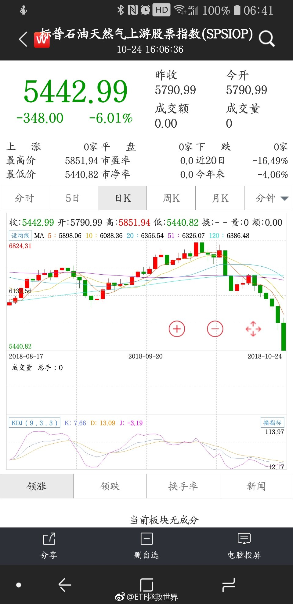

======================================================

ETF拯救世界 (5687069307) @
2018-10-25 06:48:55 Thu  
url: https://weibo.com/5687069307/GFuRLAjIm

美股不断新高的时候我不怕打脸 ​​​

转发[87]  评论[122]  赞[364] 

+++++++++++++++++++++++++++++++++++++++++++++++++++++

图片：

======================================================

ETF拯救世界 (5687069307) @
2018-10-25 08:45:07 Thu  
url: https://weibo.com/5687069307/GFvCW3WMf

有些朋友真敢想……美股跌40%概率极低极低。

有20%-30%我们就会配置不少了。 ​​​

转发[44]  评论[163]  赞[388] 

======================================================

ETF拯救世界 (5687069307) @
2018-10-25 08:50:33 Thu  
url: https://weibo.com/5687069307/GFvF98TEz

回复@颓废的猪头_Ju:可以送。古琦或者香奈儿。有人要吗。//@颓废的猪头_Ju:老大早呀[嘻嘻]昨晚我梦到你兼职美妆博主抽奖送香水了[允悲][允悲][允悲]

------------------------------------------------------
转推：
>  @ETF拯救世界 (5687069307)
>  2018-10-25 06:48:55 Thu  
>  url: https:/weibo.com/5687069307/GFuRLAjIm/

>  美股不断新高的时候我不怕打脸 ​​​

转发[5]  评论[278]  赞[293] 

======================================================

ETF拯救世界 (5687069307) @
2018-10-25 12:05:56 Thu  
url: https://weibo.com/5687069307/GFwWry1LH

我一直没明白的，是高位的时候，为什么在球球看空会被喷。

比如2015年A股，比如2018年初的大白马、港股。

喷起来都不走流程的，直接喷。然后还有很多人给喷的人点赞。

无论你用多少数据多少理由，以及事后事实如何证明你对了，下次依然喷你。

上次喷你的人，根本不会过来说声不好意思，喷错了。

 ​​​

转发[23]  评论[257]  赞[517] 

======================================================

ETF拯救世界 (5687069307) @
2018-10-25 12:29:55 Thu  
url: https://weibo.com/5687069307/GFx6bfyWg

一直很尊敬雷总。可惜上市的时候公司高管集体猛吹股价有些让人失望。

------------------------------------------------------
转推：
>  @ ()
>  2018-10-25 12:20:03 Thu  
>  url: 

>  抱歉，作者已设置仅展示半年内微博，此微博已不可见。 ​​​

转发[5]  评论[64]  赞[150] 

======================================================

ETF拯救世界 (5687069307) @
2018-10-25 12:49:36 Thu  
url: https://weibo.com/5687069307/GFxeb4mAS

一个奇怪的现象

以前你觉得8000的手机不便宜。然后出了一款11000的，你再回头看8000那款——不贵啊。

是不是就像买股票。

从1块涨到800你都不敢买，觉得越来越贵。然后突然从800跌到700你觉得我去好值，买啊。 ​​​

转发[111]  评论[195]  赞[346] 

======================================================

ETF拯救世界 (5687069307) @
2018-10-25 12:51:43 Thu  
url: https://weibo.com/5687069307/GFxf2gNjc

回复@取个名字都要v:非常奇怪，我看头条的喷子一点点点点都不生气，还有点想笑……//@取个名字都要v:今日头条喷子才多，e大那篇钻石底的文章，下面百分之九十都是在喷。[允悲]

------------------------------------------------------
转推：
>  @ETF拯救世界 (5687069307)
>  2018-10-25 12:05:56 Thu  
>  url: https:/weibo.com/5687069307/GFwWry1LH/

>  我一直没明白的，是高位的时候，为什么在球球看空会被喷。
>  
>  比如2015年A股，比如2018年初的大白马、港股。
>  
>  喷起来都不走流程的，直接喷。然后还有很多人给喷的人点赞。
>  
>  无论你用多少数据多少理由，以及事后事实如何证明你对了，下次依然喷你。
>  
>  上次喷你的人，根本不会过来说声不好意思，喷错了。
>  
>   ​​​

转发[0]  评论[68]  赞[178] 

======================================================

ETF拯救世界 (5687069307) @
2018-10-25 14:04:42 Thu  
url: https://weibo.com/5687069307/GFxIErmOn

回复@兰亭序-lbh:不是。出货还要再拉起来。最高800，跌到600，多数人还是不敢买。再拉到750，这时候接盘的就冲进来了。所以历史大顶大多数都是M。右边的高点会比左边的低一点。不信你翻翻。//@兰亭序-lbh:庄家是不是就是利用这种心理出货的？！

------------------------------------------------------
转推：
>  @ETF拯救世界 (5687069307)
>  2018-10-25 12:49:36 Thu  
>  url: https:/weibo.com/5687069307/GFxeb4mAS/

>  一个奇怪的现象
>  
>  以前你觉得8000的手机不便宜。然后出了一款11000的，你再回头看8000那款——不贵啊。
>  
>  是不是就像买股票。
>  
>  从1块涨到800你都不敢买，觉得越来越贵。然后突然从800跌到700你觉得我去好值，买啊。 ​​​

转发[73]  评论[94]  赞[258] 

======================================================

ETF拯救世界 (5687069307) @
2018-10-25 14:32:40 Thu  
url: https://weibo.com/5687069307/GFxU0ltIL

躁动的券商。

------------------------------------------------------
转推：
>  @ETF拯救世界 (5687069307)
>  2018-10-24 10:23:51 Wed  
>  url: https:/weibo.com/5687069307/GFmQw1sTA/

>  $证券公司 sz399975$   这哥们永远有一颗不安分、躁动的心。 ​​​

转发[2]  评论[60]  赞[230] 

======================================================

ETF拯救世界 (5687069307) @
2018-10-25 15:01:35 Thu  
url: https://weibo.com/5687069307/GFy5K7QlH

$证券公司 sz399975$  从浮亏超过20%到浮亏4%，只用了5个交易日。

再说一次，不要怕你那十几二十几个点的浮亏。指数基金，牛市来了，1-3周之内就能盈利。

也不要说买了几年赚的太少。那是因为熊市。牛市来了，每一周都能提高3%年化收益率。

那么，牛市什么时候来？

重要吗。

钻石坑里多捡点钻石才 ​​​

转发[60]  评论[214]  赞[465] 

======================================================

ETF拯救世界 (5687069307) @
2018-10-25 15:17:42 Thu  
url: https://weibo.com/5687069307/GFyci9X8F

发布会看完了，别的不说，价格太厚道了。是不是买一个玩玩。

------------------------------------------------------
转推：
>  @小米手机 (2202387347)
>  2018-10-16 10:00:03 Tue  
>  url: https:/weibo.com/2202387347/GE9gSxNJj/

>  两年前，小米MIX开创全面屏时代，
>  两年后，小米MIX 3 再探索，不止为全面屏而来！
>  
>  #小米MIX3#新品发布会，10月25日，北京见。
>  转发微博，抽送 1 台新品手机。 ​​​

转发[16]  评论[124]  赞[195] 

======================================================

ETF拯救世界 (5687069307) @
2018-10-25 15:56:35 Thu  
url: https://weibo.com/5687069307/GFys4d2Ip

三季报披露至今，已经有1/3医药企业披露业绩。

20%+。

于是导致了估值继续创出历史新低。

这个熊市，牛x死了！ ​​​

转发[32]  评论[176]  赞[493] 

======================================================

ETF拯救世界 (5687069307) @
2018-10-25 17:34:16 Thu  
url: https://weibo.com/5687069307/GFz5Inv1P

今天信息已经回到，怎么说呢，不能说便宜，已经可以接受的地步了。

只剩军工了。 ​​​

转发[56]  评论[121]  赞[404] 

======================================================

ETF拯救世界 (5687069307) @
2018-10-25 17:40:26 Thu  
url: https://weibo.com/5687069307/GFz8dzknc

美元债准备再出一波了。

------------------------------------------------------
转推：
>  @ ()
>  2018-10-25 16:01:02 Thu  
>  url: 

>  抱歉，此微博已被作者删除。查看帮助：http://t.cn/Rfd3rQV

转发[7]  评论[101]  赞[265] 

======================================================

ETF拯救世界 (5687069307) @
2018-10-26 08:43:09 Fri  
url: https://weibo.com/5687069307/GFF2Df67I

回复@保守的乐观主义者:2008年底，它和军工都是19-20。没想到吧。//@保守的乐观主义者:求教，信息历史上便宜过吗？[思考]

------------------------------------------------------
转推：
>  @ETF拯救世界 (5687069307)
>  2018-10-25 17:34:16 Thu  
>  url: https:/weibo.com/5687069307/GFz5Inv1P/

>  今天信息已经回到，怎么说呢，不能说便宜，已经可以接受的地步了。
>  
>  只剩军工了。 ​​​

转发[35]  评论[89]  赞[236] 

======================================================

ETF拯救世界 (5687069307) @
2018-10-26 09:06:47 Fri  
url: https://weibo.com/5687069307/GFFcdsgtT

舒服。

每次看到账户和仓位就是这种感觉。

就是那种，闻到刚刚暴晒过被子味道的感觉。（据说那是螨虫尸体的味道） ​​​

转发[14]  评论[139]  赞[444] 

======================================================

ETF拯救世界 (5687069307) @
2018-10-26 09:55:39 Fri  
url: https://weibo.com/5687069307/GFFw3iry0

有个几千万，一般的吃喝玩乐很难折腾干净。就怕你瞎投资，那就真的有可能从头开始了……//@老道消息:天王是被股楼双杀

------------------------------------------------------
转推：
>  @ ()
>  2018-10-26 00:37:57 Fri  
>  url: 

>  抱歉，作者已设置仅展示半年内微博，此微博已不可见。 ​​​

转发[15]  评论[48]  赞[252] 

======================================================

ETF拯救世界 (5687069307) @
2018-10-26 09:59:27 Fri  
url: https://weibo.com/5687069307/GFFxBlgXU

$中证500 sz399905$   这才是500应该有的样子。。 ​​​

转发[3]  评论[53]  赞[252] 

======================================================

ETF拯救世界 (5687069307) @
2018-10-26 10:22:30 Fri  
url: https://weibo.com/5687069307/GFFGXrvkp

出去办事。中午不涨会发一小车。 ​​​

转发[1]  评论[143]  赞[324] 

======================================================

ETF拯救世界 (5687069307) @
2018-10-26 11:02:06 Fri  
url: https://weibo.com/5687069307/GFFX1tcGF

切切

------------------------------------------------------
转推：
>  @ETF拯救世界 (5687069307)
>  2018-10-24 10:47:01 Wed  
>  url: https:/weibo.com/5687069307/GFmZUFdjp/

>  再说一次，长阴跌破平台创新低的品种别着急重仓买。不买也行，一点点买也行。总之是有点凶险。 ​​​

转发[12]  评论[55]  赞[229] 

======================================================

ETF拯救世界 (5687069307) @
2018-10-26 11:21:54 Fri  
url: https://weibo.com/5687069307/GFG53FmZM

考虑到下周二或者三就要发下个月的大车，再三权衡，今天就不发了，否则节奏有问题，太频繁。

手机这个事情听我解释…本来想去店里修修扬声器结果看了看max觉得还行就买了。但是用了用确实没发现有什么特别的…凑合用吧。

人生在世话别说太满，世事难料… ​​​

转发[13]  评论[301]  赞[485] 

======================================================

ETF拯救世界 (5687069307) @
2018-10-26 12:03:17 Fri  
url: https://weibo.com/5687069307/GFGlSf1Nc

没有恒生的朋友不用急，我相信买回来的机会不会太远了 ​​​

转发[18]  评论[160]  赞[458] 

+++++++++++++++++++++++++++++++++++++++++++++++++++++

图片：

======================================================

ETF拯救世界 (5687069307) @
2018-10-26 13:09:43 Fri  
url: https://weibo.com/5687069307/GFGMPwUBL

再好的股票也禁不住好多人一块吹。

不一定对。 ​​​

转发[12]  评论[132]  赞[354] 

======================================================

ETF拯救世界 (5687069307) @
2018-10-26 15:05:34 Fri  
url: https://weibo.com/5687069307/GFHxRsfrr

解释一下这条。价格很高的时候买入，五年也许没有好的收益率。但只要公司好，价格跌下去，买入就有可能有好的收益率。比如，从高点算，五年后涨5%。年化每年不到1%。但如果跌了50%买入，涨起来收益率就有超过100%，三四年的年化是多少？但是，你得先确定，那到底是不是好公司，还能不能起来。

------------------------------------------------------
转推：
>  @ETF拯救世界 (5687069307)
>  2018-03-22 09:34:01 Thu  
>  url: https:/weibo.com/5687069307/G8wd21cxW/

>  腾讯，60倍PE。未来五年看，真的能有特别好的收益率吗。
>  
>  学习了。 ​​​

转发[26]  评论[70]  赞[271] 

======================================================

ETF拯救世界 (5687069307) @
2018-10-26 15:13:05 Fri  
url: https://weibo.com/5687069307/GFHAUzwop

回复@幸运翡翠wfyan:心算一下，3年100%大概年化26%左右，4年是19%左右。//@幸运翡翠wfyan:有课代表解析三四年的年化收益是多少吗？谢谢

------------------------------------------------------
转推：
>  @ETF拯救世界 (5687069307)
>  2018-03-22 09:34:01 Thu  
>  url: https:/weibo.com/5687069307/G8wd21cxW/

>  腾讯，60倍PE。未来五年看，真的能有特别好的收益率吗。
>  
>  学习了。 ​​​

转发[7]  评论[45]  赞[210] 

======================================================

ETF拯救世界 (5687069307) @
2018-10-26 15:34:59 Fri  
url: https://weibo.com/5687069307/GFHJNlTDv

喷了，全指消费估值创出2005年以来最低…… ​​​

转发[63]  评论[197]  赞[543] 

======================================================

ETF拯救世界 (5687069307) @
2018-10-26 17:09:16 Fri  
url: https://weibo.com/5687069307/GFIm4875G

帮昆山林志颖转发维权……

------------------------------------------------------
转推：
>  @ ()
>  2018-10-26 16:09:19 Fri  
>  url: 

>  抱歉，此微博已被作者删除。查看帮助：http://t.cn/Rfd3rQV

转发[18]  评论[62]  赞[201] 

======================================================

ETF拯救世界 (5687069307) @
2018-10-27 21:20:43 Sat  
url: https://weibo.com/5687069307/GFTqCE7qR

回复@家住在烟台:都学学[doge]//@家住在烟台:舔狗指南[doge][doge][doge] http://t.cn/EZjyA30

------------------------------------------------------
转推：
>  @北京人不知道的北京事儿 (1662214194)
>  2018-10-27 20:48:05 Sat  
>  url: https:/weibo.com/1662214194/GFTdnt77T/

>  网友投稿，北京某重点小学一年级班级家长群。。。你怎么看？[思考] ​​​

转发[91]  评论[182]  赞[176] 

======================================================

ETF拯救世界 (5687069307) @
2018-10-28 19:10:32 Sun  
url: https://weibo.com/5687069307/H04xXn91M

看静态估值是第一个层次。

看动态估值，也就是这个季度下个季度利润增长是第二个层次。

从第一到第二很容易。

难的是到第三个层次。

就是从更高的视角，看未来和现在。

不要再说利润增速下降。你现在看到的市场早就看到了，而且早就走出了提前量。

现在，就是看你能不能站在更高的地方看到第三个 ​​​

转发[105]  评论[263]  赞[480] 

======================================================

ETF拯救世界 (5687069307) @
2018-10-29 06:32:45 Mon  
url: https://weibo.com/5687069307/H090S7oE4

谁能想到吴彦祖也在为头发操心

------------------------------------------------------
转推：
>  @吳彥祖 (2345544584)
>  2018-10-28 21:03:31 Sun  
>  url: https:/weibo.com/2345544584/H05hOE5s5/

>  在我父親的錢包裡發現了這照片 。 這時候我一定是16歲左右 ？ 我希望我能把所有的頭髮都拿回來 。 ​​​

转发[20]  评论[82]  赞[202] 

======================================================

ETF拯救世界 (5687069307) @
2018-10-29 07:27:58 Mon  
url: https://weibo.com/5687069307/H09nhv9xY

如果你2008年四季度因为利润增速下降吓得不敢买入甚至离场，那么你就犯了大错。

再说一次，投资是投未来。看的远一点。一点就够了。 ​​​

转发[75]  评论[162]  赞[510] 

======================================================

ETF拯救世界 (5687069307) @
2018-10-29 09:19:21 Mon  
url: https://weibo.com/5687069307/H0a6uverC

今天食品饮料或者消费有没有可能再下一个台阶给咱们一个好价格。 ​​​

转发[5]  评论[45]  赞[297] 

======================================================

ETF拯救世界 (5687069307) @
2018-10-29 09:21:06 Mon  
url: https://weibo.com/5687069307/H0a7cvLDB

回购不注销都是耍流氓。 ​​​

转发[25]  评论[48]  赞[381] 

======================================================

ETF拯救世界 (5687069307) @
2018-10-29 09:24:29 Mon  
url: https://weibo.com/5687069307/H0a8ziTKO

这样下去我会不会被很多人怀恨在心……//@ETF拯救世界:$五粮液 sz000858$   怎么回事。

------------------------------------------------------
转推：
>  @ETF拯救世界 (5687069307)
>  2018-10-23 13:43:03 Tue  
>  url: https:/weibo.com/5687069307/GFeIRwyeh/

>  总有人问我为什么还不买消费。
>  
>  消费板块整体看确实不贵了。
>  
>  但是占据极大权重比例的白酒，它们的形态，看起来就让我觉得害怕。
>  
>  你可以说我是看图说话的渣渣。但我是真的怕，始终没法说服自己去买这样形态的品种。
>  
>  最关键是主流消费指数的白酒权重太太太太大了。茅台和五粮液就占30%…… ​​​

转发[8]  评论[53]  赞[249] 

======================================================

ETF拯救世界 (5687069307) @
2018-10-29 09:27:56 Mon  
url: https://weibo.com/5687069307/H0a9Z6jcN

谁能想到……

------------------------------------------------------
转推：
>  @ETF拯救世界 (5687069307)
>  2018-09-06 11:26:47 Thu  
>  url: https:/weibo.com/5687069307/Gy4Ke2SUE/

>  你们觉得咱们8800得国证食品到底还有没有希望买到…… ​​​

转发[8]  评论[43]  赞[233] 

======================================================

ETF拯救世界 (5687069307) @
2018-10-29 09:31:11 Mon  
url: https://weibo.com/5687069307/H0abilJAw

引出一个问题：到底技术图形是不是有用。是不是价投就不用看图了。很有趣的问题。

------------------------------------------------------
转推：
>  @ETF拯救世界 (5687069307)
>  2018-10-23 13:43:03 Tue  
>  url: https:/weibo.com/5687069307/GFeIRwyeh/

>  总有人问我为什么还不买消费。
>  
>  消费板块整体看确实不贵了。
>  
>  但是占据极大权重比例的白酒，它们的形态，看起来就让我觉得害怕。
>  
>  你可以说我是看图说话的渣渣。但我是真的怕，始终没法说服自己去买这样形态的品种。
>  
>  最关键是主流消费指数的白酒权重太太太太大了。茅台和五粮液就占30%…… ​​​

转发[18]  评论[73]  赞[284] 

======================================================

ETF拯救世界 (5687069307) @
2018-10-29 09:33:03 Mon  
url: https://weibo.com/5687069307/H0ac3lwQ6

//@ETF拯救世界: 你知道抱团取暖的问题是什么吗。是，谁都别跑。只要有跑的，大家都跑。都跑就没人接。其实我对蓝筹没有成见，但你们不能组团忽悠让别人给你们接盘吧，有点不地道。“价值投资元年”，老乡们，长点心眼吧。人家去年翻番了，吃饱了抹抹嘴要走，谁来买单？

------------------------------------------------------
转推：
>  @ETF拯救世界 (5687069307)
>  2017-11-23 14:32:38 Thu  
>  url: https:/weibo.com/5687069307/FwpLteV4R/

>  这两年来，A股（我是说A股，不是沪深300），基本按照预期在运行。当然，由于有一万多亿那什么在里面，比之前两次多了很多波折。
>  
>  今年这一波几十只一百多只大蓝筹的行情，当然不能说全是GJD的原因。根本原因当然是2016年2月估值够低，当月50、恒生、红利都是历史最低估值区域。
>  
>  但GJD是非常重要的因素 ​​​

转发[46]  评论[77]  赞[310] 

======================================================

ETF拯救世界 (5687069307) @
2018-10-29 09:38:51 Mon  
url: https://weibo.com/5687069307/H0aepAR70

没有任何公司是“完美”的，“不可错过”的，“确认前途无限”的。

只有买的够低才可能赚钱。任何公司暴涨后你去接盘，大概率都是悲剧。

好公司，也要好价格。拒绝别人的高位忽悠，起码能不赔钱。 ​​​

转发[94]  评论[156]  赞[506] 

======================================================

ETF拯救世界 (5687069307) @
2018-10-29 10:12:38 Mon  
url: https://weibo.com/5687069307/H0as7skYn

但是，消费不会死。而且会很好。

医药，消费。依然是我的最爱。

问题只是什么时候买而已…… ​​​

转发[41]  评论[131]  赞[514] 

======================================================

ETF拯救世界 (5687069307) @
2018-10-29 10:22:57 Mon  
url: https://weibo.com/5687069307/H0awjcz8k

看清楚一个人是水平高还是运气好，要很多很多年。

太多人把运气当成水平了。然后就会发生巨额的价值毁灭。 ​​​

转发[31]  评论[128]  赞[510] 

======================================================

ETF拯救世界 (5687069307) @
2018-10-29 11:30:18 Mon  
url: https://weibo.com/5687069307/H0aXE8VVM

朋友们，除了少吃多运动，心情和情绪真的很重要。

别的我没法说，但至少千万别因为金融投资情绪低落甚至抑郁。别搞得压力很大。

A股开开心心就能把钱挣了。如果开心太难，至少要很平静。这个需要你自己的心理调节，更需要你的持仓能让你很平静。

钱这东西，多了更好，暂时少一点也不是太大问题。身 ​​​

转发[98]  评论[297]  赞[858] 

======================================================

ETF拯救世界 (5687069307) @
2018-10-29 13:39:30 Mon  
url: https://weibo.com/5687069307/H0bO5pdDN

食品饮料会不会跌停。

券商刚涨停没几天。 ​​​

转发[9]  评论[68]  赞[286] 

======================================================

ETF拯救世界 (5687069307) @
2018-10-29 13:46:46 Mon  
url: https://weibo.com/5687069307/H0bR21okb

如果所有人对某个品种期望很高，越来越高，高的没谱，导致不停的涨。

那么，如果达不到大家的期望，这事儿就麻烦了。

反过来。

如果大家对某个品种预期特别差。完蛋一样的差，导致不停的跌。

结果，居然没那么差，最后居然还挺好。

嗯。 ​​​

转发[65]  评论[196]  赞[422] 

======================================================

ETF拯救世界 (5687069307) @
2018-10-29 14:38:08 Mon  
url: https://weibo.com/5687069307/H0cbT9azk

帮转。学习好的说说。我记得N年前我也有一次突然听不到了，过一会就好了。去医院查也没查出什么。

------------------------------------------------------
转推：
>  @用户6804940831 (6804940831)
>  2018-10-29 14:22:58 Mon  
>  url: https:/weibo.com/6804940831/H0c5JjpiR/

>  上周三晚上，捏鼻往耳朵鼓气，第二天一早发现，左耳听力下降了，伴有耳鸣耳闷，去医院检查，做个检查发现都正常，医生说是突发性性耳聋(神经性)，挂了4天的点滴，依旧无好转，耳闷有所缓解，但听力下降明显，@ETF拯救世界，请E大帮忙问问有什么好的治疗方法，谢谢🙏 ​​​

转发[7]  评论[103]  赞[140] 

======================================================

ETF拯救世界 (5687069307) @
2018-10-29 15:01:30 Mon  
url: https://weibo.com/5687069307/H0clnc8yg

食品光脚长阴。明天不出意外大概率还是…… ​​​

转发[10]  评论[94]  赞[409] 

======================================================

ETF拯救世界 (5687069307) @
2018-10-29 15:13:36 Mon  
url: https://weibo.com/5687069307/H0cqhwSrF

又想去旅游了。[喵喵] ​​​

转发[3]  评论[118]  赞[375] 

======================================================

ETF拯救世界 (5687069307) @
2018-10-29 15:28:56 Mon  
url: https://weibo.com/5687069307/H0cwvqRBE

截至今日，医药PEG 1.21。全指消费PEG 2。 ​​​

转发[93]  评论[103]  赞[385] 

======================================================

ETF拯救世界 (5687069307) @
2018-10-29 15:43:25 Mon  
url: https://weibo.com/5687069307/H0cCo2zr4

500是1.38。

------------------------------------------------------
转推：
>  @ETF拯救世界 (5687069307)
>  2018-10-29 15:28:56 Mon  
>  url: https:/weibo.com/5687069307/H0cwvqRBE/

>  截至今日，医药PEG 1.21。全指消费PEG 2。 ​​​

转发[54]  评论[167]  赞[398] 

======================================================

ETF拯救世界 (5687069307) @
2018-10-30 07:23:37 Tue  
url: https://weibo.com/5687069307/H0iM10AAb

又跌3%。

有些品种按月拿，有些品种按年拿。动不动就“拿一辈子穿越牛熊”的，几乎没有。不是说品种不好，而是经常会很疯狂，别人疯了就先给别人，正常了再拿回来。

这个品种什么时候买回来？ ​​​

转发[47]  评论[152]  赞[411] 

+++++++++++++++++++++++++++++++++++++++++++++++++++++

图片：
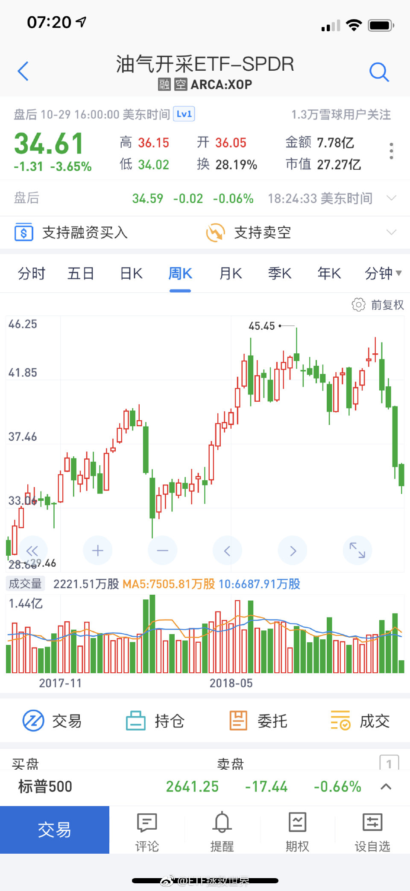
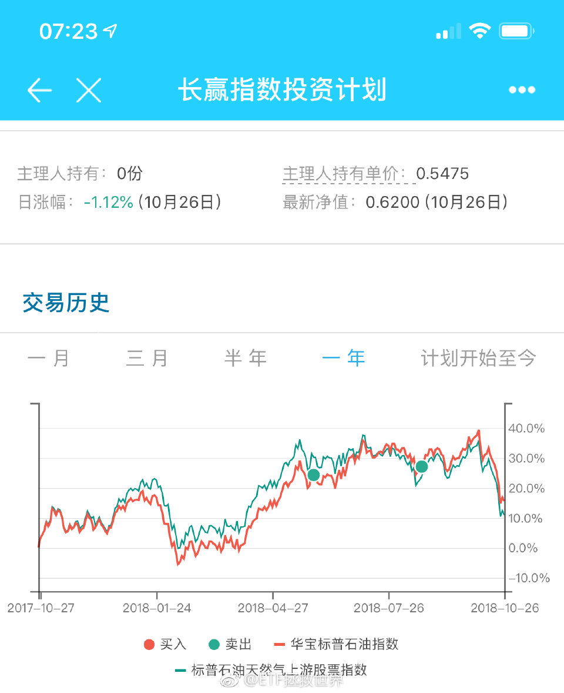

======================================================

ETF拯救世界 (5687069307) @
2018-10-30 09:23:57 Tue  
url: https://weibo.com/5687069307/H0jyQze0T

现在的媒体和某些人简直是一点点点点节操都没有了。

人家平安的公告，是：

“将根据资本市场、公司股价的波动和变化，回购公司公开发行的境内、境外股份，回购总额不超过公司发行总股本的10%。”

不超过10%。划重点。

别有用心的人一定要解读成回购千亿。理由是什么，理由是平安市值万亿。

太坏了 ​​​

转发[27]  评论[74]  赞[333] 

======================================================

ETF拯救世界 (5687069307) @
2018-10-30 09:28:34 Tue  
url: https://weibo.com/5687069307/H0jAJl5eY

我决定，今天在市场上大笔增持指数基金，总金额不超过1000亿元人民币。包括场内ETF以及场外指基。

共克时艰。 ​​​

转发[58]  评论[170]  赞[659] 

======================================================

ETF拯救世界 (5687069307) @
2018-10-30 09:33:58 Tue  
url: https://weibo.com/5687069307/H0jCVf6CY

今天会买4-5份。宽基为主。

现在市场上有钱&敢买的人已经极其稀少了。 ​​​

转发[23]  评论[305]  赞[635] 

======================================================

ETF拯救世界 (5687069307) @
2018-10-30 09:48:28 Tue  
url: https://weibo.com/5687069307/H0jIObB60

万万没想到快腰斩了。如果腰斩的地方买入，回到最高点你就赚1倍。如果最高点算，五年不涨，你的收益率也会很棒。但鹅厂腰斩是不是好价格，我不知道……

------------------------------------------------------
转推：
>  @ETF拯救世界 (5687069307)
>  2018-03-22 09:34:01 Thu  
>  url: https:/weibo.com/5687069307/G8wd21cxW/

>  腾讯，60倍PE。未来五年看，真的能有特别好的收益率吗。
>  
>  学习了。 ​​​

转发[21]  评论[57]  赞[265] 

======================================================

ETF拯救世界 (5687069307) @
2018-10-30 10:31:14 Tue  
url: https://weibo.com/5687069307/H0k0aoHTE

再给半天时间ok？ ​​​

转发[9]  评论[131]  赞[292] 

======================================================

ETF拯救世界 (5687069307) @
2018-10-30 10:36:57 Tue  
url: https://weibo.com/5687069307/H0k2uAaNv

fxxx。今天要买的一个品种从-1%到+1%了。

------------------------------------------------------
转推：
>  @ETF拯救世界 (5687069307)
>  2018-10-30 10:31:14 Tue  
>  url: https:/weibo.com/5687069307/H0k0aoHTE/

>  再给半天时间ok？ ​​​

转发[5]  评论[129]  赞[219] 

======================================================

ETF拯救世界 (5687069307) @
2018-10-30 11:04:35 Tue  
url: https://weibo.com/5687069307/H0kdHxLrk

我的1000亿威力不小。强行开车。

------------------------------------------------------
转推：
>  @ETF拯救世界 (5687069307)
>  2018-10-30 09:28:34 Tue  
>  url: https:/weibo.com/5687069307/H0jAJl5eY/

>  我决定，今天在市场上大笔增持指数基金，总金额不超过1000亿元人民币。包括场内ETF以及场外指基。
>  
>  共克时艰。 ​​​

转发[8]  评论[168]  赞[420] 

======================================================

ETF拯救世界 (5687069307) @
2018-10-30 11:57:28 Tue  
url: https://weibo.com/5687069307/H0kzauWte

滴滴！

第三轮史无前例の六车！ ​​​

转发[44]  评论[696]  赞[856] 

======================================================

ETF拯救世界 (5687069307) @
2018-10-30 14:43:25 Tue  
url: https://weibo.com/5687069307/H0lEwCT5i

喷了，真的假的。 ​​​

转发[2]  评论[99]  赞[258] 

+++++++++++++++++++++++++++++++++++++++++++++++++++++

图片：

======================================================

ETF拯救世界 (5687069307) @
2018-10-30 15:33:46 Tue  
url: https://weibo.com/5687069307/H0lYY4aIK

谁能想到还差两个多点就要盈利了呢…… ​​​

转发[13]  评论[119]  赞[305] 

+++++++++++++++++++++++++++++++++++++++++++++++++++++

图片：

======================================================

ETF拯救世界 (5687069307) @
2018-10-30 16:01:34 Tue  
url: https://weibo.com/5687069307/H0mafpQQm

这么跌，是又有什么利空了吗……//@ETF拯救世界:万万没想到快腰斩了。如果腰斩的地方买入，回到最高点你就赚1倍。如果最高点算，五年不涨，你的收益率也会很棒。但鹅厂腰斩是不是好价格，我不知道……

------------------------------------------------------
转推：
>  @ETF拯救世界 (5687069307)
>  2018-03-22 09:34:01 Thu  
>  url: https:/weibo.com/5687069307/G8wd21cxW/

>  腾讯，60倍PE。未来五年看，真的能有特别好的收益率吗。
>  
>  学习了。 ​​​

转发[2]  评论[48]  赞[213] 

======================================================

ETF拯救世界 (5687069307) @
2018-10-30 17:27:20 Tue  
url: https://weibo.com/5687069307/H0mJ4lAwN

史上第一次，发车微博评论超过公众号留言了……

------------------------------------------------------
转推：
>  @ETF拯救世界 (5687069307)
>  2018-10-30 11:57:28 Tue  
>  url: https:/weibo.com/5687069307/H0kzauWte/

>  滴滴！
>  
>  第三轮史无前例の六车！ ​​​

转发[5]  评论[129]  赞[441] 

======================================================

ETF拯救世界 (5687069307) @
2018-10-30 20:22:15 Tue  
url: https://weibo.com/5687069307/H0nS3CyN8

谢谢，曾经给了我那么美好的时光。 ​​​

转发[14]  评论[192]  赞[714] 

======================================================

ETF拯救世界 (5687069307) @
2018-10-31 09:41:21 Wed  
url: https://weibo.com/5687069307/H0t6pEECr

不管是哪里，以前的博客也好，到现在的微博也好公众号也好球球也好，有料的人和水货难道不是一眼就能看出来吗。

交易系统有点缺陷，或者经验不足，或者一时得失，那都不算是水货。水货是真的水，经常引经据典说什么都热热闹闹，又或者喊打喊杀大开大合，其实水的不得了，一眼就能看出来。

我的问题是 ​​​

转发[22]  评论[262]  赞[386] 

======================================================

ETF拯救世界 (5687069307) @
2018-10-31 09:52:23 Wed  
url: https://weibo.com/5687069307/H0taTpC1C

现在A股仓位接近63%，加上港股超过70%，再加上可转债逼近75%。这样的仓位即使牛市来了你也不会落后。甚至有机会跑赢。为什么这么说到时候就知道。

所以已经买的7788了，不要再担心踏空。踏踏实实的看戏。毕竟还没到极限，不用那么急一分不剩的杀进去。

多舒服啊。 ​​​

转发[60]  评论[174]  赞[454] 

======================================================

ETF拯救世界 (5687069307) @
2018-10-31 09:58:14 Wed  
url: https://weibo.com/5687069307/H0tdgANda

回复@DM_Eric:我真的很震惊——你居然还没有习惯这样的日常操作。//@DM_Eric:真的，很想问你为什么昨天你知道要发车的！！如此牛逼！！[doge]

------------------------------------------------------
转推：
>  @ETF拯救世界 (5687069307)
>  2018-10-31 09:52:23 Wed  
>  url: https:/weibo.com/5687069307/H0taTpC1C/

>  现在A股仓位接近63%，加上港股超过70%，再加上可转债逼近75%。这样的仓位即使牛市来了你也不会落后。甚至有机会跑赢。为什么这么说到时候就知道。
>  
>  所以已经买的7788了，不要再担心踏空。踏踏实实的看戏。毕竟还没到极限，不用那么急一分不剩的杀进去。
>  
>  多舒服啊。 ​​​

转发[5]  评论[101]  赞[344] 

======================================================

ETF拯救世界 (5687069307) @
2018-10-31 10:18:29 Wed  
url: https://weibo.com/5687069307/H0tluipD2

想写点东西吹一波择时，但是想了想决定收盘以后再吹。 ​​​

转发[12]  评论[354]  赞[636] 

======================================================

ETF拯救世界 (5687069307) @
2018-10-31 12:59:57 Wed  
url: https://weibo.com/5687069307/H0up1Bgrx

神秘力量加持完毕，稳了。 ​​​

转发[28]  评论[162]  赞[674] 

+++++++++++++++++++++++++++++++++++++++++++++++++++++

图片：

======================================================

ETF拯救世界 (5687069307) @
2018-10-31 13:48:54 Wed  
url: https://weibo.com/5687069307/H0uITws9L

不由你不信

------------------------------------------------------
转推：
>  @ETF拯救世界 (5687069307)
>  2018-10-31 12:59:57 Wed  
>  url: https:/weibo.com/5687069307/H0up1Bgrx/

>  神秘力量加持完毕，稳了。 ​​​

转发[10]  评论[136]  赞[449] 

======================================================

ETF拯救世界 (5687069307) @
2018-10-31 18:03:05 Wed  
url: https://weibo.com/5687069307/H0wo4EMMs

10月结束了，立个flag，11月收红。

如果错了呢。

二话不说，

删帖。 ​​​

转发[55]  评论[423]  赞[946] 

======================================================

ETF拯救世界 (5687069307) @
2018-11-01 10:41:52 Thu  
url: https://weibo.com/5687069307/H0CVtugNN

钻石坑里别随便跳车，一个建议。 ​​​

转发[26]  评论[297]  赞[622] 

======================================================

ETF拯救世界 (5687069307) @
2018-11-01 10:59:47 Thu  
url: https://weibo.com/5687069307/H0D2KpSYT

愁死我了。

昨天儿子说爱上幼儿园外教英语老师了。因为万圣节活动老师穿上小猫的衣服他很喜欢。

孽障啊。 ​​​

转发[7]  评论[278]  赞[643] 

======================================================

ETF拯救世界 (5687069307) @
2018-11-01 11:22:40 Thu  
url: https://weibo.com/5687069307/H0Dc2jWek

没想到吧最高点至今跌幅70%的创业板浮亏即将进入个位数。 ​​​

转发[19]  评论[207]  赞[428] 

======================================================

ETF拯救世界 (5687069307) @
2018-11-01 13:29:17 Thu  
url: https://weibo.com/5687069307/H0E1qDh5B

回复@dsfad2003:恭喜入坑//@dsfad2003:今天ETF表现不错啊，传媒和环保，感觉比个股靠谱多了

------------------------------------------------------
转推：
>  @ETF拯救世界 (5687069307)
>  2018-11-01 11:22:40 Thu  
>  url: https:/weibo.com/5687069307/H0Dc2jWek/

>  没想到吧最高点至今跌幅70%的创业板浮亏即将进入个位数。 ​​​

转发[10]  评论[75]  赞[250] 

======================================================

ETF拯救世界 (5687069307) @
2018-11-01 14:10:39 Thu  
url: https://weibo.com/5687069307/H0EieeDSH

回复@米得娜:你可以选择配置指数+你喜欢的股票。谁说一定要非此即彼。//@米得娜:稳是指数稳啊，不怕个股黑天鹅，茅台利润增长率一降就狂跌，还有格力能一直保持20%-30%的增长率？；除非高确定性的行业，比如保险，新业务价值这几年利润释放还是稳稳的//@ETF拯救世界:回复@dsfad2003:恭喜入坑

------------------------------------------------------
转推：
>  @ETF拯救世界 (5687069307)
>  2018-11-01 11:22:40 Thu  
>  url: https:/weibo.com/5687069307/H0Dc2jWek/

>  没想到吧最高点至今跌幅70%的创业板浮亏即将进入个位数。 ​​​

转发[6]  评论[100]  赞[262] 

======================================================

ETF拯救世界 (5687069307) @
2018-11-02 06:55:23 Fri  
url: https://weibo.com/5687069307/H0KS2yH17

很多人一定要等到所有事情变好了才开始买

很多人设定一个点位跌不到绝不买

我只能说

远未够班 ​​​

转发[53]  评论[222]  赞[541] 

======================================================

ETF拯救世界 (5687069307) @
2018-11-02 08:02:50 Fri  
url: https://weibo.com/5687069307/H0Ljqdg2Z

回复@站在空气稀薄地带:哪有的事儿呢[doge]//@站在空气稀薄地带:说，你是不是提前知道主席召开的会议到行事历了[doge]

------------------------------------------------------
转推：
>  @ETF拯救世界 (5687069307)
>  2018-11-02 06:55:23 Fri  
>  url: https:/weibo.com/5687069307/H0KS2yH17/

>  很多人一定要等到所有事情变好了才开始买
>  
>  很多人设定一个点位跌不到绝不买
>  
>  我只能说
>  
>  远未够班 ​​​

转发[0]  评论[57]  赞[213] 

======================================================

ETF拯救世界 (5687069307) @
2018-11-02 08:30:15 Fri  
url: https://weibo.com/5687069307/H0LuycsrJ

半年没玩了，玩一局评测一下

十杀MVP还可以。没有机器人 ​​​

转发[1]  评论[103]  赞[252] 

+++++++++++++++++++++++++++++++++++++++++++++++++++++

图片：

======================================================

ETF拯救世界 (5687069307) @
2018-11-02 09:25:03 Fri  
url: https://weibo.com/5687069307/H0LQNg19Q

哥们有点意思。为什么告诉电视台让全国人民知道初中女同学过来同住呢……

------------------------------------------------------
转推：
>  @ ()
>  2018-11-02 09:22:03 Fri  
>  url: 

>  抱歉，作者已设置仅展示半年内微博，此微博已不可见。 ​​​

转发[11]  评论[43]  赞[118] 

======================================================

ETF拯救世界 (5687069307) @
2018-11-02 09:30:14 Fri  
url: https://weibo.com/5687069307/H0LSTx96B

涨了，赚钱了，不用激动，也没理由激动。

为什么，因为你买入的时候就应该知道这是97.1%会发生的。这么大概率的事情发生了，你激动什么？

每天你看见太阳升起来会激动吗。

跌了，浮亏了，同样不用担心。

为什么。因为你知道自己买的是便宜的，不会死的好东西。跌就跌呗。97.1%概率以后肯定挣钱啊。 ​​​

转发[62]  评论[201]  赞[495] 

======================================================

ETF拯救世界 (5687069307) @
2018-11-02 09:41:58 Fri  
url: https://weibo.com/5687069307/H0LXEpguq

三张图告诉你为什么我看到头条的评论一点都不生气，还感觉很欢乐。 ​​​

转发[17]  评论[101]  赞[310] 

+++++++++++++++++++++++++++++++++++++++++++++++++++++

图片：

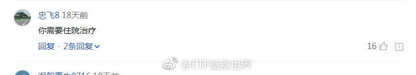
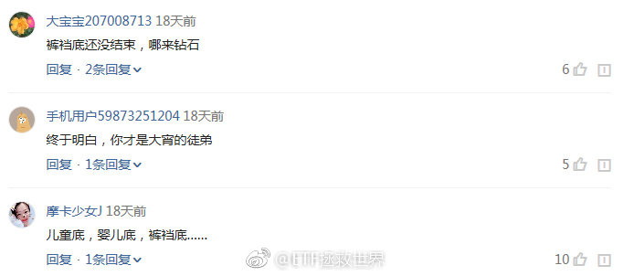

======================================================

ETF拯救世界 (5687069307) @
2018-11-02 09:46:26 Fri  
url: https://weibo.com/5687069307/H0LZtAMt8

回复@黄连树:不。你看头条的人虽然喷，但是并不会很恶毒，甚至有点可爱。球球上有些人写出的文字，其恶毒程度，已经不仅是侮辱人格。甚至有人会组队来喷。那是一个江湖，早早归隐才是王道。

------------------------------------------------------
转推：
>  @ETF拯救世界 (5687069307)
>  2018-11-02 09:41:58 Fri  
>  url: https:/weibo.com/5687069307/H0LXEpguq/

>  三张图告诉你为什么我看到头条的评论一点都不生气，还感觉很欢乐。 ​​​

转发[7]  评论[91]  赞[244] 

======================================================

ETF拯救世界 (5687069307) @
2018-11-02 10:44:11 Fri  
url: https://weibo.com/5687069307/H0MmV9wON

反转还是反弹，不是猜出来的，是走出来的。观察就行，不要预测。

根据我的体系，确认反转还需要有两个条件满足。这两个条件满足了，反转的或然率超过80%。

走着看呗。踏踏实实的。 ​​​

转发[203]  评论[160]  赞[439] 

======================================================

ETF拯救世界 (5687069307) @
2018-11-02 10:56:21 Fri  
url: https://weibo.com/5687069307/H0MrQEHXJ

回复@OO大月半:这是没办法的。这就是所谓右侧的弊端。趋势明确反转必然已经是有一段涨幅了。左侧在下跌中买入，会套。右侧在上涨中买入，会比最低点高。没有任何方法能保证能买在最低点。没有任何方法，没有。//@OO大月半:满足反转条件的时候，估计已经从底部上来很多了吧

------------------------------------------------------
转推：
>  @ETF拯救世界 (5687069307)
>  2018-11-02 10:44:11 Fri  
>  url: https:/weibo.com/5687069307/H0MmV9wON/

>  反转还是反弹，不是猜出来的，是走出来的。观察就行，不要预测。
>  
>  根据我的体系，确认反转还需要有两个条件满足。这两个条件满足了，反转的或然率超过80%。
>  
>  走着看呗。踏踏实实的。 ​​​

转发[69]  评论[117]  赞[298] 

======================================================

ETF拯救世界 (5687069307) @
2018-11-02 11:07:53 Fri  
url: https://weibo.com/5687069307/H0MwwwbHd

两个人都有问题。情绪完全控制不住。以后打司机的行为能不能以危害公共安全罪判五年罚50万？并且大力宣传，看谁还敢。司机方面，我就不说了，不知道最后的方向盘是怎么回事……最无辜的，是这一车乘客。

------------------------------------------------------
转推：
>  @ ()
>  2018-11-02 10:34:31 Fri  
>  url: 

>  抱歉，作者已设置仅展示半年内微博，此微博已不可见。 ​​​

转发[18]  评论[120]  赞[186] 

======================================================

ETF拯救世界 (5687069307) @
2018-11-02 11:45:43 Fri  
url: https://weibo.com/5687069307/H0MLTw7BJ

//@王志安: 公布的视频太短了，既然已经恢复了sd卡，为什么不能多公布一些内容呢？最关键的是司机撞桥栏和之后的身体姿势和神态，这能帮助分析出，变道撞桥坠江到底是司机的失误还是因为发怒之后的有意为之。目前这个视频并不支持调查结论。我认为这个公布不合格。

------------------------------------------------------
转推：
>  @ ()
>  2018-11-02 10:38:19 Fri  
>  url: 

>  抱歉，作者已设置仅展示半年内微博，此微博已不可见。 ​​​

转发[28]  评论[83]  赞[129] 

======================================================

ETF拯救世界 (5687069307) @
2018-11-02 13:28:53 Fri  
url: https://weibo.com/5687069307/H0NrLp4ha

踏踏实实的。

记住，你来股市不是为了解套的 ​​​

转发[46]  评论[215]  赞[549] 

======================================================

ETF拯救世界 (5687069307) @
2018-11-02 13:57:12 Fri  
url: https://weibo.com/5687069307/H0NDg8Dty

回复@sunny_华:写的真好。是不是抄的。谁写的我要粉他[吃惊]//@sunny_华:感谢益达[鲜花][鲜花][鲜花]，同时感谢2018的自己。感谢那个在哀声一片，惨不忍睹的修罗战场上缓缓站起，抽出利刃，一步步走向敌人的自己[抱抱][抱抱][抱抱]

------------------------------------------------------
转推：
>  @ETF拯救世界 (5687069307)
>  2018-11-02 13:28:53 Fri  
>  url: https:/weibo.com/5687069307/H0NrLp4ha/

>  踏踏实实的。
>  
>  记住，你来股市不是为了解套的 ​​​

转发[15]  评论[79]  赞[319] 

======================================================

ETF拯救世界 (5687069307) @
2018-11-02 14:28:33 Fri  
url: https://weibo.com/5687069307/H0NPZ4WAK

回复@pinjia媛媛:我也不知道。我只是按照体系和策略操作和配置仓位。我预测不了未来，也不会尝试预测。//@pinjia媛媛:回复@pinjia媛媛:那么多看中期反转的声音，小白就很慌。不知道钻石底给不给足够的机会。拜托E大能解惑。感谢！@ETF拯救世界

------------------------------------------------------
转推：
>  @ETF拯救世界 (5687069307)
>  2018-11-02 13:28:53 Fri  
>  url: https:/weibo.com/5687069307/H0NrLp4ha/

>  踏踏实实的。
>  
>  记住，你来股市不是为了解套的 ​​​

转发[7]  评论[35]  赞[220] 

======================================================

ETF拯救世界 (5687069307) @
2018-11-02 14:33:38 Fri  
url: https://weibo.com/5687069307/H0NS3kMhb

为什么要预测。到底为什么。投资股市真的真的不需要预测涨跌就能挣钱。不要预测，预测就会错。错了就赔钱。好好的建立投资策略和投资体系，然后从股市提款。不要预测！

------------------------------------------------------
转推：
>  @ETF拯救世界 (5687069307)
>  2018-11-02 10:44:11 Fri  
>  url: https:/weibo.com/5687069307/H0MmV9wON/

>  反转还是反弹，不是猜出来的，是走出来的。观察就行，不要预测。
>  
>  根据我的体系，确认反转还需要有两个条件满足。这两个条件满足了，反转的或然率超过80%。
>  
>  走着看呗。踏踏实实的。 ​​​

转发[75]  评论[134]  赞[423] 

======================================================

ETF拯救世界 (5687069307) @
2018-11-02 14:47:45 Fri  
url: https://weibo.com/5687069307/H0NXMfpRh

仓位这个东西，问谁都没用，因为谁都不是你，也没有适合所有人的仓位。

就问问自己，跌20%和涨50%，目前舒服不舒服。如果不舒服，把仓位调整到舒服。

齐活。 ​​​

转发[105]  评论[156]  赞[465] 

======================================================

ETF拯救世界 (5687069307) @
2018-11-02 15:05:38 Fri  
url: https://weibo.com/5687069307/H0O52el14

今天回来一辆 xx。

真好。

今年亏不亏就看这两个月了。十三年金身不要破。 ​​​

转发[18]  评论[211]  赞[520] 

======================================================

ETF拯救世界 (5687069307) @
2018-11-02 15:33:22 Fri  
url: https://weibo.com/5687069307/H0Ogig6at

今天收盘最新数据：

还在坑里。 ​​​

转发[45]  评论[226]  赞[520] 

======================================================

ETF拯救世界 (5687069307) @
2018-11-02 16:01:28 Fri  
url: https://weibo.com/5687069307/H0OrHn2X7

回复@开始加速的兔小妞:扎心了。不过股票这玩意有先涨后涨。以后你那股票涨幅超过券商指数的时候再回来报告一下看我说的对不对。

------------------------------------------------------
转推：
>  @ETF拯救世界 (5687069307)
>  2018-11-02 15:33:22 Fri  
>  url: https:/weibo.com/5687069307/H0Ogig6at/

>  今天收盘最新数据：
>  
>  还在坑里。 ​​​

转发[7]  评论[27]  赞[228] 

======================================================

ETF拯救世界 (5687069307) @
2018-11-02 16:54:57 Fri  
url: https://weibo.com/5687069307/H0ONpjR0R

回复@云心皓月:我不关心别人怎么看。我有自己判断顶底的标准。//@云心皓月:E大，丹神和飘仙确认2449是十年一遇的大底了。

------------------------------------------------------
转推：
>  @ETF拯救世界 (5687069307)
>  2018-11-02 15:33:22 Fri  
>  url: https:/weibo.com/5687069307/H0Ogig6at/

>  今天收盘最新数据：
>  
>  还在坑里。 ​​​

转发[12]  评论[113]  赞[346] 

======================================================

ETF拯救世界 (5687069307) @
2018-11-02 18:43:01 Fri  
url: https://weibo.com/5687069307/H0Pvh1R7f

立个flag，周末写篇文章。

想看的打666，不想看的打赏。

实在不想看的富婆可以包养我，我一辈子不写都可以……

“给你钱，闭嘴！”什么的最可爱了。 ​​​

转发[23]  评论[1948]  赞[1378] 

======================================================

ETF拯救世界 (5687069307) @
2018-11-03 01:09:12 Sat  
url: https://weibo.com/5687069307/H0S21pztB

20天，不算太远

------------------------------------------------------
转推：
>  @ETF拯救世界 (5687069307)
>  2018-10-11 16:33:37 Thu  
>  url: https:/weibo.com/5687069307/GDqI9a4GO/

>  个人认为，暂停IPO不会太远了。 ​​​

转发[15]  评论[181]  赞[461] 

======================================================

ETF拯救世界 (5687069307) @
2018-11-04 07:32:24 Sun  
url: https://weibo.com/5687069307/H13Y41V35

作为一个曾经的游戏网站创始人，一个曾经的游戏杂志撰稿人，一个现在依然时不时虽然没时间玩还是会在steam屯游戏的玩家……

居然从没玩过LOL和Dota……

是因为不喜欢这个类型的游戏还是因为【   】

[doge] ​​​

转发[10]  评论[339]  赞[409] 

======================================================

ETF拯救世界 (5687069307) @
2018-11-04 20:43:55 Sun  
url: https://weibo.com/5687069307/H199lmHGB

如果你做的事情和超级大机构一致，未来总不会差。

------------------------------------------------------
转推：
>  @证券时报 (1664176597)
>  2018-11-04 18:26:16 Sun  
>  url: https:/weibo.com/1664176597/H18ft5qSb/

>  10月份145只股票型ETF累计净申购净申购228.08亿份，创年内新高，按照每只基金月均成交价估算，10月份净申购资金约425亿元。据券商中国记者独家了解到，证金、证金资管、汇金等在三季度也采用了这种方式入市，汇金、社保等申购了上证50、沪深300、中证100、创业板等多只ETF。http://t.cn/Ewlr6FQ ​​​

转发[128]  评论[124]  赞[476] 

======================================================

ETF拯救世界 (5687069307) @
2018-11-05 09:10:01 Mon  
url: https://weibo.com/5687069307/H1e2bejDG

回复@十年一2016:上次自主买入是2013年。2015年清仓。超级大机构的持仓周期不是按照周或者月计算的。//@十年一2016:那么谁接他们出场，在目前大环境下，无论政府还是个人负债都是历史最高的情况下，这是指望来一轮牛市么？//@ETF拯救世界:如果你做的事情和超级大机构一致，未来总不会差。

------------------------------------------------------
转推：
>  @证券时报 (1664176597)
>  2018-11-04 18:26:16 Sun  
>  url: https:/weibo.com/1664176597/H18ft5qSb/

>  10月份145只股票型ETF累计净申购净申购228.08亿份，创年内新高，按照每只基金月均成交价估算，10月份净申购资金约425亿元。据券商中国记者独家了解到，证金、证金资管、汇金等在三季度也采用了这种方式入市，汇金、社保等申购了上证50、沪深300、中证100、创业板等多只ETF。http://t.cn/Ewlr6FQ ​​​

转发[40]  评论[70]  赞[230] 

======================================================

ETF拯救世界 (5687069307) @
2018-11-05 09:57:30 Mon  
url: https://weibo.com/5687069307/H1elsfPES

回复@edwin高级水泥佬:思考为什么前，应该确认一下“是不是”//@edwin高级水泥佬:想问e大怎么看中证500的2018三季报利润增速变负了？//@ETF拯救世界:回复@十年一2016:上次自主买入是2013年。2015年清仓。超级大机构的持仓周期不是按照周或者月计算的。

------------------------------------------------------
转推：
>  @证券时报 (1664176597)
>  2018-11-04 18:26:16 Sun  
>  url: https:/weibo.com/1664176597/H18ft5qSb/

>  10月份145只股票型ETF累计净申购净申购228.08亿份，创年内新高，按照每只基金月均成交价估算，10月份净申购资金约425亿元。据券商中国记者独家了解到，证金、证金资管、汇金等在三季度也采用了这种方式入市，汇金、社保等申购了上证50、沪深300、中证100、创业板等多只ETF。http://t.cn/Ewlr6FQ ​​​

转发[15]  评论[65]  赞[195] 

======================================================

ETF拯救世界 (5687069307) @
2018-11-05 10:15:55 Mon  
url: https://weibo.com/5687069307/H1esVx7Jp

盛极而衰，否极泰来。

多做雪中送炭，少做锦上添花。 ​​​

转发[30]  评论[98]  赞[561] 

======================================================

ETF拯救世界 (5687069307) @
2018-11-05 10:46:21 Mon  
url: https://weibo.com/5687069307/H1eFhrHd9

没有暴跌的话本周不会发车。

仓位合适，已经回到一个月两次的节奏。下次应该是14或者15日。 ​​​

转发[16]  评论[173]  赞[506] 

======================================================

ETF拯救世界 (5687069307) @
2018-11-05 14:41:24 Mon  
url: https://weibo.com/5687069307/H1gcGCjgT

早上拉黑了一位评论的朋友。因为之前已经一再强调，不要在评论里带某些网站的广告。

结果哥们还去雪球发帖投诉，圈了十几个v。然后就有大v在评论里敲锣边。

哎。我已经离开了，还没完没了啊。

我拉黑的标准：

第一，做广告。

第二，侮辱人。

第三，给上面两种点赞。

第四，导致我心情不好…… ​​​

转发[6]  评论[165]  赞[435] 

======================================================

ETF拯救世界 (5687069307) @
2018-11-05 14:56:40 Mon  
url: https://weibo.com/5687069307/H1giT5Ab7

敲锣边的大v说，是因为那哥们说我们500不好了，所以我把他拉黑了。

未免把我的格局说的太小太小了。

我持有的东西，我不会解释我为什么买，为什么持有。你说它不好，我会考虑一下你说不好的原因，然后通常情况下不会理会，我持有我的，你说你的。

如果这点自信都没有，就别来投资了。

所以你看，我 ​​​

转发[15]  评论[233]  赞[496] 

======================================================

ETF拯救世界 (5687069307) @
2018-11-05 15:20:20 Mon  
url: https://weibo.com/5687069307/H1gsuuRDH

科创板，我预计投资者门槛在30-50万之间。大概率是50万。 ​​​

转发[45]  评论[84]  赞[279] 

======================================================

ETF拯救世界 (5687069307) @
2018-11-05 15:23:58 Mon  
url: https://weibo.com/5687069307/H1gtY4amh

另外，认为科创板会大幅拉低主板市场估值的，我觉得可能想多了。科创板一半以上上市公司我估计是亏损的，市盈率是负的。你想让他们拉低谁的估值？

------------------------------------------------------
转推：
>  @ETF拯救世界 (5687069307)
>  2018-11-05 15:20:20 Mon  
>  url: https:/weibo.com/5687069307/H1gsuuRDH/

>  科创板，我预计投资者门槛在30-50万之间。大概率是50万。 ​​​

转发[20]  评论[57]  赞[249] 

======================================================

ETF拯救世界 (5687069307) @
2018-11-05 15:29:55 Mon  
url: https://weibo.com/5687069307/H1gwnz4i2

回复@梦游鱼生活在路上:这种话说出来你的良心会不会痛？我连发帖人是谁，大v是谁都没说，我怂恿谁去攻击谁了？我经常威胁下轮不公布从何谈起？这世界是不是疯了？不想没完没了跟人斗，只想好好做事这么难？

------------------------------------------------------
转推：
>  @ETF拯救世界 (5687069307)
>  2018-11-05 14:56:40 Mon  
>  url: https:/weibo.com/5687069307/H1giT5Ab7/

>  敲锣边的大v说，是因为那哥们说我们500不好了，所以我把他拉黑了。
>  
>  未免把我的格局说的太小太小了。
>  
>  我持有的东西，我不会解释我为什么买，为什么持有。你说它不好，我会考虑一下你说不好的原因，然后通常情况下不会理会，我持有我的，你说你的。
>  
>  如果这点自信都没有，就别来投资了。
>  
>  所以你看，我 ​​​

转发[5]  评论[144]  赞[285] 

======================================================

ETF拯救世界 (5687069307) @
2018-11-05 16:06:40 Mon  
url: https://weibo.com/5687069307/H1gLiuh7O

明年三月北京吧。有没有一块去的。[爱你]

------------------------------------------------------
转推：
>  @映艺娱乐 (6598879485)
>  2018-11-05 10:16:26 Mon  
>  url: https:/weibo.com/6598879485/H1et8zJNN/

>  #亚洲新歌榜#最强新单推荐！由陈德建、蔡晓恩作曲，#刘德华#填词演唱#MyLove刘德华世界巡回演唱会#香港站同名🎧演唱会主题曲“MY LOVE”＋👀MV今天全球上线。轻快、饶舌的西洋舞曲曲风，再配上华仔以中国诗句所填写的词，用欢乐的歌声传播爱。正如华仔说：「希望借以传递”想爱就去爱、要爱趁现在 ​​​

转发[14]  评论[79]  赞[176] 

======================================================

ETF拯救世界 (5687069307) @
2018-11-05 16:36:02 Mon  
url: https://weibo.com/5687069307/H1gXdyhlO

讲真，并不是刘德华的铁粉。但是，看人家的状态，像奔60的人吗！

这是极其自律的一个人。饮食起居，言行举止，各方面都是如此。我最佩服的就是自律的人。自律一段时间不难，自律一辈子真的没法不让人敬重。

什么时候开始抢票有消息灵通的朋友记得提醒我啊。我事儿多，别耽误了……

（8点20发） ​​​

转发[34]  评论[124]  赞[352] 

======================================================

ETF拯救世界 (5687069307) @
2018-11-05 17:18:40 Mon  
url: https://weibo.com/5687069307/H1hewrHvp

回复@Redneck4sevens:不好意思，只喜欢我家千玺。其它两人自家粉丝抱走不约谢谢。[doge]//@Redneck4sevens:回复@木头队长:我以为E大只喜欢TFboys

------------------------------------------------------
转推：
>  @ETF拯救世界 (5687069307)
>  2018-11-05 16:36:02 Mon  
>  url: https:/weibo.com/5687069307/H1gXdyhlO/

>  讲真，并不是刘德华的铁粉。但是，看人家的状态，像奔60的人吗！
>  
>  这是极其自律的一个人。饮食起居，言行举止，各方面都是如此。我最佩服的就是自律的人。自律一段时间不难，自律一辈子真的没法不让人敬重。
>  
>  什么时候开始抢票有消息灵通的朋友记得提醒我啊。我事儿多，别耽误了……
>  
>  （8点20发） ​​​

转发[3]  评论[89]  赞[190] 

======================================================

ETF拯救世界 (5687069307) @
2018-11-05 17:39:04 Mon  
url: https://weibo.com/5687069307/H1hmO3IB2

当富豪的孩子压力好大。自己想做的事一定要做好，否则只能回去接手家族企业了。//@华尔街见闻APP:开明的父亲[兔子]

------------------------------------------------------
转推：
>  @见闻企业家 (6450245751)
>  2018-11-05 17:33:52 Mon  
>  url: https:/weibo.com/6450245751/H1hkH6A1l/

>  【宗庆后：女儿想干什么干什么，民营企业二代不一定全部会接班】在最新一期的《领航者》中，娃哈哈集团董事长@宗庆后 谈到女儿的接班问题时表示，女儿和自己的想法观念都不太一样，所以现在也是放手，让她想干什么就干什么，跟她沟通可能也不一定好沟通，现在一部分企业让她管，她愿意管就管下去，不愿 ​​​

转发[8]  评论[59]  赞[187] 

======================================================

ETF拯救世界 (5687069307) @
2018-11-06 09:48:12 Tue  
url: https://weibo.com/5687069307/H1nIbjvAA

回复@-------吾三跪:我这里每一个都是真人。//@-------吾三跪:为啥益达这么稳粉丝这么少呢。

------------------------------------------------------
转推：
>  @ETF拯救世界 (5687069307)
>  2018-10-29 13:46:46 Mon  
>  url: https:/weibo.com/5687069307/H0bR21okb/

>  如果所有人对某个品种期望很高，越来越高，高的没谱，导致不停的涨。
>  
>  那么，如果达不到大家的期望，这事儿就麻烦了。
>  
>  反过来。
>  
>  如果大家对某个品种预期特别差。完蛋一样的差，导致不停的跌。
>  
>  结果，居然没那么差，最后居然还挺好。
>  
>  嗯。 ​​​

转发[6]  评论[322]  赞[589] 

======================================================

ETF拯救世界 (5687069307) @
2018-11-06 11:08:36 Tue  
url: https://weibo.com/5687069307/H1oeOgOqs

是的。当年要卖给搜狐。查尔斯说QQ是什么玩意我们随便都可以自己做出来。然后现在搜狐市值不到50亿人民币，腾讯接近3万亿。所以说企业这玩意你真能看到十年后二十年后吗。老板自己都看不到。

------------------------------------------------------
转推：
>  @微博任务 (6336710565)
>  2018-11-06 10:50:53 Tue  
>  url: https:/weibo.com/6336710565/H1o7Cm6WQ/

>  【马化腾忆至暗时刻：曾一直想卖掉QQ，卖不掉[喵喵][喵喵]】近日，马化腾接受央视采访时，分享自己的创业历程。马化腾回忆腾讯曾经历的“至暗时刻”，他说，当时QQ如同一个巨型黑洞吞噬资源，却不知道它的商业模式是什么，那段时间是最痛苦的，曾一直想卖掉QQ，却没卖掉。（@央视财经） ​​​

转发[63]  评论[73]  赞[269] 

======================================================

ETF拯救世界 (5687069307) @
2018-11-06 19:09:12 Tue  
url: https://weibo.com/5687069307/H1rnT42KJ

今天很冷，注意保暖。 ​​​

转发[5]  评论[153]  赞[336] 

======================================================

ETF拯救世界 (5687069307) @
2018-11-06 19:21:32 Tue  
url: https://weibo.com/5687069307/H1rsTiKrx

大意了。关注我的朋友里面，占比第一的省份是广东……

------------------------------------------------------
转推：
>  @ETF拯救世界 (5687069307)
>  2018-11-06 19:09:12 Tue  
>  url: https:/weibo.com/5687069307/H1rnT42KJ/

>  今天很冷，注意保暖。 ​​​

转发[2]  评论[129]  赞[278] 

======================================================

ETF拯救世界 (5687069307) @
2018-11-06 19:28:08 Tue  
url: https://weibo.com/5687069307/H1rvznqjw

关注我的朋友比例是这样的。

广东遥遥领先。比第二名北京多54%。

第二名北京和接下来的上海，浙江，江苏差不太多。

第六名山东就一下子少了很多，只有江苏的一半。接下来的四川湖北福建河南都和山东差不多。

广东朋友是真的有钱，也真的更有投资意识。

广东是个好地方。 ​​​

转发[54]  评论[727]  赞[410] 

+++++++++++++++++++++++++++++++++++++++++++++++++++++

图片：
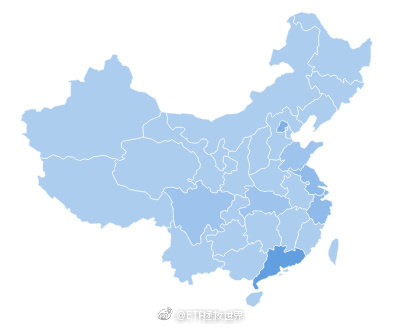

======================================================

ETF拯救世界 (5687069307) @
2018-11-06 19:38:16 Tue  
url: https://weibo.com/5687069307/H1rzGo4s7

城市方面就不同了。北京上海遥遥领先。北京还比上海多20%，比深圳多77%，比广州多107%。所以要说城市，北京上海是第一阵营，第二阵营是深圳广州。第三是杭州成都。第四阵营武汉南京。然后就是苏州和西安差不多。我觉得这基本就是城市老百姓富裕水平的排名了。

------------------------------------------------------
转推：
>  @ETF拯救世界 (5687069307)
>  2018-11-06 19:28:08 Tue  
>  url: https:/weibo.com/5687069307/H1rvznqjw/

>  关注我的朋友比例是这样的。
>  
>  广东遥遥领先。比第二名北京多54%。
>  
>  第二名北京和接下来的上海，浙江，江苏差不太多。
>  
>  第六名山东就一下子少了很多，只有江苏的一半。接下来的四川湖北福建河南都和山东差不多。
>  
>  广东朋友是真的有钱，也真的更有投资意识。
>  
>  广东是个好地方。 ​​​

转发[28]  评论[111]  赞[272] 

======================================================

ETF拯救世界 (5687069307) @
2018-11-06 19:51:17 Tue  
url: https://weibo.com/5687069307/H1rEY4PHK

回复@海底两万八千里:年龄看不到。但是男女基本6:4。我看转型情感博主&来一波大型相亲活动的条件成熟了！//@海底两万八千里:年龄的分布情况能透露一下吗[并不简单]

------------------------------------------------------
转推：
>  @ETF拯救世界 (5687069307)
>  2018-11-06 19:28:08 Tue  
>  url: https:/weibo.com/5687069307/H1rvznqjw/

>  关注我的朋友比例是这样的。
>  
>  广东遥遥领先。比第二名北京多54%。
>  
>  第二名北京和接下来的上海，浙江，江苏差不太多。
>  
>  第六名山东就一下子少了很多，只有江苏的一半。接下来的四川湖北福建河南都和山东差不多。
>  
>  广东朋友是真的有钱，也真的更有投资意识。
>  
>  广东是个好地方。 ​​​

转发[4]  评论[189]  赞[299] 

======================================================

ETF拯救世界 (5687069307) @
2018-11-06 23:08:54 Tue  
url: https://weibo.com/5687069307/H1sXbdNhl

我中了的话请十位关注我的朋友看演唱会

------------------------------------------------------
转推：
>  @ ()
>  2018-11-06 20:09:12 Tue  
>  url: 

>  该账号因被投诉违反法律法规和《微博社区公约》的相关规定，现已无法查看。查看帮助 https://kefu.weibo.com/faqdetail?id=13216

转发[60]  评论[307]  赞[1089] 

======================================================

ETF拯救世界 (5687069307) @
2018-11-07 13:04:04 Wed  
url: https://weibo.com/5687069307/H1yqb02AI

有人把坏消息当成世界末日。

有人把坏消息变成大机会。 ​​​

转发[35]  评论[121]  赞[480] 

======================================================

ETF拯救世界 (5687069307) @
2018-11-07 13:57:34 Wed  
url: https://weibo.com/5687069307/H1yLThC3G

踏踏实实的，机会永远都会有。

------------------------------------------------------
转推：
>  @ETF拯救世界 (5687069307)
>  2018-11-07 13:04:04 Wed  
>  url: https:/weibo.com/5687069307/H1yqb02AI/

>  有人把坏消息当成世界末日。
>  
>  有人把坏消息变成大机会。 ​​​

转发[19]  评论[105]  赞[418] 

======================================================

ETF拯救世界 (5687069307) @
2018-11-07 14:35:13 Wed  
url: https://weibo.com/5687069307/H1z1aBuSe

回复@韭菜st:我买入当天就告诉你了，且慢也为你记录好，低于我的价格会提示你。你自己低了不敢买高了要追现在是什么情况，我退博不说话了好吗。//@韭菜st:看着溢价我没跟车，涨了几天你跟我说还在钻石坑里面，我补仓了之后你跟我说不用急，机会后面还有[笑cry][挖鼻][允悲][二哈]

------------------------------------------------------
转推：
>  @ETF拯救世界 (5687069307)
>  2018-11-07 13:04:04 Wed  
>  url: https:/weibo.com/5687069307/H1yqb02AI/

>  有人把坏消息当成世界末日。
>  
>  有人把坏消息变成大机会。 ​​​

转发[4]  评论[177]  赞[259] 

======================================================

ETF拯救世界 (5687069307) @
2018-11-07 14:40:57 Wed  
url: https://weibo.com/5687069307/H1z3v5SzC

我自己的价格，日期，仓位全都告诉你了。你还因为自己瞎造来埋怨我，真是哔了狗了。

我说的话，一千个人看能理解成100个意思。我就是怕说的话大家误会，平常连玩笑都不敢开，琢磨半天才发一条，还不行啊。

够可以了。

怕你买贵了，千方百计用各种方式压着你的成本，你在中文网路上见过这样的人吗。 ​​​

转发[14]  评论[372]  赞[667] 

======================================================

ETF拯救世界 (5687069307) @
2018-11-07 15:31:52 Wed  
url: https://weibo.com/5687069307/H1zoakTJY

今天还在坑里。

以后如果还在坑里，就不说了。如果哪天出坑了，交易日的15:30准时跟各位说一下。 ​​​

转发[17]  评论[214]  赞[806] 

======================================================

ETF拯救世界 (5687069307) @
2018-11-07 17:17:24 Wed  
url: https://weibo.com/5687069307/H1A50hq9B

如果有人把我各个地方的发言归拢到一块卖，不要买。

以后我自己会有条理的整理好做好注释免费贴出来。（有了助理以后 [doge]） ​​​

转发[24]  评论[418]  赞[1147] 

======================================================

ETF拯救世界 (5687069307) @
2018-11-07 18:12:41 Wed  
url: https://weibo.com/5687069307/H1ArrmMr2

十年前的自己当然没有现在成熟，写的很多东西看起来也很可笑，也未必就正确。另外本来就是写给自己看的，很多东西就不够讲究，有时候也是瞎说。虽然很多朋友觉得好，但自己知道是不好的。

当然，大部分东西还是有价值的。所以还是有必要总结。但是这个过程中，要把那些不正确的东西反思一下。所以应该 ​​​

转发[39]  评论[679]  赞[1034] 

======================================================

ETF拯救世界 (5687069307) @
2018-11-08 12:33:32 Thu  
url: https://weibo.com/5687069307/H1HEhe4St

潘总用大佬们练好摄影技术后终于进入正题了

------------------------------------------------------
转推：
>  @ ()
>  2018-11-08 10:58:45 Thu  
>  url: 

>  抱歉，作者已设置仅展示半年内微博，此微博已不可见。 ​​​

转发[11]  评论[66]  赞[184] 

======================================================

ETF拯救世界 (5687069307) @
2018-11-08 12:43:19 Thu  
url: https://weibo.com/5687069307/H1HIg0ZKG

回复@ch506:我的摄影作品得过北京市二等奖[doge]//@ch506:E大也想练摄影技术了？铁粉赶快报名[doge][doge][doge]//@ETF拯救世界:潘总用大佬们练好摄影技术后至于进入正题了

------------------------------------------------------
转推：
>  @ ()
>  2018-11-08 10:58:45 Thu  
>  url: 

>  抱歉，作者已设置仅展示半年内微博，此微博已不可见。 ​​​

转发[0]  评论[84]  赞[258] 

======================================================

ETF拯救世界 (5687069307) @
2018-11-08 13:55:09 Thu  
url: https://weibo.com/5687069307/H1IbphiHm

0.1%可以玩一个礼拜 ​​​

转发[6]  评论[190]  赞[461] 

======================================================

ETF拯救世界 (5687069307) @
2018-11-09 11:54:41 Fri  
url: https://weibo.com/5687069307/H1QP01oIu

微信补仓通知被投诉，用不了了。人可以无耻到这个地步，长见识了。

------------------------------------------------------
转推：
>  @且慢管家 (6186312580)
>  2018-11-09 11:53:02 Fri  
>  url: https:/weibo.com/6186312580/H1QOkDWPm/

>  且慢非常理解微信希望能帮助用户维持良好交流环境的初心，这一点且慢非常认同。少即是多，真正给用户提供价值，且慢也在不断自查、调整、优化。[爱你] http://t.cn/EAqAjqI ​​​

转发[15]  评论[277]  赞[396] 

======================================================

ETF拯救世界 (5687069307) @
2018-11-09 16:22:30 Fri  
url: https://weibo.com/5687069307/H1SzIg3Ct

回复@adnap_314:上周五暴涨后，我观察到了情绪的高昂和行情的难以为继，果断泼下一盆冷水。这周是否还会有新的思考？一个问题。//@adnap_314:益达，这个周末有文章吗?题目都理好了，浅谈双11折射出的感性消费和理性投资[doge][doge]

------------------------------------------------------
转推：
>  @且慢管家 (6186312580)
>  2018-11-09 11:53:02 Fri  
>  url: https:/weibo.com/6186312580/H1QOkDWPm/

>  且慢非常理解微信希望能帮助用户维持良好交流环境的初心，这一点且慢非常认同。少即是多，真正给用户提供价值，且慢也在不断自查、调整、优化。[爱你] http://t.cn/EAqAjqI ​​​

转发[6]  评论[59]  赞[196] 

======================================================

ETF拯救世界 (5687069307) @
2018-11-09 16:29:33 Fri  
url: https://weibo.com/5687069307/H1SCzuiLy

今天国债收益率2017.2月以来新低。

跌到3以下清仓债券。 ​​​

转发[51]  评论[129]  赞[356] 

======================================================

ETF拯救世界 (5687069307) @
2018-11-09 17:15:15 Fri  
url: https://weibo.com/5687069307/H1SV7xQJe

今晚要跑步。请各位大佬监督。 ​​​

转发[13]  评论[107]  赞[348] 

======================================================

ETF拯救世界 (5687069307) @
2018-11-09 17:26:57 Fri  
url: https://weibo.com/5687069307/H1SZSdihZ

回复@虎扑跑步:喷了。真大佬出现了。//@虎扑跑步:我来监督了[中国赞][中国赞][中国赞]

------------------------------------------------------
转推：
>  @ETF拯救世界 (5687069307)
>  2018-11-09 17:15:15 Fri  
>  url: https:/weibo.com/5687069307/H1SV7xQJe/

>  今晚要跑步。请各位大佬监督。 ​​​

转发[2]  评论[89]  赞[272] 

======================================================

ETF拯救世界 (5687069307) @
2018-11-09 20:10:13 Fri  
url: https://weibo.com/5687069307/H1U49iRqm

我跟你说。双11这帮商家太坏了。就是不好好打折，非弄一大堆券还要零点抢。

明天还得做个单子别忘了哪个网站抢什么。

其实省不了几个钱，但是知道有便宜却买贵了心理上很难接受…… ​​​

转发[18]  评论[203]  赞[482] 

======================================================

ETF拯救世界 (5687069307) @
2018-11-09 21:31:11 Fri  
url: https://weibo.com/5687069307/H1UB0otWe

好久没跑，成绩一般，打扰了…… ​​​

转发[4]  评论[130]  赞[512] 

+++++++++++++++++++++++++++++++++++++++++++++++++++++

图片：

======================================================

ETF拯救世界 (5687069307) @
2018-11-09 22:33:59 Fri  
url: https://weibo.com/5687069307/H1V0v11yy

吃完了记得走人，不然就要买单了 ​​​

转发[25]  评论[151]  赞[437] 

+++++++++++++++++++++++++++++++++++++++++++++++++++++

图片：

======================================================

ETF拯救世界 (5687069307) @
2018-11-10 11:30:27 Sat  
url: https://weibo.com/5687069307/H205FjaHk

回复@shinesoft:哥们别在我评论里逮谁怼谁了啊。心态放平和，享受美好生活//@shinesoft:你以为低，怎么知道是不是真的低？你自以为计算能力能超越e大？数据能比e大丰富？那你还跟什么车，自己买啊

------------------------------------------------------
转推：
>  @ETF拯救世界 (5687069307)
>  2018-11-09 22:33:59 Fri  
>  url: https:/weibo.com/5687069307/H1V0v11yy/

>  吃完了记得走人，不然就要买单了 ​​​

转发[4]  评论[133]  赞[282] 

======================================================

ETF拯救世界 (5687069307) @
2018-11-11 15:02:36 Sun  
url: https://weibo.com/5687069307/H2aUh4aA4

非常尴尬，参加装修团购被认出来了 ​​​

转发[4]  评论[323]  赞[680] 

+++++++++++++++++++++++++++++++++++++++++++++++++++++

图片：

======================================================

ETF拯救世界 (5687069307) @
2018-11-12 14:24:51 Mon  
url: https://weibo.com/5687069307/H2k5rC79s

今天心情怎么样。 ​​​

转发[6]  评论[332]  赞[421] 

======================================================

ETF拯救世界 (5687069307) @
2018-11-12 14:56:59 Mon  
url: https://weibo.com/5687069307/H2kiuoAbY

回复@小牛乐乐吧:环保最近都不错。但是不要奶。默默地看着它装……//@小牛乐乐吧:今天环保、传媒、500集体硬，难道老大周末被女粉丝认出来....[色][色] 画面太美不敢想[doge][doge][二哈]

------------------------------------------------------
转推：
>  @ETF拯救世界 (5687069307)
>  2018-11-12 14:24:51 Mon  
>  url: https:/weibo.com/5687069307/H2k5rC79s/

>  今天心情怎么样。 ​​​

转发[3]  评论[42]  赞[256] 

======================================================

ETF拯救世界 (5687069307) @
2018-11-12 15:12:54 Mon  
url: https://weibo.com/5687069307/H2koX5iJj

舒坦。 ​​​

转发[3]  评论[68]  赞[376] 

======================================================

ETF拯救世界 (5687069307) @
2018-11-12 15:44:22 Mon  
url: https://weibo.com/5687069307/H2kBJ0qZ0

爬到坑边上了。 ​​​

转发[29]  评论[267]  赞[476] 

======================================================

ETF拯救世界 (5687069307) @
2018-11-13 05:50:40 Tue  
url: https://weibo.com/5687069307/H2q9egvIq

回复@女王大人春暖花开009:震荡还会有，牛市也不知道什么时候来。但是成本低是最大的优势，踏踏实实的//@女王大人春暖花开009:我的老天，刚看下账户，收益率为红的了！才2600多一点啊，这牛市来了怎么得了！千言万语一句话，感恩Ｅ大！带领我们走向发家致富之路!

------------------------------------------------------
转推：
>  @ETF拯救世界 (5687069307)
>  2018-11-12 15:44:22 Mon  
>  url: https:/weibo.com/5687069307/H2kBJ0qZ0/

>  爬到坑边上了。 ​​​

转发[9]  评论[73]  赞[381] 

======================================================

ETF拯救世界 (5687069307) @
2018-11-13 06:35:04 Tue  
url: https://weibo.com/5687069307/H2qrgb1xa

在A股，只要做到熊市不赔钱，同时积累足够的筹码，牛市跟上指数，基本上两三轮就够了。 ​​​

转发[69]  评论[258]  赞[663] 

+++++++++++++++++++++++++++++++++++++++++++++++++++++

图片：

======================================================

ETF拯救世界 (5687069307) @
2018-11-13 08:44:00 Tue  
url: https://weibo.com/5687069307/H2rhADxag

回复@落叶不知冬的美:成功了吗//@落叶不知冬的美:昨天梦见E大了，给我详细讲了指数投资，还带我去吃饭泡妞[允悲][允悲][二哈][二哈]

------------------------------------------------------
转推：
>  @ETF拯救世界 (5687069307)
>  2018-11-13 06:35:04 Tue  
>  url: https:/weibo.com/5687069307/H2qrgb1xa/

>  在A股，只要做到熊市不赔钱，同时积累足够的筹码，牛市跟上指数，基本上两三轮就够了。 ​​​

转发[1]  评论[66]  赞[218] 

======================================================

ETF拯救世界 (5687069307) @
2018-11-13 09:55:28 Tue  
url: https://weibo.com/5687069307/H2rKBhrNx

人啊，还是不要太嚣张。谨言慎行。古往今来大多祸事都是出自一张嘴。

------------------------------------------------------
转推：
>  @蓝鲸财经记者工作平台 (1885454921)
>  2018-11-13 09:50:27 Tue  
>  url: https:/weibo.com/1885454921/H2rIzabEc/

>  “严书记女儿”事件新进展：四川广安市委原副书记严春风被开除党籍和公职。 ​​​

转发[30]  评论[59]  赞[271] 

======================================================

ETF拯救世界 (5687069307) @
2018-11-13 10:06:44 Tue  
url: https://weibo.com/5687069307/H2rPb167x

$中证传媒 sz399971$   稍微有点过分。控制一下你寄几。 ​​​

转发[37]  评论[120]  赞[300] 

======================================================

ETF拯救世界 (5687069307) @
2018-11-13 10:32:13 Tue  
url: https://weibo.com/5687069307/H2rZweqeB

[喵喵]//@ETF拯救世界:回复@减肥吧狗子达:股市反映的不是现在，而是未来。当你看到知更鸟时，春天已经过去了。//@减肥吧狗子达:目前这个金融形式，你们凭什么认为2个月后会有好转？

------------------------------------------------------
转推：
>  @ETF拯救世界 (5687069307)
>  2018-10-16 16:11:08 Tue  
>  url: https:/weibo.com/5687069307/GEbHvfOVn/

>  说个数据吧。
>  
>  今年，A股股票下跌中位数是38%。
>  
>  上涨的股票只有5%。
>  
>  每五只股票里面就有一只腰斩。
>  
>  真的十年没见过这样的情况了。
>  
>  网上各种爆仓此起彼伏……
>  
>  
>  计划也扛不住了，今年下跌了11%…… ​​​

转发[19]  评论[53]  赞[245] 

======================================================

ETF拯救世界 (5687069307) @
2018-11-13 10:43:18 Tue  
url: https://weibo.com/5687069307/H2s41awkz

关于股市的走势，有几个误解，你必须脑袋里拎拎清。

第一，股市走势超长期看可以反映经济状况，但中短期会被估值、情绪和资金，以及各种zc，甚至包括容量等问题影响，并不一定会反映经济情况。这个你要搞清楚。

第二，股市是先行指标。不会等经济好转了或者变差了再跟随。一定是先于经济变差而下跌， ​​​

转发[220]  评论[323]  赞[590] 

======================================================

ETF拯救世界 (5687069307) @
2018-11-13 11:19:49 Tue  
url: https://weibo.com/5687069307/H2siQ8j2H

我怀疑有富婆给我买僵尸粉了。我这么低调的人怎么会这几天增加这么多粉丝。 ​​​

转发[4]  评论[191]  赞[482] 

======================================================

ETF拯救世界 (5687069307) @
2018-11-13 11:36:32 Tue  
url: https://weibo.com/5687069307/H2spCAj66

$中证500 sz399905$ 很多人看不起500。但它是我的最爱，矢志不渝。 ​​​

转发[37]  评论[194]  赞[499] 

======================================================

ETF拯救世界 (5687069307) @
2018-11-13 13:19:13 Tue  
url: https://weibo.com/5687069307/H2t5imaAk

回复@xyl125cn:你窝火是因为你重视别人的说法了。你试试没那么重视就会毫无感觉了。//@xyl125cn:雪球上一众大V，在方丈的带领下，一致扬300贬500,真窝火[怒][怒][怒]

------------------------------------------------------
转推：
>  @ETF拯救世界 (5687069307)
>  2018-11-13 11:36:32 Tue  
>  url: https:/weibo.com/5687069307/H2spCAj66/

>  $中证500 sz399905$ 很多人看不起500。但它是我的最爱，矢志不渝。 ​​​

转发[2]  评论[35]  赞[248] 

======================================================

ETF拯救世界 (5687069307) @
2018-11-13 13:25:07 Tue  
url: https://weibo.com/5687069307/H2t7HiIMl

[doge] 董小姐为了你跟股东拍桌子，你起诉董小姐？

------------------------------------------------------
转推：
>  @蓝鲸财经记者工作平台 (1885454921)
>  2018-11-13 13:23:43 Tue  
>  url: https:/weibo.com/1885454921/H2t78awLI/

>  银隆新能源股东内讧，银隆创始人魏银仓称已起诉董明珠。针对11月13日银隆新能源发布的该公司原董事长魏银仓等涉嫌通过不法手段，侵占公司利益金额超10亿元的说法，魏银仓回应，“已经起诉她（董明珠）了”。当再追问具体起诉董明珠的原因与目前进展时，未得到魏银仓的回应。（腾讯新闻《一线》） ​​​

转发[6]  评论[17]  赞[148] 

======================================================

ETF拯救世界 (5687069307) @
2018-11-13 13:37:55 Tue  
url: https://weibo.com/5687069307/H2tcT4RAN

如果非要看盘，请保持冷静与平和。

“哎呀涨了不追就错过大牛市了！”

“哎呀跌了不卖就要套死了贸易战好可怕！”

如果怎么样情绪都稳定不下来，还是别投资了，我是说真的。 ​​​

转发[49]  评论[122]  赞[428] 

======================================================

ETF拯救世界 (5687069307) @
2018-11-13 13:41:26 Tue  
url: https://weibo.com/5687069307/H2tek53qV

回复@陈不帅Cc:把支付宝账户贴出来让你们给我打钱？太不好意思了……//@陈不帅Cc:10万粉丝益达不考虑做点什么？

------------------------------------------------------
转推：
>  @ETF拯救世界 (5687069307)
>  2018-11-13 13:37:55 Tue  
>  url: https:/weibo.com/5687069307/H2tcT4RAN/

>  如果非要看盘，请保持冷静与平和。
>  
>  “哎呀涨了不追就错过大牛市了！”
>  
>  “哎呀跌了不卖就要套死了贸易战好可怕！”
>  
>  如果怎么样情绪都稳定不下来，还是别投资了，我是说真的。 ​​​

转发[2]  评论[60]  赞[252] 

======================================================

ETF拯救世界 (5687069307) @
2018-11-13 13:48:22 Tue  
url: https://weibo.com/5687069307/H2th8EfZ6

喷了。

------------------------------------------------------
转推：
>  @财联社APP (2868676035)
>  2018-11-13 13:47:10 Tue  
>  url: https:/weibo.com/2868676035/H2tgEfnH2/

>  看到一个段子：白马行情我套在垃圾股里，垃圾股行情我套在白马里，研究了一年怎么躲雷，突然发现牛股都在雷里[跪了] ​​​

转发[18]  评论[83]  赞[250] 

======================================================

ETF拯救世界 (5687069307) @
2018-11-13 15:45:10 Tue  
url: https://weibo.com/5687069307/H2u2xE3Nc

震惊，还在坑边上趴着，就差个脚指头就爬出来了。 ​​​

转发[26]  评论[125]  赞[371] 

======================================================

ETF拯救世界 (5687069307) @
2018-11-13 15:50:16 Tue  
url: https://weibo.com/5687069307/H2u4Cch0O

回复@泛舟当歌CountingStars:我不知道你为什么还剩40份，我还有28份。另外，很多可以买的东西。难道一定要买的干干净净一点不剩吗。一个大品种美股连一份都没有呢。这么急就加仓啊，我不是很懂。

------------------------------------------------------
转推：
>  @ETF拯救世界 (5687069307)
>  2018-11-13 15:45:10 Tue  
>  url: https:/weibo.com/5687069307/H2u2xE3Nc/

>  震惊，还在坑边上趴着，就差个脚指头就爬出来了。 ​​​

转发[11]  评论[53]  赞[229] 

======================================================

ETF拯救世界 (5687069307) @
2018-11-13 15:53:17 Tue  
url: https://weibo.com/5687069307/H2u5Q76UV

再说一次，别涨个1% 2%就来跟我说你买的少了你难受。我一万次的说，把仓位控制到自己涨跌都舒服。别说涨50%了，这涨个2%你都难受成这样你还不赶紧加仓等什么呢？

另外，你也别问我为什么最低点不买更多。我就是这个节奏，不会跟任何人解释我为什么买什么，为什么买多少。觉得不舒服就自己去买。

权益 ​​​

转发[53]  评论[190]  赞[497] 

======================================================

ETF拯救世界 (5687069307) @
2018-11-13 16:02:41 Tue  
url: https://weibo.com/5687069307/H2u9EtTK4

回复@ETF指数基金:上次最低点历史性的开了六车，结果跟车的人比之前少了20%。为什么？有些人吓得连一份都不敢买了，涨起来了又觉得仓位低了。服了。

------------------------------------------------------
转推：
>  @ETF拯救世界 (5687069307)
>  2018-11-13 15:53:17 Tue  
>  url: https:/weibo.com/5687069307/H2u5Q76UV/

>  再说一次，别涨个1% 2%就来跟我说你买的少了你难受。我一万次的说，把仓位控制到自己涨跌都舒服。别说涨50%了，这涨个2%你都难受成这样你还不赶紧加仓等什么呢？
>  
>  另外，你也别问我为什么最低点不买更多。我就是这个节奏，不会跟任何人解释我为什么买什么，为什么买多少。觉得不舒服就自己去买。
>  
>  权益 ​​​

转发[29]  评论[161]  赞[289] 

======================================================

ETF拯救世界 (5687069307) @
2018-11-13 16:22:33 Tue  
url: https://weibo.com/5687069307/H2uhIs13t

回复@不戒唐:人。有20%的人一份也没买。//@不戒唐:这个20%，e大，这个统计算的是人头，还是车数？//@ETF拯救世界:回复@ETF指数基金:上次最低点历史性的开了六车，结果跟车的人比之前少了20%。为什么？有些人吓得连一份都不敢买了，涨起来了又觉得仓位低了。服了。

------------------------------------------------------
转推：
>  @ETF拯救世界 (5687069307)
>  2018-11-13 15:53:17 Tue  
>  url: https:/weibo.com/5687069307/H2u5Q76UV/

>  再说一次，别涨个1% 2%就来跟我说你买的少了你难受。我一万次的说，把仓位控制到自己涨跌都舒服。别说涨50%了，这涨个2%你都难受成这样你还不赶紧加仓等什么呢？
>  
>  另外，你也别问我为什么最低点不买更多。我就是这个节奏，不会跟任何人解释我为什么买什么，为什么买多少。觉得不舒服就自己去买。
>  
>  权益 ​​​

转发[11]  评论[266]  赞[275] 

======================================================

ETF拯救世界 (5687069307) @
2018-11-13 18:28:01 Tue  
url: https://weibo.com/5687069307/H2v6E6fGz

各位，特别真挚的再说一次：

投资这件事应该是很快乐的。不要把它弄得胆战心惊又或者是吃不下睡不着想起来就糟心。

甚至发生更严重的事。

如果它让你感到不快乐，不舒服，那一定是你哪里做错了。又或者说，你还没有学会正确的投资方法。那就不如先停一停。

等它能让你舒服了，你再去做。

不舒服就 ​​​

转发[74]  评论[272]  赞[621] 

======================================================

ETF拯救世界 (5687069307) @
2018-11-14 05:40:53 Wed  
url: https://weibo.com/5687069307/H2zvLkHi6

超喜欢这种波动大的品种 ​​​

转发[27]  评论[231]  赞[487] 

+++++++++++++++++++++++++++++++++++++++++++++++++++++

图片：

======================================================

ETF拯救世界 (5687069307) @
2018-11-14 09:13:35 Wed  
url: https://weibo.com/5687069307/H2AU69kjM

如果没有股市，这世界得无聊到什么程度啊。

你说是不是。 ​​​

转发[28]  评论[119]  赞[482] 

======================================================

ETF拯救世界 (5687069307) @
2018-11-14 09:15:49 Wed  
url: https://weibo.com/5687069307/H2AV0hfww

回复@无嗔悠悠:每年200多个日子，每天4小时大型在线多人赌场，哪里去找。除了没有美女荷官吧稍微差点意思。//@无嗔悠悠:澳门，拉斯维加斯，济州岛了解一下[允悲]

------------------------------------------------------
转推：
>  @ETF拯救世界 (5687069307)
>  2018-11-14 09:13:35 Wed  
>  url: https:/weibo.com/5687069307/H2AU69kjM/

>  如果没有股市，这世界得无聊到什么程度啊。
>  
>  你说是不是。 ​​​

转发[14]  评论[69]  赞[304] 

======================================================

ETF拯救世界 (5687069307) @
2018-11-14 10:00:07 Wed  
url: https://weibo.com/5687069307/H2BcZaBuc

一个月前1.7追南方油的估计跌懵圈了。20多个交易日跌了40%。

品种没有什么好还是坏，得看你怎么去交易。

别人挣钱不一定你也能挣，反之亦然。 ​​​

转发[16]  评论[135]  赞[486] 

======================================================

ETF拯救世界 (5687069307) @
2018-11-14 12:20:10 Wed  
url: https://weibo.com/5687069307/H2C7PuOOW

计划今年年度收益率还差六个多点盈利，剩一个半月，我还是认为有戏。

同期

沪深300是-20%。

中证500是-27%。 ​​​

转发[26]  评论[114]  赞[485] 

======================================================

ETF拯救世界 (5687069307) @
2018-11-14 13:10:24 Wed  
url: https://weibo.com/5687069307/H2CsdidH0

新赛季玩了三局每局都吃鸡怪不好意思的。 ​​​

转发[0]  评论[53]  赞[251] 

+++++++++++++++++++++++++++++++++++++++++++++++++++++

图片：

======================================================

ETF拯救世界 (5687069307) @
2018-11-14 13:18:50 Wed  
url: https://weibo.com/5687069307/H2CvE4Wxp

本周是判断趋势转折与否的关键周。 ​​​

转发[33]  评论[91]  赞[454] 

======================================================

ETF拯救世界 (5687069307) @
2018-11-14 13:23:34 Wed  
url: https://weibo.com/5687069307/H2CxzacwP

回复@我们家运气upup:十月份中证500最多跌了16%，还不够大啊。//@我们家运气upup:老大，月线大阴棒还会来吗🙇🏻

------------------------------------------------------
转推：
>  @ETF拯救世界 (5687069307)
>  2018-11-14 12:20:10 Wed  
>  url: https:/weibo.com/5687069307/H2C7PuOOW/

>  计划今年年度收益率还差六个多点盈利，剩一个半月，我还是认为有戏。
>  
>  同期
>  
>  沪深300是-20%。
>  
>  中证500是-27%。 ​​​

转发[9]  评论[37]  赞[219] 

======================================================

ETF拯救世界 (5687069307) @
2018-11-14 13:36:58 Wed  
url: https://weibo.com/5687069307/H2CD0mixi

什么叫用概率的思维去布局呢。

比如说，“熊市末期通常会有大阴线。”

这是一条经验。过去看有效，未来有效没有？不知道。但这是观察出的一个暂时还有用的现象。

那么，你就可以把它放入你的判断系统。给它一个权重，用来判断是否见底。

再比如，“我觉得还没见底。明年春天才会见底。”

这就是一 ​​​

转发[296]  评论[335]  赞[639] 

======================================================

ETF拯救世界 (5687069307) @
2018-11-14 13:40:07 Wed  
url: https://weibo.com/5687069307/H2CEhb8NH

回复@温柔原始人2018:什么是市场底？我觉得这个说法真的太可笑了。是不是只有跌到某人认为的点位才是“市场底”？市场底是什么谁跟我说说？//@温柔原始人2018:回复@hongyuetf168:目前对半开吧。万一月底谈判成了，就没有市场底了。谈判崩了市场底就来了。

------------------------------------------------------
转推：
>  @ETF拯救世界 (5687069307)
>  2018-11-14 13:18:50 Wed  
>  url: https:/weibo.com/5687069307/H2CvE4Wxp/

>  本周是判断趋势转折与否的关键周。 ​​​

转发[8]  评论[35]  赞[257] 

======================================================

ETF拯救世界 (5687069307) @
2018-11-14 13:43:36 Wed  
url: https://weibo.com/5687069307/H2CFHht0u

回复@Eda_fan:是的。这是“资金”这个变量要观察的因素之一。就看你给“跟着超级大机构”多少权重了。//@Eda_fan:还比如说老大常说的有大机构大资金进来了

------------------------------------------------------
转推：
>  @ETF拯救世界 (5687069307)
>  2018-11-14 13:36:58 Wed  
>  url: https:/weibo.com/5687069307/H2CD0mixi/

>  什么叫用概率的思维去布局呢。
>  
>  比如说，“熊市末期通常会有大阴线。”
>  
>  这是一条经验。过去看有效，未来有效没有？不知道。但这是观察出的一个暂时还有用的现象。
>  
>  那么，你就可以把它放入你的判断系统。给它一个权重，用来判断是否见底。
>  
>  再比如，“我觉得还没见底。明年春天才会见底。”
>  
>  这就是一 ​​​

转发[35]  评论[71]  赞[260] 

======================================================

ETF拯救世界 (5687069307) @
2018-11-14 17:26:59 Wed  
url: https://weibo.com/5687069307/H2E8n223D

这……

------------------------------------------------------
转推：
>  @蓝鲸财经记者工作平台 (1885454921)
>  2018-11-14 15:56:53 Wed  
>  url: https:/weibo.com/1885454921/H2DxNoo5M/

>  1个字3750元！造谣"证监会暂停新股IPO"，85后女股民领3万罚单：因传播“证监会暂停新股IPO”的谣言，证监会浙江监管局向王利坚下发行政处罚决定书，责令其改正并处以3万元罚款。 ​​​

转发[3]  评论[58]  赞[165] 

======================================================

ETF拯救世界 (5687069307) @
2018-11-14 17:35:09 Wed  
url: https://weibo.com/5687069307/H2EbGox7W

还是我这样好。只讨论业务问题，从来不表达不满情绪，积极，向上。

不说怪话，不乱转乱评，不迎合低级趣味，不为了流量发布虚假夸张信息。

为什么。

因为啊，无论你要实现什么理想，要做什么利国利民的好事，你都得先活着不是？

少说话，多做事，一定越来越好。真好。 ​​​

转发[23]  评论[125]  赞[672] 

======================================================

ETF拯救世界 (5687069307) @
2018-11-14 19:52:32 Wed  
url: https://weibo.com/5687069307/H2F5riGMm

别看关注我的人少，说起互动从来都没在怕的。 ​​​

转发[23]  评论[289]  赞[941] 

+++++++++++++++++++++++++++++++++++++++++++++++++++++

图片：
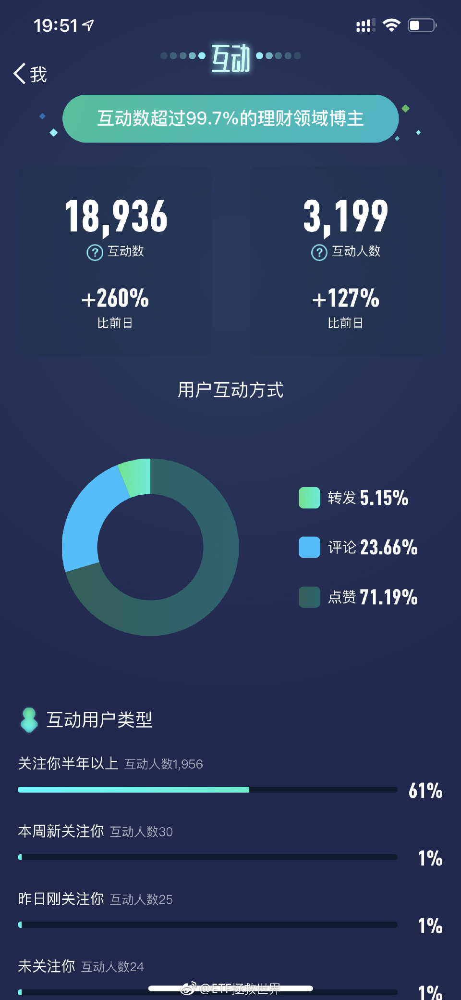

======================================================

ETF拯救世界 (5687069307) @
2018-11-14 19:56:10 Wed  
url: https://weibo.com/5687069307/H2F6VfXwo

什么人才会被这位妙龄少女色诱[疑问][哼]

------------------------------------------------------
转推：
>  @阜阳同城会 (1935700591)
>  2018-11-14 08:39:10 Wed  
>  url: https:/weibo.com/1935700591/H2AG83FHM/

>  #阜阳身边事# 【酒店约会女网友 男子一觉醒来钱没了】女子谢某正值妙龄，日前她与网友孙某相约开房。谁知谢某“醉翁之意不在酒”，竟趁孙某熟睡时解锁其手机，盗走支付宝和其身上现金共28900元。11月12日，@颍州警方在线 刑警一中队民警多方侦查将谢某抓获归案后，谢某交代了自今年9月以来使用相同“色 ​​​

转发[4]  评论[138]  赞[175] 

======================================================

ETF拯救世界 (5687069307) @
2018-11-15 08:05:52 Thu  
url: https://weibo.com/5687069307/H2JT6xpOD

回复@冷冬仲夏:@且慢管家 @小散的逆袭 今天这位在球球上投诉，请搞清楚是怎么回事，给出一个结果。//@冷冬仲夏:谁能找到且慢？雪球  小散的逆袭 的帐户有问题，已经向不好的方向讨论了[doge]

------------------------------------------------------
转推：
>  @ETF拯救世界 (5687069307)
>  2018-11-14 19:52:32 Wed  
>  url: https:/weibo.com/5687069307/H2F5riGMm/

>  别看关注我的人少，说起互动从来都没在怕的。 ​​​

转发[12]  评论[68]  赞[182] 

======================================================

ETF拯救世界 (5687069307) @
2018-11-15 08:38:16 Thu  
url: https://weibo.com/5687069307/H2K6gb2ek

回复@且慢管家:安全性肯定没问题，毕竟资产都在基金公司。以后大家有什么问题也可以向我反映，我来及时跟且慢沟通，不过一般也用不着我，客服都挺尽职的……

------------------------------------------------------
转推：
>  @ETF拯救世界 (5687069307)
>  2018-11-14 19:52:32 Wed  
>  url: https:/weibo.com/5687069307/H2F5riGMm/

>  别看关注我的人少，说起互动从来都没在怕的。 ​​​

转发[10]  评论[148]  赞[324] 

======================================================

ETF拯救世界 (5687069307) @
2018-11-15 11:32:12 Thu  
url: https://weibo.com/5687069307/H2LeRi1Ph

是不是我毕业太早了，怎么现在学校热水还要收费了吗。

------------------------------------------------------
转推：
>  @ ()
>  2018-11-15 00:38:17 Thu  
>  url: 

>  该账号因被投诉违反《微博社区公约》的相关规定，现已无法查看。查看帮助 https://kefu.weibo.com/faqdetail?id=13216

转发[40]  评论[261]  赞[172] 

======================================================

ETF拯救世界 (5687069307) @
2018-11-15 14:29:42 Thu  
url: https://weibo.com/5687069307/H2MoUviZp

搞事情是吗

------------------------------------------------------
转推：
>  @ETF拯救世界 (5687069307)
>  2018-11-13 10:06:44 Tue  
>  url: https:/weibo.com/5687069307/H2rPb167x/

>  $中证传媒 sz399971$   稍微有点过分。控制一下你寄几。 ​​​

转发[27]  评论[74]  赞[208] 

======================================================

ETF拯救世界 (5687069307) @
2018-11-15 14:47:57 Thu  
url: https://weibo.com/5687069307/H2MwjpUZf

回复@阿奔Lew:券商就猛一波。后续还要看其它兄弟//@阿奔Lew:其实证券公司才是搞事情，从最低点不知不觉30个点了，谁能想到！//@ETF拯救世界:搞事情是吗

------------------------------------------------------
转推：
>  @ETF拯救世界 (5687069307)
>  2018-11-13 10:06:44 Tue  
>  url: https:/weibo.com/5687069307/H2rPb167x/

>  $中证传媒 sz399971$   稍微有点过分。控制一下你寄几。 ​​​

转发[5]  评论[20]  赞[155] 

======================================================

ETF拯救世界 (5687069307) @
2018-11-15 14:49:36 Thu  
url: https://weibo.com/5687069307/H2MwZ3lgK

回复@梁小雨:这才是真爱……//@梁小雨:回复@-木子李先生:蚂蚁的资费不比且慢便宜，为什么不去且慢啊？自从有且慢，我的蚂蚁就不买基金了//@ETF拯救世界:是不是我毕业太早了，怎么现在学校热水还要收费了吗。

------------------------------------------------------
转推：
>  @ ()
>  2018-11-15 00:38:17 Thu  
>  url: 

>  该账号因被投诉违反《微博社区公约》的相关规定，现已无法查看。查看帮助 https://kefu.weibo.com/faqdetail?id=13216

转发[8]  评论[29]  赞[130] 

======================================================

ETF拯救世界 (5687069307) @
2018-11-15 14:51:14 Thu  
url: https://weibo.com/5687069307/H2MxEaTdS

回复@蜜蜂猴子葡萄蝙蝠:咋地，不服？拉黑你。//@蜜蜂猴子葡萄蝙蝠:军工不死牛市不来//@ETF拯救世界:搞事情是吗

------------------------------------------------------
转推：
>  @ETF拯救世界 (5687069307)
>  2018-11-13 10:06:44 Tue  
>  url: https:/weibo.com/5687069307/H2rPb167x/

>  $中证传媒 sz399971$   稍微有点过分。控制一下你寄几。 ​​​

转发[14]  评论[48]  赞[146] 

======================================================

ETF拯救世界 (5687069307) @
2018-11-15 14:55:52 Thu  
url: https://weibo.com/5687069307/H2MzxbNeR

回复@冰糖葫芦5加皮66:在外面忙呢//@冰糖葫芦5加皮66:益达快放微信号留言呀，我们想看了[允悲][允悲][羞嗒嗒][羞嗒嗒]每次评论都收获很多//@ETF拯救世界:回复@蜜蜂猴子葡萄蝙蝠:咋地，不服？拉黑你。//@蜜蜂猴子葡萄蝙蝠:军工不死牛市不来//@ETF拯救世界:搞事情是吗

------------------------------------------------------
转推：
>  @ETF拯救世界 (5687069307)
>  2018-11-13 10:06:44 Tue  
>  url: https:/weibo.com/5687069307/H2rPb167x/

>  $中证传媒 sz399971$   稍微有点过分。控制一下你寄几。 ​​​

转发[3]  评论[28]  赞[137] 

======================================================

ETF拯救世界 (5687069307) @
2018-11-15 14:58:37 Thu  
url: https://weibo.com/5687069307/H2MAE0kCi

回复@被e拯救:我一定让且慢专门为跟车的朋友开发点专属福利//@被e拯救:那我更是真爱，我把天天基金和蛋卷全停了，全在且慢买了//@ETF拯救世界:回复@梁小雨:这才是真爱……//@梁小雨:回复@-木子李先生:蚂蚁的资费不比且慢便宜，为什么不去且慢啊？自从有且慢，我的蚂蚁就不买基金了

------------------------------------------------------
转推：
>  @ ()
>  2018-11-15 00:38:17 Thu  
>  url: 

>  该账号因被投诉违反《微博社区公约》的相关规定，现已无法查看。查看帮助 https://kefu.weibo.com/faqdetail?id=13216

转发[7]  评论[234]  赞[283] 

======================================================

ETF拯救世界 (5687069307) @
2018-11-15 15:37:56 Thu  
url: https://weibo.com/5687069307/H2MQBjt8U

我现在回办公室的路上，还没看到数据。不过应该是出钻石坑进黄金坑了。  ​​​

转发[11]  评论[83]  赞[302] 

======================================================

ETF拯救世界 (5687069307) @
2018-11-15 15:40:07 Thu  
url: https://weibo.com/5687069307/H2MRuxipE

回复@蜜蜂猴子葡萄蝙蝠:开玩笑呢，还真拉黑啊。踏踏实实的。（已拉黑）//@蜜蜂猴子葡萄蝙蝠:对E大的投资水平真心佩服, 绝无挑衅之意, 话语如有冒犯请多多谅解, 下次多注意! 千万别拉黑 [作揖][作揖][作揖]//@ETF拯救世界:回复@蜜蜂猴子葡萄蝙蝠:咋地，不服？拉黑你。

------------------------------------------------------
转推：
>  @ETF拯救世界 (5687069307)
>  2018-11-13 10:06:44 Tue  
>  url: https:/weibo.com/5687069307/H2rPb167x/

>  $中证传媒 sz399971$   稍微有点过分。控制一下你寄几。 ​​​

转发[1]  评论[74]  赞[195] 

======================================================

ETF拯救世界 (5687069307) @
2018-11-15 16:04:15 Thu  
url: https://weibo.com/5687069307/H2N1hvb4Q

据消息灵通人士透露：今天出坑了。 ​​​

转发[158]  评论[206]  赞[441] 

======================================================

ETF拯救世界 (5687069307) @
2018-11-15 16:09:41 Thu  
url: https://weibo.com/5687069307/H2N3uF9qX

回复@longring60310:按照之前的经验，除了2008，都会有机会回踩。//@longring60310:如果再进一次，多好[笑而不语]

------------------------------------------------------
转推：
>  @ETF拯救世界 (5687069307)
>  2018-11-15 16:04:15 Thu  
>  url: https:/weibo.com/5687069307/H2N1hvb4Q/

>  据消息灵通人士透露：今天出坑了。 ​​​

转发[76]  评论[68]  赞[251] 

======================================================

ETF拯救世界 (5687069307) @
2018-11-15 16:16:30 Thu  
url: https://weibo.com/5687069307/H2N6g0LXN

回复@我有一头小毛驴喔:下次牛市持续时间不会少于五年。是一次从没出现过的长牛。//@我有一头小毛驴喔:十年一轮，长达2年甚至更久的大牛市开启了[嘻嘻]//@ETF拯救世界:回复@longring60310:按照之前的经验，除了2008，都会有机会回踩。

------------------------------------------------------
转推：
>  @ETF拯救世界 (5687069307)
>  2018-11-15 16:04:15 Thu  
>  url: https:/weibo.com/5687069307/H2N1hvb4Q/

>  据消息灵通人士透露：今天出坑了。 ​​​

转发[55]  评论[160]  赞[288] 

======================================================

ETF拯救世界 (5687069307) @
2018-11-15 16:16:59 Thu  
url: https://weibo.com/5687069307/H2N6sstb5

回复@蛋生123:总体来说我还是个伪价值投资者。50倍估值的指数我是真的下不去手。//@蛋生123:我想问下各位，益达给军工留份数了吗？//@ETF拯救世界:回复@蜜蜂猴子葡萄蝙蝠:咋地，不服？拉黑你。//@蜜蜂猴子葡萄蝙蝠:军工不死牛市不来//@ETF拯救世界:搞事情是吗

------------------------------------------------------
转推：
>  @ETF拯救世界 (5687069307)
>  2018-11-13 10:06:44 Tue  
>  url: https:/weibo.com/5687069307/H2rPb167x/

>  $中证传媒 sz399971$   稍微有点过分。控制一下你寄几。 ​​​

转发[5]  评论[44]  赞[218] 

======================================================

ETF拯救世界 (5687069307) @
2018-11-15 17:58:24 Thu  
url: https://weibo.com/5687069307/H2NLCk8gq

回复@亚历山大-棕地:当然。所以我的仓位在钻石坑里迅速接近股神。均值回归也是我的概率变量之一。//@亚历山大-棕地:益达最近粉丝增长好快。益达有没有想过，益达火和未来的股神们火这两者间也会经历均值回归，这三年熊市是益达的世界尤其最近两月达到顶峰，但也说明股神们的世界越来越近了。

------------------------------------------------------
转推：
>  @ETF拯救世界 (5687069307)
>  2018-11-15 16:04:15 Thu  
>  url: https:/weibo.com/5687069307/H2N1hvb4Q/

>  据消息灵通人士透露：今天出坑了。 ​​​

转发[7]  评论[33]  赞[200] 

======================================================

ETF拯救世界 (5687069307) @
2018-11-15 18:04:16 Thu  
url: https://weibo.com/5687069307/H2NO027qJ

回复@去奈良喂鹿:祝你有机会心想事成。//@去奈良喂鹿:我擦，已经十一万了，实际上，大家注意，熊市的时候，很多人超爱益达，谁说益达半点不好，这些人就会跳出来维护益达，但牛市的时候。。。。嘿嘿，大胆估计，益达会被diss的很惨[并不简单]

------------------------------------------------------
转推：
>  @ETF拯救世界 (5687069307)
>  2018-11-15 16:04:15 Thu  
>  url: https:/weibo.com/5687069307/H2N1hvb4Q/

>  据消息灵通人士透露：今天出坑了。 ​​​

转发[2]  评论[52]  赞[196] 

======================================================

ETF拯救世界 (5687069307) @
2018-11-15 18:09:32 Thu  
url: https://weibo.com/5687069307/H2NQ8rkQt

忙完了，开始看公众号留言。 ​​​

转发[0]  评论[49]  赞[289] 

======================================================

ETF拯救世界 (5687069307) @
2018-11-15 18:47:57 Thu  
url: https://weibo.com/5687069307/H2O5JiQco

网易云音乐做歌单那哥们！在不在！今天的BGM加错了！[吃瓜] ​​​

转发[1]  评论[92]  赞[318] 

======================================================

ETF拯救世界 (5687069307) @
2018-11-15 18:58:51 Thu  
url: https://weibo.com/5687069307/H2Oaa5zd7

回复@爱美食的sera:我也希望能看。省的我一条条放了。上次有个哥们说，我只要敢放一条骂我的留言出来就服了我。问题是真没有啊！衰。//@爱美食的sera:能在公众号里查看全部的留言吗？//@ETF拯救世界:回复@冰糖葫芦5加皮66:在外面忙呢

------------------------------------------------------
转推：
>  @ETF拯救世界 (5687069307)
>  2018-11-13 10:06:44 Tue  
>  url: https:/weibo.com/5687069307/H2rPb167x/

>  $中证传媒 sz399971$   稍微有点过分。控制一下你寄几。 ​​​

转发[2]  评论[70]  赞[259] 

======================================================

ETF拯救世界 (5687069307) @
2018-11-16 08:49:27 Fri  
url: https://weibo.com/5687069307/H2TBhEXxK

很多私募不设清盘线

------------------------------------------------------
转推：
>  @ ()
>  2018-11-16 08:46:00 Fri  
>  url: 

>  抱歉，作者已设置仅展示半年内微博，此微博已不可见。 ​​​

转发[9]  评论[80]  赞[226] 

======================================================

ETF拯救世界 (5687069307) @
2018-11-16 10:07:29 Fri  
url: https://weibo.com/5687069307/H2U6YbbKD

一个建议：

少看盘，多运动，多读书。又或者是把注意力集中在工作上，认真学习专业知识。

然后，你会发现，

还是看盘好。 ​​​

转发[29]  评论[260]  赞[574] 

======================================================

ETF拯救世界 (5687069307) @
2018-11-16 10:30:17 Fri  
url: https://weibo.com/5687069307/H2UgegYVC

刚才有朋友说，牛市中，有50%的人收益会超过指数涨幅。

我告诉你，那是做梦。

我现在说，你可能不信，无论什么样的大牛市，会有20%-30%的人亏损。当然，你不信，我先把话撂这儿，到时候看。注意，我说的是上涨过程中，不是牛转熊后。

再说，剩下的70%-80%里面，一半人挣不到几个的大子。为什么，每 ​​​

转发[125]  评论[225]  赞[518] 

======================================================

ETF拯救世界 (5687069307) @
2018-11-16 10:44:51 Fri  
url: https://weibo.com/5687069307/H2Um8nsPX

不要幻想你在任何时候都跑赢所有人。哪怕是某个区间跑赢所有人我都觉得害怕。

只要追求永远在前20%-30%就是最舒服的。如果你能长期保持下去，你就是最牛逼的。

为什么？

0.25*0.25*0.25*0.25=0.0039。

两轮牛熊后，你已经能跑赢99.6%的人了。

剩下的0.4里面，有0.3是运气好。再来两轮还是会被你干 ​​​

转发[157]  评论[230]  赞[644] 

======================================================

ETF拯救世界 (5687069307) @
2018-11-16 11:03:35 Fri  
url: https://weibo.com/5687069307/H2UtK1bIC

我的一个股票从最低点上来已经涨了66%了，今天还一字板呢。

NB吗。

看了看账户里这只股票后面显示依然浮亏23%的我眼泪默默流下来。

好消息是市值占比只有0.0025%…… ​​​

转发[23]  评论[103]  赞[340] 

======================================================

ETF拯救世界 (5687069307) @
2018-11-16 11:18:41 Fri  
url: https://weibo.com/5687069307/H2UzS2Rhn

讲段子是为了让你知道，在这样的市场环境下，不要乱动，踏踏实实拿着，干点别的能娱乐自己的事儿就行。

当然，如果你自己有波段操作的策略，就要遵守规则去做。但是注意，这个地方，仓位不要太低。 ​​​

转发[27]  评论[84]  赞[384] 

======================================================

ETF拯救世界 (5687069307) @
2018-11-16 11:23:57 Fri  
url: https://weibo.com/5687069307/H2UC0oAE2

看着组合里的品种一个个翻红，有没有一种依依不舍的感觉。 ​​​

转发[43]  评论[202]  赞[487] 

======================================================

ETF拯救世界 (5687069307) @
2018-11-16 11:28:22 Fri  
url: https://weibo.com/5687069307/H2UDNaKN4

500赛高。

第一大重仓品种，总持仓接近15%。最好的宽基，没有之一。

$中证500 sz399905$ ​​​

转发[53]  评论[155]  赞[451] 

======================================================

ETF拯救世界 (5687069307) @
2018-11-16 11:33:23 Fri  
url: https://weibo.com/5687069307/H2UFPFn7c

回复@陈小践:好好享受你的投资世界之旅吧。//@陈小践:底部走过还没有特别大的感觉，但2600点满仓收益率在10%以内，简直太神奇了！怎么做到的！

------------------------------------------------------
转推：
>  @ETF拯救世界 (5687069307)
>  2018-11-16 11:23:57 Fri  
>  url: https:/weibo.com/5687069307/H2UC0oAE2/

>  看着组合里的品种一个个翻红，有没有一种依依不舍的感觉。 ​​​

转发[5]  评论[83]  赞[301] 

======================================================

ETF拯救世界 (5687069307) @
2018-11-16 11:55:40 Fri  
url: https://weibo.com/5687069307/H2UOSbL5j

回复@伊娃1118:吃饭吃7成饱最健康，其实投资也一样。//@伊娃1118:有点烦[允悲]，只有8成多仓位，已经全红了

------------------------------------------------------
转推：
>  @ETF拯救世界 (5687069307)
>  2018-11-16 11:23:57 Fri  
>  url: https:/weibo.com/5687069307/H2UC0oAE2/

>  看着组合里的品种一个个翻红，有没有一种依依不舍的感觉。 ​​​

转发[19]  评论[186]  赞[382] 

======================================================

ETF拯救世界 (5687069307) @
2018-11-16 16:22:14 Fri  
url: https://weibo.com/5687069307/H2Wz54R9V

有人知道这是什么牌子的羽绒服吗

------------------------------------------------------
转推：
>  @ ()
>  2018-11-11 18:22:21 Sun  
>  url: 

>  抱歉，此微博已被作者删除。查看帮助：http://t.cn/Rfd3rQV

转发[4]  评论[109]  赞[182] 

======================================================

ETF拯救世界 (5687069307) @
2018-11-16 19:33:17 Fri  
url: https://weibo.com/5687069307/H2XOD2zhh

吴尊还大一岁…… ​​​

转发[20]  评论[194]  赞[300] 

+++++++++++++++++++++++++++++++++++++++++++++++++++++

图片：

======================================================

ETF拯救世界 (5687069307) @
2018-11-17 17:57:10 Sat  
url: https://weibo.com/5687069307/H36C6DxRw

今天很难得有时间宅了一天，看了两本书。

希望明年有大量时间让我多看点东西。

其实一本书里，有一句话对你有用，就没白看。 ​​​

转发[31]  评论[283]  赞[891] 

======================================================

ETF拯救世界 (5687069307) @
2018-11-19 07:41:26 Mon  
url: https://weibo.com/5687069307/H3lraqLyY

我个人认为，社会越发达，经济因素在女性择偶考虑因素中占比会越低。

现在很多时候钱显得很重要，一方面是有部分人依然很穷，一方面是我们穷的时间太长了。 ​​​

转发[33]  评论[238]  赞[626] 

======================================================

ETF拯救世界 (5687069307) @
2018-11-19 10:26:42 Mon  
url: https://weibo.com/5687069307/H3mwg5oM9

喷了，市面上居然有这种东西开始卖了？

第一，我劝各位别买。

第二，卖的人，你要考虑清楚，一个是版权问题，一个是非法出版物问题。哪个都能让你进去呆几年。 ​​​

转发[18]  评论[224]  赞[406] 

+++++++++++++++++++++++++++++++++++++++++++++++++++++

图片：
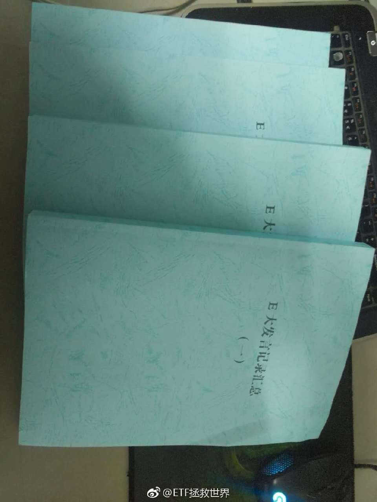

======================================================

ETF拯救世界 (5687069307) @
2018-11-19 10:36:58 Mon  
url: https://weibo.com/5687069307/H3mAq3N6z

居然卖300块！哥们你很危险了。

------------------------------------------------------
转推：
>  @ETF拯救世界 (5687069307)
>  2018-11-19 10:26:42 Mon  
>  url: https:/weibo.com/5687069307/H3mwg5oM9/

>  喷了，市面上居然有这种东西开始卖了？
>  
>  第一，我劝各位别买。
>  
>  第二，卖的人，你要考虑清楚，一个是版权问题，一个是非法出版物问题。哪个都能让你进去呆几年。 ​​​

转发[7]  评论[153]  赞[261] 

======================================================

ETF拯救世界 (5687069307) @
2018-11-19 11:30:19 Mon  
url: https://weibo.com/5687069307/H3mW57RyW

有人做投资看现在，我们做投资看未来。

目前的盈利或者亏损，都不是最后的终点。就如你的孩子现在在班里每次考第一，又或者每次都考不进前十，都不代表未来他的人生是否成功，是否幸福一样。

你站的高一点，看的远一点，很多东西就完全不同了。

在金融市场上，有时候浮亏是特别好的事。尤其是当你有 ​​​

转发[200]  评论[253]  赞[478] 

+++++++++++++++++++++++++++++++++++++++++++++++++++++

图片：

======================================================

ETF拯救世界 (5687069307) @
2018-11-19 11:41:24 Mon  
url: https://weibo.com/5687069307/H3n0A565q

债券开始最后的疯狂了，很多人又要被套。——E首发。 ​​​

转发[72]  评论[105]  赞[465] 

======================================================

ETF拯救世界 (5687069307) @
2018-11-19 11:50:24 Mon  
url: https://weibo.com/5687069307/H3n4elZNH

回复@高人藤:历史永远在重复。//@高人藤:上个星期，我的华夏基金客户经理给我推荐债基，我就知道债基要完了

------------------------------------------------------
转推：
>  @ETF拯救世界 (5687069307)
>  2018-11-19 11:41:24 Mon  
>  url: https:/weibo.com/5687069307/H3n0A565q/

>  债券开始最后的疯狂了，很多人又要被套。——E首发。 ​​​

转发[25]  评论[22]  赞[259] 

======================================================

ETF拯救世界 (5687069307) @
2018-11-19 11:53:37 Mon  
url: https://weibo.com/5687069307/H3n5xkYeQ

如果债券狂涨，估值这么低的股票最终没有跟上，会让我感到诧异。

目前十年期国债收益率只剩3.3%（我们买的时候接近4%）。A股全市场股票收益率则有3.9%（10月底4.3%）。谁更有投资价值你心里没点数吗？ ​​​

转发[78]  评论[144]  赞[361] 

======================================================

ETF拯救世界 (5687069307) @
2018-11-19 12:09:59 Mon  
url: https://weibo.com/5687069307/H3ncbfHTo

其实你回想一下，计划里买的所有品种。

基本来说，除了波段和趋势的几次，是不是都是越跌越买。

这会导致你的买入看起来特别二，特别傻。先不说A股的品种，就说油气，债券等等。第一，是买的时候基本没人说要买。第二是跌的很厉害，各种空头言论一再往下砸。

你这种时候去买，而且是那种炒股的人不 ​​​

转发[320]  评论[289]  赞[603] 

======================================================

ETF拯救世界 (5687069307) @
2018-11-19 12:18:32 Mon  
url: https://weibo.com/5687069307/H3nfEoLQB

回复@愿赌服输K:军工的问题是贵。2015年贵到220倍PE，目前50倍。我不是说它不可能涨，但是这么贵的指数我不买。一定要买吗？买其他的不能赚钱吗？我的答案是NO，所以不买。//@愿赌服输K:老大军工属不属于我们定义的辣鸡品种？虽然当前PE是最低点的两倍多，但指数已然跌了70%左右了

------------------------------------------------------
转推：
>  @ETF拯救世界 (5687069307)
>  2018-11-19 12:09:59 Mon  
>  url: https:/weibo.com/5687069307/H3ncbfHTo/

>  其实你回想一下，计划里买的所有品种。
>  
>  基本来说，除了波段和趋势的几次，是不是都是越跌越买。
>  
>  这会导致你的买入看起来特别二，特别傻。先不说A股的品种，就说油气，债券等等。第一，是买的时候基本没人说要买。第二是跌的很厉害，各种空头言论一再往下砸。
>  
>  你这种时候去买，而且是那种炒股的人不 ​​​

转发[45]  评论[40]  赞[212] 

======================================================

ETF拯救世界 (5687069307) @
2018-11-19 12:21:08 Mon  
url: https://weibo.com/5687069307/H3ngIfYuG

回复@qzy6_87413:逗呢。传媒只剩20倍了。创业板最低差点跌破25。//@qzy6_87413:将近40pe的传媒和创业板呢？//@ETF拯救世界:回复@愿赌服输K:军工的问题是贵。2015年贵到220倍PE，目前50倍。我不是说它不可能涨，但是这么贵的指数我不买。一定要买吗？买其他的不能赚钱吗？我的答案是NO，所以不买。

------------------------------------------------------
转推：
>  @ETF拯救世界 (5687069307)
>  2018-11-19 12:09:59 Mon  
>  url: https:/weibo.com/5687069307/H3ncbfHTo/

>  其实你回想一下，计划里买的所有品种。
>  
>  基本来说，除了波段和趋势的几次，是不是都是越跌越买。
>  
>  这会导致你的买入看起来特别二，特别傻。先不说A股的品种，就说油气，债券等等。第一，是买的时候基本没人说要买。第二是跌的很厉害，各种空头言论一再往下砸。
>  
>  你这种时候去买，而且是那种炒股的人不 ​​​

转发[20]  评论[30]  赞[210] 

======================================================

ETF拯救世界 (5687069307) @
2018-11-19 12:30:01 Mon  
url: https://weibo.com/5687069307/H3nkjnCjc

传媒，2015年最高干到过120倍。上个月最低跌破20。

指数3年最大跌幅78.3%，无限接近我的理解极限。

我不知道它什么时候涨，也许几个月，也许几年。我只知道它极大概率会涨。 ​​​

转发[138]  评论[129]  赞[429] 

======================================================

ETF拯救世界 (5687069307) @
2018-11-19 12:35:44 Mon  
url: https://weibo.com/5687069307/H3nmDj2tt

回复@宝丁宝丁宝丁宝丁:没吃。一会又要出去了……//@宝丁宝丁宝丁宝丁:这个时间发微博，是吃了午饭还是没吃呢……

------------------------------------------------------
转推：
>  @ETF拯救世界 (5687069307)
>  2018-11-19 12:30:01 Mon  
>  url: https:/weibo.com/5687069307/H3nkjnCjc/

>  传媒，2015年最高干到过120倍。上个月最低跌破20。
>  
>  指数3年最大跌幅78.3%，无限接近我的理解极限。
>  
>  我不知道它什么时候涨，也许几个月，也许几年。我只知道它极大概率会涨。 ​​​

转发[65]  评论[34]  赞[186] 

======================================================

ETF拯救世界 (5687069307) @
2018-11-19 13:06:34 Mon  
url: https://weibo.com/5687069307/H3nz9f7Tp

回复@aszjx:你要允许持仓品种涨。不要着急做再平衡。踏踏实实的。//@aszjx:我有个小问题，证券涨了这么多，计划里的证券仓位比例肯定变了，需要在合适的时候卖出一点维持原有仓位比例吗？还是持有不动。//@ETF拯救世界:回复@宝丁宝丁宝丁宝丁:没吃。一会又要出去了……

------------------------------------------------------
转推：
>  @ETF拯救世界 (5687069307)
>  2018-11-19 12:30:01 Mon  
>  url: https:/weibo.com/5687069307/H3nkjnCjc/

>  传媒，2015年最高干到过120倍。上个月最低跌破20。
>  
>  指数3年最大跌幅78.3%，无限接近我的理解极限。
>  
>  我不知道它什么时候涨，也许几个月，也许几年。我只知道它极大概率会涨。 ​​​

转发[64]  评论[48]  赞[222] 

======================================================

ETF拯救世界 (5687069307) @
2018-11-19 13:44:03 Mon  
url: https://weibo.com/5687069307/H3nOmtgCL

回复@哪里我靠靠:顶你上去//@哪里我靠靠:跌了快两个月，我老婆两月没让我碰。亏的上星期就浮亏3个点了，今天才开了荤[允悲]

------------------------------------------------------
转推：
>  @ETF拯救世界 (5687069307)
>  2018-11-19 12:09:59 Mon  
>  url: https:/weibo.com/5687069307/H3ncbfHTo/

>  其实你回想一下，计划里买的所有品种。
>  
>  基本来说，除了波段和趋势的几次，是不是都是越跌越买。
>  
>  这会导致你的买入看起来特别二，特别傻。先不说A股的品种，就说油气，债券等等。第一，是买的时候基本没人说要买。第二是跌的很厉害，各种空头言论一再往下砸。
>  
>  你这种时候去买，而且是那种炒股的人不 ​​​

转发[9]  评论[103]  赞[305] 

======================================================

ETF拯救世界 (5687069307) @
2018-11-19 14:28:31 Mon  
url: https://weibo.com/5687069307/H3o6pryJ3

回复@菜鸟_30322:实在忍不住追进去的时候说一声啊//@菜鸟_30322:只有我看证券涨想加仓的吗？总忍不住想追高。[允悲][二哈]//@ETF拯救世界:回复@aszjx:你要允许持仓品种涨。不要着急做再平衡。踏踏实实的。

------------------------------------------------------
转推：
>  @ETF拯救世界 (5687069307)
>  2018-11-19 12:30:01 Mon  
>  url: https:/weibo.com/5687069307/H3nkjnCjc/

>  传媒，2015年最高干到过120倍。上个月最低跌破20。
>  
>  指数3年最大跌幅78.3%，无限接近我的理解极限。
>  
>  我不知道它什么时候涨，也许几个月，也许几年。我只知道它极大概率会涨。 ​​​

转发[49]  评论[66]  赞[189] 

======================================================

ETF拯救世界 (5687069307) @
2018-11-19 14:50:05 Mon  
url: https://weibo.com/5687069307/H3ofaC6Ns

回复@huang医森:军种配齐了。兵强马壮，只等天道轮回。//@huang医森:老大，你现在有24份500  13份红利 10份医药 10份养老 9份50 9份环保 7份300 5份传媒 4份证券。感觉已经排好兵阵，磨刀霍霍啦！哈哈哈哈 开心//@ETF拯救世界:回复@菜鸟_30322:实在忍不住追进去的时候说一声啊

------------------------------------------------------
转推：
>  @ETF拯救世界 (5687069307)
>  2018-11-19 12:30:01 Mon  
>  url: https:/weibo.com/5687069307/H3nkjnCjc/

>  传媒，2015年最高干到过120倍。上个月最低跌破20。
>  
>  指数3年最大跌幅78.3%，无限接近我的理解极限。
>  
>  我不知道它什么时候涨，也许几个月，也许几年。我只知道它极大概率会涨。 ​​​

转发[45]  评论[55]  赞[247] 

======================================================

ETF拯救世界 (5687069307) @
2018-11-19 14:58:52 Mon  
url: https://weibo.com/5687069307/H3oiJhQ10

回复@拂晓卿然:还有债券 qdii 现在现金只有16%了//@拂晓卿然:所以。。。才6成吗？//@ETF拯救世界:回复@huang医森:军种配齐了。兵强马壮，只等天道轮回。

------------------------------------------------------
转推：
>  @ETF拯救世界 (5687069307)
>  2018-11-19 12:30:01 Mon  
>  url: https:/weibo.com/5687069307/H3nkjnCjc/

>  传媒，2015年最高干到过120倍。上个月最低跌破20。
>  
>  指数3年最大跌幅78.3%，无限接近我的理解极限。
>  
>  我不知道它什么时候涨，也许几个月，也许几年。我只知道它极大概率会涨。 ​​​

转发[6]  评论[28]  赞[198] 

======================================================

ETF拯救世界 (5687069307) @
2018-11-19 15:00:54 Mon  
url: https://weibo.com/5687069307/H3ojyt1Xh

前几天500 传媒 创业好，咱们的持仓里面有。今天50 300 红利好，咱们也有。

大小均衡配置，是一个合格组合的基本素养。 ​​​

转发[55]  评论[141]  赞[545] 

======================================================

ETF拯救世界 (5687069307) @
2018-11-19 15:16:43 Mon  
url: https://weibo.com/5687069307/H3opYsiZO

回复@NinjaMiner:今天份聊完了，明日再会。拜拜了您呐//@NinjaMiner:就喜欢看你不停的叨叨，请继续不要停[doge][doge][doge]

------------------------------------------------------
转推：
>  @ETF拯救世界 (5687069307)
>  2018-11-19 15:00:54 Mon  
>  url: https:/weibo.com/5687069307/H3ojyt1Xh/

>  前几天500 传媒 创业好，咱们的持仓里面有。今天50 300 红利好，咱们也有。
>  
>  大小均衡配置，是一个合格组合的基本素养。 ​​​

转发[2]  评论[69]  赞[289] 

======================================================

ETF拯救世界 (5687069307) @
2018-11-20 07:25:24 Tue  
url: https://weibo.com/5687069307/H3uLagrUt

有人说牛市会被喷，为什么被喷呢。跌的时候跌幅不到指数的30%，涨的时候能跟上。

还喷是不是辣鸡。 ​​​

转发[28]  评论[102]  赞[401] 

+++++++++++++++++++++++++++++++++++++++++++++++++++++

图片：
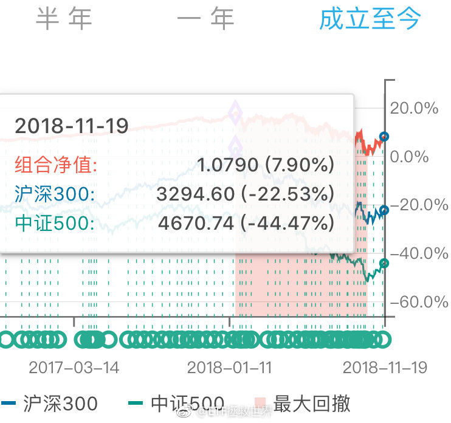

======================================================

ETF拯救世界 (5687069307) @
2018-11-20 07:41:45 Tue  
url: https://weibo.com/5687069307/H3uRNgh42

多少点开始出手？ ​​​

转发[15]  评论[259]  赞[352] 

+++++++++++++++++++++++++++++++++++++++++++++++++++++

图片：

======================================================

ETF拯救世界 (5687069307) @
2018-11-20 09:06:04 Tue  
url: https://weibo.com/5687069307/H3vq1wpJ7

回复@沐阳的夏:这是默认闲置资金全部买货基的情况。实际上不可能持有三年货基，一定有别的操作。//@沐阳的夏:E大，我看过您的雪球专栏，15年7月以后您的实际收益应该远比上面高，是因为实盘和长赢计划还是有很大不同吗？

------------------------------------------------------
转推：
>  @ETF拯救世界 (5687069307)
>  2018-11-20 07:25:24 Tue  
>  url: https:/weibo.com/5687069307/H3uLagrUt/

>  有人说牛市会被喷，为什么被喷呢。跌的时候跌幅不到指数的30%，涨的时候能跟上。
>  
>  还喷是不是辣鸡。 ​​​

转发[4]  评论[59]  赞[201] 

======================================================

ETF拯救世界 (5687069307) @
2018-11-20 10:08:05 Tue  
url: https://weibo.com/5687069307/H3vPcl7cH

有钱还怕买不到便宜货？

钱不烧手，干嘛那么着急都换成筹码呢。 ​​​

转发[17]  评论[106]  赞[486] 

======================================================

ETF拯救世界 (5687069307) @
2018-11-20 10:33:04 Tue  
url: https://weibo.com/5687069307/H3vZl8BOP

广发1-3年国开债指数基金一日售罄。

是不是又闻到了熟悉的味道？ ​​​

转发[46]  评论[92]  赞[392] 

======================================================

ETF拯救世界 (5687069307) @
2018-11-20 10:35:32 Tue  
url: https://weibo.com/5687069307/H3w0ldfCk

回复@Elainealry:不急，再冲一冲。//@Elainealry:需要把全部债券转手给他们吗[哈哈]

------------------------------------------------------
转推：
>  @ETF拯救世界 (5687069307)
>  2018-11-20 10:33:04 Tue  
>  url: https:/weibo.com/5687069307/H3vZl8BOP/

>  广发1-3年国开债指数基金一日售罄。
>  
>  是不是又闻到了熟悉的味道？ ​​​

转发[15]  评论[20]  赞[234] 

======================================================

ETF拯救世界 (5687069307) @
2018-11-20 10:39:19 Tue  
url: https://weibo.com/5687069307/H3w1SjAhR

百思不得其解的是，为什么一个品种还没涨，很便宜的时候，无人关注。

表现特别好以后追涨的人越多。表现越好追的人越多。

永远无法理解。 ​​​

转发[57]  评论[243]  赞[453] 

======================================================

ETF拯救世界 (5687069307) @
2018-11-20 11:03:59 Tue  
url: https://weibo.com/5687069307/H3wbT9Aly

目前债券收益率倒也不是低的夸张。现在有十年国债有3.4%左右，2016年到过2.7%，那时候忽悠买债券的才是坏人…… ​​​

转发[36]  评论[135]  赞[361] 

======================================================

ETF拯救世界 (5687069307) @
2018-11-20 14:41:21 Tue  
url: https://weibo.com/5687069307/H3xC7yMTe

今天的走势你什么感觉。 ​​​

转发[21]  评论[492]  赞[354] 

======================================================

ETF拯救世界 (5687069307) @
2018-11-20 14:50:26 Tue  
url: https://weibo.com/5687069307/H3xFO3u3R

回复@不能不说了_15697:我看他说，预测2300-2900，如果贸易战升级，到2000。也就是预测2000-2900。如果我预测2000-2900，你们会不会骂我。这可是50%的区间了。//@不能不说了_15697:洪灏判断破2000点，那可不仅是钻石了。。是舍利子

------------------------------------------------------
转推：
>  @ETF拯救世界 (5687069307)
>  2018-11-20 14:41:21 Tue  
>  url: https:/weibo.com/5687069307/H3xC7yMTe/

>  今天的走势你什么感觉。 ​​​

转发[8]  评论[125]  赞[245] 

======================================================

ETF拯救世界 (5687069307) @
2018-11-20 15:30:41 Tue  
url: https://weibo.com/5687069307/H3xW8FCpx

今天，又掉进去了。[并不简单]

------------------------------------------------------
转推：
>  @ETF拯救世界 (5687069307)
>  2018-11-15 16:04:15 Thu  
>  url: https:/weibo.com/5687069307/H2N1hvb4Q/

>  据消息灵通人士透露：今天出坑了。 ​​​

转发[33]  评论[282]  赞[518] 

======================================================

ETF拯救世界 (5687069307) @
2018-11-20 15:52:38 Tue  
url: https://weibo.com/5687069307/H3y53duuM

比特币从最高点下跌已经76%。如果它是个“不死”的品种，那么按照我的理论，3800就差不多了。但问题是，它是个“不死”的品种吗。不知道。从跌幅看，这一波币圈熊市，已经可以跟2015至今的A股相比了。

------------------------------------------------------
转推：
>  @ ()
>  2018-11-20 10:55:18 Tue  
>  url: 

>  抱歉，作者已设置仅展示半年内微博，此微博已不可见。 ​​​

转发[35]  评论[82]  赞[185] 

======================================================

ETF拯救世界 (5687069307) @
2018-11-20 16:10:06 Tue  
url: https://weibo.com/5687069307/H3yc9cBhJ

回复@旺达与最后的巨像:没有偏见。主要是不懂。最关键的，是我不知道到哪里才能合法交易。谁能保证我的资金安全。否则买少了没用，买多了不踏实。//@旺达与最后的巨像:E大应该不会对币圈有什么偏见吧？如果价格合适是否也会纳入到标的里呢？

------------------------------------------------------
转推：
>  @ ()
>  2018-11-20 10:55:18 Tue  
>  url: 

>  抱歉，作者已设置仅展示半年内微博，此微博已不可见。 ​​​

转发[10]  评论[45]  赞[204] 

======================================================

ETF拯救世界 (5687069307) @
2018-11-20 16:44:39 Tue  
url: https://weibo.com/5687069307/H3yqawXt2

回复@maxcasio:趋势投资是由弱转强的时候投。人家翻了N倍了你还去追那叫什么趋势投资。//@maxcasio:趋势投资法，了解下

------------------------------------------------------
转推：
>  @ETF拯救世界 (5687069307)
>  2018-11-20 10:39:19 Tue  
>  url: https:/weibo.com/5687069307/H3w1SjAhR/

>  百思不得其解的是，为什么一个品种还没涨，很便宜的时候，无人关注。
>  
>  表现特别好以后追涨的人越多。表现越好追的人越多。
>  
>  永远无法理解。 ​​​

转发[19]  评论[45]  赞[258] 

======================================================

ETF拯救世界 (5687069307) @
2018-11-20 16:51:56 Tue  
url: https://weibo.com/5687069307/H3yt86OsU

我的体系中，趋势投资只有两个买点：

第一是突破的时候。如果涨幅不大就直接买。

第二是突破后回踩的时候。

这样，就可以保证成本不会高，即使趋势再度走坏，也能不赔少赔钱。

只有这两次，很严格。如果没买，再怎么涨也不追了。

当然，这都是雕虫小技，辅助一下而已。价值投资是王道欧耶。 ​​​

转发[240]  评论[373]  赞[677] 

======================================================

ETF拯救世界 (5687069307) @
2018-11-20 19:17:36 Tue  
url: https://weibo.com/5687069307/H3zqfloH8

二十秒就没了。没抢到

------------------------------------------------------
转推：
>  @托马斯大官人 (1688192603)
>  2018-11-20 18:52:54 Tue  
>  url: https:/weibo.com/1688192603/H3zgdBEVX/

>  当中老年有了情怀与购买力，住在五棵松凯迪拉克中心边上的我发现想买张张学友演唱会的票实在是太难了。[允悲] ​​​

转发[5]  评论[87]  赞[200] 

======================================================

ETF拯救世界 (5687069307) @
2018-11-21 06:51:38 Wed  
url: https://weibo.com/5687069307/H3DXXhqke

什么时候买回来 ​​​

转发[45]  评论[133]  赞[333] 

+++++++++++++++++++++++++++++++++++++++++++++++++++++

图片：

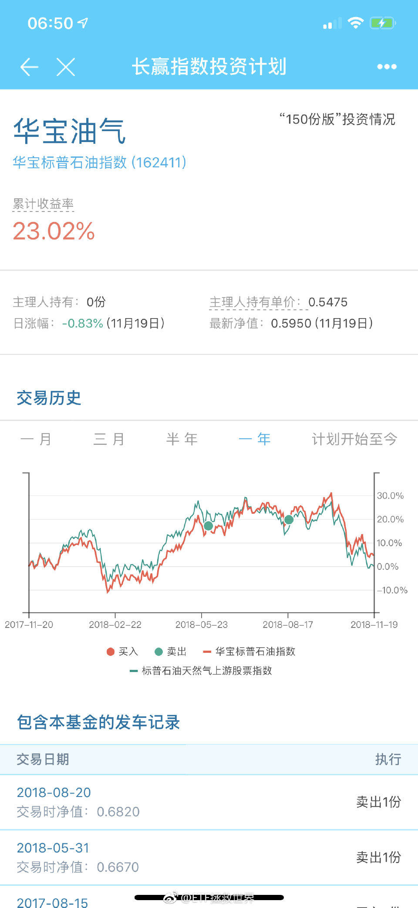

======================================================

ETF拯救世界 (5687069307) @
2018-11-21 07:02:29 Wed  
url: https://weibo.com/5687069307/H3E2mBIQZ

感谢吴总推荐。虽然A股指数波动性也非常大，但相比较而言，普通人确实更适合投资指数而非个股。

------------------------------------------------------
转推：
>  @月风_投资笔记 (1670659923)
>  2018-11-20 23:16:59 Tue  
>  url: https:/weibo.com/1670659923/H3AZqbo14/

>  谢谢大家，心情很好，那我继续这么一辈子当肥宅好了。
>  
>  这位朋友您好，您的问题很有代表性，我这样公开的谈希望您别介意，如有侵犯隐私请告知我。
>  
>  说实话，我个人并不建议新手介入股票市场，目前市场的难度在大幅度增加，而且这种难度的增加目测是不可逆的。
>  
>  但是你的想法非常正确，资产的分散化是一 ​​​

转发[13]  评论[55]  赞[338] 

======================================================

ETF拯救世界 (5687069307) @
2018-11-21 07:08:43 Wed  
url: https://weibo.com/5687069307/H3E4TvoGm

一个品种，长期回头看，不涨，没关系。只要有波动就能获利。  重要的是你要低位买进高位卖出。如果做反了那就歇菜了。 ​​​

------------------------------------------------------
转推：
>  @ETF拯救世界 (5687069307)
>  2018-11-21 06:51:38 Wed  
>  url: https:/weibo.com/5687069307/H3DXXhqke/

>  什么时候买回来 ​​​

转发[32]  评论[122]  赞[420] 

======================================================

ETF拯救世界 (5687069307) @
2018-11-21 09:34:24 Wed  
url: https://weibo.com/5687069307/H3F21FWT1

年轻时候的古天乐是真的帅//@曹增辉:居然大部分认识。哈哈哈//@sputnik85://@八大山债人:文颂娴！！！//@八大山债人://@债券搬砖狗://@rossina:Repost

------------------------------------------------------
转推：
>  @ ()
>  2018-11-20 00:10:03 Tue  
>  url: 

>  该账号因被投诉违反《微博社区公约》的相关规定，现已无法查看。查看帮助 https://kefu.weibo.com/faqdetail?id=13216

转发[79]  评论[73]  赞[190] 

======================================================

ETF拯救世界 (5687069307) @
2018-11-21 10:14:01 Wed  
url: https://weibo.com/5687069307/H3Fi726g5

还是要有点大国自信。

美帝跌我A就跟着跌？

怕什么，就是干！

关键是，

人家涨的时候也没见你跟着涨啊！[doge] ​​​

转发[20]  评论[93]  赞[422] 

======================================================

ETF拯救世界 (5687069307) @
2018-11-21 10:32:00 Wed  
url: https://weibo.com/5687069307/H3FporWes

[doge]

------------------------------------------------------
转推：
>  @ETF拯救世界 (5687069307)
>  2018-11-21 10:14:01 Wed  
>  url: https:/weibo.com/5687069307/H3Fi726g5/

>  还是要有点大国自信。
>  
>  美帝跌我A就跟着跌？
>  
>  怕什么，就是干！
>  
>  关键是，
>  
>  人家涨的时候也没见你跟着涨啊！[doge] ​​​

转发[1]  评论[50]  赞[238] 

======================================================

ETF拯救世界 (5687069307) @
2018-11-21 10:43:23 Wed  
url: https://weibo.com/5687069307/H3Fu1pcx9

回复@周蝶梦庄:不会的。目前仓位合适，回到正常的一个月两次节奏。大家家里没矿，没那么多钱随时发车。//@周蝶梦庄:看来今天要开车了

------------------------------------------------------
转推：
>  @ETF拯救世界 (5687069307)
>  2018-11-21 10:14:01 Wed  
>  url: https:/weibo.com/5687069307/H3Fi726g5/

>  还是要有点大国自信。
>  
>  美帝跌我A就跟着跌？
>  
>  怕什么，就是干！
>  
>  关键是，
>  
>  人家涨的时候也没见你跟着涨啊！[doge] ​​​

转发[6]  评论[108]  赞[311] 

======================================================

ETF拯救世界 (5687069307) @
2018-11-21 13:45:34 Wed  
url: https://weibo.com/5687069307/H3GFYzNLx

想去流浪。 ​​​

转发[8]  评论[270]  赞[454] 

======================================================

ETF拯救世界 (5687069307) @
2018-11-21 15:12:11 Wed  
url: https://weibo.com/5687069307/H3Hf8rtrc

祸从口出。

每天的新闻都在这样教育我们。

你说是不是。 ​​​

转发[8]  评论[117]  赞[442] 

======================================================

ETF拯救世界 (5687069307) @
2018-11-21 16:18:19 Wed  
url: https://weibo.com/5687069307/H3HFYB1Ls

显卡是不是可以降价了

------------------------------------------------------
转推：
>  @ ()
>  2018-11-21 15:17:20 Wed  
>  url: 

>  抱歉，作者已设置仅展示半年内微博，此微博已不可见。 ​​​

转发[13]  评论[104]  赞[200] 

======================================================

ETF拯救世界 (5687069307) @
2018-11-22 07:30:26 Thu  
url: https://weibo.com/5687069307/H3NEcqL5z

北京有24万户可投资资产超过600万

------------------------------------------------------
转推：
>  @大数云海君 (1495357574)
>  2018-11-21 15:09:10 Wed  
>  url: https:/weibo.com/1495357574/H3HdUuRpc/

>  富豪哪里最多？北京每千户13家千万富翁 《2018胡润财富报告》发布 中国“富裕家庭”总财富133万亿！北京拥有最多600万资产富裕家庭！ ​​​

转发[31]  评论[193]  赞[295] 

======================================================

ETF拯救世界 (5687069307) @
2018-11-22 13:06:35 Thu  
url: https://weibo.com/5687069307/H3PQEprmE

第一，闭嘴

第二，管住下半身

男人的成功概率提高75.4个巴仙。

如果伴侣能管住嘴，则成功概率增加幅度上涨至83.7个巴仙。 ​​​

转发[176]  评论[251]  赞[791] 

======================================================

ETF拯救世界 (5687069307) @
2018-11-23 07:27:37 Fri  
url: https://weibo.com/5687069307/H3X3ynp1I

回复@做人三观要正:为什么你要追问我为什么删了一条不重要的微博呢//@做人三观要正:E大为什么删除关于长赢的帖子呢

------------------------------------------------------
转推：
>  @ETF拯救世界 (5687069307)
>  2018-11-22 13:06:35 Thu  
>  url: https:/weibo.com/5687069307/H3PQEprmE/

>  第一，闭嘴
>  
>  第二，管住下半身
>  
>  男人的成功概率提高75.4个巴仙。
>  
>  如果伴侣能管住嘴，则成功概率增加幅度上涨至83.7个巴仙。 ​​​

转发[8]  评论[81]  赞[200] 

======================================================

ETF拯救世界 (5687069307) @
2018-11-23 09:18:08 Fri  
url: https://weibo.com/5687069307/H3XMpycF0

白条12和24期免息是我最喜欢的支付方式。所有要利息和服务费的看都不会看。

------------------------------------------------------
转推：
>  @ ()
>  2018-11-21 16:18:30 Wed  
>  url: 

>  该微博因被多人投诉，根据《微博社区公约》，已被删除。查看帮助：http://t.cn/zjmuxz1

转发[79]  评论[166]  赞[296] 

======================================================

ETF拯救世界 (5687069307) @
2018-11-23 09:40:19 Fri  
url: https://weibo.com/5687069307/H3XVq1MZb

回复@颓废的猪头_Ju:当然是立体交通了！有五层公路！两层都是公共交通！下车就能从窗户进家！车都是胶囊式的，时速300！有一层是自动平面滚梯，站在直接到任何地方！

------------------------------------------------------
转推：
>  @ETF拯救世界 (5687069307)
>  2018-11-22 13:06:35 Thu  
>  url: https:/weibo.com/5687069307/H3PQEprmE/

>  第一，闭嘴
>  
>  第二，管住下半身
>  
>  男人的成功概率提高75.4个巴仙。
>  
>  如果伴侣能管住嘴，则成功概率增加幅度上涨至83.7个巴仙。 ​​​

转发[3]  评论[24]  赞[162] 

======================================================

ETF拯救世界 (5687069307) @
2018-11-23 09:48:06 Fri  
url: https://weibo.com/5687069307/H3XYzCNZQ

关于白条免息，是这样的。

现在肯定比十年前或者更早的时候钱多一些。绝大多数东西当然也直接可以买，但为什么还是喜欢免息分期。

这与以前钱少的时候留下的思维定式有关。思维习惯一旦养成就很难改。

当然，除了以前买的房子，这辈子还没有过说想买一个超出支付能力范围的东西。从来没有，想买的东 ​​​

转发[99]  评论[186]  赞[377] 

======================================================

ETF拯救世界 (5687069307) @
2018-11-23 09:58:25 Fri  
url: https://weibo.com/5687069307/H3Y2LmOwb

回复@Sophia_wei:尤其是公积金贷款，千万不要提前还。3.25%的超长期稳定贷款利率你这辈子大概率都碰不到了……//@Sophia_wei:顺着益达的思路继续：为什么要提前还房贷呢？以前房贷银行都给你打85折，除了卖房的最好不要提前还，买个银行理财也赚了啊～

------------------------------------------------------
转推：
>  @ETF拯救世界 (5687069307)
>  2018-11-23 09:48:06 Fri  
>  url: https:/weibo.com/5687069307/H3XYzCNZQ/

>  关于白条免息，是这样的。
>  
>  现在肯定比十年前或者更早的时候钱多一些。绝大多数东西当然也直接可以买，但为什么还是喜欢免息分期。
>  
>  这与以前钱少的时候留下的思维定式有关。思维习惯一旦养成就很难改。
>  
>  当然，除了以前买的房子，这辈子还没有过说想买一个超出支付能力范围的东西。从来没有，想买的东 ​​​

转发[35]  评论[115]  赞[231] 

======================================================

ETF拯救世界 (5687069307) @
2018-11-23 10:24:21 Fri  
url: https://weibo.com/5687069307/H3Ydi7mhT

2009年初，我写过一篇从银行借3.x%房贷买建行股票的文章。

几个月后又写了一篇，因为建行股票翻番了。

别急，这些东西明年开始都会整理好重新发布出来。你会发现，十年前的事和现在没什么区别。相当有穿越感。 ​​​

转发[27]  评论[160]  赞[483] 

======================================================

ETF拯救世界 (5687069307) @
2018-11-23 10:39:34 Fri  
url: https://weibo.com/5687069307/H3Yjt6CU6

就是这两篇。

当时是因为09年初跟几个朋友一起买房，有些朋友一定要全款，为了提醒他们还有别的选择顺便写了这个记录一下。

我就拿贷款金额的一半去买了建行。当然，当时买什么股票都一样，都是几个月翻番……房子也是…… ​​​

转发[31]  评论[121]  赞[345] 

+++++++++++++++++++++++++++++++++++++++++++++++++++++

图片：

======================================================

ETF拯救世界 (5687069307) @
2018-11-23 10:45:29 Fri  
url: https://weibo.com/5687069307/H3YlS10sq

下周发车，坑又挖出来了。真好。

现在知道为什么本月取消周投入，月中只发一车了吧。

急什么，一切尽在掌握。 ​​​

转发[24]  评论[196]  赞[678] 

======================================================

ETF拯救世界 (5687069307) @
2018-11-23 10:49:52 Fri  
url: https://weibo.com/5687069307/H3YnEw1Zi

回复@倦意kop:好的。其他朋友也了解一下。可以去深入调查研究，如果是真的，用不用各位自己掂量吧~

------------------------------------------------------
转推：
>  @ETF拯救世界 (5687069307)
>  2018-11-23 09:48:06 Fri  
>  url: https:/weibo.com/5687069307/H3XYzCNZQ/

>  关于白条免息，是这样的。
>  
>  现在肯定比十年前或者更早的时候钱多一些。绝大多数东西当然也直接可以买，但为什么还是喜欢免息分期。
>  
>  这与以前钱少的时候留下的思维定式有关。思维习惯一旦养成就很难改。
>  
>  当然，除了以前买的房子，这辈子还没有过说想买一个超出支付能力范围的东西。从来没有，想买的东 ​​​

转发[5]  评论[35]  赞[181] 

======================================================

ETF拯救世界 (5687069307) @
2018-11-23 11:11:03 Fri  
url: https://weibo.com/5687069307/H3YweEsaO

回复@小狗上马路:很多东西都是以讹传讹。自己去动手算一下的就知道了，懒得再说。//@小狗上马路:E哥在2012年也谈到了一下房贷利率并非名义利率*2的问题，昨晚又翻您的旧文了//@ETF拯救世界:回复@Sophia_wei:尤其是公积金贷款，千万不要提前还。3.25%的超长期稳定贷款利率你这辈子大概率都碰不到了……

------------------------------------------------------
转推：
>  @ETF拯救世界 (5687069307)
>  2018-11-23 09:48:06 Fri  
>  url: https:/weibo.com/5687069307/H3XYzCNZQ/

>  关于白条免息，是这样的。
>  
>  现在肯定比十年前或者更早的时候钱多一些。绝大多数东西当然也直接可以买，但为什么还是喜欢免息分期。
>  
>  这与以前钱少的时候留下的思维定式有关。思维习惯一旦养成就很难改。
>  
>  当然，除了以前买的房子，这辈子还没有过说想买一个超出支付能力范围的东西。从来没有，想买的东 ​​​

转发[10]  评论[37]  赞[215] 

======================================================

ETF拯救世界 (5687069307) @
2018-11-23 11:44:27 Fri  
url: https://weibo.com/5687069307/H3YJNE1Es

大家吃好喝好玩好，我先撤了。

勿念。 ​​​

转发[2]  评论[237]  赞[486] 

======================================================

ETF拯救世界 (5687069307) @
2018-11-25 20:35:49 Sun  
url: https://weibo.com/5687069307/H4l4uauqI

刚看了看球球嘉年华的照片。

一言难尽的感觉。 ​​​

转发[10]  评论[124]  赞[261] 

======================================================

ETF拯救世界 (5687069307) @
2018-11-25 20:43:30 Sun  
url: https://weibo.com/5687069307/H4l7B5D9I

看了几届嘉年华，总感觉业内人士和公司高管给人的感觉更有范儿……

------------------------------------------------------
转推：
>  @ETF拯救世界 (5687069307)
>  2018-11-25 20:35:49 Sun  
>  url: https:/weibo.com/5687069307/H4l4uauqI/

>  刚看了看球球嘉年华的照片。
>  
>  一言难尽的感觉。 ​​​

转发[3]  评论[81]  赞[223] 

======================================================

ETF拯救世界 (5687069307) @
2018-11-26 09:20:54 Mon  
url: https://weibo.com/5687069307/H4q51x18A

[doge]

------------------------------------------------------
转推：
>  @投资者网 (1393100891)
>  2018-11-26 09:20:00 Mon  
>  url: https:/weibo.com/1393100891/H4q4F48tr/

>  【机构资金借道ETF抄底A股 易方达旗下产品规模增长显著】随着股指进入底部区域，不少资金开始借道ETF入场抄底，市场中ETF规模增长明显。以易方达基金为例，自年初至11月21日，其ETF总规模由249亿元增至408亿元，其中易方达创业板ETF基金今年以来规模增长近三倍，一度突破200亿元http://t.cn/ELqO76s ​​​

转发[21]  评论[37]  赞[212] 

======================================================

ETF拯救世界 (5687069307) @
2018-11-26 09:24:49 Mon  
url: https://weibo.com/5687069307/H4q6CgbNq

回复@靓仔小宝:周四或者周五正点发车。//@靓仔小宝:这周什么时候再抄抄底呢//@ETF拯救世界:[doge]

------------------------------------------------------
转推：
>  @投资者网 (1393100891)
>  2018-11-26 09:20:00 Mon  
>  url: https:/weibo.com/1393100891/H4q4F48tr/

>  【机构资金借道ETF抄底A股 易方达旗下产品规模增长显著】随着股指进入底部区域，不少资金开始借道ETF入场抄底，市场中ETF规模增长明显。以易方达基金为例，自年初至11月21日，其ETF总规模由249亿元增至408亿元，其中易方达创业板ETF基金今年以来规模增长近三倍，一度突破200亿元http://t.cn/ELqO76s ​​​

转发[8]  评论[39]  赞[232] 

======================================================

ETF拯救世界 (5687069307) @
2018-11-26 09:26:03 Mon  
url: https://weibo.com/5687069307/H4q77gaBG

走势引起舒服的感觉 ​​​

转发[13]  评论[111]  赞[363] 

+++++++++++++++++++++++++++++++++++++++++++++++++++++

图片：

======================================================

ETF拯救世界 (5687069307) @
2018-11-26 10:26:45 Mon  
url: https://weibo.com/5687069307/H4qvL0aqO

很多人在股市没有被收割，被币圈收割了。

又或者是在股市赚了点钱，被币圈收割了。

任何投资品种，我是说任何。暴涨后我都毫无兴趣。

财富这个东西，有时候增长的快点，有时候慢点，无所谓。千万千万不要大幅回撤。这非常关键。

尤其是你积累了大量财富以后，一次回撤就20、30年白干了。这辈子也就 ​​​

转发[130]  评论[174]  赞[560] 

======================================================

ETF拯救世界 (5687069307) @
2018-11-26 10:33:12 Mon  
url: https://weibo.com/5687069307/H4qymxlcl

我跟你说投资难在哪里。

最难的是什么时候收手。

你收的早了，赚个三瓜两枣。收的晚了，一场春梦了无痕。

你这次收在最高点了，下次有可能就翻车。毕竟你不会一辈子只做一轮。

非常难。

我的解决之道，只能是用机械的策略去应对。主观判断十有八九没有善终。

一个想法。 ​​​

转发[215]  评论[229]  赞[772] 

======================================================

ETF拯救世界 (5687069307) @
2018-11-26 10:41:25 Mon  
url: https://weibo.com/5687069307/H4qBIiMkZ

回复@L-小mi:我要懂房产还会高位接盘吗 [doge] 无数个坑，总有一款适合你。//@L-小mi:那房产呢，E大指点一下哦

------------------------------------------------------
转推：
>  @ETF拯救世界 (5687069307)
>  2018-11-26 10:26:45 Mon  
>  url: https:/weibo.com/5687069307/H4qvL0aqO/

>  很多人在股市没有被收割，被币圈收割了。
>  
>  又或者是在股市赚了点钱，被币圈收割了。
>  
>  任何投资品种，我是说任何。暴涨后我都毫无兴趣。
>  
>  财富这个东西，有时候增长的快点，有时候慢点，无所谓。千万千万不要大幅回撤。这非常关键。
>  
>  尤其是你积累了大量财富以后，一次回撤就20、30年白干了。这辈子也就 ​​​

转发[3]  评论[40]  赞[248] 

======================================================

ETF拯救世界 (5687069307) @
2018-11-26 10:45:03 Mon  
url: https://weibo.com/5687069307/H4qDbj8pm

回复@一壹y:二十个巴仙以内吧。买入还好，卖出的时候更加有用。比如油气，体会一下。//@一壹y:那请教E大，技术分析在投资中占多少比重，毫无疑问，你每次发车的时间与发车数量应该有那么一点点的预测，[二哈][doge]

------------------------------------------------------
转推：
>  @ETF拯救世界 (5687069307)
>  2018-11-26 10:33:12 Mon  
>  url: https:/weibo.com/5687069307/H4qymxlcl/

>  我跟你说投资难在哪里。
>  
>  最难的是什么时候收手。
>  
>  你收的早了，赚个三瓜两枣。收的晚了，一场春梦了无痕。
>  
>  你这次收在最高点了，下次有可能就翻车。毕竟你不会一辈子只做一轮。
>  
>  非常难。
>  
>  我的解决之道，只能是用机械的策略去应对。主观判断十有八九没有善终。
>  
>  一个想法。 ​​​

转发[24]  评论[50]  赞[247] 

======================================================

ETF拯救世界 (5687069307) @
2018-11-26 11:41:52 Mon  
url: https://weibo.com/5687069307/H4r0fdKNR

爱喝奶茶的人为什么不自己做。

最简单的，立顿红茶茶包，泡好放奶。喜欢甜的加点糖，比外面的健康又好喝不是吗。

结论：

钻石是21世纪最大的谎言。

据说成分与钻石100%相同的人工大钻就要问世了，一克拉只要几百蚊，姑娘们还会喜欢天然钻石吗！ ​​​

转发[20]  评论[174]  赞[304] 

======================================================

ETF拯救世界 (5687069307) @
2018-11-26 12:02:23 Mon  
url: https://weibo.com/5687069307/H4r8ztB9f

奢侈品或者说很多贵的东西吧，多多少少也用过一些，也算有点发言权。

很多东西确实贵，如果用“值”的角度看，性价比肯定一般。比如名表，好车，奢侈品之类的。

但是是这样。可能你花100块买个普通的，享受了100分。花1000块，买个奢侈品，享受了110分。为了增加10%的好体验，多花了10倍。不值，但有 ​​​

转发[32]  评论[207]  赞[321] 

======================================================

ETF拯救世界 (5687069307) @
2018-11-26 12:11:45 Mon  
url: https://weibo.com/5687069307/H4rcnevPY

回复@游进大海的鱼_:黄金本身就是元素，除非你是上帝，你生产不出来。。你可以用碳元素生成钻石，但你不能生成碳元素……//@游进大海的鱼_:等我研究化学公式，反应生成黄金

------------------------------------------------------
转推：
>  @ETF拯救世界 (5687069307)
>  2018-11-26 12:02:23 Mon  
>  url: https:/weibo.com/5687069307/H4r8ztB9f/

>  奢侈品或者说很多贵的东西吧，多多少少也用过一些，也算有点发言权。
>  
>  很多东西确实贵，如果用“值”的角度看，性价比肯定一般。比如名表，好车，奢侈品之类的。
>  
>  但是是这样。可能你花100块买个普通的，享受了100分。花1000块，买个奢侈品，享受了110分。为了增加10%的好体验，多花了10倍。不值，但有 ​​​

转发[6]  评论[69]  赞[213] 

======================================================

ETF拯救世界 (5687069307) @
2018-11-26 12:17:06 Mon  
url: https://weibo.com/5687069307/H4rey0ysW

关于黄金，一个贴士：

如果你买了9999以上的金块金条金币，不要像电视剧里一样去咬。

别问我怎么知道的。[拜拜] ​​​

转发[20]  评论[132]  赞[351] 

======================================================

ETF拯救世界 (5687069307) @
2018-11-26 14:07:52 Mon  
url: https://weibo.com/5687069307/H4rXvlH4E

是不是新低很重要。 ​​​

转发[21]  评论[93]  赞[375] 

======================================================

ETF拯救世界 (5687069307) @
2018-11-26 14:30:32 Mon  
url: https://weibo.com/5687069307/H4s6IgxZ9

回复@Jeep华尔街机器人:会不会破不用预测，也不重要。重要的是观察，以及执行破或不破的对应策略。//@Jeep华尔街机器人:请问2449会破么，好回答么？[哈哈]

------------------------------------------------------
转推：
>  @ETF拯救世界 (5687069307)
>  2018-11-26 14:07:52 Mon  
>  url: https:/weibo.com/5687069307/H4rXvlH4E/

>  是不是新低很重要。 ​​​

转发[14]  评论[50]  赞[254] 

======================================================

ETF拯救世界 (5687069307) @
2018-11-26 15:58:26 Mon  
url: https://weibo.com/5687069307/H4sGo0nfN

目前这个阶段，我个人认为，除了股市，恐怕没有什么更好的投资领域了。

债券？你别看我们的债券今年涨了10%，我可以几乎肯定地说，中期回头看，债券的收益率一定比不上现在的股市。理由？看附图。

房地产？我不懂。你懂你买。不过REITS也可以当做资产配置的一部分放入组合是真的。

比特币，黄金，还 ​​​

转发[473]  评论[336]  赞[654] 

+++++++++++++++++++++++++++++++++++++++++++++++++++++

图片：
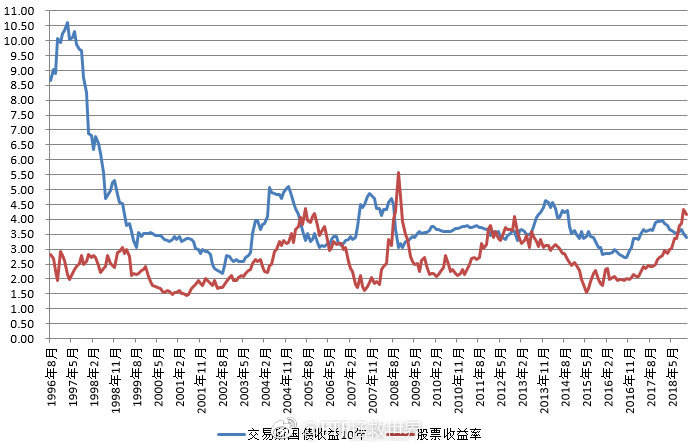

======================================================

ETF拯救世界 (5687069307) @
2018-11-26 16:04:58 Mon  
url: https://weibo.com/5687069307/H4sJ2lBuG

回复@愿赌服输K:你换个思路。老话说，开心也是一天，难过也是一天，何苦这么熬？你的，我的意志，都改变不了磨底还是暴涨暴跌的走势。何不做好预案，让市场自己去走，你舒舒服服的看？你强加了自己的希望在市场身上，就像爱上了安妮海瑟薇求之而不得，这辈子你也开心不起来了。

------------------------------------------------------
转推：
>  @ETF拯救世界 (5687069307)
>  2018-11-26 15:58:26 Mon  
>  url: https:/weibo.com/5687069307/H4sGo0nfN/

>  目前这个阶段，我个人认为，除了股市，恐怕没有什么更好的投资领域了。
>  
>  债券？你别看我们的债券今年涨了10%，我可以几乎肯定地说，中期回头看，债券的收益率一定比不上现在的股市。理由？看附图。
>  
>  房地产？我不懂。你懂你买。不过REITS也可以当做资产配置的一部分放入组合是真的。
>  
>  比特币，黄金，还 ​​​

转发[20]  评论[73]  赞[266] 

======================================================

ETF拯救世界 (5687069307) @
2018-11-26 16:48:00 Mon  
url: https://weibo.com/5687069307/H4t0vi22U

回复@两个世界V665924:这就是A股大多数股民赔钱的秘密之一。资金多，流通股少，导致估值恒时高估。//@两个世界V665924:为什么股票收益率长期低于债券收益率呢?好奇怪[并不简单]

------------------------------------------------------
转推：
>  @ETF拯救世界 (5687069307)
>  2018-11-26 15:58:26 Mon  
>  url: https:/weibo.com/5687069307/H4sGo0nfN/

>  目前这个阶段，我个人认为，除了股市，恐怕没有什么更好的投资领域了。
>  
>  债券？你别看我们的债券今年涨了10%，我可以几乎肯定地说，中期回头看，债券的收益率一定比不上现在的股市。理由？看附图。
>  
>  房地产？我不懂。你懂你买。不过REITS也可以当做资产配置的一部分放入组合是真的。
>  
>  比特币，黄金，还 ​​​

转发[30]  评论[40]  赞[197] 

======================================================

ETF拯救世界 (5687069307) @
2018-11-26 17:13:01 Mon  
url: https://weibo.com/5687069307/H4taEFD5D

主要是这孩子太老实了。也有体型导致自卑的原因。。这老头是真的辣鸡了。

------------------------------------------------------
转推：
>  @ ()
>  2018-11-26 09:39:12 Mon  
>  url: 

>  抱歉，作者已设置仅展示半年内微博，此微博已不可见。 ​​​

转发[15]  评论[42]  赞[151] 

======================================================

ETF拯救世界 (5687069307) @
2018-11-26 17:20:41 Mon  
url: https://weibo.com/5687069307/H4tdLCrxD

回复@臊子面配豆芽菜:就这老头，你要能把他骂哭，那你骂人的功力应该可以排在华北前十了！//@臊子面配豆芽菜:要我必须把老头骂哭才走[米奇比心]//@ETF拯救世界:主要是这孩子太老实了。也有体型导致自卑的原因。。这老头是真的辣鸡了。

------------------------------------------------------
转推：
>  @ ()
>  2018-11-26 09:39:12 Mon  
>  url: 

>  抱歉，作者已设置仅展示半年内微博，此微博已不可见。 ​​​

转发[5]  评论[33]  赞[141] 

======================================================

ETF拯救世界 (5687069307) @
2018-11-26 17:38:55 Mon  
url: https://weibo.com/5687069307/H4tlavIjI

回复@阮秋嬅:图片评论 http://t.cn/ELcgcmf //@阮秋嬅:请教E大，97年是什么情况？怎么那么高

------------------------------------------------------
转推：
>  @ETF拯救世界 (5687069307)
>  2018-11-26 15:58:26 Mon  
>  url: https:/weibo.com/5687069307/H4sGo0nfN/

>  目前这个阶段，我个人认为，除了股市，恐怕没有什么更好的投资领域了。
>  
>  债券？你别看我们的债券今年涨了10%，我可以几乎肯定地说，中期回头看，债券的收益率一定比不上现在的股市。理由？看附图。
>  
>  房地产？我不懂。你懂你买。不过REITS也可以当做资产配置的一部分放入组合是真的。
>  
>  比特币，黄金，还 ​​​

转发[49]  评论[28]  赞[158] 

======================================================

ETF拯救世界 (5687069307) @
2018-11-26 17:51:45 Mon  
url: https://weibo.com/5687069307/H4tqo46N0

回复@E大关门大弟子-铁蛋:最好不要见。恶性通胀一般不会是一两年就结束。随之而来的是股市债市大幅下跌然后长期低迷。当然，也不是没有东西会涨，比如黄金。//@E大关门大弟子-铁蛋:有生之年可以再见一回嘛？[doge][doge][doge]//@ETF拯救世界:回复@阮秋嬅:图片评论 http://t.cn/ELcgcmf 

------------------------------------------------------
转推：
>  @ETF拯救世界 (5687069307)
>  2018-11-26 15:58:26 Mon  
>  url: https:/weibo.com/5687069307/H4sGo0nfN/

>  目前这个阶段，我个人认为，除了股市，恐怕没有什么更好的投资领域了。
>  
>  债券？你别看我们的债券今年涨了10%，我可以几乎肯定地说，中期回头看，债券的收益率一定比不上现在的股市。理由？看附图。
>  
>  房地产？我不懂。你懂你买。不过REITS也可以当做资产配置的一部分放入组合是真的。
>  
>  比特币，黄金，还 ​​​

转发[36]  评论[102]  赞[213] 

======================================================

ETF拯救世界 (5687069307) @
2018-11-27 09:52:55 Tue  
url: https://weibo.com/5687069307/H4zIwbNZ2

基因都能改变。牛了。

你想啊，你不去改变它，它还有可能突变呢。好嘛，你还主动去动它。万一哪里出点问题，基因里面的问题可是一代代传下去的。二胎又放开了，没准过几代就开枝散叶大家都有问题了。

不能深想啊。 ​​​

转发[16]  评论[182]  赞[337] 

======================================================

ETF拯救世界 (5687069307) @
2018-11-27 10:17:31 Tue  
url: https://weibo.com/5687069307/H4zSvemmt

回复@叶叮当猫:不会太多。这几天没有大幅波动的话2-4车吧。//@叶叮当猫:益达，能否大致预告一下这周大概发车数量的范围，因为资金都在货币基金，要提前拿出来做准备，有同样疑问的顶我上去[爱你]

------------------------------------------------------
转推：
>  @ETF拯救世界 (5687069307)
>  2018-11-27 09:52:55 Tue  
>  url: https:/weibo.com/5687069307/H4zIwbNZ2/

>  基因都能改变。牛了。
>  
>  你想啊，你不去改变它，它还有可能突变呢。好嘛，你还主动去动它。万一哪里出点问题，基因里面的问题可是一代代传下去的。二胎又放开了，没准过几代就开枝散叶大家都有问题了。
>  
>  不能深想啊。 ​​​

转发[3]  评论[66]  赞[256] 

======================================================

ETF拯救世界 (5687069307) @
2018-11-27 10:30:11 Tue  
url: https://weibo.com/5687069307/H4zXE8oI1

你若不涨，便是晴天。

你若涨了，也能凑合过。

——席慕蓉。 ​​​

转发[18]  评论[285]  赞[597] 

======================================================

ETF拯救世界 (5687069307) @
2018-11-28 10:33:47 Wed  
url: https://weibo.com/5687069307/H4JpB23C2

回复@正能量的小书童:没有看过太多。偶尔看过一些片段，我只能说他的那类幽默不是我的菜//@正能量的小书童:E大看过李诞的节目吗？ 他是个有趣的人。想借E大的地方问问，如果排除名气这项条件，生活中有多少女生会喜欢李诞？ ​​​

------------------------------------------------------
转推：
>  @ETF拯救世界 (5687069307)
>  2018-11-27 10:30:11 Tue  
>  url: https:/weibo.com/5687069307/H4zXE8oI1/

>  你若不涨，便是晴天。
>  
>  你若涨了，也能凑合过。
>  
>  ——席慕蓉。 ​​​

转发[4]  评论[154]  赞[249] 

======================================================

ETF拯救世界 (5687069307) @
2018-11-28 12:06:55 Wed  
url: https://weibo.com/5687069307/H4K1oz19d

刚才有个40多的大姐来量门，量完在订单上写，

“男孩在家，尺寸已告知”

喷了。

保养的这么好吗。 ​​​

转发[11]  评论[348]  赞[774] 

======================================================

ETF拯救世界 (5687069307) @
2018-11-28 14:03:20 Wed  
url: https://weibo.com/5687069307/H4KMEFgNe

不要碰毒品。真的，否则你永远也戒不了。有多难，想想你能不能戒掉美食和啪啪啪。能？毒品的快感比这两个要大100-1000倍。戒不掉的。

------------------------------------------------------
转推：
>  @北京人不知道的北京事儿 (1662214194)
>  2018-11-28 13:56:07 Wed  
>  url: https:/weibo.com/1662214194/H4KJJweCd/

>  【实锤！陈羽凡吸毒被抓！！[话筒]】据北京石景山公安分局：根据群众举报，在某小区抓获2名涉毒违法人员陈某（男，43岁，歌手）和何某某，经尿检，陈某呈冰毒类和大麻类阳性。目前，陈某因吸毒、非法持有毒品被行政拘留。 ​​​

转发[23]  评论[193]  赞[320] 

======================================================

ETF拯救世界 (5687069307) @
2018-11-28 14:22:54 Wed  
url: https://weibo.com/5687069307/H4KUBj18j

月底要买的一个品种涨得让人心痛 ​​​

转发[3]  评论[257]  赞[479] 

======================================================

ETF拯救世界 (5687069307) @
2018-11-29 10:57:31 Thu  
url: https://weibo.com/5687069307/H4SZK2saU

石锤，真不是段子 http://t.cn/ELWC2vT

------------------------------------------------------
转推：
>  @ETF拯救世界 (5687069307)
>  2018-11-28 12:06:55 Wed  
>  url: https:/weibo.com/5687069307/H4K1oz19d/

>  刚才有个40多的大姐来量门，量完在订单上写，
>  
>  “男孩在家，尺寸已告知”
>  
>  喷了。
>  
>  保养的这么好吗。 ​​​

转发[5]  评论[266]  赞[436] 

======================================================

ETF拯救世界 (5687069307) @
2018-11-29 14:56:55 Thu  
url: https://weibo.com/5687069307/H4UyUcKl9

今天跌的还可以。

光脚长阴不解释。 ​​​

转发[21]  评论[390]  赞[648] 

======================================================

ETF拯救世界 (5687069307) @
2018-11-30 13:36:44 Fri  
url: https://weibo.com/5687069307/H53sQtV3X

一定要把油气和DAX的溢价这样搞起来吗。

我还没买呢！！！ ​​​

转发[11]  评论[212]  赞[351] 

======================================================

ETF拯救世界 (5687069307) @
2018-11-30 13:41:35 Fri  
url: https://weibo.com/5687069307/H53uPrSba

回复@L-小mi:我是场内场外都有。这种情况只能且慢买了//@L-小mi:场外已下单，所以E大全都是买场内的吗

------------------------------------------------------
转推：
>  @ETF拯救世界 (5687069307)
>  2018-11-30 13:36:44 Fri  
>  url: https:/weibo.com/5687069307/H53sQtV3X/

>  一定要把油气和DAX的溢价这样搞起来吗。
>  
>  我还没买呢！！！ ​​​

转发[4]  评论[75]  赞[220] 

======================================================

ETF拯救世界 (5687069307) @
2018-11-30 14:47:54 Fri  
url: https://weibo.com/5687069307/H53VK5tQw

场内DAX不要再追了，溢价超过3%了。

冷静点。 ​​​

转发[6]  评论[181]  赞[312] 

======================================================

ETF拯救世界 (5687069307) @
2018-11-30 15:04:21 Fri  
url: https://weibo.com/5687069307/H542q4EFn

11月所有宽基指数收红。500涨幅两个多点。1000涨幅接近6%。多谢市场给面子。关于下个月，要不要立个flag。

------------------------------------------------------
转推：
>  @ETF拯救世界 (5687069307)
>  2018-10-31 18:03:05 Wed  
>  url: https:/weibo.com/5687069307/H0wo4EMMs/

>  10月结束了，立个flag，11月收红。
>  
>  如果错了呢。
>  
>  二话不说，
>  
>  删帖。 ​​​

转发[11]  评论[120]  赞[462] 

======================================================

ETF拯救世界 (5687069307) @
2018-11-30 15:29:12 Fri  
url: https://weibo.com/5687069307/H54cvmDPR

忙完了，开始看公众号留言。 ​​​

转发[6]  评论[177]  赞[380] 

======================================================

ETF拯救世界 (5687069307) @
2018-11-30 18:18:16 Fri  
url: https://weibo.com/5687069307/H55j86g46

“并注销”。点赞。虽然我从来不穿他们家的衣服……

------------------------------------------------------
转推：
>  @巨潮资讯网 (2239792910)
>  2018-11-30 17:10:02 Fri  
>  url: https:/weibo.com/2239792910/H54Rr4NwH/

>  【海澜之家：拟回购6.66亿元至9.98亿元股份并注销】海澜之家拟回购公司股份，回购金额不低于6.66亿元，不超过9.98亿元；回购价格不超12.00元/股。回购的股份用于减少公司注册资本，公司将依法对回购的股份予以注销。 ​​​

转发[15]  评论[108]  赞[495] 

======================================================

ETF拯救世界 (5687069307) @
2018-12-01 23:24:24 Sat  
url: https://weibo.com/5687069307/H5gJTkbCc

不是我不明白，这世界变化快。连”男子汉“都z z不正确了。男女生而平等，但天生有别谁能否认？为什么泰坦尼克号下沉的时候要让女人和孩子先上救生艇？没有男子汉的担当，喊着男女平等一起往救生艇上挤吗。我个人认为，教育男孩多承担一些责任没有任何问题。

------------------------------------------------------
转推：
>  @新浪视频 (1640601392)
>  2018-12-01 21:42:18 Sat  
>  url: https:/weibo.com/1640601392/H5g4s1yGp/

>  【天津普及性别平等教育：小男子汉小女生是刻板印象】12月1日，天津市《关于在我市中小学开展性别平等教育的通知》提及，将在全市中小学校实施性别平等教育工作。性别平等专家提醒称，“小男子汉”“小女生”是刻板印象。天津市妇儿工委回应，此举是为了推动平等意识，“男生能做的女生也能做”。 ​​​

转发[25]  评论[230]  赞[454] 

======================================================

ETF拯救世界 (5687069307) @
2018-12-02 11:52:52 Sun  
url: https://weibo.com/5687069307/H5lDGBryj

我看有人说我性别歧视，我反思了一下。聊两句这方面的个人看法，如果你认为这是歧视，那就是歧视吧。

我确实经常有照顾女性的思想和行为。比如有一次和朋友一家出去，老公背着相机什么也没拿在前面走，太太在后面背个又大又重的包——这在他们家习以为常，我就非常不能接受。我认为这种事就是应该男人 ​​​

转发[71]  评论[527]  赞[1174] 

======================================================

ETF拯救世界 (5687069307) @
2018-12-03 06:47:40 Mon  
url: https://weibo.com/5687069307/H5t4j48Bm

这么说，一吨500面值的欧元钞票最值钱。进一步推理，你应该知道关键时刻身上应该带着哪种钞票了

------------------------------------------------------
转推：
>  @蓝鲸财经记者工作平台 (1885454921)
>  2018-12-02 22:45:47 Sun  
>  url: https:/weibo.com/1885454921/H5pUI3kej/

>  【读图】1吨百元大钞、1吨黄金和1亿元 到底哪个更值钱？（腾讯财经） ​​​

转发[11]  评论[95]  赞[240] 

======================================================

ETF拯救世界 (5687069307) @
2018-12-03 09:26:16 Mon  
url: https://weibo.com/5687069307/H5u6FAvuT

上周的五车几个品种买的还开心吗 ​​​

转发[9]  评论[366]  赞[847] 

======================================================

ETF拯救世界 (5687069307) @
2018-12-03 09:30:47 Mon  
url: https://weibo.com/5687069307/H5u8w1S0s

就看下午德国表现如何了 ​​​

转发[21]  评论[125]  赞[383] 

+++++++++++++++++++++++++++++++++++++++++++++++++++++

图片：
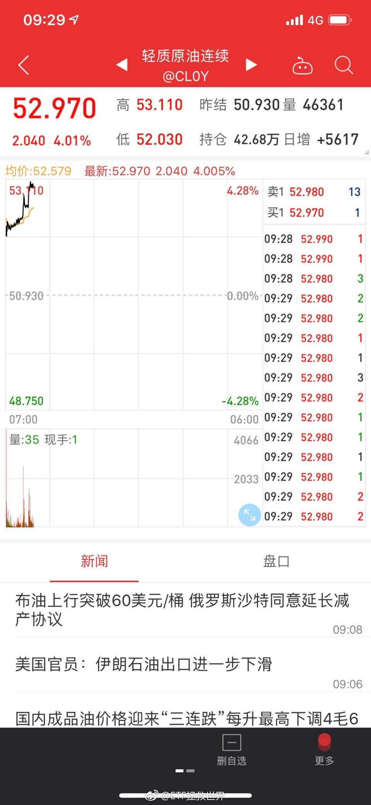

======================================================

ETF拯救世界 (5687069307) @
2018-12-03 10:41:19 Mon  
url: https://weibo.com/5687069307/H5uB9165n

这样涨真的好吗 ​​​

转发[4]  评论[139]  赞[305] 

+++++++++++++++++++++++++++++++++++++++++++++++++++++

图片：

======================================================

ETF拯救世界 (5687069307) @
2018-12-03 11:37:06 Mon  
url: https://weibo.com/5687069307/H5uXMATDd

多少钱

------------------------------------------------------
转推：
>  @北京人不知道的北京事儿 (1662214194)
>  2018-12-03 11:35:06 Mon  
>  url: https:/weibo.com/1662214194/H5uWYp9sc/

>  北京某公司做的全自动变形金刚擎天柱，感受一下。。。[心]http://t.cn/EyP7Z1E ​​​

转发[38]  评论[82]  赞[213] 

======================================================

ETF拯救世界 (5687069307) @
2018-12-03 12:42:23 Mon  
url: https://weibo.com/5687069307/H5vohwO91

一个数据：

目前录取比例是1 ：500 ​​​

转发[7]  评论[234]  赞[437] 

======================================================

ETF拯救世界 (5687069307) @
2018-12-03 14:13:52 Mon  
url: https://weibo.com/5687069307/H5vZpFt5v

现在不会有人觉得仓位不够了吧。

现金只剩不到15%了。再次在熊市中顺利建好仓位。历史不断循环。

踏踏实实的，多大点事。 ​​​

转发[19]  评论[238]  赞[588] 

======================================================

ETF拯救世界 (5687069307) @
2018-12-03 15:27:41 Mon  
url: https://weibo.com/5687069307/H5wto3Ddg

1：700。 有什么让大家误解的地方了吗。是不是都以为每天工作一小时月收入过万了……

------------------------------------------------------
转推：
>  @ETF拯救世界 (5687069307)
>  2018-12-03 12:42:23 Mon  
>  url: https:/weibo.com/5687069307/H5vohwO91/

>  一个数据：
>  
>  目前录取比例是1 ：500 ​​​

转发[5]  评论[204]  赞[298] 

======================================================

ETF拯救世界 (5687069307) @
2018-12-03 15:48:38 Mon  
url: https://weibo.com/5687069307/H5wBSC3Zr

怎么感觉有加速的迹象…… ​​​

转发[1]  评论[108]  赞[238] 

+++++++++++++++++++++++++++++++++++++++++++++++++++++

图片：

======================================================

ETF拯救世界 (5687069307) @
2018-12-03 16:30:49 Mon  
url: https://weibo.com/5687069307/H5wT0DHD6

德国 http://t.cn/EyAjxKL

------------------------------------------------------
转推：
>  @ETF拯救世界 (5687069307)
>  2018-12-03 09:30:47 Mon  
>  url: https:/weibo.com/5687069307/H5u8w1S0s/

>  就看下午德国表现如何了 ​​​

转发[15]  评论[75]  赞[322] 

======================================================

ETF拯救世界 (5687069307) @
2018-12-03 17:57:07 Mon  
url: https://weibo.com/5687069307/H5xs2c5xm

长赢已经受邀加入。

------------------------------------------------------
转推：
>  @蓝鲸TMT网 (3866012793)
>  2018-12-03 17:45:41 Mon  
>  url: https:/weibo.com/3866012793/H5xnp0Nfj/

>  【微信整治“洗稿”行为，公众号内测“洗稿投诉合议小组”】据新榜报道称，微信公众号内测“洗稿投诉合议小组”，该小组将协助平台对有争议的“洗稿”内容进行合议。
>  
>  据新榜称，如用户接受邀请，将会不定期收到“洗稿”合议邀请，经合议若存在“洗稿”，相关账号会收到相应处罚。目前，“格十三”、“ ​​​

转发[3]  评论[56]  赞[440] 

======================================================

ETF拯救世界 (5687069307) @
2018-12-04 09:29:03 Tue  
url: https://weibo.com/5687069307/H5Dyj6g7J

早上好。昨晚睡得怎么样。

我没睡好，看了400多封邮件。

还有700封。[拜拜] ​​​

转发[8]  评论[251]  赞[546] 

======================================================

ETF拯救世界 (5687069307) @
2018-12-04 10:18:28 Tue  
url: https://weibo.com/5687069307/H5DSmxvgW

回复@龙水六队:给发达国家留了15%的仓位，目前才2%。越跌越舒服啊。//@龙水六队:今天还舒服吗？//@ETF拯救世界:德国 http://t.cn/EyAjxKL

------------------------------------------------------
转推：
>  @ETF拯救世界 (5687069307)
>  2018-12-03 09:30:47 Mon  
>  url: https:/weibo.com/5687069307/H5u8w1S0s/

>  就看下午德国表现如何了 ​​​

转发[10]  评论[81]  赞[264] 

======================================================

ETF拯救世界 (5687069307) @
2018-12-04 11:46:02 Tue  
url: https://weibo.com/5687069307/H5ErUlR8v

看了几百封，说说感受。

第一，很有趣。

跟以前单位招聘收到的简历不同。以前收到的简历，教育背景，职业背景都差得不是很多。这次真是五花八门干什么的都有，有些朋友职业生涯变化之大让人目瞪口呆。特别有意思。感觉经历了很多不同的人生，有趣。

第二，各位大学生们写简历要走心。

我不是说每个 ​​​

转发[16]  评论[299]  赞[439] 

======================================================

ETF拯救世界 (5687069307) @
2018-12-04 12:56:47 Tue  
url: https://weibo.com/5687069307/H5EUDgxiW

回复@包子小婉:我看了的都不会发回执。周知。//@包子小婉:回复@策略晓浪:你是几点发的呀，我第一天晚上十一点发的一直没收到回执，好慌呀[笑cry][笑cry]

------------------------------------------------------
转推：
>  @ETF拯救世界 (5687069307)
>  2018-12-04 09:29:03 Tue  
>  url: https:/weibo.com/5687069307/H5Dyj6g7J/

>  早上好。昨晚睡得怎么样。
>  
>  我没睡好，看了400多封邮件。
>  
>  还有700封。[拜拜] ​​​

转发[1]  评论[53]  赞[183] 

======================================================

ETF拯救世界 (5687069307) @
2018-12-04 13:26:38 Tue  
url: https://weibo.com/5687069307/H5F6K7G2h

赶紧出个ETF行吗多简单的事儿

------------------------------------------------------
转推：
>  @财联社APP (2868676035)
>  2018-12-04 12:32:00 Tue  
>  url: https:/weibo.com/2868676035/H5EKz9HqM/

>  【知情人士：沪伦通计划于12月14日启动】财联社12月4日讯， 据知情人士透露，上海-伦敦股票互联互通机制计划于12月14日启动。其中一位人士称，启动日期仍有可能随形势的变化而调整。（彭博） ​​​

转发[4]  评论[64]  赞[300] 

======================================================

ETF拯救世界 (5687069307) @
2018-12-04 15:09:43 Tue  
url: https://weibo.com/5687069307/H5FMAfgbb

医药总仓位13%够不够呢

$全指医药 sh000991$ $养老产业 sz399812$ ​​​

转发[36]  评论[190]  赞[335] 

======================================================

ETF拯救世界 (5687069307) @
2018-12-04 17:38:46 Tue  
url: https://weibo.com/5687069307/H5GL5ulXU

回复@formulin-huang:有这么完美吗。[doge] 看了一眼，按照当天盘中算，真是30%。你问我为什么这么准——蒙的。//@formulin-huang:2016年1月11日，益达在球球说：养老指数极限跌幅也就是30%了。单从点位来说，当时大概8000点，2018年10月19日5831点[并不简单]

------------------------------------------------------
转推：
>  @ETF拯救世界 (5687069307)
>  2018-12-04 15:09:43 Tue  
>  url: https:/weibo.com/5687069307/H5FMAfgbb/

>  医药总仓位13%够不够呢
>  
>  $全指医药 sh000991$ $养老产业 sz399812$ ​​​

转发[10]  评论[46]  赞[264] 

======================================================

ETF拯救世界 (5687069307) @
2018-12-04 17:39:27 Tue  
url: https://weibo.com/5687069307/H5GLmBtlb

万万没想到，红利真的把格力踢出去了。

------------------------------------------------------
转推：
>  @ETF拯救世界 (5687069307)
>  2018-04-27 09:22:36 Fri  
>  url: https:/weibo.com/5687069307/GdZwh3mu1/

>  格力这个事情，我谈两点，小王你记一下，会后给班子成员传达一下。
>  
>  第一个是红利基金恐怕要卖格力了。尤其是深红利，重仓格力。
>  
>  第二个是强势的女人好可怕！ ​​​

转发[25]  评论[86]  赞[361] 

======================================================

ETF拯救世界 (5687069307) @
2018-12-04 18:24:21 Tue  
url: https://weibo.com/5687069307/H5H3AiUel

有人说，养老最后一次买你不说最大跌幅20%吗。

很多细节如果你不用心去体会，你根本理解不了。

你以为大家都对下跌毫无畏惧甚至满心期待的原因是什么？一点一滴的结果。

我用心做这件事，你用心体会才能懂。 ​​​

转发[17]  评论[160]  赞[542] 

======================================================

ETF拯救世界 (5687069307) @
2018-12-05 07:10:38 Wed  
url: https://weibo.com/5687069307/H5M4CplAb

又是暴跌。美股什么时候才能进射程啊。

------------------------------------------------------
转推：
>  @ETF拯救世界 (5687069307)
>  2018-10-25 06:48:55 Thu  
>  url: https:/weibo.com/5687069307/GFuRLAjIm/

>  美股不断新高的时候我不怕打脸 ​​​

转发[10]  评论[108]  赞[359] 

======================================================

ETF拯救世界 (5687069307) @
2018-12-05 09:48:30 Wed  
url: https://weibo.com/5687069307/H5N6HhWJz

十年期国债收益率跌向3了。想想几个月前还到过4，冰火两重天。

3以下买，又是一个万人坑。 ​​​

转发[54]  评论[120]  赞[368] 

======================================================

ETF拯救世界 (5687069307) @
2018-12-05 10:35:28 Wed  
url: https://weibo.com/5687069307/H5NpLdUkg

医药没券商那么猛。但是一步一步稳稳的往上走，喜欢。

------------------------------------------------------
转推：
>  @ETF拯救世界 (5687069307)
>  2018-12-04 15:09:43 Tue  
>  url: https:/weibo.com/5687069307/H5FMAfgbb/

>  医药总仓位13%够不够呢
>  
>  $全指医药 sh000991$ $养老产业 sz399812$ ​​​

转发[11]  评论[86]  赞[281] 

======================================================

ETF拯救世界 (5687069307) @
2018-12-05 11:19:08 Wed  
url: https://weibo.com/5687069307/H5NHucQBb

我理想中美股应该是8%-15%。欧洲应该是5%-10%。

目前标普500、纳斯达克、dax30都有产品。别管跟的怎么样，好歹是有的。

富时100还没有，目前英国德国都不贵。赶上脱欧又是乱哄哄的，正好可以买。希望赶紧出产品。 ​​​

转发[81]  评论[156]  赞[392] 

======================================================

ETF拯救世界 (5687069307) @
2018-12-05 11:26:45 Wed  
url: https://weibo.com/5687069307/H5NKAi5vs

毒奶失效了。惆怅。//@ETF拯救世界:医药没券商那么猛。但是一步一步稳稳的往上走，喜欢。

------------------------------------------------------
转推：
>  @ETF拯救世界 (5687069307)
>  2018-12-04 15:09:43 Tue  
>  url: https:/weibo.com/5687069307/H5FMAfgbb/

>  医药总仓位13%够不够呢
>  
>  $全指医药 sh000991$ $养老产业 sz399812$ ​​​

转发[4]  评论[101]  赞[266] 

======================================================

ETF拯救世界 (5687069307) @
2018-12-05 12:35:00 Wed  
url: https://weibo.com/5687069307/H5Ochmpvm

不说司机的问题。这个领孩子的家长问题也很大。这样都敢往车前面挤。在咱们这，不是该默认车不会让人吗

------------------------------------------------------
转推：
>  @ ()
>  2018-12-05 12:18:35 Wed  
>  url: 

>  抱歉，作者已设置仅展示半年内微博，此微博已不可见。 ​​​

转发[22]  评论[181]  赞[162] 

======================================================

ETF拯救世界 (5687069307) @
2018-12-05 22:28:34 Wed  
url: https://weibo.com/5687069307/H5S5d7pi0

今天就到这儿吧。还有500多了。

看完了就归到不同的文件夹。不知道你是在哪个文件夹里……

睡觉去了…… ​​​

转发[2]  评论[118]  赞[312] 

+++++++++++++++++++++++++++++++++++++++++++++++++++++

图片：

======================================================

ETF拯救世界 (5687069307) @
2018-12-06 08:26:22 Thu  
url: https://weibo.com/5687069307/H5VZR9PrV

押金没戏了吧

------------------------------------------------------
转推：
>  @ ()
>  2018-12-05 17:15:19 Wed  
>  url: 

>  抱歉，作者已设置仅展示半年内微博，此微博已不可见。 ​​​

转发[7]  评论[63]  赞[117] 

======================================================

ETF拯救世界 (5687069307) @
2018-12-06 08:29:26 Thu  
url: https://weibo.com/5687069307/H5W16jnLf

大事

------------------------------------------------------
转推：
>  @ ()
>  2018-12-06 08:21:36 Thu  
>  url: 

>  抱歉，作者已设置仅展示半年内微博，此微博已不可见。 ​​​

转发[19]  评论[82]  赞[189] 

======================================================

ETF拯救世界 (5687069307) @
2018-12-06 09:12:27 Thu  
url: https://weibo.com/5687069307/H5Wiz2pHA

估计今天反应不会小。至少信息要跪吧 ​​​

转发[17]  评论[60]  赞[259] 

======================================================

ETF拯救世界 (5687069307) @
2018-12-06 09:37:06 Thu  
url: https://weibo.com/5687069307/H5WszwY5s

回复@远方诗集:一个炒作板块还不还和我有什么关系//@远方诗集:益达，军工会不会又还阳啊

------------------------------------------------------
转推：
>  @ETF拯救世界 (5687069307)
>  2018-12-06 09:12:27 Thu  
>  url: https:/weibo.com/5687069307/H5Wiz2pHA/

>  估计今天反应不会小。至少信息要跪吧 ​​​

转发[8]  评论[30]  赞[158] 

======================================================

ETF拯救世界 (5687069307) @
2018-12-06 10:01:41 Thu  
url: https://weibo.com/5687069307/H5WCxEgO7

回复@龙水六队:如果我们被埋会让你开心，或者能让你兜里多几块钱…好吧，就当我们被埋了吧，你开心就好啊ᕕ(ᐛ)ᕗ//@龙水六队:上次发车的全埋了吧？//@ETF拯救世界:回复@远方诗集:一个炒作板块还不还和我有什么关系//@远方诗集:益达，军工会不会又还阳啊

------------------------------------------------------
转推：
>  @ETF拯救世界 (5687069307)
>  2018-12-06 09:12:27 Thu  
>  url: https:/weibo.com/5687069307/H5Wiz2pHA/

>  估计今天反应不会小。至少信息要跪吧 ​​​

转发[7]  评论[68]  赞[183] 

======================================================

ETF拯救世界 (5687069307) @
2018-12-06 10:04:54 Thu  
url: https://weibo.com/5687069307/H5WDRdGHR

回复@梁书豪·:讨厌我的人多了，他算老几。[doge]//@梁书豪·:不认同别人理念不来看就好了啊，还搁这幸灾乐祸//@ETF拯救世界:回复@龙水六队:如果我们被埋会让你开心，或者能让你兜里多几块钱…好吧，就当我们被埋了吧，你开心就好啊ᕕ(ᐛ)ᕗ//@龙水六队:上次发车的全埋了吧？

------------------------------------------------------
转推：
>  @ETF拯救世界 (5687069307)
>  2018-12-06 09:12:27 Thu  
>  url: https:/weibo.com/5687069307/H5Wiz2pHA/

>  估计今天反应不会小。至少信息要跪吧 ​​​

转发[5]  评论[80]  赞[243] 

======================================================

ETF拯救世界 (5687069307) @
2018-12-06 10:29:13 Thu  
url: https://weibo.com/5687069307/H5WNIAVsP

这次12月调整指数成分股，别的指数我没有细看，从中证500的情况来看，调出的大部分都是亏损股，还有中弘退这种。调入的大部分都是估值较低的股票。不好的就是钢铁多了点，不是大问题。

所以只要宏观不出大问题，指数一定是长期向上的，毕竟汰弱留强。

我们要做的，就是吃到基础的指数向上收益的同时 ​​​

转发[78]  评论[157]  赞[444] 

======================================================

ETF拯救世界 (5687069307) @
2018-12-06 10:48:09 Thu  
url: https://weibo.com/5687069307/H5WVphwui

不知道有没有人跟我一样，今天早上看到这个新闻后，居然想以后买手机优先考虑华为了……

如果华为能把屏幕和工业设计做好的话…… ​​​

转发[19]  评论[370]  赞[559] 

======================================================

ETF拯救世界 (5687069307) @
2018-12-06 10:58:56 Thu  
url: https://weibo.com/5687069307/H5WZMuyGs

很多朋友的邮件中都表达了同样的学习路径：

某网站的“基金课”（这是什么……）——大V——长赢。

直接看到长赢的不多。

哪能港，是不是因为太低调没有宣传都看不到…… ​​​

转发[22]  评论[494]  赞[310] 

======================================================

ETF拯救世界 (5687069307) @
2018-12-06 12:10:14 Thu  
url: https://weibo.com/5687069307/H5XsJ4qX9

回复@shimeihaojie:你是认真的吗兄弟。那种网站我从没去过所以不知道。。。//@shimeihaojie:在草榴技术讨论区知道后，果断百度。

------------------------------------------------------
转推：
>  @ETF拯救世界 (5687069307)
>  2018-12-06 10:58:56 Thu  
>  url: https:/weibo.com/5687069307/H5WZMuyGs/

>  很多朋友的邮件中都表达了同样的学习路径：
>  
>  某网站的“基金课”（这是什么……）——大V——长赢。
>  
>  直接看到长赢的不多。
>  
>  哪能港，是不是因为太低调没有宣传都看不到…… ​​​

转发[7]  评论[195]  赞[214] 

======================================================

ETF拯救世界 (5687069307) @
2018-12-06 13:04:56 Thu  
url: https://weibo.com/5687069307/H5XOVqDBb

$全指医药 sh000991$   看来还能继续买啊。 ​​​

转发[199]  评论[100]  赞[329] 

======================================================

ETF拯救世界 (5687069307) @
2018-12-06 13:34:55 Thu  
url: https://weibo.com/5687069307/H5Y168HYz

下次买入应该在7900左右。

------------------------------------------------------
转推：
>  @ETF拯救世界 (5687069307)
>  2018-12-06 13:04:56 Thu  
>  url: https:/weibo.com/5687069307/H5XOVqDBb/

>  $全指医药 sh000991$   看来还能继续买啊。 ​​​

转发[192]  评论[69]  赞[278] 

======================================================

ETF拯救世界 (5687069307) @
2018-12-06 13:41:36 Thu  
url: https://weibo.com/5687069307/H5Y3OfWXX

8月划定7700点，当时9200。最终这波大跌只有10月底两个交易日收于76xx，再未破过。这次再次划定7900。不解释。

------------------------------------------------------
转推：
>  @ETF拯救世界 (5687069307)
>  2018-08-17 09:58:23 Fri  
>  url: https:/weibo.com/5687069307/Gv1CpsZ4E/

>  如果可以7700点附近买入医药，那未来5-10年关上账户等着数钱就对了。 ​​​

转发[61]  评论[147]  赞[412] 

======================================================

ETF拯救世界 (5687069307) @
2018-12-06 13:55:41 Thu  
url: https://weibo.com/5687069307/H5Y9wz5zv

就这么点事儿。没什么大不了。 ​​​

转发[40]  评论[96]  赞[424] 

+++++++++++++++++++++++++++++++++++++++++++++++++++++

图片：

======================================================

ETF拯救世界 (5687069307) @
2018-12-06 16:09:03 Thu  
url: https://weibo.com/5687069307/H5Z1F5CUo

回复@早起拜瓶迁晚睡读益达:安排的明明白白的。[偷笑]

------------------------------------------------------
转推：
>  @ETF拯救世界 (5687069307)
>  2018-12-06 13:55:41 Thu  
>  url: https:/weibo.com/5687069307/H5Y9wz5zv/

>  就这么点事儿。没什么大不了。 ​​​

转发[8]  评论[31]  赞[225] 

======================================================

ETF拯救世界 (5687069307) @
2018-12-06 16:51:04 Thu  
url: https://weibo.com/5687069307/H5ZiIk8bY

英德已经开始挑战欧债危机时候的估值了。如果到那个历史大底区域，大概要跌25%-30%（英国只有不到20%）。

真到了，一次配满。十年不用惦记了。 ​​​

转发[127]  评论[155]  赞[481] 

======================================================

ETF拯救世界 (5687069307) @
2018-12-06 16:57:26 Thu  
url: https://weibo.com/5687069307/H5Zlirahd

回复@GodLoveLBJ的战斧劈扣:当时英德在11-12之间。目前德国16，英国15左右。//@GodLoveLBJ的战斧劈扣:请问E大，欧债时期的估值是怎样的了？不太了解

------------------------------------------------------
转推：
>  @ETF拯救世界 (5687069307)
>  2018-12-06 16:51:04 Thu  
>  url: https:/weibo.com/5687069307/H5ZiIk8bY/

>  英德已经开始挑战欧债危机时候的估值了。如果到那个历史大底区域，大概要跌25%-30%（英国只有不到20%）。
>  
>  真到了，一次配满。十年不用惦记了。 ​​​

转发[61]  评论[103]  赞[278] 

======================================================

ETF拯救世界 (5687069307) @
2018-12-07 10:25:17 Fri  
url: https://weibo.com/5687069307/H66cCrPWX

dax场内溢价接近5%，建议慎重购买 ​​​

转发[30]  评论[136]  赞[267] 

======================================================

ETF拯救世界 (5687069307) @
2018-12-07 10:55:01 Fri  
url: https://weibo.com/5687069307/H66oGkGnb

英国富时100，目前低于2000年点位。当然，这是不计股息的。计股息没那么惨。

指数这么惨，你都不知道有多少成分股更惨。20年估计还有不少下跌的。这还是大英帝国最好的一批公司。

但实际上，这二十年的低点算上来，涨了也有一倍。而且还是两次大波动。

我要说的，是，所谓股票投资超长期坚定持有， ​​​

转发[144]  评论[137]  赞[332] 

+++++++++++++++++++++++++++++++++++++++++++++++++++++

图片：

======================================================

ETF拯救世界 (5687069307) @
2018-12-07 10:56:48 Fri  
url: https://weibo.com/5687069307/H66ppfk8D

为什么我笑了。

------------------------------------------------------
转推：
>  @新京报我们视频 (6124642021)
>  2018-12-07 10:33:31 Fri  
>  url: https:/weibo.com/6124642021/H66fXyXFt/

>  【#镜头前流鼻血解说员回应#：平生第一次 没有被公司强制加班[doge]】韩国一名NBA解说员赛后突然流鼻血，搭档一脸惊慌本人淡定擦掉。该视频在网上引发讨论，网友担心该解说员的健康。对此他回应称，像这样流鼻血是平生第一次，没有健康问题，也没有被公司强制加班，谢谢大家关心。http://t.cn/Ey0mAPl  ​​​

转发[7]  评论[24]  赞[112] 

======================================================

ETF拯救世界 (5687069307) @
2018-12-07 11:01:10 Fri  
url: https://weibo.com/5687069307/H66rc5KYs

回复@豪斯伪大叔:我个人认为英镑是在底部大区域了。 http://t.cn/EyO76rd //@豪斯伪大叔:但考虑到英镑汇率，用人民币看亏的不行吧

------------------------------------------------------
转推：
>  @ETF拯救世界 (5687069307)
>  2018-12-07 10:55:01 Fri  
>  url: https:/weibo.com/5687069307/H66oGkGnb/

>  英国富时100，目前低于2000年点位。当然，这是不计股息的。计股息没那么惨。
>  
>  指数这么惨，你都不知道有多少成分股更惨。20年估计还有不少下跌的。这还是大英帝国最好的一批公司。
>  
>  但实际上，这二十年的低点算上来，涨了也有一倍。而且还是两次大波动。
>  
>  我要说的，是，所谓股票投资超长期坚定持有， ​​​

转发[17]  评论[30]  赞[154] 

======================================================

ETF拯救世界 (5687069307) @
2018-12-07 11:03:14 Fri  
url: https://weibo.com/5687069307/H66s1vn7o

回复@BreezeVivian:这不算黑天鹅。如果巨变，未来你会赚得更多。//@BreezeVivian:益达兄，类似集采政策这种医药行业的黑天鹅，会不会导致医药行业指数历史估值体系巨变？

------------------------------------------------------
转推：
>  @ETF拯救世界 (5687069307)
>  2018-12-07 10:55:01 Fri  
>  url: https:/weibo.com/5687069307/H66oGkGnb/

>  英国富时100，目前低于2000年点位。当然，这是不计股息的。计股息没那么惨。
>  
>  指数这么惨，你都不知道有多少成分股更惨。20年估计还有不少下跌的。这还是大英帝国最好的一批公司。
>  
>  但实际上，这二十年的低点算上来，涨了也有一倍。而且还是两次大波动。
>  
>  我要说的，是，所谓股票投资超长期坚定持有， ​​​

转发[14]  评论[30]  赞[203] 

======================================================

ETF拯救世界 (5687069307) @
2018-12-07 11:07:55 Fri  
url: https://weibo.com/5687069307/H66tVoKDZ

黑天鹅这个词我说各位是不是用的太滥了。。一致性，4+7……这都什么黑天鹅，都不是。一个行业发展过程中很正常的政策变动。

黑天鹅是那种你根本意想不到，认为不可能发生的事情。这种政策变化可不是什么不可能的事，都在考虑范围内。

我们组合中医药+养老有13%。养老成分中有40%是医药，加起来医药一 ​​​

转发[82]  评论[145]  赞[469] 

======================================================

ETF拯救世界 (5687069307) @
2018-12-07 11:25:28 Fri  
url: https://weibo.com/5687069307/H66B3cATB

做投资，有两点很关键：

第一，大多数人都是错的。你看太多声调一致的东西，相信了，就会出错。这个世界人云亦云的人非常非常多。跟大多数人站在一起，赚不到钱。

第二，最重要的是价格。一个利空或者利好都没那么重要。因为价格可能已经反映了这个利空或者利好。你赚钱还是赔钱，决定性因素是你买这 ​​​

转发[201]  评论[220]  赞[546] 

======================================================

ETF拯救世界 (5687069307) @
2018-12-07 11:29:07 Fri  
url: https://weibo.com/5687069307/H66Cx6f9B

回复@求财不劫色:ETF不是LOF。ETF和场外连接基金是两个基金，净值当然不同了。//@求财不劫色:回复@哈哈大大地:咱们说的都是华安德国30，你说的是场外的，场外的一般跟的比较准，一个一个净值，我说的是场内的。代码是513030。为什么跟踪同一个指数，数值却不同，我也不清楚[二哈]

------------------------------------------------------
转推：
>  @ETF拯救世界 (5687069307)
>  2018-12-07 10:25:17 Fri  
>  url: https:/weibo.com/5687069307/H66cCrPWX/

>  dax场内溢价接近5%，建议慎重购买 ​​​

转发[17]  评论[45]  赞[198] 

======================================================

ETF拯救世界 (5687069307) @
2018-12-07 12:47:03 Fri  
url: https://weibo.com/5687069307/H678agVc3

回复@老高GG:我现在用oasis2，东西还不错，性价比一般。买个带背光的基础款足够了。我喜欢用kindle看书，一个是轻，一个是标注做记号方便。除了很经典的书，我一般不买纸质了。最主要占地方。毕竟我是豆瓣断舍离小组的。[doge]

------------------------------------------------------
转推：
>  @ETF拯救世界 (5687069307)
>  2018-12-07 10:25:17 Fri  
>  url: https:/weibo.com/5687069307/H66cCrPWX/

>  dax场内溢价接近5%，建议慎重购买 ​​​

转发[8]  评论[91]  赞[296] 

======================================================

ETF拯救世界 (5687069307) @
2018-12-07 13:32:38 Fri  
url: https://weibo.com/5687069307/H67qFkGsO

今天冷的有点犯规了。 ​​​

转发[22]  评论[96]  赞[286] 

======================================================

ETF拯救世界 (5687069307) @
2018-12-07 13:42:54 Fri  
url: https://weibo.com/5687069307/H67uQaU0c

回复@MK_dwarf:你这辈子都不会见到我在金融市场上慌。//@MK_dwarf:别慌 医药会跌到7000以下让你一次加满

------------------------------------------------------
转推：
>  @ETF拯救世界 (5687069307)
>  2018-12-07 13:32:38 Fri  
>  url: https:/weibo.com/5687069307/H67qFkGsO/

>  今天冷的有点犯规了。 ​​​

转发[19]  评论[77]  赞[310] 

======================================================

ETF拯救世界 (5687069307) @
2018-12-07 14:06:57 Fri  
url: https://weibo.com/5687069307/H67EB318L

回复@策略晓浪:2015年7月开始第三轮计划，一年半以后才买了第一份医药。2018年全年只买了三份。三年半才买了十份。赶紧跌，不跌还没法买呢。

------------------------------------------------------
转推：
>  @ETF拯救世界 (5687069307)
>  2018-12-07 13:32:38 Fri  
>  url: https:/weibo.com/5687069307/H67qFkGsO/

>  今天冷的有点犯规了。 ​​​

转发[11]  评论[75]  赞[331] 

======================================================

ETF拯救世界 (5687069307) @
2018-12-07 14:44:44 Fri  
url: https://weibo.com/5687069307/H67TVEwKW

今天靠传媒环保红利撑场子了…… ​​​

转发[2]  评论[44]  赞[327] 

======================================================

ETF拯救世界 (5687069307) @
2018-12-07 14:55:31 Fri  
url: https://weibo.com/5687069307/H67YjtWOA

回复@rapuzal2016:这么坚定啊。那这些看空的，还有你的房子卖了没？还是说一直看空根本就没买过？//@rapuzal2016:那现在步调一致地唱空房地产尤其是三四五六七八线地产的呢？我个人觉得挺对，呵呵

------------------------------------------------------
转推：
>  @ETF拯救世界 (5687069307)
>  2018-12-07 11:25:28 Fri  
>  url: https:/weibo.com/5687069307/H66B3cATB/

>  做投资，有两点很关键：
>  
>  第一，大多数人都是错的。你看太多声调一致的东西，相信了，就会出错。这个世界人云亦云的人非常非常多。跟大多数人站在一起，赚不到钱。
>  
>  第二，最重要的是价格。一个利空或者利好都没那么重要。因为价格可能已经反映了这个利空或者利好。你赚钱还是赔钱，决定性因素是你买这 ​​​

转发[11]  评论[29]  赞[221] 

======================================================

ETF拯救世界 (5687069307) @
2018-12-07 14:59:27 Fri  
url: https://weibo.com/5687069307/H67ZUfQBK

真看空一个东西，你就要大幅减仓。甚至加点有看空属性的品种。比如2015年上半年我看空，就把A股卖的7788再满仓分级A。3年多后的现在，终于在这几个月大买特买把A股买到了65%。这意思是没那么看空了。

你不能嘴上说看空博眼球，你自己的根本不卖。这叫什么看空，这叫嘴炮。

看空人民币的，你有没有把 ​​​

转发[53]  评论[158]  赞[577] 

======================================================

ETF拯救世界 (5687069307) @
2018-12-07 15:45:31 Fri  
url: https://weibo.com/5687069307/H68iBpVxE

本周份微博聊完了！

欢乐的时光总是过的特别快！看看时间差不多又要说白白！

咱们下周接着聊不见不散！ ​​​

转发[3]  评论[151]  赞[645] 

+++++++++++++++++++++++++++++++++++++++++++++++++++++

图片：

======================================================

ETF拯救世界 (5687069307) @
2018-12-08 17:46:35 Sat  
url: https://weibo.com/5687069307/H6iwf67sK

打脸了，今天看了好几个北大的……我是从后往前看，原来北大的发邮件都比较早……

谁说北大不行的！[doge]

当然，毕业院校的因素基本没有任何权重…… ​​​

转发[6]  评论[191]  赞[456] 

======================================================

ETF拯救世界 (5687069307) @
2018-12-10 10:12:20 Mon  
url: https://weibo.com/5687069307/H6yoR6ceQ

不要急，控制节奏。 ​​​

转发[21]  评论[248]  赞[627] 

======================================================

ETF拯救世界 (5687069307) @
2018-12-10 14:12:19 Mon  
url: https://weibo.com/5687069307/H6zYgjLa7

回复@画了朵花花:忙呢。再坚持几个月，明年开启全陪模式//@画了朵花花:刷新了一上午，是我心态不好了吗，冷宫的感觉了。

------------------------------------------------------
转推：
>  @ETF拯救世界 (5687069307)
>  2018-12-10 10:12:20 Mon  
>  url: https:/weibo.com/5687069307/H6yoR6ceQ/

>  不要急，控制节奏。 ​​​

转发[5]  评论[242]  赞[533] 

======================================================

ETF拯救世界 (5687069307) @
2018-12-11 16:11:47 Tue  
url: https://weibo.com/5687069307/H6KbfzrAs

对于同样一个职位薪酬，四个人中最多和最少的就有十倍的预期差…… ​​​

转发[5]  评论[265]  赞[407] 

======================================================

ETF拯救世界 (5687069307) @
2018-12-12 08:55:33 Wed  
url: https://weibo.com/5687069307/H6QKGhzse

富婆这几天是不是又开始给我买粉丝了。

有钱也不能这么糟蹋啊。

直接打我支付宝多好。 ​​​

转发[8]  评论[211]  赞[514] 

======================================================

ETF拯救世界 (5687069307) @
2018-12-12 15:42:00 Wed  
url: https://weibo.com/5687069307/H6TpF1JW0

回复@litterwitch:我微信好友有47个关注我公众号的，我都不知道其中32个是谁！//@litterwitch:我看了一下你公众号的页面，我的朋友圈里面一共有8个人在同时关注你，然而我并不知道他们是谁？

------------------------------------------------------
转推：
>  @ETF拯救世界 (5687069307)
>  2018-12-12 08:55:33 Wed  
>  url: https:/weibo.com/5687069307/H6QKGhzse/

>  富婆这几天是不是又开始给我买粉丝了。
>  
>  有钱也不能这么糟蹋啊。
>  
>  直接打我支付宝多好。 ​​​

转发[1]  评论[166]  赞[227] 

======================================================

ETF拯救世界 (5687069307) @
2018-12-12 17:27:24 Wed  
url: https://weibo.com/5687069307/H6U6rmNrK

几乎每一个已经回复第二轮答题邮件的朋友都提到了一件事，即在整理资料过程中自己的进步。

要知道，第二轮的题目只是整理三个月的文字资料及2个月的发车数据。

可想而知，整理完过去十三年的文字及十年计划数据后会有多大的新感受。以及，各位未来看文章的时候也会有很多感悟。

确实是一件很有意义 ​​​

转发[17]  评论[186]  赞[555] 

======================================================

ETF拯救世界 (5687069307) @
2018-12-12 20:21:52 Wed  
url: https://weibo.com/5687069307/H6Vfg7mq3

扔掉家里100件东西。你会发现不会造成任何不便。

区别是瞬间神清气爽了。 ​​​

转发[19]  评论[214]  赞[636] 

======================================================

ETF拯救世界 (5687069307) @
2018-12-13 10:51:22 Thu  
url: https://weibo.com/5687069307/H70Wbed1X

回复@乘凉的蜥蜴:chinaetfs//@乘凉的蜥蜴:请教大家一个问题 最近关注的Ｅ大 请问Ｅ大主要在哪里发文章呢 公众号我搜过etf拯救世界感觉不太对呢

------------------------------------------------------
转推：
>  @ETF拯救世界 (5687069307)
>  2018-12-12 17:27:24 Wed  
>  url: https:/weibo.com/5687069307/H6U6rmNrK/

>  几乎每一个已经回复第二轮答题邮件的朋友都提到了一件事，即在整理资料过程中自己的进步。
>  
>  要知道，第二轮的题目只是整理三个月的文字资料及2个月的发车数据。
>  
>  可想而知，整理完过去十三年的文字及十年计划数据后会有多大的新感受。以及，各位未来看文章的时候也会有很多感悟。
>  
>  确实是一件很有意义 ​​​

转发[4]  评论[33]  赞[169] 

======================================================

ETF拯救世界 (5687069307) @
2018-12-13 11:12:36 Thu  
url: https://weibo.com/5687069307/H714O9NsL

以后发车前涨不涨真的无所谓了。A股部分已经买的差不多，如果有深跌还能大幅加仓，没有基本就这样了。

踏踏实实的看戏。 ​​​

转发[110]  评论[134]  赞[445] 

======================================================

ETF拯救世界 (5687069307) @
2018-12-13 11:30:19 Thu  
url: https://weibo.com/5687069307/H71c0i3xV

回复@小狗上马路:还有S计划啊//@小狗上马路:请教一下E哥，如果不发车，维持目前仓位，那么，每月积存的现金是否一直留着？

------------------------------------------------------
转推：
>  @ETF拯救世界 (5687069307)
>  2018-12-13 11:12:36 Thu  
>  url: https:/weibo.com/5687069307/H714O9NsL/

>  以后发车前涨不涨真的无所谓了。A股部分已经买的差不多，如果有深跌还能大幅加仓，没有基本就这样了。
>  
>  踏踏实实的看戏。 ​​​

转发[83]  评论[41]  赞[236] 

======================================================

ETF拯救世界 (5687069307) @
2018-12-13 12:58:40 Thu  
url: https://weibo.com/5687069307/H71LRkDfv

回复@淡如蓝2002:第一，股市并不是经济增长快就涨的快，增长慢就下跌。第二，股市是先行指标。等一切都变好，股市的牛市行情已经走了70%//@淡如蓝2002:请问一下，都说2019年甚至接下来二三年经济都不行，那么股市也一样没行情吧？那底部可能更长了吧//@ETF拯救世界:回复@小狗上马路:还有S计划啊

------------------------------------------------------
转推：
>  @ETF拯救世界 (5687069307)
>  2018-12-13 11:12:36 Thu  
>  url: https:/weibo.com/5687069307/H714O9NsL/

>  以后发车前涨不涨真的无所谓了。A股部分已经买的差不多，如果有深跌还能大幅加仓，没有基本就这样了。
>  
>  踏踏实实的看戏。 ​​​

转发[78]  评论[88]  赞[312] 

======================================================

ETF拯救世界 (5687069307) @
2018-12-13 13:14:10 Thu  
url: https://weibo.com/5687069307/H71S90XB8

回复@Compass_J:不贵的时候买，等着涨，是我能想到最靠谱的投资方式。总是想精准买在起涨点，不是说不行，风险很大//@Compass_J:先行指标也得讲点逻辑吧，，再不济也得讲点情绪不是，，不讲情绪也得讲钱啊，，，对不？

------------------------------------------------------
转推：
>  @ETF拯救世界 (5687069307)
>  2018-12-13 11:12:36 Thu  
>  url: https:/weibo.com/5687069307/H714O9NsL/

>  以后发车前涨不涨真的无所谓了。A股部分已经买的差不多，如果有深跌还能大幅加仓，没有基本就这样了。
>  
>  踏踏实实的看戏。 ​​​

转发[31]  评论[113]  赞[326] 

======================================================

ETF拯救世界 (5687069307) @
2018-12-13 15:48:03 Thu  
url: https://weibo.com/5687069307/H72SC21PL

99%的答题者计算收益率的时候都犯了一个大错。

所以我说细心、认真是最重要的。

路还很长啊。 ​​​

转发[5]  评论[217]  赞[372] 

======================================================

ETF拯救世界 (5687069307) @
2018-12-13 17:34:16 Thu  
url: https://weibo.com/5687069307/H73zJnUje

聪明钱都在加仓指数基金。

------------------------------------------------------
转推：
>  @网易财经 (1974561081)
>  2018-12-13 17:31:07 Thu  
>  url: https:/weibo.com/1974561081/H73yrBYCL/

>  【视频|突破200亿元！上证50ETF份额逼近15年牛市顶点】中国最早也是最大的股票ETF——华夏上证50ETF最近又创下多年新高了，上交所公布的最新数据显示份额突破了200亿份！那为何在股市行情不是很好的情况下，etf的规模却在大幅增加？http://t.cn/EU6LehE http://t.cn/EU6yVI6 ​​​

转发[57]  评论[132]  赞[341] 

======================================================

ETF拯救世界 (5687069307) @
2018-12-14 07:35:09 Fri  
url: https://weibo.com/5687069307/H79534waV

欢乐祥和的各位，看看今年发生了什么。你们这么开心是闹哪样

------------------------------------------------------
转推：
>  @财联社APP (2868676035)
>  2018-12-14 00:01:31 Fri  
>  url: https:/weibo.com/2868676035/H766Uo8EX/

>  [允悲] http://t.cn/EUaDYDY ​​​

转发[64]  评论[286]  赞[377] 

======================================================

ETF拯救世界 (5687069307) @
2018-12-14 13:59:08 Fri  
url: https://weibo.com/5687069307/H7bATCR7z

不发车影响这么大吗 [doge]

国家就差我这几百块吗。。 ​​​

转发[33]  评论[206]  赞[432] 

======================================================

ETF拯救世界 (5687069307) @
2018-12-14 14:19:33 Fri  
url: https://weibo.com/5687069307/H7bJbweZu

回复@美味的葱油饼:看我说什么，同时也要看我做什么。看看下次计划加医药是何时。//@美味的葱油饼:医药的带量采购让医药行业估值重新洗牌，也就是以前的估值现在可能不适用了，7900可能打不住。

------------------------------------------------------
转推：
>  @ETF拯救世界 (5687069307)
>  2018-12-14 13:59:08 Fri  
>  url: https:/weibo.com/5687069307/H7bATCR7z/

>  不发车影响这么大吗 [doge]
>  
>  国家就差我这几百块吗。。 ​​​

转发[9]  评论[61]  赞[237] 

======================================================

ETF拯救世界 (5687069307) @
2018-12-14 14:35:40 Fri  
url: https://weibo.com/5687069307/H7bPJfa6S

国债连续两天大跌。是调整还是转折？不重要。重要的是最近成立了那么多债券基金，又一批人被忽悠进去了。

------------------------------------------------------
转推：
>  @ETF拯救世界 (5687069307)
>  2018-11-26 15:58:26 Mon  
>  url: https:/weibo.com/5687069307/H4sGo0nfN/

>  目前这个阶段，我个人认为，除了股市，恐怕没有什么更好的投资领域了。
>  
>  债券？你别看我们的债券今年涨了10%，我可以几乎肯定地说，中期回头看，债券的收益率一定比不上现在的股市。理由？看附图。
>  
>  房地产？我不懂。你懂你买。不过REITS也可以当做资产配置的一部分放入组合是真的。
>  
>  比特币，黄金，还 ​​​

转发[75]  评论[76]  赞[251] 

======================================================

ETF拯救世界 (5687069307) @
2018-12-14 14:55:16 Fri  
url: https://weibo.com/5687069307/H7bXGEEqM

就问你一句准不准。每天热热闹闹涨了跌了，回头一看原地没动。踏踏实实的，做好心理准备，做好吃波段的策略。多大点事儿。一切尽在掌握。

------------------------------------------------------
转推：
>  @ETF拯救世界 (5687069307)
>  2018-12-06 13:55:41 Thu  
>  url: https:/weibo.com/5687069307/H5Y9wz5zv/

>  就这么点事儿。没什么大不了。 ​​​

转发[12]  评论[63]  赞[291] 

======================================================

ETF拯救世界 (5687069307) @
2018-12-14 15:03:40 Fri  
url: https://weibo.com/5687069307/H7c16g0vp

回复@宸瑞Jerry:什么品种是高风险，什么是低风险？国债一年可以跌25%，是高风险还是低风险？一个传统金融品种风险高低，不在于它叫什么名字，而在于它价格够不够低。另外，以后谁再说我是定投就拉黑。十年前就不干了，不能这么侮辱人。[doge]

------------------------------------------------------
转推：
>  @ETF拯救世界 (5687069307)
>  2018-11-26 15:58:26 Mon  
>  url: https:/weibo.com/5687069307/H4sGo0nfN/

>  目前这个阶段，我个人认为，除了股市，恐怕没有什么更好的投资领域了。
>  
>  债券？你别看我们的债券今年涨了10%，我可以几乎肯定地说，中期回头看，债券的收益率一定比不上现在的股市。理由？看附图。
>  
>  房地产？我不懂。你懂你买。不过REITS也可以当做资产配置的一部分放入组合是真的。
>  
>  比特币，黄金，还 ​​​

转发[50]  评论[101]  赞[291] 

======================================================

ETF拯救世界 (5687069307) @
2018-12-14 15:08:47 Fri  
url: https://weibo.com/5687069307/H7c3atGa2

最近承蒙新浪畀面，推荐了不少新朋友关注我。

如果您是刚关注我，欢迎。不过我建议你多看几天再评论。我的过去，以及我现在在做什么，弄清楚再说话。否则别怪我直接删评论&拉黑，弄得您三天不能全站评论您说多尴尬。

弄清楚是怎么回事再张嘴，是现代社会最基本的做人准则之一。

同意不？

不同意拉 ​​​

转发[5]  评论[104]  赞[369] 

======================================================

ETF拯救世界 (5687069307) @
2018-12-14 15:16:55 Fri  
url: https://weibo.com/5687069307/H7c6tgBY2

有没有一起的，明天见。

或者。

新闻里见。 ​​​

转发[2]  评论[131]  赞[306] 

+++++++++++++++++++++++++++++++++++++++++++++++++++++

图片：

======================================================

ETF拯救世界 (5687069307) @
2018-12-14 15:26:02 Fri  
url: https://weibo.com/5687069307/H7caaxTKY

回复@十里菡萏lotus:目前真的是进攻型。但2015.7-2017是防守型。想要赢得一场战争，当然是不能一味攻也不能一味守。审时度势，攻守切换自如。//@十里菡萏lotus:忘了在哪里看到别人留言问关于E大的配置，作者回复那个人说E大的配置是进攻型[doge]

------------------------------------------------------
转推：
>  @ETF拯救世界 (5687069307)
>  2018-11-26 15:58:26 Mon  
>  url: https:/weibo.com/5687069307/H4sGo0nfN/

>  目前这个阶段，我个人认为，除了股市，恐怕没有什么更好的投资领域了。
>  
>  债券？你别看我们的债券今年涨了10%，我可以几乎肯定地说，中期回头看，债券的收益率一定比不上现在的股市。理由？看附图。
>  
>  房地产？我不懂。你懂你买。不过REITS也可以当做资产配置的一部分放入组合是真的。
>  
>  比特币，黄金，还 ​​​

转发[20]  评论[32]  赞[219] 

======================================================

ETF拯救世界 (5687069307) @
2018-12-14 15:26:54 Fri  
url: https://weibo.com/5687069307/H7cawt4yc

回复@海文a:哪能港，要让大家都感受到温暖一刚。//@海文a:粤语说得好正宗，是因为广东人粉丝最多的原因吗？[嘻嘻]

------------------------------------------------------
转推：
>  @ETF拯救世界 (5687069307)
>  2018-12-14 15:08:47 Fri  
>  url: https:/weibo.com/5687069307/H7c3atGa2/

>  最近承蒙新浪畀面，推荐了不少新朋友关注我。
>  
>  如果您是刚关注我，欢迎。不过我建议你多看几天再评论。我的过去，以及我现在在做什么，弄清楚再说话。否则别怪我直接删评论&拉黑，弄得您三天不能全站评论您说多尴尬。
>  
>  弄清楚是怎么回事再张嘴，是现代社会最基本的做人准则之一。
>  
>  同意不？
>  
>  不同意拉 ​​​

转发[2]  评论[29]  赞[184] 

======================================================

ETF拯救世界 (5687069307) @
2018-12-14 15:50:22 Fri  
url: https://weibo.com/5687069307/H7ck37GWM

所谓定投，也就是定期定额投资。

我不是说好不好，而是十年前我就发现它的弊端。也在2008年写过一篇“定投未必如你想得好”这样的文章，现在还可以查到。

别急，明年这些东西都会重新发布，并加上最新点评。一切疑惑都会烟消云散。 ​​​

转发[84]  评论[116]  赞[464] 

======================================================

ETF拯救世界 (5687069307) @
2018-12-14 15:58:57 Fri  
url: https://weibo.com/5687069307/H7cnxo1lO

回复@黑暗时代来了:“定期”是非常好的因素，这个不能变。因为定期才能保证牛市吃饱，熊市不死。至于定期的操作，则是从资产配置的角度出发。如果让我说，是一套3.0的系统了。//@黑暗时代来了:你这个也算定投的一种，可以叫:智能定投。

------------------------------------------------------
转推：
>  @ETF拯救世界 (5687069307)
>  2018-12-14 15:50:22 Fri  
>  url: https:/weibo.com/5687069307/H7ck37GWM/

>  所谓定投，也就是定期定额投资。
>  
>  我不是说好不好，而是十年前我就发现它的弊端。也在2008年写过一篇“定投未必如你想得好”这样的文章，现在还可以查到。
>  
>  别急，明年这些东西都会重新发布，并加上最新点评。一切疑惑都会烟消云散。 ​​​

转发[29]  评论[52]  赞[269] 

======================================================

ETF拯救世界 (5687069307) @
2018-12-14 16:08:41 Fri  
url: https://weibo.com/5687069307/H7cru6GsH

回复@诸葛不亮_若如初见:下降不下降不重要。重要的是，如果真的下降了，是不是有预案？未来充满无限可能，是不是做好各种准备才是关键。否则，只是讨论术，而非真正的道。//@诸葛不亮_若如初见:又是估值中枢下降说，别说医药了，A股固执中枢都“被下降”无数次了

------------------------------------------------------
转推：
>  @ETF拯救世界 (5687069307)
>  2018-12-14 13:59:08 Fri  
>  url: https:/weibo.com/5687069307/H7bATCR7z/

>  不发车影响这么大吗 [doge]
>  
>  国家就差我这几百块吗。。 ​​​

转发[20]  评论[50]  赞[281] 

======================================================

ETF拯救世界 (5687069307) @
2018-12-14 17:56:29 Fri  
url: https://weibo.com/5687069307/H7d9eFJR8

投资最怕什么，最怕看得太近。

因为某个品种最近表现好就强力看好，最近表现差就踩在脚下。我不能接受这样的投资世界观。

有人说油气和油价没有相关性。

我把数据调出来后，迷惑了。

没有相关性吗？

无非是波动性不同，70%的相关性多明显啊。

为什么原油我们选择了油气。

第一，70%相关性足够了 ​​​

转发[188]  评论[262]  赞[540] 

+++++++++++++++++++++++++++++++++++++++++++++++++++++

图片：
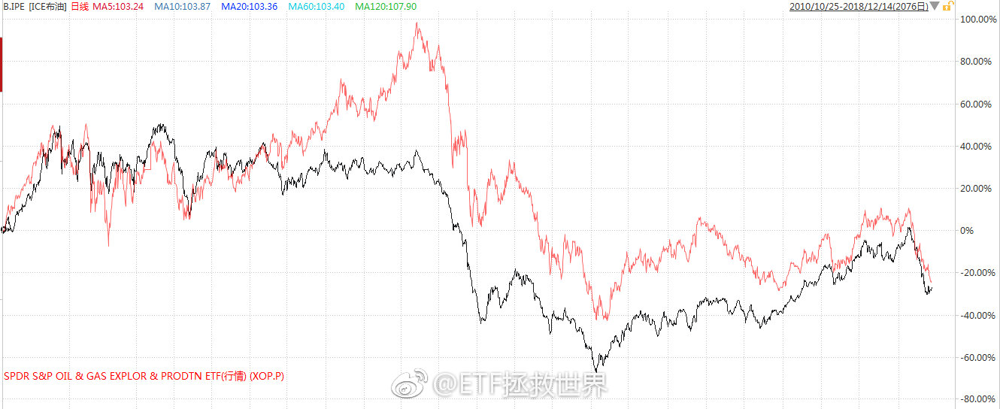

======================================================

ETF拯救世界 (5687069307) @
2018-12-14 18:33:39 Fri  
url: https://weibo.com/5687069307/H7dokdOwi

生活小贴士：

你有没有发现，有时候你因为一点小钱犹犹豫豫，最终都会花更多的，甚至几倍的钱去达到同样的效果。

总结：

不要因小失大。该出手就出手。 ​​​

转发[46]  评论[153]  赞[474] 

======================================================

ETF拯救世界 (5687069307) @
2018-12-14 18:56:55 Fri  
url: https://weibo.com/5687069307/H7dxLASI6

回复@看我看我252:我觉得可以啊，我还可以现场讲解。有没有想看的。想看的人多就在微博上开一个。当然只能直播几分钟，注意素质。//@看我看我252:益达，明天去看演唱会，会给我们直播吗，想看[可爱]。

------------------------------------------------------
转推：
>  @ETF拯救世界 (5687069307)
>  2018-12-14 18:33:39 Fri  
>  url: https:/weibo.com/5687069307/H7dokdOwi/

>  生活小贴士：
>  
>  你有没有发现，有时候你因为一点小钱犹犹豫豫，最终都会花更多的，甚至几倍的钱去达到同样的效果。
>  
>  总结：
>  
>  不要因小失大。该出手就出手。 ​​​

转发[7]  评论[128]  赞[523] 

======================================================

ETF拯救世界 (5687069307) @
2018-12-15 17:25:27 Sat  
url: https://weibo.com/5687069307/H7mn8zEMu

震惊！直播计划取消！

要追究法律责任的！ ​​​

转发[3]  评论[100]  赞[340] 

======================================================

ETF拯救世界 (5687069307) @
2018-12-15 19:16:24 Sat  
url: https://weibo.com/5687069307/H7n6aD8sh

分享我的故事 http://t.cn/EUYE2xy ​​​

转发[6]  评论[153]  赞[793] 

======================================================

ETF拯救世界 (5687069307) @
2018-12-15 22:36:42 Sat  
url: https://weibo.com/5687069307/H7opu30tW

我其实不是很迷学友哥。

是送给太太的礼物。她是真爱粉。

有一半歌没听过的我，看着每首都能跟唱的她，气氛一度相当尴尬。 ​​​

转发[7]  评论[171]  赞[616] 

======================================================

ETF拯救世界 (5687069307) @
2018-12-16 23:18:41 Sun  
url: https://weibo.com/5687069307/H7y711OEP

你为什么还不睡。

老实交代看这条微博前你在干嘛！ ​​​

转发[5]  评论[306]  赞[318] 

======================================================

ETF拯救世界 (5687069307) @
2018-12-17 07:35:49 Mon  
url: https://weibo.com/5687069307/H7BmNvHKd

所以要审时度势。熊市亏的少，仓位越来越重，牛市吃得好才是人生赢家

------------------------------------------------------
转推：
>  @新财富杂志 (1708922835)
>  2018-12-16 23:32:32 Sun  
>  url: https:/weibo.com/1708922835/H7ycD3wuA/

>  【在有一种熊市里亏钱太少，不一定是好事】陈嘉禾：不止2018年，历史上有一些A股的熊市年份，也有同样的“亏得少不一定是好事”的情况。比如，在2004到2005年，市场一些公司已经开始有价值（估值比较便宜，基本面稳健），但是A股的整体价格仍然下挫。如果投资者完美的回避掉了2004和2005年的A股市场， ​​​

转发[29]  评论[76]  赞[293] 

======================================================

ETF拯救世界 (5687069307) @
2018-12-17 09:44:45 Mon  
url: https://weibo.com/5687069307/H7Cd817SA

家里没矿的注意节奏。 ​​​

转发[6]  评论[152]  赞[418] 

======================================================

ETF拯救世界 (5687069307) @
2018-12-17 10:11:59 Mon  
url: https://weibo.com/5687069307/H7CobBT5D

评论里没完没了问医药的那些人我跟你说几点，你能理解就理解，不能理解赶紧取关走人。

第一，医药是我最看好的行业。

第二，目前计划内医药仓位9个多点（医药6%+养老3%），目标仓位最大给15%-20%。不跌我们永远没机会配满。

第三，目前医药估值过去十三年新低。

第四，目前医药跌至十三年大趋势下 ​​​

转发[494]  评论[443]  赞[1039] 

======================================================

ETF拯救世界 (5687069307) @
2018-12-17 10:21:52 Mon  
url: https://weibo.com/5687069307/H7Csc4C2w

赚了钱不卖就是过山车。乱卖又赚不到大钱。

事后看明明白白，当时看一片迷茫。 ​​​

转发[79]  评论[60]  赞[334] 

+++++++++++++++++++++++++++++++++++++++++++++++++++++

图片：
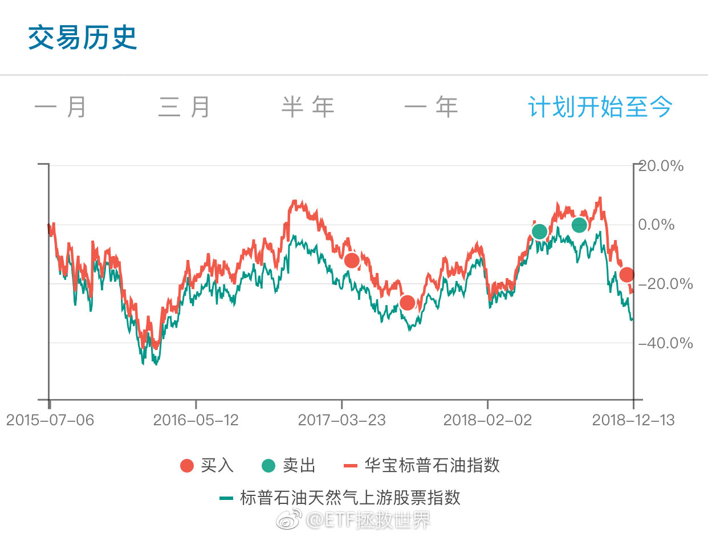

======================================================

ETF拯救世界 (5687069307) @
2018-12-17 10:24:40 Mon  
url: https://weibo.com/5687069307/H7Ctl3kfx

回复@pby_1988:可以。只要你能保证你的股票不爆雷，而且一定能涨过指数。//@pby_1988:E大，请教个问题，既然医药是您最看好的行业，是不是可以去买全指医药里的股票

------------------------------------------------------
转推：
>  @ETF拯救世界 (5687069307)
>  2018-12-17 10:11:59 Mon  
>  url: https:/weibo.com/5687069307/H7CobBT5D/

>  评论里没完没了问医药的那些人我跟你说几点，你能理解就理解，不能理解赶紧取关走人。
>  
>  第一，医药是我最看好的行业。
>  
>  第二，目前计划内医药仓位9个多点（医药6%+养老3%），目标仓位最大给15%-20%。不跌我们永远没机会配满。
>  
>  第三，目前医药估值过去十三年新低。
>  
>  第四，目前医药跌至十三年大趋势下 ​​​

转发[42]  评论[33]  赞[227] 

======================================================

ETF拯救世界 (5687069307) @
2018-12-17 10:26:49 Mon  
url: https://weibo.com/5687069307/H7CucrVvo

回复@cosmicmagic:有人觉得波动大是风险。我倒认为波动大是非常好的机会——除非你做反了。//@cosmicmagic:油气波动真大

------------------------------------------------------
转推：
>  @ETF拯救世界 (5687069307)
>  2018-12-17 10:21:52 Mon  
>  url: https:/weibo.com/5687069307/H7Csc4C2w/

>  赚了钱不卖就是过山车。乱卖又赚不到大钱。
>  
>  事后看明明白白，当时看一片迷茫。 ​​​

转发[39]  评论[48]  赞[243] 

======================================================

ETF拯救世界 (5687069307) @
2018-12-17 10:30:41 Mon  
url: https://weibo.com/5687069307/H7CvMl9OF

当你有钱想买一个东西的时候，难道不是希望它雷越多越好，跌的越猛越好吗。

你以为超额收益是怎么来的？太平盛世你开开心心的赚的比别人多？

你什么时候对自己的运气有这么大误解的。 ​​​

转发[71]  评论[148]  赞[565] 

======================================================

ETF拯救世界 (5687069307) @
2018-12-17 10:44:56 Mon  
url: https://weibo.com/5687069307/H7CBz1ovZ

回复@胡鹏171:从那时候开始现在已经是第八轮了。一个品种历史最低位附近，却还能赚很多，说明一个好的策略是投资中最重要的。//@胡鹏171:E大，猜你又开了油气网格了吧？看你12年到13年的操作记录，真是太精彩了。

------------------------------------------------------
转推：
>  @ETF拯救世界 (5687069307)
>  2018-12-17 10:21:52 Mon  
>  url: https:/weibo.com/5687069307/H7Csc4C2w/

>  赚了钱不卖就是过山车。乱卖又赚不到大钱。
>  
>  事后看明明白白，当时看一片迷茫。 ​​​

转发[25]  评论[41]  赞[273] 

======================================================

ETF拯救世界 (5687069307) @
2018-12-17 10:47:56 Mon  
url: https://weibo.com/5687069307/H7CCMmYY3

回复@小明修炼中:这有什么不懂的。你能找到5只牛股就去买5只牛股。找错了的代价就是收益率远低于指数。很多人永远无法理解的是，并非甲能做好的事乙就能做好。所以鼓吹重仓2、3只甚至全仓一只的人，是对他人极度不负责。

------------------------------------------------------
转推：
>  @ETF拯救世界 (5687069307)
>  2018-12-17 10:11:59 Mon  
>  url: https:/weibo.com/5687069307/H7CobBT5D/

>  评论里没完没了问医药的那些人我跟你说几点，你能理解就理解，不能理解赶紧取关走人。
>  
>  第一，医药是我最看好的行业。
>  
>  第二，目前计划内医药仓位9个多点（医药6%+养老3%），目标仓位最大给15%-20%。不跌我们永远没机会配满。
>  
>  第三，目前医药估值过去十三年新低。
>  
>  第四，目前医药跌至十三年大趋势下 ​​​

转发[29]  评论[67]  赞[351] 

======================================================

ETF拯救世界 (5687069307) @
2018-12-17 13:47:01 Mon  
url: https://weibo.com/5687069307/H7DNtdBno

[doge]

------------------------------------------------------
转推：
>  @央视新闻 (2656274875)
>  2018-12-17 13:40:00 Mon  
>  url: https:/weibo.com/2656274875/H7DKCylaE/

>  【北京明年取消特长生招生】据北京市教委，今年北京市100%的公办小学和初中划片就近入学，小学和初中就近入学比例分别保持在99%和96%以上。同时，今年北京市各区招收特长生比例为本区初中招生计划的4%以内，明年将取消特长生招生。城六区逐步降低公办学校寄宿招生数量和比例，到2020年寄宿招生将实行登 ​​​

转发[5]  评论[50]  赞[128] 

======================================================

ETF拯救世界 (5687069307) @
2018-12-17 14:51:43 Mon  
url: https://weibo.com/5687069307/H7EdJE8qz

回复@啊Allen个兄弟:吃饱了撑的吧。我买不买满，他到别的网站别人帖子底下回帖嘲讽？辣鸡。我不买满，能让几万人不死。他除了嘴炮还有什么功能。//@啊Allen个兄弟:回复@ETF拯救世界:图片评论 http://t.cn/EUrzHbA //@ETF拯救世界:[doge]

------------------------------------------------------
转推：
>  @央视新闻 (2656274875)
>  2018-12-17 13:40:00 Mon  
>  url: https:/weibo.com/2656274875/H7DKCylaE/

>  【北京明年取消特长生招生】据北京市教委，今年北京市100%的公办小学和初中划片就近入学，小学和初中就近入学比例分别保持在99%和96%以上。同时，今年北京市各区招收特长生比例为本区初中招生计划的4%以内，明年将取消特长生招生。城六区逐步降低公办学校寄宿招生数量和比例，到2020年寄宿招生将实行登 ​​​

转发[2]  评论[50]  赞[171] 

======================================================

ETF拯救世界 (5687069307) @
2018-12-17 15:00:09 Mon  
url: https://weibo.com/5687069307/H7Eh9x2zK

有了新的情况，你坚持大方向，有人说，逻辑变了，你这样坚持既定方针不会好。

有了新的情况，你技术性的微调，给出更大的安全空间，有人说，你当初怎么说的为什么不做。

你永远也没法让所有人满意。即使你闭嘴一个字不说也不行。 ​​​

转发[24]  评论[176]  赞[438] 

======================================================

ETF拯救世界 (5687069307) @
2018-12-17 15:36:48 Mon  
url: https://weibo.com/5687069307/H7Ew26pLd

我说怎么今天估值变化不小呢，以为是wind数据又有问题了。

突然想起来今天调整指数成分股…… ​​​

转发[10]  评论[74]  赞[354] 

======================================================

ETF拯救世界 (5687069307) @
2018-12-17 16:15:15 Mon  
url: https://weibo.com/5687069307/H7ELDvpY5

第一，该买的家电买起来。洗碗机扫地机器人什么的减少摩擦的机会。第二，小时工该请就请。第三，谁有时间谁就做，都有时间就一起做。第四，不管是谁放着一堆家务不干孩子不陪，去玩游戏或者刷剧都该骂。

------------------------------------------------------
转推：
>  @ ()
>  2018-12-17 16:11:44 Mon  
>  url: 

>  抱歉，作者已设置仅展示半年内微博，此微博已不可见。 ​​​

转发[38]  评论[116]  赞[424] 

======================================================

ETF拯救世界 (5687069307) @
2018-12-17 17:10:06 Mon  
url: https://weibo.com/5687069307/H7F7U2y90

雪球确实不能去。

去了情绪受影响。

喷子极多。走了也没完。而且我跟你说，还真有那么一批人关注你。每篇东西他都看，然后喷你。

对于这些喷子到底是什么人，为什么喷，我一直相当疑惑：难道就没点正事干吗。

上次微博的一件事让我有了点认识。

记不记得上次有人在微博评论骂我家人。我急了，准备 ​​​

转发[22]  评论[167]  赞[528] 

======================================================

ETF拯救世界 (5687069307) @
2018-12-17 17:28:08 Mon  
url: https://weibo.com/5687069307/H7FfdBk9o

不过想了想，也是有点矫情。

上下五千年，古今中外，有没有一个人不被喷的。

我想了半天，没有。

包括特蕾莎。

所以就这样吧…… ​​​

转发[5]  评论[93]  赞[354] 

======================================================

ETF拯救世界 (5687069307) @
2018-12-17 17:34:54 Mon  
url: https://weibo.com/5687069307/H7FhXvaPi

不过就像这次有一道题是算收益率。很多朋友发回来的邮件上都写，自己算了才知道有多麻烦，需要多么认真，要耗费多少精力。

是啊，很多朋友认为是被喷是小事不应该理会。其实你自己经历才知道是什么感觉……

越来越爱看马克吐温的东西了！ ​​​

转发[10]  评论[121]  赞[391] 

======================================================

ETF拯救世界 (5687069307) @
2018-12-18 07:44:07 Tue  
url: https://weibo.com/5687069307/H7KQFzX4j

美股如果能从最高点回撤30%-50%买入，则5-10年收益率又可以保证

------------------------------------------------------
转推：
>  @ETF拯救世界 (5687069307)
>  2018-10-25 06:48:55 Thu  
>  url: https:/weibo.com/5687069307/GFuRLAjIm/

>  美股不断新高的时候我不怕打脸 ​​​

转发[60]  评论[106]  赞[343] 

======================================================

ETF拯救世界 (5687069307) @
2018-12-18 08:14:40 Tue  
url: https://weibo.com/5687069307/H7L349BXd

为什么扣不回去了

------------------------------------------------------
转推：
>  @跑步指南 (2687299131)
>  2018-12-18 08:06:43 Tue  
>  url: https:/weibo.com/2687299131/H7KZQ8Wde/

>  [疑问] ​​​

转发[29]  评论[132]  赞[231] 

======================================================

ETF拯救世界 (5687069307) @
2018-12-18 09:04:19 Tue  
url: https://weibo.com/5687069307/H7Lndc5Ya

最后的零点几真难超越啊。 ​​​

转发[23]  评论[86]  赞[371] 

+++++++++++++++++++++++++++++++++++++++++++++++++++++

图片：
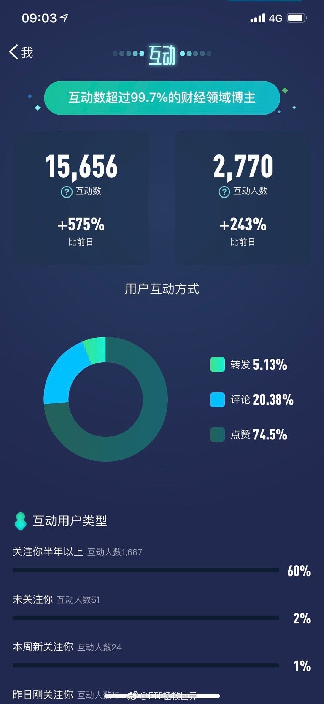

======================================================

ETF拯救世界 (5687069307) @
2018-12-18 09:10:32 Tue  
url: https://weibo.com/5687069307/H7LpK7i6m

回复@Nimo_oo:油气这次下去绝不仅只买一次。会买的比上次多。踏踏实实的//@Nimo_oo:华宝油气还会补一手么…大大

------------------------------------------------------
转推：
>  @ETF拯救世界 (5687069307)
>  2018-12-18 09:04:19 Tue  
>  url: https:/weibo.com/5687069307/H7Lndc5Ya/

>  最后的零点几真难超越啊。 ​​​

转发[19]  评论[37]  赞[295] 

======================================================

ETF拯救世界 (5687069307) @
2018-12-18 09:12:48 Tue  
url: https://weibo.com/5687069307/H7LqF9W2k

回复@葫芦冲有倔酱:本人投资家训第一条，知道的朋友回答一下：//@葫芦冲有倔酱:问个小白问题，既然如此不看好美股，为何不做空美股//@ETF拯救世界:美股如果能从最高点回撤30%-50%买入，则5-10年收益率又可以保证

------------------------------------------------------
转推：
>  @ETF拯救世界 (5687069307)
>  2018-10-25 06:48:55 Thu  
>  url: https:/weibo.com/5687069307/GFuRLAjIm/

>  美股不断新高的时候我不怕打脸 ​​​

转发[20]  评论[103]  赞[207] 

======================================================

ETF拯救世界 (5687069307) @
2018-12-18 09:24:32 Tue  
url: https://weibo.com/5687069307/H7LvqjdaC

主要是他们小时候物质太匮乏了。已经深深的写入基因，屯东西，抢东西，不排队都是表现。现在的年轻人不愁吃穿，以后就不会这样了

------------------------------------------------------
转推：
>  @新浪视频 (1640601392)
>  2018-12-18 09:19:28 Tue  
>  url: https:/weibo.com/1640601392/H7Ltmn1wS/

>  【中国大爷大妈在澳洲超市趴地哄抢奶粉 外国小哥看呆了[黑线]】昨晚，一段在墨尔本华人区Box Hill Woolworths超市冰柜区域旁拍的9秒视频在朋友圈被疯狂转发，一群大爷大妈在超市里哄抢奶粉，旁边的外国小哥都看呆了[汗] http://t.cn/EUDEaMZ ​​​

转发[19]  评论[66]  赞[226] 

======================================================

ETF拯救世界 (5687069307) @
2018-12-18 09:27:09 Tue  
url: https://weibo.com/5687069307/H7Lwuw9sH

回复@韭菜st:预告一下，下次发车会继续买。目前阶段，是攻守相宜的品种 http://t.cn/EUk5ZwA //@韭菜st:益达，社保在大手笔买转债，是什么因素？//@ETF拯救世界:回复@葫芦冲有倔酱:本人投资家训第一条，知道的朋友回答一下：//@葫芦冲有倔酱:问个小白问题，既然如此不看好美股，为何不做空美股

------------------------------------------------------
转推：
>  @ETF拯救世界 (5687069307)
>  2018-10-25 06:48:55 Thu  
>  url: https:/weibo.com/5687069307/GFuRLAjIm/

>  美股不断新高的时候我不怕打脸 ​​​

转发[9]  评论[45]  赞[220] 

======================================================

ETF拯救世界 (5687069307) @
2018-12-18 09:36:03 Tue  
url: https://weibo.com/5687069307/H7LA6h96l

做空有一个关键点：时间

你预测对了走势，但是时间不给你面子，你也会输的很惨。

还有一点：你永远无法理解群众的疯狂程度。

这两者叠加，让做空风险非常大。

做空不是不能做，要有技巧的做。保证不死，还能吃到收益。

我喜欢可以计算胜率的品种。有些做空品种就可以精确计算，非常好。 ​​​

转发[72]  评论[138]  赞[410] 

======================================================

ETF拯救世界 (5687069307) @
2018-12-18 09:51:05 Tue  
url: https://weibo.com/5687069307/H7LGd5xqP

回复@菡园12580:所以我们高位清仓了，带着利润把筹码交给别人潇洒离开。现在是准备跌下去买回来。一个品种交易价值和长期价值是两回事。何况，未来未必如大多数人所预料//@菡园12580:2018年底 美国在75年来首次成为原油净出口国 实现能源自给

------------------------------------------------------
转推：
>  @ETF拯救世界 (5687069307)
>  2018-12-18 09:04:19 Tue  
>  url: https:/weibo.com/5687069307/H7Lndc5Ya/

>  最后的零点几真难超越啊。 ​​​

转发[8]  评论[37]  赞[305] 

======================================================

ETF拯救世界 (5687069307) @
2018-12-18 09:58:40 Tue  
url: https://weibo.com/5687069307/H7LJhFeY9

没事少说别人坏话。也许当时人家没理你，但是会记住。关键时候背后阴你一把你可能就倒霉了。不一定对

------------------------------------------------------
转推：
>  @摩尔金融 (5242156161)
>  2018-12-18 09:55:29 Tue  
>  url: https:/weibo.com/5242156161/H7LHZhzph/

>  原来刘强东和史玉柱早就有点个人小恩怨啊[笑而不语] ​​​

转发[24]  评论[103]  赞[395] 

======================================================

ETF拯救世界 (5687069307) @
2018-12-18 13:39:05 Tue  
url: https://weibo.com/5687069307/H7NaKk5N2

上周为什么不开车。

大概是蒙的。 ​​​

转发[12]  评论[153]  赞[516] 

======================================================

ETF拯救世界 (5687069307) @
2018-12-18 14:27:24 Tue  
url: https://weibo.com/5687069307/H7NumheSL

功力不减

------------------------------------------------------
转推：
>  @ETF拯救世界 (5687069307)
>  2018-12-18 13:39:05 Tue  
>  url: https:/weibo.com/5687069307/H7NaKk5N2/

>  上周为什么不开车。
>  
>  大概是蒙的。 ​​​

转发[8]  评论[94]  赞[398] 

======================================================

ETF拯救世界 (5687069307) @
2018-12-18 15:21:06 Tue  
url: https://weibo.com/5687069307/H7NQ9zmtC

现金分红的八万亿里面分给重要股东的有6万亿。

------------------------------------------------------
转推：
>  @蓝鲸财经记者工作平台 (1885454921)
>  2018-12-18 15:12:59 Tue  
>  url: https:/weibo.com/1885454921/H7NMRpTYm/

>  读图看懂A股28年：现金分红近8万亿，股权融资12万亿。(数据宝) ​​​

转发[42]  评论[79]  赞[244] 

======================================================

ETF拯救世界 (5687069307) @
2018-12-19 09:48:37 Wed  
url: https://weibo.com/5687069307/H7V5GCrjL

回复@满仓割肉:把握好，波动就是机会，不是风险。没有波动的品种，怎么赚钱？//@满仓割肉:石油最近跌的可真厉害//@ETF拯救世界:现金分红的八万亿里面分给重要股东的有6万亿。

------------------------------------------------------
转推：
>  @蓝鲸财经记者工作平台 (1885454921)
>  2018-12-18 15:12:59 Tue  
>  url: https:/weibo.com/1885454921/H7NMRpTYm/

>  读图看懂A股28年：现金分红近8万亿，股权融资12万亿。(数据宝) ​​​

转发[8]  评论[45]  赞[222] 

======================================================

ETF拯救世界 (5687069307) @
2018-12-19 10:03:11 Wed  
url: https://weibo.com/5687069307/H7VbC0yTv

500亿不大。spy单只基金规模就2000多亿美元，折合人民币一万多亿。A股的指数基金远未够班。加油吧。

------------------------------------------------------
转推：
>  @张道达 (2032628220)
>  2018-12-19 10:00:03 Wed  
>  url: https:/weibo.com/2032628220/H7Val7fux/

>  【12月以来百亿资金流入六大ETF 头部吸金效果显著】12月以来，交易型开放式指数基金（ETF）再次受到资金青睐，出现百亿级别的资金流入。龙头产品上证50ETF规模突破500亿元大关。http://t.cn/E4zARvM ​​​

转发[14]  评论[45]  赞[232] 

======================================================

ETF拯救世界 (5687069307) @
2018-12-19 10:27:44 Wed  
url: https://weibo.com/5687069307/H7VlzwJ1I

上周五闻不到危险气味的都不是合格的猎人。 ​​​

转发[50]  评论[207]  赞[425] 

======================================================

ETF拯救世界 (5687069307) @
2018-12-19 10:38:44 Wed  
url: https://weibo.com/5687069307/H7Vq25Vhj

回复@陈叔爱吃五花肉:价值趋势划不出来了。未来加仓医药逻辑将是另一套系统了。//@陈叔爱吃五花肉:医药要新低了，E大不再划一下[doge]

------------------------------------------------------
转推：
>  @ETF拯救世界 (5687069307)
>  2018-12-19 10:27:44 Wed  
>  url: https:/weibo.com/5687069307/H7VlzwJ1I/

>  上周五闻不到危险气味的都不是合格的猎人。 ​​​

转发[34]  评论[52]  赞[234] 

======================================================

ETF拯救世界 (5687069307) @
2018-12-19 10:43:29 Wed  
url: https://weibo.com/5687069307/H7VrY7CMT

很多策略回测看起来很美，但即使它未来还是会很美，也依然有可能不适合你。

比如，对于指数基金，越低买得越多。到最后甚至每次比一开始买的多4、5倍。

这不废话吗，肯定未来收益率好啊。

但是，你要知道，回归到现实，你能否这样做？你有没有资金实力在熊市中实现几倍于一开始的买入？

如果没有， ​​​

转发[187]  评论[319]  赞[609] 

======================================================

ETF拯救世界 (5687069307) @
2018-12-19 11:04:54 Wed  
url: https://weibo.com/5687069307/H7VAFoDpq

回复@丿小年青:我不是说判断逻辑变。是之前的左侧买入已经到了极限，接下来会用其它逻辑继续买。谁跟你说判断逻辑变了？//@丿小年青:E大说的我好方,上周五到现在我陆陆续续开了医药和养老十几车,心想着反正便宜,但是今天听了医药判断逻辑将会变,真的好恐慌,哎

------------------------------------------------------
转推：
>  @ETF拯救世界 (5687069307)
>  2018-12-19 10:27:44 Wed  
>  url: https:/weibo.com/5687069307/H7VlzwJ1I/

>  上周五闻不到危险气味的都不是合格的猎人。 ​​​

转发[17]  评论[73]  赞[253] 

======================================================

ETF拯救世界 (5687069307) @
2018-12-19 11:12:37 Wed  
url: https://weibo.com/5687069307/H7VDNdzM7

50和红利现在估值都在十倍左右。50在我的模型中首次跌破10倍估值。

当然，它们利润增长不高，但真的是便宜。

50 大概每年能分2%左右。红利成分股股息率更是有4%以上。

这两个品种，毛估估5-10年年化没有10%我会比较惊讶。

讲真，除非出什么大问题，目前这个阶段我是想不出还有什么比A股更值的投资 ​​​

转发[156]  评论[223]  赞[503] 

======================================================

ETF拯救世界 (5687069307) @
2018-12-19 11:24:43 Wed  
url: https://weibo.com/5687069307/H7VIIck33

回复@请叫我毛毛哥:玩《这是我的战争》，学习生存技巧，锻炼身体，囤点黄金。这才是大问题。不出现指数基金就不会死。//@请叫我毛毛哥:如果真就出了什么大问题怎么办？[doge]

------------------------------------------------------
转推：
>  @ETF拯救世界 (5687069307)
>  2018-12-19 11:12:37 Wed  
>  url: https:/weibo.com/5687069307/H7VDNdzM7/

>  50和红利现在估值都在十倍左右。50在我的模型中首次跌破10倍估值。
>  
>  当然，它们利润增长不高，但真的是便宜。
>  
>  50 大概每年能分2%左右。红利成分股股息率更是有4%以上。
>  
>  这两个品种，毛估估5-10年年化没有10%我会比较惊讶。
>  
>  讲真，除非出什么大问题，目前这个阶段我是想不出还有什么比A股更值的投资 ​​​

转发[17]  评论[71]  赞[233] 

======================================================

ETF拯救世界 (5687069307) @
2018-12-19 11:33:42 Wed  
url: https://weibo.com/5687069307/H7VMmbQdJ

回复@刘伶闯天台:从15年开始每次发车都把时间写清楚“3-4年”，空间写清楚，资产配置做好。没真正做过几轮，不会理解这些的意义。

------------------------------------------------------
转推：
>  @ETF拯救世界 (5687069307)
>  2018-12-19 10:43:29 Wed  
>  url: https:/weibo.com/5687069307/H7VrY7CMT/

>  很多策略回测看起来很美，但即使它未来还是会很美，也依然有可能不适合你。
>  
>  比如，对于指数基金，越低买得越多。到最后甚至每次比一开始买的多4、5倍。
>  
>  这不废话吗，肯定未来收益率好啊。
>  
>  但是，你要知道，回归到现实，你能否这样做？你有没有资金实力在熊市中实现几倍于一开始的买入？
>  
>  如果没有， ​​​

转发[23]  评论[116]  赞[345] 

======================================================

ETF拯救世界 (5687069307) @
2018-12-19 14:24:28 Wed  
url: https://weibo.com/5687069307/H7WTFgL44

喝了黑咖啡容易饿。

一个人生体会。 ​​​

转发[3]  评论[133]  赞[295] 

======================================================

ETF拯救世界 (5687069307) @
2018-12-19 14:43:08 Wed  
url: https://weibo.com/5687069307/H7X1f5sKz

还有15分钟，坚决不奶。 ​​​

转发[5]  评论[195]  赞[374] 

======================================================

ETF拯救世界 (5687069307) @
2018-12-19 17:47:38 Wed  
url: https://weibo.com/5687069307/H7Ye89oBQ

高手，套现走了

------------------------------------------------------
转推：
>  @蓝鲸财经记者工作平台 (1885454921)
>  2018-12-19 15:53:40 Wed  
>  url: https:/weibo.com/1885454921/H7XtSqQRX/

>  【鲸视频：胡玮炜称共享经济才刚开始】  2015年1月，胡玮炜团队成立了摩拜。近日，她在接受记者专访时表示：“共享经济仅仅是一个开始，现在大环境和大时代都非常鼓励创新创业。摩拜能够一步一步非常踏实地走到今天，很重要的一点就是摩拜的愿景跟整个国家发展的方向、城市发展的方向是非常一致的。”( ​​​

转发[12]  评论[39]  赞[168] 

======================================================

ETF拯救世界 (5687069307) @
2018-12-19 17:57:07 Wed  
url: https://weibo.com/5687069307/H7YhZdpcC

所以《小鬼当家》那么多孩子丢一个在家里也是有相当可信度的。

------------------------------------------------------
转推：
>  @新浪视频 (1640601392)
>  2018-12-19 17:03:19 Wed  
>  url: https:/weibo.com/1640601392/H7XW8D2u4/

>  【带3个孙子逛超市 走时爷爷#把一个孙子忘记在购物车里了#[允悲]】18日上午，萧山闻堰一家物美超市门口，一名两三岁的男孩坐在超市门口的一辆购物车里哭泣，民警和热心市民则围在边上。原来当天，爷爷奶奶带着3个孙子来逛超市，2岁的孙子坐在爷爷的购物车里，另两个坐在奶奶的购物车里。买完东西后，两 ​​​

转发[12]  评论[12]  赞[115] 

======================================================

ETF拯救世界 (5687069307) @
2018-12-19 18:56:27 Wed  
url: https://weibo.com/5687069307/H7YG41PRf

回复@CaHsuuu:我每年圣诞看《真爱至上》（(Love Actually）。非常喜欢导演理查德柯蒂斯编剧导演的几部电影。//@CaHsuuu:每年圣诞都看的电影//@ETF拯救世界:所以《小鬼当家》那么多孩子丢一个在家里也是有相当可信度的。

------------------------------------------------------
转推：
>  @新浪视频 (1640601392)
>  2018-12-19 17:03:19 Wed  
>  url: https:/weibo.com/1640601392/H7XW8D2u4/

>  【带3个孙子逛超市 走时爷爷#把一个孙子忘记在购物车里了#[允悲]】18日上午，萧山闻堰一家物美超市门口，一名两三岁的男孩坐在超市门口的一辆购物车里哭泣，民警和热心市民则围在边上。原来当天，爷爷奶奶带着3个孙子来逛超市，2岁的孙子坐在爷爷的购物车里，另两个坐在奶奶的购物车里。买完东西后，两 ​​​

转发[11]  评论[40]  赞[122] 

======================================================

ETF拯救世界 (5687069307) @
2018-12-19 19:00:33 Wed  
url: https://weibo.com/5687069307/H7YHJ84j3

这智商还是诈骗犯，到底谁被他骗了？

------------------------------------------------------
转推：
>  @央视新闻 (2656274875)
>  2018-12-19 18:05:24 Wed  
>  url: https:/weibo.com/2656274875/H7Ylle6PL/

>  【你的“逍遥法外”到此为止了！[doge]】17日，浙江义乌铁路民警在义乌火车站巡逻时，发现一年轻男子身穿一件黑色卫衣，胸前印着“逍遥法外”四个大字。民警遂上前要求他出示有效身份证件，经比对核查，民警发现该男子涉嫌诈骗，系网上在逃人员。男子称，穿这件衣服是因为感觉有个性，没想到被逮住了。 ​​​

转发[11]  评论[37]  赞[170] 

======================================================

ETF拯救世界 (5687069307) @
2018-12-20 09:43:48 Thu  
url: https://weibo.com/5687069307/H84ueEhRr

控制节奏。一切尽在掌握。 ​​​

转发[61]  评论[100]  赞[358] 

======================================================

ETF拯救世界 (5687069307) @
2018-12-20 09:47:56 Thu  
url: https://weibo.com/5687069307/H84vUCJYn

回复@我说椰子啊椰子:这周大概率不发，踏踏实实去考试。祝考研的各位都顺利。//@我说椰子啊椰子:周六要考研，周五赶路一天，好怕错过。。

------------------------------------------------------
转推：
>  @ETF拯救世界 (5687069307)
>  2018-12-20 09:43:48 Thu  
>  url: https:/weibo.com/5687069307/H84ueEhRr/

>  控制节奏。一切尽在掌握。 ​​​

转发[2]  评论[41]  赞[247] 

======================================================

ETF拯救世界 (5687069307) @
2018-12-20 09:48:46 Thu  
url: https://weibo.com/5687069307/H84wgfimO

回复@E粉pl:你不崩溃不是因为我的按摩，而是你的账户让你舒服。否则你亏得七荤八素我再按摩有什么用？//@E粉pl:感恩益达，按摩来的总是这么及时，不是你，我早崩溃了

------------------------------------------------------
转推：
>  @ETF拯救世界 (5687069307)
>  2018-12-20 09:43:48 Thu  
>  url: https:/weibo.com/5687069307/H84ueEhRr/

>  控制节奏。一切尽在掌握。 ​​​

转发[5]  评论[32]  赞[243] 

======================================================

ETF拯救世界 (5687069307) @
2018-12-20 09:52:25 Thu  
url: https://weibo.com/5687069307/H84xJe6Eq

回复@美味o果冻o:巴菲特所有重仓股票买入后平均下跌都超过20%-30%。不影响最后他赚很多钱。9%仓位，浮亏10%，总浮亏0.9%。哭个屁……//@美味o果冻o:[允悲]医药已经套了10%多了

------------------------------------------------------
转推：
>  @ETF拯救世界 (5687069307)
>  2018-12-20 09:43:48 Thu  
>  url: https:/weibo.com/5687069307/H84ueEhRr/

>  控制节奏。一切尽在掌握。 ​​​

转发[44]  评论[76]  赞[314] 

======================================================

ETF拯救世界 (5687069307) @
2018-12-20 09:57:22 Thu  
url: https://weibo.com/5687069307/H84zKhLRE

什么时候买回来。

这也跌的太惨了。

投资不就是惨的时候就去帮帮它，荣华富贵了就离开它吗。 ​​​

转发[42]  评论[115]  赞[407] 

+++++++++++++++++++++++++++++++++++++++++++++++++++++

图片：

======================================================

ETF拯救世界 (5687069307) @
2018-12-20 10:01:00 Thu  
url: https://weibo.com/5687069307/H84BdyxT6

前几天在球球喷我底部不敢发车的人不知道会不会跟我道个歉。

当然不会了。

你做的事他不理解，他就会喷你。

绝不会想想你为什么这么做。

下跌害怕？

呵呵。 ​​​

转发[6]  评论[83]  赞[348] 

======================================================

ETF拯救世界 (5687069307) @
2018-12-20 10:13:54 Thu  
url: https://weibo.com/5687069307/H84Gsh9ZK

其实资产配置到最后是数学问题。

如果你把所有大类品种弄懂，概率弄清，风险平价搞清楚。

最后就剩下数学了。而且是比较简单的数学题。

还记不记得之前我提的那几个数学问题。其实那个就是最后的关键。

比如去年底的这道题：

“再来做一道数学题。

800点买入证券指数，跌一半，400点再买入同样的 ​​​

转发[218]  评论[260]  赞[529] 

======================================================

ETF拯救世界 (5687069307) @
2018-12-20 10:19:11 Thu  
url: https://weibo.com/5687069307/H84IBx0ip

回复@Talpiot_Huo:哪有的事儿呢。[doge]//@Talpiot_Huo:我在基金公司做自营交易员，我们有各种博士，各种数学算法，上亿的资金，见过无数各色的投资人。  还是得说，E大作为独立的投资者，堪称专业的典范。足以吊打各类选手。

------------------------------------------------------
转推：
>  @ETF拯救世界 (5687069307)
>  2018-12-20 10:13:54 Thu  
>  url: https:/weibo.com/5687069307/H84Gsh9ZK/

>  其实资产配置到最后是数学问题。
>  
>  如果你把所有大类品种弄懂，概率弄清，风险平价搞清楚。
>  
>  最后就剩下数学了。而且是比较简单的数学题。
>  
>  还记不记得之前我提的那几个数学问题。其实那个就是最后的关键。
>  
>  比如去年底的这道题：
>  
>  “再来做一道数学题。
>  
>  800点买入证券指数，跌一半，400点再买入同样的 ​​​

转发[6]  评论[34]  赞[246] 

======================================================

ETF拯救世界 (5687069307) @
2018-12-20 10:20:21 Thu  
url: https://weibo.com/5687069307/H84J4v8by

回复@litterwitch:第二轮答题还在看的过程中。我以为一大半人不会回邮件，结果绝大多数都回了。一封封看工作量很大，正在积极推进。//@litterwitch:E大这两天微博发的多，是不是助理已经找好了？[偷笑]

------------------------------------------------------
转推：
>  @ETF拯救世界 (5687069307)
>  2018-12-20 09:43:48 Thu  
>  url: https:/weibo.com/5687069307/H84ueEhRr/

>  控制节奏。一切尽在掌握。 ​​​

转发[0]  评论[68]  赞[226] 

======================================================

ETF拯救世界 (5687069307) @
2018-12-20 10:29:21 Thu  
url: https://weibo.com/5687069307/H84MJclbA

看新闻说最近裁员厉害。真的假的。

你身边有没有裁的比往年厉害，给大家展开讲讲。

得是真人真事，别道听途说信谣传谣的。 ​​​

转发[53]  评论[591]  赞[373] 

======================================================

ETF拯救世界 (5687069307) @
2018-12-20 12:36:46 Thu  
url: https://weibo.com/5687069307/H85CrxC8r

回复@o0乖乖O0o:喜欢什么类型。毕竟我也是阅片无数有点发言权//@o0乖乖O0o:E大能再推荐些电影不？//@ETF拯救世界:回复@CaHsuuu:我每年圣诞看《真爱至上》（(Love Actually）。非常喜欢导演理查德柯蒂斯编剧导演的几部电影。//@CaHsuuu:每年圣诞都看的电影

------------------------------------------------------
转推：
>  @新浪视频 (1640601392)
>  2018-12-19 17:03:19 Wed  
>  url: https:/weibo.com/1640601392/H7XW8D2u4/

>  【带3个孙子逛超市 走时爷爷#把一个孙子忘记在购物车里了#[允悲]】18日上午，萧山闻堰一家物美超市门口，一名两三岁的男孩坐在超市门口的一辆购物车里哭泣，民警和热心市民则围在边上。原来当天，爷爷奶奶带着3个孙子来逛超市，2岁的孙子坐在爷爷的购物车里，另两个坐在奶奶的购物车里。买完东西后，两 ​​​

转发[2]  评论[93]  赞[120] 

======================================================

ETF拯救世界 (5687069307) @
2018-12-20 12:48:44 Thu  
url: https://weibo.com/5687069307/H85HiESqv

日经接力。

下午估计我A要跪一波。 ​​​

转发[8]  评论[65]  赞[231] 

+++++++++++++++++++++++++++++++++++++++++++++++++++++

图片：

======================================================

ETF拯救世界 (5687069307) @
2018-12-20 12:50:57 Thu  
url: https://weibo.com/5687069307/H85Id5bud

回复@minEntropy_HoMe:现金流真的很重要。个人也好，公司也好，都是如此。一定要保证收入大于支出，包括日常支出和资本支出//@minEntropy_HoMe:互联网是裁的比较狠。。。这几年拉投资加杠杆的裁的多，bat这种一直有钱的影响不大

------------------------------------------------------
转推：
>  @ETF拯救世界 (5687069307)
>  2018-12-20 10:29:21 Thu  
>  url: https:/weibo.com/5687069307/H84MJclbA/

>  看新闻说最近裁员厉害。真的假的。
>  
>  你身边有没有裁的比往年厉害，给大家展开讲讲。
>  
>  得是真人真事，别道听途说信谣传谣的。 ​​​

转发[14]  评论[30]  赞[210] 

======================================================

ETF拯救世界 (5687069307) @
2018-12-20 13:10:13 Thu  
url: https://weibo.com/5687069307/H85Q1p9xX

我跟你说，熊市是这样的。

熊市开始的时候，你认为自己能扛住。毕竟是价投，毕竟了解自己买的股票，毕竟隔壁老王和大v都鼓励你熊市无所谓，拿着就肯定能赚钱，穿越牛熊。

熊市最黑暗的时候，你觉得自己扛不住了。毕竟各种坏消息，账户缩水，但如果现在卖还能剩点。

然后你会发现，熊市也就这样过去 ​​​

转发[198]  评论[256]  赞[613] 

======================================================

ETF拯救世界 (5687069307) @
2018-12-20 13:23:13 Thu  
url: https://weibo.com/5687069307/H85ViuuUy

很多不设清盘线的私募有机会见0.5了…… ​​​

转发[9]  评论[51]  赞[287] 

======================================================

ETF拯救世界 (5687069307) @
2018-12-20 13:27:11 Thu  
url: https://weibo.com/5687069307/H85WV14bp

回复@求财不劫色:这是人类的特质。时间必然会冲淡痛苦，否则整天生活在过去的痛苦中，物种都很难延续了。痛苦可以记不住，但成功的经验和失败的教训一定要总结。//@求财不劫色:这就是传说中的好了伤疤忘了疼？[二哈]

------------------------------------------------------
转推：
>  @ETF拯救世界 (5687069307)
>  2018-12-20 13:10:13 Thu  
>  url: https:/weibo.com/5687069307/H85Q1p9xX/

>  我跟你说，熊市是这样的。
>  
>  熊市开始的时候，你认为自己能扛住。毕竟是价投，毕竟了解自己买的股票，毕竟隔壁老王和大v都鼓励你熊市无所谓，拿着就肯定能赚钱，穿越牛熊。
>  
>  熊市最黑暗的时候，你觉得自己扛不住了。毕竟各种坏消息，账户缩水，但如果现在卖还能剩点。
>  
>  然后你会发现，熊市也就这样过去 ​​​

转发[23]  评论[36]  赞[247] 

======================================================

ETF拯救世界 (5687069307) @
2018-12-20 13:40:34 Thu  
url: https://weibo.com/5687069307/H862kCG0O

之前的低点附近一定有一番恶战。守军一定不会轻易放弃。

挺关键，看戏。 ​​​

转发[21]  评论[166]  赞[449] 

======================================================

ETF拯救世界 (5687069307) @
2018-12-20 17:07:22 Thu  
url: https://weibo.com/5687069307/H87ohu6vz

80%定律再次发挥作用了……可惜国内没有正规交易所。//@亚东:信仰够不够？赶紧充值。。

------------------------------------------------------
转推：
>  @ ()
>  2018-12-20 16:21:32 Thu  
>  url: 

>  抱歉，此微博已被作者删除。查看帮助：http://t.cn/Rfd3rQV

转发[81]  评论[43]  赞[176] 

======================================================

ETF拯救世界 (5687069307) @
2018-12-20 17:11:04 Thu  
url: https://weibo.com/5687069307/H87pMz3dD

回复@ciahubin:不会死的品种从最高点下跌80%，通常就是大底了。//@ciahubin:80%规律：高点下来80%就是好机会？//@ETF拯救世界:80%定律再次发挥作用了……可惜国内没有正规交易所。//@亚东:信仰够不够？赶紧充值。。

------------------------------------------------------
转推：
>  @ ()
>  2018-12-20 16:21:32 Thu  
>  url: 

>  抱歉，此微博已被作者删除。查看帮助：http://t.cn/Rfd3rQV

转发[62]  评论[70]  赞[192] 

======================================================

ETF拯救世界 (5687069307) @
2018-12-20 17:59:51 Thu  
url: https://weibo.com/5687069307/H87JABxCG

回复@慢等于快:理解能力。我什么时候说所有下跌必然到80%了。//@慢等于快:你就说证券还要跌到362呗//@ETF拯救世界:回复@ciahubin:不会死的品种从最高点下跌80%，通常就是大底了。//@ciahubin:80%规律：高点下来80%就是好机会？//@ETF拯救世界:80%定律再次发挥作用了……可惜国内没有正规交易所。

------------------------------------------------------
转推：
>  @ ()
>  2018-12-20 16:21:32 Thu  
>  url: 

>  抱歉，此微博已被作者删除。查看帮助：http://t.cn/Rfd3rQV

转发[11]  评论[43]  赞[191] 

======================================================

ETF拯救世界 (5687069307) @
2018-12-20 19:33:40 Thu  
url: https://weibo.com/5687069307/H88lFk6PC

疯狂的互联网资本

------------------------------------------------------
转推：
>  @界面新闻 (5182171545)
>  2018-12-20 16:29:24 Thu  
>  url: https:/weibo.com/5182171545/H878S7YeP/

>  【弃子戴威：100亿的青春和1000万追债人】“一个含着金钥匙出生，一个是小镇青年凤凰男；一个没上过一天班，一个干了八年的阿里中供铁军，他们哪里一样了？他们哪里都不一样”，一位在ofo早期团队的高层如此评价，“戴威把程维看作兄弟，程维只把和戴威的关系看作父子。”http://t.cn/E4qXbQB ​​​

转发[18]  评论[12]  赞[168] 

======================================================

ETF拯救世界 (5687069307) @
2018-12-20 19:36:43 Thu  
url: https://weibo.com/5687069307/H88mUpCuE

我从未见过如此不走心的打码

------------------------------------------------------
转推：
>  @财联社APP (2868676035)
>  2018-12-20 18:06:09 Thu  
>  url: https:/weibo.com/2868676035/H87M90nlT/

>  马化腾评ofo溃败原因：veto right（否决权）是关键。 ​​​

转发[2]  评论[35]  赞[184] 

======================================================

ETF拯救世界 (5687069307) @
2018-12-20 21:47:11 Thu  
url: https://weibo.com/5687069307/H89dRj837

意不意外，开不开心？ ​​​

转发[2]  评论[127]  赞[366] 

======================================================

ETF拯救世界 (5687069307) @
2018-12-20 21:48:02 Thu  
url: https://weibo.com/5687069307/H89eczTzK

#ETF拯救世界的红包#感谢大家对我的爱与支持！我往红包里塞了现金，特来为大家送上好运，领到红包旺上加旺！http://t.cn/E4t1a7j ​​​

转发[4]  评论[248]  赞[385] 

======================================================

ETF拯救世界 (5687069307) @
2018-12-21 07:57:23 Fri  
url: https://weibo.com/5687069307/H8ddx8gOE

美股公司回购的太厉害了。一个季度几千亿。

没跌多少，估值已经回到2014年了… ​​​

转发[24]  评论[102]  赞[393] 

======================================================

ETF拯救世界 (5687069307) @
2018-12-21 09:20:14 Fri  
url: https://weibo.com/5687069307/H8dLb4Ooz

回复@我还就不信起不到名字:这种广告跟我没关系。是微博自动加的//@我还就不信起不到名字:看到了左下角的免佣开户[二哈]

------------------------------------------------------
转推：
>  @ETF拯救世界 (5687069307)
>  2018-12-21 07:57:23 Fri  
>  url: https:/weibo.com/5687069307/H8ddx8gOE/

>  美股公司回购的太厉害了。一个季度几千亿。
>  
>  没跌多少，估值已经回到2014年了… ​​​

转发[2]  评论[38]  赞[163] 

======================================================

ETF拯救世界 (5687069307) @
2018-12-21 09:44:19 Fri  
url: https://weibo.com/5687069307/H8dUWb3OR

控制节奏。

即使所有人都要死，你也要最后一个倒下。 ​​​

转发[146]  评论[189]  赞[481] 

======================================================

ETF拯救世界 (5687069307) @
2018-12-21 09:50:37 Fri  
url: https://weibo.com/5687069307/H8dXvt32y

回复@泛舟当歌CountingStars:“空仓”。只能说，要么是钱太少，要么是投资的门都没入。话有点失礼，但99.9%没说错。//@泛舟当歌CountingStars:好的。昨天朋友晒2018，基本都空仓，都很开心，就我都不好意思说自己。没事，有2019，有你，踏实！

------------------------------------------------------
转推：
>  @ETF拯救世界 (5687069307)
>  2018-12-21 09:44:19 Fri  
>  url: https:/weibo.com/5687069307/H8dUWb3OR/

>  控制节奏。
>  
>  即使所有人都要死，你也要最后一个倒下。 ​​​

转发[17]  评论[65]  赞[281] 

======================================================

ETF拯救世界 (5687069307) @
2018-12-21 09:53:32 Fri  
url: https://weibo.com/5687069307/H8dYGtbTR

现在难受的，好好想想之前自己到底有没有做到我说的跌30%，涨50%都舒服。

如果当时觉得没问题，现在又有问题，好好想想问题出在哪里。

想想你到底是不是了解自己。

如果不了解，相信我，我比你更了解你。

所以建议，认真看我说的。 ​​​

转发[91]  评论[164]  赞[430] 

======================================================

ETF拯救世界 (5687069307) @
2018-12-21 09:55:32 Fri  
url: https://weibo.com/5687069307/H8dZv3gzK

我现在不会做任何心理按摩。

预防针是发病前打的。那时候打了针，产生抗体，真的病毒来了你就不怕了。

你都发病了还打什么预防针。

赶紧找个老中医看看吧。实在不行就放弃治疗算了。 ​​​

转发[11]  评论[127]  赞[394] 

======================================================

ETF拯救世界 (5687069307) @
2018-12-21 10:01:02 Fri  
url: https://weibo.com/5687069307/H8e1Jz86P

回复@静静地顿河流:军工呢，还在40倍以上//@静静地顿河流:我觉得排雷基本上成功。银行下杀这一波，基本完成了全市场覆盖了。谁也都不高估了，图形都好看了。都是打折后再打到你骨折。市场上唯一的一个沙漠之花就是长电了，看看啥时候能落了。

------------------------------------------------------
转推：
>  @ETF拯救世界 (5687069307)
>  2018-12-21 09:53:32 Fri  
>  url: https:/weibo.com/5687069307/H8dYGtbTR/

>  现在难受的，好好想想之前自己到底有没有做到我说的跌30%，涨50%都舒服。
>  
>  如果当时觉得没问题，现在又有问题，好好想想问题出在哪里。
>  
>  想想你到底是不是了解自己。
>  
>  如果不了解，相信我，我比你更了解你。
>  
>  所以建议，认真看我说的。 ​​​

转发[8]  评论[56]  赞[199] 

======================================================

ETF拯救世界 (5687069307) @
2018-12-21 10:16:30 Fri  
url: https://weibo.com/5687069307/H8e812fWc

回复@没有资本也要长期投资:我给你个数。全市场极限应该在1.5倍左右。昨天收盘1.88。你先算算最大可能会跌多少，再多给10%空间，然后想想自己加不加杠杆。

------------------------------------------------------
转推：
>  @ETF拯救世界 (5687069307)
>  2018-12-21 09:44:19 Fri  
>  url: https:/weibo.com/5687069307/H8dUWb3OR/

>  控制节奏。
>  
>  即使所有人都要死，你也要最后一个倒下。 ​​​

转发[102]  评论[151]  赞[313] 

======================================================

ETF拯救世界 (5687069307) @
2018-12-21 10:25:46 Fri  
url: https://weibo.com/5687069307/H8ebLzOiu

回复@醉空7:过于乐观的人早死了。过于悲观的人一辈子也就那样了。只有心里希望不灭，脑子里时刻谨记风险才能安全的赚到大钱。//@醉空7:老大真的好稳啊[鲜花][鲜花][鲜花]

------------------------------------------------------
转推：
>  @ETF拯救世界 (5687069307)
>  2018-12-21 09:44:19 Fri  
>  url: https:/weibo.com/5687069307/H8dUWb3OR/

>  控制节奏。
>  
>  即使所有人都要死，你也要最后一个倒下。 ​​​

转发[41]  评论[58]  赞[353] 

======================================================

ETF拯救世界 (5687069307) @
2018-12-21 10:33:02 Fri  
url: https://weibo.com/5687069307/H8eeIuuJ9

回复@HUNTER22210:所以要预先想象。你有10万块，全买进去赔3万，当然不舒服。你就调整到只买5万，赔1万5，还不舒服。就买1万，赔3000行不行了？行了？那就买1万。怎么会不舒服呢。//@HUNTER22210:益达，正常人跌30%都不会舒服的.....

------------------------------------------------------
转推：
>  @ETF拯救世界 (5687069307)
>  2018-12-21 09:53:32 Fri  
>  url: https:/weibo.com/5687069307/H8dYGtbTR/

>  现在难受的，好好想想之前自己到底有没有做到我说的跌30%，涨50%都舒服。
>  
>  如果当时觉得没问题，现在又有问题，好好想想问题出在哪里。
>  
>  想想你到底是不是了解自己。
>  
>  如果不了解，相信我，我比你更了解你。
>  
>  所以建议，认真看我说的。 ​​​

转发[44]  评论[72]  赞[255] 

======================================================

ETF拯救世界 (5687069307) @
2018-12-21 10:42:03 Fri  
url: https://weibo.com/5687069307/H8einsjvB

鹅厂还不带恒生走一波？传媒：我先走一波。

------------------------------------------------------
转推：
>  @财联社APP (2868676035)
>  2018-12-21 10:34:16 Fri  
>  url: https:/weibo.com/2868676035/H8efdwHS9/

>  中宣部版权局副局长冯士新在2018中国游戏产业年会上表示，首批部分游戏已经完成审核，正在抓紧核发版号。（界面） ​​​

转发[8]  评论[0]  赞[275] 

======================================================

ETF拯救世界 (5687069307) @
2018-12-21 10:53:09 Fri  
url: https://weibo.com/5687069307/H8emT1xqa

某只莫名其妙崩盘的股票看图真危险啊。

不知道发生什么了。 ​​​

转发[13]  评论[92]  赞[305] 

======================================================

ETF拯救世界 (5687069307) @
2018-12-21 10:56:14 Fri  
url: https://weibo.com/5687069307/H8eo8q1Oe

回复@guru8:所以要找到一个平衡点。只投入一万，涨50%，只赚5000，不舒服。那就投1万5，3万。这个点没人能帮你找，只能自己找到。//@guru8:这样的话赚的时候也不爽。。。。。。

------------------------------------------------------
转推：
>  @ETF拯救世界 (5687069307)
>  2018-12-21 09:53:32 Fri  
>  url: https:/weibo.com/5687069307/H8dYGtbTR/

>  现在难受的，好好想想之前自己到底有没有做到我说的跌30%，涨50%都舒服。
>  
>  如果当时觉得没问题，现在又有问题，好好想想问题出在哪里。
>  
>  想想你到底是不是了解自己。
>  
>  如果不了解，相信我，我比你更了解你。
>  
>  所以建议，认真看我说的。 ​​​

转发[20]  评论[115]  赞[286] 

======================================================

ETF拯救世界 (5687069307) @
2018-12-21 14:33:17 Fri  
url: https://weibo.com/5687069307/H8fOezplC

回复@A46a7E8e60693438:大家的语文阅读能力真的是神鬼莫测啊//@A46a7E8e60693438:回复@想变成苹果的orange:E大说医药的投资逻辑有变，先别投了吧//@ETF拯救世界:回复@guru8:所以要找到一个平衡点。只投入一万，涨50%，只赚5000，不舒服。那就投1万5，3万。这个点没人能帮你找，只能自己找到。

------------------------------------------------------
转推：
>  @ETF拯救世界 (5687069307)
>  2018-12-21 09:53:32 Fri  
>  url: https:/weibo.com/5687069307/H8dYGtbTR/

>  现在难受的，好好想想之前自己到底有没有做到我说的跌30%，涨50%都舒服。
>  
>  如果当时觉得没问题，现在又有问题，好好想想问题出在哪里。
>  
>  想想你到底是不是了解自己。
>  
>  如果不了解，相信我，我比你更了解你。
>  
>  所以建议，认真看我说的。 ​​​

转发[4]  评论[87]  赞[211] 

======================================================

ETF拯救世界 (5687069307) @
2018-12-21 14:40:45 Fri  
url: https://weibo.com/5687069307/H8fRgsKI2

现在你有没有稍微有点理解“定期”的意义。

熊市中的定期，可以让你管住自己不安分的手，别瞎动别乱摸。不至于早早套死。

同样，牛市中的定期意义更大。到时候你才懂。

说再多，你不经历一次，体会不到精华所在。

说起精华，我就想起了吸取日月精华的那只石猴。明年年初，中美合拍的西游记即将开机 ​​​

转发[181]  评论[322]  赞[557] 

======================================================

ETF拯救世界 (5687069307) @
2018-12-21 14:58:12 Fri  
url: https://weibo.com/5687069307/H8fYlBjxM

回复@aszjx:美国、德国、英国的500、300、100指数最低10左右。目前50、300、500分别是9、15、18左右。自己算吧。目前英德和300差不多，美国500和500差不多。//@aszjx:e大，我想求教个问题，如果按照美股历史的底部估值测算，a股的极值在什么位置？

------------------------------------------------------
转推：
>  @ETF拯救世界 (5687069307)
>  2018-12-21 14:40:45 Fri  
>  url: https:/weibo.com/5687069307/H8fRgsKI2/

>  现在你有没有稍微有点理解“定期”的意义。
>  
>  熊市中的定期，可以让你管住自己不安分的手，别瞎动别乱摸。不至于早早套死。
>  
>  同样，牛市中的定期意义更大。到时候你才懂。
>  
>  说再多，你不经历一次，体会不到精华所在。
>  
>  说起精华，我就想起了吸取日月精华的那只石猴。明年年初，中美合拍的西游记即将开机 ​​​

转发[72]  评论[153]  赞[298] 

======================================================

ETF拯救世界 (5687069307) @
2018-12-22 11:10:29 Sat  
url: https://weibo.com/5687069307/H8nUqiqXX

回复@观音山上拜观音:人心难测，引以为戒。//@观音山上拜观音:@ETF拯救世界 东哥无罪释放，e大怎么看？//@ETF拯救世界:回复@aszjx:美国、德国、英国的500、300、100指数最低10左右。目前50、300、500分别是9、15、18左右。自己算吧。目前英德和300差不多，美国500和500差不多。

------------------------------------------------------
转推：
>  @ETF拯救世界 (5687069307)
>  2018-12-21 14:40:45 Fri  
>  url: https:/weibo.com/5687069307/H8fRgsKI2/

>  现在你有没有稍微有点理解“定期”的意义。
>  
>  熊市中的定期，可以让你管住自己不安分的手，别瞎动别乱摸。不至于早早套死。
>  
>  同样，牛市中的定期意义更大。到时候你才懂。
>  
>  说再多，你不经历一次，体会不到精华所在。
>  
>  说起精华，我就想起了吸取日月精华的那只石猴。明年年初，中美合拍的西游记即将开机 ​​​

转发[7]  评论[62]  赞[222] 

======================================================

ETF拯救世界 (5687069307) @
2018-12-22 16:01:27 Sat  
url: https://weibo.com/5687069307/H8pOwezMv

转发微博

------------------------------------------------------
转推：
>  @财联社APP (2868676035)
>  2018-12-21 21:12:40 Fri  
>  url: https:/weibo.com/2868676035/H8iqlq0HN/

>  ​【葛卫东旗下混沌投资5只产品净值跌破清盘线】财联社12月21日讯，据好买基金公布的数据显示，混沌投资公布净值的8只股票策略产品以及2只多策略产品中，除了1只产品累计单位净值在1元以上外，其余9只全都累计亏损，甚至有5只产品净值跌破了清盘线，净值在0.6元以下。（每日经济新闻） ​​​

转发[9]  评论[57]  赞[205] 

======================================================

ETF拯救世界 (5687069307) @
2018-12-22 21:16:45 Sat  
url: https://weibo.com/5687069307/H8rSv6Z1G

任何事情尽量不要轻易被带节奏。

真相很难获得，不因为自己的好恶或者舆论导向或者别人怎么说轻易下结论。

理性。 ​​​

转发[70]  评论[154]  赞[564] 

======================================================

ETF拯救世界 (5687069307) @
2018-12-23 15:21:42 Sun  
url: https://weibo.com/5687069307/H8yYSBcdI

回复@福喜加在线商城:我初恋是初二…情感博主表示，缘分不到不必强求，好的在后面。自己变得更好最重要。//@福喜加在线商城:今天被拒了，郁闷了一天，想知道益达是多大结的婚？是和初恋吗？没人告诉我，下个微博我还来留言，直至被拉黑[泪]

------------------------------------------------------
转推：
>  @ETF拯救世界 (5687069307)
>  2018-12-22 21:16:45 Sat  
>  url: https:/weibo.com/5687069307/H8rSv6Z1G/

>  任何事情尽量不要轻易被带节奏。
>  
>  真相很难获得，不因为自己的好恶或者舆论导向或者别人怎么说轻易下结论。
>  
>  理性。 ​​​

转发[19]  评论[84]  赞[316] 

======================================================

ETF拯救世界 (5687069307) @
2018-12-23 20:15:05 Sun  
url: https://weibo.com/5687069307/H8ATY4Nuu

我还有一点幻想是演的，谁能想到是真的。不知道该说什么，无论如何处理，孩子的人生大概率是灰暗了。

------------------------------------------------------
转推：
>  @澎湃新闻 (5044281310)
>  2018-12-23 14:11:05 Sun  
>  url: https:/weibo.com/5044281310/H8ywe52Fv/

>  【#前外卖骑手涉嫌虐娃#，深圳警方介入、美团声明将帮扶小女孩】http://t.cn/E4WxCPo 今天，一段深圳父母涉嫌虐童的视频引发关注。视频显示，今年10月期间，一女孩在家中写作业和吃饭过程中被连续殴打，除了掌掴、揪住头发打，孩子母亲还用扫把、塑料椅子等物品殴打孩子。当身穿美团外卖骑手工作服的爸 ​​​

转发[16]  评论[99]  赞[145] 

======================================================

ETF拯救世界 (5687069307) @
2018-12-24 10:35:02 Mon  
url: https://weibo.com/5687069307/H8Gx1idvF

今天心情怎么样。 ​​​

转发[22]  评论[218]  赞[303] 

======================================================

ETF拯救世界 (5687069307) @
2018-12-24 10:44:49 Mon  
url: https://weibo.com/5687069307/H8GAZqdbz

回复@携风牧云:后来她做了电视台主持人。[doge]//@携风牧云:初恋不知道自己错过了什么[吃瓜]//@ETF拯救世界:回复@福喜加在线商城:我初恋是初二…情感博主表示，缘分不到不必强求，好的在后面。自己变得更好最重要。

------------------------------------------------------
转推：
>  @ETF拯救世界 (5687069307)
>  2018-12-22 21:16:45 Sat  
>  url: https:/weibo.com/5687069307/H8rSv6Z1G/

>  任何事情尽量不要轻易被带节奏。
>  
>  真相很难获得，不因为自己的好恶或者舆论导向或者别人怎么说轻易下结论。
>  
>  理性。 ​​​

转发[3]  评论[85]  赞[203] 

======================================================

ETF拯救世界 (5687069307) @
2018-12-24 11:00:06 Mon  
url: https://weibo.com/5687069307/H8GHd6p2r

回复@钱无殇:这有什么不好。你自己看看全球所有市场，有没有机会。除非你不玩。这样的市场，少赔当赚。亏损幅度在个位数就及格了。 http://t.cn/E4HQjcV //@钱无殇:不好啊，今年铁定负收益了[黑线]

------------------------------------------------------
转推：
>  @ETF拯救世界 (5687069307)
>  2018-12-24 10:35:02 Mon  
>  url: https:/weibo.com/5687069307/H8Gx1idvF/

>  今天心情怎么样。 ​​​

转发[16]  评论[91]  赞[260] 

======================================================

ETF拯救世界 (5687069307) @
2018-12-24 11:06:27 Mon  
url: https://weibo.com/5687069307/H8GJM3h3p

回复@吃亏是福396:吃亏是福。踏踏实实的……涨150%就回到年初了……//@吃亏是福396:今年八九月份关注的，股票套牢中没跟E大，今年赔了60%，，你们看看我，心情是不好多了

------------------------------------------------------
转推：
>  @ETF拯救世界 (5687069307)
>  2018-12-24 10:35:02 Mon  
>  url: https:/weibo.com/5687069307/H8Gx1idvF/

>  今天心情怎么样。 ​​​

转发[5]  评论[86]  赞[287] 

======================================================

ETF拯救世界 (5687069307) @
2018-12-24 15:07:11 Mon  
url: https://weibo.com/5687069307/H8IjucqvE

今天晚上怎么过，展开讲讲。 ​​​

转发[0]  评论[255]  赞[265] 

======================================================

ETF拯救世界 (5687069307) @
2018-12-24 16:17:58 Mon  
url: https://weibo.com/5687069307/H8IMdqEdt

谁能想到油气姐是个男人。喷了。

再也不相信网络了。 ​​​

转发[15]  评论[122]  赞[341] 

======================================================

ETF拯救世界 (5687069307) @
2018-12-24 16:46:16 Mon  
url: https://weibo.com/5687069307/H8IXHALMY

不管什么节，礼物的话，送男人3C产品，送女人化妆品包包永远不会错吧。

注意，送女人的口红不要死亡芭比粉。 ​​​

转发[10]  评论[107]  赞[316] 

======================================================

ETF拯救世界 (5687069307) @
2018-12-24 17:12:41 Mon  
url: https://weibo.com/5687069307/H8J8qqrSX

我去过节了。我是想帮大家让油气姐爆个照验明正身。人家爆不爆我就管不了了……大家开开心心的啊。

------------------------------------------------------
转推：
>  @ETF拯救世界 (5687069307)
>  2018-12-24 16:17:58 Mon  
>  url: https:/weibo.com/5687069307/H8IMdqEdt/

>  谁能想到油气姐是个男人。喷了。
>  
>  再也不相信网络了。 ​​​

转发[6]  评论[78]  赞[256] 

======================================================

ETF拯救世界 (5687069307) @
2018-12-24 20:38:09 Mon  
url: https://weibo.com/5687069307/H8KtPdq84

#ETF拯救世界的红包#感谢大家对我的爱与支持！我往红包里塞了现金，特来为大家送上好运，领到红包旺上加旺！http://t.cn/E4n6OLa ​​​

转发[7]  评论[106]  赞[234] 

======================================================

ETF拯救世界 (5687069307) @
2018-12-24 20:39:52 Mon  
url: https://weibo.com/5687069307/H8KuwlCyH

刚才说喜欢现金的来领钱了

------------------------------------------------------
转推：
>  @ETF拯救世界 (5687069307)
>  2018-12-24 20:38:09 Mon  
>  url: https:/weibo.com/5687069307/H8KtPdq84/

>  #ETF拯救世界的红包#感谢大家对我的爱与支持！我往红包里塞了现金，特来为大家送上好运，领到红包旺上加旺！http://t.cn/E4n6OLa ​​​

转发[2]  评论[121]  赞[276] 

======================================================

ETF拯救世界 (5687069307) @
2018-12-25 06:54:52 Tue  
url: https://weibo.com/5687069307/H8Ow93hG6

昨天油气套利的抄到一笔大的 ​​​

转发[9]  评论[166]  赞[375] 

======================================================

ETF拯救世界 (5687069307) @
2018-12-25 09:16:07 Tue  
url: https://weibo.com/5687069307/H8Pru6WDC

日经简直舔狗，跟着美帝毫无个性，今天又是4%…[圣诞老人][圣诞老人][圣诞老人]

------------------------------------------------------
转推：
>  @ETF拯救世界 (5687069307)
>  2017-11-01 13:04:16 Wed  
>  url: https:/weibo.com/5687069307/Ft3MGa7wa/

>  1992年买日经指数的，终于解套了。。。
>  
>  如果当时是30岁，现在已经55岁。
>  
>  刚才算了一下，如果每年年底定投，25年过去，收益率有63%，年化3.多，不到4%。是不是很渣。
>  
>  是的。但你不知道的是，2011年，总收益-35%。买了将近20年还亏35%你造那种感觉吗。
>  
>  所以，最重要的，千万不能买贵。如果贵的时候不 ​​​

转发[16]  评论[28]  赞[240] 

======================================================

ETF拯救世界 (5687069307) @
2018-12-26 10:35:03 Wed  
url: https://weibo.com/5687069307/H8Zo1jSF6

回复@leegstar:如果跌到周四，周五涨，能不能吹一波。[doge][圣诞老人]//@leegstar:e大一句话，今天就开始跌，估计真会等到周四[嘻嘻]

------------------------------------------------------
转推：
>  @ETF拯救世界 (5687069307)
>  2018-12-25 14:04:07 Tue  
>  url: https:/weibo.com/5687069307/H8RkofGU5/

>  [怒] 等到周四不行吗辣鸡 ​​​

转发[11]  评论[55]  赞[251] 

======================================================

ETF拯救世界 (5687069307) @
2018-12-26 10:42:14 Wed  
url: https://weibo.com/5687069307/H8ZqVu7zG

这个位置，你可以不买，但千万别卖。现在卖极大概率是个错。

即使你卖了又跌了，你也很难更低买回来。 ​​​

转发[71]  评论[113]  赞[508] 

======================================================

ETF拯救世界 (5687069307) @
2018-12-26 10:51:10 Wed  
url: https://weibo.com/5687069307/H8Zuz0p5Y

回复@佛系老股民:2008年10月更低。更何况，历史最低未必可靠。50都比08年10月便宜38%了。//@佛系老股民:中证500估值历史最低了，不知道我这边数据跟E大的数据有没有差别？

------------------------------------------------------
转推：
>  @ETF拯救世界 (5687069307)
>  2018-12-26 10:42:14 Wed  
>  url: https:/weibo.com/5687069307/H8ZqVu7zG/

>  这个位置，你可以不买，但千万别卖。现在卖极大概率是个错。
>  
>  即使你卖了又跌了，你也很难更低买回来。 ​​​

转发[26]  评论[56]  赞[241] 

======================================================

ETF拯救世界 (5687069307) @
2018-12-26 11:03:49 Wed  
url: https://weibo.com/5687069307/H8ZzHe5XE

坚持就是胜利。

我的一个股票经过我长期不懈坚定持有+3 6补仓，涨了50%。

终于回本了。 ​​​

转发[63]  评论[141]  赞[390] 

======================================================

ETF拯救世界 (5687069307) @
2018-12-26 11:11:50 Wed  
url: https://weibo.com/5687069307/H8ZCX3HPa

回复@随记心路:谁按摩了。我在分享股票回本的喜讯。//@随记心路:E大我正式求您别按摩了。你都开始喊“坚持就是胜利”了，我差点以为跌破2000了[二哈][二哈][二哈]

------------------------------------------------------
转推：
>  @ETF拯救世界 (5687069307)
>  2018-12-26 11:03:49 Wed  
>  url: https:/weibo.com/5687069307/H8ZzHe5XE/

>  坚持就是胜利。
>  
>  我的一个股票经过我长期不懈坚定持有+3 6补仓，涨了50%。
>  
>  终于回本了。 ​​​

转发[1]  评论[7]  赞[190] 

======================================================

ETF拯救世界 (5687069307) @
2018-12-26 11:13:10 Wed  
url: https://weibo.com/5687069307/H8ZDv2hkT

回复@用户bx24k4hvu3:分情况。如果你重仓一两只，向下补真的要小心，因为股票可能跌没。我的情况不同，我是为了打新拿10%金融资产买股票，分散在几十只上面。某只退市了也没多大影响。

------------------------------------------------------
转推：
>  @ETF拯救世界 (5687069307)
>  2018-12-26 11:03:49 Wed  
>  url: https:/weibo.com/5687069307/H8ZzHe5XE/

>  坚持就是胜利。
>  
>  我的一个股票经过我长期不懈坚定持有+3 6补仓，涨了50%。
>  
>  终于回本了。 ​​​

转发[29]  评论[43]  赞[239] 

======================================================

ETF拯救世界 (5687069307) @
2018-12-26 11:37:13 Wed  
url: https://weibo.com/5687069307/H8ZNfAwu6

知道今年为什么感觉很难赚钱吗。

从A股来说：

今年是：

50、180、300、500、1000、深成、红利、医药、养老、信息

过去十二年中跌幅第三大的年份。而且跌幅与第二大几乎一致。

是100、中小、800、1000、上证、消费、创业

过去十二年中跌幅第二大的年份。

各指数跌幅最大的当然都是08年。

为什么 ​​​

转发[295]  评论[241]  赞[581] 

======================================================

ETF拯救世界 (5687069307) @
2018-12-26 11:43:31 Wed  
url: https://weibo.com/5687069307/H8ZPOgPE0

回复@愿赌服输K:情况差别非常大。有比08年低30%多的50，也有比08年高84%的信息和高100%以上的军工。目前的A股是极其复杂的。不过至少前1000家公司跟08年底差不多了。//@愿赌服输K:就估值来说好多指数是历史最低吗

------------------------------------------------------
转推：
>  @ETF拯救世界 (5687069307)
>  2018-12-26 11:37:13 Wed  
>  url: https:/weibo.com/5687069307/H8ZNfAwu6/

>  知道今年为什么感觉很难赚钱吗。
>  
>  从A股来说：
>  
>  今年是：
>  
>  50、180、300、500、1000、深成、红利、医药、养老、信息
>  
>  过去十二年中跌幅第三大的年份。而且跌幅与第二大几乎一致。
>  
>  是100、中小、800、1000、上证、消费、创业
>  
>  过去十二年中跌幅第二大的年份。
>  
>  各指数跌幅最大的当然都是08年。
>  
>  为什么 ​​​

转发[72]  评论[58]  赞[206] 

======================================================

ETF拯救世界 (5687069307) @
2018-12-26 11:45:24 Wed  
url: https://weibo.com/5687069307/H8ZQzztNX

回复@Gary_Jo:圣光术了解一下。//@Gary_Jo:益达的治疗天赋点满了吧，一口奶满血[doge]

------------------------------------------------------
转推：
>  @ETF拯救世界 (5687069307)
>  2018-12-26 11:37:13 Wed  
>  url: https:/weibo.com/5687069307/H8ZNfAwu6/

>  知道今年为什么感觉很难赚钱吗。
>  
>  从A股来说：
>  
>  今年是：
>  
>  50、180、300、500、1000、深成、红利、医药、养老、信息
>  
>  过去十二年中跌幅第三大的年份。而且跌幅与第二大几乎一致。
>  
>  是100、中小、800、1000、上证、消费、创业
>  
>  过去十二年中跌幅第二大的年份。
>  
>  各指数跌幅最大的当然都是08年。
>  
>  为什么 ​​​

转发[1]  评论[30]  赞[189] 

======================================================

ETF拯救世界 (5687069307) @
2018-12-26 11:54:05 Wed  
url: https://weibo.com/5687069307/H8ZU6xBQF

回复@asekiyoshi:首先，从这两个行业利润增速看丝毫看不出除了炒作有什么可以支撑这样的估值。其次，一个行业发展的好不好，和投资者能不能挣钱是两回事。其中的关键就在于____（2分）//@asekiyoshi:不建议刻舟求剑，现在哪个国家不用我们的通信技术，不买我们军事武器，这是十年前你能想象的吗？

------------------------------------------------------
转推：
>  @ETF拯救世界 (5687069307)
>  2018-12-26 11:37:13 Wed  
>  url: https:/weibo.com/5687069307/H8ZNfAwu6/

>  知道今年为什么感觉很难赚钱吗。
>  
>  从A股来说：
>  
>  今年是：
>  
>  50、180、300、500、1000、深成、红利、医药、养老、信息
>  
>  过去十二年中跌幅第三大的年份。而且跌幅与第二大几乎一致。
>  
>  是100、中小、800、1000、上证、消费、创业
>  
>  过去十二年中跌幅第二大的年份。
>  
>  各指数跌幅最大的当然都是08年。
>  
>  为什么 ​​​

转发[24]  评论[154]  赞[241] 

======================================================

ETF拯救世界 (5687069307) @
2018-12-26 11:57:33 Wed  
url: https://weibo.com/5687069307/H8ZVv5HVo

刚才这道题换个说法就更容易理解：

2007年10月，如果你喊着“我们是全世界GDP增长最快的国家，我们的产品全世界都要买”，然后买入上证指数。

你现在亏损59%。

虽然11年后回头看你说的都没错。 ​​​

转发[32]  评论[102]  赞[374] 

======================================================

ETF拯救世界 (5687069307) @
2018-12-26 13:10:23 Wed  
url: https://weibo.com/5687069307/H90p4nXYm

今天累了，不想说话了……各回各家吧……

明儿见。 ​​​

转发[3]  评论[187]  赞[439] 

======================================================

ETF拯救世界 (5687069307) @
2018-12-27 04:55:28 Thu  
url: https://weibo.com/5687069307/H96AGd6Ax

[拜拜] ​​​

转发[55]  评论[225]  赞[311] 

+++++++++++++++++++++++++++++++++++++++++++++++++++++

图片：

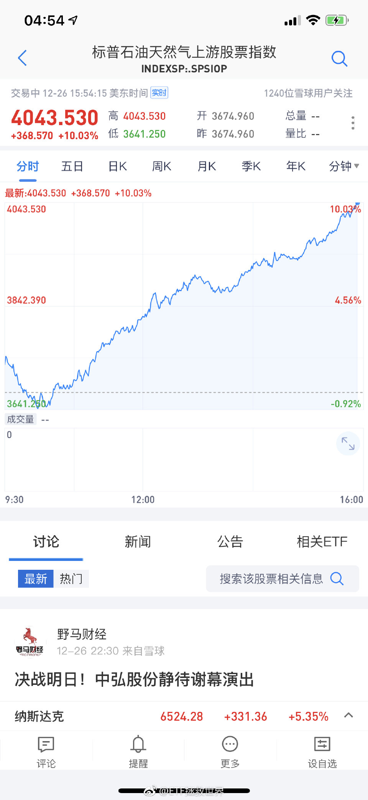

======================================================

ETF拯救世界 (5687069307) @
2018-12-27 07:51:26 Thu  
url: https://weibo.com/5687069307/H97K71XTW

油气跟油价有没有相关性？昨天美油布油涨8个点，油气反弹十个点。这一波下跌油气和油价都是跌三十多个点。你要每天严丝合缝跟当然跟不上，但你得想想你到底要用油气干什么。很多人投资总是陷入细枝末节看不到大的战略层面

------------------------------------------------------
转推：
>  @ETF拯救世界 (5687069307)
>  2018-12-14 17:56:29 Fri  
>  url: https:/weibo.com/5687069307/H7d9eFJR8/

>  投资最怕什么，最怕看得太近。
>  
>  因为某个品种最近表现好就强力看好，最近表现差就踩在脚下。我不能接受这样的投资世界观。
>  
>  有人说油气和油价没有相关性。
>  
>  我把数据调出来后，迷惑了。
>  
>  没有相关性吗？
>  
>  无非是波动性不同，70%的相关性多明显啊。
>  
>  为什么原油我们选择了油气。
>  
>  第一，70%相关性足够了 ​​​

转发[37]  评论[80]  赞[275] 

======================================================

ETF拯救世界 (5687069307) @
2018-12-27 08:08:57 Thu  
url: https://weibo.com/5687069307/H97RdlsLv

说油气套利亏的。

我不断强调的溢价6%套利还亏了的历史教训不是白说的。 ​​​

转发[21]  评论[122]  赞[307] 

======================================================

ETF拯救世界 (5687069307) @
2018-12-27 08:24:34 Thu  
url: https://weibo.com/5687069307/H97XyELsv

回复@ETF信徒者:还没找好。这是在跟回来帮忙的初代助理说话。//@ETF信徒者:我就想知道那个助理是谁了

------------------------------------------------------
转推：
>  @ETF拯救世界 (5687069307)
>  2018-12-27 04:55:28 Thu  
>  url: https:/weibo.com/5687069307/H96AGd6Ax/

>  [拜拜] ​​​

转发[19]  评论[39]  赞[155] 

======================================================

ETF拯救世界 (5687069307) @
2018-12-27 08:29:28 Thu  
url: https://weibo.com/5687069307/H97ZxxS8s

回复@熊猫哥屌丝刘:大概率会跟着凑凑热闹。不过我希望大A有自己的风骨，不要做舔狗。随便意思意思就继续跌吧。//@熊猫哥屌丝刘:E大，A股今天会跟吗？//@ETF拯救世界:回复@ETF信徒者:还没找好。这是在跟回来帮忙的初代助理说话。//@ETF信徒者:我就想知道那个助理是谁了

------------------------------------------------------
转推：
>  @ETF拯救世界 (5687069307)
>  2018-12-27 04:55:28 Thu  
>  url: https:/weibo.com/5687069307/H96AGd6Ax/

>  [拜拜] ​​​

转发[16]  评论[115]  赞[261] 

======================================================

ETF拯救世界 (5687069307) @
2018-12-27 08:47:48 Thu  
url: https://weibo.com/5687069307/H986Z9uz9

教训1：不要攀比。教训2：小心骗子。但是对于拉别人进群就要被杀这个我不知道能想到什么教训了。只能说远离垃圾人比较安全吧。

------------------------------------------------------
转推：
>  @ ()
>  2018-12-27 08:40:36 Thu  
>  url: 

>  抱歉，作者已设置仅展示半年内微博，此微博已不可见。 ​​​

转发[14]  评论[111]  赞[206] 

======================================================

ETF拯救世界 (5687069307) @
2018-12-27 14:52:50 Thu  
url: https://weibo.com/5687069307/H9av9lHlT

笑死。剧本写好跟着演就行了。从未让我失望过……//@ETF拯救世界:回复@熊猫哥屌丝刘:大概率会跟着凑凑热闹。不过我希望大A有自己的风骨，不要做舔狗。随便意思意思就继续跌吧。//@熊猫哥屌丝刘:E大，A股今天会跟吗？//@ETF拯救世界:回复@ETF信徒者:还没找好。这是在跟回来帮忙的初代助理说话。

------------------------------------------------------
转推：
>  @ETF拯救世界 (5687069307)
>  2018-12-27 04:55:28 Thu  
>  url: https:/weibo.com/5687069307/H96AGd6Ax/

>  [拜拜] ​​​

转发[4]  评论[207]  赞[408] 

======================================================

ETF拯救世界 (5687069307) @
2018-12-27 16:35:37 Thu  
url: https://weibo.com/5687069307/H9baS4IYc

终于有时间开始看留言。为什么我这么忙，为什么。 ​​​

转发[2]  评论[207]  赞[450] 

======================================================

ETF拯救世界 (5687069307) @
2018-12-28 15:08:30 Fri  
url: https://weibo.com/5687069307/H9k20mHW1

十二月买了一次，是当月最低的一天。蒙的，不过是不是可以吹一波了…//@ETF拯救世界:回复@leegstar:如果跌到周四，周五涨，能不能吹一波。[doge][圣诞老人]//@leegstar:e大一句话，今天就开始跌，估计真会等到周四[嘻嘻]

------------------------------------------------------
转推：
>  @ETF拯救世界 (5687069307)
>  2018-12-25 14:04:07 Tue  
>  url: https:/weibo.com/5687069307/H8RkofGU5/

>  [怒] 等到周四不行吗辣鸡 ​​​

转发[7]  评论[224]  赞[533] 

======================================================

ETF拯救世界 (5687069307) @
2018-12-29 11:02:42 Sat  
url: https://weibo.com/5687069307/H9rQJosvp

刚才一手拿着速效救心丸，一手点了理财软件的数据更新。

一个月没更新，更新完一看，又少了一辆____。

踏实了。

明后天开始把所有账户一个个弄清楚。

起点这么低，明年要发啊。 ​​​

转发[37]  评论[258]  赞[461] 

======================================================

ETF拯救世界 (5687069307) @
2018-12-29 11:59:42 Sat  
url: https://weibo.com/5687069307/H9sdS4b2a

回复@大都小都:当然不仅是股票账户。一堆银行账户，各行的活期，理财，各个币种的外币，银行贵金属。三个信用卡账户。一堆基金账户。两个普通股票账户，一个两融账户。期货账户。支付宝微信账户。保险账户。所有账户的收支情况，投资情况。

------------------------------------------------------
转推：
>  @ETF拯救世界 (5687069307)
>  2018-12-29 11:02:42 Sat  
>  url: https:/weibo.com/5687069307/H9rQJosvp/

>  刚才一手拿着速效救心丸，一手点了理财软件的数据更新。
>  
>  一个月没更新，更新完一看，又少了一辆____。
>  
>  踏实了。
>  
>  明后天开始把所有账户一个个弄清楚。
>  
>  起点这么低，明年要发啊。 ​​​

转发[20]  评论[77]  赞[301] 

======================================================

ETF拯救世界 (5687069307) @
2018-12-29 12:04:10 Sat  
url: https://weibo.com/5687069307/H9sfGmLfj

怎样才能帮到这样的人。他们不应该是这样的结局。

------------------------------------------------------
转推：
>  @相生栗子 (5790531279)
>  2018-12-28 17:16:34 Fri  
>  url: https:/weibo.com/5790531279/H9kRZiPnJ/

>  无题。
>   
>  #崩坏的世界线[超话]# ​​​

转发[126]  评论[173]  赞[390] 

======================================================

ETF拯救世界 (5687069307) @
2018-12-29 12:10:45 Sat  
url: https://weibo.com/5687069307/H9sim645h

我还是相信善恶有报。 ​​​

转发[11]  评论[90]  赞[410] 

+++++++++++++++++++++++++++++++++++++++++++++++++++++

图片：

======================================================

ETF拯救世界 (5687069307) @
2018-12-29 12:17:32 Sat  
url: https://weibo.com/5687069307/H9sl6xNMZ

回复@XXXXXX434232:管不过来。但能帮一个是一个。你的眼中她可能是几亿分之一，但对她来说就是100%的人生。如果你有能力，你可以选择把下水道的一个叶子拿起来洗干净。

------------------------------------------------------
转推：
>  @相生栗子 (5790531279)
>  2018-12-28 17:16:34 Fri  
>  url: https:/weibo.com/5790531279/H9kRZiPnJ/

>  无题。
>   
>  #崩坏的世界线[超话]# ​​​

转发[53]  评论[58]  赞[426] 

======================================================

ETF拯救世界 (5687069307) @
2018-12-29 12:31:31 Sat  
url: https://weibo.com/5687069307/H9sqN6nly

这个世界不公平。

但是你有力量的时候，尽量做一些让它变得更公平的事，总不会错。 ​​​

转发[40]  评论[135]  赞[1022] 

======================================================

ETF拯救世界 (5687069307) @
2018-12-31 11:45:20 Mon  
url: https://weibo.com/5687069307/H9KZ26D2Q

第二轮邮件终于在2018年看完了。

三百多封邮件，每份邮件好几个附件，大部分邮件正文还有几百上千的文字表达，每个认真看完，确实耗费心血。

还剩75位。会从中再选10-15位作为正式候选。一到两周内会联系，没有联系的就遗憾了，只能下次有缘再说…

顺便在这里祝大家新年快乐！无论2018过的怎么样， ​​​

转发[4]  评论[182]  赞[605] 

======================================================

ETF拯救世界 (5687069307) @
2018-12-31 18:45:55 Mon  
url: https://weibo.com/5687069307/H9NJKivRQ

喷了，怎么微博红包这功能找不到了。

本来想跨年发一个啊。 ​​​

转发[0]  评论[63]  赞[330] 

+++++++++++++++++++++++++++++++++++++++++++++++++++++

图片：
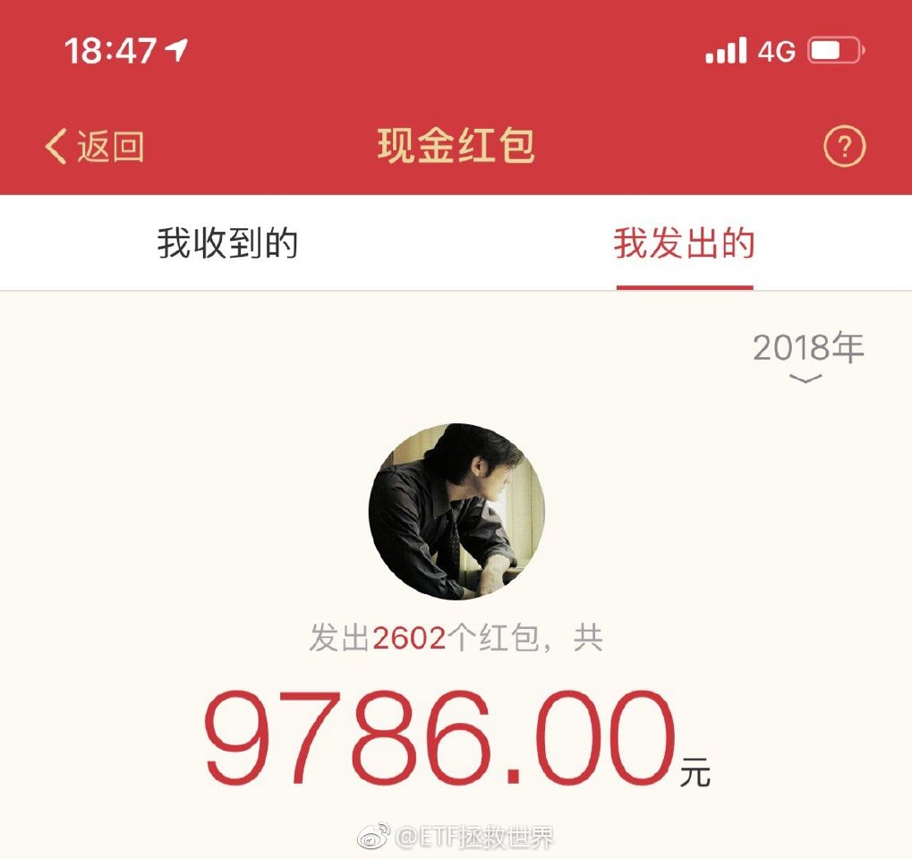

======================================================

ETF拯救世界 (5687069307) @
2018-12-31 18:58:02 Mon  
url: https://weibo.com/5687069307/H9NOFeCYZ

#ETF拯救世界的红包#感谢大家对我的爱与支持！我往红包里塞了现金，特来为大家送上好运，领到红包旺上加旺！http://t.cn/EbHgyw3 ​​​

转发[15]  评论[98]  赞[286] 

======================================================

ETF拯救世界 (5687069307) @
2018-12-31 18:58:36 Mon  
url: https://weibo.com/5687069307/H9NOU0msr

新年快乐⸂⸂⸜(രᴗര๑)⸝⸃⸃

------------------------------------------------------
转推：
>  @ETF拯救世界 (5687069307)
>  2018-12-31 18:58:02 Mon  
>  url: https:/weibo.com/5687069307/H9NOFeCYZ/

>  #ETF拯救世界的红包#感谢大家对我的爱与支持！我往红包里塞了现金，特来为大家送上好运，领到红包旺上加旺！http://t.cn/EbHgyw3 ​​​

转发[10]  评论[195]  赞[389] 

======================================================

ETF拯救世界 (5687069307) @
2018-12-31 19:12:43 Mon  
url: https://weibo.com/5687069307/H9NUDe97N

回复@本宫就是爱菲:关注超过一年，又不取关，又常来看看的，都是真爱。谁爱我我也爱谁。今年过年的超大红包我决定改在微博发了。//@本宫就是爱菲:啊！为什么都是给老粉的呢？还是，新年快乐！//@ETF拯救世界:新年快乐⸂⸂⸜(രᴗര๑)⸝⸃⸃

------------------------------------------------------
转推：
>  @ETF拯救世界 (5687069307)
>  2018-12-31 18:58:02 Mon  
>  url: https:/weibo.com/5687069307/H9NOFeCYZ/

>  #ETF拯救世界的红包#感谢大家对我的爱与支持！我往红包里塞了现金，特来为大家送上好运，领到红包旺上加旺！http://t.cn/EbHgyw3 ​​​

转发[7]  评论[320]  赞[576] 

======================================================

