ETF拯救世界 (5687069307) @
2019-01-02 08:41:51 Wed  
url: https://weibo.com/5687069307/Ha2Dy66VC

徐总，如果这是你们公司投研部的文章，我建议可以全部开掉了。这是我见过抄袭最无耻的一次，全部格式文字原封不动的抄。

------------------------------------------------------
转推：
>  @ ()
>  2019-01-01 21:25:54 Tue  
>  url: 

>  抱歉，此微博已被作者删除。查看帮助：http://t.cn/Rfd3rQV

转发[34]  评论[156]  赞[408] 

======================================================

ETF拯救世界 (5687069307) @
2019-01-02 09:00:08 Wed  
url: https://weibo.com/5687069307/Ha2KYapba

遗产税我个人支持。问题在于怎么才能让这个从富人那里拿到的税真正用在穷人身上。

------------------------------------------------------
转推：
>  @挖龙脉的超级鹿鼎公 (3962719063)
>  2019-01-02 08:58:01 Wed  
>  url: https:/weibo.com/3962719063/Ha2K7hRQL/

>  当年美帝要取消遗产税，结果一堆富豪反对，包括巴菲特，摩根家族，比尔盖茨等，但是再看看他们的财产安排，全是不用缴纳遗产税的家族式基金，所以真的要看做什么，而不是说什么。
>  全球富豪中，缴纳大笔遗产税的大概也就是家族内斗激烈的韩国三星和台湾王永庆家族 ​​​

转发[3]  评论[22]  赞[216] 

======================================================

ETF拯救世界 (5687069307) @
2019-01-02 09:09:06 Wed  
url: https://weibo.com/5687069307/Ha2OBBnau

回复@业余金融学者:[偷笑] 没事。就让贫富差距继续扩大吧。穷人越来越穷，毫无上升的机会，最终来一次gm，均贫卡一出谁与争锋，那样就都开心了。

------------------------------------------------------
转推：
>  @挖龙脉的超级鹿鼎公 (3962719063)
>  2019-01-02 08:58:01 Wed  
>  url: https:/weibo.com/3962719063/Ha2K7hRQL/

>  当年美帝要取消遗产税，结果一堆富豪反对，包括巴菲特，摩根家族，比尔盖茨等，但是再看看他们的财产安排，全是不用缴纳遗产税的家族式基金，所以真的要看做什么，而不是说什么。
>  全球富豪中，缴纳大笔遗产税的大概也就是家族内斗激烈的韩国三星和台湾王永庆家族 ​​​

转发[6]  评论[32]  赞[226] 

======================================================

ETF拯救世界 (5687069307) @
2019-01-02 09:31:55 Wed  
url: https://weibo.com/5687069307/Ha2XS4jRb

我立个flag。

2019年A股极大极大概率收红。不投机取巧，我说的是绝大多数指数。

甚至，有可能涨幅不会太小。

当然不排除中间继续挖坑，但年底看，形势一片大好。不是小好，是大好。 ​​​

转发[214]  评论[332]  赞[975] 

======================================================

ETF拯救世界 (5687069307) @
2019-01-02 09:51:33 Wed  
url: https://weibo.com/5687069307/Ha35PuOMU

你可能不知道，去年我们第一重仓基金中证红利是所有我监测的十几只指数中涨幅第一的。

年涨幅是

-16%…… ​​​

转发[14]  评论[97]  赞[458] 

======================================================

ETF拯救世界 (5687069307) @
2019-01-02 10:21:00 Wed  
url: https://weibo.com/5687069307/Ha3hNuPYL

这股票前期低点撑不住的话就麻烦。权重又大，大指数又是一波。

------------------------------------------------------
转推：
>  @ETF拯救世界 (5687069307)
>  2018-12-21 10:53:09 Fri  
>  url: https:/weibo.com/5687069307/H8emT1xqa/

>  某只莫名其妙崩盘的股票看图真危险啊。
>  
>  不知道发生什么了。 ​​​

转发[8]  评论[142]  赞[282] 

======================================================

ETF拯救世界 (5687069307) @
2019-01-02 12:20:40 Wed  
url: https://weibo.com/5687069307/Ha44mBl4G

珍惜眼前人。

------------------------------------------------------
转推：
>  @ ()
>  2019-01-01 17:27:35 Tue  
>  url: 

>  抱歉，作者已设置仅展示半年内微博，此微博已不可见。 ​​​

转发[72]  评论[72]  赞[307] 

======================================================

ETF拯救世界 (5687069307) @
2019-01-02 13:33:38 Wed  
url: https://weibo.com/5687069307/Ha4xZmCVb

回复@佳期如梦梦梦:这么明显的下跌趋势，当然是给空间了。2018年我们分别在2、8、10月买了三份。不能把建仓筹码聚集在一个区域，否则毫无意义。//@佳期如梦梦梦:很想知道E大啥时候买医药//@ETF拯救世界:下次买入应该在7900左右。

------------------------------------------------------
转推：
>  @ETF拯救世界 (5687069307)
>  2018-12-06 13:04:56 Thu  
>  url: https:/weibo.com/5687069307/H5XOVqDBb/

>  $全指医药 sh000991$   看来还能继续买啊。 ​​​

转发[162]  评论[100]  赞[320] 

======================================================

ETF拯救世界 (5687069307) @
2019-01-02 13:39:09 Wed  
url: https://weibo.com/5687069307/Ha4AefMjI

回复@牙神111:我投资一个指数不会连基本面都不看。我对医药的策略中，已经考虑过去三十年日本医药行业变化的样本，考虑目前各国医药行业估值，考虑政策面影响。我不说，不代表我不知道。只看估值更是对我的极大误解。//@牙神111:E大，医药的估值基础已发生重大变化

------------------------------------------------------
转推：
>  @ETF拯救世界 (5687069307)
>  2018-12-06 13:04:56 Thu  
>  url: https:/weibo.com/5687069307/H5XOVqDBb/

>  $全指医药 sh000991$   看来还能继续买啊。 ​​​

转发[96]  评论[92]  赞[408] 

======================================================

ETF拯救世界 (5687069307) @
2019-01-02 13:45:22 Wed  
url: https://weibo.com/5687069307/Ha4CKh2kq

回复@目标300m:张嘴就来。医药从15500跌下来，我们的成本在这里，从未追高，太高之说从何而来？服了，扯淡之前先看看数据。拉黑为敬。 http://t.cn/EbelEFX //@目标300m:6000以下再买吧。你之前买得太高了。

------------------------------------------------------
转推：
>  @ETF拯救世界 (5687069307)
>  2018-12-06 13:04:56 Thu  
>  url: https:/weibo.com/5687069307/H5XOVqDBb/

>  $全指医药 sh000991$   看来还能继续买啊。 ​​​

转发[11]  评论[78]  赞[310] 

======================================================

ETF拯救世界 (5687069307) @
2019-01-02 14:07:07 Wed  
url: https://weibo.com/5687069307/Ha4LzvQjy

“这次不一样”。

这句在资本市场上经常会出现的话，有可能是对的。

但大多数时间，根本不会有什么不一样。

只要那些涨起来就找各种理由三万点五万点，跌下去找各种理由不行了完蛋了的人存在，就不会不一样。

我不需要那些在股市上根本没赚过钱的人来指导我，谢谢。我要听了你们的，一分钱都挣不着 ​​​

转发[84]  评论[167]  赞[741] 

======================================================

ETF拯救世界 (5687069307) @
2019-01-02 14:13:28 Wed  
url: https://weibo.com/5687069307/Ha4O9q68G

因为各种原因，资本市场正常情况下一定是以一定斜率向上升。哪怕日本台湾，排除掉疯狂高估的那几年，到现在也是一路上升。

所以一般人，在比较便宜的地方买入，拿着就行。不用看也不用管。

对于能够独立思考，在极端时候与群众保持距离的人来说，高位卖掉，低位买回来效果会更好。

但那些跌了50%、6 ​​​

转发[96]  评论[168]  赞[588] 

======================================================

ETF拯救世界 (5687069307) @
2019-01-02 14:48:05 Wed  
url: https://weibo.com/5687069307/Ha52cv8ml

今天不出意外会跌破10月底的全市场估值。

距离2008年最低点还有11%，距离2005年最低点还有17%。

2008年之后是一年翻番。2005年之后是两年六倍。

2019年之后会怎样，咱们拭目以待。 ​​​

转发[239]  评论[273]  赞[662] 

======================================================

ETF拯救世界 (5687069307) @
2019-01-02 14:57:24 Wed  
url: https://weibo.com/5687069307/Ha55Z7OTg

回复@追求确定性2:快吗？从2001年跌到2005整整4年。从2007到2012年底又是4年半。一轮牛市顶部到熊市大底都是4年起。你回头看觉得很快，当你置身其中，比如现在这轮才三年多，就感受完全不同了。//@追求确定性2:哦，我竟然不知道05年低于08年，那时一轮好快，节约时间。

------------------------------------------------------
转推：
>  @ETF拯救世界 (5687069307)
>  2019-01-02 14:48:05 Wed  
>  url: https:/weibo.com/5687069307/Ha52cv8ml/

>  今天不出意外会跌破10月底的全市场估值。
>  
>  距离2008年最低点还有11%，距离2005年最低点还有17%。
>  
>  2008年之后是一年翻番。2005年之后是两年六倍。
>  
>  2019年之后会怎样，咱们拭目以待。 ​​​

转发[71]  评论[95]  赞[363] 

======================================================

ETF拯救世界 (5687069307) @
2019-01-02 15:12:17 Wed  
url: https://weibo.com/5687069307/Ha5c1tARX

2001-2005，上证指数从2245跌到998，跌幅56%.

2007-2012，不用上证了，因为被大股票绑架。用深综指，从1500跌到770，跌幅50%。（08年底跌幅70%）

这一轮深综指已经杀了60%。如果到05年底估值，等于是从最高点杀67%。

你可以有一万种理由说这次不一样，你看我搭理不搭理你。 ​​​

转发[172]  评论[331]  赞[728] 

======================================================

ETF拯救世界 (5687069307) @
2019-01-02 19:41:18 Wed  
url: https://weibo.com/5687069307/Ha6Xdu5Zi

没为母校做什么，很惭愧[摊手]

------------------------------------------------------
转推：
>  @老马自奋蹄 (1807436544)
>  2019-01-02 19:18:03 Wed  
>  url: https:/weibo.com/1807436544/Ha6NM7AR4/

>  校友会100强排行榜 ​​​

转发[21]  评论[153]  赞[288] 

======================================================

ETF拯救世界 (5687069307) @
2019-01-03 05:50:58 Thu  
url: https://weibo.com/5687069307/HaaWGClWK

平均跌幅超过40%，扛不住即将破功 [doge] ​​​

转发[52]  评论[108]  赞[415] 

+++++++++++++++++++++++++++++++++++++++++++++++++++++

图片：

======================================================

ETF拯救世界 (5687069307) @
2019-01-03 06:17:37 Thu  
url: https://weibo.com/5687069307/Hab7v9Wt8

敢不敢涨上去再让我们卖一次。 ​​​

转发[6]  评论[94]  赞[419] 

+++++++++++++++++++++++++++++++++++++++++++++++++++++

图片：

======================================================

ETF拯救世界 (5687069307) @
2019-01-03 09:40:14 Thu  
url: https://weibo.com/5687069307/HacrKs9qx

回复@股票不赚钱:均值回归。不要抄近期表现好的作业，不要买近期表现好的产品//@股票不赚钱:不怪你，俺抄大V作业，抄一个废一个，紫薇侍郎、飘仙啥的……。抄你作业半年了……

------------------------------------------------------
转推：
>  @ETF拯救世界 (5687069307)
>  2019-01-03 05:50:58 Thu  
>  url: https:/weibo.com/5687069307/HaaWGClWK/

>  平均跌幅超过40%，扛不住即将破功 [doge] ​​​

转发[31]  评论[58]  赞[312] 

======================================================

ETF拯救世界 (5687069307) @
2019-01-03 10:22:47 Thu  
url: https://weibo.com/5687069307/HacJ10a0U

只要涨1%，30%昨天看空的人就觉得牛市来了。

涨10%，80%空头转多。

剩下的20%牛市快结束的时候去买单。 ​​​

转发[147]  评论[187]  赞[688] 

======================================================

ETF拯救世界 (5687069307) @
2019-01-03 14:25:10 Thu  
url: https://weibo.com/5687069307/HaejowEF7

看着账户里100多万医药指数瑟瑟发抖中。[doge] ​​​

转发[41]  评论[318]  赞[728] 

======================================================

ETF拯救世界 (5687069307) @
2019-01-03 18:38:24 Thu  
url: https://weibo.com/5687069307/HafYc0HaN

[爱你]

------------------------------------------------------
转推：
>  @ ()
>  2019-01-03 16:50:06 Thu  
>  url: 

>  抱歉，作者已设置仅展示半年内微博，此微博已不可见。 ​​​

转发[27]  评论[61]  赞[186] 

======================================================

ETF拯救世界 (5687069307) @
2019-01-03 22:17:15 Thu  
url: https://weibo.com/5687069307/Hahp18clk

有没有了解人体工学椅的朋友，有什么好推荐吗。 ​​​

转发[52]  评论[116]  赞[232] 

======================================================

ETF拯救世界 (5687069307) @
2019-01-04 00:50:10 Fri  
url: https://weibo.com/5687069307/Haip5yy5K

买了，谢谢各位！

------------------------------------------------------
转推：
>  @ETF拯救世界 (5687069307)
>  2019-01-03 22:17:15 Thu  
>  url: https:/weibo.com/5687069307/Hahp18clk/

>  有没有了解人体工学椅的朋友，有什么好推荐吗。 ​​​

转发[3]  评论[56]  赞[207] 

======================================================

ETF拯救世界 (5687069307) @
2019-01-04 10:47:21 Fri  
url: https://weibo.com/5687069307/Hamju3sby

不做舔狗的股市，才是有希望的股市。

——赵四 ​​​

转发[75]  评论[94]  赞[437] 

======================================================

ETF拯救世界 (5687069307) @
2019-01-04 11:06:56 Fri  
url: https://weibo.com/5687069307/Hamrqgnkx

回复@小牛乐乐吧:记住一个规则：只要有人喊“大奇迹日”。那就大概率还要跌。E首发。//@小牛乐乐吧:回复@小牛乐乐吧:一个好现象：球球的V们今天没有叫嚷着大底，反倒偏谨慎了！

------------------------------------------------------
转推：
>  @ETF拯救世界 (5687069307)
>  2019-01-04 10:47:21 Fri  
>  url: https:/weibo.com/5687069307/Hamju3sby/

>  不做舔狗的股市，才是有希望的股市。
>  
>  ——赵四 ​​​

转发[65]  评论[99]  赞[335] 

======================================================

ETF拯救世界 (5687069307) @
2019-01-04 11:32:35 Fri  
url: https://weibo.com/5687069307/HamBQi0tl

大奇迹日！ ​​​

转发[11]  评论[224]  赞[505] 

======================================================

ETF拯救世界 (5687069307) @
2019-01-04 11:34:52 Fri  
url: https://weibo.com/5687069307/HamCMdx1f

各位好好在各个网站观察，看看对不对。

------------------------------------------------------
转推：
>  @ETF拯救世界 (5687069307)
>  2019-01-03 10:22:47 Thu  
>  url: https:/weibo.com/5687069307/HacJ10a0U/

>  只要涨1%，30%昨天看空的人就觉得牛市来了。
>  
>  涨10%，80%空头转多。
>  
>  剩下的20%牛市快结束的时候去买单。 ​​​

转发[20]  评论[78]  赞[336] 

======================================================

ETF拯救世界 (5687069307) @
2019-01-04 11:45:31 Fri  
url: https://weibo.com/5687069307/HamH5xk2a

如果今天涨5%以上，我将停止抖动。

------------------------------------------------------
转推：
>  @ETF拯救世界 (5687069307)
>  2019-01-03 14:25:10 Thu  
>  url: https:/weibo.com/5687069307/HaejowEF7/

>  看着账户里100多万医药指数瑟瑟发抖中。[doge] ​​​

转发[6]  评论[156]  赞[442] 

======================================================

ETF拯救世界 (5687069307) @
2019-01-04 16:02:10 Fri  
url: https://weibo.com/5687069307/Haonh4Ii7

回复@开心娅宁:我这里怎么都是变态//@开心娅宁:我为什么有点伤心呢，自从上了车就喜欢使劲跌//@ETF拯救世界:如果今天涨5%以上，我将停止抖动。

------------------------------------------------------
转推：
>  @ETF拯救世界 (5687069307)
>  2019-01-03 14:25:10 Thu  
>  url: https:/weibo.com/5687069307/HaejowEF7/

>  看着账户里100多万医药指数瑟瑟发抖中。[doge] ​​​

转发[2]  评论[75]  赞[244] 

======================================================

ETF拯救世界 (5687069307) @
2019-01-04 16:12:18 Fri  
url: https://weibo.com/5687069307/Haornqp7G

回复@freeman7998:投资就这点事。情绪是其一。周而复始，什么也不会变//@freeman7998:刚刚雪球收评，大奇迹日。[允悲]//@ETF拯救世界:回复@小牛乐乐吧:记住一个规则：只要有人喊“大奇迹日”。那就大概率还要跌。E首发。

------------------------------------------------------
转推：
>  @ETF拯救世界 (5687069307)
>  2019-01-04 10:47:21 Fri  
>  url: https:/weibo.com/5687069307/Hamju3sby/

>  不做舔狗的股市，才是有希望的股市。
>  
>  ——赵四 ​​​

转发[28]  评论[62]  赞[266] 

======================================================

ETF拯救世界 (5687069307) @
2019-01-04 17:58:02 Fri  
url: https://weibo.com/5687069307/Hap8inxsa

新的一年了。

距离探索这个星球1%的目标依然非常遥远… ​​​

转发[20]  评论[67]  赞[267] 

+++++++++++++++++++++++++++++++++++++++++++++++++++++

图片：

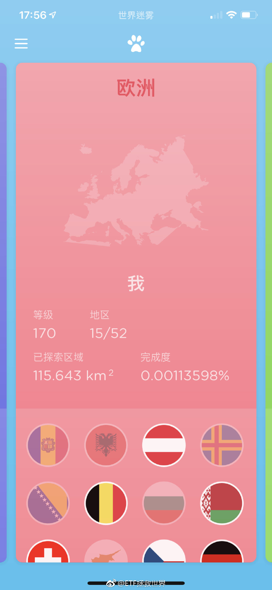

======================================================

ETF拯救世界 (5687069307) @
2019-01-04 18:06:53 Fri  
url: https://weibo.com/5687069307/HapbTu7i6

回复@投资跑道上的一只小蜗牛:人类特别渺小，在地球上就是渣渣。地球在宇宙里面连渣渣都不是。你我又在整个人类中是渣渣。所以自己的那点不开心什么都不是，开心每一天最重要//@投资跑道上的一只小蜗牛:人类太渺小了

------------------------------------------------------
转推：
>  @ETF拯救世界 (5687069307)
>  2019-01-04 17:58:02 Fri  
>  url: https:/weibo.com/5687069307/Hap8inxsa/

>  新的一年了。
>  
>  距离探索这个星球1%的目标依然非常遥远… ​​​

转发[13]  评论[57]  赞[253] 

======================================================

ETF拯救世界 (5687069307) @
2019-01-04 18:49:59 Fri  
url: https://weibo.com/5687069307/HaptnDyBV

回复@乐活广场com:秋天收获以后，春天播种，经过夏天，又到秋天才能收获。那么，能不能因为冬天春天夏天的时间成本不种地了呢。//@乐活广场com:跟计划三年多了，计划本身足够优秀，但我觉得一个不足之处是 它只能通过一个牛市来兑现〔可观〕的利润。 这其中的时间成本是需要考虑的

------------------------------------------------------
转推：
>  @ETF拯救世界 (5687069307)
>  2019-01-04 10:47:21 Fri  
>  url: https:/weibo.com/5687069307/Hamju3sby/

>  不做舔狗的股市，才是有希望的股市。
>  
>  ——赵四 ​​​

转发[15]  评论[74]  赞[248] 

======================================================

ETF拯救世界 (5687069307) @
2019-01-04 18:56:59 Fri  
url: https://weibo.com/5687069307/Hapwen35I

回复@不让改名字呢:那你们等着牛市来临前一天买入就完了呗。//@不让改名字呢:冬天本来就不用种地啊，前位说的是对的//@ETF拯救世界:回复@乐活广场com:秋天收获以后，春天播种，经过夏天，又到秋天才能收获。那么，能不能因为冬天春天夏天的时间成本不种地了呢。

------------------------------------------------------
转推：
>  @ETF拯救世界 (5687069307)
>  2019-01-04 10:47:21 Fri  
>  url: https:/weibo.com/5687069307/Hamju3sby/

>  不做舔狗的股市，才是有希望的股市。
>  
>  ——赵四 ​​​

转发[4]  评论[54]  赞[234] 

======================================================

ETF拯救世界 (5687069307) @
2019-01-04 19:12:38 Fri  
url: https://weibo.com/5687069307/HapCzBBme

说起时间成本，好好看这张图。

在上一轮把几乎所有持仓卖出，高位持有现金（深蓝色）后，我们用了多长时间才把这些现金换成资产。

第三轮开始两年半后，还有超过一半现金。你有没有见过这样的组合？我已经把时间成本考虑的比99%的人都足够了。也就是说，这两年半你的大部分资金根本不会被占用。

去 ​​​

转发[111]  评论[269]  赞[703] 

+++++++++++++++++++++++++++++++++++++++++++++++++++++

图片：

======================================================

ETF拯救世界 (5687069307) @
2019-01-04 21:51:19 Fri  
url: https://weibo.com/5687069307/HaqEZe73e

何德何能 ​​​

转发[5]  评论[70]  赞[349] 

+++++++++++++++++++++++++++++++++++++++++++++++++++++

图片：

======================================================

ETF拯救世界 (5687069307) @
2019-01-04 22:37:15 Fri  
url: https://weibo.com/5687069307/HaqXDagmN

明早看不要让我们失望 ​​​

转发[4]  评论[75]  赞[290] 

+++++++++++++++++++++++++++++++++++++++++++++++++++++

图片：

======================================================

ETF拯救世界 (5687069307) @
2019-01-05 08:02:53 Sat  
url: https://weibo.com/5687069307/HauFdCv6n

都是轮回。跌了买，涨了卖。简简单单的。多大点事。 ​​​

转发[29]  评论[62]  赞[389] 

+++++++++++++++++++++++++++++++++++++++++++++++++++++

图片：

======================================================

ETF拯救世界 (5687069307) @
2019-01-05 08:17:58 Sat  
url: https://weibo.com/5687069307/HauLlAdQg

昨天纽约油2个点，油气5个点。记得前一段有人说油气跟油价无关吗。再说一次，中长期70%跟上就行，不用每天严丝合缝。因为没意义。波动更大我更喜欢。

------------------------------------------------------
转推：
>  @ETF拯救世界 (5687069307)
>  2019-01-05 08:02:53 Sat  
>  url: https:/weibo.com/5687069307/HauFdCv6n/

>  都是轮回。跌了买，涨了卖。简简单单的。多大点事。 ​​​

转发[19]  评论[61]  赞[321] 

======================================================

ETF拯救世界 (5687069307) @
2019-01-05 08:24:57 Sat  
url: https://weibo.com/5687069307/HauOb9BK9

证券市场的涨跌，波动，是你我都没法改变的。

除非你不玩了，否则你就必须找到适应甚至利用涨跌波动的方法，而不是怨天尤人。

有人认为波动是风险，我认为波动是机会。波动越大机会越大，没有波动就没有机会。

A股这样的波动，几乎每年都不是涨幅第一就是跌幅第一，简直是天堂了。 

只要你能记住那 ​​​

转发[96]  评论[162]  赞[528] 

======================================================

ETF拯救世界 (5687069307) @
2019-01-05 08:31:38 Sat  
url: https://weibo.com/5687069307/HauQTeVwg

非常有意义。今天辉煌十年后未必，即使你根本看不出这家公司有任何可能滑落。十年后，现在的科技巨头还剩一半就不错。

------------------------------------------------------
转推：
>  @数据化管理 (1424710994)
>  2019-01-04 22:07:50 Fri  
>  url: https:/weibo.com/1424710994/HaqLGBP9J/

>  2008vs2018年全球市值最高的10个公司对比：
>  1、只有微软还在榜单中，并且18年末市值超越苹果成老大了；
>  2、10年前只有微软1家新科技公司，10年后有7家是新科技公司；
>  3、10年前中国有3家公司“被”上榜，10年后有2家是中国新科技公司；
>  4、10年前宝洁还在榜单，10年后仍然有家快消+医药的美国强生在榜 ​​​

转发[124]  评论[89]  赞[349] 

======================================================

ETF拯救世界 (5687069307) @
2019-01-05 16:29:29 Sat  
url: https://weibo.com/5687069307/HaxYQzuJ8

将近一个月过去，小助理第三轮笔试五分钟前已经有了结果。

这次是从进入第二轮的346位中选择10-15位，最终结果是选了16位作为备选人员。之后我会给这些朋友回信。

这一轮选择时间比较长，是因为每份答题中有好几个文件，绝大部分邮件还会写不少感受，一封封看非常耗费时间。毕竟每一位的答题都不能马 ​​​

转发[9]  评论[230]  赞[791] 

======================================================

ETF拯救世界 (5687069307) @
2019-01-06 21:05:30 Sun  
url: https://weibo.com/5687069307/HaJdockZB

有点精彩。想看聊天记录……

------------------------------------------------------
转推：
>  @新浪娱乐 (1642591402)
>  2019-01-06 17:38:28 Sun  
>  url: https:/weibo.com/1642591402/HaHRltilE/

>  #袁巴元爆料张雨绮与男子开房# 6日，袁巴元在朋友圈发文承认与张雨绮离婚后的确又在一起生活，但女方5日晚与刚认识两天的男子开房，直指“这是她的一贯风格，离婚前也一样，只要自己爽从不顾及别人的感受，特别是不顾小孩”，表示这也是两人之前离婚的原因，强调称彼此之间没有任何感情上的关系。 ​​​

转发[7]  评论[127]  赞[197] 

======================================================

ETF拯救世界 (5687069307) @
2019-01-07 13:17:29 Mon  
url: https://weibo.com/5687069307/HaPzUqV39

现在舒服不舒服。

------------------------------------------------------
转推：
>  @ETF拯救世界 (5687069307)
>  2019-01-03 10:22:47 Thu  
>  url: https:/weibo.com/5687069307/HacJ10a0U/

>  只要涨1%，30%昨天看空的人就觉得牛市来了。
>  
>  涨10%，80%空头转多。
>  
>  剩下的20%牛市快结束的时候去买单。 ​​​

转发[55]  评论[237]  赞[392] 

======================================================

ETF拯救世界 (5687069307) @
2019-01-07 15:26:33 Mon  
url: https://weibo.com/5687069307/HaQqj4d0G

回复@追求确定性2:大网利润43%。每年可以吃两次。//@追求确定性2:我现在在yy油气出一大网。虽然还早。//@ETF拯救世界:现在舒服不舒服。

------------------------------------------------------
转推：
>  @ETF拯救世界 (5687069307)
>  2019-01-03 10:22:47 Thu  
>  url: https:/weibo.com/5687069307/HacJ10a0U/

>  只要涨1%，30%昨天看空的人就觉得牛市来了。
>  
>  涨10%，80%空头转多。
>  
>  剩下的20%牛市快结束的时候去买单。 ​​​

转发[47]  评论[130]  赞[296] 

======================================================

ETF拯救世界 (5687069307) @
2019-01-07 22:17:53 Mon  
url: https://weibo.com/5687069307/HaT7gteHK

回复@卡萨布兰卡de忧伤:它就是最近几年表现好。2003-2013它是最著名的毫无波动僵尸股，更别提怎么从2000暴跌下去。投资个股是真的难。//@卡萨布兰卡de忧伤:微软十年涨3倍这还是分红后 手机没搞成的情况下

------------------------------------------------------
转推：
>  @数据化管理 (1424710994)
>  2019-01-04 22:07:50 Fri  
>  url: https:/weibo.com/1424710994/HaqLGBP9J/

>  2008vs2018年全球市值最高的10个公司对比：
>  1、只有微软还在榜单中，并且18年末市值超越苹果成老大了；
>  2、10年前只有微软1家新科技公司，10年后有7家是新科技公司；
>  3、10年前中国有3家公司“被”上榜，10年后有2家是中国新科技公司；
>  4、10年前宝洁还在榜单，10年后仍然有家快消+医药的美国强生在榜 ​​​

转发[13]  评论[28]  赞[166] 

======================================================

ETF拯救世界 (5687069307) @
2019-01-07 23:18:13 Mon  
url: https://weibo.com/5687069307/HaTvKqLE1

去睡了，不要掉链子 ​​​

转发[19]  评论[66]  赞[277] 

+++++++++++++++++++++++++++++++++++++++++++++++++++++

图片：

======================================================

ETF拯救世界 (5687069307) @
2019-01-08 06:05:44 Tue  
url: https://weibo.com/5687069307/HaWba5J9b

提款机 http://t.cn/EGHZ44V

------------------------------------------------------
转推：
>  @ETF拯救世界 (5687069307)
>  2019-01-07 23:18:13 Mon  
>  url: https:/weibo.com/5687069307/HaTvKqLE1/

>  去睡了，不要掉链子 ​​​

转发[12]  评论[103]  赞[319] 

======================================================

ETF拯救世界 (5687069307) @
2019-01-08 09:26:46 Tue  
url: https://weibo.com/5687069307/HaXuL9mUn

每一种交易策略都有适合它的市场环境和市场周期，世界上从没有，也永远不会有一种能够适应全天候市场状况的完美交易策略。

任何交易策略都有它的关键点和需要注意的问题。这些都不是一两句能说清的。

有天分的人，在某个交易策略上经历过一个周期，就会明白这个策略的关键以及致命伤。才有可能继续不 ​​​

转发[157]  评论[175]  赞[472] 

======================================================

ETF拯救世界 (5687069307) @
2019-01-08 10:07:12 Tue  
url: https://weibo.com/5687069307/HaXLb7c5x

回复@嘿嘿zzzz:全天候是一个体系，不是一个交易策略。这个体系中包含了各种交易策略。就像一个军队中，要有陆海空，要有导弹部队。各个军种搭配才行。我说的是交易策略。两回事。

------------------------------------------------------
转推：
>  @ETF拯救世界 (5687069307)
>  2019-01-08 09:26:46 Tue  
>  url: https:/weibo.com/5687069307/HaXuL9mUn/

>  每一种交易策略都有适合它的市场环境和市场周期，世界上从没有，也永远不会有一种能够适应全天候市场状况的完美交易策略。
>  
>  任何交易策略都有它的关键点和需要注意的问题。这些都不是一两句能说清的。
>  
>  有天分的人，在某个交易策略上经历过一个周期，就会明白这个策略的关键以及致命伤。才有可能继续不 ​​​

转发[53]  评论[35]  赞[230] 

======================================================

ETF拯救世界 (5687069307) @
2019-01-08 10:54:52 Tue  
url: https://weibo.com/5687069307/HaY4vAS2z

回复@ETF信徒者:她不懂我。我不是多头，我只是把油气当做一个难得的弱相关交易工具。//@ETF信徒者:请问E大如何看待油气姐说你是油气多头，在这件事情事情之前发的靓照[doge]

------------------------------------------------------
转推：
>  @ETF拯救世界 (5687069307)
>  2019-01-08 09:26:46 Tue  
>  url: https:/weibo.com/5687069307/HaXuL9mUn/

>  每一种交易策略都有适合它的市场环境和市场周期，世界上从没有，也永远不会有一种能够适应全天候市场状况的完美交易策略。
>  
>  任何交易策略都有它的关键点和需要注意的问题。这些都不是一两句能说清的。
>  
>  有天分的人，在某个交易策略上经历过一个周期，就会明白这个策略的关键以及致命伤。才有可能继续不 ​​​

转发[29]  评论[68]  赞[246] 

======================================================

ETF拯救世界 (5687069307) @
2019-01-08 12:06:31 Tue  
url: https://weibo.com/5687069307/HaYxBiIqY

回复@梦之彼方2082:讲真，腰斩之后的熊市中指数基金这样热，这是A股有史以来第一次。非常有历史意义。//@梦之彼方2082:联想到07-08年排队买基金的新闻了[吃瓜]//@ETF拯救世界:回复@ETF信徒者:她不懂我。我不是多头，我只是把油气当做一个难得的弱相关交易工具。

------------------------------------------------------
转推：
>  @ETF拯救世界 (5687069307)
>  2019-01-08 09:26:46 Tue  
>  url: https:/weibo.com/5687069307/HaXuL9mUn/

>  每一种交易策略都有适合它的市场环境和市场周期，世界上从没有，也永远不会有一种能够适应全天候市场状况的完美交易策略。
>  
>  任何交易策略都有它的关键点和需要注意的问题。这些都不是一两句能说清的。
>  
>  有天分的人，在某个交易策略上经历过一个周期，就会明白这个策略的关键以及致命伤。才有可能继续不 ​​​

转发[18]  评论[57]  赞[225] 

======================================================

ETF拯救世界 (5687069307) @
2019-01-08 12:12:14 Tue  
url: https://weibo.com/5687069307/HaYzVxxWg

资金宽松+避险思维=高等级债牛市。下一个阶段，没有意外就会进入股市与垃圾债的春天。只是具体时间不知道……

------------------------------------------------------
转推：
>  @ ()
>  2019-01-08 12:08:58 Tue  
>  url: 

>  抱歉，此微博已被作者删除。查看帮助：http://t.cn/Rfd3rQV

转发[82]  评论[111]  赞[300] 

======================================================

ETF拯救世界 (5687069307) @
2019-01-08 13:25:09 Tue  
url: https://weibo.com/5687069307/HaZ3wdypf

[doge] 新低了。//@ETF拯救世界:小米，年轻人第一支被套的股票……

------------------------------------------------------
转推：
>  @小米公司陈曦 (2651381433)
>  2018-06-22 10:54:12 Fri  
>  url: https:/weibo.com/2651381433/Gmw3gaYeG/

>  联交所第一支同股不同权的股票[鼓掌][鼓掌][鼓掌]
>  股票代码：1810（18年上市，10年创立）
>  年轻人的第一支股票，亲爱的米粉们，账户开好了吗[偷笑][偷笑] ​​​

转发[24]  评论[75]  赞[197] 

======================================================

ETF拯救世界 (5687069307) @
2019-01-08 14:11:33 Tue  
url: https://weibo.com/5687069307/HaZmm0DR9

刚才你们说的两位V争论我去看了。技术方面没什么好说的，每个人都有自己的观点。

不过我其实想知道的是，否定别人的东西后，有没有提出更好的东西呢。

比如投资指数基金。我可以说长期定投会比牛市最热的时候一笔砸进去强。

那根据估值，低位布局，又比无脑定投强。

那接下来，更进一步，要考虑组 ​​​

转发[168]  评论[268]  赞[521] 

======================================================

ETF拯救世界 (5687069307) @
2019-01-08 14:28:51 Tue  
url: https://weibo.com/5687069307/HaZtnh3V0

另外，咱们排除利益因素，就考虑讨论的技术因素。

太多人根本就没想明白自己到论坛干嘛去了。

人这一辈子，就这么几十年。找个有兴趣的事儿钻研一下，吃喝玩乐，泡妞亲子，你干嘛不行，实在不行你去赚点钱，非得上论坛跟人互喷吗……

首先人都要脸。你指着人家说你那套东西是辣鸡，还没完没了的说， ​​​

转发[47]  评论[117]  赞[434] 

======================================================

ETF拯救世界 (5687069307) @
2019-01-08 14:33:39 Tue  
url: https://weibo.com/5687069307/HaZvkqC8U

回复@早起拜瓶迁晚睡读益达:投资这件事根本就没有唯一的正确。太多人认为只有自己这样做正确。每个路子都适合不同的人，百花齐放才是王道。

------------------------------------------------------
转推：
>  @ETF拯救世界 (5687069307)
>  2019-01-08 14:28:51 Tue  
>  url: https:/weibo.com/5687069307/HaZtnh3V0/

>  另外，咱们排除利益因素，就考虑讨论的技术因素。
>  
>  太多人根本就没想明白自己到论坛干嘛去了。
>  
>  人这一辈子，就这么几十年。找个有兴趣的事儿钻研一下，吃喝玩乐，泡妞亲子，你干嘛不行，实在不行你去赚点钱，非得上论坛跟人互喷吗……
>  
>  首先人都要脸。你指着人家说你那套东西是辣鸡，还没完没了的说， ​​​

转发[16]  评论[33]  赞[283] 

======================================================

ETF拯救世界 (5687069307) @
2019-01-08 14:49:57 Tue  
url: https://weibo.com/5687069307/HaZBWgSjd

辣鸡

------------------------------------------------------
转推：
>  @央视新闻 (2656274875)
>  2019-01-08 14:48:18 Tue  
>  url: https:/weibo.com/2656274875/HaZBgAonZ/

>  【北京宣师一附小校内一男子伤害孩子 20个孩子受伤】今日上午11点17分左右，北京宣师一附小校内发生一男子伤害孩子事件。初步了解，共有20个孩子受伤，均已送到医院救治，其中3人伤势较重，目前生命体征平稳，无生命危险。嫌疑人已被当场控制。市、区公安、卫生、教育、应急等相关单位正在全力开展救治 ​​​

转发[12]  评论[51]  赞[126] 

======================================================

ETF拯救世界 (5687069307) @
2019-01-08 16:50:18 Tue  
url: https://weibo.com/5687069307/Hb0oN3yvj

对孩子下手就是人渣中的战斗机，卢瑟中的极品。写到史书上传到任何年代都是万人唾骂。

一个是学校幼儿园肯定要加大保安力度。

另一个是咱们回家都要好好教育孩子怎么应对这种突发情况。 ​​​

转发[19]  评论[63]  赞[312] 

======================================================

ETF拯救世界 (5687069307) @
2019-01-08 16:54:01 Tue  
url: https://weibo.com/5687069307/Hb0qj2jnv

回复@橙子西瓜各有所爱:学校幼儿园没法少去啊。该教育就得教育。得多带孩子看看动物世界。看看里面的小瞪羚是怎么逃脱狮子毒手的……//@橙子西瓜各有所爱:以后这种恐怕会越来越多，唉，尽量少去人多的地方吧

------------------------------------------------------
转推：
>  @ETF拯救世界 (5687069307)
>  2019-01-08 16:50:18 Tue  
>  url: https:/weibo.com/5687069307/Hb0oN3yvj/

>  对孩子下手就是人渣中的战斗机，卢瑟中的极品。写到史书上传到任何年代都是万人唾骂。
>  
>  一个是学校幼儿园肯定要加大保安力度。
>  
>  另一个是咱们回家都要好好教育孩子怎么应对这种突发情况。 ​​​

转发[6]  评论[31]  赞[208] 

======================================================

ETF拯救世界 (5687069307) @
2019-01-09 09:01:06 Wed  
url: https://weibo.com/5687069307/Hb6KQ7bFd

“今年最令人感慨的股票型基金当属东方红资管旗下的东方睿系列基金。2017年，该系列基金因集中重仓绩优蓝筹股而力压群芳，整体收益均位于股票类基金的前列，并遥遥领先同类基金的业绩。这一团队效应，导致他们之后发行的新基金一日就销售过百亿，创造了基金逆势旺销的奇迹，但是今年睿系列基金集体回落 ​​​

转发[118]  评论[157]  赞[437] 

======================================================

ETF拯救世界 (5687069307) @
2019-01-09 09:15:06 Wed  
url: https://weibo.com/5687069307/Hb6QwhThf

回复@微胖界的詹姆士叔叔:清盘不错勒，有的私募没有清盘线都0.2了//@微胖界的詹姆士叔叔:回复@爱爬楼的超音鼠:0.84不错勒。我16年投了一个私募已经清盘了。。。

------------------------------------------------------
转推：
>  @ETF拯救世界 (5687069307)
>  2019-01-09 09:01:06 Wed  
>  url: https:/weibo.com/5687069307/Hb6KQ7bFd/

>  “今年最令人感慨的股票型基金当属东方红资管旗下的东方睿系列基金。2017年，该系列基金因集中重仓绩优蓝筹股而力压群芳，整体收益均位于股票类基金的前列，并遥遥领先同类基金的业绩。这一团队效应，导致他们之后发行的新基金一日就销售过百亿，创造了基金逆势旺销的奇迹，但是今年睿系列基金集体回落 ​​​

转发[7]  评论[9]  赞[178] 

======================================================

ETF拯救世界 (5687069307) @
2019-01-09 09:24:26 Wed  
url: https://weibo.com/5687069307/Hb6Ujbu8x

这一波油价反弹又有20个点了。你再回头看看一个月前那些在最低点疯狂看空石油的论调。

如果你被他们吓破了胆，就有可能卖在最低位。

我不是说油价未来的涨跌，我是说怎么看网上这些每天扑面而来的文字。

你要知道一件事，每天在网上慷慨激昂，指点江山的人，其实有一半以上可能未必有你懂得多。能写 ​​​

转发[76]  评论[172]  赞[507] 

======================================================

ETF拯救世界 (5687069307) @
2019-01-09 09:29:15 Wed  
url: https://weibo.com/5687069307/Hb6WgmLki

好像今天解禁了。//@ETF拯救世界:[doge] 新低了。//@ETF拯救世界:小米，年轻人第一支被套的股票……

------------------------------------------------------
转推：
>  @小米公司陈曦 (2651381433)
>  2018-06-22 10:54:12 Fri  
>  url: https:/weibo.com/2651381433/Gmw3gaYeG/

>  联交所第一支同股不同权的股票[鼓掌][鼓掌][鼓掌]
>  股票代码：1810（18年上市，10年创立）
>  年轻人的第一支股票，亲爱的米粉们，账户开好了吗[偷笑][偷笑] ​​​

转发[12]  评论[20]  赞[165] 

======================================================

ETF拯救世界 (5687069307) @
2019-01-09 09:33:15 Wed  
url: https://weibo.com/5687069307/Hb6XTrLo0

今天先不聊了。事情太多了。拜拜。 ​​​

转发[0]  评论[83]  赞[313] 

======================================================

ETF拯救世界 (5687069307) @
2019-01-09 13:31:46 Wed  
url: https://weibo.com/5687069307/Hb8wHpXAz

怕什么，这不12月份的跌幅就快涨回去了吗。踏踏实实的，做个金融投资就这么点事儿，低买高卖而已。 ​​​

转发[17]  评论[121]  赞[457] 

======================================================

ETF拯救世界 (5687069307) @
2019-01-09 14:38:57 Wed  
url: https://weibo.com/5687069307/Hb8XYiBCU

八成功力还在。放心了。

------------------------------------------------------
转推：
>  @ETF拯救世界 (5687069307)
>  2019-01-09 13:31:46 Wed  
>  url: https:/weibo.com/5687069307/Hb8wHpXAz/

>  怕什么，这不12月份的跌幅就快涨回去了吗。踏踏实实的，做个金融投资就这么点事儿，低买高卖而已。 ​​​

转发[8]  评论[61]  赞[282] 

======================================================

ETF拯救世界 (5687069307) @
2019-01-09 14:49:01 Wed  
url: https://weibo.com/5687069307/Hb923spHW

回复@nfbbc:辟谣了。有空接着聊了。[doge]//@nfbbc:接近央行的人士[doge]//@ETF拯救世界:八成功力还在。放心了。

------------------------------------------------------
转推：
>  @ETF拯救世界 (5687069307)
>  2019-01-09 13:31:46 Wed  
>  url: https:/weibo.com/5687069307/Hb8wHpXAz/

>  怕什么，这不12月份的跌幅就快涨回去了吗。踏踏实实的，做个金融投资就这么点事儿，低买高卖而已。 ​​​

转发[2]  评论[47]  赞[229] 

======================================================

ETF拯救世界 (5687069307) @
2019-01-09 21:49:12 Wed  
url: https://weibo.com/5687069307/HbbMBDOu5

没完没了了嘿 ​​​

转发[5]  评论[88]  赞[353] 

+++++++++++++++++++++++++++++++++++++++++++++++++++++

图片：

======================================================

ETF拯救世界 (5687069307) @
2019-01-10 06:03:31 Thu  
url: https://weibo.com/5687069307/Hbf1fApav

别人都看衰的时候你肯帮一把，才有资格享受收益。 ​​​

转发[30]  评论[104]  赞[460] 

+++++++++++++++++++++++++++++++++++++++++++++++++++++

图片：
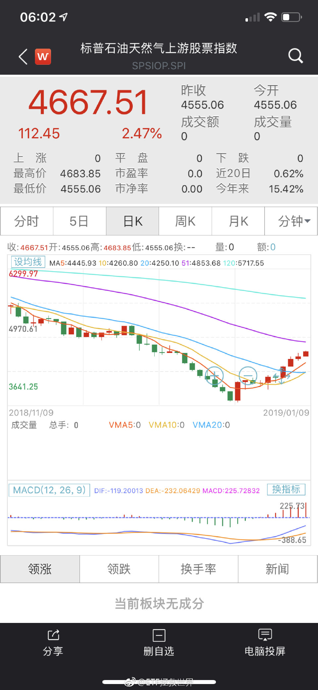

======================================================

ETF拯救世界 (5687069307) @
2019-01-10 08:43:36 Thu  
url: https://weibo.com/5687069307/Hbg4ekUAj

回复@丫丫小屋06:压力不远了//@丫丫小屋06:竟然一直涨，会不会该休息一下喘口气？

------------------------------------------------------
转推：
>  @ETF拯救世界 (5687069307)
>  2019-01-10 06:03:31 Thu  
>  url: https:/weibo.com/5687069307/Hbf1fApav/

>  别人都看衰的时候你肯帮一把，才有资格享受收益。 ​​​

转发[3]  评论[46]  赞[184] 

======================================================

ETF拯救世界 (5687069307) @
2019-01-10 08:48:42 Thu  
url: https://weibo.com/5687069307/Hbg6jarJR

好

------------------------------------------------------
转推：
>  @ ()
>  2019-01-09 22:51:36 Wed  
>  url: 

>  抱歉，作者已设置仅展示半年内微博，此微博已不可见。 ​​​

转发[14]  评论[0]  赞[209] 

======================================================

ETF拯救世界 (5687069307) @
2019-01-10 08:54:57 Thu  
url: https://weibo.com/5687069307/Hbg8QoMYP

有没有感觉长得有点像向华强

------------------------------------------------------
转推：
>  @蓝鲸TMT网 (3866012793)
>  2019-01-10 08:53:01 Thu  
>  url: https:/weibo.com/3866012793/Hbg83BaC5/

>  在张小龙看来，微信的原动力不过是坚持做一个与时俱进的工具，让创造体现价值。透过张小龙长达4个小时的演讲可以窥探出，微信产品背后的逻辑是始终遵循做产品的底线。 http://t.cn/EGsfLTF ​​​

转发[12]  评论[46]  赞[189] 

======================================================

ETF拯救世界 (5687069307) @
2019-01-10 09:40:10 Thu  
url: https://weibo.com/5687069307/Hbgrc1sSR

怎么我微博点过的股票就没一个让人省心的…不过长阴跌破平台的力量知道了吧…//@ETF拯救世界:好像今天解禁了。//@ETF拯救世界:[doge] 新低了。//@ETF拯救世界:小米，年轻人第一支被套的股票……

------------------------------------------------------
转推：
>  @小米公司陈曦 (2651381433)
>  2018-06-22 10:54:12 Fri  
>  url: https:/weibo.com/2651381433/Gmw3gaYeG/

>  联交所第一支同股不同权的股票[鼓掌][鼓掌][鼓掌]
>  股票代码：1810（18年上市，10年创立）
>  年轻人的第一支股票，亲爱的米粉们，账户开好了吗[偷笑][偷笑] ​​​

转发[6]  评论[59]  赞[221] 

======================================================

ETF拯救世界 (5687069307) @
2019-01-10 10:01:16 Thu  
url: https://weibo.com/5687069307/HbgzKnnUH

$中证环保 sh000827$ 和$中证传媒 sz399971$ 良心发现了吗 ​​​

转发[7]  评论[103]  赞[319] 

======================================================

ETF拯救世界 (5687069307) @
2019-01-10 18:24:48 Thu  
url: https://weibo.com/5687069307/HbjS8CgJM

踏空你的钱还在，资本市场之后所有的机会你都能参与。套牢倒也不可怕，可怕的是永久性的资本损失。那样，你就毫无机会了。这个问题其实是：失去一次机会可怕，还是永远失去机会可怕？

------------------------------------------------------
转推：
>  @ ()
>  2019-01-10 18:13:44 Thu  
>  url: 

>  抱歉，作者已设置仅展示半年内微博，此微博已不可见。 ​​​

转发[32]  评论[67]  赞[341] 

======================================================

ETF拯救世界 (5687069307) @
2019-01-10 18:35:27 Thu  
url: https://weibo.com/5687069307/HbjWsDEr6

回复@荣我陵南:是个有趣的人。有趣是很难得的品质啊。//@荣我陵南:想知道E大如何看大校？

------------------------------------------------------
转推：
>  @ ()
>  2019-01-10 18:13:44 Thu  
>  url: 

>  抱歉，作者已设置仅展示半年内微博，此微博已不可见。 ​​​

转发[7]  评论[87]  赞[236] 

======================================================

ETF拯救世界 (5687069307) @
2019-01-10 22:33:17 Thu  
url: https://weibo.com/5687069307/Hblv06laE

开除列车员

------------------------------------------------------
转推：
>  @北京人不知道的北京事儿 (1662214194)
>  2019-01-10 11:43:35 Thu  
>  url: https:/weibo.com/1662214194/HbhfhCp1p/

>  【女孩被中年男子霸座，列车员“圆场”：妹妹，这不是什么大事…】1月9日下午，K586次列车上，女孩小王的靠窗座位被一中年男子强行霸占，多次讨要无果，向列车员求助。列车员称：“不是什么大事”，让坐到别的车厢。小王却很委屈称自己愿意让座给需要的人，只是不想被强行霸座。。。这列车员的“圆场” ​​​

转发[16]  评论[48]  赞[234] 

======================================================

ETF拯救世界 (5687069307) @
2019-01-11 06:58:40 Fri  
url: https://weibo.com/5687069307/HboO8nhU0

关于那个“指数基金牛市中能否战胜大盘”的问题，我准备写个长点的东西说说。

欢迎有识之士微博问答提问。我会回答第一个提问的。要把那位朋友的原问题完全复制过去。

不知道谁的手快，反正你至少能挣超过1000块过年红包了。 ​​​

转发[36]  评论[66]  赞[350] 

======================================================

ETF拯救世界 (5687069307) @
2019-01-11 07:12:53 Fri  
url: https://weibo.com/5687069307/HboTUdKCi

好了，已经有人问对了，其它朋友不必再问。9点多发布答案。因为要写很长

------------------------------------------------------
转推：
>  @ETF拯救世界 (5687069307)
>  2019-01-11 06:58:40 Fri  
>  url: https:/weibo.com/5687069307/HboO8nhU0/

>  关于那个“指数基金牛市中能否战胜大盘”的问题，我准备写个长点的东西说说。
>  
>  欢迎有识之士微博问答提问。我会回答第一个提问的。要把那位朋友的原问题完全复制过去。
>  
>  不知道谁的手快，反正你至少能挣超过1000块过年红包了。 ​​​

转发[5]  评论[48]  赞[228] 

======================================================

ETF拯救世界 (5687069307) @
2019-01-11 08:14:49 Fri  
url: https://weibo.com/5687069307/Hbpj2CVr7

回复@In兴No1:我问答后台有几百个问题，敞开了回答我一年能挣二十万以上。你看看我一共回答了几个，再看看我去年给大家发了多少钱红包。说话要过脑子啊//@In兴No1:E大这是开始流量变现吗？好伤心[米奇大哭]//@ETF拯救世界:好了，已经有人问对了，其它朋友不必再问。9点多发布答案。因为要写很长

------------------------------------------------------
转推：
>  @ETF拯救世界 (5687069307)
>  2019-01-11 06:58:40 Fri  
>  url: https:/weibo.com/5687069307/HboO8nhU0/

>  关于那个“指数基金牛市中能否战胜大盘”的问题，我准备写个长点的东西说说。
>  
>  欢迎有识之士微博问答提问。我会回答第一个提问的。要把那位朋友的原问题完全复制过去。
>  
>  不知道谁的手快，反正你至少能挣超过1000块过年红包了。 ​​​

转发[2]  评论[134]  赞[288] 

======================================================

ETF拯救世界 (5687069307) @
2019-01-11 08:18:15 Fri  
url: https://weibo.com/5687069307/HbpkrcrjU

变现？呵呵 ​​​

转发[7]  评论[118]  赞[330] 

+++++++++++++++++++++++++++++++++++++++++++++++++++++

图片：
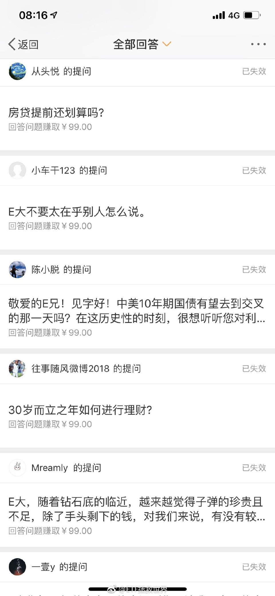
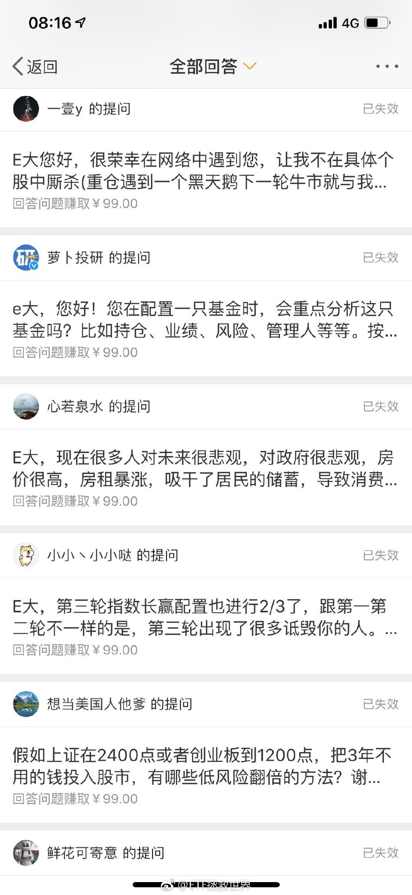

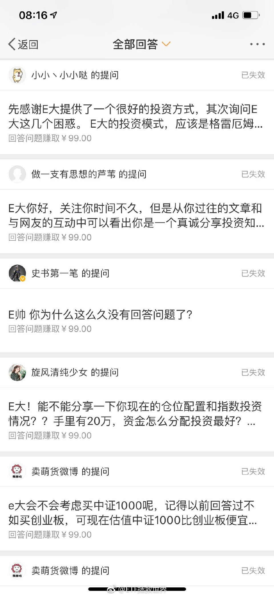

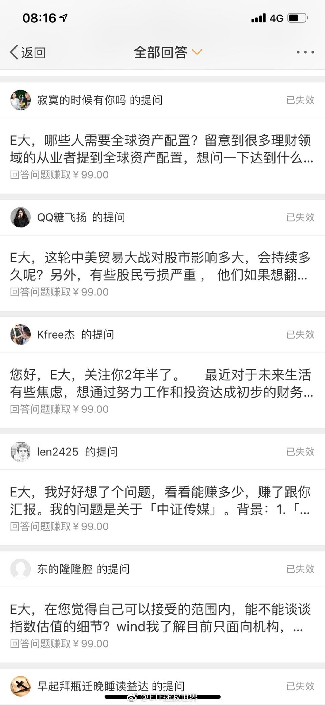
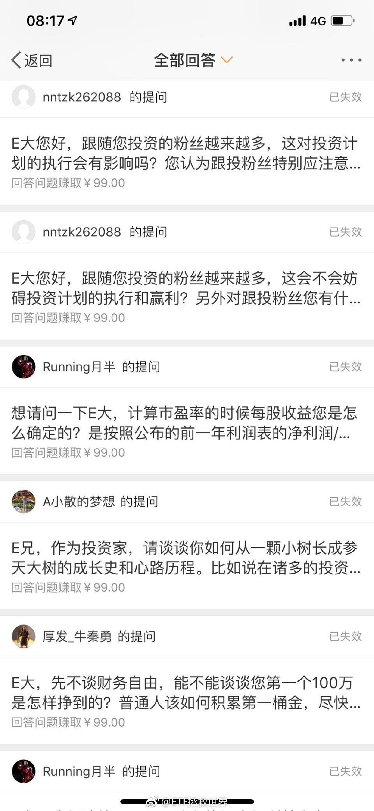
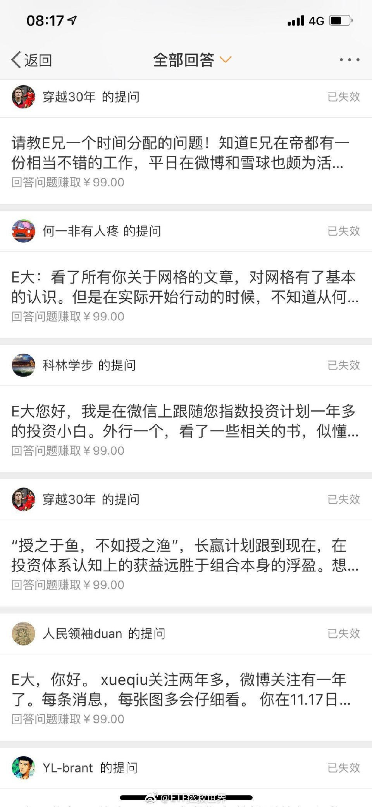

======================================================

ETF拯救世界 (5687069307) @
2019-01-11 09:23:22 Fri  
url: https://weibo.com/5687069307/HbpKS0RNj

写完了忍不住拍案而起，1块钱太值了！这应该是你最近半年花的最值的1块钱。[doge]为了说清楚这个问题，谈到了周期，谈到了品种配置，谈到了弹性……我回答了 @mccoymir 的问题，问题价值￥99.00，大家快来花1元围观~ http://t.cn/EqAI9TW ​​​

转发[566]  评论[575]  赞[958] 

======================================================

ETF拯救世界 (5687069307) @
2019-01-11 09:34:15 Fri  
url: https://weibo.com/5687069307/HbpPhBvGc

十分钟，提问人投资收益率已经翻番。应该会很开心吧哈哈。

------------------------------------------------------
转推：
>  @ETF拯救世界 (5687069307)
>  2019-01-11 09:23:22 Fri  
>  url: https:/weibo.com/5687069307/HbpKS0RNj/

>  写完了忍不住拍案而起，1块钱太值了！这应该是你最近半年花的最值的1块钱。[doge]为了说清楚这个问题，谈到了周期，谈到了品种配置，谈到了弹性……我回答了 @mccoymir 的问题，问题价值￥99.00，大家快来花1元围观~ http://t.cn/EqAI9TW ​​​

转发[6]  评论[37]  赞[185] 

======================================================

ETF拯救世界 (5687069307) @
2019-01-11 09:37:04 Fri  
url: https://weibo.com/5687069307/HbpQqdR5b

漏了一句，收益率统计那里，500指数是5.18倍。在信息和红利之间。

------------------------------------------------------
转推：
>  @ETF拯救世界 (5687069307)
>  2019-01-11 09:23:22 Fri  
>  url: https:/weibo.com/5687069307/HbpKS0RNj/

>  写完了忍不住拍案而起，1块钱太值了！这应该是你最近半年花的最值的1块钱。[doge]为了说清楚这个问题，谈到了周期，谈到了品种配置，谈到了弹性……我回答了 @mccoymir 的问题，问题价值￥99.00，大家快来花1元围观~ http://t.cn/EqAI9TW ​​​

转发[31]  评论[54]  赞[217] 

======================================================

ETF拯救世界 (5687069307) @
2019-01-11 09:56:48 Fri  
url: https://weibo.com/5687069307/HbpYriDJa

另外在这里跟各位说一下，知道各位的好意，但咱们尽量不要评论别人。

每个人都有自己的优点。咱们做好自己的事请，不在背后议论其它人比较好。

谢谢各位 ​​​

转发[6]  评论[105]  赞[505] 

======================================================

ETF拯救世界 (5687069307) @
2019-01-11 11:15:11 Fri  
url: https://weibo.com/5687069307/HbqufEA5L

不浪费。

------------------------------------------------------
转推：
>  @北京人不知道的北京事儿 (1662214194)
>  2019-01-11 11:10:42 Fri  
>  url: https:/weibo.com/1662214194/Hbqsqt9l3/

>  午饭时间快到了，来看看螳螂是怎么吃掉一整只大蝗虫的，真的吃得连渣儿都不剩。。。[衰]http://t.cn/EqvvWML ​​​

转发[50]  评论[91]  赞[168] 

======================================================

ETF拯救世界 (5687069307) @
2019-01-11 13:30:27 Fri  
url: https://weibo.com/5687069307/Hbrnao9Gr

回复@这是我最后的波纹_JOJO:我从没这么说过。我对未来收益也没有预期。因为我根本不知道未来市场会怎么走。过去的数据能说明很多问题，但绝不代表未来也能这样。也许更好，也许更差。//@这是我最后的波纹_JOJO:如果能跟上e大的话，1万能变10万？

------------------------------------------------------
转推：
>  @ETF拯救世界 (5687069307)
>  2019-01-11 09:23:22 Fri  
>  url: https:/weibo.com/5687069307/HbpKS0RNj/

>  写完了忍不住拍案而起，1块钱太值了！这应该是你最近半年花的最值的1块钱。[doge]为了说清楚这个问题，谈到了周期，谈到了品种配置，谈到了弹性……我回答了 @mccoymir 的问题，问题价值￥99.00，大家快来花1元围观~ http://t.cn/EqAI9TW ​​​

转发[6]  评论[42]  赞[195] 

======================================================

ETF拯救世界 (5687069307) @
2019-01-11 13:34:16 Fri  
url: https://weibo.com/5687069307/HbroHskFJ

很多事，你没有机会的时候不去做，没什么了不起。

你有了机会还不去做，那才让人敬佩。

世界上诱惑很多，财 色 权。

怎么面对这些，就得看，在你心里，最重要的东西是什么。 ​​​

转发[92]  评论[128]  赞[448] 

======================================================

ETF拯救世界 (5687069307) @
2019-01-11 13:46:26 Fri  
url: https://weibo.com/5687069307/HbrtDzSDZ

回复@驯马师Samson:先把自己照顾好。然后是家人，然后是朋友，然后是陌生人。如果你能为别人创造价值，真的服务好别人，这辈子不会过得很差。

------------------------------------------------------
转推：
>  @ETF拯救世界 (5687069307)
>  2019-01-11 13:34:16 Fri  
>  url: https:/weibo.com/5687069307/HbroHskFJ/

>  很多事，你没有机会的时候不去做，没什么了不起。
>  
>  你有了机会还不去做，那才让人敬佩。
>  
>  世界上诱惑很多，财 色 权。
>  
>  怎么面对这些，就得看，在你心里，最重要的东西是什么。 ​​​

转发[39]  评论[41]  赞[343] 

======================================================

ETF拯救世界 (5687069307) @
2019-01-11 14:13:44 Fri  
url: https://weibo.com/5687069307/HbrEJcKgD

去年11月月中一车没有加仓黄金是个错误。 ​​​

转发[17]  评论[111]  赞[294] 

======================================================

ETF拯救世界 (5687069307) @
2019-01-11 14:19:37 Fri  
url: https://weibo.com/5687069307/HbrH7fRyw

回复@张涛涛王子:汇率。//@张涛涛王子:哪位课代表回答下，问下今天为啥上海金价下跌，国际金价却上涨[疑问][疑问]，两者最后价格会收敛一致吗？

------------------------------------------------------
转推：
>  @ETF拯救世界 (5687069307)
>  2019-01-11 14:13:44 Fri  
>  url: https:/weibo.com/5687069307/HbrEJcKgD/

>  去年11月月中一车没有加仓黄金是个错误。 ​​​

转发[5]  评论[53]  赞[204] 

======================================================

ETF拯救世界 (5687069307) @
2019-01-11 16:55:02 Fri  
url: https://weibo.com/5687069307/HbsIcpgsj

春天

想重新与世界打个招呼

一路向西

去草原，去五台山，去黄土高坡，去沙漠

如果成了

会给你们拍9宫格的 ​​​

转发[7]  评论[240]  赞[572] 

======================================================

ETF拯救世界 (5687069307) @
2019-01-11 18:53:07 Fri  
url: https://weibo.com/5687069307/Hbtu8v98m

回复@微博客服:各位有出问题的就问客服吧。如果实在找不回来我自己掏钱退给你们。//@微博客服:回复@ETF拯救世界:您好，如果您发现您的粉丝付费问答无法正常使用，可以让您的粉丝通过自己的账号来咨询微博客服，我们需要核实购买问答的账号是否出现支付问题，感谢您对微博的支持。

------------------------------------------------------
转推：
>  @ETF拯救世界 (5687069307)
>  2019-01-11 09:23:22 Fri  
>  url: https:/weibo.com/5687069307/HbpKS0RNj/

>  写完了忍不住拍案而起，1块钱太值了！这应该是你最近半年花的最值的1块钱。[doge]为了说清楚这个问题，谈到了周期，谈到了品种配置，谈到了弹性……我回答了 @mccoymir 的问题，问题价值￥99.00，大家快来花1元围观~ http://t.cn/EqAI9TW ​​​

转发[4]  评论[88]  赞[167] 

======================================================

ETF拯救世界 (5687069307) @
2019-01-12 09:55:54 Sat  
url: https://weibo.com/5687069307/HbzoznYCn

我的一点体会。

为什么有人家里东西看着特别多，但是不感觉乱。

为什么有人家里东西稍微多点就特别乱。

原因在于

东西多不显乱，是因为那个东西本来就设计放在那里。不是乱放的，是归位的。井井有条。

显得乱，是因为用完了随手一扔，东西不归位。 ​​​

转发[43]  评论[141]  赞[371] 

======================================================

ETF拯救世界 (5687069307) @
2019-01-12 11:20:24 Sat  
url: https://weibo.com/5687069307/HbzWSmbQA

回复@熙惯有伱:公众号chinaetfs。真爱都知道。//@熙惯有伱:e大，你现在除了在微博发布东西外，还在其他平台上发布吗

------------------------------------------------------
转推：
>  @ETF拯救世界 (5687069307)
>  2019-01-12 09:55:54 Sat  
>  url: https:/weibo.com/5687069307/HbzoznYCn/

>  我的一点体会。
>  
>  为什么有人家里东西看着特别多，但是不感觉乱。
>  
>  为什么有人家里东西稍微多点就特别乱。
>  
>  原因在于
>  
>  东西多不显乱，是因为那个东西本来就设计放在那里。不是乱放的，是归位的。井井有条。
>  
>  显得乱，是因为用完了随手一扔，东西不归位。 ​​​

转发[13]  评论[59]  赞[213] 

======================================================

ETF拯救世界 (5687069307) @
2019-01-13 08:14:10 Sun  
url: https://weibo.com/5687069307/HbI9M5yYs

始终不理解世界上为什么有“私房钱”的存在。两个人在一起生活连这点生活费都要互相瞒着吗

------------------------------------------------------
转推：
>  @人民网 (2286908003)
>  2019-01-12 19:40:37 Sat  
>  url: https:/weibo.com/2286908003/HbDdUiSfv/

>  【藏了1.6万私房钱的鞋被偷 男子报警：不要告诉老婆】安徽胡先生报警称放在楼道里的鞋子被偷，鞋里藏了1.6万私房钱，叮嘱民警千万不要通知他老婆。@铜陵公安在线  民警找到4名偷鞋的少年，发现鞋里并没钱，原来胡先生老婆早就发现钱收了起来，等着他主动交代。@新京报我们视频 http://t.cn/EqUmUUf ​​​

转发[20]  评论[77]  赞[174] 

======================================================

ETF拯救世界 (5687069307) @
2019-01-13 08:20:15 Sun  
url: https://weibo.com/5687069307/HbIcf8dGm

回复@梁小雨:哪里有公开实时的历史交易记录吗。有的话我去学习。没有的话怎么学呢。//@梁小雨:E大，雪球看到一篇帖子说某人（帖子回复有说是“张尧”）99年到现在已经超过2190倍收益，主要是重仓持有12只股票，我有些不能理解…以您这些年对股市和个股的了解，这个收益率是否能够实现呢？

------------------------------------------------------
转推：
>  @ETF拯救世界 (5687069307)
>  2019-01-12 09:55:54 Sat  
>  url: https:/weibo.com/5687069307/HbzoznYCn/

>  我的一点体会。
>  
>  为什么有人家里东西看着特别多，但是不感觉乱。
>  
>  为什么有人家里东西稍微多点就特别乱。
>  
>  原因在于
>  
>  东西多不显乱，是因为那个东西本来就设计放在那里。不是乱放的，是归位的。井井有条。
>  
>  显得乱，是因为用完了随手一扔，东西不归位。 ​​​

转发[9]  评论[51]  赞[172] 

======================================================

ETF拯救世界 (5687069307) @
2019-01-13 08:32:03 Sun  
url: https://weibo.com/5687069307/HbIh29Q65

回复@ETF改变生活:+1。绝大部分钱我打理。家里支出我负责，她的收入她自己零花。自己要买什么互相不干涉，没工夫为了这个勾心斗角…//@ETF改变生活:我家里都是我管钱，我媳妇不操心，主动报账人家都懒得听

------------------------------------------------------
转推：
>  @人民网 (2286908003)
>  2019-01-12 19:40:37 Sat  
>  url: https:/weibo.com/2286908003/HbDdUiSfv/

>  【藏了1.6万私房钱的鞋被偷 男子报警：不要告诉老婆】安徽胡先生报警称放在楼道里的鞋子被偷，鞋里藏了1.6万私房钱，叮嘱民警千万不要通知他老婆。@铜陵公安在线  民警找到4名偷鞋的少年，发现鞋里并没钱，原来胡先生老婆早就发现钱收了起来，等着他主动交代。@新京报我们视频 http://t.cn/EqUmUUf ​​​

转发[12]  评论[62]  赞[212] 

======================================================

ETF拯救世界 (5687069307) @
2019-01-13 08:48:21 Sun  
url: https://weibo.com/5687069307/HbInEgB9p

不过每个家庭情况不一样。

我父亲就是花钱很随意，从年轻开始先后入坑摄影器材，发烧音响，计算机。每一个都是极度烧钱的，因为他不是买了就算，是不停的高买低卖换新的。

没有我母亲把控一下，很多钱就没了。两个人时不时为了这个闹矛盾。

所有找另一半，三观契合很重要。日常生活中会少很多麻烦事 ​​​

转发[25]  评论[137]  赞[339] 

======================================================

ETF拯救世界 (5687069307) @
2019-01-13 09:07:38 Sun  
url: https://weibo.com/5687069307/HbIvttygx

很多人只知道摄影音响烧钱，可能不知道从苹果II开始  386 486 586 奔腾一路烧过来要多少钱，那时候中国人收入多少… ​​​

------------------------------------------------------
转推：
>  @ETF拯救世界 (5687069307)
>  2019-01-13 08:48:21 Sun  
>  url: https:/weibo.com/5687069307/HbInEgB9p/

>  不过每个家庭情况不一样。
>  
>  我父亲就是花钱很随意，从年轻开始先后入坑摄影器材，发烧音响，计算机。每一个都是极度烧钱的，因为他不是买了就算，是不停的高买低卖换新的。
>  
>  没有我母亲把控一下，很多钱就没了。两个人时不时为了这个闹矛盾。
>  
>  所有找另一半，三观契合很重要。日常生活中会少很多麻烦事 ​​​

转发[7]  评论[79]  赞[239] 

======================================================

ETF拯救世界 (5687069307) @
2019-01-13 13:23:43 Sun  
url: https://weibo.com/5687069307/HbKbq7Mjc

对投资有兴趣的朋友，我特别鼓励刚开始的时候尝试各种投资方法投资模式。谁知道你是不是在某些方面特别有天赋或者有运气呢。

这个我一直在说。别限制自己的可能性。

但是对投资没那么大兴趣，没法舍弃其它爱好一门心思钻进去的普通人，或者虽然有兴趣但是经过很久承认自己确实没有天赋的，还是找一些 ​​​

转发[53]  评论[152]  赞[499] 

======================================================

ETF拯救世界 (5687069307) @
2019-01-13 16:19:41 Sun  
url: https://weibo.com/5687069307/HbLkQpraT

今年股市跌这么多，整体环境又不怎么好，过年红包要比往年大一点，大家都沾点喜气。

[圣诞老人][圣诞老人][圣诞老人] ​​​

转发[20]  评论[288]  赞[1065] 

======================================================

ETF拯救世界 (5687069307) @
2019-01-14 06:37:18 Mon  
url: https://weibo.com/5687069307/HbQWX6HVK

回复@猴子小星:加油，你是最好的！现在到2200有14%的空间，加油！//@猴子小星:今日已全部清仓，留了一点环保明天清。2200点以下再见面[拜拜]保重各位！

------------------------------------------------------
转推：
>  @ETF拯救世界 (5687069307)
>  2019-01-13 16:19:41 Sun  
>  url: https:/weibo.com/5687069307/HbLkQpraT/

>  今年股市跌这么多，整体环境又不怎么好，过年红包要比往年大一点，大家都沾点喜气。
>  
>  [圣诞老人][圣诞老人][圣诞老人] ​​​

转发[10]  评论[113]  赞[304] 

======================================================

ETF拯救世界 (5687069307) @
2019-01-14 07:22:00 Mon  
url: https://weibo.com/5687069307/HbRf66kLz

不是说一定跌不到2200。不是这个思维模式。

而是说，你为了躲避14%的跌幅，放弃的是什么。

就像你找终身伴侣。你的满分是十分。这时候出现了一个9分的人。要么你选这个九分的，但是明天可能出现一个十分的；要么你继续等那个十分的出现，但是有可能一辈子也不会出现，你最终要么一直一个人，要么最后 ​​​

转发[279]  评论[308]  赞[647] 

======================================================

ETF拯救世界 (5687069307) @
2019-01-14 08:30:24 Mon  
url: https://weibo.com/5687069307/HbRGRi0uu

刚才看了看，上一个问题，提问人已经赚了三千多了。

以后要么不再回答问题，要么大幅提高提问价格。多出来的差价再发红包给各位。

要不然这也太暴利了！[doge] ​​​

转发[3]  评论[91]  赞[481] 

======================================================

ETF拯救世界 (5687069307) @
2019-01-14 09:13:46 Mon  
url: https://weibo.com/5687069307/HbRYszavn

回复@e急事缓办:因为出现过9分，你不会那么容易认错选87654。直到你意识到再不选就没了，才会随便选一个3分。就像你2400点不买，等2200。结果发现越来越高。你在2600 2900 3000都不会买。最后发现再不买就踏空了，3500买入。Duang，归你了！//@e急事缓办:为什么是三分的，不是87654分的

------------------------------------------------------
转推：
>  @ETF拯救世界 (5687069307)
>  2019-01-14 07:22:00 Mon  
>  url: https:/weibo.com/5687069307/HbRf66kLz/

>  不是说一定跌不到2200。不是这个思维模式。
>  
>  而是说，你为了躲避14%的跌幅，放弃的是什么。
>  
>  就像你找终身伴侣。你的满分是十分。这时候出现了一个9分的人。要么你选这个九分的，但是明天可能出现一个十分的；要么你继续等那个十分的出现，但是有可能一辈子也不会出现，你最终要么一直一个人，要么最后 ​​​

转发[104]  评论[93]  赞[323] 

======================================================

ETF拯救世界 (5687069307) @
2019-01-14 09:23:15 Mon  
url: https://weibo.com/5687069307/HbS2jzIG2

回复@股为生:在这个指数跌了一半，一多半股票跌幅已经70%的情况下，无论如何看空，我至少都会留30%的仓位。30%仓位即使跌20%也才暂时损失6%而已。只能说清仓的人完全不理性，很难在市场上生存。

------------------------------------------------------
转推：
>  @ETF拯救世界 (5687069307)
>  2019-01-14 07:22:00 Mon  
>  url: https:/weibo.com/5687069307/HbRf66kLz/

>  不是说一定跌不到2200。不是这个思维模式。
>  
>  而是说，你为了躲避14%的跌幅，放弃的是什么。
>  
>  就像你找终身伴侣。你的满分是十分。这时候出现了一个9分的人。要么你选这个九分的，但是明天可能出现一个十分的；要么你继续等那个十分的出现，但是有可能一辈子也不会出现，你最终要么一直一个人，要么最后 ​​​

转发[38]  评论[57]  赞[280] 

======================================================

ETF拯救世界 (5687069307) @
2019-01-14 09:26:51 Mon  
url: https://weibo.com/5687069307/HbS3M58Zp

回复@快乐行者9:不怪你。因为跌破1000点的时候，中金公司出了看到700点的报告。这个市场大多数人，哪怕是所谓的很多大行机构，都无非是追涨杀跌而已。//@快乐行者9:可说对了，05年1000多点，眼看着长上天，越看越不敢下手，最后也没下手。

------------------------------------------------------
转推：
>  @ETF拯救世界 (5687069307)
>  2019-01-14 07:22:00 Mon  
>  url: https:/weibo.com/5687069307/HbRf66kLz/

>  不是说一定跌不到2200。不是这个思维模式。
>  
>  而是说，你为了躲避14%的跌幅，放弃的是什么。
>  
>  就像你找终身伴侣。你的满分是十分。这时候出现了一个9分的人。要么你选这个九分的，但是明天可能出现一个十分的；要么你继续等那个十分的出现，但是有可能一辈子也不会出现，你最终要么一直一个人，要么最后 ​​​

转发[28]  评论[26]  赞[257] 

======================================================

ETF拯救世界 (5687069307) @
2019-01-14 09:40:31 Mon  
url: https://weibo.com/5687069307/HbS9jEywR

回复@该晓得该明白:1-2车吧。明天。不出意外的话。//@该晓得该明白:E大，月中发车吗？//@ETF拯救世界:回复@快乐行者9:不怪你。因为跌破1000点的时候，中金公司出了看到700点的报告。这个市场大多数人，哪怕是所谓的很多大行机构，都无非是追涨杀跌而已。

------------------------------------------------------
转推：
>  @ETF拯救世界 (5687069307)
>  2019-01-14 07:22:00 Mon  
>  url: https:/weibo.com/5687069307/HbRf66kLz/

>  不是说一定跌不到2200。不是这个思维模式。
>  
>  而是说，你为了躲避14%的跌幅，放弃的是什么。
>  
>  就像你找终身伴侣。你的满分是十分。这时候出现了一个9分的人。要么你选这个九分的，但是明天可能出现一个十分的；要么你继续等那个十分的出现，但是有可能一辈子也不会出现，你最终要么一直一个人，要么最后 ​​​

转发[9]  评论[54]  赞[283] 

======================================================

ETF拯救世界 (5687069307) @
2019-01-14 10:04:35 Mon  
url: https://weibo.com/5687069307/HbSj5tVaE

这个世界上什么事情都可能发生。

无非是看你自己选择赌还是不赌。

成功了会得到什么，失败了会失去什么。

人生，也就是在这样一次次选择中走向了不同的终点。 ​​​

转发[60]  评论[114]  赞[586] 

======================================================

ETF拯救世界 (5687069307) @
2019-01-14 11:42:09 Mon  
url: https://weibo.com/5687069307/HbSWH144t

回复@Joovei:债券已经飞了半年了。//@Joovei:回复@ETF拯救世界:一年半后翻看，E大还是很有预见性的[good]，这不能说是纯猜的，谦虚了，还是有均值回归的理论依据的。请问E大一个问题，如果债券先于股票见底，那么会先于股票起飞吗？

------------------------------------------------------
转推：
>  @ETF拯救世界 (5687069307)
>  2017-08-08 10:55:07 Tue  
>  url: https:/weibo.com/5687069307/Fg7C3aFzd/

>  重申一下关于未来的几个小观点：
>  
>  第一，对于大多数股票来说，下跌只是走了一半而已。也可能是60%。总之还有至少一小半没跌完，要继续跌。
>  
>  第二，债券会先于股票见底。目测债券也还有一定的跌幅。如果十年国债能到4，会大量买入。几个月后会换入股票。
>  
>  未来会有人特别痛苦，套的痛不欲生。更远的未来 ​​​

转发[65]  评论[60]  赞[233] 

======================================================

ETF拯救世界 (5687069307) @
2019-01-14 11:47:37 Mon  
url: https://weibo.com/5687069307/HbSYUEUzX

“失落的30年？？？”每年一个诺贝尔奖，国民过得其乐融融。

------------------------------------------------------
转推：
>  @日经中文网 (2478163131)
>  2019-01-14 11:46:23 Mon  
>  url: https:/weibo.com/2478163131/HbSYpmXRe/

>  【日本富裕阶层家庭数创出2000年后最多】净金融资产超1亿日元的家庭数量2017年达到126.7万，超5亿日元的超富裕阶层为8.4万个……
>  
>   http://t.cn/EqKnuNI ​​​

转发[31]  评论[48]  赞[228] 

======================================================

ETF拯救世界 (5687069307) @
2019-01-14 12:11:32 Mon  
url: https://weibo.com/5687069307/HbT8CCFlX

回复@求财不劫色:目前处在钱很多，但风险偏好低，只敢买高等级债券的阶段。风险偏好上升后，股市和低等级债就要飞。//@求财不劫色:那么，问题来了，股票作为一种特殊的债券，什么时候起飞？//@ETF拯救世界:回复@Joovei:债券已经飞了半年了。

------------------------------------------------------
转推：
>  @ETF拯救世界 (5687069307)
>  2017-08-08 10:55:07 Tue  
>  url: https:/weibo.com/5687069307/Fg7C3aFzd/

>  重申一下关于未来的几个小观点：
>  
>  第一，对于大多数股票来说，下跌只是走了一半而已。也可能是60%。总之还有至少一小半没跌完，要继续跌。
>  
>  第二，债券会先于股票见底。目测债券也还有一定的跌幅。如果十年国债能到4，会大量买入。几个月后会换入股票。
>  
>  未来会有人特别痛苦，套的痛不欲生。更远的未来 ​​​

转发[46]  评论[112]  赞[348] 

======================================================

ETF拯救世界 (5687069307) @
2019-01-14 15:19:25 Mon  
url: https://weibo.com/5687069307/HbUmT3Usl

这种时候，别看盘了。自己找点乐子去吧…… ​​​

转发[9]  评论[246]  赞[450] 

======================================================

ETF拯救世界 (5687069307) @
2019-01-15 11:33:36 Tue  
url: https://weibo.com/5687069307/Hc2jJ1BMv

写完东西一看，什么鬼。

成心吧恒生。 ​​​

转发[12]  评论[176]  赞[347] 

======================================================

ETF拯救世界 (5687069307) @
2019-01-15 13:49:53 Tue  
url: https://weibo.com/5687069307/Hc3d2t1JB

希望昨天清仓的哥们先别慌。

有可能只是反弹一天。你是最好的。。

我去看留言了。又是快500条了。

很奇怪，公众号留言绝大多数都放不出来，可每次都是600以上留言。微博每条都能显示，每次都这么少。。 ​​​

转发[48]  评论[223]  赞[431] 

======================================================

ETF拯救世界 (5687069307) @
2019-01-15 14:42:00 Tue  
url: https://weibo.com/5687069307/Hc3ycck9f

回复@未闻花名------:图片评论  拉黑。狗头也没用了。 http://t.cn/EqYohrH //@未闻花名------:你就吹吧，其实公众号留言每次你都一条不少的放出来了。加油，你是最好的十八岁少年投资者[二哈][二哈][二哈]

------------------------------------------------------
转推：
>  @ETF拯救世界 (5687069307)
>  2019-01-15 13:49:53 Tue  
>  url: https:/weibo.com/5687069307/Hc3d2t1JB/

>  希望昨天清仓的哥们先别慌。
>  
>  有可能只是反弹一天。你是最好的。。
>  
>  
>  
>  我去看留言了。又是快500条了。
>  
>  很奇怪，公众号留言绝大多数都放不出来，可每次都是600以上留言。微博每条都能显示，每次都这么少。。 ​​​

转发[2]  评论[85]  赞[222] 

======================================================

ETF拯救世界 (5687069307) @
2019-01-15 14:55:29 Tue  
url: https://weibo.com/5687069307/Hc3DF8fu5

回复@777正义777:不懂了吧。为什么散户大量在熊市最低点，或者牛市刚来的时候清仓？因为短期记忆熊市太难受了。赔了好多好多，好不容易少赔点，当然马上卖出——等回调再买回来降低成本。谁能想到，终有一次买不回来了。//@777正义777:扛了一年，为什么要清仓？傻啊？

------------------------------------------------------
转推：
>  @ETF拯救世界 (5687069307)
>  2019-01-15 13:49:53 Tue  
>  url: https:/weibo.com/5687069307/Hc3d2t1JB/

>  希望昨天清仓的哥们先别慌。
>  
>  有可能只是反弹一天。你是最好的。。
>  
>  
>  
>  我去看留言了。又是快500条了。
>  
>  很奇怪，公众号留言绝大多数都放不出来，可每次都是600以上留言。微博每条都能显示，每次都这么少。。 ​​​

转发[39]  评论[58]  赞[308] 

======================================================

ETF拯救世界 (5687069307) @
2019-01-15 14:58:30 Tue  
url: https://weibo.com/5687069307/Hc3ET3U3B

一个战斗力非常强的大巨兽，最怕什么？怕的不是那些过来咬一口就跑的小鬣狗，而是一群一拥而上咬住就死死不松嘴的恶狼。

我看准你的弱点，大家一起上拼命咬住，无论你怎么震荡我都不出去。牛市不来，不赚大钱我就不走。这才是那些巨兽害怕的。

大钱，没有一次不是靠死死拿住赚到的。有点风吹草动就上 ​​​

转发[112]  评论[194]  赞[581] 

======================================================

ETF拯救世界 (5687069307) @
2019-01-15 15:29:54 Tue  
url: https://weibo.com/5687069307/Hc3RDtIJa

回复@行高于人众必毁之:按理说不会。只是不要想还有过去一年这样的涨幅了。//@行高于人众必毁之:债市会转熊吗？我还有一些短债基金

------------------------------------------------------
转推：
>  @ETF拯救世界 (5687069307)
>  2019-01-15 11:33:36 Tue  
>  url: https:/weibo.com/5687069307/Hc2jJ1BMv/

>  写完东西一看，什么鬼。
>  
>  成心吧恒生。 ​​​

转发[5]  评论[13]  赞[226] 

======================================================

ETF拯救世界 (5687069307) @
2019-01-15 16:03:39 Tue  
url: https://weibo.com/5687069307/Hc45koXTK

从2015年开始，每次开车前面都有这句话，不知道各位是否注意。

现在3.5年已经过去了。如果真的是4年熊市结束。

那说明4年前的预判精准命中。

拭目以待。 ​​​

转发[51]  评论[331]  赞[620] 

+++++++++++++++++++++++++++++++++++++++++++++++++++++

图片：

======================================================

ETF拯救世界 (5687069307) @
2019-01-16 08:16:45 Wed  
url: https://weibo.com/5687069307/HcasjjVgv

回复@硕仔满:2017年有100只股票涨，3000多只跌，跌幅中位数20多个点。如果你把这样抱团取暖的上涨叫牛市，那它就是牛市//@硕仔满:难道去年白马股那一波不算牛市吗我以为要剔除掉这段时间的基础上再算呢……

------------------------------------------------------
转推：
>  @ETF拯救世界 (5687069307)
>  2019-01-15 16:03:39 Tue  
>  url: https:/weibo.com/5687069307/Hc45koXTK/

>  从2015年开始，每次开车前面都有这句话，不知道各位是否注意。
>  
>  现在3.5年已经过去了。如果真的是4年熊市结束。
>  
>  那说明4年前的预判精准命中。
>  
>  拭目以待。 ​​​

转发[11]  评论[62]  赞[274] 

======================================================

ETF拯救世界 (5687069307) @
2019-01-16 09:01:36 Wed  
url: https://weibo.com/5687069307/HcaKw9XBJ

我研究过过去100年各国的股市，几乎从未见过有所谓的只有1%“大白马”上涨，其它股票暴跌的牛市。

有过吗，有过。70年代美国漂亮50。最终结果如何？崩的买这些“蓝筹”股票的投资者多少年缓不过来。

所谓的牛市，就是要大多数股票都要涨。这才叫牛市。甚至在成熟市场，大部分时候，小盘股涨幅也大于 ​​​

转发[99]  评论[178]  赞[531] 

======================================================

ETF拯救世界 (5687069307) @
2019-01-16 09:15:49 Wed  
url: https://weibo.com/5687069307/HcaQhERRL

“白马”“蓝筹”，大概率不是坏股票。长期看也能有不错的收益。但你不能吹世上只有白马好。什么是白马？每个企业，每个行业都有周期，生老病死。今天的白马明天未必是，过去的白马将来未必是。

如果投资就是不论价格不论成长不论未来买入几个耳熟能详的“白马”就能赚大钱，你不觉得哪里不对吗。

A ​​​

转发[72]  评论[127]  赞[460] 

======================================================

ETF拯救世界 (5687069307) @
2019-01-16 09:52:01 Wed  
url: https://weibo.com/5687069307/Hcb4YkFkw

前几天清仓的人呢，不是说一定不对。也许还会跌，当然有可能。

问题在于，这样的连续上涨，他的内心会非常煎熬。低位卖出，涨两天，追也不是，不追也不是。

这就把自己置于一个非常不利的局面。

做投资，最好不要让自己处在这样的局面里。不仅账面损失，情绪受打击，自信心也会被摧残。做投资自信很 ​​​

转发[165]  评论[299]  赞[653] 

======================================================

ETF拯救世界 (5687069307) @
2019-01-16 13:31:38 Wed  
url: https://weibo.com/5687069307/Hccw7A8Vk

红利在挑战去年9月以来新高。 ​​​

转发[9]  评论[51]  赞[287] 

======================================================

ETF拯救世界 (5687069307) @
2019-01-16 13:42:00 Wed  
url: https://weibo.com/5687069307/HccAl4WHM

英国富时100目前股息率大致是4%。咱们的300大概是一个多点，50大概是2%，红利大概是4%。

换个思路。你买点这些有分红能力的品种，等于买了一个余额宝+未来牛市的上涨期权。只要你的钱不急用，看不出有任何必要担心。

指数基金分红并非简单意义上的“左手倒右手”。这点需要认识清楚。 ​​​

转发[95]  评论[164]  赞[421] 

======================================================

ETF拯救世界 (5687069307) @
2019-01-16 13:48:53 Wed  
url: https://weibo.com/5687069307/HccD7C6Ai

再给个数据，上次中证红利全收益在目前的估值是2008年11月，点位是1997。目前是5885点，十年涨了195%，复合大致是11%。

11%说多不多，说少不少。但你要注意，这里是纯内生增长，不含估值波动。红利的估值波动大致在100%-170%之间。就是低估买入到最高估的涨幅会有这么多。加上内生增长，非常可观。 ​​​

转发[170]  评论[171]  赞[411] 

======================================================

ETF拯救世界 (5687069307) @
2019-01-16 13:55:57 Wed  
url: https://weibo.com/5687069307/HccFZuNU8

回复@mussu:可以，但没必要。//@mussu:可以去看E大前些年写的文字，真的是大智慧。E大如果不做投资，做一个自媒体写手赚钱也完全没问题的。

------------------------------------------------------
转推：
>  @ETF拯救世界 (5687069307)
>  2019-01-16 09:52:01 Wed  
>  url: https:/weibo.com/5687069307/Hcb4YkFkw/

>  前几天清仓的人呢，不是说一定不对。也许还会跌，当然有可能。
>  
>  问题在于，这样的连续上涨，他的内心会非常煎熬。低位卖出，涨两天，追也不是，不追也不是。
>  
>  这就把自己置于一个非常不利的局面。
>  
>  做投资，最好不要让自己处在这样的局面里。不仅账面损失，情绪受打击，自信心也会被摧残。做投资自信很 ​​​

转发[0]  评论[29]  赞[209] 

======================================================

ETF拯救世界 (5687069307) @
2019-01-16 14:14:11 Wed  
url: https://weibo.com/5687069307/HccNp1TEA

回复@潮起潮落已万年:本币来说能赚钱，但用美元衡量无意义。 http://t.cn/EquPuWL 

------------------------------------------------------
转推：
>  @ETF拯救世界 (5687069307)
>  2019-01-16 09:01:36 Wed  
>  url: https:/weibo.com/5687069307/HcaKw9XBJ/

>  我研究过过去100年各国的股市，几乎从未见过有所谓的只有1%“大白马”上涨，其它股票暴跌的牛市。
>  
>  有过吗，有过。70年代美国漂亮50。最终结果如何？崩的买这些“蓝筹”股票的投资者多少年缓不过来。
>  
>  所谓的牛市，就是要大多数股票都要涨。这才叫牛市。甚至在成熟市场，大部分时候，小盘股涨幅也大于 ​​​

转发[4]  评论[9]  赞[162] 

======================================================

ETF拯救世界 (5687069307) @
2019-01-16 14:20:13 Wed  
url: https://weibo.com/5687069307/HccPQkjly

昨天S买医药的不禁露出了满意的微笑。 ​​​

转发[2]  评论[110]  赞[343] 

======================================================

ETF拯救世界 (5687069307) @
2019-01-16 15:07:28 Wed  
url: https://weibo.com/5687069307/Hcd91DGW8

回复@老浩老浩:上次说了。强于红利的还有医药和消费。500因为这两年太弱被红利干掉了，之前是强于红利。//@老浩老浩:建议楼主过一下其他指数的历史数据，我猜在相同的估值水平下，A股没有任何一个别的指数（全收益版本）能创造这样的回报率。

------------------------------------------------------
转推：
>  @ETF拯救世界 (5687069307)
>  2019-01-16 13:48:53 Wed  
>  url: https:/weibo.com/5687069307/HccD7C6Ai/

>  再给个数据，上次中证红利全收益在目前的估值是2008年11月，点位是1997。目前是5885点，十年涨了195%，复合大致是11%。
>  
>  11%说多不多，说少不少。但你要注意，这里是纯内生增长，不含估值波动。红利的估值波动大致在100%-170%之间。就是低估买入到最高估的涨幅会有这么多。加上内生增长，非常可观。 ​​​

转发[55]  评论[56]  赞[238] 

======================================================

ETF拯救世界 (5687069307) @
2019-01-16 16:12:23 Wed  
url: https://weibo.com/5687069307/Hcdzn8aQu

回复@酣学者:你的意思是跌不到80%就不可能是大底，是这意思吗。还是说你理解这是我的意思？//@酣学者:不是下跌80%才是终极大底的吗?

------------------------------------------------------
转推：
>  @ ()
>  2018-02-26 08:50:42 Mon  
>  url: 

>  抱歉，作者已设置仅展示半年内微博，此微博已不可见。 ​​​

转发[5]  评论[33]  赞[161] 

======================================================

ETF拯救世界 (5687069307) @
2019-01-16 16:13:31 Wed  
url: https://weibo.com/5687069307/HcdzQ55Z9

回复@悠哉主人76:这个估值，这个点位，你是从十年前开始跟踪的吗。我所有的数据都是一天一天积累下来的，回测的数据我不看。

------------------------------------------------------
转推：
>  @ETF拯救世界 (5687069307)
>  2019-01-16 13:48:53 Wed  
>  url: https:/weibo.com/5687069307/HccD7C6Ai/

>  再给个数据，上次中证红利全收益在目前的估值是2008年11月，点位是1997。目前是5885点，十年涨了195%，复合大致是11%。
>  
>  11%说多不多，说少不少。但你要注意，这里是纯内生增长，不含估值波动。红利的估值波动大致在100%-170%之间。就是低估买入到最高估的涨幅会有这么多。加上内生增长，非常可观。 ​​​

转发[10]  评论[50]  赞[263] 

======================================================

ETF拯救世界 (5687069307) @
2019-01-17 10:09:32 Thu  
url: https://weibo.com/5687069307/HckCAq6jR

医药要不要奶一口还在犹豫中。 ​​​

转发[4]  评论[148]  赞[378] 

======================================================

ETF拯救世界 (5687069307) @
2019-01-17 11:23:16 Thu  
url: https://weibo.com/5687069307/Hcl6w7nSV

牛市是否就此开始，咱们并不关心。买够了，踏踏实实等着就行了。吃嘛嘛香。

但有些人就特别关心。不仅关心，还有点提心吊胆。

比如2500点清仓的人…… ​​​

转发[25]  评论[164]  赞[469] 

======================================================

ETF拯救世界 (5687069307) @
2019-01-17 11:32:48 Thu  
url: https://weibo.com/5687069307/Hclao1jFm

想要在资本市场赚钱，两个方面，第一个策略，第二个心理。

如果你的心理很脆弱，患得患失，就用强力的策略去弥补。把自己当作机器，完全执行策略。无论自己如何畏惧，贪婪，都坚定执行。干就是了。

反过来，很多时候，一个很好的策略也需要良好的心理状态去支撑。否则给你一把98k你也未必能打死人。
 ​​​

转发[122]  评论[180]  赞[498] 

======================================================

ETF拯救世界 (5687069307) @
2019-01-17 11:35:29 Thu  
url: https://weibo.com/5687069307/Hclbtn3Sl

回复@In兴No1:当然是我们。手里还有债和钱，到2000买买买开心的不得了。涨跌都开心，怎么，不服吗。//@In兴No1:呵呵.2000点时大家看谁笑得开心

------------------------------------------------------
转推：
>  @ETF拯救世界 (5687069307)
>  2019-01-17 11:23:16 Thu  
>  url: https:/weibo.com/5687069307/Hcl6w7nSV/

>  牛市是否就此开始，咱们并不关心。买够了，踏踏实实等着就行了。吃嘛嘛香。
>  
>  但有些人就特别关心。不仅关心，还有点提心吊胆。
>  
>  比如2500点清仓的人…… ​​​

转发[6]  评论[85]  赞[370] 

======================================================

ETF拯救世界 (5687069307) @
2019-01-17 11:38:41 Thu  
url: https://weibo.com/5687069307/HclcM3Otz

2012年底看多，在某论坛被骂成狗。

2015年看空，在球球被骂成狗。

2019年看多，哪儿也不敢去了…… ​​​

转发[32]  评论[352]  赞[845] 

======================================================

ETF拯救世界 (5687069307) @
2019-01-17 18:03:56 Thu  
url: https://weibo.com/5687069307/HcnJ985lV

我再次请大家都长点心眼，这可能是我吗？

其它的我也不想多说了。 

我告诉你们这些骗子，你们冒充我我没精力跟你们干，劝你们冒充且慢工作人员招摇撞骗小心点，他们公司的法务人员正好派上用场了。

少干点坏事，踏踏实实过点好日子。 ​​​

转发[5]  评论[102]  赞[277] 

+++++++++++++++++++++++++++++++++++++++++++++++++++++

图片：

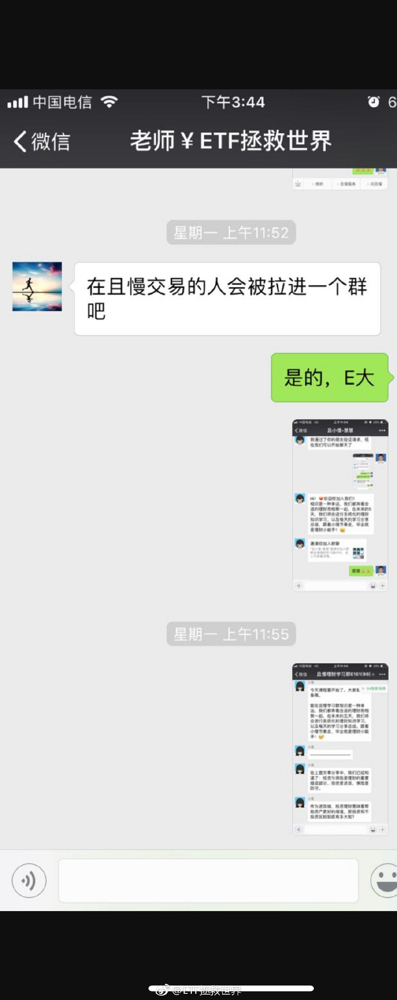

======================================================

ETF拯救世界 (5687069307) @
2019-01-17 20:50:26 Thu  
url: https://weibo.com/5687069307/HcoOJgi7P

好心人很多，但是这种事我不需要关心。也别在一个指数暴跌后来救我，都管好自己。 ​​​

转发[113]  评论[122]  赞[374] 

+++++++++++++++++++++++++++++++++++++++++++++++++++++

图片：
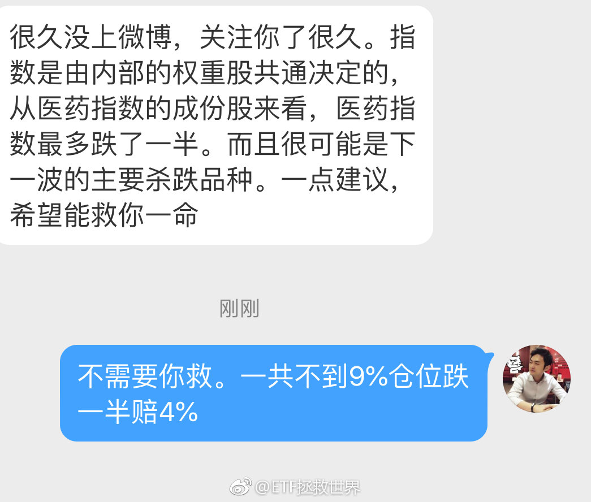

======================================================

ETF拯救世界 (5687069307) @
2019-01-17 20:54:57 Thu  
url: https://weibo.com/5687069307/HcoQz0poE

全指医药最高到现在跌了54%。刚跌了一半怎么理解，是说一共要跌100%还是说还要跌54%？

再跌54%是3000多点，估值大概十倍。美国医药股估值25。

等着看看能不能到。 ​​​

转发[58]  评论[89]  赞[372] 

======================================================

ETF拯救世界 (5687069307) @
2019-01-17 21:09:24 Thu  
url: https://weibo.com/5687069307/HcoWqtefM

回复@多多100001:没事。去年全年我们买了三份，加仓不到2%。再跌50%，我再加5%。钱还有，就等跌了。//@多多100001:应该能到吧，医药那块又出政策了，估计还得跌跌。

------------------------------------------------------
转推：
>  @ETF拯救世界 (5687069307)
>  2019-01-17 20:54:57 Thu  
>  url: https:/weibo.com/5687069307/HcoQz0poE/

>  全指医药最高到现在跌了54%。刚跌了一半怎么理解，是说一共要跌100%还是说还要跌54%？
>  
>  再跌54%是3000多点，估值大概十倍。美国医药股估值25。
>  
>  等着看看能不能到。 ​​​

转发[29]  评论[24]  赞[243] 

======================================================

ETF拯救世界 (5687069307) @
2019-01-17 21:13:35 Thu  
url: https://weibo.com/5687069307/HcoY808ZF

当时还在一万多点。所以之后我们只买了两份。趋势很差，一眼就能看出来，现在也没走好。所以我们依然不加仓。几个点的仓位怕什么，跌呗

------------------------------------------------------
转推：
>  @ETF拯救世界 (5687069307)
>  2018-07-23 13:48:03 Mon  
>  url: https:/weibo.com/5687069307/Grfrdse8E/

>  医药趋势已坏，不要频繁抄底，注意节奏 ​​​

转发[21]  评论[60]  赞[312] 

======================================================

ETF拯救世界 (5687069307) @
2019-01-17 21:21:16 Thu  
url: https://weibo.com/5687069307/Hcp1fuOUD

回复@慎独慎入慎犬儒:我倒觉得不是不可能。在我的字典里资本市场没有不可能，所以到了我也不意外。但是，即使到了我也不会死。这个可能会让很多人失望了。//@慎独慎入慎犬儒:我才不信，3000得多惨。。

------------------------------------------------------
转推：
>  @ETF拯救世界 (5687069307)
>  2019-01-17 20:54:57 Thu  
>  url: https:/weibo.com/5687069307/HcoQz0poE/

>  全指医药最高到现在跌了54%。刚跌了一半怎么理解，是说一共要跌100%还是说还要跌54%？
>  
>  再跌54%是3000多点，估值大概十倍。美国医药股估值25。
>  
>  等着看看能不能到。 ​​​

转发[20]  评论[63]  赞[300] 

======================================================

ETF拯救世界 (5687069307) @
2019-01-18 08:19:43 Fri  
url: https://weibo.com/5687069307/HctkvsBJw

现在看空真不是什么珍贵稀缺的品质。

目前市场上钱很多，十年国债即将进入2时代。但是没人买股票，否则也不会跌成这样。

去年底私募整体仓位50多个点，比年初没跌的时候少了30多个点。

所以，你看空，当然不是说你肯定错，但是绝大多数人都跟你一样，所以你也不用到处蹦跶着告诉别人你看空——因为 ​​​

转发[40]  评论[113]  赞[433] 

======================================================

ETF拯救世界 (5687069307) @
2019-01-18 08:54:51 Fri  
url: https://weibo.com/5687069307/HctyLA8Pf

其实一直对某家公司老板印象不错。但是从公司股票上市之前开始，感觉像换了人。

各位高管轮番上阵吹，然后是所谓的要让首日买入的投资者翻番，到股票大跌后开始感觉不淡定，到回购。

都让人感觉，特别害怕股价跌，特别希望股票涨。

是不是有什么对赌协议之类的东西。 ​​​

转发[8]  评论[173]  赞[313] 

======================================================

ETF拯救世界 (5687069307) @
2019-01-18 09:41:43 Fri  
url: https://weibo.com/5687069307/HctRNgOL0

种种迹象表明关键点不会太远。

因为很多人的心态都已经崩了。又或者，是看空的人开始嘚瑟以及要开始救我一命了。 ​​​

转发[114]  评论[182]  赞[506] 

======================================================

ETF拯救世界 (5687069307) @
2019-01-18 09:57:13 Fri  
url: https://weibo.com/5687069307/HctY4DFqR

回复@风湿膏_:你见过券商看空吗。两融余额现在是7500亿，是2014年以来最低。前几天第一次有人在我评论里说清仓不玩了。私募仓位50多一点，比一年前大降30%。

------------------------------------------------------
转推：
>  @ETF拯救世界 (5687069307)
>  2019-01-18 09:41:43 Fri  
>  url: https:/weibo.com/5687069307/HctRNgOL0/

>  种种迹象表明关键点不会太远。
>  
>  因为很多人的心态都已经崩了。又或者，是看空的人开始嘚瑟以及要开始救我一命了。 ​​​

转发[18]  评论[26]  赞[242] 

======================================================

ETF拯救世界 (5687069307) @
2019-01-18 09:58:14 Fri  
url: https://weibo.com/5687069307/HctYulqvw

$全指医药 sh000991$  未免有点不给面子。还干起了领涨的活？

当然，趋势还没变好，别嘚瑟。奶一口先。 ​​​

转发[3]  评论[75]  赞[300] 

======================================================

ETF拯救世界 (5687069307) @
2019-01-18 10:03:44 Fri  
url: https://weibo.com/5687069307/Hcu0ID4JZ

回复@江湖人称再议哥:你没煎熬，是因为你一直在这里。2015下半年，股票中位数下跌31%；2016年下跌15%；2017年下跌20%；2018年下跌34%。对于大多数股票来说，这三年半就是炼狱//@江湖人称再议哥:这底部这么快就来了？感觉没怎么煎熬[吃瓜]

------------------------------------------------------
转推：
>  @ETF拯救世界 (5687069307)
>  2019-01-18 09:41:43 Fri  
>  url: https:/weibo.com/5687069307/HctRNgOL0/

>  种种迹象表明关键点不会太远。
>  
>  因为很多人的心态都已经崩了。又或者，是看空的人开始嘚瑟以及要开始救我一命了。 ​​​

转发[32]  评论[73]  赞[277] 

======================================================

ETF拯救世界 (5687069307) @
2019-01-18 10:06:49 Fri  
url: https://weibo.com/5687069307/Hcu1ZgvpQ

回复@高人藤:我真的不明白你们这些跟那些一点都不懂的人聊什么投资呢。我自己大家庭聚会从来不说投资。//@高人藤:这个微博我一定要转到我的朋友圈，妈呀太符合我的处境了，亲戚们都劝我，要救我一命

------------------------------------------------------
转推：
>  @ETF拯救世界 (5687069307)
>  2019-01-18 09:41:43 Fri  
>  url: https:/weibo.com/5687069307/HctRNgOL0/

>  种种迹象表明关键点不会太远。
>  
>  因为很多人的心态都已经崩了。又或者，是看空的人开始嘚瑟以及要开始救我一命了。 ​​​

转发[11]  评论[88]  赞[330] 

======================================================

ETF拯救世界 (5687069307) @
2019-01-18 10:19:37 Fri  
url: https://weibo.com/5687069307/Hcu7ar1zl

很多专业的东西根本没必要和普通人聊。比如你是研究化学的，不可能春节饭桌上和大家聊分子式。研究物理的，不可能跟七大姑八大姨聊量子物理。

金融投资看似门槛很低，开个户就行。但实际上是很专业的事情。你怎么和这帮人聊体系，聊周期，聊估值，聊情绪，聊量化，聊货币环境，聊旅鼠和羊群呢？他们就 ​​​

转发[157]  评论[217]  赞[728] 

======================================================

ETF拯救世界 (5687069307) @
2019-01-18 10:33:08 Fri  
url: https://weibo.com/5687069307/HcucFdF82

回复@爱发少年狂:看我博客的朋友都知道，十年前帮几个亲友打理过。最多的时候9个吧，加起来5kw左右。上轮结束后来就没弄过了，麻烦。他们都改成直接跟车了。//@爱发少年狂:好奇，E大有代亲友理财吗？还是说有智慧的亲友都直接跟从ETF计划了~

------------------------------------------------------
转推：
>  @ETF拯救世界 (5687069307)
>  2019-01-18 10:19:37 Fri  
>  url: https:/weibo.com/5687069307/Hcu7ar1zl/

>  很多专业的东西根本没必要和普通人聊。比如你是研究化学的，不可能春节饭桌上和大家聊分子式。研究物理的，不可能跟七大姑八大姨聊量子物理。
>  
>  金融投资看似门槛很低，开个户就行。但实际上是很专业的事情。你怎么和这帮人聊体系，聊周期，聊估值，聊情绪，聊量化，聊货币环境，聊旅鼠和羊群呢？他们就 ​​​

转发[15]  评论[80]  赞[328] 

======================================================

ETF拯救世界 (5687069307) @
2019-01-18 10:41:37 Fri  
url: https://weibo.com/5687069307/Hcug6uNua

自己的事情，还没干成的时候，不用满世界去嚷嚷，更不要跟人说你多么辛苦。

有百害无一利。

体会一下。 ​​​

转发[93]  评论[128]  赞[784] 

======================================================

ETF拯救世界 (5687069307) @
2019-01-18 11:10:42 Fri  
url: https://weibo.com/5687069307/HcurUqJjM

好了今天微博额度聊完了。干点正事儿去了…… ​​​

转发[4]  评论[81]  赞[367] 

======================================================

ETF拯救世界 (5687069307) @
2019-01-18 14:26:49 Fri  
url: https://weibo.com/5687069307/HcvJwmBhF

一曲肝肠断，天涯何处觅知音。无论未来你赚不赚钱，赚多少钱，至少有一个错误你不会再犯：底部区域清仓。甚至，你还在不停的买。很难想象你会不赚钱，至于赚多少，要看天意。

------------------------------------------------------
转推：
>  @ETF拯救世界 (5687069307)
>  2019-01-16 09:52:01 Wed  
>  url: https:/weibo.com/5687069307/Hcb4YkFkw/

>  前几天清仓的人呢，不是说一定不对。也许还会跌，当然有可能。
>  
>  问题在于，这样的连续上涨，他的内心会非常煎熬。低位卖出，涨两天，追也不是，不追也不是。
>  
>  这就把自己置于一个非常不利的局面。
>  
>  做投资，最好不要让自己处在这样的局面里。不仅账面损失，情绪受打击，自信心也会被摧残。做投资自信很 ​​​

转发[31]  评论[91]  赞[379] 

======================================================

ETF拯救世界 (5687069307) @
2019-01-18 14:34:43 Fri  
url: https://weibo.com/5687069307/HcvMJdjIn

有一个致命的心魔。这个心魔解开了，很多事情就顺了。

关键在于，你要知道，你来股市到底是干嘛的。

是赚那三瓜两枣的吗。

当然不是。花费了那么多时间精力，经过那么多痛苦煎熬，赚几个点就算了？

你要做的是大周期。大周期买入，大周期持有，大周期卖出。你跌，我源源不断绵延不绝的资金跟你耗。 ​​​

转发[225]  评论[308]  赞[805] 

======================================================

ETF拯救世界 (5687069307) @
2019-01-18 14:54:49 Fri  
url: https://weibo.com/5687069307/HcvUSvThh

本周收盘，几个大指数已经站上趋势转折点，表现最好的是红利，已经连续第二周站稳。

大部分中小指数和行业指数还在弱势中。

股市难道不是最有意思的大型网游吗。 ​​​

转发[58]  评论[149]  赞[584] 

======================================================

ETF拯救世界 (5687069307) @
2019-01-18 15:09:41 Fri  
url: https://weibo.com/5687069307/Hcw0UCjjT

这次是真的。别想我。[爱你]

------------------------------------------------------
转推：
>  @ETF拯救世界 (5687069307)
>  2019-01-18 11:10:42 Fri  
>  url: https:/weibo.com/5687069307/HcurUqJjM/

>  好了今天微博额度聊完了。干点正事儿去了…… ​​​

转发[2]  评论[111]  赞[425] 

======================================================

ETF拯救世界 (5687069307) @
2019-01-19 06:56:41 Sat  
url: https://weibo.com/5687069307/HcCdiC6KR

提款机名不虚传 ​​​

转发[14]  评论[163]  赞[568] 

+++++++++++++++++++++++++++++++++++++++++++++++++++++

图片：
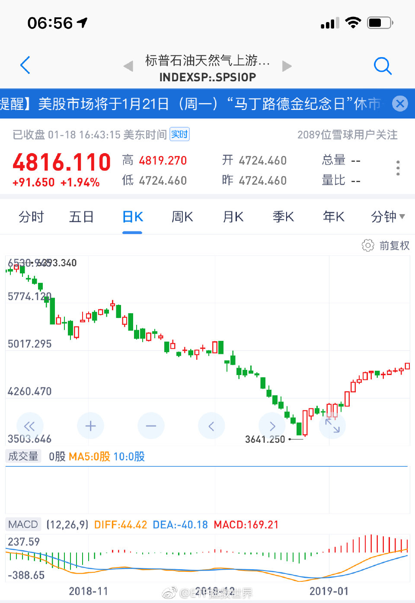

======================================================

ETF拯救世界 (5687069307) @
2019-01-19 21:27:26 Sat  
url: https://weibo.com/5687069307/HcHUK3MrW

稳定低收益。这就是大家对指数基金的认识吗。

不好意思，指数基金既不稳定也不是低收益。 ​​​

转发[24]  评论[136]  赞[450] 

+++++++++++++++++++++++++++++++++++++++++++++++++++++

图片：
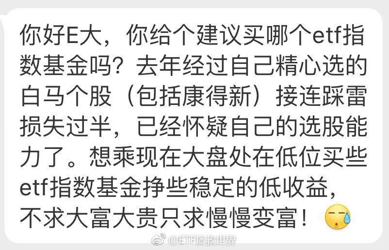

======================================================

ETF拯救世界 (5687069307) @
2019-01-20 06:30:27 Sun  
url: https://weibo.com/5687069307/HcLt92862

跌58%。同期的计划还在盈利。

------------------------------------------------------
转推：
>  @网易财经 (1974561081)
>  2019-01-19 22:24:58 Sat  
>  url: https:/weibo.com/1974561081/HcIi5DN42/

>  【公募盲目扩张之殇：巨无霸基金频现巨亏】
>  富国改革动力基金成立于2015年5月，初期规模130亿元。成立三年半时间以来，该基金频频跑输基准，在所有股票类基金中，一直比较靠后。根据富国基金官网公布的数据，2018年年底，该基金资产规模仅剩21亿元，发行总份额也跌至51.49亿份。截至1月17日，该基金净 ​​​

转发[72]  评论[56]  赞[242] 

======================================================

ETF拯救世界 (5687069307) @
2019-01-20 07:20:59 Sun  
url: https://weibo.com/5687069307/HcLNF8F5a

回复@蜀中弟子:一个品种下跌70%买入，回到跌幅一半的位置，赚117%//@蜀中弟子:昨天看到一个有意思的东西，球球上有人分享了一只个股，前一天跌七成，第二天涨七成，结果你猜回本了么，就联想到咱们得一些指数，已经跌了七成的样子，未来即使回不到15年高点，哪怕只有一半，咱们也能赚不少，开心

------------------------------------------------------
转推：
>  @网易财经 (1974561081)
>  2019-01-19 22:24:58 Sat  
>  url: https:/weibo.com/1974561081/HcIi5DN42/

>  【公募盲目扩张之殇：巨无霸基金频现巨亏】
>  富国改革动力基金成立于2015年5月，初期规模130亿元。成立三年半时间以来，该基金频频跑输基准，在所有股票类基金中，一直比较靠后。根据富国基金官网公布的数据，2018年年底，该基金资产规模仅剩21亿元，发行总份额也跌至51.49亿份。截至1月17日，该基金净 ​​​

转发[65]  评论[47]  赞[211] 

======================================================

ETF拯救世界 (5687069307) @
2019-01-20 07:27:46 Sun  
url: https://weibo.com/5687069307/HcLQqe5UV

回复@请叫我幸福鬼:跌70%买入，回到高点赚233%。如果十年内回去，就比巴菲特林奇索罗斯🐂//@请叫我幸福鬼:亏了70%，回到不亏，可不是涨70%的事情了。何时买入和卖出很关键。//@ETF拯救世界:回复@蜀中弟子:一个品种下跌70%买入，回到跌幅一半的位置，赚117%

------------------------------------------------------
转推：
>  @网易财经 (1974561081)
>  2019-01-19 22:24:58 Sat  
>  url: https:/weibo.com/1974561081/HcIi5DN42/

>  【公募盲目扩张之殇：巨无霸基金频现巨亏】
>  富国改革动力基金成立于2015年5月，初期规模130亿元。成立三年半时间以来，该基金频频跑输基准，在所有股票类基金中，一直比较靠后。根据富国基金官网公布的数据，2018年年底，该基金资产规模仅剩21亿元，发行总份额也跌至51.49亿份。截至1月17日，该基金净 ​​​

转发[48]  评论[58]  赞[221] 

======================================================

ETF拯救世界 (5687069307) @
2019-01-20 09:45:57 Sun  
url: https://weibo.com/5687069307/HcMKvi2vV

回复@Alex森岚:你是只知其一不知其二。2007年的高点，中证500在2010年就回去了，2015年已经比2007年最高点涨了一倍。沪深300在2015年也几乎回去了。//@Alex森岚:6124现在都回不去，不止10年了吧？

------------------------------------------------------
转推：
>  @网易财经 (1974561081)
>  2019-01-19 22:24:58 Sat  
>  url: https:/weibo.com/1974561081/HcIi5DN42/

>  【公募盲目扩张之殇：巨无霸基金频现巨亏】
>  富国改革动力基金成立于2015年5月，初期规模130亿元。成立三年半时间以来，该基金频频跑输基准，在所有股票类基金中，一直比较靠后。根据富国基金官网公布的数据，2018年年底，该基金资产规模仅剩21亿元，发行总份额也跌至51.49亿份。截至1月17日，该基金净 ​​​

转发[14]  评论[33]  赞[188] 

======================================================

ETF拯救世界 (5687069307) @
2019-01-20 09:57:08 Sun  
url: https://weibo.com/5687069307/HcMP2zBT3

回复@Alex森岚:我都不知道你在讨论什么。跟成分股有一毛钱关系吗？连日本这样的奇葩都回到1993年了。不解释了，拉黑。//@Alex森岚:回复@ETF拯救世界:07年的中证500，跟现在的中证500，有多少成分股是一样的？看看这次科创板出来后中证500要多少年回去咯。

------------------------------------------------------
转推：
>  @网易财经 (1974561081)
>  2019-01-19 22:24:58 Sat  
>  url: https:/weibo.com/1974561081/HcIi5DN42/

>  【公募盲目扩张之殇：巨无霸基金频现巨亏】
>  富国改革动力基金成立于2015年5月，初期规模130亿元。成立三年半时间以来，该基金频频跑输基准，在所有股票类基金中，一直比较靠后。根据富国基金官网公布的数据，2018年年底，该基金资产规模仅剩21亿元，发行总份额也跌至51.49亿份。截至1月17日，该基金净 ​​​

转发[2]  评论[59]  赞[191] 

======================================================

ETF拯救世界 (5687069307) @
2019-01-20 10:24:06 Sun  
url: https://weibo.com/5687069307/HcMZZkvO9

刚看下面有人说，随便拉黑和我“营造的形象”不符。

呵呵，我营造什么形象了？

我就是一个在股市上赚了点小钱的普通人。人类男性共有的缺点我都有，不比谁有什么高级的。跟大家一样，喜欢钱，喜欢看美女帅哥，有时候懒。

在微博上80%的时候怎么想怎么说，剩下的20%怎么想不能说，或者不合适说就不说 ​​​

转发[17]  评论[174]  赞[628] 

======================================================

ETF拯救世界 (5687069307) @
2019-01-20 14:20:32 Sun  
url: https://weibo.com/5687069307/HcOxXnDr9

好不容易熬到大叔的年龄谁能想到大叔代言人崩了大叔不吃香了[doge] ​​​

转发[20]  评论[140]  赞[455] 

======================================================

ETF拯救世界 (5687069307) @
2019-01-20 18:06:06 Sun  
url: https://weibo.com/5687069307/HcQ1woDrJ

说几条关于这种事情的三观。

第一，女朋友多几个少几个不是什么问题。最关键是要一个一个来，同时几个就不好了。不好是不好，谈恋爱的时候难免也有旧的没断新的就好上了，这个也不能完全避免，尽量吧。

但是注意，这条适用于单身。结婚是个分界线。

第二，婚后，没有极其特殊的情况，还是要专一。尽 ​​​

转发[43]  评论[224]  赞[528] 

======================================================

ETF拯救世界 (5687069307) @
2019-01-21 09:22:04 Mon  
url: https://weibo.com/5687069307/HcW1j8Oo6

___场又要开门了。

真好。 ​​​

转发[1]  评论[88]  赞[359] 

======================================================

ETF拯救世界 (5687069307) @
2019-01-21 09:34:03 Mon  
url: https://weibo.com/5687069307/HcW6avtje

别涨了，再涨空头过不好年了。奶一口，大家都开开心心的。 ​​​

转发[3]  评论[57]  赞[375] 

======================================================

ETF拯救世界 (5687069307) @
2019-01-21 09:37:55 Mon  
url: https://weibo.com/5687069307/HcW7K1K0G

回复@老虎爱喝下午茶:只要你能想清楚，是要人、要财，还是要命就行。人这一辈子要面对的诱惑很多，能走多远要就看你能顶住多少了。//@若水涵泳:e大，话说18、9的小姑娘飞蛾赴火往你怀里钻你能顶住不[阴险]

------------------------------------------------------
转推：
>  @ETF拯救世界 (5687069307)
>  2019-01-20 14:20:32 Sun  
>  url: https:/weibo.com/5687069307/HcOxXnDr9/

>  好不容易熬到大叔的年龄谁能想到大叔代言人崩了大叔不吃香了[doge] ​​​

转发[10]  评论[42]  赞[286] 

======================================================

ETF拯救世界 (5687069307) @
2019-01-21 09:43:31 Mon  
url: https://weibo.com/5687069307/HcWa0EVNL

看看灵不灵。//@ETF拯救世界:各位好好在各个网站观察，看看对不对。

------------------------------------------------------
转推：
>  @ETF拯救世界 (5687069307)
>  2019-01-03 10:22:47 Thu  
>  url: https:/weibo.com/5687069307/HacJ10a0U/

>  只要涨1%，30%昨天看空的人就觉得牛市来了。
>  
>  涨10%，80%空头转多。
>  
>  剩下的20%牛市快结束的时候去买单。 ​​​

转发[7]  评论[20]  赞[218] 

======================================================

ETF拯救世界 (5687069307) @
2019-01-21 09:49:17 Mon  
url: https://weibo.com/5687069307/HcWcmmsEy

回复@C--1:希望他来又不希望他乱来。//@C--1:希望他涨又不希望他涨。横个三五年，让我这种迷你散多攒一点筹码。//@ETF拯救世界:看看灵不灵。//@ETF拯救世界:各位好好在各个网站观察，看看对不对。

------------------------------------------------------
转推：
>  @ETF拯救世界 (5687069307)
>  2019-01-03 10:22:47 Thu  
>  url: https:/weibo.com/5687069307/HacJ10a0U/

>  只要涨1%，30%昨天看空的人就觉得牛市来了。
>  
>  涨10%，80%空头转多。
>  
>  剩下的20%牛市快结束的时候去买单。 ​​​

转发[3]  评论[46]  赞[246] 

======================================================

ETF拯救世界 (5687069307) @
2019-01-21 09:57:43 Mon  
url: https://weibo.com/5687069307/HcWfMd6AE

便宜的时候，给你很多很多时间和机会让你慢慢布局，你因为各种利空不敢买，又或者是特别贪，希望跌到2200,2000,1500。

涨起来了，贵了，你很着急。希望有个大回调自己好杀进去。

不好意思，真正的牛市没有回调。即使有你也进不去。最后你进去了，恐怕涨不了多少就要是大顶了。

这话还早，不过几年后 ​​​

转发[776]  评论[481]  赞[1058] 

======================================================

ETF拯救世界 (5687069307) @
2019-01-21 10:44:59 Mon  
url: https://weibo.com/5687069307/HcWyXzCrn

大跌的时候跌幅只有1/3，上涨的时候大致跟上。大熊市不赔钱。

投资目标这一轮再次全部做到了。 ​​​

转发[39]  评论[154]  赞[743] 

+++++++++++++++++++++++++++++++++++++++++++++++++++++

图片：
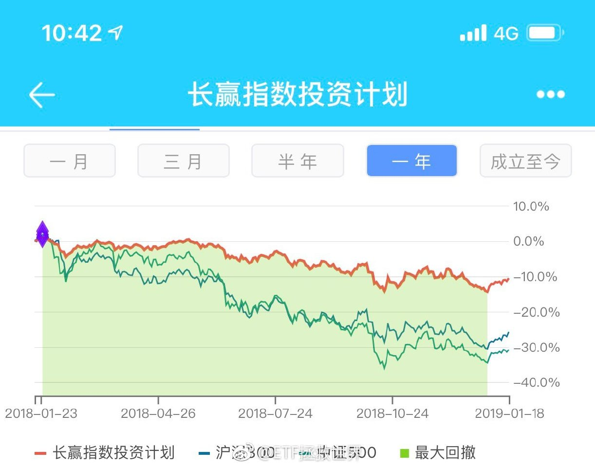
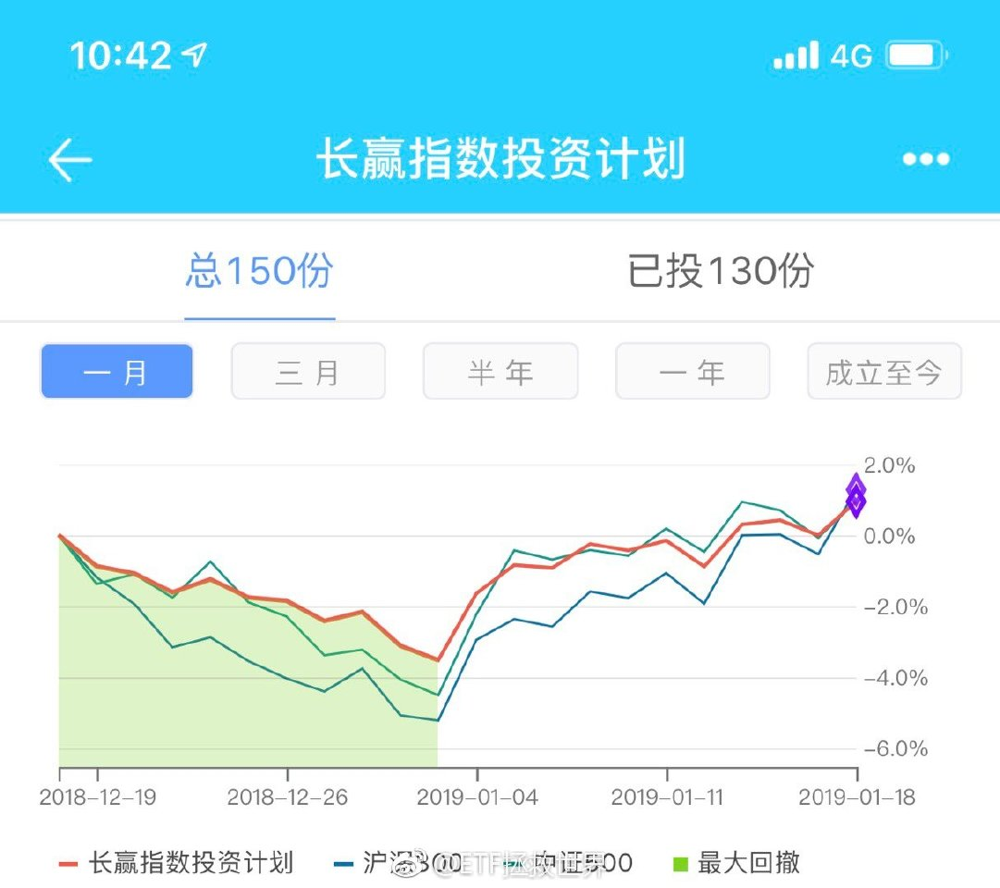

======================================================

ETF拯救世界 (5687069307) @
2019-01-21 11:12:54 Mon  
url: https://weibo.com/5687069307/HcWKihXIc

今天还有700多只股票是下跌的。

未来的牛市中，很多股民会眼睁睁的看着指数涨上去不赚钱。 ​​​

转发[24]  评论[119]  赞[435] 

======================================================

ETF拯救世界 (5687069307) @
2019-01-21 13:09:13 Mon  
url: https://weibo.com/5687069307/HcXvvp90r

回复@花间且问道:加油。你一定能买到属于你的2个月翻倍股。你不适合我这里，拉黑。//@花间且问道:有不少个股跟10月份的底部相比股价都翻倍了

------------------------------------------------------
转推：
>  @ETF拯救世界 (5687069307)
>  2019-01-21 11:12:54 Mon  
>  url: https:/weibo.com/5687069307/HcWKihXIc/

>  今天还有700多只股票是下跌的。
>  
>  未来的牛市中，很多股民会眼睁睁的看着指数涨上去不赚钱。 ​​​

转发[4]  评论[35]  赞[226] 

======================================================

ETF拯救世界 (5687069307) @
2019-01-21 13:11:59 Mon  
url: https://weibo.com/5687069307/HcXwDrBjz

不报警不行了。这么造多少钱都得造干净了。//@八大山债人:学习了。。。

------------------------------------------------------
转推：
>  @ ()
>  2019-01-21 08:04:18 Mon  
>  url: 

>  抱歉，作者已设置仅展示半年内微博，此微博已不可见。 ​​​

转发[6]  评论[29]  赞[168] 

======================================================

ETF拯救世界 (5687069307) @
2019-01-21 13:35:45 Mon  
url: https://weibo.com/5687069307/HcXGhdrkl

10月底上来一共11只个股翻番。祝这位朋友买到。同期有951只股票下跌，这951只股票有5400万股东。我说很多股民眼睁睁看着指数涨不赚钱错了吗。//@ETF拯救世界:回复@花间且问道:加油。你一定能买到属于你的2个月翻倍股。你不适合我这里，拉黑。//@花间且问道:有不少个股跟10月份的底部相比股价都翻倍了

------------------------------------------------------
转推：
>  @ETF拯救世界 (5687069307)
>  2019-01-21 11:12:54 Mon  
>  url: https:/weibo.com/5687069307/HcWKihXIc/

>  今天还有700多只股票是下跌的。
>  
>  未来的牛市中，很多股民会眼睁睁的看着指数涨上去不赚钱。 ​​​

转发[2]  评论[29]  赞[244] 

======================================================

ETF拯救世界 (5687069307) @
2019-01-21 13:39:30 Mon  
url: https://weibo.com/5687069307/HcXHNsVYc

“指数涨，很多股民也赚不到钱。”（事实是这一轮反弹确实有5400万股民持有的591只股票在下跌。）

“还有11只翻番呢。”

[疑问][疑问][疑问]  这是什么逻辑链条？我确实特别害怕跟这样逻辑思维能力的人沟通。趁早一刀两断最好。 ​​​

转发[19]  评论[75]  赞[373] 

======================================================

ETF拯救世界 (5687069307) @
2019-01-21 13:51:44 Mon  
url: https://weibo.com/5687069307/HcXMLmU59

追求个股的超高收益没有问题。非常合理。

不过我的建议，是每个人的组合里至少给指数一点仓位。这样，如果你的个股在牛市表现不好，至少有指数仓位保底，不会颗粒无收。

个股表现好，指数也不会太差。

同时，你也能发现自己到底是不是炒股的料。多好。 ​​​

转发[38]  评论[136]  赞[471] 

======================================================

ETF拯救世界 (5687069307) @
2019-01-21 14:01:12 Mon  
url: https://weibo.com/5687069307/HcXQC6Prm

回复@草稿师:请经常发言谢谢。//@草稿师:回复@_藍莓蛋撻:说的是我吗？刚才满仓干进去了。

------------------------------------------------------
转推：
>  @ETF拯救世界 (5687069307)
>  2019-01-21 09:57:43 Mon  
>  url: https:/weibo.com/5687069307/HcWfMd6AE/

>  便宜的时候，给你很多很多时间和机会让你慢慢布局，你因为各种利空不敢买，又或者是特别贪，希望跌到2200,2000,1500。
>  
>  涨起来了，贵了，你很着急。希望有个大回调自己好杀进去。
>  
>  不好意思，真正的牛市没有回调。即使有你也进不去。最后你进去了，恐怕涨不了多少就要是大顶了。
>  
>  这话还早，不过几年后 ​​​

转发[2]  评论[94]  赞[251] 

======================================================

ETF拯救世界 (5687069307) @
2019-01-21 14:48:15 Mon  
url: https://weibo.com/5687069307/HcY9HzPrU

有没有手里资金还比较少的朋友想过一件事：

等手里有100万的时候，从银行取回家数数。

这样想过的举个手。 ​​​

转发[69]  评论[488]  赞[630] 

======================================================

ETF拯救世界 (5687069307) @
2019-01-21 14:53:08 Mon  
url: https://weibo.com/5687069307/HcYbH9mab

回复@超级宝宝0928:说多不多，说少不少。目前我国人均年收入不到3万，人均存款不到10万。//@超级宝宝0928:一百万算多吗[喵喵]

------------------------------------------------------
转推：
>  @ETF拯救世界 (5687069307)
>  2019-01-21 14:48:15 Mon  
>  url: https:/weibo.com/5687069307/HcY9HzPrU/

>  有没有手里资金还比较少的朋友想过一件事：
>  
>  等手里有100万的时候，从银行取回家数数。
>  
>  这样想过的举个手。 ​​​

转发[5]  评论[128]  赞[253] 

======================================================

ETF拯救世界 (5687069307) @
2019-01-21 16:28:59 Mon  
url: https://weibo.com/5687069307/HcYOADVdq

回复@龙虎半天云:下决心不还了？//@龙虎半天云:去年开始有了百万以上的股票市值，不过有一半是借来的钱，今年终于变成自己的了。

------------------------------------------------------
转推：
>  @ETF拯救世界 (5687069307)
>  2019-01-21 14:48:15 Mon  
>  url: https:/weibo.com/5687069307/HcY9HzPrU/

>  有没有手里资金还比较少的朋友想过一件事：
>  
>  等手里有100万的时候，从银行取回家数数。
>  
>  这样想过的举个手。 ​​​

转发[3]  评论[87]  赞[318] 

======================================================

ETF拯救世界 (5687069307) @
2019-01-21 17:16:01 Mon  
url: https://weibo.com/5687069307/HcZ7GDzVD

回复@俞小坏--亚克西:幸福来自超越昨天的自己，不幸来自于与他人比较。——某极有思想的投资者。//@俞小坏--亚克西:[汗]说实话就高兴了一两天。。然后看到别人千万，就觉得一百万算个啥。。。

------------------------------------------------------
转推：
>  @ETF拯救世界 (5687069307)
>  2019-01-21 14:48:15 Mon  
>  url: https:/weibo.com/5687069307/HcY9HzPrU/

>  有没有手里资金还比较少的朋友想过一件事：
>  
>  等手里有100万的时候，从银行取回家数数。
>  
>  这样想过的举个手。 ​​​

转发[38]  评论[159]  赞[522] 

======================================================

ETF拯救世界 (5687069307) @
2019-01-21 21:49:39 Mon  
url: https://weibo.com/5687069307/Hd0UL5MIe

救急不救穷。这是救急还是救穷。另外，养老金全国统筹不是新闻了

------------------------------------------------------
转推：
>  @财联社APP (2868676035)
>  2019-01-21 20:57:11 Mon  
>  url: https:/weibo.com/2868676035/Hd0zsdeym/

>  【养老金收不抵支？专家建议：将南方滚存结余调到东北救急[思考]】第十届中国经济前瞻论坛上，前财政部财政科学研究所所长贾康谈及减税降费，建议尽快提升养老金统筹机制，用南方的滚存结余调到东北救急。随着人口流出，东北养老金缺口将不断扩大。有人认为此举“有违社会公平”，你怎么看？ ​​​

转发[19]  评论[195]  赞[234] 

======================================================

ETF拯救世界 (5687069307) @
2019-01-22 17:09:07 Tue  
url: https://weibo.com/5687069307/Hd8vntw5v

今天过得怎么样？

忙了一天，现在才有空上来给各位请个安。 ​​​

转发[6]  评论[494]  赞[774] 

======================================================

ETF拯救世界 (5687069307) @
2019-01-23 21:17:57 Wed  
url: https://weibo.com/5687069307/HdjySozLn

对流浪地球有点期待啊。

三体是不是五年内拍不出来了… ​​​

转发[10]  评论[222]  赞[394] 

======================================================

ETF拯救世界 (5687069307) @
2019-01-24 10:01:40 Thu  
url: https://weibo.com/5687069307/HdoyS5l8U

下降趋势被趋势线死死压住，想要趋势扭转谈何容易。踏踏实实的该干嘛干嘛去吧。

我也准备转型情感博主了。 ​​​

转发[18]  评论[151]  赞[480] 

======================================================

ETF拯救世界 (5687069307) @
2019-01-24 10:41:38 Thu  
url: https://weibo.com/5687069307/HdoP6e6v8

喷了，正向奶反向奶无一落空。。

------------------------------------------------------
转推：
>  @ETF拯救世界 (5687069307)
>  2019-01-24 10:01:40 Thu  
>  url: https:/weibo.com/5687069307/HdoyS5l8U/

>  下降趋势被趋势线死死压住，想要趋势扭转谈何容易。踏踏实实的该干嘛干嘛去吧。
>  
>  我也准备转型情感博主了。 ​​​

转发[4]  评论[58]  赞[238] 

======================================================

ETF拯救世界 (5687069307) @
2019-01-24 10:49:18 Thu  
url: https://weibo.com/5687069307/HdoScC6AG

说起情感，其实我有个情感方面的问题，问问各位。

我看很多人对“相亲”特别抵触。长辈什么安排的都不愿意去。

相亲有什么不好的地方吗，吃顿饭聊聊天嘛。好就接触不好就不再联系呗。多认识点人也没什么坏处。

万一相到了吴彦祖或者高圆圆你说你不是赚了吗。 ​​​

转发[21]  评论[311]  赞[317] 

======================================================

ETF拯救世界 (5687069307) @
2019-01-24 11:07:11 Thu  
url: https://weibo.com/5687069307/HdoZszC2c

回复@freeman7998:不是看微博跟车。好好体会一下区别。//@freeman7998:妥妥的反向指标，还有这么多人跟车，包括我自己[允悲]//@ETF拯救世界:喷了，正向奶反向奶无一落空。。

------------------------------------------------------
转推：
>  @ETF拯救世界 (5687069307)
>  2019-01-24 10:01:40 Thu  
>  url: https:/weibo.com/5687069307/HdoyS5l8U/

>  下降趋势被趋势线死死压住，想要趋势扭转谈何容易。踏踏实实的该干嘛干嘛去吧。
>  
>  我也准备转型情感博主了。 ​​​

转发[1]  评论[55]  赞[181] 

======================================================

ETF拯救世界 (5687069307) @
2019-01-24 11:22:19 Thu  
url: https://weibo.com/5687069307/Hdp5Bva1v

回复@NFHSong:不是。这个几乎是没有成本的。成本就是一顿饭时间，真的忙到一顿饭时间都没有吗。见完了不行就跟介绍人说感觉不太合适就完事了。收益却有可能是无限的。理性的看，这个风险收益比太棒了。//@NFHSong:E大你这想法遇到吴彦祖，和买到100倍股有啥区别。。。

------------------------------------------------------
转推：
>  @ETF拯救世界 (5687069307)
>  2019-01-24 10:49:18 Thu  
>  url: https:/weibo.com/5687069307/HdoScC6AG/

>  说起情感，其实我有个情感方面的问题，问问各位。
>  
>  我看很多人对“相亲”特别抵触。长辈什么安排的都不愿意去。
>  
>  相亲有什么不好的地方吗，吃顿饭聊聊天嘛。好就接触不好就不再联系呗。多认识点人也没什么坏处。
>  
>  万一相到了吴彦祖或者高圆圆你说你不是赚了吗。 ​​​

转发[9]  评论[64]  赞[194] 

======================================================

ETF拯救世界 (5687069307) @
2019-01-24 11:29:47 Thu  
url: https://weibo.com/5687069307/Hdp8DpOXY

回复@Turanium中玉:违规T+0回转。跟咱们没关系。//@Turanium中玉:E大能不能说说这是怎么回事啊？4宗操纵ETF交易案披露 福建道冲等交易亏逾50亿被罚

------------------------------------------------------
转推：
>  @ETF拯救世界 (5687069307)
>  2019-01-24 10:49:18 Thu  
>  url: https:/weibo.com/5687069307/HdoScC6AG/

>  说起情感，其实我有个情感方面的问题，问问各位。
>  
>  我看很多人对“相亲”特别抵触。长辈什么安排的都不愿意去。
>  
>  相亲有什么不好的地方吗，吃顿饭聊聊天嘛。好就接触不好就不再联系呗。多认识点人也没什么坏处。
>  
>  万一相到了吴彦祖或者高圆圆你说你不是赚了吗。 ​​​

转发[2]  评论[18]  赞[156] 

======================================================

ETF拯救世界 (5687069307) @
2019-01-24 11:39:29 Thu  
url: https://weibo.com/5687069307/Hdpczwiyr

回复@寒山明月:是不是每次要完你电话都在夜深人静的时候打来深情的问：“你，知道安利吗。”//@寒山明月:真的被介绍去相的，有几个是条顺颜高的，遇到这样的概率是零。别说女的，男的有点型的都容易被搭讪，以前出去时被女的要过好几次电话。

------------------------------------------------------
转推：
>  @ETF拯救世界 (5687069307)
>  2019-01-24 10:49:18 Thu  
>  url: https:/weibo.com/5687069307/HdoScC6AG/

>  说起情感，其实我有个情感方面的问题，问问各位。
>  
>  我看很多人对“相亲”特别抵触。长辈什么安排的都不愿意去。
>  
>  相亲有什么不好的地方吗，吃顿饭聊聊天嘛。好就接触不好就不再联系呗。多认识点人也没什么坏处。
>  
>  万一相到了吴彦祖或者高圆圆你说你不是赚了吗。 ​​​

转发[1]  评论[44]  赞[202] 

======================================================

ETF拯救世界 (5687069307) @
2019-01-24 11:54:22 Thu  
url: https://weibo.com/5687069307/HdpiCdVdm

这种事情，我是这个意见。 ​​​

转发[18]  评论[101]  赞[234] 

+++++++++++++++++++++++++++++++++++++++++++++++++++++

图片：
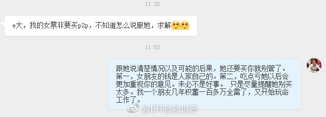

======================================================

ETF拯救世界 (5687069307) @
2019-01-24 11:59:28 Thu  
url: https://weibo.com/5687069307/HdpkGritV

回复@遥远的梦2018416:制止了，这个事情不发生，你不会觉得他好。而且如果没事，你还会埋怨挡了他财路。其实类似的事情每天都在发生，各位可以想想是不是。//@遥远的梦2018416:我老公就是这样对我的，我不听，吃亏了他也只是简单的讽刺我一下，我还埋怨他当时不严厉制止。

------------------------------------------------------
转推：
>  @ETF拯救世界 (5687069307)
>  2019-01-24 11:54:22 Thu  
>  url: https:/weibo.com/5687069307/HdpiCdVdm/

>  这种事情，我是这个意见。 ​​​

转发[7]  评论[53]  赞[236] 

======================================================

ETF拯救世界 (5687069307) @
2019-01-24 12:14:46 Thu  
url: https://weibo.com/5687069307/HdpqTv4La

其实金融投资，想要不被骗有几个关键原则稍微把握一下。包括，但不限于：

第一，正规。一定要正规，法律允许的，zf保护的。比如沪深交易所，各大期交所的产品。我有朋友玩现货，被卷款跑路。

第二，你要知道整个产品的原理。如何募资，资金投向，资金监管。比如指数基金最简单了，得到监管层批准的公 ​​​

转发[150]  评论[175]  赞[456] 

======================================================

ETF拯救世界 (5687069307) @
2019-01-24 12:30:04 Thu  
url: https://weibo.com/5687069307/Hdpx77BSK

回复@大号被狗曰的新蒗封了:为什么还有1%不赞同。拉黑。//@大号被狗曰的新蒗封了:回复@ETF拯救世界:E，我还算是比较喜欢独立思考的人，别人的话我都不会无脑信，但我发现你的话，99%我都认同[允悲]

------------------------------------------------------
转推：
>  @ETF拯救世界 (5687069307)
>  2019-01-24 11:54:22 Thu  
>  url: https:/weibo.com/5687069307/HdpiCdVdm/

>  这种事情，我是这个意见。 ​​​

转发[1]  评论[93]  赞[243] 

======================================================

ETF拯救世界 (5687069307) @
2019-01-24 13:35:45 Thu  
url: https://weibo.com/5687069307/HdpXLvsoK

没有发生过连续两任监管任期内都没有牛市的。

这次应该也不会例外。 ​​​

转发[121]  评论[109]  赞[414] 

======================================================

ETF拯救世界 (5687069307) @
2019-01-24 13:54:12 Thu  
url: https://weibo.com/5687069307/Hdq5fFs3n

不知道有没有受到帮助的学生去看过他。

------------------------------------------------------
转推：
>  @ ()
>  2019-01-24 13:43:21 Thu  
>  url: 

>  抱歉，作者已设置仅展示半年内微博，此微博已不可见。 ​​​

转发[8]  评论[26]  赞[260] 

======================================================

ETF拯救世界 (5687069307) @
2019-01-24 14:09:49 Thu  
url: https://weibo.com/5687069307/HdqbAE1eS

回复@葱葱AQQ:最长的尚是9年，其他最多没超过4年应该。//@葱葱AQQ:主要是看时间跨度。两任的任期是多少年？

------------------------------------------------------
转推：
>  @ETF拯救世界 (5687069307)
>  2019-01-24 13:35:45 Thu  
>  url: https:/weibo.com/5687069307/HdpXLvsoK/

>  没有发生过连续两任监管任期内都没有牛市的。
>  
>  这次应该也不会例外。 ​​​

转发[3]  评论[16]  赞[171] 

======================================================

ETF拯救世界 (5687069307) @
2019-01-24 14:21:01 Thu  
url: https://weibo.com/5687069307/Hdqg99yri

回复@乱喝茶:闲着没事儿看新闻瞎聊天。这样的话就没什么好说的了。我去分析100年的大数据了。有结果回来跟大家分享。//@乱喝茶:E大，一共就8个人就归纳出来规矩了？这样本空间有点低[二哈]

------------------------------------------------------
转推：
>  @ETF拯救世界 (5687069307)
>  2019-01-24 13:35:45 Thu  
>  url: https:/weibo.com/5687069307/HdpXLvsoK/

>  没有发生过连续两任监管任期内都没有牛市的。
>  
>  这次应该也不会例外。 ​​​

转发[1]  评论[59]  赞[273] 

======================================================

ETF拯救世界 (5687069307) @
2019-01-24 15:58:38 Thu  
url: https://weibo.com/5687069307/HdqTLiAE8

已经有不止一个人问过我这个了。

这个不是我，有空的朋友请帮我举报这个公 众 号。 ​​​

转发[2]  评论[98]  赞[256] 

+++++++++++++++++++++++++++++++++++++++++++++++++++++

图片：
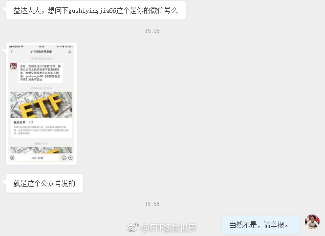
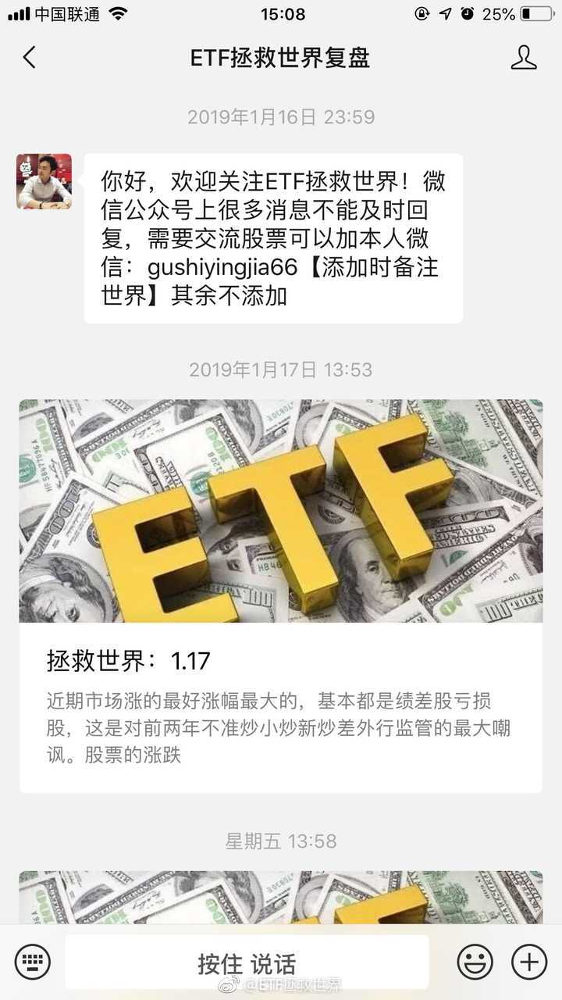

======================================================

ETF拯救世界 (5687069307) @
2019-01-25 07:10:21 Fri  
url: https://weibo.com/5687069307/HdwRPmvJE

以目前的国土面积，有6-8亿人是最合适的。提高人口素质，提高劳动生产率，提高科技化水平。每个人空间大一点，挺好。当然，一代人的痛苦不可避免了

------------------------------------------------------
转推：
>  @ ()
>  2019-01-24 20:59:10 Thu  
>  url: 

>  根据相关法律法规和政策，该微博已被删除。查看帮助：http://t.cn/Rfd1A92

转发[18]  评论[110]  赞[212] 

======================================================

ETF拯救世界 (5687069307) @
2019-01-25 07:27:20 Fri  
url: https://weibo.com/5687069307/HdwYIEenx

对于普通人，操心那些有的没的毫无用处，不必天天自寻烦恼。两点原则：

第一，事物的发展不是线性的。四十年前，二十年前，现在，你看到的人口问题都不一样。整个世界更是天翻地覆。不要用现在的情况线性推一两百年后。这个世界有它解决问题的方式。

第二，大致了解目前的情况和趋势，推演自己有生之 ​​​

转发[68]  评论[129]  赞[478] 

======================================================

ETF拯救世界 (5687069307) @
2019-01-25 07:32:09 Fri  
url: https://weibo.com/5687069307/Hdx0G83D2

回复@NFHSong:是吗。昨天十几亿基数的球队又被受到发达国家制裁的小国干了3：0。很多东西不是基数大就行//@NFHSong:回复@慎独慎入慎犬儒:不尽然，人多。。。按照比例来说，出人才就多

------------------------------------------------------
转推：
>  @ ()
>  2019-01-24 20:59:10 Thu  
>  url: 

>  根据相关法律法规和政策，该微博已被删除。查看帮助：http://t.cn/Rfd1A92

转发[9]  评论[84]  赞[183] 

======================================================

ETF拯救世界 (5687069307) @
2019-01-25 08:50:00 Fri  
url: https://weibo.com/5687069307/HdxwhwjLo

据说菲佣素质很高。大部分大学毕业，全程英语。专业水平也很不错。价格又特别便宜……

------------------------------------------------------
转推：
>  @蓝鲸财经记者工作平台 (1885454921)
>  2019-01-24 19:50:00 Thu  
>  url: https:/weibo.com/1885454921/HdspFEqwD/

>  外交部：“中国将接纳30万名菲律宾人来华就业”不实。（人民日报） ​​​

转发[6]  评论[138]  赞[213] 

======================================================

ETF拯救世界 (5687069307) @
2019-01-25 10:43:35 Fri  
url: https://weibo.com/5687069307/HdygnvB6d

继续新高

------------------------------------------------------
转推：
>  @ETF拯救世界 (5687069307)
>  2019-01-16 13:31:38 Wed  
>  url: https:/weibo.com/5687069307/Hccw7A8Vk/

>  红利在挑战去年9月以来新高。 ​​​

转发[1]  评论[85]  赞[312] 

======================================================

ETF拯救世界 (5687069307) @
2019-01-25 13:26:42 Fri  
url: https://weibo.com/5687069307/HdzkAb4p8

多大点事，踏踏实实的。 ​​​

转发[32]  评论[103]  赞[320] 

======================================================

ETF拯救世界 (5687069307) @
2019-01-25 13:52:32 Fri  
url: https://weibo.com/5687069307/Hdzv4A4zY

回复@xixcgw6143100976:有。  低位买够，涨跌都舒服。说一万次了。//@xixcgw6143100976:老大，怎么克服想追高的心理，有什么经验么？虽然150份一直在跟车，然而还是贪心想再加点再多赚点，应该有不少人会有这种心理。

------------------------------------------------------
转推：
>  @ETF拯救世界 (5687069307)
>  2019-01-25 13:26:42 Fri  
>  url: https:/weibo.com/5687069307/HdzkAb4p8/

>  多大点事，踏踏实实的。 ​​​

转发[30]  评论[24]  赞[239] 

======================================================

ETF拯救世界 (5687069307) @
2019-01-25 13:56:11 Fri  
url: https://weibo.com/5687069307/Hdzwyvnap

昨天长信转债比几大宽基指数涨的都多。

为什么，因为它带杠杆。

别以为“债就一定干不过指数”。

很多事经历一次才懂我在干什么。 ​​​

转发[61]  评论[87]  赞[438] 

======================================================

ETF拯救世界 (5687069307) @
2019-01-25 14:03:50 Fri  
url: https://weibo.com/5687069307/HdzzF8m2n

回复@就爱喝X:军工不  ，不来//@就爱喝X:关注的ETF中，只有一个军工是绿的，其它都是涨，全市场股票一半涨一半跌//@ETF拯救世界:回复@xixcgw6143100976:有。  低位买够，涨跌都舒服。说一万次了。

------------------------------------------------------
转推：
>  @ETF拯救世界 (5687069307)
>  2019-01-25 13:26:42 Fri  
>  url: https:/weibo.com/5687069307/HdzkAb4p8/

>  多大点事，踏踏实实的。 ​​​

转发[11]  评论[25]  赞[208] 

======================================================

ETF拯救世界 (5687069307) @
2019-01-25 14:09:10 Fri  
url: https://weibo.com/5687069307/HdzBPiABA

回复@南海恶神的师傅:赚了指数不赚钱不是开玩笑的//@南海恶神的师傅:今天竟然还有一多半股票是跌的，指数大法好//@ETF拯救世界:回复@就爱喝X:军工不  ，不来//@就爱喝X:关注的ETF中，只有一个军工是绿的，其它都是涨，全市场股票一半涨一半跌

------------------------------------------------------
转推：
>  @ETF拯救世界 (5687069307)
>  2019-01-25 13:26:42 Fri  
>  url: https:/weibo.com/5687069307/HdzkAb4p8/

>  多大点事，踏踏实实的。 ​​​

转发[6]  评论[23]  赞[228] 

======================================================

ETF拯救世界 (5687069307) @
2019-01-25 14:23:59 Fri  
url: https://weibo.com/5687069307/HdzHQdobs

今天连1000都没涨，可想而知后面的2400只… ​​​

转发[8]  评论[88]  赞[342] 

======================================================

ETF拯救世界 (5687069307) @
2019-01-25 18:12:14 Fri  
url: https://weibo.com/5687069307/HdBcuyPOw

今年的货币环境是“松紧适度”

------------------------------------------------------
转推：
>  @AndrewXAndrew (1701816363)
>  2019-01-25 17:33:18 Fri  
>  url: https:/weibo.com/1701816363/HdAWGqi5q/

>  一天一小好，几天一大好，好消息不断！1月25日，PBoC对达标金融机构定向降准0.5% or 1.5%，理由“普惠金融”，净放水约CNY 2500亿； ​​​

转发[43]  评论[74]  赞[236] 

======================================================

ETF拯救世界 (5687069307) @
2019-01-26 18:08:06 Sat  
url: https://weibo.com/5687069307/HdKBj5jEz

很多人根本没搞清楚CDR/科创板是谁要上。

真心跟L没关系。

本条关闭评论。

另外，刚才拉黑了12个人，别感到奇怪。以后点赞要看清了再点。 ​​​

转发[10]  评论[0]  赞[468] 

======================================================

ETF拯救世界 (5687069307) @
2019-01-26 20:52:09 Sat  
url: https://weibo.com/5687069307/HdLFTpwKS

我个人认为，就我所经历的几位，尚、郭、肖、刘，都挺好。

肯定是有不足，但关键是，很多事情真不是他们能决定的。这个位置真的很难。几位还都是做了事情的。

个人感觉，这个位置比足协主席难太多了。足协主席很多事情干不好那真是该骂…… ​​​

转发[50]  评论[164]  赞[465] 

======================================================

ETF拯救世界 (5687069307) @
2019-01-28 08:55:13 Mon  
url: https://weibo.com/5687069307/HdZPThxoC

回复@骑烤猪的星星:想多了。很明显领导对上一任直接融资这一块很不满意。CDR搁浅，科创迟迟没有进展。可以预见，未来直接融资规模将快速扩大，各项工作推进速度也将加快。//@骑烤猪的星星:E大 是不是现在大A的抽血太大了～IPO要是停一下会不会好些呢？加上四月科创一上…希望新主席能把IPO停下来[嘻嘻]

------------------------------------------------------
转推：
>  @ETF拯救世界 (5687069307)
>  2019-01-26 20:52:09 Sat  
>  url: https:/weibo.com/5687069307/HdLFTpwKS/

>  我个人认为，就我所经历的几位，尚、郭、肖、刘，都挺好。
>  
>  肯定是有不足，但关键是，很多事情真不是他们能决定的。这个位置真的很难。几位还都是做了事情的。
>  
>  个人感觉，这个位置比足协主席难太多了。足协主席很多事情干不好那真是该骂…… ​​​

转发[32]  评论[78]  赞[253] 

======================================================

ETF拯救世界 (5687069307) @
2019-01-28 11:13:53 Mon  
url: https://weibo.com/5687069307/He0Kar0hc

沪深300十个月来第一次冲击半年线。

有些朋友现在会不会很慌。 ​​​

转发[17]  评论[110]  赞[343] 

======================================================

ETF拯救世界 (5687069307) @
2019-01-28 11:15:35 Mon  
url: https://weibo.com/5687069307/He0KRhse5

回复@英德美加:去年间接融资十几万亿。需要钱的企业非常多。//@英德美加:好企业基本都上市了，剩下的没几个好企业了，谁还需要这么多融资呢

------------------------------------------------------
转推：
>  @ETF拯救世界 (5687069307)
>  2019-01-26 20:52:09 Sat  
>  url: https:/weibo.com/5687069307/HdLFTpwKS/

>  我个人认为，就我所经历的几位，尚、郭、肖、刘，都挺好。
>  
>  肯定是有不足，但关键是，很多事情真不是他们能决定的。这个位置真的很难。几位还都是做了事情的。
>  
>  个人感觉，这个位置比足协主席难太多了。足协主席很多事情干不好那真是该骂…… ​​​

转发[10]  评论[19]  赞[164] 

======================================================

ETF拯救世界 (5687069307) @
2019-01-28 11:37:42 Mon  
url: https://weibo.com/5687069307/He0TQgUtt

等后续。直觉告诉我背后有故事…

------------------------------------------------------
转推：
>  @北京人不知道的北京事儿 (1662214194)
>  2019-01-28 09:31:08 Mon  
>  url: https:/weibo.com/1662214194/He04sAhSG/

>  【北京北冰洋发博举报天津一传媒公司员工发裸露视频骚扰其部门主管…[衰]】1月27日，北冰洋官微发了一条微博，称天津畅达传媒公司派工作人员郑某来北京对接高铁广告服务，为达目的，向其公司市场部负责人发裸露视频，骚扰市场部负责领导。希望津畅达传媒公司给予合理解释。。。 ​​​

转发[3]  评论[41]  赞[127] 

======================================================

ETF拯救世界 (5687069307) @
2019-01-28 12:36:42 Mon  
url: https://weibo.com/5687069307/He1hMxS0W

回复@用户y49f7o7jj4:有一部分股票永远也不可能涨起来了。//@用户y49f7o7jj4:再融资的结果是股市永远不涨？//@ETF拯救世界:回复@英德美加:去年间接融资十几万亿。需要钱的企业非常多。//@英德美加:好企业基本都上市了，剩下的没几个好企业了，谁还需要这么多融资呢

------------------------------------------------------
转推：
>  @ETF拯救世界 (5687069307)
>  2019-01-26 20:52:09 Sat  
>  url: https:/weibo.com/5687069307/HdLFTpwKS/

>  我个人认为，就我所经历的几位，尚、郭、肖、刘，都挺好。
>  
>  肯定是有不足，但关键是，很多事情真不是他们能决定的。这个位置真的很难。几位还都是做了事情的。
>  
>  个人感觉，这个位置比足协主席难太多了。足协主席很多事情干不好那真是该骂…… ​​​

转发[6]  评论[23]  赞[208] 

======================================================

ETF拯救世界 (5687069307) @
2019-01-28 12:54:09 Mon  
url: https://weibo.com/5687069307/He1oRFDKw

怎么感觉最近互动变少了。

同志们的工作积极性不高嘛。是不是都去准备过年了。

过年是好事，革命工作也不能放松。对，别看别人，就是说你呢！ ​​​

转发[9]  评论[585]  赞[926] 

======================================================

ETF拯救世界 (5687069307) @
2019-01-28 15:17:42 Mon  
url: https://weibo.com/5687069307/He2l8lV08

感动，笔芯！人间自有真情在，股市跌了，心里还是暖暖的！[给你小心心]忙了一天还在准备春节要发的东西，冲鸭~

------------------------------------------------------
转推：
>  @ETF拯救世界 (5687069307)
>  2019-01-28 12:54:09 Mon  
>  url: https:/weibo.com/5687069307/He1oRFDKw/

>  怎么感觉最近互动变少了。
>  
>  同志们的工作积极性不高嘛。是不是都去准备过年了。
>  
>  过年是好事，革命工作也不能放松。对，别看别人，就是说你呢！ ​​​

转发[1]  评论[135]  赞[515] 

======================================================

ETF拯救世界 (5687069307) @
2019-01-28 15:28:30 Mon  
url: https://weibo.com/5687069307/He2pwssbH

看PE或者PB投资券商的都是远未够班。要知道券商的资产可是没那么靠谱。

------------------------------------------------------
转推：
>  @张道达 (2032628220)
>  2019-01-28 15:20:42 Mon  
>  url: https:/weibo.com/2032628220/He2mlFNzr/

>  【“伤心太平洋” ！太平洋证券2018年业绩或亏损15亿元，大概率成券商“亏损王”】1月25日，太平洋（601099，SH）发布业绩预亏公告。太平洋证券称，预计2018年度实现净利润-12亿元到-14亿元，与上年同期(法定披露数据)相比，将减少13.16亿元到15.16亿元。火山君注意到，按此来看，太平洋证券2018年大概 ​​​

转发[44]  评论[65]  赞[250] 

======================================================

ETF拯救世界 (5687069307) @
2019-01-28 18:04:45 Mon  
url: https://weibo.com/5687069307/He3qWimdY

“与此同时，“融资底”将现，直接融资发力将部分替代影子银行。"[微笑]

------------------------------------------------------
转推：
>  @张道达 (2032628220)
>  2019-01-28 15:20:05 Mon  
>  url: https:/weibo.com/2032628220/He2m6kjCb/

>  【海通证券姜超：A股“市场底”或已现】鉴于政策面与货币融资的变化，2019年以来的股市反弹或意味着本轮“市场底”已出现。中国过去曾多次出现“市场底”领先于“经济底”的情况，其背后的两大重要原因在于：政策和货币融资变化均领先于经济变化。从政策层面来看，2018年积极的财政政策已经开始发力， ​​​

转发[17]  评论[67]  赞[212] 

======================================================

ETF拯救世界 (5687069307) @
2019-01-28 19:37:42 Mon  
url: https://weibo.com/5687069307/He42Fo1Fj

看了一眼6.74了。[摊手]//@ETF拯救世界:回复@98号元素:这里会有一场争夺战//@98号元素:E大，扔个骰子，觉得汇率会破7吗？[doge]//@ETF拯救世界:6.9附近开始出货说到做到

------------------------------------------------------
转推：
>  @ ()
>  2018-08-15 17:33:50 Wed  
>  url: 

>  该账号因被投诉违反《微博社区公约》的相关规定，现已无法查看。查看帮助 https://kefu.weibo.com/faqdetail?id=13216

转发[8]  评论[67]  赞[184] 

======================================================

ETF拯救世界 (5687069307) @
2019-01-29 11:24:27 Tue  
url: https://weibo.com/5687069307/HeaeXdVS7

真正的熊市会把绝大多数人的耐心和信心都消磨干净。

所以这种时候，该买的买好，再留点钱应对继续下跌。然后该干嘛干嘛去，别看了。找点有意思的事情做。 ​​​

转发[77]  评论[183]  赞[657] 

======================================================

ETF拯救世界 (5687069307) @
2019-01-29 12:38:21 Tue  
url: https://weibo.com/5687069307/HeaIXnMxa

这就是我说的，踏踏实实的，多大点事儿啊……

------------------------------------------------------
转推：
>  @瑞达利欧 (6529122212)
>  2019-01-29 08:00:03 Tue  
>  url: https:/weibo.com/6529122212/He8TZk58d/

>  在生活的所有方面，正在发生的事情都似乎很大，回头来看则不然。所以你应该跳出去以看到全局，有时候可以过一段时间再做决定。 ​​​

转发[68]  评论[70]  赞[364] 

======================================================

ETF拯救世界 (5687069307) @
2019-01-29 13:38:20 Tue  
url: https://weibo.com/5687069307/Heb7j2Lfp

好好地咋红了呢，这不扯犊子嘛。这还咋玩，要脸，退博，匿了

------------------------------------------------------
转推：
>  @ETF拯救世界 (5687069307)
>  2019-01-29 11:24:27 Tue  
>  url: https:/weibo.com/5687069307/HeaeXdVS7/

>  真正的熊市会把绝大多数人的耐心和信心都消磨干净。
>  
>  所以这种时候，该买的买好，再留点钱应对继续下跌。然后该干嘛干嘛去，别看了。找点有意思的事情做。 ​​​

转发[19]  评论[170]  赞[368] 

======================================================

ETF拯救世界 (5687069307) @
2019-01-30 07:37:00 Wed  
url: https://weibo.com/5687069307/Heib870Ha

我没有集过五福。玩过的朋友说说，费半天劲能分多少红包。 ​​​

转发[4]  评论[150]  赞[187] 

======================================================

ETF拯救世界 (5687069307) @
2019-01-30 07:43:09 Wed  
url: https://weibo.com/5687069307/HeidDefp8

回复@小号1234567小童鞋:他一个人抢了十几块。大家快过来打他//@小号1234567小童鞋:还不如努点力抢E大的新年红包，我去年一下子抢了十几块，集福才抢2块

------------------------------------------------------
转推：
>  @ETF拯救世界 (5687069307)
>  2019-01-30 07:37:00 Wed  
>  url: https:/weibo.com/5687069307/Heib870Ha/

>  我没有集过五福。玩过的朋友说说，费半天劲能分多少红包。 ​​​

转发[0]  评论[36]  赞[188] 

======================================================

ETF拯救世界 (5687069307) @
2019-01-30 07:46:32 Wed  
url: https://weibo.com/5687069307/Heif0kpj9

回复@归去来兮5100:情有独钟从何而来？50 300 红利仓位已经20%了，远超500。下结论之前先看看事实。另外，你看最近的表现评价一个品种好不好吗？可以取关了

------------------------------------------------------
转推：
>  @ETF拯救世界 (5687069307)
>  2019-01-29 11:24:27 Tue  
>  url: https:/weibo.com/5687069307/HeaeXdVS7/

>  真正的熊市会把绝大多数人的耐心和信心都消磨干净。
>  
>  所以这种时候，该买的买好，再留点钱应对继续下跌。然后该干嘛干嘛去，别看了。找点有意思的事情做。 ​​​

转发[10]  评论[24]  赞[192] 

======================================================

ETF拯救世界 (5687069307) @
2019-01-30 07:52:52 Wed  
url: https://weibo.com/5687069307/HeihziSBm

买东西看最近表现是极其短视的。

2014年7月，创业板比2012年底翻了两倍，50还跌了。那时候你会不会说50是辣鸡？

我特别讨厌谁好就追谁，谁倒霉了就假装不认识。

我就喜欢你落难我来帮你，你富贵我转身离开。做投资，做人，都是如此。

你感受一下。 

道不同不相为谋，以后理念不同的直接拉黑，各生 ​​​

转发[124]  评论[139]  赞[539] 

======================================================

ETF拯救世界 (5687069307) @
2019-01-30 08:17:25 Wed  
url: https://weibo.com/5687069307/HeirxbNhW

回复@guoqiao:刚才在外面没法查凭印象说，现在告诉你2012-2014.7创业板涨了155%。烦死了get不到重点。//@guoqiao:翻了两倍，指的是变成了原来的三倍，还是四倍？不是抬杠，只是人们的表述往往模糊。

------------------------------------------------------
转推：
>  @ETF拯救世界 (5687069307)
>  2019-01-30 07:52:52 Wed  
>  url: https:/weibo.com/5687069307/HeihziSBm/

>  买东西看最近表现是极其短视的。
>  
>  2014年7月，创业板比2012年底翻了两倍，50还跌了。那时候你会不会说50是辣鸡？
>  
>  我特别讨厌谁好就追谁，谁倒霉了就假装不认识。
>  
>  我就喜欢你落难我来帮你，你富贵我转身离开。做投资，做人，都是如此。
>  
>  你感受一下。 
>  
>  道不同不相为谋，以后理念不同的直接拉黑，各生 ​​​

转发[6]  评论[20]  赞[171] 

======================================================

ETF拯救世界 (5687069307) @
2019-01-30 08:21:30 Wed  
url: https://weibo.com/5687069307/Heitc4VnJ

知道拉黑有什么好处吗。好处之一就是抢红包的时候坏人不会占名额了。就会多一位真正的朋友抢到…… ​​​

转发[3]  评论[104]  赞[704] 

======================================================

ETF拯救世界 (5687069307) @
2019-01-30 08:23:34 Wed  
url: https://weibo.com/5687069307/Heiu21UFb

十一年的老炮都要走了。这说明_____。（2分）

------------------------------------------------------
转推：
>  @集思录 (2775449205)
>  2019-01-29 21:42:47 Tue  
>  url: https:/weibo.com/2775449205/HeehWt6cx/

>  11年了，想给投资生涯画个句号了！http://t.cn/E5FwZLC ​​​

转发[21]  评论[123]  赞[211] 

======================================================

ETF拯救世界 (5687069307) @
2019-01-30 08:28:19 Wed  
url: https://weibo.com/5687069307/HeivXquXh

看看后续有没有反转和隐情。如果没有，这群里的家长就是我最恨的那种辣鸡人。不光自己辣鸡，更没有想过自己的孩子让这样的老师带会有什么后果。

------------------------------------------------------
转推：
>  @ ()
>  2019-01-29 17:19:54 Tue  
>  url: 

>  抱歉，此微博已被作者删除。查看帮助：http://t.cn/Rfd3rQV

转发[13]  评论[71]  赞[169] 

======================================================

ETF拯救世界 (5687069307) @
2019-01-30 08:45:19 Wed  
url: https://weibo.com/5687069307/HeiCRhE9I

关于这个问题，我这样回答。 ​​​

转发[22]  评论[113]  赞[353] 

+++++++++++++++++++++++++++++++++++++++++++++++++++++

图片：
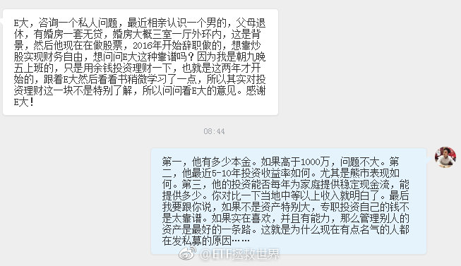

======================================================

ETF拯救世界 (5687069307) @
2019-01-30 08:49:31 Wed  
url: https://weibo.com/5687069307/HeiEz34bC

回复@MaLX74624:十倍等于2的10次方等于1024？？？你们对于“十倍股”是不是有什么误会？？？//@MaLX74624:回复@guoqiao:翻n倍等于原值乘以2的N次方

------------------------------------------------------
转推：
>  @ETF拯救世界 (5687069307)
>  2019-01-30 07:52:52 Wed  
>  url: https:/weibo.com/5687069307/HeihziSBm/

>  买东西看最近表现是极其短视的。
>  
>  2014年7月，创业板比2012年底翻了两倍，50还跌了。那时候你会不会说50是辣鸡？
>  
>  我特别讨厌谁好就追谁，谁倒霉了就假装不认识。
>  
>  我就喜欢你落难我来帮你，你富贵我转身离开。做投资，做人，都是如此。
>  
>  你感受一下。 
>  
>  道不同不相为谋，以后理念不同的直接拉黑，各生 ​​​

转发[6]  评论[70]  赞[152] 

======================================================

ETF拯救世界 (5687069307) @
2019-01-30 09:34:42 Wed  
url: https://weibo.com/5687069307/HeiWUaGvB

正常的市场本来就应该有几百块的股票，也应该有大量几毛钱甚至几分钱的股票。

频繁爆雷，频繁跌停都是正常现象。 ​​​

转发[59]  评论[60]  赞[288] 

======================================================

ETF拯救世界 (5687069307) @
2019-01-30 09:42:00 Wed  
url: https://weibo.com/5687069307/HeiZRBjG5

回复@小狗上马路:别嘴炮。让看空的把做空IC的图贴上来。//@小狗上马路:昨天雪球好多人担心中证500大跌，怎么今天没反应[汗]就等今明两天了，加油

------------------------------------------------------
转推：
>  @ETF拯救世界 (5687069307)
>  2019-01-30 09:34:42 Wed  
>  url: https:/weibo.com/5687069307/HeiWUaGvB/

>  正常的市场本来就应该有几百块的股票，也应该有大量几毛钱甚至几分钱的股票。
>  
>  频繁爆雷，频繁跌停都是正常现象。 ​​​

转发[38]  评论[27]  赞[153] 

======================================================

ETF拯救世界 (5687069307) @
2019-01-30 09:50:09 Wed  
url: https://weibo.com/5687069307/Hej3bhmsM

回复@某同学321:1-2，明天中午吧。明天大概率拉升，不过一两车问题不大。//@某同学321:E大，这次发几车呀//@ETF拯救世界:回复@小狗上马路:别嘴炮。让看空的把做空IC的图贴上来。//@小狗上马路:昨天雪球好多人担心中证500大跌，怎么今天没反应[汗]就等今明两天了，加油

------------------------------------------------------
转推：
>  @ETF拯救世界 (5687069307)
>  2019-01-30 09:34:42 Wed  
>  url: https:/weibo.com/5687069307/HeiWUaGvB/

>  正常的市场本来就应该有几百块的股票，也应该有大量几毛钱甚至几分钱的股票。
>  
>  频繁爆雷，频繁跌停都是正常现象。 ​​​

转发[33]  评论[51]  赞[182] 

======================================================

ETF拯救世界 (5687069307) @
2019-01-30 09:51:36 Wed  
url: https://weibo.com/5687069307/Hej3LlK9v

回复@愿赌服输K:在美国，在欧洲，长期看都是小盘股跑赢大盘股。凭什么未来A股小盘股无法重现辉煌呢？现在只是不够便宜而已。人云亦云真的非常可怕，我建议大家一定要有独立思考的精神。

------------------------------------------------------
转推：
>  @ETF拯救世界 (5687069307)
>  2019-01-30 07:52:52 Wed  
>  url: https:/weibo.com/5687069307/HeihziSBm/

>  买东西看最近表现是极其短视的。
>  
>  2014年7月，创业板比2012年底翻了两倍，50还跌了。那时候你会不会说50是辣鸡？
>  
>  我特别讨厌谁好就追谁，谁倒霉了就假装不认识。
>  
>  我就喜欢你落难我来帮你，你富贵我转身离开。做投资，做人，都是如此。
>  
>  你感受一下。 
>  
>  道不同不相为谋，以后理念不同的直接拉黑，各生 ​​​

转发[41]  评论[49]  赞[285] 

======================================================

ETF拯救世界 (5687069307) @
2019-01-30 09:54:38 Wed  
url: https://weibo.com/5687069307/Hej50a9ob

如果你看了3-5年财经论坛，微博之类的，还没发现一半（至少）财经类的v都是水货（包括我），那你就是水货。

水货说的很多东西能信吗你自己说说。

独   立   思   考   ！ ​​​

转发[30]  评论[218]  赞[354] 

======================================================

ETF拯救世界 (5687069307) @
2019-01-30 10:21:36 Wed  
url: https://weibo.com/5687069307/HejfWzXU5

钓鱼成功。说我不行的都拉黑了。[拜拜]

------------------------------------------------------
转推：
>  @ETF拯救世界 (5687069307)
>  2019-01-30 09:54:38 Wed  
>  url: https:/weibo.com/5687069307/Hej50a9ob/

>  如果你看了3-5年财经论坛，微博之类的，还没发现一半（至少）财经类的v都是水货（包括我），那你就是水货。
>  
>  水货说的很多东西能信吗你自己说说。
>  
>  独   立   思   考   ！ ​​​

转发[2]  评论[157]  赞[347] 

======================================================

ETF拯救世界 (5687069307) @
2019-01-30 11:10:04 Wed  
url: https://weibo.com/5687069307/HejzC6JPF

好好的一个熊市，看评论被你们一个个整的跟个牛市似的。

喷了。

还有没有一点熊市样子了，一点尊严都没有了。 ​​​

转发[9]  评论[165]  赞[479] 

======================================================

ETF拯救世界 (5687069307) @
2019-01-30 11:56:06 Wed  
url: https://weibo.com/5687069307/HejSiqCY9

回复@一溜烟儿_:因为我是投资博主。感情的事儿问咪蒙和陆琪去了。//@一溜烟儿_:回复@Insulation_NS:不懂为什么相亲只谈钱？

------------------------------------------------------
转推：
>  @ETF拯救世界 (5687069307)
>  2019-01-30 08:45:19 Wed  
>  url: https:/weibo.com/5687069307/HeiCRhE9I/

>  关于这个问题，我这样回答。 ​​​

转发[3]  评论[80]  赞[169] 

======================================================

ETF拯救世界 (5687069307) @
2019-01-30 12:59:17 Wed  
url: https://weibo.com/5687069307/HekhWsmfZ

有没有复旦和浙大的录取比例。哪个学校不是本地生源多。

------------------------------------------------------
转推：
>  @闻风教育直播 (1826854303)
>  2019-01-30 10:38:46 Wed  
>  url: https:/weibo.com/1826854303/HejmUjIEK/

>  【考上清华大学到底有多难】以2017年数据为准，录取率最高的地区是北京，每1000名考生，约有5名可考入清华，录取率约0.5%。北京、上海、天津位列全国前三。贵州省考进清华最难，每1万名考生仅有1.5名能进入清华，录取率仅0.015%。以下是全国清华大学录取率排序。 ​​​

转发[25]  评论[67]  赞[120] 

======================================================

ETF拯救世界 (5687069307) @
2019-01-30 13:33:27 Wed  
url: https://weibo.com/5687069307/HekvOkR74

回复@难道我是啊qiu:2018年，学校计划招生6410人，其中浙江省内计划招生3100人，招生规模与2017年持平。//@难道我是啊qiu:浙大对浙江人貌似一视同仁（一个杭州人的道听途说）//@ETF拯救世界:有没有复旦和浙大的录取比例。哪个学校不是本地生源多。

------------------------------------------------------
转推：
>  @闻风教育直播 (1826854303)
>  2019-01-30 10:38:46 Wed  
>  url: https:/weibo.com/1826854303/HejmUjIEK/

>  【考上清华大学到底有多难】以2017年数据为准，录取率最高的地区是北京，每1000名考生，约有5名可考入清华，录取率约0.5%。北京、上海、天津位列全国前三。贵州省考进清华最难，每1万名考生仅有1.5名能进入清华，录取率仅0.015%。以下是全国清华大学录取率排序。 ​​​

转发[18]  评论[53]  赞[94] 

======================================================

ETF拯救世界 (5687069307) @
2019-01-30 13:40:23 Wed  
url: https://weibo.com/5687069307/HekyDk3uR

回复@bear_宋:隔壁陕西还有8所呢。另一边隔壁河北是不是一所都没有，忘了……河北考生才是惨。//@bear_宋:所有学校都会对本地生源有倾斜，问题在于北京有26所211，而人口大省河南只有一所211。

------------------------------------------------------
转推：
>  @闻风教育直播 (1826854303)
>  2019-01-30 10:38:46 Wed  
>  url: https:/weibo.com/1826854303/HejmUjIEK/

>  【考上清华大学到底有多难】以2017年数据为准，录取率最高的地区是北京，每1000名考生，约有5名可考入清华，录取率约0.5%。北京、上海、天津位列全国前三。贵州省考进清华最难，每1万名考生仅有1.5名能进入清华，录取率仅0.015%。以下是全国清华大学录取率排序。 ​​​

转发[13]  评论[120]  赞[139] 

======================================================

ETF拯救世界 (5687069307) @
2019-01-30 21:23:08 Wed  
url: https://weibo.com/5687069307/HenAsl3zu

刚才又看到有人说，最近这么爆雷，500的数据会很难看。

把我吓得赶紧滚去算数据：

截至今日，中证500有287家公司公布业绩预告。

按照预告净利润增长下限计算，有134家业绩下降，有146家利润上升，其余不变。

按照净利润增长上限计算，有101家业绩下降，有186家业绩上升，

怎么看都是利润增长的公 ​​​

转发[65]  评论[111]  赞[412] 

======================================================

ETF拯救世界 (5687069307) @
2019-01-30 21:32:35 Wed  
url: https://weibo.com/5687069307/HenEicoFN

11月5日：[微笑] ​​​

转发[21]  评论[75]  赞[393] 

+++++++++++++++++++++++++++++++++++++++++++++++++++++

图片：
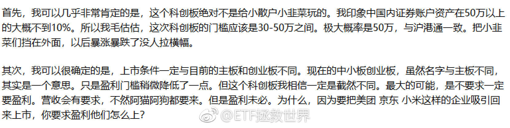

======================================================

ETF拯救世界 (5687069307) @
2019-01-30 21:55:17 Wed  
url: https://weibo.com/5687069307/HenNvnQ8m

现在还10送10的绩差股我真不知道是怎么想的。这种我觉得就是希望自己早日退市。 ​​​

转发[4]  评论[17]  赞[257] 

======================================================

ETF拯救世界 (5687069307) @
2019-01-30 21:59:47 Wed  
url: https://weibo.com/5687069307/HenPkyjUx

标普500pb大概是3倍多一点。纳斯达克100大概是5倍多一点。英国100两倍多。印度3倍。

中证500即将跌破1.5倍（历史最低1.3x）。连传媒都1.8了。我其实很好奇，这么洗传媒年报出来会怎样…… ​​​

转发[92]  评论[89]  赞[346] 

======================================================

ETF拯救世界 (5687069307) @
2019-01-30 22:46:24 Wed  
url: https://weibo.com/5687069307/Heo8fCA6S

回复@化工_达人:500最高市值502亿，最低31亿。中位数115亿。500并不是单纯以市值为标准的。//@化工_达人:今天好奇中证500成份股的市值，印象中平均在百亿以上，刚随便看了几十只股票，发现很多都是60亿左右，最低的有看到40多亿的，是不是跌太惨了，按理说50亿很难进入指数了吧……

------------------------------------------------------
转推：
>  @ETF拯救世界 (5687069307)
>  2019-01-30 21:59:47 Wed  
>  url: https:/weibo.com/5687069307/HenPkyjUx/

>  标普500pb大概是3倍多一点。纳斯达克100大概是5倍多一点。英国100两倍多。印度3倍。
>  
>  中证500即将跌破1.5倍（历史最低1.3x）。连传媒都1.8了。我其实很好奇，这么洗传媒年报出来会怎样…… ​​​

转发[17]  评论[49]  赞[181] 

======================================================

ETF拯救世界 (5687069307) @
2019-01-30 23:15:06 Wed  
url: https://weibo.com/5687069307/HeojUaedf

回复@ETF拯救世界:资本市场就这么点事，只要知道对方想干什么就能猜出下一步出什么招数了。//@ETF拯救世界:另外，认为科创板会大幅拉低主板市场估值的，我觉得可能想多了。科创板一半以上上市公司我估计是亏损的，市盈率是负的。你想让他们拉低谁的估值？

------------------------------------------------------
转推：
>  @ETF拯救世界 (5687069307)
>  2018-11-05 15:20:20 Mon  
>  url: https:/weibo.com/5687069307/H1gsuuRDH/

>  科创板，我预计投资者门槛在30-50万之间。大概率是50万。 ​​​

转发[19]  评论[43]  赞[250] 

======================================================

ETF拯救世界 (5687069307) @
2019-01-31 07:19:53 Thu  
url: https://weibo.com/5687069307/HeruG8GLu

有没有加快。不出什么问题的话后续工作还会更快//@ETF拯救世界:回复@骑烤猪的星星:想多了。很明显领导对上一任直接融资这一块很不满意。CDR搁浅，科创迟迟没有进展。可以预见，未来直接融资规模将快速扩大，各项工作推进速度也将加快。

------------------------------------------------------
转推：
>  @ETF拯救世界 (5687069307)
>  2019-01-26 20:52:09 Sat  
>  url: https:/weibo.com/5687069307/HdLFTpwKS/

>  我个人认为，就我所经历的几位，尚、郭、肖、刘，都挺好。
>  
>  肯定是有不足，但关键是，很多事情真不是他们能决定的。这个位置真的很难。几位还都是做了事情的。
>  
>  个人感觉，这个位置比足协主席难太多了。足协主席很多事情干不好那真是该骂…… ​​​

转发[6]  评论[45]  赞[189] 

======================================================

ETF拯救世界 (5687069307) @
2019-01-31 08:57:36 Thu  
url: https://weibo.com/5687069307/Hes8kAeze

回复@w__rain:十几个点的仓位还用不着这么打气。踏实点。//@w__rain:如今商誉减值，中证500的pb一下子应该高出一大截吧，所谓跌着跌着，估值就高了。看来中证500还没走到下跌的尽头，还有很大的下跌空间，我们不要悲观啊。

------------------------------------------------------
转推：
>  @ETF拯救世界 (5687069307)
>  2019-01-30 21:59:47 Wed  
>  url: https:/weibo.com/5687069307/HenPkyjUx/

>  标普500pb大概是3倍多一点。纳斯达克100大概是5倍多一点。英国100两倍多。印度3倍。
>  
>  中证500即将跌破1.5倍（历史最低1.3x）。连传媒都1.8了。我其实很好奇，这么洗传媒年报出来会怎样…… ​​​

转发[3]  评论[35]  赞[184] 

======================================================

ETF拯救世界 (5687069307) @
2019-01-31 09:38:17 Thu  
url: https://weibo.com/5687069307/HesoRmEZ9

新闻和传媒，只会报道那些“不寻常”的事。有人为了抓眼球，有人为了其他的目的。

洗澡的，爆雷的有没有。有。

有多少，现在还不知道。有没有全部上市公司的10%？很难。

现在两市3600家公司，有没有360家爆雷？

冷静点。理智点。独立思考。 ​​​

转发[45]  评论[74]  赞[299] 

======================================================

ETF拯救世界 (5687069307) @
2019-01-31 09:39:22 Thu  
url: https://weibo.com/5687069307/HespihomZ

人生的无奈就是知道的太多。心累。//@ETF拯救世界:回复@某同学321:1-2，明天中午吧。明天大概率拉升，不过一两车问题不大。//@某同学321:E大，这次发几车呀//@ETF拯救世界:回复@小狗上马路:别嘴炮。让看空的把做空IC的图贴上来。

------------------------------------------------------
转推：
>  @ETF拯救世界 (5687069307)
>  2019-01-30 09:34:42 Wed  
>  url: https:/weibo.com/5687069307/HeiWUaGvB/

>  正常的市场本来就应该有几百块的股票，也应该有大量几毛钱甚至几分钱的股票。
>  
>  频繁爆雷，频繁跌停都是正常现象。 ​​​

转发[26]  评论[95]  赞[229] 

======================================================

ETF拯救世界 (5687069307) @
2019-01-31 10:13:01 Thu  
url: https://weibo.com/5687069307/HesCX93o8

任何一个市场都有辣鸡。你知不知道美股很多年份退市的公司比上市的多。

港股就不用说了，辣鸡遍地。

影响这些市场一路走高吗。

不影响。

有几个辣鸡有什么奇怪的？多大点事儿啊。

只是，那些重仓辣鸡的股民牺牲了。 ​​​

转发[48]  评论[84]  赞[366] 

======================================================

ETF拯救世界 (5687069307) @
2019-01-31 10:30:33 Thu  
url: https://weibo.com/5687069307/HesK4kIyG

回复@愿赌服输K:因为我遵守规则。这也是我开开心心在市场里活着的原因。//@愿赌服输K:不是抬杠啊…既然知道今天拉伸的概率大，为啥没有昨天发车呢…是因为今天要买的品种昨天买不确定性很大吗？//@ETF拯救世界:人生的无奈就是知道的太多。心累。

------------------------------------------------------
转推：
>  @ETF拯救世界 (5687069307)
>  2019-01-30 09:34:42 Wed  
>  url: https:/weibo.com/5687069307/HeiWUaGvB/

>  正常的市场本来就应该有几百块的股票，也应该有大量几毛钱甚至几分钱的股票。
>  
>  频繁爆雷，频繁跌停都是正常现象。 ​​​

转发[24]  评论[62]  赞[311] 

======================================================

ETF拯救世界 (5687069307) @
2019-01-31 10:43:30 Thu  
url: https://weibo.com/5687069307/HesPkiis1

有没有人告诉我为什么现在的人喜欢看这些东西。

------------------------------------------------------
转推：
>  @stage1st宅社区 (5955106173)
>  2019-01-31 10:29:35 Thu  
>  url: https:/weibo.com/5955106173/HesJG6a6h/

>  咪蒙真是肥宅的快乐杯。[二哈]我，38岁，不想活，不敢死。我每天加班到死，存款还是0。今晚，我杀死了我妈妈唯一的孩子。我曾经想过让我父母去死。我以为我会死在日本。结果因为胖，我捅死我自己。名校毕业，年薪30万，猝死。那个孝顺的学霸，从22楼跳下去了！ ​​​

转发[16]  评论[182]  赞[143] 

======================================================

ETF拯救世界 (5687069307) @
2019-01-31 10:54:30 Thu  
url: https://weibo.com/5687069307/HesTN7Vrs

想到不要脸，没想到这么不要脸。

NB你就拉5%。

[打脸] ​​​

转发[2]  评论[165]  赞[325] 

======================================================

ETF拯救世界 (5687069307) @
2019-01-31 13:50:45 Thu  
url: https://weibo.com/5687069307/Heu3ksGoj

中证1000目前估值25，历史最低2008年是19倍。所以目前只是小盘股正常挤泡沫而已。

没什么好吃惊的。甚至连2008年都没跌破。 ​​​

转发[41]  评论[122]  赞[352] 

======================================================

ETF拯救世界 (5687069307) @
2019-01-31 15:03:30 Thu  
url: https://weibo.com/5687069307/HeuwRnLDn

有件事忘了说。

爱你们。

[爱你] ​​​

转发[9]  评论[474]  赞[1253] 

======================================================

ETF拯救世界 (5687069307) @
2019-01-31 16:36:22 Thu  
url: https://weibo.com/5687069307/Hev8yolPI

转发微博

------------------------------------------------------
转推：
>  @张道达 (2032628220)
>  2019-01-31 16:20:04 Thu  
>  url: https:/weibo.com/2032628220/Hev1Wi5Jk/

>  【年报业绩预告即将收官 沪市公司逾九成盈利】1月31日是年报业绩预告截止日，截至此时，沪市有近550家公司披露了2018年度业绩预告，其中预增、预盈公司约310家，预减公司约130家，预亏公司约110家。扣除本次预亏的公司，沪市仍有约1350家左右实现盈利，占比90%以上。总体看，2018年上市公司受整体经济 ​​​

转发[21]  评论[44]  赞[199] 

======================================================

ETF拯救世界 (5687069307) @
2019-01-31 18:51:59 Thu  
url: https://weibo.com/5687069307/Hew1BkJLy

回复@陈中围脖:大家是谁？你要在股市和大家都想法一样了，那你得多平庸啊//@陈中围脖:看球球上，大家把500说的一文不值....//@ETF拯救世界:转发微博

------------------------------------------------------
转推：
>  @张道达 (2032628220)
>  2019-01-31 16:20:04 Thu  
>  url: https:/weibo.com/2032628220/Hev1Wi5Jk/

>  【年报业绩预告即将收官 沪市公司逾九成盈利】1月31日是年报业绩预告截止日，截至此时，沪市有近550家公司披露了2018年度业绩预告，其中预增、预盈公司约310家，预减公司约130家，预亏公司约110家。扣除本次预亏的公司，沪市仍有约1350家左右实现盈利，占比90%以上。总体看，2018年上市公司受整体经济 ​​​

转发[7]  评论[37]  赞[197] 

======================================================

ETF拯救世界 (5687069307) @
2019-01-31 18:58:46 Thu  
url: https://weibo.com/5687069307/Hew4m8oCM

从现在开始，谁再没完没了的问500直接拉黑。

担心你就卖掉，不担心就拿着这不到15%的仓位等风来。

什么都不懂就去研究，看谁说不好就找谁报团儿去。

跟这么一帮人做队友一起打仗真是见鬼了。 ​​​

转发[52]  评论[233]  赞[498] 

======================================================

ETF拯救世界 (5687069307) @
2019-01-31 19:45:15 Thu  
url: https://weibo.com/5687069307/HewndEEw0

截至今日，有295家中证500成分股公布业绩预报。

以上限计算，有181家业绩预增，增幅中位数50%。

有114家预减，预减幅度中位数83%。主要原因为有50家公司预减100%以上。

500是一个分布极其平均的指数，占比最大的成分股占指数配比为0.6%。第十位只有0.4%，大部分公司占比不到0.3%。

目前PE18倍，PB1 ​​​

转发[217]  评论[193]  赞[477] 

======================================================

ETF拯救世界 (5687069307) @
2019-01-31 19:50:45 Thu  
url: https://weibo.com/5687069307/HewpsgMc6

回复@资本暴利狂徒:控制好仓位。目前计划里面的500仓位很合适。一个组合里面，大中小指数配置都不能太多，合适就是最好的。//@资本暴利狂徒:E大别理那些傻子，大过年的，讲点开心的，我明天就买三车500[doge]

------------------------------------------------------
转推：
>  @ETF拯救世界 (5687069307)
>  2019-01-31 18:58:46 Thu  
>  url: https:/weibo.com/5687069307/Hew4m8oCM/

>  从现在开始，谁再没完没了的问500直接拉黑。
>  
>  担心你就卖掉，不担心就拿着这不到15%的仓位等风来。
>  
>  什么都不懂就去研究，看谁说不好就找谁报团儿去。
>  
>  跟这么一帮人做队友一起打仗真是见鬼了。 ​​​

转发[19]  评论[63]  赞[291] 

======================================================

ETF拯救世界 (5687069307) @
2019-02-01 07:18:48 Fri  
url: https://weibo.com/5687069307/HeAUJtzfm

回复@追求确定性2:你以为之前计划加仓恒生是因为什么呢//@追求确定性2:想起来看一眼腾讯, 涨得不错啊。

------------------------------------------------------
转推：
>  @ETF拯救世界 (5687069307)
>  2019-01-31 19:45:15 Thu  
>  url: https:/weibo.com/5687069307/HewndEEw0/

>  截至今日，有295家中证500成分股公布业绩预报。
>  
>  以上限计算，有181家业绩预增，增幅中位数50%。
>  
>  有114家预减，预减幅度中位数83%。主要原因为有50家公司预减100%以上。
>  
>  500是一个分布极其平均的指数，占比最大的成分股占指数配比为0.6%。第十位只有0.4%，大部分公司占比不到0.3%。
>  
>  目前PE18倍，PB1 ​​​

转发[19]  评论[49]  赞[223] 

======================================================

ETF拯救世界 (5687069307) @
2019-02-01 09:12:32 Fri  
url: https://weibo.com/5687069307/HeBEUe156

回复@HAPPY-ETF:更是恒生第一大成分股。占比超过10%。//@HAPPY-ETF:腾讯是中概互联的成分股吧?//@ETF拯救世界:回复@追求确定性2:你以为之前计划加仓恒生是因为什么呢//@追求确定性2:想起来看一眼腾讯, 涨得不错啊。

------------------------------------------------------
转推：
>  @ETF拯救世界 (5687069307)
>  2019-01-31 19:45:15 Thu  
>  url: https:/weibo.com/5687069307/HewndEEw0/

>  截至今日，有295家中证500成分股公布业绩预报。
>  
>  以上限计算，有181家业绩预增，增幅中位数50%。
>  
>  有114家预减，预减幅度中位数83%。主要原因为有50家公司预减100%以上。
>  
>  500是一个分布极其平均的指数，占比最大的成分股占指数配比为0.6%。第十位只有0.4%，大部分公司占比不到0.3%。
>  
>  目前PE18倍，PB1 ​​​

转发[14]  评论[10]  赞[169] 

======================================================

ETF拯救世界 (5687069307) @
2019-02-01 09:29:55 Fri  
url: https://weibo.com/5687069307/HeBLXeQRE

有朋友在评论说，希望500大涨打他们的脸。

我不这么想。

咱们到市场上来投资，不是为了争谁更厉害，而是为了赚钱。踏踏实实把自己该赚的钱赚到，就够了。

能力不足的人，市场会教育他。不需要你我动手。以后无论如何，胜不骄，气不馁，继续开开心心做自己的投资。

我只是为很多人感到惋惜。

因为 ​​​

转发[230]  评论[211]  赞[725] 

======================================================

ETF拯救世界 (5687069307) @
2019-02-01 09:34:55 Fri  
url: https://weibo.com/5687069307/HeBNZ9vhP

有些人的最大乐趣，不是研究怎么能让自己过得好，而是每天盼着别人倒霉。你说奇怪不奇怪。

------------------------------------------------------
转推：
>  @ETF拯救世界 (5687069307)
>  2019-02-01 09:29:55 Fri  
>  url: https:/weibo.com/5687069307/HeBLXeQRE/

>  有朋友在评论说，希望500大涨打他们的脸。
>  
>  我不这么想。
>  
>  咱们到市场上来投资，不是为了争谁更厉害，而是为了赚钱。踏踏实实把自己该赚的钱赚到，就够了。
>  
>  能力不足的人，市场会教育他。不需要你我动手。以后无论如何，胜不骄，气不馁，继续开开心心做自己的投资。
>  
>  我只是为很多人感到惋惜。
>  
>  因为 ​​​

转发[58]  评论[46]  赞[220] 

======================================================

ETF拯救世界 (5687069307) @
2019-02-01 09:40:08 Fri  
url: https://weibo.com/5687069307/HeBQ6CA66

回复@fankezhou:暴涨。//@fankezhou:农历年最后一个交易日，蚂蚁积分怎么压[笑而不语]@ETF拯救世界//@ETF拯救世界:有些人的最大乐趣，不是研究怎么能让自己过得好，而是每天盼着别人倒霉。你说奇怪不奇怪。

------------------------------------------------------
转推：
>  @ETF拯救世界 (5687069307)
>  2019-02-01 09:29:55 Fri  
>  url: https:/weibo.com/5687069307/HeBLXeQRE/

>  有朋友在评论说，希望500大涨打他们的脸。
>  
>  我不这么想。
>  
>  咱们到市场上来投资，不是为了争谁更厉害，而是为了赚钱。踏踏实实把自己该赚的钱赚到，就够了。
>  
>  能力不足的人，市场会教育他。不需要你我动手。以后无论如何，胜不骄，气不馁，继续开开心心做自己的投资。
>  
>  我只是为很多人感到惋惜。
>  
>  因为 ​​​

转发[45]  评论[31]  赞[171] 

======================================================

ETF拯救世界 (5687069307) @
2019-02-01 09:46:56 Fri  
url: https://weibo.com/5687069307/HeBSRpdBs

回复@子晏_2016:只有小孩才纠结：我该买50还是500？作为一个成年人，我要说：“我都要！”//@子晏_2016:小孩眼里才有对错，年纪一大把还在分对错，只能说经历的太少，完全没有阅历。 世界是五彩缤纷的，为何总要盯着黑白呢

------------------------------------------------------
转推：
>  @ETF拯救世界 (5687069307)
>  2019-02-01 09:29:55 Fri  
>  url: https:/weibo.com/5687069307/HeBLXeQRE/

>  有朋友在评论说，希望500大涨打他们的脸。
>  
>  我不这么想。
>  
>  咱们到市场上来投资，不是为了争谁更厉害，而是为了赚钱。踏踏实实把自己该赚的钱赚到，就够了。
>  
>  能力不足的人，市场会教育他。不需要你我动手。以后无论如何，胜不骄，气不馁，继续开开心心做自己的投资。
>  
>  我只是为很多人感到惋惜。
>  
>  因为 ​​​

转发[13]  评论[42]  赞[223] 

======================================================

ETF拯救世界 (5687069307) @
2019-02-01 09:53:19 Fri  
url: https://weibo.com/5687069307/HeBVrxIfX

今天500的涨幅是300的286%，50甚至跌了。

但这并不代表什么。

500也许还会继续跌。

但在这个位置开始，未来5-10年500如果不出现至少一次年化10%甚至15%以上的时刻，我会比较惊讶。 ​​​

转发[108]  评论[128]  赞[370] 

======================================================

ETF拯救世界 (5687069307) @
2019-02-01 10:08:22 Fri  
url: https://weibo.com/5687069307/HeC1z0VmS

回复@火尔亮:新朋友吧。我这里都是越跌越高兴的。不过最近好点了，老中医疗效不错，上涨也开心的人多了。//@火尔亮:回复@唐山黄金名表名包回收典当:你是脑子有问题吗

------------------------------------------------------
转推：
>  @ETF拯救世界 (5687069307)
>  2019-02-01 09:53:19 Fri  
>  url: https:/weibo.com/5687069307/HeBVrxIfX/

>  今天500的涨幅是300的286%，50甚至跌了。
>  
>  但这并不代表什么。
>  
>  500也许还会继续跌。
>  
>  但在这个位置开始，未来5-10年500如果不出现至少一次年化10%甚至15%以上的时刻，我会比较惊讶。 ​​​

转发[3]  评论[39]  赞[194] 

======================================================

ETF拯救世界 (5687069307) @
2019-02-01 10:23:49 Fri  
url: https://weibo.com/5687069307/HeC7PeSxg

送给大家的第一份春节礼物：

目前计划的三层资产配置图。

从图上你可以看出，500涨跌对整个计划来说并不是那么重要。未来就算雷个外焦里嫩，也无所谓。这个，可能很多看笑话的人要失望了。

另外，以后这个图会每个月发车的时候更新。在一定程度上，这张图已经触及到计划的核心。

感谢小助理zwt帮忙 ​​​

转发[416]  评论[483]  赞[1793] 

+++++++++++++++++++++++++++++++++++++++++++++++++++++

图片：

======================================================

ETF拯救世界 (5687069307) @
2019-02-01 10:29:50 Fri  
url: https://weibo.com/5687069307/HeCah9llm

回复@北京盛产义和团:500平均市值100亿，最大成分股市值300亿，最小30亿。目前是彻底的中小盘指数。主要是这两年跌的太快，调整指数成分都来不及把跌到几十亿的股票调出去。//@北京盛产义和团:E大，500能算中小盘吗？

------------------------------------------------------
转推：
>  @ETF拯救世界 (5687069307)
>  2019-02-01 10:23:49 Fri  
>  url: https:/weibo.com/5687069307/HeC7PeSxg/

>  送给大家的第一份春节礼物：
>  
>  目前计划的三层资产配置图。
>  
>  从图上你可以看出，500涨跌对整个计划来说并不是那么重要。未来就算雷个外焦里嫩，也无所谓。这个，可能很多看笑话的人要失望了。
>  
>  另外，以后这个图会每个月发车的时候更新。在一定程度上，这张图已经触及到计划的核心。
>  
>  感谢小助理zwt帮忙 ​​​

转发[35]  评论[64]  赞[258] 

======================================================

ETF拯救世界 (5687069307) @
2019-02-01 13:08:56 Fri  
url: https://weibo.com/5687069307/HeDcR3LvO

回复@morninggloy:不能。因为钱只够买一手。//@morninggloy:这就和以前一群人纠结是买格力还是美的一样，互相对杠，难道就不能一样买一半吗？

------------------------------------------------------
转推：
>  @ETF拯救世界 (5687069307)
>  2019-02-01 09:29:55 Fri  
>  url: https:/weibo.com/5687069307/HeBLXeQRE/

>  有朋友在评论说，希望500大涨打他们的脸。
>  
>  我不这么想。
>  
>  咱们到市场上来投资，不是为了争谁更厉害，而是为了赚钱。踏踏实实把自己该赚的钱赚到，就够了。
>  
>  能力不足的人，市场会教育他。不需要你我动手。以后无论如何，胜不骄，气不馁，继续开开心心做自己的投资。
>  
>  我只是为很多人感到惋惜。
>  
>  因为 ​​​

转发[5]  评论[44]  赞[184] 

======================================================

ETF拯救世界 (5687069307) @
2019-02-01 13:14:33 Fri  
url: https://weibo.com/5687069307/HeDf8Agzq

回复@渝夏夜的微风-hc:无所谓。信心动摇就卖。我从来不会为了坚定别人信心做什么。我只说我的认知。每个人都有自己的命运，都是自己做选择，别人改变不了你的命运。

------------------------------------------------------
转推：
>  @ETF拯救世界 (5687069307)
>  2019-01-31 19:45:15 Thu  
>  url: https:/weibo.com/5687069307/HewndEEw0/

>  截至今日，有295家中证500成分股公布业绩预报。
>  
>  以上限计算，有181家业绩预增，增幅中位数50%。
>  
>  有114家预减，预减幅度中位数83%。主要原因为有50家公司预减100%以上。
>  
>  500是一个分布极其平均的指数，占比最大的成分股占指数配比为0.6%。第十位只有0.4%，大部分公司占比不到0.3%。
>  
>  目前PE18倍，PB1 ​​​

转发[10]  评论[10]  赞[206] 

======================================================

ETF拯救世界 (5687069307) @
2019-02-01 13:18:17 Fri  
url: https://weibo.com/5687069307/HeDgEA3q9

这句话我看很多人还根本没理解。

------------------------------------------------------
转推：
>  @ETF拯救世界 (5687069307)
>  2019-01-30 09:54:38 Wed  
>  url: https:/weibo.com/5687069307/Hej50a9ob/

>  如果你看了3-5年财经论坛，微博之类的，还没发现一半（至少）财经类的v都是水货（包括我），那你就是水货。
>  
>  水货说的很多东西能信吗你自己说说。
>  
>  独   立   思   考   ！ ​​​

转发[8]  评论[37]  赞[202] 

======================================================

ETF拯救世界 (5687069307) @
2019-02-01 13:22:47 Fri  
url: https://weibo.com/5687069307/HeDitqY8z

回复@A夜如故:很大。因为如果没差别了他们会太闲引起社会动荡。没事儿在球球吵架总比出去闹事强，利好社会稳定。//@A夜如故:美的格力在球球真的好多人争，买哪个好像差别不大//@ETF拯救世界:回复@morninggloy:不能。因为钱只够买一手。

------------------------------------------------------
转推：
>  @ETF拯救世界 (5687069307)
>  2019-02-01 09:29:55 Fri  
>  url: https:/weibo.com/5687069307/HeBLXeQRE/

>  有朋友在评论说，希望500大涨打他们的脸。
>  
>  我不这么想。
>  
>  咱们到市场上来投资，不是为了争谁更厉害，而是为了赚钱。踏踏实实把自己该赚的钱赚到，就够了。
>  
>  能力不足的人，市场会教育他。不需要你我动手。以后无论如何，胜不骄，气不馁，继续开开心心做自己的投资。
>  
>  我只是为很多人感到惋惜。
>  
>  因为 ​​​

转发[1]  评论[17]  赞[177] 

======================================================

ETF拯救世界 (5687069307) @
2019-02-01 13:36:27 Fri  
url: https://weibo.com/5687069307/HeDo1nPa2

不够暴，很失望。对自己产生怀疑。//@ETF拯救世界:回复@fankezhou:暴涨。//@fankezhou:农历年最后一个交易日，蚂蚁积分怎么压[笑而不语]@ETF拯救世界//@ETF拯救世界:有些人的最大乐趣，不是研究怎么能让自己过得好，而是每天盼着别人倒霉。你说奇怪不奇怪。

------------------------------------------------------
转推：
>  @ETF拯救世界 (5687069307)
>  2019-02-01 09:29:55 Fri  
>  url: https:/weibo.com/5687069307/HeBLXeQRE/

>  有朋友在评论说，希望500大涨打他们的脸。
>  
>  我不这么想。
>  
>  咱们到市场上来投资，不是为了争谁更厉害，而是为了赚钱。踏踏实实把自己该赚的钱赚到，就够了。
>  
>  能力不足的人，市场会教育他。不需要你我动手。以后无论如何，胜不骄，气不馁，继续开开心心做自己的投资。
>  
>  我只是为很多人感到惋惜。
>  
>  因为 ​​​

转发[19]  评论[51]  赞[177] 

======================================================

ETF拯救世界 (5687069307) @
2019-02-01 13:48:19 Fri  
url: https://weibo.com/5687069307/HeDsQ8Hg6

回复@guderianlhx:为什么昨天发车呢，蒙的。//@guderianlhx:明明是长线投资思维，为啥看短线这么准，预测N次都是对的//@ETF拯救世界:不够暴，很失望。对自己产生怀疑。//@ETF拯救世界:回复@fankezhou:暴涨。//@fankezhou:农历年最后一个交易日，蚂蚁积分怎么压[笑而不语]@ETF拯救世界

------------------------------------------------------
转推：
>  @ETF拯救世界 (5687069307)
>  2019-02-01 09:29:55 Fri  
>  url: https:/weibo.com/5687069307/HeBLXeQRE/

>  有朋友在评论说，希望500大涨打他们的脸。
>  
>  我不这么想。
>  
>  咱们到市场上来投资，不是为了争谁更厉害，而是为了赚钱。踏踏实实把自己该赚的钱赚到，就够了。
>  
>  能力不足的人，市场会教育他。不需要你我动手。以后无论如何，胜不骄，气不馁，继续开开心心做自己的投资。
>  
>  我只是为很多人感到惋惜。
>  
>  因为 ​​​

转发[5]  评论[53]  赞[206] 

======================================================

ETF拯救世界 (5687069307) @
2019-02-01 13:57:26 Fri  
url: https://weibo.com/5687069307/HeDwxpx09

另外我再跟你们说个一定要注意的，这条一定要收藏。

就是

在底部，无论是指数还是个股，跌了很久以后，很多很多时候会爆个特别大的雷。就是雪上加霜那种。

会让很多本来已经神经衰弱的人最终彻底放弃交出筹码。

而那天

有可能就是

世纪大底 ​​​

转发[480]  评论[363]  赞[938] 

======================================================

ETF拯救世界 (5687069307) @
2019-02-01 14:00:29 Fri  
url: https://weibo.com/5687069307/HeDxMzfX1

回复@Hello我的001:一样，有时间的问问同花顺怎么回事吧。//@Hello我的001:借宝地问E粉们：有用同花顺APP看行情的朋友吧，为什么中证红利指数找不到了？输入399922，或者000922， 都找不到，是改代码了吗？[疑问]先谢了。//@ETF拯救世界:回复@guderianlhx:为什么昨天发车呢，蒙的。

------------------------------------------------------
转推：
>  @ETF拯救世界 (5687069307)
>  2019-02-01 09:29:55 Fri  
>  url: https:/weibo.com/5687069307/HeBLXeQRE/

>  有朋友在评论说，希望500大涨打他们的脸。
>  
>  我不这么想。
>  
>  咱们到市场上来投资，不是为了争谁更厉害，而是为了赚钱。踏踏实实把自己该赚的钱赚到，就够了。
>  
>  能力不足的人，市场会教育他。不需要你我动手。以后无论如何，胜不骄，气不馁，继续开开心心做自己的投资。
>  
>  我只是为很多人感到惋惜。
>  
>  因为 ​​​

转发[1]  评论[42]  赞[146] 

======================================================

ETF拯救世界 (5687069307) @
2019-02-01 14:19:16 Fri  
url: https://weibo.com/5687069307/HeDFp6rW3

3%算不算暴。你数学好你先说。//@ETF拯救世界:不够暴，很失望。对自己产生怀疑。//@ETF拯救世界:回复@fankezhou:暴涨。//@fankezhou:农历年最后一个交易日，蚂蚁积分怎么压[笑而不语]@ETF拯救世界

------------------------------------------------------
转推：
>  @ETF拯救世界 (5687069307)
>  2019-02-01 09:29:55 Fri  
>  url: https:/weibo.com/5687069307/HeBLXeQRE/

>  有朋友在评论说，希望500大涨打他们的脸。
>  
>  我不这么想。
>  
>  咱们到市场上来投资，不是为了争谁更厉害，而是为了赚钱。踏踏实实把自己该赚的钱赚到，就够了。
>  
>  能力不足的人，市场会教育他。不需要你我动手。以后无论如何，胜不骄，气不馁，继续开开心心做自己的投资。
>  
>  我只是为很多人感到惋惜。
>  
>  因为 ​​​

转发[8]  评论[60]  赞[179] 

======================================================

ETF拯救世界 (5687069307) @
2019-02-01 14:44:48 Fri  
url: https://weibo.com/5687069307/HeDPLukuA

回复@Arthur向Dalio取经要靠谱:今天不涨你就不说了吧。小样儿。//@Arthur向Dalio取经要靠谱:环保和医药今天都大涨，爽爆！最近一个月，越发觉得底部临近，偷偷开了30多车，哈哈哈哈哈哈哈！！//@ETF拯救世界:3%算不算暴。你数学好你先说。//@ETF拯救世界:不够暴，很失望。对自己产生怀疑。

------------------------------------------------------
转推：
>  @ETF拯救世界 (5687069307)
>  2019-02-01 09:29:55 Fri  
>  url: https:/weibo.com/5687069307/HeBLXeQRE/

>  有朋友在评论说，希望500大涨打他们的脸。
>  
>  我不这么想。
>  
>  咱们到市场上来投资，不是为了争谁更厉害，而是为了赚钱。踏踏实实把自己该赚的钱赚到，就够了。
>  
>  能力不足的人，市场会教育他。不需要你我动手。以后无论如何，胜不骄，气不馁，继续开开心心做自己的投资。
>  
>  我只是为很多人感到惋惜。
>  
>  因为 ​​​

转发[6]  评论[61]  赞[217] 

======================================================

ETF拯救世界 (5687069307) @
2019-02-01 15:22:53 Fri  
url: https://weibo.com/5687069307/HeE5e3bVY

红利已经快半年新高了。 ​​​

转发[53]  评论[116]  赞[334] 

======================================================

ETF拯救世界 (5687069307) @
2019-02-01 15:52:33 Fri  
url: https://weibo.com/5687069307/HeEhgrvS6

回复@小五雀雀:我的建议，你实在不想出货也可以，但是高位把分红方式改成“现金分红”。分来的现金不要花掉，买货币基金。等低估的时候再买成红利指数。同时把分红方式改为“再投资”

------------------------------------------------------
转推：
>  @ETF拯救世界 (5687069307)
>  2019-02-01 15:22:53 Fri  
>  url: https:/weibo.com/5687069307/HeE5e3bVY/

>  红利已经快半年新高了。 ​​​

转发[39]  评论[44]  赞[268] 

======================================================

ETF拯救世界 (5687069307) @
2019-02-01 16:31:46 Fri  
url: https://weibo.com/5687069307/HeExbrnAE

对于大盘或者是中小盘来讲，有两个策略我认同。

第一，是均衡配置，动态平衡。再高一点辅之以各种判断标准，动态均衡。

第二，是28这种择强持有。

相同点是不预判，不定调，不主观。区别是一个低买高卖，劫富济贫。一个与强者为伍。

不能接受的只有一种：

最近谁表现好，就踩另一种。认为未来永远 ​​​

转发[197]  评论[206]  赞[503] 

======================================================

ETF拯救世界 (5687069307) @
2019-02-01 19:27:26 Fri  
url: https://weibo.com/5687069307/HeFGuetEi

回复@黄连树:他的计算模型会导致的结果，与2008年美股大底pe暴增的错误是一样。他比不看数据的强点，但是没有再进一步往下走。不急，还有两个多月，到时候看我的数据。//@黄连树:益达，不知道这篇文章您看了没？算是雪球上第一个有数据的文章http://t.cn/EtnQPlJ

------------------------------------------------------
转推：
>  @ETF拯救世界 (5687069307)
>  2019-02-01 16:31:46 Fri  
>  url: https:/weibo.com/5687069307/HeExbrnAE/

>  对于大盘或者是中小盘来讲，有两个策略我认同。
>  
>  第一，是均衡配置，动态平衡。再高一点辅之以各种判断标准，动态均衡。
>  
>  第二，是28这种择强持有。
>  
>  相同点是不预判，不定调，不主观。区别是一个低买高卖，劫富济贫。一个与强者为伍。
>  
>  不能接受的只有一种：
>  
>  最近谁表现好，就踩另一种。认为未来永远 ​​​

转发[34]  评论[123]  赞[296] 

======================================================

ETF拯救世界 (5687069307) @
2019-02-02 07:54:39 Sat  
url: https://weibo.com/5687069307/HeKzMrA0i

2015年7月以来，只剩A股不赚钱。

而A股开始赚钱的位置，在这里。 ​​​

转发[51]  评论[234]  赞[556] 

+++++++++++++++++++++++++++++++++++++++++++++++++++++

图片：
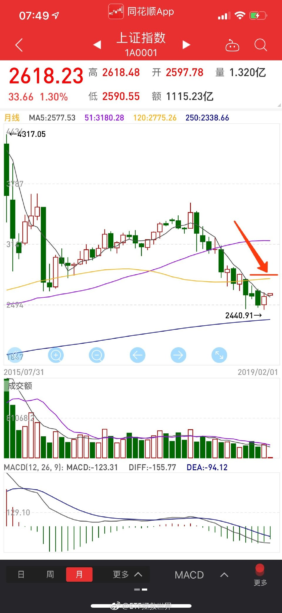

======================================================

ETF拯救世界 (5687069307) @
2019-02-02 10:31:51 Sat  
url: https://weibo.com/5687069307/HeLBAcPyN

回复@百里陌香:这不算预言。刚在做春节的东西，看到一段2015年7月的文字。看看会不会应验。 http://t.cn/Et1q8Kb //@百里陌香:预言家//@ETF拯救世界:回复@fankezhou:暴涨。//@fankezhou:农历年最后一个交易日，蚂蚁积分怎么压[笑而不语]@ETF拯救世界

------------------------------------------------------
转推：
>  @ETF拯救世界 (5687069307)
>  2019-02-01 09:29:55 Fri  
>  url: https:/weibo.com/5687069307/HeBLXeQRE/

>  有朋友在评论说，希望500大涨打他们的脸。
>  
>  我不这么想。
>  
>  咱们到市场上来投资，不是为了争谁更厉害，而是为了赚钱。踏踏实实把自己该赚的钱赚到，就够了。
>  
>  能力不足的人，市场会教育他。不需要你我动手。以后无论如何，胜不骄，气不馁，继续开开心心做自己的投资。
>  
>  我只是为很多人感到惋惜。
>  
>  因为 ​​​

转发[23]  评论[74]  赞[230] 

======================================================

ETF拯救世界 (5687069307) @
2019-02-02 11:31:38 Sat  
url: https://weibo.com/5687069307/HeLZRrV4z

回复@陈大致:又来了一个。mark。上一个是在最低点那哥们。//@陈大致:已经清仓，等待新低，新年快乐//@ETF拯救世界:回复@百里陌香:这不算预言。刚在做春节的东西，看到一段2015年7月的文字。看看会不会应验。 http://t.cn/Et1q8Kb //@百里陌香:预言家//@ETF拯救世界:回复@fankezhou:暴涨。

------------------------------------------------------
转推：
>  @ETF拯救世界 (5687069307)
>  2019-02-01 09:29:55 Fri  
>  url: https:/weibo.com/5687069307/HeBLXeQRE/

>  有朋友在评论说，希望500大涨打他们的脸。
>  
>  我不这么想。
>  
>  咱们到市场上来投资，不是为了争谁更厉害，而是为了赚钱。踏踏实实把自己该赚的钱赚到，就够了。
>  
>  能力不足的人，市场会教育他。不需要你我动手。以后无论如何，胜不骄，气不馁，继续开开心心做自己的投资。
>  
>  我只是为很多人感到惋惜。
>  
>  因为 ​​​

转发[14]  评论[128]  赞[237] 

======================================================

ETF拯救世界 (5687069307) @
2019-02-02 17:55:04 Sat  
url: https://weibo.com/5687069307/HeOvv55Gk

回复@无心人lwy:再加两圈可以拿去看风水了//@无心人lwy:E大能否再加一圈，附上代码

------------------------------------------------------
转推：
>  @ETF拯救世界 (5687069307)
>  2019-02-01 10:23:49 Fri  
>  url: https:/weibo.com/5687069307/HeC7PeSxg/

>  送给大家的第一份春节礼物：
>  
>  目前计划的三层资产配置图。
>  
>  从图上你可以看出，500涨跌对整个计划来说并不是那么重要。未来就算雷个外焦里嫩，也无所谓。这个，可能很多看笑话的人要失望了。
>  
>  另外，以后这个图会每个月发车的时候更新。在一定程度上，这张图已经触及到计划的核心。
>  
>  感谢小助理zwt帮忙 ​​​

转发[24]  评论[142]  赞[376] 

======================================================

ETF拯救世界 (5687069307) @
2019-02-03 00:38:02 Sun  
url: https://weibo.com/5687069307/HeR93sGVN

刚才有朋友评论里说又有人在雪球给我找事了。发帖攻击别人，拿我做对比给我招黑。

打开雪球一看，果然又是一堆评论提示。

饶了我吧，大哥大姐们。我已经离开七个月了，别再给我找麻烦了。

如果你是欣赏我，还请来微博或者公众号交流。不要拿我和别人对比，这是对我最好的。我不需要比谁好，不需要吸 ​​​

转发[18]  评论[216]  赞[564] 

======================================================

ETF拯救世界 (5687069307) @
2019-02-03 09:40:09 Sun  
url: https://weibo.com/5687069307/HeUH6jHR2

现在评论能贴图了。能不能拍点你觉得身边有意思的，跟过年有关的东西让我开开眼。顺便说说是在什么地方。。

祖国地大物博，没去过的地方，没见过的东西太多了…… ​​​

转发[24]  评论[630]  赞[502] 

======================================================

ETF拯救世界 (5687069307) @
2019-02-03 21:09:17 Sun  
url: https://weibo.com/5687069307/HeZcP6FiO

别人发红包是转发关注抽奖赚新粉丝关注。

我发红包是谢绝新关注只给老朋友发。

但我非常开心！

怎么发明天看公众号吧… ​​​

转发[8]  评论[323]  赞[798] 

======================================================

ETF拯救世界 (5687069307) @
2019-02-04 19:04:23 Mon  
url: https://weibo.com/5687069307/Hf7OCr0WY

有没有搞错？38秒就能看完题输入口令？太牛了！

显示十分钟抢完，是从塞钱进去开始算的。题是7点整更新。 ​​​

转发[12]  评论[351]  赞[298] 

+++++++++++++++++++++++++++++++++++++++++++++++++++++

图片：

======================================================

ETF拯救世界 (5687069307) @
2019-02-04 19:08:42 Mon  
url: https://weibo.com/5687069307/Hf7QndiPo

回复@周军平1979:抢到的都是有麒麟臂的真爱。//@周军平1979:抢了3.82，谢谢E大！

------------------------------------------------------
转推：
>  @ETF拯救世界 (5687069307)
>  2019-02-04 19:04:23 Mon  
>  url: https:/weibo.com/5687069307/Hf7OCr0WY/

>  有没有搞错？38秒就能看完题输入口令？太牛了！
>  
>  显示十分钟抢完，是从塞钱进去开始算的。题是7点整更新。 ​​​

转发[1]  评论[102]  赞[193] 

======================================================

ETF拯救世界 (5687069307) @
2019-02-04 19:33:54 Mon  
url: https://weibo.com/5687069307/Hf80Bj2Ne

支付宝口令红包的问题是每次只能包300个。发的多要想很多问题。不过这已经是相对来说最科学的发送方式了。。看看明天微博红包的情况吧，那就完全是运气了。。 ​​​

转发[4]  评论[75]  赞[254] 

======================================================

ETF拯救世界 (5687069307) @
2019-02-04 19:45:02 Mon  
url: https://weibo.com/5687069307/Hf857sqAt

回复@周梦夏:我觉得明年也要换形式了，不知道有没有人知道答案后在群里分享，那样也不公平了//@周梦夏:今天抢了八块，期待明天[doge]

------------------------------------------------------
转推：
>  @ETF拯救世界 (5687069307)
>  2019-02-04 19:33:54 Mon  
>  url: https:/weibo.com/5687069307/Hf80Bj2Ne/

>  支付宝口令红包的问题是每次只能包300个。发的多要想很多问题。不过这已经是相对来说最科学的发送方式了。。看看明天微博红包的情况吧，那就完全是运气了。。 ​​​

转发[2]  评论[143]  赞[211] 

======================================================

ETF拯救世界 (5687069307) @
2019-02-05 07:46:05 Tue  
url: https://weibo.com/5687069307/HfcNNmetM

请以下几位朋友联系我，有礼物送。 ​​​

转发[6]  评论[365]  赞[531] 

+++++++++++++++++++++++++++++++++++++++++++++++++++++

图片：

======================================================

ETF拯救世界 (5687069307) @
2019-02-05 15:56:10 Tue  
url: https://weibo.com/5687069307/Hfg0IAs9O

已经定了流浪地球的票，明天看完来汇报

------------------------------------------------------
转推：
>  @央视新闻 (2656274875)
>  2019-02-05 13:30:08 Tue  
>  url: https:/weibo.com/2656274875/Hff3ryChm/

>  【春节档“炸”了！猪年贺岁片你会pick哪一部？[憧憬]】2019春节档迎来超强阵容，仅在大年初一就有八部贺岁片上映：《疯狂的外星人》、《流浪地球》、《飞驰人生》、《新喜剧之王》、《廉政风云》、《神探蒲松龄》、《小猪佩奇过大年》、《熊出没·原始时代》；此外，春节档期间还有《一吻定情》、《蓝 ​​​

转发[3]  评论[109]  赞[158] 

======================================================

ETF拯救世界 (5687069307) @
2019-02-05 18:43:18 Tue  
url: https://weibo.com/5687069307/Hfh6yAoTw

每天微博会有两个包。大点的是一年以上抢，小点的一个月以上。也就是说一年以上可以抢两次。

祝好运。 ​​​

转发[2]  评论[83]  赞[316] 

======================================================

ETF拯救世界 (5687069307) @
2019-02-05 18:44:27 Tue  
url: https://weibo.com/5687069307/Hfh71ALpW

不知道为什么我的微博需要审核了。一会如果晚几分钟显示别怪我。 ​​​

转发[0]  评论[84]  赞[252] 

======================================================

ETF拯救世界 (5687069307) @
2019-02-05 19:02:05 Tue  
url: https://weibo.com/5687069307/HfhebnFwL

#ETF拯救世界的红包#感谢大家对我的爱与支持！我往红包里塞了现金，特来为大家送上好运，领到红包旺上加旺！http://t.cn/EcURBcD ​​​

转发[6]  评论[317]  赞[342] 

======================================================

ETF拯救世界 (5687069307) @
2019-02-05 19:07:07 Tue  
url: https://weibo.com/5687069307/HfhgerZLf

看来888个太多，明天金额不变，减少人数，人均多拿点

------------------------------------------------------
转推：
>  @ETF拯救世界 (5687069307)
>  2019-02-05 19:02:05 Tue  
>  url: https:/weibo.com/5687069307/HfhebnFwL/

>  #ETF拯救世界的红包#感谢大家对我的爱与支持！我往红包里塞了现金，特来为大家送上好运，领到红包旺上加旺！http://t.cn/EcURBcD ​​​

转发[0]  评论[110]  赞[225] 

======================================================

ETF拯救世界 (5687069307) @
2019-02-05 19:09:25 Tue  
url: https://weibo.com/5687069307/Hfhha6Pjf

好，开始一个月以上的。准备好

------------------------------------------------------
转推：
>  @ETF拯救世界 (5687069307)
>  2019-02-05 19:02:05 Tue  
>  url: https:/weibo.com/5687069307/HfhebnFwL/

>  #ETF拯救世界的红包#感谢大家对我的爱与支持！我往红包里塞了现金，特来为大家送上好运，领到红包旺上加旺！http://t.cn/EcURBcD ​​​

转发[1]  评论[47]  赞[204] 

======================================================

ETF拯救世界 (5687069307) @
2019-02-05 19:12:07 Tue  
url: https://weibo.com/5687069307/Hfhig3OU3

#ETF拯救世界的红包#感谢大家对我的爱与支持！我往红包里塞了现金，特来为大家送上好运，领到红包旺上加旺！http://t.cn/EcUmyRu ​​​

转发[5]  评论[269]  赞[280] 

======================================================

ETF拯救世界 (5687069307) @
2019-02-05 19:14:24 Tue  
url: https://weibo.com/5687069307/Hfhjbp0VD

这个太快了。好了，明天同一时间欢乐继续…大家新春快乐！

------------------------------------------------------
转推：
>  @ETF拯救世界 (5687069307)
>  2019-02-05 19:12:07 Tue  
>  url: https:/weibo.com/5687069307/Hfhig3OU3/

>  #ETF拯救世界的红包#感谢大家对我的爱与支持！我往红包里塞了现金，特来为大家送上好运，领到红包旺上加旺！http://t.cn/EcUmyRu ​​​

转发[1]  评论[161]  赞[299] 

======================================================

ETF拯救世界 (5687069307) @
2019-02-05 22:42:32 Tue  
url: https://weibo.com/5687069307/HfiFFg1BB

前天刚把我爱我家全集40多G下回来准备开始重新刷。太喜欢了。小时候看不懂就觉得好笑，现在看觉得更有意思了。

------------------------------------------------------
转推：
>  @ ()
>  2019-02-05 21:46:34 Tue  
>  url: 

>  抱歉，作者已设置仅展示半年内微博，此微博已不可见。 ​​​

转发[20]  评论[109]  赞[225] 

======================================================

ETF拯救世界 (5687069307) @
2019-02-06 16:39:08 Wed  
url: https://weibo.com/5687069307/HfpIECpl0

第二天，流浪地球从第四升到了第二。排片率也上去了。

看完感觉整体还是不错的，有些细节不喜欢，但是瑕不掩瑜，值得鼓励。

感谢用心做事的人，希望中国科幻片开始起飞。 ​​​

转发[24]  评论[113]  赞[419] 

+++++++++++++++++++++++++++++++++++++++++++++++++++++

图片：
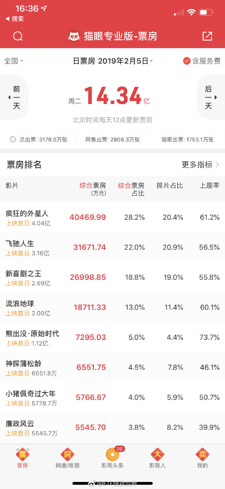

======================================================

ETF拯救世界 (5687069307) @
2019-02-06 19:01:04 Wed  
url: https://weibo.com/5687069307/HfqEgy67Q

#ETF拯救世界的红包#感谢大家对我的爱与支持！我往红包里塞了现金，特来为大家送上好运，领到红包旺上加旺！http://t.cn/Ec5ikZD ​​​

转发[6]  评论[303]  赞[366] 

======================================================

ETF拯救世界 (5687069307) @
2019-02-06 19:12:05 Wed  
url: https://weibo.com/5687069307/HfqIK0jLO

#ETF拯救世界的红包#感谢大家对我的爱与支持！我往红包里塞了现金，特来为大家送上好运，领到红包旺上加旺！http://t.cn/Ec5aQBN ​​​

转发[2]  评论[203]  赞[289] 

======================================================

ETF拯救世界 (5687069307) @
2019-02-06 19:14:34 Wed  
url: https://weibo.com/5687069307/HfqJKCpiL

今天两个已经发完了，大家新春大吉！

------------------------------------------------------
转推：
>  @ETF拯救世界 (5687069307)
>  2019-02-06 19:01:04 Wed  
>  url: https:/weibo.com/5687069307/HfqEgy67Q/

>  #ETF拯救世界的红包#感谢大家对我的爱与支持！我往红包里塞了现金，特来为大家送上好运，领到红包旺上加旺！http://t.cn/Ec5ikZD ​​​

转发[1]  评论[143]  赞[330] 

======================================================

ETF拯救世界 (5687069307) @
2019-02-07 19:01:08 Thu  
url: https://weibo.com/5687069307/HfA4NbmFr

#ETF拯救世界的红包#感谢大家对我的爱与支持！我往红包里塞了现金，特来为大家送上好运，领到红包旺上加旺！http://t.cn/EcI2V2L ​​​

转发[5]  评论[215]  赞[273] 

======================================================

ETF拯救世界 (5687069307) @
2019-02-07 19:07:08 Thu  
url: https://weibo.com/5687069307/HfA7e85xw

#ETF拯救世界的红包#感谢大家对我的爱与支持！我往红包里塞了现金，特来为大家送上好运，领到红包旺上加旺！http://t.cn/EcIL6c8 ​​​

转发[2]  评论[144]  赞[245] 

======================================================

ETF拯救世界 (5687069307) @
2019-02-07 19:08:30 Thu  
url: https://weibo.com/5687069307/HfA7N4t7m

今天两个包发完了，欢乐明年过年再继续！

------------------------------------------------------
转推：
>  @ETF拯救世界 (5687069307)
>  2019-02-07 19:01:08 Thu  
>  url: https:/weibo.com/5687069307/HfA4NbmFr/

>  #ETF拯救世界的红包#感谢大家对我的爱与支持！我往红包里塞了现金，特来为大家送上好运，领到红包旺上加旺！http://t.cn/EcI2V2L ​​​

转发[1]  评论[113]  赞[289] 

======================================================

ETF拯救世界 (5687069307) @
2019-02-07 20:09:10 Thu  
url: https://weibo.com/5687069307/HfAwpgplJ

看某个论坛有些自以为是的喷子连电影带观影群众一个不落的喷，真是无话好说。

有时候真是细节能看出一个人的心胸。以前以为他们是只喷其它投资人，原来是只要做的好的人他们都要喷。

没有其它合理解释，就一句话：

羡慕嫉妒恨。

见不得任何人的好。

所以真是应该对很多事情释然：只要你做事，就一 ​​​

转发[21]  评论[95]  赞[371] 

======================================================

ETF拯救世界 (5687069307) @
2019-02-08 08:02:06 Fri  
url: https://weibo.com/5687069307/HfFbMBFzr

想去南方看雪//@中国气象爱好者:扬州、南通和崇明都下了中到大雪。这次杭州不在降雪带上，除西北部山区外降雪可能性不大。

------------------------------------------------------
转推：
>  @糖糖小婷 (1884098405)
>  2019-02-08 06:55:15 Fri  
>  url: https:/weibo.com/1884098405/HfEKEpySC/

>  崇明大雪，白茫茫一片好漂亮！@上海市天气 ​​​

转发[2]  评论[47]  赞[126] 

======================================================

ETF拯救世界 (5687069307) @
2019-02-08 08:37:24 Fri  
url: https://weibo.com/5687069307/HfFq7dICw

我建议，帮孩子建立财商，让他有理财意识的同时，千万要把一部分钱给他让他自由支配。

小时候过于缺钱，很大概率会导致长大后特别贪婪或者特别吝啬，对人生其实没有什么好处。

度要把握好。建议引导孩子将自由支配的钱拿一部分储蓄与理财。如果存下来的不多不少，会有奖励。过多过少都不奖励，一点都 ​​​

转发[219]  评论[151]  赞[608] 

======================================================

ETF拯救世界 (5687069307) @
2019-02-08 08:49:53 Fri  
url: https://weibo.com/5687069307/HfFvbhqZY

是霍老板吗。很有派。

------------------------------------------------------
转推：
>  @Cars01 (5148153495)
>  2019-02-07 21:33:47 Thu  
>  url: https:/weibo.com/5148153495/HfB4KApX8/

>  劳斯与迈巴赫发生刮蹭，但处理过程体现了上流社会的素养[doge]
>  女：我是全国青年常委……在甘肃省挂职……
>   http://t.cn/EcIgZaB ​​​
>  #迈巴赫撞了劳斯莱斯# 
>  #Cars01车闻# ​​​

转发[22]  评论[37]  赞[118] 

======================================================

ETF拯救世界 (5687069307) @
2019-02-08 09:05:22 Fri  
url: https://weibo.com/5687069307/HfFBspuj1

这不就是前几年流行的松糕鞋吗！话说做为一个直男，真的对松糕鞋这种东西接受不能…

------------------------------------------------------
转推：
>  @ ()
>  2019-02-07 21:08:24 Thu  
>  url: 

>  抱歉，作者已设置仅展示半年内微博，此微博已不可见。 ​​​

转发[4]  评论[43]  赞[103] 

======================================================

ETF拯救世界 (5687069307) @
2019-02-08 11:09:23 Fri  
url: https://weibo.com/5687069307/HfGpO2eez

群众的眼睛是雪亮的 http://t.cn/EcJwTN6

------------------------------------------------------
转推：
>  @ETF拯救世界 (5687069307)
>  2019-02-06 16:39:08 Wed  
>  url: https:/weibo.com/5687069307/HfpIECpl0/

>  第二天，流浪地球从第四升到了第二。排片率也上去了。
>  
>  看完感觉整体还是不错的，有些细节不喜欢，但是瑕不掩瑜，值得鼓励。
>  
>  感谢用心做事的人，希望中国科幻片开始起飞。 ​​​

转发[10]  评论[40]  赞[152] 

======================================================

ETF拯救世界 (5687069307) @
2019-02-08 11:30:48 Fri  
url: https://weibo.com/5687069307/HfGyvhUIc

谢邀。00后，斯坦福博士，年入90万美刀，职业是在知乎打字。以上。

------------------------------------------------------
转推：
>  @挖龙脉的超级鹿鼎公 (3962719063)
>  2019-02-06 11:19:16 Wed  
>  url: https:/weibo.com/3962719063/HfnCP98VW/

>  很想知道现在的90初，也就是25--30岁的这群人，大致上是怎么样的素描，大家身边有这样的90后，可以描述下，学历，收入，婚姻状况，就业状况，所在城市 ​​​

转发[35]  评论[99]  赞[307] 

======================================================

ETF拯救世界 (5687069307) @
2019-02-08 12:52:59 Fri  
url: https://weibo.com/5687069307/HfH5RaEuP

回复@一只咸咸咸咸的咸鱼王:说的没错。一定要电影中每个情节都符合现代人的科学理论，是不是脑残？去看论文不就行了吗？凡尔纳作品里面无数不合科学逻辑的东西，谁能质疑他的牛逼？在这个角度批评一个科幻电影就是对科学有点皮毛理解看不上普罗大众了

------------------------------------------------------
转推：
>  @ETF拯救世界 (5687069307)
>  2019-02-06 16:39:08 Wed  
>  url: https:/weibo.com/5687069307/HfpIECpl0/

>  第二天，流浪地球从第四升到了第二。排片率也上去了。
>  
>  看完感觉整体还是不错的，有些细节不喜欢，但是瑕不掩瑜，值得鼓励。
>  
>  感谢用心做事的人，希望中国科幻片开始起飞。 ​​​

转发[4]  评论[33]  赞[160] 

======================================================

ETF拯救世界 (5687069307) @
2019-02-08 13:07:02 Fri  
url: https://weibo.com/5687069307/HfHbyy14o

不从众，独立思考，并不是“你们喜欢的我就要反对，以体现我的特立独行。群众喜欢的都是low货，只有我高大上。”

这样真的特别中二。真的。 ​​​

转发[105]  评论[73]  赞[372] 

======================================================

ETF拯救世界 (5687069307) @
2019-02-08 16:32:21 Fri  
url: https://weibo.com/5687069307/HfIwTyycM

回复@欧阳很穷:不要谈恋爱。对方很有可能只是爱你的钱//@欧阳很穷:95后，工资已经到了4500，现在金钱对我来说早已只是一个数字了，我去网吧开黑，常常会在他人艳羡的目光中点上一瓶冰红茶。怀念赚3000一个月的时候，那时候为了梦想拼搏的感觉真棒👍

------------------------------------------------------
转推：
>  @挖龙脉的超级鹿鼎公 (3962719063)
>  2019-02-06 11:19:16 Wed  
>  url: https:/weibo.com/3962719063/HfnCP98VW/

>  很想知道现在的90初，也就是25--30岁的这群人，大致上是怎么样的素描，大家身边有这样的90后，可以描述下，学历，收入，婚姻状况，就业状况，所在城市 ​​​

转发[11]  评论[56]  赞[225] 

======================================================

ETF拯救世界 (5687069307) @
2019-02-08 16:41:04 Fri  
url: https://weibo.com/5687069307/HfIAr49eB

真正的特立独行，是我不管别人喜欢不喜欢，别人说什么，只要我喜欢就是喜欢，不喜欢就是不喜欢。不因为害怕不合群而随大流，也不因为想显得独特而保持与群众的距离。别人的看法影响不了我的决定。

------------------------------------------------------
转推：
>  @ETF拯救世界 (5687069307)
>  2019-02-08 13:07:02 Fri  
>  url: https:/weibo.com/5687069307/HfHbyy14o/

>  不从众，独立思考，并不是“你们喜欢的我就要反对，以体现我的特立独行。群众喜欢的都是low货，只有我高大上。”
>  
>  这样真的特别中二。真的。 ​​​

转发[72]  评论[53]  赞[353] 

======================================================

ETF拯救世界 (5687069307) @
2019-02-08 17:03:04 Fri  
url: https://weibo.com/5687069307/HfIJmyPOs

关于流浪，我说最后一句，不再说了。

这部电影一定不完美。我评论的时候就说了，还不错。很多细节不行，但是瑕不掩瑜。

豆瓣观影1100多部的我，加上爱国因素也只给了四星。独立日我是给五星的。

我看不上很多喷子的原因，是在咱们这里做点事太难了。这个电影不用问就知道过程中一定克服了无数困难。 ​​​

转发[36]  评论[179]  赞[624] 

+++++++++++++++++++++++++++++++++++++++++++++++++++++

图片：
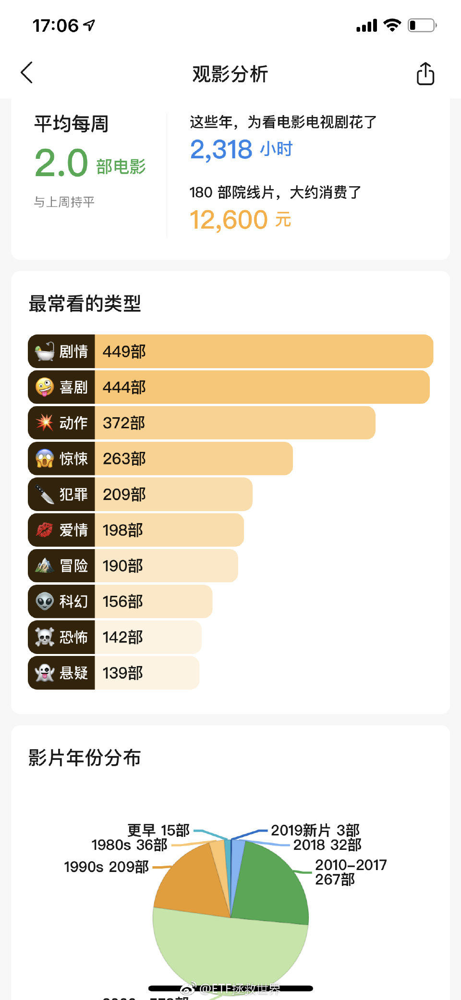
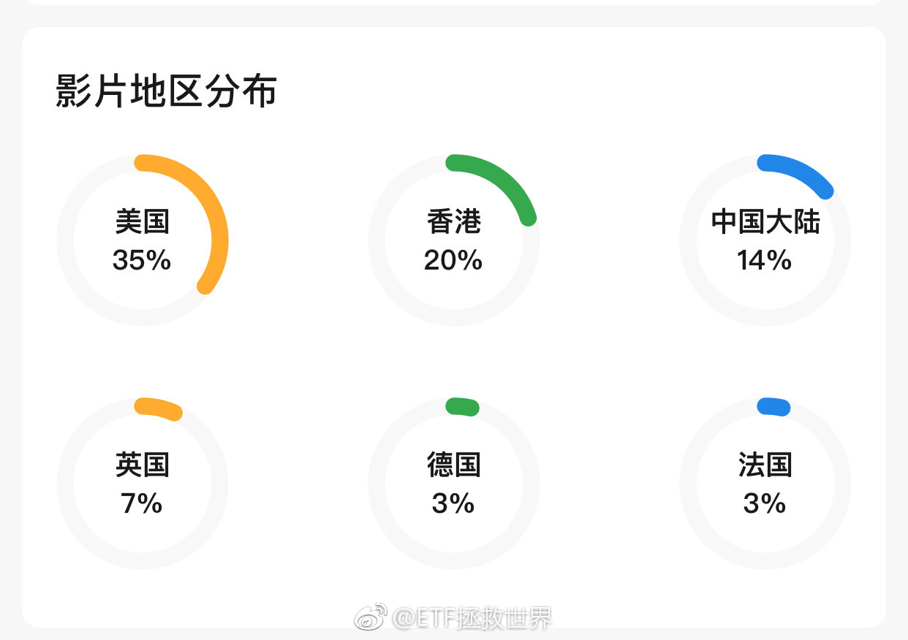

======================================================

ETF拯救世界 (5687069307) @
2019-02-09 09:07:36 Sat  
url: https://weibo.com/5687069307/HfP2S1MAH

愣着干什么，拜啊。 ​​​

转发[171]  评论[589]  赞[1287] 

+++++++++++++++++++++++++++++++++++++++++++++++++++++

图片：

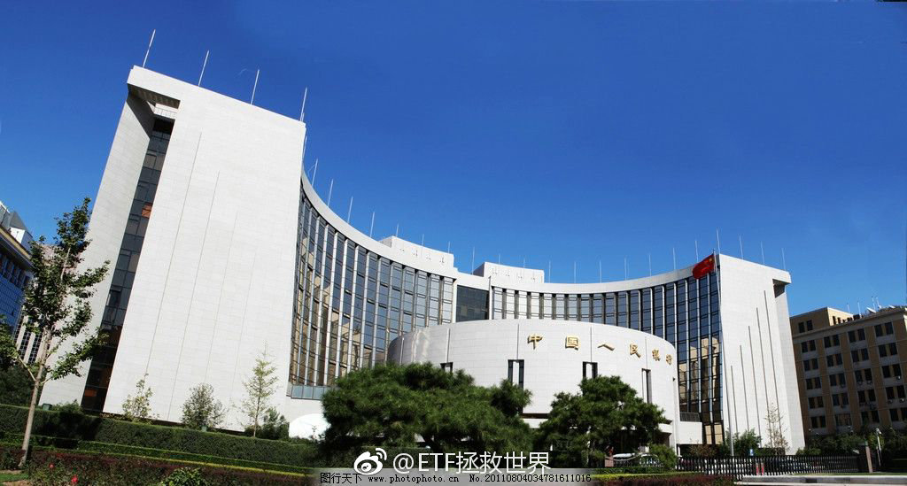

======================================================

ETF拯救世界 (5687069307) @
2019-02-10 08:00:34 Sun  
url: https://weibo.com/5687069307/HfY2aero3

我家居然一条都不占。明年还有资格过年吗，瑟瑟发抖中。

------------------------------------------------------
转推：
>  @ ()
>  2019-02-09 23:07:50 Sat  
>  url: 

>  该账号因被投诉违反《微博社区公约》的相关规定，现已无法查看。查看帮助 https://kefu.weibo.com/faqdetail?id=13216

转发[16]  评论[123]  赞[235] 

======================================================

ETF拯救世界 (5687069307) @
2019-02-10 19:51:20 Sun  
url: https://weibo.com/5687069307/Hg2GEFKf1

回复@洗桐女史:…这剧里还有谁，提前关注//@洗桐女史:哈哈哈哈，这剧主题曲还是曲婉婷唱的[允悲]

------------------------------------------------------
转推：
>  @吃瓜群众CJ (1885688010)
>  2019-02-09 20:16:07 Sat  
>  url: https:/weibo.com/1885688010/HfTqdxRzh/

>  说的对，跟你的事比起来，那的确都不是个事了 http://t.cn/EcK0jIZ ​​​

转发[19]  评论[41]  赞[127] 

======================================================

ETF拯救世界 (5687069307) @
2019-02-10 21:54:21 Sun  
url: https://weibo.com/5687069307/Hg3uAwohq

今天🌍票房已经大于所有其它片子之和了。

喷子们万万没想到的是，正因为他们的喷引起的争论，让🌍的钱越挣越多了… ​​​

转发[10]  评论[149]  赞[304] 

+++++++++++++++++++++++++++++++++++++++++++++++++++++

图片：
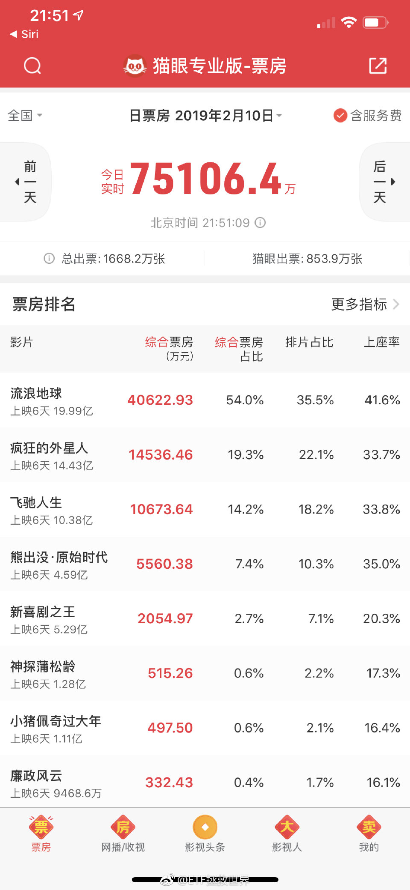

======================================================

ETF拯救世界 (5687069307) @
2019-02-11 09:33:18 Mon  
url: https://weibo.com/5687069307/Hg84ihP07

别涨了，差不多意思意思行了。 ​​​

转发[12]  评论[70]  赞[284] 

======================================================

ETF拯救世界 (5687069307) @
2019-02-11 09:41:08 Mon  
url: https://weibo.com/5687069307/Hg87tk1zi

尤其是500，你都“越跌越贵”了，还舔着脸涨呢。赶紧跌到1000点完事。

------------------------------------------------------
转推：
>  @ETF拯救世界 (5687069307)
>  2019-02-11 09:33:18 Mon  
>  url: https:/weibo.com/5687069307/Hg84ihP07/

>  别涨了，差不多意思意思行了。 ​​​

转发[7]  评论[50]  赞[267] 

======================================================

ETF拯救世界 (5687069307) @
2019-02-11 09:47:26 Mon  
url: https://weibo.com/5687069307/Hg8a24kfK

说实话，很多人根本就没有弄清楚计算指数估值的意义到底是什么。

根上就没想明白的事情，只是在做无用功。 ​​​

转发[27]  评论[71]  赞[315] 

======================================================

ETF拯救世界 (5687069307) @
2019-02-11 09:53:12 Mon  
url: https://weibo.com/5687069307/Hg8cn6UPm

记录一下市场情绪：

目前，绝大多数人认为，未来的A股，是“核心资产”的天下，即，50或者300成分股。

中小股票没戏了。

2019年2月。 ​​​

转发[102]  评论[162]  赞[459] 

======================================================

ETF拯救世界 (5687069307) @
2019-02-11 10:07:20 Mon  
url: https://weibo.com/5687069307/Hg8i6C5WB

回复@尤其乐意:去球球观察大众情绪。非常管用。包括67.83%的大v情绪。//@尤其乐意:我是真的不明白呢，求教这是怎么计算的

------------------------------------------------------
转推：
>  @ETF拯救世界 (5687069307)
>  2019-02-11 09:47:26 Mon  
>  url: https:/weibo.com/5687069307/Hg8a24kfK/

>  说实话，很多人根本就没有弄清楚计算指数估值的意义到底是什么。
>  
>  根上就没想明白的事情，只是在做无用功。 ​​​

转发[10]  评论[29]  赞[170] 

======================================================

ETF拯救世界 (5687069307) @
2019-02-11 10:11:27 Mon  
url: https://weibo.com/5687069307/Hg8jMkcMq

回复@Nothings2006:你说对了。我第一讨厌中二男主，第二讨厌他妹妹，第三讨厌那个混血mike……不过这倒不是因为所谓三观问题。一两句说不清。

------------------------------------------------------
转推：
>  @ETF拯救世界 (5687069307)
>  2019-02-08 17:03:04 Fri  
>  url: https:/weibo.com/5687069307/HfIJmyPOs/

>  关于流浪，我说最后一句，不再说了。
>  
>  这部电影一定不完美。我评论的时候就说了，还不错。很多细节不行，但是瑕不掩瑜。
>  
>  豆瓣观影1100多部的我，加上爱国因素也只给了四星。独立日我是给五星的。
>  
>  我看不上很多喷子的原因，是在咱们这里做点事太难了。这个电影不用问就知道过程中一定克服了无数困难。 ​​​

转发[4]  评论[53]  赞[131] 

======================================================

ETF拯救世界 (5687069307) @
2019-02-11 10:18:19 Mon  
url: https://weibo.com/5687069307/Hg8mzbN9R

演员真的很重要。我给独立日五星，其中一星或者一星半就是给WILL SMITH的。

咱们有没有这种演员。 ​​​

转发[3]  评论[66]  赞[204] 

======================================================

ETF拯救世界 (5687069307) @
2019-02-11 10:45:47 Mon  
url: https://weibo.com/5687069307/Hg8xIENoJ

是不是演员发挥跟导演也有很大关系。红海行动里面感觉除了海清几乎所有演员都演得很带感。

------------------------------------------------------
转推：
>  @ETF拯救世界 (5687069307)
>  2019-02-11 10:18:19 Mon  
>  url: https:/weibo.com/5687069307/Hg8mzbN9R/

>  演员真的很重要。我给独立日五星，其中一星或者一星半就是给WILL SMITH的。
>  
>  咱们有没有这种演员。 ​​​

转发[1]  评论[26]  赞[157] 

======================================================

ETF拯救世界 (5687069307) @
2019-02-11 10:50:30 Mon  
url: https://weibo.com/5687069307/Hg8zD9b15

注意，目前这种市场情况，不要把精力过多放在关注市场走势上。很容易让你出现“终于回本了赶紧卖掉否则坐电梯怎么办”这种思维模式。

仓位买的差不多了，踏踏实实的该干嘛干嘛去。 ​​​

转发[53]  评论[76]  赞[377] 

======================================================

ETF拯救世界 (5687069307) @
2019-02-11 10:52:15 Mon  
url: https://weibo.com/5687069307/Hg8Al8Leg

回复@禕Yi:关注了几个博主，任何事情在他们眼中都是负面的。我也是非常敬佩了……//@禕Yi:真的，我就觉得，目前的🇨🇳有一个巨大的矛盾…很多东西都在发展，创造，革新的十字路口，但是网络上消极，极端的人太多，很容易将这种积极性打消。但是慢慢观察来看，最终还是接受，进步，鼓励的人居多…

------------------------------------------------------
转推：
>  @ETF拯救世界 (5687069307)
>  2019-02-08 17:03:04 Fri  
>  url: https:/weibo.com/5687069307/HfIJmyPOs/

>  关于流浪，我说最后一句，不再说了。
>  
>  这部电影一定不完美。我评论的时候就说了，还不错。很多细节不行，但是瑕不掩瑜。
>  
>  豆瓣观影1100多部的我，加上爱国因素也只给了四星。独立日我是给五星的。
>  
>  我看不上很多喷子的原因，是在咱们这里做点事太难了。这个电影不用问就知道过程中一定克服了无数困难。 ​​​

转发[2]  评论[19]  赞[130] 

======================================================

ETF拯救世界 (5687069307) @
2019-02-11 10:53:41 Mon  
url: https://weibo.com/5687069307/Hg8AVcrwn

回复@zshixin:观察能力不行。第一天关注我就应该发现了。//@zshixin:哈哈，老大，我发现你挺幽默的，跟着你真是高兴每一天

------------------------------------------------------
转推：
>  @ETF拯救世界 (5687069307)
>  2019-02-11 09:53:12 Mon  
>  url: https:/weibo.com/5687069307/Hg8cn6UPm/

>  记录一下市场情绪：
>  
>  目前，绝大多数人认为，未来的A股，是“核心资产”的天下，即，50或者300成分股。
>  
>  中小股票没戏了。
>  
>  2019年2月。 ​​​

转发[2]  评论[28]  赞[227] 

======================================================

ETF拯救世界 (5687069307) @
2019-02-11 10:58:37 Mon  
url: https://weibo.com/5687069307/Hg8CVj8G7

如果本周500能来一根放量长阳，那么______。（5分） ​​​

转发[10]  评论[211]  赞[291] 

======================================================

ETF拯救世界 (5687069307) @
2019-02-11 11:11:30 Mon  
url: https://weibo.com/5687069307/Hg8I9t2Mp

回复@一场清风一场秋梦:亲，我这边建议你自动消失呢。//@一场清风一场秋梦:我将会爱上你[爱你][爱你][爱你]

------------------------------------------------------
转推：
>  @ETF拯救世界 (5687069307)
>  2019-02-11 10:58:37 Mon  
>  url: https:/weibo.com/5687069307/Hg8CVj8G7/

>  如果本周500能来一根放量长阳，那么______。（5分） ​​​

转发[2]  评论[35]  赞[178] 

======================================================

ETF拯救世界 (5687069307) @
2019-02-11 11:13:11 Mon  
url: https://weibo.com/5687069307/Hg8IQkGI0

不得不服。//@ETF拯救世界:回复@陈大致:又来了一个。mark。上一个是在最低点那哥们。//@陈大致:已经清仓，等待新低，新年快乐//@ETF拯救世界:回复@百里陌香:这不算预言。刚在做春节的东西，看到一段2015年7月的文字。看看会不会应验。 http://t.cn/Et1q8Kb //@百里陌香:预言家

------------------------------------------------------
转推：
>  @ETF拯救世界 (5687069307)
>  2019-02-01 09:29:55 Fri  
>  url: https:/weibo.com/5687069307/HeBLXeQRE/

>  有朋友在评论说，希望500大涨打他们的脸。
>  
>  我不这么想。
>  
>  咱们到市场上来投资，不是为了争谁更厉害，而是为了赚钱。踏踏实实把自己该赚的钱赚到，就够了。
>  
>  能力不足的人，市场会教育他。不需要你我动手。以后无论如何，胜不骄，气不馁，继续开开心心做自己的投资。
>  
>  我只是为很多人感到惋惜。
>  
>  因为 ​​​

转发[6]  评论[45]  赞[213] 

======================================================

ETF拯救世界 (5687069307) @
2019-02-11 11:19:22 Mon  
url: https://weibo.com/5687069307/Hg8LltBUl

各位可以在网上非常直观的观察到情绪。

我这里来说，第一次是券商见底前一天那哥们粉转黑喷券商。第二次是10月见底前一天那哥们清仓。第三次是年前这哥们清仓。

什么是情绪，这些就是情绪。

我这里还好，理性的人多。（不理性的都看不上我或者都被拉黑了）球球其实是观察情绪最好的地方。因为那里并 ​​​

转发[53]  评论[151]  赞[439] 

======================================================

ETF拯救世界 (5687069307) @
2019-02-11 11:37:40 Mon  
url: https://weibo.com/5687069307/Hg8SMoMLN

我的锁屏。

原图@夏阿 ​​​

转发[4]  评论[152]  赞[400] 

+++++++++++++++++++++++++++++++++++++++++++++++++++++

图片：

======================================================

ETF拯救世界 (5687069307) @
2019-02-11 13:06:45 Mon  
url: https://weibo.com/5687069307/Hg9sW4lKC

还有10个月。别掉链子。

------------------------------------------------------
转推：
>  @ETF拯救世界 (5687069307)
>  2019-01-02 09:31:55 Wed  
>  url: https:/weibo.com/5687069307/Ha2XS4jRb/

>  我立个flag。
>  
>  2019年A股极大极大概率收红。不投机取巧，我说的是绝大多数指数。
>  
>  甚至，有可能涨幅不会太小。
>  
>  当然不排除中间继续挖坑，但年底看，形势一片大好。不是小好，是大好。 ​​​

转发[13]  评论[40]  赞[258] 

======================================================

ETF拯救世界 (5687069307) @
2019-02-11 13:18:41 Mon  
url: https://weibo.com/5687069307/Hg9xMww82

回复@MrArtificial:我不太理解你说的筑底和我说的有什么不一样吗。//@MrArtificial:E大之前不是说19年筑底吗？还坚持这个判断吗//@ETF拯救世界:还有10个月。别掉链子。

------------------------------------------------------
转推：
>  @ETF拯救世界 (5687069307)
>  2019-01-02 09:31:55 Wed  
>  url: https:/weibo.com/5687069307/Ha2XS4jRb/

>  我立个flag。
>  
>  2019年A股极大极大概率收红。不投机取巧，我说的是绝大多数指数。
>  
>  甚至，有可能涨幅不会太小。
>  
>  当然不排除中间继续挖坑，但年底看，形势一片大好。不是小好，是大好。 ​​​

转发[1]  评论[16]  赞[152] 

======================================================

ETF拯救世界 (5687069307) @
2019-02-11 13:26:20 Mon  
url: https://weibo.com/5687069307/Hg9ATdghX

刚在微信后台看到一个问题：

“E大，新年好！很冒味的有个投资外的问题想请教您，希望能得到您的回复。 我家原来的保姆多年前向我们借了二万买房（二线城市郊区），不到一年时间就还了。三年前又借了三万在乡镇建五层楼房出租与偶尔自住，至今未还。我一直认为她家现在应该是手头紧，对啥时还款抱听天 ​​​

转发[17]  评论[84]  赞[311] 

======================================================

ETF拯救世界 (5687069307) @
2019-02-11 13:29:27 Mon  
url: https://weibo.com/5687069307/Hg9C9e9nD

回复@沙河边行走:你是不是瞎了。我说的明明白白今年极大概率收红。这还叫两头照顾。我另一头照顾什么了？走好不送。//@沙河边行走:这种两头都照顾到的废话有什么意义呢

------------------------------------------------------
转推：
>  @ETF拯救世界 (5687069307)
>  2019-01-02 09:31:55 Wed  
>  url: https:/weibo.com/5687069307/Ha2XS4jRb/

>  我立个flag。
>  
>  2019年A股极大极大概率收红。不投机取巧，我说的是绝大多数指数。
>  
>  甚至，有可能涨幅不会太小。
>  
>  当然不排除中间继续挖坑，但年底看，形势一片大好。不是小好，是大好。 ​​​

转发[11]  评论[64]  赞[237] 

======================================================

ETF拯救世界 (5687069307) @
2019-02-11 13:39:06 Mon  
url: https://weibo.com/5687069307/Hg9G48kU9

回复@冰糖葫芦5加皮66:我是觉得这段话的意思简直再明白不过了，怎么还会有这种评论。我是真的不理解。//@冰糖葫芦5加皮66:益达应该是个老好人，不过是个苦口婆心，偶尔暴躁，倔强牛都拉不回的老好人[笑cry][笑cry]

------------------------------------------------------
转推：
>  @ETF拯救世界 (5687069307)
>  2019-01-02 09:31:55 Wed  
>  url: https:/weibo.com/5687069307/Ha2XS4jRb/

>  我立个flag。
>  
>  2019年A股极大极大概率收红。不投机取巧，我说的是绝大多数指数。
>  
>  甚至，有可能涨幅不会太小。
>  
>  当然不排除中间继续挖坑，但年底看，形势一片大好。不是小好，是大好。 ​​​

转发[3]  评论[37]  赞[179] 

======================================================

ETF拯救世界 (5687069307) @
2019-02-11 13:58:19 Mon  
url: https://weibo.com/5687069307/Hg9NS8TeE

回复@谷雨MIKI:是的。你知不知道我预测07 08 12 15这几个顶底用了多少马甲。排列组合一下这个数量吓死你。ps，虽然你是刚关注我，但是时候说白白了。

------------------------------------------------------
转推：
>  @ETF拯救世界 (5687069307)
>  2019-01-02 09:31:55 Wed  
>  url: https:/weibo.com/5687069307/Ha2XS4jRb/

>  我立个flag。
>  
>  2019年A股极大极大概率收红。不投机取巧，我说的是绝大多数指数。
>  
>  甚至，有可能涨幅不会太小。
>  
>  当然不排除中间继续挖坑，但年底看，形势一片大好。不是小好，是大好。 ​​​

转发[7]  评论[33]  赞[226] 

======================================================

ETF拯救世界 (5687069307) @
2019-02-11 14:06:17 Mon  
url: https://weibo.com/5687069307/Hg9R6cJfN

我非常讨厌的是什么。

是关注你几天就来指手画脚的人。

你好歹耐着性子先看两个月再张嘴。这是对别人，也是对自己的尊重。 ​​​

转发[7]  评论[99]  赞[531] 

======================================================

ETF拯救世界 (5687069307) @
2019-02-11 14:13:32 Mon  
url: https://weibo.com/5687069307/Hg9U2tQUd

回复@奔跑的无常:是的。还附送一份拉黑哦。超值的。//@奔跑的无常:我是不是也喷一下e大就会回复我了？

------------------------------------------------------
转推：
>  @ETF拯救世界 (5687069307)
>  2019-01-02 09:31:55 Wed  
>  url: https:/weibo.com/5687069307/Ha2XS4jRb/

>  我立个flag。
>  
>  2019年A股极大极大概率收红。不投机取巧，我说的是绝大多数指数。
>  
>  甚至，有可能涨幅不会太小。
>  
>  当然不排除中间继续挖坑，但年底看，形势一片大好。不是小好，是大好。 ​​​

转发[3]  评论[56]  赞[260] 

======================================================

ETF拯救世界 (5687069307) @
2019-02-11 14:24:01 Mon  
url: https://weibo.com/5687069307/Hg9Yijq5a

震惊！节前倒数第二个交易日之前，球球上到处都是喷500喷中小的帖子。各种数据分析中小股票“越跌越贵”。

涨了两天，形势逆转，开始讨论买什么中小指数了！ ​​​

转发[93]  评论[81]  赞[470] 

======================================================

ETF拯救世界 (5687069307) @
2019-02-11 14:31:34 Mon  
url: https://weibo.com/5687069307/Hga1mlv9U

短短两个交易日，1月底那几天所谓的大面积爆雷的新闻你想起来是不是好像恍如隔世？这就是真实的金融市场。如果你整天被那些不重要的新闻不重要的消息以及不重要的人占据眼球，你就无法深入思考到底什么才是最重要，什么才真正能让你赚到钱。

------------------------------------------------------
转推：
>  @ETF拯救世界 (5687069307)
>  2019-02-11 14:24:01 Mon  
>  url: https:/weibo.com/5687069307/Hg9Yijq5a/

>  震惊！节前倒数第二个交易日之前，球球上到处都是喷500喷中小的帖子。各种数据分析中小股票“越跌越贵”。
>  
>  涨了两天，形势逆转，开始讨论买什么中小指数了！ ​​​

转发[68]  评论[108]  赞[475] 

======================================================

ETF拯救世界 (5687069307) @
2019-02-11 14:57:42 Mon  
url: https://weibo.com/5687069307/HgabYaLer

目前计划31只品种中，浮亏的还有12只。其中浮亏10%以上的还有6只。

这是4000多点开始，2600点的基本情况。

换句话说，组合盈利并没什么奇怪，指数下跌37%，90%以上品种都赚钱才是亮点。 ​​​

转发[39]  评论[269]  赞[745] 

======================================================

ETF拯救世界 (5687069307) @
2019-02-12 09:27:32 Tue  
url: https://weibo.com/5687069307/Hghss5dQU

我建议周二周三休息休息。周四周五拉一拉收个光头长阳就最好了。 ​​​

转发[10]  评论[96]  赞[356] 

======================================================

ETF拯救世界 (5687069307) @
2019-02-12 09:33:34 Tue  
url: https://weibo.com/5687069307/HghuUenkU

[怒]

------------------------------------------------------
转推：
>  @ETF拯救世界 (5687069307)
>  2019-02-12 09:27:32 Tue  
>  url: https:/weibo.com/5687069307/Hghss5dQU/

>  我建议周二周三休息休息。周四周五拉一拉收个光头长阳就最好了。 ​​​

转发[1]  评论[26]  赞[192] 

======================================================

ETF拯救世界 (5687069307) @
2019-02-12 09:37:58 Tue  
url: https://weibo.com/5687069307/HghwGrfUz

谁还记得“钻石坑”那篇文章是什么时候什么点位发的。

（图中黄线） ​​​

转发[58]  评论[129]  赞[386] 

+++++++++++++++++++++++++++++++++++++++++++++++++++++

图片：
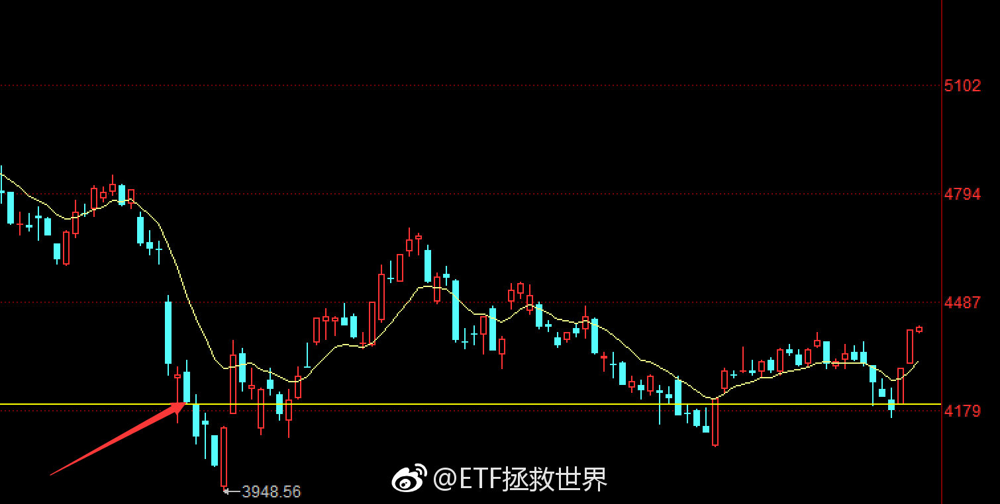

======================================================

ETF拯救世界 (5687069307) @
2019-02-12 09:41:52 Tue  
url: https://weibo.com/5687069307/Hghygwac3

中小指数调整的压力不是很大，而且正在冲击阻力线的关键时刻，再往上冲一冲也可以。

大指数之前拉的太多，建议还是调整一下，路太远，一开始跑太快容易岔气儿。 ​​​

转发[24]  评论[93]  赞[391] 

======================================================

ETF拯救世界 (5687069307) @
2019-02-12 09:43:51 Tue  
url: https://weibo.com/5687069307/Hghz4v540

回复@Angela鹿小鹿:加个微信认识一下好吗。不是说为了钱，我是比较欣赏你这个人。//@Angela鹿小鹿:啊啊啊啊啊，别啊！动迁款还妹到账呐……给我继续跌啊

------------------------------------------------------
转推：
>  @ETF拯救世界 (5687069307)
>  2019-02-12 09:27:32 Tue  
>  url: https:/weibo.com/5687069307/Hghss5dQU/

>  我建议周二周三休息休息。周四周五拉一拉收个光头长阳就最好了。 ​​​

转发[4]  评论[134]  赞[329] 

======================================================

ETF拯救世界 (5687069307) @
2019-02-12 09:57:30 Tue  
url: https://weibo.com/5687069307/HghEC7HKH

假期中血液的事儿一出，很多人觉得医药又要凉了。

万万没想到。

$全指医药 sh000991$ 

这就是资本市场。你猜不到会突然发生什么事情，你更猜不到突然发生的事情对价格走势有什么影响。

应对之策就是：

别猜。

猜了也别照做。 ​​​

转发[29]  评论[119]  赞[360] 

======================================================

ETF拯救世界 (5687069307) @
2019-02-12 10:18:43 Tue  
url: https://weibo.com/5687069307/HghNe7lwU

瑞雪兆丰年。 ​​​

转发[8]  评论[70]  赞[486] 

======================================================

ETF拯救世界 (5687069307) @
2019-02-12 10:40:00 Tue  
url: https://weibo.com/5687069307/HghVRbVOq

一定要让价格远离自己的成本区。否则你总是处在盈亏边缘，这对你的心理或者整个体系都是极为不利的。

至于如何让价格远离成本区，可以先思考一下。 ​​​

转发[82]  评论[207]  赞[517] 

======================================================

ETF拯救世界 (5687069307) @
2019-02-12 10:46:24 Tue  
url: https://weibo.com/5687069307/HghYt9lp0

信不信由你，新一代股神即将批量涌现。 ​​​

转发[100]  评论[251]  赞[561] 

======================================================

ETF拯救世界 (5687069307) @
2019-02-12 11:57:03 Tue  
url: https://weibo.com/5687069307/Hgir8y8R7

回复@RNG白泽:第二个低点如果加一份才算满分…//@RNG白泽:益达消费这个买点真是绝了[太开心] http://t.cn/EcEuukt

------------------------------------------------------
转推：
>  @ETF拯救世界 (5687069307)
>  2019-02-12 10:46:24 Tue  
>  url: https:/weibo.com/5687069307/HghYt9lp0/

>  信不信由你，新一代股神即将批量涌现。 ​​​

转发[5]  评论[66]  赞[250] 

======================================================

ETF拯救世界 (5687069307) @
2019-02-12 11:58:59 Tue  
url: https://weibo.com/5687069307/HgirVjlN5

回复@陈方_LBJ:没有想象力。这波十年长牛我看到一万[并不简单]//@陈方_LBJ:球球上各种人都在喊牛市来了，而且还是7000点的历史性大牛市[允悲][舔屏]

------------------------------------------------------
转推：
>  @ETF拯救世界 (5687069307)
>  2019-02-12 10:46:24 Tue  
>  url: https:/weibo.com/5687069307/HghYt9lp0/

>  信不信由你，新一代股神即将批量涌现。 ​​​

转发[69]  评论[140]  赞[384] 

======================================================

ETF拯救世界 (5687069307) @
2019-02-12 16:19:44 Tue  
url: https://weibo.com/5687069307/Hgk9LBkyF

回复@投资跑道上的一只小蜗牛:太好了。我就怕“其它人”跟我意见统一。//@投资跑道上的一只小蜗牛:e大，其他人分析说长牛不可能，我想听听您的正经分析[可爱]//@ETF拯救世界:回复@陈方_LBJ:没有想象力。这波十年长牛我看到一万[并不简单]

------------------------------------------------------
转推：
>  @ETF拯救世界 (5687069307)
>  2019-02-12 10:46:24 Tue  
>  url: https:/weibo.com/5687069307/HghYt9lp0/

>  信不信由你，新一代股神即将批量涌现。 ​​​

转发[57]  评论[57]  赞[220] 

======================================================

ETF拯救世界 (5687069307) @
2019-02-12 16:28:05 Tue  
url: https://weibo.com/5687069307/Hgkd9DpUY

回复@请叫我幸福鬼:建议清仓。挣点钱不容易，别再买股票和基金了。踏踏实实放银行吧。//@请叫我幸福鬼:E大现在可以清仓了吗，已经盈利了。不容易呀！//@ETF拯救世界:回复@投资跑道上的一只小蜗牛:太好了。我就怕“其它人”跟我意见统一。

------------------------------------------------------
转推：
>  @ETF拯救世界 (5687069307)
>  2019-02-12 10:46:24 Tue  
>  url: https:/weibo.com/5687069307/HghYt9lp0/

>  信不信由你，新一代股神即将批量涌现。 ​​​

转发[6]  评论[73]  赞[265] 

======================================================

ETF拯救世界 (5687069307) @
2019-02-12 16:38:18 Tue  
url: https://weibo.com/5687069307/HgkhirZYQ

回复@仔帆简史:年化15%。能到你就烧香吧。如果十年内有两轮比较好，复利会更高一些。//@仔帆简史:十年四倍有点少[doge]//@ETF拯救世界:回复@投资跑道上的一只小蜗牛:太好了。我就怕“其它人”跟我意见统一。//@投资跑道上的一只小蜗牛:e大，其他人分析说长牛不可能，我想听听您的正经分析[可爱]

------------------------------------------------------
转推：
>  @ETF拯救世界 (5687069307)
>  2019-02-12 10:46:24 Tue  
>  url: https:/weibo.com/5687069307/HghYt9lp0/

>  信不信由你，新一代股神即将批量涌现。 ​​​

转发[41]  评论[62]  赞[238] 

======================================================

ETF拯救世界 (5687069307) @
2019-02-12 17:02:15 Tue  
url: https://weibo.com/5687069307/Hgkr1eIyI

回复@SloveL:你不能这么算。我如果从2004年第一轮开始算那不更高了。不过15%也是没有什么根据的，听个意思即可。//@SloveL:考虑到前两年没怎么赚，想达到复合15%，后几年就得高于15%//@ETF拯救世界:回复@仔帆简史:年化15%。能到你就烧香吧。如果十年内有两轮比较好，复利会更高一些。

------------------------------------------------------
转推：
>  @ETF拯救世界 (5687069307)
>  2019-02-12 10:46:24 Tue  
>  url: https:/weibo.com/5687069307/HghYt9lp0/

>  信不信由你，新一代股神即将批量涌现。 ​​​

转发[36]  评论[50]  赞[204] 

======================================================

ETF拯救世界 (5687069307) @
2019-02-12 17:59:59 Tue  
url: https://weibo.com/5687069307/HgkOsd0PN

回复@咬桌子干啥呢:我实现过，怎么会不可能。但我不会以这个推未来，因为这里面条件极其苛刻。需要十年内有一次至少4倍以上的牛市，还要有一次至少2倍以上的。然后，你必须要在牛市开始前买入，牛市结束前出来。两次都做到了，就可以10倍。这里面的关键不是自己，而是要有两次大牛市。

------------------------------------------------------
转推：
>  @ETF拯救世界 (5687069307)
>  2019-02-12 10:46:24 Tue  
>  url: https:/weibo.com/5687069307/HghYt9lp0/

>  信不信由你，新一代股神即将批量涌现。 ​​​

转发[28]  评论[65]  赞[330] 

======================================================

ETF拯救世界 (5687069307) @
2019-02-12 18:07:52 Tue  
url: https://weibo.com/5687069307/HgkREstaV

你能保证自己在底部区域配置好指数基金，那你之后能做的事就不多了。

剩下的，就要交给市场。你能赚多少，除非你一定要提前下车，那么就是市场的事，没你什么事了。

当然，你可以根据策略做一些高抛低吸，稍微提高一下收益率。但，大的收益率是市场说了算。

能保证在底部区域进入，顶部区域出来，是 ​​​

转发[210]  评论[232]  赞[665] 

======================================================

ETF拯救世界 (5687069307) @
2019-02-12 18:34:08 Tue  
url: https://weibo.com/5687069307/Hgl2jtoRM

刚才有朋友发了个帖子链接给我，里面有各种人对我的评论，里面有一条是这样的：

“E大水平极度的高，放心

就是微博感觉情商特别低。动不动拉黑怼人，明明是个网红，却没有网红的素质（但现实可能是个不错的人，网上拿来泄愤负面感情吧）”

不知道各位怎么看呢。

（话说我居然是网红了？？？有关部 ​​​

转发[13]  评论[190]  赞[411] 

======================================================

ETF拯救世界 (5687069307) @
2019-02-12 18:46:37 Tue  
url: https://weibo.com/5687069307/Hgl7oaCE5

什么是情商。我来说说我的理解。

情商，在我看来，非常简单，一句话，“让别人舒服的能力”。

如果一个人说的话做的事，让你觉得如沐春风，非常舒服，那就是情商高。如果一张嘴就惹人讨厌，就是情商低。

另一个角度看，也是一种换位思考的能力。能站在对方的角度上思考问题，然后跟对方说话。

我很 ​​​

转发[125]  评论[151]  赞[738] 

======================================================

ETF拯救世界 (5687069307) @
2019-02-12 18:59:03 Tue  
url: https://weibo.com/5687069307/HglcqtpeW

回复@喵希喵:有那么好笑吗！[怒]//@喵希喵:拉黑怼人是幽默感吧？[笑cry]看起来蛮好笑的

------------------------------------------------------
转推：
>  @ETF拯救世界 (5687069307)
>  2019-02-12 18:34:08 Tue  
>  url: https:/weibo.com/5687069307/Hgl2jtoRM/

>  刚才有朋友发了个帖子链接给我，里面有各种人对我的评论，里面有一条是这样的：
>  
>  “E大水平极度的高，放心
>  
>  就是微博感觉情商特别低。动不动拉黑怼人，明明是个网红，却没有网红的素质（但现实可能是个不错的人，网上拿来泄愤负面感情吧）”
>  
>  不知道各位怎么看呢。
>  
>  （话说我居然是网红了？？？有关部 ​​​

转发[2]  评论[23]  赞[188] 

======================================================

ETF拯救世界 (5687069307) @
2019-02-12 19:08:32 Tue  
url: https://weibo.com/5687069307/HglghhZae

有时候在微博确实很贫。有时候开点小玩笑，有时候自黑一下，有时候得瑟一下，时不时的再发点红包乐呵乐呵。

其实是为什么呢。

我以为大家都懂。

2015年以来这轮熊市，即使不是历史最熊也差不多。去年又遭遇历史第二熊年，虽然我们极力控制成本，也做到了指数大跌40%我们依然不赔钱，但毕竟有些品种 ​​​

转发[47]  评论[293]  赞[1018] 

======================================================

ETF拯救世界 (5687069307) @
2019-02-12 19:32:38 Tue  
url: https://weibo.com/5687069307/Hglq4e0k9

立个flag。

第三轮计划回到20%收益的时候，（计划总收益1260%左右），我来一次微博抽奖。

抽到男人送一台PS4pro。抽到女人送一份等值的保养品/口红/包包。

意不意外，开不开心！ ​​​

转发[116]  评论[973]  赞[1423] 

======================================================

ETF拯救世界 (5687069307) @
2019-02-12 19:39:17 Tue  
url: https://weibo.com/5687069307/HglsL9uz1

回复@亲爱的小土豆的粑粑:可以。我还可以亲自帮你涂口红呢。//@亲爱的小土豆的粑粑:嗯，抽到男人能不能也送口红/包包。

------------------------------------------------------
转推：
>  @ETF拯救世界 (5687069307)
>  2019-02-12 19:32:38 Tue  
>  url: https:/weibo.com/5687069307/Hglq4e0k9/

>  立个flag。
>  
>  第三轮计划回到20%收益的时候，（计划总收益1260%左右），我来一次微博抽奖。
>  
>  抽到男人送一台PS4pro。抽到女人送一份等值的保养品/口红/包包。
>  
>  意不意外，开不开心！ ​​​

转发[8]  评论[107]  赞[412] 

======================================================

ETF拯救世界 (5687069307) @
2019-02-12 21:01:10 Tue  
url: https://weibo.com/5687069307/HglZZA3KV

干到第二问题不大。战狼2真是太奇葩了……能超越就好了。

------------------------------------------------------
转推：
>  @网易财经 (1974561081)
>  2019-02-12 17:47:03 Tue  
>  url: https:/weibo.com/1974561081/HgkJcvH0x/

>  #流浪地球票房超复联3#据实时数据，上映至第8天的《流浪地球》票房已达23.92亿元，超过《复仇者联盟3》23.91亿的中国票房成绩，跻身中国电影票房总榜前十。同时，票房前十中的国产片数量增至8部，外片仅剩《速激7》《速激8》。
>  票房榜目前排序：
>  10.《流浪地球》23.92亿
>  9.《速度与激情7》24.27亿
>  8.《 ​​​

转发[5]  评论[77]  赞[219] 

======================================================

ETF拯救世界 (5687069307) @
2019-02-13 08:52:00 Wed  
url: https://weibo.com/5687069307/HgqEwoB0A

伤心，平常那么多有用的东西没什么人评论。一个游戏机几支口红就把你们炸出来了。人心不古，世风日下，心已伤透，退博算了。[哼]

------------------------------------------------------
转推：
>  @ETF拯救世界 (5687069307)
>  2019-02-12 19:32:38 Tue  
>  url: https:/weibo.com/5687069307/Hglq4e0k9/

>  立个flag。
>  
>  第三轮计划回到20%收益的时候，（计划总收益1260%左右），我来一次微博抽奖。
>  
>  抽到男人送一台PS4pro。抽到女人送一份等值的保养品/口红/包包。
>  
>  意不意外，开不开心！ ​​​

转发[8]  评论[320]  赞[572] 

======================================================

ETF拯救世界 (5687069307) @
2019-02-13 09:35:00 Wed  
url: https://weibo.com/5687069307/HgqVYuVv6

市场开始上涨之初，最重要的任务就是把那些不坚定的投机分子完全清理出去。只有他们走了，行情才能走的比较轻松。

所以必然走出各种引发人性的走势。

你一次两次做短线赚点就跑，都对了。没事。市场会在某个时候给你的脸上来一记重重的铁拳，让你浪费几年的时间。

在一个牛市中，如果涨幅最大的10个 ​​​

转发[322]  评论[540]  赞[1118] 

======================================================

ETF拯救世界 (5687069307) @
2019-02-13 13:32:58 Wed  
url: https://weibo.com/5687069307/Hgsuzia3c

舒服吗 ​​​

转发[21]  评论[253]  赞[422] 

======================================================

ETF拯救世界 (5687069307) @
2019-02-13 13:38:43 Wed  
url: https://weibo.com/5687069307/HgswU5MpE

记住他们了吗

------------------------------------------------------
转推：
>  @ETF拯救世界 (5687069307)
>  2019-01-31 19:45:15 Thu  
>  url: https:/weibo.com/5687069307/HewndEEw0/

>  截至今日，有295家中证500成分股公布业绩预报。
>  
>  以上限计算，有181家业绩预增，增幅中位数50%。
>  
>  有114家预减，预减幅度中位数83%。主要原因为有50家公司预减100%以上。
>  
>  500是一个分布极其平均的指数，占比最大的成分股占指数配比为0.6%。第十位只有0.4%，大部分公司占比不到0.3%。
>  
>  目前PE18倍，PB1 ​​​

转发[17]  评论[45]  赞[261] 

======================================================

ETF拯救世界 (5687069307) @
2019-02-13 13:39:44 Wed  
url: https://weibo.com/5687069307/HgsxjuEAU

再回头看，是不是有新的感受？记住这些经验。

------------------------------------------------------
转推：
>  @ETF拯救世界 (5687069307)
>  2018-08-07 14:15:39 Tue  
>  url: https:/weibo.com/5687069307/Gtx1S3wLn/

>  之前忧心忡忡的朋友，涨几天你的所有担忧就都没了。趋势一反转，所有人的担忧都没了。
>  
>  好像突然之间所有问题都解决了。
>  
>  什么叫情绪，你将会有深刻的体会。 ​​​

转发[37]  评论[51]  赞[347] 

======================================================

ETF拯救世界 (5687069307) @
2019-02-13 13:40:56 Wed  
url: https://weibo.com/5687069307/HgsxNgSkL

回复@xuhuangkai:没有股市可以一路向上。战争刚刚开始。//@xuhuangkai:E大，如果现在股市就这么一路向上了，手上的资金还可以买指数吗？

------------------------------------------------------
转推：
>  @ETF拯救世界 (5687069307)
>  2019-02-13 13:32:58 Wed  
>  url: https:/weibo.com/5687069307/Hgsuzia3c/

>  舒服吗 ​​​

转发[17]  评论[60]  赞[302] 

======================================================

ETF拯救世界 (5687069307) @
2019-02-13 13:49:58 Wed  
url: https://weibo.com/5687069307/HgsBt7Age

如果是趋势投资者，从之前的空头转多头，可以理解。

但如果是价值投资者，在2400依然无限看空，只能说还没入投资的门。

怎么分辨是趋势还是价值。即，如果他从基本面宏观面一通分析，认为2400依然高的一点都不能买，那实锤了。

无论你看谁的言论，这么往上套，一定准。

这种就是噪音。我建议你少看 ​​​

转发[87]  评论[145]  赞[415] 

======================================================

ETF拯救世界 (5687069307) @
2019-02-13 13:54:46 Wed  
url: https://weibo.com/5687069307/HgsDpE6nA

我这种就是嘴炮。结果一份信息都还没买。$全指信息 sh000993$ //@ETF拯救世界:回复@江河之走:下一次牛市是科技信息股领衔的牛市。//@江河之走:哪些指数为牛市利器?创业板?传媒?证券?信息?还有吗？//@ETF拯救世界:有几年没看见指数涨停了。来，朋友们一起来看牛魔王……

------------------------------------------------------
转推：
>  @ETF拯救世界 (5687069307)
>  2018-10-22 09:33:12 Mon  
>  url: https:/weibo.com/5687069307/GF3EXvUVy/

>  $证券公司 sz399975$  15日加仓的券商引发舒适的感觉。 ​​​

转发[14]  评论[64]  赞[214] 

======================================================

ETF拯救世界 (5687069307) @
2019-02-13 14:05:55 Wed  
url: https://weibo.com/5687069307/HgsHWouR6

如果信息科技能中期涨幅第一（短期涨不算），那就只能说明一件事：

________。（10分） ​​​

转发[39]  评论[203]  赞[288] 

======================================================

ETF拯救世界 (5687069307) @
2019-02-13 14:14:27 Wed  
url: https://weibo.com/5687069307/HgsLptoBX

回复@万绥:是的。记住。所以一定要空仓等军工跌了再买。切切。//@万绥:军工不死牛市不来

------------------------------------------------------
转推：
>  @ETF拯救世界 (5687069307)
>  2019-02-13 14:05:55 Wed  
>  url: https:/weibo.com/5687069307/HgsHWouR6/

>  如果信息科技能中期涨幅第一（短期涨不算），那就只能说明一件事：
>  
>  ________。（10分） ​​​

转发[18]  评论[72]  赞[236] 

======================================================

ETF拯救世界 (5687069307) @
2019-02-13 14:25:41 Wed  
url: https://weibo.com/5687069307/HgsPY2RAv

投资是个概率游戏，你到底什么时候才会懂。

如何判断概率，是将各种观察因子放入你的判断模型。比如，估值，情绪，趋势，政策，货币等等等等。甚至包括一些历史现象，诸如“各行业估值见底的时候，才是大概率见底。”由此衍生出，依然50倍估值的军工不死，牛市很难出现这样一条因子。

将各因子代入模 ​​​

转发[262]  评论[285]  赞[606] 

======================================================

ETF拯救世界 (5687069307) @
2019-02-13 14:41:13 Wed  
url: https://weibo.com/5687069307/HgsWgFHNk

回复@地火明夷虫:如果博友都是你这样的我就舒坦多了。//@地火明夷虫:由各行业估值都见底  可推测判断出  股市见底；股市见底  则不一定需要满足  各行业估值都见底

------------------------------------------------------
转推：
>  @ETF拯救世界 (5687069307)
>  2019-02-13 14:25:41 Wed  
>  url: https:/weibo.com/5687069307/HgsPY2RAv/

>  投资是个概率游戏，你到底什么时候才会懂。
>  
>  如何判断概率，是将各种观察因子放入你的判断模型。比如，估值，情绪，趋势，政策，货币等等等等。甚至包括一些历史现象，诸如“各行业估值见底的时候，才是大概率见底。”由此衍生出，依然50倍估值的军工不死，牛市很难出现这样一条因子。
>  
>  将各因子代入模 ​​​

转发[41]  评论[59]  赞[301] 

======================================================

ETF拯救世界 (5687069307) @
2019-02-13 14:42:46 Wed  
url: https://weibo.com/5687069307/HgsWTBNSN

每天一辆（）（），我有点顶不住了。 ​​​

转发[5]  评论[329]  赞[493] 

======================================================

ETF拯救世界 (5687069307) @
2019-02-13 14:57:48 Wed  
url: https://weibo.com/5687069307/Hgt30sb3P

回复@sven119:我的所有判断都融合在计划里。一目了然。非常无脑。//@sven119:E大总说反话，还得判断半天，来点无脑的，哈哈//@ETF拯救世界:回复@万绥:是的。记住。所以一定要空仓等军工跌了再买。切切。//@万绥:军工不死牛市不来

------------------------------------------------------
转推：
>  @ETF拯救世界 (5687069307)
>  2019-02-13 14:05:55 Wed  
>  url: https:/weibo.com/5687069307/HgsHWouR6/

>  如果信息科技能中期涨幅第一（短期涨不算），那就只能说明一件事：
>  
>  ________。（10分） ​​​

转发[10]  评论[46]  赞[255] 

======================================================

ETF拯救世界 (5687069307) @
2019-02-13 15:03:41 Wed  
url: https://weibo.com/5687069307/Hgt5og60l

涨了半天才2700。

看看你的帐户，你能想象吗。

3000，3500，4000，4500，5000……

总有一天会到的。到时候账户有是什么样子。

我记得之前说过，很多人为了躲避10%可能发生的下跌，放弃了翻倍的可能。投资不是这么玩的。

概率。概率！ ​​​

转发[102]  评论[248]  赞[665] 

======================================================

ETF拯救世界 (5687069307) @
2019-02-13 15:14:16 Wed  
url: https://weibo.com/5687069307/Hgt9GrYdu

今日份聊完了。各位明天见。

好好开心开心。

毕竟明天就要跌了。 ​​​

转发[16]  评论[299]  赞[711] 

======================================================

ETF拯救世界 (5687069307) @
2019-02-14 07:16:34 Thu  
url: https://weibo.com/5687069307/HgzshugIX

历史性的一刻。互动TOP10了 ​​​

转发[22]  评论[303]  赞[954] 

+++++++++++++++++++++++++++++++++++++++++++++++++++++

图片：
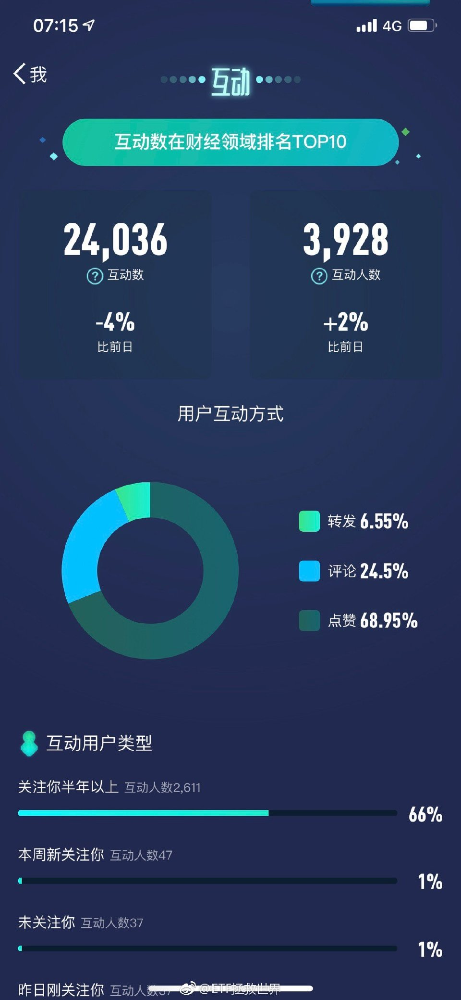

======================================================

ETF拯救世界 (5687069307) @
2019-02-14 08:47:14 Thu  
url: https://weibo.com/5687069307/HgA35ieaf

回复@大鳄龟的小智慧:不好一概而论。主动也有牛基，但是有3000多只主动基，你不知道谁是未来的牛基……//@大鳄龟的小智慧:早上好啊，各位，现在是否大概率是主动基金转被动指数基金的好时机，PS：以前自己瞎买的主动基金成本太高，明显跑不过E大的指数基金

------------------------------------------------------
转推：
>  @ETF拯救世界 (5687069307)
>  2019-02-14 07:16:34 Thu  
>  url: https:/weibo.com/5687069307/HgzshugIX/

>  历史性的一刻。互动TOP10了 ​​​

转发[16]  评论[41]  赞[222] 

======================================================

ETF拯救世界 (5687069307) @
2019-02-14 08:55:53 Thu  
url: https://weibo.com/5687069307/HgA6B6gCC

今天有什么计划，会做什么浪漫的事。

展开说说让大家学习学习。 ​​​

转发[83]  评论[308]  赞[314] 

======================================================

ETF拯救世界 (5687069307) @
2019-02-14 09:00:17 Thu  
url: https://weibo.com/5687069307/HgA8nCTRl

回复@waslj0603:你用了“居然”，就说明你对A股投资者一点都不了解//@waslj0603:我觉得主动基金还是大有可为的，主要是中国散户太多还个个认为自己是股神。昨天向几个同事推荐了计划和指数投资的理念居然被嘲讽了

------------------------------------------------------
转推：
>  @ETF拯救世界 (5687069307)
>  2019-02-14 07:16:34 Thu  
>  url: https:/weibo.com/5687069307/HgzshugIX/

>  历史性的一刻。互动TOP10了 ​​​

转发[8]  评论[79]  赞[279] 

======================================================

ETF拯救世界 (5687069307) @
2019-02-14 09:04:28 Thu  
url: https://weibo.com/5687069307/HgAa5oKcq

快回到最高位了。

熊市有什么好怕的，没有熊市你能买到便宜货吗。

全国人民回本的时候（平均），你已经翻番了。

踏踏实实的，多大点事。 ​​​

转发[53]  评论[176]  赞[529] 

+++++++++++++++++++++++++++++++++++++++++++++++++++++

图片：

======================================================

ETF拯救世界 (5687069307) @
2019-02-14 09:27:41 Thu  
url: https://weibo.com/5687069307/HgAjveTpn

回复@不愿做韭菜的小散:第三轮计划开始至今，两市股票跌幅中位数52.8%。90.1%的股票下跌。跌幅最大的股票98%。我说全国人民回本的时候计划翻番没有问题。//@不愿做韭菜的小散:全国人民回本时候，看图好像挣20%

------------------------------------------------------
转推：
>  @ETF拯救世界 (5687069307)
>  2019-02-14 09:04:28 Thu  
>  url: https:/weibo.com/5687069307/HgAa5oKcq/

>  快回到最高位了。
>  
>  熊市有什么好怕的，没有熊市你能买到便宜货吗。
>  
>  全国人民回本的时候（平均），你已经翻番了。
>  
>  踏踏实实的，多大点事。 ​​​

转发[19]  评论[56]  赞[296] 

======================================================

ETF拯救世界 (5687069307) @
2019-02-14 09:47:02 Thu  
url: https://weibo.com/5687069307/HgArmi7sy

最近微信上有20多个朋友问我买什么，要入市。

场外资金看起来在拼命抢筹。 ​​​

转发[14]  评论[146]  赞[413] 

======================================================

ETF拯救世界 (5687069307) @
2019-02-14 09:53:05 Thu  
url: https://weibo.com/5687069307/HgAtOrqi8

我经常说不要做旅鼠，不要做羊群。你是不是以为永远不要跟群众站在一起。

错了。

大多数时间，你必须跟群众站在一起，否则他们会把你踩成肉酱。

疯狂的时候，你要在狂欢的人群中一起high。但你的心里要知道，几点钟马车会变成南瓜。玩的差不多了，你就要先走。

不能群众一买你就卖。是，你赔不了钱 ​​​

转发[265]  评论[191]  赞[650] 

======================================================

ETF拯救世界 (5687069307) @
2019-02-14 09:58:43 Thu  
url: https://weibo.com/5687069307/HgAw6gggf

回复@好心情S65:行情永远是在犹犹豫豫中起航的。如果所有群众都看多，那也就差不多到顶了。反之亦然。//@好心情S65:我身边的朋友看多看空各种看法都有

------------------------------------------------------
转推：
>  @ETF拯救世界 (5687069307)
>  2019-02-14 09:53:05 Thu  
>  url: https:/weibo.com/5687069307/HgAtOrqi8/

>  我经常说不要做旅鼠，不要做羊群。你是不是以为永远不要跟群众站在一起。
>  
>  错了。
>  
>  大多数时间，你必须跟群众站在一起，否则他们会把你踩成肉酱。
>  
>  疯狂的时候，你要在狂欢的人群中一起high。但你的心里要知道，几点钟马车会变成南瓜。玩的差不多了，你就要先走。
>  
>  不能群众一买你就卖。是，你赔不了钱 ​​​

转发[41]  评论[45]  赞[317] 

======================================================

ETF拯救世界 (5687069307) @
2019-02-14 09:59:33 Thu  
url: https://weibo.com/5687069307/HgAwre3s7

回复@股舞人盛:白酒厉害意味着全面牛市没有开始。//@股舞人盛:白酒，食品饮料今天很强，尤其是白酒还是那么厉害

------------------------------------------------------
转推：
>  @ETF拯救世界 (5687069307)
>  2019-02-14 09:53:05 Thu  
>  url: https:/weibo.com/5687069307/HgAtOrqi8/

>  我经常说不要做旅鼠，不要做羊群。你是不是以为永远不要跟群众站在一起。
>  
>  错了。
>  
>  大多数时间，你必须跟群众站在一起，否则他们会把你踩成肉酱。
>  
>  疯狂的时候，你要在狂欢的人群中一起high。但你的心里要知道，几点钟马车会变成南瓜。玩的差不多了，你就要先走。
>  
>  不能群众一买你就卖。是，你赔不了钱 ​​​

转发[57]  评论[108]  赞[357] 

======================================================

ETF拯救世界 (5687069307) @
2019-02-14 11:11:17 Thu  
url: https://weibo.com/5687069307/HgAZyrl23

关于择时：

在A股，我信奉的是择价值。A股波动极其巨大，历史估值可以在1.5-7之间不断波动。这种情况必须择时。但是周期一定要长，空间一定要大。

即使历史取得了不错的成绩，择长期时的风险也不小。主要是盈利风险，也就是说，有可能会在某个时间段会少赚。当然，没人能从鱼头吃到鱼尾，所以这个可 ​​​

转发[296]  评论[284]  赞[774] 

======================================================

ETF拯救世界 (5687069307) @
2019-02-14 11:13:44 Thu  
url: https://weibo.com/5687069307/HgB0yc6PD

怎么回事，最近又有富婆帮我买粉丝了吗…… ​​​

转发[5]  评论[127]  赞[369] 

+++++++++++++++++++++++++++++++++++++++++++++++++++++

图片：

======================================================

ETF拯救世界 (5687069307) @
2019-02-14 11:21:09 Thu  
url: https://weibo.com/5687069307/HgB3yhRsy

回复@鹰杨123:你要跟她说，亲爱的，我只是想多赚点钱，就可以帮你买套漂亮的别墅，每天送你一支漂亮的玫瑰花。E只是完成这个梦想的工具……//@鹰杨123:老婆问今天有什么惊喜，我说跟E大投资收益已经为正了，她说你天天说E大，你跟E大过得了。。。

------------------------------------------------------
转推：
>  @ETF拯救世界 (5687069307)
>  2019-02-14 08:55:53 Thu  
>  url: https:/weibo.com/5687069307/HgA6B6gCC/

>  今天有什么计划，会做什么浪漫的事。
>  
>  展开说说让大家学习学习。 ​​​

转发[14]  评论[138]  赞[442] 

======================================================

ETF拯救世界 (5687069307) @
2019-02-14 12:48:49 Thu  
url: https://weibo.com/5687069307/HgBD932gh

回复@剑情无客剑情多:房地产要gg吗//@剑情无客剑情多:大情人节的 公司传来噩耗，大规模裁人 包括部门经理在内很多人都被约谈。作为一家省会地产公司，公司买了多个地王被套牢

------------------------------------------------------
转推：
>  @ETF拯救世界 (5687069307)
>  2019-02-14 08:55:53 Thu  
>  url: https:/weibo.com/5687069307/HgA6B6gCC/

>  今天有什么计划，会做什么浪漫的事。
>  
>  展开说说让大家学习学习。 ​​​

转发[9]  评论[78]  赞[192] 

======================================================

ETF拯救世界 (5687069307) @
2019-02-14 13:05:51 Thu  
url: https://weibo.com/5687069307/HgBK3c4oO

回复@大卫流氓星:女人要的是仪式感以及被重视的感觉。节日可以很好的融合这两点。真想让她开心就花点心思满足她。不愿意花心思应该是在一起很久了，追她的时候情人节肯定特积极送礼物…

------------------------------------------------------
转推：
>  @ETF拯救世界 (5687069307)
>  2019-02-14 08:55:53 Thu  
>  url: https:/weibo.com/5687069307/HgA6B6gCC/

>  今天有什么计划，会做什么浪漫的事。
>  
>  展开说说让大家学习学习。 ​​​

转发[62]  评论[68]  赞[240] 

======================================================

ETF拯救世界 (5687069307) @
2019-02-14 13:19:33 Thu  
url: https://weibo.com/5687069307/HgBPCk5M4

回复@ETF永不死:女人不会告诉你她想要什么。她希望你能猜出来。这样才能说明你重视她。礼物这个都不用猜，直接买送了就行。她会埋怨你乱花钱，但一转身就会拍照片发朋友圈了。//@ETF永不死:买礼物又不让，不买了又羡慕别人收到礼物，女人啊一辈子都搞不懂她在想什么[疑问]

------------------------------------------------------
转推：
>  @ETF拯救世界 (5687069307)
>  2019-02-14 08:55:53 Thu  
>  url: https:/weibo.com/5687069307/HgA6B6gCC/

>  今天有什么计划，会做什么浪漫的事。
>  
>  展开说说让大家学习学习。 ​​​

转发[41]  评论[106]  赞[292] 

======================================================

ETF拯救世界 (5687069307) @
2019-02-14 13:28:13 Thu  
url: https://weibo.com/5687069307/HgBT92Nbp

回复@左奴儿的大晨晨:大多数男人都明白。但是男人真的怕麻烦。总是猜来猜去会很烦。所以如果一个男人总是能够很浪漫搞很多小节目，那么就是两种可能，第一，他真的太爱你了，而且从未减少。第二，他是个情场杀手，会跟很多女孩都这样……

------------------------------------------------------
转推：
>  @ETF拯救世界 (5687069307)
>  2019-02-14 08:55:53 Thu  
>  url: https:/weibo.com/5687069307/HgA6B6gCC/

>  今天有什么计划，会做什么浪漫的事。
>  
>  展开说说让大家学习学习。 ​​​

转发[22]  评论[67]  赞[260] 

======================================================

ETF拯救世界 (5687069307) @
2019-02-14 13:31:03 Thu  
url: https://weibo.com/5687069307/HgBUhACNV

回复@咬桌子干啥呢:也有道理。否则你说：“我攒了好久的私房钱给你买的，你看我多爱你”。她会含情脉脉的盯着你说：“你还攒私房钱？？？”//@咬桌子干啥呢:这种的是你得买好礼物，然后让她知道这个是中奖得的，或者赢的。这种总之就是自己不花钱。

------------------------------------------------------
转推：
>  @ETF拯救世界 (5687069307)
>  2019-02-14 08:55:53 Thu  
>  url: https:/weibo.com/5687069307/HgA6B6gCC/

>  今天有什么计划，会做什么浪漫的事。
>  
>  展开说说让大家学习学习。 ​​​

转发[3]  评论[22]  赞[207] 

======================================================

ETF拯救世界 (5687069307) @
2019-02-14 13:39:57 Thu  
url: https://weibo.com/5687069307/HgBXUfzRI

看着账户里的品种一个个翻红，内心毫无波澜。

你会为明天太阳又升起来了激动不已吗？ ​​​

转发[23]  评论[193]  赞[515] 

======================================================

ETF拯救世界 (5687069307) @
2019-02-14 13:44:56 Thu  
url: https://weibo.com/5687069307/HgBZVfkFq

感情的事儿吧，肯定没有统一的答案。一样米养百样人，只是从整体讲。

对男人多点尊重，多给面子。对女人多点重视，多点体贴。日子就能过的好点。

一个想法，不一定对。 ​​​

转发[52]  评论[175]  赞[651] 

======================================================

ETF拯救世界 (5687069307) @
2019-02-14 14:12:59 Thu  
url: https://weibo.com/5687069307/HgCbj7iZz

之前清仓的那两个哥们买回来没有。我还挺想知道的，方便就回复一下…… ​​​

转发[2]  评论[142]  赞[376] 

======================================================

ETF拯救世界 (5687069307) @
2019-02-14 14:23:22 Thu  
url: https://weibo.com/5687069307/HgCfwoTnY

为什么牛市中，大多数人干不过指数。

第一，指数本身就是股票组成的，简单来说，一定有一半股票跑不赢全市场指数。如果是权重股行情，那就不用说了，80%股票跑不过大指数。

第二，大多数人都是不停的交易。你自己看成交量。牛市换手率在100%-200%之间。半年所有股票就能换手一次，你就知道多少人在不 ​​​

转发[339]  评论[266]  赞[713] 

======================================================

ETF拯救世界 (5687069307) @
2019-02-14 14:29:58 Thu  
url: https://weibo.com/5687069307/HgCicsFMP

回复@电烙铁2012:印花税就吃死你。指数没有印花税。[doge]//@电烙铁2012:跑不过指数是因为不懂个股，来来回回频繁交易，手续费损耗，加上本来指数就有一半个股是跑不过的，你仔细算个账就知道了。

------------------------------------------------------
转推：
>  @ETF拯救世界 (5687069307)
>  2019-02-14 14:23:22 Thu  
>  url: https:/weibo.com/5687069307/HgCfwoTnY/

>  为什么牛市中，大多数人干不过指数。
>  
>  第一，指数本身就是股票组成的，简单来说，一定有一半股票跑不赢全市场指数。如果是权重股行情，那就不用说了，80%股票跑不过大指数。
>  
>  第二，大多数人都是不停的交易。你自己看成交量。牛市换手率在100%-200%之间。半年所有股票就能换手一次，你就知道多少人在不 ​​​

转发[48]  评论[21]  赞[240] 

======================================================

ETF拯救世界 (5687069307) @
2019-02-14 14:36:37 Thu  
url: https://weibo.com/5687069307/HgCkTF4LV

回复@大鳄龟的小智慧:指数基金，除非无良基金经理的为了增加交易量频繁交易，否则全年除了调整成分股几乎不会有交易，印花税基本可以忽略。跟自己频繁交易买卖股票能一样吗。你要买了股票不交易当然不是我说的这种了。//@大鳄龟的小智慧:指数下面的成份股配齐已经交过印花税了吧，难道我理解错了？

------------------------------------------------------
转推：
>  @ETF拯救世界 (5687069307)
>  2019-02-14 14:23:22 Thu  
>  url: https:/weibo.com/5687069307/HgCfwoTnY/

>  为什么牛市中，大多数人干不过指数。
>  
>  第一，指数本身就是股票组成的，简单来说，一定有一半股票跑不赢全市场指数。如果是权重股行情，那就不用说了，80%股票跑不过大指数。
>  
>  第二，大多数人都是不停的交易。你自己看成交量。牛市换手率在100%-200%之间。半年所有股票就能换手一次，你就知道多少人在不 ​​​

转发[28]  评论[36]  赞[259] 

======================================================

ETF拯救世界 (5687069307) @
2019-02-14 14:38:37 Thu  
url: https://weibo.com/5687069307/HgClIdRio

预告一下，明天暂停发车。但是本月随时都会发。 ​​​

转发[19]  评论[251]  赞[684] 

======================================================

ETF拯救世界 (5687069307) @
2019-02-14 14:44:58 Thu  
url: https://weibo.com/5687069307/HgCoi78GZ

雪下得太美了。 ​​​

转发[3]  评论[100]  赞[395] 

======================================================

ETF拯救世界 (5687069307) @
2019-02-14 15:10:40 Thu  
url: https://weibo.com/5687069307/HgCyJeUP3

回复@没坐标的星LL:支付宝赢了，账面市值还增加了。完美！//@没坐标的星LL:E大真厉害，支付宝积分到手[偷笑]

------------------------------------------------------
转推：
>  @ETF拯救世界 (5687069307)
>  2019-02-14 14:44:58 Thu  
>  url: https:/weibo.com/5687069307/HgCoi78GZ/

>  雪下得太美了。 ​​​

转发[2]  评论[76]  赞[315] 

======================================================

ETF拯救世界 (5687069307) @
2019-02-14 16:59:45 Thu  
url: https://weibo.com/5687069307/HgDh04iqx

大家能不能想一个古今中外从没被人喷过的名人说来听听。 ​​​

转发[18]  评论[465]  赞[370] 

======================================================

ETF拯救世界 (5687069307) @
2019-02-14 17:31:42 Thu  
url: https://weibo.com/5687069307/HgDtY40uA

回复@宫商角徵羽1010:所谓第三轮，就是已经有两轮落袋为安的历史了。2015年6月第二轮计划卖掉80%多以后，于7月开始第三轮。所以，第三轮当然也会卖。//@宫商角徵羽1010:E大，我有个问题，买股票会随时空仓，长赢计划会有计划让收益落袋为安吗

------------------------------------------------------
转推：
>  @ETF拯救世界 (5687069307)
>  2019-02-14 14:38:37 Thu  
>  url: https:/weibo.com/5687069307/HgClIdRio/

>  预告一下，明天暂停发车。但是本月随时都会发。 ​​​

转发[7]  评论[122]  赞[387] 

======================================================

ETF拯救世界 (5687069307) @
2019-02-14 22:38:40 Thu  
url: https://weibo.com/5687069307/HgFuz95Cc

今天心情不太好。

有位博友给我发私信，截了几张图，是一个群里的。有个跟车的朋友在最低点全部清仓，这两个月的所有反弹收益一点没吃到。因为跟车开始时间的问题，清仓的时候亏损了。

我一直说，我的原则是绝不让任何人因我赔一分钱。所以这些年非常小心极度保守的设计自己的投资计划，风险稍微高一 ​​​

转发[111]  评论[2299]  赞[1242] 

======================================================

ETF拯救世界 (5687069307) @
2019-02-15 13:53:08 Fri  
url: https://weibo.com/5687069307/HgLtKkmrn

今天有事没空发微博，行情也没什么好看的，大家自己找乐子去吧… 

周末可能写点东西。 ​​​

转发[3]  评论[387]  赞[771] 

======================================================

ETF拯救世界 (5687069307) @
2019-02-16 18:03:15 Sat  
url: https://weibo.com/5687069307/HgWxM2nYw

一个帖子告诉你，什么叫做：

“你在我心里是傻逼，那么你做任何事情都非常傻逼”。

有人注册了小号开始在网上集团军式的开始喷我了。为什么说是小号呢，因为这些号除了喷我没说过别的。

我本人确实不知道自己影响到了谁的利益，还是说，依然是之前那几位，潜伏了一段时间又开始搞事情？

我在自己的 ​​​

转发[19]  评论[562]  赞[593] 

+++++++++++++++++++++++++++++++++++++++++++++++++++++

图片：

======================================================

ETF拯救世界 (5687069307) @
2019-02-16 19:12:29 Sat  
url: https://weibo.com/5687069307/HgWZREHdn

给你们跪了，已经有网络高手通过各种我不懂的方式找到他们的蛛丝马迹了……谢谢大家。我不是要搞事情，我只是希望事情不要来搞我，让我安安静静做自己的投资，写自己的字。不惹事，也从来不怕事。就酱。

------------------------------------------------------
转推：
>  @ETF拯救世界 (5687069307)
>  2019-02-16 18:03:15 Sat  
>  url: https:/weibo.com/5687069307/HgWxM2nYw/

>  一个帖子告诉你，什么叫做：
>  
>  “你在我心里是傻逼，那么你做任何事情都非常傻逼”。
>  
>  有人注册了小号开始在网上集团军式的开始喷我了。为什么说是小号呢，因为这些号除了喷我没说过别的。
>  
>  我本人确实不知道自己影响到了谁的利益，还是说，依然是之前那几位，潜伏了一段时间又开始搞事情？
>  
>  我在自己的 ​​​

转发[6]  评论[175]  赞[487] 

======================================================

ETF拯救世界 (5687069307) @
2019-02-16 20:33:55 Sat  
url: https://weibo.com/5687069307/HgXwVsFSy

回复@威士忌不喝酒_2018:球球不去，jsl不去，各种活动不去，各种网站邀请我去开课我不去，我哪儿哪儿都不去。就在自己的微博和公众号说话，还怎么悄悄啊。欺人太甚了。//@威士忌不喝酒_2018:E大，我们悄悄挣钱把。。因为你挡住了他们的发财之路。。。

------------------------------------------------------
转推：
>  @ETF拯救世界 (5687069307)
>  2019-02-16 18:03:15 Sat  
>  url: https:/weibo.com/5687069307/HgWxM2nYw/

>  一个帖子告诉你，什么叫做：
>  
>  “你在我心里是傻逼，那么你做任何事情都非常傻逼”。
>  
>  有人注册了小号开始在网上集团军式的开始喷我了。为什么说是小号呢，因为这些号除了喷我没说过别的。
>  
>  我本人确实不知道自己影响到了谁的利益，还是说，依然是之前那几位，潜伏了一段时间又开始搞事情？
>  
>  我在自己的 ​​​

转发[0]  评论[191]  赞[357] 

======================================================

ETF拯救世界 (5687069307) @
2019-02-16 22:10:20 Sat  
url: https://weibo.com/5687069307/HgYa3rGgV

登陆一看又是1024了，看来得后半夜睡觉了…… ​​​

转发[3]  评论[208]  赞[560] 

+++++++++++++++++++++++++++++++++++++++++++++++++++++

图片：

======================================================

ETF拯救世界 (5687069307) @
2019-02-17 08:47:25 Sun  
url: https://weibo.com/5687069307/Hh2kEhw7Y

我突然想到一件事，以后的红包啊游戏机啊护肤品啊手机啊之类的不能简单抽奖了。

因为很多坏人盯着这个微博，甚至天天来刷。他们红包一个不落的抢，然后转身骂娘。

我要把钱给他们还不如捐给腾讯公益。

怎么把真正的好朋友鉴别出来，各位有没有好办法。 ​​​

转发[9]  评论[706]  赞[591] 

======================================================

ETF拯救世界 (5687069307) @
2019-02-17 18:29:16 Sun  
url: https://weibo.com/5687069307/Hh68P5oi9

好了，所有破事留到这个周末结束。明天又要开场了，继续以前的美好生活！

有个建议，周五欧美这么大涨，周一A股能不能做一次舔狗跟一下。[doge] ​​​

转发[12]  评论[150]  赞[514] 

======================================================

ETF拯救世界 (5687069307) @
2019-02-17 18:44:47 Sun  
url: https://weibo.com/5687069307/Hh6f7rOLo

没想到这样的事情发生在我身上了。被人黑的这几天，公众号关注大幅增加，很多人私信问怎么跟车。他们都是从喷子的帖子里知道我的…喷子：[费解] 有图为证，两个帖子，两次暴涨…… http://t.cn/EVXaqJD

------------------------------------------------------
转推：
>  @ETF拯救世界 (5687069307)
>  2019-02-10 21:54:21 Sun  
>  url: https:/weibo.com/5687069307/Hg3uAwohq/

>  今天🌍票房已经大于所有其它片子之和了。
>  
>  喷子们万万没想到的是，正因为他们的喷引起的争论，让🌍的钱越挣越多了… ​​​

转发[2]  评论[204]  赞[351] 

======================================================

ETF拯救世界 (5687069307) @
2019-02-17 19:04:40 Sun  
url: https://weibo.com/5687069307/Hh6nc3A5f

回复@ffxua:你去看看当时前一天美股是不是跌的。我的建议，美股跌：坚决不做舔狗。美股涨：融入全球金融体系是正确的方向。//@ffxua:你之前可不是这么说的[doge] http://t.cn/EVXfc76

------------------------------------------------------
转推：
>  @ETF拯救世界 (5687069307)
>  2019-02-17 18:29:16 Sun  
>  url: https:/weibo.com/5687069307/Hh68P5oi9/

>  好了，所有破事留到这个周末结束。明天又要开场了，继续以前的美好生活！
>  
>  有个建议，周五欧美这么大涨，周一A股能不能做一次舔狗跟一下。[doge] ​​​

转发[6]  评论[79]  赞[353] 

======================================================

ETF拯救世界 (5687069307) @
2019-02-18 09:02:10 Mon  
url: https://weibo.com/5687069307/HhbR8gLuF

杀不死我的，使我更强大。

既然黑天鹅事件无法避免，那就想办法从中获取最大利益。

每一件事情都会从波动得到利益或承受损失。

脆弱是指因为波动和不确定而承受损失。

反脆弱则是让自己避免这些损失，甚至因此获利。

——反脆弱。 ​​​

转发[63]  评论[143]  赞[581] 

======================================================

ETF拯救世界 (5687069307) @
2019-02-18 09:23:20 Mon  
url: https://weibo.com/5687069307/HhbZJ25lY

刚才，又有一位朋友告诉我，有个人在微博上喷我了。

我去看了看，原来是之前一直在我评论里做广告，拉人进qq群的一个人。最终我只能把他拉黑。恼羞成怒，开始喷，甚至造谣。

但是非常奇怪的是，这次我是笑着浏览他微博的。以前遇到这种事，心情都会很不好，觉得委屈啊，觉得受到不公平的评价啊，blab ​​​

转发[15]  评论[193]  赞[502] 

======================================================

ETF拯救世界 (5687069307) @
2019-02-18 09:33:17 Mon  
url: https://weibo.com/5687069307/Hhc3LjLnW

回复@fankezhou:不好意思，且慢虽然方便，但有人会说你做广告（做了怎么了，就是好用）；你买哪个基金，有人会说你收了基金公司的推广费。即使你为了避嫌，一个指数买六家公司的品种也不行。这世界真神了！//@fankezhou:怎么感觉，且慢无脑跟是不是更直接呵呵

------------------------------------------------------
转推：
>  @ETF拯救世界 (5687069307)
>  2019-02-18 09:23:20 Mon  
>  url: https:/weibo.com/5687069307/HhbZJ25lY/

>  刚才，又有一位朋友告诉我，有个人在微博上喷我了。
>  
>  我去看了看，原来是之前一直在我评论里做广告，拉人进qq群的一个人。最终我只能把他拉黑。恼羞成怒，开始喷，甚至造谣。
>  
>  但是非常奇怪的是，这次我是笑着浏览他微博的。以前遇到这种事，心情都会很不好，觉得委屈啊，觉得受到不公平的评价啊，blab ​​​

转发[2]  评论[52]  赞[260] 

======================================================

ETF拯救世界 (5687069307) @
2019-02-18 09:34:52 Mon  
url: https://weibo.com/5687069307/Hhc4perLr

500今年新高了。加油吧，今年可落后300不少呢。 ​​​

转发[8]  评论[90]  赞[397] 

======================================================

ETF拯救世界 (5687069307) @
2019-02-18 09:39:55 Mon  
url: https://weibo.com/5687069307/Hhc6sjkU6

回复@西歌笑:正常现象。多大点事，踏踏实实的。//@西歌笑:报告男神，我的账户红啦红啦[爱你][爱你][爱你]

------------------------------------------------------
转推：
>  @ETF拯救世界 (5687069307)
>  2019-02-18 09:34:52 Mon  
>  url: https:/weibo.com/5687069307/Hhc4perLr/

>  500今年新高了。加油吧，今年可落后300不少呢。 ​​​

转发[4]  评论[66]  赞[297] 

======================================================

ETF拯救世界 (5687069307) @
2019-02-18 10:19:46 Mon  
url: https://weibo.com/5687069307/HhcmCxp4F

A股是一个70%的人赚不到钱的地方。那么你要解决的第一个问题，就是，要赚钱。

只要开始赚钱，无论多少，都是成功。

第二步，多赚点。

有20%不赔钱的人其实赚不到什么大钱。因为很保守，赚点就跑了。

对于绝大多数人来说，多赚点就是在上涨的牛市中大致跟上指数。跟上70%以上吧。除去鱼头鱼尾，跟上 ​​​

转发[504]  评论[491]  赞[1068] 

======================================================

ETF拯救世界 (5687069307) @
2019-02-18 10:34:01 Mon  
url: https://weibo.com/5687069307/HhcspCjrC

是聪明钱还是傻钱在买？几年后你就知道了。///【风格转换：南方500ETF连获十日净申购 规模直逼50ETF】2018年出现的罕见“ETF”热度到了2019年有增无�.....原文:http://t.cn/EV7oxIR (分享自@微博搜索) ​​​

转发[36]  评论[72]  赞[305] 

======================================================

ETF拯救世界 (5687069307) @
2019-02-18 10:36:24 Mon  
url: https://weibo.com/5687069307/HhctoazSk

回复@JYou-JasonKidd:不好意思，150不是定投。s是择时定投。

------------------------------------------------------
转推：
>  @ETF拯救世界 (5687069307)
>  2019-02-18 09:02:10 Mon  
>  url: https:/weibo.com/5687069307/HhbR8gLuF/

>  杀不死我的，使我更强大。
>  
>  既然黑天鹅事件无法避免，那就想办法从中获取最大利益。
>  
>  每一件事情都会从波动得到利益或承受损失。
>  
>  脆弱是指因为波动和不确定而承受损失。
>  
>  反脆弱则是让自己避免这些损失，甚至因此获利。
>  
>  ——反脆弱。 ​​​

转发[8]  评论[28]  赞[211] 

======================================================

ETF拯救世界 (5687069307) @
2019-02-18 11:01:44 Mon  
url: https://weibo.com/5687069307/HhcDFjkD3

很多人看不上熊市不赔，牛市跟上70%。2005-2015年，如果按照这个节奏，投资中证500的收益率是1800%。18倍。不算股息。这里面的关键是熊市不赔。太难了。

------------------------------------------------------
转推：
>  @ETF拯救世界 (5687069307)
>  2019-02-18 10:19:46 Mon  
>  url: https:/weibo.com/5687069307/HhcmCxp4F/

>  A股是一个70%的人赚不到钱的地方。那么你要解决的第一个问题，就是，要赚钱。
>  
>  只要开始赚钱，无论多少，都是成功。
>  
>  第二步，多赚点。
>  
>  有20%不赔钱的人其实赚不到什么大钱。因为很保守，赚点就跑了。
>  
>  对于绝大多数人来说，多赚点就是在上涨的牛市中大致跟上指数。跟上70%以上吧。除去鱼头鱼尾，跟上 ​​​

转发[134]  评论[61]  赞[334] 

======================================================

ETF拯救世界 (5687069307) @
2019-02-18 11:03:38 Mon  
url: https://weibo.com/5687069307/HhcErrbO6

回复@小小果的小彬彬:清。follow your heart。真的。怎么想就怎么干。//@小小果的小彬彬:e大，现在好想清仓吃个波段[允悲]//@ETF拯救世界:回复@JYou-JasonKidd:不好意思，150不是定投。s是择时定投。

------------------------------------------------------
转推：
>  @ETF拯救世界 (5687069307)
>  2019-02-18 09:02:10 Mon  
>  url: https:/weibo.com/5687069307/HhbR8gLuF/

>  杀不死我的，使我更强大。
>  
>  既然黑天鹅事件无法避免，那就想办法从中获取最大利益。
>  
>  每一件事情都会从波动得到利益或承受损失。
>  
>  脆弱是指因为波动和不确定而承受损失。
>  
>  反脆弱则是让自己避免这些损失，甚至因此获利。
>  
>  ——反脆弱。 ​​​

转发[2]  评论[57]  赞[212] 

======================================================

ETF拯救世界 (5687069307) @
2019-02-18 11:04:55 Mon  
url: https://weibo.com/5687069307/HhcEXkDXw

回复@swimingcat:如果你是这个目标，请立即离开。谁是这个目标，都赶紧走。我不知道未来A股怎么走，我只能尽量不赔钱，赚多少要看天。//@swimingcat:反正我的目标是跟着你10年10倍

------------------------------------------------------
转推：
>  @ETF拯救世界 (5687069307)
>  2019-02-18 10:19:46 Mon  
>  url: https:/weibo.com/5687069307/HhcmCxp4F/

>  A股是一个70%的人赚不到钱的地方。那么你要解决的第一个问题，就是，要赚钱。
>  
>  只要开始赚钱，无论多少，都是成功。
>  
>  第二步，多赚点。
>  
>  有20%不赔钱的人其实赚不到什么大钱。因为很保守，赚点就跑了。
>  
>  对于绝大多数人来说，多赚点就是在上涨的牛市中大致跟上指数。跟上70%以上吧。除去鱼头鱼尾，跟上 ​​​

转发[85]  评论[119]  赞[312] 

======================================================

ETF拯救世界 (5687069307) @
2019-02-18 11:13:13 Mon  
url: https://weibo.com/5687069307/HhcIkypMw

回复@你在红楼我在西游V:有时候两周。我不能保证100%正确，但我反复说的极大概率不会错。//@你在红楼我在西游V:牛市来了一个月回本，这回我信了。//@ETF拯救世界:回复@swimingcat:如果你是这个目标，请立即离开。谁是这个目标，都赶紧走。我不知道未来A股怎么走，我只能尽量不赔钱，赚多少要看天。

------------------------------------------------------
转推：
>  @ETF拯救世界 (5687069307)
>  2019-02-18 10:19:46 Mon  
>  url: https:/weibo.com/5687069307/HhcmCxp4F/

>  A股是一个70%的人赚不到钱的地方。那么你要解决的第一个问题，就是，要赚钱。
>  
>  只要开始赚钱，无论多少，都是成功。
>  
>  第二步，多赚点。
>  
>  有20%不赔钱的人其实赚不到什么大钱。因为很保守，赚点就跑了。
>  
>  对于绝大多数人来说，多赚点就是在上涨的牛市中大致跟上指数。跟上70%以上吧。除去鱼头鱼尾，跟上 ​​​

转发[11]  评论[73]  赞[275] 

======================================================

ETF拯救世界 (5687069307) @
2019-02-18 11:34:06 Mon  
url: https://weibo.com/5687069307/HhcQOf4XP

回复@洪山菜农:不高。就比巴菲特索罗斯彼得林奇高那么一点点。//@洪山菜农:年化25%这个目标高不高//@ETF拯救世界:回复@swimingcat:如果你是这个目标，请立即离开。谁是这个目标，都赶紧走。我不知道未来A股怎么走，我只能尽量不赔钱，赚多少要看天。

------------------------------------------------------
转推：
>  @ETF拯救世界 (5687069307)
>  2019-02-18 10:19:46 Mon  
>  url: https:/weibo.com/5687069307/HhcmCxp4F/

>  A股是一个70%的人赚不到钱的地方。那么你要解决的第一个问题，就是，要赚钱。
>  
>  只要开始赚钱，无论多少，都是成功。
>  
>  第二步，多赚点。
>  
>  有20%不赔钱的人其实赚不到什么大钱。因为很保守，赚点就跑了。
>  
>  对于绝大多数人来说，多赚点就是在上涨的牛市中大致跟上指数。跟上70%以上吧。除去鱼头鱼尾，跟上 ​​​

转发[59]  评论[60]  赞[235] 

======================================================

ETF拯救世界 (5687069307) @
2019-02-18 11:41:06 Mon  
url: https://weibo.com/5687069307/HhcTE330h

投资股市到底该有多少年化收益，这个你理智想想就能大致有个数。

一般来说，优秀的企业ROE在10%以上。你作为股东，按理说你拿到的ROE不会比这个高很多。

但是，有几个问题你要注意：

第一，你很难在净资产附近买入优秀企业的股权。简单来说，你如果2倍以上PB买入优秀企业，那么你的长期收益率有5%就 ​​​

转发[234]  评论[197]  赞[541] 

======================================================

ETF拯救世界 (5687069307) @
2019-02-18 11:44:10 Mon  
url: https://weibo.com/5687069307/HhcUTt4ji

想起来，有喷子喷我的论点之一，是不说明白到底自己是怎么投资的。“你瞧人家xxx，都把自己的核心说出来了”

我就奇了怪了，99.99%的投资大师都不会把核心告诉你，你凭什么要求我一定要说？谁爱说谁说，你凭什么站在道德的制高点对我指指点点？

我就不说，怎么了？神奇。 ​​​

转发[13]  评论[132]  赞[494] 

======================================================

ETF拯救世界 (5687069307) @
2019-02-18 11:46:27 Mon  
url: https://weibo.com/5687069307/HhcVP5aXx

回复@好心情S65:也不想想自己为什么资金量小。//@好心情S65:呵呵^_^，好多人认为自己资金量小，完全不屑于25%的，都想着等自己挖到第一桶金了再去追求那25%保值增值。和很多朋友交流都是这么说的。😁//@ETF拯救世界:回复@洪山菜农:不高。就比巴菲特索罗斯彼得林奇高那么一点点。

------------------------------------------------------
转推：
>  @ETF拯救世界 (5687069307)
>  2019-02-18 10:19:46 Mon  
>  url: https:/weibo.com/5687069307/HhcmCxp4F/

>  A股是一个70%的人赚不到钱的地方。那么你要解决的第一个问题，就是，要赚钱。
>  
>  只要开始赚钱，无论多少，都是成功。
>  
>  第二步，多赚点。
>  
>  有20%不赔钱的人其实赚不到什么大钱。因为很保守，赚点就跑了。
>  
>  对于绝大多数人来说，多赚点就是在上涨的牛市中大致跟上指数。跟上70%以上吧。除去鱼头鱼尾，跟上 ​​​

转发[53]  评论[70]  赞[241] 

======================================================

ETF拯救世界 (5687069307) @
2019-02-18 12:11:47 Mon  
url: https://weibo.com/5687069307/Hhd65xMJG

回复@ING-d201705:群众不是不买股票，而是等身边的人都赚钱了才会进来抢股票。到那天，有人抢，你就做做好事给人家。等群众不要的时候再做好事买回来。踏踏实实的做好事。//@ING-d201705:吃饭时候 隔壁及隔壁的隔壁 都在谈论股票//@ETF拯救世界:回复@好心情S65:也不想想自己为什么资金量小。

------------------------------------------------------
转推：
>  @ETF拯救世界 (5687069307)
>  2019-02-18 10:19:46 Mon  
>  url: https:/weibo.com/5687069307/HhcmCxp4F/

>  A股是一个70%的人赚不到钱的地方。那么你要解决的第一个问题，就是，要赚钱。
>  
>  只要开始赚钱，无论多少，都是成功。
>  
>  第二步，多赚点。
>  
>  有20%不赔钱的人其实赚不到什么大钱。因为很保守，赚点就跑了。
>  
>  对于绝大多数人来说，多赚点就是在上涨的牛市中大致跟上指数。跟上70%以上吧。除去鱼头鱼尾，跟上 ​​​

转发[44]  评论[72]  赞[294] 

======================================================

ETF拯救世界 (5687069307) @
2019-02-18 12:29:33 Mon  
url: https://weibo.com/5687069307/HhddjfIZO

回复@彤彤别吃凉:前面的我不评价。最后一条：我这里难道不是即使在最低点都很高兴吗。//@彤彤别吃凉:1，外资真实性存疑 2，逼空后主力马上有大幅度抛盘3，1月社会融资结构不好，中长贷款并不多，反而库存量很大，往后去库存抛盘压力大4，看粉丝们高兴的样子，熊市自古没有这么多上车的，钱有这么好赚？

------------------------------------------------------
转推：
>  @ETF拯救世界 (5687069307)
>  2019-02-18 10:19:46 Mon  
>  url: https:/weibo.com/5687069307/HhcmCxp4F/

>  A股是一个70%的人赚不到钱的地方。那么你要解决的第一个问题，就是，要赚钱。
>  
>  只要开始赚钱，无论多少，都是成功。
>  
>  第二步，多赚点。
>  
>  有20%不赔钱的人其实赚不到什么大钱。因为很保守，赚点就跑了。
>  
>  对于绝大多数人来说，多赚点就是在上涨的牛市中大致跟上指数。跟上70%以上吧。除去鱼头鱼尾，跟上 ​​​

转发[7]  评论[67]  赞[233] 

======================================================

ETF拯救世界 (5687069307) @
2019-02-18 12:32:07 Mon  
url: https://weibo.com/5687069307/HhdelEFEX

为什么总是有人想等所有宏观微观都变好再去抄底呢？

第一，永远也不会有“所有情况都好”这个时间出现。

第二，大部分情况变好，凭什么你能买在最低点？凭什么？

只有在别人都忧心忡忡崩溃的时候，才是最好的投资机会。 ​​​

转发[386]  评论[212]  赞[827] 

======================================================

ETF拯救世界 (5687069307) @
2019-02-18 12:39:12 Mon  
url: https://weibo.com/5687069307/Hhdhe9zSL

回复@玉飞天:我请你认真看看，这三年大熊计划什么时候亏钱了？或者，你把计划里的品种和计划本身分不清？你要求一个组合里所有品种任何时候都不浮亏？你去找上帝吧。 http://t.cn/EV9MNJR //@玉飞天:可第三轮计划2015-2018，到18年末计划最高亏了10几啊，这叫不亏钱？[doge]

------------------------------------------------------
转推：
>  @ETF拯救世界 (5687069307)
>  2019-02-18 10:19:46 Mon  
>  url: https:/weibo.com/5687069307/HhcmCxp4F/

>  A股是一个70%的人赚不到钱的地方。那么你要解决的第一个问题，就是，要赚钱。
>  
>  只要开始赚钱，无论多少，都是成功。
>  
>  第二步，多赚点。
>  
>  有20%不赔钱的人其实赚不到什么大钱。因为很保守，赚点就跑了。
>  
>  对于绝大多数人来说，多赚点就是在上涨的牛市中大致跟上指数。跟上70%以上吧。除去鱼头鱼尾，跟上 ​​​

转发[10]  评论[84]  赞[264] 

======================================================

ETF拯救世界 (5687069307) @
2019-02-18 12:43:03 Mon  
url: https://weibo.com/5687069307/HhdiN6XdN

依然有人不明白，为什么要有一个150份的组合。

实质的意义，是进行资产配置示范。买什么东西并不是最重要的，最重要的是进行资产配置。

你观察计划，要从整个组合的角度去看。这才是你的资产状况。

浮亏不浮亏，不是看你买的个别品种，而是你的整个账户。暴跌50%的熊市，你想买入任何品种任何时刻都 ​​​

转发[160]  评论[222]  赞[566] 

+++++++++++++++++++++++++++++++++++++++++++++++++++++

图片：

======================================================

ETF拯救世界 (5687069307) @
2019-02-18 13:01:48 Mon  
url: https://weibo.com/5687069307/HhdqoFJGl

回复@风湿膏_:你知不知道05年大熊市上海机场中集集团涨多少？甚至08年都有大涨的股票。这一轮事实是过半股票腰斩92%股票下跌。

------------------------------------------------------
转推：
>  @ETF拯救世界 (5687069307)
>  2019-02-18 12:32:07 Mon  
>  url: https:/weibo.com/5687069307/HhdelEFEX/

>  为什么总是有人想等所有宏观微观都变好再去抄底呢？
>  
>  第一，永远也不会有“所有情况都好”这个时间出现。
>  
>  第二，大部分情况变好，凭什么你能买在最低点？凭什么？
>  
>  只有在别人都忧心忡忡崩溃的时候，才是最好的投资机会。 ​​​

转发[16]  评论[27]  赞[240] 

======================================================

ETF拯救世界 (5687069307) @
2019-02-18 13:19:41 Mon  
url: https://weibo.com/5687069307/HhdxF0nfN

各位以后自己建立组合，应对熊市，达到“不亏”目的的时候，有几个问题一定要注意。

第一，熊市不亏很简单。买个银行理财或者货币基金能稳稳的。但是，如何在牛市到来之前建立好仓位的同时不亏，需要非常重要的平衡能力。熊市结束了，你没有仓位，毫无意义。你赌某个点位空仓变满仓，这个能不能成不说 ​​​

转发[273]  评论[315]  赞[611] 

======================================================

ETF拯救世界 (5687069307) @
2019-02-18 13:26:10 Mon  
url: https://weibo.com/5687069307/HhdAi6Rso

回复@携风牧云:第三轮计划开始两年半以后到2018年上半年，A股也才买了20%多。已经极力压缩区间了。

------------------------------------------------------
转推：
>  @ETF拯救世界 (5687069307)
>  2019-02-18 13:19:41 Mon  
>  url: https:/weibo.com/5687069307/HhdxF0nfN/

>  各位以后自己建立组合，应对熊市，达到“不亏”目的的时候，有几个问题一定要注意。
>  
>  第一，熊市不亏很简单。买个银行理财或者货币基金能稳稳的。但是，如何在牛市到来之前建立好仓位的同时不亏，需要非常重要的平衡能力。熊市结束了，你没有仓位，毫无意义。你赌某个点位空仓变满仓，这个能不能成不说 ​​​

转发[29]  评论[25]  赞[236] 

======================================================

ETF拯救世界 (5687069307) @
2019-02-18 13:36:10 Mon  
url: https://weibo.com/5687069307/HhdElzaSg

回复@ETF未来富婆:是你的证券公司。//@ETF未来富婆:阿E，快看看你的证券公司[飞机][飞机]//@ETF拯救世界:回复@携风牧云:第三轮计划开始两年半以后到2018年上半年，A股也才买了20%多。已经极力压缩区间了。

------------------------------------------------------
转推：
>  @ETF拯救世界 (5687069307)
>  2019-02-18 13:19:41 Mon  
>  url: https:/weibo.com/5687069307/HhdxF0nfN/

>  各位以后自己建立组合，应对熊市，达到“不亏”目的的时候，有几个问题一定要注意。
>  
>  第一，熊市不亏很简单。买个银行理财或者货币基金能稳稳的。但是，如何在牛市到来之前建立好仓位的同时不亏，需要非常重要的平衡能力。熊市结束了，你没有仓位，毫无意义。你赌某个点位空仓变满仓，这个能不能成不说 ​​​

转发[6]  评论[43]  赞[215] 

======================================================

ETF拯救世界 (5687069307) @
2019-02-18 13:38:09 Mon  
url: https://weibo.com/5687069307/HhdFa6FZU

回复@waspjia:因为资产从2010到2015是50份-150份。//@waspjia:回复@Erzat_skr:50份理解的。但直接跳到150，而不是100，我这个强迫症总是有点犯……

------------------------------------------------------
转推：
>  @ETF拯救世界 (5687069307)
>  2019-02-18 12:43:03 Mon  
>  url: https:/weibo.com/5687069307/HhdiN6XdN/

>  依然有人不明白，为什么要有一个150份的组合。
>  
>  实质的意义，是进行资产配置示范。买什么东西并不是最重要的，最重要的是进行资产配置。
>  
>  你观察计划，要从整个组合的角度去看。这才是你的资产状况。
>  
>  浮亏不浮亏，不是看你买的个别品种，而是你的整个账户。暴跌50%的熊市，你想买入任何品种任何时刻都 ​​​

转发[13]  评论[37]  赞[200] 

======================================================

ETF拯救世界 (5687069307) @
2019-02-18 13:44:04 Mon  
url: https://weibo.com/5687069307/HhdHytnEY

这种时候，投资指数的另一个好处就显现出来了：

拿着个股，大多数人会非常慌乱：怎么回事，卖不卖。到底值多少钱，现在高不高了。不卖利润没了怎么办，爆雷怎么办。

拿着指数：踏踏实实的，多大点事儿…… ​​​

转发[110]  评论[136]  赞[514] 

======================================================

ETF拯救世界 (5687069307) @
2019-02-18 13:44:58 Mon  
url: https://weibo.com/5687069307/HhdHVu3na

回复@半盏茶心:希望它做舔狗，它做了……//@半盏茶心:大盘今天疯了，E大昨天对她做了什么//@ETF拯救世界:回复@waspjia:因为资产从2010到2015是50份-150份。//@waspjia:回复@Erzat_skr:50份理解的。但直接跳到150，而不是100，我这个强迫症总是有点犯……

------------------------------------------------------
转推：
>  @ETF拯救世界 (5687069307)
>  2019-02-18 12:43:03 Mon  
>  url: https:/weibo.com/5687069307/HhdiN6XdN/

>  依然有人不明白，为什么要有一个150份的组合。
>  
>  实质的意义，是进行资产配置示范。买什么东西并不是最重要的，最重要的是进行资产配置。
>  
>  你观察计划，要从整个组合的角度去看。这才是你的资产状况。
>  
>  浮亏不浮亏，不是看你买的个别品种，而是你的整个账户。暴跌50%的熊市，你想买入任何品种任何时刻都 ​​​

转发[5]  评论[60]  赞[227] 

======================================================

ETF拯救世界 (5687069307) @
2019-02-18 13:53:04 Mon  
url: https://weibo.com/5687069307/HhdLd5VU4

回复@雨天就要睡懒觉:别怪她。正常人类在股市就是这样才正常。不这样的都不是正常人类。比如你我。//@雨天就要睡懒觉:[泪]和我妈讲了千万别卖，上周五她又瞒着我卖了，又刚刚赚了几个点啊，怎么就不听呢

------------------------------------------------------
转推：
>  @ETF拯救世界 (5687069307)
>  2019-02-18 13:44:04 Mon  
>  url: https:/weibo.com/5687069307/HhdHytnEY/

>  这种时候，投资指数的另一个好处就显现出来了：
>  
>  拿着个股，大多数人会非常慌乱：怎么回事，卖不卖。到底值多少钱，现在高不高了。不卖利润没了怎么办，爆雷怎么办。
>  
>  拿着指数：踏踏实实的，多大点事儿…… ​​​

转发[9]  评论[53]  赞[290] 

======================================================

ETF拯救世界 (5687069307) @
2019-02-18 14:02:29 Mon  
url: https://weibo.com/5687069307/HhdP25siS

再看看有没有一点道理。

------------------------------------------------------
转推：
>  @ETF拯救世界 (5687069307)
>  2019-02-13 09:35:00 Wed  
>  url: https:/weibo.com/5687069307/HgqVYuVv6/

>  市场开始上涨之初，最重要的任务就是把那些不坚定的投机分子完全清理出去。只有他们走了，行情才能走的比较轻松。
>  
>  所以必然走出各种引发人性的走势。
>  
>  你一次两次做短线赚点就跑，都对了。没事。市场会在某个时候给你的脸上来一记重重的铁拳，让你浪费几年的时间。
>  
>  在一个牛市中，如果涨幅最大的10个 ​​​

转发[21]  评论[129]  赞[401] 

======================================================

ETF拯救世界 (5687069307) @
2019-02-18 14:24:04 Mon  
url: https://weibo.com/5687069307/HhdXNbrtz

我倒不是说“死了都不卖”。如果这样，还没卖呢就要死了。

第一，你要弄清楚你来股市干嘛。是不是为了解套还是赚那几个大子儿改善一下生活。不是，你是来挣大钱的。至少幅度要很大。

第二，现在刚刚爬出钻石坑，还在黄金坑。着什么急？贵又不贵，趋势又不错，拿着呗。跌回去又怎么了？早晚有大牛啊。 ​​​

转发[147]  评论[225]  赞[635] 

======================================================

ETF拯救世界 (5687069307) @
2019-02-18 14:30:50 Mon  
url: https://weibo.com/5687069307/Hhe0xF8gZ

回复@佩清06587:费在哪儿呢？就剩陪聊了啊。[哼]//@佩清06587:付费陪聊

------------------------------------------------------
转推：
>  @ETF拯救世界 (5687069307)
>  2019-02-18 14:24:04 Mon  
>  url: https:/weibo.com/5687069307/HhdXNbrtz/

>  我倒不是说“死了都不卖”。如果这样，还没卖呢就要死了。
>  
>  第一，你要弄清楚你来股市干嘛。是不是为了解套还是赚那几个大子儿改善一下生活。不是，你是来挣大钱的。至少幅度要很大。
>  
>  第二，现在刚刚爬出钻石坑，还在黄金坑。着什么急？贵又不贵，趋势又不错，拿着呗。跌回去又怎么了？早晚有大牛啊。 ​​​

转发[1]  评论[38]  赞[249] 

======================================================

ETF拯救世界 (5687069307) @
2019-02-18 14:33:22 Mon  
url: https://weibo.com/5687069307/Hhe1zv5I6

回复@满眼星河GZ:区别是我买好了。//@满眼星河GZ:老大，这行情和去年开局有何不同呢？[笑cry]会不会竹篮打水一场空。卖是不会卖的，踏踏实实的等风来～🙋

------------------------------------------------------
转推：
>  @ETF拯救世界 (5687069307)
>  2019-02-18 14:24:04 Mon  
>  url: https:/weibo.com/5687069307/HhdXNbrtz/

>  我倒不是说“死了都不卖”。如果这样，还没卖呢就要死了。
>  
>  第一，你要弄清楚你来股市干嘛。是不是为了解套还是赚那几个大子儿改善一下生活。不是，你是来挣大钱的。至少幅度要很大。
>  
>  第二，现在刚刚爬出钻石坑，还在黄金坑。着什么急？贵又不贵，趋势又不错，拿着呗。跌回去又怎么了？早晚有大牛啊。 ​​​

转发[14]  评论[48]  赞[371] 

======================================================

ETF拯救世界 (5687069307) @
2019-02-18 14:34:13 Mon  
url: https://weibo.com/5687069307/Hhe1UvPUF

回复@D8奇迹:今天每三只里面有两只跑输500。个股在牛市里想每天跑赢指数非常难。//@D8奇迹:妈蛋，今天手里的二个票都跑输中证500[笑cry]指数大法好。

------------------------------------------------------
转推：
>  @ETF拯救世界 (5687069307)
>  2019-02-18 13:44:04 Mon  
>  url: https:/weibo.com/5687069307/HhdHytnEY/

>  这种时候，投资指数的另一个好处就显现出来了：
>  
>  拿着个股，大多数人会非常慌乱：怎么回事，卖不卖。到底值多少钱，现在高不高了。不卖利润没了怎么办，爆雷怎么办。
>  
>  拿着指数：踏踏实实的，多大点事儿…… ​​​

转发[18]  评论[65]  赞[380] 

======================================================

ETF拯救世界 (5687069307) @
2019-02-18 14:56:19 Mon  
url: https://weibo.com/5687069307/HheaSAz7m

今天就聊到这吧。

熊市最黑暗的时候帮大家打气，黎明到来的时候鼓励大家不要因小失大，以后还有更远的路要走，还会一直唠唠叨叨。有人因为我的唠叨喷我，但我知道更多朋友需要。

且慢中午发给我的数据，现在已经有50%-60%的朋友开始盈利了。没有盈利的朋友里面，有20%是放弃了，没有一直买。

其它30 ​​​

转发[89]  评论[969]  赞[1879] 

======================================================

ETF拯救世界 (5687069307) @
2019-02-18 20:40:44 Mon  
url: https://weibo.com/5687069307/HhgqGhWD7

压力测试。概率。希望各位体会一下。

------------------------------------------------------
转推：
>  @瑞达利欧 (6529122212)
>  2019-02-18 20:00:04 Mon  
>  url: https:/weibo.com/6529122212/HhgaaECTO/

>  我经常看到人们在押对概率高于50%时做决定，而他们没有看到的是进一步提高押对概率对他们会有多大的益处（你几乎总是可以通过获取更多信息来提高押对概率）。与把押对概率从49%（很可能是错的）提高到51%（对的可能性只是略高一点）相比，把押对概率从51%提高到85%（提高34个百分点）所产生的预期价值 ​​​

转发[44]  评论[67]  赞[344] 

======================================================

ETF拯救世界 (5687069307) @
2019-02-18 21:10:52 Mon  
url: https://weibo.com/5687069307/HhgCUucSy

回复@Avril拉维妮:之前一直空仓突然变成满仓赚了大钱的出来没有？//@Avril拉维妮:又被E大言中了，一大波“股神”浮出水面[嘻嘻]

------------------------------------------------------
转推：
>  @ETF拯救世界 (5687069307)
>  2019-02-18 14:56:19 Mon  
>  url: https:/weibo.com/5687069307/HheaSAz7m/

>  今天就聊到这吧。
>  
>  熊市最黑暗的时候帮大家打气，黎明到来的时候鼓励大家不要因小失大，以后还有更远的路要走，还会一直唠唠叨叨。有人因为我的唠叨喷我，但我知道更多朋友需要。
>  
>  且慢中午发给我的数据，现在已经有50%-60%的朋友开始盈利了。没有盈利的朋友里面，有20%是放弃了，没有一直买。
>  
>  其它30 ​​​

转发[3]  评论[177]  赞[361] 

======================================================

ETF拯救世界 (5687069307) @
2019-02-19 06:43:45 Tue  
url: https://weibo.com/5687069307/HhknsbMVc

TOP5了。

不能再涨了，再高的话喷子们眼睛里面冒着火要来砍人了。

今天少说几句，毕竟下跌也没什么好说的。 ​​​

转发[11]  评论[366]  赞[852] 

+++++++++++++++++++++++++++++++++++++++++++++++++++++

图片：

======================================================

ETF拯救世界 (5687069307) @
2019-02-19 10:30:53 Tue  
url: https://weibo.com/5687069307/HhlRDyRK5

$159939  溢价3%。疯子们又回来了。 ​​​

转发[8]  评论[86]  赞[356] 

======================================================

ETF拯救世界 (5687069307) @
2019-02-19 10:33:22 Tue  
url: https://weibo.com/5687069307/HhlSEbZIH

有人焦虑吗。无论是焦虑持仓少想买，还是焦虑怕坐电梯想卖。 ​​​

转发[30]  评论[414]  赞[485] 

======================================================

ETF拯救世界 (5687069307) @
2019-02-19 10:53:41 Tue  
url: https://weibo.com/5687069307/Hhm0TrX38

焦虑的，你过来。我问你，当时你为什么不听我的。听了你还会焦虑吗？金融投资就这么简单，舒舒服服，踏踏实实把钱挣了。干嘛老搞得自己很焦虑？

------------------------------------------------------
转推：
>  @ETF拯救世界 (5687069307)
>  2018-11-02 14:47:45 Fri  
>  url: https:/weibo.com/5687069307/H0NXMfpRh/

>  仓位这个东西，问谁都没用，因为谁都不是你，也没有适合所有人的仓位。
>  
>  就问问自己，跌20%和涨50%，目前舒服不舒服。如果不舒服，把仓位调整到舒服。
>  
>  齐活。 ​​​

转发[35]  评论[143]  赞[427] 

======================================================

ETF拯救世界 (5687069307) @
2019-02-19 10:57:27 Tue  
url: https://weibo.com/5687069307/Hhm2qgmvB

各位，请记住自己目前的情绪。最好在什么地方用文字写下来。

几年后回头体会一下，就明白为什么说大多数人在牛市中赚不了几个钱。 ​​​

转发[133]  评论[245]  赞[568] 

======================================================

ETF拯救世界 (5687069307) @
2019-02-19 11:07:00 Tue  
url: https://weibo.com/5687069307/Hhm6j5W3D

回复@投资跑道上的一只小蜗牛:投资不需要有感觉。一个机器人赚多少赔多少都不会有感觉的。最好做个机器人。情绪在这里是最没用的东西，不如把情绪留给风花雪月。//@投资跑道上的一只小蜗牛:大哥，我被你带的，一点情绪都没有，不知道多少收益才会有感觉

------------------------------------------------------
转推：
>  @ETF拯救世界 (5687069307)
>  2019-02-19 10:57:27 Tue  
>  url: https:/weibo.com/5687069307/Hhm2qgmvB/

>  各位，请记住自己目前的情绪。最好在什么地方用文字写下来。
>  
>  几年后回头体会一下，就明白为什么说大多数人在牛市中赚不了几个钱。 ​​​

转发[39]  评论[96]  赞[411] 

======================================================

ETF拯救世界 (5687069307) @
2019-02-19 11:15:00 Tue  
url: https://weibo.com/5687069307/Hhm9y4Q77

现在，你大概也知道了，A股并不是没有规律的火坑。理性就能挣钱。

但是我建议，熊市里跟别人聊天的时候，有人说别炒股，都是骗子的时候，你别反驳。静静的听着就行。

过一段时间，应该有人开始吹炒股赚了多少了。你也别说话，微笑着看着他们就挺好。

都是给你送钱的，对他们好点。 ​​​

转发[130]  评论[417]  赞[1119] 

======================================================

ETF拯救世界 (5687069307) @
2019-02-19 12:28:24 Tue  
url: https://weibo.com/5687069307/HhmDlbfv6

只有我觉得不好看吗

------------------------------------------------------
转推：
>  @ ()
>  2019-02-19 08:25:14 Tue  
>  url: 

>  抱歉，作者已设置仅展示半年内微博，此微博已不可见。 ​​​

转发[9]  评论[210]  赞[227] 

======================================================

ETF拯救世界 (5687069307) @
2019-02-19 14:36:23 Tue  
url: https://weibo.com/5687069307/Hhnti02ZV

回复@zp0int:还没收盘先别吹。否则场面会很尴尬…//@zp0int:为神马益达猜涨跌命中率是100%[跪了][跪了][跪了]

------------------------------------------------------
转推：
>  @ETF拯救世界 (5687069307)
>  2019-02-19 06:43:45 Tue  
>  url: https:/weibo.com/5687069307/HhknsbMVc/

>  TOP5了。
>  
>  不能再涨了，再高的话喷子们眼睛里面冒着火要来砍人了。
>  
>  今天少说几句，毕竟下跌也没什么好说的。 ​​​

转发[1]  评论[179]  赞[258] 

======================================================

ETF拯救世界 (5687069307) @
2019-02-19 14:49:20 Tue  
url: https://weibo.com/5687069307/HhnyxFG0b

很多朋友跟我说，这几天都加大了投资，加了很多仓位，增加了每份金额。

我没法评价太多，只能说，先尽量悠着点。

明明是别人给咱们抬轿子，别变成了咱们给别人买单。

你的心不能动得比幡还快。 ​​​

转发[134]  评论[523]  赞[839] 

======================================================

ETF拯救世界 (5687069307) @
2019-02-19 18:55:46 Tue  
url: https://weibo.com/5687069307/Hhpazpgbu

回复@原创聊聊虫:以后买卖不要告诉我。告诉我干嘛//@原创聊聊虫:益达，今天我2个账户都减仓了5成，等黑周四再买回来

------------------------------------------------------
转推：
>  @ETF拯救世界 (5687069307)
>  2019-02-19 14:49:20 Tue  
>  url: https:/weibo.com/5687069307/HhnyxFG0b/

>  很多朋友跟我说，这几天都加大了投资，加了很多仓位，增加了每份金额。
>  
>  我没法评价太多，只能说，先尽量悠着点。
>  
>  明明是别人给咱们抬轿子，别变成了咱们给别人买单。
>  
>  你的心不能动得比幡还快。 ​​​

转发[6]  评论[133]  赞[330] 

======================================================

ETF拯救世界 (5687069307) @
2019-02-19 19:17:59 Tue  
url: https://weibo.com/5687069307/HhpjAuN59

每个人操作模式不同，适合自己的策略也不同，买卖都很正常。市场怎么可能只有一种模式呢。

我不鄙视跟我不同的，但你真没必要跟我说你怎么操作的。为了以后低位接回来显得自己牛吗？不可能的，只要有点常识的人都知道，今天卖了，明天低位买回来没什么了不起。除非你能连续赢100次。

连续赢100次也说 ​​​

转发[131]  评论[241]  赞[713] 

======================================================

ETF拯救世界 (5687069307) @
2019-02-19 19:36:38 Tue  
url: https://weibo.com/5687069307/HhprakJqz

回复@美家优团团长群:表现最好的一定是非常激进的。激进的在风口会特别好，一旦出问题就是灭顶之灾。所以尽量不要碰短期最好的。长期在前列，能力强的概率大点//@美家优团团长群:这好像也是买鸡不买最顶最底，买长期靠前的原理.....

------------------------------------------------------
转推：
>  @ETF拯救世界 (5687069307)
>  2019-02-19 19:17:59 Tue  
>  url: https:/weibo.com/5687069307/HhpjAuN59/

>  每个人操作模式不同，适合自己的策略也不同，买卖都很正常。市场怎么可能只有一种模式呢。
>  
>  我不鄙视跟我不同的，但你真没必要跟我说你怎么操作的。为了以后低位接回来显得自己牛吗？不可能的，只要有点常识的人都知道，今天卖了，明天低位买回来没什么了不起。除非你能连续赢100次。
>  
>  连续赢100次也说 ​​​

转发[39]  评论[80]  赞[361] 

======================================================

ETF拯救世界 (5687069307) @
2019-02-20 07:41:42 Wed  
url: https://weibo.com/5687069307/Hhubsli8b

这几天在考虑怎么区分好坏人，方便以后发红包送礼物的时候，才第一次真正意识到“知人知面不知心”的含义。

公众号和微博不用说了。很多人讨厌你，恨你，然后天天关注你，认真研究你的每一句话。这种有受虐体质的人，我一分钱都不想让他从我这里得到。

且慢跟车也不行。今天又看到一个喷子说自己在且 ​​​

转发[14]  评论[588]  赞[687] 

======================================================

ETF拯救世界 (5687069307) @
2019-02-20 08:06:05 Wed  
url: https://weibo.com/5687069307/HhulmFsEb

来了老弟？

------------------------------------------------------
转推：
>  @财联社APP (2868676035)
>  2019-02-20 08:05:24 Wed  
>  url: https:/weibo.com/2868676035/Hhul5h6zO/

>  【由看多转做多 险资开始战略加仓】财联社2月20日讯，近期A股盘面和交易量均显示，投资者有一改原先观望保守姿态而趋于乐观的迹象。记者在采访中了解到，站在当前点位，部分主流保险机构不仅旗帜鲜明地看多A股，更是明显从前期的试探性买入转变为战略性加仓。至于未来的加仓幅度，部分主流保险机构内设 ​​​

转发[20]  评论[69]  赞[311] 

======================================================

ETF拯救世界 (5687069307) @
2019-02-20 08:12:09 Wed  
url: https://weibo.com/5687069307/HhunPsJbr

这几天大家才发现社融量大了，其实一个月多月前YH已经告诉你今年货币政策转向了//@ETF拯救世界:今年的货币环境是“松紧适度”

------------------------------------------------------
转推：
>  @AndrewXAndrew (1701816363)
>  2019-01-25 17:33:18 Fri  
>  url: https:/weibo.com/1701816363/HdAWGqi5q/

>  一天一小好，几天一大好，好消息不断！1月25日，PBoC对达标金融机构定向降准0.5% or 1.5%，理由“普惠金融”，净放水约CNY 2500亿； ​​​

转发[23]  评论[95]  赞[306] 

======================================================

ETF拯救世界 (5687069307) @
2019-02-20 09:33:41 Wed  
url: https://weibo.com/5687069307/HhuUV5oJu

今天就不要猜涨跌了，难度有点大 ​​​

转发[0]  评论[135]  赞[434] 

======================================================

ETF拯救世界 (5687069307) @
2019-02-20 09:42:38 Wed  
url: https://weibo.com/5687069307/HhuYyvbyh

追大指数一定慎重，压力位到了 ​​​

转发[46]  评论[141]  赞[512] 

======================================================

ETF拯救世界 (5687069307) @
2019-02-20 09:55:50 Wed  
url: https://weibo.com/5687069307/Hhv3V0f7Q

回复@ETF复兴号:什么时候能不给自己贴标签，放开思维束缚，张开怀抱拥抱世界？//@ETF复兴号:价值投资者也看K线，技术分析吗

------------------------------------------------------
转推：
>  @ETF拯救世界 (5687069307)
>  2019-02-20 09:42:38 Wed  
>  url: https:/weibo.com/5687069307/HhuYyvbyh/

>  追大指数一定慎重，压力位到了 ​​​

转发[8]  评论[129]  赞[451] 

======================================================

ETF拯救世界 (5687069307) @
2019-02-20 12:40:05 Wed  
url: https://weibo.com/5687069307/Hhw8AjxVQ

回复@翟翟翟翟丶瑞:2400不买，2700买也不是说一定错。就像第一次开会的只有十三个人。这是抄大底的。但你等到抗日战争甚至解放战争看清形势再加入，也有好日子过。甚至更安全。好好体会一下。//@翟翟翟翟丶瑞:2400的时候不敢加额，2700的时候反而戏剧化了

------------------------------------------------------
转推：
>  @ETF拯救世界 (5687069307)
>  2019-02-19 14:49:20 Tue  
>  url: https:/weibo.com/5687069307/HhnyxFG0b/

>  很多朋友跟我说，这几天都加大了投资，加了很多仓位，增加了每份金额。
>  
>  我没法评价太多，只能说，先尽量悠着点。
>  
>  明明是别人给咱们抬轿子，别变成了咱们给别人买单。
>  
>  你的心不能动得比幡还快。 ​​​

转发[57]  评论[132]  赞[445] 

======================================================

ETF拯救世界 (5687069307) @
2019-02-20 12:48:21 Wed  
url: https://weibo.com/5687069307/HhwbW2rDN

回复@年轻的真的:看对方向，打着打着阵亡了没有任何用处。第一，方向对。第二，活下去。才能胜利。//@年轻的真的:E大说的生动形象，想靠打仗发财，看清形式再搞真不错，比如美国打二战……[允悲][允悲][允悲]

------------------------------------------------------
转推：
>  @ETF拯救世界 (5687069307)
>  2019-02-19 14:49:20 Tue  
>  url: https:/weibo.com/5687069307/HhnyxFG0b/

>  很多朋友跟我说，这几天都加大了投资，加了很多仓位，增加了每份金额。
>  
>  我没法评价太多，只能说，先尽量悠着点。
>  
>  明明是别人给咱们抬轿子，别变成了咱们给别人买单。
>  
>  你的心不能动得比幡还快。 ​​​

转发[17]  评论[31]  赞[309] 

======================================================

ETF拯救世界 (5687069307) @
2019-02-20 12:56:11 Wed  
url: https://weibo.com/5687069307/Hhwf7qwMY

回复@侠家军-小美:最讨厌用美女头像的骗子。[哼] 不光骗钱还骗感情。//@侠家军-小美:回复@侠家军-小美:每天盈利一支板。实力说话，不盈利直播剁吊@好股金盘//@ETF拯救世界:回复@年轻的真的:看对方向，打着打着阵亡了没有任何用处。第一，方向对。第二，活下去。才能胜利。

------------------------------------------------------
转推：
>  @ETF拯救世界 (5687069307)
>  2019-02-19 14:49:20 Tue  
>  url: https:/weibo.com/5687069307/HhnyxFG0b/

>  很多朋友跟我说，这几天都加大了投资，加了很多仓位，增加了每份金额。
>  
>  我没法评价太多，只能说，先尽量悠着点。
>  
>  明明是别人给咱们抬轿子，别变成了咱们给别人买单。
>  
>  你的心不能动得比幡还快。 ​​​

转发[2]  评论[61]  赞[277] 

======================================================

ETF拯救世界 (5687069307) @
2019-02-20 13:25:29 Wed  
url: https://weibo.com/5687069307/Hhwr0ocMy

碰到压力就回调没有什么问题。很健康。进二退一。只要支撑不破趋势就延续。踏踏实实的。再说了，就算趋势又变差了，多买点不是更好吗。月中那车还攒着呢。

------------------------------------------------------
转推：
>  @ETF拯救世界 (5687069307)
>  2019-02-20 09:42:38 Wed  
>  url: https:/weibo.com/5687069307/HhuYyvbyh/

>  追大指数一定慎重，压力位到了 ​​​

转发[25]  评论[239]  赞[659] 

======================================================

ETF拯救世界 (5687069307) @
2019-02-20 18:20:54 Wed  
url: https://weibo.com/5687069307/HhymUEHdW

今天有空接孩子。下了校车四个院里同龄的小女孩抱着他不撒手。还有两个小女孩为了抱他的事打起来了。

你肯定认为我是扯淡，我也希望自己在扯淡！愁死我了… ​​​

转发[14]  评论[380]  赞[993] 

======================================================

ETF拯救世界 (5687069307) @
2019-02-20 18:46:46 Wed  
url: https://weibo.com/5687069307/HhyxpDrVq

今天国债跌了不少。话说咱们的债券什么时候能买回点来啊。 ​​​

转发[13]  评论[285]  赞[532] 

======================================================

ETF拯救世界 (5687069307) @
2019-02-21 09:02:40 Thu  
url: https://weibo.com/5687069307/HhE8PgmyZ

今天可以正常发微博。

其实这几天经历的一些事，让我有了思想上的一些变化。

我现在承认，金融投资只适合一部分人。很多人无论从悟性、逻辑思考能力、理解能力、记忆力、性格等各方面，都不适合投资。

我想，过去自己是太理想化了。

但我也不认为自己过去做的事情是没有意义的。至少让很多人了解了 ​​​

转发[97]  评论[574]  赞[1260] 

======================================================

ETF拯救世界 (5687069307) @
2019-02-21 10:05:49 Thu  
url: https://weibo.com/5687069307/HhEysqPGV

说好的回调呢！账户市值又要增加了好烦。[doge]

奶一口还有用吗。 ​​​

转发[8]  评论[284]  赞[520] 

======================================================

ETF拯救世界 (5687069307) @
2019-02-21 11:18:00 Thu  
url: https://weibo.com/5687069307/HhF1L5pd9

昨天在且慢问答回答了一个关于“突然有大笔可投资资金如何补车”的问题。

我觉得微博也有很多朋友有这个情况。

那篇文章很长，我简单总结成一句话吧。

如果你有年终奖/压岁钱/之前犹豫后来坚定信心想加大投入：

在150亏损的情况下，调高每份金额，根据补仓提醒全部补足低于我成本的。

在150份盈利 ​​​

转发[250]  评论[243]  赞[646] 

======================================================

ETF拯救世界 (5687069307) @
2019-02-21 11:20:31 Thu  
url: https://weibo.com/5687069307/HhF2M03Rb

回复@追求确定性2:昨天表现很差你怎么不吹呢。[doge]//@追求确定性2:500还是一马当先

------------------------------------------------------
转推：
>  @ETF拯救世界 (5687069307)
>  2019-02-21 10:05:49 Thu  
>  url: https:/weibo.com/5687069307/HhEysqPGV/

>  说好的回调呢！账户市值又要增加了好烦。[doge]
>  
>  奶一口还有用吗。 ​​​

转发[2]  评论[35]  赞[212] 

======================================================

ETF拯救世界 (5687069307) @
2019-02-21 11:38:32 Thu  
url: https://weibo.com/5687069307/HhFa5z4C5

回复@老乡别跑00发:做投资是否赚钱，与这个人是否银行/券商/会计师事务所/投行/保险/基金的人毫无关系。与他懂不懂财报也基本没有太大关系。

------------------------------------------------------
转推：
>  @ETF拯救世界 (5687069307)
>  2019-02-21 09:02:40 Thu  
>  url: https:/weibo.com/5687069307/HhE8PgmyZ/

>  今天可以正常发微博。
>  
>  其实这几天经历的一些事，让我有了思想上的一些变化。
>  
>  我现在承认，金融投资只适合一部分人。很多人无论从悟性、逻辑思考能力、理解能力、记忆力、性格等各方面，都不适合投资。
>  
>  我想，过去自己是太理想化了。
>  
>  但我也不认为自己过去做的事情是没有意义的。至少让很多人了解了 ​​​

转发[30]  评论[62]  赞[330] 

======================================================

ETF拯救世界 (5687069307) @
2019-02-21 11:42:58 Thu  
url: https://weibo.com/5687069307/HhFbSEM1A

很多人2500点看着自己的账户痛不欲生，看一次心里颤抖一次。只希望历史重演，自己从没开过户，从没买过。

2700多又觉得买少了，拼命想加仓。

说的是不是你，自己检讨一下。 ​​​

转发[322]  评论[355]  赞[563] 

======================================================

ETF拯救世界 (5687069307) @
2019-02-21 11:55:23 Thu  
url: https://weibo.com/5687069307/HhFgVCjMz

回复@广州嘉爸:错。他们只是在讨论。等他们真的加了杠杆才进入最后疯狂阶段。昨天两融余额只有7500亿，等风来吧。//@广州嘉爸:周围的人已经在讨论卖房加杠杆了，看来这轮行情走不了多久

------------------------------------------------------
转推：
>  @ETF拯救世界 (5687069307)
>  2019-02-21 11:42:58 Thu  
>  url: https:/weibo.com/5687069307/HhFbSEM1A/

>  很多人2500点看着自己的账户痛不欲生，看一次心里颤抖一次。只希望历史重演，自己从没开过户，从没买过。
>  
>  2700多又觉得买少了，拼命想加仓。
>  
>  说的是不是你，自己检讨一下。 ​​​

转发[68]  评论[42]  赞[233] 

======================================================

ETF拯救世界 (5687069307) @
2019-02-21 11:57:00 Thu  
url: https://weibo.com/5687069307/HhFhA5kcO

回复@谁煮牛肉:其实这些例子是给各位上课最好的素材。投资真的不是靠猜的。有趣的地方在于，不用知道明天怎么走就能挣钱，你说多开心。//@谁煮牛肉:不知道前天减仓50%的接回来了没[doge]

------------------------------------------------------
转推：
>  @ETF拯救世界 (5687069307)
>  2019-02-21 11:42:58 Thu  
>  url: https:/weibo.com/5687069307/HhFbSEM1A/

>  很多人2500点看着自己的账户痛不欲生，看一次心里颤抖一次。只希望历史重演，自己从没开过户，从没买过。
>  
>  2700多又觉得买少了，拼命想加仓。
>  
>  说的是不是你，自己检讨一下。 ​​​

转发[15]  评论[31]  赞[254] 

======================================================

ETF拯救世界 (5687069307) @
2019-02-21 11:57:56 Thu  
url: https://weibo.com/5687069307/HhFhY2Y9I

回复@vior女神:那3.6%下跌真的对你那么重要？真的吗？//@vior女神:其实我是等跌的。我以为会破2440。心想既然要跌到2440我何必现在买那么多呢，当时是2530点左右。。。。

------------------------------------------------------
转推：
>  @ETF拯救世界 (5687069307)
>  2019-02-21 11:42:58 Thu  
>  url: https:/weibo.com/5687069307/HhFbSEM1A/

>  很多人2500点看着自己的账户痛不欲生，看一次心里颤抖一次。只希望历史重演，自己从没开过户，从没买过。
>  
>  2700多又觉得买少了，拼命想加仓。
>  
>  说的是不是你，自己检讨一下。 ​​​

转发[17]  评论[49]  赞[246] 

======================================================

ETF拯救世界 (5687069307) @
2019-02-21 11:59:06 Thu  
url: https://weibo.com/5687069307/HhFirzKso

回复@i云腾致雨:2万3000亿。//@i云腾致雨:最高时有2万亿？//@ETF拯救世界:回复@广州嘉爸:错。他们只是在讨论。等他们真的加了杠杆才进入最后疯狂阶段。昨天两融余额只有7500亿，等风来吧。//@广州嘉爸:周围的人已经在讨论卖房加杠杆了，看来这轮行情走不了多久

------------------------------------------------------
转推：
>  @ETF拯救世界 (5687069307)
>  2019-02-21 11:42:58 Thu  
>  url: https:/weibo.com/5687069307/HhFbSEM1A/

>  很多人2500点看着自己的账户痛不欲生，看一次心里颤抖一次。只希望历史重演，自己从没开过户，从没买过。
>  
>  2700多又觉得买少了，拼命想加仓。
>  
>  说的是不是你，自己检讨一下。 ​​​

转发[39]  评论[26]  赞[228] 

======================================================

ETF拯救世界 (5687069307) @
2019-02-21 11:59:52 Thu  
url: https://weibo.com/5687069307/HhFiL77o1

回复@求财不劫色:你有这个思维，下轮很可能死于杠杆。//@求财不劫色:我检讨，我错了。我现在很后悔为什么2500的时候没有上杠杆[悲伤]

------------------------------------------------------
转推：
>  @ETF拯救世界 (5687069307)
>  2019-02-21 11:42:58 Thu  
>  url: https:/weibo.com/5687069307/HhFbSEM1A/

>  很多人2500点看着自己的账户痛不欲生，看一次心里颤抖一次。只希望历史重演，自己从没开过户，从没买过。
>  
>  2700多又觉得买少了，拼命想加仓。
>  
>  说的是不是你，自己检讨一下。 ​​​

转发[14]  评论[62]  赞[317] 

======================================================

ETF拯救世界 (5687069307) @
2019-02-21 12:02:23 Thu  
url: https://weibo.com/5687069307/HhFjM2uD9

我不想告诉你们，月底我想加传媒的。

辣鸡。

$中证传媒 sz399971$ ​​​

转发[16]  评论[140]  赞[361] 

======================================================

ETF拯救世界 (5687069307) @
2019-02-21 12:35:43 Thu  
url: https://weibo.com/5687069307/HhFxjeW7O

悬念一：

仓位里的波段500C什么时候出。 ​​​

转发[5]  评论[135]  赞[343] 

======================================================

ETF拯救世界 (5687069307) @
2019-02-21 13:02:34 Thu  
url: https://weibo.com/5687069307/HhFIcrZQq

500收复十月以来失地，人家300都收到六月了，你可长点心吧 ​​​

转发[2]  评论[50]  赞[345] 

======================================================

ETF拯救世界 (5687069307) @
2019-02-21 13:07:58 Thu  
url: https://weibo.com/5687069307/HhFKonYuF

今天S计划基本实现盈利了。同期800下跌19% ​​​

转发[2]  评论[76]  赞[350] 

======================================================

ETF拯救世界 (5687069307) @
2019-02-21 13:14:19 Thu  
url: https://weibo.com/5687069307/HhFMYe8nQ

回复@盛时不重来:150从未亏损//@盛时不重来:150是整体亏损？还是某个要补仓的品种亏损就可以？

------------------------------------------------------
转推：
>  @ETF拯救世界 (5687069307)
>  2019-02-21 11:18:00 Thu  
>  url: https:/weibo.com/5687069307/HhF1L5pd9/

>  昨天在且慢问答回答了一个关于“突然有大笔可投资资金如何补车”的问题。
>  
>  我觉得微博也有很多朋友有这个情况。
>  
>  那篇文章很长，我简单总结成一句话吧。
>  
>  如果你有年终奖/压岁钱/之前犹豫后来坚定信心想加大投入：
>  
>  在150亏损的情况下，调高每份金额，根据补仓提醒全部补足低于我成本的。
>  
>  在150份盈利 ​​​

转发[5]  评论[26]  赞[216] 

======================================================

ETF拯救世界 (5687069307) @
2019-02-21 13:17:59 Thu  
url: https://weibo.com/5687069307/HhFOsrOWA

空仓等回调的朋友请好好体会。很多东西你回头看才知道价值所在。

------------------------------------------------------
转推：
>  @ETF拯救世界 (5687069307)
>  2019-01-21 09:57:43 Mon  
>  url: https:/weibo.com/5687069307/HcWfMd6AE/

>  便宜的时候，给你很多很多时间和机会让你慢慢布局，你因为各种利空不敢买，又或者是特别贪，希望跌到2200,2000,1500。
>  
>  涨起来了，贵了，你很着急。希望有个大回调自己好杀进去。
>  
>  不好意思，真正的牛市没有回调。即使有你也进不去。最后你进去了，恐怕涨不了多少就要是大顶了。
>  
>  这话还早，不过几年后 ​​​

转发[37]  评论[52]  赞[326] 

======================================================

ETF拯救世界 (5687069307) @
2019-02-21 13:22:03 Thu  
url: https://weibo.com/5687069307/HhFQ6Ebn3

底部为了保住几个点胜利果实卖出实现利润的朋友，很可能就是未来高位接盘的朋友。

我说这个，不是为了再次打击你。而是提醒你，不要犯第二个错误。尽量不要追涨为别人接盘。 ​​​

转发[94]  评论[100]  赞[490] 

======================================================

ETF拯救世界 (5687069307) @
2019-02-21 13:24:33 Thu  
url: https://weibo.com/5687069307/HhFR8bAjE

有这种感觉的朋友，请记住2700你的感觉，你的心情，你的想法。未来如果再次跌回去，请不要再害怕。再说一次，你买的是指数，只要买的不高，就极大极大概率涨起来。你的所有担心都毫无必要。现在再体会一下。你已经有经验了。

------------------------------------------------------
转推：
>  @ETF拯救世界 (5687069307)
>  2019-02-21 11:42:58 Thu  
>  url: https:/weibo.com/5687069307/HhFbSEM1A/

>  很多人2500点看着自己的账户痛不欲生，看一次心里颤抖一次。只希望历史重演，自己从没开过户，从没买过。
>  
>  2700多又觉得买少了，拼命想加仓。
>  
>  说的是不是你，自己检讨一下。 ​​​

转发[125]  评论[127]  赞[503] 

======================================================

ETF拯救世界 (5687069307) @
2019-02-21 13:25:47 Thu  
url: https://weibo.com/5687069307/HhFRCCrga

今天必须发一篇文章了。 ​​​

转发[10]  评论[170]  赞[530] 

======================================================

ETF拯救世界 (5687069307) @
2019-02-21 13:32:27 Thu  
url: https://weibo.com/5687069307/HhFUksyq6

表脸。GJD是不是想要我的PS4 pro？？？ ​​​

转发[19]  评论[81]  赞[356] 

======================================================

ETF拯救世界 (5687069307) @
2019-02-21 13:38:00 Thu  
url: https://weibo.com/5687069307/HhFWAbJmB

回复@一个习惯了折腾的人:不知道有几个人懂了。//@一个习惯了折腾的人:钻石坑那篇文章，益达回复网友当时应该的持仓仓位。 http://t.cn/EVDclvD 

------------------------------------------------------
转推：
>  @ETF拯救世界 (5687069307)
>  2019-02-21 11:42:58 Thu  
>  url: https:/weibo.com/5687069307/HhFbSEM1A/

>  很多人2500点看着自己的账户痛不欲生，看一次心里颤抖一次。只希望历史重演，自己从没开过户，从没买过。
>  
>  2700多又觉得买少了，拼命想加仓。
>  
>  说的是不是你，自己检讨一下。 ​​​

转发[32]  评论[79]  赞[316] 

======================================================

ETF拯救世界 (5687069307) @
2019-02-21 13:40:57 Thu  
url: https://weibo.com/5687069307/HhFXMr5Qp

回复@安乐健:投资这个东西，本来就应该是开开心心的。根本也没多大点事，别给自己整的上蹿下跳一会哭一会笑。很多时候赚钱就是副产品，这个游戏好玩才是真的。//@安乐健:这里太欢乐了，真好。[笑cry][笑cry][笑cry]

------------------------------------------------------
转推：
>  @ETF拯救世界 (5687069307)
>  2019-02-21 13:32:27 Thu  
>  url: https:/weibo.com/5687069307/HhFUksyq6/

>  表脸。GJD是不是想要我的PS4 pro？？？ ​​​

转发[17]  评论[65]  赞[349] 

======================================================

ETF拯救世界 (5687069307) @
2019-02-21 13:57:47 Thu  
url: https://weibo.com/5687069307/HhG4C9TdM

[爱你]

------------------------------------------------------
转推：
>  @ETF拯救世界 (5687069307)
>  2019-02-21 13:22:03 Thu  
>  url: https:/weibo.com/5687069307/HhFQ6Ebn3/

>  底部为了保住几个点胜利果实卖出实现利润的朋友，很可能就是未来高位接盘的朋友。
>  
>  我说这个，不是为了再次打击你。而是提醒你，不要犯第二个错误。尽量不要追涨为别人接盘。 ​​​

转发[25]  评论[77]  赞[308] 

======================================================

ETF拯救世界 (5687069307) @
2019-02-21 14:17:29 Thu  
url: https://weibo.com/5687069307/HhGcBErMU

今天有没有人连续犯第二个错误。就这么点事儿。看明白了怎么会上当呢。//@ETF拯救世界:[爱你]

------------------------------------------------------
转推：
>  @ETF拯救世界 (5687069307)
>  2019-02-21 13:22:03 Thu  
>  url: https:/weibo.com/5687069307/HhFQ6Ebn3/

>  底部为了保住几个点胜利果实卖出实现利润的朋友，很可能就是未来高位接盘的朋友。
>  
>  我说这个，不是为了再次打击你。而是提醒你，不要犯第二个错误。尽量不要追涨为别人接盘。 ​​​

转发[18]  评论[71]  赞[274] 

======================================================

ETF拯救世界 (5687069307) @
2019-02-21 14:21:47 Thu  
url: https://weibo.com/5687069307/HhGem6rFZ

回复@请叫我幸福鬼:以后评论有这种都拉黑。这是第一个。//@请叫我幸福鬼:还好清仓了，不然跳水 少了5个点的利润！//@ETF拯救世界:今天有没有人连续犯第二个错误。就这么点事儿。看明白了怎么会上当呢。//@ETF拯救世界:[爱你]

------------------------------------------------------
转推：
>  @ETF拯救世界 (5687069307)
>  2019-02-21 13:22:03 Thu  
>  url: https:/weibo.com/5687069307/HhFQ6Ebn3/

>  底部为了保住几个点胜利果实卖出实现利润的朋友，很可能就是未来高位接盘的朋友。
>  
>  我说这个，不是为了再次打击你。而是提醒你，不要犯第二个错误。尽量不要追涨为别人接盘。 ​​​

转发[5]  评论[137]  赞[374] 

======================================================

ETF拯救世界 (5687069307) @
2019-02-21 14:41:46 Thu  
url: https://weibo.com/5687069307/HhGmtkwfV

风云突变。不写了没意义了。各位晚上自己找点节目吧。

------------------------------------------------------
转推：
>  @ETF拯救世界 (5687069307)
>  2019-02-21 13:25:47 Thu  
>  url: https:/weibo.com/5687069307/HhFRCCrga/

>  今天必须发一篇文章了。 ​​​

转发[8]  评论[135]  赞[355] 

======================================================

ETF拯救世界 (5687069307) @
2019-02-21 14:49:49 Thu  
url: https://weibo.com/5687069307/HhGpK2xZf

回复@简单发呆1818:看错什么？涨高了想写一篇建议不要追高的，现在跌回来不用写了。看错什么？//@简单发呆1818:老司机也有看错的时候吗？//@ETF拯救世界:风云突变。不写了没意义了。各位晚上自己找点节目吧。

------------------------------------------------------
转推：
>  @ETF拯救世界 (5687069307)
>  2019-02-21 13:25:47 Thu  
>  url: https:/weibo.com/5687069307/HhFRCCrga/

>  今天必须发一篇文章了。 ​​​

转发[5]  评论[80]  赞[350] 

======================================================

ETF拯救世界 (5687069307) @
2019-02-21 14:59:55 Thu  
url: https://weibo.com/5687069307/HhGtPyGnk

明天开始，会少发一些微博。

一个是去多做些研究，一个是有不少自己的事情要处理。

该说的也说的差不多。关键时候还会继续按摩，一般的小风小浪我看各位都没问题。

多大点事，踏踏实实的。 ​​​

转发[9]  评论[293]  赞[771] 

======================================================

ETF拯救世界 (5687069307) @
2019-02-21 19:35:31 Thu  
url: https://weibo.com/5687069307/HhIhH371Z

刚又有人跟我说，球球上又开始说我了。

我过去看了看。

没什么别的感觉，就是特别感动。

那么多真的懂我的朋友留言，而且一看就知道是真的了解整个计划情况。特别好。

第二轮计划清掉绝大部分仓位的时候单轮收益率超过100%，那是2015年6月。7月股灾中，第三轮计划开始。从那时候算，300和500平均跌 ​​​

转发[56]  评论[456]  赞[1368] 

======================================================

ETF拯救世界 (5687069307) @
2019-02-21 21:29:55 Thu  
url: https://weibo.com/5687069307/HhJ28moGY

今日开始正式回归Keep。

每日打卡（1）

欢迎各位监督。赶紧动起来，夏天不远了！ ​​​

转发[4]  评论[252]  赞[738] 

+++++++++++++++++++++++++++++++++++++++++++++++++++++

图片：

======================================================

ETF拯救世界 (5687069307) @
2019-02-22 09:46:18 Fri  
url: https://weibo.com/5687069307/HhNR1uYuP

各位感觉计划中的券商指数持仓会怎么操作。

今年涨幅第一的指数，有点刺激啊。要平衡吗。 ​​​

转发[263]  评论[369]  赞[440] 

======================================================

ETF拯救世界 (5687069307) @
2019-02-22 10:26:39 Fri  
url: https://weibo.com/5687069307/HhO7ppUms

我说你们这些在keep关注我的朋友能不能多发点照片大家互相鼓励一下。[doge]

------------------------------------------------------
转推：
>  @ETF拯救世界 (5687069307)
>  2019-02-21 21:29:55 Thu  
>  url: https:/weibo.com/5687069307/HhJ28moGY/

>  今日开始正式回归Keep。
>  
>  每日打卡（1）
>  
>  欢迎各位监督。赶紧动起来，夏天不远了！ ​​​

转发[0]  评论[150]  赞[248] 

======================================================

ETF拯救世界 (5687069307) @
2019-02-22 10:27:52 Fri  
url: https://weibo.com/5687069307/HhO7UbhpO

看评论感觉券商要埋一波啊。

------------------------------------------------------
转推：
>  @ETF拯救世界 (5687069307)
>  2019-02-22 09:46:18 Fri  
>  url: https:/weibo.com/5687069307/HhNR1uYuP/

>  各位感觉计划中的券商指数持仓会怎么操作。
>  
>  今年涨幅第一的指数，有点刺激啊。要平衡吗。 ​​​

转发[5]  评论[89]  赞[264] 

======================================================

ETF拯救世界 (5687069307) @
2019-02-22 11:04:33 Fri  
url: https://weibo.com/5687069307/HhOmMEAqp

S的传媒已经回本，150的遥遥无期。[摊手]

这指数是这波熊市最符合我“80%定律”的指数，之后会怎么走，大家都围观一下。 ​​​

转发[381]  评论[188]  赞[382] 

======================================================

ETF拯救世界 (5687069307) @
2019-02-22 11:08:36 Fri  
url: https://weibo.com/5687069307/HhOoreesy

回复@lollyshop:“任何不会死的品种，从最高点算，下跌80%是大底的机会极大。”——E首发//@lollyshop:80%定律，是什么？求科普

------------------------------------------------------
转推：
>  @ETF拯救世界 (5687069307)
>  2019-02-22 11:04:33 Fri  
>  url: https:/weibo.com/5687069307/HhOmMEAqp/

>  S的传媒已经回本，150的遥遥无期。[摊手]
>  
>  这指数是这波熊市最符合我“80%定律”的指数，之后会怎么走，大家都围观一下。 ​​​

转发[185]  评论[114]  赞[359] 

======================================================

ETF拯救世界 (5687069307) @
2019-02-22 11:11:08 Fri  
url: https://weibo.com/5687069307/HhOpt7juP

回复@Eda_fans:交易券商，不能看它本身的估值。而要看全市场估值——E首发。//@Eda_fans:在蚂蚁上提示券商已经处于高估阶段了

------------------------------------------------------
转推：
>  @ETF拯救世界 (5687069307)
>  2019-02-22 09:46:18 Fri  
>  url: https:/weibo.com/5687069307/HhNR1uYuP/

>  各位感觉计划中的券商指数持仓会怎么操作。
>  
>  今年涨幅第一的指数，有点刺激啊。要平衡吗。 ​​​

转发[143]  评论[132]  赞[395] 

======================================================

ETF拯救世界 (5687069307) @
2019-02-22 11:18:05 Fri  
url: https://weibo.com/5687069307/HhOsigQhG

回复@锡爷要消业培福:它说的是最高价腰斩再打两次八折。也就是下跌2/3。我认为这个不对，下跌80%才是极限。//@锡爷要消业培福:半値八掛け二割引//@ETF拯救世界:回复@lollyshop:“任何不会死的品种，从最高点算，下跌80%是大底的机会极大。”——E首发

------------------------------------------------------
转推：
>  @ETF拯救世界 (5687069307)
>  2019-02-22 11:04:33 Fri  
>  url: https:/weibo.com/5687069307/HhOmMEAqp/

>  S的传媒已经回本，150的遥遥无期。[摊手]
>  
>  这指数是这波熊市最符合我“80%定律”的指数，之后会怎么走，大家都围观一下。 ​​​

转发[43]  评论[48]  赞[240] 

======================================================

ETF拯救世界 (5687069307) @
2019-02-22 11:20:07 Fri  
url: https://weibo.com/5687069307/HhOt76CYX

我的投资小窍门有600多个。每两天在微博发一个可以发五年。小本本要准备的厚一点…… ​​​

转发[17]  评论[206]  赞[626] 

======================================================

ETF拯救世界 (5687069307) @
2019-02-22 11:22:34 Fri  
url: https://weibo.com/5687069307/HhOu6BIBV

再说一个：

“券商之所以每次牛市都是反弹利器，并不是因为它本身的原因。而是因为大家都认为它是反弹利器。所以即使知道最后还会挂，依然会往上干”——E首发。 ​​​

转发[173]  评论[173]  赞[533] 

======================================================

ETF拯救世界 (5687069307) @
2019-02-22 11:29:33 Fri  
url: https://weibo.com/5687069307/HhOwWqFAY

回复@寒山明月:不要神化机构。当年zx证券自营部门巨亏30亿全部门解散的事忘了吗。//@寒山明月:券商之所以是反弹利器，是因为券商对行情先觉先知。。。。牛屎来时，自然券商最先知道。。。

------------------------------------------------------
转推：
>  @ETF拯救世界 (5687069307)
>  2019-02-22 11:22:34 Fri  
>  url: https:/weibo.com/5687069307/HhOu6BIBV/

>  再说一个：
>  
>  “券商之所以每次牛市都是反弹利器，并不是因为它本身的原因。而是因为大家都认为它是反弹利器。所以即使知道最后还会挂，依然会往上干”——E首发。 ​​​

转发[19]  评论[30]  赞[262] 

======================================================

ETF拯救世界 (5687069307) @
2019-02-22 11:36:52 Fri  
url: https://weibo.com/5687069307/HhOzUwnRR

回复@ffxua:潜伏在群众中的券商ETF你给我站出来。//@ffxua:图片评论 http://t.cn/Ef73iHZ //@ETF拯救世界:回复@Eda_fans:交易券商，不能看它本身的估值。而要看全市场估值——E首发。//@Eda_fans:在蚂蚁上提示券商已经处于高估阶段了

------------------------------------------------------
转推：
>  @ETF拯救世界 (5687069307)
>  2019-02-22 09:46:18 Fri  
>  url: https:/weibo.com/5687069307/HhNR1uYuP/

>  各位感觉计划中的券商指数持仓会怎么操作。
>  
>  今年涨幅第一的指数，有点刺激啊。要平衡吗。 ​​​

转发[22]  评论[93]  赞[307] 

======================================================

ETF拯救世界 (5687069307) @
2019-02-22 12:04:40 Fri  
url: https://weibo.com/5687069307/HhOLbzfOg

如果这是我孩子，我心里会乐开了花。不光学习好，字体工整，还有生意头脑。

------------------------------------------------------
转推：
>  @澎湃新闻 (5044281310)
>  2019-02-22 11:47:37 Fri  
>  url: https:/weibo.com/5044281310/HhOEhrSHm/

>  【重庆13岁女孩寒假期间替人代写作业，收入上万元】#05后寒假代写作业收入近万# 近日，重庆的刘女士发现自己的闲鱼号被人举报封号了，了解详情后惊呆了，原来自己13岁的女儿寒假期间一直登陆自己的闲鱼帮人写作业，看收入已经上万。这次被举报的原因竟然是因为女儿字迹过于工整，被对方老师发现是代写 ​​​

转发[44]  评论[93]  赞[382] 

======================================================

ETF拯救世界 (5687069307) @
2019-02-22 13:17:38 Fri  
url: https://weibo.com/5687069307/HhPeO5fPB

想给500发个奖状。希望再接再厉，不要辜负我。

$中证500 sz399905$ ​​​

转发[4]  评论[108]  赞[477] 

======================================================

ETF拯救世界 (5687069307) @
2019-02-22 13:28:14 Fri  
url: https://weibo.com/5687069307/HhPj7cYo3

用高德的，推荐使用马丽语音包。

喷了。 ​​​

转发[2]  评论[81]  赞[303] 

======================================================

ETF拯救世界 (5687069307) @
2019-02-22 13:32:31 Fri  
url: https://weibo.com/5687069307/HhPkQrSYt

有人黑我为什么不全仓300。

为什么这个世界上一定只能有一种投资方式呢？我想大盘小盘行业指数都配不可以吗？

不可以——喷子下了判决书。

我再次建议，投资千万不要只看最近发生了什么。这两年大蓝筹好，你就认为它会永远好。这得短视到什么地步？

我就是要大小都配，动态平衡。每个人都有自己的 ​​​

转发[47]  评论[146]  赞[499] 

======================================================

ETF拯救世界 (5687069307) @
2019-02-22 13:50:04 Fri  
url: https://weibo.com/5687069307/HhPrYw1wu

空仓的心急如焚，等着调整就是不调整。

其中一部分忍不住追进去，duang，套了。

另一部分忍着不追。duang，还是不敢买。 ​​​

转发[126]  评论[164]  赞[469] 

======================================================

ETF拯救世界 (5687069307) @
2019-02-22 13:56:19 Fri  
url: https://weibo.com/5687069307/HhPuw3SpI

回复@原上孤烟:很好的观察方式。建议大家也多观察类似的群众情绪。//@原上孤烟:我有个同学群里现在正在热烈讨论股市，有几个的言论就是牛市来了，但是都不敢买。明确说要买的只有一个人。

------------------------------------------------------
转推：
>  @ETF拯救世界 (5687069307)
>  2019-02-22 13:50:04 Fri  
>  url: https:/weibo.com/5687069307/HhPrYw1wu/

>  空仓的心急如焚，等着调整就是不调整。
>  
>  其中一部分忍不住追进去，duang，套了。
>  
>  另一部分忍着不追。duang，还是不敢买。 ​​​

转发[21]  评论[71]  赞[254] 

======================================================

ETF拯救世界 (5687069307) @
2019-02-22 13:59:13 Fri  
url: https://weibo.com/5687069307/HhPvHiJN1

回复@土掉渣儿要励志当学霸:到每个区间都不能用“定投”的方式买。不知道谁注意去年10、11月每次都是五六车的发。后来节奏又慢了。要体会一下。

------------------------------------------------------
转推：
>  @ETF拯救世界 (5687069307)
>  2019-02-22 13:50:04 Fri  
>  url: https:/weibo.com/5687069307/HhPrYw1wu/

>  空仓的心急如焚，等着调整就是不调整。
>  
>  其中一部分忍不住追进去，duang，套了。
>  
>  另一部分忍着不追。duang，还是不敢买。 ​​​

转发[51]  评论[83]  赞[336] 

======================================================

ETF拯救世界 (5687069307) @
2019-02-22 14:14:33 Fri  
url: https://weibo.com/5687069307/HhPBUDlKo

$证券公司 sz399975$   有你的！ ​​​

转发[9]  评论[158]  赞[350] 

======================================================

ETF拯救世界 (5687069307) @
2019-02-22 14:17:15 Fri  
url: https://weibo.com/5687069307/HhPD1etb4

建议再好好看看这段话。经历一次，我相信你的体会又不同。

------------------------------------------------------
转推：
>  @ETF拯救世界 (5687069307)
>  2018-11-19 11:30:19 Mon  
>  url: https:/weibo.com/5687069307/H3mW57RyW/

>  有人做投资看现在，我们做投资看未来。
>  
>  目前的盈利或者亏损，都不是最后的终点。就如你的孩子现在在班里每次考第一，又或者每次都考不进前十，都不代表未来他的人生是否成功，是否幸福一样。
>  
>  你站的高一点，看的远一点，很多东西就完全不同了。
>  
>  在金融市场上，有时候浮亏是特别好的事。尤其是当你有 ​​​

转发[52]  评论[58]  赞[333] 

======================================================

ETF拯救世界 (5687069307) @
2019-02-22 14:23:29 Fri  
url: https://weibo.com/5687069307/HhPFxv1Bi

$中证传媒 sz399971$   你跟着凑什么热闹  [怒] ​​​

转发[39]  评论[89]  赞[296] 

======================================================

ETF拯救世界 (5687069307) @
2019-02-22 14:31:47 Fri  
url: https://weibo.com/5687069307/HhPIUoy3Q

回复@南海恶神的师傅:不知道有多少人能学到“风格切换”这一课。我个人认为，去年底到今年过年期间，是不是极力吹捧蓝筹，贬低中小创，是一个投资人是否成熟的标志之一。我建议各位用这个去套一下。//@南海恶神的师傅:夹头今天哭晕在厕所[允悲] http://t.cn/EfZ5Fc1

------------------------------------------------------
转推：
>  @ETF拯救世界 (5687069307)
>  2019-02-22 14:23:29 Fri  
>  url: https:/weibo.com/5687069307/HhPFxv1Bi/

>  $中证传媒 sz399971$   你跟着凑什么热闹  [怒] ​​​

转发[36]  评论[79]  赞[285] 

======================================================

ETF拯救世界 (5687069307) @
2019-02-22 14:39:55 Fri  
url: https://weibo.com/5687069307/HhPMdt1q8

回复@萩落依零:不拉黑对不起我的鼠标……//@萩落依零:益达，我想告诉你，我年前跟计划买的券商指数，今天一看54个点了。

------------------------------------------------------
转推：
>  @ETF拯救世界 (5687069307)
>  2019-02-22 09:46:18 Fri  
>  url: https:/weibo.com/5687069307/HhNR1uYuP/

>  各位感觉计划中的券商指数持仓会怎么操作。
>  
>  今年涨幅第一的指数，有点刺激啊。要平衡吗。 ​​​

转发[82]  评论[107]  赞[306] 

======================================================

ETF拯救世界 (5687069307) @
2019-02-22 14:45:49 Fri  
url: https://weibo.com/5687069307/HhPOBwBHY

回复@萩落依零:开玩笑呢。你们多赚点我最开心。每个人都赚500万最好。//@萩落依零:[笑cry]别拉黑我，我都不想说我54个点就赚了一千五百多块钱，刚好是我家娃几个月的尿布钱，我买的场外基金还在跟大家伙共进退呢。//@ETF拯救世界:回复@萩落依零:不拉黑对不起我的鼠标……

------------------------------------------------------
转推：
>  @ETF拯救世界 (5687069307)
>  2019-02-22 09:46:18 Fri  
>  url: https:/weibo.com/5687069307/HhNR1uYuP/

>  各位感觉计划中的券商指数持仓会怎么操作。
>  
>  今年涨幅第一的指数，有点刺激啊。要平衡吗。 ​​​

转发[79]  评论[146]  赞[350] 

======================================================

ETF拯救世界 (5687069307) @
2019-02-22 14:59:54 Fri  
url: https://weibo.com/5687069307/HhPUkaIN0

回复@狂奔笨狼:今天又是只有1/3的股票比500涨幅大。我建议各位再认真考虑一下，一般人何德何能一定能在牛市里坚定持有比指数涨幅大的股票？你买过牛股，但随时跑了没有一点用。//@狂奔笨狼:今天没有涨幅超过512880的股票，涨幅超过500的800来个[允悲]

------------------------------------------------------
转推：
>  @ETF拯救世界 (5687069307)
>  2019-02-22 09:46:18 Fri  
>  url: https:/weibo.com/5687069307/HhNR1uYuP/

>  各位感觉计划中的券商指数持仓会怎么操作。
>  
>  今年涨幅第一的指数，有点刺激啊。要平衡吗。 ​​​

转发[74]  评论[191]  赞[377] 

======================================================

ETF拯救世界 (5687069307) @
2019-02-22 15:16:56 Fri  
url: https://weibo.com/5687069307/HhQ1eAKXx

我觉得是故意的。要受苦了。

------------------------------------------------------
转推：
>  @北京人不知道的北京事儿 (1662214194)
>  2019-02-22 15:14:43 Fri  
>  url: https:/weibo.com/1662214194/HhQ0l19Y3/

>  2月22日，宋喆已从北京转到天津市某监狱服刑。今天这条新闻又火了！因为网友发现，天津市监狱管理局的办公室副主任也叫王宝强！！还真是冤家路窄啊。。。[允悲][允悲][允悲] ​​​

转发[11]  评论[71]  赞[261] 

======================================================

ETF拯救世界 (5687069307) @
2019-02-22 16:13:14 Fri  
url: https://weibo.com/5687069307/HhQo65JIc

回复@你好大麦茶:非常好。随口附和即可。不用真的讨论，你说的他们永远不会懂。这些都是用来观察的样本，人性永不变，A股依然是个聚宝盆。//@你好大麦茶:办公室已经开始热烈讨论股市了，其中有个同事说，下周要准备跑了。另一同事说，他的股票还亏40%。我就默默听着，深藏功与名

------------------------------------------------------
转推：
>  @ETF拯救世界 (5687069307)
>  2019-02-22 09:46:18 Fri  
>  url: https:/weibo.com/5687069307/HhNR1uYuP/

>  各位感觉计划中的券商指数持仓会怎么操作。
>  
>  今年涨幅第一的指数，有点刺激啊。要平衡吗。 ​​​

转发[31]  评论[109]  赞[416] 

======================================================

ETF拯救世界 (5687069307) @
2019-02-22 16:18:17 Fri  
url: https://weibo.com/5687069307/HhQq8z0Fr

第一个层次，你也不懂，大家扯淡你也跟着扯淡，大家冲进去你也冲进去，大家被套你也被套。

第二个层次，你懂了点。天天想给别人上课。大家用异样的眼光看你，说你买指数基金是碰到骗子或者进入传销了。

第三个层次，你懂了不少。深藏功与名，做个扫地僧。看样本们每天叽叽喳喳，只是随口附和。你的心 ​​​

转发[155]  评论[742]  赞[792] 

======================================================

ETF拯救世界 (5687069307) @
2019-02-22 20:51:27 Fri  
url: https://weibo.com/5687069307/HhSd1cXN9

每日打卡（2）

本来今天不想练了！结果有人催！“E大该锻炼了！”

喷了，为了面子只好练！

生活太难了！ ​​​

转发[3]  评论[193]  赞[549] 

+++++++++++++++++++++++++++++++++++++++++++++++++++++

图片：

======================================================

ETF拯救世界 (5687069307) @
2019-02-22 23:16:20 Fri  
url: https://weibo.com/5687069307/HhT9PeQgT

还差6个点就可以新高，沪深300新高需要涨20%，中证500新高需要翻番。下跌是好事，各位应该有体会了。

回头看，计划还有很多需要反思的地方，也有很大进步空间。虽然熊市不赔的目标完成，也建立起了满意的仓位，但是其实还可以做的更好。有一些机会没有抓住，有一些失误其实可以避免。

这就是成长。虽 ​​​

转发[110]  评论[270]  赞[717] 

+++++++++++++++++++++++++++++++++++++++++++++++++++++

图片：
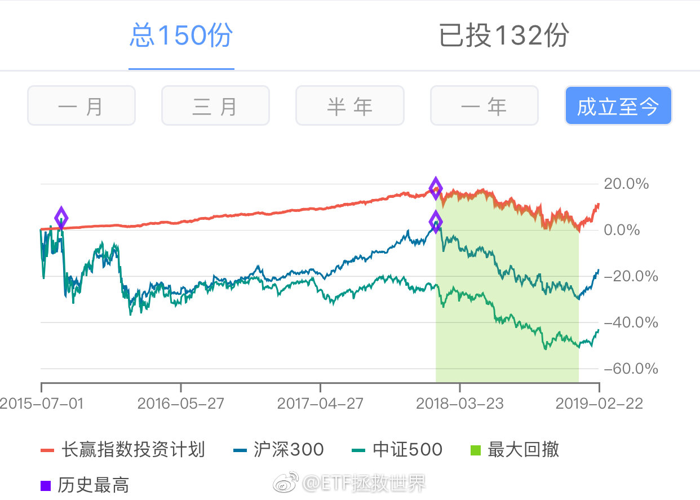

======================================================

ETF拯救世界 (5687069307) @
2019-02-22 23:31:12 Fri  
url: https://weibo.com/5687069307/HhTfRAQxP

我特别希望有一个能体现我所有能力的组合。不仅是长线建仓，还有各个品种的波段，熊市中的对冲，选股打新，对无风险收益率品种的选择…很多东西确实只能自己操作，不能那么多人一起玩。这个很遗憾。话说回来，看了看5100以来的收益率，已经80%了。当然，主要是分级A的功劳…

------------------------------------------------------
转推：
>  @ETF拯救世界 (5687069307)
>  2019-02-22 23:16:20 Fri  
>  url: https:/weibo.com/5687069307/HhT9PeQgT/

>  还差6个点就可以新高，沪深300新高需要涨20%，中证500新高需要翻番。下跌是好事，各位应该有体会了。
>  
>  回头看，计划还有很多需要反思的地方，也有很大进步空间。虽然熊市不赔的目标完成，也建立起了满意的仓位，但是其实还可以做的更好。有一些机会没有抓住，有一些失误其实可以避免。
>  
>  这就是成长。虽 ​​​

转发[46]  评论[176]  赞[437] 

======================================================

ETF拯救世界 (5687069307) @
2019-02-22 23:52:59 Fri  
url: https://weibo.com/5687069307/HhToHsYra

回复@Angela鹿小鹿:这个就是分级a http://t.cn/EfLRMlU //@Angela鹿小鹿:e大，没看到你在分级A的风骚操作，新粉表示很遗憾....

------------------------------------------------------
转推：
>  @ETF拯救世界 (5687069307)
>  2019-02-22 23:16:20 Fri  
>  url: https:/weibo.com/5687069307/HhT9PeQgT/

>  还差6个点就可以新高，沪深300新高需要涨20%，中证500新高需要翻番。下跌是好事，各位应该有体会了。
>  
>  回头看，计划还有很多需要反思的地方，也有很大进步空间。虽然熊市不赔的目标完成，也建立起了满意的仓位，但是其实还可以做的更好。有一些机会没有抓住，有一些失误其实可以避免。
>  
>  这就是成长。虽 ​​​

转发[11]  评论[58]  赞[266] 

======================================================

ETF拯救世界 (5687069307) @
2019-02-23 00:01:42 Sat  
url: https://weibo.com/5687069307/HhTsf3Rkk

截至今日，

S里面的15个品种还剩4个浮亏；

150里面的31个品种还剩10个浮亏，浮亏幅度大于10%的还剩5个。

一个组合，无论是哪个市场，无论是哪个大类，不管股票债券黄金原油欧洲美国，所有品种都要赚钱，这就是目标。 ​​​

转发[41]  评论[273]  赞[669] 

======================================================

ETF拯救世界 (5687069307) @
2019-02-23 07:32:17 Sat  
url: https://weibo.com/5687069307/HhWp7AXKN

确实太惨了。 http://t.cn/EfUwrFD

------------------------------------------------------
转推：
>  @ ()
>  2019-02-23 05:39:21 Sat  
>  url: 

>  抱歉，作者已设置仅展示半年内微博，此微博已不可见。 ​​​

转发[13]  评论[135]  赞[226] 

======================================================

ETF拯救世界 (5687069307) @
2019-02-23 09:20:58 Sat  
url: https://weibo.com/5687069307/HhX7fBecw

已经买了的房子以后卖的时候怎么办。100变70了吗。

------------------------------------------------------
转推：
>  @新财富杂志 (1708922835)
>  2019-02-23 09:06:07 Sat  
>  url: https:/weibo.com/1708922835/HhX1du4re/

>  【告别买100平米只得70平！住建部新规：住宅按套内面积算】“住宅建筑应以套内使用面积进行交易。”住房和城乡建设部公布的一项新规征求意见稿显示，房地产交易将正式告别“公摊面积”，近一年来舆论密切关注的“买100平米房子只得70平米”现象有望终结。
>  2月18日，住房和城乡建设部官方网站发布《关于 ​​​

转发[42]  评论[215]  赞[256] 

======================================================

ETF拯救世界 (5687069307) @
2019-02-23 13:39:41 Sat  
url: https://weibo.com/5687069307/HhYOgcAQ8

玩实况，被韩国人虐了。

灰溜溜的去写文章了。

[怒]

PS：

0:4！怎么讲，玩到后来我笑着玩的。输一个两个会想拼命追，0:4以后我就笑了。舒舒服服躺下享受了！不挣扎了，放弃了。 ​​​

转发[11]  评论[139]  赞[284] 

======================================================

ETF拯救世界 (5687069307) @
2019-02-23 13:54:57 Sat  
url: https://weibo.com/5687069307/HhYUslArC

回复@李想宁:那是个骗子。千万不要关注，还可以顺手举报。正版是“chinaetfs”//@李想宁:请问公众号是 etf拯救世界复盘?

------------------------------------------------------
转推：
>  @ETF拯救世界 (5687069307)
>  2019-02-23 13:39:41 Sat  
>  url: https:/weibo.com/5687069307/HhYOgcAQ8/

>  玩实况，被韩国人虐了。
>  
>  灰溜溜的去写文章了。
>  
>  [怒]
>  
>  PS：
>  
>  0:4！怎么讲，玩到后来我笑着玩的。输一个两个会想拼命追，0:4以后我就笑了。舒舒服服躺下享受了！不挣扎了，放弃了。 ​​​

转发[4]  评论[65]  赞[194] 

======================================================

ETF拯救世界 (5687069307) @
2019-02-23 19:00:38 Sat  
url: https://weibo.com/5687069307/Hi0Uxanez

每日打卡（3）

腰酸背痛腿抽筋，今天简单练练。 ​​​

转发[3]  评论[59]  赞[322] 

+++++++++++++++++++++++++++++++++++++++++++++++++++++

图片：

======================================================

ETF拯救世界 (5687069307) @
2019-02-23 20:07:02 Sat  
url: https://weibo.com/5687069307/Hi1lu9KiD

开始看。一条10秒，1300条需要多少秒。

回复一条30秒，100条回复需要多少秒…… ​​​

转发[19]  评论[151]  赞[437] 

+++++++++++++++++++++++++++++++++++++++++++++++++++++

图片：

======================================================

ETF拯救世界 (5687069307) @
2019-02-23 21:43:20 Sat  
url: https://weibo.com/5687069307/Hi1YzuEBG

精选一条：“你的可能情绪需要心理治疗师的帮助，自上一次被他人诟病影响情绪以来，未见进步。这样的情况可能会造成你的焦虑，甚至失眠，以及更严重情绪问题。国家精神心理临床重点专科医院医生愿为你提供帮助，解决这些问题，增强心理抗性。电话136……”完了，确诊了……

------------------------------------------------------
转推：
>  @ETF拯救世界 (5687069307)
>  2019-02-23 20:07:02 Sat  
>  url: https:/weibo.com/5687069307/Hi1lu9KiD/

>  开始看。一条10秒，1300条需要多少秒。
>  
>  回复一条30秒，100条回复需要多少秒…… ​​​

转发[16]  评论[139]  赞[241] 

======================================================

ETF拯救世界 (5687069307) @
2019-02-23 22:19:45 Sat  
url: https://weibo.com/5687069307/Hi2dm56EG

回复@小牧yc:这不算什么吧。你们各位可能很少人知道我家狗叫什么名字。有个专门为了喷我注册的小号就知道。很明显，认真研究过我所有的文字。所以爱一个人不会比恨一个人更长情，但是我纳闷在于，我到底做了什么十恶不赦的事让他这么恨我？

------------------------------------------------------
转推：
>  @ETF拯救世界 (5687069307)
>  2019-02-23 20:07:02 Sat  
>  url: https:/weibo.com/5687069307/Hi1lu9KiD/

>  开始看。一条10秒，1300条需要多少秒。
>  
>  回复一条30秒，100条回复需要多少秒…… ​​​

转发[8]  评论[260]  赞[281] 

======================================================

ETF拯救世界 (5687069307) @
2019-02-24 16:16:28 Sun  
url: https://weibo.com/5687069307/Hi9goqPS3

请依法严惩。

------------------------------------------------------
转推：
>  @央视新闻 (2656274875)
>  2019-02-24 15:49:55 Sun  
>  url: https:/weibo.com/2656274875/Hi95CBGV2/

>  【老人提醒别插队被暴打，女子事后下跪哭求放过】近日，上海一公交站，63岁夏先生提醒一女子候车时不要插队，该女子竟叫来老公将夏先生打成腰椎压缩性骨折。事发后，男子被警方带走，该女子跪地痛哭乞求原谅。目前，事件调查和善后正在进行。http://t.cn/Ef41rOk @看看新闻KNEWS ​​​

转发[33]  评论[142]  赞[397] 

======================================================

ETF拯救世界 (5687069307) @
2019-02-24 18:56:26 Sun  
url: https://weibo.com/5687069307/HiajkeFzK

以后别人关于我的帖子不要给我看。

谢谢，我不关心。 ​​​

转发[6]  评论[294]  赞[848] 

======================================================

ETF拯救世界 (5687069307) @
2019-02-24 21:22:09 Sun  
url: https://weibo.com/5687069307/HibgthLGN

每日打卡（4）

前几天练猛了，还没缓过来，简单练练 ​​​

转发[1]  评论[107]  赞[347] 

+++++++++++++++++++++++++++++++++++++++++++++++++++++

图片：

======================================================

ETF拯救世界 (5687069307) @
2019-02-25 07:44:27 Mon  
url: https://weibo.com/5687069307/Hifl43cBZ

不嫉妒不怨恨是第一长寿秘诀。意味着如果你天天嫉妒怨恨，那么…[摊手]

------------------------------------------------------
转推：
>  @新财富杂志 (1708922835)
>  2019-02-24 21:45:31 Sun  
>  url: https:/weibo.com/1708922835/HibpXiwmJ/

>  【95岁的查理·芒格分享长寿秘诀：不嫉妒，不怨恨，保持开心】股神巴菲特的商业伙伴。伯克希尔哈撒韦公司的二号人物，95岁的查理·芒格分享了自己快乐长寿秘诀，他表示不嫉妒，不怨恨，不过度消费，保持开心，不纠结于烦恼，跟信赖的人在一起，做该做的事，这些简单的事情都可以让生活变得更好。 ​​​

转发[184]  评论[86]  赞[339] 

======================================================

ETF拯救世界 (5687069307) @
2019-02-25 08:13:37 Mon  
url: https://weibo.com/5687069307/HifwU52aO

看了华为折叠屏的发布会，感觉触屏非常不灵敏，按几下都没反应，是错觉吗。 ​​​

转发[2]  评论[79]  赞[222] 

======================================================

ETF拯救世界 (5687069307) @
2019-02-25 08:22:08 Mon  
url: https://weibo.com/5687069307/HifAmCM3F

看了这个表情丰富的杨幂，竟然有点想路转粉了…

------------------------------------------------------
转推：
>  @ ()
>  2019-02-24 22:50:04 Sun  
>  url: 

>  该微博因被多人投诉，根据《微博社区公约》，已被删除。查看帮助：http://t.cn/zjmuxz1

转发[39]  评论[110]  赞[223] 

======================================================

ETF拯救世界 (5687069307) @
2019-02-25 08:33:01 Mon  
url: https://weibo.com/5687069307/HifEMw1NO

回复@花开花落95708:手上有1000w+，只要不沾上黄赌毒，不乱投资，一般可以安度余生//@花开花落95708:回复@东指海云生:多少富翁壮年倒下//@ETF拯救世界:不嫉妒不怨恨是第一长寿秘诀。意味着如果你天天嫉妒怨恨，那么…[摊手]

------------------------------------------------------
转推：
>  @新财富杂志 (1708922835)
>  2019-02-24 21:45:31 Sun  
>  url: https:/weibo.com/1708922835/HibpXiwmJ/

>  【95岁的查理·芒格分享长寿秘诀：不嫉妒，不怨恨，保持开心】股神巴菲特的商业伙伴。伯克希尔哈撒韦公司的二号人物，95岁的查理·芒格分享了自己快乐长寿秘诀，他表示不嫉妒，不怨恨，不过度消费，保持开心，不纠结于烦恼，跟信赖的人在一起，做该做的事，这些简单的事情都可以让生活变得更好。 ​​​

转发[88]  评论[152]  赞[300] 

======================================================

ETF拯救世界 (5687069307) @
2019-02-25 09:26:54 Mon  
url: https://weibo.com/5687069307/Hig0DABg6

再看看加深印象

------------------------------------------------------
转推：
>  @ETF拯救世界 (5687069307)
>  2019-01-21 09:57:43 Mon  
>  url: https:/weibo.com/5687069307/HcWfMd6AE/

>  便宜的时候，给你很多很多时间和机会让你慢慢布局，你因为各种利空不敢买，又或者是特别贪，希望跌到2200,2000,1500。
>  
>  涨起来了，贵了，你很着急。希望有个大回调自己好杀进去。
>  
>  不好意思，真正的牛市没有回调。即使有你也进不去。最后你进去了，恐怕涨不了多少就要是大顶了。
>  
>  这话还早，不过几年后 ​​​

转发[61]  评论[113]  赞[442] 

======================================================

ETF拯救世界 (5687069307) @
2019-02-25 09:29:47 Mon  
url: https://weibo.com/5687069307/Hig1OBqEc

你有权利这么做，但没必要这么狠

------------------------------------------------------
转推：
>  @ETF拯救世界 (5687069307)
>  2019-02-21 12:02:23 Thu  
>  url: https:/weibo.com/5687069307/HhFjM2uD9/

>  我不想告诉你们，月底我想加传媒的。
>  
>  辣鸡。
>  
>  $中证传媒 sz399971$ ​​​

转发[5]  评论[140]  赞[372] 

======================================================

ETF拯救世界 (5687069307) @
2019-02-25 09:47:08 Mon  
url: https://weibo.com/5687069307/Hig8RmiUb

赚钱快乐吗。

尤其是踏踏实实的赚钱。

知道为什么赚。

人生很美好。 ​​​

转发[20]  评论[213]  赞[792] 

======================================================

ETF拯救世界 (5687069307) @
2019-02-25 09:54:34 Mon  
url: https://weibo.com/5687069307/HigbSprYC

有没有发现这波行情，你手里好多股票几乎没涨，甚至还跌了 ​​​

转发[41]  评论[335]  赞[565] 

======================================================

ETF拯救世界 (5687069307) @
2019-02-25 10:46:11 Mon  
url: https://weibo.com/5687069307/HigwPp39Y

回复@假如鲸鱼有爱情:会有人往下压的。他们手里有上万亿筹码，会控制节奏//@假如鲸鱼有爱情:@ETF拯救世界 E大，我怎么觉得这个涨法，中国不能有长牛，人性就这样，一窝疯。

------------------------------------------------------
转推：
>  @ETF拯救世界 (5687069307)
>  2019-02-25 09:54:34 Mon  
>  url: https:/weibo.com/5687069307/HigbSprYC/

>  有没有发现这波行情，你手里好多股票几乎没涨，甚至还跌了 ​​​

转发[22]  评论[148]  赞[444] 

======================================================

ETF拯救世界 (5687069307) @
2019-02-25 10:56:04 Mon  
url: https://weibo.com/5687069307/HigAQf6yp

踏踏实实的。

买入的那一瞬间你已经赢了。 ​​​

转发[27]  评论[329]  赞[961] 

+++++++++++++++++++++++++++++++++++++++++++++++++++++

图片：
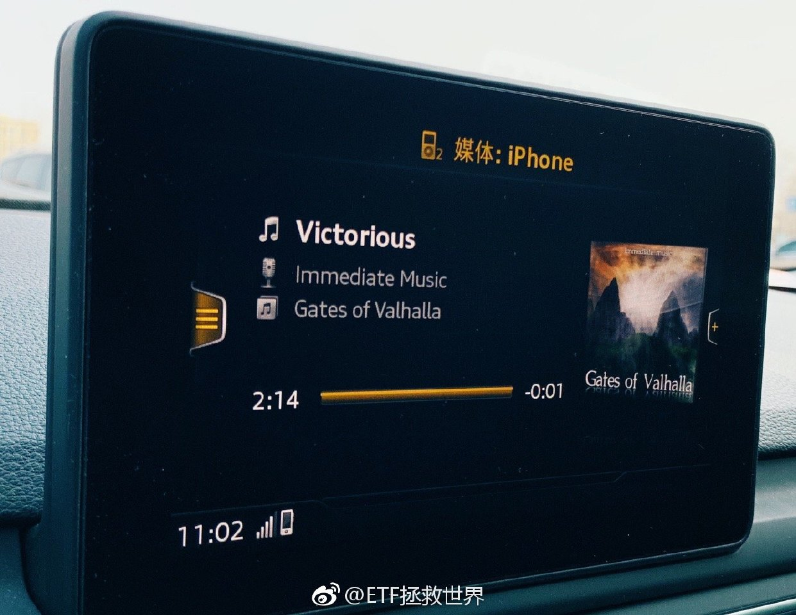

======================================================

ETF拯救世界 (5687069307) @
2019-02-25 11:35:57 Mon  
url: https://weibo.com/5687069307/HigR2hn92

反正我尽力了。从股灾前到钻石坑。

人各有命。

哪怕只帮了一个人就行。 ​​​

转发[39]  评论[630]  赞[1567] 

======================================================

ETF拯救世界 (5687069307) @
2019-02-25 12:18:49 Mon  
url: https://weibo.com/5687069307/Hih8qvVDy

这个市场疯子很多。

有人钻石底不断割肉，有人哈迪斯大顶不断加杠杆买入。

你要做的其实很简单。

理性。低买高卖。买入，持有，卖出。

很多话一直说，你觉得有点啰嗦，很烦。经历过整个周期后你再看，又有不同的感受。

前路依然很曲折，还会有很多麻烦。但你应该懂了理性的重要性。

好好感受股市 ​​​

转发[115]  评论[286]  赞[826] 

======================================================

ETF拯救世界 (5687069307) @
2019-02-25 12:29:27 Mon  
url: https://weibo.com/5687069307/HihcKezqg

回复@想减肥的蜗牛:破案了。是不是你孩子注册小号来喷我的。//@想减肥的蜗牛:衷心的说声谢谢！全职妈妈啥也不懂，就跟着益达老老实实买，跌的时候不看，涨的时候不卖，感觉可以给孩子报好多培训班啦！哈哈哈

------------------------------------------------------
转推：
>  @ETF拯救世界 (5687069307)
>  2019-02-25 11:35:57 Mon  
>  url: https:/weibo.com/5687069307/HigR2hn92/

>  反正我尽力了。从股灾前到钻石坑。
>  
>  人各有命。
>  
>  哪怕只帮了一个人就行。 ​​​

转发[4]  评论[141]  赞[452] 

======================================================

ETF拯救世界 (5687069307) @
2019-02-25 13:18:02 Mon  
url: https://weibo.com/5687069307/HihwtiwkO

回复@只为悠闲的活:都有什么项目。不要太低俗。//@只为悠闲的活:来宁波请你玩一个月

------------------------------------------------------
转推：
>  @ETF拯救世界 (5687069307)
>  2019-02-25 11:35:57 Mon  
>  url: https:/weibo.com/5687069307/HigR2hn92/

>  反正我尽力了。从股灾前到钻石坑。
>  
>  人各有命。
>  
>  哪怕只帮了一个人就行。 ​​​

转发[2]  评论[162]  赞[375] 

======================================================

ETF拯救世界 (5687069307) @
2019-02-25 13:19:39 Mon  
url: https://weibo.com/5687069307/Hihx7uJq8

这么搞收盘要跳啊 ​​​

转发[14]  评论[351]  赞[506] 

======================================================

ETF拯救世界 (5687069307) @
2019-02-25 14:23:27 Mon  
url: https://weibo.com/5687069307/HihX1bwmA

每天好几辆（）（），随时受不了。

一看刚2900，嗷的一声昏古七了。 ​​​

转发[16]  评论[358]  赞[733] 

======================================================

ETF拯救世界 (5687069307) @
2019-02-25 14:31:35 Mon  
url: https://weibo.com/5687069307/Hii0jDHfS

两周。//@ETF拯救世界:谁能想到，两天过去，券商的浮亏已经收窄到10%以内了。你要知道这个指数跌了70%多。以前我跟你说，你的那点浮亏，牛市来了，两周就会转盈利，然后就是资产飞跃之旅。你不信，现在有点信了吗。记住，熊市只要做到不亏或者少亏，同时拿够筹码，你就是未来的王者。

------------------------------------------------------
转推：
>  @ETF拯救世界 (5687069307)
>  2018-10-22 09:33:12 Mon  
>  url: https:/weibo.com/5687069307/GF3EXvUVy/

>  $证券公司 sz399975$  15日加仓的券商引发舒适的感觉。 ​​​

转发[60]  评论[247]  赞[588] 

======================================================

ETF拯救世界 (5687069307) @
2019-02-25 14:48:57 Mon  
url: https://weibo.com/5687069307/Hii7n007u

刚才且慢给我一个数，这一轮底部区域，计划外赎回大概3.8%。也就是90%多都坚持住了。

为大家感到骄傲。你们是坠吼的。你们不赚钱A股不会有人赚钱了。 ​​​

转发[25]  评论[443]  赞[1339] 

======================================================

ETF拯救世界 (5687069307) @
2019-02-25 15:02:43 Mon  
url: https://weibo.com/5687069307/HiicXiIVI

回复@李白先生vip:虽然有人喷我废话多，唠叨。但我知道绝大多数人需要这个才能坚持下去。骂就骂吧。//@李白先生vip:如果没有你的发言，我不会这么平静。

------------------------------------------------------
转推：
>  @ETF拯救世界 (5687069307)
>  2019-02-25 14:48:57 Mon  
>  url: https:/weibo.com/5687069307/Hii7n007u/

>  刚才且慢给我一个数，这一轮底部区域，计划外赎回大概3.8%。也就是90%多都坚持住了。
>  
>  为大家感到骄傲。你们是坠吼的。你们不赚钱A股不会有人赚钱了。 ​​​

转发[4]  评论[189]  赞[763] 

======================================================

ETF拯救世界 (5687069307) @
2019-02-25 15:17:26 Mon  
url: https://weibo.com/5687069307/HiiiVy41J

有人怕我删微博。

你放心。我从不会删任何关于市场的东西。

我不会为了显示自己牛逼，从不出错，删曾经说错的话。

第一，男人敢做敢当。敢说就要承受后果。我说错了我自己承担，不会删改历史。

第二，我知道证券市场没人能永远正确。要求自己或者别人每一句话都正确，那就是要把自己逼疯或者要逼疯 ​​​

转发[88]  评论[284]  赞[1275] 

======================================================

ETF拯救世界 (5687069307) @
2019-02-25 15:32:46 Mon  
url: https://weibo.com/5687069307/Hiip9qVEs

我再提醒一下。

之前低位很多人不敢大力投入。涨起来了加大资金，补仓提醒会给你补仓建议，但你已经失去了低位筹码，未来如果赚不到钱不要埋怨我。

我还是那个建议：整体亏损再加钱。否则你越涨投的越多，神仙也救不了你。 ​​​

转发[109]  评论[361]  赞[955] 

======================================================

ETF拯救世界 (5687069307) @
2019-02-25 16:07:16 Mon  
url: https://weibo.com/5687069307/HiiD9Awj4

现在上面也很为难。

希望牛市来，又不希望牛市乱来。

投鼠忌器，出zc会比较小心。

GJD的筹码这时候应该发挥一些作用了。但是砸多了可能又出问题。

难受啊。 ​​​

转发[38]  评论[263]  赞[680] 

======================================================

ETF拯救世界 (5687069307) @
2019-02-25 17:45:54 Mon  
url: https://weibo.com/5687069307/Hijhcm0No

除海外成熟市场外，今日过后，所有大类全部盈利。盈利幅度从3%-45%不等。

金融投资真的没那么可怕也没那么难。

不到3000点。 ​​​

转发[38]  评论[316]  赞[1094] 

======================================================

ETF拯救世界 (5687069307) @
2019-02-25 20:04:46 Mon  
url: https://weibo.com/5687069307/Hikbyztwc

人类是非常善忘的动物。

浮亏的痛苦，回本后就会很快忘记。

曾经那么让你夜不能寐的痛苦，几个月后你回想一下，都已经记不起那时候的感觉了。 ​​​

转发[74]  评论[369]  赞[1028] 

======================================================

ETF拯救世界 (5687069307) @
2019-02-26 06:52:19 Tue  
url: https://weibo.com/5687069307/HioqoiICC

150部分，还差一个多点历史新高。300新高还需要十几个点，500还需要90%。

除德国所有大类盈利。

所有参考S的人全部盈利，组合即将新高。 ​​​

转发[43]  评论[344]  赞[1030] 

+++++++++++++++++++++++++++++++++++++++++++++++++++++

图片：

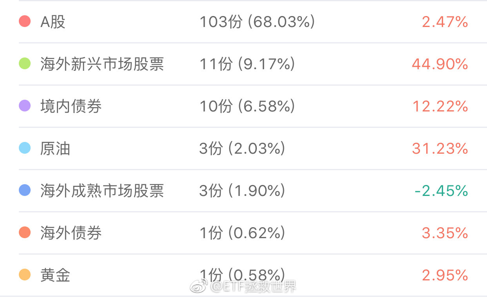

======================================================

ETF拯救世界 (5687069307) @
2019-02-26 08:18:26 Tue  
url: https://weibo.com/5687069307/HioZm7DKp

回复@LightFISH:你把所有500看成一个品种：500。我如果买一只，有人说我是为了利益推一家公司产品。做人很难。//@LightFISH:建信500还亏16%，是不是买的略高了？

------------------------------------------------------
转推：
>  @ETF拯救世界 (5687069307)
>  2019-02-26 06:52:19 Tue  
>  url: https:/weibo.com/5687069307/HioqoiICC/

>  150部分，还差一个多点历史新高。300新高还需要十几个点，500还需要90%。
>  
>  除德国所有大类盈利。
>  
>  所有参考S的人全部盈利，组合即将新高。 ​​​

转发[7]  评论[213]  赞[531] 

======================================================

ETF拯救世界 (5687069307) @
2019-02-26 10:03:16 Tue  
url: https://weibo.com/5687069307/HipFUg7Kl

$全指医药 sh000991$ 起飞了。牛市你还怕有轮不到的指数吗。 ​​​

转发[160]  评论[513]  赞[786] 

======================================================

ETF拯救世界 (5687069307) @
2019-02-27 07:39:02 Wed  
url: https://weibo.com/5687069307/Hiy9ReNqj

不用盼着牛市继续或者盼着熊市归来。

牛市？很好，赚大钱。

熊市？很好，以后赚更多。

波动市？更好了，提款机。

舒服。 ​​​

转发[90]  评论[212]  赞[727] 

======================================================

ETF拯救世界 (5687069307) @
2019-02-27 07:52:00 Wed  
url: https://weibo.com/5687069307/Hiyf85Xd7

回复@djndnehwbbf:太热了，要布置一下工作，稳一稳。[并不简单]//@djndnehwbbf:请问益哥，昨天忙什么去了？

------------------------------------------------------
转推：
>  @ETF拯救世界 (5687069307)
>  2019-02-27 07:39:02 Wed  
>  url: https:/weibo.com/5687069307/Hiy9ReNqj/

>  不用盼着牛市继续或者盼着熊市归来。
>  
>  牛市？很好，赚大钱。
>  
>  熊市？很好，以后赚更多。
>  
>  波动市？更好了，提款机。
>  
>  舒服。 ​​​

转发[6]  评论[72]  赞[370] 

======================================================

ETF拯救世界 (5687069307) @
2019-02-27 08:23:13 Wed  
url: https://weibo.com/5687069307/HiyrNtJ8J

回复@某货wow:大家都没有卖一定是个错觉。连续两天成交万亿了。卖的人太多了//@某货wow:回复@一生只爱ETF:我觉得涨了38%已经很多了，这些是跟车以外自己在支付宝买的，在且慢的那些都没有卖。但是我发现大家都没有卖，就觉得好像不对？[汗]

------------------------------------------------------
转推：
>  @ETF拯救世界 (5687069307)
>  2019-02-26 10:03:16 Tue  
>  url: https:/weibo.com/5687069307/HipFUg7Kl/

>  $全指医药 sh000991$ 起飞了。牛市你还怕有轮不到的指数吗。 ​​​

转发[123]  评论[104]  赞[312] 

======================================================

ETF拯救世界 (5687069307) @
2019-02-27 09:00:29 Wed  
url: https://weibo.com/5687069307/HiyGVoFv0

回复@qqttccvv:最新公众号文章有答案，忘了吗//@qqttccvv:那到底应该卖么//@ETF拯救世界:回复@某货wow:大家都没有卖一定是个错觉。连续两天成交万亿了。卖的人太多了

------------------------------------------------------
转推：
>  @ETF拯救世界 (5687069307)
>  2019-02-26 10:03:16 Tue  
>  url: https:/weibo.com/5687069307/HipFUg7Kl/

>  $全指医药 sh000991$ 起飞了。牛市你还怕有轮不到的指数吗。 ​​​

转发[106]  评论[107]  赞[268] 

======================================================

ETF拯救世界 (5687069307) @
2019-02-27 09:27:24 Wed  
url: https://weibo.com/5687069307/HiyRQjZpt

回复@qqttccvv:调整到舒服仓位永远有效。不清仓持续有效。85 60持续有效。不可能每天都有新策略。给时间和空间让小树苗长成参天大树吧。

------------------------------------------------------
转推：
>  @ETF拯救世界 (5687069307)
>  2019-02-26 10:03:16 Tue  
>  url: https:/weibo.com/5687069307/HipFUg7Kl/

>  $全指医药 sh000991$ 起飞了。牛市你还怕有轮不到的指数吗。 ​​​

转发[45]  评论[80]  赞[354] 

======================================================

ETF拯救世界 (5687069307) @
2019-02-27 09:31:15 Wed  
url: https://weibo.com/5687069307/HiyToCUqH

回复@jackfish:阅读量低于5万的都是假的记住这一条就不会错。//@jackfish:@ETF拯救世界 公众号是哪个？假的太多了谢谢//@ETF拯救世界:回复@qqttccvv:最新公众号文章有答案，忘了吗//@qqttccvv:那到底应该卖么

------------------------------------------------------
转推：
>  @ETF拯救世界 (5687069307)
>  2019-02-26 10:03:16 Tue  
>  url: https:/weibo.com/5687069307/HipFUg7Kl/

>  $全指医药 sh000991$ 起飞了。牛市你还怕有轮不到的指数吗。 ​​​

转发[1]  评论[37]  赞[278] 

======================================================

ETF拯救世界 (5687069307) @
2019-02-27 09:39:50 Wed  
url: https://weibo.com/5687069307/HiyWTi2Ab

回复@小贝和皮皮:不建议给别人出任何投资股票的主意。买入卖出持有都不说话。百害无一利。//@小贝和皮皮:我同学说准备卖套了几年的股票，我说要么在放一会，要么卖了别再回来//@ETF拯救世界:回复@qqttccvv:最新公众号文章有答案，忘了吗//@qqttccvv:那到底应该卖么

------------------------------------------------------
转推：
>  @ETF拯救世界 (5687069307)
>  2019-02-26 10:03:16 Tue  
>  url: https:/weibo.com/5687069307/HipFUg7Kl/

>  $全指医药 sh000991$ 起飞了。牛市你还怕有轮不到的指数吗。 ​​​

转发[52]  评论[55]  赞[317] 

======================================================

ETF拯救世界 (5687069307) @
2019-02-27 09:42:39 Wed  
url: https://weibo.com/5687069307/HiyY2b3Cd

什么时候应该回头审视自己的投资策略投资体系呢？

表现不好的时候当然应该回头反思，但是更应该警惕的是表现好的时候。

应该在表现好的时候开始改变风格。主动让自己的组合和策略在当前的时点变得平庸一点。

这个值得好好思考。 ​​​

转发[129]  评论[239]  赞[581] 

======================================================

ETF拯救世界 (5687069307) @
2019-02-27 09:47:15 Wed  
url: https://weibo.com/5687069307/HiyZU4xRp

回复@云飞KZ:我完全不理解你是怎么看出这个的。另外，建议重温去年底的文章。看看“看涨”是随大流还是提前于市场。//@云飞KZ:E大的意思是，现在要适当的随大流看涨了[嘻嘻]

------------------------------------------------------
转推：
>  @ETF拯救世界 (5687069307)
>  2019-02-27 09:42:39 Wed  
>  url: https:/weibo.com/5687069307/HiyY2b3Cd/

>  什么时候应该回头审视自己的投资策略投资体系呢？
>  
>  表现不好的时候当然应该回头反思，但是更应该警惕的是表现好的时候。
>  
>  应该在表现好的时候开始改变风格。主动让自己的组合和策略在当前的时点变得平庸一点。
>  
>  这个值得好好思考。 ​​​

转发[9]  评论[36]  赞[243] 

======================================================

ETF拯救世界 (5687069307) @
2019-02-27 09:52:22 Wed  
url: https://weibo.com/5687069307/Hiz1Yxcev

回复@浪迹天涯0216:承认自己“不知道”，很多人觉得弱爆了。其实只有内心深处知道自己不知道，然后勇于承认，才是真正的大赢家。连自己“不知道”都不知道的人，很难从市场赚钱。但有可能从别的地方赚钱。

------------------------------------------------------
转推：
>  @ETF拯救世界 (5687069307)
>  2019-02-26 10:03:16 Tue  
>  url: https:/weibo.com/5687069307/HipFUg7Kl/

>  $全指医药 sh000991$ 起飞了。牛市你还怕有轮不到的指数吗。 ​​​

转发[28]  评论[140]  赞[395] 

======================================================

ETF拯救世界 (5687069307) @
2019-02-27 10:15:31 Wed  
url: https://weibo.com/5687069307/HizbnzsnR

有一个小孩居然从他前面若无其事的过去。家长怎么教育的。安全永远最重要，遇到这种事情一定要离得远一点。

------------------------------------------------------
转推：
>  @ ()
>  2019-02-27 08:59:03 Wed  
>  url: 

>  抱歉，作者已设置仅展示半年内微博，此微博已不可见。 ​​​

转发[18]  评论[80]  赞[223] 

======================================================

ETF拯救世界 (5687069307) @
2019-02-27 11:12:12 Wed  
url: https://weibo.com/5687069307/HizynDg7a

昨天清仓的股神是不是又变成满仓了 ​​​

转发[6]  评论[267]  赞[503] 

======================================================

ETF拯救世界 (5687069307) @
2019-02-27 13:05:59 Wed  
url: https://weibo.com/5687069307/HiAizudyx

再体会一下。现在要重点体会后半句。

------------------------------------------------------
转推：
>  @ETF拯救世界 (5687069307)
>  2018-08-20 09:37:48 Mon  
>  url: https:/weibo.com/5687069307/GvtLxEJNz/

>  保守的乐观。
>  
>  不保守，会死的快。不乐观，这辈子也就这样了。
>  
>  至少前半句你现在懂了。后半句还要用时间来验证。
>  
>  节奏，节奏！ ​​​

转发[55]  评论[63]  赞[353] 

======================================================

ETF拯救世界 (5687069307) @
2019-02-27 13:07:52 Wed  
url: https://weibo.com/5687069307/HiAjl60xN

回复@老脸儿通红:下次碰到他记得说：“多大点事儿”。看他什么反应。//@老脸儿通红:一个普通朋友，说自己不懂，就每月存点钱投基金里，当存钱了。遇到这种人我都不敢在聊了，怕是高手。//@ETF拯救世界:回复@小贝和皮皮:不建议给别人出任何投资股票的主意。买入卖出持有都不说话。百害无一利。

------------------------------------------------------
转推：
>  @ETF拯救世界 (5687069307)
>  2019-02-26 10:03:16 Tue  
>  url: https:/weibo.com/5687069307/HipFUg7Kl/

>  $全指医药 sh000991$ 起飞了。牛市你还怕有轮不到的指数吗。 ​​​

转发[6]  评论[113]  赞[365] 

======================================================

ETF拯救世界 (5687069307) @
2019-02-27 13:09:46 Wed  
url: https://weibo.com/5687069307/HiAk63dxe

回复@老高GG:怎么这次群众情绪起来的这么快？值得观察。//@老高GG:@ETF拯救世界 刚接到身在外地老丈人的电话 话说近期股市大好 想把暂时不用的工程款转给我做一把行情 [二哈] 我心想 你为何去年第四季度不打我电话啊[允悲]//@ETF拯救世界:再体会一下。现在要重点体会后半句。

------------------------------------------------------
转推：
>  @ETF拯救世界 (5687069307)
>  2018-08-20 09:37:48 Mon  
>  url: https:/weibo.com/5687069307/GvtLxEJNz/

>  保守的乐观。
>  
>  不保守，会死的快。不乐观，这辈子也就这样了。
>  
>  至少前半句你现在懂了。后半句还要用时间来验证。
>  
>  节奏，节奏！ ​​​

转发[25]  评论[242]  赞[373] 

======================================================

ETF拯救世界 (5687069307) @
2019-02-27 14:43:35 Wed  
url: https://weibo.com/5687069307/HiAWbmret

终于回调了。但要说到发车，这点跌幅远未够班啊！ ​​​

转发[11]  评论[363]  赞[787] 

======================================================

ETF拯救世界 (5687069307) @
2019-02-27 17:06:35 Wed  
url: https://weibo.com/5687069307/HiBSea2we

记住这个。3、5年后回头看准不准。而且应该是很大的那种。

------------------------------------------------------
转推：
>  @ETF拯救世界 (5687069307)
>  2019-01-24 13:35:45 Thu  
>  url: https:/weibo.com/5687069307/HdpXLvsoK/

>  没有发生过连续两任监管任期内都没有牛市的。
>  
>  这次应该也不会例外。 ​​​

转发[83]  评论[165]  赞[667] 

======================================================

ETF拯救世界 (5687069307) @
2019-02-27 17:42:04 Wed  
url: https://weibo.com/5687069307/HiC6D8o62

信托产品包括公募与私募，可以面向不特定社会公众发行公募信托产品，认购起点1万元。 ​​​

转发[18]  评论[192]  赞[460] 

======================================================

ETF拯救世界 (5687069307) @
2019-02-27 22:07:05 Wed  
url: https://weibo.com/5687069307/HiDQcqroQ

每日打卡（5）

满血复活，练完去做功课。 ​​​

转发[1]  评论[96]  赞[497] 

+++++++++++++++++++++++++++++++++++++++++++++++++++++

图片：
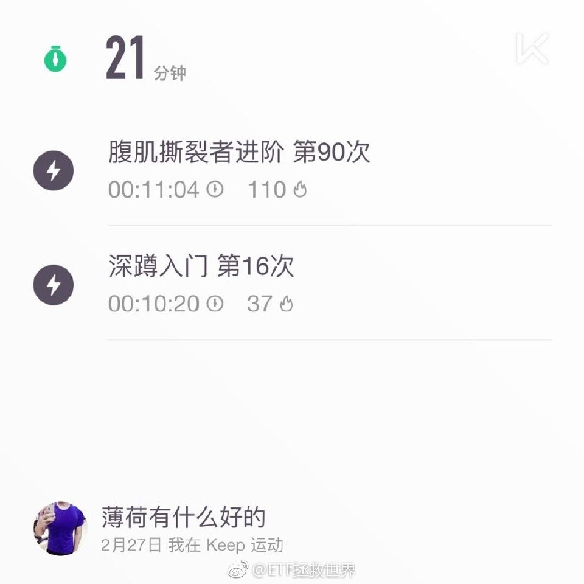

======================================================

ETF拯救世界 (5687069307) @
2019-02-28 10:11:07 Thu  
url: https://weibo.com/5687069307/HiIA5kj7p

刚登陆公众号一看，这几天新关注人数是平常日子的三倍。

怎么回事，是不是又有人在哪儿骂我了。

别骂了，越骂关注的人越多，好烦。[doge] ​​​

转发[16]  评论[265]  赞[657] 

+++++++++++++++++++++++++++++++++++++++++++++++++++++

图片：

======================================================

ETF拯救世界 (5687069307) @
2019-02-28 10:20:33 Thu  
url: https://weibo.com/5687069307/HiIDUztsn

再来一口？

------------------------------------------------------
转推：
>  @ETF拯救世界 (5687069307)
>  2019-02-26 10:03:16 Tue  
>  url: https:/weibo.com/5687069307/HipFUg7Kl/

>  $全指医药 sh000991$ 起飞了。牛市你还怕有轮不到的指数吗。 ​​​

转发[5]  评论[214]  赞[417] 

======================================================

ETF拯救世界 (5687069307) @
2019-02-28 14:59:26 Thu  
url: https://weibo.com/5687069307/HiKt7qOKk

这位朋友刚刚联系我希望我帮忙转发。转发当然没问题，不过大家如果要资助一定要调查清楚。希望病人尽快好起来。如果还有类似的，只要是一直关注我的朋友我都可以转发。我愿意帮这个忙，但是真实性没精力一个个调查，大家自己判断吧。 http://t.cn/EfdAC83

------------------------------------------------------
转推：
>  @江山河海_52052 (1353316771)
>  2019-02-28 07:35:14 Thu  
>  url: https:/weibo.com/1353316771/HiHyOn0xM/

>  我大姑家孩子，先天性遗传疾病，马凡式综合症，之前大姑已经做过了治疗，现在疾病又笼罩在了这个可怜的家庭；表弟发布了水滴筹，麻烦大家帮帮忙转发，帮帮这个家庭，谢谢！水滴筹链接http://t.cn/Ef3k4Ji ​​​

转发[7]  评论[80]  赞[270] 

======================================================

ETF拯救世界 (5687069307) @
2019-02-28 15:08:20 Thu  
url: https://weibo.com/5687069307/HiKwJr5M8

回复@卖面条的麦当劳叔叔:每年两个旗舰机，用一年就淘汰，有点浪费，不买了。（过两周：呵呵，真香）//@卖面条的麦当劳叔叔:e大是不是过两天搞个s10+的评测 毕竟要全方位发展[doge]//@ETF拯救世界:再来一口？

------------------------------------------------------
转推：
>  @ETF拯救世界 (5687069307)
>  2019-02-26 10:03:16 Tue  
>  url: https:/weibo.com/5687069307/HipFUg7Kl/

>  $全指医药 sh000991$ 起飞了。牛市你还怕有轮不到的指数吗。 ​​​

转发[2]  评论[61]  赞[222] 

======================================================

ETF拯救世界 (5687069307) @
2019-02-28 15:44:43 Thu  
url: https://weibo.com/5687069307/HiKLuw544

回复@魏大明的生活:我都忘了，你能记得我就觉得没白做。这种事情作为我，帮忙了没有什么好处，如果碰上信息不实的我还有很大风险。但还是能帮就帮着转一下，当事人已经很不幸，别人帮一把就会好很多。但是，只要我知道转过的有一次出问题的，就不会再转。//@魏大明的生活:谢谢e大之前也帮了我类似的忙

------------------------------------------------------
转推：
>  @江山河海_52052 (1353316771)
>  2019-02-28 07:35:14 Thu  
>  url: https:/weibo.com/1353316771/HiHyOn0xM/

>  我大姑家孩子，先天性遗传疾病，马凡式综合症，之前大姑已经做过了治疗，现在疾病又笼罩在了这个可怜的家庭；表弟发布了水滴筹，麻烦大家帮帮忙转发，帮帮这个家庭，谢谢！水滴筹链接http://t.cn/Ef3k4Ji ​​​

转发[0]  评论[54]  赞[289] 

======================================================

ETF拯救世界 (5687069307) @
2019-02-28 17:02:58 Thu  
url: https://weibo.com/5687069307/HiLhgka4V

回复@equalizer32:今年开始每年新年愿望第五条都是“不要掉头发”//@equalizer32:回复@睡不到窪田小哥的人生还有意义吗:前面都不算啥 有的人多了 主要是有头发

------------------------------------------------------
转推：
>  @ETF拯救世界 (5687069307)
>  2019-02-28 10:11:07 Thu  
>  url: https:/weibo.com/5687069307/HiIA5kj7p/

>  刚登陆公众号一看，这几天新关注人数是平常日子的三倍。
>  
>  怎么回事，是不是又有人在哪儿骂我了。
>  
>  别骂了，越骂关注的人越多，好烦。[doge] ​​​

转发[3]  评论[114]  赞[249] 

======================================================

ETF拯救世界 (5687069307) @
2019-02-28 20:29:09 Thu  
url: https://weibo.com/5687069307/HiMCWyFo8

每日打卡（6）

完成。明天准备休息休息。 ​​​

转发[1]  评论[71]  赞[416] 

+++++++++++++++++++++++++++++++++++++++++++++++++++++

图片：

======================================================

ETF拯救世界 (5687069307) @
2019-03-01 08:48:09 Fri  
url: https://weibo.com/5687069307/HiRsUgee6

检测牛熊的一个标准是：

市场对消息的反应。

熊市中，再好的利好都没用。牛市中，好消息坏消息都会引发上涨。

今天就是一个很好的观察窗口。 ​​​

转发[232]  评论[221]  赞[640] 

======================================================

ETF拯救世界 (5687069307) @
2019-03-01 08:55:15 Fri  
url: https://weibo.com/5687069307/HiRvNipfW

回复@愿赌服输K:“高管扎堆减持”和“商誉爆雷”一样，都是媒体和大V赚你眼球的新闻。你有没有认真研究过到底有多少家公司减持，占全部公司总数的百分之多少，减持总额是总市值的多少？//@愿赌服输K:高管扎堆减持算利空，明晟提高系数算利好，这种情况该咋办

------------------------------------------------------
转推：
>  @ETF拯救世界 (5687069307)
>  2019-03-01 08:48:09 Fri  
>  url: https:/weibo.com/5687069307/HiRsUgee6/

>  检测牛熊的一个标准是：
>  
>  市场对消息的反应。
>  
>  熊市中，再好的利好都没用。牛市中，好消息坏消息都会引发上涨。
>  
>  今天就是一个很好的观察窗口。 ​​​

转发[42]  评论[61]  赞[360] 

======================================================

ETF拯救世界 (5687069307) @
2019-03-01 08:59:25 Fri  
url: https://weibo.com/5687069307/HiRxsEqID

再次提醒各位，看到任何新闻，都要心里面打个问号。如果有兴趣，就去深入研究一下实际的数据。

就像去年所谓的商誉爆雷，大家都说天塌了。结果我研究一下爆雷的公司还不到A股10%，而且是一次性减值，明年业绩大概率都翻番的上涨，到底在怕什么？怕一年的业绩下降？

所谓高管减持也一样。一两百家公司 ​​​

转发[156]  评论[176]  赞[702] 

======================================================

ETF拯救世界 (5687069307) @
2019-03-01 09:11:21 Fri  
url: https://weibo.com/5687069307/HiRCknRCO

回复@兔子遇见了蛇:谁跟你说他肯定知道还会不会到2500，请立即取关。多看的话有害无益。//@兔子遇见了蛇:E大，还能到2500吗

------------------------------------------------------
转推：
>  @ETF拯救世界 (5687069307)
>  2019-03-01 08:59:25 Fri  
>  url: https:/weibo.com/5687069307/HiRxsEqID/

>  再次提醒各位，看到任何新闻，都要心里面打个问号。如果有兴趣，就去深入研究一下实际的数据。
>  
>  就像去年所谓的商誉爆雷，大家都说天塌了。结果我研究一下爆雷的公司还不到A股10%，而且是一次性减值，明年业绩大概率都翻番的上涨，到底在怕什么？怕一年的业绩下降？
>  
>  所谓高管减持也一样。一两百家公司 ​​​

转发[5]  评论[48]  赞[357] 

======================================================

ETF拯救世界 (5687069307) @
2019-03-01 09:53:38 Fri  
url: https://weibo.com/5687069307/HiRTuavQi

石锤了。

是猴市。 ​​​

转发[31]  评论[240]  赞[688] 

======================================================

ETF拯救世界 (5687069307) @
2019-03-01 09:57:41 Fri  
url: https://weibo.com/5687069307/HiRV86KRn

昨天计划不操作，A股很不高兴。 ​​​

转发[0]  评论[66]  赞[483] 

======================================================

ETF拯救世界 (5687069307) @
2019-03-01 10:13:45 Fri  
url: https://weibo.com/5687069307/HiS1EEcnY

观察一个人有没有赚过大钱的标准之一，就是看他在赚钱的时候能不能拿的住。

90%准。 ​​​

转发[106]  评论[207]  赞[872] 

======================================================

ETF拯救世界 (5687069307) @
2019-03-01 10:57:23 Fri  
url: https://weibo.com/5687069307/HiSjmpz8l

券商什么时候可以切换成别的品种。

很考验技术了。 ​​​

转发[16]  评论[315]  赞[715] 

======================================================

ETF拯救世界 (5687069307) @
2019-03-01 13:57:28 Fri  
url: https://weibo.com/5687069307/HiTusDfr1

太猴了！都不敢说话了！说完下一分钟就打脸！匿了！周末愉快！[爱你]

------------------------------------------------------
转推：
>  @ETF拯救世界 (5687069307)
>  2019-03-01 09:53:38 Fri  
>  url: https:/weibo.com/5687069307/HiRTuavQi/

>  石锤了。
>  
>  是猴市。 ​​​

转发[7]  评论[158]  赞[537] 

======================================================

ETF拯救世界 (5687069307) @
2019-03-01 15:07:44 Fri  
url: https://weibo.com/5687069307/HiTWYARQv

150距离新高一步之遥。从第三轮算，相当于接近6000点了 ​​​

转发[9]  评论[234]  赞[620] 

======================================================

ETF拯救世界 (5687069307) @
2019-03-01 16:46:55 Fri  
url: https://weibo.com/5687069307/HiUBfbXyn

从数据看，本次进入钻石坑是十月，二月出坑，持续四个月。

基本与历次熊市大坑持续时间差不多。

历史上还没出现过出坑后马上又跌回去的情况，这次能不能出现？自行判断吧。 ​​​

转发[214]  评论[424]  赞[755] 

======================================================

ETF拯救世界 (5687069307) @
2019-03-01 16:51:04 Fri  
url: https://weibo.com/5687069307/HiUCVaYrH

在股市最大的悲剧莫过于此。最低点。

说实话，我不可能给出任何建议了。

投资的钱，必须三五年不动，切切。 ​​​

转发[43]  评论[301]  赞[521] 

+++++++++++++++++++++++++++++++++++++++++++++++++++++

图片：

======================================================

ETF拯救世界 (5687069307) @
2019-03-01 18:24:04 Fri  
url: https://weibo.com/5687069307/HiVeG7OEC

回复@A夜如故:低位不敢买，涨起来了觉得赚少了，把存款拿出来当然多了一大笔了……//@A夜如故:到处看人回来一大笔钱，想问是哪里出现捡钱的地方么，坐等答案

------------------------------------------------------
转推：
>  @ETF拯救世界 (5687069307)
>  2019-03-01 16:51:04 Fri  
>  url: https:/weibo.com/5687069307/HiUCVaYrH/

>  在股市最大的悲剧莫过于此。最低点。
>  
>  说实话，我不可能给出任何建议了。
>  
>  投资的钱，必须三五年不动，切切。 ​​​

转发[12]  评论[156]  赞[323] 

======================================================

ETF拯救世界 (5687069307) @
2019-03-01 18:25:04 Fri  
url: https://weibo.com/5687069307/HiVf5fFHX

回复@小艾哦520:不是。12年12月以后，只是一两百只大盘股继续熊市。大多数股票已经开始伟大的牛市征程了。//@小艾哦520:e大2012年11月和2013年6月，不是出坑又进坑吗？

------------------------------------------------------
转推：
>  @ETF拯救世界 (5687069307)
>  2019-03-01 16:46:55 Fri  
>  url: https:/weibo.com/5687069307/HiUBfbXyn/

>  从数据看，本次进入钻石坑是十月，二月出坑，持续四个月。
>  
>  基本与历次熊市大坑持续时间差不多。
>  
>  历史上还没出现过出坑后马上又跌回去的情况，这次能不能出现？自行判断吧。 ​​​

转发[26]  评论[61]  赞[331] 

======================================================

ETF拯救世界 (5687069307) @
2019-03-01 18:52:42 Fri  
url: https://weibo.com/5687069307/HiVqiueS7

回复@小饺子ww:你再把责任推到别人身上，这辈子也不会有任何进步。建议你好好考虑一下自己的话合适不合适//@小饺子ww:四个月……之前不是说持续四个月到一年吗，我就没着急补啊……

------------------------------------------------------
转推：
>  @ETF拯救世界 (5687069307)
>  2019-03-01 16:46:55 Fri  
>  url: https:/weibo.com/5687069307/HiUBfbXyn/

>  从数据看，本次进入钻石坑是十月，二月出坑，持续四个月。
>  
>  基本与历次熊市大坑持续时间差不多。
>  
>  历史上还没出现过出坑后马上又跌回去的情况，这次能不能出现？自行判断吧。 ​​​

转发[16]  评论[225]  赞[459] 

======================================================

ETF拯救世界 (5687069307) @
2019-03-01 20:08:09 Fri  
url: https://weibo.com/5687069307/HiVUV3PrQ

[doge] ​​​

转发[5]  评论[400]  赞[691] 

+++++++++++++++++++++++++++++++++++++++++++++++++++++

图片：
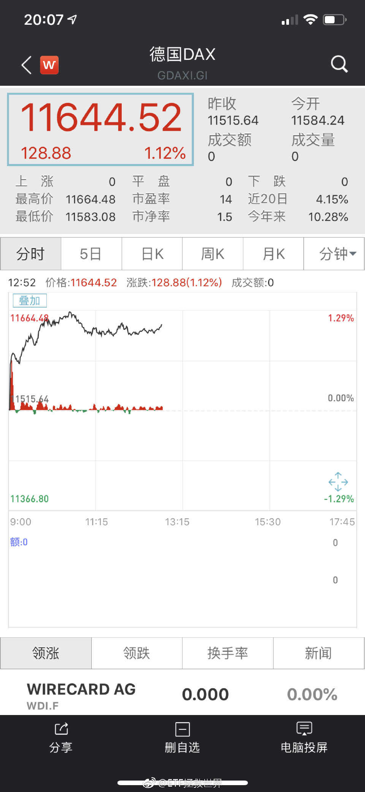

======================================================

ETF拯救世界 (5687069307) @
2019-03-02 15:44:02 Sat  
url: https://weibo.com/5687069307/Hj3Cd8W3m

很多人给我私信，都很着急，要把家里的钱都拿出来投入。

我没法为每个人量身定做资产配置方案。但我提醒两点。

第一，没什么投资经验的人面对资本市场做好压力测试，谨慎点。

第二，不要曲解我的言论。因为你会把别人的话按照自己的希望解读。以后有什么闪失不要来埋怨我。计划已经一个月没买任何东 ​​​

转发[86]  评论[378]  赞[773] 

======================================================

ETF拯救世界 (5687069307) @
2019-03-02 16:13:12 Sat  
url: https://weibo.com/5687069307/Hj3O37jpM

很多很多人都是莫名其妙多出来很多钱要投入。

要我说，根本不是新多出来，就是一个字，贪。

我已经看见一出悲剧将在未来某个时间段上演。

人性太可怕了。 ​​​

转发[171]  评论[597]  赞[983] 

======================================================

ETF拯救世界 (5687069307) @
2019-03-02 20:09:35 Sat  
url: https://weibo.com/5687069307/Hj5lZjaPR

终于又到财报季。已经有87家公布完毕，整个三月有1208家，所有公司4月底前公布完毕。

每天实时跟踪最新数据。

真相即将揭开。 ​​​

转发[23]  评论[164]  赞[684] 

======================================================

ETF拯救世界 (5687069307) @
2019-03-02 20:47:01 Sat  
url: https://weibo.com/5687069307/Hj5Bc1Ilu

我想请且慢把“调高每份资金”功能关闭。如果涨上去会越来越危险。如果你开始设计只有15万，高位你又拿150万来补仓。最终你的成本被那几份高位补入的拉到极高，最终所有的精心设计买卖点位全部泡汤，所有为了降低成本做的努力化为灰烬。

------------------------------------------------------
转推：
>  @ETF拯救世界 (5687069307)
>  2019-03-02 16:13:12 Sat  
>  url: https:/weibo.com/5687069307/Hj3O37jpM/

>  很多很多人都是莫名其妙多出来很多钱要投入。
>  
>  要我说，根本不是新多出来，就是一个字，贪。
>  
>  我已经看见一出悲剧将在未来某个时间段上演。
>  
>  人性太可怕了。 ​​​

转发[75]  评论[510]  赞[940] 

======================================================

ETF拯救世界 (5687069307) @
2019-03-03 11:15:40 Sun  
url: https://weibo.com/5687069307/HjbhMdLho

[doge]

------------------------------------------------------
转推：
>  @ ()
>  2019-03-03 11:15:02 Sun  
>  url: 

>  抱歉，作者已设置仅展示半年内微博，此微博已不可见。 ​​​

转发[14]  评论[106]  赞[268] 

======================================================

ETF拯救世界 (5687069307) @
2019-03-03 14:42:31 Sun  
url: https://weibo.com/5687069307/HjcDK7Vbb

不少美国人来中国领养残疾儿童。说真的，特别钦佩他们。堪称伟大。

------------------------------------------------------
转推：
>  @知世-搜狐 (6384589361)
>  2019-03-03 07:26:32 Sun  
>  url: https:/weibo.com/6384589361/Hj9MMevfu/

>  【被领养无眼睛8岁华裔女孩 在医院检查时用歌声驱散恐惧】8岁女孩Evie Hurst患有罕见的“无眼畸形症”，在4岁时被领养离开中国，现在美国密歇根州生活。Evie曾遭受许多创伤，并患有创伤后应激障碍，特别难以与医院和医生打交道。
>  今年2月，Evie疑似癫痫发作被送至医院接受脑部扫描，期间她又焦虑又害怕 ​​​

转发[65]  评论[155]  赞[703] 

======================================================

ETF拯救世界 (5687069307) @
2019-03-03 17:57:09 Sun  
url: https://weibo.com/5687069307/HjdUJBTTK

回复@尚书王华:孟老板虽然很希望规模更大，但对他来说最重要的是用户能赚钱。这点我非常坚信。这就是所谓的价值观。//@尚书王华:你这是考验孟老板啊[嘻嘻]

------------------------------------------------------
转推：
>  @ETF拯救世界 (5687069307)
>  2019-03-02 16:13:12 Sat  
>  url: https:/weibo.com/5687069307/Hj3O37jpM/

>  很多很多人都是莫名其妙多出来很多钱要投入。
>  
>  要我说，根本不是新多出来，就是一个字，贪。
>  
>  我已经看见一出悲剧将在未来某个时间段上演。
>  
>  人性太可怕了。 ​​​

转发[11]  评论[158]  赞[482] 

======================================================

ETF拯救世界 (5687069307) @
2019-03-04 09:27:21 Mon  
url: https://weibo.com/5687069307/Hjk0j6HfN

有人说因为在我微博评论里看到另一个人评论，然后去那个人微博，然后加了那个人收费群被骗。

第一，我建议大家擦亮眼睛。我不可能把所有评论里的广告都删干净，精力不够。以后我会更加严格，只要有一点广告嫌疑的都拉黑删评。（很多之前拉黑的已经在不停喷我了）但你自己也要多动脑子。很难相信为什么 ​​​

转发[12]  评论[117]  赞[435] 

======================================================

ETF拯救世界 (5687069307) @
2019-03-04 09:29:41 Mon  
url: https://weibo.com/5687069307/Hjk1fAPrd

野百合也有春天 $中证传媒 sz399971$

------------------------------------------------------
转推：
>  @ETF拯救世界 (5687069307)
>  2019-02-22 11:04:33 Fri  
>  url: https:/weibo.com/5687069307/HhOmMEAqp/

>  S的传媒已经回本，150的遥遥无期。[摊手]
>  
>  这指数是这波熊市最符合我“80%定律”的指数，之后会怎么走，大家都围观一下。 ​​​

转发[64]  评论[96]  赞[314] 

======================================================

ETF拯救世界 (5687069307) @
2019-03-04 09:50:04 Mon  
url: https://weibo.com/5687069307/Hjk9wgyz0

一口奶，半条命。泪两行，愁断肠。//@ETF拯救世界:野百合也有春天 $中证传媒 sz399971$

------------------------------------------------------
转推：
>  @ETF拯救世界 (5687069307)
>  2019-02-22 11:04:33 Fri  
>  url: https:/weibo.com/5687069307/HhOmMEAqp/

>  S的传媒已经回本，150的遥遥无期。[摊手]
>  
>  这指数是这波熊市最符合我“80%定律”的指数，之后会怎么走，大家都围观一下。 ​​​

转发[57]  评论[56]  赞[242] 

======================================================

ETF拯救世界 (5687069307) @
2019-03-04 09:54:20 Mon  
url: https://weibo.com/5687069307/HjkbfwcBY

回复@鸨哥o7o8:美女要是真的也行了，骗就骗了。全是抠脚大汉。气愤。[哼] 还有没有人管了！骗钱就算了还骗感情！[怒]//@鸨哥o7o8:别说qq加群，电话打过来，微信美女头像添加，真是够够的

------------------------------------------------------
转推：
>  @ETF拯救世界 (5687069307)
>  2019-03-04 09:27:21 Mon  
>  url: https:/weibo.com/5687069307/Hjk0j6HfN/

>  有人说因为在我微博评论里看到另一个人评论，然后去那个人微博，然后加了那个人收费群被骗。
>  
>  第一，我建议大家擦亮眼睛。我不可能把所有评论里的广告都删干净，精力不够。以后我会更加严格，只要有一点广告嫌疑的都拉黑删评。（很多之前拉黑的已经在不停喷我了）但你自己也要多动脑子。很难相信为什么 ​​​

转发[2]  评论[31]  赞[235] 

======================================================

ETF拯救世界 (5687069307) @
2019-03-04 09:55:53 Mon  
url: https://weibo.com/5687069307/HjkbT9x33

回复@谁喷益达我抽谁:等绝大多数人忍不住把最后一分钱买进去的时候。//@谁喷益达我抽谁:大盘这么涨下去，啥时候是个头啊！//@ETF拯救世界:一口奶，半条命。泪两行，愁断肠。//@ETF拯救世界:野百合也有春天 $中证传媒 sz399971$

------------------------------------------------------
转推：
>  @ETF拯救世界 (5687069307)
>  2019-02-22 11:04:33 Fri  
>  url: https:/weibo.com/5687069307/HhOmMEAqp/

>  S的传媒已经回本，150的遥遥无期。[摊手]
>  
>  这指数是这波熊市最符合我“80%定律”的指数，之后会怎么走，大家都围观一下。 ​​​

转发[30]  评论[73]  赞[273] 

======================================================

ETF拯救世界 (5687069307) @
2019-03-04 10:02:02 Mon  
url: https://weibo.com/5687069307/HjkeojEcF

回复@fantasy_happYness:踏踏实实地。轮动。牛市没有野百合。//@fantasy_happYness:老大，环保也喷了[doge]//@ETF拯救世界:一口奶，半条命。泪两行，愁断肠。//@ETF拯救世界:野百合也有春天 $中证传媒 sz399971$

------------------------------------------------------
转推：
>  @ETF拯救世界 (5687069307)
>  2019-02-22 11:04:33 Fri  
>  url: https:/weibo.com/5687069307/HhOmMEAqp/

>  S的传媒已经回本，150的遥遥无期。[摊手]
>  
>  这指数是这波熊市最符合我“80%定律”的指数，之后会怎么走，大家都围观一下。 ​​​

转发[20]  评论[42]  赞[240] 

======================================================

ETF拯救世界 (5687069307) @
2019-03-04 10:04:11 Mon  
url: https://weibo.com/5687069307/Hjkfg4suS

回复@可爱的wt-8178:我建议你变坏事为好事，以此事为契机，一举夺回家中的财政大权。同时，你已经有了未来决定财政大事时最好的论据。恭喜。

------------------------------------------------------
转推：
>  @ETF拯救世界 (5687069307)
>  2019-03-02 15:44:02 Sat  
>  url: https:/weibo.com/5687069307/Hj3Cd8W3m/

>  很多人给我私信，都很着急，要把家里的钱都拿出来投入。
>  
>  我没法为每个人量身定做资产配置方案。但我提醒两点。
>  
>  第一，没什么投资经验的人面对资本市场做好压力测试，谨慎点。
>  
>  第二，不要曲解我的言论。因为你会把别人的话按照自己的希望解读。以后有什么闪失不要来埋怨我。计划已经一个月没买任何东 ​​​

转发[19]  评论[50]  赞[273] 

======================================================

ETF拯救世界 (5687069307) @
2019-03-04 10:08:58 Mon  
url: https://weibo.com/5687069307/HjkhcjNSM

回复@米卡咖啡:继续暗中观察。随时汇报。over。//@米卡咖啡:看办公室里的人还在观望//@ETF拯救世界:回复@谁喷益达我抽谁:等绝大多数人忍不住把最后一分钱买进去的时候。//@谁喷益达我抽谁:大盘这么涨下去，啥时候是个头啊！//@ETF拯救世界:一口奶，半条命。泪两行，愁断肠。

------------------------------------------------------
转推：
>  @ETF拯救世界 (5687069307)
>  2019-02-22 11:04:33 Fri  
>  url: https:/weibo.com/5687069307/HhOmMEAqp/

>  S的传媒已经回本，150的遥遥无期。[摊手]
>  
>  这指数是这波熊市最符合我“80%定律”的指数，之后会怎么走，大家都围观一下。 ​​​

转发[13]  评论[69]  赞[337] 

======================================================

ETF拯救世界 (5687069307) @
2019-03-04 10:09:34 Mon  
url: https://weibo.com/5687069307/Hjkhs0fYW

回复@沐光2019:均值回归。//@沐光2019:请教E大，牛市里长江电力会怎么走，可否分析一下//@ETF拯救世界:回复@fantasy_happYness:踏踏实实地。轮动。牛市没有野百合。//@fantasy_happYness:老大，环保也喷了[doge]//@ETF拯救世界:一口奶，半条命。泪两行，愁断肠。

------------------------------------------------------
转推：
>  @ETF拯救世界 (5687069307)
>  2019-02-22 11:04:33 Fri  
>  url: https:/weibo.com/5687069307/HhOmMEAqp/

>  S的传媒已经回本，150的遥遥无期。[摊手]
>  
>  这指数是这波熊市最符合我“80%定律”的指数，之后会怎么走，大家都围观一下。 ​​​

转发[9]  评论[34]  赞[258] 

======================================================

ETF拯救世界 (5687069307) @
2019-03-04 10:14:23 Mon  
url: https://weibo.com/5687069307/Hjkjoxekh

再扎一次。

------------------------------------------------------
转推：
>  @ETF拯救世界 (5687069307)
>  2018-05-17 09:39:30 Thu  
>  url: https:/weibo.com/5687069307/Gh2b42qQ1/

>  我来告诉你一个残酷的事实，为什么你拿不住上涨的品种：
>  
>  因为你穷。
>  
>  [并不简单] ​​​

转发[41]  评论[133]  赞[496] 

======================================================

ETF拯救世界 (5687069307) @
2019-03-04 10:17:49 Mon  
url: https://weibo.com/5687069307/HjkkNrSKv

“经济和企业状况这么差，为什么股市会涨？"//@ETF拯救世界:回复@减肥吧狗子达:股市反映的不是现在，而是未来。当你看到知更鸟时，春天已经过去了。//@减肥吧狗子达:目前这个金融形式，你们凭什么认为2个月后会有好转？

------------------------------------------------------
转推：
>  @ETF拯救世界 (5687069307)
>  2018-10-16 16:11:08 Tue  
>  url: https:/weibo.com/5687069307/GEbHvfOVn/

>  说个数据吧。
>  
>  今年，A股股票下跌中位数是38%。
>  
>  上涨的股票只有5%。
>  
>  每五只股票里面就有一只腰斩。
>  
>  真的十年没见过这样的情况了。
>  
>  网上各种爆仓此起彼伏……
>  
>  
>  计划也扛不住了，今年下跌了11%…… ​​​

转发[42]  评论[73]  赞[314] 

======================================================

ETF拯救世界 (5687069307) @
2019-03-04 10:26:56 Mon  
url: https://weibo.com/5687069307/Hjkov1VBq

资本市场两大成功要素：

理性。信心。

没有理性只有信心，就是随波逐流的海草。

没有信心只有理性，就没有资格享受成功的快感。

什么都没有，

你不如把钱扔水里还能听个响。 ​​​

转发[164]  评论[155]  赞[603] 

======================================================

ETF拯救世界 (5687069307) @
2019-03-04 10:43:02 Mon  
url: https://weibo.com/5687069307/Hjkv1xwBG

对于年龄比较小的朋友，我的建议是，一方面理性消费，理性投资。一方面认真提高工作技能，或者开创副业，多挣钱，多积累本金。

有一两个牛市轮回，你就会发现你比身边与你之前同样状态的同龄人已经有钱了很多很多。

小富由己，大富在天。 ​​​

转发[161]  评论[274]  赞[892] 

======================================================

ETF拯救世界 (5687069307) @
2019-03-04 10:45:18 Mon  
url: https://weibo.com/5687069307/HjkvWA48A

回复@耐心是投资第一要素:你已经说了“都说”了，还用我分析吗。看绝大多数人，包括机构散户大v的言论，如果出奇一致，那就……//@耐心是投资第一要素:之前都说科创板利空创业板，可为啥年初至今创业板长的最多？E大能分析下吗？包括创业板未来，谢谢😜

------------------------------------------------------
转推：
>  @ETF拯救世界 (5687069307)
>  2019-03-04 10:26:56 Mon  
>  url: https:/weibo.com/5687069307/Hjkov1VBq/

>  资本市场两大成功要素：
>  
>  理性。信心。
>  
>  没有理性只有信心，就是随波逐流的海草。
>  
>  没有信心只有理性，就没有资格享受成功的快感。
>  
>  什么都没有，
>  
>  你不如把钱扔水里还能听个响。 ​​​

转发[37]  评论[46]  赞[296] 

======================================================

ETF拯救世界 (5687069307) @
2019-03-04 10:54:38 Mon  
url: https://weibo.com/5687069307/HjkzJwdZb

回复@whd9641:我真的不懂，为什么你们一定要解释所有上涨下跌。一定要解读清楚所有新闻。不这样真的赚不了钱吗？//@whd9641:科创板被解析为利好 指数又上涨 这是在牛市了吗?

------------------------------------------------------
转推：
>  @ETF拯救世界 (5687069307)
>  2019-03-04 10:26:56 Mon  
>  url: https:/weibo.com/5687069307/Hjkov1VBq/

>  资本市场两大成功要素：
>  
>  理性。信心。
>  
>  没有理性只有信心，就是随波逐流的海草。
>  
>  没有信心只有理性，就没有资格享受成功的快感。
>  
>  什么都没有，
>  
>  你不如把钱扔水里还能听个响。 ​​​

转发[26]  评论[101]  赞[367] 

======================================================

ETF拯救世界 (5687069307) @
2019-03-04 11:01:11 Mon  
url: https://weibo.com/5687069307/HjkCoqStU

要解读，这样解读才有价值，而不是人云亦云。发布了头条文章：《关于科创板，去年11.8的沙盘推演。》  http://t.cn/EIJ3EN1 ​​​

转发[282]  评论[201]  赞[1203] 

======================================================

ETF拯救世界 (5687069307) @
2019-03-04 11:12:21 Mon  
url: https://weibo.com/5687069307/HjkGVqjvN

不看了。每天多好几辆（）（）（），都不知道开哪辆出去了。[doge]

好好享受人生吧。每天开心点。 ​​​

转发[20]  评论[336]  赞[795] 

======================================================

ETF拯救世界 (5687069307) @
2019-03-04 11:42:27 Mon  
url: https://weibo.com/5687069307/HjkT95ELA

今天第三轮150新高了。

2010年第二轮计划的Q&A里面我就说，“现在上证3000点，哪怕10年后都是三千点，我相信我们的计划也能挣大钱”.

一语成谶。9年后真的还是3000点。但我们的第二轮计划赚了大钱牛市顶峰清仓后，第三轮计划现在也已经布局完毕，等待资产再次飞跃。

所以你赚钱不赚钱，和十年后二十 ​​​

转发[146]  评论[317]  赞[973] 

======================================================

ETF拯救世界 (5687069307) @
2019-03-04 11:46:51 Mon  
url: https://weibo.com/5687069307/HjkUWangn

回复@ETO拯救世界:震惊。牛市惊爆数万亿私房钱，我国GDP低估0.3个百分点。//@ETO拯救世界:回复@随记心路:我要笑死了，我老婆也自觉交代了三万块私房钱。

------------------------------------------------------
转推：
>  @ETF拯救世界 (5687069307)
>  2019-03-02 15:44:02 Sat  
>  url: https:/weibo.com/5687069307/Hj3Cd8W3m/

>  很多人给我私信，都很着急，要把家里的钱都拿出来投入。
>  
>  我没法为每个人量身定做资产配置方案。但我提醒两点。
>  
>  第一，没什么投资经验的人面对资本市场做好压力测试，谨慎点。
>  
>  第二，不要曲解我的言论。因为你会把别人的话按照自己的希望解读。以后有什么闪失不要来埋怨我。计划已经一个月没买任何东 ​​​

转发[13]  评论[122]  赞[521] 

======================================================

ETF拯救世界 (5687069307) @
2019-03-04 13:12:28 Mon  
url: https://weibo.com/5687069307/HjltFEBmy

大家说这是把仓位不重的锅甩给我了吗。

计划已经80%以上了啊，钻石底的文章也写了啊，自己不看怪我吗。 ​​​

转发[25]  评论[518]  赞[677] 

+++++++++++++++++++++++++++++++++++++++++++++++++++++

图片：

======================================================

ETF拯救世界 (5687069307) @
2019-03-04 13:27:21 Mon  
url: https://weibo.com/5687069307/HjlzJ0msq

太难了。

我的体会。

不知道你意下如何。 ​​​

转发[23]  评论[623]  赞[777] 

======================================================

ETF拯救世界 (5687069307) @
2019-03-04 15:25:56 Mon  
url: https://weibo.com/5687069307/HjmlRtx0m

温顺腼腆董明珠

------------------------------------------------------
转推：
>  @财联社APP (2868676035)
>  2019-03-04 15:16:45 Mon  
>  url: https:/weibo.com/2868676035/Hjmi8kGjD/

>  【怼美的、怼小米后 董明珠：我很温顺 不知道怎么得罪那么多人】格力电器董事长董明珠在最新一期凤凰卫视《领航者》节目中表示，自己的性格一直很温顺腼腆，所谓强悍只因管理企业要有规则，不管是谁都不允许破坏企业利益。“我也思考过为什么会得罪那么多人。” http://t.cn/EIiRHiZ ​​​

转发[28]  评论[155]  赞[356] 

======================================================

ETF拯救世界 (5687069307) @
2019-03-05 09:13:20 Tue  
url: https://weibo.com/5687069307/Hjtl7sbUt

沪伦通节奏放慢，与英国脱欧进程不明有很大关系。富时100指数基金迟迟不上也跟这个有关。希望多一点投资渠道。

------------------------------------------------------
转推：
>  @蓝鲸财经记者工作平台 (1885454921)
>  2019-03-05 09:05:00 Tue  
>  url: https:/weibo.com/1885454921/HjthJkQ5M/

>  易会满：股市上涨是市场行为，不好评论。沪伦通正在论证研究中。（证券时报） ​​​

转发[18]  评论[54]  赞[378] 

======================================================

ETF拯救世界 (5687069307) @
2019-03-05 09:19:34 Tue  
url: https://weibo.com/5687069307/HjtnE2dSD

打脸了。下午跳水，还差0.5没有新高…

可以开始计划送东西的事了。 ​​​

转发[15]  评论[341]  赞[575] 

+++++++++++++++++++++++++++++++++++++++++++++++++++++

图片：
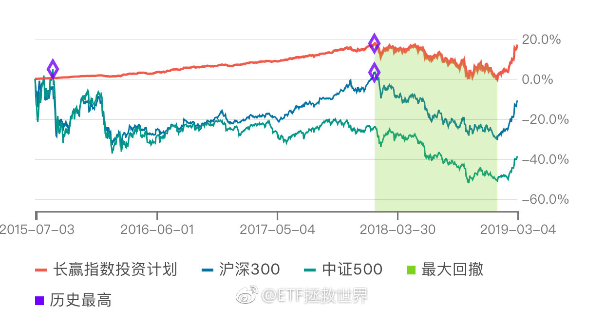
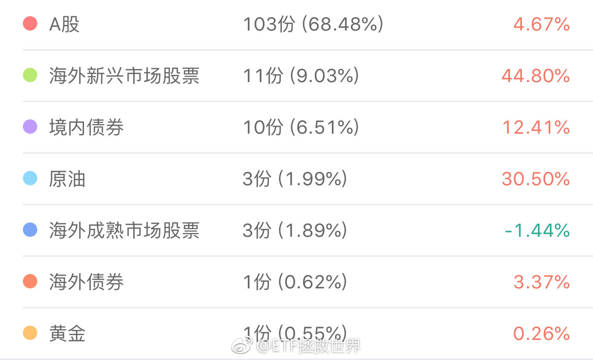

======================================================

ETF拯救世界 (5687069307) @
2019-03-05 10:44:28 Tue  
url: https://weibo.com/5687069307/HjtW75KFN

今天中小盘这么嗨应该稳了吧[doge]

------------------------------------------------------
转推：
>  @ETF拯救世界 (5687069307)
>  2019-03-05 09:19:34 Tue  
>  url: https:/weibo.com/5687069307/HjtnE2dSD/

>  打脸了。下午跳水，还差0.5没有新高…
>  
>  可以开始计划送东西的事了。 ​​​

转发[4]  评论[132]  赞[409] 

======================================================

ETF拯救世界 (5687069307) @
2019-03-05 11:33:03 Tue  
url: https://weibo.com/5687069307/HjufOz1Gr

挣钱是为了更好的活着。

活着可不只是为了挣钱。

所以。

下午出去浪。 ​​​

转发[104]  评论[229]  赞[947] 

======================================================

ETF拯救世界 (5687069307) @
2019-03-05 12:47:28 Tue  
url: https://weibo.com/5687069307/HjuK2jDql

回复@木木咖啡:还用说吗，利好中证500 [doge]//@木木咖啡:E大，减税对股市有什么深远的影响吗？想听听你的一些见解

------------------------------------------------------
转推：
>  @ETF拯救世界 (5687069307)
>  2019-03-05 11:33:03 Tue  
>  url: https:/weibo.com/5687069307/HjufOz1Gr/

>  挣钱是为了更好的活着。
>  
>  活着可不只是为了挣钱。
>  
>  所以。
>  
>  下午出去浪。 ​​​

转发[76]  评论[110]  赞[455] 

======================================================

ETF拯救世界 (5687069307) @
2019-03-05 14:21:45 Tue  
url: https://weibo.com/5687069307/HjvmivGiT

回复@你活的好像一条狗啊:谁说的你找谁去告诉我干嘛。我一点都不关心别人怎么判断谢谢。我只告诉你一句话，天天猜顶的人和拿不住的一样，大概率没赚过大钱。//@你活的好像一条狗啊:E大，有人说大盘要见顶了[可怜]//@ETF拯救世界:回复@木木咖啡:还用说吗，利好中证500 [doge]

------------------------------------------------------
转推：
>  @ETF拯救世界 (5687069307)
>  2019-03-05 11:33:03 Tue  
>  url: https:/weibo.com/5687069307/HjufOz1Gr/

>  挣钱是为了更好的活着。
>  
>  活着可不只是为了挣钱。
>  
>  所以。
>  
>  下午出去浪。 ​​​

转发[50]  评论[57]  赞[342] 

======================================================

ETF拯救世界 (5687069307) @
2019-03-05 14:24:34 Tue  
url: https://weibo.com/5687069307/Hjvns5uV3

溜个弯儿还得继续奶，真烦[doge]

$中证500 sz399905$  ​​​

转发[4]  评论[135]  赞[443] 

======================================================

ETF拯救世界 (5687069307) @
2019-03-05 14:53:31 Tue  
url: https://weibo.com/5687069307/Hjvzcarac

大家知道哪儿有卖血的地方吗。

买游戏机还差2000块。在线等，挺急的。

[微笑]

世事无常。 ​​​

转发[8]  评论[254]  赞[538] 

======================================================

ETF拯救世界 (5687069307) @
2019-03-05 15:29:30 Tue  
url: https://weibo.com/5687069307/HjvNNxo3j

回复@牛牛s:我真的不懂你们投资为什么要跟别人聊。你要跟水平高的人聊就算了，跟一帮没在股市赚过钱的人聊什么呢。瞎聊也行，还正经的聊。还反驳？你来赚钱的还是争高低的？我真的不懂！！//@牛牛s:同事盈利20~30减仓，或者清仓了，落袋为安，别人说我傻，如何反驳[允悲]

------------------------------------------------------
转推：
>  @ETF拯救世界 (5687069307)
>  2019-03-05 11:33:03 Tue  
>  url: https:/weibo.com/5687069307/HjufOz1Gr/

>  挣钱是为了更好的活着。
>  
>  活着可不只是为了挣钱。
>  
>  所以。
>  
>  下午出去浪。 ​​​

转发[34]  评论[159]  赞[498] 

======================================================

ETF拯救世界 (5687069307) @
2019-03-05 15:45:07 Tue  
url: https://weibo.com/5687069307/HjvU8uTJ4

说真的，在股市有没有赚过大钱，不用多，你看他的言论一周或者半个月就明白了。

我很想系统总结一下真正赚过大钱和没赚过大钱只是因为能写字变成炒股界知名人士的特征。

但想了想，还是不写了。

太得罪人了。

但是大的点我可以说三个：

第一，历史顶部区域知道撤退。你别管走的早了点还是走的稍微 ​​​

转发[441]  评论[448]  赞[1119] 

======================================================

ETF拯救世界 (5687069307) @
2019-03-05 16:12:25 Tue  
url: https://weibo.com/5687069307/Hjw5dzwsc

回复@ffxua:水平非常高。因为一平旗帜鲜明的支持500，梁宏在我被人陷害的时候出来替我说话。[doge] 谁在关键时刻做了什么，我都记得。[微笑]//@ffxua:e大觉得一平和梁宏如何？

------------------------------------------------------
转推：
>  @ETF拯救世界 (5687069307)
>  2019-03-05 15:45:07 Tue  
>  url: https:/weibo.com/5687069307/HjvU8uTJ4/

>  说真的，在股市有没有赚过大钱，不用多，你看他的言论一周或者半个月就明白了。
>  
>  我很想系统总结一下真正赚过大钱和没赚过大钱只是因为能写字变成炒股界知名人士的特征。
>  
>  但想了想，还是不写了。
>  
>  太得罪人了。
>  
>  但是大的点我可以说三个：
>  
>  第一，历史顶部区域知道撤退。你别管走的早了点还是走的稍微 ​​​

转发[26]  评论[85]  赞[467] 

======================================================

ETF拯救世界 (5687069307) @
2019-03-05 16:19:36 Tue  
url: https://weibo.com/5687069307/Hjw88nvIT

一个人的本质，要到关键时刻才能显露出来。

你有了麻烦，有人幸灾乐祸，有人旁敲侧击，有人冷眼看戏。然而，还有人出手相助，有人仗义执言，有人暗中帮忙。

作为当事人，你要做的就是记住这些人。远离小人，然后有机会就报答帮过你的人。

尤其是远离小人，特别重要。因为离小人近一分，你未来倒霉的 ​​​

转发[116]  评论[190]  赞[903] 

======================================================

ETF拯救世界 (5687069307) @
2019-03-05 18:00:24 Tue  
url: https://weibo.com/5687069307/HjwN3aKWd

今日A股已经回到过去十个月最贵的时候。

谨慎乐观。情绪不要随着市场变化而有所波动。

理智。冷静。执行策略。

涨跌都舒服。切切。 ​​​

转发[77]  评论[186]  赞[666] 

======================================================

ETF拯救世界 (5687069307) @
2019-03-05 18:29:44 Tue  
url: https://weibo.com/5687069307/HjwYXlYrA

回复@风声边界617:噪音是关乎你信不信。观察情绪是让你看戏。你看科幻电影会相信里面的怪兽是真的吗？我没法再揉的更碎说的更明白了。//@风声边界617:一下是噪音，一下又要我们观察情绪，益达我要分裂了

------------------------------------------------------
转推：
>  @ETF拯救世界 (5687069307)
>  2019-03-05 15:45:07 Tue  
>  url: https:/weibo.com/5687069307/HjvU8uTJ4/

>  说真的，在股市有没有赚过大钱，不用多，你看他的言论一周或者半个月就明白了。
>  
>  我很想系统总结一下真正赚过大钱和没赚过大钱只是因为能写字变成炒股界知名人士的特征。
>  
>  但想了想，还是不写了。
>  
>  太得罪人了。
>  
>  但是大的点我可以说三个：
>  
>  第一，历史顶部区域知道撤退。你别管走的早了点还是走的稍微 ​​​

转发[16]  评论[38]  赞[298] 

======================================================

ETF拯救世界 (5687069307) @
2019-03-05 18:35:16 Tue  
url: https://weibo.com/5687069307/Hjx1ctB5r

另外，我还发现一个问题：

很多东西我自认为已经表达的非常明确了，但依然会有人用自己的理解去解释。

其实很多时候，大家都是用自己的“愿望”去解释别人的话。

解决方法，我想只能尽量少说话。或者，请你看我在计划里的操作。加仓就是上涨概率大，大力加仓就是上涨概率非常大。不买不卖就是正常。 ​​​

转发[98]  评论[229]  赞[608] 

======================================================

ETF拯救世界 (5687069307) @
2019-03-05 18:38:44 Tue  
url: https://weibo.com/5687069307/Hjx2CgRVK

回复@罗塞塔石:为什么用十个月？因为现在正是过去十个月，不是十一月，也不是十二个月最贵的时候。现在的人到底怎么回事？？？//@罗塞塔石:中正500估值历史来看还是很便宜。为什么用过去10个月的区间数据[并不简单][并不简单]

------------------------------------------------------
转推：
>  @ETF拯救世界 (5687069307)
>  2019-03-05 18:00:24 Tue  
>  url: https:/weibo.com/5687069307/HjwN3aKWd/

>  今日A股已经回到过去十个月最贵的时候。
>  
>  谨慎乐观。情绪不要随着市场变化而有所波动。
>  
>  理智。冷静。执行策略。
>  
>  涨跌都舒服。切切。 ​​​

转发[12]  评论[146]  赞[317] 

======================================================

ETF拯救世界 (5687069307) @
2019-03-05 18:52:19 Tue  
url: https://weibo.com/5687069307/Hjx87wTqi

回复@道法自然的芒果:11月第一次计划买入6份，第二次买入2份。12月第一次买入五分，1月第一次买入三份。短短两个月买入16份。你还想怎么样？平常都是每次一两份.//@道法自然的芒果:大力加仓的时候请用红色字体加粗高亮显示[可爱]，没记得之前有大力加仓的时候。

------------------------------------------------------
转推：
>  @ETF拯救世界 (5687069307)
>  2019-03-05 18:35:16 Tue  
>  url: https:/weibo.com/5687069307/Hjx1ctB5r/

>  另外，我还发现一个问题：
>  
>  很多东西我自认为已经表达的非常明确了，但依然会有人用自己的理解去解释。
>  
>  其实很多时候，大家都是用自己的“愿望”去解释别人的话。
>  
>  解决方法，我想只能尽量少说话。或者，请你看我在计划里的操作。加仓就是上涨概率大，大力加仓就是上涨概率非常大。不买不卖就是正常。 ​​​

转发[22]  评论[164]  赞[365] 

======================================================

ETF拯救世界 (5687069307) @
2019-03-05 19:09:00 Tue  
url: https://weibo.com/5687069307/HjxeU5Qi3

本月开始，创业板/中小板/中证1000的未来长期收益率已经比不上十年期国债。

但是请你理解，资本市场贵不代表马上会跌，便宜也不代表就会涨。

我只是陈述事实。你能不能只从陈述事实这个角度看我的发言？ ​​​

转发[99]  评论[210]  赞[719] 

======================================================

ETF拯救世界 (5687069307) @
2019-03-05 19:14:25 Tue  
url: https://weibo.com/5687069307/Hjxh5FBIM

今日收盘，深证100指数估值已经高于历史平均。 ​​​

转发[46]  评论[132]  赞[534] 

======================================================

ETF拯救世界 (5687069307) @
2019-03-05 20:43:03 Tue  
url: https://weibo.com/5687069307/HjxR4Fgtf

以前公众号基本是两个月增加一万关注者。这个月喷我的人太多了，以至于大量不明真相的群众涌入，不到20天就多了一万关注……

讲真，我真不希望用这个方式被关注啊。衰…… ​​​

转发[6]  评论[252]  赞[584] 

======================================================

ETF拯救世界 (5687069307) @
2019-03-05 22:47:14 Tue  
url: https://weibo.com/5687069307/HjyFtvmpe

每日打卡（7）

这几天没顾上打卡，今天正式恢复。

计划如期新高。距离20%还差一个点，看看谁的运气好。 ​​​

转发[6]  评论[198]  赞[604] 

+++++++++++++++++++++++++++++++++++++++++++++++++++++

图片：

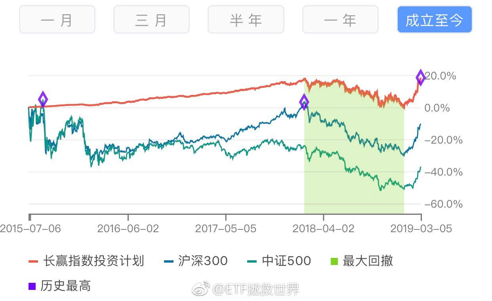

======================================================

ETF拯救世界 (5687069307) @
2019-03-06 09:06:51 Wed  
url: https://weibo.com/5687069307/HjCIYCnrO

我有一事不明。

我最爱做的家务，是把脏了吧唧的锅碗瓢盆放到洗碗机里。放进去的这个过程就很享受。

等洗好了，打开洗碗机的门，一股特有的清香掺杂着湿润的热气扑面而来。拿出洗的晶莹剔透的餐具，心中更会感受到极大的快感。

我想知道，为什么人类对干净的东西特别喜欢？这里面有什么原理吗。 ​​​

转发[29]  评论[485]  赞[535] 

======================================================

ETF拯救世界 (5687069307) @
2019-03-06 09:14:55 Wed  
url: https://weibo.com/5687069307/HjCMgdaXw

我到底关注了一个摄影票友、一个业余木匠，还是一个房地产开发商？

------------------------------------------------------
转推：
>  @ ()
>  2019-03-06 09:00:09 Wed  
>  url: 

>  抱歉，作者已设置仅展示半年内微博，此微博已不可见。 ​​​

转发[10]  评论[98]  赞[230] 

======================================================

ETF拯救世界 (5687069307) @
2019-03-06 09:39:31 Wed  
url: https://weibo.com/5687069307/HjCWeCf0M

听我一句劝，暂时别追了。 ​​​

转发[16]  评论[286]  赞[834] 

======================================================

ETF拯救世界 (5687069307) @
2019-03-06 09:50:30 Wed  
url: https://weibo.com/5687069307/HjD0Hfval

以前都是你犹犹豫豫患得患失不知道到底该不该给别人抬轿子。一会儿抬起来一会儿放下钱没挣到累个半死。

现在一亿多人给你抬轿子，你的感受是______。 ​​​

转发[77]  评论[266]  赞[532] 

======================================================

ETF拯救世界 (5687069307) @
2019-03-06 09:54:25 Wed  
url: https://weibo.com/5687069307/HjD2icItM

再给个小贴士：

牛市行情结束的标志，就是在整个牛市中表现一般的大盘蓝筹股开始暴涨。这是因为资金实在没得炒了，只好去炒大蓝筹。那就意味着要歇菜了。

所以你观察一下，如果之前一直没涨的大蓝筹开始涨，那就小心点，盯紧点。 ​​​

转发[547]  评论[469]  赞[1033] 

======================================================

ETF拯救世界 (5687069307) @
2019-03-06 10:07:18 Wed  
url: https://weibo.com/5687069307/HjD7wlBuF

回复@做一支有思想的芦苇:赢了会所嫩模，输了你就是嫩模。//@做一支有思想的芦苇:会所嫩模受不了了

------------------------------------------------------
转推：
>  @ETF拯救世界 (5687069307)
>  2019-03-06 09:50:30 Wed  
>  url: https:/weibo.com/5687069307/HjD0Hfval/

>  以前都是你犹犹豫豫患得患失不知道到底该不该给别人抬轿子。一会儿抬起来一会儿放下钱没挣到累个半死。
>  
>  现在一亿多人给你抬轿子，你的感受是______。 ​​​

转发[3]  评论[100]  赞[384] 

======================================================

ETF拯救世界 (5687069307) @
2019-03-06 11:00:38 Wed  
url: https://weibo.com/5687069307/HjDt9zr3C

回复@梓溪20180316:拿不住股票是因为你不知道值多少。即使知道值多少也不知道它有没有资金照顾。即使知道有资金照顾也不知道公司会不会突然出问题。拿不住很正常。你没有多大责任。

------------------------------------------------------
转推：
>  @ETF拯救世界 (5687069307)
>  2019-03-06 09:50:30 Wed  
>  url: https:/weibo.com/5687069307/HjD0Hfval/

>  以前都是你犹犹豫豫患得患失不知道到底该不该给别人抬轿子。一会儿抬起来一会儿放下钱没挣到累个半死。
>  
>  现在一亿多人给你抬轿子，你的感受是______。 ​​​

转发[49]  评论[130]  赞[465] 

======================================================

ETF拯救世界 (5687069307) @
2019-03-06 11:41:19 Wed  
url: https://weibo.com/5687069307/HjDJG5355

今天写篇东西。 ​​​

转发[4]  评论[393]  赞[1180] 

======================================================

ETF拯救世界 (5687069307) @
2019-03-06 13:20:52 Wed  
url: https://weibo.com/5687069307/HjEo5icUu

规则已经想好了。送的人一定是真爱，辣鸡喷子一点点希望都没有。

同时，还有运气成分。

就等20%了。 ​​​

转发[24]  评论[1403]  赞[1626] 

+++++++++++++++++++++++++++++++++++++++++++++++++++++

图片：

======================================================

ETF拯救世界 (5687069307) @
2019-03-06 14:12:16 Wed  
url: https://weibo.com/5687069307/HjEIWDVdR

我持有的一只打新门票股从最低位涨上来130%了。

整个下跌过程中我坚持不懈的369补仓。

终于回本了。[微笑]

从第一次买到最低点跌了74%……而我第一次买的时候已经从最高点跌了45%了……

股票这玩意真神奇啊。

（我本人所有打新门票仓位加起来大概十几个点。目前持有40多只。） ​​​

转发[123]  评论[275]  赞[604] 

======================================================

ETF拯救世界 (5687069307) @
2019-03-06 14:32:17 Wed  
url: https://weibo.com/5687069307/HjER4tBft

回复@家里有肥鹅:我从没说过我不买个股。是最近6、7年不再公开谈论个股。谈论股票各种风险太大，没有意义。//@家里有肥鹅:e大，你不是不买个股的么？或者你不是不推荐买个股的么？我们不是玩指数的么？[思考]

------------------------------------------------------
转推：
>  @ETF拯救世界 (5687069307)
>  2019-03-06 14:12:16 Wed  
>  url: https:/weibo.com/5687069307/HjEIWDVdR/

>  我持有的一只打新门票股从最低位涨上来130%了。
>  
>  整个下跌过程中我坚持不懈的369补仓。
>  
>  终于回本了。[微笑]
>  
>  从第一次买到最低点跌了74%……而我第一次买的时候已经从最高点跌了45%了……
>  
>  股票这玩意真神奇啊。
>  
>  （我本人所有打新门票仓位加起来大概十几个点。目前持有40多只。） ​​​

转发[6]  评论[38]  赞[307] 

======================================================

ETF拯救世界 (5687069307) @
2019-03-06 14:40:56 Wed  
url: https://weibo.com/5687069307/HjEUAfzy2

公开谈论股票的各种风险非常非常大。不仅是波动风险，公司经营风险，甚至包括道德风险。

所以我绝对不会公开谈论任何股票。

2018年初，看打新门票组合，好像很不错。2017年涨了50%。但你能想到，组合里面有些股票大跌？你能想到，2018年组合收益率也大幅下降？

谈论十只股票，有8只表现好已经很NB。 ​​​

转发[46]  评论[163]  赞[460] 

+++++++++++++++++++++++++++++++++++++++++++++++++++++

图片：

======================================================

ETF拯救世界 (5687069307) @
2019-03-06 14:48:54 Wed  
url: https://weibo.com/5687069307/HjEXPaLFS

500最近逆袭300。风水轮流转，千万别用最近的表现套未来。千万别300好的时候喷500,500好的时候喷300。雪中送炭才有好报。

------------------------------------------------------
转推：
>  @ETF拯救世界 (5687069307)
>  2019-02-01 09:53:19 Fri  
>  url: https:/weibo.com/5687069307/HeBVrxIfX/

>  今天500的涨幅是300的286%，50甚至跌了。
>  
>  但这并不代表什么。
>  
>  500也许还会继续跌。
>  
>  但在这个位置开始，未来5-10年500如果不出现至少一次年化10%甚至15%以上的时刻，我会比较惊讶。 ​​​

转发[48]  评论[75]  赞[486] 

======================================================

ETF拯救世界 (5687069307) @
2019-03-06 14:55:18 Wed  
url: https://weibo.com/5687069307/HjF0pBl3V

回复@航-YangZ:我不卖它也不敢跌啊 [doge]//@航-YangZ:券商又疯了//@ETF拯救世界:500最近逆袭300。风水轮流转，千万别用最近的表现套未来。千万别300好的时候喷500,500好的时候喷300。雪中送炭才有好报。

------------------------------------------------------
转推：
>  @ETF拯救世界 (5687069307)
>  2019-02-01 09:53:19 Fri  
>  url: https:/weibo.com/5687069307/HeBVrxIfX/

>  今天500的涨幅是300的286%，50甚至跌了。
>  
>  但这并不代表什么。
>  
>  500也许还会继续跌。
>  
>  但在这个位置开始，未来5-10年500如果不出现至少一次年化10%甚至15%以上的时刻，我会比较惊讶。 ​​​

转发[8]  评论[87]  赞[448] 

======================================================

ETF拯救世界 (5687069307) @
2019-03-06 15:03:00 Wed  
url: https://weibo.com/5687069307/HjF3xs6u9

当你的利润越来越多，现价逐渐远离你的成本线的时候，你是不是越来越踏实了？

如果每次刚刚回本就卖掉，然后继续买入被套，刚回本又卖。总是让价格在成本线周围，那你永远是心惊胆战，患得患失。

如果你盈利50%，那么回撤到40%怎么了？你心里不会有太大不舒服。然而如果是盈利5%到亏损5%，就会难过的 ​​​

转发[190]  评论[390]  赞[748] 

======================================================

ETF拯救世界 (5687069307) @
2019-03-06 15:17:46 Wed  
url: https://weibo.com/5687069307/HjF9xeknU

回复@时光匆匆飘逝:跟你说了远离噪音你不信。煎熬都是自找的。//@时光匆匆飘逝:真的是靠着E大的一路按摩才坚持到了现在，在2900点的时候关注的很多大V都开始看空，包括一位在1月5号之后精准抄底的老师也看空，当时真的内心非常煎熬

------------------------------------------------------
转推：
>  @ETF拯救世界 (5687069307)
>  2019-03-06 15:03:00 Wed  
>  url: https:/weibo.com/5687069307/HjF3xs6u9/

>  当你的利润越来越多，现价逐渐远离你的成本线的时候，你是不是越来越踏实了？
>  
>  如果每次刚刚回本就卖掉，然后继续买入被套，刚回本又卖。总是让价格在成本线周围，那你永远是心惊胆战，患得患失。
>  
>  如果你盈利50%，那么回撤到40%怎么了？你心里不会有太大不舒服。然而如果是盈利5%到亏损5%，就会难过的 ​​​

转发[12]  评论[72]  赞[333] 

======================================================

ETF拯救世界 (5687069307) @
2019-03-06 15:20:50 Wed  
url: https://weibo.com/5687069307/HjFaMhJkL

回复@昵称称称昵:今晚回答你。//@昵称称称昵:E大，首先声明我绝不是自己存款里有钱。早几天我把账户盈利拿给爸妈看，我妈给了我三十万要我操作，我该怎么办[允悲]

------------------------------------------------------
转推：
>  @ETF拯救世界 (5687069307)
>  2019-03-06 15:03:00 Wed  
>  url: https:/weibo.com/5687069307/HjF3xs6u9/

>  当你的利润越来越多，现价逐渐远离你的成本线的时候，你是不是越来越踏实了？
>  
>  如果每次刚刚回本就卖掉，然后继续买入被套，刚回本又卖。总是让价格在成本线周围，那你永远是心惊胆战，患得患失。
>  
>  如果你盈利50%，那么回撤到40%怎么了？你心里不会有太大不舒服。然而如果是盈利5%到亏损5%，就会难过的 ​​​

转发[13]  评论[347]  赞[505] 

======================================================

ETF拯救世界 (5687069307) @
2019-03-06 23:04:52 Wed  
url: https://weibo.com/5687069307/HjId8rWxM

每日打卡（8）

搞定。还差0.4%。别涨了，休息休息吧。[挖鼻] ​​​

转发[6]  评论[105]  赞[369] 

+++++++++++++++++++++++++++++++++++++++++++++++++++++

图片：
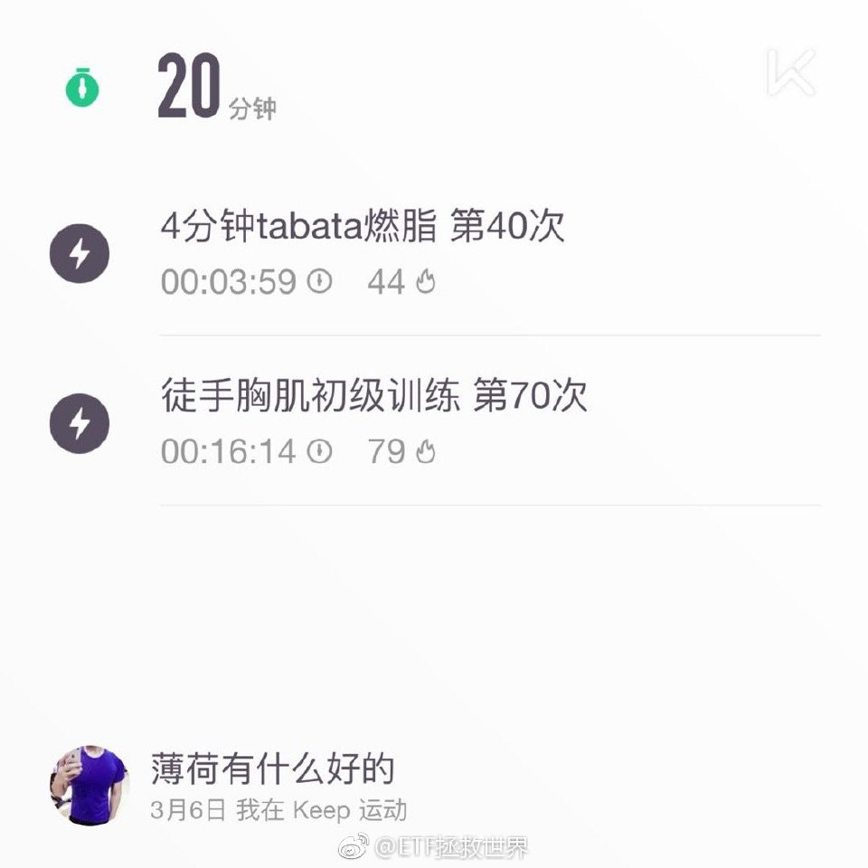

======================================================

ETF拯救世界 (5687069307) @
2019-03-06 23:44:12 Wed  
url: https://weibo.com/5687069307/HjIt650ab

九阳真经为什么在猴子肚子里？

喷了。 

还让张无忌碰上了。这概率低于上证涨到十万点吧。 ​​​

转发[4]  评论[134]  赞[466] 

======================================================

ETF拯救世界 (5687069307) @
2019-03-07 07:01:40 Thu  
url: https://weibo.com/5687069307/HjLkFc30z

到今天，已经为各位赚到超过十位数的利润。如果是私募，光管理费和提成就已经发了。

无论未来做的怎么样，希望有个好的结果。太难了。 ​​​

转发[50]  评论[625]  赞[1755] 

======================================================

ETF拯救世界 (5687069307) @
2019-03-07 08:13:59 Thu  
url: https://weibo.com/5687069307/HjLO17LVK

人类没有预测能力。所以凭“感觉”和“分析”，判断什么时候买什么时候卖，就特别不靠谱。

哪怕一直对，错一次就完了。关键是根本不可能一直对。

所以，只能依靠体系和策略，把自己约束起来。你要做的只能是设计体系和策略，然后执行，然后改进，然后继续执行。

对于普通人来说，基本没有别的长期胜 ​​​

转发[209]  评论[230]  赞[863] 

======================================================

ETF拯救世界 (5687069307) @
2019-03-07 09:14:44 Thu  
url: https://weibo.com/5687069307/HjMcG201j

想吸//@地刺Principle-First:一大口

------------------------------------------------------
转推：
>  @云吸猫小哥 (5340023314)
>  2019-03-06 11:00:51 Wed  
>  url: https:/weibo.com/5340023314/HjDtfyfBg/

>  这么可爱的爪爪谁不想吸！ ​​​

转发[18]  评论[113]  赞[254] 

======================================================

ETF拯救世界 (5687069307) @
2019-03-07 09:40:04 Thu  
url: https://weibo.com/5687069307/HjMmXnp4m

很多人是先有一个判断，然后再去观察市场。

其实他们做反了。

手里拿着榔头，看哪里都有钉子。

保持客观非常难。 ​​​

转发[116]  评论[97]  赞[537] 

======================================================

ETF拯救世界 (5687069307) @
2019-03-07 09:48:15 Thu  
url: https://weibo.com/5687069307/HjMqhmZSg

市场在某些时候会错的离谱。但是大多数时候，市场比绝大多数人聪明的多的多的多。否则“价值投资”就是伪命题。//@时光精致:对，然后觉得市场是错的、基本面是错的、政策是错的、赚钱的人都是错的……[酸][酸][酸]

------------------------------------------------------
转推：
>  @ETF拯救世界 (5687069307)
>  2019-03-07 09:40:04 Thu  
>  url: https:/weibo.com/5687069307/HjMmXnp4m/

>  很多人是先有一个判断，然后再去观察市场。
>  
>  其实他们做反了。
>  
>  手里拿着榔头，看哪里都有钉子。
>  
>  保持客观非常难。 ​​​

转发[34]  评论[43]  赞[337] 

======================================================

ETF拯救世界 (5687069307) @
2019-03-07 10:04:56 Thu  
url: https://weibo.com/5687069307/HjMx3eGtg

刚拿到一个数据：

到昨天，大致有3%的人清仓。有9%的人赎回90%以上。有12%的人赎回50%以上。有14%的人赎回30%以上。

（你们是不是误会了。30%以上含50%，90%和清仓啊。不是加起来！）

也就是说。有12%的人基本就是回本或者浮亏就跑了。

这个数据不知道该喜还是该忧。

有时候真的不知道人的命运是 ​​​

转发[116]  评论[602]  赞[578] 

======================================================

ETF拯救世界 (5687069307) @
2019-03-07 10:13:48 Thu  
url: https://weibo.com/5687069307/HjMAE1oAM

回复@翻滚的小飞龙:你猜。//@翻滚的小飞龙:是考虑做波段吧？顺便问E大个问题，计划中两份500C，什么时候出呢？

------------------------------------------------------
转推：
>  @ETF拯救世界 (5687069307)
>  2019-03-07 10:04:56 Thu  
>  url: https:/weibo.com/5687069307/HjMx3eGtg/

>  刚拿到一个数据：
>  
>  到昨天，大致有3%的人清仓。有9%的人赎回90%以上。有12%的人赎回50%以上。有14%的人赎回30%以上。
>  
>  （你们是不是误会了。30%以上含50%，90%和清仓啊。不是加起来！）
>  
>  也就是说。有12%的人基本就是回本或者浮亏就跑了。
>  
>  这个数据不知道该喜还是该忧。
>  
>  有时候真的不知道人的命运是 ​​​

转发[6]  评论[79]  赞[239] 

======================================================

ETF拯救世界 (5687069307) @
2019-03-07 10:25:15 Thu  
url: https://weibo.com/5687069307/HjMFj1tVr

回复@天方浩宇:有几份卖的早了点，不完美。下次继续努力。//@天方浩宇:e大我能问问债券的买点是怎么定的么？  回看了一下几只债券买的时间太nb了…//@ETF拯救世界:回复@翻滚的小飞龙:你猜。//@翻滚的小飞龙:是考虑做波段吧？顺便问E大个问题，计划中两份500C，什么时候出呢？

------------------------------------------------------
转推：
>  @ETF拯救世界 (5687069307)
>  2019-03-07 10:04:56 Thu  
>  url: https:/weibo.com/5687069307/HjMx3eGtg/

>  刚拿到一个数据：
>  
>  到昨天，大致有3%的人清仓。有9%的人赎回90%以上。有12%的人赎回50%以上。有14%的人赎回30%以上。
>  
>  （你们是不是误会了。30%以上含50%，90%和清仓啊。不是加起来！）
>  
>  也就是说。有12%的人基本就是回本或者浮亏就跑了。
>  
>  这个数据不知道该喜还是该忧。
>  
>  有时候真的不知道人的命运是 ​​​

转发[3]  评论[53]  赞[276] 

======================================================

ETF拯救世界 (5687069307) @
2019-03-07 10:27:17 Thu  
url: https://weibo.com/5687069307/HjMG7znFG

今天500又干掉300 1.6%。

……再去翻翻1月底我发的关于500的微博，你会对人性有更高一层的认识。 ​​​

转发[375]  评论[96]  赞[474] 

======================================================

ETF拯救世界 (5687069307) @
2019-03-07 10:31:33 Thu  
url: https://weibo.com/5687069307/HjMHRpJkv

滴滴。 ​​​

转发[2]  评论[243]  赞[458] 

======================================================

ETF拯救世界 (5687069307) @
2019-03-07 10:35:54 Thu  
url: https://weibo.com/5687069307/HjMJCrbZz

GJD是不是关注公众号了。 ​​​

转发[11]  评论[155]  赞[494] 

======================================================

ETF拯救世界 (5687069307) @
2019-03-07 10:46:42 Thu  
url: https://weibo.com/5687069307/HjMO0zDwy

回复@信仰诚可贵:第一，你看其他地方的估值我就不评价了。第二，估值只是观察市场的很小一方面，更别提和操作的关系。操作是策略和体系引发，而非估值。//@信仰诚可贵:看了昨天蛋卷的估值，500昨天刚进入合理估值区间，留券商，想不明白@ETF拯救世界

------------------------------------------------------
转推：
>  @ETF拯救世界 (5687069307)
>  2019-03-07 10:27:17 Thu  
>  url: https:/weibo.com/5687069307/HjMG7znFG/

>  今天500又干掉300 1.6%。
>  
>  ……再去翻翻1月底我发的关于500的微博，你会对人性有更高一层的认识。 ​​​

转发[32]  评论[146]  赞[384] 

======================================================

ETF拯救世界 (5687069307) @
2019-03-07 11:14:43 Thu  
url: https://weibo.com/5687069307/HjMZnmP2o

波段仓位出一份，其他的就踏踏实实拿着吧。卖一份焦虑情绪就小很多了吧？

舒服最重要。 ​​​

转发[29]  评论[332]  赞[670] 

======================================================

ETF拯救世界 (5687069307) @
2019-03-07 11:24:29 Thu  
url: https://weibo.com/5687069307/HjN3lb6ZY

券商40%了。是不是也该动动了。切换到哪个品种？

你猜。 ​​​

转发[17]  评论[642]  赞[698] 

======================================================

ETF拯救世界 (5687069307) @
2019-03-07 11:27:29 Thu  
url: https://weibo.com/5687069307/HjN4yzfe3

开始看留言，1400条。 ​​​

转发[2]  评论[226]  赞[609] 

======================================================

ETF拯救世界 (5687069307) @
2019-03-07 15:24:45 Thu  
url: https://weibo.com/5687069307/HjOCRxcuz

收盘跑赢2.3%

------------------------------------------------------
转推：
>  @ETF拯救世界 (5687069307)
>  2019-03-07 10:27:17 Thu  
>  url: https:/weibo.com/5687069307/HjMG7znFG/

>  今天500又干掉300 1.6%。
>  
>  ……再去翻翻1月底我发的关于500的微博，你会对人性有更高一层的认识。 ​​​

转发[12]  评论[98]  赞[500] 

======================================================

ETF拯救世界 (5687069307) @
2019-03-07 15:47:41 Thu  
url: https://weibo.com/5687069307/HjOMaCuhO

我有种不详的预感。今天会不会涨0.4%。

[污] ​​​

转发[4]  评论[326]  赞[592] 

======================================================

ETF拯救世界 (5687069307) @
2019-03-07 17:58:28 Thu  
url: https://weibo.com/5687069307/HjPDg6HTU

短短两个月，传媒估值从1字头涨到了3字头。 ​​​

转发[11]  评论[119]  赞[528] 

======================================================

ETF拯救世界 (5687069307) @
2019-03-07 18:12:04 Thu  
url: https://weibo.com/5687069307/HjPIMgZ43

即将爬出黄金坑。回到地面。

没什么好买了。不过与进入黄金坑之前没什么好买的不同之处在于，我们手里已经拿到了大量的廉价筹码。有没有好买的也无所谓了。

舒服。 ​​​

转发[82]  评论[209]  赞[755] 

======================================================

ETF拯救世界 (5687069307) @
2019-03-07 18:19:04 Thu  
url: https://weibo.com/5687069307/HjPLCpsG7

只有德国和英国依然有点销魂。

------------------------------------------------------
转推：
>  @ETF拯救世界 (5687069307)
>  2019-03-07 18:12:04 Thu  
>  url: https:/weibo.com/5687069307/HjPIMgZ43/

>  即将爬出黄金坑。回到地面。
>  
>  没什么好买了。不过与进入黄金坑之前没什么好买的不同之处在于，我们手里已经拿到了大量的廉价筹码。有没有好买的也无所谓了。
>  
>  舒服。 ​​​

转发[12]  评论[157]  赞[459] 

======================================================

ETF拯救世界 (5687069307) @
2019-03-07 19:08:43 Thu  
url: https://weibo.com/5687069307/HjQ5M3TEL

我觉得也不能这么说。大盘股小盘股的风格轮动在任何市场上都会存在。正是因为这两年“价值投资”深入人心，蓝筹们被疯狂追逐，小盘股被遗弃，才导致又一次轮回。

------------------------------------------------------
转推：
>  @挖龙脉的超级鹿鼎公 (3962719063)
>  2019-03-07 18:43:13 Thu  
>  url: https:/weibo.com/3962719063/HjPVqiUjh/

>  [允悲]A股用了三年教会投资者价值投资，然后再用一个月告诉大家价值投资是傻逼…… ​​​

转发[55]  评论[80]  赞[509] 

======================================================

ETF拯救世界 (5687069307) @
2019-03-07 19:27:24 Thu  
url: https://weibo.com/5687069307/HjQdmscFN

这条微博值很多钱。当时2500点。

------------------------------------------------------
转推：
>  @ETF拯救世界 (5687069307)
>  2019-01-21 09:57:43 Mon  
>  url: https:/weibo.com/5687069307/HcWfMd6AE/

>  便宜的时候，给你很多很多时间和机会让你慢慢布局，你因为各种利空不敢买，又或者是特别贪，希望跌到2200,2000,1500。
>  
>  涨起来了，贵了，你很着急。希望有个大回调自己好杀进去。
>  
>  不好意思，真正的牛市没有回调。即使有你也进不去。最后你进去了，恐怕涨不了多少就要是大顶了。
>  
>  这话还早，不过几年后 ​​​

转发[101]  评论[150]  赞[798] 

======================================================

ETF拯救世界 (5687069307) @
2019-03-07 19:52:29 Thu  
url: https://weibo.com/5687069307/HjQnxk7NB

以前每年3.8都会给各位美女发红包。今年由于众所周知的原因，不发了。但该送还是送，不过普惠式改成集中式，减少坏人中奖的机会。

明天会根据一定规则，选出一位女性朋友送出一份礼物。希望没有拿到礼物的朋友也都开开心心的。 ​​​

转发[11]  评论[582]  赞[1067] 

======================================================

ETF拯救世界 (5687069307) @
2019-03-08 05:06:35 Fri  
url: https://weibo.com/5687069307/HjU0riz5T

我们昨天上午已经减了。请首长放心。

------------------------------------------------------
转推：
>  @人民日报 (2803301701)
>  2019-03-07 21:42:27 Thu  
>  url: https:/weibo.com/2803301701/HjR6aCm6v/

>  #全国两会#今日汉字 ​​​

转发[13]  评论[229]  赞[721] 

======================================================

ETF拯救世界 (5687069307) @
2019-03-08 06:24:25 Fri  
url: https://weibo.com/5687069307/HjUw2u7vN

今天的节日礼物会送给这里面排名最靠前的女性朋友。我想这个榜单里有坏人的可能性不大。

至于送什么，我会和她商量。总之希望她满意。也希望这里所有的女性朋友节日快乐！ ​​​

转发[10]  评论[606]  赞[1266] 

+++++++++++++++++++++++++++++++++++++++++++++++++++++

图片：

======================================================

ETF拯救世界 (5687069307) @
2019-03-08 08:13:40 Fri  
url: https://weibo.com/5687069307/HjVeo12B9

我再说一次，这是骗子。说过很多次了。

我只有一个公众号 ：chinaetfs  长赢指数投资 ​​​

转发[9]  评论[259]  赞[419] 

+++++++++++++++++++++++++++++++++++++++++++++++++++++

图片：

======================================================

ETF拯救世界 (5687069307) @
2019-03-08 09:20:37 Fri  
url: https://weibo.com/5687069307/HjVFyhned

第二题，卖出的这份什么价格买回来？

------------------------------------------------------
转推：
>  @ETF拯救世界 (5687069307)
>  2019-03-07 11:14:43 Thu  
>  url: https:/weibo.com/5687069307/HjMZnmP2o/

>  波段仓位出一份，其他的就踏踏实实拿着吧。卖一份焦虑情绪就小很多了吧？
>  
>  舒服最重要。 ​​​

转发[12]  评论[278]  赞[511] 

======================================================

ETF拯救世界 (5687069307) @
2019-03-08 09:26:24 Fri  
url: https://weibo.com/5687069307/HjVHUjHiv

$中证500 sz399905$ 

不会第一次出手卖就卖在阶段最高点了吧。

瞎蒙也可以？ ​​​

转发[28]  评论[359]  赞[842] 

======================================================

ETF拯救世界 (5687069307) @
2019-03-08 09:47:14 Fri  
url: https://weibo.com/5687069307/HjVQmsUfW

小贴士：

股票价格从1 2 3 4……涨到10，你一路不敢买。回调到9你认为很便宜了下手买入。

这样很危险。 ​​​

转发[160]  评论[318]  赞[972] 

======================================================

ETF拯救世界 (5687069307) @
2019-03-08 10:19:27 Fri  
url: https://weibo.com/5687069307/HjW3riAda

从各种信号看，这是一次牛市越来越明显。

短线波段仓位是吃波动和调节心态用的。各位长线仓位一定要攥紧了，这才是赚大钱的基础。 ​​​

转发[455]  评论[493]  赞[1114] 

======================================================

ETF拯救世界 (5687069307) @
2019-03-08 10:43:29 Fri  
url: https://weibo.com/5687069307/HjWdcsksJ

回复@fly小小牛:其中之一是观察全指信息。只有在真正的牛市中，科技板块才会领涨。//@fly小小牛:有啥信号📶，群情汹涌？

------------------------------------------------------
转推：
>  @ETF拯救世界 (5687069307)
>  2019-03-08 10:19:27 Fri  
>  url: https:/weibo.com/5687069307/HjW3riAda/

>  从各种信号看，这是一次牛市越来越明显。
>  
>  短线波段仓位是吃波动和调节心态用的。各位长线仓位一定要攥紧了，这才是赚大钱的基础。 ​​​

转发[224]  评论[205]  赞[550] 

======================================================

ETF拯救世界 (5687069307) @
2019-03-08 10:50:31 Fri  
url: https://weibo.com/5687069307/HjWg3epMH

熊市中消费（茅台代表）医药（18年下半年遭遇行业利空，之前表现非常好）公用事业（长电代表）表现好，牛市中科技板块表现好，里面的道理非常简单，不多说。

值得关注的，是目前行情演进至我整个周期模型中第二个阶段了。

进入第三阶段前，会买一个第二阶段表现不佳的品种。

但是尤其要注意的，是第 ​​​

转发[602]  评论[588]  赞[1102] 

======================================================

ETF拯救世界 (5687069307) @
2019-03-08 10:55:09 Fri  
url: https://weibo.com/5687069307/HjWhWcvr9

回复@以后做快乐健康的小女人:2015年5月，手上拿到1000万拆迁款。他不去买股票基金应该去干嘛呢？——有钱不是投资的理由，好机会才是！！！

------------------------------------------------------
转推：
>  @ETF拯救世界 (5687069307)
>  2019-03-08 10:19:27 Fri  
>  url: https:/weibo.com/5687069307/HjW3riAda/

>  从各种信号看，这是一次牛市越来越明显。
>  
>  短线波段仓位是吃波动和调节心态用的。各位长线仓位一定要攥紧了，这才是赚大钱的基础。 ​​​

转发[33]  评论[133]  赞[512] 

======================================================

ETF拯救世界 (5687069307) @
2019-03-08 13:13:54 Fri  
url: https://weibo.com/5687069307/HjXcfqrGS

今日锦鲤 @小静姐carol 选的是这个。

能让别人开心自己也会很开心。[嘻嘻] ​​​

转发[12]  评论[437]  赞[1054] 

+++++++++++++++++++++++++++++++++++++++++++++++++++++

图片：

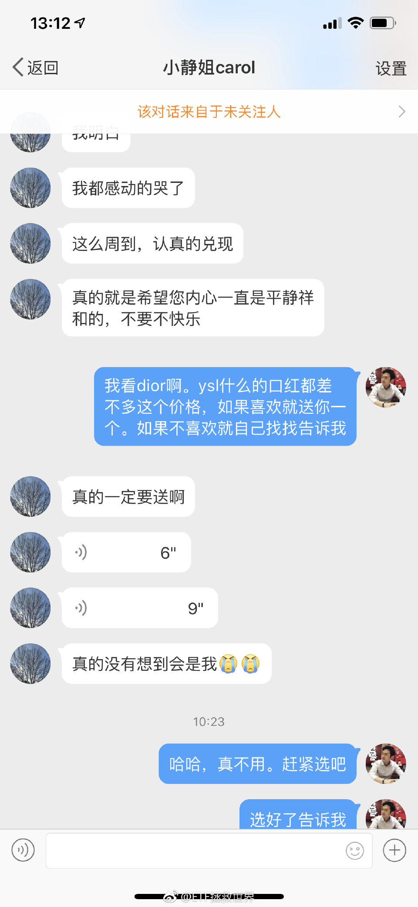

======================================================

ETF拯救世界 (5687069307) @
2019-03-08 13:33:08 Fri  
url: https://weibo.com/5687069307/HjXk3qyKd

我个人希望这一份能和趋势仓位一起买回来。希望都是好的，未必能实现啊。给点力，大盘。

------------------------------------------------------
转推：
>  @ETF拯救世界 (5687069307)
>  2019-03-08 09:26:24 Fri  
>  url: https:/weibo.com/5687069307/HjVHUjHiv/

>  $中证500 sz399905$ 
>  
>  不会第一次出手卖就卖在阶段最高点了吧。
>  
>  瞎蒙也可以？ ​​​

转发[11]  评论[144]  赞[529] 

======================================================

ETF拯救世界 (5687069307) @
2019-03-08 13:47:06 Fri  
url: https://weibo.com/5687069307/HjXpIshvI

上涨趋势中，追高的人遇到调整很容易割肉。

割肉以后，又涨起来。追还是不追，就很尴尬。追了又跌，不追就一路涨。

当然，也有时候他们不割。那也行，不割就一路跌下去套死了。 ​​​

转发[82]  评论[190]  赞[721] 

======================================================

ETF拯救世界 (5687069307) @
2019-03-08 13:50:37 Fri  
url: https://weibo.com/5687069307/HjXr9pAR4

今天300又被500干了1.3%。全年已经落后500达到6%以上。//@ETF拯救世界:收盘跑赢2.3%

------------------------------------------------------
转推：
>  @ETF拯救世界 (5687069307)
>  2019-03-07 10:27:17 Thu  
>  url: https:/weibo.com/5687069307/HjMG7znFG/

>  今天500又干掉300 1.6%。
>  
>  ……再去翻翻1月底我发的关于500的微博，你会对人性有更高一层的认识。 ​​​

转发[6]  评论[106]  赞[484] 

======================================================

ETF拯救世界 (5687069307) @
2019-03-08 14:53:49 Fri  
url: https://weibo.com/5687069307/HjXQOlWPe

卖了一份而已，至于这么大反应吗…

------------------------------------------------------
转推：
>  @ETF拯救世界 (5687069307)
>  2019-03-07 10:35:54 Thu  
>  url: https:/weibo.com/5687069307/HjMJCrbZz/

>  GJD是不是关注公众号了。 ​​​

转发[6]  评论[326]  赞[639] 

======================================================

ETF拯救世界 (5687069307) @
2019-03-08 15:18:03 Fri  
url: https://weibo.com/5687069307/HjY0DDsDN

昨天收盘还差0.4，我的游戏机保住了…

不过，下次会更快到20%。 ​​​

转发[6]  评论[323]  赞[836] 

======================================================

ETF拯救世界 (5687069307) @
2019-03-08 18:28:17 Fri  
url: https://weibo.com/5687069307/HjZfRdUU3

计划这一个多月一分钱都没买。昨天甚至卖了一份，与去年11月一个月狂买13份完全不同。

很多朋友无论涨跌都很着急，完全没有必要。

节奏控制的很好，不会追高，更不会踏空，舞步不要乱。开开心心的把这支舞跳好。 ​​​

转发[51]  评论[560]  赞[1333] 

======================================================

ETF拯救世界 (5687069307) @
2019-03-09 08:23:12 Sat  
url: https://weibo.com/5687069307/Hk4IL4IeL

这件事特别诡异，简直是现实版的罗生门。继续关注。

------------------------------------------------------
转推：
>  @ ()
>  2019-03-08 21:57:53 Fri  
>  url: 

>  抱歉，作者已设置仅展示半年内微博，此微博已不可见。 ​​​

转发[21]  评论[83]  赞[272] 

======================================================

ETF拯救世界 (5687069307) @
2019-03-09 09:14:57 Sat  
url: https://weibo.com/5687069307/Hk53L3dvt

再说一次观点，从现在开始计算，2029年美股收盘点位涨幅将非常小，甚至有可能不涨。

------------------------------------------------------
转推：
>  @网易财经 (1974561081)
>  2019-03-09 07:48:27 Sat  
>  url: https:/weibo.com/1974561081/Hk4uDuJyL/

>  【牛市十周年前夕:标普5连跌 美股创年内最大周跌幅】 非农就业惨淡，全球经济担忧加剧。道指跌超20点，标普和纳指跌0.2%，三大指数本周均跌超2%，纳指终结十周连涨。科技、芯片、能源和热门中概股普跌，特斯拉涨近3%。互联网券商中概第一股富途证券IPO首日收涨近28%，盘中涨46%。美元结束七连涨，油价 ​​​

转发[134]  评论[211]  赞[514] 

======================================================

ETF拯救世界 (5687069307) @
2019-03-09 12:50:16 Sat  
url: https://weibo.com/5687069307/Hk6t9spRY

回复@随记心路:对啦。上证指数现在3000，十二年前6000，一半都没到。影响我们赚钱吗？毫无影响。资本市场精彩之处在于波动//@随记心路:意思是美股很可能会经历类似A股过去“十年不涨”的事情。但反过来，不代表未来十年美股不能赚钱。

------------------------------------------------------
转推：
>  @网易财经 (1974561081)
>  2019-03-09 07:48:27 Sat  
>  url: https:/weibo.com/1974561081/Hk4uDuJyL/

>  【牛市十周年前夕:标普5连跌 美股创年内最大周跌幅】 非农就业惨淡，全球经济担忧加剧。道指跌超20点，标普和纳指跌0.2%，三大指数本周均跌超2%，纳指终结十周连涨。科技、芯片、能源和热门中概股普跌，特斯拉涨近3%。互联网券商中概第一股富途证券IPO首日收涨近28%，盘中涨46%。美元结束七连涨，油价 ​​​

转发[47]  评论[140]  赞[489] 

======================================================

ETF拯救世界 (5687069307) @
2019-03-09 22:40:00 Sat  
url: https://weibo.com/5687069307/Hkakwwir0

帮关注我的朋友转发。但是再次提醒，想帮忙的朋友一定要调查清楚。我可以帮忙转发，但是没精力一个个核实。希望孩子早日康复。

------------------------------------------------------
转推：
>  @大白成长录 (3932994203)
>  2019-03-09 10:12:14 Sat  
>  url: https:/weibo.com/3932994203/Hk5r11bbW/

>  @ETF拯救世界 E大，我表妹家的小孩，才9岁，前天在学校突发脑溢血，现在在湖南儿童医院，已经脱离危险期，但是后期治疗费用较高，现在已经差不多筹集了三分之一的善款，想请E大帮忙转发这个轻松筹🙏🙏🙏http://t.cn/EMZfKZf ​​​

转发[18]  评论[87]  赞[254] 

======================================================

ETF拯救世界 (5687069307) @
2019-03-09 23:01:05 Sat  
url: https://weibo.com/5687069307/Hkat5vyjp

回复@低级工程师Rick:我不敢。会有人说我借推荐这个赚钱。什么都不做还祸从天上来，这种事我还是别干了。//@低级工程师Rick:看来E大也要适时地推荐大家买保险。

------------------------------------------------------
转推：
>  @大白成长录 (3932994203)
>  2019-03-09 10:12:14 Sat  
>  url: https:/weibo.com/3932994203/Hk5r11bbW/

>  @ETF拯救世界 E大，我表妹家的小孩，才9岁，前天在学校突发脑溢血，现在在湖南儿童医院，已经脱离危险期，但是后期治疗费用较高，现在已经差不多筹集了三分之一的善款，想请E大帮忙转发这个轻松筹🙏🙏🙏http://t.cn/EMZfKZf ​​​

转发[1]  评论[81]  赞[237] 

======================================================

ETF拯救世界 (5687069307) @
2019-03-09 23:07:02 Sat  
url: https://weibo.com/5687069307/Hkavv3Mou

有没有人看过《双瞳》？跟这个几乎一样。我强推的一部电影，个人非常喜欢！//@蓝鲸财经记者工作平台:硬核[允悲]//@霜叶:人生后花园，地下CBD……

------------------------------------------------------
转推：
>  @ ()
>  2019-03-09 19:44:52 Sat  
>  url: 

>  抱歉，作者已设置仅展示半年内微博，此微博已不可见。 ​​​

转发[13]  评论[185]  赞[252] 

======================================================

ETF拯救世界 (5687069307) @
2019-03-09 23:15:02 Sat  
url: https://weibo.com/5687069307/HkayKiqUK

不知道有没有可能有一种机制，就是众筹治病没问题。但是等你病好了，家庭收入也很稳定，甚至以后有钱了，有一种约束机制能让你把之前看病的钱还回来。可以还给以前捐给你的人，也可以捐给现在需要钱看病的人。

当然，还是给家里人配置保险最重要。

我觉得意外险+重疾险+医疗险应该是必备的吧。

另外 ​​​

转发[170]  评论[690]  赞[686] 

======================================================

ETF拯救世界 (5687069307) @
2019-03-10 20:04:38 Sun  
url: https://weibo.com/5687069307/HkiJY22Tu

锦鲤的东西已经收到了，虽然晚了两天…[鼓掌]

------------------------------------------------------
转推：
>  @静carolli (1771340031)
>  2019-03-10 19:46:37 Sun  
>  url: https:/weibo.com/1771340031/HkiCEaUIm/

>  幸运的我此刻太开心啦[锦鲤][偷乐]   男神E"御赐"中国红💄 在此，大家的账户翻着翻儿红咯！🚀 [好喜欢]  感恩E大🙏🙏🙏也祝福我们每一位好运💰 💰💰  @ETF拯救世界 ​​​

转发[4]  评论[292]  赞[1049] 

======================================================

ETF拯救世界 (5687069307) @
2019-03-11 09:58:28 Mon  
url: https://weibo.com/5687069307/Hkocq9WWf

开了也不一定操作，开了再说。 ​​​

转发[10]  评论[251]  赞[624] 

+++++++++++++++++++++++++++++++++++++++++++++++++++++

图片：

======================================================

ETF拯救世界 (5687069307) @
2019-03-11 11:16:44 Mon  
url: https://weibo.com/5687069307/HkoIbeIkx

回复@某小风-X-V:上涨趋势没有野百合。[doge]//@某小风-X-V:E大，环保起飞了[太开心]

------------------------------------------------------
转推：
>  @ETF拯救世界 (5687069307)
>  2019-03-11 09:58:28 Mon  
>  url: https:/weibo.com/5687069307/Hkocq9WWf/

>  开了也不一定操作，开了再说。 ​​​

转发[4]  评论[126]  赞[427] 

======================================================

ETF拯救世界 (5687069307) @
2019-03-11 13:39:47 Mon  
url: https://weibo.com/5687069307/HkpEffUPW

今天500涨幅又是300的一倍。各位，三个要点：均值回归，一致预期，均衡配置

------------------------------------------------------
转推：
>  @ETF拯救世界 (5687069307)
>  2019-03-07 10:27:17 Thu  
>  url: https:/weibo.com/5687069307/HjMG7znFG/

>  今天500又干掉300 1.6%。
>  
>  ……再去翻翻1月底我发的关于500的微博，你会对人性有更高一层的认识。 ​​​

转发[303]  评论[127]  赞[468] 

======================================================

ETF拯救世界 (5687069307) @
2019-03-11 13:42:26 Mon  
url: https://weibo.com/5687069307/HkpFk325k

回复@薏仁之梦:看一月底我关于500的微博以及评论//@薏仁之梦:一致预期能否深入谈谈？//@ETF拯救世界:今天500涨幅又是300的一倍。各位，三个要点：均值回归，一致预期，均衡配置

------------------------------------------------------
转推：
>  @ETF拯救世界 (5687069307)
>  2019-03-07 10:27:17 Thu  
>  url: https:/weibo.com/5687069307/HjMG7znFG/

>  今天500又干掉300 1.6%。
>  
>  ……再去翻翻1月底我发的关于500的微博，你会对人性有更高一层的认识。 ​​​

转发[20]  评论[22]  赞[277] 

======================================================

ETF拯救世界 (5687069307) @
2019-03-11 13:44:51 Mon  
url: https://weibo.com/5687069307/HkpGjbRfs

回复@草农123:红利起飞之日，大盘歇菜之时。//@草农123:医药今天也起飞了，就差红利啦//@ETF拯救世界:今天500涨幅又是300的一倍。各位，三个要点：均值回归，一致预期，均衡配置

------------------------------------------------------
转推：
>  @ETF拯救世界 (5687069307)
>  2019-03-07 10:27:17 Thu  
>  url: https:/weibo.com/5687069307/HjMG7znFG/

>  今天500又干掉300 1.6%。
>  
>  ……再去翻翻1月底我发的关于500的微博，你会对人性有更高一层的认识。 ​​​

转发[176]  评论[154]  赞[506] 

======================================================

ETF拯救世界 (5687069307) @
2019-03-11 13:46:29 Mon  
url: https://weibo.com/5687069307/HkpGY1mag

回复@_张人好:如果你不懂什么叫波段仓位，什么叫长期仓位，以后就别跟着买波段了。真的。//@_张人好:老大，什么时候买回来//@ETF拯救世界:回复@薏仁之梦:看一月底我关于500的微博以及评论//@薏仁之梦:一致预期能否深入谈谈？

------------------------------------------------------
转推：
>  @ETF拯救世界 (5687069307)
>  2019-03-07 10:27:17 Thu  
>  url: https:/weibo.com/5687069307/HjMG7znFG/

>  今天500又干掉300 1.6%。
>  
>  ……再去翻翻1月底我发的关于500的微博，你会对人性有更高一层的认识。 ​​​

转发[6]  评论[35]  赞[330] 

======================================================

ETF拯救世界 (5687069307) @
2019-03-11 13:58:19 Mon  
url: https://weibo.com/5687069307/HkpLLw68T

一场战争中，需要多兵种配合。地面部队，导弹部队，空中部队都有他们存在的意义。不是说这次战役某个兵种表现好，他就是王。不是，阶段不同，发挥的空间也不同。

另外，各个部队要完成的阶段使命也不同。有些部队在最危险的时候进来帮忙打，收获大量战利品就要撤，去继续坚守自己的阵地，不能从头打到 ​​​

转发[161]  评论[220]  赞[818] 

======================================================

ETF拯救世界 (5687069307) @
2019-03-11 14:07:30 Mon  
url: https://weibo.com/5687069307/HkpPuDsmI

一个市场中，某段时间两个宽基指数表现差异如此大（下面两根绿线），是非常不合理的。

有些人认为这两年表现好的就一定会继续表现好下去，我就认为相反，表现不好的有机会表现更好。更何况在任何市场，长期看都是小盘股表现更好一点。

这些都不是马后炮，而是一直在坚持的思路。 ​​​

转发[137]  评论[153]  赞[644] 

+++++++++++++++++++++++++++++++++++++++++++++++++++++

图片：

======================================================

ETF拯救世界 (5687069307) @
2019-03-11 14:27:23 Mon  
url: https://weibo.com/5687069307/HkpXzbwoa

其实投资风格这件事，与一个人的人生观和世界观密不可分。

你相信怎样会获得成功，你相信人与人之间本质的关系是怎样，你就会怎样去投资。 ​​​

转发[64]  评论[109]  赞[652] 

======================================================

ETF拯救世界 (5687069307) @
2019-03-11 14:30:20 Mon  
url: https://weibo.com/5687069307/HkpYLkeV7

如果你周五觉得自己仓位太高了，今天觉得自己仓位太低了。那么你95%是一个绝对不合格的投资者。

如果你周五大幅下跌后觉得自己仓位太高了大幅减仓，今天觉得自己仓位太低了大幅加仓，那你就1000%是一个绝对不合格的投资者。 ​​​

转发[50]  评论[180]  赞[707] 

======================================================

ETF拯救世界 (5687069307) @
2019-03-11 14:33:05 Mon  
url: https://weibo.com/5687069307/HkpZStkWT

回复@鼻血君89:包括你生活中碰到的绝大多数人吗。比如你的父母，你的妻儿，你的同事，你的朋友，你的业务合作伙伴。//@鼻血君89:以前我以为人与人之间大多数是合作关系，现在我认为人与人之间大多数是欺诈关系。

------------------------------------------------------
转推：
>  @ETF拯救世界 (5687069307)
>  2019-03-11 14:27:23 Mon  
>  url: https:/weibo.com/5687069307/HkpXzbwoa/

>  其实投资风格这件事，与一个人的人生观和世界观密不可分。
>  
>  你相信怎样会获得成功，你相信人与人之间本质的关系是怎样，你就会怎样去投资。 ​​​

转发[8]  评论[62]  赞[336] 

======================================================

ETF拯救世界 (5687069307) @
2019-03-11 14:36:26 Mon  
url: https://weibo.com/5687069307/Hkq1eFALm

觉得计划仓位低的朋友，我只想问一句：如果一个组合，只剩10%现金你还觉得仓位低，那么，你到底是有钱人还是没钱的人？

如果你是没钱的人，多那10%的仓位也改变不了你的命运。真的。多赚点钱比多加10%仓位有效得多。

如果你是有钱的人，只剩10%的现金了你还觉得低，那我建议你认真思考未来如何保住自 ​​​

转发[77]  评论[191]  赞[710] 

======================================================

ETF拯救世界 (5687069307) @
2019-03-11 14:43:28 Mon  
url: https://weibo.com/5687069307/Hkq46izxH

再说句你不信的。你这70%A股仓位+10%港股仓位+10%其它乱七八糟的组合，一轮行情下来跑赢90%经常满仓经常上蹿下跳经常追涨停板的人。

信不信由你。

最关键的是，你回撤还小。你说是不是见鬼了。 ​​​

转发[138]  评论[301]  赞[887] 

======================================================

ETF拯救世界 (5687069307) @
2019-03-11 15:15:38 Mon  
url: https://weibo.com/5687069307/Hkqh9kvvp

注意，我说的是，上蹿下跳做短线追涨停板的。如果牛市中长期持仓牛股，那收益率当然高。两个前提：找到牛股+长期持仓。做到了你就是成熟投资者，与我说的这种无关。

------------------------------------------------------
转推：
>  @ETF拯救世界 (5687069307)
>  2019-03-11 14:43:28 Mon  
>  url: https:/weibo.com/5687069307/Hkq46izxH/

>  再说句你不信的。你这70%A股仓位+10%港股仓位+10%其它乱七八糟的组合，一轮行情下来跑赢90%经常满仓经常上蹿下跳经常追涨停板的人。
>  
>  信不信由你。
>  
>  最关键的是，你回撤还小。你说是不是见鬼了。 ​​​

转发[42]  评论[71]  赞[460] 

======================================================

ETF拯救世界 (5687069307) @
2019-03-11 15:20:54 Mon  
url: https://weibo.com/5687069307/Hkqji1JKH

周末问了个保险的事，特别感谢很多朋友提供意见。无论是私信还是其他渠道，大概有几百条。每条我都会认真的看，但没法一一回复，请见谅。谢谢各位。

另外，我听说有好多朋友为了我的事到处咨询，包括去一些知名的保险公众号或者保险大V那里帮我了解情况。真的非常感谢。何德何能让各位如此费心，说实 ​​​

转发[8]  评论[162]  赞[887] 

======================================================

ETF拯救世界 (5687069307) @
2019-03-11 16:59:40 Mon  
url: https://weibo.com/5687069307/HkqXnpP3q

军工指数又60倍了。

长期增长有没有20%？

真.NB指数。 ​​​

转发[177]  评论[147]  赞[452] 

======================================================

ETF拯救世界 (5687069307) @
2019-03-11 17:08:13 Mon  
url: https://weibo.com/5687069307/Hkr0Qx3Xd

回复@铅笔小小新:今年军工涨幅还不如500，我后悔什么？就算涨幅比500大，我为什么要后悔？让我买50倍的指数，我宁愿把钱存在银行活期//@铅笔小小新:牛逼指数！E大有没有点后悔军工没有买？

------------------------------------------------------
转推：
>  @ETF拯救世界 (5687069307)
>  2019-03-11 16:59:40 Mon  
>  url: https:/weibo.com/5687069307/HkqXnpP3q/

>  军工指数又60倍了。
>  
>  长期增长有没有20%？
>  
>  真.NB指数。 ​​​

转发[28]  评论[58]  赞[379] 

======================================================

ETF拯救世界 (5687069307) @
2019-03-11 17:15:38 Mon  
url: https://weibo.com/5687069307/Hkr3RhQWc

回复@何故添黄伞201810:信息这一波最低31，军工最低42。而这两个指数历史最低只有19和20。我没必要放着一堆估值十几倍的指数不买，买它们。要说多少钱买，20多倍吧。//@何故添黄伞201810:e大，您认为军工、信息分别到了多少倍pe才有了入手的条件呢？

------------------------------------------------------
转推：
>  @ETF拯救世界 (5687069307)
>  2019-03-11 16:59:40 Mon  
>  url: https:/weibo.com/5687069307/HkqXnpP3q/

>  军工指数又60倍了。
>  
>  长期增长有没有20%？
>  
>  真.NB指数。 ​​​

转发[121]  评论[76]  赞[384] 

======================================================

ETF拯救世界 (5687069307) @
2019-03-11 17:18:05 Mon  
url: https://weibo.com/5687069307/Hkr4R2flE

贵的，牛市也许也会涨，甚至比便宜的涨的更凶。

但这个又是个世界观的问题：

是不是所有赚钱的事都可以做？有没有一些虽然赚钱，但你守住底线不做的事？

我有，所以有些事我不做。比如，买很贵的指数。

钱很重要，但是投资和做人的原则更重要。

有底线的人，再坏也坏不到哪儿去。如果你看不到一个 ​​​

转发[116]  评论[231]  赞[762] 

======================================================

ETF拯救世界 (5687069307) @
2019-03-11 17:45:50 Mon  
url: https://weibo.com/5687069307/Hkrg7yJjH

回复@深南椰风:现在已经没有任何指数在历史最低区域了。//@深南椰风:E大，现在环保是不是还在历史最低估值区域？//@ETF拯救世界:回复@何故添黄伞201810:信息这一波最低31，军工最低42。而这两个指数历史最低只有19和20。我没必要放着一堆估值十几倍的指数不买，买它们。要说多少钱买，20多倍吧。

------------------------------------------------------
转推：
>  @ETF拯救世界 (5687069307)
>  2019-03-11 16:59:40 Mon  
>  url: https:/weibo.com/5687069307/HkqXnpP3q/

>  军工指数又60倍了。
>  
>  长期增长有没有20%？
>  
>  真.NB指数。 ​​​

转发[30]  评论[88]  赞[396] 

======================================================

ETF拯救世界 (5687069307) @
2019-03-11 19:07:52 Mon  
url: https://weibo.com/5687069307/HkrNpANDq

为什么现在我拉黑人比以前多。因为真的，很多人什么都不懂，天天来我这里发出噪音。都是猪队友，最好的方法就是让他们离开队伍。你们去看看1月底关于500的微博下面的评论，现在能不能体会我的心情？

------------------------------------------------------
转推：
>  @ETF拯救世界 (5687069307)
>  2019-01-31 18:58:46 Thu  
>  url: https:/weibo.com/5687069307/Hew4m8oCM/

>  从现在开始，谁再没完没了的问500直接拉黑。
>  
>  担心你就卖掉，不担心就拿着这不到15%的仓位等风来。
>  
>  什么都不懂就去研究，看谁说不好就找谁报团儿去。
>  
>  跟这么一帮人做队友一起打仗真是见鬼了。 ​​​

转发[13]  评论[153]  赞[593] 

======================================================

ETF拯救世界 (5687069307) @
2019-03-11 19:10:04 Mon  
url: https://weibo.com/5687069307/HkrOj8zHw

回复@在路上30249:噩耗！！！心里很疼。不知道该说什么…我觉得剩下的钱，看看身后事还有没有需要用的。再剩下的捐给其它需要的孩子吧。让爱心传递下去。[泪]

------------------------------------------------------
转推：
>  @大白成长录 (3932994203)
>  2019-03-09 10:12:14 Sat  
>  url: https:/weibo.com/3932994203/Hk5r11bbW/

>  @ETF拯救世界 E大，我表妹家的小孩，才9岁，前天在学校突发脑溢血，现在在湖南儿童医院，已经脱离危险期，但是后期治疗费用较高，现在已经差不多筹集了三分之一的善款，想请E大帮忙转发这个轻松筹🙏🙏🙏http://t.cn/EMZfKZf ​​​

转发[8]  评论[130]  赞[300] 

======================================================

ETF拯救世界 (5687069307) @
2019-03-11 21:05:37 Mon  
url: https://weibo.com/5687069307/Hkszd4InU

有些朋友说，看着身边的人打板或者买了翻番股赚的很开心，心里也很羡慕…

我想说的是：为什么你不能跟朋友一起干？羡慕就去干啊，谁规定你只能用一种方式投资？ZJH还是XF规定了？我看都没有吧。个人投资者一个最大优势就是灵活，无拘无束，喜欢就去干！不要羡慕！加入他们！

我是真心这么建议。真的 ​​​

转发[49]  评论[208]  赞[532] 

======================================================

ETF拯救世界 (5687069307) @
2019-03-11 21:09:12 Mon  
url: https://weibo.com/5687069307/HksAFduVm

回复@昊昊-小迷妹:知道什么才是适合自己的最重要。结婚前各种类型的姑娘都谈谈恋爱试试，找到最合适的那个，幸福一辈子多好。何必随便娶个媳妇然后看着别人的老婆好？//@昊昊-小迷妹:曾经有过这样的想法，曾经也这么干过！！！回头看看还是觉得不太适合自己[悲伤][悲伤][悲伤]

------------------------------------------------------
转推：
>  @ETF拯救世界 (5687069307)
>  2019-03-11 21:05:37 Mon  
>  url: https:/weibo.com/5687069307/Hkszd4InU/

>  有些朋友说，看着身边的人打板或者买了翻番股赚的很开心，心里也很羡慕…
>  
>  我想说的是：为什么你不能跟朋友一起干？羡慕就去干啊，谁规定你只能用一种方式投资？ZJH还是XF规定了？我看都没有吧。个人投资者一个最大优势就是灵活，无拘无束，喜欢就去干！不要羡慕！加入他们！
>  
>  我是真心这么建议。真的 ​​​

转发[21]  评论[68]  赞[309] 

======================================================

ETF拯救世界 (5687069307) @
2019-03-11 21:15:10 Mon  
url: https://weibo.com/5687069307/HksD5iWDr

图片评论 http://t.cn/EMieygK

------------------------------------------------------
转推：
>  @否极泰董宝珍 (1179198244)
>  2019-03-11 21:13:13 Mon  
>  url: https:/weibo.com/1179198244/HksCifiSD/

>  我和助手对中国股市各行各业的市盈率进行了统计，发现剔除了市盈率最低的几个行业其他行业的市盈率都在30倍市盈率之上。普遍的上涨似乎缺乏估值依据。现在想做一个研究。计算剔除银行业和金融业后中国股市的整体市盈率，基本上想好的算法是把银行业的净利润，总市值从全部上市公司中减掉，然后再计算剔 ​​​

转发[105]  评论[148]  赞[439] 

======================================================

ETF拯救世界 (5687069307) @
2019-03-11 21:29:07 Mon  
url: https://weibo.com/5687069307/HksIKD2mN

回复@AEvolve不如守中:做了十年了//@AEvolve不如守中:完美，別人想到的，E大已經做到了//@ETF拯救世界:图片评论 http://t.cn/EMieygK

------------------------------------------------------
转推：
>  @否极泰董宝珍 (1179198244)
>  2019-03-11 21:13:13 Mon  
>  url: https:/weibo.com/1179198244/HksCifiSD/

>  我和助手对中国股市各行各业的市盈率进行了统计，发现剔除了市盈率最低的几个行业其他行业的市盈率都在30倍市盈率之上。普遍的上涨似乎缺乏估值依据。现在想做一个研究。计算剔除银行业和金融业后中国股市的整体市盈率，基本上想好的算法是把银行业的净利润，总市值从全部上市公司中减掉，然后再计算剔 ​​​

转发[35]  评论[83]  赞[418] 

======================================================

ETF拯救世界 (5687069307) @
2019-03-11 21:57:52 Mon  
url: https://weibo.com/5687069307/HksUq2VgH

每日打卡（9）

说真的，什么都是次要，身体最重要。

月底回归健身房。 ​​​

转发[9]  评论[79]  赞[512] 

+++++++++++++++++++++++++++++++++++++++++++++++++++++

图片：

======================================================

ETF拯救世界 (5687069307) @
2019-03-11 21:59:53 Mon  
url: https://weibo.com/5687069307/HksVfbJCk

回复@懵懂无知小屁股:比如胡歌杨洋王凯吴彦祖彭于晏鹿晗吴亦凡朱一龙是吧[挖鼻]//@懵懂无知小屁股:好想和各种男人都谈个恋爱，然后再选个合适的，也不用羡慕别人家的老公[笑cry]

------------------------------------------------------
转推：
>  @ETF拯救世界 (5687069307)
>  2019-03-11 21:05:37 Mon  
>  url: https:/weibo.com/5687069307/Hkszd4InU/

>  有些朋友说，看着身边的人打板或者买了翻番股赚的很开心，心里也很羡慕…
>  
>  我想说的是：为什么你不能跟朋友一起干？羡慕就去干啊，谁规定你只能用一种方式投资？ZJH还是XF规定了？我看都没有吧。个人投资者一个最大优势就是灵活，无拘无束，喜欢就去干！不要羡慕！加入他们！
>  
>  我是真心这么建议。真的 ​​​

转发[6]  评论[148]  赞[354] 

======================================================

ETF拯救世界 (5687069307) @
2019-03-12 09:25:35 Tue  
url: https://weibo.com/5687069307/Hkxpz2VSs

这十二个字让我明白为什么有人喷我微博聊电影和情人节了//@顾扯淡:气人有、笑人无、恨人富、望人穷

------------------------------------------------------
转推：
>  @ ()
>  2019-03-11 23:55:42 Mon  
>  url: 

>  抱歉，作者已设置仅展示半年内微博，此微博已不可见。 ​​​

转发[37]  评论[101]  赞[404] 

======================================================

ETF拯救世界 (5687069307) @
2019-03-12 09:35:02 Tue  
url: https://weibo.com/5687069307/HkxtoxDl4

传媒新高 医药新高 养老新高 环保新高 500新高

踏踏实实的拿着。你成本那么低。

好好享受赚钱的乐趣吧。 ​​​

转发[231]  评论[284]  赞[870] 

======================================================

ETF拯救世界 (5687069307) @
2019-03-12 09:45:34 Tue  
url: https://weibo.com/5687069307/HkxxFDREG

回复@炫风__AB:你这种心态非常好。指数基金完全可以当成一种收藏品，尤其是低位买入的长期仓位。除非极度高估，不要随便卖。//@炫风__AB:[允悲]有些人涨了就减仓了，但是我总感觉想多买些，不想卖，有点收集邮票那种感觉。就单纯想买了放着。

------------------------------------------------------
转推：
>  @ETF拯救世界 (5687069307)
>  2019-03-12 09:35:02 Tue  
>  url: https:/weibo.com/5687069307/HkxtoxDl4/

>  传媒新高 医药新高 养老新高 环保新高 500新高
>  
>  踏踏实实的拿着。你成本那么低。
>  
>  好好享受赚钱的乐趣吧。 ​​​

转发[156]  评论[117]  赞[613] 

======================================================

ETF拯救世界 (5687069307) @
2019-03-12 09:48:18 Tue  
url: https://weibo.com/5687069307/HkxyMsskY

默默的把我京东plus 1200-50的券领了…

总感觉这几天在劫难逃了。 ​​​

转发[6]  评论[437]  赞[862] 

======================================================

ETF拯救世界 (5687069307) @
2019-03-12 10:04:43 Tue  
url: https://weibo.com/5687069307/HkxFrBseC

回复@云在彼端119:千万别以为钻石坑买了就能赚大钱。上涨过程中死死拿住才是最大的考验。即使我天天这么说，依然有15%的人这一路不断卖出就是一个例子//@云在彼端119:周围有同事在低估的时候听别人建议买的股票，盈利了3个点卖出，果然对于普通人来说拿住是一个很难的事情

------------------------------------------------------
转推：
>  @ETF拯救世界 (5687069307)
>  2019-03-12 09:35:02 Tue  
>  url: https:/weibo.com/5687069307/HkxtoxDl4/

>  传媒新高 医药新高 养老新高 环保新高 500新高
>  
>  踏踏实实的拿着。你成本那么低。
>  
>  好好享受赚钱的乐趣吧。 ​​​

转发[88]  评论[187]  赞[605] 

======================================================

ETF拯救世界 (5687069307) @
2019-03-12 10:09:41 Tue  
url: https://weibo.com/5687069307/HkxHsyygY

各位看到80%定律的威力了吧…

------------------------------------------------------
转推：
>  @ETF拯救世界 (5687069307)
>  2019-02-22 11:04:33 Fri  
>  url: https:/weibo.com/5687069307/HhOmMEAqp/

>  S的传媒已经回本，150的遥遥无期。[摊手]
>  
>  这指数是这波熊市最符合我“80%定律”的指数，之后会怎么走，大家都围观一下。 ​​​

转发[39]  评论[135]  赞[614] 

======================================================

ETF拯救世界 (5687069307) @
2019-03-12 10:24:12 Tue  
url: https://weibo.com/5687069307/HkxNm93uG

一个数据：

如果一个品种跌80%买入，回到下跌前涨幅是400%。

为什么这一波上涨计划整体涨幅没有100%跟上指数，然而却早早先于所有指数不断创出新高？

因为熊市没有赔钱，同时回撤极小。每一个点的上涨都是新高利润。

有人说控制回撤没有意义。不好意思，我认为控制回撤是最重要的。还记得那道第一 ​​​

转发[343]  评论[404]  赞[1107] 

======================================================

ETF拯救世界 (5687069307) @
2019-03-12 11:10:53 Tue  
url: https://weibo.com/5687069307/Hky6iDNvG

赚的实在受不了的就关上软件出去走走。眼不见心不烦。

中午有没有人请我吃饭。 ​​​

转发[18]  评论[594]  赞[1101] 

======================================================

ETF拯救世界 (5687069307) @
2019-03-12 12:27:38 Tue  
url: https://weibo.com/5687069307/HkyBsAC8r

这种人怎么存下2万的

------------------------------------------------------
转推：
>  @新浪视频 (1640601392)
>  2019-03-12 10:23:28 Tue  
>  url: https:/weibo.com/1640601392/HkxN3tO8s/

>  【"国际友人"寄来一箱钱求保管 女子给了2万多元“运费”发现被骗】3月6日，南京李女士报警称被网上认识的“国际友人”骗了。一名外国人与她视频，自称账户遭冻结，有一箱叙利亚总统给的现金，请她帮忙保管。“快递公司”发来箱子和快递单照片，收了李女士2万多元“快递费”。万幸这笔钱被及时止付。 ​​​

转发[3]  评论[53]  赞[251] 

======================================================

ETF拯救世界 (5687069307) @
2019-03-12 12:32:08 Tue  
url: https://weibo.com/5687069307/HkyDi7IFC

回复@来自推特的网友:一旦金融资产超过1000万（有房），就只是数字了…//@来自推特的网友:一旦盈利超过50个点，就没什么感觉了[doge][doge]

------------------------------------------------------
转推：
>  @ETF拯救世界 (5687069307)
>  2019-03-12 09:35:02 Tue  
>  url: https:/weibo.com/5687069307/HkxtoxDl4/

>  传媒新高 医药新高 养老新高 环保新高 500新高
>  
>  踏踏实实的拿着。你成本那么低。
>  
>  好好享受赚钱的乐趣吧。 ​​​

转发[25]  评论[207]  赞[560] 

======================================================

ETF拯救世界 (5687069307) @
2019-03-12 13:01:47 Tue  
url: https://weibo.com/5687069307/HkyPjgLgs

$中证500 sz399905$ 这么疯，恐怕调整不会很温柔。

系好安全带准备刺激一下吧。 ​​​

转发[23]  评论[283]  赞[704] 

======================================================

ETF拯救世界 (5687069307) @
2019-03-12 13:16:34 Tue  
url: https://weibo.com/5687069307/HkyVjBQ0d

现在看又有新的体会吧。

2018，500连跌三年。

http://t.cn/RDsstvm ​​​

转发[177]  评论[327]  赞[1126] 

======================================================

ETF拯救世界 (5687069307) @
2019-03-12 16:54:05 Tue  
url: https://weibo.com/5687069307/HkAlBDUqB

截至今日，已披露的150家公司年报，四季度业绩增长平均增幅1%。 ​​​

转发[43]  评论[113]  赞[486] 

======================================================

ETF拯救世界 (5687069307) @
2019-03-12 17:03:45 Tue  
url: https://weibo.com/5687069307/HkApx5Y4k

对比数据：3季度是3%。去年四季度是0.6%。当然，今年还没披露完。披露完再说。

------------------------------------------------------
转推：
>  @ETF拯救世界 (5687069307)
>  2019-03-12 16:54:05 Tue  
>  url: https:/weibo.com/5687069307/HkAlBDUqB/

>  截至今日，已披露的150家公司年报，四季度业绩增长平均增幅1%。 ​​​

转发[27]  评论[187]  赞[458] 

======================================================

ETF拯救世界 (5687069307) @
2019-03-12 21:45:36 Tue  
url: https://weibo.com/5687069307/HkCfW5vOs

净值还没更新完。现在是1.1982。

[摊手] ​​​

转发[9]  评论[289]  赞[636] 

======================================================

ETF拯救世界 (5687069307) @
2019-03-12 22:49:20 Tue  
url: https://weibo.com/5687069307/HkCFO2TMI

1.1995。喷了。

------------------------------------------------------
转推：
>  @ETF拯救世界 (5687069307)
>  2019-03-12 21:45:36 Tue  
>  url: https:/weibo.com/5687069307/HkCfW5vOs/

>  净值还没更新完。现在是1.1982。
>  
>  [摊手] ​​​

转发[3]  评论[267]  赞[568] 

======================================================

ETF拯救世界 (5687069307) @
2019-03-13 07:21:53 Wed  
url: https://weibo.com/5687069307/HkG1QvcgA

跑赢沪深300的幅度增大至32%。

领先中证500的幅度缩小至54%。

如果可以让我把货基部分哪怕做做逆回购，总收益率也可以突破25%了。 ​​​

转发[58]  评论[146]  赞[681] 

+++++++++++++++++++++++++++++++++++++++++++++++++++++

图片：

======================================================

ETF拯救世界 (5687069307) @
2019-03-13 07:30:09 Wed  
url: https://weibo.com/5687069307/HkG5czOWo

回复@你好大麦茶:也算为很多家庭幸福夫妻和睦做出了一点小小的贡献。//@你好大麦茶:我昨天把账户收益率给老公看，居然被评价为股神，谢谢E大，让小白成为了时间的朋友

------------------------------------------------------
转推：
>  @ETF拯救世界 (5687069307)
>  2019-03-13 07:21:53 Wed  
>  url: https:/weibo.com/5687069307/HkG1QvcgA/

>  跑赢沪深300的幅度增大至32%。
>  
>  领先中证500的幅度缩小至54%。
>  
>  如果可以让我把货基部分哪怕做做逆回购，总收益率也可以突破25%了。 ​​​

转发[23]  评论[108]  赞[507] 

======================================================

ETF拯救世界 (5687069307) @
2019-03-13 07:34:55 Wed  
url: https://weibo.com/5687069307/HkG78wVsC

还有一个数学问题大家也许没有考虑过。

如果过去你的收益率是500%，那么涨20%就变成了600%。

如果你过去的收益率是十倍，那么涨20%就变成了12倍，涨100%就是二十倍。再涨100%就是40倍。

这就是熊市不赔钱的魔力。 ​​​

转发[180]  评论[338]  赞[872] 

======================================================

ETF拯救世界 (5687069307) @
2019-03-13 08:37:58 Wed  
url: https://weibo.com/5687069307/HkGwJBD4N

回复@不再逃离1995:今天跌半年工资。踏踏实实的//@不再逃离1995:昨天收益3个月工资//@ETF拯救世界:回复@你好大麦茶:也算为很多家庭幸福夫妻和睦做出了一点小小的贡献。//@你好大麦茶:我昨天把账户收益率给老公看，居然被评价为股神，谢谢E大，让小白成为了时间的朋友

------------------------------------------------------
转推：
>  @ETF拯救世界 (5687069307)
>  2019-03-13 07:21:53 Wed  
>  url: https:/weibo.com/5687069307/HkG1QvcgA/

>  跑赢沪深300的幅度增大至32%。
>  
>  领先中证500的幅度缩小至54%。
>  
>  如果可以让我把货基部分哪怕做做逆回购，总收益率也可以突破25%了。 ​​​

转发[17]  评论[201]  赞[440] 

======================================================

ETF拯救世界 (5687069307) @
2019-03-13 09:15:46 Wed  
url: https://weibo.com/5687069307/HkGM574Gd

回复@早点起床吃早点:希望今年尤文夺冠//@早点起床吃早点:有看足球的吗？ 昨晚c罗好牛逼！足球界的益达

------------------------------------------------------
转推：
>  @ETF拯救世界 (5687069307)
>  2019-03-13 07:34:55 Wed  
>  url: https:/weibo.com/5687069307/HkG78wVsC/

>  还有一个数学问题大家也许没有考虑过。
>  
>  如果过去你的收益率是500%，那么涨20%就变成了600%。
>  
>  如果你过去的收益率是十倍，那么涨20%就变成了12倍，涨100%就是二十倍。再涨100%就是40倍。
>  
>  这就是熊市不赔钱的魔力。 ​​​

转发[5]  评论[111]  赞[379] 

======================================================

ETF拯救世界 (5687069307) @
2019-03-13 09:42:49 Wed  
url: https://weibo.com/5687069307/HkGX3B5Ve

东方不亮西方亮

$全指医药 sh000991$ ​​​

转发[1]  评论[146]  赞[527] 

======================================================

ETF拯救世界 (5687069307) @
2019-03-13 12:29:22 Wed  
url: https://weibo.com/5687069307/HkI2ECIrB

别老天天为了那点涨跌心惊胆战。

天气好没事出来溜达溜达多好。 ​​​

转发[19]  评论[396]  赞[1132] 

+++++++++++++++++++++++++++++++++++++++++++++++++++++

图片：
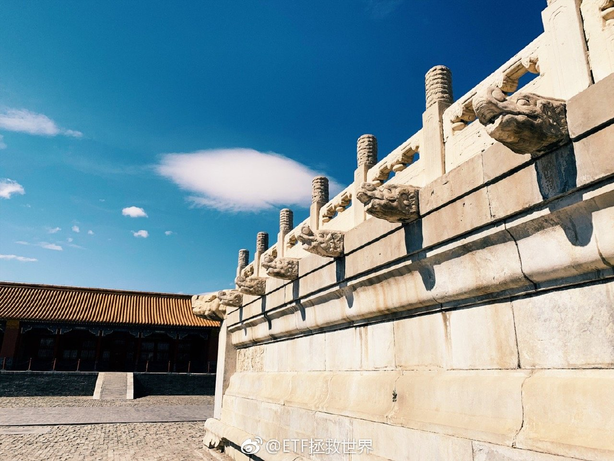

======================================================

ETF拯救世界 (5687069307) @
2019-03-13 15:12:26 Wed  
url: https://weibo.com/5687069307/HkJ6QlFdh

说半年就半年，童叟无欺//@ETF拯救世界:回复@不再逃离1995:今天跌半年工资。踏踏实实的//@不再逃离1995:昨天收益3个月工资//@ETF拯救世界:回复@你好大麦茶:也算为很多家庭幸福夫妻和睦做出了一点小小的贡献。

------------------------------------------------------
转推：
>  @ETF拯救世界 (5687069307)
>  2019-03-13 07:21:53 Wed  
>  url: https:/weibo.com/5687069307/HkG1QvcgA/

>  跑赢沪深300的幅度增大至32%。
>  
>  领先中证500的幅度缩小至54%。
>  
>  如果可以让我把货基部分哪怕做做逆回购，总收益率也可以突破25%了。 ​​​

转发[13]  评论[371]  赞[628] 

======================================================

ETF拯救世界 (5687069307) @
2019-03-14 05:39:28 Thu  
url: https://weibo.com/5687069307/HkOMM9nrl

十二年前英镑兑人民币是15。现在是8。目前富时100估值是15。非常遗憾，国内富时100产品依然没有上。

------------------------------------------------------
转推：
>  @ ()
>  2019-03-14 04:02:21 Thu  
>  url: 

>  抱歉，作者已设置仅展示半年内微博，此微博已不可见。 ​​​

转发[22]  评论[111]  赞[381] 

======================================================

ETF拯救世界 (5687069307) @
2019-03-14 06:01:47 Thu  
url: https://weibo.com/5687069307/HkOVPwrnl

回复@雲中漫步_1117:脱欧的事情搞定之前估计很难上。基金公司应该还是有自己的顾虑//@雲中漫步_1117:华宝好像报了一只，希望早点批下来//@ETF拯救世界:十二年前英镑兑人民币是15。现在是8。目前富时100估值是15。非常遗憾，国内富时100产品依然没有上。

------------------------------------------------------
转推：
>  @ ()
>  2019-03-14 04:02:21 Thu  
>  url: 

>  抱歉，作者已设置仅展示半年内微博，此微博已不可见。 ​​​

转发[7]  评论[50]  赞[324] 

======================================================

ETF拯救世界 (5687069307) @
2019-03-14 08:03:20 Thu  
url: https://weibo.com/5687069307/HkPJavWKT

中证500盈利预测。2018年会比2017年小幅下降（3%），但2019和2020会恢复高增长。

“越跌越贵”在2018年底看起来没错，但站的太低，看的太近。 ​​​

转发[159]  评论[145]  赞[710] 

+++++++++++++++++++++++++++++++++++++++++++++++++++++

图片：

======================================================

ETF拯救世界 (5687069307) @
2019-03-14 08:09:02 Thu  
url: https://weibo.com/5687069307/HkPLu7QmO

早上起来又发掘了一个新的判断顶部/底部区域指标。从过去十几年的情况看，准确性值得信赖。

准备加入观察判断系统。接下来就是看要给多大权重了。

每天进步一点，舒服。 ​​​

转发[61]  评论[263]  赞[1316] 

======================================================

ETF拯救世界 (5687069307) @
2019-03-14 08:19:21 Thu  
url: https://weibo.com/5687069307/HkPPFvvyy

回复@不停奔跑的笨狼:也不能只看总利润。EPS涨幅没有这么大，有增发摊薄因素。但是一定是越来越多，这也是指数基金一定越涨越高的根本基础//@不停奔跑的笨狼:2020年是2015年的3倍，那么问题来了，指数会到多少，不敢想象啊[允悲]

------------------------------------------------------
转推：
>  @ETF拯救世界 (5687069307)
>  2019-03-14 08:03:20 Thu  
>  url: https:/weibo.com/5687069307/HkPJavWKT/

>  中证500盈利预测。2018年会比2017年小幅下降（3%），但2019和2020会恢复高增长。
>  
>  “越跌越贵”在2018年底看起来没错，但站的太低，看的太近。 ​​​

转发[48]  评论[53]  赞[445] 

======================================================

ETF拯救世界 (5687069307) @
2019-03-14 08:33:19 Thu  
url: https://weibo.com/5687069307/HkPVld4cn

500历年分红总金额：

股息率不高，但总金额持续增加。10年涨了9倍。

未来10年还能涨9倍吗。 ​​​

转发[99]  评论[179]  赞[671] 

+++++++++++++++++++++++++++++++++++++++++++++++++++++

图片：
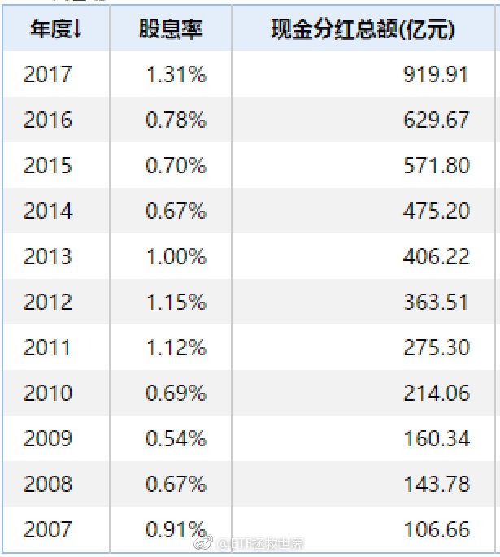

======================================================

ETF拯救世界 (5687069307) @
2019-03-14 08:45:06 Thu  
url: https://weibo.com/5687069307/HkQ07w67v

2007-2017年通胀是多少？

如果你不考虑房价，凭你的真实感受，你觉得通胀是多少？

你的衣食行，比十年前多了多少？注意：请排除你消费升级的因素。你不能十年前坐绿皮车，十年后坐商务舱告诉我出行成本增加了。 ​​​

转发[45]  评论[676]  赞[688] 

======================================================

ETF拯救世界 (5687069307) @
2019-03-14 11:30:20 Thu  
url: https://weibo.com/5687069307/HkR5bmKO2

这么跌我也不会买的。[微笑] ​​​

转发[16]  评论[447]  赞[1014] 

======================================================

ETF拯救世界 (5687069307) @
2019-03-14 13:44:28 Thu  
url: https://weibo.com/5687069307/HkRXDpU7U

今日教训：做事一定要认真。否则要用几倍的精力和时间弥补错误。 ​​​

转发[55]  评论[219]  赞[1015] 

======================================================

ETF拯救世界 (5687069307) @
2019-03-14 15:12:56 Thu  
url: https://weibo.com/5687069307/HkSxxDB5O

等待回调到位，剩下的车继续上。

有人说择时无效。

我不信。 ​​​

转发[62]  评论[1075]  赞[1652] 

======================================================

ETF拯救世界 (5687069307) @
2019-03-15 22:31:50 Fri  
url: https://weibo.com/5687069307/Hl4QbFatS

每日打卡（10）

一日不见如隔三秋啊各位。哈哈，今天比较忙，没上来给各位请安。

一切安好，勿念。 ​​​

转发[7]  评论[472]  赞[1103] 

+++++++++++++++++++++++++++++++++++++++++++++++++++++

图片：

======================================================

ETF拯救世界 (5687069307) @
2019-03-17 19:48:31 Sun  
url: https://weibo.com/5687069307/HlmCTF2CF

第一，到底是无中生有还是夸大其辞，这个是不一样的。

第二，如果是无中生有造谣，必须依法严惩。造谣的人太可恨。

第三，如果是确有其事但是夸大其辞，就别掩盖真相。如果老百姓谁都不信了，那就真的麻烦了。 ​​​

转发[20]  评论[225]  赞[658] 

======================================================

ETF拯救世界 (5687069307) @
2019-03-18 09:38:19 Mon  
url: https://weibo.com/5687069307/Hls3I7a5l

最新计划资产配置图。给小助理们点个赞吧。 ​​​

转发[230]  评论[346]  赞[2300] 

+++++++++++++++++++++++++++++++++++++++++++++++++++++

图片：

======================================================

ETF拯救世界 (5687069307) @
2019-03-18 10:24:46 Mon  
url: https://weibo.com/5687069307/HlsmznPt5

回复@快乐行者85762:三级有可能买不同的啊。比如香港中小，又或者标普500纳斯达克美国医药美国消费//@快乐行者85762:是否能将海外新兴和海外成熟合并为海外，二级再分成是海外新兴和海外成熟，三级名为香港、德国、英国、美国等？

------------------------------------------------------
转推：
>  @ETF拯救世界 (5687069307)
>  2019-03-18 09:38:19 Mon  
>  url: https:/weibo.com/5687069307/Hls3I7a5l/

>  最新计划资产配置图。给小助理们点个赞吧。 ​​​

转发[36]  评论[29]  赞[452] 

======================================================

ETF拯救世界 (5687069307) @
2019-03-18 10:27:50 Mon  
url: https://weibo.com/5687069307/HlsnOfo0r

$全指医药 sh000991$ 反弹新高。 ​​​

转发[10]  评论[59]  赞[573] 

======================================================

ETF拯救世界 (5687069307) @
2019-03-18 10:34:42 Mon  
url: https://weibo.com/5687069307/HlsqAqNM6

朋友们，你们谁还记得去年医药虎落平阳的时候，那些看衰医药的人和文字吗。 ​​​

转发[23]  评论[210]  赞[720] 

======================================================

ETF拯救世界 (5687069307) @
2019-03-18 10:52:02 Mon  
url: https://weibo.com/5687069307/HlsxDbPmE

指数还没新高，账户已经新高了。不知道组合今天什么情况，瑟瑟发抖中。 ​​​

转发[18]  评论[187]  赞[691] 

======================================================

ETF拯救世界 (5687069307) @
2019-03-18 10:58:50 Mon  
url: https://weibo.com/5687069307/HlsAohV4A

回复@jackfish:一台嫌少？你还看见哪位不转发不评论白送了？别说批量了，一台的有吗？//@jackfish:大哥，貌似你就送一台游戏机啊，我还以为大批量采购呢@ETF拯救世界

------------------------------------------------------
转推：
>  @ETF拯救世界 (5687069307)
>  2019-03-18 10:52:02 Mon  
>  url: https:/weibo.com/5687069307/HlsxDbPmE/

>  指数还没新高，账户已经新高了。不知道组合今天什么情况，瑟瑟发抖中。 ​​​

转发[7]  评论[162]  赞[516] 

======================================================

ETF拯救世界 (5687069307) @
2019-03-18 11:13:24 Mon  
url: https://weibo.com/5687069307/HlsGiFRG2

看新闻感觉法国最近特别乱，结果一看cac40发现又快十年新高了。

不敢想象如果这样的情况发生在另一个国家，股市得跌成什么样…… ​​​

转发[10]  评论[95]  赞[498] 

======================================================

ETF拯救世界 (5687069307) @
2019-03-18 11:19:23 Mon  
url: https://weibo.com/5687069307/HlsIJqLSM

后悔没用，学到东西最重要。 ​​​

转发[24]  评论[130]  赞[566] 

+++++++++++++++++++++++++++++++++++++++++++++++++++++

图片：

======================================================

ETF拯救世界 (5687069307) @
2019-03-18 11:32:03 Mon  
url: https://weibo.com/5687069307/HlsNSeVTD

法国人是很有意思的。看过一个60年代的法国片子，里面的法国人都穿着绿军装，戴着像章，拿着宝书上街搞斗争。

超赞的。 ​​​

转发[6]  评论[92]  赞[455] 

======================================================

ETF拯救世界 (5687069307) @
2019-03-18 11:41:25 Mon  
url: https://weibo.com/5687069307/HlsRG4LfD

年轻的时候我也经常后悔。因为做事做人很难完美，所以可想而知，后悔是经常的。

23岁以后，成熟了。后悔越来越少了。

后悔有什么用？没有任何任何用处。

第一重要是要明白当时自己就那个水平，那个高度，那个境界，只能做到那个地步。

第二是深入反思为什么做的不好，如果有机会，下次要做的更好。 ​​​

转发[293]  评论[457]  赞[1247] 

======================================================

ETF拯救世界 (5687069307) @
2019-03-18 13:07:12 Mon  
url: https://weibo.com/5687069307/HltquCvLO

几乎是最低点。那时候至今，反弹30%了。翻出来不是为了嘲笑或者打脸什么的。而是说，做投资要有信心。尤其是最低潮最落魄的时候，会有无数噪音。你要知道什么是对的什么是错的，要坚持下去。低位看跌，高位看涨很容易。你要反着做才行。

------------------------------------------------------
转推：
>  @ETF拯救世界 (5687069307)
>  2019-01-17 20:50:26 Thu  
>  url: https:/weibo.com/5687069307/HcoOJgi7P/

>  好心人很多，但是这种事我不需要关心。也别在一个指数暴跌后来救我，都管好自己。 ​​​

转发[85]  评论[171]  赞[705] 

======================================================

ETF拯救世界 (5687069307) @
2019-03-18 14:41:11 Mon  
url: https://weibo.com/5687069307/Hlu2E1OqU

保不住了。坦白了。

大家新高快乐！

具体礼物怎么送之后会有个正式说明。

不需要评论不需要转发不需要赞。真朋友直接领。 ​​​

转发[44]  评论[717]  赞[1635] 

======================================================

ETF拯救世界 (5687069307) @
2019-03-18 14:47:17 Mon  
url: https://weibo.com/5687069307/Hlu57ogmn

回复@feefine:你是我永远得不到也绝对不想得到的男人//@feefine:益达，我想让你得到我。

------------------------------------------------------
转推：
>  @ETF拯救世界 (5687069307)
>  2019-03-18 14:41:11 Mon  
>  url: https:/weibo.com/5687069307/Hlu2E1OqU/

>  保不住了。坦白了。
>  
>  大家新高快乐！
>  
>  具体礼物怎么送之后会有个正式说明。
>  
>  不需要评论不需要转发不需要赞。真朋友直接领。 ​​​

转发[3]  评论[127]  赞[521] 

======================================================

ETF拯救世界 (5687069307) @
2019-03-18 14:50:13 Mon  
url: https://weibo.com/5687069307/Hlu6jxVPr

回复@飘落依晨:传媒今年涨了37%。你说这话亏心不//@飘落依晨:中证传媒的表现真的失望 啊

------------------------------------------------------
转推：
>  @ETF拯救世界 (5687069307)
>  2019-03-18 14:41:11 Mon  
>  url: https:/weibo.com/5687069307/Hlu2E1OqU/

>  保不住了。坦白了。
>  
>  大家新高快乐！
>  
>  具体礼物怎么送之后会有个正式说明。
>  
>  不需要评论不需要转发不需要赞。真朋友直接领。 ​​​

转发[21]  评论[110]  赞[578] 

======================================================

ETF拯救世界 (5687069307) @
2019-03-18 15:04:50 Mon  
url: https://weibo.com/5687069307/Hlucfr3FR

300、500全都没有阶段新高，更别提2015年7月以来新高。

也就是说市场上绝大多数人都没有新高。

我们是怎么做到所有人又一次全部新高了。而且是再一次历史新高，不是全买余额宝的新高，是80%仓位的新高。

真是个迷啊。 ​​​

转发[31]  评论[289]  赞[861] 

======================================================

ETF拯救世界 (5687069307) @
2019-03-18 15:16:32 Mon  
url: https://weibo.com/5687069307/HlugZsSL3

说真的。你体会一下：

一场战争中，如果一方防守的时候固若金汤。怎么打都不会败，无论你如何狂轰滥炸都安然无恙……

进攻的时候，一步一个脚印，看着进攻速度不快，然而只要拿下的城池就再也不会丢掉。这样一座城一座城，一个村一个村蚕食……

你跟这样的军队打仗，有获胜的机会吗？ ​​​

转发[67]  评论[285]  赞[821] 

======================================================

ETF拯救世界 (5687069307) @
2019-03-18 15:50:03 Mon  
url: https://weibo.com/5687069307/HluuBnbxH

喜欢京东，一定要撑下去，别倒啊……

------------------------------------------------------
转推：
>  @ ()
>  2019-03-18 15:35:55 Mon  
>  url: 

>  抱歉，作者已设置仅展示半年内微博，此微博已不可见。 ​​​

转发[31]  评论[171]  赞[445] 

======================================================

ETF拯救世界 (5687069307) @
2019-03-18 16:10:24 Mon  
url: https://weibo.com/5687069307/HluCRa0Yr

谁能想到，2个月前21倍的养老现在也快30了。

为什么我们做什么事情都效率这么高。慢慢来不好吗。享受一下过程呀。 ​​​

转发[78]  评论[188]  赞[733] 

======================================================

ETF拯救世界 (5687069307) @
2019-03-18 16:31:32 Mon  
url: https://weibo.com/5687069307/HluLr6EWg

大家不要频繁逃顶，没有意义。

从历史上看，进入钻石坑后最短时间一次见顶也要一年。这样算至少也得2019年10月。

从估值看也远不到顶部定义。从趋势看更是持续处于上升趋势中。

不要想这么多。就是踏踏实实拿着。

你总想先逃顶然后再低位接回再赚一次，我只能说，如果你是上帝，你可以这么干。

拿 ​​​

转发[415]  评论[564]  赞[1201] 

======================================================

ETF拯救世界 (5687069307) @
2019-03-18 16:59:39 Mon  
url: https://weibo.com/5687069307/HluWQucdz

回复@hans2018_69617:劝你以后不要费事截屏。我不会删微博。我没说要一路向上，我没那个本事猜短期走势。我的意思是踏踏实实拿着廉价筹码赚大钱，中间怎么波动i don't care。还截屏，用来打脸的？//@hans2018_69617:我截屏 留待认证。如果现在不套人，后面还有行情吗？

------------------------------------------------------
转推：
>  @ETF拯救世界 (5687069307)
>  2019-03-18 16:31:32 Mon  
>  url: https:/weibo.com/5687069307/HluLr6EWg/

>  大家不要频繁逃顶，没有意义。
>  
>  从历史上看，进入钻石坑后最短时间一次见顶也要一年。这样算至少也得2019年10月。
>  
>  从估值看也远不到顶部定义。从趋势看更是持续处于上升趋势中。
>  
>  不要想这么多。就是踏踏实实拿着。
>  
>  你总想先逃顶然后再低位接回再赚一次，我只能说，如果你是上帝，你可以这么干。
>  
>  拿 ​​​

转发[18]  评论[224]  赞[602] 

======================================================

ETF拯救世界 (5687069307) @
2019-03-18 22:22:34 Mon  
url: https://weibo.com/5687069307/Hlx3Vp7OY

来了老弟！

------------------------------------------------------
转推：
>  @ ()
>  2019-03-18 22:02:40 Mon  
>  url: 

>  抱歉，作者已设置仅展示半年内微博，此微博已不可见。 ​​​

转发[31]  评论[234]  赞[560] 

======================================================

ETF拯救世界 (5687069307) @
2019-03-19 07:18:11 Tue  
url: https://weibo.com/5687069307/HlAzkzTvv

回复@TAE加拿大海参西洋参:估值只是观察市场的一个方面，更不是操作的主要依据。//@TAE加拿大海参西洋参:@ETF拯救世界 e大，有个问题：很多人贴出来的估值表都说明金融地产距离高点已经很近了，这时候不知道需要再平衡一次不？还是等到全市场高估的时候再考虑已经高估的指数的卖出？谢谢您的指教。

------------------------------------------------------
转推：
>  @ETF拯救世界 (5687069307)
>  2019-03-18 16:31:32 Mon  
>  url: https:/weibo.com/5687069307/HluLr6EWg/

>  大家不要频繁逃顶，没有意义。
>  
>  从历史上看，进入钻石坑后最短时间一次见顶也要一年。这样算至少也得2019年10月。
>  
>  从估值看也远不到顶部定义。从趋势看更是持续处于上升趋势中。
>  
>  不要想这么多。就是踏踏实实拿着。
>  
>  你总想先逃顶然后再低位接回再赚一次，我只能说，如果你是上帝，你可以这么干。
>  
>  拿 ​​​

转发[42]  评论[95]  赞[421] 

======================================================

ETF拯救世界 (5687069307) @
2019-03-19 07:20:37 Tue  
url: https://weibo.com/5687069307/HlAAjpMew

回复@蜀中弟子:朋友去年底送钱的多了，没几个人相信并且真的买。这也是他自己的运势到了//@蜀中弟子:回复@王温兔来一杯柳橙汁:你这朋友送的生日礼物可够大的，没事多请人家吃吃饭，白送好多钱啊

------------------------------------------------------
转推：
>  @ETF拯救世界 (5687069307)
>  2019-03-18 16:10:24 Mon  
>  url: https:/weibo.com/5687069307/HluCRa0Yr/

>  谁能想到，2个月前21倍的养老现在也快30了。
>  
>  为什么我们做什么事情都效率这么高。慢慢来不好吗。享受一下过程呀。 ​​​

转发[6]  评论[80]  赞[353] 

======================================================

ETF拯救世界 (5687069307) @
2019-03-19 07:49:13 Tue  
url: https://weibo.com/5687069307/HlALVgOyr

回复@给你买糖吗:没有为这个郁闷过。一般不借，借了就做好要不回来的准备了//@给你买糖吗:想问老大一个问题诶，老大试过借钱给别人要不回来的时候么[笑cry]就心里很憋屈…会怎么调节呢？按照：借给他的钱比不上一天的涨跌这样调节么

------------------------------------------------------
转推：
>  @ETF拯救世界 (5687069307)
>  2019-03-18 16:10:24 Mon  
>  url: https:/weibo.com/5687069307/HluCRa0Yr/

>  谁能想到，2个月前21倍的养老现在也快30了。
>  
>  为什么我们做什么事情都效率这么高。慢慢来不好吗。享受一下过程呀。 ​​​

转发[47]  评论[104]  赞[379] 

======================================================

ETF拯救世界 (5687069307) @
2019-03-19 09:18:01 Tue  
url: https://weibo.com/5687069307/HlBlYmsDS

回复@欲雨鱼鱼愉:行情总在犹豫中开始。如果所有人都认可牛市，那就是要见顶了//@欲雨鱼鱼愉:e大怎么看还有一批“技术派”认为没有震荡筑底的过程现在不是牛市的//@ETF拯救世界:回复@给你买糖吗:没有为这个郁闷过。一般不借，借了就做好要不回来的准备了

------------------------------------------------------
转推：
>  @ETF拯救世界 (5687069307)
>  2019-03-18 16:10:24 Mon  
>  url: https:/weibo.com/5687069307/HluCRa0Yr/

>  谁能想到，2个月前21倍的养老现在也快30了。
>  
>  为什么我们做什么事情都效率这么高。慢慢来不好吗。享受一下过程呀。 ​​​

转发[41]  评论[50]  赞[373] 

======================================================

ETF拯救世界 (5687069307) @
2019-03-19 09:21:56 Tue  
url: https://weibo.com/5687069307/HlBnz2NtB

回复@你好大麦茶:他在想要不要先跳车躲回调//@你好大麦茶:你都在车上了，还担心啥？就算再跌下去都可以继续买啊，计划里还有现金啊//@ETF拯救世界:回复@欲雨鱼鱼愉:行情总在犹豫中开始。如果所有人都认可牛市，那就是要见顶了

------------------------------------------------------
转推：
>  @ETF拯救世界 (5687069307)
>  2019-03-18 16:10:24 Mon  
>  url: https:/weibo.com/5687069307/HluCRa0Yr/

>  谁能想到，2个月前21倍的养老现在也快30了。
>  
>  为什么我们做什么事情都效率这么高。慢慢来不好吗。享受一下过程呀。 ​​​

转发[2]  评论[43]  赞[340] 

======================================================

ETF拯救世界 (5687069307) @
2019-03-19 09:24:04 Tue  
url: https://weibo.com/5687069307/HlBoqezGK

回复@i云腾致雨:你是不是对私募有什么误会？2015年以来几千个私募产品清盘。千万不要因为一个人的身份就认为他应该是什么样的//@i云腾致雨:跟踪一个大V，2000多点减仓到三成，但这两天要加到七成仓位，私募也高买低卖啊？[哼]

------------------------------------------------------
转推：
>  @ETF拯救世界 (5687069307)
>  2019-03-18 16:10:24 Mon  
>  url: https:/weibo.com/5687069307/HluCRa0Yr/

>  谁能想到，2个月前21倍的养老现在也快30了。
>  
>  为什么我们做什么事情都效率这么高。慢慢来不好吗。享受一下过程呀。 ​​​

转发[11]  评论[37]  赞[353] 

======================================================

ETF拯救世界 (5687069307) @
2019-03-19 09:28:25 Tue  
url: https://weibo.com/5687069307/HlBqc8WQB

回复@青山亦旧:你这又是贴标签了。私募里面也有牛人，而且比例肯定比散户多。只是不是所有私募都是牛人。//@青山亦旧:对了，私募就是干高买低卖的，谢谢了啊//@ETF拯救世界:回复@i云腾致雨:你是不是对私募有什么误会？2015年以来几千个私募产品清盘。千万不要因为一个人的身份就认为他应该是什么样的

------------------------------------------------------
转推：
>  @ETF拯救世界 (5687069307)
>  2019-03-18 16:10:24 Mon  
>  url: https:/weibo.com/5687069307/HluCRa0Yr/

>  谁能想到，2个月前21倍的养老现在也快30了。
>  
>  为什么我们做什么事情都效率这么高。慢慢来不好吗。享受一下过程呀。 ​​​

转发[4]  评论[42]  赞[426] 

======================================================

ETF拯救世界 (5687069307) @
2019-03-19 09:49:02 Tue  
url: https://weibo.com/5687069307/HlByyqyN2

下一次礼物压力位是 +50%。

送的东西应该是绝大多数人喜欢的。无论男女。价值也会比ps4高很多很多。

大家一起发功意念加成早日达成吧。 ​​​

转发[31]  评论[682]  赞[1611] 

======================================================

ETF拯救世界 (5687069307) @
2019-03-19 09:53:31 Tue  
url: https://weibo.com/5687069307/HlBAnk2su

$养老产业 sz399812$   反弹新高。 ​​​

转发[13]  评论[61]  赞[517] 

======================================================

ETF拯救世界 (5687069307) @
2019-03-19 10:10:33 Tue  
url: https://weibo.com/5687069307/HlBHio4LF

40%了。所有关注的指数排名第三。位列券商和信息后面。为什么有人的视野那么小。//@ETF拯救世界:回复@飘落依晨:传媒今年涨了37%。你说这话亏心不//@飘落依晨:中证传媒的表现真的失望 啊

------------------------------------------------------
转推：
>  @ETF拯救世界 (5687069307)
>  2019-03-18 14:41:11 Mon  
>  url: https:/weibo.com/5687069307/Hlu2E1OqU/

>  保不住了。坦白了。
>  
>  大家新高快乐！
>  
>  具体礼物怎么送之后会有个正式说明。
>  
>  不需要评论不需要转发不需要赞。真朋友直接领。 ​​​

转发[14]  评论[131]  赞[598] 

======================================================

ETF拯救世界 (5687069307) @
2019-03-19 10:33:54 Tue  
url: https://weibo.com/5687069307/HlBQM8aq9

差不多又到了该去拜拜的日子了。

以前去拜拜，无非是财神药王送子太岁拜一圈，希望所有家人和朋友身体健康，希望大家实现财务目标，孩子平平安安，给当值本命太岁问个好，最后在玉皇希望国泰民安，大家都能过太平日子。

今年要加一个程序，希望所有辣鸡阴险小人都不得好报。无论是现实世界的还是网上 ​​​

转发[26]  评论[493]  赞[1477] 

======================================================

ETF拯救世界 (5687069307) @
2019-03-19 15:48:12 Tue  
url: https://weibo.com/5687069307/HlDUliiIt

均衡配置有一点不好，就是今天这种情况你不知道组合到底是涨是跌…… ​​​

转发[67]  评论[430]  赞[859] 

======================================================

ETF拯救世界 (5687069307) @
2019-03-19 22:29:08 Tue  
url: https://weibo.com/5687069307/HlGx5qwT2

每日打卡（11）

也不知道说什么，祝大家今天做个好梦。 ​​​

转发[6]  评论[155]  赞[603] 

+++++++++++++++++++++++++++++++++++++++++++++++++++++

图片：

======================================================

ETF拯救世界 (5687069307) @
2019-03-20 08:33:27 Wed  
url: https://weibo.com/5687069307/HlKundd65

回复@风声边界617:不要看不起现在失意的朋友，记住，野百合也有春天。以后会买不少黄金。//@风声边界617:黄金etf连接份额小到可以忽略不计，收益基本没有，是不是可以考虑卖出用于增加其他份额的备用金作为改善计划的一种方案

------------------------------------------------------
转推：
>  @ETF拯救世界 (5687069307)
>  2019-03-19 15:48:12 Tue  
>  url: https:/weibo.com/5687069307/HlDUliiIt/

>  均衡配置有一点不好，就是今天这种情况你不知道组合到底是涨是跌…… ​​​

转发[40]  评论[207]  赞[610] 

======================================================

ETF拯救世界 (5687069307) @
2019-03-20 11:01:33 Wed  
url: https://weibo.com/5687069307/HlLsueJ4s

虽然你只有80%多的权益仓位。

但你的收益率比很多满仓上蹿下跳的人多。

这个你信不信。

不信算了。 ​​​

转发[116]  评论[256]  赞[848] 

======================================================

ETF拯救世界 (5687069307) @
2019-03-20 11:03:42 Wed  
url: https://weibo.com/5687069307/HlLtmD1KY

回复@是不及雨:生日快乐。也祝今天其它关注我的532位朋友（包括富婆买的僵尸粉）生日快乐！[心][蛋糕][鲜花][圣诞老人][haha]//@是不及雨:E大早呀 今天我生日[爱你]//@ETF拯救世界:回复@风声边界617:不要看不起现在失意的朋友，记住，野百合也有春天。以后会买不少黄金。

------------------------------------------------------
转推：
>  @ETF拯救世界 (5687069307)
>  2019-03-19 15:48:12 Tue  
>  url: https:/weibo.com/5687069307/HlDUliiIt/

>  均衡配置有一点不好，就是今天这种情况你不知道组合到底是涨是跌…… ​​​

转发[3]  评论[99]  赞[575] 

======================================================

ETF拯救世界 (5687069307) @
2019-03-20 11:08:07 Wed  
url: https://weibo.com/5687069307/HlLva3UhD

回复@兰州阿呆:有话好说，你先把刀放下。//@兰州阿呆:你说我儿子不是亲生的我都信！！！

------------------------------------------------------
转推：
>  @ETF拯救世界 (5687069307)
>  2019-03-20 11:01:33 Wed  
>  url: https:/weibo.com/5687069307/HlLsueJ4s/

>  虽然你只有80%多的权益仓位。
>  
>  但你的收益率比很多满仓上蹿下跳的人多。
>  
>  这个你信不信。
>  
>  不信算了。 ​​​

转发[3]  评论[92]  赞[493] 

======================================================

ETF拯救世界 (5687069307) @
2019-03-20 11:12:09 Wed  
url: https://weibo.com/5687069307/HlLwNpw3W

回复@RUSTY88888:大师们早已经把最好的一条路给我们指出来了，我们只要根据大师们的指引，结合自己的，以及本地市场的特点，建立一套成熟完善的投资体系，让它自动运行就可以了。//@RUSTY88888:益大，dalio说的和你的思路一样 http://t.cn/ExN5qnP

------------------------------------------------------
转推：
>  @ETF拯救世界 (5687069307)
>  2019-03-20 11:01:33 Wed  
>  url: https:/weibo.com/5687069307/HlLsueJ4s/

>  虽然你只有80%多的权益仓位。
>  
>  但你的收益率比很多满仓上蹿下跳的人多。
>  
>  这个你信不信。
>  
>  不信算了。 ​​​

转发[76]  评论[83]  赞[630] 

======================================================

ETF拯救世界 (5687069307) @
2019-03-20 11:30:47 Wed  
url: https://weibo.com/5687069307/HlLEm34dZ

在微博上，我讨论的投资心理学以及大的投资原则比较多。很少谈到投资体系的建设以及具体的投资策略。

这个，我想绝大多数朋友都能理解。

很多人把投资心理以及投资原则称之为“鸡汤”。我只能说你极度低估了它们的重要性。如果你的心理素质不够，又或者无法理解正确的投资原则，无法坚持，那么，即使 ​​​

转发[230]  评论[422]  赞[1182] 

======================================================

ETF拯救世界 (5687069307) @
2019-03-20 11:43:51 Wed  
url: https://weibo.com/5687069307/HlLJEBi9r

还有8个交易日，这个月能不能买点就看市场给不给面子了。 ​​​

转发[21]  评论[312]  赞[877] 

======================================================

ETF拯救世界 (5687069307) @
2019-03-20 16:08:59 Wed  
url: https://weibo.com/5687069307/HlNth8Zby

什么玩意儿，中午出门的时候跌的挺好，怎么几个小时以后再一看账户，比昨天还多了……辣鸡……

------------------------------------------------------
转推：
>  @ETF拯救世界 (5687069307)
>  2019-03-20 11:43:51 Wed  
>  url: https:/weibo.com/5687069307/HlLJEBi9r/

>  还有8个交易日，这个月能不能买点就看市场给不给面子了。 ​​​

转发[13]  评论[312]  赞[749] 

======================================================

ETF拯救世界 (5687069307) @
2019-03-21 10:11:12 Thu  
url: https://weibo.com/5687069307/HlUyy464q

新高之后大概率（ ）。

------------------------------------------------------
转推：
>  @ETF拯救世界 (5687069307)
>  2019-03-19 09:53:31 Tue  
>  url: https:/weibo.com/5687069307/HlBAnk2su/

>  $养老产业 sz399812$   反弹新高。 ​​​

转发[9]  评论[226]  赞[491] 

======================================================

ETF拯救世界 (5687069307) @
2019-03-21 10:19:55 Thu  
url: https://weibo.com/5687069307/HlUC5hnmU

没什么太多说的。

踏踏实实拿着。

因为平行世界中另一个拿不住的你根本赚不了几个大子。 ​​​

转发[17]  评论[150]  赞[691] 

======================================================

ETF拯救世界 (5687069307) @
2019-03-21 10:27:08 Thu  
url: https://weibo.com/5687069307/HlUF1k1PA

多账户上线了。讲真我也打算开一个多账户。你以为我没有年终奖吗……[doge]

------------------------------------------------------
转推：
>  @且慢管家 (6186312580)
>  2019-03-21 10:25:59 Thu  
>  url: https:/weibo.com/6186312580/HlUEylDPg/

>  早上好吖！今天没有人催我多账户了吧[喵喵]
>  
>  一个账户跟150份，一个账户跟S定投
>  
>  一个字：爽
>  
>  两个字：倍儿爽 ​​​

转发[14]  评论[139]  赞[542] 

======================================================

ETF拯救世界 (5687069307) @
2019-03-21 10:28:52 Thu  
url: https://weibo.com/5687069307/HlUFIu5DC

现在500涨幅所有宽基第一，涨幅是沪深300的10倍。

风骚的走位。 ​​​

转发[22]  评论[130]  赞[654] 

======================================================

ETF拯救世界 (5687069307) @
2019-03-21 10:30:57 Thu  
url: https://weibo.com/5687069307/HlUGzlVqJ

回复@反反复复--想做的事要去做:我们家的财务全部透明，不需要小金库。想买什么的话，不是车 房这种东西，也不用跟对方打招呼。//@反反复复--想做的事要去做:E大你有小金库吗[坏笑]

------------------------------------------------------
转推：
>  @且慢管家 (6186312580)
>  2019-03-21 10:25:59 Thu  
>  url: https:/weibo.com/6186312580/HlUEylDPg/

>  早上好吖！今天没有人催我多账户了吧[喵喵]
>  
>  一个账户跟150份，一个账户跟S定投
>  
>  一个字：爽
>  
>  两个字：倍儿爽 ​​​

转发[4]  评论[75]  赞[386] 

======================================================

ETF拯救世界 (5687069307) @
2019-03-21 10:45:07 Thu  
url: https://weibo.com/5687069307/HlUMj5x4Y

其实投资也能教会我们很多做人的道理吧。

不要做势利的人，不要追逐现在如日中天的品种。不要看轻那些暂时不得志的。

别人有难伸把手，等他富贵了就离远一点。

我又想到，那些因为一个投资者短期表现的好不好就追捧或者狂踩的人是真的非常不成熟。

投资，是马拉松。100米跑的快不快，一点都不重要 ​​​

转发[191]  评论[174]  赞[793] 

======================================================

ETF拯救世界 (5687069307) @
2019-03-21 10:49:51 Thu  
url: https://weibo.com/5687069307/HlUOetEuw

先于所有宽基创出新高。

------------------------------------------------------
转推：
>  @ETF拯救世界 (5687069307)
>  2019-03-21 10:28:52 Thu  
>  url: https:/weibo.com/5687069307/HlUFIu5DC/

>  现在500涨幅所有宽基第一，涨幅是沪深300的10倍。
>  
>  风骚的走位。 ​​​

转发[7]  评论[49]  赞[480] 

======================================================

ETF拯救世界 (5687069307) @
2019-03-21 10:53:10 Thu  
url: https://weibo.com/5687069307/HlUPAqHMI

回复@i云腾致雨:因为指数不会死。就像一个好吃懒做，吃喝嫖赌抽样样不缺的人，你还没完没了的帮助他？买指数你帮的是暂时落难的优秀青年。买股票你是在一帮乞丐里面找到20%值得帮的。//@i云腾致雨:但这个对指数适用，对股票不适用。[doge]

------------------------------------------------------
转推：
>  @ETF拯救世界 (5687069307)
>  2019-03-21 10:45:07 Thu  
>  url: https:/weibo.com/5687069307/HlUMj5x4Y/

>  其实投资也能教会我们很多做人的道理吧。
>  
>  不要做势利的人，不要追逐现在如日中天的品种。不要看轻那些暂时不得志的。
>  
>  别人有难伸把手，等他富贵了就离远一点。
>  
>  我又想到，那些因为一个投资者短期表现的好不好就追捧或者狂踩的人是真的非常不成熟。
>  
>  投资，是马拉松。100米跑的快不快，一点都不重要 ​​​

转发[49]  评论[58]  赞[469] 

======================================================

ETF拯救世界 (5687069307) @
2019-03-21 10:54:27 Thu  
url: https://weibo.com/5687069307/HlUQ6k0U0

回复@挖煤同学:你这种就别关注我了。真的。算我求求你了。//@挖煤同学:益达的500不是清了吗？？？？

------------------------------------------------------
转推：
>  @ETF拯救世界 (5687069307)
>  2019-03-21 10:28:52 Thu  
>  url: https:/weibo.com/5687069307/HlUFIu5DC/

>  现在500涨幅所有宽基第一，涨幅是沪深300的10倍。
>  
>  风骚的走位。 ​​​

转发[0]  评论[190]  赞[480] 

======================================================

ETF拯救世界 (5687069307) @
2019-03-21 11:08:07 Thu  
url: https://weibo.com/5687069307/HlUVEgPJT

记不记得之前有个人在某个论坛喷我，其中一条理由是低位卖掉两份恒生高位又接回来了。

所以喷子喷你，是任何事情都可以喷的。喷子的一大特点，就是可以把黑的喷成白的，白的喷成绿的。

我们的恒生指数在一年多赚了50多个点以后，在所有人极力看好恒指的时候，在大V看到几个月内涨到48000的时候，在李 ​​​

转发[41]  评论[330]  赞[745] 

======================================================

ETF拯救世界 (5687069307) @
2019-03-21 11:14:42 Thu  
url: https://weibo.com/5687069307/HlUYjr1by

回复@10年老矿工:这么会说话以后多说点。[doge]//@10年老矿工:哥们，你的难我们懂。别理这种人，把心放在女粉上好吗？[二哈][二哈][二哈][二哈]

------------------------------------------------------
转推：
>  @ETF拯救世界 (5687069307)
>  2019-03-21 11:08:07 Thu  
>  url: https:/weibo.com/5687069307/HlUVEgPJT/

>  记不记得之前有个人在某个论坛喷我，其中一条理由是低位卖掉两份恒生高位又接回来了。
>  
>  所以喷子喷你，是任何事情都可以喷的。喷子的一大特点，就是可以把黑的喷成白的，白的喷成绿的。
>  
>  我们的恒生指数在一年多赚了50多个点以后，在所有人极力看好恒指的时候，在大V看到几个月内涨到48000的时候，在李 ​​​

转发[3]  评论[98]  赞[486] 

======================================================

ETF拯救世界 (5687069307) @
2019-03-21 11:50:36 Thu  
url: https://weibo.com/5687069307/HlVcTEq7h

话说回来了，如果你有10000股某个品种，成本1块钱。1.5卖出其中1000股，1.6又买回来1000股。然后涨到2块。

我问你，你会觉得自己卖掉1000股又买回来的操作SB吗。

你肯定不会。

但如果是我这么做，就会被骂。

觉得别人小题大做是因为你没经历过。你也经历一次就懂了。 ​​​

转发[24]  评论[219]  赞[701] 

======================================================

ETF拯救世界 (5687069307) @
2019-03-21 12:05:42 Thu  
url: https://weibo.com/5687069307/HlVj1mwWM

看到有朋友问，“我们赚的到底是谁的钱呢”

到目前为止，第三轮计划赚的钱，70%是情绪的钱，30%是企业利润增长和通胀的钱。

所谓情绪的钱，就是别人兜里的了。

感受一下。 ​​​

转发[93]  评论[268]  赞[897] 

======================================================

ETF拯救世界 (5687069307) @
2019-03-21 13:36:12 Thu  
url: https://weibo.com/5687069307/HlVTLndRx

又有单日售罄的百亿基金进来给你抬轿子了。

一句话表达你的感受： ​​​

转发[49]  评论[480]  赞[685] 

======================================================

ETF拯救世界 (5687069307) @
2019-03-21 13:44:19 Thu  
url: https://weibo.com/5687069307/HlVX3gAmV

我特别不明白的是，为什么这些人要去抢热门基金？

到底为什么？

神奇。 ​​​

转发[117]  评论[305]  赞[567] 

======================================================

ETF拯救世界 (5687069307) @
2019-03-21 13:50:12 Thu  
url: https://weibo.com/5687069307/HlVZrinDw

在股市，有一种情况是很舒服。无论市场怎么走，都很舒服。

就是你现在这种情况。

舒服很重要，舒服就会做出更理性地决策。

不要把自己弄得非常被动。也就是，赌一个方向，当实际情况与你的预期越来越远，你就越来越被动。最终精神压力极大，导致做出更加错误的决定。

我说舒服最重要，你可能依然理 ​​​

转发[123]  评论[224]  赞[744] 

======================================================

ETF拯救世界 (5687069307) @
2019-03-21 13:58:07 Thu  
url: https://weibo.com/5687069307/HlW2EszoZ

喷了。

------------------------------------------------------
转推：
>  @Leonie梁 (1692290435)
>  2019-03-21 13:56:27 Thu  
>  url: https:/weibo.com/1692290435/HlW1YswQl/

>  麦大爷，哦对，现在应该是金大爷，您合适么……[并不简单][并不简单]@麦当劳 ​​​

转发[3]  评论[120]  赞[278] 

======================================================

ETF拯救世界 (5687069307) @
2019-03-21 15:47:51 Thu  
url: https://weibo.com/5687069307/HlWLcqzko

回复@可能是个最差的程序员了:早就新高了吧。现在是不断的新高再新高。还是那句话，2029年上证还是3000点的话，我们依然能赚很多。即使我们投的是指数基金……//@可能是个最差的程序员了:指数没新高，账户新高了，你说舒服不舒服

------------------------------------------------------
转推：
>  @ETF拯救世界 (5687069307)
>  2019-03-21 13:50:12 Thu  
>  url: https:/weibo.com/5687069307/HlVZrinDw/

>  在股市，有一种情况是很舒服。无论市场怎么走，都很舒服。
>  
>  就是你现在这种情况。
>  
>  舒服很重要，舒服就会做出更理性地决策。
>  
>  不要把自己弄得非常被动。也就是，赌一个方向，当实际情况与你的预期越来越远，你就越来越被动。最终精神压力极大，导致做出更加错误的决定。
>  
>  我说舒服最重要，你可能依然理 ​​​

转发[18]  评论[120]  赞[463] 

======================================================

ETF拯救世界 (5687069307) @
2019-03-21 16:09:56 Thu  
url: https://weibo.com/5687069307/HlWU9BPel

回复@从容淡定2003:大概率不会好。第一，基金经理均值回归。第二，规模大了不容易做好。第三，之所以热门就是因为市场环境热，市场热建仓有什么好下场。//@从容淡定2003:E大热门基金表现都不大好吗??

------------------------------------------------------
转推：
>  @ETF拯救世界 (5687069307)
>  2019-03-21 13:44:19 Thu  
>  url: https:/weibo.com/5687069307/HlVX3gAmV/

>  我特别不明白的是，为什么这些人要去抢热门基金？
>  
>  到底为什么？
>  
>  神奇。 ​​​

转发[56]  评论[123]  赞[497] 

======================================================

ETF拯救世界 (5687069307) @
2019-03-21 16:15:41 Thu  
url: https://weibo.com/5687069307/HlWWunAKo

回复@初学才会:良心在金钱面前是很难得的东西。更大的悖论是，太有良心反而会很难生存下去。//@初学才会:您还没看到这基金收费奇贵......不讲良心的那种贵。

------------------------------------------------------
转推：
>  @ETF拯救世界 (5687069307)
>  2019-03-21 13:44:19 Thu  
>  url: https:/weibo.com/5687069307/HlVX3gAmV/

>  我特别不明白的是，为什么这些人要去抢热门基金？
>  
>  到底为什么？
>  
>  神奇。 ​​​

转发[26]  评论[97]  赞[503] 

======================================================

ETF拯救世界 (5687069307) @
2019-03-21 16:16:44 Thu  
url: https://weibo.com/5687069307/HlWWV1n0C

太有价值了。时不时翻出来每次都有更深的体会对不对。

------------------------------------------------------
转推：
>  @ETF拯救世界 (5687069307)
>  2019-01-21 09:57:43 Mon  
>  url: https:/weibo.com/5687069307/HcWfMd6AE/

>  便宜的时候，给你很多很多时间和机会让你慢慢布局，你因为各种利空不敢买，又或者是特别贪，希望跌到2200,2000,1500。
>  
>  涨起来了，贵了，你很着急。希望有个大回调自己好杀进去。
>  
>  不好意思，真正的牛市没有回调。即使有你也进不去。最后你进去了，恐怕涨不了多少就要是大顶了。
>  
>  这话还早，不过几年后 ​​​

转发[102]  评论[216]  赞[862] 

======================================================

ETF拯救世界 (5687069307) @
2019-03-21 19:22:58 Thu  
url: https://weibo.com/5687069307/HlYavugYC

700亿。市场缺钱吗？一点都不缺。不知道有多少资金跃跃欲试要进来。当然，最终是什么结果，基本已经可以预见到了。

------------------------------------------------------
转推：
>  @ ()
>  2019-03-21 18:57:08 Thu  
>  url: 

>  抱歉，作者已设置仅展示半年内微博，此微博已不可见。 ​​​

转发[46]  评论[99]  赞[522] 

======================================================

ETF拯救世界 (5687069307) @
2019-03-21 19:36:39 Thu  
url: https://weibo.com/5687069307/HlYg41Esb

一家基金公司，无论公募还是私募，在大牛市中，越到疯狂的时候，按理说，越不应该再去募集资金投资。因为这时候长期看已经很难挣钱了。

然而，你讲良心，你不募集，别人会募集。你的规模会远远落后，最终甚至可能会被市场淘汰。

而在高点募集的基金，由于长期净值在1以下，不挣钱，很少有人会赎回， ​​​

转发[224]  评论[314]  赞[1251] 

======================================================

ETF拯救世界 (5687069307) @
2019-03-21 23:07:45 Thu  
url: https://weibo.com/5687069307/HlZDKnJmr

看了这张照片竟然有点想去流浪。

------------------------------------------------------
转推：
>  @ ()
>  2019-03-21 22:47:02 Thu  
>  url: 

>  抱歉，作者已设置仅展示半年内微博，此微博已不可见。 ​​​

转发[18]  评论[208]  赞[428] 

======================================================

ETF拯救世界 (5687069307) @
2019-03-22 07:27:02 Fri  
url: https://weibo.com/5687069307/Hm2Uphtjh

回复@V-EvanChen:还没到年底呢。继续看好戏。//@V-EvanChen:历史性的一天。老大牛逼。 谁能想到呢？

------------------------------------------------------
转推：
>  @ETF拯救世界 (5687069307)
>  2019-01-02 09:31:55 Wed  
>  url: https:/weibo.com/5687069307/Ha2XS4jRb/

>  我立个flag。
>  
>  2019年A股极大极大概率收红。不投机取巧，我说的是绝大多数指数。
>  
>  甚至，有可能涨幅不会太小。
>  
>  当然不排除中间继续挖坑，但年底看，形势一片大好。不是小好，是大好。 ​​​

转发[11]  评论[168]  赞[561] 

======================================================

ETF拯救世界 (5687069307) @
2019-03-22 11:26:50 Fri  
url: https://weibo.com/5687069307/Hm4tKboTg

喷了。为什么300涨的时候不行，跌的时候跌的多。

均值回归是金融投资第一铁律。信不信。 ​​​

转发[69]  评论[148]  赞[751] 

======================================================

ETF拯救世界 (5687069307) @
2019-03-22 11:47:10 Fri  
url: https://weibo.com/5687069307/Hm4BZDQ0X

回复@墨白ts:晒一晒。我非常不理解的是，我到底做什么说什么了要被这些人这么骂？到底为什么。//@墨白ts:然后你被抬进了棺材[二哈]

------------------------------------------------------
转推：
>  @ETF拯救世界 (5687069307)
>  2019-03-21 13:36:12 Thu  
>  url: https:/weibo.com/5687069307/HlVTLndRx/

>  又有单日售罄的百亿基金进来给你抬轿子了。
>  
>  一句话表达你的感受： ​​​

转发[18]  评论[514]  赞[307] 

======================================================

ETF拯救世界 (5687069307) @
2019-03-22 11:51:16 Fri  
url: https://weibo.com/5687069307/Hm4DF5fwK

回复@丁小佳的秘密基地:如果骂人不需要理由，他不是在浪费自己时间吗，不是在增加自己的业障吗，不是在增加自己的倒霉几率吗。为什么要干这种百害无一利的事？不理解//@丁小佳的秘密基地:为什么你会觉得骂人一定需要一个有逻辑的理由呢???

------------------------------------------------------
转推：
>  @ETF拯救世界 (5687069307)
>  2019-03-21 13:36:12 Thu  
>  url: https:/weibo.com/5687069307/HlVTLndRx/

>  又有单日售罄的百亿基金进来给你抬轿子了。
>  
>  一句话表达你的感受： ​​​

转发[6]  评论[193]  赞[365] 

======================================================

ETF拯救世界 (5687069307) @
2019-03-22 13:52:10 Fri  
url: https://weibo.com/5687069307/Hm5qJulVk

有人希望你倒霉你就要生活的更好才行啊。 ​​​

转发[24]  评论[477]  赞[1294] 

+++++++++++++++++++++++++++++++++++++++++++++++++++++

图片：

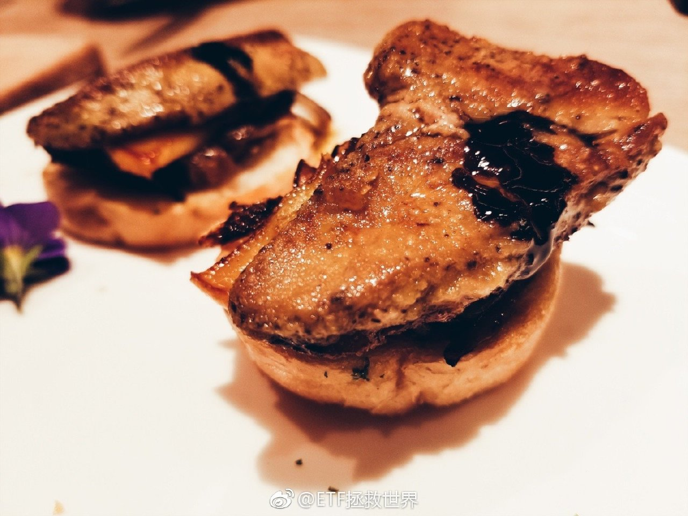

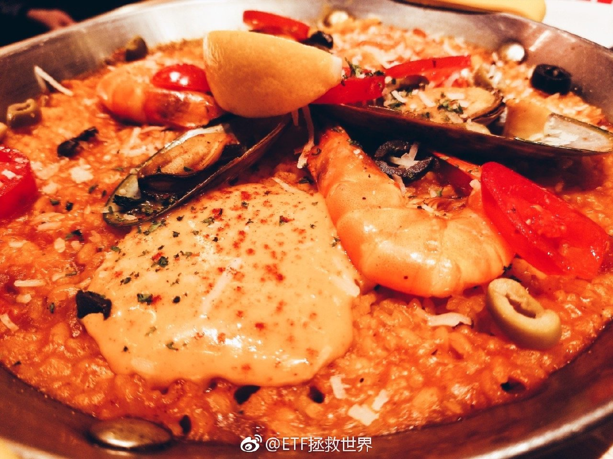

======================================================

ETF拯救世界 (5687069307) @
2019-03-22 14:12:58 Fri  
url: https://weibo.com/5687069307/Hm5zb3wTV

对每天新高的指数毫无抵抗力。

$全指医药 sh000991$ ​​​

转发[37]  评论[123]  赞[575] 

======================================================

ETF拯救世界 (5687069307) @
2019-03-22 14:27:17 Fri  
url: https://weibo.com/5687069307/Hm5EZhBBO

回复@1括囊无咎1:借您吉言，毕竟快到月底了//@1括囊无咎1:指数顶背离，大阴线随时将致，短线调整在所难免。l

------------------------------------------------------
转推：
>  @ETF拯救世界 (5687069307)
>  2019-03-22 14:12:58 Fri  
>  url: https:/weibo.com/5687069307/Hm5zb3wTV/

>  对每天新高的指数毫无抵抗力。
>  
>  $全指医药 sh000991$ ​​​

转发[6]  评论[136]  赞[486] 

======================================================

ETF拯救世界 (5687069307) @
2019-03-22 14:45:09 Fri  
url: https://weibo.com/5687069307/Hm5Mfj551

回复@魔魔O:包子也是另一种馒头，加了点馅而已…//@魔魔O:回复@ETF拯救世界:焦糖布丁不就是另一种形式的蒸蛋，加了牛奶和糖而已[并不简单]

------------------------------------------------------
转推：
>  @ETF拯救世界 (5687069307)
>  2019-03-22 13:52:10 Fri  
>  url: https:/weibo.com/5687069307/Hm5qJulVk/

>  有人希望你倒霉你就要生活的更好才行啊。 ​​​

转发[3]  评论[139]  赞[423] 

======================================================

ETF拯救世界 (5687069307) @
2019-03-22 21:52:44 Fri  
url: https://weibo.com/5687069307/Hm8zNjZCX

每日打卡（12）

坚持。各位周末快乐！毕竟你的资产今天又新高了。 ​​​

转发[5]  评论[170]  赞[650] 

+++++++++++++++++++++++++++++++++++++++++++++++++++++

图片：

======================================================

ETF拯救世界 (5687069307) @
2019-03-23 06:27:14 Sat  
url: https://weibo.com/5687069307/HmbWDykJe

[微笑]

总有人想把最后一分钱都买进去。

你知不知道未来会出现什么样的好机会？如果那个时候你手里没钱，不会遗憾吗？ ​​​

转发[82]  评论[390]  赞[920] 

+++++++++++++++++++++++++++++++++++++++++++++++++++++

图片：

======================================================

ETF拯救世界 (5687069307) @
2019-03-23 07:57:35 Sat  
url: https://weibo.com/5687069307/Hmcxip368

黄赌毒不可沾 ​​​

转发[23]  评论[304]  赞[693] 

+++++++++++++++++++++++++++++++++++++++++++++++++++++

图片：
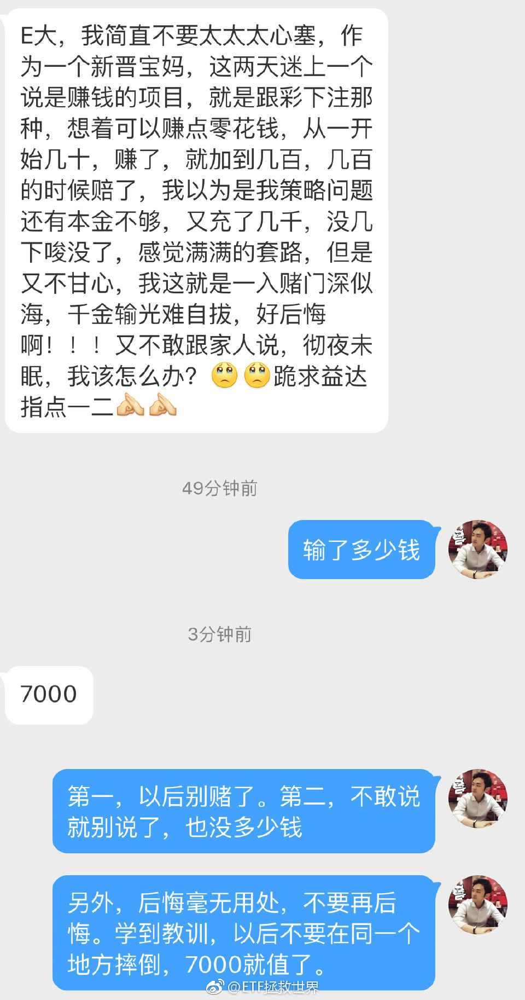

======================================================

ETF拯救世界 (5687069307) @
2019-03-23 08:08:24 Sat  
url: https://weibo.com/5687069307/HmcBHaFRc

学习了//@放牛归来再读书:牛//@一米单车一米路:高科技阿//@Zodzod_张浩 :牛逼...//@喷嚏网铂程 : //@YouTube精选 : 嗝屁屁，上天天[喵喵]//@暂许清欢 :真刺激，排排坐，勒脖脖[喵喵]

------------------------------------------------------
转推：
>  @YouTube精选 (2214257545)
>  2019-03-22 14:32:33 Fri  
>  url: https:/weibo.com/2214257545/Hm5H7DuYF/

>  国外小哥自制了一个精巧的老式弹簧捕鼠器，基于拥有400多年历史的法国设计，既简单又高效，一个晚上就抓了四只老鼠……看着监控镜头下的老鼠一个个上钩、一家人整整齐齐的样子，真是解气又想笑[doge]@柚子木字幕组 http://t.cn/ExBrJBn ​​​

转发[135]  评论[95]  赞[343] 

======================================================

ETF拯救世界 (5687069307) @
2019-03-23 09:17:05 Sat  
url: https://weibo.com/5687069307/Hmd3zw6OW

我不是很明白有股市为什么还要去赌博。

赚钱的快乐股市也有，关键是你能通过能力和经验的上升，赚钱的概率越来越大。股市还是有规律的，虽然运气也重要，但运气一般也能赚钱。

赌博有什么好？除了极个别项目，根本无法计算概率。如果不是庄家骗你，那就是全凭运气。靠运气发财？有可能，但是更大可能 ​​​

转发[307]  评论[266]  赞[724] 

======================================================

ETF拯救世界 (5687069307) @
2019-03-23 10:25:00 Sat  
url: https://weibo.com/5687069307/Hmdv9005B

回复@清香夜凝:20岁的人觉得40/50岁再发财就没意义了。等他们到了50岁，有好多钱了，大概就会发现，50岁发财真好啊。至少比穷到50岁好太多了。//@清香夜凝:不能暴富有什么用，人生苦短呀

------------------------------------------------------
转推：
>  @ETF拯救世界 (5687069307)
>  2019-03-23 09:17:05 Sat  
>  url: https:/weibo.com/5687069307/Hmd3zw6OW/

>  我不是很明白有股市为什么还要去赌博。
>  
>  赚钱的快乐股市也有，关键是你能通过能力和经验的上升，赚钱的概率越来越大。股市还是有规律的，虽然运气也重要，但运气一般也能赚钱。
>  
>  赌博有什么好？除了极个别项目，根本无法计算概率。如果不是庄家骗你，那就是全凭运气。靠运气发财？有可能，但是更大可能 ​​​

转发[84]  评论[111]  赞[550] 

======================================================

ETF拯救世界 (5687069307) @
2019-03-23 10:32:31 Sat  
url: https://weibo.com/5687069307/HmdyckRLz

回复@江两南:复利的魔力。但我不同意把钱都攒着不舍得花等到老了发财。年轻时候的那条裙子那个游戏，以后再有钱买再多也不会有当时的乐趣了//@江两南:巴菲特说了，我99%的钱都是在60岁以后赚到的。

------------------------------------------------------
转推：
>  @ETF拯救世界 (5687069307)
>  2019-03-23 09:17:05 Sat  
>  url: https:/weibo.com/5687069307/Hmd3zw6OW/

>  我不是很明白有股市为什么还要去赌博。
>  
>  赚钱的快乐股市也有，关键是你能通过能力和经验的上升，赚钱的概率越来越大。股市还是有规律的，虽然运气也重要，但运气一般也能赚钱。
>  
>  赌博有什么好？除了极个别项目，根本无法计算概率。如果不是庄家骗你，那就是全凭运气。靠运气发财？有可能，但是更大可能 ​​​

转发[52]  评论[229]  赞[621] 

======================================================

ETF拯救世界 (5687069307) @
2019-03-23 19:14:23 Sat  
url: https://weibo.com/5687069307/HmgY1d75S

回复@Mr-suson:跑赢指数这么简单吗？我在雪球关注的私募里面90%今年都没跑赢指数。更别说7456只公募基金中，今年只有238只跑赢中证500。我真不信有几个散户能跑赢全市场指数。//@Mr-suson:今年行情这么好，到现在还是亏或者跑不赢指数的是真该戒赌了！

------------------------------------------------------
转推：
>  @ETF拯救世界 (5687069307)
>  2019-03-23 09:17:05 Sat  
>  url: https:/weibo.com/5687069307/Hmd3zw6OW/

>  我不是很明白有股市为什么还要去赌博。
>  
>  赚钱的快乐股市也有，关键是你能通过能力和经验的上升，赚钱的概率越来越大。股市还是有规律的，虽然运气也重要，但运气一般也能赚钱。
>  
>  赌博有什么好？除了极个别项目，根本无法计算概率。如果不是庄家骗你，那就是全凭运气。靠运气发财？有可能，但是更大可能 ​​​

转发[127]  评论[116]  赞[503] 

======================================================

ETF拯救世界 (5687069307) @
2019-03-23 19:41:38 Sat  
url: https://weibo.com/5687069307/Hmh953BR3

回复@古道熹东:你觉得有几个人在牛市里能踏踏实实拿住不动？有20%吗？看看成交量。今天买明天卖，别说跟上指数了，有多少人赔钱你可能都想不到。//@古道熹东:到家都跑不赢那谁把钱赚去了呢？我觉得至少30-40%的申应该跑赢吧

------------------------------------------------------
转推：
>  @ETF拯救世界 (5687069307)
>  2019-03-23 09:17:05 Sat  
>  url: https:/weibo.com/5687069307/Hmd3zw6OW/

>  我不是很明白有股市为什么还要去赌博。
>  
>  赚钱的快乐股市也有，关键是你能通过能力和经验的上升，赚钱的概率越来越大。股市还是有规律的，虽然运气也重要，但运气一般也能赚钱。
>  
>  赌博有什么好？除了极个别项目，根本无法计算概率。如果不是庄家骗你，那就是全凭运气。靠运气发财？有可能，但是更大可能 ​​​

转发[54]  评论[71]  赞[416] 

======================================================

ETF拯救世界 (5687069307) @
2019-03-23 19:45:30 Sat  
url: https://weibo.com/5687069307/HmhaEerSx

回复@乐步女:你回头看，当然可以说今年满仓500就好。但是去年满仓可是要赔33%，今年涨成这样还没回本。远没有想象中那么简单。//@乐步女:那就直接买中证500

------------------------------------------------------
转推：
>  @ETF拯救世界 (5687069307)
>  2019-03-23 09:17:05 Sat  
>  url: https:/weibo.com/5687069307/Hmd3zw6OW/

>  我不是很明白有股市为什么还要去赌博。
>  
>  赚钱的快乐股市也有，关键是你能通过能力和经验的上升，赚钱的概率越来越大。股市还是有规律的，虽然运气也重要，但运气一般也能赚钱。
>  
>  赌博有什么好？除了极个别项目，根本无法计算概率。如果不是庄家骗你，那就是全凭运气。靠运气发财？有可能，但是更大可能 ​​​

转发[26]  评论[59]  赞[457] 

======================================================

ETF拯救世界 (5687069307) @
2019-03-23 19:49:59 Sat  
url: https://weibo.com/5687069307/Hmhct7vC9

回复@沙恩霍斯特号:更多的人是别人的股票涨的好，自己的不动。心里着急卖掉自己的去买别人的，结果原来的涨了，刚买的又买在山头了。真能做好追热点轮动的人没你想的这么多。

------------------------------------------------------
转推：
>  @ETF拯救世界 (5687069307)
>  2019-03-23 09:17:05 Sat  
>  url: https:/weibo.com/5687069307/Hmd3zw6OW/

>  我不是很明白有股市为什么还要去赌博。
>  
>  赚钱的快乐股市也有，关键是你能通过能力和经验的上升，赚钱的概率越来越大。股市还是有规律的，虽然运气也重要，但运气一般也能赚钱。
>  
>  赌博有什么好？除了极个别项目，根本无法计算概率。如果不是庄家骗你，那就是全凭运气。靠运气发财？有可能，但是更大可能 ​​​

转发[30]  评论[65]  赞[478] 

======================================================

ETF拯救世界 (5687069307) @
2019-03-23 20:08:40 Sat  
url: https://weibo.com/5687069307/Hmhk3hFdZ

A股自由流通市值是22万亿，今年A股成交额超过30万亿。也就是3个月时间，所有流通股票已经换手接近1.5次了。

你真以为有几个人能在牛市中拿着吃饱吃好？

别幻想了行吗？

我说大牛市中别说赚大钱了，不少人赔钱你肯定觉得非常不理解。但这就是事实。 ​​​

转发[314]  评论[228]  赞[718] 

======================================================

ETF拯救世界 (5687069307) @
2019-03-23 20:25:00 Sat  
url: https://weibo.com/5687069307/HmhqGgNiG

回复@天风3T:这些话我早就说过了。真的把我以前说的话认真翻一遍，能节省10年时间。//@天风3T:跟着买了一段时间，感觉本金还是很重要的，200块的证券涨了40%，感觉没什么多大意义，还是想办法提高自己的赚钱能力实在的多。

------------------------------------------------------
转推：
>  @ETF拯救世界 (5687069307)
>  2019-03-23 20:08:40 Sat  
>  url: https:/weibo.com/5687069307/Hmhk3hFdZ/

>  A股自由流通市值是22万亿，今年A股成交额超过30万亿。也就是3个月时间，所有流通股票已经换手接近1.5次了。
>  
>  你真以为有几个人能在牛市中拿着吃饱吃好？
>  
>  别幻想了行吗？
>  
>  我说大牛市中别说赚大钱了，不少人赔钱你肯定觉得非常不理解。但这就是事实。 ​​​

转发[30]  评论[165]  赞[469] 

======================================================

ETF拯救世界 (5687069307) @
2019-03-23 21:35:50 Sat  
url: https://weibo.com/5687069307/HmhTr0HqO

回复@ETF改变生活:我说的是“自由”流通市值。很多所谓的流通市值根本不流通，你研究的不够深入。//@ETF改变生活:算了下，流通市值是45.6万亿，e大怎么算的22万亿

------------------------------------------------------
转推：
>  @ETF拯救世界 (5687069307)
>  2019-03-23 20:08:40 Sat  
>  url: https:/weibo.com/5687069307/Hmhk3hFdZ/

>  A股自由流通市值是22万亿，今年A股成交额超过30万亿。也就是3个月时间，所有流通股票已经换手接近1.5次了。
>  
>  你真以为有几个人能在牛市中拿着吃饱吃好？
>  
>  别幻想了行吗？
>  
>  我说大牛市中别说赚大钱了，不少人赔钱你肯定觉得非常不理解。但这就是事实。 ​​​

转发[132]  评论[45]  赞[399] 

======================================================

ETF拯救世界 (5687069307) @
2019-03-23 21:39:50 Sat  
url: https://weibo.com/5687069307/HmhV37XWH

比如说，中石油集团持有中石油股票市值一万多亿。这一万多亿纸面上是流通市值，但根本不可能流通到市场上。这些股票就不是“自由流通市值”。要把所有真正流通的“流通市值”分离出来计算才准。

------------------------------------------------------
转推：
>  @ETF拯救世界 (5687069307)
>  2019-03-23 20:08:40 Sat  
>  url: https:/weibo.com/5687069307/Hmhk3hFdZ/

>  A股自由流通市值是22万亿，今年A股成交额超过30万亿。也就是3个月时间，所有流通股票已经换手接近1.5次了。
>  
>  你真以为有几个人能在牛市中拿着吃饱吃好？
>  
>  别幻想了行吗？
>  
>  我说大牛市中别说赚大钱了，不少人赔钱你肯定觉得非常不理解。但这就是事实。 ​​​

转发[52]  评论[79]  赞[499] 

======================================================

ETF拯救世界 (5687069307) @
2019-03-23 21:56:37 Sat  
url: https://weibo.com/5687069307/Hmi1S1wzl

回复@李大吉吉吉吉:我在2013年就写过一篇文章，论述当时建行流通市值只有300多亿，远比很多中小银行自由流通市值低，拉起来非常轻松。//@李大吉吉吉吉:对，比如五大行的大股东是不会卖的，实际流通市值不大

------------------------------------------------------
转推：
>  @ETF拯救世界 (5687069307)
>  2019-03-23 20:08:40 Sat  
>  url: https:/weibo.com/5687069307/Hmhk3hFdZ/

>  A股自由流通市值是22万亿，今年A股成交额超过30万亿。也就是3个月时间，所有流通股票已经换手接近1.5次了。
>  
>  你真以为有几个人能在牛市中拿着吃饱吃好？
>  
>  别幻想了行吗？
>  
>  我说大牛市中别说赚大钱了，不少人赔钱你肯定觉得非常不理解。但这就是事实。 ​​​

转发[49]  评论[118]  赞[524] 

======================================================

ETF拯救世界 (5687069307) @
2019-03-24 19:00:30 Sun  
url: https://weibo.com/5687069307/HmqiT5KUU

不看好未来十年收益不代表我要做空。 ​​​

转发[36]  评论[166]  赞[532] 

+++++++++++++++++++++++++++++++++++++++++++++++++++++

图片：
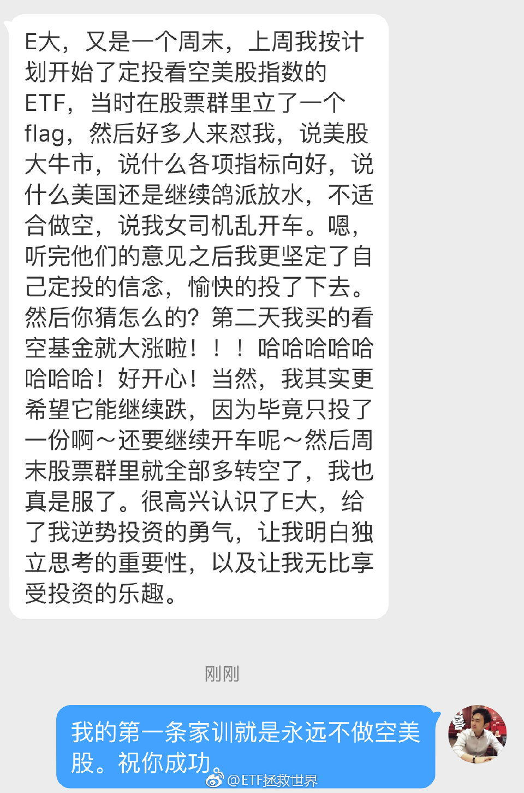

======================================================

ETF拯救世界 (5687069307) @
2019-03-24 19:59:13 Sun  
url: https://weibo.com/5687069307/HmqGIyslS

10% ​​​

转发[110]  评论[209]  赞[493] 

+++++++++++++++++++++++++++++++++++++++++++++++++++++

图片：

======================================================

ETF拯救世界 (5687069307) @
2019-03-24 20:01:11 Sun  
url: https://weibo.com/5687069307/HmqHvzgFQ

回复@yangmei的围脖:每周都有人中彩票头奖//@yangmei的围脖:蚂蚁里有个大v做空过

------------------------------------------------------
转推：
>  @ETF拯救世界 (5687069307)
>  2019-03-24 19:00:30 Sun  
>  url: https:/weibo.com/5687069307/HmqiT5KUU/

>  不看好未来十年收益不代表我要做空。 ​​​

转发[9]  评论[42]  赞[347] 

======================================================

ETF拯救世界 (5687069307) @
2019-03-24 20:14:52 Sun  
url: https://weibo.com/5687069307/HmqN47MZY

是不是骗局有一条硬核指标：是不是国家认可并监管的品种。

这个项目在证监 保监 银监有没有背书。公司有没有资质。这些都可以查。

有了监管层背书的标准化品种，不能说没有风险，但是是骗子的风险大大降低。剩下的交易风险可以用各种方法规避，骗子风险无法规避，唯一方法就是离得越远越好。

中国人 ​​​

转发[181]  评论[205]  赞[733] 

======================================================

ETF拯救世界 (5687069307) @
2019-03-24 20:18:26 Sun  
url: https://weibo.com/5687069307/HmqOvE9qK

我又想起来去年底说投资指数基金是传销那些人了。

这就是无知。 ​​​

转发[18]  评论[215]  赞[713] 

======================================================

ETF拯救世界 (5687069307) @
2019-03-25 08:06:43 Mon  
url: https://weibo.com/5687069307/Hmvs0jXcJ

回复@爽口苦菊:我会说，无论你选什么，以后不要后悔。想想自己真正要的是什么//@爽口苦菊:回复@开心快乐追求:如果e大看到肯定会说，买房。

------------------------------------------------------
转推：
>  @ETF拯救世界 (5687069307)
>  2019-03-24 20:18:26 Sun  
>  url: https:/weibo.com/5687069307/HmqOvE9qK/

>  我又想起来去年底说投资指数基金是传销那些人了。
>  
>  这就是无知。 ​​​

转发[4]  评论[50]  赞[398] 

======================================================

ETF拯救世界 (5687069307) @
2019-03-25 08:56:36 Mon  
url: https://weibo.com/5687069307/HmvMfBtFJ

招行不到5%的金葵花以上客户拥有80%以上的客户资产。 ​​​

转发[39]  评论[132]  赞[599] 

======================================================

ETF拯救世界 (5687069307) @
2019-03-25 09:03:41 Mon  
url: https://weibo.com/5687069307/HmvP7qBAa

今天A股还不调整吗。不过月底一定会发车，1-2车。 ​​​

转发[8]  评论[228]  赞[731] 

======================================================

ETF拯救世界 (5687069307) @
2019-03-25 09:27:30 Mon  
url: https://weibo.com/5687069307/HmvYNmvZC

不追涨是一种美德。

有钱还怕没有好的投资机会？

金融市场最不缺的就是机会。机会来了，最缺的是钱。

谁有钱谁才是话事人。 ​​​

转发[351]  评论[179]  赞[803] 

======================================================

ETF拯救世界 (5687069307) @
2019-03-25 09:30:33 Mon  
url: https://weibo.com/5687069307/Hmw028Z59

回复@郭佳宝dabao:跌下去68.36%的又不敢买了//@郭佳宝dabao:最近很多突然多出来很多钱的人机会来了！

------------------------------------------------------
转推：
>  @ETF拯救世界 (5687069307)
>  2019-03-25 09:27:30 Mon  
>  url: https:/weibo.com/5687069307/HmvYNmvZC/

>  不追涨是一种美德。
>  
>  有钱还怕没有好的投资机会？
>  
>  金融市场最不缺的就是机会。机会来了，最缺的是钱。
>  
>  谁有钱谁才是话事人。 ​​​

转发[21]  评论[61]  赞[354] 

======================================================

ETF拯救世界 (5687069307) @
2019-03-25 09:46:18 Mon  
url: https://weibo.com/5687069307/Hmw6q5l8D

回复@草农123:赶紧买啊。还不到60倍估值，历史最高210呢。//@草农123:军工这小伙子不错啊//@ETF拯救世界:回复@郭佳宝dabao:跌下去68.36%的又不敢买了//@郭佳宝dabao:最近很多突然多出来很多钱的人机会来了！

------------------------------------------------------
转推：
>  @ETF拯救世界 (5687069307)
>  2019-03-25 09:27:30 Mon  
>  url: https:/weibo.com/5687069307/HmvYNmvZC/

>  不追涨是一种美德。
>  
>  有钱还怕没有好的投资机会？
>  
>  金融市场最不缺的就是机会。机会来了，最缺的是钱。
>  
>  谁有钱谁才是话事人。 ​​​

转发[15]  评论[56]  赞[325] 

======================================================

ETF拯救世界 (5687069307) @
2019-03-25 10:02:11 Mon  
url: https://weibo.com/5687069307/HmwcSuZvd

一看就会，一做就废

------------------------------------------------------
转推：
>  @北京人不知道的北京事儿 (1662214194)
>  2019-03-23 22:31:28 Sat  
>  url: https:/weibo.com/1662214194/Hmig1jv6G/

>  打结技巧合集，总有一天用得上！果断收藏！[心]http://t.cn/ExDQU1V ​​​

转发[131]  评论[42]  赞[370] 

======================================================

ETF拯救世界 (5687069307) @
2019-03-25 10:06:43 Mon  
url: https://weibo.com/5687069307/HmweIA4So

回复@原农赋:说的太好了。可以不可以引申一下：做什么事情没有是否违背良心之分，只要赚钱。//@原农赋:犯不着冷嘲热讽军工，股票没有高低贵贱，只有盈亏//@ETF拯救世界:回复@草农123:赶紧买啊。还不到60倍估值，历史最高210呢。//@草农123:军工这小伙子不错啊

------------------------------------------------------
转推：
>  @ETF拯救世界 (5687069307)
>  2019-03-25 09:27:30 Mon  
>  url: https:/weibo.com/5687069307/HmvYNmvZC/

>  不追涨是一种美德。
>  
>  有钱还怕没有好的投资机会？
>  
>  金融市场最不缺的就是机会。机会来了，最缺的是钱。
>  
>  谁有钱谁才是话事人。 ​​​

转发[6]  评论[93]  赞[355] 

======================================================

ETF拯救世界 (5687069307) @
2019-03-25 10:23:48 Mon  
url: https://weibo.com/5687069307/HmwlEdi8Q

之前这位朋友问，买军工股的人哪里违背良心了？

他是没懂我的意思。

他说，买什么都可以，只要赚钱。

我说，那么是不是做什么事情都可以，哪怕违背良心，只要赚钱？

这是一个引申出去的推论，并非说买军工股违背良心。

再说大一点，这是人生观和价值观的不同。

我对于投资的价值观，就是特别贵的 ​​​

转发[147]  评论[247]  赞[875] 

======================================================

ETF拯救世界 (5687069307) @
2019-03-25 10:34:38 Mon  
url: https://weibo.com/5687069307/Hmwq2CqMH

毫无抵抗力！

------------------------------------------------------
转推：
>  @ETF拯救世界 (5687069307)
>  2019-03-22 14:12:58 Fri  
>  url: https:/weibo.com/5687069307/Hm5zb3wTV/

>  对每天新高的指数毫无抵抗力。
>  
>  $全指医药 sh000991$ ​​​

转发[12]  评论[39]  赞[349] 

======================================================

ETF拯救世界 (5687069307) @
2019-03-25 10:37:51 Mon  
url: https://weibo.com/5687069307/HmwrmcenC

回复@ksk2037:我再说一次，投资指数不是投资股票。你一只股票亏损买我都觉得没问题，但是一个指数50只个股平均PE 60倍，所有公司都有高速发展？实话实说，我认为那是一个梦。

------------------------------------------------------
转推：
>  @ETF拯救世界 (5687069307)
>  2019-03-25 10:23:48 Mon  
>  url: https:/weibo.com/5687069307/HmwlEdi8Q/

>  之前这位朋友问，买军工股的人哪里违背良心了？
>  
>  他是没懂我的意思。
>  
>  他说，买什么都可以，只要赚钱。
>  
>  我说，那么是不是做什么事情都可以，哪怕违背良心，只要赚钱？
>  
>  这是一个引申出去的推论，并非说买军工股违背良心。
>  
>  再说大一点，这是人生观和价值观的不同。
>  
>  我对于投资的价值观，就是特别贵的 ​​​

转发[43]  评论[57]  赞[520] 

======================================================

ETF拯救世界 (5687069307) @
2019-03-25 10:40:40 Mon  
url: https://weibo.com/5687069307/Hmwsv75r9

回复@Glimpse:怎么强了？今年还没跑赢中证500//@Glimpse:e大，为啥军工这么强，他不倒下，是不是牛市就还比较远？//@ETF拯救世界:毫无抵抗力！

------------------------------------------------------
转推：
>  @ETF拯救世界 (5687069307)
>  2019-03-22 14:12:58 Fri  
>  url: https:/weibo.com/5687069307/Hm5zb3wTV/

>  对每天新高的指数毫无抵抗力。
>  
>  $全指医药 sh000991$ ​​​

转发[10]  评论[85]  赞[376] 

======================================================

ETF拯救世界 (5687069307) @
2019-03-25 13:46:08 Mon  
url: https://weibo.com/5687069307/HmxFM9rWT

今天这么一涨还真超500了。破60，加油！//@ETF拯救世界:回复@Glimpse:怎么强了？今年还没跑赢中证500//@Glimpse:e大，为啥军工这么强，他不倒下，是不是牛市就还比较远？//@ETF拯救世界:毫无抵抗力！

------------------------------------------------------
转推：
>  @ETF拯救世界 (5687069307)
>  2019-03-22 14:12:58 Fri  
>  url: https:/weibo.com/5687069307/Hm5zb3wTV/

>  对每天新高的指数毫无抵抗力。
>  
>  $全指医药 sh000991$ ​​​

转发[4]  评论[59]  赞[375] 

======================================================

ETF拯救世界 (5687069307) @
2019-03-25 14:35:26 Mon  
url: https://weibo.com/5687069307/HmxZN9yV4

我希望照顾到每位朋友的情绪，让大家都感受到被我尊重和重视，但是因为人太多了，不可能所有人都照顾到。

包括私信啊，生日祝福啊，考试祝福啊，娶妻生子祝福啊等等。我看到的一定会回复，但有时候忙看不到也请见谅。我一定是尊重每位朋友的。

还有，就是如果我认为您和我的三观不合，或者不怀好意， ​​​

转发[31]  评论[391]  赞[1203] 

======================================================

ETF拯救世界 (5687069307) @
2019-03-25 17:02:50 Mon  
url: https://weibo.com/5687069307/HmyXCcb0b

确认了：A12芯片真的做多了。

------------------------------------------------------
转推：
>  @ ()
>  2019-03-25 16:23:25 Mon  
>  url: 

>  抱歉，作者已设置仅展示半年内微博，此微博已不可见。 ​​​

转发[7]  评论[69]  赞[276] 

======================================================

ETF拯救世界 (5687069307) @
2019-03-25 17:06:29 Mon  
url: https://weibo.com/5687069307/HmyZ696bR

回复@人嫌狗不耐:喷了。这里的朋友每位把账户里面收益最高的几个品种收益率截图发朋友圈都是大神吧。

------------------------------------------------------
转推：
>  @ETF拯救世界 (5687069307)
>  2019-03-25 14:35:26 Mon  
>  url: https:/weibo.com/5687069307/HmxZN9yV4/

>  我希望照顾到每位朋友的情绪，让大家都感受到被我尊重和重视，但是因为人太多了，不可能所有人都照顾到。
>  
>  包括私信啊，生日祝福啊，考试祝福啊，娶妻生子祝福啊等等。我看到的一定会回复，但有时候忙看不到也请见谅。我一定是尊重每位朋友的。
>  
>  还有，就是如果我认为您和我的三观不合，或者不怀好意， ​​​

转发[12]  评论[122]  赞[422] 

======================================================

ETF拯救世界 (5687069307) @
2019-03-25 20:34:40 Mon  
url: https://weibo.com/5687069307/HmAlBcbL8

越来越多的女性不因为经济原因结婚，男性的努力方向要更加多元了…

------------------------------------------------------
转推：
>  @ ()
>  2019-03-25 19:36:18 Mon  
>  url: 

>  抱歉，作者已设置仅展示半年内微博，此微博已不可见。 ​​​

转发[13]  评论[127]  赞[385] 

======================================================

ETF拯救世界 (5687069307) @
2019-03-26 08:21:07 Tue  
url: https://weibo.com/5687069307/HmEYlr4h4

我有一事不明：

为什么那么多人喜欢看特别堵心的电视剧。

刚看有人说看到某电视剧结局一直哭一直哭，一路看着也是一直气的不得了。

我是真不懂，为什么啊。爱看这种。

现实中的糟心事还不够多吗？还要在休闲的时候继续给自己添堵？

看点轻轻松松的又或者激烈刺激哪怕怪力乱神的放松一下不好吗。

 ​​​

转发[61]  评论[471]  赞[597] 

======================================================

ETF拯救世界 (5687069307) @
2019-03-26 08:24:36 Tue  
url: https://weibo.com/5687069307/HmEZLfkov

回复@捉迷藏music:首先你得有收益率最高的品种可晒。你有没有想过为什么那么多大神PS交易软件截图，修改成本价，不惜冒着身败名裂的风险作假？//@捉迷藏music:话说炒个股的，如果只把收益率最高的几笔交易晒出来也是大神吧？买彩票的、赌博的如果只把收益率最高的几次晒出来更是大神了[吃惊]

------------------------------------------------------
转推：
>  @ETF拯救世界 (5687069307)
>  2019-03-25 14:35:26 Mon  
>  url: https:/weibo.com/5687069307/HmxZN9yV4/

>  我希望照顾到每位朋友的情绪，让大家都感受到被我尊重和重视，但是因为人太多了，不可能所有人都照顾到。
>  
>  包括私信啊，生日祝福啊，考试祝福啊，娶妻生子祝福啊等等。我看到的一定会回复，但有时候忙看不到也请见谅。我一定是尊重每位朋友的。
>  
>  还有，就是如果我认为您和我的三观不合，或者不怀好意， ​​​

转发[6]  评论[50]  赞[337] 

======================================================

ETF拯救世界 (5687069307) @
2019-03-26 08:57:19 Tue  
url: https://weibo.com/5687069307/HmFd28LIO

我还有一事不明：

华为手机和格力空调是不是真的那么好。好到比其它国产品牌贵很多很多……

我是真的不懂，找明白人问问。 ​​​

转发[20]  评论[733]  赞[526] 

======================================================

ETF拯救世界 (5687069307) @
2019-03-26 10:07:43 Tue  
url: https://weibo.com/5687069307/HmFFCesqG

罚10万，关6个月，上征信，十年不许上高速，吊销驾照五年不许考。

------------------------------------------------------
转推：
>  @北京人不知道的北京事儿 (1662214194)
>  2019-03-26 09:56:20 Tue  
>  url: https:/weibo.com/1662214194/HmFAZChzO/

>  【专坑ETC车主！强行变道还倒车，花别人的钱上高速[弱]】最近，山东德州高速路段出现了一批专蹭ETC的车主。警方表示，此举十分危险，不仅影响了人身安全，还会造成追尾等严重交通事故。蹭ETC进入或离开高速的违规车辆将被拉入黑名单并无法通行全国高速；相关违规车辆在出高速时将按无卡进行处理：即按 ​​​

转发[28]  评论[95]  赞[350] 

======================================================

ETF拯救世界 (5687069307) @
2019-03-26 11:33:35 Tue  
url: https://weibo.com/5687069307/HmGett1Fi

你还有没有钱[嘻嘻] 耐心是美德。

------------------------------------------------------
转推：
>  @ETF拯救世界 (5687069307)
>  2019-03-25 09:27:30 Mon  
>  url: https:/weibo.com/5687069307/HmvYNmvZC/

>  不追涨是一种美德。
>  
>  有钱还怕没有好的投资机会？
>  
>  金融市场最不缺的就是机会。机会来了，最缺的是钱。
>  
>  谁有钱谁才是话事人。 ​​​

转发[22]  评论[373]  赞[746] 

======================================================

ETF拯救世界 (5687069307) @
2019-03-26 13:48:33 Tue  
url: https://weibo.com/5687069307/HmH7fwpwX

我能尽量做到不错过大底，不追在山顶，也能尽量做到波段仓位吃大波段。

但我没法做到全部筹码吃每一个小波段。

希望达到这个效果的立即取关，去找能做到的人关注吧。 ​​​

转发[143]  评论[158]  赞[895] 

======================================================

ETF拯救世界 (5687069307) @
2019-03-26 13:58:25 Tue  
url: https://weibo.com/5687069307/HmHbg6qgC

回复@solonblue:问题在于，你纠结和不纠结，结果有什么不同呢。可以抓住吗。//@solonblue:每次来这里看益达的帖子, 都提醒自己要有大格局 不要纠结几个点

------------------------------------------------------
转推：
>  @ETF拯救世界 (5687069307)
>  2019-03-26 13:48:33 Tue  
>  url: https:/weibo.com/5687069307/HmH7fwpwX/

>  我能尽量做到不错过大底，不追在山顶，也能尽量做到波段仓位吃大波段。
>  
>  但我没法做到全部筹码吃每一个小波段。
>  
>  希望达到这个效果的立即取关，去找能做到的人关注吧。 ​​​

转发[8]  评论[46]  赞[384] 

======================================================

ETF拯救世界 (5687069307) @
2019-03-26 14:02:20 Tue  
url: https://weibo.com/5687069307/HmHcQqIRe

回复@叨叨door:我的系统显示支撑在2900左右。如果能到，我们的右侧仓位会在那里上车。如果不能到——就算了呗。//@叨叨door:能跌破3000点么？

------------------------------------------------------
转推：
>  @ETF拯救世界 (5687069307)
>  2019-03-26 13:48:33 Tue  
>  url: https:/weibo.com/5687069307/HmH7fwpwX/

>  我能尽量做到不错过大底，不追在山顶，也能尽量做到波段仓位吃大波段。
>  
>  但我没法做到全部筹码吃每一个小波段。
>  
>  希望达到这个效果的立即取关，去找能做到的人关注吧。 ​​​

转发[88]  评论[128]  赞[572] 

======================================================

ETF拯救世界 (5687069307) @
2019-03-26 14:10:21 Tue  
url: https://weibo.com/5687069307/HmHg6z6Yv

回复@小贝和皮皮:因为说上证非常直观。如果我说300支撑位3600或者500支撑位5000，你真能反应过来要跌多少吗？//@小贝和皮皮:弱弱问一句，益达应该以前说过不要看沪指，因为失真，为啥支撑位还是依据护指，不是比如中证500

------------------------------------------------------
转推：
>  @ETF拯救世界 (5687069307)
>  2019-03-26 13:48:33 Tue  
>  url: https:/weibo.com/5687069307/HmH7fwpwX/

>  我能尽量做到不错过大底，不追在山顶，也能尽量做到波段仓位吃大波段。
>  
>  但我没法做到全部筹码吃每一个小波段。
>  
>  希望达到这个效果的立即取关，去找能做到的人关注吧。 ​​​

转发[29]  评论[51]  赞[474] 

======================================================

ETF拯救世界 (5687069307) @
2019-03-26 14:14:07 Tue  
url: https://weibo.com/5687069307/HmHhD7oIS

我们不能像有些人一样2400点瑟瑟发抖拿着现金嘟囔着世界末日就要来了；

也不能像有些人3100疯了一样拿着钞票加着杠杆往里面冲喊着大牛市。

我们永远冷静，永远客观。默默的看着疯子们潮起潮落，咱们弯腰捡钱。

就这么简单。

再次提醒，两个月没买了。

舒服。 ​​​

转发[88]  评论[194]  赞[934] 

======================================================

ETF拯救世界 (5687069307) @
2019-03-26 14:33:38 Tue  
url: https://weibo.com/5687069307/HmHpyvWcf

另外，鉴于这次波段操作比较成功，加上未来A股仓位继续上升，我会将波段仓位比重加大。用来应对未来也许会出现的波动大涨幅小的局面。

但是因为计划是一个长线计划，加上它的特殊性，不可能用太多笔墨在这上面，算是锦上添花吧。 ​​​

转发[56]  评论[224]  赞[919] 

======================================================

ETF拯救世界 (5687069307) @
2019-03-26 14:37:36 Tue  
url: https://weibo.com/5687069307/HmHraqoGF

回复@生如夏花Chp:今年计划出去玩一个多月。去一个遥远的国度。//@生如夏花Chp:益达中午说要出去旅游，下午就跳水，喷了

------------------------------------------------------
转推：
>  @ETF拯救世界 (5687069307)
>  2019-03-26 14:33:38 Tue  
>  url: https:/weibo.com/5687069307/HmHpyvWcf/

>  另外，鉴于这次波段操作比较成功，加上未来A股仓位继续上升，我会将波段仓位比重加大。用来应对未来也许会出现的波动大涨幅小的局面。
>  
>  但是因为计划是一个长线计划，加上它的特殊性，不可能用太多笔墨在这上面，算是锦上添花吧。 ​​​

转发[7]  评论[205]  赞[529] 

======================================================

ETF拯救世界 (5687069307) @
2019-03-26 15:27:10 Tue  
url: https://weibo.com/5687069307/HmHLhmE2R

万万没想到广告商已经不关心投广告的事了… ​​​

转发[29]  评论[226]  赞[598] 

+++++++++++++++++++++++++++++++++++++++++++++++++++++

图片：
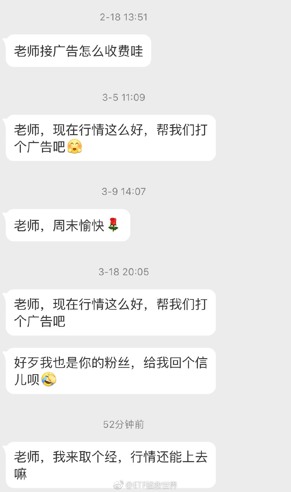

======================================================

ETF拯救世界 (5687069307) @
2019-03-26 15:34:15 Tue  
url: https://weibo.com/5687069307/HmHO9Aifi

回复@Aircdre:每天十几个要打广告的回不过来//@Aircdre:E大就回人家个消息吧[笑cry]

------------------------------------------------------
转推：
>  @ETF拯救世界 (5687069307)
>  2019-03-26 15:27:10 Tue  
>  url: https:/weibo.com/5687069307/HmHLhmE2R/

>  万万没想到广告商已经不关心投广告的事了… ​​​

转发[13]  评论[104]  赞[364] 

======================================================

ETF拯救世界 (5687069307) @
2019-03-26 19:44:05 Tue  
url: https://weibo.com/5687069307/HmJrzkMu9

回复@小w今天吃鸡了吗:这个可以有。免费！//@小w今天吃鸡了吗:[乔治][乔治]可以打征婚广告吗 e大[嘻嘻][嘻嘻][嘻嘻][嘻嘻]//@ETF拯救世界:回复@Aircdre:每天十几个要打广告的回不过来//@Aircdre:E大就回人家个消息吧[笑cry]

------------------------------------------------------
转推：
>  @ETF拯救世界 (5687069307)
>  2019-03-26 15:27:10 Tue  
>  url: https:/weibo.com/5687069307/HmHLhmE2R/

>  万万没想到广告商已经不关心投广告的事了… ​​​

转发[7]  评论[94]  赞[273] 

======================================================

ETF拯救世界 (5687069307) @
2019-03-26 20:05:26 Tue  
url: https://weibo.com/5687069307/HmJAewbqE

回复@4-water:不好说。还有几十个喷子也天天刷，好姑娘让他们骗走了怎么办//@4-water:在这里征婚比较靠谱的 起码大家都踏踏实实的//@ETF拯救世界:回复@小w今天吃鸡了吗:这个可以有。免费！//@小w今天吃鸡了吗:[乔治][乔治]可以打征婚广告吗 e大[嘻嘻][嘻嘻][嘻嘻][嘻嘻]

------------------------------------------------------
转推：
>  @ETF拯救世界 (5687069307)
>  2019-03-26 15:27:10 Tue  
>  url: https:/weibo.com/5687069307/HmHLhmE2R/

>  万万没想到广告商已经不关心投广告的事了… ​​​

转发[4]  评论[233]  赞[391] 

======================================================

ETF拯救世界 (5687069307) @
2019-03-27 14:30:35 Wed  
url: https://weibo.com/5687069307/HmQOOhNrv

大道相通 ​​​

转发[50]  评论[149]  赞[530] 

+++++++++++++++++++++++++++++++++++++++++++++++++++++

图片：
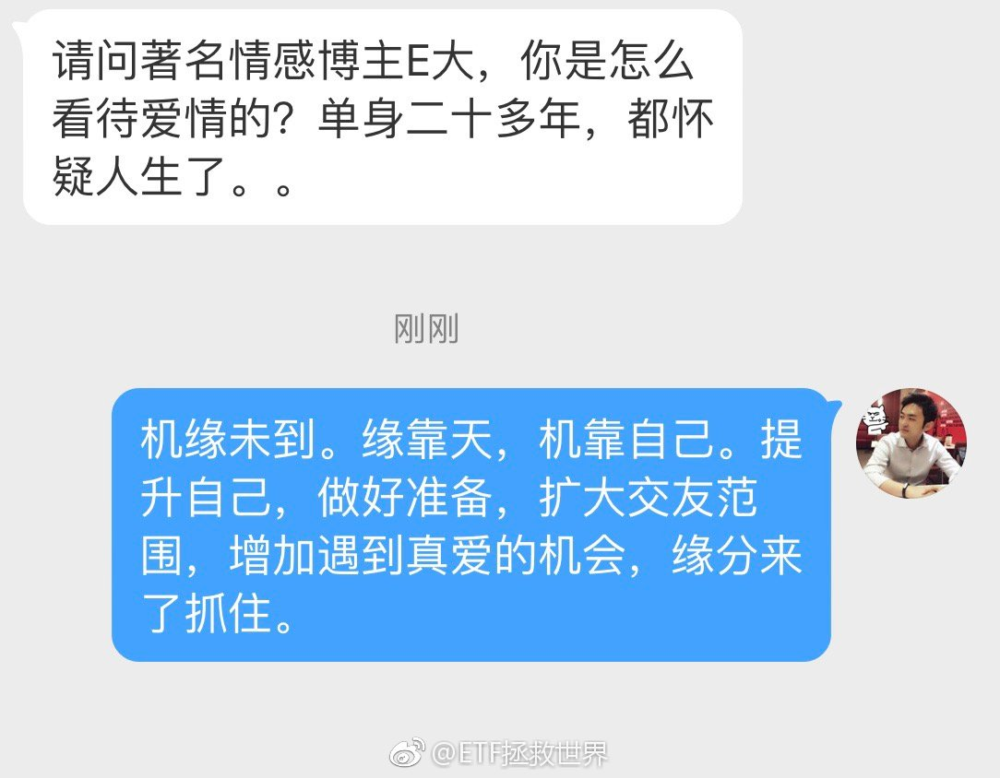

======================================================

ETF拯救世界 (5687069307) @
2019-03-27 14:35:22 Wed  
url: https://weibo.com/5687069307/HmQQL8EsR

还有一条忘了说，不要在网上做喷子，否则孤老一生。

------------------------------------------------------
转推：
>  @ETF拯救世界 (5687069307)
>  2019-03-27 14:30:35 Wed  
>  url: https:/weibo.com/5687069307/HmQOOhNrv/

>  大道相通 ​​​

转发[36]  评论[78]  赞[449] 

======================================================

ETF拯救世界 (5687069307) @
2019-03-27 14:44:13 Wed  
url: https://weibo.com/5687069307/HmQUlBaCB

回复@ETF漂洋过海来看你:对。但是去年柳叶刀有篇论文，说84.6%的喷子*生活不协调。所以单身与否不是关键，关键是很痛苦的孤老终生…//@ETF漂洋过海来看你:喷子未必单身呢，施主…[doge]//@ETF拯救世界:还有一条忘了说，不要在网上做喷子，否则孤老一生。

------------------------------------------------------
转推：
>  @ETF拯救世界 (5687069307)
>  2019-03-27 14:30:35 Wed  
>  url: https:/weibo.com/5687069307/HmQOOhNrv/

>  大道相通 ​​​

转发[28]  评论[157]  赞[415] 

======================================================

ETF拯救世界 (5687069307) @
2019-03-27 19:05:07 Wed  
url: https://weibo.com/5687069307/HmSCf9ZA7

回复@HU傻胖:不知道你用笔电是干嘛用的。我用过的笔记本也算多了，mac pro，IBM，华硕，sony……然而我现在最喜欢用的居然是surface。如果不是它的平板模式真的有点差，简直值得推荐。当然，即使不是平板模式，也不适合玩游戏//@HU傻胖:请教各位，手提电脑，买哪个好一点

------------------------------------------------------
转推：
>  @ETF拯救世界 (5687069307)
>  2019-03-27 14:30:35 Wed  
>  url: https:/weibo.com/5687069307/HmQOOhNrv/

>  大道相通 ​​​

转发[18]  评论[163]  赞[289] 

======================================================

ETF拯救世界 (5687069307) @
2019-03-27 19:12:49 Wed  
url: https://weibo.com/5687069307/HmSFmFmQ0

刚才一位朋友私信我让我帮转提醒大家。学习了。

------------------------------------------------------
转推：
>  @ ()
>  2019-03-27 04:38:57 Wed  
>  url: 

>  抱歉，此微博已被作者删除。查看帮助：http://t.cn/Rfd3rQV

转发[245]  评论[174]  赞[567] 

======================================================

ETF拯救世界 (5687069307) @
2019-03-28 06:50:51 Thu  
url: https://weibo.com/5687069307/HmXeI1YHU

确认了，哥们是真的喜欢当老师

------------------------------------------------------
转推：
>  @新财富杂志 (1708922835)
>  2019-03-27 23:35:03 Wed  
>  url: https:/weibo.com/1708922835/HmUnOf8o8/

>  【马云最新演讲：决定你一生成就的，是这2件事】看到别人看不到的事，做别人不想做的事，你才能创造更多价值。而普通人如何做到这2点，才能在职业生涯中获得更多发展机会？马云说：敢不切实际地妄想，才敢不顾一切地努力；很傻很天真，一门心思做好一件事儿；看到别人看不到的事，做别人不想做的事，决 ​​​

转发[35]  评论[183]  赞[429] 

======================================================

ETF拯救世界 (5687069307) @
2019-03-28 10:46:35 Thu  
url: https://weibo.com/5687069307/HmYMo0fI1

买个门票股也这么糟心。

退博了。

[摊手] ​​​

转发[10]  评论[167]  赞[592] 

======================================================

ETF拯救世界 (5687069307) @
2019-03-28 10:49:13 Thu  
url: https://weibo.com/5687069307/HmYNsbtXI

忙了一上午。中午发车啊老铁们。 ​​​

转发[31]  评论[957]  赞[1430] 

======================================================

ETF拯救世界 (5687069307) @
2019-03-28 14:51:31 Thu  
url: https://weibo.com/5687069307/Hn0nO13wK

A股不跌到位，计划一分钱也不买。[笑而不语] ​​​

转发[26]  评论[407]  赞[1230] 

======================================================

ETF拯救世界 (5687069307) @
2019-03-28 19:12:59 Thu  
url: https://weibo.com/5687069307/Hn25W236Y

后悔没用，但是要努力改变结果！ ​​​

转发[25]  评论[415]  赞[686] 

+++++++++++++++++++++++++++++++++++++++++++++++++++++

图片：
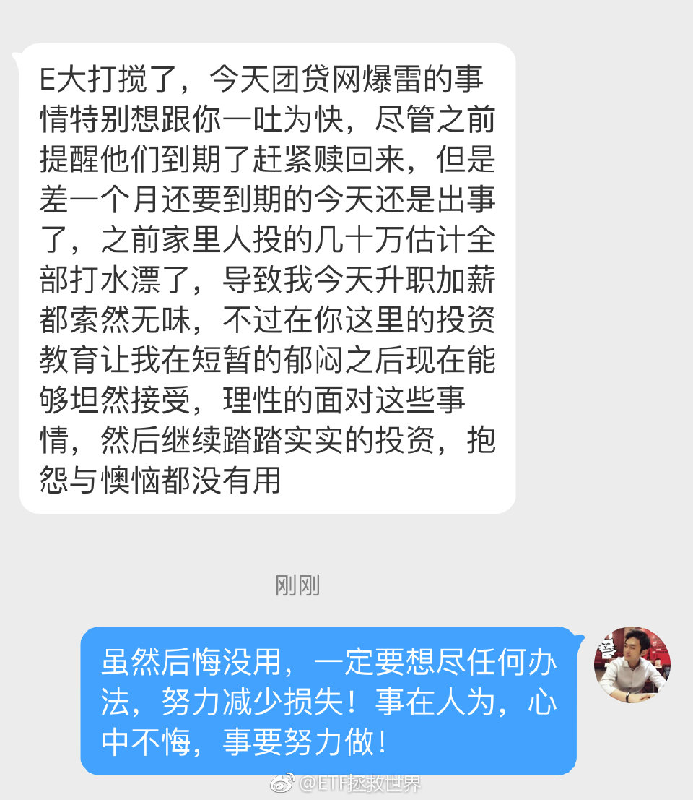

======================================================

ETF拯救世界 (5687069307) @
2019-03-29 09:29:19 Fri  
url: https://weibo.com/5687069307/Hn7HweknQ

有10个人非常关心今天收盘点位…… ​​​

转发[2]  评论[242]  赞[639] 

======================================================

ETF拯救世界 (5687069307) @
2019-03-29 09:45:54 Fri  
url: https://weibo.com/5687069307/Hn7OfrZL1

$162411  油气是个乖孩子…… ​​​

转发[4]  评论[126]  赞[576] 

======================================================

ETF拯救世界 (5687069307) @
2019-03-29 10:32:15 Fri  
url: https://weibo.com/5687069307/Hn874nc3n

为什么我只敢买交易所的标准化产品，而且是不死的那种。

很简单。

其它品种投少了，改变不了什么，没有意义。投多了，风险太大。辛辛苦苦攒了十几年的钱瞬间就没了，这个我接受不了。

还是指数基金适合我。除非所有持有的1000家公司同时崩盘，除非交易所关门，否则就死不了。

死不了就有办法挣钱。 ​​​

转发[151]  评论[285]  赞[898] 

======================================================

ETF拯救世界 (5687069307) @
2019-03-29 10:37:09 Fri  
url: https://weibo.com/5687069307/Hn893AsHU

回复@薏仁之梦:德国买了就不要看了，十年后再说。//@薏仁之梦:请问E大，德国dax多少点进入高估呢？

------------------------------------------------------
转推：
>  @ETF拯救世界 (5687069307)
>  2019-03-29 10:32:15 Fri  
>  url: https:/weibo.com/5687069307/Hn874nc3n/

>  为什么我只敢买交易所的标准化产品，而且是不死的那种。
>  
>  很简单。
>  
>  其它品种投少了，改变不了什么，没有意义。投多了，风险太大。辛辛苦苦攒了十几年的钱瞬间就没了，这个我接受不了。
>  
>  还是指数基金适合我。除非所有持有的1000家公司同时崩盘，除非交易所关门，否则就死不了。
>  
>  死不了就有办法挣钱。 ​​​

转发[32]  评论[234]  赞[569] 

======================================================

ETF拯救世界 (5687069307) @
2019-03-29 11:39:45 Fri  
url: https://weibo.com/5687069307/Hn8yt7M8m

今年50%也不是不可能啊 ​​​

转发[14]  评论[336]  赞[920] 

======================================================

ETF拯救世界 (5687069307) @
2019-03-29 12:27:57 Fri  
url: https://weibo.com/5687069307/Hn8S1w4Ie

有了解的说说 ​​​

转发[12]  评论[216]  赞[333] 

+++++++++++++++++++++++++++++++++++++++++++++++++++++

图片：
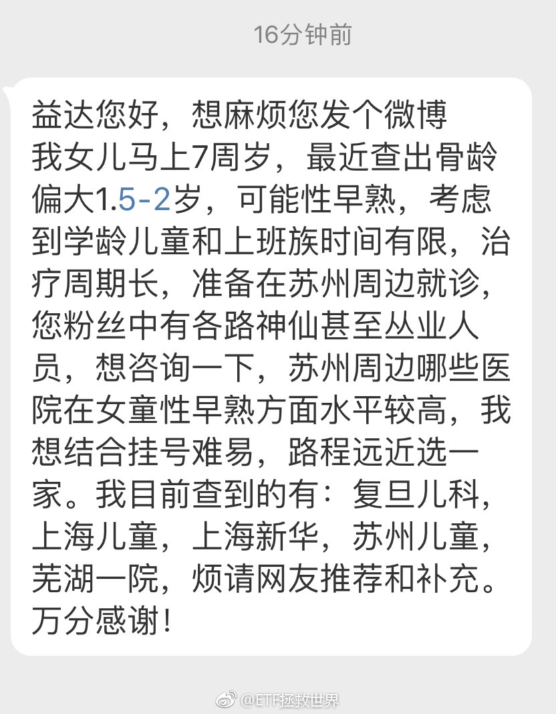

======================================================

ETF拯救世界 (5687069307) @
2019-03-29 15:42:02 Fri  
url: https://weibo.com/5687069307/Hna8Oi2vH

继续。我们的医药

------------------------------------------------------
转推：
>  @ETF拯救世界 (5687069307)
>  2019-03-22 14:12:58 Fri  
>  url: https:/weibo.com/5687069307/Hm5zb3wTV/

>  对每天新高的指数毫无抵抗力。
>  
>  $全指医药 sh000991$ ​​​

转发[1]  评论[105]  赞[466] 

======================================================

ETF拯救世界 (5687069307) @
2019-03-29 15:44:37 Fri  
url: https://weibo.com/5687069307/Hna9Rl0EB

一张图告诉你为什么最近没有打卡 ​​​

转发[3]  评论[142]  赞[560] 

+++++++++++++++++++++++++++++++++++++++++++++++++++++

图片：
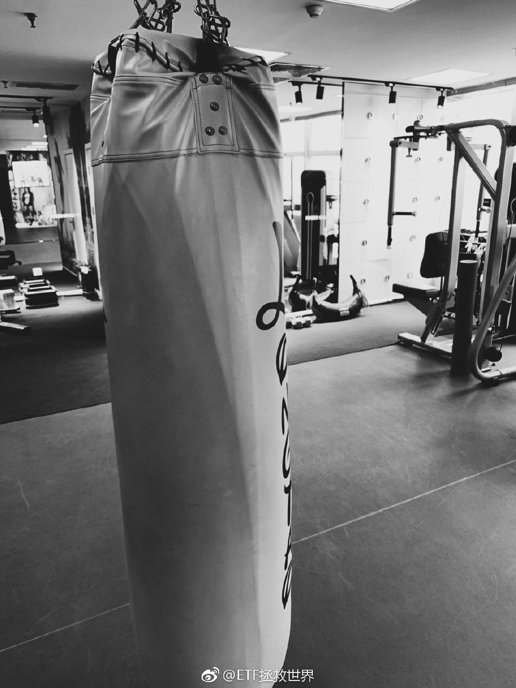

======================================================

ETF拯救世界 (5687069307) @
2019-03-29 16:04:00 Fri  
url: https://weibo.com/5687069307/HnahICKDn

回复@鸟语花香1227:初中谈恋爱是性早熟？我一直觉得很正常啊…//@鸟语花香1227:回复@小小6_6:大体就是孩子过早接触一些时尚，成人化的东西，易导致性早熟，所以现在小学初中不少谈恋爱的。性早熟并不都是吃出来的，心理早熟与现在的网络手机普及有很大关系。

------------------------------------------------------
转推：
>  @ETF拯救世界 (5687069307)
>  2019-03-29 12:27:57 Fri  
>  url: https:/weibo.com/5687069307/Hn8S1w4Ie/

>  有了解的说说 ​​​

转发[3]  评论[104]  赞[265] 

======================================================

ETF拯救世界 (5687069307) @
2019-03-29 16:12:26 Fri  
url: https://weibo.com/5687069307/Hnal92tWr

今天收盘点位3090，根据抽奖规则，请微信的“王赤峰”朋友在公众号给我发私信联系我，我要送你礼物。

有时候你不能不相信这个世界有天意这回事。他是打赏最多的人… ​​​

转发[8]  评论[410]  赞[1128] 

======================================================

ETF拯救世界 (5687069307) @
2019-03-29 17:44:07 Fri  
url: https://weibo.com/5687069307/HnaWmgcCY

装修的时候做了一套全屋定制，因为比较贵，怎么想都觉得要把钱赚回来。

然后就买了那家公司的股票。

后来跌了10%，也没在意。

今天一看，已经涨了40%了……赚了两套全屋定制的钱…… ​​​

转发[94]  评论[278]  赞[857] 

======================================================

ETF拯救世界 (5687069307) @
2019-03-29 18:28:52 Fri  
url: https://weibo.com/5687069307/HnbewnF89

回复@godreameng:这个思路没错。把经常消费的经常使用的公司做个组合，要比那些你根本不知道干嘛的热门股靠谱的多。当然，如果在钻石坑里买胜算就更大，还要看价值//@godreameng:我应该多配置点消费和医药，医疗股票。毕竟每年都要消费很多，花不少钱在医院。

------------------------------------------------------
转推：
>  @ETF拯救世界 (5687069307)
>  2019-03-29 17:44:07 Fri  
>  url: https:/weibo.com/5687069307/HnaWmgcCY/

>  装修的时候做了一套全屋定制，因为比较贵，怎么想都觉得要把钱赚回来。
>  
>  然后就买了那家公司的股票。
>  
>  后来跌了10%，也没在意。
>  
>  今天一看，已经涨了40%了……赚了两套全屋定制的钱…… ​​​

转发[48]  评论[104]  赞[486] 

======================================================

ETF拯救世界 (5687069307) @
2019-03-29 21:20:49 Fri  
url: https://weibo.com/5687069307/HncmjwoiG

以后不打卡keep了。找了个健身会所，请了私教，玩就玩的专业点。

以后每天11点前睡觉，美股不看了，命比钱重要…… ​​​

转发[12]  评论[253]  赞[1016] 

======================================================

ETF拯救世界 (5687069307) @
2019-03-29 21:37:57 Fri  
url: https://weibo.com/5687069307/Hncth1XC4

谢谢老铁，666 ​​​

转发[95]  评论[116]  赞[558] 

+++++++++++++++++++++++++++++++++++++++++++++++++++++

图片：
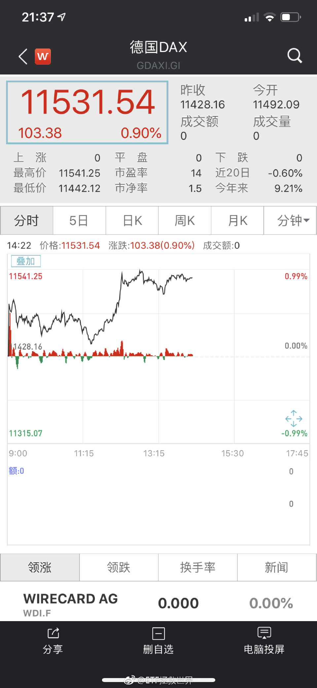

======================================================

ETF拯救世界 (5687069307) @
2019-03-29 21:54:53 Fri  
url: https://weibo.com/5687069307/HncA9nh5E

回复@Naywssl:没在150里面。记住，S里面的，跌的越狠越好。150已经没有什么力量去大幅补仓了。S不同。S的任何品种都应该希望暴跌。//@Naywssl:黄金跌了[跪了]

------------------------------------------------------
转推：
>  @ETF拯救世界 (5687069307)
>  2019-03-29 21:37:57 Fri  
>  url: https:/weibo.com/5687069307/Hncth1XC4/

>  谢谢老铁，666 ​​​

转发[82]  评论[75]  赞[427] 

======================================================

ETF拯救世界 (5687069307) @
2019-03-29 21:59:45 Fri  
url: https://weibo.com/5687069307/HncC80fM2

回复@小五雀雀:S是家里有矿无限投入型。任何大跌都没在怕的。150是资产配置型，讲究稳中求进，不断新高。//@小五雀雀:S是激进型[doge]//@ETF拯救世界:回复@Naywssl:没在150里面。记住，S里面的，跌的越狠越好。150已经没有什么力量去大幅补仓了。S不同。S的任何品种都应该希望暴跌。

------------------------------------------------------
转推：
>  @ETF拯救世界 (5687069307)
>  2019-03-29 21:37:57 Fri  
>  url: https:/weibo.com/5687069307/Hncth1XC4/

>  谢谢老铁，666 ​​​

转发[52]  评论[112]  赞[500] 

======================================================

ETF拯救世界 (5687069307) @
2019-03-30 07:28:14 Sat  
url: https://weibo.com/5687069307/HngkRFh5O

赚钱的附带效应，是帮很多朋友家庭更加幸福了…我是真的很高兴。

不过一定沟通好，以后某个时间段有波动利润下降，不要太在意，别影响夫妻关系… ​​​

转发[12]  评论[322]  赞[923] 

+++++++++++++++++++++++++++++++++++++++++++++++++++++

图片：
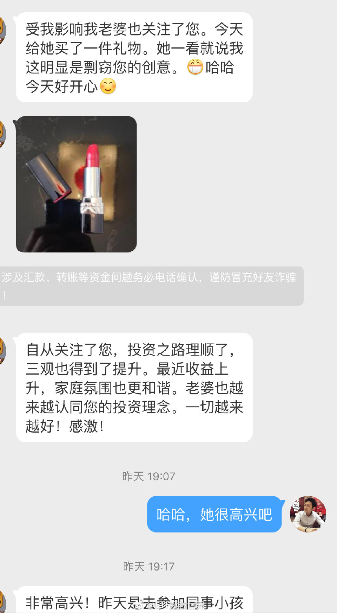

======================================================

ETF拯救世界 (5687069307) @
2019-03-30 11:23:58 Sat  
url: https://weibo.com/5687069307/HnhSyfrjY

回复@H_Old_En_me:回复的一个都没回到点上。请这位朋友注意，不同策略开始时间不同，年化收益的不同。我是在牛市最高点开始的，你再看看其它策略开始时间。建议你对比跑赢同期指数幅度判断//@H_Old_En_me:你们这么捧吗都。我看且慢策略里跑赢e大的好几个呢。

------------------------------------------------------
转推：
>  @ETF拯救世界 (5687069307)
>  2019-03-30 07:28:14 Sat  
>  url: https:/weibo.com/5687069307/HngkRFh5O/

>  赚钱的附带效应，是帮很多朋友家庭更加幸福了…我是真的很高兴。
>  
>  不过一定沟通好，以后某个时间段有波动利润下降，不要太在意，别影响夫妻关系… ​​​

转发[2]  评论[62]  赞[447] 

======================================================

ETF拯救世界 (5687069307) @
2019-03-30 11:37:07 Sat  
url: https://weibo.com/5687069307/HnhXTcszB

这么说吧，如果把计算计划收益率的时间前移两年，从第二轮计划开始算，那么至今6年总收益就会到180%+，年化收益率19%+。 同期沪深300涨幅58%，中证500涨幅53%。

但这样有意思吗？没意思。事后找个低点开始把数字做的好看了有什么意义？

把开始时间不同的策略放在一起比较年化收益率本来就是非常可笑 ​​​

转发[88]  评论[240]  赞[903] 

======================================================

ETF拯救世界 (5687069307) @
2019-03-30 11:52:15 Sat  
url: https://weibo.com/5687069307/Hni4279Tr

我其实不了解P平台，原来这是一个大平台，原来这么多V推荐过。

赚钱没错，但是要讲良心。 ​​​

转发[48]  评论[328]  赞[630] 

+++++++++++++++++++++++++++++++++++++++++++++++++++++

图片：
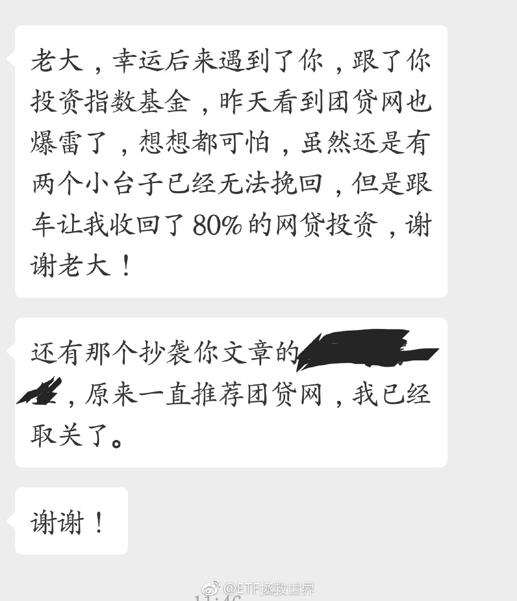

======================================================

ETF拯救世界 (5687069307) @
2019-03-30 11:56:32 Sat  
url: https://weibo.com/5687069307/Hni5M09Q4

回复@IVnHSnM:一个“粉丝”虽然只是屏幕上一个数字，一个二十万分之一的数字，但每个数字后面都是一个真实的家庭和一个家庭的血汗钱。想到这个，有些钱怎么可能去赚？//@IVnHSnM:你一直说的底线，有的钱不能赚。

------------------------------------------------------
转推：
>  @ETF拯救世界 (5687069307)
>  2019-03-30 11:52:15 Sat  
>  url: https:/weibo.com/5687069307/Hni4279Tr/

>  我其实不了解P平台，原来这是一个大平台，原来这么多V推荐过。
>  
>  赚钱没错，但是要讲良心。 ​​​

转发[18]  评论[260]  赞[906] 

======================================================

ETF拯救世界 (5687069307) @
2019-03-31 19:32:59 Sun  
url: https://weibo.com/5687069307/HnuvxsUtK

看了不少私信，一个感觉：

结婚一定要找三观一致的人。否则非常痛苦。

仅是金融投资一项，如果三观不同就能闹得鸡飞狗跳。

如果实在不能统一思想，就各管一部分钱吧。还是不行，就藏点私房钱自己投资。 ​​​

转发[60]  评论[372]  赞[814] 

======================================================

ETF拯救世界 (5687069307) @
2019-03-31 21:23:40 Sun  
url: https://weibo.com/5687069307/Hnvet48eg

那些等着经济走好再投资的人，终于等到数据走好了，股市却已经涨了三五十。

这话去年底我说，你可能不信。现在有没有一点理解了？

事情都变好再投资，凭什么你赚钱？凭什么啊。 ​​​

转发[220]  评论[192]  赞[861] 

======================================================

ETF拯救世界 (5687069307) @
2019-03-31 22:09:24 Sun  
url: https://weibo.com/5687069307/Hnvx2jjn0

回复@愿赌服输K:照你这么说，仓位控制和高抛低吸完全没有意义。只要不满仓就没资格和指数比，是这个意思吗。择时的胜利完全没有意义对吗

------------------------------------------------------
转推：
>  @ETF拯救世界 (5687069307)
>  2019-03-30 11:37:07 Sat  
>  url: https:/weibo.com/5687069307/HnhXTcszB/

>  这么说吧，如果把计算计划收益率的时间前移两年，从第二轮计划开始算，那么至今6年总收益就会到180%+，年化收益率19%+。 同期沪深300涨幅58%，中证500涨幅53%。
>  
>  但这样有意思吗？没意思。事后找个低点开始把数字做的好看了有什么意义？
>  
>  把开始时间不同的策略放在一起比较年化收益率本来就是非常可笑 ​​​

转发[3]  评论[39]  赞[340] 

======================================================

ETF拯救世界 (5687069307) @
2019-03-31 22:19:42 Sun  
url: https://weibo.com/5687069307/HnvBda8uO

有人说，熊市分批建仓不公平。我看，是他根本没有深入思考计划到底是什么。

我们的150可不是资金无限的买。而是限定资金，你完全可以把它当作一只基金。

你以为2015年最高区域卖掉第二轮没有风险吗？你以为那个时候卖就一定跑赢指数吗？不好意思，如果真的这样，为什么绝大多数人没跑？

就好像在300 ​​​

转发[181]  评论[238]  赞[794] 

======================================================

ETF拯救世界 (5687069307) @
2019-03-31 22:26:29 Sun  
url: https://weibo.com/5687069307/HnvDYdYVR

最可笑的是什么，最可笑的是2018见底以后，叉着腰说：

我把所有资金分成36个月，投三年收益率也不错啊。

喷了，你2015年的时候怎么不说分三年呢？我看你的资金根本就没跑出来才对吧。

不如你说说，从2019年开始，你的资金分成多少份定投好不好？ ​​​

转发[22]  评论[175]  赞[595] 

======================================================

ETF拯救世界 (5687069307) @
2019-04-01 07:21:03 Mon  
url: https://weibo.com/5687069307/Hnz8WcCSv

这么看同事孩子考上康奈尔真是很出色。

------------------------------------------------------
转推：
>  @闻风教育直播 (1826854303)
>  2019-03-31 09:28:19 Sun  
>  url: https:/weibo.com/1826854303/Hnqy6uzO8/

>  3月28日，被世界公认的美国最顶尖也最难上的8所“常青藤盟校”——哈佛大学、耶鲁大学、普林斯顿大学、哥伦比亚大学、宾夕法尼亚大学、达特茅斯学院、布朗大学、康奈尔大学发布2019年录取结果。北京的学生有70人中选，创全国之最。录进哈佛大学的中国有4人，其中北京占3个、上海占1个。最突出的是北京 ​​​

转发[33]  评论[94]  赞[375] 

======================================================

ETF拯救世界 (5687069307) @
2019-04-01 08:28:24 Mon  
url: https://weibo.com/5687069307/HnzAhrN1d

回复@aaronnju:股票市场绝大多数时间是先行指标。对于经济最敏感的是债市，其次就是股市。//@aaronnju:话说我们现在经济貌似也没好转呀，还在不断地裁员。难道是说，股市都提前预报市场么？

------------------------------------------------------
转推：
>  @ETF拯救世界 (5687069307)
>  2019-03-31 21:23:40 Sun  
>  url: https:/weibo.com/5687069307/Hnvet48eg/

>  那些等着经济走好再投资的人，终于等到数据走好了，股市却已经涨了三五十。
>  
>  这话去年底我说，你可能不信。现在有没有一点理解了？
>  
>  事情都变好再投资，凭什么你赚钱？凭什么啊。 ​​​

转发[108]  评论[94]  赞[435] 

======================================================

ETF拯救世界 (5687069307) @
2019-04-01 08:49:41 Mon  
url: https://weibo.com/5687069307/HnzIVf2s3

最新150配置图。成熟市场和商品开始增加。买的还远远不够。

A股部分除非再次出现钻石买点，否则不会再加。但是有可能会进行调仓和平衡。 ​​​

转发[234]  评论[209]  赞[761] 

+++++++++++++++++++++++++++++++++++++++++++++++++++++

图片：
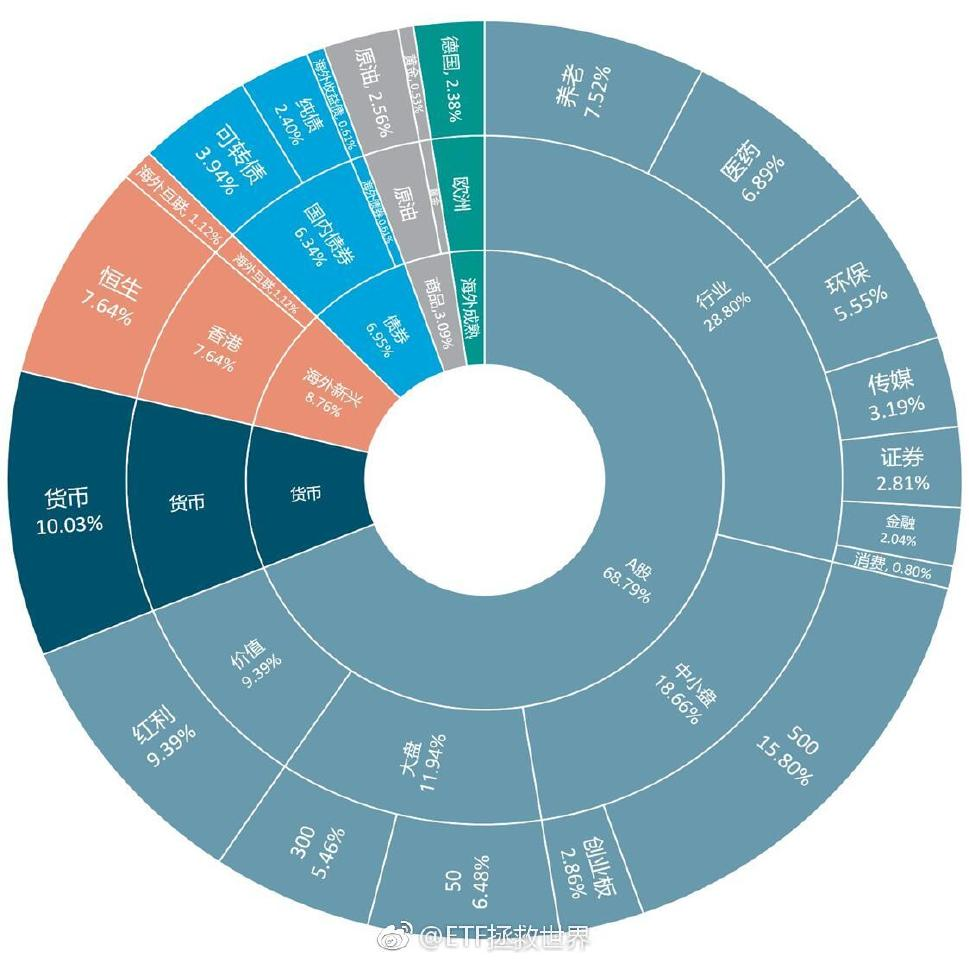

======================================================

ETF拯救世界 (5687069307) @
2019-04-01 09:18:04 Mon  
url: https://weibo.com/5687069307/HnzUrnqxV

回复@sven119:本质上没有区别。只要是投资，本质上就是赌博。但我们之所以投资指数基金而不去澳门的原因，是因为指数投资可以计算概率，绝大多数赌博不能。所以我们在胜率大的时候买指数基金，很难不赚钱。//@sven119:媳妇问我 指数基金和赌博有什么区别，一时间竟然不知道该怎么回答

------------------------------------------------------
转推：
>  @ETF拯救世界 (5687069307)
>  2019-04-01 08:49:41 Mon  
>  url: https:/weibo.com/5687069307/HnzIVf2s3/

>  最新150配置图。成熟市场和商品开始增加。买的还远远不够。
>  
>  A股部分除非再次出现钻石买点，否则不会再加。但是有可能会进行调仓和平衡。 ​​​

转发[67]  评论[83]  赞[418] 

======================================================

ETF拯救世界 (5687069307) @
2019-04-01 09:34:41 Mon  
url: https://weibo.com/5687069307/HnA1bchev

什么事情不是赌博呢，几乎你只要做任何事情都是赌博。

小到出门还是在家更加安全，大到你做什么职业，与哪个人结婚，你的钱是存在银行、买债券、买股票、买期货还是买p 2 p。

都是在赌博。

有的人之所以人生比较顺，很大原因是在每个十字路口愿意理性思考哪个选择获胜的概率大一点。然后，根据规则 ​​​

转发[309]  评论[232]  赞[862] 

======================================================

ETF拯救世界 (5687069307) @
2019-04-01 09:36:00 Mon  
url: https://weibo.com/5687069307/HnA1IE1MT

继续新高，即将回到10000点。

------------------------------------------------------
转推：
>  @ETF拯救世界 (5687069307)
>  2019-03-22 14:12:58 Fri  
>  url: https:/weibo.com/5687069307/Hm5zb3wTV/

>  对每天新高的指数毫无抵抗力。
>  
>  $全指医药 sh000991$ ​​​

转发[6]  评论[70]  赞[477] 

======================================================

ETF拯救世界 (5687069307) @
2019-04-01 09:45:09 Mon  
url: https://weibo.com/5687069307/HnA5rowRD

回头看，几乎每个品种跌到大底的时候，都会有非常非常多的噪音出现。有时候我会拉黑一些人，我不是说你没有提出反对意见的权利，而是对我来说，你是噪音。除了耽误我的时间没有任何意义。最重要的，你的存在会让很多本来可以赚钱的朋友在底部被你吓得卖掉便宜筹码。我不能不拉黑，也请这些朋友理解。

------------------------------------------------------
转推：
>  @ETF拯救世界 (5687069307)
>  2018-12-17 10:11:59 Mon  
>  url: https:/weibo.com/5687069307/H7CobBT5D/

>  评论里没完没了问医药的那些人我跟你说几点，你能理解就理解，不能理解赶紧取关走人。
>  
>  第一，医药是我最看好的行业。
>  
>  第二，目前计划内医药仓位9个多点（医药6%+养老3%），目标仓位最大给15%-20%。不跌我们永远没机会配满。
>  
>  第三，目前医药估值过去十三年新低。
>  
>  第四，目前医药跌至十三年大趋势下 ​​​

转发[79]  评论[82]  赞[612] 

======================================================

ETF拯救世界 (5687069307) @
2019-04-01 09:57:55 Mon  
url: https://weibo.com/5687069307/HnAaBERuw

回复@深白浅黑NestoR:一个人被拉黑，就很容易“恨”你。如果有人恨你，你就要小心，不知道会在哪里给你扎刀子，射冷箭。而且，恨的时效性比爱要久。我们很难爱一个人一辈子，但很容易恨一个人到有一个人先走那一天。我不希望有很多人恨我，所以希望他们理解。

------------------------------------------------------
转推：
>  @ETF拯救世界 (5687069307)
>  2018-12-17 10:11:59 Mon  
>  url: https:/weibo.com/5687069307/H7CobBT5D/

>  评论里没完没了问医药的那些人我跟你说几点，你能理解就理解，不能理解赶紧取关走人。
>  
>  第一，医药是我最看好的行业。
>  
>  第二，目前计划内医药仓位9个多点（医药6%+养老3%），目标仓位最大给15%-20%。不跌我们永远没机会配满。
>  
>  第三，目前医药估值过去十三年新低。
>  
>  第四，目前医药跌至十三年大趋势下 ​​​

转发[15]  评论[39]  赞[422] 

======================================================

ETF拯救世界 (5687069307) @
2019-04-01 10:00:35 Mon  
url: https://weibo.com/5687069307/HnAbHF8Ns

回复@吃肉不吃蒜2019:“指数太慢”。喷了。毕竟每个人都是牛市翻十倍的股神。//@吃肉不吃蒜2019:E大，既然指数基金是最适合普通人的，为什么大部分人还是投资个股呢

------------------------------------------------------
转推：
>  @ETF拯救世界 (5687069307)
>  2019-04-01 09:34:41 Mon  
>  url: https:/weibo.com/5687069307/HnA1bchev/

>  什么事情不是赌博呢，几乎你只要做任何事情都是赌博。
>  
>  小到出门还是在家更加安全，大到你做什么职业，与哪个人结婚，你的钱是存在银行、买债券、买股票、买期货还是买p 2 p。
>  
>  都是在赌博。
>  
>  有的人之所以人生比较顺，很大原因是在每个十字路口愿意理性思考哪个选择获胜的概率大一点。然后，根据规则 ​​​

转发[16]  评论[62]  赞[388] 

======================================================

ETF拯救世界 (5687069307) @
2019-04-01 10:05:38 Mon  
url: https://weibo.com/5687069307/HnAdKsOk9

回复@可能是个最差的程序员了:“创造价值”，包括通胀，也都是指数投资增加胜率的因子。你还没有思考到本质，还在比较浅的地方。继续往下想。//@可能是个最差的程序员了:赌博和投资有本质区别，赌博只是资产转移，投资可以创造价值

------------------------------------------------------
转推：
>  @ETF拯救世界 (5687069307)
>  2019-04-01 08:49:41 Mon  
>  url: https:/weibo.com/5687069307/HnzIVf2s3/

>  最新150配置图。成熟市场和商品开始增加。买的还远远不够。
>  
>  A股部分除非再次出现钻石买点，否则不会再加。但是有可能会进行调仓和平衡。 ​​​

转发[25]  评论[66]  赞[331] 

======================================================

ETF拯救世界 (5687069307) @
2019-04-01 10:09:43 Mon  
url: https://weibo.com/5687069307/HnAfpgBqR

今天又是72%的股票跑输500。

不知道大多数认为自己选股能力强的朋友自信来自于哪里。 ​​​

转发[72]  评论[132]  赞[638] 

======================================================

ETF拯救世界 (5687069307) @
2019-04-01 10:11:27 Mon  
url: https://weibo.com/5687069307/HnAg7jZgm

回复@萩落依零:不知道借了多少。不过我认为你不应该那么轻易帮着把钱还了，想办法让你弟弟知道问题的严重性再帮他。希望你不要成为樊胜美。

------------------------------------------------------
转推：
>  @ETF拯救世界 (5687069307)
>  2019-03-30 11:52:15 Sat  
>  url: https:/weibo.com/5687069307/Hni4279Tr/

>  我其实不了解P平台，原来这是一个大平台，原来这么多V推荐过。
>  
>  赚钱没错，但是要讲良心。 ​​​

转发[6]  评论[64]  赞[337] 

======================================================

ETF拯救世界 (5687069307) @
2019-04-01 10:29:17 Mon  
url: https://weibo.com/5687069307/HnAnlz9O9

建议不要看账户了。

没意义。

反正每天多那么多钱，大家都麻木了。

想想怎么花吧…… ​​​

转发[32]  评论[396]  赞[959] 

======================================================

ETF拯救世界 (5687069307) @
2019-04-01 10:30:44 Mon  
url: https://weibo.com/5687069307/HnAnWdXvf

回复@贸易小哥:雪球很有价值。但噪音的数量是有价值声音的10倍。评论里噪音更多，是100倍。//@贸易小哥:那段时间确实很黑暗，雪球上也是一堆不看好医药行业的，还好有E大[并不简单]

------------------------------------------------------
转推：
>  @ETF拯救世界 (5687069307)
>  2018-12-17 10:11:59 Mon  
>  url: https:/weibo.com/5687069307/H7CobBT5D/

>  评论里没完没了问医药的那些人我跟你说几点，你能理解就理解，不能理解赶紧取关走人。
>  
>  第一，医药是我最看好的行业。
>  
>  第二，目前计划内医药仓位9个多点（医药6%+养老3%），目标仓位最大给15%-20%。不跌我们永远没机会配满。
>  
>  第三，目前医药估值过去十三年新低。
>  
>  第四，目前医药跌至十三年大趋势下 ​​​

转发[29]  评论[71]  赞[470] 

======================================================

ETF拯救世界 (5687069307) @
2019-04-01 10:50:11 Mon  
url: https://weibo.com/5687069307/HnAvPw8Ya

很多人认为在牛市里赚大钱是必然发生的。

sorry，真不是。记不记得前几天我统计，三个月换手150%？

进进出出，错过了几个大涨的日子，很多人这一波根本没赚几个大子。信不信由你。 ​​​

转发[92]  评论[297]  赞[1013] 

======================================================

ETF拯救世界 (5687069307) @
2019-04-01 14:22:22 Mon  
url: https://weibo.com/5687069307/HnBTXkVnd

这种事情少干 ​​​

转发[11]  评论[111]  赞[499] 

+++++++++++++++++++++++++++++++++++++++++++++++++++++

图片：
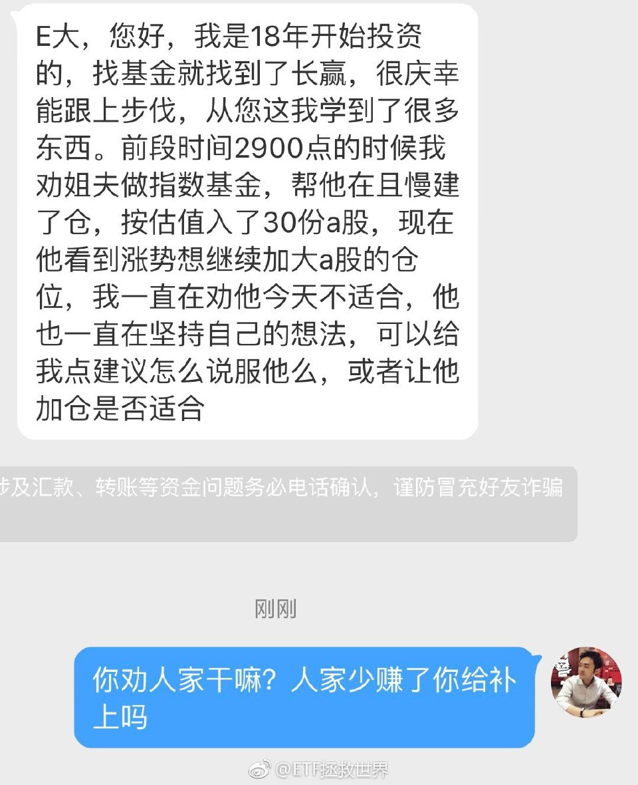

======================================================

ETF拯救世界 (5687069307) @
2019-04-01 14:31:08 Mon  
url: https://weibo.com/5687069307/HnBXw7KDW

回复@谁喷益达我抽谁:付费提问才是发财机会吧。如果我回答谁的问题谁至少赚3000，可惜，我一年只回答两个。[爱你]//@谁喷益达我抽谁:中奖了 啊  免费提问被EDA回复  正常100多块钱吧

------------------------------------------------------
转推：
>  @ETF拯救世界 (5687069307)
>  2019-04-01 14:22:22 Mon  
>  url: https:/weibo.com/5687069307/HnBTXkVnd/

>  这种事情少干 ​​​

转发[3]  评论[48]  赞[403] 

======================================================

ETF拯救世界 (5687069307) @
2019-04-01 14:38:26 Mon  
url: https://weibo.com/5687069307/HnC0tBHNV

我总是忘不了这些底部清仓的朋友。

真的很可惜。

我尽力了。

http://t.cn/EiVbgfT ​​​

转发[74]  评论[394]  赞[1121] 

======================================================

ETF拯救世界 (5687069307) @
2019-04-01 16:30:00 Mon  
url: https://weibo.com/5687069307/HnCJLo8Ql

账户多50万不如多一块腹肌 ​​​

转发[10]  评论[285]  赞[797] 

+++++++++++++++++++++++++++++++++++++++++++++++++++++

图片：

======================================================

ETF拯救世界 (5687069307) @
2019-04-01 16:38:07 Mon  
url: https://weibo.com/5687069307/HnCN3wnne

好讨厌，买了就涨嘤嘤嘤 ​​​

转发[23]  评论[211]  赞[660] 

+++++++++++++++++++++++++++++++++++++++++++++++++++++

图片：

======================================================

ETF拯救世界 (5687069307) @
2019-04-01 16:44:12 Mon  
url: https://weibo.com/5687069307/HnCPwCKYV

回复@吴荻_上海:最好言，不言我catch不到呢//@吴荻_上海:我靠，我看了今天你的更文实在忍不住留言了。。。。你忒搞笑了吧。顺便告诉你，你真的改变了我的人生。毫不夸张。大恩不言谢。

------------------------------------------------------
转推：
>  @ETF拯救世界 (5687069307)
>  2019-04-01 16:38:07 Mon  
>  url: https:/weibo.com/5687069307/HnCN3wnne/

>  好讨厌，买了就涨嘤嘤嘤 ​​​

转发[13]  评论[163]  赞[519] 

======================================================

ETF拯救世界 (5687069307) @
2019-04-01 17:24:26 Mon  
url: https://weibo.com/5687069307/HnD5RwQwL

回复@一只爱笑的考拉:上次不开心是有人组织一帮喷子喷我，再上次是儿子病的比较严重，其它的这些年真的没什么不开心的事。跟周围的人关系都很好，家庭事业都很好，投资不用说了。

------------------------------------------------------
转推：
>  @ETF拯救世界 (5687069307)
>  2019-04-01 16:38:07 Mon  
>  url: https:/weibo.com/5687069307/HnCN3wnne/

>  好讨厌，买了就涨嘤嘤嘤 ​​​

转发[8]  评论[179]  赞[652] 

======================================================

ETF拯救世界 (5687069307) @
2019-04-01 18:48:52 Mon  
url: https://weibo.com/5687069307/HnDE8tl8G

太酷了。//@数知实验室:#数知生活# 亚马逊放大招啦！//@李昂达: 这是神族母舰啊！#星际争霸#

------------------------------------------------------
转推：
>  @ ()
>  2019-04-01 13:47:58 Mon  
>  url: 

>  该账号因被投诉违反法律法规和《微博社区公约》的相关规定，现已无法查看。查看帮助 https://kefu.weibo.com/faqdetail?id=13216

转发[175]  评论[121]  赞[452] 

======================================================

ETF拯救世界 (5687069307) @
2019-04-01 20:17:40 Mon  
url: https://weibo.com/5687069307/HnEeaC5Zu

有一件事我不能再隐瞒了。

必须坦白了。 ​​​

转发[4]  评论[582]  赞[843] 

======================================================

ETF拯救世界 (5687069307) @
2019-04-01 20:34:35 Mon  
url: https://weibo.com/5687069307/HnEl34rkO

回复@地球流浪找太阳:想卖就卖，不要憋着。//@地球流浪找太阳:E大，从微信追到微博，想问下去年跟你买的有些基金已经盈利超过20%了，可以卖掉了吗？我在且慢跟着买的，大部分时候是提示买入，卖出的少，卖出是基于什么原则啊

------------------------------------------------------
转推：
>  @ETF拯救世界 (5687069307)
>  2019-03-28 10:49:13 Thu  
>  url: https:/weibo.com/5687069307/HmYNsbtXI/

>  忙了一上午。中午发车啊老铁们。 ​​​

转发[8]  评论[189]  赞[542] 

======================================================

ETF拯救世界 (5687069307) @
2019-04-02 10:57:31 Tue  
url: https://weibo.com/5687069307/HnJZj3d7w

今天有朋友发给我一张图片，上面是某指数投资星球号，用了我的LOGO，请各位朋友擦亮你的卡姿兰大眼睛，不要认错人。

我过去没有，现在没有，未来也没有计划开星球。 ​​​

转发[8]  评论[271]  赞[997] 

======================================================

ETF拯救世界 (5687069307) @
2019-04-02 11:41:56 Tue  
url: https://weibo.com/5687069307/HnKhkAp21

4300点开始第三轮计划，目前3100点，跌幅28%。

第三轮已投入资金年化收益率昨天超过+10%，迈向+15%。看看能否到+20%。

如果能长期保持年化收益率20%，你就是这条gai上最靓的仔。

我不行，长期15%+我就很开心了。 ​​​

转发[63]  评论[557]  赞[1283] 

+++++++++++++++++++++++++++++++++++++++++++++++++++++

图片：

======================================================

ETF拯救世界 (5687069307) @
2019-04-02 17:49:06 Tue  
url: https://weibo.com/5687069307/HnMGmEwSL

去年四季度整个A股利润都在下降，医药真牛，截止目前披露的公司还是10%+……

当然不知道未来会怎样。但是消费和医药是A股有史以来最牛的两个板块是有道理的。 ​​​

转发[84]  评论[143]  赞[926] 

======================================================

ETF拯救世界 (5687069307) @
2019-04-02 18:17:26 Tue  
url: https://weibo.com/5687069307/HnMRRDGnm

晚上油气不表现一下对不起我 ​​​

转发[7]  评论[78]  赞[627] 

+++++++++++++++++++++++++++++++++++++++++++++++++++++

图片：

======================================================

ETF拯救世界 (5687069307) @
2019-04-02 18:24:03 Tue  
url: https://weibo.com/5687069307/HnMUykL64

今天听人说阅读量不如长赢的一个理财公众号一年广告费有700、800万。

我承认，我[酸]了……

鬼知道这些年我放弃了什么…… ​​​

转发[19]  评论[618]  赞[1292] 

======================================================

ETF拯救世界 (5687069307) @
2019-04-03 05:43:29 Wed  
url: https://weibo.com/5687069307/HnRml0j43

据我对油气的了解，一段时间跟的差就会有一段时间超预期。不用急，等等看 ​​​

转发[94]  评论[243]  赞[732] 

+++++++++++++++++++++++++++++++++++++++++++++++++++++

图片：
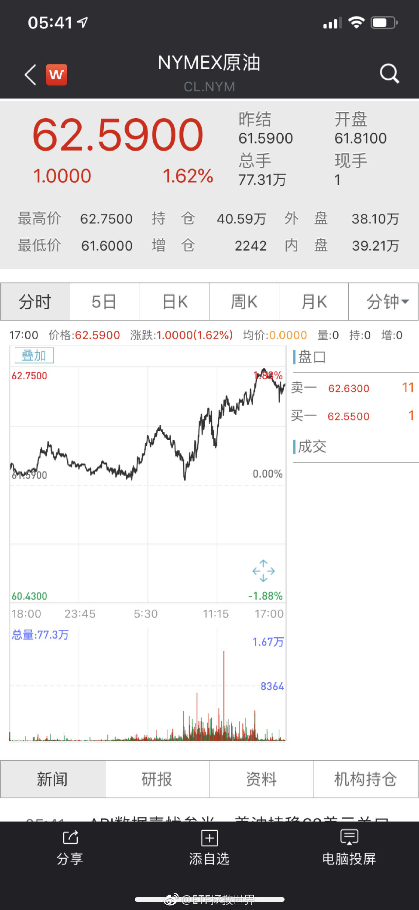

======================================================

ETF拯救世界 (5687069307) @
2019-04-03 06:02:57 Wed  
url: https://weibo.com/5687069307/HnRufemGx

这个邻居真的有很多值得我们学习的地方

------------------------------------------------------
转推：
>  @ ()
>  2019-04-02 21:25:04 Tue  
>  url: 

>  抱歉，此微博已被作者删除。查看帮助：http://t.cn/Rfd3rQV

转发[79]  评论[177]  赞[526] 

======================================================

ETF拯救世界 (5687069307) @
2019-04-03 15:36:17 Wed  
url: https://weibo.com/5687069307/HnVeXsHqa

大概你稍微能体会到“不要卖”三个字的重量了。 ​​​

转发[34]  评论[303]  赞[1112] 

======================================================

ETF拯救世界 (5687069307) @
2019-04-03 15:37:57 Wed  
url: https://weibo.com/5687069307/HnVfD8uvP

我等的是欧元和德国的双击。 ​​​

转发[47]  评论[232]  赞[797] 

+++++++++++++++++++++++++++++++++++++++++++++++++++++

图片：
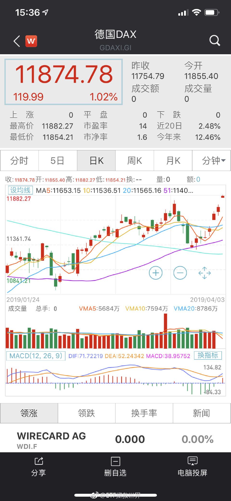

======================================================

ETF拯救世界 (5687069307) @
2019-04-03 16:46:33 Wed  
url: https://weibo.com/5687069307/HnVHtobws

你学习好帮我分析一下，是不是我愚人节那天那条微博让这位朋友误会了。 

声明一下，我认为妹子们是这个世界上最可爱的生物！ ​​​

转发[4]  评论[238]  赞[579] 

+++++++++++++++++++++++++++++++++++++++++++++++++++++

图片：

======================================================

ETF拯救世界 (5687069307) @
2019-04-03 17:17:46 Wed  
url: https://weibo.com/5687069307/HnVU96oIf

很多人跌下去难受，涨上来更难受。

赔钱心慌，赚钱心更慌。

你说逗不逗，他来股市就是为了难受吗。

踏踏实实的，涨跌都舒服。 ​​​

转发[130]  评论[208]  赞[927] 

======================================================

ETF拯救世界 (5687069307) @
2019-04-03 17:24:42 Wed  
url: https://weibo.com/5687069307/HnVWXq6WG

回复@投资跑道上的一只小蜗牛:你下次亏大钱的种子已经埋下了//@投资跑道上的一只小蜗牛:我自己也挺恨自己超级低位为什么不果断上杠杆，不过下次有经验了。资本市场机会不会少的吧[悲伤]

------------------------------------------------------
转推：
>  @ETF拯救世界 (5687069307)
>  2019-04-03 17:17:46 Wed  
>  url: https:/weibo.com/5687069307/HnVU96oIf/

>  很多人跌下去难受，涨上来更难受。
>  
>  赔钱心慌，赚钱心更慌。
>  
>  你说逗不逗，他来股市就是为了难受吗。
>  
>  踏踏实实的，涨跌都舒服。 ​​​

转发[32]  评论[89]  赞[625] 

======================================================

ETF拯救世界 (5687069307) @
2019-04-03 17:31:52 Wed  
url: https://weibo.com/5687069307/HnVZS40Hx

记住，投资这件事千万不要用上次的经验推导下次。

比如上次顶部没跑，就觉得要随时跑锁定利润。

比如上次随时跑没赚钱，下次打死也不卖。

比如上次胆子小买的少，下次疯狂加杠杆。

如果这样做，你会非常惨。

这条微博值500万，不信你十年后回来看。

当然，你永远不知道那个没看过这条微博的你是 ​​​

转发[529]  评论[431]  赞[1467] 

======================================================

ETF拯救世界 (5687069307) @
2019-04-03 18:02:21 Wed  
url: https://weibo.com/5687069307/HnWcfpSTX

回复@尿意盎然:你知道吗，去年最低点附近，有朋友私信我，说家里有人病了急用钱要赎回。与他比一下，你还难受吗？接受不能改变的事，努力去改变可以改变的。难受有什么用，这个情绪最没用。//@尿意盎然:我是真难受，因为一笔计划外的急用钱，今天赎回了一部分

------------------------------------------------------
转推：
>  @ETF拯救世界 (5687069307)
>  2019-04-03 17:17:46 Wed  
>  url: https:/weibo.com/5687069307/HnVU96oIf/

>  很多人跌下去难受，涨上来更难受。
>  
>  赔钱心慌，赚钱心更慌。
>  
>  你说逗不逗，他来股市就是为了难受吗。
>  
>  踏踏实实的，涨跌都舒服。 ​​​

转发[29]  评论[148]  赞[642] 

======================================================

ETF拯救世界 (5687069307) @
2019-04-03 18:13:44 Wed  
url: https://weibo.com/5687069307/HnWgRrep9

各位用过去这几年的时间，能完整体会一次顶部坚决卖，下跌过程不着急买，底部区域坚定多买，上涨趋势不着急卖，这样一个完整赚大钱的过程。

相信对一辈子的投资之路都会有益。毛估估，可以节省3-4轮超过十年的试错成本——对于有天赋的朋友来说。没有天赋的，要试一辈子。 ​​​

转发[527]  评论[742]  赞[2017] 

======================================================

ETF拯救世界 (5687069307) @
2019-04-04 06:23:21 Thu  
url: https://weibo.com/5687069307/Ho1311gHM

涨幅1.7，叠加欧元上涨0.4，按理说昨天德国净值应该涨2%，今天晚上看。

油气跌了，但是只持有1.6，希望暴跌多买点。 ​​​

转发[35]  评论[274]  赞[895] 

+++++++++++++++++++++++++++++++++++++++++++++++++++++

图片：
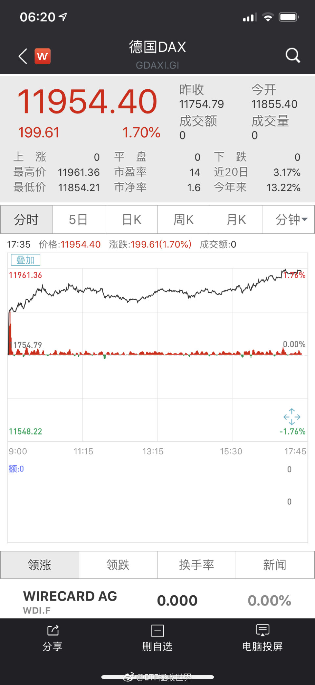

======================================================

ETF拯救世界 (5687069307) @
2019-04-04 11:00:16 Thu  
url: https://weibo.com/5687069307/Ho2RpBKiq

今年有不少地方做的不足，整体也一般，总之是对自己并不满意。

之后这段时间尽量减少发微博次数，认真反思总结，努力提高。

在市场面前，永远是个学生。 ​​​

转发[31]  评论[562]  赞[1425] 

======================================================

ETF拯救世界 (5687069307) @
2019-04-04 15:06:43 Thu  
url: https://weibo.com/5687069307/Ho4trFEyD

回复@广Ling儿:请把持仓和历史交易记录贴上来。//@广Ling儿:回复@广Ling儿:收益率只跑赢45% 的用户

------------------------------------------------------
转推：
>  @ETF拯救世界 (5687069307)
>  2019-04-04 11:00:16 Thu  
>  url: https:/weibo.com/5687069307/Ho2RpBKiq/

>  今年有不少地方做的不足，整体也一般，总之是对自己并不满意。
>  
>  之后这段时间尽量减少发微博次数，认真反思总结，努力提高。
>  
>  在市场面前，永远是个学生。 ​​​

转发[3]  评论[162]  赞[412] 

======================================================

ETF拯救世界 (5687069307) @
2019-04-04 15:10:14 Thu  
url: https://weibo.com/5687069307/Ho4uSksD0

这是s和150的一年收益率，跑不赢沪深300，只跑赢40%用户这种事情怎么发生的 ​​​

转发[16]  评论[279]  赞[717] 

+++++++++++++++++++++++++++++++++++++++++++++++++++++

图片：

======================================================

ETF拯救世界 (5687069307) @
2019-04-04 17:36:14 Thu  
url: https://weibo.com/5687069307/Ho5s96lFE

向不满意的朋友说声对不起。

虽然第三轮计划跑赢300一直在35%以上，虽然去年大熊市跌幅只有300的不到1/3，虽然在300远没回到去年高点的时候你的账户每天都在新高。

但是，对不起，这两个月跑输300了。我们这样的资产配置模式，必然无法在每个时间段跑赢每个品种。让你失望了，对不起。

我请你立即把 ​​​

转发[45]  评论[1381]  赞[1306] 

======================================================

ETF拯救世界 (5687069307) @
2019-04-04 22:27:33 Thu  
url: https://weibo.com/5687069307/Ho7mnDL2u

各位放心，我们的7-11国开债指数已经卖的剩一份了[微笑]。希望有机会跌下去再买一次

------------------------------------------------------
转推：
>  @网易财经 (1974561081)
>  2019-04-04 22:09:53 Thu  
>  url: https:/weibo.com/1974561081/Ho7fdwF3j/

>  【债市跌穿牛熊线！跷跷板效应或助阵资金流入股市】经济数据回暖正在侵蚀“债牛”的根基。本周，国债期货持续走弱，并在最后两个交易日以连续盘中跳水的方式，终结了四月的首周表现。从技术上看，十年期国债期货主力合约已经跌穿了120天的牛熊分界线。国债现货市场也呈现出了收益率上行格局。业内人士 ​​​

转发[45]  评论[351]  赞[891] 

======================================================

ETF拯救世界 (5687069307) @
2019-04-07 15:01:31 Sun  
url: https://weibo.com/5687069307/HowIPFkwO

[微笑] ​​​

转发[10]  评论[308]  赞[948] 

+++++++++++++++++++++++++++++++++++++++++++++++++++++

图片：

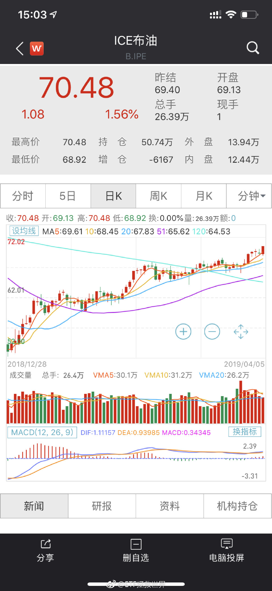

======================================================

ETF拯救世界 (5687069307) @
2019-04-08 06:59:56 Mon  
url: https://weibo.com/5687069307/HoCZQz1Fp

意念盘化工涨停利好中证500。[doge] ​​​

转发[7]  评论[169]  赞[779] 

======================================================

ETF拯救世界 (5687069307) @
2019-04-08 07:36:14 Mon  
url: https://weibo.com/5687069307/HoDeAgteY

昨天跑步脚受伤了，所有健身和出游计划要搁置一个月。

健康比什么都重要。 ​​​

转发[8]  评论[732]  赞[871] 

======================================================

ETF拯救世界 (5687069307) @
2019-04-08 09:46:03 Mon  
url: https://weibo.com/5687069307/HoE5hwSjn

已经回到10000+

------------------------------------------------------
转推：
>  @ETF拯救世界 (5687069307)
>  2018-10-10 11:29:31 Wed  
>  url: https:/weibo.com/5687069307/GDfidmtMh/

>  7800的医药指数，可能是你人生中第一个10倍指数。 ​​​

转发[184]  评论[82]  赞[641] 

======================================================

ETF拯救世界 (5687069307) @
2019-04-08 09:56:09 Mon  
url: https://weibo.com/5687069307/HoE9nkvUi

国债趋势改变了。最好不要拿太多。 ​​​

转发[45]  评论[110]  赞[697] 

======================================================

ETF拯救世界 (5687069307) @
2019-04-08 10:03:02 Mon  
url: https://weibo.com/5687069307/HoEcawiod

从极度低估回到目前价位，大致已经到了合理，同时叠加大压力。最好的情况是沿压力线持续小幅上涨。极度高估点位在15000左右。//@ETF拯救世界:已经回到10000+

------------------------------------------------------
转推：
>  @ETF拯救世界 (5687069307)
>  2018-10-10 11:29:31 Wed  
>  url: https:/weibo.com/5687069307/GDfidmtMh/

>  7800的医药指数，可能是你人生中第一个10倍指数。 ​​​

转发[116]  评论[105]  赞[683] 

======================================================

ETF拯救世界 (5687069307) @
2019-04-08 10:07:48 Mon  
url: https://weibo.com/5687069307/HoEe6rfXi

最近两个月指数涨幅太过凌厉，导致我们持仓的不少指数基金都跑输指数5%左右。

计划收益率也一定程度被拖累。

长期看绝大多数指数基金不会有问题，毕竟这样的暴涨不可能长期持续。 ​​​

转发[34]  评论[313]  赞[1034] 

======================================================

ETF拯救世界 (5687069307) @
2019-04-08 21:35:16 Mon  
url: https://weibo.com/5687069307/HoIJ9cvz0

突破了就别掉链子，继续。 ​​​

转发[12]  评论[177]  赞[689] 

+++++++++++++++++++++++++++++++++++++++++++++++++++++

图片：

======================================================

ETF拯救世界 (5687069307) @
2019-04-09 07:20:20 Tue  
url: https://weibo.com/5687069307/HoMyDizkp

不跌不买，逢高减磅，不赚不出…有没有发现你已经跟社保基金一个水平了

------------------------------------------------------
转推：
>  @ ()
>  2019-04-09 03:13:15 Tue  
>  url: 

>  抱歉，作者已设置仅展示半年内微博，此微博已不可见。 ​​​

转发[88]  评论[194]  赞[743] 

======================================================

ETF拯救世界 (5687069307) @
2019-04-09 10:41:21 Tue  
url: https://weibo.com/5687069307/HoNSdxZLl

球球已经快一年没发言了，微博每天发言。

一个悬念，谁先突破20万关注…… ​​​

转发[5]  评论[251]  赞[942] 

======================================================

ETF拯救世界 (5687069307) @
2019-04-09 10:56:48 Tue  
url: https://weibo.com/5687069307/HoNYu4YmV

不知道你们喜不喜欢收集什么东西。

其实买指数基金也有收集东西的快感。

就是你知道它未来一定能给你带来很不错的收益，然后低位不停的买。就会有你在抄底你喜欢收集的东西时候那种快感。

然后你就看着账户里的它们，怎么看怎么喜欢。想起来心里就踏实——真好啊，特别好那种感觉。

不想卖，怎么也 ​​​

转发[140]  评论[467]  赞[1197] 

======================================================

ETF拯救世界 (5687069307) @
2019-04-09 13:14:26 Tue  
url: https://weibo.com/5687069307/HoOSmrIG2

每天涨一点新高引发舒适。//@ETF拯救世界:已经回到10000+

------------------------------------------------------
转推：
>  @ETF拯救世界 (5687069307)
>  2018-10-10 11:29:31 Wed  
>  url: https:/weibo.com/5687069307/GDfidmtMh/

>  7800的医药指数，可能是你人生中第一个10倍指数。 ​​​

转发[39]  评论[115]  赞[571] 

======================================================

ETF拯救世界 (5687069307) @
2019-04-09 15:09:55 Tue  
url: https://weibo.com/5687069307/HoPDeiFQW

第三轮计划中第一个60%的品种应该是它。

但是只买了一份找谁说理去… ​​​

转发[30]  评论[293]  赞[635] 

+++++++++++++++++++++++++++++++++++++++++++++++++++++

图片：
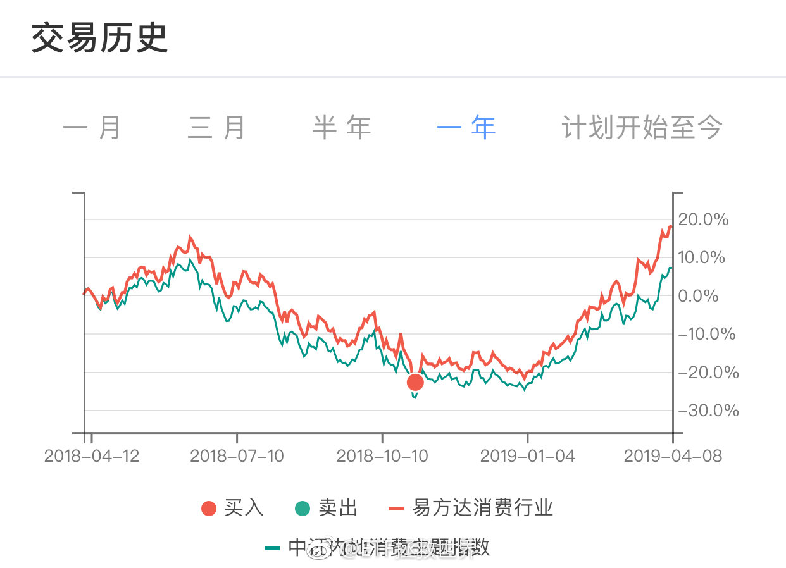

======================================================

ETF拯救世界 (5687069307) @
2019-04-09 15:25:23 Tue  
url: https://weibo.com/5687069307/HoPJw5Bmq

不对，记错了，去年恒生到过60%…看看第一个70%是谁 http://t.cn/E6o6k2w

------------------------------------------------------
转推：
>  @ETF拯救世界 (5687069307)
>  2019-04-09 15:09:55 Tue  
>  url: https:/weibo.com/5687069307/HoPDeiFQW/

>  第三轮计划中第一个60%的品种应该是它。
>  
>  但是只买了一份找谁说理去… ​​​

转发[16]  评论[94]  赞[460] 

======================================================

ETF拯救世界 (5687069307) @
2019-04-09 17:48:40 Tue  
url: https://weibo.com/5687069307/HoQFFklHS

看了眼账户，成功停止抖动。发帖日是最低点。[偷笑]

------------------------------------------------------
转推：
>  @ETF拯救世界 (5687069307)
>  2019-01-03 14:25:10 Thu  
>  url: https:/weibo.com/5687069307/HaejowEF7/

>  看着账户里100多万医药指数瑟瑟发抖中。[doge] ​​​

转发[11]  评论[194]  赞[691] 

======================================================

ETF拯救世界 (5687069307) @
2019-04-09 21:39:22 Tue  
url: https://weibo.com/5687069307/HoSbjdlh5

全指医药上一波在10000点是2015年3月，那时候估值62倍。四年过去，指数没变，估值降至36。

而十三年前的2006年6月估值也是36倍，当时点位是1407点，十三年上涨620%，年化接近17%。

这就是长期指数投资能够赚钱的秘密。 ​​​

转发[245]  评论[185]  赞[846] 

======================================================

ETF拯救世界 (5687069307) @
2019-04-09 21:47:04 Tue  
url: https://weibo.com/5687069307/HoSerkXGP

回复@莲花卷子:2005-2015十年涨了20倍。当然未来这样的情况几乎不可能发生了。//@莲花卷子:果然是十倍指数

------------------------------------------------------
转推：
>  @ETF拯救世界 (5687069307)
>  2019-04-09 21:39:22 Tue  
>  url: https:/weibo.com/5687069307/HoSbjdlh5/

>  全指医药上一波在10000点是2015年3月，那时候估值62倍。四年过去，指数没变，估值降至36。
>  
>  而十三年前的2006年6月估值也是36倍，当时点位是1407点，十三年上涨620%，年化接近17%。
>  
>  这就是长期指数投资能够赚钱的秘密。 ​​​

转发[39]  评论[49]  赞[427] 

======================================================

ETF拯救世界 (5687069307) @
2019-04-09 21:50:13 Tue  
url: https://weibo.com/5687069307/HoSfIg8pb

真.疯王啊……搞完我A搞德国……NB你就把德国干到10倍我梭哈…… ​​​

转发[75]  评论[226]  赞[710] 

======================================================

ETF拯救世界 (5687069307) @
2019-04-10 06:57:39 Wed  
url: https://weibo.com/5687069307/HoVPUC2rs

这个有懂的吗 ​​​

转发[3]  评论[227]  赞[357] 

+++++++++++++++++++++++++++++++++++++++++++++++++++++

图片：
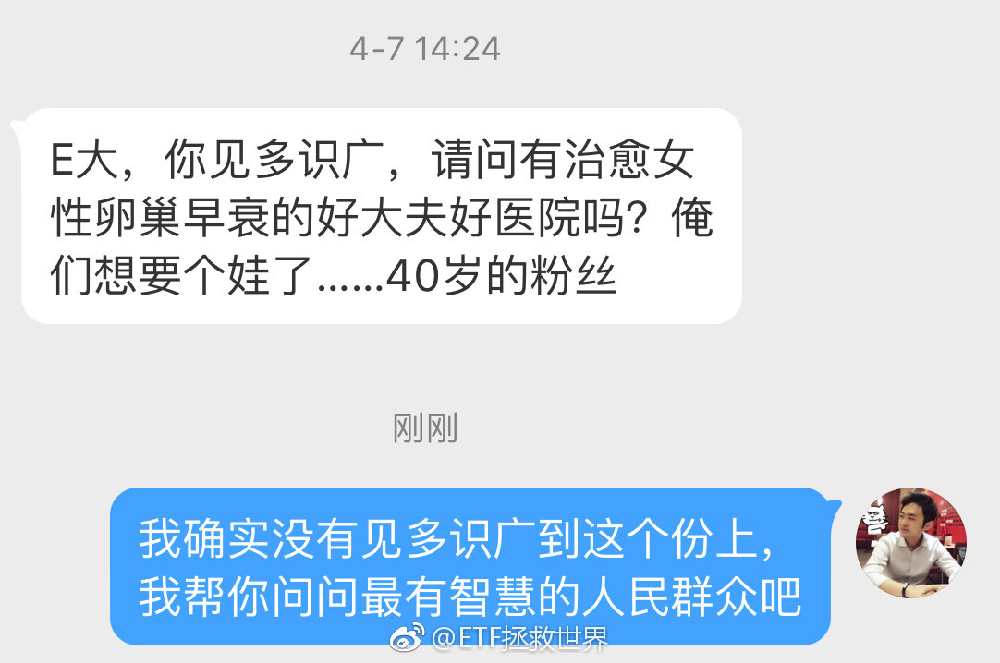

======================================================

ETF拯救世界 (5687069307) @
2019-04-10 07:41:01 Wed  
url: https://weibo.com/5687069307/HoW7wxuKR

回复@峰沐:十年一倍年化是7.x%。如果安全性和流动性与货基一样，那就是稀世奇宝，绝对可以买。但如果是必须十年后才能拿回本金，那就没那么好了。//@峰沐:E大，10年翻一倍的投资，可以投吗？安全性如果余额宝

------------------------------------------------------
转推：
>  @ETF拯救世界 (5687069307)
>  2019-04-09 21:50:13 Tue  
>  url: https:/weibo.com/5687069307/HoSfIg8pb/

>  真.疯王啊……搞完我A搞德国……NB你就把德国干到10倍我梭哈…… ​​​

转发[43]  评论[55]  赞[328] 

======================================================

ETF拯救世界 (5687069307) @
2019-04-10 07:44:33 Wed  
url: https://weibo.com/5687069307/HoW8X7mcy

“有钱了找小奶狗”对于女性来说也并不是什么好事。只能说明除了有钱自身毫无吸引力……//@挖龙脉的超级鹿鼎公:哈哈哈，真相了

------------------------------------------------------
转推：
>  @ ()
>  2019-04-10 07:34:30 Wed  
>  url: 

>  抱歉，作者已设置仅展示半年内微博，此微博已不可见。 ​​​

转发[13]  评论[66]  赞[278] 

======================================================

ETF拯救世界 (5687069307) @
2019-04-10 07:46:13 Wed  
url: https://weibo.com/5687069307/HoW9DnHdw

现在这个世界这么专一的人不多了。

------------------------------------------------------
转推：
>  @新京报我们视频 (6124642021)
>  2019-04-09 20:54:50 Tue  
>  url: https:/weibo.com/6124642021/HoRTensbp/

>  【女子#每天准时到同一超市偷肉# 还总在一个货架上偷[摊手]】4月6日，安徽亳州一超市工作人员报警称，有一位女子多次在超市内偷东西。民警调取监控后发现，该女子将店内的牛肉、驴肉、火腿肠等藏在自己衣服中或挎包中。民警称，该女子每天早上9点都会到这个超市，并且每次都偷肉。http://t.cn/E6CX5Yd  ​​​

转发[4]  评论[47]  赞[244] 

======================================================

ETF拯救世界 (5687069307) @
2019-04-10 07:49:04 Wed  
url: https://weibo.com/5687069307/HoWaNdp1s

回复@岚之一夕:长期年化10%你可以进入华尔街大师系列。//@岚之一夕:感觉十年年化10%左右是普通人的水平，再往上就看老天爷和自己的努力了//@ETF拯救世界:回复@峰沐:十年一倍年化是7.x%。如果安全性和流动性与货基一样，那就是稀世奇宝，绝对可以买。但如果是必须十年后才能拿回本金，那就没那么好了。

------------------------------------------------------
转推：
>  @ETF拯救世界 (5687069307)
>  2019-04-09 21:50:13 Tue  
>  url: https:/weibo.com/5687069307/HoSfIg8pb/

>  真.疯王啊……搞完我A搞德国……NB你就把德国干到10倍我梭哈…… ​​​

转发[25]  评论[72]  赞[382] 

======================================================

ETF拯救世界 (5687069307) @
2019-04-10 08:01:48 Wed  
url: https://weibo.com/5687069307/HoWfXdsom

这么说吧。NB闪闪的桥水和耶鲁基金30年年化收益也就12%。

如果你能做到11%-12%，你就可以管理上千亿的资产了。

他们NB在几乎不回撤。

你说为什么这几年有那么多牛人投资A股收益率很高？

第一，真的假的？

第二，时间不够长。

小心收益率太高的，均值回归起来吓死你。

据我所知，私募收益率最高 ​​​

转发[145]  评论[156]  赞[623] 

======================================================

ETF拯救世界 (5687069307) @
2019-04-10 08:09:15 Wed  
url: https://weibo.com/5687069307/HoWiYyFUh

回复@又见Zane:有高的，但不能用最好的作为目标。我没事也跑十公里，但不会用奥运会一万米金牌成绩要求自己，会出事//@又见Zane:但文艺复兴高得有点

------------------------------------------------------
转推：
>  @ETF拯救世界 (5687069307)
>  2019-04-10 08:01:48 Wed  
>  url: https:/weibo.com/5687069307/HoWfXdsom/

>  这么说吧。NB闪闪的桥水和耶鲁基金30年年化收益也就12%。
>  
>  如果你能做到11%-12%，你就可以管理上千亿的资产了。
>  
>  他们NB在几乎不回撤。
>  
>  你说为什么这几年有那么多牛人投资A股收益率很高？
>  
>  第一，真的假的？
>  
>  第二，时间不够长。
>  
>  小心收益率太高的，均值回归起来吓死你。
>  
>  据我所知，私募收益率最高 ​​​

转发[13]  评论[27]  赞[367] 

======================================================

ETF拯救世界 (5687069307) @
2019-04-10 08:15:47 Wed  
url: https://weibo.com/5687069307/HoWlDaQ53

客观预估自己的投资收益率有意义吗？

非常有意义。

最大的意义在于，可以让你从投资目标反推需要投入多少本金，有助于你达成目标。

无论是未来的教育费用、养老费用或者是实现其他的目标，你都可以叠加时间+收益率来反推需要投入多少本金。

在此基础上，你可以设定乐观、中性、悲观三个条件。比如 ​​​

转发[269]  评论[218]  赞[723] 

======================================================

ETF拯救世界 (5687069307) @
2019-04-10 08:30:21 Wed  
url: https://weibo.com/5687069307/HoWrxz1tW

我知道很多朋友很焦虑，特别希望我说年化20%很简单，又希望我赶紧说说第一个一百万怎么赚的。

我当然可以打开word洋洋洒洒说一大篇，但我不能。

我可以跟你说20%很简单，二十年后你发现没赚到又不会来找我。一时说一时爽嘛，一直爽一直说。但sorry，我不能这么做。

我也可以跟你说100万很容易啊。我 ​​​

转发[92]  评论[268]  赞[1099] 

======================================================

ETF拯救世界 (5687069307) @
2019-04-10 08:41:37 Wed  
url: https://weibo.com/5687069307/HoWw7vJn8

去年的事情好像对东哥影响很大啊……

------------------------------------------------------
转推：
>  @网易财经 (1974561081)
>  2019-04-10 08:25:03 Wed  
>  url: https:/weibo.com/1974561081/HoWpoimrj/

>  【外媒：京东正在新一轮大规模裁员，最多裁员逾1.2万人】据The Information，京东正在进行一轮大规模裁员，一些团队的员工数量可能会减少一半。据悉，京东可能裁员至多8%，相当于京东裁员逾1.2万人。http://t.cn/E6NFIDT ​​​

转发[9]  评论[108]  赞[283] 

======================================================

ETF拯救世界 (5687069307) @
2019-04-10 08:46:41 Wed  
url: https://weibo.com/5687069307/HoWyaClsb

回复@资本暴利狂徒:答案：只要不上杠杆，永远亏不完。//@资本暴利狂徒:问题来了，每年亏10，几年亏完？

------------------------------------------------------
转推：
>  @ETF拯救世界 (5687069307)
>  2019-04-10 08:15:47 Wed  
>  url: https:/weibo.com/5687069307/HoWlDaQ53/

>  客观预估自己的投资收益率有意义吗？
>  
>  非常有意义。
>  
>  最大的意义在于，可以让你从投资目标反推需要投入多少本金，有助于你达成目标。
>  
>  无论是未来的教育费用、养老费用或者是实现其他的目标，你都可以叠加时间+收益率来反推需要投入多少本金。
>  
>  在此基础上，你可以设定乐观、中性、悲观三个条件。比如 ​​​

转发[64]  评论[54]  赞[366] 

======================================================

ETF拯救世界 (5687069307) @
2019-04-10 08:55:52 Wed  
url: https://weibo.com/5687069307/HoWBUiJ0R

近期有公司增持，也有减持。本来所有股票一起上涨和下跌就完全不合理。那些不值钱的公司最好全部减持跌到仙股才好。

------------------------------------------------------
转推：
>  @ ()
>  2019-04-09 20:41:04 Tue  
>  url: 

>  抱歉，作者已设置仅展示半年内微博，此微博已不可见。 ​​​

转发[18]  评论[31]  赞[363] 

======================================================

ETF拯救世界 (5687069307) @
2019-04-10 09:24:15 Wed  
url: https://weibo.com/5687069307/HoWNpxohY

回复@hei-jude:心算一下，10年后200万，年化9%，本金需要84万。另外，也可以是每年投入12万。//@hei-jude:10年后娃读书需要200万，用7-9%的收益率，需要投多少本金呀？//@ETF拯救世界:回复@资本暴利狂徒:答案：只要不上杠杆，永远亏不完。

------------------------------------------------------
转推：
>  @ETF拯救世界 (5687069307)
>  2019-04-10 08:15:47 Wed  
>  url: https:/weibo.com/5687069307/HoWlDaQ53/

>  客观预估自己的投资收益率有意义吗？
>  
>  非常有意义。
>  
>  最大的意义在于，可以让你从投资目标反推需要投入多少本金，有助于你达成目标。
>  
>  无论是未来的教育费用、养老费用或者是实现其他的目标，你都可以叠加时间+收益率来反推需要投入多少本金。
>  
>  在此基础上，你可以设定乐观、中性、悲观三个条件。比如 ​​​

转发[49]  评论[106]  赞[436] 

======================================================

ETF拯救世界 (5687069307) @
2019-04-10 09:40:12 Wed  
url: https://weibo.com/5687069307/HoWTTrFxy

越说越来劲。//@ETF拯救世界:每天涨一点新高引发舒适。//@ETF拯救世界:已经回到10000+

------------------------------------------------------
转推：
>  @ETF拯救世界 (5687069307)
>  2018-10-10 11:29:31 Wed  
>  url: https:/weibo.com/5687069307/GDfidmtMh/

>  7800的医药指数，可能是你人生中第一个10倍指数。 ​​​

转发[8]  评论[41]  赞[409] 

======================================================

ETF拯救世界 (5687069307) @
2019-04-10 09:47:59 Wed  
url: https://weibo.com/5687069307/HoWX3oXh9

在这个时候我又想起去年底那些唱衰医药的人，又想起那个说医药刚跌了一半，要救我一命的人。

我想起他们，不是要嘲笑他们。而是特别感动。

感动于各位的信任，感动于出现噪音的时候各位与我站在一起。绝大多数朋友是第一次和我一起经历那样的至暗时刻，但你们都选择了信任。

信任是最难得的。所以我 ​​​

转发[53]  评论[322]  赞[1185] 

======================================================

ETF拯救世界 (5687069307) @
2019-04-10 10:12:37 Wed  
url: https://weibo.com/5687069307/HoX72F0xO

跌一点就吓得到处问反弹是不是结束的朋友。

恕我直言，你还没做好到股市投资的准备。 ​​​

转发[36]  评论[152]  赞[745] 

======================================================

ETF拯救世界 (5687069307) @
2019-04-10 10:19:21 Wed  
url: https://weibo.com/5687069307/HoX9MC6xM

今天涨5%才算你狠。//@ETF拯救世界:每天涨一点新高引发舒适。//@ETF拯救世界:已经回到10000+

------------------------------------------------------
转推：
>  @ETF拯救世界 (5687069307)
>  2018-10-10 11:29:31 Wed  
>  url: https:/weibo.com/5687069307/GDfidmtMh/

>  7800的医药指数，可能是你人生中第一个10倍指数。 ​​​

转发[19]  评论[68]  赞[467] 

======================================================

ETF拯救世界 (5687069307) @
2019-04-10 11:20:29 Wed  
url: https://weibo.com/5687069307/HoXyBwquF

回复@唐山黄金名表名包回收典当:不懂你为什么克制。难道你真的没钱连一点股票都买不了了吗。听我的，想做就做，不要让青春留白。//@唐山黄金名表名包回收典当:看着股票如此疯狂 好想操作一把  克制克制[允悲]//@ETF拯救世界:今天涨5%才算你狠。//@ETF拯救世界:每天涨一点新高引发舒适。

------------------------------------------------------
转推：
>  @ETF拯救世界 (5687069307)
>  2018-10-10 11:29:31 Wed  
>  url: https:/weibo.com/5687069307/GDfidmtMh/

>  7800的医药指数，可能是你人生中第一个10倍指数。 ​​​

转发[11]  评论[149]  赞[436] 

======================================================

ETF拯救世界 (5687069307) @
2019-04-10 14:22:17 Wed  
url: https://weibo.com/5687069307/HoYKoBRU1

希望各位通过这半年经历体会两件事

第一，否极泰来

第二，投资不是投票，大多数人说什么，大V说什么根本不重要，绝大部分你听到的都是噪音。坚持做正确的事。 ​​​

转发[136]  评论[289]  赞[1147] 

======================================================

ETF拯救世界 (5687069307) @
2019-04-10 14:36:42 Wed  
url: https://weibo.com/5687069307/HoYQfw87B

对不起我笑了

------------------------------------------------------
转推：
>  @北京人不知道的北京事儿 (1662214194)
>  2019-04-10 12:53:33 Wed  
>  url: https:/weibo.com/1662214194/HoYanja89/

>  有网友用AI把《都挺好》里的苏大强换脸成吴彦祖，你们感受一下。。。[允悲][允悲]（by慢三与偏见）http://t.cn/E6CrvaK ​​​

转发[253]  评论[117]  赞[297] 

======================================================

ETF拯救世界 (5687069307) @
2019-04-10 16:11:42 Wed  
url: https://weibo.com/5687069307/HoZsO3QYK

竞猜：

今天还能继续新高吗？ ​​​

转发[37]  评论[226]  赞[518] 

======================================================

ETF拯救世界 (5687069307) @
2019-04-10 16:14:48 Wed  
url: https://weibo.com/5687069307/HoZu447YI

青岛好玩吗。是不是可以去看看。

------------------------------------------------------
转推：
>  @新京报我们视频 (6124642021)
>  2019-04-10 15:55:32 Wed  
>  url: https:/weibo.com/6124642021/HoZmfso0B/

>  【#全国铁路实施新运行图#：北京至青岛只需3小时】4月10日，全国铁路实施新的列车运行图，北京至青岛首次实现3小时内到达。京鲁两地间的铁路距离较调图前压缩49分钟。首次开行兰州至成都间动车组列车较既有列车运行时间压缩约5小时。本次调图服务雄安新区建设，河北白洋淀站新增10列停靠列车。 ​​​

转发[9]  评论[196]  赞[289] 

======================================================

ETF拯救世界 (5687069307) @
2019-04-10 16:27:12 Wed  
url: https://weibo.com/5687069307/HoZz6mINS

回复@静待晚秋:跟车就像闹GM，太早风险大，太晚没肉吃。只有最合适的时候进来肉才最多。什么时候是最合适？得看命……谁去年钻石坑进就是命好……//@静待晚秋:回复@温柔的臭臭:感觉后来跟车的同志们没什么机会了[允悲]

------------------------------------------------------
转推：
>  @ETF拯救世界 (5687069307)
>  2019-04-10 16:11:42 Wed  
>  url: https:/weibo.com/5687069307/HoZsO3QYK/

>  竞猜：
>  
>  今天还能继续新高吗？ ​​​

转发[31]  评论[368]  赞[622] 

======================================================

ETF拯救世界 (5687069307) @
2019-04-11 08:47:52 Thu  
url: https://weibo.com/5687069307/Hp5Z9h5Qg

自己多攒点是王道。

------------------------------------------------------
转推：
>  @ ()
>  2019-04-11 08:41:02 Thu  
>  url: 

>  抱歉，作者已设置仅展示半年内微博，此微博已不可见。 ​​​

转发[54]  评论[132]  赞[514] 

======================================================

ETF拯救世界 (5687069307) @
2019-04-11 09:02:38 Thu  
url: https://weibo.com/5687069307/Hp659mFah

回复@无比的谋略:喷了，哪个APP？//@无比的谋略:这是什么鬼？@ETF拯救世界 http://t.cn/E6RQ1m8 //@ETF拯救世界:回复@静待晚秋:跟车就像闹GM，太早风险大，太晚没肉吃。只有最合适的时候进来肉才最多。什么时候是最合适？得看命……谁去年钻石坑进就是命好……

------------------------------------------------------
转推：
>  @ETF拯救世界 (5687069307)
>  2019-04-10 16:11:42 Wed  
>  url: https:/weibo.com/5687069307/HoZsO3QYK/

>  竞猜：
>  
>  今天还能继续新高吗？ ​​​

转发[4]  评论[236]  赞[397] 

======================================================

ETF拯救世界 (5687069307) @
2019-04-11 09:39:45 Thu  
url: https://weibo.com/5687069307/Hp6kdmsN4

我不信你一点都不想卖出一部分锁定利润。

想卖一点的举手我看看。 ​​​

转发[89]  评论[1175]  赞[1176] 

======================================================

ETF拯救世界 (5687069307) @
2019-04-11 11:23:18 Thu  
url: https://weibo.com/5687069307/Hp70fi9vB

既然这么多人不想卖，市场就会教育大家。你卖了继续涨，不卖就调整。反复摩擦，反复蹂躏。

------------------------------------------------------
转推：
>  @ETF拯救世界 (5687069307)
>  2019-04-11 09:39:45 Thu  
>  url: https:/weibo.com/5687069307/Hp6kdmsN4/

>  我不信你一点都不想卖出一部分锁定利润。
>  
>  想卖一点的举手我看看。 ​​​

转发[65]  评论[524]  赞[932] 

======================================================

ETF拯救世界 (5687069307) @
2019-04-11 16:21:39 Thu  
url: https://weibo.com/5687069307/Hp8XlaqrL

被各路神仙吹的也想去买个P30 Pro玩玩了。

唯一的问题是我对屏幕要求特别高，不知道华为的屏幕能达到苹果和三星的水平吗。反正前两年玩过一台那屏幕拖影完全受不了… ​​​

转发[16]  评论[342]  赞[458] 

======================================================

ETF拯救世界 (5687069307) @
2019-04-11 20:31:59 Thu  
url: https://weibo.com/5687069307/HpaAX4E2k

内事不决问群众 ​​​

转发[9]  评论[212]  赞[381] 

+++++++++++++++++++++++++++++++++++++++++++++++++++++

图片：

======================================================

ETF拯救世界 (5687069307) @
2019-04-12 08:20:15 Fri  
url: https://weibo.com/5687069307/Hpfer7rbS

回复@耿浩Gorf:我们已经两个月没买了。//@耿浩Gorf:怎么办，三天前最高点买的指数基金，10万跌了2000多

------------------------------------------------------
转推：
>  @ETF拯救世界 (5687069307)
>  2019-04-11 20:31:59 Thu  
>  url: https:/weibo.com/5687069307/HpaAX4E2k/

>  内事不决问群众 ​​​

转发[5]  评论[125]  赞[365] 

======================================================

ETF拯救世界 (5687069307) @
2019-04-12 08:36:39 Fri  
url: https://weibo.com/5687069307/Hpfl5DJrB

早上想明白一件事：如果为了拍照（视频素质还不行）买一个六千多的手机，为什么不去买个黑卡或者微单呢。踏实了。

------------------------------------------------------
转推：
>  @ETF拯救世界 (5687069307)
>  2019-04-11 16:21:39 Thu  
>  url: https:/weibo.com/5687069307/Hp8XlaqrL/

>  被各路神仙吹的也想去买个P30 Pro玩玩了。
>  
>  唯一的问题是我对屏幕要求特别高，不知道华为的屏幕能达到苹果和三星的水平吗。反正前两年玩过一台那屏幕拖影完全受不了… ​​​

转发[7]  评论[308]  赞[576] 

======================================================

ETF拯救世界 (5687069307) @
2019-04-12 10:22:04 Fri  
url: https://weibo.com/5687069307/Hpg1SyMlo

之前有人在评论里说Dax基金每年跑输基准6%，我不知道这又是从哪个大V那看到的数据。

华安dax确实表现一般，年年跑输dax。之前每年跑输2个多点。不过每年跑输程度越来越少，去年只有1%了。

很多原因。管理费等等。还有Dax本身就是包含分红的全收益指数，跟上确实也很难。

虽然是稍微差点，但有什么办 ​​​

转发[60]  评论[123]  赞[607] 

======================================================

ETF拯救世界 (5687069307) @
2019-04-12 10:54:48 Fri  
url: https://weibo.com/5687069307/Hpgfapm8x

不追涨是美德。

涨两个月，很多人就忘记了现金的可贵。手里有点钱都觉得烧手，要投出去。

跌了又后悔。

心魔。 ​​​

转发[88]  评论[295]  赞[1030] 

======================================================

ETF拯救世界 (5687069307) @
2019-04-12 15:26:38 Fri  
url: https://weibo.com/5687069307/Hpi1vBO0R

犯错之后，痛苦和后悔毫无用处。最重要是学到东西，取得进步。

------------------------------------------------------
转推：
>  @瑞达利欧 (6529122212)
>  2019-04-11 14:15:35 Thu  
>  url: https:/weibo.com/6529122212/Hp88auBae/

>  每个人都会犯错。主要的区别在于，成功的人会从错误中吸取教训，而不成功的人则不会。要营造一种环境，让人们敢于犯错，以便从错误中学习，这样就会快速进步，也不会再犯大错。在强调创意和独立思考的机构里尤为如此，因为接受失败必然是成功之路的一部分。正如托马斯·爱迪生所言：“我没有失败，我只 ​​​

转发[74]  评论[90]  赞[489] 

======================================================

ETF拯救世界 (5687069307) @
2019-04-12 17:02:16 Fri  
url: https://weibo.com/5687069307/HpiEkpZFq

回复@法国梧桐树NJ:过去十年不好才是我买他的理由。你体会一下。

------------------------------------------------------
转推：
>  @ETF拯救世界 (5687069307)
>  2019-04-12 10:22:04 Fri  
>  url: https:/weibo.com/5687069307/Hpg1SyMlo/

>  之前有人在评论里说Dax基金每年跑输基准6%，我不知道这又是从哪个大V那看到的数据。
>  
>  华安dax确实表现一般，年年跑输dax。之前每年跑输2个多点。不过每年跑输程度越来越少，去年只有1%了。
>  
>  很多原因。管理费等等。还有Dax本身就是包含分红的全收益指数，跟上确实也很难。
>  
>  虽然是稍微差点，但有什么办 ​​​

转发[19]  评论[51]  赞[382] 

======================================================

ETF拯救世界 (5687069307) @
2019-04-12 17:14:12 Fri  
url: https://weibo.com/5687069307/HpiJanrjQ

不对，说错了。DAX过去十年不能说不好。2009.4-2019.4涨了192%，年化收益率接近12%。

最有意思的，是2009.4和现在的估值几乎一样。

DAX不好的是过去19年。2000年就已经7600了，现在才12000，19年涨了58%。年化不到3%，这是加上股息的。如果不算股息，估计1%都不到。

这才是我看好它未来的原因。

你 ​​​

转发[445]  评论[281]  赞[735] 

======================================================

ETF拯救世界 (5687069307) @
2019-04-12 17:17:53 Fri  
url: https://weibo.com/5687069307/HpiKF8c5K

另外，当然也有我个人的喜好在里面。从小就对有组织有纪律严谨的人有好感，德国人无疑是这样的民族。更别提30里面的企业了。西门子，宝马，奔驰，阿迪达斯……目前这么便宜买这些企业，我心里踏实。

------------------------------------------------------
转推：
>  @ETF拯救世界 (5687069307)
>  2019-04-12 17:14:12 Fri  
>  url: https:/weibo.com/5687069307/HpiJanrjQ/

>  不对，说错了。DAX过去十年不能说不好。2009.4-2019.4涨了192%，年化收益率接近12%。
>  
>  最有意思的，是2009.4和现在的估值几乎一样。
>  
>  DAX不好的是过去19年。2000年就已经7600了，现在才12000，19年涨了58%。年化不到3%，这是加上股息的。如果不算股息，估计1%都不到。
>  
>  这才是我看好它未来的原因。
>  
>  你 ​​​

转发[46]  评论[64]  赞[463] 

======================================================

ETF拯救世界 (5687069307) @
2019-04-12 17:23:06 Fri  
url: https://weibo.com/5687069307/HpiMMC1zo

回复@海底两万八千里:我觉得未必是自己受伤后才能学到东西。看别人的经历也一样能学到。最重要的是把自己代入对方，想象对方的感受。感受到他人资产大幅下跌的绝望，加上基础的数学知识，就知道拒绝大幅亏损的重要性了。何必要自己经历过呢。

------------------------------------------------------
转推：
>  @ETF拯救世界 (5687069307)
>  2019-04-12 17:14:12 Fri  
>  url: https:/weibo.com/5687069307/HpiJanrjQ/

>  不对，说错了。DAX过去十年不能说不好。2009.4-2019.4涨了192%，年化收益率接近12%。
>  
>  最有意思的，是2009.4和现在的估值几乎一样。
>  
>  DAX不好的是过去19年。2000年就已经7600了，现在才12000，19年涨了58%。年化不到3%，这是加上股息的。如果不算股息，估计1%都不到。
>  
>  这才是我看好它未来的原因。
>  
>  你 ​​​

转发[101]  评论[46]  赞[412] 

======================================================

ETF拯救世界 (5687069307) @
2019-04-12 17:31:25 Fri  
url: https://weibo.com/5687069307/HpiQ9y1OC

回复@耐心是投资第一要素:等你听到知更鸟叫时，春天已经快过过去了。股市是先行指标，等宏观经济数据走好再买股票的人远未够班……//@耐心是投资第一要素:看了3月经济数据，下周估计要继续涨[嘻嘻]

------------------------------------------------------
转推：
>  @ETF拯救世界 (5687069307)
>  2019-04-12 17:14:12 Fri  
>  url: https:/weibo.com/5687069307/HpiJanrjQ/

>  不对，说错了。DAX过去十年不能说不好。2009.4-2019.4涨了192%，年化收益率接近12%。
>  
>  最有意思的，是2009.4和现在的估值几乎一样。
>  
>  DAX不好的是过去19年。2000年就已经7600了，现在才12000，19年涨了58%。年化不到3%，这是加上股息的。如果不算股息，估计1%都不到。
>  
>  这才是我看好它未来的原因。
>  
>  你 ​​​

转发[51]  评论[52]  赞[461] 

======================================================

ETF拯救世界 (5687069307) @
2019-04-12 17:36:23 Fri  
url: https://weibo.com/5687069307/HpiSawuo2

回复@乄Chaos:我自己除了怎么也无法代入喷子，无法体会喷子们到底是什么感受外，大家的感受都能代入……//@乄Chaos:所以同理心真的挺重要的。

------------------------------------------------------
转推：
>  @ETF拯救世界 (5687069307)
>  2019-04-12 17:14:12 Fri  
>  url: https:/weibo.com/5687069307/HpiJanrjQ/

>  不对，说错了。DAX过去十年不能说不好。2009.4-2019.4涨了192%，年化收益率接近12%。
>  
>  最有意思的，是2009.4和现在的估值几乎一样。
>  
>  DAX不好的是过去19年。2000年就已经7600了，现在才12000，19年涨了58%。年化不到3%，这是加上股息的。如果不算股息，估计1%都不到。
>  
>  这才是我看好它未来的原因。
>  
>  你 ​​​

转发[7]  评论[58]  赞[421] 

======================================================

ETF拯救世界 (5687069307) @
2019-04-12 17:50:33 Fri  
url: https://weibo.com/5687069307/HpiXVaKz9

万万没想到， 我那个一个月更新2次的公众号，被腾讯认定是“优质公众号”，让我去开座谈会…… ​​​

转发[10]  评论[454]  赞[1639] 

======================================================

ETF拯救世界 (5687069307) @
2019-04-12 21:59:07 Fri  
url: https://weibo.com/5687069307/HpkAOs5eh

一买就涨好烦 

[doge] ​​​

转发[7]  评论[187]  赞[643] 

+++++++++++++++++++++++++++++++++++++++++++++++++++++

图片：
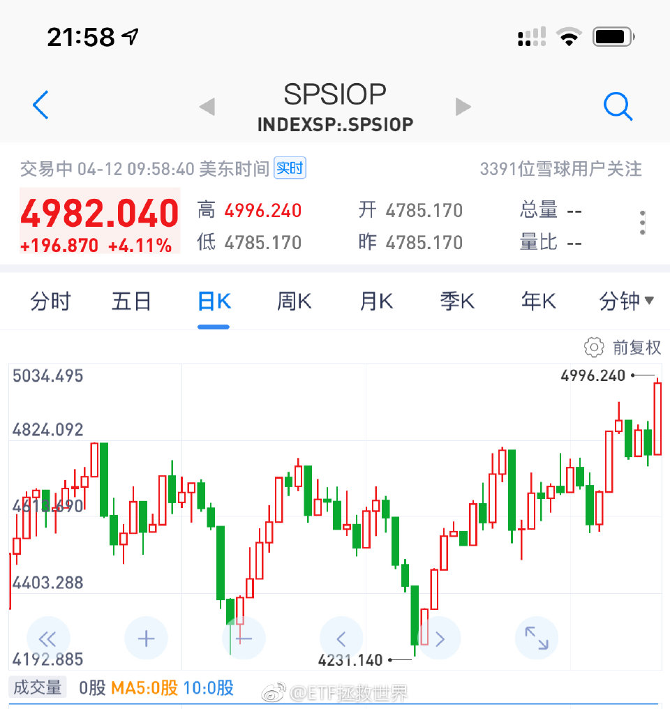
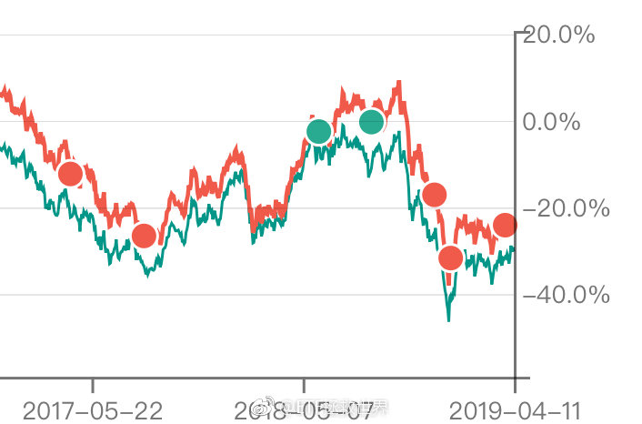

======================================================

ETF拯救世界 (5687069307) @
2019-04-13 07:46:04 Sat  
url: https://weibo.com/5687069307/Hpor46A3f

我是不敢用智能音箱的

------------------------------------------------------
转推：
>  @财联社APP (2868676035)
>  2019-04-12 22:39:32 Fri  
>  url: https:/weibo.com/2868676035/HpkRdya5s/

>  【#亚马逊身陷窃听丑闻#：专#雇千人听取智能音箱录音#】4月11日，据媒体报道，亚马逊雇佣数千员工听取智能音箱Alexa与顾客的对话内容。有顾客反映Alexa偷偷录音，并把录音传给了她的同事。亚马逊承认为改善系统，并称始终会保护顾客隐私，员工只会听取极小比例的录音内容。http://t.cn/EXvgY5B ​​​

转发[23]  评论[118]  赞[285] 

======================================================

ETF拯救世界 (5687069307) @
2019-04-13 09:25:56 Sat  
url: https://weibo.com/5687069307/Hpp5AEXhp

昨天暴涨，再看看这条微博，说的对不对。这个世界太多人短视，用一段时间的表现定义一个人或者一个东西。其实，花开有时，春兰夏荷秋菊冬梅，很多时候只是时间没到而已。路遥才能知马力，日久才见人心。

------------------------------------------------------
转推：
>  @ETF拯救世界 (5687069307)
>  2019-04-03 05:43:29 Wed  
>  url: https:/weibo.com/5687069307/HnRml0j43/

>  据我对油气的了解，一段时间跟的差就会有一段时间超预期。不用急，等等看 ​​​

转发[46]  评论[110]  赞[578] 

======================================================

ETF拯救世界 (5687069307) @
2019-04-13 09:30:53 Sat  
url: https://weibo.com/5687069307/Hpp7BqoOc

回复@lei_xu:把股市收益率与GDP挂钩，只能说远未够班。我A过去二十三十年GDP增长如何，投资人整体收益如何？以后这种问题我不会解释

------------------------------------------------------
转推：
>  @ETF拯救世界 (5687069307)
>  2019-04-12 17:14:12 Fri  
>  url: https:/weibo.com/5687069307/HpiJanrjQ/

>  不对，说错了。DAX过去十年不能说不好。2009.4-2019.4涨了192%，年化收益率接近12%。
>  
>  最有意思的，是2009.4和现在的估值几乎一样。
>  
>  DAX不好的是过去19年。2000年就已经7600了，现在才12000，19年涨了58%。年化不到3%，这是加上股息的。如果不算股息，估计1%都不到。
>  
>  这才是我看好它未来的原因。
>  
>  你 ​​​

转发[25]  评论[53]  赞[399] 

======================================================

ETF拯救世界 (5687069307) @
2019-04-13 09:39:11 Sat  
url: https://weibo.com/5687069307/HppaYioJC

听说球球七天无法发言。

虽然球球对我一般，但我真心希望球球能顺顺利利，并且越来越好。

@雪球 ​​​

转发[18]  评论[113]  赞[538] 

======================================================

ETF拯救世界 (5687069307) @
2019-04-13 09:47:11 Sat  
url: https://weibo.com/5687069307/HppedtAAy

再有人教育我什么该买什么不该买直接拉黑。 ​​​

转发[3]  评论[124]  赞[752] 

======================================================

ETF拯救世界 (5687069307) @
2019-04-13 09:54:28 Sat  
url: https://weibo.com/5687069307/Hpphbli2u

回复@风云又起17725:我每天都在拉黑，但我不可能保证没有漏网之鱼。我有自己的生活自己的家庭自己的事情要做。我没钱请助理帮我打理微博//@风云又起17725:益达为什么不把那些说 财经界只认您和某某某的人拉黑？

------------------------------------------------------
转推：
>  @ETF拯救世界 (5687069307)
>  2019-04-13 09:39:11 Sat  
>  url: https:/weibo.com/5687069307/HppaYioJC/

>  听说球球七天无法发言。
>  
>  虽然球球对我一般，但我真心希望球球能顺顺利利，并且越来越好。
>  
>  @雪球 ​​​

转发[3]  评论[46]  赞[365] 

======================================================

ETF拯救世界 (5687069307) @
2019-04-13 09:56:51 Sat  
url: https://weibo.com/5687069307/Hppi8nBNM

回复@桃李麻辣烫:它不鸟我是它的事，我希望它好是我的事。有什么问题？//@桃李麻辣烫:但是球球并不鸟你。。。。。。

------------------------------------------------------
转推：
>  @ETF拯救世界 (5687069307)
>  2019-04-13 09:39:11 Sat  
>  url: https:/weibo.com/5687069307/HppaYioJC/

>  听说球球七天无法发言。
>  
>  虽然球球对我一般，但我真心希望球球能顺顺利利，并且越来越好。
>  
>  @雪球 ​​​

转发[6]  评论[57]  赞[465] 

======================================================

ETF拯救世界 (5687069307) @
2019-04-13 10:11:46 Sat  
url: https://weibo.com/5687069307/HppocjcLd

很多人总觉得别人做的有一点不好就是对不起自己，心生怨念。

我不是。我经常想别人对我好的地方，经常心怀感激。

别人对我有帮助，有机会就会报答，即使别人并不是有意识的对我好。

很多人把很多事视为理所应当，其实，未必。 ​​​

转发[91]  评论[163]  赞[1017] 

======================================================

ETF拯救世界 (5687069307) @
2019-04-13 10:20:21 Sat  
url: https://weibo.com/5687069307/HpprGzbLt

所以前几天有个大机构跟我说，把我的话选了52条，做了个精美的周历想印1000册送给大家，我没答应…因为不知道怎么报答人家…

------------------------------------------------------
转推：
>  @ETF拯救世界 (5687069307)
>  2019-04-13 10:11:46 Sat  
>  url: https:/weibo.com/5687069307/HppocjcLd/

>  很多人总觉得别人做的有一点不好就是对不起自己，心生怨念。
>  
>  我不是。我经常想别人对我好的地方，经常心怀感激。
>  
>  别人对我有帮助，有机会就会报答，即使别人并不是有意识的对我好。
>  
>  很多人把很多事视为理所应当，其实，未必。 ​​​

转发[9]  评论[182]  赞[687] 

======================================================

ETF拯救世界 (5687069307) @
2019-04-13 16:00:51 Sat  
url: https://weibo.com/5687069307/HprFTwwXc

回复@雪糕w:为什么每集吃这么多还这么瘦//@雪糕w:这是哪儿的方言，笑死我了。我有微博啦，不是假的！

------------------------------------------------------
转推：
>  @松重丰mattige3 (7074841243)
>  2019-04-13 14:38:00 Sat  
>  url: https:/weibo.com/7074841243/Hpr8gxSRK/

>  皆様、どうも、本物です。
>  今後ともよろしくお願いします。 http://t.cn/EXZFtVo ​​​

转发[8]  评论[40]  赞[230] 

======================================================

ETF拯救世界 (5687069307) @
2019-04-13 16:10:32 Sat  
url: https://weibo.com/5687069307/HprJP3BRm

回复@打浦桥麦当劳:日本的数据特别难拿。德国的通过彭博和wind还能拿到，日本真是找不到。因为我要自己计算，所以都是历史基础数据，很难找//@打浦桥麦当劳:回复@ETF拯救世界:日本也是这样的民族，买日经ETF?

------------------------------------------------------
转推：
>  @ETF拯救世界 (5687069307)
>  2019-04-12 17:14:12 Fri  
>  url: https:/weibo.com/5687069307/HpiJanrjQ/

>  不对，说错了。DAX过去十年不能说不好。2009.4-2019.4涨了192%，年化收益率接近12%。
>  
>  最有意思的，是2009.4和现在的估值几乎一样。
>  
>  DAX不好的是过去19年。2000年就已经7600了，现在才12000，19年涨了58%。年化不到3%，这是加上股息的。如果不算股息，估计1%都不到。
>  
>  这才是我看好它未来的原因。
>  
>  你 ​​​

转发[21]  评论[78]  赞[400] 

======================================================

ETF拯救世界 (5687069307) @
2019-04-13 16:40:50 Sat  
url: https://weibo.com/5687069307/HprW7FRxL

每天都有很多重复的问题，我统一回答一下，然后会置顶：

第一：谨防骗子。

我只有这一个微博账号。绝对不会主动私信你，更不会要带你操作股票。我没有任何股票或者投资群，绝对不会要求加你微信或者QQ。

如果有类似情况，马上拉黑对方。

分辨真假最简单的方式是把鼠标挪到头像上，看看对方有多少人 ​​​

转发[297]  评论[1772]  赞[12332] 

======================================================

ETF拯救世界 (5687069307) @
2019-04-14 19:53:28 Sun  
url: https://weibo.com/5687069307/HpCCO7RYx

有个问题，问问关注我的，工作也是996的朋友：

你们，或者说你的家人996，年收入到底是多少。 ​​​

转发[57]  评论[1050]  赞[567] 

======================================================

ETF拯救世界 (5687069307) @
2019-04-15 08:14:48 Mon  
url: https://weibo.com/5687069307/HpHtIjP0U

今天上京东，发现前几天买的一个小东西降价了。随手点了保价，二十秒后处理完成。现在等退款。

这种体验非常好。总让我想起当年在中关村买电脑的痛苦经历。

以后我的快递都会尽量交给京东发。 ​​​

转发[18]  评论[157]  赞[469] 

+++++++++++++++++++++++++++++++++++++++++++++++++++++

图片：
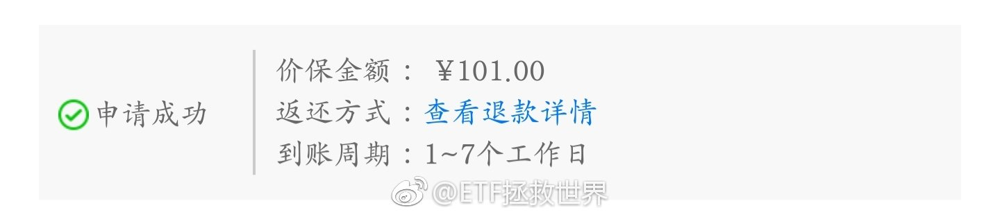

======================================================

ETF拯救世界 (5687069307) @
2019-04-15 08:27:11 Mon  
url: https://weibo.com/5687069307/HpHyKn1Tp

回复@小倪3070:关注我的人里面，所在地依次是北京 广东 上海 浙江 江苏…一线二线应该占了70%以上。关注这个领域的人，都是有点家底有点闲钱的。手头太紧也没功夫想理财的事//@小倪3070:基本上还是一些经济发达城市的发言，二线以下基本没什么声音

------------------------------------------------------
转推：
>  @ETF拯救世界 (5687069307)
>  2019-04-14 19:53:28 Sun  
>  url: https:/weibo.com/5687069307/HpCCO7RYx/

>  有个问题，问问关注我的，工作也是996的朋友：
>  
>  你们，或者说你的家人996，年收入到底是多少。 ​​​

转发[14]  评论[158]  赞[349] 

======================================================

ETF拯救世界 (5687069307) @
2019-04-15 08:37:25 Mon  
url: https://weibo.com/5687069307/HpHCToLZj

回复@阿笨的微博:事实证明多刷我的微博有好报…//@阿笨的微博:感谢E大，刚去看了最近买的东西，一共3件退回240，可以带女儿去吃顿牛排了[good][good][good]

------------------------------------------------------
转推：
>  @ETF拯救世界 (5687069307)
>  2019-04-15 08:14:48 Mon  
>  url: https:/weibo.com/5687069307/HpHtIjP0U/

>  今天上京东，发现前几天买的一个小东西降价了。随手点了保价，二十秒后处理完成。现在等退款。
>  
>  这种体验非常好。总让我想起当年在中关村买电脑的痛苦经历。
>  
>  以后我的快递都会尽量交给京东发。 ​​​

转发[3]  评论[44]  赞[376] 

======================================================

ETF拯救世界 (5687069307) @
2019-04-15 08:38:04 Mon  
url: https://weibo.com/5687069307/HpHDa0orC

回复@我又又又又改网名了:想发，但今天有可能大涨，我择一下时//@我又又又又改网名了:15号了，今天有车么//@ETF拯救世界:回复@小倪3070:关注我的人里面，所在地依次是北京 广东 上海 浙江 江苏…一线二线应该占了70%以上。关注这个领域的人，都是有点家底有点闲钱的。手头太紧也没功夫想理财的事

------------------------------------------------------
转推：
>  @ETF拯救世界 (5687069307)
>  2019-04-14 19:53:28 Sun  
>  url: https:/weibo.com/5687069307/HpCCO7RYx/

>  有个问题，问问关注我的，工作也是996的朋友：
>  
>  你们，或者说你的家人996，年收入到底是多少。 ​​​

转发[7]  评论[118]  赞[439] 

======================================================

ETF拯救世界 (5687069307) @
2019-04-15 08:49:05 Mon  
url: https://weibo.com/5687069307/HpHHD7zMH

到了 http://t.cn/EXVIQRj

------------------------------------------------------
转推：
>  @ETF拯救世界 (5687069307)
>  2019-04-15 08:14:48 Mon  
>  url: https:/weibo.com/5687069307/HpHtIjP0U/

>  今天上京东，发现前几天买的一个小东西降价了。随手点了保价，二十秒后处理完成。现在等退款。
>  
>  这种体验非常好。总让我想起当年在中关村买电脑的痛苦经历。
>  
>  以后我的快递都会尽量交给京东发。 ​​​

转发[1]  评论[120]  赞[366] 

======================================================

ETF拯救世界 (5687069307) @
2019-04-15 11:30:46 Mon  
url: https://weibo.com/5687069307/HpILg2Ovh

千万别以为债券的波动小 ​​​

转发[35]  评论[91]  赞[463] 

+++++++++++++++++++++++++++++++++++++++++++++++++++++

图片：

======================================================

ETF拯救世界 (5687069307) @
2019-04-15 11:33:55 Mon  
url: https://weibo.com/5687069307/HpIMxwaA9

老歌好听是因为80 90年代大部分是翻唱日本流行音乐。日本人的旋律非常在线。//@八大山债人:我娃和我一起听周华健。。。//@乐音悦酒: 回复@期货实盘志:你儿子00后？//@期货实盘志:文艺这几年衰败的很厉害，国内几乎没有创作歌手了，我儿子00后都觉得80-90年代那些老歌好听。

------------------------------------------------------
转推：
>  @虎嗅APP (2357213493)
>  2019-04-15 09:52:30 Mon  
>  url: https:/weibo.com/2357213493/HpI7n4bsm/

>  【中年人没有#996#】
>  
>  林琴所在的公司，不单单是管理岗，公司早就停掉了35岁以上候选人的招聘。确切地说，她们的候选人都在32岁以下，因为目前劳动合同通常一次性签三年，32岁的人再干3年正好满35岁，合同到期后企业可以选择解约。但目前35岁的候选人如果签3年合同，到期时候选人就已经38岁了，严重超 ​​​

转发[13]  评论[79]  赞[303] 

======================================================

ETF拯救世界 (5687069307) @
2019-04-15 11:46:05 Mon  
url: https://weibo.com/5687069307/HpIRtnklI

不知道你有没有感受，我们好像非常缺乏对“美”的认知。

无论是建筑，城市规划和景观设计，各种产品的工业设计，甚至各地新修建寺庙里面的雕像，再到大街上店家的招牌，人们的穿着，超市门口摇摇车的造型…

到处都体现一种迷样的审美。 ​​​

转发[45]  评论[285]  赞[621] 

======================================================

ETF拯救世界 (5687069307) @
2019-04-15 12:04:13 Mon  
url: https://weibo.com/5687069307/HpIYQflZz

回复@一个风向:我第一套房子上过装修杂志。现在没心气儿也没精力拍了//@一个风向:不用说那些大的，就看看家里的装修就知道大概了[允悲]，E打装修完了晒图吗

------------------------------------------------------
转推：
>  @ETF拯救世界 (5687069307)
>  2019-04-15 11:46:05 Mon  
>  url: https:/weibo.com/5687069307/HpIRtnklI/

>  不知道你有没有感受，我们好像非常缺乏对“美”的认知。
>  
>  无论是建筑，城市规划和景观设计，各种产品的工业设计，甚至各地新修建寺庙里面的雕像，再到大街上店家的招牌，人们的穿着，超市门口摇摇车的造型…
>  
>  到处都体现一种迷样的审美。 ​​​

转发[6]  评论[137]  赞[453] 

======================================================

ETF拯救世界 (5687069307) @
2019-04-15 15:13:19 Mon  
url: https://weibo.com/5687069307/HpKdB9Ipz

回复@硕仔满:巴洛克也好，歌特又或者维多利亚也好，都挺美。中国的传统风格也非常美。美不仅是流行，更是经典。

------------------------------------------------------
转推：
>  @ETF拯救世界 (5687069307)
>  2019-04-15 11:46:05 Mon  
>  url: https:/weibo.com/5687069307/HpIRtnklI/

>  不知道你有没有感受，我们好像非常缺乏对“美”的认知。
>  
>  无论是建筑，城市规划和景观设计，各种产品的工业设计，甚至各地新修建寺庙里面的雕像，再到大街上店家的招牌，人们的穿着，超市门口摇摇车的造型…
>  
>  到处都体现一种迷样的审美。 ​​​

转发[5]  评论[30]  赞[357] 

======================================================

ETF拯救世界 (5687069307) @
2019-04-15 15:18:27 Mon  
url: https://weibo.com/5687069307/HpKfFAUi0

本来以为是一周行情，谁知道是周一上午行情。

下半月随时发车。不会多，一两车。 ​​​

转发[25]  评论[364]  赞[944] 

======================================================

ETF拯救世界 (5687069307) @
2019-04-15 16:22:45 Mon  
url: https://weibo.com/5687069307/HpKFM4oMC

欧元继续 ​​​

转发[13]  评论[82]  赞[392] 

+++++++++++++++++++++++++++++++++++++++++++++++++++++

图片：

======================================================

ETF拯救世界 (5687069307) @
2019-04-15 18:40:14 Mon  
url: https://weibo.com/5687069307/HpLzzFs4K

回复@琴宣月柳:不是。我是说我们的Dax会不错，没说换欧元//@琴宣月柳:换了点欧元，不知道是不是合格的学生

------------------------------------------------------
转推：
>  @ETF拯救世界 (5687069307)
>  2019-04-15 16:22:45 Mon  
>  url: https:/weibo.com/5687069307/HpKFM4oMC/

>  欧元继续 ​​​

转发[7]  评论[78]  赞[349] 

======================================================

ETF拯救世界 (5687069307) @
2019-04-16 07:08:19 Tue  
url: https://weibo.com/5687069307/HpQte4DxV

有美感的城市规划

------------------------------------------------------
转推：
>  @全景志 (5930221915)
>  2019-04-05 14:49:03 Fri  
>  url: https:/weibo.com/5930221915/HodMM97dO/

>  用上帝视角看巴塞罗那 ​​​

转发[122]  评论[155]  赞[536] 

======================================================

ETF拯救世界 (5687069307) @
2019-04-16 07:34:44 Tue  
url: https://weibo.com/5687069307/HpQDXfy30

回复@秋声如许:昨天刚看到一篇新闻说卢浮宫要和故宫加强古迹修复方面的合作，晚上就…//@秋声如许:昨天E大刚聊到建筑美，聊到法国小镇，今天巴黎圣母院就烧了。好伤心，还没进去看呢。

------------------------------------------------------
转推：
>  @ETF拯救世界 (5687069307)
>  2019-04-15 11:46:05 Mon  
>  url: https:/weibo.com/5687069307/HpIRtnklI/

>  不知道你有没有感受，我们好像非常缺乏对“美”的认知。
>  
>  无论是建筑，城市规划和景观设计，各种产品的工业设计，甚至各地新修建寺庙里面的雕像，再到大街上店家的招牌，人们的穿着，超市门口摇摇车的造型…
>  
>  到处都体现一种迷样的审美。 ​​​

转发[2]  评论[42]  赞[306] 

======================================================

ETF拯救世界 (5687069307) @
2019-04-16 07:41:24 Tue  
url: https://weibo.com/5687069307/HpQGEtbF4

其实万事万物诞生之日起就已经注定要消失。

所以哪天你心爱的东西不小心坏了丢了，如果实在无法挽回，就随它去吧。

都是必然发生的。 ​​​

转发[76]  评论[250]  赞[1107] 

======================================================

ETF拯救世界 (5687069307) @
2019-04-16 12:21:37 Tue  
url: https://weibo.com/5687069307/HpSwomo9q

踏踏实实的。也许有调整，但是无论从估值 趋势 还是先行指标看，没有道理在这里下车。

有调整就继续买点，没有就继续等新高。

卖，当然以后要卖，但总要有个理由吧，不能看心情卖你说是不是。 ​​​

转发[119]  评论[409]  赞[1284] 

======================================================

ETF拯救世界 (5687069307) @
2019-04-16 14:24:58 Tue  
url: https://weibo.com/5687069307/HpTkswi7o

来了老弟？但是不出意外这个基本不会买多少。有交易价值，没有太多长期持有价值

------------------------------------------------------
转推：
>  @日经中文网 (2478163131)
>  2019-04-16 09:35:32 Tue  
>  url: https:/weibo.com/2478163131/HpRqYCZAa/

>  【中日开放式指数基金将相互上市】与日经平均指数和东证股价指数（TOPIX）联动的ETF将在上海证券交易所上市。这是日本股市的ETF首次在中国上市。 中国个人金融资产持有额到2023年达到82万亿元。日本期待中国资金通过ETF流入日本股市…… http://t.cn/EXaX6lh ​​​

转发[22]  评论[97]  赞[452] 

======================================================

ETF拯救世界 (5687069307) @
2019-04-16 16:39:20 Tue  
url: https://weibo.com/5687069307/HpUd094es

中欧两开花 ​​​

转发[5]  评论[79]  赞[431] 

+++++++++++++++++++++++++++++++++++++++++++++++++++++

图片：

======================================================

ETF拯救世界 (5687069307) @
2019-04-16 16:47:18 Tue  
url: https://weibo.com/5687069307/HpUgesGF1

最近出轨的瓜有点多啊，吃不过来了。

大家还是要管住自己啊，不展开说了。 ​​​

转发[37]  评论[94]  赞[465] 

======================================================

ETF拯救世界 (5687069307) @
2019-04-16 16:54:04 Tue  
url: https://weibo.com/5687069307/HpUiYD9Te

我能看出，很多朋友投资经常陷入的一个误区就是：

这个东西没有长期投资价值，或者长期投资价值很低，为什么要买它？我就不买。

投资品种有两类，一个叫做有长期投资价值，一个叫做有中短期交易价值。

很多“价投”只买前者，很多短线客只做后者。

我不这么做。小孩子才选择，成年人都要。

很多品 ​​​

转发[224]  评论[288]  赞[969] 

======================================================

ETF拯救世界 (5687069307) @
2019-04-16 17:06:33 Tue  
url: https://weibo.com/5687069307/HpUo37wnz

回复@别拿你屁股对着我:十年后如果中证500低于10000点我会非常非常非常惊讶。//@别拿你屁股对着我:万一这是近十年的山顶呢

------------------------------------------------------
转推：
>  @ETF拯救世界 (5687069307)
>  2019-04-16 12:21:37 Tue  
>  url: https:/weibo.com/5687069307/HpSwomo9q/

>  踏踏实实的。也许有调整，但是无论从估值 趋势 还是先行指标看，没有道理在这里下车。
>  
>  有调整就继续买点，没有就继续等新高。
>  
>  卖，当然以后要卖，但总要有个理由吧，不能看心情卖你说是不是。 ​​​

转发[42]  评论[123]  赞[414] 

======================================================

ETF拯救世界 (5687069307) @
2019-04-16 18:12:15 Tue  
url: https://weibo.com/5687069307/HpUOIDNkA

看评论可以了解我们的语文教育多么失败。真的。//@ETF拯救世界:回复@别拿你屁股对着我:十年后如果中证500低于10000点我会非常非常非常惊讶。//@别拿你屁股对着我:万一这是近十年的山顶呢

------------------------------------------------------
转推：
>  @ETF拯救世界 (5687069307)
>  2019-04-16 12:21:37 Tue  
>  url: https:/weibo.com/5687069307/HpSwomo9q/

>  踏踏实实的。也许有调整，但是无论从估值 趋势 还是先行指标看，没有道理在这里下车。
>  
>  有调整就继续买点，没有就继续等新高。
>  
>  卖，当然以后要卖，但总要有个理由吧，不能看心情卖你说是不是。 ​​​

转发[9]  评论[140]  赞[395] 

======================================================

ETF拯救世界 (5687069307) @
2019-04-17 10:23:20 Wed  
url: https://weibo.com/5687069307/Hq1aT22AC

回复@么么在浆糊:谈自己的爱情故事就像在社交平台晒娃，自己津津有味，旁人只觉得平平无奇。//@么么在浆糊:想听E大的爱情故事[憧憬][憧憬][憧憬]

------------------------------------------------------
转推：
>  @ETF拯救世界 (5687069307)
>  2019-04-16 16:47:18 Tue  
>  url: https:/weibo.com/5687069307/HpUgesGF1/

>  最近出轨的瓜有点多啊，吃不过来了。
>  
>  大家还是要管住自己啊，不展开说了。 ​​​

转发[32]  评论[92]  赞[413] 

======================================================

ETF拯救世界 (5687069307) @
2019-04-17 10:28:05 Wed  
url: https://weibo.com/5687069307/Hq1cO84E6

回复@湛江街拍:我推荐经常坐飞机地铁或者公交的朋友试试降噪耳机。我这两年买的比较满意的产品。//@湛江街拍:想听e大推荐好用东西，大家才有动力赚钱买货//@ETF拯救世界:回复@么么在浆糊:谈自己的爱情故事就像在社交平台晒娃，自己津津有味，旁人只觉得平平无奇。

------------------------------------------------------
转推：
>  @ETF拯救世界 (5687069307)
>  2019-04-16 16:47:18 Tue  
>  url: https:/weibo.com/5687069307/HpUgesGF1/

>  最近出轨的瓜有点多啊，吃不过来了。
>  
>  大家还是要管住自己啊，不展开说了。 ​​​

转发[22]  评论[183]  赞[379] 

======================================================

ETF拯救世界 (5687069307) @
2019-04-17 12:03:35 Wed  
url: https://weibo.com/5687069307/Hq1Pzl3iB

不懂就不要乱投资。

买个债券都可能赔钱你能想到。 ​​​

转发[54]  评论[189]  赞[553] 

+++++++++++++++++++++++++++++++++++++++++++++++++++++

图片：
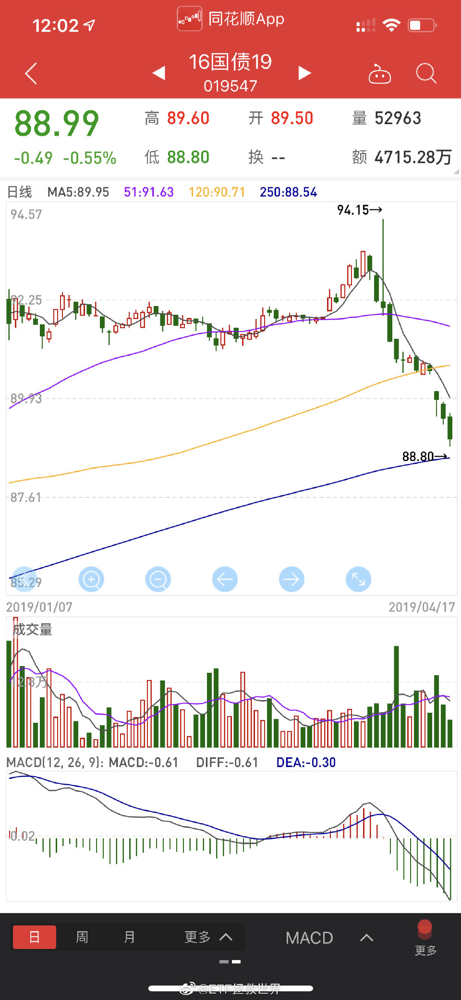

======================================================

ETF拯救世界 (5687069307) @
2019-04-17 12:45:59 Wed  
url: https://weibo.com/5687069307/Hq26MoOqa

回复@发生这种事我要粉碎你:震惊。[doge]//@发生这种事我要粉碎你:历史还真是简单的重复 这次也一样

------------------------------------------------------
转推：
>  @ETF拯救世界 (5687069307)
>  2018-10-11 15:43:18 Thu  
>  url: https:/weibo.com/5687069307/GDqnIDSfZ/

>  今天=
>  
>  2005年3月
>  
>  3个月后，998。 ​​​

转发[37]  评论[185]  赞[492] 

======================================================

ETF拯救世界 (5687069307) @
2019-04-17 16:06:16 Wed  
url: https://weibo.com/5687069307/Hq3q4zdQu

回复@Fund_Study:真的吗。那要去哪里交流//@Fund_Study:听说微博要下架1个月？没有e大我们怎么办//@ETF拯救世界:回复@发生这种事我要粉碎你:震惊。[doge]//@发生这种事我要粉碎你:历史还真是简单的重复 这次也一样

------------------------------------------------------
转推：
>  @ETF拯救世界 (5687069307)
>  2018-10-11 15:43:18 Thu  
>  url: https:/weibo.com/5687069307/GDqnIDSfZ/

>  今天=
>  
>  2005年3月
>  
>  3个月后，998。 ​​​

转发[4]  评论[106]  赞[290] 

======================================================

ETF拯救世界 (5687069307) @
2019-04-17 16:38:57 Wed  
url: https://weibo.com/5687069307/Hq3DlehS8

我看很多朋友分不清债市走势和转债的关系。极简说几句。

其实各位每次打的转债，不应该算是债券范畴，它的走势跟股市关系更大。目前的情况不用犹豫，每只都打就对了。

很难破发，即使破了也问题不大，因为你不会中太多。另外你持有很多只，资金分散，也不是大问题。

我不想说转债没有风险，毕竟之前 ​​​

转发[352]  评论[360]  赞[779] 

======================================================

ETF拯救世界 (5687069307) @
2019-04-17 16:48:22 Wed  
url: https://weibo.com/5687069307/Hq3HacGUZ

目前A股收益率再次低于十年国债收益率。

本次股票收益率高于国债收益率周期为7个月，与2005、2008、2012三次大底持续的时间基本相同。 ​​​

转发[337]  评论[291]  赞[740] 

======================================================

ETF拯救世界 (5687069307) @
2019-04-17 17:21:38 Wed  
url: https://weibo.com/5687069307/Hq3UFDF36

回复@吧嗒木:A股历史上还没有过出了钻石坑再回去的情况。有几次在黄金坑里面调整。如果这次出现了，那又是一个新纪录。//@吧嗒木:说不定又掉回坑里

------------------------------------------------------
转推：
>  @ETF拯救世界 (5687069307)
>  2019-04-17 16:48:22 Wed  
>  url: https:/weibo.com/5687069307/Hq3HacGUZ/

>  目前A股收益率再次低于十年国债收益率。
>  
>  本次股票收益率高于国债收益率周期为7个月，与2005、2008、2012三次大底持续的时间基本相同。 ​​​

转发[65]  评论[71]  赞[444] 

======================================================

ETF拯救世界 (5687069307) @
2019-04-17 18:07:21 Wed  
url: https://weibo.com/5687069307/Hq4ddFXhm

最近文章写得少，BGM攒了一大堆了！ ​​​

转发[6]  评论[172]  赞[610] 

======================================================

ETF拯救世界 (5687069307) @
2019-04-17 19:07:38 Wed  
url: https://weibo.com/5687069307/Hq4BH4FzS

每天涨得是不多，架不住天天涨啊。

以为梅赛德斯的事能压一波呢。 ​​​

转发[7]  评论[77]  赞[443] 

+++++++++++++++++++++++++++++++++++++++++++++++++++++

图片：

======================================================

ETF拯救世界 (5687069307) @
2019-04-17 19:09:19 Wed  
url: https://weibo.com/5687069307/Hq4CnALia

一天到晚没完没了的折腾。没事，还有12年…

------------------------------------------------------
转推：
>  @央视新闻 (2656274875)
>  2019-04-17 18:40:44 Wed  
>  url: https:/weibo.com/2656274875/Hq4qM4dVu/

>  【#北京今年高考一二本合并#】今天，北京市招生考试委员会审议通过了相关文件。今年：①北京高考共有5.9万人报名；②将本科一批、二批合并为本科普通批，设置16所平行志愿高校，每个志愿高校设置6个志愿专业；③艺术类招生实行分段录取；美术类院校（专业）使用美术统考成绩作为专业成绩录取的，实施平 ​​​

转发[3]  评论[136]  赞[311] 

======================================================

ETF拯救世界 (5687069307) @
2019-04-17 22:19:41 Wed  
url: https://weibo.com/5687069307/Hq5RE8xPJ

回复@天生不是情人mallee:别教育我用什么方式给A股估值好吗？服了

------------------------------------------------------
转推：
>  @ETF拯救世界 (5687069307)
>  2019-04-17 16:48:22 Wed  
>  url: https:/weibo.com/5687069307/Hq3HacGUZ/

>  目前A股收益率再次低于十年国债收益率。
>  
>  本次股票收益率高于国债收益率周期为7个月，与2005、2008、2012三次大底持续的时间基本相同。 ​​​

转发[10]  评论[32]  赞[345] 

======================================================

ETF拯救世界 (5687069307) @
2019-04-17 22:25:24 Wed  
url: https://weibo.com/5687069307/Hq5TY4hCz

我计算A股估值的模型，是我自己开发的，已经用了十年，并不断进化。

精确判断2007 2010 2015大顶，以及2008 2012 2018大底。

2015年开始为大家所知的时候，无数人和大V嘲笑我的系统，后来事实一次次把他们的脸都打肿了，教育我怎么估值的人越来越少了。

我只希望，你教育我之前，先了解一下我和我的 ​​​

转发[89]  评论[214]  赞[859] 

======================================================

ETF拯救世界 (5687069307) @
2019-04-17 22:28:17 Wed  
url: https://weibo.com/5687069307/Hq5V8oCJL

回复@特色小挣:去公众号看首页菜单春节特辑//@特色小挣:精确判断，精确到什么级别啊？

------------------------------------------------------
转推：
>  @ETF拯救世界 (5687069307)
>  2019-04-17 22:25:24 Wed  
>  url: https:/weibo.com/5687069307/Hq5TY4hCz/

>  我计算A股估值的模型，是我自己开发的，已经用了十年，并不断进化。
>  
>  精确判断2007 2010 2015大顶，以及2008 2012 2018大底。
>  
>  2015年开始为大家所知的时候，无数人和大V嘲笑我的系统，后来事实一次次把他们的脸都打肿了，教育我怎么估值的人越来越少了。
>  
>  我只希望，你教育我之前，先了解一下我和我的 ​​​

转发[12]  评论[31]  赞[327] 

======================================================

ETF拯救世界 (5687069307) @
2019-04-17 22:33:48 Wed  
url: https://weibo.com/5687069307/Hq5Xnjnc6

目前A股市盈率18倍。你信吗？

马云马化腾和98个贫困山区的人站在一起，100个人平均都是亿万富翁？得出的结论是大家都很有钱？ ​​​

转发[107]  评论[159]  赞[561] 

======================================================

ETF拯救世界 (5687069307) @
2019-04-17 22:39:54 Wed  
url: https://weibo.com/5687069307/Hq5ZQE2Ql

回复@索菲小娅:实际上去掉几个富豪，小部分人只是中产阶级，大部分人都是贫困人口。这就是A股估值现状//@索菲小娅:意思是说，实际上远不到18，整体还比较便宜吗？

------------------------------------------------------
转推：
>  @ETF拯救世界 (5687069307)
>  2019-04-17 22:33:48 Wed  
>  url: https:/weibo.com/5687069307/Hq5Xnjnc6/

>  目前A股市盈率18倍。你信吗？
>  
>  马云马化腾和98个贫困山区的人站在一起，100个人平均都是亿万富翁？得出的结论是大家都很有钱？ ​​​

转发[51]  评论[43]  赞[357] 

======================================================

ETF拯救世界 (5687069307) @
2019-04-17 22:49:34 Wed  
url: https://weibo.com/5687069307/Hq63MaLvy

回复@蓝色彼得潘的小窝:为什么我算的是26，你能把纳斯达克100去掉巨头市盈率90倍的计算过程贴一下吗//@蓝色彼得潘的小窝:纳斯达克去掉六大巨头剩下市盈率90几倍//@ETF拯救世界:回复@索菲小娅:实际上去掉几个富豪，小部分人只是中产阶级，大部分人都是贫困人口。这就是A股估值现状

------------------------------------------------------
转推：
>  @ETF拯救世界 (5687069307)
>  2019-04-17 22:33:48 Wed  
>  url: https:/weibo.com/5687069307/Hq5Xnjnc6/

>  目前A股市盈率18倍。你信吗？
>  
>  马云马化腾和98个贫困山区的人站在一起，100个人平均都是亿万富翁？得出的结论是大家都很有钱？ ​​​

转发[22]  评论[57]  赞[352] 

======================================================

ETF拯救世界 (5687069307) @
2019-04-17 22:57:25 Wed  
url: https://weibo.com/5687069307/Hq66Y7TVa

还不赶紧去领？

------------------------------------------------------
转推：
>  @育碧中国工作室 (2525430612)
>  2019-04-17 22:15:03 Wed  
>  url: https:/weibo.com/2525430612/Hq5PLq4VX/

>  本周一发生的#巴黎圣母院大火# 令全世界为之哭泣，育碧将捐献50万欧元用于圣母院的修复工作。
>  此外，从即刻起的一周内，玩家可以免费在Uplay领取《刺客信条：大革命》PC版。 ​​​

转发[32]  评论[95]  赞[355] 

======================================================

ETF拯救世界 (5687069307) @
2019-04-18 08:01:44 Thu  
url: https://weibo.com/5687069307/Hq9FTDYy6

希望桥水是对的。美股如果能用一两年跌40%，我们成本控制在30%的地方，再用3-5年涨回来，收益率翻番问题不大。问题是能跌40%吗…

------------------------------------------------------
转推：
>  @ ()
>  2019-04-18 06:02:56 Thu  
>  url: 

>  抱歉，作者已设置仅展示半年内微博，此微博已不可见。 ​​​

转发[64]  评论[231]  赞[580] 

======================================================

ETF拯救世界 (5687069307) @
2019-04-18 16:04:50 Thu  
url: https://weibo.com/5687069307/HqcPZEyXq

这位母亲把车停在路中间，跟孩子说了什么，刺激到孩子毅然跳桥，我自己脑补了一下。然后告诉自己，以后无论如何都不能对孩子说这样的话。

------------------------------------------------------
转推：
>  @新浪视频 (1640601392)
>  2019-04-18 14:07:51 Thu  
>  url: https:/weibo.com/1640601392/Hqc4vp8Au/

>  【悲剧！上海17岁男孩因琐事与母争吵 跳高架桥当场死亡[伤心]】4月17日晚10时左右，上海卢浦大桥发生一起跳桥事故。据调查，跳桥者为17岁在校高二男生，经120确认当场死亡。其母讲述，当她驾驶到卢浦大桥时，与儿子因在校同学矛盾发生口角，其子突然跑出车门跳下大桥，女子追逐不及，悲剧发生。 ​​​

转发[295]  评论[312]  赞[283] 

======================================================

ETF拯救世界 (5687069307) @
2019-04-18 16:22:11 Thu  
url: https://weibo.com/5687069307/HqcX25Ol6

这样的好天气我竟然在家养伤。 ​​​

转发[3]  评论[332]  赞[419] 

======================================================

ETF拯救世界 (5687069307) @
2019-04-18 16:56:38 Thu  
url: https://weibo.com/5687069307/Hqdb154Bg

回复@潮水18:所以家长才需要给孩子一个底线——无论外面的世界如何黑暗，家里永远会让你感受到温暖。有这最后的温暖孩子就有希望。

------------------------------------------------------
转推：
>  @新浪视频 (1640601392)
>  2019-04-18 14:07:51 Thu  
>  url: https:/weibo.com/1640601392/Hqc4vp8Au/

>  【悲剧！上海17岁男孩因琐事与母争吵 跳高架桥当场死亡[伤心]】4月17日晚10时左右，上海卢浦大桥发生一起跳桥事故。据调查，跳桥者为17岁在校高二男生，经120确认当场死亡。其母讲述，当她驾驶到卢浦大桥时，与儿子因在校同学矛盾发生口角，其子突然跑出车门跳下大桥，女子追逐不及，悲剧发生。 ​​​

转发[152]  评论[59]  赞[364] 

======================================================

ETF拯救世界 (5687069307) @
2019-04-18 16:58:54 Thu  
url: https://weibo.com/5687069307/HqdbWaVbq

这也是我每次都能迅速从各种明枪暗箭又或者是喷子的吐沫中迅速走出来的原因，因为能感受到更多的爱啊……//@ETF拯救世界:回复@潮水18:所以家长才需要给孩子一个底线——无论外面的世界如何黑暗，家里永远会让你感受到温暖。有这最后的温暖孩子就有希望。

------------------------------------------------------
转推：
>  @新浪视频 (1640601392)
>  2019-04-18 14:07:51 Thu  
>  url: https:/weibo.com/1640601392/Hqc4vp8Au/

>  【悲剧！上海17岁男孩因琐事与母争吵 跳高架桥当场死亡[伤心]】4月17日晚10时左右，上海卢浦大桥发生一起跳桥事故。据调查，跳桥者为17岁在校高二男生，经120确认当场死亡。其母讲述，当她驾驶到卢浦大桥时，与儿子因在校同学矛盾发生口角，其子突然跑出车门跳下大桥，女子追逐不及，悲剧发生。 ​​​

转发[50]  评论[106]  赞[452] 

======================================================

ETF拯救世界 (5687069307) @
2019-04-18 17:26:26 Thu  
url: https://weibo.com/5687069307/Hqdn73ZzG

目前已经有一半500成分股公布年报，从四季度单季看，整体利润依然在增长。

远远好于全市场，甚至好于300。

1月份说500越跌越贵的人太坏了。 ​​​

转发[178]  评论[146]  赞[818] 

======================================================

ETF拯救世界 (5687069307) @
2019-04-18 17:30:25 Thu  
url: https://weibo.com/5687069307/HqdoJeyr2

更要注意的是，我预计2季度，最迟3季度，500将恢复高增长。

------------------------------------------------------
转推：
>  @ETF拯救世界 (5687069307)
>  2019-04-18 17:26:26 Thu  
>  url: https:/weibo.com/5687069307/Hqdn73ZzG/

>  目前已经有一半500成分股公布年报，从四季度单季看，整体利润依然在增长。
>  
>  远远好于全市场，甚至好于300。
>  
>  1月份说500越跌越贵的人太坏了。 ​​​

转发[104]  评论[203]  赞[697] 

======================================================

ETF拯救世界 (5687069307) @
2019-04-18 18:13:11 Thu  
url: https://weibo.com/5687069307/HqdG5p2oL

小样儿 ​​​

转发[10]  评论[99]  赞[451] 

+++++++++++++++++++++++++++++++++++++++++++++++++++++

图片：

======================================================

ETF拯救世界 (5687069307) @
2019-04-18 18:37:42 Thu  
url: https://weibo.com/5687069307/HqdQ30XgB

回复@1818就是我:涨了不开心，难道跌了开心吗？启动前又买了，不应该开心吗？建议你有机会就让自己多开心一点，人也会比较健康//@1818就是我:为什么每天涨这么一点就这么开心。。

------------------------------------------------------
转推：
>  @ETF拯救世界 (5687069307)
>  2019-04-18 18:13:11 Thu  
>  url: https:/weibo.com/5687069307/HqdG5p2oL/

>  小样儿 ​​​

转发[6]  评论[70]  赞[452] 

======================================================

ETF拯救世界 (5687069307) @
2019-04-18 18:46:22 Thu  
url: https://weibo.com/5687069307/HqdTytikX

给各位一个数值：

5%。

如果一个品种在你的配置中超过5%，就可以影响你的组合净值了。不到5%很难影响。

记住这个数字，并应用它。 ​​​

转发[428]  评论[497]  赞[1178] 

======================================================

ETF拯救世界 (5687069307) @
2019-04-19 16:59:28 Fri  
url: https://weibo.com/5687069307/HqmCFaLDd

A股历史上除了2008年底开始的上涨，从未出现过类似这波行情的毫无回调的情况。

果然历史没有简单重复的啊。 ​​​

转发[351]  评论[324]  赞[874] 

======================================================

ETF拯救世界 (5687069307) @
2019-04-19 17:21:56 Fri  
url: https://weibo.com/5687069307/HqmLMsb9l

各位还是要在每个阶段清楚自己在赚什么钱。

从底部到顶部，三部分的钱。

第一，估值修复的钱。

第二，正常增长的钱。

第三，疯狂泡沫的钱。

目前依然在第一阶段。 ​​​

转发[463]  评论[430]  赞[1134] 

======================================================

ETF拯救世界 (5687069307) @
2019-04-19 17:59:18 Fri  
url: https://weibo.com/5687069307/Hqn0WDLxv

这才是蝴蝶效应。我的一点想法：第一，欠钱和维权是两回事，要分开说。维权的事情100%支持，也非常敬佩。第二，欠钱的事也建议双方追到底，如果是造谣，把造谣的人和幕后黑手全部绳之以法。如果是真的，该还钱还钱。这个世界上，没有圣人，别觉得做了好事的人就一点错不可能犯。你认识圣人吗？我不认识

------------------------------------------------------
转推：
>  @新浪财经 (1638782947)
>  2019-04-19 13:38:35 Fri  
>  url: https:/weibo.com/1638782947/Hqlj7yGf4/

>  【奔驰女车主被指涉千万债务纠纷 网友：一码归一码】早在女子维权期间，她略带南方口音提出对奔驰4s点收取一万五的金融服务费的质疑：“ 一万五让我们做生意的得卖1000多碗面！”让众多网友私下猜疑该女子从事餐饮行业。而据微博网友@向奔驰女车主讨债的人 爆料，奔驰维权女车主名叫薛春艳，毕业于上海 ​​​

转发[22]  评论[89]  赞[1058] 

======================================================

ETF拯救世界 (5687069307) @
2019-04-19 18:05:40 Fri  
url: https://weibo.com/5687069307/Hqn3x9khB

回复@谁喷益达我抽谁:你的想法和我的观察不谋而合。继续观察吧。我不信长牛会这样一路下去。所以，要么是我错了，不是长牛。要么就不会这样涨下去。//@谁喷益达我抽谁:我在想，如果像09年那样没有夯实底部就急涨的话，那么涨幅肯定不会像07年和15年涨幅那么大了

------------------------------------------------------
转推：
>  @ETF拯救世界 (5687069307)
>  2019-04-19 16:59:28 Fri  
>  url: https:/weibo.com/5687069307/HqmCFaLDd/

>  A股历史上除了2008年底开始的上涨，从未出现过类似这波行情的毫无回调的情况。
>  
>  果然历史没有简单重复的啊。 ​​​

转发[122]  评论[134]  赞[544] 

======================================================

ETF拯救世界 (5687069307) @
2019-04-19 18:26:08 Fri  
url: https://weibo.com/5687069307/HqnbQ9Cqj

回复@l水平不行l:把所有可能性列出来，然后分析发生概率，然后制定对策。这样的逻辑思维体系你能理解吗。理解不了就继续去感觉怪怪的吧。//@l水平不行l:要么这，要么那，好像很有道理的样子。怎么感觉哪里怪怪的？

------------------------------------------------------
转推：
>  @ETF拯救世界 (5687069307)
>  2019-04-19 16:59:28 Fri  
>  url: https:/weibo.com/5687069307/HqmCFaLDd/

>  A股历史上除了2008年底开始的上涨，从未出现过类似这波行情的毫无回调的情况。
>  
>  果然历史没有简单重复的啊。 ​​​

转发[47]  评论[116]  赞[534] 

======================================================

ETF拯救世界 (5687069307) @
2019-04-20 10:04:15 Sat  
url: https://weibo.com/5687069307/HqtkD7Tmd

回复@WatererX:太对了。最关键要在别人的基础上再思考，再提高。这是最最关键的。我不反对别人参考我的东西，但一定要有创新和提高，我本身也能反过来学到东西。

------------------------------------------------------
转推：
>  @ETF拯救世界 (5687069307)
>  2019-04-19 17:21:56 Fri  
>  url: https:/weibo.com/5687069307/HqmLMsb9l/

>  各位还是要在每个阶段清楚自己在赚什么钱。
>  
>  从底部到顶部，三部分的钱。
>  
>  第一，估值修复的钱。
>  
>  第二，正常增长的钱。
>  
>  第三，疯狂泡沫的钱。
>  
>  目前依然在第一阶段。 ​​​

转发[37]  评论[44]  赞[469] 

======================================================

ETF拯救世界 (5687069307) @
2019-04-20 10:06:28 Sat  
url: https://weibo.com/5687069307/Hqtlwn9QM

懂法律的说说。 ​​​

转发[12]  评论[153]  赞[302] 

+++++++++++++++++++++++++++++++++++++++++++++++++++++

图片：
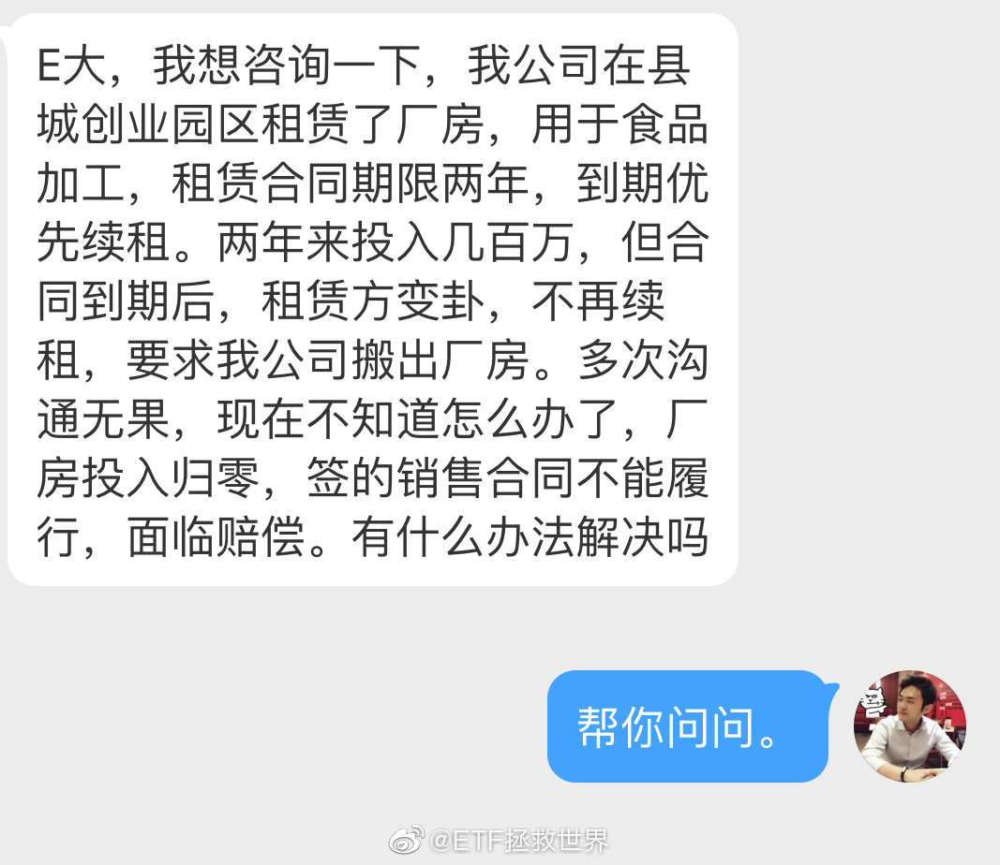

======================================================

ETF拯救世界 (5687069307) @
2019-04-20 10:36:06 Sat  
url: https://weibo.com/5687069307/HqtxybM3P

关于本人的投资理念和计划，会发布在微博和公众号。

更进一步的数据，体系和策略，每天会有个投资日记，也会发给一部分朋友。

如果有一天我把这百万字的更靠近核心的东西公开，你就会发现有多少已经被各路人马拿走公开发布。毕竟，那“一部分朋友”里面也有坏人啊。

再说一次我的想法：投资这件事互 ​​​

转发[77]  评论[832]  赞[1869] 

======================================================

ETF拯救世界 (5687069307) @
2019-04-20 15:17:15 Sat  
url: https://weibo.com/5687069307/HqvnFrRHE

[微笑] 今天起，开始着手整理本人几大交易策略中的“网格”策略，将在公众号连续更新。

内容包括从2011年开始的1.0-3.0版所有细节，并将贴出过去写的原始文字记录。 ​​​

转发[71]  评论[979]  赞[3166] 

======================================================

ETF拯救世界 (5687069307) @
2019-04-20 19:44:41 Sat  
url: https://weibo.com/5687069307/Hqx8dBYsq

对不起，收回去年微博上发的“支持东哥”那四个字。

网站好用，不代表我能认同这么下流的行为。如果起诉书都是真的，我只能说感到恶心。

万万没想到啊。 ​​​

转发[19]  评论[427]  赞[912] 

======================================================

ETF拯救世界 (5687069307) @
2019-04-21 11:07:48 Sun  
url: https://weibo.com/5687069307/HqDaUzuYo

昨天那个帖子大家也别吵了。其实很多事情我们永远也不会知道真相。翻开历史书，上面有多少真相？

咱们大家看这种远隔千山万水的事，其实都是带着自己的主观判断个人喜好个人立场的。也不是说不能表达自己的观点，我是觉得为了这个看不到真相的事情，带着自己的情绪争论，意义不大。

我本人从这样的事 ​​​

转发[13]  评论[199]  赞[561] 

======================================================

ETF拯救世界 (5687069307) @
2019-04-22 09:31:38 Mon  
url: https://weibo.com/5687069307/HqLYnjbXs

好消息是脚伤应该快好了，可以出去浪了 ​​​

转发[17]  评论[130]  赞[510] 

+++++++++++++++++++++++++++++++++++++++++++++++++++++

图片：
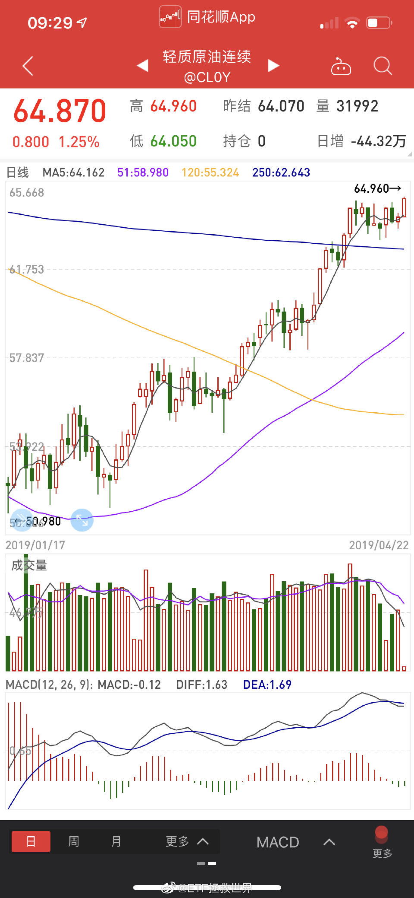

======================================================

ETF拯救世界 (5687069307) @
2019-04-22 09:34:11 Mon  
url: https://weibo.com/5687069307/HqLZq3319

旁边奥迪招谁惹谁了

------------------------------------------------------
转推：
>  @北京人不知道的北京事儿 (1662214194)
>  2019-04-22 09:11:26 Mon  
>  url: https:/weibo.com/1662214194/HqLQb7ev7/

>  网友投稿：昨晚发生的事儿，特斯拉自燃后爆了。。。[衰][衰]http://t.cn/Eat3evl ​ ​​​

转发[12]  评论[69]  赞[193] 

======================================================

ETF拯救世界 (5687069307) @
2019-04-22 09:36:10 Mon  
url: https://weibo.com/5687069307/HqM0doHzz

需要注意的是，政策面有微妙变化。 ​​​

转发[48]  评论[126]  赞[544] 

======================================================

ETF拯救世界 (5687069307) @
2019-04-22 10:11:46 Mon  
url: https://weibo.com/5687069307/HqMeFkmQX

回复@未尽的梦2510426195:你们高兴早了吧。伤好了要马上恢复训练，买的课再不上就要罚款了。然后9月前也有事不能走太远，只能短途出行。一个月的世界之旅要过几个月了……//@未尽的梦2510426195:总算盼到你出去了

------------------------------------------------------
转推：
>  @ETF拯救世界 (5687069307)
>  2019-04-22 09:31:38 Mon  
>  url: https:/weibo.com/5687069307/HqLYnjbXs/

>  好消息是脚伤应该快好了，可以出去浪了 ​​​

转发[1]  评论[50]  赞[295] 

======================================================

ETF拯救世界 (5687069307) @
2019-04-22 10:23:01 Mon  
url: https://weibo.com/5687069307/HqMjer4kP

油开始浪了。正好本周且慢问答回答了一个关于NOPEC、油价和油气的问题。周三可以观摩一下。

------------------------------------------------------
转推：
>  @ETF拯救世界 (5687069307)
>  2019-04-22 09:31:38 Mon  
>  url: https:/weibo.com/5687069307/HqLYnjbXs/

>  好消息是脚伤应该快好了，可以出去浪了 ​​​

转发[7]  评论[74]  赞[410] 

======================================================

ETF拯救世界 (5687069307) @
2019-04-22 10:48:28 Mon  
url: https://weibo.com/5687069307/HqMtz3oqy

分享图片 ​​​

转发[4]  评论[50]  赞[331] 

+++++++++++++++++++++++++++++++++++++++++++++++++++++

图片：

======================================================

ETF拯救世界 (5687069307) @
2019-04-22 11:03:05 Mon  
url: https://weibo.com/5687069307/HqMzuEfWL

之前有机构的朋友问为什么发车油气。我给出了标准答案： ​​​

转发[14]  评论[126]  赞[480] 

+++++++++++++++++++++++++++++++++++++++++++++++++++++

图片：
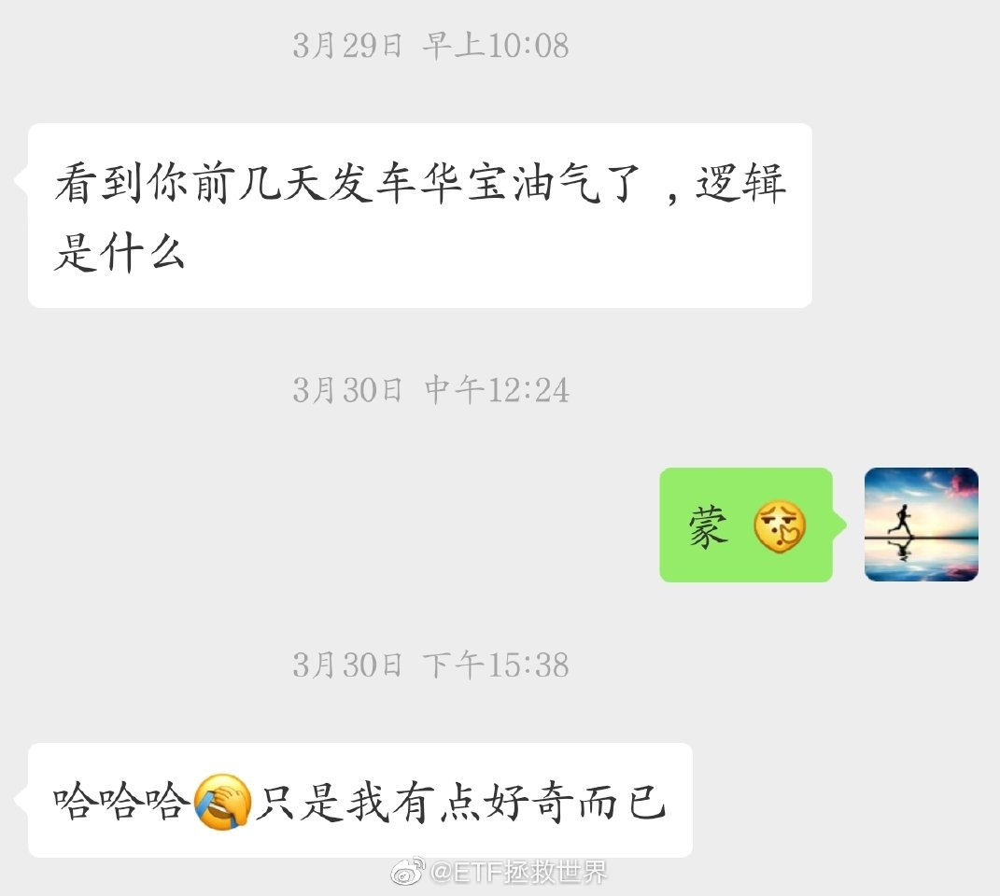

======================================================

ETF拯救世界 (5687069307) @
2019-04-22 11:15:41 Mon  
url: https://weibo.com/5687069307/HqMEC0LdS

注意，场内油气已经溢价接近3%，情况不明了，谁爱追谁追，反正我不追 ​​​

转发[11]  评论[76]  赞[442] 

======================================================

ETF拯救世界 (5687069307) @
2019-04-22 11:17:54 Mon  
url: https://weibo.com/5687069307/HqMFwatB7

感觉这样的人多了的话，以后女性找工作难度会上升

------------------------------------------------------
转推：
>  @北京人不知道的北京事儿 (1662214194)
>  2019-04-22 10:47:53 Mon  
>  url: https:/weibo.com/1662214194/HqMtkhNFT/

>  【女员工试用期怀孕 告知公司后遭辞退】王女士今年28岁，入职了一家公司，被告知公司的试用期为1个月至3个月。4月13日，王女士发现自己怀孕了，怀的是第一胎。她主动向领导如实报告。领导得知她怀孕后，表示要辞退她，并且多给她开了2天的工资作为补偿。王女士难过地表示，她本想真诚沟通，没想到会换 ​​​

转发[14]  评论[133]  赞[280] 

======================================================

ETF拯救世界 (5687069307) @
2019-04-22 11:39:27 Mon  
url: https://weibo.com/5687069307/HqMOg3OiW

感谢大家信任，但是鉴于问题类型已经从投资扩展到健康、亲情、爱情、司法、社会、娱乐、婚恋、职业生涯、亲子、游戏、报考学校及专业等问题，实在能力有限，很多问题都解答不了，就没有回复，见谅了各位… ​​​

转发[11]  评论[325]  赞[447] 

+++++++++++++++++++++++++++++++++++++++++++++++++++++

图片：

======================================================

ETF拯救世界 (5687069307) @
2019-04-22 13:18:55 Mon  
url: https://weibo.com/5687069307/HqNsCyyNG

我部门手下的女性员工，有怀孕的，我都会主动通知她们每天可以提前下班半个小时。早上晚点来也可以，避开交通高峰期。有身体不好需要休息的也直接休息，请几天假不会记请假。

产假期间，本来规定有些福利不能享受了，我还是会向人力部门争取，尽量都给她们保持。

产假之后开始上班也是，需要的方便都 ​​​

转发[30]  评论[241]  赞[881] 

======================================================

ETF拯救世界 (5687069307) @
2019-04-22 13:42:31 Mon  
url: https://weibo.com/5687069307/HqNCdspIx

市场还是很敏感的。先考验支撑位吧。这一路上来一次支撑都不碰也太说不过去了

------------------------------------------------------
转推：
>  @ETF拯救世界 (5687069307)
>  2019-04-22 09:36:10 Mon  
>  url: https:/weibo.com/5687069307/HqM0doHzz/

>  需要注意的是，政策面有微妙变化。 ​​​

转发[22]  评论[178]  赞[531] 

======================================================

ETF拯救世界 (5687069307) @
2019-04-22 16:42:42 Mon  
url: https://weibo.com/5687069307/HqONm3e2l

[泪]

------------------------------------------------------
转推：
>  @ ()
>  2019-04-22 13:56:46 Mon  
>  url: 

>  抱歉，作者已设置仅展示半年内微博，此微博已不可见。 ​​​

转发[77]  评论[58]  赞[301] 

======================================================

ETF拯救世界 (5687069307) @
2019-04-22 16:50:20 Mon  
url: https://weibo.com/5687069307/HqOQrwFis

无话可说。如果视频是真的，这女的以及幕后团队到底是怎样的决心要搞死京东才会那样写起诉书。继续吃瓜，先确认视频是不是真的再接着吃。

------------------------------------------------------
转推：
>  @新浪科技 (1642634100)
>  2019-04-22 15:50:57 Mon  
>  url: https:/weibo.com/1642634100/HqOslbQy1/

>  【疑似#刘强东案视频曝光# 仙人跳实锤？】据微博网友@明州事记 爆料，刘强东明州案晚宴视频曝光，女方邀请刘强东进入酒店。http://t.cn/Eaf3hhU ​​​

转发[103]  评论[97]  赞[239] 

======================================================

ETF拯救世界 (5687069307) @
2019-04-22 17:02:47 Mon  
url: https://weibo.com/5687069307/HqOVvjibU

回复@love明媚冬日:起诉书里说，晚宴9：11分结束。视频里的时间是9：50左右。如果视频时间没有作假，就是晚宴结束后。//@love明媚冬日:这是不是晚宴前的视频？

------------------------------------------------------
转推：
>  @新浪科技 (1642634100)
>  2019-04-22 15:50:57 Mon  
>  url: https:/weibo.com/1642634100/HqOslbQy1/

>  【疑似#刘强东案视频曝光# 仙人跳实锤？】据微博网友@明州事记 爆料，刘强东明州案晚宴视频曝光，女方邀请刘强东进入酒店。http://t.cn/Eaf3hhU ​​​

转发[71]  评论[100]  赞[172] 

======================================================

ETF拯救世界 (5687069307) @
2019-04-22 17:17:26 Mon  
url: https://weibo.com/5687069307/HqP1rxNuV

酒是穿肠毒药，色是刮骨钢刀。之前我说黄赌毒别碰，很多朋友评论说，黄没事啊。

很多时候真有事啊。

当然，只要你做好了承担一切后果的准备，碰也没事。就怕这个后果远超你的想象…… ​​​

转发[42]  评论[102]  赞[440] 

======================================================

ETF拯救世界 (5687069307) @
2019-04-22 17:24:46 Mon  
url: https://weibo.com/5687069307/HqP4qbTw1

回复@Compass_J:强奸总要一些证据，比如身体上的损伤，比如房间内物品的损坏，双方搏斗的痕迹等等。进房间前你主动邀请我去你家，过来勾我的胳膊，房间里一切完好，你一点伤没有，最后告我强奸稍微有点说不过去啊。

------------------------------------------------------
转推：
>  @新浪科技 (1642634100)
>  2019-04-22 15:50:57 Mon  
>  url: https:/weibo.com/1642634100/HqOslbQy1/

>  【疑似#刘强东案视频曝光# 仙人跳实锤？】据微博网友@明州事记 爆料，刘强东明州案晚宴视频曝光，女方邀请刘强东进入酒店。http://t.cn/Eaf3hhU ​​​

转发[48]  评论[114]  赞[233] 

======================================================

ETF拯救世界 (5687069307) @
2019-04-22 17:42:19 Mon  
url: https://weibo.com/5687069307/HqPbyiPJw

回复@潜水隐身不要注意我:我现在已经不站队了。我站中间踏踏实实吃瓜……昨天就说了，离得千山万水，这事不是咱们能看清的。认真吃瓜保平安。东是否被人陷害都好，要怪自己意志不坚定，也算是应有的惩罚。我只是不希望为了利益扭曲事实造假的人笑到最后。无论是哪一方。

------------------------------------------------------
转推：
>  @新浪科技 (1642634100)
>  2019-04-22 15:50:57 Mon  
>  url: https:/weibo.com/1642634100/HqOslbQy1/

>  【疑似#刘强东案视频曝光# 仙人跳实锤？】据微博网友@明州事记 爆料，刘强东明州案晚宴视频曝光，女方邀请刘强东进入酒店。http://t.cn/Eaf3hhU ​​​

转发[12]  评论[49]  赞[263] 

======================================================

ETF拯救世界 (5687069307) @
2019-04-22 17:49:07 Mon  
url: https://weibo.com/5687069307/HqPej34A1

回复@轻升语:我平常不喝酒，更讨厌谈点什么事情都要喝的你死我活的规则，比如昨天那个地铁喝的躺地下回不去让他媳妇来接的业务员。酒应该是亲人朋友聚会的时候让大家放松开心起来的东西。//@轻升语:不知道E大对酒，对中国饮酒文化是什么态度，希望不吝赐教。

------------------------------------------------------
转推：
>  @ETF拯救世界 (5687069307)
>  2019-04-22 17:17:26 Mon  
>  url: https:/weibo.com/5687069307/HqP1rxNuV/

>  酒是穿肠毒药，色是刮骨钢刀。之前我说黄赌毒别碰，很多朋友评论说，黄没事啊。
>  
>  很多时候真有事啊。
>  
>  当然，只要你做好了承担一切后果的准备，碰也没事。就怕这个后果远超你的想象…… ​​​

转发[18]  评论[68]  赞[360] 

======================================================

ETF拯救世界 (5687069307) @
2019-04-22 17:52:59 Mon  
url: https://weibo.com/5687069307/HqPfSxeV2

回复@Blackoba:打仗不能一波把火力都打出去。一波波的打你，越到后面武器威力越大，最后打得你怀疑人生，不知道我手里还有多少王牌才是王道啊。//@Blackoba:为啥视频不早点出来[摊手]

------------------------------------------------------
转推：
>  @新浪科技 (1642634100)
>  2019-04-22 15:50:57 Mon  
>  url: https:/weibo.com/1642634100/HqOslbQy1/

>  【疑似#刘强东案视频曝光# 仙人跳实锤？】据微博网友@明州事记 爆料，刘强东明州案晚宴视频曝光，女方邀请刘强东进入酒店。http://t.cn/Eaf3hhU ​​​

转发[27]  评论[125]  赞[306] 

======================================================

ETF拯救世界 (5687069307) @
2019-04-22 21:36:26 Mon  
url: https://weibo.com/5687069307/HqQIA7tyU

又仔细看了看一分钟开始的后半部分。两个人的肢体语言真的让人一言难尽。认真感受一下。

------------------------------------------------------
转推：
>  @新浪科技 (1642634100)
>  2019-04-22 15:50:57 Mon  
>  url: https:/weibo.com/1642634100/HqOslbQy1/

>  【疑似#刘强东案视频曝光# 仙人跳实锤？】据微博网友@明州事记 爆料，刘强东明州案晚宴视频曝光，女方邀请刘强东进入酒店。http://t.cn/Eaf3hhU ​​​

转发[13]  评论[206]  赞[216] 

======================================================

ETF拯救世界 (5687069307) @
2019-04-22 21:49:25 Mon  
url: https://weibo.com/5687069307/HqQNQyOLA

回复@猫猫的未知旅程:呵呵，不爱看就取关。我关注什么不需要你同意。//@猫猫的未知旅程:益达，你过于关注这件事了//@ETF拯救世界:又仔细看了看一分钟开始的后半部分。两个人的肢体语言真的让人一言难尽。认真感受一下。

------------------------------------------------------
转推：
>  @新浪科技 (1642634100)
>  2019-04-22 15:50:57 Mon  
>  url: https:/weibo.com/1642634100/HqOslbQy1/

>  【疑似#刘强东案视频曝光# 仙人跳实锤？】据微博网友@明州事记 爆料，刘强东明州案晚宴视频曝光，女方邀请刘强东进入酒店。http://t.cn/Eaf3hhU ​​​

转发[4]  评论[106]  赞[279] 

======================================================

ETF拯救世界 (5687069307) @
2019-04-22 22:09:34 Mon  
url: https://weibo.com/5687069307/HqQW1liRU

我说一下，请各位也了解一下。

我就是个普通人，我有自己的喜怒哀乐，有自己的优点，缺点更多。

我从来不为自己设计什么人设，在微博上怎么想就怎么说。也许我不会把所有想法说出来，但我说的都是真就这么想的。

有朋友关注我，我非常开心。多一点朋友关注当然更好，但少几个也无所谓。球球二十万人 ​​​

转发[28]  评论[306]  赞[1059] 

======================================================

ETF拯救世界 (5687069307) @
2019-04-22 22:24:14 Mon  
url: https://weibo.com/5687069307/HqR1YsKvd

我对你都好失望嘅… ​​​

转发[15]  评论[93]  赞[324] 

+++++++++++++++++++++++++++++++++++++++++++++++++++++

图片：
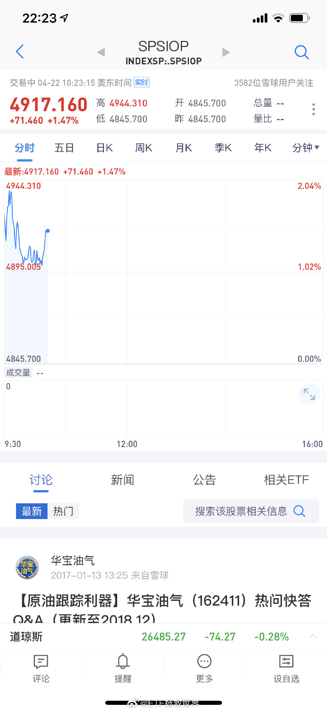

======================================================

ETF拯救世界 (5687069307) @
2019-04-22 23:47:49 Mon  
url: https://weibo.com/5687069307/HqRzU0Vcq

不骂不行 http://t.cn/Eaib9YS

------------------------------------------------------
转推：
>  @ETF拯救世界 (5687069307)
>  2019-04-22 22:24:14 Mon  
>  url: https:/weibo.com/5687069307/HqR1YsKvd/

>  我对你都好失望嘅… ​​​

转发[11]  评论[47]  赞[265] 

======================================================

ETF拯救世界 (5687069307) @
2019-04-23 00:12:09 Tue  
url: https://weibo.com/5687069307/HqRJMjJmS

你这么涨我可不睡了啊  http://t.cn/EaiMGCF //@ETF拯救世界:不骂不行 http://t.cn/Eaib9YS

------------------------------------------------------
转推：
>  @ETF拯救世界 (5687069307)
>  2019-04-22 22:24:14 Mon  
>  url: https:/weibo.com/5687069307/HqR1YsKvd/

>  我对你都好失望嘅… ​​​

转发[8]  评论[125]  赞[356] 

======================================================

ETF拯救世界 (5687069307) @
2019-04-23 08:06:23 Tue  
url: https://weibo.com/5687069307/HqUQgiuEh

场内今天也涨不了多少。昨天溢价，今天折价，最多也就一个多点。 ​​​

转发[3]  评论[71]  赞[361] 

======================================================

ETF拯救世界 (5687069307) @
2019-04-23 08:44:08 Tue  
url: https://weibo.com/5687069307/HqV5ABBFE

回复@江西各噢殷山宁:我说我不喜欢这种谈生意的方式，没说看不上那个人，有什么肉糜不肉糜？这都什么理解能力？//@江西各噢殷山宁:说这话有点像古代那个啥说“何不食糜”

------------------------------------------------------
转推：
>  @ETF拯救世界 (5687069307)
>  2019-04-22 17:17:26 Mon  
>  url: https:/weibo.com/5687069307/HqP1rxNuV/

>  酒是穿肠毒药，色是刮骨钢刀。之前我说黄赌毒别碰，很多朋友评论说，黄没事啊。
>  
>  很多时候真有事啊。
>  
>  当然，只要你做好了承担一切后果的准备，碰也没事。就怕这个后果远超你的想象…… ​​​

转发[4]  评论[52]  赞[272] 

======================================================

ETF拯救世界 (5687069307) @
2019-04-23 09:04:00 Tue  
url: https://weibo.com/5687069307/HqVdFfc2G

我再说几句可能有很多朋友，尤其是女性朋友不爱听的吧。也有可能有人骂我直男癌之类的，whatever。

昨天有评论说，挽着胳膊请你一个人陪我回公寓也不代表要跟你xx啊。

我只能说，妹子们，有时候男女对待这件事的看法真的不同。尤其是一部分男性，别说你第一次见面就邀请他大晚上回闺房，走着走着还主 ​​​

转发[96]  评论[730]  赞[1079] 

======================================================

ETF拯救世界 (5687069307) @
2019-04-23 09:35:11 Tue  
url: https://weibo.com/5687069307/HqVqj6Ee5

不许你再涨了，不然又要打脸… ​​​

转发[8]  评论[77]  赞[385] 

+++++++++++++++++++++++++++++++++++++++++++++++++++++

图片：
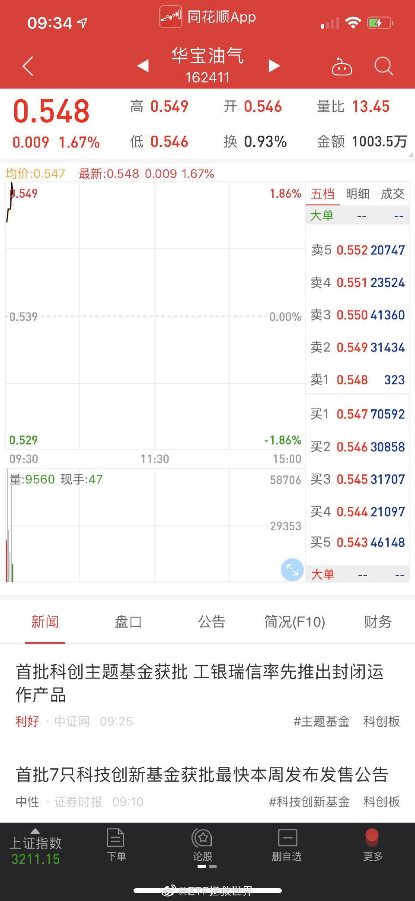

======================================================

ETF拯救世界 (5687069307) @
2019-04-23 10:18:16 Tue  
url: https://weibo.com/5687069307/HqVHNzWk8

就像咱们过马路，咱们遵守交通规则，绿灯过马路。你就可以不两边看看了吗？

真有司机闯红灯，冲过来把人撞死了，这时候去追究司机责任，哪怕枪毙他，哪怕赔1000万，有用吗？没用了啊。人没了啊。

你说，我又没错！我绿灯过马路，你干嘛教育我要两边看？你为什么不去教育司机？我就不看，我愿意这么走 ​​​

转发[63]  评论[264]  赞[751] 

======================================================

ETF拯救世界 (5687069307) @
2019-04-23 10:52:14 Tue  
url: https://weibo.com/5687069307/HqVVAtySK

涨的时候很多人觉得自己买少了，赶紧取出存款买买买。

结果一个小调整居然账户又开始亏损了！

WTF，宝宝心里苦啊。 ​​​

转发[22]  评论[166]  赞[648] 

======================================================

ETF拯救世界 (5687069307) @
2019-04-23 11:00:04 Tue  
url: https://weibo.com/5687069307/HqVYLdSTi

继续有效。

------------------------------------------------------
转推：
>  @ETF拯救世界 (5687069307)
>  2019-04-15 15:18:27 Mon  
>  url: https:/weibo.com/5687069307/HpKfFAUi0/

>  本来以为是一周行情，谁知道是周一上午行情。
>  
>  下半月随时发车。不会多，一两车。 ​​​

转发[6]  评论[185]  赞[576] 

======================================================

ETF拯救世界 (5687069307) @
2019-04-23 13:49:29 Tue  
url: https://weibo.com/5687069307/HqX5xcdTp

回本就跑。什么时候追回来

------------------------------------------------------
转推：
>  @张道达 (2032628220)
>  2019-04-23 11:00:03 Tue  
>  url: https:/weibo.com/2032628220/HqVYLesdH/

>  【股市上涨资金流出 偏股基金遭1300亿份净赎回】一季度，基金取得不俗收益，但基金份额并未出现明显增长。根据天相投顾的统计，截至一季度末，各类型基金总份额为12.93万亿份，较去年底增加800.17亿份。净申购较多的仍是货币基金和债券基金，而A股的强劲反弹，却刺激了投资者从股票和混合基金中赎回。 ​​​

转发[26]  评论[108]  赞[403] 

======================================================

ETF拯救世界 (5687069307) @
2019-04-23 13:57:10 Tue  
url: https://weibo.com/5687069307/HqX8F1Fnj

什么叫屁股决定脑袋。

就是你加油的时候心里骂，怎么又快涨到70了。

当你买了点油气，看着行情想：

怎么还没到100？ ​​​

转发[25]  评论[197]  赞[687] 

+++++++++++++++++++++++++++++++++++++++++++++++++++++

图片：

======================================================

ETF拯救世界 (5687069307) @
2019-04-24 09:19:48 Wed  
url: https://weibo.com/5687069307/Hr4KzekER

不出事，你永远也看不清一个人的真面目。

出了事，你会发现有人客观追求真相，有人基于自己的立场抛弃客观，有人跟着蹭热度…

不能说这些人谁对谁错，只是经过这样的事情，就会更加明白这世界的复杂性。

客观真的不容易，我也要反省。无论是投资还是生活，永远都要客观，才不会离正确越来越远。 ​​​

转发[53]  评论[184]  赞[802] 

======================================================

ETF拯救世界 (5687069307) @
2019-04-24 10:26:40 Wed  
url: https://weibo.com/5687069307/Hr5bIjLzy

有调整，太正常了。没有调整才不正常。甚至这样的调整幅度太小。历史上没有一两次月线级别的调整都不敢说自己是牛市。

------------------------------------------------------
转推：
>  @ETF拯救世界 (5687069307)
>  2019-04-19 16:59:28 Fri  
>  url: https:/weibo.com/5687069307/HqmCFaLDd/

>  A股历史上除了2008年底开始的上涨，从未出现过类似这波行情的毫无回调的情况。
>  
>  果然历史没有简单重复的啊。 ​​​

转发[75]  评论[348]  赞[819] 

======================================================

ETF拯救世界 (5687069307) @
2019-04-24 15:18:26 Wed  
url: https://weibo.com/5687069307/Hr768pjRP

无论什么品种，趋势都很重要 ​​​

转发[218]  评论[105]  赞[484] 

+++++++++++++++++++++++++++++++++++++++++++++++++++++

图片：

======================================================

ETF拯救世界 (5687069307) @
2019-04-24 15:24:00 Wed  
url: https://weibo.com/5687069307/Hr78os3Sa

回复@留下唇印:当然会开。咱们之前卖掉的都会买回来，还会买更多。//@留下唇印:向他开炮？

------------------------------------------------------
转推：
>  @ETF拯救世界 (5687069307)
>  2019-04-24 15:18:26 Wed  
>  url: https:/weibo.com/5687069307/Hr768pjRP/

>  无论什么品种，趋势都很重要 ​​​

转发[154]  评论[53]  赞[362] 

======================================================

ETF拯救世界 (5687069307) @
2019-04-24 15:27:10 Wed  
url: https://weibo.com/5687069307/Hr79Gf7Vg

又想起年初评论里有人教育我仓位里面债券配的太少……

------------------------------------------------------
转推：
>  @ETF拯救世界 (5687069307)
>  2019-04-24 15:18:26 Wed  
>  url: https:/weibo.com/5687069307/Hr768pjRP/

>  无论什么品种，趋势都很重要 ​​​

转发[6]  评论[48]  赞[388] 

======================================================

ETF拯救世界 (5687069307) @
2019-04-24 15:36:11 Wed  
url: https://weibo.com/5687069307/Hr7dlc6Rf

回复@树苗儿想要喝水:债券走势第一取决于货币政策。//@树苗儿想要喝水:是不是市场认为未来的投资收益率应该会更高，所以之前国债逼近3%的收益率太低（国债价格太高），所以现在都在抛债买别的。//@ETF拯救世界:回复@留下唇印:当然会开。咱们之前卖掉的都会买回来，还会买更多。

------------------------------------------------------
转推：
>  @ETF拯救世界 (5687069307)
>  2019-04-24 15:18:26 Wed  
>  url: https:/weibo.com/5687069307/Hr768pjRP/

>  无论什么品种，趋势都很重要 ​​​

转发[136]  评论[92]  赞[364] 

======================================================

ETF拯救世界 (5687069307) @
2019-04-24 15:59:20 Wed  
url: https://weibo.com/5687069307/Hr7mJAgQk

上午有朋友问，为什么你认为要调整不减仓。

有两个原因：

第一，历史上熊转牛初期，出现大幅调整的几率大。但并不代表必然出现，比如08-09那一波。不是100%的事情，你就要权衡一下利弊得失。如果调整，你会得到什么。如果不呢，你会失去什么。

第二，有些品种是所谓的投资品种。即，可以超长期持有 ​​​

转发[313]  评论[288]  赞[937] 

======================================================

ETF拯救世界 (5687069307) @
2019-04-24 16:17:30 Wed  
url: https://weibo.com/5687069307/Hr7u71ZUV

回复@胡鹏171:第一，A股是全市场收益率低于债券，但很多股票和板块预期收益率高于债券。第二，长期称重，短期投票。如果投资只看预期收益率就可以来回切换那就太简单了。//@胡鹏171:既然有货币收紧的预期，为什么投资者更多的抛售收益率高于股票的国债？目前国债有3.4，股票才3.0几吧

------------------------------------------------------
转推：
>  @ETF拯救世界 (5687069307)
>  2019-04-24 15:18:26 Wed  
>  url: https:/weibo.com/5687069307/Hr768pjRP/

>  无论什么品种，趋势都很重要 ​​​

转发[77]  评论[116]  赞[441] 

======================================================

ETF拯救世界 (5687069307) @
2019-04-24 16:25:50 Wed  
url: https://weibo.com/5687069307/Hr7xuz5Dl

回复@叛逆的阿波罗:新浪问答的人找我说，你问答效果这么好，财经领域只有极少人有这么好的效果，但你为什么每年只回答两次，我：[doge]//@叛逆的阿波罗:良心大V，回答的这么清楚，还免费。

------------------------------------------------------
转推：
>  @ETF拯救世界 (5687069307)
>  2019-04-24 15:18:26 Wed  
>  url: https:/weibo.com/5687069307/Hr768pjRP/

>  无论什么品种，趋势都很重要 ​​​

转发[9]  评论[141]  赞[530] 

======================================================

ETF拯救世界 (5687069307) @
2019-04-25 07:48:41 Thu  
url: https://weibo.com/5687069307/HrdA51Dan

其实有时候说“我不懂”或者“我不知道”真的没什么丢人的。

想帮别人没错，但也要考虑自己的情况和历史进程。

少做那些对了没好处，错了挨骂的事。 ​​​

转发[48]  评论[204]  赞[699] 

+++++++++++++++++++++++++++++++++++++++++++++++++++++

图片：

======================================================

ETF拯救世界 (5687069307) @
2019-04-25 14:26:02 Thu  
url: https://weibo.com/5687069307/HrgbmtlGb

现在你有点明白为什么这两个月不买了吧。

急什么？钱烧手吗。 ​​​

转发[30]  评论[295]  赞[923] 

======================================================

ETF拯救世界 (5687069307) @
2019-04-25 14:38:07 Thu  
url: https://weibo.com/5687069307/HrgggxMcV

最低2400，最高3288。

很多今年入场的人吃惊的发现，自己居然在3100又开始亏钱了！ ​​​

转发[53]  评论[240]  赞[722] 

======================================================

ETF拯救世界 (5687069307) @
2019-04-25 15:04:55 Thu  
url: https://weibo.com/5687069307/Hrgr9qNQa

回复@打火机儿:喷了。平行宇宙的自己并不给力呢……//@打火机儿:2600进的，基金赚的钱目前有一半亏在个股了

------------------------------------------------------
转推：
>  @ETF拯救世界 (5687069307)
>  2019-04-25 14:38:07 Thu  
>  url: https:/weibo.com/5687069307/HrgggxMcV/

>  最低2400，最高3288。
>  
>  很多今年入场的人吃惊的发现，自己居然在3100又开始亏钱了！ ​​​

转发[16]  评论[46]  赞[361] 

======================================================

ETF拯救世界 (5687069307) @
2019-04-25 15:06:45 Thu  
url: https://weibo.com/5687069307/HrgrTfwuE

回复@解毒汪:你想想，为什么会有不败之地的感觉。如果你能永远不败，你是不是这条gai最靓的仔？//@解毒汪:这两个月涨跌你都有道理嘛，立于不败之地。

------------------------------------------------------
转推：
>  @ETF拯救世界 (5687069307)
>  2019-04-25 14:26:02 Thu  
>  url: https:/weibo.com/5687069307/HrgbmtlGb/

>  现在你有点明白为什么这两个月不买了吧。
>  
>  急什么？钱烧手吗。 ​​​

转发[6]  评论[76]  赞[434] 

======================================================

ETF拯救世界 (5687069307) @
2019-04-25 15:14:55 Thu  
url: https://weibo.com/5687069307/HrgvdcQFl

回复@大象下象棋:今年上证25%。500是31%。你是不是一定要所有时间段最牛逼才能夸一下？不会的，你永远只能看到不好的地方。赶紧买上证去吧。//@大象下象棋:五百是真的弱，五十三百不说了，上证缺口都没补呢，五百已经到了，上证都跑不过，重仓五百的真是哭晕在厕所了。

------------------------------------------------------
转推：
>  @ETF拯救世界 (5687069307)
>  2019-04-25 14:38:07 Thu  
>  url: https:/weibo.com/5687069307/HrgggxMcV/

>  最低2400，最高3288。
>  
>  很多今年入场的人吃惊的发现，自己居然在3100又开始亏钱了！ ​​​

转发[8]  评论[88]  赞[436] 

======================================================

ETF拯救世界 (5687069307) @
2019-04-25 15:18:17 Thu  
url: https://weibo.com/5687069307/HrgwzooLs

喷了。

他可能不知道一个问答就能收入5000，如果开个V+，一年…

这种人怎么出来做生意的。 ​​​

转发[7]  评论[203]  赞[571] 

+++++++++++++++++++++++++++++++++++++++++++++++++++++

图片：
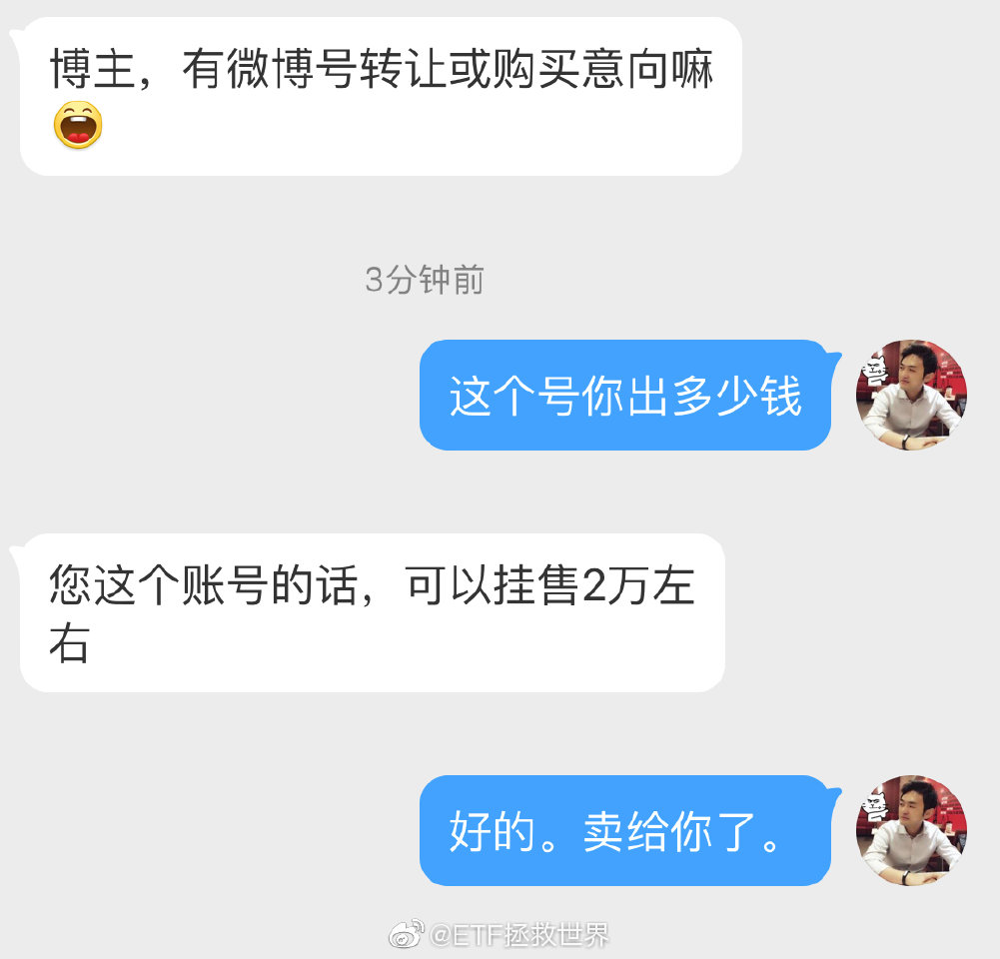

======================================================

ETF拯救世界 (5687069307) @
2019-04-25 15:21:21 Thu  
url: https://weibo.com/5687069307/HrgxOvpXP

明天或者下周一开车。不会多，意思意思。 ​​​

转发[7]  评论[306]  赞[975] 

======================================================

ETF拯救世界 (5687069307) @
2019-04-25 15:52:45 Thu  
url: https://weibo.com/5687069307/HrgKyFWaG

发车的时候上证如果能调整到3050左右就非常完美了。 ​​​

转发[23]  评论[437]  赞[1060] 

======================================================

ETF拯救世界 (5687069307) @
2019-04-26 12:11:27 Fri  
url: https://weibo.com/5687069307/HroJeoTAS

为什么皱纹和表情都没了。amazing！

------------------------------------------------------
转推：
>  @蓝鲸财经记者工作平台 (1885454921)
>  2019-04-26 11:56:39 Fri  
>  url: https:/weibo.com/1885454921/HroDe5xlj/

>  【鲸视频：王石称年轻人即使有钱买房子也别急着买，买不起可以先租】4月26日，万科集团创始人王石被问及年轻人在一二线城市工资买不起房时表示，买不起房可以先租，回老家其实也是很好的选择。我建议年轻人即使买得起房也不要先买，首先来想有住的地方，先租。因为得有人先买它再租给你吧，所以我不担 ​​​

转发[29]  评论[244]  赞[289] 

======================================================

ETF拯救世界 (5687069307) @
2019-04-26 13:22:04 Fri  
url: https://weibo.com/5687069307/HrpbTtY52

[怒] ​​​

转发[10]  评论[356]  赞[499] 

======================================================

ETF拯救世界 (5687069307) @
2019-04-26 13:57:47 Fri  
url: https://weibo.com/5687069307/HrpqoEfWC

[爱你]

------------------------------------------------------
转推：
>  @ETF拯救世界 (5687069307)
>  2019-04-26 13:22:04 Fri  
>  url: https:/weibo.com/5687069307/HrpbTtY52/

>  [怒] ​​​

转发[3]  评论[393]  赞[575] 

======================================================

ETF拯救世界 (5687069307) @
2019-04-26 18:01:23 Fri  
url: https://weibo.com/5687069307/Hrr1gFcWU

四分之一炷香时间到了 ​​​

转发[4]  评论[198]  赞[550] 

+++++++++++++++++++++++++++++++++++++++++++++++++++++

图片：

======================================================

ETF拯救世界 (5687069307) @
2019-04-26 21:37:42 Fri  
url: https://weibo.com/5687069307/Hrsr55ppR

TAO同学是整个事件逆转的关键。

------------------------------------------------------
转推：
>  @新浪科技 (1642634100)
>  2019-04-26 20:02:35 Fri  
>  url: https:/weibo.com/1642634100/HrrOsFPuM/

>  #刘强东案出警记录曝光#【明州案当日警方出警记录曝光！女事主称“双方自愿”】@独家互联网 曝出8月30号刘强东案发当晚美警方出警报告。报告描述，Liu女子说她“自发地与刘强东先生发生了性关系……并否认自己说过要报复（警）。她还说打电话报警的Tao先生可能是因为担心她。”http://t.cn/EaeAsXu ​​​

转发[20]  评论[81]  赞[232] 

======================================================

ETF拯救世界 (5687069307) @
2019-04-26 21:47:54 Fri  
url: https://weibo.com/5687069307/Hrsvdiba9

回复@褶子动:其实整件事已经非常明白了。很多人只是不愿意相信真相，只愿意相信自己希望的事实而已。不过，无论结果如何偏离真相都好，强子无论受到怎样的惩罚，都源于他自己的不忠，咎由自取。

------------------------------------------------------
转推：
>  @新浪科技 (1642634100)
>  2019-04-26 20:02:35 Fri  
>  url: https:/weibo.com/1642634100/HrrOsFPuM/

>  #刘强东案出警记录曝光#【明州案当日警方出警记录曝光！女事主称“双方自愿”】@独家互联网 曝出8月30号刘强东案发当晚美警方出警报告。报告描述，Liu女子说她“自发地与刘强东先生发生了性关系……并否认自己说过要报复（警）。她还说打电话报警的Tao先生可能是因为担心她。”http://t.cn/EaeAsXu ​​​

转发[10]  评论[173]  赞[283] 

======================================================

ETF拯救世界 (5687069307) @
2019-04-26 22:08:29 Fri  
url: https://weibo.com/5687069307/HrsDzAyh4

一个普通留学生的爱情有可能改变整个中国互联网电商格局，这可能是我亲见普通人瞬间改变世界之第一次。

上次是塞尔维亚青年和斐迪南大公… ​​​

转发[32]  评论[297]  赞[545] 

======================================================

ETF拯救世界 (5687069307) @
2019-04-27 07:07:09 Sat  
url: https://weibo.com/5687069307/Hrwadg8ab

回复@钱添昱:呵呵。我会让你看到什么叫做真正的诚意。//@钱添昱:随意说说，不必当真

------------------------------------------------------
转推：
>  @ETF拯救世界 (5687069307)
>  2019-04-26 22:08:29 Fri  
>  url: https:/weibo.com/5687069307/HrsDzAyh4/

>  一个普通留学生的爱情有可能改变整个中国互联网电商格局，这可能是我亲见普通人瞬间改变世界之第一次。
>  
>  上次是塞尔维亚青年和斐迪南大公… ​​​

转发[0]  评论[73]  赞[315] 

======================================================

ETF拯救世界 (5687069307) @
2019-04-27 13:37:36 Sat  
url: https://weibo.com/5687069307/HryIHhDyp

最后一次说这件事，以后也不说了。省得有人说我带节奏（奇怪了自己的微博谈谈自己的想法带什么节奏……）

第一，坚决反对婚内出轨。

我不是说婚内出轨的都是人渣，因为出轨有可能很多原因，一个家庭的情况外人咱们也弄不清楚。但是只要出轨，同时对另一半造成伤害的，都是不道德的。受到再大的精神以 ​​​

转发[35]  评论[240]  赞[720] 

======================================================

ETF拯救世界 (5687069307) @
2019-04-27 13:48:41 Sat  
url: https://weibo.com/5687069307/HryNcv8nw

回复@无名浩然:不是。套用到我们的系统上，就是要想清楚，”被人发现了“和”没被人发现“是不是都能舒服。如果都能，就去做。但这里有个黑天鹅——"被人告强奸了”还能不能舒服……//@无名浩然:一直在说舒服很重要，看来这种事不能图一时的舒服了

------------------------------------------------------
转推：
>  @ETF拯救世界 (5687069307)
>  2019-04-27 13:37:36 Sat  
>  url: https:/weibo.com/5687069307/HryIHhDyp/

>  最后一次说这件事，以后也不说了。省得有人说我带节奏（奇怪了自己的微博谈谈自己的想法带什么节奏……）
>  
>  第一，坚决反对婚内出轨。
>  
>  我不是说婚内出轨的都是人渣，因为出轨有可能很多原因，一个家庭的情况外人咱们也弄不清楚。但是只要出轨，同时对另一半造成伤害的，都是不道德的。受到再大的精神以 ​​​

转发[12]  评论[79]  赞[334] 

======================================================

ETF拯救世界 (5687069307) @
2019-04-27 22:22:43 Sat  
url: https://weibo.com/5687069307/HrC9QgnTr

回复@小静姐carol:很多历史文章不能看了，不知道为什么。//@小静姐carol:益大在球球上干货合集第二篇看不了了吗？a股是个聚宝盆那篇，有朋友知道吗

------------------------------------------------------
转推：
>  @ETF拯救世界 (5687069307)
>  2019-04-27 13:37:36 Sat  
>  url: https:/weibo.com/5687069307/HryIHhDyp/

>  最后一次说这件事，以后也不说了。省得有人说我带节奏（奇怪了自己的微博谈谈自己的想法带什么节奏……）
>  
>  第一，坚决反对婚内出轨。
>  
>  我不是说婚内出轨的都是人渣，因为出轨有可能很多原因，一个家庭的情况外人咱们也弄不清楚。但是只要出轨，同时对另一半造成伤害的，都是不道德的。受到再大的精神以 ​​​

转发[5]  评论[203]  赞[268] 

======================================================

ETF拯救世界 (5687069307) @
2019-04-28 08:50:46 Sun  
url: https://weibo.com/5687069307/HrGgLwnKP

工作日又没法看盘亏钱的各位是不是无聊透了。 ​​​

转发[14]  评论[325]  赞[891] 

======================================================

ETF拯救世界 (5687069307) @
2019-04-28 10:30:37 Sun  
url: https://weibo.com/5687069307/HrGViooG0

大家这么无聊，我写了点新的赔钱技能给大家解闷，希望你喜欢。

------------------------------------------------------
转推：
>  @ETF拯救世界 (5687069307)
>  2019-04-28 08:50:46 Sun  
>  url: https:/weibo.com/5687069307/HrGgLwnKP/

>  工作日又没法看盘亏钱的各位是不是无聊透了。 ​​​

转发[8]  评论[390]  赞[1142] 

======================================================

ETF拯救世界 (5687069307) @
2019-04-28 11:42:45 Sun  
url: https://weibo.com/5687069307/HrHozBMr2

我不太敢开玩笑的原因… ​​​

转发[15]  评论[316]  赞[516] 

+++++++++++++++++++++++++++++++++++++++++++++++++++++

图片：

======================================================

ETF拯救世界 (5687069307) @
2019-04-28 13:55:13 Sun  
url: https://weibo.com/5687069307/HrIglkNf9

照着这个名单等权买，十年收益率就会很差。不信，你买了试试就知道了。

------------------------------------------------------
转推：
>  @摩尔金融 (5242156161)
>  2019-04-28 13:32:11 Sun  
>  url: https:/weibo.com/5242156161/HrI6ZzwKy/

>  全球市值前十大公司变迁，如今前十只有中美两家了 ​​​

转发[68]  评论[109]  赞[416] 

======================================================

ETF拯救世界 (5687069307) @
2019-04-28 14:51:06 Sun  
url: https://weibo.com/5687069307/HrID1Avvr

有在日本工作的朋友吗。敢问一件事：

现在日本公司里的氛围真的是新剧《我，准时下班》（わたし、定時で帰ります）里面那样吗。 ​​​

转发[12]  评论[186]  赞[388] 

======================================================

ETF拯救世界 (5687069307) @
2019-04-29 10:45:50 Mon  
url: https://weibo.com/5687069307/HrQrYcvzs

这两个月觉得仓位不够的终于可以继续加了。

没白等吧？

但是要注意节奏，注意，保持舒服的状态。 ​​​

转发[30]  评论[396]  赞[989] 

======================================================

ETF拯救世界 (5687069307) @
2019-04-29 11:14:54 Mon  
url: https://weibo.com/5687069307/HrQDMbOOd

看情况，也许明天还有车，也许没有。

目前的位置是最敏感的位置，不好确定。

薛定谔的发车。 ​​​

转发[17]  评论[397]  赞[1024] 

======================================================

ETF拯救世界 (5687069307) @
2019-04-29 15:07:14 Mon  
url: https://weibo.com/5687069307/HrSa52qxL

再回头看看，是不是有了更深的感悟。

------------------------------------------------------
转推：
>  @ETF拯救世界 (5687069307)
>  2019-03-25 09:27:30 Mon  
>  url: https:/weibo.com/5687069307/HmvYNmvZC/

>  不追涨是一种美德。
>  
>  有钱还怕没有好的投资机会？
>  
>  金融市场最不缺的就是机会。机会来了，最缺的是钱。
>  
>  谁有钱谁才是话事人。 ​​​

转发[42]  评论[206]  赞[771] 

======================================================

ETF拯救世界 (5687069307) @
2019-04-29 15:34:07 Mon  
url: https://weibo.com/5687069307/HrSkZ9PaQ

上次卖出500C效果还可以。接下来考虑看看是不是加更多波段策略仓位到计划里。 ​​​

转发[40]  评论[248]  赞[915] 

======================================================

ETF拯救世界 (5687069307) @
2019-04-29 16:02:53 Mon  
url: https://weibo.com/5687069307/HrSwF8EpW

回复@会走路的鲨鱼儿:如果是这样，为什么险资/社保/超级大机构还要做资产配置，要做波段，不断买入卖出？满仓应该是最好的选择啊。这个问题你要好好想想，不要被忽悠。//@会走路的鲨鱼儿:E大，长期看波段策略收益是不如低估买入拿住不放，高估卖出吧？为什么加波段，是考虑给车人的心态吗？

------------------------------------------------------
转推：
>  @ETF拯救世界 (5687069307)
>  2019-04-29 15:34:07 Mon  
>  url: https:/weibo.com/5687069307/HrSkZ9PaQ/

>  上次卖出500C效果还可以。接下来考虑看看是不是加更多波段策略仓位到计划里。 ​​​

转发[25]  评论[79]  赞[424] 

======================================================

ETF拯救世界 (5687069307) @
2019-04-29 16:22:14 Mon  
url: https://weibo.com/5687069307/HrSEw6Ese

我想了想，刚才这么说也未必合适。

这么说吧。

世界上没有最好的策略。是长期持有结合波段好，还是满仓长期持有好，谁也不能说谁更好。

就好像你不能说哪个妹子是世界上最漂亮的。

关键是适合不适合你。

适合你，哪怕是第二或者第三漂亮，也行啊。别老想追求最漂亮的，你们未必能幸福一辈子啊。

 ​​​

转发[93]  评论[181]  赞[755] 

======================================================

ETF拯救世界 (5687069307) @
2019-04-29 16:37:33 Mon  
url: https://weibo.com/5687069307/HrSKJleJS

回复@木草非人的世界:不会。多出的利润平摊到接下来要投入的份数里面。//@木草非人的世界:波段赚了的钱会不会认为是多一出份？以后这份资金继续用来做波段？原先只有150份的长赢，会不会慢慢变成155,160,170？

------------------------------------------------------
转推：
>  @ETF拯救世界 (5687069307)
>  2019-04-29 16:22:14 Mon  
>  url: https:/weibo.com/5687069307/HrSEw6Ese/

>  我想了想，刚才这么说也未必合适。
>  
>  这么说吧。
>  
>  世界上没有最好的策略。是长期持有结合波段好，还是满仓长期持有好，谁也不能说谁更好。
>  
>  就好像你不能说哪个妹子是世界上最漂亮的。
>  
>  关键是适合不适合你。
>  
>  适合你，哪怕是第二或者第三漂亮，也行啊。别老想追求最漂亮的，你们未必能幸福一辈子啊。
>  
>   ​​​

转发[15]  评论[59]  赞[379] 

======================================================

ETF拯救世界 (5687069307) @
2019-04-29 16:51:15 Mon  
url: https://weibo.com/5687069307/HrSQieTme

汇报一下最新数据：

去年四季度除创业板外，全市场利润增长同比几乎没变。

今年一季度，全市场利润开始恢复正增长。增幅个位数。

还有一天，等一千多家公布季报后就清楚了。 ​​​

转发[42]  评论[260]  赞[762] 

======================================================

ETF拯救世界 (5687069307) @
2019-04-29 17:59:17 Mon  
url: https://weibo.com/5687069307/HrThUj9H5

还是头条的运营识货啊…

之前都不知道有这么一个奖… ​​​

转发[2]  评论[509]  赞[1116] 

+++++++++++++++++++++++++++++++++++++++++++++++++++++

图片：

======================================================

ETF拯救世界 (5687069307) @
2019-05-04 19:07:57 Sat  
url: https://weibo.com/5687069307/HsESgiQXR

好久不见啊各位，过节都干嘛了说来听听？ ​​​

转发[13]  评论[1107]  赞[989] 

======================================================

ETF拯救世界 (5687069307) @
2019-05-05 14:46:02 Sun  
url: https://weibo.com/5687069307/HsMArCatc

对于巴菲特和芒格的股东大会，我其实只想问，你们是怎么做到快一百岁了还那么有精神，脑子也还好用的。

至于他们投资的事情，看三本书一个合集就够了：

滚雪球

穷查理宝典

巴菲特估值逻辑

以及过去几十年致股东的信合集

说真的，我确实没从每年的大会以及问答环节得到什么新东西。当然可能是因为 ​​​

转发[321]  评论[303]  赞[899] 

======================================================

ETF拯救世界 (5687069307) @
2019-05-05 16:28:06 Sun  
url: https://weibo.com/5687069307/HsNfSjPR6

喷了，印象笔记一周全网收藏排行。大家都很爱学习啊… ​​​

转发[18]  评论[253]  赞[887] 

+++++++++++++++++++++++++++++++++++++++++++++++++++++

图片：
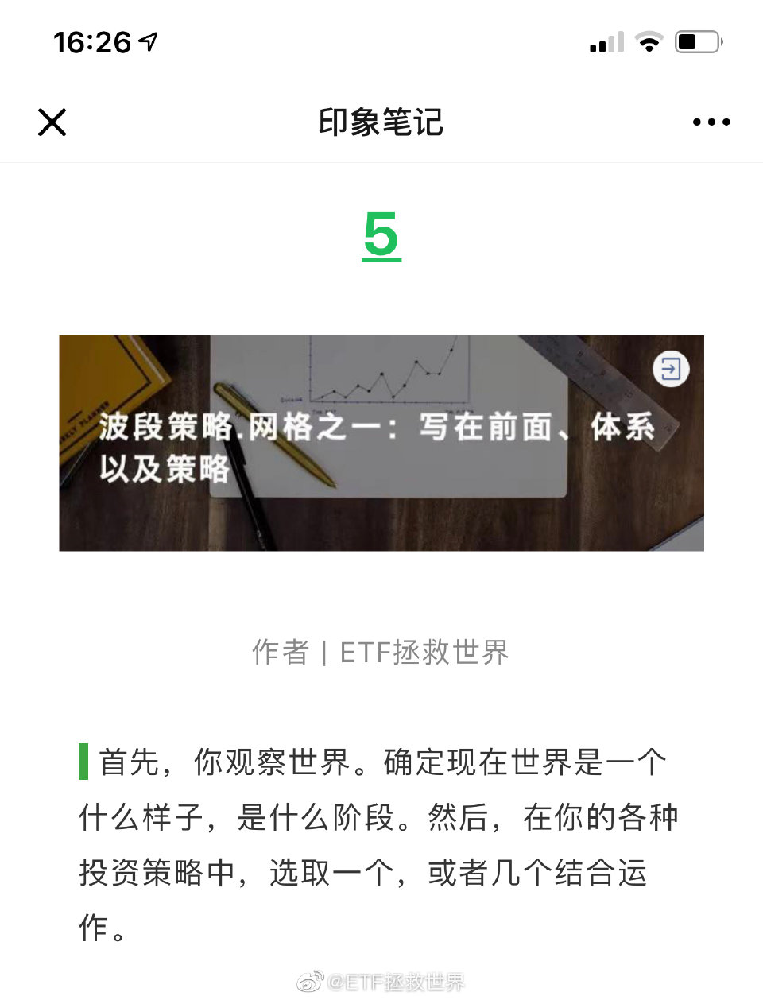

======================================================

ETF拯救世界 (5687069307) @
2019-05-06 08:57:04 Mon  
url: https://weibo.com/5687069307/HsTJiqfgw

今天支付宝积分怎么压你心里还没点数吗。 ​​​

转发[13]  评论[264]  赞[655] 

======================================================

ETF拯救世界 (5687069307) @
2019-05-06 09:28:55 Mon  
url: https://weibo.com/5687069307/HsTWe7DwQ

今天发《二》

正在作图，排版，BGM，封面。

非常应景。 ​​​

转发[4]  评论[303]  赞[1108] 

======================================================

ETF拯救世界 (5687069307) @
2019-05-06 10:14:56 Mon  
url: https://weibo.com/5687069307/HsUeU7FCM

学习历史从来都是有用的。

------------------------------------------------------
转推：
>  @ETF拯救世界 (5687069307)
>  2019-04-19 16:59:28 Fri  
>  url: https:/weibo.com/5687069307/HqmCFaLDd/

>  A股历史上除了2008年底开始的上涨，从未出现过类似这波行情的毫无回调的情况。
>  
>  果然历史没有简单重复的啊。 ​​​

转发[45]  评论[111]  赞[671] 

======================================================

ETF拯救世界 (5687069307) @
2019-05-06 10:22:44 Mon  
url: https://weibo.com/5687069307/HsUi4kskJ

我依然不相信会回到钻石坑。因为历史上真的没出现过，我认为这次概率也不大。

如果真回去了，留的那点现金就能派上用场了。 ​​​

转发[57]  评论[242]  赞[890] 

======================================================

ETF拯救世界 (5687069307) @
2019-05-06 10:32:52 Mon  
url: https://weibo.com/5687069307/HsUmbnQOn

本周极大概率可以买回上次卖出的500C。如果有机会，会加大波段仓位的配比，应对只有波幅没有涨幅的可能。 ​​​

转发[28]  评论[184]  赞[902] 

======================================================

ETF拯救世界 (5687069307) @
2019-05-06 10:54:10 Mon  
url: https://weibo.com/5687069307/HsUuP32Nm

太残暴了…… ​​​

转发[28]  评论[321]  赞[705] 

======================================================

ETF拯救世界 (5687069307) @
2019-05-06 10:57:03 Mon  
url: https://weibo.com/5687069307/HsUw042xJ

回复@ETF跟着E大笑哈哈:1月底以来，计划就买了一份A股，还卖了一份，你也应该想想为什么啊。//@ETF跟着E大笑哈哈:枯了。。。。黑车开多了，被埋得难受😖 😖😖😖

------------------------------------------------------
转推：
>  @ETF拯救世界 (5687069307)
>  2019-05-06 10:54:10 Mon  
>  url: https:/weibo.com/5687069307/HsUuP32Nm/

>  太残暴了…… ​​​

转发[15]  评论[283]  赞[520] 

======================================================

ETF拯救世界 (5687069307) @
2019-05-06 13:45:58 Mon  
url: https://weibo.com/5687069307/HsVCz2s6c

说说你现在看盘的真实感受。 ​​​

转发[28]  评论[1105]  赞[613] 

======================================================

ETF拯救世界 (5687069307) @
2019-05-06 14:08:47 Mon  
url: https://weibo.com/5687069307/HsVLP8OUP

怎么个意思，大盘要跌停吗。

A股投资者是真NB啊。 ​​​

转发[21]  评论[348]  赞[711] 

======================================================

ETF拯救世界 (5687069307) @
2019-05-06 14:27:12 Mon  
url: https://weibo.com/5687069307/HsVTj7crO

只要你不急，你就有机会赚大钱。涨上去就害怕踏空，最终很可能接盘的就是你。这些东西你每隔一年回头看一次，会有不同的领悟。

------------------------------------------------------
转推：
>  @ETF拯救世界 (5687069307)
>  2019-03-25 09:27:30 Mon  
>  url: https:/weibo.com/5687069307/HmvYNmvZC/

>  不追涨是一种美德。
>  
>  有钱还怕没有好的投资机会？
>  
>  金融市场最不缺的就是机会。机会来了，最缺的是钱。
>  
>  谁有钱谁才是话事人。 ​​​

转发[132]  评论[186]  赞[762] 

======================================================

ETF拯救世界 (5687069307) @
2019-05-06 14:41:20 Mon  
url: https://weibo.com/5687069307/HsVZ2fT3P

服了你们了，看你们的评论以为今天涨了6%。

也太欢乐了吧我说！今天你们账户都缩水了喂！ ​​​

转发[20]  评论[502]  赞[823] 

======================================================

ETF拯救世界 (5687069307) @
2019-05-06 17:04:20 Mon  
url: https://weibo.com/5687069307/HsWV54s1f

虽然国债今天止跌，但目前A股整体再次跌回到比债券值得买的区域，所以债券依然没有吸引力。充其量利率债只能作为风险对冲工具而已，长期收益率依然不行。

更别提那些优质指数和行业的值博率已经远大于债券。 ​​​

转发[57]  评论[114]  赞[571] 

======================================================

ETF拯救世界 (5687069307) @
2019-05-06 17:09:19 Mon  
url: https://weibo.com/5687069307/HsWX6jKDr

我应对暴跌的妙招：

不更新理财软件的收盘净值，假装自己依然不算穷人。[爱你] ​​​

转发[27]  评论[207]  赞[860] 

======================================================

ETF拯救世界 (5687069307) @
2019-05-06 17:25:06 Mon  
url: https://weibo.com/5687069307/HsX3vs6l9

再次提示：

某个不死品种暴跌后开始唱空甚至建议你割肉的，一定要特别关注。

赚钱全靠他了。

反着做就行。 ​​​

转发[110]  评论[292]  赞[954] 

======================================================

ETF拯救世界 (5687069307) @
2019-05-06 18:56:11 Mon  
url: https://weibo.com/5687069307/HsXEtBGVd

今日最新数据出炉，距离钻石边缘还有8%……出坑后就不会回去的历史会改变吗，拭目以待了。 ​​​

转发[92]  评论[275]  赞[982] 

======================================================

ETF拯救世界 (5687069307) @
2019-05-06 19:30:20 Mon  
url: https://weibo.com/5687069307/HsXSlbKm2

终于忙的差不多了，准备去看留言。一会各位可以去观摩一下，我估计会有一些策略具体问题我可能会回答。

今天大跌，看来大家心情一般，只有800多条留言…… ​​​

转发[5]  评论[168]  赞[748] 

======================================================

ETF拯救世界 (5687069307) @
2019-05-06 21:56:39 Mon  
url: https://weibo.com/5687069307/HsYPJB2ii

人家只跌1.2%。

这仗打的。 ​​​

转发[11]  评论[231]  赞[583] 

======================================================

ETF拯救世界 (5687069307) @
2019-05-07 07:25:22 Tue  
url: https://weibo.com/5687069307/Ht2yzvnKZ

一睁眼发现美股暴跌0.4%，深感欣慰。还好没有翻红——我生起气来捅自己7刀，你身上一点血都没溅到我就太没面子了吧。

越来越深刻的体会，玩A股的就是一帮神经病。

好消息是，你跟神经病在玩斗地主你说你有多幸福。 ​​​

转发[50]  评论[186]  赞[819] 

======================================================

ETF拯救世界 (5687069307) @
2019-05-07 07:29:34 Tue  
url: https://weibo.com/5687069307/Ht2Ahy5Sc

不知道到底是素质教育没跟上，还是乱扔烟头罚的不够狠。

------------------------------------------------------
转推：
>  @新浪视频 (1640601392)
>  2019-05-07 07:22:05 Tue  
>  url: https:/weibo.com/1640601392/Ht2xf2cJC/

>  【#地上一个烟头扣环卫7元#！烟头太多环卫大爷被气哭】5月4日，郑州一环卫大爷在地铁口扫烟头脸被气得通红，他称附近烟头大多是黑车司机扔的，发现1个烟头他要被罚7块钱，他曾1天被罚260元，而1天工资才86元。官方称没实施过这个规定，针对确实有人被扣罚这一情况将做再做核实调查。 ​​​

转发[15]  评论[80]  赞[241] 

======================================================

ETF拯救世界 (5687069307) @
2019-05-07 07:54:49 Tue  
url: https://weibo.com/5687069307/Ht2Kwz8Ss

你什么都可以不信，但这句话希望你相信。

目前这个位置，以及更低的位置，是值得坚定持有绝大多数指数基金的位置。

不要在意中短期的波动，那一点都不重要。除了给你提供波动利润外，没什么好在意的。

五年十年后你再回头看这篇微博会有恍如隔世的感觉。 ​​​

转发[247]  评论[265]  赞[1086] 

======================================================

ETF拯救世界 (5687069307) @
2019-05-07 08:12:13 Tue  
url: https://weibo.com/5687069307/Ht2RAtSdA

这是中证500全收益的走势图。不用更深奥的数据，你就能看出很多东西。

长期看，指数一定是向上，即使短期波动巨大。就算是被斥为“赚不到钱”的A股，也是如此。

底部不断抬高，顶部不断突破。

跌幅巨大的时候买入，若干时间后会取得非常好的收益。

怎么样才能让自己淡定起来？你站的高一点，看得远 ​​​

转发[356]  评论[238]  赞[677] 

+++++++++++++++++++++++++++++++++++++++++++++++++++++

图片：
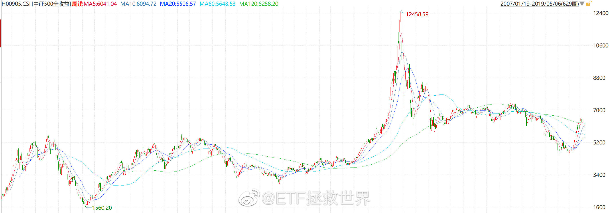

======================================================

ETF拯救世界 (5687069307) @
2019-05-07 08:20:43 Tue  
url: https://weibo.com/5687069307/Ht2V2qU3i

本月我希望出现的，最完美的走势，是目前基础上再跌个3%-4%，持续到月底。

堪称完美。 ​​​

转发[57]  评论[250]  赞[863] 

======================================================

ETF拯救世界 (5687069307) @
2019-05-07 08:24:23 Tue  
url: https://weibo.com/5687069307/Ht2WwE94l

回复@阿狸你好帅:所谓估值带，以及按照估值带确定定投份数的策略，我已经不用很久了。这种方法有巨大缺陷。//@阿狸你好帅:刚刚看E大的博客 看到长赢的8个估值带 和仓位管理 不只是帅和聪明这么简单啊 http://t.cn/EoIkgqX

------------------------------------------------------
转推：
>  @ETF拯救世界 (5687069307)
>  2019-05-07 08:12:13 Tue  
>  url: https:/weibo.com/5687069307/Ht2RAtSdA/

>  这是中证500全收益的走势图。不用更深奥的数据，你就能看出很多东西。
>  
>  长期看，指数一定是向上，即使短期波动巨大。就算是被斥为“赚不到钱”的A股，也是如此。
>  
>  底部不断抬高，顶部不断突破。
>  
>  跌幅巨大的时候买入，若干时间后会取得非常好的收益。
>  
>  怎么样才能让自己淡定起来？你站的高一点，看得远 ​​​

转发[34]  评论[85]  赞[309] 

======================================================

ETF拯救世界 (5687069307) @
2019-05-07 09:00:04 Tue  
url: https://weibo.com/5687069307/Ht3b1cRhj

看图突然发现，2015年到现在居然已经四年了…太快了…

------------------------------------------------------
转推：
>  @ETF拯救世界 (5687069307)
>  2019-05-07 08:12:13 Tue  
>  url: https:/weibo.com/5687069307/Ht2RAtSdA/

>  这是中证500全收益的走势图。不用更深奥的数据，你就能看出很多东西。
>  
>  长期看，指数一定是向上，即使短期波动巨大。就算是被斥为“赚不到钱”的A股，也是如此。
>  
>  底部不断抬高，顶部不断突破。
>  
>  跌幅巨大的时候买入，若干时间后会取得非常好的收益。
>  
>  怎么样才能让自己淡定起来？你站的高一点，看得远 ​​​

转发[110]  评论[114]  赞[426] 

======================================================

ETF拯救世界 (5687069307) @
2019-05-07 10:29:11 Tue  
url: https://weibo.com/5687069307/Ht3LbnX6A

回复@烟花看烟火:第一，传媒一季报利润增加6%，五年百分位4%，十年百分位6%，PB五年十年百分位8%。第二，以后谁再拿不知道从哪儿看的数据来我这里问，我直接拉黑。你先问问是不是，再问怎么办行不行？第三，前有医药500，现有传媒，只要哪个指数跌，就会有人开始黑。我什么都不会说，时间会给出答案。

------------------------------------------------------
转推：
>  @ETF拯救世界 (5687069307)
>  2019-05-07 08:12:13 Tue  
>  url: https:/weibo.com/5687069307/Ht2RAtSdA/

>  这是中证500全收益的走势图。不用更深奥的数据，你就能看出很多东西。
>  
>  长期看，指数一定是向上，即使短期波动巨大。就算是被斥为“赚不到钱”的A股，也是如此。
>  
>  底部不断抬高，顶部不断突破。
>  
>  跌幅巨大的时候买入，若干时间后会取得非常好的收益。
>  
>  怎么样才能让自己淡定起来？你站的高一点，看得远 ​​​

转发[94]  评论[91]  赞[439] 

======================================================

ETF拯救世界 (5687069307) @
2019-05-07 10:33:33 Tue  
url: https://weibo.com/5687069307/Ht3MXlg2I

回复@上证五菱:不要神话百分位。百分位解决的是历史观看现在，解决不了投资者的未来。我说某个指标，不代表我只看某个指标。说的多不代表知道的多，说的少也不代表不懂。排名不能给，会引发歧义。//@上证五菱:e大大，目前按照综合百分位，能给个top10排名吗？

------------------------------------------------------
转推：
>  @ETF拯救世界 (5687069307)
>  2019-05-07 08:12:13 Tue  
>  url: https:/weibo.com/5687069307/Ht2RAtSdA/

>  这是中证500全收益的走势图。不用更深奥的数据，你就能看出很多东西。
>  
>  长期看，指数一定是向上，即使短期波动巨大。就算是被斥为“赚不到钱”的A股，也是如此。
>  
>  底部不断抬高，顶部不断突破。
>  
>  跌幅巨大的时候买入，若干时间后会取得非常好的收益。
>  
>  怎么样才能让自己淡定起来？你站的高一点，看得远 ​​​

转发[43]  评论[56]  赞[355] 

======================================================

ETF拯救世界 (5687069307) @
2019-05-07 10:39:59 Tue  
url: https://weibo.com/5687069307/Ht3PzxCs6

观察一个投资者的水平，很大程度上你要观察它在某个品种暴涨之后和暴跌之后的态度。

如果一个品种短期暴涨后，他依然在给暴涨找理由，告诉你还能涨10倍，现在还很便宜，赶紧买；

一个品种暴跌后，他头头是道分析半天，告诉你赶紧卖这东西不行，完蛋了。

我不能说他一定是水货，但如果这样的次数多了 ​​​

转发[112]  评论[242]  赞[933] 

======================================================

ETF拯救世界 (5687069307) @
2019-05-07 11:29:00 Tue  
url: https://weibo.com/5687069307/Ht49sEpjH

无论是买卖，你都最好有个理由。

什么理由都可以，只要是客观的，最好是可量化的。

“我觉得可以买/卖了”可不算。 ​​​

转发[78]  评论[184]  赞[796] 

======================================================

ETF拯救世界 (5687069307) @
2019-05-07 12:51:42 Tue  
url: https://weibo.com/5687069307/Ht4H2mKS2

如果家里没矿，没有无限可用现金流，就不要太着急。

控制节奏。

还是那句话，有时候有钱才是大爷。你手里的筹码不少了，不用那么急。 ​​​

转发[74]  评论[338]  赞[974] 

======================================================

ETF拯救世界 (5687069307) @
2019-05-07 17:44:49 Tue  
url: https://weibo.com/5687069307/Ht6C0uKmn

对喜欢看指数PE以及PE百分位的朋友，我不管你是从哪儿看，我给你一条贴士：

看PE的时候，同时观察PB、PS、PCF和股息率及它们的百分位。

你只看一个数据，港真有点naive。更何况有的数据错到离谱。错的原因不是计算错误，而是计算数据的人没有想清楚自己到底想得到的真相应该怎样获得。一句话形容，就 ​​​

转发[317]  评论[350]  赞[844] 

======================================================

ETF拯救世界 (5687069307) @
2019-05-07 17:55:22 Tue  
url: https://weibo.com/5687069307/Ht6Gi6BG6

也不要神化数据。数据只是代表一个概率。学会识别数据，只能让你的长期胜率增大，但不能保证你必胜，也不能保证你短期就一定赢。

认识世界要多维性的认识。从各个角度观察，然后将每个角度的概率综合，再去做出判断。

不要禁锢自己的思维，不断学习，不断扩展观察世界的角度，胜率才会增加。

当然， ​​​

转发[135]  评论[207]  赞[764] 

======================================================

ETF拯救世界 (5687069307) @
2019-05-07 20:25:44 Tue  
url: https://weibo.com/5687069307/Ht7Fjy4zh

前几天买了个大件，安装过程出了点问题。销售平台态度好到让我又一次被感动了。其实安装的问题跟他们也没关系。

另外听安装工人说，只有这个平台要求他们24小时内要跟客户确认安装时间，其他所有销售平台没有这个规定，厂家爱什么时候装什么时候装。

我有一种感觉不知道你们谁体会过，就是特想让它多 ​​​

转发[12]  评论[271]  赞[713] 

======================================================

ETF拯救世界 (5687069307) @
2019-05-08 08:18:10 Wed  
url: https://weibo.com/5687069307/Htckvb4NU

特别励志。不放弃就有可能出现奇迹。

------------------------------------------------------
转推：
>  @央视新闻 (2656274875)
>  2019-05-08 08:00:59 Wed  
>  url: https:/weibo.com/2656274875/Htcdx94eL/

>  【利物浦惊天逆转4-3淘汰巴萨 连续两年晋级欧冠决赛】欧冠半决赛次回合，利物浦在三名主力缺阵的情况下，在主场创造奇迹，4-0完胜巴萨，总比分4-3实现惊天逆转，连续两年晋级决赛！第7分钟和第79分钟，奥里吉梅开二度。第54分钟和第56分钟，下半场替补登场的维纳尔杜姆连入两球！转发祝贺！ ​​​

转发[43]  评论[119]  赞[381] 

======================================================

ETF拯救世界 (5687069307) @
2019-05-08 09:23:41 Wed  
url: https://weibo.com/5687069307/HtcL61lGo

还是那句话，不要急于加仓，你的仓位够，给时间和空间。

有钱是大爷。 ​​​

转发[113]  评论[191]  赞[831] 

======================================================

ETF拯救世界 (5687069307) @
2019-05-08 09:42:11 Wed  
url: https://weibo.com/5687069307/HtcSBoqpz

只针对150和S计划，其他每个人的情况我不知道也管不了。

------------------------------------------------------
转推：
>  @ETF拯救世界 (5687069307)
>  2019-05-08 09:23:41 Wed  
>  url: https:/weibo.com/5687069307/HtcL61lGo/

>  还是那句话，不要急于加仓，你的仓位够，给时间和空间。
>  
>  有钱是大爷。 ​​​

转发[10]  评论[83]  赞[448] 

======================================================

ETF拯救世界 (5687069307) @
2019-05-08 09:45:50 Wed  
url: https://weibo.com/5687069307/HtcU5iOVv

除了指数，一定要买个股，我建议普通投资者也别买乱七八糟各种概念。

就是八个字。

吃喝玩乐，生老病死。

在这里面找赚钱的概率大很多。 ​​​

转发[337]  评论[385]  赞[1204] 

======================================================

ETF拯救世界 (5687069307) @
2019-05-08 09:53:41 Wed  
url: https://weibo.com/5687069307/HtcXh1LeO

我有个问题，请学习好的同学帮着说说。

为什么利物浦这些年总能培养出牛人。跟皇马巴萨曼城之类买巨星不同，除了青训，他们买的球员来的时候都不那么牛，结果培养几年就出好多大牛。

到底为什么。这俱乐部是球探NB还是经理NB啊到底。 ​​​

转发[15]  评论[284]  赞[427] 

======================================================

ETF拯救世界 (5687069307) @
2019-05-08 10:09:26 Wed  
url: https://weibo.com/5687069307/Htd3FfHZL

回复@小新o_o晃晃悠悠:很难讲具体点位，随着时间这个点位会上移。所谓钻石坑，就是A股大多数股票已经跌到很值得买的区域。从历史以及全球的双重维度看，这个区域遍地钻石。//@小新o_o晃晃悠悠:请问下为啥说2800是钻石坑

------------------------------------------------------
转推：
>  @ETF拯救世界 (5687069307)
>  2019-05-08 09:23:41 Wed  
>  url: https:/weibo.com/5687069307/HtcL61lGo/

>  还是那句话，不要急于加仓，你的仓位够，给时间和空间。
>  
>  有钱是大爷。 ​​​

转发[65]  评论[225]  赞[570] 

======================================================

ETF拯救世界 (5687069307) @
2019-05-09 07:56:12 Thu  
url: https://weibo.com/5687069307/HtlC5amOt

最后一秒改变命运。只要不放弃就有希望！坚持！

------------------------------------------------------
转推：
>  @ ()
>  2019-05-09 05:10:29 Thu  
>  url: 

>  抱歉，作者已设置仅展示半年内微博，此微博已不可见。 ​​​

转发[31]  评论[86]  赞[362] 

======================================================

ETF拯救世界 (5687069307) @
2019-05-09 09:51:26 Thu  
url: https://weibo.com/5687069307/HtmmRqQ6H

节奏控制好

------------------------------------------------------
转推：
>  @ETF拯救世界 (5687069307)
>  2019-05-07 12:51:42 Tue  
>  url: https:/weibo.com/5687069307/Ht4H2mKS2/

>  如果家里没矿，没有无限可用现金流，就不要太着急。
>  
>  控制节奏。
>  
>  还是那句话，有时候有钱才是大爷。你手里的筹码不少了，不用那么急。 ​​​

转发[11]  评论[158]  赞[526] 

======================================================

ETF拯救世界 (5687069307) @
2019-05-09 10:08:01 Thu  
url: https://weibo.com/5687069307/HtmtAkYJT

什么叫活着最重要。

就是人家不让你聊，你就别聊。因为你的命在人家手里，一时痛快一时爽，好多人给你鼓掌，一会儿号没了，死了，什么也说不了了。

只要活着，就有希望。死了，什么都没了。 ​​​

转发[37]  评论[218]  赞[949] 

======================================================

ETF拯救世界 (5687069307) @
2019-05-09 10:21:46 Thu  
url: https://weibo.com/5687069307/HtmzamaHc

现在你回头再看，去年底大量买入后，从1月底以来不再投入A股（3月初卖出一份500，前几天买入一份传媒），只买德国、黄金、原油这一系列操作。

可能又会有不同的感受。 ​​​

转发[48]  评论[149]  赞[836] 

======================================================

ETF拯救世界 (5687069307) @
2019-05-09 10:24:37 Thu  
url: https://weibo.com/5687069307/HtmAk9i6N

我们每个人手中的资源都是有限的。如何在保证安全的情况下，尽量高效的利用好这些资源，是最大的挑战。

这几个月，甚至包括这一两年，S部分也为这些没有积蓄的朋友攒下了一大堆没有种下去的种子了。这个未来都会发芽开花，不用急，我能帮你攒下来，不追在高位，就能帮你把它在低位买进去。

多大点事 ​​​

转发[55]  评论[239]  赞[1012] 

======================================================

ETF拯救世界 (5687069307) @
2019-05-09 10:37:39 Thu  
url: https://weibo.com/5687069307/HtmFCrs41

回复@努力12367:过气了。（从来就没红过好吗）//@努力12367:为什么e大近两条发言总回复才100多点，以前没这么少啊。不少人跌怕了吗

------------------------------------------------------
转推：
>  @ETF拯救世界 (5687069307)
>  2019-05-09 10:24:37 Thu  
>  url: https:/weibo.com/5687069307/HtmAk9i6N/

>  我们每个人手中的资源都是有限的。如何在保证安全的情况下，尽量高效的利用好这些资源，是最大的挑战。
>  
>  这几个月，甚至包括这一两年，S部分也为这些没有积蓄的朋友攒下了一大堆没有种下去的种子了。这个未来都会发芽开花，不用急，我能帮你攒下来，不追在高位，就能帮你把它在低位买进去。
>  
>  多大点事 ​​​

转发[4]  评论[189]  赞[506] 

======================================================

ETF拯救世界 (5687069307) @
2019-05-09 10:39:48 Thu  
url: https://weibo.com/5687069307/HtmGuhofB

这一波上涨，长期持有搭配做网格就会非常舒服。否则电梯做一波就有可能心情有点不好。 ​​​

转发[36]  评论[197]  赞[686] 

======================================================

ETF拯救世界 (5687069307) @
2019-05-09 10:40:26 Thu  
url: https://weibo.com/5687069307/HtmGKwt92

不会成真吧。

------------------------------------------------------
转推：
>  @ETF拯救世界 (5687069307)
>  2019-05-07 08:20:43 Tue  
>  url: https:/weibo.com/5687069307/Ht2V2qU3i/

>  本月我希望出现的，最完美的走势，是目前基础上再跌个3%-4%，持续到月底。
>  
>  堪称完美。 ​​​

转发[8]  评论[214]  赞[649] 

======================================================

ETF拯救世界 (5687069307) @
2019-05-09 10:45:13 Thu  
url: https://weibo.com/5687069307/HtmIGuqRX

A股就是一帮神经病在玩。

他们1月认为A股值2400点，到了4月又认为值3300点，现在又觉得可能连2000都不值。

很多朋友也一样。

1月觉得70%仓位太高了，4月觉得太低了要上杠杆！5月又想，我要是空仓就好了。

喷了。 ​​​

转发[129]  评论[413]  赞[1039] 

======================================================

ETF拯救世界 (5687069307) @
2019-05-09 12:22:32 Thu  
url: https://weibo.com/5687069307/Htnmbv5gD

回复@舍予君有个新名字叫summer-books:有人希望市场稳一点。但这点钱短期未必能起什么作用。所谓一鼓作气再而衰三而竭。目前敌人火力正猛，硬刚未必是最好的选择。参照龙母的骑兵//@舍予君有个新名字叫summer-books:e大，小白提问，看到有新闻说百亿资金进入A股ETF，怎么看待这个呀？

------------------------------------------------------
转推：
>  @ETF拯救世界 (5687069307)
>  2019-05-09 10:45:13 Thu  
>  url: https:/weibo.com/5687069307/HtmIGuqRX/

>  A股就是一帮神经病在玩。
>  
>  他们1月认为A股值2400点，到了4月又认为值3300点，现在又觉得可能连2000都不值。
>  
>  很多朋友也一样。
>  
>  1月觉得70%仓位太高了，4月觉得太低了要上杠杆！5月又想，我要是空仓就好了。
>  
>  喷了。 ​​​

转发[14]  评论[67]  赞[403] 

======================================================

ETF拯救世界 (5687069307) @
2019-05-09 12:28:26 Thu  
url: https://weibo.com/5687069307/HtnoAqzTt

回复@落泠風:70份左右就是40%多仓位。你愿不愿意给2800点的A股40%仓位，答案在你心中//@落泠風:E大  新人刚看到长赢计划，现阶段按照且慢那个建底仓可以吗（推荐70份左右），也不是太高吧？各种500的只买比如富国可以吗，分成三个差不多的基金也没必要吧

------------------------------------------------------
转推：
>  @ETF拯救世界 (5687069307)
>  2019-04-13 16:40:50 Sat  
>  url: https:/weibo.com/5687069307/HprW7FRxL/

>  每天都有很多重复的问题，我统一回答一下，然后会置顶：
>  
>  第一：谨防骗子。
>  
>  我只有这一个微博账号。绝对不会主动私信你，更不会要带你操作股票。我没有任何股票或者投资群，绝对不会要求加你微信或者QQ。
>  
>  如果有类似情况，马上拉黑对方。
>  
>  分辨真假最简单的方式是把鼠标挪到头像上，看看对方有多少人 ​​​

转发[24]  评论[199]  赞[451] 

======================================================

ETF拯救世界 (5687069307) @
2019-05-09 15:34:40 Thu  
url: https://weibo.com/5687069307/HtoCbdxWS

震惊！在家养了一个月的伤，出门一看，新买的皮衣还没穿过就不能穿了，要直接穿短袖了！

还有没有天理了！

北京的春天比牛市还短！ ​​​

转发[2]  评论[233]  赞[704] 

======================================================

ETF拯救世界 (5687069307) @
2019-05-09 15:54:30 Thu  
url: https://weibo.com/5687069307/HtoKe3xoc

饮食清淡，不熬夜，保持心情愉快。

第四个未来十年愿望：

不脱发。

[亲亲] 

第三个是腰围保持90以下… ​​​

转发[14]  评论[257]  赞[620] 

======================================================

ETF拯救世界 (5687069307) @
2019-05-09 16:10:04 Thu  
url: https://weibo.com/5687069307/HtoQxwtjt

男的，保持发量，剪的利落点，身材练好点，穿有质感的白色或者浅蓝色衬衣

相亲成功率增加二十六个巴仙。 ​​​

转发[26]  评论[186]  赞[722] 

======================================================

ETF拯救世界 (5687069307) @
2019-05-09 16:23:59 Thu  
url: https://weibo.com/5687069307/HtoWc24YW

你以为港股跌起来会比较温柔，哪有的事儿呢。 

好在汇率有点对冲。 ​​​

转发[11]  评论[78]  赞[388] 

+++++++++++++++++++++++++++++++++++++++++++++++++++++

图片：
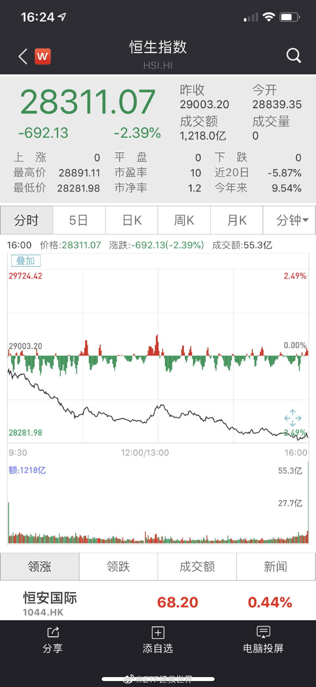

======================================================

ETF拯救世界 (5687069307) @
2019-05-09 16:43:53 Thu  
url: https://weibo.com/5687069307/Htp4gwwBg

这汽车吧，你遵守交规停一下等人家过去也行，不遵守交规踩一脚往前再上点让开也行，为什么要正好停在人家路线上……说回来这摩托车也不是善茬……

------------------------------------------------------
转推：
>  @北京人不知道的北京事儿 (1662214194)
>  2019-05-09 16:30:21 Thu  
>  url: https:/weibo.com/1662214194/HtoYM9TQg/

>  【你怎么看？[思考]】网友投稿：这是上午比较火的摩托车事件，女车主是车友群的，给我们看了她行车记录仪拍下视频，首先拐弯确实应该让直行没问题，但这种情况，摩托车算不算诚心碰撞的？视频看至少隔着几十米，到了路口为什么还要骑这么快？这到底该算谁的责任？[摊手]http://t.cn/EoQddPN ​​​

转发[22]  评论[96]  赞[169] 

======================================================

ETF拯救世界 (5687069307) @
2019-05-09 17:13:18 Thu  
url: https://weibo.com/5687069307/Htpgdou5B

回复@犬次郎不是二狗子:前几天看新闻不是说身高的一半吗…//@犬次郎不是二狗子:腰围不应该是80以下吗

------------------------------------------------------
转推：
>  @ETF拯救世界 (5687069307)
>  2019-05-09 15:54:30 Thu  
>  url: https:/weibo.com/5687069307/HtoKe3xoc/

>  饮食清淡，不熬夜，保持心情愉快。
>  
>  第四个未来十年愿望：
>  
>  不脱发。
>  
>  [亲亲] 
>  
>  第三个是腰围保持90以下… ​​​

转发[1]  评论[94]  赞[256] 

======================================================

ETF拯救世界 (5687069307) @
2019-05-09 18:43:16 Thu  
url: https://weibo.com/5687069307/HtpQJrXpj

回复@达令家grent:不好意思，我特喜欢看这种东西。因为能从里面学很多。这样，就不用自己亲自出事才能学了。//@达令家grent:人家犯事，我们少抄心

------------------------------------------------------
转推：
>  @北京人不知道的北京事儿 (1662214194)
>  2019-05-09 16:30:21 Thu  
>  url: https:/weibo.com/1662214194/HtoYM9TQg/

>  【你怎么看？[思考]】网友投稿：这是上午比较火的摩托车事件，女车主是车友群的，给我们看了她行车记录仪拍下视频，首先拐弯确实应该让直行没问题，但这种情况，摩托车算不算诚心碰撞的？视频看至少隔着几十米，到了路口为什么还要骑这么快？这到底该算谁的责任？[摊手]http://t.cn/EoQddPN ​​​

转发[11]  评论[68]  赞[258] 

======================================================

ETF拯救世界 (5687069307) @
2019-05-09 21:58:18 Thu  
url: https://weibo.com/5687069307/Htr7Te0o2

掐指一算，明天盘中各路豪杰聚齐，必有一番大战。

我选择吃瓜。

你们战完了我捡装备。 ​​​

转发[20]  评论[254]  赞[884] 

======================================================

ETF拯救世界 (5687069307) @
2019-05-09 22:13:11 Thu  
url: https://weibo.com/5687069307/HtrdWdopH

[doge]

------------------------------------------------------
转推：
>  @ ()
>  2019-05-09 18:37:42 Thu  
>  url: 

>  该账号因被投诉违反《微博社区公约》的相关规定，现已无法查看。查看帮助 https://kefu.weibo.com/faqdetail?id=13216

转发[15]  评论[48]  赞[283] 

======================================================

ETF拯救世界 (5687069307) @
2019-05-10 07:25:45 Fri  
url: https://weibo.com/5687069307/HtuQdur7r

昵称里带这些的博主，我一般不太敢关注，特有实力的除外：

大型猛兽猛禽类：

龙、虎、鹰、鳄、豹……

亲戚类：

哥、姐、叔、婶、二大爷、嫂子……

也不是说不好，就是有点想绕着走……个人喜好，又得罪人了…… ​​​

转发[22]  评论[296]  赞[559] 

======================================================

ETF拯救世界 (5687069307) @
2019-05-10 10:15:30 Fri  
url: https://weibo.com/5687069307/HtvX80qsU

先把安全垫做出来，免得中午群众情绪坏了摔得太狠。 ​​​

转发[92]  评论[214]  赞[655] 

======================================================

ETF拯救世界 (5687069307) @
2019-05-10 10:31:36 Fri  
url: https://weibo.com/5687069307/Htw3Exb9C

13：00-13：30才最精彩。

------------------------------------------------------
转推：
>  @ETF拯救世界 (5687069307)
>  2019-05-10 10:15:30 Fri  
>  url: https:/weibo.com/5687069307/HtvX80qsU/

>  先把安全垫做出来，免得中午群众情绪坏了摔得太狠。 ​​​

转发[64]  评论[210]  赞[523] 

======================================================

ETF拯救世界 (5687069307) @
2019-05-10 10:36:21 Fri  
url: https://weibo.com/5687069307/Htw5AccD9

回复@瀚海拾贝:随便猜不违法，根据猜去操作就犯罪了。//@瀚海拾贝:回复@芒果糯米鱼:减仓

------------------------------------------------------
转推：
>  @ETF拯救世界 (5687069307)
>  2019-05-10 10:15:30 Fri  
>  url: https:/weibo.com/5687069307/HtvX80qsU/

>  先把安全垫做出来，免得中午群众情绪坏了摔得太狠。 ​​​

转发[6]  评论[55]  赞[373] 

======================================================

ETF拯救世界 (5687069307) @
2019-05-10 10:46:11 Fri  
url: https://weibo.com/5687069307/Htw9zzJV0

这个市场上有三种人

精神病患者，医生，正常人。

正常人能赚多少钱，取决于精神病患者的多少。

精神病患者的多少，取决于行情的高低。

医生不希望精神病患者太多，因为太多就管不住了。但也不能没有，没有就失业了。

极少一部分精神病患者可以被治好，变成正常人（但并不是医生治好的，一般是自愈 ​​​

转发[208]  评论[359]  赞[961] 

======================================================

ETF拯救世界 (5687069307) @
2019-05-10 13:01:57 Fri  
url: https://weibo.com/5687069307/Htx2GjvEx

没懂，明明是确定的结果为什么大家好像刚知道。//@ETF拯救世界:13：00-13：30才最精彩。

------------------------------------------------------
转推：
>  @ETF拯救世界 (5687069307)
>  2019-05-10 10:15:30 Fri  
>  url: https:/weibo.com/5687069307/HtvX80qsU/

>  先把安全垫做出来，免得中午群众情绪坏了摔得太狠。 ​​​

转发[22]  评论[260]  赞[489] 

======================================================

ETF拯救世界 (5687069307) @
2019-05-10 13:22:05 Fri  
url: https://weibo.com/5687069307/HtxaR5qZi

就问你精彩不精彩//@ETF拯救世界:13：00-13：30才最精彩。

------------------------------------------------------
转推：
>  @ETF拯救世界 (5687069307)
>  2019-05-10 10:15:30 Fri  
>  url: https:/weibo.com/5687069307/HtvX80qsU/

>  先把安全垫做出来，免得中午群众情绪坏了摔得太狠。 ​​​

转发[29]  评论[348]  赞[657] 

======================================================

ETF拯救世界 (5687069307) @
2019-05-10 13:49:17 Fri  
url: https://weibo.com/5687069307/HtxlU1Sdu

回复@锦瑟_五十弦:可以，但没必要。可能号没了//@锦瑟_五十弦:老大把过程推演一遍更精彩！//@ETF拯救世界:就问你精彩不精彩//@ETF拯救世界:13：00-13：30才最精彩。

------------------------------------------------------
转推：
>  @ETF拯救世界 (5687069307)
>  2019-05-10 10:15:30 Fri  
>  url: https:/weibo.com/5687069307/HtvX80qsU/

>  先把安全垫做出来，免得中午群众情绪坏了摔得太狠。 ​​​

转发[9]  评论[116]  赞[454] 

======================================================

ETF拯救世界 (5687069307) @
2019-05-10 14:14:31 Fri  
url: https://weibo.com/5687069307/Htxw8qF6B

只有一句，无论多么绝望，这个位置以及更低的位置不要放弃希望，坚持。

就像利物浦和热刺一样。 ​​​

转发[61]  评论[364]  赞[1266] 

======================================================

ETF拯救世界 (5687069307) @
2019-05-10 16:13:18 Fri  
url: https://weibo.com/5687069307/HtyilE715

不考虑资源、背景、智商等因素，真想做成一件事，我觉得坚持可能是最重要的。

虽然吧，坚持了你也真不一定能成。毕竟成功需要很多因素，比如天赋、比如运气等等。

但是不坚持就毫无成功的希望。

在坚持很久还是没见到成功的时候，反复审视自己的路走的对不对，是不是跑偏了。如果发现自己走的路没错 ​​​

转发[169]  评论[394]  赞[1136] 

======================================================

ETF拯救世界 (5687069307) @
2019-05-10 22:25:07 Fri  
url: https://weibo.com/5687069307/HtAJhi7mn

珠市口的美福林包子我会怀念一辈子。外形和现在网红的西四包子差不多，不知道西四的是什么味，懒得排队…

------------------------------------------------------
转推：
>  @ ()
>  2019-05-10 20:21:36 Fri  
>  url: 

>  抱歉，作者已设置仅展示半年内微博，此微博已不可见。 ​​​

转发[9]  评论[123]  赞[326] 

======================================================

ETF拯救世界 (5687069307) @
2019-05-11 12:59:19 Sat  
url: https://weibo.com/5687069307/HtGs70bK7

回复@维京的孩子:你去问提出这个问题的人，为什么要来问我？他说好你就买，说不好你就卖就完了，不用来问我。

------------------------------------------------------
转推：
>  @ETF拯救世界 (5687069307)
>  2019-04-13 16:40:50 Sat  
>  url: https:/weibo.com/5687069307/HprW7FRxL/

>  每天都有很多重复的问题，我统一回答一下，然后会置顶：
>  
>  第一：谨防骗子。
>  
>  我只有这一个微博账号。绝对不会主动私信你，更不会要带你操作股票。我没有任何股票或者投资群，绝对不会要求加你微信或者QQ。
>  
>  如果有类似情况，马上拉黑对方。
>  
>  分辨真假最简单的方式是把鼠标挪到头像上，看看对方有多少人 ​​​

转发[4]  评论[47]  赞[295] 

======================================================

ETF拯救世界 (5687069307) @
2019-05-11 13:13:01 Sat  
url: https://weibo.com/5687069307/HtGxFchj5

刚才又有朋友来告诉我，哪个大V又在背后说我坏话了。

谢谢朋友们的关心，但以后真的不用告诉我。别人怎么说，我管不了，我也不关心。

我讨厌背后议论别人，讨厌背地里说人是非。对喜欢背后使坏给人下绊子的人，我一向有多远离多远，绝不让对方与我的生活产生任何交集。因为这种人最危险，谁走的近， ​​​

转发[31]  评论[231]  赞[792] 

======================================================

ETF拯救世界 (5687069307) @
2019-05-11 16:40:14 Sat  
url: https://weibo.com/5687069307/HtHTMljNE

跟有些人千方百计想多几个粉丝，多几个人关注，多几个人跟着他买不同，多点人关注我少点人关注我，我根本无所谓。

更多的人关注我当然开心，人之常情。但是人越来越少也无所谓。所以你在微博上看不到我宣传计划，从不尝试让更多的人参考计划，只是想到什么就写点什么当跟老朋友聊天了。你也看不到我公 ​​​

转发[49]  评论[481]  赞[1214] 

+++++++++++++++++++++++++++++++++++++++++++++++++++++

图片：

======================================================

ETF拯救世界 (5687069307) @
2019-05-11 17:04:52 Sat  
url: https://weibo.com/5687069307/HtI3MBRmj

这个聊天群的内容信息量非常非常大。

------------------------------------------------------
转推：
>  @ ()
>  2019-05-11 16:45:03 Sat  
>  url: 

>  抱歉，作者已设置仅展示半年内微博，此微博已不可见。 ​​​

转发[36]  评论[95]  赞[188] 

======================================================

ETF拯救世界 (5687069307) @
2019-05-11 17:12:52 Sat  
url: https://weibo.com/5687069307/HtI728z8R

回复@海狸克里特:第一，告诉他谁欺负你就打回去，打成什么样我都不会批评你，但你不许先欺负别人，否则我会让你很惨。第二，找老师了解情况，同时告诉老师孩子的描述，看看真相是什么。第三，与对方家长沟通，协商解决问题的办法。第四，如果都解决不了，就发微博请正义的各位主持公道…

------------------------------------------------------
转推：
>  @ ()
>  2019-05-11 16:45:03 Sat  
>  url: 

>  抱歉，作者已设置仅展示半年内微博，此微博已不可见。 ​​​

转发[29]  评论[143]  赞[296] 

======================================================

ETF拯救世界 (5687069307) @
2019-05-11 18:03:17 Sat  
url: https://weibo.com/5687069307/HtIruq4nm

理性真的很难。你看微博上的热门事件，就会有这种感觉。

理性不是冷血，理性只是希望更加接近事情的真相。

如果，我是说如果，真的如聊天群截图显示，男孩的家长和老师真的是第一次听说这个事情，老师马上请两位家长到学校解决问题，女孩家长带着刀去了，然后发生悲剧？

校园霸凌真的可恨。我小时候 ​​​

转发[32]  评论[219]  赞[649] 

======================================================

ETF拯救世界 (5687069307) @
2019-05-12 06:53:51 Sun  
url: https://weibo.com/5687069307/HtNugjLjx

在我的内心中，对个体的公平，以及事件真相是特别重要的。

我总是不希望好人蒙冤，不希望坏人逍遥法外。如果真的这样，我心里会非常不舒服。

我不知道那些对着新闻叫着“杀的好”的人，有没有想过，哪怕是1%的可能：

如果那个男孩真的如其他家长以及他父母同事所说，并不是个坏孩子，真的只是“抱着 ​​​

转发[38]  评论[248]  赞[700] 

======================================================

ETF拯救世界 (5687069307) @
2019-05-12 08:01:43 Sun  
url: https://weibo.com/5687069307/HtNVOz15O

以我个人的经历来看，小学、中学容易被欺负的有几类小朋友：

第一，身体或者智力方面有异于常人的地方。比如特别胖，特别矮，智商稍微有点低，体质比较弱等等。

我看过一个东西，说异于同类的个体，有些动物会将它们抛弃。这有利于保证整个物种的延续。有些受不到良好教育的小孩子其实更多体现的是动 ​​​

转发[87]  评论[259]  赞[567] 

======================================================

ETF拯救世界 (5687069307) @
2019-05-12 08:43:41 Sun  
url: https://weibo.com/5687069307/HtOcQlIqi

说起欺负人，想起一件真实的，有意思的小学时候的事。

我们班有一个手贱嘴贱的，经常被人欺负。但他也欺负别人，就是黑帮电影里那种总是受气的马仔类型吧。

有一天，隔壁班转来一个男生。非常帅。你知道新转学的有时候容易受欺负，更何况还是帅哥，班里的女生都说好帅。所以上面这哥们就去找人家茬了 ​​​

转发[11]  评论[184]  赞[463] 

======================================================

ETF拯救世界 (5687069307) @
2019-05-12 11:27:04 Sun  
url: https://weibo.com/5687069307/HtPha8ZK1

有一位券商的副总裁看到昨天微博，给我发了这样一句话。

我也想明白了，之所以有人不断跟你没完没了，就是把你当成标杆了，你才是他潜意识中最厉害的。只要干掉你，他认为自己就有可能登顶了。

喷了，可能吗。就算没我了怎么也轮不到你啊……光说人品就不可能是你啊……

一个人能做多大的事，不是看 ​​​

转发[44]  评论[138]  赞[820] 

+++++++++++++++++++++++++++++++++++++++++++++++++++++

图片：

======================================================

ETF拯救世界 (5687069307) @
2019-05-12 12:52:20 Sun  
url: https://weibo.com/5687069307/HtPPM16DI

前几天有朋友问的那个，所谓指数中的成分股会变动，所以以前的数据现在没意义了。这种说法，我不明白道理在哪里。

我是真的不明白。还让我发表看法。我发表什么看法啊。

是不是说一句除了沪深300其他所有指数都是辣鸡就可以了？

一个指数有进有出本来就非常正常。你现在买的标普500，道琼斯30，纳斯 ​​​

转发[130]  评论[174]  赞[783] 

======================================================

ETF拯救世界 (5687069307) @
2019-05-13 09:02:55 Mon  
url: https://weibo.com/5687069307/HtXL9dPSH

周五下午的四两拨千斤加情绪激动后，今天大概率认清现实回归理性吧。 ​​​

转发[11]  评论[182]  赞[795] 

======================================================

ETF拯救世界 (5687069307) @
2019-05-13 11:19:43 Mon  
url: https://weibo.com/5687069307/HtYEGk9Ca

现在有三个利空。

第一个，众所周知中长期会有压制作用。

第二个，开始有指数趋势再次变差。

第三个，目前看多的人太多，几乎找不到看空的。

继续暗中观察。 ​​​

转发[93]  评论[334]  赞[925] 

======================================================

ETF拯救世界 (5687069307) @
2019-05-13 15:42:25 Mon  
url: https://weibo.com/5687069307/Hu0nj3ONo

回复@withTink:我关注的人很杂。但不代表我一定认同对方或者喜欢对方。微博只是我观察这个世界的一个窗口而已。//@withTink:[汗]E大为啥还关注了凤姐

------------------------------------------------------
转推：
>  @ETF拯救世界 (5687069307)
>  2019-05-13 11:19:43 Mon  
>  url: https:/weibo.com/5687069307/HtYEGk9Ca/

>  现在有三个利空。
>  
>  第一个，众所周知中长期会有压制作用。
>  
>  第二个，开始有指数趋势再次变差。
>  
>  第三个，目前看多的人太多，几乎找不到看空的。
>  
>  继续暗中观察。 ​​​

转发[13]  评论[72]  赞[397] 

======================================================

ETF拯救世界 (5687069307) @
2019-05-13 15:58:57 Mon  
url: https://weibo.com/5687069307/Hu0u1pgcd

上一条吧，我说有几个利空。就有朋友蹦出来指责，甚至什么为了要更低筹码的话都出来了。

我想说的是，朋友啊，咱们能不能别这么狭隘，把眼界打开，把思想打开。

我最怕的就是禁锢思想。一旦形成什么思维定势，就不再思考，不再观察，然后永远不会提高。

观察这个世界，随时发现变化的问题而已啊。古 ​​​

转发[44]  评论[305]  赞[818] 

======================================================

ETF拯救世界 (5687069307) @
2019-05-13 16:10:06 Mon  
url: https://weibo.com/5687069307/Hu0yy80LT

这个有懂的吗？  

都不容易。 ​​​

转发[9]  评论[326]  赞[282] 

+++++++++++++++++++++++++++++++++++++++++++++++++++++

图片：
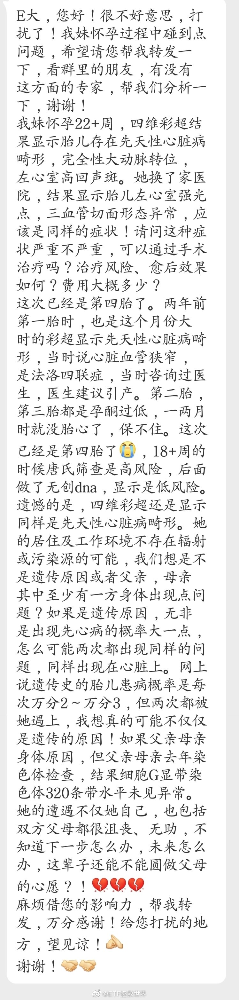

======================================================

ETF拯救世界 (5687069307) @
2019-05-13 16:37:49 Mon  
url: https://weibo.com/5687069307/Hu0JNd3dN

根据最新数据的A股仓位建议：

从保守到激进：

59.6%——79.6%。 ​​​

转发[83]  评论[311]  赞[811] 

======================================================

ETF拯救世界 (5687069307) @
2019-05-13 16:49:51 Mon  
url: https://weibo.com/5687069307/Hu0OG40ep

美股一季度利润下降。

我对美股才叫一年如一日的唱空好吗。

主要目的是真想买点便宜货啊…… ​​​

转发[54]  评论[100]  赞[690] 

======================================================

ETF拯救世界 (5687069307) @
2019-05-13 21:16:35 Mon  
url: https://weibo.com/5687069307/Hu2yWuxQw

回复@与魔鬼做对手的人:看空是看价值与价格的对比。做空在这之外还要加上时间。我把握不了时间因素，所以永不做空。//@与魔鬼做对手的人:你微博上说过你的家训是永不做空美股！

------------------------------------------------------
转推：
>  @ETF拯救世界 (5687069307)
>  2019-05-13 16:49:51 Mon  
>  url: https:/weibo.com/5687069307/Hu0OG40ep/

>  美股一季度利润下降。
>  
>  我对美股才叫一年如一日的唱空好吗。
>  
>  主要目的是真想买点便宜货啊…… ​​​

转发[39]  评论[90]  赞[432] 

======================================================

ETF拯救世界 (5687069307) @
2019-05-14 05:40:39 Tue  
url: https://weibo.com/5687069307/Hu5RxDfOq

美股一般情况自最高点调整幅度最多20%-30%。碰到经济危机会超过40%。

这里是让大家先有个概念。 ​​​

转发[162]  评论[245]  赞[907] 

======================================================

ETF拯救世界 (5687069307) @
2019-05-14 05:54:22 Tue  
url: https://weibo.com/5687069307/Hu5X743FC

想说说这次和去年下半年有什么不同，但不能说。各位好好看新闻好好思考一下。

交易的时候注意节奏。 ​​​

转发[103]  评论[588]  赞[1295] 

======================================================

ETF拯救世界 (5687069307) @
2019-05-14 09:07:17 Tue  
url: https://weibo.com/5687069307/Hu7dq0PFO

谁在买500都快买成最大ETF了

------------------------------------------------------
转推：
>  @张道达 (2032628220)
>  2019-05-14 09:00:03 Tue  
>  url: https:/weibo.com/2032628220/Hu7auhXzZ/

>  【从一基独大到双雄争霸 4000亿股票ETF市场迎巨变】随着上半年A股市场大小盘风格的切换和演绎，股票ETF市场龙头正在迎来巨变：连续四个年度稳居股票型ETF规模首位的华夏上证50ETF，今年冠军地位岌岌可危，南方中证500ETF年内规模激增百亿，以26亿元规模微小差距日益逼近。若A股市场大盘风格继续转向中 ​​​

转发[20]  评论[154]  赞[468] 

======================================================

ETF拯救世界 (5687069307) @
2019-05-14 09:43:09 Tue  
url: https://weibo.com/5687069307/Hu7rYrBzX

今天护盘的人这么多我们就不发车了 ​​​

转发[6]  评论[292]  赞[948] 

======================================================

ETF拯救世界 (5687069307) @
2019-05-14 17:06:49 Tue  
url: https://weibo.com/5687069307/Huam3A13k

明天来一次低买高卖。 ​​​

转发[35]  评论[374]  赞[929] 

======================================================

ETF拯救世界 (5687069307) @
2019-05-14 17:13:28 Tue  
url: https://weibo.com/5687069307/HuaoL8wkO

回复@shown龙:150有资源限制，必须卖出才能买入。S还没到卖出的时候。你就把S当零存整取就对了，放心。该卖的时候会卖的。//@shown龙:S版是不是没有卖出操作通知[汗] 从来没收到过啊

------------------------------------------------------
转推：
>  @ETF拯救世界 (5687069307)
>  2019-05-14 17:06:49 Tue  
>  url: https:/weibo.com/5687069307/Huam3A13k/

>  明天来一次低买高卖。 ​​​

转发[29]  评论[254]  赞[549] 

======================================================

ETF拯救世界 (5687069307) @
2019-05-15 12:18:57 Wed  
url: https://weibo.com/5687069307/HuhTIcV6C

突发：

BGM又不够用了。 ​​​

转发[3]  评论[228]  赞[579] 

======================================================

ETF拯救世界 (5687069307) @
2019-05-15 12:24:50 Wed  
url: https://weibo.com/5687069307/HuhW5zD7s

回复@Stark冰原狼2019:今天正点。另外卖出的一份今天涨得比买入的更多， 多好啊//@Stark冰原狼2019:回复@barryallen1:只是昨天说护盘很多没发车。今天涨起来了却不得不发车，有一点点择时失败的赶脚[doge]

------------------------------------------------------
转推：
>  @ETF拯救世界 (5687069307)
>  2019-05-14 17:06:49 Tue  
>  url: https:/weibo.com/5687069307/Huam3A13k/

>  明天来一次低买高卖。 ​​​

转发[7]  评论[335]  赞[610] 

======================================================

ETF拯救世界 (5687069307) @
2019-05-15 18:12:59 Wed  
url: https://weibo.com/5687069307/Hukdpy8g1

其实有些朋友啊，也许未必有什么恶意。有时候可能是开个不合时宜的玩笑，有时候可能是不太会说话，不过就会让一些不希望我被影响心情的朋友不高兴。

可能是因为责任心比较强，压力确实很大。有些朋友又要求特别高，比如“你为什么没有买在最低点”，“你为什么没有卖在最高点”，这样就有点难受。如果 ​​​

转发[25]  评论[463]  赞[1134] 

======================================================

ETF拯救世界 (5687069307) @
2019-05-16 09:36:57 Thu  
url: https://weibo.com/5687069307/Huqgs8Ari

我在想一个问题：

昨天卖出的内地消费，有多大几率在未来一年中自目前价格下跌10%-20%。 ​​​

转发[24]  评论[357]  赞[740] 

======================================================

ETF拯救世界 (5687069307) @
2019-05-16 18:16:11 Thu  
url: https://weibo.com/5687069307/HutFd4zLs

这个我想了半天也没有答案。大家有什么看法吗。 ​​​

转发[32]  评论[741]  赞[334] 

+++++++++++++++++++++++++++++++++++++++++++++++++++++

图片：

======================================================

ETF拯救世界 (5687069307) @
2019-05-16 19:16:27 Thu  
url: https://weibo.com/5687069307/Huu3FxaJK

结论：

男人靠不住。

尤其是人到中年突然开始健身的男人。

[怒] ​​​

转发[25]  评论[403]  赞[704] 

======================================================

ETF拯救世界 (5687069307) @
2019-05-16 21:38:04 Thu  
url: https://weibo.com/5687069307/HuuZ9szxe

转发微博

------------------------------------------------------
转推：
>  @瑞达利欧 (6529122212)
>  2019-05-16 21:27:03 Thu  
>  url: https:/weibo.com/6529122212/HuuUGlbAu/

>  #瑞达利欧的问答# 提问：债务周期叠加政治周期，历史上有出现过吗？
>  
>  回答：20世纪30年代至40年代是近代最大、最典型的大型债务周期与大型政治周期同时发生的例子（同时发生在国家内部和国家之间）。那时（正如现在）出现过下列这些情况：1) 债务问题； 2)利率接近0；所以3) 刺激措施必须以央行印钞和 ​​​

转发[38]  评论[81]  赞[253] 

======================================================

ETF拯救世界 (5687069307) @
2019-05-17 07:29:08 Fri  
url: https://weibo.com/5687069307/HuyR4ev0F

家里有点钱最重要是教育好孩子，否则黄赌毒分分钟给你败光…

------------------------------------------------------
转推：
>  @ ()
>  2019-05-15 20:58:03 Wed  
>  url: 

>  抱歉，由于作者设置，你暂时没有这条微博的查看权限哦。查看帮助：http://t.cn/RfdBWwP ​​​

转发[51]  评论[135]  赞[319] 

======================================================

ETF拯救世界 (5687069307) @
2019-05-17 08:24:32 Fri  
url: https://weibo.com/5687069307/HuzdynZmG

分享图片 ​​​

转发[14]  评论[92]  赞[460] 

+++++++++++++++++++++++++++++++++++++++++++++++++++++

图片：
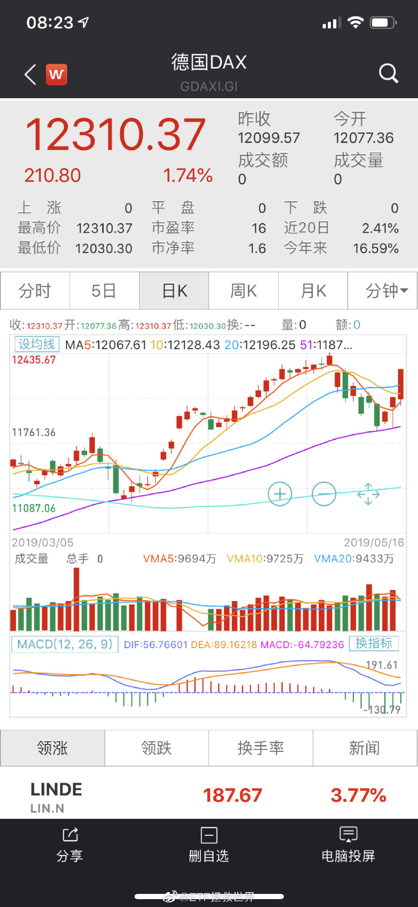
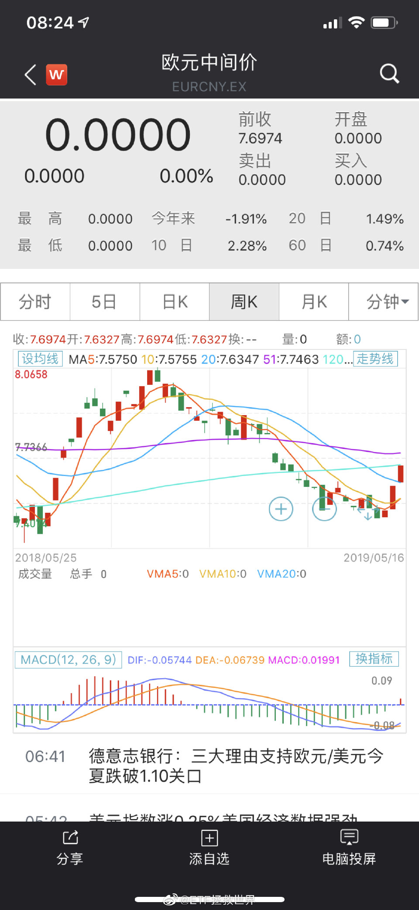

======================================================

ETF拯救世界 (5687069307) @
2019-05-17 08:33:37 Fri  
url: https://weibo.com/5687069307/Huzhfo7h8

不确定永远是市场最不喜欢的。

最佳买点是好苗头出现的时候。

感情充沛对提高收益率没什么用。 ​​​

转发[84]  评论[179]  赞[800] 

======================================================

ETF拯救世界 (5687069307) @
2019-05-17 11:02:11 Fri  
url: https://weibo.com/5687069307/HuAfxFB2F

看看每天的新闻，什么变了。变得我有点不安。

------------------------------------------------------
转推：
>  @ETF拯救世界 (5687069307)
>  2019-05-14 05:54:22 Tue  
>  url: https:/weibo.com/5687069307/Hu5X743FC/

>  想说说这次和去年下半年有什么不同，但不能说。各位好好看新闻好好思考一下。
>  
>  交易的时候注意节奏。 ​​​

转发[38]  评论[288]  赞[605] 

======================================================

ETF拯救世界 (5687069307) @
2019-05-17 11:15:23 Fri  
url: https://weibo.com/5687069307/HuAkU5olH

最近四个月，实际上没有增加仓位。

500高卖低换传媒。

消费高卖低换300。

只加了一份低仓位可转债。

其它加了黄金油气Dax。

代表了我的态度。

目前仓位很合适，注意节奏。 ​​​

转发[44]  评论[272]  赞[734] 

======================================================

ETF拯救世界 (5687069307) @
2019-05-17 11:32:50 Fri  
url: https://weibo.com/5687069307/HuArZuEtu

每次晚上不关窗户都嗓子发炎然后感冒。

这是什么道理。因为晚上身体抵抗力弱吗。 ​​​

转发[19]  评论[521]  赞[421] 

======================================================

ETF拯救世界 (5687069307) @
2019-05-17 14:48:58 Fri  
url: https://weibo.com/5687069307/HuBJB5LrB

最近把这本书拿出来又翻了翻。 ​​​

转发[47]  评论[283]  赞[758] 

+++++++++++++++++++++++++++++++++++++++++++++++++++++

图片：

======================================================

ETF拯救世界 (5687069307) @
2019-05-17 17:30:39 Fri  
url: https://weibo.com/5687069307/HuCNe1Qzv

很多事情吧，我也没经历过，只能尽量多学习历史，然后多观察蛛丝马迹，大概做个判断。

但是目前的A股你让我卖，我真的不卖。我们持仓的品种平均不到2倍PB（2015年A股超过6PB），ROE在10%以上，卖了也没什么好买的。都是指数，又不会死。

剩余的资金，以及每个月的收入，要控制节奏投入。主要原因是仓 ​​​

转发[153]  评论[459]  赞[998] 

======================================================

ETF拯救世界 (5687069307) @
2019-05-17 18:25:25 Fri  
url: https://weibo.com/5687069307/HuD9sb6C6

我最不理解的就是动不动就“清仓”“满仓”。

你就算再不看好，留20%没事吧。A股就算腰斩你资产也只减少10%啊。

你0%仓位的代价是什么，是心神不宁坐卧不安以及经常性的挫败感以及长期看必然收益率降低的结果啊。 ​​​

转发[76]  评论[328]  赞[848] 

======================================================

ETF拯救世界 (5687069307) @
2019-05-17 18:35:55 Fri  
url: https://weibo.com/5687069307/HuDdIozmc

特 别 棒 ！ ！ ！//@曹增辉:赢了[跪了][跪了][跪了]

------------------------------------------------------
转推：
>  @这个微博有点婊 (3129816345)
>  2019-05-17 09:41:17 Fri  
>  url: https:/weibo.com/3129816345/HuzII00aM/

>  #毕业照挑战#听说这是某医学院的毕业照，还有谁[doge] ​​​

转发[37]  评论[129]  赞[330] 

======================================================

ETF拯救世界 (5687069307) @
2019-05-18 07:32:15 Sat  
url: https://weibo.com/5687069307/HuIiPnq9Q

[傻眼]

------------------------------------------------------
转推：
>  @ ()
>  2019-05-18 06:14:37 Sat  
>  url: 

>  抱歉，作者已设置仅展示半年内微博，此微博已不可见。 ​​​

转发[39]  评论[153]  赞[422] 

======================================================

ETF拯救世界 (5687069307) @
2019-05-18 11:08:44 Sat  
url: https://weibo.com/5687069307/HuJIHFbEk

周末没事学着做个大阪烧，工具不够，蛋黄酱挤的不好看。

是时候转型美食博主了。 ​​​

转发[1]  评论[365]  赞[1329] 

+++++++++++++++++++++++++++++++++++++++++++++++++++++

图片：
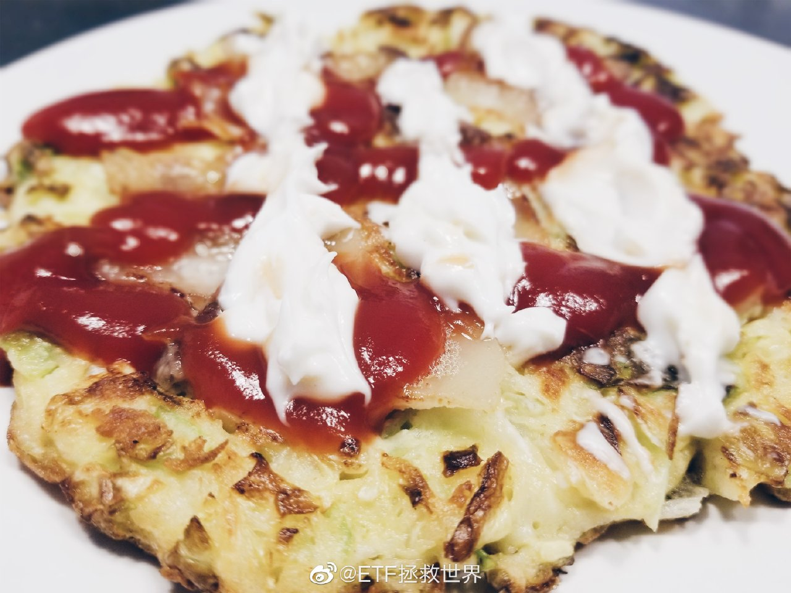

======================================================

ETF拯救世界 (5687069307) @
2019-05-19 10:16:09 Sun  
url: https://weibo.com/5687069307/HuSNR1iNX

台积电会怎么做？考验他们的时候到了。 ​​​

转发[24]  评论[388]  赞[686] 

======================================================

ETF拯救世界 (5687069307) @
2019-05-20 09:52:41 Mon  
url: https://weibo.com/5687069307/Hv24PaxG8

俾面 ​​​

转发[11]  评论[298]  赞[605] 

+++++++++++++++++++++++++++++++++++++++++++++++++++++

图片：
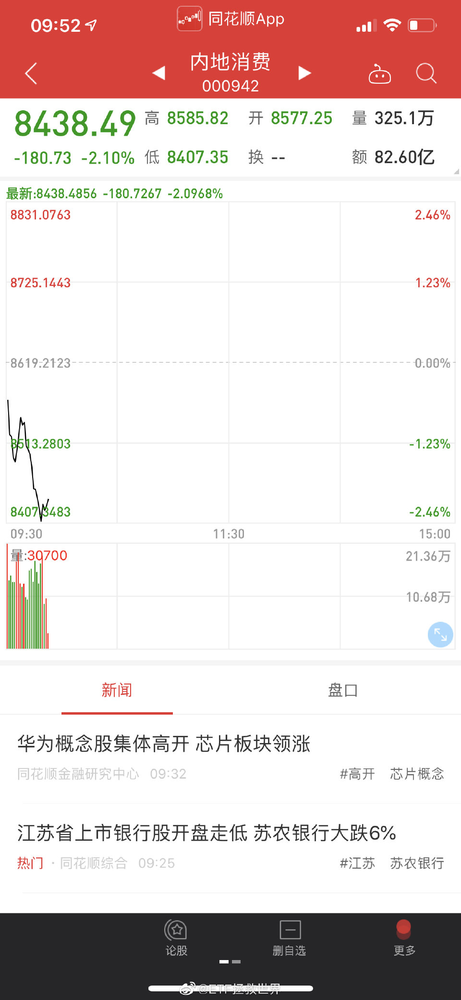

======================================================

ETF拯救世界 (5687069307) @
2019-05-20 11:02:52 Mon  
url: https://weibo.com/5687069307/Hv2xjnjD7

再说一次，手里有钱不是你投资的理由。

好机会才是。 ​​​

转发[188]  评论[3586]  赞[2061] 

======================================================

ETF拯救世界 (5687069307) @
2019-05-20 15:32:46 Mon  
url: https://weibo.com/5687069307/Hv4iS6Kuy

打开微博一看评论数吓我一跳，以为我红了。还好没有，松了一口气。

------------------------------------------------------
转推：
>  @ETF拯救世界 (5687069307)
>  2019-05-20 11:02:52 Mon  
>  url: https:/weibo.com/5687069307/Hv2xjnjD7/

>  再说一次，手里有钱不是你投资的理由。
>  
>  好机会才是。 ​​​

转发[19]  评论[1033]  赞[991] 

======================================================

ETF拯救世界 (5687069307) @
2019-05-20 20:23:00 Mon  
url: https://weibo.com/5687069307/Hv6cFtcC3

我总觉得美股不应该反应这么弱。 

是不是花街大佬们还没有意识到问题的严重性。 ​​​

转发[16]  评论[1061]  赞[983] 

======================================================

ETF拯救世界 (5687069307) @
2019-05-21 16:16:39 Tue  
url: https://weibo.com/5687069307/Hve1aBB73

一切都好，勿念。

就是忙。

今天过的怎么样？昨天你有什么特别的事发生吗，展开讲讲。 ​​​

转发[6]  评论[886]  赞[837] 

======================================================

ETF拯救世界 (5687069307) @
2019-05-21 18:43:36 Tue  
url: https://weibo.com/5687069307/HveYP2Iwq

这几天看到好几次评论里讨论“精神出轨”。

能不能精确的定义一下什么叫精神出轨，尤其是妹子们，你们觉得到底怎么样算精神出轨？ ​​​

转发[9]  评论[502]  赞[514] 

======================================================

ETF拯救世界 (5687069307) @
2019-05-21 20:55:31 Tue  
url: https://weibo.com/5687069307/HvfQn8M6W

华为这件事让我意识到一个虽然一直有意识但是从来没有系统考虑过的问题：

目前对我很重要的事情如果出现什么即使概率极低的不好的变化，我有没有plan B应对？

比如工作，比如投资，比如健康，比如很多同样重要的事。

如果没有，重大变化发生的时候就容易出问题。 ​​​

转发[140]  评论[563]  赞[1070] 

======================================================

ETF拯救世界 (5687069307) @
2019-05-22 08:59:04 Wed  
url: https://weibo.com/5687069307/HvkA3F1x5

前几天steam打折，买了一个叫做 冰汽时代 的游戏。

大意就是全球突然变冷，就像流浪地球那样。绝大多数人都挂了，你带着一帮人在英国北部开始建设家园，扛过最终的大寒潮就算胜利。

整个过程中，人民内部当然会不断的有质疑和反对出现。任何伟大的事业进行过程中，都一定会有。游戏中提供两个分支应 ​​​

转发[107]  评论[391]  赞[860] 

======================================================

ETF拯救世界 (5687069307) @
2019-05-22 10:16:41 Wed  
url: https://weibo.com/5687069307/Hvl5yyuFs

回复@小小6_6:玩游戏不能上瘾，要有自制力。玩游戏有好处，有些游戏甚至可以减压，比如消消乐，对健康还有好处。但是一旦上瘾玩物丧志就完蛋了。任何事情适度都是最重要的。//@小小6_6:别人玩游戏是玩物丧志，E玩游戏怎么觉得，哇，超帅，打折，哇，好酷[喵喵][喵喵][喵喵][爱你][爱你][爱你]

------------------------------------------------------
转推：
>  @ETF拯救世界 (5687069307)
>  2019-05-22 08:59:04 Wed  
>  url: https:/weibo.com/5687069307/HvkA3F1x5/

>  前几天steam打折，买了一个叫做 冰汽时代 的游戏。
>  
>  大意就是全球突然变冷，就像流浪地球那样。绝大多数人都挂了，你带着一帮人在英国北部开始建设家园，扛过最终的大寒潮就算胜利。
>  
>  整个过程中，人民内部当然会不断的有质疑和反对出现。任何伟大的事业进行过程中，都一定会有。游戏中提供两个分支应 ​​​

转发[13]  评论[220]  赞[463] 

======================================================

ETF拯救世界 (5687069307) @
2019-05-22 18:53:40 Wed  
url: https://weibo.com/5687069307/Hvotp8xxK

刚才有朋友跟我说，我的所有雪球文章都看不到了。

我几年前建过一个小号用户名和密码都忘了……也没法用小号上去看，谁帮我看看文章是不是都看不见了…… ​​​

转发[13]  评论[409]  赞[353] 

======================================================

ETF拯救世界 (5687069307) @
2019-05-22 19:00:57 Wed  
url: https://weibo.com/5687069307/HvowmAkmB

回复@waspjia:那就好。那就不麻烦各位帮我看了。要是以后真看不到了也挺可惜的。//@waspjia:不是你一个人，几乎所有人去年以前的帖子都看不到了。。。

------------------------------------------------------
转推：
>  @ETF拯救世界 (5687069307)
>  2019-05-22 18:53:40 Wed  
>  url: https:/weibo.com/5687069307/Hvotp8xxK/

>  刚才有朋友跟我说，我的所有雪球文章都看不到了。
>  
>  我几年前建过一个小号用户名和密码都忘了……也没法用小号上去看，谁帮我看看文章是不是都看不见了…… ​​​

转发[4]  评论[201]  赞[347] 

======================================================

ETF拯救世界 (5687069307) @
2019-05-23 09:32:26 Thu  
url: https://weibo.com/5687069307/Hvue60Lu5

不要情绪化，控制节奏。

这件事短期解决不了，也暂时没有看到有解决希望的信息。目前还处在不断出坏消息的阶段。

不到孤注一掷的时候，控制节奏。 ​​​

转发[73]  评论[428]  赞[1047] 

======================================================

ETF拯救世界 (5687069307) @
2019-05-23 10:21:43 Thu  
url: https://weibo.com/5687069307/Hvuy6ucsI

内地消费权重。

到底还有没有机会低位买回了。在线等，挺急的。 ​​​

转发[29]  评论[388]  赞[733] 

+++++++++++++++++++++++++++++++++++++++++++++++++++++

图片：
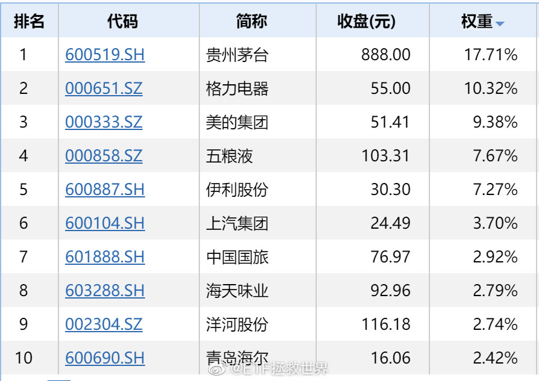

======================================================

ETF拯救世界 (5687069307) @
2019-05-23 11:15:47 Thu  
url: https://weibo.com/5687069307/HvuU3dk7p

台积电。[赞]

------------------------------------------------------
转推：
>  @ETF拯救世界 (5687069307)
>  2019-05-19 10:16:09 Sun  
>  url: https:/weibo.com/5687069307/HuSNR1iNX/

>  台积电会怎么做？考验他们的时候到了。 ​​​

转发[12]  评论[260]  赞[731] 

======================================================

ETF拯救世界 (5687069307) @
2019-05-23 13:36:23 Thu  
url: https://weibo.com/5687069307/HvvP7blyC

如果你发现每天早上睁开眼睛都有坏消息，那你就要控制节奏。这里面牵扯到很多问题，不仅仅是坏消息包含的内容，也有心理学的因素在内。

一个接一个的坏消息，对心理的打击要比所有坏消息一起出的力度要大得多。所以你就能看到对方接二连三的释放坏消息打击你，这不是他每天制造一个，而是早已经谋划好 ​​​

转发[392]  评论[479]  赞[1194] 

======================================================

ETF拯救世界 (5687069307) @
2019-05-23 13:51:43 Thu  
url: https://weibo.com/5687069307/HvvVl4bIM

说真的，我们真的应该在世界上多交几个朋友了。

------------------------------------------------------
转推：
>  @Panasonic松下中国 (1917281600)
>  2019-05-23 12:05:33 Thu  
>  url: https:/weibo.com/1917281600/Hvvefgepj/

>  严正声明 ​​​

转发[40]  评论[221]  赞[590] 

======================================================

ETF拯救世界 (5687069307) @
2019-05-23 14:29:28 Thu  
url: https://weibo.com/5687069307/HvwaF4iGx

回复@归来DFC:昨天收盘还差8%-9%左右。//@归来DFC:e大，这一次是不是真的要创历史跌回钻石坑了，距离很近了吧

------------------------------------------------------
转推：
>  @ETF拯救世界 (5687069307)
>  2019-05-23 13:36:23 Thu  
>  url: https:/weibo.com/5687069307/HvvP7blyC/

>  如果你发现每天早上睁开眼睛都有坏消息，那你就要控制节奏。这里面牵扯到很多问题，不仅仅是坏消息包含的内容，也有心理学的因素在内。
>  
>  一个接一个的坏消息，对心理的打击要比所有坏消息一起出的力度要大得多。所以你就能看到对方接二连三的释放坏消息打击你，这不是他每天制造一个，而是早已经谋划好 ​​​

转发[164]  评论[162]  赞[499] 

======================================================

ETF拯救世界 (5687069307) @
2019-05-23 14:43:55 Thu  
url: https://weibo.com/5687069307/HvwgwyGkR

朋友们，低调很重要。

真的。

闷声发大财才是大智慧。

我的第二条家训。 ​​​

转发[306]  评论[576]  赞[1558] 

======================================================

ETF拯救世界 (5687069307) @
2019-05-23 18:06:28 Thu  
url: https://weibo.com/5687069307/HvxAKlcI5

今天收盘后还有6%-8%左右的空间回到钻石坑。这样的状态再维持一周，月底必然有车。这种时候，不买不是中国人。[doge]//@ETF拯救世界:回复@归来DFC:昨天收盘还差8%-9%左右。//@归来DFC:e大，这一次是不是真的要创历史跌回钻石坑了，距离很近了吧

------------------------------------------------------
转推：
>  @ETF拯救世界 (5687069307)
>  2019-05-23 13:36:23 Thu  
>  url: https:/weibo.com/5687069307/HvvP7blyC/

>  如果你发现每天早上睁开眼睛都有坏消息，那你就要控制节奏。这里面牵扯到很多问题，不仅仅是坏消息包含的内容，也有心理学的因素在内。
>  
>  一个接一个的坏消息，对心理的打击要比所有坏消息一起出的力度要大得多。所以你就能看到对方接二连三的释放坏消息打击你，这不是他每天制造一个，而是早已经谋划好 ​​​

转发[119]  评论[245]  赞[727] 

======================================================

ETF拯救世界 (5687069307) @
2019-05-23 18:10:15 Thu  
url: https://weibo.com/5687069307/HvxChdpFn

德国人不行。[哼] ​​​

转发[8]  评论[123]  赞[418] 

+++++++++++++++++++++++++++++++++++++++++++++++++++++

图片：

======================================================

ETF拯救世界 (5687069307) @
2019-05-23 18:57:51 Thu  
url: https://weibo.com/5687069307/HvxVB7nCH

我不知道你相不相信历史数据。

即使不信，参考一下也好。

当然，历史未必等于未来。然而我愿意给你下面这几个数据，让你有个参考。

下面几张图，是中证500的PB/股息率/PS/PCF对应的未来一年收益率。纵轴是收益率，横轴是各项数据。

怎么看呢。很简单，就是当500的各项数据在某个数值的时候买入，可 ​​​

转发[1117]  评论[950]  赞[3134] 

+++++++++++++++++++++++++++++++++++++++++++++++++++++

图片：

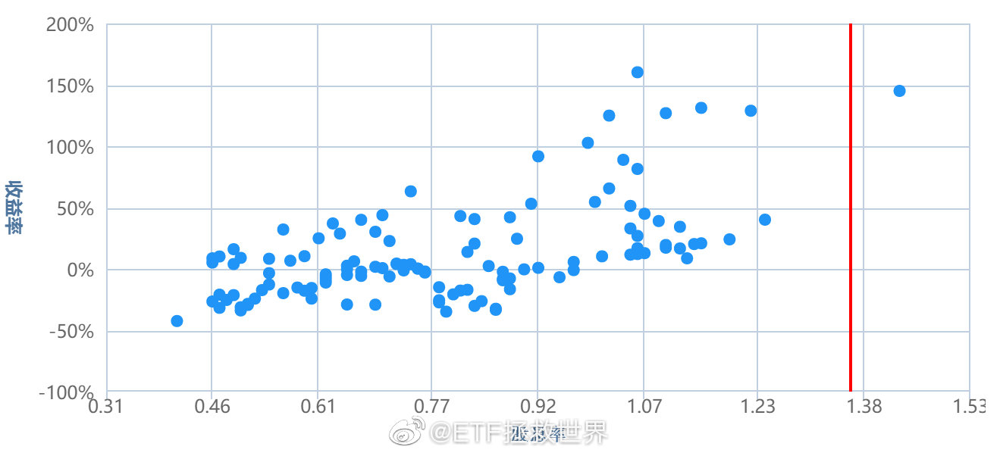

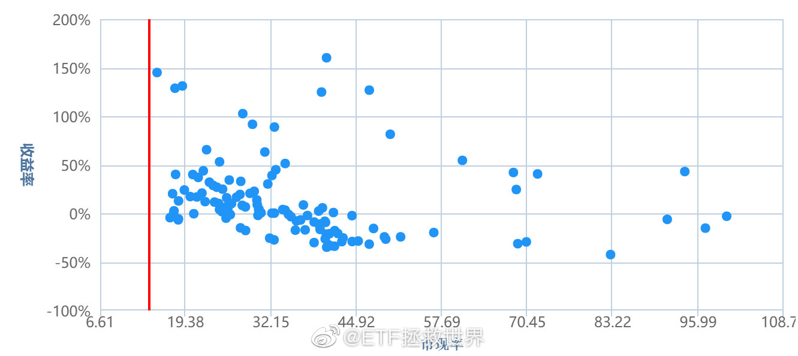

======================================================

ETF拯救世界 (5687069307) @
2019-05-23 19:13:05 Thu  
url: https://weibo.com/5687069307/Hvy1N14ms

回复@一只汪迎面走来:非常有趣。投资这件事需要考虑若干个层面。一个是事情未来的发展，另一个层面是你要买东西的性价比。只关注哪个层面都不行。这个一定要认真体会一下。//@一只汪迎面走来:之前看到老大说今年毛衣的情况跟去年不一样，不知怎的竟然有点悲观，现在看到你这么说，我又放心了[允悲]

------------------------------------------------------
转推：
>  @ETF拯救世界 (5687069307)
>  2019-05-23 13:36:23 Thu  
>  url: https:/weibo.com/5687069307/HvvP7blyC/

>  如果你发现每天早上睁开眼睛都有坏消息，那你就要控制节奏。这里面牵扯到很多问题，不仅仅是坏消息包含的内容，也有心理学的因素在内。
>  
>  一个接一个的坏消息，对心理的打击要比所有坏消息一起出的力度要大得多。所以你就能看到对方接二连三的释放坏消息打击你，这不是他每天制造一个，而是早已经谋划好 ​​​

转发[41]  评论[92]  赞[468] 

======================================================

ETF拯救世界 (5687069307) @
2019-05-23 19:56:44 Thu  
url: https://weibo.com/5687069307/Hvyjv4pWN

我个人觉得吧

这场仗不管你愿意不愿意，已经开打了。

华为倒了，对每一个中国人都不会是好事。你说你跟华为没关系？南美的一个蝴蝶扇一下翅膀都能引起德克萨斯的龙卷风，怎么可能没关系？

产业链，税收，福利，这个国家的方向——是永远给别人做牛仔裤和打火机，还是能站的高一点……等等等等。

不 ​​​

转发[203]  评论[640]  赞[1737] 

======================================================

ETF拯救世界 (5687069307) @
2019-05-23 21:34:28 Thu  
url: https://weibo.com/5687069307/HvyXapimN

追剧。

------------------------------------------------------
转推：
>  @ ()
>  2019-05-23 20:54:45 Thu  
>  url: 

>  抱歉，由于作者设置，你暂时没有这条微博的查看权限哦。查看帮助：http://t.cn/RfdBWwP ​​​

转发[20]  评论[90]  赞[222] 

======================================================

ETF拯救世界 (5687069307) @
2019-05-23 21:38:46 Thu  
url: https://weibo.com/5687069307/HvyYVa1AL

要崩一起崩，拉上欧洲一起跳~~~

------------------------------------------------------
转推：
>  @财联社APP (2868676035)
>  2019-05-23 21:33:01 Thu  
>  url: https:/weibo.com/2868676035/HvyWA5aue/

>  美股开盘，三大股指集体低开，道指跌1%，纳指跌1.13%，标普500跌0.98%。中概股大幅低开，新浪跌11%，一季度广告业务增速下滑；微博跌11%，第二季度指引低于预期。 ​​​

转发[11]  评论[78]  赞[474] 

======================================================

ETF拯救世界 (5687069307) @
2019-05-23 21:44:29 Thu  
url: https://weibo.com/5687069307/Hvz1etkl4

油崩了。周末我赶紧把2.0发出来。正用得上。

不是不发。你看了就知道走心的东西多难写了。 ​​​

转发[23]  评论[246]  赞[1063] 

======================================================

ETF拯救世界 (5687069307) @
2019-05-23 21:48:15 Thu  
url: https://weibo.com/5687069307/Hvz2LkwRu

各位发生的好事都会让我很开心。

虽然不认识各位，但希望大家都能顺顺利利的。 ​​​

转发[6]  评论[174]  赞[1184] 

+++++++++++++++++++++++++++++++++++++++++++++++++++++

图片：

======================================================

ETF拯救世界 (5687069307) @
2019-05-23 22:03:47 Thu  
url: https://weibo.com/5687069307/Hvz94ha8a

中证500有这么好吗 [doge]

------------------------------------------------------
转推：
>  @ ()
>  2019-05-23 19:23:19 Thu  
>  url: 

>  抱歉，作者已设置仅展示半年内微博，此微博已不可见。 ​​​

转发[20]  评论[77]  赞[555] 

======================================================

ETF拯救世界 (5687069307) @
2019-05-23 22:08:27 Thu  
url: https://weibo.com/5687069307/HvzaXx1bj

关心了一天国家大事，要去休息了。

昨晚是这些年第一次睡足8小时，今天感觉很精神。无论在市场上资产如何波动，吃得好，睡得香才能说明你的投资是健康的。

每天为了那点波动心惊胆战涨跌都难受，那你就要好好审视一下自己的组合是不是合适了。

晚安。 ​​​

转发[27]  评论[270]  赞[876] 

======================================================

ETF拯救世界 (5687069307) @
2019-05-24 08:12:50 Fri  
url: https://weibo.com/5687069307/HvD8i1vlB

我相信加水就能跑的汽车是真的。有视频为证。

------------------------------------------------------
转推：
>  @ ()
>  2019-05-23 20:37:47 Thu  
>  url: 

>  抱歉，作者已设置仅展示半年内微博，此微博已不可见。 ​​​

转发[140]  评论[214]  赞[455] 

======================================================

ETF拯救世界 (5687069307) @
2019-05-24 10:24:15 Fri  
url: https://weibo.com/5687069307/HvDZCxQYc

买，没问题。但是目前这种情况，控制节奏的买。

同时不断问自己，最差情况再跌30%自己能不能扛住。能扛住就继续买，扛不住就停。 ​​​

转发[58]  评论[597]  赞[1102] 

======================================================

ETF拯救世界 (5687069307) @
2019-05-24 17:09:16 Fri  
url: https://weibo.com/5687069307/HvGE1fWHb

你说人这辈子，怎么才算活的值了。

就算马上离开这个世界也不遗憾。 ​​​

转发[62]  评论[990]  赞[831] 

======================================================

ETF拯救世界 (5687069307) @
2019-05-25 09:17:55 Sat  
url: https://weibo.com/5687069307/HvMZccXYx

某年生日随便拍的国家大剧院。 ​​​

转发[16]  评论[437]  赞[1398] 

+++++++++++++++++++++++++++++++++++++++++++++++++++++

图片：

======================================================

ETF拯救世界 (5687069307) @
2019-05-25 11:07:37 Sat  
url: https://weibo.com/5687069307/HvNHJi00c

回复@谜之牌手:新朋友吧。我这里不是舔。我们这是夸夸群。互相夸，互相吹捧，最后大家都觉得人生很美好，每个人的脸上都洋溢着幸福的笑容。//@谜之牌手:这都有人舔[费解]

------------------------------------------------------
转推：
>  @ETF拯救世界 (5687069307)
>  2019-05-25 09:17:55 Sat  
>  url: https:/weibo.com/5687069307/HvMZccXYx/

>  某年生日随便拍的国家大剧院。 ​​​

转发[3]  评论[202]  赞[776] 

======================================================

ETF拯救世界 (5687069307) @
2019-05-25 12:00:28 Sat  
url: https://weibo.com/5687069307/HvO3aEZQz

会夸人是一种能力，鲁迅说过，嘴甜的人运气不会差。

我本人很不喜欢带有极强目的性的吹捧，为了得到好处就努力拍马屁的人也很值得警惕。但如果你时不时给别人一点带有敬佩又或者鼓励的真心称赞，相信人生会顺利很多。

很多人说，我就是很直啊，他们家刚生的孩子确实不好看啊，他/她的发型/衣服/鞋子/ ​​​

转发[136]  评论[396]  赞[1059] 

======================================================

ETF拯救世界 (5687069307) @
2019-05-25 22:14:29 Sat  
url: https://weibo.com/5687069307/HvS4p9Mpn

很多事情确实要讲天分。不服不行。

摄影这两个字都不敢讲。只能说照相。从小学就开始，那时候就拿着单反拍。虽然只是个理光的低端机吧。

后来断断续续也一直没完全放下。但自己知道，拍的不行。

第一个肯定是没用心，没有完全把精力放在上面。主要是不够热爱。

第二个就是知道自己没有天分。主要是 ​​​

转发[28]  评论[377]  赞[1027] 

======================================================

ETF拯救世界 (5687069307) @
2019-05-26 19:21:36 Sun  
url: https://weibo.com/5687069307/Hw0mJau8W

微博新出了一个“粉丝群”。我本来想开一个试试，不好玩就随时关。

但我想了半天，也没想出来除了好玩，为什么要开这么一个群。你觉得弄个群有什么好处吗。 ​​​

转发[3]  评论[452]  赞[668] 

======================================================

ETF拯救世界 (5687069307) @
2019-05-26 21:49:19 Sun  
url: https://weibo.com/5687069307/Hw1kH4S0N

看完这个视频我骂了一句脏话

------------------------------------------------------
转推：
>  @ ()
>  2019-05-26 13:28:06 Sun  
>  url: 

>  抱歉，作者已设置仅展示半年内微博，此微博已不可见。 ​​​

转发[32]  评论[319]  赞[321] 

======================================================

ETF拯救世界 (5687069307) @
2019-05-27 15:32:08 Mon  
url: https://weibo.com/5687069307/Hw8i5el6L

年初想买台品牌PC，先看了联想，然后看了看其他牌子，最后根据性价比原则买了HP//@挖龙脉的超级鹿鼎公: 转发微博

------------------------------------------------------
转推：
>  @ ()
>  2019-05-25 22:16:08 Sat  
>  url: 

>  抱歉，作者已设置仅展示半年内微博，此微博已不可见。 ​​​

转发[69]  评论[327]  赞[479] 

======================================================

ETF拯救世界 (5687069307) @
2019-05-28 10:00:58 Tue  
url: https://weibo.com/5687069307/HwfyakLx3

NB你就冲过2940。

[怒] ​​​

转发[23]  评论[441]  赞[830] 

======================================================

ETF拯救世界 (5687069307) @
2019-05-28 14:41:54 Tue  
url: https://weibo.com/5687069307/Hwhoci6PJ

[爱你]

------------------------------------------------------
转推：
>  @ETF拯救世界 (5687069307)
>  2019-05-28 10:00:58 Tue  
>  url: https:/weibo.com/5687069307/HwfyakLx3/

>  NB你就冲过2940。
>  
>  [怒] ​​​

转发[6]  评论[424]  赞[596] 

======================================================

ETF拯救世界 (5687069307) @
2019-05-29 08:59:36 Wed  
url: https://weibo.com/5687069307/HwozKkNbt

球员归化不归化没什么大问题。归化球员当然有很多弊端，但有没有可能国足成绩好了激励更多孩子喜欢上足球开始踢球？什么都有可能。

我们足球不行问题很多，其中一个原因是踢球的孩子太少。我管不了别人，从我自己来说，会带孩子去体验各种运动，尤其是足球篮球。如果他喜欢，花多少钱都会培养，占几节 ​​​

转发[13]  评论[307]  赞[686] 

======================================================

ETF拯救世界 (5687069307) @
2019-05-29 14:47:36 Wed  
url: https://weibo.com/5687069307/HwqR08W7n

最近几天说话少，主要原因是目前状态混沌不清。

技术面，消息面都比较混沌。没有明显的趋势出现，价值的东西每天变化也不大，也没什么好说的。

目前这种情况，除非是专业投资者，否则建好仓位的朋友还是转移注意力做点更加有意义的事。 ​​​

转发[33]  评论[243]  赞[734] 

======================================================

ETF拯救世界 (5687069307) @
2019-05-29 14:54:21 Wed  
url: https://weibo.com/5687069307/HwqTK2Tno

今天最高2934。NB你就周五收盘站稳它。[微笑]

------------------------------------------------------
转推：
>  @ETF拯救世界 (5687069307)
>  2019-05-28 10:00:58 Tue  
>  url: https:/weibo.com/5687069307/HwfyakLx3/

>  NB你就冲过2940。
>  
>  [怒] ​​​

转发[8]  评论[129]  赞[524] 

======================================================

ETF拯救世界 (5687069307) @
2019-05-29 15:17:40 Wed  
url: https://weibo.com/5687069307/Hwr3cAXMz

我想啊，有些人要求一个贸易公司也进行高科技研发是不是过分了。人家就是做组装然后做贸易，别要求太高，它根本也没想过要做研发。主张做研发的内波人早就被清理出去了。你们生气是因为预期错配了。

当然，这个全球性的大贸易公司居然除了大中华区赚钱其他地区都赔钱这就很说不过去了。再看看价格，原 ​​​

转发[79]  评论[466]  赞[986] 

======================================================

ETF拯救世界 (5687069307) @
2019-05-29 18:48:24 Wed  
url: https://weibo.com/5687069307/HwsqK4Psz

我怎么就不信美股还能撑多久呢。 ​​​

转发[22]  评论[223]  赞[743] 

======================================================

ETF拯救世界 (5687069307) @
2019-05-29 21:49:23 Wed  
url: https://weibo.com/5687069307/HwtCd5qdS

WTF。//@财联社APP:【WiFi联盟、蓝牙联盟、JEDEC协会已恢复华为成员资格】继SD存储卡协会（SDA）之后，更多行业组织开始恢复华为会员资格。5月29日，记者发现，Wi-Fi联盟、蓝牙技术联盟和JEDEC协会（固态技术协会）等行业组织，均已恢复华为的成员资格。（澎湃）

------------------------------------------------------
转推：
>  @财联社APP (2868676035)
>  2019-05-29 12:59:14 Wed  
>  url: https:/weibo.com/2868676035/Hwq9125Mj/

>  【SD存储卡协会恢复华为成员资格】财联社5月29日讯，记者5月29日从SD存储卡标准的“SD协会”（SDA）的官网看到，该协会的成员名单中重新出现了“华为公司”的名字。这也意味着SD协会恢复了华为的成员资格。（澎湃） ​​​

转发[32]  评论[95]  赞[360] 

======================================================

ETF拯救世界 (5687069307) @
2019-05-29 22:05:07 Wed  
url: https://weibo.com/5687069307/HwtIAqywK

打仗就要打对方的软肋。节奏不能跟着对方走，要把对方引入自己的节奏。

打仗无论胜败，都不可能毫发无损。要真打就要做好有所牺牲的准备，无论是GJ还是个体，都要做好准备。

很多事，躲，是躲不过去的。当然要尽量不打，能谈尽量谈。但是躲不过去就得做好受伤的准备，抓住对方软肋狠狠的打。 ​​​

转发[65]  评论[207]  赞[743] 

======================================================

ETF拯救世界 (5687069307) @
2019-05-29 23:44:31 Wed  
url: https://weibo.com/5687069307/HwumWnq8K

这才像点样子。继续 http://t.cn/AiKTrgAt

------------------------------------------------------
转推：
>  @ETF拯救世界 (5687069307)
>  2019-05-29 18:48:24 Wed  
>  url: https:/weibo.com/5687069307/HwsqK4Psz/

>  我怎么就不信美股还能撑多久呢。 ​​​

转发[6]  评论[78]  赞[442] 

======================================================

ETF拯救世界 (5687069307) @
2019-05-29 23:50:29 Wed  
url: https://weibo.com/5687069307/HwupmePoO

我永远不会去蹦极的想法

源自于看过的一条蹦极绳子比蹦极高度长整个人拍在水泥地上的新闻

我是真不相信装备质量和操作装备的这帮人 ​​​

转发[27]  评论[216]  赞[725] 

======================================================

ETF拯救世界 (5687069307) @
2019-05-30 00:04:56 Thu  
url: https://weibo.com/5687069307/HwuvdFxp4

虽然我也养狗，但这个情况我个人认为一分钱都不应该赔。出门遛狗不拴着还有理了？车主倒霉，狗也倒霉，凭什么让罪魁祸首狗主人挣钱？这种稀泥要和到什么时候。

------------------------------------------------------
转推：
>  @你是我今生的奇遇 (2470936014)
>  2019-05-28 17:26:35 Tue  
>  url: https:/weibo.com/2470936014/Hwit2eP1r/

>  我5月24号礼拜天晚上正常行驶，突然跑出来一只没有牵绳的萨摩耶，然后我不小心把它撞死了，因为当时情况太突然了，我完全没反映过来。
>  我报了警，狗主人说宠物狗买来2000元，后续要火葬，还说养了三个月花了很多钱，是女儿的狗，主要要照顾女儿心情。要我总共赔3000块。我当时说最多赔个交强险2000元， ​​​

转发[50]  评论[171]  赞[481] 

======================================================

ETF拯救世界 (5687069307) @
2019-05-30 09:17:31 Thu  
url: https://weibo.com/5687069307/Hwy7w6Rpo

我怀疑今天要开车，但我没有证据。 ​​​

转发[38]  评论[425]  赞[916] 

======================================================

ETF拯救世界 (5687069307) @
2019-05-30 09:45:41 Thu  
url: https://weibo.com/5687069307/HwyiWESuw

还是那句话，买没问题，注意节奏。

保守到激进的A股仓位给60%-80%合适。最激进别超过90%，杠杆就更不用说了。 ​​​

转发[58]  评论[183]  赞[758] 

======================================================

ETF拯救世界 (5687069307) @
2019-05-30 10:39:11 Thu  
url: https://weibo.com/5687069307/HwyEFyMKo

一般@ 我的我都看不到，因为真的太多了。今天小慢转发才看到。帮优秀的姑娘一个忙，有想法的加油了！

------------------------------------------------------
转推：
>  @ ()
>  2019-05-30 09:21:09 Thu  
>  url: 

>  抱歉，此微博已被作者删除。查看帮助：http://t.cn/Rfd3rQV

转发[2]  评论[281]  赞[345] 

======================================================

ETF拯救世界 (5687069307) @
2019-05-30 10:49:24 Thu  
url: https://weibo.com/5687069307/HwyIOAEOC

贵市确实应该“普及科学知识”了。

------------------------------------------------------
转推：
>  @ ()
>  2019-05-30 10:00:08 Thu  
>  url: 

>  抱歉，此微博已被作者删除。查看帮助：http://t.cn/Rfd3rQV

转发[11]  评论[97]  赞[295] 

======================================================

ETF拯救世界 (5687069307) @
2019-05-30 11:54:42 Thu  
url: https://weibo.com/5687069307/Hwz9jyKEv

婚姻这个东西吧，也没什么发言权，毕竟只经历过一次，也不好给人瞎出什么主意。

不过啊，经常看到网上一些社会新闻下面，有些人总是说，你看，家暴了吧，还是不结婚好啊。你看，男的出轨了吧，还是不结婚好啊。等等。

其实吧，你知道，要上新闻，总是要非常特殊的情况才有机会。未婚的人，你得了解， ​​​

转发[107]  评论[360]  赞[967] 

======================================================

ETF拯救世界 (5687069307) @
2019-05-30 12:24:40 Thu  
url: https://weibo.com/5687069307/HwzludeWA

韩国，一个神奇的国度。这些年文化输出做的太好了，全亚洲迷妹众多。但了解得越深，越感觉这是一个很难让人尊重起来的国家。BTW，知耻能后勇吗，我们。

------------------------------------------------------
转推：
>  @PP体育 (1744957737)
>  2019-05-29 22:59:01 Wed  
>  url: https:/weibo.com/1744957737/Hwu4t3xZF/

>  来这撒野？？？#熊猫杯韩国球员脚踩奖杯# 
>  网曝熊猫杯#国青0-3韩国# 赛后，一名韩国球员脚踩冠军奖杯庆祝，ID为@冰河白冰 的比赛摄影师还爆料，有人甚至做撒尿动作！！！随后被看不下去的队友制止。赢球又如何，输掉的是人品和他人的尊重 ！或许还是太年轻？即将参加#欧冠终局之战# 的孙兴慜才是你们的 ​​​

转发[26]  评论[158]  赞[420] 

======================================================

ETF拯救世界 (5687069307) @
2019-05-30 13:22:05 Thu  
url: https://weibo.com/5687069307/HwzINecm6

关于那台PS4 Pro的后续。 ​​​

转发[8]  评论[389]  赞[1036] 

+++++++++++++++++++++++++++++++++++++++++++++++++++++

图片：
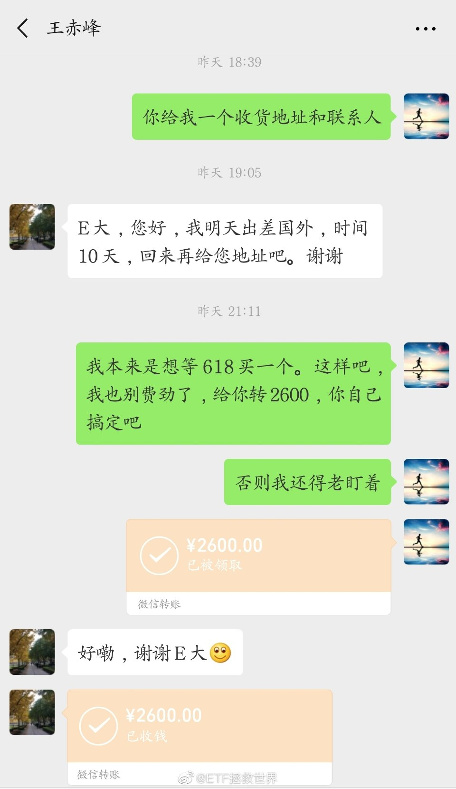

======================================================

ETF拯救世界 (5687069307) @
2019-05-30 18:08:53 Thu  
url: https://weibo.com/5687069307/HwBBcjzEd

北京的家长朋友，六一带孩子去哪儿玩比较好。

要求人少。最讨厌人多，最最最讨厌。人多出去玩还不如在家玩实况虐韩国人。

6岁孩子感兴趣的那种。 ​​​

转发[9]  评论[402]  赞[795] 

======================================================

ETF拯救世界 (5687069307) @
2019-05-30 21:29:31 Thu  
url: https://weibo.com/5687069307/HwCUDCF0m

第一位归化球员入选国家队，李可。

前阿森纳青年队队长，曾入选英格兰青年队。

母亲是华裔。

我觉得挺好，有什么不好的。 ​​​

转发[15]  评论[177]  赞[674] 

+++++++++++++++++++++++++++++++++++++++++++++++++++++

图片：

======================================================

ETF拯救世界 (5687069307) @
2019-05-31 09:05:20 Fri  
url: https://weibo.com/5687069307/HwHt4cJcR

出现第一条好消息前都要控制节奏。 ​​​

转发[46]  评论[458]  赞[1271] 

======================================================

ETF拯救世界 (5687069307) @
2019-05-31 14:25:08 Fri  
url: https://weibo.com/5687069307/HwJySf79T

相信我没错的[亲亲]

------------------------------------------------------
转推：
>  @ETF拯救世界 (5687069307)
>  2019-05-31 09:05:20 Fri  
>  url: https:/weibo.com/5687069307/HwHt4cJcR/

>  出现第一条好消息前都要控制节奏。 ​​​

转发[17]  评论[303]  赞[1213] 

======================================================

ETF拯救世界 (5687069307) @
2019-05-31 18:15:17 Fri  
url: https://weibo.com/5687069307/HwL4icSOK

全球一起跳，只剩黄金了。等黄金突破再继续买。 ​​​

转发[50]  评论[261]  赞[1009] 

======================================================

ETF拯救世界 (5687069307) @
2019-05-31 18:58:45 Fri  
url: https://weibo.com/5687069307/HwLlW4P0u

A国签证需要看近几年社交平台信息这个不奇怪。几年前就有过入境要看社交平台信息的事。（因此入境别国的时候我有朋友会把社交app都删掉。）

所以如果有想去那边的朋友，在社交媒体上发言应该要注意。

不过话说回来，不管去不去，在社交平台上说话都要注意。再延伸一下，在任何地方说话都要注意，甚至 ​​​

转发[43]  评论[216]  赞[1161] 

======================================================

ETF拯救世界 (5687069307) @
2019-05-31 21:30:19 Fri  
url: https://weibo.com/5687069307/HwMlsBFgR

你准备明天给自己买个什么玩具。 ​​​

转发[8]  评论[424]  赞[1014] 

======================================================

ETF拯救世界 (5687069307) @
2019-06-03 10:37:37 Mon  
url: https://weibo.com/5687069307/Hxam12obK

不乱动。就这么简单。

无论多么有欺骗性的走势对你都没用。

还是那句话，在第一条好消息出来之前，控制节奏。 ​​​

转发[72]  评论[635]  赞[1682] 

======================================================

ETF拯救世界 (5687069307) @
2019-06-03 15:17:10 Mon  
url: https://weibo.com/5687069307/Hxcbu9nte

也不是不想说话，实在是没太多说的。

无非就是观察几个方面。

消息面和趋势面不好。趋势不好不用说了，所有指数全部处在下跌趋势中。消息面至今没有任何利好。

你要说这样的情况就该减仓吧，问题在于基本面还很便宜。绝不是最便宜，但真的相当便宜。

但这么便宜也不好加仓，原因是整体利润在下滑。 ​​​

转发[308]  评论[715]  赞[2341] 

======================================================

ETF拯救世界 (5687069307) @
2019-06-03 15:22:44 Mon  
url: https://weibo.com/5687069307/HxcdKaJuq

发了一条微博，可能被限流了，阅读量50……没办法……

那就先不说了…… ​​​

转发[7]  评论[359]  赞[1410] 

======================================================

ETF拯救世界 (5687069307) @
2019-06-04 14:04:23 Tue  
url: https://weibo.com/5687069307/Hxl8rv6Ow

一天没看盘，打开软件一看觉得很好笑…… ​​​

转发[16]  评论[656]  赞[1487] 

======================================================

ETF拯救世界 (5687069307) @
2019-06-06 07:41:54 Thu  
url: https://weibo.com/5687069307/HxBubxK3D

波动越大，利润越大。只要这个波幅已经在你的预期内，只要你找到可以通过波动获利的方法。 ​​​

转发[49]  评论[571]  赞[1700] 

======================================================

ETF拯救世界 (5687069307) @
2019-06-06 14:18:00 Thu  
url: https://weibo.com/5687069307/HxE4Y1nx2

群众的信心又崩了啊。三个月一小崩，半年一大崩 ​​​

转发[40]  评论[431]  赞[1403] 

======================================================

ETF拯救世界 (5687069307) @
2019-06-06 14:35:30 Thu  
url: https://weibo.com/5687069307/HxEc4h0ka

几个月前，行情好的时候，好几位在私信问我，要买房的钱拿来投基金行不行。

所有这么问的，我只给两个答案。第一个是跨界问题没法回答，第二是买房。

后来有些我建议该买房买房的朋友，还是跟我说买了基金，房子可以等等再买等等。

这样问我的朋友，我之所以给出不能投资金融市场的建议，是因为你的 ​​​

转发[135]  评论[336]  赞[1411] 

======================================================

ETF拯救世界 (5687069307) @
2019-06-06 14:47:23 Thu  
url: https://weibo.com/5687069307/HxEgT1h2w

下周开车买回500C应该没有悬念了吧。

接下来会逐渐加大波段仓位的。

爱涨不涨 [爱你] ​​​

转发[69]  评论[465]  赞[1595] 

+++++++++++++++++++++++++++++++++++++++++++++++++++++

图片：

======================================================

ETF拯救世界 (5687069307) @
2019-06-06 17:24:38 Thu  
url: https://weibo.com/5687069307/HxFiIg2KB

据我测算，下周调整成分股后，500的估值会自然下降0.3-0.5。如果不反弹，重新回到过去十几年最便宜的位置没有太大问题。

1月上涨以来，我确实没有想到居然还有机会收集这么便宜的收藏品。

那种欣喜的感觉我估计你体会不到。类似于马未都逛潘家园，年初捡一次漏，年中又捡一次。哪能港，2019年没有遗 ​​​

转发[224]  评论[695]  赞[1970] 

======================================================

ETF拯救世界 (5687069307) @
2019-06-06 17:41:11 Thu  
url: https://weibo.com/5687069307/HxFpqByPV

好嘛，我刚看了看这几条微博，评论都是大几百啊。这么说其实每天少说几句也挺好，单条评论就比较多，热热闹闹整整齐齐的多好。

要不然每天话痨一样说很多，结果分散到每条评论稀稀拉拉的，没有互动的feel，差点意思。 ​​​

转发[6]  评论[400]  赞[1352] 

======================================================

ETF拯救世界 (5687069307) @
2019-06-06 18:06:55 Thu  
url: https://weibo.com/5687069307/HxFzSjs3Q

其实有个道理你想想，是不是这样。

无论从哪个角度看，A股整体都不贵，甚至以历史的角度看，相当便宜。这个你不否认吧。

很多人无非是担心未来出现变故所以吓得不停的卖。

你从这个角度想：

你这一辈子，碰上这样机会的次数不会太多。算你25岁开始投资，二十年，到45，这样的机会历史上看出现3-4次 ​​​

转发[591]  评论[1045]  赞[3311] 

======================================================

ETF拯救世界 (5687069307) @
2019-06-07 06:03:30 Fri  
url: https://weibo.com/5687069307/HxKgJzAd9

谢谢大家。评论和私信都看了，没法一一回复，见谅。

这么高兴当然是再选几位幸运的朋友送礼物啊，不如众乐乐嘛。怎么选我先想想… ​​​

转发[19]  评论[2047]  赞[2564] 

======================================================

ETF拯救世界 (5687069307) @
2019-06-09 14:11:33 Sun  
url: https://weibo.com/5687069307/Hy6jPnScQ

大家没病没灾，都要好好的，开心的，活着。

------------------------------------------------------
转推：
>  @一颗会讲故事的柠檬 (1631750727)
>  2019-06-09 09:06:59 Sun  
>  url: https:/weibo.com/1631750727/Hy4kcFjFJ/

>  我们医院有个“临终关怀科”。
>  当然，这是我们内部人员的叫法，对外，怕给病人造成心理压力，它叫“内科某病区”。
>  
>  家属们是知道来这个科住院，就是最后减轻一下病人的痛苦，给病人一个心里安慰，也缓解一点自己的心疼，实际上来这的，都是回天乏力的。
>  
>  我没去过那个科工作过，就前两年去给一个认识 ​​​

转发[194]  评论[399]  赞[1473] 

======================================================

ETF拯救世界 (5687069307) @
2019-06-10 10:12:17 Mon  
url: https://weibo.com/5687069307/Hyebd3Lw9

今天全靠手里这几个QDII撑场子了 ​​​

转发[7]  评论[309]  赞[1123] 

======================================================

ETF拯救世界 (5687069307) @
2019-06-10 18:45:36 Mon  
url: https://weibo.com/5687069307/Hyhxz5Y8A

我走后门要了两件，质量真的不错…[鼓掌]//@且慢管家:我们公司员工都开始自己找市场组买了。。。真的好好穿哦～//@1945的我: 我需要一只猫来加持法力[并不简单][并不简单]

------------------------------------------------------
转推：
>  @且慢管家 (6186312580)
>  2019-06-04 15:26:53 Tue  
>  url: https:/weibo.com/6186312580/HxlFVEujt/

>  #且慢福利#呵呵，都周二了，这位同学还在得瑟[挖鼻]转发这个不正经的喵星人模特，送你一件。T恤黑白两款，你可以随意选。
>  
>  @微博抽奖平台 关注➕转发此条微博，6月11日抽5件[酷] ​ http://t.cn/AiCOFhaP ​​​

转发[48]  评论[183]  赞[589] 

======================================================

ETF拯救世界 (5687069307) @
2019-06-10 22:25:32 Mon  
url: https://weibo.com/5687069307/HyiYPBvuY

写东西，你是出于功利的原因，还是希望把自己的一些感悟与更多人分享，其实从读者的角度看，差别非常明显。

不是说功利一定不好。绝大多数时候，商业化才能带来更好的体验和进步。但你希望得到商业的利益，前提是自己可以为别人提供物有所值甚至物超所值的东西。

在希望自己得到商业利益前，最好多些 ​​​

转发[44]  评论[243]  赞[1265] 

======================================================

ETF拯救世界 (5687069307) @
2019-06-11 06:50:49 Tue  
url: https://weibo.com/5687069307/HymhVvzsB

这个有办法吗 ​​​

转发[60]  评论[499]  赞[780] 

+++++++++++++++++++++++++++++++++++++++++++++++++++++

图片：
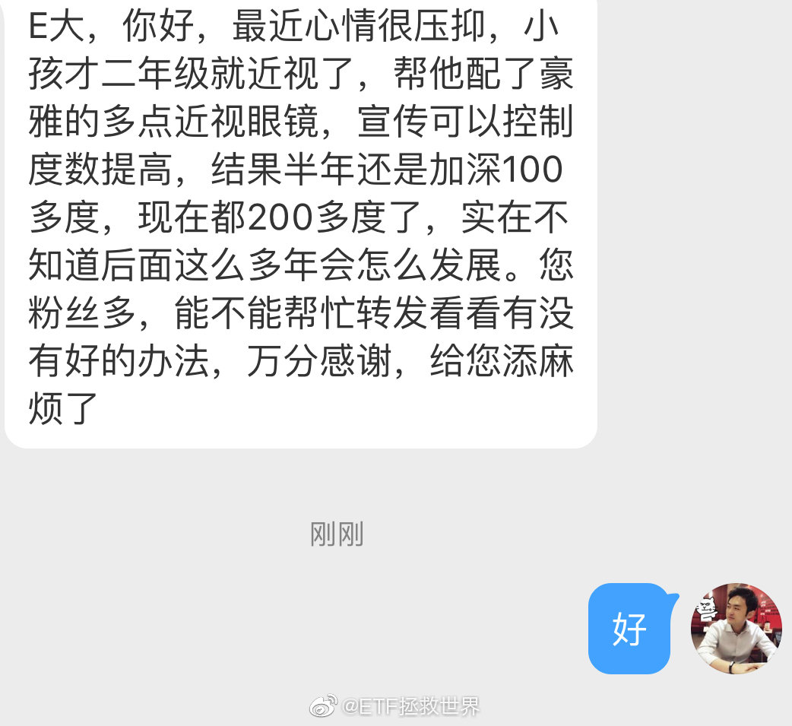

======================================================

ETF拯救世界 (5687069307) @
2019-06-11 10:29:26 Tue  
url: https://weibo.com/5687069307/HynIFzDfP

什么玩意儿啊，生气٩(๑`н´๑)۶

------------------------------------------------------
转推：
>  @ETF拯救世界 (5687069307)
>  2019-06-06 14:47:23 Thu  
>  url: https:/weibo.com/5687069307/HxEgT1h2w/

>  下周开车买回500C应该没有悬念了吧。
>  
>  接下来会逐渐加大波段仓位的。
>  
>  爱涨不涨 [爱你] ​​​

转发[26]  评论[331]  赞[785] 

======================================================

ETF拯救世界 (5687069307) @
2019-06-11 10:58:28 Tue  
url: https://weibo.com/5687069307/HynUs55Gi

我买空调的时候真想过一定要买一台董小姐家的体验一下。然后买的时候怎么也下不去手。

所有参数都一样就是比别的大品牌包括日系贵30%-50%以上。

后来买了两台松下一台美的…可能董家的真的好用，用的料会好一点吧，但我怎么也说服不了自己… ​​​

转发[21]  评论[445]  赞[956] 

======================================================

ETF拯救世界 (5687069307) @
2019-06-11 12:52:09 Tue  
url: https://weibo.com/5687069307/HyoEB2ZrT

别一天到晚咋咋呼呼的。跌几天完蛋了不行了股市要关门了，涨几天谈妥了牛市了不买不行了。

没那么好，也没那么坏。

手里基础仓位踏踏实实拿住了，再加波段仓位吃波段吃完把利润留下转成长期仓位。

多简单啊，多好玩啊。多大点事儿啊。 ​​​

转发[100]  评论[323]  赞[1428] 

======================================================

ETF拯救世界 (5687069307) @
2019-06-11 13:05:59 Tue  
url: https://weibo.com/5687069307/HyoKd8cnq

体会到了吧

------------------------------------------------------
转推：
>  @ETF拯救世界 (5687069307)
>  2019-06-06 17:24:38 Thu  
>  url: https:/weibo.com/5687069307/HxFiIg2KB/

>  据我测算，下周调整成分股后，500的估值会自然下降0.3-0.5。如果不反弹，重新回到过去十几年最便宜的位置没有太大问题。
>  
>  1月上涨以来，我确实没有想到居然还有机会收集这么便宜的收藏品。
>  
>  那种欣喜的感觉我估计你体会不到。类似于马未都逛潘家园，年初捡一次漏，年中又捡一次。哪能港，2019年没有遗 ​​​

转发[10]  评论[227]  赞[809] 

======================================================

ETF拯救世界 (5687069307) @
2019-06-11 16:39:10 Tue  
url: https://weibo.com/5687069307/Hyq8K2v6u

今天开始计划内波段操作将不受时间限制。随时干。//@ETF拯救世界:什么玩意儿啊，生气٩(๑`н´๑)۶

------------------------------------------------------
转推：
>  @ETF拯救世界 (5687069307)
>  2019-06-06 14:47:23 Thu  
>  url: https:/weibo.com/5687069307/HxEgT1h2w/

>  下周开车买回500C应该没有悬念了吧。
>  
>  接下来会逐渐加大波段仓位的。
>  
>  爱涨不涨 [爱你] ​​​

转发[17]  评论[630]  赞[1393] 

======================================================

ETF拯救世界 (5687069307) @
2019-06-11 17:43:27 Tue  
url: https://weibo.com/5687069307/HyqyPAa2y

明天持仓的dax30就要今年新高了。 ​​​

转发[7]  评论[362]  赞[1210] 

======================================================

ETF拯救世界 (5687069307) @
2019-06-13 13:50:05 Thu  
url: https://weibo.com/5687069307/HyHT6lpXr

震惊，一天没发微博收到友人短信问候…

报个平安，人在呢人在呢。 ​​​

转发[7]  评论[638]  赞[1862] 

+++++++++++++++++++++++++++++++++++++++++++++++++++++

图片：

======================================================

ETF拯救世界 (5687069307) @
2019-06-14 07:59:02 Fri  
url: https://weibo.com/5687069307/HyP16zQyv

因为调整成分股，所以预计月中发车在下周二 ​​​

转发[15]  评论[638]  赞[1563] 

======================================================

ETF拯救世界 (5687069307) @
2019-06-14 14:55:44 Fri  
url: https://weibo.com/5687069307/HyRKfljpF

黄金进入突破区域，能不能突破成功很刺激啊

------------------------------------------------------
转推：
>  @ETF拯救世界 (5687069307)
>  2019-05-31 18:15:17 Fri  
>  url: https:/weibo.com/5687069307/HwL4icSOK/

>  全球一起跳，只剩黄金了。等黄金突破再继续买。 ​​​

转发[12]  评论[277]  赞[1087] 

======================================================

ETF拯救世界 (5687069307) @
2019-06-15 09:46:30 Sat  
url: https://weibo.com/5687069307/HyZ9e5L2U

这么多年都是给别人面试，今天居然又等着交材料面试了… ​​​

转发[9]  评论[391]  赞[1721] 

======================================================

ETF拯救世界 (5687069307) @
2019-06-17 15:12:07 Mon  
url: https://weibo.com/5687069307/Hzk8o3Xoc

趁着618（刚才暴露了穿越的身份）正式入SONY无反的坑。以前一直是用尼康的单反，偶尔用佳能。

准备转型摄影博主了，以后多发片。

另外，今晚或者明天上午发车。 ​​​

转发[23]  评论[412]  赞[1275] 

======================================================

ETF拯救世界 (5687069307) @
2019-06-17 15:43:10 Mon  
url: https://weibo.com/5687069307/HzkkZjMt1

今日两市绝大多数指数调整成分股。由于指数编制机制以及最近行情走势的问题，几乎所有指数估值都上升了。

成分股越多的宽基指数受影响较小，比如500或者1000。成分股少的宽基，比如50，以及行业指数，影响较大。 ​​​

转发[53]  评论[218]  赞[1142] 

======================================================

ETF拯救世界 (5687069307) @
2019-06-17 16:48:58 Mon  
url: https://weibo.com/5687069307/HzkLHzhPX

钦定了，明天开盘前发。

------------------------------------------------------
转推：
>  @ETF拯救世界 (5687069307)
>  2019-06-17 15:12:07 Mon  
>  url: https:/weibo.com/5687069307/Hzk8o3Xoc/

>  趁着618（刚才暴露了穿越的身份）正式入SONY无反的坑。以前一直是用尼康的单反，偶尔用佳能。
>  
>  准备转型摄影博主了，以后多发片。
>  
>  另外，今晚或者明天上午发车。 ​​​

转发[13]  评论[388]  赞[1079] 

======================================================

ETF拯救世界 (5687069307) @
2019-06-18 09:37:03 Tue  
url: https://weibo.com/5687069307/HzrmSrqTI

仓位合适是什么感觉，我告诉你。

就是

啊啊啊，涨了涨了，好棒啊哈哈哈

哎呦我去，怎么跌了！太好了哈哈哈

就是这样。

发车了都你还在这里刷微博？ ​​​

转发[56]  评论[668]  赞[1605] 

======================================================

ETF拯救世界 (5687069307) @
2019-06-18 15:02:59 Tue  
url: https://weibo.com/5687069307/Hztvb1Lzu

我是不是过了一个假的618，最大的收获竟然是京东保价返了700块钱……怎么一天也没买到什么好玩意儿。

你都买什么超值的东西了，说出来让大家开开眼。

我说一个，现在PS4 pro只要2399，上次我给锦鲤的2600可以买双手柄了！ ​​​

转发[7]  评论[490]  赞[924] 

======================================================

ETF拯救世界 (5687069307) @
2019-06-18 23:03:16 Tue  
url: https://weibo.com/5687069307/HzwE7yVwl

为什么要这样对我们，为什么=͟͟͞͞(꒪⌓꒪*) ​​​

转发[12]  评论[266]  赞[819] 

+++++++++++++++++++++++++++++++++++++++++++++++++++++

图片：
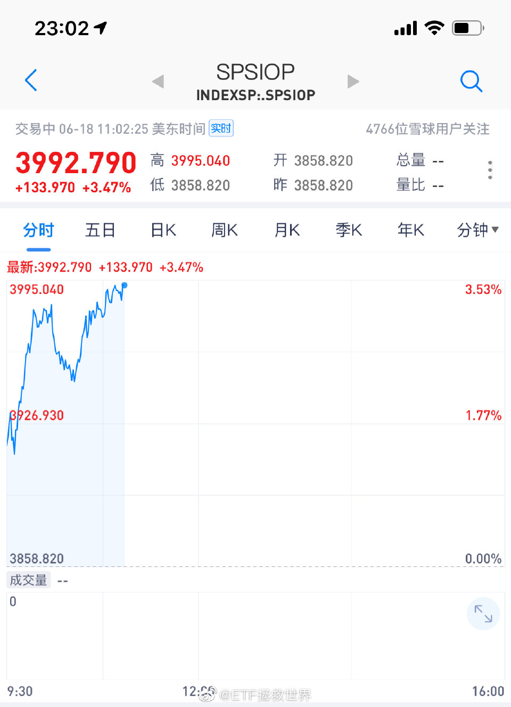

======================================================

ETF拯救世界 (5687069307) @
2019-06-18 23:19:32 Tue  
url: https://weibo.com/5687069307/HzwKJ5gK6

难道500C又买回在最低了吗。不，这不是真的。 ​​​

转发[133]  评论[415]  赞[1748] 

======================================================

ETF拯救世界 (5687069307) @
2019-06-19 09:29:58 Wed  
url: https://weibo.com/5687069307/HzAKv7bOw

踏踏实实的。

大跌的时候别让别人把你的筹码骗走。

大涨的时候别让别人把你的钱骗走。 ​​​

转发[116]  评论[261]  赞[1166] 

======================================================

ETF拯救世界 (5687069307) @
2019-06-19 09:39:16 Wed  
url: https://weibo.com/5687069307/HzAOhs767

同花顺挂了…有这么火吗 ​​​

转发[6]  评论[127]  赞[651] 

======================================================

ETF拯救世界 (5687069307) @
2019-06-19 09:41:19 Wed  
url: https://weibo.com/5687069307/HzAP7bCll

普通人这样对待边检人员也是这样处理吗。真不懂，有没有明白人给说说。

------------------------------------------------------
转推：
>  @北京边检 (2778606994)
>  2019-06-19 06:48:57 Wed  
>  url: https:/weibo.com/2778606994/HzzH92zDK/

>  #情况通报# ​​​

转发[14]  评论[158]  赞[643] 

======================================================

ETF拯救世界 (5687069307) @
2019-06-19 09:45:54 Wed  
url: https://weibo.com/5687069307/HzAQYoTuS

说新高就新高非常听话。 http://t.cn/AiNE7xgg

------------------------------------------------------
转推：
>  @ETF拯救世界 (5687069307)
>  2019-06-11 17:43:27 Tue  
>  url: https:/weibo.com/5687069307/HyqyPAa2y/

>  明天持仓的dax30就要今年新高了。 ​​​

转发[3]  评论[96]  赞[701] 

======================================================

ETF拯救世界 (5687069307) @
2019-06-19 10:56:00 Wed  
url: https://weibo.com/5687069307/HzBjqb16s

谁追谁被骗钱 [doge]

------------------------------------------------------
转推：
>  @ETF拯救世界 (5687069307)
>  2019-06-19 09:29:58 Wed  
>  url: https:/weibo.com/5687069307/HzAKv7bOw/

>  踏踏实实的。
>  
>  大跌的时候别让别人把你的筹码骗走。
>  
>  大涨的时候别让别人把你的钱骗走。 ​​​

转发[38]  评论[398]  赞[1311] 

======================================================

ETF拯救世界 (5687069307) @
2019-06-20 11:26:18 Thu  
url: https://weibo.com/5687069307/HzKWdpTi8

相信有不少朋友已经吃到网格的第一笔利润了。

慢慢的，你就会体会到波动带来的乐趣。

再说一次，波动不是风险，而是机会。只要你做好准备迎接它。 ​​​

转发[46]  评论[401]  赞[1262] 

======================================================

ETF拯救世界 (5687069307) @
2019-06-20 11:44:01 Thu  
url: https://weibo.com/5687069307/HzL3pCa3q

前几天不停看仓位配置图，总是计算还有多少仓位能加仓：7%的现金，一点点纯债、一点点海外债、如果还不行，也可以把一点点黄金卖掉。最后，真到了极端情况，可以砸锅卖铁卖掉可转债换指数。

算来算去，发现也没多少钱可以加仓了。

这么一涨，总算不用为这件事担心了。担心的倒不是别的，是极限情况出 ​​​

转发[144]  评论[520]  赞[1843] 

======================================================

ETF拯救世界 (5687069307) @
2019-06-20 16:16:02 Thu  
url: https://weibo.com/5687069307/HzMPP0ejN

回复@猩猩点灯很紧张:涨跌当然都有可能。重注压对了也可能收获不小。但做投资始终要考虑的，是如果我判断错了会如何？不要让自己错一次悔十年。不如用概率思维指导布局。一个建议。//@猩猩点灯很紧张:回复@游闲公子连车骑:这次会很特殊，这次会再回到钻石坑的。2500点见！一起见证

------------------------------------------------------
转推：
>  @ETF拯救世界 (5687069307)
>  2019-06-20 11:44:01 Thu  
>  url: https:/weibo.com/5687069307/HzL3pCa3q/

>  前几天不停看仓位配置图，总是计算还有多少仓位能加仓：7%的现金，一点点纯债、一点点海外债、如果还不行，也可以把一点点黄金卖掉。最后，真到了极端情况，可以砸锅卖铁卖掉可转债换指数。
>  
>  算来算去，发现也没多少钱可以加仓了。
>  
>  这么一涨，总算不用为这件事担心了。担心的倒不是别的，是极限情况出 ​​​

转发[42]  评论[152]  赞[642] 

======================================================

ETF拯救世界 (5687069307) @
2019-06-20 16:42:40 Thu  
url: https://weibo.com/5687069307/HzN0Da6DZ

舒坦。 ​​​

转发[3]  评论[188]  赞[937] 

======================================================

ETF拯救世界 (5687069307) @
2019-06-20 16:55:22 Thu  
url: https://weibo.com/5687069307/HzN5NcxGX

为什么我没有这样的好闺蜜！[酸] 不过我感觉这应该是个假新闻……

------------------------------------------------------
转推：
>  @ ()
>  2019-06-20 16:53:14 Thu  
>  url: 

>  抱歉，作者已设置仅展示半年内微博，此微博已不可见。 ​​​

转发[12]  评论[100]  赞[396] 

======================================================

ETF拯救世界 (5687069307) @
2019-06-20 18:23:49 Thu  
url: https://weibo.com/5687069307/HzNFH8YhZ

如果是真的油价还不搞到150吗

------------------------------------------------------
转推：
>  @财联社APP (2868676035)
>  2019-06-20 17:48:20 Thu  
>  url: https:/weibo.com/2868676035/HzNrhyweE/

>  【外媒：消息人士称美国正计划轰炸伊朗核设施 规模将非常大】财联社6月20日讯，外媒称，美国总统特朗普说，他已准备好采取军事措施阻止德黑兰获得核弹，但没有表明他是否支持动用武力保护波斯湾石油运输。另据英国《明星日报》网站6月19日报道，以色列《青年报》援引一名匿名“西方外交官”的话称，美 ​​​

转发[24]  评论[125]  赞[538] 

======================================================

ETF拯救世界 (5687069307) @
2019-06-20 21:05:49 Thu  
url: https://weibo.com/5687069307/HzOJrqdZg

我最爱看到各位的这种消息。特高兴。

好像每个人的开心或者难过都能感同身受。

因为每一个ID后面都不是虚拟的，而是一个个真实的人。 ​​​

转发[9]  评论[188]  赞[1183] 

+++++++++++++++++++++++++++++++++++++++++++++++++++++

图片：

======================================================

ETF拯救世界 (5687069307) @
2019-06-20 21:30:56 Thu  
url: https://weibo.com/5687069307/HzOTDtshA

这个世界上没有完美的人。只要是人，就一定有缺点。

所以，对别人要求不要过高。不要用圣人的标准要求他人，因为世界上根本没有圣人。

三七分。只要本质是好的，只要大方向没错，小问题该原谅就原谅。抓主要矛盾，解决主要问题。

水至清则无鱼，人至察则无徒。

吃瓜有感。 ​​​

转发[90]  评论[149]  赞[941] 

======================================================

ETF拯救世界 (5687069307) @
2019-06-20 21:37:22 Thu  
url: https://weibo.com/5687069307/HzOWfFQuR

你还真来劲了是吧 ​​​

转发[8]  评论[131]  赞[583] 

+++++++++++++++++++++++++++++++++++++++++++++++++++++

图片：

======================================================

ETF拯救世界 (5687069307) @
2019-06-20 22:27:32 Thu  
url: https://weibo.com/5687069307/HzPgC5FVa

15点前：计划干嘛加仓油气啊，看A股涨得多好。

21:30后：真香。 ​​​

转发[11]  评论[137]  赞[659] 

+++++++++++++++++++++++++++++++++++++++++++++++++++++

图片：
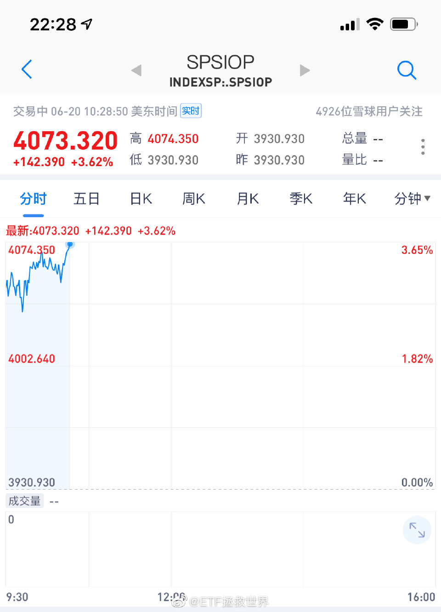

======================================================

ETF拯救世界 (5687069307) @
2019-06-20 22:39:31 Thu  
url: https://weibo.com/5687069307/HzPltrWPz

只要今晚不掉链子，明天大多数人油气都能收一网了。但这里建议最好留点利润长线锁仓，至于为什么，以后你回来翻这条微博就懂了。 ​​​

转发[41]  评论[289]  赞[925] 

======================================================

ETF拯救世界 (5687069307) @
2019-06-21 08:28:49 Fri  
url: https://weibo.com/5687069307/HzTcFBcr1

开始于3400点的S计划，在2900点的时候，持仓17个品种。

其中13个品种盈利。4个不盈利的品种中，3个亏损幅度小于3%，也就是说分分钟转亏为盈。要知道，这些还有浮亏的品种，2015年以来跌幅接近70%-80%。而我们的持仓只浮亏不到3%。

开始于4300点的150计划持仓31个品种。除A股外的14个品种全部盈利。盈 ​​​

转发[106]  评论[325]  赞[1544] 

======================================================

ETF拯救世界 (5687069307) @
2019-06-21 08:48:50 Fri  
url: https://weibo.com/5687069307/HzTkO1r2X

6月各指数刚把垃圾股调出去，就可以炒壳了。成心的吧？ ​​​

转发[11]  评论[108]  赞[660] 

======================================================

ETF拯救世界 (5687069307) @
2019-06-21 09:27:14 Fri  
url: https://weibo.com/5687069307/HzTAofG1d

今天512980高挂的人赚到了。不知道谁乌龙指。 ​​​

转发[3]  评论[100]  赞[556] 

======================================================

ETF拯救世界 (5687069307) @
2019-06-21 09:34:18 Fri  
url: https://weibo.com/5687069307/HzTDfyqcO

$中证500 sz399905$   你这样别人会以为你是垃圾股指数的……

收了神通吧，慢慢来。 ​​​

转发[3]  评论[107]  赞[688] 

======================================================

ETF拯救世界 (5687069307) @
2019-06-21 09:55:59 Fri  
url: https://weibo.com/5687069307/HzTM3kv78

今天收了3个品种的小网，留了3倍利润。全都是6月下的，资金利用率和收益率都很满意。

未来跌还是涨？

你在乎吗？

我不在乎。我是来赚钱的不是来算命的。 ​​​

转发[39]  评论[474]  赞[1549] 

======================================================

ETF拯救世界 (5687069307) @
2019-06-21 15:03:03 Fri  
url: https://weibo.com/5687069307/HzVMHm7nO

舒坦。 ​​​

转发[5]  评论[205]  赞[1026] 

======================================================

ETF拯救世界 (5687069307) @
2019-06-21 18:14:30 Fri  
url: https://weibo.com/5687069307/HzX2p3P5i

都没问题，我也继续把好运气分给大家。不过确实没法及时看到所有私信和评论，在这里就祝所有朋友各种心想事成！ ​​​

转发[5]  评论[241]  赞[1299] 

+++++++++++++++++++++++++++++++++++++++++++++++++++++

图片：
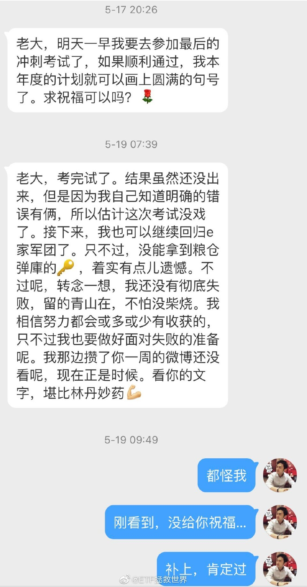

======================================================

ETF拯救世界 (5687069307) @
2019-06-22 23:01:57 Sat  
url: https://weibo.com/5687069307/HA8lzyYTt

比特币2017年12月到了19299，2018年最低到了3225，下跌83%。这个跌幅跌破了我信奉的“不会死的品种极限跌幅是80%”的极限值。但是到现在，即使在3800这个跌幅80%的位置买，也赚了160%。但是我没买，第一我不知道它会不会死，第二我不知道哪里有合法正规的交易所……

------------------------------------------------------
转推：
>  @每日经济新闻 (1649173367)
>  2019-06-22 11:22:45 Sat  
>  url: https:/weibo.com/1649173367/HA3LMbgfj/

>  #比特币破万# 【时隔一年多，比特币价格重返1万美元！你了解过比特币吗？】Bitstamp平台数据显示，比特币涨破10000美元整数大关，为2018年3月初以来首次，较去年12月低点3136.04美元累涨逾200%。 http://t.cn/AipUE2BZ ​​​

转发[59]  评论[221]  赞[824] 

======================================================

ETF拯救世界 (5687069307) @
2019-06-22 23:06:16 Sat  
url: https://weibo.com/5687069307/HA8nkxyh2

一定可以吗？未必。因为宇宙真的太大太大了，想要发现一个星球的文明，恐怕就像我们发现在海滩上一颗沙子上面的细菌。太阳系=1/数千亿的银河系。银河系=1/数千亿的宇宙（最少。因为宇宙也许是没有边界的）。极大概率会有比我们NB的多的文明存在，但他们发现我们的机会并不大。

------------------------------------------------------
转推：
>  @老马自奋蹄 (1807436544)
>  2019-06-22 22:58:03 Sat  
>  url: https:/weibo.com/1807436544/HA8jZpkEW/

>  根据人类文明的进化史来看，人类仅仅在文明出现几千年的时间里，就可以造出太空飞船。
>  那超过人类文明百万年，乃至数亿年的文明，应该早就有人类难以想象的发达科技，一定可以探测到地球，甚至飞临到地球，那他们在哪里呢？
>  http://t.cn/AiKmr8w9 ​​​

转发[62]  评论[91]  赞[384] 

======================================================

ETF拯救世界 (5687069307) @
2019-06-22 23:13:30 Sat  
url: https://weibo.com/5687069307/HA8qgzB30

回复@奇烜王:我想，大概率不会不在乎。要不就是发个二向箔毁灭你避免你成为未来的威胁，要不就是征服你拿走你的资源，要不就是尝试跟你接触。发现你然后不理你的概率太小了……//@奇烜王:可能他们发现我们了 但他们不在乎

------------------------------------------------------
转推：
>  @老马自奋蹄 (1807436544)
>  2019-06-22 22:58:03 Sat  
>  url: https:/weibo.com/1807436544/HA8jZpkEW/

>  根据人类文明的进化史来看，人类仅仅在文明出现几千年的时间里，就可以造出太空飞船。
>  那超过人类文明百万年，乃至数亿年的文明，应该早就有人类难以想象的发达科技，一定可以探测到地球，甚至飞临到地球，那他们在哪里呢？
>  http://t.cn/AiKmr8w9 ​​​

转发[28]  评论[186]  赞[488] 

======================================================

ETF拯救世界 (5687069307) @
2019-06-24 18:52:21 Mon  
url: https://weibo.com/5687069307/HApzfFkOO

看眼神和面相性格也很好。[赞]

------------------------------------------------------
转推：
>  @ ()
>  2019-06-24 17:43:30 Mon  
>  url: 

>  抱歉，作者已设置仅展示半年内微博，此微博已不可见。 ​​​

转发[115]  评论[125]  赞[550] 

======================================================

ETF拯救世界 (5687069307) @
2019-06-24 19:19:51 Mon  
url: https://weibo.com/5687069307/HApKqhCSk

回复@午餐肉可真好吃:这次拍的比较新颖，很舒坦，为你点赞。哈哈哈[good]//@午餐肉可真好吃:E大能不能翻个牌！刚开始接触您的理论，受益匪浅，打算一直跟下去了。本人在英国留学读金融，说实话很多教授的思维深度和格局，远不及您。//@ETF拯救世界:看眼神和面相性格也很好。[赞]

------------------------------------------------------
转推：
>  @ ()
>  2019-06-24 17:43:30 Mon  
>  url: 

>  抱歉，作者已设置仅展示半年内微博，此微博已不可见。 ​​​

转发[48]  评论[71]  赞[457] 

======================================================

ETF拯救世界 (5687069307) @
2019-06-24 19:22:04 Mon  
url: https://weibo.com/5687069307/HApLjwHuJ

黄金突破了。你猜计划会不会继续追继续加仓？

------------------------------------------------------
转推：
>  @ETF拯救世界 (5687069307)
>  2019-05-31 18:15:17 Fri  
>  url: https:/weibo.com/5687069307/HwL4icSOK/

>  全球一起跳，只剩黄金了。等黄金突破再继续买。 ​​​

转发[13]  评论[512]  赞[1103] 

======================================================

ETF拯救世界 (5687069307) @
2019-06-25 10:22:13 Tue  
url: https://weibo.com/5687069307/HAvEH935K

有不少朋友私信问我关于孩子报志愿的事情，实在抱歉我不能说。不是我擅长的领域，不扯淡，为了对各位负责。 ​​​

转发[14]  评论[304]  赞[1157] 

======================================================

ETF拯救世界 (5687069307) @
2019-06-25 18:39:44 Tue  
url: https://weibo.com/5687069307/HAyUDbkfk

这个月7号不是说要送礼物吗，现在差不多是时候了。

送两个吧。

第一个送本月互动前十名的某位朋友，前十的名单如下图。这里面小静姐因为上次拿过了，这次就把机会让给其它人吧。每次都那么靠前，真爱哈哈。所以顺延到第11位。

第二个送那个帖子里回复最早的前十位铁粉其中一位，名单如图。

具体是 ​​​

转发[15]  评论[605]  赞[1008] 

+++++++++++++++++++++++++++++++++++++++++++++++++++++

图片：

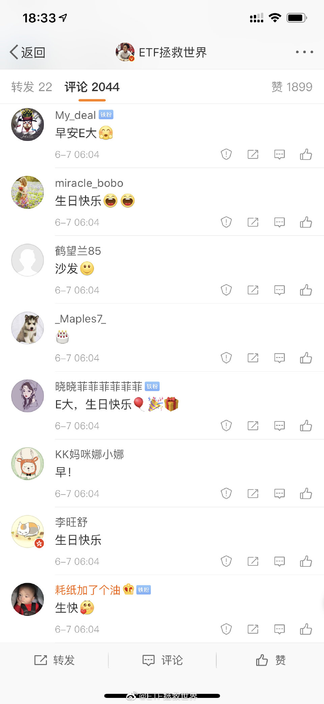

======================================================

ETF拯救世界 (5687069307) @
2019-06-25 18:53:39 Tue  
url: https://weibo.com/5687069307/HAz0hCGgb

你也做不好。想当年那么火的MSN让你们玩坏了。

------------------------------------------------------
转推：
>  @ ()
>  2019-06-25 15:27:42 Tue  
>  url: 

>  抱歉，作者已设置仅展示半年内微博，此微博已不可见。 ​​​

转发[6]  评论[226]  赞[537] 

======================================================

ETF拯救世界 (5687069307) @
2019-06-27 10:05:38 Thu  
url: https://weibo.com/5687069307/HAOoX1Ysg

昨天收盘是2976点，那么就是两个第七位的朋友得到礼物。分别是“xiao餍茹花”和“VICDAYUAN”两位。请两位私信我一下。

------------------------------------------------------
转推：
>  @ETF拯救世界 (5687069307)
>  2019-06-25 18:39:44 Tue  
>  url: https:/weibo.com/5687069307/HAyUDbkfk/

>  这个月7号不是说要送礼物吗，现在差不多是时候了。
>  
>  送两个吧。
>  
>  第一个送本月互动前十名的某位朋友，前十的名单如下图。这里面小静姐因为上次拿过了，这次就把机会让给其它人吧。每次都那么靠前，真爱哈哈。所以顺延到第11位。
>  
>  第二个送那个帖子里回复最早的前十位铁粉其中一位，名单如图。
>  
>  具体是 ​​​

转发[2]  评论[438]  赞[774] 

======================================================

ETF拯救世界 (5687069307) @
2019-06-27 17:37:24 Thu  
url: https://weibo.com/5687069307/HARmk5fAT

我怕的就是这种。如果不会有官方交易平台出现，那么什么时候比特币能够去中心化，能够随意在玩家之间安全交易，我才会考虑。民间的交易平台就算了。

------------------------------------------------------
转推：
>  @21世纪经济报道 (1651428902)
>  2019-06-27 17:33:00 Thu  
>  url: https:/weibo.com/1651428902/HARkxgzwu/

>  【印度最大数字货币平台Koinex宣布终止服务，其平台比特币大跌40%】印度加密货币交易所Koinex宣布，它正在关闭业务，理由是该国缺乏银行支持和监管不确定性。其联合创始人Rahul Raj称，“在经历了数月的不确定性和混乱之后，我们遗憾地决定今天关闭所有数字资产交换服务和业务。”http://t.cn/Aipkspa1 ​​​

转发[41]  评论[127]  赞[534] 

======================================================

ETF拯救世界 (5687069307) @
2019-06-27 17:43:10 Thu  
url: https://weibo.com/5687069307/HARoFcRl0

回复@hi阿征:正规平台我赚不到钱是我自己技术不好我认了。如果我技术没问题是平台出问题导致本金损失我无法原谅自己，说明我连基本的风险意识都不够。//@hi阿征:交易安心是如此的重要

------------------------------------------------------
转推：
>  @21世纪经济报道 (1651428902)
>  2019-06-27 17:33:00 Thu  
>  url: https:/weibo.com/1651428902/HARkxgzwu/

>  【印度最大数字货币平台Koinex宣布终止服务，其平台比特币大跌40%】印度加密货币交易所Koinex宣布，它正在关闭业务，理由是该国缺乏银行支持和监管不确定性。其联合创始人Rahul Raj称，“在经历了数月的不确定性和混乱之后，我们遗憾地决定今天关闭所有数字资产交换服务和业务。”http://t.cn/Aipkspa1 ​​​

转发[18]  评论[101]  赞[529] 

======================================================

ETF拯救世界 (5687069307) @
2019-06-27 19:36:43 Thu  
url: https://weibo.com/5687069307/HAS8LbMqi

看评论可以知道我们要进入文明社会至少还要50年。另外，那么多人在外面讨厌小孩，完全是很多熊家长造成的。

------------------------------------------------------
转推：
>  @北京人不知道的北京事儿 (1662214194)
>  2019-06-27 11:58:50 Thu  
>  url: https:/weibo.com/1662214194/HAP8TAbh6/

>  【[衰]】网友投稿：北京地铁s1线，家长带着三个孩子，放任孩子在座椅上踩来踩去，劝了理都不理。。。遇上这样的该怎么办？[怒] http://t.cn/Aipein8f ​​​

转发[20]  评论[133]  赞[455] 

======================================================

ETF拯救世界 (5687069307) @
2019-06-27 19:41:50 Thu  
url: https://weibo.com/5687069307/HASaQ3y1n

其实很多不文明现象的根源，都在于：

你的心里是不是有别人。是不是会意识到自己的行为有可能给别人造成麻烦和困扰。

这个“别人”，不仅是你认识的人，还有那些素昧平生的人。

很多人眼中的陌生人只有两种：第一种是对自己有好处的人，第二种是多余的人。 ​​​

转发[55]  评论[275]  赞[997] 

======================================================

ETF拯救世界 (5687069307) @
2019-06-28 09:36:31 Fri  
url: https://weibo.com/5687069307/HAXDD4314

大概率周日晚或者下周一发车，踏踏实实的。

150也没几车了，且开且珍惜。 ​​​

转发[23]  评论[530]  赞[1299] 

======================================================

ETF拯救世界 (5687069307) @
2019-06-28 10:09:00 Fri  
url: https://weibo.com/5687069307/HAXQOnCc1

又被人喷了。这次喷点是文笔不好以及不分享核心投资思路…

还有，有人喷微博评论里彩虹屁太多。没错，就是各位害我被喷了！[哼]

虽然我知道大家都是朋友在开玩笑逗着玩，但有些人他真当真啊，喷了。 ​​​

转发[17]  评论[471]  赞[1037] 

+++++++++++++++++++++++++++++++++++++++++++++++++++++

图片：

======================================================

ETF拯救世界 (5687069307) @
2019-06-28 11:03:49 Fri  
url: https://weibo.com/5687069307/HAYd44HfG

回复@沙棘枝:[嘻嘻] 不会了。要不是偶尔上球球有人圈我，我根本看不到。看到了一笑而过也就算了，理解他们，为了多点人关注也不容易。JSL我不去了，球球我不去了，空间都留给他们，祝他们早日红起来~~//@沙棘枝:看到益达心态越来越好，再也不会随便被喷子影响心情了，真的很开心

------------------------------------------------------
转推：
>  @ETF拯救世界 (5687069307)
>  2019-06-28 10:09:00 Fri  
>  url: https:/weibo.com/5687069307/HAXQOnCc1/

>  又被人喷了。这次喷点是文笔不好以及不分享核心投资思路…
>  
>  还有，有人喷微博评论里彩虹屁太多。没错，就是各位害我被喷了！[哼]
>  
>  虽然我知道大家都是朋友在开玩笑逗着玩，但有些人他真当真啊，喷了。 ​​​

转发[4]  评论[132]  赞[575] 

======================================================

ETF拯救世界 (5687069307) @
2019-06-28 11:05:32 Fri  
url: https://weibo.com/5687069307/HAYdLd7SP

不就不发车吗，还闹小脾气了呢……乖，再跌一天我们就买了啊。别闹了。 ​​​

转发[17]  评论[488]  赞[1189] 

======================================================

ETF拯救世界 (5687069307) @
2019-06-28 14:19:47 Fri  
url: https://weibo.com/5687069307/HAZuBuS8m

回复@好好戴口罩:挺好。至少不是去年钻石坑里卖出，现在卖好歹是赚钱的。终点也是另一个起点的开始，继续赚钱，继续攒钱，继续投资。为下一个人生目标积累力量。

------------------------------------------------------
转推：
>  @ETF拯救世界 (5687069307)
>  2019-06-28 11:05:32 Fri  
>  url: https:/weibo.com/5687069307/HAYdLd7SP/

>  不就不发车吗，还闹小脾气了呢……乖，再跌一天我们就买了啊。别闹了。 ​​​

转发[10]  评论[146]  赞[641] 

======================================================

ETF拯救世界 (5687069307) @
2019-06-29 13:01:53 Sat  
url: https://weibo.com/5687069307/HB8pu4pqF

周一早上暂缓发车。 

最终是否发周一中午决定。 ​​​

转发[12]  评论[602]  赞[1574] 

======================================================

ETF拯救世界 (5687069307) @
2019-06-30 14:29:49 Sun  
url: https://weibo.com/5687069307/HBipFAk7l

礼物买好了，还要一段时间才能拿到，两位别急。

听BGM绝配。 ​​​

转发[8]  评论[508]  赞[1339] 

+++++++++++++++++++++++++++++++++++++++++++++++++++++

图片：
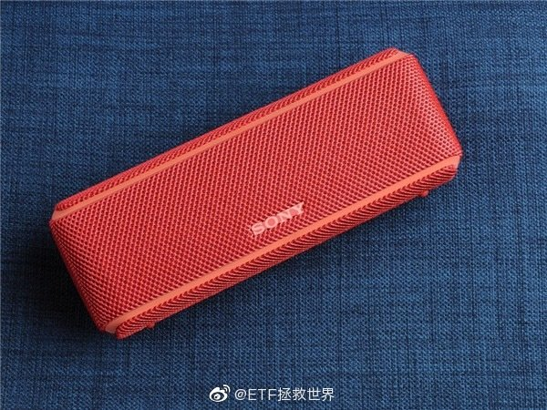

======================================================

ETF拯救世界 (5687069307) @
2019-07-01 09:57:42 Mon  
url: https://weibo.com/5687069307/HBq3IDSQR

随时受不了 ​​​

转发[2]  评论[293]  赞[871] 

======================================================

ETF拯救世界 (5687069307) @
2019-07-01 10:15:10 Mon  
url: https://weibo.com/5687069307/HBqaO4vpR

一个感想：

虽然涨跌都舒服，但

还是赚钱更舒服。 ​​​

转发[25]  评论[363]  赞[1260] 

======================================================

ETF拯救世界 (5687069307) @
2019-07-01 10:23:07 Mon  
url: https://weibo.com/5687069307/HBqe2a2OD

A股的成交量80%都是散户完成的。绝大多数散户非常不理性，这也造就了无论怎么样一点风吹草动都会造成暴涨暴跌。这对很多人来说是灾难，但对我们来说是最好不过的事。大是大非面前，不要做错。

------------------------------------------------------
转推：
>  @ETF拯救世界 (5687069307)
>  2019-06-06 18:06:55 Thu  
>  url: https:/weibo.com/5687069307/HxFzSjs3Q/

>  其实有个道理你想想，是不是这样。
>  
>  无论从哪个角度看，A股整体都不贵，甚至以历史的角度看，相当便宜。这个你不否认吧。
>  
>  很多人无非是担心未来出现变故所以吓得不停的卖。
>  
>  你从这个角度想：
>  
>  你这一辈子，碰上这样机会的次数不会太多。算你25岁开始投资，二十年，到45，这样的机会历史上看出现3-4次 ​​​

转发[86]  评论[227]  赞[947] 

======================================================

ETF拯救世界 (5687069307) @
2019-07-01 10:56:35 Mon  
url: https://weibo.com/5687069307/HBqrChLK8

一张图告诉你为什么每次发车后都会累的休息半天。

每一个细节都是这样在意。

想送小助理一个4K显示器…… ​​​

转发[6]  评论[512]  赞[1158] 

+++++++++++++++++++++++++++++++++++++++++++++++++++++

图片：
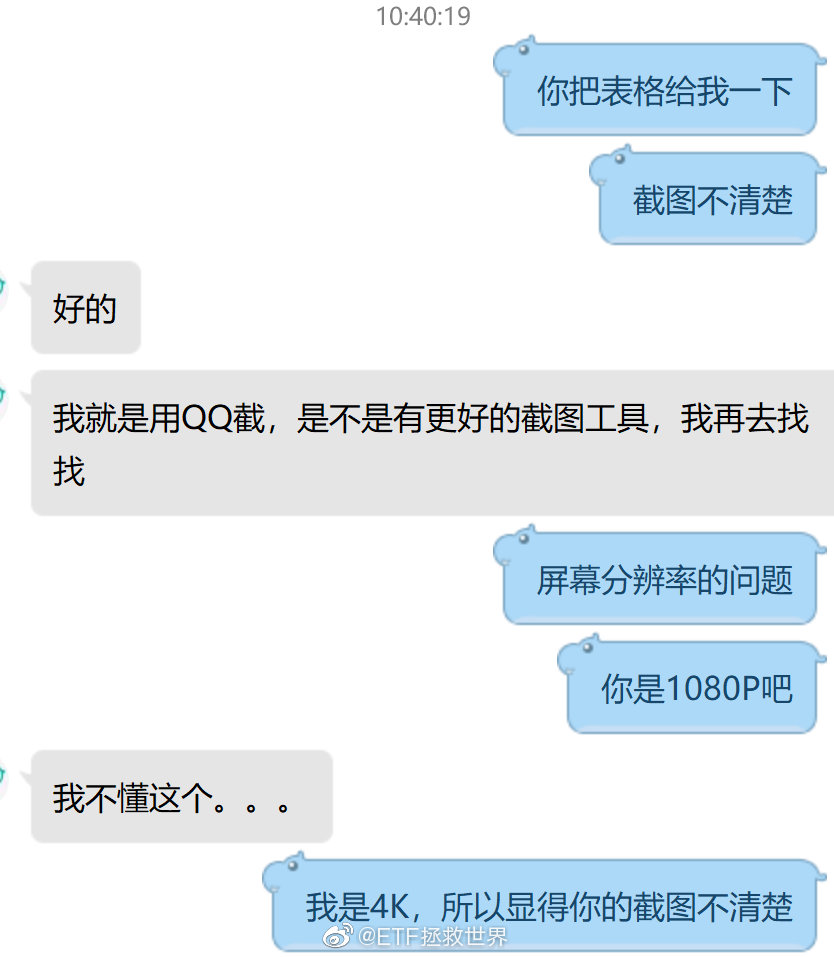

======================================================

ETF拯救世界 (5687069307) @
2019-07-01 11:33:48 Mon  
url: https://weibo.com/5687069307/HBqGIFvSq

一高兴又想送礼物。

不行，这是病，得治治了……[抱抱] ​​​

转发[8]  评论[1073]  赞[1672] 

======================================================

ETF拯救世界 (5687069307) @
2019-07-01 14:44:18 Mon  
url: https://weibo.com/5687069307/HBrW34KFN

长线仓位（最少65%+）踏踏实实拿住了，用一点资金做点短线满足交易欲望与解决心理问题，顺便提点款买点好东西奖励自己。

目前这样的状态会让你非常舒服。不信你试试。 ​​​

转发[78]  评论[392]  赞[1436] 

======================================================

ETF拯救世界 (5687069307) @
2019-07-01 14:58:52 Mon  
url: https://weibo.com/5687069307/HBs1XrDvL

还剩10份，150是真的没钱了。这10份还有机会买进去吗？

我相信有。大概率有。

如果发生了小概率事件，也无所谓。

无论如何，想清楚“最差会怎样”，问问自己能不能接受。能接受，干就行了。 ​​​

转发[43]  评论[535]  赞[1330] 

======================================================

ETF拯救世界 (5687069307) @
2019-07-01 18:38:34 Mon  
url: https://weibo.com/5687069307/HBtt8risj

是不是要挑战历史新高了。

好消息不断。 ​​​

转发[14]  评论[226]  赞[943] 

+++++++++++++++++++++++++++++++++++++++++++++++++++++

图片：

======================================================

ETF拯救世界 (5687069307) @
2019-07-01 21:37:07 Mon  
url: https://weibo.com/5687069307/HBuDBEEFj

分享图片 ​​​

转发[14]  评论[497]  赞[1119] 

+++++++++++++++++++++++++++++++++++++++++++++++++++++

图片：
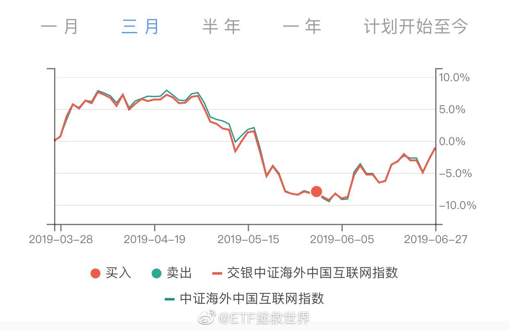

======================================================

ETF拯救世界 (5687069307) @
2019-07-02 13:27:48 Tue  
url: https://weibo.com/5687069307/HBARv3M8E

有些人的说法是：不抽烟不喝酒，活着还有什么意思？

------------------------------------------------------
转推：
>  @ ()
>  2019-07-02 13:23:31 Tue  
>  url: 

>  抱歉，作者已设置仅展示半年内微博，此微博已不可见。 ​​​

转发[34]  评论[267]  赞[574] 

======================================================

ETF拯救世界 (5687069307) @
2019-07-02 13:30:09 Tue  
url: https://weibo.com/5687069307/HBASrBlih

懂我的人不多 ​​​

转发[24]  评论[719]  赞[1734] 

+++++++++++++++++++++++++++++++++++++++++++++++++++++

图片：

======================================================

ETF拯救世界 (5687069307) @
2019-07-02 23:27:39 Tue  
url: https://weibo.com/5687069307/HBEMYiUtb

不要这样，容易骄傲 ​​​

转发[9]  评论[310]  赞[1000] 

+++++++++++++++++++++++++++++++++++++++++++++++++++++

图片：

======================================================

ETF拯救世界 (5687069307) @
2019-07-03 08:58:43 Wed  
url: https://weibo.com/5687069307/HBIwLvGWV

上次发车，后台留言有一半质疑为什么买黄金的。

看到那些的时候我就知道，大概率买对了。 ​​​

转发[34]  评论[404]  赞[1056] 

+++++++++++++++++++++++++++++++++++++++++++++++++++++

图片：
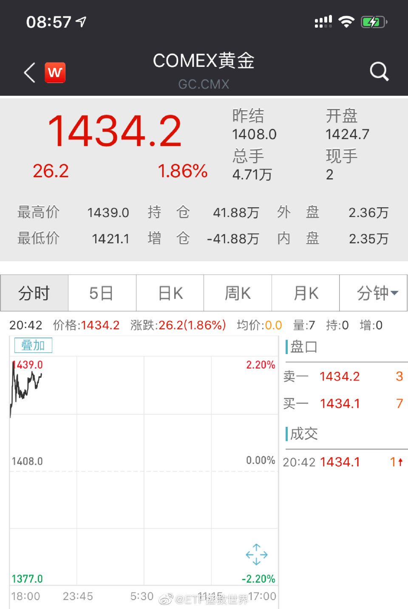

======================================================

ETF拯救世界 (5687069307) @
2019-07-03 09:06:04 Wed  
url: https://weibo.com/5687069307/HBIzKuKF8

回复@花开花落95708:千万别这么想我只是做大概率对的事，大概率就意味着也有可能出错。是人都会出错，所以我主要是靠蒙//@花开花落95708:E大这么谨慎的人买肯定错不了！

------------------------------------------------------
转推：
>  @ETF拯救世界 (5687069307)
>  2019-07-03 08:58:43 Wed  
>  url: https:/weibo.com/5687069307/HBIwLvGWV/

>  上次发车，后台留言有一半质疑为什么买黄金的。
>  
>  看到那些的时候我就知道，大概率买对了。 ​​​

转发[8]  评论[243]  赞[703] 

======================================================

ETF拯救世界 (5687069307) @
2019-07-03 09:52:17 Wed  
url: https://weibo.com/5687069307/HBISvyKDs

特别有意思。

这个微博吧，是我个人的私人微博。也不是什么机构的官微，也不是什么营销号。

我在我自己的微博上，愿意说什么就说什么，又不违法，又不违规，到底碍着有些人什么事儿了？

我请个小助理有人喷，我谈论电影有人喷，我聊聊情人节有人喷，我蒙对了买在低点赚钱了高兴高兴有人喷……

我就 ​​​

转发[19]  评论[939]  赞[2070] 

======================================================

ETF拯救世界 (5687069307) @
2019-07-03 10:22:51 Wed  
url: https://weibo.com/5687069307/HBJ4V14Kf

黄金前期高点1442是个压力，如果过去了，走好的概率就更大一丢丢。

如果死活突破不了，那就回家吃面吧。 ​​​

转发[61]  评论[275]  赞[945] 

======================================================

ETF拯救世界 (5687069307) @
2019-07-03 10:59:42 Wed  
url: https://weibo.com/5687069307/HBJjSjV0b

我没懂，一个人拿着水瓶子过来冲你头上泼，你一动不动低着头让他泼，是什么道理。学习好的给讲讲。

------------------------------------------------------
转推：
>  @ ()
>  2019-07-03 10:05:11 Wed  
>  url: 

>  抱歉，作者已设置仅展示半年内微博，此微博已不可见。 ​​​

转发[25]  评论[406]  赞[886] 

======================================================

ETF拯救世界 (5687069307) @
2019-07-03 11:34:24 Wed  
url: https://weibo.com/5687069307/HBJxXuRk1

不过实话实说，李彦宏51了，保养到这个程度，真的服。 ​​​

转发[5]  评论[276]  赞[1094] 

======================================================

ETF拯救世界 (5687069307) @
2019-07-03 14:59:57 Wed  
url: https://weibo.com/5687069307/HBKToBYcm

没人比我更懂瞎蒙。 ​​​

转发[6]  评论[328]  赞[1299] 

======================================================

ETF拯救世界 (5687069307) @
2019-07-03 15:16:45 Wed  
url: https://weibo.com/5687069307/HBL0de7Wr

问各位帝都旅游达人一个小问题

北京周边有没有那种民宿，一住十天半个月，出门就能游山玩水，钓鱼捉虾，最好能种点菜至少挖个萝卜之类的地方。

住的干净有空调就行。

不用太便宜，也别太贵，别超1000一天吧。 ​​​

转发[24]  评论[526]  赞[1515] 

======================================================

ETF拯救世界 (5687069307) @
2019-07-03 21:53:36 Wed  
url: https://weibo.com/5687069307/HBNBiyCRE

你永远都猜不到个股的风险来自于哪里。

结论：

指数好。 ​​​

转发[51]  评论[516]  赞[1758] 

======================================================

ETF拯救世界 (5687069307) @
2019-07-04 15:54:39 Thu  
url: https://weibo.com/5687069307/HBUG6bMJZ

羡慕。有孩子，没法环游世界……

------------------------------------------------------
转推：
>  @21世纪经济报道 (1651428902)
>  2019-07-04 11:06:38 Thu  
>  url: https:/weibo.com/1651428902/HBSNbukP2/

>  【花百万环游世界的是哪些人？大数据告诉你61%是高收入女性】 奢游客群从曾经占比最大的45-55岁、夫妻、一线城市成功企业家，转变为30-50岁、单身、事业有成企业高管等，其中不乏旅居海外的华人。另外，男女比例以57：43变为39：61。#资金在手说走就走# #但还是要先上班#http://t.cn/Ai0d3Zgr ​​​

转发[17]  评论[252]  赞[801] 

======================================================

ETF拯救世界 (5687069307) @
2019-07-04 21:10:16 Thu  
url: https://weibo.com/5687069307/HBWKd21bB

这个月争取看6本 ​​​

转发[48]  评论[440]  赞[1362] 

+++++++++++++++++++++++++++++++++++++++++++++++++++++

图片：

======================================================

ETF拯救世界 (5687069307) @
2019-07-05 11:10:45 Fri  
url: https://weibo.com/5687069307/HC2fm5DAp

看完了，两星。

一句话总结：没人比我更懂克服困难经营房地产。

不用浪费时间看了。 ​​​

转发[17]  评论[388]  赞[1186] 

+++++++++++++++++++++++++++++++++++++++++++++++++++++

图片：

======================================================

ETF拯救世界 (5687069307) @
2019-07-05 21:48:25 Fri  
url: https://weibo.com/5687069307/HC6qbAiLr

最高1441，回家吃面吧。[摊手]

------------------------------------------------------
转推：
>  @ETF拯救世界 (5687069307)
>  2019-07-03 10:22:51 Wed  
>  url: https:/weibo.com/5687069307/HBJ4V14Kf/

>  黄金前期高点1442是个压力，如果过去了，走好的概率就更大一丢丢。
>  
>  如果死活突破不了，那就回家吃面吧。 ​​​

转发[19]  评论[341]  赞[924] 

======================================================

ETF拯救世界 (5687069307) @
2019-07-07 20:55:40 Sun  
url: https://weibo.com/5687069307/HCoVLn4vM

第一次暴雨中跑步。

也是一种人生体验了。 ​​​

转发[10]  评论[419]  赞[1286] 

======================================================

ETF拯救世界 (5687069307) @
2019-07-08 09:50:52 Mon  
url: https://weibo.com/5687069307/HCu0qnGfL

与央行共进退

------------------------------------------------------
转推：
>  @ ()
>  2019-07-08 08:42:59 Mon  
>  url: 

>  抱歉，作者已设置仅展示半年内微博，此微博已不可见。 ​​​

转发[18]  评论[122]  赞[634] 

======================================================

ETF拯救世界 (5687069307) @
2019-07-08 10:03:25 Mon  
url: https://weibo.com/5687069307/HCu5wf0sG

到了我们买的日子，暴涨想让我们接盘，不买不完了吗。

还不是要乖乖跌回来？

踏踏实实的。 ​​​

转发[20]  评论[263]  赞[1064] 

======================================================

ETF拯救世界 (5687069307) @
2019-07-08 10:06:50 Mon  
url: https://weibo.com/5687069307/HCu6TBX0v

这种行情你就知道网格的好处了。

上上下下来回提款。 ​​​

转发[35]  评论[297]  赞[988] 

======================================================

ETF拯救世界 (5687069307) @
2019-07-08 10:17:16 Mon  
url: https://weibo.com/5687069307/HCub8kitO

跟儿子在路上走。

“你老往后看什么呢”

“后面有个小朋友”

“小朋友怎么了”

“是个女孩！”

“女孩怎么了？”

“我不是跟你说过吗？”

“嗯？”

“漂亮女孩我都喜欢！”

……百感交集。 ​​​

转发[21]  评论[426]  赞[1691] 

======================================================

ETF拯救世界 (5687069307) @
2019-07-08 10:27:04 Mon  
url: https://weibo.com/5687069307/HCuf73pJW

去年的钻石坑很难回去，除非流动性开始减少，但这个概率不大。

不过想要大涨，还需要宏观经济拐点出现。

流动性+宏观走好，才是真正大牛市的基础。

密切关注下个月披露完毕的半年报。 ​​​

转发[138]  评论[424]  赞[1484] 

======================================================

ETF拯救世界 (5687069307) @
2019-07-08 13:39:41 Mon  
url: https://weibo.com/5687069307/HCvviBpBt

上次发车买A股的话赔5%，买黄金赚5%。喷了 ​​​

转发[8]  评论[353]  赞[1270] 

======================================================

ETF拯救世界 (5687069307) @
2019-07-08 22:49:48 Mon  
url: https://weibo.com/5687069307/HCz6AnJBj

请教各位虎爸虎妈一个问题，你们都给孩子报什么兴趣班了。包括才艺和体育的，孩子和你们对哪个项目最满意。 ​​​

转发[69]  评论[741]  赞[1215] 

======================================================

ETF拯救世界 (5687069307) @
2019-07-09 21:50:46 Tue  
url: https://weibo.com/5687069307/HCI987Vtd

“基于初中学业水平考试成绩、结合综合素质评价”，不会又回到特长生的老路了吧，简简单单考试按分上学不好吗

------------------------------------------------------
转推：
>  @ ()
>  2019-07-09 19:57:22 Tue  
>  url: 

>  抱歉，作者已设置仅展示半年内微博，此微博已不可见。 ​​​

转发[19]  评论[185]  赞[675] 

======================================================

ETF拯救世界 (5687069307) @
2019-07-10 09:49:40 Wed  
url: https://weibo.com/5687069307/HCMQVmnta

kcb新股破发是非常正常的。（身体却很诚实的点击了申购按钮） ​​​

转发[18]  评论[302]  赞[910] 

======================================================

ETF拯救世界 (5687069307) @
2019-07-10 12:17:26 Wed  
url: https://weibo.com/5687069307/HCNOU53ar

最近三只债基分红，全选现金即可 ​​​

转发[21]  评论[253]  赞[787] 

======================================================

ETF拯救世界 (5687069307) @
2019-07-10 15:21:28 Wed  
url: https://weibo.com/5687069307/HCP1BBiIm

回复@勇敢而快乐:转债是再投资。纯债是现金分红。//@勇敢而快乐:兴全转债，主理人也是红利再投，要改吗？@且慢管家

------------------------------------------------------
转推：
>  @ETF拯救世界 (5687069307)
>  2019-07-10 12:17:26 Wed  
>  url: https:/weibo.com/5687069307/HCNOU53ar/

>  最近三只债基分红，全选现金即可 ​​​

转发[13]  评论[53]  赞[361] 

======================================================

ETF拯救世界 (5687069307) @
2019-07-10 15:31:53 Wed  
url: https://weibo.com/5687069307/HCP5Q3dvC

C罗传看了92%了。

不喜欢这个人，但是非常敬佩他对身体的自律以及努力。看了那么多传记，可以肯定的是，绝大多数靠自己成功的人，都是非常非常努力。

当然，成功还有天赋和运气的成分。但努力是必须的。

从来不喝酒，从来不吃油腻的东西，十点睡觉，每天比别人多训练几个小时…… ​​​

转发[51]  评论[218]  赞[879] 

======================================================

ETF拯救世界 (5687069307) @
2019-07-10 21:45:29 Wed  
url: https://weibo.com/5687069307/HCRxu28jW

如果标普上游继续跟踪不好，就要考虑换马了 ​​​

转发[17]  评论[207]  赞[707] 

+++++++++++++++++++++++++++++++++++++++++++++++++++++

图片：
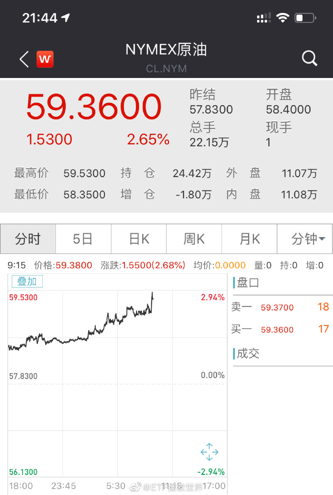
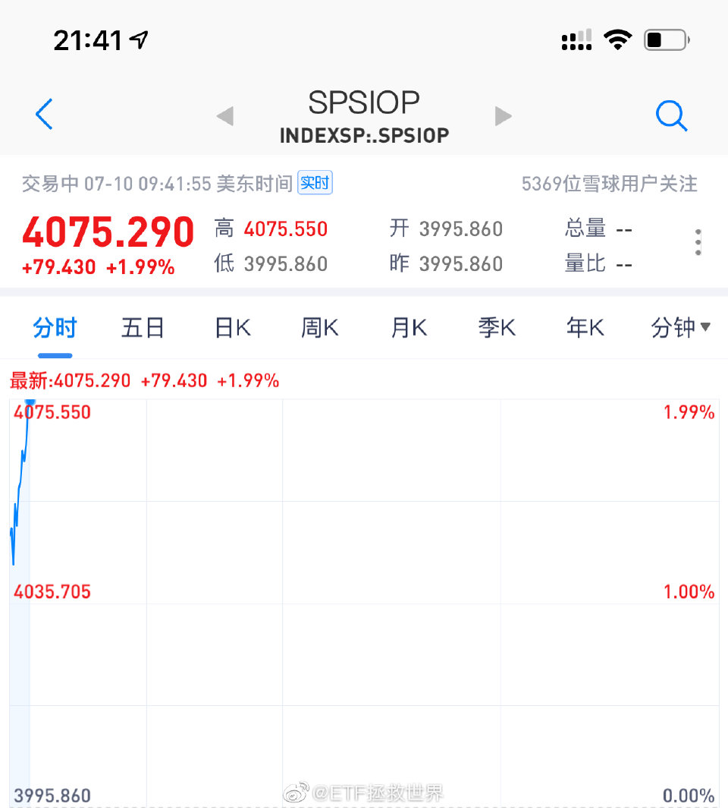
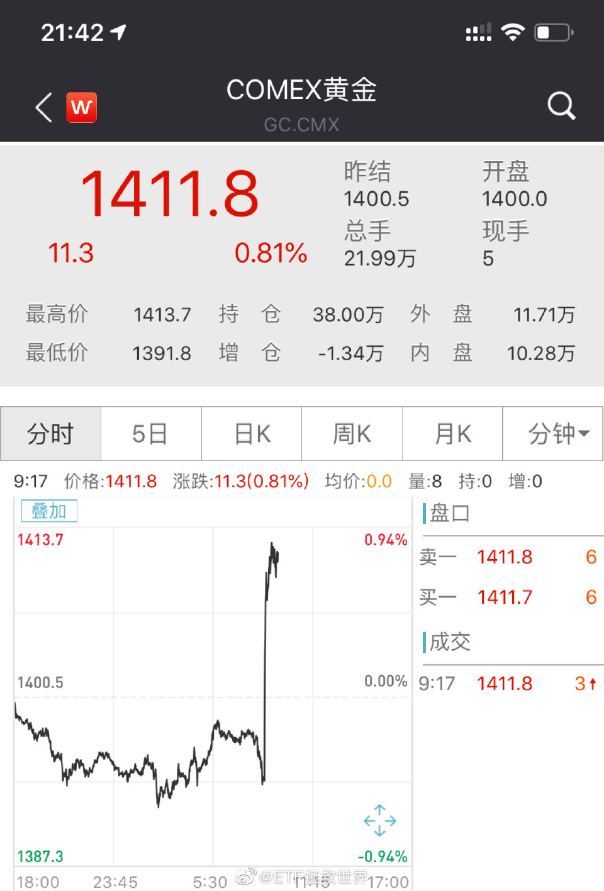
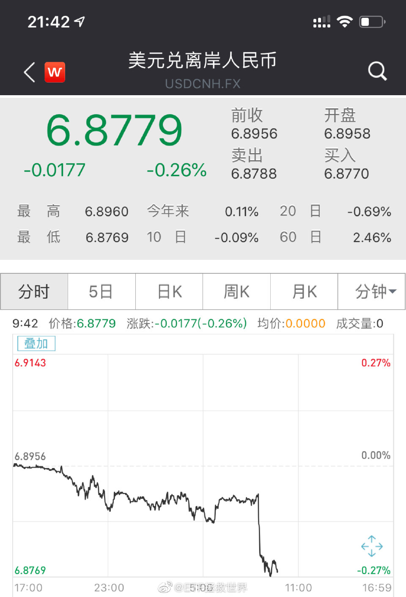

======================================================

ETF拯救世界 (5687069307) @
2019-07-10 22:13:41 Wed  
url: https://weibo.com/5687069307/HCRIVsZCK

原来的号呢，说什么不该说的了……

------------------------------------------------------
转推：
>  @骑行夜幕的统计客 (5748565088)
>  2019-07-10 14:11:54 Wed  
>  url: https:/weibo.com/5748565088/HCOzmx20v/

>  威信号恢复了，搜“骑行夜幕统计客”，比原来少个的，ID:dknight2027 ​​​

转发[6]  评论[67]  赞[382] 

======================================================

ETF拯救世界 (5687069307) @
2019-07-10 22:44:57 Wed  
url: https://weibo.com/5687069307/HCRVCojfB

//@落魄的三叔: [作揖]宝矿力，滚好。//@八大山债人://@曾鹏宇: 与宝矿力水特有代言合作娱乐公司已经宣布终止合作，这样的产品大家绝对不要买→_→   http://t.cn/AiOeFbK9

------------------------------------------------------
转推：
>  @ ()
>  2019-07-10 14:07:04 Wed  
>  url: 

>  抱歉，作者已设置仅展示半年内微博，此微博已不可见。 ​​​

转发[75]  评论[85]  赞[330] 

======================================================

ETF拯救世界 (5687069307) @
2019-07-10 23:27:23 Wed  
url: https://weibo.com/5687069307/HCScPF95e

回复@weywong:趴体的时候C罗给别人买1000欧一瓶的酒然后自己喝红牛。[doge]//@weywong:搭车问下，类似的功能饮料，大家一般喝啥？//@ETF拯救世界://@落魄的三叔: [作揖]宝矿力，滚好。//@八大山债人:

------------------------------------------------------
转推：
>  @ ()
>  2019-07-10 14:07:04 Wed  
>  url: 

>  抱歉，作者已设置仅展示半年内微博，此微博已不可见。 ​​​

转发[17]  评论[104]  赞[329] 

======================================================

ETF拯救世界 (5687069307) @
2019-07-11 10:33:22 Thu  
url: https://weibo.com/5687069307/HCWza1Ndp

被A股气笑了。 ​​​

转发[6]  评论[446]  赞[1247] 

======================================================

ETF拯救世界 (5687069307) @
2019-07-12 18:06:05 Fri  
url: https://weibo.com/5687069307/HD8Xpw4Ib

非常忙。你这一天过的怎么样。有没有干点什么让自己更NB或者更开心一点的事。 ​​​

转发[13]  评论[644]  赞[1224] 

======================================================

ETF拯救世界 (5687069307) @
2019-07-13 22:09:05 Sat  
url: https://weibo.com/5687069307/HDjYycdhb

[泪] 整件事太诡异了，到底是怎么回事。

------------------------------------------------------
转推：
>  @象山警方在线 (2685020263)
>  2019-07-13 21:30:52 Sat  
>  url: https:/weibo.com/2685020263/HDjJ24YJZ/

>  #警方通报# ​​​

转发[13]  评论[242]  赞[601] 

======================================================

ETF拯救世界 (5687069307) @
2019-07-14 16:46:48 Sun  
url: https://weibo.com/5687069307/HDriemQn8

张大妈要上市了，作为一个用了几年的用户，给你的忠告就是：

不要用，不要用，不要用！

因为你会发现居然有那么多以前不知道的好玩的东西，然后就全都买回来花了好多钱（本人是六位数）…

当然，如果你平常不刷，只是要买东西的时候上去看看历史低价等等还是挺好的…毕竟是我第一屏的软件… ​​​

转发[32]  评论[493]  赞[1062] 

+++++++++++++++++++++++++++++++++++++++++++++++++++++

图片：

======================================================

ETF拯救世界 (5687069307) @
2019-07-14 20:08:51 Sun  
url: https://weibo.com/5687069307/HDsCeDat8

生日快乐。加油。

------------------------------------------------------
转推：
>  @且慢管家 (6186312580)
>  2019-07-14 17:07:46 Sun  
>  url: https:/weibo.com/6186312580/HDrqJxG1s/

>  #且慢生日快乐# 感谢主理人和自媒体朋友对且慢三周岁生日的祝福🎁也感谢所有用户对且慢的支持和信任！爱你们[心][心][心] ​​​

转发[16]  评论[470]  赞[1403] 

======================================================

ETF拯救世界 (5687069307) @
2019-07-18 11:36:56 Thu  
url: https://weibo.com/5687069307/HE0Yr83Iy

在一个神秘的地方，上网不方便，勿念。

回见。 ​​​

转发[5]  评论[806]  赞[2082] 

======================================================

ETF拯救世界 (5687069307) @
2019-07-21 17:40:48 Sun  
url: https://weibo.com/5687069307/HEvDD0BAB

当代中国的另一面。有点好笑，有点感动，也有点难过。

------------------------------------------------------
转推：
>  @第36个故事Jessie (2673125007)
>  2019-06-17 20:35:06 Mon  
>  url: https:/weibo.com/2673125007/Hzmfu93yN/

>  #麦的垛# 火车驶向云外，梦安魂于九霄。  http://t.cn/AiN9puwA ​​​

转发[96]  评论[395]  赞[859] 

======================================================

ETF拯救世界 (5687069307) @
2019-07-22 10:51:05 Mon  
url: https://weibo.com/5687069307/HECnODwSt

已公布的14家公司半年报，二季度平均利润增长超过30%。

但是家数太少，不具代表性。继续观察。还有一个月左右就能看出大致情况了。

根据历史，应该是二季度，最晚三季度上市公司盈利情况开始好转。 ​​​

转发[46]  评论[693]  赞[1352] 

======================================================

ETF拯救世界 (5687069307) @
2019-07-22 13:40:45 Mon  
url: https://weibo.com/5687069307/HEDuGd9ft

白银近期涨幅大于黄金，但年度涨幅看依然落后很多。A股市场上没有合适的白银基金，有的一只是做期货，损耗大，不适合持有。

想做白银比较好的途径是银行的纸白银，相对来说好一点。

如果银价也能突破几年的平台，那么后期在周期转换的过程中，贵金属的走势就会更多一点信心。

金银价格无法用价值衡 ​​​

转发[163]  评论[484]  赞[1154] 

======================================================

ETF拯救世界 (5687069307) @
2019-07-23 14:45:40 Tue  
url: https://weibo.com/5687069307/HENlwwAVK

多看少动。

不看也没差。

找点别的事分散一下精力。 ​​​

转发[17]  评论[463]  赞[1445] 

======================================================

ETF拯救世界 (5687069307) @
2019-07-23 18:00:48 Tue  
url: https://weibo.com/5687069307/HEOCJkE9N

震惊！

过去13天我只发了10条微博！

这种亲者痛仇者快的事不能再继续下去了！ ​​​

转发[7]  评论[511]  赞[1741] 

======================================================

ETF拯救世界 (5687069307) @
2019-07-23 18:08:33 Tue  
url: https://weibo.com/5687069307/HEOFSBYXZ

新裤子的彭磊当年不就是为了买房省中介费要去链家当中介吗……

------------------------------------------------------
转推：
>  @ ()
>  2019-07-23 16:01:03 Tue  
>  url: 

>  抱歉，作者已设置仅展示半年内微博，此微博已不可见。 ​​​

转发[48]  评论[198]  赞[706] 

======================================================

ETF拯救世界 (5687069307) @
2019-07-23 20:12:35 Tue  
url: https://weibo.com/5687069307/HEPudBJJI

又想了想上一条微博的问题。

其实吧，也不是A股不行。不信？看三张图：

分别是05、09、13年至今，中证500与标普500、DAX30（DAX是全收益指数）的走势对比。

你会惊讶地发现，我A一点都不弱，05至今远远跑赢美国德国，虽然09、13至今大家走的差不多，但15年500可是一飞冲天发过大财的。

结论很简单 ​​​

转发[177]  评论[331]  赞[1036] 

+++++++++++++++++++++++++++++++++++++++++++++++++++++

图片：

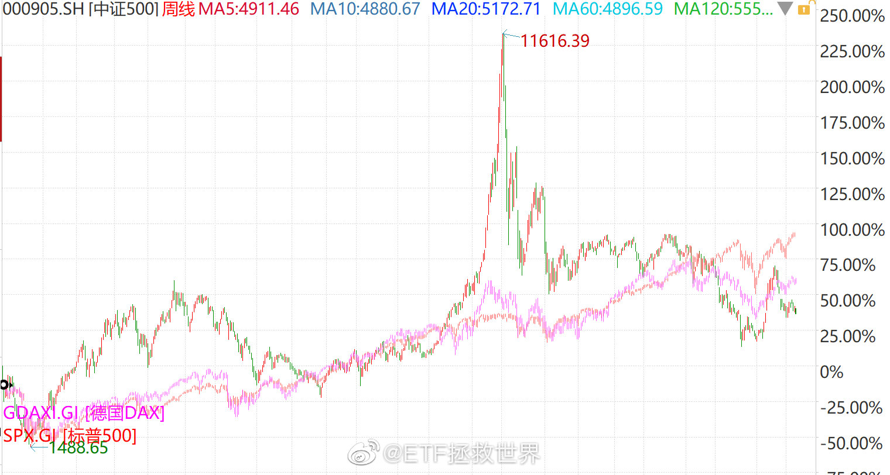

======================================================

ETF拯救世界 (5687069307) @
2019-07-23 20:42:58 Tue  
url: https://weibo.com/5687069307/HEPGz0fEn

白银继续反弹新高。

------------------------------------------------------
转推：
>  @ETF拯救世界 (5687069307)
>  2019-07-22 13:40:45 Mon  
>  url: https:/weibo.com/5687069307/HEDuGd9ft/

>  白银近期涨幅大于黄金，但年度涨幅看依然落后很多。A股市场上没有合适的白银基金，有的一只是做期货，损耗大，不适合持有。
>  
>  想做白银比较好的途径是银行的纸白银，相对来说好一点。
>  
>  如果银价也能突破几年的平台，那么后期在周期转换的过程中，贵金属的走势就会更多一点信心。
>  
>  金银价格无法用价值衡 ​​​

转发[6]  评论[89]  赞[508] 

======================================================

ETF拯救世界 (5687069307) @
2019-07-23 20:53:07 Tue  
url: https://weibo.com/5687069307/HEPKFDJLk

还想去US的朋友慎重。美签的时候签证官会非常关注去过Iran这件事。

------------------------------------------------------
转推：
>  @ ()
>  2019-07-23 20:37:14 Tue  
>  url: 

>  抱歉，作者已设置仅展示半年内微博，此微博已不可见。 ​​​

转发[13]  评论[166]  赞[620] 

======================================================

ETF拯救世界 (5687069307) @
2019-07-23 21:56:03 Tue  
url: https://weibo.com/5687069307/HEQadtYfY

去年跑赢20%不说了？谁能每个时间段都跑赢指数，上帝？

------------------------------------------------------
转推：
>  @新浪证券 (1642585887)
>  2019-07-23 20:00:06 Tue  
>  url: https:/weibo.com/1642585887/HEPp9uCaS/

>  【遭遇滑铁卢！全球最大对冲基金桥水旗舰基金上半年大亏】据英国《金融时报》，全球最大对冲基金桥水旗下旗舰基金Pure Alpha上半年亏损4.9%，创下20年来最差表现之一。对冲基金研究公司（HFR）数据显示，上半年宏观对冲基金平均上涨5.2%。不过，接近桥水人士称，Pure Alpha已经收复了部分亏损，截至7月 ​​​

转发[28]  评论[183]  赞[685] 

======================================================

ETF拯救世界 (5687069307) @
2019-07-24 14:36:35 Wed  
url: https://weibo.com/5687069307/HEWIli7oM

钱不禁花。

一个感觉，不一定对。 ​​​

转发[36]  评论[1079]  赞[2610] 

======================================================

ETF拯救世界 (5687069307) @
2019-07-26 15:59:53 Fri  
url: https://weibo.com/5687069307/HFg78BUnp

喷了，转债指数长得比所有指数都多。

下一车要不要继续加。 ​​​

转发[23]  评论[505]  赞[1366] 

======================================================

ETF拯救世界 (5687069307) @
2019-07-28 19:08:36 Sun  
url: https://weibo.com/5687069307/HFAcJsDJh

哈哈哈 ​​​

转发[9]  评论[229]  赞[770] 

+++++++++++++++++++++++++++++++++++++++++++++++++++++

图片：

======================================================

ETF拯救世界 (5687069307) @
2019-07-29 18:04:05 Mon  
url: https://weibo.com/5687069307/HFJd2zaSe

忙归忙，总要抽出时间锻炼身体。

毕竟咱们还要再扛五轮牛熊。 ​​​

转发[18]  评论[455]  赞[1652] 

+++++++++++++++++++++++++++++++++++++++++++++++++++++

图片：
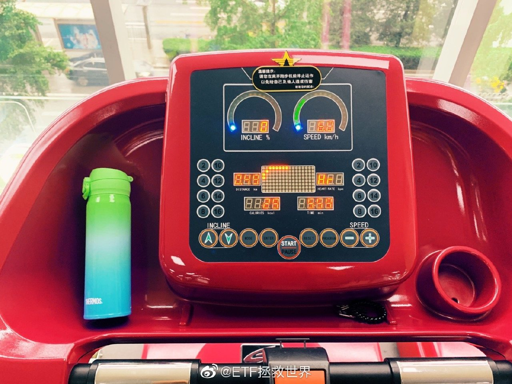

======================================================

ETF拯救世界 (5687069307) @
2019-07-29 18:15:30 Mon  
url: https://weibo.com/5687069307/HFJhGnkO6

回复@盛时不重来:里面是放了冰块的运动饮料，外面买的不够凉//@盛时不重来:回复@盛时不重来:保，保温杯？？？

------------------------------------------------------
转推：
>  @ETF拯救世界 (5687069307)
>  2019-07-29 18:04:05 Mon  
>  url: https:/weibo.com/5687069307/HFJd2zaSe/

>  忙归忙，总要抽出时间锻炼身体。
>  
>  毕竟咱们还要再扛五轮牛熊。 ​​​

转发[3]  评论[313]  赞[865] 

======================================================

ETF拯救世界 (5687069307) @
2019-07-30 20:32:13 Tue  
url: https://weibo.com/5687069307/HFTBFlhzw

吃了吗 ​​​

转发[7]  评论[427]  赞[1030] 

======================================================

ETF拯救世界 (5687069307) @
2019-07-30 20:48:15 Tue  
url: https://weibo.com/5687069307/HFTIb1Pag

这样啊，发个投票，大家可以投一下。

因为之前有人抱怨我微博有时候会说与投资无关的事，他很不喜欢。然后我就想知道，各位朋友是希望我只说跟投资有关的事儿呢，还是我觉得有意思的事就发个微博说说呢。

我寻思好歹那么多朋友关注，总发一些打扰各位清净的东西也不好。耽误别人的时间等于谋杀……  ​​​

转发[140]  评论[784]  赞[10505] 

======================================================

ETF拯救世界 (5687069307) @
2019-07-30 21:46:28 Tue  
url: https://weibo.com/5687069307/HFU5Olz3Q

根据招行2018年年报，金葵花及以上的2%客户，占有80%资产。数学好的可以算算98%的人平均存款大概是多少。

------------------------------------------------------
转推：
>  @数知实验室 (5676384100)
>  2019-07-30 19:03:03 Tue  
>  url: https:/weibo.com/5676384100/HFT1tpyFR/

>  #数据分享# #人均存款# 对不起我拖后腿了！（保持队形） ​​​

转发[65]  评论[191]  赞[675] 

======================================================

ETF拯救世界 (5687069307) @
2019-07-31 00:22:22 Wed  
url: https://weibo.com/5687069307/HFV75ieAT

你说你这点了还不睡，难道也在操心世界和平人类命运。 ​​​

转发[12]  评论[467]  赞[1284] 

======================================================

ETF拯救世界 (5687069307) @
2019-07-31 09:47:52 Wed  
url: https://weibo.com/5687069307/I01miw3pm

$恒生指数 hkHSI$  下一个世纪最佳加仓点在21000。如果有危机就能到。 ​​​

转发[112]  评论[427]  赞[1133] 

======================================================

ETF拯救世界 (5687069307) @
2019-07-31 13:42:34 Wed  
url: https://weibo.com/5687069307/I02Tz4o7e

我不知道是不是我一毕业就没有过收入特别少的情况，所以我并不太理解“攒不下钱”这个概念。

我总认为，无论收入多么少，都能攒下来。很简单，任何收入，我是说任何，到手后，马上拿出20%-30%，再不行你就拿出10%，就当丢了，存到一个账户里。哪怕买余额宝，买了就不看。除非救命或者为了完成人生大目 ​​​

转发[75]  评论[573]  赞[1662] 

======================================================

ETF拯救世界 (5687069307) @
2019-07-31 14:27:20 Wed  
url: https://weibo.com/5687069307/I03bJvLt0

辣鸡$中证转债 sh000832$ 又涨了0.1%。你跟着大伙跌一跌不好吗。 ​​​

转发[2]  评论[197]  赞[666] 

======================================================

ETF拯救世界 (5687069307) @
2019-08-01 16:05:32 Thu  
url: https://weibo.com/5687069307/I0dg69W0B

绝大多数资产大类趋势都是向下，慢慢熬吧。 ​​​

转发[94]  评论[533]  赞[1654] 

======================================================

ETF拯救世界 (5687069307) @
2019-08-02 08:17:48 Fri  
url: https://weibo.com/5687069307/I0jCK3O6y

昨夜所有品种再次暴跌，除了它 http://t.cn/AiYIn1f2

------------------------------------------------------
转推：
>  @ETF拯救世界 (5687069307)
>  2019-08-01 16:05:32 Thu  
>  url: https:/weibo.com/5687069307/I0dg69W0B/

>  绝大多数资产大类趋势都是向下，慢慢熬吧。 ​​​

转发[21]  评论[191]  赞[696] 

======================================================

ETF拯救世界 (5687069307) @
2019-08-02 08:40:03 Fri  
url: https://weibo.com/5687069307/I0jLM2lg7

现在再看有没有可能，还是有一丢丢可能的吧

------------------------------------------------------
转推：
>  @ETF拯救世界 (5687069307)
>  2019-07-31 09:47:52 Wed  
>  url: https:/weibo.com/5687069307/I01miw3pm/

>  $恒生指数 hkHSI$  下一个世纪最佳加仓点在21000。如果有危机就能到。 ​​​

转发[19]  评论[151]  赞[600] 

======================================================

ETF拯救世界 (5687069307) @
2019-08-02 08:43:03 Fri  
url: https://weibo.com/5687069307/I0jMZox54

低调比黄金更珍贵。别嘚瑟。

------------------------------------------------------
转推：
>  @澎湃新闻 (5044281310)
>  2019-08-01 23:43:04 Thu  
>  url: https:/weibo.com/5044281310/I0gfNEIWr/

>  #保时捷女车主及其丈夫将被彻查# 【重庆市公安局：彻查保时捷女车主交通违法及其丈夫情况】7月30日8时50分许，保时捷女车主李某驾车行驶至渝北区龙升街路口处违规调头，与另一车辆男司机发生冲突。渝北区公安分局接报警后，依法对李某交通违法行为作出处理，双方就纠纷达成调解协议。随后，网络曝出李 ​​​ http://mapi/005vnhZYly1g5klwecipdj31hy0u0whh

转发[26]  评论[109]  赞[605] 

======================================================

ETF拯救世界 (5687069307) @
2019-08-02 08:56:03 Fri  
url: https://weibo.com/5687069307/I0jSgatIN

趋势不好，仓位合适，可以做的就是控制节奏，不要买太多。

你观察这几个月150计划怎么做的就知道。大底以来几个月只买了一两份A股指数，德国、黄金、海外互联买一点。转债多买了几份，防守性能比指数强。

我相信有机会把所有资金买下去，也有机会把组合里的防守品种换成进攻的。不急，控制节奏，趋势 ​​​

转发[289]  评论[461]  赞[1865] 

======================================================

ETF拯救世界 (5687069307) @
2019-08-02 09:44:45 Fri  
url: https://weibo.com/5687069307/I0kc1Bftx

如果日本跌的深，也可以成为组合中的一个选项。 ​​​

转发[9]  评论[190]  赞[898] 

======================================================

ETF拯救世界 (5687069307) @
2019-08-02 09:49:47 Fri  
url: https://weibo.com/5687069307/I0ke4kjoB

虱子多了不怕咬，至理名言。

为什么，你现在能准确说出目前到底有多少亿美元的商品加了多少关税吗？

95%的人说不出来。

多好，麻木了。 ​​​

转发[25]  评论[250]  赞[1220] 

======================================================

ETF拯救世界 (5687069307) @
2019-08-02 10:29:14 Fri  
url: https://weibo.com/5687069307/I0ku5dWFs

转债指数暴跌0.38%，瑟瑟发抖中。是时候去找兄弟借钱了，不借就绝交。 ​​​

转发[22]  评论[363]  赞[1219] 

======================================================

ETF拯救世界 (5687069307) @
2019-08-02 13:23:19 Fri  
url: https://weibo.com/5687069307/I0lCKbPQE

还有个希望，把卖掉的消费以更低的价格买回来…… ​​​

转发[20]  评论[336]  赞[1400] 

======================================================

ETF拯救世界 (5687069307) @
2019-08-02 23:04:46 Fri  
url: https://weibo.com/5687069307/I0pqKAQI7

今天易方达转债下跌0.18%。

它应该是31日如果一定要买A股的最佳选择了……所以这次的转债和上次的黄金，截至目前为止都是正确的选择。 ​​​

转发[16]  评论[288]  赞[1301] 

======================================================

ETF拯救世界 (5687069307) @
2019-08-05 09:34:41 Mon  
url: https://weibo.com/5687069307/I0MpqyJRo

分享图片 ​​​

转发[8]  评论[267]  赞[801] 

+++++++++++++++++++++++++++++++++++++++++++++++++++++

图片：
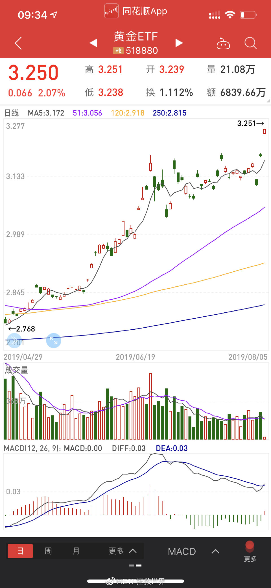

======================================================

ETF拯救世界 (5687069307) @
2019-08-05 10:05:53 Mon  
url: https://weibo.com/5687069307/I0MC61xXh

买QDII还有一个功能是对冲人民币贬值风险。

现在7.1了，就不继续买了。 ​​​

转发[32]  评论[129]  赞[749] 

======================================================

ETF拯救世界 (5687069307) @
2019-08-05 10:27:06 Mon  
url: https://weibo.com/5687069307/I0MKHE1CF

前几天订机票还犹豫了是不是选HK中转，幸亏选了直飞…… ​​​

转发[4]  评论[164]  赞[816] 

======================================================

ETF拯救世界 (5687069307) @
2019-08-05 11:01:39 Mon  
url: https://weibo.com/5687069307/I0MYJk2xn

未来我们买恒生的几个关键点位：

23000

21000

17000

随时间增加。 ​​​

转发[510]  评论[369]  赞[1152] 

======================================================

ETF拯救世界 (5687069307) @
2019-08-05 11:07:31 Mon  
url: https://weibo.com/5687069307/I0N173TZ4

对于新高的品种，不要随意预测它什么时候到顶。

新低的品种也是。

不过新低与新高不同，只要这个品种不会死，那么它的低就会有限。

而新高是无限的。

根据这些特性，制定交易策略。 ​​​

转发[132]  评论[214]  赞[907] 

======================================================

ETF拯救世界 (5687069307) @
2019-08-05 11:37:13 Mon  
url: https://weibo.com/5687069307/I0NdaDjWL

回复@网络观光者:你的风险承受能力一定程度上取决于你把最差的情况预估到哪里。尽量不要让未来发生“超预期”的事。//@网络观光者:还能看到17000.。。。这

------------------------------------------------------
转推：
>  @ETF拯救世界 (5687069307)
>  2019-08-05 11:01:39 Mon  
>  url: https:/weibo.com/5687069307/I0MYJk2xn/

>  未来我们买恒生的几个关键点位：
>  
>  23000
>  
>  21000
>  
>  17000
>  
>  随时间增加。 ​​​

转发[88]  评论[62]  赞[435] 

======================================================

ETF拯救世界 (5687069307) @
2019-08-05 11:40:08 Mon  
url: https://weibo.com/5687069307/I0NelCag3

回复@Hergiu:油气有什么按摩的。计划长期仓位一共就三份，还是之前高抛之后低吸回来的。网格更不用按摩，谁做网格没做好下跌60%的压力测试？//@Hergiu:E大给各位做油气的按摩按摩了[爱你]

------------------------------------------------------
转推：
>  @ETF拯救世界 (5687069307)
>  2019-08-05 11:07:31 Mon  
>  url: https:/weibo.com/5687069307/I0N173TZ4/

>  对于新高的品种，不要随意预测它什么时候到顶。
>  
>  新低的品种也是。
>  
>  不过新低与新高不同，只要这个品种不会死，那么它的低就会有限。
>  
>  而新高是无限的。
>  
>  根据这些特性，制定交易策略。 ​​​

转发[22]  评论[106]  赞[558] 

======================================================

ETF拯救世界 (5687069307) @
2019-08-05 13:10:44 Mon  
url: https://weibo.com/5687069307/I0NP7CXmW

最近又把这本翻出来看。 ​​​

转发[29]  评论[138]  赞[621] 

+++++++++++++++++++++++++++++++++++++++++++++++++++++

图片：
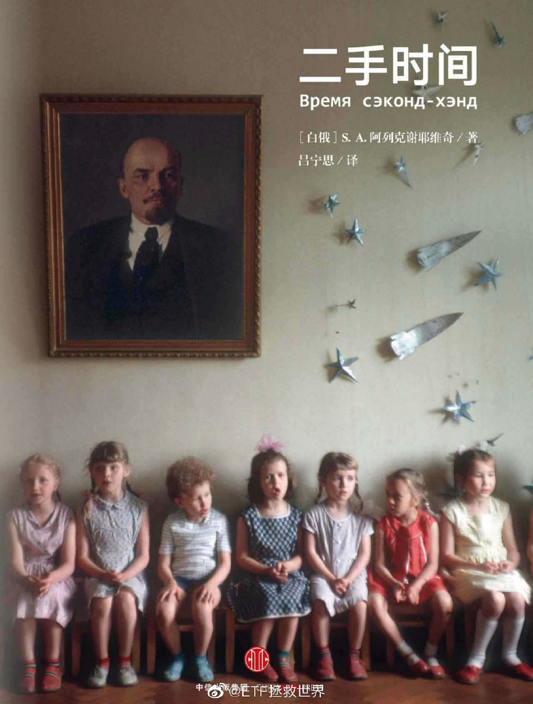

======================================================

ETF拯救世界 (5687069307) @
2019-08-05 13:17:23 Mon  
url: https://weibo.com/5687069307/I0NRPucgV

“不淡定”都是来源于生活对你挥出一记重拳的时候，你毫无准备。

一拳过来，打懵圈了。生活太难了，你只能哭着做出错误的决定。

如果你早就做好了准备，那么这记重拳虽然也会打得你很疼，但你早就准备好了创可贴，也准备好了一根狼牙棒马上、立即、毫不犹豫的，狠狠的打回去。 ​​​

转发[102]  评论[201]  赞[973] 

======================================================

ETF拯救世界 (5687069307) @
2019-08-05 13:46:19 Mon  
url: https://weibo.com/5687069307/I0O3zzulp

多读读历史没有坏处。

无论是资本市场还是其它。

我们都是时代的蝼蚁，不能改变现实及未来。但我们可以通过学习历史，思考未来，让自己在洪流中不会被淹没。 ​​​

转发[84]  评论[129]  赞[1112] 

======================================================

ETF拯救世界 (5687069307) @
2019-08-05 14:26:26 Mon  
url: https://weibo.com/5687069307/I0OjQEmrB

17000是对标98亚洲金融危机、03科网破灭+非典、08金融危机。很难，但也未必100%不可能。真到了，有应对的对策即可。//@ETF拯救世界:回复@网络观光者:你的风险承受能力一定程度上取决于你把最差的情况预估到哪里。尽量不要让未来发生“超预期”的事。//@网络观光者:还能看到17000.。。。这

------------------------------------------------------
转推：
>  @ETF拯救世界 (5687069307)
>  2019-08-05 11:01:39 Mon  
>  url: https:/weibo.com/5687069307/I0MYJk2xn/

>  未来我们买恒生的几个关键点位：
>  
>  23000
>  
>  21000
>  
>  17000
>  
>  随时间增加。 ​​​

转发[56]  评论[100]  赞[524] 

======================================================

ETF拯救世界 (5687069307) @
2019-08-05 14:35:37 Mon  
url: https://weibo.com/5687069307/I0OnAkrP1

韩国股市虽然2018年2月创出历史新高，但目前已经回到07年，也就是12年前了。

指数投资，长期持仓不动肯定不行。

那么，该如何做？

多看点各国走势，会有不小启发。 ​​​

转发[137]  评论[152]  赞[907] 

======================================================

ETF拯救世界 (5687069307) @
2019-08-05 15:06:52 Mon  
url: https://weibo.com/5687069307/I0OAgoxBN

回复@千机幻尘:中证500早在2010年就回去了，在2015年已经是2007年的一倍多了。现在是2007年12月的点位。但是估值已经比当时下降了65%。//@千机幻尘:癌股什么时候才能回到07年..[允悲]

------------------------------------------------------
转推：
>  @ETF拯救世界 (5687069307)
>  2019-08-05 14:35:37 Mon  
>  url: https:/weibo.com/5687069307/I0OnAkrP1/

>  韩国股市虽然2018年2月创出历史新高，但目前已经回到07年，也就是12年前了。
>  
>  指数投资，长期持仓不动肯定不行。
>  
>  那么，该如何做？
>  
>  多看点各国走势，会有不小启发。 ​​​

转发[72]  评论[62]  赞[446] 

======================================================

ETF拯救世界 (5687069307) @
2019-08-05 15:16:08 Mon  
url: https://weibo.com/5687069307/I0OE1wD8f

如果十年后500还是目前这个点位，那么PE将降至7-8倍，PB将降至0.5-0.6倍……（不出大事的情况下）。//@ETF拯救世界:回复@千机幻尘:中证500早在2010年就回去了，在2015年已经是2007年的一倍多了。现在是2007年12月的点位。但是估值已经比当时下降了65%。//@千机幻尘:癌股什么时候才能回到07年..[允悲]

------------------------------------------------------
转推：
>  @ETF拯救世界 (5687069307)
>  2019-08-05 14:35:37 Mon  
>  url: https:/weibo.com/5687069307/I0OnAkrP1/

>  韩国股市虽然2018年2月创出历史新高，但目前已经回到07年，也就是12年前了。
>  
>  指数投资，长期持仓不动肯定不行。
>  
>  那么，该如何做？
>  
>  多看点各国走势，会有不小启发。 ​​​

转发[43]  评论[160]  赞[657] 

======================================================

ETF拯救世界 (5687069307) @
2019-08-05 20:35:04 Mon  
url: https://weibo.com/5687069307/I0QJugW16

看到国旗这样被扔到水里心里很难受。//@挖龙脉的超级鹿鼎公: 转发微博

------------------------------------------------------
转推：
>  @ ()
>  2019-08-05 20:04:57 Mon  
>  url: 

>  抱歉，作者已设置仅展示半年内微博，此微博已不可见。 ​​​

转发[79]  评论[285]  赞[714] 

======================================================

ETF拯救世界 (5687069307) @
2019-08-06 00:11:48 Tue  
url: https://weibo.com/5687069307/I0S9s7Z40

被限流了一条…… ​​​

转发[5]  评论[193]  赞[698] 

======================================================

ETF拯救世界 (5687069307) @
2019-08-06 08:20:27 Tue  
url: https://weibo.com/5687069307/I0VlNCbQa

共克时艰吧 ​​​

转发[22]  评论[408]  赞[1378] 

======================================================

ETF拯救世界 (5687069307) @
2019-08-06 09:45:53 Tue  
url: https://weibo.com/5687069307/I0VUtkkOt

趋势这么用 ​​​

转发[36]  评论[276]  赞[1177] 

+++++++++++++++++++++++++++++++++++++++++++++++++++++

图片：

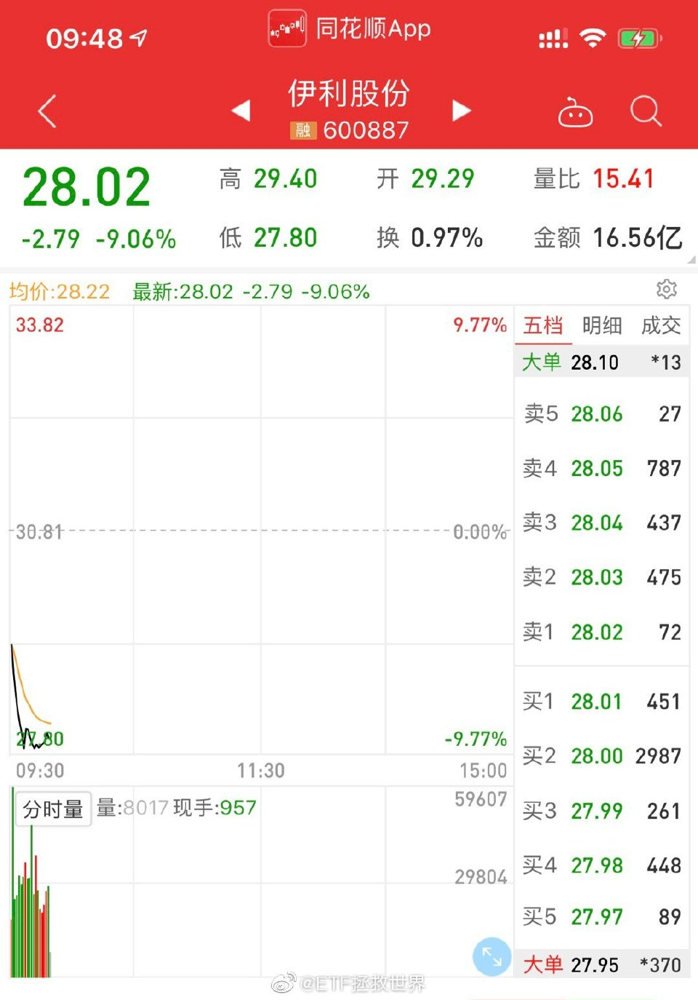

======================================================

ETF拯救世界 (5687069307) @
2019-08-06 09:57:49 Tue  
url: https://weibo.com/5687069307/I0VZjxEz5

最近开始把压箱底的货基和银行理财转入证券市场。

准备留2、3年生活费，其它慢慢转入。

这十几年，积累一些财富虽然不易，但这种时候不买，总是无法说服自己。

不希望自己未来会后悔。做大概率的事。

踏踏实实的，多大点事儿啊。 ​​​

转发[235]  评论[1033]  赞[2406] 

======================================================

ETF拯救世界 (5687069307) @
2019-08-06 13:26:11 Tue  
url: https://weibo.com/5687069307/I0XlTliM9

有一网没吃上，心都碎了 ​​​

转发[15]  评论[401]  赞[849] 

======================================================

ETF拯救世界 (5687069307) @
2019-08-06 17:05:41 Tue  
url: https://weibo.com/5687069307/I0YMZAjnr

讲真，韩国人的个性真是刚。这种个性做很多事确实让人不待见，但有时候也让人有点佩服。

------------------------------------------------------
转推：
>  @澎湃新闻 (5044281310)
>  2019-08-06 17:01:03 Tue  
>  url: https:/weibo.com/5044281310/I0YL6zmNB/

>  【#韩国公务员加入抵制日货行列#：坚决不买日本办公品】最近，日韩关系因“白名单”事件再度紧张，韩国社会的反日情绪，也从普通民众，蔓延到了公务员群体。据韩媒报道，韩国公务员劳动组合总联盟6日宣布，下属115个机关公务员劳动组合将参加全民性的“抵制日货”行动，反对日本对韩采取出口限制措施。 ​​​ http://mapi/005vnhZYgy1g5q1njkkwwj30go09mgti

转发[9]  评论[118]  赞[487] 

======================================================

ETF拯救世界 (5687069307) @
2019-08-06 20:38:43 Tue  
url: https://weibo.com/5687069307/I10bt1iqT

美股最近这几年上涨，与公司不断创纪录回购续命有很大关系。今天A股整体PB再次跌破2倍，希望多一点公司拿出真金白银买回一倍pb的股票，然后注销。

------------------------------------------------------
转推：
>  @财联社APP (2868676035)
>  2019-08-06 20:14:29 Tue  
>  url: https:/weibo.com/2868676035/I101CuzeQ/

>  完美世界：拟以3亿元-6亿元回购股份，回购价格不超过36元/股。 ​​​

转发[44]  评论[143]  赞[573] 

======================================================

ETF拯救世界 (5687069307) @
2019-08-06 20:41:55 Tue  
url: https://weibo.com/5687069307/I10cLlqzH

回复@cumberawesome:我不针对个股，只说普遍情况。A股目前有3668家公司。//@cumberawesome:完美世界那么大商誉1倍pb也贵

------------------------------------------------------
转推：
>  @财联社APP (2868676035)
>  2019-08-06 20:14:29 Tue  
>  url: https:/weibo.com/2868676035/I101CuzeQ/

>  完美世界：拟以3亿元-6亿元回购股份，回购价格不超过36元/股。 ​​​

转发[7]  评论[49]  赞[358] 

======================================================

ETF拯救世界 (5687069307) @
2019-08-06 22:25:03 Tue  
url: https://weibo.com/5687069307/I10SClUYb

写了一篇关于投资本金的回答。

明天发且慢。

写这个还是很惶恐，很怕误导各位。

不过还是希望对你有些帮助吧。 ​​​

转发[14]  评论[393]  赞[1539] 

======================================================

ETF拯救世界 (5687069307) @
2019-08-07 09:42:36 Wed  
url: https://weibo.com/5687069307/I15jDtC1v

金价突破1500

很多价值投资者看不上趋势交易。

说白了，恐怕是不懂。并且，从未尝试去弄懂。

被自己的执念禁锢起来了。 ​​​

转发[66]  评论[305]  赞[1244] 

======================================================

ETF拯救世界 (5687069307) @
2019-08-07 10:18:40 Wed  
url: https://weibo.com/5687069307/I15yhcxuj

无论是向上还是向下，趋势一旦形成，就很难改变。

所以不要随意的去猜测哪天趋势会变。趋势当然会变，但一千个日子里，只有那一天是趋势改变的日子。你每天猜，成功的概率有多大？

所以不要猜测。

另外，趋势形成很久后，就不要再进入。趋势形成越久，你进入的那天就越有可能是改变的日子。

你也不 ​​​

转发[443]  评论[709]  赞[2052] 

======================================================

ETF拯救世界 (5687069307) @
2019-08-07 20:00:29 Wed  
url: https://weibo.com/5687069307/I19mrpZGk

图片评论 http://t.cn/AiTG3zHe

------------------------------------------------------
转推：
>  @ETF拯救世界 (5687069307)
>  2019-07-22 13:40:45 Mon  
>  url: https:/weibo.com/5687069307/HEDuGd9ft/

>  白银近期涨幅大于黄金，但年度涨幅看依然落后很多。A股市场上没有合适的白银基金，有的一只是做期货，损耗大，不适合持有。
>  
>  想做白银比较好的途径是银行的纸白银，相对来说好一点。
>  
>  如果银价也能突破几年的平台，那么后期在周期转换的过程中，贵金属的走势就会更多一点信心。
>  
>  金银价格无法用价值衡 ​​​

转发[15]  评论[156]  赞[580] 

======================================================

ETF拯救世界 (5687069307) @
2019-08-08 09:21:17 Thu  
url: https://weibo.com/5687069307/I1eBu1xFv

伯克希尔现金储备创下1220亿美元新高

现金从来不是辣鸡。 ​​​

转发[39]  评论[260]  赞[1148] 

======================================================

ETF拯救世界 (5687069307) @
2019-08-08 09:31:52 Thu  
url: https://weibo.com/5687069307/I1eFMy1YK

“2”很精彩，看不懂的可以再看三遍。//@放牛娃想宅在冬天里: //@兽爷:应莹说是爱马仕，不是阿玛尼//@来去之间:那件衣服是爱马仕。

------------------------------------------------------
转推：
>  @ ()
>  2019-04-02 18:33:56 Tue  
>  url: 

>  抱歉，作者已设置仅展示半年内微博，此微博已不可见。 ​​​

转发[101]  评论[210]  赞[716] 

======================================================

ETF拯救世界 (5687069307) @
2019-08-08 17:27:25 Thu  
url: https://weibo.com/5687069307/I1hMOgjXC

男人不要说女人“难看”（包括各方面的难看）。女人不要说男人“你不行”（包括各方面不行）

------------------------------------------------------
转推：
>  @板房蒋阿姨 (1904797913)
>  2019-08-08 16:50:42 Thu  
>  url: https:/weibo.com/1904797913/I1hxTEXFO/

>  这两天发了几个妹子附带聊天记录的的投稿（应投稿人要求，删除了），我觉得咱们有必要一起讨论一下，情侣/伴侣之间，有哪些话是禁忌，是非常伤人的，是不能够随便说的，无论男女，都应该引以为戒。 ​​​

转发[36]  评论[205]  赞[764] 

======================================================

ETF拯救世界 (5687069307) @
2019-08-08 20:26:35 Thu  
url: https://weibo.com/5687069307/I1iXwxb21

如果最近各个品种大幅下跌，让刚开始做网格的你觉得非常痛苦。

那一定是你哪里做错了。

怎么办？

再回去看公众号的几篇网格文章。

你会发现有那些我反复重复，反复强调，你却没有注意的细节多么重要。

我能帮你的，除了数据、模型、策略、体系外，最最重要的就是经验。

让你节省十年试错成本的经 ​​​

转发[54]  评论[386]  赞[1082] 

======================================================

ETF拯救世界 (5687069307) @
2019-08-08 20:29:45 Thu  
url: https://weibo.com/5687069307/I1iYOnxr0

80年代初开始，达里奥就已经是我们的朋友了。

------------------------------------------------------
转推：
>  @新浪证券 (1642585887)
>  2019-08-08 19:04:40 Thu  
>  url: https:/weibo.com/1642585887/I1iqhfOjZ/

>  【世界最大对冲基金“桥水基金”喊话：全球投资者买入中国资产，不要错过历史机遇】中国金融市场不断扩大开放，持续吸引境外投资人。尽管近期全球经济面临不确定性，为金融市场带来动荡，但全球最大对冲基金“桥水基金”创始人瑞•达利欧周二仍建议全球投资者买入中国资产，而且宜早不宜迟，不要错过历 ​​​

转发[43]  评论[157]  赞[573] 

======================================================

ETF拯救世界 (5687069307) @
2019-08-09 10:02:10 Fri  
url: https://weibo.com/5687069307/I1oizthU8

转债指数已经涨回去了。 ​​​

转发[6]  评论[187]  赞[852] 

======================================================

ETF拯救世界 (5687069307) @
2019-08-09 11:08:15 Fri  
url: https://weibo.com/5687069307/I1oJotrYh

小贴士：

给孩子报音乐兴趣班，1v1，你也要进去听。

这样，一小时300块，两个人学，约等于150/人。

不仅如此，你的音乐素养也会提高。2/4拍4/4拍如数家珍，军鼓地鼓叮叮镲不在话下，一弦二品和弦指弹堪比岸部真名。

最后你和孩子组了一个band合奏一曲雨夜曼彻斯特。

其乐无穷。 ​​​

转发[25]  评论[359]  赞[1744] 

======================================================

ETF拯救世界 (5687069307) @
2019-08-09 12:58:59 Fri  
url: https://weibo.com/5687069307/I1pslwvUN

什么叫一个人有价值？

就是每天打开股票社区的网站看一篇小说连载就关上…

这个小说作者就是有价值的… ​​​

转发[12]  评论[252]  赞[1142] 

======================================================

ETF拯救世界 (5687069307) @
2019-08-10 16:39:57 Sat  
url: https://weibo.com/5687069307/I1AkwDOeI

记得涂防晒啊 ​​​

转发[5]  评论[193]  赞[836] 

======================================================

ETF拯救世界 (5687069307) @
2019-08-10 16:56:45 Sat  
url: https://weibo.com/5687069307/I1ArlxWcx

身材 头发，非常重要。

看了当年长得像王力宏的大学同学近照有感。 ​​​

转发[6]  评论[155]  赞[738] 

======================================================

ETF拯救世界 (5687069307) @
2019-08-10 17:07:16 Sat  
url: https://weibo.com/5687069307/I1AvChKuB

周五一只脚又回钻石坑了，等全掉下去我再写篇东西。

纪念A股历史第一次刚从钻石坑爬出来又掉下去… ​​​

转发[193]  评论[464]  赞[1736] 

======================================================

ETF拯救世界 (5687069307) @
2019-08-10 17:16:27 Sat  
url: https://weibo.com/5687069307/I1AzlmDdf

回复@微子庭:能跟别人不一样是我在资本市场活下去的信心所在。谢谢鼓励//@微子庭:所有大V都看到2500多，这还有唯一一个把2700当钻石底的…

------------------------------------------------------
转推：
>  @ETF拯救世界 (5687069307)
>  2019-08-10 17:07:16 Sat  
>  url: https:/weibo.com/5687069307/I1AvChKuB/

>  周五一只脚又回钻石坑了，等全掉下去我再写篇东西。
>  
>  纪念A股历史第一次刚从钻石坑爬出来又掉下去… ​​​

转发[24]  评论[84]  赞[739] 

======================================================

ETF拯救世界 (5687069307) @
2019-08-10 17:17:56 Sat  
url: https://weibo.com/5687069307/I1AzWzMr9

对我估值系统实力不了解的推荐看这个：

http://t.cn/AiTTF2cB ​​​

转发[196]  评论[163]  赞[900] 

======================================================

ETF拯救世界 (5687069307) @
2019-08-10 17:29:14 Sat  
url: https://weibo.com/5687069307/I1AEx90s0

在资本市场，如果你发现绝大多数人都是同样的观点，那它极大概率就是错的。

大V并没什么了不起。不信你看看今年微博红人夜财经类十大榜单。

我不会因为谁的粉丝多就觉得他牛x。只要他能有理有据条理清晰，我就重视他尊重他。哪怕没有一个人关注他。

大V什么都不是。 ​​​

转发[98]  评论[181]  赞[1072] 

======================================================

ETF拯救世界 (5687069307) @
2019-08-10 17:34:05 Sat  
url: https://weibo.com/5687069307/I1AGvd7TW

回复@啵波啵波啵波啵:趋势不好肯定看空的多啊。问题是对你来说，看多看空重要，还是该买该卖重要？//@啵波啵波啵波啵:那最近各大v都在看空，是不是大概率是错的？

------------------------------------------------------
转推：
>  @ETF拯救世界 (5687069307)
>  2019-08-10 17:29:14 Sat  
>  url: https:/weibo.com/5687069307/I1AEx90s0/

>  在资本市场，如果你发现绝大多数人都是同样的观点，那它极大概率就是错的。
>  
>  大V并没什么了不起。不信你看看今年微博红人夜财经类十大榜单。
>  
>  我不会因为谁的粉丝多就觉得他牛x。只要他能有理有据条理清晰，我就重视他尊重他。哪怕没有一个人关注他。
>  
>  大V什么都不是。 ​​​

转发[24]  评论[84]  赞[579] 

======================================================

ETF拯救世界 (5687069307) @
2019-08-10 17:38:11 Sat  
url: https://weibo.com/5687069307/I1AIaivpS

巴菲特1.6开始买中石油，最多浮夸30%，一路买一路跌，买成了第二大股东。

那时候你会不会觉得他是傻X。

几年后他12清仓，然后涨到21。

你会不会觉得他是傻X。

反正ys觉得他是，逼他上电视认错。

昨天中石油再创十年新低，不到四块。

看多看空，很重要吗？

谁赢谁输，是看下个月你对不对吗？ ​​​

转发[67]  评论[277]  赞[1310] 

======================================================

ETF拯救世界 (5687069307) @
2019-08-10 21:48:05 Sat  
url: https://weibo.com/5687069307/I1ClBh9bw

钓鱼成功，几个月来第一次又拉黑几个 ​​​

转发[3]  评论[280]  赞[1005] 

======================================================

ETF拯救世界 (5687069307) @
2019-08-10 22:12:44 Sat  
url: https://weibo.com/5687069307/I1CvBudLw

不清楚这次台风到底有多严重，只希望我的各位博友以及你们的家人平安。

正好耳机盒在手边，这四个字送给各位。 ​​​

转发[7]  评论[282]  赞[1238] 

+++++++++++++++++++++++++++++++++++++++++++++++++++++

图片：

======================================================

ETF拯救世界 (5687069307) @
2019-08-11 00:28:18 Sun  
url: https://weibo.com/5687069307/I1DoDgDd1

shbl是不是真的那么差。

大家都说差，我反而想去看看到底有多差。

要不看过的朋友说说，看这个电影是不是浪费宝贵生命…… ​​​

转发[7]  评论[231]  赞[1026] 

======================================================

ETF拯救世界 (5687069307) @
2019-08-11 17:35:18 Sun  
url: https://weibo.com/5687069307/I1K7ut09d

你跟他谈价值，他跟你说趋势。

也不知道这个脑回路是怎样的。

你知道吗。 ​​​

转发[40]  评论[173]  赞[849] 

======================================================

ETF拯救世界 (5687069307) @
2019-08-11 17:45:29 Sun  
url: https://weibo.com/5687069307/I1KbDg9NA

回复@信仰MEe:一样一样分开聊。聊完一样再说一样。别掺在一起，那是脑子不清楚。有没有价值，有多少价值，值得给多少仓位？趋势如何，好还是坏，上不上右侧仓位？全盘考虑，概率下注。//@信仰MEe:暗示现在是价值区域，而不能盯着趋势，只是一个想法，不一定对[偷乐][二哈]

------------------------------------------------------
转推：
>  @ETF拯救世界 (5687069307)
>  2019-08-11 17:35:18 Sun  
>  url: https:/weibo.com/5687069307/I1K7ut09d/

>  你跟他谈价值，他跟你说趋势。
>  
>  也不知道这个脑回路是怎样的。
>  
>  你知道吗。 ​​​

转发[28]  评论[105]  赞[660] 

======================================================

ETF拯救世界 (5687069307) @
2019-08-12 10:46:32 Mon  
url: https://weibo.com/5687069307/I1QS4ll84

电影不好看，男一被全网喷让我感觉也挺可怜的。毕竟电影好不好也不是一个演员能决定的。

但是看到拍电影的时候他通宵玩游戏，导演一喊咔就继续玩游戏，甚至连发型都不愿意换一下。

瞬间觉得挨骂一点都不冤啊。 ​​​

转发[11]  评论[269]  赞[1455] 

======================================================

ETF拯救世界 (5687069307) @
2019-08-12 14:50:14 Mon  
url: https://weibo.com/5687069307/I1SsZhG4b

别人都说好，你也说好，不代表你是没有主见，不代表你没有独立思考能力。

别人都说好，你说不好，不代表你比别人高，不代表只有你会独立思考。

你说好还是不好，完全来源于你自己的内心，这才叫NB。你觉得好就好，不好就不好，完全不被别人的说法影响，这才叫独立。

不因为怕被孤立而从众，不因为要 ​​​

转发[126]  评论[255]  赞[1244] 

======================================================

ETF拯救世界 (5687069307) @
2019-08-12 14:57:58 Mon  
url: https://weibo.com/5687069307/I1Sw82xpc

十二号了，再等三天会死吗。

什么玩意儿啊。 ​​​

转发[4]  评论[311]  赞[1005] 

======================================================

ETF拯救世界 (5687069307) @
2019-08-12 15:09:03 Mon  
url: https://weibo.com/5687069307/I1SAD1LjS

订了日落水上villa的我心里只有一句… ​​​

转发[4]  评论[252]  赞[720] 

+++++++++++++++++++++++++++++++++++++++++++++++++++++

图片：

======================================================

ETF拯救世界 (5687069307) @
2019-08-12 16:35:02 Mon  
url: https://weibo.com/5687069307/I1T9wzVJt

跌两天看到2500，涨一天看到3100。

你说你来股市干嘛来了。 ​​​

转发[30]  评论[380]  赞[1473] 

======================================================

ETF拯救世界 (5687069307) @
2019-08-12 21:59:23 Mon  
url: https://weibo.com/5687069307/I1VhbgfE4

太惨了。

------------------------------------------------------
转推：
>  @财联社APP (2868676035)
>  2019-08-12 21:55:02 Mon  
>  url: https:/weibo.com/2868676035/I1VfpCoRC/

>  【行情】财联社8月12日讯，阿根廷比索兑美元日内跌幅扩大至30%，续创纪录低位。此前，阿根廷总统初选结果出乎市场预料。 ​​​

转发[15]  评论[165]  赞[568] 

======================================================

ETF拯救世界 (5687069307) @
2019-08-13 14:35:59 Tue  
url: https://weibo.com/5687069307/I21NI2mtI

突破1530。聊趋势我也没在怕的

------------------------------------------------------
转推：
>  @ETF拯救世界 (5687069307)
>  2019-08-07 09:42:36 Wed  
>  url: https:/weibo.com/5687069307/I15jDtC1v/

>  金价突破1500
>  
>  很多价值投资者看不上趋势交易。
>  
>  说白了，恐怕是不懂。并且，从未尝试去弄懂。
>  
>  被自己的执念禁锢起来了。 ​​​

转发[10]  评论[237]  赞[1011] 

======================================================

ETF拯救世界 (5687069307) @
2019-08-13 15:41:59 Tue  
url: https://weibo.com/5687069307/I22euoat3

我一定会买一套。并且绝不让儿子祸害，自己玩……

------------------------------------------------------
转推：
>  @ ()
>  2019-08-13 15:31:17 Tue  
>  url: 

>  抱歉，作者已设置仅展示半年内微博，此微博已不可见。 ​​​

转发[37]  评论[223]  赞[574] 

======================================================

ETF拯救世界 (5687069307) @
2019-08-14 08:29:51 Wed  
url: https://weibo.com/5687069307/I28PAxqJi

想说点什么，又不知道怎么说。

希望这片土地越来越好。 ​​​

转发[23]  评论[258]  赞[1360] 

======================================================

ETF拯救世界 (5687069307) @
2019-08-14 08:39:41 Wed  
url: https://weibo.com/5687069307/I28TzA5bu

之前一直说的，右侧只有两个买点：突破和回踩，就是防止追高出现昨天黄金这种冲高回落走势。

一个品种在上升趋势，你买进去大概率当然是赚。但也随时就是套在最高。最稳妥的办法就是突破以及回踩的时候买，再之后怎么涨都不动心。

赚钱固然重要，安全才是第一。没有100%的安全，但要尽可能低成本持有 ​​​

转发[273]  评论[381]  赞[1270] 

======================================================

ETF拯救世界 (5687069307) @
2019-08-14 09:51:58 Wed  
url: https://weibo.com/5687069307/I29mUzLzG

这篇纪念第一次的文又要推后了……

------------------------------------------------------
转推：
>  @ETF拯救世界 (5687069307)
>  2019-08-10 17:07:16 Sat  
>  url: https:/weibo.com/5687069307/I1AvChKuB/

>  周五一只脚又回钻石坑了，等全掉下去我再写篇东西。
>  
>  纪念A股历史第一次刚从钻石坑爬出来又掉下去… ​​​

转发[24]  评论[356]  赞[1071] 

======================================================

ETF拯救世界 (5687069307) @
2019-08-14 10:58:24 Wed  
url: https://weibo.com/5687069307/I29NT6cYQ

[哪吒开心]

------------------------------------------------------
转推：
>  @财联社APP (2868676035)
>  2019-08-14 10:41:34 Wed  
>  url: https:/weibo.com/2868676035/I29H37jOu/

>  【桥水基金最新持仓出炉：增持中国大盘ETF和MSCI中国ETF】财联社8月14日讯，二季度桥水加仓了众多中概念股：加仓22.27万股的阿里巴巴，加仓7.3万股的百度，还加仓34.49万股的京东。除此之外，桥水还加仓了在美国上市的两只中国ETF，一只为FXI, 中国大盘ETF，这是在美国上市市值最大，流动性最好的中国E ​​​

转发[31]  评论[283]  赞[824] 

======================================================

ETF拯救世界 (5687069307) @
2019-08-15 09:21:27 Thu  
url: https://weibo.com/5687069307/I2iB25sjP

跌破25000，距离第一目标位23000不远了

------------------------------------------------------
转推：
>  @ETF拯救世界 (5687069307)
>  2019-08-05 11:01:39 Mon  
>  url: https:/weibo.com/5687069307/I0MYJk2xn/

>  未来我们买恒生的几个关键点位：
>  
>  23000
>  
>  21000
>  
>  17000
>  
>  随时间增加。 ​​​

转发[42]  评论[207]  赞[755] 

======================================================

ETF拯救世界 (5687069307) @
2019-08-15 09:28:35 Thu  
url: https://weibo.com/5687069307/I2iDVbihW

恒生有一个失误，没有在2019年4月30500附近卖出一份。

从我的系统来说，那里卖出一份是可以的。

又成长了。 ​​​

转发[73]  评论[242]  赞[912] 

======================================================

ETF拯救世界 (5687069307) @
2019-08-15 09:59:09 Thu  
url: https://weibo.com/5687069307/I2iQkjm7j

回复@芒果糯米鱼:你补仓的策略是什么？是看心情补吗？//@芒果糯米鱼:油气一路补下来，已经补成了重仓，亏损十点。已经不想补了，躺倒。

------------------------------------------------------
转推：
>  @ETF拯救世界 (5687069307)
>  2019-08-15 09:28:35 Thu  
>  url: https:/weibo.com/5687069307/I2iDVbihW/

>  恒生有一个失误，没有在2019年4月30500附近卖出一份。
>  
>  从我的系统来说，那里卖出一份是可以的。
>  
>  又成长了。 ​​​

转发[47]  评论[147]  赞[570] 

======================================================

ETF拯救世界 (5687069307) @
2019-08-15 10:01:45 Thu  
url: https://weibo.com/5687069307/I2iRode4a

回复@婉儿哈士奇拉布拉多:网格一开始就做好压力测试，在每个价格都应该提前知道自己买了多少，有多少仓位，怎么会“不想补了，卧倒”呢？“不想”是个关键词，如果严格按照策略，没有“想”和“不想”。一切都应该是买之前就知道的。//@婉儿哈士奇拉布拉多:网格吧

------------------------------------------------------
转推：
>  @ETF拯救世界 (5687069307)
>  2019-08-15 09:28:35 Thu  
>  url: https:/weibo.com/5687069307/I2iDVbihW/

>  恒生有一个失误，没有在2019年4月30500附近卖出一份。
>  
>  从我的系统来说，那里卖出一份是可以的。
>  
>  又成长了。 ​​​

转发[30]  评论[120]  赞[547] 

======================================================

ETF拯救世界 (5687069307) @
2019-08-15 10:09:37 Thu  
url: https://weibo.com/5687069307/I2iUzytnZ

指数投资与股票投资最大的不同，是有一个大致可估算的区间。

无论你从价格也好，价值也好，都会找到一个模糊的顶和模糊的底。不会很精确，但控制在十几个点之内是没问题的。

比如之前说的下跌80%原则，就是价格区间。比如钻石坑或者哈迪斯顶，就是价值原则。

知道了顶和底，你就可以开心的设计你的 ​​​

转发[360]  评论[422]  赞[1347] 

======================================================

ETF拯救世界 (5687069307) @
2019-08-15 10:16:49 Thu  
url: https://weibo.com/5687069307/I2iXv21k0

“心情”是金融投资中最最最不可靠的东西。

觉得可以买了，觉得应该卖了。看了个新闻或者报告觉得要涨了或者要跌了然后交易，都是最危险的。

设计交易策略，然后执行它。效果不好就改进，然后继续执行。 ​​​

转发[159]  评论[429]  赞[1385] 

======================================================

ETF拯救世界 (5687069307) @
2019-08-15 14:03:12 Thu  
url: https://weibo.com/5687069307/I2kro9NyZ

历史总是不断重复。

带头人去彼岸名校了，被忽悠的人准备罢课。

看过一个N H K的纪录片，很多年前，这样的一幕也发生过。

看过那部纪录片，会明白很多事。

如果有些事不发生，很多事情本来可以变得更好，也很庆幸，很多事情没有变坏。

祝福这片土地。祝福我们自己。 ​​​

转发[82]  评论[331]  赞[1180] 

======================================================

ETF拯救世界 (5687069307) @
2019-08-15 14:08:46 Thu  
url: https://weibo.com/5687069307/I2ktE9Jvp

$中证红利 sz399922$ 

你XX是不是在逗我。[悲伤] ​​​

转发[6]  评论[365]  赞[1042] 

======================================================

ETF拯救世界 (5687069307) @
2019-08-16 13:46:56 Fri  
url: https://weibo.com/5687069307/I2tLho5Iy

$中证转债 sh000832$  反弹新高 ​​​

转发[6]  评论[182]  赞[699] 

======================================================

ETF拯救世界 (5687069307) @
2019-08-17 12:43:47 Sat  
url: https://weibo.com/5687069307/I2CM96KuC

最后两分钟的总结亮了

------------------------------------------------------
转推：
>  @我是郭杰瑞 (5626136031)
>  2019-08-17 11:29:57 Sat  
>  url: https:/weibo.com/5626136031/I2Cibld1t/

>  欧洲最穷国乌克兰，为何美女逃离到中国做模特？http://t.cn/AiHnR4Fn ​​​

转发[163]  评论[193]  赞[1104] 

======================================================

ETF拯救世界 (5687069307) @
2019-08-18 04:29:44 Sun  
url: https://weibo.com/5687069307/I2IY6uGk9

你是不是失眠了 ​​​

转发[6]  评论[304]  赞[966] 

======================================================

ETF拯救世界 (5687069307) @
2019-08-18 05:27:18 Sun  
url: https://weibo.com/5687069307/I2Jltj2tK

生活小贴士：

不要觉得某件事不可能就不去试试。

试了就有机会。

去试试，万一老天不长眼让你做成了呢。 ​​​

转发[89]  评论[210]  赞[1427] 

======================================================

ETF拯救世界 (5687069307) @
2019-08-18 05:35:17 Sun  
url: https://weibo.com/5687069307/I2JoIikL5

喷了，一天时间就过气了 ​​​

转发[5]  评论[583]  赞[1368] 

+++++++++++++++++++++++++++++++++++++++++++++++++++++

图片：

======================================================

ETF拯救世界 (5687069307) @
2019-08-19 10:07:03 Mon  
url: https://weibo.com/5687069307/I2UBwxIj4

早上起来出出汗 ​​​

转发[3]  评论[327]  赞[1215] 

+++++++++++++++++++++++++++++++++++++++++++++++++++++

图片：

======================================================

ETF拯救世界 (5687069307) @
2019-08-19 11:09:54 Mon  
url: https://weibo.com/5687069307/I2V12jO55

这一网吃上的话已经可以出了。几天时间六个多点

------------------------------------------------------
转推：
>  @ETF拯救世界 (5687069307)
>  2019-08-06 13:26:11 Tue  
>  url: https:/weibo.com/5687069307/I0XlTliM9/

>  有一网没吃上，心都碎了 ​​​

转发[10]  评论[294]  赞[960] 

======================================================

ETF拯救世界 (5687069307) @
2019-08-19 13:55:50 Mon  
url: https://weibo.com/5687069307/I2W6nEFHX

我们是中文网路唯一涨跌都舒服的群体 ​​​

转发[14]  评论[430]  赞[1593] 

======================================================

ETF拯救世界 (5687069307) @
2019-08-19 15:37:05 Mon  
url: https://weibo.com/5687069307/I2WLu11qv

扯淡。绝大多数北京孩子进公立小学都是看房子。另外，从孩子的角度讲，上各种兴趣班根本不觉得累。奥数不知道，没上过…

------------------------------------------------------
转推：
>  @北京人不知道的北京事儿 (1662214194)
>  2019-08-19 15:01:02 Mon  
>  url: https:/weibo.com/1662214194/I2WwR5pyf/

>  转自网友，北京幼升小现状。。。是这样吗？[思考] ​​​

转发[34]  评论[323]  赞[949] 

======================================================

ETF拯救世界 (5687069307) @
2019-08-20 12:08:22 Tue  
url: https://weibo.com/5687069307/I34PgtlAv

早上睁开眼睛打开阳台的门直接下海浮潜。

儿子一开始怎么也不敢试试，结果试了一次，跟小鲨鱼亲密接触后就不想上来了。

可惜没有水下相机，没法拍下水底的美景。

十三年前第一次浮潜后就爱上了这项运动，在水里可以忘记一切烦恼，跟各种奇形怪状的鱼一起随波漂流。 ​​​

转发[44]  评论[591]  赞[2659] 

+++++++++++++++++++++++++++++++++++++++++++++++++++++

图片：

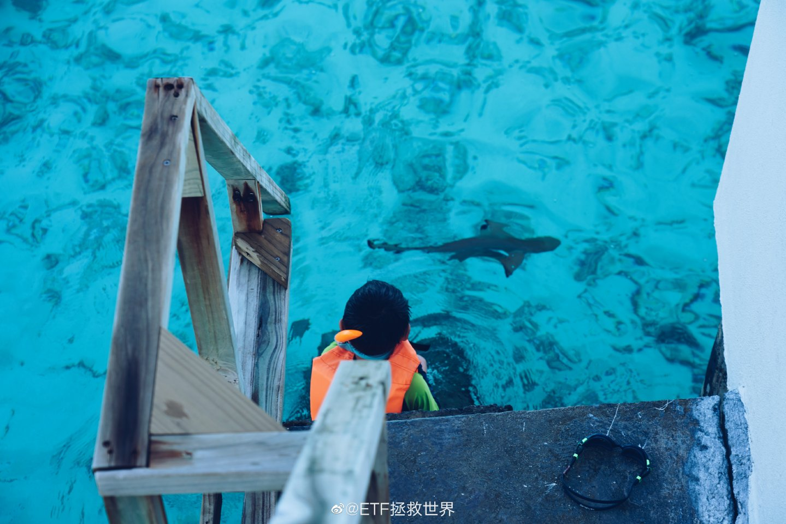

======================================================

ETF拯救世界 (5687069307) @
2019-08-20 14:25:10 Tue  
url: https://weibo.com/5687069307/I35INfXlF

回复@心想事成2028:这样的 http://t.cn/AiQcSnou //@心想事成2028:作为工程人的我，在想这个房子应该怎么建，才可以推开阳台的门直接下海，很好奇房子是建在中间，还靠近海岛上。

------------------------------------------------------
转推：
>  @ETF拯救世界 (5687069307)
>  2019-08-20 12:08:22 Tue  
>  url: https:/weibo.com/5687069307/I34PgtlAv/

>  早上睁开眼睛打开阳台的门直接下海浮潜。
>  
>  儿子一开始怎么也不敢试试，结果试了一次，跟小鲨鱼亲密接触后就不想上来了。
>  
>  可惜没有水下相机，没法拍下水底的美景。
>  
>  十三年前第一次浮潜后就爱上了这项运动，在水里可以忘记一切烦恼，跟各种奇形怪状的鱼一起随波漂流。 ​​​

转发[14]  评论[286]  赞[871] 

======================================================

ETF拯救世界 (5687069307) @
2019-08-20 21:27:40 Tue  
url: https://weibo.com/5687069307/I38uhlU4e

日落床照 ​​​

转发[44]  评论[602]  赞[2358] 

+++++++++++++++++++++++++++++++++++++++++++++++++++++

图片：

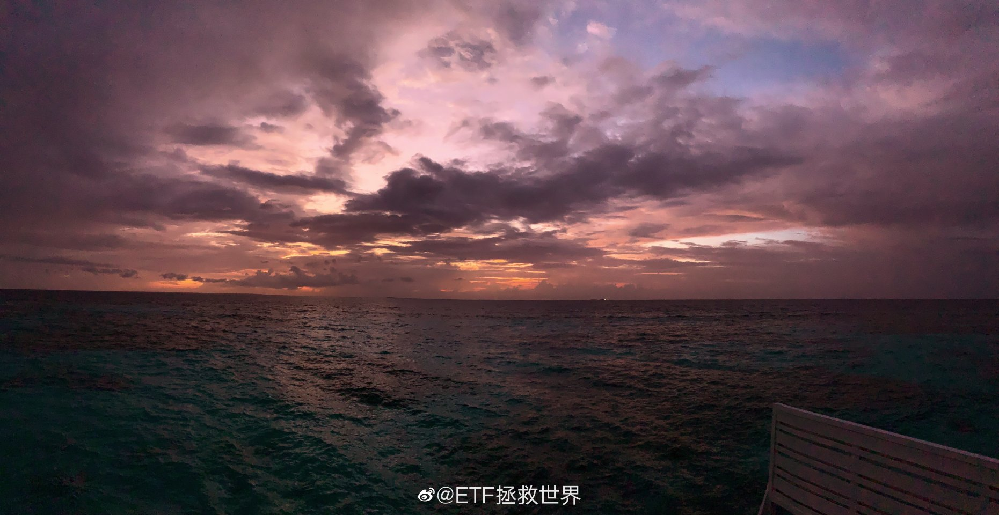

======================================================

ETF拯救世界 (5687069307) @
2019-08-21 22:17:27 Wed  
url: https://weibo.com/5687069307/I3ieZm56M

被健身房的老外熏了出来。

在沙滩上跑两公里，去酒吧喝两杯鸡尾酒，看着相亲相爱的一对白人老夫妇拉着手坐在海边吊椅上晒太阳，心情大好。

儿子看着穿着泳衣，身高168，体重100斤的妈妈说：“妈妈你真漂亮啊，就是有点胖。” 万万没想到，比我还严格！喜欢瘦难道是人类的基因。 ​​​

转发[8]  评论[440]  赞[1665] 

+++++++++++++++++++++++++++++++++++++++++++++++++++++

图片：

======================================================

ETF拯救世界 (5687069307) @
2019-08-22 13:22:26 Thu  
url: https://weibo.com/5687069307/I3oajuaAI

算了手机不要了拍一段海底吧。

晃的比较厉害，因为今天风大浪大。最后十秒有小鲨鱼，一激动刚要追上去，鲨鱼妈妈在后面把我脚咬断了。

不说了我去医院了。 http://t.cn/AiQl7xTC ​​​

转发[10]  评论[433]  赞[1288] 

======================================================

ETF拯救世界 (5687069307) @
2019-08-22 14:56:43 Thu  
url: https://weibo.com/5687069307/I3oMAiDl5

用评论里一位朋友推荐的色彩还原软件还原了一下，确实不错。

准备下午多拍点。各种颜色各种样子… http://t.cn/AiQl3hb8 ​​​

转发[12]  评论[165]  赞[826] 

======================================================

ETF拯救世界 (5687069307) @
2019-08-22 15:04:05 Thu  
url: https://weibo.com/5687069307/I3oPAbY05

看样子医药有走好的迹象。 ​​​

转发[98]  评论[322]  赞[1153] 

======================================================

ETF拯救世界 (5687069307) @
2019-08-22 21:33:20 Thu  
url: https://weibo.com/5687069307/I3rnzryIc

再发一个，这几天就不发了。

去搬砖买新手机了。 http://t.cn/AiQHuanm ​​​

转发[25]  评论[316]  赞[1246] 

======================================================

ETF拯救世界 (5687069307) @
2019-08-23 10:49:34 Fri  
url: https://weibo.com/5687069307/I3wALkP8f

下一个压力位10400

------------------------------------------------------
转推：
>  @ETF拯救世界 (5687069307)
>  2019-08-22 15:04:05 Thu  
>  url: https:/weibo.com/5687069307/I3oPAbY05/

>  看样子医药有走好的迹象。 ​​​

转发[40]  评论[164]  赞[798] 

======================================================

ETF拯救世界 (5687069307) @
2019-08-23 11:09:26 Fri  
url: https://weibo.com/5687069307/I3wIPiUyX

投资，上上下下的享受。

别人晃的头昏眼花，你账户里的钱越来越多。 ​​​

转发[16]  评论[173]  赞[1071] 

======================================================

ETF拯救世界 (5687069307) @
2019-08-23 11:13:31 Fri  
url: https://weibo.com/5687069307/I3wKuqH8h

那天到现在5%，把压箱底的钱又拿回银行了…

------------------------------------------------------
转推：
>  @ETF拯救世界 (5687069307)
>  2019-08-06 09:57:49 Tue  
>  url: https:/weibo.com/5687069307/I0VZjxEz5/

>  最近开始把压箱底的货基和银行理财转入证券市场。
>  
>  准备留2、3年生活费，其它慢慢转入。
>  
>  这十几年，积累一些财富虽然不易，但这种时候不买，总是无法说服自己。
>  
>  不希望自己未来会后悔。做大概率的事。
>  
>  踏踏实实的，多大点事儿啊。 ​​​

转发[56]  评论[325]  赞[1191] 

======================================================

ETF拯救世界 (5687069307) @
2019-08-24 08:30:35 Sat  
url: https://weibo.com/5687069307/I3F6QsEj6

看样子又有机会拿出来了//@ETF拯救世界:那天到现在5%，把压箱底的钱又拿回银行了…

------------------------------------------------------
转推：
>  @ETF拯救世界 (5687069307)
>  2019-08-06 09:57:49 Tue  
>  url: https:/weibo.com/5687069307/I0VZjxEz5/

>  最近开始把压箱底的货基和银行理财转入证券市场。
>  
>  准备留2、3年生活费，其它慢慢转入。
>  
>  这十几年，积累一些财富虽然不易，但这种时候不买，总是无法说服自己。
>  
>  不希望自己未来会后悔。做大概率的事。
>  
>  踏踏实实的，多大点事儿啊。 ​​​

转发[32]  评论[391]  赞[1380] 

======================================================

ETF拯救世界 (5687069307) @
2019-08-26 08:01:25 Mon  
url: https://weibo.com/5687069307/I3XM0d80I

好消息不断，网格提款机 ​​​

转发[12]  评论[244]  赞[1019] 

+++++++++++++++++++++++++++++++++++++++++++++++++++++

图片：
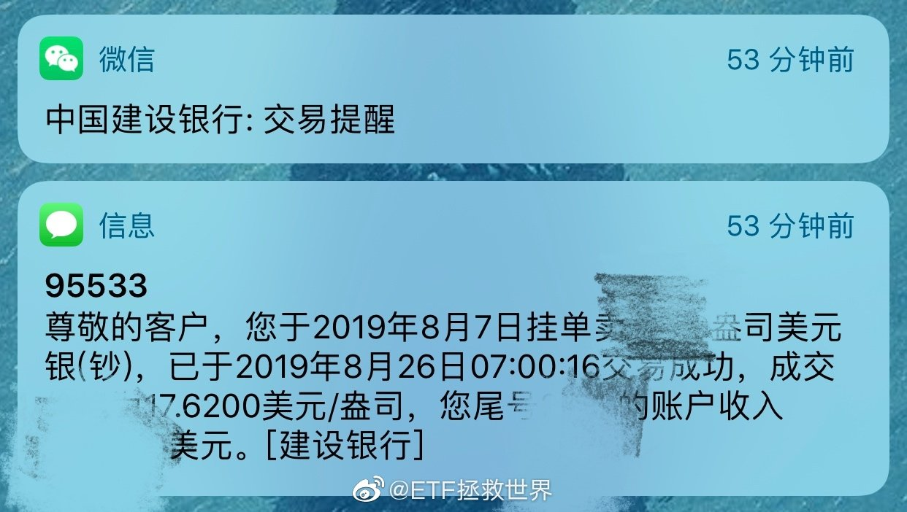

======================================================

ETF拯救世界 (5687069307) @
2019-08-26 10:06:25 Mon  
url: https://weibo.com/5687069307/I3YAJFS0a

$全指医药 sh000991$ 过于暴躁

------------------------------------------------------
转推：
>  @ETF拯救世界 (5687069307)
>  2019-08-22 15:04:05 Thu  
>  url: https:/weibo.com/5687069307/I3oPAbY05/

>  看样子医药有走好的迹象。 ​​​

转发[3]  评论[76]  赞[599] 

======================================================

ETF拯救世界 (5687069307) @
2019-08-26 10:08:35 Mon  
url: https://weibo.com/5687069307/I3YBClttT

预告一下。

150会在23000以下买1-4份恒生。21000以下买4-10份。

S会在23000以下持续买入。 ​​​

转发[1469]  评论[571]  赞[1819] 

======================================================

ETF拯救世界 (5687069307) @
2019-08-26 10:12:13 Mon  
url: https://weibo.com/5687069307/I3YD5BP9k

恒生从33000跌到25000，计划持仓的部分依然有45%的收益率。

一方面当然是汇率给力，一方面再次证明买的低有多重要。

你的成本低，它再怎么涨跌你就不会乱。如果市价总在你的成本附近，那你就很容易心浮气躁。 ​​​

转发[62]  评论[235]  赞[1151] 

======================================================

ETF拯救世界 (5687069307) @
2019-08-26 10:45:41 Mon  
url: https://weibo.com/5687069307/I3YQG5web

四大发明吧，我觉得极大概率都是中国先发明或者发现的。

虽然有几个受制于客观因素——比如中国文字雕版远比活字效率高——没有大范围推广应用。

这个当然应该自豪，但也应该看到，华夏文明几千年，实际上开创性的发明其实确实不多。这个不用详细说，你抬头看看周围你用的东西，再到孩子们上的各种课 ​​​

转发[25]  评论[174]  赞[1164] 

======================================================

ETF拯救世界 (5687069307) @
2019-08-26 10:52:05 Mon  
url: https://weibo.com/5687069307/I3YTh8d9f

趋势这个东西，有时候，不服不行。 ​​​

转发[21]  评论[248]  赞[1237] 

======================================================

ETF拯救世界 (5687069307) @
2019-08-26 17:56:15 Mon  
url: https://weibo.com/5687069307/I41FrwGbK

有好多朋友问之前是去哪玩的。

是马尔代夫。

上个月突然想出去转转，因为带着孩子，所以首选海边。本来想去冲绳，后来转念一想决定去马尔代夫。

从有这个念头到下完订单就两天时间，主要是找了找去哪个岛。从岛的情况和自己的时间，确定了去中央格兰德。

三个人一共是五万多，由于是全包价格，包括 ​​​

转发[92]  评论[352]  赞[1335] 

======================================================

ETF拯救世界 (5687069307) @
2019-08-26 20:00:15 Mon  
url: https://weibo.com/5687069307/I42tMd8SR

实在对不起大家，私信太多了，我看不过来，所以很多朋友的我没有回复。

很多开心的，悲伤的，困惑的问题，我也希望能一一回复，但是精力真的不够，还希望各位别见怪。

祝福每位朋友都顺利，好人一生平安。 ​​​

转发[4]  评论[244]  赞[1402] 

+++++++++++++++++++++++++++++++++++++++++++++++++++++

图片：

======================================================

ETF拯救世界 (5687069307) @
2019-08-26 21:03:13 Mon  
url: https://weibo.com/5687069307/I42TkDEY1

现在北京跑步很舒服。就是这个moment。

不信你出来试试。 ​​​

转发[6]  评论[243]  赞[861] 

======================================================

ETF拯救世界 (5687069307) @
2019-08-27 09:38:11 Tue  
url: https://weibo.com/5687069307/I47PMaqZX

快了啊//@ETF拯救世界:下一个压力位10400

------------------------------------------------------
转推：
>  @ETF拯救世界 (5687069307)
>  2019-08-22 15:04:05 Thu  
>  url: https:/weibo.com/5687069307/I3oPAbY05/

>  看样子医药有走好的迹象。 ​​​

转发[13]  评论[97]  赞[474] 

======================================================

ETF拯救世界 (5687069307) @
2019-08-27 09:42:51 Tue  
url: https://weibo.com/5687069307/I47RG3oKE

这种品牌名字一听就够够的了怎么会有好感

------------------------------------------------------
转推：
>  @ ()
>  2019-08-27 09:36:24 Tue  
>  url: 

>  抱歉，作者已设置仅展示半年内微博，此微博已不可见。 ​​​

转发[2]  评论[100]  赞[319] 

======================================================

ETF拯救世界 (5687069307) @
2019-08-27 09:57:31 Tue  
url: https://weibo.com/5687069307/I47XCvBlA

特别好，特别舒服 ​​​

转发[18]  评论[221]  赞[730] 

+++++++++++++++++++++++++++++++++++++++++++++++++++++

图片：
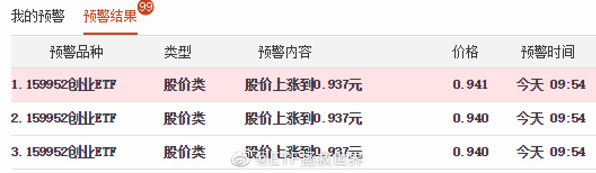

======================================================

ETF拯救世界 (5687069307) @
2019-08-27 10:17:32 Tue  
url: https://weibo.com/5687069307/I485KDeWN

别得瑟。真的。

------------------------------------------------------
转推：
>  @平安北京 (1288915263)
>  2019-08-27 09:29:15 Tue  
>  url: https:/weibo.com/1288915263/I47M9iflG/

>  [话筒] 【情况通报】近日，单某某在北京妇产医院驾车堵塞急救通道，扰乱公共秩序一案受到社会广泛关注，北京市公安局成立专案组并开展调查取证，现将情况通报如下 http://t.cn/Ai8iQlMi ​​​

转发[13]  评论[62]  赞[396] 

======================================================

ETF拯救世界 (5687069307) @
2019-08-27 10:26:20 Tue  
url: https://weibo.com/5687069307/I489jEzsl

@彭磊新裤子《没有理想的人不伤心》 http://t.cn/ROPdQY1 ​​​

转发[15]  评论[83]  赞[502] 

======================================================

ETF拯救世界 (5687069307) @
2019-08-27 10:41:01 Tue  
url: https://weibo.com/5687069307/I48fhmvak

不禁感叹，历史不是刻舟求剑。有时候不服不行，太神了。第一次真的很难。

------------------------------------------------------
转推：
>  @ETF拯救世界 (5687069307)
>  2019-08-10 17:07:16 Sat  
>  url: https:/weibo.com/5687069307/I1AvChKuB/

>  周五一只脚又回钻石坑了，等全掉下去我再写篇东西。
>  
>  纪念A股历史第一次刚从钻石坑爬出来又掉下去… ​​​

转发[27]  评论[308]  赞[1249] 

======================================================

ETF拯救世界 (5687069307) @
2019-08-27 12:31:37 Tue  
url: https://weibo.com/5687069307/I48YaxSON

为了孤独的美食家，我，充值了。

------------------------------------------------------
转推：
>  @ ()
>  2019-08-27 11:50:46 Tue  
>  url: 

>  抱歉，作者已设置仅展示半年内微博，此微博已不可见。 ​​​

转发[16]  评论[128]  赞[531] 

======================================================

ETF拯救世界 (5687069307) @
2019-08-27 16:47:50 Tue  
url: https://weibo.com/5687069307/I4aEavJuy

处在这样的环境里我会非常非常焦躁。别说就便宜一点了，就是免费发东西，那我……我可能也会去看看……[抱抱]

------------------------------------------------------
转推：
>  @ ()
>  2019-08-27 15:15:55 Tue  
>  url: 

>  抱歉，作者已设置仅展示半年内微博，此微博已不可见。 ​​​

转发[13]  评论[205]  赞[585] 

======================================================

ETF拯救世界 (5687069307) @
2019-08-27 16:52:16 Tue  
url: https://weibo.com/5687069307/I4aFYdkMx

非常喜欢梦姐是怎么回事。 ​​​

转发[4]  评论[285]  赞[819] 

======================================================

ETF拯救世界 (5687069307) @
2019-08-27 18:34:03 Tue  
url: https://weibo.com/5687069307/I4bli7JPO

北京命案和抢劫破案率100%，90%命案一天告破说真的还是让人有点吃惊的。为警察叔叔点赞。

------------------------------------------------------
转推：
>  @ ()
>  2019-08-27 17:59:28 Tue  
>  url: 

>  抱歉，作者已设置仅展示半年内微博，此微博已不可见。 ​​​

转发[27]  评论[118]  赞[475] 

======================================================

ETF拯救世界 (5687069307) @
2019-08-27 20:20:10 Tue  
url: https://weibo.com/5687069307/I4c2mc5f5

关于上次的礼物，两位别急。

喷了。 ​​​

转发[2]  评论[197]  赞[630] 

+++++++++++++++++++++++++++++++++++++++++++++++++++++

图片：

======================================================

ETF拯救世界 (5687069307) @
2019-08-27 20:55:31 Tue  
url: https://weibo.com/5687069307/I4cgIcpnK

突破18 http://t.cn/Ai8Kok5v

------------------------------------------------------
转推：
>  @ETF拯救世界 (5687069307)
>  2019-07-22 13:40:45 Mon  
>  url: https:/weibo.com/5687069307/HEDuGd9ft/

>  白银近期涨幅大于黄金，但年度涨幅看依然落后很多。A股市场上没有合适的白银基金，有的一只是做期货，损耗大，不适合持有。
>  
>  想做白银比较好的途径是银行的纸白银，相对来说好一点。
>  
>  如果银价也能突破几年的平台，那么后期在周期转换的过程中，贵金属的走势就会更多一点信心。
>  
>  金银价格无法用价值衡 ​​​

转发[37]  评论[241]  赞[711] 

======================================================

ETF拯救世界 (5687069307) @
2019-08-29 10:07:22 Thu  
url: https://weibo.com/5687069307/I4qSCqptU

没有家教+智商缺乏。

------------------------------------------------------
转推：
>  @北京人不知道的北京事儿 (1662214194)
>  2019-08-29 08:12:11 Thu  
>  url: https:/weibo.com/1662214194/I4q7REmAa/

>  【[衰]】网友投稿：北京地铁6号线早高峰，连站的地儿都不够，这帮人就这么席地而坐，劝了也不听。。。遇上这样的该怎么办？[摊手] ​​​

转发[8]  评论[106]  赞[506] 

======================================================

ETF拯救世界 (5687069307) @
2019-08-29 10:15:22 Thu  
url: https://weibo.com/5687069307/I4qVRnWaK

买个货基替代品三天净值居然涨了2%，随时受不了。到哪儿说理去……这个品种没在微博说，有些朋友知道。 ​​​

转发[18]  评论[265]  赞[816] 

======================================================

ETF拯救世界 (5687069307) @
2019-08-29 10:52:39 Thu  
url: https://weibo.com/5687069307/I4rb09F3b

回复@偷偷oO:不会追。1.8他们才追。//@偷偷oO:确实很神奇啊，12月那会儿，场内的广发医药价格1.03，大家都怀疑和吐槽。今天医药1.30了。那帮人是不是来追了呢

------------------------------------------------------
转推：
>  @ETF拯救世界 (5687069307)
>  2018-12-17 10:11:59 Mon  
>  url: https:/weibo.com/5687069307/H7CobBT5D/

>  评论里没完没了问医药的那些人我跟你说几点，你能理解就理解，不能理解赶紧取关走人。
>  
>  第一，医药是我最看好的行业。
>  
>  第二，目前计划内医药仓位9个多点（医药6%+养老3%），目标仓位最大给15%-20%。不跌我们永远没机会配满。
>  
>  第三，目前医药估值过去十三年新低。
>  
>  第四，目前医药跌至十三年大趋势下 ​​​

转发[39]  评论[93]  赞[648] 

======================================================

ETF拯救世界 (5687069307) @
2019-08-29 10:57:02 Thu  
url: https://weibo.com/5687069307/I4rcMmIpZ

在资本市场，成功是一种习惯，失败也是。

如果一直以来买什么什么跌，怎么做怎么不赚钱，那就停一停，换一种方式。如果不换方式，就换人。

相反，一直以来怎么做怎么赚，要么是长期赚要么是短期赚，那就有了成功的习惯。

失败的人就总是失败，成功的就总是成功。

归根结底，一方面是气数，一方面也 ​​​

转发[146]  评论[258]  赞[1405] 

======================================================

ETF拯救世界 (5687069307) @
2019-08-29 10:59:53 Thu  
url: https://weibo.com/5687069307/I4rdVCJCn

戒贪，戒嗔，戒痴，戒慢，戒疑。 ​​​

转发[38]  评论[272]  赞[1323] 

======================================================

ETF拯救世界 (5687069307) @
2019-08-29 20:55:05 Thu  
url: https://weibo.com/5687069307/I4v7x0XDa

你这是闹哪样。 ​​​

转发[7]  评论[163]  赞[736] 

+++++++++++++++++++++++++++++++++++++++++++++++++++++

图片：

======================================================

ETF拯救世界 (5687069307) @
2019-08-30 00:48:25 Fri  
url: https://weibo.com/5687069307/I4wEeq0RA

[爱你] ​​​

转发[10]  评论[260]  赞[876] 

+++++++++++++++++++++++++++++++++++++++++++++++++++++

图片：

======================================================

ETF拯救世界 (5687069307) @
2019-08-30 09:16:30 Fri  
url: https://weibo.com/5687069307/I4zYsEQxy

上次的礼物还没到，我已经开始计划下次的了。除了之前说过的手机，现在还有两个选项：

戴森airwrap吹风机和茅台。

你选哪个。 ​​​

转发[17]  评论[1831]  赞[1816] 

======================================================

ETF拯救世界 (5687069307) @
2019-08-30 09:39:15 Fri  
url: https://weibo.com/5687069307/I4A7HjI6N

一曲肝肠断

天涯何处觅知音 ​​​

转发[8]  评论[485]  赞[1242] 

======================================================

ETF拯救世界 (5687069307) @
2019-09-01 08:58:17 Sun  
url: https://weibo.com/5687069307/I4SI42IzT

辣鸡。

------------------------------------------------------
转推：
>  @澎湃新闻 (5044281310)
>  2019-08-31 19:32:36 Sat  
>  url: https:/weibo.com/5044281310/I4Nr2f2lw/

>  【司机高速路上倒车回服务区寻娃：撞死也值了，只要找到孩子】8月28日，宁波一女子带着俩孩子去外地办事，途中孩子上厕所，她一心想着工作，接到一个电话便匆忙离开，途中才发现孩子没上车，于是直接倒车回服务区接。她称，只要找到孩子，自己撞死也值了。都市快报http://t.cn/AiRzmusl ​​​

转发[16]  评论[217]  赞[605] 

======================================================

ETF拯救世界 (5687069307) @
2019-09-02 10:58:38 Mon  
url: https://weibo.com/5687069307/I52VpoYYm

遍绿野

嘻游醉眼

莫负青春 ​​​

转发[15]  评论[272]  赞[1394] 

======================================================

ETF拯救世界 (5687069307) @
2019-09-02 13:21:50 Mon  
url: https://weibo.com/5687069307/I53Rxc2xk

难道A股不是提款机吗 ​​​

转发[25]  评论[574]  赞[1763] 

======================================================

ETF拯救世界 (5687069307) @
2019-09-03 09:37:07 Tue  
url: https://weibo.com/5687069307/I5bOPeAlU

舒服吗 ​​​

转发[12]  评论[480]  赞[1080] 

======================================================

ETF拯救世界 (5687069307) @
2019-09-03 11:37:50 Tue  
url: https://weibo.com/5687069307/I5cBOy7VM

舒服你就不会被吓唬出去

------------------------------------------------------
转推：
>  @ETF拯救世界 (5687069307)
>  2019-09-03 09:37:07 Tue  
>  url: https:/weibo.com/5687069307/I5bOPeAlU/

>  舒服吗 ​​​

转发[7]  评论[229]  赞[918] 

======================================================

ETF拯救世界 (5687069307) @
2019-09-03 22:13:33 Tue  
url: https://weibo.com/5687069307/I5gLR6HCB

炒股害死人。拒绝炒股，从我做起。

------------------------------------------------------
转推：
>  @ ()
>  2019-09-03 11:27:03 Tue  
>  url: 

>  抱歉，此微博已被作者删除。查看帮助：http://t.cn/Rfd3rQV

转发[34]  评论[151]  赞[703] 

======================================================

ETF拯救世界 (5687069307) @
2019-09-03 22:21:51 Tue  
url: https://weibo.com/5687069307/I5gPeiPBk

突破19 http://t.cn/AiRSeFEm //@ETF拯救世界:突破18 http://t.cn/Ai8Kok5v

------------------------------------------------------
转推：
>  @ETF拯救世界 (5687069307)
>  2019-07-22 13:40:45 Mon  
>  url: https:/weibo.com/5687069307/HEDuGd9ft/

>  白银近期涨幅大于黄金，但年度涨幅看依然落后很多。A股市场上没有合适的白银基金，有的一只是做期货，损耗大，不适合持有。
>  
>  想做白银比较好的途径是银行的纸白银，相对来说好一点。
>  
>  如果银价也能突破几年的平台，那么后期在周期转换的过程中，贵金属的走势就会更多一点信心。
>  
>  金银价格无法用价值衡 ​​​

转发[11]  评论[108]  赞[480] 

======================================================

ETF拯救世界 (5687069307) @
2019-09-03 22:28:02 Tue  
url: https://weibo.com/5687069307/I5gRJrJwa

我有一个某品牌的钱包。有一天让水泡了，结果居然泡发了。莫名其妙的鼓起来了。

请问，这皮是什么皮。怎么一泡水还能鼓起来呢。

懂的说说。 ​​​

转发[6]  评论[349]  赞[1349] 

======================================================

ETF拯救世界 (5687069307) @
2019-09-03 23:34:00 Tue  
url: https://weibo.com/5687069307/I5hivuKNV

人生至高境界：

揣着明白装糊涂。

如果能用在投资上：

太糊涂，你就是提款机。

太明白，赚不到什么大钱。

只有揣着明白装糊涂，才能泡沫中起舞，买单前悄然离去。 ​​​

转发[104]  评论[344]  赞[1291] 

======================================================

ETF拯救世界 (5687069307) @
2019-09-04 09:52:31 Wed  
url: https://weibo.com/5687069307/I5llz9euM

不说你不知道，前两天S发车的恒生一个多点了。 ​​​

转发[17]  评论[399]  赞[1102] 

======================================================

ETF拯救世界 (5687069307) @
2019-09-04 10:17:49 Wed  
url: https://weibo.com/5687069307/I5lvQdRo9

小学生的近视到底是怎么回事。学习太勤奋还是玩手机看电视弄的。

------------------------------------------------------
转推：
>  @澎湃新闻 (5044281310)
>  2019-09-04 09:35:03 Wed  
>  url: https:/weibo.com/5044281310/I5lettcIn/

>  【#眼科医生为女儿全班同学护眼# ：“小目标”是三年不新增近视[中国赞]】每月汇总全班同学的自测视力值，每学期集中检查两次视力，统计不良检出率、新发病率，为有视力下降趋势、轻度近视的同学制定干预方案……浙江一名眼科医生三年来持续为读小学的女儿所在班级制定“护眼”计划，并为全班学生建视 ​​​

转发[12]  评论[218]  赞[497] 

======================================================

ETF拯救世界 (5687069307) @
2019-09-04 14:26:02 Wed  
url: https://weibo.com/5687069307/I5n8ACnLJ

回复@fiona7879:一共发了30个品种，你一定要找一个只买了1%的，最近跌幅大的。而且，油气高位曾经盈利20%卖过，你确定你浮亏20%？你，还有给你点赞的27个人，全部拉黑。我会找到类似你们名字的，公众号也拉黑。一群大垃圾。

------------------------------------------------------
转推：
>  @ETF拯救世界 (5687069307)
>  2019-09-04 09:52:31 Wed  
>  url: https:/weibo.com/5687069307/I5llz9euM/

>  不说你不知道，前两天S发车的恒生一个多点了。 ​​​

转发[4]  评论[305]  赞[901] 

======================================================

ETF拯救世界 (5687069307) @
2019-09-04 14:26:19 Wed  
url: https://weibo.com/5687069307/I5n8I2rAv

不好意思，看错了，是4%。

------------------------------------------------------
转推：
>  @ETF拯救世界 (5687069307)
>  2019-09-04 09:52:31 Wed  
>  url: https:/weibo.com/5687069307/I5llz9euM/

>  不说你不知道，前两天S发车的恒生一个多点了。 ​​​

转发[4]  评论[145]  赞[677] 

======================================================

ETF拯救世界 (5687069307) @
2019-09-04 14:36:44 Wed  
url: https://weibo.com/5687069307/I5ncVwR7T

计划持仓31个品种，浮亏的品种只有五个。

华宝油气，之前低买高卖，盈利20%出局。跌回来继续买，目前总浮亏9%。仓位1.21%，对你的资产造成的伤害是0.1089%。

为了这0.1089%，垃圾不说有26个，84%的品种盈利。不会说大仓位的恒生、50盈利超过40%，不会说消费盈利超过55%。

对，它会找一个近期跌幅最 ​​​

转发[26]  评论[703]  赞[1839] 

======================================================

ETF拯救世界 (5687069307) @
2019-09-04 14:42:31 Wed  
url: https://weibo.com/5687069307/I5nfhdMSE

请那些评论“在等恒生23000”的人好好看看我的微博。我们现在持仓9%的恒生，仓位已经不小。23000以下，我们是在9%的基础上继续加仓。能到，我们就买。到不了，就踏踏实实持有目前的仓位。到不了23000，你就来骂娘，你是不是脑残？我前几天S加仓你瞎了？真服了。

------------------------------------------------------
转推：
>  @ETF拯救世界 (5687069307)
>  2019-08-26 10:08:35 Mon  
>  url: https:/weibo.com/5687069307/I3YBClttT/

>  预告一下。
>  
>  150会在23000以下买1-4份恒生。21000以下买4-10份。
>  
>  S会在23000以下持续买入。 ​​​

转发[19]  评论[235]  赞[876] 

======================================================

ETF拯救世界 (5687069307) @
2019-09-04 14:48:22 Wed  
url: https://weibo.com/5687069307/I5nhEpAiT

有些人继续表演，就只会让我越来越不敢在微博说话。

我说某个点位之下继续加仓，就有人能理解成一定会跌到那个点位下。我说我已经做好跌到某个点位的准备，如果到那个点位，我也会有预案应对，他也能理解成一定会到那个点位。

然后，跌的时候不敢买，涨了就来怪你：

不是你说要到多少多少点吗？

如 ​​​

转发[31]  评论[461]  赞[1298] 

======================================================

ETF拯救世界 (5687069307) @
2019-09-04 14:53:50 Wed  
url: https://weibo.com/5687069307/I5njS7Y8D

算了，今天又涨不少，不跟喷子置气了。

买个包包奖励自己。

[爱你] ​​​

转发[9]  评论[395]  赞[1597] 

======================================================

ETF拯救世界 (5687069307) @
2019-09-04 15:01:02 Wed  
url: https://weibo.com/5687069307/I5nmNeWrv

关于为什么前天S买恒生，

我准备观察几天，如果稳住了没跌回去，

就写篇东西吹一下。

[doge] ​​​

转发[13]  评论[591]  赞[1783] 

======================================================

ETF拯救世界 (5687069307) @
2019-09-05 08:46:37 Thu  
url: https://weibo.com/5687069307/I5uljpFcJ

慎独。

------------------------------------------------------
转推：
>  @ ()
>  2019-09-05 07:25:09 Thu  
>  url: 

>  抱歉，作者已设置仅展示半年内微博，此微博已不可见。 ​​​

转发[12]  评论[129]  赞[379] 

======================================================

ETF拯救世界 (5687069307) @
2019-09-05 09:37:44 Thu  
url: https://weibo.com/5687069307/I5uG3EBSN

高位追涨低位割肉的人，是不是给你送钱的。

你数学好你讲一下。 ​​​

转发[15]  评论[144]  赞[881] 

======================================================

ETF拯救世界 (5687069307) @
2019-09-05 09:39:44 Thu  
url: https://weibo.com/5687069307/I5uGSe5Zh

股价预警没完没了的往外蹦，好烦。 [doge] ​​​

转发[22]  评论[208]  赞[874] 

======================================================

ETF拯救世界 (5687069307) @
2019-09-05 09:41:23 Thu  
url: https://weibo.com/5687069307/I5uHxysEZ

转债指数准备突破上半年高点。我们不断加仓的易方达转债已新高。 ​​​

转发[16]  评论[134]  赞[912] 

======================================================

ETF拯救世界 (5687069307) @
2019-09-05 09:52:11 Thu  
url: https://weibo.com/5687069307/I5uLW1UjQ

回复@空谷覔幽兰:目前的情况可以多留几份利润//@空谷覔幽兰:出了四个品种的网，今天够了

------------------------------------------------------
转推：
>  @ETF拯救世界 (5687069307)
>  2019-09-05 09:39:44 Thu  
>  url: https:/weibo.com/5687069307/I5uGSe5Zh/

>  股价预警没完没了的往外蹦，好烦。 [doge] ​​​

转发[13]  评论[86]  赞[532] 

======================================================

ETF拯救世界 (5687069307) @
2019-09-05 09:54:36 Thu  
url: https://weibo.com/5687069307/I5uMUlIvf

做悲观的乐观主义者。

对于这句话是不是感触越来越深。 ​​​

转发[51]  评论[195]  赞[1051] 

======================================================

ETF拯救世界 (5687069307) @
2019-09-05 10:03:14 Thu  
url: https://weibo.com/5687069307/I5uQpuFXH

回复@Share新奇:新朋友吧。//@Share新奇:牛，特别佩服，E大的伊利买点卖点，还有黄金的买点，恒生的买点。几乎是精准打击。太牛了

------------------------------------------------------
转推：
>  @ETF拯救世界 (5687069307)
>  2019-09-05 09:54:36 Thu  
>  url: https:/weibo.com/5687069307/I5uMUlIvf/

>  做悲观的乐观主义者。
>  
>  对于这句话是不是感触越来越深。 ​​​

转发[7]  评论[119]  赞[735] 

======================================================

ETF拯救世界 (5687069307) @
2019-09-05 10:08:01 Thu  
url: https://weibo.com/5687069307/I5uSm4Hhn

如果你的钱真的不是少到只能买一点点点点，不是动不动就满仓动不动就空仓那种股神，那么你完全可以：

黄金-钻石坑一线买入一部分，一大部分筹码等待超级大牛市的喷薄。那当然一定肯定会来。

但问题是，不确定时间，不确定中间的波折。

所以，为了收益率以及心态，你需要有一部分资金，一小部分，做 ​​​

转发[323]  评论[428]  赞[1396] 

======================================================

ETF拯救世界 (5687069307) @
2019-09-05 10:20:36 Thu  
url: https://weibo.com/5687069307/I5uXsxmC7

有些朋友可能看到我微博下面有些评论，出于各种原因非常不舒服……看着有些“吹捧”之类的评论不喜欢。

是这样，主要是你不了解我们这里的气氛。无论是所谓的“吹捧”还是“拍马屁”，绝大多数都是大家在开玩笑。熊市中大伙都没挣大钱，凑一块乐呵乐呵，我们都没当真，您也别当真。

我们不当真，您当 ​​​

转发[13]  评论[475]  赞[1539] 

======================================================

ETF拯救世界 (5687069307) @
2019-09-05 10:34:27 Thu  
url: https://weibo.com/5687069307/I5v35cCam

永远别问“今天为什么涨了？”“今天为什么大跌？”。

一点儿都不重要。真的。 ​​​

转发[52]  评论[193]  赞[1115] 

======================================================

ETF拯救世界 (5687069307) @
2019-09-05 10:38:50 Thu  
url: https://weibo.com/5687069307/I5v4RqyzY

回复@ZZ是粽子啊ZZ:说明我仓位重了。不像前两年，每次暴跌恨不得发100条……//@ZZ是粽子啊ZZ:老大的发微博频率和上涨幅度成正比哈哈哈哈

------------------------------------------------------
转推：
>  @ETF拯救世界 (5687069307)
>  2019-09-05 10:34:27 Thu  
>  url: https:/weibo.com/5687069307/I5v35cCam/

>  永远别问“今天为什么涨了？”“今天为什么大跌？”。
>  
>  一点儿都不重要。真的。 ​​​

转发[13]  评论[117]  赞[756] 

======================================================

ETF拯救世界 (5687069307) @
2019-09-05 10:47:01 Thu  
url: https://weibo.com/5687069307/I5v8bmSGG

其实投资A股，最重要的就是做大周期。保证熊市不赔或者很少很少浮亏（这里的关键是你如何保证在收集到足够筹码的情况下不赔钱，否则买个货基或者理财不就完了吗）。

保证牛市大致跟上。

周而复始。

这样有个3-4轮，就会非常NB了。

其他的都是细枝末节。比如牛市指数涨了100%，你只赚了80%。这重要 ​​​

转发[380]  评论[556]  赞[2171] 

======================================================

ETF拯救世界 (5687069307) @
2019-09-05 13:21:58 Thu  
url: https://weibo.com/5687069307/I5w94FPj6

大多数指数本周趋势应该会变好。仓位不够的朋友，后面还会有一次回踩确认，那将是一次不错的加仓机会。 ​​​

转发[177]  评论[854]  赞[2873] 

======================================================

ETF拯救世界 (5687069307) @
2019-09-06 07:36:43 Fri  
url: https://weibo.com/5687069307/I5DjrdmgM

千万别把生命交给司机，别觉得每个司机都会让你。

------------------------------------------------------
转推：
>  @ ()
>  2019-09-06 07:25:54 Fri  
>  url: 

>  抱歉，作者已设置仅展示半年内微博，此微博已不可见。 ​​​

转发[101]  评论[237]  赞[882] 

======================================================

ETF拯救世界 (5687069307) @
2019-09-06 09:38:35 Fri  
url: https://weibo.com/5687069307/I5E6U8k7m

有多少人觉得“大牛市来了！再不买就晚了！”

举手示意一下。 ​​​

转发[35]  评论[1400]  赞[2755] 

======================================================

ETF拯救世界 (5687069307) @
2019-09-06 18:03:52 Fri  
url: https://weibo.com/5687069307/I5Hq01vOD

iPhone11 
mate30 pro
note10+

选哪个 ​​​

转发[21]  评论[1555]  赞[2495] 

======================================================

ETF拯救世界 (5687069307) @
2019-09-08 14:46:12 Sun  
url: https://weibo.com/5687069307/I5YYLpaYv

为了自身的生存食用其它物种是天经地义，自然界都是如此。但为了自己的乐趣虐待动物，真的没必要。

------------------------------------------------------
转推：
>  @央视新闻 (2656274875)
>  2019-09-08 12:09:15 Sun  
>  url: https:/weibo.com/2656274875/I5XX3hSKw/

>  【不幸！#河南马戏团脱逃老虎已死亡#】今日，记者从河南新乡市动物园获悉，被捕获的脱逃老虎送到动物园时已死亡，老虎尸体已被冷藏等待鉴定。9月6日晚，在原阳县太平镇扁担王村南兴华学校门口，一马戏团的老虎在表演时翻出铁笼，下落不明。9月7日，警方通过麻醉手段将脱逃的老虎擒获。（大河报）  ​​​

转发[11]  评论[125]  赞[559] 

======================================================

ETF拯救世界 (5687069307) @
2019-09-09 10:07:06 Mon  
url: https://weibo.com/5687069307/I66zY7QdS

浮亏别难受，浮盈别得瑟。

都是平常事，踏踏实实的。 ​​​

转发[38]  评论[410]  赞[1672] 

======================================================

ETF拯救世界 (5687069307) @
2019-09-09 11:39:54 Mon  
url: https://weibo.com/5687069307/I67bDnIrv

在证券市场，成功还是失败，不是看你这一把赚了多少

而是你有没有投资逻辑，有没有体系，有没有策略。

如果都有，而且都对，那赚钱这件事只是捎带脚就完成的事，迟早都会发生。

几年一个轮回，从未改变，从未缺席。 ​​​

转发[224]  评论[429]  赞[1938] 

======================================================

ETF拯救世界 (5687069307) @
2019-09-09 14:52:55 Mon  
url: https://weibo.com/5687069307/I68rYFApM

你持仓的品种大涨也别得瑟。攒人品。 ​​​

转发[17]  评论[262]  赞[1385] 

======================================================

ETF拯救世界 (5687069307) @
2019-09-09 14:59:34 Mon  
url: https://weibo.com/5687069307/I68uGf0Jj

上一笔500C波段吃了20%多，这一笔吃多少。

你学习好你说。 ​​​

转发[38]  评论[275]  赞[1027] 

+++++++++++++++++++++++++++++++++++++++++++++++++++++

图片：
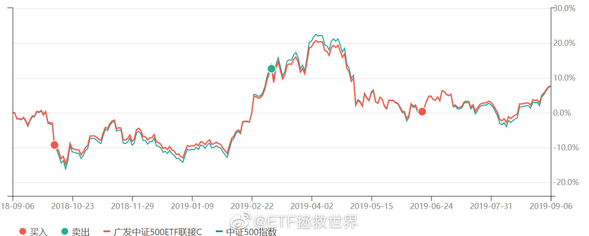

======================================================

ETF拯救世界 (5687069307) @
2019-09-09 15:09:25 Mon  
url: https://weibo.com/5687069307/I68yGbjnP

之前我说，野百合也有春天。我又说，杀富济贫雪中送炭。

你可能不信，认为我是为持仓中表现不好的品种找借口。

现在你有点相信了。

我说的很多东西，未来都会验证。只是需要时间。

回望过去，绝大多数时候时间都站在了我这边。希望以后也是。

也有些朋友喜欢为现在发生的事情做出“合理”解释，认 ​​​

转发[81]  评论[397]  赞[1453] 

======================================================

ETF拯救世界 (5687069307) @
2019-09-09 17:53:21 Mon  
url: https://weibo.com/5687069307/I69Ddy81U

回复@划过天际的蓝:图片评论 http://t.cn/AiEfY1F0 //@划过天际的蓝:老大，500这次，如果回踩，点位是多少，有个朋友我让他买1万，在支付宝里，涨了两天，他问我能加仓不[允悲]

------------------------------------------------------
转推：
>  @ETF拯救世界 (5687069307)
>  2019-09-09 14:59:34 Mon  
>  url: https:/weibo.com/5687069307/I68uGf0Jj/

>  上一笔500C波段吃了20%多，这一笔吃多少。
>  
>  你学习好你说。 ​​​

转发[22]  评论[346]  赞[1221] 

======================================================

ETF拯救世界 (5687069307) @
2019-09-09 23:47:21 Mon  
url: https://weibo.com/5687069307/I6bWUAGGA

回复@韩小雪弟弟:明天涨到你不信//@韩小雪弟弟:天然气这么涨，华宝油气怎么不怎么涨？//@ETF拯救世界:回复@划过天际的蓝:图片评论 http://t.cn/AiEfY1F0 //@划过天际的蓝:老大，500这次，如果回踩，点位是多少，有个朋友我让他买1万，在支付宝里，涨了两天，他问我能加仓不[允悲]

------------------------------------------------------
转推：
>  @ETF拯救世界 (5687069307)
>  2019-09-09 14:59:34 Mon  
>  url: https:/weibo.com/5687069307/I68uGf0Jj/

>  上一笔500C波段吃了20%多，这一笔吃多少。
>  
>  你学习好你说。 ​​​

转发[12]  评论[245]  赞[659] 

======================================================

ETF拯救世界 (5687069307) @
2019-09-09 23:57:16 Mon  
url: https://weibo.com/5687069307/I6c0W1IjX

送个贴士给你们：

如果你看到某人因为某个品种骂我或者嘲笑我，

那么那个品种极大概率已经是底部区域了。

根据过去几年的观察，这个策略成功率大概86个巴仙。

如果是大v骂我，则成功率上升至98.385个巴仙。 ​​​

转发[132]  评论[683]  赞[1989] 

======================================================

ETF拯救世界 (5687069307) @
2019-09-10 11:09:33 Tue  
url: https://weibo.com/5687069307/I6gpOnp1j

$全指医药 sh000991$  喷了，每天一款给你惊喜。 ​​​

转发[8]  评论[331]  赞[1107] 

======================================================

ETF拯救世界 (5687069307) @
2019-09-10 11:49:23 Tue  
url: https://weibo.com/5687069307/I6gFZ1DFm

“女孩母亲听说蹭的是奔驰拒绝露面”。辣鸡。

------------------------------------------------------
转推：
>  @ ()
>  2019-09-09 06:32:03 Mon  
>  url: 

>  抱歉，作者已设置仅展示半年内微博，此微博已不可见。 ​​​

转发[16]  评论[134]  赞[649] 

======================================================

ETF拯救世界 (5687069307) @
2019-09-10 14:34:32 Tue  
url: https://weibo.com/5687069307/I6hL18gus

不知道怎么回事，每天都很舒服。

你说是不是很奇怪。 ​​​

转发[9]  评论[453]  赞[1616] 

======================================================

ETF拯救世界 (5687069307) @
2019-09-10 18:51:55 Tue  
url: https://weibo.com/5687069307/I6jrug3Km

从今天的数据看，建议不要再买创业板指数基金。已经持有的可以继续拿。 ​​​

转发[47]  评论[397]  赞[1635] 

======================================================

ETF拯救世界 (5687069307) @
2019-09-11 06:40:54 Wed  
url: https://weibo.com/5687069307/I6o5gpIYt

果断下单_____。 ​​​

转发[9]  评论[548]  赞[1242] 

======================================================

ETF拯救世界 (5687069307) @
2019-09-11 10:05:10 Wed  
url: https://weibo.com/5687069307/I6pqb6cQW

带西瓜榴莲臭豆腐去迪斯尼玩是什么操作

------------------------------------------------------
转推：
>  @ ()
>  2019-09-11 09:49:21 Wed  
>  url: 

>  抱歉，作者已设置仅展示半年内微博，此微博已不可见。 ​​​

转发[5]  评论[92]  赞[370] 

======================================================

ETF拯救世界 (5687069307) @
2019-09-11 10:13:29 Wed  
url: https://weibo.com/5687069307/I6ptyhUBe

去过美国日本香港的迪斯尼，去过美国环球影城。都挺好，除了游乐设施，更是梦幻世界。

上海的迪斯尼我估计应该不会去，主要是人太多，乱。人多的地方再好也不去。

几年前去的香港迪斯尼人最少，好多项目不用排队随便玩。现在人应该更少，不过我也不会去了。 ​​​

转发[7]  评论[269]  赞[1091] 

======================================================

ETF拯救世界 (5687069307) @
2019-09-12 07:37:07 Thu  
url: https://weibo.com/5687069307/I6xSA3ylp

今天押涨还是押跌。

你是赌神你先下。 ​​​

转发[16]  评论[721]  赞[1450] 

======================================================

ETF拯救世界 (5687069307) @
2019-09-12 12:27:03 Thu  
url: https://weibo.com/5687069307/I6zMgjsdp

不清楚真相，关注。希望有部门把事情弄清楚，别让好人受委屈，把坏人都干掉。

------------------------------------------------------
转推：
>  @钱江晚报 (1700720163)
>  2019-09-11 20:37:01 Wed  
>  url: https:/weibo.com/1700720163/I6tyE3SBO/

>  【真相来了！网传杭州一小学家长辱骂老师、威胁家长，以致全班罢课？校方回应】今天，一条帖子在杭城家长群疯传。发帖人称自己是文澜实验小学家长。原本和谐的班级，自从二年级某W姓同学转入之后，全部被打破。帖子里说，W姓同学是个被家长保护过度的孩子，在学校跟老师，跟同学稍有争执，其家长都会直 ​​​

转发[29]  评论[85]  赞[444] 

======================================================

ETF拯救世界 (5687069307) @
2019-09-12 16:42:04 Thu  
url: https://weibo.com/5687069307/I6BrMaz0G

要是买个货基就好了。

------------------------------------------------------
转推：
>  @澎湃新闻 (5044281310)
>  2019-09-12 16:33:03 Thu  
>  url: https:/weibo.com/5044281310/I6Bo7cLzt/

>  【#儿子花光父母5年积蓄#，买“皮肤”、打赏主播】http://t.cn/AiENHxmr 近日，浙江金华。夏女士给儿子交学费时发现，银行卡里攒了四五年的8万余元积蓄没了。一查账单，发现儿子花了6万多元买了王者荣耀皮肤，1万多元打赏了主播。（视频来源：1818黄金眼）http://t.cn/AiENHxm3 ​​​

转发[17]  评论[250]  赞[673] 

======================================================

ETF拯救世界 (5687069307) @
2019-09-13 11:44:47 Fri  
url: https://weibo.com/5687069307/I6IVBp1sM

中秋快乐。 ​​​

转发[9]  评论[1299]  赞[2478] 

======================================================

ETF拯救世界 (5687069307) @
2019-09-13 19:58:17 Fri  
url: https://weibo.com/5687069307/I6M9UCZme

回复@Invincible-Su:原来是这样出去的。不知道该评论什么……//@Invincible-Su:图片评论 http://t.cn/AiEOZ0ui

------------------------------------------------------
转推：
>  @ ()
>  2019-09-13 09:21:03 Fri  
>  url: 

>  抱歉，作者已设置仅展示半年内微博，此微博已不可见。 ​​​

转发[14]  评论[109]  赞[260] 

======================================================

ETF拯救世界 (5687069307) @
2019-09-13 21:57:25 Fri  
url: https://weibo.com/5687069307/I6MWgFT2v

其实决定公众号发文量的一个很大因素是阅读量。

每次都是那几万人看，连10w+都没有，做事就很难有积极性。毕竟写篇东西累的半死不活图什么啊… ​​​

转发[13]  评论[479]  赞[2205] 

======================================================

ETF拯救世界 (5687069307) @
2019-09-14 06:08:50 Sat  
url: https://weibo.com/5687069307/I6Q9JCoiO

哈哈哈。

波动的乐趣。 ​​​

转发[65]  评论[384]  赞[1206] 

+++++++++++++++++++++++++++++++++++++++++++++++++++++

图片：

======================================================

ETF拯救世界 (5687069307) @
2019-09-16 07:34:40 Mon  
url: https://weibo.com/5687069307/I79zzr2ev

可惜油气明天才能完全反映。如果大致跟上，一天出两网你能想到。 ​​​

转发[39]  评论[209]  赞[780] 

+++++++++++++++++++++++++++++++++++++++++++++++++++++

图片：

======================================================

ETF拯救世界 (5687069307) @
2019-09-16 08:01:42 Mon  
url: https://weibo.com/5687069307/I79KxDIkS

回复@KK_Litchi:这种事情不算黑天鹅。黑天鹅是根本预计不到的事情，油田被袭击预计不到吗。如果这个算，那么黑天鹅就满地跑了。//@KK_Litchi:讲道理其实这算是黑天鹅

------------------------------------------------------
转推：
>  @ETF拯救世界 (5687069307)
>  2019-09-16 07:34:40 Mon  
>  url: https:/weibo.com/5687069307/I79zzr2ev/

>  可惜油气明天才能完全反映。如果大致跟上，一天出两网你能想到。 ​​​

转发[11]  评论[54]  赞[413] 

======================================================

ETF拯救世界 (5687069307) @
2019-09-16 08:02:27 Mon  
url: https://weibo.com/5687069307/I79KQviZC

回复@晕小燕:舍不得就多留点利润//@晕小燕:突然都有点舍不得卖了，[嘻嘻]还是严格执行自己的网格策略吧。

------------------------------------------------------
转推：
>  @ETF拯救世界 (5687069307)
>  2019-09-16 07:34:40 Mon  
>  url: https:/weibo.com/5687069307/I79zzr2ev/

>  可惜油气明天才能完全反映。如果大致跟上，一天出两网你能想到。 ​​​

转发[5]  评论[57]  赞[409] 

======================================================

ETF拯救世界 (5687069307) @
2019-09-16 08:18:21 Mon  
url: https://weibo.com/5687069307/I79RiCmrT

今天油气涨幅跟不上油价，因为基准晚上才在美国开盘。但不会一点反应都没有，涨4-6个点也很正常。

有网格的该出就出，不舍得就多留点利润。你知道人家那边设施什么时候就修好了啊。弄不好一两天就又跌回去了。

跌了害怕，涨了贪心，投资最怕这个。你就是个机器人，无感情的执行策略即可。执行策略的 ​​​

转发[112]  评论[375]  赞[1113] 

======================================================

ETF拯救世界 (5687069307) @
2019-09-16 09:30:59 Mon  
url: https://weibo.com/5687069307/I7akN8Baq

开盘上涨6%，一切尽在掌握。

------------------------------------------------------
转推：
>  @ETF拯救世界 (5687069307)
>  2019-09-16 08:18:21 Mon  
>  url: https:/weibo.com/5687069307/I79RiCmrT/

>  今天油气涨幅跟不上油价，因为基准晚上才在美国开盘。但不会一点反应都没有，涨4-6个点也很正常。
>  
>  有网格的该出就出，不舍得就多留点利润。你知道人家那边设施什么时候就修好了啊。弄不好一两天就又跌回去了。
>  
>  跌了害怕，涨了贪心，投资最怕这个。你就是个机器人，无感情的执行策略即可。执行策略的 ​​​

转发[21]  评论[66]  赞[536] 

======================================================

ETF拯救世界 (5687069307) @
2019-09-16 09:33:33 Mon  
url: https://weibo.com/5687069307/I7alPi04M

这网利润十几个点 ​​​

转发[52]  评论[246]  赞[751] 

+++++++++++++++++++++++++++++++++++++++++++++++++++++

图片：

======================================================

ETF拯救世界 (5687069307) @
2019-09-16 09:37:05 Mon  
url: https://weibo.com/5687069307/I7angbrph

回复@游进大海的鱼_:场外今天卖，价格是今晚美股的价格//@游进大海的鱼_:场外今晚才开盘，是今天15点前卖还是明天15点前卖？

------------------------------------------------------
转推：
>  @ETF拯救世界 (5687069307)
>  2019-09-16 09:33:33 Mon  
>  url: https:/weibo.com/5687069307/I7alPi04M/

>  这网利润十几个点 ​​​

转发[12]  评论[115]  赞[503] 

======================================================

ETF拯救世界 (5687069307) @
2019-09-16 10:51:09 Mon  
url: https://weibo.com/5687069307/I7aRk9nPl

开盘6%，现在4%，别问为什么这么准。问就是蒙的 [可怜]//@ETF拯救世界:开盘上涨6%，一切尽在掌握。

------------------------------------------------------
转推：
>  @ETF拯救世界 (5687069307)
>  2019-09-16 08:18:21 Mon  
>  url: https:/weibo.com/5687069307/I79RiCmrT/

>  今天油气涨幅跟不上油价，因为基准晚上才在美国开盘。但不会一点反应都没有，涨4-6个点也很正常。
>  
>  有网格的该出就出，不舍得就多留点利润。你知道人家那边设施什么时候就修好了啊。弄不好一两天就又跌回去了。
>  
>  跌了害怕，涨了贪心，投资最怕这个。你就是个机器人，无感情的执行策略即可。执行策略的 ​​​

转发[13]  评论[204]  赞[714] 

======================================================

ETF拯救世界 (5687069307) @
2019-09-16 12:49:39 Mon  
url: https://weibo.com/5687069307/I7bDqgHSC

关于香港的消息，我一点都不想看了。 ​​​

转发[22]  评论[229]  赞[1190] 

======================================================

ETF拯救世界 (5687069307) @
2019-09-16 13:04:10 Mon  
url: https://weibo.com/5687069307/I7bJjww7l

挣钱了不吃点好的，赔钱的时候还能有心情吗？[偷笑] ​​​

转发[15]  评论[205]  赞[1137] 

+++++++++++++++++++++++++++++++++++++++++++++++++++++

图片：

======================================================

ETF拯救世界 (5687069307) @
2019-09-16 13:18:57 Mon  
url: https://weibo.com/5687069307/I7bPk9uTZ

回复@小小单酒窝:感觉不到什么短板，相反黑科技挺多，比如接根线就变台式机。我最喜欢的是笔有不少好玩的应用，比如直接在日历上写字，很有感觉。电池续航一般，所以充电速度很快吧…//@小小单酒窝:E大说说现在用的三星，也想买这款

------------------------------------------------------
转推：
>  @ETF拯救世界 (5687069307)
>  2019-09-16 12:49:39 Mon  
>  url: https:/weibo.com/5687069307/I7bDqgHSC/

>  关于香港的消息，我一点都不想看了。 ​​​

转发[6]  评论[65]  赞[434] 

======================================================

ETF拯救世界 (5687069307) @
2019-09-16 15:42:05 Mon  
url: https://weibo.com/5687069307/I7cLqaWGE

富国300要分红了，目前的情况，当然是分红再投资不用多说。 ​​​

转发[13]  评论[269]  赞[1048] 

======================================================

ETF拯救世界 (5687069307) @
2019-09-16 21:48:12 Mon  
url: https://weibo.com/5687069307/I7fa1hXr6

如果这个涨幅坚持到收盘，今天场外赎回的朋友会赚的比场内多。

这就是乐趣啊。 ​​​

转发[21]  评论[351]  赞[872] 

+++++++++++++++++++++++++++++++++++++++++++++++++++++

图片：

======================================================

ETF拯救世界 (5687069307) @
2019-09-17 06:26:40 Tue  
url: https://weibo.com/5687069307/I7iyt2P8p

太准了吧！ http://t.cn/AiEuUv68

------------------------------------------------------
转推：
>  @ETF拯救世界 (5687069307)
>  2019-09-09 23:57:16 Mon  
>  url: https:/weibo.com/5687069307/I6c0W1IjX/

>  送个贴士给你们：
>  
>  如果你看到某人因为某个品种骂我或者嘲笑我，
>  
>  那么那个品种极大概率已经是底部区域了。
>  
>  根据过去几年的观察，这个策略成功率大概86个巴仙。
>  
>  如果是大v骂我，则成功率上升至98.385个巴仙。 ​​​

转发[20]  评论[344]  赞[980] 

======================================================

ETF拯救世界 (5687069307) @
2019-09-17 09:26:04 Tue  
url: https://weibo.com/5687069307/I7jJi9wSd

你的有效和成功经验越多，就会越淡定。

为什么界定有效和成功？

因为无效的，失败的经验完全无用。

当你非常明白，清楚的经历过波动，并且不断取得成功，原来模糊，怀疑的东西开始清晰，坚定，你就level up。

如果在波动中，陷入惊慌，迷茫，完全不懂为什么会这样，发生了又该如何应对，那么一次次 ​​​

转发[145]  评论[253]  赞[1163] 

======================================================

ETF拯救世界 (5687069307) @
2019-09-17 09:36:54 Tue  
url: https://weibo.com/5687069307/I7jNGljSh

这是闹哪样。不说那么多先走一波。 ​​​

转发[55]  评论[102]  赞[606] 

+++++++++++++++++++++++++++++++++++++++++++++++++++++

图片：
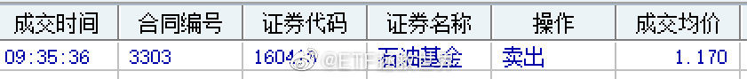

======================================================

ETF拯救世界 (5687069307) @
2019-09-17 09:41:41 Tue  
url: https://weibo.com/5687069307/I7jPDdubs

又买回来了。成本再降5.5%，中午又可以去吃海鲜饭了……  http://t.cn/AiEuuXnW

------------------------------------------------------
转推：
>  @ETF拯救世界 (5687069307)
>  2019-09-17 09:36:54 Tue  
>  url: https:/weibo.com/5687069307/I7jNGljSh/

>  这是闹哪样。不说那么多先走一波。 ​​​

转发[32]  评论[167]  赞[629] 

======================================================

ETF拯救世界 (5687069307) @
2019-09-17 09:47:07 Tue  
url: https://weibo.com/5687069307/I7jRPEoot

回复@collin87:这是计划里面长期持有的石油基金。由于溢价过大，我卖的时候溢价18%，没有理由不卖。跌落后溢价回归正常，再买回来。这不是网格。//@collin87:不懂就问。不是在华宝油气上做网格吗？不是说相关性太强的品种选一个就可以了吗？

------------------------------------------------------
转推：
>  @ETF拯救世界 (5687069307)
>  2019-09-17 09:36:54 Tue  
>  url: https:/weibo.com/5687069307/I7jNGljSh/

>  这是闹哪样。不说那么多先走一波。 ​​​

转发[16]  评论[211]  赞[641] 

======================================================

ETF拯救世界 (5687069307) @
2019-09-17 13:06:41 Tue  
url: https://weibo.com/5687069307/I7laQaEmQ

回踩也许会迟到，但从未缺席。[偷笑] ​​​

转发[36]  评论[412]  赞[1700] 

======================================================

ETF拯救世界 (5687069307) @
2019-09-17 13:14:06 Tue  
url: https://weibo.com/5687069307/I7ldQkO28

回复@锅边糊6000244828:计划长期持仓不动收益率37%。稍微做点波段收益率超过50%。我本人收益率就不说了。不好意思，让你失望了，拉黑。//@锅边糊6000244828:亏了多少走的？

------------------------------------------------------
转推：
>  @ETF拯救世界 (5687069307)
>  2019-09-17 09:36:54 Tue  
>  url: https:/weibo.com/5687069307/I7jNGljSh/

>  这是闹哪样。不说那么多先走一波。 ​​​

转发[11]  评论[237]  赞[766] 

======================================================

ETF拯救世界 (5687069307) @
2019-09-18 09:11:42 Wed  
url: https://weibo.com/5687069307/I7t3X3q9C

"你知道人家那边设施什么时候就修好了啊。弄不好一两天就又跌回去了。" 沙特宣布恢复石油产量，油价大跌。哈哈哈，莫名其妙的赚了一笔，跌回去继续买。

------------------------------------------------------
转推：
>  @ETF拯救世界 (5687069307)
>  2019-09-16 08:18:21 Mon  
>  url: https:/weibo.com/5687069307/I79RiCmrT/

>  今天油气涨幅跟不上油价，因为基准晚上才在美国开盘。但不会一点反应都没有，涨4-6个点也很正常。
>  
>  有网格的该出就出，不舍得就多留点利润。你知道人家那边设施什么时候就修好了啊。弄不好一两天就又跌回去了。
>  
>  跌了害怕，涨了贪心，投资最怕这个。你就是个机器人，无感情的执行策略即可。执行策略的 ​​​

转发[26]  评论[376]  赞[1017] 

======================================================

ETF拯救世界 (5687069307) @
2019-09-18 09:17:21 Wed  
url: https://weibo.com/5687069307/I7t6fbA8u

我真的不懂，为什么一个足球游戏的服务器也要屏蔽。

为什么，它只是个足球游戏啊。 ​​​

转发[12]  评论[191]  赞[907] 

======================================================

ETF拯救世界 (5687069307) @
2019-09-18 10:14:00 Wed  
url: https://weibo.com/5687069307/I7tteDSlV

微博网友太牛逼了，真心的。

感谢！ ​​​

转发[4]  评论[267]  赞[1240] 

======================================================

ETF拯救世界 (5687069307) @
2019-09-19 17:27:53 Thu  
url: https://weibo.com/5687069307/I7FJR5BNG

忙了一天，你怎么样，过得舒服不舒服。 ​​​

转发[6]  评论[677]  赞[1493] 

======================================================

ETF拯救世界 (5687069307) @
2019-09-22 18:14:43 Sun  
url: https://weibo.com/5687069307/I88kls91V

不好意思，这几天忙着练功，没时间发微博。

好消息是已经练到了第七层，神功将成！ ​​​

转发[6]  评论[464]  赞[1751] 

+++++++++++++++++++++++++++++++++++++++++++++++++++++

图片：
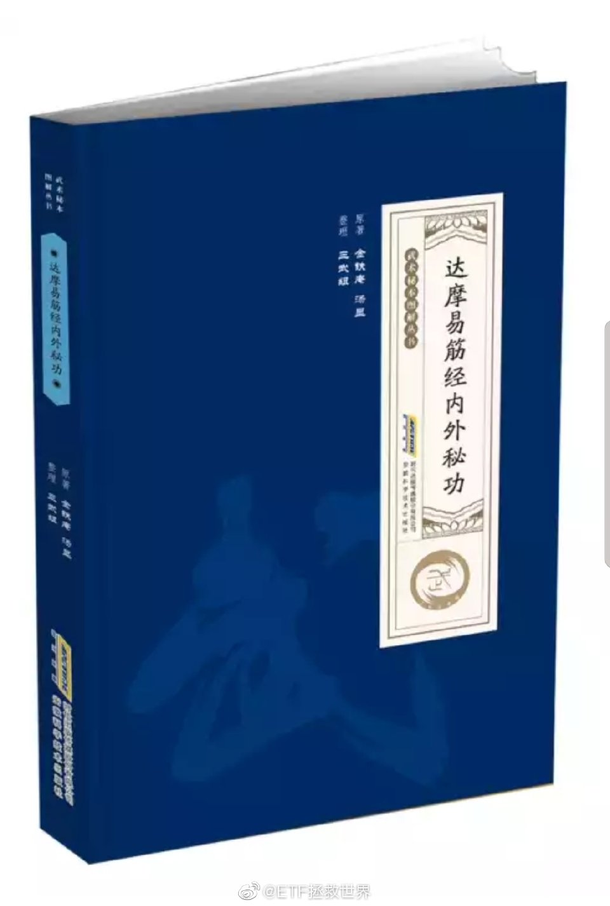

======================================================

ETF拯救世界 (5687069307) @
2019-09-23 08:55:10 Mon  
url: https://weibo.com/5687069307/I8e5IF9bt

这周市场大概率会走的很无聊。 ​​​

转发[19]  评论[280]  赞[960] 

======================================================

ETF拯救世界 (5687069307) @
2019-09-23 09:41:17 Mon  
url: https://weibo.com/5687069307/I8eorCjUL

又快出了吗，好烦 [doge]

------------------------------------------------------
转推：
>  @ETF拯救世界 (5687069307)
>  2019-09-14 06:08:50 Sat  
>  url: https:/weibo.com/5687069307/I6Q9JCoiO/

>  哈哈哈。
>  
>  波动的乐趣。 ​​​

转发[2]  评论[133]  赞[661] 

======================================================

ETF拯救世界 (5687069307) @
2019-09-23 10:12:20 Mon  
url: https://weibo.com/5687069307/I8eB2Ei8k

本周将考验支撑位。能撑住就是健康回踩，继续上扬。撑不住就继续寻底吧。能不能撑住我没有观点。不猜，顺势而为。

------------------------------------------------------
转推：
>  @ETF拯救世界 (5687069307)
>  2019-09-05 13:21:58 Thu  
>  url: https:/weibo.com/5687069307/I5w94FPj6/

>  大多数指数本周趋势应该会变好。仓位不够的朋友，后面还会有一次回踩确认，那将是一次不错的加仓机会。 ​​​

转发[51]  评论[308]  赞[1304] 

======================================================

ETF拯救世界 (5687069307) @
2019-09-23 14:55:35 Mon  
url: https://weibo.com/5687069307/I8gs1mwso

相当无聊的第一天。

------------------------------------------------------
转推：
>  @ETF拯救世界 (5687069307)
>  2019-09-23 08:55:10 Mon  
>  url: https:/weibo.com/5687069307/I8e5IF9bt/

>  这周市场大概率会走的很无聊。 ​​​

转发[4]  评论[225]  赞[859] 

======================================================

ETF拯救世界 (5687069307) @
2019-09-23 22:08:27 Mon  
url: https://weibo.com/5687069307/I8jhIFa6v

内心毫无波动的机器人 http://t.cn/AinIxnMV

------------------------------------------------------
转推：
>  @ETF拯救世界 (5687069307)
>  2019-09-14 06:08:50 Sat  
>  url: https:/weibo.com/5687069307/I6Q9JCoiO/

>  哈哈哈。
>  
>  波动的乐趣。 ​​​

转发[33]  评论[237]  赞[747] 

======================================================

ETF拯救世界 (5687069307) @
2019-09-24 11:20:23 Tue  
url: https://weibo.com/5687069307/I8otabyB3

今天不舒服。

剪衣标把衣服剪了个口。

我大概是个智障。 ​​​

转发[3]  评论[453]  赞[1979] 

======================================================

ETF拯救世界 (5687069307) @
2019-09-24 11:22:32 Tue  
url: https://weibo.com/5687069307/I8ou2dIPT

今次能冲过去吗。//@ETF拯救世界:快了啊//@ETF拯救世界:下一个压力位10400

------------------------------------------------------
转推：
>  @ETF拯救世界 (5687069307)
>  2019-08-22 15:04:05 Thu  
>  url: https:/weibo.com/5687069307/I3oPAbY05/

>  看样子医药有走好的迹象。 ​​​

转发[5]  评论[126]  赞[671] 

======================================================

ETF拯救世界 (5687069307) @
2019-09-24 14:26:05 Tue  
url: https://weibo.com/5687069307/I8pGxn6Gf

昨天先跌，把你打一顿吓出去

今天先涨勾引你回来：客官别走嘛再进来玩玩

你禁不住诱惑又进去了。再打一顿

太坏了 ​​​

转发[28]  评论[607]  赞[1745] 

======================================================

ETF拯救世界 (5687069307) @
2019-09-26 11:51:21 Thu  
url: https://weibo.com/5687069307/I8HwJ2U1R

好像也不是那么无聊啊 ​​​

转发[3]  评论[575]  赞[1484] 

======================================================

ETF拯救世界 (5687069307) @
2019-09-27 08:21:19 Fri  
url: https://weibo.com/5687069307/I8PzYrdnO

哈哈，今天可以买回来了

------------------------------------------------------
转推：
>  @ETF拯救世界 (5687069307)
>  2019-09-16 09:33:33 Mon  
>  url: https:/weibo.com/5687069307/I7alPi04M/

>  这网利润十几个点 ​​​

转发[28]  评论[433]  赞[1017] 

======================================================

ETF拯救世界 (5687069307) @
2019-09-27 10:51:11 Fri  
url: https://weibo.com/5687069307/I8QyNvZRS

把握住两点设计你的投资体系：

第一，指数长期向上。

第二，指数中短期会有波动。A股波动尤其大。

这两点真正理解，融入你的体系，基本上长期赚钱不会有问题。

牛市跟上，波动提款，熊市不赔。 ​​​

转发[318]  评论[481]  赞[1517] 

======================================================

ETF拯救世界 (5687069307) @
2019-09-27 14:58:15 Fri  
url: https://weibo.com/5687069307/I8Sb5f9C7

服了 http://t.cn/AinQeJi9 //@ETF拯救世界:内心毫无波动的机器人 http://t.cn/AinIxnMV

------------------------------------------------------
转推：
>  @ETF拯救世界 (5687069307)
>  2019-09-14 06:08:50 Sat  
>  url: https:/weibo.com/5687069307/I6Q9JCoiO/

>  哈哈哈。
>  
>  波动的乐趣。 ​​​

转发[23]  评论[299]  赞[647] 

======================================================

ETF拯救世界 (5687069307) @
2019-09-29 07:54:05 Sun  
url: https://weibo.com/5687069307/I98fUB5C6

工作使我快乐。[摊手] ​​​

转发[9]  评论[428]  赞[1592] 

======================================================

ETF拯救世界 (5687069307) @
2019-09-29 19:14:38 Sun  
url: https://weibo.com/5687069307/I9cI9klkx

每次发钱的时候都说给多了，这样的员工哪里找。

哪儿多了，我感觉一点也不多啊。 ​​​

转发[16]  评论[517]  赞[1893] 

+++++++++++++++++++++++++++++++++++++++++++++++++++++

图片：

======================================================

ETF拯救世界 (5687069307) @
2019-09-30 01:15:13 Mon  
url: https://weibo.com/5687069307/I9f4vAFOf

跟自己孩子在一起的时候是最快乐的时光。

------------------------------------------------------
转推：
>  @北京人不知道的北京事儿 (1662214194)
>  2019-09-29 21:43:27 Sun  
>  url: https:/weibo.com/1662214194/I9dGy8sDx/

>  【BBC高分纪录片：《父亲的生物学意义》，一个父亲对孩子成长的关键作用！妈妈必转爸爸必看！】母亲赋予了孩子们生命，也在孩子的成长给他们以无微不至的爱与关怀，而父亲，往往是以一个严厉的形象存在，往往是孩子幼年时期的偶像。那么，在生物学意义上，父亲这个角色会对孩子的成长起到什么作用呢？ ​​​

转发[240]  评论[128]  赞[693] 

======================================================

ETF拯救世界 (5687069307) @
2019-09-30 10:42:49 Mon  
url: https://weibo.com/5687069307/I9iMTEEUi

…… ​​​

转发[17]  评论[265]  赞[906] 

+++++++++++++++++++++++++++++++++++++++++++++++++++++

图片：

======================================================

ETF拯救世界 (5687069307) @
2019-09-30 14:40:19 Mon  
url: https://weibo.com/5687069307/I9kliheJS

内鬼开始行动了！

------------------------------------------------------
转推：
>  @ETF拯救世界 (5687069307)
>  2019-09-30 10:42:49 Mon  
>  url: https:/weibo.com/5687069307/I9iMTEEUi/

>  …… ​​​

转发[4]  评论[92]  赞[583] 

======================================================

ETF拯救世界 (5687069307) @
2019-09-30 14:41:17 Mon  
url: https://weibo.com/5687069307/I9klH6BPu

烤鸭不是火车站买的吧……

------------------------------------------------------
转推：
>  @ ()
>  2019-09-30 14:40:03 Mon  
>  url: 

>  抱歉，作者已设置仅展示半年内微博，此微博已不可见。 ​​​

转发[2]  评论[97]  赞[402] 

======================================================

ETF拯救世界 (5687069307) @
2019-09-30 15:00:06 Mon  
url: https://weibo.com/5687069307/I9ktkvg9t

一切尽在掌握。 ​​​

转发[6]  评论[379]  赞[1217] 

======================================================

ETF拯救世界 (5687069307) @
2019-10-01 22:25:05 Tue  
url: https://weibo.com/5687069307/I9wOrCm3I

一栋楼阻挡了我躺在阳台上看烟花的梦… ​​​

转发[7]  评论[335]  赞[1645] 

+++++++++++++++++++++++++++++++++++++++++++++++++++++

图片：

======================================================

ETF拯救世界 (5687069307) @
2019-10-03 09:26:06 Thu  
url: https://weibo.com/5687069307/I9KzfbrV7

美股大跌两天，现在相信这两句话了吧。

一切尽在掌握。 ​​​

转发[36]  评论[298]  赞[1208] 

+++++++++++++++++++++++++++++++++++++++++++++++++++++

图片：

======================================================

ETF拯救世界 (5687069307) @
2019-10-03 10:17:42 Thu  
url: https://weibo.com/5687069307/I9KUbzrWb

我不喜欢那种根本不愿意全面看我东西，断章取义的人。

微博就那么几个字，我想表达的东西你不全面看根本不知道我到底是什么意思。比如上一条微博，你不结合十月第一次发车怎么会理解我们在说什么？

但我对每天紧密跟踪我，然后想方设法扭曲事实恶意抹黑的人是真的痛恨。

前一种只是不熟悉的人而已， ​​​

转发[14]  评论[279]  赞[1268] 

======================================================

ETF拯救世界 (5687069307) @
2019-10-03 17:39:33 Thu  
url: https://weibo.com/5687069307/I9NNxcDeq

天真活泼和有素质有家教应该不矛盾。

另外，很多时候身教确实比言传有效。有一次我为后面一位推婴儿车的妈妈拉着酒店的大门被孩子看到，那以后他就经常为我们拉门，很欣慰。 ​​​

转发[19]  评论[116]  赞[1031] 

+++++++++++++++++++++++++++++++++++++++++++++++++++++

图片：

======================================================

ETF拯救世界 (5687069307) @
2019-10-03 21:30:15 Thu  
url: https://weibo.com/5687069307/I9Pjb3nB1

独立思考才是最终王道。

否则网上这样风向变来变去你就容易被整晕了。

冷静，客观。 ​​​

转发[47]  评论[189]  赞[1412] 

======================================================

ETF拯救世界 (5687069307) @
2019-10-04 15:22:21 Fri  
url: https://weibo.com/5687069307/I9WklhJ7d

这种项目以后就别玩了。尤其是在一些可疑的小游乐场

------------------------------------------------------
转推：
>  @新京报我们视频 (6124642021)
>  2019-10-04 14:29:13 Fri  
>  url: https:/weibo.com/6124642021/I9VYM9nK6/

>  【#烟台景区气球经营业主被控制#：涉重大责任事故罪】10月1日，#烟台景区氢气球绳断裂2人遇难#。事发时，一对母子正在气球上游玩，气球上升时发生破裂，母子坠地后死亡。应急管理局调查获悉，遇难的是31岁女士和3岁男童。警方已控制五名涉事人员，该气球经营业主涉嫌重大责任事故罪，已被采取强制措施 ​​​

转发[29]  评论[114]  赞[509] 

======================================================

ETF拯救世界 (5687069307) @
2019-10-04 16:46:24 Fri  
url: https://weibo.com/5687069307/I9WSsmJVe

长假漫漫找点乐子，下楼给自己和儿子买点玩具。

先搭哪个？因为这个问题我和儿子打起来了。 ​​​

转发[11]  评论[272]  赞[1042] 

+++++++++++++++++++++++++++++++++++++++++++++++++++++

图片：

======================================================

ETF拯救世界 (5687069307) @
2019-10-06 10:57:31 Sun  
url: https://weibo.com/5687069307/IadrQql7m

其实扔个ipad就可以安静一路，主要还是有没有“不给他人添麻烦”这个意识。如果大家出门都有这个意识，不仅咱们自己的生活质量能上n个层次，出门在外也不至于被那么多老外不待见。少数人的锅，真的要所有中国人来背。

------------------------------------------------------
转推：
>  @北京人不知道的北京事儿 (1662214194)
>  2019-10-06 10:28:14 Sun  
>  url: https:/weibo.com/1662214194/IadfXspyO/

>  【这事儿你怎么看？[摊手]】@天师-卡赞：今天在昆明-北京的航班上，体验了牛皮的一幕，两个小孩3小时持续喊叫、打闹，旁边家长玩着手机微微笑，根本不管，视频里很清楚……
>  
>  其实，我坐在过道，左手边的正好也是一对国外的母子，听口音应该是美国或加拿大的，对话大体如下：
>  
>  儿子：为什么中国人这么吵 ​​​

转发[45]  评论[149]  赞[617] 

======================================================

ETF拯救世界 (5687069307) @
2019-10-06 11:41:05 Sun  
url: https://weibo.com/5687069307/IadJwoXLh

小孩在外吵吵闹闹到底能不能管住？应该不应该管？

别人的孩子吵闹，是不是我的孩子就应该吵闹？别的国家孩子也有闹的，是不是中国孩子就必须闹？

这些问题都决定了家长的态度。

我的观点是，只要家长有意识，就一定能找到不让孩子吵闹的办法。绝大多数吵闹孩子的家长，根本就没有想去管。因为他们觉 ​​​

转发[56]  评论[247]  赞[1311] 

======================================================

ETF拯救世界 (5687069307) @
2019-10-07 01:04:15 Mon  
url: https://weibo.com/5687069307/IaiZxepJS

本来给两位买的是SONY的音箱，谁能想到亚马逊海外购6月下单9月还没发货。只好买两只Dior 999顶着先……另一位是男生，用不上，过一段找到合适的礼物再补。剩下的999以后有机会再抽。话说那个音箱真是不错，辣鸡亚马逊。顺便祝所有朋友2019剩下的三个月里都一路长红~~

------------------------------------------------------
转推：
>  @VICDAYUAN (1785156983)
>  2019-10-06 17:11:30 Sun  
>  url: https:/weibo.com/1785156983/IafTDz9mS/

>  万万没想到啊，脱非入欧这种好事终于轮到我了[憧憬]感恩我男神@ETF拯救世界 [给你小心心][给你小心心][给你小心心]节后继续踏踏实实的赚钱、攒钱💰💰💰 ​​​

转发[6]  评论[229]  赞[971] 

======================================================

ETF拯救世界 (5687069307) @
2019-10-07 19:06:25 Mon  
url: https://weibo.com/5687069307/Iaq4Mn3wM

十年前吧，跟这个情况一样。一辆奥拓在二环最内侧车道走，突然跳出来一个人，躲不开，撞死了。最后判奥托赔了十万。注意，这种情况车辆一定要做出反应，比如鸣笛，用力踩刹车等行为。如果有这些反应，即使撞死了责任也不大，赔点钱。如果什么都不做撞上去，会非常麻烦。

------------------------------------------------------
转推：
>  @北京人不知道的北京事儿 (1662214194)
>  2019-10-07 13:42:15 Mon  
>  url: https:/weibo.com/1662214194/IanXcsh9N/

>  【[衰]】网友投稿：今天在北京二环主路最内侧车道遇到的一幕。。。这要是撞上了谁的责任？[怒]http://t.cn/AimDz1D5 ​​​

转发[27]  评论[118]  赞[473] 

======================================================

ETF拯救世界 (5687069307) @
2019-10-07 21:30:07 Mon  
url: https://weibo.com/5687069307/Iar16zvW8

特别喜欢 ​​​

转发[12]  评论[311]  赞[1369] 

+++++++++++++++++++++++++++++++++++++++++++++++++++++

图片：
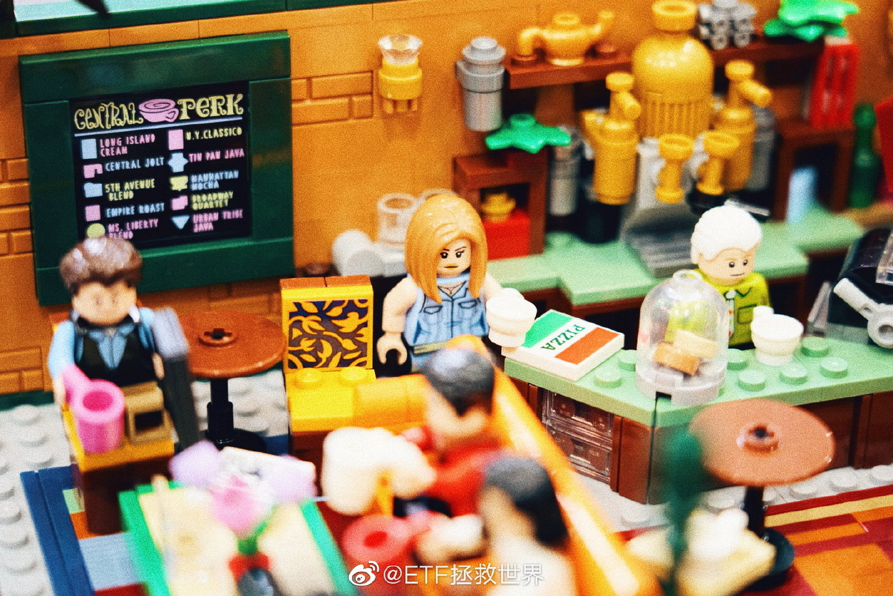
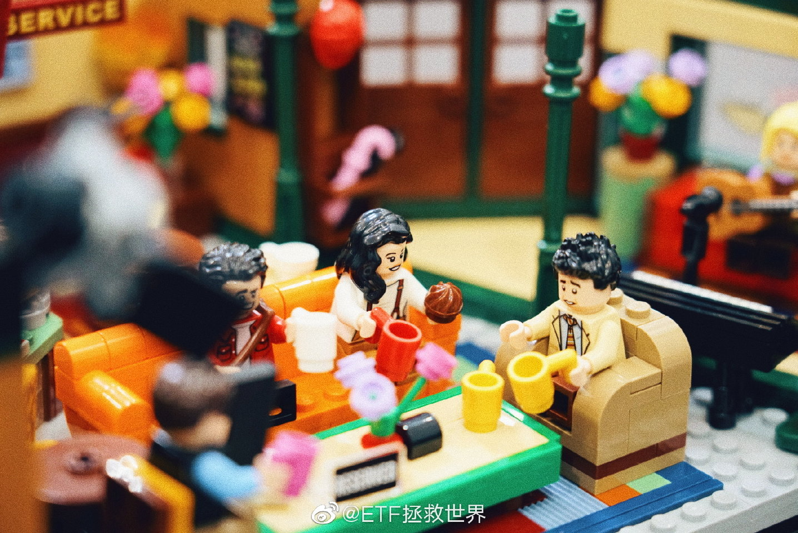

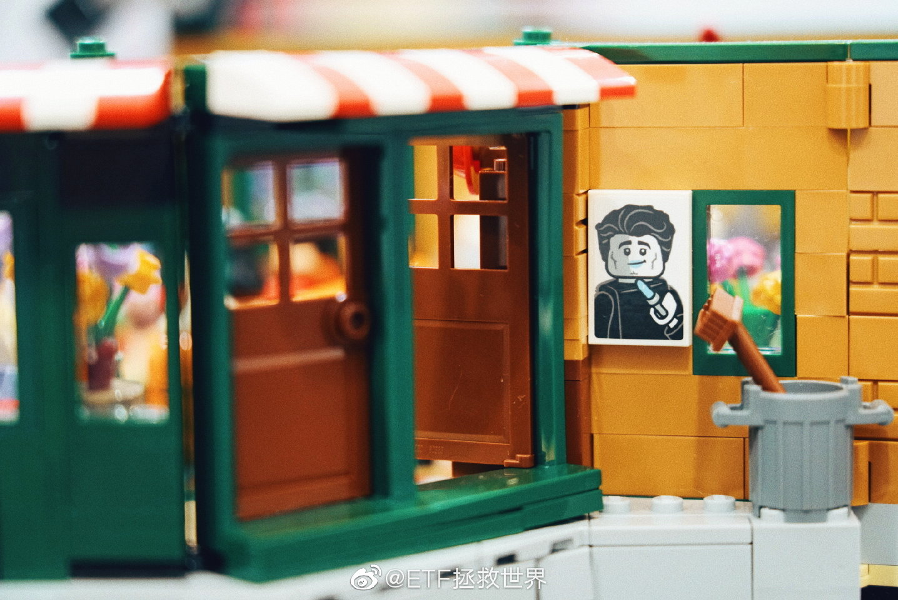

======================================================

ETF拯救世界 (5687069307) @
2019-10-08 18:13:59 Tue  
url: https://weibo.com/5687069307/Iaz9ZxfC1

仓位非常够，手里有现金很重要。谨慎投资，尤其是大额投资决定。

关于最近的形势，打了很多字，又都删掉了。希望一切都好。 ​​​

转发[54]  评论[262]  赞[1294] 

======================================================

ETF拯救世界 (5687069307) @
2019-10-08 18:22:48 Tue  
url: https://weibo.com/5687069307/IazdA5gu6

回复@Halle噜呀:重点是：从计划来说，仓位已经非常足了。留好的是剩下的现金。//@Halle噜呀:标重点：形势不稳，留好现金！

------------------------------------------------------
转推：
>  @ETF拯救世界 (5687069307)
>  2019-10-08 18:13:59 Tue  
>  url: https:/weibo.com/5687069307/Iaz9ZxfC1/

>  仓位非常够，手里有现金很重要。谨慎投资，尤其是大额投资决定。
>  
>  关于最近的形势，打了很多字，又都删掉了。希望一切都好。 ​​​

转发[16]  评论[108]  赞[693] 

======================================================

ETF拯救世界 (5687069307) @
2019-10-08 18:43:43 Tue  
url: https://weibo.com/5687069307/Iazm4kBes

虽然已经不玩了，但我决定充值魔兽月卡……

------------------------------------------------------
转推：
>  @暴雪中国 (5883095259)
>  2019-10-08 12:46:45 Tue  
>  url: https:/weibo.com/5883095259/Iax1avYRU/

>  暴雪《炉石传说》电竞团队对Blitzchung违规事件的郑重声明！原文链接：http://t.cn/Aiuh9DqQ ​​​

转发[8]  评论[135]  赞[487] 

======================================================

ETF拯救世界 (5687069307) @
2019-10-09 18:21:39 Wed  
url: https://weibo.com/5687069307/IaIDBlil1

日本最近十几年每年一个诺贝尔。 ​​​

转发[22]  评论[210]  赞[1115] 

======================================================

ETF拯救世界 (5687069307) @
2019-10-10 13:13:55 Thu  
url: https://weibo.com/5687069307/IaQ3bFJYz

昨天差一厘没有吃到一网医药的我，目前有点怀疑人生。 ​​​

转发[32]  评论[213]  赞[730] 

+++++++++++++++++++++++++++++++++++++++++++++++++++++

图片：

======================================================

ETF拯救世界 (5687069307) @
2019-10-10 13:24:23 Thu  
url: https://weibo.com/5687069307/IaQ7rdYue

明白了，好久没去拜拜了。运气有点顶背离。

下周去，给自己谋福利的同时，照例会为各位求个好运气，也加大力度求个国泰民安。 ​​​

转发[8]  评论[183]  赞[1392] 

======================================================

ETF拯救世界 (5687069307) @
2019-10-10 13:40:07 Thu  
url: https://weibo.com/5687069307/IaQdPcrmH

我相信每个人的人生都会有几个关键点。运气再差的人，也会有几个点可以让人生变得更好。

勤奋、努力的，或者性格好，本性善良的，又或者老天爷比较青睐，天生智商颜值之类比较高的，这个关键点就会比一般人多。但是一般人也有这个关键点，至少来说一辈子两三次问题不大。

所以，在人生的关键点，第一 ​​​

转发[323]  评论[497]  赞[2015] 

======================================================

ETF拯救世界 (5687069307) @
2019-10-10 15:41:23 Thu  
url: https://weibo.com/5687069307/IaR131XhT

差一厘吃不到确实很遗憾，尤其是一网利润够买很多很多送大家的礼物情况下…

但是另一个角度，人不能一直运气好。这是我一直以来的理念。

我相信均值回归，运气也是如此。所以运气好的时候千万不能得瑟，容易乐极生悲。另一方面偶尔运气不好应该高兴，这是对冲了一直的好运气，避免大的不幸发生。

如 ​​​

转发[155]  评论[435]  赞[1996] 

======================================================

ETF拯救世界 (5687069307) @
2019-10-11 17:39:40 Fri  
url: https://weibo.com/5687069307/Ib1dynZnr

万万没想到，有人要在医药救我一命之后，我们的医药基金已经涨了将近40%。

其实那位朋友的思维代表很多人：

出利空了，非常危险，很危险，要跌很多。

我不能说出利空不危险。但看事情不能只看表面。

第二层思维是：

目前的价位是多少？现在的价位是否已经将利空反映出来？

第三层思维是：

我们 ​​​

转发[156]  评论[325]  赞[1426] 

======================================================

ETF拯救世界 (5687069307) @
2019-10-11 17:50:14 Fri  
url: https://weibo.com/5687069307/Ib1hQkdRo

目前仓位建议依然不变。保守到激进60-80。最激进不超过90。这个范围内，以自己舒服为准。

------------------------------------------------------
转推：
>  @ETF拯救世界 (5687069307)
>  2019-05-30 09:45:41 Thu  
>  url: https:/weibo.com/5687069307/HwyiWESuw/

>  还是那句话，买没问题，注意节奏。
>  
>  保守到激进的A股仓位给60%-80%合适。最激进别超过90%，杠杆就更不用说了。 ​​​

转发[27]  评论[153]  赞[902] 

======================================================

ETF拯救世界 (5687069307) @
2019-10-11 17:55:06 Fri  
url: https://weibo.com/5687069307/Ib1jP0nMS

非常刺激。这个月三季报全部披露完毕，全市场估值如何变化很期待。 ​​​

转发[10]  评论[139]  赞[1037] 

======================================================

ETF拯救世界 (5687069307) @
2019-10-11 17:56:44 Fri  
url: https://weibo.com/5687069307/Ib1ku1Uwd

你有没有发现，网络世界好像和现实世界特别分裂。

看了微博再看现实，完全都不是一码事儿啊。 ​​​

转发[17]  评论[395]  赞[1425] 

======================================================

ETF拯救世界 (5687069307) @
2019-10-14 12:56:06 Mon  
url: https://weibo.com/5687069307/IbrDWtp4N

债券又回到一年前了，想找机会再配点。 ​​​

转发[26]  评论[314]  赞[1253] 

======================================================

ETF拯救世界 (5687069307) @
2019-10-14 13:21:45 Mon  
url: https://weibo.com/5687069307/IbrOma4IY

这几年，被喷子喷的精神上有了问题，整个人感觉越来越精神了

------------------------------------------------------
转推：
>  @挖龙脉的超级鹿鼎公 (3962719063)
>  2019-10-14 11:34:45 Mon  
>  url: https:/weibo.com/3962719063/Ibr6Vl1Hg/

>  这几年，对于收益的期待越来越低，心态就越来越好了 ​​​

转发[5]  评论[143]  赞[1028] 

======================================================

ETF拯救世界 (5687069307) @
2019-10-14 13:27:19 Mon  
url: https://weibo.com/5687069307/IbrQCcpkU

最近两条人生感悟：

第一，晚上一定要睡足。睡足了一天精神焕发。怪不得古话说“不看美股寿与天齐”。

第二，为了转型美食博主，研究了一下中国菜。发现“葱姜蒜爆香”是80%菜品成功的基础。 ​​​

转发[49]  评论[365]  赞[1608] 

======================================================

ETF拯救世界 (5687069307) @
2019-10-14 13:38:32 Mon  
url: https://weibo.com/5687069307/IbrVapxeW

A股第四大仓位50创出今年新高，2015年7月以来，收益率冲向50%。

但它绝不会是组合里面未来A股部分最猛的品种。 ​​​

转发[26]  评论[357]  赞[1516] 

======================================================

ETF拯救世界 (5687069307) @
2019-10-15 17:25:27 Tue  
url: https://weibo.com/5687069307/IbCPLDNoN

陪儿子打篮球，旁边一小屁孩 ：

“叔叔，你是篮球运动员吧。肯定是。”

4S店试坐按摩椅，推销员：

“你适合这种力度大的。你是专业运动员吧。你还年轻，要提前保养”

喷了，抑郁症什么的根本不会得好吗。全世界都是正能量啊。 ​​​

转发[7]  评论[392]  赞[1745] 

======================================================

ETF拯救世界 (5687069307) @
2019-10-16 09:53:34 Wed  
url: https://weibo.com/5687069307/IbJiQwkwZ

为什么发微博少了

因为关于投资，目前阶段可以说的东西不多啊。

你看，钻石坑爬出来了，长期仓位建好了，网格吃短期波动也没什么说的，又不到贵的状态，群众情绪非常稳定，地里有庄稼手里有钱。吃着火锅唱着歌，舒舒服服的，说什么啊。

风花雪月说多了又有人说我不务正业，所以说的就少了。

其实投 ​​​

转发[159]  评论[497]  赞[1872] 

======================================================

ETF拯救世界 (5687069307) @
2019-10-16 13:35:21 Wed  
url: https://weibo.com/5687069307/IbKKSlkMJ

医药再上万点 ​​​

转发[10]  评论[171]  赞[1042] 

======================================================

ETF拯救世界 (5687069307) @
2019-10-17 09:08:04 Thu  
url: https://weibo.com/5687069307/IbSqSiSmB

看这样的故事心情特别复杂。特别复杂。

------------------------------------------------------
转推：
>  @Kevin在纽约 (6479869715)
>  2019-10-16 21:28:11 Wed  
>  url: https:/weibo.com/6479869715/IbNQNd2KA/

>  「不忘中国孤儿院深夜约定，无血缘2华童 在美相聚重叙兄弟情」15日，美国媒体《World Journal》报道：“直到世界末日，他都是我兄弟，我不会放下哥哥一个人。” 
>  
>  首先是一名中国孤儿叫申杰(Josh Clarkson)，他四年多前被堪萨斯州的一个家庭领养，当时已经10岁的申杰刚到美国新家，语言不通、环境不熟 ​​​

转发[88]  评论[198]  赞[931] 

======================================================

ETF拯救世界 (5687069307) @
2019-10-17 12:45:37 Thu  
url: https://weibo.com/5687069307/IbTRbs9jQ

我真的不懂公共交通上外放的人是怎么想的。你带个耳机，不仅音质好10000倍，还多少有点降噪效果，也不影响别人。嫌有线麻烦你就买个无线的，也没多少钱。服了，怎么想的到底。

------------------------------------------------------
转推：
>  @新浪视频 (1640601392)
>  2019-10-17 07:02:12 Thu  
>  url: https:/weibo.com/1640601392/IbRBMDR0E/

>  【#高铁外放男要求叶璇道歉#：她针对我 让我儿女丢脸[并不简单]】#高铁外放老人要求叶璇道歉# 近日，演员@叶璇 微博曝光一男子乘坐高铁手机开外放，引起广泛关注与热议。该老人接受媒体采访承认自己的错误，但对于叶璇将视频发布到网上，他始终坚定对方已侵权，有可能会通过法律手段维权到底。 ​​​

转发[17]  评论[221]  赞[602] 

======================================================

ETF拯救世界 (5687069307) @
2019-10-17 14:20:19 Thu  
url: https://weibo.com/5687069307/IbUtCkXJT

除了王朔，其它几本还没看过，看完了我来打分。

没有行情就多读书。工作和学习使我快乐。[doge] ​​​

转发[64]  评论[193]  赞[916] 

+++++++++++++++++++++++++++++++++++++++++++++++++++++

图片：

======================================================

ETF拯救世界 (5687069307) @
2019-10-17 18:25:40 Thu  
url: https://weibo.com/5687069307/IbW5ddyFk

DAX 15个月新高。

英国脱欧协议都达成了，咱们的英国指数基金还没上。 ​​​

转发[16]  评论[147]  赞[873] 

======================================================

ETF拯救世界 (5687069307) @
2019-10-18 09:39:52 Fri  
url: https://weibo.com/5687069307/Ic24hndHu

恶人自有恶人治。

------------------------------------------------------
转推：
>  @新浪视频 (1640601392)
>  2019-10-18 09:34:31 Fri  
>  url: https:/weibo.com/1640601392/Ic226APan/

>  【#女孩疑因插队遭暴打# 被掀翻在地猛踹 打人女子未结账扬长而去[衰]】10月16日，一段打人视频在网络上热传。视频显示，一短发女子疑似在店内点餐，被另一女子插队后突然动手打人。短发女子将她推倒后猛踹一脚，还拿硬板砸，欲离开时又折回再次殴打，掌掴，过肩摔，猛踹，用物品砸。随后，短发女子离开 ​​​

转发[62]  评论[266]  赞[817] 

======================================================

ETF拯救世界 (5687069307) @
2019-10-18 12:31:21 Fri  
url: https://weibo.com/5687069307/Ic3bTi9hP

回复@小w今天吃鸡了吗:我曾经遇到过这种事，收银员不仅不跟插队的说“请排队”，还一副“插个队嘛有什么大不了”的样子，让人非常生气。//@小w今天吃鸡了吗:收银员责任也很大//@ETF拯救世界:恶人自有恶人治。

------------------------------------------------------
转推：
>  @新浪视频 (1640601392)
>  2019-10-18 09:34:31 Fri  
>  url: https:/weibo.com/1640601392/Ic226APan/

>  【#女孩疑因插队遭暴打# 被掀翻在地猛踹 打人女子未结账扬长而去[衰]】10月16日，一段打人视频在网络上热传。视频显示，一短发女子疑似在店内点餐，被另一女子插队后突然动手打人。短发女子将她推倒后猛踹一脚，还拿硬板砸，欲离开时又折回再次殴打，掌掴，过肩摔，猛踹，用物品砸。随后，短发女子离开 ​​​

转发[8]  评论[60]  赞[243] 

======================================================

ETF拯救世界 (5687069307) @
2019-10-18 12:40:35 Fri  
url: https://weibo.com/5687069307/Ic3fDfsKA

不过，这个女的这样做确实过分了。仔细看了看，这个看起来和正常的插队不同。短发女在用手机扫码付款，粉衣女是用现金，并没有影响她用手机付款。挨打的这个比较冤枉……论起来，收银员的责任是最大的。//@ETF拯救世界:恶人自有恶人治。

------------------------------------------------------
转推：
>  @新浪视频 (1640601392)
>  2019-10-18 09:34:31 Fri  
>  url: https:/weibo.com/1640601392/Ic226APan/

>  【#女孩疑因插队遭暴打# 被掀翻在地猛踹 打人女子未结账扬长而去[衰]】10月16日，一段打人视频在网络上热传。视频显示，一短发女子疑似在店内点餐，被另一女子插队后突然动手打人。短发女子将她推倒后猛踹一脚，还拿硬板砸，欲离开时又折回再次殴打，掌掴，过肩摔，猛踹，用物品砸。随后，短发女子离开 ​​​

转发[26]  评论[124]  赞[476] 

======================================================

ETF拯救世界 (5687069307) @
2019-10-18 12:46:09 Fri  
url: https://weibo.com/5687069307/Ic3hTlMmP

不知道为什么，我对不遵守秩序的人特别讨厌，遇到了就感到很不舒服。

插队，上地铁不先下后上不靠两边站乱挤，开车不打灯乱并线，甚至随地吐痰，右转机动车不让绿灯行人，电梯抽烟，遛狗不牵，高空掷物等等等等。

可能是有什么心理疾病。 ​​​

转发[63]  评论[293]  赞[1081] 

======================================================

ETF拯救世界 (5687069307) @
2019-10-18 12:54:06 Fri  
url: https://weibo.com/5687069307/Ic3l7p75z

我觉得归根结底就是一句话：“你的心里有没有别的陌生人”。有，这些事你就能做好，就会注意不给别人添麻烦。心里没有别人，或者说，除了熟人或者有用的人，你觉得其他人都是无关紧要的，都是妨碍你的，那做出这些事就不可避免了。

------------------------------------------------------
转推：
>  @ETF拯救世界 (5687069307)
>  2019-10-18 12:46:09 Fri  
>  url: https:/weibo.com/5687069307/Ic3hTlMmP/

>  不知道为什么，我对不遵守秩序的人特别讨厌，遇到了就感到很不舒服。
>  
>  插队，上地铁不先下后上不靠两边站乱挤，开车不打灯乱并线，甚至随地吐痰，右转机动车不让绿灯行人，电梯抽烟，遛狗不牵，高空掷物等等等等。
>  
>  可能是有什么心理疾病。 ​​​

转发[35]  评论[111]  赞[775] 

======================================================

ETF拯救世界 (5687069307) @
2019-10-18 14:10:34 Fri  
url: https://weibo.com/5687069307/Ic3QacTjO

没几个人懂我为什么一个多月不买。 ​​​

转发[20]  评论[600]  赞[2116] 

======================================================

ETF拯救世界 (5687069307) @
2019-10-21 14:06:22 Mon  
url: https://weibo.com/5687069307/Icw5Wmw98

年少的我，竟然长白头发了。

子惊妻泪流。

为中国资本市场操碎了心啊，朝如青丝暮成雪。 ​​​

转发[9]  评论[490]  赞[1824] 

======================================================

ETF拯救世界 (5687069307) @
2019-10-21 18:50:32 Mon  
url: https://weibo.com/5687069307/IcxXhBez9

当我听到，和儿子一起学琴的女孩对他说，我最喜欢的男生是你，然后儿子淡定地说：

我得看你学习好不好的时候，

我震惊了。

是什么给你勇气，让你这个考96的学渣对一个考100的学霸这样说的。 ​​​

转发[16]  评论[331]  赞[1732] 

======================================================

ETF拯救世界 (5687069307) @
2019-10-22 09:32:44 Tue  
url: https://weibo.com/5687069307/IcDJnohAQ

又来了好烦。[哼] ​​​

转发[33]  评论[159]  赞[688] 

+++++++++++++++++++++++++++++++++++++++++++++++++++++

图片：

======================================================

ETF拯救世界 (5687069307) @
2019-10-22 09:36:49 Tue  
url: https://weibo.com/5687069307/IcDL1Au3f

回复@撩人的李琦:相关性低的，不死的品种都可以做。//@撩人的李琦:网格品种到底有几个啊？不会把长赢的所有品种都做了网格吧[微笑]

------------------------------------------------------
转推：
>  @ETF拯救世界 (5687069307)
>  2019-10-22 09:32:44 Tue  
>  url: https:/weibo.com/5687069307/IcDJnohAQ/

>  又来了好烦。[哼] ​​​

转发[24]  评论[70]  赞[588] 

======================================================

ETF拯救世界 (5687069307) @
2019-10-22 09:49:17 Tue  
url: https://weibo.com/5687069307/IcDQ5rQmq

如何从不确定未来中，相对确定的赚钱，并利用不确定性赚更多，是我这个体系要解决的问题。

首先，承认未来不确定。

其次，在各个时间点赋予未来各种不确定以概率。

然后，根据概率实施设计好的各种投资策略。

最终，在不确定的未来中赚钱。 ​​​

转发[133]  评论[288]  赞[1182] 

======================================================

ETF拯救世界 (5687069307) @
2019-10-22 14:34:20 Tue  
url: https://weibo.com/5687069307/IcFHN5fve

500不断考验支撑位，截止到目前，撑的非常结实。 ​​​

转发[24]  评论[222]  赞[1236] 

======================================================

ETF拯救世界 (5687069307) @
2019-10-22 21:51:49 Tue  
url: https://weibo.com/5687069307/IcIzmwO3E

如果你的电脑总是有MFC程序阻止你关机，那么很大可能是同花顺干的……

删掉同花顺安装目录的 sjsj.exe 就好了。不会有任何影响。 ​​​

转发[17]  评论[156]  赞[910] 

======================================================

ETF拯救世界 (5687069307) @
2019-10-23 10:35:17 Wed  
url: https://weibo.com/5687069307/IcNzg4GUX

NB了，航空公司还能这么玩呢，现在怎么办。

@厦门航空 ​​​

转发[7]  评论[259]  赞[892] 

+++++++++++++++++++++++++++++++++++++++++++++++++++++

图片：

======================================================

ETF拯救世界 (5687069307) @
2019-10-23 14:03:02 Wed  
url: https://weibo.com/5687069307/IcOVAcCPW

解决了。要感谢某第三方订票网站（不说名字了，避免广告嫌疑），经他们协调后，航空公司同意换了同时间段其它航空公司的公务舱票。以后朋友们碰到这种事也可以争取一下。

------------------------------------------------------
转推：
>  @ETF拯救世界 (5687069307)
>  2019-10-23 10:35:17 Wed  
>  url: https:/weibo.com/5687069307/IcNzg4GUX/

>  NB了，航空公司还能这么玩呢，现在怎么办。
>  
>  @厦门航空 ​​​

转发[2]  评论[124]  赞[687] 

======================================================

ETF拯救世界 (5687069307) @
2019-10-23 14:50:01 Wed  
url: https://weibo.com/5687069307/IcPeEpI1i

这个月必须有车 ​​​

转发[19]  评论[841]  赞[2563] 

======================================================

ETF拯救世界 (5687069307) @
2019-10-25 11:45:39 Fri  
url: https://weibo.com/5687069307/Id6SOltPC

谢邀。

人在半人马座α，刚下飞船。

网不好，只有3G。

勿念。 

以上。 ​​​

转发[1]  评论[333]  赞[1273] 

======================================================

ETF拯救世界 (5687069307) @
2019-10-25 16:21:46 Fri  
url: https://weibo.com/5687069307/Id8GT6JCY

庙里，一位不认识的老大爷突然跟我说

祝你财源广进，娃儿，祝你发大财。

感动哭了。

人间自有真情在。 ​​​

转发[15]  评论[267]  赞[1665] 

======================================================

ETF拯救世界 (5687069307) @
2019-10-25 16:34:22 Fri  
url: https://weibo.com/5687069307/Id8M09C23

回复@变肥的公羊1:国泰民安 全家安康 财源广进 乘客大吉//@变肥的公羊1:去庙里的动机是什么？

------------------------------------------------------
转推：
>  @ETF拯救世界 (5687069307)
>  2019-10-25 16:21:46 Fri  
>  url: https:/weibo.com/5687069307/Id8GT6JCY/

>  庙里，一位不认识的老大爷突然跟我说
>  
>  祝你财源广进，娃儿，祝你发大财。
>  
>  感动哭了。
>  
>  人间自有真情在。 ​​​

转发[11]  评论[162]  赞[991] 

======================================================

ETF拯救世界 (5687069307) @
2019-10-27 00:06:44 Sun  
url: https://weibo.com/5687069307/Idla7sr6E

都在下单比特币

------------------------------------------------------
转推：
>  @且慢管家 (6186312580)
>  2019-10-26 21:29:23 Sat  
>  url: https:/weibo.com/6186312580/Idk8ffV6a/

>  周六的晚上，且慢办公室，猜猜大家在干嘛[嘻嘻] ​​​

转发[8]  评论[199]  赞[748] 

======================================================

ETF拯救世界 (5687069307) @
2019-10-27 19:42:50 Sun  
url: https://weibo.com/5687069307/IdsRuuduA

我有个朋友说，如果是他的孩子被人渣害了，他一分钱赔偿也不会要，绝不会和解。

无论过多长时间，无论多难，也一定要让那个小王八蛋凶手偿命。 ​​​

转发[25]  评论[330]  赞[1699] 

======================================================

ETF拯救世界 (5687069307) @
2019-10-28 09:29:25 Mon  
url: https://weibo.com/5687069307/Idyh0gDvE

野百合也有春天 ​​​

转发[5]  评论[166]  赞[843] 

======================================================

ETF拯救世界 (5687069307) @
2019-10-28 10:01:39 Mon  
url: https://weibo.com/5687069307/Idyu5pE6t

这一网效率极高，只用了十几个交易日。

舒服。 ​​​

转发[42]  评论[149]  赞[732] 

+++++++++++++++++++++++++++++++++++++++++++++++++++++

图片：
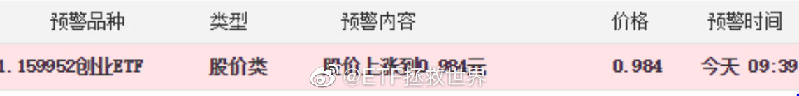

======================================================

ETF拯救世界 (5687069307) @
2019-10-28 10:09:29 Mon  
url: https://weibo.com/5687069307/Idyxh52bU

回复@Ojilth:我已经把所有方法，细节，经验，需要注意的事情都明明白白写出来了。只要按照自己的情况设计一下即可。//@Ojilth:E大，你考虑一下公布所有网格，每次看你收网，只能干着急

------------------------------------------------------
转推：
>  @ETF拯救世界 (5687069307)
>  2019-10-28 10:01:39 Mon  
>  url: https:/weibo.com/5687069307/Idyu5pE6t/

>  这一网效率极高，只用了十几个交易日。
>  
>  舒服。 ​​​

转发[24]  评论[174]  赞[679] 

======================================================

ETF拯救世界 (5687069307) @
2019-10-28 12:16:08 Mon  
url: https://weibo.com/5687069307/IdzmFFudS

回复@倔强而又疯狂:区块链我一个字都没说过啊。//@倔强而又疯狂:E大为何不看好区块链？

------------------------------------------------------
转推：
>  @ETF拯救世界 (5687069307)
>  2019-10-28 09:29:25 Mon  
>  url: https:/weibo.com/5687069307/Idyh0gDvE/

>  野百合也有春天 ​​​

转发[1]  评论[70]  赞[464] 

======================================================

ETF拯救世界 (5687069307) @
2019-10-28 12:47:23 Mon  
url: https://weibo.com/5687069307/IdzzmwTK3

回复@颓废的猪头_Ju:你怕的时候我按，你贪的时候我还会按。舒舒服服的时候我瞎按什么。按摩也要讲规矩，不能乱按。//@颓废的猪头_Ju:回复@吧嗒木:他现在都不按了[泪][泪][泪]

------------------------------------------------------
转推：
>  @ETF拯救世界 (5687069307)
>  2019-10-28 10:01:39 Mon  
>  url: https:/weibo.com/5687069307/Idyu5pE6t/

>  这一网效率极高，只用了十几个交易日。
>  
>  舒服。 ​​​

转发[6]  评论[112]  赞[599] 

======================================================

ETF拯救世界 (5687069307) @
2019-10-28 13:09:05 Mon  
url: https://weibo.com/5687069307/IdzIalgMF

身材

发型（量）

中年男人减龄十五岁的关键

配合穿衣打扮

可以做到减二十岁

年化3个巴仙 ​​​

转发[9]  评论[210]  赞[795] 

======================================================

ETF拯救世界 (5687069307) @
2019-10-28 16:05:38 Mon  
url: https://weibo.com/5687069307/IdARPn9UA

传媒的波动太大了，网格利器。 ​​​

转发[93]  评论[361]  赞[1218] 

======================================================

ETF拯救世界 (5687069307) @
2019-10-29 10:19:38 Tue  
url: https://weibo.com/5687069307/IdI1SBTEO

再破万点，再到压力位附近。//@ETF拯救世界:下一个压力位10400

------------------------------------------------------
转推：
>  @ETF拯救世界 (5687069307)
>  2019-08-22 15:04:05 Thu  
>  url: https:/weibo.com/5687069307/I3oPAbY05/

>  看样子医药有走好的迹象。 ​​​

转发[4]  评论[139]  赞[637] 

======================================================

ETF拯救世界 (5687069307) @
2019-10-29 13:55:36 Tue  
url: https://weibo.com/5687069307/IdJryemnW

我有个朋友说，

他想起了一些老朋友。

再也找不到的老朋友，

感到很伤感。 

为什么要给他推送《那些花儿》呢

他很生气 ​​​

转发[10]  评论[219]  赞[754] 

======================================================

ETF拯救世界 (5687069307) @
2019-10-29 14:41:07 Tue  
url: https://weibo.com/5687069307/IdJK1i711

我们这个月还没买它敢涨吗呵呵你说是不是这个道理 ​​​

转发[8]  评论[397]  赞[1275] 

======================================================

ETF拯救世界 (5687069307) @
2019-10-29 16:14:46 Tue  
url: https://weibo.com/5687069307/IdKm265Fc

你选哪个。 http://t.cn/Ai1jicWP ​​​

转发[61]  评论[305]  赞[8358] 

======================================================

ETF拯救世界 (5687069307) @
2019-10-29 16:19:09 Tue  
url: https://weibo.com/5687069307/IdKnOjGtS

你们是不是逗我呢。第一次看98：99，第二次看188：189。实力这么接近吗

------------------------------------------------------
转推：
>  @ETF拯救世界 (5687069307)
>  2019-10-29 16:14:46 Tue  
>  url: https:/weibo.com/5687069307/IdKm265Fc/

>  你选哪个。 http://t.cn/Ai1jicWP ​​​

转发[4]  评论[354]  赞[576] 

======================================================

ETF拯救世界 (5687069307) @
2019-10-29 20:46:18 Tue  
url: https://weibo.com/5687069307/IdM8flsXl

90，85。

------------------------------------------------------
转推：
>  @澎湃新闻 (5044281310)
>  2019-10-29 19:03:03 Tue  
>  url: https:/weibo.com/5044281310/IdLsl5pIf/

>  【#我国三成居民腰太粗#：腰粗呈现北方多南方少、西部多东部少】近日，中国医学科学院阜外医院高润霖院士研究团队针对我国超44万成年人进行的调查研究发现，我国近三成居民都是“大粗腰”。研究人员结合地域分布描绘出了我国的“粗腰地图”，粗腰人群呈现出北方多南方少、西部多东部少的特征。研究中将 ​​​

转发[6]  评论[135]  赞[373] 

======================================================

ETF拯救世界 (5687069307) @
2019-10-30 13:48:24 Wed  
url: https://weibo.com/5687069307/IdSP7AL8j

我一点都不反对炒作，没人炒作我的网格怎么能出的这么开心。[爱你]

在市场上混，千万别看不上这个看不上那个。存在是不是即合理我不知道，我只知道找办法怎么在这些存在中赚钱。

瞎BB能改变谁？谁也改变不了。不埋怨，想办法，在乱中挣钱。

守正，出奇。守正是安身立命的根本，出奇是变富的捷径。

 ​​​

转发[99]  评论[215]  赞[965] 

======================================================

ETF拯救世界 (5687069307) @
2019-10-30 13:56:32 Wed  
url: https://weibo.com/5687069307/IdSSq8YJN

几个月前开始吧，网易云音乐的日推质量断崖式下跌。

真的就是突然完蛋。差到让人生气。

以前的感觉是，啊还有这么好听的音乐。后来的感觉是，什么玩意这种辣鸡怎么有人听。

考虑不续费了。 ​​​

转发[12]  评论[282]  赞[1111] 

======================================================

ETF拯救世界 (5687069307) @
2019-10-30 17:55:39 Wed  
url: https://weibo.com/5687069307/IdUrtwl3r

我有个朋友说，小学生减负什么的他根本没在怕。

毕竟已经自己给孩子买了黄冈小状元和53天天练可以从放学做到晚上… ​​​

转发[34]  评论[126]  赞[628] 

======================================================

ETF拯救世界 (5687069307) @
2019-10-30 17:58:00 Wed  
url: https://weibo.com/5687069307/IdUsrcRGd

回复@时间会说话21:我那个朋友让我帮他问问哪个培优的练习册好//@时间会说话21:这两样还是太简单，建议买培优类

------------------------------------------------------
转推：
>  @ETF拯救世界 (5687069307)
>  2019-10-30 17:55:39 Wed  
>  url: https:/weibo.com/5687069307/IdUrtwl3r/

>  我有个朋友说，小学生减负什么的他根本没在怕。
>  
>  毕竟已经自己给孩子买了黄冈小状元和53天天练可以从放学做到晚上… ​​​

转发[22]  评论[105]  赞[496] 

======================================================

ETF拯救世界 (5687069307) @
2019-10-30 18:12:24 Wed  
url: https://weibo.com/5687069307/IdUyhe3eY

我发现群众分两部分。一部分最喜欢桃色的东西，另一部分喜欢黄色的。

你有没有不同看法。 ​​​

转发[4]  评论[248]  赞[781] 

======================================================

ETF拯救世界 (5687069307) @
2019-10-30 19:13:34 Wed  
url: https://weibo.com/5687069307/IdUX6pnTy

苹果的周边产品吧，怎么说呢，就是两个字：

真香。

watch也好，airpods也好，我都是出了很久很久都没买，也没别的，就是不觉得好。比如听说watch每天都要充电就觉得很麻烦很二。

然后某天突然心血来潮买一个试试，就离不开了。到现在以前的机械表也不戴了，大法耳机也不用了。

苹果的笔记本我根本 ​​​

转发[11]  评论[164]  赞[547] 

======================================================

ETF拯救世界 (5687069307) @
2019-10-30 19:42:21 Wed  
url: https://weibo.com/5687069307/IdV8MBWFp

回复@厦门一夜-fisker:这样的老婆哪儿还有，给单身的兄弟们来一打//@厦门一夜-fisker:确实是。我老婆说要给我买airpods说了好几次，我都说不感兴趣，然后上个月生日她偷偷买了送我。真香[哈哈]

------------------------------------------------------
转推：
>  @ETF拯救世界 (5687069307)
>  2019-10-30 19:13:34 Wed  
>  url: https:/weibo.com/5687069307/IdUX6pnTy/

>  苹果的周边产品吧，怎么说呢，就是两个字：
>  
>  真香。
>  
>  watch也好，airpods也好，我都是出了很久很久都没买，也没别的，就是不觉得好。比如听说watch每天都要充电就觉得很麻烦很二。
>  
>  然后某天突然心血来潮买一个试试，就离不开了。到现在以前的机械表也不戴了，大法耳机也不用了。
>  
>  苹果的笔记本我根本 ​​​

转发[3]  评论[44]  赞[371] 

======================================================

ETF拯救世界 (5687069307) @
2019-10-30 19:43:15 Wed  
url: https://weibo.com/5687069307/IdV99n3ZS

喷了

------------------------------------------------------
转推：
>  @ ()
>  2019-10-30 19:24:59 Wed  
>  url: 

>  抱歉，作者已设置仅展示半年内微博，此微博已不可见。 ​​​

转发[13]  评论[166]  赞[606] 

======================================================

ETF拯救世界 (5687069307) @
2019-10-31 09:45:59 Thu  
url: https://weibo.com/5687069307/Ie0Fdsfkf

不要问，不要说，明天才有车 ​​​

转发[9]  评论[336]  赞[1071] 

======================================================

ETF拯救世界 (5687069307) @
2019-10-31 09:51:44 Thu  
url: https://weibo.com/5687069307/Ie0HywlFs

别老盼着某些板块某些股票跌。

有些时候你觉得“贵了”“涨的多了”，赶紧跌吧，跌了才正常。

不好意思，你越这么想，它涨的越好。

虽然最后也许你是对的，但你对之前，疯狂的程度可能远超你想象。

你可以不追，但如果你手里有，别轻易下车。这才是关键。 ​​​

转发[71]  评论[144]  赞[788] 

======================================================

ETF拯救世界 (5687069307) @
2019-10-31 10:01:46 Thu  
url: https://weibo.com/5687069307/Ie0LCCiCP

三季度全指医药利润增速依然在两位数，是全市场的一倍。 ​​​

转发[82]  评论[123]  赞[919] 

======================================================

ETF拯救世界 (5687069307) @
2019-10-31 10:10:51 Thu  
url: https://weibo.com/5687069307/Ie0PjhG49

儿子说，班里有个小姑娘抱着他说要跟他谈恋爱。

以前孩子小的时候这样的事情我都觉得好笑，现在有点担心了。

刚一年级。要真往这上面开始动心思，学习不就全完蛋了。

这TMD怎么办。 ​​​

转发[103]  评论[1033]  赞[4475] 

======================================================

ETF拯救世界 (5687069307) @
2019-10-31 12:08:17 Thu  
url: https://weibo.com/5687069307/Ie1AYvIGI

我的群晖，刚才家里断了一下电，再起就起不来了。按电源键开机，电源灯，lan灯闪五秒，就全灭。

有没有学习好的知道是怎么回事。 ​​​

转发[3]  评论[230]  赞[612] 

======================================================

ETF拯救世界 (5687069307) @
2019-10-31 13:43:34 Thu  
url: https://weibo.com/5687069307/Ie2dEryJf

慌什么，两个月不买，是有原因的。

现金是好东西。别急。 ​​​

转发[24]  评论[299]  赞[1557] 

======================================================

ETF拯救世界 (5687069307) @
2019-10-31 19:34:54 Thu  
url: https://weibo.com/5687069307/Ie4wgaTFi

回复@卢日尼基的雨夜:照你这个意思100%现金才好呢？我说现金是好东西，是仓位合适的基础上说的。不要随意满仓，上杠杆，为所有可能的未来做好准备。//@卢日尼基的雨夜:那么E大为什么不卖点？这样现金更多

------------------------------------------------------
转推：
>  @ETF拯救世界 (5687069307)
>  2019-10-31 13:43:34 Thu  
>  url: https:/weibo.com/5687069307/Ie2dEryJf/

>  慌什么，两个月不买，是有原因的。
>  
>  现金是好东西。别急。 ​​​

转发[11]  评论[72]  赞[526] 

======================================================

ETF拯救世界 (5687069307) @
2019-10-31 19:38:35 Thu  
url: https://weibo.com/5687069307/Ie4xKFE1X

金银又起来了，白银可以先挂个30天的卖单，万一成了呢。//@ETF拯救世界:服了 http://t.cn/AinQeJi9 //@ETF拯救世界:内心毫无波动的机器人 http://t.cn/AinIxnMV

------------------------------------------------------
转推：
>  @ETF拯救世界 (5687069307)
>  2019-09-14 06:08:50 Sat  
>  url: https:/weibo.com/5687069307/I6Q9JCoiO/

>  哈哈哈。
>  
>  波动的乐趣。 ​​​

转发[9]  评论[175]  赞[485] 

======================================================

ETF拯救世界 (5687069307) @
2019-11-01 09:20:49 Fri  
url: https://weibo.com/5687069307/Ie9VwfeFM

震惊，美股暴跌0.3%，惨不忍睹！

------------------------------------------------------
转推：
>  @网易财经 (1974561081)
>  2019-11-01 08:30:14 Fri  
>  url: https:/weibo.com/1974561081/Ie9AY4JPl/

>  【特朗普出大事美股大跌!特朗普怒了:只会伤害美股】外围市场不平静，刚刚，重磅黑天鹅事件发生了。
>  据央视新闻报道，当地时间10月31日上午，美国众议院投票，通过对特朗普的弹劾调查程序。在投票中，共有232票赞成，196票反对。美国众议长佩洛西宣布决议通过。
>  这背后发生了什么？美国弹劾总统要分几步 ​​​

转发[4]  评论[176]  赞[592] 

======================================================

ETF拯救世界 (5687069307) @
2019-11-01 10:33:45 Fri  
url: https://weibo.com/5687069307/Ieap6mPw2

财新PMI真是不错。

PMI更类似于一个同步指标，虽然不先行，但不至于落后。所以是有些价值的。 ​​​

转发[38]  评论[285]  赞[813] 

======================================================

ETF拯救世界 (5687069307) @
2019-11-01 12:07:27 Fri  
url: https://weibo.com/5687069307/Ieb18oOQq

推送的时候明明没动。

搞什么搞。[哼] ​​​

转发[19]  评论[297]  赞[1011] 

======================================================

ETF拯救世界 (5687069307) @
2019-11-01 13:41:30 Fri  
url: https://weibo.com/5687069307/IebDjByZW

2012年11月，全市场PB与目前大致一样。但是7年来深综指涨了117%。年化当然不高，也就十个点出头。但是，

目前的全市场PB，在A股历史上，是非常非常低的水平。大致是钻石坑外一点点的位置。

十年后，哪怕还是这么低的估值，也会有很不错的收益。不过，我不信十年内连一次大牛市都没有。

真不信。 ​​​

转发[192]  评论[441]  赞[1600] 

======================================================

ETF拯救世界 (5687069307) @
2019-11-01 16:24:38 Fri  
url: https://weibo.com/5687069307/IecHxbLOs

回复@淡然一笑201208:因为今天是一号，周五，无论怎么都应该是今天发这个月的车

------------------------------------------------------
转推：
>  @ETF拯救世界 (5687069307)
>  2019-11-01 12:07:27 Fri  
>  url: https:/weibo.com/5687069307/Ieb18oOQq/

>  推送的时候明明没动。
>  
>  搞什么搞。[哼] ​​​

转发[12]  评论[78]  赞[526] 

======================================================

ETF拯救世界 (5687069307) @
2019-11-01 16:55:52 Fri  
url: https://weibo.com/5687069307/IecUd8HGr

不过可以透露一点，今天的走势决定了发车品种。因为这个时间点很关键。//@ETF拯救世界:回复@淡然一笑201208:因为今天是一号，周五，无论怎么都应该是今天发这个月的车

------------------------------------------------------
转推：
>  @ETF拯救世界 (5687069307)
>  2019-11-01 12:07:27 Fri  
>  url: https:/weibo.com/5687069307/Ieb18oOQq/

>  推送的时候明明没动。
>  
>  搞什么搞。[哼] ​​​

转发[7]  评论[154]  赞[696] 

======================================================

ETF拯救世界 (5687069307) @
2019-11-01 22:36:30 Fri  
url: https://weibo.com/5687069307/Ief8t76Et

什么玩意儿啊 ​​​

转发[5]  评论[251]  赞[716] 

+++++++++++++++++++++++++++++++++++++++++++++++++++++

图片：
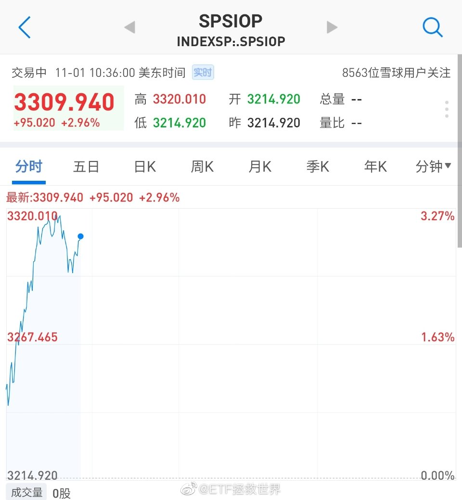

======================================================

ETF拯救世界 (5687069307) @
2019-11-01 22:43:20 Fri  
url: https://weibo.com/5687069307/IefbfnzaV

我劝你善良 ​​​

转发[3]  评论[158]  赞[778] 

======================================================

ETF拯救世界 (5687069307) @
2019-11-01 23:04:15 Fri  
url: https://weibo.com/5687069307/IefjJErcx

回复@ETF有毒:我拉黑的都是做广告的。已经很久没有拉黑喷子了。//@ETF有毒:为什么微博提醒我谨慎评论[doge][doge][doge]

------------------------------------------------------
转推：
>  @ETF拯救世界 (5687069307)
>  2019-11-01 22:43:20 Fri  
>  url: https:/weibo.com/5687069307/IefbfnzaV/

>  我劝你善良 ​​​

转发[0]  评论[73]  赞[521] 

======================================================

ETF拯救世界 (5687069307) @
2019-11-02 19:38:07 Sat  
url: https://weibo.com/5687069307/IenoyuJ6s

A股最近20年有两次超级大牛市，06-07两年半六倍，12-15，中小股票两年半六倍。

这两次超级大牛市有一个非常有意思的共通点，就是之前经历了时长几乎一样的大熊市：

00-05，08-12。一个四年半，一个五年

这一轮熊市从2015年至今已经四年半。如果到明年年中还不结束，就是创了A股历史。

有人说，这几 ​​​

转发[529]  评论[962]  赞[2956] 

======================================================

ETF拯救世界 (5687069307) @
2019-11-04 09:38:16 Mon  
url: https://weibo.com/5687069307/IeCk50hJ8

回复@ETF拯救世界:快了。还有2%。能突破吗//@ETF拯救世界:下一个压力位10400

------------------------------------------------------
转推：
>  @ETF拯救世界 (5687069307)
>  2019-08-22 15:04:05 Thu  
>  url: https:/weibo.com/5687069307/I3oPAbY05/

>  看样子医药有走好的迹象。 ​​​

转发[4]  评论[108]  赞[611] 

======================================================

ETF拯救世界 (5687069307) @
2019-11-04 10:34:04 Mon  
url: https://weibo.com/5687069307/IeCGJb7Z4

舒服就是涨了你赚钱，跌了你继续开心买筹码，以后赚更多。

难受就是涨了你没筹码，或者有筹码天天担心利润回吐。跌了你满仓看着资产不断下跌心如刀割，或者你满把现金却还要操心什么时候进场以免踏空。

舒服很重要。舒服了，才不会手忙脚乱，做出错误的决定。

一步错，步步错。市场还是哪个市场，你 ​​​

转发[122]  评论[383]  赞[1389] 

======================================================

ETF拯救世界 (5687069307) @
2019-11-04 10:52:46 Mon  
url: https://weibo.com/5687069307/IeCOjDQQW

回复@竹32161:给个群号啊。有钱一起挣！//@竹32161:益达的每一篇文字，都值得细细琢磨收藏[爱你]

------------------------------------------------------
转推：
>  @ETF拯救世界 (5687069307)
>  2019-11-04 10:34:04 Mon  
>  url: https:/weibo.com/5687069307/IeCGJb7Z4/

>  舒服就是涨了你赚钱，跌了你继续开心买筹码，以后赚更多。
>  
>  难受就是涨了你没筹码，或者有筹码天天担心利润回吐。跌了你满仓看着资产不断下跌心如刀割，或者你满把现金却还要操心什么时候进场以免踏空。
>  
>  舒服很重要。舒服了，才不会手忙脚乱，做出错误的决定。
>  
>  一步错，步步错。市场还是哪个市场，你 ​​​

转发[5]  评论[175]  赞[607] 

======================================================

ETF拯救世界 (5687069307) @
2019-11-04 13:55:50 Mon  
url: https://weibo.com/5687069307/IeE0CmZbX

这一生，想要不至于无聊，就应该不断去感受新的体验。

在安全的前提下。

日复一日全都一样，转眼就老了。 ​​​

转发[77]  评论[334]  赞[1625] 

======================================================

ETF拯救世界 (5687069307) @
2019-11-04 17:27:14 Mon  
url: https://weibo.com/5687069307/IeFoqmf3M

德国DAX即将突破历史新高。

富时100什么时候上。 ​​​

转发[8]  评论[240]  赞[969] 

======================================================

ETF拯救世界 (5687069307) @
2019-11-05 07:22:41 Tue  
url: https://weibo.com/5687069307/IeKRxcNJM

两天8%，这个买点您还满意吗 ​​​

转发[20]  评论[240]  赞[938] 

+++++++++++++++++++++++++++++++++++++++++++++++++++++

图片：

======================================================

ETF拯救世界 (5687069307) @
2019-11-05 07:44:46 Tue  
url: https://weibo.com/5687069307/IeL0vkSD7

回复@klkl231:别急，今天四个点起//@klkl231:E大，求科普，华宝油气与spsiop涨幅不一致

------------------------------------------------------
转推：
>  @ETF拯救世界 (5687069307)
>  2019-11-05 07:22:41 Tue  
>  url: https:/weibo.com/5687069307/IeKRxcNJM/

>  两天8%，这个买点您还满意吗 ​​​

转发[7]  评论[131]  赞[449] 

======================================================

ETF拯救世界 (5687069307) @
2019-11-05 07:49:08 Tue  
url: https://weibo.com/5687069307/IeL2gFl6N

回复@June的6月天:嗯，前几天打越洋电话的时候隐隐约约有听说啦//@June的6月天:美国要退出《巴黎气候协议》

------------------------------------------------------
转推：
>  @ETF拯救世界 (5687069307)
>  2019-11-05 07:22:41 Tue  
>  url: https:/weibo.com/5687069307/IeKRxcNJM/

>  两天8%，这个买点您还满意吗 ​​​

转发[7]  评论[116]  赞[575] 

======================================================

ETF拯救世界 (5687069307) @
2019-11-05 08:17:36 Tue  
url: https://weibo.com/5687069307/IeLdPdxp4

想买

------------------------------------------------------
转推：
>  @NoonStory (5452482926)
>  2019-11-04 12:06:05 Mon  
>  url: https:/weibo.com/5452482926/IeDi4mIXR/

>  李海断断续续看了两年房，今年5月他打算去鹤岗买房，在贴吧发了帖子全程直播买房过程，看房的第八天，他签下了新房合同，总价五万八，两室一厅。“不管好坏，还是得买套房，”李海说，“就这几万块钱，没什么好后悔的。” http://t.cn/AiBM5nh7 ​​​

转发[49]  评论[198]  赞[661] 

======================================================

ETF拯救世界 (5687069307) @
2019-11-05 11:54:32 Tue  
url: https://weibo.com/5687069307/IeMDSrGnF

意思不大。 ​​​

转发[8]  评论[138]  赞[658] 

======================================================

ETF拯救世界 (5687069307) @
2019-11-05 11:56:39 Tue  
url: https://weibo.com/5687069307/IeMEJCxW3

我说微博能不能别老给我加这些无聊的标签了？！

------------------------------------------------------
转推：
>  @ETF拯救世界 (5687069307)
>  2019-11-05 11:54:32 Tue  
>  url: https:/weibo.com/5687069307/IeMDSrGnF/

>  意思不大。 ​​​

转发[0]  评论[132]  赞[576] 

======================================================

ETF拯救世界 (5687069307) @
2019-11-05 13:33:30 Tue  
url: https://weibo.com/5687069307/IeNi3rEzJ

回复@lwj牛牛牛666:挣钱意思不大//@lwj牛牛牛666:一顿大涨，直接上去了，还意思不大？

------------------------------------------------------
转推：
>  @ETF拯救世界 (5687069307)
>  2019-11-05 11:54:32 Tue  
>  url: https:/weibo.com/5687069307/IeMDSrGnF/

>  意思不大。 ​​​

转发[4]  评论[110]  赞[631] 

======================================================

ETF拯救世界 (5687069307) @
2019-11-05 14:49:39 Tue  
url: https://weibo.com/5687069307/IeNMXr8Nh

我觉得吧，人生最大的成功不是功成名就，叱咤风云，王侯将相。

人生最大的成功是有趣。

自己活得有趣，也让身边的人，甚至更多的人生活的更有意思。

有趣不是滑稽，是一种很难表述的状态。英文应该是interesting，因吹丝挺。

最难的是自己觉得人生有趣。喜剧演员未必自己活得开心，抑郁症非常多。 ​​​

转发[204]  评论[453]  赞[1551] 

======================================================

ETF拯救世界 (5687069307) @
2019-11-05 15:07:23 Tue  
url: https://weibo.com/5687069307/IeNUacgnz

我觉得可以公布总分和单科成绩前二十名的排名吧。利大于弊啊。否则根本不知道自己是什么状态啊

------------------------------------------------------
转推：
>  @澎湃新闻 (5044281310)
>  2019-11-05 14:54:03 Tue  
>  url: https:/weibo.com/5044281310/IeNOKf9S3/

>  【#重庆出台中小学减负方案#：严控作业量，严禁公布成绩排名】重庆市教委、市发改委等九部门日前联合印发《重庆市进一步推进中小学生减负工作实施方案》，通过多项措施减轻中小学生过重学业负担。《方案》要求，严格控制学生家庭作业量。小学一、二年级不得布置书面家庭作业，三至六年级每天家庭作业总 ​​​ http://mapi/005vnhZYgy1g8n5xv4929j30gy09q0t7

转发[10]  评论[122]  赞[630] 

======================================================

ETF拯救世界 (5687069307) @
2019-11-05 19:25:04 Tue  
url: https://weibo.com/5687069307/IePAL7GPW

“从核磁片子看，你儿子比我还正常。”

------------------------------------------------------
转推：
>  @ ()
>  2019-11-05 09:22:34 Tue  
>  url: 

>  抱歉，作者已设置仅展示半年内微博，此微博已不可见。 ​​​

转发[1]  评论[76]  赞[534] 

======================================================

ETF拯救世界 (5687069307) @
2019-11-05 20:59:38 Tue  
url: https://weibo.com/5687069307/IeQd8nZUw

友情提示：

车门上让人插了小广告卡片千万不要降车窗。

别问我怎么知道的。 ​​​

转发[24]  评论[320]  赞[1083] 

======================================================

ETF拯救世界 (5687069307) @
2019-11-06 09:34:55 Wed  
url: https://weibo.com/5687069307/IeV9HAWsl

17个交易日。效率极高。 ​​​

转发[17]  评论[344]  赞[984] 

+++++++++++++++++++++++++++++++++++++++++++++++++++++

图片：
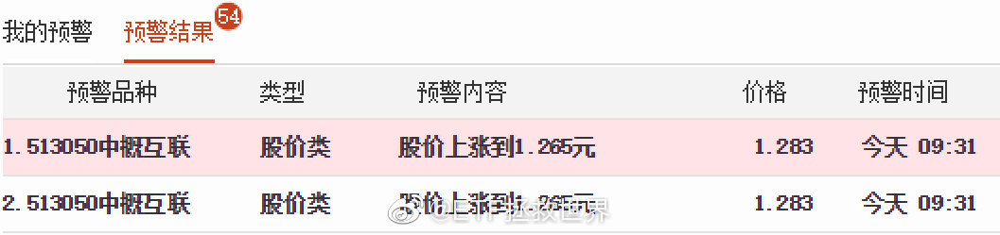

======================================================

ETF拯救世界 (5687069307) @
2019-11-07 11:47:37 Thu  
url: https://weibo.com/5687069307/If5s48UJE

第一篇《普通人的投资进化论》

第二篇《我的财富观》

看起来还可以吧。 ​​​

转发[28]  评论[636]  赞[2378] 

======================================================

ETF拯救世界 (5687069307) @
2019-11-07 13:55:23 Thu  
url: https://weibo.com/5687069307/If6hVlN9w

医药增速快，所以涨的虽然多，并没有太贵。踏踏实实拿着。拿不住就用另外的资金做网格

------------------------------------------------------
转推：
>  @ETF拯救世界 (5687069307)
>  2019-10-31 10:01:46 Thu  
>  url: https:/weibo.com/5687069307/Ie0LCCiCP/

>  三季度全指医药利润增速依然在两位数，是全市场的一倍。 ​​​

转发[56]  评论[135]  赞[774] 

======================================================

ETF拯救世界 (5687069307) @
2019-11-07 14:54:33 Thu  
url: https://weibo.com/5687069307/If6FWCyJR

回复@看云的日子2019:我没有能力预测它会不会调整。我只能计算概率，得出目前拿着，长期看会是更好的选择这个结论而已。我会持有低成本长线仓位，未来跌的话就继续买//@看云的日子2019:谢谢，医药因为赚得多，本来还有点忐忑。现在定心了。打算做网格

------------------------------------------------------
转推：
>  @ETF拯救世界 (5687069307)
>  2019-10-31 10:01:46 Thu  
>  url: https:/weibo.com/5687069307/Ie0LCCiCP/

>  三季度全指医药利润增速依然在两位数，是全市场的一倍。 ​​​

转发[21]  评论[52]  赞[489] 

======================================================

ETF拯救世界 (5687069307) @
2019-11-07 14:56:42 Thu  
url: https://weibo.com/5687069307/If6GOofLO

感觉今年的北京秋天比往年长了一些。

美。 ​​​

转发[4]  评论[196]  赞[741] 

======================================================

ETF拯救世界 (5687069307) @
2019-11-07 16:38:26 Thu  
url: https://weibo.com/5687069307/If7m6xXfP

欧洲这样涨，富时100出了也暂时不买了 ​​​

转发[3]  评论[91]  赞[597] 

======================================================

ETF拯救世界 (5687069307) @
2019-11-07 17:07:48 Thu  
url: https://weibo.com/5687069307/If7y2aZdi

30岁的火云邪神。

------------------------------------------------------
转推：
>  @ ()
>  2019-11-07 17:03:44 Thu  
>  url: 

>  抱歉，作者已设置仅展示半年内微博，此微博已不可见。 ​​​

转发[6]  评论[106]  赞[325] 

======================================================

ETF拯救世界 (5687069307) @
2019-11-07 18:38:59 Thu  
url: https://weibo.com/5687069307/If892nrBn

我个人观点：

一个人，学会了独立思考，不被轻易洗脑，非常好。

学会了开眼看世界，也非常好。

但是，请注意，

无论你在哪里，看到了什么，都要坚持独立思考，客观论证。不能对某些人的话一点都不信，更不能对另一些人的话毫无置疑的全盘接受。

这个世界非常非常复杂。无论如何，不要轻易被别人影 ​​​

转发[217]  评论[261]  赞[1248] 

======================================================

ETF拯救世界 (5687069307) @
2019-11-08 09:22:57 Fri  
url: https://weibo.com/5687069307/IfdVQcQyD

意思不大 ​​​

转发[52]  评论[128]  赞[476] 

======================================================

ETF拯救世界 (5687069307) @
2019-11-08 09:26:52 Fri  
url: https://weibo.com/5687069307/IfdXqB34B

回复@ETF资产配置:不是。按照剧本发展，没什么意思。//@ETF资产配置:哈哈，大大觉得要跌才有意思呢[污]

------------------------------------------------------
转推：
>  @ETF拯救世界 (5687069307)
>  2019-11-08 09:22:57 Fri  
>  url: https:/weibo.com/5687069307/IfdVQcQyD/

>  意思不大 ​​​

转发[2]  评论[62]  赞[451] 

======================================================

ETF拯救世界 (5687069307) @
2019-11-08 09:55:33 Fri  
url: https://weibo.com/5687069307/Ife94toRx

现在要做的很简单

攥紧你的长线筹码，有兴趣就用短线仓位做波段，没兴趣就歇着。

然后继续攒钱，等下次有机会继续多买。

雪球越滚越大你信不信。 ​​​

转发[107]  评论[285]  赞[1072] 

======================================================

ETF拯救世界 (5687069307) @
2019-11-08 09:57:54 Fri  
url: https://weibo.com/5687069307/Ifea1AgZW

回复@xiao靥茹花:尽量不要买场内的白银基金。一切与期货挂钩的指数基金都要小心。//@xiao靥茹花:今天白银etf刺激不 http://t.cn/AiBuimYS

------------------------------------------------------
转推：
>  @ETF拯救世界 (5687069307)
>  2019-11-08 09:22:57 Fri  
>  url: https:/weibo.com/5687069307/IfdVQcQyD/

>  意思不大 ​​​

转发[48]  评论[84]  赞[432] 

======================================================

ETF拯救世界 (5687069307) @
2019-11-08 10:04:37 Fri  
url: https://weibo.com/5687069307/IfecKAqCC

去年此时钻石坑，有人将信将疑不敢买，甚至被各种利空吓得清仓。

上半年一波大涨有人又捶胸顿足，后悔胆子太小错失机会。发誓再来机会一定买。

4、5月开始大幅调整，机会真的来了，又继续将信将疑。

再涨起来，又后悔。

这辈子也就这样了。 ​​​

转发[246]  评论[298]  赞[986] 

======================================================

ETF拯救世界 (5687069307) @
2019-11-08 10:05:55 Fri  
url: https://weibo.com/5687069307/Ifedi2M9x

回复@ETF拯救世界:三个月前提出压力位10400，今日最高10336。一举突破还是被压制？这里的战斗会非常精彩。//@ETF拯救世界:下一个压力位10400

------------------------------------------------------
转推：
>  @ETF拯救世界 (5687069307)
>  2019-08-22 15:04:05 Thu  
>  url: https:/weibo.com/5687069307/I3oPAbY05/

>  看样子医药有走好的迹象。 ​​​

转发[17]  评论[97]  赞[551] 

======================================================

ETF拯救世界 (5687069307) @
2019-11-08 10:09:11 Fri  
url: https://weibo.com/5687069307/IfeeBzgxk

回复@木酒酒-zl:非常好，情商很高。//@木酒酒-zl:办公室有同事天天高调等2440，我保持沉默。

------------------------------------------------------
转推：
>  @ETF拯救世界 (5687069307)
>  2019-11-08 10:04:37 Fri  
>  url: https:/weibo.com/5687069307/IfecKAqCC/

>  去年此时钻石坑，有人将信将疑不敢买，甚至被各种利空吓得清仓。
>  
>  上半年一波大涨有人又捶胸顿足，后悔胆子太小错失机会。发誓再来机会一定买。
>  
>  4、5月开始大幅调整，机会真的来了，又继续将信将疑。
>  
>  再涨起来，又后悔。
>  
>  这辈子也就这样了。 ​​​

转发[131]  评论[76]  赞[544] 

======================================================

ETF拯救世界 (5687069307) @
2019-11-08 10:44:11 Fri  
url: https://weibo.com/5687069307/IfesP1vSQ

回复@很多人叫memory:有救。三步：第一步，承认自己不能100%预测未来。第二步，学习简单的概率知识，计算未来涨跌概率。第三步，根据概率布置仓位。三步走完，从此在股市上不会犯大错。//@很多人叫memory:有救吗//@ETF拯救世界:回复@木酒酒-zl:非常好，情商很高。

------------------------------------------------------
转推：
>  @ETF拯救世界 (5687069307)
>  2019-11-08 10:04:37 Fri  
>  url: https:/weibo.com/5687069307/IfecKAqCC/

>  去年此时钻石坑，有人将信将疑不敢买，甚至被各种利空吓得清仓。
>  
>  上半年一波大涨有人又捶胸顿足，后悔胆子太小错失机会。发誓再来机会一定买。
>  
>  4、5月开始大幅调整，机会真的来了，又继续将信将疑。
>  
>  再涨起来，又后悔。
>  
>  这辈子也就这样了。 ​​​

转发[121]  评论[121]  赞[698] 

======================================================

ETF拯救世界 (5687069307) @
2019-11-08 10:47:38 Fri  
url: https://weibo.com/5687069307/IfeudC39H

记得保湿啊

------------------------------------------------------
转推：
>  @ETF拯救世界 (5687069307)
>  2019-08-10 16:39:57 Sat  
>  url: https:/weibo.com/5687069307/I1AkwDOeI/

>  记得涂防晒啊 ​​​

转发[3]  评论[256]  赞[589] 

======================================================

ETF拯救世界 (5687069307) @
2019-11-10 12:11:10 Sun  
url: https://weibo.com/5687069307/IfxT799oA

双11不知道买什么。

总感觉吃亏了。

另外，领券是我能接受的底线了。其他各种促销抢红包什么的反人类手段我个人坚决抵制。

其实主要是智商和耐心都不够。搞不清楚到底是怎么回事…… ​​​

转发[34]  评论[273]  赞[596] 

======================================================

ETF拯救世界 (5687069307) @
2019-11-10 12:38:06 Sun  
url: https://weibo.com/5687069307/Ify42ETdl

回复@投资跑道上的一只小蜗牛:消费资金和投资资金永远井水不犯河水。否则要出大问题。//@投资跑道上的一只小蜗牛:明天指数打折的。你买淘宝就亏了

------------------------------------------------------
转推：
>  @ETF拯救世界 (5687069307)
>  2019-11-10 12:11:10 Sun  
>  url: https:/weibo.com/5687069307/IfxT799oA/

>  双11不知道买什么。
>  
>  总感觉吃亏了。
>  
>  另外，领券是我能接受的底线了。其他各种促销抢红包什么的反人类手段我个人坚决抵制。
>  
>  其实主要是智商和耐心都不够。搞不清楚到底是怎么回事…… ​​​

转发[17]  评论[80]  赞[475] 

======================================================

ETF拯救世界 (5687069307) @
2019-11-10 23:53:38 Sun  
url: https://weibo.com/5687069307/IfCuffAxy

准备动手了吗 ​​​

转发[5]  评论[274]  赞[661] 

======================================================

ETF拯救世界 (5687069307) @
2019-11-11 09:39:46 Mon  
url: https://weibo.com/5687069307/IfGk9B8Iz

强力压制。想突破没那么容易。//@ETF拯救世界:回复@ETF拯救世界:三个月前提出压力位10400，今日最高10336。一举突破还是被压制？这里的战斗会非常精彩。//@ETF拯救世界:下一个压力位10400

------------------------------------------------------
转推：
>  @ETF拯救世界 (5687069307)
>  2019-08-22 15:04:05 Thu  
>  url: https:/weibo.com/5687069307/I3oPAbY05/

>  看样子医药有走好的迹象。 ​​​

转发[8]  评论[183]  赞[557] 

======================================================

ETF拯救世界 (5687069307) @
2019-11-11 14:16:23 Mon  
url: https://weibo.com/5687069307/IfI8r4ZZl

波动产生利润 ​​​

转发[27]  评论[273]  赞[789] 

======================================================

ETF拯救世界 (5687069307) @
2019-11-11 15:42:49 Mon  
url: https://weibo.com/5687069307/IfIHwdBoz

回复@跟车小号滴滴哒:恒生前几大持仓是汇丰腾讯友邦建行平安移动工行，阿里也会进去。前十大只有港交所，本地股比例有多大？当然，你想换什么我没意见//@跟车小号滴滴哒:E大，请教，是否应该将159920换成510900，香港本地股的比例让人害怕

------------------------------------------------------
转推：
>  @ETF拯救世界 (5687069307)
>  2019-11-11 14:16:23 Mon  
>  url: https:/weibo.com/5687069307/IfI8r4ZZl/

>  波动产生利润 ​​​

转发[14]  评论[78]  赞[423] 

======================================================

ETF拯救世界 (5687069307) @
2019-11-11 16:59:30 Mon  
url: https://weibo.com/5687069307/IfJcEmgn8

回复@Matrix_矩阵视效创意:是的，买了礼物。//@Matrix_矩阵视效创意:回复@颓废的猪头_Ju:买了礼物准备送我们~[哪吒开心][哪吒开心]//@ETF拯救世界:回复@跟车小号滴滴哒:恒生前几大持仓是汇丰腾讯友邦建行平安移动工行，阿里也会进去。前十大只有港交所，本地股比例有多大？当然，你想换什么我没意见

------------------------------------------------------
转推：
>  @ETF拯救世界 (5687069307)
>  2019-11-11 14:16:23 Mon  
>  url: https:/weibo.com/5687069307/IfI8r4ZZl/

>  波动产生利润 ​​​

转发[2]  评论[138]  赞[527] 

======================================================

ETF拯救世界 (5687069307) @
2019-11-11 18:55:26 Mon  
url: https://weibo.com/5687069307/IfJXHsIwh

一年没穿，我的帅气皮衣竟然有点紧了。

怎么回事，是不是衣服缩水了。 ​​​

转发[17]  评论[468]  赞[1706] 

======================================================

ETF拯救世界 (5687069307) @
2019-11-12 10:19:30 Tue  
url: https://weibo.com/5687069307/IfQ0Mn6OK

好几天没见到网格预警小窗口了

想它 ​​​

转发[21]  评论[168]  赞[726] 

+++++++++++++++++++++++++++++++++++++++++++++++++++++

图片：

======================================================

ETF拯救世界 (5687069307) @
2019-11-12 10:52:34 Tue  
url: https://weibo.com/5687069307/IfQed5GO9

长线仓位已经足够，现阶段就是吃吃波段，提提款。

有没有牛市，能不能挣大钱，你我无法决定。自己无法决定的事情就不必焦虑。 ​​​

转发[57]  评论[207]  赞[1081] 

======================================================

ETF拯救世界 (5687069307) @
2019-11-12 11:13:58 Tue  
url: https://weibo.com/5687069307/IfQmTaCu9

从全市场PB的角度看，A股过去288个月中，只有22个月低于现在。

分别处于1995年、2005年、2008年。 

对了，还有去年底。 ​​​

转发[182]  评论[480]  赞[1624] 

======================================================

ETF拯救世界 (5687069307) @
2019-11-12 16:20:41 Tue  
url: https://weibo.com/5687069307/IfSnojTbv

不是很理解现在还去旅游的人是怎么想的。 ​​​

转发[23]  评论[223]  赞[885] 

======================================================

ETF拯救世界 (5687069307) @
2019-11-12 16:28:06 Tue  
url: https://weibo.com/5687069307/IfSqp7A46

乱倒不是最重要的。关键是你去一个地方，别人都把你当Sb，谁跟你都没好脸，就算不打你，你还有心情玩？

------------------------------------------------------
转推：
>  @ETF拯救世界 (5687069307)
>  2019-11-12 16:20:41 Tue  
>  url: https:/weibo.com/5687069307/IfSnojTbv/

>  不是很理解现在还去旅游的人是怎么想的。 ​​​

转发[15]  评论[181]  赞[781] 

======================================================

ETF拯救世界 (5687069307) @
2019-11-12 18:56:21 Tue  
url: https://weibo.com/5687069307/IfTozp7PV

回复@小号1234567小童鞋:之前同事的孩子高考后复旦和港科大二选一，还好选了复旦……//@小号1234567小童鞋:唉，今年过去读书，现在学校都被人砸了[泪]//@ETF拯救世界:乱倒不是最重要的。关键是你去一个地方，别人都把你当Sb，谁跟你都没好脸，就算不打你，你还有心情玩？

------------------------------------------------------
转推：
>  @ETF拯救世界 (5687069307)
>  2019-11-12 16:20:41 Tue  
>  url: https:/weibo.com/5687069307/IfSnojTbv/

>  不是很理解现在还去旅游的人是怎么想的。 ​​​

转发[4]  评论[95]  赞[474] 

======================================================

ETF拯救世界 (5687069307) @
2019-11-12 23:47:50 Tue  
url: https://weibo.com/5687069307/IfViThabq

回复@ETF拯救世界:来了老弟 http://t.cn/AirMrQCC //@ETF拯救世界:内心毫无波动的机器人 http://t.cn/AinIxnMV

------------------------------------------------------
转推：
>  @ETF拯救世界 (5687069307)
>  2019-09-14 06:08:50 Sat  
>  url: https:/weibo.com/5687069307/I6Q9JCoiO/

>  哈哈哈。
>  
>  波动的乐趣。 ​​​

转发[8]  评论[57]  赞[396] 

======================================================

ETF拯救世界 (5687069307) @
2019-11-12 23:54:13 Tue  
url: https://weibo.com/5687069307/IfVltpGby

最近三个月白银网格是这样的情况（顺序从下往上）

等于筹码没丢，吃了两轮利润 ​​​

转发[199]  评论[285]  赞[948] 

+++++++++++++++++++++++++++++++++++++++++++++++++++++

图片：
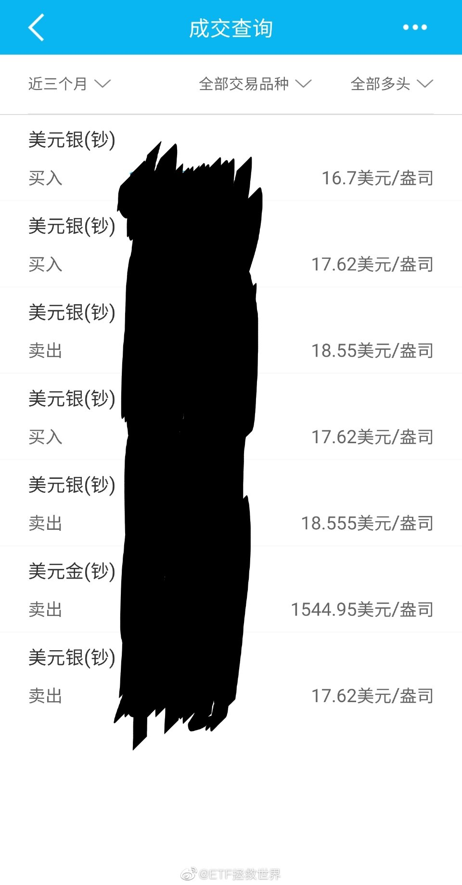

======================================================

ETF拯救世界 (5687069307) @
2019-11-13 09:23:35 Wed  
url: https://weibo.com/5687069307/IfZ4A69Hi

医药今天有没有机会波动一下，学习好的说说 ​​​

转发[3]  评论[179]  赞[702] 

======================================================

ETF拯救世界 (5687069307) @
2019-11-13 09:39:04 Wed  
url: https://weibo.com/5687069307/IfZaRxavl

回复@遇见你温柔如初:我拉黑的全是做广告的。我已经很努力了，但是确实没精力拉黑所有广告。各位多担待吧//@遇见你温柔如初:吓得不敢妄言 http://t.cn/AiriGIzZ

------------------------------------------------------
转推：
>  @ETF拯救世界 (5687069307)
>  2019-11-13 09:23:35 Wed  
>  url: https:/weibo.com/5687069307/IfZ4A69Hi/

>  医药今天有没有机会波动一下，学习好的说说 ​​​

转发[0]  评论[92]  赞[606] 

======================================================

ETF拯救世界 (5687069307) @
2019-11-13 12:18:01 Wed  
url: https://weibo.com/5687069307/Ig0dnBIaa

现在计划里面有几个点的恒生。持仓的朋友分两种情况。

一种是从头开始跟的朋友，拿的多一点，但是利润接近50%。

另一种是后来跟车，虽然成本高一些，但是只有区区一两份。

无论哪种情况，都没什么好担心。 ​​​

转发[29]  评论[211]  赞[843] 

+++++++++++++++++++++++++++++++++++++++++++++++++++++

图片：

======================================================

ETF拯救世界 (5687069307) @
2019-11-13 12:42:42 Wed  
url: https://weibo.com/5687069307/Ig0np38jc

这种时候，再去翻翻历史书，很多东西看起来就跟以前的体会不同了。

历史，常看常新。 ​​​

转发[22]  评论[229]  赞[1238] 

======================================================

ETF拯救世界 (5687069307) @
2019-11-13 14:07:24 Wed  
url: https://weibo.com/5687069307/Ig0VMqFu6

再给一个点位。如果真的搞大，让恒生崩到21000以下，是非常非常好的买入机会。我给个极限点位17000。万一真的到了，一把配满恒生指数，从那里算，不赚60个巴仙不再看。

------------------------------------------------------
转推：
>  @ETF拯救世界 (5687069307)
>  2019-08-26 10:08:35 Mon  
>  url: https:/weibo.com/5687069307/I3YBClttT/

>  预告一下。
>  
>  150会在23000以下买1-4份恒生。21000以下买4-10份。
>  
>  S会在23000以下持续买入。 ​​​

转发[1176]  评论[563]  赞[1788] 

======================================================

ETF拯救世界 (5687069307) @
2019-11-14 10:51:16 Thu  
url: https://weibo.com/5687069307/Ig94FqhJt

价值观和信念特别重要。

有了信念，才能把一件事坚持做下去。物质的东西很重要，但有时候精神上的信念更重要。

在暂时失败的时候，在看不到光明的时候，在孤军奋战的时候，只有信念能让自己坚持下去，梦想才有成真的机会。

为什么有人会在光明即将来临的时候放弃，有人会在钻石坑里清仓逃离，正是因 ​​​

转发[165]  评论[436]  赞[1636] 

======================================================

ETF拯救世界 (5687069307) @
2019-11-14 12:04:59 Thu  
url: https://weibo.com/5687069307/Ig9yAuQLY

你说你们非得跟这打小报告。害得我回去看，一个没忍住发了个帖。

然后发现我这微博财经领域常年互动Top10的，回去以后帖子十几分钟评论才90个。

过气的感受你知道吗！感觉自己突发性抑郁症实锤了。 ​​​

转发[4]  评论[456]  赞[1347] 

======================================================

ETF拯救世界 (5687069307) @
2019-11-14 12:38:27 Thu  
url: https://weibo.com/5687069307/Ig9Mbhr6P

昨天晚上转了个帖子，评论了几句，后觉不妥，删了。

知道有一些在港上学的朋友关注我，虽然人数不多，但想跟你们说几句话。

你们都非常优秀，有希望成为这个国家的栋梁之材。无论以后你在哪里生活，做什么工作，我个人，希望你，多做对这个国家有益的事，别做损害国家利益的事。

因为，只有这个国家 ​​​

转发[89]  评论[403]  赞[2421] 

======================================================

ETF拯救世界 (5687069307) @
2019-11-14 14:19:35 Thu  
url: https://weibo.com/5687069307/Igare1xUt

不过说真的额，朋友们，我感觉自己确实成熟了。

一般的喷已经伤不到我了……

原来18到20岁，不仅皮衣会变紧，开始有白头发，思想也会更成熟，人也会更淡定。

真好啊。 ​​​

转发[6]  评论[350]  赞[1570] 

======================================================

ETF拯救世界 (5687069307) @
2019-11-14 15:55:07 Thu  
url: https://weibo.com/5687069307/Igb4087RN

小助理居然买了双11礼物送我。（初代小助理也送过好几次……）

这大概是我见过的最和谐的上下级关系了吧。 ​​​

转发[2]  评论[305]  赞[1499] 

======================================================

ETF拯救世界 (5687069307) @
2019-11-15 11:02:56 Fri  
url: https://weibo.com/5687069307/IgizTDTm3

仓位可以舒服，但人生不能太舒服。

想要进步，就要跳出舒适区。尝试更多的可能，思考更多的策略。 ​​​

转发[82]  评论[261]  赞[1561] 

======================================================

ETF拯救世界 (5687069307) @
2019-11-15 14:30:28 Fri  
url: https://weibo.com/5687069307/IgjW8sJ6F

未来一段时间还是别看盘了 ​​​

转发[53]  评论[277]  赞[1035] 

======================================================

ETF拯救世界 (5687069307) @
2019-11-15 16:43:33 Fri  
url: https://weibo.com/5687069307/IgkO9zE8P

从小开始看球，看国足屡败屡战，当时就决心以后有孩子让他去踢球。不求打职业队，希望给青训加个分母。

上学后发现基本不可能。刚一年级学习压力就不小，还要学其它的东西，真是没时间每天去练球。

看过贝克汉姆 梅西 C罗 杰拉德的自传，都是六七岁开始每天放学就去踢，踢到天黑。

确实做不到。

另 ​​​

转发[17]  评论[177]  赞[983] 

======================================================

ETF拯救世界 (5687069307) @
2019-11-15 17:56:32 Fri  
url: https://weibo.com/5687069307/IglhMEmTx

我有个朋友开了一次顺风车，被女乘客加微信要请他吃饭。他没去，亏了500万啊

------------------------------------------------------
转推：
>  @澎湃新闻 (5044281310)
>  2019-11-15 17:40:03 Fri  
>  url: https:/weibo.com/5044281310/Iglb65W1C/

>  #开顺风车结识女性两年骗两千万# 【男子开顺风车结识四女性“谈恋爱”，两年骗得两千万后失联】2010年到2016年，杨某三次结婚、三次离婚，随后在余杭开文化传播公司，但一直亏损。2017年6月，公司难以为继，杨某开着自己的“奥迪A6”做起顺风车生意，其间结识了4名女性并和她们谈“恋爱”。据了解，杨 ​​​ http://mapi/005vnhZYly1g8ytvaljxuj30go0cp3z0

转发[11]  评论[125]  赞[527] 

======================================================

ETF拯救世界 (5687069307) @
2019-11-15 18:52:11 Fri  
url: https://weibo.com/5687069307/IglEn2kn4

前几天发声明要求警方退出，保护蒙面人的不是这位校长吗。//@兰小欢:呵呵，段校长前些日子不这样啊，怕了？这几天看着我的学生和同事不得不一个个逃离中大，这校长怕是要被钉在历史耻辱柱上了。

------------------------------------------------------
转推：
>  @香港商報網 (1847123567)
>  2019-11-15 16:41:40 Fri  
>  url: https:/weibo.com/1847123567/IgkNokJFf/

>  【中大校长段崇智发公开信：指校园被外来示威者占领 不排除请求政府协助】今天，香港中文大学校长段崇智发公开信，讲述中大校园内发生的事件始末及状况。他在文中表示，校园遭到蒙面示威者占领，校方相信当中大部分并非中大学生，要求所有外来人士立刻离开中大。段崇智又对有示威者从二号桥向吐露港公 ​​​

转发[27]  评论[67]  赞[432] 

======================================================

ETF拯救世界 (5687069307) @
2019-11-15 18:55:34 Fri  
url: https://weibo.com/5687069307/IglFK7GF9

重修中国近代史ing ​​​

转发[6]  评论[100]  赞[697] 

======================================================

ETF拯救世界 (5687069307) @
2019-11-15 19:28:44 Fri  
url: https://weibo.com/5687069307/IglTcznHD

我们买好了，你们什么时候来接盘啊

------------------------------------------------------
转推：
>  @ ()
>  2019-11-15 18:37:15 Fri  
>  url: 

>  抱歉，由于作者设置，你暂时没有这条微博的查看权限哦。查看帮助：http://t.cn/RfdBWwP ​​​

转发[23]  评论[164]  赞[824] 

======================================================

ETF拯救世界 (5687069307) @
2019-11-17 13:35:46 Sun  
url: https://weibo.com/5687069307/IgCqVumD9

当代生活，精彩。//@海豚佩佩: //@吐槽鬼:这视频是如此感人～～～建议直接拿来当MV//@微反应-姜振宇:人世间……从素材到剪辑，厉害👍

------------------------------------------------------
转推：
>  @自然男孩儿 (1990808357)
>  2019-11-17 00:47:23 Sun  
>  url: https:/weibo.com/1990808357/Igxp2tZtY/

>  宝贝，反正活着也没意义。  http://t.cn/Air3g3qo ​​​

转发[102]  评论[58]  赞[291] 

======================================================

ETF拯救世界 (5687069307) @
2019-11-17 13:48:59 Sun  
url: https://weibo.com/5687069307/IgCwicVHP

好多年了，不管国足成绩多差，我都不骂，不吐槽。

这已经是中国踢球最好的几十个人了。问题是教练吗，问题是一两个人用人失误吗。当然不是啊。

吐个槽，编个段子，骂这个骂那个没用。

看了很多世界级球员和教练的自传，最深的感受就是他们真的真的把足球当生命。踢不上球就感觉人生崩了。总感觉我们 ​​​

转发[18]  评论[233]  赞[912] 

======================================================

ETF拯救世界 (5687069307) @
2019-11-19 10:05:50 Tue  
url: https://weibo.com/5687069307/IgTUI5Doc

转发微博

------------------------------------------------------
转推：
>  @ETF拯救世界 (5687069307)
>  2019-10-28 16:05:38 Mon  
>  url: https:/weibo.com/5687069307/IdARPn9UA/

>  传媒的波动太大了，网格利器。 ​​​

转发[13]  评论[172]  赞[608] 

======================================================

ETF拯救世界 (5687069307) @
2019-11-19 10:26:44 Tue  
url: https://weibo.com/5687069307/IgU3c67pH

做好投资有一个比较珍贵的品质：

等得起。

不贵的地方买入，等。等好几年，噌噌噌涨上去。一年收割五年八年利润。

卖出。

等。

等好几年，买入。

继续等。

再等几年，噌噌噌又涨上去。

卖出。

打字很简单，然而弹指一挥间。这期间每一个时刻都不容易。

你得知道什么时候不贵，什么时候贵。等 ​​​

转发[343]  评论[377]  赞[1498] 

======================================================

ETF拯救世界 (5687069307) @
2019-11-19 10:34:47 Tue  
url: https://weibo.com/5687069307/IgU6suXZa

越来越发现人生最宝贵的东西其实是希望。

有了希望，一切都有可能。丧失了希望，失去了梦想，这辈子也就这样了。 ​​​

转发[108]  评论[181]  赞[1256] 

======================================================

ETF拯救世界 (5687069307) @
2019-11-19 11:11:48 Tue  
url: https://weibo.com/5687069307/IgUluahji

这周去华东某地度周末。

约吗。 ​​​

转发[17]  评论[428]  赞[805] 

======================================================

ETF拯救世界 (5687069307) @
2019-11-19 12:42:45 Tue  
url: https://weibo.com/5687069307/IgUWplL2y

回复@Karmen是好好孩子:缺钱当然是现在抛。不过这个事情再次提醒各位：权益类投资需要长期资金。哪怕少一点也没事，但是要长期。很重要。//@Karmen是好好孩子:老大，最近我要买房，缺钱，跟您买了两万多基金，近期什么时候可以抛？

------------------------------------------------------
转推：
>  @ETF拯救世界 (5687069307)
>  2019-11-19 11:11:48 Tue  
>  url: https:/weibo.com/5687069307/IgUluahji/

>  这周去华东某地度周末。
>  
>  约吗。 ​​​

转发[13]  评论[71]  赞[488] 

======================================================

ETF拯救世界 (5687069307) @
2019-11-19 12:50:18 Tue  
url: https://weibo.com/5687069307/IgUZtlIM8

严格就近上学，是我能想到最公平的方法。只要有别的口子，就一定会被有特权的人钻进去。绝对公平的世界不存在。

------------------------------------------------------
转推：
>  @新财富杂志 (1708922835)
>  2019-11-19 11:35:03 Tue  
>  url: https:/weibo.com/1708922835/IgUuVgN9C/

>  【既然要公平，何不#学区也摇号#？】有经济能力的家庭，通过购置一套高价学区房，就能占有城市更优质的教育资源，这大失社会教育资源的公平性。同时这也是导致高价学区房的主要原因。通过“全民摇号”的方法产生择校顺序，是当前不能实现城市教育资源均衡化的社会现实基础上，尽可能实现最大限度的公平 ​​​

转发[14]  评论[68]  赞[402] 

======================================================

ETF拯救世界 (5687069307) @
2019-11-19 12:51:32 Tue  
url: https://weibo.com/5687069307/IgUZYol8A

回复@明天就回火星啦:不可惜。还有去年年底要用钱赎回的。想想几个月之后的心情。现在卖，几年后也会比较难受。但是急用钱，没办法。//@明天就回火星啦:可惜了！

------------------------------------------------------
转推：
>  @ETF拯救世界 (5687069307)
>  2019-11-19 11:11:48 Tue  
>  url: https:/weibo.com/5687069307/IgUluahji/

>  这周去华东某地度周末。
>  
>  约吗。 ​​​

转发[5]  评论[33]  赞[390] 

======================================================

ETF拯救世界 (5687069307) @
2019-11-19 13:05:17 Tue  
url: https://weibo.com/5687069307/IgV5yqKYE

回复@我心永Young:要搁以前的政策，我连房都不用买，直接上西城的学校。现在我花了1000万买了房才能上，但我还是要说一声公平。这是对大多数人的公平，住哪里就上哪里的学校。像以前一样，你根本不知道好学校都是怎么上的。//@我心永Young:回复@土77豆:这是因为他已经买了学区房

------------------------------------------------------
转推：
>  @新财富杂志 (1708922835)
>  2019-11-19 11:35:03 Tue  
>  url: https:/weibo.com/1708922835/IgUuVgN9C/

>  【既然要公平，何不#学区也摇号#？】有经济能力的家庭，通过购置一套高价学区房，就能占有城市更优质的教育资源，这大失社会教育资源的公平性。同时这也是导致高价学区房的主要原因。通过“全民摇号”的方法产生择校顺序，是当前不能实现城市教育资源均衡化的社会现实基础上，尽可能实现最大限度的公平 ​​​

转发[7]  评论[80]  赞[646] 

======================================================

ETF拯救世界 (5687069307) @
2019-11-19 13:15:06 Tue  
url: https://weibo.com/5687069307/IgV9x7xwQ

朋友们，我微博下面显示的最近x天拉黑x人，都是这样的。

最近大半年心情不错，极少极少极少拉黑喷子…… ​​​

转发[0]  评论[111]  赞[663] 

+++++++++++++++++++++++++++++++++++++++++++++++++++++

图片：

======================================================

ETF拯救世界 (5687069307) @
2019-11-19 13:16:16 Tue  
url: https://weibo.com/5687069307/IgVa0qlBP

我只希望传媒明天再哆嗦一下，让我出一网……挣点盘缠…… ​​​

转发[5]  评论[177]  赞[730] 

======================================================

ETF拯救世界 (5687069307) @
2019-11-19 13:24:15 Tue  
url: https://weibo.com/5687069307/IgVdfjVjZ

最近几个月，不禁让人对“媒体”，有了更深层次的认识。

由此更进一步，世界上真的有绝对客观的历史吗。我看恐怕没有。 ​​​

转发[23]  评论[168]  赞[940] 

======================================================

ETF拯救世界 (5687069307) @
2019-11-19 15:02:17 Tue  
url: https://weibo.com/5687069307/IgVR2o5Xy

医药基金再突破，开始冲击四年高点 ​​​

转发[30]  评论[162]  赞[880] 

======================================================

ETF拯救世界 (5687069307) @
2019-11-19 15:21:27 Tue  
url: https://weibo.com/5687069307/IgVYPe8lu

回复@狂狮爱不可:要不你给我打赏一点，我每天什么都不干在网上陪你聊天好吗。我可以不可以有点自己的时间做自己的事。不就昨天出去忙没说话吗？//@狂狮爱不可:股市大涨，益达就出来了，为啥大跌的时候益达不这么频繁出来安慰一下我们。

------------------------------------------------------
转推：
>  @ETF拯救世界 (5687069307)
>  2019-11-19 15:02:17 Tue  
>  url: https:/weibo.com/5687069307/IgVR2o5Xy/

>  医药基金再突破，开始冲击四年高点 ​​​

转发[14]  评论[147]  赞[733] 

======================================================

ETF拯救世界 (5687069307) @
2019-11-19 16:04:35 Tue  
url: https://weibo.com/5687069307/IgWgkitUl

回复@渔樵耕读煮:不好意思，男的不陪//@渔樵耕读煮:这种人，如果你是男的，E大是不是还要陪睡你才满意？//@ETF拯救世界:回复@狂狮爱不可:要不你给我打赏一点，我每天什么都不干在网上陪你聊天好吗。我可以不可以有点自己的时间做自己的事。不就昨天出去忙没说话吗？

------------------------------------------------------
转推：
>  @ETF拯救世界 (5687069307)
>  2019-11-19 15:02:17 Tue  
>  url: https:/weibo.com/5687069307/IgVR2o5Xy/

>  医药基金再突破，开始冲击四年高点 ​​​

转发[8]  评论[110]  赞[473] 

======================================================

ETF拯救世界 (5687069307) @
2019-11-19 17:22:59 Tue  
url: https://weibo.com/5687069307/IgWM9iUSM

回复@你看我_是男是女:医药当时96，目前32。我看不出有什么问题。//@你看我_是男是女:15000点的医药指数，也是醉了。对了，信息指数的pe这里看不到，我还是不想调坐标了，数值其实是186。。。186。。。金融依然不到最高。难道是等着牛市尾巴再补一刀？@ETF拯救世界 是不是验证了你的预言，牛尾补一刀。

------------------------------------------------------
转推：
>  @ETF拯救世界 (5687069307)
>  2019-11-19 15:02:17 Tue  
>  url: https:/weibo.com/5687069307/IgVR2o5Xy/

>  医药基金再突破，开始冲击四年高点 ​​​

转发[5]  评论[46]  赞[398] 

======================================================

ETF拯救世界 (5687069307) @
2019-11-19 17:34:26 Tue  
url: https://weibo.com/5687069307/IgWQNlGaz

DAX反弹新高，距离历史高点一步之遥 ​​​

转发[11]  评论[98]  赞[756] 

======================================================

ETF拯救世界 (5687069307) @
2019-11-19 20:11:57 Tue  
url: https://weibo.com/5687069307/IgXSJnl3T

有时候晚上睡觉前会打开ps4玩几把实况。MC模式，跟人踢。

以前踢输了就很郁闷。另外之前胜率高，更怕输，害怕胜率下来。

后来想明白了。

想明白以后，输了也不急。被人进一个也不急，两个更不急。每次被进球领先，重新开球心里都像刚开始0：0一样，心态极佳。不会在意已经几比几了，享受比赛，认真 ​​​

转发[61]  评论[201]  赞[1040] 

======================================================

ETF拯救世界 (5687069307) @
2019-11-19 20:38:43 Tue  
url: https://weibo.com/5687069307/IgY3B6fKo

“再能跑些，再能战些，为了队友，为了家人，为了梦想！” 真的好。

------------------------------------------------------
转推：
>  @澎湃新闻 (5044281310)
>  2019-11-19 20:30:04 Tue  
>  url: https:/weibo.com/5044281310/IgY05k2um/

>  【震撼！这是日本高中足球锦标赛】http://t.cn/AidUxGvc 日前，日本第98届全国高校足球选手权（日本高中足球锦标赛）大会应援曲走红网络，该曲由日本当红歌手三阪咲演唱。日本国脚长友佑都则担任了应援组组长，他寄语道，“再能跑些，再能战些，为了队友，为了家人，为了梦想！”（来源网络） ​​​

转发[48]  评论[72]  赞[418] 

======================================================

ETF拯救世界 (5687069307) @
2019-11-20 09:42:32 Wed  
url: https://weibo.com/5687069307/Ih3bKpl5I

挂的有点多，只成交了一部分 ​​​

转发[56]  评论[262]  赞[650] 

+++++++++++++++++++++++++++++++++++++++++++++++++++++

图片：

======================================================

ETF拯救世界 (5687069307) @
2019-11-20 10:12:32 Wed  
url: https://weibo.com/5687069307/Ih3nVmZZ5

有点舒服 ​​​

转发[1]  评论[60]  赞[560] 

======================================================

ETF拯救世界 (5687069307) @
2019-11-20 10:15:21 Wed  
url: https://weibo.com/5687069307/Ih3p4Cr8t

相信医药在这个位置会遭遇抵抗，不会一路向北直捣黄龙。 ​​​

转发[15]  评论[117]  赞[706] 

======================================================

ETF拯救世界 (5687069307) @
2019-11-20 10:21:41 Wed  
url: https://weibo.com/5687069307/Ih3rDymFq

又出一网。A股难道不是提款机 ​​​

转发[77]  评论[280]  赞[896] 

+++++++++++++++++++++++++++++++++++++++++++++++++++++

图片：

======================================================

ETF拯救世界 (5687069307) @
2019-11-20 14:14:51 Wed  
url: https://weibo.com/5687069307/Ih4Yi23T0

这两网出的价位喷了。不枉我7点起来挂单。

之所以每次网格都要跟大家汇报，是因为之前发了理论的东西，演示一下实践如何操作。

不是为了得瑟。

有些喷子省省键盘吧。你抽空也偶尔做点对人民群众有益的事不好吗。 ​​​

转发[52]  评论[233]  赞[742] 

+++++++++++++++++++++++++++++++++++++++++++++++++++++

图片：
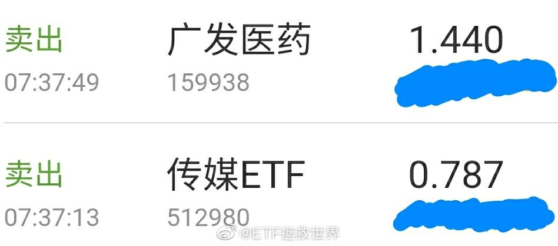

======================================================

ETF拯救世界 (5687069307) @
2019-11-20 14:17:26 Wed  
url: https://weibo.com/5687069307/Ih4Zl57Yr

很多朋友觉得自己钱少，理性投资理财也没有意义。错，你是在慢慢积累经验。也幸亏你钱少，如果给你一大笔钱练手，恐怕一辈子也无法翻身了。有钱了，能不能守住，能不能增值，这可不是谁都能做到的。

------------------------------------------------------
转推：
>  @新浪视频 (1640601392)
>  2019-11-20 13:22:43 Wed  
>  url: https:/weibo.com/1640601392/Ih4D7ryEA/

>  【无罪之后的赵作海：65万赔偿金因陷传销投资等被骗光】已无罪获释9年的赵作海，在采访中唯一一次抹泪，是提及65万元国家赔偿，因陷传销、投资理财、代理权健等被骗光。如今，赵作海已67岁，他和出狱后娶的妻子李素兰，靠在商丘市中院抄水表、在梁园区法院收拾会议室两份工作生活，每月收入3600元。虽 ​​​

转发[85]  评论[90]  赞[557] 

======================================================

ETF拯救世界 (5687069307) @
2019-11-20 14:19:38 Wed  
url: https://weibo.com/5687069307/Ih50e15GT

回复@年少有为有不为:再说一次，这是挂单委托时间，不是成交时间。成交时间前两个帖子贴了//@年少有为有不为:为啥你7点半就可以卖出[失望][失望]

------------------------------------------------------
转推：
>  @ETF拯救世界 (5687069307)
>  2019-11-20 14:14:51 Wed  
>  url: https:/weibo.com/5687069307/Ih4Yi23T0/

>  这两网出的价位喷了。不枉我7点起来挂单。
>  
>  之所以每次网格都要跟大家汇报，是因为之前发了理论的东西，演示一下实践如何操作。
>  
>  不是为了得瑟。
>  
>  有些喷子省省键盘吧。你抽空也偶尔做点对人民群众有益的事不好吗。 ​​​

转发[14]  评论[55]  赞[350] 

======================================================

ETF拯救世界 (5687069307) @
2019-11-20 14:22:05 Wed  
url: https://weibo.com/5687069307/Ih51e3C0h

回复@tigerabbit笑嘻嘻:其实我估计很多中彩票大奖的也是如此。只是没上新闻罢了。//@tigerabbit笑嘻嘻:当时这个赵作海案出来我才十来岁，就有预感，这钱会一块不剩[允悲]

------------------------------------------------------
转推：
>  @新浪视频 (1640601392)
>  2019-11-20 13:22:43 Wed  
>  url: https:/weibo.com/1640601392/Ih4D7ryEA/

>  【无罪之后的赵作海：65万赔偿金因陷传销投资等被骗光】已无罪获释9年的赵作海，在采访中唯一一次抹泪，是提及65万元国家赔偿，因陷传销、投资理财、代理权健等被骗光。如今，赵作海已67岁，他和出狱后娶的妻子李素兰，靠在商丘市中院抄水表、在梁园区法院收拾会议室两份工作生活，每月收入3600元。虽 ​​​

转发[12]  评论[78]  赞[340] 

======================================================

ETF拯救世界 (5687069307) @
2019-11-20 18:14:23 Wed  
url: https://weibo.com/5687069307/Ih6xvuSgA

国与国之间，最根本的关系就是利益关系，就是竞争。

既然是竞争，就一定是不择手段。

所以很多事情出现就一点也不用感到惊讶。你强了，对它就是威胁。那当然就要不择手段的搞定你。

很多事实它并不是不知道。它需要的不是事实，而是机会。

所谓的ysxt，所谓的价值观，都是说辞而已。

就像前几天的 ​​​

转发[16]  评论[241]  赞[1438] 

======================================================

ETF拯救世界 (5687069307) @
2019-11-21 09:24:23 Thu  
url: https://weibo.com/5687069307/IhcuSoZTy

是不是又有希望把出掉的接回来了。 ​​​

转发[1]  评论[163]  赞[669] 

======================================================

ETF拯救世界 (5687069307) @
2019-11-21 09:41:15 Thu  
url: https://weibo.com/5687069307/IhcBJkcp8

这么准的吗

------------------------------------------------------
转推：
>  @ETF拯救世界 (5687069307)
>  2019-11-20 10:15:21 Wed  
>  url: https:/weibo.com/5687069307/Ih3p4Cr8t/

>  相信医药在这个位置会遭遇抵抗，不会一路向北直捣黄龙。 ​​​

转发[3]  评论[100]  赞[605] 

======================================================

ETF拯救世界 (5687069307) @
2019-11-21 10:08:14 Thu  
url: https://weibo.com/5687069307/IhcMG7eMV

为操盘手打call：

你们是最胖的！！ ​​​

转发[1]  评论[70]  赞[698] 

======================================================

ETF拯救世界 (5687069307) @
2019-11-21 10:26:18 Thu  
url: https://weibo.com/5687069307/IhcU0vs5o

足球游戏又墙了。

也不知道该说什么。 ​​​

转发[1]  评论[72]  赞[488] 

======================================================

ETF拯救世界 (5687069307) @
2019-11-21 10:30:35 Thu  
url: https://weibo.com/5687069307/IhcVKpvi2

PDD吧，有些东西不敢买。比如3C产品，我连在TB都不敢，更别说PDD。只敢在JD买。

但是有些东西可以。我在PDD买过一个粘毛的滚子，9.9，720撕，还送滚筒。喷了。太值了，至少可以用3年。

家里有猫狗的必备。 ​​​

转发[18]  评论[272]  赞[776] 

======================================================

ETF拯救世界 (5687069307) @
2019-11-21 12:14:32 Thu  
url: https://weibo.com/5687069307/IhdBWmBfZ

不说你不知道，今年，明明是指数涨了二十几个点，但是全部A股涨幅中位数是5%。

涨幅10%以上的股票占41.74%；

涨幅超过500的股票占30.87%；

涨幅超过300的股票占22.52%；

涨幅超过50的股票占21.53%；

涨幅超过医药的股票占16.64%。

考虑到很多人是年初一波行情之后杀进来的，

今年炒股的股民，大 ​​​

转发[67]  评论[234]  赞[975] 

======================================================

ETF拯救世界 (5687069307) @
2019-11-21 12:37:54 Thu  
url: https://weibo.com/5687069307/IhdLqrGb5

上次的耳机已经买了。那肯定还是不够啊。

我在考虑是不是加送一瓶茅台。正好春节可以喝你说是不是。

这个没定，还得考虑一下…… ​​​

转发[11]  评论[472]  赞[1208] 

======================================================

ETF拯救世界 (5687069307) @
2019-11-21 13:02:34 Thu  
url: https://weibo.com/5687069307/IhdVrg6cr

在这个状态下，对于资本市场不应过于乐观。做好长期波动甚至短期趋势向下的心理准备。

不是说肯定不大涨，是做好心理准备。涨了，更好。不涨，无所谓。 ​​​

转发[40]  评论[239]  赞[1151] 

======================================================

ETF拯救世界 (5687069307) @
2019-11-21 13:34:43 Thu  
url: https://weibo.com/5687069307/Ihe8uk6Q8

嫉妒是毒药。

妒意一起，害人害己。

没事儿别嫉妒别人。把嫉妒换化成动力，提高自己。

更要防止别人嫉妒。当然，各位都很优秀，优秀就必然招致嫉妒。那就尽量低调，不得瑟。情况就会好很多。

别总怕自己的好别人不知道。大多数人知道你过得好，不会为你高兴替你祝福，反而会有小人嫉妒你，找机会就 ​​​

转发[86]  评论[217]  赞[1273] 

======================================================

ETF拯救世界 (5687069307) @
2019-11-21 19:14:20 Thu  
url: https://weibo.com/5687069307/Ihgmladn8

我想，这是二十年内打进世界杯的唯一方法了：把大量有天赋的孩子送出去。就像梅西被送到拉玛西亚。在国内踢，完全不可能了。

------------------------------------------------------
转推：
>  @网易财经 (1974561081)
>  2019-11-21 17:25:03 Thu  
>  url: https:/weibo.com/1974561081/IhfDZ0JPq/

>  【#足协称要学习日本# ：日本联赛收入比我们低，大量球员留洋成长[思考]】中国足协表态将向日本学习，会在政策上鼓励优秀的年轻球员留洋闯荡。中国足协执委戴晓微称，日本的职业联赛球员的收入水平比我们低，而且要低不少。大量年轻球员、优秀球员都是到海外高水平联赛效力，从而得到成长。足协将与欧 ​​​

转发[10]  评论[143]  赞[392] 

======================================================

ETF拯救世界 (5687069307) @
2019-11-22 09:56:32 Fri  
url: https://weibo.com/5687069307/Ihm8qB5BQ

再次提请注意

什么时候我在什么品种上又被喷了

这个品种就要动了

屡试不爽，神奇。 ​​​

转发[23]  评论[381]  赞[1276] 

======================================================

ETF拯救世界 (5687069307) @
2019-11-22 10:04:51 Fri  
url: https://weibo.com/5687069307/IhmbNwRtR

最不理解的是，为什么有人总认为全世界都要跟他买一样的东西。

我就喜欢买不涨的，你管得着吗。

你有你的选择方式，我有我的。你喜欢锦上添花，我偏喜欢雪中送炭，不可以吗？

唔可以。佢话。

那你跟不让别人表达自己看法的暴徒有什么区别。

别人不跟你一样就是SB？

呵呵。 ​​​

转发[22]  评论[205]  赞[900] 

======================================================

ETF拯救世界 (5687069307) @
2019-11-22 10:52:19 Fri  
url: https://weibo.com/5687069307/Ihmv4vIlm

万万没想到就快可以接回来了……

------------------------------------------------------
转推：
>  @ETF拯救世界 (5687069307)
>  2019-11-20 10:21:41 Wed  
>  url: https:/weibo.com/5687069307/Ih3rDymFq/

>  又出一网。A股难道不是提款机 ​​​

转发[15]  评论[100]  赞[423] 

======================================================

ETF拯救世界 (5687069307) @
2019-11-22 10:54:26 Fri  
url: https://weibo.com/5687069307/IhmvVpJru

医药第一支撑9850，第二支撑9550。先看看能否撑住吧。 ​​​

转发[65]  评论[98]  赞[580] 

======================================================

ETF拯救世界 (5687069307) @
2019-11-22 10:55:47 Fri  
url: https://weibo.com/5687069307/Ihmwtls8G

回复@ETF拯救世界:8月提出10400，最高冲到10430开始调整。//@ETF拯救世界:下一个压力位10400

------------------------------------------------------
转推：
>  @ETF拯救世界 (5687069307)
>  2019-08-22 15:04:05 Thu  
>  url: https:/weibo.com/5687069307/I3oPAbY05/

>  看样子医药有走好的迹象。 ​​​

转发[9]  评论[39]  赞[428] 

======================================================

ETF拯救世界 (5687069307) @
2019-11-22 10:58:16 Fri  
url: https://weibo.com/5687069307/Ihmxul23g

医药分为两个区域。

第一个区域是8500左右-10450左右。这个区域是相对低估区域，也是熊市区域。

10450-15000左右，已经不是相对低估区域。也是牛市运行区域。

这三个数字会随着时间推移逐渐增加。 ​​​

转发[360]  评论[289]  赞[1009] 

======================================================

ETF拯救世界 (5687069307) @
2019-11-22 11:10:41 Fri  
url: https://weibo.com/5687069307/IhmCwka5M

最佩服的是食品饮料。

我的系统显示8月开始就该调整了，结果依然这么强。失敬了…… ​​​

转发[17]  评论[184]  赞[958] 

======================================================

ETF拯救世界 (5687069307) @
2019-11-22 13:06:47 Fri  
url: https://weibo.com/5687069307/IhnnEsD85

上周五大部分指数重回下降趋势。今天如果不能大幅拉升，就已经是第二周确认。

------------------------------------------------------
转推：
>  @ETF拯救世界 (5687069307)
>  2019-11-15 14:30:28 Fri  
>  url: https:/weibo.com/5687069307/IgjW8sJ6F/

>  未来一段时间还是别看盘了 ​​​

转发[46]  评论[156]  赞[805] 

======================================================

ETF拯救世界 (5687069307) @
2019-11-22 14:01:59 Fri  
url: https://weibo.com/5687069307/IhnK3gRml

成交。两个交易日买回。交易部分成本下降5% http://t.cn/AidClJMh

------------------------------------------------------
转推：
>  @ETF拯救世界 (5687069307)
>  2019-11-20 10:21:41 Wed  
>  url: https:/weibo.com/5687069307/Ih3rDymFq/

>  又出一网。A股难道不是提款机 ​​​

转发[36]  评论[354]  赞[768] 

======================================================

ETF拯救世界 (5687069307) @
2019-11-22 15:07:56 Fri  
url: https://weibo.com/5687069307/IhoaP6ppo

收工~

周一见。 ​​​

转发[2]  评论[313]  赞[1012] 

======================================================

ETF拯救世界 (5687069307) @
2019-11-25 08:38:07 Mon  
url: https://weibo.com/5687069307/IhNU5hCwa

今天港股会很精彩 。

谁说之前的预期买入点位不可能到。 ​​​

转发[35]  评论[372]  赞[1601] 

======================================================

ETF拯救世界 (5687069307) @
2019-11-25 10:07:06 Mon  
url: https://weibo.com/5687069307/IhOucwdgr

谁能想到，对A股最有信心的是外资。 ​​​

转发[14]  评论[168]  赞[1205] 

======================================================

ETF拯救世界 (5687069307) @
2019-11-25 10:32:51 Mon  
url: https://weibo.com/5687069307/IhOEEv9F6

打扰了！

------------------------------------------------------
转推：
>  @ETF拯救世界 (5687069307)
>  2019-11-25 08:38:07 Mon  
>  url: https:/weibo.com/5687069307/IhNU5hCwa/

>  今天港股会很精彩 。
>  
>  谁说之前的预期买入点位不可能到。 ​​​

转发[23]  评论[272]  赞[843] 

======================================================

ETF拯救世界 (5687069307) @
2019-11-25 13:38:16 Mon  
url: https://weibo.com/5687069307/IhPRUCI4D

三个交易日买回

------------------------------------------------------
转推：
>  @ETF拯救世界 (5687069307)
>  2019-11-20 09:42:32 Wed  
>  url: https:/weibo.com/5687069307/Ih3bKpl5I/

>  挂的有点多，只成交了一部分 ​​​

转发[22]  评论[202]  赞[711] 

======================================================

ETF拯救世界 (5687069307) @
2019-11-25 17:35:45 Mon  
url: https://weibo.com/5687069307/IhRqjgdMn

我一直说，做好人，不仅要有本事，还要够狠。

好人没本事，不够聪明，不够狠，这个世界就会被坏人占据。

赵辛楣评价方鸿渐“人不坏，但全无用处”。没有用的好人不会危害世界，但也无法制裁坏人甚至保护自己。

好人，绝不可以是老实人。 ​​​

转发[250]  评论[354]  赞[1850] 

======================================================

ETF拯救世界 (5687069307) @
2019-11-27 12:46:09 Wed  
url: https://weibo.com/5687069307/Ii8nKFfDM

[蜡烛] 世事无常。

------------------------------------------------------
转推：
>  @ ()
>  2019-11-27 11:11:30 Wed  
>  url: 

>  抱歉，作者已设置仅展示半年内微博，此微博已不可见。 ​​​

转发[13]  评论[228]  赞[475] 

======================================================

ETF拯救世界 (5687069307) @
2019-11-27 18:58:24 Wed  
url: https://weibo.com/5687069307/IiaOQCm4T

我亲见的唯一家暴案例，

是我表妹（像陈慧琳的那个）揍她老公。 ​​​

转发[1]  评论[228]  赞[1513] 

======================================================

ETF拯救世界 (5687069307) @
2019-11-27 21:16:04 Wed  
url: https://weibo.com/5687069307/IibIJg1j3

如果一个人很害怕你，同时又看不起你。

我想，很难让他认可你，尊重你。 ​​​

转发[14]  评论[169]  赞[1034] 

======================================================

ETF拯救世界 (5687069307) @
2019-11-28 10:50:13 Thu  
url: https://weibo.com/5687069307/Iih3c8Uwa

我估计80%的人没看过内容。 ​​​

转发[7]  评论[306]  赞[993] 

======================================================

ETF拯救世界 (5687069307) @
2019-11-28 19:40:39 Thu  
url: https://weibo.com/5687069307/IikwuF3cg

谢谢你。 ​​​

转发[33]  评论[301]  赞[1167] 

+++++++++++++++++++++++++++++++++++++++++++++++++++++

图片：

======================================================

ETF拯救世界 (5687069307) @
2019-11-29 10:14:07 Fri  
url: https://weibo.com/5687069307/Iiqf2Aglf

这20万没5年要不回来。

------------------------------------------------------
转推：
>  @新浪视频 (1640601392)
>  2019-11-29 10:02:59 Fri  
>  url: https:/weibo.com/1640601392/IiqawttGH/

>  【电瓶车逆行闯红灯撞上劳斯莱斯车损20万 车主：该怎么赔就怎么赔】26号，金华义乌一辆电瓶车撞上一辆劳斯莱斯，造成劳斯莱斯右侧车头凹陷，右侧大灯受损，还有不同程度刮痕，预计维修费用20多万元。交警调看监控发现，电瓶车存在骑车带人、逆向行驶、跨越实线、闯红灯等违法行为，负主要责任。电瓶车 ​​​

转发[10]  评论[155]  赞[547] 

======================================================

ETF拯救世界 (5687069307) @
2019-11-29 10:29:40 Fri  
url: https://weibo.com/5687069307/IiqllwXo5

仓位很够，不用急。目前几乎所有指数趋势都不好，没什么好急的。

又到了广积粮的阶段。今年春节后，我们只发了区区几车，没有相对高位接筹码。

现金不是辣鸡。

下周一可能会有一车。 ​​​

转发[34]  评论[252]  赞[1060] 

======================================================

ETF拯救世界 (5687069307) @
2019-11-29 10:30:44 Fri  
url: https://weibo.com/5687069307/IiqlMqs4o

我有个朋友，他金融资产的10%都是美元形式存在。 ​​​

转发[12]  评论[156]  赞[977] 

======================================================

ETF拯救世界 (5687069307) @
2019-11-29 10:32:04 Fri  
url: https://weibo.com/5687069307/Iiqmkpkhy

开始考验第二支撑位。

------------------------------------------------------
转推：
>  @ETF拯救世界 (5687069307)
>  2019-11-22 10:54:26 Fri  
>  url: https:/weibo.com/5687069307/IhmvVpJru/

>  医药第一支撑9850，第二支撑9550。先看看能否撑住吧。 ​​​

转发[14]  评论[110]  赞[653] 

======================================================

ETF拯救世界 (5687069307) @
2019-11-29 10:41:31 Fri  
url: https://weibo.com/5687069307/Iiqqa3azM

晚对总比不对好。目前我的思路根据现实状况发展有些变化，会体现在未来的计划操作中。//@ETF拯救世界:打扰了！

------------------------------------------------------
转推：
>  @ETF拯救世界 (5687069307)
>  2019-11-25 08:38:07 Mon  
>  url: https:/weibo.com/5687069307/IhNU5hCwa/

>  今天港股会很精彩 。
>  
>  谁说之前的预期买入点位不可能到。 ​​​

转发[10]  评论[223]  赞[886] 

======================================================

ETF拯救世界 (5687069307) @
2019-11-29 13:54:49 Fri  
url: https://weibo.com/5687069307/IirGD2bM6

趋势下行第三周。没有转好迹象。//@ETF拯救世界:上周五大部分指数重回下降趋势。今天如果不能大幅拉升，就已经是第二周确认。

------------------------------------------------------
转推：
>  @ETF拯救世界 (5687069307)
>  2019-11-15 14:30:28 Fri  
>  url: https:/weibo.com/5687069307/IgjW8sJ6F/

>  未来一段时间还是别看盘了 ​​​

转发[24]  评论[277]  赞[1034] 

======================================================

ETF拯救世界 (5687069307) @
2019-12-02 08:02:41 Mon  
url: https://weibo.com/5687069307/IiRFb7vrG

听到什么事情先别急着下结论。

如果真的感兴趣，就认真搜集资料，理性分析，得出相对客观的判断。

世界很复杂。独立思考非常重要。 ​​​

转发[76]  评论[472]  赞[1816] 

======================================================

ETF拯救世界 (5687069307) @
2019-12-02 18:01:55 Mon  
url: https://weibo.com/5687069307/IiVApgsMC

一语成谶 ​​​

转发[6]  评论[253]  赞[1141] 

======================================================

ETF拯救世界 (5687069307) @
2019-12-03 10:37:16 Tue  
url: https://weibo.com/5687069307/Ij26qbf69

要保持每次差几厘就可以吃到或者出掉一网的时候还能舒舒服服的，

真是难啊。 

每到这种时候，我就会告诉自己：

为什么要着急赚钱呢。赚那么多钱干嘛呢？

要知道，世界是守恒的。得到一些东西，必然就会失去一些。

对，你赚了一点钱。但你有没有想过你失去了什么？

没错，你失去了烦恼。 ​​​

转发[54]  评论[307]  赞[1176] 

======================================================

ETF拯救世界 (5687069307) @
2019-12-03 10:46:53 Tue  
url: https://weibo.com/5687069307/Ij2akbTwH

想起了袁崇焕。

那个被老百姓食肉的抗金名将。

对手想做而做不到的事，自己的人民是可以做到的。 ​​​

转发[65]  评论[478]  赞[1632] 

======================================================

ETF拯救世界 (5687069307) @
2019-12-03 11:33:42 Tue  
url: https://weibo.com/5687069307/Ij2tkgO9o

挂的比较多，只成交了一部分。

无论如何，我好了。涨跌随意了，舒服。 ​​​

转发[28]  评论[264]  赞[817] 

+++++++++++++++++++++++++++++++++++++++++++++++++++++

图片：
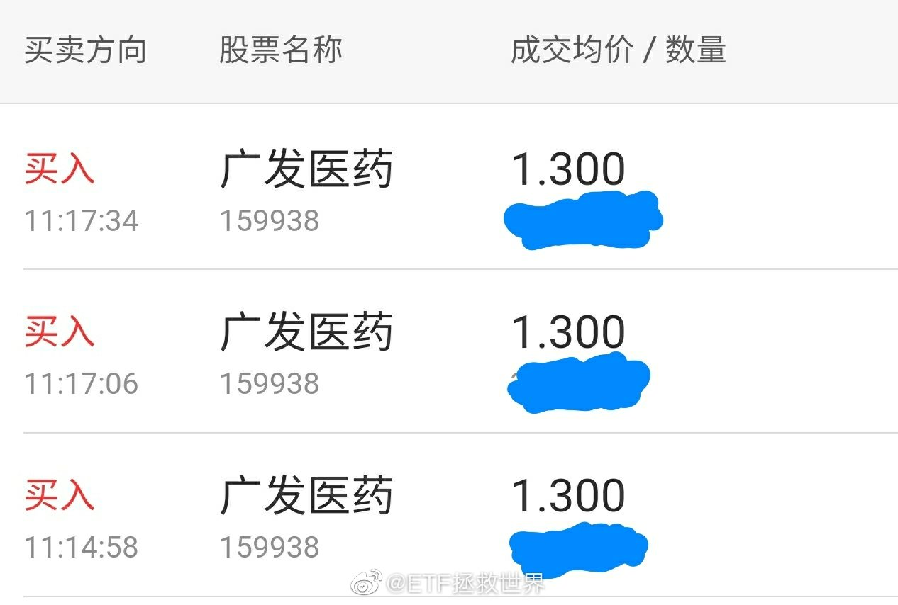

======================================================

ETF拯救世界 (5687069307) @
2019-12-03 17:00:39 Tue  
url: https://weibo.com/5687069307/Ij4C2e0Zl

我有个朋友说，

以前遇到误解，总想去解释。想把真相说出来，纠正别人对自己的错误看法。

现在不会了。

他说，

没必要。

懂你的人自然会懂，不懂的，一部分是不想懂，一部分是不能懂。其实都是没有缘分。

珍惜懂你的人就够了。不要希望全世界的人都理解你，爱你。你又不是美刀。

你懂我我很高兴 ​​​

转发[262]  评论[449]  赞[2059] 

======================================================

ETF拯救世界 (5687069307) @
2019-12-04 09:47:07 Wed  
url: https://weibo.com/5687069307/IjbcyCui1

how you doing ​​​

转发[2]  评论[435]  赞[1045] 

======================================================

ETF拯救世界 (5687069307) @
2019-12-04 19:25:31 Wed  
url: https://weibo.com/5687069307/IjeZky1jZ

我有个朋友曾经跟我说：

独立思考；冷静、客观；多看历史书，很重要。

基本上就不会被别人带着跑。

这是第一步，先有自己的思想。

碰到具体问题，从各个角度看。不因为自己处在某个阶层，就天然的相信某个论调。

当然，你希望为自己的阶层争取权益，就是另一回事。这时候你虽然很公众客观的思考， ​​​

转发[239]  评论[300]  赞[1410] 

======================================================

ETF拯救世界 (5687069307) @
2019-12-04 20:31:17 Wed  
url: https://weibo.com/5687069307/Ijfq1BAER

看了B站的孙兴慜纪录片，说真的有点嫉妒啊。

音乐 电影 群众性的体育运动，真是文化输出的极好载体。 ​​​

转发[10]  评论[141]  赞[786] 

======================================================

ETF拯救世界 (5687069307) @
2019-12-05 10:05:48 Thu  
url: https://weibo.com/5687069307/IjkKDC61B

文化输出真的重要。

韩国输出韩剧，就能让全亚洲的很多女生对这个国家产生美好憧憬。

又有多少人因为日本的漫画，游戏，音乐，开始学日语，继而喜欢上这个国家。

比利时、荷兰这种欧洲小国也会因为足球NB让很多男人觉得这个国家NB，想让人去了解它。更别说因为球员，因为俱乐部而粉上一个国家，天天 ​​​

转发[95]  评论[401]  赞[1556] 

======================================================

ETF拯救世界 (5687069307) @
2019-12-05 15:24:46 Thu  
url: https://weibo.com/5687069307/IjmQ7i4aQ

回复@大漠孤烟0130:服死你了。你这么NB肯定已经在A股赚了有5000万了吧。//@大漠孤烟0130:呵呵 上周你说趋势不见任何好转的时候我就说过已布局6层，本周坐等收割主力 怎么样？服不服？主力今年被我收割的估计也是郁闷坏了

------------------------------------------------------
转推：
>  @ETF拯救世界 (5687069307)
>  2019-12-05 10:05:48 Thu  
>  url: https:/weibo.com/5687069307/IjkKDC61B/

>  文化输出真的重要。
>  
>  韩国输出韩剧，就能让全亚洲的很多女生对这个国家产生美好憧憬。
>  
>  又有多少人因为日本的漫画，游戏，音乐，开始学日语，继而喜欢上这个国家。
>  
>  比利时、荷兰这种欧洲小国也会因为足球NB让很多男人觉得这个国家NB，想让人去了解它。更别说因为球员，因为俱乐部而粉上一个国家，天天 ​​​

转发[9]  评论[217]  赞[789] 

======================================================

ETF拯救世界 (5687069307) @
2019-12-05 15:32:40 Thu  
url: https://weibo.com/5687069307/IjmTjuP26

关于趋势，我把这次发车文章中阐述“价值”与“趋势”的部分摘抄出来。没有看过的朋友可以看看。

-------------

至于S的易方达转债，逻辑是这样。

目前A股又回到了钻石和黄金的交界处。整体再跌10%，就又跌回钻石坑。

以S计划的资金性质来说，在这个地方不买一份实在说不过去。但是为什么要买可转 ​​​

转发[188]  评论[216]  赞[1115] 

======================================================

ETF拯救世界 (5687069307) @
2019-12-05 15:37:32 Thu  
url: https://weibo.com/5687069307/IjmVis0gC

下一步的工作，我会尝试将趋势和价值如何量化结合，计算出合适的仓位。

趋势是我们的讲法，用华尔街的话来说是“动量”。动量投资最近十年在美国效果很不错，比“价值”的收益要高。

当然，我还是那个观点，过去十年好，未必未来十年好。不能用过去一段时间推测未来。但是将这两部分有机结合起来，对 ​​​

转发[87]  评论[237]  赞[1179] 

======================================================

ETF拯救世界 (5687069307) @
2019-12-05 15:58:10 Thu  
url: https://weibo.com/5687069307/Ijn3FkX2X

记得非常清楚。

当初我买创业板的时候，很多人嘲笑。

现在我卖一份去年底买的，已经赚了30%+的创业板，换一份更便宜的500，又有人嘲笑。

相同的是不管我做什么都有人说三道四。

不同的是我现在笑着看他们。 ​​​

转发[27]  评论[320]  赞[1395] 

+++++++++++++++++++++++++++++++++++++++++++++++++++++

图片：

======================================================

ETF拯救世界 (5687069307) @
2019-12-05 19:29:55 Thu  
url: https://weibo.com/5687069307/IjorCwkPE

没想到是中国人干的。

------------------------------------------------------
转推：
>  @ ()
>  2019-12-04 19:05:15 Wed  
>  url: 

>  抱歉，此微博已被作者删除。查看帮助：http://t.cn/Rfd3rQV

转发[21]  评论[96]  赞[531] 

======================================================

ETF拯救世界 (5687069307) @
2019-12-06 13:50:43 Fri  
url: https://weibo.com/5687069307/IjvErcCOX

有些人一边看着李子柒挣那么多钱酸：什么“不是真实生活”了，什么“有团队”了。

一边跟着别人抱怨“阶层固化”，“普通人再也不能逆袭”。

普通人当然有机会逆袭，没机会的是既不愿动脑子努力又总是在抱怨的人。

把嫉妒别人、喷别人的时间用来提高自己，想办法改善生活水平吧。别人真的不行了，你 ​​​

转发[41]  评论[263]  赞[1186] 

======================================================

ETF拯救世界 (5687069307) @
2019-12-06 14:27:37 Fri  
url: https://weibo.com/5687069307/IjvTplxSp

所谓跑赢沪深300。

第三轮计划开始以来跑赢30%多（跑赢500 60%多。这是在2015年第二轮精准逃顶的基础上），最近两年，最近三年全部跑赢。

只因为今年跑输，就叫跑不赢了。

去年跑赢了吗？跑赢了，但去年没人会提这个。

为了给自己挣点流量，你看你得瑟的，上蹿下跳。我叫你们几个一声辣鸡，你们敢 ​​​

转发[21]  评论[197]  赞[1110] 

======================================================

ETF拯救世界 (5687069307) @
2019-12-06 14:38:24 Fri  
url: https://weibo.com/5687069307/IjvXMBnAt

天才啊。把一个牛市最高点建立的组合，和一堆熊市中建立的组合放在一起比年化收益率。

天才。 ​​​

转发[3]  评论[161]  赞[850] 

======================================================

ETF拯救世界 (5687069307) @
2019-12-06 14:44:37 Fri  
url: https://weibo.com/5687069307/Ijw0jevFt

为什么不从2014年开始算年化呢。

图的出处。

http://t.cn/RI8PwDo ​​​

转发[42]  评论[159]  赞[946] 

+++++++++++++++++++++++++++++++++++++++++++++++++++++

图片：

======================================================

ETF拯救世界 (5687069307) @
2019-12-06 15:07:54 Fri  
url: https://weibo.com/5687069307/Ijw9Ldq7Q

今天500又跑输创业板0.1%。

枯了。 ​​​

转发[14]  评论[203]  赞[1030] 

======================================================

ETF拯救世界 (5687069307) @
2019-12-06 15:15:15 Fri  
url: https://weibo.com/5687069307/IjwcK9L2Y

每个人擅长的东西不同。

我并不擅长在牛市中大开大合净值疯涨。大概牛市能跟上80%左右吧（300+500涨幅）。尤其是在牛市最后最疯狂的阶段，反而吃不到鱼翅。

但我擅长的是吃完了中间的硬菜先走，不为了吃鱼翅而买单。然后在暴跌中找到一种可以因为暴跌赚钱的东西，把最后没吃到的鱼翅再安全的吃掉。08 ​​​

转发[198]  评论[551]  赞[2282] 

======================================================

ETF拯救世界 (5687069307) @
2019-12-06 18:56:50 Fri  
url: https://weibo.com/5687069307/IjxEGozms

越来越觉得“商业化”才是推动人类发展的根源。

只有在物质上实现了价值，才会有人提供源源不断的，越来越好的东西给大家。

仅凭热情，信仰，爱心，恐怕很难持续有好东西诞生。

一个体会，不一定对。 ​​​

转发[46]  评论[322]  赞[1453] 

======================================================

ETF拯救世界 (5687069307) @
2019-12-08 00:26:12 Sun  
url: https://weibo.com/5687069307/IjJeS54ho

孙兴慜连过八人。 ​​​

转发[27]  评论[169]  赞[878] 

+++++++++++++++++++++++++++++++++++++++++++++++++++++

图片：

======================================================

ETF拯救世界 (5687069307) @
2019-12-08 12:40:24 Sun  
url: https://weibo.com/5687069307/IjO2TcB95

很多朋友不懂为什么很多球迷看着孙兴慜感到[酸]，而看到梅西C罗没这个感觉。

很简单啊。你看到马云你会酸吗，不会。但你看到一直以来与自己差不多的邻居，他儿子变成了同位置世界最NB TOP5，再看看自己每次考试都不及格的儿子，说不酸是不可能的。

还有一个，更让球迷心情复杂。就是他的出现（包括之 ​​​

转发[32]  评论[208]  赞[990] 

======================================================

ETF拯救世界 (5687069307) @
2019-12-09 10:24:33 Mon  
url: https://weibo.com/5687069307/IjWAfftKJ

10个交易日能不能再出掉，就差一哆嗦了。上上下下的乐趣//@ETF拯救世界:三个交易日买回

------------------------------------------------------
转推：
>  @ETF拯救世界 (5687069307)
>  2019-11-20 09:42:32 Wed  
>  url: https:/weibo.com/5687069307/Ih3bKpl5I/

>  挂的有点多，只成交了一部分 ​​​

转发[8]  评论[125]  赞[581] 

======================================================

ETF拯救世界 (5687069307) @
2019-12-09 10:30:04 Mon  
url: https://weibo.com/5687069307/IjWCtuoaE

市场免不了波动。我们身处其中，无法规避波动。

那么，如何将波动为我所用，才是我们应该考虑的。

而不是面对波动患得患失，心惊胆战，猜来猜去，底部丢筹码，顶部接盘。 ​​​

转发[94]  评论[217]  赞[1308] 

======================================================

ETF拯救世界 (5687069307) @
2019-12-09 15:08:18 Mon  
url: https://weibo.com/5687069307/IjYrq4SJl

今天跑赢0.6%。治愈了。

------------------------------------------------------
转推：
>  @ETF拯救世界 (5687069307)
>  2019-12-06 15:07:54 Fri  
>  url: https:/weibo.com/5687069307/Ijw9Ldq7Q/

>  今天500又跑输创业板0.1%。
>  
>  枯了。 ​​​

转发[8]  评论[164]  赞[866] 

======================================================

ETF拯救世界 (5687069307) @
2019-12-09 19:50:10 Mon  
url: https://weibo.com/5687069307/Ik0hP3vxR

想一想，分级基金其实是个很伟大的产品。激进投资者和保守投资者都适合。当初设计它的人是天才。

真不希望它就这么消失。 ​​​

转发[73]  评论[279]  赞[1453] 

======================================================

ETF拯救世界 (5687069307) @
2019-12-10 12:50:04 Tue  
url: https://weibo.com/5687069307/Ik6XNuWCm

你现在最大的烦恼是什么 ​​​

转发[23]  评论[1110]  赞[1792] 

======================================================

ETF拯救世界 (5687069307) @
2019-12-10 18:49:23 Tue  
url: https://weibo.com/5687069307/Ik9jEciau

搞清楚了，关注我的朋友最烦恼的事情是“缺钱”。

那缺钱的朋友们，打听一下，你们觉得自己有多少钱就可以不为钱烦恼了。

拜托你们实际点……动不动就一个亿，极大概率你这辈子都要烦啊。 ​​​

转发[39]  评论[1101]  赞[1731] 

======================================================

ETF拯救世界 (5687069307) @
2019-12-11 09:40:53 Wed  
url: https://weibo.com/5687069307/Ikf9vmXo2

昨天我问的问题是，有多少钱你才不会觉得“缺钱”，才不会因为钱而烦恼。

结果感觉大家都奔着财务自由去了。难道只有财务自由了才能不因钱而烦恼吗。这其实是两个不同的事情，各位可以考虑一下。

另外，不少朋友觉得上班很烦，为了挣点工资，上班如上坟，非常烦。

这样，不如有空的时候你想一想，如 ​​​

转发[155]  评论[381]  赞[1254] 

======================================================

ETF拯救世界 (5687069307) @
2019-12-11 09:41:38 Wed  
url: https://weibo.com/5687069307/Ikf9OCHeU

回复@ETF拯救世界:12个交易日又卖出。喷了。//@ETF拯救世界:三个交易日买回

------------------------------------------------------
转推：
>  @ETF拯救世界 (5687069307)
>  2019-11-20 09:42:32 Wed  
>  url: https:/weibo.com/5687069307/Ih3bKpl5I/

>  挂的有点多，只成交了一部分 ​​​

转发[15]  评论[160]  赞[532] 

======================================================

ETF拯救世界 (5687069307) @
2019-12-11 09:56:28 Wed  
url: https://weibo.com/5687069307/IkffPxjqH

我希望各位了解，我贴自己的网格交易记录，不是为了得瑟水平高，更不是为了显摆我挣了多少钱，我需要这些吗。

我是希望把自己的交易贴出来，抛砖引玉，为各位提供理论思路的同时，有一些实际操作记录，供各位参考。

帮各位解忧，能做的不多，尽力了。 ​​​

转发[17]  评论[377]  赞[1560] 

======================================================

ETF拯救世界 (5687069307) @
2019-12-11 10:00:59 Wed  
url: https://weibo.com/5687069307/IkfhFgha1

网格是做网格，再提醒一次，这是整个体系的一部分，是为了应对震荡市。

这个策略，在震荡市光辉无比，在大牛市会变成渣。所以2.0的很多细节要注意。比如卖的时候留利润等等。

让自己低成本、0成本，甚至负成本的筹码越积越多，才是未来赚大钱的基础。 ​​​

转发[304]  评论[262]  赞[1209] 

======================================================

ETF拯救世界 (5687069307) @
2019-12-11 10:12:45 Wed  
url: https://weibo.com/5687069307/Ikfmrmwwp

发现自己内心很阴暗。

总希望那些想买而没买，然后现在涨了好多的品种跌下去。

内心同样阴暗的打666。 ​​​

转发[13]  评论[1103]  赞[1684] 

======================================================

ETF拯救世界 (5687069307) @
2019-12-11 11:32:41 Wed  
url: https://weibo.com/5687069307/IkfSTmdDK

#上海养个孩子到初中要花80万# 这个我有点发言权。第一是因为我记帐。过去十几年每一笔收入支出都有帐。第二是因为有孩子，北京和上海消费水平也大差不差。

我看了一下记账软件，从孩子出生到现在六岁一年级，所有消费加起来是40多不到50万。我可以负责任的讲，我家孩子的消费水平肯定不算高，在周围 ​​​

转发[38]  评论[223]  赞[774] 

======================================================

ETF拯救世界 (5687069307) @
2019-12-11 13:35:53 Wed  
url: https://weibo.com/5687069307/IkgGToKMD

其实上小学后，孩子也花不了太多钱，除非你一定要给报马术高尔夫之类的。

午饭在学校。天天穿校服。也就买几双鞋和节假日穿的衣服。小孩的耐克阿迪也就几百块一双。

大一点的支出是兴趣班，辅导班。一两万一个班每年。篮球足球音乐英语数学，你能报几个。围棋，学校已经请了围棋培训机构的来教。

孩 ​​​

转发[263]  评论[330]  赞[1665] 

======================================================

ETF拯救世界 (5687069307) @
2019-12-11 13:50:45 Wed  
url: https://weibo.com/5687069307/IkgMVupwG

回复@胖胖胖胖胖大王:咱们国民普遍都太焦虑了。人生几十年，其实就这么回事。80%对未来的焦虑都是自己吓自己。除了生死，没什么太重要的，适度焦虑即可，哈哈//@胖胖胖胖胖大王:这种缓解焦虑的博主简直是一股清流

------------------------------------------------------
转推：
>  @ETF拯救世界 (5687069307)
>  2019-12-11 13:35:53 Wed  
>  url: https:/weibo.com/5687069307/IkgGToKMD/

>  其实上小学后，孩子也花不了太多钱，除非你一定要给报马术高尔夫之类的。
>  
>  午饭在学校。天天穿校服。也就买几双鞋和节假日穿的衣服。小孩的耐克阿迪也就几百块一双。
>  
>  大一点的支出是兴趣班，辅导班。一两万一个班每年。篮球足球音乐英语数学，你能报几个。围棋，学校已经请了围棋培训机构的来教。
>  
>  孩 ​​​

转发[38]  评论[62]  赞[592] 

======================================================

ETF拯救世界 (5687069307) @
2019-12-11 13:54:43 Wed  
url: https://weibo.com/5687069307/IkgOxkLqv

回复@Ayra的缝衣针:让他在同龄人里中下我觉得可能会有一些心理问题出现。比如有可能导致不自信，有可能成年后对钱看得太重太吝啬等等。//@Ayra的缝衣针:为什么要在中上呢？不是在中下

------------------------------------------------------
转推：
>  @ETF拯救世界 (5687069307)
>  2019-12-11 13:35:53 Wed  
>  url: https:/weibo.com/5687069307/IkgGToKMD/

>  其实上小学后，孩子也花不了太多钱，除非你一定要给报马术高尔夫之类的。
>  
>  午饭在学校。天天穿校服。也就买几双鞋和节假日穿的衣服。小孩的耐克阿迪也就几百块一双。
>  
>  大一点的支出是兴趣班，辅导班。一两万一个班每年。篮球足球音乐英语数学，你能报几个。围棋，学校已经请了围棋培训机构的来教。
>  
>  孩 ​​​

转发[31]  评论[74]  赞[562] 

======================================================

ETF拯救世界 (5687069307) @
2019-12-11 14:10:32 Wed  
url: https://weibo.com/5687069307/IkgUXp4WB

我对别人生孩子还是不生孩子没有任何建议和意见。其实我自己特别年轻的时候也不打算要孩子，所以很理解有些朋友的想法。

但是有一点，其实很有意思的，不知道你注意过没有。

就是有了孩子的父母，虽然可能因为孩子增加了一些压力，但是，很少很少很少有人会后悔要了孩子对不对。

说明什么，说明人类 ​​​

转发[101]  评论[496]  赞[1894] 

======================================================

ETF拯救世界 (5687069307) @
2019-12-12 12:37:13 Thu  
url: https://weibo.com/5687069307/IkpJzD2jp

一年前的一网中概互联，出完走人。

算上时间价值，多加了2%，这一网7个多点。 ​​​

转发[19]  评论[240]  赞[1081] 

======================================================

ETF拯救世界 (5687069307) @
2019-12-13 08:46:04 Fri  
url: https://weibo.com/5687069307/IkxEfqqaZ

今天压涨还是跌。 ​​​

转发[10]  评论[408]  赞[873] 

======================================================

ETF拯救世界 (5687069307) @
2019-12-13 09:41:52 Fri  
url: https://weibo.com/5687069307/Iky0TAj1J

群众怎么还没来。 ​​​

转发[0]  评论[186]  赞[861] 

======================================================

ETF拯救世界 (5687069307) @
2019-12-13 09:45:18 Fri  
url: https://weibo.com/5687069307/Iky2ibDQu

没什么特别要求，今天能出几网就好了。

然后，事情顺利当然好。不顺利，好歹又提款了。

那边不出点幺蛾子才奇怪。 ​​​

转发[5]  评论[173]  赞[830] 

======================================================

ETF拯救世界 (5687069307) @
2019-12-13 10:17:39 Fri  
url: https://weibo.com/5687069307/IkyfqhPDd

有些资金是贱取贵予；

有些资金是见风使舵；

有些资金，是肉吃不到，打一顿没少挨。 ​​​

转发[28]  评论[104]  赞[953] 

======================================================

ETF拯救世界 (5687069307) @
2019-12-13 10:23:46 Fri  
url: https://weibo.com/5687069307/IkyhUeBMu

做投资，有的时候，其实知道的信息越多，反而可能越有害。

比如特别悲观的时候，坏消息满天飞。你看看这里，看看那里，觉得完蛋了没戏了。卖在钻石坑。

倒不如闭上眼睛捂上耳朵，该吃吃该喝喝，该买就买，踏踏实实的。反正你拿着的东西又不会死。

最终，不听不看，反而有可能比那些消息灵通人士做的 ​​​

转发[113]  评论[246]  赞[1250] 

======================================================

ETF拯救世界 (5687069307) @
2019-12-13 10:53:30 Fri  
url: https://weibo.com/5687069307/IkytYp2dP

外资不停买，公募重仓，依然涨不动。

很明显就是有人卖。谁在卖，等年报出来看。

不知道会不会有人4000、5000点疯了似的买，2000多点持续卖。

如果有，我也不敢评价。 ​​​

转发[73]  评论[256]  赞[1318] 

======================================================

ETF拯救世界 (5687069307) @
2019-12-13 11:12:04 Fri  
url: https://weibo.com/5687069307/IkyBvzQcI

恒生收益率又超50%了。到60%卖点。 ​​​

转发[11]  评论[201]  赞[1137] 

======================================================

ETF拯救世界 (5687069307) @
2019-12-13 13:21:36 Fri  
url: https://weibo.com/5687069307/Ikzs5qt1W

北 清 目前自主招生比例有没有超过40%？ ​​​

转发[27]  评论[124]  赞[686] 

======================================================

ETF拯救世界 (5687069307) @
2019-12-13 14:23:17 Fri  
url: https://weibo.com/5687069307/IkzR7DEsw

今天这么高兴买个健身环奖励一下自己。 ​​​

转发[70]  评论[209]  赞[964] 

======================================================

ETF拯救世界 (5687069307) @
2019-12-13 14:32:42 Fri  
url: https://weibo.com/5687069307/IkzUXgWlE

回复@投资跑道上的一只小蜗牛:是啊。趋势形成就会影响几年走势。然而到了变化的时候就按周计算。今天大多数指数趋势都有变好的迹象。但是转折的时候反复很多，这也是为什么不能做纯右侧交易的原因。

------------------------------------------------------
转推：
>  @ETF拯救世界 (5687069307)
>  2019-12-13 14:23:17 Fri  
>  url: https:/weibo.com/5687069307/IkzR7DEsw/

>  今天这么高兴买个健身环奖励一下自己。 ​​​

转发[39]  评论[57]  赞[581] 

======================================================

ETF拯救世界 (5687069307) @
2019-12-13 14:38:29 Fri  
url: https://weibo.com/5687069307/IkzXilwQr

左侧好不好？好啊。

研究价值，对比价格。价格低于价值就买。以后肯定赚啊。

但是，1块钱的东西，你8毛买，觉得赚了，结果跌到2毛。你能扛住吗？

能，那你就适合左侧。

前提是，你真的能判断那个东西值1块。

右侧香不香？香啊。

左侧投资者熊市赔的欲哭无泪的时候，右侧空仓看着他们笑。

趋势好 ​​​

转发[196]  评论[470]  赞[1706] 

======================================================

ETF拯救世界 (5687069307) @
2019-12-13 18:23:12 Fri  
url: https://weibo.com/5687069307/IkBqvtDjD

今天好歹收盘前一分钟出了一网。周末随便搞吧哈哈哈。 ​​​

转发[11]  评论[269]  赞[964] 

======================================================

ETF拯救世界 (5687069307) @
2019-12-13 22:44:05 Fri  
url: https://weibo.com/5687069307/IkD8p05Zf

对于有些热门新闻，有点自己的想法。但是不太敢说… ​​​

转发[4]  评论[207]  赞[951] 

======================================================

ETF拯救世界 (5687069307) @
2019-12-13 23:29:35 Fri  
url: https://weibo.com/5687069307/IkDqSj7RP

是不是要开始准备新高礼物了 ​​​

转发[6]  评论[339]  赞[1091] 

======================================================

ETF拯救世界 (5687069307) @
2019-12-13 23:39:12 Fri  
url: https://weibo.com/5687069307/IkDuM4MsS

平常心吧。持久战不会那么快结束。

该干嘛干嘛。 ​​​

转发[24]  评论[233]  赞[1369] 

======================================================

ETF拯救世界 (5687069307) @
2019-12-14 20:58:23 Sat  
url: https://weibo.com/5687069307/IkLS07okS

猜猜珠海盈米基金是谁

------------------------------------------------------
转推：
>  @新财富杂志 (1708922835)
>  2019-12-14 20:46:15 Sat  
>  url: https:/weibo.com/1708922835/IkLN4yhIA/

>  【震惊基金圈！刚刚，马云又出手了！联手40万亿全球最大公募基金，要干这件大事，门槛800元，影响6亿人！华尔街之狼真的来了！】近日，中国证监会下发第二批基金投资顾问业务试点名单，蚂蚁（杭州）基金销售有限公司、腾安基金、珠海盈米基金3家第三方基金销售机构赫然在列。据悉，在蚂蚁基金拿到基金 ​​​

转发[94]  评论[172]  赞[715] 

======================================================

ETF拯救世界 (5687069307) @
2019-12-14 21:06:50 Sat  
url: https://weibo.com/5687069307/IkLVqztmQ

回复@取个名这么难我丢:简单来说，三家牌照就是阿里、腾讯、且慢。佩服孟岩。//@取个名这么难我丢:腾安是腾讯的，且慢进入前列啦[鼓掌]//@ETF拯救世界:猜猜珠海盈米基金是谁

------------------------------------------------------
转推：
>  @新财富杂志 (1708922835)
>  2019-12-14 20:46:15 Sat  
>  url: https:/weibo.com/1708922835/IkLN4yhIA/

>  【震惊基金圈！刚刚，马云又出手了！联手40万亿全球最大公募基金，要干这件大事，门槛800元，影响6亿人！华尔街之狼真的来了！】近日，中国证监会下发第二批基金投资顾问业务试点名单，蚂蚁（杭州）基金销售有限公司、腾安基金、珠海盈米基金3家第三方基金销售机构赫然在列。据悉，在蚂蚁基金拿到基金 ​​​

转发[76]  评论[146]  赞[895] 

======================================================

ETF拯救世界 (5687069307) @
2019-12-14 21:41:37 Sat  
url: https://weibo.com/5687069307/IkM9xv3Vt

能力有限，只能做这么多了… ​​​

转发[1]  评论[115]  赞[705] 

+++++++++++++++++++++++++++++++++++++++++++++++++++++

图片：

======================================================

ETF拯救世界 (5687069307) @
2019-12-16 09:59:28 Mon  
url: https://weibo.com/5687069307/Il0px6VF7

涨不涨无所谓，动就行。

------------------------------------------------------
转推：
>  @ETF拯救世界 (5687069307)
>  2019-10-28 16:05:38 Mon  
>  url: https:/weibo.com/5687069307/IdARPn9UA/

>  传媒的波动太大了，网格利器。 ​​​

转发[26]  评论[125]  赞[627] 

======================================================

ETF拯救世界 (5687069307) @
2019-12-16 10:10:18 Mon  
url: https://weibo.com/5687069307/Il0tVwE5h

什么玩意儿，还没发货。生气。[哼]

------------------------------------------------------
转推：
>  @ETF拯救世界 (5687069307)
>  2019-12-13 14:23:17 Fri  
>  url: https:/weibo.com/5687069307/IkzR7DEsw/

>  今天这么高兴买个健身环奖励一下自己。 ​​​

转发[14]  评论[77]  赞[501] 

======================================================

ETF拯救世界 (5687069307) @
2019-12-16 10:13:05 Mon  
url: https://weibo.com/5687069307/Il0v4aZfv

看到有朋友说“卖飞了”，这个就要再次提醒。做网格的目的是降低持仓成本，同时，要不断增加持仓数量。仔细研究2.0。我的所有策略，都经过十年以上的实践，基本上所有坑都已经填好。所以我强调的东西一定要重视。不要再自己去掉一次坑了。

------------------------------------------------------
转推：
>  @ETF拯救世界 (5687069307)
>  2019-12-11 10:00:59 Wed  
>  url: https:/weibo.com/5687069307/IkfhFgha1/

>  网格是做网格，再提醒一次，这是整个体系的一部分，是为了应对震荡市。
>  
>  这个策略，在震荡市光辉无比，在大牛市会变成渣。所以2.0的很多细节要注意。比如卖的时候留利润等等。
>  
>  让自己低成本、0成本，甚至负成本的筹码越积越多，才是未来赚大钱的基础。 ​​​

转发[162]  评论[210]  赞[821] 

======================================================

ETF拯救世界 (5687069307) @
2019-12-16 10:27:01 Mon  
url: https://weibo.com/5687069307/Il0AIjHpp

浮亏觉得自己买多了，浮盈觉得自己买少了。

有这种想法的举手。 ​​​

转发[16]  评论[514]  赞[1975] 

======================================================

ETF拯救世界 (5687069307) @
2019-12-16 11:17:39 Mon  
url: https://weibo.com/5687069307/Il0VgtkqG

赚钱就是这么朴实无华，且乏味 ​​​

转发[14]  评论[272]  赞[1428] 

======================================================

ETF拯救世界 (5687069307) @
2019-12-16 13:28:00 Mon  
url: https://weibo.com/5687069307/Il1Mb1Mzf

论送货快，退换货方便，保真，国内还有没有比JD好的平台。 ​​​

转发[6]  评论[201]  赞[892] 

======================================================

ETF拯救世界 (5687069307) @
2019-12-16 13:33:53 Mon  
url: https://weibo.com/5687069307/Il1Oz5Idk

从上一波传媒被密集攻击算起，又有20%的涨幅了……

某个品种表现不好——被攻击——均值回归——大涨…… ​​​

转发[29]  评论[187]  赞[1046] 

======================================================

ETF拯救世界 (5687069307) @
2019-12-16 14:32:22 Mon  
url: https://weibo.com/5687069307/Il2ciC5XQ

50、300涨的不好我也没什么高兴的，毕竟咱们也有不少……

但是消费跌我还挺高兴的……咱们的卖光了啊……

对，我就是这么狭隘，骂我吧…… ​​​

转发[10]  评论[248]  赞[1125] 

======================================================

ETF拯救世界 (5687069307) @
2019-12-16 14:43:59 Mon  
url: https://weibo.com/5687069307/Il2h1cmQi

人生得意须尽欢，莫使金樽空对月（但是要低调） ​​​

转发[8]  评论[155]  赞[1008] 

======================================================

ETF拯救世界 (5687069307) @
2019-12-16 14:51:20 Mon  
url: https://weibo.com/5687069307/Il2k0bqsT

一天涨幅是沪深300的8倍，波动也确实是不小了。//@ETF拯救世界:涨不涨无所谓，动就行。

------------------------------------------------------
转推：
>  @ETF拯救世界 (5687069307)
>  2019-10-28 16:05:38 Mon  
>  url: https:/weibo.com/5687069307/IdARPn9UA/

>  传媒的波动太大了，网格利器。 ​​​

转发[16]  评论[93]  赞[784] 

======================================================

ETF拯救世界 (5687069307) @
2019-12-16 15:31:25 Mon  
url: https://weibo.com/5687069307/Il2AhgQ1I

今天成分股调仓日，基金涨幅大概率跟不上指数。 ​​​

转发[13]  评论[127]  赞[813] 

======================================================

ETF拯救世界 (5687069307) @
2019-12-16 17:32:09 Mon  
url: https://weibo.com/5687069307/Il3nhdM74

英国连续大涨，咱们的指数基金依然没上。

------------------------------------------------------
转推：
>  @ETF拯救世界 (5687069307)
>  2019-10-17 18:25:40 Thu  
>  url: https:/weibo.com/5687069307/IbW5ddyFk/

>  DAX 15个月新高。
>  
>  英国脱欧协议都达成了，咱们的英国指数基金还没上。 ​​​

转发[6]  评论[66]  赞[609] 

======================================================

ETF拯救世界 (5687069307) @
2019-12-16 17:34:40 Mon  
url: https://weibo.com/5687069307/Il3oitNg6

目前不会再买的指数：

上证50、创业板指、深100 ​​​

转发[90]  评论[376]  赞[1533] 

======================================================

ETF拯救世界 (5687069307) @
2019-12-17 09:28:15 Tue  
url: https://weibo.com/5687069307/Il9DmfeMA

建议不要连续大涨，进二退一比较好。 

抄送xx同志审阅。 ​​​

转发[41]  评论[342]  赞[1373] 

======================================================

ETF拯救世界 (5687069307) @
2019-12-17 10:57:01 Tue  
url: https://weibo.com/5687069307/Ilado9DQv

说话不好使了。退博。[哼]

------------------------------------------------------
转推：
>  @ETF拯救世界 (5687069307)
>  2019-12-17 09:28:15 Tue  
>  url: https:/weibo.com/5687069307/Il9DmfeMA/

>  建议不要连续大涨，进二退一比较好。 
>  
>  抄送xx同志审阅。 ​​​

转发[33]  评论[279]  赞[947] 

======================================================

ETF拯救世界 (5687069307) @
2019-12-17 11:33:54 Tue  
url: https://weibo.com/5687069307/IlasmzoUj

回复@蜀中弟子:别急，股票都能轮到涨。如果没轮到，等下次牛市。如果退市了，擦干眼泪攒钱再战//@蜀中弟子:e大好，我来做反面教材了，自己的证券账户满仓踏空，，，股票不好买啊，还是多配置指数基金，幸好股票只是玩玩，资金不大[泪][泪][泪][泪]//@ETF拯救世界:说话不好使了。退博。[哼]

------------------------------------------------------
转推：
>  @ETF拯救世界 (5687069307)
>  2019-12-17 09:28:15 Tue  
>  url: https:/weibo.com/5687069307/Il9DmfeMA/

>  建议不要连续大涨，进二退一比较好。 
>  
>  抄送xx同志审阅。 ​​​

转发[25]  评论[134]  赞[641] 

======================================================

ETF拯救世界 (5687069307) @
2019-12-17 11:54:31 Tue  
url: https://weibo.com/5687069307/IlaAJvlVS

回复@An-Idler:买了一堆股票，大盘涨它们不涨。赚了指数不赚钱。牛市赔钱的人有多少新朋友根本想象不到//@An-Idler:满仓踏空，是啥意思？//@ETF拯救世界:回复@蜀中弟子:别急，股票都能轮到涨。如果没轮到，等下次牛市。如果退市了，擦干眼泪攒钱再战

------------------------------------------------------
转推：
>  @ETF拯救世界 (5687069307)
>  2019-12-17 09:28:15 Tue  
>  url: https:/weibo.com/5687069307/Il9DmfeMA/

>  建议不要连续大涨，进二退一比较好。 
>  
>  抄送xx同志审阅。 ​​​

转发[17]  评论[129]  赞[622] 

======================================================

ETF拯救世界 (5687069307) @
2019-12-17 13:13:58 Tue  
url: https://weibo.com/5687069307/Ilb6YtZFi

又让老外抄底了。当然，老外没有我们成本低。现在就是等人来接盘了

------------------------------------------------------
转推：
>  @ETF拯救世界 (5687069307)
>  2019-12-13 10:53:30 Fri  
>  url: https:/weibo.com/5687069307/IkytYp2dP/

>  外资不停买，公募重仓，依然涨不动。
>  
>  很明显就是有人卖。谁在卖，等年报出来看。
>  
>  不知道会不会有人4000、5000点疯了似的买，2000多点持续卖。
>  
>  如果有，我也不敢评价。 ​​​

转发[11]  评论[137]  赞[740] 

======================================================

ETF拯救世界 (5687069307) @
2019-12-17 13:19:07 Tue  
url: https://weibo.com/5687069307/Ilb94w2fY

涨不是问题。问题是很多朋友重仓大涨心里乱如麻

卖不卖？卖了继续大涨怎么办

不卖一个电梯又回解放前怎么办

愁死了。天天愁。涨跌都愁。 ​​​

转发[32]  评论[522]  赞[1432] 

======================================================

ETF拯救世界 (5687069307) @
2019-12-17 15:18:55 Tue  
url: https://weibo.com/5687069307/IlbVH6jwi

这涨幅意思不大。

提哪辆。 ​​​

转发[9]  评论[676]  赞[1728] 

+++++++++++++++++++++++++++++++++++++++++++++++++++++

图片：

======================================================

ETF拯救世界 (5687069307) @
2019-12-18 09:47:11 Wed  
url: https://weibo.com/5687069307/Iljbxqklx

最后一网传媒和恒生吃完。 ​​​

转发[23]  评论[234]  赞[875] 

======================================================

ETF拯救世界 (5687069307) @
2019-12-18 10:06:34 Wed  
url: https://weibo.com/5687069307/IljjphAlM

波段仓位完成历史使命之日，就是长线仓位开始大放异彩之时。 ​​​

转发[56]  评论[215]  赞[1265] 

======================================================

ETF拯救世界 (5687069307) @
2019-12-18 10:10:07 Wed  
url: https://weibo.com/5687069307/IljkQvsdc

说了无数次的，你现在懂了没。//@ETF拯救世界:看到有朋友说“卖飞了”，这个就要再次提醒。做网格的目的是降低持仓成本，同时，要不断增加持仓数量。仔细研究2.0。我的所有策略，都经过十年以上的实践，基本上所有坑都已经填好。所以我强调的东西一定要重视。不要再自己去掉一次坑了。

------------------------------------------------------
转推：
>  @ETF拯救世界 (5687069307)
>  2019-12-11 10:00:59 Wed  
>  url: https:/weibo.com/5687069307/IkfhFgha1/

>  网格是做网格，再提醒一次，这是整个体系的一部分，是为了应对震荡市。
>  
>  这个策略，在震荡市光辉无比，在大牛市会变成渣。所以2.0的很多细节要注意。比如卖的时候留利润等等。
>  
>  让自己低成本、0成本，甚至负成本的筹码越积越多，才是未来赚大钱的基础。 ​​​

转发[63]  评论[100]  赞[670] 

======================================================

ETF拯救世界 (5687069307) @
2019-12-18 10:17:35 Wed  
url: https://weibo.com/5687069307/IljnSti5X

看到传媒这样涨，总是想起一件事。

之前传媒最低点附近的时候，有个朋友跟我说，某个公众号又在喷我买的东西是辣鸡。我闲着没事就去看了一下那篇文章。文章没工夫看，看了一眼评论。

看到一个妹子问，买了传媒怎么办啊，浮亏十几个点了。

那位作者说：赶紧卖掉，传媒完蛋了。

从那时候起到现在，传 ​​​

转发[36]  评论[391]  赞[1274] 

======================================================

ETF拯救世界 (5687069307) @
2019-12-18 10:53:55 Wed  
url: https://weibo.com/5687069307/IljCD07l7

知道不知道你为什么会感谢一个人，因为你觉得这个人对你好，给你的东西超过了你给他的。

你又为什么会怨恨一个人。因为你觉得这个人给你的东西没有达到你的预期，给你的东西少于你给他的。

所以我经常会感到非常困惑。

有一些人，拿着从我这里学到的东西，得到的启发，自己包装一下去卖钱。结果反过 ​​​

转发[68]  评论[612]  赞[2013] 

======================================================

ETF拯救世界 (5687069307) @
2019-12-18 11:05:19 Wed  
url: https://weibo.com/5687069307/IljHfBNSr

沪深300到了一个5年压力位。能不能过去？ ​​​

转发[19]  评论[234]  赞[1215] 

======================================================

ETF拯救世界 (5687069307) @
2019-12-18 14:23:56 Wed  
url: https://weibo.com/5687069307/IlkZSbdJE

对于普通人来说，我能想到的最好投资资本市场的方式，就是用一个完整的指数交易体系去进行指数投资。这部分是基石。

然后，买一些耳熟能详的，平常你经常会用到的消费品公司股票（5-15只）长期持有。这部分是锦上添花。 ​​​

转发[397]  评论[437]  赞[1968] 

======================================================

ETF拯救世界 (5687069307) @
2019-12-18 14:54:19 Wed  
url: https://weibo.com/5687069307/IllccBUyG

9：30-11：30；

13：00-15：00

这四个小时是每天的精华时段。 ​​​

转发[19]  评论[158]  赞[1181] 

======================================================

ETF拯救世界 (5687069307) @
2019-12-18 14:57:55 Wed  
url: https://weibo.com/5687069307/IlldFlnoH

回复@ETC指数投资:传媒最多跌了78%。距离80%一步之遥。//@ETC指数投资:相信E神的80%历史大底理论，一路加仓传媒，加成第一重仓，不得不说，真香。

------------------------------------------------------
转推：
>  @ETF拯救世界 (5687069307)
>  2019-12-18 14:23:56 Wed  
>  url: https:/weibo.com/5687069307/IlkZSbdJE/

>  对于普通人来说，我能想到的最好投资资本市场的方式，就是用一个完整的指数交易体系去进行指数投资。这部分是基石。
>  
>  然后，买一些耳熟能详的，平常你经常会用到的消费品公司股票（5-15只）长期持有。这部分是锦上添花。 ​​​

转发[64]  评论[163]  赞[816] 

======================================================

ETF拯救世界 (5687069307) @
2019-12-18 17:47:30 Wed  
url: https://weibo.com/5687069307/Ilmkv8grj

最近有不少朋友私信我关于找工作以及工作选择的问题，兹事体大，我确实不敢乱说，还望海涵。 ​​​

转发[6]  评论[241]  赞[955] 

======================================================

ETF拯救世界 (5687069307) @
2019-12-19 09:37:08 Thu  
url: https://weibo.com/5687069307/IlsxXloBr

我现在也同意他们说的传媒是辣鸡了。真的，我才发现他们几个大V真的水平高。

为什么，因为传媒不停涨，我的波段都没法做了。

太气人了。辣鸡传媒。[怒] ​​​

转发[34]  评论[349]  赞[1283] 

======================================================

ETF拯救世界 (5687069307) @
2019-12-19 10:15:42 Thu  
url: https://weibo.com/5687069307/IlsNC4Ckz

打开衣柜，70%都是优衣库。这种人算什么阶层，懂时尚的你点评一下。 ​​​

转发[16]  评论[484]  赞[1659] 

======================================================

ETF拯救世界 (5687069307) @
2019-12-19 10:52:30 Thu  
url: https://weibo.com/5687069307/Ilt2y6lLy

百度不行真的是自己作的。

用百度app看贴吧，突然开始不能看回复了。必须下载贴吧app才能看。

WTF，我不看了还不行吗？一个破贴吧也要强制下载APP。

我连百度APP都删掉。 ​​​

转发[52]  评论[451]  赞[1755] 

======================================================

ETF拯救世界 (5687069307) @
2019-12-19 13:54:20 Thu  
url: https://weibo.com/5687069307/Iluem4TGQ

涨不涨全看指数不行，有时候指数不客观。

现在涨跌家数是2100：1400，结果上证深成300500中小创业都是跌的。 ​​​

转发[24]  评论[103]  赞[736] 

======================================================

ETF拯救世界 (5687069307) @
2019-12-19 14:09:19 Thu  
url: https://weibo.com/5687069307/IlukroWFe

为什么给我的微博加股票代码。如果关注我的人因为这个买了，赔钱了，请问微博，你们给人家负责吗。

------------------------------------------------------
转推：
>  @ETF拯救世界 (5687069307)
>  2019-12-19 13:54:20 Thu  
>  url: https:/weibo.com/5687069307/Iluem4TGQ/

>  涨不涨全看指数不行，有时候指数不客观。
>  
>  现在涨跌家数是2100：1400，结果上证深成300500中小创业都是跌的。 ​​​

转发[7]  评论[183]  赞[796] 

======================================================

ETF拯救世界 (5687069307) @
2019-12-19 14:26:47 Thu  
url: https://weibo.com/5687069307/IlurwvKa8

意思不大。 ​​​

转发[6]  评论[218]  赞[839] 

======================================================

ETF拯救世界 (5687069307) @
2019-12-19 15:40:45 Thu  
url: https://weibo.com/5687069307/IluVypmYA

汇报一下，最后还是没发货。说还要等一周。退款，楼下游戏机店买了//@ETF拯救世界:什么玩意儿，还没发货。生气。[哼]

------------------------------------------------------
转推：
>  @ETF拯救世界 (5687069307)
>  2019-12-13 14:23:17 Fri  
>  url: https:/weibo.com/5687069307/IkzR7DEsw/

>  今天这么高兴买个健身环奖励一下自己。 ​​​

转发[12]  评论[62]  赞[576] 

======================================================

ETF拯救世界 (5687069307) @
2019-12-19 15:50:19 Thu  
url: https://weibo.com/5687069307/IluZrf8w3

为什么老是耽误各位时间发这个，是想以后有机会送两套。毕竟赚钱重要，身体健康更重要。我先为大家试试效果…//@ETF拯救世界:汇报一下，最后还是没发货。说还要等一周。退款，楼下游戏机店买了//@ETF拯救世界:什么玩意儿，还没发货。生气。[哼]

------------------------------------------------------
转推：
>  @ETF拯救世界 (5687069307)
>  2019-12-13 14:23:17 Fri  
>  url: https:/weibo.com/5687069307/IkzR7DEsw/

>  今天这么高兴买个健身环奖励一下自己。 ​​​

转发[7]  评论[308]  赞[877] 

======================================================

ETF拯救世界 (5687069307) @
2019-12-20 10:50:43 Fri  
url: https://weibo.com/5687069307/IlCskmUEN

夸一下微博。晚上买一股微博股票支持一下。 ​​​

转发[2]  评论[131]  赞[784] 

+++++++++++++++++++++++++++++++++++++++++++++++++++++

图片：

======================================================

ETF拯救世界 (5687069307) @
2019-12-20 10:54:16 Fri  
url: https://weibo.com/5687069307/IlCtLgGxJ

绝大多少人每天上班已经不开心了，回家还要面对不喜欢的人，活着还有什么意思。

别人我不知道，如果是我，我不喜欢对方，绝对不会结婚。 ​​​

转发[34]  评论[318]  赞[1282] 

+++++++++++++++++++++++++++++++++++++++++++++++++++++

图片：
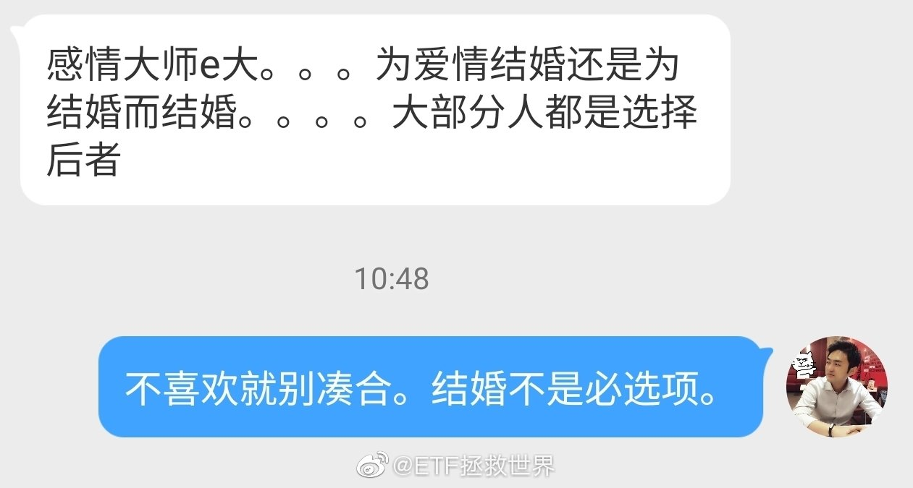

======================================================

ETF拯救世界 (5687069307) @
2019-12-20 11:14:53 Fri  
url: https://weibo.com/5687069307/IlCC8aezF

找男女朋友很难吗，其实也不是很难啊。

第一点就是提升自己。由外至内。

首先就是外，因为无论男女，你首先得外在不让人抗拒才有下一步的可能。现在节奏这么快，内在再好也很少有人愿意停下来慢慢了解。

然后就是内。这个同样重要。这里有意思的地方在于，鱼找鱼虾找虾，即使你的三观一点都不正，也 ​​​

转发[219]  评论[522]  赞[1682] 

======================================================

ETF拯救世界 (5687069307) @
2019-12-20 13:26:08 Fri  
url: https://weibo.com/5687069307/IlDtpaMhL

听到《All I Want for Christmas Is You》拿下billboard冠军的消息后，我就知道，又到了看《真爱至上》的时候了。 ​​​

转发[33]  评论[156]  赞[1018] 

+++++++++++++++++++++++++++++++++++++++++++++++++++++

图片：

======================================================

ETF拯救世界 (5687069307) @
2019-12-22 18:26:35 Sun  
url: https://weibo.com/5687069307/IlYilDTHB

亲测这个东西是有锻炼效果的 ​​​

转发[11]  评论[286]  赞[932] 

+++++++++++++++++++++++++++++++++++++++++++++++++++++

图片：

======================================================

ETF拯救世界 (5687069307) @
2019-12-23 13:20:40 Mon  
url: https://weibo.com/5687069307/Im5IG0WOi

跟各位大佬打好招呼了，关注我的朋友（除了极个别坏人）明年都顺顺利利，心想事成，财源广进，没病没灾。

放心，香火也上的足足的，都踏踏实实的。 ​​​

转发[59]  评论[1113]  赞[4371] 

+++++++++++++++++++++++++++++++++++++++++++++++++++++

图片：
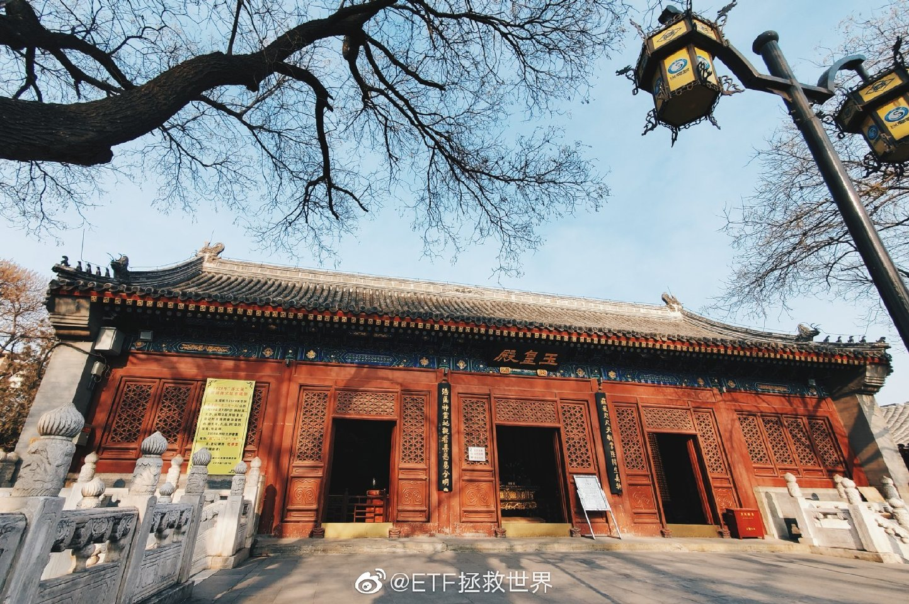

======================================================

ETF拯救世界 (5687069307) @
2019-12-23 14:56:52 Mon  
url: https://weibo.com/5687069307/Im6lIFQID

当你开始做波段，你就会发现波动的时候你不再像以前那样焦虑。

甚至有点开心呢。

所以世界并没有变，变的是你观察这个世界的角度，以及与这个世界相处的方式。

你变了，某种程度上说，世界也就焕然一新了。 ​​​

转发[147]  评论[249]  赞[1399] 

======================================================

ETF拯救世界 (5687069307) @
2019-12-23 15:01:00 Mon  
url: https://weibo.com/5687069307/Im6noFn1V

我其实有点不理解点的外卖晚了几分钟就发火给差评的。

外卖小哥风里来雨里去挺不容易，晚几分钟吃能怎么着啊。

你对别人宽容点，别人对你宽容点。互相宽容理解，冲突就少很多。冲突少了，也能开心的活得久一点。 ​​​

转发[19]  评论[231]  赞[1374] 

======================================================

ETF拯救世界 (5687069307) @
2019-12-23 15:09:56 Mon  
url: https://weibo.com/5687069307/Im6r29tth

回复@xwzzzzzZ_:这句话是2010年说的。万万没想到真的十年还是3000点。计划也意料之中赚了大钱。所以投资指数，指数点位并不那么重要。重要的是你怎么做。//@xwzzzzzZ_:“现在上证3000点，哪怕10年后都是三千点，我相信我们的计划也能挣大钱”.By E大

------------------------------------------------------
转推：
>  @ETF拯救世界 (5687069307)
>  2019-12-23 14:56:52 Mon  
>  url: https:/weibo.com/5687069307/Im6lIFQID/

>  当你开始做波段，你就会发现波动的时候你不再像以前那样焦虑。
>  
>  甚至有点开心呢。
>  
>  所以世界并没有变，变的是你观察这个世界的角度，以及与这个世界相处的方式。
>  
>  你变了，某种程度上说，世界也就焕然一新了。 ​​​

转发[45]  评论[81]  赞[704] 

======================================================

ETF拯救世界 (5687069307) @
2019-12-23 16:01:10 Mon  
url: https://weibo.com/5687069307/Im6LP7WkJ

回复@Ulquiorra-L:因为计划第二轮在疯狂的2015年4、5月卖光了。//@Ulquiorra-L:为啥十年后3000点还能挣钱？中间有高点卖出了挣的？//@ETF拯救世界:回复@xwzzzzzZ_:这句话是2010年说的。万万没想到真的十年还是3000点。计划也意料之中赚了大钱。所以投资指数，指数点位并不那么重要。重要的是你怎么做。

------------------------------------------------------
转推：
>  @ETF拯救世界 (5687069307)
>  2019-12-23 14:56:52 Mon  
>  url: https:/weibo.com/5687069307/Im6lIFQID/

>  当你开始做波段，你就会发现波动的时候你不再像以前那样焦虑。
>  
>  甚至有点开心呢。
>  
>  所以世界并没有变，变的是你观察这个世界的角度，以及与这个世界相处的方式。
>  
>  你变了，某种程度上说，世界也就焕然一新了。 ​​​

转发[13]  评论[84]  赞[707] 

======================================================

ETF拯救世界 (5687069307) @
2019-12-23 18:07:57 Mon  
url: https://weibo.com/5687069307/Im7BhwH5f

是不是有人总是办了健身房的卡，然后只去不超过10次甚至5次。

过一两年又办一张。周而复始的浪费钱。

这样，我给你个建议：

下次你再想办卡，你就先在家里连续锻炼两周。每天或者隔天练，每次半小时以内即可。

如果你发现连在家里练都坚持不下去，你说你还有必要糟蹋钱吗。 ​​​

转发[27]  评论[286]  赞[952] 

======================================================

ETF拯救世界 (5687069307) @
2019-12-23 18:44:16 Mon  
url: https://weibo.com/5687069307/Im7Q1sHd5

未来十几二十年，我考虑，人类应该可以实现一号玩家里面的设定，即带上装备进入虚拟世界。运动，打怪。

现在看，最大的问题应该是视觉效果。VR AR效果都还不行。这个问题一旦解决，世界可能就变了。

进一步想，人类要这副皮囊究竟有没有意义呢。生老病死，头疼脑热，伤了病了，瘦了胖了，都很烦。还 ​​​

转发[31]  评论[281]  赞[1112] 

======================================================

ETF拯救世界 (5687069307) @
2019-12-24 11:12:55 Tue  
url: https://weibo.com/5687069307/ImejjAd0J

涨亦何欢，跌亦何悲。 ​​​

转发[11]  评论[341]  赞[1289] 

======================================================

ETF拯救世界 (5687069307) @
2019-12-24 13:32:34 Tue  
url: https://weibo.com/5687069307/Imfe0c4zK

要不怎么说是大佬呢。 ​​​

转发[5]  评论[167]  赞[921] 

======================================================

ETF拯救世界 (5687069307) @
2019-12-24 14:02:58 Tue  
url: https://weibo.com/5687069307/Imfqle4bs

今年突然对圣诞节没什么感觉了。

是老了还是对世界有了新的认识。 ​​​

转发[6]  评论[316]  赞[1279] 

======================================================

ETF拯救世界 (5687069307) @
2019-12-24 15:19:13 Tue  
url: https://weibo.com/5687069307/ImfVi8d1u

有朋友问，一块钱入股，年后5块钱香港上市是不是真的，能不能买。

这个我也不知道是不是真的。

但你要让我买，我不买。

主要原因在于，我审视一下自己，发现一直以来确实运气不错，但没有好到平白无故就能无风险一个多月赚5倍的地步。

要真运气好到这样，那以后得多不顺才能能量守恒啊，不敢买。

 ​​​

转发[62]  评论[602]  赞[2381] 

======================================================

ETF拯救世界 (5687069307) @
2019-12-25 09:51:09 Wed  
url: https://weibo.com/5687069307/ImncDe6fm

一个半月，又出一格。

------------------------------------------------------
转推：
>  @ETF拯救世界 (5687069307)
>  2019-11-12 23:54:13 Tue  
>  url: https:/weibo.com/5687069307/IfVltpGby/

>  最近三个月白银网格是这样的情况（顺序从下往上）
>  
>  等于筹码没丢，吃了两轮利润 ​​​

转发[27]  评论[491]  赞[1004] 

======================================================

ETF拯救世界 (5687069307) @
2019-12-26 15:04:53 Thu  
url: https://weibo.com/5687069307/ImyGt3bxb

挣点钱而已，意思不大。 ​​​

转发[7]  评论[482]  赞[1558] 

======================================================

ETF拯救世界 (5687069307) @
2019-12-27 11:00:07 Fri  
url: https://weibo.com/5687069307/ImGvC6h4w

第一波新年礼物先送微博的朋友。

31日之前确认，过年之前拿到手。 ​​​

转发[31]  评论[2113]  赞[2771] 

======================================================

ETF拯救世界 (5687069307) @
2019-12-27 11:08:24 Fri  
url: https://weibo.com/5687069307/ImGyYpAZC

儿子试穿我给买的新年音乐表演要穿的白衬衫，拿起琴的时候

我就一个想法：

比我小时候帅太多了…… ​​​

转发[9]  评论[503]  赞[2068] 

======================================================

ETF拯救世界 (5687069307) @
2019-12-27 19:21:57 Fri  
url: https://weibo.com/5687069307/ImJNj7out

又到了半年盘点财务状况的时候。

账户开太多，平常又不能做到每笔交易记账，这个时候就很头疼了。 ​​​

转发[14]  评论[327]  赞[1272] 

======================================================

ETF拯救世界 (5687069307) @
2019-12-28 10:40:19 Sat  
url: https://weibo.com/5687069307/ImPO4p5MK

知道这个消息比大家早一点。

第一反应跟大家一样，感到很意外。原来一切都发展的那么好，结果突然分手，出乎意料。

过两天发车文章再说吧。 ​​​

转发[35]  评论[889]  赞[2715] 

======================================================

ETF拯救世界 (5687069307) @
2019-12-28 19:43:53 Sat  
url: https://weibo.com/5687069307/ImTmHFeq7

请严惩凶手。再不想看到这样的事情！

------------------------------------------------------
转推：
>  @急诊夜鹰 (1621894121)
>  2019-12-28 09:46:43 Sat  
>  url: https:/weibo.com/1621894121/ImPsk5I99/

>  沉痛悼念杨文医生[蜡烛] ​​​

转发[115]  评论[187]  赞[1482] 

======================================================

ETF拯救世界 (5687069307) @
2019-12-28 19:48:59 Sat  
url: https://weibo.com/5687069307/ImToMaYrf

回复@frederick_999:一个微博号而已。如果这样的话都不能说，我还要它干什么//@frederick_999:以为E大担心号，就不发声了，[赞][赞][赞]//@ETF拯救世界:请严惩凶手。再不想看到这样的事情！

------------------------------------------------------
转推：
>  @急诊夜鹰 (1621894121)
>  2019-12-28 09:46:43 Sat  
>  url: https:/weibo.com/1621894121/ImPsk5I99/

>  沉痛悼念杨文医生[蜡烛] ​​​

转发[51]  评论[164]  赞[1329] 

======================================================

ETF拯救世界 (5687069307) @
2019-12-29 21:59:32 Sun  
url: https://weibo.com/5687069307/In3Ggm3jX

说起荷兰改名，想起我在荷兰的一位朋友。

那是十几年前了，有一天我的邮箱里收到一封信，是一位女孩写给一位男孩的。

信中充满思念之情。

不知道出于什么想法，我居然回了那封信。

然后，又收到了回信。

（待续） ​​​

转发[13]  评论[332]  赞[1118] 

======================================================

ETF拯救世界 (5687069307) @
2019-12-30 10:15:03 Mon  
url: https://weibo.com/5687069307/In8uOd8hJ

遇到脾气暴躁，性格乖张的人，尽量离远一点，尽量不要正面冲突。

平常走路，尽量不要走楼下面。离远一点。大风天，离广告牌之类的远点。 ​​​

转发[66]  评论[311]  赞[1581] 

======================================================

ETF拯救世界 (5687069307) @
2019-12-30 10:49:41 Mon  
url: https://weibo.com/5687069307/In8ISg5iY

今年之前，新年红包都是微博和公众号随机发。几千位朋友都能拿到。

今年初，我突然发现，不止是只有朋友关注我，还有辣鸡盯着我的微博天天挑毛病随时准备开喷。

让这些辣鸡抢到一分钱我都会觉得恶心，所以今年开始，由阳光普照，改成发给真朋友。

然而怎么知道这么多人里面谁是真朋友很难。我也只能 ​​​

转发[41]  评论[1347]  赞[2375] 

+++++++++++++++++++++++++++++++++++++++++++++++++++++

图片：

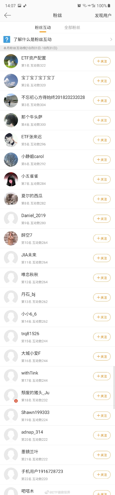

======================================================

ETF拯救世界 (5687069307) @
2019-12-30 14:12:43 Mon  
url: https://weibo.com/5687069307/Ina3hknWW

回复@千年追寻:这不是基本操作吗…不要大惊小怪[doge]//@千年追寻:老大老大，你又蒙对了！神了神了[爱你][爱你][鲜花][鲜花]如果感到幸福你就拍拍手[鼓掌][鼓掌][鼓掌] http://t.cn/AiFpnUok

------------------------------------------------------
转推：
>  @ETF拯救世界 (5687069307)
>  2019-12-30 10:49:41 Mon  
>  url: https:/weibo.com/5687069307/In8ISg5iY/

>  今年之前，新年红包都是微博和公众号随机发。几千位朋友都能拿到。
>  
>  今年初，我突然发现，不止是只有朋友关注我，还有辣鸡盯着我的微博天天挑毛病随时准备开喷。
>  
>  让这些辣鸡抢到一分钱我都会觉得恶心，所以今年开始，由阳光普照，改成发给真朋友。
>  
>  然而怎么知道这么多人里面谁是真朋友很难。我也只能 ​​​

转发[13]  评论[355]  赞[1076] 

======================================================

ETF拯救世界 (5687069307) @
2019-12-30 17:58:57 Mon  
url: https://weibo.com/5687069307/Inbx6yI2f

名次小助理已经统计出来了。

从上到下，分别是0-9。就看明天大盘收盘点位了。

1和2，8和9分数一样，所以如果明天大盘收在1、2或者8、9，两位还要通过某种方式再拼一次。赢的拿大礼，输的礼金在原奖金基础上再加200。 ​​​

转发[14]  评论[595]  赞[1243] 

+++++++++++++++++++++++++++++++++++++++++++++++++++++

图片：
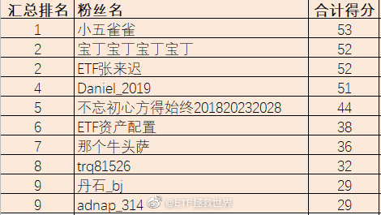

======================================================

ETF拯救世界 (5687069307) @
2019-12-30 18:36:51 Mon  
url: https://weibo.com/5687069307/InbMunNfc

（续一）

一来二去，几封邮件来回，我终于弄清楚了为什么邮件会发到我的邮箱。

发件人是一位中国女孩，在荷兰留学。

我的邮箱地址是“xxxxx20@sina.com”。前面的xxxxx，是我之前一直用的网名，20，是我注册这个邮箱时候的年龄。

而xxxxx，也正好是这位女孩的男朋友的网名拼音。

而20，则是她男朋 ​​​

转发[16]  评论[665]  赞[1444] 

======================================================

ETF拯救世界 (5687069307) @
2019-12-31 10:00:57 Tue  
url: https://weibo.com/5687069307/InhPAbAM4

每天一款惊喜，款款都不同。 ​​​

转发[10]  评论[498]  赞[1266] 

======================================================

ETF拯救世界 (5687069307) @
2019-12-31 15:10:24 Tue  
url: https://weibo.com/5687069307/InjRbywQx

（续二）

女孩说她姓柳。很好听的姓。其实名字更好听，但我不能说。毕竟，这不是一篇小说，而是确有其事，确有其人。

后来女孩告诉我，之所以写第一封信给那个邮箱，是因为真的太痛苦了。太多的话想说，又不知道对谁说。所以写一封邮件给那个地址，希望天上的他能看到。

她说，从来没想过居然能收到 ​​​

转发[30]  评论[932]  赞[2318] 

======================================================

ETF拯救世界 (5687069307) @
2019-12-31 15:55:03 Tue  
url: https://weibo.com/5687069307/Ink9jl770

恭喜 @小五雀雀 ，实至名归，第一名叠加上证收盘3050点，拿到大礼京东购物卡880元（昨天发现没有80的卡，自动升级为900元）。请榜上所有朋友私信我处理后续事宜。

------------------------------------------------------
转推：
>  @ETF拯救世界 (5687069307)
>  2019-12-30 17:58:57 Mon  
>  url: https:/weibo.com/5687069307/Inbx6yI2f/

>  名次小助理已经统计出来了。
>  
>  从上到下，分别是0-9。就看明天大盘收盘点位了。
>  
>  1和2，8和9分数一样，所以如果明天大盘收在1、2或者8、9，两位还要通过某种方式再拼一次。赢的拿大礼，输的礼金在原奖金基础上再加200。 ​​​

转发[5]  评论[277]  赞[957] 

======================================================

ETF拯救世界 (5687069307) @
2019-12-31 16:36:00 Tue  
url: https://weibo.com/5687069307/InkpWilGm

打算怎么迎接新年，说来听听。

2020。

进入21世纪已经20年了！ ​​​

转发[24]  评论[852]  赞[1731] 

======================================================

