ETF拯救世界 (5687069307) @
2020-01-01 00:04:29 Wed  
url: https://weibo.com/5687069307/InnlYlvas

新年快乐！！！ ​​​

转发[30]  评论[1908]  赞[2867] 

======================================================

ETF拯救世界 (5687069307) @
2020-01-01 10:05:46 Wed  
url: https://weibo.com/5687069307/Inri2vxE1

新的一年，早上起来第一件事是锻炼身体

这一年，要更加善待自己和他人，要更努力的做事。 ​​​

转发[20]  评论[362]  赞[1622] 

+++++++++++++++++++++++++++++++++++++++++++++++++++++

图片：
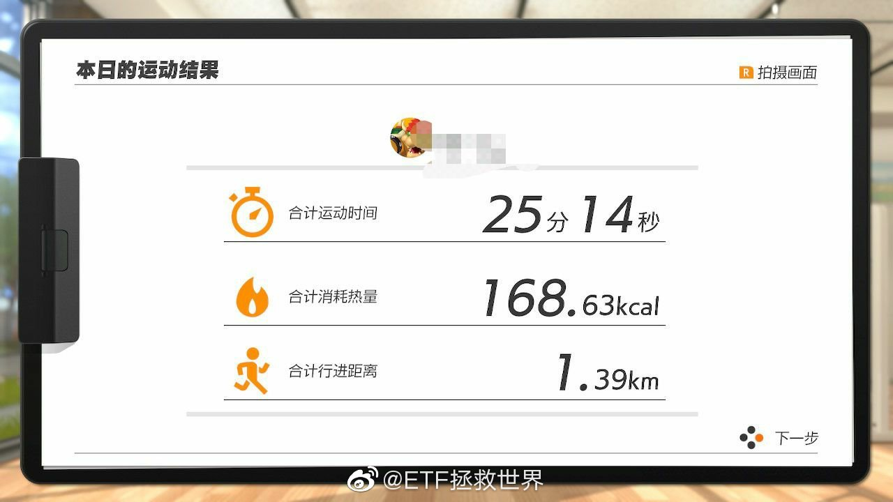

======================================================

ETF拯救世界 (5687069307) @
2020-01-01 10:31:42 Wed  
url: https://weibo.com/5687069307/InrszgaLs

统一回复，在家锻炼我买的是健身房那种厚垫子。瑜伽垫太薄，两个加起来都薄。

淘宝关键字应该是“舞蹈垫”“海绵垫”之类的。很厚，舒服而且没有声音。 可以对折，折起来更厚！ ​​​

转发[29]  评论[169]  赞[951] 

======================================================

ETF拯救世界 (5687069307) @
2020-01-01 10:47:17 Wed  
url: https://weibo.com/5687069307/InryTm3BE

北京5G速度实测 ​​​

转发[10]  评论[251]  赞[859] 

+++++++++++++++++++++++++++++++++++++++++++++++++++++

图片：

======================================================

ETF拯救世界 (5687069307) @
2020-01-02 08:30:55 Thu  
url: https://weibo.com/5687069307/InA626wO1

今天押涨有风险吗 ​​​

转发[9]  评论[589]  赞[1117] 

======================================================

ETF拯救世界 (5687069307) @
2020-01-02 10:12:03 Thu  
url: https://weibo.com/5687069307/InAL57zNg

3000点，账户历史新高了吧。 ​​​

转发[18]  评论[504]  赞[1567] 

======================================================

ETF拯救世界 (5687069307) @
2020-01-02 10:27:50 Thu  
url: https://weibo.com/5687069307/InARuhhnZ

听进去了没有。现在明白了吧。我说的一定要注意啊。

------------------------------------------------------
转推：
>  @ETF拯救世界 (5687069307)
>  2019-12-11 10:00:59 Wed  
>  url: https:/weibo.com/5687069307/IkfhFgha1/

>  网格是做网格，再提醒一次，这是整个体系的一部分，是为了应对震荡市。
>  
>  这个策略，在震荡市光辉无比，在大牛市会变成渣。所以2.0的很多细节要注意。比如卖的时候留利润等等。
>  
>  让自己低成本、0成本，甚至负成本的筹码越积越多，才是未来赚大钱的基础。 ​​​

转发[27]  评论[294]  赞[912] 

======================================================

ETF拯救世界 (5687069307) @
2020-01-02 10:39:43 Thu  
url: https://weibo.com/5687069307/InAWjj3nP

春节前如果能维持涨势，春节后又要冲一把。 ​​​

转发[48]  评论[393]  赞[1468] 

======================================================

ETF拯救世界 (5687069307) @
2020-01-02 10:46:21 Thu  
url: https://weibo.com/5687069307/InAZ0ypgm

今年是大波动这个判断是不是越来越靠谱了。

如果全年大涨，就是又一个短命行情，明年又是万人坑。

只有大幅波动才符合长牛慢牛的要求。 ​​​

转发[224]  评论[501]  赞[1991] 

======================================================

ETF拯救世界 (5687069307) @
2020-01-02 10:52:34 Thu  
url: https://weibo.com/5687069307/InB1wyPyv

不会有很多只看微博的朋友以为我们只做网格赚波动的钱吧。

我们是主力资金放在长期资金，这部分在2018年底基本已经布局完毕，不会乱动。少部分做波段降成本。

一定不要弄错。 ​​​

转发[47]  评论[605]  赞[1699] 

======================================================

ETF拯救世界 (5687069307) @
2020-01-02 14:34:00 Thu  
url: https://weibo.com/5687069307/InCtpf8Nv

挣点钱而已，意思不大。 ​​​

转发[8]  评论[500]  赞[1523] 

======================================================

ETF拯救世界 (5687069307) @
2020-01-02 15:04:58 Thu  
url: https://weibo.com/5687069307/InCFYtcN8

说一个几周前你会觉得很可笑的事：

传媒ETF居然溢价了。

市场的羊群疯起来真是不看路的。 ​​​

转发[35]  评论[462]  赞[1653] 

======================================================

ETF拯救世界 (5687069307) @
2020-01-03 10:31:12 Fri  
url: https://weibo.com/5687069307/InKjlD1Bg

喷了。

好消息不断。 ​​​

转发[19]  评论[537]  赞[1611] 

+++++++++++++++++++++++++++++++++++++++++++++++++++++

图片：

======================================================

ETF拯救世界 (5687069307) @
2020-01-03 10:35:30 Fri  
url: https://weibo.com/5687069307/InKl66JAH

熊市慢慢买，积累筹码。钻石坑布置完毕。

最好不赔钱。但是如果有点浮亏也没事，看都不用看。

牛市来了踏踏实实拿着。最后收割一把走人。

继续慢慢买。

说白了就这么点事儿。

一辈子，做几个轮回，基本就差不多了。 ​​​

转发[241]  评论[1153]  赞[3107] 

======================================================

ETF拯救世界 (5687069307) @
2020-01-06 10:10:36 Mon  
url: https://weibo.com/5687069307/Iocsub7Gb

黄金原油500传媒环保

这些辣鸡这么涨让人感到有点不好意思了。 ​​​

转发[28]  评论[595]  赞[1587] 

======================================================

ETF拯救世界 (5687069307) @
2020-01-06 10:30:30 Mon  
url: https://weibo.com/5687069307/IocAys8lC

500上面第一个压力5650 ​​​

转发[69]  评论[379]  赞[1285] 

======================================================

ETF拯救世界 (5687069307) @
2020-01-06 11:25:01 Mon  
url: https://weibo.com/5687069307/IocWGsy3X

意思不大 ​​​

转发[7]  评论[492]  赞[1332] 

======================================================

ETF拯救世界 (5687069307) @
2020-01-06 13:03:32 Mon  
url: https://weibo.com/5687069307/IodAFCZ2m

投资的时候，舒服重要不重要。

谁舒服谁发言。 ​​​

转发[19]  评论[707]  赞[1696] 

======================================================

ETF拯救世界 (5687069307) @
2020-01-06 13:18:44 Mon  
url: https://weibo.com/5687069307/IodGQfQKs

再次推荐电影《迷雾》The Mist

没看过的一定要看看。看到最后。

每次最绝望，最坚持不下去的时候，想想这部电影，会有用。 ​​​

转发[181]  评论[677]  赞[1795] 

======================================================

ETF拯救世界 (5687069307) @
2020-01-07 09:21:40 Tue  
url: https://weibo.com/5687069307/Iolz7qNur

又是一个好日子。

今天资产能继续新高吗。 ​​​

转发[10]  评论[518]  赞[1367] 

======================================================

ETF拯救世界 (5687069307) @
2020-01-07 09:46:20 Tue  
url: https://weibo.com/5687069307/IolJ8eSHo

去年春节，吃饭的时候你跟亲戚说，钻石坑，买股票赚大钱。

他们笑话你遇到了骗子。

今年春节，吃饭的时候亲戚跟你说，黄金十年，买股票赚大钱。

你笑着咬了口韭菜馅饺子。 ​​​

转发[123]  评论[596]  赞[1856] 

======================================================

ETF拯救世界 (5687069307) @
2020-01-07 09:58:12 Tue  
url: https://weibo.com/5687069307/IolNWo5tz

回复@frederick_999:永远不要劝别人炒股或者不炒股，买基金或者不买基金，投资或者不投资。一个建议，99%对。//@frederick_999:我几个券商的朋友已经开始拉着身边小伙伴入伙准备在股市大挣一笔了，我劝了一晚上没劝住。

------------------------------------------------------
转推：
>  @ETF拯救世界 (5687069307)
>  2020-01-07 09:46:20 Tue  
>  url: https:/weibo.com/5687069307/IolJ8eSHo/

>  去年春节，吃饭的时候你跟亲戚说，钻石坑，买股票赚大钱。
>  
>  他们笑话你遇到了骗子。
>  
>  今年春节，吃饭的时候亲戚跟你说，黄金十年，买股票赚大钱。
>  
>  你笑着咬了口韭菜馅饺子。 ​​​

转发[49]  评论[302]  赞[1154] 

======================================================

ETF拯救世界 (5687069307) @
2020-01-07 13:03:38 Tue  
url: https://weibo.com/5687069307/Ion1d7VwL

你的东西涨了，你心里要清楚是因为价值还是炒作。

自己心里得明明白白的。 ​​​

转发[109]  评论[354]  赞[1376] 

======================================================

ETF拯救世界 (5687069307) @
2020-01-07 13:50:21 Tue  
url: https://weibo.com/5687069307/IonkbduUh

回复@姨夫劝你莫拒绝:拿回现金也不是真的。没准下一把就赔了。销户离场之前都是假的。//@姨夫劝你莫拒绝:账面上的是虚的，收菜拿回现金的时候才是真的

------------------------------------------------------
转推：
>  @ETF拯救世界 (5687069307)
>  2020-01-07 13:03:38 Tue  
>  url: https:/weibo.com/5687069307/Ion1d7VwL/

>  你的东西涨了，你心里要清楚是因为价值还是炒作。
>  
>  自己心里得明明白白的。 ​​​

转发[58]  评论[135]  赞[719] 

======================================================

ETF拯救世界 (5687069307) @
2020-01-07 13:56:55 Tue  
url: https://weibo.com/5687069307/IonmQl0f7

回复@兔望雨停:赔了踏踏实实拿10年，赚了烫手拿不了3天。非常经典，绝大多数人都这样。//@兔望雨停:我感觉账户的收益让我觉得好不踏实 只有每天上班的工资让我觉得踏实，明明这几天的收益抵我几个月工资。不知道是怎么回事[允悲]

------------------------------------------------------
转推：
>  @ETF拯救世界 (5687069307)
>  2020-01-07 13:03:38 Tue  
>  url: https:/weibo.com/5687069307/Ion1d7VwL/

>  你的东西涨了，你心里要清楚是因为价值还是炒作。
>  
>  自己心里得明明白白的。 ​​​

转发[42]  评论[196]  赞[984] 

======================================================

ETF拯救世界 (5687069307) @
2020-01-07 14:01:27 Tue  
url: https://weibo.com/5687069307/IonoG8yDm

身边人都赚钱了——

股市都是骗钱的不买——

身边人赚大钱了——

可以买点试试——

我去我也赚钱了，多买！——

嗯？怎么赔了。割不割？——

算了，赔太多了。拿着吧，股市果然是骗钱的——

几年后——

回本了！清仓！再不清仓就跌回去又赔了！——

嗯，怎么还在涨，股市都是骗钱的，不买—— ​​​

转发[121]  评论[407]  赞[1281] 

======================================================

ETF拯救世界 (5687069307) @
2020-01-07 14:15:45 Tue  
url: https://weibo.com/5687069307/IonuuiYvZ

回复@1个吼猴:有些人炒股就是图个乐，跟打麻将似的。不炒股玩别的更闹心，孩子踏踏实实的。//@1个吼猴:回复@1个吼猴:但我爹不一样。我爹不相信市场，也不跟风追高，只相信自己天纵奇才。结果赔的比我妈还多

------------------------------------------------------
转推：
>  @ETF拯救世界 (5687069307)
>  2020-01-07 14:01:27 Tue  
>  url: https:/weibo.com/5687069307/IonoG8yDm/

>  身边人都赚钱了——
>  
>  股市都是骗钱的不买——
>  
>  身边人赚大钱了——
>  
>  可以买点试试——
>  
>  我去我也赚钱了，多买！——
>  
>  嗯？怎么赔了。割不割？——
>  
>  算了，赔太多了。拿着吧，股市果然是骗钱的——
>  
>  几年后——
>  
>  回本了！清仓！再不清仓就跌回去又赔了！——
>  
>  嗯，怎么还在涨，股市都是骗钱的，不买—— ​​​

转发[12]  评论[135]  赞[706] 

======================================================

ETF拯救世界 (5687069307) @
2020-01-07 15:07:03 Tue  
url: https://weibo.com/5687069307/IonPjm7SE

[怒] 传媒辣鸡。你给我赚那么多也是辣鸡。

------------------------------------------------------
转推：
>  @ETF拯救世界 (5687069307)
>  2019-12-19 09:37:08 Thu  
>  url: https:/weibo.com/5687069307/IlsxXloBr/

>  我现在也同意他们说的传媒是辣鸡了。真的，我才发现他们几个大V真的水平高。
>  
>  为什么，因为传媒不停涨，我的波段都没法做了。
>  
>  太气人了。辣鸡传媒。[怒] ​​​

转发[11]  评论[292]  赞[961] 

======================================================

ETF拯救世界 (5687069307) @
2020-01-07 15:11:30 Tue  
url: https://weibo.com/5687069307/IonR728Do

传媒上面的压力位在1630。 ​​​

转发[35]  评论[302]  赞[1019] 

======================================================

ETF拯救世界 (5687069307) @
2020-01-07 17:41:02 Tue  
url: https://weibo.com/5687069307/IooPO9IHY

出门在外，尽量别跟人起冲突。因为你根本想象不到对方有多二。

------------------------------------------------------
转推：
>  @ ()
>  2020-01-07 16:52:53 Tue  
>  url: 

>  抱歉，作者已设置仅展示半年内微博，此微博已不可见。 ​​​

转发[43]  评论[174]  赞[640] 

======================================================

ETF拯救世界 (5687069307) @
2020-01-07 18:33:50 Tue  
url: https://weibo.com/5687069307/IopbeE0rP

以下几位拿礼物的朋友还没联系我或者小助理，请给我发私信。

春节前再不联系就算自动放弃了。

ETF张来迟、不忘初心方得始终201820232028、trq81526、丹石_bj ​​​

转发[5]  评论[329]  赞[922] 

======================================================

ETF拯救世界 (5687069307) @
2020-01-07 21:52:44 Tue  
url: https://weibo.com/5687069307/IoqtYyO23

私信太多，不是礼物的事还看不到这个。

看完了心里很复杂。各种感觉一两句说不清。

祝大家都好。无论做什么投资，安全都是第一位，尽量买不会死的品种。

对于能帮助各位，无论是哪个方面，我都很欣慰，压力也很大。

咱们都要越来越好。 ​​​

转发[51]  评论[716]  赞[2660] 

+++++++++++++++++++++++++++++++++++++++++++++++++++++

图片：
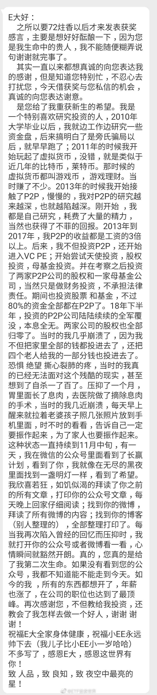

======================================================

ETF拯救世界 (5687069307) @
2020-01-07 23:45:56 Tue  
url: https://weibo.com/5687069307/IordV7Cy2

早点睡，晚安 ​​​

转发[4]  评论[275]  赞[1066] 

======================================================

ETF拯救世界 (5687069307) @
2020-01-08 07:45:09 Wed  
url: https://weibo.com/5687069307/Ioumr4OTe

再走一个 ​​​

转发[9]  评论[411]  赞[1044] 

+++++++++++++++++++++++++++++++++++++++++++++++++++++

图片：
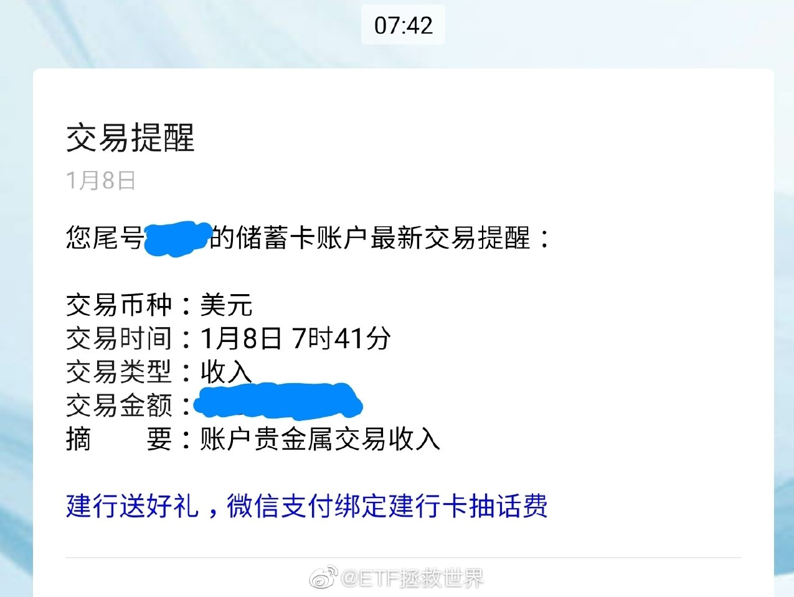

======================================================

ETF拯救世界 (5687069307) @
2020-01-08 08:41:38 Wed  
url: https://weibo.com/5687069307/IouJmm8Ne

截至目前，150的31个品种中，盈利的是28个。如果把500算做一个大类，则浮亏品种只剩环保和油气。环保6%，油气2%。

s计划18个品种中，盈利17个。只剩油气浮亏2%。

如果做了网格，这两个也基本赚钱了。

你的账户现在应该是满堂红。

其实金融投资只要理性，赚钱真的不难。赔钱很难。无论A股港股海外互 ​​​

转发[74]  评论[859]  赞[2065] 

======================================================

ETF拯救世界 (5687069307) @
2020-01-08 12:49:23 Wed  
url: https://weibo.com/5687069307/IowlVgWZ5

所以每次去拜大佬的时候，我第一个都是许愿国泰民安。

这四个字没了，什么都是空。 ​​​

转发[23]  评论[370]  赞[1866] 

======================================================

ETF拯救世界 (5687069307) @
2020-01-08 14:18:35 Wed  
url: https://weibo.com/5687069307/IowW86RdC

160416 计划里的石油基金，场内部分可以先卖出，大幅溢价。 ​​​

转发[113]  评论[269]  赞[940] 

======================================================

ETF拯救世界 (5687069307) @
2020-01-08 14:42:00 Wed  
url: https://weibo.com/5687069307/Iox5DA2Ba

虽然挣钱意思不大，但是跟赔钱时候一点意思都没有比起来，还是有意思多了啊。 ​​​

转发[37]  评论[370]  赞[1249] 

======================================================

ETF拯救世界 (5687069307) @
2020-01-08 15:08:25 Wed  
url: https://weibo.com/5687069307/Ioxgmr0Vs

回复@江尼的小酒馆:WTF，场内挂单要赶紧安排上了。送钱啊这是。//@江尼的小酒馆:E大今天德国30不知道出了什么幺蛾子，我的场内网格提醒买入，应该是突然暴跌，乌龙指？

------------------------------------------------------
转推：
>  @ETF拯救世界 (5687069307)
>  2020-01-08 14:42:00 Wed  
>  url: https:/weibo.com/5687069307/Iox5DA2Ba/

>  虽然挣钱意思不大，但是跟赔钱时候一点意思都没有比起来，还是有意思多了啊。 ​​​

转发[23]  评论[275]  赞[793] 

======================================================

ETF拯救世界 (5687069307) @
2020-01-08 21:20:24 Wed  
url: https://weibo.com/5687069307/IozHlkVpM

白银出掉一网，原油场内溢价卖出套利。

现在金油大跌，这么给面子吗。 ​​​

转发[13]  评论[272]  赞[883] 

+++++++++++++++++++++++++++++++++++++++++++++++++++++

图片：

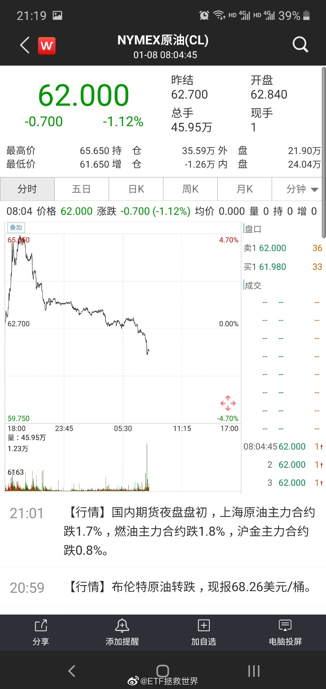

======================================================

ETF拯救世界 (5687069307) @
2020-01-09 09:31:27 Thu  
url: https://weibo.com/5687069307/IoEu5iuPC

不用谢 http://t.cn/AisCxzwZ

------------------------------------------------------
转推：
>  @ETF拯救世界 (5687069307)
>  2020-01-08 14:18:35 Wed  
>  url: https:/weibo.com/5687069307/IowW86RdC/

>  160416 计划里的石油基金，场内部分可以先卖出，大幅溢价。 ​​​

转发[94]  评论[257]  赞[911] 

======================================================

ETF拯救世界 (5687069307) @
2020-01-09 09:36:36 Thu  
url: https://weibo.com/5687069307/IoEwaq8fC

这个市场上充满了疯子和傻子。他们不会消失，所以理性的人赚钱就是必然//@ETF拯救世界:不用谢 http://t.cn/AisCxzwZ

------------------------------------------------------
转推：
>  @ETF拯救世界 (5687069307)
>  2020-01-08 14:18:35 Wed  
>  url: https:/weibo.com/5687069307/IowW86RdC/

>  160416 计划里的石油基金，场内部分可以先卖出，大幅溢价。 ​​​

转发[29]  评论[183]  赞[813] 

======================================================

ETF拯救世界 (5687069307) @
2020-01-09 10:22:17 Thu  
url: https://weibo.com/5687069307/IoEOIts9z

回复@ETF拯救世界:喷了。跌停接回的朋友们，如果疯子们拉回-5%左右，可以再次卖掉，再吃5%。一天利润超过15%你什么感觉。T+0，当天买卖ok//@ETF拯救世界:回复@ETF虚一而静:可以。也可以再等等，目前还有点溢价，不过无所谓了，十几个点差价已经吃到了

------------------------------------------------------
转推：
>  @ETF拯救世界 (5687069307)
>  2020-01-08 14:18:35 Wed  
>  url: https:/weibo.com/5687069307/IowW86RdC/

>  160416 计划里的石油基金，场内部分可以先卖出，大幅溢价。 ​​​

转发[56]  评论[151]  赞[709] 

======================================================

ETF拯救世界 (5687069307) @
2020-01-09 10:28:23 Thu  
url: https://weibo.com/5687069307/IoERbvFrL

回复@最爱芝麻糖:QDII基金绝大多数都可以。包括标普500，DAX，恒生等等。//@最爱芝麻糖:新手想问下  这个石油基金是可以当天买入当天卖出吗//@ETF拯救世界:回复@ETF拯救世界:喷了。跌停接回的朋友们，如果疯子们拉回-5%左右，可以再次卖掉，再吃5%。一天利润超过15%你什么感觉。T+0，当天买卖ok

------------------------------------------------------
转推：
>  @ETF拯救世界 (5687069307)
>  2020-01-08 14:18:35 Wed  
>  url: https:/weibo.com/5687069307/IowW86RdC/

>  160416 计划里的石油基金，场内部分可以先卖出，大幅溢价。 ​​​

转发[41]  评论[221]  赞[754] 

======================================================

ETF拯救世界 (5687069307) @
2020-01-09 15:52:13 Thu  
url: https://weibo.com/5687069307/IoGYDbBfK

今天还是有点意思的 ​​​

转发[12]  评论[594]  赞[1492] 

======================================================

ETF拯救世界 (5687069307) @
2020-01-09 18:08:12 Thu  
url: https://weibo.com/5687069307/IoHRPhdzX

DAX即将历史新高。 ​​​

转发[6]  评论[536]  赞[1256] 

======================================================

ETF拯救世界 (5687069307) @
2020-01-10 13:54:52 Fri  
url: https://weibo.com/5687069307/IoPDuAmsz

50岁女友，4000万。羡慕。

我也可以，不会赔钱！

不想努力了，私信我。 ​​​

转发[18]  评论[702]  赞[2169] 

======================================================

ETF拯救世界 (5687069307) @
2020-01-13 13:47:06 Mon  
url: https://weibo.com/5687069307/IphRPyobD

这年头资产不新高都不好意思上微博打招呼 ​​​

转发[12]  评论[656]  赞[1927] 

======================================================

ETF拯救世界 (5687069307) @
2020-01-13 15:10:26 Mon  
url: https://weibo.com/5687069307/IpipEEVz9

别挣太多钱。

钱太多了就失去努力奋斗的朝气了。

你想想，天天躺在加勒比海边躺椅上，喝着加冰的鸡尾酒，跟比基尼美女谈笑风生，特别无聊。

真的。想想都可怕。 ​​​

转发[43]  评论[623]  赞[2004] 

======================================================

ETF拯救世界 (5687069307) @
2020-01-13 15:22:03 Mon  
url: https://weibo.com/5687069307/Ipiunbsz4

当你抱怨网格出早了的时候，

根本想不到的是，

如果没有那点网格先锋队的牺牲，

你的主力大部队根本拿不到现在的大胜。 ​​​

转发[70]  评论[358]  赞[1662] 

======================================================

ETF拯救世界 (5687069307) @
2020-01-13 15:26:42 Mon  
url: https://weibo.com/5687069307/IpiwgaEmF

所以说，有些朋友根本不知道另一个平行世界中的自己是什么状态。

我相信，只有真的经历过无论空仓、满仓、上涨、下跌、震荡、浮盈、浮亏都难受的朋友，

才能知道这份淡定从容舒服带来的越来越大的利润有多么可贵。 ​​​

转发[68]  评论[323]  赞[1420] 

======================================================

ETF拯救世界 (5687069307) @
2020-01-13 15:28:17 Mon  
url: https://weibo.com/5687069307/IpiwUmBan

回复@傑杰2046:这种情况持续多久了，医生怎么说//@傑杰2046:我是怎样都难受，很难舒服

------------------------------------------------------
转推：
>  @ETF拯救世界 (5687069307)
>  2020-01-13 15:26:42 Mon  
>  url: https:/weibo.com/5687069307/IpiwgaEmF/

>  所以说，有些朋友根本不知道另一个平行世界中的自己是什么状态。
>  
>  我相信，只有真的经历过无论空仓、满仓、上涨、下跌、震荡、浮盈、浮亏都难受的朋友，
>  
>  才能知道这份淡定从容舒服带来的越来越大的利润有多么可贵。 ​​​

转发[9]  评论[223]  赞[912] 

======================================================

ETF拯救世界 (5687069307) @
2020-01-13 18:59:41 Mon  
url: https://weibo.com/5687069307/IpjUI72Cz

今年微博礼物送完了，之后还有两次机会。估计那两次拿到要过年以后了。 ​​​

转发[5]  评论[404]  赞[1424] 

+++++++++++++++++++++++++++++++++++++++++++++++++++++

图片：
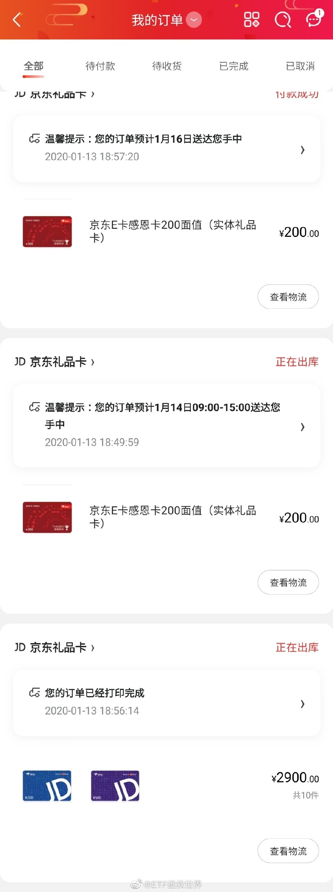

======================================================

ETF拯救世界 (5687069307) @
2020-01-14 08:38:08 Tue  
url: https://weibo.com/5687069307/IppgV8JyY

今天买涨还是买跌

------------------------------------------------------
转推：
>  @央视新闻 (2656274875)
>  2020-01-14 06:14:50 Tue  
>  url: https:/weibo.com/2656274875/IpokLd95E/

>  【#美国取消对中国汇率操纵国认定#】美国财政部13日公布半年度汇率政策报告，取消对中国“汇率操纵国”的认定。 ​​​

转发[10]  评论[401]  赞[979] 

======================================================

ETF拯救世界 (5687069307) @
2020-01-14 10:15:35 Tue  
url: https://weibo.com/5687069307/IppUtpId4

找东西是最浪费时间的事情之一。所以，如果你把东西都放的井井有条，用完东西物归原位，那最后就相当于多活了好几年。

但是有一个方法可以让你把找东西浪费时间变坏事为好事。

就是你找东西的时候，把刚找过的地方清理干净。把三年五年没用过的，你总觉得以后会用到的东西扔掉，卖掉，捐掉。其它东西 ​​​

转发[127]  评论[416]  赞[1527] 

======================================================

ETF拯救世界 (5687069307) @
2020-01-14 10:34:32 Tue  
url: https://weibo.com/5687069307/Ipq2alJVB

300今年才涨2%，你辣鸡环保凭什么涨8%。

太辣鸡了，果然是辣鸡，真让人[怒]。 ​​​

转发[11]  评论[299]  赞[1057] 

======================================================

ETF拯救世界 (5687069307) @
2020-01-14 10:46:37 Tue  
url: https://weibo.com/5687069307/Ipq74mJgz

接近压力区域，开始第一次测试。

------------------------------------------------------
转推：
>  @ETF拯救世界 (5687069307)
>  2020-01-06 10:30:30 Mon  
>  url: https:/weibo.com/5687069307/IocAys8lC/

>  500上面第一个压力5650 ​​​

转发[13]  评论[195]  赞[881] 

======================================================

ETF拯救世界 (5687069307) @
2020-01-14 10:52:59 Tue  
url: https://weibo.com/5687069307/Ipq9EuDUq

钱是好东西，多一点当然好。

但别太抠门。要抠，你在自己身上抠，别对别人太抠。

生不带来死不带去，把钱花在值得的人身上，不会错。

如果你觉得自己值，就花在自己身上。哪个家人、亲戚、朋友值，就花在他们身上。就这么简单。

当然，要保证花钱之前，所有收入20%-30%都攒起来投资……别自己没几 ​​​

转发[191]  评论[428]  赞[1684] 

======================================================

ETF拯救世界 (5687069307) @
2020-01-14 10:57:15 Tue  
url: https://weibo.com/5687069307/Ipqbo4rH1

回复@淮南华安:没有攒不了钱的。你任何收入拿到后20%放进投资账户就当丢了，绝对不取出来，你看能不能活下去，生活质量也几乎不会降低。然后你打开投资账户一看：我去，真丢了！//@淮南华安:我怎么赞不了了[允悲]

------------------------------------------------------
转推：
>  @ETF拯救世界 (5687069307)
>  2020-01-14 10:52:59 Tue  
>  url: https:/weibo.com/5687069307/Ipq9EuDUq/

>  钱是好东西，多一点当然好。
>  
>  但别太抠门。要抠，你在自己身上抠，别对别人太抠。
>  
>  生不带来死不带去，把钱花在值得的人身上，不会错。
>  
>  如果你觉得自己值，就花在自己身上。哪个家人、亲戚、朋友值，就花在他们身上。就这么简单。
>  
>  当然，要保证花钱之前，所有收入20%-30%都攒起来投资……别自己没几 ​​​

转发[55]  评论[389]  赞[1220] 

======================================================

ETF拯救世界 (5687069307) @
2020-01-14 17:19:35 Tue  
url: https://weibo.com/5687069307/IpsGAdCWT

回复@雨天就要睡懒觉:油气在150里面有3份，占比1.1%。在S里面有3份，占比4%。好不容易有一个浮亏的品种就被说是托，我太南了。//@雨天就要睡懒觉:E大，有人在华宝油气下面说你是油气的托[允悲]

------------------------------------------------------
转推：
>  @ETF拯救世界 (5687069307)
>  2020-01-14 10:52:59 Tue  
>  url: https:/weibo.com/5687069307/Ipq9EuDUq/

>  钱是好东西，多一点当然好。
>  
>  但别太抠门。要抠，你在自己身上抠，别对别人太抠。
>  
>  生不带来死不带去，把钱花在值得的人身上，不会错。
>  
>  如果你觉得自己值，就花在自己身上。哪个家人、亲戚、朋友值，就花在他们身上。就这么简单。
>  
>  当然，要保证花钱之前，所有收入20%-30%都攒起来投资……别自己没几 ​​​

转发[9]  评论[342]  赞[1105] 

======================================================

ETF拯救世界 (5687069307) @
2020-01-14 17:49:25 Tue  
url: https://weibo.com/5687069307/IpsSH5nqt

说句实话，以目前我们这里的社会环境来说，我真不看好所谓的买方投顾模式。

为什么，因为这对买方投顾来说，道德品质要求过高。而能面对金钱不动心的人，不多。背后有利益相关，是能够想象的。

所以对于计划来说，一开始我就小心翼翼，如履薄冰。你可以说我水平不行，但我绝不给你机会说我有什么背后 ​​​

转发[78]  评论[991]  赞[3234] 

======================================================

ETF拯救世界 (5687069307) @
2020-01-14 19:09:30 Tue  
url: https://weibo.com/5687069307/Iptpc3obz

一个人在家的日子，再次感受到了久违的单身狗の乐趣。 ​​​

转发[7]  评论[351]  赞[1485] 

======================================================

ETF拯救世界 (5687069307) @
2020-01-14 20:37:26 Tue  
url: https://weibo.com/5687069307/IptYSBFss

你以为是故事，其实是一段刻骨铭心的回忆。

回忆这种事，怎么能随便拿出来给人看呢。

我可是个很酷的人。 ​​​

转发[13]  评论[448]  赞[1760] 

======================================================

ETF拯救世界 (5687069307) @
2020-01-15 08:02:16 Wed  
url: https://weibo.com/5687069307/IpysRunmf

呵呵

------------------------------------------------------
转推：
>  @财联社APP (2868676035)
>  2020-01-14 21:44:14 Tue  
>  url: https:/weibo.com/2868676035/IpupZF13t/

>  【私募最新仓位已达81.51% 创2015年3月以来的新高】财联社1月14日讯，中国基金报报道，华润信托近期发布的数据显示，私募最新仓位已达81.51%，同比上涨30.33个百分点，创2015年3月以来的新高。对此，私募普遍向记者表示目前均保持高仓运作，A股的情绪低点从2019年初开始反转，大家对春季行情有较为一致 ​​​

转发[24]  评论[244]  赞[561] 

======================================================

ETF拯救世界 (5687069307) @
2020-01-15 08:14:51 Wed  
url: https://weibo.com/5687069307/IpyxY2m8d

居然有这么多支持的？！

------------------------------------------------------
转推：
>  @ ()
>  2020-01-14 11:01:01 Tue  
>  url: 

>  抱歉，此微博已被作者删除。查看帮助：http://t.cn/Rfd3rQV

转发[7]  评论[171]  赞[662] 

======================================================

ETF拯救世界 (5687069307) @
2020-01-15 08:55:56 Wed  
url: https://weibo.com/5687069307/IpyODAawD

（接上条关于快乐教育）

儿子上学第一学期拿了10张奖状。有语数英有体育。

一年级的奖状虽然含金量不高，但能拿这么多没几个人，有些孩子一张也没有。

我的理念就是学的时候认真学，养成好的学习习惯一辈子受益。从小能体会到学习知识的乐趣。

玩的时候爸爸带你上山下海看世界，带你玩psxboxswitch ​​​

转发[50]  评论[439]  赞[1564] 

+++++++++++++++++++++++++++++++++++++++++++++++++++++

图片：

======================================================

ETF拯救世界 (5687069307) @
2020-01-15 09:14:14 Wed  
url: https://weibo.com/5687069307/IpyW4hndu

小时候的很多东西都不算数。包括成绩甚至长相等等。

小时了了大未必佳，伤仲永，小时候长的好看大了长歪了的事还少吗。

都不算数。

就算一路学霸到清北哈佛麻省又怎样，一定幸福吗，一定“成功”吗，未必。

反过来小时候不突出，长大了逆袭的也数不胜数。

但从小培养孩子养成好的习惯，努力，不服 ​​​

转发[226]  评论[463]  赞[1963] 

======================================================

ETF拯救世界 (5687069307) @
2020-01-15 09:50:16 Wed  
url: https://weibo.com/5687069307/IpzaH9hcM

医药总是在别人不行的时候嘚瑟 ​​​

转发[11]  评论[280]  赞[1100] 

======================================================

ETF拯救世界 (5687069307) @
2020-01-15 11:59:32 Wed  
url: https://weibo.com/5687069307/IpA1agjSU

据说绝大多数人一辈子吃的东西是定量的，谁先吃完谁先走。[doge] ​​​

转发[54]  评论[468]  赞[1161] 

+++++++++++++++++++++++++++++++++++++++++++++++++++++

图片：

======================================================

ETF拯救世界 (5687069307) @
2020-01-15 13:32:43 Wed  
url: https://weibo.com/5687069307/IpACZh5uN

回复@以后做快乐健康的小女人:饿一饿，激活免疫系统，淘汰受损细胞//@以后做快乐健康的小女人:回复@ETF拯救世界:ee，医生说身体里面只有宿便，没有什么毒素，放心哟

------------------------------------------------------
转推：
>  @ETF拯救世界 (5687069307)
>  2020-01-15 11:59:32 Wed  
>  url: https:/weibo.com/5687069307/IpA1agjSU/

>  据说绝大多数人一辈子吃的东西是定量的，谁先吃完谁先走。[doge] ​​​

转发[25]  评论[87]  赞[390] 

======================================================

ETF拯救世界 (5687069307) @
2020-01-15 13:36:52 Wed  
url: https://weibo.com/5687069307/IpAEFyPWo

回复@随记心路:现代人没几个饿病的，哪个不是吃太多吃出三高糖尿病。这些东西保留自己看法吧//@随记心路:个人反对这些理念。一日三餐，五谷杂粮，该吃就吃。肠胃又没得罪你，没事干嘛饿它。//@ETF拯救世界:回复@以后做快乐健康的小女人:饿一饿，激活免疫系统，淘汰受损细胞

------------------------------------------------------
转推：
>  @ETF拯救世界 (5687069307)
>  2020-01-15 11:59:32 Wed  
>  url: https:/weibo.com/5687069307/IpA1agjSU/

>  据说绝大多数人一辈子吃的东西是定量的，谁先吃完谁先走。[doge] ​​​

转发[14]  评论[182]  赞[514] 

======================================================

ETF拯救世界 (5687069307) @
2020-01-15 13:48:02 Wed  
url: https://weibo.com/5687069307/IpAJcynrQ

碰到什么与自己过去认识不同的东西，先别急着否认反对。

如果感兴趣，先去了解，研究，看几篇论文，再判断。

人这一生，每天都在接触新东西。你把自己的思维禁锢起来，就永远不会进步。

开放，包容，择善固执。 ​​​

转发[126]  评论[333]  赞[1421] 

======================================================

ETF拯救世界 (5687069307) @
2020-01-15 17:22:36 Wed  
url: https://weibo.com/5687069307/IpC8inXzD

到底通过什么方式做公益比较靠谱呢。

这些年我捐的那些不知道到底用上了多少。 ​​​

转发[20]  评论[425]  赞[1227] 

======================================================

ETF拯救世界 (5687069307) @
2020-01-15 17:28:13 Wed  
url: https://weibo.com/5687069307/IpCazBQZu

终于取消了。还是有点敏感度的。

------------------------------------------------------
转推：
>  @ETF拯救世界 (5687069307)
>  2019-12-13 13:21:36 Fri  
>  url: https:/weibo.com/5687069307/Ikzs5qt1W/

>  北 清 目前自主招生比例有没有超过40%？ ​​​

转发[16]  评论[106]  赞[797] 

======================================================

ETF拯救世界 (5687069307) @
2020-01-15 17:30:58 Wed  
url: https://weibo.com/5687069307/IpCbH5Ch1

东亚几个国家关系搞好，对我们没有坏处。历史不能忘记，但不必每天宣传仇恨。

------------------------------------------------------
转推：
>  @ ()
>  2020-01-15 15:49:08 Wed  
>  url: 

>  抱歉，作者已设置仅展示半年内微博，此微博已不可见。 ​​​

转发[17]  评论[158]  赞[830] 

======================================================

ETF拯救世界 (5687069307) @
2020-01-16 10:52:24 Thu  
url: https://weibo.com/5687069307/IpJ0pqkFR

今天我一直在想一件事，做为人类，我们是希望什么人挣钱。

亲戚吗，不一定。春节聚会的时候，有些亲戚跟你说他发财了你心里未必会开心。

朋友，同事吗，也未必。

相反，有些人赚钱你会特别生气，就是那些你讨厌甚至恨的人。

即使你不讨厌的一个陌生人，听说他赚钱了，你也可能会心里不舒服。

那么 ​​​

转发[166]  评论[1407]  赞[3751] 

======================================================

ETF拯救世界 (5687069307) @
2020-01-16 11:05:48 Thu  
url: https://weibo.com/5687069307/IpJ5RfoVz

阿根廷队梅西都要跟阿圭罗一个房间，中国队凭什么？省点钱抓青训不好吗？ http://t.cn/A6vMCoIQ

------------------------------------------------------
转推：
>  @新浪财经 (1638782947)
>  2020-01-15 16:40:04 Wed  
>  url: https:/weibo.com/1638782947/IpBR28oWh/

>  【#足协主席要求提升国脚待遇# ：球员一人住一间，工作人员挤一挤，聘中国厨师】此次中国国奥队征战奥预赛，足协主席陈戌源看到队内安排两名队员住一个房间后，立刻告诉管理人员，队员要一人一个房间，工作人员可以挤一挤。另外，陈戌源还通过个人渠道聘请了中国厨师为球队服务，并表示：“吃不好，会 ​​​

转发[28]  评论[214]  赞[655] 

======================================================

ETF拯救世界 (5687069307) @
2020-01-16 23:34:51 Thu  
url: https://weibo.com/5687069307/IpNZTxm3b

拍摄人的观察能力，推理能力，反应能力，语言能力都非常强

------------------------------------------------------
转推：
>  @叶宏2011 (1400733350)
>  2020-01-16 13:46:37 Thu  
>  url: https:/weibo.com/1400733350/IpK97FxqM/

>  特斯拉车主的阴影面积 http://t.cn/A6vxOdr1 ​​​

转发[116]  评论[216]  赞[787] 

======================================================

ETF拯救世界 (5687069307) @
2020-01-17 07:42:31 Fri  
url: https://weibo.com/5687069307/IpRbPDqWV

回复@小智的马:只要前车不承认，而且没有摄像头拍到，就是后车全责。我遇到过，前车倒车把我撞了，不承认，一车人下来bb。警察来了，我把记录仪拿出来，都闭嘴了。//@小智的马:这个追尾要是没有行车记录仪和监控  要怎么算？  怕是要判特斯拉全责？

------------------------------------------------------
转推：
>  @叶宏2011 (1400733350)
>  2020-01-16 13:46:37 Thu  
>  url: https:/weibo.com/1400733350/IpK97FxqM/

>  特斯拉车主的阴影面积 http://t.cn/A6vxOdr1 ​​​

转发[34]  评论[184]  赞[642] 

======================================================

ETF拯救世界 (5687069307) @
2020-01-18 08:02:23 Sat  
url: https://weibo.com/5687069307/Iq0Kp21YH

停车等灯的时候被疲劳驾驶的司机追尾了。

人没事，车也基本没事，一个倒车雷达被撞进去了。对方保险公司说如果要换保险杠得上万，年后去4s定损吧。

各位出门都要小心啊。 ​​​

转发[15]  评论[732]  赞[1327] 

======================================================

ETF拯救世界 (5687069307) @
2020-01-18 08:41:50 Sat  
url: https://weibo.com/5687069307/Iq10phq3b

两个素质很重要

第一是低调。

第二是从别人的错误中得到经验。 ​​​

转发[123]  评论[274]  赞[1693] 

======================================================

ETF拯救世界 (5687069307) @
2020-01-18 18:04:24 Sat  
url: https://weibo.com/5687069307/Iq4GKBrVG

愤怒的根源来自于感受到不公平。 ​​​

转发[32]  评论[281]  赞[1497] 

======================================================

ETF拯救世界 (5687069307) @
2020-01-18 18:24:38 Sat  
url: https://weibo.com/5687069307/Iq4OY37WZ

很少看国产电视剧的我觉得网剧唐人街探案有点好看是怎么回事。 ​​​

转发[5]  评论[375]  赞[988] 

======================================================

ETF拯救世界 (5687069307) @
2020-01-19 08:35:06 Sun  
url: https://weibo.com/5687069307/Iqaob9LiD

从目前的信息分析，我个人觉得，最关键的是外界不知道每周一天闭馆到底是在干什么，博物馆也没有说清楚。

我自己瞎想啊，那天一定有一部分展出文物和场馆的保养 维护工作。这个在大家预期内。现在看，也应该有一部分大家预期外的活动。

比如vip参观，一些商业活动比如新品发布会，影视广告拍摄等等吧 ​​​

转发[30]  评论[278]  赞[1269] 

======================================================

ETF拯救世界 (5687069307) @
2020-01-19 09:19:46 Sun  
url: https://weibo.com/5687069307/IqaGixa9I

看唐探，前8集邱泽主演，81年的，今年也39了。

后四集跳着看了三分钟，看不下去。主演都是二十几岁的小鲜肉。

男人的魅力和年龄关系不大。

关键是不能胖，还有不能秃顶。[doge] ​​​

转发[16]  评论[324]  赞[1091] 

======================================================

ETF拯救世界 (5687069307) @
2020-01-20 07:03:46 Mon  
url: https://weibo.com/5687069307/IqjdB1LRK

弄不好今天医药还得继续反弹新高。

不过已经到了压力位，看看谁的力量大吧。 ​​​

转发[10]  评论[264]  赞[965] 

======================================================

ETF拯救世界 (5687069307) @
2020-01-20 09:23:06 Mon  
url: https://weibo.com/5687069307/Iqk89CEU4

万万没想到你是这样的小米…… ​​​

转发[85]  评论[255]  赞[935] 

+++++++++++++++++++++++++++++++++++++++++++++++++++++

图片：
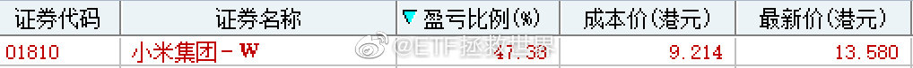

======================================================

ETF拯救世界 (5687069307) @
2020-01-20 09:26:36 Mon  
url: https://weibo.com/5687069307/Iqk9zoeCU

下次小米发布新品手机，买一个送给微博的朋友。

------------------------------------------------------
转推：
>  @ETF拯救世界 (5687069307)
>  2020-01-20 09:23:06 Mon  
>  url: https:/weibo.com/5687069307/Iqk89CEU4/

>  万万没想到你是这样的小米…… ​​​

转发[33]  评论[281]  赞[815] 

======================================================

ETF拯救世界 (5687069307) @
2020-01-20 09:31:42 Mon  
url: https://weibo.com/5687069307/IqkbDE6Bb

$全指医药 sh000991$   爱了 ​​​

转发[6]  评论[133]  赞[639] 

======================================================

ETF拯救世界 (5687069307) @
2020-01-20 10:04:12 Mon  
url: https://weibo.com/5687069307/IqkoPyWiN

虽然计划里面有不少医药仓位，但我当然希望流感尽快被消灭。

大家都要做好防护措施，火车飞机一定全程口罩。 ​​​

转发[14]  评论[196]  赞[1047] 

======================================================

ETF拯救世界 (5687069307) @
2020-01-20 10:12:48 Mon  
url: https://weibo.com/5687069307/IqkskqcTv

不知道春节还能不能去看电影 ​​​

转发[5]  评论[283]  赞[769] 

======================================================

ETF拯救世界 (5687069307) @
2020-01-20 13:54:54 Mon  
url: https://weibo.com/5687069307/IqlUtqBIs

今年生肖鼠、马、羊、兔、鸡的朋友要更加小心，遇事心态平和，重大决定更加谨慎。

各位都顺顺利利的。 ​​​

转发[39]  评论[486]  赞[1381] 

======================================================

ETF拯救世界 (5687069307) @
2020-01-20 14:13:07 Mon  
url: https://weibo.com/5687069307/Iqm1S2xlZ

今天咱们持仓指数都涨的很好对吧，其实还有1400只股票在下跌。

炒股太南了。 ​​​

转发[21]  评论[218]  赞[951] 

======================================================

ETF拯救世界 (5687069307) @
2020-01-20 14:47:13 Mon  
url: https://weibo.com/5687069307/IqmfIorqD

再坚持几天。

------------------------------------------------------
转推：
>  @ETF拯救世界 (5687069307)
>  2020-01-02 10:39:43 Thu  
>  url: https:/weibo.com/5687069307/InAWjj3nP/

>  春节前如果能维持涨势，春节后又要冲一把。 ​​​

转发[12]  评论[164]  赞[741] 

======================================================

ETF拯救世界 (5687069307) @
2020-01-20 14:54:55 Mon  
url: https://weibo.com/5687069307/IqmiQgbk1

回复@大漠孤烟0130:你说的是2019年吧。2019年，两市3553家公司，涨幅中位数15%。翻番股票206只，占比5.7%。24%股票是下跌的。你身边人都翻番了，只能说你们都是人中龙凤。再说，我这条微博说今天下跌公司，你说去年，有任何关系吗。

------------------------------------------------------
转推：
>  @ETF拯救世界 (5687069307)
>  2020-01-20 14:13:07 Mon  
>  url: https:/weibo.com/5687069307/Iqm1S2xlZ/

>  今天咱们持仓指数都涨的很好对吧，其实还有1400只股票在下跌。
>  
>  炒股太南了。 ​​​

转发[8]  评论[80]  赞[532] 

======================================================

ETF拯救世界 (5687069307) @
2020-01-20 14:58:13 Mon  
url: https://weibo.com/5687069307/Iqmkb0SrU

我实在搞不懂有些人的逻辑是什么：

我：今天有1400只股票下跌。

他：你不客观。去年我身边的人都翻番了。

我：？？？ ​​​

转发[8]  评论[270]  赞[1061] 

======================================================

ETF拯救世界 (5687069307) @
2020-01-20 15:26:23 Mon  
url: https://weibo.com/5687069307/IqmvBzviC

又想了想刚才那位朋友，不认同“炒股太南”这个结论。

炒股难不难，你说了不算，我说了不算（我自己也是炒股赚到资本市场第一桶金，但我依然认为炒股不适合绝大多数人），这个市场上的股民说了才算。

过去二十多年，到底有多少股民是赚钱的？没人统计过，但我毛估估，不超过30%。

一件事，只有不到3 ​​​

转发[72]  评论[428]  赞[1527] 

======================================================

ETF拯救世界 (5687069307) @
2020-01-20 16:08:35 Mon  
url: https://weibo.com/5687069307/IqmMKa3aR

这件事过去后，请给这些英雄升职加薪。

------------------------------------------------------
转推：
>  @ ()
>  2020-01-19 22:32:12 Sun  
>  url: 

>  抱歉，由于作者设置，你暂时没有这条微博的查看权限哦。查看帮助：http://t.cn/RfdBWwP ​​​

转发[57]  评论[177]  赞[1029] 

======================================================

ETF拯救世界 (5687069307) @
2020-01-20 16:21:27 Mon  
url: https://weibo.com/5687069307/IqmRXpzeE

发现自己的家装维修战斗力只有5。

一个洗手池下水管都装不好，弱鸡…… ​​​

转发[16]  评论[422]  赞[1071] 

======================================================

ETF拯救世界 (5687069307) @
2020-01-20 19:12:10 Mon  
url: https://weibo.com/5687069307/IqnZgbB3Y

伤医者无期以上，直系亲属拉入医疗系统黑名单。都是什么玩意儿！

------------------------------------------------------
转推：
>  @蒋晓峰Terry (2925297953)
>  2020-01-20 17:06:52 Mon  
>  url: https:/weibo.com/2925297953/IqnaomlsH/

>  #朝阳医院# 北京朝阳医院一医生被患者家属砍伤。从朝阳医院一医生处获悉，被砍的是眼科主任医生陶勇，目前正手术室内接受救治。据医生称，事发后，伤人者已被控制，随后被警方押走。 ​
>  医院多名医生被砍伤，陶姓医生后脑勺胳膊被砍。资料显示，他是2015首都十大杰出青年医生，35岁，“80后”、年轻帅 ​​​

转发[97]  评论[264]  赞[897] 

======================================================

ETF拯救世界 (5687069307) @
2020-01-21 07:52:08 Tue  
url: https://weibo.com/5687069307/IqsXJ0xtk

放假的的时候没事可以玩玩这个游戏。中文名 瘟疫公司。手机上也有。

游戏中你是病毒或者细菌，想办法让全人类感染。那你就可以在玩的过程中反向思考，怎样才能避免感染。 ​​​

转发[54]  评论[211]  赞[949] 

+++++++++++++++++++++++++++++++++++++++++++++++++++++

图片：

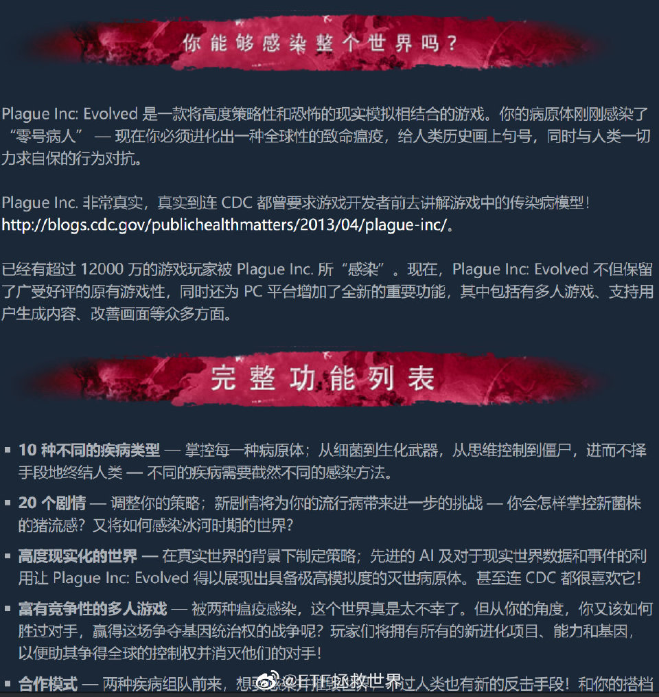

======================================================

ETF拯救世界 (5687069307) @
2020-01-21 08:28:16 Tue  
url: https://weibo.com/5687069307/IqtcowZgu

有些不如意的事情发生在自己身上，别花太多时间去难过和抱怨。

第一个，是因为已经发生了。难过，抱怨都没用。

第二个，既然已经发生，就把精力投入到怎么解决或者补救。

第三，应该意识到既然这件事发生在自己的生命旅程中，那就是命运的安排。有这个安排，就趁这个机会反脆弱，变得更强大。苦其心 ​​​

转发[267]  评论[359]  赞[1542] 

======================================================

ETF拯救世界 (5687069307) @
2020-01-21 08:38:51 Tue  
url: https://weibo.com/5687069307/IqtgGufuh

一直get不到野味有什么好。难道猪牛羊鸡鸭鹅它不比竹鼠果子狸香吗。别瞎吃了！

------------------------------------------------------
转推：
>  @央视新闻 (2656274875)
>  2020-01-20 22:13:01 Mon  
>  url: https:/weibo.com/2656274875/IqpaF6hPc/

>  【钟南山：#新型冠状病毒肺炎很可能来自野味#】#钟南山谈疫情#http://t.cn/A6vmqD04 ​​​

转发[27]  评论[241]  赞[942] 

======================================================

ETF拯救世界 (5687069307) @
2020-01-21 09:33:07 Tue  
url: https://weibo.com/5687069307/IqtCIgs9m

$全指医药 sh000991$  别这样，求救命…… ​​​

转发[3]  评论[153]  赞[739] 

======================================================

ETF拯救世界 (5687069307) @
2020-01-21 09:41:38 Tue  
url: https://weibo.com/5687069307/IqtGatnGj

从那天到现在，已经50%+了。那天也是几乎最低点。投资就是这样，最黑暗之后就是黎明。目前医药仓位十几个点，可控。

------------------------------------------------------
转推：
>  @ETF拯救世界 (5687069307)
>  2019-01-17 20:50:26 Thu  
>  url: https:/weibo.com/5687069307/HcoOJgi7P/

>  好心人很多，但是这种事我不需要关心。也别在一个指数暴跌后来救我，都管好自己。 ​​​

转发[15]  评论[207]  赞[990] 

======================================================

ETF拯救世界 (5687069307) @
2020-01-21 10:00:05 Tue  
url: https://weibo.com/5687069307/IqtNEFfpN

说明一下：

我们的医药筹码是拿了至少一年以上了，并非要炒作概念才买。

市场上有人愿意炒，我们可以把自己的筹码在适当时候让一些给他们，既然他们那么喜欢。 ​​​

转发[27]  评论[316]  赞[1311] 

======================================================

ETF拯救世界 (5687069307) @
2020-01-21 16:10:03 Tue  
url: https://weibo.com/5687069307/IqwdPE2ZL

搞清楚了，不是我战斗力渣，是缺少一个巨大的扳手拧螺母，还少了一点生料带。现在已经完全拥有下水管安装能力，有需要水管工的可以联系我了

------------------------------------------------------
转推：
>  @ETF拯救世界 (5687069307)
>  2020-01-20 16:21:27 Mon  
>  url: https:/weibo.com/5687069307/IqmRXpzeE/

>  发现自己的家装维修战斗力只有5。
>  
>  一个洗手池下水管都装不好，弱鸡…… ​​​

转发[6]  评论[351]  赞[1085] 

======================================================

ETF拯救世界 (5687069307) @
2020-01-21 17:47:01 Tue  
url: https://weibo.com/5687069307/IqwRbwpeW

是不是很耳熟

------------------------------------------------------
转推：
>  @老马自奋蹄 (1807436544)
>  2020-01-21 13:57:02 Tue  
>  url: https:/weibo.com/1807436544/IqvlQiGMv/

>  芒格金句：我想尽可能地从其他人的麻烦中学习，而不是从我自己的麻烦中学习
>  
>  专访芒格谈成功
>  （http://t.cn/R3283hD） ​​​

转发[220]  评论[132]  赞[687] 

======================================================

ETF拯救世界 (5687069307) @
2020-01-22 09:30:42 Wed  
url: https://weibo.com/5687069307/IqD2eeXwx

最后一网医药出掉。

一中网+一小网。 ​​​

转发[10]  评论[155]  赞[776] 

======================================================

ETF拯救世界 (5687069307) @
2020-01-22 09:41:38 Wed  
url: https://weibo.com/5687069307/IqD6FlGPC

这一网没有出在最高，水平还是不行 ​​​

转发[26]  评论[186]  赞[681] 

+++++++++++++++++++++++++++++++++++++++++++++++++++++

图片：

======================================================

ETF拯救世界 (5687069307) @
2020-01-22 09:50:52 Wed  
url: https://weibo.com/5687069307/IqDapzL1C

这样的话可以准备布置下网了。

节后吧，最多5-6个相关性低的品种。不着急，符合条件就下。

不怕你涨，不怕你波动，不怕你跌。只要开市，怎么都行。 ​​​

转发[68]  评论[449]  赞[1347] 

======================================================

ETF拯救世界 (5687069307) @
2020-01-22 09:54:34 Wed  
url: https://weibo.com/5687069307/IqDbUCzKn

不懂就问，这种情况电影公司可以临时撤档吗。春节档先不上了，否则损失太大了。 ​​​

转发[15]  评论[151]  赞[782] 

======================================================

ETF拯救世界 (5687069307) @
2020-01-22 11:27:07 Wed  
url: https://weibo.com/5687069307/IqDNu3N1Q

how dare you! [拜拜] ​​​

转发[6]  评论[182]  赞[771] 

======================================================

ETF拯救世界 (5687069307) @
2020-01-22 13:05:28 Wed  
url: https://weibo.com/5687069307/IqErp6s0Q

这样会让人很尴尬你知道不知道。

------------------------------------------------------
转推：
>  @ETF拯救世界 (5687069307)
>  2020-01-22 09:50:52 Wed  
>  url: https:/weibo.com/5687069307/IqDapzL1C/

>  这样的话可以准备布置下网了。
>  
>  节后吧，最多5-6个相关性低的品种。不着急，符合条件就下。
>  
>  不怕你涨，不怕你波动，不怕你跌。只要开市，怎么都行。 ​​​

转发[6]  评论[163]  赞[644] 

======================================================

ETF拯救世界 (5687069307) @
2020-01-22 13:31:44 Wed  
url: https://weibo.com/5687069307/IqEC48rB7

2019年1月，可以买入一份医药大网。

这几天可以出掉。一年收益率43%。 ​​​

转发[60]  评论[167]  赞[939] 

======================================================

ETF拯救世界 (5687069307) @
2020-01-22 13:43:17 Wed  
url: https://weibo.com/5687069307/IqEGLbkUO

其实吃到大网真的不容易，天时地利人和。需要这个品种开网价格不能太低，还需要跌的够多（下跌30%）。还要买完后反弹43%。最重要的，是跌30%的时候你不害怕继续果断按照计划买入这一个大网。

------------------------------------------------------
转推：
>  @ETF拯救世界 (5687069307)
>  2020-01-22 13:31:44 Wed  
>  url: https:/weibo.com/5687069307/IqEC48rB7/

>  2019年1月，可以买入一份医药大网。
>  
>  这几天可以出掉。一年收益率43%。 ​​​

转发[43]  评论[109]  赞[648] 

======================================================

ETF拯救世界 (5687069307) @
2020-01-22 13:59:03 Wed  
url: https://weibo.com/5687069307/IqEN9Fvv6

回复@开心快乐追求:你对大牛市一无所知//@开心快乐追求:感觉网格已经比计划收益高了，计划是假，网格是真

------------------------------------------------------
转推：
>  @ETF拯救世界 (5687069307)
>  2020-01-22 13:31:44 Wed  
>  url: https:/weibo.com/5687069307/IqEC48rB7/

>  2019年1月，可以买入一份医药大网。
>  
>  这几天可以出掉。一年收益率43%。 ​​​

转发[21]  评论[169]  赞[865] 

======================================================

ETF拯救世界 (5687069307) @
2020-01-22 14:29:43 Wed  
url: https://weibo.com/5687069307/IqEZBxRRu

什么玩意儿500还反弹新高了，找谁说理去 ​​​

转发[6]  评论[208]  赞[969] 

======================================================

ETF拯救世界 (5687069307) @
2020-01-22 14:49:58 Wed  
url: https://weibo.com/5687069307/IqF7OChHl

希望有些武汉的朋友们明白，真的没人歧视你或者什么别的。就是大家都希望传染的范围越小越好。大原则就是对自己负责，对他人也负责。

这都很正常。当年北京人到外地或者在北京的外地人回老家也是被严格隔离，这有什么啊。（当然这些我都是听说的，毕竟当时我才2岁）

我看到一条微博，有个人从武汉回 ​​​

转发[49]  评论[385]  赞[1802] 

======================================================

ETF拯救世界 (5687069307) @
2020-01-22 17:40:10 Wed  
url: https://weibo.com/5687069307/IqGeUqWlt

回复@毛笔19487:不好意思，那一份确实半年赚了55%就走了。我本来也没说我能卖在最高点。让您失望了。取关我吧，省得天天看着我生气。您说好吗//@毛笔19487:涨了的就没完没了的装13 消费就买了一份然后早早卖了…到现在涨了多少只字不提//@ETF拯救世界:回复@开心快乐追求:你对大牛市一无所知

------------------------------------------------------
转推：
>  @ETF拯救世界 (5687069307)
>  2020-01-22 13:31:44 Wed  
>  url: https:/weibo.com/5687069307/IqEC48rB7/

>  2019年1月，可以买入一份医药大网。
>  
>  这几天可以出掉。一年收益率43%。 ​​​

转发[6]  评论[178]  赞[805] 

======================================================

ETF拯救世界 (5687069307) @
2020-01-22 17:45:47 Wed  
url: https://weibo.com/5687069307/IqGhbltXb

我看了一下，内地消费指数我们卖了以后，到现在半年多又涨了11%。

因为少赚了这11%，不顾已经赚了55%，就来埋怨我装b。

如果跟车了，我说声对不起让您少赚了11%。如果没跟车，就是看我不顺眼，那我也没任何可以说的了。

大过年的，也祝你们几位过年好吧。天天看着我生气，也辛苦你们了。 ​​​

转发[18]  评论[273]  赞[1345] 

======================================================

ETF拯救世界 (5687069307) @
2020-01-22 17:54:13 Wed  
url: https://weibo.com/5687069307/IqGkC99wJ

回复@cestmoi1018:什么，你说卖掉的同时又买别的也赚回来了？我不听我不听，只有消费的利润是利润，300和安心债也配说是利润吗。 http://t.cn/A6vF69Tn //@cestmoi1018:虽然把消费卖了，但是买了300和安心回报债啊，也都各涨了11%，又不是卖了就亏了或者少賺这13%

------------------------------------------------------
转推：
>  @ETF拯救世界 (5687069307)
>  2020-01-22 17:45:47 Wed  
>  url: https:/weibo.com/5687069307/IqGhbltXb/

>  我看了一下，内地消费指数我们卖了以后，到现在半年多又涨了11%。
>  
>  因为少赚了这11%，不顾已经赚了55%，就来埋怨我装b。
>  
>  如果跟车了，我说声对不起让您少赚了11%。如果没跟车，就是看我不顺眼，那我也没任何可以说的了。
>  
>  大过年的，也祝你们几位过年好吧。天天看着我生气，也辛苦你们了。 ​​​

转发[4]  评论[174]  赞[836] 

======================================================

ETF拯救世界 (5687069307) @
2020-01-22 18:08:47 Wed  
url: https://weibo.com/5687069307/IqGqwdYfA

今天德国DAX历史新高。

很多朋友说我们买的德国30跟的不行。

确实没有完全跟上，我考虑有几个原因

第一，DAX是一个全收益指数，含股息，跟上它不容易。

第二，汇率问题。

第三，费率不低。

看下图，跟的不好不仅是A股的德国30，美股上市的EWG更差。

现在的问题是，市场上只有这一个跟踪欧洲的指 ​​​

转发[38]  评论[237]  赞[1175] 

+++++++++++++++++++++++++++++++++++++++++++++++++++++

图片：
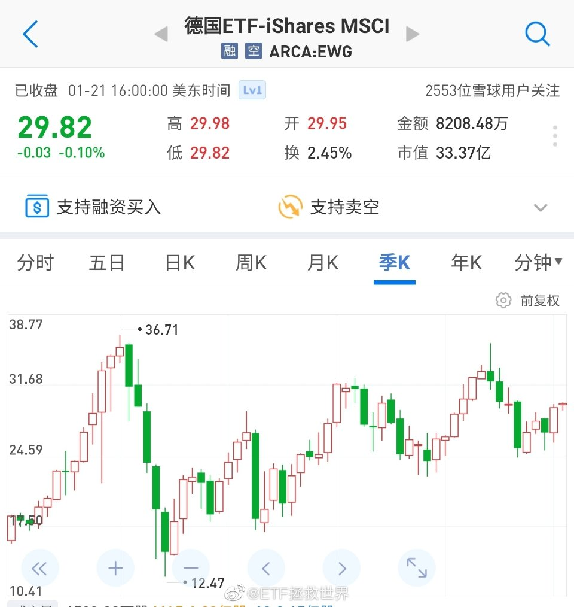

======================================================

ETF拯救世界 (5687069307) @
2020-01-23 10:05:24 Thu  
url: https://weibo.com/5687069307/IqMGOh9Hr

中老年男性重灾区。但是18岁的也不能嘚瑟。

------------------------------------------------------
转推：
>  @1818黄金眼 (2334162530)
>  2020-01-23 09:59:32 Thu  
>  url: https:/weibo.com/2334162530/IqMEqxh50/

>  【卫健委通报#湖北17例死亡病例病情#】截至1月22日24时，#新型肺炎致17人死亡#，均来自湖北省。17例死亡病例病情介绍：
> 一、曾XX，男，61岁，既往有肝硬化、粘液瘤等病史。2019年12月20日左右开始发热，咳嗽、无力；27日在武汉市普仁医院呼吸科住院治疗，28日转入ICU，30日予气管插管机械通气， ​​​

转发[11]  评论[190]  赞[570] 

======================================================

ETF拯救世界 (5687069307) @
2020-01-23 14:04:26 Thu  
url: https://weibo.com/5687069307/IqOfPCd8D

一天接回来一个小网。喷了

------------------------------------------------------
转推：
>  @ETF拯救世界 (5687069307)
>  2020-01-22 09:41:38 Wed  
>  url: https:/weibo.com/5687069307/IqD6FlGPC/

>  这一网没有出在最高，水平还是不行 ​​​

转发[8]  评论[108]  赞[536] 

======================================================

ETF拯救世界 (5687069307) @
2020-01-23 14:05:02 Thu  
url: https://weibo.com/5687069307/IqOg5g5L7

节后大概率可以开始了

------------------------------------------------------
转推：
>  @ETF拯救世界 (5687069307)
>  2020-01-22 09:50:52 Wed  
>  url: https:/weibo.com/5687069307/IqDapzL1C/

>  这样的话可以准备布置下网了。
>  
>  节后吧，最多5-6个相关性低的品种。不着急，符合条件就下。
>  
>  不怕你涨，不怕你波动，不怕你跌。只要开市，怎么都行。 ​​​

转发[24]  评论[241]  赞[834] 

======================================================

ETF拯救世界 (5687069307) @
2020-01-23 14:49:31 Thu  
url: https://weibo.com/5687069307/IqOy8yzuV

一月份波动就这么大。你能想象今年全年吗。

年底看看预判的对不对。[微笑] ​​​

转发[28]  评论[300]  赞[1175] 

======================================================

ETF拯救世界 (5687069307) @
2020-01-23 14:51:56 Thu  
url: https://weibo.com/5687069307/IqOz78E0J

回复@热火风雨无阻:去年阅读量没达到预期，今年没心气儿弄了。特累。//@热火风雨无阻:E大，今年有没有春节专辑啊，期待中！//@ETF拯救世界:节后大概率可以开始了

------------------------------------------------------
转推：
>  @ETF拯救世界 (5687069307)
>  2020-01-22 09:50:52 Wed  
>  url: https:/weibo.com/5687069307/IqDapzL1C/

>  这样的话可以准备布置下网了。
>  
>  节后吧，最多5-6个相关性低的品种。不着急，符合条件就下。
>  
>  不怕你涨，不怕你波动，不怕你跌。只要开市，怎么都行。 ​​​

转发[7]  评论[135]  赞[753] 

======================================================

ETF拯救世界 (5687069307) @
2020-01-23 14:53:16 Thu  
url: https://weibo.com/5687069307/IqOzEwd78

又猜中了。--【6部贺岁档电影先后宣布退出春节档】电影《唐人街探案3》宣布撤出春节档，至此，6部贺岁档电影《熊出没·狂野大陆》、《姜子牙》、《紧急救援》、《囧妈》、《夺冠》、《唐人街探案3》退出春节档。 ​​​​

------------------------------------------------------
转推：
>  @ETF拯救世界 (5687069307)
>  2020-01-22 09:54:34 Wed  
>  url: https:/weibo.com/5687069307/IqDbUCzKn/

>  不懂就问，这种情况电影公司可以临时撤档吗。春节档先不上了，否则损失太大了。 ​​​

转发[8]  评论[107]  赞[662] 

======================================================

ETF拯救世界 (5687069307) @
2020-01-23 15:13:42 Thu  
url: https://weibo.com/5687069307/IqOHX29AM

卖野味判刑可以吗。 

你肆无忌惮，法律不管你，大自然也会惩罚你。

这个地球上的生物不是生下来都是为了让你吃的。 ​​​

转发[25]  评论[329]  赞[1584] 

======================================================

ETF拯救世界 (5687069307) @
2020-01-23 18:36:05 Thu  
url: https://weibo.com/5687069307/IqQ266TYw

关注我很久的一位朋友在这里工作，现在他们需要帮忙。

他说现在顺丰还能送货，我会买一些发过去。

能做的不多，希望一切尽快好起来。

向所有医护人员说声谢谢。你们太值得尊敬了！ ​​​

转发[94]  评论[330]  赞[1601] 

+++++++++++++++++++++++++++++++++++++++++++++++++++++

图片：

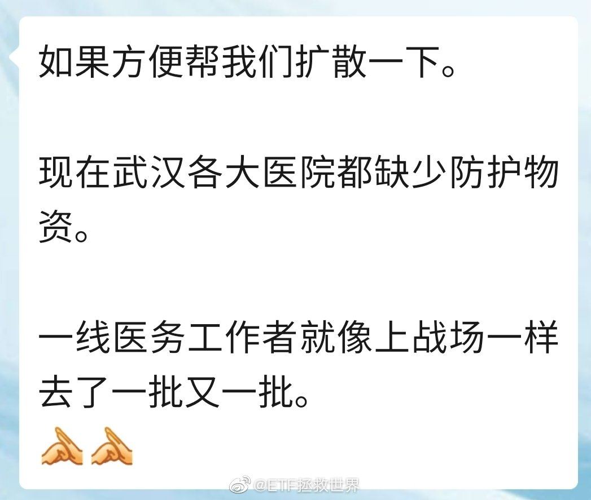

======================================================

ETF拯救世界 (5687069307) @
2020-01-23 20:56:35 Thu  
url: https://weibo.com/5687069307/IqQX7FopX

放假了，也别每天在微博上泡着。微博上多了，焦虑情绪会变得严重。早晚看看新闻就行。

假期好好在家呆着，陪陪家人，追追剧，玩玩游戏，放松一下。 ​​​

转发[25]  评论[256]  赞[1480] 

======================================================

ETF拯救世界 (5687069307) @
2020-01-24 09:58:09 Fri  
url: https://weibo.com/5687069307/IqW4mspeY

祝大家新春大吉，平安喜乐！ ​​​

转发[14]  评论[1073]  赞[2272] 

======================================================

ETF拯救世界 (5687069307) @
2020-01-24 12:01:36 Fri  
url: https://weibo.com/5687069307/IqWStkt0b

[赞][赞][赞]京东

------------------------------------------------------
转推：
>  @京东 (1717871843)
>  2020-01-24 10:06:30 Fri  
>  url: https:/weibo.com/1717871843/IqW7KzPUE/

>  【京东宣布向武汉市捐赠100万只医用口罩及6万件医疗物资 首批已出库】
>   
>  武汉疫情牵动着京东人的心！今日，京东宣布向武汉市分批捐赠100万只医用口罩及6万件医疗物资，以缓解当地医疗物资短缺的局面。其中包括：紧急从全国各地调货分批驰援武汉100万只医用口罩，以及从武汉本地仓库就近捐出的包括洗手 ​​​

转发[59]  评论[188]  赞[1358] 

======================================================

ETF拯救世界 (5687069307) @
2020-01-24 22:02:47 Fri  
url: https://weibo.com/5687069307/Ir0OutULj

不说你不知道，我是佟丽娅的颜粉 ​​​

转发[10]  评论[603]  赞[1919] 

======================================================

ETF拯救世界 (5687069307) @
2020-01-26 19:42:59 Sun  
url: https://weibo.com/5687069307/IriKK5THl

不瞒你说，24小时没上网。

第一时间上微博看看。今天都干嘛了，实话实说。

我先说。玩了会健身环，看了会书，看了囧妈，弹会琴。

明天要干点正事了。 ​​​

转发[7]  评论[556]  赞[1504] 

======================================================

ETF拯救世界 (5687069307) @
2020-01-27 08:14:30 Mon  
url: https://weibo.com/5687069307/IrnFN4Ov3

永远不知道明天和意外哪个先来。珍惜当下。[蜡烛]

------------------------------------------------------
转推：
>  @央视新闻 (2656274875)
>  2020-01-27 04:35:13 Mon  
>  url: https:/weibo.com/2656274875/IrmeM8H66/

>  #球星科比坠机身亡#【#美国一直升机坠毁致5人死亡#】美国体育媒体ESPN、新闻媒体ABC及娱乐新闻媒体TMZ等多家媒体报道，NBA球星科比·布莱恩特在当地时间26日，于加利福尼亚州洛杉矶县卡拉巴萨斯的一场直升机坠机事故中身亡。据洛杉矶当地警方称，有五人在直升机坠毁中死亡。（总台央视记者赵淼 殷岳） ​​​

转发[76]  评论[298]  赞[968] 

======================================================

ETF拯救世界 (5687069307) @
2020-01-27 17:53:40 Mon  
url: https://weibo.com/5687069307/IrrsSdfM8

别管做不做，人家话说出来了，意愿表达了，咱得说声感谢。再看看咱们自己的台湾同胞

------------------------------------------------------
转推：
>  @网易财经 (1974561081)
>  2020-01-27 13:38:28 Mon  
>  url: https:/weibo.com/1974561081/IrpNhoaxo/

>  【日本外相：#日本愿全力帮助中国抗击疫情#】日本外相茂木敏充表示，日方愿同中方一道，共同应对疫情威胁，向中方提供全方位支持帮助。 @凤凰李淼 http://t.cn/A6PfAfog ​​​

转发[56]  评论[206]  赞[973] 

======================================================

ETF拯救世界 (5687069307) @
2020-01-27 18:08:35 Mon  
url: https://weibo.com/5687069307/IrryVsBDY

回复@babalu51:图片评论 http://t.cn/A6PIybIn //@babalu51:e大今天干了啥正经事//@ETF拯救世界:别管做不做，人家话说出来了，意愿表达了，咱得说声感谢。再看看咱们自己的台湾同胞

------------------------------------------------------
转推：
>  @网易财经 (1974561081)
>  2020-01-27 13:38:28 Mon  
>  url: https:/weibo.com/1974561081/IrpNhoaxo/

>  【日本外相：#日本愿全力帮助中国抗击疫情#】日本外相茂木敏充表示，日方愿同中方一道，共同应对疫情威胁，向中方提供全方位支持帮助。 @凤凰李淼 http://t.cn/A6PfAfog ​​​

转发[14]  评论[137]  赞[557] 

======================================================

ETF拯救世界 (5687069307) @
2020-01-27 20:07:13 Mon  
url: https://weibo.com/5687069307/Irsl4up7k

你焦虑吗。

一个月前就说了：今年大幅波动。

不波动怎么赚钱… ​​​

转发[58]  评论[390]  赞[992] 

+++++++++++++++++++++++++++++++++++++++++++++++++++++

图片：

======================================================

ETF拯救世界 (5687069307) @
2020-01-27 21:31:54 Mon  
url: https://weibo.com/5687069307/IrsTrA64S

你们这些看外盘预测A股的，还是有点naive。还有几个交易日，弄不好外盘在A股开盘前已经暴跌暴涨回去了。我个人没什么期待，涨了挺好，跌了赚更多。多大点事啊也值得焦虑

------------------------------------------------------
转推：
>  @ETF拯救世界 (5687069307)
>  2020-01-27 20:07:13 Mon  
>  url: https:/weibo.com/5687069307/Irsl4up7k/

>  你焦虑吗。
>  
>  一个月前就说了：今年大幅波动。
>  
>  不波动怎么赚钱… ​​​

转发[38]  评论[220]  赞[942] 

======================================================

ETF拯救世界 (5687069307) @
2020-01-28 09:19:22 Tue  
url: https://weibo.com/5687069307/IrxwByGP3

回复@tasterOJwangc:可能你没有太关注我。我自己有长线的计划，有波段的网格。好几个品种的网格之前上涨已经出干净了，微博都有同步。大跌正好接回来，能不舒服吗。今年大幅波动是去年底的判断，今年也建议大家可以做波段降成本增利润。踏踏实实的。

------------------------------------------------------
转推：
>  @ETF拯救世界 (5687069307)
>  2020-01-27 20:07:13 Mon  
>  url: https:/weibo.com/5687069307/Irsl4up7k/

>  你焦虑吗。
>  
>  一个月前就说了：今年大幅波动。
>  
>  不波动怎么赚钱… ​​​

转发[20]  评论[135]  赞[629] 

======================================================

ETF拯救世界 (5687069307) @
2020-01-28 09:27:26 Tue  
url: https://weibo.com/5687069307/IrxzSyaCB

有些评论的人太讨厌了。你辛辛苦苦打半天字回复他，一转头他把评论删了，你的回复没了，别人也看不懂你的转发在说什么了。

什么玩意儿啊。 ​​​

转发[5]  评论[285]  赞[1183] 

======================================================

ETF拯救世界 (5687069307) @
2020-01-28 09:32:23 Tue  
url: https://weibo.com/5687069307/IrxBTgFYH

另外，大家是不是没注意，计划（包括s），已经多长时间没买了。

你以为攒钱干嘛呢。[微笑] ​​​

转发[17]  评论[399]  赞[1285] 

======================================================

ETF拯救世界 (5687069307) @
2020-01-28 10:34:59 Tue  
url: https://weibo.com/5687069307/Iry1iwXnB

10:30  真的开始做正经事了。 ​​​

转发[7]  评论[257]  赞[921] 

======================================================

ETF拯救世界 (5687069307) @
2020-01-28 12:00:38 Tue  
url: https://weibo.com/5687069307/IryA4beFu

12:00。完成一项工作。还有三项。[可怜] 我要去玩会健身环锻炼一下了……

------------------------------------------------------
转推：
>  @ETF拯救世界 (5687069307)
>  2020-01-28 10:34:59 Tue  
>  url: https:/weibo.com/5687069307/Iry1iwXnB/

>  10:30  真的开始做正经事了。 ​​​

转发[3]  评论[171]  赞[793] 

======================================================

ETF拯救世界 (5687069307) @
2020-01-28 22:30:28 Tue  
url: https://weibo.com/5687069307/IrCHIkoOZ

刚看了一下，经常看我东西的湖北朋友大概2500位左右。

大家都辛苦了，会过去的。坚持一下。 ​​​

转发[7]  评论[274]  赞[1534] 

======================================================

ETF拯救世界 (5687069307) @
2020-01-28 22:47:47 Tue  
url: https://weibo.com/5687069307/IrCOKtE0U

常读用户里面，有53%是26-35，27%是36-45。

大部分都是有资产的哥哥姐姐。 ​​​

转发[13]  评论[479]  赞[1742] 

======================================================

ETF拯救世界 (5687069307) @
2020-01-28 23:29:14 Tue  
url: https://weibo.com/5687069307/IrD5zBWtx

回复@ETF拯救世界:又买回来。 http://t.cn/A6PJJnMO //@ETF拯救世界:一个半月，又出一格。

------------------------------------------------------
转推：
>  @ETF拯救世界 (5687069307)
>  2019-11-12 23:54:13 Tue  
>  url: https:/weibo.com/5687069307/IfVltpGby/

>  最近三个月白银网格是这样的情况（顺序从下往上）
>  
>  等于筹码没丢，吃了两轮利润 ​​​

转发[117]  评论[88]  赞[394] 

======================================================

ETF拯救世界 (5687069307) @
2020-01-28 23:35:41 Tue  
url: https://weibo.com/5687069307/IrD8c87Wr

是这样的 http://t.cn/A6PJiR6H //@ETF拯救世界:回复@ETF拯救世界:又买回来。 http://t.cn/A6PJJnMO //@ETF拯救世界:一个半月，又出一格。

------------------------------------------------------
转推：
>  @ETF拯救世界 (5687069307)
>  2019-11-12 23:54:13 Tue  
>  url: https:/weibo.com/5687069307/IfVltpGby/

>  最近三个月白银网格是这样的情况（顺序从下往上）
>  
>  等于筹码没丢，吃了两轮利润 ​​​

转发[108]  评论[195]  赞[505] 

======================================================

ETF拯救世界 (5687069307) @
2020-01-28 23:40:59 Tue  
url: https://weibo.com/5687069307/IrDal7COD

这几年铂金和钯金涨的都特别好。 

这波就不追了，以后多关注。 ​​​

转发[9]  评论[195]  赞[1005] 

======================================================

ETF拯救世界 (5687069307) @
2020-01-29 18:44:21 Wed  
url: https://weibo.com/5687069307/IrKEqBT7z

我最近有个感想，不知道对不对，说出来共同探讨。

人类之所以能开枝散叶到现在几十亿做了地球球长，很大的原因可能是有天然的保护自己，维护整个种群安全的基因。

所以老话里面有“人不为己天诛地灭”。这句话听起来不是好话，但你到了这种时候，会发现其中也有合理成分。当你为自己拒绝与发烧的人坐 ​​​

转发[105]  评论[367]  赞[1402] 

======================================================

ETF拯救世界 (5687069307) @
2020-01-29 18:50:16 Wed  
url: https://weibo.com/5687069307/IrKGQbujd

回复@沐之以思:一部分人没有进化完全而已。身边这种没有进化完全的例子还少吗？哪年春天你逛公园看不见几个爬回树上照相的。//@沐之以思:吃野味到底为了啥，是为了那些虚无缥缈的“吃啥补啥”？

------------------------------------------------------
转推：
>  @ETF拯救世界 (5687069307)
>  2020-01-29 18:44:21 Wed  
>  url: https:/weibo.com/5687069307/IrKEqBT7z/

>  我最近有个感想，不知道对不对，说出来共同探讨。
>  
>  人类之所以能开枝散叶到现在几十亿做了地球球长，很大的原因可能是有天然的保护自己，维护整个种群安全的基因。
>  
>  所以老话里面有“人不为己天诛地灭”。这句话听起来不是好话，但你到了这种时候，会发现其中也有合理成分。当你为自己拒绝与发烧的人坐 ​​​

转发[13]  评论[53]  赞[504] 

======================================================

ETF拯救世界 (5687069307) @
2020-01-29 18:56:47 Wed  
url: https://weibo.com/5687069307/IrKJtxHum

回复@老实人的辛酸苦涩:装X就是进化不完全。进化完全的人谁会觉得吃点野味就是NB了。//@老实人的辛酸苦涩:回复@沐之以思:我觉得应该是装x的心理作祟[喵喵]

------------------------------------------------------
转推：
>  @ETF拯救世界 (5687069307)
>  2020-01-29 18:44:21 Wed  
>  url: https:/weibo.com/5687069307/IrKEqBT7z/

>  我最近有个感想，不知道对不对，说出来共同探讨。
>  
>  人类之所以能开枝散叶到现在几十亿做了地球球长，很大的原因可能是有天然的保护自己，维护整个种群安全的基因。
>  
>  所以老话里面有“人不为己天诛地灭”。这句话听起来不是好话，但你到了这种时候，会发现其中也有合理成分。当你为自己拒绝与发烧的人坐 ​​​

转发[11]  评论[91]  赞[582] 

======================================================

ETF拯救世界 (5687069307) @
2020-01-31 04:04:23 Fri  
url: https://weibo.com/5687069307/IrXKfxnVe

转发微博

------------------------------------------------------
转推：
>  @央视新闻 (2656274875)
>  2020-01-31 03:57:09 Fri  
>  url: https:/weibo.com/2656274875/IrXHjvqEX/

>  【#世卫组织宣布疫情为国际关注的突发公共卫生事件#】世卫组织30日发布新型冠状病毒感染肺炎疫情为国际关注的突发公共卫生事件，强调不建议实施旅行和贸易限制，并再次高度肯定中方的防控举措。 ​​​​

转发[34]  评论[259]  赞[757] 

======================================================

ETF拯救世界 (5687069307) @
2020-01-31 18:45:28 Fri  
url: https://weibo.com/5687069307/Is3vSFoSW

是不是发现天天没事在家闲着无所事事没想象中的舒服。 ​​​

转发[20]  评论[503]  赞[1627] 

======================================================

ETF拯救世界 (5687069307) @
2020-01-31 19:27:37 Fri  
url: https://weibo.com/5687069307/Is3MZd3SK

如果你说是企业定向捐赠我还理解。啰哩啰嗦说一堆根本没提定向，这就有意思了。一线的医生没的用，你去给周围居民派发做广告，服了。这一个月真是刷新我对很多事情的认知

------------------------------------------------------
转推：
>  @蓝鲸财经记者工作平台 (1885454921)
>  2020-01-31 19:05:10 Fri  
>  url: https:/weibo.com/1885454921/Is3DSwqBu/

>  【#仁爱医院院长称真的需要口罩# ：求来1.8万个，分给了住院病人、家属、职工和附近居民】#仁爱医院将口罩发给附近居民# 
>  1月30日，湖北省红十字会官网公布了17项捐赠物资的使用情况，其中莆田系医院武汉仁爱医院收到1.6万个N95捐赠口罩（已更正为1.8万个KN95口罩），而防疫一线医院武汉协和医院仅收到 ​​​

转发[88]  评论[277]  赞[980] 

======================================================

ETF拯救世界 (5687069307) @
2020-01-31 20:03:33 Fri  
url: https://weibo.com/5687069307/Is41zr1oz

不，这不是我想要的评论。感觉有被冒犯到。

------------------------------------------------------
转推：
>  @ETF拯救世界 (5687069307)
>  2020-01-31 18:45:28 Fri  
>  url: https:/weibo.com/5687069307/Is3vSFoSW/

>  是不是发现天天没事在家闲着无所事事没想象中的舒服。 ​​​

转发[2]  评论[184]  赞[670] 

======================================================

ETF拯救世界 (5687069307) @
2020-02-01 09:03:29 Sat  
url: https://weibo.com/5687069307/Is989dtEZ

我只是想知道，抑制病毒是什么意思。

是说可以抑制病毒在体内复制的意思吗。

至于什么药有效还是无效，我不懂，不乱说。 ​​​

转发[15]  评论[206]  赞[789] 

======================================================

ETF拯救世界 (5687069307) @
2020-02-01 09:19:29 Sat  
url: https://weibo.com/5687069307/Is9eDF5Eo

我想了想，所谓抑制，可能说是通过药物抑制病毒复制，使病毒量没这么大，免疫系统不再猛烈攻击造成器官损伤。剩下的就靠免疫系统慢慢清理吧。不懂医学，瞎想。

------------------------------------------------------
转推：
>  @ETF拯救世界 (5687069307)
>  2020-02-01 09:03:29 Sat  
>  url: https:/weibo.com/5687069307/Is989dtEZ/

>  我只是想知道，抑制病毒是什么意思。
>  
>  是说可以抑制病毒在体内复制的意思吗。
>  
>  至于什么药有效还是无效，我不懂，不乱说。 ​​​

转发[6]  评论[132]  赞[580] 

======================================================

ETF拯救世界 (5687069307) @
2020-02-01 09:41:33 Sat  
url: https://weibo.com/5687069307/Is9nB9fGm

去年底买了个品种，一个月涨了将近40%。

你猜是什么。

健身环。 ​​​

转发[60]  评论[273]  赞[949] 

======================================================

ETF拯救世界 (5687069307) @
2020-02-01 10:08:01 Sat  
url: https://weibo.com/5687069307/Is9yldJS9

回复@ETF创造奇迹:那时候估值比现在低20%。//@ETF创造奇迹:如果周一大盘大跌百分6（和港股同步），那么，有可能一步到位，跌出一个低点。这个估值，就和18年的2500点一样了！恐慌的尽头，是光明！ ​​​ E大，刚才看到的，是这样吗？

------------------------------------------------------
转推：
>  @ETF拯救世界 (5687069307)
>  2020-02-01 09:41:33 Sat  
>  url: https:/weibo.com/5687069307/Is9nB9fGm/

>  去年底买了个品种，一个月涨了将近40%。
>  
>  你猜是什么。
>  
>  健身环。 ​​​

转发[28]  评论[157]  赞[640] 

======================================================

ETF拯救世界 (5687069307) @
2020-02-01 10:44:16 Sat  
url: https://weibo.com/5687069307/Is9N3oTy6

一个新的体会。

比赛也好，考试也好，做其它竞争性的事情也好。做的时候专心致志尽最大所能，但是对结果看的淡一些。

这样，最后会比特别重视结果可能要好很多。心态完全变了，做起事来效果更好。太重视结果，有可能导致过分紧张，反而无法发挥水平。

另外，即使输了，也不会太沮丧。

这个道理以前 ​​​

转发[136]  评论[223]  赞[1363] 

======================================================

ETF拯救世界 (5687069307) @
2020-02-01 22:11:18 Sat  
url: https://weibo.com/5687069307/IsehVckTe

删了几条微博。

就这样吧。 ​​​

转发[13]  评论[376]  赞[1318] 

======================================================

ETF拯救世界 (5687069307) @
2020-02-02 21:42:47 Sun  
url: https://weibo.com/5687069307/IsnwQiMcZ

明天应该在5%左右吧。毛估估。 ​​​

转发[34]  评论[288]  赞[1080] 

======================================================

ETF拯救世界 (5687069307) @
2020-02-02 21:56:05 Sun  
url: https://weibo.com/5687069307/IsnCf9G0f

左右的意思是上下浮动5%

------------------------------------------------------
转推：
>  @ETF拯救世界 (5687069307)
>  2020-02-02 21:42:47 Sun  
>  url: https:/weibo.com/5687069307/IsnwQiMcZ/

>  明天应该在5%左右吧。毛估估。 ​​​

转发[18]  评论[180]  赞[818] 

======================================================

ETF拯救世界 (5687069307) @
2020-02-02 23:05:05 Sun  
url: https://weibo.com/5687069307/Iso4fpFv4

觉得跌了就难受的朋友，可能你还没理解，股市是一个会巨幅波动的市场。

这就决定了你的资产就是会波动，这个没有任何办法解决。

你要理解这一点，不要再因为波动激动或者难受。否则，你就不应该再玩下去。

从两方面做到这个。

第一，保证自己持仓成本低。或者持仓成本不低，但是有很多资金可以等跌 ​​​

转发[187]  评论[522]  赞[1722] 

======================================================

ETF拯救世界 (5687069307) @
2020-02-03 09:08:02 Mon  
url: https://weibo.com/5687069307/Iss0Zfsxm

准备开工 ​​​

转发[13]  评论[431]  赞[1188] 

======================================================

ETF拯救世界 (5687069307) @
2020-02-03 09:27:26 Mon  
url: https://weibo.com/5687069307/Iss8S1OH4

刺激不刺激。 ​​​

转发[35]  评论[1277]  赞[2966] 

======================================================

ETF拯救世界 (5687069307) @
2020-02-03 10:54:29 Mon  
url: https://weibo.com/5687069307/IssIcsJgQ

已更新 ​​​

转发[19]  评论[1238]  赞[1896] 

======================================================

ETF拯救世界 (5687069307) @
2020-02-03 11:40:48 Mon  
url: https://weibo.com/5687069307/Ist0ZyoUr

喷了，这波最高5597。压力位就是压力位，不服不行。

------------------------------------------------------
转推：
>  @ETF拯救世界 (5687069307)
>  2020-01-06 10:30:30 Mon  
>  url: https:/weibo.com/5687069307/IocAys8lC/

>  500上面第一个压力5650 ​​​

转发[14]  评论[510]  赞[1104] 

======================================================

ETF拯救世界 (5687069307) @
2020-02-03 13:36:27 Mon  
url: https://weibo.com/5687069307/IstLWdH9I

消费买回来的日子不远了吧 ​​​

转发[18]  评论[572]  赞[1286] 

======================================================

ETF拯救世界 (5687069307) @
2020-02-03 14:29:14 Mon  
url: https://weibo.com/5687069307/Isu7moIVl

今天买就买了，跟为国接盘什么的毫无关系。

国不缺咱们这点钱。

是为了自己挣钱才买。 ​​​

转发[27]  评论[366]  赞[1571] 

======================================================

ETF拯救世界 (5687069307) @
2020-02-03 14:57:46 Mon  
url: https://weibo.com/5687069307/IsuiWrWL5

三千只跌停的话，明天还是继续暴啊。 ​​​

转发[39]  评论[494]  赞[1452] 

======================================================

ETF拯救世界 (5687069307) @
2020-02-03 15:21:07 Mon  
url: https://weibo.com/5687069307/IsusqdSW4

回复@不断奮鬥的丨眀丨天:目前的机制是，到达触发价即委托，但未成交则条件单失效。我个人认为这样不合理，按理说只要不成交条件单就不应该失效。未来这个问题会改进，已在日程表中。

------------------------------------------------------
转推：
>  @ETF拯救世界 (5687069307)
>  2020-02-03 14:57:46 Mon  
>  url: https:/weibo.com/5687069307/IsuiWrWL5/

>  三千只跌停的话，明天还是继续暴啊。 ​​​

转发[0]  评论[0]  赞[246] 

======================================================

ETF拯救世界 (5687069307) @
2020-02-03 16:42:39 Mon  
url: https://weibo.com/5687069307/IsuZw7x7L

千万别救市。再救又是要好几年慢慢消化。

空间不够就要时间补。 ​​​

转发[33]  评论[394]  赞[1862] 

======================================================

ETF拯救世界 (5687069307) @
2020-02-03 22:59:16 Mon  
url: https://weibo.com/5687069307/Isxso1MOP

今天大概率主要是散户在卖。

连天天都能卖崩了。

不知道我这个判断对不对。 ​​​

转发[47]  评论[575]  赞[1456] 

======================================================

ETF拯救世界 (5687069307) @
2020-02-03 23:27:40 Mon  
url: https://weibo.com/5687069307/IsxDUwnck

今天3000多跌停+散户大量赎回基金，明天不乐观。所以——明天开个S车。

------------------------------------------------------
转推：
>  @ETF拯救世界 (5687069307)
>  2020-02-03 22:59:16 Mon  
>  url: https:/weibo.com/5687069307/Isxso1MOP/

>  今天大概率主要是散户在卖。
>  
>  连天天都能卖崩了。
>  
>  不知道我这个判断对不对。 ​​​

转发[29]  评论[450]  赞[1416] 

======================================================

ETF拯救世界 (5687069307) @
2020-02-04 08:39:54 Tue  
url: https://weibo.com/5687069307/IsBg4md9w

昨天卖出以及今天想继续无论什么价格都要继续卖的朋友，我问你们几个问题。

第一，你是否能保证昨天开始A股一定一路下跌。

第二，即使大盘一路下跌，你是否能保证你的股票一定也继续跌。

第三，A股和你的股票都继续大跌，你是否能保证自己一定能在更低的地方接回来。注意，这个问题很关键。

第四， ​​​

转发[451]  评论[530]  赞[2076] 

======================================================

ETF拯救世界 (5687069307) @
2020-02-04 08:48:04 Tue  
url: https://weibo.com/5687069307/IsBjo27AN

回复@梅川绔子:说实话，2月3日成交8000亿，你只是跑掉的几千亿里面的几万块而已。你对了，并不能说明什么。你错了，嘲笑你的人也不会超过10个。真的不用给自己加戏……

------------------------------------------------------
转推：
>  @ETF拯救世界 (5687069307)
>  2020-02-04 08:39:54 Tue  
>  url: https:/weibo.com/5687069307/IsBg4md9w/

>  昨天卖出以及今天想继续无论什么价格都要继续卖的朋友，我问你们几个问题。
>  
>  第一，你是否能保证昨天开始A股一定一路下跌。
>  
>  第二，即使大盘一路下跌，你是否能保证你的股票一定也继续跌。
>  
>  第三，A股和你的股票都继续大跌，你是否能保证自己一定能在更低的地方接回来。注意，这个问题很关键。
>  
>  第四， ​​​

转发[30]  评论[60]  赞[639] 

======================================================

ETF拯救世界 (5687069307) @
2020-02-04 09:02:03 Tue  
url: https://weibo.com/5687069307/IsBp40zsA

经常性的一键满仓，一键清仓，只能说明两件事：

第一：钱很少。

第二：不懂投资。

老实人的真话，像饭里的砂砾或者出骨鱼片里未净的刺，会给人一种不期待的伤痛。

不好意思，但这就是真相。 ​​​

转发[115]  评论[320]  赞[1277] 

======================================================

ETF拯救世界 (5687069307) @
2020-02-04 09:23:34 Tue  
url: https://weibo.com/5687069307/IsBxN3JRx

你说我能不喜欢波动吗 ​​​

转发[0]  评论[0]  赞[127] 

+++++++++++++++++++++++++++++++++++++++++++++++++++++

图片：
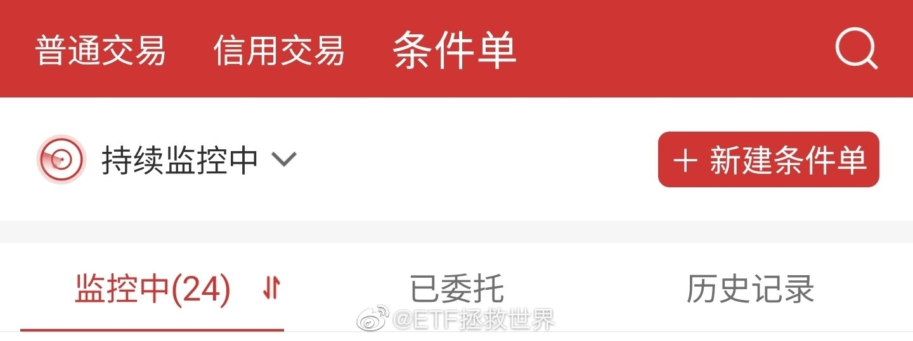

======================================================

ETF拯救世界 (5687069307) @
2020-02-04 09:30:05 Tue  
url: https://weibo.com/5687069307/IsBAr3duc

今天很多ETF很奇怪，有资金溢价很多的买。 ​​​

转发[16]  评论[306]  赞[970] 

======================================================

ETF拯救世界 (5687069307) @
2020-02-04 09:50:18 Tue  
url: https://weibo.com/5687069307/IsBIDzYVO

anyway，昨天买的两个网都在赚钱状态。至少现在看，这是个好的开始。

所以市场波动不是风险，别人的恐慌可能恰好是你的利润。

资本市场最有意思的地方根本不是赚钱，而是观察人性、战胜人性的乐趣。 ​​​

转发[63]  评论[407]  赞[1218] 

======================================================

ETF拯救世界 (5687069307) @
2020-02-04 09:52:58 Tue  
url: https://weibo.com/5687069307/IsBJJf0HR

回复@满眼星河GZ:我不明白什么意思。你不买，他也会卖。甚至，你不买，他就要更低的价格卖掉。难道你不是做好事？你有没有做任何不道德的事情？你是为资本市场的平稳做贡献，你做的是好事。希望你真的明白。//@满眼星河GZ:带血的筹码一点也不好，尤其现在

------------------------------------------------------
转推：
>  @ETF拯救世界 (5687069307)
>  2020-02-04 09:50:18 Tue  
>  url: https:/weibo.com/5687069307/IsBIDzYVO/

>  anyway，昨天买的两个网都在赚钱状态。至少现在看，这是个好的开始。
>  
>  所以市场波动不是风险，别人的恐慌可能恰好是你的利润。
>  
>  资本市场最有意思的地方根本不是赚钱，而是观察人性、战胜人性的乐趣。 ​​​

转发[16]  评论[184]  赞[944] 

======================================================

ETF拯救世界 (5687069307) @
2020-02-04 10:31:56 Tue  
url: https://weibo.com/5687069307/IsBZxox92

几乎所有指数都在上涨。

而股票的涨跌家数对比是1400：2400…… ​​​

转发[45]  评论[488]  赞[1492] 

======================================================

ETF拯救世界 (5687069307) @
2020-02-04 13:04:22 Tue  
url: https://weibo.com/5687069307/IsCZptSR3

刚才那位朋友给我私信了，她说那话应该也是无意的。

但我并非小题大做。

这种时候，非常敏感。全国人民都在抗击疫情，武汉和湖北人民还处在煎熬之中，你们却在这里赚钱。如果我不解释清楚，这种话难免就不被人带起来节奏。这节奏起来了有可能后果就不堪设想。

说者无心，听者有意。有一小撮人每天关 ​​​

转发[14]  评论[396]  赞[1741] 

======================================================

ETF拯救世界 (5687069307) @
2020-02-04 14:05:17 Tue  
url: https://weibo.com/5687069307/IsDo8u9BM

昨天跌了不慌。昨天没卖甚至买了点的，今天涨了也不用嘚瑟，因为明天有可能又跌了。

涨了跌了，都很正常。你不慌不乱不嘚瑟，都是一个正常投资者应该做的事情而已。

市场哪天暴涨哪天暴跌猜不到，也不用猜。安排好交易策略，执行就可以。

好的策略比人可靠。要嘚瑟也是策略嘚瑟，不应该是你。

你只 ​​​

转发[89]  评论[387]  赞[1364] 

======================================================

ETF拯救世界 (5687069307) @
2020-02-04 14:15:10 Tue  
url: https://weibo.com/5687069307/IsDs9yyBG

现在指数涨成这样，平均两三个点以上了，股票涨跌比例依然是1500:2300……

------------------------------------------------------
转推：
>  @ETF拯救世界 (5687069307)
>  2020-02-04 10:31:56 Tue  
>  url: https:/weibo.com/5687069307/IsBZxox92/

>  几乎所有指数都在上涨。
>  
>  而股票的涨跌家数对比是1400：2400…… ​​​

转发[0]  评论[0]  赞[185] 

======================================================

ETF拯救世界 (5687069307) @
2020-02-04 15:03:09 Tue  
url: https://weibo.com/5687069307/IsDLDf2LW

今天最大的问题是

家里食物即将吃完了。冰箱，终于快回到刚买它时候的样子。

发现超市的app也不给送货了，怎么办，去超市买吗。

各位都是怎么解决买食物问题的。 ​​​

转发[12]  评论[1160]  赞[1517] 

======================================================

ETF拯救世界 (5687069307) @
2020-02-04 23:20:17 Tue  
url: https://weibo.com/5687069307/IsH1q4ZRQ

不断刷新我对人类认识的底线

------------------------------------------------------
转推：
>  @北京人不知道的北京事儿 (1662214194)
>  2020-02-04 20:39:40 Tue  
>  url: https:/weibo.com/1662214194/IsFYdqNBb/

>  转自网友，某地发生的事儿。。。这一家子你怎么看？[衰][衰]http://t.cn/A6PE2reP ​ ​​​

转发[127]  评论[347]  赞[709] 

======================================================

ETF拯救世界 (5687069307) @
2020-02-05 09:42:17 Wed  
url: https://weibo.com/5687069307/IsL5SAP5C

周一，也有一部分人赎回计划。

我给这些人的建议是，取关我然后永远不要再关注我。

不是一路人，何必一定要相伴前行。 ​​​

转发[24]  评论[648]  赞[1739] 

======================================================

ETF拯救世界 (5687069307) @
2020-02-05 09:55:49 Wed  
url: https://weibo.com/5687069307/IsLbnjSOM

喷了。一忙起来，发车文章忘了放留言了… ​​​

转发[40]  评论[352]  赞[1040] 

======================================================

ETF拯救世界 (5687069307) @
2020-02-05 10:11:24 Wed  
url: https://weibo.com/5687069307/IsLhHrqc3

看着这两天的上涨，周一清仓的朋友一方面感到绝望，一方面会说这是死猫跳后面还会暴跌。

后面当然也许还会跌，但你不适合投资这也是真的。 ​​​

转发[63]  评论[361]  赞[1427] 

======================================================

ETF拯救世界 (5687069307) @
2020-02-05 10:24:22 Wed  
url: https://weibo.com/5687069307/IsLmXEGht

回复@Tak_CC:一番操作猛如虎，再看成本增加25%。//@Tak_CC:有个朋友，星期一跑了，还说继续看跌，到时候再买回来，结果今天就管不住手买了。。。。

------------------------------------------------------
转推：
>  @ETF拯救世界 (5687069307)
>  2020-02-05 10:11:24 Wed  
>  url: https:/weibo.com/5687069307/IsLhHrqc3/

>  看着这两天的上涨，周一清仓的朋友一方面感到绝望，一方面会说这是死猫跳后面还会暴跌。
>  
>  后面当然也许还会跌，但你不适合投资这也是真的。 ​​​

转发[20]  评论[192]  赞[872] 

======================================================

ETF拯救世界 (5687069307) @
2020-02-05 10:41:58 Wed  
url: https://weibo.com/5687069307/IsLu6yQQ1

布置长线仓位后，你是不是盼着上涨，牛市来。

布置短期波动仓位后，你是不是又盼着赶紧跌一下好让你能提款。

你又希望涨，又希望跌，请问，你的心态怎么可能不好？ ​​​

转发[66]  评论[492]  赞[1554] 

======================================================

ETF拯救世界 (5687069307) @
2020-02-05 11:06:04 Wed  
url: https://weibo.com/5687069307/IsLDTdy3L

回复@以后做快乐健康的小女人:第一层认知：对经济有影响，股市会跌。第二层：有影响，股市是否已经反映影响？第三层：影响后会不会好？如果好，是否会反映在股市里？结论：别费劲儿预测股市涨跌了，执行你的交易策略。

------------------------------------------------------
转推：
>  @ETF拯救世界 (5687069307)
>  2020-02-05 09:55:49 Wed  
>  url: https:/weibo.com/5687069307/IsLbnjSOM/

>  喷了。一忙起来，发车文章忘了放留言了… ​​​

转发[34]  评论[216]  赞[908] 

======================================================

ETF拯救世界 (5687069307) @
2020-02-05 11:50:58 Wed  
url: https://weibo.com/5687069307/IsLW7aZhP

健身环，三国14，pes2020//@昆山法律:节奏光剑

------------------------------------------------------
转推：
>  @篝火编辑部 (6514705104)
>  2020-02-04 21:00:04 Tue  
>  url: https:/weibo.com/6514705104/IsG6v0Nm8/

>  #篝火游话说# 【假期期间你玩的最多的一款游戏是？】在返工日期延迟、需要减少出行的日子里，想必对不少玩家来说宅在家打游戏已经成了最佳日常活动之一，有人选择重回《荒野大镖客：救赎 2》欣赏沿途风景；有人在家里拿出了健身环强身健体，在这个假期里，你游戏时长最长的游戏又是哪一款呢？[喵喵] ​​​

转发[10]  评论[244]  赞[581] 

======================================================

ETF拯救世界 (5687069307) @
2020-02-05 19:32:31 Wed  
url: https://weibo.com/5687069307/IsOXslOdS

今日数据显示

医药已经算不上便宜。医疗已经即将算得上“贵”

不会再买。但长线持仓的肯定不会卖。 ​​​

转发[53]  评论[253]  赞[1291] 

======================================================

ETF拯救世界 (5687069307) @
2020-02-05 19:57:05 Wed  
url: https://weibo.com/5687069307/IsP7qxTbh

今天躺在摇椅上，看着窗外的雪景听本期BGM，很有感觉。你试试。 ​​​

转发[3]  评论[247]  赞[991] 

======================================================

ETF拯救世界 (5687069307) @
2020-02-05 20:43:23 Wed  
url: https://weibo.com/5687069307/IsPqeh4nZ

据说有些人是这样的：

事前：

“莫得事情”

事后：

“莫得办法” ​​​

转发[28]  评论[216]  赞[1111] 

======================================================

ETF拯救世界 (5687069307) @
2020-02-05 20:53:25 Wed  
url: https://weibo.com/5687069307/IsPuilSgK

这位朋友是长期关注我的一位信阳市第二人民医院的医务人员。现在他们极缺N95口罩。如果有资源的朋友帮他们一把吧。//@银河系淂蜗牛:如果有任何渠道我们愿意有偿购买🙏🙏🙏

------------------------------------------------------
转推：
>  @人民日报 (2803301701)
>  2020-02-05 17:00:37 Wed  
>  url: https:/weibo.com/2803301701/IsNXOcFaL/

>  【转扩！#信阳告急#！#信阳急需N95口罩1.3万个#】截至2月3日24时，河南信阳累计报告确诊病例112例，疑似病例157例。全市疫情防控医用防护物资全面告急，尤其紧缺N95口罩、医用连体防护服、全面型呼吸防护器等。截至2月3日，信阳市中心医院N95口罩库存仅为88个。
>  
>  现急需紧急调拨（全市3天消耗量）N95口 ​​​

转发[45]  评论[175]  赞[842] 

======================================================

ETF拯救世界 (5687069307) @
2020-02-05 23:33:31 Wed  
url: https://weibo.com/5687069307/IsQxhDg0G

总是这样我要不好意思了。 ​​​

转发[10]  评论[373]  赞[1063] 

+++++++++++++++++++++++++++++++++++++++++++++++++++++

图片：
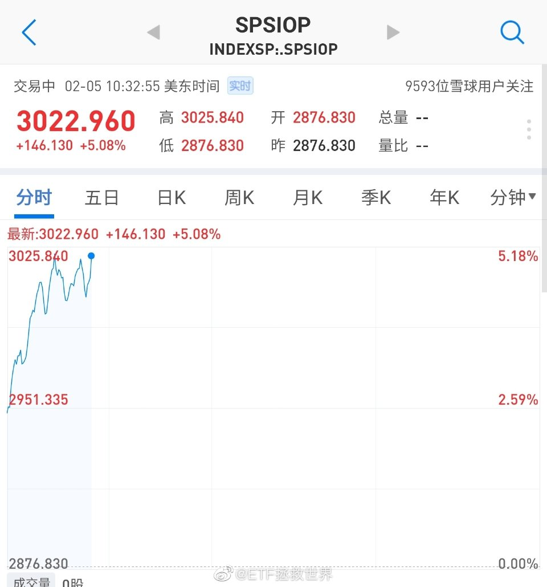

======================================================

ETF拯救世界 (5687069307) @
2020-02-06 09:57:44 Thu  
url: https://weibo.com/5687069307/IsUCEjhee

3号上来这一波的波段利润基本都到手。

我好了。

现在涨开心，跌可能更开心…… ​​​

转发[7]  评论[363]  赞[1127] 

======================================================

ETF拯救世界 (5687069307) @
2020-02-06 10:03:13 Thu  
url: https://weibo.com/5687069307/IsUEShQJP

截至目前为止，“一命”这个单位的涨幅是60%。 ​​​

转发[9]  评论[238]  赞[1331] 

======================================================

ETF拯救世界 (5687069307) @
2020-02-06 10:10:32 Thu  
url: https://weibo.com/5687069307/IsUHR0t48

有一条请各位注意的，不要给别人的持仓做诊断，不要建议别人该买什么或者该卖什么。甚至不要劝别人应该还是不应该做金融投资。

一个是技术问题，一个是未来的不可知。上下嘴皮一碰，一个建议好做，但后面的责任你恐怕担不起。

对了又怎么样？一个东西现在2块钱，很贵了。你说卖了吧，危险。结果人家 ​​​

转发[174]  评论[397]  赞[1813] 

======================================================

ETF拯救世界 (5687069307) @
2020-02-06 10:35:44 Thu  
url: https://weibo.com/5687069307/IsUS4wWUN

意思不大。退博10小时。 ​​​

转发[1]  评论[251]  赞[1026] 

======================================================

ETF拯救世界 (5687069307) @
2020-02-06 10:37:49 Thu  
url: https://weibo.com/5687069307/IsUSVnMwx

这条最低点写的东西，请周一清仓的朋友再看看。再想想。对这一辈子的交易都有用。

------------------------------------------------------
转推：
>  @ETF拯救世界 (5687069307)
>  2020-02-04 08:39:54 Tue  
>  url: https:/weibo.com/5687069307/IsBg4md9w/

>  昨天卖出以及今天想继续无论什么价格都要继续卖的朋友，我问你们几个问题。
>  
>  第一，你是否能保证昨天开始A股一定一路下跌。
>  
>  第二，即使大盘一路下跌，你是否能保证你的股票一定也继续跌。
>  
>  第三，A股和你的股票都继续大跌，你是否能保证自己一定能在更低的地方接回来。注意，这个问题很关键。
>  
>  第四， ​​​

转发[103]  评论[543]  赞[1366] 

======================================================

ETF拯救世界 (5687069307) @
2020-02-07 01:34:45 Fri  
url: https://weibo.com/5687069307/It0KZafpP

一言难尽。 ​​​

转发[24]  评论[544]  赞[2309] 

======================================================

ETF拯救世界 (5687069307) @
2020-02-07 10:07:38 Fri  
url: https://weibo.com/5687069307/It47agcEa

今天就不发微博了。

一言难尽。

真的说不清楚。

向关心我们，对我们说真话的人们表达深深的谢意。

谢谢。

我会用各种方式回馈这份关心。滴水之恩涌泉相报。 ​​​

转发[54]  评论[722]  赞[3297] 

======================================================

ETF拯救世界 (5687069307) @
2020-02-08 09:41:20 Sat  
url: https://weibo.com/5687069307/ItdmZbtbZ

有点意思

------------------------------------------------------
转推：
>  @不正经制片人 (1832444080)
>  2020-02-05 23:45:07 Wed  
>  url: https:/weibo.com/1832444080/IsQBZkM5n/

>  #病毒到底有多努力# 
>  纪录片：病毒与细胞的大战
>  完全科幻大片既视感！！
>  
>  @微博视频  http://t.cn/A6PmwAvK ​​​

转发[401]  评论[234]  赞[721] 

======================================================

ETF拯救世界 (5687069307) @
2020-02-08 14:21:39 Sat  
url: https://weibo.com/5687069307/ItfcM7fML

wtf，翻番了

------------------------------------------------------
转推：
>  @ETF拯救世界 (5687069307)
>  2020-02-01 09:41:33 Sat  
>  url: https:/weibo.com/5687069307/Is9nB9fGm/

>  去年底买了个品种，一个月涨了将近40%。
>  
>  你猜是什么。
>  
>  健身环。 ​​​

转发[10]  评论[288]  赞[945] 

======================================================

ETF拯救世界 (5687069307) @
2020-02-09 09:19:06 Sun  
url: https://weibo.com/5687069307/ItmEt0OJQ

我以后再也不因为喷子生气了。你们辛苦了[悲伤]//@半张废纸怪:有时候也觉得天天有时间在网络上喷脏造谣的人现实生活应该不太如意。一般人哪来那么多无聊时间族做这些

------------------------------------------------------
转推：
>  @卢诗翰 (3276099007)
>  2020-02-08 14:42:45 Sat  
>  url: https:/weibo.com/3276099007/Itfll4cKQ/

>  一个抓捕画面展示了网络喷子的真实生活。。。 ​​​

转发[92]  评论[450]  赞[1256] 

======================================================

ETF拯救世界 (5687069307) @
2020-02-09 17:51:09 Sun  
url: https://weibo.com/5687069307/Itq0isWLv

我一辈子都不想尝试

------------------------------------------------------
转推：
>  @ ()
>  2020-02-09 16:29:59 Sun  
>  url: 

>  抱歉，作者已设置仅展示半年内微博，此微博已不可见。 ​​​

转发[46]  评论[388]  赞[822] 

======================================================

ETF拯救世界 (5687069307) @
2020-02-10 10:31:26 Mon  
url: https://weibo.com/5687069307/ItwyjvkRP

注意，上周一买入的网格到达价格卖出后要再次回去挂买单。

在条件单—历史记录中找到已经卖出的那网买入单，点击，选择重新创建。

然后就静静的体会跌了很开心的感觉。 

另外，再在评论里讨论具体品种的一律删评论+拉黑 ​​​

转发[84]  评论[734]  赞[1405] 

======================================================

ETF拯救世界 (5687069307) @
2020-02-10 10:34:39 Mon  
url: https://weibo.com/5687069307/ItwzCr24j

感觉今天复工的人不多。高德上全是绿色 ​​​

转发[6]  评论[275]  赞[805] 

======================================================

ETF拯救世界 (5687069307) @
2020-02-10 10:55:18 Mon  
url: https://weibo.com/5687069307/ItwI0wOvV

回复@迷途知返的小可爱:后面一直涨，你的长期仓位赚大钱它不香吗//@迷途知返的小可爱:一个疑问🤔️如果后面一直涨，这个价格买不到怎么办❓毕竟挂的是比较低的价格了……

------------------------------------------------------
转推：
>  @ETF拯救世界 (5687069307)
>  2020-02-10 10:31:26 Mon  
>  url: https:/weibo.com/5687069307/ItwyjvkRP/

>  注意，上周一买入的网格到达价格卖出后要再次回去挂买单。
>  
>  在条件单—历史记录中找到已经卖出的那网买入单，点击，选择重新创建。
>  
>  然后就静静的体会跌了很开心的感觉。 
>  
>  另外，再在评论里讨论具体品种的一律删评论+拉黑 ​​​

转发[20]  评论[125]  赞[532] 

======================================================

ETF拯救世界 (5687069307) @
2020-02-10 11:05:16 Mon  
url: https://weibo.com/5687069307/ItwM35qDw

回复@小小单酒窝:这就是挂卖单的人太多导致无法成交。也是我反对公开说品种价格的原因//@小小单酒窝:我知道为啥撤单了[允悲]上周五已经达到触发价格却差0.01未成交……我不是个好学生//@ETF拯救世界:回复@迷途知返的小可爱:后面一直涨，你的长期仓位赚大钱它不香吗

------------------------------------------------------
转推：
>  @ETF拯救世界 (5687069307)
>  2020-02-10 10:31:26 Mon  
>  url: https:/weibo.com/5687069307/ItwyjvkRP/

>  注意，上周一买入的网格到达价格卖出后要再次回去挂买单。
>  
>  在条件单—历史记录中找到已经卖出的那网买入单，点击，选择重新创建。
>  
>  然后就静静的体会跌了很开心的感觉。 
>  
>  另外，再在评论里讨论具体品种的一律删评论+拉黑 ​​​

转发[3]  评论[129]  赞[564] 

======================================================

ETF拯救世界 (5687069307) @
2020-02-10 11:06:27 Mon  
url: https://weibo.com/5687069307/ItwMxeQdk

回复@杨舟老师讲物理耶90208:好问题。我的答案是，大约在春季//@杨舟老师讲物理耶90208:E大，创业板指各项技术指标都很好，咱们计划啥时候卖？//@ETF拯救世界:回复@迷途知返的小可爱:后面一直涨，你的长期仓位赚大钱它不香吗

------------------------------------------------------
转推：
>  @ETF拯救世界 (5687069307)
>  2020-02-10 10:31:26 Mon  
>  url: https:/weibo.com/5687069307/ItwyjvkRP/

>  注意，上周一买入的网格到达价格卖出后要再次回去挂买单。
>  
>  在条件单—历史记录中找到已经卖出的那网买入单，点击，选择重新创建。
>  
>  然后就静静的体会跌了很开心的感觉。 
>  
>  另外，再在评论里讨论具体品种的一律删评论+拉黑 ​​​

转发[9]  评论[301]  赞[895] 

======================================================

ETF拯救世界 (5687069307) @
2020-02-11 17:44:42 Tue  
url: https://weibo.com/5687069307/ItIOG1T9P

我们一衣带水的邻居，大多数人不像你从小被告知的那么坏，也并非就如天使这么好。

这个世界大多数时间是灰色的，不是非黑即白。

很多事情很难说清。所以还是不说了罢。

别人怎么说终究不做准，有机会还是去走一走看一看才好。 ​​​

转发[61]  评论[404]  赞[1930] 

======================================================

ETF拯救世界 (5687069307) @
2020-02-12 13:11:54 Wed  
url: https://weibo.com/5687069307/ItQsrnqiX

不能出门，被迫成长为米其林三星厨师是一种什么体验？

今日菜谱：

踏踏实实油焖大虾；时间紧急鲷鱼味增汤；每天新高秘制榄菜四季豆；多大点事儿拉玛西亚海鲜焗饭。 ​​​

转发[23]  评论[660]  赞[2017] 

======================================================

ETF拯救世界 (5687069307) @
2020-02-12 16:48:31 Wed  
url: https://weibo.com/5687069307/ItRSnbQ3O

2016年12月，我们第一次买一份医药。当时是9608点。

今天收盘11000点。

从那个点位看，三年多只涨了十几个点，当然不算好。

但问题在于，当时的9608点估值是48倍（2015年最高96倍），而今天的11000点估值只有37倍。

越涨越高越便宜。

股票指数，便宜的地方买了，踏踏实实拿着就可以了。 ​​​

转发[85]  评论[416]  赞[1311] 

======================================================

ETF拯救世界 (5687069307) @
2020-02-12 17:06:45 Wed  
url: https://weibo.com/5687069307/ItRZLwBNa

购销差价15%？？？是不是疯了。企业没有成本的吗。还是说本意就是不想让口罩在市场上卖。不过这家企业不亏，几万块钱做了个大广告：都知道它是良心企业了。

------------------------------------------------------
转推：
>  @ ()
>  2020-02-12 13:53:53 Wed  
>  url: 

>  抱歉，作者已设置仅展示半年内微博，此微博已不可见。 ​​​

转发[217]  评论[206]  赞[1052] 

======================================================

ETF拯救世界 (5687069307) @
2020-02-12 17:48:54 Wed  
url: https://weibo.com/5687069307/ItSgSjslW

喷了，刚想起来。0.6进货，最高只能卖0.69。如果没有微信支付宝，付现金，这个没法找零。但是0.7又不能卖，卖就违法。所以只能卖0.6。也就是进价。也就是说，要赔上人工水电房租增值税所得税做慈善。

------------------------------------------------------
转推：
>  @ ()
>  2020-02-12 13:53:53 Wed  
>  url: 

>  抱歉，作者已设置仅展示半年内微博，此微博已不可见。 ​​​

转发[165]  评论[276]  赞[1089] 

======================================================

ETF拯救世界 (5687069307) @
2020-02-12 19:20:13 Wed  
url: https://weibo.com/5687069307/ItSRWDmNz

两条规定：一：这种时候进价不可避免上涨，零售价不可以随之上浮。那么怎么做生意。二：购销价差额15%就不说了。这样一来，买不到口罩就太正常了。深深感觉在我们这里经营企业真的太难。以前我总感觉体制内大部分都是精英，经此一疫，有了新的认识。

------------------------------------------------------
转推：
>  @ ()
>  2020-02-12 13:42:20 Wed  
>  url: 

>  抱歉，此微博已被作者删除。查看帮助：http://t.cn/Rfd3rQV

转发[62]  评论[505]  赞[1484] 

======================================================

ETF拯救世界 (5687069307) @
2020-02-13 14:58:55 Thu  
url: https://weibo.com/5687069307/Iu0AnjByu

小米10今天出了。等能买到的时候送一个。//@ETF拯救世界:下次小米发布新品手机，买一个送给微博的朋友。

------------------------------------------------------
转推：
>  @ETF拯救世界 (5687069307)
>  2020-01-20 09:23:06 Mon  
>  url: https:/weibo.com/5687069307/Iqk89CEU4/

>  万万没想到你是这样的小米…… ​​​

转发[20]  评论[469]  赞[1087] 

======================================================

ETF拯救世界 (5687069307) @
2020-02-13 15:17:39 Thu  
url: https://weibo.com/5687069307/Iu0HYCYgT

我不喜欢前摄像头不居中。别扭。 ​​​

转发[9]  评论[245]  赞[850] 

======================================================

ETF拯救世界 (5687069307) @
2020-02-13 16:36:19 Thu  
url: https://weibo.com/5687069307/Iu1dV0xne

我家健身环每天要运行2个多小时。每个人玩40多分钟，服了。 ​​​

转发[8]  评论[212]  赞[924] 

======================================================

ETF拯救世界 (5687069307) @
2020-02-13 17:00:33 Thu  
url: https://weibo.com/5687069307/Iu1nKlkOJ

我感觉自己是个小白鼠，自己掏钱买各种东西亲身测试，觉得好的就说说。

不能保证每个人都觉得好，不会太差是肯定的…… ​​​

转发[8]  评论[231]  赞[1095] 

======================================================

ETF拯救世界 (5687069307) @
2020-02-13 17:35:39 Thu  
url: https://weibo.com/5687069307/Iu1C08HUF

我想了想，决定把这个送给关注我的湖北医务工作者。其他朋友不好意思了，下次有机会吧。请湖北的医务工作者私信我，大概说一下自己的情况。我都会看，但没法一一回复。然后选一位送出//@ETF拯救世界:小米10今天出了。等能买到的时候送一个。

------------------------------------------------------
转推：
>  @ETF拯救世界 (5687069307)
>  2020-01-20 09:23:06 Mon  
>  url: https:/weibo.com/5687069307/Iqk89CEU4/

>  万万没想到你是这样的小米…… ​​​

转发[10]  评论[467]  赞[1812] 

======================================================

ETF拯救世界 (5687069307) @
2020-02-14 10:23:31 Fri  
url: https://weibo.com/5687069307/Iu8d5ocP5

今天怎么过。 ​​​

转发[11]  评论[785]  赞[1404] 

======================================================

ETF拯救世界 (5687069307) @
2020-02-14 16:39:49 Fri  
url: https://weibo.com/5687069307/IuaFPBiVr

油气。再说一次。

长线：

150仓位1.43%（有限资金模式）；S仓位5.33%（无限资金模式）。30多个品种几乎唯一亏损的。亏损没事，看看仓位多少。

网格：

三篇网格文章一再提示做好压力测试。仁至义尽。压力测试做好了，就算跌40%也是意料之中，完全心态平和执行策略。

总结一下：

长线仓位极低，波 ​​​

转发[149]  评论[1002]  赞[2070] 

+++++++++++++++++++++++++++++++++++++++++++++++++++++

图片：
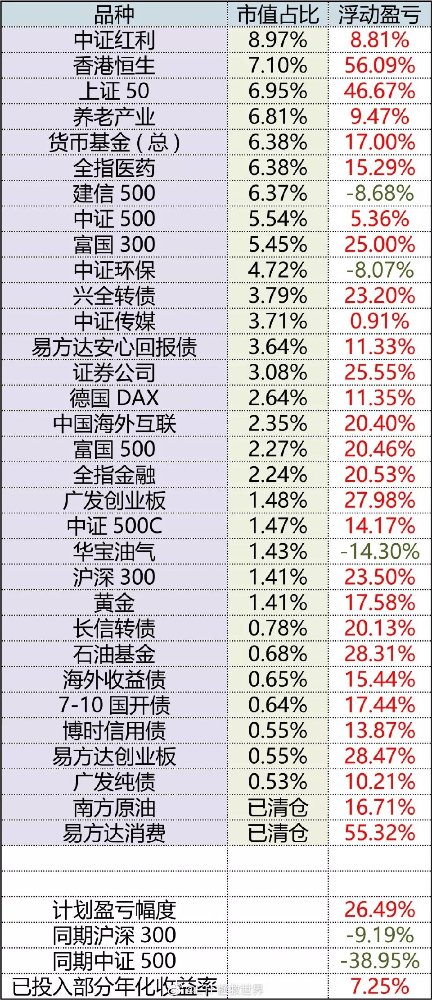

======================================================

ETF拯救世界 (5687069307) @
2020-02-14 18:42:06 Fri  
url: https://weibo.com/5687069307/IubtszbZB

人生真的是福祸相依，处处意想不到。

抚摸着前两年雾霾时候置办的两盒N95，我感叹道。 ​​​

转发[18]  评论[483]  赞[1584] 

======================================================

ETF拯救世界 (5687069307) @
2020-02-15 13:40:04 Sat  
url: https://weibo.com/5687069307/IuiVn5tK5

大事化小，小事化了。

心里堵得慌。 ​​​

转发[22]  评论[356]  赞[1489] 

======================================================

ETF拯救世界 (5687069307) @
2020-02-16 10:31:43 Sun  
url: https://weibo.com/5687069307/Iur7pFxz0

四岁了。这四年爸爸去哪儿了

------------------------------------------------------
转推：
>  @新浪视频 (1640601392)
>  2020-02-16 10:08:03 Sun  
>  url: https:/weibo.com/1640601392/IuqXNEl1L/

>  【#援鄂护师视频教丈夫带娃# 听见孩子哭自己也哭了】宜宾市第二人民医院的护师张亚兰，1月28日随医疗队到武汉红十字会医院支援。她有一个4岁多的儿子，休息时她就和家人视频，教教丈夫怎么带孩子，每次听到孩子哭她也会哭，心里很难受。她希望能早日战胜疫情早点回家。http://t.cn/A6hIMqUi ​​​

转发[14]  评论[150]  赞[882] 

======================================================

ETF拯救世界 (5687069307) @
2020-02-16 11:18:47 Sun  
url: https://weibo.com/5687069307/Iurqw19zq

对我来说，养育孩子是一种很特别，很享受的人生体验。

所以我不愿意错过孩子成长的每一个瞬间。我愿意花费时间在孩子身上做很多事，比如出生到现在头发都是我剪的。上小学前出去剪过一次，剪的什么玩意儿比我差远了，主要是不够用心，所以还是我继续来吧。

其他的事就不说了，出生后几乎每件事我都会 ​​​

转发[113]  评论[528]  赞[2079] 

======================================================

ETF拯救世界 (5687069307) @
2020-02-16 12:41:10 Sun  
url: https://weibo.com/5687069307/IurXXaLeT

回复@微微吖0318:所以我说这样的父亲不会少。比如之前经常在这里发言的一位男性朋友，曾经给我分享过很多育儿的资料。详细规划孩子的教育路径，我自愧不如//@微微吖0318:我老公比我更上心细心，也比我更排斥二胎[doge]

------------------------------------------------------
转推：
>  @ETF拯救世界 (5687069307)
>  2020-02-16 11:18:47 Sun  
>  url: https:/weibo.com/5687069307/Iurqw19zq/

>  对我来说，养育孩子是一种很特别，很享受的人生体验。
>  
>  所以我不愿意错过孩子成长的每一个瞬间。我愿意花费时间在孩子身上做很多事，比如出生到现在头发都是我剪的。上小学前出去剪过一次，剪的什么玩意儿比我差远了，主要是不够用心，所以还是我继续来吧。
>  
>  其他的事就不说了，出生后几乎每件事我都会 ​​​

转发[16]  评论[164]  赞[727] 

======================================================

ETF拯救世界 (5687069307) @
2020-02-17 10:15:01 Mon  
url: https://weibo.com/5687069307/IuAr82jFK

喷了。为了打新随便买点股票谁能想到。 ​​​

转发[13]  评论[482]  赞[1475] 

+++++++++++++++++++++++++++++++++++++++++++++++++++++

图片：
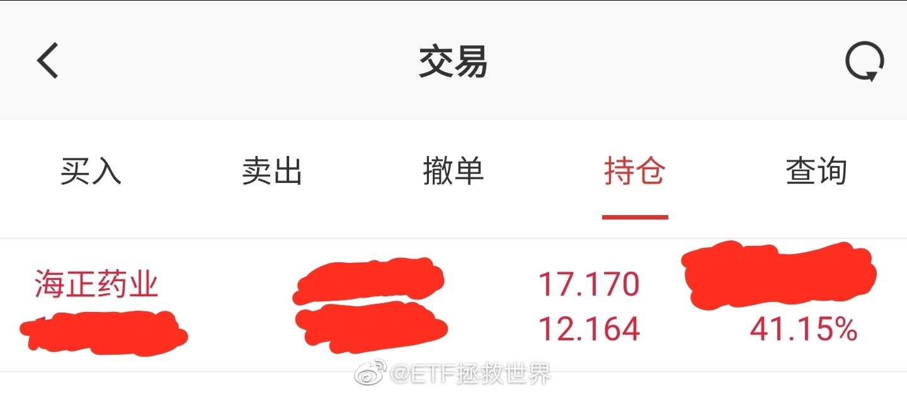

======================================================

ETF拯救世界 (5687069307) @
2020-02-17 11:39:05 Mon  
url: https://weibo.com/5687069307/IuAZfrTww

辣鸡传媒又新高了，今年至今涨幅13%。

今年沪深300还是下跌的。

底部清仓的朋友找谁说理去。 ​​​

转发[25]  评论[342]  赞[1266] 

======================================================

ETF拯救世界 (5687069307) @
2020-02-17 13:44:39 Mon  
url: https://weibo.com/5687069307/IuBOdtdCO

机会都是跌出来的，风险都是涨出来的。

不停赚钱很开心是没错，但这句话永远不能忘。 ​​​

转发[103]  评论[233]  赞[1303] 

======================================================

ETF拯救世界 (5687069307) @
2020-02-17 13:47:50 Mon  
url: https://weibo.com/5687069307/IuBPvvDhW

回复@小鱼尛鱻:虽然我知道这是不可能的。但你们赚得比我多我非常开心。//@小鱼尛鱻:报告，我的传媒成本比老大低[笑而不语]

------------------------------------------------------
转推：
>  @ETF拯救世界 (5687069307)
>  2020-02-17 11:39:05 Mon  
>  url: https:/weibo.com/5687069307/IuAZfrTww/

>  辣鸡传媒又新高了，今年至今涨幅13%。
>  
>  今年沪深300还是下跌的。
>  
>  底部清仓的朋友找谁说理去。 ​​​

转发[9]  评论[155]  赞[1039] 

======================================================

ETF拯救世界 (5687069307) @
2020-02-17 14:23:54 Mon  
url: https://weibo.com/5687069307/IuC49jrmZ

2900点，账户市值比3100还高，300和500都没新高，你又新高了你说是怎么回事。 ​​​

转发[26]  评论[365]  赞[1479] 

======================================================

ETF拯救世界 (5687069307) @
2020-02-17 14:45:14 Mon  
url: https://weibo.com/5687069307/IuCcOaN4e

回复@番茄老爷89142:不看。喷我的人多了，他不值得我拿眼角夹一下。//@番茄老爷89142:E大， 某录上有人喷你，亮个收益，闪瞎它的狗眼

------------------------------------------------------
转推：
>  @ETF拯救世界 (5687069307)
>  2020-02-17 14:23:54 Mon  
>  url: https:/weibo.com/5687069307/IuC49jrmZ/

>  2900点，账户市值比3100还高，300和500都没新高，你又新高了你说是怎么回事。 ​​​

转发[3]  评论[136]  赞[781] 

======================================================

ETF拯救世界 (5687069307) @
2020-02-17 14:52:05 Mon  
url: https://weibo.com/5687069307/IuCfArkGK

每次被人喷完，关注我的人都猛增一大截。

因为我从来不到各个网站去宣传，所以他们一喷就等于帮我宣传，说真的，好烦。

烦不是因为别的，是被喷完新关注的就增加一大堆，以前的老朋友也不会因为他们喷就走。

真让人绝望。[哼]

（我说怎么这两天公众号关注猛增呢……原来又被喷了） ​​​

转发[7]  评论[473]  赞[1451] 

+++++++++++++++++++++++++++++++++++++++++++++++++++++

图片：

======================================================

ETF拯救世界 (5687069307) @
2020-02-17 15:36:20 Mon  
url: https://weibo.com/5687069307/IuCxycXDO

更年轻一点的时候，看武侠小说，总有一个疑问。

为什么很多武林盟主，绝世高手，最后都要归隐江湖，隐姓埋名。有那个实力叱咤风云一呼百应多过瘾啊。怎么也想不明白。

现在渐渐明白一点了。

很多时候看起来风光无限，其实是要承受无穷无尽的烦恼。有人想干掉你取而代之，有人看着你心里发酸就希望你 ​​​

转发[149]  评论[476]  赞[1810] 

======================================================

ETF拯救世界 (5687069307) @
2020-02-17 16:03:49 Mon  
url: https://weibo.com/5687069307/IuCIIc8kq

回复@alayamj:你的朋友都是高素质人才。羡慕。[可怜]//@alayamj:回复@往越南汇钱:我的已经10个了[二哈]

------------------------------------------------------
转推：
>  @ETF拯救世界 (5687069307)
>  2020-02-17 15:36:20 Mon  
>  url: https:/weibo.com/5687069307/IuCxycXDO/

>  更年轻一点的时候，看武侠小说，总有一个疑问。
>  
>  为什么很多武林盟主，绝世高手，最后都要归隐江湖，隐姓埋名。有那个实力叱咤风云一呼百应多过瘾啊。怎么也想不明白。
>  
>  现在渐渐明白一点了。
>  
>  很多时候看起来风光无限，其实是要承受无穷无尽的烦恼。有人想干掉你取而代之，有人看着你心里发酸就希望你 ​​​

转发[9]  评论[81]  赞[441] 

======================================================

ETF拯救世界 (5687069307) @
2020-02-17 16:09:50 Mon  
url: https://weibo.com/5687069307/IuCL9caKa

目前A股整体不贵。当然个别区域已经过热，比如创业板已经回到了2015年初的热度。要知道，这个已经很热了，因为2015年初的创业板，已经涨了整整两年多。

其它的问题不大。50 300之类的，不便宜，但肯定没有到卖出的位置。500更便宜点，踏踏实实拿着，最多做做网格。

整体来讲，平稳可控。别挣点钱就拿 ​​​

转发[263]  评论[438]  赞[1712] 

======================================================

ETF拯救世界 (5687069307) @
2020-02-17 16:14:54 Mon  
url: https://weibo.com/5687069307/IuCNcwmTo

回复@每天都有好天气:500压力位5630。看看能不能过去。过去了就舒服了。过不去更舒服。

------------------------------------------------------
转推：
>  @ETF拯救世界 (5687069307)
>  2020-02-17 16:09:50 Mon  
>  url: https:/weibo.com/5687069307/IuCL9caKa/

>  目前A股整体不贵。当然个别区域已经过热，比如创业板已经回到了2015年初的热度。要知道，这个已经很热了，因为2015年初的创业板，已经涨了整整两年多。
>  
>  其它的问题不大。50 300之类的，不便宜，但肯定没有到卖出的位置。500更便宜点，踏踏实实拿着，最多做做网格。
>  
>  整体来讲，平稳可控。别挣点钱就拿 ​​​

转发[68]  评论[124]  赞[685] 

======================================================

ETF拯救世界 (5687069307) @
2020-02-17 16:20:55 Mon  
url: https://weibo.com/5687069307/IuCPE7Nq2

回复@尼古拉斯摩根:就是说，未来极度高估的时候你也不会卖对吗。如果你能做到，我送个锦旗给你。//@尼古拉斯摩根:我是来赚企业成长的钱。不是赚其他股民基民兜里的钱。。那样太残忍，破坏其他家庭幸福，于心不忍。

------------------------------------------------------
转推：
>  @ETF拯救世界 (5687069307)
>  2020-02-17 16:09:50 Mon  
>  url: https:/weibo.com/5687069307/IuCL9caKa/

>  目前A股整体不贵。当然个别区域已经过热，比如创业板已经回到了2015年初的热度。要知道，这个已经很热了，因为2015年初的创业板，已经涨了整整两年多。
>  
>  其它的问题不大。50 300之类的，不便宜，但肯定没有到卖出的位置。500更便宜点，踏踏实实拿着，最多做做网格。
>  
>  整体来讲，平稳可控。别挣点钱就拿 ​​​

转发[7]  评论[133]  赞[720] 

======================================================

ETF拯救世界 (5687069307) @
2020-02-17 16:28:43 Mon  
url: https://weibo.com/5687069307/IuCSOob0x

有人说要“赚企业成长的钱，不赚其他股民基民的钱。因为那样会破坏别人的幸福，于心不忍”

拜托，其他人高位接盘，低位割肉，是你怂恿的吗？（我倒亲见过有人最低位指导粉丝割肉）如果不是，跟你有什么关系？

甚至，我告诉你。你低位接盘，高位卖出，反而是救了他们，他们才不会赔的更多！

为什么。 ​​​

转发[106]  评论[413]  赞[1699] 

======================================================

ETF拯救世界 (5687069307) @
2020-02-17 16:52:23 Mon  
url: https://weibo.com/5687069307/IuD2q6FDz

哎，兼职小助理回银行做认股权贷款了，特别认真细心又有能力的人。

可惜啊，估计太忙，以后不能帮我了。 ​​​

转发[8]  评论[451]  赞[1677] 

======================================================

ETF拯救世界 (5687069307) @
2020-02-17 18:56:14 Mon  
url: https://weibo.com/5687069307/IuDQGDzPF

之前我就说过，想要我炒币，不是不可以，至少要有一个官方认证背书的交易所。炒不赚钱是我的技术问题我认，安全出问题我无法原谅自己

------------------------------------------------------
转推：
>  @fhrp (1948253871)
>  2020-02-17 17:53:26 Mon  
>  url: https:/weibo.com/1948253871/IuDrcmG0Q/

>  [二哈]这下真的自我销毁了 ​​​

转发[42]  评论[229]  赞[916] 

======================================================

ETF拯救世界 (5687069307) @
2020-02-17 20:21:21 Mon  
url: https://weibo.com/5687069307/IuEpeCutP

要不要下决心挑战一下自己给自己剪头发。 ​​​

转发[10]  评论[594]  赞[1425] 

======================================================

ETF拯救世界 (5687069307) @
2020-02-18 09:55:04 Tue  
url: https://weibo.com/5687069307/IuJJwwCIs

不可避免又是一次财富收割泡沫大破灭。

期限就是今年内。

大波动。 ​​​

转发[172]  评论[615]  赞[1824] 

======================================================

ETF拯救世界 (5687069307) @
2020-02-18 10:44:14 Tue  
url: https://weibo.com/5687069307/IuK3u3dW9

前提是冲的够疯。涨的越疯狂，波动越大。目前只是小波动级别

------------------------------------------------------
转推：
>  @ETF拯救世界 (5687069307)
>  2020-02-18 09:55:04 Tue  
>  url: https:/weibo.com/5687069307/IuJJwwCIs/

>  不可避免又是一次财富收割泡沫大破灭。
>  
>  期限就是今年内。
>  
>  大波动。 ​​​

转发[52]  评论[156]  赞[788] 

======================================================

ETF拯救世界 (5687069307) @
2020-02-18 10:49:23 Tue  
url: https://weibo.com/5687069307/IuK5zu1Bu

最高摸到5652，第一次冲击失败。//@ETF拯救世界:回复@每天都有好天气:500压力位5630。看看能不能过去。过去了就舒服了。过不去更舒服。

------------------------------------------------------
转推：
>  @ETF拯救世界 (5687069307)
>  2020-02-17 16:09:50 Mon  
>  url: https:/weibo.com/5687069307/IuCL9caKa/

>  目前A股整体不贵。当然个别区域已经过热，比如创业板已经回到了2015年初的热度。要知道，这个已经很热了，因为2015年初的创业板，已经涨了整整两年多。
>  
>  其它的问题不大。50 300之类的，不便宜，但肯定没有到卖出的位置。500更便宜点，踏踏实实拿着，最多做做网格。
>  
>  整体来讲，平稳可控。别挣点钱就拿 ​​​

转发[26]  评论[161]  赞[693] 

======================================================

ETF拯救世界 (5687069307) @
2020-02-18 13:51:16 Tue  
url: https://weibo.com/5687069307/IuLhoC6lf

坐在轿子上等着别人抬，和做轿夫抬别人有什么区别 ​​​

转发[21]  评论[272]  赞[1335] 

======================================================

ETF拯救世界 (5687069307) @
2020-02-18 14:08:22 Tue  
url: https://weibo.com/5687069307/IuLoldQW5

雪中送炭好不好。

------------------------------------------------------
转推：
>  @ETF拯救世界 (5687069307)
>  2019-09-09 15:09:25 Mon  
>  url: https:/weibo.com/5687069307/I68yGbjnP/

>  之前我说，野百合也有春天。我又说，杀富济贫雪中送炭。
>  
>  你可能不信，认为我是为持仓中表现不好的品种找借口。
>  
>  现在你有点相信了。
>  
>  我说的很多东西，未来都会验证。只是需要时间。
>  
>  回望过去，绝大多数时候时间都站在了我这边。希望以后也是。
>  
>  也有些朋友喜欢为现在发生的事情做出“合理”解释，认 ​​​

转发[13]  评论[127]  赞[672] 

======================================================

ETF拯救世界 (5687069307) @
2020-02-18 14:18:32 Tue  
url: https://weibo.com/5687069307/IuLstnKCs

回复@机器猫是小叮当:我小时候最爱吃的菜之一。小时候我父亲开粤菜餐厅请了广东厨子。那个厨子三个细节我印象很深，第一个印象是90年代他就月薪上万，第二个和第三个是大良炸鲜奶和米粉好吃。北方人的我从没吃过这两样，当时我就震惊了。//@机器猫是小叮当:今天学做炸牛奶[馋嘴]

------------------------------------------------------
转推：
>  @ETF拯救世界 (5687069307)
>  2020-02-18 13:51:16 Tue  
>  url: https:/weibo.com/5687069307/IuLhoC6lf/

>  坐在轿子上等着别人抬，和做轿夫抬别人有什么区别 ​​​

转发[4]  评论[213]  赞[985] 

======================================================

ETF拯救世界 (5687069307) @
2020-02-18 14:36:14 Tue  
url: https://weibo.com/5687069307/IuLzEoagn

那家餐厅我印象不深了。

大厨是印象最深的，他的样子我也还记得。现在想起来，大概不到30岁，瘦瘦小小看起来很精明。做菜好吃。

另外还有印象，就是曾经有人来捣乱，几个人，每个人占一个桌子，要一瓶啤酒，一碟花生米，坐一晚上。父亲没有跟我讲太多，后来应该是给了点钱了事。不知道这个算不算BHF ​​​

转发[20]  评论[167]  赞[901] 

======================================================

ETF拯救世界 (5687069307) @
2020-02-18 14:54:05 Tue  
url: https://weibo.com/5687069307/IuLGTz82a

回复@冬季物语89:过去了。要再观察几天看能否站稳。需要两三次回踩确认。//@冬季物语89:E大 500是不是妥了？[嘻嘻]

------------------------------------------------------
转推：
>  @ETF拯救世界 (5687069307)
>  2020-02-18 14:36:14 Tue  
>  url: https:/weibo.com/5687069307/IuLzEoagn/

>  那家餐厅我印象不深了。
>  
>  大厨是印象最深的，他的样子我也还记得。现在想起来，大概不到30岁，瘦瘦小小看起来很精明。做菜好吃。
>  
>  另外还有印象，就是曾经有人来捣乱，几个人，每个人占一个桌子，要一瓶啤酒，一碟花生米，坐一晚上。父亲没有跟我讲太多，后来应该是给了点钱了事。不知道这个算不算BHF ​​​

转发[19]  评论[175]  赞[653] 

======================================================

ETF拯救世界 (5687069307) @
2020-02-18 17:06:58 Tue  
url: https://weibo.com/5687069307/IuMyPBGSK

只有我觉得QQ聊天比微信好用吗。

微信多平台信息同步做的比渣还渣。 ​​​

转发[12]  评论[411]  赞[1042] 

======================================================

ETF拯救世界 (5687069307) @
2020-02-18 18:10:23 Tue  
url: https://weibo.com/5687069307/IuMYzyNRe

不公平。可以在原有招生计划之外加分，分数够了就加学位。否则被挤下去的孩子太可怜了。

------------------------------------------------------
转推：
>  @北京人不知道的北京事儿 (1662214194)
>  2020-02-18 14:24:35 Tue  
>  url: https:/weibo.com/1662214194/IuLuVfRoa/

>  【#湖北一线医务人员子女中考加10分#，你支持吗？[思考]】湖北官方发布消息，2020年参加中考的一线医务人员子女，可在中考招生录取时增加10分。有网友支持，认为医护人员付出就该有回报。也有网友反对，认为此举有失教育公平。。。这事儿你怎么看？ http://t.cn/A6hKxPLQ ​​​

转发[57]  评论[142]  赞[700] 

======================================================

ETF拯救世界 (5687069307) @
2020-02-18 18:14:23 Tue  
url: https://weibo.com/5687069307/IuN0cm01r

市场根本不缺钱。坐稳了。

------------------------------------------------------
转推：
>  @财联社APP (2868676035)
>  2020-02-18 17:32:59 Tue  
>  url: https:/weibo.com/2868676035/IuMJoqAfm/

>  【电报|陈光明旗下新基全天认购约1200亿 创历史记录】财联社2月18日讯，记者从销售渠道获悉，睿远基金旗下第二只公募基金——睿远均衡价值基金全天认购金额约1200亿元，创下国内公募基金历史上最高认购记录。该基金拟募集金额60亿元，配售比例或不足6%。（财联社记者 韩理） ​​​

转发[307]  评论[129]  赞[762] 

======================================================

ETF拯救世界 (5687069307) @
2020-02-18 18:16:05 Tue  
url: https://weibo.com/5687069307/IuN0TdU0D

为什么只有2020年参加的加分。21、22、23……参加中考的，他们的父母今年没有在一线战斗吗。你要加20年，就要每年都加。//@ETF拯救世界:不公平。可以在原有招生计划之外加分，分数够了就加学位。否则被挤下去的孩子太可怜了。

------------------------------------------------------
转推：
>  @北京人不知道的北京事儿 (1662214194)
>  2020-02-18 14:24:35 Tue  
>  url: https:/weibo.com/1662214194/IuLuVfRoa/

>  【#湖北一线医务人员子女中考加10分#，你支持吗？[思考]】湖北官方发布消息，2020年参加中考的一线医务人员子女，可在中考招生录取时增加10分。有网友支持，认为医护人员付出就该有回报。也有网友反对，认为此举有失教育公平。。。这事儿你怎么看？ http://t.cn/A6hKxPLQ ​​​

转发[28]  评论[142]  赞[747] 

======================================================

ETF拯救世界 (5687069307) @
2020-02-18 18:30:41 Tue  
url: https://weibo.com/5687069307/IuN6P3ksJ

回复@ETF拯救了我:不仅合宜，十几年来，但凡有爆款出现都是至少阶段见顶。睿远的第一只公募是去年3月发行，然后……你懂了。这次我不知道。只是说历史。//@ETF拯救了我:公募基金大热，会不会又变成公墓？就像兴全合宜等几个基金募集前后发生的事情那样。

------------------------------------------------------
转推：
>  @财联社APP (2868676035)
>  2020-02-18 17:32:59 Tue  
>  url: https:/weibo.com/2868676035/IuMJoqAfm/

>  【电报|陈光明旗下新基全天认购约1200亿 创历史记录】财联社2月18日讯，记者从销售渠道获悉，睿远基金旗下第二只公募基金——睿远均衡价值基金全天认购金额约1200亿元，创下国内公募基金历史上最高认购记录。该基金拟募集金额60亿元，配售比例或不足6%。（财联社记者 韩理） ​​​

转发[257]  评论[114]  赞[556] 

======================================================

ETF拯救世界 (5687069307) @
2020-02-18 18:33:08 Tue  
url: https://weibo.com/5687069307/IuN7OfW2F

A股历史上第一次买公募要抽签是2007年10月。没错，就是6000点那个2007年10月。//@ETF拯救世界:回复@ETF拯救了我:不仅合宜，十几年来，但凡有爆款出现都是至少阶段见顶。睿远的第一只公募是去年3月发行，然后……你懂了。这次我不知道。只是说历史。

------------------------------------------------------
转推：
>  @财联社APP (2868676035)
>  2020-02-18 17:32:59 Tue  
>  url: https:/weibo.com/2868676035/IuMJoqAfm/

>  【电报|陈光明旗下新基全天认购约1200亿 创历史记录】财联社2月18日讯，记者从销售渠道获悉，睿远基金旗下第二只公募基金——睿远均衡价值基金全天认购金额约1200亿元，创下国内公募基金历史上最高认购记录。该基金拟募集金额60亿元，配售比例或不足6%。（财联社记者 韩理） ​​​

转发[114]  评论[118]  赞[643] 

======================================================

ETF拯救世界 (5687069307) @
2020-02-18 18:35:52 Tue  
url: https://weibo.com/5687069307/IuN8V6tBa

回复@坚持做好三件事:我只是在陈述历史，没有任何预判。你该追就追，别因为我的微博改变主意，真的。//@坚持做好三件事:E大这个太及时了，我刚想割肉去追科技//@ETF拯救世界:A股历史上第一次买公募要抽签是2007年10月。没错，就是6000点那个2007年10月。

------------------------------------------------------
转推：
>  @财联社APP (2868676035)
>  2020-02-18 17:32:59 Tue  
>  url: https:/weibo.com/2868676035/IuMJoqAfm/

>  【电报|陈光明旗下新基全天认购约1200亿 创历史记录】财联社2月18日讯，记者从销售渠道获悉，睿远基金旗下第二只公募基金——睿远均衡价值基金全天认购金额约1200亿元，创下国内公募基金历史上最高认购记录。该基金拟募集金额60亿元，配售比例或不足6%。（财联社记者 韩理） ​​​

转发[40]  评论[136]  赞[784] 

======================================================

ETF拯救世界 (5687069307) @
2020-02-18 19:05:18 Tue  
url: https://weibo.com/5687069307/IuNkRApkh

我的很多微博只是提供一些思考角度。

在资本市场上，事情的发展往往并非线性，不是说A一定会立即导致B的发生。这一点朋友们一定要深刻理解。

不理解，就会在春节复盘那天清仓。同样的例子举不胜举。

综合思考多一点因素，每个因素视情况发展变换不同权重，赋予对应的概率，做出成熟的投资决策比较好 ​​​

转发[59]  评论[264]  赞[1259] 

======================================================

ETF拯救世界 (5687069307) @
2020-02-18 21:28:24 Tue  
url: https://weibo.com/5687069307/IuOgX5S7T

喜欢这个调调。甚至从来不听戏曲的我听一会越剧也没问题

------------------------------------------------------
转推：
>  @挖龙脉的超级鹿鼎公 (3962719063)
>  2020-02-18 21:15:09 Tue  
>  url: https:/weibo.com/3962719063/IuObztlWf/

>  吴侬软语骨酥肉麻，真的宁可听苏州人吵架，也不要听宁波人讲话，😂 http://t.cn/A6h9nwJ1 ​​​

转发[46]  评论[191]  赞[592] 

======================================================

ETF拯救世界 (5687069307) @
2020-02-19 06:44:51 Wed  
url: https://weibo.com/5687069307/IuRUOpmMu

注意帐篷前面五个人不同的表现。一个见势不妙赶紧溜走（这哥们溜到了远超安全范围的地方），一个举手示弱迅速移动到安全地带，一个招手继续刺激司机（之后发现事情不好没有跑向旁边而是沿车辆行进路线跑），一个拿手机开始录像，最后一个最迷惑，向车辆行进方向靠了过去。学习了。

------------------------------------------------------
转推：
>  @北京人不知道的北京事儿 (1662214194)
>  2020-02-18 18:55:52 Tue  
>  url: https:/weibo.com/1662214194/IuNh2zkWi/

>  【#北京昌平有人驾车冲撞疫情防控检查站#致2人受伤，刑拘！[怒]】面对疫情，大家都在用自己的方式贡献力量。但就在这关键时刻，却出现了不配合防疫工作、冲关闯卡等行为。昨天早8点，在北京昌平北七家镇某小区门口，支某某欲进小区探望父母，对进入小区检查登记不满，驾车冲撞小区疫情防控检查站临时帐 ​​​

转发[19]  评论[133]  赞[471] 

======================================================

ETF拯救世界 (5687069307) @
2020-02-19 07:04:14 Wed  
url: https://weibo.com/5687069307/IuS2GjvhZ

我发现人真的可以因为一件事观点不同就分道扬镳。

昨天关于医护人员子女加分的事，我关注的有些人开始对反对的人冷嘲热讽，说他们是因为被动了蛋糕才反对。因为“他们真的有一头牛”

想了想，这人也没太多值得看的东西，马上取关。

我反对当然不是自己蛋糕被动了。我儿子也不在湖北，还有十几年才中 ​​​

转发[127]  评论[641]  赞[3362] 

======================================================

ETF拯救世界 (5687069307) @
2020-02-19 07:37:33 Wed  
url: https://weibo.com/5687069307/IuSgcyVDV

绝对公平很难，尤其是咱们这里，公平更难。

所以我特别珍惜中考高考这两个相对公平的战场。虽然这个战场也渐渐沦陷。

中考有多重要。其实对很多孩子来说，比高考还重要。高考考不好，可以去个差一点的学校或者复读。中考，有可能分流到连高中都没得上，连努力的机会都不再有，这一生就改变了。

太多 ​​​

转发[80]  评论[289]  赞[1663] 

======================================================

ETF拯救世界 (5687069307) @
2020-02-19 09:24:45 Wed  
url: https://weibo.com/5687069307/IuSXJ2PoT

回复@京京拳专打线头怪:真可笑。再说一次，我儿子十几年后才中考，跟我无关。就算他考不上高中，想学我就掏钱让他出国念书。不想学就学点技术上班，不随便糟蹋的话钱够他一辈子花了，上什么高中没那么重要。这件事跟我个人没有一毛钱关系。

------------------------------------------------------
转推：
>  @ETF拯救世界 (5687069307)
>  2020-02-19 07:04:14 Wed  
>  url: https:/weibo.com/5687069307/IuS2GjvhZ/

>  我发现人真的可以因为一件事观点不同就分道扬镳。
>  
>  昨天关于医护人员子女加分的事，我关注的有些人开始对反对的人冷嘲热讽，说他们是因为被动了蛋糕才反对。因为“他们真的有一头牛”
>  
>  想了想，这人也没太多值得看的东西，马上取关。
>  
>  我反对当然不是自己蛋糕被动了。我儿子也不在湖北，还有十几年才中 ​​​

转发[11]  评论[200]  赞[984] 

======================================================

ETF拯救世界 (5687069307) @
2020-02-19 09:47:49 Wed  
url: https://weibo.com/5687069307/IuT754ylQ

辣鸡环保也来凑新高的热度，喷了。 ​​​

转发[10]  评论[162]  赞[845] 

======================================================

ETF拯救世界 (5687069307) @
2020-02-19 10:26:46 Wed  
url: https://weibo.com/5687069307/IuTmTeHwN

我以为配的转债基金算一半A股仓位。

谁知道涨的一点不比指数差。[拜拜] ​​​

转发[59]  评论[146]  赞[932] 

======================================================

ETF拯救世界 (5687069307) @
2020-02-19 10:33:18 Wed  
url: https://weibo.com/5687069307/IuTpy7KYS

回复@小不忍则乱大萌a:计划持有券商，目前收益率26%//@小不忍则乱大萌a:益达牛市来了，要不要买点券商

------------------------------------------------------
转推：
>  @ETF拯救世界 (5687069307)
>  2020-02-19 09:47:49 Wed  
>  url: https:/weibo.com/5687069307/IuT754ylQ/

>  辣鸡环保也来凑新高的热度，喷了。 ​​​

转发[5]  评论[73]  赞[591] 

======================================================

ETF拯救世界 (5687069307) @
2020-02-19 10:35:38 Wed  
url: https://weibo.com/5687069307/IuTquCMMI

回复@也许偶尔还是会想她:个债不到130不卖。我的策略。//@也许偶尔还是会想她:回复@海狸克里特:我都是开盘第一天就卖了[跪了]

------------------------------------------------------
转推：
>  @ETF拯救世界 (5687069307)
>  2020-02-19 10:26:46 Wed  
>  url: https:/weibo.com/5687069307/IuTmTeHwN/

>  我以为配的转债基金算一半A股仓位。
>  
>  谁知道涨的一点不比指数差。[拜拜] ​​​

转发[35]  评论[171]  赞[679] 

======================================================

ETF拯救世界 (5687069307) @
2020-02-19 11:24:02 Wed  
url: https://weibo.com/5687069307/IuTK8lil0

今年的投资风格是：

看估值你就输在起跑线上。 ​​​

转发[49]  评论[402]  赞[1429] 

======================================================

ETF拯救世界 (5687069307) @
2020-02-19 11:50:46 Wed  
url: https://weibo.com/5687069307/IuTUZc85r

有人重仓杀入，有人清仓，真的很正常。

现在不是钻石坑，满地钻石。那个时候清仓是脑子不太清楚。现在清仓就很难讲，因为目前的市场又回到了2013-2014的那个状态，整体可控，但部分开始疯狂。很难说未来怎么走，所以买卖都正常。

只是这里清仓的朋友还是要想清楚一点。行情几年才有一次，如果总是不 ​​​

转发[192]  评论[338]  赞[1692] 

======================================================

ETF拯救世界 (5687069307) @
2020-02-19 12:12:03 Wed  
url: https://weibo.com/5687069307/IuU3CC8aV

凭主观交易的人，无论是感觉要涨了买，还是感觉要跌了卖，都是因为觉得自己很聪明。我反倒觉得做投资，不如先承认自己不够聪明，长期看反而胜率更大。

------------------------------------------------------
转推：
>  @ETF拯救世界 (5687069307)
>  2020-02-19 11:50:46 Wed  
>  url: https:/weibo.com/5687069307/IuTUZc85r/

>  有人重仓杀入，有人清仓，真的很正常。
>  
>  现在不是钻石坑，满地钻石。那个时候清仓是脑子不太清楚。现在清仓就很难讲，因为目前的市场又回到了2013-2014的那个状态，整体可控，但部分开始疯狂。很难说未来怎么走，所以买卖都正常。
>  
>  只是这里清仓的朋友还是要想清楚一点。行情几年才有一次，如果总是不 ​​​

转发[71]  评论[142]  赞[953] 

======================================================

ETF拯救世界 (5687069307) @
2020-02-19 12:14:16 Wed  
url: https://weibo.com/5687069307/IuU4wsIIh

做一个酷炫厨师的第一步，是学会单手打鸡蛋。 ​​​

转发[5]  评论[273]  赞[1070] 

======================================================

ETF拯救世界 (5687069307) @
2020-02-19 13:06:40 Wed  
url: https://weibo.com/5687069307/IuUpNd59x

新高不卖。 ​​​

转发[706]  评论[393]  赞[1384] 

======================================================

ETF拯救世界 (5687069307) @
2020-02-19 14:31:27 Wed  
url: https://weibo.com/5687069307/IuUYcFatc

意思不大，提前收工。明儿见。 ​​​

转发[2]  评论[381]  赞[1213] 

======================================================

ETF拯救世界 (5687069307) @
2020-02-19 23:17:23 Wed  
url: https://weibo.com/5687069307/IuYpGoxuM

情感博主上线 ​​​

转发[7]  评论[330]  赞[1273] 

+++++++++++++++++++++++++++++++++++++++++++++++++++++

图片：
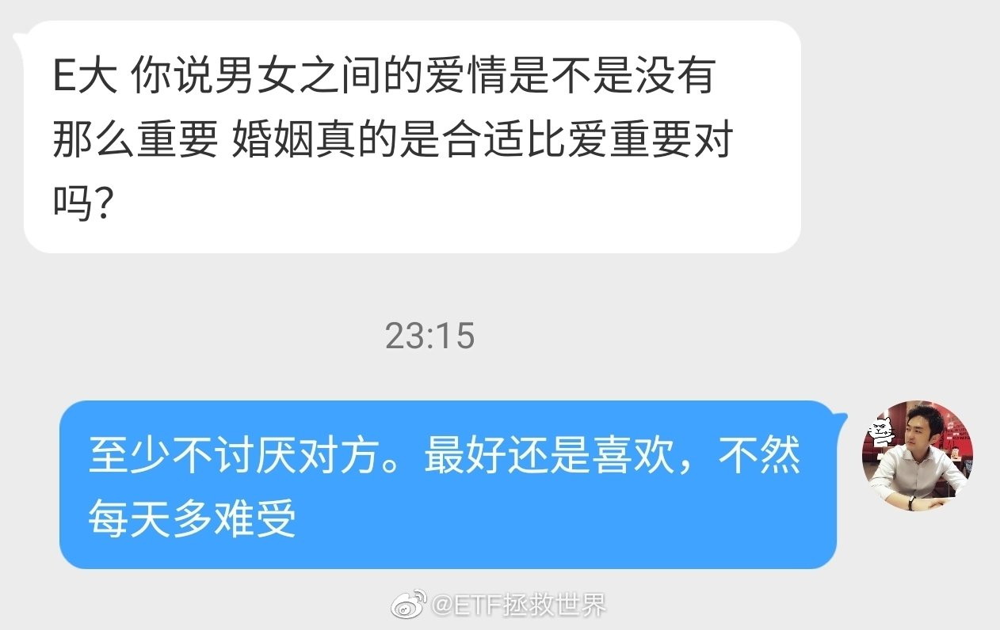

======================================================

ETF拯救世界 (5687069307) @
2020-02-20 00:03:56 Thu  
url: https://weibo.com/5687069307/IuYIAgqt1

一个中肯的建议 ​​​

转发[27]  评论[471]  赞[1695] 

+++++++++++++++++++++++++++++++++++++++++++++++++++++

图片：
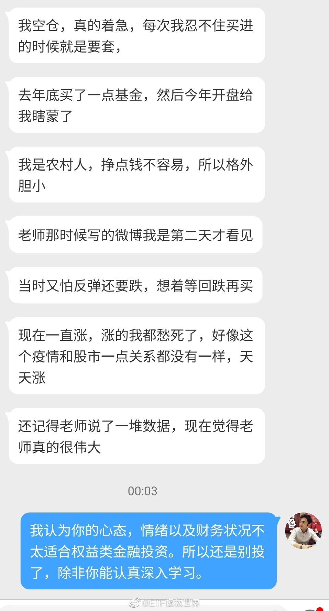

======================================================

ETF拯救世界 (5687069307) @
2020-02-20 08:39:02 Thu  
url: https://weibo.com/5687069307/Iv25EAHcC

来了老哥

------------------------------------------------------
转推：
>  @ ()
>  2020-02-20 07:36:42 Thu  
>  url: 

>  抱歉，作者已设置仅展示半年内微博，此微博已不可见。 ​​​

转发[55]  评论[262]  赞[1158] 

======================================================

ETF拯救世界 (5687069307) @
2020-02-20 09:33:39 Thu  
url: https://weibo.com/5687069307/Iv2rPf0PI

新高不卖是什么意思呢。买入看估值，卖出看趋势。如果因为一个东西稍微贵点你就慌着卖出，可能很难挣大钱。一个品种新高的当天，别卖。跌有底，涨起来是很难预测天花板的。不容易把握，以后慢慢说

------------------------------------------------------
转推：
>  @ETF拯救世界 (5687069307)
>  2020-02-19 13:06:40 Wed  
>  url: https:/weibo.com/5687069307/IuUpNd59x/

>  新高不卖。 ​​​

转发[651]  评论[381]  赞[1360] 

======================================================

ETF拯救世界 (5687069307) @
2020-02-20 09:41:11 Thu  
url: https://weibo.com/5687069307/Iv2uSDIua

大熊市哀嚎遍野的时候敢买，上涨中风轻云淡持有，火热新世界能够不贪悄悄离场。

能够做到这三点就是人中龙凤。 

普通人就是全都反着做。 ​​​

转发[233]  评论[455]  赞[1938] 

======================================================

ETF拯救世界 (5687069307) @
2020-02-20 09:46:59 Thu  
url: https://weibo.com/5687069307/Iv2xeD9ZQ

回复@一头驴的旅行:建议你翻翻我的微博，在大顶大底都在说什么。觉得多就看看公众号。我相信你会为这句话道歉。//@一头驴的旅行:能不能提前说  事后有毛用

------------------------------------------------------
转推：
>  @ETF拯救世界 (5687069307)
>  2020-02-20 09:41:11 Thu  
>  url: https:/weibo.com/5687069307/Iv2uSDIua/

>  大熊市哀嚎遍野的时候敢买，上涨中风轻云淡持有，火热新世界能够不贪悄悄离场。
>  
>  能够做到这三点就是人中龙凤。 
>  
>  普通人就是全都反着做。 ​​​

转发[9]  评论[272]  赞[1118] 

======================================================

ETF拯救世界 (5687069307) @
2020-02-20 10:08:03 Thu  
url: https://weibo.com/5687069307/Iv2FN5Lkz

其实微博是这样的。比如我新关注一个人，除非对他特别感兴趣，否则不会慢慢翻他过去说了什么。而且我看了一眼，7878条，这也太多了，没法翻。

真感兴趣的可以去看看我的公众号。5年时间，文章100篇左右，除了发车文章，没几篇。挑重要时间点看看大概就能明白是怎么回事了。

我不喜欢有些人不去了解就 ​​​

转发[21]  评论[280]  赞[1114] 

======================================================

ETF拯救世界 (5687069307) @
2020-02-20 10:10:09 Thu  
url: https://weibo.com/5687069307/Iv2GEdKHX

转给那位新朋友：

2018最低点我说了什么：

http://t.cn/A6hlwRFl ​​​

转发[128]  评论[205]  赞[1149] 

======================================================

ETF拯救世界 (5687069307) @
2020-02-20 10:11:17 Thu  
url: https://weibo.com/5687069307/Iv2H6iEKA

转给那位新朋友：

2015年顶部我说了什么，做了什么。

http://t.cn/A6hlAvvz ​​​

转发[121]  评论[208]  赞[1117] 

======================================================

ETF拯救世界 (5687069307) @
2020-02-20 10:30:16 Thu  
url: https://weibo.com/5687069307/Iv2OO9jrz

2005年1月至今，两融余额变化图。

目前是10781亿，过去五年多于现在的时间点是：

2017.11-2018.1 
2015年全年（除9月外）

2019年4月到过9900亿。

最高点是2015年4月和5月的：

2 万 亿 ​​​

转发[233]  评论[266]  赞[1083] 

+++++++++++++++++++++++++++++++++++++++++++++++++++++

图片：
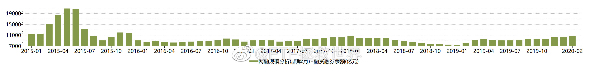

======================================================

ETF拯救世界 (5687069307) @
2020-02-20 10:35:05 Thu  
url: https://weibo.com/5687069307/Iv2QLzx3b

回复@南耕82624:对不起，没创意，让您失望了。油气还那样，半死不活，持仓3个点的我每天看着这个唯一浮亏的心如刀割，您看您还满意吗。//@南耕82624:别人钻石底，你也钻石底，有点创意好不好，华宝油气怎么样了

------------------------------------------------------
转推：
>  @ETF拯救世界 (5687069307)
>  2020-02-20 10:10:09 Thu  
>  url: https:/weibo.com/5687069307/Iv2GEdKHX/

>  转给那位新朋友：
>  
>  2018最低点我说了什么：
>  
>  http://t.cn/A6hlwRFl ​​​

转发[24]  评论[359]  赞[1010] 

======================================================

ETF拯救世界 (5687069307) @
2020-02-20 10:39:18 Thu  
url: https://weibo.com/5687069307/Iv2StlYEZ

这届网友真的很让人感动。

以前他们关心传媒、环保，每天来问候，还有大V经常写文章问候、关心。

现在传媒环保赚钱了，他们又开始关心仅存的一个油气。每天他们都按捺不住内心的激动问：“你的油气怎么样了？”

我感动的哭出来了。你说为什么这些人这么关心咱们的账户里面亏损品种呢。

他们不拿一 ​​​

转发[22]  评论[638]  赞[1977] 

======================================================

ETF拯救世界 (5687069307) @
2020-02-20 10:57:52 Thu  
url: https://weibo.com/5687069307/Iv300uuzE

市场想要上涨，就必须不停的震荡。

为什么。

清洗不坚定的叛徒。

做事情，不是说人越多越好。不是这样。

人少没事，历史上以少胜多的战例不胜枚举。最关键的两点：队伍有战斗力；意志坚定，团结。

后者非常重要。

你有多少人，一上战场就呼啦啦全跑了，那还不如小规模精英部队。

市场也一样。总 ​​​

转发[312]  评论[437]  赞[1972] 

======================================================

ETF拯救世界 (5687069307) @
2020-02-20 11:33:27 Thu  
url: https://weibo.com/5687069307/Iv3esd7wV

说得越多，错的越多。我说的肯定也有很多不对的地方。您自行甄别吧，批判性的吸收。

今天到此为止，明儿见。 ​​​

转发[8]  评论[298]  赞[1339] 

======================================================

ETF拯救世界 (5687069307) @
2020-02-20 12:52:23 Thu  
url: https://weibo.com/5687069307/Iv3KuuLaO

所以说这个世界上还是讲道理的人多。大家心平气和的沟通，说开了就没事了。

坏人只是少数，人类整体还是好的，三七开。

怕这位朋友再被骂，赶紧上来说一声。这次是真的明儿见了！ ​​​

转发[10]  评论[364]  赞[1462] 

+++++++++++++++++++++++++++++++++++++++++++++++++++++

图片：

======================================================

ETF拯救世界 (5687069307) @
2020-02-20 21:22:19 Thu  
url: https://weibo.com/5687069307/Iv75u1xQ8

每日劝退 ​​​

转发[16]  评论[390]  赞[1742] 

+++++++++++++++++++++++++++++++++++++++++++++++++++++

图片：
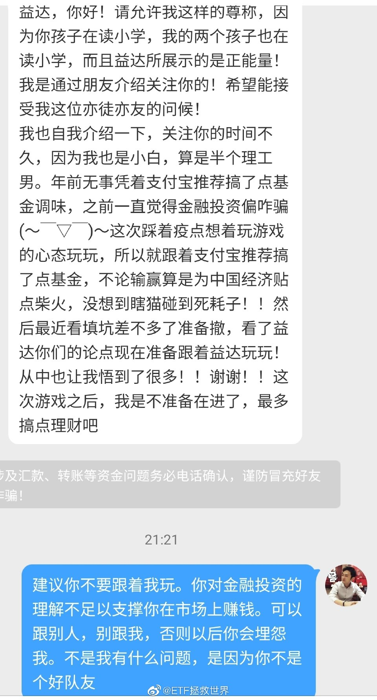

======================================================

ETF拯救世界 (5687069307) @
2020-02-20 21:27:19 Thu  
url: https://weibo.com/5687069307/Iv77vhlbr

可能有不少人讨厌我，也会觉得我的微博太多比较烦。

但是能帮助一些朋友，也值了。 ​​​

转发[17]  评论[448]  赞[1929] 

+++++++++++++++++++++++++++++++++++++++++++++++++++++

图片：
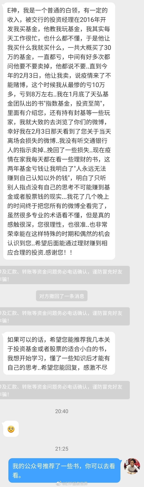

======================================================

ETF拯救世界 (5687069307) @
2020-02-20 21:36:13 Thu  
url: https://weibo.com/5687069307/Iv7b7eTKv

知道我为什么设计150吗。就是保证各位能够底部有钱还有胆识多买。

但是，如果你底部设置的金额少，涨起来了就改成大金额，这就完全背离了我的初衷，也无法控制风险。

这就相当于底部少买，高位多买。

设计再好的模式，也很难帮助所有人。 ​​​

转发[46]  评论[450]  赞[1328] 

+++++++++++++++++++++++++++++++++++++++++++++++++++++

图片：
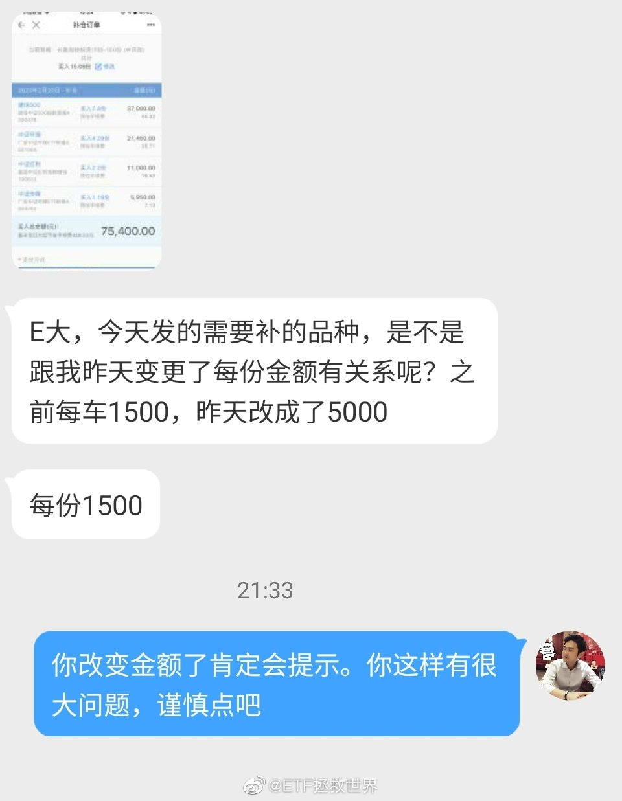

======================================================

ETF拯救世界 (5687069307) @
2020-02-20 21:48:57 Thu  
url: https://weibo.com/5687069307/Iv7ghzufL

本日情感问答 ​​​

转发[26]  评论[497]  赞[1751] 

+++++++++++++++++++++++++++++++++++++++++++++++++++++

图片：
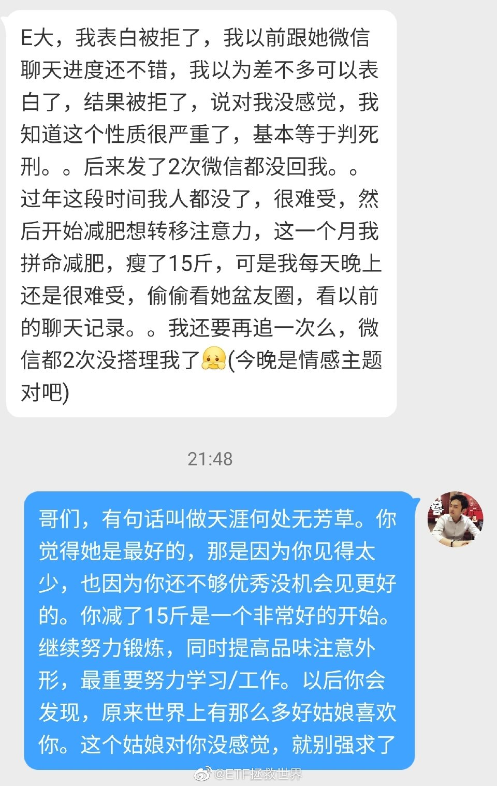

======================================================

ETF拯救世界 (5687069307) @
2020-02-21 09:20:13 Fri  
url: https://weibo.com/5687069307/IvbMSn9jq

最近评论里有一些朋友开始议论别的基金投资人，这样不好，以后不要了。

从球球开始，我就发现一个颇为奇怪的现象：很多玩基金的人特别喜欢互相踩。说实话，给我感觉很不好。当然，感觉不好可能也与我经常是受害者有关。

有些人给人感觉是小肚鸡肠，看到别人好就难受。有些人是拼命蹭热度，谁关注度高 ​​​

转发[57]  评论[741]  赞[2538] 

======================================================

ETF拯救世界 (5687069307) @
2020-02-21 09:32:42 Fri  
url: https://weibo.com/5687069307/IvbRWbgFp

有些股票和板块除了一路拉爆这种走势外，不可能有其它结局。 ​​​

转发[12]  评论[209]  赞[1206] 

======================================================

ETF拯救世界 (5687069307) @
2020-02-21 09:45:59 Fri  
url: https://weibo.com/5687069307/IvbXklIxR

大盘领涨一天，小盘领涨一天。

怎样才能每天都幸福。 ​​​

转发[9]  评论[260]  赞[1372] 

======================================================

ETF拯救世界 (5687069307) @
2020-02-21 10:02:28 Fri  
url: https://weibo.com/5687069307/Ivc41hbaU

还记不记得最低点的时候，有多少人写财务分析文章，告诉你有些品种完蛋了，没戏了，赶紧清仓吧。

谁能想到从那时候起，一年多涨了50%+。

投资有意思的地方在于，很多人认为学一点财务知识就能做好投资。如果学点财务知识，会看点报表，会算个ROE就能做好投资，那么大多数会计都应该是好的投资者了。 ​​​

转发[137]  评论[367]  赞[1559] 

======================================================

ETF拯救世界 (5687069307) @
2020-02-21 10:54:36 Fri  
url: https://weibo.com/5687069307/IvcpbfumO

所以你现在知道牛市的疯狂是怎么来的了：

涨——有了赚钱效应，金融机构发行更多产品——这些产品买入，涨更多——继续发行产品——继续买入，继续涨。

涨到什么时候呢。涨到能入场的资金都入场了，卖出的人开始多于买入。

开始跌就不会温柔。因为那些看着赚钱效应，申购产品等着赚钱的人，见到赚不 ​​​

转发[333]  评论[451]  赞[1749] 

======================================================

ETF拯救世界 (5687069307) @
2020-02-21 11:07:34 Fri  
url: https://weibo.com/5687069307/Ivcursgni

150和S一共还有四份创业板。收益率从30%-50%不等。

这几份什么时候卖？什么点位卖？

可以明确的告诉你：

我也不知道。 ​​​

转发[26]  评论[381]  赞[1176] 

======================================================

ETF拯救世界 (5687069307) @
2020-02-21 11:15:50 Fri  
url: https://weibo.com/5687069307/IvcxNv4RL

这四个字在牛市中非常有用。建议长期以来虽然不怎么亏钱但是也挣不到大钱的朋友好好想想//@ETF拯救世界: 新高不卖是什么意思呢。买入看估值，卖出看趋势。如果因为一个东西稍微贵点你就慌着卖出，可能很难挣大钱。一个品种新高的当天，别卖。跌有底，涨起来是很难预测天花板的。不容易把握，以后慢慢说

------------------------------------------------------
转推：
>  @ETF拯救世界 (5687069307)
>  2020-02-19 13:06:40 Wed  
>  url: https:/weibo.com/5687069307/IuUpNd59x/

>  新高不卖。 ​​​

转发[204]  评论[334]  赞[1300] 

======================================================

ETF拯救世界 (5687069307) @
2020-02-21 11:56:43 Fri  
url: https://weibo.com/5687069307/IvcOonBfE

还有一点各位可以观察。

牛市新手一定赚的比老手多。包括新手基金经理。

但是最终能全身而退的，千里挑一。

准不准，走着瞧。 ​​​

转发[109]  评论[400]  赞[1883] 

======================================================

ETF拯救世界 (5687069307) @
2020-02-21 13:17:45 Fri  
url: https://weibo.com/5687069307/IvdlhxIX8

为什么很多人那么纠结“牛市”这两个字？

这两个字是否确认对你的操作影响很大吗？？ ​​​

转发[27]  评论[369]  赞[1530] 

======================================================

ETF拯救世界 (5687069307) @
2020-02-21 13:34:52 Fri  
url: https://weibo.com/5687069307/Ivdseo05h

午夜前不聊了。太累。 ​​​

转发[9]  评论[316]  赞[1002] 

======================================================

ETF拯救世界 (5687069307) @
2020-02-21 22:22:23 Fri  
url: https://weibo.com/5687069307/IvgUmg3Jv

波动是我们的朋友 http://t.cn/A6hRXDUK //@ETF拯救世界:是这样的 http://t.cn/A6PJiR6H //@ETF拯救世界:回复@ETF拯救世界:又买回来。 http://t.cn/A6PJJnMO //@ETF拯救世界:一个半月，又出一格。

------------------------------------------------------
转推：
>  @ETF拯救世界 (5687069307)
>  2019-11-12 23:54:13 Tue  
>  url: https:/weibo.com/5687069307/IfVltpGby/

>  最近三个月白银网格是这样的情况（顺序从下往上）
>  
>  等于筹码没丢，吃了两轮利润 ​​​

转发[90]  评论[381]  赞[795] 

======================================================

ETF拯救世界 (5687069307) @
2020-02-21 23:36:00 Fri  
url: https://weibo.com/5687069307/Ivhoepb4e

今日情感博主上线

对你好永远不应该是喜欢一个人的唯一理由。因为他可能明天就不对你好了。

如果运气差碰上不好的人，结束未必不是好事。因为结束你只浪费了几个月，不结束有可能痛苦一生。跟买了垃圾股一个意思。 ​​​

转发[28]  评论[417]  赞[1508] 

+++++++++++++++++++++++++++++++++++++++++++++++++++++

图片：
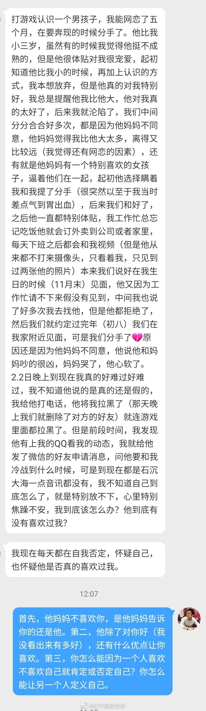

======================================================

ETF拯救世界 (5687069307) @
2020-02-21 23:50:45 Fri  
url: https://weibo.com/5687069307/Ivhue9wdl

请大家提高语文修养好吗。 ​​​

转发[15]  评论[523]  赞[1673] 

+++++++++++++++++++++++++++++++++++++++++++++++++++++

图片：
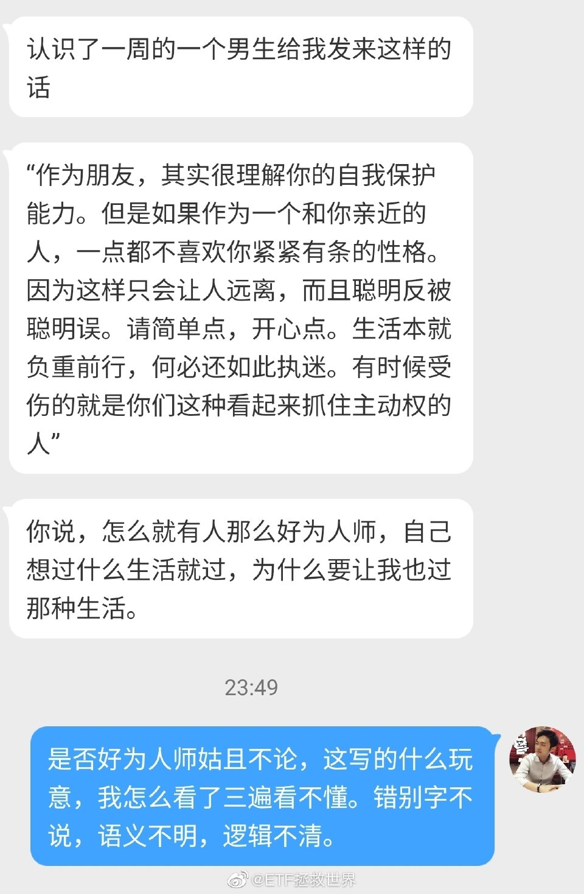

======================================================

ETF拯救世界 (5687069307) @
2020-02-22 08:55:04 Sat  
url: https://weibo.com/5687069307/Ivl39EtdU

一个月挣5000，工作6年手里只有两万多。买了三万的房，一个月不工作已经身无分文。一定要教育孩子任何收入都要存下20%-30%，不到救命的时候不拿出来。孩子会受益一生。

------------------------------------------------------
转推：
>  @小林小林吧 (1661446922)
>  2020-02-20 22:22:38 Thu  
>  url: https:/weibo.com/1661446922/Iv7tXmDE6/

>  『鹤岗买房的湖北小哥：开不了工，我想把3万的房子卖了』http://t.cn/A6hOZaBH ​​​

转发[192]  评论[468]  赞[1832] 

======================================================

ETF拯救世界 (5687069307) @
2020-02-22 09:28:20 Sat  
url: https://weibo.com/5687069307/IvlgFpK5z

回复@蘑叽小柚子:所以我不评论他为什么存不下来，而是说我们可以教育下一代做得更好。（年轻人可以从自己开始改变）//@蘑叽小柚子:这个话题昨天还被上升到了这个讨论层面 http://t.cn/A6hnb1OV 

------------------------------------------------------
转推：
>  @小林小林吧 (1661446922)
>  2020-02-20 22:22:38 Thu  
>  url: https:/weibo.com/1661446922/Iv7tXmDE6/

>  『鹤岗买房的湖北小哥：开不了工，我想把3万的房子卖了』http://t.cn/A6hOZaBH ​​​

转发[24]  评论[214]  赞[968] 

======================================================

ETF拯救世界 (5687069307) @
2020-02-22 14:07:46 Sat  
url: https://weibo.com/5687069307/Ivn65cAVh

不写书，不开星球，不开V+，不接广告，不做私募。微博问答一个问题能挣好几千你看看我回答过几个，有多少年不回答了？

计划免费公布。场内场外两个购买渠道你去也行不去也行，不影响你看计划。这两个都是市场最低费率，你在别的地方费率更高。

我消费你，消费你什么了？你试试看你想掏钱被消费有没有 ​​​

转发[40]  评论[1347]  赞[3947] 

======================================================

ETF拯救世界 (5687069307) @
2020-02-22 16:55:51 Sat  
url: https://weibo.com/5687069307/IvocjdAXv

给大家推荐一个查询投资数据的网站：@集思录  网址是：http://t.cn/RhJm3n0

非常好用，很多年前我就开始用。尤其是各种基金折溢价，套利等数据。

声明一下，这个推荐绝对没有收取任何利益，也没有集思路的人和我打招呼，我甚至没有集思录的任何人的任何联系方式。如果有，我捐300万给韩红。

今天之 ​​​

转发[598]  评论[1019]  赞[3567] 

======================================================

ETF拯救世界 (5687069307) @
2020-02-22 21:00:59 Sat  
url: https://weibo.com/5687069307/IvpNObWqO

这就是标准答案。以后不必问了。 ​​​

转发[21]  评论[408]  赞[1431] 

+++++++++++++++++++++++++++++++++++++++++++++++++++++

图片：
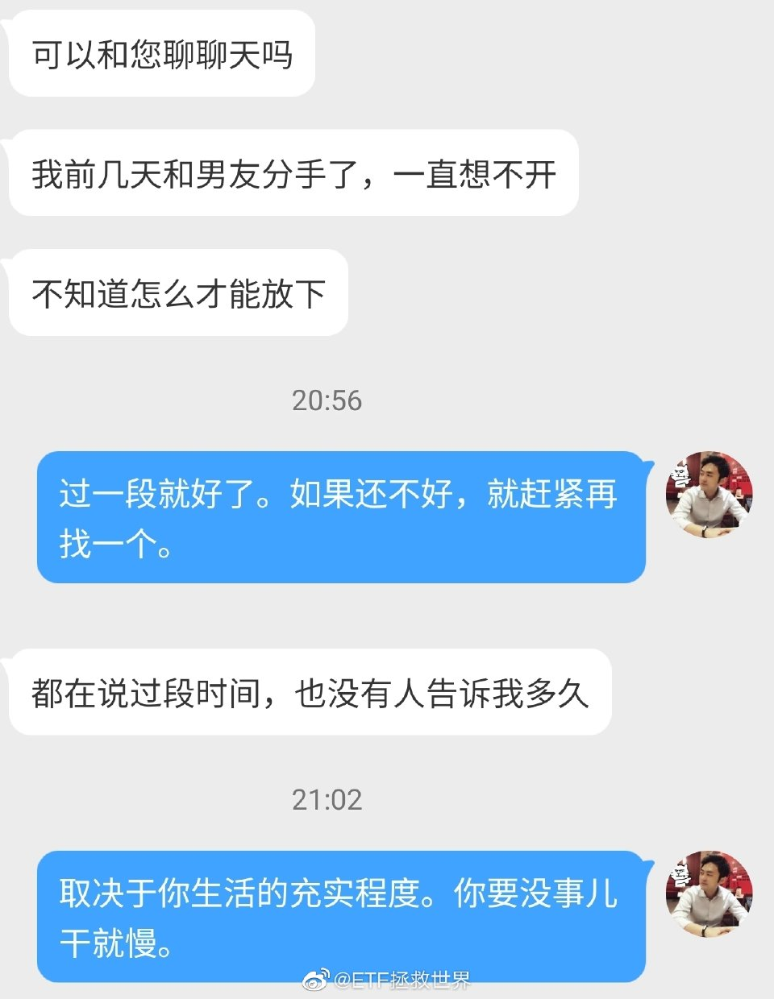

======================================================

ETF拯救世界 (5687069307) @
2020-02-22 21:27:01 Sat  
url: https://weibo.com/5687069307/IvpYnjJoZ

最近经常发一些跟投资无关的事，是有两个原因：

第一，希望你了解生活除了投资还有别的。

第二，希望在赚钱的时候不要太关注投资本身。太关注反倒有可能做错事，降低收益率。

低位买完了，拿着。最多条件单设置好自动运行波段提款继续降成本。然后转移注意力，等着以后收割。

调仓的事我来操心。可 ​​​

转发[60]  评论[849]  赞[3553] 

======================================================

ETF拯救世界 (5687069307) @
2020-02-23 11:50:44 Sun  
url: https://weibo.com/5687069307/IvvCXFEQf

100级达成。只是开始。 ​​​

转发[10]  评论[296]  赞[1426] 

+++++++++++++++++++++++++++++++++++++++++++++++++++++

图片：

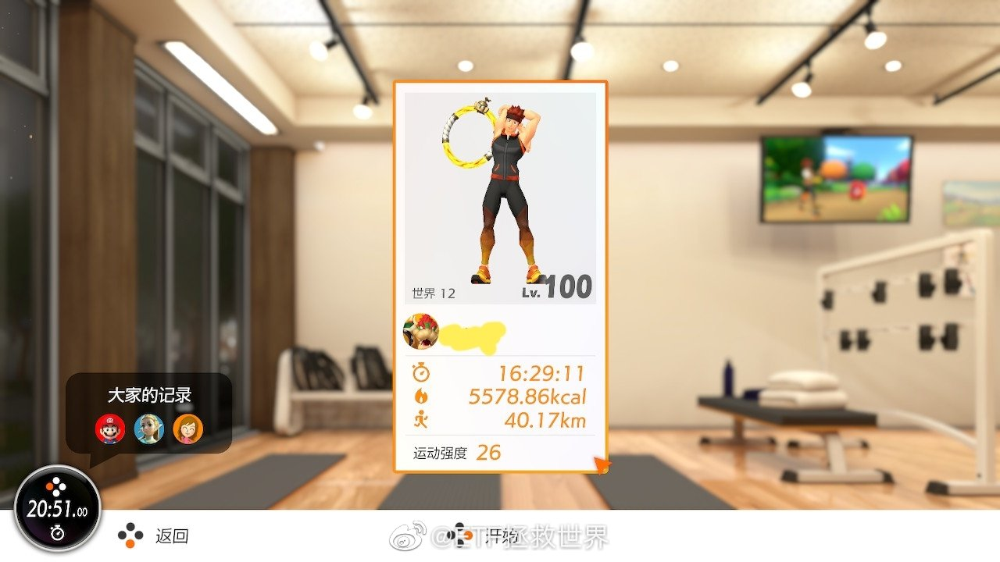
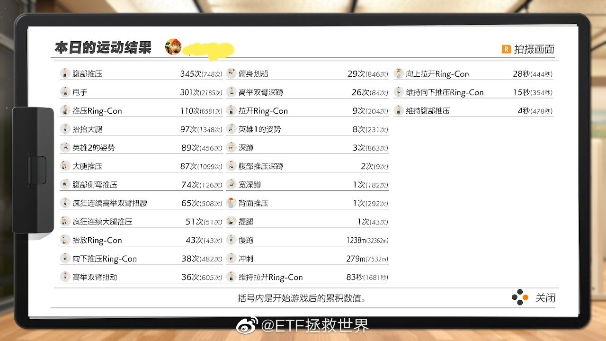

======================================================

ETF拯救世界 (5687069307) @
2020-02-24 09:19:11 Mon  
url: https://weibo.com/5687069307/IvE3WltBU

今天是不是该休息休息了，不能再涨了吧。 ​​​

转发[7]  评论[398]  赞[1387] 

======================================================

ETF拯救世界 (5687069307) @
2020-02-24 09:53:04 Mon  
url: https://weibo.com/5687069307/IvEhH9xAx

传媒上方压力线1605-1610 ​​​

转发[25]  评论[193]  赞[907] 

======================================================

ETF拯救世界 (5687069307) @
2020-02-24 11:36:29 Mon  
url: https://weibo.com/5687069307/IvEXG59os

为什么很多人感觉A股很难挣钱呢。

要知道，中证500过去15年有11年上涨，涨了600%。如果在2015年大牛市中看，收益率更可观。

这个指数基本上可以代表大多数股票的表现。

医药也是15年中11年上涨，涨幅1200%。

觉得A股挣钱难的，基本都是进场和出场的时间错了。

不是市场不行，是你不行。 ​​​

转发[248]  评论[413]  赞[1808] 

======================================================

ETF拯救世界 (5687069307) @
2020-02-24 12:01:25 Mon  
url: https://weibo.com/5687069307/IvF7Nq20I

回复@投资跑道上的一只小蜗牛:2005年底中证500估值23倍。本轮起点500估值19倍。仅做参考。

------------------------------------------------------
转推：
>  @ETF拯救世界 (5687069307)
>  2020-02-24 11:36:29 Mon  
>  url: https:/weibo.com/5687069307/IvEXG59os/

>  为什么很多人感觉A股很难挣钱呢。
>  
>  要知道，中证500过去15年有11年上涨，涨了600%。如果在2015年大牛市中看，收益率更可观。
>  
>  这个指数基本上可以代表大多数股票的表现。
>  
>  医药也是15年中11年上涨，涨幅1200%。
>  
>  觉得A股挣钱难的，基本都是进场和出场的时间错了。
>  
>  不是市场不行，是你不行。 ​​​

转发[33]  评论[83]  赞[656] 

======================================================

ETF拯救世界 (5687069307) @
2020-02-24 12:04:00 Mon  
url: https://weibo.com/5687069307/IvF8QqPY0

回复@Anonymous80626:这两个比较的话，当然是等权800更能代表A股真实走势。我讨论“A股”的时候，就一定是大多数股票的表现。

------------------------------------------------------
转推：
>  @ETF拯救世界 (5687069307)
>  2020-02-24 11:36:29 Mon  
>  url: https:/weibo.com/5687069307/IvEXG59os/

>  为什么很多人感觉A股很难挣钱呢。
>  
>  要知道，中证500过去15年有11年上涨，涨了600%。如果在2015年大牛市中看，收益率更可观。
>  
>  这个指数基本上可以代表大多数股票的表现。
>  
>  医药也是15年中11年上涨，涨幅1200%。
>  
>  觉得A股挣钱难的，基本都是进场和出场的时间错了。
>  
>  不是市场不行，是你不行。 ​​​

转发[15]  评论[79]  赞[552] 

======================================================

ETF拯救世界 (5687069307) @
2020-02-24 12:10:21 Mon  
url: https://weibo.com/5687069307/IvFbqjLRa

回复@约翰内夫:想追就追。如果货不够，过几天我们卖给你……//@约翰内夫:天呐，我想追创50了，买个两百块，能不能把它给奶下[允悲]，记录下:谨慎乐观，按计划继续申购一点点创业板基金与可转债基金

------------------------------------------------------
转推：
>  @ETF拯救世界 (5687069307)
>  2020-02-24 11:36:29 Mon  
>  url: https:/weibo.com/5687069307/IvEXG59os/

>  为什么很多人感觉A股很难挣钱呢。
>  
>  要知道，中证500过去15年有11年上涨，涨了600%。如果在2015年大牛市中看，收益率更可观。
>  
>  这个指数基本上可以代表大多数股票的表现。
>  
>  医药也是15年中11年上涨，涨幅1200%。
>  
>  觉得A股挣钱难的，基本都是进场和出场的时间错了。
>  
>  不是市场不行，是你不行。 ​​​

转发[11]  评论[217]  赞[858] 

======================================================

ETF拯救世界 (5687069307) @
2020-02-24 13:31:17 Mon  
url: https://weibo.com/5687069307/IvFIgyHOW

围在城里的人想逃出来，城外的人想冲进去。对婚姻也罢，创业板也罢，人生的愿望大都如此。 ​​​

转发[24]  评论[228]  赞[1361] 

======================================================

ETF拯救世界 (5687069307) @
2020-02-24 13:51:42 Mon  
url: https://weibo.com/5687069307/IvFQyo2Jp

回复@迦叶和阿难:我不是忘了，我是对你的每一分钱负责。我自己不会追，就不会发车。//@迦叶和阿难:益达是不是把s定投给忘了！[doge][doge]

------------------------------------------------------
转推：
>  @ETF拯救世界 (5687069307)
>  2020-02-24 13:31:17 Mon  
>  url: https:/weibo.com/5687069307/IvFIgyHOW/

>  围在城里的人想逃出来，城外的人想冲进去。对婚姻也罢，创业板也罢，人生的愿望大都如此。 ​​​

转发[5]  评论[131]  赞[867] 

======================================================

ETF拯救世界 (5687069307) @
2020-02-24 14:07:08 Mon  
url: https://weibo.com/5687069307/IvFWOEGVR

前两年500跑不过300，经常会有人对我提出灵魂拷问：

500ROE这么低，为什么要买？

今年500也好，1000也好，创业也好，表现远远好于300。我不是想讨论到底300好还是500好，我想说的是，投资不只是分析财务数据，从来都不是。

如果只看财务数据，你根本就不会懂为什么ROE只有10个点不到，PB接近7倍的创 ​​​

转发[146]  评论[280]  赞[1362] 

======================================================

ETF拯救世界 (5687069307) @
2020-02-24 14:16:39 Mon  
url: https://weibo.com/5687069307/IvG0GibPs

哪一种投资风格我都尊重。

我鄙视的是那种“除了自己的，其它所有投资风格投资方式都是辣鸡”的投资自闭症。 ​​​

转发[30]  评论[165]  赞[1213] 

======================================================

ETF拯救世界 (5687069307) @
2020-02-24 14:33:18 Mon  
url: https://weibo.com/5687069307/IvG7rAD0Z

回复@xvbalance:难受你就换仓啊。为什么会纠结呢？把仓位调整到舒服就这么难吗。//@xvbalance:要做到没有情绪确实太难，看到不涨的仓位嫌弃太多，看到长的嫌少，其实就是贪，虽然我知道但是还是会这样想，难呐！

------------------------------------------------------
转推：
>  @ETF拯救世界 (5687069307)
>  2020-02-24 14:07:08 Mon  
>  url: https:/weibo.com/5687069307/IvFWOEGVR/

>  前两年500跑不过300，经常会有人对我提出灵魂拷问：
>  
>  500ROE这么低，为什么要买？
>  
>  今年500也好，1000也好，创业也好，表现远远好于300。我不是想讨论到底300好还是500好，我想说的是，投资不只是分析财务数据，从来都不是。
>  
>  如果只看财务数据，你根本就不会懂为什么ROE只有10个点不到，PB接近7倍的创 ​​​

转发[12]  评论[63]  赞[541] 

======================================================

ETF拯救世界 (5687069307) @
2020-02-24 14:35:18 Mon  
url: https://weibo.com/5687069307/IvG8fz993

有人看着有些品种涨的好心里痒痒，恨自己为什么没买。

我就纳闷了，你买不就完了吗，谁也没拉着你的手啊。

真让他买，他也不敢。第二天又开始看着难受。

要我说，你那不是真爱人家，你是馋人家的身子了。 ​​​

转发[19]  评论[357]  赞[1373] 

======================================================

ETF拯救世界 (5687069307) @
2020-02-24 14:50:17 Mon  
url: https://weibo.com/5687069307/IvGekzkEU

你知道外围股市大跌有什么好处。

好处就是：

可以多开几个品种的网格了。

别急，开了我会说。 ​​​

转发[29]  评论[470]  赞[1446] 

======================================================

ETF拯救世界 (5687069307) @
2020-02-24 15:16:59 Mon  
url: https://weibo.com/5687069307/IvGpayxLu

回复@我是杜晓宇同学:想出就出，要出的漂亮。//@我是杜晓宇同学:e大，中证500可以出了吗，我感觉到去年的高位了。。

------------------------------------------------------
转推：
>  @ETF拯救世界 (5687069307)
>  2020-02-24 11:36:29 Mon  
>  url: https:/weibo.com/5687069307/IvEXG59os/

>  为什么很多人感觉A股很难挣钱呢。
>  
>  要知道，中证500过去15年有11年上涨，涨了600%。如果在2015年大牛市中看，收益率更可观。
>  
>  这个指数基本上可以代表大多数股票的表现。
>  
>  医药也是15年中11年上涨，涨幅1200%。
>  
>  觉得A股挣钱难的，基本都是进场和出场的时间错了。
>  
>  不是市场不行，是你不行。 ​​​

转发[2]  评论[128]  赞[736] 

======================================================

ETF拯救世界 (5687069307) @
2020-02-24 15:22:14 Mon  
url: https://weibo.com/5687069307/IvGriBZw6

以后不要再问：买不买这个呀，卖不卖那个呀。

第一。你要信自己，就问问自己的内心，是不是真想买或者真想卖。真的想，害怕踏空，害怕套牢，就去买卖。把仓位调整到最最舒服的情况。什么是舒服，就是涨30%，跌30%都很开心。

只要记住一点，成年人做事，不要后悔。做之前想好所有后果，能接受就去做。 ​​​

转发[89]  评论[401]  赞[1482] 

======================================================

ETF拯救世界 (5687069307) @
2020-02-24 15:24:36 Mon  
url: https://weibo.com/5687069307/IvGsgBfBS

NB

------------------------------------------------------
转推：
>  @21世纪经济报道 (1651428902)
>  2020-02-24 15:17:33 Mon  
>  url: https:/weibo.com/1651428902/IvGpp287b/

>  【武汉宣布：#放开离汉通道的通告无效#】武汉市新冠肺炎疫情防控指挥部发布的《关于加强进出武汉市车辆和人员管理的通告》（第17号），系市指挥部下设的交通防控组未经指挥部研究和主要领导同志同意发布的，现宣布该通告无效。http://t.cn/A6hDVcvY ​​​

转发[17]  评论[145]  赞[639] 

======================================================

ETF拯救世界 (5687069307) @
2020-02-24 15:52:03 Mon  
url: https://weibo.com/5687069307/IvGDpbIuh

看到这条我真的气坏了。怎么可以这样。

我要有个女儿，肯定放在手心里当宝贝。生气！ ​​​

转发[20]  评论[695]  赞[2085] 

+++++++++++++++++++++++++++++++++++++++++++++++++++++

图片：
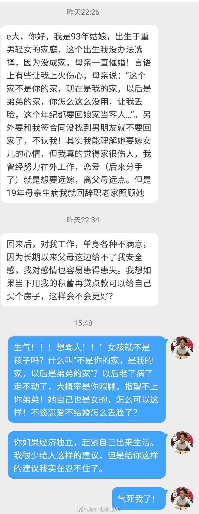

======================================================

ETF拯救世界 (5687069307) @
2020-02-24 16:17:39 Mon  
url: https://weibo.com/5687069307/IvGNNnI47

我回想了一下，在我的成长过程中，确实没见过“重男轻女”

我的家族里，除了一个来往极少的大爷家是一个男孩外，除了我其它亲戚都是女孩。从小在院里的邻居也大多数是女孩。无一例外，这些家庭全都把女孩当成宝贝养。

父母平常对她们有多好我就不说了。印象最深的是我一个亲戚，曾经说自己的女儿要嫁 ​​​

转发[51]  评论[533]  赞[1780] 

======================================================

ETF拯救世界 (5687069307) @
2020-02-24 16:51:18 Mon  
url: https://weibo.com/5687069307/IvH1sv2Dp

回复@小E达的花儿:在农业社会是能说得通的。因为儿子一般会留在身边，女儿嫁出去。这样养老就要靠儿子，所以重男轻女。另外，农村里如果你家儿子少，应该很容易被欺负。但现在已经是什么社会了，养老也基本上指不上孩子，靠的是社会养老。还有这种思想就不对了。

------------------------------------------------------
转推：
>  @ETF拯救世界 (5687069307)
>  2020-02-24 16:17:39 Mon  
>  url: https:/weibo.com/5687069307/IvGNNnI47/

>  我回想了一下，在我的成长过程中，确实没见过“重男轻女”
>  
>  我的家族里，除了一个来往极少的大爷家是一个男孩外，除了我其它亲戚都是女孩。从小在院里的邻居也大多数是女孩。无一例外，这些家庭全都把女孩当成宝贝养。
>  
>  父母平常对她们有多好我就不说了。印象最深的是我一个亲戚，曾经说自己的女儿要嫁 ​​​

转发[22]  评论[118]  赞[614] 

======================================================

ETF拯救世界 (5687069307) @
2020-02-24 17:08:00 Mon  
url: https://weibo.com/5687069307/IvH8f0sTY

回复@Ray被ETF拯救的灵魂:我觉得有些人亲情淡是因为牵扯太多利益。如果孩子不希望从父母那得到物质，父母不希望从孩子那索取物质，只谈感情，恐怕亲情会增加很多。//@Ray被ETF拯救的灵魂:社会越发展，亲情越淡薄，重男轻女自然少了，根本连婚都不想结！

------------------------------------------------------
转推：
>  @ETF拯救世界 (5687069307)
>  2020-02-24 16:17:39 Mon  
>  url: https:/weibo.com/5687069307/IvGNNnI47/

>  我回想了一下，在我的成长过程中，确实没见过“重男轻女”
>  
>  我的家族里，除了一个来往极少的大爷家是一个男孩外，除了我其它亲戚都是女孩。从小在院里的邻居也大多数是女孩。无一例外，这些家庭全都把女孩当成宝贝养。
>  
>  父母平常对她们有多好我就不说了。印象最深的是我一个亲戚，曾经说自己的女儿要嫁 ​​​

转发[11]  评论[91]  赞[631] 

======================================================

ETF拯救世界 (5687069307) @
2020-02-24 17:44:01 Mon  
url: https://weibo.com/5687069307/IvHmQF5Uh

警告：随时发车。 ​​​

转发[32]  评论[1346]  赞[2617] 

======================================================

ETF拯救世界 (5687069307) @
2020-02-24 18:36:54 Mon  
url: https://weibo.com/5687069307/IvHIkdHxn

喷了，原来是他。你说你有这么执着的精神，干什么不会成功啊老弟！

上次你喷到了券商大底，希望这次你功力没有减退！ ​​​

转发[13]  评论[400]  赞[1294] 

+++++++++++++++++++++++++++++++++++++++++++++++++++++

图片：

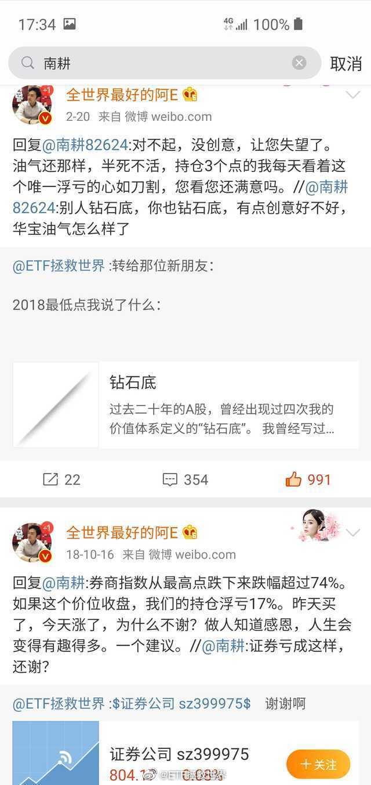
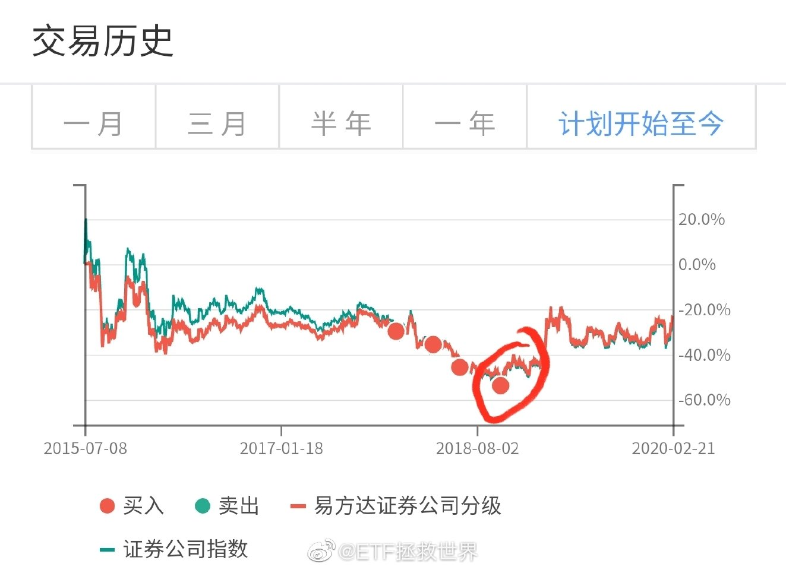

======================================================

ETF拯救世界 (5687069307) @
2020-02-24 23:50:18 Mon  
url: https://weibo.com/5687069307/IvJLwy8c5

明天如果暴跌，剧本和2.3可是不一样的。千万不可以生搬硬套。 ​​​

转发[63]  评论[487]  赞[1944] 

======================================================

ETF拯救世界 (5687069307) @
2020-02-25 08:17:55 Tue  
url: https://weibo.com/5687069307/IvN5zjjru

基本上近期高点收益率也就这样了。做好波动的心理准备。 ​​​

转发[96]  评论[332]  赞[1227] 

+++++++++++++++++++++++++++++++++++++++++++++++++++++

图片：
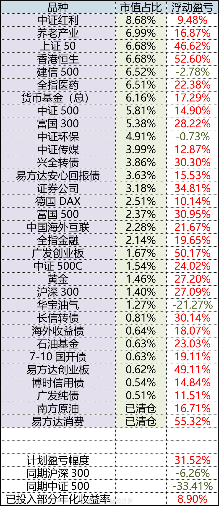

======================================================

ETF拯救世界 (5687069307) @
2020-02-25 08:24:53 Tue  
url: https://weibo.com/5687069307/IvN8oxsRq

回复@小城故事-201506:2.3卖出的人也是这么想的//@小城故事-201506:为什么不阶段性卖了，低位再买回来？减少损失

------------------------------------------------------
转推：
>  @ETF拯救世界 (5687069307)
>  2020-02-25 08:17:55 Tue  
>  url: https:/weibo.com/5687069307/IvN5zjjru/

>  基本上近期高点收益率也就这样了。做好波动的心理准备。 ​​​

转发[30]  评论[193]  赞[795] 

======================================================

ETF拯救世界 (5687069307) @
2020-02-25 09:00:52 Tue  
url: https://weibo.com/5687069307/IvNn0eAmS

这个逻辑没毛病吧。 ​​​

转发[7]  评论[286]  赞[1368] 

+++++++++++++++++++++++++++++++++++++++++++++++++++++

图片：
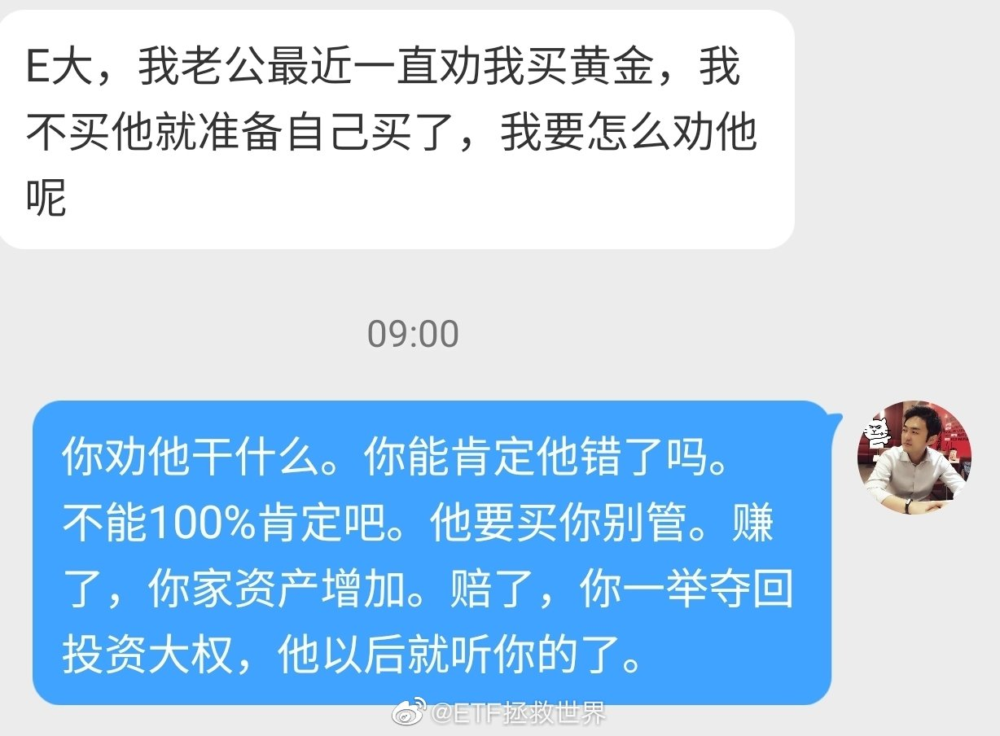

======================================================

ETF拯救世界 (5687069307) @
2020-02-25 09:14:27 Tue  
url: https://weibo.com/5687069307/IvNsw53u7

如果家里夫妻两个人无法决定让谁来理财，很简单。

第一年，每个人拿一半的钱。年底看收益率。谁的收益率高，第二年操盘60%，另一个人40%。（注意，要完全向对方公布投资细节）

第二年也是如此。赢的人增加10个百分点，输的人减少10个百分点。

从第五年开始（如果五年还没离），计算五年年化收益率。 ​​​

转发[163]  评论[514]  赞[1902] 

======================================================

ETF拯救世界 (5687069307) @
2020-02-25 09:32:51 Tue  
url: https://weibo.com/5687069307/IvNzZ7WDp

舒服。

条件单是伟大的创新。 ​​​

转发[10]  评论[443]  赞[1081] 

======================================================

ETF拯救世界 (5687069307) @
2020-02-25 09:53:26 Tue  
url: https://weibo.com/5687069307/IvNIl7Vma

您是不是得换一个焊工了。这来来回回的几十次了，手艺不行焊不死啊。

------------------------------------------------------
转推：
>  @ ()
>  2020-02-25 09:02:01 Tue  
>  url: 

>  抱歉，作者已设置仅展示半年内微博，此微博已不可见。 ​​​

转发[19]  评论[236]  赞[864] 

======================================================

ETF拯救世界 (5687069307) @
2020-02-25 09:57:48 Tue  
url: https://weibo.com/5687069307/IvNK75paE

纳尼，医药又快新高了。

奶一下，收了神通吧。 ​​​

转发[5]  评论[153]  赞[833] 

======================================================

ETF拯救世界 (5687069307) @
2020-02-25 10:07:28 Tue  
url: https://weibo.com/5687069307/IvNO2fBvj

你们不要总是黑大宵。

首先大宵的水平还可以。能够识别低估、高估区域，这已经比很多人强了。（尤其是部分经常和他互动的大V）

更重要的，我欣赏他的娱乐精神和表演天赋。这可太难得了。说实话，大部分时间非常好笑。精神紧绷的时候，看到他的视频和照片，起到缓解精神紧张的效果。

他的主要问题是 ​​​

转发[79]  评论[297]  赞[1062] 

======================================================

ETF拯救世界 (5687069307) @
2020-02-25 10:20:11 Tue  
url: https://weibo.com/5687069307/IvNTch73G

回复@肥硕的石头:他当然很聪明。各位看人聪明不聪明，有一个很重要的依据：幽默的人一定是聪明的。一定，100%。我说的是幽默，而不是尴尬搞笑。//@肥硕的石头:他不傻，反而很聪明。。

------------------------------------------------------
转推：
>  @ETF拯救世界 (5687069307)
>  2020-02-25 10:07:28 Tue  
>  url: https:/weibo.com/5687069307/IvNO2fBvj/

>  你们不要总是黑大宵。
>  
>  首先大宵的水平还可以。能够识别低估、高估区域，这已经比很多人强了。（尤其是部分经常和他互动的大V）
>  
>  更重要的，我欣赏他的娱乐精神和表演天赋。这可太难得了。说实话，大部分时间非常好笑。精神紧绷的时候，看到他的视频和照片，起到缓解精神紧张的效果。
>  
>  他的主要问题是 ​​​

转发[24]  评论[74]  赞[619] 

======================================================

ETF拯救世界 (5687069307) @
2020-02-25 10:23:16 Tue  
url: https://weibo.com/5687069307/IvNUrCJOT

我写了一篇卖出创业板的文章，等着趋势变差发出去。

结果这货每天新高。我那篇文章快烂在公众号素材库了。

跪了。 ​​​

转发[44]  评论[424]  赞[1170] 

======================================================

ETF拯救世界 (5687069307) @
2020-02-25 11:09:03 Tue  
url: https://weibo.com/5687069307/IvOd2lQsZ

这么给面子吗，谁盯着我微博呢，喷了

------------------------------------------------------
转推：
>  @ETF拯救世界 (5687069307)
>  2020-02-25 10:23:16 Tue  
>  url: https:/weibo.com/5687069307/IvNUrCJOT/

>  我写了一篇卖出创业板的文章，等着趋势变差发出去。
>  
>  结果这货每天新高。我那篇文章快烂在公众号素材库了。
>  
>  跪了。 ​​​

转发[5]  评论[426]  赞[911] 

======================================================

ETF拯救世界 (5687069307) @
2020-02-25 13:21:31 Tue  
url: https://weibo.com/5687069307/IvP4Nvv7H

新的条件单已经更新，可以查看 ​​​

转发[29]  评论[1016]  赞[1077] 

======================================================

ETF拯救世界 (5687069307) @
2020-02-25 14:00:20 Tue  
url: https://weibo.com/5687069307/IvPkyq8pi

场内账户里的资金，可以开通“余额理财”。白天可以交易，会在每天收盘后自动买货币基金，安全度很高，比放着现金收益率也高。现在年化2个多点。

这样，如果你一年能做一次上次的那种网格，一周时间5%，加上这个2个多点，这份资金的收益率也有7个多点了。

所以留够条件单需要的资金，只要一年内能做 ​​​

转发[119]  评论[516]  赞[1083] 

======================================================

ETF拯救世界 (5687069307) @
2020-02-25 14:34:02 Tue  
url: https://weibo.com/5687069307/IvPyevXc0

一个四个字的交易原则保证你没有卖在震荡最低位。

那四个字是： ​​​

转发[36]  评论[1093]  赞[930] 

======================================================

ETF拯救世界 (5687069307) @
2020-02-25 16:56:31 Tue  
url: https://weibo.com/5687069307/IvQu4gPYQ

虽然科技和创业板已经接近癫狂状态，但大多数股票其实真的不贵。

所以那些动不动就清仓走人的，我不太清楚到底在怕什么。可能你怕坐电梯。对，你卖了，没有坐电梯的风险了。但如果继续涨呢。好多年可能才有一波行情，赚一点就跑了，是不是有点可惜？

我说这话是有风险的。万一明天开始跌，喷子以后就 ​​​

转发[130]  评论[437]  赞[1345] 

======================================================

ETF拯救世界 (5687069307) @
2020-02-25 17:12:29 Tue  
url: https://weibo.com/5687069307/IvQAy8XBi

举个例子。中证红利，这几年表现一般，现在依然不是热点。然而现在是真心不贵。用最严格的估值标准看，也与2014年3月相同。

估值相同，然后全收益指数5年多涨了142%。如果放松一点估值标准，价格涨了142%，估值其实比那时候还下降了很多。

所以，只要不贵，中长期看赚钱的概率真的很大很大。没必要动 ​​​

转发[213]  评论[472]  赞[1143] 

======================================================

ETF拯救世界 (5687069307) @
2020-02-25 17:31:00 Tue  
url: https://weibo.com/5687069307/IvQI4atcw

说出来你可能不信。

很多人为涨的好的东西找理由。其实没那么复杂。

很简单，归根结底就是周期。有大盘股周期，有小盘股周期。有蓝筹周期，有科技周期，还有周期的周期。

大家预期一致了，手拉手往上干。干完了再找个理由制造个热点板块继续干。

风格转换，各领风骚数年。不能你天天吃饺子别人天天 ​​​

转发[221]  评论[351]  赞[1163] 

======================================================

ETF拯救世界 (5687069307) @
2020-02-25 18:32:06 Tue  
url: https://weibo.com/5687069307/IvR6RAMM4

知道为什么很多人觉得“满仓踏空”吗。

因为今年有100多只股票光彩夺目的翻番了。

然而将近一半股票是下跌的。

几千万今年赔钱的股民看着涨幅榜，除了“满仓踏空”，确实无话好说了…… ​​​

转发[63]  评论[132]  赞[830] 

======================================================

ETF拯救世界 (5687069307) @
2020-02-25 18:43:43 Tue  
url: https://weibo.com/5687069307/IvRbA7xbc

回复@幸福来临时12345:你知不知道2015年5月的时候，3月份追进去的人赚了多少钱？晒出来吓死你……//@幸福来临时12345:回复@放纵和骄傲:春节后第二周追涨科技股的，第三周继续涨也赚到了，看到一些网友晒单[污]

------------------------------------------------------
转推：
>  @ETF拯救世界 (5687069307)
>  2020-02-25 18:32:06 Tue  
>  url: https:/weibo.com/5687069307/IvR6RAMM4/

>  知道为什么很多人觉得“满仓踏空”吗。
>  
>  因为今年有100多只股票光彩夺目的翻番了。
>  
>  然而将近一半股票是下跌的。
>  
>  几千万今年赔钱的股民看着涨幅榜，除了“满仓踏空”，确实无话好说了…… ​​​

转发[26]  评论[79]  赞[507] 

======================================================

ETF拯救世界 (5687069307) @
2020-02-25 18:45:25 Tue  
url: https://weibo.com/5687069307/IvRchjcmW

在一个上涨市场中赚点钱，不算本事。一点点都不算。运气还是本事，你自己都不知道。

在崩溃前你能把赚的这点钱拿出来，才算是稍微有点合格。 ​​​

转发[109]  评论[215]  赞[1299] 

======================================================

ETF拯救世界 (5687069307) @
2020-02-25 18:54:35 Tue  
url: https://weibo.com/5687069307/IvRfZqCDq

回复@小弟政:别说信息技术了，广发医药5月份最高都翻番了。3-5月2个月最高涨了200%。//@小弟政:回复@CharlieCCCCC:信息技术159939的月线去看[偷笑]//@ETF拯救世界:回复@幸福来临时12345:你知不知道2015年5月的时候，3月份追进去的人赚了多少钱？晒出来吓死你……

------------------------------------------------------
转推：
>  @ETF拯救世界 (5687069307)
>  2020-02-25 18:32:06 Tue  
>  url: https:/weibo.com/5687069307/IvR6RAMM4/

>  知道为什么很多人觉得“满仓踏空”吗。
>  
>  因为今年有100多只股票光彩夺目的翻番了。
>  
>  然而将近一半股票是下跌的。
>  
>  几千万今年赔钱的股民看着涨幅榜，除了“满仓踏空”，确实无话好说了…… ​​​

转发[15]  评论[94]  赞[630] 

======================================================

ETF拯救世界 (5687069307) @
2020-02-25 19:36:51 Tue  
url: https://weibo.com/5687069307/IvRx9uwkx

今天又学会了豆角焖面，好吃的不得了。

什么玩意儿啊，什么时候能恢复正常啊。真要让我自学成才去当厨子吗。

不过想想，尝试一下不同的人生也挺好玩的吧。 ​​​

转发[7]  评论[482]  赞[1305] 

======================================================

ETF拯救世界 (5687069307) @
2020-02-26 08:15:46 Wed  
url: https://weibo.com/5687069307/IvWvc4DLR

瞎忙活半天，又白焊了。 ​​​

转发[10]  评论[265]  赞[842] 

======================================================

ETF拯救世界 (5687069307) @
2020-02-26 08:21:38 Wed  
url: https://weibo.com/5687069307/IvWxA7PHV

看看说的准不准。期待。

------------------------------------------------------
转推：
>  @ETF拯救世界 (5687069307)
>  2020-02-24 23:50:18 Mon  
>  url: https:/weibo.com/5687069307/IvJLwy8c5/

>  明天如果暴跌，剧本和2.3可是不一样的。千万不可以生搬硬套。 ​​​

转发[14]  评论[163]  赞[658] 

======================================================

ETF拯救世界 (5687069307) @
2020-02-26 08:31:03 Wed  
url: https://weibo.com/5687069307/IvWBp5KTr

回复@金色的甲虫:期待的是今天的走势和2.3之后那天不一样，昨天进去抄底和2.3结果不一样//@金色的甲虫:还期待个啥?你原文是24日发的，今天26日//@ETF拯救世界:看看说的准不准。期待。

------------------------------------------------------
转推：
>  @ETF拯救世界 (5687069307)
>  2020-02-24 23:50:18 Mon  
>  url: https:/weibo.com/5687069307/IvJLwy8c5/

>  明天如果暴跌，剧本和2.3可是不一样的。千万不可以生搬硬套。 ​​​

转发[6]  评论[159]  赞[532] 

======================================================

ETF拯救世界 (5687069307) @
2020-02-26 08:36:32 Wed  
url: https://weibo.com/5687069307/IvWDD4JCj

最好疫情早日结束。如果取消感觉日本和参赛运动员好可怜

------------------------------------------------------
转推：
>  @新浪财经 (1638782947)
>  2020-02-26 07:44:13 Wed  
>  url: https:/weibo.com/1638782947/IvWio6O6Q/

>  【投票：你认为东京奥运会该不该取消？[思考]】最新消息显示，#日本新冠肺炎病例累计确诊861例#。国际奥委会高级成员说，如果新冠疫情在5月下旬得不到控制，东京奥运会可能将被取消。有网友表示，不同意取消，对运动员伤害太大。也有网友说，安全第一，支持取消。#东京奥运会可能会取消#，你怎么看？  ​​​

转发[8]  评论[166]  赞[752] 

======================================================

ETF拯救世界 (5687069307) @
2020-02-26 09:00:01 Wed  
url: https://weibo.com/5687069307/IvWN9tmC5

不说这么多了。预测短期走势就是个乐子，交易还是要按照计划和策略。

首先，看看能不能有机会把车发了。

其次，确认布好的条件单没有问题，准备继续吃波动。

怎么走都可以，都有预案。 ​​​

转发[28]  评论[314]  赞[1132] 

======================================================

ETF拯救世界 (5687069307) @
2020-02-26 09:15:01 Wed  
url: https://weibo.com/5687069307/IvWTfrDqO

回复@站在空气稀薄地带:小助理：表格这样可以吗。我：不可以，要这样这样改。要做到最清楚明白简单，要让最小白的人也能看懂//@站在空气稀薄地带:条件单看不懂[允悲]  中国本科教育太差了[doge]

------------------------------------------------------
转推：
>  @ETF拯救世界 (5687069307)
>  2020-02-26 09:00:01 Wed  
>  url: https:/weibo.com/5687069307/IvWN9tmC5/

>  不说这么多了。预测短期走势就是个乐子，交易还是要按照计划和策略。
>  
>  首先，看看能不能有机会把车发了。
>  
>  其次，确认布好的条件单没有问题，准备继续吃波动。
>  
>  怎么走都可以，都有预案。 ​​​

转发[9]  评论[232]  赞[766] 

======================================================

ETF拯救世界 (5687069307) @
2020-02-26 09:53:52 Wed  
url: https://weibo.com/5687069307/IvX90CRNA

依然没有触发卖出条件。一个字，绝。

------------------------------------------------------
转推：
>  @ETF拯救世界 (5687069307)
>  2020-02-25 10:23:16 Tue  
>  url: https:/weibo.com/5687069307/IvNUrCJOT/

>  我写了一篇卖出创业板的文章，等着趋势变差发出去。
>  
>  结果这货每天新高。我那篇文章快烂在公众号素材库了。
>  
>  跪了。 ​​​

转发[11]  评论[269]  赞[1024] 

======================================================

ETF拯救世界 (5687069307) @
2020-02-26 10:47:39 Wed  
url: https://weibo.com/5687069307/IvXuQfKes

目前华宝油气场内溢价13%，网格操作也已经不再适合买入。暂停一下没有关系。

或者用其它溢价小的类似品种代替。但是这个要经过精确计算，一定要先算清楚涨跌幅再代替。 ​​​

转发[45]  评论[595]  赞[1289] 

======================================================

ETF拯救世界 (5687069307) @
2020-02-26 11:47:31 Wed  
url: https://weibo.com/5687069307/IvXT90d9U

微调一下。 ​​​

转发[6]  评论[656]  赞[1388] 

======================================================

ETF拯救世界 (5687069307) @
2020-02-26 12:08:08 Wed  
url: https://weibo.com/5687069307/IvY1w9W5l

买股票也好，基金也好，买之前，不应该先想赚钱了怎么花，而是应该先想好如果跌了怎么办。

想好跌了怎么办以后，再想涨了怎么办。

涨跌都想好了，有了对策了，涨多少跌多少自己该怎么做都有计划了，再买。

我不喜欢别人问我：“我的股票套了，怎么办”“我的基金赚钱了，卖不卖”。这些问题是买之前 ​​​

转发[143]  评论[400]  赞[1587] 

======================================================

ETF拯救世界 (5687069307) @
2020-02-26 12:30:02 Wed  
url: https://weibo.com/5687069307/IvYaoEGYT

不仅要每天创新高，大幅跑赢指数，还要保证没有一个品种浮亏，还要解释每一次操作，还要确保不能出现任何一次差价利润低于10%的波段。

会不会影响健康。 ​​​

转发[21]  评论[839]  赞[2606] 

======================================================

ETF拯救世界 (5687069307) @
2020-02-26 14:24:03 Wed  
url: https://weibo.com/5687069307/IvYUGamjz

所有交易，所有策略，所有投资，都有一个最重要的目标：

低买高卖。

这听起来是废话。但很多朋友其实做着做着就忘了这个目标。

只要你能低买高卖，就是成功的。无论你用什么理念去投资。

你所有的交易策略设计，也都要围绕这四个字。

能解决绝大多数交易都低买高卖，你基本就能活下去了。至于赚多 ​​​

转发[154]  评论[304]  赞[1243] 

======================================================

ETF拯救世界 (5687069307) @
2020-02-26 14:39:32 Wed  
url: https://weibo.com/5687069307/IvZ0XDpJn

两融余额1.1万亿，上次见到是2015年底。

钻石坑的时候是7000亿。

加了杠杆买什么？反正肯定不是买那些不涨的。这是加了杠杆打板的节奏。 ​​​

转发[97]  评论[215]  赞[1011] 

+++++++++++++++++++++++++++++++++++++++++++++++++++++

图片：
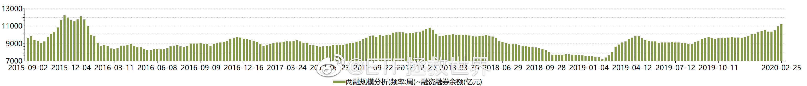

======================================================

ETF拯救世界 (5687069307) @
2020-02-26 14:44:42 Wed  
url: https://weibo.com/5687069307/IvZ34fOLv

能带走的人不多。

------------------------------------------------------
转推：
>  @ETF拯救世界 (5687069307)
>  2020-02-25 18:45:25 Tue  
>  url: https:/weibo.com/5687069307/IvRchjcmW/

>  在一个上涨市场中赚点钱，不算本事。一点点都不算。运气还是本事，你自己都不知道。
>  
>  在崩溃前你能把赚的这点钱拿出来，才算是稍微有点合格。 ​​​

转发[25]  评论[130]  赞[801] 

======================================================

ETF拯救世界 (5687069307) @
2020-02-26 14:53:24 Wed  
url: https://weibo.com/5687069307/IvZ6ABDZo

很多人觉得：

有什么带不走的？我的股票又没跌停，卖了不就带走了吗？

对。就跟去澳门一样，你赢钱了，拿着钱走了，再不回来，那当然没问题。

但你问问自己，能做到吗。还不是卖了以后看着觉得差不多稳了，一个回马枪杀回来准备抄底或者再吃一波，结果结结实实被按在里面了？

很少有人套在最高的山 ​​​

转发[108]  评论[352]  赞[1468] 

======================================================

ETF拯救世界 (5687069307) @
2020-02-26 15:15:29 Wed  
url: https://weibo.com/5687069307/IvZfyrBGg

回复@Acrab_jj:对，去年新高你后年也别卖好吗？以后我少说话，看你还能不能找到别的背锅侠。//@Acrab_jj:什么意思啊？ 不是说新高不卖吗？[笑cry]所以前两天新高没动啊！//@ETF拯救世界:能带走的人不多。

------------------------------------------------------
转推：
>  @ETF拯救世界 (5687069307)
>  2020-02-25 18:45:25 Tue  
>  url: https:/weibo.com/5687069307/IvRchjcmW/

>  在一个上涨市场中赚点钱，不算本事。一点点都不算。运气还是本事，你自己都不知道。
>  
>  在崩溃前你能把赚的这点钱拿出来，才算是稍微有点合格。 ​​​

转发[6]  评论[154]  赞[722] 

======================================================

ETF拯救世界 (5687069307) @
2020-02-26 15:18:33 Wed  
url: https://weibo.com/5687069307/IvZgNzuGn

我说的清清楚楚明明白白。“一个品种新高的当天，别卖。”你的新高管几个月还是几年？//@ETF拯救世界: 新高不卖是什么意思呢。买入看估值，卖出看趋势。如果因为一个东西稍微贵点你就慌着卖出，可能很难挣大钱。一个品种新高的当天，别卖。跌有底，涨起来是很难预测天花板的。不容易把握，以后慢慢说

------------------------------------------------------
转推：
>  @ETF拯救世界 (5687069307)
>  2020-02-19 13:06:40 Wed  
>  url: https:/weibo.com/5687069307/IuUpNd59x/

>  新高不卖。 ​​​

转发[81]  评论[171]  赞[893] 

======================================================

ETF拯救世界 (5687069307) @
2020-02-26 15:21:26 Wed  
url: https://weibo.com/5687069307/IvZhYeEPf

我再说一次，虽然我自认为说的话已经非常直白，怕你误会，也已经啰里啰嗦解释的非常清楚。但如果还是理解不了，请看操作。能公开的长线和波段操作都是公开的，操作就代表我最真实的意思。

太南了。 ​​​

转发[9]  评论[293]  赞[1438] 

======================================================

ETF拯救世界 (5687069307) @
2020-02-26 15:28:28 Wed  
url: https://weibo.com/5687069307/IvZkPe8UO

念叨着新高不卖四个字，你手里的品种收益率从1%、2%、10%、20%、40%，一直涨到了50%。

然后，因为在50%的新高没卖，收益率跌到了47%，你开始抱怨：

什么意思，不是说新高不卖吗。为什么跌了！本来我能卖在50%最高点的！

你当然能。不光你，所有人都觉得自己能卖在最高点。之所以没有，是因为听了小 ​​​

转发[99]  评论[789]  赞[2352] 

======================================================

ETF拯救世界 (5687069307) @
2020-02-26 15:42:45 Wed  
url: https://weibo.com/5687069307/IvZqCyeCq

回复@qingyanZ_:今天这架势，明天弄不好反弹呢。你可能塞翁失马也说不定……//@qingyanZ_:明天卖还来得及吗，今天看见的时候卖不出去了[泪]

------------------------------------------------------
转推：
>  @ETF拯救世界 (5687069307)
>  2020-02-26 15:28:28 Wed  
>  url: https:/weibo.com/5687069307/IvZkPe8UO/

>  念叨着新高不卖四个字，你手里的品种收益率从1%、2%、10%、20%、40%，一直涨到了50%。
>  
>  然后，因为在50%的新高没卖，收益率跌到了47%，你开始抱怨：
>  
>  什么意思，不是说新高不卖吗。为什么跌了！本来我能卖在50%最高点的！
>  
>  你当然能。不光你，所有人都觉得自己能卖在最高点。之所以没有，是因为听了小 ​​​

转发[12]  评论[281]  赞[1010] 

======================================================

ETF拯救世界 (5687069307) @
2020-02-26 16:59:50 Wed  
url: https://weibo.com/5687069307/IvZVUurZJ

DAX又干了2%…… ​​​

转发[3]  评论[294]  赞[937] 

======================================================

ETF拯救世界 (5687069307) @
2020-02-26 17:20:59 Wed  
url: https://weibo.com/5687069307/Iw04uCgJ8

看了今天的公众号留言，我有点后怕。幸亏计划里的油气只有1个多点的仓位。如果有10%，会是什么情况。

我其实现在有点怀疑自己了。一开始，我是想证明普通人通过理性的交易指数基金也可以在A股挣钱，仅此而已。

但现在我怀疑这个结论。我想，确实不是所有人都适合金融投资。真的。 ​​​

转发[51]  评论[1506]  赞[3890] 

======================================================

ETF拯救世界 (5687069307) @
2020-02-26 18:14:14 Wed  
url: https://weibo.com/5687069307/Iw0q70vEg

很多人并不懂为什么会有150这个计划出现。

很多年前，我就知道，你告诉一个人一个股票代码，即使那只股票最后涨了10倍，也不行。想要让那个人赚钱，你必须告诉他买入卖出的日期，买入卖出的价格。跌的时候要不断的给他打气，涨起来了要鼓励他拿住。

这样，那个人才可能在那只股票上赚10倍。否则，这 ​​​

转发[418]  评论[1882]  赞[5306] 

======================================================

ETF拯救世界 (5687069307) @
2020-02-26 19:39:28 Wed  
url: https://weibo.com/5687069307/Iw0YI1HWX

不瞒你说，离我很近[doge]

------------------------------------------------------
转推：
>  @ ()
>  2020-02-26 19:14:54 Wed  
>  url: 

>  抱歉，作者已设置仅展示半年内微博，此微博已不可见。 ​​​

转发[1]  评论[398]  赞[909] 

======================================================

ETF拯救世界 (5687069307) @
2020-02-26 20:15:23 Wed  
url: https://weibo.com/5687069307/Iw1dhy9qk

这么说今年欧洲杯悬了。[悲伤] ​​​

转发[7]  评论[234]  赞[1088] 

======================================================

ETF拯救世界 (5687069307) @
2020-02-26 22:32:18 Wed  
url: https://weibo.com/5687069307/Iw26RjSpK

我想了想，争取以后会慢慢开始少说点投资的事情。如果你关注我是因为投资，那取消关注也未尝不可。

其它的，有就说两句，没有就不说了。

少说话没什么不好。就是怕做不到，尽量吧。

最终目标是把发微博的量控制在每天300条以内。 ​​​

转发[11]  评论[1413]  赞[3680] 

======================================================

ETF拯救世界 (5687069307) @
2020-02-27 09:33:09 Thu  
url: https://weibo.com/5687069307/Iw6r6ctSS

159940不要现价买！净值1.031！

（9:35更新：做市商出现了，2%溢价消除。本条作废。） ​​​

转发[23]  评论[482]  赞[1367] 

======================================================

ETF拯救世界 (5687069307) @
2020-02-27 09:59:26 Thu  
url: https://weibo.com/5687069307/Iw6BM9e9U

这些新闻都是可以记录在资本市场回忆录里面的。

------------------------------------------------------
转推：
>  @财联社APP (2868676035)
>  2020-02-27 09:56:08 Thu  
>  url: https:/weibo.com/2868676035/Iw6AqvICI/

>  【电报|回调中科技类ETF份额继续增长】财联社2月27日讯，2月26日虽然科技股大幅回调，但是科技类ETF继续保持着份额增长态势。数据显示，华夏5GETF净申购18.13亿份，华夏芯片ETF净申购15.93亿份，平安新能车ETF净申购9.08亿份，广发国证半导体芯片ETF净申购6.26亿份。此外国联安中证半导体ETF、华宝科技 ​​​

转发[113]  评论[196]  赞[723] 

======================================================

ETF拯救世界 (5687069307) @
2020-02-27 10:08:48 Thu  
url: https://weibo.com/5687069307/Iw6FzzCT7

QDII 折溢价实时更新页面：

http://t.cn/A67AKrp7

注意折溢价。溢价过高就不要买，有溢价低的类似品种。 ​​​

转发[371]  评论[260]  赞[1016] 

======================================================

ETF拯救世界 (5687069307) @
2020-02-27 10:12:34 Thu  
url: https://weibo.com/5687069307/Iw6H6tU4f

回复@最近是努力kay:我不会再发表看法，只转发，发表一些客观存在的东西。同时，只在重要的时候做一些提醒。//@最近是努力kay:老大这是努力往300条靠拢啊，这节奏，太优秀了[太开心]

------------------------------------------------------
转推：
>  @ETF拯救世界 (5687069307)
>  2020-02-27 10:08:48 Thu  
>  url: https:/weibo.com/5687069307/Iw6FzzCT7/

>  QDII 折溢价实时更新页面：
>  
>  http://t.cn/A67AKrp7
>  
>  注意折溢价。溢价过高就不要买，有溢价低的类似品种。 ​​​

转发[33]  评论[217]  赞[1098] 

======================================================

ETF拯救世界 (5687069307) @
2020-02-27 10:24:23 Thu  
url: https://weibo.com/5687069307/Iw6LTsWmo

富国红利每份分红0.11元。

红利再投。 ​​​

转发[12]  评论[518]  赞[1625] 

======================================================

ETF拯救世界 (5687069307) @
2020-02-27 12:48:48 Thu  
url: https://weibo.com/5687069307/Iw7Iwhsos

头发自己用电推子推了。

上面用18mm限位梳，边上用1-6mm，后面让家人帮忙。

效果比想象的好很多，居然剪出来时尚的感觉，打上发泥和干胶，还有一点国际范儿。

这让我怀疑每次去找海洋总监剪头发花的128是不是没必要。 ​​​

转发[23]  评论[729]  赞[1805] 

======================================================

ETF拯救世界 (5687069307) @
2020-02-27 13:13:29 Thu  
url: https://weibo.com/5687069307/Iw7Sxa7zr

红利基金分红让我想到一件事。

其实如果你持有的基金或者股票，每年分红金额可以覆盖你的生活支出，那么一定意义上说，你就不需要做自己不喜欢做的工作了。

剩下的时间，选择一些自己喜欢做的事就会开心不少。 ​​​

转发[102]  评论[539]  赞[2105] 

======================================================

ETF拯救世界 (5687069307) @
2020-02-27 13:30:09 Thu  
url: https://weibo.com/5687069307/Iw7ZiqlXV

红利基金的分红时点也很有意思。拿富国红利来说，2008年成立，至今12年，分红8次。

分别是2010年0.245；2011年0.13；2012年0.026；2015年0.056；2016年0.35；2017年0.3；2018年0.188；2020年0.11

都是年初分红。记住，都是这些年度的年初。这个很重要。

你会发现，2009年、2013年、2014年、2019年初 ​​​

转发[677]  评论[653]  赞[2417] 

======================================================

ETF拯救世界 (5687069307) @
2020-02-27 14:09:12 Thu  
url: https://weibo.com/5687069307/Iw8f9fqGc

回复@一米阳光的田野:2013是大盘股的钻石坑，不是小盘股和全市场的。//@一米阳光的田野:2008年底钻石坑、2012年底钻石坑、2018年底钻石坑，2013年底算不算？

------------------------------------------------------
转推：
>  @ETF拯救世界 (5687069307)
>  2020-02-27 13:30:09 Thu  
>  url: https:/weibo.com/5687069307/Iw7ZiqlXV/

>  红利基金的分红时点也很有意思。拿富国红利来说，2008年成立，至今12年，分红8次。
>  
>  分别是2010年0.245；2011年0.13；2012年0.026；2015年0.056；2016年0.35；2017年0.3；2018年0.188；2020年0.11
>  
>  都是年初分红。记住，都是这些年度的年初。这个很重要。
>  
>  你会发现，2009年、2013年、2014年、2019年初 ​​​

转发[50]  评论[257]  赞[914] 

======================================================

ETF拯救世界 (5687069307) @
2020-02-28 01:11:39 Fri  
url: https://weibo.com/5687069307/IwcA2hYf5

意思不大 ​​​

转发[4]  评论[346]  赞[1264] 

======================================================

ETF拯救世界 (5687069307) @
2020-02-28 07:46:09 Fri  
url: https://weibo.com/5687069307/Iwfaaeq4O

前天卖一份500C和创业有人在评论质疑我涨的好好的为什么卖。

接下来看看会不会有人质疑我为什么只卖那么少。 ​​​

转发[13]  评论[434]  赞[1734] 

======================================================

ETF拯救世界 (5687069307) @
2020-02-28 08:00:24 Fri  
url: https://weibo.com/5687069307/IwffWD4bi

有空写篇文章说说为什么波动仓位这么做。

哎，算了，直接简单点说吧。

蒙的。 ​​​

转发[25]  评论[412]  赞[1625] 

+++++++++++++++++++++++++++++++++++++++++++++++++++++

图片：

======================================================

ETF拯救世界 (5687069307) @
2020-02-28 08:08:18 Fri  
url: https://weibo.com/5687069307/Iwfj9wyEi

我已经把买入标普500写在计划中，点位也已经确定，等着到。

美股未来十年不是赚一路上涨的钱，而是赚大幅区间波动的钱。2029年回头看，美股从去年起不会有多少涨幅，但是两三次大波动足够赚钱。

金融投资就这么大点事，没什么新鲜的。 ​​​

转发[177]  评论[677]  赞[2563] 

======================================================

ETF拯救世界 (5687069307) @
2020-02-28 09:30:32 Fri  
url: https://weibo.com/5687069307/IwfQxcPfH

未来科技股啊，芯片股啊跌的话，疫情啊，外围啊，最多最多占50%原因。

上百倍的估值才是致命的。

当然，你可千万别因为我的这条微博卖。过两天再涨你又要骂我，这也是为什么这一波疯狂中我不说话的原因。少说，少挨骂。

我只用自己的150行动告诉你我的看法。 ​​​

转发[55]  评论[274]  赞[1251] 

======================================================

ETF拯救世界 (5687069307) @
2020-02-28 09:38:10 Fri  
url: https://weibo.com/5687069307/IwfTDuA3S

回复@heartmate96:恒生挂条件单的话直接折价4%买入，一分钟爆赚4%。不知道哪位大神乌龙指给咱们送大礼。//@heartmate96:恒生呢 1.40 怎么样

------------------------------------------------------
转推：
>  @ ()
>  2020-02-28 09:33:58 Fri  
>  url: 

>  抱歉，此微博已被作者删除。查看帮助：http://t.cn/Rfd3rQV

转发[1]  评论[474]  赞[728] 

======================================================

ETF拯救世界 (5687069307) @
2020-02-28 09:43:32 Fri  
url: https://weibo.com/5687069307/IwfVOfHFR

震惊了，一个价位要吃多少遍？提醒：做压力测试。不要孤注一掷。 http://t.cn/A67bzaPb //@ETF拯救世界:波动是我们的朋友 http://t.cn/A6hRXDUK //@ETF拯救世界:是这样的 http://t.cn/A6PJiR6H //@ETF拯救世界:回复@ETF拯救世界:又买回来。 http://t.cn/A6PJJnMO //@ETF拯救世界:一个半月，又出一格。

------------------------------------------------------
转推：
>  @ETF拯救世界 (5687069307)
>  2019-11-12 23:54:13 Tue  
>  url: https:/weibo.com/5687069307/IfVltpGby/

>  最近三个月白银网格是这样的情况（顺序从下往上）
>  
>  等于筹码没丢，吃了两轮利润 ​​​

转发[43]  评论[366]  赞[740] 

======================================================

ETF拯救世界 (5687069307) @
2020-02-28 10:06:09 Fri  
url: https://weibo.com/5687069307/Iwg4ZpKd8

我看今天就这样吧。我还有个会，先走一步，你们再研究研究，下一步的工作抓紧落实。 ​​​

转发[4]  评论[627]  赞[1978] 

======================================================

ETF拯救世界 (5687069307) @
2020-02-28 14:52:48 Fri  
url: https://weibo.com/5687069307/IwhXlycMJ

神了。//@ETF拯救世界: 回复@ETF拯救了我:不仅合宜，十几年来，但凡有爆款出现都是至少阶段见顶。睿远的第一只公募是去年3月发行，然后……你懂了。这次我不知道。只是说历史。//@ETF拯救了我:公募基金大热，会不会又变成公墓？就像兴全合宜等几个基金募集前后发生的事情那样。

------------------------------------------------------
转推：
>  @财联社APP (2868676035)
>  2020-02-18 17:32:59 Tue  
>  url: https:/weibo.com/2868676035/IuMJoqAfm/

>  【电报|陈光明旗下新基全天认购约1200亿 创历史记录】财联社2月18日讯，记者从销售渠道获悉，睿远基金旗下第二只公募基金——睿远均衡价值基金全天认购金额约1200亿元，创下国内公募基金历史上最高认购记录。该基金拟募集金额60亿元，配售比例或不足6%。（财联社记者 韩理） ​​​

转发[95]  评论[253]  赞[986] 

======================================================

ETF拯救世界 (5687069307) @
2020-02-28 14:57:04 Fri  
url: https://weibo.com/5687069307/IwhZ4ut07

低位不买。市场涨了追最热的热门基金，被渠道忽悠去申购明星基金。

然后赔钱了，得出一个结论：

中国股市都是骗人的，赚不到钱。 ​​​

转发[74]  评论[549]  赞[1952] 

======================================================

ETF拯救世界 (5687069307) @
2020-02-28 15:16:56 Fri  
url: https://weibo.com/5687069307/Iwi78rYHG

来吧，等你好久了。 ​​​

转发[14]  评论[677]  赞[1477] 

+++++++++++++++++++++++++++++++++++++++++++++++++++++

图片：
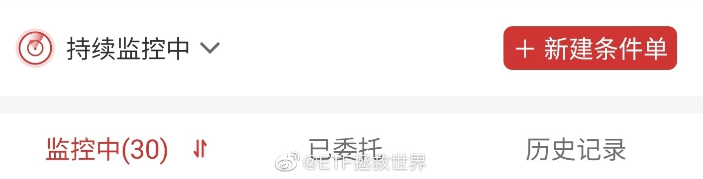

======================================================

ETF拯救世界 (5687069307) @
2020-02-28 22:49:04 Fri  
url: https://weibo.com/5687069307/Iwl4F2kyI

大波动的意思，就是最后你发现指数没怎么变化，你的钱多了好多…别忘了，现在才2月

------------------------------------------------------
转推：
>  @ETF拯救世界 (5687069307)
>  2020-01-02 10:46:21 Thu  
>  url: https:/weibo.com/5687069307/InAZ0ypgm/

>  今年是大波动这个判断是不是越来越靠谱了。
>  
>  如果全年大涨，就是又一个短命行情，明年又是万人坑。
>  
>  只有大幅波动才符合长牛慢牛的要求。 ​​​

转发[56]  评论[392]  赞[1276] 

======================================================

ETF拯救世界 (5687069307) @
2020-02-28 23:12:24 Fri  
url: https://weibo.com/5687069307/Iwle872AF

不瞒你说，一个礼拜的时间，美股两年大牛市白涨了。 ​​​

转发[90]  评论[389]  赞[1855] 

======================================================

ETF拯救世界 (5687069307) @
2020-02-28 23:29:19 Fri  
url: https://weibo.com/5687069307/IwlkZDP9j

回复@杰西卡奈落落落落落:再说一次，你等所有事情变好再买，已经涨到天上了。什么事情都好好的，凭什么你能买到便宜货？//@杰西卡奈落落落落落:回复@身边的憨笑君:国外下周要进入疫情爆发期了，我对他们的组织能力没有信心[失望]

------------------------------------------------------
转推：
>  @ETF拯救世界 (5687069307)
>  2020-02-28 23:12:24 Fri  
>  url: https:/weibo.com/5687069307/Iwle872AF/

>  不瞒你说，一个礼拜的时间，美股两年大牛市白涨了。 ​​​

转发[38]  评论[138]  赞[965] 

======================================================

ETF拯救世界 (5687069307) @
2020-02-28 23:33:07 Fri  
url: https://weibo.com/5687069307/IwlmxnV7e

不要盲目乐观，也不要太过忧虑。等到低位买点美国，欧洲，中国的指数基金，怕什么？

怕中美欧交易所同时消失吗。那样的话，你留着那些纸有什么用，什么也买不到了。赶紧再去玩玩This War of Mine学点技能吧。 ​​​

转发[50]  评论[320]  赞[1436] 

======================================================

ETF拯救世界 (5687069307) @
2020-02-28 23:44:37 Fri  
url: https://weibo.com/5687069307/IwlrdeESY

长见识了。再次提示，做好压力测试，极限跌幅60% http://t.cn/A675UfNN //@ETF拯救世界:震惊了，一个价位要吃多少遍？提醒：做压力测试。不要孤注一掷。 http://t.cn/A67bzaPb //@ETF拯救世界:波动是我们的朋友 http://t.cn/A6hRXDUK //@ETF拯救世界:是这样的 http://t.cn/A6PJiR6H 

------------------------------------------------------
转推：
>  @ETF拯救世界 (5687069307)
>  2019-11-12 23:54:13 Tue  
>  url: https:/weibo.com/5687069307/IfVltpGby/

>  最近三个月白银网格是这样的情况（顺序从下往上）
>  
>  等于筹码没丢，吃了两轮利润 ​​​

转发[27]  评论[342]  赞[697] 

======================================================

ETF拯救世界 (5687069307) @
2020-02-28 23:47:25 Fri  
url: https://weibo.com/5687069307/IwlslixZN

不建议关注我低于六个月的朋友参考我的长线计划和波段。

老朋友没事，大多数经历过钻石坑，都已经相对来说成熟了，我基本不用操心，除了一些财商负数的。

新朋友不好意思我不想再那么累了，所以不建议各位参考我的投资。警告你，会赔很多，所以别参考！ ​​​

转发[32]  评论[973]  赞[3852] 

======================================================

ETF拯救世界 (5687069307) @
2020-02-29 10:30:28 Sat  
url: https://weibo.com/5687069307/IwpFmeF3R

有些事情外人永远永远无法知道真相。

所有的猜测都是带有主观判断的猜测而已。

你喜欢他，就觉得他一定无辜。你讨厌他，就觉得他一定有问题。而且所有人都能找到很多证明自己正确的论据。

但其实真相永远是个谜。 ​​​

转发[49]  评论[348]  赞[1582] 

======================================================

ETF拯救世界 (5687069307) @
2020-02-29 12:00:40 Sat  
url: https://weibo.com/5687069307/IwqfYb68Q

昨天数据出来了，我反复观察认真思考，结论是这个位置我不会大幅减仓，即使还要大跌。因为我无法说服自己。

目前保守——激进投资者的仓位在60%-80%之间，极度激进到90%，极度保守到50%是比较合适的。

也就是说，再保守，也不应该低于半仓。 ​​​

转发[412]  评论[759]  赞[2559] 

======================================================

ETF拯救世界 (5687069307) @
2020-02-29 12:11:19 Sat  
url: https://weibo.com/5687069307/IwqkiaALG

回复@蓝莓小华夫Orz:你预计投入A股多少钱是分母，已经买了多少A股是分子。//@蓝莓小华夫Orz:回复@小夏万花筒:这个仓位百分比是怎么算的啊求解

------------------------------------------------------
转推：
>  @ETF拯救世界 (5687069307)
>  2020-02-29 12:00:40 Sat  
>  url: https:/weibo.com/5687069307/IwqfYb68Q/

>  昨天数据出来了，我反复观察认真思考，结论是这个位置我不会大幅减仓，即使还要大跌。因为我无法说服自己。
>  
>  目前保守——激进投资者的仓位在60%-80%之间，极度激进到90%，极度保守到50%是比较合适的。
>  
>  也就是说，再保守，也不应该低于半仓。 ​​​

转发[52]  评论[129]  赞[747] 

======================================================

ETF拯救世界 (5687069307) @
2020-02-29 12:31:35 Sat  
url: https://weibo.com/5687069307/IwqswtIca

回复@招财进宝的婧宝:每一个人，每一个家庭的风险偏好、年龄、职业全都不同，无法给一个标准答案。如果一定要给，就是一个字：“五年内不用的闲钱”//@招财进宝的婧宝:那除了固定资产外，家里的钱，几成投入股市比较合适呢。

------------------------------------------------------
转推：
>  @ETF拯救世界 (5687069307)
>  2020-02-29 12:00:40 Sat  
>  url: https:/weibo.com/5687069307/IwqfYb68Q/

>  昨天数据出来了，我反复观察认真思考，结论是这个位置我不会大幅减仓，即使还要大跌。因为我无法说服自己。
>  
>  目前保守——激进投资者的仓位在60%-80%之间，极度激进到90%，极度保守到50%是比较合适的。
>  
>  也就是说，再保守，也不应该低于半仓。 ​​​

转发[35]  评论[166]  赞[980] 

======================================================

ETF拯救世界 (5687069307) @
2020-02-29 12:37:06 Sat  
url: https://weibo.com/5687069307/IwquL5pNS

今天看到有人说，病毒起源于灯塔，去年底那边流感死一万多人其实很多都是新冠。但是没有检测出来——一直到现在都严格控制检测人数。然后不知道通过何种方式弄到了武汉，咱们这边及时发现公布了。

也有一些医学证据之类的。

竟然觉得也挺合理的，说明我也是一个容易被忽悠的人…… ​​​

转发[33]  评论[615]  赞[2122] 

======================================================

ETF拯救世界 (5687069307) @
2020-03-01 10:38:56 Sun  
url: https://weibo.com/5687069307/Iwz9i50HF

刚才那条删了，不是各位想的那件事。

说说另一件事。刚才看新闻，据说不让人肉搜索了。

两年前吧，有个人在微博评论骂我的家人。我第一次在网上愤怒了，五分钟内通过自己的渠道以及神通广大的网友搞清楚他的真实身份。

他怕了，马上私信我道歉。

这事老朋友应该有印象。

现在好了，喷子可以随意喷 ​​​

转发[22]  评论[680]  赞[1946] 

======================================================

ETF拯救世界 (5687069307) @
2020-03-02 10:30:13 Mon  
url: https://weibo.com/5687069307/IwIwfnaC9

这条不知道为什么发不出去，截图看看吧 ​​​

转发[253]  评论[873]  赞[2476] 

+++++++++++++++++++++++++++++++++++++++++++++++++++++

图片：
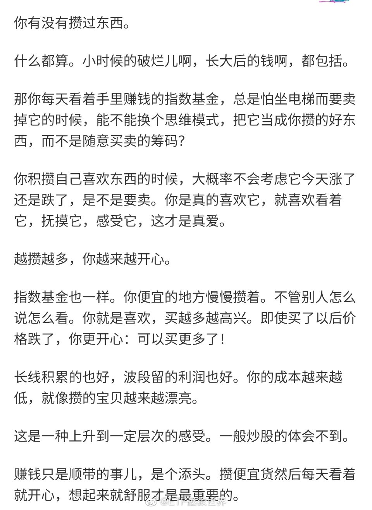

======================================================

ETF拯救世界 (5687069307) @
2020-03-02 10:39:06 Mon  
url: https://weibo.com/5687069307/IwIzR7Nnh

不瞒你说，买的金融已经快收复上周五的失地了，卖的创业板还很遥远。 ​​​

转发[10]  评论[504]  赞[1807] 

======================================================

ETF拯救世界 (5687069307) @
2020-03-02 13:55:27 Mon  
url: https://weibo.com/5687069307/IwJRyjdaW

只要你在大部分选择该向左还是向右的路口都没有选错，那么生活大概率是越来越好的。

就像大部分买卖都没错，账户资产就一定是越来越高。

所以最重要的是选择。选择又来源于世界观、性格，以及意志力。 ​​​

转发[108]  评论[569]  赞[2038] 

======================================================

ETF拯救世界 (5687069307) @
2020-03-02 15:54:32 Mon  
url: https://weibo.com/5687069307/IwKDTtV03

回复@左手跳舞的男人:我反对无脑“定投”//@左手跳舞的男人:最近定投的科技基猛跌，亏本了都，不想定投了，谁来给我点自信坚持下去。

------------------------------------------------------
转推：
>  @ETF拯救世界 (5687069307)
>  2020-03-02 10:30:13 Mon  
>  url: https:/weibo.com/5687069307/IwIwfnaC9/

>  这条不知道为什么发不出去，截图看看吧 ​​​

转发[32]  评论[247]  赞[1074] 

======================================================

ETF拯救世界 (5687069307) @
2020-03-02 16:04:28 Mon  
url: https://weibo.com/5687069307/IwKHVtP9P

巧了。

------------------------------------------------------
转推：
>  @ ()
>  2020-03-02 15:50:00 Mon  
>  url: 

>  抱歉，作者已设置仅展示半年内微博，此微博已不可见。 ​​​

转发[27]  评论[498]  赞[1473] 

======================================================

ETF拯救世界 (5687069307) @
2020-03-03 09:47:47 Tue  
url: https://weibo.com/5687069307/IwRFwl0nK

条件单触发后不成交收盘后就会失效，这个困扰不少朋友的问题，我第一时间发现并反映后，已经在专属版软件中升级修正了，我已经拿到测试版，非常好用。

以后只要不成交，无论是否被触发，条件单都会一直有效。真正做到设置一次，再也不操心。红缨枪升级到不卡壳的半自动步枪了。 ​​​

转发[37]  评论[774]  赞[2499] 

======================================================

ETF拯救世界 (5687069307) @
2020-03-03 10:01:12 Tue  
url: https://weibo.com/5687069307/IwRKY6LlC

关于仓位，还是这个区间。

------------------------------------------------------
转推：
>  @ETF拯救世界 (5687069307)
>  2020-02-29 12:00:40 Sat  
>  url: https:/weibo.com/5687069307/IwqfYb68Q/

>  昨天数据出来了，我反复观察认真思考，结论是这个位置我不会大幅减仓，即使还要大跌。因为我无法说服自己。
>  
>  目前保守——激进投资者的仓位在60%-80%之间，极度激进到90%，极度保守到50%是比较合适的。
>  
>  也就是说，再保守，也不应该低于半仓。 ​​​

转发[24]  评论[191]  赞[1005] 

======================================================

ETF拯救世界 (5687069307) @
2020-03-03 10:39:59 Tue  
url: https://weibo.com/5687069307/IwS0ImWBX

仓位实际上是一种概率。

你认为100%涨，就满仓。100%跌，就空仓。涨跌概率差不多，就半仓。70%会涨，就7成仓。

这个概率你应该通过估值，情绪，资金等状况分析得出。 ​​​

转发[241]  评论[417]  赞[1905] 

======================================================

ETF拯救世界 (5687069307) @
2020-03-03 10:54:07 Tue  
url: https://weibo.com/5687069307/IwS6rA6q9

创业板能不能突破前高是非常有趣的一个观察点。 ​​​

转发[24]  评论[485]  赞[1592] 

======================================================

ETF拯救世界 (5687069307) @
2020-03-03 19:38:03 Tue  
url: https://weibo.com/5687069307/IwVx7ixL2

如果谁家的粉丝把steam举报没了，我会黑他家偶像一万年。

不过话说，咱们是不是也得多点自信。那几个不存在的全球性大网站谣言多，不让上就算了。连游戏网站或者游戏服务器都要堵住是不是稍微有点过了。（PES2020一个足球游戏什么时候能解封？） ​​​

转发[16]  评论[424]  赞[2368] 

======================================================

ETF拯救世界 (5687069307) @
2020-03-03 20:11:12 Tue  
url: https://weibo.com/5687069307/IwVKzvG4O

喷了，dax30场内溢价接近6%。

场内QDII的折溢价真的是一个大问题。 ​​​

转发[27]  评论[259]  赞[1009] 

======================================================

ETF拯救世界 (5687069307) @
2020-03-03 20:24:04 Tue  
url: https://weibo.com/5687069307/IwVPN67Gw

红利目前的状态是：“怎么也不想卖，涨不涨都没关系”

创业板目前考虑的是：“什么时候清仓” ​​​

转发[63]  评论[337]  赞[1536] 

======================================================

ETF拯救世界 (5687069307) @
2020-03-03 21:08:17 Tue  
url: https://weibo.com/5687069307/IwW7JyKuu

今天看到一篇V的翻车贴，突然想到一个问题。特别神奇。老朋友有没有发现一个事实：

这几年，无缘无故怼我的那些V们，不是投资翻车就是自己出问题。或然率竟然高达95.78个巴仙！（剩下的4.22%大概正在翻车的路上）

相反，那些有事的时候帮我说话的V，竟然一个个风起云涌意气风发，投资也好，事业也好 ​​​

转发[63]  评论[714]  赞[3323] 

======================================================

ETF拯救世界 (5687069307) @
2020-03-03 21:33:52 Tue  
url: https://weibo.com/5687069307/IwWi7tapv

我有一个体会。

别人倒霉或者需要帮助的时候，你伸手帮一把。

没错，很多人不知道感恩，甚至有可能会有人恩将仇报。

但是没事，你不用在意那些人。你帮100个人，有20个人记得，其中10个一直惦记找机会报答你，准备滴水之恩涌泉相报，这就够了。你最终会受益。

这是不是听起来很功利，好像帮人就是 ​​​

转发[223]  评论[691]  赞[2979] 

======================================================

ETF拯救世界 (5687069307) @
2020-03-03 22:25:11 Tue  
url: https://weibo.com/5687069307/IwWCX4A9R

回复@qingqing55662015:救急不救穷。私人之间没有“借钱”这个说法。借出去了，你就得当成送出去了。所以送多少你要考虑好自己的情况。//@qingqing55662015:我怎么老碰到借钱不还，等我急着用钱又要不回来。还都是亲戚，心都凉了。

------------------------------------------------------
转推：
>  @ETF拯救世界 (5687069307)
>  2020-03-03 21:33:52 Tue  
>  url: https:/weibo.com/5687069307/IwWi7tapv/

>  我有一个体会。
>  
>  别人倒霉或者需要帮助的时候，你伸手帮一把。
>  
>  没错，很多人不知道感恩，甚至有可能会有人恩将仇报。
>  
>  但是没事，你不用在意那些人。你帮100个人，有20个人记得，其中10个一直惦记找机会报答你，准备滴水之恩涌泉相报，这就够了。你最终会受益。
>  
>  这是不是听起来很功利，好像帮人就是 ​​​

转发[39]  评论[261]  赞[1114] 

======================================================

ETF拯救世界 (5687069307) @
2020-03-04 10:43:55 Wed  
url: https://weibo.com/5687069307/Ix1sNDdGP

我对某些事件没有太多兴趣，不了解真相，所以不多说。

但是，如果你出事了，别人帮你作证，只是要求你别把自己的信息公开，结果你一转身把人家的身份证号，姓名，全都告知天下。

这，是什么性质的行为？

路转黑了。

另外，希望大家都能够就事论事。用不用某些品牌的手机，支不支持某个人，和爱不爱 ​​​

转发[35]  评论[453]  赞[1831] 

======================================================

ETF拯救世界 (5687069307) @
2020-03-04 11:18:50 Wed  
url: https://weibo.com/5687069307/Ix1GYr8kh

别人都跌，你金融这样尬涨，意思不大。 ​​​

转发[13]  评论[251]  赞[1271] 

======================================================

ETF拯救世界 (5687069307) @
2020-03-04 11:47:32 Wed  
url: https://weibo.com/5687069307/Ix1SCEcHq

2018年10月的判断。科技信息是牛市第一阶段。如果牛市继续，第二第三阶段将是金融和有色能源等周期股。//@ETF拯救世界: 回复@江河之走:下一次牛市是科技信息股领衔的牛市。//@江河之走:哪些指数为牛市利器?创业板?传媒?证券?信息?还有吗？//

------------------------------------------------------
转推：
>  @ETF拯救世界 (5687069307)
>  2018-10-22 09:33:12 Mon  
>  url: https:/weibo.com/5687069307/GF3EXvUVy/

>  $证券公司 sz399975$  15日加仓的券商引发舒适的感觉。 ​​​

转发[336]  评论[401]  赞[1207] 

======================================================

ETF拯救世界 (5687069307) @
2020-03-04 13:32:37 Wed  
url: https://weibo.com/5687069307/Ix2zhhj8T

芯片基金从1.1涨到1.4用了6个交易日。

从1.4跌到1.05也是6个交易日。

半个月，有人数钱离场，有人接盘站岗。 ​​​

转发[58]  评论[391]  赞[1684] 

======================================================

ETF拯救世界 (5687069307) @
2020-03-04 14:25:57 Wed  
url: https://weibo.com/5687069307/Ix2UVocM6

其实最近几个月申购科技基金的人，绝大多数没有什么投资信仰。如果说有，那就是一个：赚快钱。

所以当他们发现科技基金已经无法为他们赚快钱的时候，他们跑得比谁都快，因为没有信仰，不太会管自己买的东西到底值多少钱。

我不是说有投资信仰就高人一等。不是这个意思。我是说没有信仰的人其实很容易 ​​​

转发[66]  评论[424]  赞[1666] 

======================================================

ETF拯救世界 (5687069307) @
2020-03-04 14:33:22 Wed  
url: https://weibo.com/5687069307/Ix2XWaFeA

有些东西你拿着就是睡得很稳，不会担心太多，比如指数基金。

有些东西就不行，比如股票。

有些东西你想起来就开心，比如拿着的很便宜的指数基金。

有些东西就不行，想起来就糟心，不知道该卖还是继续拿着，比如很贵的指数基金。 ​​​

转发[75]  评论[598]  赞[2108] 

======================================================

ETF拯救世界 (5687069307) @
2020-03-04 15:09:06 Wed  
url: https://weibo.com/5687069307/Ix3crmyyA

回复@JYou-JasonKidd:别尬吹，都是蒙的。你还别不信，是真的蒙的。//@JYou-JasonKidd:e大您的调仓时机每次都让我觉得开了金手指一样，太稳了，您是不是王莽刘秀他们一伙的大魔导士，是你就眨眨眼[二哈][二哈][二哈]

------------------------------------------------------
转推：
>  @ETF拯救世界 (5687069307)
>  2018-10-22 09:33:12 Mon  
>  url: https:/weibo.com/5687069307/GF3EXvUVy/

>  $证券公司 sz399975$  15日加仓的券商引发舒适的感觉。 ​​​

转发[8]  评论[283]  赞[1118] 

======================================================

ETF拯救世界 (5687069307) @
2020-03-05 09:44:30 Thu  
url: https://weibo.com/5687069307/Ixavblgs2

有人在高呼焊死3000；有人在嘲笑；有人在骂；有人在哭。

你在想办法赚焊死—脱焊—焊死—脱焊…的钱。

这就是面对相同世界不同的反应，最终结局也就不同。 ​​​

转发[40]  评论[531]  赞[2020] 

======================================================

ETF拯救世界 (5687069307) @
2020-03-05 10:25:09 Thu  
url: https://weibo.com/5687069307/IxaLGjt7M

有两种问题不要再私信我了。

第一种是：

基金怎么买，买什么基金，什么叫etf。

我没有兴趣，没有精力，没有动力去做基金普及的工作。看我的东西，有一定金融知识基础，最好有几年交易经验的是最合适的。如果你没有，也不是不能看，前提是你先百度一下基础知识再来。

否则，取关我是最好的。我其实 ​​​

转发[30]  评论[531]  赞[1868] 

+++++++++++++++++++++++++++++++++++++++++++++++++++++

图片：

======================================================

ETF拯救世界 (5687069307) @
2020-03-05 10:42:07 Thu  
url: https://weibo.com/5687069307/IxaSzhbXK

辣鸡金融

$全指金融 sh000992$ ​​​

转发[11]  评论[256]  赞[1136] 

======================================================

ETF拯救世界 (5687069307) @
2020-03-05 10:51:12 Thu  
url: https://weibo.com/5687069307/IxaWfFMcW

神秘资金在跟车石锤了。 ​​​

转发[11]  评论[393]  赞[1640] 

======================================================

ETF拯救世界 (5687069307) @
2020-03-05 11:21:22 Thu  
url: https://weibo.com/5687069307/Ixb8v6xZ5

就第三轮计划未来的变化，有空会写一篇更详细的东西说说。 ​​​

转发[68]  评论[1002]  赞[3649] 

+++++++++++++++++++++++++++++++++++++++++++++++++++++

图片：
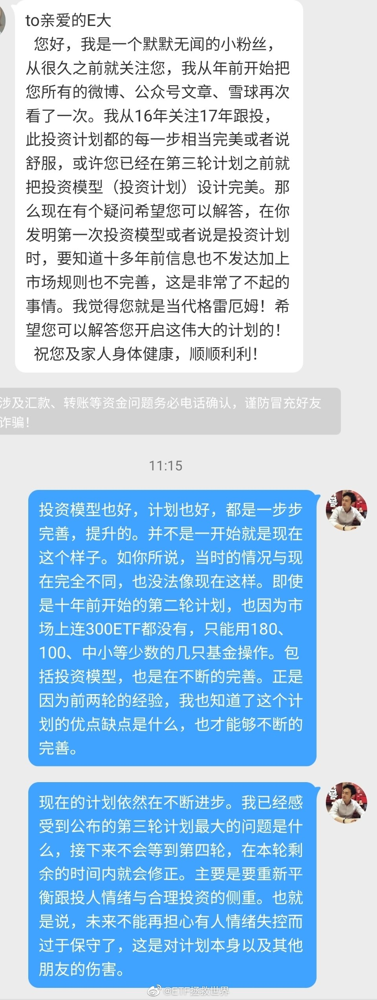

======================================================

ETF拯救世界 (5687069307) @
2020-03-05 11:33:29 Thu  
url: https://weibo.com/5687069307/Ixbdq3nWc

我劝你善良。

------------------------------------------------------
转推：
>  @ETF拯救世界 (5687069307)
>  2020-03-05 10:42:07 Thu  
>  url: https:/weibo.com/5687069307/IxaSzhbXK/

>  辣鸡金融
>  
>  $全指金融 sh000992$ ​​​

转发[5]  评论[178]  赞[982] 

======================================================

ETF拯救世界 (5687069307) @
2020-03-05 11:35:19 Thu  
url: https://weibo.com/5687069307/Ixbeas8rw

回复@狂狮爱不可:精神不正常不是高位截瘫。//@狂狮爱不可:回复@ETF拯救世界:你要是精神不正常，第四轮我去你家里给你端茶做饭。

------------------------------------------------------
转推：
>  @ETF拯救世界 (5687069307)
>  2020-03-05 11:21:22 Thu  
>  url: https:/weibo.com/5687069307/Ixb8v6xZ5/

>  就第三轮计划未来的变化，有空会写一篇更详细的东西说说。 ​​​

转发[18]  评论[407]  赞[1554] 

======================================================

ETF拯救世界 (5687069307) @
2020-03-05 13:17:33 Thu  
url: https://weibo.com/5687069307/IxbTF284Y

新高了没 ​​​

转发[9]  评论[628]  赞[1646] 

======================================================

ETF拯救世界 (5687069307) @
2020-03-05 14:13:39 Thu  
url: https://weibo.com/5687069307/Ixcgqxg7z

这次欧美有些国家的操作，如果发生在我们这里，已经被国内国外一起骂成筛子了。 ​​​

转发[27]  评论[265]  赞[2189] 

======================================================

ETF拯救世界 (5687069307) @
2020-03-05 14:22:06 Thu  
url: https://weibo.com/5687069307/IxcjRkvN1

很少有地方可以合理合法的利用别人的恐惧和贪婪赚钱。

股市就是其中一个。 ​​​

转发[85]  评论[344]  赞[2119] 

======================================================

ETF拯救世界 (5687069307) @
2020-03-05 16:13:41 Thu  
url: https://weibo.com/5687069307/Ixd39mHJW

今日数据：保守-激进投资者仓位55%-75%之间。极度激进85%，极度保守45%。

------------------------------------------------------
转推：
>  @ETF拯救世界 (5687069307)
>  2020-02-29 12:00:40 Sat  
>  url: https:/weibo.com/5687069307/IwqfYb68Q/

>  昨天数据出来了，我反复观察认真思考，结论是这个位置我不会大幅减仓，即使还要大跌。因为我无法说服自己。
>  
>  目前保守——激进投资者的仓位在60%-80%之间，极度激进到90%，极度保守到50%是比较合适的。
>  
>  也就是说，再保守，也不应该低于半仓。 ​​​

转发[54]  评论[490]  赞[1595] 

======================================================

ETF拯救世界 (5687069307) @
2020-03-05 19:42:40 Thu  
url: https://weibo.com/5687069307/IxepZ8RXz

关于仓位的问题，我说一下。

我每次说的统计完数据，建议仓位是多少多少，这只是从全市场估值方面得出的一个结论，并不是说一定要马上调整到这个仓位。

按照我的投资体系，这个仓位是一个“应有”仓位，然而应有并不是一定要马上就有，还要结合情绪，趋势等等因素。如果市场很强，仓位高了，可以稍微 ​​​

转发[235]  评论[635]  赞[2258] 

======================================================

ETF拯救世界 (5687069307) @
2020-03-06 09:37:00 Fri  
url: https://weibo.com/5687069307/IxjSDmLPM

叕新高了。

$全指医药 sh000991$ ​​​

转发[12]  评论[376]  赞[1267] 

======================================================

ETF拯救世界 (5687069307) @
2020-03-06 10:13:30 Fri  
url: https://weibo.com/5687069307/Ixk7s241h

中国互联网美妆销售第一人，只要不卖假货，挣这么多钱很合理。挣不到的没必要酸。

------------------------------------------------------
转推：
>  @ ()
>  2020-03-05 21:18:16 Thu  
>  url: 

>  抱歉，此微博已被作者删除。查看帮助：http://t.cn/Rfd3rQV

转发[65]  评论[470]  赞[2681] 

======================================================

ETF拯救世界 (5687069307) @
2020-03-06 10:27:06 Fri  
url: https://weibo.com/5687069307/IxkcYclYP

看着持仓里面涨幅很大的，拿的踏踏实实的品种，除了高兴，你应该问问自己，下次自己怎么才能坚持拿到赚这么多而不随意卖出。 ​​​

转发[39]  评论[827]  赞[2800] 

======================================================

ETF拯救世界 (5687069307) @
2020-03-06 21:49:23 Fri  
url: https://weibo.com/5687069307/IxoFUnjJQ

不知道这一波欧美能不能出现08危机12欧债那样的超级投资机会。 ​​​

转发[53]  评论[897]  赞[2954] 

======================================================

ETF拯救世界 (5687069307) @
2020-03-08 09:57:03 Sun  
url: https://weibo.com/5687069307/IxCRLpHGC

姑娘们领，男人领没有Jj ​​​

转发[2]  评论[346]  赞[1254] 

======================================================

ETF拯救世界 (5687069307) @
2020-03-08 10:00:32 Sun  
url: https://weibo.com/5687069307/IxCTbdYcd

姑娘们节日快乐！祝你们永远美丽，幸福！红包只能女性领，男人抢的没有JJ http://t.cn/A67DbDE0 ​​​

转发[25]  评论[1482]  赞[2359] 

======================================================

ETF拯救世界 (5687069307) @
2020-03-08 10:16:13 Sun  
url: https://weibo.com/5687069307/IxCZy0RQA

一个几块钱的红包就能让你测试一下自己的人格：

当没有人监督你的时候，为了得到利益，你是否会遵守规则？

是不是发现自己没有自以为的这么高尚。这些朋友能够掌握金钱和权力时，一定要好自为之啊。 ​​​

转发[18]  评论[594]  赞[1885] 

======================================================

ETF拯救世界 (5687069307) @
2020-03-08 18:26:06 Sun  
url: https://weibo.com/5687069307/IxGcocuUI

未来随时发车。如果时间紧的话就不会写文章了，直接发送文字。 ​​​

转发[35]  评论[1372]  赞[3229] 

======================================================

ETF拯救世界 (5687069307) @
2020-03-08 22:05:36 Sun  
url: https://weibo.com/5687069307/IxHDu7XAr

少看微博，看多了整个人会变得很丧。 ​​​

转发[17]  评论[566]  赞[1812] 

======================================================

ETF拯救世界 (5687069307) @
2020-03-09 08:40:36 Mon  
url: https://weibo.com/5687069307/IxLNejblU

今天要做点事了。不然对不起这个大时代。 ​​​

转发[50]  评论[1496]  赞[3771] 

======================================================

ETF拯救世界 (5687069307) @
2020-03-09 10:17:30 Mon  
url: https://weibo.com/5687069307/IxMqz2MHT

日元兑人民币汇率大涨，所以A股日经ETF跌幅收窄。 ​​​

转发[22]  评论[711]  赞[1847] 

======================================================

ETF拯救世界 (5687069307) @
2020-03-09 11:47:44 Mon  
url: https://weibo.com/5687069307/IxN1bC69v

车已发。不要问为什么买，为什么卖。我没兴趣没精力没意愿解释。 ​​​

转发[32]  评论[1076]  赞[2296] 

======================================================

ETF拯救世界 (5687069307) @
2020-03-09 12:05:33 Mon  
url: https://weibo.com/5687069307/IxN8q9Yhs

巴菲特当年重仓中石油H的价格除权应该在0.7-0.8之间。卖出价在7-8左右。

目前2.73。 ​​​

转发[59]  评论[189]  赞[1173] 

======================================================

ETF拯救世界 (5687069307) @
2020-03-09 12:11:24 Mon  
url: https://weibo.com/5687069307/IxNaNAxmn

回复@锅锅不是小火锅:没有，这跟发车没关系。我是想起来当年巴菲特中石油赚这么多，看看他的成本是多少。//@锅锅不是小火锅:所以E大还是忍不住解说了下～为了大家心里安稳跟车也是操碎了心

------------------------------------------------------
转推：
>  @ETF拯救世界 (5687069307)
>  2020-03-09 12:05:33 Mon  
>  url: https:/weibo.com/5687069307/IxN8q9Yhs/

>  巴菲特当年重仓中石油H的价格除权应该在0.7-0.8之间。卖出价在7-8左右。
>  
>  目前2.73。 ​​​

转发[14]  评论[72]  赞[784] 

======================================================

ETF拯救世界 (5687069307) @
2020-03-09 12:20:57 Mon  
url: https://weibo.com/5687069307/IxNeFw7HS

DAX大概在9000点左右的时候会配置完成。如果不到，就不完成。 ​​​

转发[97]  评论[346]  赞[1452] 

======================================================

ETF拯救世界 (5687069307) @
2020-03-09 12:27:12 Mon  
url: https://weibo.com/5687069307/IxNhd1UaK

回复@Kiwiwei19:早饭还没吃。跟打仗一样。//@Kiwiwei19:老大快吃饭去

------------------------------------------------------
转推：
>  @ETF拯救世界 (5687069307)
>  2020-03-09 12:20:57 Mon  
>  url: https:/weibo.com/5687069307/IxNeFw7HS/

>  DAX大概在9000点左右的时候会配置完成。如果不到，就不完成。 ​​​

转发[11]  评论[247]  赞[1062] 

======================================================

ETF拯救世界 (5687069307) @
2020-03-09 12:40:06 Mon  
url: https://weibo.com/5687069307/IxNmrsgla

再提示一下，今天的南方油不要场内买，目前大概已经溢价20%+了。除非今晚油价暴涨20%以上，否则场外申购就不会错。 ​​​

转发[37]  评论[677]  赞[1717] 

======================================================

ETF拯救世界 (5687069307) @
2020-03-09 13:48:11 Mon  
url: https://weibo.com/5687069307/IxNO52raL

网格表格已更新。 ​​​

转发[20]  评论[581]  赞[1408] 

======================================================

ETF拯救世界 (5687069307) @
2020-03-09 14:12:49 Mon  
url: https://weibo.com/5687069307/IxNY52Hel

今天只有一个愿望，晚上油价不要大幅反弹。 ​​​

转发[40]  评论[270]  赞[1389] 

======================================================

ETF拯救世界 (5687069307) @
2020-03-09 14:21:51 Mon  
url: https://weibo.com/5687069307/IxO1Kg9yj

我不懂啊，就问问。咱们能不能多买点30以下的原油，灌回大庆之类的油田留着以后用……会不会流走…… ​​​

转发[15]  评论[470]  赞[1792] 

======================================================

ETF拯救世界 (5687069307) @
2020-03-09 14:35:10 Mon  
url: https://weibo.com/5687069307/IxO79l0Ks

除了委内瑞拉，今年创业板涨幅全球第一。不仅正收益，还涨了将近20%。

所以我们先走一步了。 ​​​

转发[26]  评论[251]  赞[1780] 

======================================================

ETF拯救世界 (5687069307) @
2020-03-09 15:05:27 Mon  
url: https://weibo.com/5687069307/IxOjrnouV

跟大家说个最最极端的跌幅吧。

目前的A股全市场估值，大致与2008年6月相同。那之后上证到最低点又跌了39%。

再说一次，怕你阅读能力差，我再说一次。这不是我预计A股要跌40%，也不是我预计要发生jrwj。而是说08年那样的情况再发生一次的话，最差最差基本就是这个跌幅不会再差多少了。 ​​​

转发[169]  评论[697]  赞[1842] 

======================================================

ETF拯救世界 (5687069307) @
2020-03-09 15:15:30 Mon  
url: https://weibo.com/5687069307/IxOnwm3sY

本来我还想说芯片和半导体ETF十个交易日跌了30%。

后来一看原油一天就跌了30%。A股果然还是个弟弟啊。 ​​​

转发[38]  评论[278]  赞[1607] 

======================================================

ETF拯救世界 (5687069307) @
2020-03-09 15:37:25 Mon  
url: https://weibo.com/5687069307/IxOwpFNwP

这几个关键继续买入点位依然没变。分别是23000、21000、17000。//@ETF拯救世界:再给一个点位。如果真的搞大，让恒生崩到21000以下，是非常非常好的买入机会。我给个极限点位17000。万一真的到了，一把配满恒生指数，从那里算，不赚60个巴仙不再看。

------------------------------------------------------
转推：
>  @ETF拯救世界 (5687069307)
>  2019-08-26 10:08:35 Mon  
>  url: https:/weibo.com/5687069307/I3YBClttT/

>  预告一下。
>  
>  150会在23000以下买1-4份恒生。21000以下买4-10份。
>  
>  S会在23000以下持续买入。 ​​​

转发[284]  评论[405]  赞[1364] 

======================================================

ETF拯救世界 (5687069307) @
2020-03-09 16:05:26 Mon  
url: https://weibo.com/5687069307/IxOHN3onh

德国已经到了2012年11月以来最便宜。即将进入欧债危机底部区域。 ​​​

转发[106]  评论[350]  赞[1445] 

======================================================

ETF拯救世界 (5687069307) @
2020-03-09 16:17:47 Mon  
url: https://weibo.com/5687069307/IxOMNBCRv

各位目前经历的，是真正的资本市场大时代。级别大概是十年一次的。

没经历过之前87 97 08 的朋友，好好欣赏吧。

过一两年看现在，必将无限感慨。 ​​​

转发[356]  评论[817]  赞[3342] 

======================================================

ETF拯救世界 (5687069307) @
2020-03-09 16:19:10 Mon  
url: https://weibo.com/5687069307/IxONn4p7B

27-31，反弹15%了 [泪]

------------------------------------------------------
转推：
>  @ETF拯救世界 (5687069307)
>  2020-03-09 14:12:49 Mon  
>  url: https:/weibo.com/5687069307/IxNY52Hel/

>  今天只有一个愿望，晚上油价不要大幅反弹。 ​​​

转发[27]  评论[259]  赞[830] 

======================================================

ETF拯救世界 (5687069307) @
2020-03-09 16:41:49 Mon  
url: https://weibo.com/5687069307/IxOWytDPS

27-32,19%。辣鸡。//@ETF拯救世界:27-31，反弹15%了 [泪]

------------------------------------------------------
转推：
>  @ETF拯救世界 (5687069307)
>  2020-03-09 14:12:49 Mon  
>  url: https:/weibo.com/5687069307/IxNY52Hel/

>  今天只有一个愿望，晚上油价不要大幅反弹。 ​​​

转发[18]  评论[311]  赞[749] 

======================================================

ETF拯救世界 (5687069307) @
2020-03-09 17:40:35 Mon  
url: https://weibo.com/5687069307/IxPkq3VtJ

27-33，22%。闹呢。//@ETF拯救世界:27-32,19%。辣鸡。//@ETF拯救世界:27-31，反弹15%了 [泪]

------------------------------------------------------
转推：
>  @ETF拯救世界 (5687069307)
>  2020-03-09 14:12:49 Mon  
>  url: https:/weibo.com/5687069307/IxNY52Hel/

>  今天只有一个愿望，晚上油价不要大幅反弹。 ​​​

转发[10]  评论[275]  赞[732] 

======================================================

ETF拯救世界 (5687069307) @
2020-03-09 17:46:06 Mon  
url: https://weibo.com/5687069307/IxPmEkZ7E

查了一下，门票108。这点便宜没必要吧。

------------------------------------------------------
转推：
>  @ ()
>  2020-03-09 15:50:37 Mon  
>  url: 

>  该微博包含营销推广内容且未备案，根据《微博社区公约》的相关规定，该博文正在人工审核中。

转发[2]  评论[109]  赞[641] 

======================================================

ETF拯救世界 (5687069307) @
2020-03-09 17:58:55 Mon  
url: https://weibo.com/5687069307/IxPrRgrh4

回复@酣学者:如果是抢108的大米，你这么说我我认了。这是人挤人为了省108去逛景区。别说疫情了，就算没有疫情，为了省108门票钱，花几十块油钱然后这么挤着玩的舒服吗。//@酣学者:何不食肉糜//@ETF拯救世界:查了一下，门票108。这点便宜没必要吧。

------------------------------------------------------
转推：
>  @ ()
>  2020-03-09 15:50:37 Mon  
>  url: 

>  该微博包含营销推广内容且未备案，根据《微博社区公约》的相关规定，该博文正在人工审核中。

转发[0]  评论[95]  赞[755] 

======================================================

ETF拯救世界 (5687069307) @
2020-03-09 18:06:42 Mon  
url: https://weibo.com/5687069307/IxPv0C3C1

可能是个人性格原因吧。旅游，我最大的要求不是景色好，而是——

人少。

景色再好，人多我也绝对不去。去了也马上转头就走。

多少算多的不能忍受呢，大概就是人和人之间有1米以上距离吧。再近我就很不舒服了。

人生在世，最重要是舒服。不舒服的玩，感觉玩的没质量，不如在家呆着。 ​​​

转发[55]  评论[531]  赞[1761] 

======================================================

ETF拯救世界 (5687069307) @
2020-03-09 18:26:52 Mon  
url: https://weibo.com/5687069307/IxPDcx2CH

回复@CC咚呲哒呲:美股我测不出来。这个市场太诡异。//@CC咚呲哒呲:E大可以点评一下美股目测的最大跌幅吗

------------------------------------------------------
转推：
>  @ETF拯救世界 (5687069307)
>  2020-03-09 18:06:42 Mon  
>  url: https:/weibo.com/5687069307/IxPv0C3C1/

>  可能是个人性格原因吧。旅游，我最大的要求不是景色好，而是——
>  
>  人少。
>  
>  景色再好，人多我也绝对不去。去了也马上转头就走。
>  
>  多少算多的不能忍受呢，大概就是人和人之间有1米以上距离吧。再近我就很不舒服了。
>  
>  人生在世，最重要是舒服。不舒服的玩，感觉玩的没质量，不如在家呆着。 ​​​

转发[11]  评论[103]  赞[896] 

======================================================

ETF拯救世界 (5687069307) @
2020-03-09 18:39:01 Mon  
url: https://weibo.com/5687069307/IxPI86ojF

我们的十年国债收益率降至2.5%了。我记录的最低是2002年，到过2.1%。

国债目前除了避险属性，完全比不上投资好股票。 ​​​

转发[100]  评论[486]  赞[1848] 

======================================================

ETF拯救世界 (5687069307) @
2020-03-09 23:08:52 Mon  
url: https://weibo.com/5687069307/IxRtF65lC

明天看情况，如果合适，继续发车。 ​​​

转发[22]  评论[1151]  赞[3151] 

======================================================

ETF拯救世界 (5687069307) @
2020-03-10 09:55:41 Tue  
url: https://weibo.com/5687069307/IxVIcwP0w

欧美的数据还没更新，所以今天估计开不起来了。 ​​​

转发[9]  评论[517]  赞[1546] 

======================================================

ETF拯救世界 (5687069307) @
2020-03-10 10:13:14 Tue  
url: https://weibo.com/5687069307/IxVPkijTg

150的创业板绝大多数卖掉了，S清了。实际收益率40%-50%。

怎么说呢，如果之后继续涨，我也认了。最高已经到了65倍的创业板指，以后继续涨的这个钱我不配挣。 ​​​

转发[59]  评论[536]  赞[2271] 

======================================================

ETF拯救世界 (5687069307) @
2020-03-10 11:14:00 Tue  
url: https://weibo.com/5687069307/IxWdZv5Ic

中午收盘后，S先走一车。 ​​​

转发[14]  评论[832]  赞[1747] 

======================================================

ETF拯救世界 (5687069307) @
2020-03-10 11:36:06 Tue  
url: https://weibo.com/5687069307/IxWmXC2Uw

第一，双黄线。不过这个实际行车很难很难完全避免。第二，第一声喇叭不是“提醒”，而是“赶紧XX”。其实轻按一下提醒就行了。第三，第3、4声喇叭除了制造矛盾完全毫无意义。第四，报警了先罚你违章。第五，上传视频是因为不觉得自己错。

------------------------------------------------------
转推：
>  @ ()
>  2020-03-10 11:15:41 Tue  
>  url: 

>  抱歉，此微博已被作者删除。查看帮助：http://t.cn/Rfd3rQV

转发[25]  评论[179]  赞[714] 

======================================================

ETF拯救世界 (5687069307) @
2020-03-10 11:47:33 Tue  
url: https://weibo.com/5687069307/IxWrC2lvC

如果南油本身不掉链子，昨天那车已经浮盈7%。 ​​​

转发[17]  评论[487]  赞[1752] 

======================================================

ETF拯救世界 (5687069307) @
2020-03-10 11:51:54 Tue  
url: https://weibo.com/5687069307/IxWtnCfan

回复@大官渊铭:我在小区里开车，前面有人在机动车道上走我都不按喇叭，在后面慢慢跟着开。。。//@大官渊铭:不管女的对不对，第一声轻按就好，没必要跟野蛮人过不去，我们出去是办事，不为吵架

------------------------------------------------------
转推：
>  @ ()
>  2020-03-10 11:15:41 Tue  
>  url: 

>  抱歉，此微博已被作者删除。查看帮助：http://t.cn/Rfd3rQV

转发[10]  评论[212]  赞[647] 

======================================================

ETF拯救世界 (5687069307) @
2020-03-10 11:58:24 Tue  
url: https://weibo.com/5687069307/IxWw13JLd

我以前有一个同事，坐过一次他的车，除了在长安街上那段消停点，一路上喇叭就没断过。滴滴滴滴不停催骑车的走路的。我说你这么按人家不好，他说，怎么了，是不是他们仇富。

还是跟这位同事和其他几位去餐厅吃饭。不停的催服务员赶紧上菜，态度还特别特别不好。我心说，你们不怕服务员端菜的路上给你往 ​​​

转发[28]  评论[488]  赞[2330] 

======================================================

ETF拯救世界 (5687069307) @
2020-03-10 12:24:38 Tue  
url: https://weibo.com/5687069307/IxWGFc3yg

条件单继续提升。

近日又提了一个需求。

目前条件单是根据当天第一笔成交判断是否触发。这样容易造成挂单慢，无法成交。争取接下来根据9:25的集合竞价价格来判断是否触发，争取在开盘前单子就挂上，提高成交概率。

这个行不行。 ​​​

转发[26]  评论[816]  赞[2354] 

======================================================

ETF拯救世界 (5687069307) @
2020-03-10 14:37:13 Tue  
url: https://weibo.com/5687069307/IxXytAsKE

意思不大，散了吧。 ​​​

转发[5]  评论[668]  赞[2381] 

======================================================

ETF拯救世界 (5687069307) @
2020-03-10 22:12:54 Tue  
url: https://weibo.com/5687069307/Iy0xrjjSF

南油果然掉链子了。昨天油价跌27%，净值只下降了17%。那今天的反弹也大概率跟不上了。

我考虑了一下，这个也有我们的原因。规模不大，申购比较多。 ​​​

转发[26]  评论[438]  赞[1604] 

======================================================

ETF拯救世界 (5687069307) @
2020-03-10 22:35:33 Tue  
url: https://weibo.com/5687069307/Iy0GDjoQk

大概解释一下，是这样的。

指数基金一般都能跟上指数涨跌幅。南油我们也跟踪了好久，一直在观察短中长期跟踪效果，不能完全精准，但总体还可以。

昨天油价跌27%，基金净值跌17%，我估计，主要原因还是申购的资金太多了。一方面是我们申购，一方面还有套利的。

如果本身基金规模是3亿，其中2.95亿都 ​​​

转发[122]  评论[568]  赞[2308] 

======================================================

ETF拯救世界 (5687069307) @
2020-03-10 23:59:56 Tue  
url: https://weibo.com/5687069307/Iy1eTj0Q3

美股现价是一个十年强支撑。如果撑不住，十年上升趋势打破。

还是之前说过很多次的，我认为未来几年美股是波动市，不会有大的涨幅。2028-2029回头看，点位基本与现在差不太多。但是波动会很大，低位买入收益率还是会有保障的。 ​​​

转发[169]  评论[372]  赞[1989] 

======================================================

ETF拯救世界 (5687069307) @
2020-03-11 08:28:16 Wed  
url: https://weibo.com/5687069307/Iy4zdsAHC

昨天这个微博基本是美股最低点发的。发完了就拉起来。因为那真的是一个强支撑

------------------------------------------------------
转推：
>  @ETF拯救世界 (5687069307)
>  2020-03-10 23:59:56 Tue  
>  url: https:/weibo.com/5687069307/Iy1eTj0Q3/

>  美股现价是一个十年强支撑。如果撑不住，十年上升趋势打破。
>  
>  还是之前说过很多次的，我认为未来几年美股是波动市，不会有大的涨幅。2028-2029回头看，点位基本与现在差不太多。但是波动会很大，低位买入收益率还是会有保障的。 ​​​

转发[38]  评论[372]  赞[1767] 

======================================================

ETF拯救世界 (5687069307) @
2020-03-11 10:35:18 Wed  
url: https://weibo.com/5687069307/Iy5oMroPi

目前油气场内溢价30%。最好不要买溢价这么高的东西。 ​​​

转发[26]  评论[464]  赞[1505] 

======================================================

ETF拯救世界 (5687069307) @
2020-03-11 11:32:24 Wed  
url: https://weibo.com/5687069307/Iy5LXmUDP

150福特换奔驰。 ​​​

转发[14]  评论[664]  赞[1602] 

======================================================

ETF拯救世界 (5687069307) @
2020-03-11 11:41:25 Wed  
url: https://weibo.com/5687069307/Iy5PCluNw

我们的媒体采访，包括来国内开会的各种国外专家，都会说这些面儿上的，我们爱听的话。他们的真实想法，得听他们回去跟他们的媒体怎么说。

------------------------------------------------------
转推：
>  @央视新闻 (2656274875)
>  2020-03-11 11:35:20 Wed  
>  url: https:/weibo.com/2656274875/Iy5N9i0Wx/

>  【#意大利卫生部官员感谢中方树立榜样#】当地时间9日晚，中国多位专家会同世卫组织与意大利卫生部进行视频会议，介绍疫情防控经验。会后，意大利卫生部副部长表示，中国最先应对了新冠肺炎疫情，其抗击疫情的经验对世界来说非常重要。感谢中国，让我们迅速获知疫情信息、为我们树立了抗击疫情的榜样。 ​​​

转发[51]  评论[115]  赞[1940] 

======================================================

ETF拯救世界 (5687069307) @
2020-03-11 11:45:06 Wed  
url: https://weibo.com/5687069307/Iy5R77T7f

回复@彩云朵朵cll:智商情商都是负值的才会到别人家做客的时候说别人不好，说别人家刚生的孩子难看。当然，我这里倒是经常见到这样的人。//@彩云朵朵cll:我们是外人，人家回去跟内人才会说心里话的

------------------------------------------------------
转推：
>  @央视新闻 (2656274875)
>  2020-03-11 11:35:20 Wed  
>  url: https:/weibo.com/2656274875/Iy5N9i0Wx/

>  【#意大利卫生部官员感谢中方树立榜样#】当地时间9日晚，中国多位专家会同世卫组织与意大利卫生部进行视频会议，介绍疫情防控经验。会后，意大利卫生部副部长表示，中国最先应对了新冠肺炎疫情，其抗击疫情的经验对世界来说非常重要。感谢中国，让我们迅速获知疫情信息、为我们树立了抗击疫情的榜样。 ​​​

转发[15]  评论[73]  赞[609] 

======================================================

ETF拯救世界 (5687069307) @
2020-03-11 11:52:47 Wed  
url: https://weibo.com/5687069307/Iy5UemBcg

欧洲最大仓位给5%-10%。目前3%多一点，还有很大加仓空间。不急，看看历史性的钻石坑能不能砸出来。 ​​​

转发[71]  评论[666]  赞[2273] 

======================================================

ETF拯救世界 (5687069307) @
2020-03-11 12:58:12 Wed  
url: https://weibo.com/5687069307/Iy6kMvWCT

刚看到有朋友说，有人到处散发发车信息，尤其是在一些大平台上。

这就是公开计划的问题之一。按理说投资应该静悄悄的，尤其是买入的时候，根本不应该让人知道你买什么。

当然，基金比股票好很多。基金只会影响短期，长期还是会跟净值走。但是短期也受不了，尤其是现在QDII纷纷限购，弄大了以后谁都买 ​​​

转发[32]  评论[1183]  赞[3891] 

======================================================

ETF拯救世界 (5687069307) @
2020-03-11 13:37:52 Wed  
url: https://weibo.com/5687069307/Iy6AT3gve

两条场内交易信息：

第一，条件单新版已上线应用商店，可以更新。触发后不成交，条件单持续有效。

第二，场内LOF申购降至一折，套利成本更低。 ​​​

转发[51]  评论[476]  赞[1826] 

======================================================

ETF拯救世界 (5687069307) @
2020-03-11 13:41:57 Wed  
url: https://weibo.com/5687069307/Iy6CxzAG0

S买标普500而150不买的逻辑在于，S是无限现金流，跌幅大一些可以承受。

150资金有限，需要更合适的入场时机。 ​​​

转发[62]  评论[483]  赞[1914] 

======================================================

ETF拯救世界 (5687069307) @
2020-03-11 16:07:33 Wed  
url: https://weibo.com/5687069307/Iy7zEfyJ6

什么玩意儿。买什么什么反弹。 ​​​

转发[6]  评论[478]  赞[1737] 

======================================================

ETF拯救世界 (5687069307) @
2020-03-11 16:36:46 Wed  
url: https://weibo.com/5687069307/Iy7Lv9FDK

危机可怕不可怕。

非常可怕。

资产价格会大幅下跌。

但有一个有意思的问题不知道你是不是注意过。

在危机中买入，即使没有买在最低，几年后也赚好多。

回头看，危机都是好的投资机会。

当然，两个需要注意的。

第一，别上杠杆

第二，注意买入节奏 ​​​

转发[220]  评论[831]  赞[3086] 

======================================================

ETF拯救世界 (5687069307) @
2020-03-11 17:10:21 Wed  
url: https://weibo.com/5687069307/Iy7Z8dXlH

这几车之所以只发文字，不写文章，原因很简单：

BGM库存没了。 ​​​

转发[16]  评论[951]  赞[3105] 

======================================================

ETF拯救世界 (5687069307) @
2020-03-12 08:02:17 Thu  
url: https://weibo.com/5687069307/IydPaqCbn

四年多计划一分钱美股没买，这是真的要给买入机会了吗。[亲亲] ​​​

转发[26]  评论[884]  赞[3295] 

======================================================

ETF拯救世界 (5687069307) @
2020-03-12 09:55:19 Thu  
url: https://weibo.com/5687069307/Iyez36nSg

目前华宝油气场内溢价33%。场内持有油气的朋友，可以考虑卖出，然后场内申购（注意，不是场内购买，而是场内申购）160416石油基金跨品种套利。

两者虽然不是同一个品种，但高达30%以上的空间是值得做的。

注意，场内你卖了多少钱的油气，也要申购多少钱的石油基金。比如场内卖了10万，马上回头申购10 ​​​

转发[15]  评论[1554]  赞[2905] 

======================================================

ETF拯救世界 (5687069307) @
2020-03-12 10:08:35 Thu  
url: https://weibo.com/5687069307/IyeEqFHUx

去年8月定的第一目标位23000即将达到。23000以下的恒生进入可投资区域。在第二目标位21000，一直没有但是想买的朋友可以补仓一部分。17000是jrwj级别的大底。配满仓位。

------------------------------------------------------
转推：
>  @ETF拯救世界 (5687069307)
>  2019-08-26 10:08:35 Mon  
>  url: https:/weibo.com/5687069307/I3YBClttT/

>  预告一下。
>  
>  150会在23000以下买1-4份恒生。21000以下买4-10份。
>  
>  S会在23000以下持续买入。 ​​​

转发[299]  评论[607]  赞[1955] 

======================================================

ETF拯救世界 (5687069307) @
2020-03-12 10:56:37 Thu  
url: https://weibo.com/5687069307/IyeXVx3zt

本来有些投资机会是不应该大声说出来的。太多人参与，真正的一些相关好的投资机会也就没了。

只是心里确实想帮大家，内心抉择很久，还是选择了说一声。

越来越感觉这样的模式是不可以持久的。问题很多。 ​​​

转发[34]  评论[2058]  赞[6148] 

======================================================

ETF拯救世界 (5687069307) @
2020-03-12 13:11:17 Thu  
url: https://weibo.com/5687069307/IyfQAxYp1

第五车 ​​​

转发[5]  评论[922]  赞[2458] 

======================================================

ETF拯救世界 (5687069307) @
2020-03-12 16:00:40 Thu  
url: https://weibo.com/5687069307/IygXlBeDl

我们的卖出不代表一定会跌，很多时候只是我们需要钱去买更喜欢的东西而已。

毕竟，150资源有限。 ​​​

转发[29]  评论[454]  赞[2225] 

======================================================

ETF拯救世界 (5687069307) @
2020-03-12 16:06:50 Thu  
url: https://weibo.com/5687069307/IygZQsnUP

DAX摸到黄金坑边缘。距离钻石坑还有不到20%。 ​​​

转发[84]  评论[837]  赞[2759] 

======================================================

ETF拯救世界 (5687069307) @
2020-03-12 19:54:37 Thu  
url: https://weibo.com/5687069307/Iyiuj38Mp

南方油刚买了一车就干到暂停申购了。

太南了。 ​​​

转发[16]  评论[608]  赞[2126] 

======================================================

ETF拯救世界 (5687069307) @
2020-03-12 21:33:11 Thu  
url: https://weibo.com/5687069307/Iyj8jmmL0

这个月虽然连发五车，很热闹，但你仔细看，150其实是在减仓收回现金。

150

卖出创业板3份，中证500 1份，传媒1份，海外债1份。

买入金融1份，南方油1份，DAX 1份。

S也只是正常份数，之前几个月没买的留存资金都没有用。

节奏控制好，慢慢捡好东西。 ​​​

转发[47]  评论[440]  赞[1563] 

======================================================

ETF拯救世界 (5687069307) @
2020-03-12 21:39:48 Thu  
url: https://weibo.com/5687069307/Iyjb0lnuw

美股市场真的与其它所有市场都不同。很难很难计算它的大致买入点位。

这些年美股公司不断发债回购自己股票，导致市场不断上涨估值却没有跟着涨多少。这样的财务游戏导致完全无法用通用的方法分析它。 ​​​

转发[102]  评论[269]  赞[1388] 

======================================================

ETF拯救世界 (5687069307) @
2020-03-12 21:45:05 Thu  
url: https://weibo.com/5687069307/Iyjd917d7

欧洲 -10%。好吧，坦白了，没见过…… ​​​

转发[56]  评论[428]  赞[1968] 

======================================================

ETF拯救世界 (5687069307) @
2020-03-12 21:48:36 Thu  
url: https://weibo.com/5687069307/IyjezCSJh

想到了大波动，但真的没想到这么大……[拜拜]

------------------------------------------------------
转推：
>  @ETF拯救世界 (5687069307)
>  2020-01-02 10:46:21 Thu  
>  url: https:/weibo.com/5687069307/InAZ0ypgm/

>  今年是大波动这个判断是不是越来越靠谱了。
>  
>  如果全年大涨，就是又一个短命行情，明年又是万人坑。
>  
>  只有大幅波动才符合长牛慢牛的要求。 ​​​

转发[21]  评论[261]  赞[1334] 

======================================================

ETF拯救世界 (5687069307) @
2020-03-12 21:49:56 Thu  
url: https://weibo.com/5687069307/Iyjf71FdS

这一波下跌中，欧洲哪天出现+10%的反弹不用感到奇怪。

问题是，不知道哪天出现…… ​​​

转发[28]  评论[242]  赞[1420] 

======================================================

ETF拯救世界 (5687069307) @
2020-03-12 21:53:30 Thu  
url: https://weibo.com/5687069307/IyjgyB4q4

回复@这谁顶得住啊10000:当然要抄啊，新关注的？//@这谁顶得住啊10000:还敢抄底吗，

------------------------------------------------------
转推：
>  @ETF拯救世界 (5687069307)
>  2020-03-12 21:45:05 Thu  
>  url: https:/weibo.com/5687069307/Iyjd917d7/

>  欧洲 -10%。好吧，坦白了，没见过…… ​​​

转发[12]  评论[222]  赞[1224] 

======================================================

ETF拯救世界 (5687069307) @
2020-03-12 22:02:13 Thu  
url: https://weibo.com/5687069307/Iyjk6aCje

一个国家的宽基指数，之前说过，极限跌幅我给到80%。历史上有没有出现过，有。2000年后的纳斯达克和90年代后的日本，都在70多。

目前的情况与当时完全不同，当时它们都是70多倍市盈率开始跌的。

一般来说，从最高点跌50%，发达国家市场也就差不多了。现在看一下，都已经跌了20%多，走了一半了。

所 ​​​

转发[405]  评论[871]  赞[2524] 

======================================================

ETF拯救世界 (5687069307) @
2020-03-12 22:15:54 Thu  
url: https://weibo.com/5687069307/IyjpEnwgH

讲真，如果A股在这种情况下还能挺住不跌，我会越发觉得中国NB，中国人NB。 ​​​

转发[68]  评论[481]  赞[2379] 

======================================================

ETF拯救世界 (5687069307) @
2020-03-12 22:20:03 Thu  
url: https://weibo.com/5687069307/IyjrliA8s

回复@Pop-walker:我不是看空看多，我是说，我根本不知道该怎么去看美股。真的看不懂，所以150一分钱也没买。//@Pop-walker:所以E大是看空美股么？

------------------------------------------------------
转推：
>  @ETF拯救世界 (5687069307)
>  2020-03-12 21:39:48 Thu  
>  url: https:/weibo.com/5687069307/Iyjb0lnuw/

>  美股市场真的与其它所有市场都不同。很难很难计算它的大致买入点位。
>  
>  这些年美股公司不断发债回购自己股票，导致市场不断上涨估值却没有跟着涨多少。这样的财务游戏导致完全无法用通用的方法分析它。 ​​​

转发[21]  评论[140]  赞[991] 

======================================================

ETF拯救世界 (5687069307) @
2020-03-12 22:30:44 Thu  
url: https://weibo.com/5687069307/IyjvFBcmG

美元白银网格可以先暂停了。 ​​​

转发[421]  评论[369]  赞[1455] 

======================================================

ETF拯救世界 (5687069307) @
2020-03-12 22:33:16 Thu  
url: https://weibo.com/5687069307/IyjwHrxba

回复@丫丫背后的女人:黄金只在危机开始阶段有点作用。危机深入后，它所谓的避险属性就会失效。中后期只有国债和现金不跌，甚至最后只有现金不会跌。//@丫丫背后的女人:黄金避险属性完全失效[污]

------------------------------------------------------
转推：
>  @ETF拯救世界 (5687069307)
>  2020-03-12 22:30:44 Thu  
>  url: https:/weibo.com/5687069307/IyjvFBcmG/

>  美元白银网格可以先暂停了。 ​​​

转发[273]  评论[353]  赞[1352] 

======================================================

ETF拯救世界 (5687069307) @
2020-03-13 00:31:36 Fri  
url: https://weibo.com/5687069307/IykiJlSjC

今夜毫无睡意，只想看着你 ​​​

转发[20]  评论[551]  赞[2179] 

======================================================

ETF拯救世界 (5687069307) @
2020-03-13 01:03:30 Fri  
url: https://weibo.com/5687069307/IykvGuJda

每次美股把欧洲带的暴跌收盘以后，他自己开始反弹。太坏了。

没劲，走了。 ​​​

转发[14]  评论[411]  赞[1958] 

======================================================

ETF拯救世界 (5687069307) @
2020-03-13 07:18:56 Fri  
url: https://weibo.com/5687069307/IymY4yF2l

今天不会还能扛住吧…

------------------------------------------------------
转推：
>  @ETF拯救世界 (5687069307)
>  2020-03-12 22:15:54 Thu  
>  url: https:/weibo.com/5687069307/IyjpEnwgH/

>  讲真，如果A股在这种情况下还能挺住不跌，我会越发觉得中国NB，中国人NB。 ​​​

转发[29]  评论[1567]  赞[3019] 

======================================================

ETF拯救世界 (5687069307) @
2020-03-13 12:16:37 Fri  
url: https://weibo.com/5687069307/IyoUTBxsr

忙了一上午，加了7位数的网格，写东西，排版。

去喝杯咖啡。 ​​​

转发[19]  评论[1486]  赞[3820] 

======================================================

ETF拯救世界 (5687069307) @
2020-03-13 13:12:46 Fri  
url: https://weibo.com/5687069307/IyphGD3J9

什么玩意儿？？？发车的时候明明-6%，怎么喝杯咖啡-2%了？？？ ​​​

转发[14]  评论[719]  赞[1810] 

======================================================

ETF拯救世界 (5687069307) @
2020-03-13 13:18:39 Fri  
url: https://weibo.com/5687069307/Iypk4Exyp

7个月前定个点位，跌破就开始大幅反弹。只有一个原因：蒙的。//@ETF拯救世界:去年8月定的第一目标位23000即将达到。23000以下的恒生进入可投资区域。在第二目标位21000，一直没有但是想买的朋友可以补仓一部分。17000是jrwj级别的大底。配满仓位。

------------------------------------------------------
转推：
>  @ETF拯救世界 (5687069307)
>  2019-08-26 10:08:35 Mon  
>  url: https:/weibo.com/5687069307/I3YBClttT/

>  预告一下。
>  
>  150会在23000以下买1-4份恒生。21000以下买4-10份。
>  
>  S会在23000以下持续买入。 ​​​

转发[44]  评论[130]  赞[873] 

======================================================

ETF拯救世界 (5687069307) @
2020-03-13 13:20:31 Fri  
url: https://weibo.com/5687069307/IypkPDvdc

今晚的DAX大概率也要gg。撤不撤单你自己定吧。 ​​​

转发[18]  评论[723]  赞[1632] 

======================================================

ETF拯救世界 (5687069307) @
2020-03-13 13:23:45 Fri  
url: https://weibo.com/5687069307/Iypm9eEUX

回复@ok小片子:你提醒我了。突然一下就舒坦了。//@ok小片子:这就是你7位数的网格搞得啊e大！//@ETF拯救世界:7个月前定个点位，跌破就开始大幅反弹。只有一个原因：蒙的。

------------------------------------------------------
转推：
>  @ETF拯救世界 (5687069307)
>  2019-08-26 10:08:35 Mon  
>  url: https:/weibo.com/5687069307/I3YBClttT/

>  预告一下。
>  
>  150会在23000以下买1-4份恒生。21000以下买4-10份。
>  
>  S会在23000以下持续买入。 ​​​

转发[15]  评论[315]  赞[1045] 

======================================================

ETF拯救世界 (5687069307) @
2020-03-13 14:07:05 Fri  
url: https://weibo.com/5687069307/IypDKaQdz

纳闷了，这些人到底怎么想的。前面路口掉个头有多难。还有高速上倒车、逆行的。有一个算一个，全是辣鸡。

------------------------------------------------------
转推：
>  @北京人不知道的北京事儿 (1662214194)
>  2020-03-13 11:21:01 Fri  
>  url: https:/weibo.com/1662214194/IyoyksD5h/

>  【晋MYK982[话筒][衰]】网友投稿：北京清河附近的人行天桥上，这司机竟然把汽车开上来了！！非要走人行天桥，我说你要不离开我就报警了，这他才一边骂一边倒车。等我拍完离开的时候，远远看见他又开上去了。。。[怒][怒][怒] http://t.cn/A6zfUkAB ​​​

转发[10]  评论[185]  赞[737] 

======================================================

ETF拯救世界 (5687069307) @
2020-03-13 14:47:47 Fri  
url: https://weibo.com/5687069307/IypUg71ww

很简单，因为你们缺口罩，ZF才告诉你们不需要戴口罩，然后你们就信了。

------------------------------------------------------
转推：
>  @新浪视频 (1640601392)
>  2020-03-13 14:45:03 Fri  
>  url: https:/weibo.com/1640601392/IypT9ekoU/

>  【伦敦街头探访：#老外为什么不戴口罩#？】第一财经记者近日在伦敦采访时发现：很少看到戴口罩的行人。那么，老外们为什么不戴口罩呢？#意男子为防病毒套半径1米圆盘出门# #特朗普称确诊美国人不能上飞机回国# http://t.cn/A6zfRNjI ​​​

转发[31]  评论[379]  赞[1525] 

======================================================

ETF拯救世界 (5687069307) @
2020-03-13 17:48:14 Fri  
url: https://weibo.com/5687069307/Iyr5vvMMo

NT这次还算客观。//@饭统戴老板:Repost

------------------------------------------------------
转推：
>  @ ()
>  2020-03-13 16:17:27 Fri  
>  url: 

>  抱歉，作者已设置仅展示半年内微博，此微博已不可见。 ​​​

转发[62]  评论[83]  赞[659] 

======================================================

ETF拯救世界 (5687069307) @
2020-03-13 17:57:06 Fri  
url: https://weibo.com/5687069307/Iyr96hIxl

昨天美股的数据现在才出来。

希望今晚不要反弹太多，下周一还有的买。

另外，美国还好，欧洲真的太便宜了。这样的机会可能是十年才有一次的级别。 ​​​

转发[89]  评论[547]  赞[2002] 

======================================================

ETF拯救世界 (5687069307) @
2020-03-13 19:15:02 Fri  
url: https://weibo.com/5687069307/IyrEJsDQ2

反弹6%了。不想说话。

------------------------------------------------------
转推：
>  @ETF拯救世界 (5687069307)
>  2020-03-13 17:57:06 Fri  
>  url: https:/weibo.com/5687069307/Iyr96hIxl/

>  昨天美股的数据现在才出来。
>  
>  希望今晚不要反弹太多，下周一还有的买。
>  
>  另外，美国还好，欧洲真的太便宜了。这样的机会可能是十年才有一次的级别。 ​​​

转发[30]  评论[470]  赞[1300] 

======================================================

ETF拯救世界 (5687069307) @
2020-03-13 19:26:16 Fri  
url: https://weibo.com/5687069307/IyrJiyG5R

好吧，开始去看留言。你觉得3000+留言要看多久。 ​​​

转发[6]  评论[422]  赞[1609] 

+++++++++++++++++++++++++++++++++++++++++++++++++++++

图片：

======================================================

ETF拯救世界 (5687069307) @
2020-03-13 20:21:50 Fri  
url: https://weibo.com/5687069307/Iys5Qw3mW

为什么最近两次都买在隔夜反弹上了呢。

我反思了一下。原来是我把买A股的经验套到隔夜上了。

也就是说，在隔夜的形态跌到我过去一定要买的形态时，我买入。这样在A股没问题，而且一买就是短期底部，可以吃反弹。但是隔夜这样操作，一买就买到第二天的反弹。实际上如果我们在欧洲操作，那就一定是昨天 ​​​

转发[88]  评论[475]  赞[1790] 

======================================================

ETF拯救世界 (5687069307) @
2020-03-13 20:29:40 Fri  
url: https://weibo.com/5687069307/Iys92curz

9%。想[泪]。求抱抱//@ETF拯救世界:反弹6%了。不想说话。

------------------------------------------------------
转推：
>  @ETF拯救世界 (5687069307)
>  2020-03-13 17:57:06 Fri  
>  url: https:/weibo.com/5687069307/Iyr96hIxl/

>  昨天美股的数据现在才出来。
>  
>  希望今晚不要反弹太多，下周一还有的买。
>  
>  另外，美国还好，欧洲真的太便宜了。这样的机会可能是十年才有一次的级别。 ​​​

转发[15]  评论[870]  赞[1684] 

======================================================

ETF拯救世界 (5687069307) @
2020-03-13 20:37:03 Fri  
url: https://weibo.com/5687069307/Iysc1u92J

其实钻石边缘成本高几个点也无所谓，问题是：

大幅反弹后肯定还要跌啊。啊。啊。

辣鸡。 ​​​

转发[36]  评论[777]  赞[2640] 

======================================================

ETF拯救世界 (5687069307) @
2020-03-13 21:33:25 Fri  
url: https://weibo.com/5687069307/IysyUa8TY

以后谁再说“欧美投资者成熟”，我就对他呵呵一笑。 ​​​

转发[50]  评论[539]  赞[2390] 

======================================================

ETF拯救世界 (5687069307) @
2020-03-13 21:49:52 Fri  
url: https://weibo.com/5687069307/IysFA984u

今天且慢补仓策略调整：

计划内所有盈利品种不再发出补仓提示。（之前是盈利交易不补仓）

一定要保证所有人拿到比我更低的成本。

进一步解释：

某个品种我买两次，第一次2块，第二次1块，均价1.5。目前1.6元。按照以前的逻辑，会让你补2块那次买入，因为比我的价格低。但现在不会建议补，因为目前 ​​​

转发[68]  评论[1370]  赞[3800] 

======================================================

ETF拯救世界 (5687069307) @
2020-03-14 09:37:44 Sat  
url: https://weibo.com/5687069307/IyxiUr0bE

结局不错。下周继续买，相信有机会。 ​​​

转发[26]  评论[1091]  赞[3632] 

======================================================

ETF拯救世界 (5687069307) @
2020-03-14 16:14:49 Sat  
url: https://weibo.com/5687069307/IyzU58ZZ8

说句实话，哪怕2周前，我万万想不到自己有机会买这么便宜的东西，甚至，有可能更便宜。

喷了。

你给我便宜，我就给你好评。 ​​​

转发[43]  评论[829]  赞[3620] 

======================================================

ETF拯救世界 (5687069307) @
2020-03-14 17:11:14 Sat  
url: https://weibo.com/5687069307/IyAgYDhFw

周一场内油气弄不好会涨停。但12日场内油气换申购石油基金的并不亏。

申购石油基金赚了30%差价，同时周五净值增加6%。

毛估估，油气净值再快速反弹40%，这次转换就无利可图了。 ​​​

转发[4]  评论[1051]  赞[3575] 

======================================================

ETF拯救世界 (5687069307) @
2020-03-15 07:28:01 Sun  
url: https://weibo.com/5687069307/IyFSKrcRW

有些我在微博上提示的投资机会，只限于当时。不能我当天提示，你第二天甚至第三天去操作，情况已经完全不同。

看微博的人水平千差万别，没法照顾到所有人。但有一个原则你记住就不会错：

如果你不懂，就不要做。 ​​​

转发[35]  评论[835]  赞[3377] 

======================================================

ETF拯救世界 (5687069307) @
2020-03-16 09:26:03 Mon  
url: https://weibo.com/5687069307/IyQ59vzDS

溢价40%的结果，就是净值涨22%，价格却不动。 ​​​

转发[28]  评论[499]  赞[1664] 

======================================================

ETF拯救世界 (5687069307) @
2020-03-16 09:39:47 Mon  
url: https://weibo.com/5687069307/IyQaJgoQC

看新闻，看这个那个分析宏观经济天下大势倒是没错，但你首先得有自己的独立判断力再看那些。否则，你就是随波逐流的旅鼠。

怎么办，很简单。闭上眼睛想自己的金融资产跌30%会不会崩溃。会，就减仓到不崩溃的仓位。不会，踏踏实实持有。别管那么多利好利空。

如果现在觉得跌30%不会不舒服，但是到时候 ​​​

转发[106]  评论[1241]  赞[3558] 

======================================================

ETF拯救世界 (5687069307) @
2020-03-16 15:21:15 Mon  
url: https://weibo.com/5687069307/IySpl5gOe

今天一单都没有成交，明日再战。 ​​​

转发[9]  评论[517]  赞[1782] 

======================================================

ETF拯救世界 (5687069307) @
2020-03-16 15:23:19 Mon  
url: https://weibo.com/5687069307/IySqathda

年初说的大幅波动是什么意思呢。

就是年底看，不是大阳线，也不是大阴线，而是长上影长下影的，实体很小的线。也就是说，虽然全年有过大涨，有过大跌，最终收盘点位与年初不会差太多。

这刚过了两个半月，还有十个月，看看吧。 ​​​

转发[112]  评论[530]  赞[2070] 

======================================================

ETF拯救世界 (5687069307) @
2020-03-16 16:10:13 Mon  
url: https://weibo.com/5687069307/IySJcEiZh

这个人以后再出去后，会无底线的有机会就黑🇨🇳是如何虐待她的

------------------------------------------------------
转推：
>  @澎湃新闻 (5044281310)
>  2020-03-16 15:29:03 Mon  
>  url: https:/weibo.com/5044281310/IySsvhVvd/

>  【#女子被隔离坚持要喝矿泉水#，民警：不是酒店】近日，一段发生在上海浦东某隔离点（某星级酒店）的视频曝光，一位海外回来被隔离的女子坚持要喝矿泉水，否则就活不下去。民警严肃指出：隔离区不是酒店，这边不是来旅游的！据悉，该隔离点物资保障充足，能满足被隔离人员基本生活需求。（视频来源：网 ​​​

转发[67]  评论[535]  赞[3082] 

======================================================

ETF拯救世界 (5687069307) @
2020-03-16 16:51:20 Mon  
url: https://weibo.com/5687069307/IySZTuaPT

DAX已经跌到强力支撑位，这个位置会继续买一份，仓位加到4%。 ​​​

转发[39]  评论[700]  赞[2046] 

======================================================

ETF拯救世界 (5687069307) @
2020-03-16 16:56:01 Mon  
url: https://weibo.com/5687069307/IyT1NmhBY

FQ到底违法不违法，我现在有点凌乱了。你懂法，你展开讲讲

------------------------------------------------------
转推：
>  @ ()
>  2020-03-16 16:47:35 Mon  
>  url: 

>  抱歉，作者已设置仅展示半年内微博，此微博已不可见。 ​​​

转发[16]  评论[417]  赞[1651] 

======================================================

ETF拯救世界 (5687069307) @
2020-03-16 20:59:19 Mon  
url: https://weibo.com/5687069307/IyUCyj5W0

说来也怪，现在看着指数涨跌10%竟然觉得很平常。 ​​​

转发[29]  评论[744]  赞[2921] 

======================================================

ETF拯救世界 (5687069307) @
2020-03-16 21:03:50 Mon  
url: https://weibo.com/5687069307/IyUEomHRW

16美元以上停的，目前12。依然不买。现在有钱可以买的东西很多，贵金属暂时不在清单上。

------------------------------------------------------
转推：
>  @ETF拯救世界 (5687069307)
>  2020-03-12 22:30:44 Thu  
>  url: https:/weibo.com/5687069307/IyjvFBcmG/

>  美元白银网格可以先暂停了。 ​​​

转发[35]  评论[533]  赞[1824] 

======================================================

ETF拯救世界 (5687069307) @
2020-03-17 07:04:03 Tue  
url: https://weibo.com/5687069307/IyYA113yE

最近评论里面害怕啊，难受啊，心痛啊之类的又开始多了。

在并不遥远的2018下半年，我还比较害怕看到这样的评论。一个是毕竟是参考我的计划浮亏了，心里很难受。一个是这样会严重影响其他人，就像病毒。恐慌蔓延，最终更多人清仓在谷底。

现在我心平气和看这些评论。我也不会再做很多金融心理方面的建 ​​​

转发[183]  评论[2318]  赞[5915] 

======================================================

ETF拯救世界 (5687069307) @
2020-03-17 10:48:43 Tue  
url: https://weibo.com/5687069307/Iz03cDECC

3分钟只有21条评论，过气小V不如狗。 ​​​

转发[43]  评论[1594]  赞[4052] 

+++++++++++++++++++++++++++++++++++++++++++++++++++++

图片：

======================================================

ETF拯救世界 (5687069307) @
2020-03-17 13:47:04 Tue  
url: https://weibo.com/5687069307/Iz1dBrM6s

想在这样的日子里躺在草地上听歌。

闻着嫩绿色的香气。 ​​​

转发[17]  评论[865]  赞[3211] 

======================================================

ETF拯救世界 (5687069307) @
2020-03-17 15:50:00 Tue  
url: https://weibo.com/5687069307/Iz21uELGi

今日数据：

标普500可以开始慢慢买了。 ​​​

转发[82]  评论[629]  赞[2430] 

======================================================

ETF拯救世界 (5687069307) @
2020-03-17 15:54:53 Tue  
url: https://weibo.com/5687069307/Iz23tClCV

今日数据：

德国、日本已经极具投资价值。 ​​​

转发[493]  评论[1175]  赞[3440] 

======================================================

ETF拯救世界 (5687069307) @
2020-03-17 19:19:59 Tue  
url: https://weibo.com/5687069307/Iz3oJzCMT

（拜耳，DAX第五大成分股）

------------------------------------------------------
转推：
>  @拜耳中国 (2256993370)
>  2020-03-17 18:40:31 Tue  
>  url: https:/weibo.com/2256993370/Iz38Iac3t/

>  声明 ​​​

转发[35]  评论[409]  赞[1583] 

======================================================

ETF拯救世界 (5687069307) @
2020-03-17 20:23:25 Tue  
url: https://weibo.com/5687069307/Iz3OtvpQz

刚才看拜耳的资料，顺便看了一下第七大成分股阿迪达斯。

阿迪从2016年到今年初翻番用了3年多，谁能想到腰斩只用了两个月……但是这种做消费品的公司利润真高啊。 ​​​

转发[15]  评论[218]  赞[1300] 

======================================================

ETF拯救世界 (5687069307) @
2020-03-17 20:26:03 Tue  
url: https://weibo.com/5687069307/Iz3Pykv3G

官宣了，推迟到明年。

------------------------------------------------------
转推：
>  @ETF拯救世界 (5687069307)
>  2020-02-26 20:15:23 Wed  
>  url: https:/weibo.com/5687069307/Iw1dhy9qk/

>  这么说今年欧洲杯悬了。[悲伤] ​​​

转发[3]  评论[141]  赞[978] 

======================================================

ETF拯救世界 (5687069307) @
2020-03-17 20:42:54 Tue  
url: https://weibo.com/5687069307/Iz3Wo3p3s

每天都在更新对这个世界的认知。

人类太复杂了。 ​​​

转发[12]  评论[347]  赞[1955] 

======================================================

ETF拯救世界 (5687069307) @
2020-03-17 21:38:35 Tue  
url: https://weibo.com/5687069307/Iz4iZi6WZ

投资真的要选对入场和出场时机。即使如美股如此持续的长牛，如果你2000年高位入场，到2020的现在，20年也只能赚不超过60%。

年化不到3%。

今年高点标普500指数3400入场的，十年后收益率会是多少？之前说过好几次了，不多说。 ​​​

转发[111]  评论[373]  赞[1669] 

======================================================

ETF拯救世界 (5687069307) @
2020-03-17 22:17:10 Tue  
url: https://weibo.com/5687069307/Iz4yEh21m

投资指数，两个问题比较关键。做对了这辈子问题不大。

第一点，不能买贵。

第二点，高抛低吸。

听起来是不是废话。听起来像，但其实不是。好好品一下，然后把大部分精力放在这两个大方向上，细化策略，结局一定不会差。 ​​​

转发[340]  评论[613]  赞[2708] 

======================================================

ETF拯救世界 (5687069307) @
2020-03-17 22:23:21 Tue  
url: https://weibo.com/5687069307/Iz4Ba0klE

很难想象欧美连一次相当级别的反弹都没有。

应该有啊。 ​​​

转发[19]  评论[443]  赞[1865] 

======================================================

ETF拯救世界 (5687069307) @
2020-03-17 23:36:13 Tue  
url: https://weibo.com/5687069307/Iz54Jt83g

最近的一点感想。

说白了，人类，就得抱团。种族、血缘、地缘，甚至校友会等等，各种理由抱在一起。你不抱在一起，就会被别的喜欢抱在一起的欺负。因为资源是有限的，不可能每个人都过得很舒服，那就必然有人吃亏被欺负，有人占便宜。是不是听起来没有那么zz正确，但这就是事实。

有些人牧羊，喜欢外 ​​​

转发[207]  评论[512]  赞[2777] 

======================================================

ETF拯救世界 (5687069307) @
2020-03-17 23:56:07 Tue  
url: https://weibo.com/5687069307/Iz5cOmC1q

国内这帮QDII真是服了。弄个QDII，几千万刀外汇额度。干嘛呢？过家家呢。

真想做好就加把劲多申请点外汇额度啊。一天天就想追热点一下子发几十只科技基金，服了。 ​​​

转发[39]  评论[295]  赞[1934] 

======================================================

ETF拯救世界 (5687069307) @
2020-03-18 00:09:18 Wed  
url: https://weibo.com/5687069307/Iz5iac56n

你说美股这么搞，怎么买。这也太考验单日预判能力了吧。最近几天涨跌幅：

-7%；
+5%；
-5%；
-10%；
+9%；
-12%；
+6%。

发愁。 ​​​

转发[49]  评论[740]  赞[2136] 

======================================================

ETF拯救世界 (5687069307) @
2020-03-18 10:06:10 Wed  
url: https://weibo.com/5687069307/Iz9crdmWk

什么连累不连累的，只要你还是中国国籍，该回来就回来。如实上报身体情况，服从安排进行隔离，正常的中国人没人会嫌弃你们。

------------------------------------------------------
转推：
>  @观察者网 (1887344341)
>  2020-03-17 17:38:36 Tue  
>  url: https:/weibo.com/1887344341/Iz2JA0iCc/

>  在英留学生当下感受：左右为难，不想连累祖国，又怕客死他乡。@光明网http://t.cn/A6zOg4Wl ​​​

转发[44]  评论[261]  赞[1720] 

======================================================

ETF拯救世界 (5687069307) @
2020-03-18 10:28:09 Wed  
url: https://weibo.com/5687069307/Iz9lm5Amk

在组合中趁乱增加QDII还有一个原因。

即使疫情过去，ZM之间关系的问题。不展开说了。 ​​​

转发[18]  评论[308]  赞[1543] 

======================================================

ETF拯救世界 (5687069307) @
2020-03-18 10:49:03 Wed  
url: https://weibo.com/5687069307/Iz9tQ4bgr

其实洗碗机最大的作用不是少做点家务活，或者有助于改善家庭关系，

而是它洗的是真干净。

多干净，就是它可以把你的杯子啊、碗啊，变回刚买来时候的样子。（太贵重的餐具就别用它了，洗的劲儿太大，容易弄出划痕） ​​​

转发[66]  评论[956]  赞[2687] 

======================================================

ETF拯救世界 (5687069307) @
2020-03-18 12:20:01 Wed  
url: https://weibo.com/5687069307/Iza4LzJP8

行吧，都删了吧。男的女的，活着都不容易。

反正姑娘们你们知道我爱你们就够了。[爱你]

（男人再往我怀里钻拉黑警告[哼]） ​​​

转发[7]  评论[757]  赞[2326] 

======================================================

ETF拯救世界 (5687069307) @
2020-03-18 12:33:05 Wed  
url: https://weibo.com/5687069307/Izaa49K3r

欧美反弹的话力度应该在十几二十个点。

按照历史经验看的话。 ​​​

转发[44]  评论[379]  赞[1462] 

======================================================

ETF拯救世界 (5687069307) @
2020-03-18 13:28:31 Wed  
url: https://weibo.com/5687069307/Izawzr1cU

不要天天想着开车，说真的，你家没矿，不是无限现金流，不能天天开。

我开车有两个标准，第一时间，第二空间。时间和空间至少要拉开其一。否则筹码堆积在一个点位上，没有意义。前几天暴跌，我们进场买点，这个空间就差不多了。继续再等下一个时间或者空间。

你知不知道为什么第三轮四年了你还天天惦 ​​​

转发[330]  评论[924]  赞[2957] 

======================================================

ETF拯救世界 (5687069307) @
2020-03-18 14:09:56 Wed  
url: https://weibo.com/5687069307/IzaNnm8r9

恒生目前的思路，是下次加仓大概在21000左右。再加就是21000以下。

即使到了21000以下，150也不会买太多，仓位限制。

S也许会多买，无上限。你敢跌我就敢买。 ​​​

转发[132]  评论[542]  赞[2017] 

======================================================

ETF拯救世界 (5687069307) @
2020-03-18 14:25:00 Wed  
url: https://weibo.com/5687069307/IzaTv3hpF

韩国股市2018年2月历史新高，现在已经跌回2007年。

股票，只持有不卖绝对不行。买的贵了更不行。 ​​​

转发[107]  评论[414]  赞[1998] 

======================================================

ETF拯救世界 (5687069307) @
2020-03-18 15:24:37 Wed  
url: https://weibo.com/5687069307/IzbhHise0

分享图片 ​​​

转发[86]  评论[886]  赞[2994] 

+++++++++++++++++++++++++++++++++++++++++++++++++++++

图片：

======================================================

ETF拯救世界 (5687069307) @
2020-03-18 18:22:06 Wed  
url: https://weibo.com/5687069307/IzcrJB7VP

达里奥对中国不错，希望他没事。 ​​​

转发[26]  评论[456]  赞[2224] 

======================================================

ETF拯救世界 (5687069307) @
2020-03-19 07:54:55 Thu  
url: https://weibo.com/5687069307/IzhLF46Bg

美国国债也撑不住了 http://t.cn/A6zHyg6S //@ETF拯救世界:回复@丫丫背后的女人:黄金只在危机开始阶段有点作用。危机深入后，它所谓的避险属性就会失效。中后期只有国债和现金不跌，甚至最后只有现金不会跌。//@丫丫背后的女人:黄金避险属性完全失效[污]

------------------------------------------------------
转推：
>  @ETF拯救世界 (5687069307)
>  2020-03-12 22:30:44 Thu  
>  url: https:/weibo.com/5687069307/IyjvFBcmG/

>  美元白银网格可以先暂停了。 ​​​

转发[83]  评论[417]  赞[1364] 

======================================================

ETF拯救世界 (5687069307) @
2020-03-19 09:32:56 Thu  
url: https://weibo.com/5687069307/Iziprgi3d

桥水的全天候，在正常情况下问题不大。但是在极端情况下，除了现金所有资产都跌，那么这个策略也很难独善其身。

我一向认为，仓位管理非常重要。现金在组合中占的比重值得研究和重视。现金大多数时候确实会拖后腿，但关键时候可以保命。

我个人感觉，自己对于左侧的研究已经遇到天花板了。下一步要更 ​​​

转发[123]  评论[638]  赞[2728] 

======================================================

ETF拯救世界 (5687069307) @
2020-03-19 10:36:44 Thu  
url: https://weibo.com/5687069307/IziPl03QG

空间出来了。可以准备动一动了 ​​​

转发[23]  评论[1470]  赞[3513] 

======================================================

ETF拯救世界 (5687069307) @
2020-03-19 13:15:54 Thu  
url: https://weibo.com/5687069307/IzjRWFlJj

A股最后一个想买的品种距离买入目标位还剩7%。 ​​​

转发[24]  评论[515]  赞[1953] 

======================================================

ETF拯救世界 (5687069307) @
2020-03-19 13:41:45 Thu  
url: https://weibo.com/5687069307/Izk2r4DvX

不要忘记原则：未来几个月甚至一两年用于消费的钱，不要进股市。

最好只用3-5年的闲钱。

这样你才能不做傻事。 ​​​

转发[90]  评论[451]  赞[2134] 

======================================================

ETF拯救世界 (5687069307) @
2020-03-19 13:59:46 Thu  
url: https://weibo.com/5687069307/Izk9Ki6kS

2016年4月1日，我们结束了从2015年9月开始的恒生买入周期。

之后至今整整四年，除了两次高抛低吸，再无加码。

过程中最高收益率接近60%。

到了今天，2020年3月19，恒生跌回当初位置，我们再次加仓，在这个估值，技术都合适的时候。

一直想继续买，但依然等了四年。这份耐心，恐怕万里无一。 ​​​

转发[181]  评论[584]  赞[2333] 

======================================================

ETF拯救世界 (5687069307) @
2020-03-19 14:07:46 Thu  
url: https://weibo.com/5687069307/IzkcZvxbM

OH，NO！！！ ​​​

转发[14]  评论[423]  赞[1426] 

======================================================

ETF拯救世界 (5687069307) @
2020-03-19 14:12:07 Thu  
url: https://weibo.com/5687069307/IzkeLa8T6

算了，不看了。

人间不值得。 ​​​

转发[7]  评论[434]  赞[1636] 

======================================================

ETF拯救世界 (5687069307) @
2020-03-19 14:21:49 Thu  
url: https://weibo.com/5687069307/IzkiHgy2K

回复@ETF拯救世界:反弹2%了。所以交易就是要自己静悄悄的做。慢慢底部吸筹一天也ok。这什么玩意儿啊。//@ETF拯救世界:从发车位置反弹1%了。

------------------------------------------------------
转推：
>  @ETF拯救世界 (5687069307)
>  2020-03-19 14:07:46 Thu  
>  url: https:/weibo.com/5687069307/IzkcZvxbM/

>  OH，NO！！！ ​​​

转发[8]  评论[743]  赞[2082] 

======================================================

ETF拯救世界 (5687069307) @
2020-03-19 19:28:26 Thu  
url: https://weibo.com/5687069307/Izmj9q5hu

不是好消息

------------------------------------------------------
转推：
>  @ ()
>  2020-03-19 19:27:09 Thu  
>  url: 

>  抱歉，作者已设置仅展示半年内微博，此微博已不可见。 ​​​

转发[50]  评论[273]  赞[1336] 

======================================================

ETF拯救世界 (5687069307) @
2020-03-19 19:31:34 Thu  
url: https://weibo.com/5687069307/IzmkqCnoZ

被公司开了，工作类签证失效。出门在外一定多一事不如少一事，你不知道会引起什么后果

------------------------------------------------------
转推：
>  @央视新闻 (2656274875)
>  2020-03-19 16:33:57 Thu  
>  url: https:/weibo.com/2656274875/IzlakofSk/

>  【警方：#澳大利亚籍拒绝隔离女子被要求限期离境#】北京市公安局副局长潘绪宏：3月15日，北京朝阳公安分局接某小区卫生防疫工作人员报警称，一女子拒不配合社区防疫工作。经核查，梁某妍，女，47岁，澳大利亚籍。其行为在网上曝光后，所在公司对其辞退处理。18日，北京市公安局出入境管理局依据相关规 ​​​

转发[21]  评论[263]  赞[2184] 

======================================================

ETF拯救世界 (5687069307) @
2020-03-19 22:00:19 Thu  
url: https://weibo.com/5687069307/IzniNBfGL

美股，我盼你善良。

给点面子。 ​​​

转发[28]  评论[456]  赞[1759] 

======================================================

ETF拯救世界 (5687069307) @
2020-03-19 22:14:52 Thu  
url: https://weibo.com/5687069307/IznoI21xt

“美股三大股指集体翻红，纳指涨超2%，科技股强势大涨，特斯拉大涨超16%。”好吧，今天只要标普不涨超过2%，就还可以做朋友。

------------------------------------------------------
转推：
>  @ETF拯救世界 (5687069307)
>  2020-03-19 22:00:19 Thu  
>  url: https:/weibo.com/5687069307/IzniNBfGL/

>  美股，我盼你善良。
>  
>  给点面子。 ​​​

转发[17]  评论[574]  赞[1670] 

======================================================

ETF拯救世界 (5687069307) @
2020-03-20 09:58:34 Fri  
url: https://weibo.com/5687069307/Izs0lcIq2

跌几天金融危机，涨几天牛市回归。

说实话你是不是这样的。 ​​​

转发[29]  评论[676]  赞[2048] 

======================================================

ETF拯救世界 (5687069307) @
2020-03-20 10:18:13 Fri  
url: https://weibo.com/5687069307/Izs8jvq1O

从昨天发车时候开始算，恒生不到24小时已经反弹6%了。 ​​​

转发[25]  评论[365]  赞[1493] 

======================================================

ETF拯救世界 (5687069307) @
2020-03-20 10:21:04 Fri  
url: https://weibo.com/5687069307/Izs9tk3oT

回复@勇赶的心2000:这就很奇怪了。150的钱安排的明明白白，绝不会没钱。S之前有多少个月不买或者只买一半，等的就是现在加买。如果我加车，绝对不会默认家里有矿，一定是有车才加，怎么会没钱呢。//@勇赶的心2000:没钱跟了[哈哈]

------------------------------------------------------
转推：
>  @ETF拯救世界 (5687069307)
>  2020-03-20 10:18:13 Fri  
>  url: https:/weibo.com/5687069307/Izs8jvq1O/

>  从昨天发车时候开始算，恒生不到24小时已经反弹6%了。 ​​​

转发[10]  评论[275]  赞[1248] 

======================================================

ETF拯救世界 (5687069307) @
2020-03-20 10:23:22 Fri  
url: https://weibo.com/5687069307/IzsapgJrQ

昨天最低21139，距离我之前定义的第二大支撑线21000只差100点。当然，我真心希望能到最后一根支撑线17000。这就要看命了。

------------------------------------------------------
转推：
>  @ETF拯救世界 (5687069307)
>  2020-03-19 13:59:46 Thu  
>  url: https:/weibo.com/5687069307/Izk9Ki6kS/

>  2016年4月1日，我们结束了从2015年9月开始的恒生买入周期。
>  
>  之后至今整整四年，除了两次高抛低吸，再无加码。
>  
>  过程中最高收益率接近60%。
>  
>  到了今天，2020年3月19，恒生跌回当初位置，我们再次加仓，在这个估值，技术都合适的时候。
>  
>  一直想继续买，但依然等了四年。这份耐心，恐怕万里无一。 ​​​

转发[45]  评论[264]  赞[1277] 

======================================================

ETF拯救世界 (5687069307) @
2020-03-20 10:39:03 Fri  
url: https://weibo.com/5687069307/IzsgM4aA9

30000点的时候你觉得21000是个梦。

21000的时候你又觉得回到30000点是个梦。

其实都不是。 ​  ​ http://t.cn/A6t4S4Nj ​​​

转发[57]  评论[330]  赞[2034] 

======================================================

ETF拯救世界 (5687069307) @
2020-03-20 10:41:32 Fri  
url: https://weibo.com/5687069307/IzshMn79X

震惊，潘石屹被程序员盗号了。

------------------------------------------------------
转推：
>  @ ()
>  2020-03-20 10:30:36 Fri  
>  url: 

>  抱歉，作者已设置仅展示半年内微博，此微博已不可见。 ​​​

转发[14]  评论[180]  赞[736] 

======================================================

ETF拯救世界 (5687069307) @
2020-03-20 10:57:35 Fri  
url: https://weibo.com/5687069307/IzsoihTJW

流动性非常重要。对一家公司，一个国家甚至全球金融系统来说是如此，对你个人以及家庭来说更是如此。

现金，需要的时候能拿出来。非常关键。

正向的自由现金流很重要。最好保证每个月现金流入都大于流出。如果正向自由现金流能持续，买的又是没有杠杆的，不会死的，成本非常低的优质金融资产，那么其 ​​​

转发[166]  评论[544]  赞[2283] 

======================================================

ETF拯救世界 (5687069307) @
2020-03-20 14:06:57 Fri  
url: https://weibo.com/5687069307/IztDa0sVT

年前不是让人把我车追尾了吗，刚修好。今天我去取车，跟撞我那人说了，就有了这样的对话。

你说人和人之间要都是这样相处，解决事情，咱们活得是不是得幸福好多倍。 ​​​

转发[8]  评论[518]  赞[1974] 

+++++++++++++++++++++++++++++++++++++++++++++++++++++

图片：
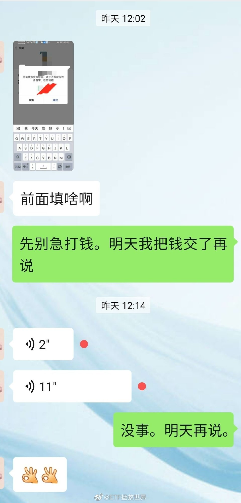

======================================================

ETF拯救世界 (5687069307) @
2020-03-20 15:34:43 Fri  
url: https://weibo.com/5687069307/IzucMvh31

什么是舒服，就是昨天买了恒生就舒服。

什么是不舒服，就是昨天没买。

别管以后跌不跌，至少周末能舒服两天…… ​​​

转发[26]  评论[825]  赞[2581] 

======================================================

ETF拯救世界 (5687069307) @
2020-03-20 15:54:20 Fri  
url: https://weibo.com/5687069307/IzukKhxQJ

震惊，老板不务正业，soho中国暴涨34%。//@ETF拯救世界:震惊，潘石屹被程序员盗号了。

------------------------------------------------------
转推：
>  @ ()
>  2020-03-20 10:30:36 Fri  
>  url: 

>  抱歉，作者已设置仅展示半年内微博，此微博已不可见。 ​​​

转发[6]  评论[120]  赞[759] 

======================================================

ETF拯救世界 (5687069307) @
2020-03-20 17:52:45 Fri  
url: https://weibo.com/5687069307/Izv6OkVHn

… ​​​

转发[30]  评论[582]  赞[2236] 

+++++++++++++++++++++++++++++++++++++++++++++++++++++

图片：
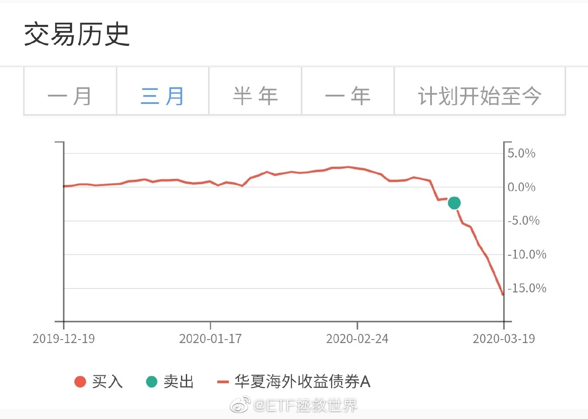

======================================================

ETF拯救世界 (5687069307) @
2020-03-20 19:58:22 Fri  
url: https://weibo.com/5687069307/IzvVNtB4g

今日新闻收藏：

“贵州茅台市值超可口可乐 五粮液超越百威”。

看了一下，上汽也超过奔驰 宝马了。 ​​​

转发[114]  评论[230]  赞[1661] 

======================================================

ETF拯救世界 (5687069307) @
2020-03-20 20:00:35 Fri  
url: https://weibo.com/5687069307/IzvWHl7px

这新闻给哥看笑了。

------------------------------------------------------
转推：
>  @央视新闻 (2656274875)
>  2020-03-20 18:06:58 Fri  
>  url: https:/weibo.com/2656274875/IzvcAaBfn/

>  【#耿爽说没收到美国所谓1亿援助#[摊手]】耿爽：美国政府官员在多个场合曾表示，将向包括中国在内的有关国家提供1亿美元的抗疫援助。别的国家是否收到我不清楚，但迄今为止中方从未收到以美国政府名义捐助的资金或物资。中方已正式回复美方，表示感谢，并请美方尽快将这笔物资捐助给更需要它的国家。  ​​​

转发[74]  评论[274]  赞[1619] 

======================================================

ETF拯救世界 (5687069307) @
2020-03-20 22:56:06 Fri  
url: https://weibo.com/5687069307/Izx5WD1Vi

意思不大，洗洗睡吧 ​​​

转发[0]  评论[254]  赞[1220] 

======================================================

ETF拯救世界 (5687069307) @
2020-03-20 23:03:02 Fri  
url: https://weibo.com/5687069307/Izx8KEMzM

感觉西方除了股市都不是很在意病毒

------------------------------------------------------
转推：
>  @微英国 (6269554188)
>  2020-03-20 16:21:38 Fri  
>  url: https:/weibo.com/6269554188/IzuvPh4ar/

>  #疫情下的英国#【#近半英国人认同政府抗疫方式#】Ipsos在英国的民调显示，49%的受调查者认为约翰逊政府应对疫情的方式很好，18-34岁的人中只有28%这么认为，65岁以上的人中则有70%支持。此外政府满意率达到48%，自2010年以来首次高于不满意率（41%）。调查于3月13日-16日期间进行。 via The Guardian ​​​

转发[19]  评论[255]  赞[1273] 

======================================================

ETF拯救世界 (5687069307) @
2020-03-20 23:53:15 Fri  
url: https://weibo.com/5687069307/Izxt8tNsj

再说一次，我这里不欢迎小白。

我没精力，没义务，没兴趣给你普及金融知识。为什么要买，为什么这么走，你不要问，我不回答。这是我自己的投资计划，为什么要给你做解释？ ​​​

转发[15]  评论[900]  赞[4138] 

======================================================

ETF拯救世界 (5687069307) @
2020-03-21 10:09:15 Sat  
url: https://weibo.com/5687069307/IzBvaDurQ

昨天又跌了3%

------------------------------------------------------
转推：
>  @ETF拯救世界 (5687069307)
>  2020-03-20 17:52:45 Fri  
>  url: https:/weibo.com/5687069307/Izv6OkVHn/

>  … ​​​

转发[11]  评论[287]  赞[1248] 

======================================================

ETF拯救世界 (5687069307) @
2020-03-21 10:27:57 Sat  
url: https://weibo.com/5687069307/IzBCLjefl

问原油类基金的，这是我们一直以来做的统计功课，免费送给你。

看得懂就看看，看不懂就别多说了。不喜欢原油以后你就别买，多大点事啊。 ​​​

转发[229]  评论[1089]  赞[3521] 

+++++++++++++++++++++++++++++++++++++++++++++++++++++

图片：
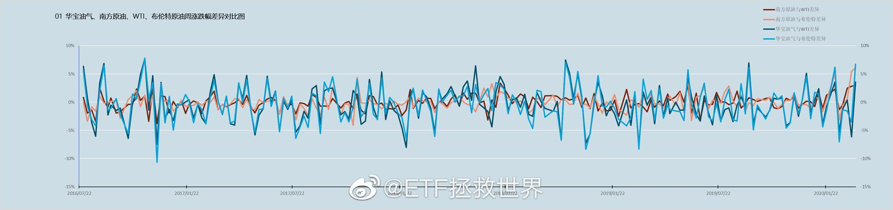
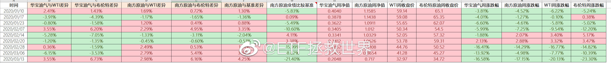

======================================================

ETF拯救世界 (5687069307) @
2020-03-23 10:17:32 Mon  
url: https://weibo.com/5687069307/IzUpwE0TJ

一定要控制节奏。

------------------------------------------------------
转推：
>  @ETF拯救世界 (5687069307)
>  2020-03-18 13:28:31 Wed  
>  url: https:/weibo.com/5687069307/Izawzr1cU/

>  不要天天想着开车，说真的，你家没矿，不是无限现金流，不能天天开。
>  
>  我开车有两个标准，第一时间，第二空间。时间和空间至少要拉开其一。否则筹码堆积在一个点位上，没有意义。前几天暴跌，我们进场买点，这个空间就差不多了。继续再等下一个时间或者空间。
>  
>  你知不知道为什么第三轮四年了你还天天惦 ​​​

转发[56]  评论[488]  赞[1776] 

======================================================

ETF拯救世界 (5687069307) @
2020-03-23 10:22:39 Mon  
url: https://weibo.com/5687069307/IzUrBtZRd

没有什么品种不会跌。如果别人跌的特别便宜，你还在高位，那么理性的投资者就会卖掉你去买便宜的。

所以最终大家都会跌。 ​​​

转发[139]  评论[604]  赞[2632] 

======================================================

ETF拯救世界 (5687069307) @
2020-03-23 13:33:41 Mon  
url: https://weibo.com/5687069307/IzVH99meX

看了一眼芯片指数基金跌了30%，心想有没有机会买点。

然后去看了看成分股估值，

90多倍。

行吧，打扰了。 ​​​

转发[118]  评论[451]  赞[2017] 

======================================================

ETF拯救世界 (5687069307) @
2020-03-23 14:49:24 Mon  
url: https://weibo.com/5687069307/IzWbSsc6b

什么时候买回来 ​​​

转发[23]  评论[365]  赞[1268] 

+++++++++++++++++++++++++++++++++++++++++++++++++++++

图片：
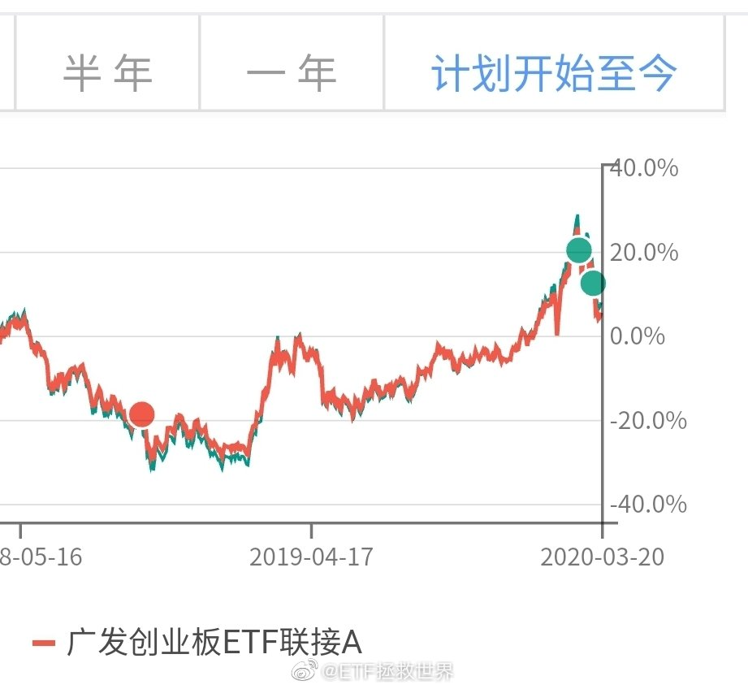

======================================================

ETF拯救世界 (5687069307) @
2020-03-23 14:56:29 Mon  
url: https://weibo.com/5687069307/IzWeKDFwz

有没有发现一件事。计划里面卖出的股票类指数，全部都能用更低的价格买回来。

有的时间长点，有的时间短点。 ​​​

转发[37]  评论[549]  赞[2509] 

======================================================

ETF拯救世界 (5687069307) @
2020-03-23 16:22:24 Mon  
url: https://weibo.com/5687069307/IzWND4ItA

如果DAX有效跌破8200，那就是最强的一根支撑破掉了。再往下是多少很难判断了。

要是一定一定要给个点位，那就是6200周围。问题是，这也太低了吧！

不过综合最近40年美国和英国的指数走势看，极限跌幅确实还有30%。这个真的是极限了，如果还止不住，那可能就是要全面推倒重来了。 ​​​

转发[581]  评论[684]  赞[2423] 

======================================================

ETF拯救世界 (5687069307) @
2020-03-23 20:42:15 Mon  
url: https://weibo.com/5687069307/IzYv6i1gf

从过去美股100年历史看，在大幅下跌后买入，无一例外会赚大钱。大幅是多少？从历史看，50%-80%就一定是属于大幅，且真实发生过。但你不能预期未来一定还能跌这么多，所以在差不多的时候可以开始慢慢买。目前距离最高点跌幅35%。

很多人说危机。危机真的很可怕，但是在危机的后半段开始买入，历史上都 ​​​

转发[231]  评论[691]  赞[2377] 

======================================================

ETF拯救世界 (5687069307) @
2020-03-24 08:54:22 Tue  
url: https://weibo.com/5687069307/IA3ih5Jbt

什么玩意儿涨这么点就熔断了//@财联社APP:日经225指数期货上涨触发熔断机制。//@财联社APP:日经225指数高开高走，涨幅扩大至4.18%。

------------------------------------------------------
转推：
>  @财联社APP (2868676035)
>  2020-03-24 08:03:01 Tue  
>  url: https:/weibo.com/2868676035/IA2XqiJue/

>  日经225指数高开1.89%。 ​​​

转发[14]  评论[428]  赞[1290] 

======================================================

ETF拯救世界 (5687069307) @
2020-03-24 13:39:48 Tue  
url: https://weibo.com/5687069307/IA5a8dHOP

好消息，跌了两天，已经降至85倍了。

------------------------------------------------------
转推：
>  @ETF拯救世界 (5687069307)
>  2020-03-23 13:33:41 Mon  
>  url: https:/weibo.com/5687069307/IzVH99meX/

>  看了一眼芯片指数基金跌了30%，心想有没有机会买点。
>  
>  然后去看了看成分股估值，
>  
>  90多倍。
>  
>  行吧，打扰了。 ​​​

转发[49]  评论[253]  赞[1192] 

======================================================

ETF拯救世界 (5687069307) @
2020-03-24 13:45:08 Tue  
url: https://weibo.com/5687069307/IA5ci7WQV

我其实有点好奇的，是高位那么多科技类指数基金成立，规模怎么也有几百亿了，他们是把谁的货接走了。 ​​​

转发[22]  评论[313]  赞[1401] 

======================================================

ETF拯救世界 (5687069307) @
2020-03-24 15:00:21 Tue  
url: https://weibo.com/5687069307/IA5GOFEEU

二月底开的条件单网格账户，目前浮亏2.3%。 ​​​

转发[19]  评论[520]  赞[1321] 

+++++++++++++++++++++++++++++++++++++++++++++++++++++

图片：
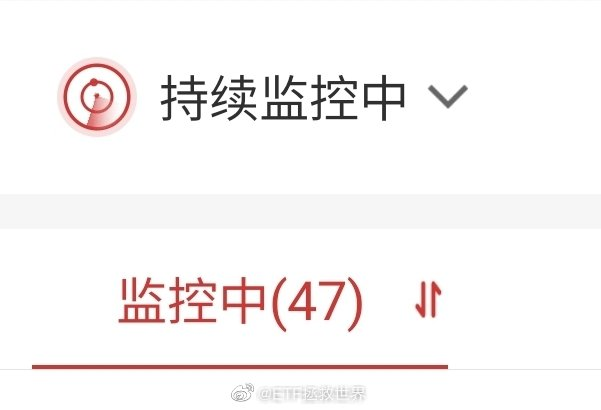

======================================================

ETF拯救世界 (5687069307) @
2020-03-24 16:07:32 Tue  
url: https://weibo.com/5687069307/IA685tlH4

DAX涨6%，目前9200。自低点8239反弹已经12%。大幅下跌后不反弹极其少见，即使29年也曾经大幅反弹。反弹之后何去何从就要继续观察了。

------------------------------------------------------
转推：
>  @ETF拯救世界 (5687069307)
>  2020-03-23 16:22:24 Mon  
>  url: https:/weibo.com/5687069307/IzWND4ItA/

>  如果DAX有效跌破8200，那就是最强的一根支撑破掉了。再往下是多少很难判断了。
>  
>  要是一定一定要给个点位，那就是6200周围。问题是，这也太低了吧！
>  
>  不过综合最近40年美国和英国的指数走势看，极限跌幅确实还有30%。这个真的是极限了，如果还止不住，那可能就是要全面推倒重来了。 ​​​

转发[86]  评论[183]  赞[1183] 

======================================================

ETF拯救世界 (5687069307) @
2020-03-24 16:25:25 Tue  
url: https://weibo.com/5687069307/IA6flxJah

感觉最近大家情绪都不高啊。怎么回事，有什么烦心事说出来听听。 ​​​

转发[35]  评论[2245]  赞[5332] 

======================================================

ETF拯救世界 (5687069307) @
2020-03-24 17:57:42 Tue  
url: https://weibo.com/5687069307/IA6QO8dFs

刚才那个烦恼的帖子，评论里的情况大概分这么几类：

事业、情感、婚姻、健康、亲子、投资。

前五类我先不说，以后有空展开谈谈我自己的看法。浮于表面，入木三分。

最后的投资，我先说两句。

我说你们那些为了坐电梯，为了利润减少或者由盈转亏就伤心难过的，行不行啊你们。

A股，哪怕你是在盈亏 ​​​

转发[156]  评论[1049]  赞[2280] 

======================================================

ETF拯救世界 (5687069307) @
2020-03-24 18:12:39 Tue  
url: https://weibo.com/5687069307/IA6WSijDf

回复@是周小满呀:震惊！基金小V粉丝群竟然发生这种事……当然是好事，但双方都要多了解对方再坠入爱河呀。//@是周小满呀:老大，我恋爱了，在E大的一个粉丝群，和你的女粉认识两天半恋爱了，谢谢你帮我做的铺垫，我们一切都好，就是坠入了爱河。 http://t.cn/A6tb0w3N

------------------------------------------------------
转推：
>  @ETF拯救世界 (5687069307)
>  2020-03-24 16:25:25 Tue  
>  url: https:/weibo.com/5687069307/IA6flxJah/

>  感觉最近大家情绪都不高啊。怎么回事，有什么烦心事说出来听听。 ​​​

转发[14]  评论[737]  赞[2400] 

======================================================

ETF拯救世界 (5687069307) @
2020-03-24 19:29:37 Tue  
url: https://weibo.com/5687069307/IA7s7vO6M

麒麟控股，日经225市值排名第47位的公司。市值18000亿日元，约合1150亿人民币。从事制造和销售酒精饮料和软饮料。

------------------------------------------------------
转推：
>  @日经中文网 (2478163131)
>  2020-03-24 11:23:38 Tue  
>  url: https:/weibo.com/2478163131/IA4gR97Vw/

>  【麒麟将在中国电商销售健康食品】麒麟将利用在中国销售芳珂健康食品的本地企业“中国国际医药卫生公司”的销售渠道。首先将销售营养保健品，每袋价格为189元（约3000日元），比日本国内价格（2200日元，不含税）高出3成…… http://t.cn/A6zFkuJv ​​​

转发[17]  评论[112]  赞[604] 

======================================================

ETF拯救世界 (5687069307) @
2020-03-24 19:32:11 Tue  
url: https://weibo.com/5687069307/IA7t9B8lB

奥运会顺延一年，欧洲杯顺延一年，为什么股市不能顺延一年？

我建议，明年年初，全球所有交易所把每个投资者的账户重置到今年年初，然后把所有股票价格和指数点位也重置，这样大家的财富都没损失，反正就是电脑系统操作一下的事儿。 ​​​

转发[15]  评论[260]  赞[1496] 

======================================================

ETF拯救世界 (5687069307) @
2020-03-24 19:33:39 Tue  
url: https://weibo.com/5687069307/IA7tKB1e6

日经225市值排名前二十的公司。说实话，大多数我还挺喜欢的。

第九的迅销就是优衣库。 ​​​

转发[76]  评论[289]  赞[1163] 

+++++++++++++++++++++++++++++++++++++++++++++++++++++

图片：
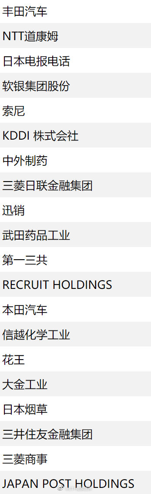

======================================================

ETF拯救世界 (5687069307) @
2020-03-24 19:49:19 Tue  
url: https://weibo.com/5687069307/IA7A74208

说起时间重置，想起小时候看过的一部日剧，《重返少年时》

男主的时间总是重置的故事，印象很深。他的记忆还在，所以买股票什么的发财了。

剧情什么的虽然好但最重要的是看完之后我就粉了仲间由纪惠几年…… ​​​

转发[9]  评论[271]  赞[1077] 

======================================================

ETF拯救世界 (5687069307) @
2020-03-24 20:34:55 Tue  
url: https://weibo.com/5687069307/IA7SCsKwz

不过说实话，各位手里始终应该保留一些现金类资产，其中一部分最好还是以美元形式存在。

这部分肯定不会有太好的收益，但是备一点总是没有坏处的。 ​​​

转发[85]  评论[467]  赞[2085] 

======================================================

ETF拯救世界 (5687069307) @
2020-03-24 21:20:45 Tue  
url: https://weibo.com/5687069307/IA8be2Q9A

7%了//@ETF拯救世界: DAX涨6%，目前9200。自低点8239反弹已经12%。大幅下跌后不反弹极其少见，即使29年也曾经大幅反弹。反弹之后何去何从就要继续观察了。

------------------------------------------------------
转推：
>  @ETF拯救世界 (5687069307)
>  2020-03-23 16:22:24 Mon  
>  url: https:/weibo.com/5687069307/IzWND4ItA/

>  如果DAX有效跌破8200，那就是最强的一根支撑破掉了。再往下是多少很难判断了。
>  
>  要是一定一定要给个点位，那就是6200周围。问题是，这也太低了吧！
>  
>  不过综合最近40年美国和英国的指数走势看，极限跌幅确实还有30%。这个真的是极限了，如果还止不住，那可能就是要全面推倒重来了。 ​​​

转发[39]  评论[145]  赞[842] 

======================================================

ETF拯救世界 (5687069307) @
2020-03-24 21:44:25 Tue  
url: https://weibo.com/5687069307/IA8kQ6b8N

即使有上涨，也暂时不要想太多反转之类的。先看反弹吧。 ​​​

转发[22]  评论[379]  赞[1798] 

======================================================

ETF拯救世界 (5687069307) @
2020-03-25 00:06:02 Wed  
url: https://weibo.com/5687069307/IA9gjnvyI

9%。你敢10%收盘让我开开眼，下次换车还支持你//@ETF拯救世界:7%了//@ETF拯救世界: DAX涨6%，目前9200。自低点8239反弹已经12%。大幅下跌后不反弹极其少见，即使29年也曾经大幅反弹。反弹之后何去何从就要继续观察了。

------------------------------------------------------
转推：
>  @ETF拯救世界 (5687069307)
>  2020-03-23 16:22:24 Mon  
>  url: https:/weibo.com/5687069307/IzWND4ItA/

>  如果DAX有效跌破8200，那就是最强的一根支撑破掉了。再往下是多少很难判断了。
>  
>  要是一定一定要给个点位，那就是6200周围。问题是，这也太低了吧！
>  
>  不过综合最近40年美国和英国的指数走势看，极限跌幅确实还有30%。这个真的是极限了，如果还止不住，那可能就是要全面推倒重来了。 ​​​

转发[23]  评论[256]  赞[882] 

======================================================

ETF拯救世界 (5687069307) @
2020-03-25 01:27:42 Wed  
url: https://weibo.com/5687069307/IA9Nswvbv

为了卖辆车，大可不必。//@ETF拯救世界:9%。你敢10%收盘让我开开眼，下次换车还支持你//@ETF拯救世界:7%了//@ETF拯救世界: DAX涨6%，目前9200。自低点8239反弹已经12%。大幅下跌后不反弹极其少见，即使29年也曾经大幅反弹。反弹之后何去何从就要继续观察了。

------------------------------------------------------
转推：
>  @ETF拯救世界 (5687069307)
>  2020-03-23 16:22:24 Mon  
>  url: https:/weibo.com/5687069307/IzWND4ItA/

>  如果DAX有效跌破8200，那就是最强的一根支撑破掉了。再往下是多少很难判断了。
>  
>  要是一定一定要给个点位，那就是6200周围。问题是，这也太低了吧！
>  
>  不过综合最近40年美国和英国的指数走势看，极限跌幅确实还有30%。这个真的是极限了，如果还止不住，那可能就是要全面推倒重来了。 ​​​

转发[13]  评论[235]  赞[863] 

======================================================

ETF拯救世界 (5687069307) @
2020-03-25 07:49:48 Wed  
url: https://weibo.com/5687069307/IAciypYUF

现在暂时依然是这个观点。

------------------------------------------------------
转推：
>  @ETF拯救世界 (5687069307)
>  2020-03-18 12:33:05 Wed  
>  url: https:/weibo.com/5687069307/Izaa49K3r/

>  欧美反弹的话力度应该在十几二十个点。
>  
>  按照历史经验看的话。 ​​​

转发[21]  评论[193]  赞[976] 

======================================================

ETF拯救世界 (5687069307) @
2020-03-25 08:12:20 Wed  
url: https://weibo.com/5687069307/IAcrHvMZh

有一个预感不知道对不对，今天条件单服务器可能要崩…

------------------------------------------------------
转推：
>  @ETF拯救世界 (5687069307)
>  2020-03-24 15:00:21 Tue  
>  url: https:/weibo.com/5687069307/IA5GOFEEU/

>  二月底开的条件单网格账户，目前浮亏2.3%。 ​​​

转发[10]  评论[227]  赞[859] 

======================================================

ETF拯救世界 (5687069307) @
2020-03-25 08:30:52 Wed  
url: https://weibo.com/5687069307/IAcze6lkm

上周最后一次买入，时间太紧，150和S各少买了一个东西。值得深刻反思。

可能需要更加强力的统计支持力度。 ​​​

转发[43]  评论[316]  赞[1543] 

======================================================

ETF拯救世界 (5687069307) @
2020-03-25 08:47:55 Wed  
url: https://weibo.com/5687069307/IAcG9ajBj

回复@ETF拯救世界之观海听涛:美股这个级别波动，上次是1929-1932。//@ETF拯救世界之观海听涛:E大，全球指数巨幅震荡的情况，历史上发生的次数多吗？

------------------------------------------------------
转推：
>  @ETF拯救世界 (5687069307)
>  2020-03-25 08:30:52 Wed  
>  url: https:/weibo.com/5687069307/IAcze6lkm/

>  上周最后一次买入，时间太紧，150和S各少买了一个东西。值得深刻反思。
>  
>  可能需要更加强力的统计支持力度。 ​​​

转发[22]  评论[126]  赞[973] 

======================================================

ETF拯救世界 (5687069307) @
2020-03-25 09:01:18 Wed  
url: https://weibo.com/5687069307/IAcLAhHLj

还说这个世界上没有超越目前科学能够理解的力量？

------------------------------------------------------
转推：
>  @ ()
>  2020-03-20 16:14:19 Fri  
>  url: 

>  抱歉，作者已设置仅展示半年内微博，此微博已不可见。 ​​​

转发[26]  评论[164]  赞[835] 

======================================================

ETF拯救世界 (5687069307) @
2020-03-25 09:19:08 Wed  
url: https://weibo.com/5687069307/IAcSOxXiU

//@caozenghui: //@小章鱼Iris:很棒的视频。谢谢每一个站出来的人，也谢谢带来这支视频的人 Merci de faire cette vidéo.

------------------------------------------------------
转推：
>  @ ()
>  2020-03-16 18:33:57 Mon  
>  url: 

>  抱歉，此微博已被作者删除。查看帮助：http://t.cn/Rfd3rQV

转发[122]  评论[97]  赞[626] 

======================================================

ETF拯救世界 (5687069307) @
2020-03-25 09:23:07 Wed  
url: https://weibo.com/5687069307/IAcUr24wz

友情提示：

如果ETF在9:25集合竞价的时候折溢价过多，即使到了你的条件价位，也可以暂停条件单。等待价格回到合理的水平再重开，这样可以增加一部分利润。

当然，不暂停也没有任何问题。 ​​​

转发[65]  评论[302]  赞[1161] 

======================================================

ETF拯救世界 (5687069307) @
2020-03-25 09:54:10 Wed  
url: https://weibo.com/5687069307/IAd72hvqU

收回一部分资金，安全垫更厚了，胸前的红领巾更鲜艳了。 ​​​

转发[12]  评论[565]  赞[2072] 

======================================================

ETF拯救世界 (5687069307) @
2020-03-25 11:23:08 Wed  
url: https://weibo.com/5687069307/IAdH9edb9

再找1-2位小助理

一年多前曾经发过一个招聘启事，找兼职小助理。后来经过三轮筛选，定了四位。这一年多来，这四位，包括之前的初代小助理，都非常认真、负责。我非常满意，大家也相处融洽。

现在工作量越来越大，几位小助理本身的生活情况也都在发生变化，所以人手不够了。需要再找一两位帮忙。

我 ​​​

转发[69]  评论[850]  赞[2485] 

+++++++++++++++++++++++++++++++++++++++++++++++++++++

图片：
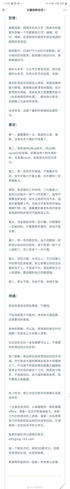

======================================================

ETF拯救世界 (5687069307) @
2020-03-25 12:33:17 Wed  
url: https://weibo.com/5687069307/IAe9Cx7o7

玉林有个情杀案，微博我就不转了，图片容易引起不适。

一定要拒绝黄赌毒，否则容易出事。

尽量洁身自好，除非实在控制不了……那也要再挣扎挣扎控制一下。 ​​​

转发[20]  评论[545]  赞[1869] 

======================================================

ETF拯救世界 (5687069307) @
2020-03-25 14:20:44 Wed  
url: https://weibo.com/5687069307/IAeRfc2K3

150的卖出，是因为需要资金买更好的东西。

S不卖，是因为无限现金流不需要卖，而且S还有之前省下的20多份储备资金根本没用。

在我这里，你永远不要说“没钱了”。不存在。 ​​​

转发[29]  评论[525]  赞[1890] 

======================================================

ETF拯救世界 (5687069307) @
2020-03-25 14:35:10 Wed  
url: https://weibo.com/5687069307/IAeX61Fm9

有人私信和评论我，嫌我脾气不好，说话不客气。

呵呵呵呵。对啊，我脾气不好，你赶紧走好吗。我不需要你关注，真的不需要。

你赶紧去找对你温柔的，说话客客气气的去关注好吗？相信我，如果你再交点钱买个课什么的，你得到的服务更好。

没有人是完美的人。我缺点很多，有些我愿意尽量改，有些我不愿 ​​​

转发[11]  评论[1024]  赞[3251] 

======================================================

ETF拯救世界 (5687069307) @
2020-03-25 15:14:14 Wed  
url: https://weibo.com/5687069307/IAfcX8bU4

我一直没明白，作协存在的意义是什么。

学习好的说说。 ​​​

转发[13]  评论[505]  赞[1678] 

======================================================

ETF拯救世界 (5687069307) @
2020-03-25 16:30:08 Wed  
url: https://weibo.com/5687069307/IAfHLbNhb

不说你不知道，DAX已经反弹22%了。 ​​​

转发[16]  评论[466]  赞[1808] 

======================================================

ETF拯救世界 (5687069307) @
2020-03-25 17:47:37 Wed  
url: https://weibo.com/5687069307/IAgddqNdf

美股现在确实不贵，但说接近08年金融危机时候水平不能同意。现在15，当时最低到过11以下。

------------------------------------------------------
转推：
>  @财联社APP (2868676035)
>  2020-03-25 17:22:01 Wed  
>  url: https:/weibo.com/2868676035/IAg2OCDLS/

>  【陈光明：美股不具备大幅下跌动力 现在是可以乐观一点的时候】近日国际金融市场动荡不安，未来应如何投资？陈光明认为，美股是从一个并不算离谱的高位上开始本轮下跌的。截至3月20日，标准普尔的P/E下行到15倍左右，而风险溢价率则大幅抬升至5.6%，已经接近2008年金融危机时的水平。所以，如果利率不 ​​​

转发[48]  评论[121]  赞[863] 

======================================================

ETF拯救世界 (5687069307) @
2020-03-25 17:54:15 Wed  
url: https://weibo.com/5687069307/IAgfU5zCJ

虽然对涨跌没有特别的情绪和希望，但我还是很希望欧美能再涨两天，让我的波段仓位能再出点…… ​​​

转发[8]  评论[342]  赞[1578] 

======================================================

ETF拯救世界 (5687069307) @
2020-03-25 18:44:51 Wed  
url: https://weibo.com/5687069307/IAgArnPAo

女王怎么办。

------------------------------------------------------
转推：
>  @ ()
>  2020-03-25 18:40:43 Wed  
>  url: 

>  抱歉，作者已设置仅展示半年内微博，此微博已不可见。 ​​​

转发[7]  评论[361]  赞[1332] 

======================================================

ETF拯救世界 (5687069307) @
2020-03-26 08:11:57 Thu  
url: https://weibo.com/5687069307/IAlS2zaUb

今天又是能够成交的一天吧。

上上下下怎么都好，让我不断完成交易就是好的德州扑克。 ​​​

转发[7]  评论[339]  赞[1522] 

======================================================

ETF拯救世界 (5687069307) @
2020-03-26 08:27:58 Thu  
url: https://weibo.com/5687069307/IAlYxFTW8

现在新闻媒体真的可以。昨天桥水倒了，今天桥水做空赚几十亿美元。

人家桥水是在欧洲做对冲，减少在多头上的损失。没你当初说的那么差，也没现在你说的这么NB。

这一把下来桥水毛估估也是损失一两百亿美元了。 ​​​

转发[34]  评论[217]  赞[1422] 

======================================================

ETF拯救世界 (5687069307) @
2020-03-26 09:58:29 Thu  
url: https://weibo.com/5687069307/IAmzhBQGU

$全指医药 sh000991$   感觉有被针对 ​​​

转发[3]  评论[168]  赞[825] 

======================================================

ETF拯救世界 (5687069307) @
2020-03-26 10:07:27 Thu  
url: https://weibo.com/5687069307/IAmCVDQhS

疯了，恒生再涨1厘不可以吗？

大家挂单要散开啊，不要挂在一起，谁也成交不了啊。 ​​​

转发[19]  评论[469]  赞[1656] 

======================================================

ETF拯救世界 (5687069307) @
2020-03-26 10:15:59 Thu  
url: https://weibo.com/5687069307/IAmGobVCV

波段交易策略当然能带来收益，但这个某些时候还不是最重要的。

最重要的是它会让你对下跌能够乐观接受甚至有些期盼。尤其是当实现一波收益后，你甚至盼着赶紧跌好让你再来一次，虽然你的长线持仓会有损失。

这种心态的改变会让你的状态变得极度舒适。投资的时候，状态是否舒适非常非常重要。不舒适就 ​​​

转发[218]  评论[392]  赞[1712] 

======================================================

ETF拯救世界 (5687069307) @
2020-03-26 10:21:00 Thu  
url: https://weibo.com/5687069307/IAmIqCYsY

困扰大多数投资人的无非就是几个痛点：

第一：什么时候入场，什么时候出场。

第二：长线持仓等着赚大钱，但是行情不断上下不断坐电梯怎么办。利润来了又走又来又走好难受。

第三：做波段有了利润就收割很舒服。但是卖了就涨清仓以后一飞冲天大牛市赚不了几个大子怎么办。

想办法解决这几个痛点，舒 ​​​

转发[351]  评论[409]  赞[1768] 

======================================================

ETF拯救世界 (5687069307) @
2020-03-26 10:39:13 Thu  
url: https://weibo.com/5687069307/IAmPPeXgZ

观察一个指数，食品饮料。

在我的趋势系统中，这个指数“应该”走弱已经9个月，但事实上，9个月来它并没有跌。而是几乎原地踏步几乎没有涨跌。

后续它怎么走，就非常有意思。要么就是我的系统有问题，我就会想办法改进。要么就是另一种情况。

提醒你：我不是看多或者看空，而是说出这个有意思的现象 ​​​

转发[79]  评论[338]  赞[1390] 

======================================================

ETF拯救世界 (5687069307) @
2020-03-26 11:10:43 Thu  
url: https://weibo.com/5687069307/IAn2Brkm3

ok了。下午更新表格，会有变化。

------------------------------------------------------
转推：
>  @ETF拯救世界 (5687069307)
>  2020-03-26 10:07:27 Thu  
>  url: https:/weibo.com/5687069307/IAmCVDQhS/

>  疯了，恒生再涨1厘不可以吗？
>  
>  大家挂单要散开啊，不要挂在一起，谁也成交不了啊。 ​​​

转发[11]  评论[611]  赞[1624] 

======================================================

ETF拯救世界 (5687069307) @
2020-03-26 14:08:48 Thu  
url: https://weibo.com/5687069307/IAocTcd6s

今天意思不大，散了吧。 ​​​

转发[10]  评论[665]  赞[1651] 

======================================================

ETF拯救世界 (5687069307) @
2020-03-27 09:37:10 Fri  
url: https://weibo.com/5687069307/IAvR87XH0

华宝单品种的“历史交易”功能太贴心了…刚发现的… ​​​

转发[32]  评论[353]  赞[1299] 

======================================================

ETF拯救世界 (5687069307) @
2020-03-27 09:49:54 Fri  
url: https://weibo.com/5687069307/IAvWiro9Z

我说的是这个地方，下面还会有这个品种的成交记录。别的券商好像没发现 http://t.cn/A6ZLr3qu

------------------------------------------------------
转推：
>  @ETF拯救世界 (5687069307)
>  2020-03-27 09:37:10 Fri  
>  url: https:/weibo.com/5687069307/IAvR87XH0/

>  华宝单品种的“历史交易”功能太贴心了…刚发现的… ​​​

转发[19]  评论[302]  赞[975] 

======================================================

ETF拯救世界 (5687069307) @
2020-03-27 10:25:42 Fri  
url: https://weibo.com/5687069307/IAwaPoknF

初筛简历的小助理快崩溃了，越看越多。看了两天还有500多封未读。 ​​​

转发[7]  评论[285]  赞[1404] 

======================================================

ETF拯救世界 (5687069307) @
2020-03-27 10:29:29 Fri  
url: https://weibo.com/5687069307/IAwcmy1rk

看了这个我想对那个要矿泉水的女孩说声对不起。

------------------------------------------------------
转推：
>  @ ()
>  2020-03-27 08:05:36 Fri  
>  url: 

>  抱歉，此微博已被作者删除。查看帮助：http://t.cn/Rfd3rQV

转发[14]  评论[212]  赞[1337] 

======================================================

ETF拯救世界 (5687069307) @
2020-03-27 10:35:19 Fri  
url: https://weibo.com/5687069307/IAweJoQ3v

其实很多时候，你对外人再好，他回去了也不一定说你好话。甚至一转身反咬一口也不新鲜。农夫与蛇。

对自己人好一点是最重要的。

说句不好听的，很多人骨子里就觉得洋大人高人一等。洋大人夸一句就沾沾自喜，骂一句就哆哆嗦嗦，没必要。

咱们自己的日子过好了比什么都强，让自己人舒舒服服，开开心心 ​​​

转发[63]  评论[317]  赞[2210] 

======================================================

ETF拯救世界 (5687069307) @
2020-03-27 10:51:39 Fri  
url: https://weibo.com/5687069307/IAwlmqePN

再说两句很多人可能不爱听的。

比如异国婚恋这个事情，其实有两个极端。

一个是，只要你是老外，我就使劲贴上去。能跟你谈恋爱或者结婚，哪怕鼓一次掌都特荣幸特开心。

第二个是，只要我看到你和老外，尤其是某些地区和国家的谈恋爱或者结婚，我就觉得你是辣鸡——中国还有3000万单身男性，你怎么能 ​​​

转发[53]  评论[405]  赞[1689] 

======================================================

ETF拯救世界 (5687069307) @
2020-03-27 11:06:44 Fri  
url: https://weibo.com/5687069307/IAwruqYYl

回复@z楠1988:只要他喜欢，我没意见。但我会跟他深入的谈一次，把该说的都让他知道。但是，PS：这个基本不可能，因为4岁上外教课的时候，遇到一个黑人女老师。他不喜欢，强烈要求换人……平常也喜欢肤色白的女孩，这是天生的……//@z楠1988:以后让你儿子娶个黑妹回来好不好？@ETF拯救世界

------------------------------------------------------
转推：
>  @ETF拯救世界 (5687069307)
>  2020-03-27 10:51:39 Fri  
>  url: https:/weibo.com/5687069307/IAwlmqePN/

>  再说两句很多人可能不爱听的。
>  
>  比如异国婚恋这个事情，其实有两个极端。
>  
>  一个是，只要你是老外，我就使劲贴上去。能跟你谈恋爱或者结婚，哪怕鼓一次掌都特荣幸特开心。
>  
>  第二个是，只要我看到你和老外，尤其是某些地区和国家的谈恋爱或者结婚，我就觉得你是辣鸡——中国还有3000万单身男性，你怎么能 ​​​

转发[4]  评论[150]  赞[894] 

======================================================

ETF拯救世界 (5687069307) @
2020-03-27 11:12:54 Fri  
url: https://weibo.com/5687069307/IAwtZgn2y

说到孩子的择偶我管不管，可能提问的人并不了解我对孩子的态度。

我认为，孩子是一个独立的个体。他不是我的附属。等他成年后，建立了相对成熟的三观，他的事情就可以自己做主。要做什么工作，要跟什么人谈恋爱，要和什么人结婚，那是他的事。我当然会有自己的意见和建议，但只是告诉他，给他参考，绝 ​​​

转发[112]  评论[389]  赞[2337] 

======================================================

ETF拯救世界 (5687069307) @
2020-03-27 11:27:40 Fri  
url: https://weibo.com/5687069307/IAwzZ3AN0

150仓位，很舒服，你舒服吗。

成熟市场还是少，希望再来一波再加点。 ​​​

转发[55]  评论[604]  赞[1776] 

+++++++++++++++++++++++++++++++++++++++++++++++++++++

图片：
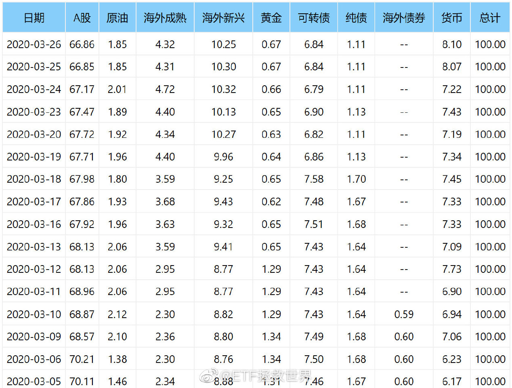

======================================================

ETF拯救世界 (5687069307) @
2020-03-27 14:26:50 Fri  
url: https://weibo.com/5687069307/IAxKHDwGK

我从来不相信“踏空”这个说法。只要你有钱，总有一天能买到想买的东西。资本市场上机会无穷无尽，还怕没机会？

怕的是机会来了你没钱了。 ​​​

转发[154]  评论[532]  赞[2566] 

======================================================

ETF拯救世界 (5687069307) @
2020-03-27 15:55:04 Fri  
url: https://weibo.com/5687069307/IAykwgytr

对面的情况越严重，以后甩锅给我们的动力越强。关系会越来越差。 ​​​

转发[33]  评论[551]  赞[3415] 

======================================================

ETF拯救世界 (5687069307) @
2020-03-27 23:25:24 Fri  
url: https://weibo.com/5687069307/IABhjhHgw

决定这个周末不上微博，不看新闻。闹心。

100级到150级难多了。 ​​​

转发[6]  评论[365]  赞[1512] 

+++++++++++++++++++++++++++++++++++++++++++++++++++++

图片：

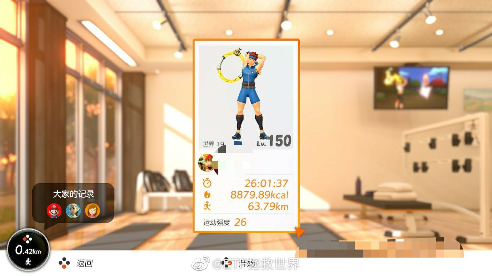

======================================================

ETF拯救世界 (5687069307) @
2020-03-28 17:49:55 Sat  
url: https://weibo.com/5687069307/IAIvDk23X

今天刚看到之前有人在评论里说网格表格错了。我解释一下。

没错。

首先看第一张说明。说明上已经说的很清楚了：

黄色是本次操作。白色为本次操作后立即设置的条件单。

再看第二张表格。

对于之前已经在0.816买入的朋友来说，今天在0.867出掉了。你当然不需要再次买回，而是要继续按照表格中的白色 ​​​

转发[311]  评论[969]  赞[2541] 

+++++++++++++++++++++++++++++++++++++++++++++++++++++

图片：

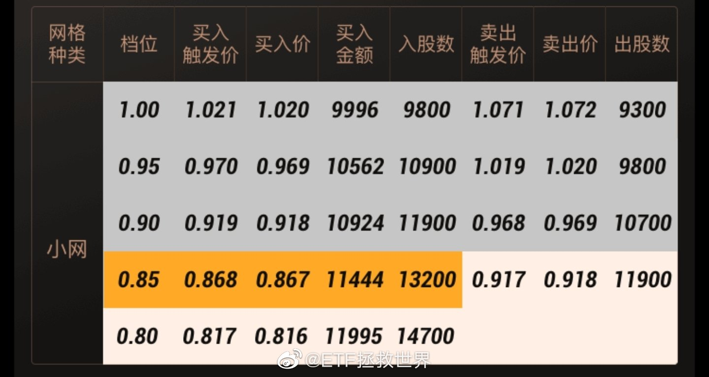

======================================================

ETF拯救世界 (5687069307) @
2020-03-29 12:31:34 Sun  
url: https://weibo.com/5687069307/IAPQV50xM

特别希望有一天我们的护士也能开奥迪上班。

------------------------------------------------------
转推：
>  @ ()
>  2020-03-29 12:06:24 Sun  
>  url: 

>  抱歉，作者已设置仅展示半年内微博，此微博已不可见。 ​​​

转发[98]  评论[526]  赞[2440] 

======================================================

ETF拯救世界 (5687069307) @
2020-03-29 12:46:19 Sun  
url: https://weibo.com/5687069307/IAPWUboTp

回复@萌巴哥元宝与呆巴哥喜蛋:哈哈哈哈哈哈哈。看到这条我真的笑了。祝你今后的生活能过的稍微顺心一点吧。//@萌巴哥元宝与呆巴哥喜蛋:我们的护士为什么要开奥迪上班，你歧视国产车啊？跪久了起不来了是吗//@ETF拯救世界:特别希望有一天我们的护士也能开奥迪上班。

------------------------------------------------------
转推：
>  @ ()
>  2020-03-29 12:06:24 Sun  
>  url: 

>  抱歉，作者已设置仅展示半年内微博，此微博已不可见。 ​​​

转发[24]  评论[275]  赞[940] 

======================================================

ETF拯救世界 (5687069307) @
2020-03-29 12:55:52 Sun  
url: https://weibo.com/5687069307/IAQ0MbwdU

上一个视频中的英国女护士开的是奥迪。那辆车外观动感时尚，操控感一流，油门、刹车踏感舒适。我开过。

国产车好不好我不敢妄加评论，只知道这辆奥迪目前售价不低，也挺好开。

护士这个职业不容易，工作环境不是很好，每天又要面对生老病死。所以我希望中国的护士，乃至其他劳动者都能提高收入，都能 ​​​

转发[19]  评论[773]  赞[2769] 

======================================================

ETF拯救世界 (5687069307) @
2020-03-29 23:09:25 Sun  
url: https://weibo.com/5687069307/IAU1Ov4ar

天下大乱的时候，每一条新闻、消息、文字，都应该更加审慎的对待。如果确实感兴趣，就多找几个信源多几个角度看看。

说实话，现在微博上任何消息我都不信了。或者说，在互联网看到的任何信息，都不会马上相信了。 ​​​

转发[44]  评论[243]  赞[1705] 

======================================================

ETF拯救世界 (5687069307) @
2020-03-29 23:17:36 Sun  
url: https://weibo.com/5687069307/IAU591xD8

回复@美人鱼丸-:你，还有129个给你点赞的，我不怕麻烦，全部拉黑。观点不同很正常，张嘴就喷粪你还是个人吗，你是粪车吧。//@美人鱼丸-:真特么有病 你不反过来想想在英国开奥迪才上得起医科大学//@ETF拯救世界:特别希望有一天我们的护士也能开奥迪上班。

------------------------------------------------------
转推：
>  @ ()
>  2020-03-29 12:06:24 Sun  
>  url: 

>  抱歉，作者已设置仅展示半年内微博，此微博已不可见。 ​​​

转发[7]  评论[357]  赞[1540] 

======================================================

ETF拯救世界 (5687069307) @
2020-03-29 23:35:50 Sun  
url: https://weibo.com/5687069307/IAUcxlUhO

重新设置了评论门槛，关注低于100天的朋友不能评论了。

感觉一下子会清净很多。反正之前一条微博一两千的评论也看不过来…… ​​​

转发[43]  评论[5566]  赞[4067] 

+++++++++++++++++++++++++++++++++++++++++++++++++++++

图片：
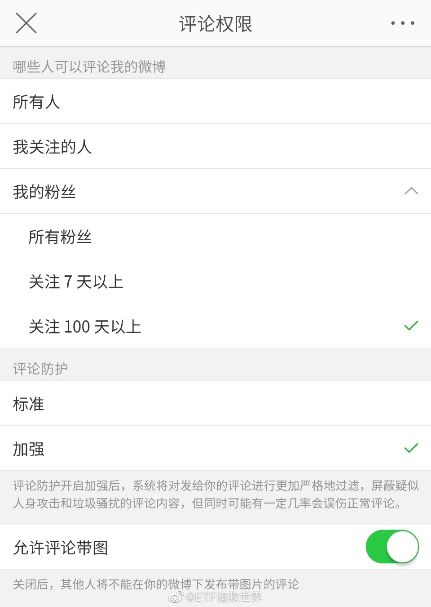

======================================================

ETF拯救世界 (5687069307) @
2020-03-30 09:09:54 Mon  
url: https://weibo.com/5687069307/IAXXyhVgf

“中证科技动量”翻译成白话的意思就是在科技股上追涨杀跌的指数。

------------------------------------------------------
转推：
>  @巨潮资讯网 (2239792910)
>  2020-03-30 08:23:58 Mon  
>  url: https:/weibo.com/2239792910/IAXEUg0tz/

>  【上交所：发布中证科技动量指数等8条指数】为进一步丰富指数体系，为投资者提供新的分析工具和投资标的，上海证券交易所和中证指数有限公司将于2020年4月21日正式发布中证科技动量指数、中证创新药30指数、中证东方红红利低波动指数、中证沪港深云计算产业指数、中证沪港深科技100指数、中证鹏华沪港 ​​​

转发[39]  评论[150]  赞[984] 

======================================================

ETF拯救世界 (5687069307) @
2020-03-30 09:16:22 Mon  
url: https://weibo.com/5687069307/IAY0b4cMT

？？？？？？？

------------------------------------------------------
转推：
>  @ETF拯救世界 (5687069307)
>  2020-03-29 23:35:50 Sun  
>  url: https:/weibo.com/5687069307/IAUcxlUhO/

>  重新设置了评论门槛，关注低于100天的朋友不能评论了。
>  
>  感觉一下子会清净很多。反正之前一条微博一两千的评论也看不过来…… ​​​

转发[10]  评论[1800]  赞[1994] 

======================================================

ETF拯救世界 (5687069307) @
2020-03-30 09:46:42 Mon  
url: https://weibo.com/5687069307/IAYcukxA2

日、美、欧QDII ETF/LOF都已经折价了。说明大家是真的不看好啊。之前都大幅溢价。 ​​​

转发[20]  评论[267]  赞[1285] 

======================================================

ETF拯救世界 (5687069307) @
2020-03-30 10:10:48 Mon  
url: https://weibo.com/5687069307/IAYmhg1Vj

谁再怀疑达尔文就把这张图扔给他。

------------------------------------------------------
转推：
>  @北京人不知道的北京事儿 (1662214194)
>  2020-03-30 09:54:00 Mon  
>  url: https:/weibo.com/1662214194/IAYfs8CeS/

>  网友投稿：北京元大都遗址公园的一家人。。。这要是树枝断了摔着了是不是还要公园赔？[衰] ​​​

转发[15]  评论[232]  赞[982] 

======================================================

ETF拯救世界 (5687069307) @
2020-03-30 10:27:47 Mon  
url: https://weibo.com/5687069307/IAYtaevEW

有些亚洲时间段QDII ETF的做市商是辣鸡。欧美隔夜你大幅折溢价就算了，亚洲段都是实时的你也弄这么大折溢价，要你做市何用？ ​​​

转发[10]  评论[219]  赞[1390] 

======================================================

ETF拯救世界 (5687069307) @
2020-03-30 10:51:33 Mon  
url: https://weibo.com/5687069307/IAYCOEemp

风险继续释放，不到80倍了！//@ETF拯救世界:好消息，跌了两天，已经降至85倍了。

------------------------------------------------------
转推：
>  @ETF拯救世界 (5687069307)
>  2020-03-23 13:33:41 Mon  
>  url: https:/weibo.com/5687069307/IzVH99meX/

>  看了一眼芯片指数基金跌了30%，心想有没有机会买点。
>  
>  然后去看了看成分股估值，
>  
>  90多倍。
>  
>  行吧，打扰了。 ​​​

转发[29]  评论[360]  赞[1471] 

======================================================

ETF拯救世界 (5687069307) @
2020-03-30 14:00:42 Mon  
url: https://weibo.com/5687069307/IAZRB1k84

今天日元/人民币大幅上涨。 ​​​

转发[5]  评论[168]  赞[1227] 

======================================================

ETF拯救世界 (5687069307) @
2020-03-30 14:49:51 Mon  
url: https://weibo.com/5687069307/IB0bxkiky

今天就这样吧。没有交易欲望，索然无味。下个月第一次发车也是随机的，不一定哪天了。

主要原因是目前各市场趋势不好，距离上次买入空间不够，不急，再看看。 ​​​

转发[21]  评论[527]  赞[2051] 

======================================================

ETF拯救世界 (5687069307) @
2020-03-31 09:32:14 Tue  
url: https://weibo.com/5687069307/IB7x76G9A

提款 ​​​

转发[11]  评论[463]  赞[1695] 

======================================================

ETF拯救世界 (5687069307) @
2020-03-31 09:57:59 Tue  
url: https://weibo.com/5687069307/IB7HzaTkv

同一个区间利润积累多了，就可以逐渐加大留存数量，为以后赚大钱多积累一些0成本的种子。

赚钱就是那么点事儿，低买高卖。用机械化的程序规范你的交易，克服恐惧和贪婪，不就成了吗。 ​​​

转发[99]  评论[339]  赞[2164] 

======================================================

ETF拯救世界 (5687069307) @
2020-03-31 10:35:05 Tue  
url: https://weibo.com/5687069307/IB7WCCTyW

有没有体会到一丢丢舒服的感觉。

涨跌都舒服内种。 ​​​

转发[8]  评论[500]  赞[2005] 

======================================================

ETF拯救世界 (5687069307) @
2020-03-31 21:20:46 Tue  
url: https://weibo.com/5687069307/IBcaI2zbe

刚看了一下记账软件，家里前三个月消费支出比去年减少了27%。

这样不行，要多买点东西支持国家提振内需。

明天打算看看罗老师的直播，看看有没有便宜划算的东西下手……就算买不到，就当听相声吧。 ​​​

转发[20]  评论[523]  赞[1978] 

======================================================

ETF拯救世界 (5687069307) @
2020-04-01 10:16:38 Wed  
url: https://weibo.com/5687069307/IBhfDvlYW

综合考虑到目前仓位以及大环境等各方面因素，还是决定要么等空间，要么等趋势。所以月初一车还是暂时不发了。

保持舒服的状态。 ​​​

转发[221]  评论[573]  赞[2479] 

======================================================

ETF拯救世界 (5687069307) @
2020-04-01 14:37:15 Wed  
url: https://weibo.com/5687069307/IBiXqi9OR

回复@kkuu_a:沪深300相当于恒指17000的点位是3100点左右。//@kkuu_a:之前E大写过恒指23000-21000等策略，不知道对上证50和沪深300对应策略的点位是怎么样的

------------------------------------------------------
转推：
>  @ETF拯救世界 (5687069307)
>  2020-04-01 10:16:38 Wed  
>  url: https:/weibo.com/5687069307/IBhfDvlYW/

>  综合考虑到目前仓位以及大环境等各方面因素，还是决定要么等空间，要么等趋势。所以月初一车还是暂时不发了。
>  
>  保持舒服的状态。 ​​​

转发[138]  评论[152]  赞[947] 

======================================================

ETF拯救世界 (5687069307) @
2020-04-01 14:45:12 Wed  
url: https://weibo.com/5687069307/IBj0EiPMX

分时会骗人，但是K线的中期趋势一般不会。  在股市，理性确实比感性有用。

------------------------------------------------------
转推：
>  @ETF拯救世界 (5687069307)
>  2020-04-01 10:16:38 Wed  
>  url: https:/weibo.com/5687069307/IBhfDvlYW/

>  综合考虑到目前仓位以及大环境等各方面因素，还是决定要么等空间，要么等趋势。所以月初一车还是暂时不发了。
>  
>  保持舒服的状态。 ​​​

转发[47]  评论[123]  赞[1187] 

======================================================

ETF拯救世界 (5687069307) @
2020-04-01 14:51:24 Wed  
url: https://weibo.com/5687069307/IBj3a4sFI

晚上看罗老师直播的时候，我会同时打开值得买。如果有想买的东西，会搜一下历史低价，再看看值友们的评论。

没办法，我是个直男价投。如果我发现自己买东西价格没买在历史底部区域，心里会不舒服……

这跟有多少钱没关系，跟省多少钱也没关系，这类似于一个游戏吧。找便宜游戏。 ​​​

转发[67]  评论[433]  赞[2021] 

======================================================

ETF拯救世界 (5687069307) @
2020-04-01 18:49:49 Wed  
url: https://weibo.com/5687069307/IBkBWhBum

刚才看了一下，几个月过去，最下面的极限点位17000已经上升至17500左右。更容易达到了。//@ETF拯救世界:再给一个点位。如果真的搞大，让恒生崩到21000以下，是非常非常好的买入机会。我给个极限点位17000。万一真的到了，一把配满恒生指数，从那里算，不赚60个巴仙不再看。

------------------------------------------------------
转推：
>  @ETF拯救世界 (5687069307)
>  2019-08-26 10:08:35 Mon  
>  url: https:/weibo.com/5687069307/I3YBClttT/

>  预告一下。
>  
>  150会在23000以下买1-4份恒生。21000以下买4-10份。
>  
>  S会在23000以下持续买入。 ​​​

转发[324]  评论[236]  赞[1391] 

======================================================

ETF拯救世界 (5687069307) @
2020-04-01 21:53:57 Wed  
url: https://weibo.com/5687069307/IBlOFB83Q

第一次看带货直播，下次应该也不会再看了……还是看美股去吧…… ​​​

转发[18]  评论[272]  赞[1227] 

======================================================

ETF拯救世界 (5687069307) @
2020-04-01 22:13:34 Wed  
url: https://weibo.com/5687069307/IBlWDDIrN

喷了，只要值得买搜：低过老罗 …………哈哈哈

------------------------------------------------------
转推：
>  @ETF拯救世界 (5687069307)
>  2020-04-01 21:53:57 Wed  
>  url: https:/weibo.com/5687069307/IBlOFB83Q/

>  第一次看带货直播，下次应该也不会再看了……还是看美股去吧…… ​​​

转发[11]  评论[173]  赞[1092] 

======================================================

ETF拯救世界 (5687069307) @
2020-04-02 09:13:56 Thu  
url: https://weibo.com/5687069307/IBqgG8qgf

美股只在最低点买了一份，你以为在等什么。 ​​​

转发[7]  评论[311]  赞[1667] 

======================================================

ETF拯救世界 (5687069307) @
2020-04-02 09:30:51 Thu  
url: https://weibo.com/5687069307/IBqnxCNcO

日经又开始溢价了。神经病啊。 ​​​

转发[6]  评论[120]  赞[1029] 

======================================================

ETF拯救世界 (5687069307) @
2020-04-02 09:32:14 Thu  
url: https://weibo.com/5687069307/IBqo6xuAV

再说一次，看看你的账户，想象一下下跌30%，上涨50%会不会难受。会的话调整到不难受为止。

最好每周审视一下。那就是最适合你的仓位。 ​​​

转发[71]  评论[291]  赞[1742] 

======================================================

ETF拯救世界 (5687069307) @
2020-04-02 10:27:50 Thu  
url: https://weibo.com/5687069307/IBqKG1M9f

3.12日用油气换160416的朋友，不必着急换回去。目前油气依然溢价超过40%，而416几乎没有溢价。目前持有即可。 ​​​​

转发[0]  评论[469]  赞[2072] 

======================================================

ETF拯救世界 (5687069307) @
2020-04-02 12:24:35 Thu  
url: https://weibo.com/5687069307/IBrw43wXa

咖啡味儿酸奶不好喝，89块钱的65w口红充电器不错。

首批测评。

以上。 ​​​

转发[11]  评论[316]  赞[1336] 

======================================================

ETF拯救世界 (5687069307) @
2020-04-02 13:19:42 Thu  
url: https://weibo.com/5687069307/IBrSrprTh

怎么“粉丝可见”也不行了吗。我说的是持有即可，不要去追啊 ​​​

转发[7]  评论[284]  赞[1808] 

======================================================

ETF拯救世界 (5687069307) @
2020-04-02 14:06:14 Thu  
url: https://weibo.com/5687069307/IBsbkaMmt

消息灵通的说说真的假的。//@椒图火象: [good][good][good]

------------------------------------------------------
转推：
>  @Hedgie (1770123135)
>  2020-04-02 13:55:55 Thu  
>  url: https:/weibo.com/1770123135/IBs78osSn/

>  中国战略石油储备开始买了[good]昨天有消息说上个月抛售了1000亿美债。SPR三期正好2020年建成。咱们利用2015年价格战填满了二期，又利用2020年价格战填满三期，合计5亿多桶，节省数百亿美元！目前美国SPR只剩6亿桶。我国马上开建SPR四期，尽力狂买，目标10亿桶，万一开战够全国用180天。 ​​​

转发[29]  评论[132]  赞[841] 

======================================================

ETF拯救世界 (5687069307) @
2020-04-02 14:15:21 Thu  
url: https://weibo.com/5687069307/IBsf1rjno

人这一辈子，20多岁开始，做投资几十年，即使一开始就买不会死的品种，即使绝大多数投入都是成功的，也难免买到跌幅不小的。

一般来说我们这个体系很难因为某一个品种跌幅大就崩溃，因为已经体系保证了不会单一品种仓位过大。然而即使仓位小，暴跌后也不应该慌乱。

不能心里发慌眼睛一闭挥刀一斩从此 ​​​

转发[409]  评论[536]  赞[2408] 

======================================================

ETF拯救世界 (5687069307) @
2020-04-02 14:44:50 Thu  
url: https://weibo.com/5687069307/IBsqZoIFh

我几乎从来不分析单独的基金品种，不信你可以搜索一下我的雪球和微博历史发言。有时候提到，也是当时会有一些交易机会，做个提示，并不会长篇大论说谁好，推荐谁或者不推荐谁。

这样做有两个原因，第一个是怕有人说我和基金公司有猫腻。第二个是怕误导各位。

所以我几乎不分析，不评价任何基金品种， ​​​

转发[94]  评论[256]  赞[1643] 

======================================================

ETF拯救世界 (5687069307) @
2020-04-02 14:55:59 Thu  
url: https://weibo.com/5687069307/IBsvw8dSx

举个例子吧。

大家都知道我那次“捷达换宝马”的操作。2008年一辆捷达资金的买入，最终在上汽上面收获了不止一辆宝马的利润。

对于那次操作，各位可以去看当时的记录，没什么好说的。只是有一点我几乎没有说过，但是记忆异常深刻，在这里分享。

2009年初，那时候我已经买了很多上汽。但是就在那个风 ​​​

转发[410]  评论[551]  赞[3172] 

======================================================

ETF拯救世界 (5687069307) @
2020-04-02 22:40:33 Thu  
url: https://weibo.com/5687069307/IBvy5xwic

不知道为什么，今天很多人慌张的问：有石油开采公司申请破产了，是不是石油类基金都彻底完蛋了，要割肉吗？我就想起了这段往事。

------------------------------------------------------
转推：
>  @ETF拯救世界 (5687069307)
>  2020-04-02 14:55:59 Thu  
>  url: https:/weibo.com/5687069307/IBsvw8dSx/

>  举个例子吧。
>  
>  大家都知道我那次“捷达换宝马”的操作。2008年一辆捷达资金的买入，最终在上汽上面收获了不止一辆宝马的利润。
>  
>  对于那次操作，各位可以去看当时的记录，没什么好说的。只是有一点我几乎没有说过，但是记忆异常深刻，在这里分享。
>  
>  2009年初，那时候我已经买了很多上汽。但是就在那个风 ​​​

转发[55]  评论[255]  赞[1402] 

======================================================

ETF拯救世界 (5687069307) @
2020-04-03 09:53:53 Fri  
url: https://weibo.com/5687069307/IBzXohOWv

数据错误，并非历史最低

------------------------------------------------------
转推：
>  @财联社APP (2868676035)
>  2020-04-03 09:26:28 Fri  
>  url: https:/weibo.com/2868676035/IBzMgjdSr/

>  港股估值已历史最低：馅饼还是陷阱？（证券时报） ​​​

转发[40]  评论[160]  赞[1185] 

======================================================

ETF拯救世界 (5687069307) @
2020-04-03 10:10:33 Fri  
url: https://weibo.com/5687069307/IBA4a9OCx

油气换到416的部分，如果你一直在油气做网格，也需要算好幅度，该出网就出网。

走得再久，也不要忘了出发前的目标。 ​​​​

转发[0]  评论[309]  赞[1532] 

======================================================

ETF拯救世界 (5687069307) @
2020-04-03 10:14:53 Fri  
url: https://weibo.com/5687069307/IBA5UBRyC

有的人做投资，做着做着，就忘了当初自己制定的原则，忘了自己的交易策略。

就像有的人相处的时间久了，就会忘了自己为什么会爱上对方，为什么当初会那样坚定的在一起一样。 ​​​

转发[95]  评论[332]  赞[2074] 

======================================================

ETF拯救世界 (5687069307) @
2020-04-03 11:03:37 Fri  
url: https://weibo.com/5687069307/IBApHccDY

不得不说，西方男人追求姑娘的时候，整体上真的比我们嘴甜，说文雅点就是更浪漫……

那天在YT偶尔刷出一个FTM的唱歌视频，下面有个老外的英文评论当时我就震惊了，翻译过来大致是：

“什么？你问我唱的好不好？天呐，这简直是我听过最美妙的声音。你唱的歌曲里面，有我喜欢的，也有我不喜欢的。但是 ​​​

转发[113]  评论[453]  赞[2516] 

======================================================

ETF拯救世界 (5687069307) @
2020-04-03 11:27:46 Fri  
url: https://weibo.com/5687069307/IBAzvl28A

回复@ETF拯救了我:我不建议骗。就是不建议把别人的缺点硬吹成优点。而是要发现别人身上的闪光点，然后用让别人开心的方式表达出来。最重要是真诚。真诚与否一眼就能看出来。

------------------------------------------------------
转推：
>  @ETF拯救世界 (5687069307)
>  2020-04-03 11:03:37 Fri  
>  url: https:/weibo.com/5687069307/IBApHccDY/

>  不得不说，西方男人追求姑娘的时候，整体上真的比我们嘴甜，说文雅点就是更浪漫……
>  
>  那天在YT偶尔刷出一个FTM的唱歌视频，下面有个老外的英文评论当时我就震惊了，翻译过来大致是：
>  
>  “什么？你问我唱的好不好？天呐，这简直是我听过最美妙的声音。你唱的歌曲里面，有我喜欢的，也有我不喜欢的。但是 ​​​

转发[22]  评论[118]  赞[960] 

======================================================

ETF拯救世界 (5687069307) @
2020-04-03 14:42:01 Fri  
url: https://weibo.com/5687069307/IBBQljVrb

最高价卖出，第三天打折接回，这个效率还可以。 ​​​

转发[23]  评论[248]  赞[1245] 

======================================================

ETF拯救世界 (5687069307) @
2020-04-03 14:44:09 Fri  
url: https://weibo.com/5687069307/IBBRdqhuR

[委屈] 瑞幸合作款，我可能接了最后一批盘。最关键的是还不好喝。学习好的说说，有收藏价值吗，会升值吗。

------------------------------------------------------
转推：
>  @ETF拯救世界 (5687069307)
>  2020-04-02 12:24:35 Thu  
>  url: https:/weibo.com/5687069307/IBrw43wXa/

>  咖啡味儿酸奶不好喝，89块钱的65w口红充电器不错。
>  
>  首批测评。
>  
>  以上。 ​​​

转发[4]  评论[203]  赞[1081] 

======================================================

ETF拯救世界 (5687069307) @
2020-04-03 17:51:33 Fri  
url: https://weibo.com/5687069307/IBD5hath7

很多人担心瑞幸会对中概股整体有影响。有影响是正常的，但我并不太悲观。

第一，如果中概股整体被打压，给我们低价买入的机会不是正好。

第二，如果持续被压制出问题，促成中概加速回国内上市不更是好事？ ​​​

转发[37]  评论[242]  赞[1736] 

======================================================

ETF拯救世界 (5687069307) @
2020-04-03 19:28:59 Fri  
url: https://weibo.com/5687069307/IBDIPahCz

今晚自己烤鱼吃。

有点内味儿了。 ​​​

转发[6]  评论[462]  赞[2085] 

+++++++++++++++++++++++++++++++++++++++++++++++++++++

图片：
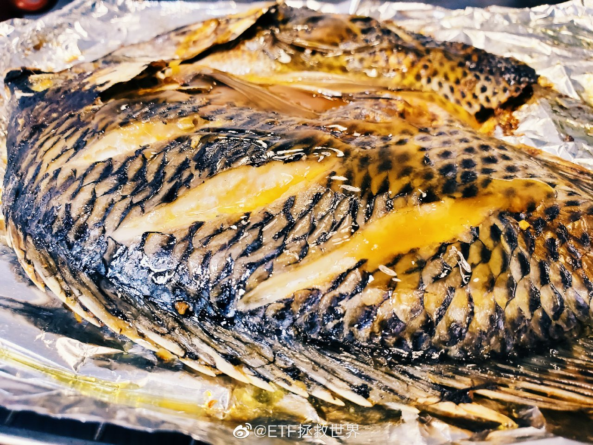

======================================================

ETF拯救世界 (5687069307) @
2020-04-03 22:34:59 Fri  
url: https://weibo.com/5687069307/IBEWk5Pkp

美国和欧洲会不会跌破前低很关键 ​​​

转发[16]  评论[246]  赞[1486] 

======================================================

ETF拯救世界 (5687069307) @
2020-04-04 00:13:48 Sat  
url: https://weibo.com/5687069307/IBFAqB5nR

[蜡烛][蜡烛][蜡烛]

愿逝者安息，天佑中华。 ​​​

转发[61]  评论[452]  赞[2636] 

======================================================

ETF拯救世界 (5687069307) @
2020-04-05 11:02:28 Sun  
url: https://weibo.com/5687069307/IBTgdDwMo

2020.4.5   晴   12℃

今日计划：

做研究；写东西；健身环；断食24小时；思考一件事；看一本日本推理小说。 ​​​

转发[14]  评论[461]  赞[2139] 

======================================================

ETF拯救世界 (5687069307) @
2020-04-05 13:42:41 Sun  
url: https://weibo.com/5687069307/IBUjgce9l

最近一段时间看微博，发现关注的绝大多数做投资的人，三观都挺正的。在大是大非面前，屁股不歪。

但是有些这几年红的，或者是曾经红过的“宏观经济大师”，什么事儿都能说两句的经济专家发表的某些言论，就让人非常反感。不是说不能批评，你不能颠倒黑白肆意抹黑。

以前我觉得以后孩子学什么都无所谓 ​​​

转发[57]  评论[295]  赞[1921] 

======================================================

ETF拯救世界 (5687069307) @
2020-04-05 14:19:20 Sun  
url: https://weibo.com/5687069307/IBUy89o7X

屯不屯粮食我不做建议，谁知道未来会怎样，买几袋放家里也没什么所谓，真空包装保质期也有一两年。但这位博主说的，关于浪费粮食的事情我非常赞同。先不要讨论粮食紧缺不紧缺，在座的每位能不能从今天开始把所有买的，做的食物吃干净不要浪费？做到这一点就等于粮食产量增加20%吧。

------------------------------------------------------
转推：
>  @范志红_原创营养信息 (1496878501)
>  2020-04-04 15:28:27 Sat  
>  url: https:/weibo.com/1496878501/IBLzGAmlB/

>  【不要囤粮】每次开会吃盒饭，都看到其中一半左右的大米饭被扔掉。疫情期间，因为减少了餐饮外食，减少了会议盒饭，我相信能省出来数量惊人的粮食。少喝点酒，少吃点高度加工的零食，又能省下大量的粮食。
>  
>  关键是，酒类和不健康食物虽然也是粮食做的，但去掉了粮食中的大部分维生素、矿物质和保健成分 ​​​

转发[50]  评论[243]  赞[1615] 

======================================================

ETF拯救世界 (5687069307) @
2020-04-05 16:15:04 Sun  
url: https://weibo.com/5687069307/IBVj6voN6

其实人生的乐趣之一，就是享受那些好的产品带来的愉悦感。

很有意思的，是有些最好的产品其实花不了多少钱。比如平常写字的中性笔，好像也叫签字笔的。

之前被带货的那款，10支9.9，确实真的便宜，好用不好用我也不知道，没用过。但实际上，公认的几乎是最好用的中性笔，也就十块钱左右一支。一般人 ​​​

转发[80]  评论[413]  赞[1804] 

======================================================

ETF拯救世界 (5687069307) @
2020-04-05 23:56:15 Sun  
url: https://weibo.com/5687069307/IBYkiz37T

看完了。3.5分吧。 ​​​

转发[5]  评论[178]  赞[692] 

+++++++++++++++++++++++++++++++++++++++++++++++++++++

图片：
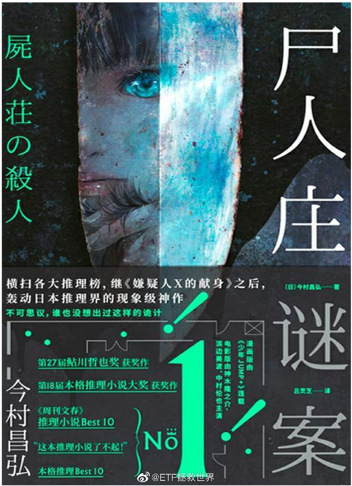

======================================================

ETF拯救世界 (5687069307) @
2020-04-06 12:17:12 Mon  
url: https://weibo.com/5687069307/IC3b3jZK8

年初说的送礼物，忙到今天才来得及统计。请公众号的以下朋友去公众号私信我拿礼物。

五篇评论沙发：（每位500元京东购物卡）
方枪枪、贺云仙、小火人、宁静致远、阳光

五篇评论第六（2.3大盘收盘个位数）：（每位500元京东购物卡）
Xswl、KWOK、黄鑫、想一想、hx

五篇打赏最多：（一位苹果airpods 2 ​​​

转发[7]  评论[343]  赞[1526] 

======================================================

ETF拯救世界 (5687069307) @
2020-04-06 16:15:19 Mon  
url: https://weibo.com/5687069307/IC4JHAAwg

一天又卖？

------------------------------------------------------
转推：
>  @ETF拯救世界 (5687069307)
>  2020-04-03 14:42:01 Fri  
>  url: https:/weibo.com/5687069307/IBBQljVrb/

>  最高价卖出，第三天打折接回，这个效率还可以。 ​​​

转发[3]  评论[156]  赞[921] 

======================================================

ETF拯救世界 (5687069307) @
2020-04-06 16:48:32 Mon  
url: https://weibo.com/5687069307/IC4Xc88q3

逆行扣3分，骂人能不能算寻衅滋事扣9分？

------------------------------------------------------
转推：
>  @北京人不知道的北京事儿 (1662214194)
>  2020-04-06 11:06:33 Mon  
>  url: https:/weibo.com/1662214194/IC2InlLPB/

>  网友投稿：北京昌平区水库路，一辆银色别克逆行，前面的车差点和它撞上，被迫压上自行车道给它让行。我没让，他摇下车窗骂我、对我吐痰还竖中指。。。京N333D1！这样的司机该怎么处罚？[摊手]http://t.cn/A6Z3thGm ​​​

转发[17]  评论[94]  赞[530] 

======================================================

ETF拯救世界 (5687069307) @
2020-04-06 22:29:02 Mon  
url: https://weibo.com/5687069307/IC7bowH1I

多大点事儿啊。 ​​​

转发[2]  评论[208]  赞[1209] 

======================================================

ETF拯救世界 (5687069307) @
2020-04-07 08:49:13 Tue  
url: https://weibo.com/5687069307/ICbf892DF

感觉这个病毒是有智慧的而且挺要面子——

你看不起我，我就给你颜色看看。你觉得我好欺负想要群体免疫，我就让你的BOSS进ICU。 

希望首相大人没事，希望中英友好。 ​​​

转发[19]  评论[218]  赞[1670] 

======================================================

ETF拯救世界 (5687069307) @
2020-04-07 09:16:06 Tue  
url: https://weibo.com/5687069307/ICbq2u2AS

某些etf的做市商，我劝你善良。不要搞太大折价。 ​​​

转发[4]  评论[120]  赞[1215] 

======================================================

ETF拯救世界 (5687069307) @
2020-04-07 09:33:10 Tue  
url: https://weibo.com/5687069307/ICbwY8OHO

现在是不是有了更深的体会。

------------------------------------------------------
转推：
>  @ETF拯救世界 (5687069307)
>  2019-12-09 10:30:04 Mon  
>  url: https:/weibo.com/5687069307/IjWCtuoaE/

>  市场免不了波动。我们身处其中，无法规避波动。
>  
>  那么，如何将波动为我所用，才是我们应该考虑的。
>  
>  而不是面对波动患得患失，心惊胆战，猜来猜去，底部丢筹码，顶部接盘。 ​​​

转发[28]  评论[110]  赞[1067] 

======================================================

ETF拯救世界 (5687069307) @
2020-04-07 09:46:58 Tue  
url: https://weibo.com/5687069307/ICbCzmcmg

有些只差一两厘没有成交的朋友，可能心情会比较沮丧，觉得不舒服。

这种事情，别说三分钟，一秒钟都不要沮丧。要不就坦然接受，要不就马上考虑后续怎么修正你自己的策略。是挂低一点，还是定个规则，比如几厘之内改手动。

慢慢的，适合你自己的策略就成型了。

沮丧，失望有什么用？P用都没有。这是 ​​​

转发[76]  评论[457]  赞[1942] 

======================================================

ETF拯救世界 (5687069307) @
2020-04-07 18:38:06 Tue  
url: https://weibo.com/5687069307/ICf69Bs8Q

海豚很聪明。所以我总有一种感觉，它们被关在水族馆一定比其它动物痛苦。

------------------------------------------------------
转推：
>  @扬子晚报 (1653603955)
>  2020-04-06 23:35:03 Mon  
>  url: https:/weibo.com/1653603955/IC7Cc6ct5/

>  【可爱到犯规！#树懒因行动缓慢被挑着参观水族馆# 海豚看到后竟效仿它倒立】近日，美国的一只名叫“Chico”的树懒到得克萨斯州立水族馆“包场”参观。由于让它自己闲逛会非常缓慢，因此工作人员让它挂在树枝上，并带着它逛水族馆。水族馆的海豚见到Chico后非常好奇，一只海豚甚至还效仿Chico做了一个倒 ​​​

转发[43]  评论[235]  赞[1239] 

======================================================

ETF拯救世界 (5687069307) @
2020-04-08 09:34:08 Wed  
url: https://weibo.com/5687069307/ICkXRex5X

17岁的时候喜欢喝摩卡、拿铁、星冰乐。

18岁了只喜欢黑咖啡。 ​​​

转发[14]  评论[437]  赞[1331] 

======================================================

ETF拯救世界 (5687069307) @
2020-04-08 11:13:48 Wed  
url: https://weibo.com/5687069307/IClCjlA6r

说真的，我特别支持每个人都有自己不同的思想。既然不同，那就一定有比较偏激的，有并不客观的。我认为都无所谓，那才是正常的。众口一词并不是什么好事。

但是，必须是表达自己的真实思维。如果一开始就为了达到目的编造谎言，就不能接受。

如果不能表达你的真实想法，可以闭嘴不说。为了达到目的说 ​​​

转发[34]  评论[187]  赞[1582] 

======================================================

ETF拯救世界 (5687069307) @
2020-04-08 11:31:08 Wed  
url: https://weibo.com/5687069307/IClJluKOw

回复@gaojialiang1:你在你自己微博骂我，我不会去你微博回骂啊。你随便骂。就像你可以在你家跟你媳妇说我的孩子难看。但你天天蹲我家门口对我说：“你儿子真难看，怎么这么难看，太难看了，中国最难看。”我还不能轰你走？//@gaojialiang1:同意，但有人骂你你不也拉黑他吗

------------------------------------------------------
转推：
>  @ETF拯救世界 (5687069307)
>  2020-04-08 11:13:48 Wed  
>  url: https:/weibo.com/5687069307/IClCjlA6r/

>  说真的，我特别支持每个人都有自己不同的思想。既然不同，那就一定有比较偏激的，有并不客观的。我认为都无所谓，那才是正常的。众口一词并不是什么好事。
>  
>  但是，必须是表达自己的真实思维。如果一开始就为了达到目的编造谎言，就不能接受。
>  
>  如果不能表达你的真实想法，可以闭嘴不说。为了达到目的说 ​​​

转发[6]  评论[117]  赞[913] 

======================================================

ETF拯救世界 (5687069307) @
2020-04-08 11:43:57 Wed  
url: https://weibo.com/5687069307/IClOyahXr

虽然有些专利很水，但量变到质变是可以期待的。

------------------------------------------------------
转推：
>  @ ()
>  2020-04-08 11:40:55 Wed  
>  url: 

>  抱歉，作者已设置仅展示半年内微博，此微博已不可见。 ​​​

转发[247]  评论[142]  赞[858] 

======================================================

ETF拯救世界 (5687069307) @
2020-04-08 13:06:12 Wed  
url: https://weibo.com/5687069307/ICmlW6Keq

上上下下不停的吃真的会感到不好意思

------------------------------------------------------
转推：
>  @ETF拯救世界 (5687069307)
>  2020-04-03 14:42:01 Fri  
>  url: https:/weibo.com/5687069307/IBBQljVrb/

>  最高价卖出，第三天打折接回，这个效率还可以。 ​​​

转发[11]  评论[204]  赞[1016] 

======================================================

ETF拯救世界 (5687069307) @
2020-04-08 13:06:59 Wed  
url: https://weibo.com/5687069307/ICmmg9O2y

今晚做个天妇罗。 ​​​

转发[4]  评论[140]  赞[1047] 

======================================================

ETF拯救世界 (5687069307) @
2020-04-08 13:26:13 Wed  
url: https://weibo.com/5687069307/ICmu4cZou

看到在座的各位都挣钱是我最高兴的事。

真心的。 ​​​

转发[11]  评论[406]  赞[2376] 

======================================================

ETF拯救世界 (5687069307) @
2020-04-08 14:15:21 Wed  
url: https://weibo.com/5687069307/ICmO0fVuY

做波段并不只是为了吃区间利润。也有另一个目的，即你买的品种趋势不好，中期会下跌。但下跌并非一路跌到底，中间会有无数反弹。

你把反弹利润吃到了，你的安全垫就加厚了。当品种持续下跌后，你买了很多筹码，但由于过程中不断吃反弹利润，成本持续降低，最终在底部区间你只是极少浮亏甚至没有浮亏。 ​​​

转发[243]  评论[277]  赞[1613] 

======================================================

ETF拯救世界 (5687069307) @
2020-04-08 14:30:07 Wed  
url: https://weibo.com/5687069307/ICmU0hAee

两天时间新留言就这么多了。中奖的朋友，如果我没回复你，再给我发条信息吧。已经淹没在人海中了。没事儿的朋友先别发信息给我了…… http://t.cn/A6Zsi36m

------------------------------------------------------
转推：
>  @ETF拯救世界 (5687069307)
>  2020-04-06 12:17:12 Mon  
>  url: https:/weibo.com/5687069307/IC3b3jZK8/

>  年初说的送礼物，忙到今天才来得及统计。请公众号的以下朋友去公众号私信我拿礼物。
>  
>  五篇评论沙发：（每位500元京东购物卡）
>  方枪枪、贺云仙、小火人、宁静致远、阳光
>  
>  五篇评论第六（2.3大盘收盘个位数）：（每位500元京东购物卡）
>  Xswl、KWOK、黄鑫、想一想、hx
>  
>  五篇打赏最多：（一位苹果airpods 2 ​​​

转发[2]  评论[38]  赞[577] 

======================================================

ETF拯救世界 (5687069307) @
2020-04-08 14:33:15 Wed  
url: https://weibo.com/5687069307/ICmVhazqF

成心是吧？[怒] http://t.cn/A6Zs6Cxf //@ETF拯救世界:两天时间新留言就这么多了。中奖的朋友，如果我没回复你，再给我发条信息吧。已经淹没在人海中了。没事儿的朋友先别发信息给我了…… http://t.cn/A6Zsi36m

------------------------------------------------------
转推：
>  @ETF拯救世界 (5687069307)
>  2020-04-06 12:17:12 Mon  
>  url: https:/weibo.com/5687069307/IC3b3jZK8/

>  年初说的送礼物，忙到今天才来得及统计。请公众号的以下朋友去公众号私信我拿礼物。
>  
>  五篇评论沙发：（每位500元京东购物卡）
>  方枪枪、贺云仙、小火人、宁静致远、阳光
>  
>  五篇评论第六（2.3大盘收盘个位数）：（每位500元京东购物卡）
>  Xswl、KWOK、黄鑫、想一想、hx
>  
>  五篇打赏最多：（一位苹果airpods 2 ​​​

转发[1]  评论[131]  赞[705] 

======================================================

ETF拯救世界 (5687069307) @
2020-04-08 16:44:54 Wed  
url: https://weibo.com/5687069307/ICnMIedxW

里面有好东西。

------------------------------------------------------
转推：
>  @ ()
>  2020-04-08 05:46:54 Wed  
>  url: 

>  抱歉，作者已设置仅展示半年内微博，此微博已不可见。 ​​​

转发[103]  评论[258]  赞[1194] 

======================================================

ETF拯救世界 (5687069307) @
2020-04-08 19:25:45 Wed  
url: https://weibo.com/5687069307/ICoPZzbTm

韩寒38了，看看这个身材，你还有什么理由不爬起来锻炼。//@落魄的三叔: 一方锻炼，八方点赞。//@月半日寸厨房:我要不要挑战一下？我年轻时五公里跑轻松进18分。现在轻松进40分[笑cry]。顺便减肥。点赞够100，我今年10月份吧，交作业。18分40吧。//@我没在石棱中:以前就是短跑运动员～三重门写的好像

------------------------------------------------------
转推：
>  @ ()
>  2020-04-08 18:22:58 Wed  
>  url: 

>  抱歉，作者已设置仅展示半年内微博，此微博已不可见。 ​​​

转发[45]  评论[216]  赞[1006] 

======================================================

ETF拯救世界 (5687069307) @
2020-04-08 19:55:48 Wed  
url: https://weibo.com/5687069307/ICp2c0JGx

消费又出爆款了。规律是什么来的？ ​​​

转发[53]  评论[232]  赞[1627] 

======================================================

ETF拯救世界 (5687069307) @
2020-04-08 22:48:33 Wed  
url: https://weibo.com/5687069307/ICqajhokx

看看湖北的朋友怎么说。

------------------------------------------------------
转推：
>  @ ()
>  2020-04-08 21:31:53 Wed  
>  url: 

>  抱歉，作者已设置仅展示半年内微博，此微博已不可见。 ​​​

转发[68]  评论[498]  赞[3653] 

======================================================

ETF拯救世界 (5687069307) @
2020-04-09 00:01:15 Thu  
url: https://weibo.com/5687069307/ICqDP0t9w

关于FF，最后再写两句，从此不再评论。

之前一直听说她以及她的日记。但是这两个月从资本市场到私人事务各种鸡飞狗跳，哪里有空去看那一篇篇巨长的日记，所以真的没有认真看过。但是知道被很多人骂，也有很多人支持。

今天知道日记结束后光速出版了英文版和德文版，结合目前海外对华舆论环境不佳的情 ​​​

转发[28]  评论[397]  赞[3197] 

======================================================

ETF拯救世界 (5687069307) @
2020-04-09 09:07:30 Thu  
url: https://weibo.com/5687069307/ICudxxA6w

再看看，那天是不是最低//@ETF拯救世界:不知道为什么，今天很多人慌张的问：有石油开采公司申请破产了，是不是石油类基金都彻底完蛋了，要割肉吗？我就想起了这段往事。

------------------------------------------------------
转推：
>  @ETF拯救世界 (5687069307)
>  2020-04-02 14:55:59 Thu  
>  url: https:/weibo.com/5687069307/IBsvw8dSx/

>  举个例子吧。
>  
>  大家都知道我那次“捷达换宝马”的操作。2008年一辆捷达资金的买入，最终在上汽上面收获了不止一辆宝马的利润。
>  
>  对于那次操作，各位可以去看当时的记录，没什么好说的。只是有一点我几乎没有说过，但是记忆异常深刻，在这里分享。
>  
>  2009年初，那时候我已经买了很多上汽。但是就在那个风 ​​​

转发[22]  评论[103]  赞[861] 

======================================================

ETF拯救世界 (5687069307) @
2020-04-09 09:12:58 Thu  
url: https://weibo.com/5687069307/ICufLgliy

很多时候你绝望了，也再坚持一下，也许希望就在一秒后。

有空再看看《迷雾》 ​​​

转发[68]  评论[207]  赞[1431] 

======================================================

ETF拯救世界 (5687069307) @
2020-04-09 09:39:39 Thu  
url: https://weibo.com/5687069307/ICuqACzRi

如果上个月场内油气换416，不做套利目前账面收益率大概是这样。套利的话可以上50%

如果没有换基本上没动。 ​​​

转发[0]  评论[523]  赞[2091] 

+++++++++++++++++++++++++++++++++++++++++++++++++++++

图片：
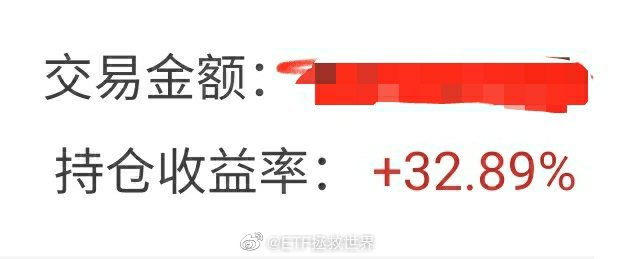

======================================================

ETF拯救世界 (5687069307) @
2020-04-09 10:35:42 Thu  
url: https://weibo.com/5687069307/ICuNllwqT

最新数据，全指医药已经不再便宜。持仓的拿住，最好不要再买了。 ​​​

转发[78]  评论[220]  赞[1429] 

======================================================

ETF拯救世界 (5687069307) @
2020-04-09 11:02:39 Thu  
url: https://weibo.com/5687069307/ICuYhtlH3

上方第一个压力位11600

------------------------------------------------------
转推：
>  @ETF拯救世界 (5687069307)
>  2020-04-09 10:35:42 Thu  
>  url: https:/weibo.com/5687069307/ICuNllwqT/

>  最新数据，全指医药已经不再便宜。持仓的拿住，最好不要再买了。 ​​​

转发[47]  评论[114]  赞[974] 

======================================================

ETF拯救世界 (5687069307) @
2020-04-09 11:42:40 Thu  
url: https://weibo.com/5687069307/ICvewuScw

今天意思不大，是不是就先散了。 ​​​

转发[3]  评论[180]  赞[1257] 

======================================================

ETF拯救世界 (5687069307) @
2020-04-09 13:21:20 Thu  
url: https://weibo.com/5687069307/ICvSA7E8m

不好意思我又回来了。

有一件挺感动的事儿。之前公众号拿到礼物的有一位“可爱的嘟嘟”，她跟我说，愿意把礼品转送给昨天在微博评论里的那位武汉博友 @PS晴晴 。 我答应了，那我就把airpods 2 耳机送给这位博友。我也会另外再送小礼物给可爱的嘟嘟。

每当我觉得这个世界黑暗的时候，总会有一些善良的 ​​​

转发[20]  评论[530]  赞[2913] 

+++++++++++++++++++++++++++++++++++++++++++++++++++++

图片：
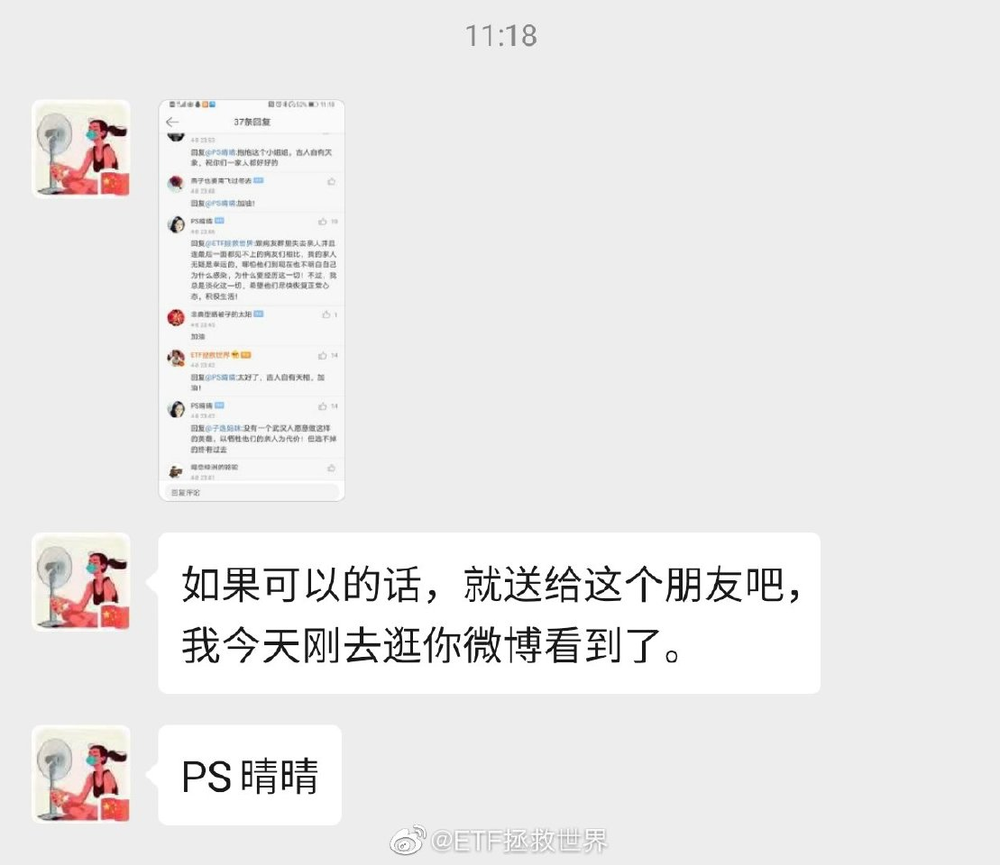

======================================================

ETF拯救世界 (5687069307) @
2020-04-09 15:15:42 Thu  
url: https://weibo.com/5687069307/ICwD0eAR0

回复@nwdslzxy:刚才确认了，凡是加群的都是骗子，不要加//@nwdslzxy:刚才自称华宝证券的客服打电话给我让我加入华宝证券的股票群，请问你们有接到类似电话吗？

------------------------------------------------------
转推：
>  @ETF拯救世界 (5687069307)
>  2020-04-09 13:21:20 Thu  
>  url: https:/weibo.com/5687069307/ICvSA7E8m/

>  不好意思我又回来了。
>  
>  有一件挺感动的事儿。之前公众号拿到礼物的有一位“可爱的嘟嘟”，她跟我说，愿意把礼品转送给昨天在微博评论里的那位武汉博友 @PS晴晴 。 我答应了，那我就把airpods 2 耳机送给这位博友。我也会另外再送小礼物给可爱的嘟嘟。
>  
>  每当我觉得这个世界黑暗的时候，总会有一些善良的 ​​​

转发[3]  评论[152]  赞[871] 

======================================================

ETF拯救世界 (5687069307) @
2020-04-09 22:14:17 Thu  
url: https://weibo.com/5687069307/ICzmUeZoG

最终最低点8255，没有有效跌破8200。目前点位10500，反弹28%。前方第一个大的压力位是11000，冲过去难度比较大。如果过不去回调，前期低点附近会有很强很强的支撑。

------------------------------------------------------
转推：
>  @ETF拯救世界 (5687069307)
>  2020-03-23 16:22:24 Mon  
>  url: https:/weibo.com/5687069307/IzWND4ItA/

>  如果DAX有效跌破8200，那就是最强的一根支撑破掉了。再往下是多少很难判断了。
>  
>  要是一定一定要给个点位，那就是6200周围。问题是，这也太低了吧！
>  
>  不过综合最近40年美国和英国的指数走势看，极限跌幅确实还有30%。这个真的是极限了，如果还止不住，那可能就是要全面推倒重来了。 ​​​

转发[197]  评论[213]  赞[1323] 

======================================================

ETF拯救世界 (5687069307) @
2020-04-09 23:17:20 Thu  
url: https://weibo.com/5687069307/ICzMuo8Jk

早点睡吧。钱是挣不完的。

头发要紧。 ​​​

转发[17]  评论[272]  赞[1677] 

======================================================

ETF拯救世界 (5687069307) @
2020-04-10 08:58:25 Fri  
url: https://weibo.com/5687069307/ICDAm1Hrm

设置好的反弹出货价，到了就果断出，一切按计划行事。

别一看涨了就抠抠索索又怕赚少了不舍得卖。大不了多留点。

别相信你的感觉，感觉在市场上是最没用的东西。 ​​​

转发[1128]  评论[281]  赞[1727] 

======================================================

ETF拯救世界 (5687069307) @
2020-04-10 09:11:59 Fri  
url: https://weibo.com/5687069307/ICDFRCJMm

2。恕我直言，对绝大多数人来说，不沾黄赌毒，不乱投资，45岁有2000万这辈子基本稳了。毕竟你不可能45岁任何事情都不干，以后一点钱赚不到。另外2000万买理财一年也有70万收入。300万美元在任何国家都是富人了。 50%的机会45岁一分钱都没有，这个太可怕了。概率降到30%我都不愿意尝试。

------------------------------------------------------
转推：
>  @ ()
>  2020-04-10 08:52:31 Fri  
>  url: 

>  抱歉，作者已设置仅展示半年内微博，此微博已不可见。 ​​​

转发[66]  评论[274]  赞[1292] 

======================================================

ETF拯救世界 (5687069307) @
2020-04-10 10:22:31 Fri  
url: https://weibo.com/5687069307/ICE8uluna

很多朋友不同意我说不要碰黄赌毒中的黄，觉得黄可以接受。

最近的新闻，大集团总裁，上市公司独董，碰了，挂了。人生就此改变。

很多事情不必亲身去尝试，每天看看新闻也能学到很多。

违法的“黄”，不碰为妙。有些不违法但是违背社会公序良俗的，也要慎重。 ​​​

转发[32]  评论[397]  赞[3035] 

======================================================

ETF拯救世界 (5687069307) @
2020-04-10 11:20:05 Fri  
url: https://weibo.com/5687069307/ICEvRqf97

第一波冲击被强力压制。//@ETF拯救世界:上方第一个压力位11600

------------------------------------------------------
转推：
>  @ETF拯救世界 (5687069307)
>  2020-04-09 10:35:42 Thu  
>  url: https:/weibo.com/5687069307/ICuNllwqT/

>  最新数据，全指医药已经不再便宜。持仓的拿住，最好不要再买了。 ​​​

转发[11]  评论[70]  赞[796] 

======================================================

ETF拯救世界 (5687069307) @
2020-04-10 11:31:39 Fri  
url: https://weibo.com/5687069307/ICEAyaBuQ

你们玩动 森的，会不会有一天突然服务器连不上了。 ​​​

转发[6]  评论[150]  赞[966] 

======================================================

ETF拯救世界 (5687069307) @
2020-04-10 11:32:40 Fri  
url: https://weibo.com/5687069307/ICEAXA8sp

为什么我感觉今天的直播销售额会大幅下降。 ​​​

转发[4]  评论[204]  赞[1210] 

======================================================

ETF拯救世界 (5687069307) @
2020-04-10 13:22:57 Fri  
url: https://weibo.com/5687069307/ICFjJaE4a

. ​​​

转发[79]  评论[364]  赞[1893] 

+++++++++++++++++++++++++++++++++++++++++++++++++++++

图片：

======================================================

ETF拯救世界 (5687069307) @
2020-04-10 18:07:07 Fri  
url: https://weibo.com/5687069307/ICHb4lBLI

有很多人，尤其是年轻人，特别害怕别人不知道自己的家庭背景，财务状况。所以才会出很多事儿，比如“你知道我是谁吗”“你知道我爸是谁吗”“信不信我用钱砸死你”。然后就挂了。

或者一到亲戚朋友同学聚会就怕别人看低自己，想尽办法吹。“啊，GWY，咱有银儿，包我身上”“马Y还是马HT？没问题，下个 ​​​

转发[126]  评论[515]  赞[2648] 

======================================================

ETF拯救世界 (5687069307) @
2020-04-11 20:17:14 Sat  
url: https://weibo.com/5687069307/ICRsnxWnM

回复@七月-阳光:第一，考虑全屋定制。收纳空间会大增。第二，二手房成交价与装修水平有一定关系。所以装的好点卖房的时候没准能赚回来，所以别弄太差//@七月-阳光:益达，之前装修房子有什么经验可以分享吗？

------------------------------------------------------
转推：
>  @ETF拯救世界 (5687069307)
>  2020-04-10 18:07:07 Fri  
>  url: https:/weibo.com/5687069307/ICHb4lBLI/

>  有很多人，尤其是年轻人，特别害怕别人不知道自己的家庭背景，财务状况。所以才会出很多事儿，比如“你知道我是谁吗”“你知道我爸是谁吗”“信不信我用钱砸死你”。然后就挂了。
>  
>  或者一到亲戚朋友同学聚会就怕别人看低自己，想尽办法吹。“啊，GWY，咱有银儿，包我身上”“马Y还是马HT？没问题，下个 ​​​

转发[48]  评论[157]  赞[1018] 

======================================================

ETF拯救世界 (5687069307) @
2020-04-12 19:41:18 Sun  
url: https://weibo.com/5687069307/ID0EisWLl

据说欣赏我的人最后都幸福了[doge] ​​​

转发[12]  评论[571]  赞[2373] 

+++++++++++++++++++++++++++++++++++++++++++++++++++++

图片：

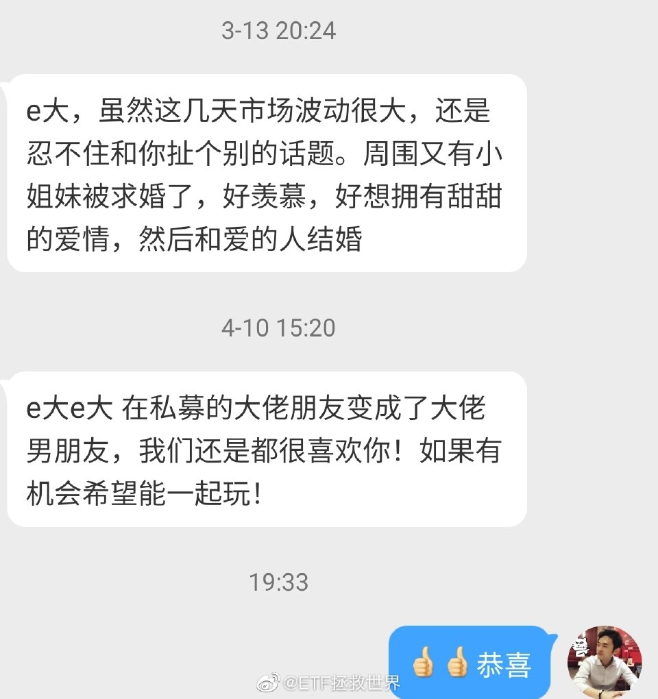

======================================================

ETF拯救世界 (5687069307) @
2020-04-13 09:37:10 Mon  
url: https://weibo.com/5687069307/ID67zF9fS

发车不发车，

第一我会考虑仓位

第二我会考虑现金流

第三我会考虑估值/趋势

第四我会考虑宏观环境

会有个综合判断。我要保证发生极端情况你心态不崩+还有钱买入。

所以发不发都不要问，不要催，不要急。你要觉得特别想交易就自己交易。 ​​​

转发[133]  评论[499]  赞[2469] 

======================================================

ETF拯救世界 (5687069307) @
2020-04-13 09:54:19 Mon  
url: https://weibo.com/5687069307/ID6ex8pfm

李佳琦微博送十瓶SKII神仙水居然有几十万转发评论。不懂，神仙水这么受姑娘们欢迎吗。

好吧，明年3.8送神仙水。没有任何转评赞要求，直接送。[太开心] ​​​

转发[23]  评论[1055]  赞[3680] 

======================================================

ETF拯救世界 (5687069307) @
2020-04-13 10:08:09 Mon  
url: https://weibo.com/5687069307/ID6k9esz2

有没有学习好的同学说说，如果这个公投真的通过了，加州真能独立吗。还是说这就是一出闹剧，即使通过了也不可能独立。

------------------------------------------------------
转推：
>  @ ()
>  2020-04-13 09:09:51 Mon  
>  url: 

>  抱歉，作者已设置仅展示半年内微博，此微博已不可见。 ​​​

转发[14]  评论[252]  赞[1156] 

======================================================

ETF拯救世界 (5687069307) @
2020-04-13 12:44:51 Mon  
url: https://weibo.com/5687069307/ID7lKxlcd

曾经有一位老人家说过，

ZZ就是把自己的人搞得多多的，把敌人的人搞得少少的。

怎么感觉现在到处点火，朋友（哪怕是面儿上的）越来越少了。

这样下去不行啊。只会让真正的敌人趁虚而入。 ​​​

转发[37]  评论[338]  赞[1793] 

======================================================

ETF拯救世界 (5687069307) @
2020-04-13 14:26:39 Mon  
url: https://weibo.com/5687069307/ID814sxPs

高管和幼女这件事，我臆测一下，背后是有一些东西我们还不知道的。三方都是如此。

但是，无论如何，无论如何，一个成年人，与14岁的女孩发生性行为，都是决不可饶恕的，一定要有牢狱之灾。我不懂法律，但我认为这就是人民群众的民意。

刚才看了个商业影响力的榜单，前几十位都没有东子。不胜唏嘘啊。 ​​​

转发[25]  评论[222]  赞[1866] 

======================================================

ETF拯救世界 (5687069307) @
2020-04-13 14:42:11 Mon  
url: https://weibo.com/5687069307/ID87npr2D

为什么我下不了决心给你们开个交友帖。我记得去年有个关注我的姑娘刚失恋想找个男朋友，我就帮着转了一下，结果有些人的评论就很不友善，挑人家这个那个的。其实我看人那姑娘多好啊，长得也挺好看，条件什么都挺好的。

所以我就怕人家说想找个男朋友，一堆人在底下说三道四品头论足，人家自己的微博平 ​​​

转发[4]  评论[351]  赞[1870] 

======================================================

ETF拯救世界 (5687069307) @
2020-04-13 15:00:04 Mon  
url: https://weibo.com/5687069307/ID8eE3jV7

无惊无险，又到三点。

欢乐的时光总是特别快，又到时间说白白。明儿见吧…… ​​​

转发[3]  评论[159]  赞[1425] 

======================================================

ETF拯救世界 (5687069307) @
2020-04-13 15:08:02 Mon  
url: https://weibo.com/5687069307/ID8hS3n7c

看了眼私信，好多朋友因为关注不到100天憋得难受想说话。

我把限制改成7天各位老朋友觉得怎么样。征求你的意见。看评论里面选项点赞数决定。 ​​​

转发[10]  评论[1193]  赞[9965] 

======================================================

ETF拯救世界 (5687069307) @
2020-04-14 11:27:11 Tue  
url: https://weibo.com/5687069307/IDggJ2q96

前一阵血雨腥风中，你买的美、德、日、港，全部赚钱了。

然而如果你在高位追芯片和5G，那大概率被套了。

所以，你应该喜欢暴跌还是暴涨，这是一个原则问题，你自己得清楚。 ​​​

转发[94]  评论[341]  赞[1988] 

======================================================

ETF拯救世界 (5687069307) @
2020-04-14 11:35:58 Tue  
url: https://weibo.com/5687069307/IDgki2QKL

回复@我是一只小毛驴从来也不怕:你5G赚了40%，是因为你买的低，是因为创业板跌了3、4年。我这个帖子的意思，不是在讨论品种，而是在讨论应该在哪里买。我掰开揉碎了，您再体会体会。//@我是一只小毛驴从来也不怕:5G赚了40%，这不是原则问题，是节奏问题

------------------------------------------------------
转推：
>  @ETF拯救世界 (5687069307)
>  2020-04-14 11:27:11 Tue  
>  url: https:/weibo.com/5687069307/IDggJ2q96/

>  前一阵血雨腥风中，你买的美、德、日、港，全部赚钱了。
>  
>  然而如果你在高位追芯片和5G，那大概率被套了。
>  
>  所以，你应该喜欢暴跌还是暴涨，这是一个原则问题，你自己得清楚。 ​​​

转发[15]  评论[147]  赞[1220] 

======================================================

ETF拯救世界 (5687069307) @
2020-04-14 17:27:37 Tue  
url: https://weibo.com/5687069307/IDiD1ozXg

来都来了，聊聊你今天过得怎么样。很舒服还是很糟心。

又或者只是普通糟心的一天。 ​​​

转发[25]  评论[1291]  赞[3223] 

======================================================

ETF拯救世界 (5687069307) @
2020-04-14 19:58:58 Tue  
url: https://weibo.com/5687069307/IDjCsDQWN

今天晚餐是三文鱼+乌冬面，配餐的是孤独美食家第三季。 ​​​

转发[6]  评论[276]  赞[1370] 

======================================================

ETF拯救世界 (5687069307) @
2020-04-14 22:41:17 Tue  
url: https://weibo.com/5687069307/IDkGluxG3

我说句可能要挨骂的话，我现在隐隐觉得，我们这边到处出征的人里面，有敌人的内鬼。

否则很难解释为什么现在这种尤其需要朋友的时候却到处挑事儿。

还有一句更可能挨骂的话：

有人歧视你，你很生气。但你有没有想过，你是不是也歧视别人了。

远的不说了，就咱们这一圈邻居，从南到北，从西到东，哪 ​​​

转发[88]  评论[374]  赞[2492] 

======================================================

ETF拯救世界 (5687069307) @
2020-04-14 23:04:19 Tue  
url: https://weibo.com/5687069307/IDkPGE2qm

其实我感觉，人类解决了生存问题后，最终的需求是尊严。

回想一下，咱们看过、听过的无数悲剧，是不是很大比例都是因为一方感到失去尊严、被蔑视才发生的。无论别人是富有还是贫穷，都不要随意践踏别人的尊严。很多时候，很多人，为了尊严冲动起来连命都可以不要。 ​​​

转发[58]  评论[191]  赞[1933] 

======================================================

ETF拯救世界 (5687069307) @
2020-04-15 09:51:14 Wed  
url: https://weibo.com/5687069307/IDp4h4Upv

医药基金突破2018年5月高点。自“救命底”以来上涨70%。 ​​​

转发[24]  评论[213]  赞[1412] 

======================================================

ETF拯救世界 (5687069307) @
2020-04-15 10:06:24 Wed  
url: https://weibo.com/5687069307/IDpaqyHb6

其实大家应该再回忆一下当时医药面临的大利空。以及在那样利空下无数人是如何继续看空的。

在下降趋势中看空，短期很容易对。因为趋势不好，你唱空赢的概率就大。但中长期看就未必。

如果你是一个真正的投资者，而不是一个嘴炮，你就应该考虑，利空是否已经反映在股价上，是否已经过度反应。利空会不 ​​​

转发[152]  评论[190]  赞[1416] 

======================================================

ETF拯救世界 (5687069307) @
2020-04-15 10:17:02 Wed  
url: https://weibo.com/5687069307/IDpeKBd6Z

目前医药已经运行到相对高估+牛市上升趋势阶段。

这个阶段非常难。难在它不是便宜的阶段，可以买可以安心持仓。它虽然是上升趋势，但随时会转头向下。这个区间考虑的不是加仓，而是如何动态平衡。

既然已经到了这个区间，就照例给一个区间上限。目前医药的区间上限是15500左右。这个点位是特大级超级 ​​​

转发[370]  评论[315]  赞[1822] 

======================================================

ETF拯救世界 (5687069307) @
2020-04-15 10:28:50 Wed  
url: https://weibo.com/5687069307/IDpjxfui7

想要消费券。怎么还不发。[哼] ​​​

转发[6]  评论[265]  赞[1054] 

======================================================

ETF拯救世界 (5687069307) @
2020-04-15 11:41:05 Wed  
url: https://weibo.com/5687069307/IDpMRrW9I

炎热的日子里，除了柠檬水，也可以试试黄瓜片泡水喝。

黄瓜削皮切片放入玻璃凉杯，灌入凉白开水，稍微放置就可以了。喜欢喝冰水的，可以放入冰箱或者加入冰块。

个人认为口感很好，很清爽。这是去热带地区旅游的时候跟当地人学的，分享给你，夏天可以试试。 ​​​

转发[49]  评论[318]  赞[1560] 

======================================================

ETF拯救世界 (5687069307) @
2020-04-15 12:37:44 Wed  
url: https://weibo.com/5687069307/IDq9Ra9FV

有没有部门能想办法找出是谁干的。这要是被栽赃的就太冤了。推上一转，不堪设想。//@留几手: 香港人干的[并不简单]//@五岳散人:卧槽，疯了吧这是……

------------------------------------------------------
转推：
>  @ ()
>  2020-04-15 11:22:50 Wed  
>  url: 

>  抱歉，此微博已被作者删除。查看帮助：http://t.cn/Rfd3rQV

转发[29]  评论[130]  赞[742] 

======================================================

ETF拯救世界 (5687069307) @
2020-04-15 13:08:11 Wed  
url: https://weibo.com/5687069307/IDqmdnBYS

看网络上有些人的论调确实让人无话好说。在他们的认知里，似乎其它国家，外资公司全都是靠中国养活的。没有中国似乎这些国家就要民不聊生，公司就要统统倒闭了。

谢谢你了，这么说80、90年代之前别人都没法活了。

中国对于世界确实非常重要，尤其是经济方面，对很多国家和外资公司来说都是如此。但绝 ​​​

转发[173]  评论[315]  赞[2224] 

======================================================

ETF拯救世界 (5687069307) @
2020-04-15 13:24:59 Wed  
url: https://weibo.com/5687069307/IDqt2uZs4

回复@em半导体me:我们现在依然穷。人均GDP只有一万美元，人均收入只有3万人民币，4000多美元。只有15%的人够5000元（700多美元）个税起征点。美国人均收入4万刀，28万人民币。东京人均收入30万人民币。差太远了。

------------------------------------------------------
转推：
>  @ETF拯救世界 (5687069307)
>  2020-04-15 13:08:11 Wed  
>  url: https:/weibo.com/5687069307/IDqmdnBYS/

>  看网络上有些人的论调确实让人无话好说。在他们的认知里，似乎其它国家，外资公司全都是靠中国养活的。没有中国似乎这些国家就要民不聊生，公司就要统统倒闭了。
>  
>  谢谢你了，这么说80、90年代之前别人都没法活了。
>  
>  中国对于世界确实非常重要，尤其是经济方面，对很多国家和外资公司来说都是如此。但绝 ​​​

转发[91]  评论[164]  赞[1367] 

======================================================

ETF拯救世界 (5687069307) @
2020-04-15 13:44:07 Wed  
url: https://weibo.com/5687069307/IDqANC8Yi

这两车没发，是因为A股仓位合适。目前的一点留存资金，我希望找机会多配置一些境外市场。 ​​​

转发[12]  评论[306]  赞[1971] 

======================================================

ETF拯救世界 (5687069307) @
2020-04-16 09:42:12 Thu  
url: https://weibo.com/5687069307/IDyr6oWb1

对于一般人来说：

第一轮牛熊市你会赚不到钱。因为你不知道宴席吃完了要赶紧走，最后你留下买单了。

第二轮牛熊市你会赚的少。因为这一轮你有了上一轮的教训，吃几口凉菜就走了，最后你可能蹲路边看别人吃大餐，也可能别人吃完你又回来买单了。

第三轮牛熊市，你会吃到大餐，并且在买单前悄悄离场逃 ​​​

转发[356]  评论[673]  赞[2798] 

======================================================

ETF拯救世界 (5687069307) @
2020-04-16 09:51:18 Thu  
url: https://weibo.com/5687069307/IDyuNrn5e

为什么我觉得这个长得像《独立日》里面美国总统的人更像美国总统应该是的样子……

------------------------------------------------------
转推：
>  @王又又 (6498373231)
>  2020-04-16 09:06:38 Thu  
>  url: https:/weibo.com/6498373231/IDycFCLej/

>  #美国疫情# 加州州长Gavin Newsom14号宣布，将向居住在加州的非法移民提供现金付款，加州政府将拨款7500万美元，一群慈善组织已承诺再提供5000万美元，总计1.25亿美元。向15万名成年人每人发500美元。
>  
>  美联社估计加州有200万非法移民。他们没有资格获得国会上个月批准的2.2万亿美元刺激计划中的直接付 ​​​

转发[16]  评论[121]  赞[656] 

======================================================

ETF拯救世界 (5687069307) @
2020-04-16 14:06:18 Thu  
url: https://weibo.com/5687069307/IDAaiCS0i

有朋友私信我说，怎么医药极限位最高才15500吗，2015年都到过了啊。各位要清楚，2015是一个非常特殊的年份，光正规两融就2万多亿，配资也有几万亿。当时医药市盈率超过100倍。那已经极度脱离正常情况了。当年的极限位应该在11000左右。如果下次还能来几万亿的杠杆，那我说的15500你就当没看见就行了。

------------------------------------------------------
转推：
>  @ETF拯救世界 (5687069307)
>  2020-04-15 10:17:02 Wed  
>  url: https:/weibo.com/5687069307/IDpeKBd6Z/

>  目前医药已经运行到相对高估+牛市上升趋势阶段。
>  
>  这个阶段非常难。难在它不是便宜的阶段，可以买可以安心持仓。它虽然是上升趋势，但随时会转头向下。这个区间考虑的不是加仓，而是如何动态平衡。
>  
>  既然已经到了这个区间，就照例给一个区间上限。目前医药的区间上限是15500左右。这个点位是特大级超级 ​​​

转发[52]  评论[112]  赞[891] 

======================================================

ETF拯救世界 (5687069307) @
2020-04-16 14:21:07 Thu  
url: https://weibo.com/5687069307/IDAgjyoSw

我说的“极限点位”，是我的投资体系中的一个趋势判断系统。这个极限点位未必不会破，就像2018年，医药我的极限点位是7800，跌破后又跌了10%才见底。因为有时候有极端情绪等等因素。

不会每次都那么精准，但一定是在那个点位周围的一个区域，不会偏离太多。 ​​​

转发[125]  评论[220]  赞[1349] 

+++++++++++++++++++++++++++++++++++++++++++++++++++++

图片：
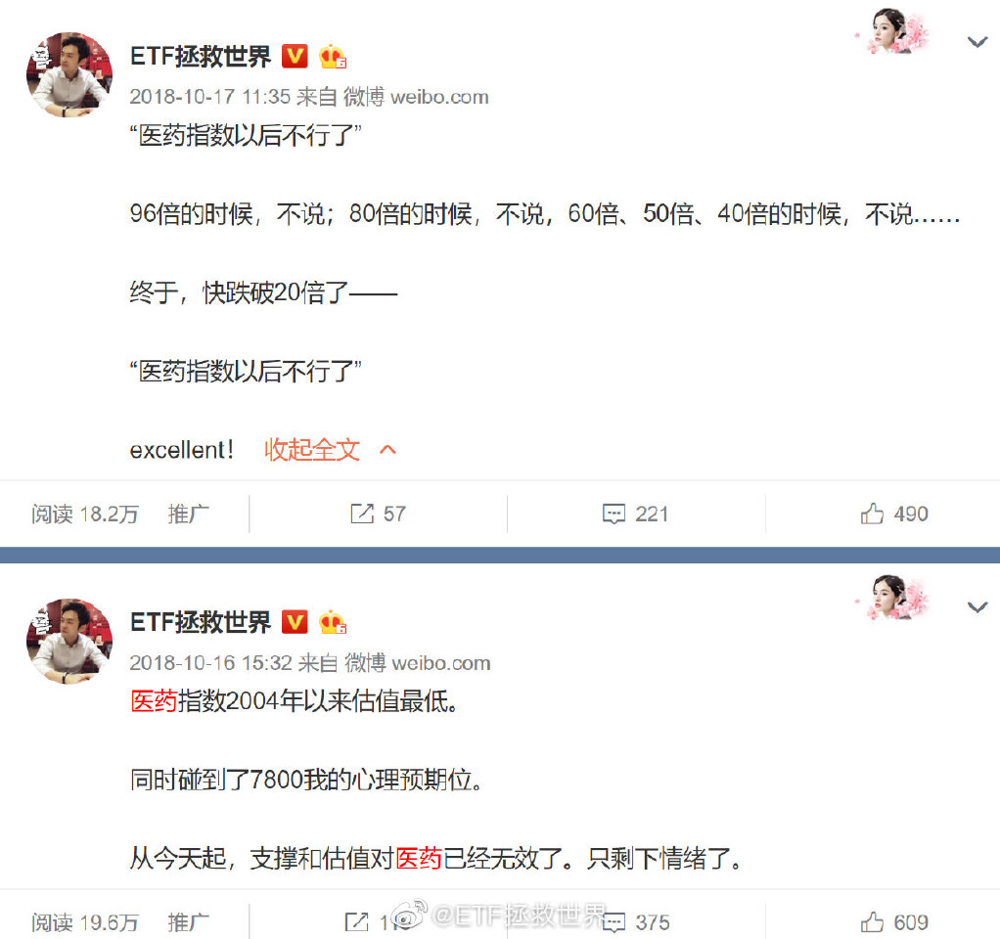

======================================================

ETF拯救世界 (5687069307) @
2020-04-16 14:29:20 Thu  
url: https://weibo.com/5687069307/IDAjEmYcF

我觉得挺好。融合了中国传统的乡村、奇趣、宗教以及色彩的审美。不走寻常路，期待！

------------------------------------------------------
转推：
>  @新财富杂志 (1708922835)
>  2020-04-16 14:22:56 Thu  
>  url: https:/weibo.com/1708922835/IDAh3moBg/

>  【#恒大莲花状足球场#：许家印亲自构思，大家来感受一下[喵喵]】 4月16日讯 位于番禺区的广州首座世界级专业足球场已经进入开工阶段。该球场采用荷花造型，由许家印亲自构思。恒大以68亿元底价拿下广州番禺区谢村体育设施地块及产业地块。这个恒大新足球场项目占地近50万平方米，计容建面94.1998万平方 ​​​

转发[31]  评论[207]  赞[919] 

======================================================

ETF拯救世界 (5687069307) @
2020-04-17 08:36:45 Fri  
url: https://weibo.com/5687069307/IDHr2aBXY

谁能想到一年多过去，京东马上新高了。

------------------------------------------------------
转推：
>  @ETF拯救世界 (5687069307)
>  2018-09-06 06:36:28 Thu  
>  url: https:/weibo.com/5687069307/Gy2QnDieS/

>  为了让大家了解炒股的风险，一觉醒来京东已经巨亏几百美元。
>  
>  怎么办。今天早餐只能喝自来水了。
>  
>  炒股害死人，不要炒股。血淋淋的教训。
>  
>  众筹今天的午饭，一会发支付宝账号。[失望] ​​​

转发[23]  评论[128]  赞[923] 

======================================================

ETF拯救世界 (5687069307) @
2020-04-17 08:47:23 Fri  
url: https://weibo.com/5687069307/IDHvlDzah

今天公开品种有机会再收一网 ​​​

转发[11]  评论[307]  赞[1475] 

======================================================

ETF拯救世界 (5687069307) @
2020-04-17 09:43:29 Fri  
url: https://weibo.com/5687069307/IDHS7tl0F

还不离婚吗。这以后晚上能睡踏实吗。

------------------------------------------------------
转推：
>  @新浪视频 (1640601392)
>  2020-04-17 09:09:03 Fri  
>  url: https:/weibo.com/1640601392/IDHE984aM/

>  【妻子#把平底锅锁丈夫脚踝限制出门#】4月15日，青海西宁一男子睡醒后，发现右脚脚踝处有一把锁，锁上还挂着一口平底锅。该男子报警求助，消防员到场后，用破拆工具将锁取下。男子称，妻子和他吵架后，趁他睡着，用此方法限制他出门。@有料 http://t.cn/A6waobnw ​​​

转发[8]  评论[150]  赞[679] 

======================================================

ETF拯救世界 (5687069307) @
2020-04-17 09:47:04 Fri  
url: https://weibo.com/5687069307/IDHTAcJTS

有打印的可能吗。现在墨仓式打印机打印成本很低了。

------------------------------------------------------
转推：
>  @新浪视频 (1640601392)
>  2020-04-17 09:42:02 Fri  
>  url: https:/weibo.com/1640601392/IDHRx9YuQ/

>  【心疼孩子上网课伤眼 #妈妈为孩子手抄课本试卷#用光20支笔芯】湖北洪湖，张同学是一名6年级学生，在家上网课时需要长时间看电子屏。妈妈担心孩子视力，就为儿子抄写了所需的所有课文、练习题和试卷，用光了20支笔芯。@一手Video http://t.cn/A6wSUi0W ​​​

转发[23]  评论[177]  赞[782] 

======================================================

ETF拯救世界 (5687069307) @
2020-04-17 12:44:07 Fri  
url: https://weibo.com/5687069307/IDJ3rCO57

可以不喜欢，甚至可以吃，为什么要虐待。你大爷。

------------------------------------------------------
转推：
>  @北京人不知道的北京事儿 (1662214194)
>  2020-04-17 11:34:29 Fri  
>  url: https:/weibo.com/1662214194/IDIBb2XrR/

>  网友投稿，那个#用高压电电击泰迪虐狗#的男子，就是去年4月用开水烫狗后“道歉”的南通大学实习医生陈昱龙！[怒][怒]
>  
>  他曾说自己是虐狗人士。他喜欢自制各种刑具虐狗，用开水烫、灌芥末、灌水、灌酒精、高压电电击、用火烧，当狗狗奄奄一息时，再用冷水泼醒，看狗狗痛苦的挣扎，他就会感到兴奋。。。
>   ​​​

转发[33]  评论[324]  赞[950] 

======================================================

ETF拯救世界 (5687069307) @
2020-04-17 13:15:54 Fri  
url: https://weibo.com/5687069307/IDJgleBGz

谁再在评论里说跌了仓位高了，涨了仓位低了难受就拉黑。

你不懂舒服。 ​​​

转发[11]  评论[402]  赞[1847] 

======================================================

ETF拯救世界 (5687069307) @
2020-04-17 14:39:57 Fri  
url: https://weibo.com/5687069307/IDJOskvGW

我这个回答有可能被骂（你为什么要女方先注意自己的行为？难道不是男方的责任吗？），但还是贴出来。 ​​​

转发[22]  评论[549]  赞[2880] 

+++++++++++++++++++++++++++++++++++++++++++++++++++++

图片：
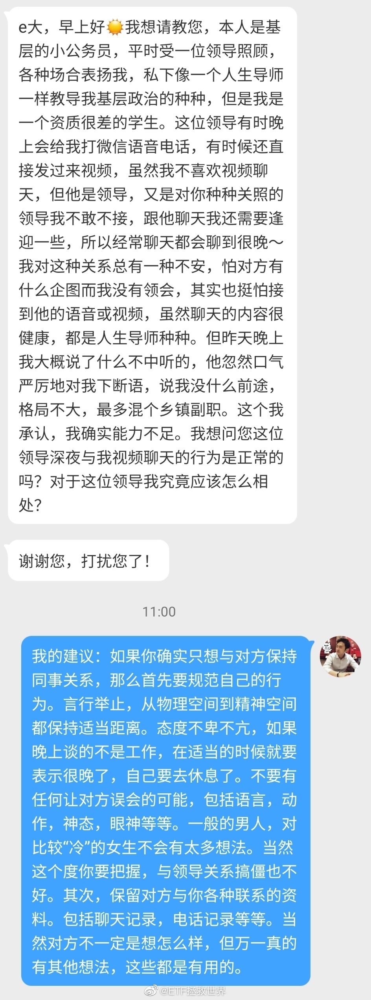

======================================================

ETF拯救世界 (5687069307) @
2020-04-18 08:36:10 Sat  
url: https://weibo.com/5687069307/IDQRihrUs

每天想着把最后一分钱杀进去的朋友看看。

------------------------------------------------------
转推：
>  @ ()
>  2020-04-18 07:55:33 Sat  
>  url: 

>  抱歉，作者已设置仅展示半年内微博，此微博已不可见。 ​​​

转发[148]  评论[219]  赞[1423] 

======================================================

ETF拯救世界 (5687069307) @
2020-04-18 19:59:36 Sat  
url: https://weibo.com/5687069307/IDVkHm76k

关于最近原油期货移仓的问题，说一下。

目前计划持仓的华宝油气（0.7%）以及石油基金（0.6%），没有移仓问题。两个基金是持有石油类上市公司股票。

持仓占比0.47%的南方原油是持有原油期货。这个会有移仓问题，但是由于持仓占比很小，不用太在意，尤其是单份持仓金额很少的朋友。

如果比例虽然小， ​​​

转发[224]  评论[518]  赞[1818] 

======================================================

ETF拯救世界 (5687069307) @
2020-04-18 20:21:31 Sat  
url: https://weibo.com/5687069307/IDVtB55lP

收到就好。不过听这位幸运儿说她把耳机送给老公用了。大家谈谈有什么感想。

------------------------------------------------------
转推：
>  @PS晴晴 (1245096207)
>  2020-04-17 14:01:47 Fri  
>  url: https:/weibo.com/1245096207/IDJyY0ht7/

>  @ETF拯救世界 礼物收到了，谢谢老大，谢谢可爱的嘟嘟，谢谢所有给了我关心祝福的善良的小天使们，祝大家越来越有钱，越来越有品！！！！ http://t.cn/R2WxQOQ ​​​

转发[3]  评论[225]  赞[1328] 

======================================================

ETF拯救世界 (5687069307) @
2020-04-18 20:58:10 Sat  
url: https://weibo.com/5687069307/IDVIthJfC

又一位成功人士倒在了男女关系上。 ​​​

转发[20]  评论[327]  赞[1833] 

======================================================

ETF拯救世界 (5687069307) @
2020-04-19 12:48:07 Sun  
url: https://weibo.com/5687069307/IE1W3tspH

这事情绝不止脑残这么简单。美国直接发钱到个人账户，还有失业保险，按理说不会活不下去。我从去年HK学到的就是：一般大规模YX后面都有力量在支持。是谁在支持民众与州政府对着干着急开工呢。//@挖龙脉的超级鹿鼎公: 转发微博

------------------------------------------------------
转推：
>  @何天恩 (1861477054)
>  2020-04-19 11:30:03 Sun  
>  url: https:/weibo.com/1861477054/IE1qn3bQR/

>  美丽的风景线！【美民众扛枪抗议封城 :宁愿死于新冠也要自由[允悲]】在美国多州发生了抗议居家令的聚集性活动。当地时间4月15日，在密歇根州首府兰辛市，数千名抗议者们将自己的车开到街上后熄火并待在车里，另有抗议者聚集在州议会大厦附近，反对州长格雷琴·惠特默此前颁布的居家令。拥堵路段超过1英 ​​​

转发[32]  评论[160]  赞[881] 

======================================================

ETF拯救世界 (5687069307) @
2020-04-19 13:46:32 Sun  
url: https://weibo.com/5687069307/IE2jLzubc

我对武术的幻觉是什么时候破灭的呢。

回想了一下，是十年前在猫扑看到的一段民国时期大师比武的录像。

从那一刻起，武侠小说和武侠电影我都不怎么看了。不是内个味儿了。 ​​​

转发[10]  评论[206]  赞[987] 

======================================================

ETF拯救世界 (5687069307) @
2020-04-19 17:10:13 Sun  
url: https://weibo.com/5687069307/IE3ErrECW

没事别玩这种东西。任何机械和人都有一定概率出问题。责任心不强的地方出问题的概率更大。这种高危游戏，出了问题就是挂。

------------------------------------------------------
转推：
>  @ ()
>  2020-04-19 16:43:29 Sun  
>  url: 

>  抱歉，作者已设置仅展示半年内微博，此微博已不可见。 ​​​

转发[44]  评论[181]  赞[856] 

======================================================

ETF拯救世界 (5687069307) @
2020-04-19 18:01:49 Sun  
url: https://weibo.com/5687069307/IE3Zo8Ndz

如何快速换算日元。看日剧或者买东西的时候经常会遇到这个问题。比如孤独美食家里面，一个肉串200日元，到底是多少人民币，看到的时候就会想知道。日元和美元或者欧元还不一样，还不是直接除个汇率6或者7就能算出来。

我一般这么算。就是用这个数字乘6，然后小数点左移两位。比如200日元，就是200*6=1 ​​​

转发[56]  评论[423]  赞[1407] 

======================================================

ETF拯救世界 (5687069307) @
2020-04-20 10:19:09 Mon  
url: https://weibo.com/5687069307/IEao5pM4Q

呵呵，指数报价都能错，喷了。 ​​​

转发[24]  评论[436]  赞[1484] 

======================================================

ETF拯救世界 (5687069307) @
2020-04-20 12:29:16 Mon  
url: https://weibo.com/5687069307/IEbeU5eU8

一方面是意识形态，一方面是潜意识中的人种歧视。

这两点导致了我们与对方在很多问题上不可能得到根本解决。 ​​​

转发[17]  评论[136]  赞[1236] 

======================================================

ETF拯救世界 (5687069307) @
2020-04-20 12:49:19 Mon  
url: https://weibo.com/5687069307/IEbn2u9e8

修正了。不公布一下错误的原因吗 ​​​

转发[5]  评论[183]  赞[1235] 

======================================================

ETF拯救世界 (5687069307) @
2020-04-20 14:40:29 Mon  
url: https://weibo.com/5687069307/IEc6adUcH

今天买卖都没有成交的。

怎么说呢，感觉生活过得没有滋味。 ​​​

转发[13]  评论[346]  赞[1442] 

======================================================

ETF拯救世界 (5687069307) @
2020-04-20 16:21:03 Mon  
url: https://weibo.com/5687069307/IEcKZ7JRV

不知道为什么，感觉看书比追剧有意思。这几年没有一部剧是完整看完的。看着看着就觉得不想继续看下去，也不是拍的不好没意思，就是耐不下心，看不下去。还是看书有意思。是不是送一台oasis2给爱看书的同学呢。

------------------------------------------------------
转推：
>  @央视新闻 (2656274875)
>  2020-04-20 14:17:09 Mon  
>  url: https:/weibo.com/2656274875/IEbWH3ucF/

>  【#2019年我国人均阅读纸质书4.65本# 你读了多少？】今天，第17次全国国民阅读调查结果发布。数据显示：①#2019年人均手机阅读时长每天超100分钟#；②我国成年国民人均纸质图书阅读量为4.65本，电子书阅读量为2.84本；③未成年人的人均图书阅读量为10.36本。怎样选择适合自己的书？如何读书？戳图↓转 ​​​

转发[108]  评论[845]  赞[1772] 

======================================================

ETF拯救世界 (5687069307) @
2020-04-21 07:39:20 Tue  
url: https://weibo.com/5687069307/IEiLIEoAm

记录一下负油价的历史。以后各位都有对后辈们吹牛的资本了

------------------------------------------------------
转推：
>  @网易财经 (1974561081)
>  2020-04-21 06:32:20 Tue  
>  url: https:/weibo.com/1974561081/IEikwz6pE/

>  在周一，市场又创下一项新纪录，这就是：美国5月份的西得州轻质原油期货WTI价格不仅创下了历史新低，并且还跌至了负值，最后收盘时下挫超过300%，收于-37.63美元每桶。可以说让所有人、包括华尔街上的交易员们都惊呼，这简直是前所未闻的行情走势。为什么会出现周一的暴跌？
>  
>  交易员陷入两难 被迫全线 ​​​

转发[379]  评论[238]  赞[1229] 

======================================================

ETF拯救世界 (5687069307) @
2020-04-21 07:55:52 Tue  
url: https://weibo.com/5687069307/IEiSqmSMc

没事还是别出门浪的好。买东西还是上京东淘宝吧…

------------------------------------------------------
转推：
>  @北京城这点事儿 (3275259063)
>  2020-04-20 15:17:15 Mon  
>  url: https:/weibo.com/3275259063/IEcl5oH0W/

>  #北京故事# ​​​

转发[15]  评论[86]  赞[600] 

======================================================

ETF拯救世界 (5687069307) @
2020-04-21 08:08:43 Tue  
url: https://weibo.com/5687069307/IEiXDFEXt

其实我觉得落叶落花都很好看，尤其秋天，满地银杏叶非常美。一定要及时扫是不是有其他专业方面的原因？

------------------------------------------------------
转推：
>  @新浪视频 (1640601392)
>  2020-04-20 20:45:04 Mon  
>  url: https:/weibo.com/1640601392/IEeu9eqIa/

>  【郑州#环卫工用扫把打花催落#：“咱也没办法，落地上扫不急罚100元”】4月17日，河南郑州，几名环卫用扫把狂打墙边的蔷薇花，花瓣白花花的落在地上一片。据环卫工说，因为这个花经常落花瓣，地上扫不急多了就会被拍照罚款，一次罚100元，而他们一天工作才挣七八十元。对此，郑州市执法局工作人员回应 ​​​

转发[12]  评论[160]  赞[726] 

======================================================

ETF拯救世界 (5687069307) @
2020-04-21 08:21:42 Tue  
url: https://weibo.com/5687069307/IEj2Uubfa

//@关雅荻RunningBravely:同意，敢不敢把东亚国家数据一并列出？→_→@胡茬茬1974：我用视频中这位女专家的统计方法，再找了些公开的数据算了一下，新冠肺炎造成的每十万死亡人口，美国11.24, 中国大陆 0.33, 中国台湾0.25, 日本0.187，韩国0.45 。  结论：东北亚儒家文化圈地区在新冠病毒面前的生存能

------------------------------------------------------
转推：
>  @YouTube精选 (2214257545)
>  2020-04-20 16:22:37 Mon  
>  url: https:/weibo.com/2214257545/IEcLD1Mhb/

>  昨天的特朗普疫情发布会，再一次让人领略到了白宫的傲慢与偏见。
>  
>  白宫新冠疫情防控协调员Deborah Birx在发布会上向公众展示了一张图——“各国新冠病毒（每十万人）致死数”排名：
>  
>  从图中可以看出（从上到下）——比利时每十万人中有45.2人死亡；意大利每十万人中有37.6人死亡；美国每十万人中有11.2 ​​​

转发[76]  评论[1]  赞[19] 

======================================================

ETF拯救世界 (5687069307) @
2020-04-21 09:42:37 Tue  
url: https://weibo.com/5687069307/IEjzL1Iau

这几个月仓位没有增加，但是如果你还有自由现金流，还是要继续积累现金。

一方面是把自己家庭的安全垫积累的厚一点，一方面是为了有可能拿到的更低资产价格做准备。

你得保证无论发生什么情况自己都活着，才能赚更多。也许未来你会看到有些现在激进的人赚很多，但你看不到的是他的身后有多少白骨。 ​​​

转发[166]  评论[462]  赞[2594] 

======================================================

ETF拯救世界 (5687069307) @
2020-04-21 17:29:36 Tue  
url: https://weibo.com/5687069307/IEmDjibPC

六月合约接力跌。

需求上不去，消耗无法加大，储油罐都满了，地底下的油呼呼呼往上冒。除非经济重启，否则很难解决。 ​​​

转发[30]  评论[376]  赞[2138] 

======================================================

ETF拯救世界 (5687069307) @
2020-04-21 18:26:02 Tue  
url: https://weibo.com/5687069307/IEn0daHkU

无论男女，结婚对象的智商都非常重要。没结婚的各位，真的，一定要记住。

------------------------------------------------------
转推：
>  @新浪视频 (1640601392)
>  2020-04-21 17:55:49 Tue  
>  url: https:/weibo.com/1640601392/IEmNWxXVl/

>  【育儿团队回应#婴儿疑似被训练趴睡时死亡#：其母购买的睡眠课程已停 直接死因并非趴睡】4月16日，一名新手妈妈在付费睡眠引导群提问，称小孩翻身趴着睡觉一直哭，想向群内的老师寻求帮助。群友答“不是大哭就没事”，然而约两小时后，这位妈妈在群内表示孩子嘴唇发紫，最终孩子因窒息不幸身亡。据悉， ​​​

转发[79]  评论[413]  赞[1492] 

======================================================

ETF拯救世界 (5687069307) @
2020-04-22 16:51:30 Wed  
url: https://weibo.com/5687069307/IEvOl1LrS

忙了一天。

你今天过得怎么样。 ​​​

转发[26]  评论[725]  赞[2062] 

======================================================

ETF拯救世界 (5687069307) @
2020-04-22 21:07:10 Wed  
url: https://weibo.com/5687069307/IExu759Ig

中行这次原油宝事件暴露了某些银行对于衍生品风控不过关。从现在开始，白银网格不仅是暂停，手上的两三格到价格出掉后也停止交易。

------------------------------------------------------
转推：
>  @ETF拯救世界 (5687069307)
>  2020-03-12 22:30:44 Thu  
>  url: https:/weibo.com/5687069307/IyjvFBcmG/

>  美元白银网格可以先暂停了。 ​​​

转发[70]  评论[338]  赞[1719] 

======================================================

ETF拯救世界 (5687069307) @
2020-04-23 08:28:37 Thu  
url: https://weibo.com/5687069307/IEBWIeqSu

之前已经建议过持仓南方油的朋友可以转托管场内卖出。昨天中行又爆雷，估计更多朋友会担心。已经与且慢沟通完毕，他们今天会做一个方便大家操作转托管的东西出来（之前步骤繁琐场外机构都如此），明天可以上线。整个流程我会非常具体的写一篇东西今晚或明早发布。致敬且慢，一切以客户利益为优先考虑。

------------------------------------------------------
转推：
>  @ETF拯救世界 (5687069307)
>  2020-04-18 19:59:36 Sat  
>  url: https:/weibo.com/5687069307/IDVkHm76k/

>  关于最近原油期货移仓的问题，说一下。
>  
>  目前计划持仓的华宝油气（0.7%）以及石油基金（0.6%），没有移仓问题。两个基金是持有石油类上市公司股票。
>  
>  持仓占比0.47%的南方原油是持有原油期货。这个会有移仓问题，但是由于持仓占比很小，不用太在意，尤其是单份持仓金额很少的朋友。
>  
>  如果比例虽然小， ​​​

转发[11]  评论[521]  赞[2326] 

======================================================

ETF拯救世界 (5687069307) @
2020-04-23 09:34:49 Thu  
url: https://weibo.com/5687069307/IECnAcK35

医药开始升温，热度持续增加。继续持仓，等待15000狂热或趋势变化。

------------------------------------------------------
转推：
>  @ETF拯救世界 (5687069307)
>  2020-04-15 10:17:02 Wed  
>  url: https:/weibo.com/5687069307/IDpeKBd6Z/

>  目前医药已经运行到相对高估+牛市上升趋势阶段。
>  
>  这个阶段非常难。难在它不是便宜的阶段，可以买可以安心持仓。它虽然是上升趋势，但随时会转头向下。这个区间考虑的不是加仓，而是如何动态平衡。
>  
>  既然已经到了这个区间，就照例给一个区间上限。目前医药的区间上限是15500左右。这个点位是特大级超级 ​​​

转发[32]  评论[125]  赞[1029] 

======================================================

ETF拯救世界 (5687069307) @
2020-04-23 09:37:27 Thu  
url: https://weibo.com/5687069307/IECoEFwSB

提醒一句，最近转托管的前后，各位不要到处议论。没有场内高溢价买入的对手盘，到时候各位转换后也无法高价卖出。为了你自己，不要与别人讨论，自己做。稍后我会把这几条设置为粉丝可见。

------------------------------------------------------
转推：
>  @ETF拯救世界 (5687069307)
>  2020-04-18 19:59:36 Sat  
>  url: https:/weibo.com/5687069307/IDVkHm76k/

>  关于最近原油期货移仓的问题，说一下。
>  
>  目前计划持仓的华宝油气（0.7%）以及石油基金（0.6%），没有移仓问题。两个基金是持有石油类上市公司股票。
>  
>  持仓占比0.47%的南方原油是持有原油期货。这个会有移仓问题，但是由于持仓占比很小，不用太在意，尤其是单份持仓金额很少的朋友。
>  
>  如果比例虽然小， ​​​

转发[0]  评论[460]  赞[1926] 

======================================================

ETF拯救世界 (5687069307) @
2020-04-23 09:48:35 Thu  
url: https://weibo.com/5687069307/IECtay1Yl

我不信有什么东西是多贵都值的。

你贵了我就卖，你便宜了我就买，免费的话我就给你好评。 ​​​

转发[19]  评论[220]  赞[1830] 

======================================================

ETF拯救世界 (5687069307) @
2020-04-23 10:44:09 Thu  
url: https://weibo.com/5687069307/IECPJ5a0e

好吧，跟着你们吃完瓜了。

不过我想说，最近我发现我也有一点黑眼圈了。但我是清白的！我都是在看美股！ ​​​

转发[9]  评论[495]  赞[2058] 

======================================================

ETF拯救世界 (5687069307) @
2020-04-23 14:48:08 Thu  
url: https://weibo.com/5687069307/IEEqL5qYn

瓜不瓜的其实我也不关心，跟我没关系。就是想说几句不知道会不会挨骂的话：

无论男女，约P没问题，现在也不是跳个舞就定流氓罪的年代了。

但是，不要欺骗你的男朋友或者女朋友。如果人家就是想认认真真和你谈恋爱，你要约P就别跟人家在一起。

更重要的是，婚后就别约了。结婚算是一种承诺，也是责任 ​​​

转发[39]  评论[372]  赞[2236] 

======================================================

ETF拯救世界 (5687069307) @
2020-04-23 15:15:26 Thu  
url: https://weibo.com/5687069307/IEEBQ9tpg

你觉得我说的对吗。 ​​​

转发[12]  评论[427]  赞[1988] 

+++++++++++++++++++++++++++++++++++++++++++++++++++++

图片：
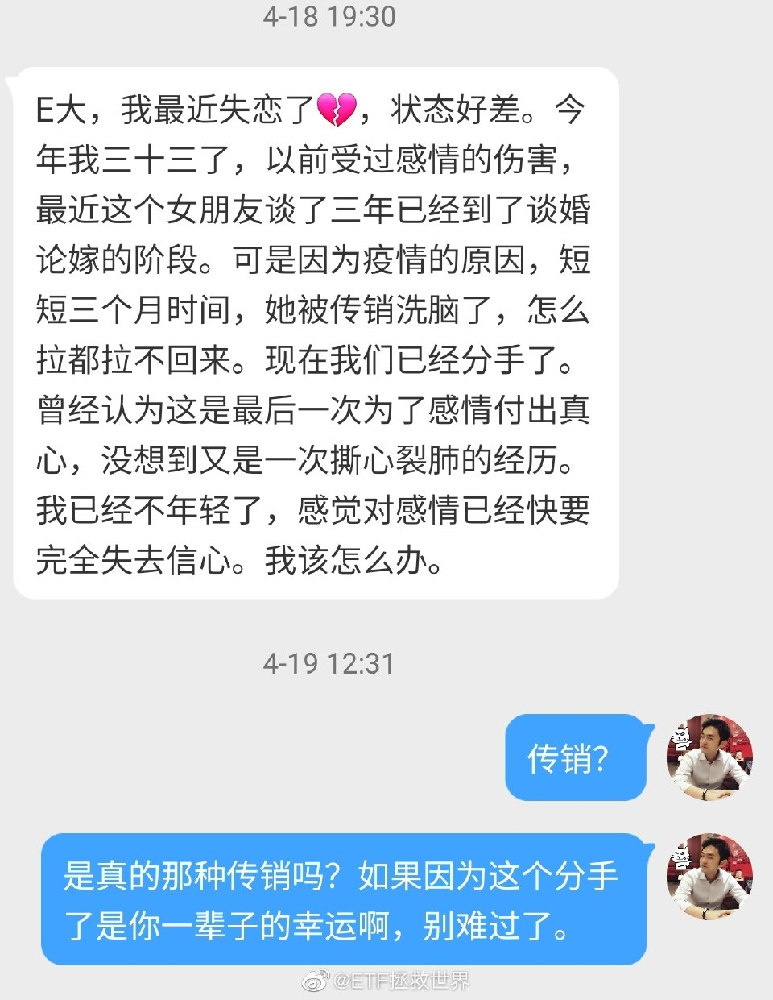

======================================================

ETF拯救世界 (5687069307) @
2020-04-23 19:12:55 Thu  
url: https://weibo.com/5687069307/IEGaf2bPO

不想当大厨的小偷不是好的蜘蛛侠。

------------------------------------------------------
转推：
>  @澎湃新闻 (5044281310)
>  2020-04-23 19:10:04 Thu  
>  url: https:/weibo.com/5044281310/IEG94FpC8/

>  【#小偷在业主家做饭#，被发现躲到28楼窗外】4月18日，重庆。高女士发现外出的邻居家亮着灯，怀疑进贼。民警到场发现小偷躲在28楼窗外，之前还在屋内做饭煮香肠，并打算过夜。目前，嫌疑人梅某被采取刑事强制措施。其交代自己手头紧，盯上家中无人且未反锁门的高层住户。（素材来源：相关人士） ​​​

转发[8]  评论[53]  赞[427] 

======================================================

ETF拯救世界 (5687069307) @
2020-04-23 19:17:54 Thu  
url: https://weibo.com/5687069307/IEGcg1vFa

私信看多了就会觉得找伴侣这件事，运气因素太大，不公平。

明明很多优质男女，却因为没有缘分碰不到一起。可能那个合适的人就住你隔壁小区你都不知道。

以前很喜欢的一部电影《向左走，向右走》。主要是因为喜欢男女主角，现在看的事情多了，想起来不胜唏嘘。 ​​​

转发[56]  评论[380]  赞[1556] 

+++++++++++++++++++++++++++++++++++++++++++++++++++++

图片：

======================================================

ETF拯救世界 (5687069307) @
2020-04-23 21:42:24 Thu  
url: https://weibo.com/5687069307/IEH8Ulsj2

弄了半天这一波下去就是为了杀中 行吗。

转场功能正在紧急开发，且慢都在加班，明早推送吧 ​​​​

转发[3]  评论[404]  赞[2076] 

+++++++++++++++++++++++++++++++++++++++++++++++++++++

图片：
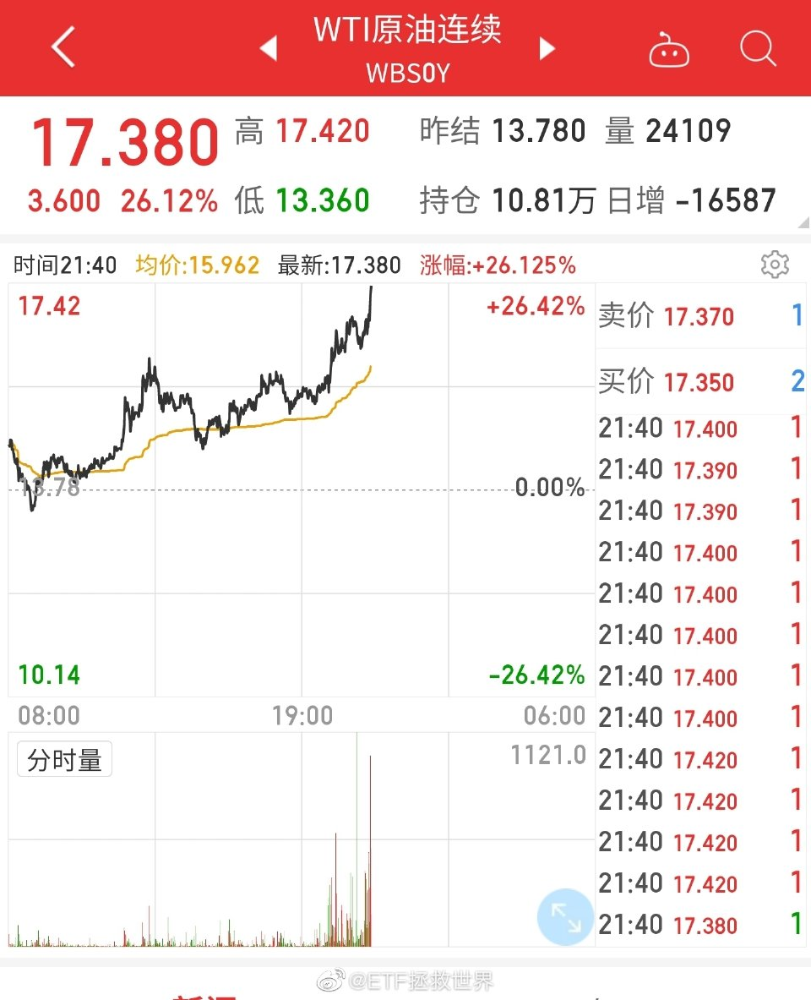

======================================================

ETF拯救世界 (5687069307) @
2020-04-23 23:43:40 Thu  
url: https://weibo.com/5687069307/IEHW8dXW7

今天已经有人把我的微博截图，在公众号洋洋洒洒写一篇文章做提示了。不仅如此，还有媒体转发。

我不能怪他。他也是为了吃饭，博眼球，博关注。

这种事情真的两难。我说，就会有很多人知道。我不说，大家也没法操作。

只能希望大家顺利。希望大家知道，我是真心希望各位都赚钱。我尽力了。 ​​​

转发[1]  评论[617]  赞[2790] 

======================================================

ETF拯救世界 (5687069307) @
2020-04-24 10:16:55 Fri  
url: https://weibo.com/5687069307/IEM5b0lQ9

中概，现在我们是不会买的。第一贵，第二有美国监管及ZZ风险。未来买不买？当然买。什么时候买？你猜。

------------------------------------------------------
转推：
>  @网易财经 (1974561081)
>  2020-04-24 09:58:03 Fri  
>  url: https:/weibo.com/1974561081/IELXvuWvd/

>  【SEC主席亲自下场 中概股审计再遭严监管？】4月22日， 美国证券交易委员会（SEC）主席克莱顿在接受媒体采访时称，“现在是机构投资者审查、重新平衡和评估其投资组合的时候。我们要提醒大家，当你看到新兴市场发行者披露信息时，它虽然看起来就像是美国本土发行者的报告，但这不是同一类投资。”他直 ​​​

转发[60]  评论[269]  赞[1162] 

======================================================

ETF拯救世界 (5687069307) @
2020-04-24 10:44:45 Fri  
url: https://weibo.com/5687069307/IEMgsFLQV

之前一直说的对不对。黄、赌、毒。尽量别碰。否则会很麻烦。

------------------------------------------------------
转推：
>  @新浪财经 (1638782947)
>  2020-04-24 10:39:42 Fri  
>  url: https:/weibo.com/1638782947/IEMepEMi7/

>  【#时间管理大师罗志祥# 他的出轨的成本有多高？多年吸金过亿】4月24日5点，#罗志祥道歉#，@羅志祥 向周扬青及所有被欺骗的女性道歉。早在2013年最吸金歌手榜单上，罗志祥狂赚6.1亿新台币（约合1.26亿元人民币），登上榜首位置。2014年，罗志祥进账约1.1亿元人民币，从榜单中看，当时，周杰伦的收入为1 ​​​

转发[12]  评论[167]  赞[781] 

======================================================

ETF拯救世界 (5687069307) @
2020-04-24 12:37:28 Fri  
url: https://weibo.com/5687069307/IEN0dr2rQ

无论你写的多么细致，多么全面，都会有人不看或者看不懂。

所以在设计产品流程的时候，都是按照最最粗心大意的人，阅读能力差的人的情况设计的。

饭已经不止喂到嘴里，还帮着托着腮帮子嚼一嚼。就差帮着咽下去了。 ​​​

转发[34]  评论[545]  赞[2103] 

======================================================

ETF拯救世界 (5687069307) @
2020-04-24 12:52:07 Fri  
url: https://weibo.com/5687069307/IEN6adhKb

感谢一下。 ​​​

转发[11]  评论[557]  赞[2883] 

+++++++++++++++++++++++++++++++++++++++++++++++++++++

图片：
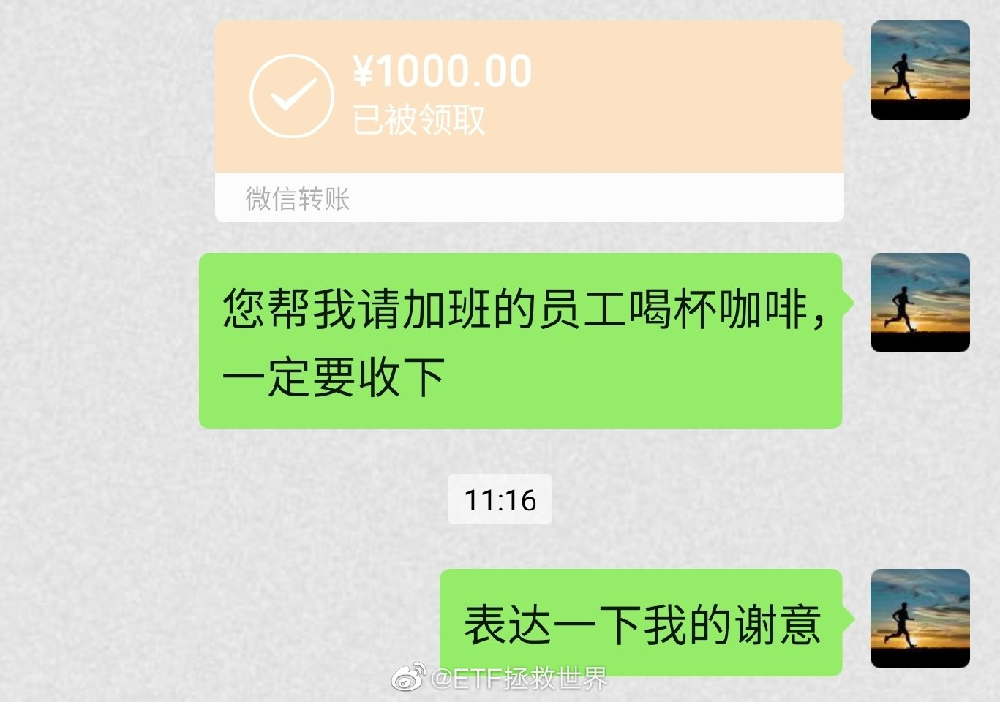

======================================================

ETF拯救世界 (5687069307) @
2020-04-24 14:36:32 Fri  
url: https://weibo.com/5687069307/IENMy2GtM

还有人留言质疑：你搞什么，好久不发文章，也不交易，真不知道在干什么。

我服了。一定要像自媒体一样每天发一篇追热点的文章；无论合适不合适，每个月都要发车让你买买买你才高兴吗。

不好意思，我不是自媒体，我也不需要每天用一篇推送留住读者或者吸引流量，我也不是“定投”。我爱什么时候写东西 ​​​

转发[20]  评论[890]  赞[3375] 

======================================================

ETF拯救世界 (5687069307) @
2020-04-24 17:21:25 Fri  
url: https://weibo.com/5687069307/IEORtChQe

前10%的家庭占有60%的金融资产。后40%的家庭只有5%的金融资产。后60%只有12%。

------------------------------------------------------
转推：
>  @新浪财经 (1638782947)
>  2020-04-24 13:39:35 Fri  
>  url: https:/weibo.com/1638782947/IENprcrUK/

>  【央行报告：样本内#收入最高10%家庭户均总资产1204万#】央行报告称，高收入家庭拥有更多资产。将家庭总收入从低到高排序，总收入最高20%家庭所拥有的总资产占全部样本家庭总资产的半数以上。其中，收入最高10%家庭户均总资产1204.8万元，是收入最低20%家庭户均总资产的13.7倍。http://t.cn/A6wdfYUa ​​​

转发[136]  评论[211]  赞[1325] 

======================================================

ETF拯救世界 (5687069307) @
2020-04-26 13:04:59 Sun  
url: https://weibo.com/5687069307/IF62nqFJX

有空去日本的朋友有机会可以去奈良跟小鹿们玩一玩，真的是美好的体验。再去旁边的东大寺转转，我也很喜欢。

------------------------------------------------------
转推：
>  @央视新闻 (2656274875)
>  2020-04-26 12:53:27 Sun  
>  url: https:/weibo.com/2656274875/IF5XHh5G6/

>  【#游客骤减日本奈良小鹿烦闷无聊#】紧急状态下的日本奈良，随着防控的加紧，游客急剧减少。喂食小鹿，是来访奈良公园的游客必打卡项目。而现在，有小鹿从公园跑到了市区中觅食。当地小鹿保护协会解释，小鹿在公园里有足够的草和树叶可以吃，跑到市区中可能是因为没有游客，心理上有些烦闷和无聊…… ​​​

转发[34]  评论[224]  赞[786] 

======================================================

ETF拯救世界 (5687069307) @
2020-04-26 18:55:23 Sun  
url: https://weibo.com/5687069307/IF8kBwRQ3

其实我已经看到未来的结果了。

如果这次转场后溢价消失无法顺利卖出，一定会有人跳出来嘲笑我。

咱们一起看看是哪些人会这么干。 ​​​​

转发[0]  评论[730]  赞[2386] 

======================================================

ETF拯救世界 (5687069307) @
2020-04-26 22:55:56 Sun  
url: https://weibo.com/5687069307/IF9Ufh8Yc

休息差不多了，开始看留言。 ​​​

转发[2]  评论[215]  赞[1165] 

======================================================

ETF拯救世界 (5687069307) @
2020-04-27 09:53:00 Mon  
url: https://weibo.com/5687069307/IFecX2usK

每天开盘的四个小时是人生美好时光之一。 ​​​

转发[13]  评论[252]  赞[1719] 

======================================================

ETF拯救世界 (5687069307) @
2020-04-27 10:09:47 Mon  
url: https://weibo.com/5687069307/IFejLikz2

想起一个需要叮嘱的，你要看我微博你就要理解：

我说不买，就是代表不买。不代表要把手里的卖出。只有说卖出才代表卖出。

我说不卖，也不代表可以买。只是代表不卖。

你始终要记住，对于一个品种，是有三种状态：买入、持有、卖出。

前几天我说某个品种不买，评论里有人说啊那我是不是要把手里的卖 ​​​

转发[39]  评论[545]  赞[2145] 

======================================================

ETF拯救世界 (5687069307) @
2020-04-27 11:24:37 Mon  
url: https://weibo.com/5687069307/IFeO8rvTK

他们两个天生一对。

------------------------------------------------------
转推：
>  @新浪视频 (1640601392)
>  2020-04-27 11:16:25 Mon  
>  url: https:/weibo.com/1640601392/IFeKOb4FC/

>  【女子在新西兰对男友称要“鱼死网破” 面临最高七年监禁无法回国[衰]】#威胁男友称鱼死网破将面临七年监禁# 去年5月，来自北京的郭小姐和相恋六年的男友去往新西兰旅游，但在飞机上两人因琐事发生争吵。之后在过海关时，男友称与她不识，随后郭小姐被遣返回国，男友康某则留在了新西兰亲戚家。10月8日 ​​​

转发[15]  评论[84]  赞[607] 

======================================================

ETF拯救世界 (5687069307) @
2020-04-27 11:46:12 Mon  
url: https://weibo.com/5687069307/IFeWTz6Jf

数码产品小贴士：

当你觉得手机用腻的时候，换个手机壳，又能撑1-2个月。 ​​​

转发[24]  评论[550]  赞[2509] 

======================================================

ETF拯救世界 (5687069307) @
2020-04-28 10:44:29 Tue  
url: https://weibo.com/5687069307/IFnYliZml

打开条件单惊呆了，买入立赚3%…… ​​​

转发[14]  评论[587]  赞[2081] 

======================================================

ETF拯救世界 (5687069307) @
2020-04-28 11:15:28 Tue  
url: https://weibo.com/5687069307/IFoaV8MIM

我对两个科技产品非常期待。

第一个是真正的无人驾驶。

第二个是极度真实的AR/VR系统。

希望10-15年内能实现。 ​​​

转发[33]  评论[300]  赞[1936] 

======================================================

ETF拯救世界 (5687069307) @
2020-04-28 16:42:29 Tue  
url: https://weibo.com/5687069307/IFqjEzpVa

截止目前，一季报全市场利润下降超过10%，最后可能会超过15%。

连一向生冷不忌的医药和食品饮料也下降了1%…… ​​​

转发[26]  评论[255]  赞[1402] 

======================================================

ETF拯救世界 (5687069307) @
2020-04-29 10:10:33 Wed  
url: https://weibo.com/5687069307/IFxb4aqLT

喷了。 ​​​

转发[2]  评论[176]  赞[920] 

======================================================

ETF拯救世界 (5687069307) @
2020-04-29 10:20:17 Wed  
url: https://weibo.com/5687069307/IFxf1sAFJ

之前害怕波动，现在特别喜欢的举手。

世界没变，但是你变了。你变了，整个世界就变了。 ​​​

转发[36]  评论[291]  赞[1688] 

======================================================

ETF拯救世界 (5687069307) @
2020-04-29 10:27:53 Wed  
url: https://weibo.com/5687069307/IFxi6EswF

但是我再提醒一下，不厌其烦的。

做波段你很开心，来来回回的赚。但你要明白，这不是赚大钱的路。

大钱是坚定持有中赚到的。这点你还不明白，以后就会懂。但是波段很必要，为什么？因为波段给你提供源源不断利润的同时，也能让你真正坚定持有未来赚大钱的仓位。

否则，不停的坐电梯，赚了——赔了— ​​​

转发[161]  评论[228]  赞[1463] 

======================================================

ETF拯救世界 (5687069307) @
2020-04-29 10:28:28 Wed  
url: https://weibo.com/5687069307/IFxilobdR

严正警示有用没用，2分钟后揭晓。 ​​​

转发[3]  评论[163]  赞[939] 

======================================================

ETF拯救世界 (5687069307) @
2020-04-29 10:35:27 Wed  
url: https://weibo.com/5687069307/IFxlaCDj3

刚才有个朋友问我，这种时候发公告，是不是为了不让持有人挣钱走，保持规模挣管理费？

我对他说，你胡说！人家那么大公司能这么龌龊吗。人家能不希望自己的持有人挣钱吗？难道所有持有人都赔钱人家才高兴吗？不可能。

我很生气，拉黑了这个朋友。 ​​​

转发[12]  评论[173]  赞[1232] 

======================================================

ETF拯救世界 (5687069307) @
2020-04-29 10:47:23 Wed  
url: https://weibo.com/5687069307/IFxq188tI

鲁迅说过：你不希望信任你家产品的人、理智的人赚钱。反而要帮助那些疯狂的人，这样对不对？

我想了想，这样做是对的。谁不喜欢疯子呢。理智的人go out.以后再也别见。 ​​​

转发[12]  评论[145]  赞[1199] 

======================================================

ETF拯救世界 (5687069307) @
2020-04-29 10:53:54 Wed  
url: https://weibo.com/5687069307/IFxsF8Csj

今天开始，在心中拉黑第一家公司。以后我再买他们家的产品我就是XX。

请各位监督。 ​​​

转发[24]  评论[404]  赞[1923] 

======================================================

ETF拯救世界 (5687069307) @
2020-04-29 11:17:43 Wed  
url: https://weibo.com/5687069307/IFxCkpKvw

两个品种已更新。 ​​​

转发[23]  评论[286]  赞[1336] 

======================================================

ETF拯救世界 (5687069307) @
2020-04-29 11:36:47 Wed  
url: https://weibo.com/5687069307/IFxK4gQgQ

你要说突如其来的事情发生了，情绪没有波动是不正常的。不过几分钟也应该就好了。

接下来就是考虑：

如何应对和处理，总结教训，不要再犯。 ​​​

转发[52]  评论[457]  赞[1637] 

======================================================

ETF拯救世界 (5687069307) @
2020-04-29 19:50:08 Wed  
url: https://weibo.com/5687069307/IFAYjFo15

人，在最巅峰的时候更要戒骄戒躁。越是顺风顺水的时候更要对其他人和善一些。

相反，不顺的时候反而不要卑躬屈膝，不要唯唯诺诺。

我的一点想法，分享给你。 ​​​

转发[274]  评论[281]  赞[2452] 

======================================================

ETF拯救世界 (5687069307) @
2020-04-29 19:52:21 Wed  
url: https://weibo.com/5687069307/IFAZdxyJ2

今晚做鳗鱼饭。

下饭菜是龙岭。 ​​​

转发[5]  评论[240]  赞[1186] 

======================================================

ETF拯救世界 (5687069307) @
2020-04-29 22:36:25 Wed  
url: https://weibo.com/5687069307/IFC3Os4yh

美股刚从ICU出来就去蹦迪了。 ​​​

转发[27]  评论[180]  赞[1340] 

======================================================

ETF拯救世界 (5687069307) @
2020-04-29 22:52:48 Wed  
url: https://weibo.com/5687069307/IFCatfWRC

那份标普500不好说什么时候出，但是DAX会在12000左右出一份//@ETF拯救世界:最终最低点8255，没有有效跌破8200。目前点位10500，反弹28%。前方第一个大的压力位是11000，冲过去难度比较大。如果过不去回调，前期低点附近会有很强很强的支撑。

------------------------------------------------------
转推：
>  @ETF拯救世界 (5687069307)
>  2020-03-23 16:22:24 Mon  
>  url: https:/weibo.com/5687069307/IzWND4ItA/

>  如果DAX有效跌破8200，那就是最强的一根支撑破掉了。再往下是多少很难判断了。
>  
>  要是一定一定要给个点位，那就是6200周围。问题是，这也太低了吧！
>  
>  不过综合最近40年美国和英国的指数走势看，极限跌幅确实还有30%。这个真的是极限了，如果还止不住，那可能就是要全面推倒重来了。 ​​​

转发[71]  评论[190]  赞[1062] 

======================================================

ETF拯救世界 (5687069307) @
2020-04-30 10:14:01 Thu  
url: https://weibo.com/5687069307/IFGCYdhsA

建议每天停牌3小时59分59秒提示风险。 ​​​

转发[11]  评论[395]  赞[1697] 

======================================================

ETF拯救世界 (5687069307) @
2020-04-30 11:39:38 Thu  
url: https://weibo.com/5687069307/IFHbJdDKB

听说有的平台今天终于开通转托管。

很欣慰，也算间接为平台进步做了一点自己微不足道的贡献…… ​​​

转发[16]  评论[313]  赞[1680] 

======================================================

ETF拯救世界 (5687069307) @
2020-04-30 11:55:30 Thu  
url: https://weibo.com/5687069307/IFHia9X4l

我觉得很多朋友还是没弄懂。

你转托管到场内，不是说一定要马上立即卖出。你持有到合适的时候卖也可以，这个我说了第三次了。

所以你转了只是多一个选择而已。不愿意卖的就持有。 ​​​

转发[21]  评论[204]  赞[1304] 

======================================================

ETF拯救世界 (5687069307) @
2020-04-30 12:02:22 Thu  
url: https://weibo.com/5687069307/IFHkXmpSC

刚看到有朋友在评论说有人收费阅读的事情。

我倒是觉得吧，作者也只是多给你一个选择，愿意付费看就付费，不愿意就看免费的。这倒不是什么原则性的问题。

只要读者付出的费用真的值回票价就可以。这个很关键。

不能要求每个人都免费输出。财务自由的人去工作可能是为了情怀和成就感，但你不能要求还 ​​​

转发[25]  评论[255]  赞[1721] 

======================================================

ETF拯救世界 (5687069307) @
2020-04-30 14:17:22 Thu  
url: https://weibo.com/5687069307/IFIdKgWw7

关于交易，大多数你听到的，说法一致的东西，都是噪音。 ​​​

转发[53]  评论[151]  赞[1384] 

======================================================

ETF拯救世界 (5687069307) @
2020-04-30 14:24:48 Thu  
url: https://weibo.com/5687069307/IFIgLBBg7

为什么说你的80%焦虑都是无意义的呢。

不瞒你说，若干年前我曾经因为专家说地球原油储量不够，只够用100年而辗转反侧，夜不能眠，担忧人类的未来。

万万没想到。几年时间，人类要为油太多没地方放发愁了。 ​​​

转发[107]  评论[282]  赞[2166] 

======================================================

ETF拯救世界 (5687069307) @
2020-04-30 14:39:13 Thu  
url: https://weibo.com/5687069307/IFImCaaih

今天你提款了吗 ​​​

转发[16]  评论[607]  赞[1701] 

======================================================

ETF拯救世界 (5687069307) @
2020-04-30 18:57:04 Thu  
url: https://weibo.com/5687069307/IFK3hdNZa

最近在看笔记本。

为什么觉得联想好像突然发力了。产品和性价比都很不错啊。 ​​​

转发[25]  评论[461]  赞[1264] 

======================================================

ETF拯救世界 (5687069307) @
2020-05-01 10:23:00 Fri  
url: https://weibo.com/5687069307/IFQ77blt6

有些朋友看到外围大跌又慌了。

想想你最近是不是在减仓。波段仓位不用说，亚太仓位全面下降，拿回本金。

长线仓位，150现金仓位持续上升，削峰填谷。s在休息一个月积累现金后买入1/2。

所以不用担心，按理说你已经做好准备了。 ​​​

转发[27]  评论[263]  赞[1294] 

======================================================

ETF拯救世界 (5687069307) @
2020-05-01 11:31:52 Fri  
url: https://weibo.com/5687069307/IFQz4rojY

回复@DecKen-:我家有个闲置的macbook pro。为什么闲置，我每天用的excel在mac上几乎是废品//@DecKen-:mac才是性价比最高的

------------------------------------------------------
转推：
>  @ETF拯救世界 (5687069307)
>  2020-04-30 18:57:04 Thu  
>  url: https:/weibo.com/5687069307/IFK3hdNZa/

>  最近在看笔记本。
>  
>  为什么觉得联想好像突然发力了。产品和性价比都很不错啊。 ​​​

转发[8]  评论[230]  赞[814] 

======================================================

ETF拯救世界 (5687069307) @
2020-05-01 11:49:25 Fri  
url: https://weibo.com/5687069307/IFQGbBeMb

最近在看《大秦帝国》。

已经看到战国初六国会盟准备瓜分老秦了。

秦国风雨飘摇。

那时候的人绝对想不到，是弱秦最终统一天下。 ​​​

转发[40]  评论[282]  赞[1775] 

======================================================

ETF拯救世界 (5687069307) @
2020-05-01 12:47:10 Fri  
url: https://weibo.com/5687069307/IFR3Dchyv

看笑了

------------------------------------------------------
转推：
>  @三联生活周刊 (1191965271)
>  2020-05-01 12:33:53 Fri  
>  url: https:/weibo.com/1191965271/IFQYffMP9/

>  【 像不像五一加班or独自宅家的你？】阿柴：快乐是你们的，我孤独得像条狗...[doge] http://t.cn/A6Ay74oy ​​​

转发[73]  评论[140]  赞[828] 

======================================================

ETF拯救世界 (5687069307) @
2020-05-01 17:34:27 Fri  
url: https://weibo.com/5687069307/IFSWf0ndb

无论如何，一切都是你咎由自取。

------------------------------------------------------
转推：
>  @ ()
>  2020-05-01 17:05:46 Fri  
>  url: 

>  抱歉，此微博已被作者删除。查看帮助：http://t.cn/Rfd3rQV

转发[19]  评论[137]  赞[1333] 

======================================================

ETF拯救世界 (5687069307) @
2020-05-02 23:46:59 Sat  
url: https://weibo.com/5687069307/J07lCzEVT

说来惭愧，我一部网文小说都没看过。

能不能给我推荐一个最牛的我长点见识。 ​​​

转发[120]  评论[953]  赞[3076] 

======================================================

ETF拯救世界 (5687069307) @
2020-05-04 19:51:38 Mon  
url: https://weibo.com/5687069307/J0oF5qPOn

港股跌4%。喷了。

是天意吧。 ​​​

转发[6]  评论[235]  赞[1410] 

======================================================

ETF拯救世界 (5687069307) @
2020-05-05 11:23:56 Tue  
url: https://weibo.com/5687069307/J0uLvzZCW

我最最最佩服灯塔的，今时今日看，不再是NB的科技，而是——

上百万人感染，死了好几万人，尸体乱扔甚至管理不当发臭，在家里死亡好几天不拉走……

结果，居然没有人拉横幅，没有人闹事？甚至网上也看不到有病人和家属控诉？

议员听到内幕消息后清仓股票；大统领说喝消毒水有用……老百姓好像没看到 ​​​

转发[146]  评论[445]  赞[2882] 

======================================================

ETF拯救世界 (5687069307) @
2020-05-05 11:35:52 Tue  
url: https://weibo.com/5687069307/J0uQmnPkd

回复@杰西8848-4:？？？？？我说什么了？？？//@杰西8848-4:你真恶臭

------------------------------------------------------
转推：
>  @ETF拯救世界 (5687069307)
>  2020-05-05 11:23:56 Tue  
>  url: https:/weibo.com/5687069307/J0uLvzZCW/

>  我最最最佩服灯塔的，今时今日看，不再是NB的科技，而是——
>  
>  上百万人感染，死了好几万人，尸体乱扔甚至管理不当发臭，在家里死亡好几天不拉走……
>  
>  结果，居然没有人拉横幅，没有人闹事？甚至网上也看不到有病人和家属控诉？
>  
>  议员听到内幕消息后清仓股票；大统领说喝消毒水有用……老百姓好像没看到 ​​​

转发[36]  评论[255]  赞[1328] 

======================================================

ETF拯救世界 (5687069307) @
2020-05-05 12:16:04 Tue  
url: https://weibo.com/5687069307/J0v6FuYNp

很多人的世界非黑即白。

不好意思，我所认知的世界，大多数是灰色。

就像股市的估值，除了占比极少的，极端的高估与低估时段，大多数时间都是灰色的。

没什么东西是完美无缺的。区别是有人愿意努力使之变得越来越好，有人希望砸烂之后再重建。

我知道很多郁郁不得志的人，喜欢把自己的失败归结于这 ​​​

转发[150]  评论[354]  赞[2662] 

======================================================

ETF拯救世界 (5687069307) @
2020-05-05 13:05:07 Tue  
url: https://weibo.com/5687069307/J0vqA788L

人的认知总是随着见识的增加持续变化。一开始被教育的认知，了解了一点后的认知，大量了解后的认知当然都会不一样。

我现在觉得十年前很多想法不成熟，十年后也会觉得现在很多想法不成熟。都很正常。甚至这个世界很多事情也没有绝对的正确。很多事后看起来清晰无比的东西，放在当时就未必真的那么合适 ​​​

转发[93]  评论[325]  赞[1932] 

+++++++++++++++++++++++++++++++++++++++++++++++++++++

图片：

======================================================

ETF拯救世界 (5687069307) @
2020-05-05 19:31:50 Tue  
url: https://weibo.com/5687069307/J0xXyatpK

我不懂版权法，但是凭着朴素的直觉，确实不明白为什么作者在平台上发布的文章不属于作者本人而是属于平台，觉得这样有问题。

如果平台给作者发工资可以理解为雇佣关系，作品知识产权是平台的。如果你不发工资，人家只是在你这里发表自己的作品，为什么知识产权是你的呢。

有没有懂知识产权的给我普一 ​​​

转发[18]  评论[248]  赞[1303] 

======================================================

ETF拯救世界 (5687069307) @
2020-05-05 21:58:01 Tue  
url: https://weibo.com/5687069307/J0yUT0xtB

原油宝用户：[费解][怒骂]

------------------------------------------------------
转推：
>  @财联社APP (2868676035)
>  2020-05-05 20:51:52 Tue  
>  url: https:/weibo.com/2868676035/J0yu2t1rf/

>  【WTI原油期货6月合约一周涨80%】财联社5月5日讯，WTI原油6月期货日内涨幅扩大至13.5%，报23.15美元桶，较4月27日最低收盘价12.93美元已反弹79%，较4月21日盘中最低价6.5美元已涨2.56倍。 ​​​

转发[33]  评论[191]  赞[1101] 

======================================================

ETF拯救世界 (5687069307) @
2020-05-06 10:06:14 Wed  
url: https://weibo.com/5687069307/J0DGt4UOB

竹杖芒鞋轻胜马，一蓑烟雨任平生。 ​​​

转发[16]  评论[308]  赞[1832] 

======================================================

ETF拯救世界 (5687069307) @
2020-05-06 11:08:07 Wed  
url: https://weibo.com/5687069307/J0E5ApjBG

转场的品种目前溢价90%。我建议一般的朋友可以卖掉，即使你现在卖，也只亏损2个多点。因为只有一份，可以说几乎没有损失。

你不卖，如果未来大幅下跌，就不要到处埋怨我让你赔钱了。

实在想博一下的，你就继续持有。 ​​​

转发[0]  评论[818]  赞[2349] 

======================================================

ETF拯救世界 (5687069307) @
2020-05-06 17:03:32 Wed  
url: https://weibo.com/5687069307/J0GpQDLoF

有朋友留言说，不买5G或者科技吗。

我知道这几天风又起来了。你如果想买，完全可以自己买，不必等计划。

其实我建议各位把这个计划当做一个底部资产，在其上面，可以按照自己的喜好布局。有些计划里没有的品种，喜欢就自己买点。包括各种东西，股票也好，各种指数也好，都可以自己买。

我是不可能跟 ​​​

转发[44]  评论[317]  赞[1960] 

======================================================

ETF拯救世界 (5687069307) @
2020-05-06 17:12:50 Wed  
url: https://weibo.com/5687069307/J0GtDgUSI

女儿就不是人了吗。传统的一定是对的吗。服了。

------------------------------------------------------
转推：
>  @ ()
>  2020-05-06 16:56:15 Wed  
>  url: 

>  抱歉，此微博已被作者删除。查看帮助：http://t.cn/Rfd3rQV

转发[27]  评论[240]  赞[1082] 

======================================================

ETF拯救世界 (5687069307) @
2020-05-07 09:13:20 Thu  
url: https://weibo.com/5687069307/J0MLuqHO0

别人跟你借钱，你有三种应对的选择。第一，当钱丢了，不要借据送给他。第二，做一个现代人，不因为写借据“伤感情”，写借据借给他。做好60%概率钱丢了的准备。第三，不借。

------------------------------------------------------
转推：
>  @星视频 (6418480627)
>  2020-05-06 13:38:27 Wed  
>  url: https:/weibo.com/6418480627/J0F4C5O9w/

>  【女子街头下跪痛哭求人还钱：借你60万，还我50万就行了！】近日河南，一则“女子跪着求人还钱”的视频引起网友热议。视频中，一女子跪在地上紧紧抓住一名黑裙女子的手，求女子还钱。据悉，该女士与债主关系很好，当时借钱的时候没有立什么字据借条。在大街上偶遇之后，强烈要求借60万只让还50万，竟然 ​​​

转发[109]  评论[269]  赞[817] 

======================================================

ETF拯救世界 (5687069307) @
2020-05-07 09:21:13 Thu  
url: https://weibo.com/5687069307/J0MOHogG4

几年前参观过美国一个农场，真的是非常震惊。一个中年白人农场主，雇一个墨西哥人。两个人管理巨大巨大巨大的一个农场。农机上有GPS，自动耕种自动调头。干净、整洁、高效。与印象中的农村完全不同。

------------------------------------------------------
转推：
>  @商业周刊中文版 (2462605080)
>  2020-05-07 09:15:03 Thu  
>  url: https:/weibo.com/2462605080/J0MMbCp6W/

>  【#美国菜农摧毁百万美元蔬菜#：不想为没人买的菜多花钱】近日，美国加利福尼亚州，一家农场主驾驶拖拉机碾过破坏了总价值超过百万美金的农作物。自3月中旬以来，许多餐馆、企业关停，影响波及整个供应链。农场主表示，虽然曾经为这些庄稼抛洒了血和泪，但不愿为没人买的农产品继续花钱。这种情况并不 ​​​

转发[31]  评论[169]  赞[858] 

======================================================

ETF拯救世界 (5687069307) @
2020-05-07 09:43:25 Thu  
url: https://weibo.com/5687069307/J0MXHuvvX

做投资，你买的东西到底是因为炒作涨还是因为价值涨，你心里得有点数。

我当然不会瞧不上炒作，既然它存在那么久，就一定有道理。也一定有人能从炒作中赚钱，否则炒作的人早就赔完了，消失了。

但是你得知道你自己是不是那块料。别人炒你也跟着炒，别人抓热点你也跟着抓。弄不好，你就是别人的接盘侠 ​​​

转发[112]  评论[335]  赞[1923] 

======================================================

ETF拯救世界 (5687069307) @
2020-05-07 10:49:40 Thu  
url: https://weibo.com/5687069307/J0NoBjQ7i

注意看护士说话的时候川的表情，一撇嘴有点好笑是怎么回事。

------------------------------------------------------
转推：
>  @观察者网 (1887344341)
>  2020-05-07 10:38:17 Thu  
>  url: https:/weibo.com/1887344341/J0NjYkyfD/

>  【特朗普白宫会见医护人员 #护士当场改口同意特朗普# 】6日，特朗普在白宫会见多名医护人员，期间有记者问他们对个人防护装备供应是否满意。一名护士回答：供应时有时无。我同全国各地的同事交流过，可以肯定的是在部分地区供应并不理想……我的N95口罩已经重复使用了几个星期。
>  
>  特朗普：对你来说时有 ​​​

转发[17]  评论[124]  赞[580] 

======================================================

ETF拯救世界 (5687069307) @
2020-05-07 16:29:56 Thu  
url: https://weibo.com/5687069307/J0PCI1juq

感动，加油！

------------------------------------------------------
转推：
>  @观察者网 (1887344341)
>  2020-05-07 14:38:56 Thu  
>  url: https:/weibo.com/1887344341/J0OTF4N0L/

>  后浪。
>  
>  这是来自湖北的一年级学生柯恩雅。4月3日复工后，父母在集贸市场卖卤菜，她就一直在菜店的案板下上网课，已坚持一个多月。
>  
>  卤菜店是一个铁皮板房，三面是铁皮案板，一面是入口。
>  
>  案板上，摆满了各种荤素卤菜，案板下，两边堆放着部分物料，中间铁架间蜷坐着上网课的柯恩雅。
>  
>  略显狭窄的案板 ​​​

转发[333]  评论[133]  赞[1390] 

======================================================

ETF拯救世界 (5687069307) @
2020-05-07 17:02:11 Thu  
url: https://weibo.com/5687069307/J0PPO5lld

回复@艾米纳姆_爷:任何国家都有穷有富，何况中国人均GDP1万美元，是发达国家的1/5。人均收入4000多美元，是发达国家的1/10。出身无法改变，我在这个孩子和家长身上看到的是不甘贫困，努力向上的精神。如果所有人都有这种精神，还有什么解决不了的问题。看到这个新闻，我有了要为这些人做点事的想法

------------------------------------------------------
转推：
>  @观察者网 (1887344341)
>  2020-05-07 14:38:56 Thu  
>  url: https:/weibo.com/1887344341/J0OTF4N0L/

>  后浪。
>  
>  这是来自湖北的一年级学生柯恩雅。4月3日复工后，父母在集贸市场卖卤菜，她就一直在菜店的案板下上网课，已坚持一个多月。
>  
>  卤菜店是一个铁皮板房，三面是铁皮案板，一面是入口。
>  
>  案板上，摆满了各种荤素卤菜，案板下，两边堆放着部分物料，中间铁架间蜷坐着上网课的柯恩雅。
>  
>  略显狭窄的案板 ​​​

转发[191]  评论[178]  赞[1781] 

======================================================

ETF拯救世界 (5687069307) @
2020-05-07 17:21:36 Thu  
url: https://weibo.com/5687069307/J0PXGgpiM

其实内需不振很大的原因是贫富差距。

一个人，一个家庭特别有钱，一年挣300万以上，能花多少钱。买两套房，平常生活所需都买最高品质的，所有电子产品每年换最新款，孩子教育都是很好的，每年出国玩，一年花不了100万。放开了花使劲花（别太浪费），一年也就花70、80万。还能怎么花，买奢侈品，能买多 ​​​

转发[113]  评论[449]  赞[2364] 

======================================================

ETF拯救世界 (5687069307) @
2020-05-07 17:43:44 Thu  
url: https://weibo.com/5687069307/J0Q6Fg5cX

有杠精说：“别的不说，我们这种三线城市底下县城的有头有脸的人物的子女每年300万是百分百不够用的 想的太浅”

喷了，我已经在原po中说的清清楚楚：（别太浪费）。你要说敞开了消费，一个月300万都能花出去。但那是常态吗？那是TMD败家子。

再说了，他花的300万（起），对这个国家经济会有益处吗。 ​​​

转发[12]  评论[186]  赞[1337] 

======================================================

ETF拯救世界 (5687069307) @
2020-05-07 18:34:01 Thu  
url: https://weibo.com/5687069307/J0Qr55iA3

你要说那些县城里的土财主，我确实接触的不多。但也有。

我有很远的亲戚在四线城市做渣土。懂行的人都明白能做渣土生意的是怎么回事吧？总而言之就是背景很深，挣得很多。

跟他本人接触不多，但跟他媳妇接触不少。不是，是我媳妇和他媳妇接触不少……他媳妇来北京玩，都是背一口袋现金。到商场不问价 ​​​

转发[114]  评论[468]  赞[2082] 

======================================================

ETF拯救世界 (5687069307) @
2020-05-07 19:08:40 Thu  
url: https://weibo.com/5687069307/J0QF98b0o

回复@慜慜2020:大领导明面上不敢花太多。我只能说很多人对高收入群体的消费状态是处在电视剧和幻想状态。我认识的大部分年入几百万以上的基金经理都是坐地铁上班。

------------------------------------------------------
转推：
>  @ETF拯救世界 (5687069307)
>  2020-05-07 18:34:01 Thu  
>  url: https:/weibo.com/5687069307/J0Qr55iA3/

>  你要说那些县城里的土财主，我确实接触的不多。但也有。
>  
>  我有很远的亲戚在四线城市做渣土。懂行的人都明白能做渣土生意的是怎么回事吧？总而言之就是背景很深，挣得很多。
>  
>  跟他本人接触不多，但跟他媳妇接触不少。不是，是我媳妇和他媳妇接触不少……他媳妇来北京玩，都是背一口袋现金。到商场不问价 ​​​

转发[35]  评论[165]  赞[1153] 

======================================================

ETF拯救世界 (5687069307) @
2020-05-08 09:57:24 Fri  
url: https://weibo.com/5687069307/J0WtSCBjp

你能想到今年这样天下大乱，中证500还涨了5%…… ​​​

转发[14]  评论[191]  赞[1591] 

======================================================

ETF拯救世界 (5687069307) @
2020-05-08 10:11:54 Fri  
url: https://weibo.com/5687069307/J0WzLxgaM

不要害怕波动。没有波动就没有利润。 ​​​

转发[17]  评论[269]  赞[1477] 

======================================================

ETF拯救世界 (5687069307) @
2020-05-08 10:38:12 Fri  
url: https://weibo.com/5687069307/J0WKr7dXh

我看到有人说：我买的xxx三年了还没挣钱怎么办。

有些话我说过无数次了，再说一次。

权益类投资，你以为是存银行或者买理财吗。资产每年以固定的斜率上升？

三年不开张，开张吃三年。你以为是乱说？

贵州茅台，你从08年定投到14年，几乎都赚不到钱。中间还有无数坑。2014年你看着创业板2年多已经翻 ​​​

转发[1494]  评论[911]  赞[4933] 

======================================================

ETF拯救世界 (5687069307) @
2020-05-08 10:56:45 Fri  
url: https://weibo.com/5687069307/J0WRY157i

所以你的组合里放入不同周期的品种。这些品种有些春天开花，有些夏天或者冬天开花。

合适的时间把涨的好的卖一点，去支援还没涨的。等后者涨起来就再卖一点去支援跌下去的或者依然没涨的。

雪中送炭说说容易，你以为真那么简单吗。人的本性都是追逐荣华富贵看不起衣衫褴褛的。反人性没那么简单。 ​​​

转发[180]  评论[405]  赞[2392] 

======================================================

ETF拯救世界 (5687069307) @
2020-05-08 15:40:32 Fri  
url: https://weibo.com/5687069307/J0YJ9qpRq

想出去浪。 ​​​

转发[9]  评论[398]  赞[1400] 

======================================================

ETF拯救世界 (5687069307) @
2020-05-08 17:50:54 Fri  
url: https://weibo.com/5687069307/J0ZA4isJ0

如果你明天还要上班，但又没有荷官开牌，你说这日子怎么过。

谁有什么乐子互相分享一下。 ​​​

转发[16]  评论[427]  赞[1827] 

======================================================

ETF拯救世界 (5687069307) @
2020-05-09 12:30:51 Sat  
url: https://weibo.com/5687069307/J16UFbZYe

写了点东西，小助理正在排版。下午发。闲着没事解解闷。 ​​​

转发[6]  评论[475]  赞[1881] 

======================================================

ETF拯救世界 (5687069307) @
2020-05-09 16:20:29 Sat  
url: https://weibo.com/5687069307/J18pRyhGL

我说一句不知道会不会被女权主义者痛骂的话：

做人，尤其是男人，要大气一点。不要看到别人好就生气、嫉妒、眼红。

除了显得自己小家子气，对自己身体也不好，没有任何益处。

最好的办法是学习那个人的优点，想办法做的比他好，超过他。而不是背后嚼舌根，下黑手，希望把他拉下去。

一个想法，不一 ​​​

转发[54]  评论[304]  赞[1707] 

======================================================

ETF拯救世界 (5687069307) @
2020-05-09 16:58:22 Sat  
url: https://weibo.com/5687069307/J18Ff7vM4

超赞//@YouTube全球精选: 有点意思！[并不简单]

------------------------------------------------------
转推：
>  @大谷Spitzer (2395607675)
>  2020-05-08 17:33:06 Fri  
>  url: https:/weibo.com/2395607675/J0ZsQnP6a/

>  [并不简单]研究了一下，用人工智能修复了100年前北京晚清的影像~[酷]
>  
>  AI完成了上色、修复帧率、扩大分辨率的步骤。[good]
>  源视频来自人民日报四年前发布的资料影片，由加拿大摄影师在1920-1929年间拍摄。[害羞]
>  
>  音效来自网络，背景曲目北京民乐大师的作品，其中道教音乐来自北京白龙观的录音影像
>  技 ​​​

转发[125]  评论[48]  赞[609] 

======================================================

ETF拯救世界 (5687069307) @
2020-05-09 17:00:48 Sat  
url: https://weibo.com/5687069307/J18GegAhj

回复@艾米纳姆_爷:你说的，是你被欺负了，我劝你别当回事，不要计较。我说的，是不要看别人家好眼红背后下黑手。我想问你是真的看不懂还是在逗我。//@艾米纳姆_爷:动不动就劝人大度，这样人离他远一点。

------------------------------------------------------
转推：
>  @ETF拯救世界 (5687069307)
>  2020-05-09 16:20:29 Sat  
>  url: https:/weibo.com/5687069307/J18pRyhGL/

>  我说一句不知道会不会被女权主义者痛骂的话：
>  
>  做人，尤其是男人，要大气一点。不要看到别人好就生气、嫉妒、眼红。
>  
>  除了显得自己小家子气，对自己身体也不好，没有任何益处。
>  
>  最好的办法是学习那个人的优点，想办法做的比他好，超过他。而不是背后嚼舌根，下黑手，希望把他拉下去。
>  
>  一个想法，不一 ​​​

转发[10]  评论[71]  赞[523] 

======================================================

ETF拯救世界 (5687069307) @
2020-05-09 17:01:42 Sat  
url: https://weibo.com/5687069307/J18GB55nJ

想退博了！太可怕了！//@ETF拯救世界:回复@艾米纳姆_爷:你说的，是你被欺负了，我劝你别当回事，不要计较。我说的，是不要看别人家好眼红背后下黑手。我想问你是真的看不懂还是在逗我。//@艾米纳姆_爷:动不动就劝人大度，这样人离他远一点。

------------------------------------------------------
转推：
>  @ETF拯救世界 (5687069307)
>  2020-05-09 16:20:29 Sat  
>  url: https:/weibo.com/5687069307/J18pRyhGL/

>  我说一句不知道会不会被女权主义者痛骂的话：
>  
>  做人，尤其是男人，要大气一点。不要看到别人好就生气、嫉妒、眼红。
>  
>  除了显得自己小家子气，对自己身体也不好，没有任何益处。
>  
>  最好的办法是学习那个人的优点，想办法做的比他好，超过他。而不是背后嚼舌根，下黑手，希望把他拉下去。
>  
>  一个想法，不一 ​​​

转发[7]  评论[241]  赞[950] 

======================================================

ETF拯救世界 (5687069307) @
2020-05-09 19:16:44 Sat  
url: https://weibo.com/5687069307/J19zpdN1l

留言放完了，今次放满100条，后台还有1000多条放不出来。gzh给的空间不够，无奈…… ​​​

转发[3]  评论[181]  赞[1234] 

======================================================

ETF拯救世界 (5687069307) @
2020-05-10 13:23:38 Sun  
url: https://weibo.com/5687069307/J1gGA1Nd3

一直在上港服。我只希望大人们高抬贵手，不要把港服墙掉。说真的，这样的事情非常打击年轻人的爱国热情。孩子们只是想玩游戏而已。

------------------------------------------------------
转推：
>  @PlayStation中国 (2833736934)
>  2020-05-10 06:00:02 Sun  
>  url: https:/weibo.com/2833736934/J1dMwkUPy/

>  PlayStation®中国商店暂停服务通知：
>  由于PlayStation®中国商店系统安全升级原因，PlayStation®中国商店将从5月10日早上7时起暂停服务，对于用户造成的不便我们深感抱歉。
>  PlayStation®中国商店恢复服务的时间我们将另行通知。再次向PlayStation®中国商店用户表示诚挚的歉意。 ​​​

转发[20]  评论[144]  赞[1188] 

======================================================

ETF拯救世界 (5687069307) @
2020-05-10 14:47:31 Sun  
url: https://weibo.com/5687069307/J1heD0wI4

第一次做京酱肉丝，见笑了 ​​​

转发[8]  评论[576]  赞[3200] 

+++++++++++++++++++++++++++++++++++++++++++++++++++++

图片：
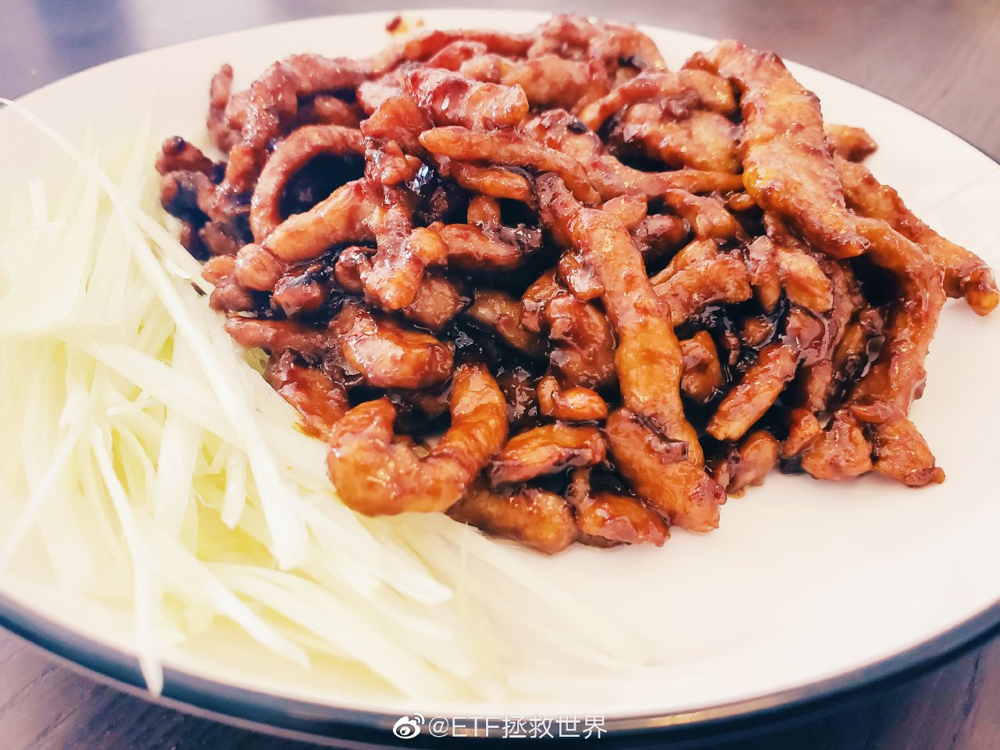

======================================================

ETF拯救世界 (5687069307) @
2020-05-11 09:45:33 Mon  
url: https://weibo.com/5687069307/J1oGz0Jf6

从我亲见过的一起交通肇事致人死亡然后逃逸的案件看，死者家属获得赔偿金谅解后，肇事者就没事了。懂法的朋友能不能给我普及一下，这样是正常合法的吗。

------------------------------------------------------
转推：
>  @侠客岛 (5476386628)
>  2020-05-10 17:03:14 Sun  
>  url: https:/weibo.com/5476386628/J1i7IiwcY/

>  【#交警队长儿子撞人后逃逸不被起诉# 检方称其获受害人丈夫谅解，子女不服】近日，广东肇庆广宁县公安交警大队综合中队长儿子梁某勇，驾车撞人致重伤后逃逸，检方不起诉。5月3日，被撞者程某群因白血病恶化死亡。5月10日，广宁县政府通报，不起诉系因梁某勇认罪认罚，积极赔偿且获谅解。然而被撞者姐姐 ​​​

转发[20]  评论[141]  赞[646] 

======================================================

ETF拯救世界 (5687069307) @
2020-05-11 10:13:32 Mon  
url: https://weibo.com/5687069307/J1oRUAkgf

我问各位一个问题，你会怎么回答。

对你来说很重要的一个人，如果被一个酒驾的人开车撞至身亡，肇事司机逃逸。

你费尽千辛万苦把他挖了出来。

这时候，他提出给你赔偿。赔偿金额大致相当于你们当地一套中档130平米商品房的房价，条件是你不再追究，这个人也不会被追究刑事责任。

当你处在以下两种 ​​​

转发[51]  评论[508]  赞[1220] 

======================================================

ETF拯救世界 (5687069307) @
2020-05-11 10:25:01 Mon  
url: https://weibo.com/5687069307/J1oWA8G5w

各位还需要考虑的是：肇事者既然能拿出这么大笔钱，那就大概率有钱，没准还有势。如果你不选择要赔偿，一定要让他坐牢，由于你的资源很少，他可能只判很少的几年，减刑几次没准一两年就出来了。然后你一分钱也拿不到或者只拿到很少很少的民事赔偿。

------------------------------------------------------
转推：
>  @ETF拯救世界 (5687069307)
>  2020-05-11 10:13:32 Mon  
>  url: https:/weibo.com/5687069307/J1oRUAkgf/

>  我问各位一个问题，你会怎么回答。
>  
>  对你来说很重要的一个人，如果被一个酒驾的人开车撞至身亡，肇事司机逃逸。
>  
>  你费尽千辛万苦把他挖了出来。
>  
>  这时候，他提出给你赔偿。赔偿金额大致相当于你们当地一套中档130平米商品房的房价，条件是你不再追究，这个人也不会被追究刑事责任。
>  
>  当你处在以下两种 ​​​

转发[16]  评论[199]  赞[819] 

======================================================

ETF拯救世界 (5687069307) @
2020-05-11 10:48:31 Mon  
url: https://weibo.com/5687069307/J1p67aMeW

随母姓倒是没有什么问题啦。只是你的孩子可能会比较辛苦，这一生中至少要向500个人解释为什么跟亲生爸爸不是一个姓……

------------------------------------------------------
转推：
>  @ ()
>  2020-05-11 10:43:42 Mon  
>  url: 

>  抱歉，作者已设置仅展示半年内微博，此微博已不可见。 ​​​

转发[47]  评论[495]  赞[2068] 

======================================================

ETF拯救世界 (5687069307) @
2020-05-12 15:06:35 Tue  
url: https://weibo.com/5687069307/J1AdmCijU

作为一个指数投资博主，指数这样半死不活、不上不下、不出不入的样子，不发帖也是很正常的吧。 ​​​

转发[16]  评论[712]  赞[3098] 

======================================================

ETF拯救世界 (5687069307) @
2020-05-13 09:51:09 Wed  
url: https://weibo.com/5687069307/J1HzP4Zio

告诉你们一个好消息：

我的一个门票股今年涨了129%。

还差10%就回本了。[太开心] ​​​

转发[116]  评论[655]  赞[2216] 

======================================================

ETF拯救世界 (5687069307) @
2020-05-13 14:02:11 Wed  
url: https://weibo.com/5687069307/J1JdInC9S

有些人看到别人赔钱比自己挣钱还开心。[哼] 人太多拉不过来，否则全都拉黑！

------------------------------------------------------
转推：
>  @ETF拯救世界 (5687069307)
>  2020-05-13 09:51:09 Wed  
>  url: https:/weibo.com/5687069307/J1HzP4Zio/

>  告诉你们一个好消息：
>  
>  我的一个门票股今年涨了129%。
>  
>  
>  
>  
>  
>  
>  
>  还差10%就回本了。[太开心] ​​​

转发[5]  评论[153]  赞[1008] 

======================================================

ETF拯救世界 (5687069307) @
2020-05-13 14:04:22 Wed  
url: https://weibo.com/5687069307/J1JeBjXjr

2800多点资产新高了吗。 ​​​

转发[10]  评论[341]  赞[1405] 

======================================================

ETF拯救世界 (5687069307) @
2020-05-13 14:28:21 Wed  
url: https://weibo.com/5687069307/J1Jolio6P

我说句不好听的，无论你跟你朋友关系多好，尽量别劝他（她）分手、离婚之类的。人家夫妻、男女朋友吵架就是找你倾诉一下，你听听就行了。你劝分，过两天人家好了，合起伙来骂你。

------------------------------------------------------
转推：
>  @ ()
>  2020-05-13 14:19:04 Wed  
>  url: 

>  抱歉，作者已设置仅展示半年内微博，此微博已不可见。 ​​​

转发[60]  评论[172]  赞[1220] 

======================================================

ETF拯救世界 (5687069307) @
2020-05-13 17:54:54 Wed  
url: https://weibo.com/5687069307/J1KKb6t7M

第一，是女的突然变向把小孩撞倒了。第二，这男的寻衅滋事动手打人不拘留吗？ 从孩子家长角度讲，我会教育孩子碰到这种二货该怎么办，不能傻傻站在那里挨打。当然也会教育孩子不要在小区里这样骑车。

------------------------------------------------------
转推：
>  @ ()
>  2020-05-13 17:28:02 Wed  
>  url: 

>  抱歉，作者已设置仅展示半年内微博，此微博已不可见。 ​​​

转发[49]  评论[170]  赞[953] 

======================================================

ETF拯救世界 (5687069307) @
2020-05-13 18:09:53 Wed  
url: https://weibo.com/5687069307/J1KQg4Jdi

回复@学期者:你开车变道还要打灯，还不能突然变，你走路突然变向，被后面撞了，你没责任？我说这女的突然变向导致后面刹车不及撞上了，并非全都是后车责任。你来个“不能变向了吗”。照你这么说，开车突然变道撞上后车后，还要问后车：我不能变道了吗？别看你逻辑思维差，但你胡搅蛮缠的能力强啊。

------------------------------------------------------
转推：
>  @ ()
>  2020-05-13 17:28:02 Wed  
>  url: 

>  抱歉，作者已设置仅展示半年内微博，此微博已不可见。 ​​​

转发[11]  评论[73]  赞[534] 

======================================================

ETF拯救世界 (5687069307) @
2020-05-13 18:16:44 Wed  
url: https://weibo.com/5687069307/J1KT2k0mx

无论开车、骑车、走路，我们如果要超过前面旁边路线上的人或者车，在他不提示要变线的情况下，我们都会预期对方是要继续走直线，对吗？

你开车，骑车，走路到对方旁边后，对方毫无提示突然变线，撞上了你，这时候当然是对方的责任。在交通法规里，你就是要先打灯，然后通过后视镜观察，在不影响旁边车 ​​​

转发[16]  评论[148]  赞[1142] 

======================================================

ETF拯救世界 (5687069307) @
2020-05-13 18:55:31 Wed  
url: https://weibo.com/5687069307/J1L8N1zl5

今日情感问答 ​​​

转发[43]  评论[440]  赞[2243] 

+++++++++++++++++++++++++++++++++++++++++++++++++++++

图片：
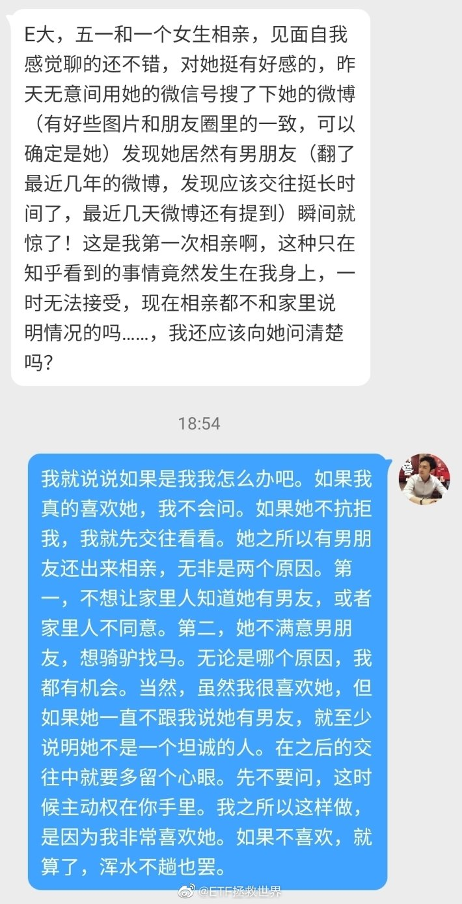

======================================================

ETF拯救世界 (5687069307) @
2020-05-13 20:25:47 Wed  
url: https://weibo.com/5687069307/J1LJq6ENU

守正出奇。

这四个字值得反复琢磨。

没有了“正”，长久看注定失败，即使你偷鸡摸狗小聪明赢了一时。

但只有“正”，很多时候就未免迂腐、不够灵活。

所以还要有“奇”。为了达到“正”的目的，很多时候就要灵活，要比“不正”更灵活、更聪明。

做人做事，大致都是如此。

对付坏人，就要比坏人更 ​​​

转发[172]  评论[253]  赞[1977] 

======================================================

ETF拯救世界 (5687069307) @
2020-05-14 11:28:45 Thu  
url: https://weibo.com/5687069307/J1RDW5Hf5

出来溜溜弯 http://t.cn/A6ABQ40n ​​​

转发[5]  评论[300]  赞[1836] 

======================================================

ETF拯救世界 (5687069307) @
2020-05-15 11:53:43 Fri  
url: https://weibo.com/5687069307/J21ez5eW7

做了一个小动画给大家。

之所以用这样的视频展示上一轮危机后2009年至今，美国标普500、沪深300、中证500、全指医药、全指消费、全指信息的走势对比，而非用一张简单的图片。是因为这样的视频可以让我们更加清楚的看到在某个时间段某个指数是如何表现，也会对否极泰来和乐极生悲有更深刻的认识。

也 ​​​

转发[815]  评论[948]  赞[3951] 

======================================================

ETF拯救世界 (5687069307) @
2020-05-15 18:32:43 Fri  
url: https://weibo.com/5687069307/J23QwsP0a

看了半天贴图证据，没贴出文中乱搞的石锤啊。如果网上写这么一段就能让人身败名裂就太可怕了。等石锤证据。另外，要看看女方怎么说。//@挖龙脉的超级鹿鼎公:回复@小艾哦520:我也看到了，这女的太猛了，这些全中国出名了//@小艾哦520:@挖龙脉的超级鹿鼎公 @亟兮般若

------------------------------------------------------
转推：
>  @ ()
>  2020-05-15 13:04:18 Fri  
>  url: 

>  抱歉，由于作者设置，你暂时没有这条微博的查看权限哦。查看帮助：http://t.cn/RfdBWwP ​​​

转发[15]  评论[125]  赞[670] 

======================================================

ETF拯救世界 (5687069307) @
2020-05-15 18:36:13 Fri  
url: https://weibo.com/5687069307/J23RWzFPQ

我始终觉得很多女性违章是不知道交通规则，而男性大多是明知故犯。另外，罚这么点是不是太少了，咱们的交通法规该升级了。

------------------------------------------------------
转推：
>  @ ()
>  2020-05-15 16:29:44 Fri  
>  url: 

>  抱歉，作者已设置仅展示半年内微博，此微博已不可见。 ​​​

转发[6]  评论[98]  赞[570] 

======================================================

ETF拯救世界 (5687069307) @
2020-05-15 19:15:05 Fri  
url: https://weibo.com/5687069307/J247Im70U

我有一个想法。我们这个国家一部分人从车里往车外扔东西、从窗户往楼下扔东西，其实和“只有自己人才是人，其他人只分成可以利用的和多余碍事儿的”是一个道理。主要原因在于潜意识中，只有自己的才重要，没有公德心和把陌生人当人的意识。

------------------------------------------------------
转推：
>  @北京人不知道的北京事儿 (1662214194)
>  2020-05-15 16:29:52 Fri  
>  url: https:/weibo.com/1662214194/J232F86Kh/

>  网友投稿：北京朝阳区三间房东路丁字口，从车里扔出一堆烟头！这素质也太低了。。。[伤心][伤心] http://t.cn/A6AgDLdG ​​​

转发[24]  评论[109]  赞[661] 

======================================================

ETF拯救世界 (5687069307) @
2020-05-15 20:39:27 Fri  
url: https://weibo.com/5687069307/J24FY3oXN

人均GDP只有你1/6，不是发展中国家是什么。

------------------------------------------------------
转推：
>  @观察者网 (1887344341)
>  2020-05-15 20:20:40 Fri  
>  url: https:/weibo.com/1887344341/J24ylf3SZ/

>  【特朗普谈WTO总干事离职：我OK啊 他总偏袒中国】14日，世界贸易组织总干事阿泽维多宣布将于8月31日正式离任，提前一年结束任期。早已对世贸组织心怀不满的特朗普当天回应，称自己对此“没有意见”，“我们受到了恶劣的对待，世贸组织把中国视为发展中国家，中国因此获得了许多美国所得不到的好处。” ​​​

转发[12]  评论[92]  赞[699] 

======================================================

ETF拯救世界 (5687069307) @
2020-05-15 21:47:52 Fri  
url: https://weibo.com/5687069307/J257Jhzux

历史新高。做为股东和忠实消费者，很满意。//@ETF拯救世界:谁能想到一年多过去，京东马上新高了。

------------------------------------------------------
转推：
>  @ETF拯救世界 (5687069307)
>  2018-09-06 06:36:28 Thu  
>  url: https:/weibo.com/5687069307/Gy2QnDieS/

>  为了让大家了解炒股的风险，一觉醒来京东已经巨亏几百美元。
>  
>  怎么办。今天早餐只能喝自来水了。
>  
>  炒股害死人，不要炒股。血淋淋的教训。
>  
>  众筹今天的午饭，一会发支付宝账号。[失望] ​​​

转发[10]  评论[136]  赞[951] 

======================================================

ETF拯救世界 (5687069307) @
2020-05-16 09:04:29 Sat  
url: https://weibo.com/5687069307/J29ynlNaw

确实不懂。很多人骂华为对员工不好，问题是怎么看不到太多华为员工自己出来骂，相反很多人拼命往里面挤。现在中国的阶段，很多人想舒舒服服赶超对手是不是想太多了？我不用华为是因为产品不是我的菜以及不喜欢大嘴领导，但内心是真心希望华为好。

------------------------------------------------------
转推：
>  @ ()
>  2020-05-16 08:46:10 Sat  
>  url: 

>  抱歉，作者已设置仅展示半年内微博，此微博已不可见。 ​​​

转发[39]  评论[475]  赞[2538] 

======================================================

ETF拯救世界 (5687069307) @
2020-05-16 16:11:40 Sat  
url: https://weibo.com/5687069307/J2clLCRHh

我总是不停的重复做一个梦，买过一辆奔驰放在一个修理厂，忘了去取。但是醒了想想好像没有这回事，然后就不停的做同样梦…

------------------------------------------------------
转推：
>  @新浪视频 (1640601392)
>  2020-05-16 09:46:34 Sat  
>  url: https:/weibo.com/1640601392/J29Ps1Yog/

>  【女子#时隔28年突然想起买了套房# 已被别人入住[允悲]】深圳女子在1992年以33万元买下140多平的房子，28年后突然想起还有套房[笑cry]，去找时发现有陌生人住进去，小区居民称其是撬锁搬进去。@掌闻视讯 http://t.cn/A6ADKT3Q ​​​

转发[18]  评论[218]  赞[989] 

======================================================

ETF拯救世界 (5687069307) @
2020-05-16 18:38:03 Sat  
url: https://weibo.com/5687069307/J2djbctWP

再说一次，有人黑我不用告诉我。

我一点都不关心。谁再来说只能拉黑你。

我不想精神衰弱最后抑郁症，压力已经不小了。

再跟某些大v以及你们群里那些人说一声，这轮做完我就消失，给你们让路，能不能别这么心急？就这么几个买基金的人值得你这么眼红吗？ ​​​

转发[25]  评论[1087]  赞[4487] 

======================================================

ETF拯救世界 (5687069307) @
2020-05-18 09:07:43 Mon  
url: https://weibo.com/5687069307/J2sqFEiNP

今天有波动，期待。 ​​​

转发[5]  评论[276]  赞[1422] 

======================================================

ETF拯救世界 (5687069307) @
2020-05-18 09:34:16 Mon  
url: https://weibo.com/5687069307/J2sBsl6CD

前几天在评论里抱怨白银赔钱的，现在应该全都赚钱了。

我请你赶紧卖掉。你赚钱了不必谢我，以后再买，无论赔赚与无我关，请不要埋怨我。

谢谢你。 ​​​

转发[6]  评论[342]  赞[1842] 

======================================================

ETF拯救世界 (5687069307) @
2020-05-18 11:23:45 Mon  
url: https://weibo.com/5687069307/J2tjTvoFQ

如果你每天为自己的工作/健康/感情/家庭/亲人/孩子忙的焦头烂额，那就少关心点国家大事。

第一你也帮不上什么忙，第二会加重自己的焦虑。

赶紧先把自己的事情处理好。 ​​​

转发[104]  评论[189]  赞[2028] 

======================================================

ETF拯救世界 (5687069307) @
2020-05-18 11:35:33 Mon  
url: https://weibo.com/5687069307/J2toGhJE7

这些年总在网上看到炒股的人说：黄金没有利息，所以没有价值，不值得买。

其实黄金不是用来收利息的。黄金最大最大的功能是避险。1000年前的乱世中你可以用黄金换东西，100年前还是可以换，现在依然能换。可以预见的，100年、500年后，大概率也可以。

所以家里有余钱的，以后黄金价格跌下来后（划重 ​​​

转发[163]  评论[289]  赞[1408] 

======================================================

ETF拯救世界 (5687069307) @
2020-05-18 13:17:43 Mon  
url: https://weibo.com/5687069307/J2u49jrGD

其实我特别想知道，目前华为碰到这种事情，米、O、V这几家是什么想法。

是因为可以扩大市场份额高兴呢，还是唇亡齿寒呢。 ​​​

转发[11]  评论[224]  赞[1271] 

======================================================

ETF拯救世界 (5687069307) @
2020-05-18 13:23:39 Mon  
url: https://weibo.com/5687069307/J2u6yyGjZ

说到结婚离婚，我想说的是：

如果婚姻中男方不出去玩命挣钱，同时回家不干家务活，孩子生活学习都扔给老婆，每天就是玩游戏看直播看小说追剧。

那么对于女性来说，这个婚不结也罢。

同样的道理，对于男方也适用。

结婚两个人一起过日子，不是找个大爷或者姑奶奶回家供起来伺候。

当然，你要特别愿 ​​​

转发[120]  评论[216]  赞[1573] 

======================================================

ETF拯救世界 (5687069307) @
2020-05-18 13:33:43 Mon  
url: https://weibo.com/5687069307/J2uaEoHhg

回复@日月良福成:口头语。你可以理解为“努力”//@日月良福成:为什么要玩命，男人在家好好带孩子的话，女人要出去玩命？[汗]

------------------------------------------------------
转推：
>  @ETF拯救世界 (5687069307)
>  2020-05-18 13:23:39 Mon  
>  url: https:/weibo.com/5687069307/J2u6yyGjZ/

>  说到结婚离婚，我想说的是：
>  
>  如果婚姻中男方不出去玩命挣钱，同时回家不干家务活，孩子生活学习都扔给老婆，每天就是玩游戏看直播看小说追剧。
>  
>  那么对于女性来说，这个婚不结也罢。
>  
>  同样的道理，对于男方也适用。
>  
>  结婚两个人一起过日子，不是找个大爷或者姑奶奶回家供起来伺候。
>  
>  当然，你要特别愿 ​​​

转发[7]  评论[64]  赞[617] 

======================================================

ETF拯救世界 (5687069307) @
2020-05-18 14:06:32 Mon  
url: https://weibo.com/5687069307/J2unY1VH8

这个品种跌了3年，最多跌了70%多，半个月涨了回来还盈利超过20%。这就是金融投资。之前说过，只要你的品种不死，不要着急它不涨。它会用一两周的时间把几年的收益还给你。

------------------------------------------------------
转推：
>  @ETF拯救世界 (5687069307)
>  2020-05-13 09:51:09 Wed  
>  url: https:/weibo.com/5687069307/J1HzP4Zio/

>  告诉你们一个好消息：
>  
>  我的一个门票股今年涨了129%。
>  
>  
>  
>  
>  
>  
>  
>  还差10%就回本了。[太开心] ​​​

转发[86]  评论[110]  赞[1153] 

======================================================

ETF拯救世界 (5687069307) @
2020-05-18 14:13:54 Mon  
url: https://weibo.com/5687069307/J2uqXfvs7

今天有个卸货车别忘了看。 ​​​

转发[6]  评论[451]  赞[1862] 

======================================================

ETF拯救世界 (5687069307) @
2020-05-18 14:42:09 Mon  
url: https://weibo.com/5687069307/J2uCqdFM4

苍天作证，我们卸货的时候涨的好好的。 ​​​

转发[3]  评论[260]  赞[1749] 

======================================================

ETF拯救世界 (5687069307) @
2020-05-18 16:31:37 Mon  
url: https://weibo.com/5687069307/J2vkR734C

也就最近这一年吧，我感觉自己对“无耻”的容忍度提高了好几个等级。

以前看到满嘴谎言的渣滓会觉得义愤填膺。现在笑一下也就过去了。

人啊，为了利益渣起来真的没有底线的。 ​​​

转发[20]  评论[223]  赞[1873] 

======================================================

ETF拯救世界 (5687069307) @
2020-05-18 19:29:57 Mon  
url: https://weibo.com/5687069307/J2wvfldHo

我这两年经常对着湛蓝的天空感慨，我们这个国家，要真想干什么事情，确实效率太高了。之前说西方经验，空气质量好转要几十年，谁想到两三年工夫就特别好了。至于对经济的影响不是这里讨论的，别杠。

------------------------------------------------------
转推：
>  @北京生态环境 (2050142347)
>  2020-05-18 17:38:37 Mon  
>  url: https:/weibo.com/2050142347/J2vM3awS4/

>  【1-4月北京市PM2.5累计浓度47微克/立方米】2020年，北京市空气质量形势总体向好。截至4月底，四项主要大气污染物浓度均创历史最优，其中细颗粒物（PM2.5）累计浓度为47微克/立方米，同比下降7.8%。累计优良天数99天、同比增加15天，优良天数比例首次超过80%。4月份PM2.5平均浓度为31微克/立方米、同比 ​​​

转发[24]  评论[243]  赞[1369] 

======================================================

ETF拯救世界 (5687069307) @
2020-05-19 09:27:17 Tue  
url: https://weibo.com/5687069307/J2BZ79zcV

标普500这一波最终收益率是2个月22%。 ​​​

转发[19]  评论[531]  赞[2209] 

======================================================

ETF拯救世界 (5687069307) @
2020-05-19 09:56:24 Tue  
url: https://weibo.com/5687069307/J2CaVDBeE

回复@MrMarcoPoon:最关键是折溢价。昨天油气溢价几个点，今天变成折价2%。一来一回涨幅就吃掉了。//@MrMarcoPoon:老大，想问问为什么xop涨了10点，华宝油气只涨了5点，不是对接xop的吗，谢谢回答

------------------------------------------------------
转推：
>  @ETF拯救世界 (5687069307)
>  2020-05-19 09:27:17 Tue  
>  url: https:/weibo.com/5687069307/J2BZ79zcV/

>  标普500这一波最终收益率是2个月22%。 ​​​

转发[7]  评论[56]  赞[772] 

======================================================

ETF拯救世界 (5687069307) @
2020-05-19 10:05:20 Tue  
url: https://weibo.com/5687069307/J2CeyvqZi

笑死我了。为什么不接电话？“接你DY。”——部长心说。

------------------------------------------------------
转推：
>  @观察者网 (1887344341)
>  2020-05-19 07:02:08 Tue  
>  url: https:/weibo.com/1887344341/J2B2cgRGX/

>  【澳贸易部长、农业部长：中方不接我们电话 也不给出拒接原因】5月18日，商务部网站发布2020年第14号公告，宣布自19日起对澳大利亚产进口大麦征收反倾销税。
>  
>  近日来，澳大利亚一直想要就反倾销税一事与中方“协商”。澳大利亚ABC新闻当地时间5月18日声称，中国商务部部长钟山表示两国“正保持沟通”， ​​​

转发[24]  评论[153]  赞[1033] 

======================================================

ETF拯救世界 (5687069307) @
2020-05-19 16:16:32 Tue  
url: https://weibo.com/5687069307/J2EFes4Ox

是不是更新补丁后就无法连接港服了，有懂的说说吗。或者如果以后有这样的补丁出来，你们一定要及时告诉我啊。//@昆山法律:回到上世纪80年代只有大院子弟通过日本大使馆关系才能拿到fc玩得时代么？

------------------------------------------------------
转推：
>  @ ()
>  2020-05-18 15:37:02 Mon  
>  url: 

>  该账号因被投诉违反法律法规和《微博社区公约》的相关规定，现已无法查看。查看帮助 https://kefu.weibo.com/faqdetail?id=13216

转发[19]  评论[65]  赞[429] 

======================================================

ETF拯救世界 (5687069307) @
2020-05-19 17:16:43 Tue  
url: https://weibo.com/5687069307/J2F3EAuhO

昨天在张大妈看到一条让人心酸的评论。

正文是有人推荐洗碗机，有一条评论是这样的：

“装修的时候我说要买洗碗机，老婆和丈母娘坚决不同意，就没装。现在每天都是我在洗碗。”

这条评论暴露了两个问题：

第一，此人家庭地位极低。表现在买一台洗碗机都毫无发言权。这种地位低下的原因当然只有一个 ​​​

转发[161]  评论[496]  赞[2548] 

======================================================

ETF拯救世界 (5687069307) @
2020-05-20 05:58:54 Wed  
url: https://weibo.com/5687069307/J2K31xFsd

意思不大 ​​​

转发[8]  评论[280]  赞[1040] 

======================================================

ETF拯救世界 (5687069307) @
2020-05-20 06:38:45 Wed  
url: https://weibo.com/5687069307/J2KjcvH6E

回复@Challe·Xu:4月30日我说： http://t.cn/A62ZZaYR //@Challe·Xu:最近买的纯债基一直在回撤，从五一节后就这样了，有没有了解的大佬解答一下

------------------------------------------------------
转推：
>  @ETF拯救世界 (5687069307)
>  2020-05-19 17:16:43 Tue  
>  url: https:/weibo.com/5687069307/J2F3EAuhO/

>  昨天在张大妈看到一条让人心酸的评论。
>  
>  正文是有人推荐洗碗机，有一条评论是这样的：
>  
>  “装修的时候我说要买洗碗机，老婆和丈母娘坚决不同意，就没装。现在每天都是我在洗碗。”
>  
>  这条评论暴露了两个问题：
>  
>  第一，此人家庭地位极低。表现在买一台洗碗机都毫无发言权。这种地位低下的原因当然只有一个 ​​​

转发[21]  评论[68]  赞[733] 

======================================================

ETF拯救世界 (5687069307) @
2020-05-20 06:44:29 Wed  
url: https://weibo.com/5687069307/J2Klx0DRZ

我发现很多朋友买了债基但其实对它也不是很了解，以后有空说说吧。

这是挖的第几个坑了。 ​​​

转发[16]  评论[691]  赞[2773] 

======================================================

ETF拯救世界 (5687069307) @
2020-05-22 10:16:37 Fri  
url: https://weibo.com/5687069307/J34ADmM67

不敢发帖

害怕引起反弹

不能给市场做人工呼吸

会让它误以为那是爱情 ​​​

转发[9]  评论[728]  赞[3144] 

======================================================

ETF拯救世界 (5687069307) @
2020-05-22 12:37:04 Fri  
url: https://weibo.com/5687069307/J35vDFvpS

H是一座桥，桥没了，除了灯塔，无人受益。

维持现状最好。 ​​​

转发[22]  评论[363]  赞[2158] 

======================================================

ETF拯救世界 (5687069307) @
2020-05-22 14:45:43 Fri  
url: https://weibo.com/5687069307/J36lRaqnG

波段是不是基本都吃完拿回本金了。

150是不是持续减仓现金越来越多了。

所以下跌你应该笑还是哭。 ​​​

转发[11]  评论[443]  赞[1890] 

======================================================

ETF拯救世界 (5687069307) @
2020-05-22 17:29:47 Fri  
url: https://weibo.com/5687069307/J37qs1gu9

一定要逼得大家再出去扫货人肉背奶粉吗。

------------------------------------------------------
转推：
>  @ ()
>  2020-05-21 23:30:54 Thu  
>  url: 

>  抱歉，作者已设置仅展示半年内微博，此微博已不可见。 ​​​

转发[55]  评论[366]  赞[1617] 

======================================================

ETF拯救世界 (5687069307) @
2020-05-24 22:24:11 Sun  
url: https://weibo.com/5687069307/J3scWmtVk

今日情感故事。

《手机》 ​​​

转发[6]  评论[235]  赞[1613] 

+++++++++++++++++++++++++++++++++++++++++++++++++++++

图片：
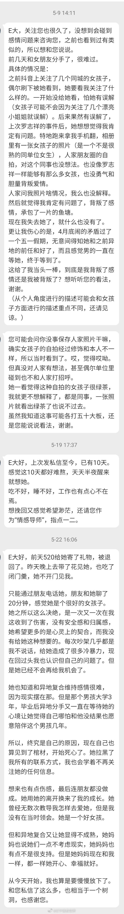
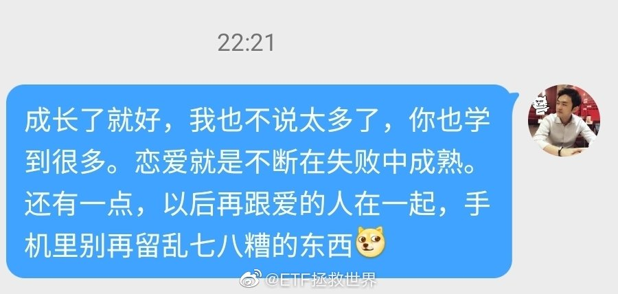

======================================================

ETF拯救世界 (5687069307) @
2020-05-24 22:32:22 Sun  
url: https://weibo.com/5687069307/J3sgggrbz

关于老人带孩子引起的婆媳矛盾，这样的思路对不对。 ​​​

转发[17]  评论[283]  赞[1334] 

+++++++++++++++++++++++++++++++++++++++++++++++++++++

图片：

======================================================

ETF拯救世界 (5687069307) @
2020-05-25 09:59:02 Mon  
url: https://weibo.com/5687069307/J3wKYEiiO

对H的态度，也会让T看到我们的决心。同时，M以及它的小弟们如何表现，也会给T上一课。看看真的有事，M会不会牺牲自己来出手帮它。

所以，H能否顺利解决，已经不单是H的问题了。

开弓没有回头箭。这是必须成功的一步棋。 ​​​

转发[33]  评论[342]  赞[2302] 

======================================================

ETF拯救世界 (5687069307) @
2020-05-25 10:16:25 Mon  
url: https://weibo.com/5687069307/J3wS2wNS8

继续有效。//@ETF拯救世界: 刚才看了一下，几个月过去，最下面的极限点位17000已经上升至17500左右。更容易达到了。//@ETF拯救世界:再给一个点位。如果真的搞大，让恒生崩到21000以下，是非常非常好的买入机会。我给个极限点位17000。万一真的到了，一把配满恒生指数，从那里算，不赚60个巴仙不再看。

------------------------------------------------------
转推：
>  @ETF拯救世界 (5687069307)
>  2019-08-26 10:08:35 Mon  
>  url: https:/weibo.com/5687069307/I3YBClttT/

>  预告一下。
>  
>  150会在23000以下买1-4份恒生。21000以下买4-10份。
>  
>  S会在23000以下持续买入。 ​​​

转发[81]  评论[289]  赞[1202] 

======================================================

ETF拯救世界 (5687069307) @
2020-05-25 10:20:45 Mon  
url: https://weibo.com/5687069307/J3wTNk3Vw

回复@狂狮爱不可:我不需要别人给我提建议该说什么。如果我把自己号作炸了，是我觉悟不够，我认了。只要是我想说的，同时认为能说的，我就会说。//@狂狮爱不可:老大，我们聊聊美食，讲讲情感故事，再不行说一说股票，何必谈政治呢[微笑][微笑]

------------------------------------------------------
转推：
>  @ETF拯救世界 (5687069307)
>  2020-05-25 09:59:02 Mon  
>  url: https:/weibo.com/5687069307/J3wKYEiiO/

>  对H的态度，也会让T看到我们的决心。同时，M以及它的小弟们如何表现，也会给T上一课。看看真的有事，M会不会牺牲自己来出手帮它。
>  
>  所以，H能否顺利解决，已经不单是H的问题了。
>  
>  开弓没有回头箭。这是必须成功的一步棋。 ​​​

转发[4]  评论[104]  赞[1169] 

======================================================

ETF拯救世界 (5687069307) @
2020-05-25 10:41:35 Mon  
url: https://weibo.com/5687069307/J3x2fwlBr

我知道有些朋友是为我好，不希望我有什么事情，所以对我做些善意的提示，希望我回避一些话题。

但我不能在这方面从善如流。

为什么。因为这就是我。

我今天听话不说这个，明天就要听之前那些恶意喷我的人不说其他的。有人曾经在别的地方喷我聊电影蹭流量，有人喷我说感情、音乐、美食。

我无论说什 ​​​

转发[30]  评论[433]  赞[2853] 

======================================================

ETF拯救世界 (5687069307) @
2020-05-25 11:09:21 Mon  
url: https://weibo.com/5687069307/J3xdwFtOF

能量守恒。中小学减的负，已经加到家长身上了。

------------------------------------------------------
转推：
>  @观察者网 (1887344341)
>  2020-05-25 10:44:29 Mon  
>  url: https:/weibo.com/1887344341/J3x3qt2el/

>  【政协委员：中小学生减负 大学生适当加负】全国政协委员、河南农业大学校长张改平院士表示，“一考定终身”的高考机制，向中小学生传导焦虑、加重负担，还向一些大学生传导了“一入大学万事轻松”的消极观念。使一些学生进入大学后，在严进宽出的机制下浑浑噩噩混日子、混文凭。为此他呼吁：“在为中 ​​​

转发[43]  评论[197]  赞[1134] 

======================================================

ETF拯救世界 (5687069307) @
2020-05-25 22:15:45 Mon  
url: https://weibo.com/5687069307/J3BA1i8Dc

日常灵验。 ​​​

转发[14]  评论[347]  赞[1558] 

+++++++++++++++++++++++++++++++++++++++++++++++++++++

图片：

======================================================

ETF拯救世界 (5687069307) @
2020-05-26 07:23:49 Tue  
url: https://weibo.com/5687069307/J3FatkO0Y

最低8255。现在12000的第一减持位快到了。

------------------------------------------------------
转推：
>  @ETF拯救世界 (5687069307)
>  2020-03-23 16:22:24 Mon  
>  url: https:/weibo.com/5687069307/IzWND4ItA/

>  如果DAX有效跌破8200，那就是最强的一根支撑破掉了。再往下是多少很难判断了。
>  
>  要是一定一定要给个点位，那就是6200周围。问题是，这也太低了吧！
>  
>  不过综合最近40年美国和英国的指数走势看，极限跌幅确实还有30%。这个真的是极限了，如果还止不住，那可能就是要全面推倒重来了。 ​​​

转发[72]  评论[224]  赞[1233] 

======================================================

ETF拯救世界 (5687069307) @
2020-05-26 10:11:36 Tue  
url: https://weibo.com/5687069307/J3GgzF3TO

网格账户每天新高，喷了 ​​​

转发[9]  评论[352]  赞[1913] 

======================================================

ETF拯救世界 (5687069307) @
2020-05-26 10:19:32 Tue  
url: https://weibo.com/5687069307/J3GjO2wav

如果各位经验和承受能力都进步了，那就准备加品种了啊。 ​​​

转发[27]  评论[1539]  赞[3739] 

======================================================

ETF拯救世界 (5687069307) @
2020-05-26 12:38:40 Tue  
url: https://weibo.com/5687069307/J3Heh1J0Y

男人为什么打遮阳伞就显得很娘。

不公平。

气的浑身发抖。 ​​​

转发[14]  评论[516]  赞[2303] 

======================================================

ETF拯救世界 (5687069307) @
2020-05-27 11:10:06 Wed  
url: https://weibo.com/5687069307/J3Q4P1an6

沉没成本。 ​​​

转发[56]  评论[1246]  赞[4709] 

+++++++++++++++++++++++++++++++++++++++++++++++++++++

图片：

======================================================

ETF拯救世界 (5687069307) @
2020-05-27 11:44:21 Wed  
url: https://weibo.com/5687069307/J3QiIC5fw

准备把微博昵称改为“ETF和老娘舅拯救世界” ​​​

转发[6]  评论[520]  赞[2242] 

======================================================

ETF拯救世界 (5687069307) @
2020-05-27 12:14:45 Wed  
url: https://weibo.com/5687069307/J3Qv3DFZn

日经也到了反弹压力位了。 ​​​

转发[14]  评论[204]  赞[1477] 

======================================================

ETF拯救世界 (5687069307) @
2020-05-27 14:33:39 Wed  
url: https://weibo.com/5687069307/J3Rprhldb

夫妻本是同林鸟，大难临头各自飞。

除非感情特别好到一点秘密都没有的，确实也没必要所有事情都让对方知道。

但你不能因为对方单纯就算计人家。人家一心一意跟你过日子，你却暗地里做好了所有准备，一旦有事让人家什么都没有。这太过分了。要这样何必在一起呢。

另一方面，害人之心不可有，防人之心 ​​​

转发[46]  评论[212]  赞[1605] 

======================================================

ETF拯救世界 (5687069307) @
2020-05-27 15:04:14 Wed  
url: https://weibo.com/5687069307/J3RBRl6CC

大涨是不可能的，这几个月都不可能的。涨一天跌一天，又没有大行情，就是吃吃波段，做做老娘舅才能维持的了生活这样子。 ​​​

转发[44]  评论[289]  赞[1932] 

======================================================

ETF拯救世界 (5687069307) @
2020-05-27 15:33:19 Wed  
url: https://weibo.com/5687069307/J3RNFgDMV

今天的最大感受：

你们有些小姑娘平常不说话，一碰到感兴趣的说起来小嘴叭叭的，小词儿都挺能整。

要吵架肯定吵不过你们，心里怕怕的。

明天见吧…… ​​​

转发[5]  评论[268]  赞[1469] 

======================================================

ETF拯救世界 (5687069307) @
2020-05-28 11:27:06 Thu  
url: https://weibo.com/5687069307/J3ZCdmL1k

提瓦达.索罗斯会怎么做。 ​​​

转发[17]  评论[257]  赞[1081] 

======================================================

ETF拯救世界 (5687069307) @
2020-05-28 11:39:50 Thu  
url: https://weibo.com/5687069307/J3ZHoiTwN

这女的精神有问题。真的。遇见这种人一定一定要离得远一点。

------------------------------------------------------
转推：
>  @新京报我们视频 (6124642021)
>  2020-05-28 11:29:45 Thu  
>  url: https:/weibo.com/6124642021/J3ZDiqgfa/

>  【#西安蹦跳骂交警女子处罚结果# 警方：行政处罚加道歉】5月27日，西安女子肖某未戴头盔被查时，全程蹦跳辱骂交警一事引关注。当晚警方通报此事称，肖某被派出所传唤调查后，向当事交警道歉并取得谅解，警方对其作出行政罚款。27日，肖某再次到交警队和派出所道歉并递交道歉信。http://t.cn/A62xa3yY ​​​

转发[9]  评论[150]  赞[694] 

======================================================

ETF拯救世界 (5687069307) @
2020-05-28 12:38:44 Thu  
url: https://weibo.com/5687069307/J405ieoZB

国行PS4 PRO能更新吗。更新后还能连上港服吗。

为什么跟游戏较劲呢。不是有很多大事等着解决吗。 ​​​

转发[6]  评论[179]  赞[1073] 

======================================================

ETF拯救世界 (5687069307) @
2020-05-28 18:14:46 Thu  
url: https://weibo.com/5687069307/J42hGyHkY

离婚不离婚是人家自己的事，两人后悔了自然会去复婚。能不能不要设置这种人为障碍，制造可能出现的各种麻烦？

------------------------------------------------------
转推：
>  @ ()
>  2020-05-28 17:27:36 Thu  
>  url: 

>  抱歉，此微博已被作者删除。查看帮助：http://t.cn/Rfd3rQV

转发[97]  评论[257]  赞[1492] 

======================================================

ETF拯救世界 (5687069307) @
2020-05-28 20:40:34 Thu  
url: https://weibo.com/5687069307/J43eSjIv5

今天一个品种正好最高价是成交价，可能有些朋友没有成交。

挂单了没有成交的，如果是普通条件单，需要重新手动挂单。如果是大V条件单，不用重新挂，系统会自动再挂。 ​​​

转发[15]  评论[509]  赞[1590] 

======================================================

ETF拯救世界 (5687069307) @
2020-05-29 07:42:52 Fri  
url: https://weibo.com/5687069307/J47zHggwC

之前我说只有15%的人收入超过5000够个税起征点，还有很多人不信。这才是真正的中国。

------------------------------------------------------
转推：
>  @新浪财经 (1638782947)
>  2020-05-29 07:21:58 Fri  
>  url: https:/weibo.com/1638782947/J47rdcmfh/

>  #两会财经报道# 【李克强：#中国6亿人月收入仅1000元#，人均年收入3万元】今日必看！200秒速看总理答记者问：中国是一个人口众多的发展中国家，我们人均年收入是3万元人民币，但是有6亿人每个月的收入也就1000元，1000元在一个中等城市可能租房都困难，现在又碰到疫情，疫情过后民生为要。就业是最大的 ​​​

转发[127]  评论[0]  赞[1144] 

======================================================

ETF拯救世界 (5687069307) @
2020-05-29 07:57:25 Fri  
url: https://weibo.com/5687069307/J47FBkbqK

我觉得这个是假的。这个女的演技太差，台词生硬，表情浮夸。有没有人后续跟进看看什么结果。

------------------------------------------------------
转推：
>  @挖龙脉的超级鹿鼎公 (3962719063)
>  2020-05-29 06:16:20 Fri  
>  url: https:/weibo.com/3962719063/J470A17fK/

>  韭菜只可能被收割，不可能被改变。 http://t.cn/A62iMRII ​​​

转发[17]  评论[319]  赞[917] 

======================================================

ETF拯救世界 (5687069307) @
2020-05-30 17:22:23 Sat  
url: https://weibo.com/5687069307/J4kNq7YPz

很多事情突然爆出后大家可能义愤填膺，非常生气。但单方面叙述未必就是完全客观，有没有可能夸大其词或者不符合实际情况呢。

别急，等等后续。

有时候自己占理的情况下为了博取关注夸大其词有可能反而会失去别人的同情。 ​​​

转发[25]  评论[305]  赞[1593] 

======================================================

ETF拯救世界 (5687069307) @
2020-05-31 08:39:46 Sun  
url: https://weibo.com/5687069307/J4qNMwpSN

[doge]//@新京报我们视频:【#警方通报教师涉嫌体罚学生#：发帖人承认其女儿因遭体罚吐血、凌晨2时被老师威胁殴打、送老师6万元等情节系其为扩大影响而故意编造的谎言】（来源@广州白云公安） http://t.cn/A62oJ9ij

------------------------------------------------------
转推：
>  @新京报我们视频 (6124642021)
>  2020-05-30 14:58:08 Sat  
>  url: https:/weibo.com/6124642021/J4jQSiJgD/

>  【#广州教育局回应教师涉嫌体罚学生#】5月30日，网友“小岛里的大海”举报称，她患有哮喘症的女儿于2019年12月10日被班主任罚跑10圈后出现吐血、手抖等症状，至今未好转，报警及向学校反映后，刘姓班主任也未得到相关处理。30日下午，白云区教育局发文称，已联合公安等部门成立调查组介入调查。 ​​​

转发[35]  评论[178]  赞[723] 

======================================================

ETF拯救世界 (5687069307) @
2020-05-31 09:30:29 Sun  
url: https://weibo.com/5687069307/J4r8n8Lpn

打了很多字，觉得怎么也表达不清楚自己的想法，都删了。

一句话，绝大多数人是不可能独立思考的。能独立思考的人，在面对群体狂热的时候，要想办法保护自己。 ​​​

转发[84]  评论[235]  赞[1908] 

======================================================

ETF拯救世界 (5687069307) @
2020-05-31 19:08:57 Sun  
url: https://weibo.com/5687069307/J4uVauaqE

据我和儿子长期出去锻炼得出的结论：

一年级孩子持续跑步大概极限在300-400米，再多就会心脏有痛感。

轻松的走跑结合2公里正常耗时大概在20-30分钟。

不过无论如何，体罚一年级孩子的老师不会是什么好老师。 ​​​

转发[20]  评论[248]  赞[1507] 

======================================================

ETF拯救世界 (5687069307) @
2020-06-01 09:13:55 Mon  
url: https://weibo.com/5687069307/J4As92tro

节日快乐！

今 天 不 许 不 开 心！ ​​​

转发[22]  评论[992]  赞[2926] 

======================================================

ETF拯救世界 (5687069307) @
2020-06-01 15:24:57 Mon  
url: https://weibo.com/5687069307/J4CSKgxPg

赚50%了。金融投资就是三年不开张，开张吃三年。不涨的时间越久，涨的越高。不要急//@ETF拯救世界: 这个品种跌了3年，最多跌了70%多，半个月涨了回来还盈利超过20%。这就是金融投资。之前说过，只要你的品种不死，不要着急它不涨。它会用一两周的时间把几年的收益还给你

------------------------------------------------------
转推：
>  @ETF拯救世界 (5687069307)
>  2020-05-13 09:51:09 Wed  
>  url: https:/weibo.com/5687069307/J1HzP4Zio/

>  告诉你们一个好消息：
>  
>  我的一个门票股今年涨了129%。
>  
>  
>  
>  
>  
>  
>  
>  还差10%就回本了。[太开心] ​​​

转发[49]  评论[210]  赞[1157] 

======================================================

ETF拯救世界 (5687069307) @
2020-06-01 16:30:23 Mon  
url: https://weibo.com/5687069307/J4Djjjgbm

[心]

------------------------------------------------------
转推：
>  @北京人不知道的北京事儿 (1662214194)
>  2020-06-01 14:08:27 Mon  
>  url: https:/weibo.com/1662214194/J4CnH82gE/

>  初夏北京故宫内的流云。[心][心][心]
>  
>  （by云端的赫尔墨斯）http://t.cn/A629zF6T ​​​

转发[33]  评论[78]  赞[604] 

======================================================

ETF拯救世界 (5687069307) @
2020-06-01 16:33:56 Mon  
url: https://weibo.com/5687069307/J4DkKhcnt

今天的数据出来了，A股长线仓位我不会再加仓，目前合适。想要加仓的可以自己加或者找其他人参考加。 ​​​

转发[39]  评论[351]  赞[1856] 

======================================================

ETF拯救世界 (5687069307) @
2020-06-01 17:17:06 Mon  
url: https://weibo.com/5687069307/J4DCh6V8H

感觉黑人都特别团结。为什么有些人种在西方也被歧视却很少抱团抗争。

这是文化问题还是基因问题。 ​​​

转发[22]  评论[380]  赞[1875] 

======================================================

ETF拯救世界 (5687069307) @
2020-06-01 20:39:43 Mon  
url: https://weibo.com/5687069307/J4EWvt5mR

乌克兰：1991年人均GDP 1489美元，是中国333美元的347%。 到了2019年，乌克兰人均GDP 3680美元，是中国10276的35.8%。 真心希望大家都读读过去30年的世界历史，尤其是看看发生剧变后是国家哪部分人受益，哪部分人越过越差。真的与你想的不一样。

------------------------------------------------------
转推：
>  @俄罗斯卫星通讯社 (2181597154)
>  2020-06-01 20:03:03 Mon  
>  url: https:/weibo.com/2181597154/J4EHD3Ggb/

>  【今非昔比：乌克兰空军将何去何从？】大约一百架现代多用途战斗机、先进无人机、新型运输机、重新利用旧战机—乌克兰Defense Express信息咨询公司日前公布的“乌克兰空军2035年前发展规划”中列出了这些计划。乌克兰武装力量空军军事委员会已经批准了这一规划。规划可以说是十分雄心勃勃：15年内打造 ​​​

转发[43]  评论[222]  赞[1281] 

======================================================

ETF拯救世界 (5687069307) @
2020-06-02 14:08:39 Tue  
url: https://weibo.com/5687069307/J4LOhg8LV

国债这么跌我就很高兴了。我不是针对国债，而是在座的所有品种谁跌我都开心。

有钱还怕没东西买吗。正好纯债仓位已经降到1%以下了，等着补仓呢继续加油啊。 ​​​

转发[85]  评论[549]  赞[2085] 

+++++++++++++++++++++++++++++++++++++++++++++++++++++

图片：
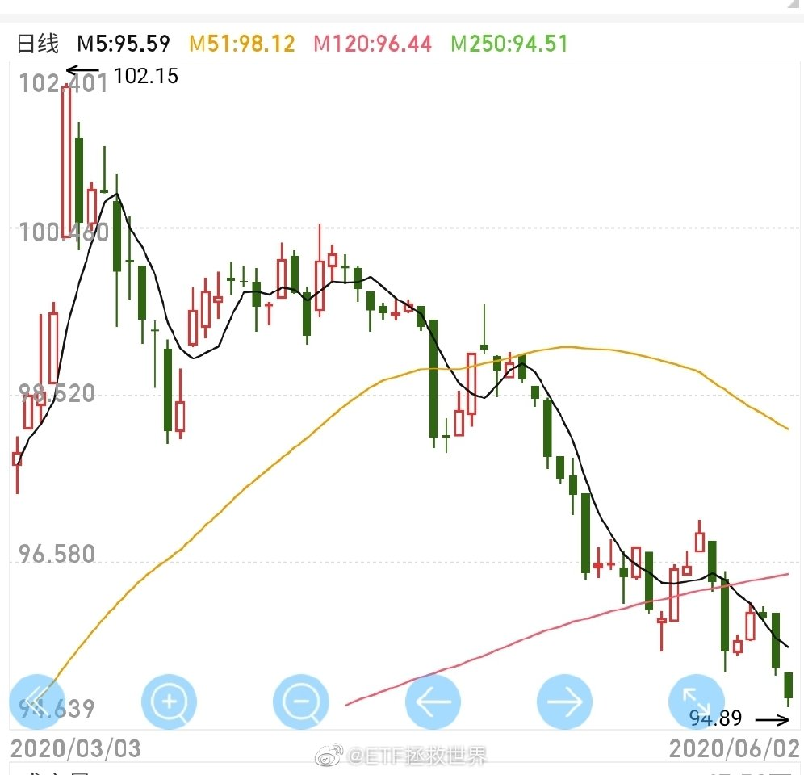

======================================================

ETF拯救世界 (5687069307) @
2020-06-02 17:06:20 Tue  
url: https://weibo.com/5687069307/J4MYp1zYH

12000达成//@ETF拯救世界: 最低8255。现在12000的第一减持位快到了。

------------------------------------------------------
转推：
>  @ETF拯救世界 (5687069307)
>  2020-03-23 16:22:24 Mon  
>  url: https:/weibo.com/5687069307/IzWND4ItA/

>  如果DAX有效跌破8200，那就是最强的一根支撑破掉了。再往下是多少很难判断了。
>  
>  要是一定一定要给个点位，那就是6200周围。问题是，这也太低了吧！
>  
>  不过综合最近40年美国和英国的指数走势看，极限跌幅确实还有30%。这个真的是极限了，如果还止不住，那可能就是要全面推倒重来了。 ​​​

转发[34]  评论[209]  赞[1166] 

======================================================

ETF拯救世界 (5687069307) @
2020-06-02 18:12:50 Tue  
url: https://weibo.com/5687069307/J4Npo6hHN

下单了，中奖的各位这周就能拿到卡号了。

之所以现在才下单，是等618，让你能多买点东西。

enjoy it. ​​​

转发[4]  评论[535]  赞[1827] 

+++++++++++++++++++++++++++++++++++++++++++++++++++++

图片：

======================================================

ETF拯救世界 (5687069307) @
2020-06-02 19:24:39 Tue  
url: https://weibo.com/5687069307/J4NSxkc6K

本来我对怎么治病没什么特殊好恶，能治好就行。

现在说不许说某种治病方法不好，说了就是违法。

说真的，我想去医院看病了，因为突然觉得有点恶心。 ​​​

转发[41]  评论[440]  赞[2184] 

======================================================

ETF拯救世界 (5687069307) @
2020-06-03 09:32:45 Wed  
url: https://weibo.com/5687069307/J4TqMmv06

为什么贫富差距越来越大。

有资产的，危机中抄底，账户不断新高。

没资产的，危机中失业，钱越来越少。 ​​​

转发[118]  评论[265]  赞[1818] 

======================================================

ETF拯救世界 (5687069307) @
2020-06-03 09:49:52 Wed  
url: https://weibo.com/5687069307/J4TxJtODF

之前换416还是可以吧。 ​​​

转发[32]  评论[339]  赞[1145] 

======================================================

ETF拯救世界 (5687069307) @
2020-06-03 09:58:28 Wed  
url: https://weibo.com/5687069307/J4TBdyS4p

这里的朋友至少有一半普通话没他好吧。

------------------------------------------------------
转推：
>  @演员曹操 (1833973550)
>  2020-06-02 17:07:54 Tue  
>  url: https:/weibo.com/1833973550/J4MZ202vw/

>  我的老家为什么会乱？就是因为这句美国老话：xxxxxxxxxx  http://t.cn/A6209SQ5 ​​​

转发[66]  评论[113]  赞[599] 

======================================================

ETF拯救世界 (5687069307) @
2020-06-03 10:13:14 Wed  
url: https://weibo.com/5687069307/J4THdizSp

医药已经回到2015年6月点位。

距离救命底涨幅76%。 ​​​

转发[22]  评论[164]  赞[1307] 

======================================================

ETF拯救世界 (5687069307) @
2020-06-03 10:23:37 Wed  
url: https://weibo.com/5687069307/J4TLqvDhV

真心的再说一次，特别特别重要：

一个品种跌很多的时候，必然有很多很多人看衰它。会找很多很多理由解释为什么跌很多，然后告诉你它永远没希望。

相反，一个品种越涨越高，也会有很多人看好它。告诉你只有它才是天选之子，一定会永远涨下去。

对于个股来说，真的有可能出现上述的情况。但是对于不会 ​​​

转发[457]  评论[348]  赞[1593] 

======================================================

ETF拯救世界 (5687069307) @
2020-06-03 10:31:11 Wed  
url: https://weibo.com/5687069307/J4TOv1DXG

比特币有期货吗。为什么会爆仓

------------------------------------------------------
转推：
>  @ipo观察 (1984738451)
>  2020-06-03 10:26:15 Wed  
>  url: https:/weibo.com/1984738451/J4TMuF4U4/

>  比特币在24小时之内多空来回割，据统计，3.6万人爆仓超50亿元人民币。 ​​​

转发[14]  评论[193]  赞[629] 

======================================================

ETF拯救世界 (5687069307) @
2020-06-03 10:37:59 Wed  
url: https://weibo.com/5687069307/J4TRgsuFz

回复@哎呀吗类:胡建人和东北人成语接龙：胡建：心心相印。东北：印贼做父。胡建：父相伤害。东北：害想咋地//@哎呀吗类:福建人表示佩胡//@ETF拯救世界:这里的朋友至少有一半普通话没他好吧。

------------------------------------------------------
转推：
>  @演员曹操 (1833973550)
>  2020-06-02 17:07:54 Tue  
>  url: https:/weibo.com/1833973550/J4MZ202vw/

>  我的老家为什么会乱？就是因为这句美国老话：xxxxxxxxxx  http://t.cn/A6209SQ5 ​​​

转发[33]  评论[144]  赞[652] 

======================================================

ETF拯救世界 (5687069307) @
2020-06-03 11:02:53 Wed  
url: https://weibo.com/5687069307/J4U1necCP

开心 http://t.cn/A62WJ1Yu

------------------------------------------------------
转推：
>  @ETF拯救世界 (5687069307)
>  2020-06-02 14:08:39 Tue  
>  url: https:/weibo.com/5687069307/J4LOhg8LV/

>  国债这么跌我就很高兴了。我不是针对国债，而是在座的所有品种谁跌我都开心。
>  
>  有钱还怕没东西买吗。正好纯债仓位已经降到1%以下了，等着补仓呢继续加油啊。 ​​​

转发[32]  评论[171]  赞[803] 

======================================================

ETF拯救世界 (5687069307) @
2020-06-03 11:06:06 Wed  
url: https://weibo.com/5687069307/J4U2Fwmq6

从前波动人割你，现在波动你割人。 ​​​

转发[8]  评论[240]  赞[1551] 

======================================================

ETF拯救世界 (5687069307) @
2020-06-03 11:18:05 Wed  
url: https://weibo.com/5687069307/J4U7xxwYf

不同意。我的鼻梁就是初一时候自己捏起来的。很明显的变化。

------------------------------------------------------
转推：
>  @ ()
>  2020-06-03 08:00:03 Wed  
>  url: 

>  抱歉，作者已设置仅展示半年内微博，此微博已不可见。 ​​​

转发[9]  评论[331]  赞[1278] 

======================================================

ETF拯救世界 (5687069307) @
2020-06-03 13:17:39 Wed  
url: https://weibo.com/5687069307/J4UU4ed9P

舒服、开心，还能挣钱。

这工作是不是能干一辈子。 ​​​

转发[22]  评论[636]  赞[3458] 

======================================================

ETF拯救世界 (5687069307) @
2020-06-03 17:03:11 Wed  
url: https://weibo.com/5687069307/J4WnC4TIu

别人骂你，打你，给你脸色看，你还非要去送钱。不欢迎就别去了，有钱怕花不出去吗。正好让动物们回家吧。

------------------------------------------------------
转推：
>  @观察者网 (1887344341)
>  2020-06-03 16:40:03 Wed  
>  url: https:/weibo.com/1887344341/J4WeehOXW/

>  【港府拟拨54亿港元救香港海洋公园，梁振英：是时候放手了】作为香港名片，拥有40多年历史的香港海洋公园竟走入了濒临破产的困局，香港一代人的集体记忆或就此终结。5月11日，香港海洋公园董事会主席孔令成在召开的记者会上称，海洋公园的现金流已几近枯竭，以目前的情况只能坚持营运到6月底，并向香港 ​​​

转发[15]  评论[134]  赞[931] 

======================================================

ETF拯救世界 (5687069307) @
2020-06-03 17:59:44 Wed  
url: https://weibo.com/5687069307/J4WKz6qKU

虽然一直很喜欢DAX，但这波德国反弹这么强（49%）已经超过我的预期了。

再……再飞一会。 ​​​

转发[11]  评论[343]  赞[1793] 

======================================================

ETF拯救世界 (5687069307) @
2020-06-03 19:23:02 Wed  
url: https://weibo.com/5687069307/J4XinofB0

我觉得地摊应该是为那些生活比较困难的人提供的一个选项，那些开着BBA在后备箱卖货的是不是就别凑热闹了。

不过地摊+网商前后夹击，商场是彻底歇菜了。 ​​​

转发[19]  评论[261]  赞[1721] 

======================================================

ETF拯救世界 (5687069307) @
2020-06-04 09:28:11 Thu  
url: https://weibo.com/5687069307/J52PqxMvw

有时候有些品种会让你产生一种“我不配赚那么多”的感觉……有了敬畏之心，才能走的长远。那种挣点钱就觉得自己是天才恐怕离出事就不远了。

------------------------------------------------------
转推：
>  @ETF拯救世界 (5687069307)
>  2020-06-03 09:49:52 Wed  
>  url: https:/weibo.com/5687069307/J4TxJtODF/

>  之前换416还是可以吧。 ​​​

转发[29]  评论[166]  赞[1139] 

======================================================

ETF拯救世界 (5687069307) @
2020-06-04 09:37:16 Thu  
url: https://weibo.com/5687069307/J52T72d5H

522利空大跌进，8个交易日带着盈利再出一次。

2个多月一个位置来回两轮吃十几个点，还说你不会武功？ ​​​

转发[158]  评论[544]  赞[1908] 

======================================================

ETF拯救世界 (5687069307) @
2020-06-04 09:47:59 Thu  
url: https://weibo.com/5687069307/J52Xt5YgE

回复@黄芪子儿:金融投资不是线性的。影响涨跌的因素多到数不过来。对于普通人来说，不应该问为什么，因为走势很难预计。最重要的是有一套交易系统，买卖交给系统，让人性远离。//@黄芪子儿:回复@黄芪子儿:不明白利空hk下的环境怎么就又涨了？越来越奇怪，包括中概、标普。

------------------------------------------------------
转推：
>  @ETF拯救世界 (5687069307)
>  2020-06-04 09:37:16 Thu  
>  url: https:/weibo.com/5687069307/J52T72d5H/

>  522利空大跌进，8个交易日带着盈利再出一次。
>  
>  2个多月一个位置来回两轮吃十几个点，还说你不会武功？ ​​​

转发[77]  评论[89]  赞[943] 

======================================================

ETF拯救世界 (5687069307) @
2020-06-04 09:51:31 Thu  
url: https://weibo.com/5687069307/J52YTnTr5

回复@ghost0128:所以，你要继续升级适合你自己的策略。比如增加留存利润等等，实现持续“舒服”的感觉。但是不要陷入“修正上次遗憾后情况变化增加新遗憾”的陷阱。这句话实践多了你才会懂。//@ghost0128:可随之而来的却有一种怅然若失的感觉，噢……原来手中的网不多了。

------------------------------------------------------
转推：
>  @ETF拯救世界 (5687069307)
>  2020-06-04 09:37:16 Thu  
>  url: https:/weibo.com/5687069307/J52T72d5H/

>  522利空大跌进，8个交易日带着盈利再出一次。
>  
>  2个多月一个位置来回两轮吃十几个点，还说你不会武功？ ​​​

转发[51]  评论[179]  赞[1095] 

======================================================

ETF拯救世界 (5687069307) @
2020-06-04 10:36:04 Thu  
url: https://weibo.com/5687069307/J53gYwLSq

很多人说要出去摆摊儿，就是在微博上说说。

我就不同了，早上已经试做了人生中第一个烤冷面。

还行，明早出摊儿。

终于要发财了，兴奋ing. ​​​

转发[13]  评论[644]  赞[2695] 

+++++++++++++++++++++++++++++++++++++++++++++++++++++

图片：

======================================================

ETF拯救世界 (5687069307) @
2020-06-04 14:35:26 Thu  
url: https://weibo.com/5687069307/J54Q92nML

利好中证环保。//@昆山法律:后续再思考，摆摊后环境卫生垃圾处理是不是又是产业链上的？

------------------------------------------------------
转推：
>  @昆山法律 (2668957067)
>  2020-06-04 12:10:58 Thu  
>  url: https:/weibo.com/2668957067/J53TuDo39/

>  啤酒股暴涨，逻辑也是很简单，摆摊其实最大受益者就是烧烤，烧烤配啤酒是常识 ​​​

转发[26]  评论[219]  赞[1775] 

======================================================

ETF拯救世界 (5687069307) @
2020-06-05 10:00:08 Fri  
url: https://weibo.com/5687069307/J5csTaF4f

餐桌礼仪很重要。坐在哪里，怎么用餐具，怎么吃东西，怎么聊天，体现教养。不过这家的父亲也是奇葩，居然当着客人面因为座位发脾气把筷子折了，没什么修养。

------------------------------------------------------
转推：
>  @ ()
>  2020-06-04 15:25:34 Thu  
>  url: 

>  抱歉，此微博已被作者删除。查看帮助：http://t.cn/Rfd3rQV

转发[22]  评论[368]  赞[1979] 

======================================================

ETF拯救世界 (5687069307) @
2020-06-05 10:22:40 Fri  
url: https://weibo.com/5687069307/J5cC2wxyK

就像很多人说：“我就是很直爽啊，想什么说什么，我是个真诚的人”

不好意思，现实世界中，当你肆无忌惮的批评别人嘲笑别人缺点的时候，很多人并不喜欢你这么“真诚”。

礼仪这件事也一样。自己在家吃饭当然无所谓，但是有了客人，去饭局，单位聚餐……有些礼仪你不知道就要闹笑话。可能懂的人嘴上不 ​​​

转发[92]  评论[378]  赞[2072] 

======================================================

ETF拯救世界 (5687069307) @
2020-06-05 13:08:11 Fri  
url: https://weibo.com/5687069307/J5dHdwu2r

对各位非常客观的评价吧。 ​​​

转发[22]  评论[878]  赞[3867] 

+++++++++++++++++++++++++++++++++++++++++++++++++++++

图片：

======================================================

ETF拯救世界 (5687069307) @
2020-06-05 15:14:58 Fri  
url: https://weibo.com/5687069307/J5ewGbMnS

你有没有打开账户一看就又在新高，也不知道为什么一直赚钱，很迷茫的感觉。

也许这就是人生吧。 

新高的时候，没有一次操作是无辜的。 ​​​

转发[43]  评论[655]  赞[2771] 

======================================================

ETF拯救世界 (5687069307) @
2020-06-05 15:40:07 Fri  
url: https://weibo.com/5687069307/J5eGT9HKo

之前是玩GTA V，现在开始玩荒野大镖客了。

------------------------------------------------------
转推：
>  @观察者网 (1887344341)
>  2020-06-05 15:01:29 Fri  
>  url: https:/weibo.com/1887344341/J5ercDAaw/

>  【芝加哥行驶中的货运火车，遭示威者打劫】《纽约邮报》6月3日报道称，上周日，一辆货运火车在行驶至芝加哥附近时遭到示威者洗劫，车上运输的大量彩电被抢走。
>  
>  美国民众拍摄并放到网上的劫车视频显示，数十人攀上缓速前行的火车，从集装箱中搬出装有大屏彩电的箱子。有的抱着电视跳车逃走，有的在车上 ​​​

转发[13]  评论[116]  赞[593] 

======================================================

ETF拯救世界 (5687069307) @
2020-06-05 22:12:40 Fri  
url: https://weibo.com/5687069307/J5hge5jcs

这一波华安的dax基金经理要表扬

最后暴跌那两天我们大量申购拉住了净值，下跌跑赢，很正常。

然后快速建仓反弹的时候完全跟上他们做的非常好了。 ​​​

转发[40]  评论[366]  赞[2549] 

+++++++++++++++++++++++++++++++++++++++++++++++++++++

图片：
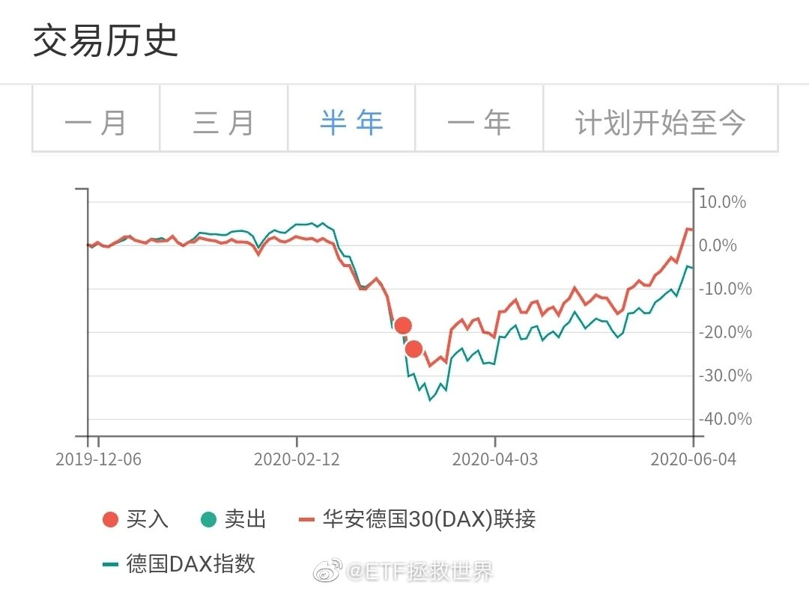

======================================================

ETF拯救世界 (5687069307) @
2020-06-05 22:25:44 Fri  
url: https://weibo.com/5687069307/J5hlwAZzo

散户从来都是追涨杀跌。

但这次危机，有一波人勇敢的抄底，还成功了。

增值2亿多。 ​​​

转发[47]  评论[543]  赞[2549] 

+++++++++++++++++++++++++++++++++++++++++++++++++++++

图片：
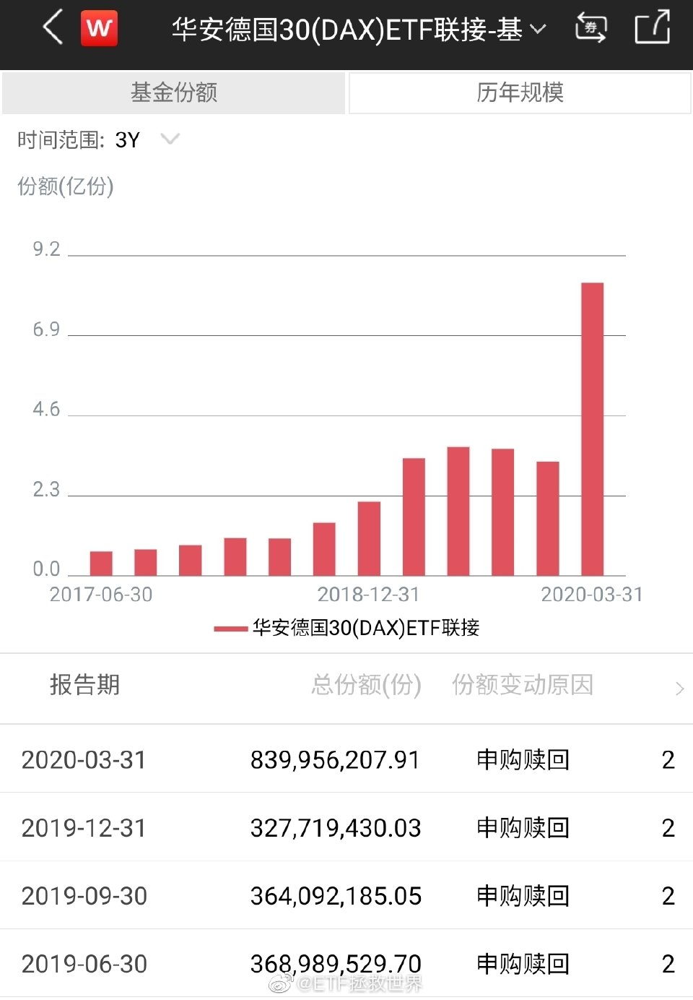

======================================================

ETF拯救世界 (5687069307) @
2020-06-07 00:53:05 Sun  
url: https://weibo.com/5687069307/J5rJPBAAW

http://t.cn/A62mTREs

转发[407]  评论[3852]  赞[7125] 

======================================================

ETF拯救世界 (5687069307) @
2020-06-08 17:22:13 Mon  
url: https://weibo.com/5687069307/J5HDODOsi

美股再回历史危险区域。

这个区域买美股，十年角度看，不会有好的收益率。 ​​​

转发[90]  评论[645]  赞[2734] 

======================================================

ETF拯救世界 (5687069307) @
2020-06-09 08:14:30 Tue  
url: https://weibo.com/5687069307/J5Nu05DiB

基本上海内外市场经过大跌大涨都回到年初的位置了。半年看，今年年初大波动的判断没错。还有半年，走着看吧。

------------------------------------------------------
转推：
>  @ETF拯救世界 (5687069307)
>  2020-01-02 10:46:21 Thu  
>  url: https:/weibo.com/5687069307/InAZ0ypgm/

>  今年是大波动这个判断是不是越来越靠谱了。
>  
>  如果全年大涨，就是又一个短命行情，明年又是万人坑。
>  
>  只有大幅波动才符合长牛慢牛的要求。 ​​​

转发[31]  评论[289]  赞[1350] 

======================================================

ETF拯救世界 (5687069307) @
2020-06-09 08:48:35 Tue  
url: https://weibo.com/5687069307/J5NHPAlYb

回复@范海峰73229:我们3月最低位买的美股您没买是吗。还是说您根本不知道我们在干什么？我把你晒出来，以后美股跌下去我还要晒。不停的晒。//@范海峰73229:一直看空美股.一直被打脸

------------------------------------------------------
转推：
>  @ETF拯救世界 (5687069307)
>  2020-06-08 17:22:13 Mon  
>  url: https:/weibo.com/5687069307/J5HDODOsi/

>  美股再回历史危险区域。
>  
>  这个区域买美股，十年角度看，不会有好的收益率。 ​​​

转发[19]  评论[165]  赞[1211] 

======================================================

ETF拯救世界 (5687069307) @
2020-06-09 08:58:00 Tue  
url: https://weibo.com/5687069307/J5NLF5tOY

开了100天评论，还是有那么多无脑人。微博用户知识水平真那么低么。

从去年开始，我就说当时的点位买美股， 十年不会有好收益。一年多过去，你当时买到现在确实没有好收益。3月还赔了几十个点。至少到现在，我没说错，打谁的脸？

我们3月份买，赚二十多个点走人，收益率就是比你在高位买的多，你打谁 ​​​

转发[87]  评论[770]  赞[2851] 

======================================================

ETF拯救世界 (5687069307) @
2020-06-09 09:40:21 Tue  
url: https://weibo.com/5687069307/J5O2Qm5lL

回复@ETF拯救世界:还记得这个吗。4月2日。油气基准从那天开始反弹，至今涨幅140%。//@ETF拯救世界:不知道为什么，今天很多人慌张的问：有石油开采公司申请破产了，是不是石油类基金都彻底完蛋了，要割肉吗？我就想起了这段往事。

------------------------------------------------------
转推：
>  @ETF拯救世界 (5687069307)
>  2020-04-02 14:55:59 Thu  
>  url: https:/weibo.com/5687069307/IBsvw8dSx/

>  举个例子吧。
>  
>  大家都知道我那次“捷达换宝马”的操作。2008年一辆捷达资金的买入，最终在上汽上面收获了不止一辆宝马的利润。
>  
>  对于那次操作，各位可以去看当时的记录，没什么好说的。只是有一点我几乎没有说过，但是记忆异常深刻，在这里分享。
>  
>  2009年初，那时候我已经买了很多上汽。但是就在那个风 ​​​

转发[58]  评论[234]  赞[1206] 

======================================================

ETF拯救世界 (5687069307) @
2020-06-09 10:01:08 Tue  
url: https://weibo.com/5687069307/J5Obi0ekS

做家长的，最重要的是给孩子内心深处潜意识中注入“天塌下来家都是你避难的港湾”。人的抗打击能力当然重要，更重要的是有“爱”在支撑。有爱就有希望，有希望就不会放弃。

------------------------------------------------------
转推：
>  @红星新闻 (6105713761)
>  2020-06-08 16:58:15 Mon  
>  url: https:/weibo.com/6105713761/J5Hu5y6Gv/

>  【#家属回应大二学生作弊被抓后坠亡#：孩子在考场内哭了近20分钟】6月6日，山西中北大学发生一起学生坠亡事件。据校方通报，坠亡学生系该校软件学院18级学生时某，该生在当日下午的课程补考中作弊，被监考老师发现并没收试卷，学生离开考场不久后坠楼。6月8日，时某的表姐告诉红星新闻记者称，通过查看 ​​​

转发[125]  评论[287]  赞[1921] 

======================================================

ETF拯救世界 (5687069307) @
2020-06-09 10:21:48 Tue  
url: https://weibo.com/5687069307/J5OjFpFPN

回复@守望星辰大海777:这也不对。比如在座的朋友，如果去炒股，可能有一半以上会赔钱。这是必然发生的吗，是自然选择物竞天择就应该被淘汰吗。实际上平行宇宙还有另一种可能，就是掌握正确的投资理念，结果95%以上都挣钱了。所以很多事情是可以改变的。

------------------------------------------------------
转推：
>  @红星新闻 (6105713761)
>  2020-06-08 16:58:15 Mon  
>  url: https:/weibo.com/6105713761/J5Hu5y6Gv/

>  【#家属回应大二学生作弊被抓后坠亡#：孩子在考场内哭了近20分钟】6月6日，山西中北大学发生一起学生坠亡事件。据校方通报，坠亡学生系该校软件学院18级学生时某，该生在当日下午的课程补考中作弊，被监考老师发现并没收试卷，学生离开考场不久后坠楼。6月8日，时某的表姐告诉红星新闻记者称，通过查看 ​​​

转发[14]  评论[70]  赞[612] 

======================================================

ETF拯救世界 (5687069307) @
2020-06-09 10:29:21 Tue  
url: https://weibo.com/5687069307/J5OmJrbKk

油气做波段品种真的是利器。不过它最大的问题是每次到了低位都暂停申购，导致溢价极大，无法低位买。

这个问题不解决，还是慎重用它做。 ​​​

转发[65]  评论[286]  赞[1607] 

======================================================

ETF拯救世界 (5687069307) @
2020-06-09 10:51:07 Tue  
url: https://weibo.com/5687069307/J5Ovzh5im

路过塔吊的时候一定要快速通过。君子不立危墙之下。

------------------------------------------------------
转推：
>  @ ()
>  2020-06-09 10:45:28 Tue  
>  url: 

>  抱歉，作者已设置仅展示半年内微博，此微博已不可见。 ​​​

转发[27]  评论[94]  赞[754] 

======================================================

ETF拯救世界 (5687069307) @
2020-06-09 11:03:05 Tue  
url: https://weibo.com/5687069307/J5OAqrvQF

养老终于在大医药的带领下创了两年新高。

有传媒拖着，不容易啊。传媒你长点心吧。用赵老师的话说，你得支棱起来啊！ ​​​

转发[43]  评论[344]  赞[1824] 

======================================================

ETF拯救世界 (5687069307) @
2020-06-09 13:37:16 Tue  
url: https://weibo.com/5687069307/J5PB0vrRZ

今天大家手头都很宽裕啊。[doge] ​​​

转发[4]  评论[437]  赞[2230] 

======================================================

ETF拯救世界 (5687069307) @
2020-06-09 13:58:08 Tue  
url: https://weibo.com/5687069307/J5PJufX4j

大家大方我也不能抠门。 http://t.cn/A62evcRI ​​​

转发[8]  评论[1311]  赞[2610] 

======================================================

ETF拯救世界 (5687069307) @
2020-06-10 10:05:17 Wed  
url: https://weibo.com/5687069307/J5XDswHR9

拿不住最重要的原因是：穷。

------------------------------------------------------
转推：
>  @ipo观察 (1984738451)
>  2020-06-10 09:32:42 Wed  
>  url: https:/weibo.com/1984738451/J5Xqez6LB/

>  【潜伏三年一把近翻倍！葛卫东守得云开见月明】
>  前几天刚刚豪掷15亿元参与兆易创新定增的葛卫东，在他的“小仓位”上也迎来了大丰收：持股快三年的西藏药业，在过去12个交易日，股价上涨了95%。葛卫东持有西藏药业近三年，就在一个月前，这笔投资还处于盈亏平衡状态，如果往前推到去年底，甚至还处于浮 ​​​

转发[77]  评论[242]  赞[1298] 

======================================================

ETF拯救世界 (5687069307) @
2020-06-10 10:28:09 Wed  
url: https://weibo.com/5687069307/J5XMK8Eaj

2018年1月底、2月初，大盘见顶。绝大多数股票开始跌。

然而一直到5月底，医药依然在一枝独秀的创新高。

6月，开始出台“一致性评价”政策。同时医保开始控费，医药开始下跌。

之后，随着“4+7带量采购”等政策持续推出，医药不断下跌。

到了2019年1月，各种配套改革政策频繁出台，加上A股进入钻石 ​​​

转发[429]  评论[612]  赞[2455] 

======================================================

ETF拯救世界 (5687069307) @
2020-06-10 10:53:07 Wed  
url: https://weibo.com/5687069307/J5XWSpu6d

希望判5年以上，同时大力宣传。

------------------------------------------------------
转推：
>  @网易财经 (1974561081)
>  2020-06-10 07:40:03 Wed  
>  url: https:/weibo.com/1974561081/J5WGvBSgf/

>  #21楼扔3块瓷砖砸伤2人被批捕#【男子发起床气从21楼扔下3块瓷砖，监控拍下可怕瞬间】近日，重庆江北某小区，住在21层的任某因女友的姐姐登门拜访爆发起床气，一怒之下将三块瓷砖扔到了楼下，砸伤多人。随后被警方以涉嫌危害公共安全罪刑拘。5日，重庆市江北区检察院以涉嫌以危险方法危害公共安全罪，对 ​​​

转发[44]  评论[192]  赞[991] 

======================================================

ETF拯救世界 (5687069307) @
2020-06-10 13:18:11 Wed  
url: https://weibo.com/5687069307/J5YTLbwQO

如果一个品种涨了100%，你只赚了70%。

别为了没赚到那剩下的30%太难受。

做个好人吧，留30%给别人赚。事情做得太绝老天爷都会看不下去。 ​​​

转发[80]  评论[448]  赞[2688] 

======================================================

ETF拯救世界 (5687069307) @
2020-06-10 14:19:09 Wed  
url: https://weibo.com/5687069307/J5Zivq6W1

虽然这么说挺不厚道的，但我希望国 泰 航 空倒闭。 ​​​​

转发[2]  评论[372]  赞[2744] 

======================================================

ETF拯救世界 (5687069307) @
2020-06-10 19:08:18 Wed  
url: https://weibo.com/5687069307/J61bSaKwz

今天数据出来了。

现在还在追医疗器械的，中长期看，就是在作死。

短线高手腿脚利落的除外。 ​​​

转发[76]  评论[518]  赞[2185] 

======================================================

ETF拯救世界 (5687069307) @
2020-06-11 09:53:39 Thu  
url: https://weibo.com/5687069307/J66ZeBIjA

支棱起来了！

------------------------------------------------------
转推：
>  @ETF拯救世界 (5687069307)
>  2020-06-09 11:03:05 Tue  
>  url: https:/weibo.com/5687069307/J5OAqrvQF/

>  养老终于在大医药的带领下创了两年新高。
>  
>  有传媒拖着，不容易啊。传媒你长点心吧。用赵老师的话说，你得支棱起来啊！ ​​​

转发[25]  评论[225]  赞[1017] 

======================================================

ETF拯救世界 (5687069307) @
2020-06-11 10:17:28 Thu  
url: https://weibo.com/5687069307/J678U5odM

每天一看账户又新高，

其实挺没意思的是不是。

关键是还特别舒服。不会像原来一样：哎呀我的股票涨了，卖不卖啊，不卖跌了怎么办啊。卖了吧，啊，怎么又涨了！算了不卖了，什么玩意儿怎么跌回去了！

舒舒服服，每天账户数字都在增加，一点都不刺激。 ​​​

转发[29]  评论[509]  赞[1747] 

======================================================

ETF拯救世界 (5687069307) @
2020-06-11 12:18:17 Thu  
url: https://weibo.com/5687069307/J67VWueYv

我参与了@凤凰周刊 发起的投票【利用航班延误骗保300多万元被抓，你怎么看？】，我投给了“不知道到底触犯了那条法律”这个选项，你也快来表态吧~

------------------------------------------------------
转推：
>  @凤凰周刊 (1267454277)
>  2020-06-10 21:14:05 Wed  
>  url: https:/weibo.com/1267454277/J620VvtB5/

>  【#利用航班延误骗保300多万元# 你怎么看？】近日，南京警方抓获一名利用航班延误实施保险诈骗的犯罪嫌疑人李某。经查，李某自2015年，用亲戚朋友的身份信息，靠自己估摸成功的近900次飞机延误，累计骗取保险理赔金高达300多万。 http://t.cn/A62s5bd8 ​​​

转发[13]  评论[230]  赞[607] 

======================================================

ETF拯救世界 (5687069307) @
2020-06-11 13:51:05 Thu  
url: https://weibo.com/5687069307/J68xBEAFt

标普500什么时候接回来。[doge] ​​​

转发[11]  评论[517]  赞[1830] 

======================================================

ETF拯救世界 (5687069307) @
2020-06-11 16:38:00 Thu  
url: https://weibo.com/5687069307/J69DmssTI

我想了一下那个案子。

第一，帮亲友订机票违法吗。肯定不违法吧。（不知情就违法了吗。我要送给父母或者爱人一个旅游礼物，作为惊喜先订了不告诉他们，违法吗。）

第二，投保延误险违法吗。肯定不违法吧。

第三，取消订票违法吗。不违法吧。

为什么加起来就违法了呢。法律有规定不能频繁订票频繁取 ​​​

转发[50]  评论[424]  赞[2079] 

======================================================

ETF拯救世界 (5687069307) @
2020-06-11 17:07:03 Thu  
url: https://weibo.com/5687069307/J69Pa2DUu

赔钱，把当时一条线上的蚂蚱都拉出来，所有相关人永不录用公职，甚至要坐牢！这是别人的一生！！！这样的事情太让人生气了。

------------------------------------------------------
转推：
>  @新浪视频 (1640601392)
>  2020-06-11 14:32:55 Thu  
>  url: https:/weibo.com/1640601392/J68OBcdf9/

>  【#农家女被冒名顶替上大学# 山东冠县：顶替者已被停职】10日，山东聊城。冠县陈女士在报考成人高考时各方查证发现自己被冒名顶替入读山东理工大学。陈女士丈夫表示，妻子知道被冒名顶替上大学后情绪非常激动，说到就止不住哭。从校方得知冒名顶替者在县城附近某乡镇工作。山东冠县通报：顶替者陈某某 ​​​

转发[50]  评论[179]  赞[1068] 

======================================================

ETF拯救世界 (5687069307) @
2020-06-11 18:14:23 Thu  
url: https://weibo.com/5687069307/J6aguqdBP

2000年是纳斯达克十五年高点。之后下跌78%，一直到2015年才再创新高。这次……

------------------------------------------------------
转推：
>  @财联社APP (2868676035)
>  2020-06-11 16:20:19 Thu  
>  url: https:/weibo.com/2868676035/J69wbn5wn/

>  【#丁磊谈网易二次上市的感受#：还是一样 不以物喜不以己悲】6月11日上午，#网易在港二次上市#，丁磊谈网易第一次上市是2000年在纳斯达克。当时他29岁，有人问他上市有什么感受。丁磊回答：不以物喜，不以己悲。“今天依然是相同的感受。不同的是，我们比以前更加相信，热爱的人总能改变些什么。”   ​​​

转发[24]  评论[100]  赞[655] 

======================================================

ETF拯救世界 (5687069307) @
2020-06-11 18:59:25 Thu  
url: https://weibo.com/5687069307/J6ayLjSvi

我再次提示一下各位。

我永远不会“看空”更不用说“做空”某个品种。我只能大致判断在哪个位置买，赚钱的概率大。在哪个位置买，长期看赚钱的概率很低而已。

看空或者做空有三点不容易把握。

第一，市场情绪。不是说贵了就不会涨，贵了可能更贵，然后继续贵，然后冲破云霄。这个谁都无法把握。

第 ​​​

转发[341]  评论[404]  赞[2113] 

======================================================

ETF拯救世界 (5687069307) @
2020-06-11 19:10:33 Thu  
url: https://weibo.com/5687069307/J6aDhpTIJ

人民日报侠客岛说：

------------------------------------------------------
转推：
>  @侠客岛 (5476386628)
>  2020-06-11 18:01:14 Thu  
>  url: https:/weibo.com/5476386628/J6ab984ax/

>  #岛叔微评#【女子#利用航班延误骗保300多万元#被刑拘？这事可以唠唠】一女子因虚构行程，利用近900次航班延误骗保近300万元，目前被南京警方以诈骗罪和保险诈骗罪刑事拘留。对此，不少网友热议，这样的定罪是否恰当？
>  
>  李某的行为是否构成犯罪？岛叔对此采访了法律方面的专家，专家表示，实践中，机票 ​​​

转发[120]  评论[127]  赞[1059] 

======================================================

ETF拯救世界 (5687069307) @
2020-06-12 00:05:51 Fri  
url: https://weibo.com/5687069307/J6cz96Tx9

隐瞒是实锤吗。不是实锤这样转发会不会判刑。查清楚再等官方通报吧//@caozenghui:果然隐瞒了。判刑吧

------------------------------------------------------
转推：
>  @ ()
>  2020-06-11 22:45:01 Thu  
>  url: 

>  抱歉，此微博已被作者删除。查看帮助：http://t.cn/Rfd3rQV

转发[2]  评论[59]  赞[484] 

======================================================

ETF拯救世界 (5687069307) @
2020-06-12 06:57:57 Fri  
url: https://weibo.com/5687069307/J6fgq1Wkz

两个交易日后，暴跌6%。第一次晒。别急，以后还有很多次//@ETF拯救世界:回复@范海峰73229:我们3月最低位买的美股您没买是吗。还是说您根本不知道我们在干什么？我把你晒出来，以后美股跌下去我还要晒。不停的晒。//@范海峰73229:一直看空美股.一直被打脸

------------------------------------------------------
转推：
>  @ETF拯救世界 (5687069307)
>  2020-06-08 17:22:13 Mon  
>  url: https:/weibo.com/5687069307/J5HDODOsi/

>  美股再回历史危险区域。
>  
>  这个区域买美股，十年角度看，不会有好的收益率。 ​​​

转发[12]  评论[345]  赞[1469] 

======================================================

ETF拯救世界 (5687069307) @
2020-06-12 07:35:12 Fri  
url: https://weibo.com/5687069307/J6fvxk8Gy

再次提醒一下，华宝没有任何微信群，让你加微信加群的都是骗子。

再说一次，都是骗子！ ​​​

转发[3]  评论[303]  赞[1476] 

======================================================

ETF拯救世界 (5687069307) @
2020-06-12 08:48:50 Fri  
url: https://weibo.com/5687069307/J6fZqzHvC

容忍度不同。

我对有“铁粉”标志的朋友，容忍度会很高。在评论里开一些不合时宜的玩笑，甚至出言不逊我都大概率一笑而过。就像你跟哥们开玩笑，笑骂一阵不会当真。

但没有标志的朋友，如果不想被拉黑，就请说话客气点。您哪位啊，大家又不是很熟，你让我不开心了请您出去我觉得也很合理把。 ​​​

转发[27]  评论[4217]  赞[2776] 

======================================================

ETF拯救世界 (5687069307) @
2020-06-12 09:11:03 Fri  
url: https://weibo.com/5687069307/J6g8rmZ51

设置好50个条件单，迎接美好的一天。 ​​​

转发[14]  评论[769]  赞[1843] 

======================================================

ETF拯救世界 (5687069307) @
2020-06-12 09:18:04 Fri  
url: https://weibo.com/5687069307/J6gbi5hVO

“男人肯买糖、衣料、化妆品送给女人，而对于书只肯借给她，不买了送她，女人也不要他送。这是什么道理？借了要还的，一借一还，一本书可以做两次接触的借口，而且不着痕迹。这是男女恋爱必然的结果，一借书，问题就大了。”钱老想不到，21世纪会有人用这样的借口做两次接触。

------------------------------------------------------
转推：
>  @新浪视频 (1640601392)
>  2020-06-12 09:12:50 Fri  
>  url: https:/weibo.com/1640601392/J6g9ajN7Z/

>  【#女子2天内2次求助消防剪戒指#】6月7日，江苏苏州一名女子来到消防救援站求助，其手指被戒指紧紧卡住，已经红肿。消防员用大力剪将戒指剪断，10分钟后，戒指被成功取下。6月8日，该女子再次来到消防救援站，消防员好奇女子怎么又来了。女子称有朋友问她手指怎么被戒指卡住，于是她又拿一枚戒指示范。 ​​​

转发[19]  评论[166]  赞[769] 

======================================================

ETF拯救世界 (5687069307) @
2020-06-12 09:51:56 Fri  
url: https://weibo.com/5687069307/J6gp2ijX5

给医药跪了。 ​​​

转发[7]  评论[514]  赞[1739] 

======================================================

ETF拯救世界 (5687069307) @
2020-06-12 14:13:15 Fri  
url: https://weibo.com/5687069307/J6i770P8K

别总是问赚了xx%了怎么办，S XX卖不卖，XX怎么了。

相信自己就随意操作，相信我就等车。

不就赚点钱至于那么心惊肉跳吗。多大点事儿啊。 ​​​

转发[16]  评论[533]  赞[2378] 

======================================================

ETF拯救世界 (5687069307) @
2020-06-12 14:57:37 Fri  
url: https://weibo.com/5687069307/J6ip74TRl

养老继续两年新高，医药五年新高，传媒支棱到收盘，小网格高卖低买咔咔进货。

每天都舒服有没有。 ​​​

转发[36]  评论[401]  赞[1870] 

======================================================

ETF拯救世界 (5687069307) @
2020-06-12 16:45:23 Fri  
url: https://weibo.com/5687069307/J6j6RaXxr

听说下周一又不能复课，儿子崩溃了。殴打巨型公仔中。

更多精彩内容请关注本台记者后续报道。 ​​​

转发[9]  评论[676]  赞[2713] 

======================================================

ETF拯救世界 (5687069307) @
2020-06-13 08:02:25 Sat  
url: https://weibo.com/5687069307/J6p757P5K

这就没得说了，该判判吧

------------------------------------------------------
转推：
>  @南京鼓楼警方 (1920012280)
>  2020-06-12 14:18:59 Fri  
>  url: https:/weibo.com/1920012280/J6i9reJ8y/

>  分享图片 ​​​

转发[21]  评论[281]  赞[1235] 

======================================================

ETF拯救世界 (5687069307) @
2020-06-14 13:12:41 Sun  
url: https://weibo.com/5687069307/J6AzvEPyQ

闲着也是闲着，有空你可以祝福一下我们全家身体健康。 ​​​

转发[36]  评论[3372]  赞[5852] 

======================================================

ETF拯救世界 (5687069307) @
2020-06-15 11:09:45 Mon  
url: https://weibo.com/5687069307/J6Jc7jXle

回复@新浪视频:这些赞就是中国的一部分现实。无论谁对谁错，一个生命刚刚逝去，这些人就开始舔。能有点人性吗。//@新浪视频:缪可馨自杀后，班上一众家长在家长群里给老师接龙点赞 http://t.cn/A6LUaZrg

------------------------------------------------------
转推：
>  @新浪视频 (1640601392)
>  2020-06-14 09:20:03 Sun  
>  url: https:/weibo.com/1640601392/J6z35sAKn/

>  【#江苏课后坠亡小学生家属发声# ，#官方通报小学女生作文课后坠亡# 】缪可馨，江苏常州小学五年级的小姑娘，在本月4日选择从教学楼一跃而下结束自己的生命。[伤心][伤心] #对焦Focus# @一手Video 
>  
>  据孩子妈妈讲述，6月4日作文课，缪可馨在《三打白骨精》读后感中，认为白骨精很善于欺骗，十分可怕， ​​​

转发[111]  评论[697]  赞[1959] 

======================================================

ETF拯救世界 (5687069307) @
2020-06-17 08:06:23 Wed  
url: https://weibo.com/5687069307/J70QG6koi

s医药或成最大赢家 ​​​

转发[30]  评论[453]  赞[1847] 

+++++++++++++++++++++++++++++++++++++++++++++++++++++

图片：
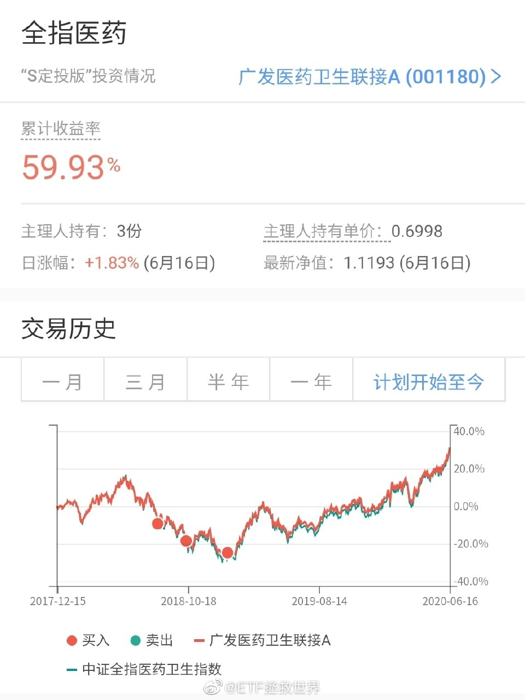

======================================================

ETF拯救世界 (5687069307) @
2020-06-17 08:19:53 Wed  
url: https://weibo.com/5687069307/J70WabtcZ

回复@卢涨停·:我还没说2900多点，95%的人都赚钱了呢。服不服？不服哪儿凉快哪儿呆着去。想想你除了对做事的人冷嘲热讽，对人类做出过什么贡献吗。loser.//@卢涨停·:S医药大涨了就是最大赢家，S油气大跌了就是持仓占比小，不用在意[doge]宁可真是文学家

------------------------------------------------------
转推：
>  @ETF拯救世界 (5687069307)
>  2020-06-17 08:06:23 Wed  
>  url: https:/weibo.com/5687069307/J70QG6koi/

>  s医药或成最大赢家 ​​​

转发[11]  评论[208]  赞[1094] 

======================================================

ETF拯救世界 (5687069307) @
2020-06-17 08:26:35 Wed  
url: https://weibo.com/5687069307/J70YSxBxl

回复@小松鼠起来跳:你说到重点了，你具备逻辑思维能力。我根本没说计划怎么样，更没说我怎么样，只是说这个品种涨的最好，辣鸡就急不可待的跳出来了。他要么是逻辑混乱，要么是真的憋坏了//@小松鼠起来跳:语文真烂，益达主语明确，非要扯到全部计划上

------------------------------------------------------
转推：
>  @ETF拯救世界 (5687069307)
>  2020-06-17 08:06:23 Wed  
>  url: https:/weibo.com/5687069307/J70QG6koi/

>  s医药或成最大赢家 ​​​

转发[6]  评论[74]  赞[753] 

======================================================

ETF拯救世界 (5687069307) @
2020-06-17 08:29:48 Wed  
url: https://weibo.com/5687069307/J710bedV0

你很难要求需要业绩排名的人不追热门。可惜，历史上没有一次追热门有好下场的

------------------------------------------------------
转推：
>  @财联社APP (2868676035)
>  2020-06-17 08:28:28 Wed  
>  url: https:/weibo.com/2868676035/J70ZDzTZE/

>  【八成私募仓位过半 增持消费与医药】财联社6月17日讯，私募对6月份结构性行情的预期，在仓位上得到了充分体现。数据显示，截至5月末，持仓超过五成的私募占比超过80%，环比上升0.74个百分点。从调仓方向来看，4月份遭减持的食品饮料和医药行业，在5月备受青睐，成为私募持仓增幅最大的两个行业。多位 ​​​

转发[70]  评论[141]  赞[919] 

======================================================

ETF拯救世界 (5687069307) @
2020-06-17 08:40:33 Wed  
url: https://weibo.com/5687069307/J714xE49N

PDD这么涨有一定道理。

我购物的原则是大件贵重京东，小件TB。

最近我发现小件大多数都是放弃TB在多多买了…确实便宜，加了月卡补贴更香… ​​​

转发[35]  评论[514]  赞[1677] 

======================================================

ETF拯救世界 (5687069307) @
2020-06-17 09:03:39 Wed  
url: https://weibo.com/5687069307/J71dVbEkq

这两天没有工作，在家休息，看了两集乘风破浪的姐姐。

DH、LY和HSY把我气坏了。讨厌这样的人。 ​​​

转发[20]  评论[496]  赞[1596] 

======================================================

ETF拯救世界 (5687069307) @
2020-06-17 09:40:52 Wed  
url: https://weibo.com/5687069307/J71t2bMWI

不要因为前几天卖了20%医药难过，觉得没有卖在最高点，怎么卖了还在涨。两个你需要知道的事情。

第一，你的大部分仓位没有卖。150里面80%医药，100%养老，S里面所有医药和养老都踏踏实实持有中。

第二，正因为中途卖掉了这20%，你现在才能非常踏实的持有剩下的绝大多数。因为你不怕过山车了，甚至希 ​​​

转发[137]  评论[355]  赞[1825] 

======================================================

ETF拯救世界 (5687069307) @
2020-06-17 09:55:33 Wed  
url: https://weibo.com/5687069307/J71yZfK9t

医药基金自救命底以来一年半上涨94%。 ​​​

转发[17]  评论[245]  赞[1617] 

======================================================

ETF拯救世界 (5687069307) @
2020-06-17 10:30:51 Wed  
url: https://weibo.com/5687069307/J71NjwwZ7

目前全指医药点位与2015年5月相同，估值下降了44%。

而医药目前的估值与2007年1月相同，指数点位上涨了575%。

这就是持有成长指数长期看会不断上涨的原因。

但是，永远不要买贵。再好的东西买贵了也可能十年不挣钱。 ​​​

转发[226]  评论[208]  赞[1482] 

======================================================

ETF拯救世界 (5687069307) @
2020-06-17 10:53:08 Wed  
url: https://weibo.com/5687069307/J71WmBHZp

你在贵的时候买了，可能下次贵的时候能赚到指数的年增长率。但这个收益率可能并不高。所以最好的模式是，便宜的时候买，赚估值增加和指数成长的双击收益。最惨的是贵的时候买，便宜的时候卖，这也是大多数人不挣钱的根本原因。

------------------------------------------------------
转推：
>  @ETF拯救世界 (5687069307)
>  2020-06-17 10:30:51 Wed  
>  url: https:/weibo.com/5687069307/J71NjwwZ7/

>  目前全指医药点位与2015年5月相同，估值下降了44%。
>  
>  而医药目前的估值与2007年1月相同，指数点位上涨了575%。
>  
>  这就是持有成长指数长期看会不断上涨的原因。
>  
>  但是，永远不要买贵。再好的东西买贵了也可能十年不挣钱。 ​​​

转发[86]  评论[159]  赞[1128] 

======================================================

ETF拯救世界 (5687069307) @
2020-06-17 11:03:08 Wed  
url: https://weibo.com/5687069307/J720q6QSD

我看到有人说我，是“什么涨了拿什么出来吹”。

不好意思，我就是什么时候都有的吹，你气不气？

玩笑归玩笑，各位应该了解一件事。我经常拿近期涨的不错的持仓品种出来说，不是为了说明我多厉害，我并不厉害。我的主要目的，

第一是为了给各位做按摩，该拿的时候拿住，别随便放弃。绝大多数人都买过 ​​​

转发[64]  评论[579]  赞[2752] 

======================================================

ETF拯救世界 (5687069307) @
2020-06-17 11:17:14 Wed  
url: https://weibo.com/5687069307/J7268CRps

2020，除非出现外星人，没什么再能让我感到意外了。 ​​​

转发[28]  评论[394]  赞[1943] 

======================================================

ETF拯救世界 (5687069307) @
2020-06-17 11:53:26 Wed  
url: https://weibo.com/5687069307/J72kQeUew

[泪] 这个班的家长们，能不能让你们的孩子把当时发生了什么说出来。这是让你们孩子学会做一个诚实的，善良的人的最好机会。否则，有些孩子会因为这个背负一生的心理负担。校方，教育局，你们能不能首先做个人，先别考虑推卸责任，把真相调查、公布出来？

------------------------------------------------------
转推：
>  @ ()
>  2020-06-16 16:01:04 Tue  
>  url: 

>  该账号内容存在风险，用户验证之前暂时不能查看。查看帮助 https://kefu.weibo.com/faqdetail?id=16161

转发[221]  评论[509]  赞[2123] 

======================================================

ETF拯救世界 (5687069307) @
2020-06-17 21:45:27 Wed  
url: https://weibo.com/5687069307/J76d8rGPj

是亲生的没错了。

------------------------------------------------------
转推：
>  @北京人不知道的北京事儿 (1662214194)
>  2020-06-17 21:40:18 Wed  
>  url: https:/weibo.com/1662214194/J76b3gQP7/

>  《法治进行时》里讲的一起事故，发生在北京西城月坛南桥，一醉酒男子和老乡聚会喝多了，从主路公交车站下车，违规走上了乐坛南桥，又违规翻越护栏掉了下去，桥下正好有辆车经过，司机开得并不快但根本反应不过来，醉酒男当场死亡。现在醉酒男儿子要替死去的父亲“讨说法”，起诉司机索赔40多万。。。这 ​​​

转发[5]  评论[105]  赞[560] 

======================================================

ETF拯救世界 (5687069307) @
2020-06-17 22:42:39 Wed  
url: https://weibo.com/5687069307/J76AmmVHB

什么样的智商才会相信这个。

------------------------------------------------------
转推：
>  @财联社APP (2868676035)
>  2020-06-17 21:21:28 Wed  
>  url: https:/weibo.com/2868676035/J763pjTza/

>  济民制药庄家团队直播割韭菜。  http://t.cn/A6LfRx5Z ​​​

转发[37]  评论[258]  赞[814] 

======================================================

ETF拯救世界 (5687069307) @
2020-06-18 12:08:31 Thu  
url: https://weibo.com/5687069307/J7bRsijsl

做了个核酸测试，一切正常。托大家的福。 ​​​

转发[14]  评论[1084]  赞[4662] 

======================================================

ETF拯救世界 (5687069307) @
2020-06-18 13:08:08 Thu  
url: https://weibo.com/5687069307/J7cfEqit8

今天准备吹红利，喷子就位了吗。 ​​​

转发[11]  评论[831]  赞[2161] 

======================================================

ETF拯救世界 (5687069307) @
2020-06-18 18:18:04 Thu  
url: https://weibo.com/5687069307/J7ehsfXZp

6月18日，终于决定展开调查。不是说教师一定有问题，群众只是想知道到底发生了什么，请认真负责调查，公布真相。如果是教师随意打骂侮辱孩子，就要负她该负的责任，同时一脚踢出教师队伍，为了其他老师，也为了孩子们。

------------------------------------------------------
转推：
>  @网易财经 (1974561081)
>  2020-06-18 18:04:50 Thu  
>  url: https:/weibo.com/1974561081/J7ec5fMUc/

>  【#官方对坠楼小学生班主任展开调查#[话筒]】近日，江苏常州小学女生缪某某作文课后跳楼坠亡一事持续引发关注。有网友反映涉事教师袁某某存在收受微信红包、校外补课、体罚学生等行为。对此，金坛区教育局6月18日通报，决定对该教师展开调查。http://t.cn/A6Lx6PGy ​​​

转发[27]  评论[126]  赞[1047] 

======================================================

ETF拯救世界 (5687069307) @
2020-06-18 18:48:59 Thu  
url: https://weibo.com/5687069307/J7eu0ggdu

说到辣鸡老师，想起一位高中同学。

是位女同学。长得非常可爱，皮肤白，大眼睛，放到现在cosplay动漫人物说不定会红。记得高一大家出去秋游，不少外班的男生都会来打听她的名字。

有一段时间跟我关系很好，每天放学一起骑车回家。后来总说要去我家听音乐（我家音响不错）。我就比较害怕了，因为性格 ​​​

转发[43]  评论[563]  赞[2176] 

======================================================

ETF拯救世界 (5687069307) @
2020-06-18 19:05:18 Thu  
url: https://weibo.com/5687069307/J7eAD1hcg

有朋友说，不知道为什么要加入和我关系的那段描述。

一看就是没有经历的朋友。

之所以记忆如此深刻，是因为那个人曾陪你走过一段人生。所以她身上发生的事情，你才会永远忘不了。如果是普通同学，大概唏嘘一声，也就抛在脑后了。

听过那首歌吗。写的真好。

“那片笑声让我想起

我的那些花儿

在我 ​​​

转发[33]  评论[428]  赞[1940] 

======================================================

ETF拯救世界 (5687069307) @
2020-06-19 10:03:21 Fri  
url: https://weibo.com/5687069307/J7kt96LBV

有些品种贵，当然是贵。但是贵了就跑赚不了几个钱。

做好跑路的准备，什么时候跑，市场会告诉你。 ​​​

转发[53]  评论[539]  赞[2239] 

======================================================

ETF拯救世界 (5687069307) @
2020-06-19 11:14:42 Fri  
url: https://weibo.com/5687069307/J7kW6wbcw

是不是看了我去年的微博[doge]

------------------------------------------------------
转推：
>  @摩尔金融 (5242156161)
>  2020-06-19 10:54:16 Fri  
>  url: https:/weibo.com/5242156161/J7kNOlVm6/

>  桥水基金创始人达里奥警告称美国股市恐怕会遭遇“失去的10年”。 ​​​

转发[11]  评论[159]  赞[1263] 

======================================================

ETF拯救世界 (5687069307) @
2020-06-19 11:17:12 Fri  
url: https://weibo.com/5687069307/J7kX7wbX8

股市还在涨，债市还在跌。

还能盼着更好的情况出现吗？ ​​​

转发[16]  评论[365]  赞[2160] 

======================================================

ETF拯救世界 (5687069307) @
2020-06-19 14:04:07 Fri  
url: https://weibo.com/5687069307/J7m2SuGXR

最让我感到震惊的，是冒名顶替居然不用负任何刑事民事责任。这不至少应该是诈骗和伪造证件罪吗。当然，我不懂法。懂法的可以说说为什么法律不管

------------------------------------------------------
转推：
>  @蓝鲸财经记者工作平台 (1885454921)
>  2020-06-19 13:53:03 Fri  
>  url: https:/weibo.com/1885454921/J7lYnxoNf/

>  【鲸视频：17年前#被顶替上学的王娜娜现状#，毕业或因年龄大仍难圆教师梦】6月18日，河南郑州。记者从17年前被冒名顶替上大学的王娜娜处获悉，37岁的她即将从洛阳理工学院毕业，希望做老师。她向顶替者索赔13元的案子正在等待开庭。@澎湃新闻  http://t.cn/A6LisH2i ​​​

转发[31]  评论[156]  赞[974] 

======================================================

ETF拯救世界 (5687069307) @
2020-06-19 14:13:01 Fri  
url: https://weibo.com/5687069307/J7m6ufIXI

2900点，在座的各位资产没有不断新高只能说不及格… ​​​

转发[29]  评论[839]  赞[2398] 

======================================================

ETF拯救世界 (5687069307) @
2020-06-19 16:29:15 Fri  
url: https://weibo.com/5687069307/J7mZMwGox

记得之前说病毒离开人体几个小时就死了。怎么现在蔬菜和肉都不让用水龙头洗了。

病毒离开人体到底还能活多久？ ​​​

转发[6]  评论[238]  赞[1246] 

======================================================

ETF拯救世界 (5687069307) @
2020-06-19 16:42:38 Fri  
url: https://weibo.com/5687069307/J7n5e0Auf

做为北京人，现在被外地人防着我没有任何不舒服的感觉，我认为非常正常，也很合理。北京人现在绝大多数没事也老老实实在北京呆着不会到处给别人添乱。大家没那么玻璃心~~多大点事儿啊。

------------------------------------------------------
转推：
>  @ ()
>  2020-06-19 13:07:40 Fri  
>  url: 

>  抱歉，作者已设置仅展示半年内微博，此微博已不可见。 ​​​

转发[10]  评论[145]  赞[1025] 

======================================================

ETF拯救世界 (5687069307) @
2020-06-19 19:19:07 Fri  
url: https://weibo.com/5687069307/J7o6Jo388

这个618，猫不叫，狗不跳，还有只小狮子更是可笑。

想拉动消费都没机会，只好继续钱生钱了。 ​​​

转发[7]  评论[556]  赞[1727] 

======================================================

ETF拯救世界 (5687069307) @
2020-06-20 18:04:13 Sat  
url: https://weibo.com/5687069307/J7x2PwyIJ

看完第二期，HSY荣登我心目中最讨厌第一名，继续努力啊。姐姐们保养的真好啊，金莎真的快40了吗…

------------------------------------------------------
转推：
>  @ETF拯救世界 (5687069307)
>  2020-06-17 09:03:39 Wed  
>  url: https:/weibo.com/5687069307/J71dVbEkq/

>  这两天没有工作，在家休息，看了两集乘风破浪的姐姐。
>  
>  DH、LY和HSY把我气坏了。讨厌这样的人。 ​​​

转发[9]  评论[343]  赞[1325] 

======================================================

ETF拯救世界 (5687069307) @
2020-06-20 19:58:46 Sat  
url: https://weibo.com/5687069307/J7xNk5rKo

越来越好。 ​​​

转发[13]  评论[559]  赞[2712] 

+++++++++++++++++++++++++++++++++++++++++++++++++++++

图片：
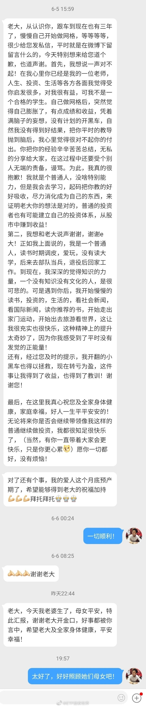

======================================================

ETF拯救世界 (5687069307) @
2020-06-21 07:13:44 Sun  
url: https://weibo.com/5687069307/J7CdidOgI

知道为什么公众号每个月只有一两篇文章了吧。

------------------------------------------------------
转推：
>  @ ()
>  2020-06-14 21:42:43 Sun  
>  url: 

>  抱歉，作者已设置仅展示半年内微博，此微博已不可见。 ​​​

转发[71]  评论[447]  赞[2100] 

======================================================

ETF拯救世界 (5687069307) @
2020-06-21 18:05:39 Sun  
url: https://weibo.com/5687069307/J7GtUrSVl

东城小区全员检测。

这样的力度还控制不住就邪门了。 ​​​

转发[8]  评论[403]  赞[1782] 

======================================================

ETF拯救世界 (5687069307) @
2020-06-22 09:56:00 Mon  
url: https://weibo.com/5687069307/J7MHEqvCw

很多做投资的朋友会有一个疑问。

看历史K线，大牛市结束后，那样大幅度动辄50%以上的暴跌中，为什么持仓的人在跌十几二十个点的时候不跑，还有很多人要抢着接飞刀去买入？

原因很简单。

他们被洗脑了。

被大V洗脑倒是其次，主要是被市场洗脑了。

大牛市中，股票、指数，尤其是龙头板块不断上涨。 ​​​

转发[304]  评论[592]  赞[2633] 

======================================================

ETF拯救世界 (5687069307) @
2020-06-22 11:40:02 Mon  
url: https://weibo.com/5687069307/J7NnT7y3h

本来自己买的东西挺便宜了。

再一看评论里居然有人比自己还便宜买到。

就很气。 ​​​

转发[16]  评论[406]  赞[1852] 

======================================================

ETF拯救世界 (5687069307) @
2020-06-22 11:48:44 Mon  
url: https://weibo.com/5687069307/J7NrpsZOe

我没说投资，我说的是买东西！投资上你们挣得比我多我开心还来不及好吗。

------------------------------------------------------
转推：
>  @ETF拯救世界 (5687069307)
>  2020-06-22 11:40:02 Mon  
>  url: https:/weibo.com/5687069307/J7NnT7y3h/

>  本来自己买的东西挺便宜了。
>  
>  再一看评论里居然有人比自己还便宜买到。
>  
>  就很气。 ​​​

转发[7]  评论[290]  赞[1562] 

======================================================

ETF拯救世界 (5687069307) @
2020-06-22 16:32:25 Mon  
url: https://weibo.com/5687069307/J7PiyvwHv

今日收盘后仓位建议：保守——激进在50%-70%之间。极度激进可以80%，极度保守可以40%。如需减仓，建议优先考虑创业板与医疗方向仓位。

------------------------------------------------------
转推：
>  @ETF拯救世界 (5687069307)
>  2020-02-29 12:00:40 Sat  
>  url: https:/weibo.com/5687069307/IwqfYb68Q/

>  昨天数据出来了，我反复观察认真思考，结论是这个位置我不会大幅减仓，即使还要大跌。因为我无法说服自己。
>  
>  目前保守——激进投资者的仓位在60%-80%之间，极度激进到90%，极度保守到50%是比较合适的。
>  
>  也就是说，再保守，也不应该低于半仓。 ​​​

转发[117]  评论[518]  赞[1805] 

======================================================

ETF拯救世界 (5687069307) @
2020-06-22 17:51:53 Mon  
url: https://weibo.com/5687069307/J7POOFlu8

如果真的搞起来，我们的胜算有没有7成。

------------------------------------------------------
转推：
>  @财联社APP (2868676035)
>  2020-06-22 17:17:32 Mon  
>  url: https:/weibo.com/2868676035/J7PAS8WUH/

>  【印度大批军车向边境开进，阿帕奇、支奴干、P-8等美制王牌纷纷出动，空军海军也有大动作】据印媒报道，印度陆军已经动员多支部队向中印争议地区集结。规模是以前的两倍。同时，通往拉达克首府列城的高速公路已经被印度军方接管。  http://t.cn/A6L0na5p ​​​

转发[29]  评论[549]  赞[1879] 

======================================================

ETF拯救世界 (5687069307) @
2020-06-23 11:50:47 Tue  
url: https://weibo.com/5687069307/J7WSJEIye

今天吹传媒，想必没什么争议吧。//@ETF拯救世界:支棱起来了！

------------------------------------------------------
转推：
>  @ETF拯救世界 (5687069307)
>  2020-06-09 11:03:05 Tue  
>  url: https:/weibo.com/5687069307/J5OAqrvQF/

>  养老终于在大医药的带领下创了两年新高。
>  
>  有传媒拖着，不容易啊。传媒你长点心吧。用赵老师的话说，你得支棱起来啊！ ​​​

转发[14]  评论[271]  赞[1097] 

======================================================

ETF拯救世界 (5687069307) @
2020-06-23 12:05:26 Tue  
url: https://weibo.com/5687069307/J7WYGuX2r

如果今天下午不跌，养老基金将创2015年8月12日以来5年新高。当然，各位的账户依然是继续历史新高。//@ETF拯救世界:今天吹传媒，想必没什么争议吧。//@ETF拯救世界:支棱起来了！

------------------------------------------------------
转推：
>  @ETF拯救世界 (5687069307)
>  2020-06-09 11:03:05 Tue  
>  url: https:/weibo.com/5687069307/J5OAqrvQF/

>  养老终于在大医药的带领下创了两年新高。
>  
>  有传媒拖着，不容易啊。传媒你长点心吧。用赵老师的话说，你得支棱起来啊！ ​​​

转发[8]  评论[165]  赞[1003] 

======================================================

ETF拯救世界 (5687069307) @
2020-06-23 12:20:23 Tue  
url: https://weibo.com/5687069307/J7X4Leqgk

[偷笑] http://t.cn/A6LjWahh //@ETF拯救世界:开心 http://t.cn/A62WJ1Yu

------------------------------------------------------
转推：
>  @ETF拯救世界 (5687069307)
>  2020-06-02 14:08:39 Tue  
>  url: https:/weibo.com/5687069307/J4LOhg8LV/

>  国债这么跌我就很高兴了。我不是针对国债，而是在座的所有品种谁跌我都开心。
>  
>  有钱还怕没东西买吗。正好纯债仓位已经降到1%以下了，等着补仓呢继续加油啊。 ​​​

转发[21]  评论[278]  赞[996] 

======================================================

ETF拯救世界 (5687069307) @
2020-06-23 12:44:16 Tue  
url: https://weibo.com/5687069307/J7Xese04d

个人认为，人口减少两三亿，同时最低收入的两三亿人收入增加100%-200%以上，然后整体素质提升，人少了，有钱了，挺好。

------------------------------------------------------
转推：
>  @新浪财经 (1638782947)
>  2020-06-23 08:24:53 Tue  
>  url: https:/weibo.com/1638782947/J7VxaiuH2/

>  【梁建章：#李铁的中国人口过剩论错在哪里#？】前不久，经济学家李铁在《北京日报》上发表文章认为：“我国的劳动力供给将面临的是长期过剩，而不是供给不足。人口过多，导致发展面临的短板难以补齐。”@梁建章-关注人口问题 认为，上述观点是完全错误的。而且其貌似专业的观点极具误导性，很担心类似 ​​​

转发[16]  评论[164]  赞[824] 

======================================================

ETF拯救世界 (5687069307) @
2020-06-23 12:52:59 Tue  
url: https://weibo.com/5687069307/J7XhZwi5a

为什么强势品种不停涨？

因为专业投资者的基金经理不买强势品种，净值就上不去。净值上不去规模就要掉，排名、奖金和提成也跟着掉。

业余投资者就不用说了，追涨杀跌最拿手。

再说一次。高，肯定是高，贵，肯定是贵。但什么时候卖市场会告诉你。不要猜顶，这是过去十几年赚大钱的心得。

底部买入不 ​​​

转发[217]  评论[652]  赞[2617] 

======================================================

ETF拯救世界 (5687069307) @
2020-06-23 13:12:32 Tue  
url: https://weibo.com/5687069307/J7XpVf9EE

隐秘的角落，看了一集多一点，拍的不错，演得不错，也很精致。

但我看不下去。我不喜欢看让我心里堵得慌的东西。这剧故事、表演、画面、音乐，都让我心里堵得慌，不开心。

做人最重要是开心啊。 ​​​

转发[26]  评论[441]  赞[1768] 

======================================================

ETF拯救世界 (5687069307) @
2020-06-23 13:24:49 Tue  
url: https://weibo.com/5687069307/J7XuUlrDw

今天到现在你的账户增值不少，但其实股票涨跌比例是1200:2600 ​​​

转发[15]  评论[416]  赞[1878] 

======================================================

ETF拯救世界 (5687069307) @
2020-06-23 17:10:26 Tue  
url: https://weibo.com/5687069307/J7YYueBMw

强烈建议做指数的时候也玩个股。

这样你就不会在未来觉得自己是个被指数投资耽误的股神了。会减少很多焦躁的情绪。

毕竟，每天几十只涨停，如果你炒股，没准隔三差五就能买到。 ​​​

转发[80]  评论[844]  赞[2821] 

======================================================

ETF拯救世界 (5687069307) @
2020-06-23 23:21:09 Tue  
url: https://weibo.com/5687069307/J81oY4RqC

真人肯定拍不好。为什么不先拍一个动画版呢，至少三五年后能看了

------------------------------------------------------
转推：
>  @整点电影 (2315579285)
>  2020-06-23 22:53:04 Tue  
>  url: https:/weibo.com/2315579285/J81dyBRGS/

>  #大圣归来导演将拍三体# 
>  
>  大新闻！《西游记之大圣归来》导演田晓鹏将执导《三体》真人电影！！！！！[吃惊] ​​​

转发[18]  评论[181]  赞[838] 

======================================================

ETF拯救世界 (5687069307) @
2020-06-24 08:22:21 Wed  
url: https://weibo.com/5687069307/J84WDgcEI

我想问问大家，为了夸我牛逼，专门注册一个小号，这是不是真爱。

昨天让且慢统计了一下，已经帮各位盈利十几亿。我确实卖不到最高，但我尽力了。 ​​​

转发[23]  评论[1308]  赞[3885] 

+++++++++++++++++++++++++++++++++++++++++++++++++++++

图片：
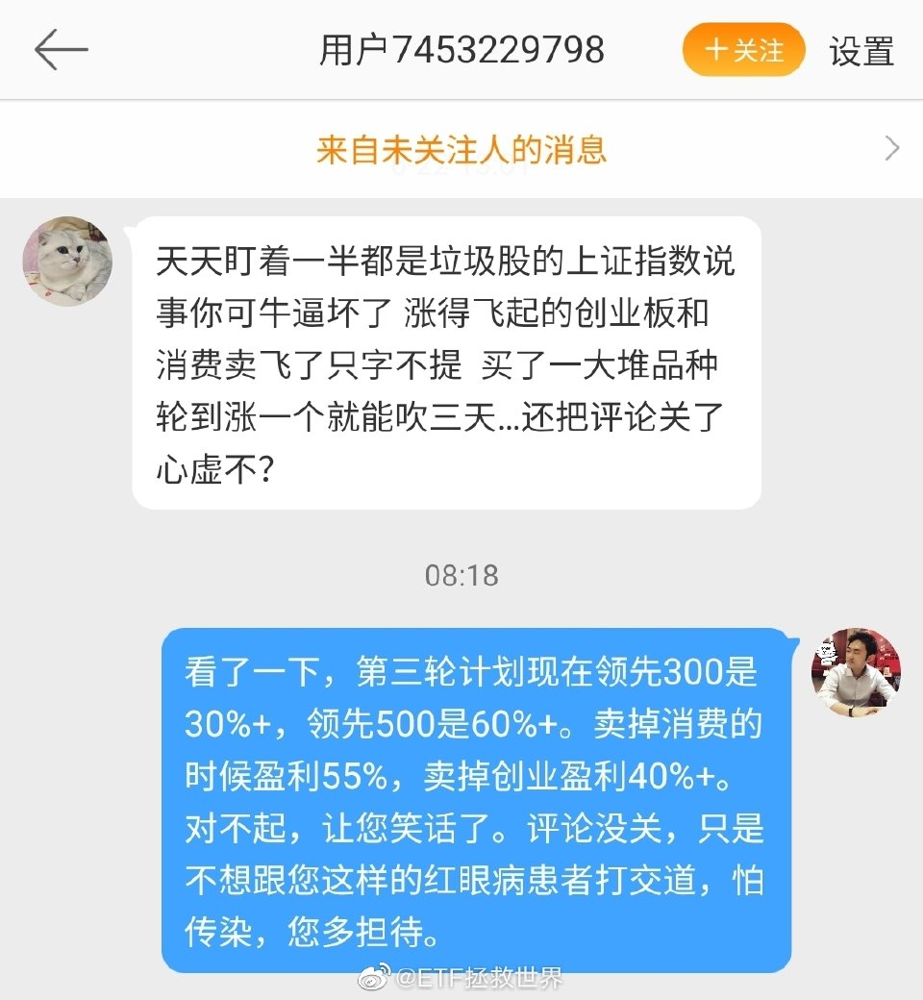

======================================================

ETF拯救世界 (5687069307) @
2020-06-24 08:41:22 Wed  
url: https://weibo.com/5687069307/J854m1KCG

看了一眼创业板。

之前卖出一份是在1.2014，现在1.2965，距离当时上涨7.9%。没想到，这一届网友已经如此严格了。

更别说，我们卖掉后创业板曾大幅暴跌30%以上。

我不明白一件事，为什么这样一个必然会死的透透的东西，我不继续持有是罪。现在的创业板指，已经进入我严格定义的“必死”区域。为什么 ​​​

转发[327]  评论[747]  赞[2603] 

+++++++++++++++++++++++++++++++++++++++++++++++++++++

图片：
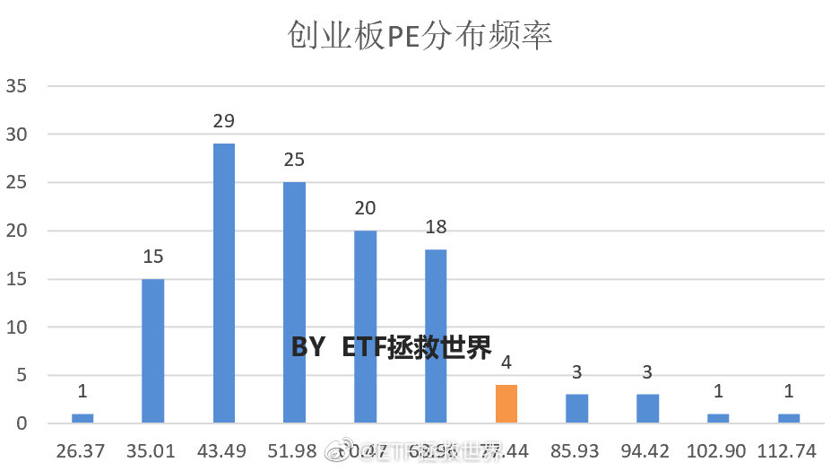

======================================================

ETF拯救世界 (5687069307) @
2020-06-24 08:59:31 Wed  
url: https://weibo.com/5687069307/J85bIy1RG

回复@LIE开啦:这是创业板的历史月估值。现在是黄线，蓝线是历史。你看看过去120个月，有几个月比现在高。高的那几个月，全在2015。//@LIE开啦:pe那张图，70以上的有12家，70以下的有上百家，怎么就整体pe70+

------------------------------------------------------
转推：
>  @ETF拯救世界 (5687069307)
>  2020-06-24 08:41:22 Wed  
>  url: https:/weibo.com/5687069307/J854m1KCG/

>  看了一眼创业板。
>  
>  之前卖出一份是在1.2014，现在1.2965，距离当时上涨7.9%。没想到，这一届网友已经如此严格了。
>  
>  更别说，我们卖掉后创业板曾大幅暴跌30%以上。
>  
>  我不明白一件事，为什么这样一个必然会死的透透的东西，我不继续持有是罪。现在的创业板指，已经进入我严格定义的“必死”区域。为什么 ​​​

转发[61]  评论[185]  赞[1158] 

======================================================

ETF拯救世界 (5687069307) @
2020-06-24 09:18:31 Wed  
url: https://weibo.com/5687069307/J85jqEsPP

今天没什么心情说话了，不发微博了。

有空会认真看一看过去几天的评论，把阴阳怪气的都拉黑。 ​​​

转发[16]  评论[1605]  赞[3601] 

======================================================

ETF拯救世界 (5687069307) @
2020-06-25 15:17:53 Thu  
url: https://weibo.com/5687069307/J8h5NiDO8

朋友转给我的。段子的成分居多，不过也应该代表一部分人的状态了。

持有价值股的不好受，你以为喝酒吃药的好受吗。未必。

咱们应该是最舒服的一群人。不仅赚钱，每天都很舒服，无论涨跌。

昨天又新高了吧。 ​​​

转发[59]  评论[430]  赞[1497] 

+++++++++++++++++++++++++++++++++++++++++++++++++++++

图片：

======================================================

ETF拯救世界 (5687069307) @
2020-06-25 15:40:58 Thu  
url: https://weibo.com/5687069307/J8hfau1ff

呵呵，用膝盖想都能明白的事。 http://t.cn/A6LELwqX

------------------------------------------------------
转推：
>  @网易财经 (1974561081)
>  2020-06-25 07:10:12 Thu  
>  url: https:/weibo.com/1974561081/J8dTQjGkC/

>  【#福奇被质问为何不早提醒民众戴口罩#，听证会上罕见强硬回应】6月23日，美国首席传染病专家安东尼·福奇出席国会听证会，被共和党议员问及为何早前不建议戴口罩时，罕见流露不满情绪，解释称因为要将口罩留给最需要的医护们。福奇还表示，种族主义导致更多非裔美国人死于新冠肺炎。 ​​​

转发[24]  评论[118]  赞[842] 

======================================================

ETF拯救世界 (5687069307) @
2020-06-25 16:07:51 Thu  
url: https://weibo.com/5687069307/J8hq4zZF6

关键是到现在依然没有人出来说到底怎么调查怎么处理。如果实在不能判刑，顶替的人先赔被顶替的每人88万行吗。

------------------------------------------------------
转推：
>  @ ()
>  2020-06-25 07:37:30 Thu  
>  url: 

>  抱歉，由于作者设置，你暂时没有这条微博的查看权限哦。查看帮助：http://t.cn/RfdBWwP ​​​

转发[64]  评论[243]  赞[1256] 

======================================================

ETF拯救世界 (5687069307) @
2020-06-25 16:13:58 Thu  
url: https://weibo.com/5687069307/J8hsyBstS

千万别碰毒，别以为你意志力强能戒掉。

这么说吧，你节食能坚持几年？为爱鼓掌能戒几年？

据说毒品的快感和成瘾性是吃饭的一万倍，鼓掌的一千倍。 

戒不掉的。 ​​​

转发[46]  评论[452]  赞[2289] 

======================================================

ETF拯救世界 (5687069307) @
2020-06-25 22:02:42 Thu  
url: https://weibo.com/5687069307/J8jK70YSP

刚看了看微博。因为高考顶替的事儿，又有人开始攻击高考制度了。

拜托了，虽然有各种问题，而且问题似乎有所增加（比如自主招生越来越多），但高考是几乎相对来说最公平的一件事了。

如果搞素质教育选拔人才，穷人家的孩子恐怕永无考上大学的可能了。

我有种感觉不知道对不对：攻击高考制度的，除了 ​​​

转发[87]  评论[523]  赞[3179] 

======================================================

ETF拯救世界 (5687069307) @
2020-06-27 09:45:34 Sat  
url: https://weibo.com/5687069307/J8xLU1cyG

就像跳楼女孩案件中最让我气愤的是在群里点赞的家长一样，高考顶替案里最让我绝望的是那些责怪报案人多事，影响家乡名声，怕给自己惹麻烦的亲戚，同乡和工作人员。

做个人这么难吗？ ​​​

转发[50]  评论[534]  赞[2951] 

======================================================

ETF拯救世界 (5687069307) @
2020-06-28 10:38:01 Sun  
url: https://weibo.com/5687069307/J8HxH4WzD

反正今天不开盘，闲着也是闲着。

有单身朋友想扩大一下交友范围的，可以在这条下面评论简单介绍一下自己（不要太详细，注意保护隐私），说说想找什么样的男/女朋友，或者看看有没有合适自己的。

能关注我100天还没有取关或者被拉黑的，三观都不会太差。[doge]

另外，注意，关注我的经济实力一定也不 ​​​

转发[74]  评论[6236]  赞[9175] 

======================================================

ETF拯救世界 (5687069307) @
2020-06-29 18:30:19 Mon  
url: https://weibo.com/5687069307/J8U3TcVYG

举报很正常，什么人都有。但是这样的举报居然受理了，然后要整改？

------------------------------------------------------
转推：
>  @北京人不知道的北京事儿 (1662214194)
>  2020-06-29 17:53:49 Mon  
>  url: https:/weibo.com/1662214194/J8TP4xAyF/

>  【#动画片因人物染发被举报# 频道停播并对其整改[衰]】近日，有网友向湖南省广播电视局举报《菲梦少女2》动画片，称动画中的人物头发染成五颜六色，还穿得花里胡哨，价值导向有问题。对此，湖南广电表示制作公司是为提高角色辨识度，才将人物头发设计成不同颜色，并非提倡染发。频道目前已停播该动画， ​​​

转发[37]  评论[282]  赞[978] 

======================================================

ETF拯救世界 (5687069307) @
2020-06-30 10:10:44 Tue  
url: https://weibo.com/5687069307/J90dBq4f0

15500渐行渐近。

------------------------------------------------------
转推：
>  @ETF拯救世界 (5687069307)
>  2020-04-15 10:17:02 Wed  
>  url: https:/weibo.com/5687069307/IDpeKBd6Z/

>  目前医药已经运行到相对高估+牛市上升趋势阶段。
>  
>  这个阶段非常难。难在它不是便宜的阶段，可以买可以安心持仓。它虽然是上升趋势，但随时会转头向下。这个区间考虑的不是加仓，而是如何动态平衡。
>  
>  既然已经到了这个区间，就照例给一个区间上限。目前医药的区间上限是15500左右。这个点位是特大级超级 ​​​

转发[50]  评论[190]  赞[1105] 

======================================================

ETF拯救世界 (5687069307) @
2020-06-30 10:14:12 Tue  
url: https://weibo.com/5687069307/J90f1fAre

所有的点位都不是渐渐蒙出来的，而是早就蒙好了。

------------------------------------------------------
转推：
>  @ETF拯救世界 (5687069307)
>  2019-11-22 10:58:16 Fri  
>  url: https:/weibo.com/5687069307/Ihmxul23g/

>  医药分为两个区域。
>  
>  第一个区域是8500左右-10450左右。这个区域是相对低估区域，也是熊市区域。
>  
>  10450-15000左右，已经不是相对低估区域。也是牛市运行区域。
>  
>  这三个数字会随着时间推移逐渐增加。 ​​​

转发[53]  评论[147]  赞[1179] 

======================================================

ETF拯救世界 (5687069307) @
2020-06-30 10:17:43 Tue  
url: https://weibo.com/5687069307/J90grlbMx

回头再看钻石坑。当然，这个10倍不是一轮让你实现的。而是你有了7800以下的持仓，不断高抛低吸，2-3轮赚10倍。

------------------------------------------------------
转推：
>  @ETF拯救世界 (5687069307)
>  2018-10-10 11:29:31 Wed  
>  url: https:/weibo.com/5687069307/GDfidmtMh/

>  7800的医药指数，可能是你人生中第一个10倍指数。 ​​​

转发[75]  评论[210]  赞[1508] 

======================================================

ETF拯救世界 (5687069307) @
2020-06-30 10:23:58 Tue  
url: https://weibo.com/5687069307/J90iYvxxt

别人都看好的时候你也看好，一点都不难。

别人都看跌，你买了，还在跌，别人都在嘲笑你的时候，你是不是足够自信，就体现出来了。

说句实话，想在投资上打击我的信心，让我随波逐流不再特立独行，没人能做到。

当然知道自己不可能所有细节都是完美的，但大方向是有足够的自信。 ​​​

转发[141]  评论[345]  赞[2081] 

======================================================

ETF拯救世界 (5687069307) @
2020-06-30 10:34:21 Tue  
url: https://weibo.com/5687069307/J90nc49hV

回复@WHMMFY:千万不要“等”。从目前的这个点位开始，崩是肯定崩，但什么时候，什么点位开始不知道。君子不立围墙之下，走远点看着就行了，不要“等”。你等了它不崩你就要着急，何苦呢。挣自己的钱去，让人家自己去疯就可以了。//@WHMMFY:等着前几天仓位降下和创业板崩盘

------------------------------------------------------
转推：
>  @ETF拯救世界 (5687069307)
>  2020-06-30 10:23:58 Tue  
>  url: https:/weibo.com/5687069307/J90iYvxxt/

>  别人都看好的时候你也看好，一点都不难。
>  
>  别人都看跌，你买了，还在跌，别人都在嘲笑你的时候，你是不是足够自信，就体现出来了。
>  
>  说句实话，想在投资上打击我的信心，让我随波逐流不再特立独行，没人能做到。
>  
>  当然知道自己不可能所有细节都是完美的，但大方向是有足够的自信。 ​​​

转发[57]  评论[122]  赞[1129] 

======================================================

ETF拯救世界 (5687069307) @
2020-06-30 10:41:53 Tue  
url: https://weibo.com/5687069307/J90qfnxHs

一直以来，我就特别不明白散户投资圈这种互相看不上的风气。

有人喜欢银行股，有人喜欢创业板，有人喜欢科技，有人喜欢医药消费。这不挺好吗，百花齐放才是春。

结果有些银粉天天骂创粉，创粉天天骂银粉。以前我还看两眼，现在多看一眼算我输。

人家买什么股票，赔了赚了关你什么事情呢？你做好自己 ​​​

转发[50]  评论[546]  赞[2342] 

======================================================

ETF拯救世界 (5687069307) @
2020-06-30 13:50:49 Tue  
url: https://weibo.com/5687069307/J91EWbzpW

别说那么多，先喝一杯Dry Martine庆祝一下。 ​​​

转发[7]  评论[596]  赞[2100] 

======================================================

ETF拯救世界 (5687069307) @
2020-06-30 17:42:04 Tue  
url: https://weibo.com/5687069307/J93aNyx12

开心最重要，互动前100名，看看谁手气壮。 http://t.cn/A6yv4Khf ​​​

转发[12]  评论[1765]  赞[2319] 

======================================================

ETF拯救世界 (5687069307) @
2020-06-30 18:19:11 Tue  
url: https://weibo.com/5687069307/J93pRBxyv

拿着现金是隔一段时间烧一部分，乱投资是把现金放在一起一次烧完。

------------------------------------------------------
转推：
>  @网易财经 (1974561081)
>  2020-06-30 17:39:16 Tue  
>  url: https:/weibo.com/1974561081/J939FvnHf/

>  【陈宇：现在拿着现金和把钱隔一段时间烧一部分的行为差不多】在回答网友提问“现在应该理财还是手握现金”时，神农投资总经理陈宇说，“拿现金不就是自己烧自己的钱嘛，对不对？拿现金不是理财，是自己埋汰自己的血汗钱。” http://t.cn/A6yv4I1R ​​​

转发[96]  评论[304]  赞[1628] 

======================================================

ETF拯救世界 (5687069307) @
2020-07-01 10:20:17 Wed  
url: https://weibo.com/5687069307/J99HYwfnp

除了你自己，这世上没有任何一个人或者物品可以跟随你一辈子。

有的长一点，有的短一点，最终都是生命中的过客。

所以有缘在一起的时候就要好好珍惜，感受人或者物品带给你的快乐。不愿失去就尽量争取。如果实在无法挽回的失去了，也不必太过痛苦。

一切最终都会离去，要接受这个事实。

————用 ​​​

转发[124]  评论[688]  赞[2225] 

======================================================

ETF拯救世界 (5687069307) @
2020-07-01 10:37:24 Wed  
url: https://weibo.com/5687069307/J99OVms45

音频节目有搞头吗。费了半天劲弄出来没人听就没意思了。

而且音频可以聊什么呢。到处都有的东西再做一次就是浪费生命。 ​​​

转发[11]  评论[791]  赞[1849] 

======================================================

ETF拯救世界 (5687069307) @
2020-07-01 11:19:33 Wed  
url: https://weibo.com/5687069307/J9a62t3Wk

不知道做一个理财软件要多少钱。

现在也有一些软件，不过大多数是记账而已。

记账只是最初级的。高级的应该是能记录你的所有场内场外金融交易，然后随时给出资产配置比例。

更高级的应该是根据你设定的理财目标，给出资产配置建议。

除此之外，还可以分析你的收入/消费行为，哪里做得好，哪里有问 ​​​

转发[67]  评论[776]  赞[1888] 

======================================================

ETF拯救世界 (5687069307) @
2020-07-01 11:30:52 Wed  
url: https://weibo.com/5687069307/J9aaD3WiS

今天还卖出的机构，觉悟都太低。 ​​​

转发[13]  评论[421]  赞[2297] 

======================================================

ETF拯救世界 (5687069307) @
2020-07-01 13:08:25 Wed  
url: https://weibo.com/5687069307/J9aOehhIg

希望红利和金融接力医药。百花齐放才是春。 ​​​

转发[30]  评论[514]  赞[2395] 

======================================================

ETF拯救世界 (5687069307) @
2020-07-01 14:49:24 Wed  
url: https://weibo.com/5687069307/J9btdh4z7

目前红利+50+300+金融仓位25.42%。极度舒服。

每天都能做到仓位舒服就对了。 ​​​

转发[52]  评论[881]  赞[2416] 

======================================================

ETF拯救世界 (5687069307) @
2020-07-01 15:16:10 Wed  
url: https://weibo.com/5687069307/J9bE4B81s

今天就到这儿，明儿见。

都要开开心心的。开心最重要！别人不能决定你的心情，只有你自己可以。 ​​​

转发[16]  评论[530]  赞[2321] 

======================================================

ETF拯救世界 (5687069307) @
2020-07-01 19:48:05 Wed  
url: https://weibo.com/5687069307/J9dqrBQQM

如果你认可我，请不要交钱给剽窃我文字拿去贩卖的那些人。

我的很多投资记录确实不卖，但有些朋友可能真的想看。我会考虑一个解决方法，不排除免费公开。

无论如何，不要花钱去买。因为那些剽窃的人是真正的人渣。请不要把你的钱给人渣。 ​​​

转发[19]  评论[956]  赞[3960] 

======================================================

ETF拯救世界 (5687069307) @
2020-07-02 00:08:40 Thu  
url: https://weibo.com/5687069307/J9f8dyjGL

还没睡的敢不敢说说你在干嘛。 ​​​

转发[17]  评论[1151]  赞[2494] 

======================================================

ETF拯救世界 (5687069307) @
2020-07-02 09:26:46 Thu  
url: https://weibo.com/5687069307/J9iMKwFuf

今日生活小贴士：

不要总想着贪便宜，很多时候贪小便宜吃大亏。

力所能及的范围内买最好的东西。 ​​​

转发[56]  评论[448]  赞[2115] 

======================================================

ETF拯救世界 (5687069307) @
2020-07-02 10:05:06 Thu  
url: https://weibo.com/5687069307/J9j2jm7ZA

之前很多人吐槽红利，说什么价值投资没戏了。

其实你知不知道，在2019年3、4月，创业板/医药这样近期大热门还被压在地板上摩擦的时候，富国红利净值几乎已经是历史最高了，挡在前面的只有2015年5月的几个交易日而已。

（创业板还需要涨66%才能回去）

人家早就回到股灾前了，怎么就不行了呢。

这就 ​​​

转发[285]  评论[517]  赞[1988] 

======================================================

ETF拯救世界 (5687069307) @
2020-07-02 10:13:35 Thu  
url: https://weibo.com/5687069307/J9j5KCHnv

回复@ghost0128:没什么好说的，不贵不便宜，趋势不错，拿着呗，别想它，就当丢了。//@ghost0128:益达，说说500吧，创新高了

------------------------------------------------------
转推：
>  @ETF拯救世界 (5687069307)
>  2020-07-02 10:05:06 Thu  
>  url: https:/weibo.com/5687069307/J9j2jm7ZA/

>  之前很多人吐槽红利，说什么价值投资没戏了。
>  
>  其实你知不知道，在2019年3、4月，创业板/医药这样近期大热门还被压在地板上摩擦的时候，富国红利净值几乎已经是历史最高了，挡在前面的只有2015年5月的几个交易日而已。
>  
>  （创业板还需要涨66%才能回去）
>  
>  人家早就回到股灾前了，怎么就不行了呢。
>  
>  这就 ​​​

转发[28]  评论[212]  赞[1192] 

======================================================

ETF拯救世界 (5687069307) @
2020-07-02 11:03:12 Thu  
url: https://weibo.com/5687069307/J9jpTnAms

两融余额4年半新高，赌徒回来了。 ​​​

转发[101]  评论[699]  赞[2477] 

======================================================

ETF拯救世界 (5687069307) @
2020-07-02 13:50:11 Thu  
url: https://weibo.com/5687069307/J9kvGfc38

很多人低位不买，涨起来后加杠杆买。

你说是不是很奇怪。

这么做生意能不赔吗。 ​​​

转发[144]  评论[518]  赞[2197] 

======================================================

ETF拯救世界 (5687069307) @
2020-07-02 14:18:34 Thu  
url: https://weibo.com/5687069307/J9kHcmVUq

回复@慕容婷菲:是啊。只有不涨你才能多买，只有多买未来才能多赚。但是很多人总也想不明白这个简单的道理。//@慕容婷菲:这两天很深刻的体会到益达说的熊市越长对投资越有利，只可惜跟车完，自己买的股票时机也没把握好。好想这个下跌的行情持续长一点呀

------------------------------------------------------
转推：
>  @ETF拯救世界 (5687069307)
>  2020-07-02 13:50:11 Thu  
>  url: https:/weibo.com/5687069307/J9kvGfc38/

>  很多人低位不买，涨起来后加杠杆买。
>  
>  你说是不是很奇怪。
>  
>  这么做生意能不赔吗。 ​​​

转发[66]  评论[162]  赞[1169] 

======================================================

ETF拯救世界 (5687069307) @
2020-07-02 14:27:11 Thu  
url: https://weibo.com/5687069307/J9kKGERJs

我最不理解“空仓”的人。

空仓意味着你认为100%会跌。

哪怕只有1%的机会涨，你也至少应该买个1%吧？

不，人家就空仓。

喷了，这得对自己的预知能力多自信啊。 ​​​

转发[140]  评论[372]  赞[1906] 

======================================================

ETF拯救世界 (5687069307) @
2020-07-02 14:33:49 Thu  
url: https://weibo.com/5687069307/J9kNo0Etb

既然杠杆已经开始加了，下一步就是观察你周围之前对股市没有兴趣的人什么时候开始聊股市。

开始聊是一个信号，但不是关键的信号。更重要的是他们什么时候真的拿钱入市。

拿钱入市很重要，但还不是最关键的信号。

最关键的信号是他们什么时候开始吹赚了多少钱同时向你推荐股票或者基金，这就有点危险 ​​​

转发[941]  评论[1119]  赞[5542] 

======================================================

ETF拯救世界 (5687069307) @
2020-07-02 15:07:14 Thu  
url: https://weibo.com/5687069307/J9l0WBDTB

与很多人的雄心壮志不同，我对自己的要求已经说了十几年了，那就是：

熊市不赔钱，牛市尽量跟上指数涨幅。

对，没有要求自己牛市远超指数（300+500）涨幅，就是大概跟上80%、90%就行。所以如果你对自己要求很高，希望赚的远超指数，请不要再关注我。

第三轮，熊市不赔钱又做到了。至于牛市是不是能 ​​​

转发[243]  评论[1108]  赞[4514] 

======================================================

ETF拯救世界 (5687069307) @
2020-07-02 19:00:31 Thu  
url: https://weibo.com/5687069307/J9mxDuWsf

这几天给且慢录了一小段音频，给几位朋友听了一下，反应都不错，都说大部分关注我的朋友会喜欢。

过几天且慢应该会放出来。

因为没录过，所以过程中也觉得很新鲜有意思。所以我在想如果大多数人听过后真觉得有搞头，然后等我懒癌症状轻一点以后多录一些，找个平台放上去。

没什么别的目的，如果有人 ​​​

转发[20]  评论[1563]  赞[3721] 

======================================================

ETF拯救世界 (5687069307) @
2020-07-02 19:49:34 Thu  
url: https://weibo.com/5687069307/J9mRyj0vs

其实新冠就是外星人的先遣部队。//@割肉艺术家2020: //@大麦哲伦星系的水兵月:结合之前新墨西哥州的剧情，所以下半年要上演外星人入侵剧情了吗？然后外星人被新冠灭掉……？

------------------------------------------------------
转推：
>  @ ()
>  2020-07-02 17:37:13 Thu  
>  url: 

>  抱歉，作者已设置仅展示半年内微博，此微博已不可见。 ​​​

转发[26]  评论[212]  赞[766] 

======================================================

ETF拯救世界 (5687069307) @
2020-07-03 09:41:16 Fri  
url: https://weibo.com/5687069307/J9sj8ijvm

现在回头看，有没有比当时懂一点。

------------------------------------------------------
转推：
>  @ETF拯救世界 (5687069307)
>  2020-05-08 10:38:12 Fri  
>  url: https:/weibo.com/5687069307/J0WKr7dXh/

>  我看到有人说：我买的xxx三年了还没挣钱怎么办。
>  
>  有些话我说过无数次了，再说一次。
>  
>  权益类投资，你以为是存银行或者买理财吗。资产每年以固定的斜率上升？
>  
>  三年不开张，开张吃三年。你以为是乱说？
>  
>  贵州茅台，你从08年定投到14年，几乎都赚不到钱。中间还有无数坑。2014年你看着创业板2年多已经翻 ​​​

转发[113]  评论[412]  赞[1576] 

======================================================

ETF拯救世界 (5687069307) @
2020-07-03 09:59:49 Fri  
url: https://weibo.com/5687069307/J9sqFwI6W

网格新加的那个指数看来终究是买不到了。 ​​​

转发[8]  评论[454]  赞[1553] 

======================================================

ETF拯救世界 (5687069307) @
2020-07-03 10:03:10 Fri  
url: https://weibo.com/5687069307/J9ss1tuEY

有朋友内心充满焦灼：赚了几十个点了，卖不卖啊。

跌的时候反而没那么焦虑。

每个人的情况不同，没有一个标准答案。所以你不要问我，也不要问任何人，问你自己。

问问自己，从现在开始，涨36.7%，跌31.85%，哪种情况会后悔。如果是涨了会后悔，就不要动或者加仓。如果跌了会后悔，那就减仓。

加减 ​​​

转发[139]  评论[526]  赞[1851] 

======================================================

ETF拯救世界 (5687069307) @
2020-07-03 10:08:42 Fri  
url: https://weibo.com/5687069307/J9sugCSxC

刚开始做投资的时候，你会上蹿下跳，心惊胆战每一天。

等你因缘际会入了门，会忍不住想去劝那些上蹿下跳的人跟你一起入门。

再往前走，你会不想再劝任何人，只是觉得上蹿下跳有点可笑。

最终，你不会再关心别人怎么做，只会冷静淡然的独自走在投资这条开满鲜花的路上。 ​​​

转发[206]  评论[900]  赞[2849] 

======================================================

ETF拯救世界 (5687069307) @
2020-07-03 10:49:25 Fri  
url: https://weibo.com/5687069307/J9sKNq4Dr

医药：“我还行，再扶我起来看看” ​​​

转发[10]  评论[545]  赞[2159] 

======================================================

ETF拯救世界 (5687069307) @
2020-07-03 11:05:55 Fri  
url: https://weibo.com/5687069307/J9sRv8Njy

养老净值5年新高。 ​​​

转发[12]  评论[322]  赞[1915] 

======================================================

ETF拯救世界 (5687069307) @
2020-07-03 11:11:10 Fri  
url: https://weibo.com/5687069307/J9sTCF9nt

落霞与孤鹜齐飞 ，秋水共长天一色 ​​​

转发[11]  评论[474]  赞[2204] 

======================================================

ETF拯救世界 (5687069307) @
2020-07-03 11:14:54 Fri  
url: https://weibo.com/5687069307/J9sV8z7iB

一切的不淡定都来自于你对未知未来的恐惧。 ​​​

转发[76]  评论[539]  赞[2780] 

======================================================

ETF拯救世界 (5687069307) @
2020-07-03 12:47:56 Fri  
url: https://weibo.com/5687069307/J9twU8n6h

你可能不知道，最后一次买的那份券商，收益率已经超过80%了。

那是最近6年最低的一天，那是名副其实的钻石坑。 ​​​

转发[34]  评论[834]  赞[3071] 

======================================================

ETF拯救世界 (5687069307) @
2020-07-03 14:07:02 Fri  
url: https://weibo.com/5687069307/J9u313oSZ

308/1588连专科都上不了…山东考大学真难啊

------------------------------------------------------
转推：
>  @央视新闻 (2656274875)
>  2020-07-03 13:44:05 Fri  
>  url: https:/weibo.com/2656274875/J9tTH9Z9X/

>  【#山东通报苟晶反映被顶替上学情况# #苟晶原班主任被采取强制措施# #山东苟晶事件15人被处理# 苟晶1997年未填志愿选择复读，成绩被冒用】2020年6月24日，山东省纪委监委机关、省教育厅、省公安厅等部门单位组成的工作专班，与济宁市、任城区有关单位一起，对苟晶反映的“连续两年被冒名顶替上学”等问 ​​​

转发[31]  评论[455]  赞[1139] 

======================================================

ETF拯救世界 (5687069307) @
2020-07-03 16:43:11 Fri  
url: https://weibo.com/5687069307/J9v4ogfP9

分享图片 ​​​

转发[36]  评论[558]  赞[1928] 

+++++++++++++++++++++++++++++++++++++++++++++++++++++

图片：

======================================================

ETF拯救世界 (5687069307) @
2020-07-03 17:56:44 Fri  
url: https://weibo.com/5687069307/J9vyfg4dD

这篇文章很久前写的。告诉我，最重要的那三个字是什么

------------------------------------------------------
转推：
>  @且慢管家 (6186312580)
>  2020-07-03 17:45:17 Fri  
>  url: https:/weibo.com/6186312580/J9vtBaBEN/

>  #且慢分享# E大：“我几乎所有的财富，都来自于耐心。 而我最大的损失，也是因为没有耐心。 ”http://t.cn/A6ywjigj ​​​

转发[302]  评论[1266]  赞[3313] 

======================================================

ETF拯救世界 (5687069307) @
2020-07-04 09:40:55 Sat  
url: https://weibo.com/5687069307/J9BJumMGJ

“就算我夸大其词了，你又损失了什么，你们又损失了什么。”这个人意识中是没有正义的，只有“利益”。衡量一切的标准就是利益，没有其它。

------------------------------------------------------
转推：
>  @想要自由的鲤鱼王 (7269848330)
>  2020-07-03 22:06:02 Fri  
>  url: https:/weibo.com/7269848330/J9xbr6tW0/

>  苟晶本人对于夸大其词的回应  承认自己一开始发表的言论确实有夸大其词 ，并表示：你又损失了什么呢？ 你们又损失了什么呢？ 网友表示：请给我们的同情心和正义感一份交代。 你怎么看？苟晶质问那些质疑她的人：你为谁工作？ 那么苟晶此次选择在这个时候站出来发声是否也有背后的因素呢？ [疑问]#苟晶# ​​​

转发[168]  评论[381]  赞[1501] 

======================================================

ETF拯救世界 (5687069307) @
2020-07-04 09:50:37 Sat  
url: https://weibo.com/5687069307/J9BNqm2eC

回复@路过秋天的少年:看这段视频前我甚至觉得为了干掉坏人，用一些手段是可以接受的。但她这个态度让我恶心了。//@路过秋天的少年:一个人受欺负了的时候，正义解决不了问题的时候，估计大多数人都会选择非正规途径来解决。除非愿意默默承受被欺负。

------------------------------------------------------
转推：
>  @想要自由的鲤鱼王 (7269848330)
>  2020-07-03 22:06:02 Fri  
>  url: https:/weibo.com/7269848330/J9xbr6tW0/

>  苟晶本人对于夸大其词的回应  承认自己一开始发表的言论确实有夸大其词 ，并表示：你又损失了什么呢？ 你们又损失了什么呢？ 网友表示：请给我们的同情心和正义感一份交代。 你怎么看？苟晶质问那些质疑她的人：你为谁工作？ 那么苟晶此次选择在这个时候站出来发声是否也有背后的因素呢？ [疑问]#苟晶# ​​​

转发[50]  评论[312]  赞[1429] 

======================================================

ETF拯救世界 (5687069307) @
2020-07-04 10:01:23 Sat  
url: https://weibo.com/5687069307/J9BRNjsgW

话说回来，对坏人，一定要狠。用各种合法的手段干掉他。

如果坏人不死，好人就要被欺负。

没有犯错的人被欺负，是不公平的。公平非常非常重要。

不要做坏人，也不能做被任意欺负的老实人。 ​​​

转发[80]  评论[408]  赞[2236] 

======================================================

ETF拯救世界 (5687069307) @
2020-07-04 11:53:39 Sat  
url: https://weibo.com/5687069307/J9CBmAXDJ

想放下一切，爱谁谁，开车去大西北。

越来越想。 ​​​

转发[29]  评论[1027]  赞[2650] 

======================================================

ETF拯救世界 (5687069307) @
2020-07-04 18:40:33 Sat  
url: https://weibo.com/5687069307/J9FgwxGVm

一定要严惩。另外，系安全带。

------------------------------------------------------
转推：
>  @北京人不知道的北京事儿 (1662214194)
>  2020-07-04 16:17:19 Sat  
>  url: https:/weibo.com/1662214194/J9Eko7uDa/

>  昨晚10点半北京房山京良路，一40岁男子酒后驾驶一辆丰田SUV逆行，正面撞上一辆正常行驶的奔驰，车上是一家三口，最终车里的小孩和父亲抢救无效死亡[蜡烛][蜡烛]。。。相撞后这男的非但没救人还弃车逃离现场，今天凌晨2点被警方抓获！血液酒精含量105. 4mg/100ml！！这样的畜生不判死刑天理难容！！！ ​​​

转发[53]  评论[269]  赞[915] 

======================================================

ETF拯救世界 (5687069307) @
2020-07-05 12:01:29 Sun  
url: https://weibo.com/5687069307/J9M533KTI

正常是这样。 http://t.cn/A6yUlavt

------------------------------------------------------
转推：
>  @ ()
>  2020-07-05 10:17:24 Sun  
>  url: 

>  抱歉，作者已设置仅展示半年内微博，此微博已不可见。 ​​​

转发[28]  评论[344]  赞[1334] 

======================================================

ETF拯救世界 (5687069307) @
2020-07-05 14:04:44 Sun  
url: https://weibo.com/5687069307/J9MT4fmvp

大周末的，闲着也是闲着，打开公众号看看也挺好的。 ​​​

转发[13]  评论[1138]  赞[3272] 

======================================================

ETF拯救世界 (5687069307) @
2020-07-05 17:42:37 Sun  
url: https://weibo.com/5687069307/J9OjvsGGf

我不是说谨慎不好。

但做人，总是要乐观打底，谨慎行事。

如果总是悲观，永远担心崩盘，股票不敢买，基金不敢投，甚至好多年过去一直希望房子崩盘也不敢入手，最终恐怕就离财富渐行渐远了。

很多时候，网上悲观的论调会很吃香。乐观一点就会被嘲笑为鸡汤。

这个世界黑暗的一面很黑，但其实光明的一 ​​​

转发[213]  评论[706]  赞[2941] 

======================================================

ETF拯救世界 (5687069307) @
2020-07-05 21:59:36 Sun  
url: https://weibo.com/5687069307/J9PZOCyhO

转发微博

------------------------------------------------------
转推：
>  @风闻社区 (6508016609)
>  2020-07-05 12:09:03 Sun  
>  url: https:/weibo.com/6508016609/J9M874TwK/

>  “港区国安法”就像一面大镜子：支持中国的和反对中国的
>  @后沙月光本尊 ：
>  一，非洲国家基本上都支持中国；
>  
>  二，伊斯兰世界几乎全部支持中国；
>  
>  三，G7集团成员国除了意大利，全部反对中国；
>  
>  四，波罗地海三国及西欧、北欧国家反对中国；
>  
>  五，亚洲地区除了日本，所有国家或者支持，或者不反对。
>  
>  六 ​​​

转发[110]  评论[167]  赞[1103] 

======================================================

ETF拯救世界 (5687069307) @
2020-07-06 09:26:16 Mon  
url: https://weibo.com/5687069307/J9UuxzuMd

到哪步了。

------------------------------------------------------
转推：
>  @ETF拯救世界 (5687069307)
>  2020-07-02 14:33:49 Thu  
>  url: https:/weibo.com/5687069307/J9kNo0Etb/

>  既然杠杆已经开始加了，下一步就是观察你周围之前对股市没有兴趣的人什么时候开始聊股市。
>  
>  开始聊是一个信号，但不是关键的信号。更重要的是他们什么时候真的拿钱入市。
>  
>  拿钱入市很重要，但还不是最关键的信号。
>  
>  最关键的信号是他们什么时候开始吹赚了多少钱同时向你推荐股票或者基金，这就有点危险 ​​​

转发[63]  评论[644]  赞[1843] 

======================================================

ETF拯救世界 (5687069307) @
2020-07-06 09:35:01 Mon  
url: https://weibo.com/5687069307/J9Uy5r8ez

你看看现在拔地而起的几个品种，一天涨一年的理财收益，“三年不开张，开张吃三年”。所以急什么，花开自有时。

------------------------------------------------------
转推：
>  @ETF拯救世界 (5687069307)
>  2020-05-08 10:38:12 Fri  
>  url: https:/weibo.com/5687069307/J0WKr7dXh/

>  我看到有人说：我买的xxx三年了还没挣钱怎么办。
>  
>  有些话我说过无数次了，再说一次。
>  
>  权益类投资，你以为是存银行或者买理财吗。资产每年以固定的斜率上升？
>  
>  三年不开张，开张吃三年。你以为是乱说？
>  
>  贵州茅台，你从08年定投到14年，几乎都赚不到钱。中间还有无数坑。2014年你看着创业板2年多已经翻 ​​​

转发[101]  评论[369]  赞[2349] 

======================================================

ETF拯救世界 (5687069307) @
2020-07-06 09:44:30 Mon  
url: https://weibo.com/5687069307/J9UBWpXXD

我说的很多话一开始你都不信。觉得我是为有些持仓品种涨幅不好找借口，又或者是熊市忽悠你买入不安好心。

时间长了你才会发现，原来都是真的。

但也晚了。

缘分很重要。 ​​​

转发[45]  评论[745]  赞[2279] 

======================================================

ETF拯救世界 (5687069307) @
2020-07-06 09:58:18 Mon  
url: https://weibo.com/5687069307/J9UHxo9jW

有些人深谙“价值投资”之道。

群众一买他就卖，说着“别人贪婪我恐惧”，总想让群众为他买单。

殊不知，人民群众才是历史的书写者。

所以，群众情绪刚开始激动起来的时候，不要逆行，容易被踩死。 ​​​

转发[126]  评论[430]  赞[2324] 

======================================================

ETF拯救世界 (5687069307) @
2020-07-06 10:02:52 Mon  
url: https://weibo.com/5687069307/J9UJogH0Z

其实我们来投资，不要在人群中被潮流，被七嘴八舌裹挟着一会向北，一会向南。你的脑子会乱，腿也会不听使唤。

你要找一个很高的地方坐好，看着下面的人和市场。你站的高了，才能看清更大的战场。站得越高，看的越全面。 ​​​

转发[185]  评论[472]  赞[2688] 

======================================================

ETF拯救世界 (5687069307) @
2020-07-06 10:22:25 Mon  
url: https://weibo.com/5687069307/J9URkAQVE

回复@归舟听雨:你说对了。所以不要问为什么涨，也不要听分析师分析为什么涨，他们只是因为涨了往回找理由。短期不要问为什么，执行自己的投资策略就完事。

------------------------------------------------------
转推：
>  @ETF拯救世界 (5687069307)
>  2020-07-06 10:02:52 Mon  
>  url: https:/weibo.com/5687069307/J9UJogH0Z/

>  其实我们来投资，不要在人群中被潮流，被七嘴八舌裹挟着一会向北，一会向南。你的脑子会乱，腿也会不听使唤。
>  
>  你要找一个很高的地方坐好，看着下面的人和市场。你站的高了，才能看清更大的战场。站得越高，看的越全面。 ​​​

转发[57]  评论[142]  赞[1314] 

======================================================

ETF拯救世界 (5687069307) @
2020-07-06 10:29:46 Mon  
url: https://weibo.com/5687069307/J9UUjiLRP

经过我用matlab严谨分析，得出结论：

虽然有三、四十万在公众号和微博关注我的人，其实其中只有不超过5000人是真把我当朋友的。

其他人都是看热闹顺带着捡点钱……

1%吧。 ​​​

转发[64]  评论[2566]  赞[4861] 

======================================================

ETF拯救世界 (5687069307) @
2020-07-06 11:20:45 Mon  
url: https://weibo.com/5687069307/J9Vf0hTpn

意思不大，不看了。

挣点钱别大惊小怪，别嘚瑟。

中午买点好吃的奖励一下自己就行。 ​​​

转发[66]  评论[824]  赞[2914] 

======================================================

ETF拯救世界 (5687069307) @
2020-07-06 11:49:16 Mon  
url: https://weibo.com/5687069307/J9VqA3sbX

回复@原上孤烟:你就顺着他说，夸他，让他请你吃好吃的。你什么都没损失，朋友高兴了，你吃到好吃的了，其实你也没少挣。所有人都开心。但你要跟他说你挣得比他多，他不高兴，没准还要让你请客，多不好。

------------------------------------------------------
转推：
>  @ETF拯救世界 (5687069307)
>  2020-07-06 11:20:45 Mon  
>  url: https:/weibo.com/5687069307/J9Vf0hTpn/

>  意思不大，不看了。
>  
>  挣点钱别大惊小怪，别嘚瑟。
>  
>  中午买点好吃的奖励一下自己就行。 ​​​

转发[23]  评论[190]  赞[1149] 

======================================================

ETF拯救世界 (5687069307) @
2020-07-06 12:03:31 Mon  
url: https://weibo.com/5687069307/J9Vwmw6uI

回复@原上孤烟:[微笑] 一切尽在掌握。//@原上孤烟:回复@ETF拯救世界:为了缓解尴尬的气氛，我说你这半个月的操作还是很犀利的，朋友说改天请我吃饭，交流交流，神了😂

------------------------------------------------------
转推：
>  @ETF拯救世界 (5687069307)
>  2020-07-06 11:20:45 Mon  
>  url: https:/weibo.com/5687069307/J9Vf0hTpn/

>  意思不大，不看了。
>  
>  挣点钱别大惊小怪，别嘚瑟。
>  
>  中午买点好吃的奖励一下自己就行。 ​​​

转发[8]  评论[236]  赞[1245] 

======================================================

ETF拯救世界 (5687069307) @
2020-07-06 13:37:50 Mon  
url: https://weibo.com/5687069307/J9W8EdVQV

做好心理准备，一亿股神即将出现。 ​​​

转发[54]  评论[634]  赞[2873] 

======================================================

ETF拯救世界 (5687069307) @
2020-07-06 14:01:40 Mon  
url: https://weibo.com/5687069307/J9Wikkxu8

回复@Qripretty_Origimal:不知道。不过2015年6月至今，A股跌幅中位数是55%。只有15%的股票是上涨的。如果当时被套的人高抛低吸都解套了，那就没有亏钱的了。//@Qripretty_Origimal:是不是现在市场上就没有亏钱的了。。。

------------------------------------------------------
转推：
>  @ETF拯救世界 (5687069307)
>  2020-07-06 13:37:50 Mon  
>  url: https:/weibo.com/5687069307/J9W8EdVQV/

>  做好心理准备，一亿股神即将出现。 ​​​

转发[19]  评论[127]  赞[946] 

======================================================

ETF拯救世界 (5687069307) @
2020-07-06 14:17:49 Mon  
url: https://weibo.com/5687069307/J9WoShSDt

两融余额再次突破12000亿。

上次上升趋势中突破12000亿是2015年3月，上次反弹趋势中突破12000亿是2015年11月。

自己品味一下。 ​​​

转发[217]  评论[374]  赞[2201] 

======================================================

ETF拯救世界 (5687069307) @
2020-07-06 14:19:33 Mon  
url: https://weibo.com/5687069307/J9WpA4h45

关于市场本身的钱/股比例数据需要关注两个。

一个是两融余额，一个是大股东减持数量。 ​​​

转发[411]  评论[533]  赞[2641] 

======================================================

ETF拯救世界 (5687069307) @
2020-07-06 14:43:36 Mon  
url: https://weibo.com/5687069307/J9Wzle6Nr

看到这样的我就[怒]

有个女儿疼都疼不过来，还这样。[哼] ​​​

转发[40]  评论[799]  赞[3276] 

+++++++++++++++++++++++++++++++++++++++++++++++++++++

图片：

======================================================

ETF拯救世界 (5687069307) @
2020-07-06 14:58:59 Mon  
url: https://weibo.com/5687069307/J9WFAgLAS

如果孩子对自己不好，那就18岁GD，自己去养活自己。我也不需要你养老。

就此一条标准。

因为男女对孩子态度有区别的，都是辣鸡。 ​​​

转发[23]  评论[359]  赞[2363] 

======================================================

ETF拯救世界 (5687069307) @
2020-07-06 15:17:51 Mon  
url: https://weibo.com/5687069307/J9WNfc465

收盘了，人很空虚。 ​​​

转发[30]  评论[897]  赞[3361] 

======================================================

ETF拯救世界 (5687069307) @
2020-07-06 16:05:20 Mon  
url: https://weibo.com/5687069307/J9X6w6bFp

可以给自己买点一直想买的小礼物。拿在手里摸一摸。

开心最重要。 ​​​

转发[34]  评论[1406]  赞[4108] 

======================================================

ETF拯救世界 (5687069307) @
2020-07-07 09:03:06 Tue  
url: https://weibo.com/5687069307/Ja3LD4KLA

未来，在微博上，我尽量不再对走势发表看法，也不再对各位操作做什么建议。

虽然我一直尽量明确，几乎不会模棱两可，但因为人太多，理解能力千差万别。还有人会将我的话强行理解为自己潜意识中的判断。为了避免误会，我还是少说。

至于建议就更是如此。我鼓励你“拿住”，虽然也许中长期看没问题，但 ​​​

转发[32]  评论[948]  赞[3047] 

+++++++++++++++++++++++++++++++++++++++++++++++++++++

图片：

======================================================

ETF拯救世界 (5687069307) @
2020-07-07 09:34:07 Tue  
url: https://weibo.com/5687069307/Ja3YdqBWt

股市经典问题：

“都赚钱了，谁赔了？”

问这个问题的，未来你会知道，别急。 ​​​

转发[60]  评论[596]  赞[2353] 

======================================================

ETF拯救世界 (5687069307) @
2020-07-07 09:52:51 Tue  
url: https://weibo.com/5687069307/Ja45P3Ea0

其实做投资久了，你就会发现这件事跟其他事一样。

想要做好，必不可少的一个东西叫做“信念”。

没有信念，没有梦想，没有坚持，什么都做不好。

做投资也是如此。没有信念，波动两下就被洗下去了。赚什么钱。 ​​​

转发[193]  评论[624]  赞[2673] 

======================================================

ETF拯救世界 (5687069307) @
2020-07-07 10:30:22 Tue  
url: https://weibo.com/5687069307/Ja4l3aTpT

昨天那条关于女儿的微博评论里，有位朋友说，

“社会规则就是这样的。我爸爸不把财产分给我姐姐，但我姐夫的爸爸会把财产给姐夫，最后都是一样的”

我想说，这是狗屁的社会规则！

如果我有女儿，我才不会管这bull shit社会规则。我只知道，她是我的女儿，我不会因为她老公拿到老公家里的财产，就不 ​​​

转发[102]  评论[926]  赞[4039] 

======================================================

ETF拯救世界 (5687069307) @
2020-07-07 10:58:05 Tue  
url: https://weibo.com/5687069307/Ja4wiyeYB

两融余额12418。这样涨下去，2-3天就能突破13000亿。

上次上升趋势中首次突破13000亿是2015年3月。 ​​​

转发[162]  评论[603]  赞[2861] 

======================================================

ETF拯救世界 (5687069307) @
2020-07-07 13:10:23 Tue  
url: https://weibo.com/5687069307/Ja5o0b82K

意……意思……不……大……吧…… ​​​

转发[8]  评论[494]  赞[2148] 

======================================================

ETF拯救世界 (5687069307) @
2020-07-07 13:28:52 Tue  
url: https://weibo.com/5687069307/Ja5vvdZlX

记住，舒服最重要。

如果实在实在特别难受，就卖点。

多大点事儿。你买股票也不是只买100股，买基金也不是只买10块钱。总有余地让你稍微卖点。

总之要让自己舒服。

无论对错，记住经验教训，以后就做的更好了。

赚点钱不至于的，多大点事儿啊。一天天上蹿下跳的，中华复兴还指望你呢。 ​​​

转发[50]  评论[680]  赞[2665] 

======================================================

ETF拯救世界 (5687069307) @
2020-07-07 15:29:32 Tue  
url: https://weibo.com/5687069307/Ja6iu0cti

高考前半年，我开始找人大附的退休老师补某个弱科。

一开始一起上课的有七位同学，到最后一节课只剩我一个人。

这次补课效果太好，导致这门课成绩比一模高了几十分，总成绩突飞猛进。

也正因为总成绩上去了，居然正好踩到母校的调档线，一分不差。

从那以后我就明白一件事，影响我一生，

努力，坚 ​​​

转发[133]  评论[582]  赞[3714] 

======================================================

ETF拯救世界 (5687069307) @
2020-07-07 16:04:34 Tue  
url: https://weibo.com/5687069307/Ja6wHtD3E

还有印象很深的是高三跟女朋友在不上课的下午去公园。

坐在长椅上我认真看书，她不停捣乱，真讨厌。[doge] ​​​

转发[8]  评论[871]  赞[3772] 

======================================================

ETF拯救世界 (5687069307) @
2020-07-07 17:10:11 Tue  
url: https://weibo.com/5687069307/Ja6Xl3waE

震惊，我和孟岩的高中直线距离几百米。 ​​​

转发[9]  评论[599]  赞[2961] 

======================================================

ETF拯救世界 (5687069307) @
2020-07-07 18:29:13 Tue  
url: https://weibo.com/5687069307/Ja7tqdupF

我想来想去，还是建议你去试试。别浪费了这么好的行情。真的。我这里未必是你的最优选择。趁着年轻闲着也是闲着，试试呗。

------------------------------------------------------
转推：
>  @ETF拯救世界 (5687069307)
>  2020-06-23 17:10:26 Tue  
>  url: https:/weibo.com/5687069307/J7YYueBMw/

>  强烈建议做指数的时候也玩个股。
>  
>  这样你就不会在未来觉得自己是个被指数投资耽误的股神了。会减少很多焦躁的情绪。
>  
>  毕竟，每天几十只涨停，如果你炒股，没准隔三差五就能买到。 ​​​

转发[25]  评论[630]  赞[2100] 

======================================================

ETF拯救世界 (5687069307) @
2020-07-07 19:45:36 Tue  
url: https://weibo.com/5687069307/Ja7Yqsbkw

送你700分，你去清华第一学期考完试就会退学。还是踏踏实实拿着700万过朴实无华且枯燥的日子吧。

------------------------------------------------------
转推：
>  @北京人不知道的北京事儿 (1662214194)
>  2020-07-07 19:40:14 Tue  
>  url: https:/weibo.com/1662214194/Ja7Wf4aul/

>  高考700分和存款700万，你选哪个？[摊手] http://t.cn/A6ytxhwG ​​​

转发[23]  评论[504]  赞[1623] 

======================================================

ETF拯救世界 (5687069307) @
2020-07-07 21:47:49 Tue  
url: https://weibo.com/5687069307/Ja8M1B3uM

建信今天又跑赢0.8%。最近算是知耻后勇了 ​​​

转发[6]  评论[351]  赞[1948] 

======================================================

ETF拯救世界 (5687069307) @
2020-07-08 06:08:46 Wed  
url: https://weibo.com/5687069307/Jac3mqg9C

特别神奇，为什么都喜欢买新基金。

------------------------------------------------------
转推：
>  @ ()
>  2020-07-08 06:05:23 Wed  
>  url: 

>  抱歉，作者已设置仅展示半年内微博，此微博已不可见。 ​​​

转发[129]  评论[585]  赞[1530] 

======================================================

ETF拯救世界 (5687069307) @
2020-07-08 09:34:34 Wed  
url: https://weibo.com/5687069307/JadoTBhK2

既然底部买好了，也涨起来了，现阶段你要做的就是观察。

观察市场、数据、其他人的情绪、新闻中隐藏的信息。

观察寻找一切有助于你判断的蛛丝马迹 ​​​

转发[157]  评论[700]  赞[3157] 

======================================================

ETF拯救世界 (5687069307) @
2020-07-08 09:52:49 Wed  
url: https://weibo.com/5687069307/Jadwj2Uyq

转发微博

------------------------------------------------------
转推：
>  @ ()
>  2020-07-08 04:59:20 Wed  
>  url: 

>  该账号因被投诉违反法律法规和《微博社区公约》的相关规定，现已无法查看。查看帮助 https://kefu.weibo.com/faqdetail?id=13216

转发[315]  评论[185]  赞[1454] 

======================================================

ETF拯救世界 (5687069307) @
2020-07-08 10:11:40 Wed  
url: https://weibo.com/5687069307/JadDXBzOe

果然牛市来了。最近几天，gzh和微博关注人数都在暴增。

无数人私信在问150和S还能不能跟了。

其实周日已经说的很清楚，再说一次。

不能了。

除非后面大幅下跌，也许我还会在两个策略上少量加仓。否则我对你的买入建仓已经没有任何价值。我对你买什么也没有任何建议。

而且说句实话，我不喜欢市场 ​​​

转发[173]  评论[1506]  赞[4156] 

======================================================

ETF拯救世界 (5687069307) @
2020-07-08 10:23:14 Wed  
url: https://weibo.com/5687069307/JadIF1xOt

回复@我有只叫多多的猫:上班摸鱼才是赚老板的钱。每天日夜无休忙工作是帮老板赚钱。[doge]//@我有只叫多多的猫:回复@遇见你温柔如初:你不上班的吗[喵喵]每天住在微博老板给饭吃吗[doge]

------------------------------------------------------
转推：
>  @ETF拯救世界 (5687069307)
>  2020-07-08 10:11:40 Wed  
>  url: https:/weibo.com/5687069307/JadDXBzOe/

>  果然牛市来了。最近几天，gzh和微博关注人数都在暴增。
>  
>  无数人私信在问150和S还能不能跟了。
>  
>  其实周日已经说的很清楚，再说一次。
>  
>  不能了。
>  
>  除非后面大幅下跌，也许我还会在两个策略上少量加仓。否则我对你的买入建仓已经没有任何价值。我对你买什么也没有任何建议。
>  
>  而且说句实话，我不喜欢市场 ​​​

转发[34]  评论[220]  赞[1242] 

======================================================

ETF拯救世界 (5687069307) @
2020-07-08 10:35:31 Wed  
url: https://weibo.com/5687069307/JadNDuYhY

牛市小贴士：

跟着新手买，新手买什么你买什么，赚的最多。

不要跟老手。一个个缩头缩脑的没出息。 ​​​

转发[75]  评论[626]  赞[3664] 

======================================================

ETF拯救世界 (5687069307) @
2020-07-08 10:51:31 Wed  
url: https://weibo.com/5687069307/JadU8dB1J

500，i了。[心] ​​​

转发[23]  评论[658]  赞[2406] 

======================================================

ETF拯救世界 (5687069307) @
2020-07-08 14:08:17 Wed  
url: https://weibo.com/5687069307/Jafc04YbO

“指数不能买，涨的太慢。” ​​​

转发[17]  评论[674]  赞[2461] 

======================================================

ETF拯救世界 (5687069307) @
2020-07-08 14:42:55 Wed  
url: https://weibo.com/5687069307/Jafq3vpXJ

还有没买的小礼物赶紧买。明天跌了就没理由买了。 ​​​

转发[15]  评论[687]  赞[2248] 

======================================================

ETF拯救世界 (5687069307) @
2020-07-08 14:44:23 Wed  
url: https://weibo.com/5687069307/JafqErOkL

震惊。关注的一个每天看空中国的博主突然说股票大幅盈利了。 ​​​

转发[15]  评论[464]  赞[2466] 

======================================================

ETF拯救世界 (5687069307) @
2020-07-08 15:50:19 Wed  
url: https://weibo.com/5687069307/JafRqa6Yd

与很多牛人不同，我不知道明天、下周、下个月怎么走。

但这丝毫不影响我赚钱。

这话说过无数次了。我希望你真正理解。

对我来说，只有一个指标是最核心的：值博率。

目前的值博率，大致回到了5:5的阶段。也就是说涨跌概率差不多。这种时候一动不如一静，踏实持仓，等待值博率变化再动。

对了，钻 ​​​

转发[267]  评论[841]  赞[3985] 

======================================================

ETF拯救世界 (5687069307) @
2020-07-08 20:25:53 Wed  
url: https://weibo.com/5687069307/JahFgvxmM

提醒一下，如果家里有人炒股，怎么炒都可以，一定盯紧了让他/她不要融资。包括两融和场外配资、跟亲戚朋友借钱等。

自己的钱，除非股票退市，否则好歹能剩下点。如果借钱去干，赔光了不说还要倒欠，很多年会很苦。

其他人不用管，因为你管了可能被埋怨，最后朋友都没得做。管自己家里人即可。 ​​​

转发[140]  评论[586]  赞[3083] 

======================================================

ETF拯救世界 (5687069307) @
2020-07-08 20:41:11 Wed  
url: https://weibo.com/5687069307/JahLtxuBl

有个常年喷我的把这条翻出来在私信里骂我。我自己转出来。首先，我想问问有几个人看不懂这条是个段子。第二，就算我预测短期行情了，错了，啊打脸好疼……慢着，我大幅减仓了还是清仓了？150计划80%多的仓位赚嗨了，S等于满仓啊。我就喜欢看着喷子明明很讨厌我还要看着我赚钱看着我跟大家每天开开心心

------------------------------------------------------
转推：
>  @ETF拯救世界 (5687069307)
>  2020-05-27 15:04:14 Wed  
>  url: https:/weibo.com/5687069307/J3RBRl6CC/

>  大涨是不可能的，这几个月都不可能的。涨一天跌一天，又没有大行情，就是吃吃波段，做做老娘舅才能维持的了生活这样子。 ​​​

转发[8]  评论[615]  赞[2581] 

======================================================

ETF拯救世界 (5687069307) @
2020-07-08 22:12:48 Wed  
url: https://weibo.com/5687069307/JaimFw6EA

富国红利还差1.5%就会创出历史新高。

是2015年5200点以来的历史新高。

为什么一个品种一段时间表现不好就会被喷，就会被说成是辣鸡？

人性。 ​​​

转发[79]  评论[543]  赞[2825] 

======================================================

ETF拯救世界 (5687069307) @
2020-07-09 00:37:21 Thu  
url: https://weibo.com/5687069307/Jajjl6jDP

虽然很想看，但我就是不会点下载。真没必要用这种方式推广软件，这样做做不大的。

------------------------------------------------------
转推：
>  @ ()
>  2020-07-08 20:09:05 Wed  
>  url: 

>  抱歉，作者已设置仅展示半年内微博，此微博已不可见。 ​​​

转发[16]  评论[344]  赞[1327] 

======================================================

ETF拯救世界 (5687069307) @
2020-07-09 08:12:03 Thu  
url: https://weibo.com/5687069307/JamhU2GuR

有点像王丽坤是怎么回事

------------------------------------------------------
转推：
>  @ ()
>  2020-07-08 12:11:30 Wed  
>  url: 

>  抱歉，作者已设置仅展示半年内微博，此微博已不可见。 ​​​

转发[14]  评论[361]  赞[970] 

======================================================

ETF拯救世界 (5687069307) @
2020-07-09 08:27:55 Thu  
url: https://weibo.com/5687069307/JamolfQUI

7月8日晚间，证监会一则大消息，引发市场热议。突然公布严查场外配资，曝光258家非法场外配资平台机构名单！近期还将再曝光100多家。

------------------------------------------------------
转推：
>  @ETF拯救世界 (5687069307)
>  2020-07-08 20:25:53 Wed  
>  url: https:/weibo.com/5687069307/JahFgvxmM/

>  提醒一下，如果家里有人炒股，怎么炒都可以，一定盯紧了让他/她不要融资。包括两融和场外配资、跟亲戚朋友借钱等。
>  
>  自己的钱，除非股票退市，否则好歹能剩下点。如果借钱去干，赔光了不说还要倒欠，很多年会很苦。
>  
>  其他人不用管，因为你管了可能被埋怨，最后朋友都没得做。管自己家里人即可。 ​​​

转发[40]  评论[228]  赞[1530] 

======================================================

ETF拯救世界 (5687069307) @
2020-07-09 09:24:40 Thu  
url: https://weibo.com/5687069307/JamLnhe09

如何知道牛市成色足不足：

看利空出现的时候市场如何反应。 ​​​

转发[155]  评论[356]  赞[1890] 

======================================================

ETF拯救世界 (5687069307) @
2020-07-09 09:30:22 Thu  
url: https://weibo.com/5687069307/JamNGEh1h

回复@崔111112:这你就有所不知了。知不知道2007年有一首爆红歌曲叫做《死了都不卖》//@崔111112:现在人好像普遍比原来聪明了，比原来能拿能扛，不知道以后会不会比原来跌的更惨

------------------------------------------------------
转推：
>  @ETF拯救世界 (5687069307)
>  2020-07-09 09:24:40 Thu  
>  url: https:/weibo.com/5687069307/JamLnhe09/

>  如何知道牛市成色足不足：
>  
>  看利空出现的时候市场如何反应。 ​​​

转发[21]  评论[102]  赞[980] 

======================================================

ETF拯救世界 (5687069307) @
2020-07-09 09:44:19 Thu  
url: https://weibo.com/5687069307/JamTlFzcl

牛市就是教育你每一次卖出都是错的。

绝大部分人形成统一的认识后，变化就发生了。 ​​​

转发[185]  评论[454]  赞[2416] 

======================================================

ETF拯救世界 (5687069307) @
2020-07-09 09:57:44 Thu  
url: https://weibo.com/5687069307/JamYNoKRt

恨人有，笑人无。

看到别人倒霉比自己发财或者保持身体健康还开心。（人生最大心愿是别人都倒霉）

以圣人的标准要求别人。

不会从别人身上学习优点，喜欢仔细研究别人的每一句话然后从里面挑毛病。

长得丑。

这是我研究喷子后总结的几条心得。还请斧正。 ​​​

转发[54]  评论[590]  赞[2192] 

======================================================

ETF拯救世界 (5687069307) @
2020-07-09 10:18:56 Thu  
url: https://weibo.com/5687069307/Jan7p8RFp

医药距离“救命底”上涨110%。

距离15500重压线还有5.9%。 ​​​

转发[141]  评论[255]  赞[1705] 

======================================================

ETF拯救世界 (5687069307) @
2020-07-09 10:26:51 Thu  
url: https://weibo.com/5687069307/JanaCgMHN

关键时刻的历史回顾//@ETF拯救世界: 回复@牙神111:我投资一个指数不会连基本面都不看。我对医药的策略中，已经考虑过去三十年日本医药行业变化的样本，考虑目前各国医药行业估值，考虑政策面影响。我不说，不代表我不知道。只看估值更是对我的极大误解。//@牙神111:E大，医药的估值基础已发生重大变化

------------------------------------------------------
转推：
>  @ETF拯救世界 (5687069307)
>  2018-12-06 13:04:56 Thu  
>  url: https:/weibo.com/5687069307/H5XOVqDBb/

>  $全指医药 sh000991$   看来还能继续买啊。 ​​​

转发[51]  评论[149]  赞[1177] 

======================================================

ETF拯救世界 (5687069307) @
2020-07-09 10:27:29 Thu  
url: https://weibo.com/5687069307/JanaSxlSP

钻石坑里，有人医药套了10%哭了。//@ETF拯救世界: 回复@美味o果冻o:巴菲特所有重仓股票买入后平均下跌都超过20%-30%。不影响最后他赚很多钱。9%仓位，浮亏10%，总浮亏0.9%。哭个屁……//@美味o果冻o:[允悲]医药已经套了10%多了

------------------------------------------------------
转推：
>  @ETF拯救世界 (5687069307)
>  2018-12-20 09:43:48 Thu  
>  url: https:/weibo.com/5687069307/H84ueEhRr/

>  控制节奏。一切尽在掌握。 ​​​

转发[23]  评论[138]  赞[1141] 

======================================================

ETF拯救世界 (5687069307) @
2020-07-09 10:29:10 Thu  
url: https://weibo.com/5687069307/Janbz2SOR

后来仓位到了12%。第一大行业仓。

------------------------------------------------------
转推：
>  @ETF拯救世界 (5687069307)
>  2018-12-17 10:11:59 Mon  
>  url: https:/weibo.com/5687069307/H7CobBT5D/

>  评论里没完没了问医药的那些人我跟你说几点，你能理解就理解，不能理解赶紧取关走人。
>  
>  第一，医药是我最看好的行业。
>  
>  第二，目前计划内医药仓位9个多点（医药6%+养老3%），目标仓位最大给15%-20%。不跌我们永远没机会配满。
>  
>  第三，目前医药估值过去十三年新低。
>  
>  第四，目前医药跌至十三年大趋势下 ​​​

转发[56]  评论[126]  赞[1259] 

======================================================

ETF拯救世界 (5687069307) @
2020-07-09 10:30:41 Thu  
url: https://weibo.com/5687069307/Jancb9eyu

“医药指数不行了”

------------------------------------------------------
转推：
>  @ETF拯救世界 (5687069307)
>  2018-10-17 11:35:47 Wed  
>  url: https:/weibo.com/5687069307/GEjkevipf/

>  “医药指数以后不行了”
>  
>  96倍的时候，不说；80倍的时候，不说，60倍、50倍、40倍的时候，不说……
>  
>  终于，快跌破20倍了——
>  
>  “医药指数以后不行了”
>  
>  excellent！ ​​​

转发[34]  评论[276]  赞[1609] 

======================================================

ETF拯救世界 (5687069307) @
2020-07-09 10:46:30 Thu  
url: https://weibo.com/5687069307/JaniAzzRr

只是想说明，独立思考真的很难很难。一个人跟所有人对抗不止需要勇气，更需要自信。

另外还有一点体会。

看一个人投资是否成熟，要看他是高位看空，低位看多；还是永远看多或者永远看空。这不是一个层次的思路。

最可怕的，是高位看多，低位突然改变逻辑看空。又或者是低位看空，高位突然转换思维方 ​​​

转发[204]  评论[418]  赞[2861] 

======================================================

ETF拯救世界 (5687069307) @
2020-07-09 10:51:40 Thu  
url: https://weibo.com/5687069307/JankGyNKq

今日营业结束。

享受生活，不能简单活着。

明儿见。 ​​​

转发[10]  评论[752]  赞[2899] 

======================================================

ETF拯救世界 (5687069307) @
2020-07-09 17:48:02 Thu  
url: https://weibo.com/5687069307/Jaq3HlIG0

股市涨了，连情感私信都没了。

充分说明当你有钱了，损失个把男/女朋友才不会放在心上呢。 ​​​

转发[101]  评论[1406]  赞[5133] 

======================================================

ETF拯救世界 (5687069307) @
2020-07-10 08:32:24 Fri  
url: https://weibo.com/5687069307/JavQECIC4

不在一个channel上，玩笑真的不能乱开。 ​​​

转发[7]  评论[432]  赞[1921] 

======================================================

ETF拯救世界 (5687069307) @
2020-07-10 09:58:15 Fri  
url: https://weibo.com/5687069307/Jawpvkg7u

看着60%、70%+有点拿不住的举手。 ​​​

转发[20]  评论[1404]  赞[4404] 

======================================================

ETF拯救世界 (5687069307) @
2020-07-10 10:14:16 Fri  
url: https://weibo.com/5687069307/Jaww0E5J9

两融余额13265，用了2个交易日。上次上升趋势中突破14000亿是2015年3月。目前的趋势看，如果不跌，突破14000亿用不了一周。

------------------------------------------------------
转推：
>  @ETF拯救世界 (5687069307)
>  2020-07-07 10:58:05 Tue  
>  url: https:/weibo.com/5687069307/Ja4wiyeYB/

>  两融余额12418。这样涨下去，2-3天就能突破13000亿。
>  
>  上次上升趋势中首次突破13000亿是2015年3月。 ​​​

转发[69]  评论[245]  赞[1757] 

======================================================

ETF拯救世界 (5687069307) @
2020-07-10 10:19:46 Fri  
url: https://weibo.com/5687069307/JawyeECI1

广发纯债能改的都改成再投资。博时债也是。 ​​​

转发[14]  评论[586]  赞[1864] 

======================================================

ETF拯救世界 (5687069307) @
2020-07-10 10:50:39 Fri  
url: https://weibo.com/5687069307/JawKMjCeN

40w了。

老说不在乎有多少人关注，但其实关注的人多还是比人少开心。也没别的，说白了就是虚荣心，幼稚。

18岁，倒也能理解。

2015年发出第一条微博到现在5年，富婆断断续续给买的高科技带评论带转发带点赞粉丝已经399999个了。什么都不说了，比心富婆，[心]你。

没错。其实这个微博只有你一个真实 ​​​

转发[220]  评论[9059]  赞[6676] 

+++++++++++++++++++++++++++++++++++++++++++++++++++++

图片：
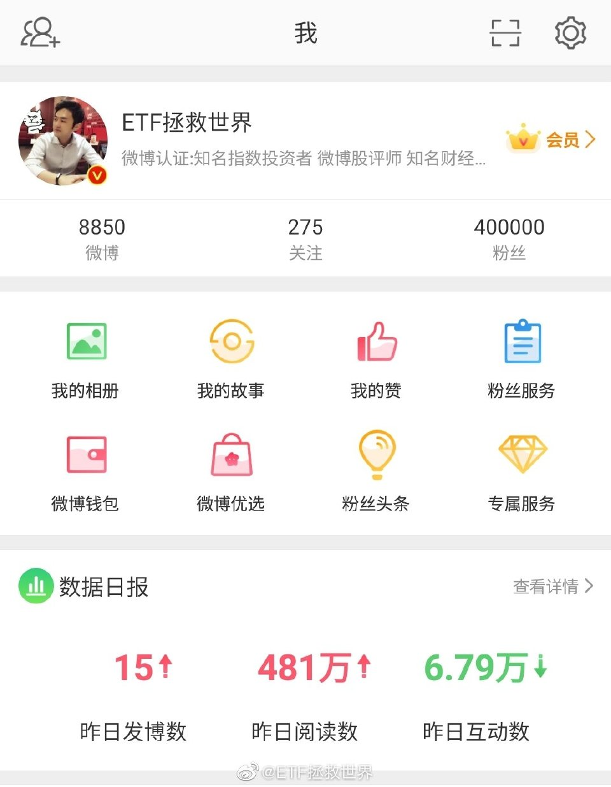

======================================================

ETF拯救世界 (5687069307) @
2020-07-10 11:48:06 Fri  
url: https://weibo.com/5687069307/Jax85z9UN

今天卸车的收益率以及配置图。 ​​​

转发[120]  评论[862]  赞[3057] 

+++++++++++++++++++++++++++++++++++++++++++++++++++++

图片：

======================================================

ETF拯救世界 (5687069307) @
2020-07-10 13:57:33 Fri  
url: https://weibo.com/5687069307/JaxYE238U

知行合一。15500前面我先卸一车。后面再涨就不是我的价值趋势系统能解释的了。当然，这就跟我的价值趋势系统只能解释到低点在7800，结果跌到6900一样，系统不一定什么时候都那么准。剩下的持仓就看缘分了。

------------------------------------------------------
转推：
>  @ETF拯救世界 (5687069307)
>  2020-07-09 10:18:56 Thu  
>  url: https:/weibo.com/5687069307/Jan7p8RFp/

>  医药距离“救命底”上涨110%。
>  
>  距离15500重压线还有5.9%。 ​​​

转发[79]  评论[331]  赞[1933] 

======================================================

ETF拯救世界 (5687069307) @
2020-07-10 14:19:13 Fri  
url: https://weibo.com/5687069307/Jay7qAE4G

中证医疗PB已经超过10倍，创业板指PB即将到达10倍。

这两个指数依然在狂飙。

不得不佩服人民群众。 ​​​

转发[118]  评论[427]  赞[2471] 

======================================================

ETF拯救世界 (5687069307) @
2020-07-10 14:35:20 Fri  
url: https://weibo.com/5687069307/JaydYf4JC

兄弟们，如果你碰到这种情况，会怎么做。 ​​​

转发[80]  评论[2204]  赞[6642] 

+++++++++++++++++++++++++++++++++++++++++++++++++++++

图片：

======================================================

ETF拯救世界 (5687069307) @
2020-07-11 08:11:03 Sat  
url: https://weibo.com/5687069307/JaF8uC5jb

恭喜@陈炳男啊 等100名用户等额平分【1688元现金】。微博官方唯一抽奖工具@微博抽奖平台 对本次抽奖进行监督，结果公正有效。公示链接：http://t.cn/A6yiRhw0

------------------------------------------------------
转推：
>  @ETF拯救世界 (5687069307)
>  2020-07-10 10:50:39 Fri  
>  url: https:/weibo.com/5687069307/JawKMjCeN/

>  40w了。
>  
>  老说不在乎有多少人关注，但其实关注的人多还是比人少开心。也没别的，说白了就是虚荣心，幼稚。
>  
>  18岁，倒也能理解。
>  
>  2015年发出第一条微博到现在5年，富婆断断续续给买的高科技带评论带转发带点赞粉丝已经399999个了。什么都不说了，比心富婆，[心]你。
>  
>  没错。其实这个微博只有你一个真实 ​​​

转发[10]  评论[613]  赞[1434] 

======================================================

ETF拯救世界 (5687069307) @
2020-07-11 21:30:41 Sat  
url: https://weibo.com/5687069307/JaKn3Cy6x

真好。

不要放弃希望，一切都会好起来！ ​​​

转发[29]  评论[670]  赞[3485] 

+++++++++++++++++++++++++++++++++++++++++++++++++++++

图片：
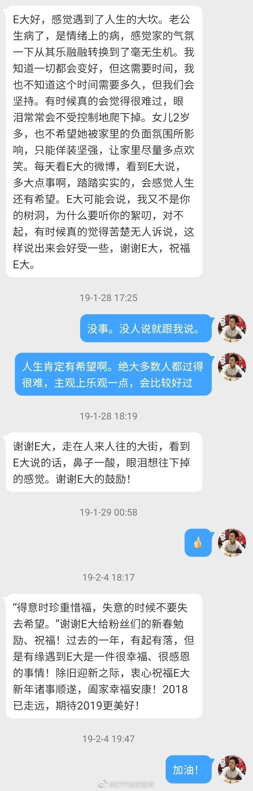
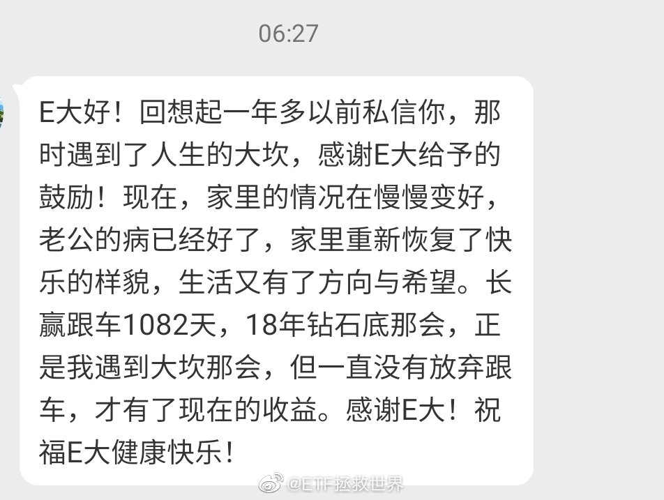

======================================================

ETF拯救世界 (5687069307) @
2020-07-12 08:08:51 Sun  
url: https://weibo.com/5687069307/JaOy6dyln

晃了十秒钟

------------------------------------------------------
转推：
>  @北京人不知道的北京事儿 (1662214194)
>  2020-07-12 07:33:43 Sun  
>  url: https:/weibo.com/1662214194/JaOjPt1dt/

>  【#唐山5.1级地震系周边5年内最大地震#！】刚刚6时38分，河北唐山市古冶区发生5.1级地震！据中国地震台网速报目录，震中周边200公里内近5年来发生3级以上地震共17次，最大地震是本次地震。。。河北、北京、天津均有震感！你感觉强烈吗？[伤心]
>  
>  #唐山5.1级地震# http://t.cn/A6yXmZHH ​​​

转发[15]  评论[307]  赞[566] 

======================================================

ETF拯救世界 (5687069307) @
2020-07-12 08:25:54 Sun  
url: https://weibo.com/5687069307/JaOF0zl7w

不瞒你说，我有两个小的三层包。

一个里面放各种证件。户口本毕业证房本医保卡等等。

另一个里面放金银细软。外币手表银行卡首饰等等。

可以五秒钟拿起来就走。 ​​​

转发[75]  评论[667]  赞[2406] 

======================================================

ETF拯救世界 (5687069307) @
2020-07-12 09:04:09 Sun  
url: https://weibo.com/5687069307/JaOUxAyqa

顺便安利还有一种专门放电子产品的，出去玩、出差的时候特别好用。 ​​​

转发[32]  评论[404]  赞[1760] 

+++++++++++++++++++++++++++++++++++++++++++++++++++++

图片：

======================================================

ETF拯救世界 (5687069307) @
2020-07-12 10:52:49 Sun  
url: https://weibo.com/5687069307/JaPCE88N7

生活小贴士：

喝胶囊咖啡的时候额外加半杯奶。（黑咖啡除外） ​​​

转发[17]  评论[374]  赞[1306] 

======================================================

ETF拯救世界 (5687069307) @
2020-07-13 09:56:36 Mon  
url: https://weibo.com/5687069307/JaYGktdYi

野百合也有春天。 ​​​

转发[11]  评论[293]  赞[1653] 

======================================================

ETF拯救世界 (5687069307) @
2020-07-13 10:01:18 Mon  
url: https://weibo.com/5687069307/JaYIemwb7

看着手中这两年被那人狂踩的品种，为你赚到越来越多的钱。

你就应该知道：

涨时看好，跌时看空，什么品种最近涨的好就吹，最近跌的多就踩的那些人，

无论他的粉丝有多少，名气有多大，

可能水平真的不如你。 ​​​

转发[36]  评论[487]  赞[2298] 

======================================================

ETF拯救世界 (5687069307) @
2020-07-13 10:29:12 Mon  
url: https://weibo.com/5687069307/JaYTyszGY

刚吃了那个去医闹说他是很大很大大V的瓜。

整件事的来龙去脉我不清楚，也不评论对错。我只说两点。

第一，他拍医生视频时候的动作，语言真的让我恶心。我真的很讨厌这种贱了吧唧的人。

第二，脑子是怎么想的说出自己是“大V”来威胁别人。我不是什么大V，但毕竟也有40万机器粉。我在日常生活中不希 ​​​

转发[17]  评论[581]  赞[2305] 

======================================================

ETF拯救世界 (5687069307) @
2020-07-13 11:04:44 Mon  
url: https://weibo.com/5687069307/JaZ7YD1ID

有没有感觉赚的有点麻木了。

有没有真正体会：赚点钱意思不大。 ​​​

转发[27]  评论[740]  赞[2898] 

======================================================

ETF拯救世界 (5687069307) @
2020-07-13 11:18:52 Mon  
url: https://weibo.com/5687069307/JaZdIlZLe

关于本金的问题，之前写文章说过。

如果你本金不多，最应该盼着的不是大牛市，而是大熊市或者震荡市。然后赶紧通过各种方式去赚/攒本金。

这话在熊市里说你觉得不重要或者是忽悠你。牛市来了才知道是真的。 ​​​

转发[154]  评论[606]  赞[2867] 

======================================================

ETF拯救世界 (5687069307) @
2020-07-13 11:26:03 Mon  
url: https://weibo.com/5687069307/JaZgDapRK

医药基本已经脱离我能理解的范畴，进入“外太空”区域。

在这个区域，我将用新的交易策略处理剩下的仓位。

踏踏实实的。 ​​​

转发[359]  评论[684]  赞[2994] 

======================================================

ETF拯救世界 (5687069307) @
2020-07-13 11:39:04 Mon  
url: https://weibo.com/5687069307/JaZlUF5tF

你还在看帖子，人家已经面基了。

据我所知，还有其它地区的朋友也组织类似的聚会了。还有好多私聊的，这很好。

不过一定在不是非常了解的情况下还是要保持警惕，注意财物及人身安全。虽然我这里99%的朋友都特别好，但是剩下那1%的辣鸡也不得不防。（基数大，1%的人也有很多）

另外要注意疫情的问题 ​​​

转发[36]  评论[3281]  赞[3226] 

+++++++++++++++++++++++++++++++++++++++++++++++++++++

图片：

======================================================

ETF拯救世界 (5687069307) @
2020-07-13 14:14:06 Mon  
url: https://weibo.com/5687069307/Jb0mQii7L

有没有体会到什么叫做“坐轿子”。 ​​​

转发[16]  评论[364]  赞[1966] 

======================================================

ETF拯救世界 (5687069307) @
2020-07-13 14:22:50 Mon  
url: https://weibo.com/5687069307/Jb0qo7XaH

牛市，最关键是不要上蹿下跳。

手里绝大多数仓位拿住了。小仓位随便瞎搞搞好了伐。 ​​​

转发[74]  评论[368]  赞[2060] 

======================================================

ETF拯救世界 (5687069307) @
2020-07-13 14:36:17 Mon  
url: https://weibo.com/5687069307/Jb0vQrzoE

别以为做个投资买个基金买个股票就应该一天到晚心惊胆战或者激动人心的。

不是的。

大概90%的时间其实没什么要做的。5%的时间买，5%的时间卖。其他时间就是等着。等着跌，等着涨。

你可以用很多时间去研究，去收集信息。甚至你可以做出很多判断。但交易的次数不应该随着你的研究和判断越来越多。

 ​​​

转发[301]  评论[452]  赞[2630] 

======================================================

ETF拯救世界 (5687069307) @
2020-07-13 14:58:21 Mon  
url: https://weibo.com/5687069307/Jb0EO4pPf

环保也支棱起来了。 ​​​

转发[12]  评论[316]  赞[1841] 

======================================================

ETF拯救世界 (5687069307) @
2020-07-13 15:31:24 Mon  
url: https://weibo.com/5687069307/Jb0SdvnhK

回复@你好大麦茶:这一波后不少车友可以拿到家庭财政大权了//@你好大麦茶:回复@ETF拯救世界:自从收益率碾压老公股票以后，家里就和谐了

------------------------------------------------------
转推：
>  @ETF拯救世界 (5687069307)
>  2020-07-13 11:39:04 Mon  
>  url: https:/weibo.com/5687069307/JaZlUF5tF/

>  你还在看帖子，人家已经面基了。
>  
>  据我所知，还有其它地区的朋友也组织类似的聚会了。还有好多私聊的，这很好。
>  
>  不过一定在不是非常了解的情况下还是要保持警惕，注意财物及人身安全。虽然我这里99%的朋友都特别好，但是剩下那1%的辣鸡也不得不防。（基数大，1%的人也有很多）
>  
>  另外要注意疫情的问题 ​​​

转发[16]  评论[238]  赞[1530] 

======================================================

ETF拯救世界 (5687069307) @
2020-07-13 16:00:24 Mon  
url: https://weibo.com/5687069307/Jb13ZDs2D

和谐生活小贴士：

如果你的投资收益率比另一半多，请不要讽刺、挖苦对方（尤其是在外人面前）。最好能就优点给予一定的表扬。

很多人比你想象中的更爱面子（尤其是男性）。

一个得到里子，一个得到面子，大家好才是真的好。 ​​​

转发[75]  评论[517]  赞[3519] 

======================================================

ETF拯救世界 (5687069307) @
2020-07-13 16:19:18 Mon  
url: https://weibo.com/5687069307/Jb1bF7uX3

我觉得有些人不是逻辑不行，而是脑子有问题。或者说，我也真的怀疑是不是有什么利益因素在里面？

比如说，有女孩晚上在外面遭遇坏人这样的新闻。有人好心在评论里提示一下：晚上出门尽量多穿一些，会安全一点。

有女孩就开骂了：你不去管坏人你管我们？我们愿意穿什么就穿什么！法律都不管我你管得着 ​​​

转发[118]  评论[1147]  赞[4699] 

======================================================

ETF拯救世界 (5687069307) @
2020-07-13 17:52:20 Mon  
url: https://weibo.com/5687069307/Jb1NqgiZ3

一秒钟几十万上下我浪费时间来跟你讨论情趣内衣的问题……

今天数据还没算呢。

耽误事儿！ ​​​

转发[7]  评论[475]  赞[2113] 

======================================================

ETF拯救世界 (5687069307) @
2020-07-13 18:11:38 Mon  
url: https://weibo.com/5687069307/Jb1Vg8ujB

告诉你们一个好消息。

最近有一个想法在我脑子里挥之不去，所以先来透露点口风：

4.0大致有个框架了。

如果还有下一轮，我一定不会像这一轮这样做了。因为这样做我很累，而且效果也未必好，更加重要的是，一轮下来，你自己也不会有太多进步。

我不会跟你一辈子。你赚了不少，之后再被收割回去怎么 ​​​

转发[385]  评论[5114]  赞[14207] 

======================================================

ETF拯救世界 (5687069307) @
2020-07-14 09:23:24 Tue  
url: https://weibo.com/5687069307/Jb7TliLcA

昨天晚上我一个人都没拉黑。

观点虽然天上地下差太远，但没喷我又没有阴阳怪气，我就不拉黑。

那我今天再给大家一个建议：

我建议大家如果拿着大笔现金走路，最好放在兜里或者包里，藏起来，不要拿在手里，不要让别人看见。尤其是晚上。

不然容易被人盯上，容易被抢。

这个会被质疑吗。

“你胡说 ​​​

转发[41]  评论[684]  赞[2531] 

======================================================

ETF拯救世界 (5687069307) @
2020-07-14 09:38:16 Tue  
url: https://weibo.com/5687069307/Jb7ZokniQ

从这个例子里看出那个所谓数据的问题所在了吗。被抢的人99%都把钱放在兜里了。这样看来，拿在手里被抢只有1%，反而是拿在手里更安全？你不觉得这个结论很可笑吗？我们讨论的，应该是同样一个人，拿在手里被抢可能性大，还是放在包里可能性大。而不是看被抢的人把钱放在哪里。因为有人抢钱不管你放哪

------------------------------------------------------
转推：
>  @ETF拯救世界 (5687069307)
>  2020-07-14 09:23:24 Tue  
>  url: https:/weibo.com/5687069307/Jb7TliLcA/

>  昨天晚上我一个人都没拉黑。
>  
>  观点虽然天上地下差太远，但没喷我又没有阴阳怪气，我就不拉黑。
>  
>  那我今天再给大家一个建议：
>  
>  我建议大家如果拿着大笔现金走路，最好放在兜里或者包里，藏起来，不要拿在手里，不要让别人看见。尤其是晚上。
>  
>  不然容易被人盯上，容易被抢。
>  
>  这个会被质疑吗。
>  
>  “你胡说 ​​​

转发[15]  评论[302]  赞[1622] 

======================================================

ETF拯救世界 (5687069307) @
2020-07-14 10:04:07 Tue  
url: https://weibo.com/5687069307/Jb89S8Xgm

给医药和养老爸爸跪了。 ​​​

转发[14]  评论[314]  赞[1981] 

======================================================

ETF拯救世界 (5687069307) @
2020-07-14 10:35:00 Tue  
url: https://weibo.com/5687069307/Jb8mpAZC7

在大气层激烈争夺。15500不是那么容易过的。

------------------------------------------------------
转推：
>  @ETF拯救世界 (5687069307)
>  2020-07-13 11:26:03 Mon  
>  url: https:/weibo.com/5687069307/JaZgDapRK/

>  医药基本已经脱离我能理解的范畴，进入“外太空”区域。
>  
>  在这个区域，我将用新的交易策略处理剩下的仓位。
>  
>  踏踏实实的。 ​​​

转发[281]  评论[323]  赞[1959] 

======================================================

ETF拯救世界 (5687069307) @
2020-07-14 12:29:02 Tue  
url: https://weibo.com/5687069307/Jb96H65sn

要用耳机听 ​​​

转发[16]  评论[1635]  赞[2430] 

======================================================

ETF拯救世界 (5687069307) @
2020-07-14 13:57:24 Tue  
url: https://weibo.com/5687069307/Jb9GyF92L

可能你不相信，跌了一天，不少人又被套了。 ​​​

转发[16]  评论[1092]  赞[3512] 

======================================================

ETF拯救世界 (5687069307) @
2020-07-15 08:11:12 Wed  
url: https://weibo.com/5687069307/JbgQxgNa4

仔细感受了一下，发现还是赚钱的日子更舒服。 ​​​

转发[17]  评论[861]  赞[2855] 

======================================================

ETF拯救世界 (5687069307) @
2020-07-15 10:00:47 Wed  
url: https://weibo.com/5687069307/Jbhz1imj2

第一个1倍。

------------------------------------------------------
转推：
>  @ETF拯救世界 (5687069307)
>  2018-10-10 11:29:31 Wed  
>  url: https:/weibo.com/5687069307/GDfidmtMh/

>  7800的医药指数，可能是你人生中第一个10倍指数。 ​​​

转发[48]  评论[375]  赞[1932] 

======================================================

ETF拯救世界 (5687069307) @
2020-07-15 10:09:27 Wed  
url: https://weibo.com/5687069307/JbhCxoe5T

回复@xuhuangkai:到了。如果你自己操作，不要来问我。如果你是参考我的操作，那是完全公开的，你看就行了。每天问该怎么办你累不累。我累。//@xuhuangkai:医药到了外太空吗？现在该怎么办呢//@ETF拯救世界:第一个1倍。

------------------------------------------------------
转推：
>  @ETF拯救世界 (5687069307)
>  2018-10-10 11:29:31 Wed  
>  url: https:/weibo.com/5687069307/GDfidmtMh/

>  7800的医药指数，可能是你人生中第一个10倍指数。 ​​​

转发[13]  评论[193]  赞[1527] 

======================================================

ETF拯救世界 (5687069307) @
2020-07-15 10:13:09 Wed  
url: https://weibo.com/5687069307/JbhE2eOL5

牛市见顶的另一个标志：

有人开始在评论里嘲笑低位买入赚几十个点甚至翻倍卖出的人卖早了。

嘲笑得越厉害，见顶的可能性越大。如果开始骂人，那几乎就确认了。

类似这样的：

“呵呵，踏空狗，我入场x个月就赚了xx%。”

2015年5月-6月，我在球球每天几百人骂。所以这也算一条经验了。 ​​​

转发[163]  评论[740]  赞[3587] 

======================================================

ETF拯救世界 (5687069307) @
2020-07-15 13:26:02 Wed  
url: https://weibo.com/5687069307/JbiUkd2GF

太对了。自己爹妈不教育社会上有人教育。

------------------------------------------------------
转推：
>  @北京人不知道的北京事儿 (1662214194)
>  2020-07-15 12:37:30 Wed  
>  url: https:/weibo.com/1662214194/JbiAD2wQ6/

>  转自网友，面对这样的熊孩子，你觉得这成年人做得对吗？[思考]
>  
>  http://t.cn/A6ypzFMD ​​​

转发[166]  评论[375]  赞[2344] 

======================================================

ETF拯救世界 (5687069307) @
2020-07-15 18:56:21 Wed  
url: https://weibo.com/5687069307/Jbl4pjq4Q

这几年更加看懂一件事：某些国家就是你不做我的狗我就要干你，你威胁到我的老大位置我也要干你。无非是找什么借口和怎么干。天佑中华。

------------------------------------------------------
转推：
>  @观察者网 (1887344341)
>  2020-07-15 17:28:27 Wed  
>  url: https:/weibo.com/1887344341/JbkuIF1nU/

>  外国人的疑惑：中国是全世界唯一不靠殖民起家的大国，为何还招恨？
>  
>  7月14日，英国推特用户“#BlackLivesMatter #AmericaWasNeverGreat”发文写道，“中国很快就将成为世界第一大经济体。它将是第一个不靠殖民、奴隶制和种族屠杀起家，而是靠努力、健康经济和高效治理来达此成就的大国。这本来应该为中 ​​​

转发[143]  评论[566]  赞[3102] 

======================================================

ETF拯救世界 (5687069307) @
2020-07-16 13:28:49 Thu  
url: https://weibo.com/5687069307/JbslX8QsM

这么跌到收盘的话明天会反弹啊。 ​​​

转发[38]  评论[431]  赞[2055] 

======================================================

ETF拯救世界 (5687069307) @
2020-07-16 13:38:33 Thu  
url: https://weibo.com/5687069307/JbspUod4n

回复@圆圆圈圈0808:还可以再大一点，我还撑得住//@圆圆圈圈0808:真的印证了年初E大的判断：大波动啊

------------------------------------------------------
转推：
>  @ETF拯救世界 (5687069307)
>  2020-07-16 13:28:49 Thu  
>  url: https:/weibo.com/5687069307/JbslX8QsM/

>  这么跌到收盘的话明天会反弹啊。 ​​​

转发[4]  评论[121]  赞[962] 

======================================================

ETF拯救世界 (5687069307) @
2020-07-16 13:40:31 Thu  
url: https://weibo.com/5687069307/JbsqHtvhD

回复@烧鸭小哥哟:熊市很多人发现晚买一天能便宜不少。后来您猜怎么着，嘿，好多人很多次再也买不到了。//@烧鸭小哥哟:实不相瞒，我发现以往卖出推迟一天能多卖点钱

------------------------------------------------------
转推：
>  @ETF拯救世界 (5687069307)
>  2020-07-16 13:28:49 Thu  
>  url: https:/weibo.com/5687069307/JbslX8QsM/

>  这么跌到收盘的话明天会反弹啊。 ​​​

转发[15]  评论[293]  赞[1395] 

======================================================

ETF拯救世界 (5687069307) @
2020-07-16 14:22:29 Thu  
url: https://weibo.com/5687069307/JbsHK9i78

不需要我按摩吧。

问自己几个问题：

我高位接盘了吗？

我逢高减仓了吗？

我准备好如果跌很多，低位买入未来赚更多了吗？ ​​​

转发[82]  评论[605]  赞[2006] 

======================================================

ETF拯救世界 (5687069307) @
2020-07-16 14:39:20 Thu  
url: https://weibo.com/5687069307/JbsOAb8OW

跌太多了，我发车时候也就2个点。

场外的朋友明天赎回也可以，有可能反弹，自己看着办吧。 ​​​

转发[39]  评论[428]  赞[1933] 

======================================================

ETF拯救世界 (5687069307) @
2020-07-16 14:45:38 Thu  
url: https://weibo.com/5687069307/JbsR8gpBB

回复@崔111112:什么乱七八糟的。你见过赚60%多被“洗掉”的？你怎么那么喜欢被洗。//@崔111112:老大，这好像是敌人大清洗活动啊，把我们小散户洗屁了，是不是该轮到他们主力涨了[允悲]

------------------------------------------------------
转推：
>  @ETF拯救世界 (5687069307)
>  2020-07-16 14:39:20 Thu  
>  url: https:/weibo.com/5687069307/JbsOAb8OW/

>  跌太多了，我发车时候也就2个点。
>  
>  场外的朋友明天赎回也可以，有可能反弹，自己看着办吧。 ​​​

转发[6]  评论[104]  赞[904] 

======================================================

ETF拯救世界 (5687069307) @
2020-07-16 14:54:56 Thu  
url: https://weibo.com/5687069307/JbsUUeSBh

最疼的是14000亿两融。 ​​​

转发[30]  评论[261]  赞[1715] 

======================================================

ETF拯救世界 (5687069307) @
2020-07-16 14:56:29 Thu  
url: https://weibo.com/5687069307/JbsVxxRqr

回来了老弟。//@ETF拯救世界:在大气层激烈争夺。15500不是那么容易过的。

------------------------------------------------------
转推：
>  @ETF拯救世界 (5687069307)
>  2020-07-13 11:26:03 Mon  
>  url: https:/weibo.com/5687069307/JaZgDapRK/

>  医药基本已经脱离我能理解的范畴，进入“外太空”区域。
>  
>  在这个区域，我将用新的交易策略处理剩下的仓位。
>  
>  踏踏实实的。 ​​​

转发[258]  评论[150]  赞[1250] 

======================================================

ETF拯救世界 (5687069307) @
2020-07-16 15:09:12 Thu  
url: https://weibo.com/5687069307/Jbt0HyVxS

前几天让你给自己买小礼物买了吧。

买了现在手里好歹能剩点东西是不是。 ​​​

转发[41]  评论[1007]  赞[3684] 

======================================================

ETF拯救世界 (5687069307) @
2020-07-16 17:15:50 Thu  
url: https://weibo.com/5687069307/JbtQ686Uv

很多人太不成熟。以后我会直接拉黑。sorry。

你没错。不过大家一个FM，一个AM，都不是一个channel，我也正好厌倦再做投资者教育了。 ​​​

转发[9]  评论[686]  赞[3013] 

======================================================

ETF拯救世界 (5687069307) @
2020-07-16 17:45:29 Thu  
url: https://weibo.com/5687069307/Jbu28hilg

在这种日子里，你知道怎么让自己保持好心情吗。

我的做法：

不看账户，不更新理财软件收盘净值。

不看它就没发生！

终极解决办法，推荐给你。 ​​​

转发[90]  评论[1230]  赞[4356] 

======================================================

ETF拯救世界 (5687069307) @
2020-07-17 09:34:30 Fri  
url: https://weibo.com/5687069307/JbAflaxLh

未来三天反弹力度很重要。 ​​​

转发[95]  评论[361]  赞[2406] 

======================================================

ETF拯救世界 (5687069307) @
2020-07-17 09:36:45 Fri  
url: https://weibo.com/5687069307/JbAgfzzH5

昨天两融余额只降了60亿。

融资客选择了硬扛。 ​​​

转发[37]  评论[283]  赞[1990] 

======================================================

ETF拯救世界 (5687069307) @
2020-07-17 09:58:05 Fri  
url: https://weibo.com/5687069307/JbAoUvgdJ

越涨越高的时候我连续在公众号和微博说得很清楚，你看着大涨想买的心情我很理解，但我帮不了你，我对你买入的行为不会有任何帮助了。建议你去请别人帮你。

我也相信各位没有在高位买一分钱，大多数朋友还在不断小幅减仓。

所以如果高位买入被套了别到我这哭，我真的没法做的更好了。 ​​​

转发[39]  评论[485]  赞[2400] 

======================================================

ETF拯救世界 (5687069307) @
2020-07-17 10:15:32 Fri  
url: https://weibo.com/5687069307/JbAvZz62X

可以依计赎回了。

------------------------------------------------------
转推：
>  @ETF拯救世界 (5687069307)
>  2020-07-16 14:39:20 Thu  
>  url: https:/weibo.com/5687069307/JbsOAb8OW/

>  跌太多了，我发车时候也就2个点。
>  
>  场外的朋友明天赎回也可以，有可能反弹，自己看着办吧。 ​​​

转发[19]  评论[548]  赞[1941] 

======================================================

ETF拯救世界 (5687069307) @
2020-07-17 13:25:15 Fri  
url: https://weibo.com/5687069307/JbBL0rBVO

哈哈哈哈哈。很多人还没有进化完成。

------------------------------------------------------
转推：
>  @北京人不知道的北京事儿 (1662214194)
>  2020-07-17 13:22:03 Fri  
>  url: https:/weibo.com/1662214194/JbBJHsD6H/

>  网友投稿：北京朝阳某小区外，前边这位司机下了车就对着人家车轱辘小便。。。这样的你怎么看？[衰]
>  
>  http://t.cn/A6yW8Jty ​​​

转发[7]  评论[191]  赞[822] 

======================================================

ETF拯救世界 (5687069307) @
2020-07-17 15:37:26 Fri  
url: https://weibo.com/5687069307/JbCCErOmg

还算对得起各位老铁。666//@ETF拯救世界:可以依计赎回了。

------------------------------------------------------
转推：
>  @ETF拯救世界 (5687069307)
>  2020-07-16 14:39:20 Thu  
>  url: https:/weibo.com/5687069307/JbsOAb8OW/

>  跌太多了，我发车时候也就2个点。
>  
>  场外的朋友明天赎回也可以，有可能反弹，自己看着办吧。 ​​​

转发[5]  评论[383]  赞[1797] 

======================================================

ETF拯救世界 (5687069307) @
2020-07-17 16:00:16 Fri  
url: https://weibo.com/5687069307/JbCLVgeFy

150医药未来的操作方向：

医药已经离开大气层15500，跌回人间。高位也算减仓两次。这是目前的状态。

众所周知我很喜欢医药。相对于另一些喜欢的品种，这次真正把仓位建起来的也只有它，所以就更加喜欢。就像有几个孩子，虽然都喜欢，但那个对自己好又有出息的就尤其喜欢。

还剩下几份医药，如果未来 ​​​

转发[159]  评论[875]  赞[3244] 

======================================================

ETF拯救世界 (5687069307) @
2020-07-17 22:14:31 Fri  
url: https://weibo.com/5687069307/JbFdPtfyJ

这就是我不买四层别墅的原因 [doge]

------------------------------------------------------
转推：
>  @新浪视频 (1640601392)
>  2020-07-17 21:44:40 Fri  
>  url: https:/weibo.com/1640601392/JbF1IjLYd/

>  【#母女困自家电梯4天3夜喝尿求生#：身上没带手机，撬缝轮流呼吸[可怜]】近日，西安一82岁老人和64岁女儿被困电梯，互喝对方的尿液，直到4天3夜后被救出送医。医生介绍，两位老人独居在四层别墅里，坐电梯上楼洗澡时被困，身上也没带手机。母女二人把电梯门撬开条缝，轮流到门边呼吸。 ​​​

转发[34]  评论[232]  赞[1025] 

======================================================

ETF拯救世界 (5687069307) @
2020-07-18 08:53:27 Sat  
url: https://weibo.com/5687069307/JbJpaBRKl

喜欢张含韵。好可爱。 ​​​

转发[27]  评论[776]  赞[2914] 

======================================================

ETF拯救世界 (5687069307) @
2020-07-19 08:45:05 Sun  
url: https://weibo.com/5687069307/JbSMhm7Nb

老师心态崩了。老师啊，做人开心最重要。老师当然是灵魂工程师，值得所有人尊敬。但有人不尊重你你也没办法啊。拿了工资，认真做好教学育人工作就行了，至于学生尊重不尊重你，那就不是你能控制的了，心态不能崩啊。人最痛苦的就是求而不得，求所有人的尊重那更是注定非常痛苦的一件事了。

------------------------------------------------------
转推：
>  @三联生活周刊 (1191965271)
>  2020-07-19 08:25:04 Sun  
>  url: https:/weibo.com/1191965271/JbSE9k0xh/

>  #老师不满学生只给班主任送花发飙# 【山西一教师不满学生只给班主任送花发飙，当地整治师德师风】山西朔州市朔城区教育局官方微信7月19日消息，针对近期朔城区第六小学教师过激言行引起的舆情风波，朔城区教育局立即召开党组会、局务会，成立领导组，深入学校对该项事件进行深入调查，并进行严肃处理， ​​​

转发[37]  评论[310]  赞[1340] 

======================================================

ETF拯救世界 (5687069307) @
2020-07-19 10:29:04 Sun  
url: https://weibo.com/5687069307/JbTstEkKQ

其实“感恩”这件事真就不是哪个人都能做到的。

很多人会觉得，你对我再好，也是应该的，我为什么要感恩你？

如果你认真感受一下，很多人做的事情真的是与别人不同的。我儿子上学一年，我就能很明显的感受到每个老师的教学态度，对孩子的关爱程度等等完全不同。那我就会对好的老师非常感恩。

这是她 ​​​

转发[141]  评论[835]  赞[3944] 

======================================================

ETF拯救世界 (5687069307) @
2020-07-19 13:48:46 Sun  
url: https://weibo.com/5687069307/JbULxn3wz

我最近用过的的微信头像，分享给你 ​​​

转发[35]  评论[580]  赞[2344] 

+++++++++++++++++++++++++++++++++++++++++++++++++++++

图片：

======================================================

ETF拯救世界 (5687069307) @
2020-07-19 16:55:50 Sun  
url: https://weibo.com/5687069307/JbVZtuNOM

看到很多人说被杀的小男孩长期霸凌女孩。但官方通报不是这样。传言有证据吗？如果传言是假的，对死去的孩子和他的家人公平吗？//@亟兮般若:

------------------------------------------------------
转推：
>  @巍岳钦禹 (3775056661)
>  2020-07-18 07:03:21 Sat  
>  url: https:/weibo.com/3775056661/JbIGus3eb/

>  9岁的男生叶某某，是被同班女同学父亲林建厦杀害的。被害的当晚，叶某某父亲叶万焕就在儿子灵堂里搭了张简易床，吃住都在那，一直陪着儿子。
>  
>  父亲叶万焕是个老板，家底很厚，他在儿子遗体前许下诺言：不提赔偿、不接受道歉，不去伤害凶手家人；拿起法律武器，通过法律渠道，获得法院判处凶手死刑的结 ​​​

转发[16]  评论[215]  赞[1305] 

======================================================

ETF拯救世界 (5687069307) @
2020-07-19 22:23:09 Sun  
url: https://weibo.com/5687069307/JbY8ki4CB

我小学的时候，在外地的学校上过几年学。那里的学校比北京乱不少。我上学的那个学校，是当地的绝对名校，即使如此，现在回头看，校园霸凌也非常严重。

校园里喜欢欺负人的，主要是那些与中学或者社会上小混混有关系的孩子。个别坏孩子下手真的狠。欺负人的时候抽耳光能把人嘴抽出血。我印象深的还有一 ​​​

转发[99]  评论[495]  赞[2563] 

======================================================

ETF拯救世界 (5687069307) @
2020-07-20 10:19:01 Mon  
url: https://weibo.com/5687069307/Jc2OTDfnj

[太开心] ​​​

转发[12]  评论[942]  赞[2510] 

======================================================

ETF拯救世界 (5687069307) @
2020-07-20 10:50:01 Mon  
url: https://weibo.com/5687069307/Jc31tDELS

特别不理解，为什么会有人相信这种明显一张嘴就是骗子的人。到底为什么。

------------------------------------------------------
转推：
>  @蓝鲸财经记者工作平台 (1885454921)
>  2020-07-20 10:30:06 Mon  
>  url: https:/weibo.com/1885454921/Jc2TovAyC/

>  #天才少女演讲老师收徒至少收费20万# 【“缔造16岁神童”培训机构大门紧闭，创始人已退出公司股份】
>  “出版三本书、一天能写300首词牌、2000首诗和15000字小说，同时还担任新闻记者、演讲师。”来自浙江慈溪的16岁女孩岑某诺“神童”般特殊才能引发公众强烈的质疑。
>  网络上传播的多个演讲视频中，岑某 ​​​

转发[15]  评论[218]  赞[769] 

======================================================

ETF拯救世界 (5687069307) @
2020-07-20 10:58:17 Mon  
url: https://weibo.com/5687069307/Jc34Qj3Le

回复@唐马拉其:白冰有点像初代小助理。//@唐马拉其:有没有喜欢白冰的[嘻嘻]

------------------------------------------------------
转推：
>  @ETF拯救世界 (5687069307)
>  2020-07-18 08:53:27 Sat  
>  url: https:/weibo.com/5687069307/JbJpaBRKl/

>  喜欢张含韵。好可爱。 ​​​

转发[1]  评论[224]  赞[1147] 

======================================================

ETF拯救世界 (5687069307) @
2020-07-20 13:55:21 Mon  
url: https://weibo.com/5687069307/Jc4eI3MfD

每次上升的市场（尽量不用牛、熊说话了），都是一次财富再分配。

有一段时间会让你觉得所有人的钱都增加了，很多人会困惑：我们都赚钱了谁赔了。

然后就是真正的再分配。很多人会拿着钱离开，很多人的钱再也拿不回来了。

上升市场中，很多人真的是来“送钱”。把自己的血汗钱送给别人。这些人一开始 ​​​

转发[303]  评论[524]  赞[2876] 

======================================================

ETF拯救世界 (5687069307) @
2020-07-20 14:14:23 Mon  
url: https://weibo.com/5687069307/Jc4mr3koh

有些指数品种不涨，真的不要太在意。指数跟股票或者主动基不一样。股票不涨可能就是这家公司真不行了。主动基不涨可能是这个基金经理真不行。而指数很大可能是它在蓄势。不停的攒能量，在你想不到的时候爆发。

所以我持有一些这两年涨幅不行的指数，心里特别踏实。因为我眼看着它越来越便宜，我就知道 ​​​

转发[267]  评论[727]  赞[2699] 

======================================================

ETF拯救世界 (5687069307) @
2020-07-20 21:20:26 Mon  
url: https://weibo.com/5687069307/Jc79mDXUT

记不记得我之前说，本金少的朋友不要把主要精力放在投资上。因为哪怕十倍也不会改变太多。

应该用小部分精力关注投资，学习技巧，大部分精力放在主业或者通过兴趣赚本金上。

谁能想到，真的有人听我的建议把主要精力放在副业赚钱上了——他们把我几十万字公开不公开的文章整理好拿出来卖钱了。 ​​​

转发[114]  评论[1154]  赞[4641] 

======================================================

ETF拯救世界 (5687069307) @
2020-07-20 22:31:50 Mon  
url: https://weibo.com/5687069307/Jc7Cmca6y

重庆的房子，不考虑升值学区什么的，江景，环境物业不错的楼盘有没有推荐。 ​​​

转发[32]  评论[675]  赞[1981] 

======================================================

ETF拯救世界 (5687069307) @
2020-07-21 10:00:32 Tue  
url: https://weibo.com/5687069307/Jcc7To4eQ

考虑了很久，决定把一些历史内部资料逐步在公众号更新。

同时，会加入最新点评以及对当时操作的反思和进一步优化的思考。

注意，不要再去买其他人贩卖的以前的合集。很多策略和整个体系已经有了升华，以前的东西未必全都是好的。我会在以后的更新中更正那些错误。

懒癌患者的我每次都是被人逼的没办 ​​​

转发[103]  评论[1967]  赞[6604] 

======================================================

ETF拯救世界 (5687069307) @
2020-07-21 13:37:51 Tue  
url: https://weibo.com/5687069307/Jcdy6m6pD

我想到一件事。

你们说灯塔很多群众今年表现的这么反智，与他们的“快乐教育”有没有关系。

很大一部分人被快乐教育祸害成傻子了。 ​​​

转发[59]  评论[401]  赞[2625] 

======================================================

ETF拯救世界 (5687069307) @
2020-07-21 17:29:16 Tue  
url: https://weibo.com/5687069307/Jcf427R7b

DAX一个深V，给机会让我们加了几车，现在晃晃悠悠又快历史新高了。

然后在dax上的利润也比几个月前多了不少。

下跌是好事还是坏事，你复习功课了你讲讲。 ​​​

转发[47]  评论[401]  赞[1945] 

======================================================

ETF拯救世界 (5687069307) @
2020-07-21 17:46:16 Tue  
url: https://weibo.com/5687069307/JcfaW2tyZ

最低8255，谁说趋势系统没用的来看看一次次见效的事实。

------------------------------------------------------
转推：
>  @ETF拯救世界 (5687069307)
>  2020-03-23 16:22:24 Mon  
>  url: https:/weibo.com/5687069307/IzWND4ItA/

>  如果DAX有效跌破8200，那就是最强的一根支撑破掉了。再往下是多少很难判断了。
>  
>  要是一定一定要给个点位，那就是6200周围。问题是，这也太低了吧！
>  
>  不过综合最近40年美国和英国的指数走势看，极限跌幅确实还有30%。这个真的是极限了，如果还止不住，那可能就是要全面推倒重来了。 ​​​

转发[42]  评论[175]  赞[1437] 

======================================================

ETF拯救世界 (5687069307) @
2020-07-21 18:42:35 Tue  
url: https://weibo.com/5687069307/JcfxNegqk

白银快21了。

之前评论里抱怨白银的那些朋友，你们会自责吗。 ​​​

转发[18]  评论[420]  赞[1429] 

======================================================

ETF拯救世界 (5687069307) @
2020-07-21 21:31:01 Tue  
url: https://weibo.com/5687069307/JcgEa4kTz

且慢更新版本后，各位资产账户的总“累计收益率”去掉了。

我认为取消是合理的，因为以前的累计收益率不合理。

之前的逻辑是，你的总盈利金额/账户历史最大成本=累计收益率。各位觉得这样准确吗。除非你只转入一次资金，不再转入转出。只要有资金进出，这个累计收益率就不准确。怎么不合理，你想想就 ​​​

转发[33]  评论[404]  赞[1995] 

======================================================

ETF拯救世界 (5687069307) @
2020-07-22 08:52:22 Wed  
url: https://weibo.com/5687069307/Jcl6IBlsN

转发微博

------------------------------------------------------
转推：
>  @丁辰灵 (1717257814)
>  2020-07-22 08:33:29 Wed  
>  url: https:/weibo.com/1717257814/JckZ3rfxI/

>  那为什么欧美国家可以至少在表面上信息不受管控呢？
>   
>  其实欧美国家实质上信息仍然是管控的，只不过管控的非常巧妙。比如美国的媒体都寡头化了，各类媒体都在几大寡头手上。默多克有福克斯，disney有ABC，科赫兄弟收购了时代杂志。寡头的媒体肯定是服务寡头的利益，欧美寡头隐身在政治背后，政府前台的 ​​​

转发[44]  评论[56]  赞[544] 

======================================================

ETF拯救世界 (5687069307) @
2020-07-22 08:54:38 Wed  
url: https://weibo.com/5687069307/Jcl7DzQrZ

白银没有长期仓位，只有几年网格留的利润。

没吃肉，喝点肉汤也挺好。这部分右侧出，不急。 ​​​

转发[36]  评论[224]  赞[1362] 

======================================================

ETF拯救世界 (5687069307) @
2020-07-22 09:04:50 Wed  
url: https://weibo.com/5687069307/JclbMCgjt

回复@江风其凉:对。三月暂停网格新开仓交易。但是原来的持仓和利润没有清仓啊。当时微博说的清清楚楚//@江风其凉:白银我记得不是因为不安全停了么[允悲]

------------------------------------------------------
转推：
>  @ETF拯救世界 (5687069307)
>  2020-07-22 08:54:38 Wed  
>  url: https:/weibo.com/5687069307/Jcl7DzQrZ/

>  白银没有长期仓位，只有几年网格留的利润。
>  
>  没吃肉，喝点肉汤也挺好。这部分右侧出，不急。 ​​​

转发[5]  评论[68]  赞[840] 

======================================================

ETF拯救世界 (5687069307) @
2020-07-22 09:19:50 Wed  
url: https://weibo.com/5687069307/JclhRF8xW

太好笑了。为了应对编制不合理长期不涨的情况，把一批涨了很多估值极贵的品种纳了进来。

你猜会怎么样。

当然这跟我们无关，我们永远不会买上证综指。 ​​​

转发[73]  评论[378]  赞[2098] 

======================================================

ETF拯救世界 (5687069307) @
2020-07-22 10:26:14 Wed  
url: https://weibo.com/5687069307/JclIP58pA

今天可以更新理财软件收盘价了。 ​​​

转发[4]  评论[239]  赞[1595] 

======================================================

ETF拯救世界 (5687069307) @
2020-07-22 10:39:16 Wed  
url: https://weibo.com/5687069307/JclO6FmcQ

一波疫情过去，瘦了十几斤。练出了人鱼线，10公里跑入了40分钟。

顺便还在股市赚了1个小目标。

—————————————————————————————————————————————————————————————————————————————————————————————— ​​​

转发[27]  评论[622]  赞[2857] 

======================================================

ETF拯救世界 (5687069307) @
2020-07-22 10:54:38 Wed  
url: https://weibo.com/5687069307/JclUlyTau

生活小贴士：

运动鞋可以用洗衣机洗。 ​​​

转发[22]  评论[485]  赞[1773] 

======================================================

ETF拯救世界 (5687069307) @
2020-07-22 11:08:11 Wed  
url: https://weibo.com/5687069307/JclZQvscR

新高的日子里，一片其乐融融。 ​​​

转发[5]  评论[357]  赞[2151] 

======================================================

ETF拯救世界 (5687069307) @
2020-07-22 11:14:31 Wed  
url: https://weibo.com/5687069307/Jcm2q8TeV

每天上一样的班，吃一样的饭，说一样的话，创一样的新高，没什么意思。

无非是钱越来越多而已。

每天都做一点从没做过的事情才有意思。不信你试试。 ​​​

转发[50]  评论[820]  赞[3415] 

======================================================

ETF拯救世界 (5687069307) @
2020-07-22 23:29:17 Wed  
url: https://weibo.com/5687069307/JcqQF74q2

不知道为什么，类似情况私信的大多数都是好好的家被老公借外债弄垮了。是不是男人天生激进？

借债，尤其是高息债真的风险很大，一定要慎重。

还有，类似的情况，请男人们有点担当吧。两个月在家呆着，送个外卖还点钱也好啊。 ​​​

转发[109]  评论[631]  赞[4054] 

+++++++++++++++++++++++++++++++++++++++++++++++++++++

图片：

======================================================

ETF拯救世界 (5687069307) @
2020-07-22 23:49:23 Wed  
url: https://weibo.com/5687069307/JcqYODPrq

来点正能量。

好梦，晚安。 ​​​

转发[5]  评论[355]  赞[2324] 

+++++++++++++++++++++++++++++++++++++++++++++++++++++

图片：

======================================================

ETF拯救世界 (5687069307) @
2020-07-23 08:07:32 Thu  
url: https://weibo.com/5687069307/Jcuf1cMrH

十几二十万没多少钱，一家人努努力早晚能还清。

但这样满嘴谎言，依然不停继续借的，已经毫无希望了。

如果是我，会立即以第三宇宙速度逃离这个借贷和重男轻女的双重黑洞。 ​​​

转发[51]  评论[547]  赞[3272] 

+++++++++++++++++++++++++++++++++++++++++++++++++++++

图片：

======================================================

ETF拯救世界 (5687069307) @
2020-07-23 09:33:36 Thu  
url: https://weibo.com/5687069307/JcuNXeApk

关于资金安排有几点我说一下。

第一，150和S目前都盈利很多。有急需用钱的可以把赚钱多的赎回一部分乃至全部赎回也没事。你都急于用钱了就不要想后面会不会少赚了。

第二，150已经明确是3-5年不用的钱。即使如此，布局的时候我依然给出了更大的安全边际，你随时能抽走的资金会有不少。

第三，S是针 ​​​

转发[178]  评论[840]  赞[3500] 

======================================================

ETF拯救世界 (5687069307) @
2020-07-23 09:53:45 Thu  
url: https://weibo.com/5687069307/JcuW8uuOS

回复@Z译文的热爱:这个我不知道。因为我还没有切身感受。过些年有经验了告诉你答案。//@Z译文的热爱:回复@ETF拯救世界:真心想问，年纪大是指多少岁算大。[doge]

------------------------------------------------------
转推：
>  @ETF拯救世界 (5687069307)
>  2020-07-23 09:33:36 Thu  
>  url: https:/weibo.com/5687069307/JcuNXeApk/

>  关于资金安排有几点我说一下。
>  
>  第一，150和S目前都盈利很多。有急需用钱的可以把赚钱多的赎回一部分乃至全部赎回也没事。你都急于用钱了就不要想后面会不会少赚了。
>  
>  第二，150已经明确是3-5年不用的钱。即使如此，布局的时候我依然给出了更大的安全边际，你随时能抽走的资金会有不少。
>  
>  第三，S是针 ​​​

转发[7]  评论[140]  赞[1020] 

======================================================

ETF拯救世界 (5687069307) @
2020-07-23 10:56:15 Thu  
url: https://weibo.com/5687069307/Jcvlv8lDf

很多新人震惊的发现自己在3200多点开始赔钱了。 ​​​

转发[58]  评论[504]  赞[2753] 

======================================================

ETF拯救世界 (5687069307) @
2020-07-23 11:50:17 Thu  
url: https://weibo.com/5687069307/JcvHrhefj

回复@朵朵-冷暖自知:一百年来咱们就没有容易过。都加油干吧。//@朵朵-冷暖自知:感觉中华民族挺难的

------------------------------------------------------
转推：
>  @ETF拯救世界 (5687069307)
>  2020-07-23 10:56:15 Thu  
>  url: https:/weibo.com/5687069307/Jcvlv8lDf/

>  很多新人震惊的发现自己在3200多点开始赔钱了。 ​​​

转发[7]  评论[189]  赞[1489] 

======================================================

ETF拯救世界 (5687069307) @
2020-07-24 09:24:27 Fri  
url: https://weibo.com/5687069307/JcEaJya1H

刚才在看过去写的内部资料。2015年7月30是第一份。在那份资料里写了下面这句话。

2020年，所有人都知道这三个是好东西了。 ​​​

转发[177]  评论[268]  赞[1983] 

+++++++++++++++++++++++++++++++++++++++++++++++++++++

图片：

======================================================

ETF拯救世界 (5687069307) @
2020-07-24 09:36:43 Fri  
url: https://weibo.com/5687069307/JcEfIjqQ9

回复@价值趋势笑傲江湖:我的三位好友和三位红颜知己：http://t.cn/RqikDLU //@价值趋势笑傲江湖:回复@嗯日子还是要过的不是吗:还有仨是谁？

------------------------------------------------------
转推：
>  @ETF拯救世界 (5687069307)
>  2020-07-24 09:24:27 Fri  
>  url: https:/weibo.com/5687069307/JcEaJya1H/

>  刚才在看过去写的内部资料。2015年7月30是第一份。在那份资料里写了下面这句话。
>  
>  2020年，所有人都知道这三个是好东西了。 ​​​

转发[118]  评论[146]  赞[913] 

======================================================

ETF拯救世界 (5687069307) @
2020-07-24 09:48:11 Fri  
url: https://weibo.com/5687069307/JcEkn0dni

当你把最近这次投资经历总结出的“经验”运用到下一次实践中时，一定要注意，下次可能会有些不同。

比如，这次你持有一个牛股或者一支翻倍基金，由于没有经验，刚刚回本或者赚了十几个点就跑了。那你就会想：我下次一定要拿的久一点，多赚点。

下次你回本或者赚了十几个点，坚定的拿着不放弃，谁能想 ​​​

转发[249]  评论[410]  赞[2323] 

======================================================

ETF拯救世界 (5687069307) @
2020-07-24 10:13:04 Fri  
url: https://weibo.com/5687069307/JcEutbbWG

运动小贴士：

这些年虽然跑步成绩一直不怎么样，但鞋买了很多，可以说阅鞋无数。

前几年一直买ASICS和美津浓。但这几年觉得不思进取，不进则退。前一段买了A家最新款的顶级跑鞋，越发觉得重，跑起来很累，脚感也不那么出色了。

倒是觉得nike的react不错。慢跑的话可以去试试飞马系列，慢跑+日常出街 ​​​

转发[197]  评论[847]  赞[1753] 

======================================================

ETF拯救世界 (5687069307) @
2020-07-24 11:12:52 Fri  
url: https://weibo.com/5687069307/JcESK5teg

某个板块到期解禁，同时大量相关基金开始募集。

不评价。 ​​​

转发[41]  评论[225]  赞[1705] 

======================================================

ETF拯救世界 (5687069307) @
2020-07-24 11:15:12 Fri  
url: https://weibo.com/5687069307/JcETGAPI6

有些人的钱在波动中越来越少。

有些人的钱在波动中越来越多。 ​​​

转发[39]  评论[231]  赞[1519] 

======================================================

ETF拯救世界 (5687069307) @
2020-07-24 11:20:16 Fri  
url: https://weibo.com/5687069307/JcEVKf15g

填空题：

一根长阴后反弹，但未突破前期高点，再次下跌后跌破长阴低点，这种形态叫做：（ ） ​​​

转发[57]  评论[1219]  赞[2502] 

======================================================

ETF拯救世界 (5687069307) @
2020-07-24 13:21:51 Fri  
url: https://weibo.com/5687069307/JcFJ67BnF

触发买入。

------------------------------------------------------
转推：
>  @ETF拯救世界 (5687069307)
>  2020-07-24 11:15:12 Fri  
>  url: https:/weibo.com/5687069307/JcETGAPI6/

>  有些人的钱在波动中越来越少。
>  
>  有些人的钱在波动中越来越多。 ​​​

转发[20]  评论[399]  赞[1257] 

======================================================

ETF拯救世界 (5687069307) @
2020-07-24 13:33:22 Fri  
url: https://weibo.com/5687069307/JcFNLE5NA

回复@宁一毅:用心推荐就推荐大家都合用的，你天天给人推荐保时捷那不叫推荐，那叫装x//@宁一毅:回复@ETF拯救世界:一分钟几十万上下的博主推荐的鞋居然才3、400？

------------------------------------------------------
转推：
>  @ETF拯救世界 (5687069307)
>  2020-07-24 10:13:04 Fri  
>  url: https:/weibo.com/5687069307/JcEutbbWG/

>  运动小贴士：
>  
>  这些年虽然跑步成绩一直不怎么样，但鞋买了很多，可以说阅鞋无数。
>  
>  前几年一直买ASICS和美津浓。但这几年觉得不思进取，不进则退。前一段买了A家最新款的顶级跑鞋，越发觉得重，跑起来很累，脚感也不那么出色了。
>  
>  倒是觉得nike的react不错。慢跑的话可以去试试飞马系列，慢跑+日常出街 ​​​

转发[14]  评论[169]  赞[1138] 

======================================================

ETF拯救世界 (5687069307) @
2020-07-24 14:02:18 Fri  
url: https://weibo.com/5687069307/JcFZw4I9F

一个成语描述你现在的心情： ​​​

转发[26]  评论[1040]  赞[2054] 

======================================================

ETF拯救世界 (5687069307) @
2020-07-24 14:08:22 Fri  
url: https://weibo.com/5687069307/JcG1Yz85k

什么玩意儿啊。我真没收钱啊！啊！啊！

------------------------------------------------------
转推：
>  @ETF拯救世界 (5687069307)
>  2020-07-24 10:13:04 Fri  
>  url: https:/weibo.com/5687069307/JcEutbbWG/

>  运动小贴士：
>  
>  这些年虽然跑步成绩一直不怎么样，但鞋买了很多，可以说阅鞋无数。
>  
>  前几年一直买ASICS和美津浓。但这几年觉得不思进取，不进则退。前一段买了A家最新款的顶级跑鞋，越发觉得重，跑起来很累，脚感也不那么出色了。
>  
>  倒是觉得nike的react不错。慢跑的话可以去试试飞马系列，慢跑+日常出街 ​​​

转发[9]  评论[248]  赞[1113] 

======================================================

ETF拯救世界 (5687069307) @
2020-07-24 14:11:05 Fri  
url: https://weibo.com/5687069307/JcG355iSs

躺好了，来吧。 ​​​

转发[5]  评论[372]  赞[1598] 

+++++++++++++++++++++++++++++++++++++++++++++++++++++

图片：
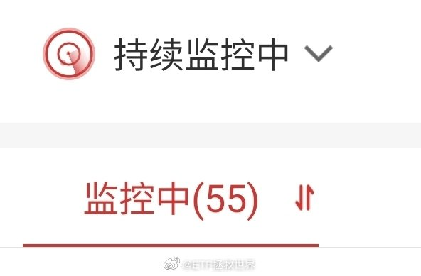

======================================================

ETF拯救世界 (5687069307) @
2020-07-24 14:18:53 Fri  
url: https://weibo.com/5687069307/JcG6fy4EZ

碰到大跌，大家聚在一起讲讲段子卖卖惨是不是开心很多。

喝什么鸡汤，看看你账户里攒的现金它不香吗。 ​​​

转发[38]  评论[588]  赞[3506] 

======================================================

ETF拯救世界 (5687069307) @
2020-07-24 19:50:34 Fri  
url: https://weibo.com/5687069307/JcIgSnlcM

回复@Crystal夏暖暖:你跟车了吗。跟了的话请立即下车。我承担不起你们夫妻二人的股神期待。如果没跟，以后不要说这种让我气不打一处来的话//@Crystal夏暖暖:老公大骂上周涨了那么多不减仓，今周亏成狗，好内疚

------------------------------------------------------
转推：
>  @ETF拯救世界 (5687069307)
>  2020-07-24 14:18:53 Fri  
>  url: https:/weibo.com/5687069307/JcG6fy4EZ/

>  碰到大跌，大家聚在一起讲讲段子卖卖惨是不是开心很多。
>  
>  喝什么鸡汤，看看你账户里攒的现金它不香吗。 ​​​

转发[21]  评论[358]  赞[2447] 

======================================================

ETF拯救世界 (5687069307) @
2020-07-24 20:00:21 Fri  
url: https://weibo.com/5687069307/JcIkQvY3H

知道我为什么一直说，不要给任何人投资建议了吧。

你不让人家买，涨了人家会骂你。

你让人家买，跌了人家还会骂你。

即使两周后证明你看对了，下周错了也要挨骂。

看看前一条微博，那还是夫妻。你知不知道你给人家出主意那个人人家会怎么骂你？

不要再给任何人投资建议！你永远是被责怪的那个人。 ​​​

转发[78]  评论[472]  赞[2334] 

======================================================

ETF拯救世界 (5687069307) @
2020-07-24 20:04:10 Fri  
url: https://weibo.com/5687069307/JcImoy3lm

回复@imnotokbutitsok:因为我不想因为我让他们夫妻吵架。您能明白吗。您当然不明白，别人的事跟您有什么关系呢。//@imnotokbutitsok:人家好像没说怪你吧...你这气从哪来呢？

------------------------------------------------------
转推：
>  @ETF拯救世界 (5687069307)
>  2020-07-24 14:18:53 Fri  
>  url: https:/weibo.com/5687069307/JcG6fy4EZ/

>  碰到大跌，大家聚在一起讲讲段子卖卖惨是不是开心很多。
>  
>  喝什么鸡汤，看看你账户里攒的现金它不香吗。 ​​​

转发[11]  评论[120]  赞[1058] 

======================================================

ETF拯救世界 (5687069307) @
2020-07-24 20:08:34 Fri  
url: https://weibo.com/5687069307/JcIobFo6j

我为什么气呢。一个女人，赚了几十个点，一大堆50%以上的品种，因为回撤了几个点，因为没有听“股神老公”的话清仓就被大骂，自己还内疚，怎么了让人生气的点太多了！//@ETF拯救世界:回复@imnotokbutitsok:因为我不想因为我让他们夫妻吵架。您能明白吗。您当然不明白，别人的事跟您有什么关系呢。

------------------------------------------------------
转推：
>  @ETF拯救世界 (5687069307)
>  2020-07-24 14:18:53 Fri  
>  url: https:/weibo.com/5687069307/JcG6fy4EZ/

>  碰到大跌，大家聚在一起讲讲段子卖卖惨是不是开心很多。
>  
>  喝什么鸡汤，看看你账户里攒的现金它不香吗。 ​​​

转发[9]  评论[511]  赞[2691] 

======================================================

ETF拯救世界 (5687069307) @
2020-07-24 21:17:55 Fri  
url: https://weibo.com/5687069307/JcIQkyhew

个人积分赛第一[亲亲]

------------------------------------------------------
转推：
>  @ETF拯救世界 (5687069307)
>  2020-07-18 08:53:27 Sat  
>  url: https:/weibo.com/5687069307/JbJpaBRKl/

>  喜欢张含韵。好可爱。 ​​​

转发[5]  评论[292]  赞[1570] 

======================================================

ETF拯救世界 (5687069307) @
2020-07-25 19:45:01 Sat  
url: https://weibo.com/5687069307/JcRF7oVMS

今晚儿子不在家。

獭祭二割三分+🦐 庆祝一下。

突如其来的小确幸。 ​​​

转发[11]  评论[350]  赞[2392] 

======================================================

ETF拯救世界 (5687069307) @
2020-07-26 09:27:28 Sun  
url: https://weibo.com/5687069307/JcX2XeX8p

有意思的人生不会从天上掉下来。

要么继续忍受，要么改变自己。 ​​​

转发[113]  评论[639]  赞[3479] 

+++++++++++++++++++++++++++++++++++++++++++++++++++++

图片：

======================================================

ETF拯救世界 (5687069307) @
2020-07-26 12:17:09 Sun  
url: https://weibo.com/5687069307/JcY9PAjDa

一位博友私信我让我看的。我大概看了一下，有些分析还是很合理的。非黑即白的极端，没有共情能力无法体会别人的感受……也转给你看看吧。

------------------------------------------------------
转推：
>  @刘昭在路上 (1719441021)
>  2018-08-10 00:44:18 Fri  
>  url: https:/weibo.com/1719441021/GtU024tn5/

>  很早前就动念过写一份《恋爱求生手册》讲讲怎样筛查关系中的危险分子了，一直拖延，前段时间抖音上的一位舞蹈老师被前男友当街割喉，残忍的令人发指，扼腕之余，终于还是搁下原有的写作计划，动笔完成了这篇。
>  这是第一篇，也是最重要的一篇。也许几年后会有后续，也许没有。
>  愿逝者安息，凶手被严惩， ​​​

转发[233]  评论[142]  赞[1101] 

======================================================

ETF拯救世界 (5687069307) @
2020-07-26 13:07:40 Sun  
url: https://weibo.com/5687069307/JcYukztlI

真的吗，我不信。

------------------------------------------------------
转推：
>  @ ()
>  2020-07-26 12:53:06 Sun  
>  url: 

>  抱歉，作者已设置仅展示半年内微博，此微博已不可见。 ​​​

转发[7]  评论[202]  赞[766] 

======================================================

ETF拯救世界 (5687069307) @
2020-07-27 10:50:30 Mon  
url: https://weibo.com/5687069307/Jd71a6U1c

立个flag，年底前体脂率下降8。

做不到送3888🧧。 ​​​

转发[85]  评论[1470]  赞[3319] 

+++++++++++++++++++++++++++++++++++++++++++++++++++++

图片：

======================================================

ETF拯救世界 (5687069307) @
2020-07-27 14:27:43 Mon  
url: https://weibo.com/5687069307/Jd8rkkP0f

太假了。

------------------------------------------------------
转推：
>  @观察者网 (1887344341)
>  2020-07-27 13:40:03 Mon  
>  url: https:/weibo.com/1887344341/Jd87Yk8tW/

>  【#90后女生拒绝和外卖小哥拼车#，司机：乘客没有高低贵贱】近日，一年轻女子因拒绝与外卖小哥同乘和司机发生争执的视频流传网络。据了解，该女子和外卖小哥通过某平台拼到同辆车，但该名女生拒绝与外卖小哥同乘并要求其下车。司机表示：“乘客都是平等的，没有高低贵贱。”网友纷纷为司机的正义点赞！ ​​​

转发[2]  评论[81]  赞[669] 

======================================================

ETF拯救世界 (5687069307) @
2020-07-27 14:29:35 Mon  
url: https://weibo.com/5687069307/Jd8s5jPGk

我没有开新三板，未来也不开。没有韭菜的市场我不会去。

------------------------------------------------------
转推：
>  @昆山法律 (2668957067)
>  2020-07-27 13:25:49 Mon  
>  url: https:/weibo.com/2668957067/Jd82chvJd/

>  $新三板板块 hq1635$ 玩新三板，没有非常强研究能力的人是赚不到钱的，第一是因为新三板财务极端不可信，第二是没有韭菜。只有对公司研究非常深入，实地多次调研上下游，能确保财务真实且能够转板上市的，才可以投资。
>  所以我放弃，本地的企业都没能力调研…… ​​​

转发[64]  评论[224]  赞[1212] 

======================================================

ETF拯救世界 (5687069307) @
2020-07-27 18:04:47 Mon  
url: https://weibo.com/5687069307/Jd9Rqyjvz

就不给你放大图，急死你。 ​​​

转发[5]  评论[929]  赞[1344] 

+++++++++++++++++++++++++++++++++++++++++++++++++++++

图片：

======================================================

ETF拯救世界 (5687069307) @
2020-07-27 18:18:14 Mon  
url: https://weibo.com/5687069307/Jd9WTsY0q

深圳。你们说他们这样拿着照片是不是很奇怪。

奇怪的事以后不要做了啊。 ​​​

转发[12]  评论[930]  赞[2494] 

+++++++++++++++++++++++++++++++++++++++++++++++++++++

图片：

======================================================

ETF拯救世界 (5687069307) @
2020-07-27 18:43:18 Mon  
url: https://weibo.com/5687069307/Jda746br2

再次不厌其烦的提醒一下。

因为之前那个交友帖，听说各地的朋友纷纷自己拉了群，也有朋友自己互相加了微信私聊。大家认识了志同道合的新朋友，都很开心。

我在为各位高兴的同时，再次提醒：

虽然我这里绝大多数朋友都是好人，但不可避免的有一小撮坏人在暗中窥探。相信其中也有几个不怀好意混入群聊 ​​​

转发[16]  评论[1087]  赞[2437] 

======================================================

ETF拯救世界 (5687069307) @
2020-07-27 20:55:39 Mon  
url: https://weibo.com/5687069307/JdaYN9VJd

再多说两句关于“投资群”。

我非常不喜欢投资群。除非是三五志同道合的朋友。否则投资群越大，人越多，负面效果越明显。

尤其是很多本来正确投资理念还没成型的朋友进去后，更是百害无一益。

再者，有人的地方就有江湖。几十几百人凑在一起，又是牵扯到金钱利益的主题，更是不免乌烟瘴气矛盾重重。 ​​​

转发[118]  评论[785]  赞[2953] 

======================================================

ETF拯救世界 (5687069307) @
2020-07-28 12:20:45 Tue  
url: https://weibo.com/5687069307/Jdh2huhnZ

没有微博真不行。//@北京人不知道的北京事儿:最新后续！【保定市纪委监委对李晓锋做出处理：开除党籍！取消退休待遇！[话筒]】7月28日，经保定市纪委常委会会议研究并报市委批准，决定给予李晓锋（市纪委监委退休干部，原二级调研员）开除党籍处分，按规定取消其退休待遇。

------------------------------------------------------
转推：
>  @北京人不知道的北京事儿 (1662214194)
>  2020-07-27 20:07:03 Mon  
>  url: https:/weibo.com/1662214194/JdaF45g1n/

>  【评论：官员酒驾交警不当场测酒，甩锅围观者“人太多”？难以服众！】河北保定市李某某7月21日晚间与朋友聚餐喝了白酒，驾车逆行撞上了刘女士驾驶的正常等待红灯的轿车。交警到场没有当场对李某某测酒驾，带到交警队后两个多小时也不安排测酒，在刘女士抗议下才作了呼吸测酒，但没做抽血测酒；后来还 ​​​

转发[96]  评论[215]  赞[1298] 

======================================================

ETF拯救世界 (5687069307) @
2020-07-28 15:32:28 Tue  
url: https://weibo.com/5687069307/Jdii6eKMn

无趣的一天。

你今天有什么有意思的事情写出来大家研究一下。 ​​​

转发[24]  评论[1207]  赞[4104] 

======================================================

ETF拯救世界 (5687069307) @
2020-07-28 18:36:05 Tue  
url: https://weibo.com/5687069307/JdjuD93e9

今天发现国行switch上了免费的跳绳游戏。

挺好的，可以试试。 ​​​

转发[8]  评论[194]  赞[1052] 

======================================================

ETF拯救世界 (5687069307) @
2020-07-28 19:59:22 Tue  
url: https://weibo.com/5687069307/Jdk2r5G8y

因为一个人

爱上一座城市 ​​​

转发[19]  评论[515]  赞[2147] 

======================================================

ETF拯救世界 (5687069307) @
2020-07-29 07:27:51 Wed  
url: https://weibo.com/5687069307/JdoxTyRKd

真的毫无必要。成年人了。

------------------------------------------------------
转推：
>  @观察者网 (1887344341)
>  2020-07-28 22:40:37 Tue  
>  url: https:/weibo.com/1887344341/Jdl5T6kLv/

>  【男子通过VPN“翻墙”访问境外色情网站 被行政处罚】据湖南津市公安公众号，市公安局网安大队民警在工作中发现，有人使用“翻墙”软件接入境外网络。办案民警迅速查明，家住某小区陈某自2019年2月向吴某购买“翻墙”软件后，在手机上使用该软件建立非法信道进行国际联网，并长期用于浏览境外色情网站 ​​​

转发[44]  评论[279]  赞[1526] 

======================================================

ETF拯救世界 (5687069307) @
2020-07-29 07:45:40 Wed  
url: https://weibo.com/5687069307/JdoF7tzkp

第二天，体脂率累计下降0.4，总目标完成5%。摄入热量1000卡，运动1.5小时。今天要增加蛋白质以及膳食纤维，减少碳水。 http://t.cn/A6UZ5tby

------------------------------------------------------
转推：
>  @ETF拯救世界 (5687069307)
>  2020-07-27 10:50:30 Mon  
>  url: https:/weibo.com/5687069307/Jd71a6U1c/

>  立个flag，年底前体脂率下降8。
>  
>  做不到送3888🧧。 ​​​

转发[10]  评论[341]  赞[1299] 

======================================================

ETF拯救世界 (5687069307) @
2020-07-29 09:02:56 Wed  
url: https://weibo.com/5687069307/JdpauaZON

几张图告诉你什么叫追涨杀跌。

注意，主动基金持仓前十的算术平均市盈率是67.23 ​​​

转发[276]  评论[345]  赞[2227] 

+++++++++++++++++++++++++++++++++++++++++++++++++++++

图片：
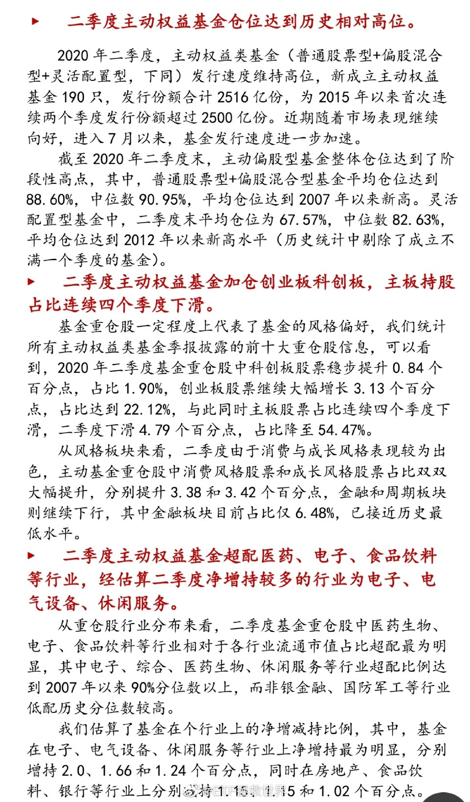

======================================================

ETF拯救世界 (5687069307) @
2020-07-29 10:10:35 Wed  
url: https://weibo.com/5687069307/JdpBWvKBK

又是那个经典问题。最后一小时当然是系统问题，有关部门要负责。但是，作为考生，是不是应该早一点登录系统，一定要等到最后吗。就像绿灯过马路要不要左右看。错的不是你，但可以离危险远一点。

------------------------------------------------------
转推：
>  @观察者网 (1887344341)
>  2020-07-29 10:05:03 Wed  
>  url: https:/weibo.com/1887344341/JdpzHleFq/

>  【十年寒窗功亏一篑？多名陕西考生称因系统崩溃错过一本志愿填报】
>  据网友爆料 ，7月27日，在高考志愿填报的最后一小时，陕西省高考志愿填报系统崩溃，多名考生因此未能及时提交志愿，导致志愿填报失败。学生家长多次给各级教育部门打电话皆无回应。据了解，已有多名考生网友在网络上反应此问题。 ​​​

转发[35]  评论[302]  赞[1438] 

======================================================

ETF拯救世界 (5687069307) @
2020-07-29 14:17:21 Wed  
url: https://weibo.com/5687069307/Jdre6xbqX

前几天被老公骂的那位集美不知道今天有没有骂回去。 ​​​

转发[18]  评论[491]  赞[2225] 

+++++++++++++++++++++++++++++++++++++++++++++++++++++

图片：

======================================================

ETF拯救世界 (5687069307) @
2020-07-29 14:51:59 Wed  
url: https://weibo.com/5687069307/JdrsaddQ0

德国这个国家确实有点意思。

------------------------------------------------------
转推：
>  @俄罗斯卫星通讯社 (2181597154)
>  2020-07-29 12:13:38 Wed  
>  url: https:/weibo.com/2181597154/JdqpThffX/

>  【美国正日渐丧失全球认可，而中国正在加油】美国在认可全球大国排名中正丧失其受欢迎度。美国民意测验和商业调查公司盖洛普（Gallup）的最新调查结果显示，来自135个国家/地区的大多数受访者最认可德国领导人的活动（占44％）。而美国在认可评级中排名第二（33％），远落后于第一名。 ​​​

转发[5]  评论[109]  赞[888] 

======================================================

ETF拯救世界 (5687069307) @
2020-07-29 17:24:13 Wed  
url: https://weibo.com/5687069307/JdsrXiEMp

有时候看网上有些人，尤其是某些在外企工作的人或者留学生说话，总是中文里夹着几个英文单词。看了看其中一部分英文单词好像又不是翻译不过来。怎么理解这种行为呢，将近一百年前钱钟书就给了很好的解释：

“他并无中文难达的新意，需要借英文来讲；所以他说话里嵌的英文字，还比不得嘴里嵌的金牙，因 ​​​

转发[54]  评论[553]  赞[2478] 

======================================================

ETF拯救世界 (5687069307) @
2020-07-29 18:11:09 Wed  
url: https://weibo.com/5687069307/JdsL0qQex

之前我怀疑过筋膜枪是不是智商税。这几天运动量大，拿出来用了一下觉得确实有用。肌肉酸痛的情况缓解很多。

但我依然认为贵的筋膜枪还是智商税…… ​​​

转发[15]  评论[472]  赞[1752] 

======================================================

ETF拯救世界 (5687069307) @
2020-07-29 23:46:33 Wed  
url: https://weibo.com/5687069307/JduX96n5L

在下确实精力不够，这种问题没法一一回复。 ​​​

转发[8]  评论[605]  赞[2582] 

+++++++++++++++++++++++++++++++++++++++++++++++++++++

图片：

======================================================

ETF拯救世界 (5687069307) @
2020-07-30 13:23:34 Thu  
url: https://weibo.com/5687069307/JdAiM3aM3

一句话总结，谁涨买谁。

------------------------------------------------------
转推：
>  @ ()
>  2020-07-30 12:45:03 Thu  
>  url: 

>  抱歉，作者已设置仅展示半年内微博，此微博已不可见。 ​​​

转发[41]  评论[271]  赞[1674] 

======================================================

ETF拯救世界 (5687069307) @
2020-07-30 22:31:12 Thu  
url: https://weibo.com/5687069307/JdDT3s25S

大晚上的没事儿别八卦，早睡早起。保持心情愉快。 ​​​

转发[2]  评论[258]  赞[1541] 

======================================================

ETF拯救世界 (5687069307) @
2020-07-30 22:56:43 Thu  
url: https://weibo.com/5687069307/JdE3pzlvl

生气。 ​​​

转发[5]  评论[614]  赞[1869] 

+++++++++++++++++++++++++++++++++++++++++++++++++++++

图片：

======================================================

ETF拯救世界 (5687069307) @
2020-07-31 09:00:09 Fri  
url: https://weibo.com/5687069307/JdI0m7Huy

月底发红包。

http://t.cn/A6ULQl3U ​​​

转发[7]  评论[1444]  赞[1996] 

======================================================

ETF拯救世界 (5687069307) @
2020-07-31 09:56:43 Fri  
url: https://weibo.com/5687069307/JdInjd3QW

有些板块贵不贵？肯定贵啊。我也偶尔会提两句。因为这是事实。

但有没有必要天天口诛笔伐呢，我认为没有必要。

很多人认为持有这些高估品种的人，是真的认为这些品种依然值得买，依然值得持有。我看未必。

投资的人分三个等级。

第一个等级是不知道什么是值，所以便宜不买贵了追。结果就成了散财童 ​​​

转发[263]  评论[536]  赞[2513] 

======================================================

ETF拯救世界 (5687069307) @
2020-07-31 10:06:52 Fri  
url: https://weibo.com/5687069307/JdIrqwlAy

微博说我这条违反了社区公约。这样的文章都能违反公约，忍不住给公约点赞。

------------------------------------------------------
转推：
>  @ETF拯救世界 (5687069307)
>  2020-07-31 09:56:43 Fri  
>  url: https:/weibo.com/5687069307/JdInjd3QW/

>  有些板块贵不贵？肯定贵啊。我也偶尔会提两句。因为这是事实。
>  
>  但有没有必要天天口诛笔伐呢，我认为没有必要。
>  
>  很多人认为持有这些高估品种的人，是真的认为这些品种依然值得买，依然值得持有。我看未必。
>  
>  投资的人分三个等级。
>  
>  第一个等级是不知道什么是值，所以便宜不买贵了追。结果就成了散财童 ​​​

转发[14]  评论[212]  赞[1310] 

======================================================

ETF拯救世界 (5687069307) @
2020-07-31 10:43:45 Fri  
url: https://weibo.com/5687069307/JdIGoEGZU

有些朋友的条件单是按照市价成交的。

我请你再认真去看我的文章以及交易表格。上面清清楚楚告诉你用什么方式挂单，触发价是多少，挂单价是多少。

所有细节我都想到了，别让我的心血白费。 ​​​

转发[50]  评论[540]  赞[2202] 

======================================================

ETF拯救世界 (5687069307) @
2020-07-31 13:34:41 Fri  
url: https://weibo.com/5687069307/JdJNMoZkC

悲观的人空仓等着崩盘越涨越高，疯狂的人一个小波动随时被套。

乐观而又理性的人每天笑嘻嘻。 ​​​

转发[66]  评论[801]  赞[2894] 

======================================================

ETF拯救世界 (5687069307) @
2020-08-02 09:06:18 Sun  
url: https://weibo.com/5687069307/Je0TQ4vFN

不懂就问，如果软件卖了，是不是代码算法等都一起卖了。 ​​​

转发[31]  评论[366]  赞[1440] 

======================================================

ETF拯救世界 (5687069307) @
2020-08-02 15:27:31 Sun  
url: https://weibo.com/5687069307/Je3oA5wRL

别人为什么欺负你。从对方的角度讲，是合理正当的。他就是为了自己的利益。他不干你，他的好日子就结束了。

从我们的角度讲，要么就是干，要么就是跪下。自己生闷气一点用都没有。这就是自然规则。

另外，我有一种越来越清晰的想法。中国人从来也不是善茬，本质上并不像我们自己说的这么温良恭俭让。 ​​​

转发[121]  评论[657]  赞[3777] 

======================================================

ETF拯救世界 (5687069307) @
2020-08-02 16:29:59 Sun  
url: https://weibo.com/5687069307/Je3NW9SOK

这两期姐姐的某些表演，比如新物种或者gentlewomen等，让我对女性的美和魅力有了新的认知。

帅，飒，独立…太有魅力了。 ​​​

转发[10]  评论[260]  赞[1789] 

======================================================

ETF拯救世界 (5687069307) @
2020-08-03 09:30:56 Mon  
url: https://weibo.com/5687069307/JeaukAhyY

叕新高

------------------------------------------------------
转推：
>  @ETF拯救世界 (5687069307)
>  2020-07-14 10:04:07 Tue  
>  url: https:/weibo.com/5687069307/Jb89S8Xgm/

>  给医药和养老爸爸跪了。 ​​​

转发[10]  评论[250]  赞[1316] 

======================================================

ETF拯救世界 (5687069307) @
2020-08-03 09:34:36 Mon  
url: https://weibo.com/5687069307/JeavP6WmS

当你繁花似锦的时候围上来的笑脸未必是朋友。

你穷困潦倒的时候，搂着你的肩膀说看好你给你支持的才是真兄弟。 ​​​

转发[86]  评论[333]  赞[2353] 

======================================================

ETF拯救世界 (5687069307) @
2020-08-03 09:42:20 Mon  
url: https://weibo.com/5687069307/JeayXsnN3

2016.1-2019.6月股民收益率。

“基金太慢”。股民说。

是赔的太慢吗。 ​​​

转发[97]  评论[288]  赞[1535] 

+++++++++++++++++++++++++++++++++++++++++++++++++++++

图片：

======================================================

ETF拯救世界 (5687069307) @
2020-08-03 10:12:49 Mon  
url: https://weibo.com/5687069307/JeaLl9ObT

像极了股市。

------------------------------------------------------
转推：
>  @广州日报 (1887790981)
>  2020-08-02 22:08:25 Sun  
>  url: https:/weibo.com/1887790981/Je61ixrNb/

>  【#男子被约饭买单时朋友跑了#剩他一人  拒绝支付全额餐费被起诉[衰]】今年4月，厦门一家餐厅接待了一桌客人，共消费2759元。但买单时，客人们却相继离开，最后只剩下一个人——男子颜某。但颜某拒绝买单，他表示，自己是临时被叫过来吃饭的，买单的应该是点菜的那个人，也就是约他吃饭的“朋友”林某 ​​​

转发[50]  评论[231]  赞[1148] 

======================================================

ETF拯救世界 (5687069307) @
2020-08-03 10:32:54 Mon  
url: https://weibo.com/5687069307/JeaTu9AA2

转发微博

------------------------------------------------------
转推：
>  @21世纪经济报道 (1651428902)
>  2020-08-03 01:54:20 Mon  
>  url: https:/weibo.com/1651428902/Je7v01R5x/

>  #21数读# 【今年A股净减持超3000亿！11人套现逾10亿元】今年以来A股729家上市公司股价年内创出历史新高，股东减持也水涨船高。据统计，A股整体净减持参考市值高达3031亿元，241位个人股东减持获益过亿，11位套现超10亿元。同时，176家上市公司股东拟减持开始期限在8月份，详见>>>http://t.cn/A6UqnQzV  ​​​

转发[71]  评论[163]  赞[896] 

======================================================

ETF拯救世界 (5687069307) @
2020-08-03 10:49:24 Mon  
url: https://weibo.com/5687069307/Jeb0bzXHe

我写的，转发的一些消息，数据，是希望与大家一起更加全面地观察这个市场，更加敏锐的在黑暗森林中嗅到一些不同的气味。

我希望各位能从今天开始摒弃那种只看一个消息，一个数据就判断某件事会发生，就预测市场会改变的思考方式。

证券市场涨跌不是一个简单的线性问题，没有一个数据和信息能决定市场 ​​​

转发[131]  评论[496]  赞[2506] 

======================================================

ETF拯救世界 (5687069307) @
2020-08-03 15:18:03 Mon  
url: https://weibo.com/5687069307/JecLesBDk

事实证明：别听老公瞎bb

------------------------------------------------------
转推：
>  @ETF拯救世界 (5687069307)
>  2020-07-29 14:17:21 Wed  
>  url: https:/weibo.com/5687069307/Jdre6xbqX/

>  前几天被老公骂的那位集美不知道今天有没有骂回去。 ​​​

转发[6]  评论[370]  赞[1799] 

======================================================

ETF拯救世界 (5687069307) @
2020-08-03 15:51:58 Mon  
url: https://weibo.com/5687069307/JecYZxKjy

夫妻双方关于理财是否要听对方的，我有一个想法。

如果对方：

对金融投资毫无研究；

或者，对金融投资颇有研究，但数十年如一日赔钱——

那么，ta的操作建议就是噪音。ta的投资行为就大概率是典型的乌合之众行为。

不知道对不对，请举反例驳斥我。 ​​​

转发[37]  评论[462]  赞[2187] 

======================================================

ETF拯救世界 (5687069307) @
2020-08-03 16:37:40 Mon  
url: https://weibo.com/5687069307/JedhxEiho

不懂就问，TT海外总部为什么不放在德国呢。 ​​​

转发[11]  评论[253]  赞[1731] 

======================================================

ETF拯救世界 (5687069307) @
2020-08-03 17:36:19 Mon  
url: https://weibo.com/5687069307/JedFlySuI

对不起，我看不懂。

------------------------------------------------------
转推：
>  @三联生活周刊 (1191965271)
>  2020-08-03 13:32:24 Mon  
>  url: https:/weibo.com/1191965271/Jec4ljClN/

>  【浙江高考满分作文#生活在树上#出炉，阅卷专家称不建议模仿】2020年高考第一篇满分作文出炉，这篇满作文是位浙江考生所写，题目为《生活在树上》。但是阅卷过程中第一位阅卷老师只给了39分，后两位老师给出55分，经商议后最终被判为满分。还有阅卷老师直言不建议学生模仿。（新浪新闻） ​​​

转发[91]  评论[811]  赞[2438] 

======================================================

ETF拯救世界 (5687069307) @
2020-08-04 14:43:13 Tue  
url: https://weibo.com/5687069307/JelXAiu34

你在这里住一个月会不会腻。 ​​​

转发[16]  评论[1434]  赞[3153] 

+++++++++++++++++++++++++++++++++++++++++++++++++++++

图片：

======================================================

ETF拯救世界 (5687069307) @
2020-08-05 18:19:59 Wed  
url: https://weibo.com/5687069307/JewO4z4wj

说句不好听的，长线仓位低位建好仓以后，踏踏实实拿着比什么都强 ​​​

转发[81]  评论[886]  赞[3430] 

======================================================

ETF拯救世界 (5687069307) @
2020-08-05 21:44:20 Wed  
url: https://weibo.com/5687069307/Jey912fy0

灵魂拷问：

最近建信500怎么了。 ​​​

转发[18]  评论[684]  赞[2665] 

======================================================

ETF拯救世界 (5687069307) @
2020-08-06 19:34:57 Thu  
url: https://weibo.com/5687069307/JeGJ0amN5

利润还可以继续拿。如果这几年不断做网，手里还是有些货的

------------------------------------------------------
转推：
>  @ETF拯救世界 (5687069307)
>  2020-07-22 08:54:38 Wed  
>  url: https:/weibo.com/5687069307/Jcl7DzQrZ/

>  白银没有长期仓位，只有几年网格留的利润。
>  
>  没吃肉，喝点肉汤也挺好。这部分右侧出，不急。 ​​​

转发[13]  评论[335]  赞[1651] 

======================================================

ETF拯救世界 (5687069307) @
2020-08-07 13:28:30 Fri  
url: https://weibo.com/5687069307/JeNKKp5IA

中概互联卖的还剩一份。

你慌不慌。[偷笑] ​​​

转发[14]  评论[604]  赞[1770] 

======================================================

ETF拯救世界 (5687069307) @
2020-08-07 13:55:50 Fri  
url: https://weibo.com/5687069307/JeNVQyQK7

是不是微信和iphone要二选一了

------------------------------------------------------
转推：
>  @央视新闻 (2656274875)
>  2020-08-07 13:19:12 Fri  
>  url: https:/weibo.com/2656274875/JeNGYmdfC/

>  【特朗普签署禁止TikTok和微信的行政令】美国当地时间8月6日晚，特朗普签署行政命令，将在45天后禁止任何美国公司或个人与TikTok母公司字节跳动以及腾讯控股涉及WeChat的相关交易。此举意味着，字节跳动要在45天内完成对TikTok的交易，否则将被禁止在美国运营。（总台央视记者许骁） ​​​

转发[16]  评论[510]  赞[1600] 

======================================================

ETF拯救世界 (5687069307) @
2020-08-08 12:50:21 Sat  
url: https://weibo.com/5687069307/JeWVLp1FB

加油！

------------------------------------------------------
转推：
>  @孟岩 (1651676492)
>  2020-08-08 10:11:11 Sat  
>  url: https:/weibo.com/1651676492/JeVTa2Cmc/

>  发布了头条文章：《你好，有知有行》  http://t.cn/A6U6T6du ​​​

转发[44]  评论[481]  赞[2194] 

======================================================

ETF拯救世界 (5687069307) @
2020-08-08 20:54:05 Sat  
url: https://weibo.com/5687069307/Jf066xJPr

你有没有想过，如果明天地球爆炸，有什么事是你可以做到却因为没有去做而会感到遗憾的。 ​​​

转发[378]  评论[1115]  赞[3835] 

======================================================

ETF拯救世界 (5687069307) @
2020-08-09 17:14:04 Sun  
url: https://weibo.com/5687069307/Jf85j6L4I

不要露富，切记。

百害无一利。 ​​​

转发[125]  评论[942]  赞[3984] 

======================================================

ETF拯救世界 (5687069307) @
2020-08-10 21:55:01 Mon  
url: https://weibo.com/5687069307/JfjlPuTpR

京郊民宿探访之旅在继续。 ​​​

转发[8]  评论[387]  赞[1791] 

+++++++++++++++++++++++++++++++++++++++++++++++++++++

图片：

======================================================

ETF拯救世界 (5687069307) @
2020-08-10 22:53:09 Mon  
url: https://weibo.com/5687069307/JfjJqvXGo

关于财富，最近经历的一些事，引发的一些感想。

首先，作为一个人，在我看来，一定要“正”。人的行为举止言谈话语够“正”，就会吸引“正”的能量，就会出现同样气场的人来帮你。

一个人的人品，要比能力重要得多。人品不行的人，能力越强越可怕。一定要离人品不行的人越远越好。离他越近越倒霉。

 ​​​

转发[427]  评论[575]  赞[2941] 

======================================================

ETF拯救世界 (5687069307) @
2020-08-10 23:29:37 Mon  
url: https://weibo.com/5687069307/JfjYem9UG

遗憾？这不属于盗窃吗。

------------------------------------------------------
转推：
>  @ ()
>  2020-08-10 23:04:05 Mon  
>  url: 

>  抱歉，作者已设置仅展示半年内微博，此微博已不可见。 ​​​

转发[12]  评论[146]  赞[859] 

======================================================

ETF拯救世界 (5687069307) @
2020-08-11 09:55:30 Tue  
url: https://weibo.com/5687069307/Jfo4hhMsM

今天吹谁最让喷子生气？ ​​​

转发[2]  评论[333]  赞[1569] 

======================================================

ETF拯救世界 (5687069307) @
2020-08-11 10:24:57 Tue  
url: https://weibo.com/5687069307/JfogehSti

军工：整体估值85倍，85.42%成分股估值超过50倍，1/3成分股市盈率超过100倍。

伟大！ ​​​

转发[188]  评论[335]  赞[1644] 

======================================================

ETF拯救世界 (5687069307) @
2020-08-11 10:38:29 Tue  
url: https://weibo.com/5687069307/JfolJ5E7f

有些朋友看到某个板块近期在涨自己没有就气的直哭，全然不顾手里的品种也涨幅非常好。

相当于什么呢，相当于你娶了小迪回家，却天天生气的看着颖宝和大幂幂YY。

全世界的钱都让你赚好不好？ ​​​

转发[46]  评论[473]  赞[2126] 

======================================================

ETF拯救世界 (5687069307) @
2020-08-11 10:44:20 Tue  
url: https://weibo.com/5687069307/Jfoo6cGPY

回复@童龄Forever:很多人追求的开心是“每一秒都开心”。很多人追求的赚钱是“每一秒都新高”//@童龄Forever:如果可以不太贪心 有相当一部分人的生活会更好

------------------------------------------------------
转推：
>  @ETF拯救世界 (5687069307)
>  2020-08-11 10:38:29 Tue  
>  url: https:/weibo.com/5687069307/JfolJ5E7f/

>  有些朋友看到某个板块近期在涨自己没有就气的直哭，全然不顾手里的品种也涨幅非常好。
>  
>  相当于什么呢，相当于你娶了小迪回家，却天天生气的看着颖宝和大幂幂YY。
>  
>  全世界的钱都让你赚好不好？ ​​​

转发[15]  评论[165]  赞[1100] 

======================================================

ETF拯救世界 (5687069307) @
2020-08-11 12:35:26 Tue  
url: https://weibo.com/5687069307/Jfp7ctfeo

呵呵，事出反常必有妖。如果真的挖出有内幕，不知道前一段为这篇文章摇旗呐喊的人会作何感想

------------------------------------------------------
转推：
>  @新浪视频 (1640601392)
>  2020-08-11 12:31:03 Tue  
>  url: https:/weibo.com/1640601392/Jfp5pz5Lu/

>  【浙江高考满分作文，和“阅卷组长辅导书里的作文相近”】由今年浙江高考语文满分作文《生活在树上》引发的争议近期转向对阅卷组负责人“既当阅卷组长又出书辅导高考作文写作”的质疑，所涉多方相继发声。
>  8月10日下午，湖北武汉市退休媒体人李未熟表示，他8日向浙江省教育考试院实名举报浙江省高考作 ​​​

转发[43]  评论[177]  赞[864] 

======================================================

ETF拯救世界 (5687069307) @
2020-08-11 19:51:42 Tue  
url: https://weibo.com/5687069307/JfrYh9TcQ

以我十八年宝贵的人生经验来讲，每次预报有大暴雨的时候一般都没事。

但是也要记得关窗户。 ​​​

转发[22]  评论[425]  赞[2218] 

======================================================

ETF拯救世界 (5687069307) @
2020-08-11 20:40:45 Tue  
url: https://weibo.com/5687069307/Jfsibr5FE

白银留的利润可以先出1/3了 ​​​

转发[13]  评论[299]  赞[1197] 

======================================================

ETF拯救世界 (5687069307) @
2020-08-12 09:44:01 Wed  
url: https://weibo.com/5687069307/Jfxq7oJaJ

[可怜]

------------------------------------------------------
转推：
>  @ETF拯救世界 (5687069307)
>  2020-08-11 10:24:57 Tue  
>  url: https:/weibo.com/5687069307/JfogehSti/

>  军工：整体估值85倍，85.42%成分股估值超过50倍，1/3成分股市盈率超过100倍。
>  
>  伟大！ ​​​

转发[8]  评论[180]  赞[911] 

======================================================

ETF拯救世界 (5687069307) @
2020-08-12 09:55:09 Wed  
url: https://weibo.com/5687069307/JfxuDfLU2

我从来不觉得只有自己的投资方式是好的。

我认为只要能赚钱，怎么投资都是合理的。价值投资一定比趋势投资、量化投资、甚至打板强？

未必。

小迪一定比颖宝、大幂幂、丫丫好吗？不一定。

只是，你来投资，一定要清楚自己适合什么。你用这种方式投资，得想想自己有没有那份灵气和慧根。有了，你就去 ​​​

转发[140]  评论[535]  赞[2295] 

======================================================

ETF拯救世界 (5687069307) @
2020-08-12 12:35:48 Wed  
url: https://weibo.com/5687069307/JfyxQ6LyQ

我说句可能又要被骂的。

倡导拒绝餐饮浪费不对吗。无论从个人健康管理、国家粮食安全各个角度讲没有问题吧。

每天教孩子“粒粒皆辛苦”，“一粥一饭当思来处不易；半丝半缕恒念物力维艰”，怎么倡导一下节约骂的人这么多呢。严格禁止公款浪费不更是好事吗。

我觉得咱们讨论事情就好好就事论事，不要 ​​​

转发[40]  评论[459]  赞[2492] 

======================================================

ETF拯救世界 (5687069307) @
2020-08-12 13:06:06 Wed  
url: https://weibo.com/5687069307/JfyK8xaAv

还是3200，赔钱的人比当时又多不少……

------------------------------------------------------
转推：
>  @ETF拯救世界 (5687069307)
>  2020-07-23 10:56:15 Thu  
>  url: https:/weibo.com/5687069307/Jcvlv8lDf/

>  很多新人震惊的发现自己在3200多点开始赔钱了。 ​​​

转发[29]  评论[203]  赞[1485] 

======================================================

ETF拯救世界 (5687069307) @
2020-08-12 13:18:42 Wed  
url: https://weibo.com/5687069307/JfyPfATRW

想去。但是一想到会有多少人排队，以及会有多少插队的，还是再看看吧。

------------------------------------------------------
转推：
>  @ ()
>  2020-08-12 10:19:57 Wed  
>  url: 

>  抱歉，作者已设置仅展示半年内微博，此微博已不可见。 ​​​

转发[17]  评论[103]  赞[549] 

======================================================

ETF拯救世界 (5687069307) @
2020-08-12 13:42:58 Wed  
url: https://weibo.com/5687069307/JfyZ6jxRW

终于打雷了！半夜12点等到现在。

心好累。 ​​​

转发[3]  评论[272]  赞[1318] 

======================================================

ETF拯救世界 (5687069307) @
2020-08-12 14:08:10 Wed  
url: https://weibo.com/5687069307/Jfz9ks9hq

再卸两车。 ​​​

转发[8]  评论[589]  赞[2052] 

======================================================

ETF拯救世界 (5687069307) @
2020-08-12 14:25:21 Wed  
url: https://weibo.com/5687069307/Jfzgj3fOY

各位可以谈谈，这样上涨过程中极慢速的出货，与满仓不动或者快速减仓相比，你的心态是不是更好了。

无论是涨还是跌，会不会觉得都很开心和踏实。 ​​​

转发[38]  评论[622]  赞[2435] 

======================================================

ETF拯救世界 (5687069307) @
2020-08-12 17:34:12 Wed  
url: https://weibo.com/5687069307/JfAuY4MYr

准不准，就问你准不准。

------------------------------------------------------
转推：
>  @ETF拯救世界 (5687069307)
>  2020-08-11 19:51:42 Tue  
>  url: https:/weibo.com/5687069307/JfrYh9TcQ/

>  以我十八年宝贵的人生经验来讲，每次预报有大暴雨的时候一般都没事。
>  
>  但是也要记得关窗户。 ​​​

转发[6]  评论[251]  赞[1279] 

======================================================

ETF拯救世界 (5687069307) @
2020-08-12 17:46:14 Wed  
url: https://weibo.com/5687069307/JfAzQEELb

3C小技巧：

如果你的airpods有一只耳朵不出声了，尝试以下操作（苹果手机）：

在手机上蓝牙选择“忽略此设备”。把耳机放入耳机盒30秒以上。打开耳机盒盖，靠近手机。手机会显示动画，按提示连接。

问题大概率解决了。

如果还解决不了，去店里换吧…… ​​​

转发[54]  评论[360]  赞[1642] 

======================================================

ETF拯救世界 (5687069307) @
2020-08-13 21:05:08 Thu  
url: https://weibo.com/5687069307/JfLj4zuv3

回复@余睿nerazzurri:很多朋友觉得我不务正业总说别的。其实当你碰到问题的时候才知道这些“废话”多么有价值//@余睿nerazzurri:e大，这个技巧真的有用！！！我刚好一边耳机坏了，纠结了好久要不要买新的，看了你这条生活小技巧试了后两边都有声音了，e大威武！！

------------------------------------------------------
转推：
>  @ETF拯救世界 (5687069307)
>  2020-08-12 17:46:14 Wed  
>  url: https:/weibo.com/5687069307/JfAzQEELb/

>  3C小技巧：
>  
>  如果你的airpods有一只耳朵不出声了，尝试以下操作（苹果手机）：
>  
>  在手机上蓝牙选择“忽略此设备”。把耳机放入耳机盒30秒以上。打开耳机盒盖，靠近手机。手机会显示动画，按提示连接。
>  
>  问题大概率解决了。
>  
>  如果还解决不了，去店里换吧…… ​​​

转发[8]  评论[158]  赞[896] 

======================================================

ETF拯救世界 (5687069307) @
2020-08-13 22:04:18 Thu  
url: https://weibo.com/5687069307/JfLH5ywtg

Dax历史新高。

不卖。 ​​​

转发[22]  评论[442]  赞[1859] 

======================================================

ETF拯救世界 (5687069307) @
2020-08-14 09:32:44 Fri  
url: https://weibo.com/5687069307/JfQcx5rOQ

提款机。

------------------------------------------------------
转推：
>  @萨尔茨堡的鱼 (1624755192)
>  2020-08-13 12:25:47 Thu  
>  url: https:/weibo.com/1624755192/JfHUgETLV/

>  #从大海里拔鱼# 这种看起来超过瘾的捕鱼方式被称为“一本釣”，熟练的渔夫每一两秒就能捕到一条，常见的钓捕对象是鲣鱼，有时也会钓金枪鱼。许多人好奇这种捕鱼方式的原理，那就简单解释下什么是“一本釣り”。
>  
>  有经验的渔夫会根据海鸟的活动，判断鲣鱼群的大致方位。渔船抵达相应海域后，会抛洒少量 ​​​

转发[122]  评论[233]  赞[1055] 

======================================================

ETF拯救世界 (5687069307) @
2020-08-14 11:32:45 Fri  
url: https://weibo.com/5687069307/JfQZf6IkC

没有波动，生活变得索然无味。

只好下单买个新手机才能维持的了生活这样子。 ​​​

转发[11]  评论[547]  赞[2207] 

======================================================

ETF拯救世界 (5687069307) @
2020-08-14 11:38:39 Fri  
url: https://weibo.com/5687069307/JfR1E0dqX

http://t.cn/A62OZ3wt  领取地址，拿走不谢。

------------------------------------------------------
转推：
>  @昆山法律 (2668957067)
>  2020-08-14 11:32:58 Fri  
>  url: https:/weibo.com/2668957067/JfQZkpH6z/

>  提醒下，今天epic送价值约100美元的全面战争特洛伊和遗迹灰烬重生。不玩也先领了，贫困标准才一天1美元呢[doge] ​​​

转发[23]  评论[173]  赞[760] 

======================================================

ETF拯救世界 (5687069307) @
2020-08-14 19:35:14 Fri  
url: https://weibo.com/5687069307/JfU95nGqS

野球场小贴士：

拼的最凶的最能咋呼的是50+的大叔。

站在对方门前等射门的前锋水平都很次，胖子居多。 ​​​

转发[1]  评论[243]  赞[1194] 

======================================================

ETF拯救世界 (5687069307) @
2020-08-15 14:29:27 Sat  
url: https://weibo.com/5687069307/Jg1zt3Gax

我相信这个世界上有我们不知道的事，也相信天道轮回，所以我敬畏人生。

但我不相信有人能破解密码。

把命运交给神棍，不如自己努力。 ​​​

转发[25]  评论[336]  赞[1905] 

+++++++++++++++++++++++++++++++++++++++++++++++++++++

图片：

======================================================

ETF拯救世界 (5687069307) @
2020-08-15 15:15:23 Sat  
url: https://weibo.com/5687069307/Jg1S6sakX

我还是那个观点，什么都要听老人的，大概率是因为财务不独立，还要靠老人在各方面支持，所以无法主导自己的生活。

那么你既然拿了人家的钱，那就乖乖听话也没错。想自己拿主意就自己站起来养自己不要依靠人家。 ​​​

转发[39]  评论[233]  赞[1851] 

======================================================

ETF拯救世界 (5687069307) @
2020-08-15 15:46:30 Sat  
url: https://weibo.com/5687069307/Jg24JqZvJ

文章写完了，等小助理排版。

这一篇4000多字的文章含金量远超很多每天更新的水文，看了你就会懂。

相信能忍心白嫖的人不多！ ​​​

转发[17]  评论[846]  赞[3211] 

======================================================

ETF拯救世界 (5687069307) @
2020-08-15 16:46:54 Sat  
url: https://weibo.com/5687069307/Jg2tfw451

推谁都不对！不是第一次看到这些明星的保镖趾高气昂推搡路人了。路是你们家的吗？凭什么推别人？什么玩意儿。我见过有人正常走路保镖直接从后面给人差点推一跟头。我对任何明星都没有成见，但这种事真让人生气。

------------------------------------------------------
转推：
>  @ ()
>  2020-08-15 09:03:03 Sat  
>  url: 

>  抱歉，由于作者设置，你暂时没有这条微博的查看权限哦。查看帮助：http://t.cn/RfdBWwP ​​​

转发[67]  评论[267]  赞[2366] 

======================================================

ETF拯救世界 (5687069307) @
2020-08-15 21:55:18 Sat  
url: https://weibo.com/5687069307/Jg4uqBWJi

刚跑步回来，开始看1000条留言…… ​​​

转发[2]  评论[240]  赞[1418] 

======================================================

ETF拯救世界 (5687069307) @
2020-08-16 00:13:42 Sun  
url: https://weibo.com/5687069307/Jg5oBAUDR

我分析的有没有道理，你说说看。 ​​​

转发[21]  评论[452]  赞[2317] 

+++++++++++++++++++++++++++++++++++++++++++++++++++++

图片：
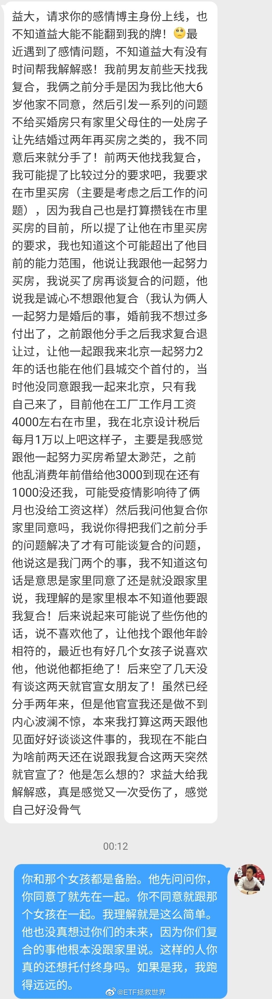

======================================================

ETF拯救世界 (5687069307) @
2020-08-16 09:14:31 Sun  
url: https://weibo.com/5687069307/Jg8W7COcC

回复@好听还不重复的微博昵称:这个很难一两句说清楚。与年龄有关，与双方财务水平有关，与社会发展阶段有关。//@好听还不重复的微博昵称:有点想问益达，男女之间的感情的底层力量是金钱与物质，还是精神上的体验？@ETF拯救世界

------------------------------------------------------
转推：
>  @ETF拯救世界 (5687069307)
>  2020-08-16 00:13:42 Sun  
>  url: https:/weibo.com/5687069307/Jg5oBAUDR/

>  我分析的有没有道理，你说说看。 ​​​

转发[6]  评论[132]  赞[833] 

======================================================

ETF拯救世界 (5687069307) @
2020-08-16 11:55:46 Sun  
url: https://weibo.com/5687069307/Jg9ZzDsLU

我发现很多人的阅读能力真的不行，我再强调一次，估值定仓位不能机械应用。这几句话一定要真的弄明白！ ​​​

转发[40]  评论[311]  赞[1919] 

+++++++++++++++++++++++++++++++++++++++++++++++++++++

图片：
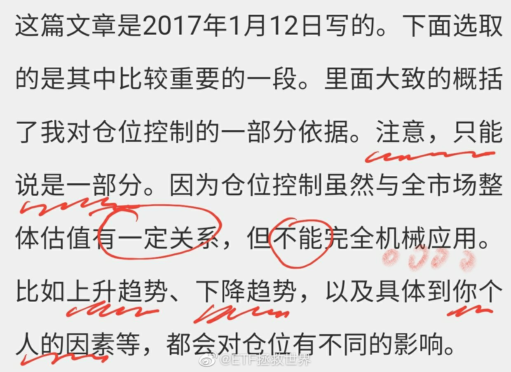

======================================================

ETF拯救世界 (5687069307) @
2020-08-17 09:45:16 Mon  
url: https://weibo.com/5687069307/Jgiz6oBnJ

“资产配置不叫投资”

买股票算投资；买债券算投资；买基金算投资；买黄金算投资；买原油算投资；买美国德国日本QDII算投资……

合在一起，加上仓位配置和择时，不算投资！

喷了。 ​​​

转发[63]  评论[384]  赞[1859] 

======================================================

ETF拯救世界 (5687069307) @
2020-08-17 09:59:14 Mon  
url: https://weibo.com/5687069307/JgiEMihwW

在有些意识模糊半睡半醒的时候，比如早晨起床前，总是会想起某个地方，非常熟悉，甚至记得在那里生活过一段时间。最重要的是那个地方还有点恐怖，非常刺激。

还有就是之前说的那辆车。买了以后放在某个修车厂，所有场景总是不断浮现在眼前。

特别真实，然而反复确认自己的行程，真的没有在那个地方住 ​​​

转发[8]  评论[467]  赞[1370] 

======================================================

ETF拯救世界 (5687069307) @
2020-08-17 10:58:02 Mon  
url: https://weibo.com/5687069307/Jgj2Du0n0

富国红利只要今天不跌，就是继续历史新高。为什么一个3400点历史新高的品种要被喷？因为有一年表现不好。

------------------------------------------------------
转推：
>  @ETF拯救世界 (5687069307)
>  2020-07-02 10:05:06 Thu  
>  url: https:/weibo.com/5687069307/J9j2jm7ZA/

>  之前很多人吐槽红利，说什么价值投资没戏了。
>  
>  其实你知不知道，在2019年3、4月，创业板/医药这样近期大热门还被压在地板上摩擦的时候，富国红利净值几乎已经是历史最高了，挡在前面的只有2015年5月的几个交易日而已。
>  
>  （创业板还需要涨66%才能回去）
>  
>  人家早就回到股灾前了，怎么就不行了呢。
>  
>  这就 ​​​

转发[33]  评论[198]  赞[1148] 

======================================================

ETF拯救世界 (5687069307) @
2020-08-17 11:02:46 Mon  
url: https://weibo.com/5687069307/Jgj4yyYQq

回复@woshifnw:很明显，这两个人不懂投资。是小白。//@woshifnw:图片评论 http://t.cn/A6U8QdKR

------------------------------------------------------
转推：
>  @ETF拯救世界 (5687069307)
>  2020-08-17 09:45:16 Mon  
>  url: https:/weibo.com/5687069307/Jgiz6oBnJ/

>  “资产配置不叫投资”
>  
>  买股票算投资；买债券算投资；买基金算投资；买黄金算投资；买原油算投资；买美国德国日本QDII算投资……
>  
>  合在一起，加上仓位配置和择时，不算投资！
>  
>  喷了。 ​​​

转发[13]  评论[101]  赞[765] 

======================================================

ETF拯救世界 (5687069307) @
2020-08-17 11:08:46 Mon  
url: https://weibo.com/5687069307/Jgj6ZAW5u

一年前在S宁买的G703鼠标滚轮坏了，想申请售后发现居然没有选项。

再去京东找了一个同期买的鼠标，试了试售后只要填写故障就上门取件维修。

就凭这个，你叫我京吹我也认了。 ​​​

转发[26]  评论[516]  赞[2365] 

======================================================

ETF拯救世界 (5687069307) @
2020-08-17 15:29:13 Mon  
url: https://weibo.com/5687069307/JgkOIbdaF

不管未来会怎么样，

至少我们现在很开心。 ​​​

转发[31]  评论[565]  赞[2455] 

+++++++++++++++++++++++++++++++++++++++++++++++++++++

图片：

======================================================

ETF拯救世界 (5687069307) @
2020-08-17 16:37:49 Mon  
url: https://weibo.com/5687069307/Jglgz3Gsm

突然想念一片海。

------------------------------------------------------
转推：
>  @ETF拯救世界 (5687069307)
>  2019-08-20 21:27:40 Tue  
>  url: https:/weibo.com/5687069307/I38uhlU4e/

>  日落床照 ​​​

转发[19]  评论[368]  赞[1474] 

======================================================

ETF拯救世界 (5687069307) @
2020-08-17 17:10:08 Mon  
url: https://weibo.com/5687069307/JgltG0X2t

昨天晚上看了两集 三十而已。

被王漫妮店里那个辣鸡同事和副店长气的看不下去了。

可以让那个辣鸡同事炒股把钱赔光吗。 ​​​

转发[4]  评论[429]  赞[1421] 

======================================================

ETF拯救世界 (5687069307) @
2020-08-17 19:33:47 Mon  
url: https://weibo.com/5687069307/JgmpZ1JLI

老铁，你觉得我说的对不对。觉得对就敲666 ​​​

转发[21]  评论[1439]  赞[3171] 

+++++++++++++++++++++++++++++++++++++++++++++++++++++

图片：

======================================================

ETF拯救世界 (5687069307) @
2020-08-18 07:53:39 Tue  
url: https://weibo.com/5687069307/JgrgijTAL

有人说，“巴菲特说金银没价值不能买”。老巴现在来打脸。还有，谁能想到他90年代就在白银上面赚了一大笔？投资不是背语录。他还说不买科技股呢，现在持仓最大是苹果

------------------------------------------------------
转推：
>  @ ()
>  2020-08-18 04:21:35 Tue  
>  url: 

>  抱歉，作者已设置仅展示半年内微博，此微博已不可见。 ​​​

转发[49]  评论[197]  赞[1059] 

======================================================

ETF拯救世界 (5687069307) @
2020-08-18 08:05:55 Tue  
url: https://weibo.com/5687069307/Jgrlh57tl

配得上昨天大涨8%

由于还没有到货，所以试了试人工保价。其实到货后自动保价更方便 ​​​

转发[9]  评论[280]  赞[1300] 

+++++++++++++++++++++++++++++++++++++++++++++++++++++

图片：

======================================================

ETF拯救世界 (5687069307) @
2020-08-18 08:33:37 Tue  
url: https://weibo.com/5687069307/Jgrww92Lo

有人说“苹果不是科技股，是消费股”

那么，这么说，亚马逊，微软，甚至谷歌，阿里，腾讯，都不能算科技股？

什么是科技股，我认为通过生产，销售高科技产品，或者设计，建设高科技网络为消费者直接提供服务都是科技股。

老巴为什么说不投科技股，不是因为科技股不直接服务消费者，而是科技股产品替 ​​​

转发[75]  评论[218]  赞[1760] 

======================================================

ETF拯救世界 (5687069307) @
2020-08-18 11:35:27 Tue  
url: https://weibo.com/5687069307/JgsIk9wTr

挣点钱意思不大。 ​​​

转发[3]  评论[413]  赞[1803] 

======================================================

ETF拯救世界 (5687069307) @
2020-08-18 16:57:54 Tue  
url: https://weibo.com/5687069307/JguPcCElE

水淹大佛膝，火烧凌云窟。//@caozenghui://@老蘇老了: 卧槽……

------------------------------------------------------
转推：
>  @石言呓语 (1420099171)
>  2020-08-18 07:46:03 Tue  
>  url: https:/weibo.com/1420099171/Jgrdd5EFF/

>  乐山网友投稿，传说中的乐山大佛洗脚。今天早上洪峰过境，乐山水位还在上涨，过去老年人说的“大佛要洗脚，乐山全安完”已经无限接近。甜皮鸭豆腐脑跷脚牛肉豆腐咔咔烧麦排骨面油炸串串麻辣烫你们要挺住啊。。。 http://t.cn/A6UENnec ​​​

转发[31]  评论[153]  赞[571] 

======================================================

ETF拯救世界 (5687069307) @
2020-08-18 17:15:03 Tue  
url: https://weibo.com/5687069307/JguWalB8T

如果不想惹麻烦，第一守则，不要在背后说别人坏话。早晚会传到那个人耳朵里。

最好多在背后夸你真正喜欢的人。早晚他也会知道的。

第二守则，别人跟你说秘密，在你这里就到了终点，不要告诉第三个人。更好的做法是根本不听别人的秘密。

第三守则，如果你有不想让别人知道的秘密，不要告诉任何人。因 ​​​

转发[162]  评论[357]  赞[2097] 

+++++++++++++++++++++++++++++++++++++++++++++++++++++

图片：

======================================================

ETF拯救世界 (5687069307) @
2020-08-19 08:54:53 Wed  
url: https://weibo.com/5687069307/JgB5E76nm

虽然私信不可能每一封都看到，但就我看到的这一部分来说，困扰很多朋友的，除了投资方面，其实就是几件事：

感情纠葛、财务问题（尤其是家庭间的，包括与父母，与兄弟姐妹）等等。

我也不敢说自己是什么感情专家，更不敢说深谙家庭相处之道，但我想跟面临这些苦恼的朋友说一句：

太不值了。

各位， ​​​

转发[393]  评论[795]  赞[3658] 

======================================================

ETF拯救世界 (5687069307) @
2020-08-19 09:01:17 Wed  
url: https://weibo.com/5687069307/JgB8fq9UK

回复@平平-----淡淡:我说了多少次了？借钱，你就要当给钱。借了钱你就别想拿回来。人家真的还了，就相当于白捡，要请对方吃饭。

------------------------------------------------------
转推：
>  @ETF拯救世界 (5687069307)
>  2020-08-19 08:54:53 Wed  
>  url: https:/weibo.com/5687069307/JgB5E76nm/

>  虽然私信不可能每一封都看到，但就我看到的这一部分来说，困扰很多朋友的，除了投资方面，其实就是几件事：
>  
>  感情纠葛、财务问题（尤其是家庭间的，包括与父母，与兄弟姐妹）等等。
>  
>  我也不敢说自己是什么感情专家，更不敢说深谙家庭相处之道，但我想跟面临这些苦恼的朋友说一句：
>  
>  太不值了。
>  
>  各位， ​​​

转发[45]  评论[241]  赞[1265] 

======================================================

ETF拯救世界 (5687069307) @
2020-08-19 14:51:15 Wed  
url: https://weibo.com/5687069307/JgDqij81s

订了新手机后，这个手机已经两次从手里飞出去了。今天更是屏幕朝下直扑水泥地并滑行2.36米。

到底是它在怪我喜新厌旧还是我潜意识中要疏远它？ ​​​

转发[3]  评论[638]  赞[1876] 

======================================================

ETF拯救世界 (5687069307) @
2020-08-19 21:13:10 Wed  
url: https://weibo.com/5687069307/JgFVjqh6b

我突然明白一件事：为什么很多人觉得女性开车更危险。

为什么我们在媒体上看到的事故新闻好像“女司机”事故占比更大呢。

然而，前一段时间有个交管的数据，分明是男性司机事故占比大啊。

除了很多女司机虽然有车本但其实很少开车所以出事比例会降低外，有一个关键点大家可能忽略了，那就是：

男性 ​​​

转发[26]  评论[475]  赞[2536] 

======================================================

ETF拯救世界 (5687069307) @
2020-08-19 21:58:11 Wed  
url: https://weibo.com/5687069307/JgGdAljvZ

这个新闻可以加入资本市场新闻记录。

------------------------------------------------------
转推：
>  @财联社APP (2868676035)
>  2020-08-19 21:53:23 Wed  
>  url: https:/weibo.com/2868676035/JgGbDx8Ru/

>  【这一波又见股民跑步入场！7月新增股民243万，A股史上第4高月份，万亿成交吸引力果然增大】
>  财联社（上海，记者 刘超凤）讯，2020年7月新增投资者数据今日公布。
>  
>  7月新增投资者242.63万，同比增长120.93%，环比增长56.64%。截至7月末，A股投资者总数达1.70亿，其中自然人16977万，约占总人口（14亿） ​​​

转发[129]  评论[159]  赞[869] 

======================================================

ETF拯救世界 (5687069307) @
2020-08-19 22:13:28 Wed  
url: https://weibo.com/5687069307/JgGjN8wC1

虽然不喜欢大老师综艺节目里面神神叨叨的样子，但他的歌从一开始花儿内时候到现在一直觉得好听。

你要说词曲抄的比较多，但声音也挺喜欢的。 ​​​

转发[4]  评论[250]  赞[1262] 

======================================================

ETF拯救世界 (5687069307) @
2020-08-20 10:16:32 Thu  
url: https://weibo.com/5687069307/JgL3hxt35

不知道这一波高估值板块的筹码被谁接走了。 ​​​

转发[24]  评论[403]  赞[1890] 

======================================================

ETF拯救世界 (5687069307) @
2020-08-20 10:37:35 Thu  
url: https://weibo.com/5687069307/JgLbPicuy

走过这一轮下跌——上涨，跟我一起观察这个市场的风云变幻，你总算知道为什么有些人说起股市总是骂骂咧咧“MD，不要炒股，都是骗钱的。”

看看大多数人什么时候进，什么时候出，媒体机构如何趁热打铁，恍然大悟了吧。 ​​​

转发[78]  评论[272]  赞[1928] 

======================================================

ETF拯救世界 (5687069307) @
2020-08-20 11:17:30 Thu  
url: https://weibo.com/5687069307/JgLs238HY

来投资，首先要想清楚两件事。

第一件事，你放进市场的钱会去谁的口袋里，谁的钱会到你的口袋里。

券商佣金，印花税，IPO，公/私募，保险，大鳄，GJD，风投和大股东减持……这些都是铁定要赚钱的。

谁在送钱。公司分红？谢谢你了。

绝大多数钱都要靠互摸口袋。

第二件事，你的优势是什么。

与上 ​​​

转发[334]  评论[484]  赞[2442] 

======================================================

ETF拯救世界 (5687069307) @
2020-08-20 11:22:40 Thu  
url: https://weibo.com/5687069307/JgLu82ZAR

折腾了一个半月，我军15500防线固若金汤。//@ETF拯救世界:回来了老弟。//@ETF拯救世界:在大气层激烈争夺。15500不是那么容易过的。

------------------------------------------------------
转推：
>  @ETF拯救世界 (5687069307)
>  2020-07-13 11:26:03 Mon  
>  url: https:/weibo.com/5687069307/JaZgDapRK/

>  医药基本已经脱离我能理解的范畴，进入“外太空”区域。
>  
>  在这个区域，我将用新的交易策略处理剩下的仓位。
>  
>  踏踏实实的。 ​​​

转发[250]  评论[161]  赞[1082] 

======================================================

ETF拯救世界 (5687069307) @
2020-08-20 13:54:21 Thu  
url: https://weibo.com/5687069307/JgMtHrbSM

很多朋友种草健身环，我简单说两句。 /健身、游戏博主上线

因为已经很多年不混游戏圈了，只是各平台轻量玩家，一周有几个小时打打游戏放松一下而已。所以说的不对的您多担待。

首先，要玩健身环，必须要买任天堂的switch游戏机。

switch分两大类，一类是“国行”，一类是海外版。国行1600、1700多， ​​​

转发[125]  评论[376]  赞[1458] 

======================================================

ETF拯救世界 (5687069307) @
2020-08-20 14:11:45 Thu  
url: https://weibo.com/5687069307/JgMALqLOi

再多说一句，买之前先去B站看看视频，看看自己是不是真觉得有意思。别花了钱买回来发现跟自己想的不一样就不好了。

------------------------------------------------------
转推：
>  @ETF拯救世界 (5687069307)
>  2020-08-20 13:54:21 Thu  
>  url: https:/weibo.com/5687069307/JgMtHrbSM/

>  很多朋友种草健身环，我简单说两句。 /健身、游戏博主上线
>  
>  因为已经很多年不混游戏圈了，只是各平台轻量玩家，一周有几个小时打打游戏放松一下而已。所以说的不对的您多担待。
>  
>  首先，要玩健身环，必须要买任天堂的switch游戏机。
>  
>  switch分两大类，一类是“国行”，一类是海外版。国行1600、1700多， ​​​

转发[21]  评论[125]  赞[837] 

======================================================

ETF拯救世界 (5687069307) @
2020-08-21 10:05:56 Fri  
url: https://weibo.com/5687069307/JgUptxAI7

说没事就没事。

这位朋友经过大风大浪，以后就会看淡小涟漪了。 ​​​

转发[5]  评论[393]  赞[2044] 

+++++++++++++++++++++++++++++++++++++++++++++++++++++

图片：
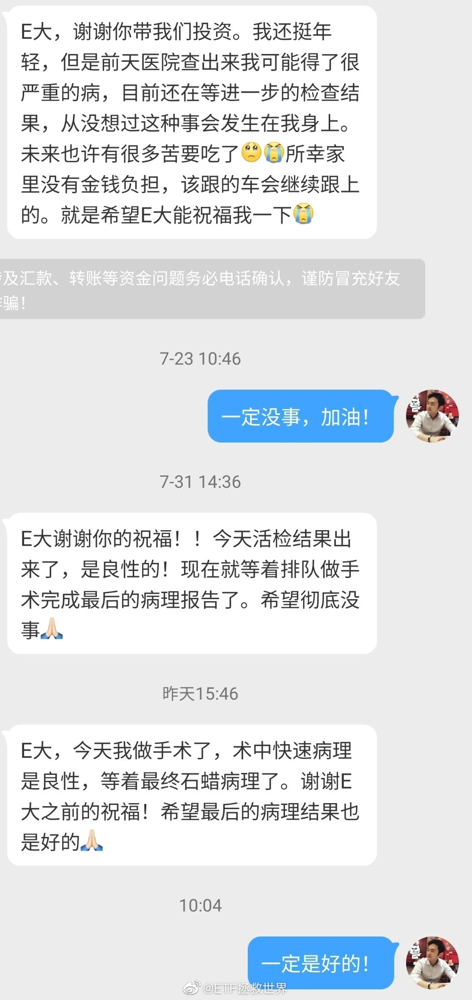

======================================================

ETF拯救世界 (5687069307) @
2020-08-21 16:53:27 Fri  
url: https://weibo.com/5687069307/JgX4TrGIo

首先，我认为内什么上海丈母娘招年化10%女婿的新闻就是个假新闻。要么是骗子，要么是联合炒作。

不过我的重点不是这个。

年化10%，10年赚多少？答案是2010-2020这十年，收益率超过160%即可。

简单不简单？太简单了。2015年那波大行情，创业板最高涨了6倍，中证500最高涨了4倍，沪深300最高涨了将近2 ​​​

转发[185]  评论[464]  赞[2618] 

======================================================

ETF拯救世界 (5687069307) @
2020-08-23 10:47:47 Sun  
url: https://weibo.com/5687069307/JhdxsD15Y

于老师教明星、网红、直播以及保安公司做人。

------------------------------------------------------
转推：
>  @不约儿童的大松子儿 (5126735993)
>  2020-08-22 12:03:54 Sat  
>  url: https:/weibo.com/5126735993/Jh4BRb3EG/

>  #于谦直接喊停安保人员# 
>  录制节目时，节目组的安保人员打扰到路人
>  @于谦 于谦老师直接叫停喊住安保人员：“不用管不用管，兄弟兄弟，人该玩儿玩儿人家的，不用管”。
>  身边工作人员也是连连向路人致歉[给你小心心]
>  
>  cr抖🎶 @ 北京伍盛瑞源谦酒 http://t.cn/A6UgIzYa ​​​

转发[34]  评论[130]  赞[856] 

======================================================

ETF拯救世界 (5687069307) @
2020-08-23 10:55:32 Sun  
url: https://weibo.com/5687069307/JhdABEtPM

你还有没有更好的建议 ​​​

转发[67]  评论[444]  赞[1471] 

+++++++++++++++++++++++++++++++++++++++++++++++++++++

图片：

======================================================

ETF拯救世界 (5687069307) @
2020-08-23 12:59:28 Sun  
url: https://weibo.com/5687069307/JheoUCX7J

心里没有别人的典型表现。这种人迟早要遭受社会的毒打。

------------------------------------------------------
转推：
>  @北京人不知道的北京事儿 (1662214194)
>  2020-08-23 12:06:48 Sun  
>  url: https:/weibo.com/1662214194/Jhe3xhKU5/

>  网友投稿：天通苑附近，这白车在地铁口等人直接把车停在单行线上，后面堵了几十辆车，一堆人停车劝说他还是不走，他还骂人说：“着什么急，着急去死啊！”连路人大妈都受不了了。。。遇到这样的该怎么办？[怒][怒] http://t.cn/A6UD26FC ​​​

转发[26]  评论[180]  赞[944] 

======================================================

ETF拯救世界 (5687069307) @
2020-08-23 14:38:54 Sun  
url: https://weibo.com/5687069307/Jhf3h66Pg

我一个朋友说他发现一个发生过很多次的隐藏规律：类似的事情被查或者被处罚前，他从来都没听说过。他说他上的可能是一个假的互联网。

------------------------------------------------------
转推：
>  @新浪财经 (1638782947)
>  2020-08-23 14:27:51 Sun  
>  url: https:/weibo.com/1638782947/JheYMs8eO/

>  【#王思聪投资的游戏陪练平台被指涉黄# 已永久封号超2万个】王思聪投资的“比心陪练”平台“深夜服务”被指涉黄严重，有报道称该平台一些女陪练在幕后团伙指挥下，主动向“玩家们”兜售“ 深夜服务”，主要是视频裸聊和性服务。8月21日，@比心陪练 官方微博发布一则“关于加强内容审核声明”称，在接到 ​​​

转发[7]  评论[220]  赞[911] 

======================================================

ETF拯救世界 (5687069307) @
2020-08-24 12:26:15 Mon  
url: https://weibo.com/5687069307/JhnBVxafu

长期看气候变暖导致北方变江南没错，但南方可能变沼泽。

------------------------------------------------------
转推：
>  @挖龙脉的超级鹿鼎公 (3962719063)
>  2020-08-24 11:11:53 Mon  
>  url: https:/weibo.com/3962719063/Jhn7Jwcra/

>  最近30年，中国西北地区气温回升，降雨大幅度增加，比如延安，1999年延安植被率从46%，上升到现在81.3%，曾经荒山秃顶的黄土高原绿了，含沙量巨大的黄河清了，气温上升，中国将成为世界气温变化的最大得益者 ​​​

转发[19]  评论[214]  赞[960] 

======================================================

ETF拯救世界 (5687069307) @
2020-08-25 10:26:28 Tue  
url: https://weibo.com/5687069307/JhwfNsJKZ

今天你有什么故事，说来听听 ​​​

转发[17]  评论[960]  赞[2179] 

======================================================

ETF拯救世界 (5687069307) @
2020-08-25 13:51:35 Tue  
url: https://weibo.com/5687069307/JhxB3pOpf

科创50更NB。一半成分股市盈率超过100倍。伟大！我知道有人又要嘲笑我：投资科技股你还看市盈率？[笑而不语]

------------------------------------------------------
转推：
>  @ETF拯救世界 (5687069307)
>  2020-08-11 10:24:57 Tue  
>  url: https:/weibo.com/5687069307/JfogehSti/

>  军工：整体估值85倍，85.42%成分股估值超过50倍，1/3成分股市盈率超过100倍。
>  
>  伟大！ ​​​

转发[119]  评论[142]  赞[959] 

======================================================

ETF拯救世界 (5687069307) @
2020-08-25 13:58:13 Tue  
url: https://weibo.com/5687069307/JhxDKjIwX

回复@帅到没有朋友很痛苦:不要。100虽然高，你怎么知道不会到200。不要把优势变成劣势。//@帅到没有朋友很痛苦:益达，要不要做空他们[酷]//@ETF拯救世界:科创50更NB。一半成分股市盈率超过100倍。伟大！我知道有人又要嘲笑我：投资科技股你还看市盈率？[笑而不语]

------------------------------------------------------
转推：
>  @ETF拯救世界 (5687069307)
>  2020-08-11 10:24:57 Tue  
>  url: https:/weibo.com/5687069307/JfogehSti/

>  军工：整体估值85倍，85.42%成分股估值超过50倍，1/3成分股市盈率超过100倍。
>  
>  伟大！ ​​​

转发[22]  评论[93]  赞[774] 

======================================================

ETF拯救世界 (5687069307) @
2020-08-25 15:03:36 Tue  
url: https://weibo.com/5687069307/Jhy4i15eq

我对于未来普通人财富分层有一个想法，不知道对不对。

一共三层。

第一层是理性投资，有资产的人。房产、股权包括你买的股票、基金等。由于这些品种会不断上涨，这一层的人财富会越来越多。拥有越多就越富有。社会新增财富的绝大多数都归这部分人了。

第二层是只依靠工资收入的人。对于大多数人来说 ​​​

转发[216]  评论[562]  赞[2681] 

======================================================

ETF拯救世界 (5687069307) @
2020-08-25 21:08:29 Tue  
url: https://weibo.com/5687069307/JhAsolrCY

情人节、白色情人节、七夕、生日、第一次见面纪念日、第一次约会纪念日、结婚纪念日、圣诞节、新年……

男人好累。

有些人是怎么做到能够记住好几个人的？ ​​​

转发[24]  评论[446]  赞[1890] 

======================================================

ETF拯救世界 (5687069307) @
2020-08-26 10:49:02 Wed  
url: https://weibo.com/5687069307/JhFPsdMpJ

正好一个月，体脂下降1.8。还剩4个月，还是太慢了。 http://t.cn/A64P1NGm

------------------------------------------------------
转推：
>  @ETF拯救世界 (5687069307)
>  2020-07-27 10:50:30 Mon  
>  url: https:/weibo.com/5687069307/Jd71a6U1c/

>  立个flag，年底前体脂率下降8。
>  
>  做不到送3888🧧。 ​​​

转发[22]  评论[334]  赞[980] 

======================================================

ETF拯救世界 (5687069307) @
2020-08-26 11:20:34 Wed  
url: https://weibo.com/5687069307/JhG2fBlZV

食得咸鱼抵得渴

翻译成普通话就是说，

你要炒作涨的猛但是很危险的品种，就要承担被干掉的风险。 ​​​

转发[35]  评论[253]  赞[1601] 

======================================================

ETF拯救世界 (5687069307) @
2020-08-26 13:40:06 Wed  
url: https://weibo.com/5687069307/JhGWTe5bN

你还真不禁夸，跌幅居然超过军工了。[哼]//@ETF拯救世界:科创50更NB。一半成分股市盈率超过100倍。伟大！我知道有人又要嘲笑我：投资科技股你还看市盈率？[笑而不语]

------------------------------------------------------
转推：
>  @ETF拯救世界 (5687069307)
>  2020-08-11 10:24:57 Tue  
>  url: https:/weibo.com/5687069307/JfogehSti/

>  军工：整体估值85倍，85.42%成分股估值超过50倍，1/3成分股市盈率超过100倍。
>  
>  伟大！ ​​​

转发[17]  评论[111]  赞[886] 

======================================================

ETF拯救世界 (5687069307) @
2020-08-26 14:09:34 Wed  
url: https://weibo.com/5687069307/JhH8QCn9V

去尤文好吗。

------------------------------------------------------
转推：
>  @新浪体育 (1638781994)
>  2020-08-26 01:10:14 Wed  
>  url: https:/weibo.com/1638781994/JhC2wdxQU/

>  #梅西将离开巴萨#据阿根廷媒体报道，梅西已经通知巴萨俱乐部自己将离开球队。他会利用自己合同中的离队条款，该条款允许他在每个赛季结束时选择跳出合同。 ​​​

转发[12]  评论[220]  赞[693] 

======================================================

ETF拯救世界 (5687069307) @
2020-08-26 17:37:29 Wed  
url: https://weibo.com/5687069307/JhIvfhmyW

今天看到一个因为失恋就自杀的研究生。

不知道该说什么。自杀的人应该是对人生绝望了吧。但是因为一个恋人——无论男女——就绝望，值得吗。

热恋中你以为Ta是如此光彩夺目如此举世无双，其实Ta真的只是很普通的一个人。这样的人这个世界上还有无数。你甚至有机会认识比Ta好无数倍的人…

但是，当他 ​​​

转发[111]  评论[376]  赞[1918] 

======================================================

ETF拯救世界 (5687069307) @
2020-08-26 17:59:10 Wed  
url: https://weibo.com/5687069307/JhIE2EkLX

我觉得，有两点原因自杀我理解。第一点，抑郁症，器质性的，怎么都想不明白了。第二点，身患绝症，绝对治不好，而且特别痛苦。除了这两点，没什么扛不过去的。谁的生活一帆风顺？谁不是每天遭受生活的重击？没有什么过不去的，只要你相信一定能过去！

------------------------------------------------------
转推：
>  @ETF拯救世界 (5687069307)
>  2020-08-26 17:37:29 Wed  
>  url: https:/weibo.com/5687069307/JhIvfhmyW/

>  今天看到一个因为失恋就自杀的研究生。
>  
>  不知道该说什么。自杀的人应该是对人生绝望了吧。但是因为一个恋人——无论男女——就绝望，值得吗。
>  
>  热恋中你以为Ta是如此光彩夺目如此举世无双，其实Ta真的只是很普通的一个人。这样的人这个世界上还有无数。你甚至有机会认识比Ta好无数倍的人…
>  
>  但是，当他 ​​​

转发[37]  评论[171]  赞[1066] 

======================================================

ETF拯救世界 (5687069307) @
2020-08-26 18:39:13 Wed  
url: https://weibo.com/5687069307/JhIUizNS9

回复@佑三圈佐三圈:我大学都是考试过后往下跳[doge]。成绩出来后还有不少精神失常的//@佑三圈佐三圈:我印象中读大学时每年都有人从图书馆上跳下来，大都是情感问题。

------------------------------------------------------
转推：
>  @ETF拯救世界 (5687069307)
>  2020-08-26 17:37:29 Wed  
>  url: https:/weibo.com/5687069307/JhIvfhmyW/

>  今天看到一个因为失恋就自杀的研究生。
>  
>  不知道该说什么。自杀的人应该是对人生绝望了吧。但是因为一个恋人——无论男女——就绝望，值得吗。
>  
>  热恋中你以为Ta是如此光彩夺目如此举世无双，其实Ta真的只是很普通的一个人。这样的人这个世界上还有无数。你甚至有机会认识比Ta好无数倍的人…
>  
>  但是，当他 ​​​

转发[8]  评论[107]  赞[748] 

======================================================

ETF拯救世界 (5687069307) @
2020-08-26 19:39:34 Wed  
url: https://weibo.com/5687069307/JhJiNu0Tu

持有的小米快翻番了。特地去店里转了转，看了看米⑩至尊。

挺好，就是厚，屏幕也有进步空间。三星用久了，真的对工业设计和屏幕要求会比较高…

希望小米再接再厉，做出更好的精品，多出一些更有精致感的产品。 ​​​

转发[20]  评论[466]  赞[1981] 

======================================================

ETF拯救世界 (5687069307) @
2020-08-28 12:11:53 Fri  
url: https://weibo.com/5687069307/JhZe4Bms3

不要太想我 ​​​

转发[16]  评论[1062]  赞[2585] 

======================================================

ETF拯救世界 (5687069307) @
2020-08-28 16:24:28 Fri  
url: https://weibo.com/5687069307/Ji0SBf0rj

大家这么高兴，当然要发红包。

8月红包888，一定要开心啊！
 http://t.cn/A64wI3x2 ​​​

转发[14]  评论[1739]  赞[2779] 

======================================================

ETF拯救世界 (5687069307) @
2020-08-29 13:56:00 Sat  
url: https://weibo.com/5687069307/Ji9kPEn7D

日常灵验。 ​​​

转发[7]  评论[520]  赞[1302] 

+++++++++++++++++++++++++++++++++++++++++++++++++++++

图片：

======================================================

ETF拯救世界 (5687069307) @
2020-08-30 18:14:45 Sun  
url: https://weibo.com/5687069307/JiksmcEh8

主要是个人的努力，当然也有祝福加成。 ​​​

转发[6]  评论[242]  赞[1262] 

+++++++++++++++++++++++++++++++++++++++++++++++++++++

图片：
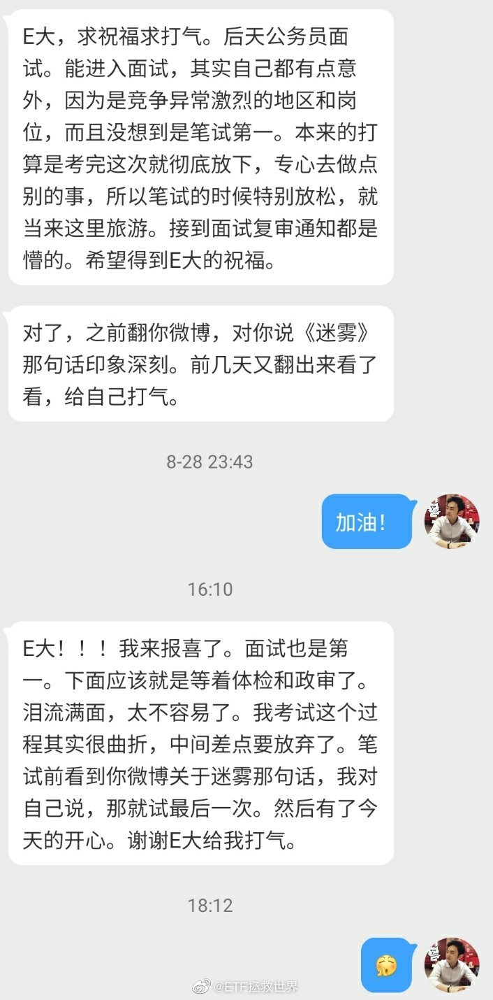

======================================================

ETF拯救世界 (5687069307) @
2020-08-30 18:17:10 Sun  
url: https://weibo.com/5687069307/Jiktl3Rtg

我的直觉有没有道理。 ​​​

转发[10]  评论[567]  赞[1613] 

+++++++++++++++++++++++++++++++++++++++++++++++++++++

图片：

======================================================

ETF拯救世界 (5687069307) @
2020-08-31 08:11:59 Mon  
url: https://weibo.com/5687069307/JipWbDw8U

8月28日，商务部、科技部调整发布《中国禁止出口限制出口技术目录》，“基于数据分析的个性化信息推送服务技术” 等列入目录。

------------------------------------------------------
转推：
>  @ETF拯救世界 (5687069307)
>  2020-08-02 09:06:18 Sun  
>  url: https:/weibo.com/5687069307/Je0TQ4vFN/

>  不懂就问，如果软件卖了，是不是代码算法等都一起卖了。 ​​​

转发[16]  评论[225]  赞[1195] 

======================================================

ETF拯救世界 (5687069307) @
2020-08-31 08:58:59 Mon  
url: https://weibo.com/5687069307/JiqfguQQN

每次锻炼懈怠了就去ins看看C罗和拉莫斯激励一下自己。

还有没有类似经常发健身视频的球员ins推荐关注？ ​​​

转发[11]  评论[218]  赞[1128] 

======================================================

ETF拯救世界 (5687069307) @
2020-08-31 10:20:04 Mon  
url: https://weibo.com/5687069307/JiqMbcc2f

还没新高的请取关。 ​​​

转发[107]  评论[1012]  赞[2562] 

======================================================

ETF拯救世界 (5687069307) @
2020-08-31 14:51:34 Mon  
url: https://weibo.com/5687069307/Jisyo8AAB

没有新高也没有关西，不必取关！明天会更好！（场面一度十分尴尬）

------------------------------------------------------
转推：
>  @ETF拯救世界 (5687069307)
>  2020-08-31 10:20:04 Mon  
>  url: https:/weibo.com/5687069307/JiqMbcc2f/

>  还没新高的请取关。 ​​​

转发[76]  评论[1618]  赞[3618] 

======================================================

ETF拯救世界 (5687069307) @
2020-09-01 09:53:47 Tue  
url: https://weibo.com/5687069307/JiA20pxLB

513100已经进入博傻阶段。

傻子和疯子不久之后就会买单，敬请期待。 ​​​

转发[79]  评论[412]  赞[1543] 

======================================================

ETF拯救世界 (5687069307) @
2020-09-01 10:51:56 Tue  
url: https://weibo.com/5687069307/JiApChFnJ

先卖一点吧……另外说好的送武汉医生小米产品的事正在让他选产品，说到做到。 http://t.cn/A64bmm0d

------------------------------------------------------
转推：
>  @ETF拯救世界 (5687069307)
>  2020-01-20 09:23:06 Mon  
>  url: https:/weibo.com/5687069307/Iqk89CEU4/

>  万万没想到你是这样的小米…… ​​​

转发[32]  评论[240]  赞[1085] 

======================================================

ETF拯救世界 (5687069307) @
2020-09-01 11:10:16 Tue  
url: https://weibo.com/5687069307/JiAx3k834

其实做投资赚钱吧，真没太难。

拿闲钱，低位买入不会死的资产。然后踏踏实实拿着，不管它几个月几年不涨。

最后飞一次就把几年的好收益还给你。

赚差不多了就卖了，再找跌了好多的，不会死的分散买入继续持有。

别管别人说这个品种跌这么多完蛋了没戏了，也别管别人嘲笑你买的品种几年没涨。

你管 ​​​

转发[319]  评论[600]  赞[2747] 

======================================================

ETF拯救世界 (5687069307) @
2020-09-01 11:27:03 Tue  
url: https://weibo.com/5687069307/JiADRAB20

知道为什么手机厂商不同时开放120HZ和2k分辨率吗。

相信我，同时开的话，2个小时电量就耗光了。 ​​​

转发[13]  评论[314]  赞[1290] 

======================================================

ETF拯救世界 (5687069307) @
2020-09-01 13:54:28 Tue  
url: https://weibo.com/5687069307/JiBBI5kYc

这么有才华又善良幽默的博主，粉了！ ​​​

转发[10]  评论[492]  赞[1637] 

======================================================

ETF拯救世界 (5687069307) @
2020-09-01 14:10:26 Tue  
url: https://weibo.com/5687069307/JiBIbn1fq

哈哈哈哈，该。

------------------------------------------------------
转推：
>  @ETF拯救世界 (5687069307)
>  2020-09-01 09:53:47 Tue  
>  url: https:/weibo.com/5687069307/JiA20pxLB/

>  513100已经进入博傻阶段。
>  
>  傻子和疯子不久之后就会买单，敬请期待。 ​​​

转发[7]  评论[190]  赞[1103] 

======================================================

ETF拯救世界 (5687069307) @
2020-09-01 14:57:58 Tue  
url: https://weibo.com/5687069307/JiC1tuYI0

今天是薛定谔的新高。 ​​​

转发[11]  评论[299]  赞[1452] 

======================================================

ETF拯救世界 (5687069307) @
2020-09-01 20:39:01 Tue  
url: https://weibo.com/5687069307/JiEfUlEiG

英国持续下跌，德国维持高位——

这大概就是人生吧。 ​​​

转发[12]  评论[244]  赞[1399] 

======================================================

ETF拯救世界 (5687069307) @
2020-09-01 21:16:00 Tue  
url: https://weibo.com/5687069307/JiEuV7yiV

这个班主任，一定，100%，心理有问题。

------------------------------------------------------
转推：
>  @ ()
>  2020-09-01 20:58:14 Tue  
>  url: 

>  抱歉，作者已设置仅展示半年内微博，此微博已不可见。 ​​​

转发[23]  评论[193]  赞[898] 

======================================================

ETF拯救世界 (5687069307) @
2020-09-02 10:26:58 Wed  
url: https://weibo.com/5687069307/JiJFYmo9q

谁还记得我好多年前在博客上说，如果一直在使用某家公司的产品或者服务，那就买那家公司的股票，把花的钱挣回来。

谁能想到，这十年我在京东买的东西居然都变成白嫖了…… ​​​

转发[108]  评论[607]  赞[3126] 

======================================================

ETF拯救世界 (5687069307) @
2020-09-02 13:16:35 Wed  
url: https://weibo.com/5687069307/JiKMP3dHX

狗庄太坏了。 ​​​

转发[15]  评论[296]  赞[1162] 

======================================================

ETF拯救世界 (5687069307) @
2020-09-02 13:59:58 Wed  
url: https://weibo.com/5687069307/JiL4qC3nu

真的，强烈推荐你遇到不开心的事情时候试一试：

你就想想，这件事我玩儿命努力、争取，想尽办法能不能改变。

能，就去努力改变它。

不能，就接受它。

当你发现自己根本不可能改变，只能接受的时候，会一下子轻松很多。 ​​​

转发[367]  评论[320]  赞[2033] 

======================================================

ETF拯救世界 (5687069307) @
2020-09-02 14:04:22 Wed  
url: https://weibo.com/5687069307/JiL6e3qqU

回复@张大头ETF:健身真的是只要努力就会有收获的一件事。世界上很少有这样的事情。//@张大头ETF:比如健身目标没有达到？

------------------------------------------------------
转推：
>  @ETF拯救世界 (5687069307)
>  2020-09-02 13:59:58 Wed  
>  url: https:/weibo.com/5687069307/JiL4qC3nu/

>  真的，强烈推荐你遇到不开心的事情时候试一试：
>  
>  你就想想，这件事我玩儿命努力、争取，想尽办法能不能改变。
>  
>  能，就去努力改变它。
>  
>  不能，就接受它。
>  
>  当你发现自己根本不可能改变，只能接受的时候，会一下子轻松很多。 ​​​

转发[49]  评论[149]  赞[1004] 

======================================================

ETF拯救世界 (5687069307) @
2020-09-02 14:20:23 Wed  
url: https://weibo.com/5687069307/JiLcJ24w1

纯债仓位未来最大可以给到20%-30%。

现在是1.5%。 ​​​

转发[93]  评论[453]  赞[1911] 

======================================================

ETF拯救世界 (5687069307) @
2020-09-02 14:24:45 Wed  
url: https://weibo.com/5687069307/JiLeuqgHC

最近突然有个疑问：

男女约P或者甚至是男女朋友，双方发生关系后，女方突然说非自愿，是被胁迫，那么男方如何自证清白。 ​​​

转发[58]  评论[901]  赞[2809] 

======================================================

ETF拯救世界 (5687069307) @
2020-09-02 22:11:22 Wed  
url: https://weibo.com/5687069307/JiOhTwXHu

纳斯达克这么涨，平稳着陆的可能非常小了。 ​​​

转发[87]  评论[480]  赞[1873] 

======================================================

ETF拯救世界 (5687069307) @
2020-09-03 09:47:27 Thu  
url: https://weibo.com/5687069307/JiSQr98qW

不出意外的话，我们持有的dax今晚净值又会新高了。

为什么dax、恒生能拿的非常稳，除了波段几乎没有卖出，而美股就是拿不住呢。

因为美股确实看不懂了。看不懂的东西就是拿不住，没有办法。 ​​​

转发[58]  评论[319]  赞[1687] 

======================================================

ETF拯救世界 (5687069307) @
2020-09-03 10:01:45 Thu  
url: https://weibo.com/5687069307/JiSWewvQz

养老即将再次突破5年新高，距离突破2015年的历史新高也不是特别远了。

每当这种时候，我就想起前两年养老表现一般的时候，那些高水平的大v是如何分析养老“不行”的。

行不行的我不知道，因为我水平不行。但我知道我赚了好多钱，很开心。

水平低，智商低的快乐就是这么朴实无华，且枯燥。 ​​​

转发[50]  评论[558]  赞[2207] 

======================================================

ETF拯救世界 (5687069307) @
2020-09-03 10:34:06 Thu  
url: https://weibo.com/5687069307/JiT9mCpw9

冲鸭 ​​​

转发[4]  评论[513]  赞[1615] 

======================================================

ETF拯救世界 (5687069307) @
2020-09-03 14:43:11 Thu  
url: https://weibo.com/5687069307/JiUMt8kx4

一天天的，啥也不是！

要再开几个网格吃饭了。 ​​​

转发[41]  评论[630]  赞[1709] 

======================================================

ETF拯救世界 (5687069307) @
2020-09-03 16:14:45 Thu  
url: https://weibo.com/5687069307/JiVnDo6n4

DAX又是1.5%+。

德味！ ​​​

转发[8]  评论[264]  赞[1303] 

======================================================

ETF拯救世界 (5687069307) @
2020-09-03 18:19:15 Thu  
url: https://weibo.com/5687069307/JiWcb4IHV

好久没看到彩虹了。照片怎么也拍不出的漂亮。 ​​​

转发[13]  评论[315]  赞[1469] 

+++++++++++++++++++++++++++++++++++++++++++++++++++++

图片：

======================================================

ETF拯救世界 (5687069307) @
2020-09-03 22:23:59 Thu  
url: https://weibo.com/5687069307/JiXNw06Mf

-2.62%。敢不敢一天干26%。[偷笑]

------------------------------------------------------
转推：
>  @ETF拯救世界 (5687069307)
>  2020-09-02 22:11:22 Wed  
>  url: https:/weibo.com/5687069307/JiOhTwXHu/

>  纳斯达克这么涨，平稳着陆的可能非常小了。 ​​​

转发[28]  评论[158]  赞[803] 

======================================================

ETF拯救世界 (5687069307) @
2020-09-03 22:33:09 Thu  
url: https://weibo.com/5687069307/JiXRewdLj

我发现NOTE20 U的摄像头调校有问题，不要买。

------------------------------------------------------
转推：
>  @ETF拯救世界 (5687069307)
>  2020-09-03 18:19:15 Thu  
>  url: https:/weibo.com/5687069307/JiWcb4IHV/

>  好久没看到彩虹了。照片怎么也拍不出的漂亮。 ​​​

转发[5]  评论[97]  赞[605] 

======================================================

ETF拯救世界 (5687069307) @
2020-09-03 22:52:52 Thu  
url: https://weibo.com/5687069307/JiXZemrjg

我跟你说我最近往我的末日生存包里加了一个什么。

一个收音机。堪称末日收音机。

特牛x。

手摇+太阳能发电；带三种模式的手电筒；带SOS警报器；带一个阅读灯（被埋在废墟下的用户是有多爱学习？）。

然后这货还能给手机反向充电。高端了。想象一下，发生特别紧急的情况，比如地震、核爆之类的吧， ​​​

转发[240]  评论[611]  赞[2596] 

======================================================

ETF拯救世界 (5687069307) @
2020-09-03 23:10:31 Thu  
url: https://weibo.com/5687069307/JiY6p3hj3

-4%，给个熔断得唔得。//@ETF拯救世界:-2.62%。敢不敢一天干26%。[偷笑]

------------------------------------------------------
转推：
>  @ETF拯救世界 (5687069307)
>  2020-09-02 22:11:22 Wed  
>  url: https:/weibo.com/5687069307/JiOhTwXHu/

>  纳斯达克这么涨，平稳着陆的可能非常小了。 ​​​

转发[18]  评论[112]  赞[729] 

======================================================

ETF拯救世界 (5687069307) @
2020-09-03 23:22:57 Thu  
url: https://weibo.com/5687069307/JiYbrnghg

-5%。差不多行了，别搞得大家一哄而散把主力套在山顶就尴尬了。//@ETF拯救世界:-4%，给个熔断得唔得。//@ETF拯救世界:-2.62%。敢不敢一天干26%。[偷笑]

------------------------------------------------------
转推：
>  @ETF拯救世界 (5687069307)
>  2020-09-02 22:11:22 Wed  
>  url: https:/weibo.com/5687069307/JiOhTwXHu/

>  纳斯达克这么涨，平稳着陆的可能非常小了。 ​​​

转发[12]  评论[207]  赞[1073] 

======================================================

ETF拯救世界 (5687069307) @
2020-09-04 00:44:00 Fri  
url: https://weibo.com/5687069307/JiYIlv84m

想要一只！

------------------------------------------------------
转推：
>  @ ()
>  2020-09-03 18:30:03 Thu  
>  url: 

>  抱歉，作者已设置仅展示半年内微博，此微博已不可见。 ​​​

转发[57]  评论[310]  赞[963] 

======================================================

ETF拯救世界 (5687069307) @
2020-09-04 08:47:25 Fri  
url: https://weibo.com/5687069307/Jj1Syyx5t

有人说我短期蒙到了表现的太兴奋，人品不行。

我想了想，他说的对。反手把他拉黑了。

我自己的微博我一不犯法二不违规三严格遵守社区守则，愿意说什么就说什么，轮得到你来教我做人？宁是哪根葱？

我要是怕“打脸”，我会每天明确的说自己的观点？我看好这个不看好那个，哈迪斯顶钻石坑一篇篇写出来 ​​​

转发[31]  评论[1193]  赞[2572] 

======================================================

ETF拯救世界 (5687069307) @
2020-09-04 09:42:05 Fri  
url: https://weibo.com/5687069307/Jj2eKqzDr

你涨我不涨，你跌我跟跌。

什么玩意儿。

要跌你就跌深点，几个月没发车了。 ​​​

转发[17]  评论[476]  赞[1859] 

======================================================

ETF拯救世界 (5687069307) @
2020-09-04 09:47:18 Fri  
url: https://weibo.com/5687069307/Jj2gRAbQU

很多人把说错“打脸”看的比命都重要。

不好意思，我不这么认为。

因为我已经发现、确认、并承认自己是个人。只要是人，就会出错。何况是在中短期几乎不可能预测的资本市场。

所以说错就说错了呗。多大点事儿啊。

不过我对一种错误非常看重，那就是“做错”。无论是自己的还是别人的，我都会认真研 ​​​

转发[81]  评论[283]  赞[1550] 

======================================================

ETF拯救世界 (5687069307) @
2020-09-04 09:55:51 Fri  
url: https://weibo.com/5687069307/Jj2kl3u15

有些品种，比如美股，比如消费，虽然都买了，也都赚了，但仓位小，下车早，没赚到太多，这些就是一定意义上的“做错”。我自然会总结经验，争取下次做得更好。

这些品种没赚太多，我不会抱怨“市场错了”。也许未来看，确实市场太疯狂，也许真的会回归，但我没赚到就是没赚到，这是不可改变的事实。

 ​​​

转发[103]  评论[624]  赞[2459] 

+++++++++++++++++++++++++++++++++++++++++++++++++++++

图片：

======================================================

ETF拯救世界 (5687069307) @
2020-09-04 13:34:09 Fri  
url: https://weibo.com/5687069307/Jj3KWvJa8

机构不懂散户交易的乐趣。

------------------------------------------------------
转推：
>  @ ()
>  2020-09-04 13:02:51 Fri  
>  url: 

>  抱歉，作者已设置仅展示半年内微博，此微博已不可见。 ​​​

转发[44]  评论[214]  赞[1381] 

======================================================

ETF拯救世界 (5687069307) @
2020-09-04 16:18:02 Fri  
url: https://weibo.com/5687069307/Jj4PsEp3r

现在知道我为什么提出这个疑问了吗。当时我不敢明说，怕被锤。我也再次希望大家以后看到无论什么样的新闻，能够冷静的分析一下。当然，从人类这个整体来说，是不可能冷静的。

------------------------------------------------------
转推：
>  @ETF拯救世界 (5687069307)
>  2020-09-02 14:24:45 Wed  
>  url: https:/weibo.com/5687069307/JiLeuqgHC/

>  最近突然有个疑问：
>  
>  男女约P或者甚至是男女朋友，双方发生关系后，女方突然说非自愿，是被胁迫，那么男方如何自证清白。 ​​​

转发[21]  评论[294]  赞[1231] 

======================================================

ETF拯救世界 (5687069307) @
2020-09-05 11:26:44 Sat  
url: https://weibo.com/5687069307/JjclJ24PZ

[费解][费解][费解] ​​​

转发[5]  评论[484]  赞[1517] 

+++++++++++++++++++++++++++++++++++++++++++++++++++++

图片：

======================================================

ETF拯救世界 (5687069307) @
2020-09-06 11:33:25 Sun  
url: https://weibo.com/5687069307/JjlOVBDBb

这样的女人（包括之前那个更有名的）会导致那些真正受到伤害的女性更难。有些话也没法更深的说，说多了又要被骂。哎。

------------------------------------------------------
转推：
>  @ ()
>  2020-09-06 07:33:56 Sun  
>  url: 

>  抱歉，作者已设置仅展示半年内微博，此微博已不可见。 ​​​

转发[19]  评论[213]  赞[1028] 

======================================================

ETF拯救世界 (5687069307) @
2020-09-07 08:08:55 Mon  
url: https://weibo.com/5687069307/JjtUqcwvG

解！放！了！ ​​​

转发[9]  评论[559]  赞[1920] 

======================================================

ETF拯救世界 (5687069307) @
2020-09-07 10:06:26 Mon  
url: https://weibo.com/5687069307/JjuG7tu3c

唯一让人开心的走势是债券一路向南。

市场永远不缺机会。缺的是发现机会的眼睛和发现机会时候手里的钱。 ​​​

转发[38]  评论[288]  赞[1581] 

======================================================

ETF拯救世界 (5687069307) @
2020-09-07 10:34:25 Mon  
url: https://weibo.com/5687069307/JjuRtDWUV

我再次诚挚的给各位一个建议：

看到很多貌似合理的，严谨的，科学的数据统计时，多想一想，再决定是否接受这个结论。

因为周末发了一条微博，评论里有人搬出“数据统计”。我就是想让你知道，数据统计结果是可以人为操纵的。

即使数据是正确的，计算过程是正确的，结论也可以随意操控。

举个例子： ​​​

转发[167]  评论[369]  赞[1893] 

======================================================

ETF拯救世界 (5687069307) @
2020-09-07 10:48:48 Mon  
url: https://weibo.com/5687069307/JjuXjCDin

干啥啥不行，装神弄鬼第一名。[委屈]

------------------------------------------------------
转推：
>  @ETF拯救世界 (5687069307)
>  2020-09-01 09:53:47 Tue  
>  url: https:/weibo.com/5687069307/JiA20pxLB/

>  513100已经进入博傻阶段。
>  
>  傻子和疯子不久之后就会买单，敬请期待。 ​​​

转发[9]  评论[173]  赞[1083] 

======================================================

ETF拯救世界 (5687069307) @
2020-09-07 11:13:50 Mon  
url: https://weibo.com/5687069307/Jjv7tASMt

看了一眼公众号，关注我的朋友男女比例从几年前的70:30已经变成55:45。

特别好！[偷笑] 

女性朋友才是最可爱的人，不接受反驳谢谢。 ​​​

转发[17]  评论[677]  赞[2644] 

+++++++++++++++++++++++++++++++++++++++++++++++++++++

图片：

======================================================

ETF拯救世界 (5687069307) @
2020-09-07 14:08:19 Mon  
url: https://weibo.com/5687069307/JjwgiBBCg

科创50还在新低。不过好消息是，估值已经降到88.88倍了！//@ETF拯救世界:科创50更NB。一半成分股市盈率超过100倍。伟大！我知道有人又要嘲笑我：投资科技股你还看市盈率？[笑而不语]

------------------------------------------------------
转推：
>  @ETF拯救世界 (5687069307)
>  2020-08-11 10:24:57 Tue  
>  url: https:/weibo.com/5687069307/JfogehSti/

>  军工：整体估值85倍，85.42%成分股估值超过50倍，1/3成分股市盈率超过100倍。
>  
>  伟大！ ​​​

转发[49]  评论[137]  赞[915] 

======================================================

ETF拯救世界 (5687069307) @
2020-09-07 14:33:55 Mon  
url: https://weibo.com/5687069307/JjwqH6ZU3

关机了。再见。 ​​​

转发[43]  评论[277]  赞[1458] 

+++++++++++++++++++++++++++++++++++++++++++++++++++++

图片：

======================================================

ETF拯救世界 (5687069307) @
2020-09-07 14:38:46 Mon  
url: https://weibo.com/5687069307/JjwsFcAeR

关于现在“抄底”：

你抄我鼓掌，搁我我不抄。 ​​​

转发[54]  评论[439]  赞[2148] 

======================================================

ETF拯救世界 (5687069307) @
2020-09-07 15:21:31 Mon  
url: https://weibo.com/5687069307/JjwK10lme

这一段不停嚷嚷手里有钱要投要投赶紧发车赶紧发车的，

一身冷汗吧。 ​​​

转发[23]  评论[496]  赞[1907] 

======================================================

ETF拯救世界 (5687069307) @
2020-09-07 19:59:35 Mon  
url: https://weibo.com/5687069307/JjyyTcXh6

爱干净、会打扮、有才艺、对待这份感情很认真。但是结尾没看懂：忙活半天只为了5秒吗？！//@YouTube全球精选:单身狗们，你们可能连鸟都比不过……[二哈]

------------------------------------------------------
转推：
>  @科学探索 (1642632622)
>  2020-09-06 19:30:03 Sun  
>  url: https:/weibo.com/1642632622/JjoWowdQ7/

>  哈哈哈 看完就知道自己为什么单身了[嘻嘻][嘻嘻]  http://t.cn/A64LjXjH ​​​

转发[118]  评论[227]  赞[1053] 

======================================================

ETF拯救世界 (5687069307) @
2020-09-08 09:45:33 Tue  
url: https://weibo.com/5687069307/JjDY8Csk0

你知不知道目前市场上2000位公募基金经理中，平均任职年限是4年。

也就是说，有一半以上没有经历过熊市。

所以高举高打抱团往上冲一点也不奇怪。 ​​​

转发[81]  评论[272]  赞[1899] 

======================================================

ETF拯救世界 (5687069307) @
2020-09-08 10:00:09 Tue  
url: https://weibo.com/5687069307/JjE44A8P4

抱团取暖，兄弟们一起往上打谁都不许卖，大家一起做净值，的关键，

是不能有叛徒。 ​​​

转发[30]  评论[327]  赞[1695] 

======================================================

ETF拯救世界 (5687069307) @
2020-09-08 10:17:04 Tue  
url: https://weibo.com/5687069307/JjEaW4GhI

为什么你总觉得好人干不过坏人呢。

因为坏人没有底线。好人有底线，就很难赢。

所以，坏人侵犯你利益的时候，你就应该想方设法，在不违法的情况下，突破一定的道德底线给他一记重拳。

让他知道，你，不能随便欺负我。 ​​​

转发[96]  评论[316]  赞[1948] 

======================================================

ETF拯救世界 (5687069307) @
2020-09-08 10:30:56 Tue  
url: https://weibo.com/5687069307/JjEgz5syz

涨起来了，越涨越疯的时候：

你抄着手，笑呵呵的看着市场。市场一边展示暴富神话，一边说客官赶紧进来玩玩啊。你摆摆手：不了不了，看着你们玩就挺好。

跌下去鸟兽散，遍地掺着血肉的黄金和钻石。你掏出来个兜子，精挑细选慢慢的开始捡。

巴适。 ​​​

转发[133]  评论[722]  赞[3361] 

======================================================

ETF拯救世界 (5687069307) @
2020-09-08 18:57:31 Tue  
url: https://weibo.com/5687069307/JjHAbvb8v

就是这样的想法。

所以投资总是很有意思，不断有新的体验。 ​​​

转发[101]  评论[371]  赞[1785] 

+++++++++++++++++++++++++++++++++++++++++++++++++++++

图片：

======================================================

ETF拯救世界 (5687069307) @
2020-09-09 06:49:52 Wed  
url: https://weibo.com/5687069307/JjMfkD8lz

虽然有人说“纳斯达克跌一半你才有权利得瑟”，但我还是觉得，这条发在最高点后连续暴跌三天有点神奇啦

------------------------------------------------------
转推：
>  @ETF拯救世界 (5687069307)
>  2020-09-02 22:11:22 Wed  
>  url: https:/weibo.com/5687069307/JiOhTwXHu/

>  纳斯达克这么涨，平稳着陆的可能非常小了。 ​​​

转发[20]  评论[460]  赞[2185] 

======================================================

ETF拯救世界 (5687069307) @
2020-09-09 09:45:17 Wed  
url: https://weibo.com/5687069307/JjNowFBPj

本周是重要时间窗口。一切会在周五有个答案。 ​​​

转发[34]  评论[535]  赞[1820] 

======================================================

ETF拯救世界 (5687069307) @
2020-09-09 09:46:46 Wed  
url: https://weibo.com/5687069307/JjNp8iZC7

每天科创50这么跌我以为跌了多少，一看连30%都不到。[困]//@ETF拯救世界:科创50还在新低。不过好消息是，估值已经降到88.88倍了！//@ETF拯救世界:科创50更NB。一半成分股市盈率超过100倍。伟大！我知道有人又要嘲笑我：投资科技股你还看市盈率？[笑而不语]

------------------------------------------------------
转推：
>  @ETF拯救世界 (5687069307)
>  2020-08-11 10:24:57 Tue  
>  url: https:/weibo.com/5687069307/JfogehSti/

>  军工：整体估值85倍，85.42%成分股估值超过50倍，1/3成分股市盈率超过100倍。
>  
>  伟大！ ​​​

转发[27]  评论[117]  赞[917] 

======================================================

ETF拯救世界 (5687069307) @
2020-09-09 09:51:36 Wed  
url: https://weibo.com/5687069307/JjNr6fJPV

回复@司青山:我明确的说，不喜欢新朋友关注我。没有一起走过那么难的路，根本不可能知道我们在干什么，更不可能坚定站在一起。涨了自己牛x，跌了别人傻x，我受不了这种人。//@司青山:[doge]此刻大家可以去看看股评区和基金讨论区，骂声一片[喵喵]再看看自己账户，巴适[笑而不语]

------------------------------------------------------
转推：
>  @ETF拯救世界 (5687069307)
>  2020-08-11 10:24:57 Tue  
>  url: https:/weibo.com/5687069307/JfogehSti/

>  军工：整体估值85倍，85.42%成分股估值超过50倍，1/3成分股市盈率超过100倍。
>  
>  伟大！ ​​​

转发[13]  评论[207]  赞[1154] 

======================================================

ETF拯救世界 (5687069307) @
2020-09-09 09:55:09 Wed  
url: https://weibo.com/5687069307/JjNsxcnoA

医药下方重要支撑线是12000点。上方压力线依然是15500。一切尽在掌握。//@ETF拯救世界:折腾了一个半月，我军15500防线固若金汤。//@ETF拯救世界:回来了老弟。//@ETF拯救世界:在大气层激烈争夺。15500不是那么容易过的。

------------------------------------------------------
转推：
>  @ETF拯救世界 (5687069307)
>  2020-07-13 11:26:03 Mon  
>  url: https:/weibo.com/5687069307/JaZgDapRK/

>  医药基本已经脱离我能理解的范畴，进入“外太空”区域。
>  
>  在这个区域，我将用新的交易策略处理剩下的仓位。
>  
>  踏踏实实的。 ​​​

转发[231]  评论[156]  赞[1050] 

======================================================

ETF拯救世界 (5687069307) @
2020-09-09 10:00:42 Wed  
url: https://weibo.com/5687069307/JjNuMFBUh

PE接近100倍的“爆发”板块；PB接近10倍的“长牛”板块。

疯狂最终都会买单，早晚的事。

追高这些品种，短期当然可能赚钱，但你能不能守住赚的钱和你的本金，很难讲。技术高手和运气好的人也许可以一次次成功。

你得问问自己是不是运气好或者短线技术强。有时候两者很容易搞混。 ​​​

转发[81]  评论[383]  赞[1790] 

======================================================

ETF拯救世界 (5687069307) @
2020-09-09 13:55:28 Wed  
url: https://weibo.com/5687069307/JjP2585Fr

确实是这样。

只要不是生死，就都不是大事。事情总有解决的办法，如果没有，就接受它。

心里有希望，然后努力实现它。虽然实现以后你会发现也许并未有你想的那么好，但前面还有更多希望。

开心还是难过，很大程度上是你自己决定的。

这些话像不像鸡汤。你试试就知道它们的力量了。哪怕只用在投资上 ​​​

转发[113]  评论[333]  赞[1611] 

+++++++++++++++++++++++++++++++++++++++++++++++++++++

图片：

======================================================

ETF拯救世界 (5687069307) @
2020-09-09 14:57:21 Wed  
url: https://weibo.com/5687069307/JjPrcic2Q

今天跌完短线可能有反弹，我又不是做短线的，继续给他们鼓掌。

------------------------------------------------------
转推：
>  @ETF拯救世界 (5687069307)
>  2020-09-07 14:38:46 Mon  
>  url: https:/weibo.com/5687069307/JjwsFcAeR/

>  关于现在“抄底”：
>  
>  你抄我鼓掌，搁我我不抄。 ​​​

转发[24]  评论[249]  赞[1524] 

======================================================

ETF拯救世界 (5687069307) @
2020-09-09 15:11:13 Wed  
url: https://weibo.com/5687069307/JjPwPhQzJ

再说一次，我的微博是我自己的，私人的。在这个地方我愿意说什么就说什么，不违法，不违规，不违反社区规定。拥护一切中国人民拥护的，反对一切中国人民反对的。

微博也没按着你的脑袋关注我，你爱看看，不爱看取关走人。别看不上我这个看不上我那个。我也没想让你看上，爱看谁看谁去。别跟我这儿看的 ​​​

转发[15]  评论[648]  赞[2273] 

======================================================

ETF拯救世界 (5687069307) @
2020-09-09 16:29:39 Wed  
url: https://weibo.com/5687069307/JjQ2Fa0IX

几年前我就说过，这一轮上涨会是一次“慢牛”。

现在我的观点依然不变。2018年11月至今，已经接近两年了，已经很慢了吗？

刚走了一半而已。 ​​​

转发[107]  评论[602]  赞[2771] 

======================================================

ETF拯救世界 (5687069307) @
2020-09-10 10:19:11 Thu  
url: https://weibo.com/5687069307/JjX2MCRMT

无聊。

不如跳舞。 ​​​

转发[5]  评论[407]  赞[1502] 

======================================================

ETF拯救世界 (5687069307) @
2020-09-10 10:27:38 Thu  
url: https://weibo.com/5687069307/JjX6dFO6U

最新消息，152只股票跌幅超过10%。

早就该放开涨跌幅啊。最好所有股票放开到30%。熊市就不会那么漫长了。 ​​​

转发[22]  评论[457]  赞[1937] 

======================================================

ETF拯救世界 (5687069307) @
2020-09-10 18:39:07 Thu  
url: https://weibo.com/5687069307/Jk0jIb8kV

今天指数没跌多少，但涨跌家数对比是：

500:3500 ​​​

转发[21]  评论[337]  赞[1351] 

======================================================

ETF拯救世界 (5687069307) @
2020-09-10 21:20:15 Thu  
url: https://weibo.com/5687069307/Jk1n7uWyi

大家可以给我点提示吗？7月听我说什么会赔8000割肉出局？

我说什么了？

我们的计划这几个月除了纯债一分钱没买过，一直在高位减持。我还劝不要追涨高位品种，我做错什么了？

我就一句话：造谣的人不得house。自己乱买赔钱赖别人的人不得house！

对，说的就是你！虽然我不知道你是谁，但你就是个人 ​​​

转发[17]  评论[615]  赞[2184] 

+++++++++++++++++++++++++++++++++++++++++++++++++++++

图片：

======================================================

ETF拯救世界 (5687069307) @
2020-09-10 22:26:38 Thu  
url: https://weibo.com/5687069307/Jk1O3xNBt

我特别想看下午被砸到跌停的时候主播是怎么说的。

------------------------------------------------------
转推：
>  @21世纪经济报道 (1651428902)
>  2020-09-10 21:55:30 Thu  
>  url: https:/weibo.com/1651428902/Jk1BqcZvH/

>  #股市#【腾讯持股平台#呱呱财经直播荐股被举报#，嘉美包装天地板后直线跌停】9月9日晚间，一段举报网络直播荐股陷阱的视频在网上流传。
>  
>  从视频内容来看，一名疑似授课炒股的“老师”正在给观众直播，强势推荐嘉美包装，股价一度上涨到3个点，这位“老师”仍然在鼓励学员直接抢筹，一直在强调“抢”， ​​​

转发[25]  评论[142]  赞[590] 

======================================================

ETF拯救世界 (5687069307) @
2020-09-10 22:35:43 Thu  
url: https://weibo.com/5687069307/Jk1RKBsdq

有朋友说是看了717的。717我们定时发车，关他高位接盘的什么事？我们当时卖出的盈利几十个点，不让卖了？我们盈利几十个点卖，你跟着割肉？什么玩意儿啊。  http://t.cn/A64KgHpN

------------------------------------------------------
转推：
>  @ETF拯救世界 (5687069307)
>  2020-09-10 21:20:15 Thu  
>  url: https:/weibo.com/5687069307/Jk1n7uWyi/

>  大家可以给我点提示吗？7月听我说什么会赔8000割肉出局？
>  
>  我说什么了？
>  
>  我们的计划这几个月除了纯债一分钱没买过，一直在高位减持。我还劝不要追涨高位品种，我做错什么了？
>  
>  我就一句话：造谣的人不得house。自己乱买赔钱赖别人的人不得house！
>  
>  对，说的就是你！虽然我不知道你是谁，但你就是个人 ​​​

转发[10]  评论[343]  赞[1281] 

======================================================

ETF拯救世界 (5687069307) @
2020-09-11 10:41:56 Fri  
url: https://weibo.com/5687069307/Jk6Cw9SGD

今天要不要有一车这个现在定不了。大概14:00左右定。有没有车我都会说一声的。

提示某些人：

如果我们卖，都是已经赚了很多很多的。你别高位听别人的买了，套了，跟着我们下车。

我们这车不是你那辆去非正常人类研究中心的车，别坐错了，谢谢。 ​​​

转发[21]  评论[582]  赞[1761] 

======================================================

ETF拯救世界 (5687069307) @
2020-09-11 10:49:35 Fri  
url: https://weibo.com/5687069307/Jk6FDbEji

什么玩意儿啊，偷跑是吗。

如果再暴跌，就不用下车了。都焦了还下什么车。 ​​​

转发[15]  评论[398]  赞[1614] 

======================================================

ETF拯救世界 (5687069307) @
2020-09-11 11:59:29 Fri  
url: https://weibo.com/5687069307/Jk77ZylMf

做伪证的人有什么惩罚吗。

------------------------------------------------------
转推：
>  @新浪视频 (1640601392)
>  2020-09-11 11:16:51 Fri  
>  url: https:/weibo.com/1640601392/Jk6QHe36n/

>  【#警方通报小学生扶老人遭讹#：两小孩路边嬉戏撞倒78岁老太】10日，四川广安邻水一小学生扶摔倒老人反被讹，幸亏好心路人作证”的消息热传。当晚，邻水警方发布通报：9日16时许，廖某某（10岁）与陈某某（9岁）在路边嬉戏，将路人余某某（女，78岁）撞倒，致余某某左桡骨远端骨折。 警方还发布了当时 ​​​

转发[27]  评论[120]  赞[621] 

======================================================

ETF拯救世界 (5687069307) @
2020-09-11 12:18:55 Fri  
url: https://weibo.com/5687069307/Jk7fSCTtG

buds live拿到了。用了500买手机送的券，等于699拿下。

买的金色。到手后发现耳机真好看，但耳机盒有点娘……有点玫瑰金的感觉，像小化妆盒一样。

开了主动降噪是有作用的。而且佩戴的感觉比airpods pro舒服很多，不会有头晕的感觉。与之前的buds +相比，佩戴舒服太多了。

音质方面非常不错。当然我 ​​​

转发[24]  评论[236]  赞[1025] 

======================================================

ETF拯救世界 (5687069307) @
2020-09-11 12:40:24 Fri  
url: https://weibo.com/5687069307/Jk7oBp8GD

这样的人，有小一半的人支持。别的不论，就这个睁眼说瞎话的人品不让人害怕吗。

------------------------------------------------------
转推：
>  @观察者网 (1887344341)
>  2020-09-11 12:25:03 Fri  
>  url: https:/weibo.com/1887344341/Jk7inbD97/

>  【#美国新冠肺炎超639万例#，特朗普：我们做得比欧盟好太多】10日，美国白宫记者会上，记者问特朗普：一些外国领导人也很冷静，比如德国总理默克尔。你为什么不像他们一样对美国民众坦诚呢？
>  
>  特朗普：我不知道默克尔在做什么。但如果你看看欧盟，他们正在经历从未见过的病毒暴发。说实话，他们的数据 ​​​

转发[11]  评论[316]  赞[946] 

======================================================

ETF拯救世界 (5687069307) @
2020-09-11 14:19:44 Fri  
url: https://weibo.com/5687069307/Jk82VgWWQ

如果今天医药收在14600-14700之间就完美了。 ​​​

转发[15]  评论[564]  赞[1617] 

======================================================

ETF拯救世界 (5687069307) @
2020-09-11 16:04:34 Fri  
url: https://weibo.com/5687069307/Jk8JtmMPv

品控真是不行，突然一边就没反应了。一会又有了。看了一眼，越南制造。

------------------------------------------------------
转推：
>  @ETF拯救世界 (5687069307)
>  2020-09-11 12:18:55 Fri  
>  url: https:/weibo.com/5687069307/Jk7fSCTtG/

>  buds live拿到了。用了500买手机送的券，等于699拿下。
>  
>  买的金色。到手后发现耳机真好看，但耳机盒有点娘……有点玫瑰金的感觉，像小化妆盒一样。
>  
>  开了主动降噪是有作用的。而且佩戴的感觉比airpods pro舒服很多，不会有头晕的感觉。与之前的buds +相比，佩戴舒服太多了。
>  
>  音质方面非常不错。当然我 ​​​

转发[8]  评论[166]  赞[939] 

======================================================

ETF拯救世界 (5687069307) @
2020-09-11 16:07:16 Fri  
url: https://weibo.com/5687069307/Jk8KzCamQ

我记得丁磊在电信局当过几年工程师。后来辞职去了趟深圳，还跟当时的小马哥相谈甚欢。是从《腾讯传》看的。这本书挺有意思，没事儿可以看看。

------------------------------------------------------
转推：
>  @21世纪经济报道 (1651428902)
>  2020-09-11 15:47:45 Fri  
>  url: https:/weibo.com/1651428902/Jk8CEhsM5/

>  【#大佬们的第一份工作#扛了多久？[并不简单]】
>  马化腾：工程师，5年
>  马云：英语老师，7年
>  周鸿祎：程序员，3年
>  张一鸣：程序员，2年
>  贝索斯：餐厅帮工，暑假
>  李书福：摄影师，2年
>  雷军：程序员，16年
>  
>  第一份工作，好好干很重要。白手起家的富豪们，选择先进入公司，再等待机会创业。如果连养活自己的 ​​​

转发[66]  评论[144]  赞[829] 

======================================================

ETF拯救世界 (5687069307) @
2020-09-12 11:16:22 Sat  
url: https://weibo.com/5687069307/JkggZs7fB

关注我的人越来越多，水平也越加参差不齐。

这个水平包括但不限于：

阅读能力、理解能力、逻辑思考能力、归纳总结能力、金融知识、证券投资知识、金融心理知识……

等等。

看我的微博，以上水平并不需要达到多高的层次。我考虑能比中国人的普遍水平中位数强一点点应该就足矣了。

如果大家在一块聊 ​​​

转发[140]  评论[963]  赞[3675] 

======================================================

ETF拯救世界 (5687069307) @
2020-09-13 10:03:25 Sun  
url: https://weibo.com/5687069307/JkpdSldai

花木兰我还没看，也没打算去影院看，因为对这类片子兴趣不大。

不过我绝不会看外网评分就评判好坏，豆瓣评分也存疑。

因为主演去年的言论被某些人恶意刷恶评是有可能的。

所以等以后我在腾讯爱奇艺看完了再评价。[doge] ​​​

转发[15]  评论[364]  赞[1557] 

======================================================

ETF拯救世界 (5687069307) @
2020-09-13 12:07:14 Sun  
url: https://weibo.com/5687069307/Jkq28j3ci

危机了！

BGM曲库已经数月没有新加入歌曲，找不到好听的音乐了！

请在评论里推荐符合发车BGM审美的音乐，多谢晒！ ​​​

转发[18]  评论[934]  赞[2232] 

======================================================

ETF拯救世界 (5687069307) @
2020-09-14 08:19:31 Mon  
url: https://weibo.com/5687069307/JkxYcqSst

我承认有可能我确实并不真的懂女人。

因为我现在越来越发现至少很大一部分女人根本不懂男人。很多男人的行为，表现，她们并不理解为什么会出现。

——早上看了一个热帖下的评论有感。具体的就不说了，保密的同时避免扎心…… ​​​

转发[21]  评论[652]  赞[3167] 

======================================================

ETF拯救世界 (5687069307) @
2020-09-14 14:09:20 Mon  
url: https://weibo.com/5687069307/JkAgbEiyU

偷得浮生半日闲 ​​​

转发[21]  评论[582]  赞[2346] 

+++++++++++++++++++++++++++++++++++++++++++++++++++++

图片：
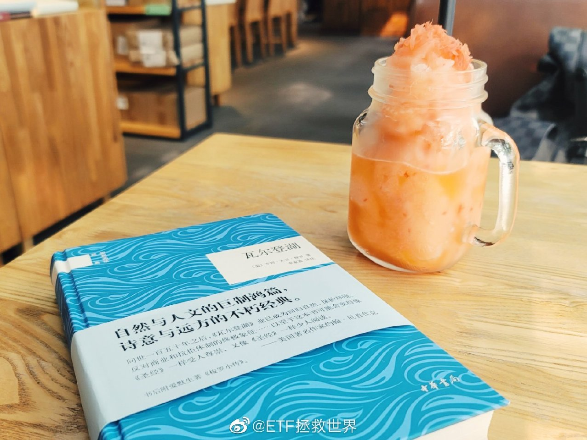

======================================================

ETF拯救世界 (5687069307) @
2020-09-15 10:53:33 Tue  
url: https://weibo.com/5687069307/JkIpdvv4D

有没有爱吃阳澄湖大闸蟹的朋友？

我正准备下单，如果有就评论区留言，我顺手多买一箱抽一位送你。

PS：抽奖对象只限铁粉。因为如果不限制有可能会有奇怪的人来占便宜，请其他朋友见谅吧~ ​ http://t.cn/A64juEUJ ​​​

转发[131]  评论[9317]  赞[4250] 

======================================================

ETF拯救世界 (5687069307) @
2020-09-15 16:45:21 Tue  
url: https://weibo.com/5687069307/JkKI15Sf5

行吧，没想到我这里吃货这么多。既然大家这么高兴，那我就再加一箱。一共抽两箱。中奖几率增加100个巴仙。

------------------------------------------------------
转推：
>  @ETF拯救世界 (5687069307)
>  2020-09-15 10:53:33 Tue  
>  url: https:/weibo.com/5687069307/JkIpdvv4D/

>  有没有爱吃阳澄湖大闸蟹的朋友？
>  
>  我正准备下单，如果有就评论区留言，我顺手多买一箱抽一位送你。
>  
>  PS：抽奖对象只限铁粉。因为如果不限制有可能会有奇怪的人来占便宜，请其他朋友见谅吧~ ​ http://t.cn/A64juEUJ ​​​

转发[10]  评论[877]  赞[1962] 

======================================================

ETF拯救世界 (5687069307) @
2020-09-16 10:07:26 Wed  
url: https://weibo.com/5687069307/JkRwZEQ5W

很多人问我科创50etf买不买。

我还是那句话：

你买我鼓掌，搁我我不买。

为什么呢。我要告诉你别买吧，万一又暴涨88.48%，你不转头就骂我吗？

捡金捡银没有捡骂的。短期的事谁说的清楚？

那我为什么不买呢？

我又不傻！ ​​​

转发[74]  评论[493]  赞[2407] 

======================================================

ETF拯救世界 (5687069307) @
2020-09-16 10:27:32 Wed  
url: https://weibo.com/5687069307/JkRF9vE1u

有些人把炒股看做是赌博。

我就不同了，我把所有投资都看成赌博。

看成赌博不对吗？太对了吧。难道投资不是赌博吗。你买入就是赌涨，你卖出或者买空就是赌跌。

看到这里无数价投要忍不住骂人了吧。别急，您再想想。

但金融投资这项赌博与老虎机之类的不同点在于，它可以计算并控制概率！

这一点就 ​​​

转发[296]  评论[632]  赞[2751] 

======================================================

ETF拯救世界 (5687069307) @
2020-09-16 10:57:17 Wed  
url: https://weibo.com/5687069307/JkRRemKhD

有点饿了。 ​​​

转发[5]  评论[511]  赞[1233] 

+++++++++++++++++++++++++++++++++++++++++++++++++++++

图片：
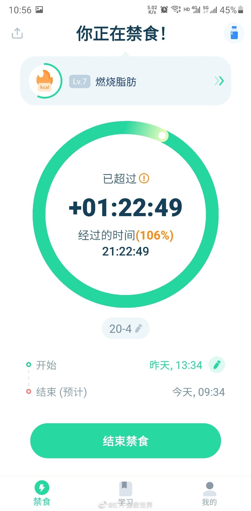

======================================================

ETF拯救世界 (5687069307) @
2020-09-16 17:03:52 Wed  
url: https://weibo.com/5687069307/JkUg1A8u1

目前仓位不宜过低。保守-激进保持在40%-70%之间为宜。

除创业板100、食品饮料，部分科技、部分医疗非常贵外，其它品种都还好。 ​​​

转发[115]  评论[595]  赞[1956] 

======================================================

ETF拯救世界 (5687069307) @
2020-09-16 17:05:59 Wed  
url: https://weibo.com/5687069307/JkUgTlTrw

16年两百万，算是知行合一吧。

------------------------------------------------------
转推：
>  @侠客岛 (5476386628)
>  2020-09-15 16:14:00 Tue  
>  url: https:/weibo.com/5476386628/JkKvi4KMK/

>  【受贿200余万，“正能量”落马了】人前，衢州市柯城原区委副书记、区长方庆建讲起党风廉政建设头头是道，多年来以“正能量”为微信号，平均每天发布正能量原创文章两条以上，企图在有4000多名好友的朋友圈中树立并巩固廉洁自律、积极进取的形象。
>   
>  背地里，方庆建大搞权钱交易，从只收熟人到来者不拒 ​​​

转发[30]  评论[197]  赞[989] 

======================================================

ETF拯救世界 (5687069307) @
2020-09-16 18:16:34 Wed  
url: https://weibo.com/5687069307/JkUJxjFQ5

问题：你什么时候发现自己是个节俭的人？

回答：

当我发现自己跟小助理开的是同一款车的时候。 ​​​

转发[19]  评论[834]  赞[2770] 

======================================================

ETF拯救世界 (5687069307) @
2020-09-16 20:04:07 Wed  
url: https://weibo.com/5687069307/JkVrbDPne

这视频急死我了，明明拍了那么长，翻来覆去放那两句，宁愿加背景音乐也不多放两句，想听听还说什么了就是听不到。

------------------------------------------------------
转推：
>  @观察者网 (1887344341)
>  2020-09-16 19:50:02 Wed  
>  url: https:/weibo.com/1887344341/JkVltnlTA/

>  【#杭州地铁回应男子辱骂女人是动物#：若女乘客报警，将协助】9月15日，浙江杭州。有市民反映，一女子在地铁车厢内补妆，被一男子辱骂“臭美”，并声称“女人也是动物，要好好调教调教”。杭州地铁回应，如当事人报警，将积极配合。http://t.cn/A64HMgNn ​​​

转发[5]  评论[141]  赞[800] 

======================================================

ETF拯救世界 (5687069307) @
2020-09-17 10:04:45 Thu  
url: https://weibo.com/5687069307/Jl0Wpd0pn

前几天继续减持医药和养老后，反弹了一天，相信很多朋友心里不免略带质疑。

这两天连续下跌，你可能又会觉得卖的好。

过几天又涨了，就又会觉得卖的辣鸡。

不要用那么短的眼光评判一个人。

路遥知马力，日久见人心。 ​​​

转发[47]  评论[546]  赞[2061] 

======================================================

ETF拯救世界 (5687069307) @
2020-09-17 11:21:37 Thu  
url: https://weibo.com/5687069307/Jl1rBr2R3

敢跌我们就敢买。

你不跌我们怎么买。钱都腾出来了赶紧的别磨叽。 ​​​

转发[20]  评论[820]  赞[2129] 

======================================================

ETF拯救世界 (5687069307) @
2020-09-17 14:11:26 Thu  
url: https://weibo.com/5687069307/Jl2yxalXL

辣鸡环保新高了。

哪儿说理去。 ​​​

转发[45]  评论[334]  赞[1584] 

======================================================

ETF拯救世界 (5687069307) @
2020-09-17 14:34:55 Thu  
url: https://weibo.com/5687069307/Jl2I4axES

有些事情你不能细想。

比如，为什么投资一个品种的几个ETF一起募集呢。

各种渠道狂推，全都售罄是必然的。那么一下子几百亿，只能买这几十只股票。流通量又不大……

到底为什么要一起募呢。

那当然是有目的了。不能细说，自己考虑吧。 ​​​

转发[92]  评论[336]  赞[1642] 

======================================================

ETF拯救世界 (5687069307) @
2020-09-17 15:18:40 Thu  
url: https://weibo.com/5687069307/Jl2ZP9CLW

我想到了事情没那么简单，但万万没想到连年龄都是假的。之前说无论是不是自愿，这男的侵害未成年就要承担一切后果。但这已经成年了，我就不知道怎么评价了。成年男女双方自愿在一起，你会怎么评价这件事？

------------------------------------------------------
转推：
>  @中国长安网 (5617030362)
>  2020-09-17 15:00:07 Thu  
>  url: https:/weibo.com/5617030362/Jl2SifP6r/

>  【重磅来了！鲍某某#律师涉嫌性侵养女案调查结果#】今日，最高检、公安部联合督导组通报：①女方并非未成年人，真实年龄已22周岁。见鲍某某时年满18周岁。②两人实际同居，现有证据不能证实鲍某某的行为构成性侵犯罪。③鲍某某明知不符合“收养”条件，自认为韩某某是未成年，仍以“收养”为名与她交往 ​​​

转发[34]  评论[327]  赞[1854] 

======================================================

ETF拯救世界 (5687069307) @
2020-09-17 16:17:26 Thu  
url: https://weibo.com/5687069307/Jl3nG70qH

我可能有心理疾病。

股市上一天缩水几十万收盘后我连想都不会想。

买东西，比如一件衣服，发现买贵了100块心里就挺难受。

但是买大东西，比如房子车子，买完了降价几万几十万又没什么感觉。

到底是怎么回事。 ​​​

转发[61]  评论[1066]  赞[3092] 

======================================================

ETF拯救世界 (5687069307) @
2020-09-17 21:33:13 Thu  
url: https://weibo.com/5687069307/Jl5rR2Exl

敢不敢收盘不要拉回去？

------------------------------------------------------
转推：
>  @新浪财经 (1638782947)
>  2020-09-17 21:32:00 Thu  
>  url: https:/weibo.com/1638782947/Jl5rmkQcm/

>  #美股三大指数集体低开#【开盘：联储声明后美元攀升 美股周四低开】周四美股追随外围市场低开，科技与航空股领跌。几乎所有资产都遭遇抛售，欧股全线下跌。资金涌入美元。美联储暗示将长期维持低利率政策之后，市场情绪谨慎。美国官方关于冠状病毒疫苗推出时间的信息相互矛盾。美国上周初请失业金人数 ​​​

转发[11]  评论[207]  赞[761] 

======================================================

ETF拯救世界 (5687069307) @
2020-09-18 08:48:52 Fri  
url: https://weibo.com/5687069307/Jl9S6i3pI

手表真火啊。

京东秒没。官网10.24才能发货。 ​​​

转发[12]  评论[245]  赞[1140] 

======================================================

ETF拯救世界 (5687069307) @
2020-09-18 08:54:28 Fri  
url: https://weibo.com/5687069307/Jl9UnbKwL

两条教训：第一，自己不要强行加塞。别人实在要加就让他加，早晚有人收拾他。第二，较劲的时候别提“你打我你打我”这种要求，否则对方可能真的会满足你。

------------------------------------------------------
转推：
>  @ ()
>  2020-09-18 08:31:07 Fri  
>  url: 

>  抱歉，作者已设置仅展示半年内微博，此微博已不可见。 ​​​

转发[32]  评论[202]  赞[863] 

======================================================

ETF拯救世界 (5687069307) @
2020-09-18 09:37:43 Fri  
url: https://weibo.com/5687069307/JlabVsmra

说实话，我一直不理解的是接盘新股的人。

一只股票上市，等于是一场宴席。吃鲍鱼的是原始股东，吃松鼠桂鱼的是投行，吃干炸小黄鱼的是新股中签的……

那么在高估上市加十几几十个涨停后接盘的人呢？

端着盘子舔，舔好了能有点油花儿，舔不好就让鱼刺卡了嗓子，到底图什么呢。

如果一件事，前面所有 ​​​

转发[180]  评论[497]  赞[1906] 

======================================================

ETF拯救世界 (5687069307) @
2020-09-18 10:40:30 Fri  
url: https://weibo.com/5687069307/JlaBpwvbU

顺势者昌，逆势者亡。

势起豪气冲天，势落满目凋零。

所以“识势”应该是第一课，也应该是永远修习的一课。 ​​​

转发[87]  评论[409]  赞[2033] 

======================================================

ETF拯救世界 (5687069307) @
2020-09-18 14:28:31 Fri  
url: https://weibo.com/5687069307/Jlc5XAzTt

叒新高了，看懂掌声。

------------------------------------------------------
转推：
>  @ETF拯救世界 (5687069307)
>  2020-09-17 14:11:26 Thu  
>  url: https:/weibo.com/5687069307/Jl2yxalXL/

>  辣鸡环保新高了。
>  
>  哪儿说理去。 ​​​

转发[28]  评论[501]  赞[1752] 

======================================================

ETF拯救世界 (5687069307) @
2020-09-18 16:14:26 Fri  
url: https://weibo.com/5687069307/JlcMXkgpk

十一有什么计划吗。

说来听听。

除了吃我送的大闸蟹。 ​​​

转发[15]  评论[1221]  赞[1881] 

======================================================

ETF拯救世界 (5687069307) @
2020-09-18 16:32:19 Fri  
url: https://weibo.com/5687069307/JlcUdynKL

免费NB。想起大学时作为特约作者为《电脑游戏攻略》写FM稿子的日子了……

------------------------------------------------------
转推：
>  @ ()
>  2020-09-18 13:04:05 Fri  
>  url: 

>  抱歉，作者已设置仅展示半年内微博，此微博已不可见。 ​​​

转发[14]  评论[188]  赞[751] 

======================================================

ETF拯救世界 (5687069307) @
2020-09-18 18:20:06 Fri  
url: https://weibo.com/5687069307/JldBXDeBv

恭喜@沉入星辰 1名用户获得【阳澄湖大闸蟹一箱】。微博官方唯一抽奖工具@微博抽奖平台 对本次抽奖进行监督，结果公正有效。公示链接：http://t.cn/A64RmMtx

------------------------------------------------------
转推：
>  @ETF拯救世界 (5687069307)
>  2020-09-15 10:53:33 Tue  
>  url: https:/weibo.com/5687069307/JkIpdvv4D/

>  有没有爱吃阳澄湖大闸蟹的朋友？
>  
>  我正准备下单，如果有就评论区留言，我顺手多买一箱抽一位送你。
>  
>  PS：抽奖对象只限铁粉。因为如果不限制有可能会有奇怪的人来占便宜，请其他朋友见谅吧~ ​ http://t.cn/A64juEUJ ​​​

转发[0]  评论[378]  赞[805] 

======================================================

ETF拯救世界 (5687069307) @
2020-09-19 11:16:39 Sat  
url: https://weibo.com/5687069307/JlkgA9ybO

肇事逃逸的直接20年不可以吗。肇事也许不能完全避免，量刑可以轻。但你撞死人就跑只判6年吗。

------------------------------------------------------
转推：
>  @ ()
>  2020-09-19 10:12:24 Sat  
>  url: 

>  抱歉，作者已设置仅展示半年内微博，此微博已不可见。 ​​​

转发[41]  评论[313]  赞[1704] 

======================================================

ETF拯救世界 (5687069307) @
2020-09-19 18:04:35 Sat  
url: https://weibo.com/5687069307/JlmWasrGr

回复@xuhuangkai:我自己微博愿意说什么就说什么。管的着吗你？不是你的领域你就不说话了？你平常就这样？什么玩意儿。我有亲人被人醉驾撞了，去世了，对方跑了。我希望他死刑，怎么了？滚蛋。

------------------------------------------------------
转推：
>  @ ()
>  2020-09-19 10:12:24 Sat  
>  url: 

>  抱歉，作者已设置仅展示半年内微博，此微博已不可见。 ​​​

转发[4]  评论[147]  赞[1392] 

======================================================

ETF拯救世界 (5687069307) @
2020-09-19 18:18:24 Sat  
url: https://weibo.com/5687069307/Jln1LDrxd

犯错谁都在所难免。最重要的是你犯了错，对别人造成伤害，你就要负责。

你撞了人就跑，这是人干的事情吗。这已经不是无意伤害的问题了好吗。

作为曾经的受害人家属，我就是希望这种肇事逃逸要严惩，严到犯了错就不敢跑，怎么了，有问题吗？

你知道家里人被撞了，肇事者跑了找不到是什么感觉吗？你什 ​​​

转发[21]  评论[269]  赞[1846] 

======================================================

ETF拯救世界 (5687069307) @
2020-09-19 19:24:26 Sat  
url: https://weibo.com/5687069307/Jlnszvsr9

buds live后续评测

品控不行。开箱就坏了一个。已更换。

降噪效果确实不行。

优点是真的舒服。用过五款无线耳机，这个是佩戴最舒服的。

音质相当好。

799交个朋友就非常值了。 ​​​

转发[5]  评论[187]  赞[882] 

======================================================

ETF拯救世界 (5687069307) @
2020-09-20 10:49:47 Sun  
url: https://weibo.com/5687069307/JltwaCwMX

昨天第一次在公开场合骂人，不好意思了。

但我不会删。

另外，未成年的小朋友不要跟哥哥学，这是不好的。 ​​​

转发[10]  评论[606]  赞[1739] 

======================================================

ETF拯救世界 (5687069307) @
2020-09-20 20:23:04 Sun  
url: https://weibo.com/5687069307/JlxgSlrIo

恭喜@青年夏天 1名用户获得【阳澄湖大闸蟹一箱】。微博官方唯一抽奖工具@微博抽奖平台 对本次抽奖进行监督，结果公正有效。公示链接：http://t.cn/A64uHWIa

------------------------------------------------------
转推：
>  @ETF拯救世界 (5687069307)
>  2020-09-15 10:53:33 Tue  
>  url: https:/weibo.com/5687069307/JkIpdvv4D/

>  有没有爱吃阳澄湖大闸蟹的朋友？
>  
>  我正准备下单，如果有就评论区留言，我顺手多买一箱抽一位送你。
>  
>  PS：抽奖对象只限铁粉。因为如果不限制有可能会有奇怪的人来占便宜，请其他朋友见谅吧~ ​ http://t.cn/A64juEUJ ​​​

转发[1]  评论[201]  赞[509] 

======================================================

ETF拯救世界 (5687069307) @
2020-09-21 10:32:16 Mon  
url: https://weibo.com/5687069307/JlCPyzYet

新高不卖。 ​​​

转发[125]  评论[312]  赞[1402] 

======================================================

ETF拯救世界 (5687069307) @
2020-09-21 10:43:16 Mon  
url: https://weibo.com/5687069307/JlCU237co

新高不卖的意思，是不要因为你持仓的品种涨的不错你就惊慌失措害怕坐电梯赶紧卖掉。如果你有各种投资策略，比如再平衡啊，比如网格啊等等，当然要坚定执行。不是说一分钱都不能卖，而是说不要主观猜顶随意清仓新高品种。

------------------------------------------------------
转推：
>  @ETF拯救世界 (5687069307)
>  2020-09-21 10:32:16 Mon  
>  url: https:/weibo.com/5687069307/JlCPyzYet/

>  新高不卖。 ​​​

转发[108]  评论[368]  赞[1448] 

======================================================

ETF拯救世界 (5687069307) @
2020-09-21 16:36:38 Mon  
url: https://weibo.com/5687069307/JlFdsgtg2

看原博评论很多人不明白：你违停还打人？ 当然了，被违停的人打概率要比被一般人打概率大很多很多。为什么？因为违停的人一是不在意规则，一是不认为自己错。一个不在意规则/不认为自己错的人，发现你在举报他，他发火的概率会很大。这就是很多社会新闻里面你发现很多人明明自己错了却理直气壮的原因

------------------------------------------------------
转推：
>  @ ()
>  2020-09-21 16:22:28 Mon  
>  url: 

>  抱歉，作者已设置仅展示半年内微博，此微博已不可见。 ​​​

转发[25]  评论[124]  赞[819] 

======================================================

ETF拯救世界 (5687069307) @
2020-09-21 16:48:20 Mon  
url: https://weibo.com/5687069307/JlFicB8Rr

欧洲下跌3%，美股还能扛吗？[太开心] ​​​

转发[20]  评论[249]  赞[1126] 

======================================================

ETF拯救世界 (5687069307) @
2020-09-21 17:27:26 Mon  
url: https://weibo.com/5687069307/JlFy4ygeq

喷了，卖的第二天见顶。//@ETF拯救世界:先卖一点吧……另外说好的送武汉医生小米产品的事正在让他选产品，说到做到。 http://t.cn/A64bmm0d

------------------------------------------------------
转推：
>  @ETF拯救世界 (5687069307)
>  2020-01-20 09:23:06 Mon  
>  url: https:/weibo.com/5687069307/Iqk89CEU4/

>  万万没想到你是这样的小米…… ​​​

转发[11]  评论[114]  赞[760] 

======================================================

ETF拯救世界 (5687069307) @
2020-09-21 17:30:59 Mon  
url: https://weibo.com/5687069307/JlFzwroiu

外面的辣鸡跟喷子不一样，没法拉黑。所以出门在外能不起冲突就不要起冲突。

------------------------------------------------------
转推：
>  @ ()
>  2020-09-21 17:15:09 Mon  
>  url: 

>  抱歉，作者已设置仅展示半年内微博，此微博已不可见。 ​​​

转发[29]  评论[93]  赞[644] 

======================================================

ETF拯救世界 (5687069307) @
2020-09-21 17:36:30 Mon  
url: https://weibo.com/5687069307/JlFBL4WV9

回复@盛夏双面娇:没影响。//@盛夏双面娇:E大，且慢通知的易方达证券公司分级基金改lof的事，有什么影响吗，不用我们操作什么吧？ http://t.cn/A641c3JI

------------------------------------------------------
转推：
>  @ETF拯救世界 (5687069307)
>  2020-09-21 16:48:20 Mon  
>  url: https:/weibo.com/5687069307/JlFicB8Rr/

>  欧洲下跌3%，美股还能扛吗？[太开心] ​​​

转发[8]  评论[111]  赞[688] 

======================================================

ETF拯救世界 (5687069307) @
2020-09-21 22:30:12 Mon  
url: https://weibo.com/5687069307/JlHwYsPmQ

不能喝就别喝了。酒这东西酿成了多少悲剧。喝点零度可乐不香吗！

------------------------------------------------------
转推：
>  @中国日报 (1663072851)
>  2020-09-21 20:13:13 Mon  
>  url: https:/weibo.com/1663072851/JlGDmFMkR/

>  【回应“李心草案”六个疑问——昆明市办案机关接受新华社记者专访】9月21日，“李心草案”一审公开宣判，昆明市盘龙区人民法院对被告人罗秉乾以过失致人死亡罪判处有期徒刑一年六个月。就广大网民关注的涉案其他问题，昆明市有关办案机关接受了新华社记者专访，进行了回应。
>  　　一、李心草溺亡前发生 ​​​

转发[13]  评论[144]  赞[698] 

======================================================

ETF拯救世界 (5687069307) @
2020-09-21 22:39:31 Mon  
url: https://weibo.com/5687069307/JlHAKtuKH

关于酒，我这辈子听过最扯淡的一句话就是：

不抽烟不喝酒这辈子还有什么乐趣。

敢情您这辈子就这两个乐趣啊。 ​​​

转发[78]  评论[478]  赞[2126] 

======================================================

ETF拯救世界 (5687069307) @
2020-09-21 23:21:55 Mon  
url: https://weibo.com/5687069307/JlHRXtHCj

纳斯达克明早不要让我失望。

毕竟有人说跌一半才允许我得瑟呢。 ​​​

转发[5]  评论[303]  赞[1402] 

======================================================

ETF拯救世界 (5687069307) @
2020-09-22 10:36:35 Tue  
url: https://weibo.com/5687069307/JlMhOcHVM

网格表格已更新。

提款之旅再次启程。 ​​​

转发[36]  评论[666]  赞[1935] 

======================================================

ETF拯救世界 (5687069307) @
2020-09-22 11:10:37 Tue  
url: https://weibo.com/5687069307/JlMvCuvIP

[中国赞][中国赞][中国赞][中国赞][中国赞][中国赞]

------------------------------------------------------
转推：
>  @财联社APP (2868676035)
>  2020-09-22 10:47:14 Tue  
>  url: https:/weibo.com/2868676035/JlMm8cgBP/

>  【华夏基金旗下科创50ETF半小时大卖逾50亿元】财联社9月22日讯，今日，华夏基金、华泰柏瑞、工银瑞信、易方达等四家公司旗下的科创50ETF开卖。9点30分左右，开卖约半小时后，华夏基金已经卖出50亿元。此前，四家基金公司从投教、营销到运营做了充足的准备。根据公告，四家公司首募规模认购上限都为50亿 ​​​

转发[21]  评论[166]  赞[850] 

======================================================

ETF拯救世界 (5687069307) @
2020-09-22 11:15:35 Tue  
url: https://weibo.com/5687069307/JlMxDxq5v

科创50：

目前平均PE85+，平均PB 8+，二季度利润增长：0。

相比之下，二季度利润增速40%+的医疗和利润增速25%+的食品饮料也显得不贵了呢。 ​​​

转发[93]  评论[214]  赞[1507] 

======================================================

ETF拯救世界 (5687069307) @
2020-09-22 11:24:38 Tue  
url: https://weibo.com/5687069307/JlMBjEwS3

回复@携风牧云:不要吐槽。上市后涨50%，听你话的人不申购没挣钱会骂你。//@携风牧云:唉，因为我是券商出来的，所以券商的朋友很多，这两天铺天盖地的全是宣传这玩意的。吐槽它吧得罪人，不吐槽吧，这玩意就真是个辣鸡，心里那叫一个不痛快啊。

------------------------------------------------------
转推：
>  @ETF拯救世界 (5687069307)
>  2020-09-22 11:15:35 Tue  
>  url: https:/weibo.com/5687069307/JlMxDxq5v/

>  科创50：
>  
>  目前平均PE85+，平均PB 8+，二季度利润增长：0。
>  
>  相比之下，二季度利润增速40%+的医疗和利润增速25%+的食品饮料也显得不贵了呢。 ​​​

转发[21]  评论[118]  赞[969] 

======================================================

ETF拯救世界 (5687069307) @
2020-09-22 16:39:25 Tue  
url: https://weibo.com/5687069307/JlOF5bA8h

现在有没有不舒服的。说说你为什么不舒服。

（我是说投资。你要身体不舒服赶紧上医院） ​​​

转发[21]  评论[754]  赞[2131] 

======================================================

ETF拯救世界 (5687069307) @
2020-09-22 18:13:08 Tue  
url: https://weibo.com/5687069307/JlPh7y4ul

其实别人真的不是很在乎你，不要压力太大。

大家都很忙的。 ​​​

转发[117]  评论[665]  赞[2886] 

======================================================

ETF拯救世界 (5687069307) @
2020-09-24 11:28:44 Thu  
url: https://weibo.com/5687069307/Jm5tYamIy

情况就是这么个情况。 ​​​

转发[8]  评论[310]  赞[1402] 

======================================================

ETF拯救世界 (5687069307) @
2020-09-24 11:31:41 Thu  
url: https://weibo.com/5687069307/Jm5vaBZBI

不要催发车，150和S都是。

你不知道自己被保护的多好。 ​​​

转发[23]  评论[602]  赞[2555] 

======================================================

ETF拯救世界 (5687069307) @
2020-09-24 11:43:31 Thu  
url: https://weibo.com/5687069307/Jm5zYbOH0

现金，永远不会烧手。

资本市场的机会无穷无尽。但你的钱是有限的。

不要急着挥棒。等球飞到最佳区域。 ​​​

转发[160]  评论[425]  赞[2320] 

======================================================

ETF拯救世界 (5687069307) @
2020-09-24 11:53:08 Thu  
url: https://weibo.com/5687069307/Jm5DSfCmv

3月全球股灾中买入，涨起来以后，我们一分钱权益类没买。

最近五个月越涨越高，追的人越来越多。他们现在大多数已经被套的死死的。我们长线仓位除了高位持续减仓，只买了两份债券，现在都是盈利状态。

连几个品种的网格都卖光了。

现在跌回来，网格又开始新一轮提款。长线也会买。这种投资经历相信 ​​​

转发[110]  评论[702]  赞[2431] 

======================================================

ETF拯救世界 (5687069307) @
2020-09-24 12:06:30 Thu  
url: https://weibo.com/5687069307/Jm5Jj1OHO

最近看了两集90年代的港剧。

喜欢关咏荷。 ​​​

转发[10]  评论[479]  赞[1580] 

======================================================

ETF拯救世界 (5687069307) @
2020-09-24 17:11:50 Thu  
url: https://weibo.com/5687069307/Jm7JeudVX

21000、17500依然有效。//@ETF拯救世界:刚才看了一下，几个月过去，最下面的极限点位17000已经上升至17500左右。更容易达到了。

------------------------------------------------------
转推：
>  @ETF拯救世界 (5687069307)
>  2019-08-26 10:08:35 Mon  
>  url: https:/weibo.com/5687069307/I3YBClttT/

>  预告一下。
>  
>  150会在23000以下买1-4份恒生。21000以下买4-10份。
>  
>  S会在23000以下持续买入。 ​​​

转发[130]  评论[528]  赞[1650] 

======================================================

ETF拯救世界 (5687069307) @
2020-09-25 11:52:36 Fri  
url: https://weibo.com/5687069307/Jmf4a13MU

今天我又来这家吃了…

------------------------------------------------------
转推：
>  @ETF拯救世界 (5687069307)
>  2019-09-16 13:04:10 Mon  
>  url: https:/weibo.com/5687069307/I7bJjww7l/

>  挣钱了不吃点好的，赔钱的时候还能有心情吗？[偷笑] ​​​

转发[8]  评论[497]  赞[1707] 

======================================================

ETF拯救世界 (5687069307) @
2020-09-27 10:55:49 Sun  
url: https://weibo.com/5687069307/Jmxy68Ebl

不开盘算什么工作日？ ​​​

转发[32]  评论[590]  赞[1998] 

======================================================

ETF拯救世界 (5687069307) @
2020-09-27 14:07:15 Sun  
url: https://weibo.com/5687069307/JmyNNwRNS

这么无聊不如派糖999。

祝大家双节快乐，祝国泰民安。

 http://t.cn/A6bPL9uN ​​​

转发[14]  评论[1482]  赞[2258] 

======================================================

ETF拯救世界 (5687069307) @
2020-09-27 21:52:17 Sun  
url: https://weibo.com/5687069307/JmBQywRhj

本来今天一切都很完美。

增加了运动量（10km)，断食也坚持的非常好。

身体感觉很舒服。

直到晚上收到一位小助理送的饼干。

[微笑] ​​​

转发[9]  评论[517]  赞[1525] 

======================================================

ETF拯救世界 (5687069307) @
2020-09-28 09:59:50 Mon  
url: https://weibo.com/5687069307/JmGBS9FDQ

$科创50 sh000688$ 

90倍。200亿接盘。 ​​​

转发[97]  评论[434]  赞[1415] 

======================================================

ETF拯救世界 (5687069307) @
2020-09-28 10:45:33 Mon  
url: https://weibo.com/5687069307/JmGUqp2fb

有没有可能这个世界和宇宙根本就不存在。

一切都是假的。是你想象出来的。你也不存在，只有意识。

或者你就是个模拟人生游戏里面的人物，其他人都是NPC。 ​​​

转发[53]  评论[1168]  赞[2273] 

======================================================

ETF拯救世界 (5687069307) @
2020-09-28 15:02:58 Mon  
url: https://weibo.com/5687069307/JmIAVat5d

公募基金无法解决的问题就是，

无论是基金发行机构还是基金销售机构，它们的利益最大化就是多发产品，多卖产品，多提管理费和销售费用。最终客户是否赚钱并不是最重要的。

这也导致你观察到的，很多热门行业产品，在高位大量发行，套了很多人。也能看到在牛市高位区域热钱汹涌而入，而两类机构照单全 ​​​

转发[166]  评论[444]  赞[2074] 

======================================================

ETF拯救世界 (5687069307) @
2020-09-28 17:10:29 Mon  
url: https://weibo.com/5687069307/JmJqFAkI7

敌在本能寺 ​​​

转发[9]  评论[286]  赞[1454] 

======================================================

ETF拯救世界 (5687069307) @
2020-09-28 18:45:15 Mon  
url: https://weibo.com/5687069307/JmK38s51C

听懂掌声。

------------------------------------------------------
转推：
>  @网易财经 (1974561081)
>  2020-09-28 18:30:03 Mon  
>  url: https:/weibo.com/1974561081/JmJWY7jRo/

>  【汪潮涌：全球千亿美元市值医药公司有20家，没一家是中国的】9月28日，信中利资本集团创始人、董事长汪潮涌在绿公司年会上表示，当前全球医药行业，市值超过一千亿美金的公司有20家，但没有一家是中国的，我国医药巨头与国际医药巨头从市值相比，还有很大的提升空间。http://t.cn/A6b7A4o0 ​​​

转发[39]  评论[228]  赞[972] 

======================================================

ETF拯救世界 (5687069307) @
2020-09-28 19:04:31 Mon  
url: https://weibo.com/5687069307/JmKaXpxNo

特别长！没耐心的不用看了。

好在叙事还算清楚，只是行文有些啰嗦。前面一大段原生家庭的具体事情其实跟后面的没什么关系。

两个人在一起久了，真的很容易发生各种问题。我也没什么好的建议。

家里不温暖，人生就更艰难了。 ​​​

转发[20]  评论[467]  赞[1696] 

+++++++++++++++++++++++++++++++++++++++++++++++++++++

图片：

======================================================

ETF拯救世界 (5687069307) @
2020-09-28 19:29:21 Mon  
url: https://weibo.com/5687069307/JmKl2keNU

“贵人鸟、富贵鸟”，你听这些名字，年轻人会买吗。

------------------------------------------------------
转推：
>  @观察者网 (1887344341)
>  2020-09-28 19:15:17 Mon  
>  url: https:/weibo.com/1887344341/JmKfkjara/

>  【#吴晓波：过去五年80%品牌消失#，物美价平的厂货是趋势】近日，财经作家吴晓波在参加一次活动中表示，消费者对品牌的忠诚度在降低。他认为，一些“新品牌”甚至白牌厂货会更受到消费者的欢迎。近几年，包括拉夏贝尔、贵人鸟、富贵鸟等服饰运动品牌门店不断缩减，营收缩水，几近消失。你会买厂货吗？ ​​​

转发[20]  评论[420]  赞[1153] 

======================================================

ETF拯救世界 (5687069307) @
2020-09-29 18:32:24 Tue  
url: https://weibo.com/5687069307/JmToq7wDR

突然意识到认识各位已经好几年，

这时间久到我都不好意思再装18岁了。 ​​​

转发[12]  评论[1090]  赞[3407] 

======================================================

ETF拯救世界 (5687069307) @
2020-09-29 19:03:26 Tue  
url: https://weibo.com/5687069307/JmTB13mgd

过节期间必须写点东西了。有很强烈的表达欲。

保底一篇起。 ​​​

转发[17]  评论[1105]  赞[3689] 

======================================================

ETF拯救世界 (5687069307) @
2020-09-30 11:05:04 Wed  
url: https://weibo.com/5687069307/JmZTlhYbZ

突发新闻：

看到一个男的巨帅，像年轻时候的木村拓哉。

有意的姑娘速度打车过来。坐标国贸。  ​​​

转发[6]  评论[800]  赞[2248] 

======================================================

ETF拯救世界 (5687069307) @
2020-09-30 12:26:45 Wed  
url: https://weibo.com/5687069307/Jn0qv3rYz

刚才偶尔看到了一对夫妻的微博。

网上认识，第一天加微信，第二天见面，一小时内为爱鼓掌，18天闪婚。

几个月后闹离婚，互相指责。女的说男的精神病，男的说女的图财。

看了一会，无限唏嘘。

各位单身的朋友，如果你是要约P我不说什么。如果你真的要认认真真谈恋爱结婚，一定一定不要让荷尔蒙冲昏 ​​​

转发[41]  评论[512]  赞[2177] 

======================================================

ETF拯救世界 (5687069307) @
2020-10-01 08:08:02 Thu  
url: https://weibo.com/5687069307/Jn89ZjIVE

结婚或者找男女朋友一定要慎重。

------------------------------------------------------
转推：
>  @搜狐新闻 (5890672121)
>  2020-10-01 00:05:58 Thu  
>  url: https:/weibo.com/5890672121/Jn50jgw4i/

>  【拉姆遭前夫纵火烧伤不幸去世】9月14日晚，拉姆在家中直播时，被前夫用汽油焚烧，重度烧伤，病情危重。家人求助后，爱心人士一天时间捐助一百万医疗费用。然而，遗憾的是，经历16天治疗后，9月30日拉姆不幸离世。http://t.cn/A6bAwm5j ​​​

转发[46]  评论[573]  赞[1222] 

======================================================

ETF拯救世界 (5687069307) @
2020-10-03 15:51:42 Sat  
url: https://weibo.com/5687069307/Jnu3b7tac

跟亲戚聚会，一定要保护好孩子。如果有贱兮兮的亲戚在各方面打击孩子，开不合时宜的玩笑，一定要帮孩子怼回去。

不要怕影响关系，那种人不做亲戚也没什么损失。 ​​​

转发[120]  评论[436]  赞[3944] 

======================================================

ETF拯救世界 (5687069307) @
2020-10-03 16:31:16 Sat  
url: https://weibo.com/5687069307/JnujexBr4

洪崖洞没必要上去。外面看看就行了。除非你特别喜欢拥挤的环境。

------------------------------------------------------
转推：
>  @网易财经 (1974561081)
>  2020-10-03 10:44:53 Sat  
>  url: https:/weibo.com/1974561081/Jns2DB4wK/

>  【#居民带人抄近路进洪崖洞收费20元# 游客：把我们带到电梯口人就走了[doge]】10月2日，重庆洪崖洞人流涌动，进景区的队排到了马路对面。游客林先生称，有当地居民可以带着“抄近道”快速进景区，一人20块钱，可以不用排两三个小时的队。跟着进入一个居民楼21楼，到了电梯口居民就走了。（沸点视频） ​​​

转发[5]  评论[236]  赞[757] 

======================================================

ETF拯救世界 (5687069307) @
2020-10-04 19:58:22 Sun  
url: https://weibo.com/5687069307/JnF5NmqN7

用了半天时间，终于把所有账户的情况理清楚了。各类资产的占比也非常明白。

由于几个月没有大量买入，叠加不断有现金流流入，股票+股票基金比例在下降。相信绝大多数朋友也都是这个情况。

如果你觉得权益类资产过低，同时被流入现金不断稀释，那么每个月的自由现金流可以拿一部分出来强制买入。当然 ​​​

转发[56]  评论[613]  赞[2583] 

======================================================

ETF拯救世界 (5687069307) @
2020-10-07 09:19:01 Wed  
url: https://weibo.com/5687069307/Jo3bMkBQr

这就是我说的，数据可能是真的，但发布者和解读者会隐瞒一些事实，引导你解读出错误的结论。

------------------------------------------------------
转推：
>  @北京人不知道的北京事儿 (1662214194)
>  2020-10-07 08:37:26 Wed  
>  url: https:/weibo.com/1662214194/Jo2UTr62F/

>  【怎么看待北京大龄单身女突破80w？[衰]】chenqing：做一个简单的计算：
>  2019年北京市女性未婚人口数量等于1331÷0.78‰=170.6万人，1990年为75.5万人。
>  2019年北京市男性未婚人口数量等于1736÷0.78‰=222.6万人，1990年为115.6万人。
>  29年来，北京市未婚女性增加了95.1万人，未婚男性增加了107万人。
>   ​​​

转发[83]  评论[200]  赞[1097] 

======================================================

ETF拯救世界 (5687069307) @
2020-10-07 09:34:20 Wed  
url: https://weibo.com/5687069307/Jo3hZBzuT

特别喜欢这个，再分享一次。后天要上班了，再开心一下。

------------------------------------------------------
转推：
>  @第36个故事Jessie (2673125007)
>  2019-06-17 20:35:06 Mon  
>  url: https:/weibo.com/2673125007/Hzmfu93yN/

>  #麦的垛# 火车驶向云外，梦安魂于九霄。  http://t.cn/AiN9puwA ​​​

转发[181]  评论[248]  赞[890] 

======================================================

ETF拯救世界 (5687069307) @
2020-10-07 15:55:23 Wed  
url: https://weibo.com/5687069307/Jo5MF0KIX

震惊，不知道是不是我读者中第一个中几百万彩票的朋友。

另外随手截了几个因为精选评论限制无法上墙的留言。所以留言一定要快，当天就留，否则没位子了就没法上了。 ​​​

转发[45]  评论[500]  赞[2308] 

+++++++++++++++++++++++++++++++++++++++++++++++++++++

图片：
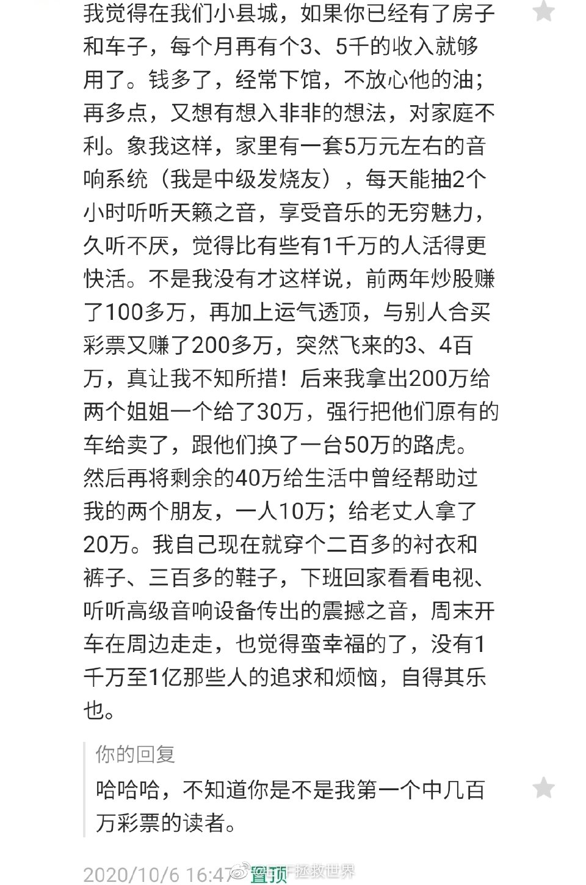

======================================================

ETF拯救世界 (5687069307) @
2020-10-07 16:21:08 Wed  
url: https://weibo.com/5687069307/Jo5X6FmKG

回复@金融christ:因为男的打女的太容易了，容易到会让你分不清是欺负她还是她对不起你。女的打男的男的不还手，群众就知道肯定不是欺负人，而是男的心甘情愿挨打。也许为了爱，也许为了愧疚。//@金融christ:请教老师。。。为何女打男一巴掌的场面和男打女一巴掌的场面群众反应迥异？

------------------------------------------------------
转推：
>  @第36个故事Jessie (2673125007)
>  2019-06-17 20:35:06 Mon  
>  url: https:/weibo.com/2673125007/Hzmfu93yN/

>  #麦的垛# 火车驶向云外，梦安魂于九霄。  http://t.cn/AiN9puwA ​​​

转发[19]  评论[122]  赞[817] 

======================================================

ETF拯救世界 (5687069307) @
2020-10-09 09:39:53 Fri  
url: https://weibo.com/5687069307/Jombfmjgq

辣鸡叕新高了。//@ETF拯救世界:叒新高了，看懂掌声。

------------------------------------------------------
转推：
>  @ETF拯救世界 (5687069307)
>  2020-09-17 14:11:26 Thu  
>  url: https:/weibo.com/5687069307/Jl2yxalXL/

>  辣鸡环保新高了。
>  
>  哪儿说理去。 ​​​

转发[9]  评论[227]  赞[1158] 

======================================================

ETF拯救世界 (5687069307) @
2020-10-09 09:56:27 Fri  
url: https://weibo.com/5687069307/JomhXpucE

即使环保这么辣鸡的品种，钻石坑那几个月跟车的朋友收益率也已经超过70%了……

入市时机太重要了。

不知道有哪些幸运儿是看了那篇钻石坑的文章开始干的。 ​​​

转发[84]  评论[564]  赞[2147] 

======================================================

ETF拯救世界 (5687069307) @
2020-10-09 10:15:04 Fri  
url: https://weibo.com/5687069307/Jompwa9Dy

不知道你有没有认真思考过这个问题。

长线仓位低位持续买入，然后长期持有，然后赚大钱，然后落袋为安；

波动仓位设好条件单，上上下下一笔一笔提款……

为什么钱会源源不断流入你的账户。为什么这么简单赚钱。

不需要你耗费多少精力和时间，该吃吃该玩玩。

相反，为什么一轮牛熊下来其他人大多数 ​​​

转发[225]  评论[798]  赞[2782] 

======================================================

ETF拯救世界 (5687069307) @
2020-10-09 12:19:45 Fri  
url: https://weibo.com/5687069307/Jone7DMNh

出去浪。 ​​​

转发[7]  评论[465]  赞[1596] 

======================================================

ETF拯救世界 (5687069307) @
2020-10-09 14:16:49 Fri  
url: https://weibo.com/5687069307/JonZDDPH4

我不评论。请看我微博几年时间的朋友自己思考判断这样的信息。没去过日本的挑战性更大一点。

------------------------------------------------------
转推：
>  @孤烟暮蝉 (2150758415)
>  2020-10-07 12:02:27 Wed  
>  url: https:/weibo.com/2150758415/Jo4g70h4m/

>  日本城市街头到处垃圾的网络资料在欧美的社交网疯传[吃惊] ​​​

转发[20]  评论[325]  赞[1236] 

======================================================

ETF拯救世界 (5687069307) @
2020-10-09 15:00:06 Fri  
url: https://weibo.com/5687069307/JoohddcwH

6%。

“指数涨太慢” ​​​

转发[12]  评论[355]  赞[1736] 

======================================================

ETF拯救世界 (5687069307) @
2020-10-09 17:03:50 Fri  
url: https://weibo.com/5687069307/Jop5rnr16

国与国之间没什么正义不正义的。

对方做的很多事你觉得特别可恨，特别不公平，但从对方的角度看，就是正确的。因为它这么做就是为了它自己的利益。它的人民也不会为你觉得不公平。人民都是占了便宜偷着乐，吃了亏可不答应。

别说对方了，就是第三方都不会为你感觉不公平。这世界上打仗的地方多了，你 ​​​

转发[87]  评论[424]  赞[2480] 

======================================================

ETF拯救世界 (5687069307) @
2020-10-10 18:39:12 Sat  
url: https://weibo.com/5687069307/Joz8DyLAx

50了。服了。

------------------------------------------------------
转推：
>  @吴奇隆 (1266286555)
>  2020-10-10 17:38:22 Sat  
>  url: https:/weibo.com/1266286555/JoyJWC42T/

>  #快樂大本營#天天好心情……今晚滿滿元氣喔…… ​​​

转发[20]  评论[352]  赞[1545] 

======================================================

ETF拯救世界 (5687069307) @
2020-10-11 13:22:24 Sun  
url: https://weibo.com/5687069307/JoGuym6Op

最近有个不成熟的想法：

女人在好色程度上并不亚于男人。

同意掌声。 ​​​

转发[37]  评论[991]  赞[4667] 

======================================================

ETF拯救世界 (5687069307) @
2020-10-11 13:49:34 Sun  
url: https://weibo.com/5687069307/JoGFzB6yt

狗分两种：狗和边牧。

------------------------------------------------------
转推：
>  @ ()
>  2020-10-11 13:33:07 Sun  
>  url: 

>  抱歉，作者已设置仅展示半年内微博，此微博已不可见。 ​​​

转发[160]  评论[346]  赞[1565] 

======================================================

ETF拯救世界 (5687069307) @
2020-10-12 10:46:36 Mon  
url: https://weibo.com/5687069307/JoOTOnmk0

新高不卖。 ​​​

转发[22]  评论[787]  赞[1916] 

======================================================

ETF拯救世界 (5687069307) @
2020-10-12 11:46:07 Mon  
url: https://weibo.com/5687069307/JoPhXDRhS

债券跌得让人非常开心。 ​​​

转发[29]  评论[473]  赞[1966] 

======================================================

ETF拯救世界 (5687069307) @
2020-10-12 14:50:27 Mon  
url: https://weibo.com/5687069307/JoQuMxteJ

你觉得这件事责任在谁。我先说：责任肯定不是孩子的。

------------------------------------------------------
转推：
>  @新浪视频 (1640601392)
>  2020-10-12 13:15:03 Mon  
>  url: https:/weibo.com/1640601392/JoPS3CPE3/

>  【网曝武汉#女子因搭错地铁当众连踹母亲3脚#  网友：太过分不能忍】近日，湖北武汉，网传一女子因母亲搭错地铁，在站内狂踹母亲。爆料者称，看见一女人推着两个行李箱，还背了一个大包，急急忙忙的上了地铁，她可能没注意那班地铁已经到终点了，跟在她后面女孩子就特别气愤的用脚踢她。视频中一短发女 ​​​

转发[37]  评论[321]  赞[1143] 

======================================================

ETF拯救世界 (5687069307) @
2020-10-12 14:57:14 Mon  
url: https://weibo.com/5687069307/JoQxxhWLK

喜欢潇洒哥，也喜欢TIMO~~~~

------------------------------------------------------
转推：
>  @钟镇涛 (1719628403)
>  2020-10-11 22:01:13 Sun  
>  url: https:/weibo.com/1719628403/JoJT8pzRA/

>  #我们的歌# 今晚和搭档 @冯提莫  一起合作了 @刘若英 的《为爱痴狂》，希望听歌你的为我“痴狂”。  http://t.cn/A6bXxZ7G ​​​

转发[38]  评论[128]  赞[717] 

======================================================

ETF拯救世界 (5687069307) @
2020-10-12 15:07:35 Mon  
url: https://weibo.com/5687069307/JoQBJCAMh

恒生是不是又有机会提款了。

品种表现辣鸡不代表你提不到款。关键是______。（5分） ​​​

转发[27]  评论[487]  赞[1618] 

======================================================

ETF拯救世界 (5687069307) @
2020-10-12 15:25:16 Mon  
url: https://weibo.com/5687069307/JoQIVfYae

各位到市场上投资，你不可能买到所有品种在所有时间都是大牛。

那么当你买到大牛、肉鸡和辣鸡的时候，该怎么做，就得分别有预案。

然后根据你的预案进行操作。

换句话说，当你点击买入按钮之后发生的所有可能，你都已经做好准备了。这种时候无论发生什么，你都能游刃有余，按照预案执行就可以了。

 ​​​

转发[275]  评论[488]  赞[2095] 

======================================================

ETF拯救世界 (5687069307) @
2020-10-12 16:43:02 Mon  
url: https://weibo.com/5687069307/JoRetELJi

讲真，我想进这个群，谁有群号拉我进去啊。没别的，就是想等她们拍完照进去把下午茶吃了……//@红茶家的三叔: 嗯，这个。。

------------------------------------------------------
转推：
>  @互联网的那点事 (1627825392)
>  2020-10-12 00:01:36 Mon  
>  url: https:/weibo.com/1627825392/JoKG0pbzk/

>  上海名媛
>  
>  [挖鼻][挖鼻][挖鼻] 
>  
>  #上海名媛群# ​​​

转发[56]  评论[520]  赞[1825] 

======================================================

ETF拯救世界 (5687069307) @
2020-10-13 09:28:56 Tue  
url: https://weibo.com/5687069307/JoXOMcBfG

喝一杯自制奶茶，开始写字。 ​​​

转发[12]  评论[914]  赞[1922] 

======================================================

ETF拯救世界 (5687069307) @
2020-10-13 18:10:34 Tue  
url: https://weibo.com/5687069307/Jp1evqxon

公众号刚看到有一条留言：

“感觉你的水平和xx有一定差距了。用100-年龄就是你的仓位这么简单的事要说这么多。”

喷了。看了眼关注时间：2020年8月26日。

拉黑。 ​​​

转发[15]  评论[642]  赞[1656] 

+++++++++++++++++++++++++++++++++++++++++++++++++++++

图片：

======================================================

ETF拯救世界 (5687069307) @
2020-10-14 09:50:42 Wed  
url: https://weibo.com/5687069307/Jp7o6Biwf

有一些朋友关心体脂的问题，我估计主要是惦记那3888。

一直在降，现在成绩是下降了3.2，还有两个多月，需要再降4.8。还是有难度的。

你们还有希望。 

（又看了一下，原来是已经降了5.2，还剩2.8。估计你们没戏了…） ​​​

转发[18]  评论[402]  赞[1323] 

+++++++++++++++++++++++++++++++++++++++++++++++++++++

图片：

======================================================

ETF拯救世界 (5687069307) @
2020-10-14 10:50:18 Wed  
url: https://weibo.com/5687069307/Jp7Mj5OvJ

回复@多大点事儿儿儿:不难吧。你中午12点吃完饭（多吃点），第二天8点吃早饭，其实就等于是一顿晚饭没吃。//@多大点事儿儿儿:回复@ETF-铁人1号:查了一下，一天有20小时不进食？这，不敢信

------------------------------------------------------
转推：
>  @ETF拯救世界 (5687069307)
>  2020-10-14 09:50:42 Wed  
>  url: https:/weibo.com/5687069307/Jp7o6Biwf/

>  有一些朋友关心体脂的问题，我估计主要是惦记那3888。
>  
>  一直在降，现在成绩是下降了3.2，还有两个多月，需要再降4.8。还是有难度的。
>  
>  你们还有希望。 
>  
>  （又看了一下，原来是已经降了5.2，还剩2.8。估计你们没戏了…） ​​​

转发[7]  评论[164]  赞[659] 

======================================================

ETF拯救世界 (5687069307) @
2020-10-14 11:36:35 Wed  
url: https://weibo.com/5687069307/Jp855l9Yi

其实可能大家都没有意识到，这个20-4断食法，是一个策略。本质上它跟我们的各种投资策略一样，就是找到一个适合自己的规则，然后坚定执行。

按理说中午12点吃完饭，然后到第二天8点之间，或者执行18-6，就是12点吃完到第二天6点之间不吃任何东西，这个和正经吃晚饭也差不多。一顿晚饭少吃点也没多少热 ​​​

转发[245]  评论[422]  赞[1603] 

======================================================

ETF拯救世界 (5687069307) @
2020-10-14 11:44:44 Wed  
url: https://weibo.com/5687069307/Jp88p3eDU

回复@DCEP:你可以设计一个“不带手机进卧室”策略。叠加“躺下就开始看英文哲学书”策略疗效更佳。//@DCEP:回复@ETF拯救洪荒:截止目前我觉得最难的是准时早点睡觉。

------------------------------------------------------
转推：
>  @ETF拯救世界 (5687069307)
>  2020-10-14 11:36:35 Wed  
>  url: https:/weibo.com/5687069307/Jp855l9Yi/

>  其实可能大家都没有意识到，这个20-4断食法，是一个策略。本质上它跟我们的各种投资策略一样，就是找到一个适合自己的规则，然后坚定执行。
>  
>  按理说中午12点吃完饭，然后到第二天8点之间，或者执行18-6，就是12点吃完到第二天6点之间不吃任何东西，这个和正经吃晚饭也差不多。一顿晚饭少吃点也没多少热 ​​​

转发[43]  评论[172]  赞[878] 

======================================================

ETF拯救世界 (5687069307) @
2020-10-14 15:08:07 Wed  
url: https://weibo.com/5687069307/Jp9sWBi2T

债券终于艰难的提升到了2.13%仓位…… ​​​

转发[24]  评论[274]  赞[1443] 

+++++++++++++++++++++++++++++++++++++++++++++++++++++

图片：
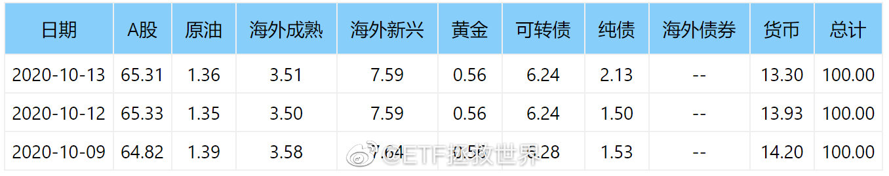

======================================================

ETF拯救世界 (5687069307) @
2020-10-14 15:30:05 Wed  
url: https://weibo.com/5687069307/Jp9BRvtFD

喷了，这件衣服即将重新合身了…… ​​​

转发[15]  评论[965]  赞[3013] 

+++++++++++++++++++++++++++++++++++++++++++++++++++++

图片：

======================================================

ETF拯救世界 (5687069307) @
2020-10-14 21:48:09 Wed  
url: https://weibo.com/5687069307/Jpc5kpsXx

“有人不谈感情只让她买基金”。现在我只想谈感情不想让你买基金。

------------------------------------------------------
转推：
>  @ ()
>  2020-10-14 21:43:34 Wed  
>  url: 

>  抱歉，作者已设置仅展示半年内微博，此微博已不可见。 ​​​

转发[17]  评论[299]  赞[938] 

======================================================

ETF拯救世界 (5687069307) @
2020-10-14 22:16:58 Wed  
url: https://weibo.com/5687069307/Jpch1dUkJ

有可能过一阵要送一批小礼物。如果能成，估计经常刷我微博的朋友会很喜欢。

具体是什么我不能说。

我只能告诉你，相当庸俗。 ​​​

转发[40]  评论[3396]  赞[5098] 

======================================================

ETF拯救世界 (5687069307) @
2020-10-15 11:15:55 Thu  
url: https://weibo.com/5687069307/Jphnc8hMC

非常普通的一天 ​​​

转发[13]  评论[712]  赞[1636] 

======================================================

ETF拯救世界 (5687069307) @
2020-10-15 14:24:08 Thu  
url: https://weibo.com/5687069307/JpiBB972S

突然被昨天那个相亲的新闻启发到了：

如果你相亲或者其他途径认识了一个人，那个人你不喜欢，ta却对你穷追不舍，你倒是可以借鉴新闻里卖基金的那个人：

跟ta说自己做传销，要拉他进下线。一般人就会退了。如果还不退，就说自己做这个倾家荡产了，还借了300多万，向他借钱去还钱。绝大多数人都会退了 ​​​

转发[71]  评论[653]  赞[2237] 

======================================================

ETF拯救世界 (5687069307) @
2020-10-15 23:05:28 Thu  
url: https://weibo.com/5687069307/Jpm1ctU28

身体很诚实

------------------------------------------------------
转推：
>  @新浪财经 (1638782947)
>  2020-10-15 22:46:25 Thu  
>  url: https:/weibo.com/1638782947/JplTtcJY3/

>  #逾134万人预约 iPhone 12#【两大电商平台已有超过134万人预约购买iPhone 12系列手机】截至10月15日晚6时许，在京东商城、苏宁易购两大电商平台的苹果产品自营旗舰店，合计已有超过134万人预约购买iPhone 12系列手机。券商对于iPhone 12系列销量的预期存在分歧。有分析认为，iPhone 12定价高于预期，对 ​​​

转发[19]  评论[338]  赞[929] 

======================================================

ETF拯救世界 (5687069307) @
2020-10-16 09:44:55 Fri  
url: https://weibo.com/5687069307/JpqcLc0u1

现在债基分红选再投资。 ​​​

转发[16]  评论[500]  赞[1543] 

======================================================

ETF拯救世界 (5687069307) @
2020-10-16 10:09:53 Fri  
url: https://weibo.com/5687069307/JpqmTr5Fx

一定要保住你的头发！

------------------------------------------------------
转推：
>  @ ()
>  2020-10-14 17:01:04 Wed  
>  url: 

>  抱歉，作者已设置仅展示半年内微博，此微博已不可见。 ​​​

转发[37]  评论[334]  赞[1113] 

======================================================

ETF拯救世界 (5687069307) @
2020-10-16 18:24:21 Fri  
url: https://weibo.com/5687069307/JptBABezg

很多痛苦来源于你有所求而不得。

如果对人对事绝望了，就会瞬间开心起来。

听懂掌声。 ​​​

转发[249]  评论[966]  赞[4104] 

======================================================

ETF拯救世界 (5687069307) @
2020-10-18 11:03:58 Sun  
url: https://weibo.com/5687069307/JpJzQaeBI

上一篇发车文章都5天了，阅读量还没有到10万+。

就这么过气了。

哈哈哈哈哈哈哈哈哈哈哈哈靠。 ​​​

转发[24]  评论[1066]  赞[2798] 

======================================================

ETF拯救世界 (5687069307) @
2020-10-18 12:26:51 Sun  
url: https://weibo.com/5687069307/JpK7tvLbm

为什么大多数男人都喜欢3C产品？

给直男送礼物送3C大概率不会错。 ​​​

转发[26]  评论[770]  赞[2175] 

======================================================

ETF拯救世界 (5687069307) @
2020-10-20 17:28:52 Tue  
url: https://weibo.com/5687069307/Jq4X3wyxk

一日不见，如隔三秋。 ​​​

转发[20]  评论[835]  赞[2306] 

+++++++++++++++++++++++++++++++++++++++++++++++++++++

图片：

======================================================

ETF拯救世界 (5687069307) @
2020-10-20 18:07:04 Tue  
url: https://weibo.com/5687069307/Jq5cz4E5g

反正我是这样想的。 ​​​

转发[21]  评论[580]  赞[2304] 

+++++++++++++++++++++++++++++++++++++++++++++++++++++

图片：

======================================================

ETF拯救世界 (5687069307) @
2020-10-21 13:55:26 Wed  
url: https://weibo.com/5687069307/JqcYVe8MX

债券这几天反弹了。

我知道很多朋友不喜欢买债券，只想买股票，赚大钱，迎娶白富美，走上人生巅峰——

那我下次就多买几份债券。[微笑] ​​​

转发[32]  评论[701]  赞[2271] 

======================================================

ETF拯救世界 (5687069307) @
2020-10-21 15:07:51 Wed  
url: https://weibo.com/5687069307/Jqdsk5phW

猿辅导真的可以，上市了我得考虑是不是买点，把学费挣回来。

------------------------------------------------------
转推：
>  @ ()
>  2020-10-21 14:53:03 Wed  
>  url: 

>  抱歉，作者已设置仅展示半年内微博，此微博已不可见。 ​​​

转发[67]  评论[456]  赞[1500] 

======================================================

ETF拯救世界 (5687069307) @
2020-10-22 14:19:28 Thu  
url: https://weibo.com/5687069307/JqmzbcY7X

且慢的投顾业务上线了。我了解了一下，自动跟车（暂时不支持长赢）、投顾费用返还等方案细节还是很不错的~感兴趣的朋友可以看看。

------------------------------------------------------
转推：
>  @且慢管家 (6186312580)
>  2020-10-22 14:00:00 Thu  
>  url: https:/weibo.com/6186312580/JqmrgEEOH/

>  #且慢发布会##基金#从获得投顾资格到今天，我们的“四笔钱投顾服务升级计划”正式落地，在此期间，且慢的小伙伴们开了无数次会，从符合监管要求、到为大家严选适合四笔钱的策略、以及如何让大家在不增加成本的前提下尽量享受更便捷的服务，过程中有争吵、有碰撞，但小慢开心的发现，“站在用户一边”的 ​​​

转发[27]  评论[389]  赞[1559] 

======================================================

ETF拯救世界 (5687069307) @
2020-10-22 18:13:58 Thu  
url: https://weibo.com/5687069307/Jqo6mdLzJ

回复@justlook11:图片评论 http://t.cn/A6bmZ9yx //@justlook11:当我听说且慢可以自动跟车时，我就硬了；可一听到不支持长盈时，我就萎了；E大，您说我这病能治嘛？[doge]//@ETF拯救世界:且慢的投顾业务上线了。我了解了一下，自动跟车（暂时不支持长赢）、投顾费用返还等方案细节还是很不错的~感兴趣的朋友可以看看。

------------------------------------------------------
转推：
>  @且慢管家 (6186312580)
>  2020-10-22 14:00:00 Thu  
>  url: https:/weibo.com/6186312580/JqmrgEEOH/

>  #且慢发布会##基金#从获得投顾资格到今天，我们的“四笔钱投顾服务升级计划”正式落地，在此期间，且慢的小伙伴们开了无数次会，从符合监管要求、到为大家严选适合四笔钱的策略、以及如何让大家在不增加成本的前提下尽量享受更便捷的服务，过程中有争吵、有碰撞，但小慢开心的发现，“站在用户一边”的 ​​​

转发[13]  评论[250]  赞[910] 

======================================================

ETF拯救世界 (5687069307) @
2020-10-23 13:59:36 Fri  
url: https://weibo.com/5687069307/JqvRBxiD5

什么时候开始接回长线医药，什么时候开始医药网格？

[太开心] ​​​

转发[34]  评论[926]  赞[2229] 

======================================================

ETF拯救世界 (5687069307) @
2020-10-23 18:05:31 Fri  
url: https://weibo.com/5687069307/Jqxtqg8Vc

红利ETF要分红了，所以网格价格也要全部重新设定。

具体调整稍后为您带来。 ​​​

转发[23]  评论[528]  赞[1838] 

======================================================

ETF拯救世界 (5687069307) @
2020-10-23 18:46:51 Fri  
url: https://weibo.com/5687069307/JqxKd0K6X

回复@潇筱逍201610:图片评论 http://t.cn/A6b3PZUg //@潇筱逍201610:好的宝贝😊

------------------------------------------------------
转推：
>  @ETF拯救世界 (5687069307)
>  2020-10-23 18:05:31 Fri  
>  url: https:/weibo.com/5687069307/Jqxtqg8Vc/

>  红利ETF要分红了，所以网格价格也要全部重新设定。
>  
>  具体调整稍后为您带来。 ​​​

转发[4]  评论[394]  赞[1164] 

======================================================

ETF拯救世界 (5687069307) @
2020-10-24 12:09:54 Sat  
url: https://weibo.com/5687069307/JqEzzCq7f

我最近在考虑体系和成功的关系。

有了一点新的理解。

无论做什么事，都应该是体系建立起来，路径正确了，才有可能持续成功。

就以投资来说，体系没有建立，方向不正确，即使一时赚了钱，最终的结果也会很惨。

比如你入市正好赶上牛市赚钱了，或者连续中新股，又或者听了消息炒对了一波热点等等。这 ​​​

转发[405]  评论[746]  赞[3372] 

======================================================

ETF拯救世界 (5687069307) @
2020-10-26 14:25:14 Mon  
url: https://weibo.com/5687069307/JqYjvplDK

红利网格已更新。

顺便又加了一个品种。 ​​​

转发[27]  评论[945]  赞[2489] 

======================================================

ETF拯救世界 (5687069307) @
2020-10-27 09:49:07 Tue  
url: https://weibo.com/5687069307/Jr5VV964c

分享图片 ​​​

转发[17]  评论[735]  赞[1881] 

+++++++++++++++++++++++++++++++++++++++++++++++++++++

图片：
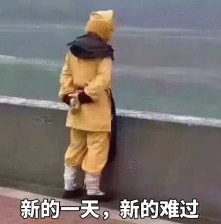

======================================================

ETF拯救世界 (5687069307) @
2020-10-27 14:55:57 Tue  
url: https://weibo.com/5687069307/Jr7Wt1qMl

最近跟各位沟通的少了。

主要原因是我在认真学习，努力思考人生。

学习让我快乐，思考使我充实。

不要太想我！ ​​​

转发[19]  评论[1084]  赞[3157] 

======================================================

ETF拯救世界 (5687069307) @
2020-10-28 16:37:41 Wed  
url: https://weibo.com/5687069307/Jri2ggpVO

对任何人来说，健康才是最重要的，大家都一定要保重身体。身体好了，才能做更多对人民群众有益的、更有意义的事！祝尽快康复~（大家看我说的对不对，是不是有一千万该烦恼的还是很烦恼 [doge]）

------------------------------------------------------
转推：
>  @孟岩 (1651676492)
>  2020-10-28 13:50:22 Wed  
>  url: https:/weibo.com/1651676492/JrgWle6yP/

>  #投资实证# 一个突出青年的康复之路[挤眼] http://t.cn/A6bFNmlw ​​​

转发[93]  评论[299]  赞[1578] 

======================================================

ETF拯救世界 (5687069307) @
2020-10-28 17:47:06 Wed  
url: https://weibo.com/5687069307/JriuqAF3E

好家伙。70%火锅汤泼自己朋友身上了。

------------------------------------------------------
转推：
>  @新浪财经 (1638782947)
>  2020-10-28 17:44:37 Wed  
>  url: https:/weibo.com/1638782947/JritqgZep/

>  【因口角纠纷，#黑龙江鹤岗一火锅店内顾客互泼滚烫火锅#，多人被烫伤 】10月6日，黑龙江鹤岗，一烧烤店内，两伙人用桌上滚烫的涮肚锅互泼，致多人烫伤。民警调查发现，因一女子在烧烤店使用厕所时，另外一桌顾客在门口等候关了厕所的灯又打开，双方发生口角引发斗殴。事件中，3人暂定为轻伤。警方找到 ​​​

转发[38]  评论[281]  赞[682] 

======================================================

ETF拯救世界 (5687069307) @
2020-10-28 21:06:27 Wed  
url: https://weibo.com/5687069307/JrjNm33QX

回复@ETF拖地僧:不意外。前几天网格调整懂了吧//@ETF拖地僧:E大，好消息，德国大跌了啦//@ETF拯救世界:好家伙。70%火锅汤泼自己朋友身上了。

------------------------------------------------------
转推：
>  @新浪财经 (1638782947)
>  2020-10-28 17:44:37 Wed  
>  url: https:/weibo.com/1638782947/JritqgZep/

>  【因口角纠纷，#黑龙江鹤岗一火锅店内顾客互泼滚烫火锅#，多人被烫伤 】10月6日，黑龙江鹤岗，一烧烤店内，两伙人用桌上滚烫的涮肚锅互泼，致多人烫伤。民警调查发现，因一女子在烧烤店使用厕所时，另外一桌顾客在门口等候关了厕所的灯又打开，双方发生口角引发斗殴。事件中，3人暂定为轻伤。警方找到 ​​​

转发[12]  评论[194]  赞[560] 

======================================================

ETF拯救世界 (5687069307) @
2020-10-28 21:33:18 Wed  
url: https://weibo.com/5687069307/JrjYfg3YX

上面有生鱼片，现在吃安全吗。

在线等挺急的。 ​​​

转发[6]  评论[431]  赞[1344] 

+++++++++++++++++++++++++++++++++++++++++++++++++++++

图片：

======================================================

ETF拯救世界 (5687069307) @
2020-10-29 08:07:10 Thu  
url: https://weibo.com/5687069307/Jro7x7Neq

今天估计很多朋友的条件单通知会咔咔往外冒。 ​​​

转发[23]  评论[938]  赞[1911] 

+++++++++++++++++++++++++++++++++++++++++++++++++++++

图片：

======================================================

ETF拯救世界 (5687069307) @
2020-10-29 12:04:09 Thu  
url: https://weibo.com/5687069307/JrpFJ65d9

不得不说，医疗三季度业绩太好了…… ​​​

转发[14]  评论[444]  赞[1959] 

======================================================

ETF拯救世界 (5687069307) @
2020-10-29 16:21:56 Thu  
url: https://weibo.com/5687069307/JrrmmgDtJ

领10月红包了！本月1010。

其实这红包也不算我发的。因为每个月微博会分几百块钱给我，我就加点转手送给大家了。您别嫌少，开心一下。

#ETF拯救世界的红包#拼的就是手速！超酷的ETF拯救世界 在发红包哦，人品在线，运气爆表，好运从赢红包开始，快来一起嗨抢吧！ http://t.cn/A6GvB0j4 ​​​

转发[31]  评论[1299]  赞[2310] 

======================================================

ETF拯救世界 (5687069307) @
2020-10-29 16:58:47 Thu  
url: https://weibo.com/5687069307/JrrBjwROk

我把中奖的人微博看了一遍。从来没有转或赞我的，也没讨论过投资的，评论里也没见过的，同时满足这几个条件就拉黑。他们大概率就是抽奖专业户。

给真正的朋友腾地儿。 ​​​

转发[25]  评论[1502]  赞[4468] 

======================================================

ETF拯救世界 (5687069307) @
2020-10-29 19:56:58 Thu  
url: https://weibo.com/5687069307/JrsLDz2rX

我看了半天，不确认你说的是“E大你这个渣男一定受到惩罚”，还是“E大，你说渣男是不是一定会受到惩罚”

保险起见，还是这样回答比较安全。 ​​​

转发[15]  评论[753]  赞[1890] 

+++++++++++++++++++++++++++++++++++++++++++++++++++++

图片：

======================================================

ETF拯救世界 (5687069307) @
2020-10-29 21:37:30 Thu  
url: https://weibo.com/5687069307/JrtqsfeIH

应当事人要要求，上条微博删了。

如果以后不能接受我截图发微博，请不必给我私信。

我是希望能回复给很多类似情况的朋友看，一对一我确实没这个精力。 ​​​

转发[9]  评论[365]  赞[2095] 

======================================================

ETF拯救世界 (5687069307) @
2020-10-30 08:54:42 Fri  
url: https://weibo.com/5687069307/JrxRka3KJ

你盯着一个字两分钟，会发现这个字突然变得非常陌生，好像不认识了。

你与一个人相处久了，也会发现ta好像与你刚认识ta的时候不一样。 ​​​

转发[42]  评论[706]  赞[2147] 

======================================================

ETF拯救世界 (5687069307) @
2020-10-30 12:06:19 Fri  
url: https://weibo.com/5687069307/Jrz76dGWG

现在发车文章里面都有干货，建议看看。 ​​​

转发[31]  评论[902]  赞[2403] 

======================================================

ETF拯救世界 (5687069307) @
2020-10-30 12:52:35 Fri  
url: https://weibo.com/5687069307/JrzpSvetY

刚发现，10月居然发了3篇文章！

爆发了！

好努力的人——有被自己感动到。 ​​​

转发[18]  评论[1013]  赞[2986] 

======================================================

ETF拯救世界 (5687069307) @
2020-10-30 14:10:25 Fri  
url: https://weibo.com/5687069307/JrzVtlozH

好久好久没有买A股了吧。

不会太远了。 ​​​

转发[46]  评论[950]  赞[2553] 

======================================================

ETF拯救世界 (5687069307) @
2020-10-30 16:54:45 Fri  
url: https://weibo.com/5687069307/JrB0b2QsO

无论做什么都会被骂。 ​​​

转发[14]  评论[945]  赞[2042] 

+++++++++++++++++++++++++++++++++++++++++++++++++++++

图片：

======================================================

ETF拯救世界 (5687069307) @
2020-10-30 17:34:38 Fri  
url: https://weibo.com/5687069307/JrBgmyhf9

双11买到什么好东西了吗。

不妨说说，让弟兄们开开眼。 ​​​

转发[28]  评论[1252]  赞[2131] 

======================================================

ETF拯救世界 (5687069307) @
2020-10-31 11:03:38 Sat  
url: https://weibo.com/5687069307/JrI8a7MuR

昨天的数据出来了。

如果之前的高位你没卖，那么现在大多数板块已经没有必要卖了。

A股又快比国债便宜了。 ​​​

转发[102]  评论[842]  赞[2978] 

======================================================

ETF拯救世界 (5687069307) @
2020-11-01 10:25:18 Sun  
url: https://weibo.com/5687069307/JrRj5AdfD

断舍离。

买一件，扔一件。 ​​​

转发[26]  评论[596]  赞[2097] 

======================================================

ETF拯救世界 (5687069307) @
2020-11-01 13:37:05 Sun  
url: https://weibo.com/5687069307/JrSyW61lL

个人感觉，苹果硬件真的有点落后了。 ​​​

转发[15]  评论[518]  赞[1415] 

+++++++++++++++++++++++++++++++++++++++++++++++++++++

图片：

======================================================

ETF拯救世界 (5687069307) @
2020-11-02 09:18:14 Mon  
url: https://weibo.com/5687069307/Js0imz3pd

？？？？？？？ ​​​

转发[38]  评论[332]  赞[1134] 

+++++++++++++++++++++++++++++++++++++++++++++++++++++

图片：
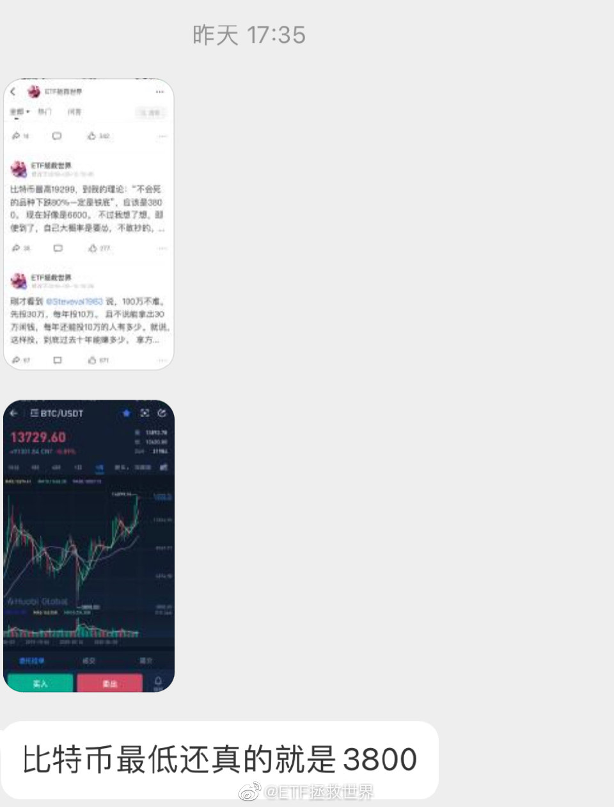
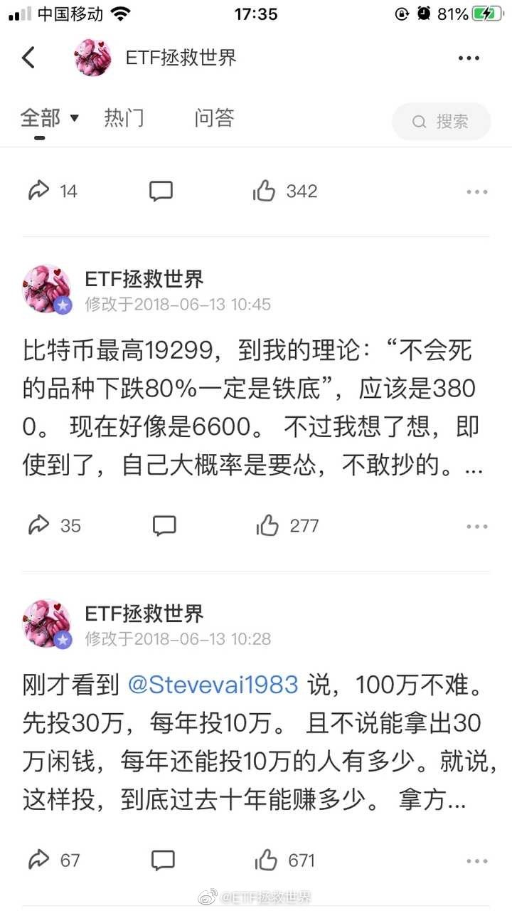

======================================================

ETF拯救世界 (5687069307) @
2020-11-02 09:27:42 Mon  
url: https://weibo.com/5687069307/Js0mcFH52

我看了看，19年到过3400呢。这哥们私信吓我一跳，毕竟蒙的哪有这么准。比特币始终不敢玩，所以涨多少跟我无关…不眼红，不后悔。吃自己能吃的饭。

------------------------------------------------------
转推：
>  @ETF拯救世界 (5687069307)
>  2020-11-02 09:18:14 Mon  
>  url: https:/weibo.com/5687069307/Js0imz3pd/

>  ？？？？？？？ ​​​

转发[22]  评论[214]  赞[953] 

======================================================

ETF拯救世界 (5687069307) @
2020-11-02 09:52:49 Mon  
url: https://weibo.com/5687069307/Js0wp23c3

想给上周五发车后砸恒生的朋友送锦旗，上书四个大字： ​​​

转发[37]  评论[539]  赞[1668] 

+++++++++++++++++++++++++++++++++++++++++++++++++++++

图片：

======================================================

ETF拯救世界 (5687069307) @
2020-11-02 10:19:32 Mon  
url: https://weibo.com/5687069307/Js0HfhH9W

有些人之所以要去喷别人，很多时候并不是因为别人做错了什么事，

而是因为别人得到了他人的认可和喜爱。

说白了，就是嫉妒。 ​​​

转发[46]  评论[357]  赞[1718] 

======================================================

ETF拯救世界 (5687069307) @
2020-11-02 10:44:41 Mon  
url: https://weibo.com/5687069307/Js0RsfrOh

昨天晚上知乎推了一个问题给我：婆婆明确表示不帮你看孩子你会怎样。

下面有无数人义愤填膺指责这样的婆婆，还有人现身说法痛说自己婆婆不帮自己带孩子多么多么可恨，以后绝不给她养老。

当时我就震惊了。

你夫妻两人自己happy造个孩子出来，凭什么老人就一定要帮你带。如果老人愿意，那你应该感谢 ​​​

转发[81]  评论[1018]  赞[3855] 

======================================================

ETF拯救世界 (5687069307) @
2020-11-02 11:11:59 Mon  
url: https://weibo.com/5687069307/Js12xepMj

你可以像某些国家的人一样为了让我买东西，脸上笑着心里骂我xx。但你不能让我买东西却连个笑脸都不给我，还指着我的鼻子骂我，还跟着别人来打我。如果这样我还买你的东西，那我就真是xx了。

------------------------------------------------------
转推：
>  @蓝鲸财经记者工作平台 (1885454921)
>  2020-11-02 11:08:01 Mon  
>  url: https:/weibo.com/1885454921/Js10VqauT/

>  【#数吨澳龙虾滞留中国机场#面临清关延迟】
>  据《悉尼先驱晨报》报道，数吨活澳大利亚龙虾正滞留在中国机场的停机坪上，面临清关延迟问题，如果它们被中方拒绝入关或再拖延48个小时以上，昂贵的甲壳类动物将难以生存。澳南方龙虾有限公司CEO科森蒂诺表示，由于中国提高了进口产品检验标准，一些澳大利亚 ​​​

转发[45]  评论[295]  赞[1542] 

======================================================

ETF拯救世界 (5687069307) @
2020-11-02 15:12:20 Mon  
url: https://weibo.com/5687069307/Js2C603J3

今天不错。

恒生涨债券涨。

明天涨不涨？跟今天有什么关系。开心就完事了。 ​​​

转发[48]  评论[429]  赞[1773] 

======================================================

ETF拯救世界 (5687069307) @
2020-11-02 16:29:58 Mon  
url: https://weibo.com/5687069307/Js37C7xtQ

二年级了。事情有了新的发展。儿子说这学期开始，班上另一个女生下课时候总是来找他聊天。这几天还在排队或者喝水的时候总是站在他旁边，更过分的是还总是故意挤过来挨着他。这些都无所谓，这几年我听多了。但这次不一样的是，儿子第一次跟我说他害羞了……以前都是暴力推开疯狂跑掉的。更担心了……

------------------------------------------------------
转推：
>  @ETF拯救世界 (5687069307)
>  2019-10-31 10:10:51 Thu  
>  url: https:/weibo.com/5687069307/Ie0PjhG49/

>  儿子说，班里有个小姑娘抱着他说要跟他谈恋爱。
>  
>  以前孩子小的时候这样的事情我都觉得好笑，现在有点担心了。
>  
>  刚一年级。要真往这上面开始动心思，学习不就全完蛋了。
>  
>  这TMD怎么办。 ​​​

转发[67]  评论[982]  赞[2906] 

======================================================

ETF拯救世界 (5687069307) @
2020-11-03 07:45:40 Tue  
url: https://weibo.com/5687069307/Js97i01DN

双十一前的忠告：

打折虽然好，但如果你买了根本不需要的东西，就是烧钱。无论它多么便宜。

我本人目前开始一项为期一年的减量生活实验：所有非快消产品买一扔二，尽量不买东西。一定要买就买品质非常好的，不买垃圾。 ​​​

转发[108]  评论[721]  赞[2927] 

======================================================

ETF拯救世界 (5687069307) @
2020-11-03 08:37:44 Tue  
url: https://weibo.com/5687069307/Js9sqcEdB

约谈的时间点非常好。

已经顺利发行不影响上市融资，又没有开始交易不会影响市场。

[good] ​​​

转发[47]  评论[337]  赞[2006] 

======================================================

ETF拯救世界 (5687069307) @
2020-11-03 09:40:36 Tue  
url: https://weibo.com/5687069307/Js9RWAgos

[太开心] ​​​

转发[17]  评论[633]  赞[1764] 

+++++++++++++++++++++++++++++++++++++++++++++++++++++

图片：
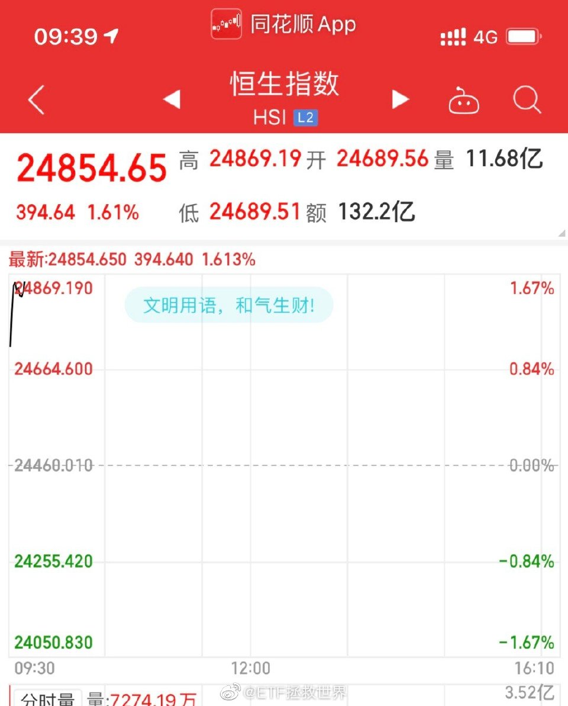

======================================================

ETF拯救世界 (5687069307) @
2020-11-03 10:09:34 Tue  
url: https://weibo.com/5687069307/Jsa3HixkT

好久没见过4字头了 ​​​

转发[15]  评论[486]  赞[1355] 

+++++++++++++++++++++++++++++++++++++++++++++++++++++

图片：
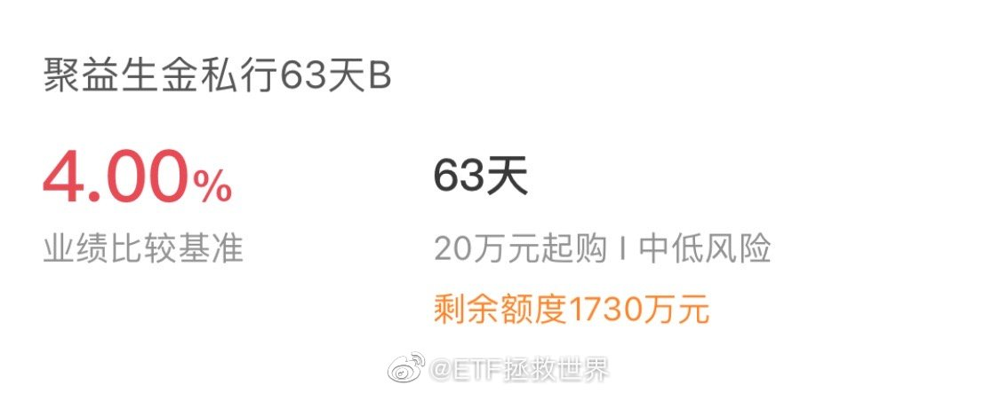

======================================================

ETF拯救世界 (5687069307) @
2020-11-03 13:40:02 Tue  
url: https://weibo.com/5687069307/Jsbr7E7Dp

生命中的每个人都会陪你走一段路

只有你自己会一直陪着你

对身边的人好一点

更要对自己好

每天要哄自己开心 ​​​

转发[158]  评论[715]  赞[2764] 

======================================================

ETF拯救世界 (5687069307) @
2020-11-03 14:28:38 Tue  
url: https://weibo.com/5687069307/JsbKR1JRc

涨两天，就高兴两天。明天跌？明天跌跟今天有什么关系。开心就完事了。

------------------------------------------------------
转推：
>  @ETF拯救世界 (5687069307)
>  2020-11-02 15:12:20 Mon  
>  url: https:/weibo.com/5687069307/Js2C603J3/

>  今天不错。
>  
>  恒生涨债券涨。
>  
>  明天涨不涨？跟今天有什么关系。开心就完事了。 ​​​

转发[22]  评论[423]  赞[1694] 

======================================================

ETF拯救世界 (5687069307) @
2020-11-03 21:06:42 Tue  
url: https://weibo.com/5687069307/Jsemqt2dQ

你怎么看 ​​​

转发[29]  评论[680]  赞[3448] 

+++++++++++++++++++++++++++++++++++++++++++++++++++++

图片：

======================================================

ETF拯救世界 (5687069307) @
2020-11-03 21:45:44 Tue  
url: https://weibo.com/5687069307/JseCh0ZZo

[浮云]//@水晶苍蝇拍:[吃瓜][吃瓜]

------------------------------------------------------
转推：
>  @珍大户 (2270915402)
>  2020-10-31 22:29:43 Sat  
>  url: https:/weibo.com/2270915402/JrMCDD9EK/

>  外行人以为马云是在炮轰银行。
>  其实银行听了才高兴。毕竟，如果没有紧箍咒，银行和蚂蚁都可以赚钱  http://t.cn/A6Gw7vQD ​​​

转发[362]  评论[302]  赞[1325] 

======================================================

ETF拯救世界 (5687069307) @
2020-11-04 07:08:03 Wed  
url: https://weibo.com/5687069307/Jsiiwb4yM

再看看有没有新的感悟

------------------------------------------------------
转推：
>  @ETF拯救世界 (5687069307)
>  2018-11-22 13:06:35 Thu  
>  url: https:/weibo.com/5687069307/H3PQEprmE/

>  第一，闭嘴
>  
>  第二，管住下半身
>  
>  男人的成功概率提高75.4个巴仙。
>  
>  如果伴侣能管住嘴，则成功概率增加幅度上涨至83.7个巴仙。 ​​​

转发[72]  评论[418]  赞[1778] 

======================================================

ETF拯救世界 (5687069307) @
2020-11-04 09:38:13 Wed  
url: https://weibo.com/5687069307/Jsjht9wo4

还没想好今天吹哪只。

[doge] ​​​

转发[8]  评论[405]  赞[1367] 

======================================================

ETF拯救世界 (5687069307) @
2020-11-04 10:19:58 Wed  
url: https://weibo.com/5687069307/JsjypAEG4

班子开了个会，没定下来吹哪只。

但拉黑谁已经拍板了。 ​​​

转发[14]  评论[506]  赞[1604] 

======================================================

ETF拯救世界 (5687069307) @
2020-11-04 10:53:20 Wed  
url: https://weibo.com/5687069307/JsjLXpb2U

今年又合身了！下一个目标是里面套得下一件高领藏蓝色羊绒衫

------------------------------------------------------
转推：
>  @ETF拯救世界 (5687069307)
>  2019-11-11 18:55:26 Mon  
>  url: https:/weibo.com/5687069307/IfJXHsIwh/

>  一年没穿，我的帅气皮衣竟然有点紧了。
>  
>  怎么回事，是不是衣服缩水了。 ​​​

转发[11]  评论[361]  赞[1327] 

======================================================

ETF拯救世界 (5687069307) @
2020-11-04 11:20:48 Wed  
url: https://weibo.com/5687069307/JsjX6ADAG

川宝冻蒜！ ​​​

转发[13]  评论[267]  赞[1296] 

======================================================

ETF拯救世界 (5687069307) @
2020-11-04 11:25:23 Wed  
url: https://weibo.com/5687069307/JsjYY6TpK

如果川宝冻蒜，我会重新审视和反思自己每天看的都是什么辣鸡国际政治分析，在各种辣鸡国际形势大师身上浪费了多少时间…… ​​​

转发[78]  评论[537]  赞[2155] 

======================================================

ETF拯救世界 (5687069307) @
2020-11-04 16:10:11 Wed  
url: https://weibo.com/5687069307/JslQzy0jH

喷了。今天儿子说他跟第二个女孩说好了，两个人是好朋友的事情不告诉第一个女孩。我问为什么？难道你还想两边都占着？他说不是，是不想让第一个女孩伤心。我心说，你就是个典型的渣男！

------------------------------------------------------
转推：
>  @ETF拯救世界 (5687069307)
>  2019-10-31 10:10:51 Thu  
>  url: https:/weibo.com/5687069307/Ie0PjhG49/

>  儿子说，班里有个小姑娘抱着他说要跟他谈恋爱。
>  
>  以前孩子小的时候这样的事情我都觉得好笑，现在有点担心了。
>  
>  刚一年级。要真往这上面开始动心思，学习不就全完蛋了。
>  
>  这TMD怎么办。 ​​​

转发[40]  评论[684]  赞[2939] 

======================================================

ETF拯救世界 (5687069307) @
2020-11-04 17:02:51 Wed  
url: https://weibo.com/5687069307/JsmbWw6Cq

这世界未来四年会非常精彩。

大新闻不断。 ​​​

转发[19]  评论[350]  赞[1821] 

======================================================

ETF拯救世界 (5687069307) @
2020-11-04 17:16:58 Wed  
url: https://weibo.com/5687069307/JsmhG4fKW

手指起皮干裂有什么特效方法治疗吗。

谁的方法有效，有重谢…… ​​​

转发[35]  评论[1475]  赞[1537] 

======================================================

ETF拯救世界 (5687069307) @
2020-11-04 20:37:01 Wed  
url: https://weibo.com/5687069307/JsnASodpR

如果输了，川宝会不会带领人民起义。 ​​​

转发[20]  评论[455]  赞[1963] 

======================================================

ETF拯救世界 (5687069307) @
2020-11-05 09:23:18 Thu  
url: https://weibo.com/5687069307/JssBUslYY

还说你不是？ http://t.cn/A6GqrmCh

------------------------------------------------------
转推：
>  @ETF拯救世界 (5687069307)
>  2020-11-02 09:52:49 Mon  
>  url: https:/weibo.com/5687069307/Js0wp23c3/

>  想给上周五发车后砸恒生的朋友送锦旗，上书四个大字： ​​​

转发[16]  评论[255]  赞[1043] 

======================================================

ETF拯救世界 (5687069307) @
2020-11-05 09:51:15 Thu  
url: https://weibo.com/5687069307/JssNggP3f

近期恒生etf和场外连接涨幅没有跟上恒生指数，主要是因为汇率问题，人民币升值了。

这个问题不用担心，有升值就有贬值，rmb汇率会在一个可控区间内波动。有吃亏的时候就有占便宜的时候。

什么事都没有，马照跑舞照跳。踏踏实实赚钱。 ​​​

转发[55]  评论[462]  赞[1868] 

======================================================

ETF拯救世界 (5687069307) @
2020-11-05 10:04:36 Thu  
url: https://weibo.com/5687069307/JssSG3eqa

写作业中。我觉得有几个问题很好，有表达欲。

就是不知道有没有人愿意看。[摊手] ​​​

转发[30]  评论[700]  赞[1974] 

+++++++++++++++++++++++++++++++++++++++++++++++++++++

图片：

======================================================

ETF拯救世界 (5687069307) @
2020-11-05 13:11:27 Thu  
url: https://weibo.com/5687069307/Jsu6w7yEO

新裤子《一场游戏一场梦 (Live)》http://t.cn/A6G5bOJN ​​​

转发[18]  评论[195]  赞[940] 

======================================================

ETF拯救世界 (5687069307) @
2020-11-05 13:24:04 Thu  
url: https://weibo.com/5687069307/JsubE7PdM

京东，新高

------------------------------------------------------
转推：
>  @雪球 (2183570524)
>  2020-11-05 13:23:28 Thu  
>  url: https:/weibo.com/2183570524/JsubopOC6/

>  港股京东集团午后涨幅扩大至8%。 
>  
>  #港股大涨腾讯美团京东等集体新高# ​​​

转发[10]  评论[255]  赞[1227] 

======================================================

ETF拯救世界 (5687069307) @
2020-11-05 14:00:42 Thu  
url: https://weibo.com/5687069307/JsuqvreSK

今天哪只都不想吹，只想安静地享受快落。 ​​​

转发[17]  评论[494]  赞[2127] 

======================================================

ETF拯救世界 (5687069307) @
2020-11-05 17:16:07 Thu  
url: https://weibo.com/5687069307/JsvHPjKNp

医疗又有利空了。

希望前两年的戏再演一次，再让我们吃一波。 ​​​

转发[59]  评论[891]  赞[3047] 

======================================================

ETF拯救世界 (5687069307) @
2020-11-06 09:55:52 Fri  
url: https://weibo.com/5687069307/JsCfDfvTJ

一岁孩子吃什么葡萄干！服了。

------------------------------------------------------
转推：
>  @新浪视频 (1640601392)
>  2020-11-06 09:51:58 Fri  
>  url: https:/weibo.com/1640601392/JsCe2Dfig/

>  【1岁幼儿飞机上被葡萄干噎住，空姐用海姆立克法施救[心]】#幼童被葡萄干卡喉咙空姐跪地急救# 11月3日，西安飞广州的航班上，一岁多幼儿抽搐脸色苍白，家长求助称以前没这种情况。空姐张华英想起，迎客时看见家长带着葡萄干，猜想孩子被噎住，立刻用海姆立克急救法施救，随后孩子吐出葡萄干转危为安。 ​​​

转发[25]  评论[186]  赞[672] 

======================================================

ETF拯救世界 (5687069307) @
2020-11-06 09:57:06 Fri  
url: https://weibo.com/5687069307/JsCg8mBla

我不懂啊，单纯的一个小疑问：

1.3万的支架固然太贵了，但是700块的真行吗。那可是放到身体里好多年的东西啊，这么便宜吗。 ​​​

转发[30]  评论[708]  赞[2168] 

======================================================

ETF拯救世界 (5687069307) @
2020-11-06 10:05:36 Fri  
url: https://weibo.com/5687069307/JsCjzEZYX

目前公募基金持仓集中度最高的是食品饮料、医药、科技。

最好别踩踏，否则画面太美。 ​​​

转发[109]  评论[514]  赞[1898] 

======================================================

ETF拯救世界 (5687069307) @
2020-11-06 11:35:55 Fri  
url: https://weibo.com/5687069307/JsCUeyiN7

目前

150医药4个多点仓位，加养老部分7个点；

S医药2个多点仓位，加养老4个点。

持仓部分收益率在55%-75%

网格还没开。

即使重大利空兑现，风险依然可控，甚至还要加仓。看看市场给不给机会将之前卖出的再买回来。

只要你的成本低，就没人能打败你。[doge] ​​​

转发[80]  评论[737]  赞[2599] 

======================================================

ETF拯救世界 (5687069307) @
2020-11-06 15:01:19 Fri  
url: https://weibo.com/5687069307/JsEfBAPer

[傻眼]

------------------------------------------------------
转推：
>  @网易财经 (1974561081)
>  2020-11-06 15:00:04 Fri  
>  url: https:/weibo.com/1974561081/JsEf6hEnA/

>  【#女子鞭抽跪地爬行男友# 怒骂：你没钱 活得像条狗】11月5日晚，网曝河南郑州某广场前一女子当街鞭抽跪地爬行男友，边抽边骂：“你没有钱，活得像条狗一样。”此举引来路人围观，不少市民上前站在1米距离内录像，但无人劝阻该女子。从视频中还可以看出旁边还有一男子牵着一条狗围观，戏剧性十足。  大 ​​​

转发[22]  评论[369]  赞[866] 

======================================================

ETF拯救世界 (5687069307) @
2020-11-06 19:25:39 Fri  
url: https://weibo.com/5687069307/JsFYU2XML

#微博会员锦鲤召集令# 会员大放价，好礼抽不停！我已抽中40元代金券，更有免单、大额代金券、超萌周边等好礼等你来拿！别忘了还有5折会员、买1赠1等超多开通优惠限时开启哦~快来参与鸭！http://t.cn/A6bRK9Tu ​​​

转发[14]  评论[137]  赞[568] 

======================================================

ETF拯救世界 (5687069307) @
2020-11-07 06:10:15 Sat  
url: https://weibo.com/5687069307/JsKcyjdyZ

大爷的，谁给我发的这条微博！辣鸡！微博也能自动发吗！[怒][怒][怒][怒][怒][怒]

------------------------------------------------------
转推：
>  @ETF拯救世界 (5687069307)
>  2020-11-06 19:25:39 Fri  
>  url: https:/weibo.com/5687069307/JsFYU2XML/

>  #微博会员锦鲤召集令# 会员大放价，好礼抽不停！我已抽中40元代金券，更有免单、大额代金券、超萌周边等好礼等你来拿！别忘了还有5折会员、买1赠1等超多开通优惠限时开启哦~快来参与鸭！http://t.cn/A6bRK9Tu ​​​

转发[8]  评论[640]  赞[1278] 

======================================================

ETF拯救世界 (5687069307) @
2020-11-08 07:14:57 Sun  
url: https://weibo.com/5687069307/JsU3iCJFZ

分享图片 ​​​

转发[16]  评论[494]  赞[2124] 

+++++++++++++++++++++++++++++++++++++++++++++++++++++

图片：
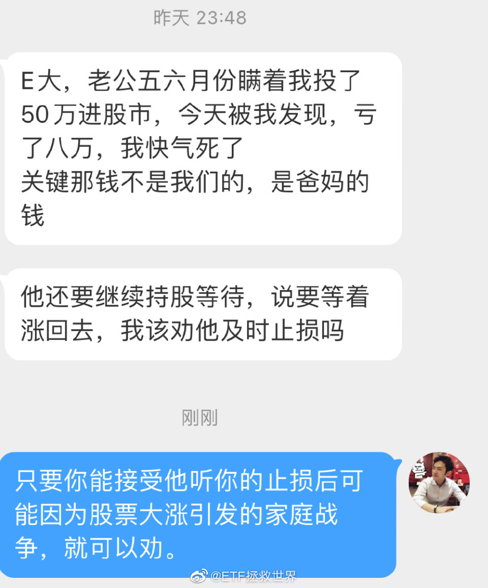

======================================================

ETF拯救世界 (5687069307) @
2020-11-08 11:41:46 Sun  
url: https://weibo.com/5687069307/JsVNBozGu

每天必须完成的事 ​​​

转发[109]  评论[530]  赞[2053] 

+++++++++++++++++++++++++++++++++++++++++++++++++++++

图片：
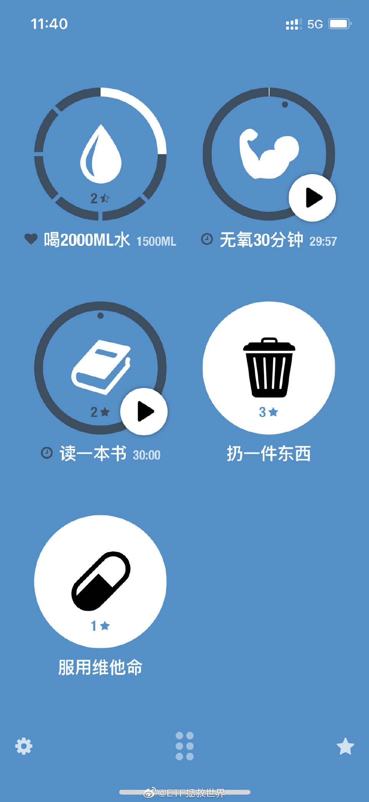

======================================================

ETF拯救世界 (5687069307) @
2020-11-08 14:38:39 Sun  
url: https://weibo.com/5687069307/JsWXp4nc3

很多人觉得每天扔一件东西很难。

可能情况不同吧，有些朋友刚毕业，东西不多也可以理解。

但只要混社会时间超过5-10年，家里的破烂儿足够支撑你每天扔一件。

我随便说几样你翻翻抽屉柜子，没有一大堆算我输：

各种数据线和充电头。包括现在用的usb-c、lighting，以前的microusb、usb……

贪便宜买 ​​​

转发[157]  评论[865]  赞[2511] 

======================================================

ETF拯救世界 (5687069307) @
2020-11-09 09:40:41 Mon  
url: https://weibo.com/5687069307/Jt4qXuLnn

意思不大 ​​​

转发[16]  评论[391]  赞[1394] 

======================================================

ETF拯救世界 (5687069307) @
2020-11-09 09:44:55 Mon  
url: https://weibo.com/5687069307/Jt4sFyxR4

不说你不知道

辣鸡红利基金差不多历史新高了 ​​​

转发[22]  评论[543]  赞[1953] 

======================================================

ETF拯救世界 (5687069307) @
2020-11-09 13:58:02 Mon  
url: https://weibo.com/5687069307/Jt67pw5MI

稍安勿躁，网格表格更新中……

谁能想到，几个月时间，同一个价格吃了三次。

涨不涨跟你挣不挣钱有什么关系？

涨了，你未必挣钱；不涨，你可能赚很多。 ​​​

转发[37]  评论[533]  赞[1969] 

======================================================

ETF拯救世界 (5687069307) @
2020-11-09 17:11:59 Mon  
url: https://weibo.com/5687069307/Jt7o8mUbn

想想人家70多的两个老头还在为了自己的梦想打拼，

18岁的你我有什么理由不努力！ ​​​

转发[45]  评论[408]  赞[2015] 

======================================================

ETF拯救世界 (5687069307) @
2020-11-09 18:23:22 Mon  
url: https://weibo.com/5687069307/Jt7R6FEtu

前几天说的手指皮肤起皮干裂问题，经上千位网友与十几位正经皮肤科医生网友共同会诊，

叠加我去挂了某大医院皮肤门诊专家号功力加持，

汇集了众多意见后，由我本人去芜存菁，制定诊疗方案如下：

他克莫司（专家）每天两次+（维生素E+尿素护手霜每天外涂无数次）+维生素B内服。

一个月后汇报结果， ​​​

转发[131]  评论[469]  赞[1733] 

======================================================

ETF拯救世界 (5687069307) @
2020-11-09 20:48:47 Mon  
url: https://weibo.com/5687069307/Jt8O8n4dQ

来了

------------------------------------------------------
转推：
>  @有知有行 (7380400382)
>  2020-11-09 20:05:27 Mon  
>  url: https:/weibo.com/7380400382/Jt8wy091E/

>  有知有行双十一特别策划#价值投资者双十一都买了啥# 第一弹：E大来啦～3000字小作文，分享他的双十一战绩和消费观。E大亲笔，童叟无欺，快来看@ETF拯救世界 的小作文[憧憬] ​​​

转发[79]  评论[449]  赞[1645] 

======================================================

ETF拯救世界 (5687069307) @
2020-11-09 21:15:16 Mon  
url: https://weibo.com/5687069307/Jt8YTkME5

要玩这么大吗 ​​​

转发[19]  评论[356]  赞[1308] 

+++++++++++++++++++++++++++++++++++++++++++++++++++++

图片：
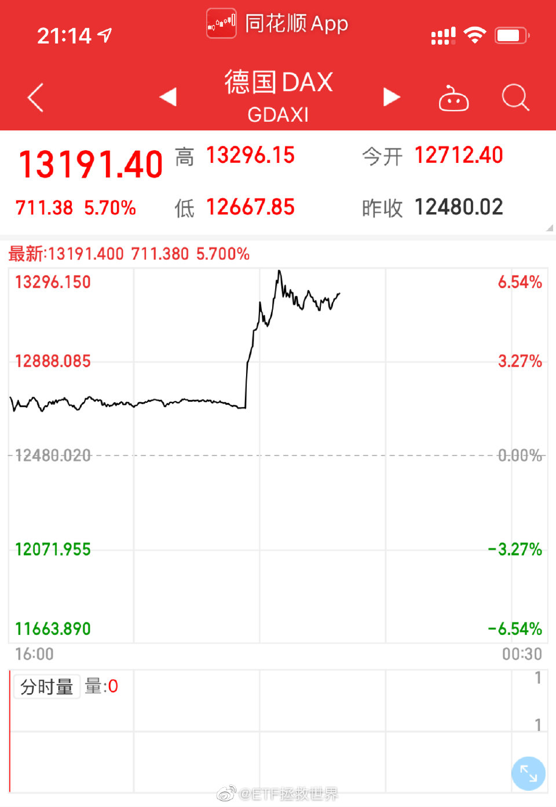

======================================================

ETF拯救世界 (5687069307) @
2020-11-09 21:38:25 Mon  
url: https://weibo.com/5687069307/Jt98hoDnV

今天恒生没出掉的朋友不用急，如果欧美收盘不掉链子，你可能明天多赚2个巴仙 ​​​

转发[42]  评论[357]  赞[1619] 

======================================================

ETF拯救世界 (5687069307) @
2020-11-09 21:47:38 Mon  
url: https://weibo.com/5687069307/Jt9c1mjsq

还有一份黄金出不出？白银利润什么时候清？

都是问题啊。 ​​​

转发[12]  评论[229]  赞[1144] 

+++++++++++++++++++++++++++++++++++++++++++++++++++++

图片：

======================================================

ETF拯救世界 (5687069307) @
2020-11-10 07:39:54 Tue  
url: https://weibo.com/5687069307/Jtd4qkuPb

我本人不会随意修改策略预设价格。

策略是用来执行的。不执行随心所欲那还要什么策略。 ​​​

转发[46]  评论[318]  赞[1743] 

======================================================

ETF拯救世界 (5687069307) @
2020-11-10 08:36:30 Tue  
url: https://weibo.com/5687069307/JtdrozA6a

美国价值股这么涨，我们的价值股也跟一下好不啦。

红利都买了十几个点仓位了。 ​​​

转发[23]  评论[290]  赞[1364] 

======================================================

ETF拯救世界 (5687069307) @
2020-11-10 09:26:36 Tue  
url: https://weibo.com/5687069307/JtdLJodsl

1.76%。预测差了一点点

------------------------------------------------------
转推：
>  @ETF拯救世界 (5687069307)
>  2020-11-09 21:38:25 Mon  
>  url: https:/weibo.com/5687069307/Jt98hoDnV/

>  今天恒生没出掉的朋友不用急，如果欧美收盘不掉链子，你可能明天多赚2个巴仙 ​​​

转发[20]  评论[145]  赞[1002] 

======================================================

ETF拯救世界 (5687069307) @
2020-11-10 09:29:36 Tue  
url: https://weibo.com/5687069307/JtdMX4eoX

感谢恒生ETF的做市商。你们是最胖的！//@ETF拯救世界:1.76%。预测差了一点点

------------------------------------------------------
转推：
>  @ETF拯救世界 (5687069307)
>  2020-11-09 21:38:25 Mon  
>  url: https:/weibo.com/5687069307/Jt98hoDnV/

>  今天恒生没出掉的朋友不用急，如果欧美收盘不掉链子，你可能明天多赚2个巴仙 ​​​

转发[12]  评论[189]  赞[1057] 

======================================================

ETF拯救世界 (5687069307) @
2020-11-10 09:34:05 Tue  
url: https://weibo.com/5687069307/JtdOM1mRa

昨天成交不够，你没出掉，很伤心。

就像你喜欢一个姑娘，谈婚论嫁了，分手了，很伤心。

谁知道第二天更高价格高开走人。

就像你因为失恋在咖啡馆流泪的时候，一个白富美给你递上了纸巾。 

人生没那么简单。每一个挫折都是老天安排的，有他的理由的。 ​​​

转发[88]  评论[512]  赞[1783] 

======================================================

ETF拯救世界 (5687069307) @
2020-11-10 09:43:26 Tue  
url: https://weibo.com/5687069307/JtdSz9Awk

回复@克莱奥斯:按照我的方式委托，会在高价卖出。//@克莱奥斯:@ETF拯救世界 请教E大，原来网格设置的是定价委托，遇到这种跳空高开的情况，需要调整为市价委托吗？

------------------------------------------------------
转推：
>  @ETF拯救世界 (5687069307)
>  2020-11-10 09:34:05 Tue  
>  url: https:/weibo.com/5687069307/JtdOM1mRa/

>  昨天成交不够，你没出掉，很伤心。
>  
>  就像你喜欢一个姑娘，谈婚论嫁了，分手了，很伤心。
>  
>  谁知道第二天更高价格高开走人。
>  
>  就像你因为失恋在咖啡馆流泪的时候，一个白富美给你递上了纸巾。 
>  
>  人生没那么简单。每一个挫折都是老天安排的，有他的理由的。 ​​​

转发[21]  评论[235]  赞[979] 

======================================================

ETF拯救世界 (5687069307) @
2020-11-10 09:52:57 Tue  
url: https://weibo.com/5687069307/JtdWqvqdS

天气不错

头发梳成大人模样

穿上帅气西装

出去浪 ​​​

转发[20]  评论[468]  赞[1969] 

======================================================

ETF拯救世界 (5687069307) @
2020-11-10 14:05:09 Tue  
url: https://weibo.com/5687069307/JtfANFuDk

还说你不是股神？ ​​​

转发[28]  评论[437]  赞[1743] 

======================================================

ETF拯救世界 (5687069307) @
2020-11-10 14:22:50 Tue  
url: https://weibo.com/5687069307/JtfHZ0cbE

回复@容我屠了你吉吉:我跟朋友们最高价卖出开心开心关你什么事？你是哪位啊，朋友很少吧？日子过得很难吗？看不得别人开心？//@容我屠了你吉吉:不知道有什么好得瑟的[困]

------------------------------------------------------
转推：
>  @ETF拯救世界 (5687069307)
>  2020-11-10 14:05:09 Tue  
>  url: https:/weibo.com/5687069307/JtfANFuDk/

>  还说你不是股神？ ​​​

转发[9]  评论[270]  赞[1437] 

======================================================

ETF拯救世界 (5687069307) @
2020-11-10 14:42:16 Tue  
url: https://weibo.com/5687069307/JtfPRt7xv

生活本来就很苦，做投资对很多朋友来说更是艰难。

这么难的日子里，我们在一起找点乐子招谁惹谁了。

我们穷人和韭菜不配拥有快乐吗？[悲伤] ​​​

转发[29]  评论[724]  赞[2399] 

+++++++++++++++++++++++++++++++++++++++++++++++++++++

图片：

======================================================

ETF拯救世界 (5687069307) @
2020-11-10 20:00:10 Tue  
url: https://weibo.com/5687069307/JthUU9nFj

关于买书，我的做法是先看电子版。

如果觉得非常好，才买纸质版。（特别特别好的买精装版）

如无必要，勿增实体。 ​​​

转发[61]  评论[471]  赞[2232] 

======================================================

ETF拯救世界 (5687069307) @
2020-11-10 23:48:21 Tue  
url: https://weibo.com/5687069307/JtjpwcND5

谁还没睡我看看 ​​​

转发[9]  评论[894]  赞[2033] 

======================================================

ETF拯救世界 (5687069307) @
2020-11-11 07:14:51 Wed  
url: https://weibo.com/5687069307/JtmkKylu3

今天可能有机会出一笔大的。

图就不贴了，低调。

没有放在表格里，因为品种波动太大，很多朋友的小心脏受不了。 ​​​

转发[27]  评论[750]  赞[2054] 

======================================================

ETF拯救世界 (5687069307) @
2020-11-11 10:08:19 Wed  
url: https://weibo.com/5687069307/Jtnta8kaw

心情有点好。[鼓掌] ​​​

转发[10]  评论[244]  赞[1346] 

======================================================

ETF拯救世界 (5687069307) @
2020-11-11 10:17:52 Wed  
url: https://weibo.com/5687069307/Jtnx2rObu

看着辣鸡红利虽然长得很难看，没人喜欢，但每天都在努力创新高的样子，好感动。 ​​​

转发[29]  评论[293]  赞[1843] 

======================================================

ETF拯救世界 (5687069307) @
2020-11-11 10:29:34 Wed  
url: https://weibo.com/5687069307/JtnBN1087

有些品种适合长相厮守，有些品种适合中短期玩玩。

就怕你看不上适合长相厮守的，觉得它不够妖艳，而把感情、精力、金钱，全都耗费在只适合短期玩玩的品种上了。

当然，对于有能力的成年人来说，标准答案应该是：

（）（）（）。 ​​​

转发[75]  评论[416]  赞[1595] 

======================================================

ETF拯救世界 (5687069307) @
2020-11-11 10:42:34 Wed  
url: https://weibo.com/5687069307/JtnH45mPL

当时你买了吗。日本已经回到1991年高位了。

------------------------------------------------------
转推：
>  @ETF拯救世界 (5687069307)
>  2020-03-17 15:54:53 Tue  
>  url: https:/weibo.com/5687069307/Iz23tClCV/

>  今日数据：
>  
>  德国、日本已经极具投资价值。 ​​​

转发[33]  评论[358]  赞[1185] 

======================================================

ETF拯救世界 (5687069307) @
2020-11-11 10:48:30 Wed  
url: https://weibo.com/5687069307/JtnJtiEht

A股市场特别好的地方，或者说你我特别幸运的地方，在于股票市场这个东西在其它国家已经产生了上百年。这100多年的历史，也就是中国股市的未来。所以研究各个国家的股市历史，对于投资来说特别有意义。

几个大的市场，走势差别非常大。这也能让我们知道各种情况下，我们的未来有可能是什么样。欧洲、日 ​​​

转发[175]  评论[494]  赞[2098] 

======================================================

ETF拯救世界 (5687069307) @
2020-11-11 10:54:49 Wed  
url: https://weibo.com/5687069307/JtnM2haWK

医药拼命冲击4次，依然在15500一线溃败。可以说完全在意料之中了。[doge]//@ETF拯救世界:医药下方重要支撑线是12000点。上方压力线依然是15500。一切尽在掌握。//@ETF拯救世界:折腾了一个半月，我军15500防线固若金汤。//@ETF拯救世界:回来了老弟。

------------------------------------------------------
转推：
>  @ETF拯救世界 (5687069307)
>  2020-07-13 11:26:03 Mon  
>  url: https:/weibo.com/5687069307/JaZgDapRK/

>  医药基本已经脱离我能理解的范畴，进入“外太空”区域。
>  
>  在这个区域，我将用新的交易策略处理剩下的仓位。
>  
>  踏踏实实的。 ​​​

转发[44]  评论[196]  赞[1247] 

======================================================

ETF拯救世界 (5687069307) @
2020-11-11 11:31:43 Wed  
url: https://weibo.com/5687069307/Jto114sfP

“为什么你低位不买？”

“不涨的辣鸡我为什么要买？”

“为什么高位你过来接盘？”

“你傻啊，涨了你没看见吗？他们说还能涨更高啊。”

“……”

“怎么跌了？？果然是辣鸡！” ​​​

转发[63]  评论[326]  赞[1705] 

======================================================

ETF拯救世界 (5687069307) @
2020-11-11 12:12:27 Wed  
url: https://weibo.com/5687069307/Jtohy734S

我会不会太直接了 ​​​

转发[20]  评论[356]  赞[1484] 

+++++++++++++++++++++++++++++++++++++++++++++++++++++

图片：
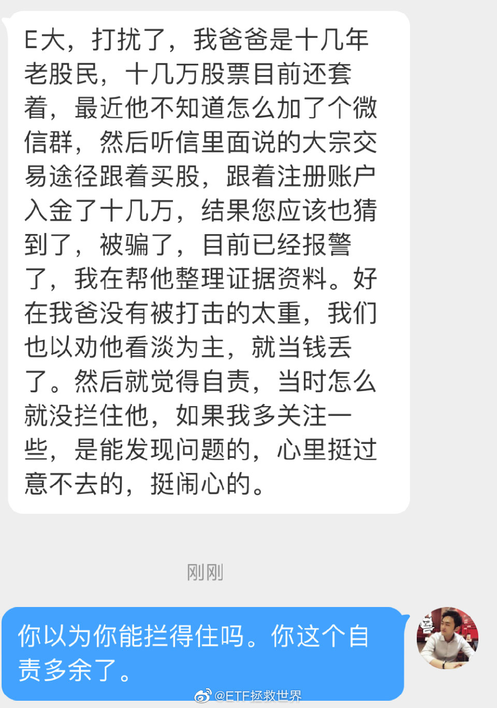

======================================================

ETF拯救世界 (5687069307) @
2020-11-11 13:28:17 Wed  
url: https://weibo.com/5687069307/JtoMkru91

投资其实一定程度上是一个人价值观的折射。

我特别讨厌那种谁涨的好就吹谁买谁，谁一个阶段表现不好就把它踩在脚下乱喷的人。（这几年我相信你也见过不少这样的人）

你如果是机构，需要业绩排名，要恰饭，我能理解。你一个个人投资者天天嫌贫爱富，就只能说明你这个人的品质有问题。

这个说的并不严 ​​​

转发[133]  评论[593]  赞[2853] 

======================================================

ETF拯救世界 (5687069307) @
2020-11-11 16:28:04 Wed  
url: https://weibo.com/5687069307/JtpXiCB2s

场内50ETF即将分红。场内交易的朋友不用买回再投资。 ​​​

转发[20]  评论[329]  赞[1713] 

======================================================

ETF拯救世界 (5687069307) @
2020-11-12 13:40:35 Thu  
url: https://weibo.com/5687069307/JtyhOzGA5

一直在忙，你干嘛呢。 ​​​

转发[22]  评论[1155]  赞[2374] 

======================================================

ETF拯救世界 (5687069307) @
2020-11-13 12:02:00 Fri  
url: https://weibo.com/5687069307/JtH4iz8qP

问个问题，你觉得显示“持仓收益”的时候，把过去已经实现的收益加到上面合理吗？

我个人认为不合理。持仓收益本来就应该是目前持仓品种依然持有部分的收益，不应该加上已经卖出部分的盈利。

我是想从这个数据上知道我现在持仓的部分收益是多少，而不是加上以前的收益。

我这个说法你同意吗。 ​​​

转发[46]  评论[951]  赞[2347] 

======================================================

ETF拯救世界 (5687069307) @
2020-11-13 12:26:53 Fri  
url: https://weibo.com/5687069307/JtHep1XmH

我个人理想中的收益率展示方法：

1：持仓收益。

持仓收益是你目前持仓品种的市值-目前持仓品种的成本。

2：持仓收益率。

持仓部分收益/目前持仓品种的成本。

注意，这里无论你是否卖出，单份的持仓成本应该是不变的。

比如一个品种你买了3次，平均成本是1元。那么这个1元就是你这个品种的成本。 ​​​

转发[160]  评论[554]  赞[2232] 

======================================================

ETF拯救世界 (5687069307) @
2020-11-13 13:05:15 Fri  
url: https://weibo.com/5687069307/JtHtYo96i

关于送礼物，我给那些不知道该送什么给别人的朋友一个终极锦囊：

ta想要而舍不得花钱买的东西。

相信我，没错的。 ​​​

转发[216]  评论[659]  赞[3679] 

======================================================

ETF拯救世界 (5687069307) @
2020-11-13 20:43:43 Fri  
url: https://weibo.com/5687069307/JtKu4qzY0

崩盘不远了

------------------------------------------------------
转推：
>  @雪球 (2183570524)
>  2020-11-13 20:17:50 Fri  
>  url: https:/weibo.com/2183570524/JtKjyvUvA/

>  理想汽车盘前涨幅扩大至30%。 ​​​

转发[76]  评论[481]  赞[1594] 

======================================================

ETF拯救世界 (5687069307) @
2020-11-15 12:03:35 Sun  
url: https://weibo.com/5687069307/JtZVW9DzH

昨天去了一个青少年篮球赛。

原来现在7、8岁的小孩打球都这么好了，不仅技战术水平高，也特别拼，真的非常棒。站在场边明显感受到战斗精神和生命力汹涌而出。

还有个发现，打得好的小孩长得都非常帅！比那些很娘的偶像不知道高到哪里去了。 ​​​

转发[22]  评论[329]  赞[1948] 

======================================================

ETF拯救世界 (5687069307) @
2020-11-15 19:41:44 Sun  
url: https://weibo.com/5687069307/Ju2VTzxFM

震惊了。

困扰我好久的，花了很多钱买了很多种国内外各种护手霜，去医院开了进口药都不是很有效的手指干裂脱皮……

9.9一瓶的维E乳居然解决了……

当然也不能说完全解决，上周去北京医院外面的小卖部买了后，刚擦了几天。几天太短了可能也不能完全痊愈。但是擦的第二天就很明显的有效，到现在几天过 ​​​

转发[361]  评论[678]  赞[2155] 

======================================================

ETF拯救世界 (5687069307) @
2020-11-15 19:53:43 Sun  
url: https://weibo.com/5687069307/Ju30LjINZ

回复@幺零零贰伍:说话不要习惯用反问语气，人缘容易不好。有话正着说：“维E乳很便宜，没有必要加激素”//@幺零零贰伍:维E乳犯得着加激素吗，一个几块钱的保湿产品

------------------------------------------------------
转推：
>  @ETF拯救世界 (5687069307)
>  2020-11-15 19:41:44 Sun  
>  url: https:/weibo.com/5687069307/Ju2VTzxFM/

>  震惊了。
>  
>  困扰我好久的，花了很多钱买了很多种国内外各种护手霜，去医院开了进口药都不是很有效的手指干裂脱皮……
>  
>  9.9一瓶的维E乳居然解决了……
>  
>  当然也不能说完全解决，上周去北京医院外面的小卖部买了后，刚擦了几天。几天太短了可能也不能完全痊愈。但是擦的第二天就很明显的有效，到现在几天过 ​​​

转发[72]  评论[305]  赞[1486] 

======================================================

ETF拯救世界 (5687069307) @
2020-11-15 20:15:21 Sun  
url: https://weibo.com/5687069307/Ju39xzcS8

对了，要说好用的商品，还有一个就是nas，也就是私有云。

对我来说有两个功能非常好：

第一，手机里的照片实时备份。相机拍的照片传进去也是两个硬盘双重备份，踏实。

第二，电脑文件实时同步。家里的工作没有完成到办公室无缝衔接接着干，无需再用u盘之类的了。也相当于一个备份了。

用了几年了， ​​​

转发[132]  评论[387]  赞[1424] 

======================================================

ETF拯救世界 (5687069307) @
2020-11-16 09:43:01 Mon  
url: https://weibo.com/5687069307/Ju8rnAXic

辣鸡又历史新高了。 ​​​

转发[17]  评论[225]  赞[1321] 

======================================================

ETF拯救世界 (5687069307) @
2020-11-16 10:01:59 Mon  
url: https://weibo.com/5687069307/Ju8z4xz4r

回复@SKY_BIG_BOY:哦？余额宝也是成立以来年化11%同时不断新高吗？以前都不知道，感谢告知~//@SKY_BIG_BOY:余额宝这种垃圾每天都新高

------------------------------------------------------
转推：
>  @ETF拯救世界 (5687069307)
>  2020-11-16 09:43:01 Mon  
>  url: https:/weibo.com/5687069307/Ju8rnAXic/

>  辣鸡又历史新高了。 ​​​

转发[8]  评论[127]  赞[928] 

======================================================

ETF拯救世界 (5687069307) @
2020-11-16 10:12:19 Mon  
url: https://weibo.com/5687069307/Ju8Dhb8Tq

大类品种的走势其实跟人生很像。

每个人的人生都有起起落落，很少有人一帆风顺。

所谓“莫欺少年穷”，又所谓“花无百日红”。我还是喜欢别人落魄的时候能帮一点就帮一点，等它富贵了也跟着吃点肉，在它如日中天的时候悄悄撤退。

倒不是说辉煌的时候凑上去有什么问题。这是每个人选择的不同。只是我 ​​​

转发[178]  评论[323]  赞[1846] 

======================================================

ETF拯救世界 (5687069307) @
2020-11-16 10:21:31 Mon  
url: https://weibo.com/5687069307/Ju8H0iU43

有些人总是到处说我喜欢“什么涨吹什么”。

对，没错。但这个吹可跟99%的吹不一样。

品种涨起来了，我绝对绝对不会吹着唱多让你加仓。我绝对绝对不会跟你说它的极限是星辰大海。我只会告诉你，涨起来了，风险大了，慎重。再高点就直接跟你说别买了。甚至且慢的补仓策略，你成本比我高我就不让你补。
 ​​​

转发[30]  评论[438]  赞[2192] 

======================================================

ETF拯救世界 (5687069307) @
2020-11-16 10:31:09 Mon  
url: https://weibo.com/5687069307/Ju8KVcBTm

谁能想到野百合也支棱起来了。 ​​​

转发[13]  评论[320]  赞[1381] 

======================================================

ETF拯救世界 (5687069307) @
2020-11-16 10:47:50 Mon  
url: https://weibo.com/5687069307/Ju8RH46Ml

生活小贴士：

在餐桌上放个盘子，把水果每种挑几个放到里面。

否则，你的水果买回来就全部放进冰箱，会因为忘记吃扔掉大部分。 ​​​

转发[29]  评论[545]  赞[2090] 

======================================================

ETF拯救世界 (5687069307) @
2020-11-16 13:25:50 Mon  
url: https://weibo.com/5687069307/Ju9TOyG6a

分享图片 ​​​

转发[36]  评论[280]  赞[1251] 

+++++++++++++++++++++++++++++++++++++++++++++++++++++

图片：

======================================================

ETF拯救世界 (5687069307) @
2020-11-16 13:55:07 Mon  
url: https://weibo.com/5687069307/Jua5HylvO

回复@无限挑战YuJaeSeok:踏踏实实的。//@无限挑战YuJaeSeok:今天中证红利爆发了啊

------------------------------------------------------
转推：
>  @ETF拯救世界 (5687069307)
>  2020-11-16 13:25:50 Mon  
>  url: https:/weibo.com/5687069307/Ju9TOyG6a/

>  分享图片 ​​​

转发[10]  评论[99]  赞[765] 

======================================================

ETF拯救世界 (5687069307) @
2020-11-16 14:07:04 Mon  
url: https://weibo.com/5687069307/JuaayphrB

关于nas，虽然做了双盘备份，但是也有一定概率两个盘一起挂或者系统挂。而且nas里的硬盘拿出来在windows上是无法直接读取的。

所以，更稳妥的方法应该是再拿一个硬盘做个冷备份，毕竟nas硬盘天天转坏的概率大很多。

我的做法是隔一段时间用一个冷硬盘同步下载一下nas里的重要数据，再做第三个备份。
 ​​​

转发[60]  评论[251]  赞[1214] 

======================================================

ETF拯救世界 (5687069307) @
2020-11-16 14:20:45 Mon  
url: https://weibo.com/5687069307/Juag6zFiW

回复@奔跑的月光儿:是不是大家对直男的理解不同。我认为我自己就是个直男并以此为荣……两个字：爷们儿！//@奔跑的月光儿:IT们受不了直男一说

------------------------------------------------------
转推：
>  @ETF拯救世界 (5687069307)
>  2020-11-16 14:07:04 Mon  
>  url: https:/weibo.com/5687069307/JuaayphrB/

>  关于nas，虽然做了双盘备份，但是也有一定概率两个盘一起挂或者系统挂。而且nas里的硬盘拿出来在windows上是无法直接读取的。
>  
>  所以，更稳妥的方法应该是再拿一个硬盘做个冷备份，毕竟nas硬盘天天转坏的概率大很多。
>  
>  我的做法是隔一段时间用一个冷硬盘同步下载一下nas里的重要数据，再做第三个备份。
>   ​​​

转发[16]  评论[209]  赞[1004] 

======================================================

ETF拯救世界 (5687069307) @
2020-11-17 08:59:41 Tue  
url: https://weibo.com/5687069307/JuhAhuCA4

我命由我不由天 ​​​

转发[36]  评论[209]  赞[1158] 

+++++++++++++++++++++++++++++++++++++++++++++++++++++

图片：
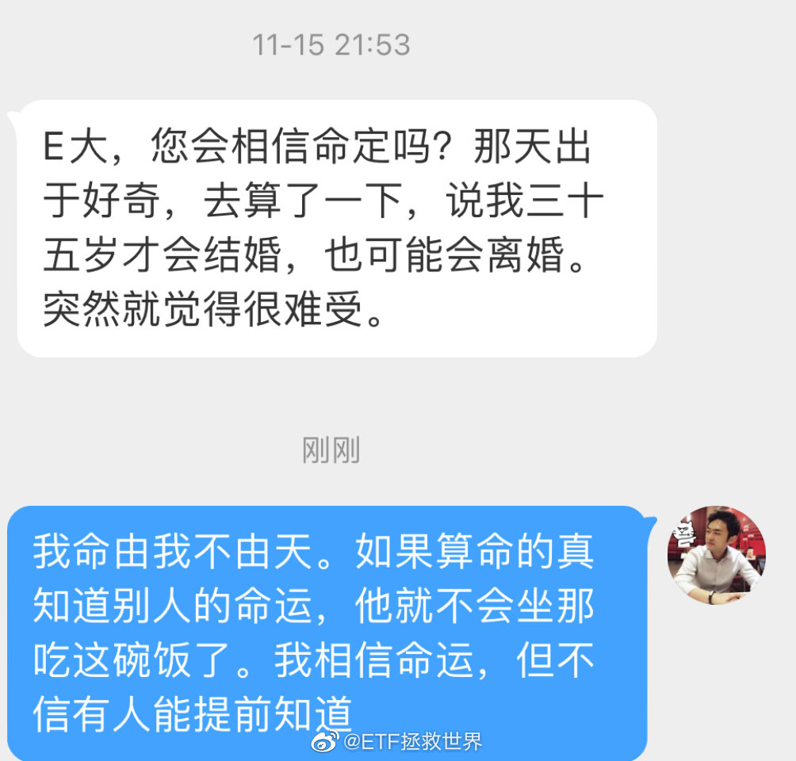

======================================================

ETF拯救世界 (5687069307) @
2020-11-17 09:02:52 Tue  
url: https://weibo.com/5687069307/JuhBzAlTM

回复@ETF拯救世界:算命严格意义上也是服务业的一种。你既然是服务业收了顾客的钱，就应该让顾客舒服满意。收了钱还让人难受，赶紧下岗！//@ETF拯救世界:最烦这些收了钱还给人添堵的神棍

------------------------------------------------------
转推：
>  @ETF拯救世界 (5687069307)
>  2020-11-17 08:59:41 Tue  
>  url: https:/weibo.com/5687069307/JuhAhuCA4/

>  我命由我不由天 ​​​

转发[21]  评论[189]  赞[1138] 

======================================================

ETF拯救世界 (5687069307) @
2020-11-17 09:35:45 Tue  
url: https://weibo.com/5687069307/JuhOVhZNR

新高不卖。

卖点不是猜出来的。 ​​​

转发[124]  评论[306]  赞[1617] 

======================================================

ETF拯救世界 (5687069307) @
2020-11-17 09:53:25 Tue  
url: https://weibo.com/5687069307/JuhW5FUPe

以我18岁的人生感悟来说，人的命运，未来基本只靠两个东西。

第一个是运气。

你生在灯塔、生在非洲、生在中国，或者生在100年前和现在，又或者是你生在这三个地方的权贵、普通、贫穷人家，都是最大的运气。这个没法改变。

先天的运气还包括你的智商、长相等等……

第二个是努力。

一般意义上的成 ​​​

转发[439]  评论[589]  赞[2630] 

======================================================

ETF拯救世界 (5687069307) @
2020-11-17 10:02:03 Tue  
url: https://weibo.com/5687069307/JuhZBdhHO

我怀疑聪明的机构投资者是不是又开始切换风格了。

欢迎接盘。欢迎砸盘。 ​​​

转发[19]  评论[300]  赞[1734] 

======================================================

ETF拯救世界 (5687069307) @
2020-11-17 10:11:02 Tue  
url: https://weibo.com/5687069307/Jui3fbW8V

不知道怎么回事，看着持仓就感觉很舒服。 ​​​

转发[17]  评论[476]  赞[1936] 

======================================================

ETF拯救世界 (5687069307) @
2020-11-17 15:00:52 Tue  
url: https://weibo.com/5687069307/JujWTp6m8

光头收盘。

斯国一。 ​​​

转发[42]  评论[535]  赞[2302] 

======================================================

ETF拯救世界 (5687069307) @
2020-11-17 17:27:00 Tue  
url: https://weibo.com/5687069307/JukUcxs3B

回复@haoxianhan:会重新放进。一定要用我的专属条件单设置//@haoxianhan:触发条件单委托未成交的时候，隔天不会重新放进监控列表，重新加入监控应该是合理需求吧？[思考][思考][思考]

------------------------------------------------------
转推：
>  @ETF拯救世界 (5687069307)
>  2020-11-17 15:00:52 Tue  
>  url: https:/weibo.com/5687069307/JujWTp6m8/

>  光头收盘。
>  
>  斯国一。 ​​​

转发[16]  评论[173]  赞[899] 

======================================================

ETF拯救世界 (5687069307) @
2020-11-17 18:21:03 Tue  
url: https://weibo.com/5687069307/Julg90rmh

你一定想不到钢铁直男的锁屏是这样的。 ​​​

转发[25]  评论[909]  赞[2650] 

+++++++++++++++++++++++++++++++++++++++++++++++++++++

图片：

======================================================

ETF拯救世界 (5687069307) @
2020-11-17 18:53:40 Tue  
url: https://weibo.com/5687069307/JultodYzm

之前有朋友谈到可以不可以降低股票佣金，我去协调了一下。

感谢 @华宝智投  的大佬们，经过他们认真研究、积极沟通以及辛勤的工作，各位应该已经陆续收到调整提示信息了。

在可以努力的范围内，一定会帮各位争取到最好的待遇。以后时机成熟了还会有更多福利。

但是有一点，违规的事情，我，以及合作 ​​​

转发[54]  评论[1414]  赞[3118] 

======================================================

ETF拯救世界 (5687069307) @
2020-11-18 10:09:58 Wed  
url: https://weibo.com/5687069307/JurtjaDvG

没卖的不停新高，卖了一部分的不停新低。

我不能期盼更好的情况了。 ​​​

转发[26]  评论[576]  赞[2279] 

======================================================

ETF拯救世界 (5687069307) @
2020-11-18 12:38:45 Wed  
url: https://weibo.com/5687069307/JusrHlnjN

当你孤单你会想起谁 ​​​

转发[23]  评论[755]  赞[1642] 

======================================================

ETF拯救世界 (5687069307) @
2020-11-18 13:45:04 Wed  
url: https://weibo.com/5687069307/JusSChJBC

有些女性朋友可能会骂我，但不好意思，我就是会这么做。

我不想跟一个只喜欢我的钱的人过一辈子。 ​​​

转发[49]  评论[981]  赞[4003] 

+++++++++++++++++++++++++++++++++++++++++++++++++++++

图片：
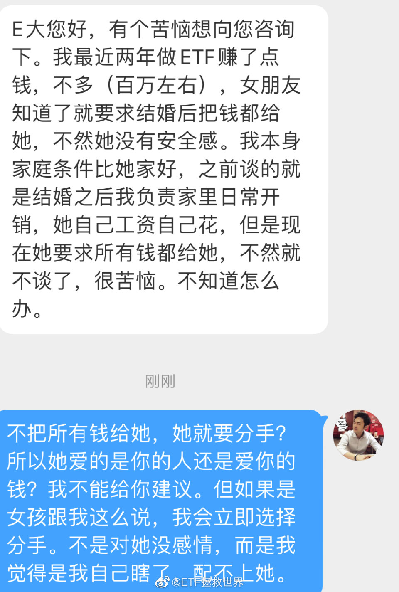

======================================================

ETF拯救世界 (5687069307) @
2020-11-18 13:59:04 Wed  
url: https://weibo.com/5687069307/JusYixqsy

想追求一个人，最重要的不是做舔狗，

而是让自己变得有魅力，吸引对方。

当然，适度的关心照顾也是必要的… ​​​

转发[86]  评论[342]  赞[2306] 

======================================================

ETF拯救世界 (5687069307) @
2020-11-18 14:34:09 Wed  
url: https://weibo.com/5687069307/Jutcxs9qt

债券暴力下跌。[笑而不语] ​​​

转发[29]  评论[517]  赞[1892] 

======================================================

ETF拯救世界 (5687069307) @
2020-11-18 20:41:13 Wed  
url: https://weibo.com/5687069307/JuvBx8GwJ

当你慢慢发现自己的父母是个普通人、自己是个普通人、自己的孩子也是个普通人的时候……

你与这个世界也就彻底和解了。 ​​​

转发[307]  评论[672]  赞[4275] 

======================================================

ETF拯救世界 (5687069307) @
2020-11-18 21:02:04 Wed  
url: https://weibo.com/5687069307/JuvJZFE3x

这么说吧。

去年给儿子报足球班的时候，我想的是会不会有机会入选国安梯队、进入国少、国青，十年后入选国家队参加世界杯。

甚至担忧过签了俱乐部的职业合同后文化课差太多怎么办。

一年后的今天，我觉得踢踢球锻炼锻炼身体也特别好。 ​​​

转发[70]  评论[922]  赞[3540] 

======================================================

ETF拯救世界 (5687069307) @
2020-11-22 11:40:19 Sun  
url: https://weibo.com/5687069307/Jv3LYn9dB

接下来的40天，这个将是我的主要口粮。

不然我的3888保不住了   =͟͟͞͞(꒪⌓꒪*) ​​​

转发[20]  评论[1013]  赞[2627] 

+++++++++++++++++++++++++++++++++++++++++++++++++++++

图片：

======================================================

ETF拯救世界 (5687069307) @
2020-11-23 09:56:34 Mon  
url: https://weibo.com/5687069307/JvcwlEty8

有色网格保守了。 ​​​

转发[14]  评论[385]  赞[1459] 

======================================================

ETF拯救世界 (5687069307) @
2020-11-23 10:11:22 Mon  
url: https://weibo.com/5687069307/JvcCmgtd4

有些指数不讲武德，天天新高，我劝你耗子尾汁。 ​​​

转发[21]  评论[317]  赞[1836] 

======================================================

ETF拯救世界 (5687069307) @
2020-11-23 10:22:32 Mon  
url: https://weibo.com/5687069307/JvcGTmKGN

其实投资、育儿……甚至咱们每个人的人生，都是一个道理。

每一个品种在一个周期中，都有表现不好的时候，也有光彩夺目的时候。不能要求所有品种在同一个时间表现好，就像不能要求所有孩子或者所有人都在同一个时间是第一名。

很难说命运给每一个人的未来安排了什么。也很难说现在的成功或者不成功到 ​​​

转发[434]  评论[460]  赞[2557] 

======================================================

ETF拯救世界 (5687069307) @
2020-11-23 10:27:32 Mon  
url: https://weibo.com/5687069307/JvcIVbaUs

回复@Fannnn-n:茅台从2008-2015整整7年一分钱没涨，中间最大跌幅超过50%。同期无数中小创翻了几番。这就是大家只知道现在NB的你，过去再不堪也无人记得。//@Fannnn-n:茅台除外？[二哈]

------------------------------------------------------
转推：
>  @ETF拯救世界 (5687069307)
>  2020-11-23 10:22:32 Mon  
>  url: https:/weibo.com/5687069307/JvcGTmKGN/

>  其实投资、育儿……甚至咱们每个人的人生，都是一个道理。
>  
>  每一个品种在一个周期中，都有表现不好的时候，也有光彩夺目的时候。不能要求所有品种在同一个时间表现好，就像不能要求所有孩子或者所有人都在同一个时间是第一名。
>  
>  很难说命运给每一个人的未来安排了什么。也很难说现在的成功或者不成功到 ​​​

转发[95]  评论[123]  赞[1340] 

======================================================

ETF拯救世界 (5687069307) @
2020-11-23 10:45:02 Mon  
url: https://weibo.com/5687069307/JvcQ283ws

说起来像灌鸡汤，但以我18岁的人生经历来说，有一个想法却真实的越来越清晰：

失败，真的未必是坏事。

经历失败后，只要能够反思，到底是我不行，还是我做这件事根本就不行，又或者是方法策略不行，还是我做人不行……找到问题，修正、提高，更加强大。

失败好就好在，失败的越早，成本越低。你刚工 ​​​

转发[267]  评论[546]  赞[2550] 

======================================================

ETF拯救世界 (5687069307) @
2020-11-23 11:23:24 Mon  
url: https://weibo.com/5687069307/Jvd5B7aCi

这四个字值多少钱你根本意识不到。

------------------------------------------------------
转推：
>  @ETF拯救世界 (5687069307)
>  2020-11-17 09:35:45 Tue  
>  url: https:/weibo.com/5687069307/JuhOVhZNR/

>  新高不卖。
>  
>  卖点不是猜出来的。 ​​​

转发[83]  评论[261]  赞[1882] 

======================================================

ETF拯救世界 (5687069307) @
2020-11-23 11:31:05 Mon  
url: https://weibo.com/5687069307/Jvd8InfFp

普通人想要做点不普通的事，就必须用一些简单的、容易理解容易操作的规则约束自己。制定策略，然后坚决执行。

比如每天读书半小时、网格条件单、每天扔一件东西、每天运动半小时、每天喝水2L、新高不卖、每天做一会一直想做却拖拉着不做的事……

每天都变强一点点，每天钱多一点点，每天垃圾和体重少 ​​​

转发[633]  评论[709]  赞[3570] 

======================================================

ETF拯救世界 (5687069307) @
2020-11-23 11:33:51 Mon  
url: https://weibo.com/5687069307/Jvd9Q6s4t

今天发的东西够顶几天？

我是不是又可以消失一段时间了。 ​​​

转发[14]  评论[972]  赞[2123] 

======================================================

ETF拯救世界 (5687069307) @
2020-11-23 18:18:31 Mon  
url: https://weibo.com/5687069307/JvfO5EWzo

不是你的菜就赶紧分开，不要互相耽误 ​​​

转发[26]  评论[360]  赞[1804] 

+++++++++++++++++++++++++++++++++++++++++++++++++++++

图片：

======================================================

ETF拯救世界 (5687069307) @
2020-11-24 08:37:07 Tue  
url: https://weibo.com/5687069307/JvlqBi5q7

如果是真的，这个车主智商为零，历史知识为负。

------------------------------------------------------
转推：
>  @网易财经 (1974561081)
>  2020-11-24 00:17:52 Tue  
>  url: https:/weibo.com/1974561081/Jvi9Xb0NE/

>  【网曝#奔驰车主疑被十余外卖员群殴#，车主：你命有我车险值钱？】11月23日，江苏泰州，网曝一名美团外卖小哥与一辆奔驰车相撞，双方发生争执。围观群众称，奔驰车主扬言自己的车险有两三百万，你（外卖员）一条人命值多少？我赔得起。美团小哥被惹怒，叫来十余位同行。美团方称，当时奔驰车主拿起水杯 ​​​

转发[34]  评论[182]  赞[781] 

======================================================

ETF拯救世界 (5687069307) @
2020-11-24 09:56:05 Tue  
url: https://weibo.com/5687069307/JvlWEny5s

赚了一点小钱的一个小网。

高风险品种，今日已出，经验不足承受力低的朋友勿参考。

风险高，没有放入表格，别埋怨，大多数人承受不了它的波动。是我自己玩的品种。 ​​​

转发[59]  评论[854]  赞[2340] 

+++++++++++++++++++++++++++++++++++++++++++++++++++++

图片：

======================================================

ETF拯救世界 (5687069307) @
2020-11-24 10:09:20 Tue  
url: https://weibo.com/5687069307/Jvm220mj6

越来越近//@ETF拯救世界:医药下方重要支撑线是12000点。上方压力线依然是15500。一切尽在掌握。//@ETF拯救世界:折腾了一个半月，我军15500防线固若金汤。//@ETF拯救世界:回来了老弟。//@ETF拯救世界:在大气层激烈争夺。15500不是那么容易过的。

------------------------------------------------------
转推：
>  @ETF拯救世界 (5687069307)
>  2020-07-13 11:26:03 Mon  
>  url: https:/weibo.com/5687069307/JaZgDapRK/

>  医药基本已经脱离我能理解的范畴，进入“外太空”区域。
>  
>  在这个区域，我将用新的交易策略处理剩下的仓位。
>  
>  踏踏实实的。 ​​​

转发[59]  评论[301]  赞[1180] 

======================================================

ETF拯救世界 (5687069307) @
2020-11-24 11:17:59 Tue  
url: https://weibo.com/5687069307/JvmtTwshz

又一只辣鸡新高了。

新高不卖这个原则主要是治疗你赚点钱就拿不住慌里慌张乱卖这种病的。

至少连续上涨的时候你还能多赚点。 ​​​

转发[80]  评论[309]  赞[1621] 

======================================================

ETF拯救世界 (5687069307) @
2020-11-24 11:44:25 Tue  
url: https://weibo.com/5687069307/JvmECCfIP

我不敢相信这是真的

------------------------------------------------------
转推：
>  @ ()
>  2020-11-24 10:54:29 Tue  
>  url: 

>  抱歉，作者已设置仅展示半年内微博，此微博已不可见。 ​​​

转发[99]  评论[431]  赞[1317] 

======================================================

ETF拯救世界 (5687069307) @
2020-11-24 12:30:38 Tue  
url: https://weibo.com/5687069307/JvmXnExWT

出大事了，自拍了一下感觉发际线有点后退啊。

是不是手机的问题！

慌乱中。 ​​​

转发[18]  评论[1197]  赞[2578] 

+++++++++++++++++++++++++++++++++++++++++++++++++++++

图片：

======================================================

ETF拯救世界 (5687069307) @
2020-11-24 17:11:41 Tue  
url: https://weibo.com/5687069307/JvoNsBIZZ

茶花女的帖子经当事人请求我设置为自己可见了。

当事人坚信是真的，而且怕女孩周围人看到知道是她。

没什么说的了，只能说男人很多时候是不用大脑思考的。

祝福吧。

再说一次，不接受我截屏发微博的不要给我私信，谢谢。 ​​​

转发[10]  评论[467]  赞[1893] 

======================================================

ETF拯救世界 (5687069307) @
2020-11-25 08:26:56 Wed  
url: https://weibo.com/5687069307/JvuMXzgX0

今天又是一个好日子 ​​​

转发[12]  评论[555]  赞[1726] 

======================================================

ETF拯救世界 (5687069307) @
2020-11-25 08:55:08 Wed  
url: https://weibo.com/5687069307/JvuYpnTCt

医药再爆利空。

一步步接近下方第一个接回点位。不用急，是你的就是你的，跑不了。不是你的急也没用，徒增烦恼。

医药极限仓位可以给到15%。现在150卖的只剩4%，s只剩2%，浮盈依然50% 70%，大有可为。

舒服吗。 ​​​

转发[90]  评论[538]  赞[1995] 

======================================================

ETF拯救世界 (5687069307) @
2020-11-25 09:35:10 Wed  
url: https://weibo.com/5687069307/JvveEEppQ

1 锁定不会死的品种

2 买入后上涨就卧倒不动。直到满足卖出条件。

3 买入后下跌就乱动。一直用各种策略动到它盈利为止。盈利后卧倒不动，直到满足卖出条件。

总而言之，不赚钱不走。永远别想把我当韭菜割掉。 ​​​

转发[363]  评论[513]  赞[2315] 

======================================================

ETF拯救世界 (5687069307) @
2020-11-25 09:36:07 Wed  
url: https://weibo.com/5687069307/Jvvf3elNs

恒生啪的一声就突破了，很快啊！ ​​​

转发[20]  评论[331]  赞[1483] 

+++++++++++++++++++++++++++++++++++++++++++++++++++++

图片：
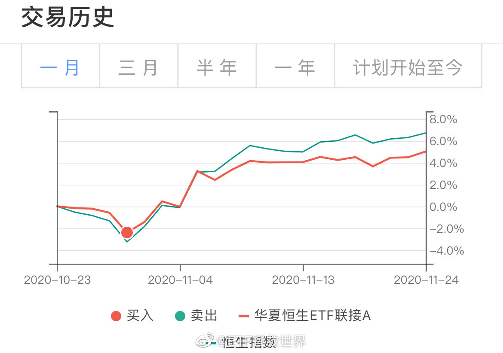

======================================================

ETF拯救世界 (5687069307) @
2020-11-25 09:40:47 Wed  
url: https://weibo.com/5687069307/JvvgWfeZ9

恒生即将上摸压力位27400。这里多空不打一场说不过去。 ​​​

转发[40]  评论[222]  赞[1490] 

======================================================

ETF拯救世界 (5687069307) @
2020-11-25 09:43:51 Wed  
url: https://weibo.com/5687069307/Jvviblvcm

猜猜是谁在跑。[鼓掌]

------------------------------------------------------
转推：
>  @ETF拯救世界 (5687069307)
>  2020-11-06 10:05:36 Fri  
>  url: https:/weibo.com/5687069307/JsCjzEZYX/

>  目前公募基金持仓集中度最高的是食品饮料、医药、科技。
>  
>  最好别踩踏，否则画面太美。 ​​​

转发[25]  评论[162]  赞[1195] 

======================================================

ETF拯救世界 (5687069307) @
2020-11-25 09:57:42 Wed  
url: https://weibo.com/5687069307/JvvnO4Fwm

机构抱团，涨的时候大家开开心心，意气风发，净值一起high。

就是不要跑。一个跑两个跑三个跑，心不齐了，队伍不好带了，那就麻烦了。

大家手里拿了那么多筹码，怎么办，谁跑得快谁损失少呗。

那为什么当初要抱团？

废话，不报团净值上不去，规模上不去，奖金你给发啊。 ​​​

转发[82]  评论[297]  赞[1812] 

======================================================

ETF拯救世界 (5687069307) @
2020-11-25 10:19:20 Wed  
url: https://weibo.com/5687069307/JvvwAABtd

更新表格中。更新好了会通知。 ​​​

转发[33]  评论[584]  赞[1743] 

======================================================

ETF拯救世界 (5687069307) @
2020-11-25 11:05:52 Wed  
url: https://weibo.com/5687069307/JvvPtpvw7

已更新

------------------------------------------------------
转推：
>  @ETF拯救世界 (5687069307)
>  2020-11-25 10:19:20 Wed  
>  url: https:/weibo.com/5687069307/JvvwAABtd/

>  更新表格中。更新好了会通知。 ​​​

转发[21]  评论[677]  赞[1605] 

======================================================

ETF拯救世界 (5687069307) @
2020-11-25 13:12:21 Wed  
url: https://weibo.com/5687069307/JvwEOpJmh

如果是经常在办公室待着，又不是总是玩手游的话，其实电池多大并不是很重要。

反正我到办公室就会把手机放到桌面的无线充电器上，基本不知道什么叫电量不够……

人和人的需求不同，你得知道自己真的要的是什么。 ​​​

转发[32]  评论[406]  赞[2606] 

======================================================

ETF拯救世界 (5687069307) @
2020-11-25 14:54:23 Wed  
url: https://weibo.com/5687069307/Jvxked9b2

你从未如此盼着什么品种下跌，即使你手中还有不少…… ​​​

转发[26]  评论[545]  赞[2330] 

======================================================

ETF拯救世界 (5687069307) @
2020-11-25 20:43:30 Wed  
url: https://weibo.com/5687069307/JvzBW7knI

有些词别人可以形容自己，这是幽默，是自嘲。

你却以为你也可以用同样的词形容别人。

不好意思，别人不会接受，会认为你是侮辱人家。 ​​​

转发[36]  评论[294]  赞[1666] 

======================================================

ETF拯救世界 (5687069307) @
2020-11-26 07:30:06 Thu  
url: https://weibo.com/5687069307/JvDQohInV

95.6%的悼念者其实连一场老马的比赛也没看过。

76.6%不知道他效力过哪些俱乐部，得过几次世界杯，场上踢什么位置。 ​​​

转发[29]  评论[538]  赞[2294] 

======================================================

ETF拯救世界 (5687069307) @
2020-11-26 08:39:13 Thu  
url: https://weibo.com/5687069307/JvEirzMur

刚才那条评论里有人说我蹭热点。我一点也没生气，甚至笑出声来。

我知道，他，以及其他几位如此愤怒，是因为我说很多悼念的人其实没看过老马踢球，这句话扎了他的玻璃心，扯下了他的遮羞布，让他恼羞成怒了。

我不是老马的粉丝。但如果我的偶像有什么事，我绝不会希望那些平常根本不关心他也不知道他 ​​​

转发[37]  评论[400]  赞[1776] 

======================================================

ETF拯救世界 (5687069307) @
2020-11-26 09:15:19 Thu  
url: https://weibo.com/5687069307/JvEx6qk0Z

反正已经说到这了，我就再说说我对名人和偶像的看法。

小时候，我关注的偶像重点是颜值，那时候我是颜狗本狗没错了。

大一点，会关注NB的人，各行各业。

再大一点，我会在专业领域NB的人里面，选出我可以学到东西的人关注。

因为这个时候我知道，一个人的精力是有限的。如果别人的专业非常NB，但是 ​​​

转发[78]  评论[455]  赞[2065] 

======================================================

ETF拯救世界 (5687069307) @
2020-11-26 09:36:32 Thu  
url: https://weibo.com/5687069307/JvEFInzaZ

不过我也想了一下，有些朋友在评论里诚恳的指出问题，也有道理，我也虚心接受。

看破不说破，还能做朋友。

以后我会更注意。一个是是不是合时宜的问题，还有一个是人与人之间阅读理解能力和逻辑思维能力差的太多了。一样的文字可能产生382种解读，所以容易误会的话少说。

你看，是不是又level up了 ​​​

转发[15]  评论[359]  赞[1526] 

======================================================

ETF拯救世界 (5687069307) @
2020-11-26 10:13:09 Thu  
url: https://weibo.com/5687069307/JvEUzvYgf

搞定。现在踏实了。

涨跌随意。[鼓掌] ​​​

转发[36]  评论[1144]  赞[2338] 

======================================================

ETF拯救世界 (5687069307) @
2020-11-26 15:00:12 Thu  
url: https://weibo.com/5687069307/JvGN5ozE1

今天是相当普通无趣的一天。

但没有意外、普通的一天，某个角度说就是幸运。

这个世界每天都有人离开。好好珍惜那些为数不多的，真心对你好的人。 ​​​

转发[51]  评论[450]  赞[2277] 

======================================================

ETF拯救世界 (5687069307) @
2020-11-26 16:45:50 Thu  
url: https://weibo.com/5687069307/JvHtXEmqR

这个问题我必须展开说说了。

但首先我要说的，是大家的文字叙述能力真的要提高了！很简单的一件事很啰嗦的说了那么长~不过还好能说清楚。很多人私信根本说不清楚……

言归正传。

杞人忧天。

首先，你的父母，是两个有行为能力的成年人。他们夫妻二人做的任何投资决策，是人家自己的事。

你作为子 ​​​

转发[130]  评论[813]  赞[3624] 

+++++++++++++++++++++++++++++++++++++++++++++++++++++

图片：

======================================================

ETF拯救世界 (5687069307) @
2020-11-26 17:49:51 Thu  
url: https://weibo.com/5687069307/JvHTWBkYh

我想问问大家关于父母债务问题的看法，因为刚才那个帖子我发现评论里很多朋友和我想的不一样。

我的想法：

父母的投资或者借贷发生前，我会努力和他们沟通，争取不要进行高风险的投资。也会提醒他们一定要注意风险，研究投资项目。也会跟他们说之前我说过的，借钱等于送钱这个意思。

如果依然无法改 ​​​

转发[61]  评论[585]  赞[2084] 

======================================================

ETF拯救世界 (5687069307) @
2020-11-27 09:55:16 Fri  
url: https://weibo.com/5687069307/JvOdOiMjr

感恩节什么的过不过单说

“知恩图报”应该是正常人必备的素质

真心对你好的人不会太多，对他们也好点，有机会就回报一些，你自己也会快乐很多。物质也好，精神也好，让对你好的人感受到你的感恩之心。

但是现实是很多人永远只会觉得别人欠自己，别人对自己再好都是理所应当的。说实话，这样的人真不 ​​​

转发[98]  评论[922]  赞[3270] 

======================================================

ETF拯救世界 (5687069307) @
2020-11-29 15:11:18 Sun  
url: https://weibo.com/5687069307/Jw995aTAf

突如其来的红包。

1111，开不开心？

 http://t.cn/A6GdY1aY ​​​

转发[26]  评论[1739]  赞[2381] 

======================================================

ETF拯救世界 (5687069307) @
2020-11-29 20:01:54 Sun  
url: https://weibo.com/5687069307/Jwb32gEef

反弹 ​​​

转发[169]  评论[458]  赞[2142] 

+++++++++++++++++++++++++++++++++++++++++++++++++++++

图片：

======================================================

ETF拯救世界 (5687069307) @
2020-11-29 20:21:54 Sun  
url: https://weibo.com/5687069307/Jwbb9sOJj

回复@BuBu蛇:那你就不理智了。如果你不想有任何损失，那么第一年你可以配置93%的无风险品种和7%的股票指数。这样，你在绝对没有损失本金的情况下也许会有超额收益。第二年股票指数可以根据你第一年的收益率加仓。//@BuBu蛇:几千万，我估计就只买货币基金了。[允悲]

------------------------------------------------------
转推：
>  @ETF拯救世界 (5687069307)
>  2020-11-29 20:01:54 Sun  
>  url: https:/weibo.com/5687069307/Jwb32gEef/

>  反弹 ​​​

转发[148]  评论[317]  赞[1586] 

======================================================

ETF拯救世界 (5687069307) @
2020-11-30 08:12:25 Mon  
url: https://weibo.com/5687069307/JwfPyhM9O

工作使我快乐。 ​​​

转发[22]  评论[533]  赞[1702] 

======================================================

ETF拯救世界 (5687069307) @
2020-11-30 08:58:57 Mon  
url: https://weibo.com/5687069307/Jwg8rkZJG

今天的BGM听起来，怎么说呢……

让人心里面有一种很痒，但挠不到，又难受又high的那种感觉。

如果能一边听一边撸我封面上这几只小猫的话，应该会缓解很多…… ​​​

转发[12]  评论[506]  赞[1409] 

======================================================

ETF拯救世界 (5687069307) @
2020-11-30 09:06:17 Mon  
url: https://weibo.com/5687069307/JwgbqlQco

快到选择方向的时候了。

------------------------------------------------------
转推：
>  @ ()
>  2020-11-30 08:17:29 Mon  
>  url: 

>  该账号因被投诉违反法律法规和《微博社区公约》的相关规定，现已无法查看。查看帮助 https://kefu.weibo.com/faqdetail?id=13216

转发[49]  评论[295]  赞[1344] 

======================================================

ETF拯救世界 (5687069307) @
2020-11-30 09:36:16 Mon  
url: https://weibo.com/5687069307/JwgnAsDT5

最不讲武德的居然是目前A股仓位第三的上证50。[哼] ​​​

转发[19]  评论[313]  赞[1611] 

======================================================

ETF拯救世界 (5687069307) @
2020-11-30 09:55:34 Mon  
url: https://weibo.com/5687069307/Jwgvqhbke

野百合也有春天，这是一种信念。

有了信念，才能坚持做一件事。不随波逐流，不人云亦云，不追涨杀跌，不黯然离场。 ​​​

转发[84]  评论[295]  赞[1800] 

======================================================

ETF拯救世界 (5687069307) @
2020-11-30 10:12:04 Mon  
url: https://weibo.com/5687069307/JwgC7FmQU

之前给新朋友写给这样一段话，请再看一遍：

“
这一段时间，无论是微博还是公众号，都多了一些新朋友。对新朋友来说最大的困扰是：

车都跟不上了。

由于150计划的补仓特殊设定：某个品种成本高于我，则不会发送补仓通知。这样，当你看到上面这张收益率表格的时候，你就知道，除了3只浮亏品种，你现 ​​​

转发[83]  评论[691]  赞[2505] 

======================================================

ETF拯救世界 (5687069307) @
2020-11-30 11:15:53 Mon  
url: https://weibo.com/5687069307/Jwh21nJTt

这一网医药差几厘没有买在这几天的最低。

水平下降的厉害，居然买不到最低了。

取关吧，博主水平很渣。[失望] ​​​

转发[15]  评论[715]  赞[2509] 

======================================================

ETF拯救世界 (5687069307) @
2020-11-30 11:22:52 Mon  
url: https://weibo.com/5687069307/Jwh4RbMOO

老时间，微信。

一键三连不要忘。 ​​​

转发[28]  评论[874]  赞[2629] 

======================================================

ETF拯救世界 (5687069307) @
2020-11-30 11:34:00 Mon  
url: https://weibo.com/5687069307/Jwh9nlwFJ

可惜没人给我广告费 ​​​

转发[49]  评论[319]  赞[1526] 

+++++++++++++++++++++++++++++++++++++++++++++++++++++

图片：
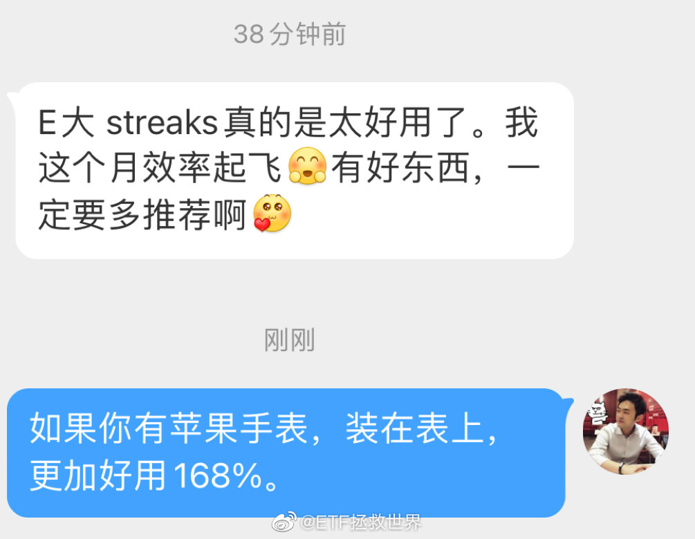

======================================================

ETF拯救世界 (5687069307) @
2020-11-30 13:07:34 Mon  
url: https://weibo.com/5687069307/JwhLm60Nm

大的思路：

宽基，选择标准宽基+增强宽基。

行业，选择标准行业+主动行业（相当于增强）。

大概就是这个意思。基本上主动只会在行业主动里面选。包括之前的内地消费和这次的健康产业。 ​​​

转发[446]  评论[626]  赞[3071] 

======================================================

ETF拯救世界 (5687069307) @
2020-12-01 09:37:33 Tue  
url: https://weibo.com/5687069307/JwpOBrJEf

好家伙。 ​​​

转发[18]  评论[398]  赞[1380] 

+++++++++++++++++++++++++++++++++++++++++++++++++++++

图片：

======================================================

ETF拯救世界 (5687069307) @
2020-12-01 09:43:05 Tue  
url: https://weibo.com/5687069307/JwpQQDmX0

下跌过程中，

从阶段最低点反弹个5%，

这要求过分吗？ ​​​

转发[103]  评论[463]  赞[1783] 

======================================================

ETF拯救世界 (5687069307) @
2020-12-01 09:48:42 Tue  
url: https://weibo.com/5687069307/JwpT8bZ3n

我解释一下，

挂的价格高几厘，是有原因的。

这么多人买，怎么可能设定到最低。那样可能所有人买不到。

如果我自己买……

公开操作是很难的，因为交易本来就应该是悄悄的，不动声色的，声东击西的，鬼神莫测的。公开的话，比自己操作难864%。 ​​​

转发[49]  评论[616]  赞[2139] 

======================================================

ETF拯救世界 (5687069307) @
2020-12-01 10:01:19 Tue  
url: https://weibo.com/5687069307/JwpYfzynv

这里聚集了A股市场上最不正常的一群人：

涨也高兴，跌也高兴。不仅如此，涨跌都能源源不断的提款。 ​​​

转发[37]  评论[513]  赞[2348] 

======================================================

ETF拯救世界 (5687069307) @
2020-12-01 10:06:54 Tue  
url: https://weibo.com/5687069307/Jwq0wh8XL

医药最下面的两根支撑分别是10500和9000。

无论是什么策略投资，请做好跌幅在25%和35%，最多到50%的心理准备。 ​​​

转发[218]  评论[600]  赞[2543] 

======================================================

ETF拯救世界 (5687069307) @
2020-12-01 10:29:45 Tue  
url: https://weibo.com/5687069307/Jwq9Ndjs4

碰到坏人，不要想“他怎么能那么坏？”

对啊，他就是这么坏，这么狠，这么毒，这么辣鸡。

这是客观存在，你改变不了，想也没用。

要么你就用各种办法干他，要么你就闭嘴默默舔伤口。舔完伤口，要么就是算了，要么就是等自己实力强了路子野了再回头干他。 ​​​

转发[101]  评论[386]  赞[2123] 

======================================================

ETF拯救世界 (5687069307) @
2020-12-01 10:58:58 Tue  
url: https://weibo.com/5687069307/JwqlEsFDw

家用打印机，我推荐墨仓式的。

不解释。 ​​​

转发[80]  评论[421]  赞[2032] 

======================================================

ETF拯救世界 (5687069307) @
2020-12-01 11:16:42 Tue  
url: https://weibo.com/5687069307/JwqsQE98S

50又来了。昨天早上杀进去今天早上割肉的迷茫了。 ​​​

转发[21]  评论[367]  赞[1704] 

======================================================

ETF拯救世界 (5687069307) @
2020-12-01 14:19:24 Tue  
url: https://weibo.com/5687069307/JwrF0tpc5

新高不卖。

不猜顶。什么时候该走了，市场会告诉你。 ​​​

转发[81]  评论[534]  赞[2446] 

======================================================

ETF拯救世界 (5687069307) @
2020-12-01 14:29:20 Tue  
url: https://weibo.com/5687069307/JwrJ2vT8M

以前你抬人，现在人抬你。 ​​​

转发[16]  评论[460]  赞[2230] 

======================================================

ETF拯救世界 (5687069307) @
2020-12-01 15:01:54 Tue  
url: https://weibo.com/5687069307/JwrWgqV6W

你是不是总是听别人说，炒股票应该“拿住”。只有长线持有，才能挣大钱。赚钱了不要卖，会赚更多。

我说，bullshit！

跟普通人说这些是bullshit。拿不住！

因为普通人，85%的人，根本不知道自己炒的股票到底怎么样，这家公司有没有问题，高管有没有问题，行业有没有问题，过几年会不会死！

也不知 ​​​

转发[593]  评论[1062]  赞[3461] 

======================================================

ETF拯救世界 (5687069307) @
2020-12-01 20:12:08 Tue  
url: https://weibo.com/5687069307/JwtYbjSrG

每天看微博新闻，总觉得自己是不是思维真的跟不上时代了。

比如排几个小时队去买奶茶。

如果排几个小时队领钱也行了，居然是买东西，买一种并不稀缺的东西，买一种喝了会让自己发胖也不稀缺的东西。

比如抽盲盒。

具体的不了解，但这个跟赌场是一样的。可想而知，商家为了赚钱，会把胜率定的很低。 ​​​

转发[86]  评论[1069]  赞[3350] 

======================================================

ETF拯救世界 (5687069307) @
2020-12-02 09:57:09 Wed  
url: https://weibo.com/5687069307/Jwzn3tfqu

“前11月A股IPO募资4200亿 创10年新高” ​​​

转发[26]  评论[225]  赞[1577] 

======================================================

ETF拯救世界 (5687069307) @
2020-12-02 10:01:58 Wed  
url: https://weibo.com/5687069307/Jwzp0Evm2

中概互联150没了，S还有一份。

希望有机会买回来。 ​​​

转发[85]  评论[731]  赞[2137] 

======================================================

ETF拯救世界 (5687069307) @
2020-12-02 14:14:31 Wed  
url: https://weibo.com/5687069307/JwB3wmJUk

有个事情汇报一下，可能对平时工作学习比较忙的朋友比较有用。

计划可以自动跟车了。 ​​​

转发[57]  评论[1418]  赞[4503] 

======================================================

ETF拯救世界 (5687069307) @
2020-12-03 08:20:12 Thu  
url: https://weibo.com/5687069307/JwIactMej

贱。 ​​​

转发[28]  评论[346]  赞[2126] 

+++++++++++++++++++++++++++++++++++++++++++++++++++++

图片：

======================================================

ETF拯救世界 (5687069307) @
2020-12-03 08:40:43 Thu  
url: https://weibo.com/5687069307/JwIix1cpe

开玩笑的时候分寸感最难把握。

有两种情况不用太顾虑，一种是很熟悉，你知道对方不会生气，比如兄弟。另一种是你根本不在意对方生不生气，比如某些上级对下级。

其它的时候，开玩笑的时候真的要注意分寸。有时候一句话可能就改变了你的人生。

闲的没事别给自己制造困难和敌人。想表现幽默很简单啊， ​​​

转发[61]  评论[281]  赞[1677] 

======================================================

ETF拯救世界 (5687069307) @
2020-12-03 09:35:33 Thu  
url: https://weibo.com/5687069307/JwIEMBS0j

有些公司，上市没多久就开始增发、配股、高管减持。

有些公司，就发行的时候融了点钱，后来就一直分红。现金流太好了，每年赚好多钱，也没什么支出，想再融资都没理由。

我估计，后者的大股东非常后悔：为什么要上市无缘无故给这帮小股东分红呢。 ​​​

转发[75]  评论[249]  赞[1608] 

======================================================

ETF拯救世界 (5687069307) @
2020-12-03 09:38:24 Thu  
url: https://weibo.com/5687069307/JwIFWtvNf

xx，还差一哆嗦，能不能5天5%就看你了，耗子尾汁。 ​​​

转发[30]  评论[770]  赞[1880] 

======================================================

ETF拯救世界 (5687069307) @
2020-12-03 10:04:29 Thu  
url: https://weibo.com/5687069307/JwIQx2u2B

交易的乐趣，很多朋友慢慢有了体会。

不是什么预测，不是什么猜顶猜底。

而是制定适合自己的策略，执行。然后领钱。

周而复始。 ​​​

转发[133]  评论[698]  赞[2492] 

======================================================

ETF拯救世界 (5687069307) @
2020-12-03 10:31:09 Thu  
url: https://weibo.com/5687069307/JwJ1m6cPZ

为什么贫富差距会加大，原因很多。

其中一点是个人的选择。

你从小就坚定执行任何收入拿出20%存起来然后谨慎投资。另一个人月光甚至借贷，那么即使你们做的工作一样，收入一样，最终贫富差距就会越来越大。

借贷消费的人，会背上高额利息，最终赚的钱很大一部分还利息了，最穷。

月光的人好不到哪 ​​​

转发[274]  评论[626]  赞[2477] 

======================================================

ETF拯救世界 (5687069307) @
2020-12-03 10:36:53 Thu  
url: https://weibo.com/5687069307/JwJ3GmxeU

还行吧。一般般。没什么亮点。

------------------------------------------------------
转推：
>  @ETF拯救世界 (5687069307)
>  2020-12-01 09:43:05 Tue  
>  url: https:/weibo.com/5687069307/JwpQQDmX0/

>  下跌过程中，
>  
>  从阶段最低点反弹个5%，
>  
>  这要求过分吗？ ​​​

转发[79]  评论[1350]  赞[3189] 

======================================================

ETF拯救世界 (5687069307) @
2020-12-03 11:39:43 Thu  
url: https://weibo.com/5687069307/JwJtbw3a9

兴全转债分红。再投。

PS

我出去浪了，别太想我。 ​​​

转发[20]  评论[578]  赞[2034] 

======================================================

ETF拯救世界 (5687069307) @
2020-12-03 13:41:44 Thu  
url: https://weibo.com/5687069307/JwKgIhkVj

表格已更新。另外在条件单“历史记录”里面找到买入的那笔，直接“重新创建”更方便。

ps

被冻回来了。5555 ​​​

转发[31]  评论[730]  赞[2097] 

======================================================

ETF拯救世界 (5687069307) @
2020-12-03 13:46:51 Thu  
url: https://weibo.com/5687069307/JwKiN5ium

造孽啊 ​​​

转发[18]  评论[1113]  赞[3085] 

+++++++++++++++++++++++++++++++++++++++++++++++++++++

图片：
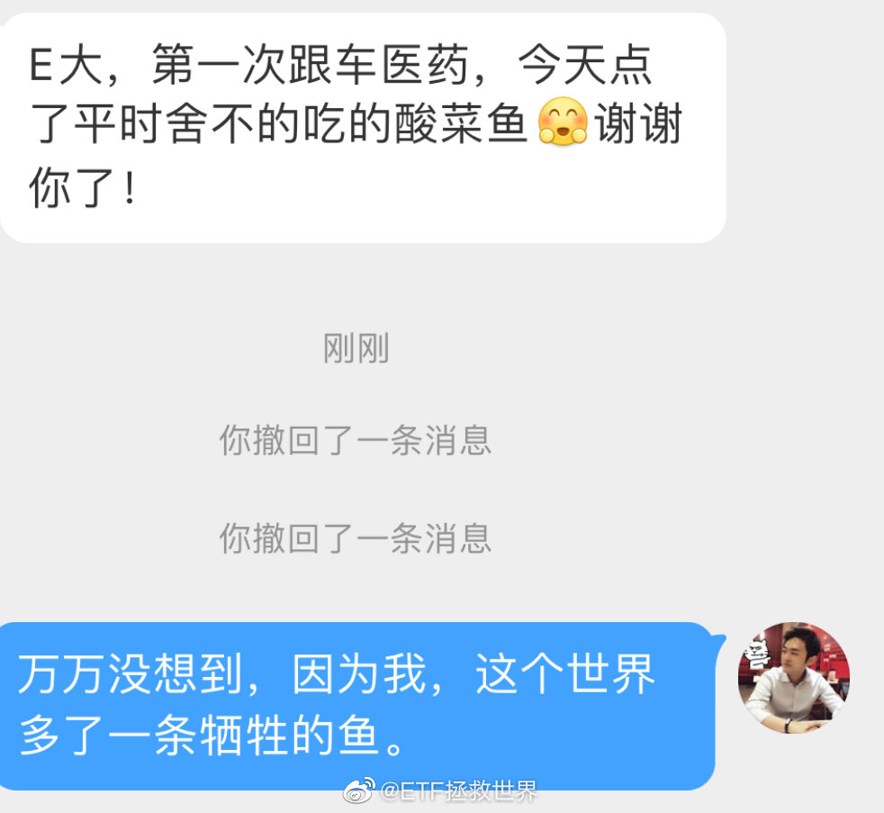

======================================================

ETF拯救世界 (5687069307) @
2020-12-04 08:23:42 Fri  
url: https://weibo.com/5687069307/JwRC7pi3V

十年前开始，就不在网上谈论任何股票。股票牵扯的东西太多，还有道德风险，所以不说为妙。

只是说起过买的极个别公司，米啊，东啊，也绝对不是推荐，智商正常的应该都看得出来。

以后尽量连自己喜欢的公司也不说了吧。如果什么时候没注意，还请各位提醒。 ​​​

转发[28]  评论[726]  赞[2805] 

======================================================

ETF拯救世界 (5687069307) @
2020-12-04 13:08:03 Fri  
url: https://weibo.com/5687069307/JwTtxhTI6

分享图片 ​ http://t.cn/A6qhysVI ​​​

转发[99]  评论[3248]  赞[4994] 

+++++++++++++++++++++++++++++++++++++++++++++++++++++

图片：

======================================================

ETF拯救世界 (5687069307) @
2020-12-05 08:47:07 Sat  
url: https://weibo.com/5687069307/Jx1c7rOkc

没别的意思啊，我就在想另一个结局

如果一个人自杀，警察不顾生命危险去救他，然后因公殉职

那个时候网上舆论会不会骂自杀的人，为警察感到惋惜不值 ​​​

转发[16]  评论[379]  赞[1702] 

======================================================

ETF拯救世界 (5687069307) @
2020-12-05 09:44:20 Sat  
url: https://weibo.com/5687069307/Jx1zlq2hi

其实说一些与主流意见不同的话风险特别大，但有些话不说又挺难受的。

自杀和意外溺水是不一样的。一个是自己求死，一个是求生。这件事得从两个角度讲。

第一个角度，救援难度不同。

求死的人在水里我想非常难救，因为他不会配合你，甚至反抗你。别说反抗你了，就是意外溺水的人也不好救，多少救人的 ​​​

转发[75]  评论[414]  赞[2319] 

======================================================

ETF拯救世界 (5687069307) @
2020-12-05 10:27:37 Sat  
url: https://weibo.com/5687069307/Jx1QUzQiB

很多人说，刚开始的时候水浅啊，你为什么不跳下去拉回来啊。

呵呵。

照你这么说，天台上跳楼的，大家都在地上，距离几米，你冲过去拉回来更容易，为什么你不能冲过去呢？

因为一个想死的自杀的人，根本不可能被你轻易的拉回来。你往前冲，他一激动反而就直接跳下去了！

这也是为什么看香港电影里遇 ​​​

转发[19]  评论[271]  赞[1719] 

======================================================

ETF拯救世界 (5687069307) @
2020-12-05 10:55:03 Sat  
url: https://weibo.com/5687069307/Jx223qqne

恭喜@sun要努力呀 等100名用户获得【网格交易手账本】。微博官方唯一抽奖工具@微博抽奖平台 对本次抽奖进行监督，结果公正有效。公示链接：http://t.cn/A6qhUchD

------------------------------------------------------
转推：
>  @ETF拯救世界 (5687069307)
>  2020-12-04 13:08:03 Fri  
>  url: https:/weibo.com/5687069307/JwTtxhTI6/

>  分享图片 ​ http://t.cn/A6qhysVI ​​​

转发[5]  评论[248]  赞[440] 

======================================================

ETF拯救世界 (5687069307) @
2020-12-05 11:04:02 Sat  
url: https://weibo.com/5687069307/Jx25HvGOu

恭喜@yanyun116118 等100名用户获得【网格交易手账】。微博官方唯一抽奖工具@微博抽奖平台 对本次抽奖进行监督，结果公正有效。公示链接：http://t.cn/A6qhU1e0

------------------------------------------------------
转推：
>  @ETF拯救世界 (5687069307)
>  2020-12-04 13:08:03 Fri  
>  url: https:/weibo.com/5687069307/JwTtxhTI6/

>  分享图片 ​ http://t.cn/A6qhysVI ​​​

转发[4]  评论[281]  赞[456] 

======================================================

ETF拯救世界 (5687069307) @
2020-12-05 11:07:35 Sat  
url: https://weibo.com/5687069307/Jx278nWFQ

好，第一次抽奖结果出来了，我也展开说说吧。

前一段时间，某不方便透露姓名的爱心人士表示愿意做一批手账本送给大家，然后设计了方案。我觉得挺好的，就答应了。现在基本已经搞定了，所以可以开始送了。

首先需要说明的是，微博抽奖每次只能抽100位。所以必须分几次抽。

我设计的抽奖方案是这样的 ​​​

转发[47]  评论[2138]  赞[2490] 

======================================================

ETF拯救世界 (5687069307) @
2020-12-05 11:27:51 Sat  
url: https://weibo.com/5687069307/Jx2fn0GsO

我唯一没想好的，是有人抽奖中了以后高价卖怎么办。[失望]如果是这样，我真的会很失望。也请没抽中的朋友不要去买，不是什么好东西，别花钱。[委屈]

------------------------------------------------------
转推：
>  @ETF拯救世界 (5687069307)
>  2020-12-05 11:07:35 Sat  
>  url: https:/weibo.com/5687069307/Jx278nWFQ/

>  好，第一次抽奖结果出来了，我也展开说说吧。
>  
>  前一段时间，某不方便透露姓名的爱心人士表示愿意做一批手账本送给大家，然后设计了方案。我觉得挺好的，就答应了。现在基本已经搞定了，所以可以开始送了。
>  
>  首先需要说明的是，微博抽奖每次只能抽100位。所以必须分几次抽。
>  
>  我设计的抽奖方案是这样的 ​​​

转发[14]  评论[649]  赞[1364] 

======================================================

ETF拯救世界 (5687069307) @
2020-12-05 13:36:45 Sat  
url: https://weibo.com/5687069307/Jx35GpkrV

特别好 ​​​

转发[17]  评论[637]  赞[2275] 

+++++++++++++++++++++++++++++++++++++++++++++++++++++

图片：
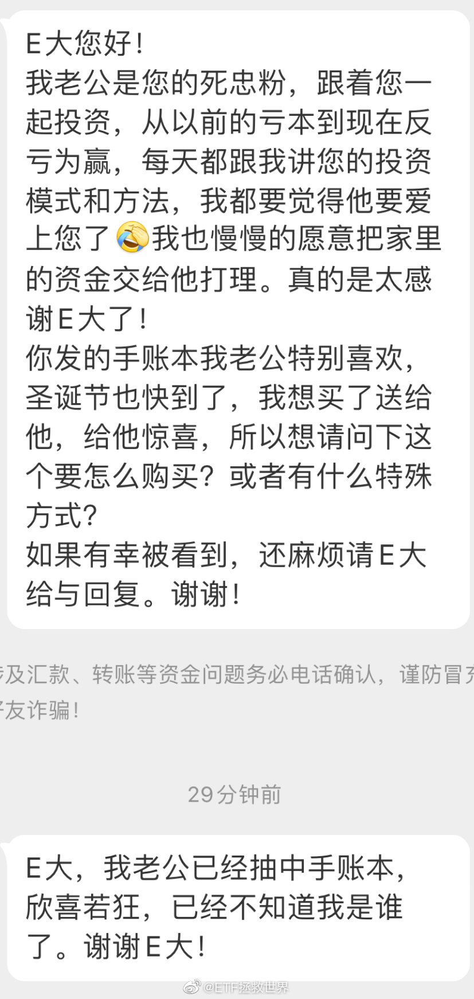

======================================================

ETF拯救世界 (5687069307) @
2020-12-05 14:10:37 Sat  
url: https://weibo.com/5687069307/Jx3jqBagK

两个人在一起，

有共同的话题，有差不多一致的三观，互相关心，

就特别幸福和难得了，

要珍惜。 ​​​

转发[188]  评论[773]  赞[3446] 

======================================================

ETF拯救世界 (5687069307) @
2020-12-05 21:52:42 Sat  
url: https://weibo.com/5687069307/Jx6kZjs9R

关于这个，大家怎么看 ​​​

转发[89]  评论[899]  赞[4659] 

+++++++++++++++++++++++++++++++++++++++++++++++++++++

图片：

======================================================

ETF拯救世界 (5687069307) @
2020-12-06 08:42:28 Sun  
url: https://weibo.com/5687069307/JxaAJfNZM

键盘侠//@Kevinqin008:😂//@余皪KrisFish:#内环线迷惑行为# 就... [允悲][允悲][允悲][允悲][允悲][允悲][允悲][允悲][允悲][允悲][允悲]//@botox刘老师:这个真的太好笑了😂  @黄小蟹-正宗阳澄湖大闸蟹专卖 //@兽爷: 气势不能输//@许亿秒:真实[笑哈哈]

------------------------------------------------------
转推：
>  @黄西炮 (5384771805)
>  2020-12-05 09:49:57 Sat  
>  url: https:/weibo.com/5384771805/Jx1BCAfiK/

>  像极了网络喷子现实中的样子…[doge] http://t.cn/A6qhA2IH ​​​

转发[177]  评论[265]  赞[843] 

======================================================

ETF拯救世界 (5687069307) @
2020-12-06 09:25:54 Sun  
url: https://weibo.com/5687069307/JxaSmmLwi

想要空间整洁的关键不是收纳，收纳只占20%。

东西少，垃圾少最关键，占50%。

物归原位占30%。 ​​​

转发[139]  评论[592]  赞[2659] 

======================================================

ETF拯救世界 (5687069307) @
2020-12-06 10:57:38 Sun  
url: https://weibo.com/5687069307/JxbtB2Aph

很多朋友说对于物品的取舍家里人意见不一致，

我考虑，其中一个因素，很重要的因素，是大家的“审美”不一样。

对于什么是美，认识不统一，导致很多问题产生。

总体而言，我国现阶段其实非常缺少美学教育。无论从建筑、服装、家居装修陈设……各方各面的一言难尽。

对于美的要求高了，就不可能容忍 ​​​

转发[34]  评论[436]  赞[1567] 

======================================================

ETF拯救世界 (5687069307) @
2020-12-06 14:01:47 Sun  
url: https://weibo.com/5687069307/JxcGldwaW

我索性再说深一步。

保持对拥有物品的数量控制，一定程度上是让自己保持长久快乐的办法之一。

你以为购物很快乐吗。对，也许下单和等待收货的时候真的很快乐。打开看快递盒的时候最快乐。当你拿出你心心念念的那件东西时——快乐已经从巅峰滑落。

但你怀念这种快乐。你还想再次得到这种快乐，所以你 ​​​

转发[307]  评论[667]  赞[2401] 

======================================================

ETF拯救世界 (5687069307) @
2020-12-06 17:04:14 Sun  
url: https://weibo.com/5687069307/JxdSoASpT

我这里有没有受骗的朋友。能不能说说是为什么被骗。是主要因为高收益投资承诺吗。

------------------------------------------------------
转推：
>  @慧心zZ (2267251491)
>  2020-09-26 06:32:20 Sat  
>  url: https:/weibo.com/2267251491/JmmoF4Q4m/

>  我是一只刚刚被杀的的猪 我不知道自己怎么才能走出来，明明期间有过怀疑却对骗子的话深信不疑……警察叔叔天天提醒我，我还隐瞒不说，我是有多蠢，活该我被骗被宰，一下背负了40万的债务何去何从#杀猪盘# ​​​

转发[31]  评论[676]  赞[1680] 

======================================================

ETF拯救世界 (5687069307) @
2020-12-06 20:04:36 Sun  
url: https://weibo.com/5687069307/Jxf3ByANA

这个说得好，有价值有意义。

------------------------------------------------------
转推：
>  @白衣山猫 (2423757750)
>  2020-12-06 10:25:37 Sun  
>  url: https:/weibo.com/2423757750/JxbgB9JeE/

>  【花季女孩跳水身亡，望江警察该当何罪？】
>  附视频：我刚拍摄金华市公安局一个乡下派出所，雅畈派出所处警车的标准配置。
>  首先，板子要打向安徽警方。
>  看了现场视频，我认为，如果现在的警察穿了救生衣，边上的人有救生绳，他们一定会毫不犹豫地扑向女孩，也一定能够救起她。
>  关键问题是，安徽的处警车 ​​​

转发[121]  评论[290]  赞[1275] 

======================================================

ETF拯救世界 (5687069307) @
2020-12-07 08:03:10 Mon  
url: https://weibo.com/5687069307/JxjLhtcvh

这个事情管不管，你怎么说，你会怎么办 ​​​

转发[21]  评论[781]  赞[2553] 

+++++++++++++++++++++++++++++++++++++++++++++++++++++

图片：

======================================================

ETF拯救世界 (5687069307) @
2020-12-07 10:03:30 Mon  
url: https://weibo.com/5687069307/Jxky7D4fL

回复@ETF拯救世界:[悲伤][悲伤][悲伤]又差了5厘，最高2.025就回调了。现在技术真的这么差了吗。难受。//@ETF拯救世界:上方压力位2.03。跌下去就接着吃网，涨上去就吃大摩健康。不香吗。//@ETF拯救世界:还行吧。一般般。没什么亮点。

------------------------------------------------------
转推：
>  @ETF拯救世界 (5687069307)
>  2020-12-01 09:43:05 Tue  
>  url: https:/weibo.com/5687069307/JwpQQDmX0/

>  下跌过程中，
>  
>  从阶段最低点反弹个5%，
>  
>  这要求过分吗？ ​​​

转发[17]  评论[491]  赞[1314] 

======================================================

ETF拯救世界 (5687069307) @
2020-12-07 10:33:09 Mon  
url: https://weibo.com/5687069307/JxkKa0P3s

一年多前的一条微博，建议新朋友再看看。

------------------------------------------------------
转推：
>  @ETF拯救世界 (5687069307)
>  2019-03-24 20:14:52 Sun  
>  url: https:/weibo.com/5687069307/HmqN47MZY/

>  是不是骗局有一条硬核指标：是不是国家认可并监管的品种。
>  
>  这个项目在证监 保监 银监有没有背书。公司有没有资质。这些都可以查。
>  
>  有了监管层背书的标准化品种，不能说没有风险，但是是骗子的风险大大降低。剩下的交易风险可以用各种方法规避，骗子风险无法规避，唯一方法就是离得越远越好。
>  
>  中国人 ​​​

转发[46]  评论[136]  赞[939] 

======================================================

ETF拯救世界 (5687069307) @
2020-12-07 10:35:27 Mon  
url: https://weibo.com/5687069307/JxkL5DYEu

还有这条，关于骗钱的。最后的两点建议必须深刻理解。

------------------------------------------------------
转推：
>  @ETF拯救世界 (5687069307)
>  2018-05-24 11:59:36 Thu  
>  url: https:/weibo.com/5687069307/Gi75oz7zN/

>  马蓉那件事，其实并没有给我太多意外的感觉。虽然无耻，但也算是合理范围内。不爱一个人，但因为其它原因，跟他结婚，跟他生了孩子。然后爱上了另一个人。
>  
>  翟欣欣这个真的让我感到有点震撼。人坏起来确实是没有边际没有底线的。
>  
>  谋财害命，也真的是要把你榨干才罢休。
>  
>  别说男主傻，单纯。可能只是因 ​​​

转发[55]  评论[284]  赞[1423] 

======================================================

ETF拯救世界 (5687069307) @
2020-12-07 11:21:26 Mon  
url: https://weibo.com/5687069307/Jxl3KwgDY

70、80后上位后，这种莫名其妙的政策会不会少一点？

------------------------------------------------------
转推：
>  @北京人不知道的北京事儿 (1662214194)
>  2020-12-07 10:51:55 Mon  
>  url: https:/weibo.com/1662214194/JxkRM0pEl/

>  【#大学女足省赛因染发球员过多被判负#[衰]】据校园足球联盟微博，福建省大学生女足联赛出现极其罕见一幕，在集美大学vs福州大学的比赛中，由于球员违反赛事规定的“染发、烫发、部分球员头发不是乌黑色”被禁止出场，双方教练组现场只得凑出7名头发为乌黑（注意不够黑仍不得出场）的队员进行比赛，并 ​​​

转发[36]  评论[331]  赞[1190] 

======================================================

ETF拯救世界 (5687069307) @
2020-12-07 13:22:28 Mon  
url: https://weibo.com/5687069307/JxlQT3OHX

两位大师切磋打了个平手。

------------------------------------------------------
转推：
>  @凤凰网 (2615417307)
>  2020-12-07 11:39:24 Mon  
>  url: https:/weibo.com/2615417307/Jxlb2DufU/

>  #网友初次约会点2万多火锅#【#网友见面点2万多火锅男方摸女方胸后逃单#】宁波的杨女士给浙江教科小强热线打电话，说她跟一个男性朋友一起吃饭，选在宁波最高档的火锅店，点份日本牛肉就要几千块钱、点瓶红酒要上万甚至几十万的那种。这顿饭本来是男方邀请她的，没成想饭吃了一半，男的走掉了，钱最后是 ​​​

转发[86]  评论[642]  赞[1855] 

======================================================

ETF拯救世界 (5687069307) @
2020-12-09 09:36:43 Wed  
url: https://weibo.com/5687069307/JxDeeFdfR

昨天儿子学校足球比赛中场断球后连过三人（包括门将），打入制胜一球，带领班级晋级下一轮。  我又开始考虑签了职业梯队文化课跟不上怎么办的事情了。发愁。

------------------------------------------------------
转推：
>  @ETF拯救世界 (5687069307)
>  2020-11-18 21:02:04 Wed  
>  url: https:/weibo.com/5687069307/JuvJZFE3x/

>  这么说吧。
>  
>  去年给儿子报足球班的时候，我想的是会不会有机会入选国安梯队、进入国少、国青，十年后入选国家队参加世界杯。
>  
>  甚至担忧过签了俱乐部的职业合同后文化课差太多怎么办。
>  
>  一年后的今天，我觉得踢踢球锻炼锻炼身体也特别好。 ​​​

转发[22]  评论[813]  赞[2574] 

======================================================

ETF拯救世界 (5687069307) @
2020-12-09 10:15:18 Wed  
url: https://weibo.com/5687069307/JxDtTEqNS

昨天看到有人带着一堆人每天短线交易场外基金。

而且很勤奋的每天六点起床研究哪只最强。

当时我就震惊了。主要是没想到有那么多人跟。 ​​​

转发[33]  评论[610]  赞[1781] 

======================================================

ETF拯救世界 (5687069307) @
2020-12-09 10:37:54 Wed  
url: https://weibo.com/5687069307/JxDD4yebd

医药怎么个意思，今年再来一波？[太开心] ​​​

转发[18]  评论[565]  赞[1776] 

======================================================

ETF拯救世界 (5687069307) @
2020-12-09 11:35:39 Wed  
url: https://weibo.com/5687069307/JxE0w3KjB

月亮与六便士这种书，你必须捏着鼻子看完前几章才会渐入佳境。

警告：中年男人不要看。 ​​​

转发[32]  评论[631]  赞[1874] 

======================================================

ETF拯救世界 (5687069307) @
2020-12-09 12:58:22 Wed  
url: https://weibo.com/5687069307/JxEy5uj9S

看医药那两根鹤立鸡群的成交量就感到好笑。

有你们这么割韭菜的吗。过分了。 ​​​

转发[25]  评论[297]  赞[1478] 

======================================================

ETF拯救世界 (5687069307) @
2020-12-09 13:14:30 Wed  
url: https://weibo.com/5687069307/JxEEE6jGm

我是真的真的不理解啊。我这里有没有朋友愿意排几个小时队买奶茶的，请告诉我你到底是怎么想的！别人不许嘲笑他，否则我会拉黑！

------------------------------------------------------
转推：
>  @辣姐在武汉 (5410302783)
>  2020-12-01 16:10:59 Tue  
>  url: https:/weibo.com/5410302783/Jwsoj7y4V/

>  #武汉一杯奶茶卖到500元#今天茶颜悦色武汉天地店开业咩，辣姐去的时候已经要排8个小时了，外卖小哥说早上有人100下单，“插队”一杯卖到500，太疯狂了[允悲]#武汉史上最短营业时间奶茶店# http://t.cn/R2WxQOQ http://t.cn/A6GDaxLc ​​​

转发[77]  评论[838]  赞[1527] 

======================================================

ETF拯救世界 (5687069307) @
2020-12-09 13:34:40 Wed  
url: https://weibo.com/5687069307/JxEMPpxtW

回复@微笑-开心果-:月收入/720，得出你的一小时大概值多少钱。然后看看浪费一小时在这个事情上值不值。当然，只是一个非常不精确的算法，但这个思路值得深入思考一下。//@微笑-开心果-:是免费的吗。。。免费我觉得也不值得排这么久的队啊。。。

------------------------------------------------------
转推：
>  @辣姐在武汉 (5410302783)
>  2020-12-01 16:10:59 Tue  
>  url: https:/weibo.com/5410302783/Jwsoj7y4V/

>  #武汉一杯奶茶卖到500元#今天茶颜悦色武汉天地店开业咩，辣姐去的时候已经要排8个小时了，外卖小哥说早上有人100下单，“插队”一杯卖到500，太疯狂了[允悲]#武汉史上最短营业时间奶茶店# http://t.cn/R2WxQOQ http://t.cn/A6GDaxLc ​​​

转发[44]  评论[210]  赞[678] 

======================================================

ETF拯救世界 (5687069307) @
2020-12-09 13:55:54 Wed  
url: https://weibo.com/5687069307/JxEVrq8cG

医药上次的网格买入点这次指导意义不强。有两种情况。

第一是由于支撑点上移，到达难度比上次大。也就是说，有可能跌不到上次买入的位置。

第二，如果真的到了，那么跌破的可能性较大。而且，会大概率继续下跌。也就是说，如果跌到了，那么大概率不会像上次一样撑住。

当然，撑不住是好事，就有机会 ​​​

转发[88]  评论[592]  赞[1872] 

======================================================

ETF拯救世界 (5687069307) @
2020-12-09 14:04:00 Wed  
url: https://weibo.com/5687069307/JxEYJghDq

不说你不知道，150已经8个月没有买入A股了。

你永远不会是接盘侠。 ​​​

转发[29]  评论[613]  赞[2403] 

======================================================

ETF拯救世界 (5687069307) @
2020-12-09 14:56:47 Wed  
url: https://weibo.com/5687069307/JxFk9xDW6

有时候觉得儿子真的挺幸运的。

失败的时候我会鼓励他安慰他，跟他讲运气以及努力程度的问题，听他诉说痛苦，帮他化解。

胜利的时候我会跟他一起庆祝，启发他努力的重要性：跟胜利的喜悦比，努力时候的辛苦不值一提。

在我小时候，失败和胜利的时候，家长是不会询问以及跟我分享胜利分担痛苦的。甚至 ​​​

转发[169]  评论[995]  赞[4285] 

======================================================

ETF拯救世界 (5687069307) @
2020-12-09 19:48:31 Wed  
url: https://weibo.com/5687069307/JxHezlsEV

二十多年前的书，推荐一下。 ​​​

转发[179]  评论[686]  赞[2352] 

+++++++++++++++++++++++++++++++++++++++++++++++++++++

图片：

======================================================

ETF拯救世界 (5687069307) @
2020-12-10 12:10:22 Thu  
url: https://weibo.com/5687069307/JxNF71YOf

随意跳上一辆公交车

随意在某站下车

去一些没去过的地方

不看大众点评

随意找一些好吃的好玩的

在城市随意流浪 ​​​

转发[74]  评论[1275]  赞[3333] 

======================================================

ETF拯救世界 (5687069307) @
2020-12-11 09:47:04 Fri  
url: https://weibo.com/5687069307/JxW9r6nqO

又是提款的一天。

简简单单的策略。

踏踏实实的交易。

轻轻松松的提款。 ​​​

转发[23]  评论[427]  赞[1648] 

======================================================

ETF拯救世界 (5687069307) @
2020-12-11 10:02:03 Fri  
url: https://weibo.com/5687069307/JxWfw73F3

总看到有人问，这个品种我该不该买啊，那个品种我该不该交易啊

只要是正规的、极大概率不会死的交易所交易产品，我都不会跟你说不要交易啊，难度太大啦……

这是一个小马过河的问题。没有标准答案。所以我的建议早就给你了：趁年轻什么都试试。只要控制住投入的资金比例，设计好针对这个产品的交易策 ​​​

转发[61]  评论[390]  赞[1360] 

+++++++++++++++++++++++++++++++++++++++++++++++++++++

图片：

======================================================

ETF拯救世界 (5687069307) @
2020-12-11 10:27:35 Fri  
url: https://weibo.com/5687069307/JxWpSuPhv

表格更新中。

新加入一个品种，去掉一个品种。更新完毕后我会说一声。 ​​​

转发[46]  评论[654]  赞[1715] 

======================================================

ETF拯救世界 (5687069307) @
2020-12-11 10:49:20 Fri  
url: https://weibo.com/5687069307/JxWyI63th

波动是不是好事，真的很难说。

你的长线仓位当然希望一路涨，但你的波动仓位就希望不断波动。所以对你来说，波动其实是中性的。

但如果你只有长线仓位，或者只有波动仓位，如果市场不断波动或者不断上涨，那你就有点难受了。

舒服最重要。 ​​​

转发[95]  评论[452]  赞[1855] 

======================================================

ETF拯救世界 (5687069307) @
2020-12-11 11:06:38 Fri  
url: https://weibo.com/5687069307/JxWFJC0iX

已更新

------------------------------------------------------
转推：
>  @ETF拯救世界 (5687069307)
>  2020-12-11 10:27:35 Fri  
>  url: https:/weibo.com/5687069307/JxWpSuPhv/

>  表格更新中。
>  
>  新加入一个品种，去掉一个品种。更新完毕后我会说一声。 ​​​

转发[30]  评论[1061]  赞[2075] 

======================================================

ETF拯救世界 (5687069307) @
2020-12-11 15:08:36 Fri  
url: https://weibo.com/5687069307/JxYfWupN7

【手账抽奖贴—且慢跟车的100本】

评论抽奖，不限制是否铁粉，开奖日期12月16日下午15:00。

一定要注意看下面的规则，否则可能被拉黑。

1、上次中奖的朋友不要再次评论。否则取消上次中奖资格，同时拉黑。

2、必须是在且慢跟车长赢的朋友。

中奖后，在填写邮寄地址的地方，后面加括号填入在且慢跟 ​​​

转发[346]  评论[12358]  赞[3666] 

+++++++++++++++++++++++++++++++++++++++++++++++++++++

图片：

======================================================

ETF拯救世界 (5687069307) @
2020-12-11 15:19:19 Fri  
url: https://weibo.com/5687069307/JxYkihzLb

微博你不要吃相这么差好不好啊求求你了。

别在我的微博内容里面乱加东西了好吗？否则别人会以为我收钱打广告，冤枉啊。

我谢谢你了微博！不要再加了！！！ ​​​

转发[15]  评论[653]  赞[1817] 

+++++++++++++++++++++++++++++++++++++++++++++++++++++

图片：

======================================================

ETF拯救世界 (5687069307) @
2020-12-12 19:00:02 Sat  
url: https://weibo.com/5687069307/Jy9cnvppE

大家的热情远超我的想象。这轮原定的100本加到300本，总数从550加到1050本。多出来的费用我来承担。

------------------------------------------------------
转推：
>  @ETF拯救世界 (5687069307)
>  2020-12-11 15:08:36 Fri  
>  url: https:/weibo.com/5687069307/JxYfWupN7/

>  【手账抽奖贴—且慢跟车的100本】
>  
>  评论抽奖，不限制是否铁粉，开奖日期12月16日下午15:00。
>  
>  一定要注意看下面的规则，否则可能被拉黑。
>  
>  1、上次中奖的朋友不要再次评论。否则取消上次中奖资格，同时拉黑。
>  
>  2、必须是在且慢跟车长赢的朋友。
>  
>  中奖后，在填写邮寄地址的地方，后面加括号填入在且慢跟 ​​​

转发[27]  评论[1942]  赞[2586] 

======================================================

ETF拯救世界 (5687069307) @
2020-12-13 11:42:05 Sun  
url: https://weibo.com/5687069307/JyfL77UJ6

今年炒股的人赚了多少呢。

根据最新报表，2020年前上市的所有公司股东总数为1.94113亿。

今年，上涨的股票有2134只，股东数为1.05814亿。

今年，下跌的股票有1580只，股东数为0.87834亿。

涨幅在4%以内的股票有1831只，股东总数为1.02254亿。

涨幅大于10%的股票有1595只，股东数为0.76156亿。低于 ​​​

转发[142]  评论[618]  赞[2671] 

======================================================

ETF拯救世界 (5687069307) @
2020-12-13 12:20:58 Sun  
url: https://weibo.com/5687069307/Jyg0TpO3b

统计股民盈亏数据只是第一步。有个大致的轮廓后，更加重要的是对自己的操作有什么启发。

我们都知道投资或者德州或者21点，都要计算概率才能赢。那么，我们就要做大概率会赢的投资，选择大概率会赢的品种。

然后，再看看输的人是怎么操作的，我们就不能与他们一样，我们要开发出克服人性的，高抛低吸 ​​​

转发[159]  评论[519]  赞[2229] 

======================================================

ETF拯救世界 (5687069307) @
2020-12-14 09:44:29 Mon  
url: https://weibo.com/5687069307/JyopShGiR

如果有朋友买到了，卖出价格设置买入价格*1.07。卖出份额为买入份额*0.93。

（已修改） ​​​

转发[89]  评论[618]  赞[1576] 

======================================================

ETF拯救世界 (5687069307) @
2020-12-14 09:48:03 Mon  
url: https://weibo.com/5687069307/JyorkmUU7

不是，我不明白为什么家属为什么不作证。不符合常理啊，难道这家人都是辣鸡吗。蹲个后续。

------------------------------------------------------
转推：
>  @北京人不知道的北京事儿 (1662214194)
>  2020-12-14 09:41:22 Mon  
>  url: https:/weibo.com/1662214194/JyooC2NsV/

>  【网约车司机为救婴儿连闯三红灯 事后家属却拒绝作证】网约车司机艾先生近日接到一张订单，乘客为一家三口带着一个婴儿，上车不久婴儿突发疾病失去知觉。艾先生连闯三个红灯将孩子送医，为此，他要被扣18分，并处以600元的罚款。交警表示需提供相关的医院证明，但婴儿家属却拒绝作证，称闯红灯跟他没关 ​​​

转发[23]  评论[269]  赞[1079] 

======================================================

ETF拯救世界 (5687069307) @
2020-12-14 10:03:35 Mon  
url: https://weibo.com/5687069307/JyoxDmrAO

吃泡面打卡本来就很好笑了，吃完了你不顺手给人扔垃圾箱里就不仅是好笑的问题了。除非没有垃圾箱，否则都是辣鸡。

------------------------------------------------------
转推：
>  @三联生活周刊 (1191965271)
>  2020-12-14 10:01:10 Mon  
>  url: https:/weibo.com/1191965271/JyowFoqjR/

>  #景区回应老君山金顶垃圾遍地# 【河南#老君山因泡面走红结果垃圾遍地# ，景区商家：根本扫不过来】12月13日河南洛阳。近日，因一句“远赴人间惊鸿宴，老君山上吃泡面”，众多游客纷纷涌上老君山吃泡面打卡，金顶平台上一片狼藉，遍地垃圾。景区称他们每天都会打扫，但商家反映，太多人来吃泡面，根本打 ​​​

转发[18]  评论[194]  赞[1015] 

======================================================

ETF拯救世界 (5687069307) @
2020-12-14 10:41:47 Mon  
url: https://weibo.com/5687069307/JyoN8l3XI

买到了就买到了，没买到也不用不开心。

差几厘到不了价格，这也不是技术问题，就是运气问题。你跟运气生气那不是吃饱了撑的吗。

无论你挂多少，都有可能就差一点点没买到或者没卖出。你可以想想办法看看有没有可能解决，如果没有，就平静接受，等待命运下次的眷顾。

你的心情主要由你自己决定，这句 ​​​

转发[97]  评论[703]  赞[2056] 

======================================================

ETF拯救世界 (5687069307) @
2020-12-14 10:52:26 Mon  
url: https://weibo.com/5687069307/JyoRsgdId

关于卖出，比买入难很多。根本原因在于不死的品种跌起来是有底的，而涨起来是无限的。

有底的东西你就知道大概哪里买，而无限的东西就很难把握。只用“贵”或者“便宜”去定义就很难。

所以卖出的部分我会参考右侧，也就是涨起来无论多贵也先不卖，等开始跌了再卖。

话说我持有的一只股票一直涨的非 ​​​

转发[170]  评论[817]  赞[2530] 

======================================================

ETF拯救世界 (5687069307) @
2020-12-15 09:58:40 Tue  
url: https://weibo.com/5687069307/JyxW88cuw

如果收盘医药不掉链子，那么半个月前发车的健康收益率就是7%以上了，连续反弹新高。

你买在最近半年最低位。

当然，继续跌对你来说也无所谓。因为同样买在最低位的医药网格已经走人了，等着接回来继续吃呢。 ​​​

转发[47]  评论[784]  赞[2378] 

======================================================

ETF拯救世界 (5687069307) @
2020-12-15 10:36:33 Tue  
url: https://weibo.com/5687069307/Jyybvlkzi

一支球球大V高位极力推荐过的股票快退市了。

这位大V是球球几位喷过我的V里面喷的最莫名其妙的一位，喷我不是因为专业、理念、利益纠葛，到现在我也不知道为什么突然就被毫无瓜葛的他喷了。所以印象极深。

看到那些跟我关系不错的V都混得风生水起，喷我的都各种凋零，我就放心了。

要做事，先做人。 ​​​

转发[27]  评论[554]  赞[2423] 

======================================================

ETF拯救世界 (5687069307) @
2020-12-15 11:36:24 Tue  
url: https://weibo.com/5687069307/JyyzNtKN0

公众号的朋友即将闻讯赶来拉低中奖率。 [doge] ​​​

转发[29]  评论[1779]  赞[2036] 

======================================================

ETF拯救世界 (5687069307) @
2020-12-15 14:19:20 Tue  
url: https://weibo.com/5687069307/JyzDWml5U

刚才有个朋友问我，E老师，发生肾么事了，我说怎么回事，给我发了几张截图，我一看！嗷！原来是辣鸡环保又新高了！

我啪的一下就把环保指数的最新成分股拿出来了，很快啊。我这一看，不得了，我大意了，没有加仓。环保指数不懂规矩啊，怎么修改指数编制规则，变成新能源指数了。塔说塔是乱改的，塔可 ​​​

转发[61]  评论[808]  赞[2279] 

======================================================

ETF拯救世界 (5687069307) @
2020-12-15 14:40:11 Tue  
url: https://weibo.com/5687069307/JyzMpa4pH

回复@喋喋的小呆毛:要想收益过得去，持仓就得带点绿。//@喋喋的小呆毛:啊。。。。。环保啊，好像是当初最绿的辣个吖

------------------------------------------------------
转推：
>  @ETF拯救世界 (5687069307)
>  2020-12-15 14:19:20 Tue  
>  url: https:/weibo.com/5687069307/JyzDWml5U/

>  刚才有个朋友问我，E老师，发生肾么事了，我说怎么回事，给我发了几张截图，我一看！嗷！原来是辣鸡环保又新高了！
>  
>  我啪的一下就把环保指数的最新成分股拿出来了，很快啊。我这一看，不得了，我大意了，没有加仓。环保指数不懂规矩啊，怎么修改指数编制规则，变成新能源指数了。塔说塔是乱改的，塔可 ​​​

转发[14]  评论[189]  赞[1102] 

======================================================

ETF拯救世界 (5687069307) @
2020-12-15 14:50:55 Tue  
url: https://weibo.com/5687069307/JyzQKAYQd

踏踏实实的。

------------------------------------------------------
转推：
>  @ETF拯救世界 (5687069307)
>  2020-12-01 14:19:24 Tue  
>  url: https:/weibo.com/5687069307/JwrF0tpc5/

>  新高不卖。
>  
>  不猜顶。什么时候该走了，市场会告诉你。 ​​​

转发[24]  评论[377]  赞[1656] 

======================================================

ETF拯救世界 (5687069307) @
2020-12-15 17:04:04 Tue  
url: https://weibo.com/5687069307/JyAIO5sj9

哎。 ​​​

转发[12]  评论[745]  赞[1717] 

+++++++++++++++++++++++++++++++++++++++++++++++++++++

图片：

======================================================

ETF拯救世界 (5687069307) @
2020-12-16 09:39:47 Wed  
url: https://weibo.com/5687069307/JyHeXsUXt

又内什么了，内四个字不用我再说了吧 ​​​

转发[11]  评论[628]  赞[1692] 

======================================================

ETF拯救世界 (5687069307) @
2020-12-16 10:12:37 Wed  
url: https://weibo.com/5687069307/JyHshDvmt

很多事情我告诉你，你觉得我是在扯淡，或者是为了持仓表现不好的品种找借口。

但最终时间会告诉你，90%都是正确的。如果你还没走开，那你会有一点感悟，下次可能就会做得更好。如果你没有耐心走开了，那你可能永远也不会明白。

当然，一切都是最好的安排。每个人都会有自己的命运，来源于自己的选择 ​​​

转发[44]  评论[434]  赞[1680] 

======================================================

ETF拯救世界 (5687069307) @
2020-12-16 10:24:49 Wed  
url: https://weibo.com/5687069307/JyHxf3YaP

今天是0.001。行吧。毁灭吧，累了。

------------------------------------------------------
转推：
>  @ETF拯救世界 (5687069307)
>  2020-12-14 10:41:47 Mon  
>  url: https:/weibo.com/5687069307/JyoN8l3XI/

>  买到了就买到了，没买到也不用不开心。
>  
>  差几厘到不了价格，这也不是技术问题，就是运气问题。你跟运气生气那不是吃饱了撑的吗。
>  
>  无论你挂多少，都有可能就差一点点没买到或者没卖出。你可以想想办法看看有没有可能解决，如果没有，就平静接受，等待命运下次的眷顾。
>  
>  你的心情主要由你自己决定，这句 ​​​

转发[15]  评论[535]  赞[1162] 

======================================================

ETF拯救世界 (5687069307) @
2020-12-16 10:50:43 Wed  
url: https://weibo.com/5687069307/JyHHKwVjS

到了，更新表格中。更新后通知。 ​​​

转发[12]  评论[619]  赞[1470] 

======================================================

ETF拯救世界 (5687069307) @
2020-12-16 11:07:53 Wed  
url: https://weibo.com/5687069307/JyHOIzI5m

买到了也没什么开心的。

压力测试做不到下跌60%的不要开始。否则别人的天堂就是你的地狱。 ​​​

转发[51]  评论[582]  赞[1875] 

======================================================

ETF拯救世界 (5687069307) @
2020-12-16 12:46:14 Wed  
url: https://weibo.com/5687069307/JyIsDElJq

今天不想工作了

想找个地方和企鹅握手 ​​​

转发[21]  评论[545]  赞[2345] 

======================================================

ETF拯救世界 (5687069307) @
2020-12-16 14:16:36 Wed  
url: https://weibo.com/5687069307/JyJ3jFeaR

一厘都不差是不是有点过分了。 ​​​

转发[11]  评论[658]  赞[1568] 

======================================================

ETF拯救世界 (5687069307) @
2020-12-16 14:41:36 Wed  
url: https://weibo.com/5687069307/JyJdt5oIX

晕3d的可以玩2077吗。学习好的进来说说。 ​​​

转发[4]  评论[298]  赞[883] 

======================================================

ETF拯救世界 (5687069307) @
2020-12-16 14:56:20 Wed  
url: https://weibo.com/5687069307/JyJjrBW88

准备抽奖了。300位锦鲤不要忘了填收货信息。前面200位就有十几位忘了填或者没看到获奖信息自动丧失资格。 ​​​

转发[9]  评论[1002]  赞[1310] 

======================================================

ETF拯救世界 (5687069307) @
2020-12-16 15:06:03 Wed  
url: https://weibo.com/5687069307/JyJnomxal

恭喜@猜猜我的微博名是啥 等100名用户获得【网格交易手账】。微博官方唯一抽奖工具@微博抽奖平台 对本次抽奖进行监督，结果公正有效。公示链接：http://t.cn/A6qVsZuf

------------------------------------------------------
转推：
>  @ETF拯救世界 (5687069307)
>  2020-12-11 15:08:36 Fri  
>  url: https:/weibo.com/5687069307/JxYfWupN7/

>  【手账抽奖贴—且慢跟车的100本】
>  
>  评论抽奖，不限制是否铁粉，开奖日期12月16日下午15:00。
>  
>  一定要注意看下面的规则，否则可能被拉黑。
>  
>  1、上次中奖的朋友不要再次评论。否则取消上次中奖资格，同时拉黑。
>  
>  2、必须是在且慢跟车长赢的朋友。
>  
>  中奖后，在填写邮寄地址的地方，后面加括号填入在且慢跟 ​​​

转发[14]  评论[227]  赞[352] 

======================================================

ETF拯救世界 (5687069307) @
2020-12-16 15:17:02 Wed  
url: https://weibo.com/5687069307/JyJrRf9lk

恭喜@Saberioo 等100名用户获得【网格交易手账本】。微博官方唯一抽奖工具@微博抽奖平台 对本次抽奖进行监督，结果公正有效。公示链接：http://t.cn/A6qVseyD

------------------------------------------------------
转推：
>  @ETF拯救世界 (5687069307)
>  2020-12-11 15:08:36 Fri  
>  url: https:/weibo.com/5687069307/JxYfWupN7/

>  【手账抽奖贴—且慢跟车的100本】
>  
>  评论抽奖，不限制是否铁粉，开奖日期12月16日下午15:00。
>  
>  一定要注意看下面的规则，否则可能被拉黑。
>  
>  1、上次中奖的朋友不要再次评论。否则取消上次中奖资格，同时拉黑。
>  
>  2、必须是在且慢跟车长赢的朋友。
>  
>  中奖后，在填写邮寄地址的地方，后面加括号填入在且慢跟 ​​​

转发[5]  评论[139]  赞[291] 

======================================================

ETF拯救世界 (5687069307) @
2020-12-16 15:22:43 Wed  
url: https://weibo.com/5687069307/JyJu9Afcg

回复@木木木木头了:我也想。但是微博抽奖上限就是100个。你以为我想这么麻烦一次次弄呢……//@木木木木头了:唉呀嘛，还不如一次来呢

------------------------------------------------------
转推：
>  @ETF拯救世界 (5687069307)
>  2020-12-11 15:08:36 Fri  
>  url: https:/weibo.com/5687069307/JxYfWupN7/

>  【手账抽奖贴—且慢跟车的100本】
>  
>  评论抽奖，不限制是否铁粉，开奖日期12月16日下午15:00。
>  
>  一定要注意看下面的规则，否则可能被拉黑。
>  
>  1、上次中奖的朋友不要再次评论。否则取消上次中奖资格，同时拉黑。
>  
>  2、必须是在且慢跟车长赢的朋友。
>  
>  中奖后，在填写邮寄地址的地方，后面加括号填入在且慢跟 ​​​

转发[4]  评论[209]  赞[475] 

======================================================

ETF拯救世界 (5687069307) @
2020-12-16 15:28:03 Wed  
url: https://weibo.com/5687069307/JyJwk5zXW

恭喜@木成南皿 等100名用户获得【网格交易手账本】。微博官方唯一抽奖工具@微博抽奖平台 对本次抽奖进行监督，结果公正有效。公示链接：http://t.cn/A6qfvpDu

------------------------------------------------------
转推：
>  @ETF拯救世界 (5687069307)
>  2020-12-11 15:08:36 Fri  
>  url: https:/weibo.com/5687069307/JxYfWupN7/

>  【手账抽奖贴—且慢跟车的100本】
>  
>  评论抽奖，不限制是否铁粉，开奖日期12月16日下午15:00。
>  
>  一定要注意看下面的规则，否则可能被拉黑。
>  
>  1、上次中奖的朋友不要再次评论。否则取消上次中奖资格，同时拉黑。
>  
>  2、必须是在且慢跟车长赢的朋友。
>  
>  中奖后，在填写邮寄地址的地方，后面加括号填入在且慢跟 ​​​

转发[6]  评论[203]  赞[390] 

======================================================

ETF拯救世界 (5687069307) @
2020-12-16 15:39:27 Wed  
url: https://weibo.com/5687069307/JyJAXgn6M

没中奖的，告诉你们一个好消息，这次的300本很多很多人填地址信息的时候没有按照要求填写，如果后期还没有联系@且慢管家，那么自动取消中奖资格，会将他们的名额重新抽。

------------------------------------------------------
转推：
>  @ETF拯救世界 (5687069307)
>  2020-12-11 15:08:36 Fri  
>  url: https:/weibo.com/5687069307/JxYfWupN7/

>  【手账抽奖贴—且慢跟车的100本】
>  
>  评论抽奖，不限制是否铁粉，开奖日期12月16日下午15:00。
>  
>  一定要注意看下面的规则，否则可能被拉黑。
>  
>  1、上次中奖的朋友不要再次评论。否则取消上次中奖资格，同时拉黑。
>  
>  2、必须是在且慢跟车长赢的朋友。
>  
>  中奖后，在填写邮寄地址的地方，后面加括号填入在且慢跟 ​​​

转发[11]  评论[750]  赞[1002] 

======================================================

ETF拯救世界 (5687069307) @
2020-12-16 16:40:47 Wed  
url: https://weibo.com/5687069307/JyJZQjVLS

【手账抽奖贴—华宝的300本】

评论抽奖，不限制是否铁粉，开奖时间12月19日下午18:18、18:28、18:38。

一定要注意看下面的规则，否则可能被拉黑。

1、前两次中奖的朋友不要再次评论。否则取消前两次的中奖资格，同时拉黑。请评论前去看看私信，确认自己之前没有中奖。

2、必须是从我这里开户华宝的 ​​​

转发[159]  评论[8082]  赞[1991] 

======================================================

ETF拯救世界 (5687069307) @
2020-12-16 18:52:54 Wed  
url: https://weibo.com/5687069307/JyKRtcAv7

冰汽时代里，-50度还出门是要截肢的！

------------------------------------------------------
转推：
>  @新浪视频 (1640601392)
>  2020-12-16 18:48:21 Wed  
>  url: https:/weibo.com/1640601392/JyKPDetWg/

>  【#零下51度俄罗斯小学生坚持上学#[雪花]】近日，俄罗斯东西伯利亚的奥伊米亚康小镇气温降至零下51℃。按当地规定，气温低于零下52℃时，11岁以下的孩子们才会停课，所以当地小学生仍需出门上学↓↓奥伊米亚康是#世界最冷的人类居住地#，最低温曾达零下71.2℃。你感受过的最低温是？@央视新闻  ​​​

转发[21]  评论[287]  赞[875] 

======================================================

ETF拯救世界 (5687069307) @
2020-12-17 11:18:15 Thu  
url: https://weibo.com/5687069307/JyRjqiGSp

有朋友在公众号后台问，为什么S不经常发车啊。

那你是想经常发车买什么什么赔，还是想偶尔发车十几个交易日盈利11%啊。 ​​​

转发[28]  评论[743]  赞[2618] 

======================================================

ETF拯救世界 (5687069307) @
2020-12-17 11:41:05 Thu  
url: https://weibo.com/5687069307/JyRsH5YSe

我有个朋友让我帮着问一下，房屋拆迁，大家庭（兄弟姐妹）内部平分拆迁款这种协议怎么写，有模板吗。 ​​​

转发[12]  评论[302]  赞[1550] 

======================================================

ETF拯救世界 (5687069307) @
2020-12-17 13:53:23 Thu  
url: https://weibo.com/5687069307/JySkonipa

我看青山多妩媚，料青山看我应如是 ​​​

转发[21]  评论[538]  赞[2197] 

======================================================

ETF拯救世界 (5687069307) @
2020-12-17 14:10:16 Thu  
url: https://weibo.com/5687069307/JySrfkzj2

其实我有一事不明，还请教各位。

大概多少年前开始了吧，我就发现一个现象：

即，姑娘们喜欢哪个男明星，这个男明星就在网上被骂的很惨。包括之前的韩流，包括近几年的一些国产男明星小鲜肉，包括最近的丁真。

我是有点不理解啊，单纯的不理解，没有任何倾向性。

你说这姑娘们喜欢帅哥又不是今时今 ​​​

转发[43]  评论[1123]  赞[4044] 

======================================================

ETF拯救世界 (5687069307) @
2020-12-18 07:59:04 Fri  
url: https://weibo.com/5687069307/JyZr573RC

要注意保护隐私。

自由很重要。 ​​​

转发[11]  评论[333]  赞[1670] 

======================================================

ETF拯救世界 (5687069307) @
2020-12-18 08:05:07 Fri  
url: https://weibo.com/5687069307/JyZtxcaYP

分级基金要消失了，我很怀念它。

总体来说，这是一个天才的产品。会玩的人真的能赚很多，而且是低风险条件下。

然而，对于不会玩的人来说，它就是地狱。

当然，这也怪不得别人。自己不认真了解产品就去买，抱着加杠杆赌一把的心态去买，赔光了，怪谁呢。

天才的产品要消失了，一路走好。 ​​​

转发[59]  评论[430]  赞[2057] 

======================================================

ETF拯救世界 (5687069307) @
2020-12-18 09:45:17 Fri  
url: https://weibo.com/5687069307/Jz08buu0i

辣鸡又新高了，好烦[doge]

看了一眼网格账户，更烦了[喵喵] ​​​

转发[15]  评论[502]  赞[2089] 

======================================================

ETF拯救世界 (5687069307) @
2020-12-18 10:04:48 Fri  
url: https://weibo.com/5687069307/Jz0g7eJpj

当年低位骂环保的，让粉丝卖出的那些大v，良心会痛吗。 ​​​

转发[11]  评论[332]  赞[1543] 

======================================================

ETF拯救世界 (5687069307) @
2020-12-18 10:10:00 Fri  
url: https://weibo.com/5687069307/Jz0idwf7T

温故知新

------------------------------------------------------
转推：
>  @ETF拯救世界 (5687069307)
>  2020-05-08 10:38:12 Fri  
>  url: https:/weibo.com/5687069307/J0WKr7dXh/

>  我看到有人说：我买的xxx三年了还没挣钱怎么办。
>  
>  有些话我说过无数次了，再说一次。
>  
>  权益类投资，你以为是存银行或者买理财吗。资产每年以固定的斜率上升？
>  
>  三年不开张，开张吃三年。你以为是乱说？
>  
>  贵州茅台，你从08年定投到14年，几乎都赚不到钱。中间还有无数坑。2014年你看着创业板2年多已经翻 ​​​

转发[94]  评论[237]  赞[1383] 

======================================================

ETF拯救世界 (5687069307) @
2020-12-18 10:33:11 Fri  
url: https://weibo.com/5687069307/Jz0rD3QJD

轿夫

------------------------------------------------------
转推：
>  @雪球 (2183570524)
>  2020-12-18 10:31:40 Fri  
>  url: https:/weibo.com/2183570524/Jz0r0CJ2S/

>  【首只光伏ETF上市 成交火爆】
>  
>  今日市场首只$光伏ETF(SH515790)$ 正式上市交易成交火爆，开盘不久成交额迅速超3亿元。目前光伏指数涨超1.6%，核心标的隆基股份大涨近3%，上机数控涨近4%。 ​​​

转发[35]  评论[326]  赞[1573] 

======================================================

ETF拯救世界 (5687069307) @
2020-12-18 11:44:37 Fri  
url: https://weibo.com/5687069307/Jz0UCwkVv

Epic疯了，18号开始，每天一款免费游戏，送15天。

现在是天际线。

还送-10$优惠券。 ​​​

转发[31]  评论[378]  赞[1385] 

======================================================

ETF拯救世界 (5687069307) @
2020-12-18 13:53:33 Fri  
url: https://weibo.com/5687069307/Jz1KXnzht

儿子决赛中射失最后的关键点球痛失冠军。

就像94年一路打进关键入球最后踢飞点球和冠军的巴乔。 ​​​

转发[18]  评论[514]  赞[2110] 

======================================================

ETF拯救世界 (5687069307) @
2020-12-18 14:55:07 Fri  
url: https://weibo.com/5687069307/Jz29WEqUW

平平无奇的一天。

明晚见。不见不散。 ​​​

转发[5]  评论[716]  赞[1722] 

======================================================

ETF拯救世界 (5687069307) @
2020-12-19 14:37:50 Sat  
url: https://weibo.com/5687069307/Jzbtr739B

[蜡烛][蜡烛][蜡烛]节哀。

------------------------------------------------------
转推：
>  @瑞达利欧 (6529122212)
>  2020-12-19 11:22:11 Sat  
>  url: https:/weibo.com/6529122212/Jzac13prs/

>  我非常沉痛地告诉大家，昨天我42岁的儿子在车祸中去世，我和我的家人现在正在哀悼和处理这件事，暂时不希望与外界交流。我们知道很多人也同样感受到我们所感受到的巨大痛苦，我们也向他们表示慰问。愿大家都能珍惜自己的幸福，尤其是在一年中辞旧迎新之际。 ​​​

转发[69]  评论[303]  赞[724] 

======================================================

ETF拯救世界 (5687069307) @
2020-12-19 17:49:03 Sat  
url: https://weibo.com/5687069307/JzcJ2CRmG

回复@朗佐ball2:不多，偶尔休闲一下。玩游戏总让我有一种负罪感，不知道为什么。就觉得时间被浪费了，很奇怪的感觉//@朗佐ball2:很难不领，不过e大玩游戏的时间多吗

------------------------------------------------------
转推：
>  @ETF拯救世界 (5687069307)
>  2020-12-18 11:44:37 Fri  
>  url: https:/weibo.com/5687069307/Jz0UCwkVv/

>  Epic疯了，18号开始，每天一款免费游戏，送15天。
>  
>  现在是天际线。
>  
>  还送-10$优惠券。 ​​​

转发[11]  评论[175]  赞[765] 

======================================================

ETF拯救世界 (5687069307) @
2020-12-19 18:23:05 Sat  
url: https://weibo.com/5687069307/JzcWRgUnV

恭喜@美人痣丶E生所有 等100名用户获得【网格交易手账】。微博官方唯一抽奖工具@微博抽奖平台 对本次抽奖进行监督，结果公正有效。公示链接：http://t.cn/A6qiTquE

------------------------------------------------------
转推：
>  @ETF拯救世界 (5687069307)
>  2020-12-16 16:40:47 Wed  
>  url: https:/weibo.com/5687069307/JyJZQjVLS/

>  【手账抽奖贴—华宝的300本】
>  
>  评论抽奖，不限制是否铁粉，开奖时间12月19日下午18:18、18:28、18:38。
>  
>  一定要注意看下面的规则，否则可能被拉黑。
>  
>  1、前两次中奖的朋友不要再次评论。否则取消前两次的中奖资格，同时拉黑。请评论前去看看私信，确认自己之前没有中奖。
>  
>  2、必须是从我这里开户华宝的 ​​​

转发[3]  评论[150]  赞[244] 

======================================================

ETF拯救世界 (5687069307) @
2020-12-19 18:33:05 Sat  
url: https://weibo.com/5687069307/Jzd0UEacM

恭喜@凹服抠死 等100名用户获得【网格交易手账】。微博官方唯一抽奖工具@微博抽奖平台 对本次抽奖进行监督，结果公正有效。公示链接：http://t.cn/A6qiHrg0

------------------------------------------------------
转推：
>  @ETF拯救世界 (5687069307)
>  2020-12-16 16:40:47 Wed  
>  url: https:/weibo.com/5687069307/JyJZQjVLS/

>  【手账抽奖贴—华宝的300本】
>  
>  评论抽奖，不限制是否铁粉，开奖时间12月19日下午18:18、18:28、18:38。
>  
>  一定要注意看下面的规则，否则可能被拉黑。
>  
>  1、前两次中奖的朋友不要再次评论。否则取消前两次的中奖资格，同时拉黑。请评论前去看看私信，确认自己之前没有中奖。
>  
>  2、必须是从我这里开户华宝的 ​​​

转发[2]  评论[129]  赞[237] 

======================================================

ETF拯救世界 (5687069307) @
2020-12-19 18:44:05 Sat  
url: https://weibo.com/5687069307/Jzd5nA3Qg

恭喜@停不下来的少女阿姨 等100名用户获得【网格交易手账】。微博官方唯一抽奖工具@微博抽奖平台 对本次抽奖进行监督，结果公正有效。公示链接：http://t.cn/A6qi8p1x

------------------------------------------------------
转推：
>  @ETF拯救世界 (5687069307)
>  2020-12-16 16:40:47 Wed  
>  url: https:/weibo.com/5687069307/JyJZQjVLS/

>  【手账抽奖贴—华宝的300本】
>  
>  评论抽奖，不限制是否铁粉，开奖时间12月19日下午18:18、18:28、18:38。
>  
>  一定要注意看下面的规则，否则可能被拉黑。
>  
>  1、前两次中奖的朋友不要再次评论。否则取消前两次的中奖资格，同时拉黑。请评论前去看看私信，确认自己之前没有中奖。
>  
>  2、必须是从我这里开户华宝的 ​​​

转发[5]  评论[349]  赞[362] 

======================================================

ETF拯救世界 (5687069307) @
2020-12-19 20:05:19 Sat  
url: https://weibo.com/5687069307/JzdCm3AJH

我是真的服了。

我相信大多数朋友们都不敢相信，我一而再再而三反复强调，反复告知应该如何填写信息，居然还有很多人不填。然后给我发私信让我帮他填。

我以前根本不相信高考有忘记带准考证的人，毕竟这么重要，毕竟老师家长反复说。现在我信了。

我最后再说一次，如果你没有按照要求填，那么该怎么 ​​​

转发[15]  评论[860]  赞[1681] 

======================================================

ETF拯救世界 (5687069307) @
2020-12-19 21:37:54 Sat  
url: https://weibo.com/5687069307/JzedW33zf

事出反常必有妖。蹲个后续。

------------------------------------------------------
转推：
>  @新浪财经 (1638782947)
>  2020-12-19 21:20:05 Sat  
>  url: https:/weibo.com/1638782947/Jze6HrfaU/

>  【#妻子花60万做美容丈夫哭诉还不起#：两人月薪都2千多】陈女士是富阳一家可诺丹婷美容院的会员，她说，在近三年的时间里，她在美容院的诱导下，贷款接近60万做各种美容项目。陈女士在饭店工作，一个月工资只有两千多。每个月的还款压得她喘不过气。陈女士的丈夫工资也只有两三千，大男人一边哭一边说 ​​​

转发[21]  评论[173]  赞[763] 

======================================================

ETF拯救世界 (5687069307) @
2020-12-20 10:29:59 Sun  
url: https://weibo.com/5687069307/JzjhksGpB

既然已经发生了，痛苦一段时间就要走出来，理智思考下一步怎么办 ​​​

转发[45]  评论[823]  赞[4794] 

+++++++++++++++++++++++++++++++++++++++++++++++++++++

图片：
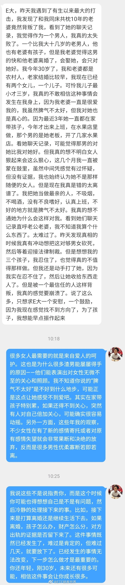

======================================================

ETF拯救世界 (5687069307) @
2020-12-20 11:37:58 Sun  
url: https://weibo.com/5687069307/JzjIV1NID

其实恋爱中的男女真的智商会下降至少一半，当然，有些人的智商本来额度就不足（比如昨天那个60万充值美容院的），难免被骗。

这里说的智商不止是你能做出高数题的智商，还有逻辑推理以及对人性的把握能力，当然还有家庭成长环境以及阅历问题。恋爱次数太少，更容易被骗。从小被家庭保护的太好，也容易 ​​​

转发[62]  评论[284]  赞[1729] 

======================================================

ETF拯救世界 (5687069307) @
2020-12-20 16:33:22 Sun  
url: https://weibo.com/5687069307/JzlEPgw6B

今天足球学校校长亲自下场指导。

前国脚。 ​​​

转发[11]  评论[310]  赞[1488] 

======================================================

ETF拯救世界 (5687069307) @
2020-12-21 07:48:15 Mon  
url: https://weibo.com/5687069307/JzrEaBHfL

人生很长，摔一跤，落后了，非常正常。但是只有不放弃，才有机会取得最后的成功。

------------------------------------------------------
转推：
>  @北京日报 (1893892941)
>  2020-12-20 15:16:31 Sun  
>  url: https:/weibo.com/1893892941/Jzl9D4GO5/

>  【太燃了！#8岁女孩短道速滑起步摔跤却得冠军#[打call]】2020-2021年度北京市青少年短道速滑联赛第一站，U8组500米四分之一决赛。8岁的马子惠在发令枪响后刚出发就不慎摔倒，但她没有犹豫，爬起来就追了上去，在鼓励声中紧紧咬住，成功弯道超越……这一幕不到一天的时间就赢得了网友400多万的点赞，最 ​​​

转发[314]  评论[219]  赞[1319] 

======================================================

ETF拯救世界 (5687069307) @
2020-12-21 07:55:46 Mon  
url: https://weibo.com/5687069307/JzrHdFftR

回复@快乐大番茄:无论你的实力多强，你放弃了就什么都没了。你怎么知道自己未来实力强不强运气好不好？所以不放弃才是我说的重点//@快乐大番茄:前两天看到过，确实很励志毋庸置疑，只是想另一个角度思考下，是不是对手太弱了，一般情况下同级别应该是赶不上的吧？[二哈]

------------------------------------------------------
转推：
>  @北京日报 (1893892941)
>  2020-12-20 15:16:31 Sun  
>  url: https:/weibo.com/1893892941/Jzl9D4GO5/

>  【太燃了！#8岁女孩短道速滑起步摔跤却得冠军#[打call]】2020-2021年度北京市青少年短道速滑联赛第一站，U8组500米四分之一决赛。8岁的马子惠在发令枪响后刚出发就不慎摔倒，但她没有犹豫，爬起来就追了上去，在鼓励声中紧紧咬住，成功弯道超越……这一幕不到一天的时间就赢得了网友400多万的点赞，最 ​​​

转发[57]  评论[96]  赞[846] 

======================================================

ETF拯救世界 (5687069307) @
2020-12-21 08:18:15 Mon  
url: https://weibo.com/5687069307/JzrQlvanK

回复@你好哇微博:再说一次，你看这件事要跳出这件事本身，而不是拘泥于这件事的结果。不放弃追求的是一种争取机会的精神。不放弃就有机会，放弃了就什么都没了。//@你好哇微博:过度解读了。人家摔跤不过是把领先优势减少了一点，换个人完全不一样

------------------------------------------------------
转推：
>  @北京日报 (1893892941)
>  2020-12-20 15:16:31 Sun  
>  url: https:/weibo.com/1893892941/Jzl9D4GO5/

>  【太燃了！#8岁女孩短道速滑起步摔跤却得冠军#[打call]】2020-2021年度北京市青少年短道速滑联赛第一站，U8组500米四分之一决赛。8岁的马子惠在发令枪响后刚出发就不慎摔倒，但她没有犹豫，爬起来就追了上去，在鼓励声中紧紧咬住，成功弯道超越……这一幕不到一天的时间就赢得了网友400多万的点赞，最 ​​​

转发[76]  评论[153]  赞[951] 

======================================================

ETF拯救世界 (5687069307) @
2020-12-21 09:05:50 Mon  
url: https://weibo.com/5687069307/Jzs9Fdskx

其实人与人最大的差距我感觉是思维模式。

思维模式很重要的一个方面就是遇到一件事情从哪个角度去思考，去深入挖掘获取信息，用什么样的方式去回应，争取什么样的结果。

所以同样一件事，每个人都有自己的思考和处理方法。这件事能够带给你的启发和效果也不同。就像那个经典的案例：同样是半杯水，有 ​​​

转发[305]  评论[405]  赞[2060] 

======================================================

ETF拯救世界 (5687069307) @
2020-12-21 09:29:13 Mon  
url: https://weibo.com/5687069307/Jzsj9wOzc

$中证环保 sh000827$ 

好家伙。我直呼好家伙！ ​​​

转发[12]  评论[274]  赞[1196] 

======================================================

ETF拯救世界 (5687069307) @
2020-12-21 09:35:22 Mon  
url: https://weibo.com/5687069307/JzslEn8F8

再回头看这个，是不是又有点新的感悟。“至少连续上涨的时候你还能多赚点。 ​​​​”

------------------------------------------------------
转推：
>  @ETF拯救世界 (5687069307)
>  2020-11-24 11:17:59 Tue  
>  url: https:/weibo.com/5687069307/JvmtTwshz/

>  又一只辣鸡新高了。
>  
>  新高不卖这个原则主要是治疗你赚点钱就拿不住慌里慌张乱卖这种病的。
>  
>  至少连续上涨的时候你还能多赚点。 ​​​

转发[26]  评论[148]  赞[1056] 

======================================================

ETF拯救世界 (5687069307) @
2020-12-21 09:44:31 Mon  
url: https://weibo.com/5687069307/JzspmxfLo

我经常想起去年有个人在某论坛喷我的一条罪状：

“他总是把经典投资书上的东西改个样子发在微博上”

经常看我微博的朋友们，请你们诚恳的告诉我，我哪条微博是投资书上写的大道理。难道不都是结合时事的一点感悟、经验、技巧以及思考吗。 ​​​

转发[19]  评论[472]  赞[2069] 

======================================================

ETF拯救世界 (5687069307) @
2020-12-21 10:03:58 Mon  
url: https://weibo.com/5687069307/JzsxgckF2

目前环保持仓结构前三位：

宁德；隆基；长电

合计仓位30%顶格…… ​​​

转发[31]  评论[301]  赞[1509] 

======================================================

ETF拯救世界 (5687069307) @
2020-12-21 10:09:11 Mon  
url: https://weibo.com/5687069307/Jzsznn3xc

大涨的时候不要乱跑，就像吃宴席的时候不要随意下桌，因为你不知道后面有什么硬菜。

不过你要慢慢往门口挪了，也要注意观察店家什么时候开始催买单。别傻了吧唧跟人又碰杯又推心置腹聊天的。

情况不对拔腿就走，吃饱了就行。买单？什么是买单？ ​​​

转发[149]  评论[629]  赞[2585] 

======================================================

ETF拯救世界 (5687069307) @
2020-12-21 10:54:53 Mon  
url: https://weibo.com/5687069307/JzsRVn23A

不说你不知道，最后下的那网3个交易日已经涨了2%。

希望有机会收割一把吧。 ​​​

转发[11]  评论[334]  赞[1470] 

======================================================

ETF拯救世界 (5687069307) @
2020-12-21 11:22:02 Mon  
url: https://weibo.com/5687069307/Jzt2WAUm5

周末玩了赛博朋克。大概也就一两个小时的进度。说说我个人的感受。游戏电影音乐这种东西感受非常个人，请了解。

首先，不晕。我是个晕3D的人，玩这个不晕。画质2k，75-100fps。为什么不晕我也不知道。反正走路慢慢走不敢跑。

bug有，但我要求没那么高。比如大街上对面来个人直接从我身体里穿过去我也 ​​​

转发[12]  评论[223]  赞[1130] 

======================================================

ETF拯救世界 (5687069307) @
2020-12-21 13:08:14 Mon  
url: https://weibo.com/5687069307/JztK3jt9S

看到这张图，想起一件事。那年从香港回北京的飞机上，认识了邻座的姑娘。聊天说起都喜欢看恐怖片，回来她就把这个电影的dvd借给了我。看完以后我说还给你啊，她说不用啦。我说那我请你吃饭吧，她说好啊……不过她借我的是枪版，我早扔了。我对画质要求很高的。

------------------------------------------------------
转推：
>  @ ()
>  2020-12-21 12:43:38 Mon  
>  url: 

>  抱歉，作者已设置仅展示半年内微博，此微博已不可见。 ​​​

转发[13]  评论[378]  赞[1272] 

======================================================

ETF拯救世界 (5687069307) @
2020-12-21 13:17:34 Mon  
url: https://weibo.com/5687069307/JztNQcju6

恋爱小贴士：

带姑娘看电影要看恐怖片。这样一害怕没准就会抱着你。

不要看青春爱情片。

里面都是帅哥。散场了灯一亮回头看到你，可能接下来的饭都没机会吃了。 ​​​

转发[32]  评论[411]  赞[1918] 

======================================================

ETF拯救世界 (5687069307) @
2020-12-21 13:25:43 Mon  
url: https://weibo.com/5687069307/JztR9kVNw

金融小贴士：

如果你在某个品种上赚了50%，它今天涨了4%，

那么收盘后你的收益率不是54%，而是56%。 ​​​

转发[136]  评论[420]  赞[2594] 

======================================================

ETF拯救世界 (5687069307) @
2020-12-21 13:48:23 Mon  
url: https://weibo.com/5687069307/Jzu0mfvZQ

自己的命运都是自己选择的。

------------------------------------------------------
转推：
>  @英国那些事儿 (2549228714)
>  2020-12-20 19:55:11 Sun  
>  url: https:/weibo.com/2549228714/JzmYJEn7W/

>  被宣布四级封锁后，无数人趁着午夜封锁前大逃离伦敦…... ​​​

转发[25]  评论[145]  赞[1070] 

======================================================

ETF拯救世界 (5687069307) @
2020-12-21 13:51:56 Mon  
url: https://weibo.com/5687069307/Jzu1NqpM8

“呵呵，什么涨吹什么”

“对啊，每天都有的吹，你有没有气死啊” ​​​

转发[19]  评论[315]  赞[1738] 

======================================================

ETF拯救世界 (5687069307) @
2020-12-21 14:25:20 Mon  
url: https://weibo.com/5687069307/JzufltfS0

今天大摩又要新高了。 ​​​

转发[14]  评论[378]  赞[1594] 

======================================================

ETF拯救世界 (5687069307) @
2020-12-21 14:40:00 Mon  
url: https://weibo.com/5687069307/JzuljdoPY

回复@追求确定性2:不，买了环保长期不挣钱，但不抛弃不放弃的人才是那个运动员。//@追求确定性2:环保就是那个后来居上滑冰运动员吗

------------------------------------------------------
转推：
>  @ETF拯救世界 (5687069307)
>  2020-12-21 13:51:56 Mon  
>  url: https:/weibo.com/5687069307/Jzu1NqpM8/

>  “呵呵，什么涨吹什么”
>  
>  “对啊，每天都有的吹，你有没有气死啊” ​​​

转发[7]  评论[189]  赞[1098] 

======================================================

ETF拯救世界 (5687069307) @
2020-12-21 14:47:42 Mon  
url: https://weibo.com/5687069307/Jzuoqo2BF

第一批200本的物流信息已经上传，明日发货。

后两批稍安勿躁。

今天就到这儿吧，都开心点。 ​​​

转发[11]  评论[528]  赞[1645] 

======================================================

ETF拯救世界 (5687069307) @
2020-12-21 17:06:43 Mon  
url: https://weibo.com/5687069307/JzviRmBXm

我最近在想一件事。

川之前针对我们搞了这么多事情，我一直认为是为了大选。然而大选结果已经出来了，他却依然对我们疯狂动作，这恐怕就没这么简单了。

他是一个重视利益的人。无利不起早，这么做，一定是某个利益团体在后面承诺了巨大的利益。否则，没有理由马上就卸任了还这么疯狂。

那么背后指使 ​​​

转发[81]  评论[499]  赞[1762] 

======================================================

ETF拯救世界 (5687069307) @
2020-12-22 09:55:42 Tue  
url: https://weibo.com/5687069307/JzBUpkuds

环保第一压力位1910一线。 ​​​

转发[85]  评论[226]  赞[1397] 

======================================================

ETF拯救世界 (5687069307) @
2020-12-22 10:01:15 Tue  
url: https://weibo.com/5687069307/JzBWEv1QP

不知道有几个人能理解。

就是持仓品种里面，有那种虽然不涨，但是就是让你感觉很踏实的品种，想起来还会有点开心。即使它账面浮动收益率没多少。

也有的品种虽然涨了很多，赚了不少，但你想起它好像不是很喜欢，总想着什么时候把它卖了算了。 ​​​

转发[50]  评论[385]  赞[1924] 

======================================================

ETF拯救世界 (5687069307) @
2020-12-22 10:52:38 Tue  
url: https://weibo.com/5687069307/JzChvzoFR

就这样吧，都删了。

关我什么事，我不关心了。

大家开开心心过好日子，自律自爱，关心那么多事干嘛。 ​​​

转发[12]  评论[707]  赞[2958] 

======================================================

ETF拯救世界 (5687069307) @
2020-12-22 11:39:44 Tue  
url: https://weibo.com/5687069307/JzCAD0Z55

分享图片 ​​​

转发[11]  评论[525]  赞[1701] 

+++++++++++++++++++++++++++++++++++++++++++++++++++++

图片：

======================================================

ETF拯救世界 (5687069307) @
2020-12-22 13:27:08 Tue  
url: https://weibo.com/5687069307/JzDidCegi

放心，我坐门口儿盯着呢，你踏踏实实吃你的。

买不了单。 ​​​

转发[28]  评论[1326]  赞[3713] 

======================================================

ETF拯救世界 (5687069307) @
2020-12-22 15:39:31 Tue  
url: https://weibo.com/5687069307/JzE9XiJCX

总是有人不停的催，150买呀，S买呀，网格多开几个啊。

其实你要想买完全可以自己买，要相信我就按我的节奏来。

S几个月没买，一出手是不是最低点。150也是几个月没买，自然会有买的时候。

不要催。

我只吃宴席不买单，就酱。 ​​​

转发[48]  评论[729]  赞[2694] 

======================================================

ETF拯救世界 (5687069307) @
2020-12-22 15:51:36 Tue  
url: https://weibo.com/5687069307/JzEeRnvbJ

不说你不知道，今年到今天为止，只有54%的股票是上涨的。 ​​​

转发[26]  评论[301]  赞[1663] 

======================================================

ETF拯救世界 (5687069307) @
2020-12-22 16:12:57 Tue  
url: https://weibo.com/5687069307/JzEnwzG11

刚收到通知，第一批中奖的200本好像是页码出问题了。所以还会再发一次正确的。

也就是说，第一批的能得到2份……

另外，第二批的且慢正在匹配信息中。因为之前没按要求写的每天还有人在继续提供信息，有些信息错了还要二次核对，所以还得几天。

真的，太难了……各位都是怎么顺利毕业顺利工作的…… ​​​

转发[16]  评论[1000]  赞[1763] 

======================================================

ETF拯救世界 (5687069307) @
2020-12-23 10:05:23 Wed  
url: https://weibo.com/5687069307/JzLoPmS0E

昨天看到有人评论白酒之类的股票，已经不能用过去的标准去看了。

“这次不一样了，未来不一样了”

好的，那么我们就看看，这次到底有什么不一样。

再给点时间。 ​​​

转发[66]  评论[535]  赞[1884] 

======================================================

ETF拯救世界 (5687069307) @
2020-12-23 10:15:05 Wed  
url: https://weibo.com/5687069307/JzLsLpep7

倒了一杯82年的Sprite，回来一看，啪的一声，又新高了！很快啊！ ​​​

转发[7]  评论[261]  赞[1241] 

======================================================

ETF拯救世界 (5687069307) @
2020-12-23 10:20:01 Wed  
url: https://weibo.com/5687069307/JzLuLxLNq

昨天新高后一路大跌，收盘跌了将近3%。

你一害怕，忘了“新高不卖”，哆哆嗦嗦清仓了。

今天涨4%，继续新高。

A股85%的交易都是散户里的疯子带来的，你跟着他们走就歇菜了。 ​​​

转发[57]  评论[328]  赞[1547] 

======================================================

ETF拯救世界 (5687069307) @
2020-12-23 10:25:22 Wed  
url: https://weibo.com/5687069307/JzLwWiy1T

开始第一波攻势。

------------------------------------------------------
转推：
>  @ETF拯救世界 (5687069307)
>  2020-12-22 09:55:42 Tue  
>  url: https:/weibo.com/5687069307/JzBUpkuds/

>  环保第一压力位1910一线。 ​​​

转发[37]  评论[181]  赞[1149] 

======================================================

ETF拯救世界 (5687069307) @
2020-12-23 10:36:37 Wed  
url: https://weibo.com/5687069307/JzLBvhT7E

格雷厄姆有一句经典的话：股票长期是称重机，短期是投票机（是不是又有人要说我微博抄经典艰难度日了）

换成我们的操作，就是买的时候看它便宜还是贵，卖的时候看它趋势有没有变。

因为长期看，只要买的便宜就不会亏，毕竟是称重机。而短期的投票，尤其是疯子们傻子们的投票，可能会把价格买到天上。 ​​​

转发[154]  评论[370]  赞[1944] 

======================================================

ETF拯救世界 (5687069307) @
2020-12-23 11:14:10 Wed  
url: https://weibo.com/5687069307/JzLQKkdZ7

我很好奇，鸡娃的家长在鸡娃的同时，有没有鸡自己？也就是说，有没有努力让自己在各方面变得更优秀？

如果没有，敢情你自己不想努力，就是让孩子帮你完成心愿啊。这跟玩模拟人生游戏区别不大吧。

孩子每天都在进步，都在变得更强，这么好的榜样在身边，就没能激励一下你也努力点吗！ ​​​

转发[67]  评论[352]  赞[1963] 

======================================================

ETF拯救世界 (5687069307) @
2020-12-23 11:32:03 Wed  
url: https://weibo.com/5687069307/JzLY105I4

这个数字挑战我的认知了。

------------------------------------------------------
转推：
>  @澎湃新闻 (5044281310)
>  2020-12-23 11:30:49 Wed  
>  url: https:/weibo.com/5044281310/JzLXvhnY4/

>  【#中国成年男性平均身高接近1米7#，#中国成年女性平均身高158#，你的身高是多少？】23日，国新办发布的《中国居民营养与慢性病状况报告（2020）年》现实，中国18-44岁中国男性平均身高169.7厘米，中国女性平均身高158.0厘米；#我国18岁及以上男女平均体重#分别为69.6千克和59千克。  ​​​

转发[26]  评论[374]  赞[807] 

======================================================

ETF拯救世界 (5687069307) @
2020-12-23 12:19:24 Wed  
url: https://weibo.com/5687069307/JzMhe6Fln

服了。全球合力鸡光伏

------------------------------------------------------
转推：
>  @财联社APP (2868676035)
>  2020-12-23 11:00:54 Wed  
>  url: https:/weibo.com/2868676035/JzLLmqTMu/

>  【#美国光伏投资26%税收抵免政策延迟两年# 光伏板块应声大涨】
>  今年以来，随着全球各国对“脱碳环保”的决心日益坚定，人们对于光伏概念的认知也逐渐觉醒，能源革命正轰轰烈烈地展开。而在近期全球两大经济体（中国和美国）新政策的推动下，美国光伏股昨日全线大涨。 http://t.cn/A6q9uWzs ​​​

转发[26]  评论[124]  赞[870] 

======================================================

ETF拯救世界 (5687069307) @
2020-12-23 12:47:04 Wed  
url: https://weibo.com/5687069307/JzMssirqM

图二的两句话说的对不对

------------------------------------------------------
转推：
>  @馋姐叨叨 (6966904360)
>  2020-12-22 20:56:20 Tue  
>  url: https:/weibo.com/6966904360/JzGeyhQrF/

>  @ETF拯救世界 本子简洁，方便记录网格交易，每页都有E大语录，交易需要E大的鸡汤按摩一下。 ​​​

转发[25]  评论[691]  赞[1616] 

======================================================

ETF拯救世界 (5687069307) @
2020-12-23 13:28:27 Wed  
url: https://weibo.com/5687069307/JzMJfA1wE

已经有超过100%收益率的车友出现了。

------------------------------------------------------
转推：
>  @ETF拯救世界 (5687069307)
>  2020-10-09 09:56:27 Fri  
>  url: https:/weibo.com/5687069307/JomhXpucE/

>  即使环保这么辣鸡的品种，钻石坑那几个月跟车的朋友收益率也已经超过70%了……
>  
>  入市时机太重要了。
>  
>  不知道有哪些幸运儿是看了那篇钻石坑的文章开始干的。 ​​​

转发[20]  评论[376]  赞[1489] 

======================================================

ETF拯救世界 (5687069307) @
2020-12-23 14:28:18 Wed  
url: https://weibo.com/5687069307/JzN7xF9Z3

其实那个本子我没有参与什么设计。

如果我要设计，会加入很多一定非常有用的模块。

比如，我会设计一个模块，让你每年记录自己的资产。现金、股票、债券、股票基金、债券基金、外币……然后有个合计，然后有与自己目标的对比，有与过去的对比，然后可以用一根尺子就画出漂亮的资产走势图。这个十几二 ​​​

转发[152]  评论[640]  赞[2444] 

======================================================

ETF拯救世界 (5687069307) @
2020-12-23 16:03:14 Wed  
url: https://weibo.com/5687069307/JzNK5nfqK

超LV不是正常的吗？都是奢侈品，一个LV包背十年，一瓶茅台一仰脖咕咚咕咚就喝完了。喝完还得买，你说超你不正常吗？？？

------------------------------------------------------
转推：
>  @网易财经 (1974561081)
>  2020-12-23 15:20:03 Wed  
>  url: https:/weibo.com/1974561081/JzNsyd6kG/

>  【#茅台市值超LV和可口可乐# 股价最高突破1900元】11月23日，茅台股价最高突破1900元，目前市值达23667亿元，已经超过LV和可口可乐。面对严重的市场溢价，茅台经销商宣誓：不加价销售、不囤积居奇、不哄抬价格等。你#如何看待茅台经销商集体宣誓#？@五环短视频  http://t.cn/A6qC7aFk ​​​

转发[22]  评论[224]  赞[996] 

======================================================

ETF拯救世界 (5687069307) @
2020-12-23 16:54:32 Wed  
url: https://weibo.com/5687069307/JzO4U4R3v

不知道为什么好像有朋友在评论里表示，LV背十年不可能。

以下这些款全都超过10年，你10年前买了今天背不出去吗。

分别是：

Neverfull（2007）、Alma、Speedy。尤其是alma和speedy，诞生于30年代和60年代，到现在大家都在背，为什么不行呢。 ​​​

转发[14]  评论[418]  赞[1342] 

+++++++++++++++++++++++++++++++++++++++++++++++++++++

图片：

======================================================

ETF拯救世界 (5687069307) @
2020-12-23 17:07:31 Wed  
url: https://weibo.com/5687069307/JzOaaxxhc

你男的，天天抢1500的茅台。抢不到就高价买，2、3000。一瓶酒，喝完就没了。喝完不仅对身体不好，还容易醉驾还容易借酒生事。这么多缺点，没人说你。

人家女的，攒点钱买个包，几千一万块，能背好多年，就变成消费主义让你嘲笑了。

凭什么。不公平啊。 ​​​

转发[71]  评论[766]  赞[4408] 

======================================================

ETF拯救世界 (5687069307) @
2020-12-24 07:19:27 Thu  
url: https://weibo.com/5687069307/JzTJYi26E

再看看这个。后一种公司如果减持，很奇怪吗？我觉得正常思维减持是应该的吧

------------------------------------------------------
转推：
>  @ETF拯救世界 (5687069307)
>  2020-12-03 09:35:33 Thu  
>  url: https:/weibo.com/5687069307/JwIEMBS0j/

>  有些公司，上市没多久就开始增发、配股、高管减持。
>  
>  有些公司，就发行的时候融了点钱，后来就一直分红。现金流太好了，每年赚好多钱，也没什么支出，想再融资都没理由。
>  
>  我估计，后者的大股东非常后悔：为什么要上市无缘无故给这帮小股东分红呢。 ​​​

转发[22]  评论[208]  赞[1178] 

======================================================

ETF拯救世界 (5687069307) @
2020-12-24 09:35:10 Thu  
url: https://weibo.com/5687069307/JzUD3AQb6

以前看书，觉得几十年前那些抱团漂亮50的美国机构都是傻子，那么明显的泡沫看不出来吗，为什么要买？

现在才明白，从一个整体来说，他们没得选。你不买，你的业绩就要落后，客户赎回，奖金取消，甚至下岗。最终，坚持信仰的会被淘汰。

所以，到底是谁的错呢。谁也没有错。

资本就是逐利的。 ​​​

转发[129]  评论[418]  赞[1892] 

======================================================

ETF拯救世界 (5687069307) @
2020-12-24 10:25:47 Thu  
url: https://weibo.com/5687069307/JzUXC5Bdo

你有没有发现，你持有的品种涨幅在10%以内的时候，哪天涨个3%、5%你会特别兴奋。

涨幅超过20%，再涨3、5个点，甚至新高，就没那么兴奋。

收益率超过70%，涨5%，新高，你也只会淡淡的看一眼然后想中午吃什么。

这就像你只有10万块的时候，赚3、5万开心到爆。

哪天你有了几百万，赚个3、5万还不如吃 ​​​

转发[179]  评论[684]  赞[3185] 

======================================================

ETF拯救世界 (5687069307) @
2020-12-24 10:30:48 Thu  
url: https://weibo.com/5687069307/JzUZDDifi

阿里都跌了快30%了，中概互联还不给我们机会吗。这不公平！

------------------------------------------------------
转推：
>  @ETF拯救世界 (5687069307)
>  2020-12-02 10:01:58 Wed  
>  url: https:/weibo.com/5687069307/Jwzp0Evm2/

>  中概互联150没了，S还有一份。
>  
>  希望有机会买回来。 ​​​

转发[57]  评论[454]  赞[1541] 

======================================================

ETF拯救世界 (5687069307) @
2020-12-24 11:26:00 Thu  
url: https://weibo.com/5687069307/JzVm3gXPi

说真的，谁也帮不了。

这位朋友这种就属于急病乱投医。到处问看看谁能出主意。

谁能出主意呢。有点水平的，负责的，不可能说话。不负责的就会告诉你“卖掉”或者“持有”。也许卖了是对的，也许持有是对的。你听他的，跟你自己决定正确概率基本一样。

卖了还是持有呢？

卖了的一瞬间开始涨，是不是 ​​​

转发[46]  评论[494]  赞[1676] 

+++++++++++++++++++++++++++++++++++++++++++++++++++++

图片：
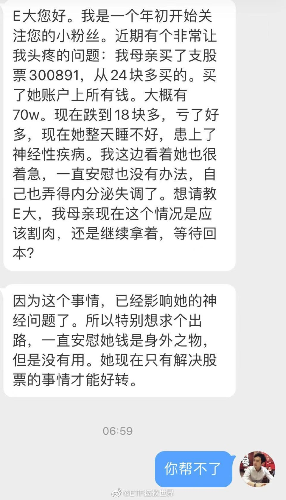

======================================================

ETF拯救世界 (5687069307) @
2020-12-24 12:11:23 Thu  
url: https://weibo.com/5687069307/JzVEt3ZZ9

禁止二选一对东东是利好还是利空呢 ​​​

转发[13]  评论[332]  赞[1706] 

======================================================

ETF拯救世界 (5687069307) @
2020-12-24 18:09:14 Thu  
url: https://weibo.com/5687069307/JzXZIx6lP

所有人，平安夜，都给我平平安安开开心心的！ ​ http://t.cn/A6qp4gUb ​​​

转发[53]  评论[1564]  赞[3381] 

======================================================

ETF拯救世界 (5687069307) @
2020-12-24 21:51:03 Thu  
url: https://weibo.com/5687069307/JzZrLfZA5

恭喜@variolift2018 等100名用户获得【网格交易手帐一本】。微博官方唯一抽奖工具@微博抽奖平台 对本次抽奖进行监督，结果公正有效。公示链接：http://t.cn/A6qpbxT8

------------------------------------------------------
转推：
>  @ETF拯救世界 (5687069307)
>  2020-12-24 18:09:14 Thu  
>  url: https:/weibo.com/5687069307/JzXZIx6lP/

>  所有人，平安夜，都给我平平安安开开心心的！ ​ http://t.cn/A6qp4gUb ​​​

转发[6]  评论[425]  赞[620] 

======================================================

ETF拯救世界 (5687069307) @
2020-12-25 09:10:53 Fri  
url: https://weibo.com/5687069307/JA3TI00s8

有戏了//@ETF拯救世界:阿里都跌了快30%了，中概互联还不给我们机会吗。这不公平！

------------------------------------------------------
转推：
>  @ETF拯救世界 (5687069307)
>  2020-12-02 10:01:58 Wed  
>  url: https:/weibo.com/5687069307/Jwzp0Evm2/

>  中概互联150没了，S还有一份。
>  
>  希望有机会买回来。 ​​​

转发[27]  评论[592]  赞[1407] 

======================================================

ETF拯救世界 (5687069307) @
2020-12-25 09:47:08 Fri  
url: https://weibo.com/5687069307/JA48ptORp

弱水三千，我只取一瓢饮。

好的股票和板块很多，我只希望与属于我的那些一起越飞越高。 ​​​

转发[43]  评论[451]  赞[2186] 

======================================================

ETF拯救世界 (5687069307) @
2020-12-25 10:10:05 Fri  
url: https://weibo.com/5687069307/JA4hJbdj6

回复@ESun_G:我把你以及回复的这些的辣鸡全部拉黑。不好意思，比较粗鲁，但这么说你们不过分。你们到底知不知道我们在做什么？//@ESun_G:传媒加仓加不动了

------------------------------------------------------
转推：
>  @ETF拯救世界 (5687069307)
>  2020-12-25 09:47:08 Fri  
>  url: https:/weibo.com/5687069307/JA48ptORp/

>  弱水三千，我只取一瓢饮。
>  
>  好的股票和板块很多，我只希望与属于我的那些一起越飞越高。 ​​​

转发[10]  评论[359]  赞[1153] 

======================================================

ETF拯救世界 (5687069307) @
2020-12-25 10:15:25 Fri  
url: https://weibo.com/5687069307/JA4jTCZEz

传媒，150仓位2.4%，A股唯一浮亏品种，浮亏3%。

S仓位3%，跌成这样依然盈利10%。

网格仓位，1网。浮亏，问题是你不知道网格怎么做？最大跌幅60%清清楚楚写在那里你瞎的？帮你规划好仓位给你设计好策略你满仓抄底你傻的？

跑我这里抱怨什么？

都是什么玩意儿啊。我一而再再而三的说，我不需要新人关 ​​​

转发[48]  评论[1489]  赞[3549] 

======================================================

ETF拯救世界 (5687069307) @
2020-12-25 10:49:32 Fri  
url: https://weibo.com/5687069307/JA4xK2sSD

涨上去了，第二网没买到。高兴了？

呵呵。 ​​​

转发[28]  评论[618]  赞[1802] 

======================================================

ETF拯救世界 (5687069307) @
2020-12-25 11:26:57 Fri  
url: https://weibo.com/5687069307/JA4MVvNMf

很多人根本就没想明白组合和投资到底是怎么回事。

为什么要创建一个持仓品种相关性很弱的组合？当然有很多原因，其中有一条：

当你的组合中其它品种都涨幅很大，而你手里依然有可投资资金的时候，那些没涨的品种才是最珍贵的。

有了它们，你手里的钱才有机会在其它品种不便宜的时候依然买到便宜货。 ​​​

转发[279]  评论[717]  赞[2624] 

======================================================

ETF拯救世界 (5687069307) @
2020-12-25 11:37:35 Fri  
url: https://weibo.com/5687069307/JA4RfeTwz

开始第二波。//@ETF拯救世界:开始第一波攻势。

------------------------------------------------------
转推：
>  @ETF拯救世界 (5687069307)
>  2020-12-22 09:55:42 Tue  
>  url: https:/weibo.com/5687069307/JzBUpkuds/

>  环保第一压力位1910一线。 ​​​

转发[14]  评论[312]  赞[1590] 

======================================================

ETF拯救世界 (5687069307) @
2020-12-25 14:41:30 Fri  
url: https://weibo.com/5687069307/JA63TvaQw

新高不卖。

踏踏实实坐轿子。如果站稳1910一线，下一明显压力位在2250一线。 ​​​

转发[136]  评论[474]  赞[2299] 

======================================================

ETF拯救世界 (5687069307) @
2020-12-25 14:53:04 Fri  
url: https://weibo.com/5687069307/JA68AxBVN

买到大涨的品种不难。

大涨的品种你的成本低难一点。

成本低的大涨品种，你能拿的住就非常难。

成本低、大涨，你又拿得住，在下跌前还能卖出，难比登天。 ​​​

转发[120]  评论[634]  赞[2433] 

======================================================

ETF拯救世界 (5687069307) @
2020-12-25 15:09:05 Fri  
url: https://weibo.com/5687069307/JA6f6cihT

这跟我印象中的美女荷官不太一样。

------------------------------------------------------
转推：
>  @新浪视频 (1640601392)
>  2020-12-25 11:50:53 Fri  
>  url: https:/weibo.com/1640601392/JA4WEk7SR/

>  【#暗访西安地下赌场# ：美女荷官发牌，有人一天输几十万离场】近日，陕西西安，记者暗访实拍到两个地下赌场。两个赌场均藏身闹市隐秘之处，团伙组织严密、分工明确，有美女荷官、马仔、掮客、放贷人等角色，负责发牌、望风、接待、兑换筹码、放贷等。线人和赌客告诉@青蜂侠Bee 有赌客一局就下注五六万 ​​​

转发[45]  评论[270]  赞[1262] 

======================================================

ETF拯救世界 (5687069307) @
2020-12-25 19:48:17 Fri  
url: https://weibo.com/5687069307/JA84qpTHN

所有考研的，明天要加油！

给你们增加欧气了！但是人太多，每人只能增加一部分，不管怎么样加了都比不加强。

加油！ ​​​

转发[31]  评论[620]  赞[2390] 

======================================================

ETF拯救世界 (5687069307) @
2020-12-25 22:11:51 Fri  
url: https://weibo.com/5687069307/JA90H9or4

半年最佳买点 ​​​

转发[64]  评论[1420]  赞[3816] 

+++++++++++++++++++++++++++++++++++++++++++++++++++++

图片：
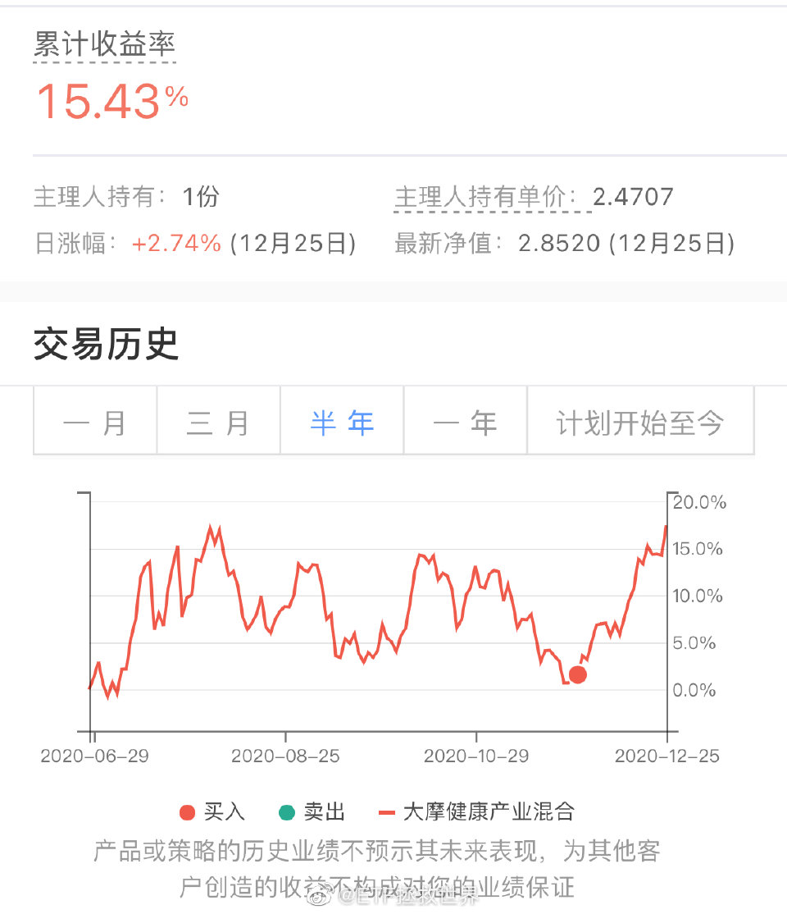

======================================================

ETF拯救世界 (5687069307) @
2020-12-26 18:55:18 Sat  
url: https://weibo.com/5687069307/JAh9pnCPX

这两天看了两部奈飞的剧

《弥留之国的爱丽丝》★★★★
《甜蜜家园》★★★

能接受cult片子的休闲时候可以试试…记得别让孩子看。 ​​​

转发[65]  评论[405]  赞[1392] 

======================================================

ETF拯救世界 (5687069307) @
2020-12-27 08:08:36 Sun  
url: https://weibo.com/5687069307/JAmlppEbB

昨天看了一段脱口秀，有一些想法不吐不快，可能又要被骂，没关系，我简单说。

虽然这位脱口秀演员对“男人”这个群体极尽挖苦讽刺，但我一点点都不在意，因为我知道我不是那样，没什么好在意的。只是，我想对部分涉世未深，又或者思维容易被别人引导的女性朋友说两句：

任何群体，都有各种各样的人， ​​​

转发[257]  评论[1118]  赞[5575] 

======================================================

ETF拯救世界 (5687069307) @
2020-12-27 08:44:55 Sun  
url: https://weibo.com/5687069307/JAmA9n4AO

我发现一个问题，

评论中“铁粉”的整体素质，无论是阅读能力、表达能力、逻辑推理能力和理解能力，都比不是铁粉的高3个lv。

不知道新浪这个铁粉是怎么划分的，还是很准的。

以后发东西发红包都只给铁粉发了。 ​​​

转发[37]  评论[4502]  赞[3876] 

======================================================

ETF拯救世界 (5687069307) @
2020-12-27 09:36:41 Sun  
url: https://weibo.com/5687069307/JAmVai716

有很多女性似乎觉得只要是男人看了那样的讽刺视频就会生气、愤怒、继而破口大骂……

我谢谢你了。大多数正常的男性看完了都会内心毫无波澜好吗？一个演员，说一些部分女性爱听的话，讽刺一下男性，有什么生气的？不要把所有男人都想的这么小气、狭隘、毫无理性。大多数男人还要为了未来、为了家庭埋头 ​​​

转发[62]  评论[652]  赞[2796] 

======================================================

ETF拯救世界 (5687069307) @
2020-12-27 10:55:33 Sun  
url: https://weibo.com/5687069307/JAnrb1VgT

回复@韭皇炒鸡:“没错，男人没有一个好东西。来，碰一下走一个”//@韭皇炒鸡:e大，如果在普通朋友聚会的时候听到这样的话语，作为男人应该怎么应对呢？是苦口婆心的解释，还是置之不理呢？

------------------------------------------------------
转推：
>  @ETF拯救世界 (5687069307)
>  2020-12-27 08:08:36 Sun  
>  url: https:/weibo.com/5687069307/JAmlppEbB/

>  昨天看了一段脱口秀，有一些想法不吐不快，可能又要被骂，没关系，我简单说。
>  
>  虽然这位脱口秀演员对“男人”这个群体极尽挖苦讽刺，但我一点点都不在意，因为我知道我不是那样，没什么好在意的。只是，我想对部分涉世未深，又或者思维容易被别人引导的女性朋友说两句：
>  
>  任何群体，都有各种各样的人， ​​​

转发[34]  评论[232]  赞[1233] 

======================================================

ETF拯救世界 (5687069307) @
2020-12-27 11:44:00 Sun  
url: https://weibo.com/5687069307/JAnKQxCqZ

最后再说两句话，我就去工作了，写一篇对于明年的寄语（公众号发）。

有些朋友不理解“表演”、“新闻”、“网络故事”和现实的区别。看了一些表演读了一些新闻和故事，就将它代入生活，恐这恐那，duck不必。

新闻之所以成为新闻，就是因为它的极端和不平常。无论你在新闻上看到了什么，你都应该知道 ​​​

转发[197]  评论[899]  赞[3153] 

======================================================

ETF拯救世界 (5687069307) @
2020-12-27 14:05:54 Sun  
url: https://weibo.com/5687069307/JAoGrkB7d

两个小时。

不能再写了，以现代人的阅读习惯，一大半人看不了这么长的东西。

过几天发。 ​​​

转发[17]  评论[1089]  赞[2412] 

+++++++++++++++++++++++++++++++++++++++++++++++++++++

图片：

======================================================

ETF拯救世界 (5687069307) @
2020-12-27 14:58:27 Sun  
url: https://weibo.com/5687069307/JAp1LyA1W

知道我在微博上第一次感受到女权的严厉是哪次吗。

是有一次我说，我经常跟儿子说，作为男孩子要有责任心。对自己该承担的责任承担起来，要做个小男子汉，长大了做家庭的支柱，努力让一家人过得幸福。

这么一句话，被女权骂了。

从那以后，我认怂了。行吧。但我依然会教育儿子做个有责任感的男子汉的 ​​​

转发[44]  评论[791]  赞[3344] 

======================================================

ETF拯救世界 (5687069307) @
2020-12-27 15:56:35 Sun  
url: https://weibo.com/5687069307/JAppncnJJ

然而我对女性的热爱依旧，没人能挑拨我和姑娘们的感情！

决不允许！

谁跟女性过不去就是与我为敌！ ​​​

转发[17]  评论[853]  赞[2984] 

======================================================

ETF拯救世界 (5687069307) @
2020-12-28 13:42:05 Mon  
url: https://weibo.com/5687069307/JAxXhcMtt

我的孩子如果只能度过普通的一生，

我希望他能够充满自信。

不唯唯诺诺，

敢于冒险，

敢于追求自己所想，

被打倒后顽强的站起来，

阳光，

微笑。 ​​​

转发[179]  评论[587]  赞[2858] 

======================================================

ETF拯救世界 (5687069307) @
2020-12-28 14:07:45 Mon  
url: https://weibo.com/5687069307/JAy7Gz1EU

各指数今天基本持平，然而涨跌股票家数对比是1000:3000

中小股票今年太惨了！ ​​​

转发[35]  评论[383]  赞[1807] 

======================================================

ETF拯救世界 (5687069307) @
2020-12-28 15:28:05 Mon  
url: https://weibo.com/5687069307/JAyEizUmp

我看有朋友问中概互联什么时候买。

不出意外的话，应该是网格先于150和S买。

那么，你猜猜多少钱开始买第一网513050。

本帖评论猜价格，一个人只能猜一次。最接近的3位朋友每人一份手账。如果近似度相同，先评论的得奖。

答案的话，我一会会发一个定时帖。这个定时帖会在明天15:10分显示出来。

主 ​​​

转发[144]  评论[5878]  赞[2686] 

+++++++++++++++++++++++++++++++++++++++++++++++++++++

图片：

======================================================

ETF拯救世界 (5687069307) @
2020-12-28 16:38:17 Mon  
url: https://weibo.com/5687069307/JAz6N1454

外卖和便利店的沙拉之类的生食还能吃吗。懂的说说。 ​​​

转发[11]  评论[393]  赞[1561] 

======================================================

ETF拯救世界 (5687069307) @
2020-12-28 17:23:53 Mon  
url: https://weibo.com/5687069307/JAzpit1PE

这样看我就是个普通人，胆子也比较小，只敢上班积累本金 ​​​

转发[25]  评论[345]  赞[1780] 

+++++++++++++++++++++++++++++++++++++++++++++++++++++

图片：
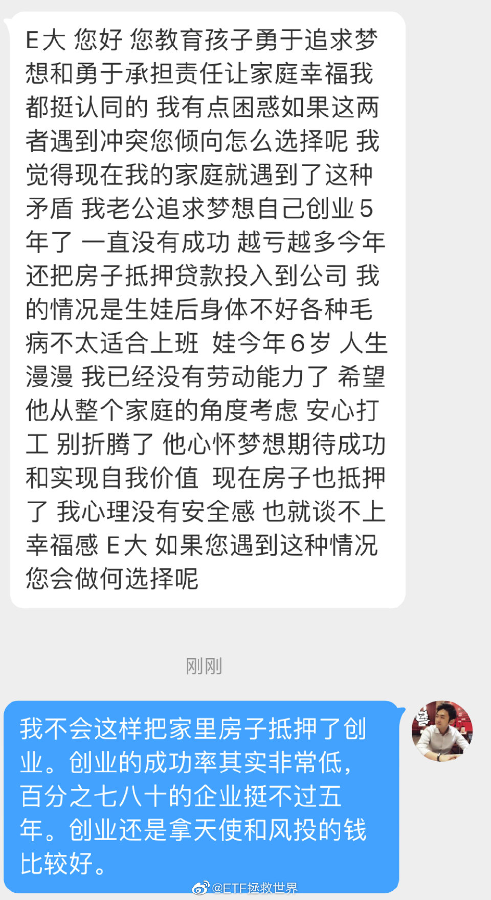

======================================================

ETF拯救世界 (5687069307) @
2020-12-28 18:53:10 Mon  
url: https://weibo.com/5687069307/JAzZxokBd

看了一下各位的年龄。

25岁以下的只有18%。年轻人中70%也有脑子知道独立思考（关注理财说明有闲钱同时爱思考），那就是只有占总数5%左右的思想比较偏激不成熟的年轻人关注我。

这也是为什么我的评论区相对来说比较理性的原因。 ​​​

转发[21]  评论[744]  赞[2112] 

+++++++++++++++++++++++++++++++++++++++++++++++++++++

图片：

======================================================

ETF拯救世界 (5687069307) @
2020-12-28 19:41:36 Mon  
url: https://weibo.com/5687069307/JAAjcwXD6

DAX历史新高。德国也是几乎所有朋友都能补齐的品种。所以为什么害怕跌呢？没有大跌，哪里来的便宜货？哪里来的超额利润？

------------------------------------------------------
转推：
>  @ETF拯救世界 (5687069307)
>  2020-03-17 15:54:53 Tue  
>  url: https:/weibo.com/5687069307/Iz23tClCV/

>  今日数据：
>  
>  德国、日本已经极具投资价值。 ​​​

转发[53]  评论[362]  赞[1757] 

======================================================

ETF拯救世界 (5687069307) @
2020-12-28 19:43:27 Mon  
url: https://weibo.com/5687069307/JAAjX04LR

我建议无论男女，与交往对象刚认识的时候，都认真从头看一遍ta的微博。

然后再决定是否开始交往。 ​​​

转发[61]  评论[622]  赞[2504] 

======================================================

ETF拯救世界 (5687069307) @
2020-12-29 06:58:34 Tue  
url: https://weibo.com/5687069307/JAEJYw374

图一这三位有手账吗，没有的话私信我 ​​​

转发[16]  评论[751]  赞[1988] 

+++++++++++++++++++++++++++++++++++++++++++++++++++++

图片：

======================================================

ETF拯救世界 (5687069307) @
2020-12-29 07:52:59 Tue  
url: https://weibo.com/5687069307/JAF64aKS5

很多朋友不明白为什么每次我都要花很多时间去精心挑选BGM。

不就是一段音乐吗。

不是，那代表了我对美的一部分认知。很重要。 ​​​

转发[40]  评论[775]  赞[2598] 

+++++++++++++++++++++++++++++++++++++++++++++++++++++

图片：

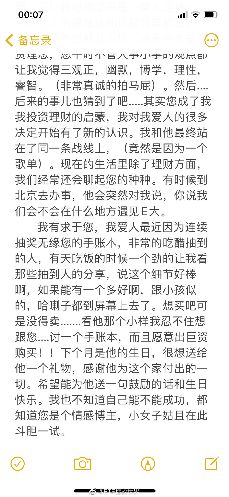

======================================================

ETF拯救世界 (5687069307) @
2020-12-29 10:36:03 Tue  
url: https://weibo.com/5687069307/JAGafFy0D

传媒不讲武德！再跌一个多点对你来说很难吗？

[哼] ​​​

转发[19]  评论[596]  赞[1763] 

======================================================

ETF拯救世界 (5687069307) @
2020-12-29 10:44:07 Tue  
url: https://weibo.com/5687069307/JAGdxhl68

回复@了凡09:图片评论 http://t.cn/A6qYFtar //@了凡09:准备买入DAX和日经指数吗？[坏笑]//@ETF拯救世界:DAX历史新高。德国也是几乎所有朋友都能补齐的品种。所以为什么害怕跌呢？没有大跌，哪里来的便宜货？哪里来的超额利润？

------------------------------------------------------
转推：
>  @ETF拯救世界 (5687069307)
>  2020-03-17 15:54:53 Tue  
>  url: https:/weibo.com/5687069307/Iz23tClCV/

>  今日数据：
>  
>  德国、日本已经极具投资价值。 ​​​

转发[12]  评论[454]  赞[1196] 

======================================================

ETF拯救世界 (5687069307) @
2020-12-29 10:51:21 Tue  
url: https://weibo.com/5687069307/JAGgsEUc4

有些品种长期持有就很好，顺便做做波段。

有些品种主要做做波段，把利润长期持有。

一天反弹就是4%以上的品种，不做波段太可惜了。 ​​​

转发[83]  评论[387]  赞[1896] 

======================================================

ETF拯救世界 (5687069307) @
2020-12-29 11:08:15 Tue  
url: https://weibo.com/5687069307/JAGnk9tdm

不知道小米11有没有变得轻薄一点，手感好一点。

股票赚了一点，想回馈没机会。不知道会不会又是“下次一定支持” ​​​

转发[14]  评论[621]  赞[1764] 

======================================================

ETF拯救世界 (5687069307) @
2020-12-29 13:48:31 Tue  
url: https://weibo.com/5687069307/JAHqnp6Nf

新高不卖，没说新高的第二天也不能卖。 ​​​

转发[51]  评论[1189]  赞[2563] 

======================================================

ETF拯救世界 (5687069307) @
2020-12-29 15:10:03 Tue  
url: https://weibo.com/5687069307/JAHXtdsdS

513050 第一网价格暂定在1.787 ​​​

转发[169]  评论[926]  赞[2328] 

======================================================

ETF拯救世界 (5687069307) @
2020-12-29 17:04:30 Tue  
url: https://weibo.com/5687069307/JAIHVo9Cb

请距离1.787在上下0.003之间的朋友自己把评论顶起来

------------------------------------------------------
转推：
>  @ETF拯救世界 (5687069307)
>  2020-12-28 15:28:05 Mon  
>  url: https:/weibo.com/5687069307/JAyEizUmp/

>  我看有朋友问中概互联什么时候买。
>  
>  不出意外的话，应该是网格先于150和S买。
>  
>  那么，你猜猜多少钱开始买第一网513050。
>  
>  本帖评论猜价格，一个人只能猜一次。最接近的3位朋友每人一份手账。如果近似度相同，先评论的得奖。
>  
>  答案的话，我一会会发一个定时帖。这个定时帖会在明天15:10分显示出来。
>  
>  主 ​​​

转发[39]  评论[452]  赞[1466] 

======================================================

ETF拯救世界 (5687069307) @
2020-12-29 22:41:28 Tue  
url: https://weibo.com/5687069307/JAKUHsc34

很久没有看到让我猜不到结局的推理小说了

东野圭吾的《恶意》算一个

对推理小说感兴趣的朋友可以看看 ​​​

转发[68]  评论[669]  赞[2127] 

======================================================

ETF拯救世界 (5687069307) @
2020-12-30 10:36:39 Wed  
url: https://weibo.com/5687069307/JAPAZBRy9

2018年10月钻石坑最后一次买入环保后，在这个品种上两年没有交易。

昨天150第一次卖出了持仓部分的11%。S没有动。

在暴涨后适当减仓，不仅在战术上能够起到再平衡的作用，在心理上也会起到支持你坚定持有剩下份额的信心。

我本人就不是很懂有些人一下子满仓一下子清仓的动作。难道他们账户里只有100 ​​​

转发[107]  评论[753]  赞[2523] 

======================================================

ETF拯救世界 (5687069307) @
2020-12-30 10:55:26 Wed  
url: https://weibo.com/5687069307/JAPICjGBM

你们谁还记得，当年建仓的侍候，经常会有人问：

“为什么最大跌幅给到30%，你知道它还会跌还要买？”

这里有两个问题，第一个，最大跌幅≠必然会跌。第二个，也许还会跌为什么要买。

这两个问题经常看我东西的人都懂，我就不多说了。

就像今天有人问，为什么大跌的时候卖而不是大跌后的反弹卖呢。
 ​​​

转发[236]  评论[897]  赞[2987] 

======================================================

ETF拯救世界 (5687069307) @
2020-12-30 11:02:30 Wed  
url: https://weibo.com/5687069307/JAPLuf61O

为了排名杀红了眼。 ​​​

转发[29]  评论[732]  赞[2577] 

======================================================

ETF拯救世界 (5687069307) @
2020-12-31 12:23:11 Thu  
url: https://weibo.com/5687069307/JAZIJrLVS

我很少修改文章，这篇是越改字越多。

主要不是聊投资。聊了一年投资了，整天钱钱钱的，庸俗。 ​​​

转发[35]  评论[1658]  赞[3204] 

+++++++++++++++++++++++++++++++++++++++++++++++++++++

图片：
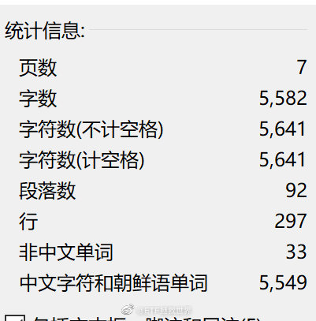

======================================================

ETF拯救世界 (5687069307) @
2020-12-31 21:00:22 Thu  
url: https://weibo.com/5687069307/JB36EF8oC

薇娅的颜值还是能打的 ​​​

转发[12]  评论[587]  赞[1916] 

======================================================

