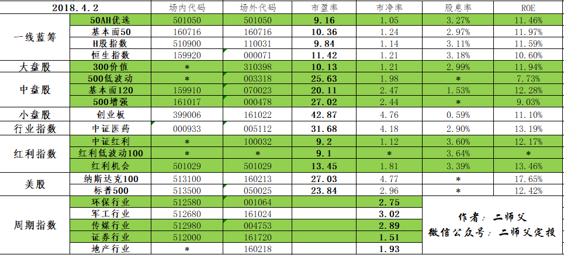
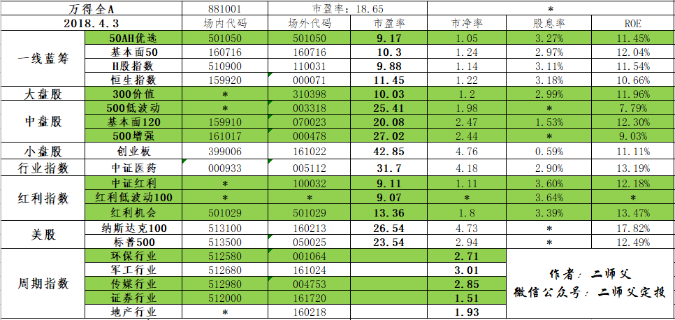
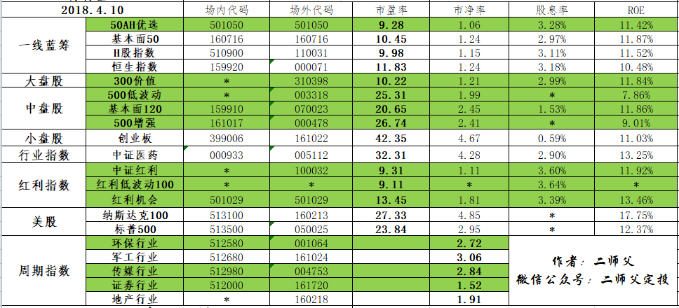
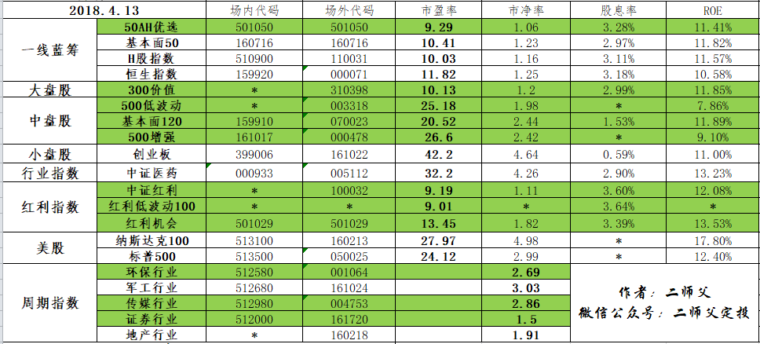
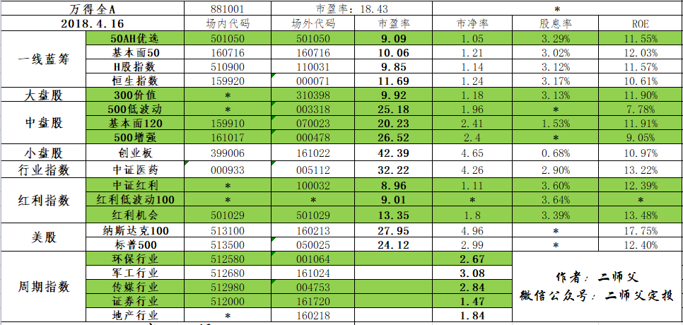
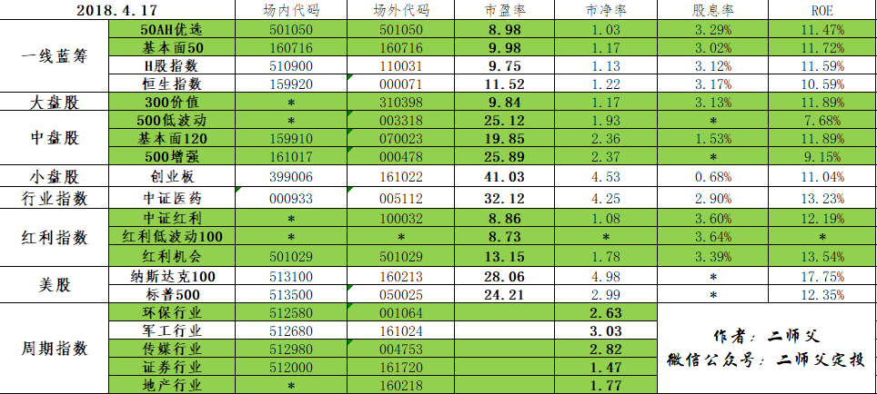
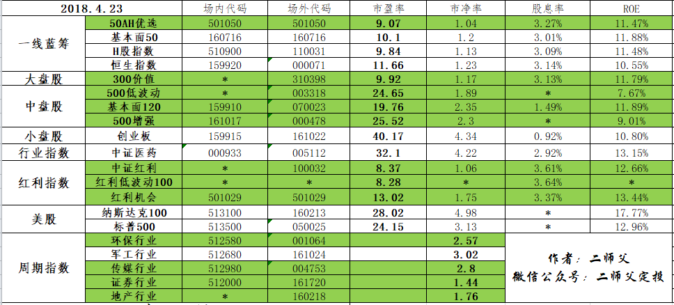
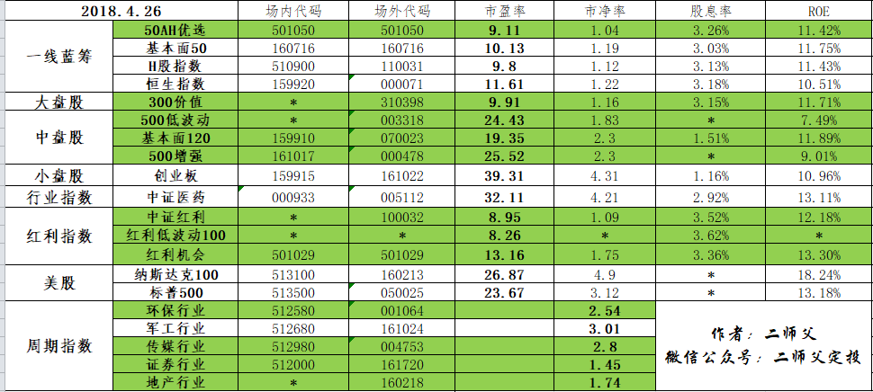

_type: talk
@二师父[28814221155551]
2018-04-01 00:10:47 Sun  
topic_id: 28258821828811

@顾。 at 2018-04-01 00:10:47 Sun

> 二师父你好，基金小白一只准备边跟投，边好好学习。你说你有投资的券商是指估值表里“证券行业，161720”这只基金吗？

----------

@二师父 at 2018-04-01 00:10:47 Sun

> 对的，你去蛋卷或者蚂蚁搜索场外代码即可

----------

@二师父 at 2018-04-01 00:10:47 Sun

> 对的，你去蛋卷或者蚂蚁财富搜索相应的场外代码即可

----------

@顾。 at 2018-04-01 00:10:47 Sun

> 嗯嗯，谢谢您！[愉快]

----------

阅读[120]  评论[4]  赞[0] 

+++++++++++++++++++++++++++++++++++++++++++++++++++++

文件：
2018-04-01 00:10:39 Sun
文件大小：[281405]
48885124212548-18年4月份交易计划.pdf

======================================================

_type: q&a
@victoria[15455121858422]
2018-04-01 15:04:56 Sun  
topic_id: 88258848855222

@victoria

>  二师父我是三月份刚开始定投，每周一用慧定投，投的标的和您一致，如果大盘继续上涨，但估值还在绿色低估区，那么我是应该继续定投呢，还是像您一样等大盘回调时再买入?

@二师父

>  我是手动，自动按照纪律就行

阅读[87]  评论[0]  赞[0] 

======================================================

_type: q&a
@victoria[15455121858422]
2018-04-01 15:05:22 Sun  
topic_id: 88258848855412

@victoria

>  您说的安全边际是指绿色低估区域吗？

@二师父

>  对，在绿色区域内投就是在安全范围内

阅读[88]  评论[0]  赞[0] 

======================================================

_type: q&a
@超级奶爸[48528544118258]
2018-04-02 13:30:56 Mon  
topic_id: 51521522222554

@超级奶爸

>  二师父，指数基金的pe是是怎么算出来的？通用的软件上可以查看吗？

@二师父

>  自己可以计算的，就是非常麻烦，耗费大量精力。给你推荐几个可以查到的网站，恒生指数官网，中证指数官网，且慢，蛋卷，当然不同平台计算规则不一样，所以市盈率的值有些差别

阅读[249]  评论[1]  赞[0] 

======================================================

@二师父[28814221155551]
2018-04-02 19:41:46 Mon  
topic_id: 48548544145418

>  @二师父
>  

阅读[91]  评论[1]  赞[0] 

======================================================

_type: talk
@二师父[28814221155551]
2018-04-03 01:41:59 Tue  
topic_id: 48548241225818

<e type="hashtag" hid="518155881244" title="#4.3指数估值#" /> 最近无操作，之前建仓持有就好，只等待最佳机会，若没到来，耐心等待

@汤圆君 at 2018-04-03 01:41:59 Tue

> 300价值是怎么判断低估了呢？

----------

@二师父 at 2018-04-03 01:41:59 Tue

> 市盈率低于安全阀值

----------

@victoria at 2018-04-03 01:41:59 Tue

> 我看您写的定投标的这段话：根据这三个指数成立以来的年化收益率来比较300低波动的投资价值大于300红利，300红利的投资价值大于300价值。如果三者同时进入低估，首选的是300低波动。那现在为什么定投300价值呢

----------

@二师父 at 2018-04-03 01:41:59 Tue

> 另两只还没有低估呢，还有是同时低估才能比，如果300价值低估更严重他也更具有投资价值啊，不能一概而论

----------

阅读[229]  评论[4]  赞[0] 

+++++++++++++++++++++++++++++++++++++++++++++++++++++

图片：

======================================================

_type: q&a
@victoria[15455121858422]
2018-04-03 02:36:50 Tue  
topic_id: 88258451444412

@victoria

>  50ah优选在蚂蚁财富上停止销售了是什么原因呢

@二师父

>  港股放假买不了啊

阅读[87]  评论[1]  赞[0] 

======================================================

_type: talk
@二师父[28814221155551]
2018-04-04 04:01:36 Wed  
topic_id: 28258422111851

估值表来啦，绿色低估可投。鳄鱼投资策略没有停止，整个策略持续到这轮牛市结束，如果从现在开始大盘一直上涨，那么接下来就不会再投资啦。等着赚取利润就好，如果达到二师父预设的区域，二师父会在星球公布操作的，不用担心。现在震荡市场我们该做什么呢？1、资金放在货币基金里面，别盲目操作2、好好生活，别天天盯着大盘和基金涨跌，还不如把时间拿来陪陪自己的老婆呢，理财就是让生活更美好不是么3、好好工作，提升职业技能，挣更多的钱为投资积累资本。机会总是会有的，牛市也总是会来的。前提是当机会来了我们有充足的资金。学会耐心，孕育一个新生命还得先备孕，授精，着床，10月怀胎呢，任何事物的发展都要有一个过程，投资也一样，风情云淡地生活，气定神闲的投资。我们就是这样淡定。

@victoria at 2018-04-04 04:01:36 Wed

> 这是轮牛市吗

----------

@二师父 at 2018-04-04 04:01:36 Wed

> 计划是一个熊牛周期呢，这轮计划的牛市

----------

阅读[257]  评论[2]  赞[0] 

+++++++++++++++++++++++++++++++++++++++++++++++++++++

图片：

======================================================

_type: q&a
@陈洲[88245122222212]
2018-04-04 15:14:34 Wed  
topic_id: 88258448444252

@陈洲

>  我在余额宝里搜501050 50AH优选的代码，暂停买入卖出了，根据二师父估值表中绿色的场外代码搜，是对的吧？我搜出来看名字很复杂，拿不准场外代码搜对不对

@二师父

>  港股放假了所以暂时买不了，清明节放假休市a股也买不了，代码是对的，名称应该是华夏上证50ah优选指数，这个不用担心。

阅读[82]  评论[0]  赞[0] 

======================================================

_type: q&a
@超级奶爸[48528544118258]
2018-04-05 16:01:22 Thu  
topic_id: 88258412414142

@超级奶爸

>  二师父，基金定投退出一般是什么规则？先进先出，或者是后进先出？

@二师父

>  根据估值，到达正常估值停止投，跟先后没有关系的

阅读[85]  评论[1]  赞[0] 

======================================================

_type: q&a
@超级奶爸[48528544118258]
2018-04-06 19:20:22 Fri  
topic_id: 15425852244122

@超级奶爸

>  指数基金定投一般多久？十年？

@二师父

>  3到5年

阅读[83]  评论[0]  赞[0] 

======================================================

_type: talk
@二师父[28814221155551]
2018-04-08 05:03:10 Sun  
topic_id: 51521858541814

<e type="web" href="https://mp.weixin.qq.com/s/j74NYoy6vd9hFHwyba6Mgw" title="但行好事，前程似锦" cache="http://cache.zsxq.com/201804/eb8efed103619e63e42ee16a9166a22dd48e892049d96f86077fbf41b496f49e" />

@飞的那个飞 at 2018-04-08 05:03:10 Sun

> 助人者天必助之！受教了

----------

@画面 at 2018-04-08 05:03:10 Sun

> 但行好事 前程似锦[强][强][强]

----------

阅读[63]  评论[2]  赞[0] 

======================================================

@二师父[28814221155551]
2018-04-08 19:12:45 Sun  
topic_id: 15452588144512

>  @二师父
>  

阅读[82]  评论[0]  赞[0] 

======================================================

_type: talk
@二师父[28814221155551]
2018-04-10 01:11:35 Tue  
topic_id: 51512551155424

今日指数估值表来啦，目前市场低估品种蛮多的，坚持定投就好啦。

阅读[237]  评论[0]  赞[0] 

+++++++++++++++++++++++++++++++++++++++++++++++++++++

图片：

======================================================

@二师父[28814221155551]
2018-04-10 20:04:41 Tue  
topic_id: 28285248288151

>  @二师父
>  

阅读[85]  评论[0]  赞[0] 

======================================================

_type: talk
@二师父[28814221155551]
2018-04-11 03:11:15 Wed  
topic_id: 15452418154242

医药持续新高，之前定投继续持有就好，如果子弹充足可以还是按照之前的计划按部就班投，子弹不足，先停停吧

阅读[62]  评论[0]  赞[0] 

======================================================

_type: talk
@二师父[28814221155551]
2018-04-11 03:11:56 Wed  
topic_id: 28285241482521

医药持续新高，之前定投继续持有就好，如果子弹充足可以还是按照之前的计划按部就班投，子弹不足，先停停吧

阅读[65]  评论[0]  赞[0] 

+++++++++++++++++++++++++++++++++++++++++++++++++++++

图片：

======================================================

_type: talk
@二师父[28814221155551]
2018-04-11 03:13:32 Wed  
topic_id: 48584521285848

医药持续新高，之前定投继续持有就好，如果子弹充足可以还是按照之前的计划按部就班投，子弹不足，先停停吧

阅读[65]  评论[0]  赞[0] 

+++++++++++++++++++++++++++++++++++++++++++++++++++++

图片：

======================================================

_type: talk
@二师父[28814221155551]
2018-04-13 01:31:54 Fri  
topic_id: 48584255888448

<e type="hashtag" hid="518141142244" title="#4.12指数估值#" /> 昨天估值表好想忘记发送了，每日都会发的，最近股市震荡上行，之前贸易战加仓的已经有部分盈利，不用再急着操作，耐心等待机会，或者耐心持有，基金叫做FUND，就是让你放着，别频繁操作。

阅读[255]  评论[0]  赞[0] 

+++++++++++++++++++++++++++++++++++++++++++++++++++++

图片：

======================================================

_type: q&a
@八月猪妈妈[28245881548511]
2018-04-13 21:07:56 Fri  
topic_id: 48584255155288

@八月猪妈妈

>  二师傅，请问金融和消费代表的基金指数是哪些？谢谢！

@二师父

>  中证银行，中证消费，白酒

阅读[100]  评论[0]  赞[0] 

======================================================

_type: q&a
@汤圆君[881125824112]
2018-04-14 03:23:42 Sat  
topic_id: 28285144584811

@汤圆君

>  请问二师父，中证养老是否值得定投？

@二师父

>  目前中证养老是低估的，可以定投

阅读[101]  评论[0]  赞[0] 

======================================================

_type: talk
@二师父[28814221155551]
2018-04-14 04:01:44 Sat  
topic_id: 48584114212158

<e type="hashtag" hid="158515482242" title="#4.13指数估值#" /> 投资就好，具体有的同学问银行和消费指数有哪些推荐，可以去中证指数官网搜所中证银行和中证消费，会有很多显示的。

阅读[266]  评论[0]  赞[0] 

+++++++++++++++++++++++++++++++++++++++++++++++++++++

图片：

======================================================

_type: q&a
@victoria[15455121858422]
2018-04-16 14:23:57 Mon  
topic_id: 88288528142142

@victoria

>  目前大盘估值在多少，从哪里能看到

@二师父

>  15倍多，在wind有，集思录也有

阅读[110]  评论[0]  赞[0] 

======================================================

_type: talk
@二师父[28814221155551]
2018-04-17 01:00:33 Tue  
topic_id: 88288542855452

世界不太平，我们还能投资吗，请看

阅读[328]  评论[0]  赞[0] 

+++++++++++++++++++++++++++++++++++++++++++++++++++++

文件：
2018-04-17 00:59:57 Tue
文件大小：[317671]
88884524185552-世界不太平，投资怎么办.pdf

======================================================

_type: talk
@二师父[28814221155551]
2018-04-17 01:54:40 Tue  
topic_id: 28288542884511

<e type="hashtag" hid="158514244542" title="#4.17指数估值#" /> 低估很多，坚持定投，注意别抄底

阅读[279]  评论[0]  赞[0] 

+++++++++++++++++++++++++++++++++++++++++++++++++++++

图片：

======================================================

_type: talk
@二师父[28814221155551]
2018-04-17 10:11:24 Tue  
topic_id: 28288544848881

<e type="hashtag" hid="481882421418" title="#今日交易#" /> 今日3点之前买入300价值和500增强各一份，二师父已经买入，注意保证资金，做好打持久战的准备。

@青花绣 at 2018-04-17 10:11:24 Tue

> 跟[微笑]

----------

阅读[287]  评论[1]  赞[0] 

======================================================

_type: q&a
@八月猪妈妈[28245881548511]
2018-04-18 00:09:52 Wed  
topic_id: 15455284552842

@八月猪妈妈

>  二师傅，你好！请教您目前选择的是场内还是场外?不想做定投，想跟着您买，每份1000元。谢谢！

@二师父

>  场外就好，要在三点之前买入，这样交易价格就是当日成交价格，如果场内购买的话就是实时价格。要做好资金配置，保证充足的份数，具体介绍看5步定投法。别一次买入就好，目前市场的整体估值都比较低了，只要坚持资金不断地投资，会有收获的

阅读[326]  评论[1]  赞[1] 

======================================================

_type: talk
@二师父[28814221155551]
2018-04-18 00:46:06 Wed  
topic_id: 15455522512142

<e type="hashtag" hid="158514244542" title="#4.17指数估值#" /> 基本全绿了，上证综指接近3000点，投资机会来了。稳定心态，保证资金，投资吧。

阅读[301]  评论[0]  赞[0] 

+++++++++++++++++++++++++++++++++++++++++++++++++++++

图片：

======================================================

_type: talk
@二师父[28814221155551]
2018-04-18 01:10:26 Wed  
topic_id: 28288855844211

机会来了，记住，即使现在投资也要把资金分散开来，因为咱们不知道市场会持续低迷多久。但是有一点可以肯定，指数点位最后肯定会再创新高

阅读[353]  评论[0]  赞[0] 

+++++++++++++++++++++++++++++++++++++++++++++++++++++

文件：
2018-04-18 01:09:13 Wed
文件大小：[280246]
48882451248128-上证综指逼近3000点，我们的机会也来了.pdf

======================================================

_type: talk
@二师父[28814221155551]
2018-04-20 01:33:12 Fri  
topic_id: 15455414251882

<e type="hashtag" hid="481825258858" title="#4.19指数估值#" /> 跌得还不够狠，已经买入的继续持有，等待再次下跌，如果没有下跌，那就一直持有到正常估值分步卖出，不要盲动。

@victoria at 2018-04-20 01:33:12 Fri

> 定投的需要停停吗

----------

@victoria at 2018-04-20 01:33:12 Fri

> 没看懂您说的话

----------

@二师父 at 2018-04-20 01:33:12 Fri

> 目前低估是可以投资的，只不过鳄鱼投资计划停了

----------

@victoria at 2018-04-20 01:33:12 Fri

> 鳄鱼投资计划为什么要停？是为了等更好的下跌机会再买入吗，请老师明示

----------

@victoria at 2018-04-20 01:33:12 Fri

> ＠老师

----------

@二师父 at 2018-04-20 01:33:12 Fri

> 对，是将投资的成本控制到最低，因为很多人受不了巨幅亏损状态

----------

@victoria at 2018-04-20 01:33:12 Fri

> 那怎么能知道该什么时候买入呢，还是按跌2⃣️％买入一份或双份呢

----------

@二师父 at 2018-04-20 01:33:12 Fri

> 市场整体估值，单个投资基金估值，黑天鹅事件，大盘回调，不是看下跌，是看估值，基金净值是没有意义的

----------

阅读[350]  评论[10]  赞[0] 

+++++++++++++++++++++++++++++++++++++++++++++++++++++

图片：

======================================================

_type: talk
@二师父[28814221155551]
2018-04-21 02:56:41 Sat  
topic_id: 28288455885141

<e type="hashtag" hid="481825152428" title="#4.20指数估值#" /> 大家心心念念的创业板快要低估了，之前不让投是有原因的，只有等到低估区域才能够投资呢，你看看如果之前投的话现在亏损多少了，严格按照纪律，坚持下去

@victoria at 2018-04-21 02:56:41 Sat

> 创业板指数多少才算低估呢

----------

@二师父 at 2018-04-21 02:56:41 Sat

> 我设定的38倍市盈率，这个是目前

----------

阅读[361]  评论[2]  赞[0] 

+++++++++++++++++++++++++++++++++++++++++++++++++++++

图片：

======================================================

_type: q&a
@披褐怀玉，抱元守一。[15412554441882]
2018-04-22 03:09:50 Sun  
topic_id: 48588284822248

@披褐怀玉，抱元守一。

>  广发中证全指信息技术ETF联接A   000942 
>  天弘中证电子指数A001617
>  南方中证500信息技术指数ETF联接A   002900  这三只基金目前已进入低估区域没有？哪只更适合定投？请二师傅帮忙分析一下，给指导性的建议。谢谢！

@二师父

>  都还没有进入低估呢，周期性比较强，不建议入手。

阅读[205]  评论[6]  赞[0] 

======================================================

_type: q&a
@披褐怀玉，抱元守一。[15412554441882]
2018-04-22 03:12:38 Sun  
topic_id: 48588284182128

@披褐怀玉，抱元守一。

>  二师傅好！估值表中能否把信息技术指数基金也列进去。我觉得中国立足于自力更生发展芯片技术，信息技术指数基金将来会有好的发展势头。我的想法不知道正确与否，还要请您多指点。

@二师父

>  你还是没有明白二师父投资思想，这个行业没有护城河，并不是一个值得投资的行业，行业竞争如果没有技术创新很容易被淘汰掉

阅读[209]  评论[1]  赞[0] 

======================================================

_type: q&a
@披褐怀玉，抱元守一。[15412554441882]
2018-04-23 19:14:35 Mon  
topic_id: 88288442242582

@披褐怀玉，抱元守一。

>  请问 信诚中证TMT产业主题  165522   二师傅已告诉我目前低估，这个适合定投吗？还请大神指导。

@二师父

>  这个我没有投资，低估区域是可以定投的，不过这只建议轻仓，不适合重仓

阅读[234]  评论[2]  赞[0] 

======================================================

_type: talk
@二师父[28814221155551]
2018-04-24 02:42:19 Tue  
topic_id: 48588218248888

<e type="hashtag" hid="481822542158" title="#4.23指数估值#" /> A股已经到了绝佳的投资时刻了。控制好节奏和投资金额，坚持吧。时间会给你回报。

阅读[446]  评论[0]  赞[0] 

+++++++++++++++++++++++++++++++++++++++++++++++++++++

图片：

======================================================

_type: talk
@victoria[15455121858422]
2018-04-24 08:47:45 Tue  
topic_id: 88288412518122

人喜欢短期见效的刺激，因为人类最大恐惧就是对未来的无知。比如嫖娼，赌博，吸烟，喝酒，美食，只要去干了，立马就能知道结果，立马就能获得强烈的快感。但对需要持续投入才能知道结果的事物不感冒，比如学习进修，锻炼身体，价值投资等等，见效太慢，过程又毫无快感甚至痛苦，简单说就是没劲。所以长期投资是非常反人性的。

@二师父 at 2018-04-24 08:47:45 Tue

> 这个确实是，沉迷赌博的人就是想获得即时快感的人

----------

阅读[458]  评论[1]  赞[0] 

======================================================

_type: talk
@二师父[28814221155551]
2018-04-25 03:17:37 Wed  
topic_id: 88282585518422

<e type="hashtag" hid="281815854141" title="#4.24指数估值#" /> 市场低迷不知道还持续多久，坚持按照纪律定投即可。目前仍是值得投资的时候。

阅读[526]  评论[0]  赞[0] 

+++++++++++++++++++++++++++++++++++++++++++++++++++++

图片：

======================================================

_type: q&a
@victoria[15455121858422]
2018-04-25 03:49:20 Wed  
topic_id: 88282585512122

@victoria

>  二师父就你现在表里提供的绿色为低估，可以定投，如果再进行比较，最具投资价值的有哪几个？

@二师父

>  讲真都很具有投资价值，这个没法再比较了，就跟文科第一名和理科第一名，你能说哪个更厉害吗

阅读[312]  评论[7]  赞[0] 

======================================================

_type: talk
@二师父[28814221155551]
2018-04-25 12:33:26 Wed  
topic_id: 51515214525124

有同学让二师父推荐最优投资组合。那必然是中证500指数增强和沪深300价值

@Audrey at 2018-04-25 12:33:26 Wed

> 500增强和500低波动哪个更好 我投的500低波动

----------

@二师父 at 2018-04-25 12:33:26 Wed

> 都很不错的，二者区别不是特别大

----------

阅读[287]  评论[2]  赞[0] 

======================================================

_type: talk
@二师父[28814221155551]
2018-04-25 14:50:22 Wed  
topic_id: 15454251882112

推荐几个投资数据查询的网站，查阅历史回测数据，智投星，查阅估值的，理杏仁，果仁网。大家可以自行查阅分析对比。

阅读[306]  评论[0]  赞[0] 

======================================================

_type: q&a
@陈洲[88245122222212]
2018-04-25 15:06:11 Wed  
topic_id: 88282581525122

@陈洲

>  今天想在蚂蚁金服上按二师父的纪律开始定投，发现买入有0.12—0.15%的买入费率，蛋卷基金和天天基金也有买入费率吗

@二师父

>  这些都是场外基金，申购赎回都有费率的。所以最好别频繁操作。除了这些，还有基金管理费和托管费，不过场外基金小额投资的话费率不大

阅读[379]  评论[0]  赞[0] 

======================================================

_type: q&a
@陈洲[88245122222212]
2018-04-26 12:39:20 Thu  
topic_id: 28282521455111

@陈洲

>  二师父，大盘和中盘重仓，中证500增强给的表中市盈率25左右了，还是低估区吗？2个重要指标搞懂了，但数字多少才算低估，我的资金比较少，是不是不用这么纠结，直接买大盘和中盘得了，我本来准备买5种，月投，平常时间少，你的文章计算份额是以周投为例，月投和周投对盈利的区别我自己想的应该不大

@二师父

>  500增强目前已经是非常低估了。表中绿色的都是低估的。月定投和周定投区别不大，只要保证在定投日有资金就好，可以设置自动扣款，这样就不用自己操作，节省时间。只需要在正常估值的时候取消扣款就行啦。

阅读[392]  评论[5]  赞[0] 

======================================================

_type: q&a
@琴[51541445145554]
2018-04-26 12:40:24 Thu  
topic_id: 51515258811524

@琴

>  请问二师父，平时大家都在哪里交流呢？我看这里发言的人不多啊？

@二师父

>  是在这里交流呢，目前市场持续低迷，大家投资热情有所下降，是机会呢

阅读[438]  评论[0]  赞[0] 

======================================================

_type: talk
@二师父[28814221155551]
2018-04-27 03:51:46 Fri  
topic_id: 51515281455124

<e type="hashtag" hid="518182581544" title="#4.26指数估值#" /> 估值表来啦，目前是定投最好时刻，按照纪律投资，如果大盘下跌到3000点以下，可以加倍定投

@victoria at 2018-04-27 03:51:46 Fri

> 昨天买入两份中证500，一份价值300，每份3000[咖啡]

----------

@勤能行之 at 2018-04-27 03:51:46 Fri

> 赞👍

----------

@勤能行之 at 2018-04-27 03:51:46 Fri

> 是伍佰增强161017吗？

----------

@victoria at 2018-04-27 03:51:46 Fri

> 000478

----------

阅读[704]  评论[4]  赞[0] 

+++++++++++++++++++++++++++++++++++++++++++++++++++++

图片：

======================================================

_type: talk
@二师父[28814221155551]
2018-04-29 02:06:03 Sun  
topic_id: 28282822141221

时常总结才能够有所收获

@victoria at 2018-04-29 02:06:03 Sun

> 老师是否有时间分析一下，格力和伊利这两只股票，我观察了一段时间，现在处于下跌趋势，不知该如何把握这个时机

----------

@二师父 at 2018-04-29 02:06:03 Sun

> 建议定投指数基金即可

----------

阅读[836]  评论[2]  赞[0] 

+++++++++++++++++++++++++++++++++++++++++++++++++++++

文件：
2018-04-29 02:05:49 Sun
文件大小：[345219]
88884254152552-二师父2018年4月投资总结.pdf

======================================================

