_type: q&a
@空白[15481848585222]
2018-06-01 10:08:11 Fri  
topic_id: 51558224514224

@空白

>  二师傅 我目前持有的中证生物科技501009按照目前市场 该抛了嘛

@二师父

>  请根据五步定投法利润收割，分步卖出

阅读[1100]  评论[0]  赞[0] 

======================================================

_type: q&a
@空白[15481848585222]
2018-06-01 10:08:39 Fri  
topic_id: 15448221442842

@空白

>  富国价值驱动005472这是一个新基 之前刚学定投一次性瞎买了两万后来就没动过 目前亏了两千 不知道怎么办了 是继续装死 还是该加仓 我只想不亏的时候把它赎回来 以后不再瞎投....对了当时还是在招商app上买的 手续费好高 后悔啊

@二师父

>  这是交学费了

阅读[1165]  评论[3]  赞[0] 

======================================================

_type: talk
@二师父[28814221155551]
2018-06-01 23:16:56 Fri  
topic_id: 28221525588221

<e type="hashtag" hid="518512142244" title="#6.1指数估值#" /> 定投需要坚持，做好资金配置，准备打持久战吧

阅读[1453]  评论[0]  赞[0] 

+++++++++++++++++++++++++++++++++++++++++++++++++++++

图片：
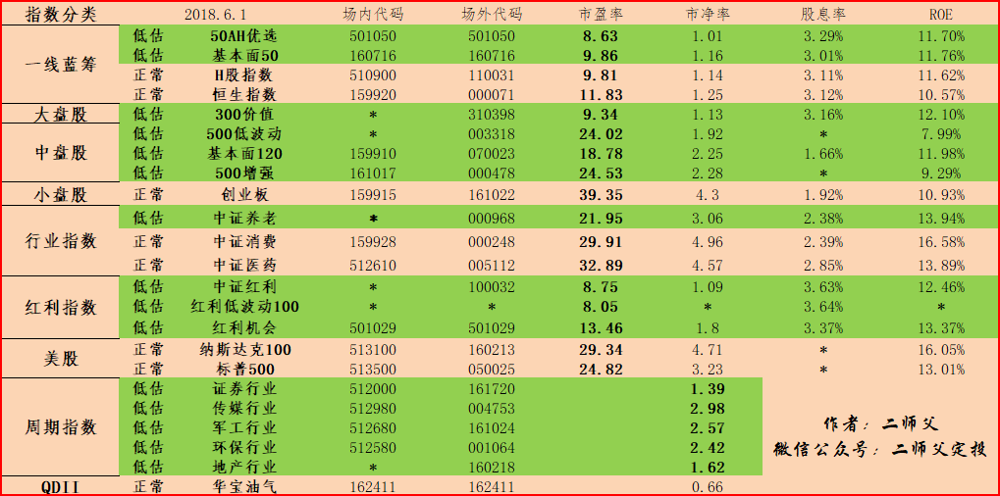

======================================================

_type: talk
@二师父[28814221155551]
2018-06-02 01:20:45 Sat  
topic_id: 48551454551848

货币基金收益率较高的平台，目前市场低迷，咱们不要恐惧，把盈余资金买入货币基金。然后还是按照纪律，低估分散定投，一定要保证充足子弹，坚守到市场回暖的那一天。

阅读[1495]  评论[0]  赞[0] 

+++++++++++++++++++++++++++++++++++++++++++++++++++++

文件：
2018-06-02 01:17:40 Sat
文件大小：[338018]
28881552225521-货币基金哪家强.pdf

======================================================

_type: talk
@二师父[28814221155551]
2018-06-03 01:56:28 Sun  
topic_id: 28221548845141

<e type="hashtag" hid="481584524818" title="#师父读书#" /> 之前，群内有读者问二师父读哪些书，二师父开了个读书专栏，这是告诉大家如何建立投资哲学的书籍，值得认真学习。至于投资系统的建立，二师父在文章中反复传播的观点需要领悟，然后据此指导实践，并且总结才能慢慢形成自己的投资系统，需要时间，慢慢来。

阅读[1353]  评论[0]  赞[0] 

+++++++++++++++++++++++++++++++++++++++++++++++++++++

文件：
2018-06-03 01:56:12 Sun
文件大小：[370818]
28881554812181-如何建立自己的投资哲学.pdf

======================================================

_type: talk
@二师父[28814221155551]
2018-06-04 02:53:31 Mon  
topic_id: 51558284854214

300增强投资价值分析，下期估值表加入300增强和食品饮料，读者的建议如果好的话二师父都会采纳的

@空白 at 2018-06-04 02:53:31 Mon

> 那300增强和300价值 目前二师父更推荐哪一个呀

----------

@二师父 at 2018-06-04 02:53:31 Mon

> 300增强

----------

阅读[1263]  评论[2]  赞[0] 

+++++++++++++++++++++++++++++++++++++++++++++++++++++

文件：
2018-06-04 02:52:55 Mon
文件大小：[354829]
48881442121258-300增强也很强.pdf

======================================================

@二师父[28814221155551]
2018-06-04 11:28:28 Mon  
topic_id: 28221511282541

>  @二师父
>  

阅读[836]  评论[0]  赞[0] 

======================================================

_type: q&a
@空白[15481848585222]
2018-06-04 11:28:48 Mon  
topic_id: 48551848251258

@空白

>  二师父请问下 中正500和基本面120有相同股嘛 可以同时持有嘛 还是一个就好

@二师父

>  500就好了

阅读[879]  评论[0]  赞[0] 

======================================================

_type: talk
@二师父[28814221155551]
2018-06-05 02:33:50 Tue  
topic_id: 15448554522122

<e type="hashtag" hid="481588442418" title="#6.4指数估值#" /> 估值表来啦，加入了几只新的基金，后续会逐步增加的，白酒高估，注意控制仓位，500增强和300增强都低估，可以定投。但是不要一次买入，离历史大底还有百分之50左右的跌幅，缓慢建仓。

阅读[1162]  评论[0]  赞[0] 

+++++++++++++++++++++++++++++++++++++++++++++++++++++

图片：
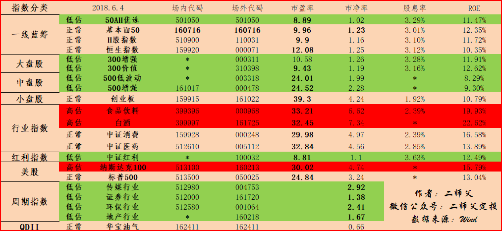

======================================================

_type: talk
@二师父[28814221155551]
2018-06-05 02:35:25 Tue  
topic_id: 15448554522152

<e type="hashtag" hid="881288554512" title="#基金分析#" /> 300策略低估了，怎么选择呢

@落叶无痕 at 2018-06-05 02:35:25 Tue

> 二师父，能否抽空看看新能源汽车这个行业，家里有人从事这个行业，一直说发展前景不错，我选的是国泰国证新能源汽车

----------

@二师父 at 2018-06-05 02:35:25 Tue

> 好的，我来研究下

----------

阅读[1251]  评论[2]  赞[0] 

+++++++++++++++++++++++++++++++++++++++++++++++++++++

文件：
2018-06-05 02:34:42 Tue
文件大小：[352308]
51118211184524-300增强和300价值选哪个好.pdf

======================================================

_type: q&a
@空白[15481848585222]
2018-06-05 19:17:11 Tue  
topic_id: 48551858112248

@空白

>  二师父 对于国泰国证新能源汽车160225这只鸡你怎么看呀 有潜力嘛

@二师父

>  今晚研究研究

阅读[744]  评论[0]  赞[0] 

======================================================

_type: q&a
@牛人GG[28458212211841]
2018-06-05 20:36:45 Tue  
topic_id: 15448544285822

@牛人GG

>  请问深证100ETF如何? 目前算是低估吗？

@二师父

>  没有低估，50ah低估，300价值，300增强都低估

阅读[785]  评论[0]  赞[0] 

======================================================

_type: talk
@二师父[28814221155551]
2018-06-06 02:12:01 Wed  
topic_id: 48551524558148

<e type="hashtag" hid="518415888254" title="#6.5指数估值#" /> 昨日一涨，二师父持有的除了证券都浮盈了，继续坚持定投，A股不会亏待你

阅读[1130]  评论[0]  赞[0] 

+++++++++++++++++++++++++++++++++++++++++++++++++++++

图片：
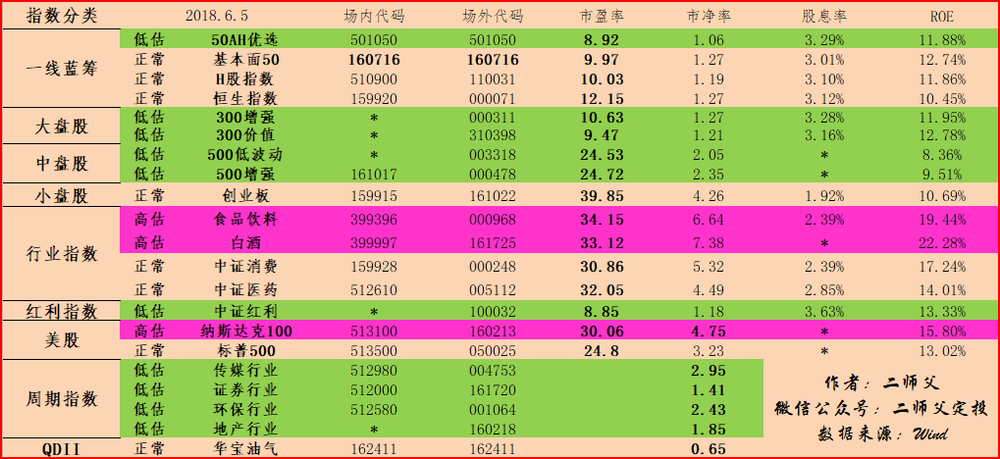

======================================================

_type: talk
@二师父[28814221155551]
2018-06-06 02:14:09 Wed  
topic_id: 51558542551854

我和读者相约2028年6月6日一起再来回望10年前的的今天，回望中国股市的10年，未来一起走。前提是，我们能够在这个市场存活10年，所以做好风险控制，做低风险的投资者。

@Pacifica at 2018-06-06 02:14:09 Wed

> 二师父，记得“不见不散，不弃不离”哦

----------

@二师父 at 2018-06-06 02:14:09 Wed

> 好，一言为定。

----------

@victoria at 2018-06-06 02:14:09 Wed

> 是2028吧

----------

@二师父 at 2018-06-06 02:14:09 Wed

> 对的，改过来了

----------

@海盗 at 2018-06-06 02:14:09 Wed

> 二师傅写得真是好[强]

----------

阅读[1213]  评论[5]  赞[0] 

+++++++++++++++++++++++++++++++++++++++++++++++++++++

文件：
2018-06-06 02:12:48 Wed
文件大小：[390146]
28881582514551-此刻熊市不入场，你将错过很多.pdf

======================================================

_type: talk
@victoria[15455121858422]
2018-06-06 03:30:06 Wed  
topic_id: 88221245245182

老师我未学习前以前投了4支基金，目前只有一只10032浮盈，现在这只基金可以卖出了吗

@victoria at 2018-06-06 03:30:06 Wed

> 我准备不再投资框架内的赢利后卖出，买入投资框架以内的基金

----------

@二师父 at 2018-06-06 03:30:06 Wed

> 可以分步减仓

----------

阅读[768]  评论[2]  赞[0] 

+++++++++++++++++++++++++++++++++++++++++++++++++++++

图片：
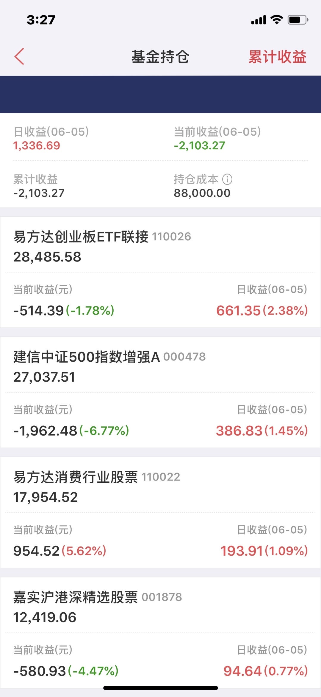

======================================================

_type: talk
@victoria[15455121858422]
2018-06-06 03:40:21 Wed  
topic_id: 28221245248521

老师我在学习过程中买入了下面8支基金，下面图片7支，还有一支是传媒，老师给指导一下，如果选6支集中一下，哪几支更优，谢谢[西瓜]

@二师父 at 2018-06-06 03:40:21 Wed

> 300价值和基本面120持有一只即可，建议300价值

----------

@victoria at 2018-06-06 03:40:21 Wed

> 目前我在中证500投入最多，300价值次之

----------

@victoria at 2018-06-06 03:40:21 Wed

> 传媒可以继续投吗

----------

@victoria at 2018-06-06 03:40:21 Wed

> 另外在资金分配上是否应该有侧重点

----------

@二师父 at 2018-06-06 03:40:21 Wed

> 就这个仓位，下跌慢慢买，目前中证500已经低估了，但距离历史大底部还有一定距离，所以别一下子全买了。反正这个点位买入耐心持有几年收益肯定是不错的

----------

@victoria at 2018-06-06 03:40:21 Wed

> 资金分配的问题呢

----------

阅读[801]  评论[6]  赞[0] 

+++++++++++++++++++++++++++++++++++++++++++++++++++++

图片：
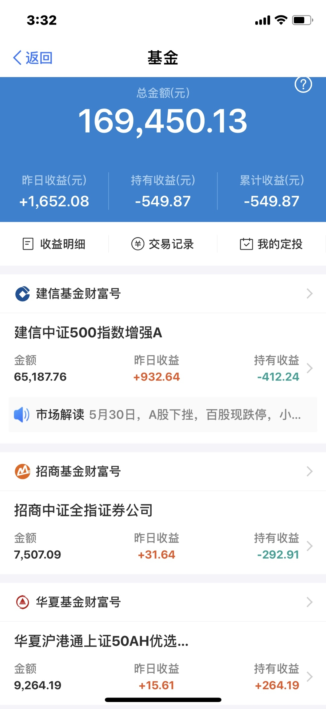
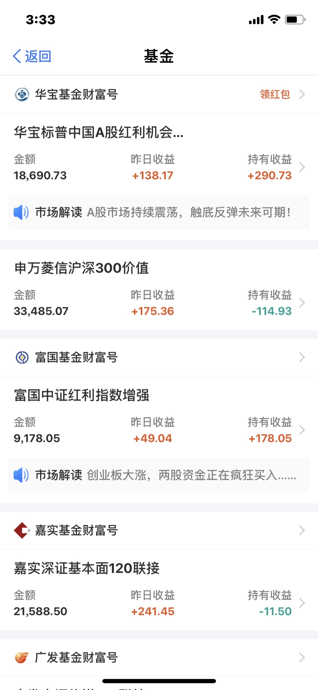

======================================================

_type: q&a
@红苹果[28488511551521]
2018-06-06 07:49:04 Wed  
topic_id: 51558542484484

@红苹果

>  能介绍一款目前收益好的货币基金吗

@二师父

>  南方天天利B

阅读[858]  评论[9]  赞[0] 

======================================================

_type: q&a
@空白[15481848585222]
2018-06-06 09:09:41 Wed  
topic_id: 51558541248554

@空白

>  二师父目前TMT行业您怎么看 能投嘛 前景如何

@二师父

>  风险较大，谨慎投资

阅读[802]  评论[0]  赞[0] 

======================================================

_type: q&a
@明天会更好[48528152285488]
2018-06-06 09:30:45 Wed  
topic_id: 15448415515552

@明天会更好

>  师父您好，又要麻烦你了，我是新手我想定期不定额进行定投，您的五步定投里的定投公式说是给老司机们用的，可以教教我这个小白吗？

@二师父

>  新手建议用慧定投自动扣款，低点多扣，高点少扣

阅读[857]  评论[0]  赞[0] 

======================================================

_type: q&a
@陈Being[28845245224851]
2018-06-06 09:41:11 Wed  
topic_id: 88221248841582

@陈Being

>  请问50AH与基本面50两者有什么区别，我这两只基都在定投可以吗，昨天基本面估值正常了是否不能再定投了？

@二师父

>  估值正常不能再投，都是上证50的策略指数，只是指数的选股策略不一样罢了

阅读[924]  评论[0]  赞[0] 

======================================================

_type: q&a
@陈Being[28845245224851]
2018-06-06 14:12:36 Wed  
topic_id: 51558548284184

@陈Being

>  二师父，你的文章中所说的指数基金正常估值可以卖出浮盈部分的资金，是否指比如我的某定投基金本金为10000，已经浮盈2000，则可卖出2000，保留10000本金一直持有到牛市高估才全部抛售

@二师父

>  这个理论是这样，1万盈利2000，可以卖出2000，也可以卖出1000或者3000，不固定。还有一点，不是到达高估就全部卖出，到达高估还有可能继续上涨，所以不能全部卖出

阅读[1333]  评论[2]  赞[0] 

======================================================

_type: q&a
@ss_佳汝[15481512828122]
2018-06-06 15:19:58 Wed  
topic_id: 51558548111554

@ss_佳汝

>  请问ETF联接A 和联接C 分别是什么意思？场外投资的新手应该选择哪个？谢谢

@二师父

>  链接基金持仓是直接买入基金的，比如，上证50是直接买入股票作为持仓，而50链接是重仓上证50基金。
>  c类没有申购赎回费用，但管理费高，适合短期
>  a类有申购赎回费用，但管理费低，适合长期
>  咱们是长期投资的话，建议选择a类

阅读[1312]  评论[0]  赞[0] 

======================================================

_type: q&a
@George[88214414448412]
2018-06-06 15:21:03 Wed  
topic_id: 48551521854548

@George

>  二师父你好，之前买了些了环保ETF，有点小套牢6个多点，请问有什么操作建议吗，继续装死还是再低吸一点

@二师父

>  环保目前低估，不要装死，按照纪律定投，低吸，然后估值正常以后持有坐等上涨就好了

阅读[964]  评论[0]  赞[0] 

======================================================

_type: q&a
@陈Being[28845245224851]
2018-06-06 15:49:03 Wed  
topic_id: 51558548518814

@陈Being

>  我看完二师父你的五步定投法，还存在一些疑问，
>  1、请问如果是在熊市里，但基金已经是高估了，那要不要做利润收割，是按照哪种方法，是按比例还是按照本金逐步卖出的办法。比如去年的白酒行业指数。
>  2、是否可这样理解如果指数是在低估，就算有利润，也不用做任何操作收害利润，正常继续定投就行了。

@二师父

>  1.对的，不管牛熊，只要高估了就逐步减仓，这是仓位管理。二师父说过，风险都是涨出来的
>  2，低估不要卖，低估的时候就是积累股份为了以后盈利的，一旦指数开启上涨，几天就能达到几十个百分点的收益，前段时间的华宝油气就是例子

阅读[1438]  评论[0]  赞[0] 

======================================================

_type: q&a
@空白[15481848585222]
2018-06-06 17:56:34 Wed  
topic_id: 88221215584512

@空白

>  二师父 东方红系列的基金你觉得怎么样 推荐购买嘛 比如：东方产业升级 、东方红沪港深

@二师父

>  这个不推荐，估值表里面的基金都是推荐的

阅读[971]  评论[0]  赞[0] 

======================================================

_type: talk
@二师父[28814221155551]
2018-06-07 04:57:32 Thu  
topic_id: 88221214145282

最佳的几种定投组合，其他的基金自行配置即可，注意控制好仓位

@勤能行之 at 2018-06-07 04:57:32 Thu

> 已赞赏[玫瑰]

----------

@勤能行之 at 2018-06-07 04:57:32 Thu

> 师傅，300和500，现在开投，具体选哪两只，是300价值和500增强吗

----------

@二师父 at 2018-06-07 04:57:32 Thu

> 都可以，我选择的500增强和300增强

----------

@勤能行之 at 2018-06-07 04:57:32 Thu

> 谢谢师傅[玫瑰][玫瑰]

----------

@李尚往来 at 2018-06-07 04:57:32 Thu

> 二师父，我之前买了300价值和500低波，还有必要买300增强和500增强么？

----------

@二师父 at 2018-06-07 04:57:32 Thu

> 就定投300价值和500低波动就好啦

----------

@李尚往来 at 2018-06-07 04:57:32 Thu

> 谢谢二师父[玫瑰]

----------

阅读[1383]  评论[7]  赞[0] 

+++++++++++++++++++++++++++++++++++++++++++++++++++++

文件：
2018-06-07 04:56:58 Thu
文件大小：[369805]
48881482428548-二师父推荐5种明星宽基指数.pdf

======================================================

_type: talk
@二师父[28814221155551]
2018-06-07 04:59:45 Thu  
topic_id: 28221214145211

<e type="hashtag" hid="158151521442" title="#6.6指数估值表#" /> 低估定投即可，市场跌幅不大，没有显著的机会，但是此刻很多基金已经很便宜了，别错过

@李尚往来 at 2018-06-07 04:59:45 Thu

> 又回来这个版本，还是喜欢这个，一路撩人

----------

@Audrey at 2018-06-07 04:59:45 Thu

> 二师傅，加一下历史最低和最高的市盈率和市净率吧，谢谢啦

----------

阅读[1357]  评论[2]  赞[0] 

+++++++++++++++++++++++++++++++++++++++++++++++++++++

图片：
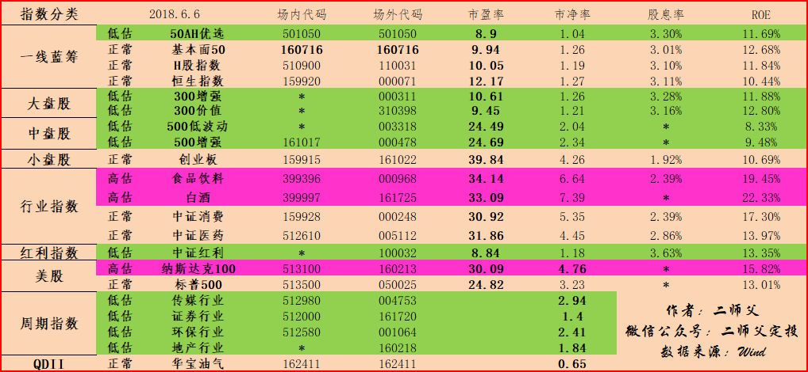

======================================================

_type: talk
@二师父[28814221155551]
2018-06-07 05:03:19 Thu  
topic_id: 15448481815412

<e type="hashtag" hid="481282842558" title="#二师父第二期定投实盘记录#" /> 
每周四开始操作，因为定期不定额，所以不用看盘，直接买入公布操作。

实盘操作：买入500增强0.5份，300增强0.5份.代码见估值表

说一下买入逻辑，目前二者低估，可以购买，因为二师父持仓二者浮盈，所以只买入0.5份。
目前最大下跌幅度，300增强有百分之45，500增强有百分之40，不确定会不会超过这个幅度，我们能够做的就是控制风险，做低风险的投资者。
最后，提醒，这是二师父的实盘操作，不是跟盘，请不要跟投，仅供参考。

阅读[1460]  评论[0]  赞[0] 

======================================================

_type: q&a
@小米兔[48245525418488]
2018-06-07 12:39:19 Thu  
topic_id: 51558422222544

@小米兔

>  二师父，我目前定投的四只基金是：沪深300增强，中证500增强，上证50ah优选，还有蛋卷的中国好资产。能点评下配置可以吗？谢谢！

@二师父

>  可以的，具体持仓得搭配下

阅读[988]  评论[5]  赞[0] 

======================================================

_type: q&a
@陈Being[28845245224851]
2018-06-07 12:40:30 Thu  
topic_id: 15448122288112

@陈Being

>  二师傅，我想问请教一下关于基金已经处于正常估值的利润收割的具体实操方法，这是我从今年1月份开始定投的广医药卫生联接，截止昨天已经盈利+366.23，市值3866.23，份额4002.72，如果我今天想收割这366.23的利润，因这是基金已经估值正常了，故我应该在赎回页面的赎回份额中填几份啊，我发现不能直接填366.23元，烦请二师傅详细写一上如何算出这个366.23元应该对应的赎回份额。谢谢。

@二师父

>  这个收割利润是大约的，定投是艺术，只要上涨不断降低持仓即可。收割350左右即可啊

阅读[1046]  评论[0]  赞[0] 

======================================================

_type: q&a
@勤能行之[481211221828]
2018-06-07 13:45:04 Thu  
topic_id: 88221452254842

@勤能行之

>  师傅，请问中概互联现在可以卖掉吗？我还有3300股，成本价是0.31元

@二师父

>  可以逐步减仓，目前是高估了

阅读[1075]  评论[1]  赞[0] 

======================================================

_type: talk
@二师父[28814221155551]
2018-06-08 02:48:45 Fri  
topic_id: 28221482828811

关于网格交易法，大家怎么看

阅读[1437]  评论[0]  赞[0] 

+++++++++++++++++++++++++++++++++++++++++++++++++++++

文件：
2018-06-08 02:48:37 Fri
文件大小：[354196]
88881525248212-谈谈网格交易法.pdf

======================================================

_type: talk
@二师父[28814221155551]
2018-06-08 02:51:18 Fri  
topic_id: 88221482828222

<e type="hashtag" hid="518414181544" title="#6.7指数估值#" /> 加入了德国30

CDR独角兽基金即将发行了。三年的封闭期，是投资BAT的好工具。三年的封闭期，该不该投资呢？

很多读者又开始心动了。二师父根据自己交易原则，不熟不做，固守在安全边际内。不投资。

这就跟当年巴菲特不投资科技股一样，即使他错过了微软，但是他也避免了20世纪初的科技股泡沫，知道自己的劣势就不要去做了。将自己的精力集中在自己擅长的领域。

为了进一步分散风险，二师父决定加入一些国外指数，目前新增了德国DAX30，我们常用的阿迪达斯，宝马公司的股票都在这个指数里面。

从中国到世界，从分散到集中，这就是二师父今后的方向。至于港股指数，恒生指数和恒生国企已经纳入，美股指数也纳入了，如果有其他的可以再加入，但是这些是最好的额标的了，尤其是标普500，长期看都是上涨的，只不过目前高估了。

定投需要的不是技巧和方法，需要的是耐力和定力，市场反复震荡，你还在坚持吗？

且行且珍惜，珍惜低估的日子，虽然难熬，但伟大都是熬出来的

阅读[1492]  评论[0]  赞[0] 

+++++++++++++++++++++++++++++++++++++++++++++++++++++

图片：
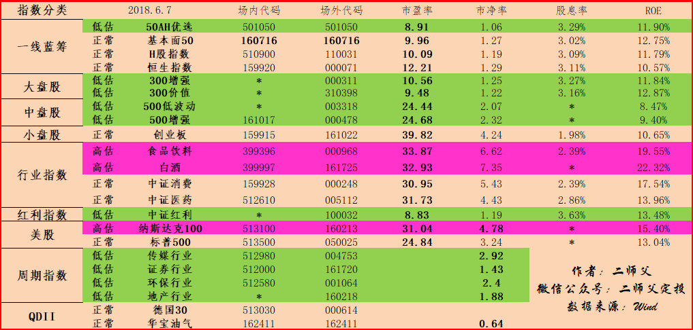

======================================================

_type: q&a
@琪琪[2421884541]
2018-06-08 10:46:23 Fri  
topic_id: 28221484548511

@琪琪

>  二师父，请问下除了您表中传媒，证券等主题基金，像现在在低位的国防这一类的基金，是否低估呢

@二师父

>  具体哪一只基金呢，只能具体到基金上

阅读[1042]  评论[3]  赞[0] 

======================================================

_type: talk
@二师父[28814221155551]
2018-06-08 13:51:28 Fri  
topic_id: 28221425141441

<e type="hashtag" hid="881251425252" title="#鳄鱼计划#" /> 证券买入一份，500增强买入一份。证券为周期指数，目前二师父持仓证券浮亏2.79个百分点，距离历史最大跌幅还有47个百分点，谨慎参考。注意控制好节奏。目前二师父存量资金，货币基金比指数基金为6比4。保证充足子弹，如果大盘下跌到3000点以下，货币基金持仓可以再减少到百分之50

@西费 at 2018-06-08 13:51:28 Fri

> 越跌越买啊，厉害

----------

@二师父 at 2018-06-08 13:51:28 Fri

> 逆向投资，在别人割肉的时候上，不过要控制节奏，分批买入

----------

@西费 at 2018-06-08 13:51:28 Fri

> 因个人原因准备下个月开始定投，先在这里学习。

----------

@孙健 at 2018-06-08 13:51:28 Fri

> 已经跟投，谢谢师傅

----------

@二师父 at 2018-06-08 13:51:28 Fri

> 注意将买入资金分散，不要把子弹打完了

----------

@孙健 at 2018-06-08 13:51:28 Fri

> 谢谢师傅，目前我资金和基金份额比6:1，采用定期不定额加鳄鱼计划

----------

@孙健 at 2018-06-08 13:51:28 Fri

> 请问师父，您在文中提到下跌到3000点以下，资金比例50%以下。难道3000点上方，您一直保证50%空仓吗？

----------

@二师父 at 2018-06-08 13:51:28 Fri

> 不是啊，百分之50放在货币基金里面，百分之50放在指数基金里面。当然，如果指数基金进一步低估，可以加大指数基金的持仓比例，这样说的意思是越低估指数基金持仓越多。我们的闲置资金不是不投资，而是买入货币基金或者银行理财

----------

阅读[1428]  评论[8]  赞[0] 

======================================================

_type: q&a
@康[48581124158228]
2018-06-08 18:51:50 Fri  
topic_id: 51558455215424

@康

>  师父，创业板有没有进入低估？有没有好的创业板指数基金呢？

@二师父

>  创业板快进入低估了，估值表里面推荐的就可以，现在可以开始小额建仓，再下跌就进入低估啦

阅读[1021]  评论[0]  赞[0] 

======================================================

_type: talk
@二师父[28814221155551]
2018-06-09 04:19:21 Sat  
topic_id: 28221445251841

创业板再下挫的话，想投资中小板的可以入了。

阅读[1402]  评论[0]  赞[0] 

+++++++++++++++++++++++++++++++++++++++++++++++++++++

文件：
2018-06-09 04:18:16 Sat
文件大小：[356173]
88881522588852-创业板投资价值分析.pdf

======================================================

_type: talk
@二师父[28814221155551]
2018-06-09 04:20:24 Sat  
topic_id: 48551224541818

<e type="hashtag" hid="281484214141" title="#6.8指数估值#" /> 不要恐惧，相信指数一定会涨起来，我们需要做的就是忍耐忍耐，按照纪律定投。

阅读[1391]  评论[0]  赞[0] 

+++++++++++++++++++++++++++++++++++++++++++++++++++++

图片：
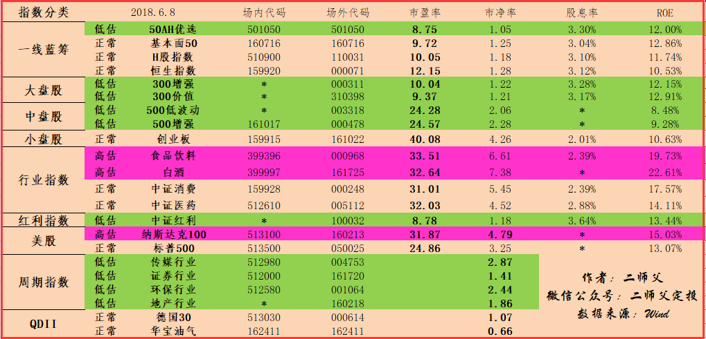

======================================================

_type: q&a
@艺晗[28282881811411]
2018-06-09 12:56:45 Sat  
topic_id: 51558441448454

@艺晗

>  请二师父对比一下建信央视50和50AH好吗，谢谢

@二师父

>  50ah要好一些的

阅读[1008]  评论[0]  赞[0] 

======================================================

_type: q&a
@波波[51541154455544]
2018-06-10 01:59:10 Sun  
topic_id: 48551214551188

@波波

>  中证养老指数能否加入估值表，低估？有投资价值？

@二师父

>  是低估的，不过有些持仓股票和医药重合了，就没加入

阅读[958]  评论[0]  赞[0] 

======================================================

_type: q&a
@陈Being[28845245224851]
2018-06-10 10:44:28 Sun  
topic_id: 48551212888528

@陈Being

>  麻烦二师傅老师看一下华宝香港中小盘501021是否低估了，与中证500持股是否有重复。

@二师父

>  高估了

阅读[968]  评论[0]  赞[0] 

======================================================

_type: talk
@二师父[28814221155551]
2018-06-10 13:16:34 Sun  
topic_id: 48551211422228

阅读[1361]  评论[0]  赞[0] 

+++++++++++++++++++++++++++++++++++++++++++++++++++++

文件：
2018-06-10 13:16:31 Sun
文件大小：[877302]
51118258545544-如何进行资产配置和仓位管理.pdf

======================================================

_type: q&a
@静默[48851544482828]
2018-06-10 13:22:26 Sun  
topic_id: 51558488244814

@静默

>  二师父好！富国中证红利指数增强和富国中证500指数增强有啥区别？

@二师父

>  一个是中证红利的增强基金，持仓股票和红利相近。一个是中证500的增强基金，持仓股票和中证500相近

阅读[1011]  评论[0]  赞[0] 

======================================================

_type: q&a
@高达无双喝味全[48851828182858]
2018-06-10 21:52:31 Sun  
topic_id: 28221152224841

@高达无双喝味全

>  请问师父每日基金估值的表，每只基金高估和低估的标准值是怎么判断的，估值正常的价格应该是多少？可以在表中加上么？是根据市盈率市净率Roe推算出来的吗？
>  两次最近的牛市08年和15年跨度7年 现在19年要按7年周期 还有3年 所以师父说按照三年的时间定投么？
>  小白问题师父见谅(๑>؂<๑）

@二师父

>  第一个问题，是根据市盈率和市净率综合判断的，如果指数调仓会有变化，正常估值就是橙色，低估是绿色，在前面文字已经标注啦。
>  第二个问题，三年不是这样算得，在08到15年之间，还有4万亿元出台，导致小牛市，3年是因为历史熊市最长时间是3年半，而且我们投资是在牛市进入熊市过一段时间开始，所以是3年

阅读[1388]  评论[2]  赞[0] 

======================================================

_type: talk
@二师父[28814221155551]
2018-06-11 04:08:05 Mon  
topic_id: 48551142221188

指数基金定投赚钱的五个思路

阅读[1388]  评论[0]  赞[0] 

+++++++++++++++++++++++++++++++++++++++++++++++++++++

文件：
2018-06-11 04:07:56 Mon
文件大小：[391954]
48881424445258-上证综指一直在3000点徘徊，我们如何赚钱.pdf

======================================================

_type: q&a
@八月猪妈妈[28245881548511]
2018-06-11 09:43:30 Mon  
topic_id: 51558828214154

@八月猪妈妈

>  二师傅，你好！医药指数就目前的估值适合定投吗？谢谢！

@二师父

>  你好，这个不适合，目前正常估值

阅读[999]  评论[1]  赞[0] 

======================================================

_type: talk
@二师父[28814221155551]
2018-06-11 14:22:42 Mon  
topic_id: 15412254488242

<e type="hashtag" hid="881251425252" title="#鳄鱼计划#" /> 500增强买入一份，目前最大跌幅百分之35，控制好节奏，个人操作，仅供参考，跟投需谨慎

@落叶无痕 at 2018-06-11 14:22:42 Mon

> 中证500跌了

----------

@落叶无痕 at 2018-06-11 14:22:42 Mon

> 我一直买这个的

----------

@二师父 at 2018-06-11 14:22:42 Mon

> 跌了就补仓，目前很低估了，二师父也是重仓这个

----------

@孙健 at 2018-06-11 14:22:42 Mon

> 我也跟师傅投了

----------

@落叶无痕 at 2018-06-11 14:22:42 Mon

> 嗯嗯，买了

----------

阅读[1400]  评论[5]  赞[0] 

======================================================

_type: q&a
@思念☆雙眸[88225224454522]
2018-06-11 16:07:49 Mon  
topic_id: 51542215848284

@思念☆雙眸

>  二师父重仓哪几只基金呢

@二师父

>  300增强，500增强，50ah，红利

阅读[1031]  评论[0]  赞[0] 

======================================================

_type: q&a
@康[48581124158228]
2018-06-11 22:04:16 Mon  
topic_id: 15412242181482

@康

>  师父，我想适当重仓500低波动，是否合适？

@二师父

>  可以，要按照定投的节奏来加仓

阅读[1046]  评论[0]  赞[0] 

======================================================

_type: talk
@二师父[28814221155551]
2018-06-12 04:37:11 Tue  
topic_id: 51542251841154

<e type="hashtag" hid="881481545442" title="#6.11指数估值#" /> 

今天大盘下跌，必然中的事情，大家资金都去抢独角兽了，哪还有钱护盘呢？

只是大盘永远突不破3000点，二师父心中隐隐作痛啊，还有百分之60的资金没有打入指数基金，难道就这样白白浪费？

涨不上去，跌不下来，真伤心。

可是，难道大盘一直处于3100点左右，投资指数就没有出路了吗？

非也，指数点位=市盈率*盈利。

按照中国目前的发展状况来讲，GDP增速是6.5个百分点左右。

那么，A股上市公司的优质企业的盈率增速是远高于这个数据的。

既然这样。你看看这个公式。指数点位不变，盈利增长，那么市盈率降低，指数基金越发的低估，越到后面投资价值越大。只需要积累份额就好啦。

有的读者还在担心，股市涨不上去了怎么办？

二师父觉得真多余，请记住，你生在中国，一个世界上独一无二的国家，拥有世界上最渴望暴富的一群人，没有之一。所以，你还担心啥呢？

好好定投吧。至于指数估值表怎么使用，二师父还是唠叨一下。首选300增强和500增强，其他的自己配置吧。

对了，除了估值表里面的基金其他的基金有没有投资价值呢？

有的读者问过二师父，二师父觉得有，只不过二师父没有买过，二师父买过的就是估值表里面的，现在没买未来也会买。

二师父不会把自己都不买的基金放出来，这不是坑人吗？

还有别跟投，实盘记录是二师父自己的操作，虽然未来5年是百分之99.99的概率赚钱，但是买入就长期浮亏的情况是常见的。

你万一跟投了，忍不住浮亏了，万一又急需用钱了，忍不住止损了，别骂我。我提醒过你，要忍得住，我也提醒过你，别跟投。

总之，只要忍得住，别乱加仓，别追高，别止损，在目前的指数点位投资指数基金还能够亏损，那么就一种情况，世界末日来了，我们都逃不了。

@victoria at 2018-06-12 04:37:11 Tue

> 二师父，独角兽基金值得买吗，你怎么看这些基金

----------

@勤能行之 at 2018-06-12 04:37:11 Tue

> 超赞师傅答疑解惑。

----------

@二师父 at 2018-06-12 04:37:11 Tue

> 已经分析啦，另外一篇文章，独角兽vs指数基金

----------

阅读[1483]  评论[3]  赞[0] 

+++++++++++++++++++++++++++++++++++++++++++++++++++++

图片：

======================================================

_type: talk
@二师父[28814221155551]
2018-06-12 04:38:36 Tue  
topic_id: 28245528148821

独角兽你买了嘛，PK下

@琴 at 2018-06-12 04:38:36 Tue

> 二师父分析的帅，人多的地方不要去！[呲牙][呲牙]

----------

阅读[1487]  评论[1]  赞[0] 

+++++++++++++++++++++++++++++++++++++++++++++++++++++

文件：
2018-06-12 04:38:30 Tue
文件大小：[381960]
48881424112858-独角兽VS指数基金.pdf

======================================================

_type: talk
@🇨🇳竞自由[15448124228212]
2018-06-12 09:52:50 Tue  
topic_id: 51542255852214

只为体验韭菜的感受！[偷笑][偷笑][偷笑]

@🇨🇳竞自由 at 2018-06-12 09:52:50 Tue

> 师父不在么？看看我入独角兽基金的情况，哈哈哈

----------

@孙健 at 2018-06-12 09:52:50 Tue

> 真是高手，没准每股变成100万呢

----------

@🇨🇳竞自由 at 2018-06-12 09:52:50 Tue

> 其实我是想看能不能全部归零，娱乐为上，[愉快][愉快]

----------

@二师父 at 2018-06-12 09:52:50 Tue

> 也许暴涨到10万[偷笑]

----------

阅读[1013]  评论[4]  赞[0] 

+++++++++++++++++++++++++++++++++++++++++++++++++++++

图片：
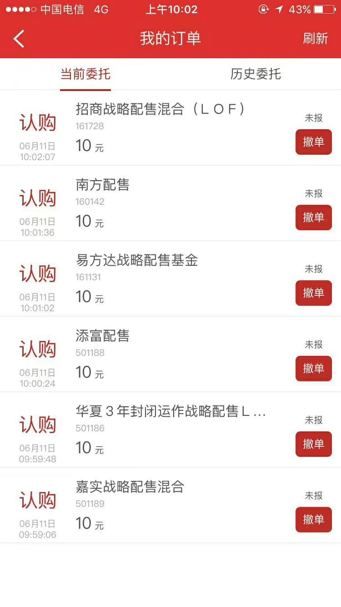

======================================================

_type: q&a
@🇨🇳竞自由[15448124228212]
2018-06-12 12:36:08 Tue  
topic_id: 88245522115212

@🇨🇳竞自由

>  师父，创业板指最近跌的人想入非非，想建底仓了，请问:投创业板指数好还是创业板50好？具体的就是投161022和160420的区别？请指教，谢谢！师父会不会入这个呢？

@二师父

>  创业板好，现在用最小的金额建底仓也可以。不过二师父会等到创业板到达低估以后开始买

阅读[1060]  评论[2]  赞[0] 

======================================================

_type: q&a
@🇨🇳竞自由[15448124228212]
2018-06-12 12:36:26 Tue  
topic_id: 28245522154411

@🇨🇳竞自由

>  师父，我来了，愿于你同行，收获快乐！

@二师父

>  好哒，一起前进

阅读[1100]  评论[0]  赞[0] 

======================================================

_type: talk
@海盗[48248118584848]
2018-06-12 19:43:20 Tue  
topic_id: 48524425455418

第一天加入，多多指教

@二师父 at 2018-06-12 19:43:20 Tue

> 一起学习进步

----------

阅读[1009]  评论[1]  赞[0] 

======================================================

_type: q&a
@海盗[48248118584848]
2018-06-12 19:49:22 Tue  
topic_id: 51542245254184

@海盗

>  二师傅，我就试试能提问不？😃

@二师父

>  能的，就这样操作，大家一起学习进步，先看看往期的精华，里面很多问题都回答过了

阅读[1094]  评论[0]  赞[0] 

======================================================

_type: talk
@二师父[28814221155551]
2018-06-13 02:40:58 Wed  
topic_id: 48524414824218

<e type="hashtag" hid="281481841841" title="#6.12指数估值#" /> 最近消费和白酒涨幅惊人，提醒一句，不要买。如果有的话可以耐心持有慢慢减仓。

最近的市场环境不太好，跌不下去，涨不起来，非常考验人的耐性。

今日很多指数基金上涨，目前除了券商浮亏4个点以外，其它的均盈利。雪球上券商妹还一直艾特我，可能是感谢我托盘了吧。只可惜本人自己量极少，根本托不起啊。

还是聊聊日常，自从走上了指数基金投资之路自己的心态也是越来越好啦。

很多人都在怀疑指数基金能不能赚钱，二师父告诉你能。

至于主动基金，二师父曾经买过，而且是优质基金公司的优质基金经理打理的，可是你知道发生什么吗？基金经理被换掉了。

这种黑天鹅真是大的二师父措手不及啊。从此之后，二师父就走上了指数基金定投之路，因为投资指数基金根本不用考虑基金经理，即使基金经理被换掉了，指数基金的持仓股票也不会换。

正是因为这样，在券商如此低估的程度还不断下跌的情况下，二师父也是买买买。当然，这是周期指数，投资需谨慎。

还有另外的一点就是自己通过购买股票来建立自己的指数基金，这种最好玩，我要超越坑爹的基金经理。目前正在学习中，估值容易判断，可是买入和卖出系统的建立还需要时间。当然啦，投资指数基金才是王道，这只是业余爱好。
二师父喜欢研究，研究探索使我快乐。

面对目前的市场情况，二师父还是那句常说的话，按照自己的节奏定投，不要一下子打完子弹，也不要因为恐惧而止步不前，学会坚持付出，你走过的路，付出的汗水终将会给你回报。

你要相信这个世界是守恒的。

@🇨🇳竞自由 at 2018-06-13 02:40:58 Wed

> 昨天问了师父创业板的问题，今文章中就体现了，哈哈，手动点赞！其实我跟你一样，也是建了底仓，等低估啊！创业板是我最期待的定投之一

----------

@二师父 at 2018-06-13 02:40:58 Wed

> 不错不错，涨起来没有天花板

----------

@J-YC at 2018-06-13 02:40:58 Wed

> 军工和养老怎么没了呀？

----------

@二师父 at 2018-06-13 02:40:58 Wed

> 养老和医药的部分股票重合，军工重资产企业，不如消费这些轻资产企业

----------

@J-YC at 2018-06-13 02:40:58 Wed

> 额，那现在持有的呢？没有锚了

----------

@二师父 at 2018-06-13 02:40:58 Wed

> 继续持有，盈利之后逐渐减仓

----------

@J-YC at 2018-06-13 02:40:58 Wed

> 好的

----------

阅读[1517]  评论[7]  赞[0] 

+++++++++++++++++++++++++++++++++++++++++++++++++++++

图片：
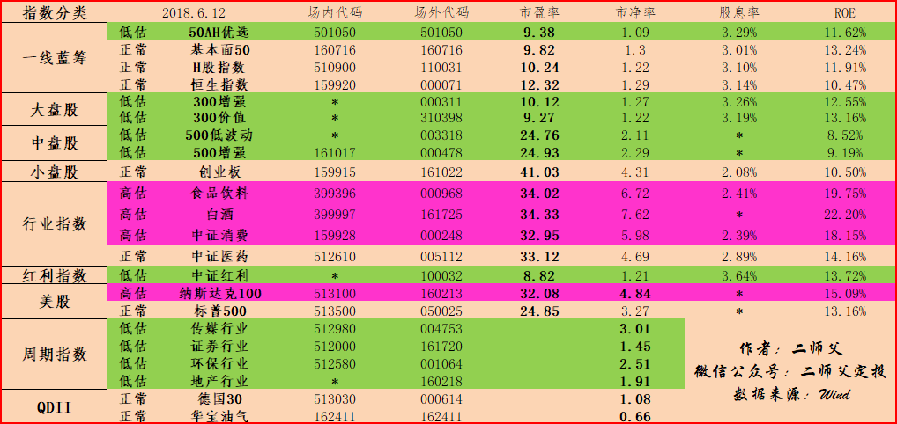

======================================================

_type: talk
@二师父[28814221155551]
2018-06-13 02:41:57 Wed  
topic_id: 48524414824148

你对15年股灾还有印象吗？给你最深刻的教训是什么

阅读[1511]  评论[0]  赞[0] 

+++++++++++++++++++++++++++++++++++++++++++++++++++++

文件：
2018-06-13 02:41:52 Wed
文件大小：[373666]
28881548152451-股灾三周年，谈谈风险.pdf

======================================================

_type: q&a
@云淡风轻[28281845224241]
2018-06-13 09:01:12 Wed  
topic_id: 88245515154882

@云淡风轻

>  二师父好，您推荐的低估价的基金我基本都买了一些，去年年底同事推荐的易方达消费行业股票基金，当时持仓价格是2.4877，昨天上涨了持仓价格是2.5550，等了半年了终于等回了本，想问问您的建议现在是否应该卖了，因为当时买的价格并不低啊

@二师父

>  我看了下持仓股票，美的，茅台，五粮液，格力，泸州老窖，重仓股集中是必须消费和可选消费，目前高估，风险比较高，但是这些都是好企业，基本面良好，股票没问题，你可以分步卖出，千万别重仓，你看酒类已经连涨4年，很高的位置了

阅读[1126]  评论[1]  赞[0] 

======================================================

_type: q&a
@lazay[51154815284224]
2018-06-13 13:43:58 Wed  
topic_id: 28245514112281

@lazay

>  二师父你好，我想问一下，我定投了500E丅F基金，现在亏了5个多点，它的估值如何，是否继续定投？

@二师父

>  中证500啊，刚刚进入低估，下跌的话可以投，现在浮亏的原因是正常估值你就开始投了，二师父目前500增强是浮盈的，不过因为低估，也在定投，此时千万别止损

阅读[1162]  评论[0]  赞[0] 

======================================================

_type: q&a
@注意要低调[28482555282511]
2018-06-13 15:48:38 Wed  
topic_id: 51542288512444

@注意要低调

>  二师父你好，我是刚接触基金的新手，学习了你的方法，受益匪浅！请问我想定投300增强和500增强，再加个中证红利可以吗？红利是不是和其它两个有重叠？然后基金公司二师父有推荐吗？易方达和富国靠谱吗？

@二师父

>  有小部分重叠，没关系的，红利目前非常低估，可以定投，而且二师父买的是红利增强，比红利好。富国，易方达，广发都可以，推荐二师父估值表里面的代码

阅读[1176]  评论[1]  赞[0] 

======================================================

_type: q&a
@海盗[48248118584848]
2018-06-13 16:17:28 Wed  
topic_id: 88245511421482

@海盗

>  师傅，不忙的时候给看下，值得去关注不？不知道师傅接触过这种定投没有？

@二师父

>  我怎么看着像是软文，跟基金平台合作的

阅读[1187]  评论[1]  赞[0] 

======================================================

_type: q&a
@海盗[48248118584848]
2018-06-13 19:40:14 Wed  
topic_id: 48524844554288

@海盗

>  二师父，你好！想请教一些知识。
>  这个图是二师父推荐的周期指数证券行业161720的以往业绩，为什么这么差的业绩能当作定投投资标的，只要估值低就可以不看过往业绩吗？还是还有什么其他依据？本人小白一枚，自己不能理解，望二师父能给以解答。

@二师父

>  这就是周期行业的特性，当处于弱周期的时候自然一路下跌，你也可以看看指数成立以来的走势图，就知道这个指数也有大涨的，不能只看最近3年，15年的牛市结束刚好这只基金大跌了三年，现在处于弱周期投资等待牛周期的到来。当然，新手不建议投资周期指数

阅读[1205]  评论[1]  赞[0] 

======================================================

_type: talk
@二师父[28814221155551]
2018-06-14 02:05:19 Thu  
topic_id: 51542124454444

<e type="hashtag" hid="518418148144" title="#6.13指数估值#" /> 最近大盘跌，正常。毕竟很多人赎回资金购买独角兽了。

有的读者问二师父加仓没，二师父铁定告诉你，没有加仓。如果加仓了的话，会在学堂提前公布的，答应大家的事情就会做到。

其实二师父现在除了晚上做估值表看看大盘查查数据以外，根本不看大盘是涨还是跌的。

不知道二师父推荐的《巴菲特之道》你们仔细读过没有，看看老巴多久看一次盘。

不看盘会让你的投资成绩更好。只是有的人看不进去。

记得二师父第一次说自己要手动定投加仓的时候，有一位读者告诉二师父，小心站岗。

结果现在，这位读者不仅不说二师父会站岗了，而且他自己在大盘或者指数跌一点就不断加仓还呼吁广大读者加仓。

大家可以看看，同样的一个事物，同样的一个人，在不同时候就得到两种不同的结论，关键是，他总认为自己是对的。

二师父很敬畏这个市场，股市变化莫测，也许过去的经验未来就用不到了，所以二师父每天都在思考来完善自己的投资系统，以求自己的投资系统能够抵御任何风险。

另外二师父得说一点，股票投资比基金投资复杂多了，如果在入市前没有建立自己的投资原则，不知道股票为什么上涨，不知道何时买入，不知道何时卖出。请不要买。

即使投资大神都有可能判断失误的。今天偶然看到大神小小辛巴关于顺鑫农业的复盘，他坦诚了自己的错误。二师父觉得，这种投资大神都会在股票市场犯错误，我们没有经过系统学习的投资小白进入市场不就是被人割韭菜的嘛？

所以，新手建议从指数基金入手，通过定投搞明白股市涨跌的原因。如果还有精力，再从基本面入手研究上市公司，用买企业股权的思维来买股票。

@Sherwood at 2018-06-14 02:05:19 Thu

> 二师傅，那几个市盈率和市净率估值是从哪里得来的还是自己算的？

----------

@赵💙 at 2018-06-14 02:05:19 Thu

> 二师傅给的网站可以查

----------

阅读[1553]  评论[2]  赞[0] 

+++++++++++++++++++++++++++++++++++++++++++++++++++++

图片：
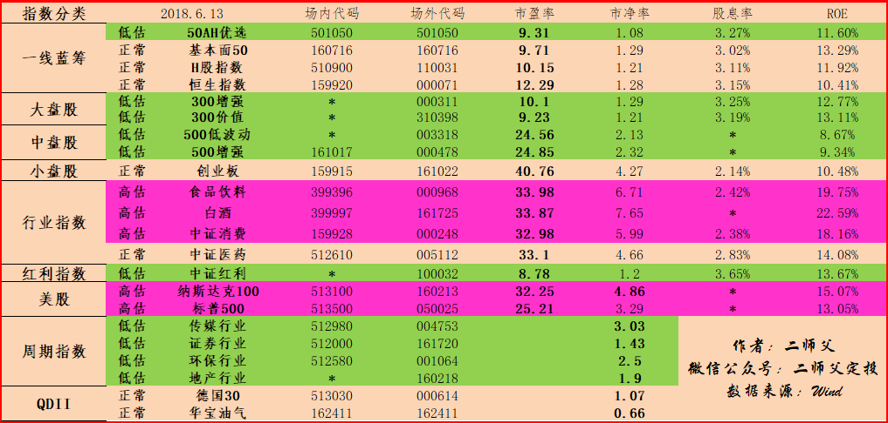

======================================================

_type: talk
@二师父[28814221155551]
2018-06-14 02:09:03 Thu  
topic_id: 15412521141882

@海盗 at 2018-06-14 02:09:03 Thu

> 二师父辛苦了，注意休息

----------

@🇨🇳竞自由 at 2018-06-14 02:09:03 Thu

> 谢谢师父，总是有求必应

----------

阅读[1569]  评论[2]  赞[0] 

+++++++++++++++++++++++++++++++++++++++++++++++++++++

文件：
2018-06-14 02:09:01 Thu
文件大小：[337415]
48881421412128-估值是投资的艺术.pdf

======================================================

_type: q&a
@海盗[48248118584848]
2018-06-14 10:48:52 Thu  
topic_id: 15412528528142

@海盗

>  二师父，您好！我打算重新选择定投标的，想请您参考一下如果想定投三只基金的话，在您推荐低估表里，选择哪三只比较适合？

@二师父

>  目前推荐中证红利，500增强，300增强

阅读[1158]  评论[1]  赞[0] 

======================================================

_type: q&a
@慧医生[15451285824822]
2018-06-14 10:49:34 Thu  
topic_id: 48524841152228

@慧医生

>  请教一下，华夏 嘉实的指数基金我想定投几个，想咨询一下，推荐一下好吗？

@二师父

>  就用估值表里面的中盘股和红利股指数，最佳

阅读[1173]  评论[0]  赞[0] 

======================================================

_type: talk
@二师父[28814221155551]
2018-06-14 11:00:46 Thu  
topic_id: 15412555118212

<e type="hashtag" hid="158158122522" title="#鳄鱼计划和定投实盘#" />  两者一起公布了，目前二师父主投的500增强和300增强均浮盈，所以买入500增强0.5份，300增强0.5份。另外传媒买入一份。

这都对应了估值表里面的代码，场内买入选择场内代码，场外申购选择场外代码。

提醒，目前各种利空因素，不要把自己吓到了，该买入就要大胆买入，不要祈求最低点。我们应该利用微笑定投曲线来获利。

当然，不要盲目加仓，这也是一种贪婪，谁也不知道指数会不会进一步下挫，我们必须做好防范。

就像买保险一样，很多时候意外没有发生，但是还得买，做最好的保障。

大家一起学习，相互帮助，如果二师父的文章对你有启发，那是咱们的缘分，你不用感谢我，不过要将二师父的文章和理念传播出去，让更多的人能够获益。

这是一个合作共赢的时代，任何单打独斗的人不会取得成功。而且投资是一个正和游戏，只有了解指数基金定投的人越多，价值投资的人越多，A股市场才会更加规范，我们才能够获得更大的收益。

学会合作，学会分享，学会共赢思维。

@孙健 at 2018-06-14 11:00:46 Thu

> 师傅，您的操作我这么看，对么？500增强和300增强属于定投，传媒属于鳄鱼计划？

----------

@西费 at 2018-06-14 11:00:46 Thu

> 又到定投日，准备提前开始定投计划了

----------

@二师父 at 2018-06-14 11:00:46 Thu

> 对

----------

@孙健 at 2018-06-14 11:00:46 Thu

> 另外，传媒的低估，高估阈值是多少？

----------

@二师父 at 2018-06-14 11:00:46 Thu

> 低估阀值3.3

----------

@孙健 at 2018-06-14 11:00:46 Thu

> 请问高估呢？

----------

@二师父 at 2018-06-14 11:00:46 Thu

> 高估还早着呢，传媒估值被杀的厉害

----------

@孙健 at 2018-06-14 11:00:46 Thu

> 我做个记录，后面好操作

----------

阅读[1725]  评论[10]  赞[0] 

======================================================

_type: q&a
@注意要低调[28482555282511]
2018-06-14 14:01:51 Thu  
topic_id: 51542115142844

@注意要低调

>  二师父，你好，中兴通信已经复牌了，你觉得跌完这一波后的中兴通讯的底可以抄吗？工作相关，所以一直关注中兴通讯

@二师父

>  股票不做具体建议哈，我先研究研究再一起探讨

阅读[1191]  评论[1]  赞[0] 

======================================================

_type: q&a
@幽幽菊花茶[51425212482114]
2018-06-14 21:40:45 Thu  
topic_id: 48524854112828

@幽幽菊花茶

>  二师父您好，定投是每天定期定额还是慧定投更好些，想听听师父的建议；还有我以前投了南方策略优化，一直在亏，转换好还是一直持有，我想停止定投但不想卖出，可没找到这个操作，师父也给个建议吧

@二师父

>  如果停止投资的话，暂停就可以啦，建议投资指数基金，用慧定投，定期不定额，只要在低估区域就不停止扣款，等到正常估值停止扣款

阅读[1153]  评论[0]  赞[0] 

======================================================

_type: talk
@二师父[28814221155551]
2018-06-15 04:24:36 Fri  
topic_id: 88245822585412

借用了一个读者的交易图，给大家分享下亏损的原因，一定要避免

@海盗 at 2018-06-15 04:24:36 Fri

> 二师父，咋没见图

----------

@二师父 at 2018-06-15 04:24:36 Fri

> 现在看到了吧网络有点故障

----------

@海盗 at 2018-06-15 04:24:36 Fri

> 看到了

----------

阅读[1500]  评论[3]  赞[0] 

+++++++++++++++++++++++++++++++++++++++++++++++++++++

文件：
2018-06-15 05:02:16 Fri
文件大小：[466791]
28881515885811-定投指数基金亏损的根本原因.pdf

======================================================

_type: talk
@二师父[28814221155551]
2018-06-15 04:26:27 Fri  
topic_id: 48524855484148

<e type="hashtag" hid="481281211828" title="#6.14指数估值#" /> 
一、今日市场分析

6月14日，美联储再次宣布加息25个基点，全球股市一片动荡。

在香港上市的李宁跌幅百分之8.1，创下了2012年以来最高的单日跌幅。

上证综指3044.5点收盘，破了今年大盘的最低点位。

各大指数也是一路下跌，创业板也开始进入了低估。

二师父附上一张图，三月份的创业板，那个时候有人推荐，不知道有没有读者开始投资了吗？

这是学堂一名读者的提问，见附件图片，二师父当时的解答是没有到达安全边际坚决不投资。果然，我们没有错过创业板的投资机会，反而是越来越低估了。

现在创业板进入低估，不知道还有谁有兴趣吗？目前已经恐惧了，市场上再也没人预测创业板会涨了，二师父说快要低估还有人骂二师父说二师父水平不行。

我想，从这种种迹象来看，创业板已经到达了人人抛弃的地步。从数据分析，创业板已经低估。那么有需要的同学可以开始定投了。

当然创业板从此刻到历史最大跌幅仍旧有百分之43的跌幅，需要慢慢买入，不要着急。万一你怕大涨，也可以采用五档买入法，因人而异的。

要警惕美国加息，根据金融市场的规律，一般美元加息都会导致美元上涨，而强美元最终会导致各种危机。

1983年强美元导致拉美债务危机，1997年强美元导致亚洲金融海啸。2008年强美元导致世界金融风暴。

我们必须警惕，防范于未然。当然目前美元兑人民币的汇率是1：6.39，不是很强势，不过也不能够放松警惕，毕竟美国打一个喷嚏世界也要抖三抖。

二、当前市场环境我们如何应对

二师父认为即使爆发危机也不用担心，因为利空导致的指数基金下跌反而给我们提供了投资的机会。让我们可以以更加低廉的价格买入我们心仪的指数基金。

二师父此前多此强调一句话，在投资之前请务必熟读五步定投法，尤其是资产配置，这非常重要。

现在你明白为什么重要了吗？保证子弹的充足性，我们不缺赚钱的机会，但是机会来临的时候可能缺乏子弹。

继续按照纪律定投，目前没有到抄底的时刻，忍住就是王道。指数基金百分之43的仓位，即使大盘此刻扭头上涨我们也能够赚取丰厚的利润。学会平衡，这是最重要的。

三、二师父最近交易和学习情况的总结。

目前二师父持仓总体浮盈6个百分点，算上货币基金浮盈11个百分点，最大亏损是券商，浮亏5个百分点。本来还是有些难受的，可是看了看大V的浮亏情况，二师父稍有安慰。

最近操作都是非常理性，严格按照纪律，因为方便操错，定投实盘和鳄鱼计划的操作合在了一个账户里面。希望能够继续保持。

持有的股票消费和医药目前情况不错，基本面也不错，如果没有基本面恶化的情况继续持有。持有的民生银行在前日浮亏八个百分点的时候止损了

股票投资不同于指数，需要止损，幸运的是，股票一直轻仓，而且股票投资系统二师父没有完全建立，二师父的民生只买了二手，大概亏了接近200元。小事情。

这次给我的启发是公司基本面有问题的坚决不能入，每股收益增长率不行的公司也不能入。而且一定要自己判断，二师父就是自己分析了下银行的估值处于低位，而且某大V一直推荐，好几年了。

当然不排除卖出以后上涨的情况，不过二师父的股票投资系统是需要止损的，你可以看看股票亏损百分之80都是很平常的事情，做投资需要按照原则。

看看卖出民生以后算是正确的操作了，至少避免了后续的继续亏损。如果继续持有，目前已经浮亏十几个百分点了。至于买入时候就犯的错误那就需要以后谨慎买入了，一点点学费还是要交的。

不足之处可能网络信息繁杂，偶尔各种声音会导致人稍有浮躁。今后需要更加专注，专心研究指数基金，研究市场上各种政策以及从分散到集中开始研究股票。投资指数基金的时候也要分析基金重仓股票的基本面及未来现金流折现，看看持仓股票的成长性。

最近读的书是《大国的博弈》、《投资中最重要的事》、《红楼梦》，继续努力学习，认真写文分享，和各位读者一起学习共同进步。

投资之路上一个人走的快，但是一群人走的远，二师父定投的读者会一直一起走。

@🇨🇳竞自由 at 2018-06-15 04:26:27 Fri

> 师父，创业板低估等的好难啊，但相对还在高位，我己开始了定投，不过采取的是不定时不定额的投法[拳头][拳头][拳头]

----------

@勤能行之 at 2018-06-15 04:26:27 Fri

> 师傅，五档买入法是怎样的呀

----------

@勤能行之 at 2018-06-15 04:26:27 Fri

> 写的真实在的文章！

----------

@二师父 at 2018-06-15 04:26:27 Fri

> 每下跌6个百分点设置一个档位。下跌6个百分点买入1000，再下跌6个百分点买入1500，这样以此类推，总共设置5档

----------

@孙健 at 2018-06-15 04:26:27 Fri

> 请问，再下跌6个百分点买入2000，还是2250？

----------

@二师父 at 2018-06-15 04:26:27 Fri

> 这个没啥差别啦，主要是加仓的思路

----------

@孙健 at 2018-06-15 04:26:27 Fri

> OK

----------

阅读[1632]  评论[7]  赞[0] 

+++++++++++++++++++++++++++++++++++++++++++++++++++++

图片：

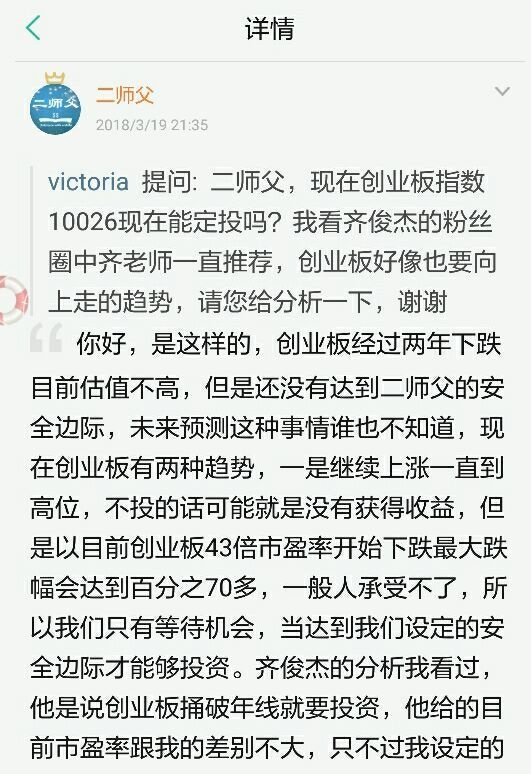

======================================================

_type: talk
@落叶无痕[15458288444122]
2018-06-15 11:40:02 Fri  
topic_id: 28245845548151

二师父，今天大跌，鳄鱼计划今天不出动么

@二师父 at 2018-06-15 11:40:02 Fri

> 不动了，昨天已加。自己可以根据情况来，今天跌了不少

----------

@落叶无痕 at 2018-06-15 11:40:02 Fri

> 👌

----------

阅读[1078]  评论[2]  赞[0] 

======================================================

_type: q&a
@波波[51541154455544]
2018-06-15 15:07:14 Fri  
topic_id: 88245845422442

@波波

>  师傅，怎么知道今天三点前传媒基金的实时行情？

@二师父

>  在蚂蚁财富，实时走势可以看到

阅读[1117]  评论[0]  赞[0] 

======================================================

_type: q&a
@=左手温度[28221888512841]
2018-06-15 15:07:29 Fri  
topic_id: 28245845442511

@=左手温度

>  二师父，标普红利现在还能买吗?表中怎么找不到了

@二师父

>  可以买，目前仍旧低估呢

阅读[1178]  评论[0]  赞[0] 

======================================================

_type: talk
@二师父[28814221155551]
2018-06-16 02:14:51 Sat  
topic_id: 28245841151841

传授几招，帮你应对熊市

@空白 at 2018-06-16 02:14:51 Sat

> 二师父定投的啥地产指数啊

----------

@二师父 at 2018-06-16 02:14:51 Sat

> 每日发布的估值表里面有啊

----------

阅读[1515]  评论[2]  赞[0] 

+++++++++++++++++++++++++++++++++++++++++++++++++++++

文件：
2018-06-16 02:14:45 Sat
文件大小：[350998]
88881515111282-应对熊市的法宝.pdf

======================================================

_type: talk
@二师父[28814221155551]
2018-06-16 02:15:33 Sat  
topic_id: 48524821141588

<e type="hashtag" hid="158158844512" title="#6.15指数估值#" />

@Sherwood at 2018-06-16 02:15:33 Sat

> 中证1000创业板还要低，应该也算低估吧

----------

@Sherwood at 2018-06-16 02:15:33 Sat

> 另外标普A股红利机会指数目前也应该算低估的，综合大小盘均衡因素的话，应该比中证红利还要低。

----------

@二师父 at 2018-06-16 02:15:33 Sat

> 算，1000和红利都算。1000的市值太小

----------

@Tim哥 at 2018-06-16 02:15:33 Sat

> 标普红利我是重仓

----------

阅读[1564]  评论[4]  赞[0] 

+++++++++++++++++++++++++++++++++++++++++++++++++++++

图片：
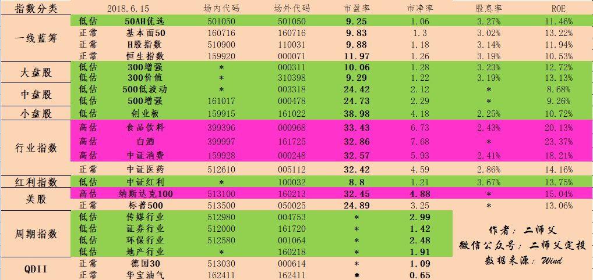

======================================================

_type: q&a
@Dave Pan[48544144525548]
2018-06-16 09:02:41 Sat  
topic_id: 51542182218524

@Dave Pan

>  二师傅，你好！要实现风险对冲，最好A股，美大宗股，港股，大宗商品，都配置一些。但美大宗股，港股，大宗商品的估值并没有到低估，不能开始定投。岂不是无法分散A股的系统性风险了？请解惑，谢谢！

@二师父

>  可以的，大盘股和中盘股能够实现小部分对冲，还有港股，只是时机没来啊。现在a股便宜买a股，未来美股便宜买美股，能对冲风险的

阅读[1236]  评论[0]  赞[0] 

======================================================

_type: q&a
@超级奶爸[48528544118258]
2018-06-16 14:39:28 Sat  
topic_id: 88245815122842

@超级奶爸

>  二师父，都说"五穷六绝七翻身"最近两周大盘不好，指数也跌了不少，我将平时定投的资金提升了一倍。然鹅，我也不知道啥时候指数到底，这种加倍的定投该何时恢复正常？

@二师父

>  我还没加倍，等破了3000点加倍，熊市的残酷只有经历了才知道。可以看看01到05，10到14历史大熊

阅读[1252]  评论[2]  赞[0] 

======================================================

_type: q&a
@海盗[48248118584848]
2018-06-16 19:58:11 Sat  
topic_id: 28245211585811

@海盗

>  二师父，您好！
>  能讲解一下什么是  鳄鱼计划   吗？

@二师父

>  以前有个定投实盘文章介绍过，你看看精华里面有

阅读[1345]  评论[7]  赞[0] 

======================================================

_type: talk
@二师父[28814221155551]
2018-06-17 03:29:05 Sun  
topic_id: 48524244825248

@海盗 at 2018-06-17 03:29:05 Sun

> 写得一针见血，干货满满💪

----------

@Tim哥 at 2018-06-17 03:29:05 Sun

> 考验耐心的时候

----------

阅读[1660]  评论[2]  赞[0] 

+++++++++++++++++++++++++++++++++++++++++++++++++++++

文件：
2018-06-17 03:27:48 Sun
文件大小：[327614]
15558281251552-再谈投资中遵守规则的重要性.pdf

======================================================

_type: q&a
@琪琪[2421884541]
2018-06-17 15:15:01 Sun  
topic_id: 15412121422542

@琪琪

>  二师父，现在整个货币层面看起来都非常紧张，资金面紧张是很难推动行情，二师父对此怎么看？

@二师父

>  对的，从盘面看，上升乏力

阅读[1259]  评论[0]  赞[0] 

======================================================

_type: q&a
@健哥[51511242852814]
2018-06-18 00:14:44 Mon  
topic_id: 88245485581222

@健哥

>  老师，上证50(110003)和50Ah哪个更好一点呢?

@二师父

>  50ah好一些的

阅读[1272]  评论[0]  赞[0] 

======================================================

_type: talk
@二师父[28814221155551]
2018-06-18 02:30:30 Mon  
topic_id: 51542412142244

@海盗 at 2018-06-18 02:30:30 Mon

> 二师父分析的很详细，解说的也很到位。一下子解开了我心中很多的疑惑，多谢二师父！[强]

----------

阅读[1300]  评论[1]  赞[0] 

+++++++++++++++++++++++++++++++++++++++++++++++++++++

文件：
2018-06-18 02:30:26 Mon
文件大小：[318271]
88881514452122-基金定投需要止损吗.pdf

======================================================

_type: talk
@二师父[28814221155551]
2018-06-18 02:31:56 Mon  
topic_id: 51542412142284

二师父开始逐步集中研究个股，未成型的交易系统，准备拿出部分资金检验交易系统，并最终确立股票投资原则和交易系统，大家可以各抒己见。投资新手不建议投资股票，定投指数基金即可活得客观的收益率。

@小涛@我的四季生活 at 2018-06-18 02:31:56 Mon

> 二师傅是不是准备建立量化模型？

----------

@二师父 at 2018-06-18 02:31:56 Mon

> 定性与定量同时，定性分析基本面，企业价值，建立股票池，定量来排除非量化模型的股票，以及根据数据分析卖出。二者结合

----------

@小涛@我的四季生活 at 2018-06-18 02:31:56 Mon

> 不错，我也想学[微笑]

----------

阅读[1402]  评论[3]  赞[0] 

+++++++++++++++++++++++++++++++++++++++++++++++++++++

文件：
2018-06-18 02:30:39 Mon
文件大小：[23982]
15558281124812-二师父股票投资遵循的规则.docx

======================================================

_type: q&a
@健哥[51511242852814]
2018-06-18 18:43:08 Mon  
topic_id: 51542414851414

@健哥

>  二师父，我现在准备用存量资金42000来定投4支指数:中证红利、沪深300增强、中证500增强和上证50AH，每月定投500元。但是又怕之后，没有多余金额来加仓，或超出预算金额。如果每月再成少，又赚每支定投金额太少。这42000是不需要用的钱，近一、二年会凑其他钱，两年后会有剩余资金。老师能说一下我应该正常每月每支投多少钱合适吗？投几支合适呢？100032是养老长期定投。谢谢!

@二师父

>  每月定投的话每份300比较合适，当然也看个人的增量资金水平。二师父预计未来三年之内会有一次大底，a股有一次牛市。不要怕资金量投入过少，要把仓位控制在合理范围内。什么是合理范围内呢？吃得下饭，睡得着觉，笑得出来，这个标准就可以

阅读[1721]  评论[5]  赞[0] 

======================================================

_type: q&a
@健哥[51511242852814]
2018-06-18 21:18:40 Mon  
topic_id: 48524281858458

@健哥

>  二师傅如何看待这个养老定投计划:
>  定投目的:养老辅助备用金
>  定投标的:富国中证红利指数增强
>  定投年限:24年，60岁
>  定投金额:500元/每月16号
>  定投策略:
>  1.分红方式改为红利再投资，坚持退休前只进不出。退休后，改为现金分红，靠分红来维持开销，如不够用再赎回部分资金。
>  2、定投策略:
>  市盈率<12   正常定投
>  市盈率<8 加码定投
>  12<市盈率<18   停止定投(扣款暂扣在一支货币基金里)
>  市盈率>18   每月赎回10%(扣款暂扣在一支货币基金里)
>  3、停止定投或每月赎回时，扣款暂扣在一支货币基金里，以后逢低加入这只基金。(前5年不执行此策略)
>  市盈率以中证指数公司为准。

@二师父

>  挺好的策略，我设置的是10倍到16倍市盈率估值区间。然后就是高估区域每月减仓百分之10这里需要灵活，如果到达历史高位，可以减的更多一点。因为a股是波动性很大的市场。还有一点，如果将来a股变成了成熟的慢牛市场，那么一次投资比定投效果好一些，那时候就要改变策略，未来24年也许会出现那样的一天，我们必须根据实际随时调整。计划非常不错。点个赞

阅读[1700]  评论[6]  赞[0] 

======================================================

_type: talk
@二师父[28814221155551]
2018-06-19 03:19:02 Tue  
topic_id: 48524258181858

坚定入场定投

@落叶无痕 at 2018-06-19 03:19:02 Tue

> 二师父，今天又大跌，好怕怕，都过3000点了

----------

@二师父 at 2018-06-19 03:19:02 Tue

> 已加

----------

@落叶无痕 at 2018-06-19 03:19:02 Tue

> [OK]

----------

阅读[1656]  评论[3]  赞[0] 

+++++++++++++++++++++++++++++++++++++++++++++++++++++

文件：
2018-06-19 03:18:45 Tue
文件大小：[319870]
48881411422458-3000点无论破不破，我们都要坚持定投.pdf

======================================================

_type: talk
@二师父[28814221155551]
2018-06-19 12:34:42 Tue  
topic_id: 28245424811441

<e type="hashtag" hid="881251425252" title="#鳄鱼计划#" /> 买入500增强2份，300增强一份，慢慢买，不要急，之前有人说二师父60个点的货币基金持仓会不会高，现在作用体现了，防风险。市场大跌，估计每个人心理不好受，坚定定投才是王道。

@顾。 at 2018-06-19 12:34:42 Tue

> 请问二师父，以前是每日等额定投300价值，然后再根据你的鳄鱼计划跟着加仓。现在看你改成300增强了，那我是要把300价值的定投停止，重新定投300增强吗？谢谢！

----------

@二师父 at 2018-06-19 12:34:42 Tue

> 300价值也可以，二者选择一个就行，不用换

----------

@顾。 at 2018-06-19 12:34:42 Tue

> 嗯 好的～ 谢谢！

----------

@健哥 at 2018-06-19 12:34:42 Tue

> 请问二师父，鳄鱼计算划是只加仓两只基金吗

----------

@二师父 at 2018-06-19 12:34:42 Tue

> 你可以根据实际情况加

----------

@勤能行之 at 2018-06-19 12:34:42 Tue

> 已跟

----------

@健哥 at 2018-06-19 12:34:42 Tue

> 跟着老师走就行

----------

@西费 at 2018-06-19 12:34:42 Tue

> 我也主动买入了一份300增强

----------

阅读[1539]  评论[8]  赞[0] 

======================================================

_type: q&a
@超级奶爸[48528544118258]
2018-06-19 12:35:43 Tue  
topic_id: 88245422881412

@超级奶爸

>  二师父，2015年的时候，大盘高位指数基金公司会不会降低每日买入限额？大盘暴跌，股票千股跌停的时候赎回，这时候赎回有没有限额？会不会出现好几天都卖不掉的情况？

@二师父

>  不会的，我们是和基金公司交易

阅读[1299]  评论[4]  赞[0] 

======================================================

_type: q&a
@乡下人[28244152425511]
2018-06-19 12:36:18 Tue  
topic_id: 51542454185154

@乡下人

>  老师好:我定投的是南方中证500.现在看了很多文章都建议500增强或者500低波。那请问老师我是否有必要改投或者增投500或500低波？纯被动的真的没有增强的好吗？

@二师父

>  500低波也可以，目前三者都具有投资价值

阅读[1341]  评论[0]  赞[0] 

======================================================

_type: q&a
@ss_佳汝[15481512828122]
2018-06-19 15:05:26 Tue  
topic_id: 48524224514518

@ss_佳汝

>  我看二师父之前是定投300价值。现在换300增强？是不是300增强比300价值更低谷呢？

@二师父

>  价值抗跌，增强跌幅大，涨幅大，300价值市盈率更低，二者都可以的

阅读[1304]  评论[0]  赞[0] 

======================================================

_type: q&a
@健哥[51511242852814]
2018-06-19 16:34:36 Tue  
topic_id: 51542442824154

@健哥

>  二师父，能否讲一下不定期定额法或不定期不定额定投法。

@二师父

>  一般是定期不定额，不定期不定额，根据指数估值来，越低估买的越多点

阅读[1331]  评论[1]  赞[0] 

======================================================

_type: q&a
@唐僧[28482288811141]
2018-06-19 20:26:56 Tue  
topic_id: 48524228144148

@唐僧

>  二师父你好。按照你的五部定投法，我有几个疑问。1.你的低估，正常，高估区是不是参照历史点位，他们各自的区间是多少。2估值进入正常区，除了收割以外，还用不用减权数继续定投。还是直接换低估值品种3 如果处在熊市早期，大部分估值都处于正常区(偏高或偏低)，这时没有太多的低估产品，那么是否继续定投。如果不定投，那么是否就浪费了潜在的盈利机会。比如说如果估值一直没有进入低估区，咱们暂时定投，两年以后可能股市又进入高估，我们这两年就白白浪费了。谢谢

@二师父

>  正常区域不用定投啦，直接投低估的。估值一直没有进入低估也不要投，选择低估的品种控制好风险，你看看如今就非常低估了，不怕没机会，就怕没子弹

阅读[1341]  评论[7]  赞[0] 

======================================================

_type: q&a
@lazay[51154815284224]
2018-06-19 21:39:58 Tue  
topic_id: 88245442544152

@lazay

>  二师父你好！我想询问一下你过去指数基金定投了多少年？年平均收益率是多少？你认为指数基金定投做得正常，一般年平均收益率是多少？

@二师父

>  3年，平均收益率13，因为从15年末16年初开始，所以目前还未遇到牛市。平均收益率15个点左右，如果遇到大波动，大牛市，收益更好一些

阅读[1279]  评论[1]  赞[0] 

======================================================

_type: q&a
@唐僧[28482288811141]
2018-06-19 22:02:37 Tue  
topic_id: 48524225851548

@唐僧

>  二师父辛苦。我刚进门，问题多点，见谅。关于正常估值区间推荐的止盈10%是指本金的对吧，每次到10%就收割。直到进入高估区，理论上已经盈利不少了，这时我们应该一次行跑掉本金的50%，对吗

@二师父

>  是的不过也可以不用抛售百分之50，就是一个越高估越减仓的思路，建议先看看往期精华，很多问题都解释过了

阅读[1288]  评论[1]  赞[0] 

======================================================

_type: talk
@二师父[28814221155551]
2018-06-20 01:58:33 Wed  
topic_id: 51542448441414

<e type="hashtag" hid="281425255241" title="#6.19指数估值#" /> 千股跌停的惨状又来了。今年是个雷年。

各种幺蛾子频发。上证综指逼近两千九百点。

各种利空因素都在不绝于耳。那又如何。如果大盘跌破2000点，二师父满仓迎接未来牛市。

至于目前的情况，二师父简单说下定投思路，逐步补仓，把仓位加到指数基金比货币基金为6比4的比例。

对于个股，主要集中在500增强，300增强，50AH以及中证红利。

周期指数，券商，传媒，环保，也要投资，不过仓位不会重。目前二师父的券商浮亏近10个百分点。这是机会，不是亏损。因为二师父是从低估区域定投的。

券商的估值已经被杀的特别厉害啦。当然二师父不是鼓励大家明天就买入。新手还是那句话，周期指数波动性太大，请谨慎投资。

@victoria at 2018-06-20 01:58:33 Wed

> 创业板指数不投吗

----------

@二师父 at 2018-06-20 01:58:33 Wed

> 可以投

----------

阅读[1697]  评论[2]  赞[0] 

+++++++++++++++++++++++++++++++++++++++++++++++++++++

图片：
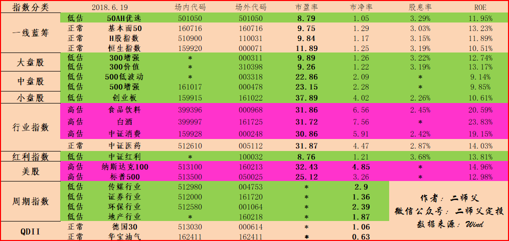

======================================================

_type: talk
@二师父[28814221155551]
2018-06-20 02:00:40 Wed  
topic_id: 48524221228218

@🇨🇳竞自由 at 2018-06-20 02:00:40 Wed

> 昨天大跌，定投标的加了一成仓，最主要的是创业板进入了低估

----------

@二师父 at 2018-06-20 02:00:40 Wed

> 干的漂亮

----------

阅读[1691]  评论[2]  赞[0] 

+++++++++++++++++++++++++++++++++++++++++++++++++++++

文件：
2018-06-20 02:00:34 Wed
文件大小：[350717]
28881511121511-千股跌停，再谈仓位管理和耐心的重要性.pdf

======================================================

_type: q&a
@波波[51541154455544]
2018-06-20 19:48:38 Wed  
topic_id: 15412188882212

@波波

>  二师父，国泰纳斯达克100可投吗现在？

@二师父

>  没投过

阅读[1255]  评论[1]  赞[0] 

======================================================

_type: talk
@二师父[28814221155551]
2018-06-21 03:47:45 Thu  
topic_id: 28245154542241

阅读[1607]  评论[0]  赞[0] 

+++++++++++++++++++++++++++++++++++++++++++++++++++++

文件：
2018-06-21 03:47:44 Thu
文件大小：[357817]
51118125541814-定投需要让自己快乐.pdf

======================================================

_type: q&a
@阿晨[88885122258182]
2018-06-21 11:48:51 Thu  
topic_id: 88245154541152

@阿晨

>  师父，你好。央视50指数成分股票，好像都是看得见业绩的好公司股票，请问目前低估了吗？您的估值表没有这个但有的大Ⅴ有，且有的判断已低估，有的认为还调整不到位。

@二师父

>  央视50还没低估呢

阅读[1205]  评论[0]  赞[0] 

======================================================

_type: q&a
@曲辉[28484555188121]
2018-06-21 11:49:23 Thu  
topic_id: 51542824114854

@曲辉

>  二师父的鳄鱼计划是怎样的操作模式呢？现在买的哪个基金是鳄鱼计划？

@二师父

>  往期精华里面有操作记录

阅读[1267]  评论[0]  赞[0] 

======================================================

_type: q&a
@曲辉[28484555188121]
2018-06-21 11:50:13 Thu  
topic_id: 48524142254288

@曲辉

>  买场内基金，在哪个证券开户佣金低，现在大部分开户万2.5手续费，好像买场内基金每笔佣金最低5元，有没有那个证券没有这个最低5元佣金的。

@二师父

>  华泰，免去5元佣金

阅读[1293]  评论[0]  赞[0] 

======================================================

_type: talk
@二师父[28814221155551]
2018-06-21 11:54:40 Thu  
topic_id: 88245151484242

<e type="hashtag" hid="881422852442" title="#定投实盘#" /> 500增强，300增强各买入一份。轻松学习，快乐定投。坚持

@落叶无痕 at 2018-06-21 11:54:40 Thu

> 是鳄鱼计划么，二师父

----------

@二师父 at 2018-06-21 11:54:40 Thu

> 每周四定投实盘

----------

@落叶无痕 at 2018-06-21 11:54:40 Thu

> [OK]😄

----------

@健哥 at 2018-06-21 11:54:40 Thu

> 老师，可否跟着你执行鳄鱼计划和实盘计划

----------

@二师父 at 2018-06-21 11:54:40 Thu

> 可以，但要先做好资金配置

----------

@海盗 at 2018-06-21 11:54:40 Thu

> 二师父，今天另外加仓了没？

----------

@二师父 at 2018-06-21 11:54:40 Thu

> 没了

----------

@海盗 at 2018-06-21 11:54:40 Thu

> 师父要是加仓的话会在学堂公布吗？

----------

阅读[1653]  评论[10]  赞[0] 

======================================================

_type: q&a
@海盗[48248118584848]
2018-06-21 17:20:09 Thu  
topic_id: 51542815544124

@海盗

>  二师父，您好！
>  想问一下，之前看你的文章有一段写到如果上证指数跌破两千点，将会满仓。
>  那么我的疑惑出来了，虽然上证指数跌破2000点，但是我们的手里买的都是沪深300和中证500的基金，不是应该去关注沪深300指数吗？
>  不明白手里拿的什么样的基金去关注什么样的大盘指数。
>  小白一枚，求解

@二师父

>  根据历史数据，大盘跌破2000点很难，如果跌破了，那遍地是机会，大盘里面有这些指数的持仓股票

阅读[1293]  评论[1]  赞[0] 

======================================================

_type: q&a
@波波[51541154455544]
2018-06-21 19:04:24 Thu  
topic_id: 48524182488258

@波波

>  二师父，现在是投300增强好呢还是300价值好，不懂了

@二师父

>  都一样的，300价值更抗跌，我的300价值目前浮盈，300增强浮亏

阅读[1271]  评论[0]  赞[0] 

======================================================

_type: q&a
@Leung[48282454448848]
2018-06-21 19:15:49 Thu  
topic_id: 15412854115182

@Leung

>  师傅好，基金定投是一件长期的，考验耐心的一件事情，我其实就想问问您定投了多久，2015年股灾就开始定投了吗😂

@二师父

>  从16年开始的，15年还没接触指数基金

阅读[1307]  评论[0]  赞[0] 

======================================================

_type: talk
@二师父[28814221155551]
2018-06-22 01:52:39 Fri  
topic_id: 51542818418584

<e type="hashtag" hid="481255854148" title="#6.21指数估值#" /> 一、今日市场分析

继3000点失守，上证指数跌到了2800，成交量缩小，进一步下跌趋势不大，可是黑天鹅频发，我们需要控制风险。

只要大盘下跌到2500点以下，可以加倍定投，二师父觉得大盘不可能跌破2000，如果可以，那么抄底吧。 

二、当前市场环境我们如何应对

二师父此前多此强调一句话，在投资之前请务必熟读五步定投法，尤其是资产配置，这非常重要。

有的读者说二师父没提醒，现在再提醒一遍，做好资产配置，然后淡定的投资指数基金即可。

三、二师父最近交易和学习情况的总结。

近期交易挺好，券商仓位稍微过重，需要控制，浮亏10个点，不算什么，当年巴菲特持有可口可乐还浮亏50个点呢。

投资需要大心脏。学习内容，主要是在雪球看方丈的帖子，感觉收获蛮大的。

投资之路上一个人走的快，但是一群人走的远，二师父定投的读者会一直一起走。

@叫偶猫大人 at 2018-06-22 01:52:39 Fri

> 师父，500增强我买了场内的，一样的吧

----------

@二师父 at 2018-06-22 01:52:39 Fri

> 这个是一样的

----------

阅读[1652]  评论[2]  赞[0] 

+++++++++++++++++++++++++++++++++++++++++++++++++++++

图片：

======================================================

_type: talk
@二师父[28814221155551]
2018-06-22 01:53:42 Fri  
topic_id: 88245181481482

@Pacifica at 2018-06-22 01:53:42 Fri

> 二师父，我是在今年年初开始定投指数基金的，其实到现在浮亏满多的，最多的都百分之10几了，不过到这个份上不会止损，更不会停扣款。熬吧，熬到牛市

----------

@二师父 at 2018-06-22 01:53:42 Fri

> 控制节奏，一起坚持

----------

阅读[1677]  评论[2]  赞[0] 

+++++++++++++++++++++++++++++++++++++++++++++++++++++

文件：
2018-06-22 01:53:40 Fri
文件大小：[342352]
51118124182414-定投与特朗普没有任何关系.pdf

======================================================

_type: q&a
@曲辉[28484555188121]
2018-06-22 12:40:32 Fri  
topic_id: 51542855555214

@曲辉

>  二师父我看估值表里已经高估的食品饮料 指数000968怎么找出来的是广发养老指数A，这个是食品饮料行业吗？

@二师父

>  160222

阅读[1460]  评论[2]  赞[0] 

======================================================

_type: talk
@二师父[28814221155551]
2018-06-23 01:02:30 Sat  
topic_id: 88248542125112

<e type="hashtag" hid="518455555114" title="#6.22指数估值#" /> 周五估值表，低估的品种越来越多，珍惜机会。

阅读[1628]  评论[0]  赞[0] 

+++++++++++++++++++++++++++++++++++++++++++++++++++++

图片：
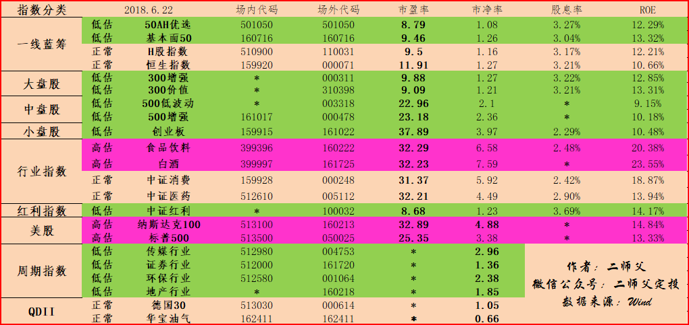

======================================================

_type: q&a
@明天会更好[48528152285488]
2018-06-23 12:36:55 Sat  
topic_id: 51541282115844

@明天会更好

>  师父您好，为什么周期性指数不看它的市盈率？

@二师父

>  周期指数盈利不稳定，市盈率失效啦

阅读[1347]  评论[0]  赞[0] 

======================================================

_type: q&a
@健哥[51511242852814]
2018-06-23 19:00:55 Sat  
topic_id: 88248512541882

@健哥

>  二师父，听你说过一直在低估做定投，还做几次波段，波段是指持仓收益率达到5-10%，就收割利润一次吗？老师能不能分析一下周定投、双周定投和月定投，哪个更好呢？

@二师父

>  到正常估值收割利润就行了，我采用的是周定投

阅读[1349]  评论[0]  赞[0] 

======================================================

_type: q&a
@星南[28514128241181]
2018-06-24 13:24:54 Sun  
topic_id: 48528848482148

@星南

>  二师父，你是如何计算出某个指数基金的下跌空间的呢？是根据指数的点位最低点还是市盈率或者市净率的百分位来计算的呢？

@二师父

>  根据市盈率，指数点位也有参考，主要看市盈率

阅读[1347]  评论[4]  赞[0] 

======================================================

_type: q&a
@健哥[51511242852814]
2018-06-25 00:15:18 Mon  
topic_id: 88248851545152

@健哥

>  二师父，存量资金按三年计算，分为150份。这个是从每个指数低估算起吗？我是从今年5月才开始定的，会不会不到三年，只需一、两年就到牛市呢，没加的资金，什么时候加入呢。假如是16开始定投的话，已经两年了。三年是从低估开始算，还是上一轮牛转熊开始算呢？

@二师父

>  这个是大概的，三到五年，预计未来三年之类牛市会来，但具体啥时候不知道，主要看你的仓位是否让你舒服

阅读[1256]  评论[1]  赞[0] 

======================================================

_type: talk
@二师父[28814221155551]
2018-06-25 03:26:20 Mon  
topic_id: 15415554414552

@落叶无痕 at 2018-06-25 03:26:20 Mon

> 二师父，今天居然遇到人在大路上发传单，培训买股票，说大盘都2800点了

----------

@二师父 at 2018-06-25 03:26:20 Mon

> 竟然还有这操作啊

----------

@落叶无痕 at 2018-06-25 03:26:20 Mon

> 嗯尼

----------

阅读[1587]  评论[3]  赞[0] 

+++++++++++++++++++++++++++++++++++++++++++++++++++++

文件：
2018-06-25 03:26:17 Mon
文件大小：[326790]
28881288111551-中途入市，定投该如何操作.pdf

======================================================

_type: q&a
@超级奶爸[48528544118258]
2018-06-25 21:54:19 Mon  
topic_id: 48528855245518

@超级奶爸

>  二师父，最近蛋卷里面有个"500增强一箩筐"，其实就是把资金分别投资于五个不同的500增强基金，怎么看这种基金？

@二师父

>  一个就好，这种都是噱头

阅读[1189]  评论[0]  赞[0] 

======================================================

_type: talk
@二师父[28814221155551]
2018-06-26 03:01:35 Tue  
topic_id: 51541142842144

阅读[1533]  评论[0]  赞[0] 

+++++++++++++++++++++++++++++++++++++++++++++++++++++

文件：
2018-06-26 03:01:31 Tue
文件大小：[377395]
15558454848582-二师父6月定投总结.pdf

======================================================

_type: talk
@二师父[28814221155551]
2018-06-26 03:02:30 Tue  
topic_id: 15415512812582

<e type="hashtag" hid="881424551182" title="#6.25指数估值#" />

阅读[1531]  评论[0]  赞[0] 

+++++++++++++++++++++++++++++++++++++++++++++++++++++

图片：

======================================================

_type: q&a
@健哥[51511242852814]
2018-06-26 12:37:14 Tue  
topic_id: 51541145144854

@健哥

>  二师父，您是定了很多低估基金，每周定投，问一下，您是每支都定投，还是每周选几支定投呢？

@二师父

>  是一次选两到三只定投呢，根据估值和仓位，不是所有都选择的

阅读[1218]  评论[2]  赞[0] 

======================================================

_type: talk
@二师父[28814221155551]
2018-06-26 13:59:07 Tue  
topic_id: 88248842182812

<e type="hashtag" hid="881251425252" title="#鳄鱼计划#" /> 大盘受挫，中小板一路领先，还是按照节奏投资，买入中证红利指数增强一份。不要贪婪，慢慢买。

@落叶无痕 at 2018-06-26 13:59:07 Tue

> 中午想问你要不要鳄鱼计划，没想到真来了😊

----------

@二师父 at 2018-06-26 13:59:07 Tue

> 没到定投日有好机会可以自己来

----------

@海盗 at 2018-06-26 13:59:07 Tue

> 鳄鱼计划是波段操作吗？

----------

@二师父 at 2018-06-26 13:59:07 Tue

> 不呢，长持

----------

@海盗 at 2018-06-26 13:59:07 Tue

> 鳄鱼计划的概念我不清楚指的什么？翻了几回以前的文章，也没有找到[撇嘴]

----------

@落叶无痕 at 2018-06-26 13:59:07 Tue

> 嗯尼

----------

@二师父 at 2018-06-26 13:59:07 Tue

> 往期精华里面有解释过

----------

阅读[1510]  评论[7]  赞[0] 

======================================================

_type: talk
@二师父[28814221155551]
2018-06-27 04:28:42 Wed  
topic_id: 15415584511882

<e type="hashtag" hid="281424888151" title="#6.26指数估值#" /> 如果跌破2800点，指数基金持仓可以到达6.5成了，抓住市场给予的机会了

@小诸葛 at 2018-06-27 04:28:42 Wed

> 二师父，想问下500增强和500低波动选一只定投就可以吧？两个都差不多吧

----------

@二师父 at 2018-06-27 04:28:42 Wed

> 对的，选取一只投资就可以啦

----------

@小诸葛 at 2018-06-27 04:28:42 Wed

> 谢谢[呲牙]

----------

阅读[1420]  评论[3]  赞[0] 

+++++++++++++++++++++++++++++++++++++++++++++++++++++

图片：
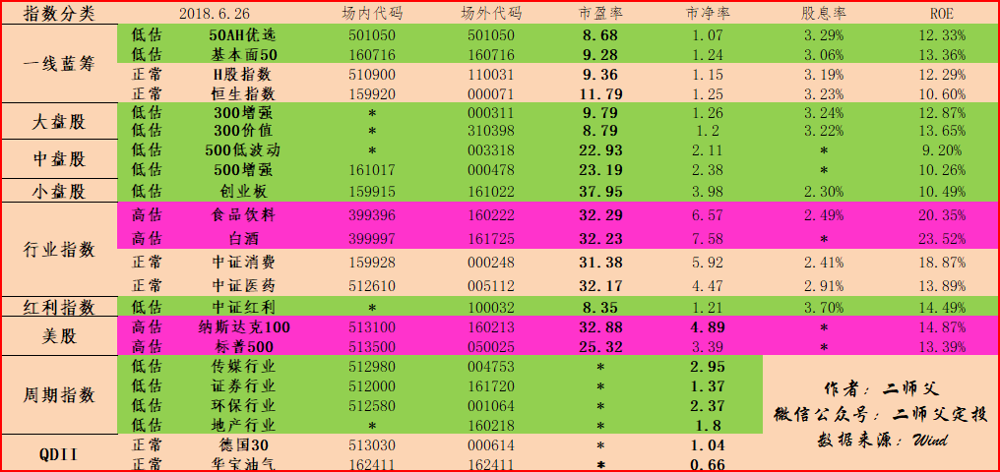

======================================================

_type: talk
@二师父[28814221155551]
2018-06-27 04:29:12 Wed  
topic_id: 88248812841552

阅读[1495]  评论[0]  赞[0] 

+++++++++++++++++++++++++++++++++++++++++++++++++++++

文件：
2018-06-27 04:29:11 Wed
文件大小：[334049]
88881225454822-投资并不是生命的全部.pdf

======================================================

_type: q&a
@小米兔[48245525418488]
2018-06-27 11:46:03 Wed  
topic_id: 48528811812448

@小米兔

>  小白来请教师父：比如中证500增强，沪深300增强，50AH优选。这种指数基金会有分红吗？谢谢！

@二师父

>  有啊，红利的多些，这些也有

阅读[1192]  评论[4]  赞[0] 

======================================================

_type: q&a
@gxbill[88842585142152]
2018-06-27 13:14:30 Wed  
topic_id: 15415422114152

@gxbill

>  二师傅对军工行业有投资么，看了易方达军工行业基金感觉像是近几年低点了，而且最近似乎开始在涨，之后的指数估值表能否加上军工行业？

@二师父

>  军工是重工业，不太看好这个行业，目前是非常低估了，你可以去理杏仁查一下，是低估的

阅读[1192]  评论[0]  赞[0] 

======================================================

_type: talk
@小诸葛[88484182152412]
2018-06-27 14:44:14 Wed  
topic_id: 51541521122514

<e type="hashtag" hid="281424888151" title="#6.26指数估值#" />  二师父，想问下500增强和500低波动选一只定投就可以吧？两个都差不多吧

阅读[1136]  评论[0]  赞[0] 

======================================================

_type: talk
@二师父[28814221155551]
2018-06-28 04:30:13 Thu  
topic_id: 15415452152242

阅读[3095]  评论[0]  赞[0] 

+++++++++++++++++++++++++++++++++++++++++++++++++++++

文件：
2018-06-28 04:30:10 Thu
文件大小：[896276]
15558445154582-二师父为基金新手打造的五步定投法（1.0）.pdf

======================================================

_type: talk
@二师父[28814221155551]
2018-06-28 04:32:56 Thu  
topic_id: 51541512412284

<e type="hashtag" hid="281424222821" title="#6.27指数估值#" /> 很多高估的进入正常了

阅读[1421]  评论[0]  赞[0] 

+++++++++++++++++++++++++++++++++++++++++++++++++++++

图片：
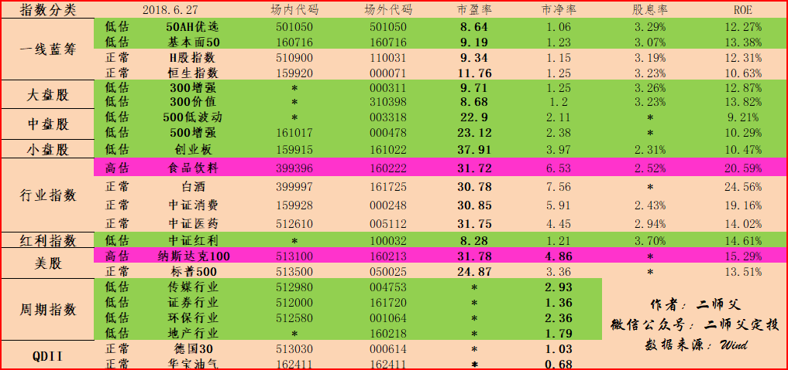

======================================================

_type: talk
@二师父[28814221155551]
2018-06-28 12:39:24 Thu  
topic_id: 28248484118851

<e type="hashtag" hid="881422852442" title="#定投实盘#" /> 中证红利和300增强各买入一份

@海盗 at 2018-06-28 12:39:24 Thu

> 500增强也是低估，二师父是不是经过评估以后觉得300增强和中证红利比500增强更有投资价值？

----------

@二师父 at 2018-06-28 12:39:24 Thu

> 这是一方面，还有仓位的原因，目前我的500增强是最重的仓位，所以可以放缓买入节奏

----------

@海盗 at 2018-06-28 12:39:24 Thu

> 谢谢二师父解惑

----------

阅读[1340]  评论[3]  赞[0] 

======================================================

_type: q&a
@星南[28514128241181]
2018-06-28 12:41:05 Thu  
topic_id: 51541512858244

@星南

>  正如星球里健哥提出的那样:二师父能否给我们常用指数的历史最高市盈率和最低市盈率，以及它们的合理定投区间，中证红利、50AH、500增强、300增强、创业板，我们再根据老师给出市盈率，再结合仓位进行定投。
>  希望能得到二师父回答与落实。😁😁

@二师父

>  历史最高最低可以去理杏仁查阅，这几个指数的合理区间今晚公布，仅供大家参考

阅读[1096]  评论[0]  赞[0] 

======================================================

_type: q&a
@乡下人[28244152425511]
2018-06-28 12:42:22 Thu  
topic_id: 48528588448258

@乡下人

>  请问师傅中证红利和红利机会是不是一类型的?那个更值得投资?

@二师父

>  对，都是红利策略，目前红利增强是最低谷了，中证红利增强这个目前更值得投资

阅读[1139]  评论[0]  赞[0] 

======================================================

_type: talk
@二师父[28814221155551]
2018-06-28 14:03:43 Thu  
topic_id: 51541418115524

<e type="hashtag" hid="881251425252" title="#鳄鱼计划#" /> 午后大盘下挫到2800点以下，买入中证红利增强一份，50ah一份，500增强一份。现在是底部吗？不知道，二师父只知道很便宜啦。

@🇨🇳竞自由 at 2018-06-28 14:03:43 Thu

> 跟随师父，2800以下，加仓

----------

@海盗 at 2018-06-28 14:03:43 Thu

> 已加仓，该出手时就出手💪

----------

@落叶无痕 at 2018-06-28 14:03:43 Thu

> 子弹昨天打光的飘过[流泪][流泪]

----------

@落叶无痕 at 2018-06-28 14:03:43 Thu

> 今天买了国债逆回购

----------

@落叶无痕 at 2018-06-28 14:03:43 Thu

> 这个是固定账户的，没法买了，应该跟着二师父今天买的，悔不当初[流泪][流泪][流泪]

----------

@二师父 at 2018-06-28 14:03:43 Thu

> 怎么这么快就打光了，如果没资金了就坚定持有吧

----------

@孙健 at 2018-06-28 14:03:43 Thu

> 紧跟师父，咬他一口。指数仓位30%，子弹充足。

----------

@二师父 at 2018-06-28 14:03:43 Thu

> 还有这么多资金，羡慕

----------

阅读[1393]  评论[10]  赞[0] 

======================================================

_type: q&a
@朱朱 侠[48288828125218]
2018-06-28 14:13:13 Thu  
topic_id: 48528281882488

@朱朱 侠

>  请问一份是多少金额

@二师父

>  根据自己的资金分配，今天发的五步定投法写过啦

阅读[1108]  评论[0]  赞[0] 

======================================================

_type: talk
@二师父[28814221155551]
2018-06-29 03:19:54 Fri  
topic_id: 48528252285458

<e type="hashtag" hid="281424448441" title="#6.28指数估值#" /> 大盘2800点失守，二师父很高兴，看了看账户整体浮亏3个百分点，继续跌吧。让暴跌来得更猛烈些，争取跌破2000点二师父就把增量资金也投入其中。目前继续坚守。

最近读周易,需卦告诉我们要守时待命，那就耐心等待吧。有财富的命自然会到达历史大底，如果没有，坚持定投也可以获得不错的收益。

阅读[1310]  评论[0]  赞[0] 

+++++++++++++++++++++++++++++++++++++++++++++++++++++

图片：

======================================================

_type: talk
@二师父[28814221155551]
2018-06-29 03:20:24 Fri  
topic_id: 15415141154282

@二师父 at 2018-06-29 03:20:24 Fri

> 应该是2800点，有点迷，二师父也会犯错，大家可以多多指正

----------

@落叶无痕 at 2018-06-29 03:20:24 Fri

> 昨天没买，今天大涨[流泪][流泪]

----------

阅读[1395]  评论[2]  赞[0] 

+++++++++++++++++++++++++++++++++++++++++++++++++++++

文件：
2018-06-29 03:20:15 Fri
文件大小：[327584]
15558444454822-大盘跌破3000点，还适合定投吗.pdf

======================================================

_type: q&a
@陈Being[28845245224851]
2018-06-29 14:34:35 Fri  
topic_id: 88248442842852

@陈Being

>  二师傅，请问估计表里的一线蓝筹，50AH与H股指数两者有什么区别啊，我分不清，麻烦解释一下。

@二师父

>  一线蓝筹是盈利稳定，业绩稳定，总股本较大。50ah和上证50股票基本差不多，只不过有ah股折价，同样在香港和a股上市的股票，哪个更便宜持仓股票就选择哪个，h股指数是恒生中国企业指数

阅读[1079]  评论[1]  赞[0] 

======================================================

_type: q&a
@海盗[48248118584848]
2018-06-29 16:36:55 Fri  
topic_id: 15415114142112

@海盗

>  昨天大跌，今天看了几个基金，发现今天的涨幅都不小。请问二师父这是有什么外部原因吗？

@二师父

>  哈哈，跌多了就会涨的

阅读[1061]  评论[3]  赞[0] 

======================================================

_type: q&a
@小诸葛[88484182152412]
2018-06-29 21:03:29 Fri  
topic_id: 15415111152812

@小诸葛

>  二师父，你投资的指数基金是选择分红方式还是红利再投资？

@二师父

>  直接现金分红

阅读[1054]  评论[2]  赞[0] 

======================================================

_type: q&a
@超级奶爸[48528544118258]
2018-06-30 01:21:59 Sat  
topic_id: 51541481218484

@超级奶爸

>  二师父，如你所说，买指数就是买国运。如果中国在贸易战，或者未来各种危机中不幸落败，如九十年代的日本一样，债务，老龄化，经济衰退，那么作为投资者，应该如何防范风险，提升收益呢？

@二师父

>  首先，二师父是看好中国经济，看好a股的，相信在2040年左右中国会超越美国成为世界第一大经济体。当然如果你说的情况发生了，出现了日本那样的情况，我们的应对策略有2。第一坚持低估定投原则，死守安全边际，这样即使股市一直做俯卧撑，我们也能过去小额利润。第二是坚持分散投资，有美股，德国30等等其他国家的基金，还有QDII基金。当然还有港股对应的指数基金，这样不可能所有国家的股市都不行。总共就是这二点，做到了就不会有巨大的回撤，投资首要是保证本金安全。

阅读[1097]  评论[0]  赞[0] 

======================================================

_type: talk
@二师父[28814221155551]
2018-06-30 04:16:58 Sat  
topic_id: 88248418244512

把最佳投资理念传播出去，希望更多的人脱离追涨杀跌的苦海

阅读[1390]  评论[0]  赞[0] 

+++++++++++++++++++++++++++++++++++++++++++++++++++++

文件：
2018-06-30 04:16:30 Sat
文件大小：[347447]
88881221111552-创业板一天涨4个百分点，你还觉得基金不如股票吗.pdf

======================================================

_type: talk
@二师父[28814221155551]
2018-06-30 04:17:43 Sat  
topic_id: 15415185411522

<e type="hashtag" hid="881424185442" title="#6.29指数估值#" /> 安心过周末，除了投资，我们还有美好生活，享受生活，快乐投资

@二师父 at 2018-06-30 04:17:43 Sat

> 创业板估值正常

----------

@海盗 at 2018-06-30 04:17:43 Sat

> 二师父，您的意思是创业板现在的估值正常了，也就是说，定投可以停止了。我理解的对吗？

----------

@二师父 at 2018-06-30 04:17:43 Sat

> 对的，正常估值停止定投

----------

@海盗 at 2018-06-30 04:17:43 Sat

> 我看了看创业板这基金的净值这几个月都是在连续下跌中，按说估值应该越来越低才对。真不知道净值和估值之间的关系，望二师父能解答[疑问]

----------

@二师父 at 2018-06-30 04:17:43 Sat

> 基金估值和净值没有必然联系，净值＝估值×盈利+分红

----------

@海盗 at 2018-06-30 04:17:43 Sat

> 谢谢二师父解答

----------

@海盗 at 2018-06-30 04:17:43 Sat

> 那么这个基金是不是没有分过红，我看见分红档案里没有记录显示

----------

@二师父 at 2018-06-30 04:17:43 Sat

> 高成长的分红少

----------

阅读[1436]  评论[8]  赞[0] 

+++++++++++++++++++++++++++++++++++++++++++++++++++++

图片：
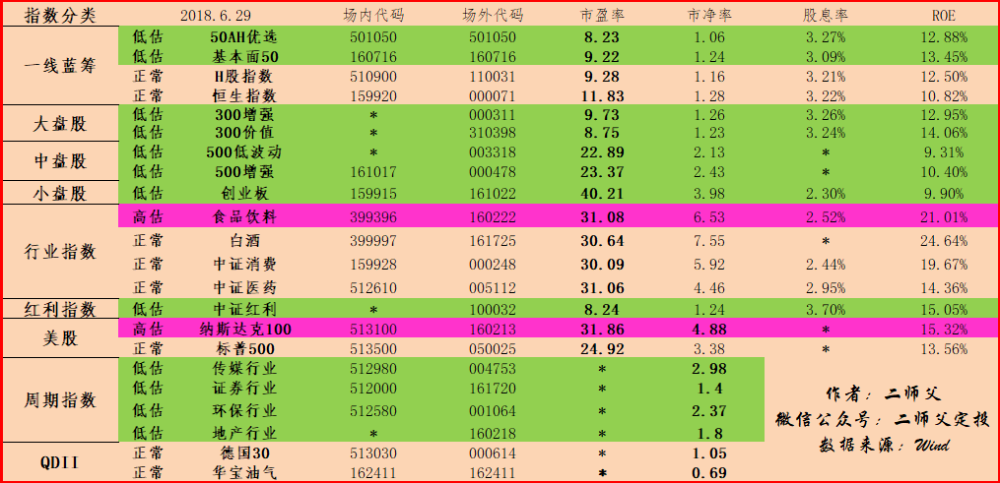

======================================================

_type: q&a
@小美[51111114415824]
2018-06-30 12:33:16 Sat  
topic_id: 15415185125152

@小美

>  有没有历史估值的数据和图表汇总？

@二师父

>  可以去网站查阅，我看后期做一个这样的汇总

阅读[1105]  评论[0]  赞[0] 

======================================================

_type: q&a
@海马[15158245825242]
2018-06-30 21:18:38 Sat  
topic_id: 88248411145182

@海马

>  你好！二师父我做基金投资有7、8年了反复折腾赚到少少的反而5年前在工行做了一个基金定投赚的比自己主动投资基金赚得多！所以以后专做基金定投！我就想二师父在哪个基金代销平台的定期不定额功能比较好？还有怎么止盈？因为我觉得定投基最重要就是止盈了。谢谢

@二师父

>  我用的蛋卷，天天基金和蚂蚁财富也可以。止盈的话就是利润收割加高估区域逐步减仓

阅读[1189]  评论[2]  赞[0] 

======================================================

