_type: talk
@二师父[28814221155551]
2018-07-01 03:32:25 Sun  
topic_id: 48528145444518

@空白 at 2018-07-01 03:32:25 Sun

> 老师50基本面和50ah是不是有重复 选一个就好 你推荐哪一个

----------

@二师父 at 2018-07-01 03:32:25 Sun

> 这两个选择一个就好，目前选50ah

----------

@小诸葛 at 2018-07-01 03:32:25 Sun

> 50Ah暂停购买了，是咋回事？

----------

@二师父 at 2018-07-01 03:32:25 Sun

> 港股休市，买基本面50可以的

----------

@健哥 at 2018-07-01 03:32:25 Sun

> 399011主动型基金不用定投吗？

----------

@二师父 at 2018-07-01 03:32:25 Sun

> 这不是用的定投策略，指数基金才用定投策略，两个策略完全不同的

----------

阅读[1435]  评论[6]  赞[0] 

+++++++++++++++++++++++++++++++++++++++++++++++++++++

文件：
2018-07-01 03:32:11 Sun
文件大小：[391478]
15558412482542-二师父七月定投计划.pdf

======================================================

_type: q&a
@勤能行之[481211221828]
2018-07-01 13:00:04 Sun  
topic_id: 15415828428452

@勤能行之

>  请问师傅买的货币基金是博时还是南方的？是南方天天利B吗。谢谢师傅解答。

@二师父

>  南方天天利B

阅读[1184]  评论[11]  赞[0] 

======================================================

_type: talk
@二师父[28814221155551]
2018-07-02 02:55:16 Mon  
topic_id: 88248181812222

@健哥 at 2018-07-02 02:55:16 Mon

> 二师父，大蓝筹目前也很低估呀，为什么说偏贵呢

----------

@二师父 at 2018-07-02 02:55:16 Mon

> 相对中证500比较贵，恒生更是

----------

阅读[1384]  评论[2]  赞[0] 

+++++++++++++++++++++++++++++++++++++++++++++++++++++

文件：
2018-07-02 02:54:39 Mon
文件大小：[393669]
51118541282824-中小板的春天要到了.pdf

======================================================

_type: talk
@二师父[28814221155551]
2018-07-03 03:11:18 Tue  
topic_id: 15415811228212

阅读[1264]  评论[0]  赞[0] 

+++++++++++++++++++++++++++++++++++++++++++++++++++++

文件：
2018-07-03 03:11:17 Tue
文件大小：[348026]
15558411818452-2018年中总结.pdf

======================================================

_type: talk
@二师父[28814221155551]
2018-07-03 03:12:25 Tue  
topic_id: 51541844228244

<e type="hashtag" hid="281421221421" title="#7.2指数估值#" /> 很多基金都快破净了，珍惜低估机会，坚持定投，今天忘了加仓，明天有机会的话补上

@叫偶猫大人 at 2018-07-03 03:12:25 Tue

> 昨日下午特意来看了你，没加仓所以我也没加[呲牙]

----------

@高达无双喝味全 at 2018-07-03 03:12:25 Tue

> 赶上今天加合适了

----------

@落叶无痕 at 2018-07-03 03:12:25 Tue

> 今天又是好机会

----------

@落叶无痕 at 2018-07-03 03:12:25 Tue

> 二师父，什么叫破净啊？

----------

@二师父 at 2018-07-03 03:12:25 Tue

> 基金市净率破1

----------

阅读[1265]  评论[5]  赞[0] 

+++++++++++++++++++++++++++++++++++++++++++++++++++++

图片：
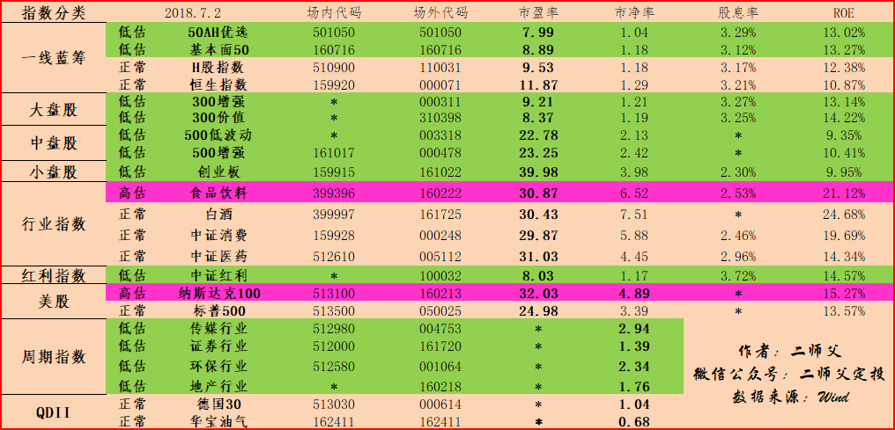

======================================================

_type: talk
@二师父[28814221155551]
2018-07-03 12:10:11 Tue  
topic_id: 48528118582188

<e type="hashtag" hid="881251425252" title="#鳄鱼计划#" /> 先发车，大家的问题稍后回复哈，买入500增强一份，300增强一份，中证红利两份。

@海盗 at 2018-07-03 12:10:11 Tue

> 二师父，问一下，这一次加仓的依据是什么？刚来不久，问题比较多，还望二师父见谅

----------

@二师父 at 2018-07-03 12:10:11 Tue

> 大盘低于2800，红利都快破净了，很好的机会啊，应该是昨天加的，昨天没看到，今天补上啊

----------

@海盗 at 2018-07-03 12:10:11 Tue

> 谢谢二师父解答🙏

----------

@海盗 at 2018-07-03 12:10:11 Tue

> 主要是我看了二师父以前写的文章，每下跌多少百分比才能加仓都是有规定的。看来加仓还得是活学活用呀

----------

阅读[1231]  评论[4]  赞[0] 

======================================================

_type: q&a
@璐老诗[88818121525822]
2018-07-03 12:32:48 Tue  
topic_id: 88248115115212

@璐老诗

>  二师父，你好，我是昨天新加入的成员，看了您的文章受益匪浅。我从2016年下半年开始定投，总投入14.5万，三个账号如下:
>  1.天天基金网账户:沪深300➕中证500➕创业板指数➕主动基金国泰中小盘，刚好浮亏10个点。
>  2.蛋卷基金:低估值的50AH、500低波动、300价值、基本面120、华宝红利.、中证养老，目前浮亏12个点
>  3.且慢估值：跟投长赢计划和极简投资，目前浮亏7个点。
>  除了且慢完全遵循纪律，其他两个账户在定投的基础上常手动加仓，看到下跌就加仓，从现在2700多的点位再来回看，感觉以前加仓太频繁了，没个纪录，很多其实买贵了。我这种情况，后期如何改变能受益好一点呢

@二师父

>  制定交易规则，不到设定条件绝不加仓，第二，设置自动扣款，自己不主动加仓。第三，你的摊子铺的太大，建议一个平台投资即可，不然手续费都多出不少

阅读[1371]  评论[3]  赞[0] 

======================================================

_type: q&a
@高达无双喝味全[48851828182858]
2018-07-03 19:25:36 Tue  
topic_id: 51545122251854

@高达无双喝味全

>  今天看到雪球也出了估值功能，也可以作为参考。雪球估值有个量化的区间，低于历史分位30%。请问和师傅估值有什么区别？

@二师父

>  这个蛋卷，且慢早就出过，以前是规定低于百分之20的是非常低估，只是因为取得时间不同会有差异

阅读[1032]  评论[0]  赞[0] 

======================================================

_type: q&a
@海盗[48248118584848]
2018-07-03 19:26:16 Tue  
topic_id: 88248114552442

@海盗

>  二师父，定投的这几个基金的申购费都是申购时收取的吗？不能改成赎回时收取吗？

@二师父

>  申购和赎回都有费用，你去看相应基金后面的费率规定，指数基金是很低的

阅读[1068]  评论[11]  赞[0] 

======================================================

_type: talk
@二师父[28814221155551]
2018-07-04 02:00:03 Wed  
topic_id: 88242858422122

阅读[1319]  评论[0]  赞[0] 

+++++++++++++++++++++++++++++++++++++++++++++++++++++

文件：
2018-07-04 01:59:54 Wed
文件大小：[344122]
28881215848851-我是如何应对股市暴跌的.pdf

======================================================

_type: talk
@二师父[28814221155551]
2018-07-04 02:00:25 Wed  
topic_id: 15414525144812

<e type="hashtag" hid="518458412484" title="#7.3指数估值#" />

阅读[1309]  评论[0]  赞[0] 

+++++++++++++++++++++++++++++++++++++++++++++++++++++

图片：
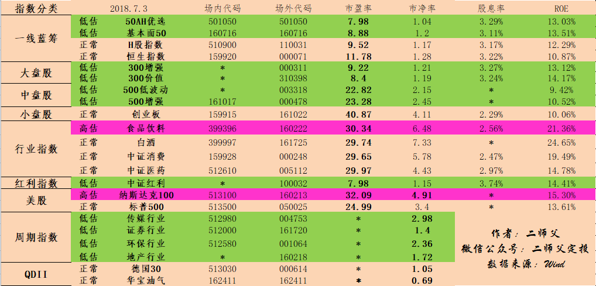

======================================================

_type: talk
@二师父[28814221155551]
2018-07-05 04:11:35 Thu  
topic_id: 15414542548542

@健哥 at 2018-07-05 04:11:35 Thu

> 辛苦了

----------

@小诸葛 at 2018-07-05 04:11:35 Thu

> 我发现二师父都是昼伏夜出，注意身体啊！

----------

阅读[1254]  评论[2]  赞[0] 

+++++++++++++++++++++++++++++++++++++++++++++++++++++

文件：
2018-07-05 04:11:32 Thu
文件大小：[327407]
28881218258241-当别人恐惧的时候，你该加仓了.pdf

======================================================

_type: talk
@二师父[28814221155551]
2018-07-05 04:12:18 Thu  
topic_id: 28242825821841

<e type="hashtag" hid="158115452842" title="#7.4指数估值#" />

@海盗 at 2018-07-05 04:12:18 Thu

> 二师父，上证指数这么低估，为什么我们没有买上证指数的基金？

----------

@cotton at 2018-07-05 04:12:18 Thu

> 二师傅，场外代码501029不在表里了吗

----------

@落叶无痕 at 2018-07-05 04:12:18 Thu

> 二师父今天要出手了么

----------

@高达无双喝味全 at 2018-07-05 04:12:18 Thu

> 今天该出手了 等跟投

----------

@Tim哥 at 2018-07-05 04:12:18 Thu

> 必须加仓

----------

@二师父 at 2018-07-05 04:12:18 Thu

> 没这个，其他的基金更低估

----------

@二师父 at 2018-07-05 04:12:18 Thu

> 这个也是低估

----------

@cotton at 2018-07-05 04:12:18 Thu

> 之前在表里的，现在被移出去了是吗。。为啥被移走呢

----------

阅读[1246]  评论[9]  赞[0] 

+++++++++++++++++++++++++++++++++++++++++++++++++++++

图片：
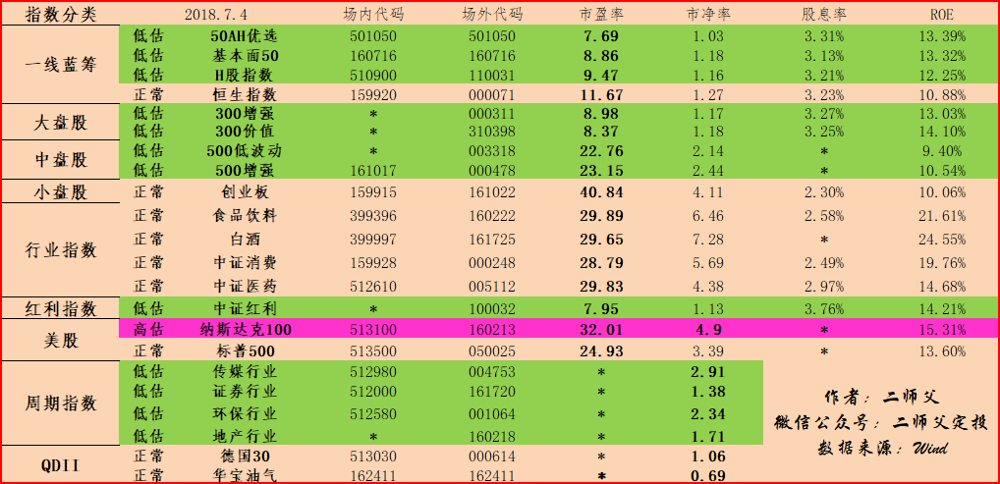

======================================================

_type: talk
@二师父[28814221155551]
2018-07-05 12:07:16 Thu  
topic_id: 88242824458822

<e type="hashtag" hid="881422852442" title="#定投实盘#" /> 买入500增强，300增强，中证红利各一份。每周定投日无论涨跌都投

阅读[1236]  评论[0]  赞[0] 

======================================================

_type: q&a
@陈洲[88245122222212]
2018-07-05 14:27:53 Thu  
topic_id: 88242824114452

@陈洲

>  二师父，我今天看买了的定投基金，按你表里绿色低估的品种，发现中证500也是有基金经理的，我是小白，是不是定投的基金也是有基金经理，但基金波动不受基金经理影响？

@二师父

>  这个基金经理不主动调仓，只是去根据跟踪的指数来控制基金持仓股票和比例，这是指数基金经理的作用

阅读[950]  评论[0]  赞[0] 

======================================================

_type: talk
@二师父[28814221155551]
2018-07-06 04:26:23 Fri  
topic_id: 51545144414554

阅读[1141]  评论[0]  赞[0] 

+++++++++++++++++++++++++++++++++++++++++++++++++++++

文件：
2018-07-06 04:26:19 Fri
文件大小：[327028]
51118588211254-市场极度恐慌的时候定投指数基金的优势.pdf

======================================================

_type: talk
@二师父[28814221155551]
2018-07-06 04:26:53 Fri  
topic_id: 15414511151482

<e type="hashtag" hid="518441415554" title="#7.5指数估值#" />

@Sherwood at 2018-07-06 04:26:53 Fri

> 请问300增强，500增强，的市盈率市净率以及ROE怎么算的？增强基金的持股好像不是完全公开的。

----------

@二师父 at 2018-07-06 04:26:53 Fri

> 市盈率，市净率是查阅的，roe等于e除以b

----------

@二师父 at 2018-07-06 04:26:53 Fri

> 也就是市净率除以市盈率

----------

阅读[1141]  评论[3]  赞[0] 

+++++++++++++++++++++++++++++++++++++++++++++++++++++

图片：
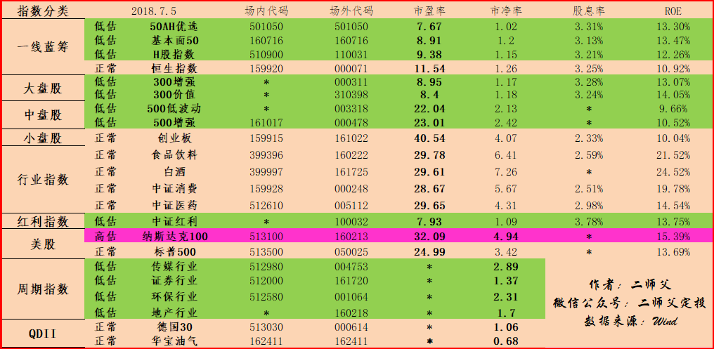

======================================================

_type: q&a
@Philip🎭 Y[28518855518151]
2018-07-06 12:22:15 Fri  
topic_id: 28242818214241

@Philip🎭 Y

>  师父好，如果从新手进入指数基金（刚好最近好像是个进入的时候）。看路好多低估，也看了一些入门书，眼花缭乱，新手定投的话建议先从几个基金开始呢？或者是哪几个比较合适呢？按照师父的分法我现在每两周有3份

@二师父

>  两个，沪深300增强，和中证500增强，这两个是标配，目前已经非常低估，特别适合定投

阅读[813]  评论[0]  赞[0] 

======================================================

_type: q&a
@离开[51115522482854]
2018-07-06 12:22:54 Fri  
topic_id: 28242818224481

@离开

>  二师傅我刚加入，目前看自我认为进入了基金定投的好时机，个人只想定投一只，二师傅可帮忙推荐一个？

@二师父

>  中证500增强，建议再加一个沪深300增强

阅读[820]  评论[0]  赞[0] 

======================================================

_type: talk
@朱朱 侠[48288828125218]
2018-07-06 13:09:25 Fri  
topic_id: 28242812584821

<e type="hashtag" hid="881422852442" title="#定投实盘#" />  500增强的代码是什么？什么叫场内与场外代码

阅读[806]  评论[0]  赞[0] 

======================================================

_type: talk
@朱朱 侠[48288828125218]
2018-07-06 13:17:12 Fri  
topic_id: 88242812525452

<e type="hashtag" hid="881422852442" title="#定投实盘#" />  怎么操作定投

阅读[851]  评论[0]  赞[0] 

======================================================

_type: q&a
@Philip🎭 Y[28518855518151]
2018-07-06 13:19:54 Fri  
topic_id: 15414584255552

@Philip🎭 Y

>  谢谢师父，那如果我之前自己不懂的时候，乱投了一些，我是先继续放着还是都赎回然后重新投呢

@二师父

>  不清楚买的啥，什么时候买的，如果主动基金浮亏多了需要止损，和指数基金不一样

阅读[925]  评论[3]  赞[0] 

======================================================

_type: q&a
@朱朱 侠[48288828125218]
2018-07-06 13:20:25 Fri  
topic_id: 48525815482588

@朱朱 侠

>  500增强的代码是什么？300增强代码是什么？什么叫场内与场外代码

@二师父

>  这个在估值表里面都有的，场外是在第三方平台申购

阅读[1008]  评论[3]  赞[0] 

======================================================

_type: q&a
@离开[51115522482854]
2018-07-06 22:55:56 Fri  
topic_id: 48525548484188

@离开

>  二师傅 100032和000478是同一类基金么？二选一还是可以组合购买

@二师父

>  二选一就好啦，不用太多

阅读[983]  评论[0]  赞[0] 

======================================================

_type: talk
@二师父[28814221155551]
2018-07-07 03:23:58 Sat  
topic_id: 15414425118212

@小诸葛 at 2018-07-07 03:23:58 Sat

> 希望你师父早日分享房地产和保险投资！！！

----------

阅读[1302]  评论[1]  赞[0] 

+++++++++++++++++++++++++++++++++++++++++++++++++++++

文件：
2018-07-07 03:23:54 Sat
文件大小：[344258]
51118588828154-坚持做自己.pdf

======================================================

_type: talk
@二师父[28814221155551]
2018-07-07 03:24:32 Sat  
topic_id: 48525548221428

<e type="hashtag" hid="881448181182" title="#7.6指数估值#" />

阅读[1269]  评论[0]  赞[0] 

+++++++++++++++++++++++++++++++++++++++++++++++++++++

图片：
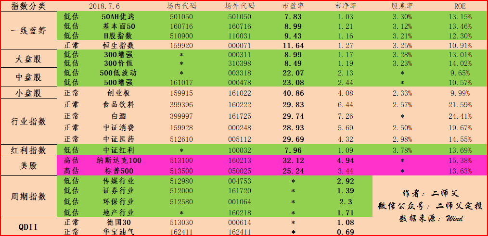

======================================================

_type: q&a
@陈Being[28845245224851]
2018-07-07 03:36:16 Sat  
topic_id: 28242258828541

@陈Being

>  请问什么叫中证红利破净。我问了几天没收到你的回复。

@二师父

>  之前回复过了啊，市净率跌破1倍叫破净

阅读[1042]  评论[1]  赞[0] 

======================================================

_type: q&a
@游水浮生[15455241488482]
2018-07-07 12:43:13 Sat  
topic_id: 88242258152282

@游水浮生

>  老师，一般定投几只基金比较合适？

@二师父

>  4到6支是比较合适的

阅读[1053]  评论[0]  赞[0] 

======================================================

_type: q&a
@gxbill[88842585142152]
2018-07-07 22:19:03 Sat  
topic_id: 15414455455822

@gxbill

>  请问二师傅 为啥中证500的roe低于50ah，但是市盈率确能到22，50ah只能12？中小盘为啥估值能比大蓝筹高这么多？

@二师父

>  不能这样比较，因为中小板里面有很多成长性公司，给的估值自然就高，尤其是创业板

阅读[1001]  评论[0]  赞[0] 

======================================================

_type: talk
@二师父[28814221155551]
2018-07-08 22:38:07 Sun  
topic_id: 48525552284158

请不要只看标题，看看内容

@海盗 at 2018-07-08 22:38:07 Sun

> 每天必看二师父写的文章[得意]

----------

@今晚吃手抓，谁给点大* at 2018-07-08 22:38:07 Sun

> 根据您的建议，我在蛋卷上定投了300增强和500增强，还有景顺长城Msci中国A股国际通指数增强，请教二师父是否妥当[奋斗]

----------

@二师父 at 2018-07-08 22:38:07 Sun

> msci我没投资呢

----------

阅读[1300]  评论[3]  赞[0] 

+++++++++++++++++++++++++++++++++++++++++++++++++++++

文件：
2018-07-08 22:37:57 Sun
文件大小：[391220]
51118425515424-300增强会变成增弱吗.pdf

======================================================

_type: q&a
@阿@浩[28821841885211]
2018-07-09 15:54:48 Mon  
topic_id: 15414111421442

@阿@浩

>  我是刚加入了，想投5只指数基金，准备三年用200万，那几只合适，请指教，谢谢

@二师父

>  300增强，500增强，中证红利增强，50ah

阅读[964]  评论[4]  赞[0] 

======================================================

_type: talk
@二师父[28814221155551]
2018-07-10 03:18:30 Tue  
topic_id: 15414184452152

@首尔航仔Eric at 2018-07-10 03:18:30 Tue

> 什么是左侧交易和右侧交易二师父

----------

@二师父 at 2018-07-10 03:18:30 Tue

> 左侧是下跌加仓，右侧是上涨买入

----------

阅读[1192]  评论[2]  赞[0] 

+++++++++++++++++++++++++++++++++++++++++++++++++++++

文件：
2018-07-10 03:18:25 Tue
文件大小：[353117]
48881242585518-总体浮盈时刻，再谈定投节奏.pdf

======================================================

_type: q&a
@海盗[48248118584848]
2018-07-10 13:27:20 Tue  
topic_id: 28242414854251

@海盗

>  二师父，能不能把算估值的方法简单给大家说说吗？

@二师父

>  <e type="web" href="https://mp.weixin.qq.com/s/B9nfxqKqWoW_h3IzcAlAbw" title="再谈怎么给指数基金估值" cache="http://cache.zsxq.com/201807/d0717e9dc13a419dbf6bdc9ce063d960fd7f1aaa08ead60524c869aa077ae52a" />，看看这个

阅读[890]  评论[0]  赞[0] 

======================================================

_type: q&a
@健哥[51511242852814]
2018-07-10 13:27:53 Tue  
topic_id: 28242155185141

@健哥

>  二师父为什么选择周定投，而不选择月定投呢？

@二师父

>  更好地平滑收益曲线，分散风险，都可以的

阅读[926]  评论[4]  赞[0] 

======================================================

_type: q&a
@健哥[51511242852814]
2018-07-10 13:28:35 Tue  
topic_id: 15414822855152

@健哥

>  有人说目前不适合大盘，之前大盘涨太多了。目前最适合中证500或创业板，二师父赞同吗？

@二师父

>  目前是中小板的投资有利时刻，二师父的500是最重的仓位

阅读[972]  评论[0]  赞[0] 

======================================================

_type: q&a
@海盗[48248118584848]
2018-07-10 15:31:43 Tue  
topic_id: 48525148548288

@海盗

>  二师父，在哪里查询   历史和现在   的市盈率以及市净率比较方便？

@二师父

>  理杏仁

阅读[960]  评论[1]  赞[0] 

======================================================

_type: talk
@二师父[28814221155551]
2018-07-11 03:33:14 Wed  
topic_id: 15414852481812

阅读[1262]  评论[0]  赞[0] 

+++++++++++++++++++++++++++++++++++++++++++++++++++++

文件：
2018-07-11 03:31:43 Wed
文件大小：[420853]
51118428512214-定投与修心.pdf

======================================================

_type: talk
@阿@浩[28821841885211]
2018-07-11 12:13:53 Wed  
topic_id: 51545815285554

<e type="hashtag" hid="881251425252" title="#鳄鱼计划#" />

阅读[1023]  评论[0]  赞[0] 

======================================================

_type: talk
@朱朱 侠[48288828125218]
2018-07-11 16:35:27 Wed  
topic_id: 28242181112281

<e type="hashtag" hid="881251425252" title="#鳄鱼计划#" />  这里说的买是加买一份吗。记得前几天也说过买

@二师父 at 2018-07-11 16:35:27 Wed

> 说过了啊，一份

----------

@朱朱 侠 at 2018-07-11 16:35:27 Wed

> 买了这一份后就开始进行每周定投，不用加买一份

----------

阅读[962]  评论[2]  赞[0] 

======================================================

_type: talk
@二师父[28814221155551]
2018-07-12 02:48:01 Thu  
topic_id: 51545854442444

<e type="hashtag" hid="881442411122" title="#7.11指数估值#" /> 新加入了黄金etf连接基金和债券

@杨小峰 at 2018-07-12 02:48:01 Thu

> 二师傅，军工指数不再纳入估值表了吗？

----------

@二师父 at 2018-07-12 02:48:01 Thu

> 没了

----------

阅读[1317]  评论[2]  赞[0] 

+++++++++++++++++++++++++++++++++++++++++++++++++++++

图片：
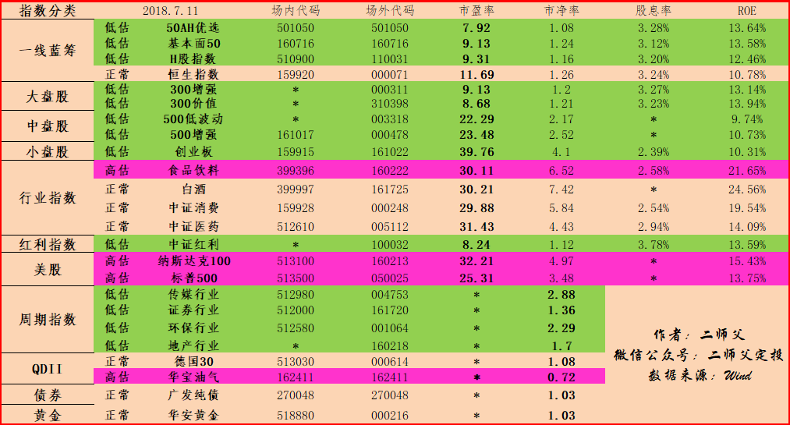

======================================================

_type: talk
@二师父[28814221155551]
2018-07-12 02:51:35 Thu  
topic_id: 88242124445112

底部在哪里

@注意要低调 at 2018-07-12 02:51:35 Thu

> 二师父辛苦！请问二师父您觉得市场由熊转牛的时候蓝筹股，中小板块和创业板哪个会率先进入牛市行情？

----------

@二师父 at 2018-07-12 02:51:35 Thu

> 一起进

----------

阅读[1412]  评论[2]  赞[0] 

+++++++++++++++++++++++++++++++++++++++++++++++++++++

文件：
2018-07-12 02:51:33 Thu
文件大小：[340805]
88881488124422-市场底部到了吗.pdf

======================================================

_type: talk
@二师父[28814221155551]
2018-07-12 12:15:17 Thu  
topic_id: 51545842128444

<e type="hashtag" hid="881422852442" title="#定投实盘#" /> 每周四定投，500增强买入一份，300增强买入一份，不要着急慢慢买

阅读[1310]  评论[0]  赞[0] 

======================================================

_type: q&a
@健哥[51511242852814]
2018-07-12 12:16:21 Thu  
topic_id: 28242121222281

@健哥

>  二师父，今天比昨天涨了一些，本该今天定投，需要调整到下一天吗(下降)

@二师父

>  你不是调整到昨天了吗

阅读[1020]  评论[4]  赞[0] 

======================================================

_type: q&a
@一七五[48248584445558]
2018-07-12 14:09:01 Thu  
topic_id: 51545845111484

@一七五

>  二师父，请教一个问题，一直不明白，我在场内股票账户里也能用场外的基金代码查询到，那么，我可以直接在场内用场外代码购买指数基金吗？

@二师父

>  可以的，一种是ETF一种是LOF，在场内买入即可，注意慢慢买，好溢价的别买了，最好买有折价的

阅读[1045]  评论[0]  赞[0] 

======================================================

_type: q&a
@小牧童[28484254825881]
2018-07-12 15:22:51 Thu  
topic_id: 15414814411822

@小牧童

>  二师父，你好，我看您的文章中定投的加仓系数C=A*PE1/PE2*B，我想问PE1的低估伐值怎么确认？哪里能找到这个数字？

@二师父

>  这个会变化比如中证500是25倍市盈率，500增强是29倍市盈率

阅读[1108]  评论[3]  赞[0] 

======================================================

_type: talk
@二师父[28814221155551]
2018-07-13 01:31:11 Fri  
topic_id: 15414885148242

阅读[1322]  评论[0]  赞[0] 

+++++++++++++++++++++++++++++++++++++++++++++++++++++

文件：
2018-07-13 01:31:08 Fri
文件大小：[322590]
28881484542881-如何利用折价提高场内ETF投资的收益率.pdf

======================================================

_type: talk
@二师父[28814221155551]
2018-07-13 01:31:49 Fri  
topic_id: 28242118421521

<e type="hashtag" hid="518444224584" title="#7.12指数估值#" />

阅读[1357]  评论[0]  赞[0] 

+++++++++++++++++++++++++++++++++++++++++++++++++++++

图片：
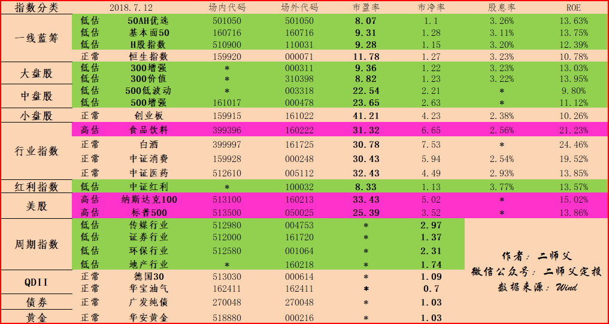

======================================================

_type: q&a
@健哥[51511242852814]
2018-07-13 20:51:10 Fri  
topic_id: 51544221451544

@健哥

>  想问一下二师父现在100032持仓收益率是多少呢

@二师父

>  负0.68

阅读[974]  评论[4]  赞[0] 

======================================================

_type: talk
@二师父[28814221155551]
2018-07-14 03:42:44 Sat  
topic_id: 48522442454418

<e type="hashtag" hid="481222888218" title="#7.13指数估值#" /> 白酒又高估了，2800点，仍旧是非常好的投资点位，记得坚持喔。周末愉快。

阅读[1281]  评论[0]  赞[0] 

+++++++++++++++++++++++++++++++++++++++++++++++++++++

图片：
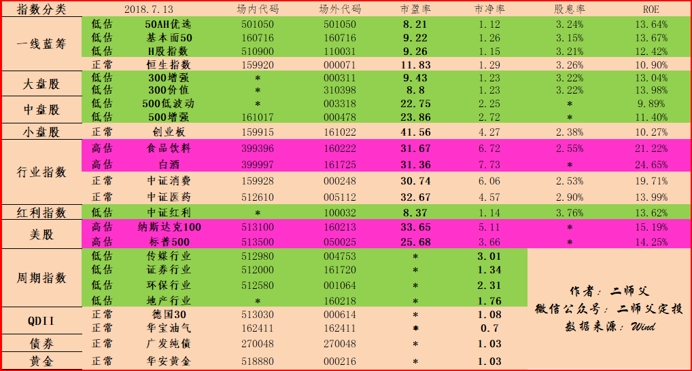

======================================================

_type: talk
@二师父[28814221155551]
2018-07-14 03:43:57 Sat  
topic_id: 51544224252284

@健哥 at 2018-07-14 03:43:57 Sat

> 二师父主动型基金负多少止损？

----------

@小诸葛 at 2018-07-14 03:43:57 Sat

> 二师父买的指数是场内还是场外的？

----------

@二师父 at 2018-07-14 03:43:57 Sat

> 我是负百分之10止损，主动基金

----------

@二师父 at 2018-07-14 03:43:57 Sat

> 场外的

----------

@健哥 at 2018-07-14 03:43:57 Sat

> 全部止损吗

----------

@二师父 at 2018-07-14 03:43:57 Sat

> 对，所以承受不了的话别投主动基金，而且回撤大的不考虑

----------

@健哥 at 2018-07-14 03:43:57 Sat

> 二师父以后能否能公布一下主动基金的定投实盘呢

----------

@二师父 at 2018-07-14 03:43:57 Sat

> 这个不考虑呢，建议定投指数基金即可

----------

阅读[1416]  评论[9]  赞[0] 

+++++++++++++++++++++++++++++++++++++++++++++++++++++

文件：
2018-07-14 03:43:05 Sat
文件大小：[377364]
48881254184188-指数基金VS主动基金.pdf

======================================================

_type: q&a
@蛋孩[51584451415484]
2018-07-14 12:53:40 Sat  
topic_id: 51544212188514

@蛋孩

>  二师傅，能讲讲黄金和债权的估值方法吗？

@二师父

>  根据金价和油价，债券的话根据市场熊牛以及历史净值区间

阅读[1100]  评论[0]  赞[0] 

======================================================

_type: q&a
@一七五[48248584445558]
2018-07-15 04:40:02 Sun  
topic_id: 15411224251482

@一七五

>  二师父有研究下分级基金吗，现在股市低位，买分级基金B是不是收益远大于风险了？

@二师父

>  看了看分级基金，是这样的，基金公司发一只母鸡，然后ab等额，不过b会向a借钱，给a利息，然后a相当于一只债券，b投资于指数，b就相当一只杠杆基金。这就跟银行贷款杠杆炒房一个道理，如果房价大涨，我们可以赚很多，反之如果房价跌，亏的更多。那么问题来了，现在熊市，母鸡都不断下降，假如投资券商，大跌，那么分级b下折更多，亏损更多，牛市的时候适合分级b，现在请不要买

阅读[1077]  评论[1]  赞[0] 

======================================================

_type: q&a
@我本頑痴[48258485581828]
2018-07-15 16:31:13 Sun  
topic_id: 51544154452884

@我本頑痴

>  我现在开始定投，每个月投1200~1500，有几个问题，第一个是，投几只基金比较好，再就是投哪几只？

@二师父

>  投三只比较好，请问资金量情况如何呢？

阅读[1015]  评论[3]  赞[0] 

======================================================

_type: q&a
@比肥皂还肥[51542451825584]
2018-07-16 01:09:49 Mon  
topic_id: 28244845244241

@比肥皂还肥

>  二师父你好，初学者，请问下，要定投场内中证500，我在华泰里搜，为什么出来好多个，什么etf500，500etf，中证500，这些都是什么啊？是不是问了一个很傻的问题？

@二师父

>  场内投选500ETF就行啦，基金是有很多种类的，场内有ETF和LOF，别选分级基金就好。
>  
>  分级基金有a类和b类，这种有折价的。然后etf分a类c类。不用管那么多，如果场内就选ETF，这些概念等你接触长自然就懂了。
>  
>  对于新手，建议场外申购，因为场内买入有溢价，容易买贵，但是如果能够避免高溢价场内其实手续费是比场外低的。

阅读[1022]  评论[1]  赞[0] 

======================================================

_type: talk
@二师父[28814221155551]
2018-07-16 01:47:29 Mon  
topic_id: 28244845412451

不断投资，不断思考总结，这样我们的疑问就会越来越少，每个精明的投资者都是从新手蜕变的。

@海盗 at 2018-07-16 01:47:29 Mon

> 今天的估值表还没出来呀

----------

@二师父 at 2018-07-16 01:47:29 Mon

> 还没呢

----------

阅读[1460]  评论[2]  赞[0] 

+++++++++++++++++++++++++++++++++++++++++++++++++++++

文件：
2018-07-16 01:46:51 Mon
文件大小：[334019]
51118455151224-定投日大涨不想定投怎么办.pdf

======================================================

_type: talk
@二师父[28814221155551]
2018-07-16 13:07:40 Mon  
topic_id: 88244844111552

<e type="hashtag" hid="881251425252" title="#鳄鱼计划#" /> 买入中证红利增强一份，50ah优选一份，天弘中证银行一份（代码，001594），可以逐步加大定投节奏，市场反复磨底就是给我们买入的机会

@cotton at 2018-07-16 13:07:40 Mon

> 天弘是二师傅刚开始定投的吗

----------

@二师父 at 2018-07-16 13:07:40 Mon

> 对，新加入的

----------

@朱朱 侠 at 2018-07-16 13:07:40 Mon

> 什么叫加大定投节奏

----------

@二师父 at 2018-07-16 13:07:40 Mon

> 买入频率增高

----------

阅读[1367]  评论[4]  赞[0] 

======================================================

_type: talk
@朱朱 侠[48288828125218]
2018-07-16 13:33:15 Mon  
topic_id: 15411518252822

<e type="hashtag" hid="881251425252" title="#鳄鱼计划#" />  中证红利增强代码多少

@勤能行之 at 2018-07-16 13:33:15 Mon

> 100033

----------

@朱朱 侠 at 2018-07-16 13:33:15 Mon

> 100033没有这个代码

----------

@海盗 at 2018-07-16 13:33:15 Mon

> 100032

----------

阅读[985]  评论[3]  赞[0] 

======================================================

_type: talk
@朱朱 侠[48288828125218]
2018-07-16 13:33:43 Mon  
topic_id: 51544148212844

<e type="hashtag" hid="881251425252" title="#鳄鱼计划#" />  50ah的代码

@勤能行之 at 2018-07-16 13:33:43 Mon

> 501050

----------

阅读[987]  评论[1]  赞[0] 

======================================================

_type: q&a
@思念☆雙眸[88225224454522]
2018-07-16 13:55:57 Mon  
topic_id: 88244841514442

@思念☆雙眸

>  天弘中证银行先建百分之10或者20的底仓，然后再每周定投怎么样？

@二师父

>  可以，不过你的承受的了波动

阅读[1096]  评论[4]  赞[0] 

======================================================

_type: q&a
@一七五[48248584445558]
2018-07-16 14:16:40 Mon  
topic_id: 15411518528452

@一七五

>  二师父，券商基金确实现在太便宜了，是否可以多积累点份额，等牛市到来呢？

@二师父

>  可以的，券商一到牛市就暴涨

阅读[1143]  评论[12]  赞[0] 

======================================================

_type: q&a
@朱朱 侠[48288828125218]
2018-07-16 20:49:11 Mon  
topic_id: 15411584125842

@朱朱 侠

>  请问你说把钱在证券帐户里买货币基金，买哪种货币基金？上次好像说什么南方…代码多少

@二师父

>  买的是南方天天利B

阅读[1143]  评论[0]  赞[0] 

======================================================

_type: q&a
@朱朱 侠[48288828125218]
2018-07-16 20:49:27 Mon  
topic_id: 28244812452521

@朱朱 侠

>  在证券帐户买货币基金就不受单日取现一万元的限制了吗？

@二师父

>  这个目前还没有限制

阅读[1162]  评论[0]  赞[0] 

======================================================

_type: q&a
@sun[15481522845412]
2018-07-16 20:50:02 Mon  
topic_id: 88244812451282

@sun

>  请问，中证银行与中证全指金融的区别

@二师父

>  银行全是银行股，全指金融有银行，保险，证券，地产

阅读[1247]  评论[0]  赞[0] 

======================================================

_type: q&a
@朱朱 侠[48288828125218]
2018-07-16 20:54:52 Mon  
topic_id: 28244812482181

@朱朱 侠

>  代码多少南方天天利B没找到？这个可以大额提现吗？

@二师父

>  003474

阅读[1301]  评论[0]  赞[0] 

======================================================

_type: q&a
@朱朱 侠[48288828125218]
2018-07-16 23:14:47 Mon  
topic_id: 48522815185828

@朱朱 侠

>  我看货币基金上写明不保证收益不负责亏损，为什么要把钱存入货币基金比放银行要好

@二师父

>  那你就买银行理财吧，限期的那种

阅读[1287]  评论[0]  赞[0] 

======================================================

_type: q&a
@比肥皂还肥[51542451825584]
2018-07-17 02:02:31 Tue  
topic_id: 48522812252128

@比肥皂还肥

>  二师父，我买的汇添富货币基金，好像现在单日快速提现额度最高1w，其他的货币基金呢？也都这样吗？

@二师父

>  即时到帐是有限制，不过一般t加2

阅读[1382]  评论[0]  赞[0] 

======================================================

_type: talk
@二师父[28814221155551]
2018-07-17 03:12:07 Tue  
topic_id: 28244814114811

<e type="hashtag" hid="481222218128" title="#7.16指数估值#" /> 估值表没啥变化，低估定投即可

@海盗 at 2018-07-17 03:12:07 Tue

> 二师父，券商指的是那个161720吗？

----------

@二师父 at 2018-07-17 03:12:07 Tue

> 对的

----------

阅读[1769]  评论[2]  赞[0] 

+++++++++++++++++++++++++++++++++++++++++++++++++++++

图片：

======================================================

_type: talk
@二师父[28814221155551]
2018-07-17 03:15:47 Tue  
topic_id: 28244814114221

阅读[1839]  评论[0]  赞[0] 

+++++++++++++++++++++++++++++++++++++++++++++++++++++

文件：
2018-07-17 03:15:07 Tue
文件大小：[321210]
15558148881582-定投可以先建底仓吗.pdf

======================================================

_type: talk
@一七五[48248584445558]
2018-07-17 15:17:26 Tue  
topic_id: 88244252124552

我是最近几天才开始投指数基金的，以前都在跟二师父学习阶段，也有过断断续续10年左右炒股经历，目前在大盘2800点附近，大概建了40%的底仓，主要投资了增强300和增强500，50AH，红利基金和券商及银行。
  目前整体亏损0.5%左右，看上去底仓建得有点多，但是在目前的位置，我觉得下降空间有限，如果在2800点只建10%底仓，然后每下降10%加仓10%，就算下降到2200点左右，我也才30%仓位，而且我也怀疑大盘跌到2200点的机率有多大？
   以上个人观点，请二师父及各位指教，点评，谢谢！

@思念☆雙眸 at 2018-07-17 15:17:26 Tue

> 人有多大胆，地有多大产[奸笑]

----------

@高达无双喝味全 at 2018-07-17 15:17:26 Tue

> 只要低估就可以买  如果从2800直接到6800 不是就错过行情了么

----------

@海盗 at 2018-07-17 15:17:26 Tue

> 这位师兄挣钱比较急，可以理解[得意]

----------

@Tim哥 at 2018-07-17 15:17:26 Tue

> 时间掐得准的

----------

@勤能行之 at 2018-07-17 15:17:26 Tue

> 很赞！

----------

阅读[1836]  评论[5]  赞[0] 

======================================================

_type: talk
@二师父[28814221155551]
2018-07-18 02:13:24 Wed  
topic_id: 48522585882428

<e type="hashtag" hid="158111185812" title="#7.17指数估值#" /> 银行进一步杀估值，投资价值越来越大。似乎越是熊市，投资热情越低啊

@小涛@我的四季生活 at 2018-07-18 02:13:24 Wed

> 中证银行现在怎么那么低呀？

----------

@二师父 at 2018-07-18 02:13:24 Wed

> 银行是经济的晴雨表，现在经济不景气啊，所以银行业也很糟糕，这就给我们提供了很好的买入机会

----------

@小涛@我的四季生活 at 2018-07-18 02:13:24 Wed

> 喔，那你觉得它要回归正常值大概需要几年？

----------

@二师父 at 2018-07-18 02:13:24 Wed

> 市场不好预测啊

----------

@小涛@我的四季生活 at 2018-07-18 02:13:24 Wed

> 也是，我目前投的基本面120、A股红利、500增强这三支未来走势应该不错吧

----------

阅读[1909]  评论[5]  赞[0] 

+++++++++++++++++++++++++++++++++++++++++++++++++++++

图片：
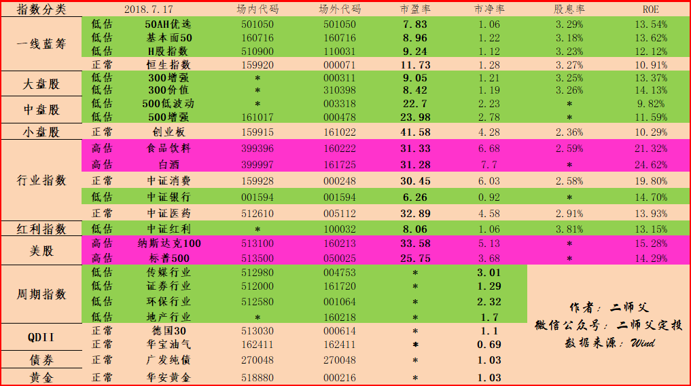

======================================================

_type: q&a
@朱朱 侠[48288828125218]
2018-07-18 12:06:54 Wed  
topic_id: 48522554882488

@朱朱 侠

>  004752与估值表里的周期指数004753有什么区别

@二师父

>  c类没有申购费用，a类基金托管和管理费很低

阅读[1521]  评论[2]  赞[0] 

======================================================

_type: q&a
@勤能行之[481211221828]
2018-07-18 16:54:50 Wed  
topic_id: 28244228414481

@勤能行之

>  师傅，我已经买了五成（十万份）的红利机会了，成本价是¥1.03。现在我想每下跌2%就买入一万元红利机会，这样可以吗，现在还有十几万的存量资金（也是五成吧)。喜欢红利机会是因为他的分红，相对省心一点。请师傅赐教。

@二师父

>  可以，我选的中证红利，最大跌幅可以控制在百分之30

阅读[1556]  评论[5]  赞[0] 

======================================================

_type: talk
@二师父[28814221155551]
2018-07-19 04:59:49 Thu  
topic_id: 51544542442114

<e type="hashtag" hid="281415154581" title="#7.18指数估值#" /> 坚持定投，每周投一点点，积累下来就是可观的持仓。

阅读[2024]  评论[0]  赞[0] 

+++++++++++++++++++++++++++++++++++++++++++++++++++++

图片：
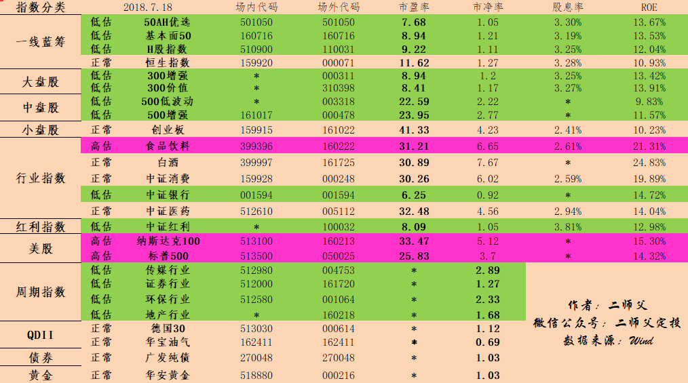

======================================================

_type: talk
@二师父[28814221155551]
2018-07-19 12:13:53 Thu  
topic_id: 28244244152521

<e type="hashtag" hid="881422852442" title="#定投实盘#" /> 500增强买入两份，中证红利增强买入一份。低估继续积累股份，坚持再坚持！

@一七五 at 2018-07-19 12:13:53 Thu

> 二师傅一份是多少钱的。

----------

@二师父 at 2018-07-19 12:13:53 Thu

> 2000

----------

@二师父 at 2018-07-19 12:13:53 Thu

> 你根据自身情况计算，我目前子弹也不多了

----------

@一七五 at 2018-07-19 12:13:53 Thu

> 哈哈，原来二师傅的仓位也很高了，这样我就放心了。

----------

@二师父 at 2018-07-19 12:13:53 Thu

> 如果继续跌，存量资金打完了就可以用增量资金了，现在真的很便宜，只要不卖，收益会超出你的想象

----------

@一七五 at 2018-07-19 12:13:53 Thu

> 是的，我也这么认为的，但是唯一担心的是，以现在的国情加上和美国杠，会不会来一波百年不遇的经济危机？像日本那样，股市低迷20年，真是要人命了。

----------

@二师父 at 2018-07-19 12:13:53 Thu

> 相信中国，真的到了那时候大家都一样日子不好过，也可以做波段

----------

@勤能行之 at 2018-07-19 12:13:53 Thu

> 同感

----------

阅读[2020]  评论[9]  赞[0] 

======================================================

_type: q&a
@小诸葛[88484182152412]
2018-07-19 22:07:27 Thu  
topic_id: 88244212211412

@小诸葛

>  二师父，军工板块我看跌的挺惨，是不是现在也处于低估的状态？

@二师父

>  对，目前也是低估，只是我不喜欢重工业

阅读[1508]  评论[0]  赞[0] 

======================================================

_type: talk
@二师父[28814221155551]
2018-07-20 02:01:52 Fri  
topic_id: 88244214158812

<e type="hashtag" hid="518482845224" title="#7.19指数估值#" /> 黄金进入低估，避险品种。坚持投资，目前平台各种暴雷，咱们的指数基金还是很安全的。

阅读[2125]  评论[0]  赞[0] 

+++++++++++++++++++++++++++++++++++++++++++++++++++++

图片：
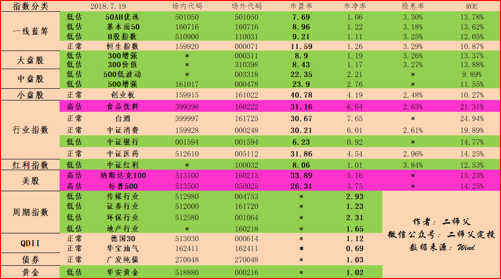

======================================================

_type: talk
@二师父[28814221155551]
2018-07-20 02:16:28 Fri  
topic_id: 28244214152551

阅读[2208]  评论[0]  赞[0] 

+++++++++++++++++++++++++++++++++++++++++++++++++++++

文件：
2018-07-20 02:16:24 Fri
文件大小：[335890]
88881441251812-熊市需要熬.pdf

======================================================

_type: q&a
@乡下人[28244152425511]
2018-07-20 12:42:34 Fri  
topic_id: 15411488241882

@乡下人

>  老师:红利总是听别人讲红利基金有分红省心，难道和别的基金分红不同，不是分自己的钱？

@二师父

>  是的，比如上证红利就有分红不稳定的情况

阅读[1759]  评论[0]  赞[0] 

======================================================

_type: q&a
@黛染清浅[15288412818452]
2018-07-20 13:50:18 Fri  
topic_id: 15411824584812

@黛染清浅

>  师父您好，我一直没大想明白为什么不能看基金净值，如果净值低的话，那我们同样的金额不是买的份数多吗？谢谢

@二师父

>  基金净值＝市盈率×盈利，有时候盈利低，净值低，但是估值高，估值和净值不是完全同步

阅读[1949]  评论[0]  赞[0] 

======================================================

_type: talk
@二师父[28814221155551]
2018-07-20 14:36:29 Fri  
topic_id: 48522145252128

中证银行都买了没

@黛染清浅 at 2018-07-20 14:36:29 Fri

> 买了

----------

@尤加利树 at 2018-07-20 14:36:29 Fri

> 买少了

----------

@二师父 at 2018-07-20 14:36:29 Fri

> 还有机会

----------

@二师父 at 2018-07-20 14:36:29 Fri

> 棒

----------

@尤加利树 at 2018-07-20 14:36:29 Fri

> 追？还是等？

----------

@二师父 at 2018-07-20 14:36:29 Fri

> 我从来不追，这是很危险的，目前仍旧很低估啊

----------

@cotton at 2018-07-20 14:36:29 Fri

> 今天买了点。。迟么

----------

@高达无双喝味全 at 2018-07-20 14:36:29 Fri

> 买了一份  买少了+1

----------

阅读[2033]  评论[21]  赞[0] 

======================================================

_type: q&a
@勤能行之[481211221828]
2018-07-20 17:20:22 Fri  
topic_id: 28244154854881

@勤能行之

>  师傅，是不是可以考虑一下金融全指指数啊。

@二师父

>  全指金融包括银行，保险，券商，这个根据自身情况配置吧

阅读[2002]  评论[0]  赞[0] 

======================================================

_type: q&a
@黛染清浅[15288412818452]
2018-07-20 19:07:40 Fri  
topic_id: 15411852415512

@黛染清浅

>  师父，低谷的评估标准是什么？高估呢

@二师父

>  低估是基金的价格低于实际价值，对于常见指数实际指标就是市盈率低于某一指标，高估是市盈率高于某一指标

阅读[1998]  评论[10]  赞[0] 

======================================================

_type: q&a
@勤能行之[481211221828]
2018-07-20 19:08:11 Fri  
topic_id: 28244185222821

@勤能行之

>  问一个比较浅的问题，因为我在百度上面没有找到，就是在天天基金上面能看到指数基金实时的净值吗，求各位解答一下。谢谢啦

@二师父

>  在蚂蚁和蛋卷可以看到

阅读[2055]  评论[1]  赞[0] 

======================================================

_type: talk
@二师父[28814221155551]
2018-07-21 04:24:45 Sat  
topic_id: 51544815254414

<e type="hashtag" hid="158185218252" title="#7.20指数估值#" />

阅读[2521]  评论[0]  赞[0] 

+++++++++++++++++++++++++++++++++++++++++++++++++++++

图片：
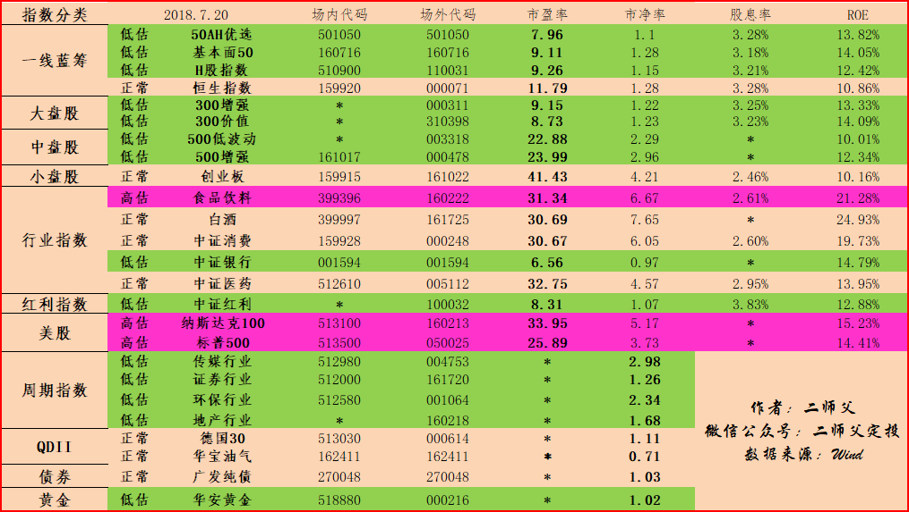

======================================================

_type: talk
@二师父[28814221155551]
2018-07-21 04:27:19 Sat  
topic_id: 51544815258544

@徐美芳 at 2018-07-21 04:27:19 Sat

> 看了二师傅很多文章，非常感谢，逐步学习中。文末的问题生活中很常见，主要还是现在大家对婚姻的不确定吧，女方这个要求是想给女儿多个保障或者是想避免与长辈同住？至于合不合理，如果资金宽裕，再买套婚房，产权共有，也是蛮多见的，至于买房的钱，男方全款或大家合资出部分，都可以商量一下。总之，步入婚姻，生活更不易，是两个家庭在很多方面融合，特别是有了孩子以后更明显，双方都要努力，在好多方面真不能太较真，家庭责任感很重要，大家都宽容点，日子才能过好。

----------

@思念☆雙眸 at 2018-07-21 04:27:19 Sat

> [强][强][强]

----------

@黛染清浅 at 2018-07-21 04:27:19 Sat

> 我是个姑娘，我觉得是不合理的。婚姻里面两个人是平等的，谁掏的钱就写谁的名字，我觉得这是合理的。但是我觉得女孩子要是有一套自己买的房子，在婚姻里会非常有底气。两个人就是要相互扶持，如果都要写俩人的名字，我觉得可以结婚以后两个人一起努力。

----------

@二师父 at 2018-07-21 04:27:19 Sat

> 说的好

----------

@二师父 at 2018-07-21 04:27:19 Sat

> 相互扶持是最重要的

----------

阅读[2667]  评论[5]  赞[0] 

+++++++++++++++++++++++++++++++++++++++++++++++++++++

文件：
2018-07-21 04:26:11 Sat
文件大小：[341529]
48881214584828-急涨慢跌就是熊市.pdf

======================================================

_type: talk
@二师父[28814221155551]
2018-07-22 02:25:18 Sun  
topic_id: 28244121825511

阅读[2517]  评论[0]  赞[0] 

+++++++++++++++++++++++++++++++++++++++++++++++++++++

文件：
2018-07-22 02:25:15 Sun
文件大小：[345479]
15558185521852-如果股市一直低迷，我们投资的指数基金怎么赚钱.pdf

======================================================

_type: talk
@二师父[28814221155551]
2018-07-22 21:37:38 Sun  
topic_id: 28244144122511

阅读[2492]  评论[0]  赞[0] 

+++++++++++++++++++++++++++++++++++++++++++++++++++++

文件：
2018-07-22 21:36:44 Sun
文件大小：[388039]
15541525244822-疫苗造假引发众怒，医药指数基金的三架马车了解一下.pdf

======================================================

_type: q&a
@健哥[51511242852814]
2018-07-23 12:38:28 Mon  
topic_id: 51544885152224

@健哥

>  二师父有没有给399011加仓呢

@二师父

>  这个还没有低估呢

阅读[1982]  评论[5]  赞[0] 

======================================================

_type: talk
@二师父[28814221155551]
2018-07-24 04:19:28 Tue  
topic_id: 15418224815512

<e type="hashtag" hid="881418481252" title="#7.23指数估值#" /> 中证医药进入低估，可以再等等投资

阅读[2376]  评论[0]  赞[0] 

+++++++++++++++++++++++++++++++++++++++++++++++++++++

图片：
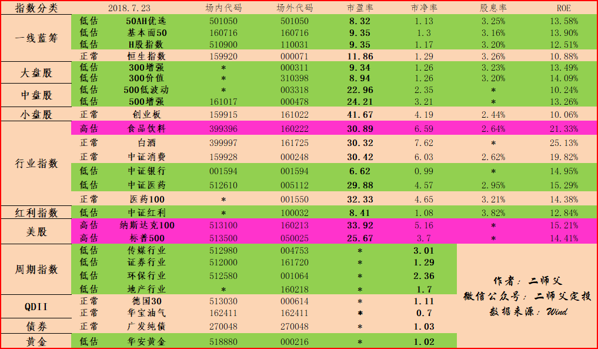

======================================================

_type: talk
@二师父[28814221155551]
2018-07-24 04:20:03 Tue  
topic_id: 48521445128828

银行涨，医药跌，总会有机会

@比肥皂还肥 at 2018-07-24 04:20:03 Tue

> 黑天鹅

----------

阅读[2437]  评论[1]  赞[0] 

+++++++++++++++++++++++++++++++++++++++++++++++++++++

文件：
2018-07-24 04:19:57 Tue
文件大小：[330331]
88824852285522-长生生物跌停，聊聊医药和银行指数基金.pdf

======================================================

_type: q&a
@落叶无痕[15458288444122]
2018-07-24 10:26:00 Tue  
topic_id: 88241554141142

@落叶无痕

>  二师父，能否帮看看，华泰证券涨乐通里面有哪些不错的货币基金啊，我咋找不到尼，拜托拜托

@二师父

>  南方天天利B

阅读[1909]  评论[3]  赞[0] 

======================================================

_type: talk
@二师父[28814221155551]
2018-07-24 14:18:40 Tue  
topic_id: 88241588424452

今天又涨了，二师父的基金除了券商已经全部浮盈。从目前看给高仓位的投资者缓解了心理压力。不要追涨，结合自己的仓位按照实际定投就好，且投且珍惜，目前仍旧很低估喔。

@victoria at 2018-07-24 14:18:40 Tue

> 这几天有什么利好吗，为什么一直涨

----------

@victoria at 2018-07-24 14:18:40 Tue

> 一直涨我就不敢买了

----------

@二师父 at 2018-07-24 14:18:40 Tue

> 量化宽松的货币政策，利好楼市的，股市还是情绪影响在，很多人兴奋

----------

@海盗 at 2018-07-24 14:18:40 Tue

> 看见涨了，还不如跌了看见高兴，跌了我们也好加仓啊！😀

----------

@比肥皂还肥 at 2018-07-24 14:18:40 Tue

> 我们定投的看见跌了你看见涨了更高兴😂我也是这两天有点投不下手啊

----------

@二师父 at 2018-07-24 14:18:40 Tue

> 保持乐观，跌了赚股，涨了赚钱

----------

@健哥 at 2018-07-24 14:18:40 Tue

> 二师父推荐一只债券基呢

----------

@二师父 at 2018-07-24 14:18:40 Tue

> 下面估值表有啊

----------

阅读[2411]  评论[8]  赞[0] 

======================================================

_type: talk
@二师父[28814221155551]
2018-07-25 02:59:57 Wed  
topic_id: 51548251115884

<e type="hashtag" hid="881418128512" title="#7.24指数估值#" />仍旧很多低估品种，珍惜定投的机会

@杨小峰 at 2018-07-25 02:59:57 Wed

> 二师父，我想把红了的50ah卖了换成300价值或者300增强可以吗，现在持仓还有50etf链接a基金。

----------

@二师父 at 2018-07-25 02:59:57 Wed

> 没有必要的。首先二师父持有300增强，50ah目前都是低估，等待价值回归就好啦。

其次，二者很多重仓股票是重合的。他们俩大多数重仓股都集中在金融行业，可以说这是大盘股的典型特征，这样就没有必要去换。

最后，二者重仓股不同在哪里呢，300价值的大盘是集中银行，保险加消费，而50ah有银行，保险，消费证券，医药股票，同时还具有A股港股底价轮动的好处，为啥要花费不必要的手续费去操作呢。

记住芒格的话，减少操作。

----------

@杨小峰 at 2018-07-25 02:59:57 Wed

> 好的，谢谢二师父。

----------

阅读[2379]  评论[3]  赞[0] 

+++++++++++++++++++++++++++++++++++++++++++++++++++++

图片：
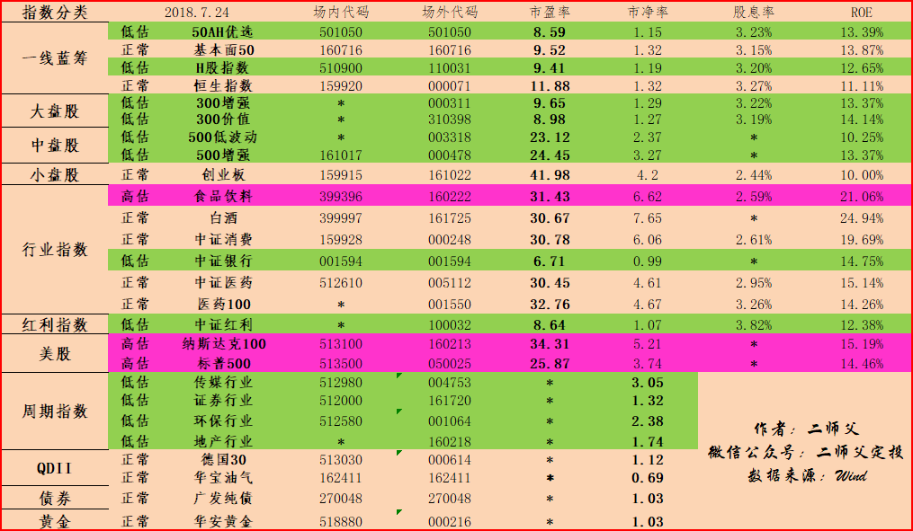

======================================================

_type: talk
@二师父[28814221155551]
2018-07-25 03:01:15 Wed  
topic_id: 28241528884521

最近有点忙，二师父在写书，如果有幸能够出版一本的话免费送给群内朋友哈。现在机会仍旧很好，不要追涨，按照计划投资就好啦

@cotton at 2018-07-25 03:01:15 Wed

> 就算你不送我也会去买的，二师傅[呲牙]

----------

@海盗 at 2018-07-25 03:01:15 Wed

> 我相信，大家都有感恩之心，谢谢二师父

----------

@小诸葛 at 2018-07-25 03:01:15 Wed

> 二师父，有空可以建一个微信群，供大家交流啊！

----------

@二师父 at 2018-07-25 03:01:15 Wed

> 谢谢支持

----------

@二师父 at 2018-07-25 03:01:15 Wed

> 很棒

----------

@二师父 at 2018-07-25 03:01:15 Wed

> 星球交流就很赞啊，可以提问，可以分享自己的心得

----------

@麦的风 at 2018-07-25 03:01:15 Wed

> 这个书必须买[微笑]

----------

@勤能行之 at 2018-07-25 03:01:15 Wed

> 好期待师傅的书啊。无论如何我都会自己再买一本，支持师傅！

----------

阅读[2473]  评论[10]  赞[0] 

+++++++++++++++++++++++++++++++++++++++++++++++++++++

文件：
2018-07-25 03:01:42 Wed
文件大小：[340630]
88824854455842-大盘企稳，牛市来了？.pdf

======================================================

_type: q&a
@掌心的温暖[51442142481254]
2018-07-25 11:58:00 Wed  
topic_id: 48521458524258

@掌心的温暖

>  二师父，我是新手一枚。刚加入您的学堂。我有刚开始投南方中证500（160119），我看这支后续都没在您的估值表内了。现想定投500增强，需要直接把它转换成500增强么？还是另行购买？新手一枚，想听您的建议！！

@二师父

>  我建议直接投中证500就行，目前低估。
>  
>  如果想换，那么以前投入的留着就行，毕竟低估买入的，耐心持有会有很好的利润

阅读[1956]  评论[1]  赞[0] 

======================================================

_type: q&a
@黛染清浅[15288412818452]
2018-07-25 12:00:38 Wed  
topic_id: 15418248582252

@黛染清浅

>  二师父，有没有空介绍下海外资产配置基金，谢谢，是不是也可以按我们的方法判断是不是低估，低估的参数是要去找海外的历史市盈率吗

@二师父

>  好的，我看这几天整理下介绍吧，不同品种的方法不一样

阅读[1938]  评论[1]  赞[0] 

======================================================

_type: talk
@二师父[28814221155551]
2018-07-25 14:09:29 Wed  
topic_id: 28241521142151

<e type="hashtag" hid="881251425252" title="#鳄鱼计划#" /> 今日买入500增强一份，中证红利增强一份，看估值投资而不要看涨跌，仍旧很低估，买入持有就好

@海盗 at 2018-07-25 14:09:29 Wed

> 已跟投

----------

@麦的风 at 2018-07-25 14:09:29 Wed

> 周四持续定投[微笑]

----------

@勤能行之 at 2018-07-25 14:09:29 Wed

> 真的心里定了很多。跟着师傅执行鳄鱼计划和按纪律定投就好了。

----------

阅读[2534]  评论[3]  赞[0] 

======================================================

_type: talk
@朱朱 侠[48288828125218]
2018-07-25 15:33:21 Wed  
topic_id: 28241545815841

<e type="hashtag" hid="881251425252" title="#鳄鱼计划#" />  买入一份是加大投资频率吗？

阅读[1916]  评论[0]  赞[0] 

======================================================

_type: talk
@二师父[28814221155551]
2018-07-26 03:38:20 Thu  
topic_id: 28212212285251

阅读[2463]  评论[0]  赞[0] 

+++++++++++++++++++++++++++++++++++++++++++++++++++++

文件：
2018-07-26 03:38:19 Thu
文件大小：[430073]
15541555518152-如何进行海外及境外资产配置.pdf

======================================================

_type: talk
@二师父[28814221155551]
2018-07-26 03:39:11 Thu  
topic_id: 15484484452452

<e type="hashtag" hid="281412542851" title="#7.25指数估值#" /> 恒生国企进入正常估值

阅读[2484]  评论[0]  赞[0] 

+++++++++++++++++++++++++++++++++++++++++++++++++++++

图片：

======================================================

_type: talk
@二师父[28814221155551]
2018-07-26 09:46:35 Thu  
topic_id: 15484481542542

<e type="hashtag" hid="881422852442" title="#定投实盘#" /> 500增强买入一份，300增强买入一份，中证红利买入0.5份。

@cotton at 2018-07-26 09:46:35 Thu

> 二师傅，本来今天就是定投日，不是定投实盘的意思吗？

----------

@海盗 at 2018-07-26 09:46:35 Thu

> 二师父怎么有0.5份呀，以前可没见二师父买过啊

----------

@海盗 at 2018-07-26 09:46:35 Thu

> 另外好像见二师父中证银行就买过一次？

----------

@勤能行之 at 2018-07-26 09:46:35 Thu

> 是同一个意思。

----------

@cotton at 2018-07-26 09:46:35 Thu

> 不是同一个意思。。每周定投师傅不会每次都说。。。

----------

@二师父 at 2018-07-26 09:46:35 Thu

> 对

----------

@二师父 at 2018-07-26 09:46:35 Thu

> 1份如果1000，0.5份就是500

----------

@勤能行之 at 2018-07-26 09:46:35 Thu

> 明白了

----------

阅读[2454]  评论[9]  赞[0] 

======================================================

_type: q&a
@小诸葛[88484182152412]
2018-07-26 12:42:40 Thu  
topic_id: 51585584514844

@小诸葛

>  二师父，请问163115这个基金是指数型的吗

@二师父

>  对，指数分级基金

阅读[1847]  评论[0]  赞[0] 

======================================================

_type: q&a
@勤能行之[481211221828]
2018-07-26 12:44:34 Thu  
topic_id: 15484122418852

@勤能行之

>  师傅，我想近期主要就是定投和鳄鱼中证红利可以吗？这样的策略可行吗？

@二师父

>  可以的，资金量充足可以多投点，资金量紧张就适当减少了

阅读[1910]  评论[3]  赞[0] 

======================================================

_type: q&a
@蛋孩[51584451415484]
2018-07-26 21:57:34 Thu  
topic_id: 51585428558584

@蛋孩

>  二师傅，最近认真收集学习了香港大盘的相关知识，能不能分析下香港大盘跟踪的恒生中国企业25指数的估值方法，多少进入低估，多少进入高估？建议能不能把香港大盘纳入到每天的投资估值表里面呢😊

@二师父

>  恒生国企就很有投资价值了，大盘目前都不低

阅读[1869]  评论[0]  赞[0] 

======================================================

_type: talk
@二师父[28814221155551]
2018-07-27 01:25:17 Fri  
topic_id: 88212485412842

<e type="hashtag" hid="481215882818" title="#7.26指数估值#" /> 医药估值杀了一些，希望能够继续杀医药估值，这是个非常好的行业。至于避险品种，目前不建议多投资，A股如此便宜不买那不是亏大了。且投且珍惜，只有低估敢于买入，我们才能够赚到。机会是留给有准备的人的，此刻你准备了吗

阅读[2377]  评论[0]  赞[0] 

+++++++++++++++++++++++++++++++++++++++++++++++++++++

图片：
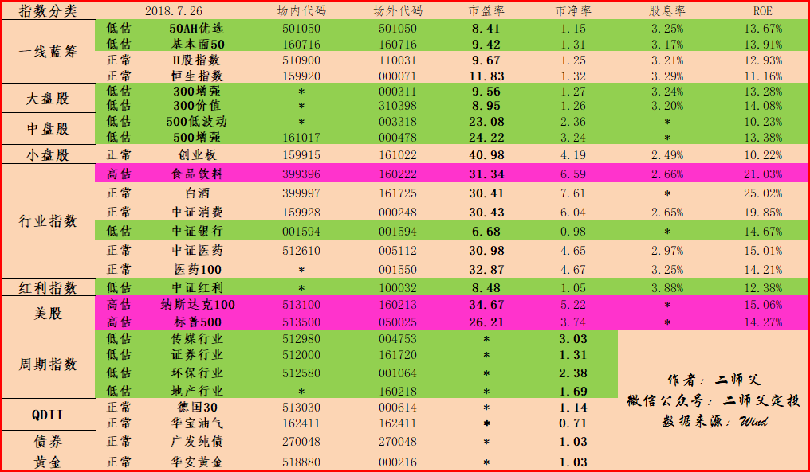

======================================================

_type: talk
@二师父[28814221155551]
2018-07-27 01:27:35 Fri  
topic_id: 15484152184442

定期总结才能够有进步，大家也来总结下自己近半年或者一个月的定投情况啊

@海盗 at 2018-07-27 01:27:35 Fri

> 牛市来了，券商不涨，二师父退出投资界。[强][强][强]

----------

阅读[2466]  评论[1]  赞[0] 

+++++++++++++++++++++++++++++++++++++++++++++++++++++

文件：
2018-07-27 01:27:07 Fri
文件大小：[391607]
28824881222421-二师父7月定投总结.pdf

======================================================

_type: talk
@二师父[28814221155551]
2018-07-27 14:46:45 Fri  
topic_id: 88212481222252

<e type="hashtag" hid="881251425252" title="#鳄鱼计划#" /> 中证医药买入一份，目前距离历史最低下跌幅度仍旧很大，请不要盲目跟

@Pacifica at 2018-07-27 14:46:45 Fri

> 它没有低估，二师父都出手了？

----------

@二师父 at 2018-07-27 14:46:45 Fri

> 在低估和正常徘徊

----------

@海盗 at 2018-07-27 14:46:45 Fri

> 二师父也等不急了[惊讶]

----------

@二师父 at 2018-07-27 14:46:45 Fri

> 今天跌了差不多5就行了哇

----------

@海盗 at 2018-07-27 14:46:45 Fri

> 二师父说的有道理

----------

@海盗 at 2018-07-27 14:46:45 Fri

> 二师父，冒昧的问一句，我看了看中证医药005112今天只跌了0.61%啊，没二师父说的那么多呀？[囧][惊讶]

----------

@二师父 at 2018-07-27 14:46:45 Fri

> 我说的不是5个百分点，买入一份，波动50也相对于整体持仓也不要紧的

----------

@海盗 at 2018-07-27 14:46:45 Fri

> 二师父的意思是先暂且买一份试试水吧

----------

阅读[1712]  评论[9]  赞[0] 

======================================================

_type: talk
@二师父[28814221155551]
2018-07-28 00:27:29 Sat  
topic_id: 28212424812441

大家可以在群内踊跃发言，相互讨论自己的投资思维和方法，只有交流和沟通才能产生智慧，点击发表按钮即可，如果你的投资思路不对，别的同学也可以发现错误，比如今天买入，或者卖出什么都可以在群内公布的

阅读[1537]  评论[0]  赞[0] 

======================================================

_type: talk
@二师父[28814221155551]
2018-07-28 02:05:05 Sat  
topic_id: 51585454558244

<e type="hashtag" hid="481215555558" title="#7.27指数估值#" /> 低估投资即可，目前正是积累股份的时候。周末愉快哈，该休息就休息。

阅读[2077]  评论[0]  赞[0] 

+++++++++++++++++++++++++++++++++++++++++++++++++++++

图片：
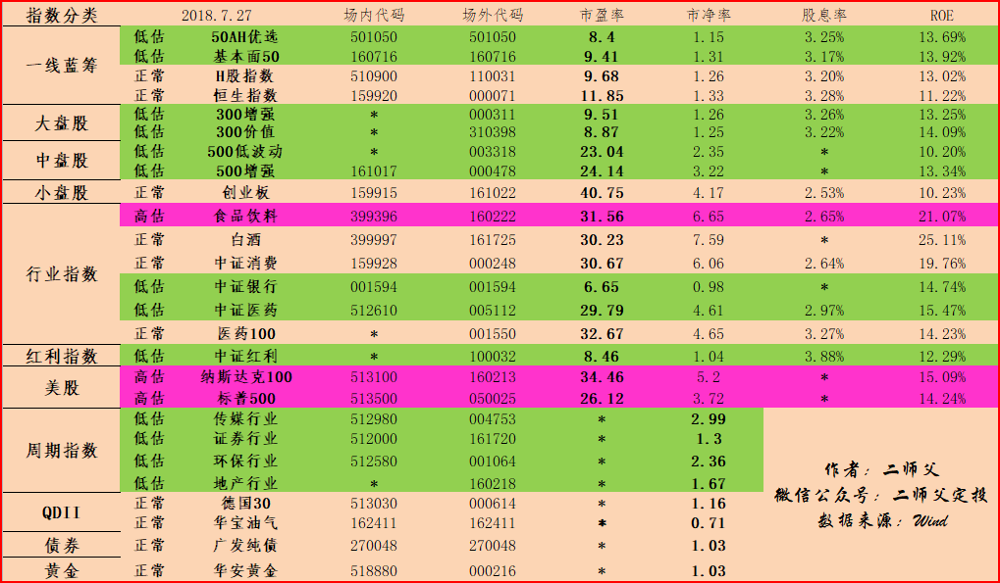

======================================================

_type: talk
@二师父[28814221155551]
2018-07-28 02:10:42 Sat  
topic_id: 51585454558524

阅读[2197]  评论[0]  赞[0] 

+++++++++++++++++++++++++++++++++++++++++++++++++++++

文件：
2018-07-28 02:09:55 Sat
文件大小：[376682]
28824825252411-长生生物连续暴跌，定投指数基金可以防止个股踩雷.pdf

======================================================

_type: talk
@二师父[28814221155551]
2018-07-28 09:51:34 Sat  
topic_id: 15484148554552

离岸人民币突破6.82关口，短短2月人民币贬值百分之8，理财才能抵御货币贬值

阅读[1525]  评论[0]  赞[0] 

======================================================

_type: talk
@二师父[28814221155551]
2018-07-28 15:49:34 Sat  
topic_id: 48515225454818

全球主要指数涨跌情况

阅读[1461]  评论[0]  赞[0] 

+++++++++++++++++++++++++++++++++++++++++++++++++++++

图片：
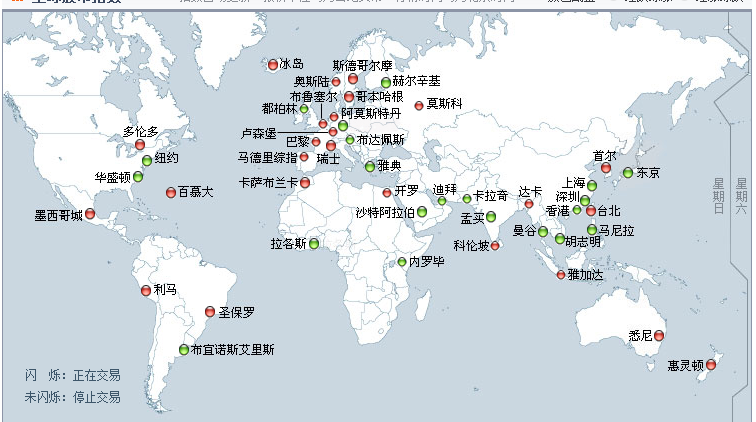

======================================================

_type: talk
@二师父[28814221155551]
2018-07-28 16:42:49 Sat  
topic_id: 15484114281142

世界各国常见指数市盈率的查询方法，欢迎补充，集思广益，大家资源共享。

@蛋孩 at 2018-07-28 16:42:49 Sat

> 谢谢二师傅，很用心 ，对新人很有帮助。能不能讲哈wind的使用？比如如何从wind确定基金阈值。[耶][耶]

----------

@二师父 at 2018-07-28 16:42:49 Sat

> wind有点贵啊，一年不少钱，所以没介绍

----------

@海盗 at 2018-07-28 16:42:49 Sat

> 谢谢二师父的无私奉献[强][强][强]

----------

@勤能行之 at 2018-07-28 16:42:49 Sat

> 谢谢二师父的无私奉献[强][强][强]爱人者，人恒爱之。

----------

阅读[2110]  评论[4]  赞[0] 

+++++++++++++++++++++++++++++++++++++++++++++++++++++

文件：
2018-07-28 16:42:24 Sat
文件大小：[1069528]
51154152824424-世界各国常见指数走势及估值查询方法.pdf

======================================================

_type: talk
@二师父[28814221155551]
2018-07-29 01:22:44 Sun  
topic_id: 51585444844884

阅读[1471]  评论[0]  赞[0] 

+++++++++++++++++++++++++++++++++++++++++++++++++++++

文件：
2018-07-29 01:22:41 Sun
文件大小：[331185]
15541545214812-这款重疾险性价比竟然比康惠保还高.pdf

======================================================

_type: talk
@二师父[28814221155551]
2018-07-30 00:26:20 Mon  
topic_id: 15484822188812

经济局势如此动荡，你怎么看呢？欢迎大家发表看法

@马如龙 at 2018-07-30 00:26:20 Mon

> 先投资还是先买房[撇嘴] 干买是买不起的，所以要经过投资积累才能买的起[抓狂][抓狂]

----------

@二师父 at 2018-07-30 00:26:20 Mon

> 这就有一个问题哈，如果你把要买房的钱投入了进去，到了要买房的时候仍旧浮亏拿出来就亏损了，建议阅读五步定投法里面资金配置，只能用3到5年不用的钱买基金

----------

阅读[1697]  评论[2]  赞[0] 

+++++++++++++++++++++++++++++++++++++++++++++++++++++

文件：
2018-07-30 00:26:00 Mon
文件大小：[373839]
48852858114458-世界经济局势动荡，我们定投指数基金该怎么办.pdf

======================================================

_type: talk
@🇨🇳竞自由[15448124228212]
2018-07-30 11:31:10 Mon  
topic_id: 15484824211152

师父，期待的医药100今天来了，应该进入低估了，哈哈

@二师父 at 2018-07-30 11:31:10 Mon

> 这个到时候看看今天收盘数据

----------

@游水浮生 at 2018-07-30 11:31:10 Mon

> 不知道低没低估，买了一点

----------

阅读[1022]  评论[2]  赞[0] 

======================================================

_type: talk
@二师父[28814221155551]
2018-07-30 14:22:28 Mon  
topic_id: 51585825852114

星球开通了分享有赏功能，大家分享星球内容，别的投资者通过你分享的链接加入星球你会获得赏金喔，投资者也能获得返现，赶紧分享吧。

@游水浮生 at 2018-07-30 14:22:28 Mon

> 也不知道有没有低估，少量买了点

----------

@二师父 at 2018-07-30 14:22:28 Mon

> 哪个基金啊

----------

@游水浮生 at 2018-07-30 14:22:28 Mon

> 中证医药

----------

@二师父 at 2018-07-30 14:22:28 Mon

> 今晚看看收盘数据

----------

@勤能行之 at 2018-07-30 14:22:28 Mon

> 已经把师父的星球分享出去了[愉快]应该会有懂得的朋友加入

----------

@二师父 at 2018-07-30 14:22:28 Mon

> 好哒，感谢支持。一起进步

----------

阅读[1605]  评论[6]  赞[0] 

======================================================

_type: talk
@二师父[28814221155551]
2018-07-31 01:51:26 Tue  
topic_id: 15484851824422

八月定投计划，也欢迎各位读者制定自己的定投计划，点击星球发表按钮公布出来和同学一起讨论，发现自己的问题和不足，要学会利用资源喔。

目前学堂开通了分享有赏功能，分享之后别的同学通过你的链接加入你也能够得到奖赏，赶紧试试吧。

@海盗 at 2018-07-31 01:51:26 Tue

> 二师父写的非常有道理，特别是最后一段。[强]

----------

@二师父 at 2018-07-31 01:51:26 Tue

> 你也可以在星球分享自己的观念啊

----------

阅读[1276]  评论[2]  赞[0] 

+++++++++++++++++++++++++++++++++++++++++++++++++++++

文件：
2018-07-31 01:48:22 Tue
文件大小：[364379]
15541548124242-二师父八月定投计划.pdf

======================================================

_type: talk
@二师父[28814221155551]
2018-07-31 01:53:15 Tue  
topic_id: 88212184154252

<e type="hashtag" hid="158181224112" title="#7.30指数估值#" /> 创业板进入低估了，想投资小盘股指数的可以入手啦。

阅读[1330]  评论[0]  赞[0] 

+++++++++++++++++++++++++++++++++++++++++++++++++++++

图片：
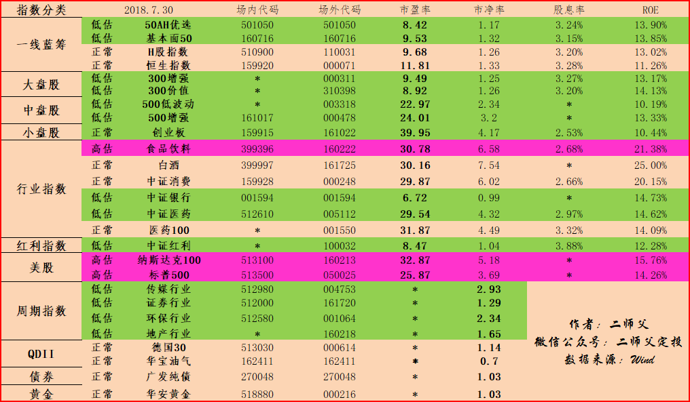

======================================================

_type: talk
@二师父[28814221155551]
2018-07-31 04:10:38 Tue  
topic_id: 28212184181241

P2P的爆雷实际上揭示了一个真相，那就是全社会的金融庞氏到了爆炸的时刻，这是过去十年金融野蛮生长，货币超发，流动性泛滥的必然结果，引爆点之所以在于P2P，原因在于P2P的风控在整个金融系统中是最薄弱的，行业的从业人员素质是最低的，而投资者又几乎是整个社会人群中最喜欢刀口舔血最喜欢冒险最激进的，这个雷不从这里爆从哪里？

阅读[795]  评论[0]  赞[0] 

======================================================

_type: talk
@二师父[28814221155551]
2018-07-31 07:03:31 Tue  
topic_id: 88212181525882

<e type="hashtag" hid="158181224882" title="#星球奖励#" />  今日开始，个人加标签“价值分享”发布有价值的投资信息被列入精华区并获得10个赞，将获得二师父6元红包奖励，多多发表有价值的投资信息，奖励等着你。

阅读[1307]  评论[0]  赞[0] 

======================================================

_type: talk
@二师父[28814221155551]
2018-07-31 07:03:31 Tue  
topic_id: 88212181525882

<e type="hashtag" hid="158181224882" title="#星球奖励#" />  今日开始，个人加标签“价值分享”发布有价值的投资信息被列入精华区并获得10个赞，将获得二师父6元红包奖励，多多发表有价值的投资信息，奖励等着你。

阅读[1307]  评论[0]  赞[0] 

======================================================

======================================================

_type: solution
2018-07-31 18:16:13 Tue  
topic_id: 48512452558488

@二师父 at 2018-07-31 18:16:13 Tue

> 打赏了，谢谢分享

----------

@勤能行之 at 2018-07-31 18:16:13 Tue

> 爱看友们的分享

----------

阅读[1234]  评论[2]  赞[1] 

======================================================

_type: q&a
@马如龙[28448815811441]
2018-07-31 18:23:15 Tue  
topic_id: 48515158484888

@马如龙

>  二师傅 嘉实深证120联接怎么样，现在是什么位置，适合定投还是一次性买入较好。如果定投每月多少合适？

@二师父

>  正常偏低，适合定投，买入金额请看5步定投里面计算方法

阅读[714]  评论[2]  赞[0] 

======================================================

_type: q&a
@冉冉[88445118854412]
2018-07-31 18:23:54 Tue  
topic_id: 28214524881511

@冉冉

>  二师傅，关于理财我是小白，您说闲置资金您用于购买货币基金方便随时取用，我也想这样进行，不知我把钱放在”乾元-建行龙行”净值型理财产品中可以吗？介绍说”乾元建行龙行”风险是两盏灯，两盏灯是什么级别？

@二师父

>  建议货币基金，存取方便，银行理财有期限

阅读[753]  评论[7]  赞[0] 

======================================================

_type: solution
2018-07-31 18:50:27 Tue  
topic_id: 15481241485282

@二师父 at 2018-07-31 18:50:27 Tue

> 打赏了，谢谢分享

----------

@海盗 at 2018-07-31 18:50:27 Tue

> 谢谢二师父

----------

阅读[1298]  评论[2]  赞[1] 

======================================================

_type: q&a
@星南[28514128241181]
2018-07-31 19:06:45 Tue  
topic_id: 28214524215121

@星南

>  二师父，能不能有空介绍一下可转债的一些投资理念和方法呢？

@二师父

>  好的，没问题，正准备分享呢

阅读[745]  评论[0]  赞[0] 

======================================================

_type: q&a
@小牧童[28484254825881]
2018-07-31 19:22:54 Tue  
topic_id: 51584254458554

@小牧童

>  二师父您好，债券现在适合投资吗？有什么推荐的吗？

@二师父

>  债券目前估值表里面就加了广发纯债，美元走强，海外收益债券可以了解下，投资需要谨慎

阅读[809]  评论[0]  赞[0] 

======================================================

_type: q&a
@gxbill[88842585142152]
2018-07-31 19:32:47 Tue  
topic_id: 15481241118552

@gxbill

>  二师父觉得券商定期理财的安全性怎么样？看了下定期的收益率比货基的要高一些

@二师父

>  银行理财的安全性有保障，券商也行，就是封闭期没有货币基金赎回方便

阅读[813]  评论[0]  赞[0] 

======================================================

