_type: talk
@二师父[28814221155551]
2018-08-01 03:34:20 Wed  
topic_id: 51584242184544

<e type="hashtag" hid="158188824412" title="#思维理念#" /> 年轻人不要得心灵软骨病

@注意要低调 at 2018-08-01 03:34:20 Wed

> 建议悲观的年轻人去看看肖申克的救赎。

----------

@二师父 at 2018-08-01 03:34:20 Wed

> 乐观，积极

----------

阅读[1330]  评论[2]  赞[0] 

+++++++++++++++++++++++++++++++++++++++++++++++++++++

文件：
2018-08-01 03:34:08 Wed
文件大小：[343220]
48852824522588-30岁以下的年轻人要洗洗睡了？.pdf

======================================================

_type: talk
@二师父[28814221155551]
2018-08-01 03:35:20 Wed  
topic_id: 48512424812248

<e type="hashtag" hid="481211145528" title="#指数估值#" /> 坚持低估定投，医药正常估值

阅读[1327]  评论[0]  赞[0] 

+++++++++++++++++++++++++++++++++++++++++++++++++++++

图片：
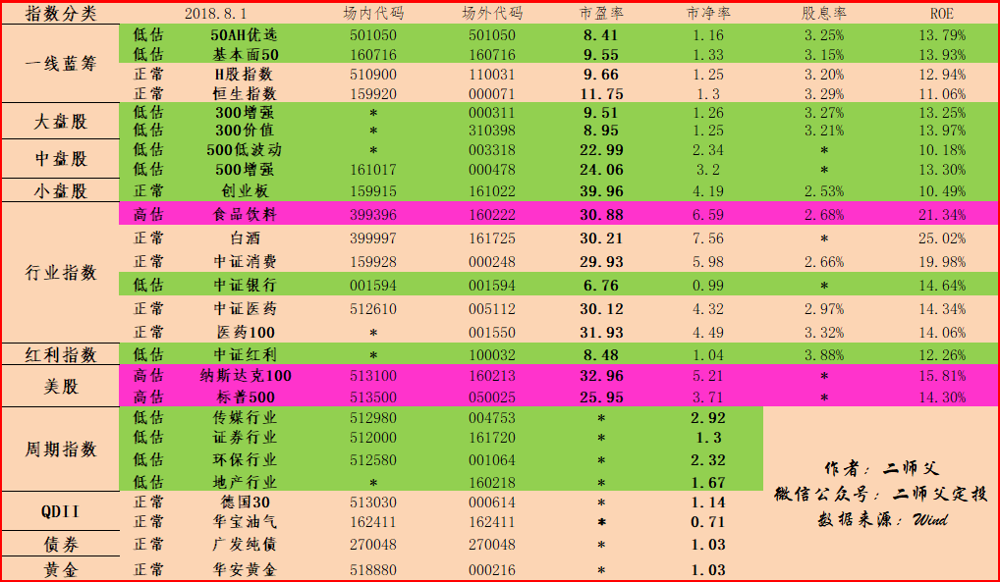

======================================================

_type: talk
@二师父[28814221155551]
2018-08-01 04:01:06 Wed  
topic_id: 88214545255542

关于货币基金南方天天利B这是目前市场收益率最好的。003474，希望对你有帮助，如果还需要二师父普及，后期开课讲

阅读[892]  评论[0]  赞[0] 

======================================================

_type: q&a
@掌心的温暖[51442142481254]
2018-08-01 04:32:03 Wed  
topic_id: 48512452114828

@掌心的温暖

>  终于看到今天有人提到提问到可转债了。我之前中签了一签安井转债，今天上市。赚了百把块钱。二师父能否帮忙分析下8月2号可申购的二支可转债（吴银转债 113516和东音转债 128043），值不值得申购？

@二师父

>  可转债的话股性和债性都有，下有保底，上不封顶，目前债市，股市，可转债市场都有投资价值，这两只基金不了解，兴全可转债可以关注下

阅读[963]  评论[0]  赞[0] 

======================================================

_type: solution
2018-08-01 08:26:04 Wed  
topic_id: 51584245525844

@二师父 at 2018-08-01 08:26:04 Wed

> 恒生指数正常估值，停止定投

----------

@红 at 2018-08-01 08:26:04 Wed

> 谢谢二师父

----------

阅读[958]  评论[2]  赞[0] 

======================================================

_type: q&a
@=左手温度[28221888512841]
2018-08-01 15:15:19 Wed  
topic_id: 51584248218584

@=左手温度

>  二师父，基金公司会倒闭吗?旗隆知道吗?

@二师父

>  基金公司有倒闭的可能，任何一家公司都有
>  
>  不过基金公司募集的资金是放在大型银行托管的，银行收取托管费用。
>  
>  所以不用担心基金公司倒闭了钱没了。即使基金公司倒闭了，也会按照当日收盘价清算把钱给你的。
>  
>  所以我们要尽量选择大公司，市值大的基金。这样基金公司几乎不可能倒闭，基金也不会被清盘
>  
>  那家公司听说过呢

阅读[923]  评论[0]  赞[0] 

======================================================

_type: talk
@从容淡定[51511255218444]
2018-08-01 16:30:11 Wed  
topic_id: 28214541244551

昨天下午定投，今天大跌，请问师父怎么操作加仓吗？是选择月定投，还是周定投。

@二师父 at 2018-08-01 16:30:11 Wed

> 选择月定投，按照纪律投资，不要随意补仓，如果遇到暴跌可以手动加仓

----------

@冉冉 at 2018-08-01 16:30:11 Wed

> 今天的跌幅算是暴跌吗？可以加仓吗？

----------

阅读[866]  评论[2]  赞[0] 

======================================================

_type: talk
@从容淡定[51511255218444]
2018-08-01 17:33:39 Wed  
topic_id: 51584248488844

二师父，一天最晚什么时间加仓，减仓？

@二师父 at 2018-08-01 17:33:39 Wed

> 你是场内基金还是场外基金？场外需要在下午三点之前交易，因为三点之后交易成交价格是第二天的

----------

@二师父 at 2018-08-01 17:33:39 Wed

> 还有发表的话点发表按钮，提问直接点提问按钮我才能收到提示

----------

阅读[920]  评论[2]  赞[0] 

======================================================

_type: q&a
@红苹果[28488511551521]
2018-08-01 18:36:42 Wed  
topic_id: 88214541182542

@红苹果

>  我在华泰证券买的指数基金，现在想在蛋卷上买，能把它转过来吗？我也才开始买

@二师父

>  已经买的可以不用转，放在华泰里面，不然转了再买多增加一道手续费，等以后盈利了再卖出。现在二师父公众号后台回复场内基金可以用福利二维码注册新手可以领取15元奖学金

阅读[1064]  评论[1]  赞[0] 

======================================================

_type: talk
@注意要低调[28482555282511]
2018-08-01 19:37:19 Wed  
topic_id: 15481285854522

今天已经用二师父的链接开通广发的账户了，万分之1.5的佣金，最重要的是不收取5元的最低费用，感谢二师父分享这么好的机会！

@二师父 at 2018-08-01 19:37:19 Wed

> 股票是万分之1.5的佣金，基金是万分之0.6，很实惠

----------

@L Y at 2018-08-01 19:37:19 Wed

> 哪里有链接？

----------

@二师父 at 2018-08-01 19:37:19 Wed

> 置顶文章缩减成本有，或者公众号后台回复场内基金

----------

@L Y at 2018-08-01 19:37:19 Wed

> 看到了，多谢

----------

@Pacifica at 2018-08-01 19:37:19 Wed

> 二师父，用手机注册挂银行卡就可以操作开户和使用了？

----------

@L Y at 2018-08-01 19:37:19 Wed

> 置顶文章说“目前场内定投基金佣金万0.6，没有最低五元限制，每买一万元可以节省100多元的费用。”  节省100多元是怎么算出来的？一共才万0.6的费用呀？

----------

@二师父 at 2018-08-01 19:37:19 Wed

> 对，用我给的二维码扫描注册才行，和其他的注册是一样的方式，注意事项我在图片已经说过了

----------

@二师父 at 2018-08-01 19:37:19 Wed

> 这个是和场外基金对比的，因为场外基金购买会有托管费和管理费，这个费用比较高

----------

阅读[1031]  评论[8]  赞[0] 

======================================================

_type: talk
@L Y[15142144585522]
2018-08-01 22:00:39 Wed  
topic_id: 88214512251552

银行、证券、保险都是不错的行业，是否可以定投类似510230金融etf这样的基金，从而一下涵盖这几个行业？麻烦二师父看看这个金融etf是否有定投的价值？谢谢

@二师父 at 2018-08-01 22:00:39 Wed

> 证券是周期性行业，波动异常大，建议银行是不错的配置，基本面50也有很多银行股

----------

阅读[971]  评论[1]  赞[0] 

======================================================

@二师父[28814221155551]
2018-08-01 22:51:58 Wed  
topic_id: 15481284154852

>  @二师父
>  

阅读[1034]  评论[1]  赞[0] 

======================================================

_type: talk
@二师父[28814221155551]
2018-08-02 01:44:35 Thu  
topic_id: 15481281588112

<e type="hashtag" hid="481144488858" title="#投资理念#" /> 房产投资和定投基金你会选什么，二师父是有了房产之后才定投指数基金的

阅读[1511]  评论[0]  赞[0] 

+++++++++++++++++++++++++++++++++++++++++++++++++++++

文件：
2018-08-02 01:44:19 Thu
文件大小：[359284]
48852822445148-买房还是定投指数基金.pdf

======================================================

_type: talk
@二师父[28814221155551]
2018-08-02 01:46:37 Thu  
topic_id: 88214514811182

<e type="hashtag" hid="481211145528" title="#指数估值#" /> 今天没看盘，好多指数基金都低估了。高估的越来越少，创业板和医药进入低估。之前3月有同学就在学堂问过创业板能不能投资，二师父现在告诉你，机会来了，不知道你还有没有资金。

@Pacifica at 2018-08-02 01:46:37 Thu

> 资金还有，信心快没了[抓狂]

----------

@二师父 at 2018-08-02 01:46:37 Thu

> 经济不容乐观，就看看美国1929萧条，香港雪崩式股灾，一切都会慢慢过去的

----------

@小虾米 at 2018-08-02 01:46:37 Thu

> 当大多数人信心都快没的时候，好时候就快来了，坚持住，不要做多球人

----------

阅读[1509]  评论[3]  赞[0] 

+++++++++++++++++++++++++++++++++++++++++++++++++++++

图片：
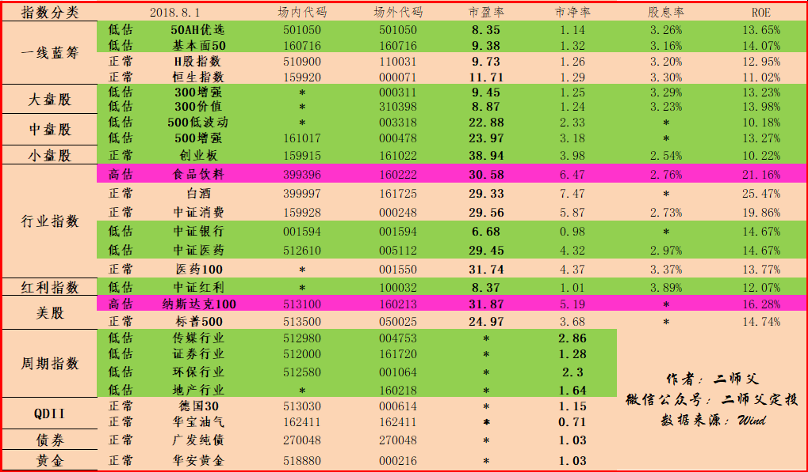

======================================================

_type: q&a
@红苹果[28488511551521]
2018-08-02 03:24:33 Thu  
topic_id: 48512415222848

@红苹果

>  你发置顶文章二维码怎么识别不了呢

@二师父

>  星球里面的二维码无法识别，还没有这个功能，你把二维码另存然后发到微信上，然后长按就能识别了

阅读[1032]  评论[0]  赞[0] 

======================================================

_type: solution
2018-08-02 04:26:03 Thu  
topic_id: 15481281451522

阅读[1075]  评论[0]  赞[0] 

======================================================

_type: solution
2018-08-02 07:18:12 Thu  
topic_id: 48512412258418

@离开 at 2018-08-02 07:18:12 Thu

> 区块数字货币现在不行了，机构都被套路

----------

阅读[1055]  评论[1]  赞[0] 

======================================================

_type: talk
@二师父[28814221155551]
2018-08-02 09:50:27 Thu  
topic_id: 88214855185552

<e type="hashtag" hid="881422852442" title="#定投实盘#" /> 500增强买入两份，300增强买入一份，创业板买入一份，创业板不想买分级的话就买易方达110026。每周四雷打不动定投，现在的市场机会非常好，坚定买入。

@从容淡定 at 2018-08-02 09:50:27 Thu

> 周投，还是月投？

----------

@海盗 at 2018-08-02 09:50:27 Thu

> 每周四定投

----------

@从容淡定 at 2018-08-02 09:50:27 Thu

> thanks

----------

@cotton at 2018-08-02 09:50:27 Thu

> 二师傅，定投实盘就是每周四的定投，对吗

----------

@二师父 at 2018-08-02 09:50:27 Thu

> 对，每周四雷打不动定投

----------

@cotton at 2018-08-02 09:50:27 Thu

> 本来周四我的已经上午买了，自动扣了，现在跟着您，又买了一次，鳄鱼计划也买了，今天多买咯。不怕吧

----------

@二师父 at 2018-08-02 09:50:27 Thu

> 不要盲目跟，视资金情况而定，如果资金充足可以

----------

@cotton at 2018-08-02 09:50:27 Thu

> [呲牙][呲牙][呲牙]。我的一份很小的。多一份也不怕

----------

阅读[1620]  评论[9]  赞[0] 

======================================================

_type: q&a
@健哥[51511242852814]
2018-08-02 09:50:59 Thu  
topic_id: 28214511551281

@健哥

>  广发纯债基金没到低估，可以购买吗？

@二师父

>  不要购买，低估才买入

阅读[1118]  评论[0]  赞[0] 

======================================================

_type: solution
2018-08-02 10:54:38 Thu  
topic_id: 51584121244824

阅读[1033]  评论[0]  赞[0] 

======================================================

_type: talk
@勤能行之[481211221828]
2018-08-02 10:59:28 Thu  
topic_id: 51584121282584

#链接产生价值# 信息孤岛是没有价值的，只有信息的链接才有价值，个人的智慧是没有价值的，只有智慧相互链接才有价值。

1，你在哪个城市？我在广佛同城的佛山

2，你除了投资基金还投资什么。

还投资了房产，和股票，股票亏损很大

3，你在哪些平台买基金，我在广发证券和天天基金

4你的个人微信是否方便留下，一会儿发在评论里，因为太长了

学会交流沟通，信息的链接产生价值

阅读[1138]  评论[0]  赞[0] 

======================================================

_type: solution
2018-08-02 11:13:51 Thu  
topic_id: 15481525544842

阅读[1186]  评论[0]  赞[0] 

======================================================

_type: talk
@幽幽菊花茶[51425212482114]
2018-08-02 11:28:09 Thu  
topic_id: 48512848822818

二师父，中午有时间看一下指数吗，我看今天跌的厉害，想多买点儿，想师父看一下哪个更低估些

@二师父 at 2018-08-02 11:28:09 Thu

> 500增强，中证红利都很低估啊

----------

阅读[1178]  评论[1]  赞[0] 

======================================================

_type: talk
@二师父[28814221155551]
2018-08-02 12:53:31 Thu  
topic_id: 28214858484141

<e type="hashtag" hid="881251425252" title="#鳄鱼计划#" /> 市场机会总是有，之前留出现金就是给巨大机会来临时候加仓用的。买入500增强两份，中证红利一份，地产行业一份，视自己的资金量和仓位来买入，不要盲目跟投。机会已经来临

@落叶无痕 at 2018-08-02 12:53:31 Thu

> 出动了啊

----------

@二师父 at 2018-08-02 12:53:31 Thu

> 机会挺好

----------

@肖建军 at 2018-08-02 12:53:31 Thu

> 请问师傅是场内买、还是场外买

----------

@二师父 at 2018-08-02 12:53:31 Thu

> 这是场外买的，场内以前在华泰，万3的佣金，也是免5元，现在准备转到广发了，差别有一点点

----------

@肖建军 at 2018-08-02 12:53:31 Thu

> 请问师父：鳄鱼计划是不是均为场内购买

----------

@二师父 at 2018-08-02 12:53:31 Thu

> 嗯嗯，都行的，场内买费率低一些，不过要注意溢价，避免高溢价的话场内买划算些

----------

@二师父 at 2018-08-02 12:53:31 Thu

> 因为场内不同于场外，场外申购是收盘价格，场内买是实时价格，看你自己能够适应哪里操作了

----------

@肖建军 at 2018-08-02 12:53:31 Thu

> 收到，谢谢指点

----------

阅读[1668]  评论[8]  赞[0] 

======================================================

_type: q&a
@小牧童[28484254825881]
2018-08-02 15:41:49 Thu  
topic_id: 88214858181512

@小牧童

>  二师父您好，如有2000万人民币空余资金，如何分配规划投资？谢谢

@二师父

>  建议投500增强和中证红利，一只一个周买200，投资一年

阅读[1293]  评论[17]  赞[0] 

======================================================

_type: q&a
@注意要低调[28482555282511]
2018-08-02 16:11:50 Thu  
topic_id: 88214852252882

@注意要低调

>  二师父，明天准备开始场内定投中证医药516210，请问二师父场内购买的话除了手续费之外还有其它费用吗？比如维护费、托管费啥的？

@二师父

>  中证医药刚进入低估，可以再等等，只有佣金费用，没有托管和管理费的

阅读[1185]  评论[3]  赞[0] 

======================================================

_type: talk
@二师父[28814221155551]
2018-08-03 03:27:19 Fri  
topic_id: 28214888248511

<e type="hashtag" hid="481211145528" title="#指数估值#" /> 银行，中证红利，500增强都非常非常低估，买入并持有，定投指数基金就需要耐心，熬得住，做到这一点，你一定能够盈利。

阅读[1476]  评论[0]  赞[0] 

+++++++++++++++++++++++++++++++++++++++++++++++++++++

图片：
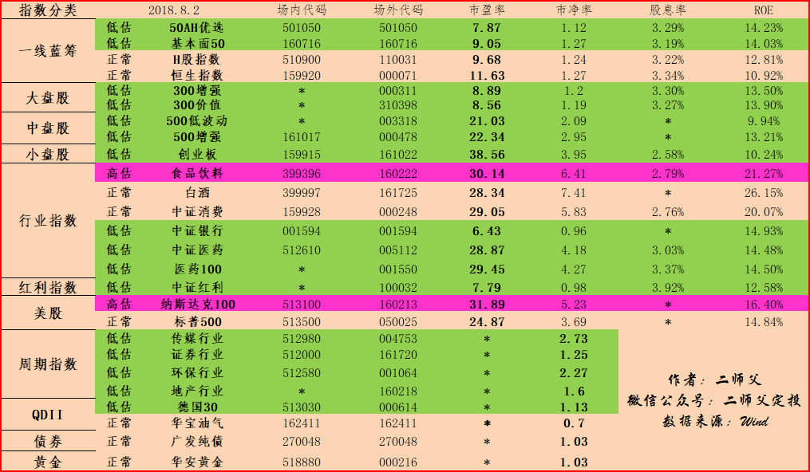

======================================================

_type: talk
@二师父[28814221155551]
2018-08-03 03:34:00 Fri  
topic_id: 51584111545124

阅读[1617]  评论[0]  赞[0] 

+++++++++++++++++++++++++++++++++++++++++++++++++++++

文件：
2018-08-03 03:33:57 Fri
文件大小：[345321]
88824841288882-上证综指腰斩，感谢市场赐予的机会.pdf

======================================================

_type: q&a
@孙源羲[28488124441181]
2018-08-03 10:52:05 Fri  
topic_id: 15481555158212

@孙源羲

>  二师父好。想请教一下，国内有没有东南亚国家市场的指数基金？如果有的话能否简单介绍一下投资方法？谢谢。

@二师父

>  通过QDII指数基金投资，博时大中华亚太精选股票了解一下

阅读[1213]  评论[1]  赞[0] 

======================================================

_type: q&a
@小炜[28855811418121]
2018-08-03 10:54:21 Fri  
topic_id: 28214888185581

@小炜

>  二师父 请问证券现在被很多上市公司质押的股票拖累，会不会因为股票爆仓，且国家不让卖，导致证券亏损 。从而导致证券大规模倒闭。这样我们投资的证券指数会进一步下跌。

@二师父

>  有可能的，周期指数波动非常大，但是现在距离历史大底只有百分之20的下跌空间了

阅读[1294]  评论[0]  赞[0] 

======================================================

_type: q&a
@海盗[48248118584848]
2018-08-03 12:46:33 Fri  
topic_id: 88214881228582

@海盗

>  二师父，昨天只定投了。到晚上看手机没想到还有鳄鱼计划，今天想把仓加上，二师父你看今天买哪几只合适？

@二师父

>  就昨天的几只，都很低估，确保资金量充足哈

阅读[1305]  评论[0]  赞[0] 

======================================================

_type: talk
@二师父[28814221155551]
2018-08-03 13:48:46 Fri  
topic_id: 28214881148451

<e type="hashtag" hid="881251425252" title="#鳄鱼计划#" /> 阴跌不断，继续加仓，500增强买入一份，中证红利买入一份，本月已经用了两次鳄鱼投资机会，只要资金充足，目前点位大胆加仓，子弹打完的就耐心持有，等待价值回归，慢慢买，不要让子弹打完了。

不预测市场，只打造诺亚方舟。浮亏确实让人难受，不过投资胜利只属于少数人。

@Pacifica at 2018-08-03 13:48:46 Fri

> 昨天和今天把这周的子弹打完了。下周再血战到底了

----------

@二师父 at 2018-08-03 13:48:46 Fri

> 嗯嗯，上证综指已经逐步逼近14年历史大底了

----------

@顾丽敏 at 2018-08-03 13:48:46 Fri

> 跟着二师父加仓了

----------

@二师父 at 2018-08-03 13:48:46 Fri

> 确保自己资金充足

----------

阅读[1726]  评论[4]  赞[0] 

======================================================

_type: q&a
@ss_佳汝[15481512828122]
2018-08-03 14:10:31 Fri  
topic_id: 51584118844284

@ss_佳汝

>  请问 医药100 中证医药 全指医药 应该选哪个投呢？ 有什么区别？

@二师父

>  <e type="web" href="https://mp.weixin.qq.com/s/JzlJX91xuQ-qgL_7vdOzwg" title="疫苗造假引众怒，医药基金三架马车必须了解" cache="http://cache.zsxq.com/201808/a08c40aee243f0691d4c0590f59b1c1e60ad7a69334deb550863f34a3e7371a9" />，建议看看这篇文章，写的很清楚啦。中证医药目前低估，医药100还没有进入低估

阅读[1305]  评论[0]  赞[0] 

======================================================

_type: talk
@二师父[28814221155551]
2018-08-03 15:03:53 Fri  
topic_id: 88214825851512

根据近几日观察，医药指数基金补跌，定投中证医药的可以再稍微等等，毕竟长生生物已经有退市风险了，影响还是很大的

阅读[1276]  评论[0]  赞[0] 

======================================================

_type: q&a
@健哥[51511242852814]
2018-08-03 19:50:27 Fri  
topic_id: 51584152828844

@健哥

>  二师父，现在不断地在探底，是否每次点位都会比上次低一些？

@二师父

>  底部尚未探明，就看2659能否守住了

阅读[1337]  评论[0]  赞[0] 

======================================================

_type: talk
@二师父[28814221155551]
2018-08-04 05:03:28 Sat  
topic_id: 15481548284242

阅读[1740]  评论[0]  赞[0] 

+++++++++++++++++++++++++++++++++++++++++++++++++++++

文件：
2018-08-04 05:03:25 Sat
文件大小：[339888]
15541582514222-2740一个值得纪念的指数点位.pdf

======================================================

_type: talk
@二师父[28814221155551]
2018-08-04 05:04:35 Sat  
topic_id: 48512851415458

<e type="hashtag" hid="481211145528" title="#指数估值#" /> 全面低估时代到来

阅读[1762]  评论[0]  赞[0] 

+++++++++++++++++++++++++++++++++++++++++++++++++++++

图片：
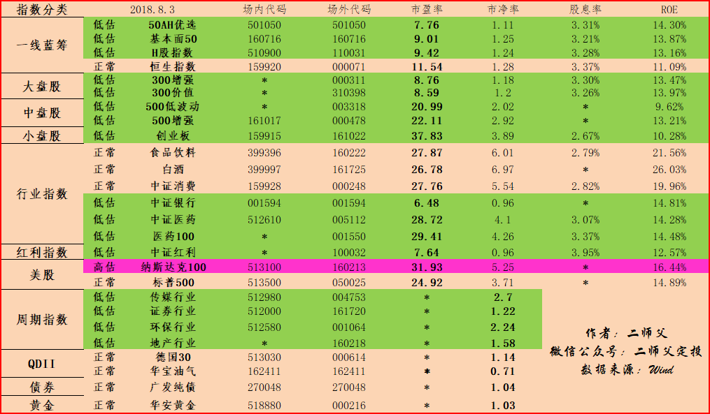

======================================================

_type: q&a
@zzj[48244814852418]
2018-08-04 11:40:03 Sat  
topic_id: 48512851251818

@zzj

>  二师父，我广发开户怎么只有万分之2.5选，没有看到万分之1.5佣金

@二师父

>  先选第一个套餐，后期注册之后会调整过来的

阅读[1434]  评论[1]  赞[0] 

======================================================

_type: talk
@二师父[28814221155551]
2018-08-05 01:44:22 Sun  
topic_id: 88214841858512

集中在少数的几个指数基金即可，养老在低估区域又下跌，非常具有投资价值。可以关注下喔。

阅读[1835]  评论[0]  赞[0] 

+++++++++++++++++++++++++++++++++++++++++++++++++++++

文件：
2018-08-05 01:37:02 Sun
文件大小：[362855]
48852815288428-深证100指数投资价值分析.pdf

======================================================

_type: talk
@小虾米[48544844248218]
2018-08-05 09:33:50 Sun  
topic_id: 88214841412122

每个人都说下自己的定投组合吧？  我现在也纠结了。最初的组合是300价值，中证红利，华宝红利，500低波，500增强，120，50ah。  现在又加入了养老和央视50，感觉搞不过来了，谁给帮我组合一个长期的？

@小虾米 at 2018-08-05 09:33:50 Sun

> 现阶段最被低估的五个宽基是哪五个？

----------

@勤能行之 at 2018-08-05 09:33:50 Sun

> 我没有什么组合，我就是重仓了红利。不知道这样行不行啊。

----------

@勤能行之 at 2018-08-05 09:33:50 Sun

> 你说的这几个我零零碎碎也有，就把它放的那里不管吧。

----------

@思念☆雙眸 at 2018-08-05 09:33:50 Sun

> 你这定投的也太多了吧，我在我账户定投中证银行，沪深300，上证50，中证500和创业板，我给我妈弄得中证红利，省心

----------

@徐美芳 at 2018-08-05 09:33:50 Sun

> 我定投的是300增强，500增强，50ah，中证红利，创业板，中证银行这6个，打算长期持有，不打算增加品种了

----------

阅读[1317]  评论[5]  赞[0] 

======================================================

_type: talk
@二师父[28814221155551]
2018-08-06 02:37:02 Mon  
topic_id: 15481425455152

养老很低估，值得投资，但请注意你的资金量是否充足

阅读[1694]  评论[0]  赞[0] 

+++++++++++++++++++++++++++++++++++++++++++++++++++++

文件：
2018-08-06 02:36:44 Mon
文件大小：[359402]
51154184451844-市场底部尚早，中证养老了解一下.pdf

======================================================

_type: talk
@二师父[28814221155551]
2018-08-06 13:44:00 Mon  
topic_id: 51584524152114

医药开始补跌啦，机会越来越多

@健哥 at 2018-08-06 13:44:00 Mon

> 现在可以买入医药了吗？二师父

----------

@二师父 at 2018-08-06 13:44:00 Mon

> 可以啦，中证医药

----------

阅读[1183]  评论[2]  赞[0] 

======================================================

_type: talk
@二师父[28814221155551]
2018-08-07 02:42:17 Tue  
topic_id: 48512281514448

<e type="hashtag" hid="481211145528" title="#指数估值#" /> 所有的指数基金都更加低估了，坚持按照纪律定投

阅读[1394]  评论[0]  赞[0] 

+++++++++++++++++++++++++++++++++++++++++++++++++++++

图片：

======================================================

_type: talk
@二师父[28814221155551]
2018-08-07 02:43:16 Tue  
topic_id: 15481158482252

如果没有本金买，请记住不要卖

阅读[1491]  评论[0]  赞[0] 

+++++++++++++++++++++++++++++++++++++++++++++++++++++

文件：
2018-08-07 02:43:07 Tue
文件大小：[343056]
28824258881411-面对暴跌的A股，请坚持住.pdf

======================================================

_type: talk
@飞的那个飞[48584811554158]
2018-08-07 08:50:46 Tue  
topic_id: 28214425521251

师父我想问下资金配置房产好！还是做定投获利大！我是小县城 房价到了一个小高点了。

@二师父 at 2018-08-07 08:50:46 Tue

> 县城的话有一套自住就行，买基金前至少一套，彼得林奇说的。你看人口净流出多不多，人口净流出多得话，上涨会乏力的。

有条件的话可以到相应的地级市，反正目前的政策通过房地产投资赚钱是比较难了，政策规定的太严，房产税也快出来了

----------

@飞的那个飞 at 2018-08-07 08:50:46 Tue

> 谢谢师父

----------

阅读[998]  评论[2]  赞[0] 

======================================================

_type: q&a
@海盗[48248118584848]
2018-08-07 12:41:39 Tue  
topic_id: 15481142842142

@海盗

>  二师父，微信扫描以后就是这个样子，怎么回事

@二师父

>  把链接复制到微信，然后在微信打开

阅读[1085]  评论[2]  赞[0] 

======================================================

_type: q&a
@海盗[48248118584848]
2018-08-07 12:41:39 Tue  
topic_id: 15481142842142

@海盗

>  二师父，微信扫描以后就是这个样子，怎么回事

@二师父

>  把链接复制到微信，然后在微信打开

阅读[1085]  评论[2]  赞[0] 

======================================================

======================================================

_type: solution
2018-08-07 16:13:25 Tue  
topic_id: 28214424425421

@二师父 at 2018-08-07 16:13:25 Tue

> 仓位就是你指数基金投入金额和现金的比例

----------

阅读[1006]  评论[1]  赞[0] 

======================================================

_type: solution
2018-08-07 16:52:41 Tue  
topic_id: 48512252212518

@二师父 at 2018-08-07 16:52:41 Tue

> 这个现金流够多

----------

@红 at 2018-08-07 16:52:41 Tue

> 刚投了有半年

----------

阅读[1023]  评论[2]  赞[0] 

======================================================

_type: talk
@游水浮生[15455241488482]
2018-08-07 17:18:11 Tue  
topic_id: 51584454848114

初步计划的三成，继续定投，大跌加仓！

@二师父 at 2018-08-07 17:18:11 Tue

> 可以，目前买了就是赚

----------

阅读[1073]  评论[1]  赞[0] 

======================================================

_type: talk
@二师父[28814221155551]
2018-08-07 22:33:03 Tue  
topic_id: 48512224882548

三年定期养老基金值不值得入手，大家怎么看？

阅读[1042]  评论[0]  赞[0] 

======================================================

_type: talk
@二师父[28814221155551]
2018-08-08 04:19:46 Wed  
topic_id: 15481115228582

<e type="hashtag" hid="881158522842" title="#养老基金#" /> 新出的养老基金你要买吗

二师父为你解读。是否可以购买以及养老最好的投资方式

各位朋友，你有啥养老计划吗？

除了养儿防老以外，欢迎大家分享自己的养老方式哈。

@黛染清浅 at 2018-08-08 04:19:46 Wed

> 养儿不防老，防晒才防老[微笑]

----------

@二师父 at 2018-08-08 04:19:46 Wed

> 有道理

----------

@顾。 at 2018-08-08 04:19:46 Wed

> 二师父，读过你以前的文章只知道红利指数分红多。看到今天里面说，40w投入，每年红利有7.5w，年化要18%了？！有这嚒高？！

----------

@顾丽敏 at 2018-08-08 04:19:46 Wed

> 同问，红利指数分红一般有多少啊？投入40万，每年有7.5万分红？

----------

@顾丽敏 at 2018-08-08 04:19:46 Wed

> 另外想问下二师父，如果买中证红利已做养老的话，应该是买场内的比较划算吧，不然场外每年管理费托管费都要1.4个点啊

----------

@二师父 at 2018-08-08 04:19:46 Wed

> 分红不是收益率喔，他是将你的份额卖出资金转给你，只是不收手续费的

----------

@二师父 at 2018-08-08 04:19:46 Wed

> 每10份派息1.1

----------

@二师父 at 2018-08-08 04:19:46 Wed

> 对哒，公众号后台回复场内，利用二师父专属渠道开通广发证券可以获取万0.6佣金，这是目前市场最低佣金了，买入时候注意溢价

----------

阅读[1506]  评论[8]  赞[0] 

+++++++++++++++++++++++++++++++++++++++++++++++++++++

文件：
2018-08-08 04:19:44 Wed
文件大小：[360097]
88824252512252-养老目标基金，你准备买了吗.pdf

======================================================

_type: talk
@二师父[28814221155551]
2018-08-08 04:22:12 Wed  
topic_id: 28214448551281

<e type="hashtag" hid="481211145528" title="#指数估值#" /> 简易估值方法已经在课程里面讲过了，如果无法弄懂估值，可以先采用简易估值方法，然后进一步深入学习。

德国30进入低估，可以开始配置啦。目前美股，港股高位，我们集中资金投入A股和德国股票。

最近还有哪些低估的指数基金你觉得值得投资呢，欢迎在学堂分享哈。大家集思广益。二师父理念就是分享即学习，付出即所得。

@阿@浩 at 2018-08-08 04:22:12 Wed

> 请教二师父003095，003096两只基金怎么样

----------

@二师父 at 2018-08-08 04:22:12 Wed

> 这是混合基金，建议投资中证医药和医药100

----------

阅读[1520]  评论[2]  赞[0] 

+++++++++++++++++++++++++++++++++++++++++++++++++++++

图片：
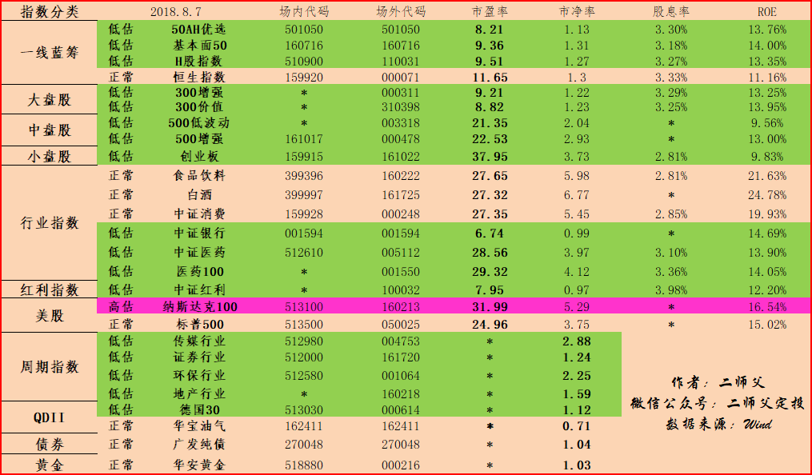

======================================================

_type: q&a
@勤能行之[481211221828]
2018-08-08 08:43:42 Wed  
topic_id: 15481114888412

@勤能行之

>  师傅，请问怎么样才能查到前几天的上证指数

@二师父

>  乐咕乐古，理杏仁都可以啊

阅读[1140]  评论[1]  赞[0] 

======================================================

_type: q&a
@注意要低调[28482555282511]
2018-08-08 11:57:39 Wed  
topic_id: 48512222812528

@注意要低调

>  二师父，帮看看这是咋回事，最后一次买入是这周一，昨天还亏5个点，今天突然变成这样了，盈利48个点，还禁止买入卖出了，不会出问题了吧？

@二师父

>  这是分级基金的上折，会调整过来的，如果不适应可以选择易方达创业板

阅读[1552]  评论[2]  赞[0] 

======================================================

_type: q&a
@小白[15114524218582]
2018-08-08 11:59:32 Wed  
topic_id: 28214444415181

@小白

>  二师父您好，我是超级新手，上个月才开始定投，目前定投了沪深300、基本面50、中证红利，但看了你的一些文章后，我在想是不是要把300换成增强300？另外我的这样配置是否合理？新手一般起投多少合理呢？

@二师父

>  如果是场外定投的话建议300增强，更加低估，投资金额每份如何计算请看五步定投法，你的标的没有问题，注意控制节奏和仓位

阅读[1570]  评论[1]  赞[0] 

======================================================

_type: q&a
@小白[15114524218582]
2018-08-08 11:59:32 Wed  
topic_id: 28214444415181

@小白

>  二师父您好，我是超级新手，上个月才开始定投，目前定投了沪深300、基本面50、中证红利，但看了你的一些文章后，我在想是不是要把300换成增强300？另外我的这样配置是否合理？新手一般起投多少合理呢？

@二师父

>  如果是场外定投的话建议300增强，更加低估，投资金额每份如何计算请看五步定投法，你的标的没有问题，注意控制节奏和仓位

阅读[1570]  评论[1]  赞[0] 

======================================================

======================================================

_type: solution
2018-08-08 14:00:32 Wed  
topic_id: 48512221558858

阅读[1128]  评论[0]  赞[0] 

======================================================

_type: talk
@健哥[51511242852814]
2018-08-08 14:15:49 Wed  
topic_id: 88214441245212

今天打卡
做好计划定投，管住自己的手，绝不乱加仓，忽视短期波动，看好未来。

阅读[1139]  评论[0]  赞[0] 

======================================================

_type: talk
@红[15454112511442]
2018-08-08 14:48:58 Wed  
topic_id: 15481118148512

今日打卡

阅读[1121]  评论[0]  赞[0] 

======================================================

_type: talk
@游水浮生[15455241488482]
2018-08-08 18:24:58 Wed  
topic_id: 51584485284544

今日打卡，继续定投，逢跌加仓！

阅读[1152]  评论[0]  赞[0] 

======================================================

_type: talk
@孙源羲[28488124441181]
2018-08-08 18:44:02 Wed  
topic_id: 88214412845152

今日打卡

阅读[1151]  评论[0]  赞[0] 

======================================================

_type: q&a
@冉冉[88445118854412]
2018-08-08 19:56:30 Wed  
topic_id: 51584485511114

@冉冉

>  二师傅您好。我想了解一下混合基金的投资价值，目前定投混合基金可以吗？您的估值系统中能查询一下华夏回报的估值情况吗？期待您的解答

@二师父

>  您好，混合基金因为基金经理频繁调仓，是没办法估值的，只有去看相应的股票持仓以及基金经理的水平来判断投资价值，晨星网可以了解一下。

阅读[1271]  评论[7]  赞[0] 

======================================================

_type: talk
@二师父[28814221155551]
2018-08-08 20:51:54 Wed  
topic_id: 48512215252848

<e type="hashtag" hid="518821122224" title="#讲一个投资品种#" /> 今日周三，分享一个投资品种货币基金，投资货币基金采用轮动方法。因为宝宝的收益率是变化的，而宝宝类基金没有申购赎回费用。

目前超过p2p的货币基金有博时合晶货币
长城收益宝货币A。如果长期持有选择长城，短期持有选择博时

稍后这些宝宝的年化收益率变了就换过来，t加2，到账也快。

货币基金投资思路简单，就是一个高利率轮动法则。

后期我们会慢慢讲分级基金，债券，可转债的投资思路，每日一分享，共同进步，各位同学也多多分享，分享即学习

阅读[1315]  评论[0]  赞[0] 

======================================================

_type: talk
@二师父[28814221155551]
2018-08-09 03:21:15 Thu  
topic_id: 88214411558112

<e type="hashtag" hid="481211145528" title="#指数估值#" /> 恒生国企进入正常估值，停止定投啦，医药，银行，红利多买点。如果操作了二师父会在学堂公布鳄鱼计划，如果没有，那么当日无操作。估值方法已经在基金基础课程讲过啦

@獵戸 at 2018-08-09 03:21:15 Thu

> 二师傅请问您可以加入基本面120吗

----------

@二师父 at 2018-08-09 03:21:15 Thu

> 可以分析下他的投资价值，估值表里面低估的品种都非常不错了

----------

阅读[1694]  评论[2]  赞[0] 

+++++++++++++++++++++++++++++++++++++++++++++++++++++

图片：

======================================================

_type: q&a
@獵戸[51544812815484]
2018-08-09 04:12:56 Thu  
topic_id: 28214411554411

@獵戸

>  二师傅您好，我是每周四定投1000-5000左右按比例和涨跌情况分配在不同的几只基金上。我现在的问题是太多基金了，但都是指数基金，我跟随您挺久了，都是每周看您的分析心里一动：这个好，买。每次定投投好久，是不是这样不太好？我现在有10支，都处于低估：有中证红利红利机会300价值50ah120传媒中证银行房产500增强和低波动，我其实想等估值正常的时候卖出几个但我发现自从年初到现在都没正常过（几个新加的除外哈）或许我应该每周少投几个？有这个必要吗？前期我是担心不照顾全了会有点不甘心…

@二师父

>  少投资几个，有的买重复了，比如中证红利和红利机会，周期指数少买点，其他的持有就行啦，不用卖，
>  
>  今年行情好，所以都买在低位，现在金融领域很多暴雷，资金紧张，在家外部环境不好，所以股市走低，已经购买的持有就好啦。
>  
>  然后选几个集中重仓买入，你想资金分散到各个基金，和集中到几个效果是一样的，不过会给你非常轻松的感觉

阅读[1405]  评论[1]  赞[0] 

======================================================

_type: q&a
@zzx[48251125442428]
2018-08-09 09:43:43 Thu  
topic_id: 51584488542224

@zzx

>  你好，请问一下，这几天创业板指数基金下折，已经持有的份额要怎么处理，要赎回吗，还有必要继续定投申购吗?

@二师父

>  已经持有的继续持有，目前创业板低估，可以继续定投，但注意投资创业板不要重仓

阅读[1331]  评论[4]  赞[0] 

======================================================

_type: q&a
@乡下人[28244152425511]
2018-08-09 10:57:36 Thu  
topic_id: 15481825825442

@乡下人

>  您好：想定投一只周期性的指数基金，传媒、券商、银行等哪一只比较好？还有养老产业指数怎么，可以投吗？

@二师父

>  可以的，养老产业低估呢。如果选一只周期指数，选择券商，只要牛市到了，必定暴涨

阅读[1289]  评论[1]  赞[0] 

======================================================

_type: talk
@二师父[28814221155551]
2018-08-09 11:03:07 Thu  
topic_id: 28214158185421

<e type="hashtag" hid="881422852442" title="#定投实盘#" /> 今天暴涨，可是定投依旧按照纪律。记住，不要看一天的涨跌而要看估值。500增强买入一份，德国30买入一份，中证红利买入0.5份。

份数计算已经在五步定投法讲过，课程也有进一步说明。为啥0.5份呢，因为中证红利低估但是浮盈，所以少买一点

投资逻辑，全球配置，a股今日暴涨，可是德国却下跌，我们只买便宜的好货

500已经是历史低位了，二师父的第一重仓，继续买。

请记住，永远不要抄底

@勤能行之 at 2018-08-09 11:03:07 Thu

> 师傅，500有分红吗？

----------

@顾丽敏 at 2018-08-09 11:03:07 Thu

> 德国30买的场内还是场外的呀

----------

@二师父 at 2018-08-09 11:03:07 Thu

> 有的有有的没，具体看基金公告

----------

@二师父 at 2018-08-09 11:03:07 Thu

> 都可以

----------

@秋叶电暖宝 at 2018-08-09 11:03:07 Thu

> 德国30在哪里买呢

----------

@二师父 at 2018-08-09 11:03:07 Thu

> 场内证券相互，场外蛋卷平台啊，置顶文章有注册渠道

----------

阅读[1780]  评论[6]  赞[0] 

======================================================

_type: q&a
@注意要低调[28482555282511]
2018-08-09 17:34:00 Thu  
topic_id: 51584821812454

@注意要低调

>  二师父，请问跟踪MSCI中国A股国际通指数的基金有定投价值吗？比如512180和005761？

@二师父

>  这个我研究下哈

阅读[1499]  评论[0]  赞[0] 

======================================================

_type: talk
@二师父[28814221155551]
2018-08-10 04:34:38 Fri  
topic_id: 15481854252542

<e type="hashtag" hid="881158288542" title="#定投理念#" />

阅读[1060]  评论[0]  赞[0] 

+++++++++++++++++++++++++++++++++++++++++++++++++++++

文件：
2018-08-10 04:34:34 Fri
文件大小：[452097]
88824285188552-定投日大涨我们该怎么办.pdf

======================================================

_type: talk
@二师父[28814221155551]
2018-08-10 04:35:24 Fri  
topic_id: 48512185484818

<e type="hashtag" hid="481211145528" title="#指数估值#" /> 坚持定投，德国30比较有价值啦

@西锦巴乌 at 2018-08-10 04:35:24 Fri

> 请问师父：德国30在蛋卷基金中查到的净值是1.211，在场内交易市场中查到的交易价格在1.12元左右，那为什么不一样？应该从哪个渠道购买？谢谢！

----------

@二师父 at 2018-08-10 04:35:24 Fri

> 场内是和交易者交易的，场外是和基金公司交易，场内有溢价和折价，选择场外吧，简单易懂，关键场内有最低限额50万

----------

@二师父 at 2018-08-10 04:35:24 Fri

> 你在哪看的呀

----------

@西锦巴乌 at 2018-08-10 04:35:24 Fri

> 0K，谢谢师父

----------

@勤能行之 at 2018-08-10 04:35:24 Fri

> 广发证券

----------

@二师父 at 2018-08-10 04:35:24 Fri

> 嗯嗯，不同券商规定不一样

----------

@二师父 at 2018-08-10 04:35:24 Fri

> 广发和华泰场内ETF我刚看了都没有买入限制，就是最少一手。那个有限制是写的指数

----------

@二师父 at 2018-08-10 04:35:24 Fri

> 我刚看了下，场内没有50万限制，就是最少买一手，100份，场内的费率是低些的

----------

阅读[1465]  评论[8]  赞[0] 

+++++++++++++++++++++++++++++++++++++++++++++++++++++

图片：
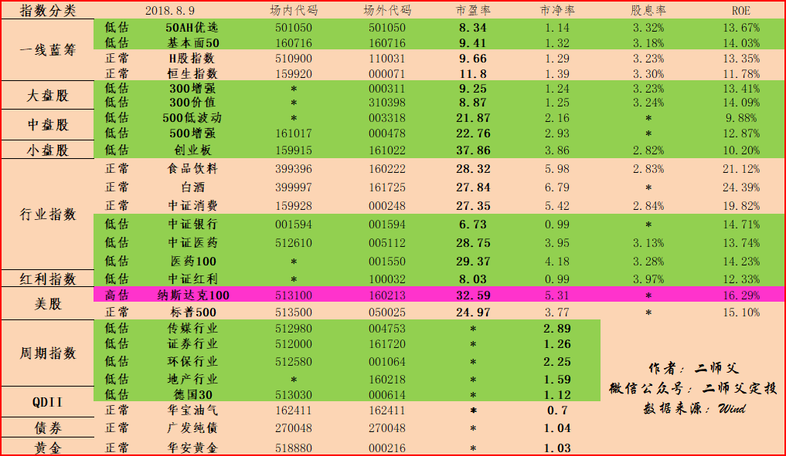

======================================================

_type: talk
@二师父[28814221155551]
2018-08-10 09:56:40 Fri  
topic_id: 28214182154281

<e type="hashtag" hid="281158284851" title="#市场分析#" />  近日，毛衣战依旧火热，中国不再从美国进口石油和天然气了，转而从巴西进口。美国的豆农都亏损巨大。

毛衣战对双方都没有好处，既然美国想做金融霸主，企图和欧日建立自由贸易区，严重侵害国家利益。那就陪他战。

受害得可能还是大多中国股民，习惯了追涨杀跌，亏损不少。

目前的外部局势是比较严峻，不过没必要过度恐慌，国家不会让股市崩盘的

但是也得做好风险控制，目前最大的风险就是市场上下窜动做俯卧撑，定投者熬不住止损。

阅读[1091]  评论[0]  赞[0] 

======================================================

_type: q&a
@海盗[48248118584848]
2018-08-10 11:50:55 Fri  
topic_id: 28214181124121

@海盗

>  二师父，对买入金额的公式，不是太理解。
>  基本金额应该是自己定的吧？
>  那么系数是什么的意思？
>  下面最后一句的辅以系数 辅以怎么理解呀
>  还望二师父耐心解答

@二师父

>  市盈率理解吧，增加系数的意思是，跌的多了，系数加大，投资金额增多

阅读[1099]  评论[4]  赞[0] 

======================================================

_type: solution
2018-08-10 12:38:51 Fri  
topic_id: 51584852224254

阅读[1013]  评论[0]  赞[0] 

======================================================

_type: q&a
@从容淡定[51511255218444]
2018-08-10 15:17:08 Fri  
topic_id: 48512154514518

@从容淡定

>  师父介绍的美元基金德国30可以定投了吧？选择场外？

@二师父

>  可以的，我选择的场外，场外是10起购，，场内也可以的，每次大概至少买100多元，一手

阅读[1089]  评论[2]  赞[0] 

======================================================

_type: q&a
@超级奶爸[48528544118258]
2018-08-10 21:42:05 Fri  
topic_id: 88214122585512

@超级奶爸

>  二师父，非体制内人员，养老金应该如何规划？可以把用来交养老保险的资金用来买指数吗？还是遵循分散原则，各配置一部分？

@二师父

>  非体制内人员的话，养老保险还是要交，这也是咱们配置的一部分原则。
>  
>  另外的一部分资金定投指数基金，吃分红即可，遇到高估逐步减仓。这是比较理想的原则啦。

阅读[1047]  评论[0]  赞[0] 

======================================================

_type: talk
@二师父[28814221155551]
2018-08-11 02:02:41 Sat  
topic_id: 15481848455522

<e type="hashtag" hid="281158522841" title="#每日打卡#" /> 今日打卡，系统温习了可转债的相关知识。

另外，市场跌幅不大，行业指数基金很多上涨，所以鳄鱼计划没有启动，继续坚持，最考验人的时刻到啦。

@勤能行之 at 2018-08-11 02:02:41 Sat

> 想到一句诗：宜将剩勇追穷寇

----------

@二师父 at 2018-08-11 02:02:41 Sat

> 别学霸王

----------

阅读[1120]  评论[2]  赞[0] 

======================================================

_type: talk
@二师父[28814221155551]
2018-08-11 02:03:44 Sat  
topic_id: 51584858511124

<e type="hashtag" hid="481211145528" title="#指数估值#" /> 每日分享，指数估值，大家觉得有用的话也给自己的朋友介绍下，让他们也脱离追涨杀跌的苦海。

阅读[1610]  评论[0]  赞[0] 

+++++++++++++++++++++++++++++++++++++++++++++++++++++

图片：

======================================================

_type: talk
@明天会更好[48528152285488]
2018-08-11 10:36:46 Sat  
topic_id: 15481812542152

师父您好，各位同学们好，可否讲讲消费类的基金，目前这块不是很了解，我们应该怎么投资？

@健哥 at 2018-08-11 10:36:46 Sat

> 低估定投，正常持有，高估逐步减仓赎回。

----------

@健哥 at 2018-08-11 10:36:46 Sat

> 消费、医药、养老行业指数值得定投

----------

@二师父 at 2018-08-11 10:36:46 Sat

> 吓得我看了一遍估值表，消费类基金估值正常啊持有就好

----------

阅读[1141]  评论[3]  赞[0] 

======================================================

_type: q&a
@毅[48544881484228]
2018-08-11 12:01:43 Sat  
topic_id: 15481812448582

@毅

>  师傅，能介绍一下深证红利这只基金吗？

@二师父

>  好，我具体再对比下中证红利，红利机会和深证红利

阅读[1206]  评论[4]  赞[0] 

======================================================

_type: talk
@健哥[51511242852814]
2018-08-11 21:28:20 Sat  
topic_id: 88214141522452

二师父，这次预测上探大概多少点呢，上次说下探是否守得住2659

@二师父 at 2018-08-11 21:28:20 Sat

> 建哥，市场真的预测不了啊，我只能判断估值然后投资，谁也预测不了

----------

阅读[1126]  评论[1]  赞[0] 

======================================================

_type: talk
@二师父[28814221155551]
2018-08-12 03:11:44 Sun  
topic_id: 15481882222242

<e type="hashtag" hid="281158522841" title="#每日打卡#" /> 周末就好好看书学习基金投资的基础知识。每天进步一点点。明天周末，放下手机，我要出去放松啦。晚上统一给大家答疑解惑哈。有问题学堂同学可以相互帮忙回答，一起学习进步。

分享即学习，付出即所得

阅读[1195]  评论[0]  赞[0] 

======================================================

_type: q&a
@海盗[48248118584848]
2018-08-12 10:32:57 Sun  
topic_id: 51584882512824

@海盗

>  二师父，在荔枝语音，能把指数基金的估值方法做几期节目吗？有关阀值还有安全边际等等的计算方法

@二师父

>  可以的啊

阅读[1215]  评论[1]  赞[0] 

======================================================

_type: talk
@冉冉[88445118854412]
2018-08-12 11:33:52 Sun  
topic_id: 48511415225428

<e type="hashtag" hid="518822415214" title="#课程优惠券#" />

@二师父 at 2018-08-12 11:33:52 Sun

> 在上面领取

----------

@冉冉 at 2018-08-12 11:33:52 Sun

> 已点，但界面与之前没什么不同。我是星球学员，想听30节荔枝微课。

----------

@二师父 at 2018-08-12 11:33:52 Sun

> 你把链接复制到微信，进入可以领取优惠券

----------

阅读[1253]  评论[3]  赞[0] 

======================================================

_type: talk
@二师父[28814221155551]
2018-08-13 04:25:05 Mon  
topic_id: 51588125121514

<e type="hashtag" hid="881288554512" title="#基金分析#" /> 红利机会和三只红利基金的对比分析。根据读者建议，以后有价值的分析报告和投资指导仅限于学堂发布，不再对外公布了。大家相互学习讨论。一起成长。

最近加了一些读者的微信，二师父发现，很多读者的生活都是过得有滋有味，你们让我看到了世界很多精彩的一面，多多分享，你也能够和其他读者链接。

二师父定投的目标就是两个，第一大家能够通过投资实现财务自由，生活自由，心灵自由，第二是二师父能够和各位读者成为朋友，读者和读者之间也能够成为朋友。多个朋友生活会多一些乐趣。

我觉得人始终要有正能量，多走出去，和他人交流，主动与他人交往，你会收获多多。

就拿单身这件事情来讲，媒人可以给你介绍，但是得自己主动追求，幸福都是自己争取来得。

说的有点多，一些跟投资无关的事情，不过理财就是理生活啊，我们投资不就是想生活过得更幸福吗.

阅读[1793]  评论[0]  赞[0] 

+++++++++++++++++++++++++++++++++++++++++++++++++++++

文件：
2018-08-13 04:19:21 Mon
文件大小：[362365]
28824225225451-红利机会和三只红利基金怎么选择.pdf

======================================================

_type: talk
@二师父[28814221155551]
2018-08-13 04:28:32 Mon  
topic_id: 51588125121584

关于课程优惠券的说明，很多读者是领取到的，如果学堂打开链接无法进入，那么将链接发送到微信里面，从微信里面的页面打开就好啦。二师父说是30节音频课程，其实后续根据实际情况调整会多于30节课程。每周会慢慢更新，大家不要着急，投资学习是一个积累加领悟的过程，需要时间。

@Audrey at 2018-08-13 04:28:32 Mon

> 在哪里领

----------

@二师父 at 2018-08-13 04:28:32 Mon

> 置顶文章里面

----------

阅读[1238]  评论[2]  赞[0] 

======================================================

_type: talk
@二师父[28814221155551]
2018-08-13 20:21:31 Mon  
topic_id: 28211882541251

<e type="hashtag" hid="881152541812" title="#周一荐书#" /> 本周推荐的书是《投资中最重要的事》，作者霍华德马克思。这本书巴菲特曾经读过两遍，其中把逆向思维投资阐述的淋漓尽致，学会第二层次思维让你成为深度思考者，用理性战胜情绪。这本书值得看三遍。

你有哪些好的书籍可以给大家推荐哈，读好书，才能做好投资。

@阿@浩 at 2018-08-13 20:21:31 Mon

> 正在看

----------

@二师父 at 2018-08-13 20:21:31 Mon

> 可以分享一下读后感

----------

@小涛@我的四季生活 at 2018-08-13 20:21:31 Mon

> 建议团购[得意]

----------

@小涛@我的四季生活 at 2018-08-13 20:21:31 Mon

> 可以发起团购

----------

@二师父 at 2018-08-13 20:21:31 Mon

> 怎么团，微信读书可以免费阅读部分

----------

@小涛@我的四季生活 at 2018-08-13 20:21:31 Mon

> 和供货商联系优惠，如果买的人多

----------

@二师父 at 2018-08-13 20:21:31 Mon

> 有点麻烦啊，啥时候我自己出一本书给你优惠[呲牙]

----------

@小涛@我的四季生活 at 2018-08-13 20:21:31 Mon

> 好的，期待[得意]

----------

阅读[1700]  评论[19]  赞[0] 

======================================================

_type: talk
@春风[15458188215422]
2018-08-13 23:28:24 Mon  
topic_id: 48511882421428

<e type="hashtag" hid="518822415214" title="#课程优惠券#" />

@二师父 at 2018-08-13 23:28:24 Mon

> 你是要进入课程还是

----------

@陈 at 2018-08-13 23:28:24 Mon

> 进入课程

----------

@Kelven at 2018-08-13 23:28:24 Mon

> 如何领取课程优惠券？

----------

阅读[1172]  评论[3]  赞[0] 

======================================================

_type: talk
@二师父[28814221155551]
2018-08-14 04:21:41 Tue  
topic_id: 48511854452188

<e type="hashtag" hid="481211145528" title="#指数估值#" /> H股进入低估，医药正常估值。德国30有进一步下跌的趋势，我喜欢

阅读[1757]  评论[0]  赞[0] 

+++++++++++++++++++++++++++++++++++++++++++++++++++++

图片：

======================================================

_type: talk
@二师父[28814221155551]
2018-08-14 04:22:33 Tue  
topic_id: 88211825524182

<e type="hashtag" hid="481144488858" title="#投资理念#" /> 今日讲一只基金的估值，你想知道哪支基金估值

@勤能行之 at 2018-08-14 04:22:33 Tue

> 我想知道德国30的估值[愉快]

----------

@勤能行之 at 2018-08-14 04:22:33 Tue

> 看了师傅的文章，我真的要学会配置了。我买了上证红利、中证红利和红利机会，这算是配置吗？[偷笑][愉快]

----------

@勤能行之 at 2018-08-14 04:22:33 Tue

> 想请教一下师傅这三只红利持仓大中小盘股的比例。这样我就可以看看自己配置的，是否合理。

----------

@健哥 at 2018-08-14 04:22:33 Tue

> 跟着二师父定投:安全放心，有收益，能长期坚持下来。[强]

----------

@健哥 at 2018-08-14 04:22:33 Tue

> 二师父每份是多少钱呢

----------

@二师父 at 2018-08-14 04:22:33 Tue

> 好哒

----------

@二师父 at 2018-08-14 04:22:33 Tue

> 红利买一种就行啦，是在不同低估资产配置

----------

@二师父 at 2018-08-14 04:22:33 Tue

> 红利买一种中证红利就行了

----------

阅读[1844]  评论[16]  赞[0] 

+++++++++++++++++++++++++++++++++++++++++++++++++++++

文件：
2018-08-14 04:22:17 Tue
文件大小：[355297]
28824228218551-大盘涨，中盘跌，谈谈指数的分散配置.pdf

======================================================

_type: talk
@小虾米[48544844248218]
2018-08-14 11:36:08 Tue  
topic_id: 48511858512858

谁来聊聊中证1000？  感觉每个大V都懒的谈论这个指数，都在说在去壳。  难道一点机会都没有吗？已经马上两次腰斩了

@二师父 at 2018-08-14 11:36:08 Tue

> 你可以试试😄，为啥已经那么多低估的指数了还要选择这个呀

----------

@sun at 2018-08-14 11:36:08 Tue

> 规模太小的基金有清盘风险

----------

阅读[1202]  评论[2]  赞[0] 

======================================================

@二师父[28814221155551]
2018-08-14 12:47:15 Tue  
topic_id: 51588151522454

>  @二师父
>  

阅读[1278]  评论[0]  赞[0] 

======================================================

_type: talk
@二师父[28814221155551]
2018-08-14 12:51:41 Tue  
topic_id: 28211828128441

<e type="hashtag" hid="881251425252" title="#鳄鱼计划#" /> 买入中证500一份，德国30一份，德国30继续下探，符合我的买入逻辑，选择低估下跌品种积累份额，不要急慢慢买。

至于正常估值用不用收割利润，是不需要的。记得今天买入的时候使用二师父的奖学金福利，没有领取的赶紧去公众号后台指数估值的文章里面领取，今天最后一天了，二师父刚刚使用福利。

@顾丽敏 at 2018-08-14 12:51:41 Tue

> 德国30场内今天是上涨的，昨天是下跌的。今天买入场外的话，是按今天晚上场外收盘价格计算，是吧？

----------

@二师父 at 2018-08-14 12:51:41 Tue

> 我1点多看的时候场内是下跌的，这会看上涨了了，不过没事，仍然低估。

股市下午3点休市，那场外就是以休市时候价格为成交价，不论一天你何时买，只要三点以前，都是以当天休市价格确认。场内是实时的

----------

@顾丽敏 at 2018-08-14 12:51:41 Tue

> 德国30场外的价格涨跌是同场内的么？不太理解啊，我们开市时间跟德国的又不一样，这个指数跟踪德国指数，不应该同步于德国开市时间或晚于么？

----------

@二师父 at 2018-08-14 12:51:41 Tue

> 德国30是同步场内的，场内德国30是Etf链接基金，不是德国指数，德国指数因为开盘时间不一样，所以和a股指数变化情况是不同的

----------

@顾丽敏 at 2018-08-14 12:51:41 Tue

> 再请教下二师父，纳斯达克100（160213）的性质跟德国30一样么？纳斯达克100（160213）是同步场内（513100）的么？我在平安证券买的这些国外的场外基金，购买时提示交易日15:00前购买，下二个交易日确认份额，那是以购买那天的收盘价算的吧？

----------

@二师父 at 2018-08-14 12:51:41 Tue

> 纳指在场内购买可以啊，按实时的，在场外申购三点之前是三点收盘的价格

----------

阅读[1826]  评论[6]  赞[0] 

======================================================

_type: talk
@二师父[28814221155551]
2018-08-15 03:43:17 Wed  
topic_id: 51588141418424

阅读[1777]  评论[0]  赞[0] 

+++++++++++++++++++++++++++++++++++++++++++++++++++++

文件：
2018-08-15 03:43:14 Wed
文件大小：[328238]
88824221518212-谈谈债券和周期指数基金.pdf

======================================================

_type: talk
@二师父[28814221155551]
2018-08-15 03:44:56 Wed  
topic_id: 48511828281288

<e type="hashtag" hid="481211145528" title="#指数估值#" /> 黄金进入低估，避险品种可以适当配置

阅读[1850]  评论[0]  赞[0] 

+++++++++++++++++++++++++++++++++++++++++++++++++++++

图片：
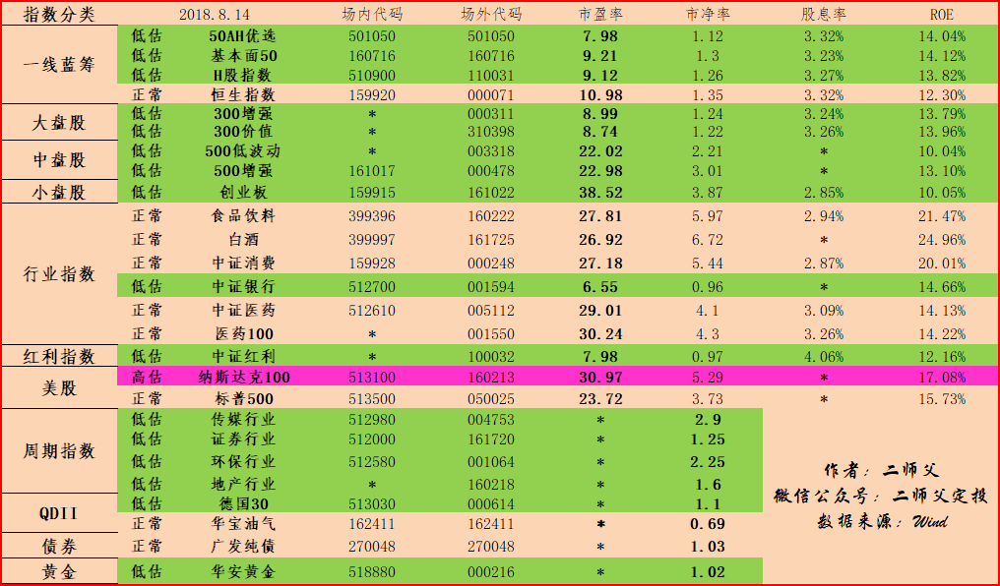

======================================================

_type: talk
@二师父[28814221155551]
2018-08-15 03:47:49 Wed  
topic_id: 88211848481442

<e type="hashtag" hid="281151555481" title="#估值分析#" /> 德国30目前市盈率是大概8.98，处于历史低估区域，对于国外的宽基指数，也是可以利用市盈率估值。当然可以从市净率和净资产收益率结合。通常情况下，营收增长快的，可以给到更高的估值。

至于标普500的估值情况，我们在基金课程里面讲过了，设定阈值区间来判断是否高估，低估

@顾丽敏 at 2018-08-15 03:47:49 Wed

> 德国30今天继续 下跌

----------

阅读[1381]  评论[1]  赞[0] 

======================================================

_type: talk
@sun[15481522845412]
2018-08-15 14:50:07 Wed  
topic_id: 28211815824121

打卡，今日定投日，明天如果继续下跌加投一次

阅读[1314]  评论[0]  赞[0] 

======================================================

_type: q&a
@海盗[48248118584848]
2018-08-15 16:34:22 Wed  
topic_id: 88211815214182

@海盗

>  二师父，之前几个月一直是通过支付宝的蚂蚁财富购买基金的。后来发现平台不支持购买德国30。我现在怎么办，哪个平台比较合适？如果换平台，之前投的资怎么办呀

@二师父

>  换了平台，之前的投资就放在蚂蚁里面，等待指数上涨有了利润以后开始逐步卖出，现在一定记住不要卖出
>  
>  我场外用的蛋卷，公众号后台回复场外利用我提供的渠道注册可以领取15元奖学金

阅读[1381]  评论[6]  赞[0] 

======================================================

_type: talk
@二师父[28814221155551]
2018-08-15 22:39:39 Wed  
topic_id: 88211814148812

<e type="hashtag" hid="481211145528" title="#指数估值#" /> 15号估值来啦。今天大跌，可是二师父没有加仓，因为手动加仓必须控制次数，否则容易站岗，一天两天差别不大，将目光方长远一些。

中证医药和医药100进入低估区域，坚持定投，必定有收获。我们需要的就是坚持，在熊市取胜的秘诀仅此而已。

另外还有IPO增发，一时半会上涨估计是够呛了，做好打持久战争的准备。

阅读[1780]  评论[0]  赞[0] 

+++++++++++++++++++++++++++++++++++++++++++++++++++++

图片：
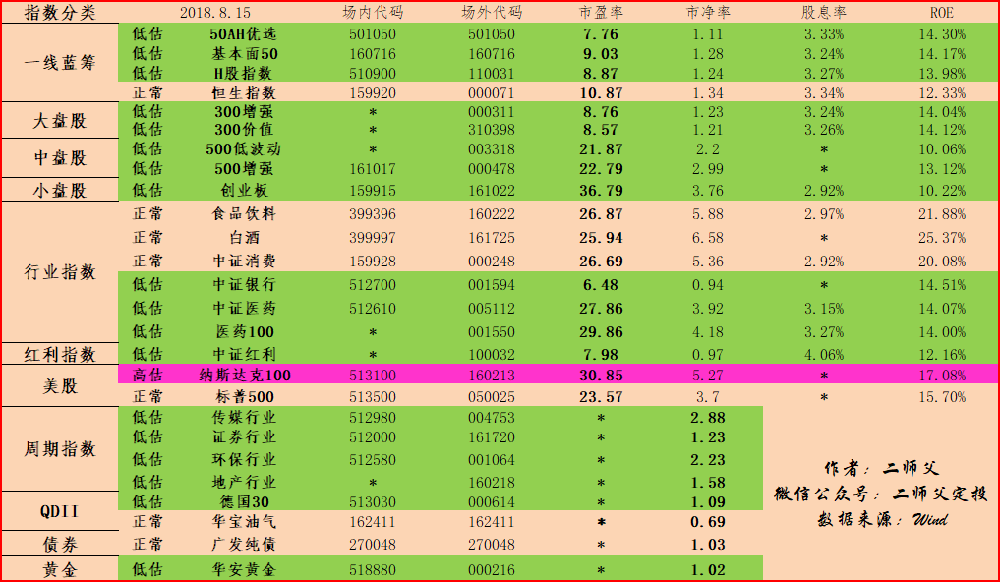

======================================================

_type: talk
@二师父[28814221155551]
2018-08-16 02:14:40 Thu  
topic_id: 51588188542424

如何应对当前的市场环境，低估定投+逆向思维。这是核心思想。

阅读[1813]  评论[0]  赞[0] 

+++++++++++++++++++++++++++++++++++++++++++++++++++++

文件：
2018-08-16 02:14:21 Thu
文件大小：[336633]
48852524554218-阴跌不断，我们该怎么办呢.pdf

======================================================

_type: talk
@二师父[28814221155551]
2018-08-16 02:45:42 Thu  
topic_id: 88211811242222

<e type="hashtag" hid="518828111214" title="#一种投资品种#" />  如今美元涨幅惊人，有破7危险，可以短期配置一些美元债券，等待美元止涨赎回，当然这种投资有风险，做好止损准备

@波波 at 2018-08-16 02:45:42 Thu

> 师父，推荐一下

----------

@森林氧吧 at 2018-08-16 02:45:42 Thu

> 推荐一下下

----------

@fxq at 2018-08-16 02:45:42 Thu

> 我觉得这时候美债风险有点大，之前快要6.9的时候央行就出了外汇风险准备金，那么在7这样重要的关口上大概率会有更强的干预措施，可能形成在7拉锯较长一段时间，7可能就是近期高点了；另外美国最近增长强劲，9月加息是大概率事件，也会对美债产生不利影响。所以我觉得不如再观望一下，如果快速破7未遭抵抗的话再考虑买比较好。

----------

@二师父 at 2018-08-16 02:45:42 Thu

> 这个目前美元指数96，建议美元指数90以下再买

----------

@二师父 at 2018-08-16 02:45:42 Thu

> 这个目前美元指数96，建议美元指数90以下再买

----------

@二师父 at 2018-08-16 02:45:42 Thu

> 我只是分享一个投资品种，不建议大家现在购买

----------

阅读[1328]  评论[6]  赞[0] 

======================================================

_type: solution
2018-08-16 10:05:10 Thu  
topic_id: 15488424228122

@二师父 at 2018-08-16 10:05:10 Thu

> 一起成长

----------

@海盗 at 2018-08-16 10:05:10 Thu

> 我们队伍一天一天壮大了[得意]

----------

@二师父 at 2018-08-16 10:05:10 Thu

> 是的呢，持续定投，改变人生

----------

阅读[1281]  评论[3]  赞[0] 

======================================================

_type: solution
2018-08-16 10:07:05 Thu  
topic_id: 88211252585122

@勤能行之 at 2018-08-16 10:07:05 Thu

> 应该加仓。

----------

@小白 at 2018-08-16 10:07:05 Thu

> [强][强]我也觉得，但总觉得一开始进太多不好，纠结😖

----------

@有你真好 at 2018-08-16 10:07:05 Thu

> 现在这个点，可以直接4到5层

----------

@小白 at 2018-08-16 10:07:05 Thu

> 是不是太多了[尴尬][尴尬]

----------

@二师父 at 2018-08-16 10:07:05 Thu

> 可以多买点，或者周定投

----------

@小白 at 2018-08-16 10:07:05 Thu

> 谢谢！！

----------

@小白 at 2018-08-16 10:07:05 Thu

> 二师父，如果我采用周定投，就还是投我之前定投的那几只吗？如果我发现我之前定投的估值已经到了正常估值，我是不是就止投？转投其他的低估基金。

----------

@二师父 at 2018-08-16 10:07:05 Thu

> 对，到了正常就停止并且开始收割利润

----------

阅读[1325]  评论[11]  赞[0] 

======================================================

_type: q&a
@勤能行之[481211221828]
2018-08-16 12:43:09 Thu  
topic_id: 28211252581151

@勤能行之

>  师傅，我想在中证医药和医药100里面选一支，你选哪一只呀

@二师父

>  选中证医药啊，两者差别不大的

阅读[1344]  评论[0]  赞[0] 

======================================================

_type: q&a
@尤加利树[51141421214524]
2018-08-16 14:06:41 Thu  
topic_id: 51588524254814

@尤加利树

>  今天定投？

@二师父

>  我是周四，看你设置在哪个位置了

阅读[1353]  评论[0]  赞[0] 

======================================================

_type: talk
@二师父[28814221155551]
2018-08-16 14:07:37 Thu  
topic_id: 51588524258144

定投都是发生在周四，大家也可以根据自己的情况定投，可以群内发意见征集，集思广益

阅读[1326]  评论[0]  赞[0] 

======================================================

_type: q&a
@西锦巴乌[88448285428482]
2018-08-16 14:52:32 Thu  
topic_id: 28211254858241

@西锦巴乌

>  二师父：你提到的黄金ETF怎么买？另外，我原来买了美元，到7时该卖呢还是持有？谢谢

@二师父

>  黄金ETF在估值表最下面有ETF连接基金，就在蛋卷购买场外的行了，美元的话到了7可以先结汇一部分，美元指数已经很高了，至于最后能涨到哪里，影响因素太多

阅读[1445]  评论[2]  赞[0] 

======================================================

_type: talk
@西锦巴乌[88448285428482]
2018-08-16 16:59:06 Thu  
topic_id: 15488421855812

<e type="hashtag" hid="881422852442" title="#定投实盘#" />  昨天买了几只，结果发现漏了300増加，今天补了一份，另外，今天新买了一份黄金（听师父的[偷笑]

@二师父 at 2018-08-16 16:59:06 Thu

> 黄金避险品种，美元涨，黄金就得跌，世界不太平，黄金就要涨

----------

@西锦巴乌 at 2018-08-16 16:59:06 Thu

> 明白

----------

阅读[1369]  评论[2]  赞[0] 

======================================================

_type: talk
@健哥[51511242852814]
2018-08-16 17:03:17 Thu  
topic_id: 48511542182248

请教一下二师父，如果是1年左右必须要用的钱，拿来买指数基金，应如何操作呢？可否做波段？

@二师父 at 2018-08-16 17:03:17 Thu

> 一年内必须用的钱就买货币基金，别买指数基金啦

----------

@健哥 at 2018-08-16 17:03:17 Thu

> 谢谢二师父！

----------

阅读[1381]  评论[2]  赞[0] 

======================================================

_type: talk
@二师父[28814221155551]
2018-08-17 03:25:03 Fri  
topic_id: 28211282255281

按照核心策略来不断地改进自己的投资。最近准备引进美元债的投资，因为汇率波动真的是让大家感受到了投资比工作重要。假如，你有100万，在5月把100万售汇为美元，那么现在你可以赚取10多万。当然这只是一个假设情况，实际操作这样风险太大。

二师父只是提出一个思路，美元债以后可以当美元指数下跌到一定区间开始买入，然后上涨到一定区间卖出，咱们的投资一定是全球配置，风格多变。

阅读[1897]  评论[0]  赞[0] 

+++++++++++++++++++++++++++++++++++++++++++++++++++++

文件：
2018-08-17 03:24:55 Fri
文件大小：[340848]
48852222858558-定投没有子弹了该怎么办.pdf

======================================================

_type: talk
@二师父[28814221155551]
2018-08-17 03:26:35 Fri  
topic_id: 88211282255212

<e type="hashtag" hid="481211145528" title="#指数估值#" /> 坚持低估定投，这是最保险的策略，如今的市场，除了定投做T还能够盈利吗。

当然，我更希望做长期投资者，坚守到牛市，一起坚守吧，未来1年半内，牛市可期。

阅读[1868]  评论[0]  赞[0] 

+++++++++++++++++++++++++++++++++++++++++++++++++++++

图片：
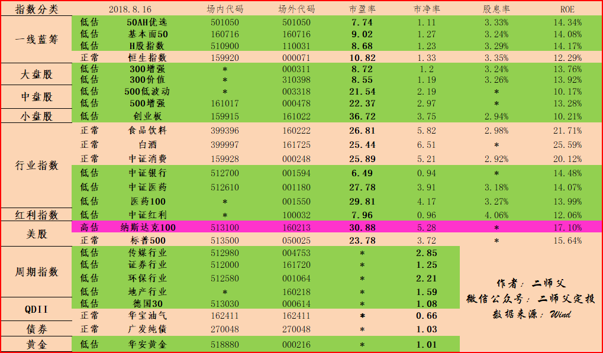

======================================================

_type: talk
@二师父[28814221155551]
2018-08-17 03:50:51 Fri  
topic_id: 51588515522884

商务部8月16日消息，应美方邀请，商务部副部长兼国际贸易谈判副代表王受文拟于8月下旬率团访美，与美国财政部副部长马尔帕斯率领的美方代表团就双方各自关注的中美经贸问题进行磋商。

美国又要谈判了。先把他打疼再说，能否带来转机，敬请期待。

@落叶无痕 at 2018-08-17 03:50:51 Fri

> 我今天加仓

----------

@二师父 at 2018-08-17 03:50:51 Fri

> 又有子弹啦？今天跌了比较多，可以加，很安全

----------

阅读[1428]  评论[2]  赞[0] 

======================================================

_type: talk
@小兔子的小青瓜[51114225425224]
2018-08-17 07:41:54 Fri  
topic_id: 48511585288888

什么是二师父的🐊计划

@勤能行之 at 2018-08-17 07:41:54 Fri

> 就是二师傅的不定期买入计划。

----------

@二师父 at 2018-08-17 07:41:54 Fri

> 000905

----------

阅读[1358]  评论[2]  赞[0] 

======================================================

_type: talk
@二师父[28814221155551]
2018-08-17 15:21:29 Fri  
topic_id: 51588551121554

<e type="hashtag" hid="481141514488" title="#手动否#" /> 今天你加仓了吗？沪指跌破2700，很多指数进一步下跌，二师父因为严格控制鳄鱼计划交易次数，所以未加仓，今天的你加了吗？

@孙源羲 at 2018-08-17 15:21:29 Fri

> 今天正好是定投日，早盘心里还没底，下午果断加仓。

----------

@阿@浩 at 2018-08-17 15:21:29 Fri

> 加了，仓位50比例不过加上今天亏损9个多点了

----------

@二师父 at 2018-08-17 15:21:29 Fri

> 定投日坚守纪律定投就好

----------

@游水浮生 at 2018-08-17 15:21:29 Fri

> 必须加仓！

----------

@阿@浩 at 2018-08-17 15:21:29 Fri

> 二师父还有多少仓位啊

----------

@孙源羲 at 2018-08-17 15:21:29 Fri

> 收到[强]

----------

@比肥皂还肥 at 2018-08-17 15:21:29 Fri

> 加了20手中证500，已7成仓位

----------

@二师父 at 2018-08-17 15:21:29 Fri

> 我是7成仓位了

----------

阅读[1302]  评论[15]  赞[0] 

======================================================

_type: talk
@西锦巴乌[88448285428482]
2018-08-17 15:39:31 Fri  
topic_id: 48511558885848

<e type="hashtag" hid="481141514488" title="#手动否#" />  今天没有加，昨天、前天都加过了，控制节奏，心想机会肯定还有的

阅读[1252]  评论[0]  赞[0] 

======================================================

_type: talk
@Howard[88882844421852]
2018-08-17 21:28:28 Fri  
topic_id: 28211222818851

p2p还能玩嘛

@二师父 at 2018-08-17 21:28:28 Fri

> 不能

----------

@健哥 at 2018-08-17 21:28:28 Fri

> 大平台还是可以少量买入。

----------

阅读[1209]  评论[2]  赞[0] 

======================================================

_type: talk
@二师父[28814221155551]
2018-08-18 03:13:24 Sat  
topic_id: 28211445554121

<e type="hashtag" hid="481211145528" title="#指数估值#" /> 指数估值表来啦，券商破净，已经接近14年低位。中证500也是连跌3年，都很有价值。

至于P2P还能玩吗？二师父建议，别玩，因为你不知道哪个平台会爆。

所以，指数基金定投最好。最差我们能实现年化百分之10到15收益率，比P2P好，但是非常安全。

阅读[1678]  评论[0]  赞[0] 

+++++++++++++++++++++++++++++++++++++++++++++++++++++

图片：
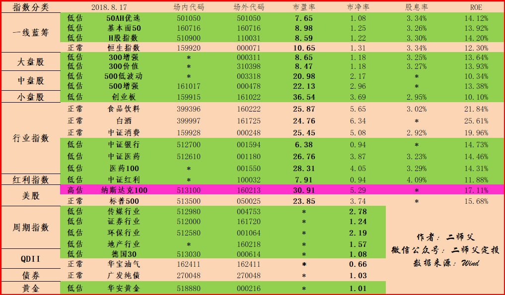

======================================================

_type: talk
@二师父[28814221155551]
2018-08-18 03:18:08 Sat  
topic_id: 28211445551151

<e type="hashtag" hid="281151421441" title="#理念分享#" /> 定投指数是最适合普通投资者的。如果你有时间每天可以研究股票8个小时，那么建议看看《穷查理宝典》、《股票作手回忆录》、《笑傲股市》，如果没有时间的话，看看二师父的文章就行啦。或者定期不定额投资，不用太操心。

对于P2P，再说一点。二师父认识的很多人是亏损从5万到50万不等，所以别投资了。

@阿@浩 at 2018-08-18 03:18:08 Sat

> 2339还是2639

----------

@勤能行之 at 2018-08-18 03:18:08 Sat

> 就看师傅的文章就行了。没时间看书[偷笑][愉快]

----------

@二师父 at 2018-08-18 03:18:08 Sat

> 2339

----------

@二师父 at 2018-08-18 03:18:08 Sat

> [呲牙][呲牙][呲牙]

----------

阅读[1793]  评论[4]  赞[0] 

+++++++++++++++++++++++++++++++++++++++++++++++++++++

文件：
2018-08-18 03:14:30 Sat
文件大小：[334508]
28824441545821-一生无悔入定投.pdf

======================================================

_type: talk
@二师父[28814221155551]
2018-08-18 04:48:35 Sat  
topic_id: 51588442218224

美国准备和中国谈判无非是想测试中国的底线并进一步向中国提出无理要求，就这样打打谈谈，中国并不惧怕，我们的态度在那里，如果贸易战不停，估计人民币和股市回升暂时无望。继续跟进谈判结果

阅读[1321]  评论[0]  赞[0] 

======================================================

_type: q&a
@山人[88812842582212]
2018-08-18 12:42:42 Sat  
topic_id: 28211445158541

@山人

>  二师傅，市场上那么多指数基金要怎么选啊。是看证券公司还是看基金经理，或者看资金规模和历史收益排名？要如何从同类基金里挑选出一只有潜力的基金

@二师父

>  被动基金不用看基金经理，就看基金的估值和历史走势就好，如果历史上有暴涨，而现在极度低，说明不是基金不好，而是非理性的市场情绪让基金估值太低，现在买入以后市场情绪高涨加上企业盈利就能使得基金盈利

阅读[1317]  评论[4]  赞[0] 

======================================================

_type: q&a
@比肥皂还肥[51542451825584]
2018-08-18 14:41:39 Sat  
topic_id: 88211448284212

@比肥皂还肥

>  二师父，我持仓里有2成兴全社会责任，从之前浮赢12%到现在浮亏17%，接下来应该怎么做？要换仓吗？想听听二师父建议...

@二师父

>  这个是混合型基金，主动型基金，换了基金经理以后就应该立刻清仓。这个基金是换了经理的，如今这个点位其实很难办，对于主动基金二师父的止损点位是10个百分点，而且不会让曾经盈利的基金亏损。
>  
>  建议以后定投指数基金，这样避免了更换基金经理的风险，我看了下股票持仓都是科技股，护城河不深。建议看看新经理的水平，主动基金和基金经理水平关系很大

阅读[1291]  评论[2]  赞[0] 

======================================================

_type: talk
@二师父[28814221155551]
2018-08-18 14:47:10 Sat  
topic_id: 28211448454281

<e type="hashtag" hid="518828448514" title="#主动还是被动#" /> 17年蓝筹行情时候国泰杨飞持仓基金都是大涨的，如今却急转直下。主动基金成长与基金经理的风格有关系，选主动基金就是选基金经理。

因此，一旦主动基金经理更换基金表现较差那么及时卖出

建议普通投资者定投指数基金，策略简单，不用太操心

@游水浮生 at 2018-08-18 14:47:10 Sat

> 定投指数基金是上班族小散不可多得的居家理财法宝！

----------

@二师父 at 2018-08-18 14:47:10 Sat

> 对哒，直接在安全边际内按时买入，非常简单的策略

----------

@勤能行之 at 2018-08-18 14:47:10 Sat

> 就喜欢简单的策略。

----------

阅读[1307]  评论[3]  赞[0] 

======================================================

_type: talk
@二师父[28814221155551]
2018-08-19 03:58:53 Sun  
topic_id: 88211415884522

<e type="hashtag" hid="481148182288" title="#答疑解惑#" /> 300策略和300连接基金，300连接基金重仓的是沪深300，购买连接基金和购买沪深300差别不大。300策略就是按照策略选择出300里面的股票作为重仓股。

目前主动基金亏损的可以选择止损，我们投资股票和主动基金是需要止损的。

如何选择指数基金呢？首先看过往业绩，其次看估值，最后看基金的规模。规模小于1亿的不用考虑。

很多问题都重复回答过，大家在群内直接发表，如果能回答的读者可以相互帮助回答，你解答了大家能够明白能够加深你对知识的认识和理解。

阅读[1778]  评论[0]  赞[0] 

+++++++++++++++++++++++++++++++++++++++++++++++++++++

图片：
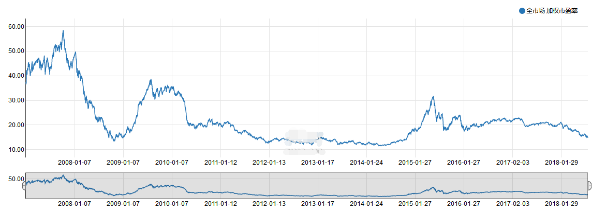

+++++++++++++++++++++++++++++++++++++++++++++++++++++

文件：
2018-08-19 03:53:17 Sun
文件大小：[376830]
88824441122242-A股全市场指数很低估你不知道吗.pdf

2018-08-19 03:54:26 Sun
文件大小：[67207]
51154448855544-A股全市场指数很低估你不知道吗.docx

======================================================

_type: q&a
@超级奶爸[48528544118258]
2018-08-19 13:28:56 Sun  
topic_id: 15488182825122

@超级奶爸

>  二师父，分红率是红利基金的重要指标，一般情况下，价格越低，分红率越高；会不会出现基金价格和分红率同时降低的情况？毕竟分红是一个不确定的因素

@二师父

>  基金分红的本质是将基金收益的一部分，以现金的形式派发给投资人，基金分红后相当于净值降低，理论上分红率越大，净值越低，这是对于同一只基金纵向比较的

阅读[1294]  评论[2]  赞[0] 

======================================================

_type: q&a
@西锦巴乌[88448285428482]
2018-08-19 13:30:08 Sun  
topic_id: 48511218412188

@西锦巴乌

>  二师父：请问指数基金的市盈率怎么计算的？谢谢

@二师父

>  用公式，市盈率＝市值÷盈利。在股票上就是基金价格除以每股利润

阅读[1316]  评论[4]  赞[0] 

======================================================

_type: talk
@二师父[28814221155551]
2018-08-20 01:58:02 Mon  
topic_id: 88211155812842

<e type="hashtag" hid="481148182288" title="#答疑解惑#" /> 现在买入的主动基金亏损了要卖吗？答曰：15个百分点以内建议卖了买入指数基金。主动基金因为基金经理的不确定性，会有风险。

另外对于中证医药买什么，你可以买估值表i里面的，中证全指医药，就是中证医药，也可以买其他的，怎么查，找到中证指数官网，搜所中证医药，后面有对应的ETF基金。

目前纳斯达克可以买入吗？答，非常高估，不适合买入。

你们还有啥问题，自己可以在学堂发布按钮点击发布，大家一起讨论，集思广益，也许你的问题正是大家的问题，群内的作用就是相互学习探讨共同进步。分享即学习。

如果对你有帮助，记得点击下方分享按钮，你可以获取额外奖励，也能够帮助到他人，何乐而不为呢？记得开始打造自己的诺亚方舟哈

@健哥 at 2018-08-20 01:58:02 Mon

> 主动型基金筛选很重要。一定得买“全行业”基金，千万别买单一行业基金，要买五年期收益都好、五星级的、大型基金公司的主动型基金。现在大的基金公司很多都是团队研发，更换基金金理问题不是很大。
主动基金也只能坚持定投，别一次性买入，设置自己的止盈点，到达全部卖出，决不犹豫。但是不能止损，坚持定投，决不能乱加仓，低点适当增加扣款金额。
当出现负25%或更多时，这时要大笔加码，加入本金的1/3或1/4或1/5，摊低成本，便于收益快速回正，这时已经很底部了，放心加，收益回正后，赎回当时大笔加码的金额。最后到达止盈点及时止盈，继续下一轮定投。
主动型基金和指数基金配合使用，收益会更高。当然，新手最好定投指数型基金，至少有三年以上投资经验，方可定投主动型基金。

----------

@小白 at 2018-08-20 01:58:02 Mon

> [强][强][强]

----------

@二师父 at 2018-08-20 01:58:02 Mon

> 主动基金估值不容易把握，还是定投指数基金稳当，而且基金经理换了影响很大的

----------

@健哥 at 2018-08-20 01:58:02 Mon

> 主动基金确实无法采用市盈率估值，顶多只能参考沪深300点位，3500点下定投算安全。

----------

@二师父 at 2018-08-20 01:58:02 Mon

> 还是看单个基金估值好，从3400点有人买的被套了近50个点了

----------

阅读[1744]  评论[5]  赞[0] 

+++++++++++++++++++++++++++++++++++++++++++++++++++++

文件：
2018-08-20 01:57:55 Mon
文件大小：[25883]
28824415482481-无论明天涨跌，请打造自己的诺亚方舟.docx

======================================================

_type: talk
@二师父[28814221155551]
2018-08-20 13:39:51 Mon  
topic_id: 48511142252828

<e type="hashtag" hid="881251425252" title="#鳄鱼计划#" /> 买入中证医药一份，500增强一份，创业板一份，医药刚刚进入低估，慢慢买，500已经接近历史低位了，可以慢慢重仓。记住，不要恐惧，也不要梭哈，一步步慢慢买入，体验定投在熊市的魔力。

@勤能行之 at 2018-08-20 13:39:51 Mon

> 师傅，医药是001550吗

----------

@二师父 at 2018-08-20 13:39:51 Mon

> 对，这是天弘中证医药

----------

阅读[1657]  评论[2]  赞[0] 

======================================================

_type: q&a
@毅[48544881484228]
2018-08-20 22:41:20 Mon  
topic_id: 51588815142544

@毅

>  师傅，在现在的环境下，是选择基金直接分红好，还是选择分红再投资比较好

@二师父

>  这个时候低估了选择红利再投资要好些的

阅读[1120]  评论[0]  赞[0] 

======================================================

_type: talk
@二师父[28814221155551]
2018-08-21 04:20:22 Tue  
topic_id: 48511182411448

<e type="hashtag" hid="881185884522" title="#投资心理学#" /> 我们都需要耐心

阅读[1119]  评论[0]  赞[0] 

+++++++++++++++++++++++++++++++++++++++++++++++++++++

文件：
2018-08-21 04:19:51 Tue
文件大小：[24295]
28824414228581-熊市需要的是耐心.docx

======================================================

_type: talk
@二师父[28814221155551]
2018-08-21 04:20:53 Tue  
topic_id: 88211184511522

<e type="hashtag" hid="481211145528" title="#指数估值#" /> 低估品种太多，宽基和行业首选

@秋叶电暖宝 at 2018-08-21 04:20:53 Tue

> 场内代码跟场外代码啥意思呢。咋还不同代码

----------

@二师父 at 2018-08-21 04:20:53 Tue

> 场内是在股票交易账户购买，场外是在基金平台申购，两者是不同的

----------

@阿芊 at 2018-08-21 04:20:53 Tue

> 请问场内代码没有的像中证红利，是不是只有场外才能购买？？因为刚进入没多久，想说用一个股票账号就好。

----------

@二师父 at 2018-08-21 04:20:53 Tue

> 那就红利基金，场内的

----------

@阿芊 at 2018-08-21 04:20:53 Tue

> 是不是501029？

----------

@二师父 at 2018-08-21 04:20:53 Tue

> 对的

----------

阅读[1136]  评论[6]  赞[0] 

+++++++++++++++++++++++++++++++++++++++++++++++++++++

图片：

======================================================

_type: talk
@二师父[28814221155551]
2018-08-21 04:22:08 Tue  
topic_id: 51588814288254

<e type="hashtag" hid="518812114254" title="#今日荐书#" /> 今天推荐一本书《可转债投资魔法书》，可以帮助大家学习如何投资可转债，写的非常全面，值得学习。

@勤能行之 at 2018-08-21 04:22:08 Tue

> 谢谢师傅的推荐。[玫瑰][强]

----------

@cotton at 2018-08-21 04:22:08 Tue

> 去京东买么

----------

@二师父 at 2018-08-21 04:22:08 Tue

> 可以在微信读书看，比较划算，买的话亚马逊，当当都行

----------

@cotton at 2018-08-21 04:22:08 Tue

> 微信读书是公众号吗

----------

@海盗 at 2018-08-21 04:22:08 Tue

> 微信读书是一款app,用微信号登录即可。温馨提示一下，这本书电子版是免费的😊

----------

@cotton at 2018-08-21 04:22:08 Tue

> 谢谢。。。

----------

阅读[1155]  评论[6]  赞[0] 

======================================================

_type: q&a
@玉博珠宝[15551254545122]
2018-08-21 21:16:26 Tue  
topic_id: 28211122252421

@玉博珠宝

>  为什么我在平安证券显示的基金理财总市值（含现金宝）比我实际购买的各个基金的市值加起来多1万元，这是怎么会事呢？

@二师父

>  盈利了啊，当你盈利之后自然就多了

阅读[1093]  评论[7]  赞[0] 

======================================================

_type: talk
@二师父[28814221155551]
2018-08-22 03:12:38 Wed  
topic_id: 51588842814214

<e type="hashtag" hid="281185814421" title="#每日估值#" /> 估值表每日更新，参考定投即可，目前大熊市，做好布局，迎接大盘的逆转。

读书的话推荐一个软件微信读书就好，纸质版的二师父一般去书店或者亚马逊购买

阅读[1452]  评论[0]  赞[0] 

+++++++++++++++++++++++++++++++++++++++++++++++++++++

图片：

======================================================

_type: talk
@sun[15481522845412]
2018-08-22 14:48:20 Wed  
topic_id: 15488818444112

打卡，定投日坚持定投[拳头]

阅读[928]  评论[0]  赞[0] 

======================================================

_type: talk
@Audrey[15284421255842]
2018-08-22 20:05:18 Wed  
topic_id: 48511114225158

二师傅，你好，广发证券开户的时候，佣金没有万0.6的 ，我选的万2.5，怎么才能变成万0.6，谢谢😜

@zzj at 2018-08-22 20:05:18 Wed

> 到时南京那边业务会打电话给你，帮你调整的

----------

@Audrey at 2018-08-22 20:05:18 Wed

> 好的 谢谢😜

----------

@二师父 at 2018-08-22 20:05:18 Wed

> 电话回访就调整啦

----------

阅读[898]  评论[3]  赞[0] 

======================================================

_type: talk
@二师父[28814221155551]
2018-08-23 03:01:44 Thu  
topic_id: 88211114482152

<e type="hashtag" hid="281185451411" title="#讲一种投资方法#" /> 趋势交易。二师父定投的投资理念是逆向交易，也就是找到好的安全边际，在低估的时候不断买入，越跌越买，这种投资适合保守的人，不愿意接受真实浮亏的人。

今天介绍一种交易策略，趋势交易策略，适合在基金或者股票涨幅良好的情况下买入，具体可以看看欧奈儿的笑傲股市，这种策略适合急进的人，能够接受本金实际亏损的。

设置好止损线，看到牛股或者牛基时候加仓买入，到达止盈点开始逐步卖出，到达止损点位卖出。

我们有趋势投资，价值投资，逆向投资。在中国没有完全意义上的价值投资，所以能够选择的是这两种。

趋势投资，需要看准趋势，如果发现不对，立马纠正错误。

阅读[923]  评论[0]  赞[0] 

======================================================

_type: talk
@二师父[28814221155551]
2018-08-23 04:16:40 Thu  
topic_id: 88211114425282

<e type="hashtag" hid="481211145528" title="#指数估值#" />

阅读[1341]  评论[0]  赞[0] 

+++++++++++++++++++++++++++++++++++++++++++++++++++++

图片：

======================================================

_type: talk
@二师父[28814221155551]
2018-08-23 04:17:12 Thu  
topic_id: 51588884452514

<e type="hashtag" hid="481144488858" title="#投资理念#" />

@小白 at 2018-08-23 04:17:12 Thu

> 二师父辛苦啦，你过得是美国时间吧[惊恐][惊恐]

----------

阅读[1406]  评论[1]  赞[0] 

+++++++++++++++++++++++++++++++++++++++++++++++++++++

文件：
2018-08-23 04:17:10 Thu
文件大小：[24273]
28824152145481-非理性的市场给我们提供了低价买入的机会.docx

======================================================

_type: talk
@二师父[28814221155551]
2018-08-23 12:49:10 Thu  
topic_id: 15122222551812

<e type="hashtag" hid="881422852442" title="#定投实盘#" /> 500增强买入一份，中证传媒买入一份。中证传媒是周期指数，所以买入频率很低。

目前市场就是非理性地恐慌导致股价大跌，给我们机会了。

新加入的同学不知道代码直接参考估值表里面的代码即可。两只基金都已经接近历史较低位置了，买入耐心持有即可，回撤会在百分之20以内，不用担心。

阅读[1313]  评论[0]  赞[0] 

======================================================

_type: q&a
@西锦巴乌[88448285428482]
2018-08-23 12:56:51 Thu  
topic_id: 51422222152524

@西锦巴乌

>  二师父好！现在合适买债券基金吗？若合适请提供名称供参考。谢谢！

@二师父

>  现在不适合啊，现在买债券基金还不如货币基金，美国收益债券可以了解下，但是目前涨了不少，也不太适合买入

阅读[921]  评论[1]  赞[0] 

======================================================

_type: q&a
@西锦巴乌[88448285428482]
2018-08-23 16:35:05 Thu  
topic_id: 48244445515818

@西锦巴乌

>  二师父：我们自己怎么计算基金的市盈率？谢谢

@二师父

>  这个计算很麻烦了，得用所有股票加权市盈率，一般都是程序处理，没有人工计算的

阅读[911]  评论[1]  赞[0] 

======================================================

_type: q&a
@小白[15114524218582]
2018-08-23 17:21:21 Thu  
topic_id: 15122224852482

@小白

>  二师父，我现在也是周定投，定时定额的那种，如果我前一天发现定投的基金进入正常估值了，我是不是要止投呢？另外目前我配置了4只宽基，是不是应该买入点行业基金，像银行都进入低估了。

@二师父

>  低估投资，正常停止开始收割利润，医药和银行都可以的啊

阅读[899]  评论[2]  赞[0] 

======================================================

_type: q&a
@金晓[228158428141]
2018-08-23 18:39:22 Thu  
topic_id: 51422224211824

@金晓

>  师父，今天我才开始定投，仓位从0开始，现在基本是股市的相对低处，我是否需要每周定投多倍先坚持几个月，还是说还是严格按照定投规则来？还有就是现在除了余额宝，理财通以外有没有其他的货币基金推荐？新手上路，万分感谢……

@二师父

>  可以先买入百分之10或者20，然后再按照规则定投。或者按照你的那种方法短期把仓位打到自己舒适的程度，比如上涨了自己不会后悔买少了。有子弹在手永远不缺买入机会，切记定投不要一下子买入太多。
>  
>  货币基金有南方天天利B，蛋卷可以购买，收益稳定而且比较高。置顶文章有注册渠道可以领取15元奖学金

阅读[965]  评论[0]  赞[0] 

======================================================

_type: talk
@二师父[28814221155551]
2018-08-24 03:40:02 Fri  
topic_id: 28455888482141

<e type="hashtag" hid="481211145528" title="#指数估值#" />

阅读[1261]  评论[0]  赞[0] 

+++++++++++++++++++++++++++++++++++++++++++++++++++++

图片：

======================================================

_type: talk
@二师父[28814221155551]
2018-08-24 03:40:58 Fri  
topic_id: 88455888482112

<e type="hashtag" hid="481144488858" title="#投资理念#" />

@比肥皂还肥 at 2018-08-24 03:40:58 Fri

> 二师父是知行合一的榜样，看二师父的文章，也让我的思路更清晰，信念更笃定～谢谢二师父

----------

@海盗 at 2018-08-24 03:40:58 Fri

> 二师父定投不仅仅投资指数基金，而是用定投的思维去从事一切美好的事物，比如定投健康，定投智慧，定投人脉等等。不着急，指数基金定投也好，人生定投也罢，都需要慢慢来。二师父每周定投一次，一年50次，有生之年我还能够定投2500次，执行2500次定投并且坚持每周写5到7篇文章总结，我相信在多年之后我不仅自己拥有了财富，我也把自己积累财富的智慧传递给了很多很多真心渴望财富的朋友。

----------

@海盗 at 2018-08-24 03:40:58 Fri

> 这一段写的真心好

----------

@二师父 at 2018-08-24 03:40:58 Fri

> 谢谢支持

----------

阅读[1344]  评论[4]  赞[0] 

+++++++++++++++++++++++++++++++++++++++++++++++++++++

文件：
2018-08-24 03:40:57 Fri
文件大小：[24299]
48852188511488-钱没了，房子也租不起了，我们怎么办.docx

======================================================

_type: q&a
@蒋[15528828284222]
2018-08-24 12:31:45 Fri  
topic_id: 15122554285122

@蒋

>  二师傅好，我目前在微信理财通里有华夏财富宝货币基金，嘉实基本面50指数基金，农行农银医疗保健基金，份额都不大，现在我要怎么处理才好

@二师父

>  可以放着，等涨起来了再卖出

阅读[868]  评论[0]  赞[0] 

======================================================

_type: q&a
@拥抱太阳的风筝[48812454818528]
2018-08-24 12:33:00 Fri  
topic_id: 28455882282211

@拥抱太阳的风筝

>  二师父，中证医药和医药100的低估临界值是多少?中证医药的指数代码是不是000933，指数名称是不是中证医药卫生指数，中证800制药与生物科技指数000841的估值能不能参考000933的估值

@二师父

>  中证医药29，医药100是30。只能够参照中证医药指数的，另外两个指数基金就去找对应的指数

阅读[901]  评论[0]  赞[0] 

======================================================

_type: talk
@秋叶电暖宝[518885212514]
2018-08-24 14:13:09 Fri  
topic_id: 48244882524148

问下二师父，一般定投，如果月投，选择几号买呢。周头选择星期几买呢。

@二师父 at 2018-08-24 14:13:09 Fri

> 周投我选择周四，月投就选择发工资那天就行啦

----------

阅读[880]  评论[1]  赞[0] 

======================================================

_type: talk
@二师父[28814221155551]
2018-08-25 04:32:35 Sat  
topic_id: 28455822284581

<e type="hashtag" hid="481211145528" title="#指数估值#" />

阅读[1253]  评论[0]  赞[0] 

+++++++++++++++++++++++++++++++++++++++++++++++++++++

图片：

======================================================

_type: talk
@二师父[28814221155551]
2018-08-25 04:32:58 Sat  
topic_id: 15122544451242

<e type="hashtag" hid="481144488858" title="#投资理念#" />

@海盗 at 2018-08-25 04:32:58 Sat

> 分析很到位，给二师父点个赞[强]

----------

@二师父 at 2018-08-25 04:32:58 Sat

> [抱拳][抱拳]

----------

阅读[1344]  评论[2]  赞[0] 

+++++++++++++++++++++++++++++++++++++++++++++++++++++

文件：
2018-08-25 04:32:57 Sat
文件大小：[23587]
88824125558112-债券基金和货币基金哪家强.docx

======================================================

_type: talk
@二师父[28814221155551]
2018-08-25 05:03:43 Sat  
topic_id: 88455822281482

<e type="hashtag" hid="881188548122" title="#经济形势#" /> 下周美国对华2000亿美元商品加征关税措施听证会结束，如果这一利空因素结束，市场将展开新一轮反弹

如果继续在2653附近筑底，将有望展开新一轮反弹。

如果大盘继续低于2700点可以操作鳄鱼计划，非常好的机会

阅读[924]  评论[0]  赞[0] 

======================================================

_type: talk
@拥抱太阳的风筝[48812454818528]
2018-08-25 09:23:02 Sat  
topic_id: 28455822118251

二师父，从中证官网查询得知，估值表中中证医药场內基金512610（嘉实中证医药卫生ETF）的标的指数是中证医药卫生指数（指数代码000933），场外基金001180（广发医药卫生联接A）的标的指数是中证全指医药卫生指数（指数代码000991），问题是，场内场外基金用的不是同一个指数，那么，中证医药对应的究竟是哪个指数?

@二师父 at 2018-08-25 09:23:02 Sat

> 场内ETF和场外基金是指数代码不一样的。然而场内lof和场外基金代码是一样的，场内的就用场内的代码，场外申购就用场外代码，他们实质是一样的

----------

阅读[929]  评论[1]  赞[0] 

======================================================

_type: q&a
@背心[51441214442224]
2018-08-25 12:42:09 Sat  
topic_id: 48244852411428

@背心

>  师傅，44岁想给自已和11岁孩子买保险，能给讲讲吗？

@二师父

>  11岁的话建议医疗加重疾，重疾推荐慧鑫安。
>  
>  因为你的年龄不小，可以选择15年缴费，在退休前结束，然后保15到20年比较合理。孩子大了以后可以自己配置，这样性价比最高。

阅读[947]  评论[0]  赞[0] 

======================================================

_type: q&a
@Xiang赛斯文[48844552812248]
2018-08-25 12:51:27 Sat  
topic_id: 51422154114284

@Xiang赛斯文

>  投基家公众号上面的文章《为什么A股是价值投资者的坟墓》<e type="web" href="https://mp.weixin.qq.com/s/5JdfYF2kSVpGW4T_Wcp_nw" title="为什么A股是价值投资者的坟墓？" cache="http://cache.zsxq.com/201808/fe365ba09344f5f2d1868689b8d8a19a99d5ac57b9c2fc6bf721af8360a9ef14" />
>  请问怎么看？

@二师父

>  我认为是投资者的圣地，当然因为a股巨大的波动性和牛短熊长的特性，在这里也没有真正意义上的价值投资

阅读[955]  评论[0]  赞[0] 

======================================================

_type: q&a
@比肥皂还肥[51542451825584]
2018-08-25 12:54:43 Sat  
topic_id: 28455845554451

@比肥皂还肥

>  请教下二师父，定投如何设置止盈点？

@二师父

>  五步定投法里面有讲过，利润收割加高估分步清仓

阅读[968]  评论[0]  赞[0] 

======================================================

_type: q&a
@zzx[48251125442428]
2018-08-25 12:56:59 Sat  
topic_id: 51422142155284

@zzx

>  师父好，今天发现估值表里面的中证医药场外基金代码由原来的005112变成了001180，原先定投005112这个要不要也停了，改投001180?

@二师父

>  不用的，两个基金都是中证医药，第一个是指数增强基金，第二个就是指数基金，还是用以前的标的投资就行的，二师父估值表的代码偶尔是更新的

阅读[1029]  评论[0]  赞[0] 

======================================================

_type: q&a
@玉博珠宝[15551254545122]
2018-08-25 16:24:22 Sat  
topic_id: 28455845128521

@玉博珠宝

>  二师父您好，看了您的基金定投5步法，想请教一下我的理解是否正确，您的意思是不是不论熊市还是牛市，只投被低估的基金，越跌买的越多，达到正常值就逐步收割利润，到高估后就逐步减仓。不考虑仓位的多少吗？比如以前买的纳指的基金已经被高估了，可是市值只有几千元，浮盈10%，这时也要减仓了吗？

@二师父

>  仓位考虑，是越低估的越要重仓，越高估的越要轻仓，逆向投资。
>  
>  对于其他的理解是正确的，类似纳斯达克指数，现在越高估就要慢慢减仓，因为基金和股票的风险都是涨出来的。
>  
>  不过不用清仓，因为高估，指数也有可能进一步上涨

阅读[1083]  评论[3]  赞[0] 

======================================================

_type: talk
@秋叶电暖宝[518885212514]
2018-08-25 18:43:58 Sat  
topic_id: 15122515511242

二师父你好，您推荐的指数基金，是不是都是被动型的

@二师父 at 2018-08-25 18:43:58 Sat

> 对，大多数都是，增强基金是8成的被动，2成的主动

----------

阅读[1003]  评论[1]  赞[0] 

======================================================

_type: talk
@二师父[28814221155551]
2018-08-25 21:00:52 Sat  
topic_id: 88455848425442

<e type="web" href="https://mp.weixin.qq.com/s/fMwSnTslbE_fM-J-ogFP9A" title="给孩子一份安全保障" cache="http://cache.zsxq.com/201808/b90abb843dc91c6dc2b2b3adcaa42e8fdd820946f3997ca2e34f8665e1c2459b" /> ，以前写过一篇关于儿童保险的，今天有读者问到了，可以参考一下，后续多分享下儿童保险，这个问题大家也挺关心的

@杨小峰 at 2018-08-25 21:00:52 Sat

> 这个好便宜，我给孩子买的平安少儿福重疾保额才31w，加其他一些附加的，8k左右，每年会降一点点保费，交20年保终生，是不是贵了呀。

----------

@二师父 at 2018-08-25 21:00:52 Sat

> 是有点高了，慧鑫安是性价比好一些的

----------

阅读[1045]  评论[2]  赞[0] 

======================================================

_type: q&a
@背心[51441214442224]
2018-08-25 22:56:33 Sat  
topic_id: 28455848445211

@背心

>  师傅 货币基金怎么选择，给推荐一下，谢谢

@二师父

>  我买的南方天天利B，费率低，收益好而且稳定，这个不错的

阅读[1118]  评论[2]  赞[0] 

======================================================

_type: talk
@二师父[28814221155551]
2018-08-26 04:16:40 Sun  
topic_id: 48244821884458

<e type="hashtag" hid="481144488858" title="#投资理念#" />

阅读[1547]  评论[0]  赞[0] 

+++++++++++++++++++++++++++++++++++++++++++++++++++++

文件：
2018-08-26 04:16:33 Sun
文件大小：[94512]
51154855258114-我的选基大法.docx

======================================================

_type: talk
@高达无双喝味全[48851828182858]
2018-08-26 13:53:25 Sun  
topic_id: 15122582581882

近些天看了一些外媒的报道，关于贸易摩擦和汇率投资的问题。中国经济两大支柱是出口和房地产，多年的货币超发没有进入实体经济，都进了房地产市场，不得不承认泡沫会带来风险。汇率这边，美元强势，现在美国就业率是人口增长率的两倍，而且主要GDP来自内需，基本贸易战胜局已定。人民币7的关口可能比较难守住，如果破7中国很多大型企业的美债会拖垮自己。
贸易战的摩擦会在以后逐渐展现出后果，如果中国选择保护汇率还是股市，肯定会选择汇率，股市的风险就比较大了。
日本曾经也被美国贸易影响经济停滞了10年，不知道中国走向如何，尤其是楼市的疯狂，楼市泡沫，没有商品会一直涨，违背市场规律[撇嘴]。对中国经济比较悲观。

@山人 at 2018-08-26 13:53:25 Sun

> 二师傅不是推测中国房价不会跌么，1.2线涨不起来了，还有3.4.5.6.7.8线城市的房价还在不停得往上涨

----------

@二师父 at 2018-08-26 13:53:25 Sun

> 股市越跌对我们机会越好，如果你无法承受浮亏的风险，那么请减仓。

对于楼市，确实房价很高，不过泡沫不至于，毕竟需求大于实际供给，这是毋庸置疑的，每年毕业那么多大学生，但是房源还没有那么充足

现在经济不好大家都悲观，这正是我们的机会

----------

@fxq at 2018-08-26 13:53:25 Sun

> 1.关于汇率，作为一个资本不能完全自由流动的国家，不要低估央行控制汇率的能力.只要央行想要守汇率，政策库里有的是武器.
2.关于贸易战，现在最主要影响的是低附加值外贸加工为主的小型制造业，这批企业本来就是低利润甚至亏本出口，靠出口退税活着的。对于a股的大多数上市公司来说影响并没有那么大.
3.汇率和股市不是非此即彼的关系，稳定的汇率环境对股市上涨是有好处的.
4.楼市并没有那么夸张的泡沫，甚至说从全球来看中国的楼市也没有特别贵.
5.太阳底下没有新鲜事，这次和之前没有什么不一样.

----------

@二师父 at 2018-08-26 13:53:25 Sun

> 第五点很正确

----------

@勤能行之 at 2018-08-26 13:53:25 Sun

> 喜欢看球友们对经济政策和市场环境的分析。

----------

阅读[1134]  评论[5]  赞[0] 

======================================================

_type: talk
@二师父[28814221155551]
2018-08-27 01:46:39 Mon  
topic_id: 28455811884411

<e type="hashtag" hid="481144488858" title="#投资理念#" /> 说说你是如何控制投资回撤的啊

阅读[1524]  评论[0]  赞[0] 

+++++++++++++++++++++++++++++++++++++++++++++++++++++

文件：
2018-08-27 01:46:23 Mon
文件大小：[26265]
51154858511444-我是如何控制投资回撤的.docx

======================================================

_type: talk
@二师父[28814221155551]
2018-08-27 01:50:15 Mon  
topic_id: 51422188114824

<e type="hashtag" hid="881152541812" title="#周一荐书#" /> 本周推荐一本书，《理财不用懂太多》，这是那一水的鱼写的，很多投资品种都讲解了，比较齐全，二师父也学习了，重点是投资房产，用于抵御通货膨胀，基金，用于资产增值，保险，给自己一个保障。

阅读[1133]  评论[0]  赞[0] 

======================================================

_type: q&a
@比肥皂还肥[51542451825584]
2018-08-27 12:38:29 Mon  
topic_id: 15122422124482

@比肥皂还肥

>  二师父，请问一下，止损和杀跌的区别是什么？

@二师父

>  一样的，都是在浮亏时候卖出，止损是明智的，杀跌非明智

阅读[1116]  评论[0]  赞[0] 

======================================================

_type: talk
@二师父[28814221155551]
2018-08-28 01:05:06 Tue  
topic_id: 88455282551282

<e type="hashtag" hid="481211145528" title="#指数估值#" /> 医药100进入正常估值，估值表更新了新的指标，A股全市场指数百分位，大家可以看这个指标大致知道市场整体位置，来控制好仓位。

欢迎多多分享，一起讨论才能够有智慧。

@海盗 at 2018-08-28 01:05:06 Tue

> 指数百分位是那个ROE指标吗？还望二师父能进一步讲解一下它的含义

----------

@二师父 at 2018-08-28 01:05:06 Tue

> 不是roe，这个就是历史百分位，代表现在的估值在历史区间的位置，越小就越低估了

----------

@海盗 at 2018-08-28 01:05:06 Tue

> 在估值表的右下角，刚发现了软市场指数百分位这几个字[呲牙]

----------

@二师父 at 2018-08-28 01:05:06 Tue

> 全市场指数，哈哈哈

----------

@背心 at 2018-08-28 01:05:06 Tue

> 估值表里面，带*号的是什么意思
我现在仓位才4成，感觉踏空了，怎么办，后面还有机会吗？

----------

@顾丽敏 at 2018-08-28 01:05:06 Tue

> 二师父，有没有某个具体指数的历史百分位数据？

----------

@二师父 at 2018-08-28 01:05:06 Tue

> 有机会的，如果感觉仓位不舒服可以适当加大

----------

@二师父 at 2018-08-28 01:05:06 Tue

> 有，可以去理杏仁查到

----------

阅读[1408]  评论[8]  赞[0] 

+++++++++++++++++++++++++++++++++++++++++++++++++++++

图片：
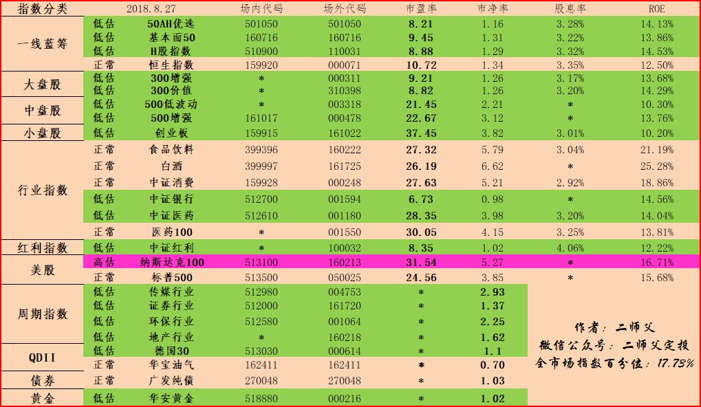

======================================================

_type: q&a
@红苹果[28488511551521]
2018-08-28 11:50:16 Tue  
topic_id: 51422515141884

@红苹果

>  501062南方瑞合三年定期混合基金这种能买吗？定期不能随时卖，有点不方便操作吧

@二师父

>  封闭基金也可以的，就是赎回不方便，不建议这个

阅读[1012]  评论[0]  赞[0] 

======================================================

_type: talk
@西锦巴乌[88448285428482]
2018-08-28 12:17:10 Tue  
topic_id: 88455284228112

<e type="hashtag" hid="481211145528" title="#指数估值#" />  二师父：理杏仁是什么？

@海盗 at 2018-08-28 12:17:10 Tue

> 理杏仁是查询基金相关指标的一个网站。

----------

@二师父 at 2018-08-28 12:17:10 Tue

> 棒

----------

@二师父 at 2018-08-28 12:17:10 Tue

> 百度搜就知道啦

----------

阅读[1011]  评论[3]  赞[0] 

======================================================

_type: q&a
@背心[51441214442224]
2018-08-28 21:45:44 Tue  
topic_id: 15122445841122

@背心

>  师傅鳄鱼计划，是不定期的在，星球里面公布吗？还有每次最好能具体的告诉基金代码，便于我也跟投，谢谢

@二师父

>  好的，基金代码就是估值表里面的

阅读[985]  评论[0]  赞[0] 

======================================================

_type: talk
@二师父[28814221155551]
2018-08-29 01:35:11 Wed  
topic_id: 48244552454418

<e type="hashtag" hid="481211145528" title="#指数估值#" /> 每日估值表，坚持定投

阅读[1343]  评论[0]  赞[0] 

+++++++++++++++++++++++++++++++++++++++++++++++++++++

图片：

======================================================

_type: talk
@二师父[28814221155551]
2018-08-29 02:42:38 Wed  
topic_id: 48244552451288

<e type="hashtag" hid="881184248552" title="#师父读保#" /> 慧馨安PLUS，2018最佳儿童重疾险

@游水浮生 at 2018-08-29 02:42:38 Wed

> 没有理赔会退本金吗？

----------

@二师父 at 2018-08-29 02:42:38 Wed

> 那没退了

----------

阅读[1027]  评论[2]  赞[0] 

+++++++++++++++++++++++++++++++++++++++++++++++++++++

图片：

+++++++++++++++++++++++++++++++++++++++++++++++++++++

文件：
2018-08-29 02:42:04 Wed
文件大小：[25024]
48852128881148-少儿重疾险的最佳品种.docx

======================================================

_type: q&a
@思念☆雙眸[88225224454522]
2018-08-29 12:04:59 Wed  
topic_id: 15122441425412

@思念☆雙眸

>  中证红利指数基金需要在牛市卖出么？还是一直持有等每年的分红？

@二师父

>  这个在牛市高估也需要卖出的

阅读[966]  评论[0]  赞[0] 

======================================================

_type: talk
@二师父[28814221155551]
2018-08-30 03:01:18 Thu  
topic_id: 88455215444222

<e type="hashtag" hid="481182218558" title="#投资计划#" /> 你有计划吗，为了方便阅读，二师父把这个文字列出来，这样不用下载。如果想长期学习，可以下载。

月底制定计划是我们投资必不可少的一环。按照计划投资一直是二师父强调的观点。

二师父的计划可以给你一个参考。你可以根据二师父的定投计划制定自己的投资计划。

下月的计划分为3个。第一是定投实盘，按照策略还是每周四定投。第二是鳄鱼计划，计划下周买入2到3次。第三是主动基金交易。是何帅的交银基金，符合投资策略，二师父已经买入了。定投实盘和鳄鱼计划都在蛋卷基金购买，下一轮计划时候鳄鱼计划就开始场内操作。主动基金交易在天天基金买入，因为有快速到账的便利，二师父认为主动基金还是选择这个平台购买好。

二师父多次说过，不要迷信任何大V，包括二师父，咱们的资金水平不同，年纪不同，压力不同，所以投资风格必然或多或少有差别。你如果想在投资上获取好的成绩，必须学会根据二师父的理念制定自己的交易策略，否则很难有大的成就。当然如果你只想在投资上获取百分之10到15的年化收益率，跟投也可以。

定投实盘的投资标的如下：

 50ah（场内代码：501050，场外代码：501050）
基本面50（场内代码：160716，场外代码：160716）
300增强（场外代码：000311）
500增强（场内代码：161017，场外代码：000478）
创业板（场内代码：159915，场外代码：161022）
中证红利增强（场外代码：100032），
中证银行（场内代码：512700，场外代码：001594）
德国30（场内代码：513030，场外代码：000614）
中证医药（场内代码：512610，场外代码：001180）

这些都会有选择，不过定投实盘重点选择的是500增强，中证红利增强，300增强以及德国30和中证银行。

投资方法：定期不定额。每周四3点之前操作，场外申购。

从目前基本面形势以及中国高层的观点看，股市由熊走牛还没有看到苗头，市场处于反复筑底的过程，如果突破了2500点，那么历史大熊就可以看到啦。

在这里二师父还是谈谈仓位管理的策略。二师父经常说的一句话仓位管理是以自己舒适为标准。比如你现在持仓2成，下跌了你很开心，因为自己可以买入更多的股份。可是上涨了你不开心，因为你买少了。

如果你的仓位让你在上涨和下跌都比较开心，那么这个仓位就是合适的。

这是指数基金和货币基金的比例问题。还有一个就是不同基金种类的之间的仓位。这是根据估值来定的。假如中证500低估阈值是25，每下跌3倍市盈率可以加仓一层的仓位，说来说去还是逆向投资思维。请记住，我们的仓位管理是根据估值来的，某个品种的估值越低，这个品种的仓位就越重。如此简单的策略。

接下来分析鳄鱼计划。

鳄鱼计划标的如下：

50ah（场内代码：501050，场外代码：501050）
基本面50（场内代码：160716，场外代码：160716）
300增强（场外代码：000311）
500增强（场内代码：161017，场外代码：000478）
创业板（场内代码：159915，场外代码：161022）
中证银行（场内代码：512700，场外代码：001594）
中证红利增强（场外代码：100032）
券商（场内代码：512000，场外代码：161720）
传媒（场内代码：512980，场外代码：004753）
地产（场外代码：160218）
德国30（场内代码：513030，场外代码：000614）
中证医药（场内代码：512610，场外代码：001180）
黄金（场内代码：518880，场外代码：000216）

二师父的鳄鱼计划是多了传媒，券商和地产的。这三只基金二师父目前都持有一定的份额，只是表现不好，均处于浮亏状态。但是二师父还是配置了。因为长远看，周期指数的周期性增长会给我们带来超额收益，只不过因为周期性强了，所以不适合重仓。

鳄鱼计划操作方法，不定期不定额投资。

上个月罕见的大盘跌破了2700点，所以二师父鳄鱼计划加仓了几次。如果下个月市场行情继续下跌，鳄鱼计划大概是投资3到4次。如果大盘开始回暖，那么鳄鱼计划大概投资1到2次。

投资指数比拼的是耐心，按照目前的盈亏统计，只要我们继续坚持定投，大盘指数到了2800点时候我们的账户就能够实现全面的浮盈，定投拉低买入成本，这是他最大的魔力。

三是主动基金交易计划。

根据二师父的主动基金选择方法，二师父选择了
嘉实价值优势（070019）
交银阿尔法核心股票（519712）
交银持续成长主题（005001）
这三只基金是有价值的主动基金。
第一支基金的经理是谭丽，拥有15年的证券从业经历，她说管理的四只基金有3只都是盈利的，这个可以考虑。不过二师父没有投资这只基金。因为后两只的价值更高。

后两只的基金经理是何帅，明星基金经理。8年的从业经验，他所管理的三只基金都是盈利非常好的，尤其是成长主题，从18年到现在还能够盈利8个百分点，这是很难得的。二师父这两只基金均投资了一小部分，设定的止损位是10个百分点，如果亏损到达这个预设点位，开始清仓，如果盈利超过百分之10开始减仓，止盈点位是20个百分点。这个止盈点位要给大家解释下，不是说盈利了20个百分点就卖出，而是从盈利超过20个百分点的时候回落到20个百分点全部清仓。

以上就是自己9月的策略，风格多变，不拘泥于一种策略，当然定投指数是我们最棒的策略，因为只要能熬，你就永远不会亏损，肯定最终是盈利的。而主动基金会有亏损的风险。看个人选择了。

下个月直到年底重点就是读企业的财报，学习选择股票。有的朋友给二师父分享了一些课程，二师父自己也买了一些书籍，争取今年能够把这些吃透并且创立一种适合投资新手的交易策略。

阅读[1327]  评论[0]  赞[0] 

+++++++++++++++++++++++++++++++++++++++++++++++++++++

文件：
2018-08-30 02:59:49 Thu
文件大小：[24672]
48852122115848-二师父九月定投计划.docx

======================================================

_type: talk
@二师父[28814221155551]
2018-08-30 03:02:09 Thu  
topic_id: 48244514222528

<e type="hashtag" hid="281158522841" title="#每日打卡#" /> 今天定投日，开始定投了，不管，涨跌如何，坚持才是王道。

阅读[855]  评论[0]  赞[0] 

======================================================

_type: talk
@二师父[28814221155551]
2018-08-30 03:02:54 Thu  
topic_id: 15122482111122

<e type="hashtag" hid="481211145528" title="#指数估值#" />估值表每日更新，坚持绿色低估定投即可

@顾。 at 2018-08-30 03:02:54 Thu

> 请问二师父，500增强，300价值，50ah，中证红利增强，创业板这5个的低估阈值分别是多少？ 目前在投这5个，想根据阈值来分配比例。

----------

@二师父 at 2018-08-30 03:02:54 Thu

> 二师父的课程里面有讲过，关于如何估值，红利增强是10

----------

@顾。 at 2018-08-30 03:02:54 Thu

> 有看到你的文章里说过，这个低估边界线根据每个人的承受度有关来设定的，就按二师父的算法来呢，因为你定的安全边际要求会更高，所以想直接按你的来。还是请问二师父，红利10，其他几个的临界值分别是多少呢？

----------

@二师父 at 2018-08-30 03:02:54 Thu

> 课程里面有，我这个记录在电脑里面，稍后给您看看哈

----------

@顾。 at 2018-08-30 03:02:54 Thu

> 嗯嗯～ 那等你回复，谢谢二师父！

----------

@顾。 at 2018-08-30 03:02:54 Thu

> 二师父，别忘了哦～ 麻烦告知一下，这几个指数的临界值～

----------

@二师父 at 2018-08-30 03:02:54 Thu

> 在后台发表了

----------

阅读[1329]  评论[7]  赞[0] 

+++++++++++++++++++++++++++++++++++++++++++++++++++++

图片：

======================================================

_type: talk
@二师父[28814221155551]
2018-08-30 03:05:00 Thu  
topic_id: 28455215444421

<e type="hashtag" hid="881184418222" title="#投资方法#" /> 一种右侧交易策略。二师父采取的主动基金右侧交易，一看安全边际，但是也看成长性，就是在安全边际范围内择股。目前是从主动基金开始，后续就是股票了，结合了格雷厄姆，费雪和欧奈尔的精华。

目前持有的是交银基金。止损位置10个点，止盈位置20个点

@背心 at 2018-08-30 03:05:00 Thu

> 师傅，您的何帅主动行基金，是定投还是一次性买入，

----------

@二师父 at 2018-08-30 03:05:00 Thu

> 采用一次性买入的投资方法

----------

阅读[986]  评论[2]  赞[0] 

======================================================

_type: q&a
@思念☆雙眸[88225224454522]
2018-08-30 08:14:52 Thu  
topic_id: 88455218525882

@思念☆雙眸

>  您好，现在是不是债券的牛市到了？是否可以配置一些债券基金？

@二师父

>  我们的低估轮动策略是越低估越配置，越高估越卖出的逆向投资思维

阅读[995]  评论[0]  赞[0] 

======================================================

_type: talk
@二师父[28814221155551]
2018-08-30 08:38:51 Thu  
topic_id: 15122485552812

07:10   【8月30日早报（周四）公司新闻】1、铁路混改又一大动作，中铁顺丰国际快运29日揭牌。2、乐视网上半年亏损逾11亿元。3、恒大总裁兼FF董事长夏海钧称，FF91先在美国量产，预计明年底在国内量产。4、中弘股份上演地天板，华泰证券营业部积极炒作。中弘股份上半年亏损超13亿，预计前三季亏损21亿。5、比亚迪上半年盈利4.79亿，同比下滑72.6、中国信达清仓减持淮南矿业完毕，安徽最大国企改制上市铺平道路。7、步森股份股东拟清仓减持不超8.13%股份。8、我爱我家上半年实现营业收入53.3亿元，同比增长741.86%;实现净利润3.3亿元，同比增长1189.71%.9、因操纵股价被罚潜逃海外，阜兴集团董事长今晚被押解回国。

阅读[994]  评论[0]  赞[0] 

======================================================

_type: talk
@二师父[28814221155551]
2018-08-30 12:46:33 Thu  
topic_id: 88455411554422

<e type="hashtag" hid="881422852442" title="#定投实盘#" /> 买入500增强一份，创业板一份。创业板是买易方达的。目前仍旧低估，就是坚持投资啦。

@背心 at 2018-08-30 12:46:33 Thu

> 感觉明天买还会便宜，大盘明天继续跌

----------

@二师父 at 2018-08-30 12:46:33 Thu

> 这是我每周固定的定投，不管涨跌

----------

@山人 at 2018-08-30 12:46:33 Thu

> 二师傅估值标里面创业板是富国的，购买的是易方达，哪个好点😊

----------

@二师父 at 2018-08-30 12:46:33 Thu

> 富国那个是分级指数基金，易方达这个不是分级基金，分级基金b牛市上折会有超额收益，但是折价这个很多人不懂，也不太适应，可以选择易方达，后期我把指数对应的不同基金都分析一下

----------

阅读[1396]  评论[4]  赞[0] 

======================================================

_type: talk
@红[15454112511442]
2018-08-30 13:25:12 Thu  
topic_id: 48244211452518

本周定投完成

@二师父 at 2018-08-30 13:25:12 Thu

> 坚持定投

----------

@背心 at 2018-08-30 13:25:12 Thu

> 500增强不是000478吗？

----------

@勤能行之 at 2018-08-30 13:25:12 Thu

> 我也定投了

----------

阅读[1004]  评论[3]  赞[0] 

+++++++++++++++++++++++++++++++++++++++++++++++++++++

图片：
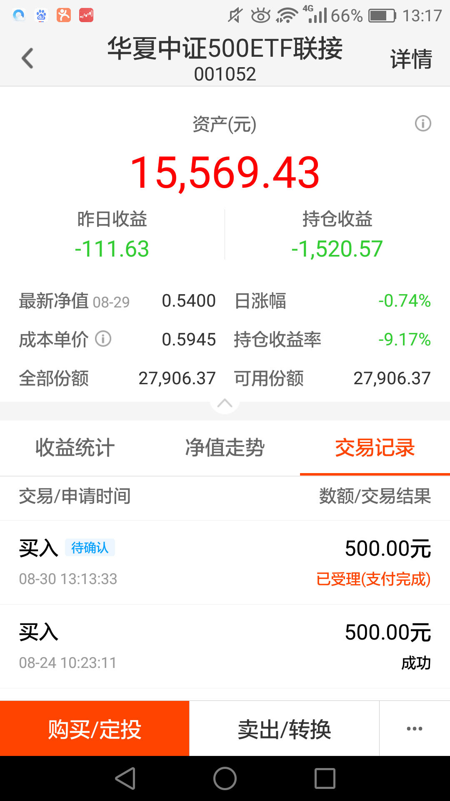

======================================================

_type: talk
@Eric[48548828828848]
2018-08-30 14:56:04 Thu  
topic_id: 28455411221181

还没捂热乎，马上就又收回去了😂

@二师父 at 2018-08-30 14:56:04 Thu

> 哈哈，等待牛市到来，就一直涨涨涨啦

----------

阅读[1042]  评论[1]  赞[0] 

+++++++++++++++++++++++++++++++++++++++++++++++++++++

图片：
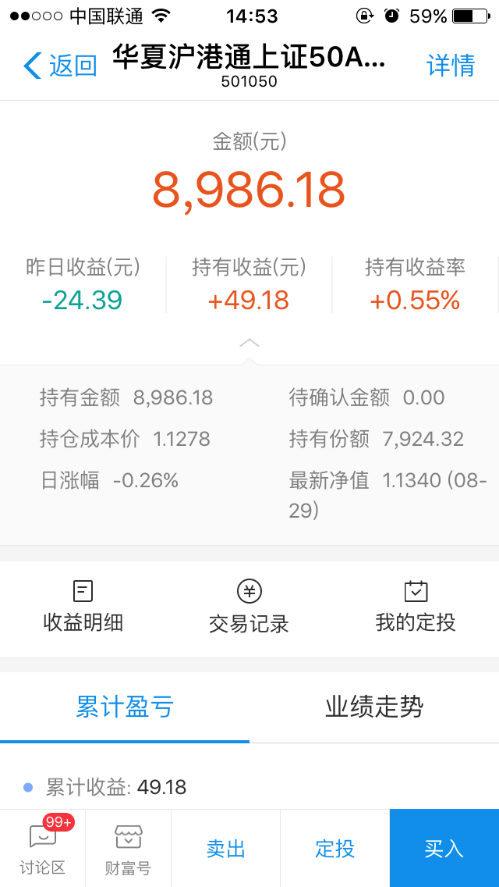

======================================================

_type: q&a
@西锦巴乌[88448285428482]
2018-08-30 17:27:09 Thu  
topic_id: 51422822212884

@西锦巴乌

>  二师父：基金定投赎回方法在哪儿找的到？谢谢

@二师父

>  公众号后台回复五步定投

阅读[1033]  评论[0]  赞[0] 

======================================================

_type: q&a
@西锦巴乌[88448285428482]
2018-08-30 17:27:39 Thu  
topic_id: 51422822215884

@西锦巴乌

>  二师父：请问利润收割法和高估区域减仓法的具体如何操作在哪里找得到？谢谢

@二师父

>  公众号后台回复目录，往期文章有，如何卖出

阅读[1107]  评论[0]  赞[0] 

======================================================

_type: talk
@二师父[28814221155551]
2018-08-30 23:09:14 Thu  
topic_id: 15122821225252

中证红利，500增强，300增强，50ah，创业板低估阀值分别是10，28，11，9.5，40，课程里面都讲过啦，仅供参考

@顾。 at 2018-08-30 23:09:14 Thu

> 谢谢！！^_^

----------

阅读[1087]  评论[1]  赞[0] 

======================================================

_type: talk
@二师父[28814221155551]
2018-08-31 03:53:07 Fri  
topic_id: 51422824555584

<e type="hashtag" hid="481211145528" title="#指数估值#" /> 医药100进入低估了，市场总会给我们机会的，耐心很重要啊

@小白 at 2018-08-31 03:53:07 Fri

> 中证医药和医药100同时进入低估值，选择哪一只呢？

----------

@二师父 at 2018-08-31 03:53:07 Fri

> 中证医药好一些的

----------

阅读[1449]  评论[2]  赞[0] 

+++++++++++++++++++++++++++++++++++++++++++++++++++++

图片：
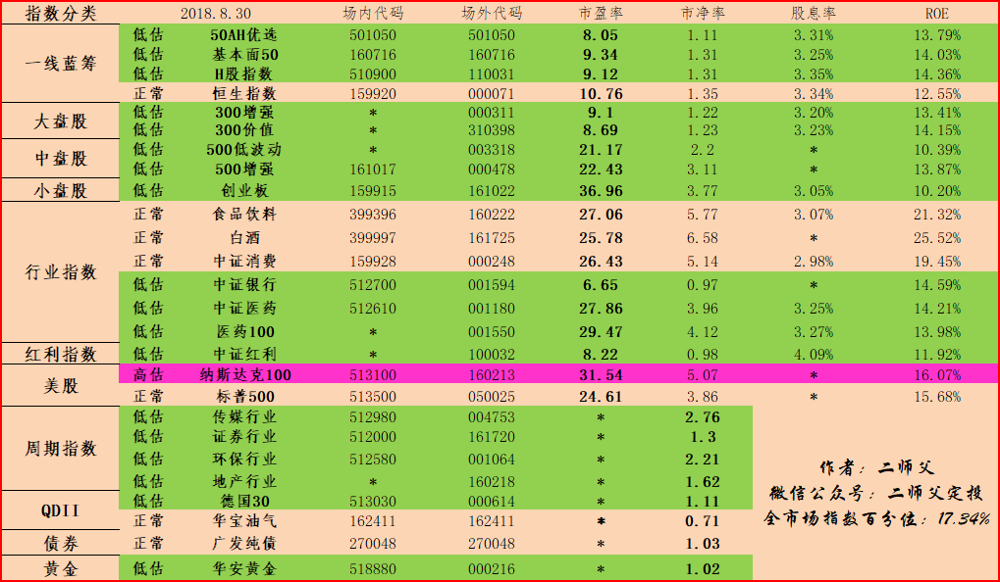

======================================================

_type: talk
@二师父[28814221155551]
2018-08-31 03:54:22 Fri  
topic_id: 28455154222211

<e type="hashtag" hid="481144488858" title="#投资理念#" /> 指数设定安全边际用估值指标就可以了，股票还是得多方评判，尤其是成长股票。

很多读者投资股票都是亏损的，熊市不建议买股票

阅读[1501]  评论[0]  赞[0] 

+++++++++++++++++++++++++++++++++++++++++++++++++++++

文件：
2018-08-31 03:53:37 Fri
文件大小：[23986]
51154848822524-谈谈什么是安全边际.docx

======================================================

_type: q&a
@超级奶爸[48528544118258]
2018-08-31 13:55:02 Fri  
topic_id: 15122828184452

@超级奶爸

>  请问，如何查看红利基金的历史分红情况？近十年的

@二师父

>  天天基金交易软件可以查到喔

阅读[1058]  评论[2]  赞[0] 

======================================================

_type: q&a
@超级奶爸[48528544118258]
2018-08-31 13:55:21 Fri  
topic_id: 28455151411811

@超级奶爸

>  蛋卷上的中证红利基金，只有分红金额，并没有当期的基金净值。

@二师父

>  这种去天天查

阅读[1085]  评论[0]  赞[0] 

======================================================

