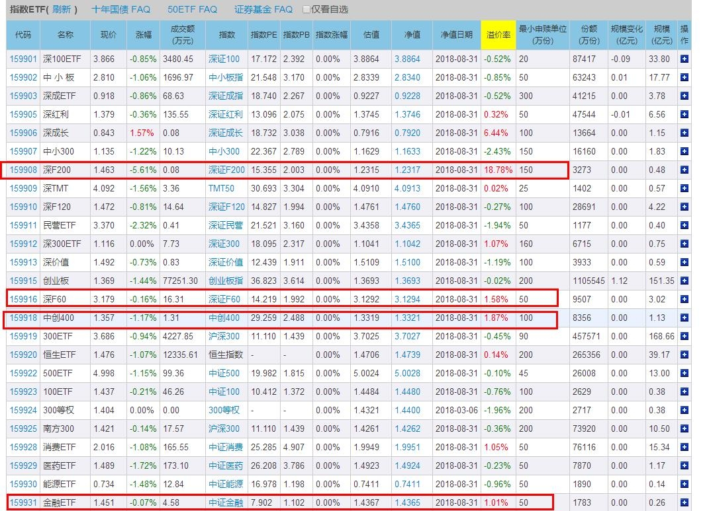
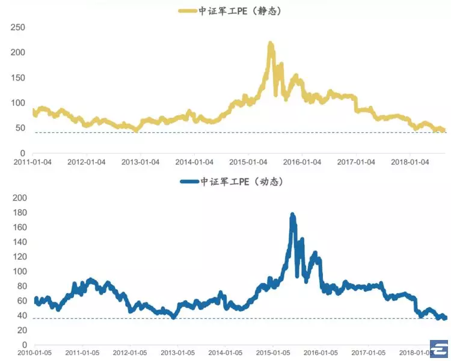
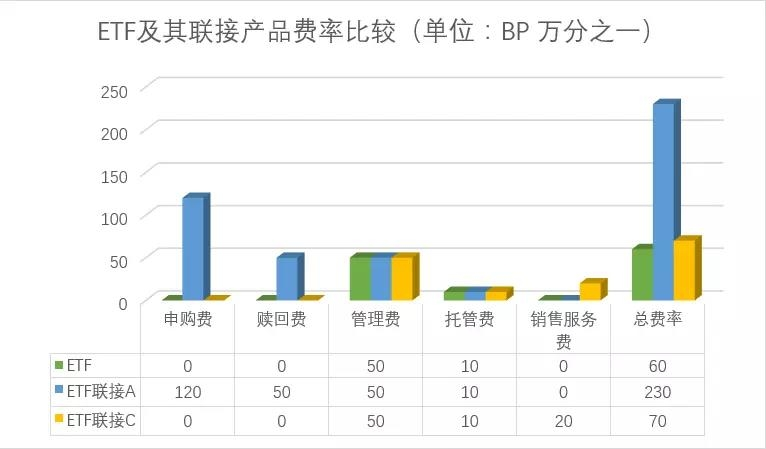
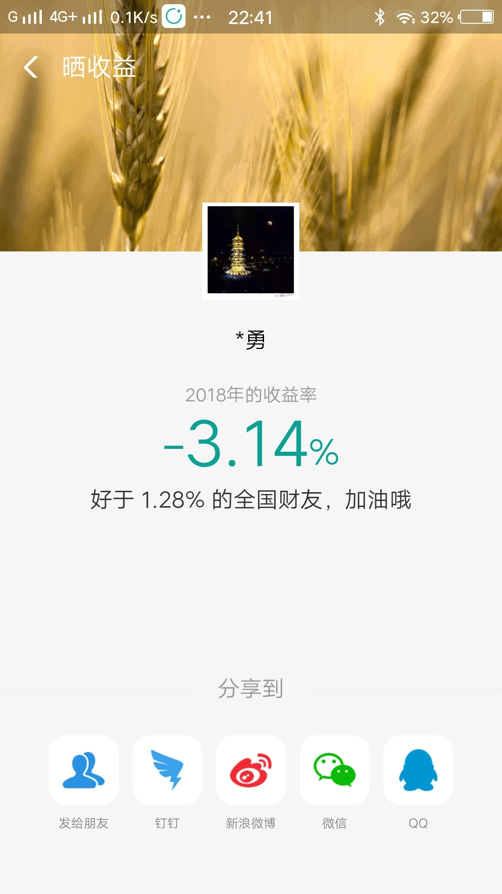
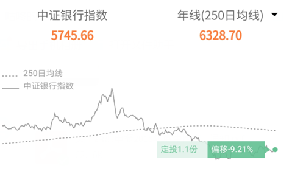
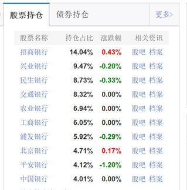
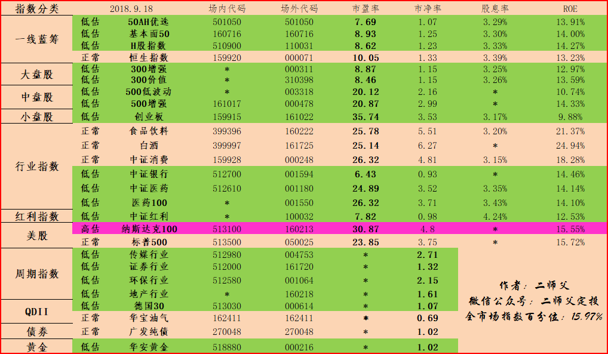
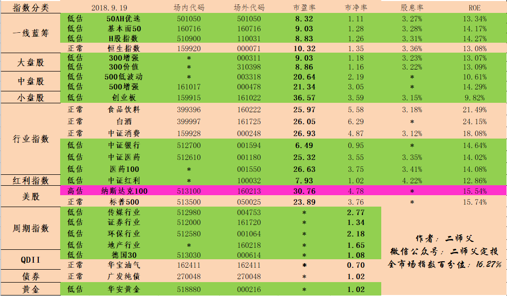
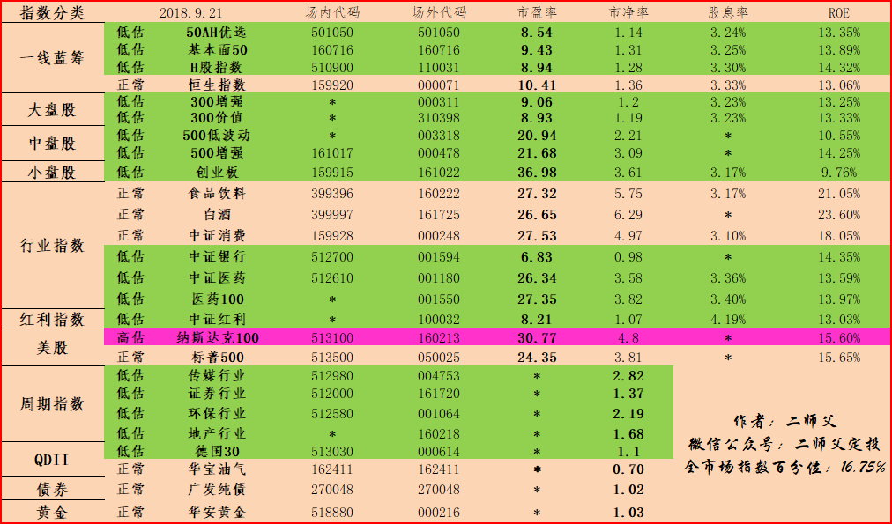

_type: talk
@二师父[28814221155551]
2018-09-01 04:17:26 Sat  
topic_id: 51422818118184

<e type="hashtag" hid="481144488858" title="#投资理念#" /> 指数的优势在于此

阅读[1399]  评论[0]  赞[0] 

+++++++++++++++++++++++++++++++++++++++++++++++++++++

文件：
2018-09-01 04:14:33 Sat
文件大小：[24854]
88824115214152-伊利跌停，我们如何避免跌停的个股.docx

======================================================

_type: talk
@二师父[28814221155551]
2018-09-01 04:18:11 Sat  
topic_id: 15122858558422

<e type="hashtag" hid="481211145528" title="#指数估值#" /> 周末了，休息休息，生活不基金只有投资

阅读[1406]  评论[0]  赞[0] 

+++++++++++++++++++++++++++++++++++++++++++++++++++++

图片：

======================================================

_type: q&a
@Nasdaq[422258244428418]
2018-09-01 10:53:22 Sat  
topic_id: 28455128218851

@Nasdaq

>  二师父，蛋卷买了先 000478，看了你的表，发现也有场内的，161017，查了一下是富国。几个问题请教:
>  
>  1、这些增强的基金管理费实在高，场内买是不是手续费要便宜很多。
>  
>  2、增强有不是选择，很多人说000478盘子大了收益不行了，看了一下一年确实没跑赢大盘。很多建议申万，景顺，不知道到底什么好。你好像说一箩筐的组合也不建议，选哪支呢

@二师父

>  对场内确实便宜，置顶文章有场内定投缩减成本的渠道。
>  
>  其次，过去的收益不代表未来，增强在牛市涨的多，熊市跌的多。盘子大了会有一定影响，不过流动性特别好。
>  
>  如果你适应场内投资的话，建议场内500etf，如果不适应的话，那么就场外

阅读[1090]  评论[12]  赞[0] 

======================================================

_type: q&a
@Nasdaq[422258244428418]
2018-09-01 10:54:11 Sat  
topic_id: 48244158515818

@Nasdaq

>  还有，富国161017是LOF，很多地方也不建议。LOF和其它基金有什么区别呢

@二师父

>  etf只能够场内买入，lof既可以场内买入，也可以场外申购赎回

阅读[1107]  评论[0]  赞[0] 

======================================================

_type: q&a
@在路上[28488125551511]
2018-09-01 11:42:08 Sat  
topic_id: 15122845145452

@在路上

>  南方天天利货币A、南方天天利货币B还是二个不同的基金？通常基金的A和B代表什么意思？

@二师父

>  费率不同，基金B销售服务费用低

阅读[1132]  评论[0]  赞[0] 

======================================================

_type: talk
@二师父[28814221155551]
2018-09-01 17:31:10 Sat  
topic_id: 15122844812822

<e type="hashtag" hid="481181584848" title="#周末答疑1#" /> 场内ETF和ETF连接基金的区别。

从整体上看二者差不多。etf基金的持仓直接就是股票，而etf连接基金的持仓是买入etf基金的，从跟踪误差角度讲etf更小，二师父建议购买etf基金

阅读[1064]  评论[0]  赞[0] 

======================================================

_type: talk
@二师父[28814221155551]
2018-09-02 03:26:01 Sun  
topic_id: 88455148825482

<e type="hashtag" hid="281181228511" title="#每日分享#" /> 如何避免折价溢价呢，请看二师父分享。在置顶文章学堂指南里面，点击缩减成本连接可以获取场内股票万1.5，基金万0.6的低佣开户渠道

阅读[1421]  评论[0]  赞[0] 

+++++++++++++++++++++++++++++++++++++++++++++++++++++

图片：

+++++++++++++++++++++++++++++++++++++++++++++++++++++

文件：
2018-09-02 03:23:52 Sun
文件大小：[179548]
15541884841122-场内定投怎么避免高溢价.docx

======================================================

_type: talk
@二师父[28814221155551]
2018-09-02 04:17:19 Sun  
topic_id: 15122815544482

<e type="hashtag" hid="281181228851" title="#周末答疑#" /> 如果a股股市一直不涨那么我们是不是不能赚钱了。

如果股市不涨，也就是估值不上移，依旧可以赚企业盈利增长的钱，这也是一种盈利模式。

很多人担心中国经济，目前压力确实很大，不过也没有必要太悲观，日本股市那么糟糕，还是从底部上涨一些的。

最近中非峰会在北京举行，可以关注下。

阅读[1103]  评论[0]  赞[0] 

======================================================

_type: talk
@二师父[28814221155551]
2018-09-02 19:52:36 Sun  
topic_id: 51422882182184

<e type="hashtag" hid="281181228851" title="#周末答疑#" /> 同一指数对应基金有何差别。

某个指数低估具有投资价值了，可是一个指数对应有很多基金，这个时候该怎么选择呢？

首先看基金公司，明星基金公司作为首选，毕竟背靠大树好乘凉，其次看基金规模，大于1亿以上的是基本条件，最后看费率，当然是选择费率低的投资，指数基金费率比主动基金低，只要申购费，赎回费，管理费，托管费综合最低，那么会让我们省下一部分手续费。

定期发现问题，随时解决问题，投资疑惑就越来越少。

阅读[1062]  评论[0]  赞[0] 

======================================================

_type: talk
@二师父[28814221155551]
2018-09-03 03:56:21 Mon  
topic_id: 15122885824182

<e type="hashtag" hid="881152541812" title="#周一荐书#" /> 徐大为的低风险投资之路，里面讲了很多投资品种，作者曾经也是买股票亏损之后走上低风险投资之路。收益跟风险没关系，投资就要低风险，高收益。

@海盗 at 2018-09-03 03:56:21 Mon

> 二师父，这是一本书吗？是的话把书的名字说一下

----------

@根号2 at 2018-09-03 03:56:21 Mon

> 就叫～低风险投资之路

----------

@二师父 at 2018-09-03 03:56:21 Mon

> 对就是这个名字

----------

@海盗 at 2018-09-03 03:56:21 Mon

> 谢谢

----------

@海盗 at 2018-09-03 03:56:21 Mon

> 谢谢

----------

阅读[1044]  评论[5]  赞[0] 

======================================================

_type: talk
@二师父[28814221155551]
2018-09-03 16:23:40 Mon  
topic_id: 51421222584114

大盘跌，中小板翻红，市场还是具有一定的轮动效应，目前熊市，多看少动

阅读[937]  评论[0]  赞[0] 

======================================================

_type: q&a
@乐山[48285122148428]
2018-09-03 23:02:06 Mon  
topic_id: 48248442241558

@乐山

>  大盘下跌空间大吗？伊利牛奶大概跌到多少钱可以买呢？

@二师父

>  不大了，大盘最大跌幅在百分之27以内，当然极端情况除外，伊利股份就不清楚了，食品饮料普遍高估

阅读[900]  评论[0]  赞[0] 

======================================================

_type: talk
@二师父[28814221155551]
2018-09-04 03:54:46 Tue  
topic_id: 51421228184484

<e type="hashtag" hid="481211145528" title="#指数估值#" /> 估值表出炉，根据低估定投，有的读者问二师父伊利股份能够跌多少，真的不清楚，因为之前涨了太多，白酒，必须消费都不要进入了。

阅读[1171]  评论[0]  赞[0] 

+++++++++++++++++++++++++++++++++++++++++++++++++++++

图片：

======================================================

_type: talk
@二师父[28814221155551]
2018-09-04 03:55:50 Tue  
topic_id: 48248441812158

<e type="hashtag" hid="481144488858" title="#投资理念#" /> 刚毕业无存款怎么理财，请看过来

阅读[1246]  评论[0]  赞[0] 

+++++++++++++++++++++++++++++++++++++++++++++++++++++

文件：
2018-09-04 03:55:12 Tue
文件大小：[24654]
48852111148488-月结余3000的你该怎么理财.docx

======================================================

_type: talk
@二师父[28814221155551]
2018-09-04 03:59:27 Tue  
topic_id: 88458551814142

<e type="hashtag" hid="518818825114" title="#说一只基金的估值#" /> 中证500从目前位置最大跌幅在20个百分点以内，最佳定投标的，二师父第一大重仓指数基金，从现在开始定投回撤可以控制在百分之15以内，绝对安全

@cotton at 2018-09-04 03:59:27 Tue

> 没看懂[流泪]

----------

@山人 at 2018-09-04 03:59:27 Tue

> 意思是现在开始定投500最多跌幅不会超过15%？

----------

@二师父 at 2018-09-04 03:59:27 Tue

> 额，哪里没懂

----------

@二师父 at 2018-09-04 03:59:27 Tue

> 对的，只要是坚持越跌投资越多的

----------

@乐山 at 2018-09-04 03:59:27 Tue

> 您说的中证500的基金号是多少？买场内和场外的哪个好？

----------

@二师父 at 2018-09-04 03:59:27 Tue

> 中证500的代码吗，场内和场外的不一样，你是要投资场内的还是场外的呢。新手建议场外因为操作简单，如果资金多，想节约成本可以选择场内，长期看场内会节省更多成本。

----------

@乐山 at 2018-09-04 03:59:27 Tue

> 中证500场内和场外代码各是多少呢？麻烦再发一下。[抱拳]

----------

@二师父 at 2018-09-04 03:59:27 Tue

> 场内510500，场外160119

----------

阅读[962]  评论[12]  赞[0] 

======================================================

@二师父[28814221155551]
2018-09-04 11:48:31 Tue  
topic_id: 15125252225112

>  @二师父
>  

阅读[927]  评论[0]  赞[0] 

======================================================

_type: q&a
@西锦巴乌[88448285428482]
2018-09-04 15:08:59 Tue  
topic_id: 28458582122281

@西锦巴乌

>  请问二师父：像沪深300的成份股一般是多长时间调整一次？谢谢

@二师父

>  不定时间调整，每年会调整两次的

阅读[944]  评论[1]  赞[0] 

======================================================

_type: q&a
@fxq[28824848542251]
2018-09-04 18:54:51 Tue  
topic_id: 88458584121482

@fxq

>  二师傅对军工板块怎么看呀？看估值分位在历史低位，但是pe-ttm要50倍，还是高的吓人，但是看pb2.3倍左右又感觉还行，毕竟还有3倍多的中小创

@二师父

>  军工目前并不是极度低估，而且是周期指数，他的投资价值不如证券指数，周期指数投资价值首选证券行业，其次是传媒，市盈率和市净率仅作为参考，不能够完全依赖。

阅读[926]  评论[0]  赞[0] 

======================================================

_type: talk
@二师父[28814221155551]
2018-09-04 20:08:32 Tue  
topic_id: 28458581512251

<e type="hashtag" hid="881125525822" title="#估值#" /> 有人问到军工了，看看图是否清晰点啊

阅读[918]  评论[0]  赞[0] 

+++++++++++++++++++++++++++++++++++++++++++++++++++++

图片：

======================================================

_type: talk
@二师父[28814221155551]
2018-09-04 20:11:43 Tue  
topic_id: 48248481412218

<e type="hashtag" hid="518852252154" title="#费率#" /> etf各类基金的费率问题

阅读[968]  评论[0]  赞[0] 

+++++++++++++++++++++++++++++++++++++++++++++++++++++

图片：

======================================================

_type: q&a
@顾屹峰[28242255855121]
2018-09-04 20:20:26 Tue  
topic_id: 51421218122184

@顾屹峰

>  问一下二师父有研究过，可转债中哪些最有投资价值

@二师父

>  股性强的品种不做推荐哈，现在买入95元以下的可转债，在到达强制赎回之前卖出，大概率是盈利的

阅读[996]  评论[0]  赞[0] 

======================================================

_type: talk
@二师父[28814221155551]
2018-09-04 20:20:47 Tue  
topic_id: 15125258522812

<e type="hashtag" hid="281181228511" title="#每日分享#" /> 目前上证指数PE 12.3倍、未来一年正收益概率21.3%（对应PE10.8-13.5倍）、三年94.9%（对应PE10.6-12.4倍）。万得全A目前PE 14.9倍，未来一年正收益概率57.3%、三年77.2%。沪深300目前PE 11.4倍，未来一年正收益概率47.6%、三年88.7%。中小板指PE23.0倍，未来一年正收益概率89.1%、三年100.0%。

@背心 at 2018-09-04 20:20:47 Tue

> 师傅，现在自已已经4成仓位了，都是定投的指数基金，目前亏损5个点左右，感觉自已最近不太敢定投了，挺矛盾的，请教师傅[抱拳][抱拳]，首选还是300
500吗？

----------

@高达无双喝味全 at 2018-09-04 20:20:47 Tue

> 500更低估

----------

@二师父 at 2018-09-04 20:20:47 Tue

> 对的，快到历史大底了

----------

@二师父 at 2018-09-04 20:20:47 Tue

> 首选500，仓位控制要以自己舒服为宜

----------

@Nasdaq at 2018-09-04 20:20:47 Tue

> 发现蛋卷里面买场外的，可以从银行账号买，也可以从货基转，请问这两个费率有区别吗？

----------

@二师父 at 2018-09-04 20:20:47 Tue

> 这个费率都是一样的，没有区别呢

----------

@Nasdaq at 2018-09-04 20:20:47 Tue

> 好嘞，谢谢

----------

@梦想家 at 2018-09-04 20:20:47 Tue

> 请问中小板就是请问二师父，中小扳指就是中正500和创业板对吗

----------

阅读[1045]  评论[11]  赞[0] 

======================================================

_type: talk
@西锦巴乌[88448285428482]
2018-09-04 20:57:28 Tue  
topic_id: 51421218522454

<e type="hashtag" hid="281181228511" title="#每日分享#" />  请问二师父：上证PE、中小盘股PE是从哪里看到的？谢谢

@二师父 at 2018-09-04 20:57:28 Tue

> 推荐网站理杏仁，还有集思录也有

----------

@海盗 at 2018-09-04 20:57:28 Tue

> 都是收费的吗

----------

@二师父 at 2018-09-04 20:57:28 Tue

> 集思录不收费啊

----------

@海盗 at 2018-09-04 20:57:28 Tue

> [玫瑰]

----------

阅读[993]  评论[4]  赞[0] 

======================================================

_type: talk
@二师父[28814221155551]
2018-09-05 03:08:46 Wed  
topic_id: 88458522524812

<e type="hashtag" hid="481144488858" title="#投资理念#" /> 美股还能买吗，别追涨，做安全投资

@海盗 at 2018-09-05 03:08:46 Wed

> 二师父辛苦了

----------

阅读[1340]  评论[1]  赞[0] 

+++++++++++++++++++++++++++++++++++++++++++++++++++++

文件：
2018-09-05 03:08:30 Wed
文件大小：[23975]
48851445255488-美股暴涨，A股暴跌，我们如何从股票投资转移到指数.docx

======================================================

_type: talk
@二师父[28814221155551]
2018-09-05 03:10:26 Wed  
topic_id: 15125244241422

<e type="hashtag" hid="481211145528" title="#指数估值#" /> 估值表来啦，目前大熊，大部分低估，随便定投，尤其是中证500

阅读[1375]  评论[0]  赞[0] 

+++++++++++++++++++++++++++++++++++++++++++++++++++++

图片：

======================================================

_type: talk
@二师父[28814221155551]
2018-09-05 12:00:22 Wed  
topic_id: 48248452242188

<e type="hashtag" hid="881251425252" title="#鳄鱼计划#" /> 500增强买入一份，富国或者建信都可以，500的估值很低了，无论是500增强还是中证500都值得买入。

@背心 at 2018-09-05 12:00:22 Wed

> 师傅你的鳄鱼计划是在哪里买的，为什么不发张截图？

----------

@二师父 at 2018-09-05 12:00:22 Wed

> 我在蛋卷买的啊

----------

阅读[1337]  评论[2]  赞[0] 

======================================================

_type: q&a
@乡下人[28244152425511]
2018-09-06 02:22:18 Thu  
topic_id: 51421144125244

@乡下人

>  您好！问：现在场外券商基金基本都是分级基金，到2020年前都要转型，那对我们的投资有影响吗？

@二师父

>  我们只要不买分级A和B影响不大的

阅读[972]  评论[0]  赞[0] 

======================================================

_type: talk
@二师父[28814221155551]
2018-09-06 03:11:03 Thu  
topic_id: 15125582154582

<e type="hashtag" hid="481211145528" title="#指数估值#" /> 买了长期持有，很不错的投资时刻，二师父场外基金都是在蛋卷买，喜欢这个平台的风格，简单高效

@海盗 at 2018-09-06 03:11:03 Thu

> 二师父，有一个单位多加了，那个10000后面又多了个万[撇嘴]

----------

@二师父 at 2018-09-06 03:11:03 Thu

> 哈哈发现了

----------

@shi at 2018-09-06 03:11:03 Thu

> 托管管理费是一次性收的，还是每年收？这个0.6%挺高的~

----------

@二师父 at 2018-09-06 03:11:03 Thu

> 每年收，可以开场内账户，置顶文章有基金万0.6开户渠道，这个低

----------

阅读[1247]  评论[4]  赞[0] 

+++++++++++++++++++++++++++++++++++++++++++++++++++++

文件：
2018-09-06 03:10:17 Thu
文件大小：[106505]
28821582545881-连跌3年，不投点中证500？.docx

======================================================

_type: talk
@二师父[28814221155551]
2018-09-06 03:11:43 Thu  
topic_id: 28458815482251

<e type="hashtag" hid="481211145528" title="#指数估值#" /> 估值表来啦，定投需要坚持

@TIME at 2018-09-06 03:11:43 Thu

> 500和300，市盈率差的很多，投哪个更好二师父

----------

@二师父 at 2018-09-06 03:11:43 Thu

> 不能横向比较，目前500更加低估，更值得投资呢，300也可以，但是没有500价值大

----------

@背心 at 2018-09-06 03:11:43 Thu

> 今天加仓，300
500

----------

阅读[1211]  评论[3]  赞[0] 

+++++++++++++++++++++++++++++++++++++++++++++++++++++

图片：

======================================================

_type: talk
@二师父[28814221155551]
2018-09-06 15:14:53 Thu  
topic_id: 48248811518258

<e type="hashtag" hid="881422852442" title="#定投实盘#" /> 买入500增强，中证红利增强各一份，今天忙，现在才发送，[大哭]

@背心 at 2018-09-06 15:14:53 Thu

> 咱俩是这么默契吗？我买的300
500

----------

@二师父 at 2018-09-06 15:14:53 Thu

> 必须的

----------

@背心 at 2018-09-06 15:14:53 Thu

> 感觉你特别喜欢500
我也不知道这么一直买下去对不对，要是2500点呢，赌国运呗

----------

@cotton at 2018-09-06 15:14:53 Thu

> 定投实盘是不是就每周四的定投[调皮]

----------

@背心 at 2018-09-06 15:14:53 Thu

> 师傅，下次你的定投实盘和鳄鱼计划能不能再把代码直接写出来，你今天实盘定投500增强是000478   中证红利增强是100032吗？

----------

@二师父 at 2018-09-06 15:14:53 Thu

> 是的啊

----------

@二师父 at 2018-09-06 15:14:53 Thu

> 好的，下次加代码

----------

@乡下人 at 2018-09-06 15:14:53 Thu

> 没有定投500增强，好像有点后悔啊。

----------

阅读[1112]  评论[13]  赞[0] 

======================================================

_type: q&a
@寻道人[51452125525484]
2018-09-06 15:16:17 Thu  
topic_id: 48248811522588

@寻道人

>  药师你好，看到网上一篇文章说，印度有可能会是表现最好的新兴市场，那么请问国内有没有投资印度市场的投资标的？谢谢

@二师父

>  印度涨了很久，目前市场位置也很高呢

阅读[904]  评论[0]  赞[0] 

======================================================

_type: talk
@二师父[28814221155551]
2018-09-07 02:17:21 Fri  
topic_id: 28458254425141

<e type="hashtag" hid="281181228511" title="#每日分享#" /> 拥抱下跌，再继续跌一点，消费指数就低估了，快跌吧

阅读[1085]  评论[0]  赞[0] 

+++++++++++++++++++++++++++++++++++++++++++++++++++++

文件：
2018-09-07 02:16:54 Fri
文件大小：[23956]
28821584545511-暴跌才会为我们的定投带来超额收益.docx

======================================================

_type: talk
@二师父[28814221155551]
2018-09-07 02:18:22 Fri  
topic_id: 88458254425112

<e type="hashtag" hid="481211145528" title="#指数估值#" /> 低估定投，坚持下去，定投的路上我们并不孤单

@海盗 at 2018-09-07 02:18:22 Fri

> 不孤独[拳头]

----------

阅读[1056]  评论[1]  赞[0] 

+++++++++++++++++++++++++++++++++++++++++++++++++++++

图片：

======================================================

_type: q&a
@陈Being[28845245224851]
2018-09-07 13:38:55 Fri  
topic_id: 15125452581112

@陈Being

>  请问如何领取荔枝课程优惠券，是音频还是视频

@二师父

>  点击置顶文章优惠券就行啦，是音频不是视频

阅读[738]  评论[0]  赞[0] 

======================================================

_type: q&a
@海盗[48248118584848]
2018-09-07 21:38:16 Fri  
topic_id: 48248582414118

@海盗

>  二师父，如果现在开始定投的话，把资金分成多少个月定投合适，建多大比例的仓底比较合适，只定投中证500一只基金合适不？

@二师父

>  你不是已经投入了很多了吗，底仓可以建百分之30，一个500是中盘，最好再来个大盘指数轮动下，德国30也可以

阅读[675]  评论[4]  赞[0] 

======================================================

_type: q&a
@背心[51441214442224]
2018-09-07 21:39:11 Fri  
topic_id: 28458284254581

@背心

>  师傅，京东金融上面一款，稠州银行，凡荣结构性存款，182天  ，年化5.26%，安全吗？谢谢

@二师父

>  京东金融没用过，我用过蛋卷，还有腾讯的理财通，也有定期产品，很安全。银行买理财也有比这个收益高的

阅读[685]  评论[0]  赞[0] 

======================================================

_type: q&a
@陈Being[28845245224851]
2018-09-07 21:40:11 Fri  
topic_id: 48248582124418

@陈Being

>  请问二师傅能否提供你在荔枝上录的音频的文字版内容，你的录音说话好小声，象说悄悄话一样，我在电脑上听🉐️好费劲，如果有文字版我想自己看一下。

@二师父

>  文字版本的没有耶，以后音频声音录大一点哈

阅读[692]  评论[1]  赞[0] 

======================================================

_type: talk
@二师父[28814221155551]
2018-09-08 02:27:54 Sat  
topic_id: 48248581212518

<e type="hashtag" hid="481211145528" title="#指数估值#" />

阅读[851]  评论[0]  赞[0] 

+++++++++++++++++++++++++++++++++++++++++++++++++++++

图片：

======================================================

_type: talk
@二师父[28814221155551]
2018-09-08 02:28:15 Sat  
topic_id: 51421518484584

<e type="hashtag" hid="481144488858" title="#投资理念#" />

@背心 at 2018-09-08 02:28:15 Sat

> 美股要是大跌，港股必跌，那咱们大盘不跌成狗，6成仓位，越来越悲观了

----------

@海盗 at 2018-09-08 02:28:15 Sat

> 熊市无需看盘，多多看书，修身养性。👍

----------

@二师父 at 2018-09-08 02:28:15 Sat

> 信心比黄金重要

----------

@shi at 2018-09-08 02:28:15 Sat

> 推荐一本书:-)

----------

@shi at 2018-09-08 02:28:15 Sat

> 德股可以关注什么基金？

----------

@二师父 at 2018-09-08 02:28:15 Sat

> 可以关注德国30，这个很不错，相当于德国的30只蓝筹股

----------

@二师父 at 2018-09-08 02:28:15 Sat

> 巴菲特之道

----------

阅读[906]  评论[7]  赞[0] 

+++++++++++++++++++++++++++++++++++++++++++++++++++++

文件：
2018-09-08 02:29:12 Sat
文件大小：[23711]
28821825181511-美股终于有下跌的迹象了.docx

======================================================

_type: talk
@二师父[28814221155551]
2018-09-09 04:42:06 Sun  
topic_id: 15125415155852

<e type="hashtag" hid="481144488858" title="#投资理念#" />

@海盗 at 2018-09-09 04:42:06 Sun

> 因为我们有强大的zf,zf啥意思

----------

@热心市民F先生 at 2018-09-09 04:42:06 Sun

> 政府…

----------

@海盗 at 2018-09-09 04:42:06 Sun

> 谢谢

----------

阅读[838]  评论[3]  赞[0] 

+++++++++++++++++++++++++++++++++++++++++++++++++++++

文件：
2018-09-09 04:42:05 Sun
文件大小：[78287]
15548545444112-股市轮回的真相.docx

======================================================

_type: q&a
@海盗[48248118584848]
2018-09-09 10:05:26 Sun  
topic_id: 48248525458228

@海盗

>  希望二师父能把估值的计算方法卓重讲解一下

@二师父

>  好的

阅读[577]  评论[0]  赞[0] 

======================================================

_type: q&a
@勤能行之[481211221828]
2018-09-09 10:07:09 Sun  
topic_id: 15125414518842

@勤能行之

>  师傅，为什么基本面120不能算是一只好标的呢？求解

@二师父

>  主要集中在深圳市场，估值也并不低

阅读[593]  评论[1]  赞[0] 

======================================================

_type: q&a
@勤能行之[481211221828]
2018-09-09 13:52:37 Sun  
topic_id: 15125411522842

@勤能行之

>  师傅，想投资几万块的货币基金。南方天天利货币B稳妥吗？

@二师父

>  可以呀，我就是买的这个，收益率很稳定的

阅读[585]  评论[2]  赞[0] 

======================================================

_type: talk
@二师父[28814221155551]
2018-09-09 21:19:58 Sun  
topic_id: 28458218821111

<e type="hashtag" hid="281181228851" title="#周末答疑#" /> 现在可不可以抄底呢？答，不要有抄底思维，坚定定投就好。二师父始终强调仓位管理原则。有的读者7成仓位已经恐惧了，这不是股市低迷的原因，而是仓位对你讲太重了，你就要适当的把仓位调低，当然，这种调仓不是卖出，而是增加现金流入

@西锦巴乌 at 2018-09-09 21:19:58 Sun

> 用增加分母来降低占比，[强]

----------

阅读[534]  评论[1]  赞[0] 

======================================================

_type: talk
@二师父[28814221155551]
2018-09-09 21:23:40 Sun  
topic_id: 28458218848451

最近发现有的读者提问二师父没有即使回复，是系统漏掉了，并不是二师父没有回答，如果大家提问二师父没有回答请记得发文加标签<e type="hashtag" hid="281122421221" title="#提问#" /> 来艾特二师父，这样就能看到啦，欢迎多交流分享，也欢迎大家指出二师父的不足之处，大家共同学习一起进步

@海盗 at 2018-09-09 21:23:40 Sun

> 标签怎么加？

----------

@二师父 at 2018-09-09 21:23:40 Sun

> 发表下面有一个井号，点击下

----------

@海盗 at 2018-09-09 21:23:40 Sun

> 知道了

----------

阅读[729]  评论[3]  赞[0] 

======================================================

_type: talk
@二师父[28814221155551]
2018-09-10 04:26:38 Mon  
topic_id: 51421585181254

<e type="hashtag" hid="881288554512" title="#基金分析#" /> 学会独立思考

阅读[767]  评论[0]  赞[0] 

+++++++++++++++++++++++++++++++++++++++++++++++++++++

文件：
2018-09-10 04:26:23 Mon
文件大小：[51456]
88821822825112-我为什么不推荐基本面120.docx

======================================================

_type: talk
@闪闪的星光[88285424418582]
2018-09-10 08:22:01 Mon  
topic_id: 88458212481122

师傅好，该如何设定估值中枢呢？<e type="hashtag" hid="281122421221" title="#提问#" />

@二师父 at 2018-09-10 08:22:01 Mon

> 可以设定低估高估阀值，在课程里面公布啦

----------

阅读[488]  评论[1]  赞[0] 

======================================================

_type: talk
@明天会更好[48528152285488]
2018-09-10 10:09:38 Mon  
topic_id: 88458211441422

师父您好，什么时候可以把历史百分位也加入估值表中吗？

@二师父 at 2018-09-10 10:09:38 Mon

> 加入了万得全a历史百分位，在估值表下方

----------

阅读[475]  评论[1]  赞[0] 

======================================================

_type: talk
@勤能行之[481211221828]
2018-09-10 10:35:15 Mon  
topic_id: 48248511125888

<e type="hashtag" hid="281122188481" title="提问" />  师傅，想投资几万块的货币基金。南方天天利货币B稳妥吗？

@二师父 at 2018-09-10 10:35:15 Mon

> 可以的，我就投了，收益稳定

----------

阅读[494]  评论[1]  赞[0] 

======================================================

_type: q&a
@皇家渡鸦[111145158414482]
2018-09-10 11:37:58 Mon  
topic_id: 48248515284888

@皇家渡鸦

>  #提问# 师傅，单看基金的持有人结构变化，若机构持有量的占比较半年前有所增加，是否能一定程度说明该基金未来表现可期（考虑到机构掌握到的用来评估基金的讯息比散户更全面，更详细）；反之如果机构大量赎回，则说明基金前景不明朗？散户选基时应不应该把持有人结构变化纳入考量～？

@二师父

>  这种是可以考虑的，大型机构买入卖出可以作为判断依据，他们都是量化投资，不过机构买入都是股票

阅读[512]  评论[1]  赞[0] 

======================================================

_type: q&a
@勤能行之[481211221828]
2018-09-10 11:38:32 Mon  
topic_id: 48248511125848

@勤能行之

>  师傅，想投资几万块的货币基金。南方天天利货币B稳妥吗？

@二师父

>  可以的，这个比较稳妥

阅读[523]  评论[1]  赞[0] 

======================================================

@二师父[28814221155551]
2018-09-10 11:39:36 Mon  
topic_id: 88458211118842

>  @二师父
>  

阅读[534]  评论[0]  赞[0] 

======================================================

_type: q&a
@琪琪[2421884541]
2018-09-10 13:48:59 Mon  
topic_id: 88458455254412

@琪琪

>  二师父，现在基金投资基于估值，这个估值的计算包含对未来业绩的预期么？毕竟股市看未来，目前对后面几个季度企业盈利的预期不乐观，那么目前低估，时间推移，是否并不低估？

@二师父

>  随着企业盈利的增长会越来越低估，考虑未来盈利就是自由现金流折现法则，巴菲特用的那种，但是指数里面公司很多，每家公司盈利不同，这个不太好把握啊

阅读[471]  评论[2]  赞[0] 

======================================================

_type: q&a
@乡下人[28244152425511]
2018-09-10 13:50:56 Mon  
topic_id: 88458455215482

@乡下人

>  师傅请问：基金有A类C类，清盘的话是单独算的还是以AC两类总的算的？

@二师父

>  你投资a就是以a类计算啊，这两类的申购赎回是分开的

阅读[496]  评论[0]  赞[0] 

======================================================

_type: talk
@二师父[28814221155551]
2018-09-10 14:26:09 Mon  
topic_id: 88458455154212

<e type="hashtag" hid="881251425252" title="#鳄鱼计划#" /> 500增强买入一份，场外蛋卷购买。代码，000478，中证医药买入一份，代码001180。

目前很多人已经恐惧了，当别人恐惧的时候我们就要贪婪，坚持定投，同时多挣钱，因为二师父有持续现金流入，现在整体持仓还是在下降，历史大底会不会被突破，时间会给我们答案，不要轻易重仓，你的心理承受能力没有那么强大。

@勤能行之 at 2018-09-10 14:26:09 Mon

> 师傅，中证医药没有场内的呀。

----------

@二师父 at 2018-09-10 14:26:09 Mon

> 有的，512610

----------

@背心 at 2018-09-10 14:26:09 Mon

> 为什么不3点以前发

----------

@二师父 at 2018-09-10 14:26:09 Mon

> 是三点以前发的啊

----------

@sun at 2018-09-10 14:26:09 Mon

> 昨天也加投了，2669没理由不买啊，仓位53了，继续等

----------

@二师父 at 2018-09-10 14:26:09 Mon

> 对头

----------

@勤能行之 at 2018-09-10 14:26:09 Mon

> 谢谢师傅。

----------

阅读[673]  评论[7]  赞[0] 

======================================================

_type: talk
@Eric[48548828828848]
2018-09-10 15:44:17 Mon  
topic_id: 15125125555522

在如此恐慌的情况下，还能有3点的收益，难能可贵

@二师父 at 2018-09-10 15:44:17 Mon

> 就是要坚持

----------

@云淡风轻 at 2018-09-10 15:44:17 Mon

> 这是什么软件

----------

@Eric at 2018-09-10 15:44:17 Mon

> 马云家的

----------

阅读[603]  评论[3]  赞[0] 

+++++++++++++++++++++++++++++++++++++++++++++++++++++

图片：

======================================================

_type: talk
@二师父[28814221155551]
2018-09-10 16:25:03 Mon  
topic_id: 51421421148114

鳄鱼计划和定投实盘都是三点前发送的哈

@cotton at 2018-09-10 16:25:03 Mon

> 就是今天没投[呲牙]

----------

@cotton at 2018-09-10 16:25:03 Mon

> 天啊。。我现在才看到

----------

@cotton at 2018-09-10 16:25:03 Mon

> 刚买。不迟吧

----------

@二师父 at 2018-09-10 16:25:03 Mon

> 现在买成交价是明天的，差一天两天区别不大的

----------

阅读[455]  评论[4]  赞[0] 

======================================================

_type: talk
@山人[88812842582212]
2018-09-10 19:01:24 Mon  
topic_id: 88458458128182

坚持定投。今天没看到二师傅的鳄鱼计划，明天再跌再加仓。

@二师父 at 2018-09-10 19:01:24 Mon

> 很棒啊

----------

@Eric at 2018-09-10 19:01:24 Mon

> 这就厉害了

----------

@山人 at 2018-09-10 19:01:24 Mon

> 今年投P2P雷了27万血本无归[撇嘴]，早点遇上二师傅就好了.不至于只会投P2P。

----------

@叫偶猫大人 at 2018-09-10 19:01:24 Mon

> 这个理财月报是哪个app的亲

----------

@冉冉 at 2018-09-10 19:01:24 Mon

> 你怎么做到的啊，我现在又亏了快8个点了

----------

阅读[426]  评论[5]  赞[0] 

+++++++++++++++++++++++++++++++++++++++++++++++++++++

图片：

======================================================

_type: talk
@乡下人[28244152425511]
2018-09-10 22:51:09 Mon  
topic_id: 28458451451421

全国垫底

@二师父 at 2018-09-10 22:51:09 Mon

> 继续加油

----------

阅读[378]  评论[1]  赞[0] 

+++++++++++++++++++++++++++++++++++++++++++++++++++++

图片：

======================================================

_type: q&a
@呼儿咳ya[51545822482884]
2018-09-10 23:56:44 Mon  
topic_id: 51421428448454

@呼儿咳ya

>  在哪里看大盘百分位数据？

@二师父

>  估值表底部有全市场历史百分位数据，理杏仁也可以查到

阅读[410]  评论[0]  赞[0] 

======================================================

_type: talk
@二师父[28814221155551]
2018-09-11 02:47:16 Tue  
topic_id: 15125152524242

<e type="hashtag" hid="881152541812" title="#周一荐书#" /> 小狗钱钱，这是博多舍费尔写的一本投资入门书籍，与投资基金股票关系不大，但是看了之后能够提升你的财商。

@顾丽敏 at 2018-09-11 02:47:16 Tue

> [微笑]这书让我儿子看的

----------

@二师父 at 2018-09-11 02:47:16 Tue

> 可以的，理财要从娃娃抓起

----------

阅读[522]  评论[2]  赞[0] 

======================================================

_type: talk
@二师父[28814221155551]
2018-09-11 03:48:18 Tue  
topic_id: 28458485851881

<e type="hashtag" hid="281181228511" title="#每日分享#" />

@乡下人 at 2018-09-11 03:48:18 Tue

> 创业板，还能继续定投吗？

----------

@二师父 at 2018-09-11 03:48:18 Tue

> 可以定投的，但是不是主要投资标的了，目前状态不宜重仓，现在已经很低估，不过中小企业的寒冬到来了

----------

@Audrey at 2018-09-11 03:48:18 Tue

> 那中证500的企业是寒冬吗

----------

@二师父 at 2018-09-11 03:48:18 Tue

> 比创业板好些的主要是创业公司难过

----------

@Audrey at 2018-09-11 03:48:18 Tue

> 那500现在还是可以每月多投一点，对吗

----------

@二师父 at 2018-09-11 03:48:18 Tue

> 对的目前极度低估可以增加投入份额

----------

@Audrey at 2018-09-11 03:48:18 Tue

> 好的 谢谢二师傅😊

----------

阅读[587]  评论[7]  赞[0] 

+++++++++++++++++++++++++++++++++++++++++++++++++++++

文件：
2018-09-11 03:39:51 Tue
文件大小：[24229]
88821845588582-新基金集体募集失败，伟大的投资时刻到来.docx

======================================================

_type: talk
@二师父[28814221155551]
2018-09-11 03:51:25 Tue  
topic_id: 28458485851811

<e type="hashtag" hid="481211145528" title="#指数估值#" /> 底部有历史百分位数据

@游水浮生 at 2018-09-11 03:51:25 Tue

> roe是指净资产收益率还是估值百分位？

----------

@二师父 at 2018-09-11 03:51:25 Tue

> roe＝e÷b，是净资产收益率

----------

阅读[526]  评论[2]  赞[0] 

+++++++++++++++++++++++++++++++++++++++++++++++++++++

图片：

======================================================

_type: talk
@二师父[28814221155551]
2018-09-11 14:34:17 Tue  
topic_id: 28458181521451

上周市场观察，大家可以了解下

@shi at 2018-09-11 14:34:17 Tue

> 超额收益率是什么？买什么可以拿到？

----------

@二师父 at 2018-09-11 14:34:17 Tue

> 超额收益就是除了正常指数给你带来的收益之外的收益。

通过买增强价值等策略指数可以获得

----------

阅读[307]  评论[2]  赞[0] 

+++++++++++++++++++++++++++++++++++++++++++++++++++++

文件：
2018-09-11 14:34:07 Tue
文件大小：[32394]
28821845212551-上周市场观察.docx

======================================================

_type: q&a
@乐山[48285122148428]
2018-09-11 17:59:17 Tue  
topic_id: 51421818851544

@乐山

>  请问老师，场外定投怎么判断今天的净值下跌？是根据大盘指数吗？比如今天是2664点，昨天是2669点，比昨天只下跌一点，怎么判断当天值不值得定投呢？

@二师父

>  去看指数基金的实时走势，在蚂蚁，天天，蛋卷都有当天指数基金的实时优势，如果本身很低估而且又下跌那么可以买入，目前行情基本都值得购买，已经很低了

阅读[230]  评论[6]  赞[0] 

======================================================

_type: q&a
@乐山[48285122148428]
2018-09-11 21:30:09 Tue  
topic_id: 88458125812112

@乐山

>  您说看当天基金走势图，是看这个吗？

@二师父

>  这个是指数，指数基金跟踪这个指数，可以。还可以看具体基金

阅读[177]  评论[0]  赞[0] 

======================================================

_type: talk
@二师父[28814221155551]
2018-09-11 21:53:45 Tue  
topic_id: 15125844441482

<e type="hashtag" hid="481182881148" title="#讲一只基金的估值#" /> 目前大家争论最多的是创业板，到底有没有价值。

二师父认为有价值，因为创业板可以称之为一个没有底也没有顶的指数。

目前估值是36倍市盈率，处于低估区域，最大下跌幅度在百分之40以内，可以定投。二师父为啥建议等等，因为中小企业寒冬有进一步下跌趋势。

当然不排除现在就涨，所以可以底仓观望，也可以逐步定投。更有价值的是500，如果在创业板和500之间选择我选择500

@徒步滚雪球 at 2018-09-11 21:53:45 Tue

> 36倍 估值合理吧 算不上低估

----------

@二师父 at 2018-09-11 21:53:45 Tue

> 这个看相对估值，不能看绝对估值，从相对估值来看是低估了，当然创业板属于没有底和没有顶部的指数

----------

阅读[294]  评论[2]  赞[0] 

======================================================

_type: talk
@二师父[28814221155551]
2018-09-12 02:32:05 Wed  
topic_id: 88458124241122

<e type="hashtag" hid="481144488858" title="#投资理念#" />

阅读[291]  评论[0]  赞[0] 

+++++++++++++++++++++++++++++++++++++++++++++++++++++

文件：
2018-09-12 02:32:02 Wed
文件大小：[114975]
48851828258448-定投浮亏百分之15以上怎么办.docx

======================================================

_type: talk
@二师父[28814221155551]
2018-09-12 02:32:18 Wed  
topic_id: 51421854548854

<e type="hashtag" hid="481211145528" title="#指数估值#" />

阅读[242]  评论[0]  赞[0] 

+++++++++++++++++++++++++++++++++++++++++++++++++++++

图片：

======================================================

_type: q&a
@超级奶爸[48528544118258]
2018-09-12 12:49:15 Wed  
topic_id: 88458148255112

@超级奶爸

>  二师父，分级基金目前有没有投资价值？投资的时候应该注意哪些？

@二师父

>  目前货币基金最稳，分级基金套利也不行。可以买些可转债套利，剩下有价值的就是指数基金，其他的股票别碰了，不知道还要下跌多少

阅读[50]  评论[0]  赞[0] 

======================================================

_type: talk
@Nasdaq[422258244428418]
2018-09-12 16:53:57 Wed  
topic_id: 28458142148481

二师父，如果买红利ETF，要什么时候买入，持有多久才能分红，譬如510880。有什么好的分红的可以推荐。谢谢

@二师父 at 2018-09-12 16:53:57 Wed

> 分红看基金公告，时间会写的，我们只需要定期投资即可

----------

@Nasdaq at 2018-09-12 16:53:57 Wed

> 我看510880一般1月分红，如果我只买了几天，难道也能分红?

----------

@二师父 at 2018-09-12 16:53:57 Wed

> 对，这样也是能够分红的，只不过分红比较少

----------

@Nasdaq at 2018-09-12 16:53:57 Wed

> 哦，能分多少，和持有天数有关。那分红前，赎回的岂不可惜

----------

@二师父 at 2018-09-12 16:53:57 Wed

> 也没有多大影响的，因为分红是将你自己的份额按照当前基金价格分给你，不过不收取手续费，和赎回的区别就是赎回有的需要手续费

----------

@根号2 at 2018-09-12 16:53:57 Wed

> 股息率多少？适合开始定投进入呢

----------

@二师父 at 2018-09-12 16:53:57 Wed

> 我们是看市盈率和市净率的，股息率是分红指标，股息率高分红多

----------

阅读[154]  评论[7]  赞[0] 

======================================================

_type: q&a
@背心[51441214442224]
2018-09-12 22:35:06 Wed  
topic_id: 15125882184422

@背心

>  上证红利好还是中证红利好，哪个分红高？是不是股息率越高，分红越高，谢谢

@二师父

>  是的，股息率高分红高，上证分红高，不过二师父选择中证红利，因为这个分红稳定

阅读[54]  评论[0]  赞[0] 

======================================================

@二师父[28814221155551]
2018-09-13 00:03:46 Thu  
topic_id: 28458118252121

>  @二师父
>  

阅读[48]  评论[0]  赞[0] 

======================================================

_type: talk
@二师父[28814221155551]
2018-09-13 02:32:57 Thu  
topic_id: 15125885148412

<e type="hashtag" hid="481211145528" title="#指数估值#" /> 目前的市场状况和13，14年时候的阴跌很像，坚持啦。一步步缓慢定投

阅读[155]  评论[0]  赞[0] 

+++++++++++++++++++++++++++++++++++++++++++++++++++++

图片：

======================================================

_type: talk
@二师父[28814221155551]
2018-09-13 08:42:23 Thu  
topic_id: 88458112885822

<e type="hashtag" hid="481152582288" title="#欢迎新朋友#" /> 欢迎新朋友小飞侠，大家多多交流哈

阅读[44]  评论[0]  赞[0] 

======================================================

_type: q&a
@陈Being[28845245224851]
2018-09-13 09:55:45 Thu  
topic_id: 15125884441582

@陈Being

>  请问50AH优选与中证银行持仓是否有重复，需要2个都考虑定投吗？

@二师父

>  50里面有很多银行，新手选择一个50就好。
>  
>  如果更喜欢银行业那就投中证银行，这个抗跌，未来盈利是很不错的，银行业是万业之母

阅读[58]  评论[0]  赞[0] 

======================================================

_type: talk
@二师父[28814221155551]
2018-09-13 10:12:31 Thu  
topic_id: 15125884111152

<e type="hashtag" hid="881422852442" title="#定投实盘#" /> 周四定投，有人说今天涨了定投行情不好，可是别忘了大盘依旧在2700点以下。

今日买入500增强一份，中证医药一份，500增强已经极度低估了，不用担心回撤，医药的估值还没有被充分杀完，缓慢买入。

在这个时刻实在是没必要恐惧了，有子弹就上吧。

@勤能行之 at 2018-09-13 10:12:31 Thu

> 好的

----------

@乡下人 at 2018-09-13 10:12:31 Thu

> 我没有定投500增强，5月的时候新增定投了一个500低波动。师傅这个🐔怎么样，有没有必要换成增强的？

----------

@victoria at 2018-09-13 10:12:31 Thu

> 跟着老师买下去

----------

@victoria at 2018-09-13 10:12:31 Thu

> 买300增强也可以吧

----------

@勤能行之 at 2018-09-13 10:12:31 Thu

> 师傅，我今天想买一份中证银行可以吗？

----------

@海盗 at 2018-09-13 10:12:31 Thu

> 已跟投，不过500增强买了两份

----------

@二师父 at 2018-09-13 10:12:31 Thu

> 500低波动也可以，不用换

----------

@二师父 at 2018-09-13 10:12:31 Thu

> 这个可以的

----------

阅读[166]  评论[11]  赞[0] 

======================================================

@二师父[28814221155551]
2018-09-13 12:01:54 Thu  
topic_id: 28458112115411

>  @二师父
>  

阅读[52]  评论[3]  赞[0] 

======================================================

_type: talk
@二师父[28814221155551]
2018-09-13 12:15:57 Thu  
topic_id: 28458111182181

早报，9月13日，农历八月初四，星期四，工作愉快！
1、多部门：网约车派单前将用人脸识别技术审查；
2、高校勤工助学有新规：时间原则上每周不超8小时 时薪从不低于8元调整为12元；
3、北京“以房养老骗局”案一审宣判 法院认定房屋买卖合同无效；
4、国家宗教事务局拟规定：互联网上不得直播录播拜佛烧香，个人不得在网上讲经讲道；
5、华为：完成5G网络最重要测试，5G手机将提前发布；
6、南京住房公积金推新规：要求开发商与公积金中心签按揭协议；
7、北京土地市场将陆续安排66宗住宅用地出让；
8、哈尔滨：待售商品房价格不得高于已售商品房的价格；
9、广东拟规定：购买共有产权住房满5年允许承购人转让；
10、台风“百里嘉”直扑琼粤沿海 风暴潮和海浪警报拉响；
11、委内瑞拉总统宣布将向近14家公司提供7个油田以增加石油产量；
12、杜特尔特：我刚刚粉碎了一场政变！反对派打算9月21日暗杀我。
【微语】不积跬步，无以至千里;不积小流，无以成江海。——荀子

阅读[46]  评论[0]  赞[0] 

======================================================

_type: q&a
@超级奶爸[48528544118258]
2018-09-13 13:47:13 Thu  
topic_id: 51425222254514

@超级奶爸

>  二师父，牛市时候，场外基金卖出时候有没有份额限制？比如我持有100万，每天只能卖2万的情况

@二师父

>  场外没有的，你是和第三方平台交易，卖出份额不会限制，如果场内基金会有流动性的问题

阅读[49]  评论[2]  赞[0] 

======================================================

_type: talk
@二师父[28814221155551]
2018-09-13 16:36:14 Thu  
topic_id: 28452555122551

<e type="hashtag" hid="481152241228" title="#msci指数#" /> msci中国指数目前大概有49只基金，其中msci中国指数漂亮50是追踪的50只最有价值的股票，有兴趣的可以了解下。

外资逐步进入a股市场，将会使得a股市场进一步成熟

@呼儿咳ya at 2018-09-13 16:36:14 Thu

> 代码是多少？

----------

@二师父 at 2018-09-13 16:36:14 Thu

> 这个基金代码暂时没有

----------

阅读[44]  评论[2]  赞[0] 

======================================================

_type: talk
@二师父[28814221155551]
2018-09-13 17:03:16 Thu  
topic_id: 51425221252844

<e type="hashtag" hid="881124485552" title="#中证200#" /> 中证200指数基金具有投资价值吗？

有的读者想投资中证200，这个指数包含于沪深300，我们熟悉的中证100指数加中证200指数加起来就是沪深300。

中证200也算是大盘股指数基金了。那么目前可以投资吗？

二师父看了看，有两家基金公司长盛同信，泰瑞的分别募集了这个基金，不过问题是基金市值只有几千万，盘子太小，加上壳价值就更小了，遇到机构大规模跑盘流动性是个大问题，不建议买入。

还是沪深300比较稳

阅读[44]  评论[0]  赞[0] 

======================================================

_type: talk
@二师父[28814221155551]
2018-09-14 03:41:46 Fri  
topic_id: 51425228824544

<e type="hashtag" hid="481211145528" title="#指数估值#" />

阅读[154]  评论[0]  赞[0] 

+++++++++++++++++++++++++++++++++++++++++++++++++++++

图片：

======================================================

_type: talk
@二师父[28814221155551]
2018-09-14 03:42:42 Fri  
topic_id: 15124228821482

<e type="hashtag" hid="281181228511" title="#每日分享#" /> 你认为可取吗

@比肥皂还肥 at 2018-09-14 03:42:42 Fri

> 自住的不可取，投资的🉑️取呀，

----------

阅读[207]  评论[1]  赞[0] 

+++++++++++++++++++++++++++++++++++++++++++++++++++++

文件：
2018-09-14 03:42:07 Fri
文件大小：[26569]
28821815254581-现在的市场环境，可以卖房买指数基金吗.docx

======================================================

_type: talk
@二师父[28814221155551]
2018-09-14 03:46:01 Fri  
topic_id: 51425228824414

<e type="hashtag" hid="481152255148" title="#本周市场#" /> 美国又开始谈判，周四小涨一波。

最近不仅股市凉凉，楼市也是凉凉。北京通过，还有永乐店等很多地方的房子都降价了。

对于刚出来的公积金政策，只能够说坑了刚需。

二师父不知道市场低迷持续多久，二师父只知道我们定投指数很安全，只要从现在开始持有时间够长，未来一定盈利。

阅读[156]  评论[0]  赞[0] 

======================================================

_type: q&a
@西锦巴乌[88448285428482]
2018-09-14 11:00:55 Fri  
topic_id: 51425211255414

@西锦巴乌

>  师父好！南方天天利货基为什么暂停申购了知道吗？

@二师父

>  中秋节前暂停申购，有公告的

阅读[55]  评论[4]  赞[0] 

======================================================

_type: talk
@二师父[28814221155551]
2018-09-14 22:07:02 Fri  
topic_id: 28452525842551

<e type="hashtag" hid="518854854414" title="#对新手说的话#" /> 不要因为刚学习理财就怕自己懂得太少别人笑话自己，二师父曾经也是新手，什么都不懂。

我也是从一个一个基础的概念开始学习然后明白了很多投资原理。

学习最怕认真，在群里多和二师父以及其他同学交流，你会逐步从新手变成成熟的投资者，相信自己。

阅读[45]  评论[0]  赞[0] 

======================================================

_type: talk
@二师父[28814221155551]
2018-09-15 03:59:00 Sat  
topic_id: 88452522151812

<e type="hashtag" hid="481144488858" title="#投资理念#" />

阅读[214]  评论[0]  赞[0] 

+++++++++++++++++++++++++++++++++++++++++++++++++++++

文件：
2018-09-15 03:58:54 Sat
文件大小：[24113]
28821814425411-如果发现自己投资的标的并不好怎么办.docx

======================================================

_type: talk
@二师父[28814221155551]
2018-09-15 04:00:14 Sat  
topic_id: 48245455141548

<e type="hashtag" hid="481211145528" title="#指数估值#" />

阅读[160]  评论[0]  赞[0] 

+++++++++++++++++++++++++++++++++++++++++++++++++++++

图片：

======================================================

_type: talk
@根号2[51421845455424]
2018-09-15 09:54:04 Sat  
topic_id: 88452524282852

“跌跌不休”环境下的低风险指数定投
随着指数的跌跌不休，上证指数已经从3558点一路下跌到今天的2681点， 依稀记得年初以格力电器、伊利、云南白药等为代表的消费股周k线呈30°角向右上扬，那是价值投资者的盛宴，五年五倍、十年十倍的成绩单不绝于耳，各类自媒体文章、电视节目到处宣扬价值投资的春天到来，也确实带动了投资市场上更多的人关注价值投资，然而市场先生依旧“习惯性”任性，各类年初的明星股回调力度较大，以格力电器为例，从年初58.7元跌至目前的37.08元，对投资人心理的影响就不用过多叙述了。
目前市场的点位，从数据上看已经非常适合投资了，但伴随着外部贸易摩擦、内部经济结构调整等客观条件，市场情绪低落，仍然有继续下跌的可能。所以完美抄底是不可能的，因为市场是难以预测的。所以今天这里我们要说的就是当前市场环境下，相对低风险指数定投标的“银行指数基金”首先我们先从指数年线看：

目前银行指数已向下偏移年线9.21％，处于相对低估区域，具备投资价值。
其次，我们再来看看对应指数基金的成分股，我们以天弘中证银行指数基金为例：

十大成分股分别是国有五大行，四家股份制银行，以及一家城市银行，对应PB分别是：1.51、0.75、0.68、0.69、0.86、0.91、0.73、0.74、0.81、0.73，大部分PB处于相对低位，在不排除继续下探的情况（下跌可能性与继续下跌的幅度相对于其他行业指数要小），随着每年稳定的盈利，未来PB回归1附近是相对大概率事件，那么只要我们坚持定投，未来会有约至少30％的盈利空间，如果银行指数在当前点位区域持续震荡，或者继续下探，我们定投买入的基金份额未来一定会带来收益，而且以上成分股每年有相对稳定的平均约4％分红，也为我们的投资加了一道保险。
这里需要特殊说明的是如果想买对应的场内指数基金，需要注意每日的成交量最好要大于200万，这样可以规避开卖出时的流动性风险。
如果你厌恶风险，并有一定的耐性，那么就可以入手银行指数定投了。最后重点说下买入后建议：1、一定要坚持定投，计划好定投总额，分成30份左右在指数低估区域分期买入，切记不要一把梭2、止盈不止损，亏损后要坚持定投，继续投入的有效支撑依据是指数是否处于低估区域，而不是账面亏损多少，当盈利到预期后可分批卖出3、一定要用3-5年内不用的钱来做定投，尽管定投银行指数基金风险相对有限，但依然要做好打持久战的准备，不要因为急着用钱等客观不利因素影响我们的投资耐性，功亏一篑！

@二师父 at 2018-09-15 09:54:04 Sat

> 写的很好，欢迎大家多分享哈，好的文章二师父会给大家打赏或者发到我的公号

----------

阅读[173]  评论[1]  赞[1] 

+++++++++++++++++++++++++++++++++++++++++++++++++++++

图片：

======================================================

_type: talk
@二师父[28814221155551]
2018-09-15 21:26:43 Sat  
topic_id: 51425245152184

<e type="hashtag" hid="281181228851" title="#周末答疑#" /> 现阶段如果浮亏巨大怎么办。

现阶段如果定投的指数基金，或者股票基金，无论亏了多少，都不要卖了，因为这个市场位置处于比16年股灾低比14年历史大底高的位置，是非常低估的区域，耐心持有

当然有的人是拿所有的资产赌博的话就另当别论啦，总之，当别人恐惧的时候我们需要淡定

@背心 at 2018-09-15 21:26:43 Sat

> 都说500，低估值得投资，感觉大家都看好的东西，能涨吗？都说股市是反人性的，二师傅怎么看

----------

@二师父 at 2018-09-15 21:26:43 Sat

> 中小企业目前寒冬，这个确实是低估了，如果很多人都看好的话买的人越多价格越高呢，可是实际成交量并不高

----------

阅读[46]  评论[2]  赞[0] 

======================================================

_type: talk
@根号2[51421845455424]
2018-09-15 22:10:59 Sat  
topic_id: 88452542252482

不投资股票和基金就能规避风险吗<e type="hashtag" hid="481144488858" title="#投资理念#" /> 
近日，有位同事向笔者推荐一份理财项目，项目是这位同事的老同学介绍给他的，收益率“颇”高，大约两个月就能把本金收回，项目内容大体就是各种虚拟币之类的云云，本着好意我立刻简单表诉这个项目的各类疑问与风险，由于他的这位老同学已经回本了，他表示即使真的如我所言关系也不大，毕竟下个月就能见分晓了，见他对这个理财项目还是深信不疑，我不方便进一步劝阻，万一这个“雷”是一个哑雷，也许就错过了这次本金翻倍的机会！
我们常说投资的终极目标是财务自由，其实从财务自由倒推，应该是财务安全与财务独立，对于个人、家庭、企业来讲最基础的底线便是这个财务安全了，即你赚来的钱刨除通货膨胀带来的购买力下降影响，本金不受损失的一种相对安全，股市、基金投资风险大，熊市里的表现就像国足一样臭名远扬，所以这种起步就年化百分之十以上的“理财项目”对于部分人就很有吸引力（以退休群体为主），经常关注财经新闻的人，不难察觉这两年在加强监管的背景下，各地平台跑路的、主动自首的违规金融案件不绝于耳。
说白了，这种高收益理财就是垃圾债中的垃圾债，高出市场平均收益水平的那部分就是风险补偿，投资人的初衷往往是想规避股票、基金收益波动的风险，殊不知却承担了更大的风险。对于风险厌恶型投资者，掌握了各种类型基金的性质后，完全可以自己配置下保本的基金组合，比如：百分之九十的纯债基金+百分之十的红利指数基金（广发纯债+富国中证红利），纯债基金平均的年化收益在4-7％之间，我们保守些取5％，那么债券基金部分平均每年90％✖（1+5％）=94.5%，那么当红利指数基金下跌超过5.5%时，可以强制平仓卖出，当然这里还有一个因素需要注意，就是当前的市场点位下，红利指数年分红收益越4.5%，实际上我们可以把平仓线设置在红利指数下跌10%上，这样就得到一个简单的保本基金配置组合。根据近我国证券市场20几年的规律，平均5-7年会有一轮牛熊轮回，距离2015年牛市已经有3年了，那么我们保守一些，将这个保本组合的封闭期设置在5年，当前红利指数的平均盈利收益率在12%左右，所以只要守住这份组合，未来五年大致会有约8%的年化收益率，我们小小的乐观一下，如果牛市能到来的话，5年翻倍的行情也不是不可以期待。最后在说下这个组合的重要特点，重要的事情说三遍：保本！保本！保本！
总结一下，面对种类繁多的各种理财工具，不掌握投资理财知识，不只是是否投资亏损的问题了，而是冒着本金鸡飞蛋打的风险去博取收益，年轻人还好，毕竟跌倒可以从头开始，那些退休的朋友们，工作一辈子积攒的财富如果真的不幸踩雷，那就太悲催了。所以朋友们，多关心下身边的亲戚、同事、同学吧，让辛辛苦苦攒下的钱“财务安全”吧！

阅读[60]  评论[0]  赞[1] 

======================================================

_type: talk
@二师父[28814221155551]
2018-09-16 04:36:38 Sun  
topic_id: 48245422824518

<e type="hashtag" hid="481144488858" title="#投资理念#" /> 
作者：二师父

微信公众号：二师父定投

ID:ershifudt88

经常有读者问这样的问题，自己买入的某只基金如何，或者自己买入的50ah，300价值，500增强以及红利基金这样的组合有没有问题。

二师父认为很有必要再和大家谈谈怎么构建自己的指数基金组合。

投资最重要的两件事第一是设定好安全边际，第二是控制好各个指数基金的仓位，那么该选择哪些指数基金，并且各个指数基金如何组合才是最优的选择。

二师父认为指数基金组合的构建分为投资新手和投资老手。什么是投资新手和投资老手。新手就是不明白基金为何涨跌，上涨了就高兴，下跌了就恐惧，完全不知道自己投资盈利的本质。老手能够知道自己何时买入，何时卖出，定投赚钱的逻辑。

如果自己是投资新手，二师父建议定投从沪深300和中证500开始，从目前的点位讲沪深300保证4成的仓位，中证500保证6成的仓位。当然这种组合是傻瓜组合。未来一定会盈利，只不过盈利也是市场的平均水平。

对于新手不要贪婪，就从定投这两只基金开始研究，弄明白为啥选择这两只基金。在以前的文章中多次提到过，大家自行阅读吧。请不要做伸手党，二师父能够做的就是传递理念，让你能够有学习的资源，或者理解的更加简单一点。可是二师父无法帮助你做到把自己脑子里面的知识直接灌输到你的大脑里面。

对于投资老手，二师父建议宽基可是适当配置，主要是沪深300，中证500，其次重点配置行业指数基金，二师父看好的行业有白酒行业，消费行业，医药行业，银行业，证券行业。这5大行业是投资老手最需要了解的。

白酒从14年到现在已经涨了很多，即使最近基金净值有所下降，估值仍旧很高。比如我们熟悉的茅台，14年只卖100多元，现在仍旧是之前价格的好几倍。

二师父在告诉大家我强调多次的道理：买指数基金不是要买好的标的，而是要买得好。这话的意思就是告诉大家，同样价值的东西，只有买得足够便宜才是买得好，未来才能够赚取超额利润。

目前最值得投资的是医药和银行业，这是首选，因为二者都极度低估而且都是国有大公司，未来大公司肯定是优于小公司的。

从仓位上看，这两只基金银行可以重仓，医药里面的部分股票估值仍旧不低，可以缓慢定投。

从分散到集中是最好的策略。先集中到优秀的行业指数，然后上到7成左右的仓位，等待牛市的到来，剩余三成左右的资金可以在牛市到来的时候一次性买入优秀行业的优秀企业的股票。

这就是咱们配置的整体思路。二师父的理念始终是授人以渔，不断地把我的投资理念分解的易懂然后传递出来。

如果你还不懂，那就是基础不牢固，市盈率，市净率，中证500，沪深300，场外申购，赎回等等基本概念需要自己查阅学习。这是一个人最基本的学习素质了，请万万不要当伸手党。

当然，我也很乐意大家提出各种意见来和二师父交流，因为你们都是我的老师。

阅读[236]  评论[0]  赞[0] 

+++++++++++++++++++++++++++++++++++++++++++++++++++++

文件：
2018-09-16 04:36:31 Sun
文件大小：[24077]
48851811521418-如何构建自己的指数基金组合.docx

======================================================

_type: q&a
@lcfqmlee[28512185545451]
2018-09-16 10:28:15 Sun  
topic_id: 51425244841214

@lcfqmlee

>  早上好！方便的时候，我想请您详细介绍一下交银何帅的基金。
>  
>  在晨星上搜索3年期和5年期的5星基金，好像交银的比例很大。多谢了！

@二师父

>  他是交银的基金经理，持仓风格稳健，最近一年正收益。
>  
>  持仓股票主要是科技，影视，医药，之前都涨的很好，目前因为影视，医药不断下挫，最近表现也不佳。
>  
>  建议投资类似持仓的指数基金

阅读[53]  评论[4]  赞[0] 

======================================================

_type: q&a
@毅[48544881484228]
2018-09-16 17:22:40 Sun  
topic_id: 88452518155812

@毅

>  请问师傅：现在市场上有没有好的大金融指数基金（包含银行、证券、保险）推荐的，谢谢😜

@二师父

>  中证金融可以，不过建议银行指数

阅读[50]  评论[0]  赞[0] 

======================================================

_type: talk
@二师父[28814221155551]
2018-09-17 13:11:53 Mon  
topic_id: 48245545412128

<e type="hashtag" hid="881251425252" title="#鳄鱼计划#" /> 300增强和中证红利增强各买一份

@海盗 at 2018-09-17 13:11:53 Mon

> 我原来跟着二师父一直定投的是110030呀，怎么今天变成000311了

----------

@二师父 at 2018-09-17 13:11:53 Mon

> 两个都有投的啊，根据仓位轮动，我投的基金很多的

----------

@海盗 at 2018-09-17 13:11:53 Mon

> 我就也换成现在这个了

----------

@二师父 at 2018-09-17 13:11:53 Mon

> 好的，我是根据仓位和估值轮动的

----------

@勤能行之 at 2018-09-17 13:11:53 Mon

> 师傅威武[OK][OK][OK]

----------

@勤能行之 at 2018-09-17 13:11:53 Mon

> 本来准备今天准备趴下的[偷笑][愉快]

----------

阅读[152]  评论[6]  赞[0] 

======================================================

_type: q&a
@海盗[48248118584848]
2018-09-17 13:12:15 Mon  
topic_id: 28452258112481

@海盗

>  二师父，我定投的500增强目前浮亏6个百分点，根据现在的形式，现在加仓有必要吗？还是再等等的好

@二师父

>  看仓位，仓位不重的话可以买

阅读[63]  评论[0]  赞[0] 

======================================================

_type: q&a
@victoria[15455121858422]
2018-09-17 13:12:31 Mon  
topic_id: 15124425888582

@victoria

>  请问中证银行是买场外还是场内，代码多少

@二师父

>  都可以啊，代码估值表里面有的

阅读[63]  评论[0]  赞[0] 

======================================================

_type: talk
@西锦巴乌[88448285428482]
2018-09-17 13:17:00 Mon  
topic_id: 15124424288112

<e type="hashtag" hid="881251425252" title="#鳄鱼计划#" />  二师父：你的鳄鱼计划是根据什么买的？上星期我记得你是买了500和银行各1份

@二师父 at 2018-09-17 13:17:00 Mon

> 估值和仓位

----------

@二师父 at 2018-09-17 13:17:00 Mon

> 之前500都买了很多了，基本每一期都买

----------

@西锦巴乌 at 2018-09-17 13:17:00 Mon

> 哦，知道了，谢谢

----------

阅读[61]  评论[3]  赞[0] 

======================================================

_type: talk
@二师父[28814221155551]
2018-09-18 03:59:07 Tue  
topic_id: 88452284248222

<e type="hashtag" hid="281181228511" title="#每日分享#" /> 昨天没有更新文章，可是二师父竟然发现后台读者新增了20多个，这是发生在周一市场大跌的情况下。

通过这个现象，二师父总结出一个道理：有价值才会有人气，你若盛开，风蝶自来。当一个人持续的输出价值的时候，他便成为了一个有价值的人。

世界上没有人喜欢只会索取价值的人，你想让别人成为你的贵人，给你提供价值，你就一定要先做他们的贵人，给他们提供价值。这样别人才会记住你，在你需要帮助的时候向你伸出援手。

提供价值，不求回报。这是一个人被人无偿帮助的最好的方法。

A股凉凉，最近很多投资者的日子不好过，二师父很高兴，我选择了指数定投之旅。因为安全，所以在大跌的时候二师父敢于不断地加仓。

不管跌多厉害，只要坚定加仓最终一定会盈利。而对于股票逆势加仓很容易从山腰上买到谷底，最糟糕的是遇到了跌跌不休的股票，你还敢加仓吗？

昨天周一，二师父又开始加仓了。看看总体浮亏已经到达4个百分点了，有的基金例如券商浮亏到了12个百分点。这是典型大熊市的风采，无论沪市还是深圳市场，股票估值都不断被杀。

在这时候有的人建议持仓观望，有的人建议进场开始投资。如何抉择，还看个人。二师父早就进场了，我不奢求买在最低点，只是在指数基金不断下跌的过程中，逐步买入，最终一定会在最低点的时候买入一部分，而且我买入的基金整体价格不高。

企图抄底到最低点，这是上帝才能够做到的事情。我们不是神。

另外说说主动基金的投资情况，二师父之前拿了交银何帅的基金做了实验，这是符合主动基金买入原则的基金。现在情况是浮亏5个百分点，如果继续下跌5个百分点，二师父也止损了。

投资有风险，除了指数基金，没有任何一种股权投资是能够保证百分之百盈利的。所以，如果你忍受不了亏损，那么就定投低估的指数基金，保证能够稳稳盈利。

大盘能否突破2638，二师父无法预测，二师父可以断定的是，大盘不会跌破2000点，如果真的能够跌破2000点，二师父会上杠杆投入指数基金，那是A股历史上最有价值的投资时刻。

不要恐惧，不要郁闷，每天定投一点点，若干年后，你会感谢今天坚持定投的自己。

阅读[205]  评论[0]  赞[0] 

+++++++++++++++++++++++++++++++++++++++++++++++++++++

文件：
2018-09-18 03:57:59 Tue
文件大小：[23795]
48851545151518-再一次领略A股大熊市的风采.docx

======================================================

_type: talk
@二师父[28814221155551]
2018-09-18 03:59:31 Tue  
topic_id: 51425514541554

<e type="hashtag" hid="481211145528" title="#指数估值#" />

@Spurt丶征 at 2018-09-18 03:59:31 Tue

> 刚买了建信中证500增强股A，请问在您的估值表里是哪个

----------

@二师父 at 2018-09-18 03:59:31 Tue

> 就是500增强，000478，中盘股那一栏

----------

@二师父 at 2018-09-18 03:59:31 Tue

> 可以多学习发言，沟通交流，慢慢就对基金投资有了自己的体会和认识

----------

@Spurt丶征 at 2018-09-18 03:59:31 Tue

> 谢谢

----------

阅读[150]  评论[4]  赞[0] 

+++++++++++++++++++++++++++++++++++++++++++++++++++++

图片：

======================================================

_type: talk
@汤圆君[881125824112]
2018-09-18 11:42:17 Tue  
topic_id: 88452225552212

二师父怎么看申万菱信中证500指数优选增强003986？看历史还不错

@二师父 at 2018-09-18 11:42:17 Tue

> 这个也是指数增强基金，是可以作为定投标的的

看看跟踪指数的误差和基金规模，符合条件就可以定投

----------

阅读[50]  评论[1]  赞[0] 

======================================================

_type: talk
@二师父[28814221155551]
2018-09-18 15:24:32 Tue  
topic_id: 48245554154418

<e type="hashtag" hid="481182881148" title="#讲一只基金的估值#" /> 目前银行和中证500很低估，500已经接近到08年的低位，而最近一期的定投二师父选择了沪深300，从估值的角度看他没有中证500低估，不过二师父选择是因为目前中小企业不断被杀估值，净值也在下降，所以先避避风头，另外自己的中证500已经是第一大仓位，等沪深300定投仓位多一些再来中证500，总之不是死板地投资一只基金，而是轮动投资

@海盗 at 2018-09-18 15:24:32 Tue

> 请问二师父，
中小企业不断被杀估值。
这句话怎么理解呀？

----------

@二师父 at 2018-09-18 15:24:32 Tue

> 中小企业的估值不断下移，估值变低，市盈率变小

----------

阅读[152]  评论[2]  赞[0] 

======================================================

_type: talk
@二师父[28814221155551]
2018-09-18 15:29:46 Tue  
topic_id: 51425552855244

被邀请参加交流会，可惜没时间，真想学会分身之术

@cotton at 2018-09-18 15:29:46 Tue

> 这么忙。。

----------

阅读[48]  评论[1]  赞[0] 

+++++++++++++++++++++++++++++++++++++++++++++++++++++

图片：

======================================================

_type: talk
@二师父[28814221155551]
2018-09-19 04:50:47 Wed  
topic_id: 15124415854482

<e type="hashtag" hid="481211145528" title="#指数估值#" />

阅读[152]  评论[0]  赞[0] 

+++++++++++++++++++++++++++++++++++++++++++++++++++++

图片：

======================================================

_type: talk
@二师父[28814221155551]
2018-09-19 04:51:10 Wed  
topic_id: 51425541815424

<e type="hashtag" hid="481144488858" title="#投资理念#" />

阅读[204]  评论[0]  赞[0] 

+++++++++++++++++++++++++++++++++++++++++++++++++++++

文件：
2018-09-19 04:51:05 Wed
文件大小：[23786]
48851542111488-A股还能退市？.docx

======================================================

_type: talk
@顾丽敏[51514411111284]
2018-09-19 09:38:06 Wed  
topic_id: 88452242228442

<e type="hashtag" hid="281122421221" title="#提问#" /> 请问二师父，关于500低波动（003318）和500增强（000478），之前您一直建议是定投500增强，说500增强的收益会更好。
我今天查了下这两个基金的一个月、三个月、半年、一年、三年的收益情况，500低波动分别是：-0.06  -10.32  -18.90  -23.34  无（三年收益暂无），而500增强则分别是：-3.70  -15.74  -24.52  -28.40  10.59
这两个基金的半年的排名分别是：500低波动：252/437,500增强是：363/437
从这些对比数据看，500低波动要跑赢500增强的。
所以我不是特别清楚，二师父推荐500增强的理由在哪里呢？请指教，谢谢！

@二师父 at 2018-09-19 09:38:06 Wed

> 过去不代表未来啊，这个跑赢也没有意义，因为绝对收益为负。

增强基金在熊市比指数基金跌的厉害，在牛市涨的厉害，当然，任何一种策略都有失效的时候，从概率上讲，牛市来了增强基金会跑赢被动指数的可能大

----------

@海盗 at 2018-09-19 09:38:06 Wed

> 一位细心的投资者[玫瑰]

----------

@勤能行之 at 2018-09-19 09:38:06 Wed

> 一位细心的投资者[玫瑰]

----------

@勤能行之 at 2018-09-19 09:38:06 Wed

> 师傅的回答也很棒啊。

----------

阅读[158]  评论[4]  赞[0] 

======================================================

_type: q&a
@背心[51441214442224]
2018-09-19 22:25:06 Wed  
topic_id: 48245515542188

@背心

>  香港加息了，师傅怎么看，对市场有什么影响

@二师父

>  会导致香港股市整体估值下移

阅读[59]  评论[1]  赞[0] 

======================================================

_type: talk
@二师父[28814221155551]
2018-09-20 04:38:51 Thu  
topic_id: 51425584518114

阅读[212]  评论[0]  赞[0] 

+++++++++++++++++++++++++++++++++++++++++++++++++++++

文件：
2018-09-20 04:38:49 Thu
文件大小：[24968]
88821288481122-连涨两天，如何利用复利思维坚定定投决心.docx

======================================================

_type: talk
@二师父[28814221155551]
2018-09-20 04:40:12 Thu  
topic_id: 15124481458542

阅读[163]  评论[0]  赞[0] 

+++++++++++++++++++++++++++++++++++++++++++++++++++++

图片：

======================================================

_type: talk
@拥抱太阳的风筝[48812454818528]
2018-09-20 05:15:14 Thu  
topic_id: 88452214225582

二师父，中证银行指数低估临界值是多少，到目前为止，最低值是多少?

@勤能行之 at 2018-09-20 05:15:14 Thu

> 中证银行低估临界值是7.5pe，目前约6.5，已经算比较低估了。但是最低谷的我不知道。

----------

@西锦巴乌 at 2018-09-20 05:15:14 Thu

> 二师父：基金的阀值是怎么确定的？谢谢！

----------

@勤能行之 at 2018-09-20 05:15:14 Thu

> 我在星球，新发了篇二师父的文章，你看看。

----------

@勤能行之 at 2018-09-20 05:15:14 Thu

> 二师父再来说一下为什么这么设置，你把中证500指数的市盈率从成立之初到现在做一个比较。看看大体的趋势，以月为单位作为横坐标，以中证500指数的市盈率值作为纵坐标，开始画曲线。这样你就可以看到一条不断波动起伏的线条。你把相对低位的市盈率找一个作为界限值就行了。
至于选择哪个看你的风险承受能力，看你的心态，在股票投资之前不是做了投资者类型测试吗？越保守的投资者设置的投资界限就越低。
二师父就是保守主义的投资者，所以设置的界限就很低。这样也许会错过很多投资机会，但是能够保证我买在相对低点，心理压力也是小一些的。不然账户浮亏20多个点就超过一般人的心理承受能力了

作者：二师父定投
链接：<e type="web" href="https://xueqiu.com/8115772091/107019862?page=2" title="二师父定投:+再谈怎么给指数基金估值+怎么给指数基金估值，如何判断指数基金是低估，高估还是正常估值。..." />
来源：雪球
著作权归作者所有。商业转载请联系作者获得授权，非商业转载请注明出处。

----------

阅读[71]  评论[4]  赞[0] 

======================================================

_type: q&a
@根号2[51421845455424]
2018-09-20 10:16:34 Thu  
topic_id: 15124122551282

@根号2

>  上证红利场内基金510880可以设置成分红在投资吗？就和场外基金那样

@二师父

>  可以的啊，在基金交易里面可以设置

阅读[65]  评论[0]  赞[0] 

======================================================

_type: q&a
@超级奶爸[48528544118258]
2018-09-20 10:17:29 Thu  
topic_id: 15124122558482

@超级奶爸

>  二师父，如果美股崩盘，有没有可以投资的品种

@二师父

>  有的啊，a股绝佳，美股就可以避避风头了。

阅读[54]  评论[0]  赞[0] 

======================================================

_type: talk
@二师父[28814221155551]
2018-09-20 10:37:34 Thu  
topic_id: 88452458521822

<e type="hashtag" hid="881422852442" title="#定投实盘#" /> 中证500买入一份，医药100买入一份。大盘和中盘轮动投资，各个行业轮动投资，云南白药都停牌了，股票投资还是谨慎，行业指数基金已经比较集中了。

定投没有秘诀，唯有坚持

@小虾米 at 2018-09-20 10:37:34 Thu

> 今天？

----------

@二师父 at 2018-09-20 10:37:34 Thu

> 对呀，今天周四呢

----------

@乡下人 at 2018-09-20 10:37:34 Thu

> 医药100都浮亏就18个点了，该怎么办？

----------

@二师父 at 2018-09-20 10:37:34 Thu

> 仓位不重吧，继续买，长生生物影响比较大

----------

阅读[161]  评论[4]  赞[0] 

======================================================

_type: talk
@闪闪的星光[88285424418582]
2018-09-20 13:53:57 Thu  
topic_id: 15124125844112

二师父好，你新写的五步定投法，在哪里可以看到啊？我怎么找不到呢？<e type="hashtag" hid="281122421221" title="#提问#" />

@二师父 at 2018-09-20 13:53:57 Thu

> 往期精华里面有，或者公众号菜单栏底部有

----------

@二师父 at 2018-09-20 13:53:57 Thu

> 星球置顶文章里面也有的

----------

阅读[52]  评论[2]  赞[0] 

======================================================

_type: q&a
@杨小峰[51514158212424]
2018-09-20 14:42:44 Thu  
topic_id: 88452458125522

@杨小峰

>  二师傅，我想趁军工最近反弹出一半，然后换成500增强，这样可以吗，主要是军工买的有点多。

@二师父

>  可以的，轮动投资，但是浮亏别卖

阅读[58]  评论[0]  赞[0] 

======================================================

_type: talk
@闪闪的星光[88285424418582]
2018-09-20 17:28:35 Thu  
topic_id: 15124128428842

二师父好，你在五步定投法里说：这9种指数是最好的定投标的。其中中证500和沪深300策略指数是必须同时投入的，其他的大家可以根据资金和估值情况自行选择即可。
可是如果开始定投时中证500指数处于低估，但是沪深300指数处于高估，这是同时投入定投的话，岂不是不合适吗？？？搞不懂你的意思啊；<e type="hashtag" hid="281122421221" title="#提问#" />

@闪闪的星光 at 2018-09-20 17:28:35 Thu

> 这个到底该怎么操作才好呢？[疑问]

----------

@新的开始 at 2018-09-20 17:28:35 Thu

> 是不是太认真了？呵呵呵……有点抠“字眼“了，同时投这两只基金是指今后一段时间内根据情况选择买，而不是每次都买这两只。看看师父的“定投实盘”就明白了。师父给大家推荐了一些基金，让大家根据实际情况作出选择购买。我是这样看的。

----------

@新的开始 at 2018-09-20 17:28:35 Thu

> 说错了，请师父和各位朋友批评指正

----------

@根号2 at 2018-09-20 17:28:35 Thu

> 哈哈，很认真的人[强]

----------

@闪闪的星光 at 2018-09-20 17:28:35 Thu

> 哦，明白了，沪深300和中证500是A股的最主要指数，覆盖了巨大部分的市值，只要他们处于低估区域，就都要定投才好。是这个意思吧？一般来说，不是大盘在涨，就是中小盘再涨，低估就投，高估就可以收割，享受主要指数轮动的收益。我理解的对吗？

----------

@二师父 at 2018-09-20 17:28:35 Thu

> 低估定投啊

----------

@闪闪的星光 at 2018-09-20 17:28:35 Thu

> 谢谢二师傅和新的开始，谢谢指点

----------

阅读[53]  评论[7]  赞[0] 

======================================================

_type: talk
@闪闪的星光[88285424418582]
2018-09-20 20:40:43 Thu  
topic_id: 51425412214214

哦，二师父好，我似乎明白了，沪深300和中证500是A股的最主要指数，覆盖了巨大部分的市值，只要他们处于低估区域，就都要定投才好，是这个意思吧？一般来说，不是大盘在涨，就是中小盘再涨，低估就投，高估就可以收割，享受主要指数轮动的收益。我理解的对吗？<e type="hashtag" hid="281122421221" title="#提问#" />

@二师父 at 2018-09-20 20:40:43 Thu

> 对的

----------

阅读[51]  评论[1]  赞[0] 

======================================================

_type: talk
@闪闪的星光[88285424418582]
2018-09-20 20:49:35 Thu  
topic_id: 88452485525882

利润收割法：
只要我们是在指数低估时候定投的，就只止盈不止损！所以不存在亏损赎回的。
1、当估值处于低估区域的时候，浮盈再多都不用收割利润的。
2、当估值进入合理区域的时候，如此时市场处于熊市，那我们每盈利10%就收割这百分之10的利润；
3、当估值进入合理区域的时候，如此时市场处于牛市，那我们每盈利20%就收割这百分之20的利润；就这样一直收割利润直到指数估值进入高估。
4、当估值进入高估区域的时候，先卖出这只基金总额的百分之五十；
5、在估值进入高估以后，每上涨百分之10，就卖出余下总资金的百分之20，基本上到达高点就能全部卖出或者大部分卖出。
6、还有一种可能，就是我们还没有卖完全部基金，就开始下跌，一直跌到了高估与正常估值区域的临界点。这个时候别犹豫，可以清仓啦。估计再涨上去的可能性不大。
7、还有另一种情况清仓，收益从最高点下跌百分之 20 也果断清仓了。这时候还能够获取很大的利润。
8、二师父在实际操作过程中不会完全清仓，最少也留个几百块在账户里面，这个可以用来判断市场的大致走势，因为留存量小，亏损盈利啥的都是浮云啦。
到了牛市后期，咱们就是看戏的，看着别人不断地追涨加仓，来感受人性的疯狂，这种贪婪的行为会让他的本金遭受巨额亏损。另外就是学习基金定投的知识，研究基金，为下一次熊市到来做准备。
二师父好，对于利润收割的方法，我整理了一下，你看我整理的可对啊？哪里有错，请指出来啊，我来修改，谢谢<e type="hashtag" hid="281854444451" title="#读者提问#" />

@二师父 at 2018-09-20 20:49:35 Thu

> 可以的，核心思维是高位减仓

----------

@闪闪的星光 at 2018-09-20 20:49:35 Thu

> 二师父好，我昨晚好好看了看，这个利润收割法，也试算了一下，如果牛市的时候，这个办法会让我们错过大部分的利润，不可取啊。感觉这个利润收割法是错的。
你能就以中证500指数基金为例，试着验算一下，这个利润收割的全部过程吗？看看遇到大牛市的话，到底大概能有多少收益？？？？亟待你的指导[抱拳]

----------

@海盗 at 2018-09-20 20:49:35 Thu

> 能不能别这么厉害，让我这个学员也好有个立锥之地😃

----------

@闪闪的星光 at 2018-09-20 20:49:35 Thu

> 我也是学员啊，我搞不懂，只能向师付请教啊，多问多探讨，才能掌握啊，也许是我的理解错了啊，我不请教，我就不敢开始来定投啊

----------

@二师父 at 2018-09-20 20:49:35 Thu

> 对的，你也可以不收割，可是还有一种情况，如果一直上下振荡那么不收割就会导致浮盈又变成浮亏，所以还是灵活应对，如果是长期牛市，慢牛，也可以不收割，那是美股市场，a股还是波动很大的

----------

阅读[59]  评论[5]  赞[0] 

======================================================

_type: q&a
@Kevin Chan[48221851244458]
2018-09-20 22:17:53 Thu  
topic_id: 48245245288818

@Kevin Chan

>  二师傅，您好，您自己做的指数基金交易系统是怎么制作的呀？能不能教教我，想学习

@二师父

>  指数基金交易系统是一套理念，总结就是，安全边际可靠，保守投资，按照估值的多少来进行定投，在高位少投，低位多投，盈利之后逐步收割利润

阅读[54]  评论[1]  赞[0] 

======================================================

_type: talk
@二师父[28814221155551]
2018-09-21 03:47:21 Fri  
topic_id: 15124155444422

@Nasdaq at 2018-09-21 03:47:21 Fri

> 医药100表里面推荐001550，为什么不买001551呢

----------

@闪闪的星光 at 2018-09-21 03:47:21 Fri

> 这个估值表，把指数进行分类，非常好啊，我们一看就能明白，费心了，谢谢！

----------

@二师父 at 2018-09-21 03:47:21 Fri

> c类基金适合短期，a类适合长期

----------

@Nasdaq at 2018-09-21 03:47:21 Fri

> 涨太快了，还有些资金没有进去，想买些短债基金，请问有什么推荐吗

----------

@二师父 at 2018-09-21 03:47:21 Fri

> 货币基金吧，持有现金重要

----------

@Nasdaq at 2018-09-21 03:47:21 Fri

> 货基之前买了点南方，收益实在太低

----------

@二师父 at 2018-09-21 03:47:21 Fri

> 对的，目前还可以上仓位，指数基金很多仍旧低估的

----------

阅读[159]  评论[7]  赞[0] 

+++++++++++++++++++++++++++++++++++++++++++++++++++++

图片：

======================================================

_type: q&a
@勤能行之[481211221828]
2018-09-21 12:40:51 Fri  
topic_id: 88452484444522

@勤能行之

>  师傅，医药100和中证医药哪个好啊？

@二师父

>  都挺好的中证医药更抗跌，医药100最近跌的多了，我也开始建仓了，我的持仓中证医药是高于100的

阅读[73]  评论[0]  赞[0] 

======================================================

_type: talk
@二师父[28814221155551]
2018-09-21 14:46:14 Fri  
topic_id: 15124142285452

<e type="hashtag" hid="881148188252" title="#牛市来了吗#" /> 有的人开始问牛市来了吗，二师父不知道，没有指标显示，不过目前的仓位即使不再买入我也能够赚到很多利润，不会踏空，总之仓位控制以自己舒服为宜，不要太贪，大概率赚钱就可以啦

@背心 at 2018-09-21 14:46:14 Fri

> 后悔了师傅
没有跟投

----------

@二师父 at 2018-09-21 14:46:14 Fri

> 没啥好后悔的，依然可以投

----------

@背心 at 2018-09-21 14:46:14 Fri

> 感觉证金这几天，一直在买，下次他们卖的时候，再买

----------

@背心 at 2018-09-21 14:46:14 Fri

> 这次他们买了100多亿了

----------

@勤能行之 at 2018-09-21 14:46:14 Fri

> 你怎么知道证金在买呀？

----------

阅读[50]  评论[5]  赞[0] 

======================================================

_type: talk
@二师父[28814221155551]
2018-09-22 03:20:08 Sat  
topic_id: 28452421541281

<e type="hashtag" hid="481211145528" title="#指数估值#" /> 黄金进入正常估值，少部分盈利，这个基金涨幅不大，轻仓即可。还是行业指数基金和宽基指数为主

阅读[162]  评论[0]  赞[0] 

+++++++++++++++++++++++++++++++++++++++++++++++++++++

图片：

======================================================

_type: talk
@二师父[28814221155551]
2018-09-22 03:21:45 Sat  
topic_id: 88452421541212

<e type="hashtag" hid="481144488858" title="#投资理念#" />

阅读[213]  评论[0]  赞[0] 

+++++++++++++++++++++++++++++++++++++++++++++++++++++

文件：
2018-09-22 03:21:17 Sat
文件大小：[24053]
28821225415851-A股市场小涨，定投下不去手怎么办.docx

======================================================

_type: talk
@二师父[28814221155551]
2018-09-22 03:23:52 Sat  
topic_id: 15124148218122

<e type="hashtag" hid="281158284851" title="#市场分析#" /> 本周因为领导人讲话有明显的倾向导致了股市小涨

充分反映A股的政策市场，目前市场没有明显走牛的指标。建议按照纪律定投，后续如果走牛之后，指数基金没有低估的，可以一次性购买主动基金或者股票。

按照A股牛短熊长的特性，我们还是做好长期熊的打算吧。

阅读[51]  评论[0]  赞[0] 

======================================================

_type: talk
@Audrey[15284421255842]
2018-09-22 11:34:36 Sat  
topic_id: 15124112252442

昨天上证50指数大涨，上证50ah这两天都没公布净值，说是香港在休假，那昨天涨得还算吗?

@二师父 at 2018-09-22 11:34:36 Sat

> 休市的话港股部分不算，a股部分算

----------

阅读[55]  评论[1]  赞[0] 

======================================================

_type: q&a
@寻道人[51452125525484]
2018-09-22 12:04:26 Sat  
topic_id: 15124112222482

@寻道人

>  老师你好，请问现在定投医药基金的话，是159938好，还是选医药100好，谢谢

@二师父

>  都差不多的，医药100之前跌的更多了所以我开始加仓医药100了

阅读[63]  评论[0]  赞[0] 

======================================================

_type: talk
@二师父[28814221155551]
2018-09-23 04:33:04 Sun  
topic_id: 48288415488888

@云淡风轻 at 2018-09-23 04:33:04 Sun

> 祝二师父中秋节阖家欢乐，万事如意，心想事成！

----------

@二师父 at 2018-09-23 04:33:04 Sun

> 谢谢哈

----------

@勤能行之 at 2018-09-23 04:33:04 Sun

> 祝二师父中秋节阖家欢乐，万事如意，心想事成！

----------

阅读[105]  评论[3]  赞[0] 

+++++++++++++++++++++++++++++++++++++++++++++++++++++

文件：
2018-09-23 04:31:48 Sun
文件大小：[23614]
88821228845582-股市和房市哪个翻倍更容易.docx

======================================================

_type: q&a
@超级奶爸[48528544118258]
2018-09-23 20:57:43 Sun  
topic_id: 48288844184828

@超级奶爸

>  二师父，中秋快乐！请教下，指数基金成分股的平均盈利增长率，营业利润如何查询

@二师父

>  去万得股票可以查到

阅读[56]  评论[0]  赞[0] 

======================================================

_type: talk
@Nasdaq[422258244428418]
2018-09-23 21:00:47 Sun  
topic_id: 48288848428488

二师父，雪球里面的累计收益为正，为什么收益率还是负的，和沪深300收益率比是怎么比的? 好像中证500跑不过沪深300哎

@二师父 at 2018-09-23 21:00:47 Sun

> 最近3年是中小盘下跌趋势

----------

阅读[47]  评论[1]  赞[0] 

======================================================

_type: talk
@二师父[28814221155551]
2018-09-24 05:17:01 Mon  
topic_id: 88488854418552

@海盗 at 2018-09-24 05:17:01 Mon

> 写得很好，就是最后一句没有写完[偷笑]

----------

@勤能行之 at 2018-09-24 05:17:01 Mon

> [呲牙][呲牙]

----------

阅读[218]  评论[2]  赞[0] 

+++++++++++++++++++++++++++++++++++++++++++++++++++++

文件：
2018-09-24 05:16:18 Mon
文件大小：[22673]
15548445842242-中秋节，聊点轻松的.docx

======================================================

_type: q&a
@小炜[28855811418121]
2018-09-25 15:10:00 Tue  
topic_id: 88488881881882

@小炜

>  老师 有个问题 我近期打算买红利指数基金 但是一直在纠结 是买标普红利指数501029还是买上证红利510880 纠结的原因是从各位大V 的推荐来看 501029要远远好于510880 但是从501029成立以来的表现看，比510880差很多，为什么？还有，现阶段这两个指数基金，哪一个更便宜呢？请回答下上述两个问题，并给出一个推荐的基金。谢谢老师

@二师父

>  因为标普红利之前涨幅好，后来就差了，虽然成立不久，但是指数很久了，所以涨幅多了，后来表现就弱，我买的是中证红利

阅读[65]  评论[0]  赞[0] 

======================================================

_type: talk
@二师父[28814221155551]
2018-09-26 03:56:04 Wed  
topic_id: 48288828415428

<e type="hashtag" hid="481211145528" title="#指数估值#" />

@Nasdaq at 2018-09-26 03:56:04 Wed

> 想投一点标普500，看到这个表里面是正常估值的，但也看过不少其它人发的，很多都是高估了。请问标普多少是低估，多少范围属于正常呢，谢谢

----------

@二师父 at 2018-09-26 03:56:04 Wed

> 15以下低估，15到25正常估值

----------

阅读[161]  评论[2]  赞[0] 

+++++++++++++++++++++++++++++++++++++++++++++++++++++

图片：

======================================================

_type: q&a
@玉博珠宝[15551254545122]
2018-09-27 04:38:19 Thu  
topic_id: 88488815181882

@玉博珠宝

>  想问一下二师父，经历2,3个牛熊就能实现财务自由的话，一线城市，大概需要多少本金

@二师父

>  大概500万

阅读[55]  评论[0]  赞[0] 

======================================================

_type: q&a
@小炜[28855811418121]
2018-09-27 04:38:53 Thu  
topic_id: 51411185515424

@小炜

>  老师 很多人预计十月股市会上涨 是否需要将十月中旬的定投额度提前到明天或者后天呢

@二师父

>  你的仓位是多少呢，如果上涨让你不舒服仓位就轻了

阅读[56]  评论[2]  赞[0] 

======================================================

_type: talk
@二师父[28814221155551]
2018-09-27 04:39:51 Thu  
topic_id: 15155588441812

<e type="hashtag" hid="881422852442" title="#定投实盘#" /> 买入500增强和300增强各一份，坚持定投，时间会给我们最好的回报。

@顾丽敏 at 2018-09-27 04:39:51 Thu

> 二师傅今天实盘定投发的好早呀[微笑]

----------

@乡下人 at 2018-09-27 04:39:51 Thu

> 师傅为什么沪深300估值是正常的，增强的是低估呢？成分股一样不就是加入了些主动管理，估值怎么不同了呢？

----------

@二师父 at 2018-09-27 04:39:51 Thu

> 哈哈，必须的

----------

@二师父 at 2018-09-27 04:39:51 Thu

> 成分股不一样的

----------

阅读[160]  评论[4]  赞[0] 

======================================================

_type: talk
@冉冉[88445118854412]
2018-09-27 08:28:40 Thu  
topic_id: 51411188848814

二师傅，我怎么看不见9月26日的估值呢？

阅读[60]  评论[0]  赞[0] 

======================================================

_type: talk
@冉冉[88445118854412]
2018-09-27 10:15:04 Thu  
topic_id: 51411522551454

二师傅，我是星球定投学堂的学员，我怎么看不见9月26日的估值表呢？微信里没有，星球知识里也没有，到哪里看呢？

阅读[62]  评论[0]  赞[0] 

======================================================

_type: q&a
@顾屹峰[28242255855121]
2018-09-27 22:42:26 Thu  
topic_id: 51411188482524

@顾屹峰

>  昨天的估值表没发啊

@二师父

>  马上发

阅读[60]  评论[0]  赞[0] 

======================================================

_type: q&a
@冉冉[88445118854412]
2018-09-27 22:43:06 Thu  
topic_id: 51411522422444

@冉冉

>  二师傅，我是星球定投学堂的学员，我怎么看不见9月26日的估值表呢？微信里没有，星球知识里也没有，到哪里看呢？

@二师父

>  马上有了

阅读[74]  评论[0]  赞[0] 

======================================================

_type: q&a
@唐晟*理财号[28211252158111]
2018-09-27 22:44:41 Thu  
topic_id: 51411521224254

@唐晟*理财号

>  老师好，价值ETF 510030长期🐮牛势，作定投标的如何，谢分析一下。

@二师父

>  我怎么没有搜到这个代码对应的指数啊

阅读[65]  评论[5]  赞[0] 

======================================================

_type: talk
@二师父[28814221155551]
2018-09-28 00:04:30 Fri  
topic_id: 48288584511458

<e type="hashtag" hid="481211145528" title="#指数估值#" /> 估值表更新，倘若未更新，可能当日网络不好，请谅解

阅读[162]  评论[0]  赞[0] 

+++++++++++++++++++++++++++++++++++++++++++++++++++++

图片：

======================================================

_type: talk
@攀攀[844421254152582]
2018-09-29 08:41:52 Sat  
topic_id: 48288251542828

二师父，请问浮亏10%止损是指把之前买的都赎回吗？我2016年开始买500增强，每月定投500元，现在浮亏10%多，都要赎回吗？

@海盗 at 2018-09-29 08:41:52 Sat

> 怎么会能赎回呢[尴尬]

----------

@海盗 at 2018-09-29 08:41:52 Sat

> 看样子你是真没有读二师父的文章

----------

@二师父 at 2018-09-29 08:41:52 Sat

> 指数基金不用啊，低估定投就好的

----------

阅读[47]  评论[3]  赞[0] 

======================================================

_type: q&a
@注意要低调[28482555282511]
2018-09-30 00:09:20 Sun  
topic_id: 88488422554142

@注意要低调

>  二师父，我有一个不定时的定投想法不知道可不可行，就是只在指数创新低的时候买入，买入的份数按当中空白的周期数买。举个例子：比如按一周为周期的话，第一周买入一份，第二周定投的指数创新低了就继续买入一份。但第三第四周指数上涨了，高于第二周的指数点数，就不买入，但把应该买入的份额记录下来，到第五周如果指数大跌，那就一次买入三四五三周的份额。以此方法操作，指数不创新低就积累份额，创新低就一次买入此前积累的份额。这样操作的好处就是能永远买到更便宜的指数。二师父觉得此方法可行吗？

@二师父

>  只要创新低买肯定是好的，不过你如何知道第5周不是创新高呢，想法不错的，可以先实践下

阅读[56]  评论[3]  赞[0] 

======================================================

_type: q&a
@注意要低调[28482555282511]
2018-09-30 00:10:17 Sun  
topic_id: 88488415141452

@注意要低调

>  二师父，昨天我说的那种定投方法您觉得有可行性吗？

@二师父

>  可以先实践，理论上没问题

阅读[54]  评论[0]  赞[0] 

======================================================

_type: talk
@二师父[28814221155551]
2018-09-30 00:58:21 Sun  
topic_id: 88488418515512

@健哥 at 2018-09-30 00:58:21 Sun

> 只要你能做到每月或每周坚持定投，不去过渡关注基金波动，每月或每周看一次，甚至忘掉定投，就代表你成熟了。

----------

阅读[219]  评论[1]  赞[0] 

+++++++++++++++++++++++++++++++++++++++++++++++++++++

文件：
2018-09-30 00:58:20 Sun
文件大小：[23817]
28821215214211-国庆将至，如何做能更好地帮助我们定投.docx

======================================================

