_type: talk
@二师父[28814221155551]
2018-10-01 01:53:47 Mon  
topic_id: 48288148158528

<e type="hashtag" hid="518844425124" title="#每月计划#" />

@勤能行之 at 2018-10-01 01:53:47 Mon

> 师傅，按照均线定投策略，是最恰当的，能详细解释一下吗？谢谢师傅

----------

@二师父 at 2018-10-01 01:53:47 Mon

> 按照均线定投，偏离均线位置下，逐步增加定投金额，偏离均线位置上，逐步减少定投金额或者停止投资，慧定投就是均线策略

----------

阅读[208]  评论[2]  赞[0] 

+++++++++++++++++++++++++++++++++++++++++++++++++++++

文件：
2018-10-01 01:53:04 Mon
文件大小：[23388]
48851518815548-二师父十月定投计划.docx

======================================================

_type: talk
@根号2[51421845455424]
2018-10-04 16:27:12 Thu  
topic_id: 51411844458554

25号台风气势汹汹，[呲牙]大家预测下国庆后首个交易日会放量全面上涨，还是会回调呢？

@游水浮生 at 2018-10-04 16:27:12 Thu

> 回调

----------

@攀攀 at 2018-10-04 16:27:12 Thu

> 应该会回调2%左右，油气类基金会上涨。可以执行鳄鱼计划

----------

阅读[45]  评论[2]  赞[0] 

+++++++++++++++++++++++++++++++++++++++++++++++++++++

图片：
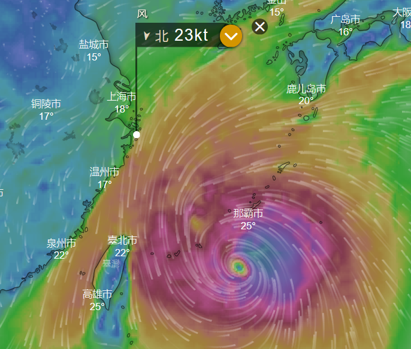

======================================================

_type: q&a
@一七五[48248584445558]
2018-10-06 22:47:45 Sat  
topic_id: 15154552241822

@一七五

>  二师父，指数基金3%浮盈，要不要先出来等跌下去再买进来，国庆期间外盘一片惨不忍睹，节后大A不妙呀。

@二师父

>  市场不好预测，如果跌下去可以多买点，定投的金额别变

阅读[41]  评论[0]  赞[0] 

======================================================

_type: q&a
@静默[48851544482828]
2018-10-08 11:10:42 Mon  
topic_id: 15154551182422

@静默

>  二师父好！请教这两个指数基金510050  50ETF和510300  300ETF目前适合定投吗？非常感谢

@二师父

>  您好，这两个指数目前都适合定投，50里面有些股票在300里面也有，建议投入一个就好，另外银行股一直在拉升，所以50最近涨幅也很不错

阅读[45]  评论[0]  赞[0] 

======================================================

_type: q&a
@枫叶[88444421411582]
2018-10-08 11:13:05 Mon  
topic_id: 51415141414854

@枫叶

>  请问怎么样给一只基金估值呢

@二师父

>  给指数基金估值二师父目前看4个指标，市盈率，市净率，股息率，净资产收益率，指数的相对市盈率市净率越低，那么指数的估值越低，当然结合净资产收益率，如果净资产收益率越高，就可以给指数更高的市盈率或者市净率估值

阅读[52]  评论[0]  赞[0] 

======================================================

_type: q&a
@乡下人[28244152425511]
2018-10-08 13:02:27 Mon  
topic_id: 28482848181841

@乡下人

>  老师，请问央视50和上证50AH这2只哪只比较好适合定投？

@二师父

>  这两只都低估了，50ah里面a股和港股轮动，更倾向于50ah

阅读[46]  评论[0]  赞[0] 

======================================================

_type: q&a
@朱小宁[51122185248284]
2018-10-08 13:03:02 Mon  
topic_id: 48285825445258

@朱小宁

>  二师父，今天鳄鱼计划，咬么？

@二师父

>  咬，刚准备发布，节后第一天，机会来了

阅读[43]  评论[1]  赞[0] 

======================================================

_type: talk
@二师父[28814221155551]
2018-10-08 13:05:52 Mon  
topic_id: 15154514551152

<e type="hashtag" hid="881251425252" title="#鳄鱼计划#" /> 节后第一天，又跳水，目前股市是遭到遗弃的孩子，这给我们积累股份提供了机会。买入医药100一份，300增强一份。耐心买入，耐心持有，弃股保房，我们需要打持久战。

@dhy at 2018-10-08 13:05:52 Mon

> 什么叫弃股保房？

----------

@二师父 at 2018-10-08 13:05:52 Mon

> 弃股市保房市

----------

@呼儿咳ya at 2018-10-08 13:05:52 Mon

> 你是说目前天朝策略是保房市弃股市啰

----------

@二师父 at 2018-10-08 13:05:52 Mon

> 心照不宣

----------

@勤能行之 at 2018-10-08 13:05:52 Mon

> 已买入[愉快]

----------

@勤能行之 at 2018-10-08 13:05:52 Mon

> 现在有点能够领会师傳的精神了。自己比起年初有进步了。

----------

@二师父 at 2018-10-08 13:05:52 Mon

> 一起坚持定投

----------

@二师父 at 2018-10-08 13:05:52 Mon

> 不知不觉这么长时间了，定投需要的就是坚持，一起坚持啦

----------

阅读[136]  评论[8]  赞[0] 

======================================================

_type: q&a
@冉冉[88445118854412]
2018-10-08 15:46:23 Mon  
topic_id: 88482842424182

@冉冉

>  请问二师傅，最近我变更基金定投的金额及时间，可今天并未到我设定的定投日，手机上提示扣款了，显示为基金下账，这是怎么回事？基金下账和基金申购支出有何不同？这种情况怎样避免发生？

@二师父

>  避免这种情况就要在工作日提前修改，不能在非工作日操作

阅读[57]  评论[3]  赞[0] 

======================================================

_type: talk
@Eric[48548828828848]
2018-10-08 21:52:28 Mon  
topic_id: 15154585214812

10万元，现在仓位多少感觉适合呢？

@Tim哥 at 2018-10-08 21:52:28 Mon

> 先整个三成仓

----------

@二师父 at 2018-10-08 21:52:28 Mon

> 5成仓位就非常何时，不要怕

----------

@勤能行之 at 2018-10-08 21:52:28 Mon

> 师傅早上好，真早[玫瑰][强]

----------

阅读[44]  评论[3]  赞[0] 

======================================================

_type: q&a
@小白[15114524218582]
2018-10-09 00:31:16 Tue  
topic_id: 48285818415428

@小白

>  请问二师父，嘉实基本面50的低估和高估分别是多少呀？谢谢！！！

@二师父

>  基本面50低估是9.7倍市盈率，高估是14.5倍市盈率

阅读[46]  评论[3]  赞[0] 

======================================================

_type: talk
@二师父[28814221155551]
2018-10-09 00:32:28 Tue  
topic_id: 88482818141542

<e type="hashtag" hid="481211145528" title="#指数估值#" /> 坚持定投，08年金融危机之后我们没有想过后来房市股市的回暖，危机总会过去，关键是活下去并一直坚持。

阅读[139]  评论[0]  赞[0] 

+++++++++++++++++++++++++++++++++++++++++++++++++++++

图片：

======================================================

_type: talk
@二师父[28814221155551]
2018-10-09 00:33:01 Tue  
topic_id: 28482818141851

红利基金之深证红利了解下

阅读[195]  评论[0]  赞[0] 

+++++++++++++++++++++++++++++++++++++++++++++++++++++

文件：
2018-10-09 00:32:49 Tue
文件大小：[21531]
15548828815152-深证红利投资价值如何.docx

======================================================

_type: q&a
@西锦巴乌[88448285428482]
2018-10-09 11:51:45 Tue  
topic_id: 15154422228252

@西锦巴乌

>  二师父好！华泰柏瑞稳健收益债券A怎么样？可买吗？用于定投的钱目前该放哪儿较合适？谢谢

@二师父

>  建议要么定期理财，要么货币基金，现在货币基金收益率下降，定期理财是不错的选择

阅读[60]  评论[4]  赞[0] 

======================================================

_type: talk
@根号2[51421845455424]
2018-10-09 14:43:30 Tue  
topic_id: 51415522855514

闲来无事，做了两个模拟盘，暂定计划每个盘按比例一次性投入总额10000元~欢迎大家多提宝贵意见~

@勤能行之 at 2018-10-09 14:43:30 Tue

> 我适合组合二。

----------

@勤能行之 at 2018-10-09 14:43:30 Tue

> 易方达信用债和广发纯债的代码是多少？能展开讲讲吗？谢谢了。

----------

@根号2 at 2018-10-09 14:43:30 Tue

> 270048-000032

----------

@海盗 at 2018-10-09 14:43:30 Tue

> 最大回撤是什么意思

----------

@根号2 at 2018-10-09 14:43:30 Tue

> 过程中最大亏损的幅度

----------

阅读[46]  评论[5]  赞[0] 

+++++++++++++++++++++++++++++++++++++++++++++++++++++

图片：
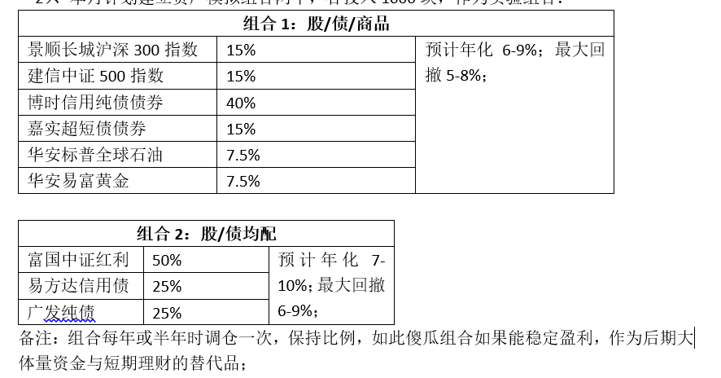

======================================================

_type: q&a
@一七五[48248584445558]
2018-10-10 00:11:19 Wed  
topic_id: 88482258512442

@一七五

>  二师父，证券指数场内基金的512000和512900有什么区别，因为其它原因，我想买512900可以吗，谢谢！

@二师父

>  没啥区别，都是追踪中证全指证券指数，一个是华宝公司发布的基金，一个是南方公司发布的基金

阅读[41]  评论[6]  赞[0] 

======================================================

_type: talk
@二师父[28814221155551]
2018-10-10 00:49:20 Wed  
topic_id: 15154452212512

<e type="hashtag" hid="481211145528" title="#指数估值#" /> 每日估值表，坚持定投，股市房市都不太平，做好自己的投资，目前最佳投资品种还是指数基金和货币基金。

阅读[144]  评论[0]  赞[0] 

+++++++++++++++++++++++++++++++++++++++++++++++++++++

图片：
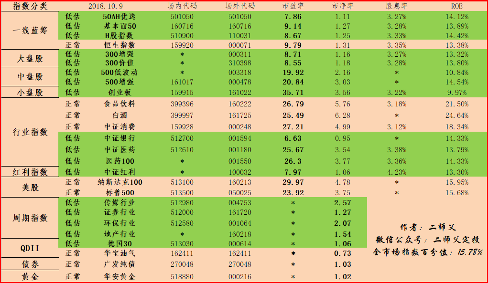

======================================================

_type: q&a
@璐老诗[88818121525822]
2018-10-10 17:29:27 Wed  
topic_id: 15154458545552

@璐老诗

>  二师父，我买了万科的股票，亏了30%了，建议止损吗？

@二师父

>  我的止损位置是百分之10，股票浮亏百分之10就止损了，你这个位置不太好建议

阅读[51]  评论[0]  赞[0] 

======================================================

_type: talk
@二师父[28814221155551]
2018-10-10 22:21:30 Wed  
topic_id: 15154442182842

<e type="hashtag" hid="481144488858" title="#投资理念#" /> 港股的指数这两个是很不错的。

阅读[200]  评论[0]  赞[0] 

+++++++++++++++++++++++++++++++++++++++++++++++++++++

文件：
2018-10-10 22:21:05 Wed
文件大小：[20424]
51158814145414-恒生指数，恒生国企，H股指数投资价值分析10.10.docx

======================================================

_type: talk
@二师父[28814221155551]
2018-10-10 22:22:18 Wed  
topic_id: 48285554218118

<e type="hashtag" hid="481211145528" title="#指数估值#" /> 估值表每日更新，明天定投日，需要坚持哈

阅读[146]  评论[0]  赞[0] 

+++++++++++++++++++++++++++++++++++++++++++++++++++++

图片：

======================================================

_type: talk
@Eric[48548828828848]
2018-10-11 10:48:43 Thu  
topic_id: 51415558521524

大盘破纪录了

@游水浮生 at 2018-10-11 10:48:43 Thu

> 有计划吗

----------

@高达无双喝味全 at 2018-10-11 10:48:43 Thu

> 今天周四定投日

----------

@叫偶猫大人 at 2018-10-11 10:48:43 Thu

> 几成仓合适呢

----------

@二师父 at 2018-10-11 10:48:43 Thu

> 跟跌美股

----------

阅读[46]  评论[4]  赞[0] 

======================================================

_type: talk
@二师父[28814221155551]
2018-10-11 11:17:13 Thu  
topic_id: 28482221224121

<e type="hashtag" hid="881422852442" title="#定投实盘#" /> 美股跟跌，大A无法避免，定投日买入500增强一份，300增强一份，医药100一份，不用担心，18年和08年不同的是18年a股处于低位，不会有系统性风险，目前的时刻唯一需要做的是坚持，另外不要投资股票

@乡下人 at 2018-10-11 11:17:13 Thu

> 老师，已经新增加了定投500增强，原来的纯被动的怎么处理 ，是继续定投还是就这样放着？

----------

@二师父 at 2018-10-11 11:17:13 Thu

> 可以定投，也可以放着，但是不要卖出

----------

@背心 at 2018-10-11 11:17:13 Thu

> 你每次定投怎么不发截图
让我们大家看看你的账户

----------

@背心 at 2018-10-11 11:17:13 Thu

> 我现在亏损7个点，今天这么一跌12个点了

----------

@二师父 at 2018-10-11 11:17:13 Thu

> 时间紧，而且自己的账户并不想发

----------

@二师父 at 2018-10-11 11:17:13 Thu

> 浮亏控制在30个点是正常的，今天可以加仓

----------

阅读[147]  评论[6]  赞[0] 

======================================================

@二师父[28814221155551]
2018-10-11 11:40:57 Thu  
topic_id: 51415558451124

>  @二师父
>  

阅读[44]  评论[3]  赞[0] 

======================================================

_type: talk
@叫偶猫大人[28452224222511]
2018-10-11 14:42:23 Thu  
topic_id: 51415545214414

蛋卷崩了怎样办，还没加仓

@游水浮生 at 2018-10-11 14:42:23 Thu

> 没事，大概率明天继续

----------

@二师父 at 2018-10-11 14:42:23 Thu

> 提前到上午购买

----------

@lcfqmlee at 2018-10-11 14:42:23 Thu

> 我在下午1:45补了一点。

----------

阅读[39]  评论[3]  赞[0] 

======================================================

_type: q&a
@玉博珠宝[15551254545122]
2018-10-11 14:53:09 Thu  
topic_id: 88482242584112

@玉博珠宝

>  二师父，以前定投的标普500和纳斯达克指数今天要不要抛啊

@二师父

>  可以跑了，美股跌了很久了

阅读[48]  评论[4]  赞[0] 

======================================================

_type: q&a
@小牧童[28484254825881]
2018-10-11 14:56:16 Thu  
topic_id: 28482248145411

@小牧童

>  二师父，您好，证券行业指数161720是分级母基金，他的收益方式和ETF一样吗？谢谢

@二师父

>  有部分折价，收益在上涨的时候比ETF要好，如果你不懂折价溢价，可以选择ETF

阅读[76]  评论[1]  赞[0] 

======================================================

_type: talk
@二师父[28814221155551]
2018-10-11 22:10:57 Thu  
topic_id: 88482244142152

<e type="hashtag" hid="481211145528" title="#指数估值#" /> 今天突破熔断底部，还在坚持定投的二师父为你点赞，你是价值投资者。

美股暴跌，全球股指无一幸免，美股需要避避风头，把资产转移到A股或者德国股市

有的读者问如何控制仓位，还是那句话，以自己舒适为宜，如果暴跌你不恐惧而是后悔自己买少了那就是仓位太轻，可以加，如果暴跌你既不恐惧也不后悔，那么仓位适宜。如此简单。

关注主动基金和股票。目前二师父没有买入股票，之前买入的主动基金交银基金也未能幸免，今日浮亏已经10个点，二师父清仓了。在本轮熊市不结束，二师父不会再买入任何股票和指数基金，坚定定投指数基金。切记。

最难过的时刻就是最有价值的时刻，希望读者能够挺住。

阅读[159]  评论[0]  赞[0] 

+++++++++++++++++++++++++++++++++++++++++++++++++++++

图片：
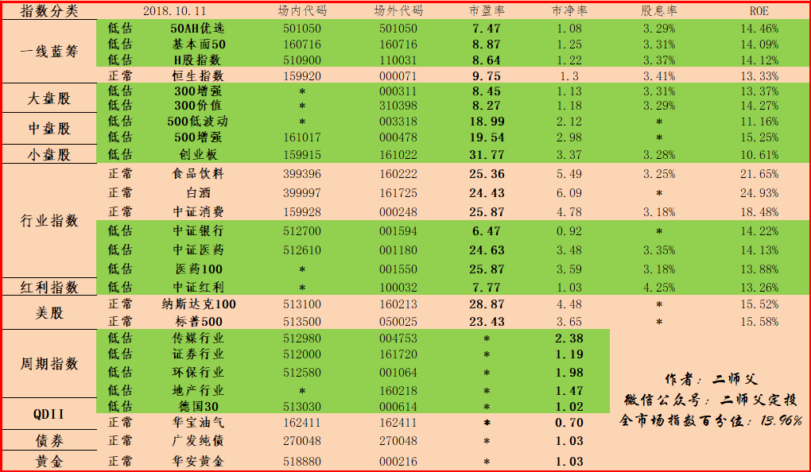

======================================================

_type: talk
@二师父[28814221155551]
2018-10-11 22:12:02 Thu  
topic_id: 48285522122128

<e type="hashtag" hid="481144488858" title="#投资理念#" /> 美股建议还是别碰了，科技股更是深渊

@Tim哥 at 2018-10-11 22:12:02 Thu

> 德国30指数，貌似高高在上，多年牛市，为何低估

----------

@二师父 at 2018-10-11 22:12:02 Thu

> 这个他的指数点位是比较高，不过相对估值是较低的

----------

阅读[215]  评论[2]  赞[0] 

+++++++++++++++++++++++++++++++++++++++++++++++++++++

图片：
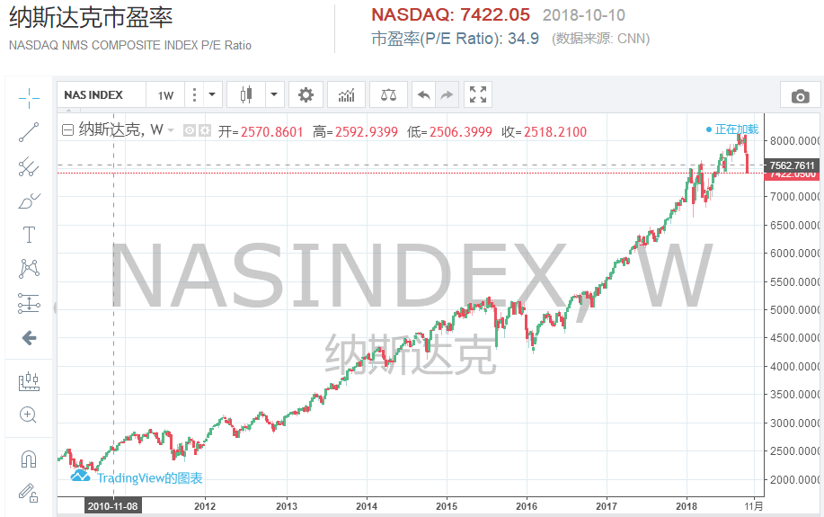

+++++++++++++++++++++++++++++++++++++++++++++++++++++

文件：
2018-10-11 22:11:34 Thu
文件大小：[82313]
48851158451428-千股跌停，美股何去何从，中概互联可以入手吗.docx

======================================================

_type: q&a
@尤加利树[51141421214524]
2018-10-12 08:58:17 Fri  
topic_id: 51415481484424

@尤加利树

>  我还有一些之前买的主动基金，到目前亏了15-20，有无必要割了换成指数基金呢。整体接近满仓了。

@二师父

>  可以换仓了，目前形式不明，我操作都是按照原则，凡是主动基金或者股票亏损10个点就开始止损

阅读[46]  评论[0]  赞[0] 

======================================================

_type: q&a
@shi[15551458885282]
2018-10-12 11:59:16 Fri  
topic_id: 48285215188218

@shi

>  二师父，这些天一直在学习基金定投，目前计划买入垫底基金，哪几个比较好（基金仓位目前是零）。
>  前期买了的股票已经跌了接近10%（仓位比较低，10%那样子，其他在陆金所的P2P里）。

@二师父

>  目前基本面50，沪深300，中证500，中证银行，医药100比较好，股票就别买了，很多人股票都亏的不像样子，指数目前是最适合逆势加仓的

阅读[55]  评论[2]  赞[0] 

======================================================

_type: q&a
@呼儿咳ya[51545822482884]
2018-10-12 11:59:32 Fri  
topic_id: 88482412118582

@呼儿咳ya

>  老师好，建议把msciETF纳入指数基金表予以估值跟踪

@二师父

>  好的，谢谢建议，我研究下

阅读[52]  评论[0]  赞[0] 

======================================================

_type: talk
@二师父[28814221155551]
2018-10-12 12:06:19 Fri  
topic_id: 51415484252284

<e type="hashtag" hid="881251425252" title="#鳄鱼计划#" /> 美股继续跌，a股大部分指数没有跟跌，真的是涨久必跌，世界没有永恒的日不落帝国，今天继续买入中证500增强一份，券商一份，券商是周期指数，他严格跟随市场情绪走，券商开户人多，必涨，目前情绪低迷，所以一路走低，这是二师父自己的计划，如果你恐惧的话，请不要盲目投资。

机会都是留给有准备的人的，目前中证500增强二师父浮亏11个百分点，券商浮亏15个百分点，都是非常低估非常具有投资价值的品种，券商需要提醒一点，二师父的仓位不重，所以对整体浮亏影响不大，后续如果继续跌，券商的投入也会提上来，还是那句话，二师父不预测市场，但是我可以预测下，市场指数点位基本不可能跌破2000

在这个市场的人越来越少，我们获胜的几率就越来越大

@海盗 at 2018-10-12 12:06:19 Fri

> 大跌大买

----------

@海盗 at 2018-10-12 12:06:19 Fri

> 二师父今天选择中证500，意思是不是这个基金比其他基金跌的多还是怎么回事？

----------

@海盗 at 2018-10-12 12:06:19 Fri

> 也就是想问问二师父，这么多基金都低估选择哪个基金加仓有什么依据？

----------

@勤能行之 at 2018-10-12 12:06:19 Fri

> 收盘前2分钟，跟着师傅买了1.5份的券商。[愉快][愉快]

----------

@二师父 at 2018-10-12 12:06:19 Fri

> 周期指数，保证轻仓

----------

@勤能行之 at 2018-10-12 12:06:19 Fri

> 我等牛市来，因为之前不认识师傅的时候就已经买了几万份了。现在特别便宜的时候就跟投一下[愉快][愉快]

----------

@二师父 at 2018-10-12 12:06:19 Fri

> 嗯嗯，现在券商也是极度低估了

----------

@cotton at 2018-10-12 12:06:19 Fri

> 二师父，我现在才看到你鳄鱼计划，现在才买，不怕吧？（我猜你会说没问题）

----------

阅读[158]  评论[15]  赞[0] 

======================================================

_type: talk
@二师父[28814221155551]
2018-10-12 23:54:11 Fri  
topic_id: 88482152254152

<e type="hashtag" hid="481144488858" title="#投资理念#" /> 周末愉快，不用恐惧啊，跌的越多，买入的越便宜

阅读[215]  评论[0]  赞[0] 

+++++++++++++++++++++++++++++++++++++++++++++++++++++

文件：
2018-10-12 23:53:43 Fri
文件大小：[21656]
51158855121244-熔断底部之后，定投不需要恐惧.docx

======================================================

_type: talk
@二师父[28814221155551]
2018-10-12 23:54:50 Fri  
topic_id: 88482152254142

<e type="hashtag" hid="481211145528" title="#指数估值#" /> 黄金不断上涨，500更是下挫，还是银行好，目前盈利最多的品种

@新的开始 at 2018-10-12 23:54:50 Fri

> 师父辛苦了[玫瑰][玫瑰][玫瑰]

----------

@勤能行之 at 2018-10-12 23:54:50 Fri

> 师父辛苦了[玫瑰][玫瑰][玫瑰]

----------

阅读[159]  评论[2]  赞[0] 

+++++++++++++++++++++++++++++++++++++++++++++++++++++

图片：
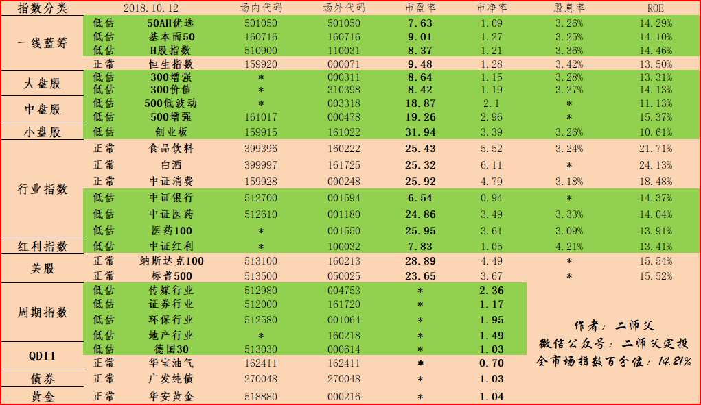

======================================================

_type: q&a
@冉冉[88445118854412]
2018-10-13 16:10:07 Sat  
topic_id: 48285188455448

@冉冉

>  ”按照均线定投，偏离均线位置下，逐步增加定投金额，偏离均线位置上，逐步减少定投金额或者停止投资，慧定投就是均线策略”，请问二师傅，在慧定投的均线在哪里可以看到？

@二师父

>  蛋卷自己就设定的有均线，这个均线你在股票软件就能看到，自己设置多少日均线就能够看到啦

阅读[87]  评论[1]  赞[0] 

======================================================

_type: q&a
@琪琪[2421884541]
2018-10-13 22:13:00 Sat  
topic_id: 51415811524254

@琪琪

>  二师父觉得投上证50,银行,沪深300是否是更为稳健的做法？牛市涨幅虽没有中小板大，但仍可翻倍，熊市相对稳健。另外上证50和300有推荐的跟踪指数的基金么？谢谢

@二师父

>  这三个指数为啥在熊市跌幅少呢，因为这三个指数里面都含有大量的银行股票，尤其是银行指数，里面全是银行股票
>  
>  在熊市里面，国家不会坐视不管，会有护盘，而国家队出手大部分是帮助银行拉升，因此银行跌的也少。
>  
>  至于你说的翻倍是之前15年碰上了大众创业万众创新这个点，所以很多中小企业暴涨，从稳健和成长角度来讲，上证50和沪深300都是很不错的选择，因为他们的持仓股票有大型企业，白马股票。
>  
>  推荐的话你选择南方，易方达，天弘等大型的基金公司募集的相应基金

阅读[52]  评论[1]  赞[0] 

======================================================

_type: q&a
@小牧童[28484254825881]
2018-10-13 22:16:13 Sat  
topic_id: 28482188421821

@小牧童

>  二师父，您好，养老环保传媒怎么样？哪个更适合一点？

@二师父

>  您好，养老，环保，传媒这三个指数，环保和传媒是周期指数，养老是行业指数
>  
>  如果从这三个指数里面推荐一个，二师父推荐养老指数，因为养老行业好，而且里面的股票很多低估
>  
>  另外养老指数里面有很多医药股票，如果只投资一个的话可以选择医药指数，投资两个的话可以养老和医药指数一起投资。
>  
>  至于传媒和环保，因为是周期指数，周期性特别强，所以不是很建议投资，可以轻仓买入，重仓的话还是宽基和行业

阅读[80]  评论[2]  赞[0] 

======================================================

_type: talk
@二师父[28814221155551]
2018-10-14 01:34:04 Sun  
topic_id: 28482181244121

<e type="hashtag" hid="481144488858" title="#投资理念#" />

阅读[219]  评论[0]  赞[0] 

+++++++++++++++++++++++++++++++++++++++++++++++++++++

文件：
2018-10-14 01:33:58 Sun
文件大小：[21888]
28821124824421-房产VS指数基金.docx

======================================================

_type: talk
@二师父[28814221155551]
2018-10-14 01:37:17 Sun  
topic_id: 88482181241582

所谓均线，指的是一定交易时间内的算术平均线。一般包含5日、10日、20日、60日、120日（半年线）以及250日（年线）。

阅读[48]  评论[0]  赞[0] 

======================================================

@二师父[28814221155551]
2018-10-14 11:02:53 Sun  
topic_id: 28482181154141

>  @二师父
>  

阅读[50]  评论[1]  赞[0] 

======================================================

@二师父[28814221155551]
2018-10-14 15:15:49 Sun  
topic_id: 28482128524141

>  @二师父
>  

阅读[51]  评论[0]  赞[0] 

======================================================

_type: q&a
@海盗[48248118584848]
2018-10-14 15:16:10 Sun  
topic_id: 15154842481242

@海盗

>  二师父，161022创业板它的市盈率区间是多少？

@二师父

>  低估市盈率是38到40左右

阅读[63]  评论[0]  赞[0] 

======================================================

_type: talk
@二师父[28814221155551]
2018-10-14 23:48:34 Sun  
topic_id: 15154848121412

<e type="hashtag" hid="881152541812" title="#周一荐书#" /> 两本书，笑傲江湖，红楼梦。从笑傲江湖里面读懂人性，从红楼梦里面读懂轮回，然后你就懂股市了。

@海盗 at 2018-10-14 23:48:34 Sun

> 红楼梦看过一段，文言文版，比较吃力。里面的人员也众多，光记住人名也是一番功夫。

----------

@二师父 at 2018-10-14 23:48:34 Sun

> 主要看几大家族的兴衰

----------

@cotton at 2018-10-14 23:48:34 Sun

> 师傅。。我在听红楼梦

----------

@二师父 at 2018-10-14 23:48:34 Sun

> 这个不错

----------

@cotton at 2018-10-14 23:48:34 Sun

> 一定是蒋勋的。才值得

----------

@二师父 at 2018-10-14 23:48:34 Sun

> [鼓掌][鼓掌]

----------

阅读[45]  评论[6]  赞[0] 

======================================================

_type: q&a
@风信子[544458822111224]
2018-10-15 19:20:07 Mon  
topic_id: 51415881185524

@风信子

>  二师父，请问低估值会很长一段时间的吗？不会今天低估值，过几天又正常值吧？那对定投有影响吗？

@二师父

>  估值每天都变化的，一般如果到达极度低估就需要较长的时间进入正常。
>  
>  比如中证500，证券这些极度低估指数就需要很长时间才能进入正常。
>  
>  你说的那种今天进入低估，过几天估值变成正常的情况是那些刚进入低估的指数又遇到市场上涨

阅读[63]  评论[1]  赞[0] 

======================================================

_type: talk
@根号2[51421845455424]
2018-10-15 21:40:28 Mon  
topic_id: 51415885254214

上证红利股息率近4.5%了，定投可以考虑了～[勾引]

@海盗 at 2018-10-15 21:40:28 Mon

> 弱弱的问一句，定投和股息率是什么关系呀？

----------

@根号2 at 2018-10-15 21:40:28 Mon

> 红利指数基金每年用于分红的钱是相对稳定的，当指数估值点位低时，股息率就大了，因此股息率可以作为估值高低的参考指标，每年的分红也是实实在在能分到手里的钱，根据指数过往的估值规律，目前的股息率情况下，下跌的空间有限了

----------

@海盗 at 2018-10-15 21:40:28 Mon

> 谢谢了

----------

@根号2 at 2018-10-15 21:40:28 Mon

> 不客气，我实在是太喜欢红利指数基金了[微笑]

----------

阅读[51]  评论[4]  赞[0] 

======================================================

_type: talk
@二师父[28814221155551]
2018-10-16 00:19:57 Tue  
topic_id: 15154884812522

<e type="hashtag" hid="481211145528" title="#指数估值#" />

阅读[166]  评论[0]  赞[0] 

+++++++++++++++++++++++++++++++++++++++++++++++++++++

图片：

======================================================

_type: talk
@二师父[28814221155551]
2018-10-16 00:20:03 Tue  
topic_id: 48285115124848

<e type="hashtag" hid="481144488858" title="#投资理念#" />

@叫偶猫大人 at 2018-10-16 00:20:03 Tue

> 师父推荐一下黄金指数基金吧

----------

@二师父 at 2018-10-16 00:20:03 Tue

> 在基金估值表里面有，黄金指数基金

----------

阅读[226]  评论[2]  赞[0] 

+++++++++++++++++++++++++++++++++++++++++++++++++++++

文件：
2018-10-16 00:20:23 Tue
文件大小：[23406]
88821148181582-这轮熊市，有何感悟.docx

======================================================

_type: q&a
@攀攀[844421254152582]
2018-10-16 12:53:05 Tue  
topic_id: 28482114441221

@攀攀

>  二师父，请问大农业指数基金（001027）目前能否定投?大农业是否跟养老产业一样具有投资价值?

@二师父

>  这个我研究下再给你答案哈，今天出来

阅读[48]  评论[1]  赞[0] 

======================================================

_type: q&a
@汤圆君[881125824112]
2018-10-16 14:11:10 Tue  
topic_id: 48282448815858

@汤圆君

>  请问老师，对广发中证家电指数005063有什么看法？适合定投吗？

@二师父

>  这个从年初26000点跌倒16000点，近乎腰斩，但是比14年还是贵不少，家用电器的购买和房地产的兴衰有部分联系，目前地产寒冬，建议可以等等

阅读[54]  评论[2]  赞[0] 

======================================================

_type: talk
@二师父[28814221155551]
2018-10-16 14:19:19 Tue  
topic_id: 48282448281828

<e type="hashtag" hid="881251425252" title="#鳄鱼计划#" /> 最近听到越来越多人爆仓，再次提醒，不要借钱买基金，不要卖房买基金，更不要贷款买基金。只能将工资结余且3到5年不用的资金用来买。

越跌越买，机会始终不缺，如果从此一直跌，二师父会一直加仓知道存量资金全部打完。

买入中证红利一份，买入医药100一份。

@cotton at 2018-10-16 14:19:19 Tue

> 爆仓是没钱继续买的意思吗

----------

@二师父 at 2018-10-16 14:19:19 Tue

> 不是的，爆仓指加杠杆的人，亏损比账户里面资金还多

----------

@新的开始 at 2018-10-16 14:19:19 Tue

> 我也跟投了，我的份小，一份200[呲牙]

----------

@二师父 at 2018-10-16 14:19:19 Tue

> 没关系啊，这也是投资，关键要学会买资产这种思维，这样等以后本金充足了就能很好地增值

----------

@Eric at 2018-10-16 14:19:19 Tue

> 爆仓怎么办？

----------

@二师父 at 2018-10-16 14:19:19 Tue

> 只有避免爆仓，不然很惨，无解

----------

@门萨🐨 at 2018-10-16 14:19:19 Tue

> 二师父，鳄鱼计划和定投实盘有什么区别

----------

阅读[171]  评论[7]  赞[0] 

======================================================

_type: q&a
@背心[51441214442224]
2018-10-16 15:34:59 Tue  
topic_id: 48282448151288

@背心

>  师傅我今天也跟了  医药和红利 ，拼了。不知道后面会怎样，感觉不买有点亏

@二师父

>  后面肯定赚，只要坚定持有

阅读[54]  评论[0]  赞[0] 

======================================================

_type: q&a
@风信子[544458822111224]
2018-10-16 16:32:39 Tue  
topic_id: 48282445451818

@风信子

>  二师傅，你好，最近我在蛋卷基金里帮妈妈买了汇添富60天债券E，要求保本，请问买这个可以吗？谢谢！

@二师父

>  这个保本没问题，不过可以多看看其他渠道的定期理财，7日年化收益率不到4个点，有点低

阅读[62]  评论[1]  赞[0] 

======================================================

_type: talk
@二师父[28814221155551]
2018-10-17 00:09:02 Wed  
topic_id: 28484585128511

<e type="hashtag" hid="481211145528" title="#指数估值#" />

阅读[168]  评论[0]  赞[0] 

+++++++++++++++++++++++++++++++++++++++++++++++++++++

图片：

======================================================

_type: talk
@二师父[28814221155551]
2018-10-17 00:10:07 Wed  
topic_id: 48282484111588

<e type="hashtag" hid="481144488858" title="#投资理念#" />

@小飞侠 at 2018-10-17 00:10:07 Wed

> 二师傅 文档中的中证500历史市净率  市盈率在哪里可以看

----------

@二师父 at 2018-10-17 00:10:07 Wed

> 理杏仁，果仁，wind

----------

@小飞侠 at 2018-10-17 00:10:07 Wed

> 收到[握手]

----------

阅读[228]  评论[3]  赞[0] 

+++++++++++++++++++++++++++++++++++++++++++++++++++++

文件：
2018-10-17 00:10:05 Wed
文件大小：[103165]
88821141211182-跌跌不休，中证500究竟到底部了吗.docx

======================================================

_type: talk
@二师父[28814221155551]
2018-10-17 11:28:13 Wed  
topic_id: 51414218244254

<e type="hashtag" hid="481115188158" title="#一个投资品种#" /> 定期理财品种，这种适合父母等老年人，将年化收益率放在4到7个百分点，还是不错的，流动性也不差。

当然这对极端保守的投资者来讲合适，但是对于有工资收入的稳健投资者不适合。

医药股票因为长生生物被罚，一直下跌，医药基金投资的好时刻也到了

@风信子 at 2018-10-17 11:28:13 Wed

> 二师父，您是说医药基金适合父母定投吗？有什么推荐？

----------

@二师父 at 2018-10-17 11:28:13 Wed

> 是的，医药遭遇了行业黑天鹅，具有价值，推荐中证医药和医药100，选择其中一个投资即可

----------

@风信子 at 2018-10-17 11:28:13 Wed

> 谢谢，二师父

----------

阅读[45]  评论[3]  赞[0] 

======================================================

_type: talk
@二师父[28814221155551]
2018-10-17 23:33:21 Wed  
topic_id: 48282851428448

<e type="hashtag" hid="481211145528" title="#指数估值#" /> 医药和消费估值持续下移。

目前医药低估，可以投资，但是消费尤其食品饮料仍旧估值不低，不要投资。

这次将会是A股历史上第5次历史大底，机会难得，看样子还会阴跌。备好子弹，准备战斗，如果一直跌，二师父会先把存量资金逐步买完，然后定投增量资金，总之，不会止损指数基金。

@cotton at 2018-10-17 23:33:21 Wed

> 二师父，我没有买黄金基金，现在估值是正常。不适合买是吗

----------

@二师父 at 2018-10-17 23:33:21 Wed

> 不适合，之前低估我买了一点，现在浮盈大概4个点，黄金涨幅不大的，就是避险品种

----------

@cotton at 2018-10-17 23:33:21 Wed

> 好的

----------

阅读[174]  评论[3]  赞[0] 

+++++++++++++++++++++++++++++++++++++++++++++++++++++

图片：

======================================================

_type: talk
@二师父[28814221155551]
2018-10-17 23:33:43 Wed  
topic_id: 88484821548582

<e type="hashtag" hid="481144488858" title="#投资理念#" />

阅读[235]  评论[0]  赞[0] 

+++++++++++++++++++++++++++++++++++++++++++++++++++++

文件：
2018-10-17 23:33:36 Wed
文件大小：[23053]
15548882852142-从浙大博士跳江展开谈生活投资如何独立思考.docx

======================================================

_type: talk
@二师父[28814221155551]
2018-10-17 23:34:06 Wed  
topic_id: 28484821548511

<e type="hashtag" hid="881112141422" title="#读者投稿#" />

@海盗 at 2018-10-17 23:34:06 Wed

> 二师父有个错别字呀

----------

@二师父 at 2018-10-17 23:34:06 Wed

> 嗯嗯，以后注意

----------

@海盗 at 2018-10-17 23:34:06 Wed

> 😄

----------

阅读[235]  评论[3]  赞[0] 

+++++++++++++++++++++++++++++++++++++++++++++++++++++

文件：
2018-10-17 23:34:05 Wed
文件大小：[116973]
88821115185422-是时候给定投加个纪律了2018.10.17.docx

======================================================

_type: talk
@二师父[28814221155551]
2018-10-18 09:57:19 Thu  
topic_id: 28484845284151

<e type="hashtag" hid="881422852442" title="#定投实盘#" /> 市场进一步下挫，消费白马股n连跌，太阳底下没有新鲜事，曾经涨的太多导致价格高于价值最终会有陨落的一天。

目前点位无需恐惧，大盘能够从3500跌到2500，但是无法从2500跌到1500，很有可能这次是a股历史上第五次大底部。机会已经来了

买入300增强一份，50ah一份，医药100两份。

@cotton at 2018-10-18 09:57:19 Thu

> 每周四都是我的定投日。除了定投，今天不用加吧？

----------

@二师父 at 2018-10-18 09:57:19 Thu

> 不用的，定投即可，还不知道会下挫多少

----------

@cotton at 2018-10-18 09:57:19 Thu

> 好的。多谢

----------

@门萨🐨 at 2018-10-18 09:57:19 Thu

> 定投实盘场内买还是场外买

----------

@二师父 at 2018-10-18 09:57:19 Thu

> 场外，目前就是组合里面的基金，直接点击组合链接即可购买

----------

阅读[186]  评论[5]  赞[0] 

======================================================

_type: q&a
@victoria[15455121858422]
2018-10-18 10:59:38 Thu  
topic_id: 51414145515284

@victoria

>  中证500到了4000点附近，是否可以多买点

@二师父

>  这个目前坚持定投，一直杀估值，我目前是重仓，保持自己的仓位即可，你根据实际情况来
>  
>  中小企业寒冬，不建议一下子买入太多

阅读[61]  评论[0]  赞[0] 

======================================================

_type: q&a
@victoria[15455121858422]
2018-10-18 11:00:12 Thu  
topic_id: 48282825584888

@victoria

>  二师父你的一份金额是多少呢

@二师父

>  计算方法以前在五步定投法讲过了

阅读[66]  评论[0]  赞[0] 

======================================================

_type: talk
@根号2[51421845455424]
2018-10-18 11:08:41 Thu  
topic_id: 48282825555218

提个小小的建议，每隔一段时间重新温习下二师父的系统文章，对于每天市场上发生的云云或许就没那么纠结了~[衰]

@海盗 at 2018-10-18 11:08:41 Thu

> 对对对

----------

阅读[48]  评论[1]  赞[0] 

======================================================

_type: talk
@二师父[28814221155551]
2018-10-18 13:25:08 Thu  
topic_id: 28484844584511

昨日是中弘股份第19个交易日价格低于1元，收盘价是0.82元，今日再怎么涨，也涨不到1元了。深交所规定，如果股票连续20个交易日价格低于1元，就要终止上市了，因此退市肯定是没跑了，它也就成为了A股历史上第一个因为价格不到1元而退市的股票，载入史册。

个股有风险，投资指数基金可以避免个股暴雷

阅读[42]  评论[0]  赞[0] 

======================================================

_type: talk
@Eric[48548828828848]
2018-10-18 14:14:49 Thu  
topic_id: 88484844822142

目前仓位3成，大家觉得怎么杨

@二师父 at 2018-10-18 14:14:49 Thu

> 有点轻

----------

@Eric at 2018-10-18 14:14:49 Thu

> 要加仓吗

----------

@二师父 at 2018-10-18 14:14:49 Thu

> 加一些可以的

----------

@Eric at 2018-10-18 14:14:49 Thu

> 多少合适^_呢

----------

@二师父 at 2018-10-18 14:14:49 Thu

> 比定投金额多一点就行

----------

@Eric at 2018-10-18 14:14:49 Thu

> 杯水车薪啊，对仓位改变没有大作用

----------

@二师父 at 2018-10-18 14:14:49 Thu

> 要么增加定投频率，别一下子买太多，不然受不了

----------

@Eric at 2018-10-18 14:14:49 Thu

> 好

----------

阅读[49]  评论[8]  赞[0] 

======================================================

_type: talk
@二师父[28814221155551]
2018-10-18 14:29:03 Thu  
topic_id: 28484844842441

值得纪念的时刻，大盘跌破2500点，历史上第5次大底即将完成，抓住机会

@zxc at 2018-10-18 14:29:03 Thu

> 二师傅，我之前重仓的食品饮料和消费型指数基金，160222和000248，我每次看您的估值都是正常估值，但我现在每周有在定投，是要继续定投吗还是停止

----------

@二师父 at 2018-10-18 14:29:03 Thu

> 为啥正常的估值一直定投呢，按照二师父的定投策略是定投低估的指数基金，只有进入低估值才能定投

食品和消费跌了一些，但是白酒，格力，家用电器等主要消费仍旧很高，在年初二师父就不建议大家投资了

----------

@cotton at 2018-10-18 14:29:03 Thu

> 今天可以加点吗，除了定投

----------

@zxc at 2018-10-18 14:29:03 Thu

> 这个去年十一月就买了，当时完全是小白，而且一次性买了一大笔资金，可以算是重仓了。那我现在放着不动吗，还是赎回部分[撇嘴]

----------

@二师父 at 2018-10-18 14:29:03 Thu

> 现在浮亏了多少了

----------

@二师父 at 2018-10-18 14:29:03 Thu

> 现在过了3点了，别加了，加了也是按照明天的收盘价格

----------

@cotton at 2018-10-18 14:29:03 Thu

> 好的

----------

@zxc at 2018-10-18 14:29:03 Thu

> 一个-12，一个-15[尴尬]

----------

阅读[44]  评论[11]  赞[0] 

+++++++++++++++++++++++++++++++++++++++++++++++++++++

图片：
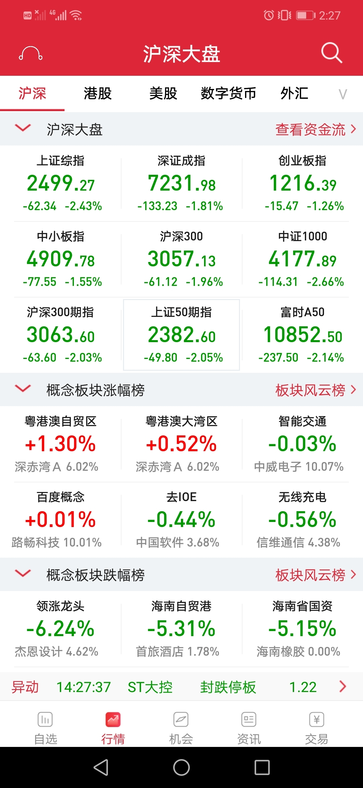

======================================================

_type: talk
@二师父[28814221155551]
2018-10-18 16:47:23 Thu  
topic_id: 28484841558421

<e type="hashtag" hid="481211145528" title="#指数估值#" /> 今日指数估值表，市场全A指数百分位低至12个百分点，上证综合指数突破11倍市盈率，沪深300跌破10倍市盈率。如果消费食品等指数和医药指数全部达到底部区域，市场总体再跌百分之20，那么这将会是历史上第五次大底，走过之后会迎来一轮新的牛市，历史总会重演的，年初没人相信白酒会跌，现在在看看呢？

消费指数也即将进入低估区域，不要着急，目前资金比什么都重要。不多说，先分享指数估值表，今天是个值得纪念的时刻，晚上和大家聊聊。

@Jewel at 2018-10-18 16:47:23 Thu

> 二师兄，能帮忙分析一下腾讯茅台格力平安喝科大讯飞吗，适合买入了没

----------

@二师父 at 2018-10-18 16:47:23 Thu

> 目前股市一片哀嚎，白马消费股估值仍旧很高，港股跌没有下限，都不建议买入，可以定投相关的指数基金

----------

@Jewel at 2018-10-18 16:47:23 Thu

> 👌get√

----------

@根号2 at 2018-10-18 16:47:23 Thu

> [微笑]也许L走势 也许V走势   从容面对吧

----------

@二师父 at 2018-10-18 16:47:23 Thu

> 对，保持淡定

----------

@勤能行之 at 2018-10-18 16:47:23 Thu

> 每天看星球就是一种享受。[玫瑰][强][握手]

----------

阅读[189]  评论[6]  赞[0] 

+++++++++++++++++++++++++++++++++++++++++++++++++++++

图片：
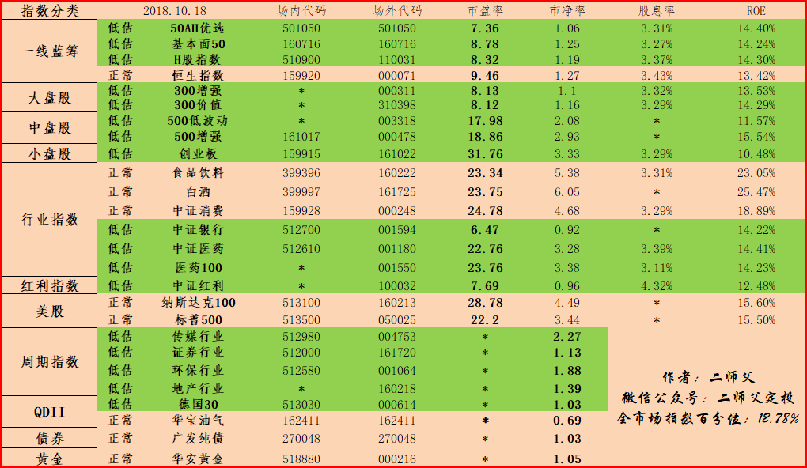

======================================================

_type: talk
@二师父[28814221155551]
2018-10-18 19:17:16 Thu  
topic_id: 51414148585554

<e type="hashtag" hid="481112421558" title="#师说#" />

阅读[246]  评论[0]  赞[0] 

+++++++++++++++++++++++++++++++++++++++++++++++++++++

文件：
2018-10-18 19:16:45 Thu
文件大小：[115401]
28821114258251-中弘股份退市，我们定投的指数基金会有风险吗？.docx

======================================================

_type: talk
@二师父[28814221155551]
2018-10-18 19:43:52 Thu  
topic_id: 51414148412454

中小企业寒冬，创业板投资需要慎重了

@乡下人 at 2018-10-18 19:43:52 Thu

> 那该如何是好啊，都亏损20个点了

----------

@二师父 at 2018-10-18 19:43:52 Thu

> 创业板可以暂停下，轻仓没事，不要重仓

----------

@新的开始 at 2018-10-18 19:43:52 Thu

> 

----------

@新的开始 at 2018-10-18 19:43:52 Thu

> 等它长回来[呲牙]

----------

@二师父 at 2018-10-18 19:43:52 Thu

> 800元金额不大，没啥影响的，涨回来也简单

----------

阅读[45]  评论[5]  赞[0] 

+++++++++++++++++++++++++++++++++++++++++++++++++++++

图片：

======================================================

@二师父[28814221155551]
2018-10-18 21:56:05 Thu  
topic_id: 88484818412282

>  @二师父
>  

阅读[50]  评论[3]  赞[0] 

======================================================

_type: talk
@二师父[28814221155551]
2018-10-18 22:15:44 Thu  
topic_id: 15151585885482

之前的课程不知道什么原因被官方下架了，现在重新开课，已经买过的朋友之后私信我，我给你链接免费进入课程学习

@高达无双喝味全 at 2018-10-18 22:15:44 Thu

> 在哪里私信呢？

----------

@二师父 at 2018-10-18 22:15:44 Thu

> 星球私信或者加微信ershifudt

----------

阅读[42]  评论[2]  赞[0] 

======================================================

_type: talk
@二师父[28814221155551]
2018-10-19 13:50:49 Fri  
topic_id: 15151425424252

【中国副总理刘鹤就当前经济金融热点问题接受采访】刘鹤：最近我高度关注国际投资机构对中国股市的评估和国内专业机构的市场分析。大家比较一致的看法是，从全球资产配置来看，中国正在成为最有投资价值的市场，泡沫已经大大缩小，上市公司质量正在改善，估值处于历史低位，所以很多机构建议对中国股市给予高度关注，认为中国股市已经具有较高投资价值。对这些评估，相信投资者会做出理性判断。可以说，股市的调整和出清，正为股市长期健康发展创造出好的投资机会。中美贸易摩擦对市场也造成了影响，但心理影响大于实际影响，目前中美正在接触。

@山人 at 2018-10-19 13:50:49 Fri

> 刘总讲话，癌股今天得已反弹[偷笑]

----------

@二师父 at 2018-10-19 13:50:49 Fri

> 老大发声就是不一样

----------

阅读[40]  评论[2]  赞[0] 

======================================================

_type: talk
@二师父[28814221155551]
2018-10-19 16:29:28 Fri  
topic_id: 28484252518551

<e type="hashtag" hid="454844424458" title="#量化交易策略#" /> 最近市场暴跌，有的读者控制不住自己的情绪，二师父准备建立量化交易策略，什么时候买，买多少，什么时候卖，卖多少，都有精确的数量，这样就不会被感性左右了。

这是低估市盈率策略回测的历史收益率。从16年年初回测到18年年初，没有经历牛市，年化收益率接近百分之15，倘若经历一轮牛市例如从13，14到15年化收益率会超过百分之20.

这是回测的，历史从某个角度来讲可以代表未来。如果指数能有这个收益率，你还会去投资股票吗？

@fxq at 2018-10-19 16:29:28 Fri

> 这是什么回测工具呀

----------

@二师父 at 2018-10-19 16:29:28 Fri

> 智投星

----------

阅读[193]  评论[2]  赞[0] 

+++++++++++++++++++++++++++++++++++++++++++++++++++++

图片：
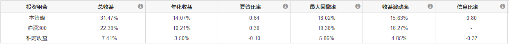

======================================================

_type: talk
@二师父[28814221155551]
2018-10-19 16:57:50 Fri  
topic_id: 48282545888888

<e type="hashtag" hid="481211145528" title="#指数估值#" /> 可惜今天没有下跌，各大指数略有上涨，如果消费医药不下跌完全很难到达铁底，这是A股的最后一个高昂的头。

珍惜子弹，按照纪律定投，大盘下挫到2500百以下鳄鱼计划就一周四次，如果不是还是和之前一样，既要高收益，也要控制风险

阅读[197]  评论[0]  赞[0] 

+++++++++++++++++++++++++++++++++++++++++++++++++++++

图片：

======================================================

_type: talk
@二师父[28814221155551]
2018-10-20 00:40:59 Sat  
topic_id: 48282584281558

<e type="hashtag" hid="481144488858" title="#投资理念#" /> 定投不需要择时，只需要选重低估区域就好

阅读[252]  评论[0]  赞[0] 

+++++++++++++++++++++++++++++++++++++++++++++++++++++

文件：
2018-10-20 00:40:30 Sat
文件大小：[24771]
48851111218418-低估区域定投需要择时吗.docx

======================================================

_type: q&a
@冉冉[88445118854412]
2018-10-20 12:21:50 Sat  
topic_id: 48282588185828

@冉冉

>  请问二师傅，周五中证500增强场内161017与场外000478为什么增幅不同，有一个多点的差距？中证500目前跌幅较大，未来还会下跌多少？这次中证500能涨回来吗？

@二师父

>  你好，一个是富国公司募集的纯被动指数基金，一个是建信公司募集的带走增强策略的指数基金。因为500增强有增强策略，所以两者的涨跌幅不同，增强策略在牛市会大概率增长多一些的。
>  
>  未来中证500最大下跌幅度预计在百分之25以内，已经处于极度低估区域。
>  
>  未来中证500会涨起来的，因为500里面持仓股票都是中型号的优质公司，所以未来股市回暖一定会上涨的。
>  
>  目前持有的中证500依旧可以定投

阅读[220]  评论[1]  赞[0] 

======================================================

_type: talk
@二师父[28814221155551]
2018-10-20 21:18:00 Sat  
topic_id: 15151442548212

<e type="hashtag" hid="481144488858" title="#投资理念#" /> 定投可以终身持有吗？每个人都有每个人的想法，关键是，实践才是检验真理的唯一标准

阅读[263]  评论[0]  赞[0] 

+++++++++++++++++++++++++++++++++++++++++++++++++++++

文件：
2018-10-20 21:17:22 Sat
文件大小：[39335]
88845555884452-我们定投的指数基金可以终身持有吗.docx

======================================================

_type: talk
@根号2[51421845455424]
2018-10-21 13:50:55 Sun  
topic_id: 88484221885412

场内货币基金与场外货币基金相比的话有什么具体差异性，收益率、波动之类的？还有场内债基与场外债基的差异性

@根号2 at 2018-10-21 13:50:55 Sun

> 

----------

阅读[52]  评论[1]  赞[0] 

======================================================

_type: talk
@二师父[28814221155551]
2018-10-21 14:19:43 Sun  
topic_id: 88484221825882

<e type="hashtag" hid="142522424182" title="#定投策略#" /> 目前二师父定投策略有两个，一个是低估定投策略，一个是均线定投策略，低估定投策略就是咱们按照估值表低估定投，均线策略是设置均线，低于均线开始定投，高于均线开始止盈。

低估定投需要时间长，长期持有，获取利润更大，均线定投策略获利更快，及时落袋为安

阅读[51]  评论[0]  赞[0] 

======================================================

_type: talk
@二师父[28814221155551]
2018-10-21 16:19:39 Sun  
topic_id: 51414558441584

<e type="hashtag" hid="481144488858" title="#投资理念#" /> 止损也是投资过程中需要注意的。需要止损吗？看你的策略和投资品种了

阅读[259]  评论[0]  赞[0] 

+++++++++++++++++++++++++++++++++++++++++++++++++++++

文件：
2018-10-21 16:18:47 Sun
文件大小：[21793]
15512222118522-万学化学跌停，投资到底需要止损吗.docx

======================================================

_type: talk
@根号2[51421845455424]
2018-10-21 16:33:09 Sun  
topic_id: 88484221415122

<e type="hashtag" hid="481144488858" title="#投资理念#" />

@海盗 at 2018-10-21 16:33:09 Sun

> 👍

----------

@梦想家 at 2018-10-21 16:33:09 Sun

> 请问二师父，像美国退出中导条约这类事件是不是利好黄金？

----------

阅读[118]  评论[2]  赞[1] 

+++++++++++++++++++++++++++++++++++++++++++++++++++++

文件：
2018-10-21 16:33:07 Sun
文件大小：[105883]
51142222481144-影响市场的到底是事件还是情绪2018.10.21.docx

======================================================

@二师父[28814221155551]
2018-10-21 17:33:50 Sun  
topic_id: 88484221112122

>  @二师父
>  

阅读[52]  评论[0]  赞[0] 

======================================================

_type: talk
@二师父[28814221155551]
2018-10-21 17:43:59 Sun  
topic_id: 88484245558812

<e type="hashtag" hid="281181228851" title="#周末答疑#" /> 关于计算机等信息行业是否值得投资。

从估值的角度讲，目前比15年高位是下降了不少，但是当前市盈率仍旧是40多倍。

这是一个比创业板市盈率还高的指标，另外科技行业经常大变革，曾经2000年美国科技股泡沫一些科技公司一钱不值。建议谨慎再谨慎。

所以从安全的角度考虑，不建议买入，因为还不够便宜。

@甫青 at 2018-10-21 17:43:59 Sun

> 二师父您好，我看好银行板块的低估，想长期持有，有好的方法吗？

----------

@二师父 at 2018-10-21 17:43:59 Sun

> 直接买入持有就可以啦

----------

@甫青 at 2018-10-21 17:43:59 Sun

> 想加买些股票如浦发，招行，工行，请指教。

----------

@二师父 at 2018-10-21 17:43:59 Sun

> 招商龙头股，好一些，还有兴业

----------

@甫青 at 2018-10-21 17:43:59 Sun

> 谢谢，亲

----------

@勤能行之 at 2018-10-21 17:43:59 Sun

> 我想说醍醐灌顶啊

----------

阅读[200]  评论[6]  赞[0] 

======================================================

_type: talk
@二师父[28814221155551]
2018-10-22 09:44:00 Mon  
topic_id: 15151418522822

高开，证券领涨，政策底是到了，但是提醒下，不要抄底，市场底仍旧未知

@乡下人 at 2018-10-22 09:44:00 Mon

> 第一次见证了证券的威力

----------

@二师父 at 2018-10-22 09:44:00 Mon

> 还没有，等牛市来了你就知道什么叫做涨上天

----------

@高达无双喝味全 at 2018-10-22 09:44:00 Mon

> 如果牛市来了 一次性配置主动基金 二师父会选哪些？

----------

@二师父 at 2018-10-22 09:44:00 Mon

> 牛市来了可以买券商股，医药股，消费股证券主动基金，医药主动基金，这个得根据选李规则来选择，我目前资金在指数基金里面了，持有这些就好

----------

@冉冉 at 2018-10-22 09:44:00 Mon

> 这次涨能持续吗？持续涨我们是持有还是卖出？

----------

@二师父 at 2018-10-22 09:44:00 Mon

> 持有，不到3000点就不要考虑卖，除非你得仓位太重

----------

@冉冉 at 2018-10-22 09:44:00 Mon

> 好的，谢谢

----------

@王雷 at 2018-10-22 09:44:00 Mon

> 那到了3000点要出一部分吗？

----------

阅读[50]  评论[9]  赞[0] 

+++++++++++++++++++++++++++++++++++++++++++++++++++++

图片：
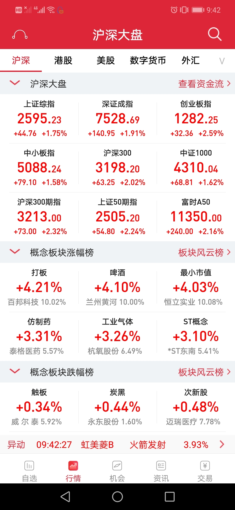

======================================================

_type: q&a
@西锦巴乌[88448285428482]
2018-10-22 14:30:53 Mon  
topic_id: 48282515425248

@西锦巴乌

>  师父：是否可以卖出一部分，等下来再买回来，政策救市往往不是一蹴而就的，可否？

@二师父

>  不要卖，一方面是手续费，持有时间短手续费高
>  
>  另一方面，虽然目前市场不确定，但是万一没有跌下来呢
>  
>  只有一种情况可以卖，那就是你的仓位太重，压力过大

阅读[76]  评论[8]  赞[0] 

======================================================

_type: talk
@二师父[28814221155551]
2018-10-22 16:27:13 Mon  
topic_id: 28484212488121

<e type="hashtag" hid="881152541812" title="#周一荐书#" /> 推荐一本书，巴菲特致股东的信，老巴的书我是每本都读，他和格雷厄姆是我的启蒙老师，他成功的八字诀与时俱进，良性循环，在这本书里面他给股东说的话都是投资箴言。

指数基金是先锋基金公司首创，然后巴菲特曾经多次在公开场合推荐，这本书里面也有讲过。

如今指数基金在中国尚未普及，需要大家自己学会投资然后把定投理念传递出去。

不要担心别人学会了这种投资策略就影响了你得收益，要学会分享，团结，一起交流，共同成长，这样才走的远

@一位农民兄弟 at 2018-10-22 16:27:13 Mon

> 我觉得有时候两个市场投资人群不一样理念不一样，有时候很难说明在一个市场赚钱的策略在另外一个市场就赚钱。请老师给指导一下。

----------

@二师父 at 2018-10-22 16:27:13 Mon

> 对的不同时间，不同交易市场我们的投资策略要变，如果以后a股也出现长牛市，我们一次性投资是要好的，不过这段路很远

----------

阅读[205]  评论[2]  赞[0] 

======================================================

_type: talk
@二师父[28814221155551]
2018-10-22 20:42:07 Mon  
topic_id: 48282512254218

<e type="hashtag" hid="481211145528" title="#指数估值#" /> 指数暴涨一天也改变不了A股整体低估的命运，继续坚持定投，用耐心改变自己的投资收益。每天进步一点点，10年后你会成为专家。大家加油。

@门萨🐨 at 2018-10-22 20:42:07 Mon

> 白酒继续持有行不行

----------

@二师父 at 2018-10-22 20:42:07 Mon

> 可以少部分持有利润收割

----------

@门萨🐨 at 2018-10-22 20:42:07 Mon

> 好的，谢谢

----------

@二师父 at 2018-10-22 20:42:07 Mon

> 不客气，多交流

----------

@门萨🐨 at 2018-10-22 20:42:07 Mon

> 好的，加入星球是一个新的开始

----------

阅读[208]  评论[5]  赞[0] 

+++++++++++++++++++++++++++++++++++++++++++++++++++++

图片：

======================================================

_type: talk
@二师父[28814221155551]
2018-10-22 20:47:22 Mon  
topic_id: 48282512255148

<e type="hashtag" hid="281181228511" title="#每日分享#" /> 高层喊话，资金流入，估计会有一定程度的上涨，但是仍旧不要抄底，一定要警惕后期市场底部。长期跟投的朋友仓位已经不低了，就持有现有的仓位未来牛市到来也有很多的收益。

可以贪婪，但是也要保持对市场的敬畏。

上周五刘总理喊话，然后股市开始涨，今天更是惊人。

券商集体涨停，券商指数也涨停，喝口水压压惊，接下来我们的定投怎么办？

首先说说券商指数的意义。券商指数的持仓股票都是证券公司，比如大型的广发，华泰，海通等等。券商指数是典型的周期指数，在牛市的时候会领涨，在熊市的时候会领跌。这是他的特性。

证券公司的火热程度是股市的晴雨表。当股市跌跌不休的时候，比如今年，股市一直跌，那么证券公司的业绩就很糟糕，开户的人少，成交量就少，企业面临困境，所以券商会一直跌。

可是，今天券商竟然集体涨停，难道牛市来了？

不是，牛市来临不能够仅仅看券商的涨幅。这是不对的，只是高层喊话，大量资金涌入，首先可以把创业板这种小市值的炒起来，券商自然就跟上来了。

那么现在的我们该怎么办？有的读者拿不住，现在就开始卖了。这是一种错误的操作。人都有趋利避害的心理。在下跌的时候总是不会卖，在上涨的时候却轻易就卖出止盈。比如很多读者从来都不是先卖出亏损严重的股票或者基金，而是卖出盈利好的基金。因为他有一种假象，只要我的基金不卖就永远不会实质性亏损。

这是对于指数基金而言，我们利用微笑定投曲线逢低加仓会降低成本，这样在上涨的时候基金就能获取盈利。可是主动基金很多读者是一次买入，或者从高位定投，一买就开始暴跌，这个时候就要主动认错，卖出止损。而不是一直死捂，最终导致亏损百分之50以上。

现在持有的指数基金仍旧不要卖，除非你仓位太重，压力大。有的读者找二师父咨询，他说自己在17年的时候就高位定投了很多，资金量很大，现在家人总是埋怨他把太多资金投入到股市，导致巨亏。如果这样的话可以减轻仓位降低压力。否则记住一定不要卖。

二师父再次提醒，我们说的指数基金定投获取年化百分之15到20的收益率，不是跟货币基金一样，每年都有稳定的收益，而是在熊市3到4年的时候里面你可能一分钱都不赚，甚至浮亏，可是当牛市来临一年的收益率就可以超过百分之一百，这样平均下来每年的收益率是百分之15到20.

如果你不能忍受浮动，二师父建议不要投资指数基金，就踏踏实实的上班挣钱，买一套房子或者两套房子，出租赚取利息。这样好一点。股市之所以经常割韭菜，就是因为波动太大了。

目前仍是非常具有价值的投资时刻。之前周四大盘跌破2500点，二师父很高兴，开始公布自己将一周执行定投四次，鳄鱼计划四次。有的读者担心二师父，怕自己不够理性，提醒二师父悠着点。二师父慎重考虑了下，目前点位很低，还是值得贪婪。然而，中国股市毕竟不是美国，不是香港。套路不同。仅仅两天时间，大盘重新突破2500.二师父还是按照原来的定投计划走。

如果未来大盘不破2500点，就一直按照既定计划定投，保持现有仓位，如果大盘一直在2500点以下下行，那么二师父将加速定投，直到子弹打完。

机会是留给有远见的人的。大盘冲上5000点，很多人以为大盘不会再跌了。大盘跌破2500点，很多人以为大盘不会再涨了。这就是人性，一个贪婪，一个恐惧。永远不会变。二师父也一样。你不会恐惧吗？别说不会，去蹦极或者坐下过山车，你会不由自主的恐惧惊叫，是人都一样。

目前刚入场从来没有定投过的朋友该怎么办呢？二师父建议你首先开个户，公众号后台有福利开户渠道。然后把二师父的五步定投法好好看几遍，最后加入二师父的星球和其他读者一起坚持定投，一个人在熊市的时候真的熬不住，一个人走的快，一群人才走的远。如果你此时都不入场，二师父建议你最好这一生都不要再进入，尤其是在牛市末期的时候。要么不入场，要入场熊市是最好的时候。

未来如何，我们无法预测，但是我们可以做好现在，打造属于自己的投资诺亚方舟。然后带领我们航行。上周开通了老虎证券，开始准备进军美股和港股。当然目前不是最有价值的投资这两个股市的时刻。不过凡是都要提前准备，先研究港股和美股场内基金，等待机会，终究不会错过，机会是留给有准备的人的。

一次上涨代表不了什么，学会等待，学会耐心，学会分享，20年以后一定能够实现财务自由。当然，如果你现在有1000万，10年以后就能够实现财务自由了。

@门萨🐨 at 2018-10-22 20:47:22 Mon

> 二师父你对自己的财务自由要求的是多少[色]

----------

@二师父 at 2018-10-22 20:47:22 Mon

> 5000

----------

@门萨🐨 at 2018-10-22 20:47:22 Mon

> 👍👍

----------

@victoria at 2018-10-22 20:47:22 Mon

> 讲的真好

----------

阅读[289]  评论[4]  赞[0] 

+++++++++++++++++++++++++++++++++++++++++++++++++++++

文件：
2018-10-22 20:44:42 Mon
文件大小：[25304]
15512221154242-券商集体涨停，接下来我们的定投怎么办.docx

======================================================

_type: q&a
@风信子[544458822111224]
2018-10-22 23:30:12 Mon  
topic_id: 28484458524181

@风信子

>  二师父，请问明天可以定投吗？这几天都有上涨。我打算手动定投。之前你建议我定投500增强。我打算明天买入，可以吗？还是要等等？其他的呢？例如300增强可以组合一起投吗，比例是多少？谢谢

@二师父

>  可以的，金额跟之前的金额一样，这属于手动定投，目前仍旧低估，可以定投的，你这资金量不大，定投一次可以

阅读[72]  评论[16]  赞[0] 

======================================================

_type: talk
@二师父[28814221155551]
2018-10-23 11:44:05 Tue  
topic_id: 88484452118282

<e type="hashtag" hid="481182881148" title="#讲一只基金的估值#" /> 
白酒业是好行业，如果14年买了茅台，现在仍旧利润可观，不过市场股票价格总是围绕价值变化，无论指数，股票都是这样

有的读者是在白酒上涨的时候追加，目前白酒仍旧估值中等偏高，总体净资产收益率很好，但估值一点也不低，不建议买入，除非是投机。

后续政策利好消耗完毕以后也许还会继续杀估值

我们投资不赚可能得钱，而要赚确定性的钱

@门萨🐨 at 2018-10-23 11:44:05 Tue

> 准备逐步卖出了

----------

阅读[215]  评论[1]  赞[0] 

======================================================

_type: q&a
@梧桐花语[244445185248881]
2018-10-23 14:36:05 Tue  
topic_id: 48282184814188

@梧桐花语

>  你好，老师，今天要定投吗？

@二师父

>  我的定投实盘每周四都会公布，鳄鱼计划不定期公布，如果你的定投日设定在今天，可以定投，不然不要盲目操作

阅读[59]  评论[2]  赞[0] 

======================================================

_type: q&a
@冉冉[88445118854412]
2018-10-23 15:50:20 Tue  
topic_id: 88484185428142

@冉冉

>  请问二师傅，中证500的估值达到多少可以加倍定投，达到多少可以正常定投，达到多少可以停止定投，达到多少可以开始赎回？
>  同样的，沪深300上述各值分别又是多少？

@二师父

>  中证500到达25倍可以定投，18倍以下加倍定投，35倍可以逐步卖出
>  
>  沪深300到达11倍可以定投，8倍以下可以加倍定投，20倍以上可以逐步止盈
>  
>  课程里面有讲过

阅读[87]  评论[2]  赞[0] 

======================================================

_type: q&a
@江南蚕园（郑婷）[48281815141548]
2018-10-23 17:41:50 Tue  
topic_id: 51414811124254

@江南蚕园（郑婷）

>  你好，现在手头有一笔钱，三五年之内是不用的，请推荐定投基金，谢谢～

@二师父

>  推荐300增强，500增强，适合初次定投的新手，我有蛋卷和天天的组合，可以参考投资

阅读[73]  评论[4]  赞[0] 

======================================================

_type: talk
@二师父[28814221155551]
2018-10-23 20:08:36 Tue  
topic_id: 15151855182542

<e type="hashtag" hid="481144488858" title="#投资理念#" />

阅读[282]  评论[0]  赞[0] 

+++++++++++++++++++++++++++++++++++++++++++++++++++++

文件：
2018-10-23 20:08:29 Tue
文件大小：[23431]
28845551442581-刚接触定投，以前持有的股票基金怎么办.docx

======================================================

_type: talk
@二师父[28814221155551]
2018-10-23 20:27:39 Tue  
topic_id: 48282188144148

<e type="hashtag" hid="481211145528" title="#指数估值#" />

阅读[219]  评论[0]  赞[0] 

+++++++++++++++++++++++++++++++++++++++++++++++++++++

图片：
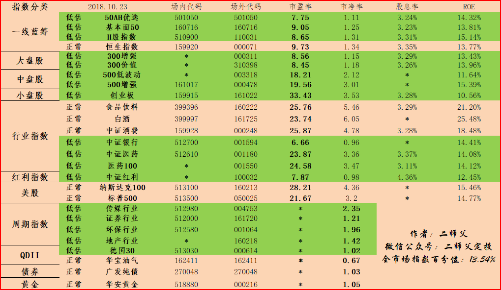

======================================================

@二师父[28814221155551]
2018-10-23 20:32:39 Tue  
topic_id: 88484188155112

>  @二师父
>  

阅读[69]  评论[10]  赞[0] 

======================================================

_type: talk
@二师父[28814221155551]
2018-10-24 13:57:21 Wed  
topic_id: 48282158152128

<e type="hashtag" hid="881251425252" title="#鳄鱼计划#" /> 买入医药100一份，目前医药非常便宜，广发医药和医药100都值得投资，医药个股也可以，当然个股有风险投资需谨慎。消费，食品饮料，白酒仍旧在杀估值，不要碰

@cotton at 2018-10-24 13:57:21 Wed

> 现在才看到，买，可以吗

----------

@二师父 at 2018-10-24 13:57:21 Wed

> 已经休市了，明天定投日在买吧

----------

@cotton at 2018-10-24 13:57:21 Wed

> 已经买了，买了1000。不是坏事吧？

----------

@二师父 at 2018-10-24 13:57:21 Wed

> 没事，我们定投是看几年的长期收益，一天两天的净值差别不大

----------

@cotton at 2018-10-24 13:57:21 Wed

> 谢谢。。

----------

阅读[227]  评论[5]  赞[0] 

======================================================

_type: q&a
@西锦巴乌[88448285428482]
2018-10-24 17:22:32 Wed  
topic_id: 51414858521124

@西锦巴乌

>  二师父：美元债在哪买？美元指数在哪能看到？谢谢！

@二师父

>  蛋卷基金美元债可以买到，美元指数在万得可以看到

阅读[85]  评论[1]  赞[0] 

======================================================

_type: q&a
@梧桐花语[244445185248881]
2018-10-24 17:46:04 Wed  
topic_id: 15151848484512

@梧桐花语

>  老师，中证500的正常估值是多少？现在低估多少，能定投吗？

@二师父

>  中证500是纯被动指数，低估市盈率设定25倍，目前18倍，可以定投
>  
>  这只基金和500增强的持仓股票类似

阅读[65]  评论[0]  赞[0] 

======================================================

_type: q&a
@honest-明[51515285815424]
2018-10-24 18:03:07 Wed  
topic_id: 51414858422484

@honest-明

>  老师，广发证券开户成功了，如何绑定银行卡呢，我的卡是农行的

@二师父

>  在交易软件里面，点击。我——业务办理——证券账户类——自助开户三方存管补办

阅读[74]  评论[0]  赞[0] 

======================================================

_type: talk
@二师父[28814221155551]
2018-10-24 20:02:25 Wed  
topic_id: 48282124422888

<e type="hashtag" hid="481211145528" title="#指数估值#" /> 黄金快进入高估，持有的可以逐步卖出收割利润。

500处于极度低估区域，可以买入。

医药目前非常低估，可以定投，银行虽然盈利，但是因为没有到正常估值，不要收割利润

消费快进入低估，耐心等待，白酒，消费，食品饮料有进一步下跌趋势。

阅读[243]  评论[0]  赞[0] 

+++++++++++++++++++++++++++++++++++++++++++++++++++++

图片：

======================================================

_type: talk
@二师父[28814221155551]
2018-10-24 20:58:40 Wed  
topic_id: 15151812588582

大家记得关注下知识星球公众号，这样学堂发的消息就能够即时推送给大家

阅读[56]  评论[0]  赞[0] 

======================================================

_type: talk
@二师父[28814221155551]
2018-10-24 21:01:22 Wed  
topic_id: 15151812422282

<e type="hashtag" hid="481144488858" title="#投资理念#" />

阅读[308]  评论[0]  赞[0] 

+++++++++++++++++++++++++++++++++++++++++++++++++++++

文件：
2018-10-24 21:01:18 Wed
文件大小：[24709]
28845582184811-定投中最重要的事情.docx

======================================================

_type: talk
@二师父[28814221155551]
2018-10-24 22:16:58 Wed  
topic_id: 15151812845422

<e type="hashtag" hid="552121281414" title="#介绍一种投资#" /> 国债逆回购，国债逆回购是把闲余资金按照一定的利率，一定的期限借出去，类似定期理财。

别人以债券作为抵押品，到期给购买人付本金和利息。

这种投资风险低，交易流程有交易所监管，所以不存在违约风险。

手续费也底，10万收取一万元的手续费。在逢年过节的时候可以购买一些，有的时候年化收益率能够达到百分之10，比买定期理财强多了。

@TIME at 2018-10-24 22:16:58 Wed

> 一元！

----------

@二师父 at 2018-10-24 22:16:58 Wed

> 对，一元

----------

@甫青 at 2018-10-24 22:16:58 Wed

> 师傅，招商银行和兴业银行相比，行业估值更低，他们还有什么样的区别？

----------

@二师父 at 2018-10-24 22:16:58 Wed

> 招商银行总部深圳，总市值比兴业银行大，拥抱互联网战略，公司最早推出atm机，目前也在发展招商银行自媒体，是银行中与时俱进的

----------

@金晓 at 2018-10-24 22:16:58 Wed

> 在哪点买？一般怎么买，有哪些需要注意的

----------

@二师父 at 2018-10-24 22:16:58 Wed

> 就在广发证券账户购买即可，二师父福利开户渠道国债逆回购5折优惠，注意后面利息，超过5和百分点可以购买，注意购买的封闭期即可，在封闭期内不能赎回

----------

阅读[245]  评论[6]  赞[0] 

======================================================

@二师父[28814221155551]
2018-10-25 00:04:14 Thu  
topic_id: 51414845884524

>  @二师父
>  

阅读[84]  评论[0]  赞[0] 

======================================================

_type: talk
@健哥[51511242852814]
2018-10-25 09:41:56 Thu  
topic_id: 15151818244842

二师父，今天有鳄鱼计划没有？

@二师父 at 2018-10-25 09:41:56 Thu

> 今天定投实盘即可，每周四法定砸盘日，也是咱们的定投日，我正在准备交易，马上发布定投实盘

----------

阅读[73]  评论[1]  赞[0] 

======================================================

_type: talk
@二师父[28814221155551]
2018-10-25 09:48:43 Thu  
topic_id: 15151818215412

<e type="hashtag" hid="142525524482" title="#均线定投策略#" /> 低估定投策略适合大多数指数基金，但是对于主动基金以及一些QDII指数基金无法准确估值

二师父准备采用均线定投策略开始来定投这些主动基金，当然这种策略适合在市场三年以上，能够承受较大浮动的朋友，后面回测这种策略的收益率，预计在15到20个点年化。

对于普通投资者，傻瓜定投也能够实现年化10到15 个点的收益率，如果利用咱们的策略，收益率可以轻松突破15个点

@cotton at 2018-10-25 09:48:43 Thu

> 没看懂[发呆]

----------

@二师父 at 2018-10-25 09:48:43 Thu

> 后面在详细这文章介绍均线定投策略

----------

阅读[279]  评论[2]  赞[0] 

======================================================

_type: talk
@二师父[28814221155551]
2018-10-25 10:02:58 Thu  
topic_id: 48282121854528

<e type="hashtag" hid="881422852442" title="#定投实盘#" />买入银行一份，医药100一份，德国30一份。后续将医药和银行的仓位买上来，那这轮计划的任务就结束了。美股估计是凉了，我们的机会也来了，熊市最好积累股份的时刻，大家坚持定投，用自律定投改变人生，昨天没有加的朋友今天可以加一份，不用担心一天两天对我们收益是否有影响，定投是一件长期坚持的事情，日积月累才有效果

另外，中概互联是二师父第一只准备用均线定投策略定投的基金，不做实盘公布，每周四定期买入一份，这只基金的波动不会比券商小，如果你不能承受巨大浮动，暂且不要定投

二师父的定投组合点击一下链接可以直接购买，非常方便，推荐的代码和基金都有，不用再纠结买哪只基金，两大基金平台的组合都出来了 <e type="web" href="https://mp.weixin.qq.com/s/-sZoQcMI91B6wBxDslbytw" title="二师父稳盈利组合" cache="" />

@门萨🐨 at 2018-10-25 10:02:58 Thu

> 二维码扫不了

----------

@二师父 at 2018-10-25 10:02:58 Thu

> 在微信上扫描就行，公众号后台回复组合，然后点击就可以扫描啦

----------

@Jamway Lu at 2018-10-25 10:02:58 Thu

> 二师父，如果资金只够投三只基，有首推的么

----------

@二师父 at 2018-10-25 10:02:58 Thu

> 500增强，300增强，医药100

----------

@勤能行之 at 2018-10-25 10:02:58 Thu

> 谢谢师傅的解答。

----------

@门萨🐨 at 2018-10-25 10:02:58 Thu

> 请问师父，中概互联是海外指数基金吗？

----------

@二师父 at 2018-10-25 10:02:58 Thu

> 是QDII指数基金，以前分析过两篇文章分别在三月和最近，那个时候中概互联太贵了，不建议投资，现在可以小额定投了

----------

@门萨🐨 at 2018-10-25 10:02:58 Thu

> 师父，银行且慢是正常，你这里是低估，为啥呀[抱拳]

----------

阅读[304]  评论[10]  赞[1] 

======================================================

_type: q&a
@梧桐花语[244445185248881]
2018-10-25 10:28:52 Thu  
topic_id: 28484141812521

@梧桐花语

>  老师，您今天怎么没有定投500增强和中证红利？还是多定投了医药100和银行。

@二师父

>  这两个仓位已经不轻了，之前投资了比较多，采用轮动投资，目前医药跌的厉害，逐步开始把仓位加上去

阅读[88]  评论[0]  赞[0] 

======================================================

_type: q&a
@梧桐花语[244445185248881]
2018-10-25 10:30:21 Thu  
topic_id: 48282121815528

@梧桐花语

>  老师，您的文章里说任务结束了，是不再定投了吗？

@二师父

>  就是基本完成投资计划，预计存量资金完了，定投计划完成，如果牛市还没来，那么只能用每月工资收入定投了

阅读[89]  评论[2]  赞[0] 

======================================================

_type: q&a
@勤能行之[481211221828]
2018-10-25 10:53:11 Thu  
topic_id: 51414848548584

@勤能行之

>  师傅，德国30是会跟美股涨跌吗？

@二师父

>  大概率跟跌美股，不过德国股市整体估值不高，就是下跌开始积累的好时机

阅读[115]  评论[1]  赞[0] 

======================================================

_type: q&a
@勤能行之[481211221828]
2018-10-25 10:54:05 Thu  
topic_id: 28484141241421

@勤能行之

>  师傅，德国30是会跟美股涨跌吗？我的意思是还有下跌的空间吗？

@二师父

>  还有的，我们定投就是在下跌时定投，这样比上涨定投收益率是要高的

阅读[122]  评论[0]  赞[0] 

======================================================

_type: q&a
@勤能行之[481211221828]
2018-10-25 11:09:21 Thu  
topic_id: 51414848584814

@勤能行之

>  师傅，我中证红利和红利机会比较多，还需要买银行吗，我也不知道这样的配置行不行，下一步想买些医药了。

@二师父

>  可以，银行在300和50里面也有，可以不用配置，目前医药非常值得定投，长青行业，而且估值一直在降，很多企业没问题，都是受到了外部环境和长生生物的双重影响

阅读[133]  评论[1]  赞[0] 

======================================================

@二师父[28814221155551]
2018-10-25 11:10:16 Thu  
topic_id: 15151818414812

>  @二师父
>  

阅读[96]  评论[0]  赞[0] 

======================================================

_type: q&a
@游水浮生[15455241488482]
2018-10-25 12:38:54 Thu  
topic_id: 15151818855282

@游水浮生

>  我现在仓位不到四成，可不可以加大定投或额外投资，总觉得美股高位下跌肯定会影响到大A，不敢重仓，请指教。

@二师父

>  可以加倍定投，比如以前一份1000，现在一份定投1500或者2000这样的比例，因为目前确实很低估了

阅读[125]  评论[2]  赞[0] 

======================================================

@二师父[28814221155551]
2018-10-25 15:00:22 Thu  
topic_id: 88484112512212

>  @二师父
>  

阅读[106]  评论[0]  赞[0] 

======================================================

_type: talk
@西锦巴乌[88448285428482]
2018-10-25 16:15:23 Thu  
topic_id: 88484112222122

<e type="hashtag" hid="881422852442" title="#定投实盘#" />  二师父：中概互联你是根据那条均线买卖？谢谢

@二师父 at 2018-10-25 16:15:23 Thu

> 60日均线，这个不建议投资，波动太大，建议等等

----------

@西锦巴乌 at 2018-10-25 16:15:23 Thu

> 明白，放自选股池里关注着

----------

阅读[122]  评论[2]  赞[0] 

======================================================

_type: q&a
@小牧童[28484254825881]
2018-10-25 16:18:22 Thu  
topic_id: 48282115555218

@小牧童

>  二师父，您好，五档买入法下跌6个百分点加一档，是基金净值下跌还是上证指数下跌？谢谢！

@二师父

>  看基金净值，在安全边际以内，每下跌6和百分点加一档

阅读[159]  评论[1]  赞[0] 

======================================================

_type: q&a
@一[88444521541442]
2018-10-25 16:53:05 Thu  
topic_id: 28484112422281

@一

>  你好，二师父，我是新加入星球的，已经定投了几个月的500增强场内510500，能帮我分析下嘛？这只鸡怎么样？

@二师父

>  可以，继续坚持，这只鸡目前处于极度低估区域，坚持定投

阅读[120]  评论[2]  赞[0] 

======================================================

_type: talk
@二师父[28814221155551]
2018-10-25 18:49:21 Thu  
topic_id: 15151881521242

<e type="hashtag" hid="481211145528" title="#指数估值#" /> 这是今日估值表，消费医药白酒继续领跌，华宝油气暴跌，即将进入价值投资区域

请务必限制自己定投基金的个数，选择三到6个标的，坚持定投下去就好。

二师父稳盈利投资组合可供大家投资参考。<e type="web" href="https://mp.weixin.qq.com/s/-sZoQcMI91B6wBxDslbytw" title="二师父稳盈利组合" cache="" />

阅读[342]  评论[0]  赞[0] 

+++++++++++++++++++++++++++++++++++++++++++++++++++++

图片：

======================================================

_type: talk
@二师父[28814221155551]
2018-10-25 18:54:43 Thu  
topic_id: 88484114851522

<e type="hashtag" hid="481144488858" title="#投资理念#" /> 医药100和中证医药都低估了，可是300医药仍旧不便宜，慎重投资

@海盗 at 2018-10-25 18:54:43 Thu

> 二师父分析的很到位。

----------

阅读[405]  评论[1]  赞[0] 

+++++++++++++++++++++++++++++++++++++++++++++++++++++

文件：
2018-10-25 18:51:30 Thu
文件大小：[23385]
88845584148552-300医药投资价值分析10.25.docx

======================================================

_type: q&a
@梧桐花语[244445185248881]
2018-10-25 19:29:45 Thu  
topic_id: 88484114845452

@梧桐花语

>  老师，我是上证50,中证红利，医药100,中证500增强均等定投，可以吗？

@二师父

>  可以，上证50换成基本面50好一些的

阅读[138]  评论[1]  赞[0] 

======================================================

@二师父[28814221155551]
2018-10-25 20:14:47 Thu  
topic_id: 15151881418212

>  @二师父
>  

阅读[151]  评论[2]  赞[0] 

======================================================

_type: q&a
@小牧童[28484254825881]
2018-10-25 20:50:57 Thu  
topic_id: 28484114152551

@小牧童

>  二师父，您好！能不能麻烦您讲讲估值表上的指数，具体的低估—正常-高估的阀值，以及如何设定的方法？万分感谢！

@二师父

>  嗯嗯，好的，这个在课程里面逐步会讲解，估值阈值已经讲了，现在讲到估值指标，在置顶文章可以领取课程优惠券

阅读[178]  评论[3]  赞[0] 

======================================================

_type: talk
@张純純[244415214445411]
2018-10-25 22:34:09 Thu  
topic_id: 28484111224481

您好，我刚加入，推荐的书籍是在哪里可以看到呢？另外看您的文章好像你不建议脱产专做投资是吗？

@二师父 at 2018-10-25 22:34:09 Thu

> 看往期精华里面有书记推荐，如果您资金量大的话也可以的

----------

@张純純 at 2018-10-25 22:34:09 Thu

> 额 找了半天没有找到 能说一下大概是什么时间发的吗？感谢🙏

----------

@二师父 at 2018-10-25 22:34:09 Thu

> 给您推荐几本，或者您直接搜索书籍，巴菲特之道，保守主义的投资哲学，随机漫步的傻瓜，穷查理宝典，逆向投资者

----------

@张純純 at 2018-10-25 22:34:09 Thu

> 资金量大的话是指多少呢？我只有80w多，不想上班了[捂脸]

----------

@二师父 at 2018-10-25 22:34:09 Thu

> 这个考虑通货膨胀是不行的，看您一年的花费多少，建议可以做自由职业者，但是投资也需要有稳定的现金流的，另外您名下房产多少

----------

@张純純 at 2018-10-25 22:34:09 Thu

> 只有父母给的一套，不过我想自己赚一套[呲牙]

----------

@二师父 at 2018-10-25 22:34:09 Thu

> 那可以，搞个民宿，自己通过投资各种渠道增加收入，也不一定要上班的

----------

阅读[179]  评论[7]  赞[0] 

======================================================

_type: talk
@二师父[28814221155551]
2018-10-26 07:55:10 Fri  
topic_id: 88481552541212

<e type="hashtag" hid="825858222822" title="#本周市场分析#" /> 上周五领导人集体喊话造就了周一券商指数跌停的奇观，昨日，美股大跌，我大a竟然也抗住了，这就是政策的影响，最近又出台政策组合拳，一是财政部和工信部发文，今后3年每年拿出30亿元，对小微企业融资担保实行降费的进行奖励和补贴，支持小微企业融资，二是银保监会公布指引，险资设立化解股权质押风险专项产品，首只规模百亿，本周就能问世。这些政策都是针对股市而出，国家并不希望股市再跌了。

这也就是我们说的政策底到了，那么是不是最终的底部呢？还有待进一步确认，毕竟ipo不停，韭菜不被割玩，白酒消费指数估值不被杀掉，真正的历史铁底部就不会到来，目前的操作指南。

按照原有计划定投，如果仓位不足3层的可以加倍定投

@门萨🐨 at 2018-10-26 07:55:10 Fri

> 继续抄作业[呲牙]

----------

@二师父 at 2018-10-26 07:55:10 Fri

> 现在是抄作业的好时机

----------

@门萨🐨 at 2018-10-26 07:55:10 Fri

> 应该会横盘一段期间吧，还有点存量资金年底到账[流泪]

----------

@二师父 at 2018-10-26 07:55:10 Fri

> 不着急，市场总会给我们机会的

----------

阅读[208]  评论[4]  赞[0] 

======================================================

_type: talk
@柔软时光[544482252441484]
2018-10-26 08:38:42 Fri  
topic_id: 48281445888228

<e type="hashtag" hid="825858222822" title="#本周市场分析#" />  涨停[调皮]

@二师父 at 2018-10-26 08:38:42 Fri

> 哈哈，下周来5个涨停

----------

阅读[234]  评论[1]  赞[0] 

======================================================

_type: talk
@二师父[28814221155551]
2018-10-26 10:56:08 Fri  
topic_id: 48281445111418

<e type="hashtag" hid="142525524482" title="#均线定投策略#" /> 二师父最新开发的均线定投策略回测结果出来了，选择的中概互联，从2016年开始定投。低于60日均线以下10个百分点开始定投，高于60日均线以上10个百分点开始卖出。结果到18年2月，7月，和10月，年化收益率分别是43，18，负23.

这种策略对于特定的QDII指数基金来讲是非常合适的，年化收益率远远高出了低估定投策略。但是这种策略的风险在于无法控制回撤，在一定的时间内会有大幅度亏损，适合指数基金低估定投策略已经完全掌握的同学

后期二师父会加入均线偏离表，大家可以将低估定投策略与均线定投策略相结合。

@门萨🐨 at 2018-10-26 10:56:08 Fri

> 看不懂均线的还在学习中[流泪]

----------

@二师父 at 2018-10-26 10:56:08 Fri

> 后期做一个均线偏离表，只需看几个指标就好啦

----------

@门萨🐨 at 2018-10-26 10:56:08 Fri

> 嗯嗯[强]

----------

@海盗 at 2018-10-26 10:56:08 Fri

> 这是二师父的独门原创吗？

----------

@二师父 at 2018-10-26 10:56:08 Fri

> 是啊

----------

@Jewel at 2018-10-26 10:56:08 Fri

> 可以根据均线图做回撤吗？但是它和好卖的区别在哪里呢

----------

@二师父 at 2018-10-26 10:56:08 Fri

> 做什么回撤，还有什么好卖，没明白您的提问

----------

阅读[520]  评论[7]  赞[0] 

+++++++++++++++++++++++++++++++++++++++++++++++++++++

图片：
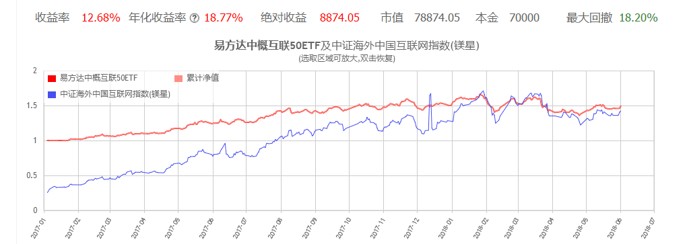

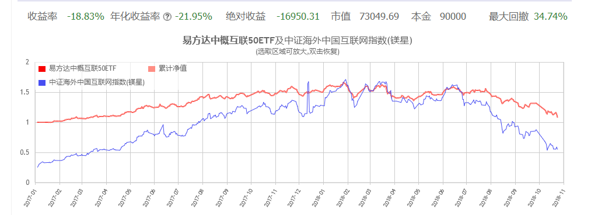

======================================================

_type: talk
@二师父[28814221155551]
2018-10-26 19:38:18 Fri  
topic_id: 28481588484521

<e type="hashtag" hid="481211145528" title="#指数估值#" /> 指数估值表，统计下，估值表里面大家哪些指数投资了，另外自己投资了哪些，发到群里，二师父和各位群友看看大家的配置是否合理。点击学堂发表按钮即可发布，加上基金名称和指数代码。

@门萨🐨 at 2018-10-26 19:38:18 Fri

> 我还有一个基本面120估值表里没有[发呆]

----------

@二师父 at 2018-10-26 19:38:18 Fri

> 没加这个

----------

@门萨🐨 at 2018-10-26 19:38:18 Fri

> 嗯嗯，目前可以持有吧，仓位不重

----------

@二师父 at 2018-10-26 19:38:18 Fri

> 目前可以持有，现在基金都不要卖

----------

@门萨🐨 at 2018-10-26 19:38:18 Fri

> 嗯嗯

----------

阅读[511]  评论[5]  赞[0] 

+++++++++++++++++++++++++++++++++++++++++++++++++++++

图片：

======================================================

_type: talk
@二师父[28814221155551]
2018-10-26 19:41:01 Fri  
topic_id: 28481588484441

<e type="hashtag" hid="481144488858" title="#投资理念#" /> 好多投资股票的都巨亏，请资金量不足的同学不要投资股票，如果投资股票也建议指数基金占百分之90，股票占百分之10，切记。

阅读[597]  评论[0]  赞[0] 

+++++++++++++++++++++++++++++++++++++++++++++++++++++

文件：
2018-10-26 19:40:11 Fri
文件大小：[24247]
88845522525852-资金不足500万，就别鼓捣股票啦.docx

======================================================

_type: talk
@拥抱太阳的风筝[48812454818528]
2018-10-26 19:54:40 Fri  
topic_id: 88481588422482

二师父，能不能分析下中证证券保险指数H30588，它对应的指数基金001552天弘中证证券保险指数A，加上001594天弘中证银行指数A的话，金三胖不就齐活了吗？

@二师父 at 2018-10-26 19:54:40 Fri

> 好的，没问题，大家有觉得好的指数也可以推荐给二师父

----------

阅读[330]  评论[1]  赞[0] 

======================================================

_type: talk
@二师父[28814221155551]
2018-10-26 20:40:57 Fri  
topic_id: 15158255848542

均线偏离指标测试版，大家有好的建议可以提出来哈，希望看到哪些指数的。

@海盗 at 2018-10-26 20:40:57 Fri

> 用什么软件看60日均线好，另外是不是也不需要止损？

----------

@海盗 at 2018-10-26 20:40:57 Fri

> 二师父，卖出的时候是逐步卖出吗？具体怎样操作

----------

@二师父 at 2018-10-26 20:40:57 Fri

> 就用广发的可以，不用止损，但是这种策略回撤比较大，可以等价格稍微便宜点，比如现在的中概互联和德国30

----------

@二师父 at 2018-10-26 20:40:57 Fri

> 卖出逐步卖出，稍后会讲

----------

@王雷 at 2018-10-26 20:40:57 Fri

> 现在适合买这三只吗？

----------

@二师父 at 2018-10-26 20:40:57 Fri

> 德国30合适，另外两只可以再等等

----------

@王雷 at 2018-10-26 20:40:57 Fri

> 好的，谢谢

----------

@门萨🐨 at 2018-10-26 20:40:57 Fri

> 二师父，我看估值表里也有30，那低估策略也可以吗？还是均线策略，哪一个为准？

----------

阅读[590]  评论[10]  赞[0] 

+++++++++++++++++++++++++++++++++++++++++++++++++++++

图片：
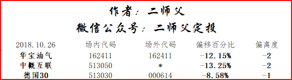

======================================================

_type: q&a
@Jewel[244448815142241]
2018-10-26 23:40:53 Fri  
topic_id: 15158254151522

@Jewel

>  500ETF  vs 500增强
>  红利ETF vs 中证红利
>  证券ETF vs 证券行业
>  
>  二师父，晚上好！上面这六支基金对应分为三组，请问各组左边的基金和右边的基金性质是不是差不多的？如果我要投资的话，是不是从每组左右各选一个就行。他们的差别大吗？如果每组左右我都投，算不算重复了。

@二师父

>  左右都投就重复啦，场内选择左边的，场外右边的，差别不大

阅读[354]  评论[0]  赞[0] 

======================================================

_type: q&a
@Jewel[244448815142241]
2018-10-26 23:44:12 Fri  
topic_id: 48281485282258

@Jewel

>  二师父，我定投采取的是定期不定额，根据最近的情况，是不是可以准备部分基金开始逐步加大仓位了（例如双倍）

@二师父

>  可以的，比如医药，500等基金，实现越跌越买，熊市要克服恐惧买，这才是价值投资

阅读[344]  评论[0]  赞[0] 

======================================================

_type: talk
@二师父[28814221155551]
2018-10-27 08:52:40 Sat  
topic_id: 51418252215424

<e type="hashtag" hid="281181228851" title="#周末答疑#" /> 低估定投策略和均线定投策略的区别

一种是以基本面指标为参考的定投，另外一种是以技术指标均线为参考的定投

低估定投可以很好的控制回撤，利用低估积累股份，高估卖出，属于长期投资

均线定投不能很好地控制回撤，根据基金偏离均线的程度定投基金，属于中期投资

二者不是孤立的，可以结合使用

@海盗 at 2018-10-27 08:52:40 Sat

> 静静的等待二师父进一步讲解[愉快]

----------

@二师父 at 2018-10-27 08:52:40 Sat

> 好的

----------

@海盗 at 2018-10-27 08:52:40 Sat

> 二师父说用广发的软件，是APP吗？

----------

@二师父 at 2018-10-27 08:52:40 Sat

> 广发易淘金，app上面有均线

----------

@海盗 at 2018-10-27 08:52:40 Sat

> 谢谢

----------

@海盗 at 2018-10-27 08:52:40 Sat

> 二师父，跌破60日均线10%，是自己计算的还是在软件哪个地方显示有数据？另外这种方法只能针对QDII基金吗？

----------

@二师父 at 2018-10-27 08:52:40 Sat

> 不仅仅是针对QDII基金，还针对主动基金和其他指数基金，可以将低估定投策略和均线定投策略结合起来使用

----------

阅读[598]  评论[7]  赞[0] 

======================================================

_type: q&a
@Jamway Lu[88211888455222]
2018-10-27 15:09:04 Sat  
topic_id: 88481528828512

@Jamway Lu

>  二师父，可以麻烦您大致说一下500被动和主动的大致区别么，我对被动和主动不是很分得清(,,•́ . •̀,,)

@二师父

>  500纯被动指数是中证500，是中盘股的代表，他的基金是严格追踪中证500指数。
>  
>  至于500增强他也是一个指数，不过不是纯被动指数，500增强基金追踪的是中证500增强指数
>  
>  这种增强指数基金可以理解为百分之80的被动选股加百分之20的主动选股，在熊市增强基金是跌幅大于500的，牛市的时候根据以往回测是涨的多一些的

阅读[621]  评论[2]  赞[0] 

======================================================

_type: q&a
@Jewel[244448815142241]
2018-10-27 16:04:29 Sat  
topic_id: 28481528251221

@Jewel

>  二师父，想请你分析一下美股走势对港股可能造成的影响。因为想入手一点港股，但是对于当前中美投资市场的情况有点茫然，需指点一二👀

@二师父

>  美股目前下跌到底是逆转还是回调有待进一步判断
>  
>  不过美股从估值角度来看是远远高于a股的，未来大概率下跌，港股会跟随美股的趋势
>  
>  港股目前也具有投资价值，建议恒生中国企业指数或者恒生指数，不要买个股
>  
>  港股没有跌停机制，下跌起来非常恐怖，定投港股指数基金是很好的选择

阅读[394]  评论[6]  赞[0] 

======================================================

_type: q&a
@Dave Pan[48544144525548]
2018-10-28 11:13:40 Sun  
topic_id: 88481524141122

@Dave Pan

>  二师父，请问，我想在场内买50AH，不知道是否合适，场内的50ah流动性可以吗？另外，如果现在开始定投医药的话，医药100和广发医药哪个较好，为什么？谢谢！

@二师父

>  50ah大蓝筹，流动性没有问题的
>  
>  如果场内购买，建议广发医药，这个更加低估，如果场外申购，建议医药100，这个费率较低

阅读[417]  评论[0]  赞[0] 

======================================================

_type: q&a
@海盗[48248118584848]
2018-10-29 11:40:00 Mon  
topic_id: 28481814844851

@海盗

>  二师父，请问均线投资策略是和估值高低相结合的，还是单独使用？另外我感觉均线投资趋向于中短线，我的理解对吗？

@二师父

>  对的，均线投资既可以和低估定投结合使用，也可以单独使用，只不过单独使用的话回撤比较大

阅读[430]  评论[3]  赞[0] 

======================================================

_type: talk
@拥抱太阳的风筝[48812454818528]
2018-10-29 16:10:35 Mon  
topic_id: 28481811151411

中邮神奇公式 低价买入好公司的“神奇公式” <e type="web" href="https://danjuanapp.com/market/4116163?channel=push&source=dj_ps-zysqgs&source=dj_android_ssrm_new" title="Error" cache="" />

阅读[437]  评论[0]  赞[0] 

======================================================

_type: talk
@二师父[28814221155551]
2018-10-29 16:48:48 Mon  
topic_id: 15158588815482

<e type="hashtag" hid="481211222448" title="#每月总结#" />

阅读[767]  评论[0]  赞[0] 

+++++++++++++++++++++++++++++++++++++++++++++++++++++

文件：
2018-10-29 16:47:44 Mon
文件大小：[25094]
88845545112252-二师父10月定投总结.docx

======================================================

_type: talk
@二师父[28814221155551]
2018-10-29 16:51:58 Mon  
topic_id: 88481811142512

<e type="hashtag" hid="481211145528" title="#指数估值#" /> 中证消费进入低估了，黄金进入高估，请按照逆向思维投资

阅读[739]  评论[0]  赞[0] 

+++++++++++++++++++++++++++++++++++++++++++++++++++++

图片：
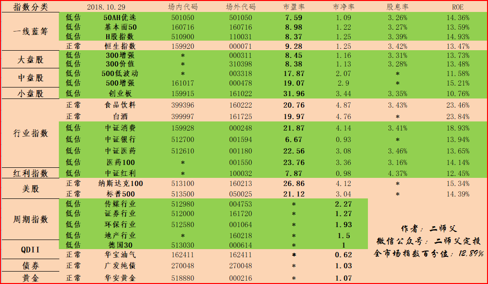

======================================================

_type: talk
@根号2[51421845455424]
2018-10-30 08:09:55 Tue  
topic_id: 51418512855124

@旺财定投 at 2018-10-30 08:09:55 Tue

> 观念性的错误，股票是不可以定投思路的，如果越跌越买，很可能把你拖入深渊。因为好股票，好公司，也会有特别多黑天鹅。

----------

@根号2 at 2018-10-30 08:09:55 Tue

> 只举例而已，并不是要说怎么买股票，只是引申出定投的风险

----------

阅读[534]  评论[2]  赞[0] 

+++++++++++++++++++++++++++++++++++++++++++++++++++++

文件：
2018-10-30 08:09:50 Tue
文件大小：[108971]
28845548214251-关于仓位管理的一些感想2018.10.29.docx

======================================================

_type: q&a
@风信子[544458822111224]
2018-10-30 10:21:22 Tue  
topic_id: 51418524181854

@风信子

>  二师父，请问有没有货币基金推荐？

@二师父

>  最近货币基金收益率都下降了，南方天天利b考虑下，比余额宝高一点

阅读[490]  评论[0]  赞[0] 

======================================================

_type: q&a
@黛染清浅[15288412818452]
2018-10-30 10:22:12 Tue  
topic_id: 28481288888581

@黛染清浅

>  二师父，水库论坛微信公众号发了一篇定投就是收割韭菜，您怎么看

@二师父

>  有的人说欧成效是收割韭菜，这个仁者见仁智者见智，我认为实践才是检验真理的唯一标准

阅读[489]  评论[1]  赞[0] 

======================================================

_type: talk
@二师父[28814221155551]
2018-10-30 12:02:24 Tue  
topic_id: 48281585441458

<e type="hashtag" hid="142525524482" title="#均线定投策略#" /> 华宝油气买入一份，实验盘，不代表真实投资，仅是小额定投测试策略的优劣。实践才是检验真理的唯一标准

@海盗 at 2018-10-30 12:02:24 Tue

> 二师父，也是每周定投吗？止盈是多少？需要止损吗？

----------

@二师父 at 2018-10-30 12:02:24 Tue

> 还在测试，预计一周或者两周可以，不用止损，止盈的话，正偏离度1则卖出一份，正偏离度2择卖出两份，跟买入节奏一样

----------

@海盗 at 2018-10-30 12:02:24 Tue

> 感觉二师父的套路是想抓波段，只要基金不是高估，也就是说在正常估值或低估的时候，就可以利用均线投资法提早介入。

----------

@二师父 at 2018-10-30 12:02:24 Tue

> 这个经过回测的，无论什么时候投，都有不错的收益率，不过实际投资的时候不会选择泡沫时刻

----------

阅读[794]  评论[4]  赞[0] 

======================================================

_type: talk
@二师父[28814221155551]
2018-10-30 22:06:12 Tue  
topic_id: 88481228514242

<e type="hashtag" hid="481211145528" title="#指数估值#" /> 白酒即将进入低估区域，想投资的话耐心等待机会

阅读[853]  评论[0]  赞[0] 

+++++++++++++++++++++++++++++++++++++++++++++++++++++

图片：
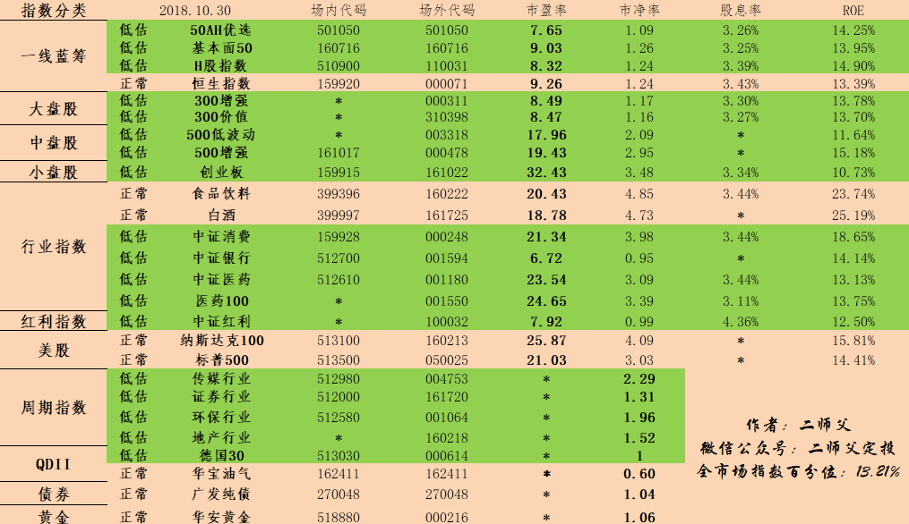

======================================================

_type: q&a
@背心[51441214442224]
2018-10-30 22:16:13 Tue  
topic_id: 88481225252542

@背心

>  手里有点长期不用的钱，怎么理财，谢谢

@二师父

>  请问资金多少呢，少额的话买银行理财，大量的话建议定投指数基金

阅读[585]  评论[0]  赞[0] 

======================================================

_type: q&a
@梧桐花语[244445185248881]
2018-10-31 09:24:22 Wed  
topic_id: 48281555858458

@梧桐花语

>  老师，以往假如每周四定投中证500增强2000元，现在这个位置要增加投入吗，比如增加到每周四定投300元，可以吗？

@二师父

>  看你的资金还有多少，如果按照这个节奏定投可以有两年的存量资金，可以加

阅读[596]  评论[2]  赞[0] 

======================================================

_type: talk
@二师父[28814221155551]
2018-10-31 15:44:05 Wed  
topic_id: 51418541254454

<e type="hashtag" hid="552128115884" title="#下月计划#" />

阅读[993]  评论[0]  赞[0] 

+++++++++++++++++++++++++++++++++++++++++++++++++++++

文件：
2018-10-31 15:43:55 Wed
文件大小：[23620]
28845841142451-二师父十一月定投计划.docx

======================================================

_type: talk
@二师父[28814221155551]
2018-10-31 15:44:32 Wed  
topic_id: 28481248524151

<e type="hashtag" hid="481211145528" title="#指数估值#" /> 估值表每日更新，如今就是考验人的耐力的时刻

阅读[958]  评论[0]  赞[0] 

+++++++++++++++++++++++++++++++++++++++++++++++++++++

图片：

======================================================

_type: q&a
@Dave Pan[48544144525548]
2018-10-31 17:00:03 Wed  
topic_id: 28481248548111

@Dave Pan

>  二师父，如果要投资医药的话，场内投资，广发医药和中证医药哪个较好？为什么？谢谢！

@二师父

>  场内广发医药好一些的，比中证医药更加低估，而且有一定的折价，可以买到更加便宜的

阅读[705]  评论[0]  赞[0] 

======================================================

_type: q&a
@风信子[544458822111224]
2018-10-31 17:00:52 Wed  
topic_id: 15158415582852

@风信子

>  二师傅，请问中证消费好还是中证红利好？我已经定投的是300价值，医药100，中证银行，谢谢！

@二师父

>  持仓股票不同，都不错，红利注重分红，消费更多是这个行业的白马股，成长性，利润更好

阅读[717]  评论[1]  赞[0] 

======================================================

_type: talk
@二师父[28814221155551]
2018-10-31 17:18:16 Wed  
topic_id: 88481248284582

<e type="hashtag" hid="225851884411" title="#均线定投策略讲解#" /> 均线偏离表已经制定好了。

根据均线偏离度，如果是当日基金净值低于均线6到12个百分点，负偏离度为1，如果当日基金净值低于均线12到18个百分点，负偏离度为2.这样当负偏离度为1每月或者每周买入1份，夫偏离度为2，每月或者每周买入2份。

当偏离度为0的时候，将利润部分卖出。当偏离度为正1的时候，每周或者每月卖出一份，这是均线定投策略。

当然同样的利用利润收割也可以，策略都是逆向策略。均线偏离表如下，大家可以尝试下，二师父已经回测过了，收益没问题，就是回撤较大。大家可以在低估的时候利用均线定投策略

@西锦巴乌 at 2018-10-31 17:18:16 Wed

> 请问师父以哪条线为均线？

----------

@二师父 at 2018-10-31 17:18:16 Wed

> 我是按照60日均线计算出来的

----------

@西锦巴乌 at 2018-10-31 17:18:16 Wed

> 好，知道了

----------

@海盗 at 2018-10-31 17:18:16 Wed

> 二师父的倾心之作[玫瑰]

----------

@二师父 at 2018-10-31 17:18:16 Wed

> 有啥问题尽管提出来哈

----------

@海盗 at 2018-10-31 17:18:16 Wed

> 回撤超过18%怎么办？投入多少份额合适？

----------

@海盗 at 2018-10-31 17:18:16 Wed

> 另外高估的时候均线投资法合适吗？

----------

@二师父 at 2018-10-31 17:18:16 Wed

> 这个不以控制回撤为目标，回撤越大，后期上涨收益也会越大

----------

阅读[1168]  评论[18]  赞[0] 

+++++++++++++++++++++++++++++++++++++++++++++++++++++

图片：
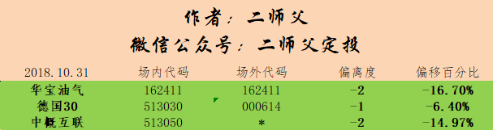

======================================================

_type: q&a
@海盗[48248118584848]
2018-10-31 21:12:18 Wed  
topic_id: 88481244448452

@海盗

>  这是我计算的方法。

@二师父

>  没错，你是对的，我这个把60日均线放到60周了，方法就是这样的

阅读[811]  评论[0]  赞[0] 

======================================================

_type: q&a
@海盗[48248118584848]
2018-10-31 21:13:34 Wed  
topic_id: 15158411115412

@海盗

>  60日均线是0.694，现价是0.613，我计算了一下，跌幅在11%。二师父请检查一下我是哪里出错了。

@二师父

>  完全正确，独立做出来，以后可以自己在低估指数里面再选择偏离度高的

阅读[853]  评论[6]  赞[0] 

======================================================

_type: q&a
@今晚吃手抓，谁给点大*[48281242854828]
2018-10-31 21:57:49 Wed  
topic_id: 28481241884481

@今晚吃手抓，谁给点大*

>  二师父您好，为什么持有收益和累积收益不一样？

@二师父

>  持有收益是你这只新建仓的基金收益情况，累计收益是所有基金，从你开户投资到现在累计的收益，两者是不同的概念

阅读[861]  评论[0]  赞[0] 

======================================================

