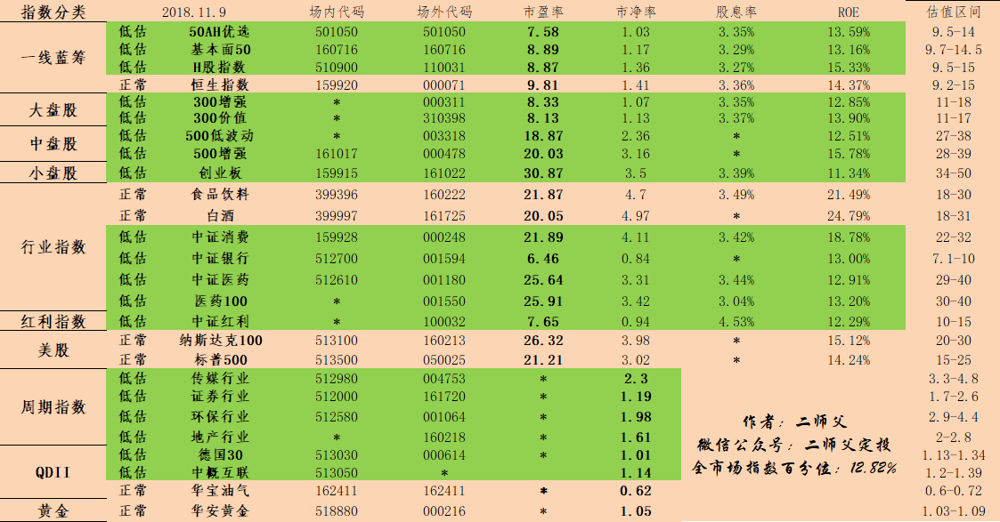

_type: q&a
@风信子[544458822111224]
2018-11-01 09:51:40 Thu  
topic_id: 51418582185584

@风信子

>  二师父早上好，今早看到300价值上涨了，今天是不是可以少买一点？还是按计划？谢谢啦！

@二师父

>  可以呀，定期不定额，下跌多就多投点，上涨了可以少投点，不是低估区域就停止定投

阅读[847]  评论[0]  赞[0] 

======================================================

_type: q&a
@西锦巴乌[88448285428482]
2018-11-01 09:53:03 Thu  
topic_id: 28481215124111

@西锦巴乌

>  师父：人民币对美元一直贬值，现在投资QDII基金合适吗？

@二师父

>  德国30，中概互联，华宝油气都可以用均线策略定投

阅读[920]  评论[0]  赞[0] 

======================================================

_type: talk
@二师父[28814221155551]
2018-11-01 10:06:20 Thu  
topic_id: 48281515224418

<e type="hashtag" hid="881422852442" title="#定投实盘#" /> 竟然上涨了，最近看到上涨不太适应。还是按照纪律定投，在低估区域以下都可以定投，买入0.5份到3份不等。

今日买入300增强一份，500增强一份，定投考验的就是耐心和毅力。一起坚持下去

利用均线定投策略定投的德国和华宝小额浮盈，不控制回撤，利用波动挣钱，但是谨记任何基金都不要再高估区域买入

@victoria at 2018-11-01 10:06:20 Thu

> 我很不适应，还想再跌下去买，涨了买心里很不舒服

----------

@二师父 at 2018-11-01 10:06:20 Thu

> 依旧很便宜，比大盘3000点以上便宜多了

----------

@门萨🐨 at 2018-11-01 10:06:20 Thu

> 二师父。利用均线的几只是除定投实盘和鳄鱼以外的计划，还是在定投实盘里的

----------

@二师父 at 2018-11-01 10:06:20 Thu

> 是除定投实盘和鳄鱼计划以外的计划

----------

阅读[1205]  评论[4]  赞[0] 

======================================================

@二师父[28814221155551]
2018-11-01 10:51:58 Thu  
topic_id: 15158484811842

>  @二师父
>  

阅读[943]  评论[0]  赞[0] 

======================================================

_type: q&a
@Kevin Chan[48221851244458]
2018-11-01 21:26:24 Thu  
topic_id: 48281512144118

@Kevin Chan

>  均线定投策略讲解 有没有专门的文章介绍，麻烦二师傅发一下

@二师父

>  好的，这个在星球有讲过啦，后面准备详细写在我的书里面

阅读[939]  评论[1]  赞[0] 

======================================================

_type: talk
@二师父[28814221155551]
2018-11-01 21:30:40 Thu  
topic_id: 88481452511242

<e type="hashtag" hid="481211145528" title="#指数估值#" /> 今日指数估值表，定投指数基金贵在坚持

阅读[1245]  评论[0]  赞[0] 

+++++++++++++++++++++++++++++++++++++++++++++++++++++

图片：

======================================================

_type: talk
@二师父[28814221155551]
2018-11-01 21:31:31 Thu  
topic_id: 15158124288822

<e type="hashtag" hid="142528425112" title="#投资风险#" /> 定投的风险在哪里，要注意避免

@cotton at 2018-11-01 21:31:31 Thu

> 又大涨了，二师父[发呆]

----------

@二师父 at 2018-11-01 21:31:31 Thu

> 是的，有利好

----------

@王雷 at 2018-11-01 21:31:31 Thu

> 师傅会就这么上去吗？2500以下再也不会有了吧

----------

@王雷 at 2018-11-01 21:31:31 Thu

> 真不希望现在长

----------

@二师父 at 2018-11-01 21:31:31 Thu

> 领导发话，这个利好啊，如果仓位3层以下可以稍微加点，不过低不低于2500这个目前不好判断

----------

阅读[1358]  评论[5]  赞[0] 

+++++++++++++++++++++++++++++++++++++++++++++++++++++

文件：
2018-11-01 21:31:31 Thu
文件大小：[24303]
15512585522882-基金定投的风险在哪里.docx

======================================================

_type: talk
@二师父[28814221155551]
2018-11-02 16:47:45 Fri  
topic_id: 15158154812522

<e type="hashtag" hid="281158284851" title="#市场分析#" /> 领导讲话，为民营中小企业定调，市场所受影响颇多，利好是肯定的，至于会不会重新突破市场底无法预测。

但二师父可以说的是，如果你的仓位过重，可以等待上涨减仓，如果你的仓位过轻，目前是建仓的好时机。

未来大概率看涨，不过牛市在哪里，牛市信号还没来，所以坚定定投，不要被市场打乱了脚步

@背心 at 2018-11-02 16:47:45 Fri

> 现在建仓会不会有点高了

----------

@二师父 at 2018-11-02 16:47:45 Fri

> 除了食品饮料其他的都不高，现在不建仓要等到何时呢，如果你怕高了还是定投

----------

@风信子 at 2018-11-02 16:47:45 Fri

> 二师父，建仓是一次性买入一笔的意思吗？

----------

@二师父 at 2018-11-02 16:47:45 Fri

> 对的，如果你的仓位适中的话建议定投即可

----------

@风信子 at 2018-11-02 16:47:45 Fri

> 我有几只基金1号才刚刚开始定投，决定月投的。中证银行，医药100，中证消费，300价值。建仓是同时建还是选一只建呢？

----------

@二师父 at 2018-11-02 16:47:45 Fri

> 这个坎你自己的仓位了，选两到3只，仓位不要超过自己的承受范围，比如大跌浮亏无法忍受这种情况就是指数基金买入过多

----------

阅读[1194]  评论[6]  赞[0] 

======================================================

_type: talk
@渔夫[844418821855242]
2018-11-02 19:24:40 Fri  
topic_id: 28481484281241

我不知道怎么'打开两个文件

@渔夫 at 2018-11-02 19:24:40 Fri

> 就是怎么打开学堂功能及使用指南。

----------

@二师父 at 2018-11-02 19:24:40 Fri

> 用pdf打开，或者在电脑上登录，下载到电脑上也可以

----------

@渔夫 at 2018-11-02 19:24:40 Fri

> 二师父，我今年66岁。文化小学，我想如果能奌一下就能看到学堂里的课程就最好了。或者我提一奌想知道的问题，您给我指奌一下。

----------

@二师父 at 2018-11-02 19:24:40 Fri

> 您好，叔叔，如果不会的话可以加我微信ershifudt，我给您说

----------

@cotton at 2018-11-02 19:24:40 Fri

> 二师父棒棒的。。。[流泪][流泪]

----------

阅读[898]  评论[5]  赞[0] 

======================================================

_type: talk
@二师父[28814221155551]
2018-11-03 04:52:00 Sat  
topic_id: 88481428215422

<e type="hashtag" hid="481211145528" title="#指数估值#" /> 中证消费进入正常估值

@新的开始 at 2018-11-03 04:52:00 Sat

> 红利怎么是8月4日[呲牙]

----------

@二师父 at 2018-11-03 04:52:00 Sat

> 笔误，抱歉

----------

@风信子 at 2018-11-03 04:52:00 Sat

> 二师父，中证消费那么快就进去正常估值了？才刚刚开始定投它。[微笑]

----------

@二师父 at 2018-11-03 04:52:00 Sat

> 是的呀，消费之前估值都不低

----------

阅读[1169]  评论[4]  赞[0] 

+++++++++++++++++++++++++++++++++++++++++++++++++++++

图片：

======================================================

_type: talk
@二师父[28814221155551]
2018-11-03 04:52:39 Sat  
topic_id: 51418451582454

<e type="hashtag" hid="481144488858" title="#投资理念#" /> 觉得为时已晚的时候，恰恰是最早的时候，现在开始就是最早的时候

阅读[1253]  评论[0]  赞[0] 

+++++++++++++++++++++++++++++++++++++++++++++++++++++

文件：
2018-11-03 04:52:20 Sat
文件大小：[24957]
28845811825841-定投指数基金什么时候开始都不晚.docx

======================================================

_type: talk
@Nasdaq[422258244428418]
2018-11-03 12:09:59 Sat  
topic_id: 88481422451412

二师父，想定投SP500。有海外美元账户，也开了IB的交易账号。请问美元有货基吗，能不能从货基定期定投到SPY/IVV/VOO上去。国内很多基金账号可以这么弄

还有spy什么的好像都是场内的，有没有场外的。谢谢

@二师父 at 2018-11-03 12:09:59 Sat

> 货币基金不适合定投，有海外收益债券可以投资下

----------

@Nasdaq at 2018-11-03 12:09:59 Sat

> 不是想定投货基，是想先把存量的资金放到货基里，再分批定投到指基里。

----------

@Nasdaq at 2018-11-03 12:09:59 Sat

> 我看了下SPY什么的好像类似场内的基金，好像不能定投。不知道有没有场外的对应基金。

如果您说的收益债券，请问有什么可以研究一下的。

----------

@二师父 at 2018-11-03 12:09:59 Sat

> 有跟踪美股的指数基金，海外收益债券等等，可以通过场外定投，这些品种也很多了，你去蛋卷可以看到

----------

@Nasdaq at 2018-11-03 12:09:59 Sat

> 我主要有海外账号，想直接在美国市场投，不知道您清不清楚。现在国内的券商，这些基础的要不老美做得好，我找半天，没找到美股有类似的

----------

@二师父 at 2018-11-03 12:09:59 Sat

> 如果是老虎证券可以直接买的，国内券商只能是上海或者深圳a股

----------

阅读[824]  评论[6]  赞[0] 

======================================================

_type: talk
@二师父[28814221155551]
2018-11-03 15:13:20 Sat  
topic_id: 88481121122282

<e type="hashtag" hid="281181228851" title="#周末答疑#" /> 指数基金可以做波段吗？

二师父建议定投指数基金要中长期持有，吃到整个牛市的涨幅，这才是比较优秀的价值投资者。

经历一轮牛熊算一个定投周期，有的指数可以在一轮牛熊周期涨到4到6倍，如果早早地就卖出只会获得蝇头小利。

那么对于一些渴望做短线的朋友怎么办呢？

二师父建议可以在指数基金低估区域，或者正常偏低区域利用均线定投策略开始买入，这是做波段，因为持有时间有可能短于7天，建议场内买入

投资方法千变万化，但是不会超出二师父投资哲学投资风险，五步定投法的范畴，先掌握最核心的，然后将知识衍生

阅读[1208]  评论[0]  赞[0] 

======================================================

_type: talk
@sun[15481522845412]
2018-11-03 20:27:34 Sat  
topic_id: 88481145125482

请问二师父，中概互联有对应的指数吗？不是价格那种。谢谢

@二师父 at 2018-11-03 20:27:34 Sat

> 有的啊，中证海外中国互联网指数，513050

----------

@徐斌 at 2018-11-03 20:27:34 Sat

> H11136

----------

阅读[777]  评论[2]  赞[0] 

======================================================

_type: talk
@二师父[28814221155551]
2018-11-04 02:07:33 Sun  
topic_id: 88481148114112

<e type="hashtag" hid="454841141288" title="#均线偏离表#" /> 表中绿色为负偏离度指数，可以逐步定投。橙色是0偏离度，适合持有或者逐步收割利润，红色的话就是正偏离度，适合逐步卖出。

大家可以看到，德国30利用咱们的估值体系他是低估的指数，可是在均线估值里面他是0偏离度的，所以如果你想更加保守的投资，那么就将低估定投和均线定投结合起来使用即可。

当然，选择一种策略定投也是很好的，均线定投策略二师父经过回测了，收益率是高于低估定投的，而且中短期投资者，投资时间大概是0.5到2年甚至更短，低估定投的投资时间大概是3到6年。

因为时间关系，均线偏离表二师父无法每日公布，大家知道了计算方法可以自己制作并将均线偏离表分享到星球里面，然后大家一起讨论交流。EXCEL版本的均线偏离表二师父已经公布到了学堂里面，有兴趣的同学可以自己制作并将偏离表分享出来。分享即学习。

均线采用的是90日均线。偏离度为1每次买入一份，负偏离度为2每次买入1.5份或者2份，一次类推。这适合已经熟练掌握了低估定投策略的朋友。

定投也要不断创新，二师父会不断学习，不断创新，将定投做到极致就是二师父最开心的事情。希望你也能够如此。

@Xiang赛斯文 at 2018-11-04 02:07:33 Sun

> 请问均线投资策略里，买入一份是什么概念？

----------

@琪琪 at 2018-11-04 02:07:33 Sun

> 网格？

----------

@勤能行之 at 2018-11-04 02:07:33 Sun

> 因为时间关系，均线偏离表二师父无法每日公布，大家知道了计算方法可以自己制作并将均线偏离表分享到星球里面，然后大家一起讨论交流。EXCEL版本的均线偏离表二师父已经公布到了学堂里面，有兴趣的同学可以自己制作并将偏离表分享出来。分享即学习。
请问师父均值的计算方法在哪呀？

----------

@二师父 at 2018-11-04 02:07:33 Sun

> 没用网格呢

----------

@二师父 at 2018-11-04 02:07:33 Sun

> 直接用当前净值结合90日均线偏离净值计算即可

----------

@门萨🐨 at 2018-11-04 02:07:33 Sun

> 师父，两种方法必须分开使用是不？

----------

@二师父 at 2018-11-04 02:07:33 Sun

> 不需要啊，我定投的华宝油气，中概互联，目前就是只用了一个均线策略

----------

@门萨🐨 at 2018-11-04 02:07:33 Sun

> 德国30用2个策略吗

----------

阅读[1316]  评论[11]  赞[0] 

+++++++++++++++++++++++++++++++++++++++++++++++++++++

图片：

+++++++++++++++++++++++++++++++++++++++++++++++++++++

文件：
2018-11-04 02:07:30 Sun
文件大小：[9981]
48824544412428-二师父均线偏离表.xlsx

======================================================

_type: talk
@二师父[28814221155551]
2018-11-04 02:09:37 Sun  
topic_id: 88481148111552

<e type="hashtag" hid="825851151482" title="#定投品种#" /> 港股投资了解下

阅读[1217]  评论[0]  赞[0] 

+++++++++++++++++++++++++++++++++++++++++++++++++++++

文件：
2018-11-04 02:09:21 Sun
文件大小：[24036]
88845255514542-定投港股哪些指数基金较好.docx

======================================================

_type: q&a
@Xiang赛斯文[48844552812248]
2018-11-04 02:28:53 Sun  
topic_id: 48281128111528

@Xiang赛斯文

>  请问均线策略里，买入一份是什么概念？

@二师父

>  比如把资金分成100分，你有1万元，那么买入一份就是100元

阅读[844]  评论[0]  赞[0] 

======================================================

_type: talk
@二师父[28814221155551]
2018-11-04 02:39:20 Sun  
topic_id: 51418845222224

<e type="hashtag" hid="552128828414" title="#定投打卡#" /> 二师父的定投分为，投资，读书，写作，健身四个方面。用定投思维培养自己的耐力和持久性。最终成为一个高度自律的人。希望更多的人加入到二师父定投行列中。

今日完成原则阅读50页，感受到桥水基金创始人独立思考的人格魅力，写作文章一篇，并制作了均线偏离表，俯卧撑50个。今日休市无投资操作。读书写作，健身一个都没有落下。

你今日定投了吗？快来和二师父一起打卡吧。

@旺财定投 at 2018-11-04 02:39:20 Sun

> 赞

----------

@勤能行之 at 2018-11-04 02:39:20 Sun

> 赞你，师傅[玫瑰]

----------

@二师父 at 2018-11-04 02:39:20 Sun

> 谢谢支持

----------

阅读[1176]  评论[3]  赞[0] 

======================================================

_type: q&a
@Xiang赛斯文[48844552812248]
2018-11-04 13:06:07 Sun  
topic_id: 48281125448848

@Xiang赛斯文

>  “偏离度为1每次买入一份，负偏离度为2每次买入1.5份或者2份，一次类推。”请问每次是多久一次？一天一次还是一周一次？另外您刚才回答，可把手头资金分100份，这主要依据什么定的？
>  您的策略说明比较模糊，所以有此问，多谢

@二师父

>  这个是一周一次定投，后面写出具体的分析和资金分配

阅读[885]  评论[0]  赞[0] 

======================================================

_type: talk
@二师父[28814221155551]
2018-11-04 14:23:08 Sun  
topic_id: 51418848841554

<e type="hashtag" hid="281181228851" title="#周末答疑#" /> 均线偏离百分比计算方法，利用基金当前净值减去均线值所得一个数，除以均线值就是偏离百分比，计算方法简单，大家可以自行计算。

另外均线定投的分数大概多少份，周定投的话大家准备100分即可。这是大约测算，因为均线定投会很快的收割利润并且到达正偏离度的时候卖出止盈，所以投入的资金也会尽快被收回，这是和低估定投的区别

@Audrey at 2018-11-04 14:23:08 Sun

> 均线是多少日的均线呢

----------

@二师父 at 2018-11-04 14:23:08 Sun

> 90日均线，偏离度定义看看我的均线偏离表就知道啦

----------

阅读[1251]  评论[2]  赞[0] 

======================================================

_type: talk
@渔夫[844418821855242]
2018-11-04 15:37:02 Sun  
topic_id: 48281114418858

二师父，您好。我于10月26日在蛋卷基金里投资了景顺长城中证500低波动。准备星期二投天弘沪深300指数A代码003318。请您帮我把把关。谢谢。

@二师父 at 2018-11-04 15:37:02 Sun

> 003318是中证500低波动啊，不是天弘沪深300a，建议目前医药是比较不错的定投标的，沪深300也不错

----------

阅读[895]  评论[1]  赞[0] 

======================================================

_type: q&a
@赵海涛[422224885281828]
2018-11-04 16:23:27 Sun  
topic_id: 28481115842541

@赵海涛

>  请问500低波动怎样？感觉roe比较低看好吗？

@二师父

>  500波动不如500增强的，整个中证500roe都是偏低点的，目前的话建议医药行业指数基金，中证红利类指数基金是比较好些的

阅读[925]  评论[0]  赞[0] 

======================================================

_type: talk
@二师父[28814221155551]
2018-11-04 20:04:59 Sun  
topic_id: 51418882881824

一位读者朋友做的定投计划表，二师父认为不错，征求了读者的同意发过来给大家参考下，各位朋友也可以自己制作定投计划

@海盗 at 2018-11-04 20:04:59 Sun

> 做得太好了

----------

@活着，不易 at 2018-11-04 20:04:59 Sun

> 雪球估值不是三十百分位作为低估吗？？难道现在改版了？

----------

阅读[1292]  评论[2]  赞[0] 

+++++++++++++++++++++++++++++++++++++++++++++++++++++

图片：

======================================================

_type: talk
@渔夫[844418821855242]
2018-11-04 21:01:39 Sun  
topic_id: 48281118848428

二师父您好！在开放日买基金必:须在3奌钟前完成。第二天才知道收盘价。结果比头天高了不少，这种情况有没有什么办法可以介决。谢谢！

@fxq at 2018-11-04 21:01:39 Sun

> 第一天三点前买基金，一般是第二天确认，但是是按照第一天的收盘价确认的，不是第二天的。所以并没有这个问题

----------

@二师父 at 2018-11-04 21:01:39 Sun

> 有热心的朋友已经帮您解答了，当日三点申购最终是以当天收盘价格确认，而且当日能够看到实时变动，可以下跌申购

----------

@渔夫 at 2018-11-04 21:01:39 Sun

> 感谢fxq的热心解答，感谢二师父的帮助。再一次感谢你们。

----------

阅读[933]  评论[3]  赞[0] 

======================================================

_type: talk
@二师父[28814221155551]
2018-11-04 22:21:47 Sun  
topic_id: 48281112452288

<e type="hashtag" hid="552128855884" title="#一周市场观察#" /> 本周市场观察

阅读[1010]  评论[0]  赞[0] 

+++++++++++++++++++++++++++++++++++++++++++++++++++++

文件：
2018-11-04 22:21:23 Sun
文件大小：[36707]
51142522881414-一周市场观察11.2.docx

======================================================

_type: talk
@二师父[28814221155551]
2018-11-04 23:16:05 Sun  
topic_id: 48281112581118

<e type="hashtag" hid="481211145528" title="#指数估值#" /> 全球股票市场估值情况表，实现资产配置全球化，被动收入超过主动收入是二师父定投的终极目标，一起努力吧。

这是新版，请多多提出意见。

阅读[1285]  评论[0]  赞[0] 

+++++++++++++++++++++++++++++++++++++++++++++++++++++

图片：

======================================================

_type: talk
@二师父[28814221155551]
2018-11-05 01:53:18 Mon  
topic_id: 15158881821582

<e type="hashtag" hid="281158284851" title="#市场分析#" /> 目前A股整体仍处于价值定投区域，当然也要警惕风险，很多问题都在文中说清楚了，请各位读者发表自己的看法和意见。

@游水浮生 at 2018-11-05 01:53:18 Mon

> 赞同，目前只是反弹，按照三个底的结构，估计至少要到明年才能看出来，当然还要看老美脸色。

----------

@二师父 at 2018-11-05 01:53:18 Mon

> 预测市场容易打脸，还是静观其变

----------

@游水浮生 at 2018-11-05 01:53:18 Mon

> 是的，继续定投，大跌加仓？

----------

@二师父 at 2018-11-05 01:53:18 Mon

> 对的，控制好仓位基础上加大定投力度

----------

阅读[1387]  评论[4]  赞[0] 

+++++++++++++++++++++++++++++++++++++++++++++++++++++

文件：
2018-11-05 01:52:23 Mon
文件大小：[26594]
48824548428218-目前A股整体估值处于何种位置.docx

======================================================

_type: talk
@二师父[28814221155551]
2018-11-05 01:53:18 Mon  
topic_id: 15158881821582

<e type="hashtag" hid="281158284851" title="#市场分析#" /> 目前A股整体仍处于价值定投区域，当然也要警惕风险，很多问题都在文中说清楚了，请各位读者发表自己的看法和意见。

@游水浮生 at 2018-11-05 01:53:18 Mon

> 赞同，目前只是反弹，按照三个底的结构，估计至少要到明年才能看出来，当然还要看老美脸色。

----------

@二师父 at 2018-11-05 01:53:18 Mon

> 预测市场容易打脸，还是静观其变

----------

@游水浮生 at 2018-11-05 01:53:18 Mon

> 是的，继续定投，大跌加仓？

----------

@二师父 at 2018-11-05 01:53:18 Mon

> 对的，控制好仓位基础上加大定投力度

----------

阅读[1387]  评论[4]  赞[0] 

+++++++++++++++++++++++++++++++++++++++++++++++++++++

文件：
2018-11-05 01:52:23 Mon
文件大小：[26594]
48824548428218-目前A股整体估值处于何种位置.docx

======================================================

======================================================

_type: talk
@二师父[28814221155551]
2018-11-05 12:58:57 Mon  
topic_id: 15142224281552

<e type="hashtag" hid="142525524482" title="#均线定投策略#" /> 买入华宝油气一份，目前均线偏离度负1，华宝油气浮盈利4.95个百分点，符合交易原则。

仅个人投资记录，请勿盲目跟投。

@cotton at 2018-11-05 12:58:57 Mon

> 之前不是在虚拟吗，二师父来真实的啦

----------

@二师父 at 2018-11-05 12:58:57 Mon

> 之前一直是回测，用的软件回测的，从上上周开始就正式投入了

----------

@sun at 2018-11-05 12:58:57 Mon

> 华宝油气我上午按均线策略也买入一份，同时开了一份网格。

----------

@二师父 at 2018-11-05 12:58:57 Mon

> 可以的，这种策略适合熊市做波段赚钱，遇到大波动赚的就更多了

----------

@cotton at 2018-11-05 12:58:57 Mon

> 如果我也想买，是在蛋卷吗

----------

@海盗 at 2018-11-05 12:58:57 Mon

> 一开始二师父用的不是60日均线吗？现在怎么改成90日了

----------

@二师父 at 2018-11-05 12:58:57 Mon

> 对的，改了，这样拉长安全边际严格些，你也可以用半年线，120日均线

----------

@二师父 at 2018-11-05 12:58:57 Mon

> 蛋卷可以买的，场内手续费更低点，都可以

----------

阅读[969]  评论[23]  赞[0] 

======================================================

_type: q&a
@海盗[48248118584848]
2018-11-05 16:44:25 Mon  
topic_id: 28425554584151

@海盗

>  这里的宽基指数，行业指数，海外指数应该都适合均线策略的吧？另外利用一个月或三个月的跌幅最大的基金，就能很简单的看出把资金投进哪个基金最适合也最划算，但也必须保证该基金的估值处于非高估状态。二师父，我这样的想法对吗？望二师父提供宝贵建议

@二师父

>  宽基指数和行业指数还是低估定投策略，长期持有，这个不到牛市高估不清仓。海外的QDII指数基金可以用均线偏离策略，同时保证基金净值不是处于高位，跌幅大不一定低估，这点要注意，比如白酒最近跌幅挺大的，还是没有进入低估

阅读[925]  评论[2]  赞[0] 

======================================================

_type: q&a
@海盗[48248118584848]
2018-11-05 16:45:57 Mon  
topic_id: 88425554581582

@海盗

>  二师父，你看下，买入点是不是特别的多

@二师父

>  代码错了，这是交银的，费率高，而且腾讯持仓只有占到20个点，你看看我表里面的代码

阅读[946]  评论[0]  赞[0] 

======================================================

_type: talk
@二师父[28814221155551]
2018-11-05 16:48:36 Mon  
topic_id: 15142221524282

<e type="hashtag" hid="552112255524" title="#答疑#" /> 中概互联是513050，记住并不是均线以下可以购买，而是有一定偏离位置才购买的

@海盗 at 2018-11-05 16:48:36 Mon

> 受教了[玫瑰]

----------

阅读[909]  评论[1]  赞[0] 

======================================================

_type: talk
@二师父[28814221155551]
2018-11-05 20:58:58 Mon  
topic_id: 15142228555182

<e type="hashtag" hid="881152541812" title="#周一荐书#" /> 约翰博格的投资50年，指数基金之父的投资历程，必须得了解啊

阅读[836]  评论[0]  赞[0] 

======================================================

_type: talk
@二师父[28814221155551]
2018-11-06 03:02:11 Tue  
topic_id: 88425582558112

<e type="hashtag" hid="481144488858" title="#投资理念#" />

@冉冉 at 2018-11-06 03:02:11 Tue

> 请问二师傅，科创板的设立对中证500影响怎样？

----------

@高达无双喝味全 at 2018-11-06 03:02:11 Tue

> 泰国曼谷买房说到心坎里面去了  泰国cbd地区的公寓设施很完善 游泳池健身房 永久产权 按使用面积卖  还是很心动的[得意]

----------

@门萨🐨 at 2018-11-06 03:02:11 Tue

> 师父，中小板是不是对应估值表里的中盘股和小盘股

----------

@二师父 at 2018-11-06 03:02:11 Tue

> 科创板是对股市有抽血效应，中证500是中盘股的代表，不是小盘，对其影响不大

----------

@二师父 at 2018-11-06 03:02:11 Tue

> 是不错的，也没有特别大的限制

----------

@二师父 at 2018-11-06 03:02:11 Tue

> 那可不是啊，她是中小企业板块，指流通市值在一亿以下的创业板块

----------

@门萨🐨 at 2018-11-06 03:02:11 Tue

> 那估值表里除了注意创业板别重仓，其他都没什么影响吧

----------

@二师父 at 2018-11-06 03:02:11 Tue

> 周期指数也别重仓

----------

阅读[1305]  评论[11]  赞[0] 

+++++++++++++++++++++++++++++++++++++++++++++++++++++

文件：
2018-11-06 03:02:02 Tue
文件大小：[25153]
15512421852522-科创板是个什么鬼.docx

======================================================

_type: talk
@二师父[28814221155551]
2018-11-06 03:02:47 Tue  
topic_id: 51452215221884

<e type="hashtag" hid="481211145528" title="#指数估值#" />

@菜菜 at 2018-11-06 03:02:47 Tue

> 辛苦了

----------

@cotton at 2018-11-06 03:02:47 Tue

> 二师父，华宝油气没有低估，为啥昨天要买呢

----------

@二师父 at 2018-11-06 03:02:47 Tue

> 这个之前已经讲过了，用的均线定投策略，在偏离均线1个度开始定投，不用低估定投策略，你看德国30低估了，可是均线偏离度未达到要求，用均线定投法就不合适了，策略是灵活运用的，你也可以等到低估，这个没事的，目前华宝油气不是特别贵

----------

@cotton at 2018-11-06 03:02:47 Tue

> 明白了。。。

----------

阅读[1235]  评论[4]  赞[0] 

+++++++++++++++++++++++++++++++++++++++++++++++++++++

图片：

======================================================

_type: talk
@二师父[28814221155551]
2018-11-06 03:48:00 Tue  
topic_id: 28425582548851

<e type="hashtag" hid="552112244884" title="#今日打卡11.6#" /> 走路1000步，写文一篇，阅读短文3篇，定投操作一次。需要学习的很多，慢慢来，一步步积累，现在已经找准了方向，就在这个方向深耕

@victoria at 2018-11-06 03:48:00 Tue

> 真厉害👍

----------

@victoria at 2018-11-06 03:48:00 Tue

> 你是在国外吧，还是天天半夜都不睡吗

----------

@海盗 at 2018-11-06 03:48:00 Tue

> 向二师父学习

----------

@门萨🐨 at 2018-11-06 03:48:00 Tue

> 1000步[捂脸]

----------

@cotton at 2018-11-06 03:48:00 Tue

> 1000步没啥，可爱的二师傅。对了，今天怎么也定投呢

----------

@二师父 at 2018-11-06 03:48:00 Tue

> 分享已经成为一种习惯

----------

@二师父 at 2018-11-06 03:48:00 Tue

> 一起学习

----------

@二师父 at 2018-11-06 03:48:00 Tue

> 1万步

----------

阅读[911]  评论[9]  赞[0] 

======================================================

_type: q&a
@游水浮生[15455241488482]
2018-11-06 12:33:00 Tue  
topic_id: 48254485541888

@游水浮生

>  华宝油气跟踪的是哪一天的净值？

@二师父

>  每日凌晨发布的估值表跟踪的是前一天的哈

阅读[875]  评论[0]  赞[0] 

======================================================

_type: q&a
@梧桐花语[244445185248881]
2018-11-06 12:33:32 Tue  
topic_id: 28425582221841

@梧桐花语

>  老师，深证红利指数怎样，现在可以定投吗？

@二师父

>  深证红利也是有价值的，不过我认为分红没有中证红利稳定

阅读[895]  评论[0]  赞[0] 

======================================================

_type: q&a
@梧桐花语[244445185248881]
2018-11-06 12:34:08 Tue  
topic_id: 88425582242282

@梧桐花语

>  老师，有说科创板推出，会把现在的创业板的估值还要拉低，现在还不能投创业板指数，是这样吗？请老师指教。

@二师父

>  会的，不过创业板可以少量定投，不要重仓即可

阅读[942]  评论[0]  赞[0] 

======================================================

_type: q&a
@Jewel[244448815142241]
2018-11-06 13:09:49 Tue  
topic_id: 88425584848552

@Jewel

>  二师父，想请你分析一下茅台，现在适合买一些吗

@二师父

>  茅台是好企业，基本面良好，仍旧是行业龙头，每股收益增长率不断攀升，财务指标均在稳步提升，最近白酒估值不断被杀，建议投资可以再等等

阅读[1005]  评论[3]  赞[0] 

======================================================

_type: q&a
@风信子[544458822111224]
2018-11-06 13:38:44 Tue  
topic_id: 28425584182811

@风信子

>  请问，昨天没有买华宝汽油，今天买可以吗？

@二师父

>  可以的，今天又涨了点，定投差别不大的

阅读[1011]  评论[1]  赞[0] 

======================================================

_type: q&a
@阿晨[88885122258182]
2018-11-06 20:22:50 Tue  
topic_id: 48254455451858

@阿晨

>  师父，中概互联（513050）低估了吗？

@二师父

>  目前是低估的，按照均线定投策略也可以投资

阅读[962]  评论[0]  赞[0] 

======================================================

_type: q&a
@冉冉[88445118854412]
2018-11-06 20:23:31 Tue  
topic_id: 48254458128158

@冉冉

>  请问二师傅，现在上证指数能够代表中国股市的走向吗？上证指数代表股市有没有失真？如果失真的话，看什么好呢？

@二师父

>  结合三个，一个上证，一个深证，还有一个全a市场指数，这样比较稳妥

阅读[1012]  评论[0]  赞[0] 

======================================================

_type: talk
@二师父[28814221155551]
2018-11-07 02:03:13 Wed  
topic_id: 48254424484148

<e type="hashtag" hid="225885811281" title="#个股估值#" /> 大家可以根据公式自己计算，买股票必须读财报，二师父也在学习中，等真正建立体系之后再和大家分享。

@victoria at 2018-11-07 02:03:13 Wed

> 老师康美药业可以买吗，帮忙分析一下

----------

@二师父 at 2018-11-07 02:03:13 Wed

> 好的，有时间我分析下

----------

@二师父 at 2018-11-07 02:03:13 Wed

> 康美药业有财务造假嫌疑，不建议投资，医药指数基金很有价值了

----------

阅读[1352]  评论[3]  赞[0] 

+++++++++++++++++++++++++++++++++++++++++++++++++++++

文件：
2018-11-07 02:02:35 Wed
文件大小：[22402]
48824584454118-给茅台估个值.docx

======================================================

_type: talk
@二师父[28814221155551]
2018-11-07 02:04:52 Wed  
topic_id: 88425545585152

<e type="hashtag" hid="481211145528" title="#指数估值#" /> 消费进入低估。可以继续定投。

白酒指数也快低估了，想投资茅台的二师父建议还是定投白酒指数靠谱，收益也许不如茅台，但是绝对安全，投资稳赚。股票投资赚钱需要极大的定力，如果不是专业投资者，还是慎重点。

利用均线定投的华宝油气已经盈利了5个点，后期如果均线偏离度到0的话开始收割利润。有的读者问为啥华宝没有进入低估开始投资，这是均线定投策略的独特之处，不讲究控制回撤，只要在低估或者正常区域且均线偏离度为负1就开始投资。

不以控制回撤为目的，这样做的好处就是在指数没有低估，只要一直在正常和高估波动也能够赚取利润。

二师父的定投策略就是两种，低估定投和均线定投，大家可以结合使用。有兴趣的朋友可以探索自己的定投策略哈。

记住，只要是定投就不要止损，年化收益率肯定超过百分之10.二师父曾经模拟过一个傻瓜定投者从08年历史高位定投年化收益率也有百分之13，所以定投的关键不在于投什么，合适投，而在于坚持。

当然，利用低估，均线等定投策略可以实现超额收益，有时候甚至超出年化百分之20.安心定投吧，当你学会了定投之后，你就会发现他比炒股赚钱容易，也让自己生活的更加舒心。

阅读[1359]  评论[0]  赞[0] 

+++++++++++++++++++++++++++++++++++++++++++++++++++++

图片：

======================================================

_type: talk
@二师父[28814221155551]
2018-11-07 02:09:12 Wed  
topic_id: 51452242212844

<e type="hashtag" hid="552128828414" title="#定投打卡#" /> 今天俯卧撑50个，文章分享一篇，阅读书籍《简单，丰盛，美好》，写书一章。时间都是挤出来的，今天碰到一位大哥鼓励我，多年以后我会感激现在拼命努力的自己。

只是觉得奇怪，每天看书学习写作倒像是工作之余的调味品，很开心，一点都没有觉得是负担，也许二师父今生的使命就是做这个。

还记得读书的时候，老师让我去讲数学题目，同学对我讲，我讲的比老师还容易理解，以后适合当老师，现在也有人叫我老师，难道这就是命中注定。哈哈哈哈。不管怎样，开心就好。

@门萨🐨 at 2018-11-07 02:09:12 Wed

> 教的确实好，不厌其烦，耐心有序。感谢我在快30岁遇到您这样一位好老师

----------

@Jewel at 2018-11-07 02:09:12 Wed

> +1

----------

@小牧童 at 2018-11-07 02:09:12 Wed

> 二师父真的是一位好老师[呲牙]

----------

@海盗 at 2018-11-07 02:09:12 Wed

> +2

----------

@勤能行之 at 2018-11-07 02:09:12 Wed

> 二师父真的是一位好老师[玫瑰][强]

----------

@二师父 at 2018-11-07 02:09:12 Wed

> 一起学习，相互进步

----------

@二师父 at 2018-11-07 02:09:12 Wed

> 谢谢鼓励，继续加油哈

----------

@二师父 at 2018-11-07 02:09:12 Wed

> 感谢支持啦

----------

阅读[1373]  评论[10]  赞[0] 

======================================================

_type: talk
@陈[844415515418422]
2018-11-07 10:35:33 Wed  
topic_id: 15142215248252

二师父，您好！想在一线蓝筹和大盘股里各投一支基金。能推荐个吗？还是您低估的都可以选择。

@二师父 at 2018-11-07 10:35:33 Wed

> 选择50ah和300增强，在我的组合里面有讲过

----------

@陈 at 2018-11-07 10:35:33 Wed

> 谢谢啦！

----------

阅读[897]  评论[2]  赞[0] 

======================================================

_type: q&a
@寻道人[51452125525484]
2018-11-07 12:35:14 Wed  
topic_id: 88425545488252

@寻道人

>  请问老师，您的均线定投策略的详细内容在哪里能看到？

@二师父

>  每次发均线偏离表的时候把策略都讲过啦，详细的均线交易系统准备写到书里面了

阅读[950]  评论[4]  赞[0] 

======================================================

_type: talk
@西锦巴乌[88448285428482]
2018-11-07 14:35:03 Wed  
topic_id: 88425542544442

<e type="hashtag" hid="481211145528" title="#指数估值#" />  师父好！请问消费、白酒的低估阀值分别是多少？谢谢！

@二师父 at 2018-11-07 14:35:03 Wed

> 课程里面讲过啦，消费是22，白酒是18到20

----------

阅读[927]  评论[1]  赞[0] 

======================================================

_type: q&a
@寻道人[51452125525484]
2018-11-07 19:08:05 Wed  
topic_id: 48254421848288

@寻道人

>  请问老师，华宝油气和南方原油2只基金有什么区别。如果投资，目前哪个好一些呀？

@二师父

>  华宝油气持仓是油气上油股票，南方原油是期货原油相关etf合集，目前二者都没有进入低估，对于华宝油气可以采用均线定投法

阅读[891]  评论[0]  赞[0] 

======================================================

_type: q&a
@冉冉[88445118854412]
2018-11-07 19:10:55 Wed  
topic_id: 48254421251818

@冉冉

>  请问二师傅，今天看了看建信500增强（000478）三季度的报告，发现三季度加权平均基金份额本期利润为-0.1829，亏损-9.35%，相比较而言，华夏中证500ETF（001052）季报相应值为-0.0367  -7.05%，是否（001052）投资价值更好些呢？恳请二师傅给予解答，谢谢！

@二师父

>  不能这样讲，举个例子，券商从15年到18年接近了3年跌的可仍旧是定投标的，因为行情来了也会涨，定投不怕跌的厉害，500增强据统计熊市是跌的厉害，牛市涨的多，这样定投买入更便宜标的牛市收货也多。
>  
>  其实二者差别不大，选择一个指数坚持定投未来都有不错收益的

阅读[961]  评论[3]  赞[0] 

======================================================

_type: talk
@二师父[28814221155551]
2018-11-08 03:23:10 Thu  
topic_id: 48254412414848

<e type="hashtag" hid="481211145528" title="#指数估值#" />

阅读[1177]  评论[0]  赞[0] 

+++++++++++++++++++++++++++++++++++++++++++++++++++++

图片：

======================================================

_type: talk
@二师父[28814221155551]
2018-11-08 03:23:59 Thu  
topic_id: 88425514515852

<e type="hashtag" hid="481144488858" title="#投资理念#" />修正过来的版本

@柔软时光 at 2018-11-08 03:23:59 Thu

> 不完整

----------

阅读[1313]  评论[1]  赞[0] 

+++++++++++++++++++++++++++++++++++++++++++++++++++++

文件：
2018-11-08 13:32:03 Thu
文件大小：[25045]
51142514228584-纯被动指数基金和增强类指数基金的区别是啥.docx

======================================================

_type: talk
@二师父[28814221155551]
2018-11-08 03:59:26 Thu  
topic_id: 88425514518152

<e type="hashtag" hid="552128828414" title="#定投打卡#" /> 今天50俯卧撑，一篇文章分享，分析了通州的三个小区，每天进步一点点，加油

@勤能行之 at 2018-11-08 03:59:26 Thu

> 我和师傅理念相同[偷笑][愉快]

----------

@二师父 at 2018-11-08 03:59:26 Thu

> 一起坚持啊

----------

阅读[884]  评论[2]  赞[0] 

======================================================

_type: talk
@西锦巴乌[88448285428482]
2018-11-08 10:02:46 Thu  
topic_id: 48254412111248

<e type="hashtag" hid="481144488858" title="#投资理念#" />  师父：此片文章只有一半？

@二师父 at 2018-11-08 10:02:46 Thu

> 发错了，我再发哈

----------

阅读[858]  评论[1]  赞[0] 

======================================================

_type: q&a
@victoria[15455121858422]
2018-11-08 13:07:44 Thu  
topic_id: 15142288521422

@victoria

>  二师父今天定投买点什么呢

@二师父

>  一会公布实盘

阅读[883]  评论[0]  赞[0] 

======================================================

_type: talk
@二师父[28814221155551]
2018-11-08 13:09:57 Thu  
topic_id: 51452288825224

<e type="hashtag" hid="881422852442" title="#定投实盘#" /> 医药100买入一份，300增强买入一份，目前医药100浮盈6个点，300增强浮亏4个点，大家可以根据我的浮盈浮亏情况来选择定投份数。定投不管涨跌，无论涨跌都要坚持定投

@朱小宁 at 2018-11-08 13:09:57 Thu

> 好想念7587的全指医药。。。。。[流泪]

----------

@二师父 at 2018-11-08 13:09:57 Thu

> 已经很低啦，医药指数现在投合适

----------

阅读[1254]  评论[2]  赞[0] 

======================================================

_type: talk
@Shitou_li[15155885518252]
2018-11-08 13:49:57 Thu  
topic_id: 15142522224152

<e type="hashtag" hid="881422852442" title="#定投实盘#" />  大家好，我是菜鸟乔老壳……

@二师父 at 2018-11-08 13:49:57 Thu

> 欢迎新朋友，大家一起学习讨论，多多发言讨论才能进步呢

----------

@勤能行之 at 2018-11-08 13:49:57 Thu

> 欢迎新朋友，大家一起学习讨论，多多发言讨论才能进步呢

----------

阅读[1260]  评论[2]  赞[0] 

======================================================

_type: talk
@清清[111182128281242]
2018-11-09 00:34:43 Fri  
topic_id: 15142528541282

大家好，今天刚加入学堂，跟二师父学定投

@二师父 at 2018-11-09 00:34:43 Fri

> 欢迎新同学，多多交流，一起定投成长进步

----------

@清清 at 2018-11-09 00:34:43 Fri

> 今天开始（错了应该是11月8日）开始定投的[愉快]。场内定投了300etf和500etf各一份。准备各投150份。昨晚看美股大涨，心想今天早盘应该会涨，为了执行纪律，不管涨跌尾盘都各买了1份。

----------

@二师父 at 2018-11-09 00:34:43 Fri

> 你这仓位让大家都很羡慕啊，我的仓位都7成了，不过和你差不多，我目前总体浮亏3个点

----------

@Shitou_li at 2018-11-09 00:34:43 Fri

> 我等开的广大下来开始场内，计划小仓位定投一线蓝筹,300，500,然后行业指数和周期指数精选，美股高位下跌必然a股还有空间～逐渐减少目前单一基金公司定投，规避风险

----------

@勤能行之 at 2018-11-09 00:34:43 Fri

> 欢迎新同学，多多交流，一起定投成长进步

----------

阅读[792]  评论[5]  赞[0] 

======================================================

_type: talk
@二师父[28814221155551]
2018-11-09 02:54:21 Fri  
topic_id: 28425851221511

<e type="hashtag" hid="481144488858" title="#投资理念#" /> 个股有风险，投资需谨慎，还是定投指数基金最稳妥。

关于房产，租售比低于百分之5的不要投资，刚需买入可以不考虑。

目前可以利用均线定投策略，华宝油气收益率4个点，伊朗被制裁了油价上涨预期比较大。如果下跌的话继续定投即可。中概互联最近也一直在涨，因为腾讯的原因，但无论如何，定投请不要追涨。

阅读[1343]  评论[0]  赞[0] 

+++++++++++++++++++++++++++++++++++++++++++++++++++++

文件：
2018-11-09 02:51:58 Fri
文件大小：[24891]
15512451185252-中弘股份退市了，你还好吗.docx

======================================================

_type: talk
@二师父[28814221155551]
2018-11-09 02:55:03 Fri  
topic_id: 48254841551848

<e type="hashtag" hid="481211145528" title="#指数估值#" />

@Jewel at 2018-11-09 02:55:03 Fri

> 二师父…消费指数最低是不是要买100股？不贵吗[捂脸]

----------

@二师父 at 2018-11-09 02:55:03 Fri

> 可以场外定投，场内最低100股

----------

@梅川类酷 at 2018-11-09 02:55:03 Fri

> 老师为什么图片好模糊

----------

@二师父 at 2018-11-09 02:55:03 Fri

> 可能是截图原因，下次我另存试下

----------

阅读[1261]  评论[4]  赞[0] 

+++++++++++++++++++++++++++++++++++++++++++++++++++++

图片：

======================================================

_type: talk
@二师父[28814221155551]
2018-11-09 04:04:45 Fri  
topic_id: 48254841528158

<e type="hashtag" hid="552128828414" title="#定投打卡#" /> 今日俯卧撑50个，学习读财报一篇文章，写文章分享一篇，根据行业分类对指数各行业估值。

后期二师父会讲所有的行业指数分析一遍，然后定投集中到优质低估行业指数基金上，咱们的定投是逐步集中的

@勤能行之 at 2018-11-09 04:04:45 Fri

> 支持师傅，感恩师傅[玫瑰][玫瑰][玫瑰]

----------

@勤能行之 at 2018-11-09 04:04:45 Fri

> 好励志的师傅呀，咱们跟对人了。

----------

@二师父 at 2018-11-09 04:04:45 Fri

> 谢谢支持和鼓励哈

----------

阅读[1271]  评论[3]  赞[0] 

======================================================

_type: talk
@勤能行之[481211221828]
2018-11-09 10:06:05 Fri  
topic_id: 48254585845888

我准备花一天的时间，学会均线定投策略，先把均线看懂再说。

@二师父 at 2018-11-09 10:06:05 Fri

> 直接设定90日均线即可，有数值

----------

@勤能行之 at 2018-11-09 10:06:05 Fri

> 好的👌

----------

阅读[812]  评论[2]  赞[0] 

======================================================

_type: q&a
@海盗[48248118584848]
2018-11-09 12:21:30 Fri  
topic_id: 51452511442484

@海盗

>  004753广发中证传媒etf联接c,之前跟着二师父跟投了一次，后来就没看见二师父再投，二师父给分析一下现在我该怎么操作？

@二师父

>  持有或者小幅度定投，强周期指数我是轻仓的，虽然下跌多，但是总体浮亏不大

阅读[889]  评论[0]  赞[0] 

======================================================

_type: q&a
@victoria[15455121858422]
2018-11-09 12:41:14 Fri  
topic_id: 48254585215428

@victoria

>  今天又什么情况都下跌

@二师父

>  没啥情况，第一大家都没钱了，第二熊市恐惧蔓延

阅读[878]  评论[2]  赞[0] 

======================================================

_type: talk
@二师父[28814221155551]
2018-11-09 12:53:34 Fri  
topic_id: 15142454851842

<e type="hashtag" hid="881251425252" title="#鳄鱼计划#" /> 买入中证银行一份，300增强一份，目前银行浮盈6个百分点，300浮亏4个百分点。不做T，坚持买入，二师父目前7.5层仓位了，子弹预计可以买到明年年底，如果那时候大盘还不涨，就锁仓，增量资金还在用于还房贷，希望大家挺住，胜利属于坚持下去的人。在定投的同时不断学习业务知识增加收入，定投自己也是最为核心的。

另外有的周期指数比如传媒二师父之前买入了，很小的份额，目前没有买入，那是因为周期指数强波动性，目前传媒指数浮亏有19个百分点了，不过因为买的少，对整体盈利几乎没有影响，大家持有就好，不要卖，后期卖出份时候二师父也会公布的

@victoria at 2018-11-09 12:53:34 Fri

> [强]

----------

@琪琪 at 2018-11-09 12:53:34 Fri

> 二师父，不做t的原因是？

----------

@二师父 at 2018-11-09 12:53:34 Fri

> 因为你不知道啥时候牛市到来，如果仓位重了，压力大，盈利之后可以小幅度做t

----------

@琪琪 at 2018-11-09 12:53:34 Fri

> 做t用网格怎么样呢

----------

@二师父 at 2018-11-09 12:53:34 Fri

> 可以用我的均线交易策略，网格的话操作太频繁啦

----------

@琪琪 at 2018-11-09 12:53:34 Fri

> 好的，学习下先[得意]

----------

@门萨🐨 at 2018-11-09 12:53:34 Fri

> 师父，锁仓以后会怎么样

----------

@二师父 at 2018-11-09 12:53:34 Fri

> 不会有问题啊😊，一直持有就行，现在按照目前浮亏情况大盘涨到2700点就盈利了，所以没有子弹以后就耐心持有到股市回暖

----------

阅读[1354]  评论[15]  赞[0] 

======================================================

_type: q&a
@_kid桔[544441521112214]
2018-11-09 13:00:11 Fri  
topic_id: 51452515811844

@_kid桔

>  问个小白的问题，什么软件可以看均线？

@二师父

>  股票交易软件，东方财富，广发易淘金，涨乐财富都可以

阅读[887]  评论[1]  赞[0] 

======================================================

_type: q&a
@清清[111182128281242]
2018-11-09 14:52:40 Fri  
topic_id: 48254582885418

@清清

>  二师父，场内买1000元300etf好像要5.1元，这样手续费高吗？

@二师父

>  你是用的什么券商啊，去我公众号后台回复场内开户定投指数基金只需要万0.6得佣金，最低免5元，也就是说你每次买入一万只需要收取0.6的手续费，你得那个费率确实太高啦

阅读[924]  评论[23]  赞[0] 

======================================================

_type: talk
@二师父[28814221155551]
2018-11-09 18:52:09 Fri  
topic_id: 15142442841182

<e type="hashtag" hid="825885121182" title="#蛋卷组合#" /> 有的新朋友不知道如何选择基金，二师父把蛋卷组合基金放出来供大家参考，点击了链接可以直接购买，如果想学习如何配置，也可以自己把基金配置做出来发到群里二师父和其他师兄师姐给你把把关。<e type="web" href="https://danjuanapp.com/topic/164?channel=1500012018" title="蛋卷基金" cache="" />

阅读[2319]  评论[0]  赞[0] 

======================================================

_type: talk
@二师父[28814221155551]
2018-11-10 01:11:55 Sat  
topic_id: 28425222824111

<e type="hashtag" hid="481211145528" title="#指数估值#" /> 指数估值，大家周末愉快

阅读[1229]  评论[0]  赞[0] 

+++++++++++++++++++++++++++++++++++++++++++++++++++++

图片：

======================================================

_type: talk
@二师父[28814221155551]
2018-11-10 01:18:59 Sat  
topic_id: 15142444548412

<e type="hashtag" hid="552112844884" title="#指数分析#" />

阅读[1359]  评论[0]  赞[0] 

+++++++++++++++++++++++++++++++++++++++++++++++++++++

文件：
2018-11-10 01:18:51 Sat
文件大小：[24160]
48824558585128-中证证券保险指数投资价值分析.docx

======================================================

_type: talk
@二师父[28814221155551]
2018-11-10 01:34:21 Sat  
topic_id: 48254555828418

<e type="hashtag" hid="552128828414" title="#定投打卡#" /> 今天看了看行业指数的相关研究，准备进军行业指数基金，后面会做一个系列分享，仰卧起坐50个，文章分享一篇，坚持是世界最伟大的力量。

当年考研的经历告诉我，坚持做一件事，即使最后没有结果，最终你也会收获途中别人看不到的风景。

@Xiang赛斯文 at 2018-11-10 01:34:21 Sat

> 把均线投资实盘也发布一下，我们跟投就完了，谢谢

----------

@二师父 at 2018-11-10 01:34:21 Sat

> 发了，每周一在学堂发的，您看看往期精华内容

----------

阅读[863]  评论[2]  赞[0] 

======================================================

_type: talk
@二师父[28814221155551]
2018-11-10 03:59:29 Sat  
topic_id: 88425222225522

<e type="hashtag" hid="454841141288" title="#均线偏离表#" /> 表中绿色为负偏离度指数，可以逐步定投。橙色是0偏离度，适合持有或者逐步收割利润，红色的话就是正偏离度，适合逐步卖出。

当然，选择一种策略定投也是很好的，均线定投策略二师父经过回测了，收益率是高于低估定投的。

因为时间关系，均线偏离表二师父无法每日公布，大家知道了计算方法可以自己制作并将均线偏离表分享到星球里面，然后大家一起讨论交流。EXCEL版本的均线偏离表二师父已经公布到了学堂里面，有兴趣的同学可以自己制作并将偏离表分享出来。分享即学习。

均线采用的是90日均线。偏离度为1每次买入一份，负偏离度为2每次买入2份，以此类推，一次最多买入3份。关于份数的确定，二师父只能够说越多越好，100份左右是比较合适的，因为每次大跌一次加仓甚至会加到三份，相当于一个月12份，那么极端情况下100份可以定投八个月。

另外解释下均线偏离度是怎么设置的，当均线偏移百分比为6到12个百分点，偏离度是1，当均线偏移百分比为12到18个百分点，那么偏离度是2.

比如你现在准备用1万定投华宝油气，那么一份的金额就是100元，3份的金额是300元。有的读者会说，如果我只定投一份华宝油气就暴涨怎么办？

很多读者都会这样问，但是二师父反过来问你一下，要是没有暴涨，而是暴跌呢？

今年年初很多人冲进股市以为牛市要来了，一下子买入太多现在肠子都悔青了。

我们一定要敬畏市场，一次定投的少，即使碰到大涨我们顶多少赚点，但是如果一次买入过多遇到暴跌那就是面临投资亏损，这是最糟糕的情况。

所以风险控制很重要。另外，均线定投实盘每周一会公布，目前就是投资华宝油气，我的场内上海账户出了点问题，暂时投不了中概互联，所以实际没有买入，这只基金也是挺有价值的。

@活着，不易 at 2018-11-10 03:59:29 Sat

> 使用低估＋均线可以吗？在低估区间使用均线策略计算投入金额，在正常区间停止定投，在高估区间再卖出！

----------

@二师父 at 2018-11-10 03:59:29 Sat

> 可以，设置两道防线

----------

@活着，不易 at 2018-11-10 03:59:29 Sat

> 哦，还有一点忘了说了，我是每周四计算偏离度，在偏离度为0的时候按基数金额投入，在偏离度为1的时候，在基数金额的基础上少投10%

----------

阅读[1485]  评论[3]  赞[0] 

+++++++++++++++++++++++++++++++++++++++++++++++++++++

图片：

======================================================

_type: talk
@风清扬[28484841425411]
2018-11-10 15:47:42 Sat  
topic_id: 15142412854252

二师父好 大家好。刚刚加入

@二师父 at 2018-11-10 15:47:42 Sat

> 欢迎新朋友，多多交流哈

----------

@海盗 at 2018-11-10 15:47:42 Sat

> 欢迎欢迎

----------

阅读[782]  评论[2]  赞[0] 

======================================================

_type: talk
@风清扬[28484841425411]
2018-11-10 15:56:54 Sat  
topic_id: 51452542818154

在哪里可以了解您的均线投资策略方法

@二师父 at 2018-11-10 15:56:54 Sat

> 在往期精华里面，昨天刚刚发布了均线偏离表和计算方法

----------

阅读[800]  评论[1]  赞[0] 

======================================================

_type: talk
@二师父[28814221155551]
2018-11-10 20:23:04 Sat  
topic_id: 28425248482221

我发表了一篇文章：<e type="web" href="https://articles.zsxq.com/id_x0on9dc10men.html" title="进军行业指数基金" cache="" />

@二师父 at 2018-11-10 20:23:04 Sat

> 知识星球也在不断创新，创新才是产业发展的原动力，二师父也会不断创新，现在点击链接即可进入阅读，我们开始进军行业指数基金啦，你想了解哪些行业都可以告诉二师父

----------

阅读[1238]  评论[1]  赞[0] 

======================================================

_type: talk
@二师父[28814221155551]
2018-11-10 20:31:20 Sat  
topic_id: 15142415158822

<e type="hashtag" hid="552111245254" title="#估值区间#" /> 各大指数估值区间，大家可以参考定投，因为估值会随着指数调仓盈利增长而变动，所以后续更正以后二师父也会加入进来。

@_kid桔 at 2018-11-10 20:31:20 Sat

> 二师父，您表上的市盈率，市净率等数据是如何取得的？

----------

@二师父 at 2018-11-10 20:31:20 Sat

> 这个是查阅的，你可以去网站查阅，查阅网站二师父以前分享过

----------

@赵海涛 at 2018-11-10 20:31:20 Sat

> 二师父，请问表中最后一列估值区间是什么意思？

----------

@二师父 at 2018-11-10 20:31:20 Sat

> 在这个区间内估值都是正常的

----------

阅读[1360]  评论[4]  赞[0] 

+++++++++++++++++++++++++++++++++++++++++++++++++++++

图片：

======================================================

@二师父[28814221155551]
2018-11-10 22:46:54 Sat  
topic_id: 15142414255552

>  @二师父
>  

阅读[1353]  评论[0]  赞[1] 

======================================================

_type: talk
@二师父[28814221155551]
2018-11-11 06:01:30 Sun  
topic_id: 15142418584482

<e type="hashtag" hid="552128828414" title="#定投打卡#" /> 读书，韭菜的自我修养，健身，50.个俯卧撑，写作，文章一篇，书籍定投哪有那么难3000字，累计1.6万了

@勤能行之 at 2018-11-11 06:01:30 Sun

> 跟着师傅来打卡。

----------

阅读[1188]  评论[1]  赞[0] 

======================================================

_type: talk
@二师父[28814221155551]
2018-11-11 19:22:17 Sun  
topic_id: 28425218451141

<e type="hashtag" hid="552111124854" title="#行业分析之金融服务业#" />

@游水浮生 at 2018-11-11 19:22:17 Sun

> 从现在开始买兴业银行一直持有到牛市，会不会比定投指数基金收益高？

----------

@二师父 at 2018-11-11 19:22:17 Sun

> 会有收益，但是未必比医药，消费，券商这些指数收益高，大概率没他们高

----------

阅读[1228]  评论[2]  赞[0] 

+++++++++++++++++++++++++++++++++++++++++++++++++++++

文件：
2018-11-11 19:22:06 Sun
文件大小：[24654]
48824552444418-跨越周期的行业之金融服务业.docx

======================================================

_type: q&a
@Shitou_li[15155885518252]
2018-11-11 20:18:12 Sun  
topic_id: 28425218448221

@Shitou_li

>  二师父您好，场内基金哪里查看折溢价，试了手机集思录，不知道方法没对还是怎么了？没查到，请教一下，谢谢

@二师父

>  网站可以查阅到的，或者app东方财富，很多渠道都有，不买入高溢价品种

阅读[696]  评论[5]  赞[0] 

======================================================

_type: talk
@二师父[28814221155551]
2018-11-11 22:26:33 Sun  
topic_id: 28425214112411

<e type="web" href="https://mp.weixin.qq.com/s/j4eKk9U0fW6SEOxk8HTMzA" title="世界各国常见指数走势及估值查询方法" cache="" /> 查阅估值的一些网站

@树 at 2018-11-11 22:26:33 Sun

> 恒生指数网址有误，请二师傅确认

----------

@二师父 at 2018-11-11 22:26:33 Sun

> <e type="web" href="https://www.hsi.com.hk/eng" title="Hang+Seng+Indexes" cache="" />

----------

阅读[646]  评论[2]  赞[0] 

======================================================

_type: talk
@风清扬[28484841425411]
2018-11-11 22:35:15 Sun  
topic_id: 51452588221284

有关于股票投资方面的知识吗

@二师父 at 2018-11-11 22:35:15 Sun

> 有股票估值分析，绝对估值和相对估值法

----------

@风清扬 at 2018-11-11 22:35:15 Sun

> 哪里可以学习这两种方法

----------

@二师父 at 2018-11-11 22:35:15 Sun

> 在我的往期精华里面，读财报，股票估值只发布到学堂

----------

阅读[638]  评论[3]  赞[0] 

======================================================

_type: talk
@二师父[28814221155551]
2018-11-12 02:46:22 Mon  
topic_id: 28425211214211

<e type="hashtag" hid="454888814448" title="#定投打卡第一期#" /> <e type="web" href="https://mp.weixin.qq.com/s/dAulM6f-DCL25LHso-YhpQ" title="二师父定投打卡第一期" cache="" /> ，正式记录定投打卡期数，每天坚持定投打卡，据说一个人坚持3年做一件事会发生质变，那么在1000期定投打卡相信二师父跟今天的自己会有很大的不同。

坚持，坚守，这是二师父认为成功的秘诀，有生之年坚持定投打卡15000期，那么到时候二师父年纪也大了，学堂关闭，隐退投资圈，今生也算是做了一件非常有意义的事情，这一生没有白活。

今天二师父最敬佩的国学大师去世了，二师父会终生缅怀，曾仕强教授是二师父的人生导师，他教会了我很多为人处世的理念，尤其是做人的道理。二师父会继续学习，将这些理念传递下去。

有恒，有谦，有爱，愿自己终生铭记并恪守这三条，感谢这个伟大的时代，感谢互联网。

@Pacifica at 2018-11-12 02:46:22 Mon

> 点赞二师父[玫瑰][玫瑰][玫瑰]

----------

@Pacifica at 2018-11-12 02:46:22 Mon

> 15000期是多少年啊？

----------

@二师父 at 2018-11-12 02:46:22 Mon

> 大概40年[呲牙]

----------

@Pacifica at 2018-11-12 02:46:22 Mon

> 哈哈，希望大家都还健在[调皮][调皮]

----------

@海盗 at 2018-11-12 02:46:22 Mon

> 曾仕强教授的经典语录很多呀！二师父的意思是这位教授是亲自指导过你，还是你从内心上对曾仕强教授有一种崇拜。

----------

@二师父 at 2018-11-12 02:46:22 Mon

> 看过他的书，听过他得课程

----------

@海盗 at 2018-11-12 02:46:22 Mon

> 二师父好学的精神值得我们大家学习

----------

阅读[1117]  评论[7]  赞[0] 

======================================================

_type: talk
@二师父[28814221155551]
2018-11-12 03:00:15 Mon  
topic_id: 15142488488222

<e type="hashtag" hid="552111182224" title="#财报分析#" /> 二师父的低估定投策略和均线定投策略已经分享完毕，读者大部分建立了自己的交易系统，至于细节上的知识还有不理解的向二师父单独提问，二师父会给你解答，然后二师父再将有针对性的问题总结出来写文解答帮助大家消除定投疑问。

二师父认为，传授知识也是一种水平，真正能够将定投和理财讲给小学文化的人也能够听懂，那么投资人才是真正懂了，否则也许投资人自己也没有明白其中的真理。

那么接下来的分享将不再是以定投宽基指数基金为主了，而是聚焦到行业分析和企业财务报表分析，这块内容知识点多，掌握起来需要花费精力，对于繁忙的上班族建议跳过，对于精力充沛者可以学习钻研下，目前财务报表分析知识仅在学堂公布，二师父只会分析企业，不会给大家荐股，对于二师父的观点，也请大家多指教。当然二师父的主要资金投资还是以指数基金定投为主，而且低估定投实盘和均线实盘会一直在学堂公布的。

财务报表分为资产负债表，现金流量表，利润表。另外有五大财务比率，财务结构，偿债能力，营运能力，盈利能力，现金流量五个方面，我们能够把一家企业的这三大报表和五大财务比率弄清楚之后，就基本了解了一家企业的基本面。

今天说下如何利用财务报表挑选出财务造假的企业，财务造假在A股太常见，中弘，乐视，康美都被爆出财务造假，这就意味着我们看企业必须通过财报排除财务造假的劣质企业

公司进行财务造假并不简简单单改数字，而是进行假的交易，增加营业收入和净利润。然鹅，这种造假造成了实际收入的增加，可是公司的现金流并未增大，也就是收入增加，外挂的账款增多，应收账款会逐年增加。

所以如果看到这三个指标异常可以推测其财务造假。

阅读[1196]  评论[0]  赞[0] 

======================================================

_type: talk
@二师父[28814221155551]
2018-11-12 03:09:23 Mon  
topic_id: 28425211455541

<e type="hashtag" hid="225888815551" title="#小测验#" /> 小测验，如果你投资500万在股市，有250万部位赚到钱，另外250万得部位亏了钱，现在你手上的现金不够，急需280万急用，那你会

1买掉亏钱的
2卖掉赚钱的

你会怎么做

@Pacifica at 2018-11-12 03:09:23 Mon

> 先卖掉亏钱的，再买赚钱的盈利部分。 不过知易行难

----------

@二师父 at 2018-11-12 03:09:23 Mon

> 买股票就是这个思路，从企业经营角度考虑

----------

@Philip🎭 Y at 2018-11-12 03:09:23 Mon

> 可以具体讲解一下吗

----------

@二师父 at 2018-11-12 03:09:23 Mon

> 你选哪个，先答题，再讲解

----------

@Philip🎭 Y at 2018-11-12 03:09:23 Mon

> 可能我的知识太少，我没看懂 “部位”是什么意思……

----------

@海盗 at 2018-11-12 03:09:23 Mon

> 应该是部分吧[尴尬]

----------

@二师父 at 2018-11-12 03:09:23 Mon

> 可以理解为部分

----------

@Jewel at 2018-11-12 03:09:23 Mon

> 只想到要卖掉亏钱的😂

----------

阅读[714]  评论[10]  赞[0] 

======================================================

_type: q&a
@幻水[881185412112]
2018-11-12 06:25:41 Mon  
topic_id: 28425211415441

@幻水

>  大哥你有实盘吗？建议你在雪球上做一个实盘，展示一下你的定投技巧好吗？

@二师父

>  我在星球公布的都是自己的实盘啊，雪球那个是模拟盘，而且调仓不方便，有一次跌破2500我加仓过了一天说调仓失败。

阅读[718]  评论[0]  赞[0] 

======================================================

_type: talk
@陈[111185151412212]
2018-11-12 07:03:50 Mon  
topic_id: 48254511211188

<e type="hashtag" hid="454888814448" title="#定投打卡第一期#" />  场外持有南方深圳ETF联接2020177处于浮亏状态，因为去年10月买在0.911高波了，它那个里面的成分和沪深300差不多，所以现在没买沪深300，继续定投2020177, 是换换到沪深300,还是继续订投，怎么看？

@二师父 at 2018-11-12 07:03:50 Mon

> 代码是不是错了

----------

@陈 at 2018-11-12 07:03:50 Mon

> 应该是202017南方深证成份ETF

----------

@二师父 at 2018-11-12 07:03:50 Mon

> 集中在消费股票了，您这个确实买早了，消费刚刚进入低估，建议可以继续定投，但是刚进入低估，不要一次投入太多

----------

阅读[687]  评论[3]  赞[0] 

======================================================

_type: q&a
@幻水[881185412112]
2018-11-12 07:41:15 Mon  
topic_id: 15142488824282

@幻水

>  请问你可以在自己星球里面展示一下你的实际仓位是多少吗？并且展示一下目前浮盈或者浮亏了多少？我决定你定投的品种浮亏了10%以上的开始定投。散户心理，敬请理解。

@二师父

>  可以的啊，目前浮亏百分之10以上的品种就三个，中证500，环保，传媒，中证500仓位最重，环保，传媒仓位忽略不计，而且我的医药银行是浮盈利的

阅读[804]  评论[0]  赞[0] 

======================================================

_type: q&a
@Jewel[244448815142241]
2018-11-12 09:09:06 Mon  
topic_id: 28425455521521

@Jewel

>  上周增强版的均线偏离值表没找到…😳

@二师父

>  精华里面有

阅读[804]  评论[0]  赞[0] 

======================================================

_type: talk
@二师父[28814221155551]
2018-11-12 09:45:18 Mon  
topic_id: 15142122518442

<e type="hashtag" hid="552111181224" title="#均线定投实盘第3期#" />买入德国30一份，目前浮亏2个百分点，华宝油气浮盈1个百分点。其实中概互联挺有价值，目前二师父场内账户需要先销户才能重开，所以没有场内操作，大家可以自己购买，二师父公布的都是自己实际操作的，后面有蛋卷购买链接，直接点击即可购买 <e type="web" href="https://danjuanapp.com/topic/164?channel=1500012018" title="蛋卷基金" cache="" />

@海盗 at 2018-11-12 09:45:18 Mon

> 我自己算了算华宝油气处于均线以下8.3个百分点，符合均线投资，我算的对吗？这一次二师父没有买吗？

----------

@二师父 at 2018-11-12 09:45:18 Mon

> 对的，这一次是买的德国30，算的正确，这次也可以买的

----------

@树 at 2018-11-12 09:45:18 Mon

> 请问中概互联场外可以用164906代替吗？

----------

@二师父 at 2018-11-12 09:45:18 Mon

> 不建议，因为这个基金腾讯持仓只有10个百分点，而且费率比较好，建议场内定投中概互联

----------

@shi at 2018-11-12 09:45:18 Mon

> 我看大家都在说一份或者0.5份，这个份是什么意思？
一份多少？是1000元？还是多少？还是因人而异的？

----------

阅读[1287]  评论[5]  赞[0] 

======================================================

_type: q&a
@幻水[881185412112]
2018-11-12 10:34:22 Mon  
topic_id: 15142122424182

@幻水

>  您好，首先表扬一下您，我加入了多个星球，您的这个知识星球是最有性价比的，问您的问题基本上都很认真的回答了。
>  其次要问一个问题：请问现在买这个基金合适吗？000179广发美国房地产指数QDII
>  跟踪MSCI US REIT 指数，管理方式：被动，固定费率（管理费与托管费）合计每年：1.10%。
>  …
>  目前这种产品，目前美元资产是不是在高位？它这个基金的目前平均PE是多少？另外这个管理费是不是收了两遍，就是美国市场REIT收了一遍，国内广发又收了一遍？买这个基金主要是想做资产配置，不知道目前点位能买吗？另外你以前写过有关美国市场REIT吗？如果有的话，请发一个链接过来。

@二师父

>  您好，谢谢支持，如果觉得不错的话可以推荐给自己的朋友
>  
>  这是美国房地产信托基金，qdii指数基金，无法用格雷厄姆估值体系估值，所以二师父采用均线定投策略定投，根据计算目前均线偏离度为0不适合定投
>  
>  关于管理费的问题，不存在收取两次，就是国内收取一次，有的qdii基金的费率是比较高，但是相对于开通老虎证券投资美股指数也还是低一些
>  
>  目前美元资产处于高位，美股指数估值也不低，不建议投资美股指数，德国30和华宝油气指数可以用均线定投策略定投

阅读[1424]  评论[0]  赞[0] 

======================================================

_type: q&a
@幻水[881185412112]
2018-11-12 12:04:22 Mon  
topic_id: 28425455148551

@幻水

>  不好意思，要追问一下，关于“广发美国房地产指数QDII	000179”
>  我们普通散户理解房地产是有出租回报率的，比如说这是中国一线城市住房出租回报率是1%到2%之间，那么请问像美国的这种房地产基金，它出租年化回报率目前是多少呢？
>  我知道基金比较复杂，不可能很精确，就给大致的范围，比如说是百分之几到百分之几之间啊？

@二师父

>  美国房地产有，可是基金投资的是地产股票的，没有租售比，这和投资国内的地产指数一样，基金投资的是一系列地产股票，并没有租售比概念的

阅读[816]  评论[0]  赞[0] 

======================================================

_type: q&a
@勤能行之[481211221828]
2018-11-12 12:35:29 Mon  
topic_id: 88425452448582

@勤能行之

>  师傅，今天华宝油气的净值是0.632 ，90日均线的净值是0.691。应该是用0.632-0.691再÷0.691。等于0.083对吗。

@二师父

>  嗯嗯，然后偏离度就是百分之8，非常正确

阅读[845]  评论[1]  赞[0] 

======================================================

_type: q&a
@勤能行之[481211221828]
2018-11-12 13:57:47 Mon  
topic_id: 51452425882144

@勤能行之

>  师傅，为啥QDII指数基金没法用格雷厄姆体系估值

@二师父

>  他们的估值指标在官方网站都无法查阅到

阅读[830]  评论[0]  赞[0] 

======================================================

_type: talk
@风清扬[28484841425411]
2018-11-12 17:48:16 Mon  
topic_id: 51452428218224

白酒一直跌到怀疑人生。想听听您对白酒的看法。

@二师父 at 2018-11-12 17:48:16 Mon

> 白酒仍旧正常估值，不建议买入，之前有人在学堂问过茅台，二师父算过估值，不合适当前，他是好行业(●°u°●)​ 」但是价格太贵

----------

阅读[701]  评论[1]  赞[0] 

======================================================

_type: q&a
@小牧童[28484254825881]
2018-11-12 20:21:08 Mon  
topic_id: 51452428558154

@小牧童

>  二师父，您好！关于场内折溢价问题：比方说中证500，我们买的是增强，集思录里面有很多500（500ETF好几个，还有其他500）每个折溢价都不一样，那我们参考哪一个？还有东方财富App我问了客服她说没有折价溢价的相关内容，不知道是App里面哪里能看到？谢谢！

@二师父

>  直接自己是哪个代码搜索哪个，里面有折价率

阅读[754]  评论[7]  赞[0] 

======================================================

_type: talk
@二师父[28814221155551]
2018-11-12 21:01:14 Mon  
topic_id: 51452428851554

关于昨天的问题先买盈利的还是亏损的，大部分同学都是先卖亏损的，这就是从企业角度来看待股票，希望以后买股票用这种思维，和基金是不同的

@皇家渡鸦 at 2018-11-12 21:01:14 Mon

> 一定先卖出价格大于价值的。亏损或盈利我看在其次。

----------

@二师父 at 2018-11-12 21:01:14 Mon

> 价格高于价值仍旧可能涨，亏损了说明经营业绩不行啊

----------

@皇家渡鸦 at 2018-11-12 21:01:14 Mon

> 高估的股票虽然会继续涨，但是本着“不赚最后一个铜板”的原则还是落袋为安。如果股票账户发生亏损，则需要分情况讨论：如果是公司经营不善，基本面转坏，我肯定会下调它的估值，然后清仓；反之如果公司成长性很好，稍微下调导致的亏损反而是补仓的机会。

----------

阅读[685]  评论[3]  赞[0] 

======================================================

_type: talk
@二师父[28814221155551]
2018-11-12 21:45:26 Mon  
topic_id: 88425485545142

今天一位读者纠正了二师父回答问题的错误

161017场内购买仍旧是按照当前实际价格成交的，感谢读者的认真钻研，二师父以后回答问题一定更加严谨，先确认无误再回答

二师父也不是圣人，也有会犯错误的时候，欢迎大家多多指正，这样我们的定投才会越来越好，感谢

@小牧童 at 2018-11-12 21:45:26 Mon

> [鼓掌][鼓掌][鼓掌]二师父已经很棒了！

----------

@二师父 at 2018-11-12 21:45:26 Mon

> 谢谢支持，会继续努力

----------

阅读[691]  评论[2]  赞[0] 

======================================================

_type: talk
@海边的小农民[28514415555441]
2018-11-12 23:57:00 Mon  
topic_id: 15142154451542

基金怎么赚溢价？

@海边的小农民 at 2018-11-12 23:57:00 Mon

> 基金净值价格＞净值，溢价存在无风险套利空间。 请问怎么操作的。？

----------

@二师父 at 2018-11-12 23:57:00 Mon

> 很简单，买入低估并且高折价的品种，然后等待净值上涨且有溢价的时候卖出

----------

@海边的小农民 at 2018-11-12 23:57:00 Mon

> 是不是期间 场内要 转到场外基金申购

----------

阅读[656]  评论[3]  赞[0] 

======================================================

_type: talk
@二师父[28814221155551]
2018-11-13 00:16:14 Tue  
topic_id: 51452415558214

<e type="hashtag" hid="481211145528" title="#指数估值#" /> 市场反复震荡，考验的就是耐性了。

坚持住，定投成功与投资学知识无多大关系，他更关乎到一个人的品质，勤奋，谦逊，自律的人才能够成功。

对于溢价和折价，只需要在场内购买的时候查阅即可，对于溢价不超过百分之1个百分点以上的品种还是能接受的，就怕溢价太高。

@海盗 at 2018-11-13 00:16:14 Tue

> 二师父，为什么QDII的基金只关注德国30，中概互联，华宝油气，有什么根据吗？

----------

@二师父 at 2018-11-13 00:16:14 Tue

> 油气属于大宗商品，中概里面持仓腾讯百分之20，看好腾讯，德国30属于海外配置，其他的也关注，你有好的标的可以推荐给二师父

----------

@海盗 at 2018-11-13 00:16:14 Tue

> 给二师父的耐心解答点个赞[强]

----------

@Jewel at 2018-11-13 00:16:14 Tue

> QDII也是低买高卖吗（按照均线）？

----------

@二师父 at 2018-11-13 00:16:14 Tue

> 对的，所有的都要低买，买的便宜才能够赚钱

----------

阅读[1213]  评论[5]  赞[0] 

+++++++++++++++++++++++++++++++++++++++++++++++++++++

图片：

======================================================

_type: talk
@二师父[28814221155551]
2018-11-13 01:25:24 Tue  
topic_id: 48254285255828

<e type="hashtag" hid="481144488858" title="#投资理念#" />

@海边的小农民 at 2018-11-13 01:25:24 Tue

> 什么群。我还没进群

----------

@二师父 at 2018-11-13 01:25:24 Tue

> 开户的，基金万0.6低佣金开户

----------

阅读[1342]  评论[2]  赞[0] 

+++++++++++++++++++++++++++++++++++++++++++++++++++++

文件：
2018-11-13 01:25:21 Tue
文件大小：[24596]
48824528484518-还真有人买长生.docx

======================================================

_type: talk
@二师父[28814221155551]
2018-11-13 02:36:50 Tue  
topic_id: 28425482442421

<e type="web" href="https://mp.weixin.qq.com/s/l3UvYqUQ-qzf4SCTV6m2kw" title="二师父定投打卡第2期" cache="" /> 打卡第二期，坚持啦，学堂的朋友也可以用打卡的形式督促自己学习

阅读[779]  评论[0]  赞[0] 

======================================================

_type: q&a
@飞的那个飞[48584811554158]
2018-11-13 09:05:16 Tue  
topic_id: 51452415845544

@飞的那个飞

>  90年日本股市腰斩和91年日本房地产崩盘后，日本陷入“失去的十年”的痛苦岁月。中国房价是否也是虚高，会不会在某一日也和日本一样！

@二师父

>  现在是有泡沫，会不会和那一样，看zf的调控力度了，我觉得zf不会，有可能降，但不会崩，因为流动性限制住了，房产在中国还是很好抵御通货膨胀的

阅读[825]  评论[3]  赞[0] 

======================================================

_type: q&a
@勤能行之[481211221828]
2018-11-13 10:46:01 Tue  
topic_id: 28425484112811

@勤能行之

>  【富国基金】富国中证500指数增强每十份基金份额分红1.8元。权益登记、场外除息：11月15日；场内除息：11月16日。场外红利发放日：11月19日，场内红利发放日：11月20日。通过红利再投资方式所获的基金份额免收申购费，您可以在11月14日15点前办理场外份额分红方式变更。详见富国基金网站，投资需谨慎

@二师父

>  [呲牙][呲牙][呲牙]

阅读[867]  评论[0]  赞[0] 

======================================================

_type: q&a
@勤能行之[481211221828]
2018-11-13 10:47:47 Tue  
topic_id: 28425484112221

@勤能行之

>  【富国基金】富国中证500指数增强每十份基金份额分红1.8元。权益登记、场外除息：11月15日；场内除息：11月16日。场外红利发放日：11月19日，场内红利发放日：11月20日。通过红利再投资方式所获的基金份额免收申购费，您可以在11月14日15点前办理场外份额分红方式变更。详见富国基金网站，投资需谨慎，师傅，今天买还能分红吗？

@二师父

>  没必要的，分红的意思是相当于不要手续费赎回资金已经投资的份额，如果红利再投资跟没分区别不大

阅读[879]  评论[2]  赞[0] 

======================================================

_type: talk
@二师父[28814221155551]
2018-11-13 11:05:16 Tue  
topic_id: 88425481855222

<e type="hashtag" hid="142555448242" title="#读者分享#" /> 记账，让我去除陋习，家庭温馨
小时候，我家里很穷。大学毕业七年后，我从一穷二白的穷光蛋到有房有妻有子。变化应该是比较大的。自从还完了最后一笔债，心里感到无比的轻松。心想，人生苦短，接下来的日子，该好好享受了，想吃就吃，想玩就玩，日子过得到也逍遥自在。谁知一年后，由于工作调动，进城了。把小镇里的小房子卖了，在城区里买了一套137平米的大房子。正赶上房价飞涨，我首付20万，按揭了35万，分20年还清，每月月供2400多元。我和老婆的月收入是5000元左右，每到月底，所剩无几。身上的压力一下子又重了起来。财就那么多，得理一理了。每天想着如何开源节流。
渐渐地，我开始学习理财，没想到，通过理财，改掉了我的两大陋习：抽烟和打麻将。
我学到了一个理财观念：要理财，先记账。于是我把每天的花销都记下来，月底再汇总，并进行每月小结。哪些钱是必须花的。哪些钱是可以省下来的。不记不知道，一记吓一跳。除月供外，每月的2600元钱，香烟占每月支出的11%，平均每天10块钱。怪不得每到月底，钱袋子就空了，看样子，香烟是罪魁祸首。得把这一块支出给砍啰。我决定戒烟。我抽烟已经十几年了，一下子戒掉，谈何容易。我照抽不误。但慢慢我发现，抽烟成了一件痛苦的事情。每当我点着一支烟，心里就不由自主地说：又一元钱没了！我算了一下，每天抽掉10元，一年就是3650元，10年就是36500元。如果把这3650元钱拿去做基金定投，预期年收益率12%，运用定投收益计算公式一算：10年后连本带利就是71739元这样，这样一来，就越想越难受。转念一想：与其这样痛苦，不如干脆戒了。思想发生了变化，戒烟就变得容易了。一星期后，我彻底与香烟说拜拜了。这样的决心，连我自己都感到吃惊。现在，我烟戒了，身体状况也好多了，早上起来痰没了，以前的亚健康状况没了，每天早晨起来，感到神清气爽。
再说打麻将。人们都说烟酒不分家，依我看，烟和麻将也是不分家的。我每星期打三次麻将，我发觉打麻将时抽烟抽得特别厉害。平时两天一包烟，搓麻将时，一天一包也不够。我既然把烟戒了，绝不能因为打麻将而让抽烟“死灰复燃”。一不做二不休，连麻将一起戒了！
我能够成功戒掉麻将，有两个原因：一、一场麻将输赢在五六百元左右，而我一个月的基金定投才四百元。每当输一场后，我心里就在想：我把下月的定投输掉了。想想每个月定投带来的那点儿可怜的收益，再想想麻将桌上的“豪赌”，那得多少个月的定投收益才能抵消今晚的损失啊。这样一想，心里又痛苦起来。第二个原因是，我们这里都不在家里打麻将，而是去棋牌室，每次收费10元，每星期30元，30乘以52个星期=1560元。还不算输出去的钱。就算牌桌上的输赢为零，一年也净损失1560元。如果把烟钱加在一起拿去做定投，十年以后会是多少？十万二千元！天哪，相当于我俩不吃不喝干两年！二十年后会是多少？四十万！
看着上面的“天文数字”，我呆了半晌。戒掉陋习，还需要理由吗？
我突然想起一首歌：河里青蛙，从哪里来，是从那水田向河里游来。甜蜜爱情，从哪里来?是从那眼睛里到心怀。而我现在想唱：每月按揭，从哪里来？是从那香烟壳子里来。女儿奶粉，从哪里来？是从那麻将桌上来。
以前，我吃了晚饭就往牌桌上跑，把老婆的骂声关在门内。女儿也跟我生分了。现在，我每天晚上陪着老婆，陪着女儿。两岁的女儿经常爬上我的膝头，要我给她讲故事。说我讲的故事比妈妈还好听。

@陈 at 2018-11-13 11:05:16 Tue

> 哈哈，数学好的好处！算算吓一跳！

----------

@Jewel at 2018-11-13 11:05:16 Tue

> 哈哈，所以不要怪“有钱人更抠”，说不定是价值最大化

----------

阅读[873]  评论[2]  赞[0] 

======================================================

_type: q&a
@victoria[15455121858422]
2018-11-13 11:32:56 Tue  
topic_id: 28425481828821

@victoria

>  二师父目前如果有资金，最有投资价值的是哪几支基金（精选），谢谢了

@二师父

>  500，医药，消费，券商

阅读[902]  评论[6]  赞[0] 

======================================================

_type: talk
@渔夫[844418821855242]
2018-11-13 16:49:58 Tue  
topic_id: 51452455125814

二师父。您好！南方新兴消费晨星评级5星，规模7亿。请问这基金是低估吗？谢谢。

@二师父 at 2018-11-13 16:49:58 Tue

> 您好，这个是主动型基金，持仓股票茅台，格力电器，五粮液为主，并没有进入低估。

另外主动基金不适合定投，第一，费率比指数基金高2到3个百分点

第二，基金经理会频繁调仓，甚至会爆出老鼠仓

第三，有时候基金经理被更换了持仓股票就会大变，这样极大的影响收益

所以建议定投消费指数，目前中证消费指数是低估的，可以定投

----------

@渔夫 at 2018-11-13 16:49:58 Tue

> 谢谢您的解答。

----------

阅读[1254]  评论[2]  赞[0] 

======================================================

_type: q&a
@幻水[881185412112]
2018-11-13 21:37:38 Tue  
topic_id: 15142144141452

@幻水

>  我想咨询一个基金:鹏华前海（代码：184801），这个基金收益大约一半是那个万科一个楼盘出租收益权，另外大约一半是债权，债权部分估算净值比较好理解，万科那一部分出租收益权，它是怎么估算为净值的？另外万科那一部分出租收益权年化回报率是多少？你能透露一下吗？另外万科那个楼盘出租收益权好像每年有回购，您知道具体情况吗？希望您能写一篇专题，祝您的公众号在下个牛市里能广为人知。这个问题应该是很难的，雪球上还有集思录上他们都回答不了，不知道您能回答吗？

@二师父

>  您好，您这个问题非常好，因为美国这些成熟资本市场很早就实现资产证券化了，中国在20世纪初开始搞这个结果因为金融危机不了了之。
>  
>  13年才可以说正式起步，鹏华万科名义上是房信托基金，实际上也有股权和债券投资，出租收益没有占到50的比例
>  
>  回答第一个问题，出租收益折算净值相当于是基金经理募集资金以后投入部分加上出租收益再除以发行份额
>  
>  第二个问题，年化收益率率大约2到4，
>  
>  第三个问题，出租收益部分是没有回购的
>  
>  目前这只基金处于封闭期，暂停申购，封闭期10年，从场内是可以购买的，建议等国内资产证券化成熟以后再投资，这是新的投资渠道，和股市关联不大，是好的投资渠道，后期会写一个这方面的专题，请多多指教

阅读[815]  评论[0]  赞[0] 

======================================================

_type: talk
@渔夫[844418821855242]
2018-11-13 22:25:09 Tue  
topic_id: 51452442181124

二师父您好。我准备投以下基金。请帮我奌评一下。谢谢。天弘中证500指数A(000962)华夏上证50Ah优选指数(501050)华宝红利基金(501029)广发中证医药卫生(001180)大成沪深300指数(519300)共计5支。

@二师父 at 2018-11-13 22:25:09 Tue

> 都可以，华宝的话可以换成中证红利，其他的配置都不错，主要分配好资金，确定每周按时扣款

----------

阅读[765]  评论[1]  赞[0] 

======================================================

_type: q&a
@清清[111182128281242]
2018-11-14 00:25:40 Wed  
topic_id: 15142112841252

@清清

>  二师父，天弘沪深300比景顺长城沪深300的手续费低

@二师父

>  是的，这个是低一些

阅读[799]  评论[7]  赞[0] 

======================================================

_type: talk
@二师父[28814221155551]
2018-11-14 01:51:01 Wed  
topic_id: 28425448542511

<e type="hashtag" hid="142555448242" title="#读者分享#" /> 先请大家做一道选择题：如果某指数基金从今年一月份开始，每月下跌10%，下跌6个月后开始匀速上涨，又6个月后回到年初水平。如果在此期间进行定额定投，请问到年末收益如何？凭感觉选一个（）
A、不亏不赚  B、亏损5%C、盈利10% D、盈利47%
门外汉一般都选A，对定投有所了解的会从C和D中去选，但没有足够的胆量会选择D。然而，正确答案恰恰是D。经过计算，到9月份，指数点位还没收复，但定投已经盈利了。如果指数在底部徘徊1年，收益率又变成68%。如果再运用一些策略，如网格定投或均线定投等，最终收益率会更高。
这就是定投的魔力！
为什么还有人没在用？我归纳了一下，有以下几个方面的原因：
1、	从未接触过定投知识。心理按摩：建议你马上学习。
2、	不屑于定投。“我抓住一个涨停板就比你这种方法强多了”。心理按摩：问题是在抓住一个涨停板之前，他可能已经遭受10个跌停板了。
3、	来钱慢，不如一把梭收益大。心理按摩：面临牛市，确实是一把梭收益更大，一旦踏错行情，亏损也比定投大。
4、	承受不了熊市漫长的亏损过程。心理按摩：马云说，今天很残酷，明天更残酷，后天会很美好，但绝大多数人都死在明天晚上。风险。
定投需要知识，知识一学就能会，但比知识更重要的是控制自己的欲望和情绪，所以有人说：投资是一场修行。
现在，股市正处于熊市底部区域，投资者的情绪也降到了冰点，“已是悬崖百丈冰”。如果现在入市，你已经赢在了起跑线上。待到山花烂漫时，你就偷着乐吧。

阅读[794]  评论[0]  赞[0] 

======================================================

_type: talk
@二师父[28814221155551]
2018-11-14 03:04:23 Wed  
topic_id: 51452441281244

<e type="hashtag" hid="552114551414" title="#估值数据#" />  估值数据分为三个表，第一是指数估值表，每个交易日更新，绿色低估可以定投

第二是均线偏离表，每周六更新，也是绿色偏离均线一定程度可以定投

第三是全球指数估值数据，每周日更新

第四，网格交易的底仓位置也公布了，大家参考设置就可以。熊市大跌时候可以多买入几份。

@门萨🐨 at 2018-11-14 03:04:23 Wed

> 我早上还想说把均线策略也置顶呢，现在就有啦，真棒！

----------

@二师父 at 2018-11-14 03:04:23 Wed

> 都会置顶的，还有全球估值

----------

@门萨🐨 at 2018-11-14 03:04:23 Wed

> 嗯嗯

----------

@野渡无人舟自横 at 2018-11-14 03:04:23 Wed

> 中概互联11/16收盘1.157,90日均线1.312，1.312/1.157-1=13.4%，怎么偏离度是-1？

----------

@二师父 at 2018-11-14 03:04:23 Wed

> （1.157-1.312）／1.312=0.118

----------

@二师父 at 2018-11-14 03:04:23 Wed

> （1.157-1.312）／1.312=0.118

----------

@清清 at 2018-11-14 03:04:23 Wed

> 为什么0.118，偏离度是-1啊？

----------

@二师父 at 2018-11-14 03:04:23 Wed

> 规定的区间

----------

阅读[64409]  评论[19]  赞[1] 

+++++++++++++++++++++++++++++++++++++++++++++++++++++

图片：

======================================================

_type: talk
@二师父[28814221155551]
2018-11-14 03:05:09 Wed  
topic_id: 88425448518512

<e type="hashtag" hid="552112844884" title="#指数分析#" /> 目前正常估值，持续追踪

@勤能行之 at 2018-11-14 03:05:09 Wed

> 我也想买消费指数。

----------

阅读[1370]  评论[1]  赞[0] 

+++++++++++++++++++++++++++++++++++++++++++++++++++++

文件：
2018-11-14 03:04:47 Wed
文件大小：[50354]
28845242854481-食品饮料指数投资价值分析.docx

======================================================

_type: talk
@二师父[28814221155551]
2018-11-14 03:38:25 Wed  
topic_id: 88425448825822

<e type="hashtag" hid="552128828414" title="#定投打卡#" /> <e type="web" href="https://mp.weixin.qq.com/s/SzOhRh-L2I-5hHushL2CFA" title="二师父定投打卡第3期" cache="" />

阅读[792]  评论[0]  赞[0] 

======================================================

_type: talk
@二师父[28814221155551]
2018-11-14 03:52:57 Wed  
topic_id: 51452441152414

损益表的核心关键点，通过损益表看着加公司是否有长期稳定获利能力。盈利＝收入减去成本减去费用，首先看公司盈利是否增加，然后看公司盈利增加的方式，最后看盈利是否稳定。

比如券商，盈利不稳定，当熊市来临的时候，盈利下降，主要是兴业收入下降，这个时候券商增加盈利通常是缩减成本，可是缩减成本也是有的，那么企业的基本面就发生变化了，这种基本面变化的情况就是我们常说的卖出标准

指数为啥，简单，因为不存在基本面变化，所以可以一直加仓，股票不行，这是二者的区别，读财报内容一步步分享，最后将一个个点串联成整体，形成系统，争取在下轮牛市来临之前学习完毕，然后可以买入股票，这样我们的投资就越来越集中，指数投资可以获取平均收益10到20个点的收益率不等，已经很高了，研究企业主要是帮助我们更好地理解指数，或者读财报对以后创业也用的到

@勤能行之 at 2018-11-14 03:52:57 Wed

> 跟着师傅全面学习。

----------

阅读[1319]  评论[1]  赞[0] 

======================================================

_type: talk
@二师父[28814221155551]
2018-11-14 04:14:52 Wed  
topic_id: 88425448828142

说一下财务报表造假，如何通过损益表操作。损益表是可以看出公司盈利情况的，那么如果财务造假我们就无法看到企业的真实盈利

如何判断，盈利＝销货收入减销货成本减各项费用，对于重资产企业而言，机械设备净值都非常高，大家都知道机械设备都有使用寿命，每年都会折价。

如果正常情况下5000万得设备按照5年贬值那么一年相当于增加成本1000万，这个时候如果公司销货收入没变的话，那么财务想从账面提高盈利，自己将贬值年限从5改到10，那么每年成本相当于减少500万

销货收入不变的情况下，盈利增长500万，大家读损益表一定要从这个角度注意是否有财务报表造假

@皇家渡鸦 at 2018-11-14 04:14:52 Wed

> 净残值，折旧方法和年限原则上是确定后不得随意变更的。若有有变更一定会在财报中的管理费用或累计折旧部分标明。

----------

@门萨🐨 at 2018-11-14 04:14:52 Wed

> 专业财务人士吧

----------

@皇家渡鸦 at 2018-11-14 04:14:52 Wed

> 没，只是稍微学习过一些财报知识

----------

@二师父 at 2018-11-14 04:14:52 Wed

> 是的，如果随意更换是违法的，但是有人恶意操作，就会在财报不起眼的角落注明，没有仔细看的人就会忽略

----------

@sun at 2018-11-14 04:14:52 Wed

> 财务做假会有很多高明手段，个人倾向于放弃财务分析，通过资产配置小注慢慢定投来赢平均收益。

----------

@二师父 at 2018-11-14 04:14:52 Wed

> 定投指数最安全，财务分析是弄懂公司基本面，是看懂企业，指数背后的持仓股就是一个一个企业

----------

@victoria at 2018-11-14 04:14:52 Wed

> 二师父有空写一篇关于如何看财务报表来分析股票是否值得买的文章吧[愉快]，谢谢，一直不怎么会看

----------

@二师父 at 2018-11-14 04:14:52 Wed

> 一篇文章估计解决不了问题，需要很多，形成系统

----------

阅读[860]  评论[9]  赞[0] 

======================================================

_type: talk
@渔夫[844418821855242]
2018-11-14 08:29:43 Wed  
topic_id: 48254228284148

二师父您好！目前我都是在场外申购基金。很方便。请问场内是不是也能很方便的买到这些基金。谢谢！。

@二师父 at 2018-11-14 08:29:43 Wed

> 可以的，费率更低点，公众号后台回复场内有低佣金开户渠道

----------

阅读[826]  评论[1]  赞[0] 

======================================================

_type: q&a
@游水浮生[15455241488482]
2018-11-14 09:03:42 Wed  
topic_id: 15142115121182

@游水浮生

>  最近国际油价大跌，对华宝油气有负面影响吗？

@二师父

>  华宝油气和油价有正相关性，会让华宝油气下跌，控制回撤，缓慢定投，然后积累，这种就是市场给予的机会，定投买跌不买涨

阅读[894]  评论[0]  赞[0] 

======================================================

_type: q&a
@Jamway Lu[88211888455222]
2018-11-14 09:05:37 Wed  
topic_id: 88425448185552

@Jamway Lu

>  二师父，我想问一下中证500和沪深300是如何做对冲的。听一些人讲了二者有对冲关系可是还弄不懂其中的奥妙Ծ‸Ծ，问了老师老师也解释不了，所以来麻烦一下二师父🙏

@二师父

>  因为一个大盘一个中盘，他们不是同步涨跌的，同时投资的话就能够实现对冲了，不会出现单边上涨或者下跌的情况。
>  
>  当然a股相关性比较强，最好全球资产配置实现风险对冲

阅读[961]  评论[3]  赞[0] 

======================================================

_type: talk
@海盗[48248118584848]
2018-11-14 09:55:44 Wed  
topic_id: 88425442548482

在二师父的耐心帮助下，终于顺利开通了<e type="hashtag" hid="142555114282" title="#广发易淘金#" /> 。均线投资策略有的情况下会出现超短线，也就是说 不超过7日交易的话，场外交易的手续费是很贵的，而场内交易不存在这种规定。另外这个软件里能设置90日均线，这是我们<e type="hashtag" hid="552111441114" title="#均线投资策略#" /> 的重要依据， 而场外的平台没这功能。

@sun at 2018-11-14 09:55:44 Wed

> 华宝油气今天买入一份，买入理由是，一个月限买入两份，每份必须在两个不同偏离度，上次在负1偏离度，这次在负2偏离度。价格距离有点近。

----------

@海盗 at 2018-11-14 09:55:44 Wed

> 给你点个赞

----------

@海盗 at 2018-11-14 09:55:44 Wed

> 刚算了算   华宝油气、中概互联、德国30的偏离度都为2，每个基金都买入两个份额，计划每周定投一次。

----------

@勤能行之 at 2018-11-14 09:55:44 Wed

> 终于在广发易淘金的手机版上面找到设置了。

----------

@勤能行之 at 2018-11-14 09:55:44 Wed

> 给你点个赞[强]

----------

@勤能行之 at 2018-11-14 09:55:44 Wed

> 你是在场内还是在场外买的

----------

@小白 at 2018-11-14 09:55:44 Wed

> 我也开个户，定投看看[偷笑][偷笑][偷笑]

----------

阅读[930]  评论[7]  赞[1] 

+++++++++++++++++++++++++++++++++++++++++++++++++++++

图片：

======================================================

_type: q&a
@勤能行之[481211221828]
2018-11-14 10:18:06 Wed  
topic_id: 28425442855281

@勤能行之

>  师傅，我想先少量定投消费指数，可以吗

@二师父

>  可以的，目前位置也很低了，少量定投没关系，要防止白酒继续下跌

阅读[1014]  评论[5]  赞[0] 

======================================================

_type: talk
@勤能行之[481211221828]
2018-11-14 10:48:24 Wed  
topic_id: 51452445521154

跟着师傅，学会了均线定投策略，很开心。

阅读[946]  评论[0]  赞[0] 

======================================================

_type: q&a
@梧桐花语[244445185248881]
2018-11-14 13:28:33 Wed  
topic_id: 88425441442222

@梧桐花语

>  老师，有分析师说:军工指数严重低估，是这样吗？

@二师父

>  是低估，没有严重低估，因为是重工业，所以不在二师父估值表了，券商传媒都可以的

阅读[938]  评论[0]  赞[0] 

======================================================

_type: q&a
@梧桐花语[244445185248881]
2018-11-14 13:29:21 Wed  
topic_id: 15142118118282

@梧桐花语

>  老师，能不能分析一下军工指数。

@二师父

>  可以的，今天写文章分析下，军工指数。其实目前很多指数有价值啊，传媒，券商，医药，消费

阅读[952]  评论[0]  赞[0] 

======================================================

_type: q&a
@梧桐花语[244445185248881]
2018-11-14 13:37:07 Wed  
topic_id: 88425441418852

@梧桐花语

>  老师，2015年牛市军工涨得很好，到现在跌了有百分之八十了，是不是能定投一些。

@二师父

>  可以定投，周期指数，建议轻仓，行业有周期，但不代表牛市来了就一定暴涨，市场周期和行业周期不一样

阅读[972]  评论[0]  赞[0] 

======================================================

_type: q&a
@梧桐花语[244445185248881]
2018-11-14 14:14:04 Wed  
topic_id: 28425441141551

@梧桐花语

>  老师，券商定投哪一个基金合适。

@二师父

>  估值表里面的那个

阅读[1024]  评论[4]  赞[0] 

======================================================

_type: q&a
@海盗[48248118584848]
2018-11-14 20:23:56 Wed  
topic_id: 51452481424544

@海盗

>  二师父，你好！
>  定投基金，场内和场外都有什么区别啊？
>  我只知道场内是限价交易，场外是收盘价交易。
>  我想了解一下手续费，哪个比较便宜？
>  二师父定投指数基金用的是场内还是场外？

@二师父

>  场内和场外区别挺多的哈
>  
>  首先他们到账赎回时间不同，场内即时建议，立马到账，场外一般得一到三个工作日到账
>  
>  第二，手续费不同，如果对于lof基金，场内和场外的手续费差不多，对etf只能在场内购买，手续费只有申购或者赎回费，大约万1左右，而场外除了申购费，有管理费和托管费，大约百分之1.2左右。
>  
>  第三，场外建议扣款简单，可以自动定投，不用时刻盯盘，适合繁忙的工作人员，场内交易需要看时间盘面变化，适合有兴趣研究基金和股市的人

阅读[952]  评论[3]  赞[0] 

======================================================

_type: q&a
@清清[111182128281242]
2018-11-14 20:56:56 Wed  
topic_id: 15142185825242

@清清

>  二师父，您说中证500指数现在处于低估阶段，不知道正常估值大概是多少？如果现在是低估阶段，那么越下跌是不是投资价值越来越大，对于我们这些定投者来说是不是越好？正所谓涨了高兴，跌了更高兴

@二师父

>  根据市盈率来，你看看当前市盈率和低估阈值差别就知道了
>  
>  定投就是小跌后涨有利，越跌对定投来说收益会越高

阅读[938]  评论[2]  赞[0] 

======================================================

_type: talk
@二师父[28814221155551]
2018-11-15 02:10:04 Thu  
topic_id: 88425111122482

<e type="hashtag" hid="225884245441" title="#配置#" /> 估值数据放在置顶里面，大家相查阅随时可查，非常方便。

如何配置，欢迎大家分享自己的配置思路。

阅读[1412]  评论[0]  赞[0] 

+++++++++++++++++++++++++++++++++++++++++++++++++++++

文件：
2018-11-15 02:10:02 Thu
文件大小：[25851]
88845215854822-当前市场环境基金要如何配置.docx

======================================================

_type: talk
@二师父[28814221155551]
2018-11-15 02:29:11 Thu  
topic_id: 28425111121881

<e type="hashtag" hid="552128828414" title="#定投打卡#" /> <e type="web" href="https://mp.weixin.qq.com/s/uNf7XsNptlMzEgSuZns8oQ" title="二师父定投打卡第4期" cache="" /> ，大家在星球可以坚持打卡啊，为了鼓励大家坚持自律定投，对于连续打卡一周年的同学，下次申请进入星球可以直接免费进入。

@Nasdaq at 2018-11-15 02:29:11 Thu

> 打卡顺便问个问题[微笑] 请问纳指和sp500什么点位进入低估区。谢谢二师父

----------

@勤能行之 at 2018-11-15 02:29:11 Thu

> 大家都每天坚持打卡啊。

----------

@二师父 at 2018-11-15 02:29:11 Thu

> 之前分享过，有阈值表

----------

@冉冉 at 2018-11-15 02:29:11 Thu

> 师傅，今天实盘定投什么

----------

@二师父 at 2018-11-15 02:29:11 Thu

> 稍后公布

----------

@海盗 at 2018-11-15 02:29:11 Thu

> 大半夜的都这么热闹[憨笑]

----------

阅读[855]  评论[6]  赞[0] 

======================================================

_type: q&a
@海盗[48248118584848]
2018-11-15 09:45:39 Thu  
topic_id: 88428555454882

@海盗

>  天天利b提现得几天，如果碰见星期六星期天，会到账吗

@二师父

>  这个不会

阅读[871]  评论[0]  赞[0] 

======================================================

_type: q&a
@往事随风[48515148521428]
2018-11-15 10:18:26 Thu  
topic_id: 15145222811122

@往事随风

>  请问二师父老师：如何看中证消费与可选消费？目前好像可选消费的估值更低一些，但是牛市来时哪个会长得更好？

@二师父

>  必须消费好一些，不过估值高一点

阅读[852]  评论[1]  赞[0] 

======================================================

_type: q&a
@冉冉[88445118854412]
2018-11-15 10:35:56 Thu  
topic_id: 28428558552241

@冉冉

>  最近看似乎中证500有企稳的迹象，是这样吗？还是后面还有一波下跌？

@二师父

>  都有可能得，市场不好预测

阅读[927]  评论[0]  赞[0] 

======================================================

_type: q&a
@LaoYan[844448554448122]
2018-11-15 10:45:03 Thu  
topic_id: 15145225221812

@LaoYan

>  师傅您好！一直在关注和学习您的指数定投和均线定投，除了日常开支和应急费用储备之外，每月有2万准备定投，至少可以投3年，您能给规划一下吗？非常感谢您！

@二师父

>  500增强，300增强，50ah，中证红利，消费，医药，券商每周选择两只定投，每只定投2000。这是低估定投
>  
>  中概，华宝，德国，均线定投参考我的实盘计划即可，一份资金500，你每月2万全部拿来定投就这样操作
>  
>  具体代码见星球置顶文章二师父组合

阅读[1403]  评论[4]  赞[0] 

======================================================

_type: q&a
@victoria[15455121858422]
2018-11-15 10:50:55 Thu  
topic_id: 15145225288512

@victoria

>  今天买点什么二师父

@二师父

>  稍后公布，我还在看

阅读[951]  评论[0]  赞[0] 

======================================================

_type: talk
@二师父[28814221155551]
2018-11-15 10:59:22 Thu  
topic_id: 88428558852882

<e type="hashtag" hid="454882522518" title="#定投实盘19期#" /> <e type="web" href="https://danjuanapp.com/topic/164?channel=1500012018" title="蛋卷基金"/> ，这是二师父组合，购买代码里面有，蛋卷用户可以直接购买。今天买入医药100，0.5份，券商，0.5份，中证消费2份，券商新手可以不用买，这轮熊市，宽基已经配置基本完毕，消费第一次买，本来要投白酒，可是还没低估，那就先消费。再把行业指数配置完毕，有机会再买三只股票，那么就可以安心持仓等待了。

@清清 at 2018-11-15 10:59:22 Thu

> 我的宽基份额还远远不够，不管涨跌是不是还是安心继续定投下去。大盘应该不会这么快就起来吧

----------

@勤能行之 at 2018-11-15 10:59:22 Thu

> 师傅，中证消费是000248和159928吗

----------

@门萨🐨 at 2018-11-15 10:59:22 Thu

> 我的宽基也不够。[发呆]

----------

@二师父 at 2018-11-15 10:59:22 Thu

> 000248，在组合里面有代码

----------

@勤能行之 at 2018-11-15 10:59:22 Thu

> 是在蛋卷里面才能看到组合代码吗[愉快]

----------

@二师父 at 2018-11-15 10:59:22 Thu

> 就在这个消息里面有链接，点开就好

----------

@冉冉 at 2018-11-15 10:59:22 Thu

> 我的中证500、沪深300及中证红利都只有20000元左右，是否还应继续定投增加分额？

----------

@冉冉 at 2018-11-15 10:59:22 Thu

> 我想只定投这三支不定投其它的，这样可以吗？

----------

阅读[1590]  评论[12]  赞[0] 

======================================================

_type: talk
@阿@浩[28821841885211]
2018-11-15 11:10:22 Thu  
topic_id: 48258448885158

<e type="hashtag" hid="454882522518" title="#定投实盘19期#" />

阅读[919]  评论[0]  赞[0] 

======================================================

_type: talk
@幻水[881185412112]
2018-11-15 11:13:22 Thu  
topic_id: 28428558881811

<e type="hashtag" hid="454882522518" title="#定投实盘19期#" />  为什么不买传媒啊？

@二师父 at 2018-11-15 11:13:22 Thu

> 买了点，可以买的，之前就配置了点，现在集中到几个行业

----------

阅读[960]  评论[1]  赞[0] 

======================================================

_type: q&a
@梧桐花语[244445185248881]
2018-11-15 14:04:45 Thu  
topic_id: 51451224548814

@梧桐花语

>  老师，股市涨一段时间，咱们以前定投的已经有盈利了，是不是老师看到有风险后，先赎回啊。老师如果要赎回，会不会在星球里告诉大家啊。

@二师父

>  会的，我自己交易完会公布，3000点以下定投没啥风险

阅读[978]  评论[0]  赞[0] 

======================================================

_type: q&a
@往事随风[48515148521428]
2018-11-15 15:18:29 Thu  
topic_id: 48258442188188

@往事随风

>  请问老师：为何选择华宝油气，而不是南方原油或易方达原油啊？

@二师父

>  南方原油和易方达原油其实和原油价格相关更大，不过华宝油气这个场内基金成交量大，流动性好

阅读[955]  评论[1]  赞[0] 

======================================================

_type: q&a
@西锦巴乌[88448285428482]
2018-11-15 16:03:10 Thu  
topic_id: 88428551588822

@西锦巴乌

>  老师好！我查了一下000248的资产配置中股票类3.28%、现金类96.72%，我找不到现金类占96.72%的具体是什么东西？同时请教一下110022易方达消费行业股票怎么样？谢谢

@二师父

>  这是etf链接基金，相当于重仓的是中证消费ETF基金，持仓股和这个一样，所以你看到的就是现金投资了。
>  
>  那个是主动基金，基金经理萧蓝不错，不过主动基金不适合定投

阅读[1021]  评论[2]  赞[0] 

======================================================

_type: q&a
@小牧童[28484254825881]
2018-11-15 19:57:46 Thu  
topic_id: 51451228841144

@小牧童

>  二师父，您好，501050的折溢价在哪里能看到？两个平台都找不到呢

@二师父

>  在万得可以看到

阅读[978]  评论[3]  赞[0] 

======================================================

_type: talk
@二师父[28814221155551]
2018-11-16 02:48:44 Fri  
topic_id: 88428584881252

<e type="hashtag" hid="481144488858" title="#投资理念#" />

阅读[1398]  评论[0]  赞[0] 

+++++++++++++++++++++++++++++++++++++++++++++++++++++

文件：
2018-11-16 02:48:22 Fri
文件大小：[24221]
88845218255882-红黄蓝腰斩，对我们定投中概有影响吗.docx

======================================================

_type: talk
@二师父[28814221155551]
2018-11-16 02:58:11 Fri  
topic_id: 28428584881151

<e type="web" href="https://mp.weixin.qq.com/s/KbkYzfoKnjF_H_-EdWycqQ" title="二师父定投打卡第5期" cache="" />

@冉冉 at 2018-11-16 02:58:11 Fri

> 周四定投了中证红利、500增强和300增强。虽说数额不大，已坚持五个月，浮亏约5%，但在这个群里感觉自己不是孤独的，自己不孤单，群里二师傅的估值、解答和分析，给予我迷茫中的肯定，坚定了坚持定投的信心。

----------

@二师父 at 2018-11-16 02:58:11 Fri

> 总体浮亏5个点，预计大盘超过2800点就能浮盈了，大盘涨到3500很轻松的，就是需要时间

----------

@冉冉 at 2018-11-16 02:58:11 Fri

> 我在您的文章中看见您说宽基布置已完毕，是指目前宽基不再增加新品种，还是在宽基中不用再定投资金？我目前积累的份额还不是很多，需要继续定投还是锁仓待涨？

----------

@二师父 at 2018-11-16 02:58:11 Fri

> 就是不会再加大投资金额，你没定投好继续即可，仍旧低估

----------

@冉冉 at 2018-11-16 02:58:11 Fri

> 好的，，谢谢二师傅

----------

阅读[854]  评论[5]  赞[0] 

======================================================

_type: talk
@二师父[28814221155551]
2018-11-16 03:27:10 Fri  
topic_id: 28428584828821

<e type="hashtag" hid="281158284851" title="#市场分析#" /> 本周依然震荡，基辛格访华表面看是达成了一些意见，不过真的能否落实有待进一步确认

本周美股跌，原油跌，a股还好，稳住了，因为他已经处于底部，而美股并不低

不预测市场，做好风险防空是最好的，如果从现在开始跌到2300，你受的了吗

不管市场怎么变，我们坚持定投就好了

阅读[887]  评论[0]  赞[0] 

======================================================

_type: q&a
@多读书[88482152228812]
2018-11-16 08:20:27 Fri  
topic_id: 51451214582444

@多读书

>  请问二师父，我中证医药定投开始的早，当时还不太懂，现在还是亏2%，接下来如何操作呢？

@二师父

>  是估值表里面的中证医药吗？如果是的，那么继续定投，目前仍旧低估，等正常估值的时候就盈利了

阅读[910]  评论[12]  赞[0] 

======================================================

_type: q&a
@梅川类酷[244418125818111]
2018-11-16 09:25:43 Fri  
topic_id: 88428584122812

@梅川类酷

>  老师中证消费不是没有低谷吗？你怎么还一下子买了两份呢？

@二师父

>  看14号和15号的数据，估值每天变

阅读[916]  评论[0]  赞[0] 

======================================================

_type: talk
@Shitou_li[15155885518252]
2018-11-16 11:50:08 Fri  
topic_id: 51451251181254

今天笔记，学习整理了以后想场内建仓标的，请二师父推荐下行业基金，并指导下这样构思可行不？谢谢……

@Shitou_li at 2018-11-16 11:50:08 Fri

> 消费：159936

----------

@Shitou_li at 2018-11-16 11:50:08 Fri

> 消费还有个是159928

----------

@二师父 at 2018-11-16 11:50:08 Fri

> 消费中证消费，红利推荐中证红利，代码在置顶文章组合里面，配置没问题

----------

@Shitou_li at 2018-11-16 11:50:08 Fri

> 我的思路是先定大的框架然后在按估值细分比例，在将计划定投的金额按比例分下去，对了，师父对这个框架还有什么好的建议没？谢谢

----------

@二师父 at 2018-11-16 11:50:08 Fri

> 大的框架没问题，关键要分配好资金

----------

@Shitou_li at 2018-11-16 11:50:08 Fri

> 有什么好的建议，我初步想4个板块大概按宽基35%.行业20%.周期15%.红利20%.余10%按估值适当侧重

----------

@Shitou_li at 2018-11-16 11:50:08 Fri

> 没有场内中正红利呢？

----------

@二师父 at 2018-11-16 11:50:08 Fri

> 场内是红利ETF

----------

阅读[826]  评论[10]  赞[0] 

+++++++++++++++++++++++++++++++++++++++++++++++++++++

图片：

======================================================

@二师父[28814221155551]
2018-11-16 14:22:48 Fri  
topic_id: 28428528145221

>  @二师父
>  

阅读[831]  评论[0]  赞[0] 

======================================================

_type: talk
@陈[844415515418422]
2018-11-16 14:27:33 Fri  
topic_id: 88428528118412

二师父，您好！记得看过之前您的文章里面提到泸深300增强和中证500增强持仓比例3:2？不知道记得对不！

@二师父 at 2018-11-16 14:27:33 Fri

> 对，以前说过，但是这两个一个大盘一个中盘会轮动，如果一个指数更低估那么就会配置的多点，目前500是比300的仓位重的

----------

@陈 at 2018-11-16 14:27:33 Fri

> 沪深300，打错啦

----------

@陈 at 2018-11-16 14:27:33 Fri

> 谢谢您！

----------

阅读[796]  评论[3]  赞[0] 

======================================================

_type: q&a
@冉冉[88445118854412]
2018-11-16 15:11:22 Fri  
topic_id: 51451255281454

@冉冉

>  请问二师傅，我比较迷惑，近期上证资金显示是流出的，但指数却是上涨的，为什么呢？

@二师父

>  短期市场涨跌和市场情绪有关系

阅读[864]  评论[2]  赞[0] 

======================================================

_type: q&a
@小牧童[28484254825881]
2018-11-16 16:36:56 Fri  
topic_id: 28428522825451

@小牧童

>  二师父，您好！能否讲讲主要配置的几个（宽基、红利、行业、周期）指数基金的金额比例！谢谢！

@二师父

>  宽基比行业比红利比周期3421，稍后写文分享指数基金配置的文章

阅读[864]  评论[11]  赞[0] 

======================================================

_type: q&a
@清清[111182128281242]
2018-11-16 16:37:34 Fri  
topic_id: 15145244428182

@清清

>  沪深300和中证500指数基金是不是买同一家的好啊？到时可以互转

@二师父

>  不用互转，盈利卖出就可以了，互转手续费也不低

阅读[878]  评论[0]  赞[0] 

======================================================

_type: q&a
@自由飞翔[544442815144244]
2018-11-16 17:32:37 Fri  
topic_id: 51451255458284

@自由飞翔

>  二师傅您好，我是新手小白，请教定投指数基金：1.基金公司怎样选择？比如有天弘，有嘉实，有大成？除了看费率之外，我内心较关注基金公司的可靠性？什么情况下会存在清盘的可能？2.本人9月开始关注，有通过招行买入部分000176嘉实沪深300指数研究增强，部分090010大成中证红利，与您推荐的代码不一致，应是基金公司的区别，请指教现该怎么操作？

@二师父

>  1，看大型基金公司，比如嘉实，天弘，南方，易方达等等，一般规模一亿以上的基金没有清盘风险
>  
>  2买入的可以继续持有，银行费率较贵，建议之后可以通过场外蛋卷平台申购

阅读[963]  评论[6]  赞[0] 

======================================================

_type: q&a
@梧桐花语[244445185248881]
2018-11-16 19:38:13 Fri  
topic_id: 51451254255224

@梧桐花语

>  老师，富国中证500基金这个时间分红，是不是对下一段的市场不看好，分红降低仓位。

@二师父

>  不是的，这些都是基金公司固定的，但是分红多的公司成长性是不好的

阅读[896]  评论[0]  赞[0] 

======================================================

_type: q&a
@梧桐花语[244445185248881]
2018-11-16 19:39:00 Fri  
topic_id: 28428524855151

@梧桐花语

>  老师，我的中证500和医药100现在都是盈利，要不要赎回一部分降低一下仓位，我现在是每周也是跟着老师星期四定投，已经定投差不多2个月了。

@二师父

>  目前低估，不用赎回，建议不要卖出，这样会很可惜，关于赎回还会进一步讲解的

阅读[956]  评论[1]  赞[0] 

======================================================

_type: q&a
@梧桐花语[244445185248881]
2018-11-16 19:52:24 Fri  
topic_id: 51451254125444

@梧桐花语

>  老师，TMT指数低估吗？

@二师父

>  这个没有低估，但也不是很贵了

阅读[965]  评论[0]  赞[0] 

======================================================

_type: q&a
@王雷[51452418141424]
2018-11-16 21:51:39 Fri  
topic_id: 88428524452212

@王雷

>  二师傅您好！现在仓位在七成是多还是少？谢谢！

@二师父

>  我7.5成，看你自己的舒适程度，如果不恐惧买多了，不后悔买少了，那么就合适

阅读[1042]  评论[5]  赞[0] 

======================================================

_type: talk
@二师父[28814221155551]
2018-11-17 01:38:41 Sat  
topic_id: 88428548524182

看看如何止盈，这是一门艺术，也是定投的最大学问

@海盗 at 2018-11-17 01:38:41 Sat

> 会卖的才是师父[强]

----------

@活着，不易 at 2018-11-17 01:38:41 Sat

> 会卖的才是师父[强]

----------

阅读[1515]  评论[2]  赞[0] 

+++++++++++++++++++++++++++++++++++++++++++++++++++++

文件：
2018-11-17 01:38:25 Sat
文件大小：[214092]
51142588212124-盈利了要卖出吗.docx

======================================================

_type: q&a
@LookGod[15142444258282]
2018-11-17 08:07:48 Sat  
topic_id: 28428548811211

@LookGod

>  二师父，想问下中证银行的低估是参考哪个指标，界限是多少？我看估值表上是低估，但是中证银行的PE历史百分位已经50多了，不过PB挺低的，百分位只有零点几

@二师父

>  你看的是几年的历史百分位，在哪里看的。银行参考的是市盈率指标，界限7.2

阅读[1014]  评论[5]  赞[0] 

======================================================

_type: talk
@二师父[28814221155551]
2018-11-17 08:31:35 Sat  
topic_id: 48258428582518

<e type="web" href="https://mp.weixin.qq.com/s/joBq6POTrWs5C2jzsbr-vQ" title="二师父定投打卡第6期" cache="" />

阅读[973]  评论[0]  赞[0] 

======================================================

_type: q&a
@赵海涛[422224885281828]
2018-11-17 08:48:34 Sat  
topic_id: 15145215445842

@赵海涛

>  请问二师父，神奇公式基金可以认购了，不知二师父研究过没有？我看这个roe是很高的。

@二师父

>  研究过，基本面指标都不错，不过二师父很少买新发的基金

阅读[1046]  评论[8]  赞[0] 

======================================================

_type: q&a
@冉冉[88445118854412]
2018-11-17 13:21:40 Sat  
topic_id: 28428542284211

@冉冉

>  请问二师傅，我若犯了您定投纪律中的禁忌，比如下跌途中相对高危买入的多，现在浮亏5%，该怎么办？

@二师父

>  具体哪一只基金，现在很多指数仍旧非常低估，继续定投

阅读[1046]  评论[5]  赞[0] 

======================================================

_type: q&a
@披褐怀玉，抱元守一。[15412554441882]
2018-11-17 13:23:23 Sat  
topic_id: 48258425554128

@披褐怀玉，抱元守一。

>  请问交银中证海外中国互联网指数（164906) 进入低估没有？现在可以投吗？不知二师傅研究过没有？

@二师父

>  我研究过，这只基金和513050持仓类似，都是大型互联网公司，不过这只基金腾讯持仓不够集中，而且场外手续费高很多，建议场内买入513050，这只基金性价比高，二师父已经买入了

阅读[1103]  评论[9]  赞[0] 

======================================================

_type: talk
@二师父[28814221155551]
2018-11-17 14:17:50 Sat  
topic_id: 88428542421512

<e type="hashtag" hid="454882112488" title="#投资提示#" /> 长生生物有可能被强制退市，医药100里面有这个股票，如果我们定投医药100盈利百分之8以上且持有时间超过30天可以收割部分利润，防止回撤，利润低于8个点的那么不用了，另外持有时间得是30天以上，30天以下赎回费率有千分之3，是比较高的。

收割利润，意味着，投入10000元，盈利8个点，卖出800元，如果长期投资准备穿越牛熊不用赎回，医药是非常好的行业，这次真的是机遇让我们买到了如此便宜的医药指数基金

@风信子 at 2018-11-17 14:17:50 Sat

> 二师父不用赎回的，不够30天的，还可以继续定投吗？

----------

@二师父 at 2018-11-17 14:17:50 Sat

> 可以，仍旧很便宜

----------

@朱小宁 at 2018-11-17 14:17:50 Sat

> 希望，此次能把医药再拉下去，再多买点。[呲牙]

----------

@顾屹峰 at 2018-11-17 14:17:50 Sat

> 定投毎周都投，赎回时是按第一次定投时间来确定持有时间吗？

----------

@二师父 at 2018-11-17 14:17:50 Sat

> 不是，按照当前的估值情况

----------

@顾屹峰 at 2018-11-17 14:17:50 Sat

> 持有时间是怎么计算的？是按第一次定投的时间吗？

----------

@二师父 at 2018-11-17 14:17:50 Sat

> 持有到高估

----------

阅读[1659]  评论[7]  赞[0] 

======================================================

_type: q&a
@LookGod[15142444258282]
2018-11-17 22:41:45 Sat  
topic_id: 51451282858814

@LookGod

>  师父可以分析下下面这个观点吗:
>  暂时回避医药股。目前我国医药行业最大的市场在于医保，占据整个医药市场六成以上份额。而医保由于受到资金压力的原因，已经明确了未来一个主要政策方向就是控费和压价。因此，在这个大政策导向下，产生了两票制、一致性、集中采购等重大事件，对整个医药行业进行生态重构。这其中，两票制将淘汰绝大多数中小型医药商业公司，仿制药的两票制则将淘汰大量的规模小、技术落后的仿制药产品；集中采购，则会在一致性的基础上对入围的产品价格进行最有力的压价，降低药厂的利润空间。另外，还有医院控费和辅助药清理等政策，也对很多公司的产品进行清洗。这一系列变革不是对医药行业的打压，但却是一个巨大的洗牌。

@二师父

>  回避医药股，不要回避医药指数，这个时候不持有医药就是犯罪

阅读[1042]  评论[1]  赞[0] 

======================================================

_type: talk
@二师父[28814221155551]
2018-11-18 01:06:25 Sun  
topic_id: 51451281528284

<e type="hashtag" hid="481182881148" title="#讲一只基金的估值#" />

@皇家渡鸦 at 2018-11-18 01:06:25 Sun

> 新能源车受限于充电桩的建设，而充电桩的建设受限于城市电力设施的承受能力。一个快充电桩的功率有50-100千瓦。1万多辆车同时充能就是500-1000兆瓦。如果在夏天的用电高峰期，会发生什么你懂的。所以新能源车未来的增量市场并没有研报里描绘的那么美好（当然如果核动力普及后又是另一回事了）

----------

@皇家渡鸦 at 2018-11-18 01:06:25 Sun

> 顺便捉个虫，是涪陵榨菜😂

----------

@二师父 at 2018-11-18 01:06:25 Sun

> 谢谢普及和指正

----------

阅读[1531]  评论[3]  赞[0] 

+++++++++++++++++++++++++++++++++++++++++++++++++++++

图片：

+++++++++++++++++++++++++++++++++++++++++++++++++++++

文件：
2018-11-18 01:06:17 Sun
文件大小：[90058]
88845455555442-新能源汽车具有投资价值吗.docx

======================================================

_type: q&a
@自由飞翔[544442815144244]
2018-11-18 02:36:11 Sun  
topic_id: 88428518214412

@自由飞翔

>  师父，若买四只指数基金，资金按二年分配下来，每只每周资金只260多元，若如此，是否有必要按周购买？帮建议下，谢谢🙏

@二师父

>  有必要，分散定投，而且也许用不到两年牛市就来了，另外一次买两只，所以金额可以稍微打些

阅读[1113]  评论[10]  赞[0] 

======================================================

_type: talk
@二师父[28814221155551]
2018-11-18 08:57:02 Sun  
topic_id: 88428518142582

<e type="hashtag" hid="552118214584" title="#答疑折价溢价率#" /> 关于折价，溢价这是场内买入必须搞懂得问题，要避免高溢价的品种，溢价率在1个百分点以上的可以不用考虑了

如果常见的渠道我们查阅不到，可以自己计算，用股票软件上的实际价格和基金收盘净值对比，高于收盘净值就有溢价，溢价率＝（实际价格减去收盘净值）÷收盘净值，只需要确定溢价不是很高即可。

@Audrey at 2018-11-18 08:57:02 Sun

> 收盘价不是3点之后才能看到吗，那是拿前一天的收盘净值和当前的净值去比较吗

----------

@二师父 at 2018-11-18 08:57:02 Sun

> 不是，场内时时价格和收盘净值比较

----------

阅读[1338]  评论[2]  赞[0] 

======================================================

_type: talk
@二师父[28814221155551]
2018-11-18 09:05:37 Sun  
topic_id: 15145285818242

任何领域都可以深入探索研究，对于指数基金研究的越多发现学问越多，继续钻研，把这个领域的所有东西搞透也是一件不容易的事情

阅读[912]  评论[0]  赞[0] 

======================================================

_type: q&a
@清清[111182128281242]
2018-11-18 13:07:24 Sun  
topic_id: 15145288554122

@清清

>  发现很多平台都可以买基金理财，像支付宝和微信理财通都可以
>  。二师父觉得那些平台买基金和蛋卷基金和天天基金网一样安全吗？

@二师父

>  对的，这4个平台都是比较安全的

阅读[903]  评论[2]  赞[0] 

======================================================

_type: q&a
@乡下人[28244152425511]
2018-11-18 13:09:01 Sun  
topic_id: 51451288151844

@乡下人

>  师傅对保险有研究吗？今天朋友像我推荐一款华夏如意福临门的理财险，年交2万，交10年。还有个6.0的复利的万能账户。这个怎么样啊，师傅

@二师父

>  这种是理财险不要买，群里有朋友已经被坑过，理财买基金就好，保险要配置消费险给家庭一个保障，公众号菜单栏定投福利里面有一键购买保险，里面对全部品种都有介绍

阅读[965]  评论[1]  赞[0] 

======================================================

_type: talk
@二师父[28814221155551]
2018-11-18 14:22:58 Sun  
topic_id: 15145288485822

做了一个均线偏离实盘的盈亏比例表，大家可以根据我的浮盈浮亏来判断是否买入。之前有人等着在二师父浮亏百分之10的时候买入，这种方法也是可以的，如果坚持下去你的收益率肯定比我高

@二师父 at 2018-11-18 14:22:58 Sun

> 已经全部转入场内

----------

@门萨🐨 at 2018-11-18 14:22:58 Sun

> 为啥要等您浮亏10%买入

----------

@二师父 at 2018-11-18 14:22:58 Sun

> 之前群里有人说的，他说这样我的都亏了百分之10他在买，肯定更安全

----------

@门萨🐨 at 2018-11-18 14:22:58 Sun

> 😂

----------

@皇家渡鸦 at 2018-11-18 14:22:58 Sun

> 万一你浮亏9.5%然后又涨回去，这位仁兄岂不是子弹没处打了？

----------

@二师父 at 2018-11-18 14:22:58 Sun

> 哈哈，这位仁兄，极端保守，能够抗过任何熊市

----------

阅读[1417]  评论[6]  赞[0] 

+++++++++++++++++++++++++++++++++++++++++++++++++++++

图片：

======================================================

_type: talk
@二师父[28814221155551]
2018-11-18 16:05:04 Sun  
topic_id: 15145288858542

低估定投实盘盈亏统计，大家可以抄我的底部，二师父投资了近20只指数基金，只公布前10大重仓指数基金，仅供内部参考，请勿外传，谢谢了。

@幻水 at 2018-11-18 16:05:04 Sun

> 谢谢二师傅，敢于公布自己亏损的人是诚信的人，值得信赖。[强]

----------

@二师父 at 2018-11-18 16:05:04 Sun

> 不客气，大家多多交流，争取实现收益最大化，我现在发现分享和交流链接才是成长最快的方法

----------

@游水浮生 at 2018-11-18 16:05:04 Sun

> 一般投几只基金合适？和资金量有关系吗？

----------

@二师父 at 2018-11-18 16:05:04 Sun

> 对的，6到8只差不多

----------

@门萨🐨 at 2018-11-18 16:05:04 Sun

> 您这个顺序是按仓位轻重顺序排列的吗？

----------

@门萨🐨 at 2018-11-18 16:05:04 Sun

> 稳稳的，哈哈

----------

@二师父 at 2018-11-18 16:05:04 Sun

> 对的，排第一是仓位最重的

----------

@清清 at 2018-11-18 16:05:04 Sun

> 沪深300、中证500都是增强型的吗？和一般不增强的有什么区别呢？

----------

阅读[1429]  评论[11]  赞[0] 

+++++++++++++++++++++++++++++++++++++++++++++++++++++

图片：

======================================================

_type: q&a
@幻水[881185412112]
2018-11-18 16:42:32 Sun  
topic_id: 28428855552841

@幻水

>  请问经常听到有人在说国际油价是60美元每桶。请问这个国际油价全名叫什么？比如叫“布伦托”油价？请问这个国际油那个股票交易软件上能看到吗？如果能看到的话代码是多少？如果不开这个软件看不了，请问在哪里能查到？

@二师父

>  nymex原油，在东方财富和万得都可以查到

阅读[984]  评论[1]  赞[0] 

======================================================

_type: q&a
@梧桐花语[244445185248881]
2018-11-18 18:16:23 Sun  
topic_id: 88428855825842

@梧桐花语

>  老师，我感觉现在最值得定投的是中证500,在中国这些年的股市发展中，百分之九十七的时间的估值都比现在的中证500估值高，不知道对不？

@二师父

>  百分之九十七怎么算出来的

阅读[988]  评论[4]  赞[0] 

======================================================

_type: talk
@二师父[28814221155551]
2018-11-18 19:17:16 Sun  
topic_id: 48258844514858

<e type="hashtag" hid="552118258514" title="#投资标的#" /> 关于场内标的

@幻水 at 2018-11-18 19:17:16 Sun

> 假如请问我现在买全仓买券商，3年内翻一倍抛出，请问二师傅，我达成这个目标的概率大概是多少呢？

----------

@二师父 at 2018-11-18 19:17:16 Sun

> 概率百分之80，有可能还不止一倍

----------

@幻水 at 2018-11-18 19:17:16 Sun

> 谢谢答复，真想满仓券商，然后忘记交易密码，3年后机械抛出。

----------

@二师父 at 2018-11-18 19:17:16 Sun

> 满仓的话压力大，还是分散一些好，控制风险是第一位的

----------

@清清 at 2018-11-18 19:17:16 Sun

> 医药定投天弘中证医药100A可以吗？

----------

@二师父 at 2018-11-18 19:17:16 Sun

> 可以的，我这个是场内标的，场外就用医药100A

----------

@清清 at 2018-11-18 19:17:16 Sun

> 好的，我也用点仓位定投医药指数

----------

@清清 at 2018-11-18 19:17:16 Sun

> 另外定投一点券商指数基金。这样就总共四只基金：沪深300、中证500、医药100、券商指数。准备坚持3到5年时间

----------

阅读[1516]  评论[18]  赞[0] 

+++++++++++++++++++++++++++++++++++++++++++++++++++++

文件：
2018-11-18 19:17:02 Sun
文件大小：[24471]
51142422541144-闭关两天，选择了五只最有价值的场内标的.docx

======================================================

_type: q&a
@野渡无人舟自横[48844524228558]
2018-11-18 21:42:41 Sun  
topic_id: 51451121255484

@野渡无人舟自横

>  请问：均线定投，周五收盘价低于90日均线6-12%,偏离度为-1，那高于和低于均线0-6%，偏离度是0吗？

@二师父

>  对的，偏离度为0可以逐步收割利润

阅读[970]  评论[4]  赞[0] 

======================================================

_type: talk
@二师父[28814221155551]
2018-11-18 21:50:00 Sun  
topic_id: 51451121248114

今晚10点，二师父会去雪球发红包，雪球读者已经2万多了，别错过啦

阅读[941]  评论[0]  赞[0] 

======================================================

_type: q&a
@海盗[48248118584848]
2018-11-18 22:26:58 Sun  
topic_id: 48258848815848

@海盗

>  二师父，我也是想学习基金有关的知识。这只基金属于什么类型的？属于周期性指数吗？估值现在是不是也很低了？

@二师父

>  强周期指数，是挺低的了，不过二师父不看好钢铁煤炭行业

阅读[1010]  评论[1]  赞[0] 

======================================================

_type: talk
@二师父[28814221155551]
2018-11-19 03:06:07 Mon  
topic_id: 15145521114242

<e type="web" href="https://mp.weixin.qq.com/s/UocN_aTNDZrE1tx0-bYf4g" title="二师父定投打卡第7期" cache="" />

阅读[913]  评论[0]  赞[0] 

======================================================

_type: q&a
@Shitou_li[15155885518252]
2018-11-19 07:31:54 Mon  
topic_id: 15145521188842

@Shitou_li

>  师父，我从开始接触基金是在南方公司，一直也是投资的南方产品，目前每周定投南方旗下产品3000元左右，现在南方账户沪深300链接-8%,中正500链接-8%，南方品质-13%，南方智慧-18%,证券链接10%,目前考虑转战场内周投，将定投资金分一半到场内，并逐渐转移场内定投为主，标的沪深300,中正500,上证红利，医药，消费，50ah，证券，以后根据熟悉市场产品情况在加入新标的，想咨询下师父原来定投南方的是停掉还是继续？有好的建议没有？谢谢

@二师父

>  转移的话可以先停掉，不用卖出，等待市场回暖用五步定投法卖出

阅读[967]  评论[1]  赞[0] 

======================================================

_type: talk
@二师父[28814221155551]
2018-11-19 09:58:18 Mon  
topic_id: 28428851242111

<e type="hashtag" hid="454881882588" title="#鳄鱼计划+均线定投#" /> 鳄鱼计划已经全面转入场内了，标的和代码就在昨天的文章里，今天买入500etf，300etf，广发医药各一份。均线实盘买入德国30一份。以上仅为个人投资操作，有一定风险，仅供参考，请勿盲目跟投。

@呼儿咳ya at 2018-11-19 09:58:18 Mon

> 我们都喜欢做场内基金

----------

@victoria at 2018-11-19 09:58:18 Mon

> 文章里的基金代码我买的平台无法购买是什么原因

----------

@二师父 at 2018-11-19 09:58:18 Mon

> 你用的哪个券商

----------

@海盗 at 2018-11-19 09:58:18 Mon

> 你的是什么平台？

----------

@海盗 at 2018-11-19 09:58:18 Mon

> 要是场外的，就按场外代码搜索，要是场内的就按场内代码搜索。

----------

@海盗 at 2018-11-19 09:58:18 Mon

> 场外和场内是两个代码不一样。

----------

@victoria at 2018-11-19 09:58:18 Mon

> 我用的蚂蚁财富，500的代码是000478，161017，300的代码是310398，医药100是001550，证券是161720，请问可以吗

----------

@二师父 at 2018-11-19 09:58:18 Mon

> 蚂蚁财富是场外平台，要用场内账户才能搜到，公众号后台回复场内有开户渠道

----------

阅读[1399]  评论[12]  赞[0] 

======================================================

_type: talk
@二师父[28814221155551]
2018-11-19 10:11:27 Mon  
topic_id: 51451128584584

以后鳄鱼计划，均线实盘场内买，周四低估定投实盘场外蛋卷申购，请注意区别对待

@海盗 at 2018-11-19 10:11:27 Mon

> 二师父，广发易淘金按万分之0.6的费用算，场内的是不是比场外划算的多？

----------

@cotton at 2018-11-19 10:11:27 Mon

> 为啥呢

----------

@二师父 at 2018-11-19 10:11:27 Mon

> 是的

----------

@二师父 at 2018-11-19 10:11:27 Mon

> 因为都想放场内，留一个实盘蛋卷的给刚开始投的朋友参考

----------

@cotton at 2018-11-19 10:11:27 Mon

> 忘记怎么在场内买了。。。场外的要怎么转进场内呢

----------

@二师父 at 2018-11-19 10:11:27 Mon

> 场内需要开户，公众号后台回复场内，没开户场外也可以

----------

@cotton at 2018-11-19 10:11:27 Mon

> 师傅，券商的定投上次提醒我停止定投，现在我要手动恢复定投啦。？

----------

@二师父 at 2018-11-19 10:11:27 Mon

> 那次是场外的吧，那个是分级基金，有折价，所以提醒停止了

----------

阅读[942]  评论[11]  赞[0] 

======================================================

_type: talk
@Shitou_li[15155885518252]
2018-11-19 10:33:40 Mon  
topic_id: 15145528118552

<e type="hashtag" hid="552118214584" title="#答疑折价溢价率#" />  折价率=（单位份额净值-单位市价）/单位份额净值。根据此公式，折价率大于0（即净值大于市价）时为折价，折价率小于0（即净值小于市价）时为溢价。网上查阅公式和师父有所不同呢？

@二师父 at 2018-11-19 10:33:40 Mon

> 不对，市价低于净值是折价

----------

@Shitou_li at 2018-11-19 10:33:40 Mon

> 我看了，一个是市价减净值，一个是净值减市价

----------

@小牧童 at 2018-11-19 10:33:40 Mon

> 二师父，这是市价是成交价还是当时买入价？

----------

@二师父 at 2018-11-19 10:33:40 Mon

> 当时的买入价格，实际一直变动的那个

----------

@小牧童 at 2018-11-19 10:33:40 Mon

> 👌谢谢！

----------

阅读[905]  评论[5]  赞[0] 

======================================================

_type: talk
@二师父[28814221155551]
2018-11-19 11:38:39 Mon  
topic_id: 15145552255122

医药100果然受到了长生生物影响，中证医药上涨，医药100下跌

@披褐怀玉，抱元守一。 at 2018-11-19 11:38:39 Mon

> 二师傅，我是新手，场内开户怎么选择，请指导！谢谢！

----------

@二师父 at 2018-11-19 11:38:39 Mon

> 按照图片指示操作

----------

@二师父 at 2018-11-19 11:38:39 Mon

> 选择任意一个，后期费率会调整

----------

@披褐怀玉，抱元守一。 at 2018-11-19 11:38:39 Mon

> 谢谢您不厌其烦的指导！

----------

阅读[930]  评论[4]  赞[0] 

======================================================

_type: talk
@二师父[28814221155551]
2018-11-19 13:01:29 Mon  
topic_id: 88428885815852

场内开户低佣金福利渠道，扫描即可注册

@披褐怀玉，抱元守一。 at 2018-11-19 13:01:29 Mon

> 二师傅好！场内开户，注册后可以下载app吗？还是直接投资？请指导。

----------

@披褐怀玉，抱元守一。 at 2018-11-19 13:01:29 Mon

> 开户要输邀请码，请二师傅指定操作，

----------

@二师父 at 2018-11-19 13:01:29 Mon

> 邀请码就是你输入手机号，然后发送的验证码，注册好以后下载广发易淘金即可

----------

@披褐怀玉，抱元守一。 at 2018-11-19 13:01:29 Mon

> 多谢二师傅耐心指导！

----------

@A0洪氏日杂批发 at 2018-11-19 13:01:29 Mon

> 二师父，我没有开通创业扳板和科创扳，如果开通要面签，怎么办，要跑南京去吗？

----------

@二师父 at 2018-11-19 13:01:29 Mon

> 网上现在可以开，面签当地证券公司就可以

----------

阅读[906]  评论[6]  赞[0] 

+++++++++++++++++++++++++++++++++++++++++++++++++++++

图片：

======================================================

_type: talk
@二师父[28814221155551]
2018-11-19 14:07:00 Mon  
topic_id: 15145552121422

大家不要客气，更不要拘谨，有任何投资上的问题都相互交流沟通，信息的链接才有价值，大家的问题二师父都会及时回答，如果没回答估计是没看到

只有多交流沟通才能发现有价值的机会，才能完善自己投资体系的不足，大家在群内多发言

阅读[1304]  评论[0]  赞[0] 

======================================================

_type: q&a
@多读书[88482152228812]
2018-11-19 14:07:33 Mon  
topic_id: 28428885454251

@多读书

>  请问二师父，场外购买德国30和华宝油气可以吗？

@二师父

>  可以的，没问题

阅读[922]  评论[1]  赞[0] 

======================================================

_type: talk
@sun[15481522845412]
2018-11-19 14:50:47 Mon  
topic_id: 48258885541258

请问，德国30今日60日均1.056，按60日均线偏离度-1，也应低于0.996购买，对吗

@海盗 at 2018-11-19 14:50:47 Mon

> 现在二师父采用的是90日均线，另外还得要求基金处于低估或者正常估值才能投资。当然也可以设置成120日均线，均线天数越多，越趋保守，反之则越趋激进。我们是保守投资者，60日均线显得有点激进了。

----------

阅读[870]  评论[1]  赞[0] 

======================================================

_type: q&a
@清清[111182128281242]
2018-11-19 16:45:58 Mon  
topic_id: 48258885228548

@清清

>  市场上有人说现在筑底基本成功，有人说还处于熊市大周期（离牛市起爆还早），众说纷纭。对于我们这些佛系投资客来说，定投不能看1、2个交易日的涨跌，只要指数低估就无脑坚持下去。没有定投3到5年的耐心和决心就趁早不要参与，理念是这样的吗？

@二师父

>  理念是对的，不过a股已经熊了3年半了，不可能再熊5年了

阅读[901]  评论[0]  赞[0] 

======================================================

_type: q&a
@20181108……[51511128814554]
2018-11-19 17:45:05 Mon  
topic_id: 51451114281884

@20181108……

>  师傅，麻烦推荐几本入门级的书。

@二师父

>  巴菲特之道，投资中最简单的事

阅读[907]  评论[1]  赞[0] 

======================================================

_type: talk
@陈[844415515418422]
2018-11-19 20:04:41 Mon  
topic_id: 15145551114442

二师父，场内和场外除了费率，更专业还有什么区别？像我们这些小白，刚开始定投，场外买了，还去场内再买吗？

@二师父 at 2018-11-19 20:04:41 Mon

> 新手场外即可，场外是收盘价格成交，场内是即时价格成交

----------

阅读[837]  评论[1]  赞[0] 

======================================================

_type: q&a
@披褐怀玉，抱元守一。[15412554441882]
2018-11-19 20:46:53 Mon  
topic_id: 51451114858554

@披褐怀玉，抱元守一。

>  二师傅，今天问您的问题太多了，再冒昧的问一个问题：您推荐的5只最优秀的场内ETF基金，和场外的同类基金相比，投场内和场外基金，哪种的性价比更高？

@二师父

>  场内etf和场外纯被动指数基金跟踪指数是一样的，抛开其他因素不看，两者价值一样
>  
>  不同有两点，第一场内有折价，可以通过买折价品种来获取超额收益
>  
>  第二费率较低，其他的都差不多，变化不大了

阅读[933]  评论[4]  赞[0] 

======================================================

_type: q&a
@自由飞翔[544442815144244]
2018-11-20 00:22:47 Tue  
topic_id: 51451151584214

@自由飞翔

>  师父，今天在天天基金网看到有列示一些高商誉的企业，大意可能会暴雷，若高商誉名单中的企业包括在300和500中，您怎样看？

@二师父

>  指数很安全，不用怕，企业退市了会有好的更换

阅读[940]  评论[0]  赞[0] 

======================================================

_type: talk
@二师父[28814221155551]
2018-11-20 01:42:59 Tue  
topic_id: 48258858142518

<e type="hashtag" hid="225881812581" title="#应对市场#" />

@皇家渡鸦 at 2018-11-20 01:42:59 Tue

> 除非遇到极好的投资标的，保持仓位在七成到八成。如果行情急转直下，也有补仓的余地。

----------

阅读[1370]  评论[1]  赞[0] 

+++++++++++++++++++++++++++++++++++++++++++++++++++++

文件：
2018-11-20 01:42:36 Tue
文件大小：[24096]
15512121155212-连续上涨，你焦虑了吗.docx

======================================================

_type: talk
@二师父[28814221155551]
2018-11-20 01:48:53 Tue  
topic_id: 48258858142228

<e type="hashtag" hid="142558584242" title="#周二推荐书籍#" /> 读书可以帮助我们成长，投资会更加稳健。

推荐三本：第一，二师父的五步定投法，这个有2万字，相当于一本书的内容了，好好阅读，基本指数低估定投能够学会。二师父一直在努力写书，无奈工作繁忙，一天一篇的高强度更新频率，加上自己看书充电，回答读者的问题，以至于二师父的时间极度不够用。二师父会不断挤时间来完成的，到时候首先推荐

第二本，理财中最简单的事，可以帮助你建立基本的投资体系。

第三本，对二师父启发最大的，巴菲特之道，学习投资一定要多多阅读老巴的书籍。
指数基金也是他推荐的呢

@victoria at 2018-11-20 01:48:53 Tue

> 第二本是理财中最简单的事还是投资中最简单的事

----------

@二师父 at 2018-11-20 01:48:53 Tue

> 投资中最简单的事

----------

阅读[1387]  评论[2]  赞[0] 

======================================================

_type: q&a
@王雷[51452418141424]
2018-11-20 11:51:41 Tue  
topic_id: 28428824855141

@王雷

>  二师傅您好红利基金501029与富国中证红利100032哪个好？我已经买了501029需要换成富国中证红利吗？

@二师父

>  中证红利好点，不用换，拿住就行

阅读[885]  评论[1]  赞[0] 

======================================================

@二师父[28814221155551]
2018-11-20 12:30:41 Tue  
topic_id: 88428824251512

>  @二师父
>  

阅读[1250]  评论[2]  赞[1] 

======================================================

_type: talk
@Anda_C[88255545852152]
2018-11-20 13:08:59 Tue  
topic_id: 28428824481111

不好意思哈，早上我妈说看我一直吃不胖，是不是要去看下医生，我说我又没吃胖的条件，拗不过她，就跟她屁颠颠去了，本来是早上加的二师父星球的，到现在才发自我介绍，见谅哈~各位互联网大佬们大家好哈，小弟初来乍到，也按规矩来作下剪短介绍，经历并没有那么丰富啦，今年刚刚跟着好朋友开始创业，摸爬滚打，一路这么学过来的，目前人和公司都在厦门，公司名称是厦门青果奇想科技有限公司，简称青果科技，位置是在厦门市软件园二期观日路32号30306，主营业务是微信小程序，公众号，app，网站，但主要还是想做自己的产品。目前小打小闹，因此想着进圈跟着大佬们学习学习，往后多多关照哈，有兴趣的前辈们欢迎不吝赐教，小弟微信15260420438，感谢感谢~

@Anda_C at 2018-11-20 13:08:59 Tue

> 简一直没给它改过来。。。

----------

阅读[833]  评论[1]  赞[0] 

======================================================

_type: talk
@sun[15481522845412]
2018-11-20 13:26:57 Tue  
topic_id: 48258852228448

打卡，今日按均线策略买入德国30一份。

@游水浮生 at 2018-11-20 13:26:57 Tue

> 今天师父没有放出鳄鱼？

----------

阅读[818]  评论[1]  赞[0] 

======================================================

_type: q&a
@风信子[544458822111224]
2018-11-20 17:40:34 Tue  
topic_id: 51458448124114

@风信子

>  二师父，今天华宝汽油有没买吗？

@二师父

>  没有，买了会公布的

阅读[818]  评论[5]  赞[0] 

======================================================

_type: talk
@Shitou_li[15155885518252]
2018-11-20 19:28:26 Tue  
topic_id: 15148118148482

打卡，场内定投建仓！

阅读[698]  评论[0]  赞[0] 

+++++++++++++++++++++++++++++++++++++++++++++++++++++

图片：

======================================================

_type: talk
@二师父[28814221155551]
2018-11-20 19:33:00 Tue  
topic_id: 28421441448281

<e type="hashtag" hid="225881215221" title="#关于实盘的说明#" /> 今天很多同学都在问买不买，二师父说明下，我目前的三个实盘，低估定投实盘每周四，均线定投实盘每周一，鳄鱼计划不定期每次操作都会发布的，这是一个记录，仅供参考

如果当日没看到，那就是没有操作。

每个人的买入频率和节奏不同，不是说某天跌了就加仓，我们投资是看10年的周期，那么，今天这样一点点小的波动根本就不是个事

二师父做这个说明意思是，如果你抄作业，就严格跟着二师父买，不要今天这样，明天那样，不然最后自己也手足无措

第二，如果你自己去操作，二师父就仅供参考，那么你在做决定的时候就要自己去承担风险

不要既想着自己做决定，又让别人承担风险，独立买入与严格跟投只能二选其一。

阅读[1283]  评论[0]  赞[0] 

======================================================

_type: talk
@门萨🐨[51411455828824]
2018-11-20 23:08:36 Tue  
topic_id: 51458482845484

<e type="hashtag" hid="552118584454" title="#今日打卡#" />  在师父的鼓励下，发了人生第一篇雪球，晚上又注册了公众号，没有师父在后面督促，很难动笔。纪念一下这难忘的第一次。跟着师父一定会吸收越来越多的正能量，不仅是指数基金定投，还有生活，还有理想！

阅读[824]  评论[0]  赞[0] 

======================================================

_type: q&a
@victoria[15455121858422]
2018-11-21 02:48:17 Wed  
topic_id: 48251212482118

@victoria

>  二师父现在市场的市盈率大概在多少，比如泸深300，中证500，以及上证50和创业板

@二师父

>  估值表里面列出来啦

阅读[751]  评论[0]  赞[0] 

======================================================

_type: q&a
@victoria[15455121858422]
2018-11-21 02:49:20 Wed  
topic_id: 48251212481288

@victoria

>  二师父强周期股是哪些

@二师父

>  强周期行业集中在煤炭，钢铁，军工，证券，环保，传媒，地产等等

阅读[802]  评论[4]  赞[0] 

======================================================

_type: q&a
@victoria[15455121858422]
2018-11-21 03:38:18 Wed  
topic_id: 88421414528822

@victoria

>  弱周期股又是哪些呢

@二师父

>  与强周期相反的就是，类似医药，消费，金融服务业

阅读[820]  评论[0]  赞[0] 

======================================================

_type: q&a
@victoria[15455121858422]
2018-11-21 03:39:19 Wed  
topic_id: 48251212455518

@victoria

>  今天看投资中最简单的事讲到股市见底的十大信号之一是市盈率至少得10倍以下了，这个市盈率指的是什么，我是新手，很多知识需要学习，请二师父指导

@二师父

>  市盈率以前文章讲过了，请在公众号后台回复文章目录，二师父不下10次说过这个指标

阅读[884]  评论[0]  赞[0] 

======================================================

_type: talk
@二师父[28814221155551]
2018-11-21 04:11:39 Wed  
topic_id: 51458484258424

<e type="hashtag" hid="481211145528" title="#指数估值#" />

阅读[835]  评论[0]  赞[0] 

======================================================

_type: talk
@二师父[28814221155551]
2018-11-21 04:16:05 Wed  
topic_id: 48251212451228

阅读[1341]  评论[0]  赞[0] 

+++++++++++++++++++++++++++++++++++++++++++++++++++++

文件：
2018-11-21 04:16:03 Wed
文件大小：[25494]
88845485584242-牛市尚远，请坚守纪律.docx

======================================================

_type: talk
@二师父[28814221155551]
2018-11-21 07:26:07 Wed  
topic_id: 51458484142254

<e type="web" href="https://mp.weixin.qq.com/s/4lbQBTdiSxvQ6fCGMTeMgg" title="如何利用市盈率市净率给指数基金估值" cache="" /> ，关于市盈率市净率的介绍，大家可以看下，还不明白的二师父再解释哈

@活着，不易 at 2018-11-21 07:26:07 Wed

> 干货文章啊！总算学会如何估值了！差不多把学堂刷了一遍，师父能不能把各类文章用不同的标签分类一下，这样方便后进来的学员快速找到相应的内容呢！？

----------

@二师父 at 2018-11-21 07:26:07 Wed

> 好啊

----------

阅读[1260]  评论[2]  赞[0] 

======================================================

_type: q&a
@游水浮生[15455241488482]
2018-11-21 07:29:04 Wed  
topic_id: 15148181548512

@游水浮生

>  二师父，能不能说下，各基金的投资比例，特别是国内，海外，油气的大致配置比例，谢谢！

@二师父

>  能不能具体点海外哪些基金，具体的标的，因为根据估值不同配置比例不同，不是完全固定

阅读[929]  评论[5]  赞[0] 

======================================================

_type: talk
@二师父[28814221155551]
2018-11-21 09:42:47 Wed  
topic_id: 51458484855214

<e type="hashtag" hid="881251425252" title="#鳄鱼计划#" /> 大盘接近2600点，鳄鱼计划来了，鳄鱼计划和均线实盘都放在场内账户了，目前8个标的，500，300，广发医药，券商，消费，中概互联，德国30，华宝油气。

买入华宝油气2份，券商一份。坚持住，机会来了，如果市场再继续震荡，二师父将利用场内账户做t收割利润，紧跟市场风向而动。

另外注意，石油大跌，控制一份买入金额，后续还有可能进一步大跌，要保证充足资金加仓。

其他的没啥了，2700点以下买入如果最终你不能赚钱二师父赔给你

@游水浮生 at 2018-11-21 09:42:47 Wed

> 二师父，你那费率低的是哪个券商？

----------

@二师父 at 2018-11-21 09:42:47 Wed

> 公众号后台回复场内可以看到

----------

@梁杰豪 at 2018-11-21 09:42:47 Wed

> 可以可以

----------

阅读[1317]  评论[3]  赞[0] 

======================================================

_type: talk
@西锦巴乌[88448285428482]
2018-11-21 09:45:03 Wed  
topic_id: 15148181841482

<e type="hashtag" hid="881251425252" title="#鳄鱼计划#" />  师父好！一开盘就买了一份石油

阅读[871]  评论[0]  赞[0] 

======================================================

_type: q&a
@游水浮生[15455241488482]
2018-11-21 10:09:46 Wed  
topic_id: 28421411584481

@游水浮生

>  开户资料哪里有，套餐怎么选？

@二师父

>  填图片上的，套餐任意选择一种，后期调整

阅读[899]  评论[0]  赞[0] 

======================================================

_type: q&a
@勤能行之[481211221828]
2018-11-21 11:28:57 Wed  
topic_id: 88421411812842

@勤能行之

>  师傅，161720，场外的券商是分级的，有什么优缺点呀，请师傅给讲一讲呀。

@二师父

>  优点，基金公司好，规模大，跟踪误差小，流动性好
>  
>  缺点，分级基金有折价，新购买基金的朋友可能不适应

阅读[912]  评论[3]  赞[0] 

======================================================

_type: talk
@Anda_C[88255545852152]
2018-11-21 11:29:38 Wed  
topic_id: 88421411285242

为啥支付宝默认支付的方式不是以你目前金额所在的通道为优先选择而是要固执地以什么什么花呗，银行卡，明明就不用花呗，明明银行卡就没钱，这么大的公司一点用户体验都不谈。产品经理真是个人才。

阅读[838]  评论[0]  赞[0] 

======================================================

_type: talk
@顾屹峰[28242255855121]
2018-11-21 13:22:58 Wed  
topic_id: 15148188812152

广发易淘金买基金手续费怎么算，是不是统一伍元？

@二师父 at 2018-11-21 13:22:58 Wed

> 不是，买入一万手续费0.6元

----------

@顾屹峰 at 2018-11-21 13:22:58 Wed

> 买几百的是5元？

----------

@顾屹峰 at 2018-11-21 13:22:58 Wed

> 

----------

@二师父 at 2018-11-21 13:22:58 Wed

> 不是广发免最低5元，买多少都是5元

----------

@二师父 at 2018-11-21 13:22:58 Wed

> 你是用我的渠道开户吗

----------

@顾屹峰 at 2018-11-21 13:22:58 Wed

> 这个以前开好的，我就用了，不是你的那个

----------

@海盗 at 2018-11-21 13:22:58 Wed

> 我是通过二师父的渠道通过广发易淘金购买的。真的是万分之0.6，也就是1万块钱只收六毛钱

----------

@顾屹峰 at 2018-11-21 13:22:58 Wed

> 好的，我的户以前就开好了，刚才找广发解决了。谢谢

----------

阅读[812]  评论[8]  赞[0] 

======================================================

_type: q&a
@往事随风[48515148521428]
2018-11-21 13:58:49 Wed  
topic_id: 48251144452418

@往事随风

>  请问老师：华宝油气如何能买到场内的？我在天天基金上为何只能买到场外的？

@二师父

>  在天天这样的基金代销平台只能够买到场外的基金，如果购买场内基金那么要开通场内账户，公众号后台回复场内有福利注册渠道

阅读[854]  评论[2]  赞[0] 

======================================================

_type: talk
@二师父[28814221155551]
2018-11-21 14:15:26 Wed  
topic_id: 48251144414158

之前场内购买的广发医药盈利了5个点，卖出一份，开始做T赚利润。低估定投实盘长期持有到达牛市，场内开始做T，根据市场情况变化交易

@琪琪 at 2018-11-21 14:15:26 Wed

> 依据是均线么

----------

@二师父 at 2018-11-21 14:15:26 Wed

> 结合一部分

----------

@海盗 at 2018-11-21 14:15:26 Wed

> 这里的t代表的是什么

----------

@二师父 at 2018-11-21 14:15:26 Wed

> 就是及时卖出，不让利润回撤

----------

@海盗 at 2018-11-21 14:15:26 Wed

> 按照二师父的纪律，要在估值正常的时候才能收获利润。二师父这一次是不是急了点？[调皮]

----------

@门萨🐨 at 2018-11-21 14:15:26 Wed

> 是所有的场内收益高的都开始做T了吗

----------

@二师父 at 2018-11-21 14:15:26 Wed

> 是的，每次卖出一份或者一手，不是全部卖

----------

阅读[1235]  评论[7]  赞[0] 

+++++++++++++++++++++++++++++++++++++++++++++++++++++

图片：

======================================================

_type: q&a
@冉冉[88445118854412]
2018-11-21 15:45:03 Wed  
topic_id: 51458825211484

@冉冉

>  请问二师傅，手机上怎样查看所选基金的K线图，我在天天基金网只能看见净值与估值。请问手机上下载什么软件能看到？谢谢

@二师父

>  对应的东方财富就可以

阅读[885]  评论[1]  赞[0] 

======================================================

_type: q&a
@海盗[48248118584848]
2018-11-21 16:25:30 Wed  
topic_id: 48251145882158

@海盗

>  二师父，我是从昨天早晨9点之前从天天利b赎回本金到银行卡，到什么时间到账属于正常范围

@二师父

>  看是t加几，是2那么2天正常

阅读[906]  评论[1]  赞[0] 

======================================================

_type: q&a
@健哥[51511242852814]
2018-11-21 21:39:35 Wed  
topic_id: 51458824425854

@健哥

>  二师父介绍一下涨乐财富通中的场内基金怎么买和卖吗？场内比场外好一点吗

@二师父

>  直接买入就好，委托一个价格，到达就成交，好处是买入立刻成交，卖出立刻到账，另外手续费低，建议使用二师父推荐的券商，佣金万0.6，市场最低
>  
>  不过场内交易价格一直变动，不适合没有定力的朋友，如果经受不了浮动，那么还是场外好，每日收盘价格成交

阅读[810]  评论[4]  赞[0] 

======================================================

_type: q&a
@chenqian[422215125514488]
2018-11-21 22:57:09 Wed  
topic_id: 48251142211858

@chenqian

>  二师父您好。刚才在听您的“指数基金入门与进阶课程"第7讲中，讲到对于盈利稳定的基金品种，给出了市盈率的低估阀值和高估阀值，其中基本面50，低估阀值17，高估阀值14.5，反复听了应该没听错，高估阀值怎么会低于低估阀值呢？是不是口误? 另外还想请问，这些低估阀值和高估阀值是怎么算出来的? 谢谢！

@二师父

>  低估阈值是9.7，不是17，低估阈值肯定是低于高估阈值的
>  
>  计算采用数学模型，结合股息率，净资产收益率和未来盈利增长率

阅读[844]  评论[2]  赞[0] 

======================================================

_type: talk
@二师父[28814221155551]
2018-11-22 01:36:25 Thu  
topic_id: 51458811288584

二师父并不是短期投资者，而是坚定的中长期投资者

@Pacifica at 2018-11-22 01:36:25 Thu

> 为二师父的坚持点赞，继续跟随你不断学习

----------

@海盗 at 2018-11-22 01:36:25 Thu

> 谢谢二师父对于我的疑问给于最完美的解释。

----------

阅读[1273]  评论[2]  赞[0] 

+++++++++++++++++++++++++++++++++++++++++++++++++++++

文件：
2018-11-22 01:36:13 Thu
文件大小：[25243]
51142415418284-中长期投资，二师父是坚定的.docx

======================================================

_type: talk
@二师父[28814221155551]
2018-11-22 01:37:22 Thu  
topic_id: 15148855288152

@LookGod at 2018-11-22 01:37:22 Thu

> 二师父，后面的估值区间是正常区间吗，低于区间属低估，高于区间是高估。是这么用的吧，？

----------

@二师父 at 2018-11-22 01:37:22 Thu

> 是

----------

阅读[1247]  评论[2]  赞[0] 

+++++++++++++++++++++++++++++++++++++++++++++++++++++

图片：

======================================================

_type: talk
@二师父[28814221155551]
2018-11-22 01:43:56 Thu  
topic_id: 88421188511142

泰国的天真蓝啊

@皇家渡鸦 at 2018-11-22 01:43:56 Thu

> 去泰国购买房产啦？

----------

@二师父 at 2018-11-22 01:43:56 Thu

> 房产流动性不高，没有大力配置，reit可以了解下

----------

@门萨🐨 at 2018-11-22 01:43:56 Thu

> 啥时候去的😂

----------

@二师父 at 2018-11-22 01:43:56 Thu

> [呲牙][呲牙]，我朋友去的

----------

@门萨🐨 at 2018-11-22 01:43:56 Thu

> 回来分享下[呲牙]

----------

阅读[890]  评论[5]  赞[0] 

+++++++++++++++++++++++++++++++++++++++++++++++++++++

图片：

======================================================

_type: talk
@二师父[28814221155551]
2018-11-22 01:57:36 Thu  
topic_id: 28421188858251

<e type="web" href="https://mp.weixin.qq.com/s/pd7KjOpX2cIpClJuP0VC5g" title="二师父定投打卡第11期" cache="" /> 打卡

@Anda_C at 2018-11-22 01:57:36 Thu

> 二师傅这么晚还不睡啊，为啥是晚上打卡啊😂注意休息！

----------

@Pacifica at 2018-11-22 01:57:36 Thu

> 定投交流群和我们的微信群不一样吗？

----------

@二师父 at 2018-11-22 01:57:36 Thu

> 一样的，就是那个定投交流群

----------

@二师父 at 2018-11-22 01:57:36 Thu

> 哈哈，晚上精神好，一起打卡坚持啊

----------

@Anda_C at 2018-11-22 01:57:36 Thu

> 不要啦，怕啦怕啦，该休息就得休息，我是睡不着才上来逛逛，意外发现二师傅这么励志，向大佬学习[强][强][强]

----------

@Anda_C at 2018-11-22 01:57:36 Thu

> 我要早上打卡的😉

----------

@二师父 at 2018-11-22 01:57:36 Thu

> 一起坚持打卡学习进步

----------

@Anda_C at 2018-11-22 01:57:36 Thu

> 有啊，我朋友圈早上也打卡啊，来啊，换早上来

----------

阅读[900]  评论[8]  赞[1] 

======================================================

_type: talk
@二师父[28814221155551]
2018-11-22 02:22:07 Thu  
topic_id: 28421188854811

<e type="web" href="https://cps.qixin18.com/m/lhz1029368/product/detail-2178-2735.html" title="产品详情-慧馨安少儿定期重大疾病保险-2018版Plus" cache="" /> 
如何给孩子一个保障，点击链接了解详情

阅读[1403]  评论[0]  赞[0] 

+++++++++++++++++++++++++++++++++++++++++++++++++++++

文件：
2018-11-22 02:21:22 Thu
文件大小：[422316]
51142415418584-如何给孩子一个保障.docx

======================================================

_type: talk
@二师父[28814221155551]
2018-11-22 02:43:42 Thu  
topic_id: 15148855521812

从损益表的角度来建立个人理财观点。

二师父关于财报内容，每天分享一到3个知识点，然后将所有的分享完毕之后再进行系统的总结连城体系，后期房产，保险，信用卡的分享也用这种方式。

当从宏观整体的理财思维建立之后，我们再从这棵大树不断地发散发散。

损益表就代表了收入减去支出。如果公司的损益表为正，代表公司挣钱，

同理，咱们的收入要减去衣食住行，交税，人情往来等等的费用。所以从损益的角度看，要增加收入，减少支出，这样我们才能够有一个较好的额财务状况。

阅读[976]  评论[0]  赞[1] 

======================================================

_type: talk
@二师父[28814221155551]
2018-11-22 03:06:34 Thu  
topic_id: 28421188851241

第二张表，资产负债表，在说这个时候上一张图，你看看自己的资产负债情况。

这里面几个概念说下，他人借款属于应收账款，车子属于流动资产。、

房子是固定资产，如果股票投资有股东权益。对于资产负债表，流动性越低，折价率就越高。

@sun at 2018-11-22 03:06:34 Thu

> 固定资产，与生产经营有关，使用期限超过一年的是固定资产，与生产经营无关，但单位价值超过2000元的也是固定资产。

----------

@根号2 at 2018-11-22 03:06:34 Thu

> 大赞，任何投资前，梳理清楚自己的资产是必须要做的工作

----------

阅读[980]  评论[2]  赞[0] 

+++++++++++++++++++++++++++++++++++++++++++++++++++++

图片：

======================================================

_type: talk
@二师父[28814221155551]
2018-11-22 09:03:10 Thu  
topic_id: 15148855181452

二师父演示下场内如何操作，首先通过二师父渠道开户，然后下载广发易淘金，进入，交易，输入我们购买的代码，然后成交价格系统自动输入，我们在数量那一栏里面输入购买数量，最低100股，点击买入即可，非常简单

@LookGod at 2018-11-22 09:03:10 Thu

> 成交价格也可以自己设定吧，？

----------

@二师父 at 2018-11-22 09:03:10 Thu

> 可以

----------

@cotton at 2018-11-22 09:03:10 Thu

> 场外已经定投的怎么转移到场内呢

----------

@二师父 at 2018-11-22 09:03:10 Thu

> 现在不要转移，等市场回暖有利润了再逐步卖出

----------

@cotton at 2018-11-22 09:03:10 Thu

> 就是场外的不能转到场内

----------

@二师父 at 2018-11-22 09:03:10 Thu

> 没法直接转

----------

@cotton at 2018-11-22 09:03:10 Thu

> 好的

----------

阅读[1378]  评论[7]  赞[0] 

+++++++++++++++++++++++++++++++++++++++++++++++++++++

图片：

======================================================

_type: talk
@二师父[28814221155551]
2018-11-22 09:44:18 Thu  
topic_id: 51458815221414

<e type="hashtag" hid="225881152411" title="#定投实盘20期#" /> <e type="web" href="https://danjuanapp.com/topic/164?channel=1500012018" title="蛋卷基金"/> 这是低估定投实盘，买入长期持有，到达正常收割利润。

买入医药100份数0.5份，买入券商0.5份，买入地产指数1份，代码购买渠道点击文中链接即可

券商和地产是周期指数，谨慎买入，以后二师父定投再也不会受读者影响了，我的定投盈亏都是自己的资金，我的定投我做主，如果您不赞同，可以不用参考，谢谢。

阅读[1387]  评论[0]  赞[0] 

======================================================

_type: q&a
@披褐怀玉，抱元守一。[15412554441882]
2018-11-22 13:05:40 Thu  
topic_id: 88421182188512

@披褐怀玉，抱元守一。

>  二师傅好！从您公众号上给的链接，我开通了证券账户，请问广发易淘金上的0.745是指价格还是净值？我发图给您，请指导一下。在场内只能买不能定投基金，是吗？还有怎么和场定投的基金比较呢？我是投资小白，请指导我。

@二师父

>  这个是买入价格，你刚开户佣金调整估计还得5天，场内可以定投的，直接手动买入就可以

阅读[912]  评论[3]  赞[0] 

======================================================

_type: q&a
@披褐怀玉，抱元守一。[15412554441882]
2018-11-22 13:06:11 Thu  
topic_id: 15148854855582

@披褐怀玉，抱元守一。

>  二师傅好！从您公众号上给的链接，我开通了证券账户，请问广发易淘金上的0.745是指价格还是净值？我发图给您，请指导一下。在场内只能买不能定投基金，是吗？还有怎么和场外定投的基金比较呢？我是投资小白，请指导我。

@二师父

>  直接收益率比较就行

阅读[967]  评论[0]  赞[0] 

======================================================

_type: q&a
@披褐怀玉，抱元守一。[15412554441882]
2018-11-22 13:07:04 Thu  
topic_id: 28421182182821

@披褐怀玉，抱元守一。

>  二师傅，在场内怎么买折价基金？怎么和场外的基金对比？这些都需要请二师傅指导。谢谢！

@二师父

>  折价看东方财富，基金有折价那么就是买的折价基金，场外对比收益率即可

阅读[973]  评论[0]  赞[0] 

======================================================

_type: talk
@Anda_C[88255545852152]
2018-11-22 15:48:52 Thu  
topic_id: 15148851122842

请问一下有没有哪位大佬跟我遇到过类似的情况，就是我在老塞借了个充电宝，要还的时候那个槽满了，然后要到其他店里找，其他店也满了，然后要一家一家找，快崩溃了😂

阅读[898]  评论[0]  赞[0] 

======================================================

_type: talk
@陈[844415515418422]
2018-11-22 16:28:03 Thu  
topic_id: 51458852184444

二师父，我看您文章里最近蛋卷推荐的定投组合里没有之前您定投的沪深300，500，中证分红了，我按之前您的组合定投了。现在组合变了，我是继续定投之前的，还是暂停之前的再定投现在的？还是之前的，和现在的全部定投？

@陈 at 2018-11-22 16:28:03 Thu

> 这是我目前定投的

----------

@二师父 at 2018-11-22 16:28:03 Thu

> 你把仓位给我看下，我是这三个已经重仓了，继续投资行业，如果你的这三个投资比较多了，可以转到行业

----------

阅读[922]  评论[2]  赞[0] 

======================================================

_type: talk
@LookGod[15142444258282]
2018-11-22 22:19:26 Thu  
topic_id: 28421128122841

<e type="hashtag" hid="281181228511" title="#每日分享#" /> 今天看到二师父估值表的估值区间，真的太有用了，想要这个好久了，立刻更新了自己的投资系统，以后定投日直接输入估值表市盈率就行了😄，分享出来还请多多指教👻👻

@陈 at 2018-11-22 22:19:26 Thu

> 向你学习！我还是不会看！😭

----------

@二师父 at 2018-11-22 22:19:26 Thu

> 这位朋友掌握了逆势加仓原理，大家可以参考，挺好的，选择的标的也是好标的

----------

@勤能行之 at 2018-11-22 22:19:26 Thu

> 谢谢你，这位朋友[玫瑰][强]

----------

@勤能行之 at 2018-11-22 22:19:26 Thu

> 向你学习！我还是不会看！😭慢慢学习中。

----------

@LookGod at 2018-11-22 22:19:26 Thu

> 第二个表在你每次买入的基金金额确定后，直接输入你要投的基金最新市盈率就能得到当天要投多少合适了，主要为了低估多投，，如果表里没有你要投的标的也可以专门给你做一个😄

----------

@勤能行之 at 2018-11-22 22:19:26 Thu

> 认真看了几遍，看懂了，谢谢你！

----------

@沙糖桔 at 2018-11-22 22:19:26 Thu

> 低估周定投怎么看？看不懂

----------

@LookGod at 2018-11-22 22:19:26 Thu

> 根据最新市盈率查那个表看大概投多少数额，

----------

阅读[1463]  评论[9]  赞[0] 

+++++++++++++++++++++++++++++++++++++++++++++++++++++

文件：
2018-11-22 22:18:06 Thu
文件大小：[11461]
48824282181228-低估周定投.xlsx

2018-11-22 22:18:11 Thu
文件大小：[9257]
88845484181442-自动计算额度.xlsx

======================================================

_type: q&a
@沙糖桔[15111821222882]
2018-11-23 00:29:35 Fri  
topic_id: 88421122828222

@沙糖桔

>  医药，消费，金融行业会是贯穿牛熊周期吗？

@二师父

>  会的，盈利增长率很高的，金融服务业主要指银行，不过牛市银行涨幅不会高于另外两个行业的

阅读[946]  评论[0]  赞[0] 

======================================================

_type: talk
@二师父[28814221155551]
2018-11-23 01:09:13 Fri  
topic_id: 51458855542824

<e type="hashtag" hid="481211145528" title="#指数估值#" />

阅读[917]  评论[0]  赞[0] 

+++++++++++++++++++++++++++++++++++++++++++++++++++++

图片：

======================================================

_type: talk
@二师父[28814221155551]
2018-11-23 02:18:57 Fri  
topic_id: 48251155518848

阅读[1470]  评论[0]  赞[0] 

+++++++++++++++++++++++++++++++++++++++++++++++++++++

文件：
2018-11-23 02:18:53 Fri
文件大小：[55532]
51142414848854-人工智能指数投资价值分析.docx

======================================================

_type: q&a
@沙糖桔[15111821222882]
2018-11-23 09:32:58 Fri  
topic_id: 48251151144288

@沙糖桔

>  二师父，目前我的配置是南方中证500，易方达创业板ETF指数A，招商中证证券指数分级，.广发金融地产指数，天弘中证医药100A，汇添富中证消费ETF联接，富国中证红利指数，这样配制合适吗？坚持定投到上证指数3000点就锁仓直到牛市可以吗？场内定投ETF512000直到牛市可以吗？请回牛市什么指数涨幅最大，目前轻仓。谢谢。

@二师父

>  持仓指数都没有问题的，不能仅看大盘，不同指数的估值情况不同，要在指数低估的时候定投才可以
>  
>  对于创业板，因科创板的原因，不可重仓投入
>  
>  牛市券商医药消费涨幅好

阅读[950]  评论[0]  赞[0] 

======================================================

_type: q&a
@沙糖桔[15111821222882]
2018-11-23 09:33:47 Fri  
topic_id: 51458858825454

@沙糖桔

>  另外周期行业传媒，环保，地产，证券是牛市爆发行业吗，如果是现在分批买入直到重仓等待牛市到来可以吗？

@二师父

>  券商是，其他的未必和牛市有绝对关系的
>  
>  牛市来，券商领涨

阅读[967]  评论[0]  赞[0] 

======================================================

_type: talk
@海盗[48248118584848]
2018-11-23 13:39:20 Fri  
topic_id: 48251128418148

首先允许我代表球友们感谢二师父良苦用心，在估值里又加上了估值区间，让我们球友去投资变得更为游刃有余。衷心感谢二师父！

阅读[870]  评论[0]  赞[0] 

+++++++++++++++++++++++++++++++++++++++++++++++++++++

图片：

======================================================

_type: q&a
@朱小宁[51122185248284]
2018-11-23 15:14:21 Fri  
topic_id: 88421148284812

@朱小宁

>  二师父，天弘的中证500C类，有存在清盘风险吗？

@二师父

>  基金规模7亿，清盘风险不大

阅读[902]  评论[5]  赞[0] 

======================================================

_type: q&a
@根号2[51421845455424]
2018-11-23 18:56:46 Fri  
topic_id: 48251122184188

@根号2

>  这支基金a和c份额加起来不到3000万，是否意味着要清盘了？

@二师父

>  有这个可能性，因为小盘股壳价值高，一但实行注册制，清盘风险是有的

阅读[883]  评论[6]  赞[0] 

======================================================

_type: q&a
@披褐怀玉，抱元守一。[15412554441882]
2018-11-23 20:03:38 Fri  
topic_id: 51458848145824

@披褐怀玉，抱元守一。

>  二师傅好！您说买折价基金看东方财富，在哪里小到呢？广发易淘金上胃没有啊，请指教。

@二师父

>  东方财富可以看到折价和溢价，万得也可以

阅读[877]  评论[6]  赞[0] 

======================================================

_type: q&a
@披褐怀玉，抱元守一。[15412554441882]
2018-11-23 20:55:52 Fri  
topic_id: 28421141248221

@披褐怀玉，抱元守一。

>  二师傅您好！我刚刚下载了一个东方财富app，场内基金在广发易淘金上买，场内折价基金在东方财富商买，是吗？

@二师父

>  不是这样的，东方财富只是看哪些基金有折价，购买都是在广发购买，一个软件即可

阅读[885]  评论[2]  赞[0] 

======================================================

_type: talk
@披褐怀玉，抱元守一。[15412554441882]
2018-11-23 21:10:42 Fri  
topic_id: 48251121511528

二师傅，找到了。不劳累您了

阅读[844]  评论[0]  赞[0] 

+++++++++++++++++++++++++++++++++++++++++++++++++++++

图片：

======================================================

_type: talk
@sun[15481522845412]
2018-11-23 22:07:56 Fri  
topic_id: 28421141151541

下周又有机会了，不过浮亏会有点大。

阅读[841]  评论[0]  赞[0] 

+++++++++++++++++++++++++++++++++++++++++++++++++++++

图片：

======================================================

_type: talk
@二师父[28814221155551]
2018-11-24 01:26:08 Sat  
topic_id: 15148882485512

<e type="hashtag" hid="481211145528" title="#指数估值#" />消费开始低估了

@门萨🐨 at 2018-11-24 01:26:08 Sat

> 开始入消费[呲牙]

----------

@二师父 at 2018-11-24 01:26:08 Sat

> 反正位置不高，现在都是机会

----------

阅读[1286]  评论[2]  赞[0] 

+++++++++++++++++++++++++++++++++++++++++++++++++++++

图片：

======================================================

_type: talk
@二师父[28814221155551]
2018-11-24 01:27:16 Sat  
topic_id: 28421115218811

<e type="hashtag" hid="225881812581" title="#应对市场#" /> 给你三个锦囊

@海盗 at 2018-11-24 01:27:16 Sat

> 二师父，我的目标是年化收益率不低于百分之13就行，再高的真的是不敢奢望呀我自己算了一下，年化百分之13，1.13的6次方就大于2了，也就是6年本金就翻倍了。二师父，不知我这样算的对不对？

----------

@二师父 at 2018-11-24 01:27:16 Sat

> 你适合定投，6年翻倍挺容易的

----------

@海盗 at 2018-11-24 01:27:16 Sat

> 衷心感谢二师父[玫瑰]

----------

阅读[1413]  评论[3]  赞[0] 

+++++++++++++++++++++++++++++++++++++++++++++++++++++

文件：
2018-11-24 01:27:01 Sat
文件大小：[24754]
88845128145182-A股又凉凉，我们该怎么办.docx

======================================================

_type: talk
@二师父[28814221155551]
2018-11-24 01:30:47 Sat  
topic_id: 48251114518518

<e type="web" href="https://mp.weixin.qq.com/s/C0WZghoyjvEc0Q7mxIPcBA" title="二师父定投打卡第13期" cache="" />

@游水浮生 at 2018-11-24 01:30:47 Sat

> 打卡

----------

阅读[886]  评论[1]  赞[0] 

======================================================

_type: talk
@二师父[28814221155551]
2018-11-24 01:34:39 Sat  
topic_id: 51458882585544

<e type="hashtag" hid="825825548422" title="#分析市场#" /> 每周五简单聊聊市场，本周值得关注的是原油暴跌，和上证综合指数跌破
2600，原油是被特不靠谱操控了，企图控制全球油价，未来大概率下跌，我们可以逐步定投华宝油气

关于a;股，经济基本面没有变化，上涨乏力，下跌正常，ipo不听，抽血不断，牛市来不了，继续定投吧，下周的机会
500和券商

阅读[1386]  评论[0]  赞[0] 

======================================================

_type: q&a
@往事随风[48515148521428]
2018-11-24 10:35:14 Sat  
topic_id: 28421115148281

@往事随风

>  请问老师，中概互联是白天买还是晚上买呢？可以用网格交易法吗？

@二师父

>  白天，可以用网格交易

阅读[923]  评论[0]  赞[0] 

======================================================

_type: q&a
@往事随风[48515148521428]
2018-11-24 10:36:19 Sat  
topic_id: 48251114125248

@往事随风

>  老师，昨夜原油大跌，可是华宝油气却看不到啊？

@二师父

>  这是在交易日显示的，油气不是原油，是油气公司股票

阅读[953]  评论[0]  赞[0] 

======================================================

_type: q&a
@披褐怀玉，抱元守一。[15412554441882]
2018-11-24 10:36:43 Sat  
topic_id: 28421118528481

@披褐怀玉，抱元守一。

>  我想请教您，均线偏离表中，偏离度为-1可以买入，当偏离度为0时可以卖出，是吗？我看到过，但找不到这篇文章了。开通证券账户后，学着用用。

@二师父

>  可以的

阅读[1001]  评论[0]  赞[0] 

======================================================

_type: talk
@二师父[28814221155551]
2018-11-24 10:49:48 Sat  
topic_id: 15148881221152

<e type="hashtag" hid="281181228851" title="#周末答疑#" /> 无论是低估逐步加仓，五档买入，均线策略，网格交易，都是符合逆向思维和仓位管理原理。也就是低位重仓，高位轻仓，所有的策略都是有一个核心的原理

@清清 at 2018-11-24 10:49:48 Sat

> 我只用一种方法：低估逐步加仓。只要是低估阶段投入，我认为赚钱只是时间问题。

----------

@二师父 at 2018-11-24 10:49:48 Sat

> 核心都一样

----------

阅读[1014]  评论[2]  赞[0] 

======================================================

_type: talk
@二师父[28814221155551]
2018-11-24 11:48:59 Sat  
topic_id: 88421114884252

<e type="hashtag" hid="454854421448" title="#识别泡沫#" /> 1. 资产价格的迅速攀升——往往伴随短时间内两位数的增长，与基本面价值快速脱离
2. 同时期大规模的投资与投机——泡沫期无论进与出，总是有着大量资金的参与，无论是聪明钱（smart money）或是老百姓的血汗钱。
3. 泡沫期总是会出现一些特定的投资标的行业、公司或某种资产，从各方面来看都有着极好的未来，缺少的恰恰是明确的盈利前景（如互联网泡沫时代的高科技公司，英国铁路泡沫中的铁路行业，等等）。
4. 高杠杆（郁金香狂热中的期权，南海公司事件中的低比例首付与分期，20世纪20年代美国股市泡沫，日本房地产泡沫以及亚洲金融危机期间的银行积极信贷支持，等等）
5. 政府有意（或无意）的参与和影响（无论是泡沫形成期——政府助长，或是泡沫的破灭期——政府捅破）

@门萨🐨 at 2018-11-24 11:48:59 Sat

> 政府都是先知的市场先生

----------

阅读[1064]  评论[1]  赞[0] 

======================================================

_type: talk
@海盗[48248118584848]
2018-11-24 18:17:33 Sat  
topic_id: 88421111222142

2018年11月24日均线偏离表

@勤能行之 at 2018-11-24 18:17:33 Sat

> 毎天跟着师傅学习是一种享受和习惯[愉快][愉快]

----------

阅读[1402]  评论[1]  赞[0] 

+++++++++++++++++++++++++++++++++++++++++++++++++++++

图片：

======================================================

_type: talk
@二师父[28814221155551]
2018-11-24 21:58:23 Sat  
topic_id: 28445555822411

<e type="hashtag" hid="454841141288" title="#均线偏离表#" /> 海盗同学制作的均线偏离表，二师父调整了下。

以后均线实盘不定期买入，和鳄鱼计划合并放在场内账户，如果周一有好的机会就买，没有的话就等待。

大家要注意，鳄鱼计划，要结合均线表，低估表来进行。同时在万得全A市盈率19倍以下，市净率2.3倍以下才可以开始。

如果你想要更加严格的安全边际，那么同时满足均线和低估的交易策略再买。二师父认为控制一个就好。

下周如果500和券商继续下跌可以买入。中概互联和华宝油气是情况而定。

@健哥 at 2018-11-24 21:58:23 Sat

> 二师父，512000目前为0，就不购买吗？

----------

@海盗 at 2018-11-24 21:58:23 Sat

> 二师父，南方原油和华宝油气相比哪个更具有投资价值？感觉二师父比较看重华宝油气

----------

@二师父 at 2018-11-24 21:58:23 Sat

> 结合低估策略是可以买的

----------

@二师父 at 2018-11-24 21:58:23 Sat

> 华宝油气，都有行业周期的，别买太多

----------

@海盗 at 2018-11-24 21:58:23 Sat

> 这里提到的万得全A，以前没见二师父提到过呀，感觉它的数据也很重要的样子。望二师父解答一下

----------

@二师父 at 2018-11-24 21:58:23 Sat

> 就是全市场a股指数啊

----------

@海盗 at 2018-11-24 21:58:23 Sat

> 学习了

----------

@树 at 2018-11-24 21:58:23 Sat

> 德国30场内的成交额好低啊

----------

阅读[1489]  评论[9]  赞[0] 

+++++++++++++++++++++++++++++++++++++++++++++++++++++

图片：

======================================================

_type: talk
@二师父[28814221155551]
2018-11-25 00:36:22 Sun  
topic_id: 15112224455512

<e type="hashtag" hid="552152155544" title="#打卡14期#" /> 理财：指导学堂学员制定了均线偏离表，回答了读者的提问，周末大家都休息啦，偶尔放松是必要的。毕竟生活是以快乐为原则。

下周如果券商和中证500继续大跌可以场内买入。等待机会。

学习：学习了社群运营以及选股策略，始终无法建立完备的股票交易系统，遇到一个大师，炒股赚了200多万，不过他的策略并不适合我，继续探索，直到探索到完备的系统再分享。

健身：跑步5公里，每天坚持真的不容易，坚持下去。

写作：针对读者要求写了文章介绍实盘和二师父交易策略，希望能帮到大家。

阅读[942]  评论[0]  赞[0] 

======================================================

_type: talk
@二师父[28814221155551]
2018-11-25 00:36:47 Sun  
topic_id: 28445552288841

说的明白点，两个账户，分开操作

@琪琪 at 2018-11-25 00:36:47 Sun

> 二师父，如果我们确定是震荡，单边行情，交易策略都可以比较明确。但困难的就是怎么确认是震荡或单边行情，如果判断错行情属性，那交易策略反而成了限制盈利的因素。想请教二师父

----------

@二师父 at 2018-11-25 00:36:47 Sun

> 这个只不会，因为我们一次卖出一份，不是很多，不会错过

----------

@琪琪 at 2018-11-25 00:36:47 Sun

> 比如有没有锁仓的操作呢？如15年创业板那种行情

----------

@二师父 at 2018-11-25 00:36:47 Sun

> 有的啊，不卖出，只要一直单边上涨

----------

@琪琪 at 2018-11-25 00:36:47 Sun

> 嗯，所以最近判断大概率是震荡了

----------

阅读[1544]  评论[5]  赞[0] 

+++++++++++++++++++++++++++++++++++++++++++++++++++++

文件：
2018-11-25 00:36:38 Sun
文件大小：[25815]
51142855822154-关于二师父两个实盘及交易策略的讲解.docx

======================================================

_type: q&a
@默容乐[28512842845821]
2018-11-25 09:54:43 Sun  
topic_id: 48224442844128

@默容乐

>  老师好！有几个小问题麻烦解惑一下:
>  1、市盈率数据是采用WIND的吗？对于市值加权的指数您觉得按照整体加权和成分股票市盈率分别加权哪个科学一些？
>  2、市盈率低估和高估的百分位是多少呢，有没有合理判断依据？
>  3、按周定投和按月定投，收益率差别大吗？
>  4、您说从低估到正常估值，如果盈利10%，那么可以先收割利润。这种方式和从低估一直持有到高估再收割，盈利差别大吗？有回测数据吗？
>  5、如果定投20年，场内和场外交易成本差别有多少呢？
>  6、净值=市盈率收益+盈利收益+股息，这里的盈利收益包括股息吗？也就是我们通常说的PE里面的E包含股息吗？
>  谢谢啦！

@二师父

>  1用的万得，市值加权
>  2百分位低于百分之10极度低估，低于25低估
>  3差别不大
>  4盈利差别看市场情况，概率问题，过去不代表未来，如果单边上涨，那么收割降低利润，如果类似18年初，反转，那么收割增加利润
>  5这个看你成本了，100万1000万显然不同
>  6pe里面是不含姑息的

阅读[1024]  评论[0]  赞[0] 

======================================================

_type: talk
@二师父[28814221155551]
2018-11-25 14:48:22 Sun  
topic_id: 48224441411188

<e type="hashtag" hid="481152582288" title="#欢迎新朋友#" /> 欢迎今天加入的四位新朋友，Y君，默容乐，王朋，黎俊。大家先把置顶文章好好看一看，学习如何利用学堂帮助自己投资，和师兄师姐多多讨论交流，信息的链接才有价值，分享激学习，付出即回报，不要吝啬分享和付出

@Y君 at 2018-11-25 14:48:22 Sun

> 哈哈跟着二师父有肉吃

----------

@二师父 at 2018-11-25 14:48:22 Sun

> [呲牙][呲牙]

----------

阅读[1407]  评论[2]  赞[0] 

======================================================

_type: talk
@二师父[28814221155551]
2018-11-25 14:53:17 Sun  
topic_id: 15112228522442

估值表改版，只保留场外代码，低估定投实盘仅在场外操作，所以删除场内代码。

另外周期指数只保留了地产和券商。根据奥勒姆剃刀原理，只有精简之后我们的投资和生活才能够更加高效。

@梅川类酷 at 2018-11-25 14:53:17 Sun

> 太多了乱，只求精[呲牙][呲牙][呲牙][呲牙]

----------

阅读[1016]  评论[1]  赞[0] 

+++++++++++++++++++++++++++++++++++++++++++++++++++++

图片：

======================================================

_type: talk
@健哥[51511242852814]
2018-11-25 16:48:02 Sun  
topic_id: 15112228415512

二师父，华泰证券里有像蛋卷的现金宝吗

@健哥 at 2018-11-25 16:48:02 Sun

> 券商场内和场外价格为什么不一样呢？

----------

@二师父 at 2018-11-25 16:48:02 Sun

> 有货币基金，但是没有现金宝

----------

@健哥 at 2018-11-25 16:48:02 Sun

> 用现金宝买其他基金更方便

----------

阅读[949]  评论[3]  赞[0] 

======================================================

_type: talk
@Kelven[48851814822428]
2018-11-25 17:26:52 Sun  
topic_id: 15112255545812

<e type="hashtag" hid="481152582288" title="#欢迎新朋友#" />  二师父，我也是今天加入的新学员，多多指教！[抱拳][抱拳][抱拳]

@二师父 at 2018-11-25 17:26:52 Sun

> 欢迎，大家多交流

----------

@Kelven at 2018-11-25 17:26:52 Sun

> 谢谢师父！[握手][握手][握手]

----------

@海盗 at 2018-11-25 17:26:52 Sun

> 欢迎欢迎

----------

阅读[1019]  评论[3]  赞[0] 

======================================================

_type: talk
@二师父[28814221155551]
2018-11-25 19:28:46 Sun  
topic_id: 28445588454241

<e type="hashtag" hid="481211222448" title="#每月总结#" /> 本月定投总结，各位同学都要记得发到学堂，只有定期复盘总结才能够提高投资水平

阅读[1604]  评论[0]  赞[0] 

+++++++++++++++++++++++++++++++++++++++++++++++++++++

文件：
2018-11-25 19:28:45 Sun
文件大小：[24808]
48824152524528-二师父11月定投总结.docx

======================================================

_type: talk
@二师父[28814221155551]
2018-11-25 19:35:09 Sun  
topic_id: 15112255152452

<e type="hashtag" hid="481211145528" title="#指数估值#" /> 全球市场估值，美股带动了全球股市下跌

阅读[1542]  评论[0]  赞[0] 

+++++++++++++++++++++++++++++++++++++++++++++++++++++

图片：

======================================================

_type: talk
@海盗[48248118584848]
2018-11-25 23:05:27 Sun  
topic_id: 28445582428541

#每月总结 
本月定投总结，各位同学都要记得发到学堂，只有定期复盘总结才能够提高投资水平。
本月定投和鳄鱼计划以及均线定投都是紧跟二师父的步伐。
至于赢亏，简单算算是浮亏，但幅度不大。我现在是三个账户，从一开始的支付宝平台，到蛋卷基金，然后又到现在的场内广发易淘金。说实在的，感觉真是有些乱，不过这都是因为对投资的认识度一步一步加深而与时俱进的结果。
   这一月也是不平常的一个月。其一，在二师父的引导下，第一次开通了场内定投的广发易淘金，手续费只有万0.6，比场外的低很多。其二，也是这个月的最大收获，在二师父的耐心指导下，成功的做好了均线偏离表。对于我这个刚学投资几个月的新人来说，就是一场革命，也对自己跟随二师父的价值投资之路更是数立了坚定的信心！

@二师父 at 2018-11-25 23:05:27 Sun

> 写的好，赏

----------

@海盗 at 2018-11-25 23:05:27 Sun

> 谢谢二师父

----------

@勤能行之 at 2018-11-25 23:05:27 Sun

> 写的真好

----------

阅读[1557]  评论[3]  赞[1] 

+++++++++++++++++++++++++++++++++++++++++++++++++++++

图片：

======================================================

_type: talk
@二师父[28814221155551]
2018-11-26 00:44:50 Mon  
topic_id: 15112251215122

<e type="hashtag" hid="481152582288" title="#欢迎新朋友#" /> 今天新加入了四位新朋友，黎俊，kelven，Rudy，CarolZ等四位新学员，相遇就是缘分，大家相互交流资源共享一定能够让信息更加有价值。付出即所得，分享即学习，二师父会毫无保留地把自己的定投知识传递给大家

@Rudy at 2018-11-26 00:44:50 Mon

> [抱拳]

----------

@Kelven at 2018-11-26 00:44:50 Mon

> [抱拳][抱拳][抱拳]

----------

阅读[1529]  评论[2]  赞[0] 

======================================================

_type: talk
@sun[15481522845412]
2018-11-26 07:42:04 Mon  
topic_id: 88445584281212

打卡，本月定投总结:
本月总结，本月账户浮亏4.35%，其中轻仓的证券公司浮盈10.5%，重仓的中证500浮亏6.96%。仓位集中在中证500，以及大盘股的中证红利，沪深300，上证50AH，医药。场内轻仓增加了德国30，券商ETF，华宝油气，创业板以弥补仓位。目前仓位77%。

后期计划，以上重仓的，除医药在创新低时，原则上不会再买入。1、场内德国指数以均线偏离策略买入，每个月除非出现两个偏离度，限买入一份。华宝油气网格不定投，理由是防止后期下跌幅度过大造成资金不足。2、场外证券公司在pb1.2附近再考虑定投。3、重点开始定投消费指数。并留一定仓位，希望未来恒生指数能到碗里来。

最后，谢谢二师父的指导与分享，以及同学们的分享与陪伴，期望与大家一起，一路坚强忍耐，静待春暖花开。

@海盗 at 2018-11-26 07:42:04 Mon

> 一路坚强忍耐，静待春暖花开。[强]

----------

阅读[1571]  评论[1]  赞[1] 

======================================================

_type: talk
@二师父[28814221155551]
2018-11-26 10:37:24 Mon  
topic_id: 88445828552482

<e type="hashtag" hid="881251425252" title="#鳄鱼计划#" /> 今天是不交易的，大盘上涨，上次二师父说了，券商和500跌的话就买，如今没有，对于油气，原油价格一直暴跌，谨慎非系统性风险，特不靠谱还在搞事情，已经部分取消对伊朗的制裁，先观望，下午看看市场情况再定

@清清 at 2018-11-26 10:37:24 Mon

> 今天微幅震荡，确实没有一点交易价值

----------

阅读[1520]  评论[1]  赞[0] 

======================================================

_type: q&a
@勤能行之[481211221828]
2018-11-26 10:38:10 Mon  
topic_id: 51442152881844

@勤能行之

>  请问各位，广发易淘金里面可以定投基金呀，哪里点击进去？

@二师父

>  点提问按钮只有二师父能看到，那个可以进入买，下载app

阅读[1082]  评论[0]  赞[0] 

======================================================

_type: q&a
@西锦巴乌[88448285428482]
2018-11-26 10:38:44 Mon  
topic_id: 15112542881442

@西锦巴乌

>  师父好！请问全市场市盈率和百分位在哪能看到？谢谢

@二师父

>  我的估值表有，计算的，万得股票上有市盈率

阅读[1174]  评论[5]  赞[0] 

======================================================

_type: q&a
@victoria[15455121858422]
2018-11-26 12:39:47 Mon  
topic_id: 88445828821882

@victoria

>  二师父哪几本书对投资最有帮助

@二师父

>  投资中最重要的事，伟大的博弈，保守主义投资哲学，巴菲特之道

阅读[1144]  评论[0]  赞[0] 

======================================================

_type: q&a
@游水浮生[15455241488482]
2018-11-26 17:42:07 Mon  
topic_id: 51442155814444

@游水浮生

>  二师父，我现在仓位不重，是否可以按您的场内标的定投？

@二师父

>  可以，场内我也有定投，还是鳄鱼计划

阅读[1035]  评论[0]  赞[0] 

======================================================

_type: talk
@二师父[28814221155551]
2018-11-27 00:54:46 Tue  
topic_id: 28445848245481

<e type="hashtag" hid="481211145528" title="#指数估值#" /> 估值表去掉了场内代码，场内的就是二师父上次闭关选择的那几只，而且删除了一些代码，集中投资，我们最终的指数不会超过10个。

@勤能行之 at 2018-11-27 00:54:46 Tue

> 师傅，中证消费可以考虑开始定投了吗？

----------

@二师父 at 2018-11-27 00:54:46 Tue

> 可以

----------

阅读[1452]  评论[2]  赞[0] 

+++++++++++++++++++++++++++++++++++++++++++++++++++++

图片：

======================================================

_type: talk
@二师父[28814221155551]
2018-11-27 00:55:27 Tue  
topic_id: 88445848245412

<e type="hashtag" hid="142542121552" title="#周二读书#" />

阅读[1568]  评论[0]  赞[0] 

+++++++++++++++++++++++++++++++++++++++++++++++++++++

文件：
2018-11-27 00:55:19 Tue
文件大小：[55187]
15512814445522-二师父拆书第1期.docx

======================================================

_type: talk
@二师父[28814221155551]
2018-11-27 00:57:24 Tue  
topic_id: 15112515412812

<e type="web" href="https://mp.weixin.qq.com/s/W9vnYD0XRrgJn0q70m_JFg" title="二师父定投打卡第16期" cache="" />

阅读[1000]  评论[0]  赞[0] 

======================================================

_type: talk
@二师父[28814221155551]
2018-11-27 11:20:27 Tue  
topic_id: 88445841218182

<e type="hashtag" hid="881251425252" title="#鳄鱼计划#" /> 消费ETF买入一份，场内代码和成交价如下，目前主要是行业指数基金，消费和医药，保证仓位第一，实现超额收益

@健哥 at 2018-11-27 11:20:27 Tue

> 二师父鳄鱼计划一份是多少钱呢

----------

@二师父 at 2018-11-27 11:20:27 Tue

> 保密[偷笑][偷笑]

----------

阅读[1468]  评论[2]  赞[0] 

+++++++++++++++++++++++++++++++++++++++++++++++++++++

图片：

======================================================

_type: q&a
@披褐怀玉，抱元守一。[15412554441882]
2018-11-27 12:35:22 Tue  
topic_id: 15112518851512

@披褐怀玉，抱元守一。

>  二师傅好！我11月22日（上周四)开通了广发证券账户，今天能享受廉价佣金了吗？还是要再等几天？

@二师父

>  刚回回复你了，下周一定好了

阅读[964]  评论[4]  赞[0] 

======================================================

_type: q&a
@Dave Pan[48544144525548]
2018-11-27 14:57:32 Tue  
topic_id: 28445815511221

@Dave Pan

>  二师父，请问均线策略是，每周都定投吗，每周比较比均线偏离多少，是卖出还是买入，如果每周都在偏离范围，就周周都买入吗？还是均线策略是不定期操作？

@二师父

>  均线不定期的，我的鳄鱼计划就是结合了均线和低估策略，如果在低估的范围还满足均线交易原则，可以每周定投

阅读[954]  评论[0]  赞[0] 

======================================================

_type: talk
@二师父[28814221155551]
2018-11-27 15:40:58 Tue  
topic_id: 48224814285448

<e type="hashtag" hid="552152452454" title="#欢迎新学员#" /> 学堂第一个00后小朋友加入了，今天刚刚看到上交所向中学生普及金融证券知识，未来必定属于零零后，我们作为年长的有义务去传授价值投资原理，让他们真正懂得价值投资，让市场上投机的人越来越少，这是一件功德无量的事。

大家欢迎00后大学生林更新的九亿少女

@小白远 at 2018-11-27 15:40:58 Tue

> 大家好鸭！其实我不是小朋友了呀，我再过几个月就快19了，一点也不小了呢！我会努力哒。[转圈][转圈][转圈]

----------

@陈 at 2018-11-27 15:40:58 Tue

> 小美女，你好！比你理财迟了二十几年！好尴尬/::-| ！

----------

@文哥品牌 at 2018-11-27 15:40:58 Tue

> 好好学习，前途无量

----------

@小白远 at 2018-11-27 15:40:58 Tue

> 好的呀！嗯嗯，我肯定好好学🤓

----------

@勤能行之 at 2018-11-27 15:40:58 Tue

> 欢迎九零后的小美女。

----------

阅读[1472]  评论[5]  赞[0] 

======================================================

_type: q&a
@梧桐花语[244445185248881]
2018-11-27 19:48:06 Tue  
topic_id: 88445818241152

@梧桐花语

>  老师，去什么地方可以查到各个指数的正常估值

@二师父

>  我之前发了阈值表，今天再发一下

阅读[971]  评论[0]  赞[0] 

======================================================

_type: q&a
@披褐怀玉，抱元守一。[15412554441882]
2018-11-27 22:08:27 Tue  
topic_id: 88445814128182

@披褐怀玉，抱元守一。

>  二师傅，在场内买卖基金，会不会出现买不到或者卖不掉的情况？还有一个问题是需要看成交量吗？

@二师父

>  对的，成交量小的有这种可能，所以需要成交量大的

阅读[912]  评论[3]  赞[0] 

======================================================

_type: q&a
@背心[51441214442224]
2018-11-27 23:09:18 Tue  
topic_id: 28445811581141

@背心

>  老师感觉G20不会太乐观，大概率会创新低，以后怎么操作

@二师父

>  看你的仓位，如果现在仓位过重，那么就不动等到下跌一定位置
>  
>  如果仓位很轻，那么可以继续加仓，一切投资一自身为对象思考，不考虑外部环境，记住我们的最大对手就是我们自己呀

阅读[925]  评论[2]  赞[0] 

======================================================

_type: talk
@二师父[28814221155551]
2018-11-28 02:07:41 Wed  
topic_id: 15112588854882

@自由飞翔 at 2018-11-28 02:07:41 Wed

> 师父，比如21号的指数估值表中500低波动是低估的，而27号已没有这只，也没显示正常或高估，这个怎么理解？

----------

@自由飞翔 at 2018-11-28 02:07:41 Wed

> 估值表有时有置顶，有时候没有，这时估值表上的日期很重要，今天看错了，还在看21号的[微笑]

----------

@二师父 at 2018-11-28 02:07:41 Wed

> 有时候忙了就忘记指定了

----------

阅读[903]  评论[3]  赞[0] 

+++++++++++++++++++++++++++++++++++++++++++++++++++++

图片：

======================================================

_type: talk
@二师父[28814221155551]
2018-11-28 02:08:56 Wed  
topic_id: 15112588851222

<e type="hashtag" hid="481144488858" title="#投资理念#" />

@shi at 2018-11-28 02:08:56 Wed

> 二师父，鳄鱼肚子饿了，今天吃哪块肉好吃？

----------

阅读[1537]  评论[1]  赞[0] 

+++++++++++++++++++++++++++++++++++++++++++++++++++++

文件：
2018-11-28 02:08:54 Wed
文件大小：[24943]
51142882182254-定投指数基金超额收益是怎么来得.docx

======================================================

_type: q&a
@西锦巴乌[88448285428482]
2018-11-28 09:26:17 Wed  
topic_id: 28445255455851

@西锦巴乌

>  师父：请问场内ETF一般日交易额多少才算正常？谢谢

@二师父

>  几千万

阅读[941]  评论[3]  赞[0] 

======================================================

_type: talk
@根号2[51421845455424]
2018-11-28 09:49:29 Wed  
topic_id: 28445255448881

<e type="hashtag" hid="481144488858" title="#投资理念#" /> 看着二师父带队规模逐渐庞大起来，自媒体的热度也蒸蒸日上，由衷的表示祝贺，今天说这样一个事，目前二师父的基金定投主要有以下3种：估值低估品种定投/鳄鱼计划/均线偏离定投，在这里我要提醒下各位，不论哪一种方法，最终的目的只有一个：盈利！建议大家要根据三种方法的特点、操作纪律、风险、收益目标等，慎重选择一种适合自己方法即可（主要是个人性格与资金体量），不要盲目全部参与，以免贪多嚼不烂，实在忍不住，建议投入微量资金建立实验盘积累经验~投资的姿势千万种，能赚钱就是好！最后祝大家投资顺利~

阅读[924]  评论[0]  赞[0] 

======================================================

_type: talk
@披褐怀玉，抱元守一。[15412554441882]
2018-11-28 09:52:09 Wed  
topic_id: 28445255448111

二师傅，消费（159928）的成交量3571的单位是万吗？请指导我。

@sun at 2018-11-28 09:52:09 Wed

> 是手吧

----------

@二师父 at 2018-11-28 09:52:09 Wed

> 手

----------

@披褐怀玉，抱元守一。 at 2018-11-28 09:52:09 Wed

> 衷心感谢二师傅在百忙中给我回复！

----------

阅读[969]  评论[3]  赞[0] 

+++++++++++++++++++++++++++++++++++++++++++++++++++++

图片：

======================================================

_type: q&a
@披褐怀玉，抱元守一。[15412554441882]
2018-11-28 12:01:20 Wed  
topic_id: 51442525528114

@披褐怀玉，抱元守一。

>  二师傅，场内基金的成交量和成交额有什么不同？还请大神指点。

@二师父

>  一个数量一个金额

阅读[1000]  评论[1]  赞[0] 

======================================================

_type: q&a
@幻水[881185412112]
2018-11-28 12:47:51 Wed  
topic_id: 51442524112184

@幻水

>  我有个问题想咨询一下什么？有人说牛市买券商、计算机、有色，请问你怎么看？说这三者按照各1/3的比例配备。
>  其中券商是比较确定的。另外两个计算机和有色，你怎么看，它们两位在牛市当中有着高弹性吗？另外他们的弹性有可能会好过券商吗？

@二师父

>  牛市来了没有什么能够跑赢券商的，要么券商指数，不过瘾就买券商股票

阅读[1007]  评论[0]  赞[0] 

======================================================

_type: q&a
@小白远[244414125152851]
2018-11-28 17:50:14 Wed  
topic_id: 48224541525488

@小白远

>  想问师父，份额累积净值和单位面值是什么意思呀？还有大盘走势怎么看鸭？
>  持仓是什么意思我也是不知道的😂
>  还有我今天在图书馆借了这2本书看呢！😄

@二师父

>  累计净值包括分红，单位净值不包括，大盘不用看，看估值就可以啦，持仓就是你持有哪些基金，多少钱

阅读[972]  评论[1]  赞[0] 

======================================================

_type: q&a
@江南蚕园（郑婷）[48281815141548]
2018-11-28 18:33:26 Wed  
topic_id: 48224541242118

@江南蚕园（郑婷）

>  二师父，你星球的文章都比较通俗易懂，但是有时候查个数据什么的一篇篇去翻比较麻烦，你那里有打包好的文件吗？我想打印出来看

@二师父

>  星球比较零散，我正在写书，你可以自己在电脑下载

阅读[983]  评论[2]  赞[0] 

======================================================

_type: q&a
@小牧童[28484254825881]
2018-11-28 20:07:42 Wed  
topic_id: 15112428858822

@小牧童

>  二师父，您好！这是万得全A指数吗？我怎么看你之前发的说是指数市盈率是19倍市净率是2.2倍？望指教！

@二师父

>  我的意思是市盈率19倍以下，市净率2.2倍以下可以开启鳄鱼计划，而不是说现在市盈率19
>  ，市净率2.2

阅读[1004]  评论[14]  赞[0] 

======================================================

@二师父[28814221155551]
2018-11-28 22:24:00 Wed  
topic_id: 51442515125524

>  @二师父
>  

阅读[906]  评论[0]  赞[0] 

======================================================

_type: talk
@二师父[28814221155551]
2018-11-29 03:07:05 Thu  
topic_id: 51442514218224

阅读[1408]  评论[0]  赞[0] 

+++++++++++++++++++++++++++++++++++++++++++++++++++++

图片：

======================================================

_type: talk
@二师父[28814221155551]
2018-11-29 03:08:31 Thu  
topic_id: 48224582481488

@海盗 at 2018-11-29 03:08:31 Thu

> [玫瑰]

----------

@Dimple at 2018-11-29 03:08:31 Thu

> 我有关注交行的那个

----------

@二师父 at 2018-11-29 03:08:31 Thu

> 嗯

----------

@shi at 2018-11-29 03:08:31 Thu

> 二师父，我在同花顺看到513050的申购和赎回最高费率为0.5%。
实际购买能优惠吗？

----------

@shi at 2018-11-29 03:08:31 Thu

> 

----------

@shi at 2018-11-29 03:08:31 Thu

> 另外，二师父，场内购买是否应该就没有管理费了？

----------

@海盗 at 2018-11-29 03:08:31 Thu

> 有手续费的，广发易淘金的手续费为万0.6，也就是买1万，需手续费0.6元，很便宜的。

----------

@二师父 at 2018-11-29 03:08:31 Thu

> 场内有的lof也有，我一会看看，今天是定投日

----------

阅读[1551]  评论[11]  赞[0] 

+++++++++++++++++++++++++++++++++++++++++++++++++++++

文件：
2018-11-29 03:08:30 Thu
文件大小：[28391]
51142881551244-投资腾讯，这款基金值得你定投.docx

======================================================

_type: q&a
@海盗[48248118584848]
2018-11-29 03:12:59 Thu  
topic_id: 15112451222142

@海盗

>  二师父，理杏仁和果仁网在手机上能使用吗

@二师父

>  网页使用

阅读[977]  评论[0]  赞[0] 

======================================================

_type: q&a
@Dave Pan[48544144525548]
2018-11-29 14:12:29 Thu  
topic_id: 48224558812888

@Dave Pan

>  二师傅，请问，场内基金如果遇到分红的话，分红的钱会打到哪里？分红完后，华泰证券账户里的盈亏计算会不会包括分红的钱一起统计？

@二师父

>  打到账户，实际盈亏算上了分红的

阅读[878]  评论[0]  赞[0] 

======================================================

_type: talk
@二师父[28814221155551]
2018-11-29 14:37:25 Thu  
topic_id: 28445228145511

<e type="hashtag" hid="881251425252" title="#鳄鱼计划#" /> 159938，广发医药场内买入两份，目前场内第三仓位，第一500，第二消费，医药的估值又跌回去了，建仓，持有。

@游水浮生 at 2018-11-29 14:37:25 Thu

> 二师父，我上周四开通的广发易淘金，今天准备转入资金，说我账号异常？

----------

@二师父 at 2018-11-29 14:37:25 Thu

> 你加我微信

----------

@游水浮生 at 2018-11-29 14:37:25 Thu

> 谢谢，已经解决了

----------

@Shitou_li at 2018-11-29 14:37:25 Thu

> 这个建仓医药不是场内的吧？

----------

@二师父 at 2018-11-29 14:37:25 Thu

> 鳄鱼计划场内，定投实盘场外

----------

@杨荧 at 2018-11-29 14:37:25 Thu

> 师傅，我医药买的是广发中证医药。可以么？

----------

@二师父 at 2018-11-29 14:37:25 Thu

> 可以场内我是广发中证全指医药

----------

阅读[1477]  评论[7]  赞[0] 

======================================================

_type: talk
@西锦巴乌[88448285428482]
2018-11-29 18:54:24 Thu  
topic_id: 28445224552181

7月31日是个好日子，是个让我终生难忘的日子，机缘巧合我在这一天加入师父的微信，从此在我定投的世界里不再混沌，师父为我拨开云雾，指明了方向。回头看看自己前几年在股市里都是瞎折腾，现有师父的传道解惑，有了群友的相互帮助相互激励，我感到在定投的路上并不孤单，信心满满的。虽然我平时在群里言语不多，但我时刻关注着[愉快]
   现将自己11月份的投资作个小结，12月作个简单的计划，请师父及群友指教，谢谢！
 本月盈利1.45%，累计收益-0.5%，盈利的主要是劵商和医药，亏损的主要是红利、500、300、银行。
目前持基主要是（场外）红利、500、300、医药、50ah、券商、银行、创业板、德国30、消费。（场内）中概互联、华宝油气、医药、消费、500etf、300etf。目前仓位60%左右。
  学习情况：读了《理财不用懂太多》，《韭菜的自我修养》，师父的五步定投法再次拜读了一遍，有了更全面更深刻的理解，上午把师父的21期定投实盘复盘了一下，对师父的定投节奏大致有了了解。
 下月计划：1、减少场外定投的频率，定投主要集中在500、医药、消费，除非股市出现大跌。2、增加场内的投资额度，主要运用均线定投法。3、再次聆听师父的荔枝微课中的重要章节，重温收润收割法，为将来获利作准备。4、为了更好地理解师父的每期拆书拜读《透析财报，挖掘十年十倍》，有时间的话再👀《投资中最简单的事》。

@二师父 at 2018-11-29 18:54:24 Thu

> 写的好，你已经入门了，直接打赏

----------

@西锦巴乌 at 2018-11-29 18:54:24 Thu

> 谢谢师父的鼓励！上了年纪对电脑软件有点生疏，还请师父不厌指教

----------

阅读[1416]  评论[2]  赞[1] 

======================================================

_type: talk
@陈[844415515418422]
2018-11-29 18:56:25 Thu  
topic_id: 28445224554541

二师父，我定投一个月，仓位都特别轻。目前还有三万什么都不影响的闲钱，能不能除定投外，把这些闲钱放进300增强，医药100和中证主要消费里，还是下面那些更适合？下图是我定投的基金。

@二师父 at 2018-11-29 18:56:25 Thu

> 你是想一次买入？建议定投，这些基金都不错

----------

@陈 at 2018-11-29 18:56:25 Thu

> 我想定投的继续定投，现在能不能把闲钱再一次性多买入点？不知道可不可行！

----------

@二师父 at 2018-11-29 18:56:25 Thu

> 继续下跌压力不大的话可行

----------

@陈 at 2018-11-29 18:56:25 Thu

> 谢谢您！

----------

阅读[879]  评论[4]  赞[0] 

+++++++++++++++++++++++++++++++++++++++++++++++++++++

图片：

======================================================

_type: talk
@西锦巴乌[88448285428482]
2018-11-29 18:57:38 Thu  
topic_id: 15112441228282

第一次上传标题也没写，基本的格式也没调整[捂脸]请谅解[抱拳]

@勤能行之 at 2018-11-29 18:57:38 Thu

> 把文章写出来就不错了，然后再调整格式。[强]

----------

阅读[901]  评论[1]  赞[0] 

======================================================

_type: talk
@666[2155442551]
2018-11-29 19:59:23 Thu  
topic_id: 48224552881148

二师父：这个市盈率，市净率，ROE   这几个数据每天是去哪里找啊。基金公司官网，还是在看盘软件里面就有？

@二师父 at 2018-11-29 19:59:23 Thu

> 二师父以前分享过一个查询网站，你看看往期文章有

----------

@666 at 2018-11-29 19:59:23 Thu

> 好的，谢谢老师

----------

阅读[921]  评论[2]  赞[0] 

+++++++++++++++++++++++++++++++++++++++++++++++++++++

图片：

======================================================

_type: q&a
@chenqian[422215125514488]
2018-11-29 20:48:14 Thu  
topic_id: 15112412251822

@chenqian

>  二师父你好。我是新手，听了你的荔枝微课，现在打算开始建仓。考虑到目前市场处于底部，所以想除了正常每周定投外，还想选两三只基金先建底仓，您觉得合适吗？如果合适的话，可以选哪几只? (资金方面即使继续下跌也没什么压力)

@二师父

>  医药，消费，500

阅读[973]  评论[3]  赞[0] 

======================================================

_type: talk
@二师父[28814221155551]
2018-11-30 03:04:08 Fri  
topic_id: 15112415588452

<e type="hashtag" hid="481211145528" title="#指数估值#" />

阅读[1564]  评论[0]  赞[0] 

+++++++++++++++++++++++++++++++++++++++++++++++++++++

图片：

======================================================

_type: q&a
@victoria[15455121858422]
2018-11-30 12:33:20 Fri  
topic_id: 28445241211551

@victoria

>  二师父我买的基金显示交易关闭是怎么回事，是没买上吗，钱明明扣走了呀

@二师父

>  场内还是场外？能不能具体点

阅读[1021]  评论[0]  赞[0] 

======================================================

_type: talk
@hdmw99[28824141882541]
2018-11-30 15:47:44 Fri  
topic_id: 15112482482242

二师父，我炒股10多年，接触基金定投也有7、8年了。以前，炒股亏损严重，后来发现唯有基金定投，才能赚点小钱（总比亏损强）。

最近看了您的文章，才明白很多以前不懂的道理，解答了我很多的迷惑：如“定投买入相对容易，什么时候卖出？如何收割利润？”，又如“所有位置，都可以开始定投吗？”，再如“中国股市牛短熊长特点下，应如何定投操作”等等。

非常感谢您无私的奉献，授人以渔的知识，才是最宝贵的财富。

我的经验是：在场内定投，成本低，但总会因某些原因，无法严格按计划坚持。场外定投，手续费管理费又高。

我对很多基金进行回测，发现：按周、按双周、按月，3种周期定投，收益率几乎一样（各有所长，平均而言，小到可忽略不计）。

我现在按您指点的思路，布局在300ETF、500ETF、医药ETF、消费ETF、券商ETF、中概互联、华宝油气等。

重点请教您：我发现“德国30”的历史振幅太小（我估计与欧洲经济发展平衡有关），咱们定投它，是否合适？

@二师父 at 2018-11-30 15:47:44 Fri

> 是合适的，实现资产全球化配置

----------

阅读[1515]  评论[1]  赞[0] 

======================================================

_type: q&a
@寻道人[51452125525484]
2018-11-30 16:28:20 Fri  
topic_id: 15112482152522

@寻道人

>  请问老师，在A股通过做空获利的方法有哪些？哪些适合散户呢？谢谢

@二师父

>  美股有，a股没有

阅读[1015]  评论[0]  赞[0] 

======================================================

_type: q&a
@超级奶爸[48528544118258]
2018-11-30 22:55:59 Fri  
topic_id: 15112481112412

@超级奶爸

>  二师父，像现在的沪深300股票，是选择市值最大的300只股票买。会不会有策略专门找排在300名以后的股票拉升，等待沪深300指数换股的时候抛给相应的指数基金

@二师父

>  如果砸盘的话对于券商和中小盘是经常被砸的
>  
>  你说的情况在主动基金里面有可能有老鼠仓
>  
>  不过指数基金的持仓股票都是固定的

阅读[910]  评论[0]  赞[0] 

======================================================

