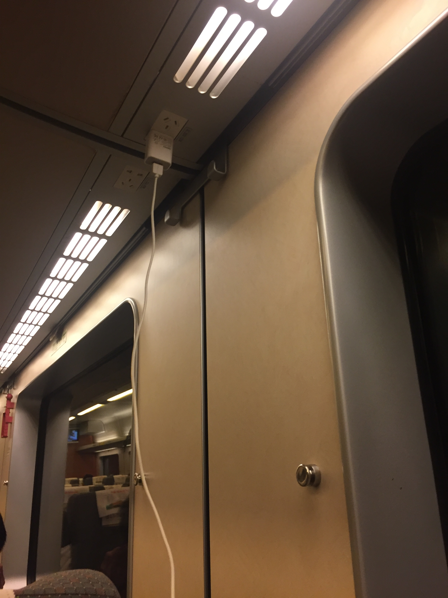
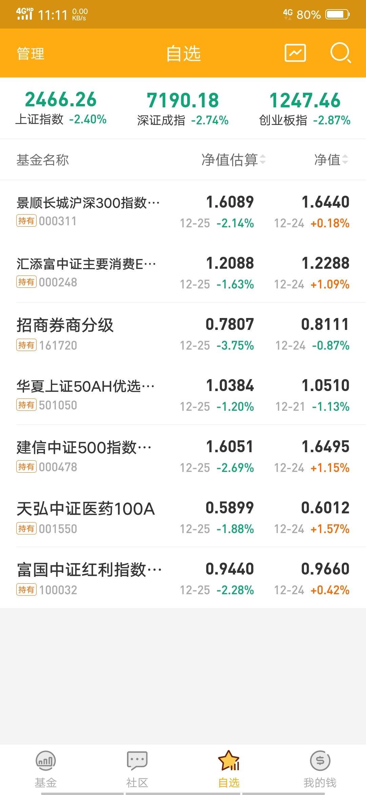

_type: talk
@二师父[28814221155551]
2018-12-01 01:25:28 Sat  
topic_id: 88445211281442

<e type="hashtag" hid="481144488858" title="#投资理念#" /> 不预测经济，专注微观

阅读[1501]  评论[0]  赞[0] 

+++++++++++++++++++++++++++++++++++++++++++++++++++++

文件：
2018-12-01 01:25:11 Sat
文件大小：[23497]
88848555455242-G20峰会，对定投有何影响.docx

======================================================

_type: talk
@二师父[28814221155551]
2018-12-01 01:26:05 Sat  
topic_id: 51442588552584

<e type="hashtag" hid="481211145528" title="#指数估值#" /> 消费进入正常估值了，停止定投，应该都是盈利的

阅读[1438]  评论[0]  赞[0] 

+++++++++++++++++++++++++++++++++++++++++++++++++++++

图片：

======================================================

_type: talk
@二师父[28814221155551]
2018-12-01 03:18:38 Sat  
topic_id: 48224511524158

<e type="web" href="https://mp.weixin.qq.com/s/Ce5yuR5bIfQnh0veMRZBnQ" title="二师父定投打卡第20期" cache="" />

阅读[949]  评论[0]  赞[0] 

======================================================

_type: q&a
@往事随风[48515148521428]
2018-12-01 10:12:49 Sat  
topic_id: 48224244452188

@往事随风

>  二师父你好！能问一个关于保险的问题吗？微信和支付宝里的百万医疗险对我这样的低收入人群来说性价比真的不错，可是又不知未来的理赔情况会如何，师父能说说您的看法吗？谢谢！

@二师父

>  保险也是家庭理财的基本配置
>  
>  保险理赔是被保险人在受到生命危险达到了保险合同的条件，保险公司会按照合同规定的金额以后保险金
>  
>  我们买保险和买基金一样是有保障的，基金有证监会监管，保险有保监会监管
>  
>  现在都是线上理赔，我们只要提供了符合要求的理赔资料基本会理赔成功，保险不是个人去卖，而是在保监会监督下有保障的产品
>  
>  可以看看二师父菜单栏定投福利保险库内容，里面有人工智能核保，可以在线咨询的

阅读[1479]  评论[5]  赞[0] 

======================================================

_type: q&a
@幻水[881185412112]
2018-12-01 12:49:13 Sat  
topic_id: 15112122824552

@幻水

>  有三个主打价值投资为主的基金，
>  问题一:请问这三种基金有什么本质区别吗？
>  问题二：请问这三个基金是个配1/3，还是以哪一个为主？
>  问题三：请问这三个基金都能穿越牛熊吗？
>  1.华宝是质量价值基金（501069）
>  2.富国中证价值ETF（512040）
>  3.神奇公式，中邮中证价值回报量化策略指数（006255）

@二师父

>  名字叫价值并不能叫价值
>  
>  必须上升到持仓股票的高度
>  
>  持仓股票大多数穿越牛熊才能穿越，跟名字里面是否有价值没关系

阅读[947]  评论[0]  赞[0] 

======================================================

_type: talk
@海盗[48248118584848]
2018-12-01 15:10:02 Sat  
topic_id: 88445154551552

12月1日偏离表

@海盗 at 2018-12-01 15:10:02 Sat

> 在二师父的指导下，刚刚做好。望朋友们也多多提出宝贵意见[抱拳]

----------

@野渡无人舟自横 at 2018-12-01 15:10:02 Sat

> 华宝油气的偏离度我算的和你不一样：0.579/0.673=0.86

----------

@海盗 at 2018-12-01 15:10:02 Sat

> 首先谢谢这位同学，认真的精神值得我们学习[抱拳]

----------

@海盗 at 2018-12-01 15:10:02 Sat

> -13.96%应该是准确答案。先看看公式理解一下，应该是这样做的。之前，我把90日均线看错了，投资的无小事，下次一定再认真一些。

----------

阅读[904]  评论[4]  赞[0] 

+++++++++++++++++++++++++++++++++++++++++++++++++++++

图片：

======================================================

_type: q&a
@lazay[51154815284224]
2018-12-01 15:24:08 Sat  
topic_id: 28445154588821

@lazay

>  二师父，你好
>  我想问一下你表格中的偏离度是什么意思？

@二师父

>  偏离均线的程度，偏离度为1，那么就是偏移均线6到12个百分点，一次类推

阅读[964]  评论[0]  赞[0] 

======================================================

_type: talk
@海盗[48248118584848]
2018-12-01 15:34:11 Sat  
topic_id: 28445154581281

<e type="hashtag" hid="225824552481" title="#打卡#" /> 
学习：
1.把学堂里的文章精细的看了一遍。
2.听有关经济投资方面的音频一个小时。
3.自己动手做了偏离度表。
4.对于平时在手机上看到的自己觉得有用的基金投资方面的知识都截屏下来了，今天摘抄了3页。
心得：静静的思考了15分钟。越发觉得，暂时停下匆忙的脚步，反思一下自己，哪里做错了，哪里做得不够好，哪里必须得坚持，是很有必要的，有益无害。
希望：短期内的小愿望就是在学习工作之余，得加上锻炼身体这一项，毕竟身体是最重要的。“自己太忙，回来再说”这个理由已经再也行不通了，以为比起二师父，我这点忙又算得了什么。
由于平时不经常写作，越发生疏了，今天终于鼓起勇气来打卡了，写得不好。也希望自己能坚持下来。

@二师父 at 2018-12-01 15:34:11 Sat

> 坚持下来，两到三年，一定会更加自由，努力吧

----------

阅读[1488]  评论[1]  赞[0] 

======================================================

_type: talk
@二师父[28814221155551]
2018-12-01 16:41:44 Sat  
topic_id: 51442824151444

指数基金定投实现年化百分之15-20的收益率难吗？

二师父告诉你，只要方法得当，一点也不难。

这期课程将从最基本的概念入手，教你建立指数基金定投系统，学会之后能够轻松利用学到的基金定投知识获取年化百分之15-20的收益率。

此课程内容如下

一、基金定投的前期准备工作

1.1、什么是指数基金定投

1.2、指数基金定投适合哪类人群

1.3、定投指数基金前需要做的准备工作

1.4、定投指数基金的渠道

二、制定指数基金定投计划以及给指数基金估值

2.1、详细的指数基金定投计划包括什么

2.2、指数基金估值是啥意思

2.3、二师父的估值系统是什么

2.4、适合入门投资者的简易估值方法

三、指数基金的分类以及购买细节问题 

3.1、指数基金分类之蓝筹股指数

3.2、指数基金分类之大盘股指数

3.3、指数基金分类之中盘股指数

3.4、定投一份金额如何确定

3.5、场内和场外购买基金的区别

3.6、定期定额投资和定期不定额投资

3.7、何时买入以及何时卖出指数基金

四、指数基金常见的估值指标

4.1、常用的6大估值指标

4.2、市盈率指标如何使用

4.3、市净率是什么

4.4、如何查阅估值数据

五、常见的几种定投策略及盈利逻辑

5.1、什么是低估定投策略

5.2、什么是均线定投策略

5.3低估定投实盘的交易逻辑和方法

5.4、均线偏离实盘的交易逻辑和方法

5.5、在场内五档买入法如何操作

5.6  低估定投法盈利的原理和逻辑

5.7 二师父低估定投实盘具体详解

5.8 二师父鳄鱼计划具体详解

六、二师父五步定投法详解

6.1  为什么要做好资产配置

6.2  买入的时候需要注意哪些问题

6.3  卖出系统究竟是如何确定的

七、 决定定投成败的关键因素

7.1  为什么你定投无法实现年化百分之15的收益率

7.2  关于定投的心态建设

7.3  决定定投成功最重要的是什么

一、这个课程适合哪些人

1、适合经常在股市亏钱的人

2、适合还没有建立自己交易系统的人

3、适合一切想通过投资理财实现年化15到20个点收益率的人

二、指数基金定投的优势在哪里

1、操作方法简单，听了二师父的课程，小学学历的朋友都可以来定投

2、不用天天研究，省时省力

3、基金定投可以培养自己的自律品格有助于生活，工作更棒

三、参加这门课程的学习你能够获得什么

1、了解到指数基金的基本概念，建立整体框架

2、手把手带你进行基金定投实际操作来挣钱

3、二师父会亲自为你答疑解惑

4、学习完这门课程如果对新媒体运营感兴趣可以加入半价二师父读书圈，教你写作和运营新媒体，这是现在的红海行业。

四、你为什么选择这门课程

主要是二师父为人真诚，靠谱，不做坑蒙拐骗的事情，你从课程中得到的价值会远远高出你得到的价值。

如果你不认为二师父很可靠，那么就不用报名了，因为你无法从一个你不信任的人那里真正地学好知识。

如果购买课程直接扫描下方二维码，付款之后进入荔枝微课里面二师父直播间。来听二师父讲课啦。

购买课程之后加二师父微信ershifudt,可以为你答疑解惑。

坚持在二师父公众号后台连续打卡21天的同学或者学堂学员，可以领取

价值60元的课程优惠券可用于购买本课程（限200张，送完为止）

@掌心的温暖 at 2018-12-01 16:41:44 Sat

> 长按扫描不了啊。

----------

@二师父 at 2018-12-01 16:41:44 Sat

> 学堂学员去置顶文章领优惠券即可

----------

@掌心的温暖 at 2018-12-01 16:41:44 Sat

> 已经购买啦[呲牙][呲牙][呲牙]

----------

@自由飞翔 at 2018-12-01 16:41:44 Sat

> 微信公众号那置顶不了？平时可以的，不知道啥原因[微笑]

----------

@二师父 at 2018-12-01 16:41:44 Sat

> 啥意思，置顶啥，长按就行了

----------

@自由飞翔 at 2018-12-01 16:41:44 Sat

> [尴尬]

----------

阅读[1674]  评论[6]  赞[0] 

+++++++++++++++++++++++++++++++++++++++++++++++++++++

图片：

======================================================

_type: talk
@凭栏观海[244414845852181]
2018-12-01 19:16:29 Sat  
topic_id: 28445154428821

昨天加入二师父定投课堂，一口气读完了所有文章。非常赞同二师父定投理念。目前我定投的指数基金合计5个，分别是:易方达上证50增强、景顺长城沪深300增强、建信中证500增强、华宝标普红利机会、天弘医药100。今天下午和二师父老师微信请教，得到老师的肯定。老师说，这几个基金很好，不用再增加定投品种了。这几个基金低估就一直定投，估值正常就持有，高估了就卖出。老师的肯定，增加了我坚持定投持有的信心，感谢老师！

@二师父 at 2018-12-01 19:16:29 Sat

> 坚持

----------

阅读[962]  评论[1]  赞[0] 

======================================================

_type: talk
@凭栏观海[244414845852181]
2018-12-01 19:22:14 Sat  
topic_id: 48224142255128

这5个基金，全部都是指数基金。其中前三个是宽基指数基金，红利机会也算是宽基指数基金。天弘医药100则是行业指数基金，更偏重于进攻性。希望得到老师和各位朋友的指点。

@二师父 at 2018-12-01 19:22:14 Sat

> 基金是没问题的，关键是坚持

----------

@凭栏观海 at 2018-12-01 19:22:14 Sat

> 嗯，谢谢老师的肯定！坚持！

----------

阅读[990]  评论[2]  赞[0] 

======================================================

_type: q&a
@海盗[48248118584848]
2018-12-01 20:13:22 Sat  
topic_id: 15112821858842

@海盗

>  二师父，关于均线定投，我有点小疑惑。如果市场处于中长期震荡下行的情况下，随着时间的推移，即使基金的价格不变，然而均线偏离度会趋于0。如果在我们均线定投的纪律，应该是收割利润。但是在这种特殊情况下，会不会出现负利润？这只是自己的猜想，要是哪点说的不对，还望二师父指示🙏

@二师父

>  那就持有啊，反正是在熊市，短线只是偶尔做一下，更多是长线

阅读[1073]  评论[1]  赞[0] 

======================================================

_type: talk
@二师父[28814221155551]
2018-12-02 03:02:57 Sun  
topic_id: 51442812121414

<e type="hashtag" hid="142522424182" title="#定投策略#" /> 市值恒定与均线策略的区别。慧定投与智能定投的区别

阅读[1634]  评论[0]  赞[0] 

+++++++++++++++++++++++++++++++++++++++++++++++++++++

图片：

+++++++++++++++++++++++++++++++++++++++++++++++++++++

文件：
2018-12-02 03:01:59 Sun
文件大小：[266202]
15515225484142-智能定投和慧定投的区别.docx

======================================================

_type: q&a
@1[15448115255842]
2018-12-02 11:38:35 Sun  
topic_id: 51442815812524

@1

>  现在证券是低估还是高估？

@二师父

>  低估的

阅读[938]  评论[0]  赞[0] 

======================================================

_type: talk
@二师父[28814221155551]
2018-12-02 11:44:04 Sun  
topic_id: 88445182184552

<e type="hashtag" hid="552154122214" title="#G20#" /> 目前中方美方达成一致协议，暂停贸易战，对股市利好。不过也有可能继续协商过程中利益冲突而重新开打。不管怎么样，目前我们仓位适中，上涨就收割利润，震荡就坚持积累，暴跌就大幅度加仓。

哪怕世界风雨漂摇，我们打造诺亚方舟稳坐钓鱼船。

另外学员以及购买课程的朋友可以加二师父微信ershifudt,开通了学员专属vip群以及课程答疑群

@游水浮生 at 2018-12-02 11:44:04 Sun

> 紧跟步伐

----------

@海盗 at 2018-12-02 11:44:04 Sun

> 步伐紧跟

----------

阅读[1470]  评论[2]  赞[0] 

======================================================

_type: talk
@凭栏观海[244414845852181]
2018-12-02 11:51:13 Sun  
topic_id: 28445182125851

打卡:（一）理财:继续坚定持有五只指数基金，易方达上证50，景顺长城沪深300，建信中证500，华宝红利机会，天弘医药100.二师父说了，这几只基金标的没有问题，主要的问题是要坚持持有！（二）读书:继续研读二师父定投理论，并且不断参悟。（三）健身:跳舞一小时，陈氏太极拳一趟。（四）参悟:老子在《道德经》上说过，为学日益，为道日损。损之又损，以至于无为。在理财的道路上，知识体系上要多学习，心理建设上要去贪欲。如此，才是快乐成功的人生！

阅读[1473]  评论[0]  赞[0] 

======================================================

_type: talk
@Anda_C[88255545852152]
2018-12-02 12:27:12 Sun  
topic_id: 28445184581221

坐高铁去福州没座位了，时间太长只得升舱一等座，然后充电口长这样，说好的用户体验呢，比二等座还稍稍差一点，也是很心累了😂就是你只能刚刚好坐在插座底下，前面或者后面只能买很长的线，不然就是得把手机挂着😂

@根号2 at 2018-12-02 12:27:12 Sun

> 新鲜

----------

@Anda_C at 2018-12-02 12:27:12 Sun

> 大佬要去体验一下，哈哈哈给手机挂吊瓶

----------

@Anda_C at 2018-12-02 12:27:12 Sun

> 不然天天拍照发朋友圈手机太累了哈哈哈

----------

阅读[933]  评论[3]  赞[0] 

+++++++++++++++++++++++++++++++++++++++++++++++++++++

图片：

======================================================

_type: q&a
@琪琪[2421884541]
2018-12-02 17:16:22 Sun  
topic_id: 48224182254418

@琪琪

>  二师父看你的均线偏离表，没有医药消费300等标的，是因为波动率偏小不适合做波段么？

@二师父

>  场内的消费和医药都有的啊

阅读[921]  评论[1]  赞[0] 

======================================================

_type: q&a
@海盗[48248118584848]
2018-12-02 17:17:00 Sun  
topic_id: 51442814452184

@海盗

>  二师父，我计划每一周根据投资标的偏离度选出最优的两个进行投资，但是自己心里一点谱都没有。想让二师父帮忙分析一下

@二师父

>  第一看估值，第二看偏离度，估值低估，偏离度越大就可以

阅读[995]  评论[2]  赞[0] 

======================================================

_type: talk
@海盗[48248118584848]
2018-12-02 19:17:53 Sun  
topic_id: 88445181252452

<e type="hashtag" hid="225824552481" title="#打卡#" />
学习：
1.把学堂里的文章精细的看了一遍。
2.听有关经济投资方面的音频一个小时。
3.对于平时在手机上看到的自己觉得有用的基金投资方面的知识都截屏下来了，今天摘抄2页。

阅读[907]  评论[0]  赞[0] 

======================================================

_type: q&a
@凭栏观海[244414845852181]
2018-12-02 23:41:51 Sun  
topic_id: 15112844522512

@凭栏观海

>  定投了沪深300,是不是就不用再定投上证50了？

@二师父

>  可以的，有些股票是重合的

阅读[894]  评论[0]  赞[0] 

======================================================

_type: talk
@二师父[28814221155551]
2018-12-03 02:03:24 Mon  
topic_id: 88445122415882

<e type="hashtag" hid="552114551414" title="#估值数据#" /> 全球股市估值

阅读[1449]  评论[0]  赞[0] 

+++++++++++++++++++++++++++++++++++++++++++++++++++++

图片：

======================================================

_type: talk
@二师父[28814221155551]
2018-12-03 09:49:44 Mon  
topic_id: 15112841484142

<e type="hashtag" hid="881251425252" title="#鳄鱼计划#" /> 卖出中概互联一份，买入德国30一份，场内交易，利好来了，大家多赚点

@健哥 at 2018-12-03 09:49:44 Mon

> 德国30场内代码多少呢

----------

@二师父 at 2018-12-03 09:49:44 Mon

> 实盘有

----------

@健哥 at 2018-12-03 09:49:44 Mon

> 二师父，场内买入一份是指好多份(比100份)还是好多金额呢，请教一下

----------

@二师父 at 2018-12-03 09:49:44 Mon

> 这个在五步定投法有计算讲过啦

----------

阅读[1449]  评论[4]  赞[0] 

+++++++++++++++++++++++++++++++++++++++++++++++++++++

图片：

======================================================

_type: q&a
@LookGod[15142444258282]
2018-12-03 14:26:03 Mon  
topic_id: 88445148541242

@LookGod

>  二师父，其实您的定投实盘以及五步定投应该是在一笔资金的前提下完成的，我想问下针对固定的工资定投，考虑到每月的资金量限制，比如逆势加仓可能幅度有限，即使每月相对高位或者低位，定投量变化也有限，对于这类问题有没有额外的建议呢？另～以后估值表取消300价值和50低波了嘛，

@二师父

>  建议就是预留好自己的每月支出，不要有较大财务压力，另外两个是删除了，做减法

阅读[922]  评论[0]  赞[0] 

======================================================

_type: talk
@披褐怀玉，抱元守一。[15412554441882]
2018-12-03 18:51:55 Mon  
topic_id: 51442845582154

二师傅，我今天第一次场内交易，买入不成功，明天会继续交易码吗？当时说可以买400的，怎么就没有成功，是我操作错了还是其他原因，请您指导我。

@二师父 at 2018-12-03 18:51:55 Mon

> 一直涨，委托价格低了

----------

@披褐怀玉，抱元守一。 at 2018-12-03 18:51:55 Mon

> 多谢二师傅指导。

----------

阅读[787]  评论[2]  赞[0] 

+++++++++++++++++++++++++++++++++++++++++++++++++++++

图片：

======================================================

_type: talk
@凭栏观海[244414845852181]
2018-12-03 21:33:12 Mon  
topic_id: 51442848854244

打卡:（一）理财:继续坚定持有五只指数基金，易方达上证50，景顺长城沪深300，建信中证500，华宝红利机会，天弘医药100.二师父说了，这几只基金标的没有问题，主要的问题是要坚持持有！（二）读书:继续研读二师父五步定投法，并且不断参悟。（三）健身:华山派回春功一套。（四）感悟:今日大盘涨。“不以物喜，不以己悲”，作为定投指数基金的人士，涨也开心，跌也惬意，涨跌与我何有哉！继续淡定，继续定投低估的既定指数基金。任凭风浪起，稳坐钓鱼台！

@逍遥生 at 2018-12-03 21:33:12 Mon

> [呲牙]老铁，像你学习。最近也在思考定投什么好些

----------

@sun at 2018-12-03 21:33:12 Mon

> 建信500现在规模很大了

----------

@凭栏观海 at 2018-12-03 21:33:12 Mon

> 现在低估，暂时还是持有。您的建议呢？

----------

@二师父 at 2018-12-03 21:33:12 Mon

> 还会华山派武功，厉害了

----------

@凭栏观海 at 2018-12-03 21:33:12 Mon

> 是的老师，早年跟边治中道长学的

----------

阅读[774]  评论[5]  赞[0] 

======================================================

@二师父[28814221155551]
2018-12-03 23:02:57 Mon  
topic_id: 48224114455118

>  @二师父
>  

阅读[858]  评论[7]  赞[0] 

======================================================

_type: talk
@二师父[28814221155551]
2018-12-04 02:10:35 Tue  
topic_id: 15112885248842

指数调仓，阈值稍许变化，发布出来供大家参考

@海盗 at 2018-12-04 02:10:35 Tue

> 二师父辛苦了，连夜把估值表改出来了

----------

@梅川类酷 at 2018-12-04 02:10:35 Tue

> 辛苦了

----------

@门萨🐨 at 2018-12-04 02:10:35 Tue

> 调仓了哦

----------

阅读[1301]  评论[3]  赞[0] 

+++++++++++++++++++++++++++++++++++++++++++++++++++++

图片：

======================================================

_type: talk
@二师父[28814221155551]
2018-12-04 02:11:20 Tue  
topic_id: 48224118451158

不以涨喜，不以跌悲，佛系定投，通过日积月累的力量改变人生

阅读[1458]  评论[0]  赞[0] 

+++++++++++++++++++++++++++++++++++++++++++++++++++++

文件：
2018-12-04 02:11:00 Tue
文件大小：[23379]
51141212154424-大涨之后，定投何去何从.docx

======================================================

_type: talk
@garn[28242844818451]
2018-12-04 08:02:17 Tue  
topic_id: 15112885455582

打卡：本周刚加入星球，希望大家多多指教。1，定投方面还是按照之前定下的计划，自动定投，就时不时看下。2，学习方面最近在努力学习日文，现在看看日语中级第一册也学到后面最后一课了，不过要记的东西太多，经常忘记。3，看书方面目前在看《贫穷的本质》，其实很多人都可以脱离贫穷的生活，但受制于意识，习惯等原因没能走在脱贫的正确的道路上或坚持不下去，所以要改变自己还得从脑子开始。4，锻炼方面做了背部力量和颈部放松。

@二师父 at 2018-12-04 08:02:17 Tue

> 很棒，继续加油，和群内更多优秀的朋友一起学习进步

----------

@garn at 2018-12-04 08:02:17 Tue

> 谢谢支持

----------

阅读[790]  评论[2]  赞[0] 

======================================================

_type: talk
@二师父[28814221155551]
2018-12-04 14:39:19 Tue  
topic_id: 88445111125882

<e type="hashtag" hid="454852525548" title="#荐书#" /> 低风险投资之路，徐大为著作，里面有关于估值的讲解和各种投资兵器谱，适合入门投资者。注，加二师父微信ershifudt，可以进入学员专属vip群

阅读[1217]  评论[0]  赞[0] 

======================================================

_type: q&a
@西锦巴乌[88448285428482]
2018-12-04 14:40:41 Tue  
topic_id: 28445111151111

@西锦巴乌

>  师父好！请问按照估值定投法券商是低估的，但场内均线法买卖的话他是在90日均线之上的，这怎么理解？谢谢

@二师父

>  均线和低估结合，以低估为主，比如高估一定不能买，即使均线符合买入要求，另外低估了，均线符合要求，非常适合买

阅读[778]  评论[1]  赞[0] 

======================================================

_type: q&a
@勤能行之[481211221828]
2018-12-04 16:17:20 Tue  
topic_id: 28448555515851

@勤能行之

>  师傅，地产指数好在哪里呀？

@二师父

>  地产指数也是跨越经济周期的指数，只不过因为国内调控所以有周期
>  
>  未来地产行业仍旧值得投资，因为城市化进程没有完成，投资房地产手续费高，税费高，换成地产行业指数是一种策略

阅读[804]  评论[0]  赞[0] 

======================================================

_type: talk
@海盗[48248118584848]
2018-12-04 20:30:23 Tue  
topic_id: 48228442445828

<e type="hashtag" hid="225824552481" title="#打卡#" /> 
学习：
1.把学堂里的文章精细的看了一遍。
2.听有关经济投资方面的音频一个小时。
3.对于平时在手机上看到的自己觉得有用的基金投资方面的知识都截屏下来了，今天摘抄3页。
4.今天跑了十分钟。尽管时间不多，但是贵在坚持。
努力！加油！坚持！

阅读[700]  评论[0]  赞[0] 

======================================================

_type: talk
@凭栏观海[244414845852181]
2018-12-04 20:47:11 Tue  
topic_id: 15115221258152

打卡:（一）理财:继续持有五只指数基金。（二）学习:参加二师父的音频版定投基金课程。（三）健身:骑车一小时。（四）参悟:定投参考行为金融学，也是逆人性而动。做投资芸芸众生中的百分之一。

阅读[693]  评论[0]  赞[0] 

======================================================

_type: talk
@逍遥生[111185184412852]
2018-12-04 22:25:55 Tue  
topic_id: 15115221111822

<e type="hashtag" hid="225824552481" title="#打卡#" />   1，五步定投已经确立，初步场外定投，500增强，300增强，红利，医药100，上证50。周四开始建底仓。
2，ps书籍学习5页
3，健身腿部练习40分钟
加油，远离舒适区！

阅读[710]  评论[0]  赞[0] 

======================================================

@二师父[28814221155551]
2018-12-04 23:06:01 Tue  
topic_id: 48228442822818

>  @二师父
>  

阅读[766]  评论[0]  赞[0] 

======================================================

_type: q&a
@Kelven[48851814822428]
2018-12-04 23:06:37 Tue  
topic_id: 28448554414281

@Kelven

>  二师父：请问课程优惠券现在还能领取吗？

@二师父

>  可以领取，置顶文章，课程优惠券

阅读[816]  评论[1]  赞[0] 

======================================================

_type: talk
@二师父[28814221155551]
2018-12-05 02:38:24 Wed  
topic_id: 28448551215141

<e type="hashtag" hid="481211145528" title="#指数估值#" />

阅读[1258]  评论[0]  赞[0] 

+++++++++++++++++++++++++++++++++++++++++++++++++++++

图片：

======================================================

_type: talk
@二师父[28814221155551]
2018-12-05 02:39:21 Wed  
topic_id: 48228441514118

<e type="hashtag" hid="481144488858" title="#投资理念#" /> 小白会入的坑，你掉进去了吗。欢迎补充。记得加二师父微信ershifudt，可以申请加入学堂VIP群。

阅读[1384]  评论[0]  赞[0] 

+++++++++++++++++++++++++++++++++++++++++++++++++++++

文件：
2018-12-05 02:38:42 Wed
文件大小：[25963]
88848584554442-小白定投会掉入的坑.docx

======================================================

_type: q&a
@李子[111182244221222]
2018-12-05 07:48:34 Wed  
topic_id: 15115228122852

@李子

>  二师父，你不是说那均线偏离度中凯概互联绿色的时候每周可以买进吗？可你在文章里说你已经卖出了，我有点不明白？

@二师父

>  在昨天的文章里面二师父提到过了，为什么买入和卖出，任何策略都不是孤立和绝对的，是结合很多策略进行操作，因为大盘震荡，而且中概互联盈利，所以卖出

阅读[809]  评论[1]  赞[0] 

======================================================

_type: talk
@garn[28242844818451]
2018-12-05 08:11:42 Wed  
topic_id: 48228441158118

<e type="hashtag" hid="281158522841" title="#每日打卡#" />  1，学习日语中级第15课，复习n3语法，练习日语阅读。听力约个半小时
2，锻炼，上肢肌肉和腹肌锻炼。45分钟。
3，读书，基督山伯爵，半小时。
总体感觉每天都在进步，时间越来越不够用。

阅读[792]  评论[0]  赞[0] 

======================================================

_type: talk
@二师父[28814221155551]
2018-12-05 09:17:03 Wed  
topic_id: 88448585512482

<e type="hashtag" hid="825824448112" title="#卖出思路#" /> 美股暴跌，中概互联卖出就是这么个思路，不要局限一种策略，不然容易吃亏，因为震荡，所以盈利就卖出，这样震荡下跌又有买入机会啦，而且我们并不是全部卖出，所以不会踏空的

现在稍微理解点了吗

@勤能行之 at 2018-12-05 09:17:03 Wed

> 实在是高

----------

@柔软时光 at 2018-12-05 09:17:03 Wed

> 做短线还算价值投资吗？

----------

@二师父 at 2018-12-05 09:17:03 Wed

> 价值投资的理念来源于美国，美国股市是著名的长牛市场，所以出了很多投资大师，然而中国是政策市，严格意义上讲没有美国的价值投资。

我们可以投资性买入，投机性卖出，赚钱即可，年初3500点没有卖出的那些人现在不知道被深埋了多少

个人认为必须实事求是，就跟苏联适合城市包围农村，中国适合农村包围城市一样

实践才是检验真理的唯一标准，那这个标准在股市就是赚钱

----------

阅读[1359]  评论[3]  赞[0] 

======================================================

_type: q&a
@凭栏观海[244414845852181]
2018-12-05 11:31:02 Wed  
topic_id: 88448582255242

@凭栏观海

>  老师您好，医药100，现在估值几乎快到正常值了，是不是需要乘此机会，加倍定投？

@二师父

>  我们定投是这样的，只有在跌的更加厉害的时候加倍，如果这时候加倍相当于提高了加仓成本啊
>  
>  要么等待，要么建立底仓，目前点位不适合加倍定投

阅读[829]  评论[1]  赞[0] 

======================================================

_type: talk
@陈[844415515418422]
2018-12-05 11:35:59 Wed  
topic_id: 51441215542484

二师父，您好！场外定投，当天买入是按当天的价格还是基金公司确认后的价格，我看我30号买入时候是低估，4号才确认，3号又是正常估值。我就搞不懂场外到底是按什么时候计划买入价格了。

@二师父 at 2018-12-05 11:35:59 Wed

> 交易日当天价格成交，确认有延迟

----------

@陈 at 2018-12-05 11:35:59 Wed

> 谢谢您

----------

阅读[757]  评论[2]  赞[0] 

======================================================

_type: q&a
@披褐怀玉，抱元守一。[15412554441882]
2018-12-05 13:28:03 Wed  
topic_id: 51441215841514

@披褐怀玉，抱元守一。

>  二师傅，德国30今天可以买入吗？

@二师父

>  可以的

阅读[822]  评论[1]  赞[0] 

======================================================

_type: q&a
@ZHOU Ke🍅[422211585541588]
2018-12-05 18:41:41 Wed  
topic_id: 51441218124184

@ZHOU Ke🍅

>  师父，最近油气很火啊，讲讲如何投资吧😄

@二师父

>  投资的有一部分，场内定投了

阅读[746]  评论[0]  赞[0] 

======================================================

_type: q&a
@江南蚕园（郑婷）[48281815141548]
2018-12-05 20:15:50 Wed  
topic_id: 15115258441442

@江南蚕园（郑婷）

>  二师父，华宝油气今天的价格已经大于净值，那是不是就是溢价了？在溢价的情况下还适合建仓定投吗？

@二师父

>  如果溢价超过1个百分点肯定就不适合了

阅读[747]  评论[3]  赞[0] 

======================================================

_type: talk
@根号2[51421845455424]
2018-12-05 21:08:17 Wed  
topic_id: 48228458288428

<e type="hashtag" hid="481144488858" title="#投资理念#" />

@二师父 at 2018-12-05 21:08:17 Wed

> 写的不错，不过并没有违背初衷哈，我们定投是为了盈利，不同的市场环境采用不同的策略，如果一直震荡的话曾今高估卖出策略就失效

----------

阅读[1255]  评论[1]  赞[0] 

+++++++++++++++++++++++++++++++++++++++++++++++++++++

文件：
2018-12-05 21:06:19 Wed
文件大小：[182509]
48828481842458-场内基金or场外基金2018.12.5.docx

======================================================

_type: q&a
@三水有鱼[88282451182122]
2018-12-05 22:31:57 Wed  
topic_id: 51441251411144

@三水有鱼

>  二师傅，我定投的中概互联亏损接近20%,请问我是继续接着定投还是停止定投。

@二师父

>  目前不要卖了，请问你的仓位如何，占总体资金的比例，如果仓位低于百分之10，可以不用顾及的加仓，我目前中概是盈利4个点左右的，你进场时机不对，现在估值不高，不用卖出，可以投的

阅读[729]  评论[0]  赞[0] 

======================================================

_type: talk
@逍遥生[111185184412852]
2018-12-05 23:56:19 Wed  
topic_id: 15115244142542

<e type="hashtag" hid="225824552481" title="#打卡#" />  1，定投视频观看中，2，ps学习，上传宝贝。3，健身40分钟。4，看书时间整理术

阅读[697]  评论[0]  赞[0] 

======================================================

_type: q&a
@chenqian[422215125514488]
2018-12-06 00:03:07 Thu  
topic_id: 15115244555442

@chenqian

>  二师父你好。有几个问题请教: 1、关于查估值数据，我看了您文章中提到的几个网址，中证指数官网、理杏仁、乐咕乐股等，这些网站我只看到有于指数的估值数据，但没有具体的指数基金的市盈率市净率等数据，集思录只有ETF指数基金的估值数据，那么除了二师父还可在哪儿查到具体的指数基金估值数据?  2、如果查到了指数基金的市盈率市净率等等数据，我们自己怎么计算低估阈值和高估阈值?有计算公式或计算方法什么的吗？  3、下面两个指数基金的估值区间分别是什么: 富国沪深300增强(场外代码100038)、华夏中证500(场外代码001052)。
>  问题有点多，您费心。

@二师父

>  1，估值的话就是查阅指数的估值，我们给估值不是给基金估值，而是给指数估值，因为一个指数对应很多基金
>  2，这个计算模型和方法未对外公布
>  3，您说的300增强低估阈值是11倍市盈率，中证500是25倍市盈率

阅读[787]  评论[4]  赞[0] 

======================================================

_type: talk
@海盗[48248118584848]
2018-12-06 02:07:11 Thu  
topic_id: 48228455121518

<e type="hashtag" hid="225824552481" title="#打卡#" /> 
学习：
 1.把学堂里的文章精细的看了一遍。 
2.听有关经济投资方面的音频一个小时。 
3.对于平时在手机上看到的自己觉得有用的基金投资方面的知识都截屏下来了，今天摘抄4页。

阅读[743]  评论[0]  赞[0] 

======================================================

_type: talk
@二师父[28814221155551]
2018-12-06 02:48:18 Thu  
topic_id: 88448522115442

<e type="web" href="https://mp.weixin.qq.com/s/ePGNYp0oklYtt09alVCR1w" title="二师父定投打卡第25期" cache="" /> 打个卡

阅读[801]  评论[0]  赞[0] 

======================================================

_type: talk
@二师父[28814221155551]
2018-12-06 02:54:14 Thu  
topic_id: 51441255881454

估值表里面的估值是给指数估值，大家别混淆了，里面有对应基金的指数代码，大家查阅市盈率，市净率只需要查阅对应指数的市盈率即可。

备注，二师父定投VIP圈子，现提供学员交流的平台，加二师父微信ershifudt,加入VIP圈子

@海盗 at 2018-12-06 02:54:14 Thu

> 二师父辛苦了

----------

@海盗 at 2018-12-06 02:54:14 Thu

> 今天又是定投日[拳头]

----------

阅读[1328]  评论[2]  赞[0] 

+++++++++++++++++++++++++++++++++++++++++++++++++++++

图片：

======================================================

_type: talk
@二师父[28814221155551]
2018-12-06 02:54:55 Thu  
topic_id: 15115244885112

@海盗 at 2018-12-06 02:54:55 Thu

> 二师父分析的太对了

----------

阅读[1454]  评论[1]  赞[0] 

+++++++++++++++++++++++++++++++++++++++++++++++++++++

文件：
2018-12-06 02:54:53 Thu
文件大小：[24554]
15515258412252-我为何如此推崇医药和消费行业指数基金.docx

======================================================

_type: talk
@凭栏观海[244414845852181]
2018-12-06 03:21:59 Thu  
topic_id: 28448522112211

打卡:（一）理财:继续坚定持有五只指数基金，易方达上证50，景顺长城沪深300，建信中证500，华宝红利机会，天弘医药100.只是目前医药100已经不是特别低估了，按照二师父的指导，放弃加倍定投，少量定投即可！（二）学习:继续反复学习二师父的定投基金入门和实践音频版课程。（三）检讨:一是看盘过于频繁，扰乱心志。二是今日没有健身。（四）感悟:身体是一切的基石！理财也不是生活的唯一！

阅读[895]  评论[0]  赞[0] 

======================================================

_type: talk
@garn[28242844818451]
2018-12-06 08:00:19 Thu  
topic_id: 15115241555822

<e type="hashtag" hid="281158522841" title="#每日打卡#" /> 1，按计划定投，听力理财类的音频。
2，学日语，课文，阅读，语法。
3，看贫穷的本质最后一章。
4，背部锻炼，哑铃训练。

@二师父 at 2018-12-06 08:00:19 Thu

> 学习日语，不错的

----------

@garn at 2018-12-06 08:00:19 Thu

> 在我们公司基本每个日本人来中国，他们都会学习中文，只有他们听懂我们，而我们不理解他们是很危险的。相对来说他们学习很努力，而且应用方法的能力也很强，收集信息的能力更是超乎想象。所以120年前我们有这样的结果也就不奇怪了。因此自己也要加倍努力跟上。

----------

@逍遥生 at 2018-12-06 08:00:19 Thu

> 厉害👍

----------

@门萨🐨 at 2018-12-06 08:00:19 Thu

> 你好，请问有关系很好的日本朋友吗？我想真实了解一下日本人心中真实的日本房产，或者是否可以通过他们认识日本本地中介。谢谢

----------

@garn at 2018-12-06 08:00:19 Thu

> 关系上一般还是停留在日常的工作层面，不过了解过他们买房子还是挺轻松的，前提不是太近市区。看上去日本房子回报率高，但杂七杂八的物业费，维修费加税都很高，而且不能轻易赶租客走，所以感觉比较麻烦。

----------

@门萨🐨 at 2018-12-06 08:00:19 Thu

> 谢谢啦

----------

阅读[862]  评论[6]  赞[0] 

======================================================

_type: q&a
@披褐怀玉，抱元守一。[15412554441882]
2018-12-06 08:39:01 Thu  
topic_id: 28448524828511

@披褐怀玉，抱元守一。

>  二师傅好！中楷互联513050现在是否还处在低估区，还可以买吗？请您指导。

@二师父

>  可以买的

阅读[928]  评论[1]  赞[0] 

======================================================

_type: q&a
@凭栏观海[244414845852181]
2018-12-06 10:02:56 Thu  
topic_id: 15115241188552

@凭栏观海

>  请教老师:一般来说，很多基金教材上都说，购买指数基金一定要购买波动大的。但是现在又出了一些低波动基金，比如中证500低波动，中证红利低波动等。据说这些低波动基金收益相当不错。这该怎么理解？请老师指点一下

@二师父

>  你这个理解是这样的哈，中证500波动的择股票是从中证500.里面选择的，他这里的低波动意思是震荡波动不大，但是实际拉长5年周期看波动是很大的，也就是说短期波动率小的股票。都是500的持仓股票，差别也不是特别大，网上东西要实证，你可以自己用智投星进行回测

阅读[920]  评论[0]  赞[0] 

======================================================

_type: talk
@二师父[28814221155551]
2018-12-06 12:09:19 Thu  
topic_id: 88448548528182

<e type="hashtag" hid="881422852442" title="#定投实盘#" /> 医药100买入0.5份，沪深300增强买入1份，地产行业买入一份，<e type="web" href="https://danjuanapp.com/topic/164?channel=1500012018" title="蛋卷基金" cache="" />，点击此链接可直接申购。又跌了，典型的熊市特征，积累就好。医药盈利9个点，仍旧低估，可以积累。

盈利的买入0.5份，浮亏的买入1分。

阅读[1331]  评论[0]  赞[0] 

======================================================

_type: talk
@二师父[28814221155551]
2018-12-06 12:15:30 Thu  
topic_id: 88448548524152

<e type="hashtag" hid="881251425252" title="#鳄鱼计划#" /> 买入券商一份，中概互联一份，场内买入，之前盈利5个点的中概互联已经不亏不赚。

现在又可以积累了，熊市震荡行情这样操作完全可以获利并且稳定心态，我们一次卖出一份，不会踏空。

@健哥 at 2018-12-06 12:15:30 Thu

> 鳄鱼计划买入后，如果继续下跌，是不管它还是降到一定程度后，适当加仓呢，跟了二师父券商和中概互联各2000份。

----------

@二师父 at 2018-12-06 12:15:30 Thu

> 对的，慢慢加仓就可以啦

----------

@披褐怀玉，抱元守一。 at 2018-12-06 12:15:30 Thu

> 我也跟了二师傅，场内买入中楷互联1500份，券商1000份。

----------

@游水浮生 at 2018-12-06 12:15:30 Thu

> 这么多

----------

@冉冉 at 2018-12-06 12:15:30 Thu

> 请问二师傅，鳄鱼计划一次买入1000份是定投的操作方式吗？会不会一次购买太多？另外，中证消费和中证医药也适用定投吗？

----------

@二师父 at 2018-12-06 12:15:30 Thu

> 他应该说的他应该说的是一次1000股，不是1000分，1000股也才1000元，还是定投的

----------

阅读[1381]  评论[6]  赞[0] 

======================================================

_type: q&a
@海盗[48248118584848]
2018-12-06 12:44:00 Thu  
topic_id: 88448545482182

@海盗

>  二师父，我今天想定投，场内500ETF,300ETF,券商ETF,场外医药100,各一份，二师父觉得可行不？

@二师父

>  可行，医药100可以买入0.5份，快要进入正常估值了

阅读[954]  评论[0]  赞[0] 

======================================================

_type: q&a
@凭栏观海[244414845852181]
2018-12-06 16:11:41 Thu  
topic_id: 15115214285542

@凭栏观海

>  请问老师:德国30，在场外买合适还是在场内买合适？

@二师父

>  我是场内在买的，后台回复场内有注册渠道

阅读[877]  评论[0]  赞[0] 

======================================================

_type: q&a
@LookGod[15142444258282]
2018-12-06 17:14:01 Thu  
topic_id: 28448542225821

@LookGod

>  二师父最近考虑买入中证银行吗？不买的话是与其他重合还是其他原因😃

@二师父

>  这是防守行的，买入也可以啊，但是牛市来了涨幅不如其他行业指数

阅读[888]  评论[2]  赞[0] 

======================================================

_type: talk
@凭栏观海[244414845852181]
2018-12-06 22:50:00 Thu  
topic_id: 48228814121218

打卡:（一）理财:继续持有五只指数基金，易方达上证50，景顺长城沪深300，买入建信中证500一份，华宝红利机会一份，天弘医药100一份。（二）健身:华山派回春功一套。（三）读书:听二师父基金入门与实战的音频课，读雪球的文章。（四）检讨:还是看盘太频繁，离市场太近。（五）感悟:闲看庭前花开花落，漫观天上云卷云舒。

@二师父 at 2018-12-06 22:50:00 Thu

> 去读读巴菲特之道，这本书也许对你有启发

----------

@凭栏观海 at 2018-12-06 22:50:00 Thu

> 谢谢老师

----------

阅读[732]  评论[2]  赞[0] 

======================================================

_type: talk
@逍遥生[111185184412852]
2018-12-06 22:59:10 Thu  
topic_id: 15115582881882

<e type="hashtag" hid="225824552481" title="#打卡#" />  1，定投基金开始场外四只，场内购买券商。2，学习ps中，二师傅定投视频。3，健身背部40分钟。
认识自己，加油！

阅读[739]  评论[0]  赞[0] 

======================================================

_type: talk
@自由飞翔[544442815144244]
2018-12-07 00:07:12 Fri  
topic_id: 28448818848821

<e type="hashtag" hid="281158522841" title="#每日打卡#" /> 第一期：1.场外定投第四周，起步较晚，于周二建底仓3成；2.不以涨喜，不以跌悲，今天大跌我也很淡定，能愉快工作，看旁人骂盘，我心底只想笑，感恩师傅；3.非常认可师父的投资哲学，刚开始的一周学习到凌晨，基本思路掌握，做完笔记，赶在周四进行第一笔周定投；4.好的东西只想快速分享给家人朋友，因此马上建群，邀他们一起定投。可能每个人每个阶段认识不一样，体会不到我的用心，也可能有客观原因，也不知道他们现进师傅学堂没，总之我那群里静悄悄，也罢，我默默地坚持定投等待收获吧！不过有听到我家那位说过一句：你着魔了吧[微笑]！5.不轻易发朋友圈怕影响不好，圈里大多是工作上的伙伴，但回顾今天一天的心情，我不能一人偷着乐，所以果断分享了师父的文章。也许我的一次转发可以解决圈里朋友不少烦恼——以后再也不用盯盘啦[调皮]。6.师傅的定投五步法及我特别关注的另外几篇文章都有精读。看懂看明白师傅的所有文章还需要好长一段时间，每一篇都是精华。现每天点击和关注的都只是师傅的定投学堂，工作理财两不误，足矣！7.日子每天都很充实，要学的想学的很多，但急不来，愿每天能坚持来打卡，每天能进步一点点，坚定跟着师傅步伐一起学习，一起定投！

@二师父 at 2018-12-07 00:07:12 Fri

> 已经打赏

----------

@自由飞翔 at 2018-12-07 00:07:12 Fri

> 谢谢师父🙏，客气！

----------

阅读[1287]  评论[2]  赞[1] 

======================================================

_type: talk
@二师父[28814221155551]
2018-12-07 02:31:49 Fri  
topic_id: 88448818212242

<e type="hashtag" hid="552158215584" title="#保险#" /> 投保能否符合条件，现在可以人工核保，未来保险业一定会是线上，很多保险推销员将失业。可以看二师父定投公众号底部菜单栏定投福利有一键购买，里面的小程序会帮助大家核保，完成之后可以自行购买，非常方便。

阅读[1374]  评论[0]  赞[0] 

+++++++++++++++++++++++++++++++++++++++++++++++++++++

文件：
2018-12-07 02:30:10 Fri
文件大小：[25600]
48828455844588-宫颈肥大，窦性心动过缓可以购买康惠保吗.doc

======================================================

_type: talk
@二师父[28814221155551]
2018-12-07 02:33:15 Fri  
topic_id: 15115585484482

<e type="hashtag" hid="481211145528" title="#指数估值#" /> 文章置顶文章好好读一读，不读的话加入学堂损失很大的哈。每日估值，坚持分享。

阅读[1342]  评论[0]  赞[0] 

+++++++++++++++++++++++++++++++++++++++++++++++++++++

图片：

======================================================

_type: talk
@garn[28242844818451]
2018-12-07 07:13:02 Fri  
topic_id: 48228818144258

<e type="hashtag" hid="281158522841" title="#每日打卡#" /> 1，按计划定投，也开始了场内基金的定投，参照了二师父的鳄鱼计划原理，投了中概互联。
2，坚持学习日语，中级16课对话。
3，今天有事无做运动，明天继续。
4，听了投资理财的音频资料。

@门萨🐨 at 2018-12-07 07:13:02 Fri

> 学日语的朋友求教

----------

阅读[808]  评论[1]  赞[0] 

======================================================

_type: q&a
@海盗[48248118584848]
2018-12-07 07:31:00 Fri  
topic_id: 15115585188242

@海盗

>  二师父，问一句小白问题，估值表里的场外300增强、500增强和场内的300ETF、500ETF是什么关系，如果定投选择的话，是不是场外和场内选择其中一个即可？

@二师父

>  有相关关系，500增强包含于500，里面有的股票是从500里面选择的，定投的话选择一个即可

阅读[952]  评论[0]  赞[0] 

======================================================

_type: talk
@victoria[15455121858422]
2018-12-07 10:41:06 Fri  
topic_id: 28448811844541

二师父医药因政府釆购事件大跌，还能继续定投吗

@阿@浩 at 2018-12-07 10:41:06 Fri

> 前期的盈利全部回去了

----------

@阿@浩 at 2018-12-07 10:41:06 Fri

> 能否分析一下

----------

@朱小宁 at 2018-12-07 10:41:06 Fri

> 就像群里有人问的，利润下降，是否会导致估值提升[疑问]

----------

@二师父 at 2018-12-07 10:41:06 Fri

> 可以继续，行业危机是机会

----------

阅读[822]  评论[4]  赞[0] 

======================================================

_type: q&a
@爱华[844445144558182]
2018-12-07 11:49:08 Fri  
topic_id: 88448812848252

@爱华

>  老师您好，我刚刚入群，请问一下：估值表中越靠前的 是相对越低估的吗？（比如今天德国在华宝油气前边，是不是说德国在其历史估值范围内更低估）

@二师父

>  不是的，这个没有关联性，看估值指标的偏离

阅读[881]  评论[1]  赞[0] 

======================================================

_type: q&a
@Pacifica[15548581554152]
2018-12-07 11:49:44 Fri  
topic_id: 51441188522514

@Pacifica

>  二师父，你讲医药指数基金那篇文章题目是什么？我想再回过去看看，并收藏一下。谢谢！广发医药和医药100这两个基金包含的医药企业，感觉差异性较大，我个人比较喜欢医药100里面的企业标的

@二师父

>  在7.24号的文章里面，大概就是那个日期

阅读[956]  评论[1]  赞[0] 

======================================================

_type: talk
@勤能行之[481211221828]
2018-12-07 13:21:09 Fri  
topic_id: 88448811114282

今天有买医药100的亲吗？

@根号2 at 2018-12-07 13:21:09 Fri

> [发呆]

----------

@sun at 2018-12-07 13:21:09 Fri

> 我今夭买医药指数

----------

阅读[832]  评论[2]  赞[0] 

======================================================

_type: talk
@根号2[51421845455424]
2018-12-07 13:52:51 Fri  
topic_id: 28448255518281

<e type="hashtag" hid="281181228511" title="#每日分享#" /> 今天在基金网站上大致浏览了下各类基金的今年大致收益情况：债基基金18年的整体收益是相对很好的，经营靠前的年收益10%+，目前10年期国债收益率在3.32%左右的样子，在去买入，高位站岗的概率大了些，当然也不排除继续吃上一波行情，谁知道呢[偷笑]

阅读[868]  评论[0]  赞[0] 

+++++++++++++++++++++++++++++++++++++++++++++++++++++

图片：

======================================================

_type: q&a
@ss_佳汝[15481512828122]
2018-12-07 14:16:19 Fri  
topic_id: 28448811141251

@ss_佳汝

>  请教一下二师父。 基本面120 和 300增强 哪个更适合投资呢？ 是不是只要选择一个就好？他们的区别在哪里

@二师父

>  选择一个就好，区别是在于，沪深300里面既有沪市的股票，也有深市的股票，而基本面120就是深圳市场基本面好的120只股票，选择沪深300增强即可，里面很多股票包含了基本面120，加我微信ershifudt，可以进入学员vip群

阅读[989]  评论[0]  赞[0] 

======================================================

_type: talk
@二师父[28814221155551]
2018-12-07 14:29:01 Fri  
topic_id: 28448255884441

这是我的微信，可以扫一扫，然后加我，我拉你进入vip圈，喜欢安静的不用加，所有信息都会在学堂公布。

阅读[1453]  评论[0]  赞[0] 

+++++++++++++++++++++++++++++++++++++++++++++++++++++

图片：

======================================================

@二师父[28814221155551]
2018-12-07 15:38:56 Fri  
topic_id: 88448255254222

>  @二师父
>  

阅读[1018]  评论[3]  赞[0] 

======================================================

_type: talk
@凭栏观海[244414845852181]
2018-12-07 16:40:44 Fri  
topic_id: 28448255124181

打卡:（一）理财:继续持有五只指数基金，易方达上证50，景顺长城沪深300，建信中证500，华宝红利机会，天弘医药100。（二）健身:骑自行车一小时。（三）读书:听二师父基金入门与实战的音频课，读雪球的文章。学习资产配置等知识。（四）感悟:理财不是生活的全部，还有诗和远方的田野。

阅读[939]  评论[0]  赞[0] 

======================================================

_type: talk
@门萨🐨[51411455828824]
2018-12-08 00:07:44 Sat  
topic_id: 88448251845112

＃运营第一次＃作为师父的助理，第一次帮师父运营读书账号。看到师父精心运营的后台，很受启发。在师父的鼓励下，今天完成了第三篇原创。再接再厉。遇到师父很幸运，感觉开启了新世界，无论投资还是写作。一切皆是缘！<e type="hashtag" hid="552118584454" title="#今日打卡#" />

阅读[1027]  评论[0]  赞[0] 

======================================================

_type: talk
@逍遥生[111185184412852]
2018-12-08 00:14:23 Sat  
topic_id: 51441528141844

<e type="hashtag" hid="225824552481" title="#打卡#" />  今天有结婚喜酒喝，忙完工作就去接人了，陪朋友吃饭聊了下天。挺好的，我跟自己比每天都在进步呢！加油！

@二师父 at 2018-12-08 00:14:23 Sat

> 闹个洞房？

----------

@逍遥生 at 2018-12-08 00:14:23 Sat

> 我们这闹洞房还好，只要是天气冷了大家也不会弄太久。今天正席[呲牙]

----------

阅读[914]  评论[2]  赞[0] 

======================================================

_type: q&a
@ZHOU Ke🍅[422211585541588]
2018-12-08 01:36:42 Sat  
topic_id: 48228541428848

@ZHOU Ke🍅

>  师父，目前您使用的什么证券客户端，费用便宜且能从场外转场内呀？

@二师父

>  我发到你微信的，目前有两个

阅读[991]  评论[1]  赞[0] 

======================================================

_type: talk
@二师父[28814221155551]
2018-12-08 02:47:03 Sat  
topic_id: 15115428488522

<e type="hashtag" hid="481211145528" title="#指数估值#" />

阅读[1464]  评论[0]  赞[0] 

+++++++++++++++++++++++++++++++++++++++++++++++++++++

图片：

======================================================

_type: talk
@二师父[28814221155551]
2018-12-08 02:47:27 Sat  
topic_id: 88448251211882

@Pacifica at 2018-12-08 02:47:27 Sat

> 师父，医药300的基金代码是啥？

----------

@二师父 at 2018-12-08 02:47:27 Sat

> 001344

----------

@自由飞翔 at 2018-12-08 02:47:27 Sat

> 读懂了师父的定投理念，很多提问就可以省略！我现只希望有更多的增量资金来将每周四的定投额度加大，没其他想法！

----------

阅读[1628]  评论[3]  赞[0] 

+++++++++++++++++++++++++++++++++++++++++++++++++++++

文件：
2018-12-08 02:47:24 Sat
文件大小：[374100]
28848524252221-药企龙头大失血，医药指数真凉了？.docx

======================================================

_type: talk
@garn[28242844818451]
2018-12-08 09:15:05 Sat  
topic_id: 51441528884224

<e type="hashtag" hid="281158522841" title="#每日打卡#" /> 1，今天开始定投医药基金
2，继续学日语
3，运动，keep里的运动40分钟

阅读[968]  评论[0]  赞[0] 

======================================================

_type: q&a
@ZHOU Ke🍅[422211585541588]
2018-12-08 11:52:58 Sat  
topic_id: 88448285228142

@ZHOU Ke🍅

>  师父，震荡周期，更适合用网格交易还是定期定投啊？

@二师父

>  两者结合，场内可以用网格，定期定投积累分额

阅读[1097]  评论[4]  赞[0] 

======================================================

@二师父[28814221155551]
2018-12-08 13:53:50 Sat  
topic_id: 15115452154422

>  @二师父
>  

阅读[1064]  评论[2]  赞[0] 

======================================================

_type: talk
@凭栏观海[244414845852181]
2018-12-08 16:02:16 Sat  
topic_id: 15115451224452

打卡:（一）理财:继续持有五只指数基金，易方达上证50，景顺长城沪深300，建信中证500，华宝红利机会，天弘医药100。（二）健身:骑自行车一小时。（三）读书:听二师父基金入门与实战的音频课，读雪球的文章。学习资产配置等知识。（四）感悟:最保守的策略是半仓，空仓和满仓都是另一种极端的激进。

@勤能行之 at 2018-12-08 16:02:16 Sat

> 有空就到师傳的星球看看，多学点知识

----------

阅读[987]  评论[1]  赞[0] 

======================================================

_type: talk
@海盗[48248118584848]
2018-12-08 17:22:24 Sat  
topic_id: 28448284884541

2018年12月7日均线偏离表

@海盗 at 2018-12-08 17:22:24 Sat

> 有什么不对的地方，还望同学们指出来✌

----------

@静默 at 2018-12-08 17:22:24 Sat

> 请问500etf区域怎么不用绿色标注了？不在低估区了吗？

----------

@海盗 at 2018-12-08 17:22:24 Sat

> 这个表是均线偏离表，不是估值表。

----------

@健哥 at 2018-12-08 17:22:24 Sat

> 这个表怎么用呢，什么时候买入，什么时买出，老师能讲一下吗

----------

@海盗 at 2018-12-08 17:22:24 Sat

> 500etf的估值请参考二师父的500增强的估值

----------

@海盗 at 2018-12-08 17:22:24 Sat

> 都是同学哈，二师父那才是老师👍

----------

@海盗 at 2018-12-08 17:22:24 Sat

> 这个买入卖出规则二师父以前都讲过呀。

----------

@海盗 at 2018-12-08 17:22:24 Sat

> 右上角搜索  均线定投策略

----------

阅读[1040]  评论[8]  赞[0] 

+++++++++++++++++++++++++++++++++++++++++++++++++++++

图片：

======================================================

_type: talk
@勤能行之[481211221828]
2018-12-08 21:21:21 Sat  
topic_id: 51441518211554

有空就到师傳的星球看看，多学点知识

@海盗 at 2018-12-08 21:21:21 Sat

> 说得对

----------

阅读[1014]  评论[1]  赞[0] 

======================================================

@二师父[28814221155551]
2018-12-08 23:05:15 Sat  
topic_id: 15115458418112

>  @二师父
>  

阅读[1105]  评论[2]  赞[0] 

======================================================

_type: talk
@二师父[28814221155551]
2018-12-09 03:55:11 Sun  
topic_id: 28448228425251

阅读[1614]  评论[0]  赞[0] 

+++++++++++++++++++++++++++++++++++++++++++++++++++++

文件：
2018-12-09 03:54:58 Sun
文件大小：[23923]
51141241222454-300医药和医药100，究竟哪个好.docx

======================================================

_type: talk
@garn[28242844818451]
2018-12-09 08:39:03 Sun  
topic_id: 15115445811882

<e type="hashtag" hid="281158522841" title="#每日打卡#" /> 1，运动，手部肌肉锻炼
2，学习，日语，日剧
3，读书，小狗钱钱

@Jewel at 2018-12-09 08:39:03 Sun

> 4674

----------

阅读[1032]  评论[1]  赞[0] 

======================================================

_type: talk
@游水浮生[15455241488482]
2018-12-09 09:46:43 Sun  
topic_id: 51441555285424

<e type="hashtag" hid="281158522841" title="#每日打卡#" /> 1.看书，2.梳理上周定投情况，在易淘金买入华宝、dax30、广发医药，3.计划下周逢跃继续买入，4.下午森林公园走五5公里。

阅读[1027]  评论[0]  赞[0] 

======================================================

_type: talk
@勤能行之[481211221828]
2018-12-09 11:20:54 Sun  
topic_id: 51441555554214

1、阅读师傅的每日文章。
2、今天把苹果手机里的一万张照片，导入了电脑，因为不是同一个系统，所以有点麻烦，但还是做成了。。想了很久的事情，今天终于干成了，很开心。电脑还在继续导入，手机暂时不能上微信。
3、准备把星球上的文章再好好读一遍。

@勤能行之 at 2018-12-09 11:20:54 Sun

> 因为要打卡的缘故，所以会挑一些有难度，想了很久没干的事来干。今天可以清空手机里的10,000张照片，真的很开心。手机又可以轻快地运行了。

----------

@勤能行之 at 2018-12-09 11:20:54 Sun

> 把精力集中到星球上来，集中到打卡上来，以此为抓手做好各项事情。

----------

@海盗 at 2018-12-09 11:20:54 Sun

> 这么巧，昨天我也把手机上的视频照片都放电脑上和百度网盘上了，清了很大内存

----------

@Jewel at 2018-12-09 11:20:54 Sun

> 我要计划清清手机的1w张照片了😂[捂脸]

----------

@勤能行之 at 2018-12-09 11:20:54 Sun

> 当集中精力做好定投的时候，其他事情也会做好的。因为精神是内守的[愉快]

----------

阅读[1022]  评论[5]  赞[0] 

======================================================

_type: q&a
@冉冉[88445118854412]
2018-12-09 12:36:20 Sun  
topic_id: 28448222845411

@冉冉

>  二师傅，我想查看基金K线图，按您推荐的东方财富查找，软件回复未能找到匹配股票，是东方财富不适用于基金吗？那用什么软件能进行基金K线查看呢？

@二师父

>  用广发，华泰，万得都可以的

阅读[1119]  评论[0]  赞[0] 

======================================================

_type: q&a
@勤能行之[481211221828]
2018-12-09 12:37:42 Sun  
topic_id: 88448222441212

@勤能行之

>  师傅，以每次投入1000元计祘，在华泰证券交易一次，大概总共需要多少费用，能列个公式表吗？如果合适的话就考虑开一个。

@二师父

>  1000元大概收0.1元，买收一次，卖收一次，没有其他费用了

阅读[1136]  评论[0]  赞[0] 

======================================================

@二师父[28814221155551]
2018-12-09 13:20:37 Sun  
topic_id: 28448222155441

>  @二师父
>  

阅读[1210]  评论[0]  赞[0] 

======================================================

_type: q&a
@LookGod[15142444258282]
2018-12-09 19:57:47 Sun  
topic_id: 48228551458828

@LookGod

>  二师父，家里人去银行存三年定期，结果最后变成了五年的万能险和六年的分红险，公司名也没听过，国华财富和安邦人寿，，这种情况下直接让家人去退保没错吧？保单有十几天犹豫期

@二师父

>  果断止损，理财交给指数基金，保障交给消费险，分红险就是个坑

阅读[1180]  评论[3]  赞[0] 

======================================================

_type: talk
@二师父[28814221155551]
2018-12-09 21:16:52 Sun  
topic_id: 88448248544252

阅读[1586]  评论[0]  赞[0] 

+++++++++++++++++++++++++++++++++++++++++++++++++++++

图片：

======================================================

_type: talk
@逍遥生[111185184412852]
2018-12-09 22:15:19 Sun  
topic_id: 51441541528124

<e type="hashtag" hid="225824552481" title="#打卡#" />  今天在车上突然让我体会了一句话，"少就是多，慢就是快。"  比如学习，健身，投资……很多时候我们太着急了，想着马上就能学会，马上就能赚多少钱。但是有多少人能够一步登天，相对于那些不切实际的幻想不如脚踏实地的一步步的来。投资自己积累自己，有天会引起量变的！在对的方向上坚持下去。

阅读[1127]  评论[0]  赞[0] 

======================================================

_type: talk
@二师父[28814221155551]
2018-12-09 22:26:35 Sun  
topic_id: 88448248281812

@海盗 at 2018-12-09 22:26:35 Sun

> 必须达到买入的条件才能买入，严格按纪律执行

----------

阅读[1732]  评论[1]  赞[0] 

+++++++++++++++++++++++++++++++++++++++++++++++++++++

文件：
2018-12-09 22:26:32 Sun
文件大小：[150121]
28848548481541-各大基金配置是怎么做的.docx

======================================================

_type: q&a
@海盗[48248118584848]
2018-12-10 00:28:25 Mon  
topic_id: 51441541885884

@海盗

>  二师父，场内购买的时候溢价和折价在哪里查看，具体怎样操作才对？

@二师父

>  东方财富可以看，避免高溢价品种

阅读[1259]  评论[8]  赞[0] 

======================================================

_type: q&a
@爱华[844445144558182]
2018-12-10 06:44:56 Mon  
topic_id: 51441545154824

@爱华

>  老师您好，想知道指数估值的范围（如红利指数在xx-xx是低估，正常，高估）？非常感谢

@二师父

>  好的，今晚估值表公布下

阅读[1269]  评论[0]  赞[0] 

======================================================

_type: q&a
@Pacifica[15548581554152]
2018-12-10 07:17:10 Mon  
topic_id: 28448242251821

@Pacifica

>  二师父，请问场内的医药ETF嘉实中证医药，规模只有1400多万，应该视为规模小，投资有风险吧？

@二师父

>  成交额是比较小，几百万的那种就谨慎考虑了

阅读[1316]  评论[0]  赞[0] 

======================================================

_type: talk
@garn[28242844818451]
2018-12-10 12:34:28 Mon  
topic_id: 48228514852588

<e type="hashtag" hid="281158522841" title="#每日打卡#" /> 1，学习日语。2，今天清理了一下爱鱼的鱼缸和过滤。3，跟着中介朋友看房子，房价是跌了，房子位置和户型也满意，反复思量很久，我还是不想杀鹅取蛋。

阅读[1173]  评论[0]  赞[0] 

======================================================

_type: talk
@二师父[28814221155551]
2018-12-10 13:53:38 Mon  
topic_id: 15115482122522

<e type="hashtag" hid="881251425252" title="#鳄鱼计划#" /> 场内买入中概互联一份，广发医药一份，目前回撤在5个百分点以内，没啥好恐惧的，如果一直震荡就做网格获利，如果一直下跌就果断加仓，如果大盘反转就持有坚守，

投资其实很简单，只是大多数人没有抓到核心。

@海洋 at 2018-12-10 13:53:38 Mon

> 干！

----------

@琪琪 at 2018-12-10 13:53:38 Mon

> 网格对上班族好难[流泪]

----------

@海盗 at 2018-12-10 13:53:38 Mon

> 做适合自己的投资就行，最简单的低估定投就可以了。

----------

@空瓶子 at 2018-12-10 13:53:38 Mon

> 网格是啥

----------

@Jamway Lu at 2018-12-10 13:53:38 Mon

> 二师父有时间能讲一下网格么，感觉买入线和卖出线好难把握[委屈]

----------

@有你真好 at 2018-12-10 13:53:38 Mon

> 上班族也可以网格交易啊。每天早上花几分钟挂好单就可以了啊？

----------

@二师父 at 2018-12-10 13:53:38 Mon

> 搜索往期

----------

@二师父 at 2018-12-10 13:53:38 Mon

> 好的

----------

阅读[1729]  评论[8]  赞[0] 

======================================================

_type: talk
@凭栏观海[244414845852181]
2018-12-10 15:40:38 Mon  
topic_id: 48228518458888

打卡:（一）理财:按照二师父的理论，我继续持有六种基金，分别是:易方达上证50、景顺长城沪深300、建信中证500、红利机会、天弘中证医药100和德国30。（二）学习:学习了二师父的几篇最新文章，特别是《各大基金配置是如何做的》，深有感悟 ，这篇文章特别棒！建议朋友们都好好看看！（三）健身:骑车半小时。（四）感悟:古人云，财不入急门，基金定投依也是如此，慢慢来，不要急！牛市不来，就慢慢等它来！只要身体好，一定等得到！

@Pacifica at 2018-12-10 15:40:38 Mon

> 最后一句写得好，不能再赞同了

----------

阅读[1147]  评论[1]  赞[0] 

======================================================

_type: q&a
@涟012941[15458181812212]
2018-12-10 16:05:00 Mon  
topic_id: 28448218545841

@涟012941

>  请问二师父券商估值主要是参考PB吗？我用理杏仁查证券公司指数PE百分位较高，如果用PE估值就应该不是低估哈？

@二师父

>  对的，他们是周期指数，市盈率失效了

阅读[1259]  评论[1]  赞[0] 

======================================================

_type: q&a
@空瓶子[88282241812242]
2018-12-10 17:22:59 Mon  
topic_id: 15115485422412

@空瓶子

>  师父，你写的相关定投资料哪里查看

@二师父

>  搜索关键字

阅读[1277]  评论[1]  赞[0] 

======================================================

_type: q&a
@披褐怀玉，抱元守一。[15412554441882]
2018-12-10 19:47:15 Mon  
topic_id: 51441581845814

@披褐怀玉，抱元守一。

>  二师傅好！您觉得目前场内买入中楷互联和券商，那个性价比更高？在二者的比例上我不知道怎么分配资金，请您指导。

@二师父

>  都很有价值啊，一个侧重腾讯，一个侧重券商，不过这两个基金下跌都比较大，中概里面的股票都是互联网企业，下跌会很多。
>  
>  券商是强周期指数，牛市不来的话上涨也乏力。
>  
>  未来长期持有是很不错的选择了

阅读[1295]  评论[4]  赞[0] 

======================================================

_type: talk
@二师父[28814221155551]
2018-12-11 03:06:25 Tue  
topic_id: 48228244418558

阅读[1660]  评论[0]  赞[0] 

+++++++++++++++++++++++++++++++++++++++++++++++++++++

文件：
2018-12-11 03:06:23 Tue
文件大小：[26432]
48828422422818-不念过往，不惧将来.docx

======================================================

_type: talk
@garn[28242844818451]
2018-12-11 08:04:15 Tue  
topic_id: 48228244522588

<e type="hashtag" hid="281158522841" title="#每日打卡#" /> 1，哑铃运动一组。2，学日语。3，浏览了二师父发的文章和星球问答，继续增强自己的能力。

阅读[1082]  评论[0]  赞[0] 

======================================================

_type: talk
@二师父[28814221155551]
2018-12-11 09:41:00 Tue  
topic_id: 28448455128281

<e type="hashtag" hid="881251425252" title="#鳄鱼计划#" /> 网格交易开始，可能回撤较大，请勿跟投。场内买入华宝油气，德国30各一份，分别浮亏5个百分点，低估，偏离均线，浮亏，买入，盈利卖出，场内网格交易应对震荡市场。

切记，浮亏较大，请勿跟投

@sun at 2018-12-11 09:41:00 Tue

> 华宝油气场内买一份，德国30场外买一份。

----------

@健哥 at 2018-12-11 09:41:00 Tue

> 老师，一份买多少股比较合适？

----------

@二师父 at 2018-12-11 09:41:00 Tue

> 看资金量，一只基金分配60份差不多

----------

@sun at 2018-12-11 09:41:00 Tue

> 德国30最近场内都溢价，为什么不场外买呢？

----------

@二师父 at 2018-12-11 09:41:00 Tue

> 我是做网格，没特别关注这个，可以不用买，也可以场外买

----------

阅读[1624]  评论[5]  赞[0] 

======================================================

_type: talk
@游水浮生[15455241488482]
2018-12-11 13:19:17 Tue  
topic_id: 88448454222522

<e type="hashtag" hid="281158522841" title="#每日打卡#" /> 1.跟投油气和dax30，2.工作。

阅读[1072]  评论[0]  赞[0] 

======================================================

_type: talk
@凭栏观海[244414845852181]
2018-12-11 22:16:05 Tue  
topic_id: 51441412842154

打卡:（一）理财:1、场内买入德国30两份，将亏损从百分之四点多降到百分之一点多。2、打算把沪深300换成中证红利，初步打算定投富国中证红利基金。3、打算暂停易方达上证50，换成基本面50或者上证50AH。这两个基金哪个好，正在思考中。（二）健身:步行半小时，骑车半小时。（三）读书:读雪球文章若干篇。

阅读[998]  评论[0]  赞[0] 

======================================================

_type: q&a
@凭栏观海[244414845852181]
2018-12-11 23:21:06 Tue  
topic_id: 15115152815112

@凭栏观海

>  目前基本面50和上证50AH优先哪个更适合定投？

@二师父

>  50ah优选更加适合定投

阅读[1100]  评论[1]  赞[0] 

======================================================

_type: talk
@二师父[28814221155551]
2018-12-12 03:19:17 Wed  
topic_id: 28448484828441

阅读[1562]  评论[0]  赞[0] 

+++++++++++++++++++++++++++++++++++++++++++++++++++++

文件：
2018-12-12 03:18:07 Wed
文件大小：[24231]
88848518522522-基本面50，50ah，以及央视50的优劣.docx

======================================================

_type: talk
@二师父[28814221155551]
2018-12-12 03:19:40 Wed  
topic_id: 15115151545182

阅读[1083]  评论[0]  赞[0] 

+++++++++++++++++++++++++++++++++++++++++++++++++++++

图片：

======================================================

_type: talk
@garn[28242844818451]
2018-12-12 07:53:29 Wed  
topic_id: 51441414544554

<e type="hashtag" hid="281158522841" title="#每日打卡#" /> 1，拜读二师父发的文章，计划定投ah50。2，学习日文。3，胸部肌肉练习，腹肌练习

阅读[1009]  评论[0]  赞[0] 

======================================================

_type: talk
@海盗[48248118584848]
2018-12-12 09:38:06 Wed  
topic_id: 88448481552842

<e type="hashtag" hid="281158522841" title="#每日打卡#" /> 
1.把学堂里的文章读一遍。
2.听有关投资的音频1小时

阅读[1049]  评论[0]  赞[0] 

======================================================

_type: talk
@默容乐[28512842845821]
2018-12-12 10:25:40 Wed  
topic_id: 51441418114284

如果已知一个股票连续三年的净利润率为12%，15%，16%，如何计算年平均复合收益率呢？

@Rudy at 2018-12-12 10:25:40 Wed

> (1*1.12*1.15*1.16)根号3

----------

@Rudy at 2018-12-12 10:25:40 Wed

> 再-1

----------

阅读[1048]  评论[2]  赞[0] 

======================================================

_type: q&a
@凭栏观海[244414845852181]
2018-12-12 12:40:46 Wed  
topic_id: 48228281521588

@凭栏观海

>  请问老师:中概互联现在可以用定投的方式买入吗？

@二师父

>  完全没问题的，我正在定投，是场内的基金

阅读[1153]  评论[1]  赞[0] 

======================================================

_type: talk
@二师父[28814221155551]
2018-12-12 16:36:38 Wed  
topic_id: 48228155245288

@逍遥生 at 2018-12-12 16:36:38 Wed

> 思维导图么这是

----------

@二师父 at 2018-12-12 16:36:38 Wed

> 是

----------

@梅川类酷 at 2018-12-12 16:36:38 Wed

> 二师傅要点原图上传才清楚😂

----------

@海盗 at 2018-12-12 16:36:38 Wed

> 点击图片下方有一个查看原图，可以看得很清楚。

----------

阅读[1484]  评论[4]  赞[1] 

+++++++++++++++++++++++++++++++++++++++++++++++++++++

图片：

======================================================

_type: talk
@凭栏观海[244414845852181]
2018-12-12 17:02:49 Wed  
topic_id: 51441855822284

打卡:（一）理财:制定了上证50AH和中证红利的定投计划。（二）健身:骑车一小时。（三）读书:阅读了雪球财经上的文章。（四）思考:孔子曰，智者不惑，仁者不忧，勇者不惧！要做投资市场上的智者，仁者，勇者！

阅读[1013]  评论[0]  赞[0] 

======================================================

_type: talk
@二师父[28814221155551]
2018-12-13 02:50:51 Thu  
topic_id: 51441841584114

<e type="hashtag" hid="481144488858" title="#投资理念#" /> 定投多看少动，怎么多看，做到这三点即可

@西锦巴乌 at 2018-12-13 02:50:51 Thu

> 师父好！该文中提到“上证综合指数跌破10”是什么意思？

----------

@二师父 at 2018-12-13 02:50:51 Thu

> 市盈率跌破10

----------

@西锦巴乌 at 2018-12-13 02:50:51 Thu

> [愉快]

----------

阅读[1509]  评论[3]  赞[0] 

+++++++++++++++++++++++++++++++++++++++++++++++++++++

文件：
2018-12-13 02:49:19 Thu
文件大小：[24646]
28848512521251-定投的最高境界是多看少动.docx

======================================================

_type: talk
@二师父[28814221155551]
2018-12-13 02:51:36 Thu  
topic_id: 28448148214881

<e type="hashtag" hid="481211145528" title="#指数估值#" /> 估值没啥变化，熊市就是这样，当所有人都绝望的时候，牛市才会到来

阅读[1488]  评论[0]  赞[0] 

+++++++++++++++++++++++++++++++++++++++++++++++++++++

图片：

======================================================

_type: talk
@garn[28242844818451]
2018-12-13 07:56:11 Thu  
topic_id: 15115815855822

<e type="hashtag" hid="281158522841" title="#每日打卡#" /> 1，按计划定投
2，日语
3，一组手臂运动，一组背部运动
4，读书

阅读[1025]  评论[0]  赞[0] 

======================================================

_type: talk
@二师父[28814221155551]
2018-12-13 09:47:13 Thu  
topic_id: 88448142844812

<e type="hashtag" hid="881422852442" title="#定投实盘#" /> 500增强买入一份，医药100买入一份，每周四坚持定投

@LookGod at 2018-12-13 09:47:13 Thu

> 二师父，感觉医药100还是偏中小盘，感觉以后的发展应该是强者更强，当然现在a股不够成熟可能还会炒高不该高的中小，只是从未来来看，个人感觉300医药会好一些吧，二师父您怎么看？

----------

@二师父 at 2018-12-13 09:47:13 Thu

> 以前分析过

----------

@海盗 at 2018-12-13 09:47:13 Thu

> 看看二师父以前的文章

----------

@LookGod at 2018-12-13 09:47:13 Thu

> 看过的

----------

@LookGod at 2018-12-13 09:47:13 Thu

> 几天前的文章，早就看过了，只是当时分析的是因为盈利稳定估值较高所以300优于100，我今天是想就以后发展趋势讨论下看法

----------

阅读[1549]  评论[5]  赞[0] 

======================================================

_type: talk
@二师父[28814221155551]
2018-12-13 14:38:13 Thu  
topic_id: 28448115812881

进一步更新完善，感谢牧师同学，群内人才多啊。二维码是知乎账号，有知乎的可以关注下二师父的知乎账号

@海盗 at 2018-12-13 14:38:13 Thu

> 这也太厉害了[强]

----------

阅读[1484]  评论[1]  赞[0] 

+++++++++++++++++++++++++++++++++++++++++++++++++++++

图片：

======================================================

_type: talk
@健哥[51511242852814]
2018-12-13 16:21:33 Thu  
topic_id: 48228114221448

老师，场内基金盈利5%赎回1份，下降5%定投1份，这样行吗？

@二师父 at 2018-12-13 16:21:33 Thu

> 震荡市场可以，在低估区域内

----------

@幻水 at 2018-12-13 16:21:33 Thu

> 这是网格交易。[强]

----------

阅读[969]  评论[2]  赞[0] 

======================================================

_type: talk
@凭栏观海[244414845852181]
2018-12-13 21:55:07 Thu  
topic_id: 48228115841188

打卡:（一）理财:定投华夏上证50AH一份，富国中证红利一份。（二）健身:骑车40分钟。（三）读书:读雪球财经文章若干。（四）感悟:最稳健的策略是半仓。满仓和空仓都是一种极端的激进。满仓怕暴跌，空仓怕踏空。半仓最稳健！

阅读[938]  评论[0]  赞[0] 

======================================================

_type: q&a
@海盗[48248118584848]
2018-12-14 01:16:34 Fri  
topic_id: 88448111451842

@海盗

>  二师父，现在我出去也转成场内定投了。不知道场内有没有类似于天天利b类似的货币基金？

@二师父

>  有的，场内可以直接申购南方天天利b等货币基金

阅读[1008]  评论[0]  赞[0] 

======================================================

_type: talk
@二师父[28814221155551]
2018-12-14 04:59:55 Fri  
topic_id: 15115888854422

分享完毕，困了，I need to sleep。

@根号2 at 2018-12-14 04:59:55 Fri

> 注意休息

----------

@勤能行之 at 2018-12-14 04:59:55 Fri

> 师傅要早点休息啊，不要太劳累了。

----------

@西锦巴乌 at 2018-12-14 04:59:55 Fri

> 师父：身体是革命的本钱，不要在年轻时拿命换钱，老了拿钱换命，那不是我们定投的初衷，注意休息！切记切记！

----------

@二师父 at 2018-12-14 04:59:55 Fri

> 好的

----------

@二师父 at 2018-12-14 04:59:55 Fri

> 嗯啦，昨晚有应酬

----------

@二师父 at 2018-12-14 04:59:55 Fri

> 我做这个并没啥钱喔，还是以工作为主

----------

阅读[1418]  评论[6]  赞[0] 

+++++++++++++++++++++++++++++++++++++++++++++++++++++

图片：

======================================================

_type: talk
@二师父[28814221155551]
2018-12-14 05:00:13 Fri  
topic_id: 48228111185548

<e type="web" href="https://mp.weixin.qq.com/s/d0V2z0pX3yvxC6hlgTdCbw" title="二师父定投打卡第33期" cache="" />

阅读[966]  评论[0]  赞[0] 

======================================================

_type: talk
@自由飞翔[544442815144244]
2018-12-14 10:16:15 Fri  
topic_id: 88442555484822

<e type="hashtag" hid="281158522841" title="#每日打卡#" /> 第二期：1.每周四坚持定投，各0.5份：沪深300,中证500,医药100,证券行业。2.每天关注师傅知识星球的定投估值。3.在师傅文中找寻学习阈值计算方法。4.想学想做的很多，实现完成的很少，计划分段推，从最紧要的开始，从一个小目标开始。5.白天工作，晚上带娃，忙呼！

阅读[980]  评论[0]  赞[0] 

======================================================

_type: talk
@Eric[48548828828848]
2018-12-14 10:18:22 Fri  
topic_id: 48225444282128

2600回本，浮赢

@二师父 at 2018-12-14 10:18:22 Fri

> 天天基金吧

----------

@海洋 at 2018-12-14 10:18:22 Fri

> 十月底进的？

----------

@Eric at 2018-12-14 10:18:22 Fri

> 支付宝啊，

----------

@Eric at 2018-12-14 10:18:22 Fri

> 三月份上的车，中间大跌，加了几次

----------

@二师父 at 2018-12-14 10:18:22 Fri

> 很久没用这个了

----------

@海洋 at 2018-12-14 10:18:22 Fri

> 老哥稳啊

----------

@勤能行之 at 2018-12-14 10:18:22 Fri

> 成本单价是多少

----------

@Eric at 2018-12-14 10:18:22 Fri

> 红利0.992，50ah1.099

----------

阅读[1014]  评论[9]  赞[0] 

+++++++++++++++++++++++++++++++++++++++++++++++++++++

图片：

======================================================

_type: q&a
@西锦巴乌[88448285428482]
2018-12-14 16:22:03 Fri  
topic_id: 51445221885144

@西锦巴乌

>  师父好！现在股市低迷封闭式基金是否存在投资机会？谢谢

@二师父

>  这个倒没看到有啥机会

阅读[982]  评论[1]  赞[0] 

======================================================

_type: talk
@凭栏观海[244414845852181]
2018-12-14 17:00:31 Fri  
topic_id: 51445228218414

打卡:（一）理财:场内买入中概互联。目前场内买入的有两只基金，一个是中概互联，一个是德国30。场外基金有点多，一是华夏上证50AH,二是景顺长城沪深300，三是建信中证500，四是富国中证红利，五是华宝标普红利机会，六是天弘中证医药100。是不是场外基金有点多呢？（二）读书:阅读了几篇雪球财经的文章，从京东商城购买一本《投资中最简单的事》。（三）健身:健步走半小时。

@二师父 at 2018-12-14 17:00:31 Fri

> 微信读书可以免费阅读

----------

@凭栏观海 at 2018-12-14 17:00:31 Fri

> 谢谢老师

----------

阅读[928]  评论[2]  赞[0] 

======================================================

_type: talk
@garn[28242844818451]
2018-12-14 18:27:23 Fri  
topic_id: 15114228585412

<e type="hashtag" hid="281158522841" title="#每日打卡#" /> 1，运动，核心训练和腹肌训练一组
2，N3模拟试题练习
3，读完贫穷的本质。穷的首要因素在于，意识形态，无知和惯性。穷人也梦想有好的生活，但缺乏有效的信息和方法（他们需要自己去判断每一种信息，富人会有专业人士帮他们提供信息和决策），融资成本过高，下层劳动竞争过于激烈，都很容易使人放弃梦想，将就着过下余生。但或许他们稍微改变一下思路，全新的世界将为他们打开。
过往的我造就了今天的我，今天的我也正在造就将来的我，所以需要不断提升自我的思想境界。

阅读[909]  评论[0]  赞[0] 

======================================================

_type: talk
@凭栏观海[244414845852181]
2018-12-14 22:57:38 Fri  
topic_id: 51445212514544

老师布置的作业:今天再次学习二师父的《指数基金定投入门和实战课程》之QDII篇章，老师布置了一个作业，就是如何配置自己的指数基金。我是这样配置的，向老师汇报一下:1、目前场内买入的有两只基金，一个是中概互联，一个是德国30。2，目前场外买入的六只基金，分别是:一是华夏上证50AH,二是景顺长城沪深300，三是建信中证500，四是富国中证红利，五是华宝标普红利机会，六是天弘中证医药100。请老师批改作业，看是否需要做进一步的调整？谢谢！

@二师父 at 2018-12-14 22:57:38 Fri

> 有同学还是认真学习的，打赏了，场内德国30注意溢价，其他很棒

----------

@凭栏观海 at 2018-12-14 22:57:38 Fri

> 感谢老师的指导

----------

@Nienie💝 at 2018-12-14 22:57:38 Fri

> 请问二师父，这个课程在哪里？我没有找到呢。

----------

@二师父 at 2018-12-14 22:57:38 Fri

> 在学堂置顶文章有课程介绍，可以领取课程优惠券

----------

阅读[1376]  评论[4]  赞[1] 

======================================================

_type: talk
@二师父[28814221155551]
2018-12-15 03:19:32 Sat  
topic_id: 48225488418428

<e type="hashtag" hid="481144488858" title="#投资理念#" /> 今天又跌了。

上涨乏力。熊市不会那么轻易的就结束，这就是A股市场的整体状况。熊市要么空仓，要么定投，这是两个必备的法宝。

二师父可以说是很悲催的了，从3月份在网络分享，一年快过去了，大盘也整整跌了一年。我还记得之前3500点的时候，有个朋友加我微信。

一个劲地说：二师父，我是真心想学习投资的，我可以拜你为师吗？请问白酒指数如何啊，现在买入以后会不会大赚。

那个时候刚好是上证综合指数11连阳的日子，整个市场都在为之欢呼雀跃。

可是呢？二师父虽然叫二师父，不过我不收徒弟，不过这位朋友也挺热心，非要叫我师父，还加入了我的星球支持我。现在呢，也还在群里，不过里面很多朋友每天热烈讨论的时候，我从来没见他露面了，不知道是已经割肉了还是已经麻木了。

还有读者说的一种状态更有意思，我已经在麻木中成熟了。听着好辛酸的感觉啊。

从3月到现在二师父还能记得两位朋友，一位是勤姐，每天都还在跟二师父沟通探讨投资问题，给二师父发一些学习资料，还告诉二师父，只有我学习好了，读者朋友才能够受益更大。今天她还在跟我探讨平安保险是否能够投资。

最近工作比较忙，抽个空二师父会分析一下。然后呢还有一个叫ERIC的朋友，他说也是3月份开始定投的，然后是10月份的时候加大了投入力度，目前在2600点也是盈利的了。

其他的读者早已经失去了音信，估计大多数人是被股市折磨的没有心思再研究了。这就是人与人之间的区别，目前二师父的总体读者数目还是在增加，不过增速已经放缓了。而这部分增加的朋友就是有远见的人，只有在熊市积极布局，牛市不会差的。

再说一点，不要借钱，不要加杠杆。之前有的读者说要从银行低息借款买指数基金，二师父是极力劝阻的。因为你不知道熊市会持续多久，现在大盘反复震荡，很开心，没有人再提借钱买基金的事情。

二师父虽然仓位不轻，但是投的都是自己的资金，而且早已经预留了一部分资金准备明年底行情低迷的时候入手第二套房子。所以，我投入到指数基金里面的资金不管亏多少，我都能够接受，这就是仓位控制和资产配置好以后会让自己的定投心态稳定。

也希望大家不要贪婪，真的贪婪太可怕。再说说一个故事，还记得年初的时候很多人疯狂的要买股票和基金，二师父和自己一个朋友交流了一下观点，他是经历过15年股灾而且被收割的，他告诫我：要注意年初的非理性上涨，于是二师父就清仓了我的所有股票，只专注定投。

为啥二师父这么听他的话，一方面我是自己也觉得没有由来的上涨不靠谱，另一方面，他就是属于曾经贪婪，本来14年2000多点入市涨到了15年快5000点的时候已经资产翻了几倍。

可是他膨胀了。到什么底部，坚定认为大盘要突破1000点。市场上当时很多人都那样认为。

于是他就找自己的亲戚朋友借遍了，说是自己要创业，然后把借来的钱全部投入进去了。最后，你懂的，15年熔断很多人经历过，那一年不知道多少人结束了自己的生命。

所以，过好生活，慢慢定投，不借钱，不加杠杆，虽然不一定大富大贵，但是一生平安幸福，这多好啊。

@凭栏观海 at 2018-12-15 03:19:32 Sat

> 於我心有戚戚焉，赞👍

----------

@海盗 at 2018-12-15 03:19:32 Sat

> 二师父，我们都在

----------

阅读[1591]  评论[2]  赞[0] 

+++++++++++++++++++++++++++++++++++++++++++++++++++++

文件：
2018-12-15 03:19:25 Sat
文件大小：[24670]
48828844114288-又跌了，你还在市场吗.docx

======================================================

_type: talk
@二师父[28814221155551]
2018-12-15 03:22:06 Sat  
topic_id: 28442588518881

<e type="hashtag" hid="481211145528" title="#指数估值#" />

阅读[1008]  评论[0]  赞[0] 

+++++++++++++++++++++++++++++++++++++++++++++++++++++

图片：

======================================================

_type: talk
@二师父助理[48585522811518]
2018-12-15 09:45:14 Sat  
topic_id: 88442584888452

佛系定投，周末休息，相信市场的非理性定价

阅读[1054]  评论[0]  赞[0] 

======================================================

_type: talk
@二师父[28814221155551]
2018-12-15 10:07:53 Sat  
topic_id: 28442584822841

<e type="hashtag" hid="225848111481" title="#港股打新#" /> 港股打新的低佣金福利开户渠道<e type="web" href="https://mp.weixin.qq.com/s?__biz=MzA4MzE3OTcxMg==&mid=100001716&idx=1&sn=39c774acd2b10f1cb43470255abfd94a&chksm=1ffb261b288caf0d1f77aaf6c2485c038d799433ec890200e8d3abf319bd465b99fad0e66748&scene=18&ascene=7&devicetype=android-27&version=26070333&nettype=orange.ug&abtest_cookie=AwABAAoACwAUAAMAJJceAFeZHgCZmR4AAAA%3D&lang=zh_CN&pass_ticket=cXykzsbw5W1fsjwnTeDeu9hYMHkkhhR9M4uH1hl21T6yTFQwTqWDG3ikKtbewSPc&wx_header=1" title="港美股福利开户渠道" cache="" />

阅读[1058]  评论[0]  赞[0] 

======================================================

_type: q&a
@LookGod[15142444258282]
2018-12-15 16:41:28 Sat  
topic_id: 88442581545512

@LookGod

>  最近又有几个疑问，想请教一下二师父～
>  ①二师父的房地产行业投资标的国证房地产指数应该是偏龙头企业吧，对于房地产来说，不可否认一二线仍有较大潜力，但在政策调控下，未来几年整个行业指数前景如何，该指数是否应该慎重配置，想听听你的看法～
>  ②在纳入一线蓝筹标的中，最终选中了基本面50，放弃了重合较高的50ah和中证红利，但分析基本面估值，历史PE在7.5到12之间（蛋卷估值，准确性待定），而二师父的正常区间为9.7～14.5，所以想听听二师父的分析逻辑。
>  ③根据基金持仓分析，最终放弃中证银行，原因是基本面50，300增强与该指数相关性较高，对于类似基本面50指数，是否用PB估值更为合理～
>  感谢～～

@二师父

>  这个地产指数是周期指数，轻仓配置
>  
>  我选的是50ah，因为这个用的格雷厄姆市盈率估值，低于10倍即可，考虑到港股汇率，折价等问题综合定的
>  
>  我没有放弃银行，仍旧持有，这个大蓝筹可以结合净资产收益率和市盈率，市净率，是没问题的，但不能单独用

阅读[1109]  评论[1]  赞[0] 

======================================================

_type: talk
@二师父[28814221155551]
2018-12-16 02:04:13 Sun  
topic_id: 28442522141441

<e type="hashtag" hid="881158288542" title="#定投理念#" /> 告诉大家坚持的方法论

@梅川类酷 at 2018-12-16 02:04:13 Sun

> 666

----------

阅读[1590]  评论[1]  赞[0] 

+++++++++++++++++++++++++++++++++++++++++++++++++++++

文件：
2018-12-16 02:04:13 Sun
文件大小：[24269]
51141121811514-未来的你，一定会感谢如今坚持定投的自己.docx

======================================================

_type: talk
@二师父[28814221155551]
2018-12-16 02:04:51 Sun  
topic_id: 51445255848484

<e type="hashtag" hid="454841141288" title="#均线偏离表#" />

@肖妙芬 at 2018-12-16 02:04:51 Sun

> 二师傅，可以加你的群吗？

----------

@二师父 at 2018-12-16 02:04:51 Sun

> 加微信ershifudt

----------

@肖妙芬 at 2018-12-16 02:04:51 Sun

> 好的，谢谢

----------

@清清 at 2018-12-16 02:04:51 Sun

> 偏移百分比是均线偏离吗？

----------

@二师父 at 2018-12-16 02:04:51 Sun

> 是的

----------

@小白 at 2018-12-16 02:04:51 Sun

> 按照之前的均线偏离策略，是不是华宝油气今天可以买三份？

----------

@王秦川 at 2018-12-16 02:04:51 Sun

> 为自己退休后，有好品质的生活，学习定投，

----------

阅读[1614]  评论[7]  赞[0] 

+++++++++++++++++++++++++++++++++++++++++++++++++++++

图片：

======================================================

_type: q&a
@江南蚕园（郑婷）[48281815141548]
2018-12-16 13:32:18 Sun  
topic_id: 51445258228514

@江南蚕园（郑婷）

>  二师父，均线偏离度根据你的计算方式，基金当前净值减去90日均线值所得一个数，除以90日均线，我算出来的怎么跟你不一样啊…譬如，510300，90均线是不是3.310？净值是不是3.283？

@二师父

>  你净值不对啊，在哪里看的

阅读[1140]  评论[3]  赞[0] 

======================================================

_type: q&a
@阿@浩[28821841885211]
2018-12-16 18:31:06 Sun  
topic_id: 28442548482841

@阿@浩

>  为什么医药100，前十仓位没有显示恒瑞，康美，云南，乐普，复星这些大公司，难道这100只没有这几个吗，最近医药指数很纠结，受国家干预的影响太大了，我记得在那里看到新闻，说当时美国也出台类似的政策，医药股马上崩盘了，巴菲特说当时看得懂，就是没敢买，后来后悔了，少赚几十亿美金

@二师父

>  有的，不再重仓股，他是等权重策略。可以买的，金融危机不会导致股市关门，行业危机不会导致行业消失，抓住机会

阅读[1128]  评论[0]  赞[0] 

======================================================

_type: talk
@二师父[28814221155551]
2018-12-16 22:39:49 Sun  
topic_id: 15114214185242

<e type="hashtag" hid="281181228851" title="#周末答疑#" /> 最近很多读者问到医药能不能买，二师父的观点是可以的，这次是会让医药行业的利润下降，不过这个行业永远也无法出现大规模的降价现象，需求决定了，如果恐惧可以不配置，每次行业危机其实都是机会，历史总是惊人的相似

阅读[1444]  评论[0]  赞[0] 

======================================================

_type: talk
@二师父[28814221155551]
2018-12-17 01:44:35 Mon  
topic_id: 15114211454422

<e type="hashtag" hid="481144488858" title="#投资理念#" /> 你准备好如何过冬

@Zhu Yongsh* at 2018-12-17 01:44:35 Mon

> 写的不错，思路很清晰，正在践行中。

----------

@20181108…… at 2018-12-17 01:44:35 Mon

> 太实用了，师父辛苦了！

----------

阅读[1514]  评论[2]  赞[0] 

+++++++++++++++++++++++++++++++++++++++++++++++++++++

文件：
2018-12-17 01:44:17 Mon
文件大小：[157864]
51141528521154-寒冬期，普通工薪阶层必备的投资体系.docx

======================================================

_type: talk
@二师父[28814221155551]
2018-12-17 01:44:58 Mon  
topic_id: 51445244515524

<e type="hashtag" hid="454825885828" title="#全球指数估值#" />

@Zhu Yongsh* at 2018-12-17 01:44:58 Mon

> 写的不错，思路很清晰，正在践行中。

----------

@二师父 at 2018-12-17 01:44:58 Mon

> 一起努力加油

----------

@海洋 at 2018-12-17 01:44:58 Mon

> 中国的ROE倒数第二？中国不是发展比较快吗？怎么理解啊？

----------

@二师父 at 2018-12-17 01:44:58 Mon

> 数据显示

----------

阅读[1486]  评论[4]  赞[0] 

+++++++++++++++++++++++++++++++++++++++++++++++++++++

图片：

======================================================

_type: talk
@二师父[28814221155551]
2018-12-17 13:17:39 Mon  
topic_id: 88442518422182

<e type="hashtag" hid="881251425252" title="#鳄鱼计划#" /> 油气买入两份，广发医药买入一份，均浮亏，控制油气仓位，震荡市场结合均线和网格及时止赢

@海盗 at 2018-12-17 13:17:39 Mon

> 二师父，比如有5个点的利润，是卖出多余的利润好还是卖出一份好

----------

@二师父 at 2018-12-17 13:17:39 Mon

> 一样的

----------

@海盗 at 2018-12-17 13:17:39 Mon

> 谢谢

----------

阅读[1408]  评论[3]  赞[0] 

======================================================

_type: talk
@凭栏观海[244414845852181]
2018-12-17 16:29:45 Mon  
topic_id: 88442512451452

打卡:（一）理财:场内买入华宝油气三份，浮亏-0.78%。（二）读书:读雪球财经文章若干篇。（三）健身:骑车1小时。（四）考虑:定投基金是不是用蚂蚁金服慧定投更好一些呢？为此还发问请教了老师。

@海盗 at 2018-12-17 16:29:45 Mon

> 成长就是从疑问中进步的

----------

@二师父 at 2018-12-17 16:29:45 Mon

> 从蚂蚁蛋卷天天开始是差不多的

----------

阅读[820]  评论[2]  赞[0] 

======================================================

_type: q&a
@凭栏观海[244414845852181]
2018-12-17 16:38:13 Mon  
topic_id: 15114284412452

@凭栏观海

>  基金定投用蚂蚁金服慧定投的方法是不是收益会更好一些

@二师父

>  就用我们的低估定投加均线策略比蚂蚁的好

阅读[920]  评论[1]  赞[0] 

======================================================

_type: talk
@二师父[28814221155551]
2018-12-18 02:08:06 Tue  
topic_id: 48225848282128

<e type="hashtag" hid="481144488858" title="#投资理念#" /> 个股会凉凉，指数不会的，别抬杠，找极端例子。

阅读[1385]  评论[0]  赞[0] 

+++++++++++++++++++++++++++++++++++++++++++++++++++++

文件：
2018-12-18 02:08:03 Tue
文件大小：[24263]
51141514221814-同仁堂在搞什么鬼呀.docx

======================================================

_type: talk
@二师父[28814221155551]
2018-12-18 02:08:35 Tue  
topic_id: 28442858484141

指数基金调仓，阈值会有一定变化，稍后公布

阅读[1463]  评论[0]  赞[0] 

+++++++++++++++++++++++++++++++++++++++++++++++++++++

图片：

======================================================

_type: talk
@二师父[28814221155551]
2018-12-18 02:27:45 Tue  
topic_id: 51445121452554

<e type="hashtag" hid="51281114218454" title="#书籍和续费二维码#" />  <e type="web" href="https://mp.weixin.qq.com/s/fnjoeyp6pjaMtR66zBH9Gg" title="新书面世，陪你慢慢变富" cache="" />

@玲珑 at 2018-12-18 02:27:45 Tue

> 老师好，为什么优惠券用不成，微信下载不了优惠券二微码

----------

@二师父 at 2018-12-18 02:27:45 Tue

> 加我我微信，我发给你

----------

@蔡蔡蔡 at 2018-12-18 02:27:45 Tue

> 老师好，这个二维码一直说过期，这个怎么买的啊

----------

@二师父 at 2018-12-18 02:27:45 Tue

> 加我微信ershifudt，我发给你

----------

@苍蝇再小也是肉 at 2018-12-18 02:27:45 Tue

> 扫了二维码，好像没有用哦[微笑]

----------

@二师父 at 2018-12-18 02:27:45 Tue

> 你把他复制到微信，或者加我微信

----------

@Rose at 2018-12-18 02:27:45 Tue

> 老师：微信下载不了优惠券二维码，我加你微信，你再加我一下发给我

----------

@天醒 at 2018-12-18 02:27:45 Tue

> 老师，我刚加您微信了，请发下优惠券和PPT

----------

阅读[636611]  评论[38]  赞[0] 

+++++++++++++++++++++++++++++++++++++++++++++++++++++

图片：

+++++++++++++++++++++++++++++++++++++++++++++++++++++

文件：
2019-12-13 13:35:33 Fri
文件大小：[847054]
28284512211441-二师父为基金投资者打造的五步定投法（3.0）.pdf

======================================================

_type: talk
@二师父[28814221155551]
2018-12-18 02:39:16 Tue  
topic_id: 88442858425442

<e type="hashtag" hid="224548152551" title="#学员必读#" />  

 指数估值表：绿色低估，橙色正常，红色高估。如何使用指数估值表可以看看置顶文章五步定投，在星球手机APP估值和实盘汇总可以看到每周估值表。

本星球任何观点，皆为知识分享，非投资建议。投资有风险，入市需谨慎。

1. 关于星球的使用方法，可以发表和大家一起讨论，投资拿不准，星球发表下自己的想法，师兄师姐会给你解答，有想和二师父交流的，可以像二师父提问，任何问题都行。

2. 每周日估值表分享，大家可以参考，低估定投是最笨的，也是最安全的。

3、当日发车信息会及时在星球公布，实盘在星球APP估值和实盘汇总是能够看到的。

4、最后，你要问在知识星球里能学到什么，我会告诉你，这里可以学习到基金投资，大类资产配置，可转债打新，债券投资，固定收益投资等等。这是投资相关。更为重要的，提升格局，突破认知边界，打造一个高格局视野开阔的人脉圈，星球相互链接积累优质人脉。

每周讲三节课，课表如下：

周一，市场分析

周三，估值讲解

周五，组合分析

每天全市场估值数据分享

5、天天基金，场外一折申购渠道

<e type="web" href="https://openmob.1234567.com.cn/hd/index.html?t=qd8008&u=tjr122esf" title="开户" cache="" />

每年6.6是二师父读者节日，二师父会给大家发红包

知识星球提问二师父会在24小时以内解答，请不要着急。

再次欢迎新加入的球友们，希望能够和你成为朋友，一起成长！

最后非常重要的事情说三遍，评论是一种学习，点赞是一种态度，分享是一种快乐。

无论看完二师父还是其他读者的分享都记得点赞评论和分享

@Nancy at 2018-12-18 02:39:16 Tue

> 在学习二师父的五步定投法，请问买入金额计算公司里面的加仓系数B，即买入的基金浮亏是如何查找或者看出的？谢谢~

----------

@二师父 at 2018-12-18 02:39:16 Tue

> 基金浮亏直接看账户

----------

@NF-Hansan at 2018-12-18 02:39:16 Tue

> 在微信群发了现有基金截图，一共约7.6万，约占三层仓，今年才开始投资基金的，除此之外之前买了些美元、美汇、实物金存银行，总量跟可投的现金差不多，另外每年一家四口保险投入约7万(含小儿子的教育基金、太太的社保，太太全职妈妈)这样适合什么样的Vip群呢，求拉入[抱拳]

----------

@二师父 at 2018-12-18 02:39:16 Tue

> 加微信ershifudt

----------

@NF-Hansan at 2018-12-18 02:39:16 Tue

> 加了

----------

@安好 at 2018-12-18 02:39:16 Tue

> 既然星主说评论滴都是长的好看滴，那看过一点得留下足迹了[憨笑]，二师父加你微信了求通过！

----------

@背心 at 2018-12-18 02:39:16 Tue

> 场内

----------

@One at 2018-12-18 02:39:16 Tue

> 鳄鱼计划中概互联代码有误

----------

阅读[673027]  评论[56]  赞[0] 

+++++++++++++++++++++++++++++++++++++++++++++++++++++

文件：
2021-11-06 20:18:02 Sat
文件大小：[393375]
844184424454522-五步定投法为你的基金投资保驾护航.docx

2022-04-17 17:37:39 Sun
文件大小：[9788]
841584444112542-防守账户和稳健账户的投资标的和代码.xlsx

======================================================

_type: q&a
@海盗[48248118584848]
2018-12-18 02:46:12 Tue  
topic_id: 51445121428254

@海盗

>  二师父，现在我是前后在三个平台购买基金，有点小困惑。最开始的是支付宝，后来是蛋卷基金，然后就是广发易淘金。支付宝购买的是最早的，目前也是亏损幅度最大的。我的问题来了，等股市估值达到正常值，甚至高估，这时我另外两个账户可能有浮盈，但是我的支付宝账户还是亏损的。如果需要分批赎回的话，按理说就先赎回有盈利的，再等支付宝账户有盈利的时候再分批赎回。我的做法对吗？请二师父指教

@二师父

>  对的，止损的话先卖浮亏，止赢的话先卖盈利部分，有盈利就可以卖啦

阅读[1011]  评论[0]  赞[0] 

======================================================

_type: talk
@二师父[28814221155551]
2018-12-18 02:58:33 Tue  
topic_id: 51445121455224

<e type="hashtag" hid="454852525548" title="#荐书#" /> 笑傲股市，做趋势交易的，按照这个思路目前应该股票空仓，所以只适合定投，不要买股票，过几天分享如何买入和卖出

阅读[1531]  评论[0]  赞[0] 

======================================================

_type: talk
@牧师[15118248214252]
2018-12-18 08:01:30 Tue  
topic_id: 15114524245482

二师父，估值表中只有300增强和500增强的估值区间，沪深300指数和中证500指数的估值区间是什么呢？

@二师父 at 2018-12-18 08:01:30 Tue

> 500是25到37，沪深300是10到18

----------

阅读[886]  评论[1]  赞[0] 

======================================================

_type: talk
@凭栏观海[244414845852181]
2018-12-18 08:53:56 Tue  
topic_id: 15114524524812

打卡:（一）理财:近日医药板块风云激荡，连续发生利空消息。但是我还是对医药板块情有独钟。老子曰:祸兮福之所倚，福兮祸之所伏。当此时机，可以采用朱元璋的“深挖洞，广积粮，缓称王”策略，以后盈利的概率应该可以的！（二）读书:依然阅读雪球财经文章。（三）健身:练习华山派回春功一套。

阅读[905]  评论[0]  赞[0] 

======================================================

_type: talk
@凭栏观海[244414845852181]
2018-12-18 09:06:33 Tue  
topic_id: 51445528254154

交作业:今日早餐之前再次复习二师父的《基金定投入门和实战课程》之估值篇，老师在讲课之后留了作业，让公布一下自己基金的品种和持仓比例，以便老师诊断一下。这是老师的爱心使然。感谢老师！我的基金品种以及持仓比例如下:1、景顺长城沪深300（持仓比例10%）2、建信中证500（持仓比例10%）3、中证红利（10%）4、红利机会（10%）5、上证50（10%）6、医药100（10%）7、华宝油气（场内10%）8、中概互联（场内10%）9、德国30（场内10%）。以上是我的基金定投情况。自己感觉有点太多了，请老师批改作业，指导一下！

@凭栏观海 at 2018-12-18 09:06:33 Tue

> 以上是我的股票基金情况，目前我还有一多半是货币基金。

----------

@二师父 at 2018-12-18 09:06:33 Tue

> 配置没问题，油气的比例有点大，，其他都很棒，大家看了记得点赞，这是一种态度

----------

@凭栏观海 at 2018-12-18 09:06:33 Tue

> 感谢老师的指导

----------

阅读[916]  评论[3]  赞[0] 

======================================================

_type: talk
@二师父[28814221155551]
2018-12-18 09:29:06 Tue  
topic_id: 48225541412528

<e type="hashtag" hid="552145515414" title="#定投基金亏了怎么办#" /> 现在定投基金亏了，年底需要钱怎么办？

首先你得看自己定投的是指数基金还是股票基金。
如果你定投的是股票基金，而且目前缺钱，可以考虑这部分股票基金止损，然后拿这部分钱过年，股票基金是不适合定投的。
另外如果是定投的指数基金，看估值区间，如果基金处于低谷就继续定投，如果基金正常估值就停止，
总之指数基金定投止赢不止损，目前是大熊市不要卖

@二师父 at 2018-12-18 09:29:06 Tue

> 大家看完帖子记得点赞，这是一种态度

----------

@勤能行之 at 2018-12-18 09:29:06 Tue

> 大家看完帖子记得点赞哦，这是一种好的态度哈

----------

@cotton at 2018-12-18 09:29:06 Tue

> [偷笑][偷笑]

----------

@海盗 at 2018-12-18 09:29:06 Tue

> 这是对作者的辛苦给予肯定

----------

阅读[948]  评论[4]  赞[0] 

======================================================

_type: talk
@sun[15481522845412]
2018-12-18 11:57:45 Tue  
topic_id: 51445528881814

打卡，今日买入券商一份，德国30一份，德国30这次买入为第二偏离度，是本月第二次买入。

阅读[878]  评论[0]  赞[0] 

======================================================

_type: talk
@海盗[48248118584848]
2018-12-18 14:02:04 Tue  
topic_id: 88442285221112

<e type="hashtag" hid="881251425252" title="#鳄鱼计划#" /> 昨天没跟上，今天补上。场内华宝油气2份，广发医药1份

阅读[931]  评论[0]  赞[0] 

======================================================

_type: talk
@宁静致远[15455442225412]
2018-12-18 14:51:29 Tue  
topic_id: 15114452111122

大家好，我刚加入，请多关照。请问在哪里可以看到升级版指数估值表？

阅读[896]  评论[0]  赞[0] 

======================================================

_type: q&a
@勤能行之[481211221828]
2018-12-18 15:01:34 Tue  
topic_id: 88442251442552

@勤能行之

>  师傅对华宝油气怎么看呀？

@二师父

>  华宝油气目前低估，可以定投，预计最大跌幅在35个百分点以内

阅读[1020]  评论[0]  赞[0] 

======================================================

_type: q&a
@LookGod[15142444258282]
2018-12-18 15:02:02 Tue  
topic_id: 51445528818584

@LookGod

>  今天想定投券商来着，发现买不了，，161720，不清楚这情况要持续几天，二师父可以帮忙看下嘛，感谢～

@二师父

>  有的是封闭期，你去场内买就行

阅读[1033]  评论[0]  赞[0] 

======================================================

_type: q&a
@LookGod[15142444258282]
2018-12-18 15:02:21 Tue  
topic_id: 48225541151518

@LookGod

>  接上一条～
>  发现了另一个券商基金，但规模太小只有一千多万，而且刚成立半年，华宝中证券商ETF，这个链接基金规模会影响流动性嘛，可以作为券商指数配置吗，请教二师父

@二师父

>  规模低于1亿的别考虑啦

阅读[1148]  评论[0]  赞[0] 

======================================================

_type: q&a
@海盗[48248118584848]
2018-12-18 15:03:16 Tue  
topic_id: 88442285224242

@海盗

>  二师父，华宝油气跌的这么厉害，这对我们价值投资者无疑是个机会。但最近随着政府极力主张新能源电车，会不会随着新能源的普及，油的需求量减弱，油永远也涨不起来了？

@二师父

>  新能源汽车动力不太足，油气跌是特步靠谱操纵的，跟汽车关系不大，油价不可能张不起来

阅读[1215]  评论[0]  赞[0] 

======================================================

_type: q&a
@宁静致远[15455442225412]
2018-12-18 15:03:48 Tue  
topic_id: 15114452115442

@宁静致远

>  老师好，我刚加入，请多关照。在哪里查看升级版指数估值表？筛选文件主题没找到呢

@二师父

>  在置顶文章估值数据有的，直接点击查看即可

阅读[1181]  评论[0]  赞[0] 

======================================================

_type: talk
@海盗[48248118584848]
2018-12-18 17:16:10 Tue  
topic_id: 15114455512242

二师父的精华值得我们大家学习

阅读[1096]  评论[0]  赞[0] 

+++++++++++++++++++++++++++++++++++++++++++++++++++++

图片：

======================================================

_type: talk
@二师父[28814221155551]
2018-12-19 02:03:27 Wed  
topic_id: 51445552281124

阅读，学习，点赞，分享是一种态度，多交流

@海盗 at 2018-12-19 02:03:27 Wed

> 市场处于长期磨底的情况下，长期持有再配合网格交易很是赞呀！

----------

阅读[1660]  评论[1]  赞[0] 

+++++++++++++++++++++++++++++++++++++++++++++++++++++

文件：
2018-12-19 02:03:13 Wed
文件大小：[24566]
15515458418152-你为什么会恐惧呢.docx

======================================================

_type: talk
@二师父[28814221155551]
2018-12-19 02:04:03 Wed  
topic_id: 48225554418888

指数估值表，油气，中概适合做网格

@凭栏观海 at 2018-12-19 02:04:03 Wed

> 老师能否就如何做网格，再专门详细讲一下

----------

@二师父 at 2018-12-19 02:04:03 Wed

> 好的，我在课程里面详细讲下

----------

@有你真好 at 2018-12-19 02:04:03 Wed

> 网格很好做的，把网格设置好后按照网格买就好了。比如每格3个百分点，共20格。跌一格买进，涨一格买出。可以保证每次卖出都是赚钱的。

----------

@凭栏观海 at 2018-12-19 02:04:03 Wed

> 网格每格设定%百分比是多少合适

----------

@有你真好 at 2018-12-19 02:04:03 Wed

> 每格一般2%到3%比较好。要取好网格的中轴线。

----------

阅读[1678]  评论[5]  赞[0] 

+++++++++++++++++++++++++++++++++++++++++++++++++++++

图片：

======================================================

_type: talk
@二师父[28814221155551]
2018-12-19 09:51:30 Wed  
topic_id: 88442222458882

<e type="hashtag" hid="825842425182" title="#目前操作指导#" /> 最近跌不透，涨不上去，按照既有的节奏投就好了，目前华宝油气浮亏9个百分点，仓位是倒数第二，不用恐惧。

黄金可以卖出一份了，目前盈利5个百分点，其他的就保持不动，继续加仓即可。当别人恐惧得时候我们要淡定。

@二师父 at 2018-12-19 09:51:30 Wed

> 点赞是一种态度，评论是一种学习，多交流

----------

@游水浮生 at 2018-12-19 09:51:30 Wed

> 继续适度加仓！

----------

@打劫 at 2018-12-19 09:51:30 Wed

> 二师父，可以建华宝油气的仓了吧
还有有问题就是医药仓位重了咋办？保持持有吗？
请二师父指教[呲牙]

----------

@二师父 at 2018-12-19 09:51:30 Wed

> 油气我已经开始买了，医药100，广发医药不用怕，按照节奏定投

----------

@打劫 at 2018-12-19 09:51:30 Wed

> 好的，多谢了
一直都在学习基金定投相关的知识
不会停止和二师父学习的[呲牙]，不想当不会学习的韭菜

----------

@凭栏观海 at 2018-12-19 09:51:30 Wed

> 昨天庆祝改革开放四十周年大会，股市还是跌，说明对未来充满的不确定性依然存在，市场顾虑重重啊

----------

@游水浮生 at 2018-12-19 09:51:30 Wed

> 经济不会太好，都在等政策！

----------

阅读[1708]  评论[7]  赞[0] 

======================================================

_type: talk
@宁静致远[15455442225412]
2018-12-19 10:36:27 Wed  
topic_id: 15114444854512

加入学堂真是受益匪浅，不然都不知道华宝油气，德国30，美国房地产这些优秀的投资品种。有个问题请教：均线偏离是依据什么计算的？和PE历史百分位相似吗

@二师父 at 2018-12-19 10:36:27 Wed

> 根据偏离均线的位置计算的

----------

阅读[1038]  评论[1]  赞[0] 

======================================================

_type: talk
@凭栏观海[244414845852181]
2018-12-19 10:37:30 Wed  
topic_id: 28442222182211

打卡:（一）理财:场内三个基金，华宝油气—5.64%，德国30—3.62%，中概互联—3.70%。都是浮亏。内心有点小小失落，但是也很正常！场外基金也全部是浮亏，也很正常！（二）健身:华山派回春功一套。（三）思考:昨天庆祝改革开放四十周年大会，与此同时股市不涨反跌，说明市场对未来的逾期还充满了不确定性。为什么会这样，值得深思！

阅读[1109]  评论[0]  赞[0] 

======================================================

_type: talk
@二师父[28814221155551]
2018-12-19 11:09:37 Wed  
topic_id: 88442224581522

<e type="hashtag" hid="552145455184" title="#可转债#" /> 可转债也是熊市比较好的配置品种，具有下有保底，上不封顶的作用，目前较好的可转债如下。大家可以了解下，增加投资种类，我们从指数基金定投开始，逐步衍生到a股投资，港股打新，可转债投资

（1）长信可转债。基金经理李小羽投资经验丰富，本可转债属于进攻型。（2）易方达安心回报。基金经理张清华择时比较厉害。（3）兴全可转债。这是稳健投资者的首选。兴全公司在做可转债方面是最专业的，风格也稳，目前可转债仓位不足50%，为未来转债大幅扩容做好准备，进可攻退可守。

看完记得点赞，点赞是一种态度，评论是一种学习

当然，如果市场是牛市的话进攻性也较弱一些，毕竟风格相对保守。具体介入时机上，我建议当前从稳健角度出发要少介入，后续大盘转债发行时大概率会对现在存量可转债价格构成冲击，那时候介入机会更好。

除了以上可转债主题基金外，个券方面也因为估值比较高一些，所以暂时没有太多好券，相对看好的是蓝标转债，目前价格不到110元，介入持有到期是保本的，同时其正股股灾以来跌幅巨大，基本面、成长性较好，因为存在爆发空间。

@sun at 2018-12-19 11:09:37 Wed

> 可以申购AAA级转债。之前申购了圆通转债，昨天申购了海尔转债。

----------

阅读[1211]  评论[1]  赞[0] 

======================================================

_type: talk
@打劫[244414812542511]
2018-12-19 23:32:20 Wed  
topic_id: 51445544215254

<e type="hashtag" hid="142514181582" title="#打卡DAY1#" /> 
1.今天基金跌了，忍住没买
2.看《韭菜的自我修养》，不断地学习，降低交易的频次
3.早上7点钟开始听基金课，计算好未来五年的投资金额
4.晚上9点练习散打一个半小时（社团活动）
自律，加油

阅读[939]  评论[0]  赞[0] 

+++++++++++++++++++++++++++++++++++++++++++++++++++++

图片：

======================================================

_type: talk
@二师父[28814221155551]
2018-12-20 02:42:15 Thu  
topic_id: 48225522528588

<e type="hashtag" hid="481211145528" title="#指数估值#" /> 阈值表出来了，里面有估值区间。因为指数调仓，所以有一些变化了。评论是一种学习，点赞是一种态度，看完记得评论和点赞。

@萧竹 at 2018-12-20 02:42:15 Thu

> 二师父，低于估值区间值属于低估，高于区间值属于高估，是吗？还有估值区间相互属于市盈率的估值吗？

----------

@自由飞翔 at 2018-12-20 02:42:15 Thu

> 师傅，新的低估产品中有消费行业了，窄基我有定投医药100,证券行业，都三成仓，想听听师傅的建议，现是否要将医药100或证券行业其中一种暂停，定投部分消费行业？

----------

@二师父 at 2018-12-20 02:42:15 Thu

> 低于低估阈值属于低估，有的市盈率，有的市净率，仅供参考

----------

@二师父 at 2018-12-20 02:42:15 Thu

> 一次选择2只就好，根据仓位而定

----------

阅读[1636]  评论[4]  赞[0] 

+++++++++++++++++++++++++++++++++++++++++++++++++++++

图片：

======================================================

_type: talk
@二师父[28814221155551]
2018-12-20 02:43:36 Thu  
topic_id: 51445544541514

<e type="hashtag" hid="881288554512" title="#基金分析#" /> 医药基金现在出现了两派，二师父分享自己的看法。你怎么看？评论是一种学习，点赞是一种态度，看完记得评论和点赞

@阿@浩 at 2018-12-20 02:43:36 Thu

> 

----------

阅读[1747]  评论[1]  赞[0] 

+++++++++++++++++++++++++++++++++++++++++++++++++++++

文件：
2018-12-20 02:42:44 Thu
文件大小：[23726]
48828555844548-当前市场环境下医药指数基金还能够投资吗.docx

======================================================

_type: talk
@二师父[28814221155551]
2018-12-20 03:03:38 Thu  
topic_id: 48225522525188

<e type="hashtag" hid="552145855254" title="#国债逆回购#" /> 相当于低息理财，深圳市场还有高于5个点的国债逆回购产品，如果短期理财可以考虑哈。不要单一局限投资品种

目前类似京东金融类的产品已经遭遇了管制，我们平时需要去发现更多的投资品种。

评论是一种学习，点赞是一种态度，记得看完评论点赞。

@森林氧吧 at 2018-12-20 03:03:38 Thu

> 什么软件有国债逆回购产品？

----------

@二师父 at 2018-12-20 03:03:38 Thu

> 证券软件，置顶文章有开户渠道

----------

@Fernando杜 at 2018-12-20 03:03:38 Thu

> #国债逆回购 谢谢二师父分享，有两个问题想请教：1. 国庆期间，天天基金网内的活期宝是否没有收益，将其中资金转出到证券平台购买逆回购是否划算？2. 我购买了建设银行内的理财产品“速盈”，他背后的基金为建信现金添利（000693），由于我是近期买的，不知国庆期间它是否有收益，将钱取出购买逆回购是否划算。谢谢！

----------

@二师父 at 2018-12-20 03:03:38 Thu

> 国庆期间货币基金是没有收益的

----------

阅读[1071]  评论[4]  赞[0] 

+++++++++++++++++++++++++++++++++++++++++++++++++++++

图片：

======================================================

_type: talk
@二师父[28814221155551]
2018-12-20 03:12:56 Thu  
topic_id: 28442244244521

<e type="hashtag" hid="454825155418" title="#二师父定投第39期打卡#" /> 
二师父有话想说：

二师父定投是从基金定投开始，逐步拓展到学习，健身等等各个方面，通过严格自律定投，每天进步一点点，每天积累一点点，经过日积月累，最终实现质的飞跃。

二师父定投打卡是通过互联网渠道把耐心，坚持的朋友聚集在一起，通过定投改变自己的生活，学习，工作乃至人生的各个层面。

二师父自己带头做好定投，在经济寒冬坚持自律定投，自律打卡，相信若干年后会感谢今天自律勤奋的自己。

当然，你也可以。

二师父定投愿景

最有价值的财商教育企业

二师父定投使命

让财务更自由，让生活更潇洒

二师父定投文化

真诚，互助，进取，创新

二师父定投目标

自律定投，拥抱自由

✔ 理财：忍着没动，今天油气和中概跌了仍旧没动，保证定投的节奏感。

✔ 学习：目前主要学习战略制定以及提升格局，最近港股打新拼红包也出来了，大家可以利用拼包来打新，菜单栏就有渠道，等学会操作了再开通港股账户打新。

✔ 健身：今天跑步2公里，俯卧撑50。

✔ 写作：分析了几个医药基金。

✔ 反思：今天群里出了杠精，二师父直接T出了。不是我气量狭小，而是你说西瓜好吃，他总是说西瓜好吃吗？你说苹果好吃，他就潜台词苹果好吃吗？没有逻辑的跟你杠，消耗你，甚至误导读者。

如果二师父错了，二师父会给你道歉，像你学习，如果你只是抬杠，那么这里不欢迎，我没时间。

记得学堂我回答错过一个问题，读者帮我指出来，我立刻给她道歉改正过来了，我以前是做研究的，极度尊重知识和真理，在我眼里真理具有唯一正确性，不容轻蔑。

@海盗 at 2018-12-20 03:12:56 Thu

> 杠精[呲牙]

----------

阅读[1107]  评论[1]  赞[0] 

======================================================

_type: talk
@二师父[28814221155551]
2018-12-20 09:56:37 Thu  
topic_id: 88442215144482

<e type="hashtag" hid="881422852442" title="#定投实盘#" /> 银行买入一份，消费买入一份。目前都低估，都是好行业，坚定定投即可。

风险提示，虽然这两个基金最大跌幅可控，但是熊市底部区域历史最长有近2年的，从12年到14年底部区域

这次大熊市底部区域是从10月开始形成，未来肯定上涨到3500点以上是很容易的事，不过不知道底部横盘多久，所以切记要用3年以上长期不用的资金定投。也不要借钱

其他的风险无，投了就是赚

@逍遥生 at 2018-12-20 09:56:37 Thu

> 二师父，请问这个是买场内还是场外呀。

----------

@惟子 at 2018-12-20 09:56:37 Thu

> 二师傅，从估值表看中证银行进去低估区，但中证消费还没有。现在初次建仓中证消费，是否合适？我是场外购买基金的

----------

@shi at 2018-12-20 09:56:37 Thu

> 最近中概互联跌的比较大，我鳄鱼计划了两份。是否适当？

----------

@二师父 at 2018-12-20 09:56:37 Thu

> 看你自己都可以，我是给读者参考，买的场外的

----------

@二师父 at 2018-12-20 09:56:37 Thu

> 中证消费昨天发的低估了

----------

@二师父 at 2018-12-20 09:56:37 Thu

> 可以的，把握好定投的节奏

----------

@逍遥生 at 2018-12-20 09:56:37 Thu

> 好的，谢谢啦！

----------

@梅川类酷 at 2018-12-20 09:56:37 Thu

> 66666

----------

阅读[1731]  评论[9]  赞[0] 

======================================================

_type: talk
@sun[15481522845412]
2018-12-20 14:48:37 Thu  
topic_id: 48225515884228

打卡，网格场内华宝油气一份，场外医药一份。

阅读[880]  评论[0]  赞[0] 

======================================================

_type: talk
@二徒弟[111188488282522]
2018-12-20 18:37:19 Thu  
topic_id: 28442214881221

打卡，今天定投了嘉实基本面120，大成中证红利和50AH优选

阅读[906]  评论[0]  赞[0] 

======================================================

_type: talk
@自然[111185452115512]
2018-12-20 21:04:53 Thu  
topic_id: 48225244541128

1月前购买二师傅的资料，现在不知道从哪里进去学习了

@二师父 at 2018-12-20 21:04:53 Thu

> 什么资料，加我微信ershifudt

----------

阅读[871]  评论[1]  赞[0] 

======================================================

_type: talk
@自然[111185452115512]
2018-12-20 22:31:31 Thu  
topic_id: 88442455142512

均线定投策略适合什么指数？需要设定哪几日均线

@二师父 at 2018-12-20 22:31:31 Thu

> QDII,90日即可，看看精华

----------

阅读[877]  评论[1]  赞[0] 

======================================================

_type: talk
@Zhu Yongsh*[28281128111821]
2018-12-20 23:41:49 Thu  
topic_id: 28442458812251

打卡:周四固定设置证券指数买入5000，按照120日线偏离，智能定投。

阅读[967]  评论[0]  赞[0] 

======================================================

_type: talk
@打劫[244414812542511]
2018-12-20 23:44:45 Thu  
topic_id: 15114125581852

打卡DAY2：1.早起继续学习基金课程
2.看《韭菜的自我修炼》40分钟
3.晚上1个半小时的练习散打
4.背50个英语单词😂

阅读[965]  评论[0]  赞[0] 

======================================================

_type: talk
@二师父[28814221155551]
2018-12-21 02:18:38 Fri  
topic_id: 48225248224248

<e type="hashtag" hid="481211145528" title="#指数估值#" /> 300医药今天加入估值表，目前正常估值，等待机会。

阅读[1681]  评论[0]  赞[0] 

+++++++++++++++++++++++++++++++++++++++++++++++++++++

图片：

======================================================

_type: talk
@二师父[28814221155551]
2018-12-21 02:20:40 Fri  
topic_id: 88442458448212

<e type="hashtag" hid="481144488858" title="#投资理念#" /> 场内的交易策略很多，但是本质都一样，希望专注核心

@凭栏观海 at 2018-12-21 02:20:40 Fri

> 投身基金定投也如投身革命一样，需要找到正确的理论来指导实践活动。没有正确的革命理论，就没有革命的胜利。没有正确的投资理论，就没有投资盈利的结果。二师父的理论以实践为唯一的检验标准，值得大赞👍

----------

@西锦巴乌 at 2018-12-21 02:20:40 Fri

> 请问师父：文中提到两种方法相结合只要有盈利就卖出，那卖出的数量怎么定？盈利部分？还是？谢谢

----------

@二师父 at 2018-12-21 02:20:40 Fri

> 设置5档卖出

----------

@二徒弟 at 2018-12-21 02:20:40 Fri

> 这个方法应该是适用于有一定的仓位的人吧？我昨天刚开始定投，仓位那么低不好启用这个方法是吧？另外持仓多少后才适用呢？我是在之前蛋卷基金上用的智能定投，不知道有没有问题？

----------

@二师父 at 2018-12-21 02:20:40 Fri

> 蛋卷适合新手，场内的话更好。仓位根据舒适程度来，你持仓保证自己不恐惧不焦虑就行

----------

阅读[1803]  评论[5]  赞[0] 

+++++++++++++++++++++++++++++++++++++++++++++++++++++

文件：
2018-12-21 02:20:16 Fri
文件大小：[24736]
88848224888122-网格交易法如何与五档买入法结合.docx

======================================================

_type: talk
@游水浮生[15455241488482]
2018-12-21 07:12:52 Fri  
topic_id: 15114125882412

打卡，最近在对油气、中概互联进行网格的同时，补入医药的仓位。

阅读[1076]  评论[0]  赞[0] 

======================================================

_type: talk
@凭栏观海[244414845852181]
2018-12-21 09:00:23 Fri  
topic_id: 28442452828451

打卡:（一）理财:目前定投的一切皆是浮亏，浮亏如浮云，何有与我哉？经常吧，既然指数基金是赌国运，那就继续赌下去吧。（二）健身:修炼华山派回春功一套。（三）学习:读雪球财经文章，听喜马拉雅听财经专栏。

@凭栏观海 at 2018-12-21 09:00:23 Fri

> 经常吧，更改为:坚持吧

----------

阅读[1095]  评论[1]  赞[0] 

======================================================

_type: talk
@二师父[28814221155551]
2018-12-21 10:43:35 Fri  
topic_id: 15114128448182

<e type="hashtag" hid="881251425252" title="#鳄鱼计划#" /> 上证50指数买入一份，在场内买入，计算了下，1万一年可以节省200元费用。大蓝筹也逐步有价值了，8倍市盈率，虽然指数很贵，但也到了定投很好的区域，为了给场内定投更好的参考，今天加入上证50，中证500，沪深300的估值。

提醒一点，有人说买华宝油气子弹完了怎么办，要切记，不要重仓，一次别买入太多

@惟子 at 2018-12-21 10:43:35 Fri

> 二师父，沪深300、中证500从今年8月份开始的场外定投，定时定额每两周一次。

----------

@梅川类酷 at 2018-12-21 10:43:35 Fri

> 好的

----------

@游水浮生 at 2018-12-21 10:43:35 Fri

> 是501050吗

----------

@二师父 at 2018-12-21 10:43:35 Fri

> 是的

----------

@凭栏观海 at 2018-12-21 10:43:35 Fri

> 坚守纪律，定期不定额

----------

阅读[1903]  评论[5]  赞[0] 

======================================================

_type: talk
@二徒弟[111188488282522]
2018-12-21 12:46:03 Fri  
topic_id: 15114152252452

<e type="hashtag" hid="281122421221" title="#提问#" /> 二师父，我是固有资金用来定投的，但我每期也就投那么点，大概4%左右，剩余那些资金放到哪里去收益会好一点呢？我听说债券在股市低迷时会不错，不知道是不是这样？如果是又该如何选择购买债券呢？

@二师父 at 2018-12-21 12:46:03 Fri

> 货币基金

----------

阅读[1139]  评论[1]  赞[0] 

======================================================

_type: talk
@Eric[48548828828848]
2018-12-21 20:46:10 Fri  
topic_id: 51445414545154

2500掉了，慌不慌😃😀😄

@凭栏观海 at 2018-12-21 20:46:10 Fri

> 好的很

----------

@打劫 at 2018-12-21 20:46:10 Fri

> 不慌，该干嘛干嘛😏

----------

阅读[1049]  评论[2]  赞[0] 

======================================================

_type: talk
@打劫[244414812542511]
2018-12-21 23:30:52 Fri  
topic_id: 51445418148544

打卡DAY3
1.学习14天基金课程，已经12天啦 ，继续扩大自己的能力圈
2.韭菜的自我修炼看完啦，准备再看一遍写读书心得
3.练习散打1h
4.背英语单词50个
自律使你自由

阅读[1028]  评论[0]  赞[0] 

+++++++++++++++++++++++++++++++++++++++++++++++++++++

图片：

======================================================

_type: talk
@二师父[28814221155551]
2018-12-22 03:15:44 Sat  
topic_id: 48225281145488

<e type="hashtag" hid="481211145528" title="#指数估值#" /> 周末愉快

@海盗 at 2018-12-22 03:15:44 Sat

> 二师父，周末了，也带家人去外面转转，散散心。

----------

@ZHOU Ke🍅 at 2018-12-22 03:15:44 Sat

> 师父目前是否考虑基建？

----------

@二师父 at 2018-12-22 03:15:44 Sat

> 我有地产指数，有持仓

----------

阅读[1770]  评论[3]  赞[0] 

+++++++++++++++++++++++++++++++++++++++++++++++++++++

图片：

======================================================

_type: talk
@二师父[28814221155551]
2018-12-22 03:16:16 Sat  
topic_id: 28442481152581

<e type="hashtag" hid="481144488858" title="#投资理念#" />

阅读[1216]  评论[0]  赞[0] 

+++++++++++++++++++++++++++++++++++++++++++++++++++++

文件：
2018-12-22 03:16:07 Sat
文件大小：[25527]
88848221844422-说件重要的事情.docx

======================================================

_type: talk
@二师父[28814221155551]
2018-12-22 03:16:35 Sat  
topic_id: 88442481152542

@陈 at 2018-12-22 03:16:35 Sat

> 定投两个月，浮亏3%，会跟随二师父坚持下去！

----------

阅读[1974]  评论[1]  赞[0] 

+++++++++++++++++++++++++++++++++++++++++++++++++++++

文件：
2018-12-22 03:16:29 Sat
文件大小：[25527]
51141558144454-说件重要的事情.docx

======================================================

_type: talk
@梅川类酷[244418125818111]
2018-12-22 11:25:57 Sat  
topic_id: 88442425158512

出来透透气.别憋着

阅读[1097]  评论[0]  赞[0] 

======================================================

_type: talk
@二徒弟[111188488282522]
2018-12-22 20:53:37 Sat  
topic_id: 88442421528852

师父啊，能把你在精华里发表的WORD文档专门放在一个地方下载不，看着看着去忙一下回来，找断点都找半天了。另外，多次看到投资系统这个词，这是个啥呢？由什么组成

@海盗 at 2018-12-22 20:53:37 Sat

> 打开文件的时候可以用掌阅app打开，以后打开掌阅app的书架上就会有的

----------

@打劫 at 2018-12-22 20:53:37 Sat

> 也可以下载一个wps，看文档比较方便

----------

@二徒弟 at 2018-12-22 20:53:37 Sat

> 谢谢师兄

----------

@二徒弟 at 2018-12-22 20:53:37 Sat

> 好的谢谢

----------

@二师父 at 2018-12-22 20:53:37 Sat

> 投资系统就是你的交易理念，纪律，原则等

----------

@二徒弟 at 2018-12-22 20:53:37 Sat

> 师父的交易理念、纪律、原则是什么？

----------

@二徒弟 at 2018-12-22 20:53:37 Sat

> 网页版星知识右下角有文件汇总[呲牙]

----------

@二徒弟 at 2018-12-22 20:53:37 Sat

> 网页版星知识右下角有文件汇总[呲牙]

----------

阅读[1116]  评论[11]  赞[0] 

======================================================

_type: talk
@凭栏观海[244414845852181]
2018-12-22 22:39:53 Sat  
topic_id: 15114148482442

打卡:一，理财:继续阅读财经文章。二，健身:修炼华山派回春功一套。三，思考:这次纪念改革开放四十周年，有一句话:能改该改的我们一定改，不能改不该改我们坚决不改。似乎又引起了大家的疑虑！

阅读[1104]  评论[0]  赞[0] 

======================================================

_type: talk
@打劫[244414812542511]
2018-12-22 22:59:52 Sat  
topic_id: 51445458424524

打卡DAY4
1.学习基金课程
2.开始阅读指数基金指南
3.练习散打+跑步1个半小时

阅读[1148]  评论[0]  赞[0] 

======================================================

_type: q&a
@高达无双喝味全[48851828182858]
2018-12-23 00:11:17 Sun  
topic_id: 28442421444881

@高达无双喝味全

>  师傅好，我注意到华宝油气是一只LOF，既可以在场外申购也可以在场内申购，我看有攻略说两种申购方法都会收取申购费，场外的话目前天天基金网是有一折优惠的，但场内申购貌似并没有，而且还要附加券商佣金，那么请问场内申购和场外申购的差别在什么地方呢？

@二师父

>  场外才叫申购，场内是买入，他是QDII，也有管理费，但是买入费率是比场外低的。场内可以及时交易，场外卖出的话时间短费率会很高

阅读[1336]  评论[0]  赞[0] 

======================================================

_type: talk
@二师父[28814221155551]
2018-12-23 02:39:56 Sun  
topic_id: 51445442248144

<e type="hashtag" hid="552144154844" title="#均线偏离#" /> 华宝油气四个偏离度了，跌的酸爽

@二徒弟 at 2018-12-23 02:39:56 Sun

> 还没学到均线，不懂是个啥[捂脸]

----------

@海盗 at 2018-12-23 02:39:56 Sun

> 右上角点击搜索“均线”即可

----------

@海盗 at 2018-12-23 02:39:56 Sun

> 上周五“鳄鱼计划”华宝油气买了4份[得意]

----------

@Tim哥 at 2018-12-23 02:39:56 Sun

> 其实我是不建议投油气类的

----------

@海盗 at 2018-12-23 02:39:56 Sun

> 能说说自己的见解吗？

----------

阅读[1924]  评论[5]  赞[0] 

+++++++++++++++++++++++++++++++++++++++++++++++++++++

图片：

======================================================

_type: talk
@二师父[28814221155551]
2018-12-23 02:43:42 Sun  
topic_id: 51445442248514

<e type="hashtag" hid="142511548222" title="#基金的分析#" /> 最近二师父发现有人在模仿二师父，虽然抄袭很多，但是指数传播本来就是需要众人一起努力的，只要不误导读者，二师父也不是特别在意。

不过我也有我的护城河，两大心法就是最好的屏障，这两大屏障不是一般人能够模仿和学会的。中概互联，选择场内即可。评论是一种学习，点赞是一种态度，记得评论和点赞。

@勤能行之 at 2018-12-23 02:43:42 Sun

> 二徒弟这个名字取得好可爱呀。

----------

@Pacifica at 2018-12-23 02:43:42 Sun

> 师父，有一处笔误：是段永平，不是郎永平

----------

@二师父 at 2018-12-23 02:43:42 Sun

> 写错了，抱歉

----------

阅读[2036]  评论[3]  赞[0] 

+++++++++++++++++++++++++++++++++++++++++++++++++++++

文件：
2018-12-23 02:41:08 Sun
文件大小：[25066]
88848248284882-两支中概互联基金选哪支定投.docx

======================================================

_type: q&a
@小明[544828524525514]
2018-12-23 12:15:10 Sun  
topic_id: 51445445182484

@小明

>  老师您好，券商买的早，浮亏已经达到了9%以上，看最近几期的均线偏离表券商偏离度一直是0，请问是应该继续持有还是卖掉呢？

@二师父

>  继续持有，可以加仓，券商是低估的

阅读[1330]  评论[0]  赞[0] 

======================================================

_type: talk
@二师父[28814221155551]
2018-12-23 13:59:26 Sun  
topic_id: 51445444125214

a股全市场温度计图，已经底部了，不用怕

@门萨🐨 at 2018-12-23 13:59:26 Sun

> 现在最重要的就是稳定心态

----------

@打劫 at 2018-12-23 13:59:26 Sun

> 嗯嗯，稳住，不怕，该定投定投😊

----------

阅读[1359]  评论[2]  赞[0] 

+++++++++++++++++++++++++++++++++++++++++++++++++++++

图片：

======================================================

_type: q&a
@海盗[48248118584848]
2018-12-23 22:32:29 Sun  
topic_id: 88442118448842

@海盗

>  二师父，今天在雪球上看到了一篇关于股票投资的文章，觉得有点新的理念。里面写的是当股票进入自己算好的低估区域内，首先把资金分成十几份，先不要着急买，要等到出现最低点向后推一个月不再创新低再买。如果再次出现低点，就以这一天向后推一个月不创新低再买。这样的好处是如果碰见连续跌的情况下，用这办法，可以把资金的大部分用在股价的低位区域。这方法也特别适合咱们A股筑底一年筑顶一天的行情。
>  那么我的问题来了：
>  1.不知二师父认为这种方法买股票可否妥当？
>  2.如果这种方法应用到我们的指数基金投资上，和定投基金相比有什么优缺点？

@二师父

>  这种方法投资股票不妥当，分成十几分批次建仓我并不认为和定投有啥本质区别

阅读[1447]  评论[0]  赞[0] 

======================================================

_type: talk
@打劫[244414812542511]
2018-12-24 00:07:14 Mon  
topic_id: 88442112821142

打卡DAY5
1.基金课程正式结束，开始复习准备期末考试
2.跑步+练拳1小时
3.背英语单词
反思：今天是周日，但是反而松懈了自己，都没有看书，也没有抓紧时间写读书心得
要求：明天将《韭菜的自我修炼》读书感悟写出来

阅读[1303]  评论[0]  赞[0] 

======================================================

_type: talk
@自由飞翔[544442815144244]
2018-12-24 09:28:02 Mon  
topic_id: 88442114541482

<e type="hashtag" hid="281158522841" title="#每日打卡#" /> 第三期：继续定投300,500,医药100,证券行业。本周开始，据仓位调整，医药100暂停，增加低估区域的消费行业定投。很少有像指数基金定投这样让我执着，专注。总结下来有几点：1.心里认知：认可指数基金，认可目前市场所在相对底部区域，认可师傅理念；2.已做好资产配置，能坚持定投下去。心无杂念，不求高收益，长远看能保本增值，在定投中跟师傅一起学习，成长。3.合适的才是最好的，不需要花太多时间，这得感谢师傅的实时分享。想起师傅说的：“一群人可以走得更远”。每天进星球看看，发现大家都在，定投的路上我不孤独[微笑]

阅读[1415]  评论[0]  赞[0] 

======================================================

_type: talk
@海盗[48248118584848]
2018-12-24 09:58:01 Mon  
topic_id: 15114881518582

@梅川类酷 at 2018-12-24 09:58:01 Mon

> 加个🍗

----------

阅读[1501]  评论[1]  赞[0] 

+++++++++++++++++++++++++++++++++++++++++++++++++++++

文件：
2018-12-24 09:58:01 Mon
文件大小：[22507]
48828525811288-2018总结.docx

======================================================

@二师父[28814221155551]
2018-12-24 10:53:29 Mon  
topic_id: 15114884841282

>  @二师父
>  

阅读[1505]  评论[0]  赞[0] 

======================================================

_type: q&a
@爱华[844445144558182]
2018-12-24 14:58:19 Mon  
topic_id: 15111225522152

@爱华

>  二师父好，我想问下现在的红利指数和红利机会哪个好呀？谢谢

@二师父

>  中证红利偏大盘，红利机会偏中盘，目前都非常低估，值得投资，从分红稳定性和分红金额上讲中证红利好

阅读[1454]  评论[1]  赞[0] 

======================================================

_type: talk
@二师父[28814221155551]
2018-12-24 22:52:15 Mon  
topic_id: 28444551442481

<e type="hashtag" hid="142511142112" title="#格局重塑#" /> 今天分享，格是认识，局理解为高度，认识事物的高度。

当一个小贩与别人争执5元的利润时，有格局的企业家例如马云却发了5000万得红包。

我们认识事物的高度决定了我们最终处事是否大气。与人交往多付出，少索取，比如我经常给人发红包，但是从来不收红包。比如我经常免费文章分享，但是我看到别人的文章有价值我会主动赞赏。

学会付出，学会吃亏，你终将明白，这样你会赢得更多愿意付出的人成为你的坚实的后盾。

@王秦川 at 2018-12-24 22:52:15 Mon

> 学会宽容，谢谢分享。

----------

阅读[1970]  评论[1]  赞[0] 

======================================================

_type: talk
@二师父[28814221155551]
2018-12-25 03:07:07 Tue  
topic_id: 28444585285111

<e type="hashtag" hid="481144488858" title="#投资理念#" /> 招行跌了10个百分点，很多读者越来越恐惧，其实投资到最后就是和自己的人性斗争，道理都知道，可是谁又会去严格执行呢？评论是一种学习，点赞是一种态度，分享是一种快乐。记得评论点赞分享。

@海盗 at 2018-12-25 03:07:07 Tue

> 中证银行一份已下单

----------

阅读[2016]  评论[1]  赞[0] 

+++++++++++++++++++++++++++++++++++++++++++++++++++++

文件：
2018-12-25 03:05:14 Tue
文件大小：[22948]
48828522844118-银行最近怎么大跌了.docx

======================================================

_type: talk
@二师父[28814221155551]
2018-12-25 03:07:49 Tue  
topic_id: 48222484588448

<e type="hashtag" hid="481211145528" title="#指数估值#" /> 消费进入正常估值了。银行越来越低估，这就是行业轮动。评论是一种学习，点赞是一种态度，分享是一种快乐。记得评论点赞分享。

@惟子 at 2018-12-25 03:07:49 Tue

> 二师父，消费上周刚加入场外定投，现在估值进入正常区间，暂时停止么？

----------

@海盗 at 2018-12-25 03:07:49 Tue

> 对

----------

@二师父 at 2018-12-25 03:07:49 Tue

> 可以暂停啦，少量定投也行

----------

@惟子 at 2018-12-25 03:07:49 Tue

> 谢谢[抱拳]

----------

@惟子 at 2018-12-25 03:07:49 Tue

> 谢谢二师父指导

----------

阅读[2027]  评论[5]  赞[0] 

+++++++++++++++++++++++++++++++++++++++++++++++++++++

图片：

======================================================

_type: talk
@陈[844415515418422]
2018-12-25 11:14:17 Tue  
topic_id: 48222488221548

二师父，您好！我定投两个月，持仓27000。目前亏了两千多。买的基金就是下图的，选的基金应该没问题。是不不管亏多少，继续持有，继续坚持定投！😊

@海盗 at 2018-12-25 11:14:17 Tue

> 浮亏幅度算正常，如果两个月前一把唆，会比现在还难看[呲牙]

----------

@陈 at 2018-12-25 11:14:17 Tue

> 哈哈，谢谢！因为刚开始学习内容有限，所以还得多请教你们！

----------

@shi at 2018-12-25 11:14:17 Tue

> 哈哈，我和你差不多，也是定投一个多月。
二师父说得对，子弹真的很重要，多亏分了900份，目前投了50份。

----------

阅读[1176]  评论[3]  赞[0] 

+++++++++++++++++++++++++++++++++++++++++++++++++++++

图片：

======================================================

_type: talk
@健哥[51511242852814]
2018-12-25 11:24:10 Tue  
topic_id: 88444588414512

二师父，今天场内券商下降4个点，没看见二师父鳄鱼计划

@海盗 at 2018-12-25 11:24:10 Tue

> 我也是在坐等二师父的鳄鱼

----------

阅读[1208]  评论[1]  赞[0] 

======================================================

_type: talk
@二师父[28814221155551]
2018-12-25 12:07:50 Tue  
topic_id: 28444588111481

<e type="hashtag" hid="881251425252" title="#鳄鱼计划#" /> 大盘跌破2500点，加倍定投，最近又回笼了一些资金，感谢市场给予的机会，目前需要警惕，一边是注册制实行科创板，一边是创业板扩容，这都是对股市利空，忍受不了浮亏的勿入。

买入500ETF，2份，银行ETF，消费ETF，中概互联1份。场内操作

不要着急买，市场总会给我们机会的。有资金就不怕。有人总是看涨跌不看估值，券商是跌了，不过别忘了之前还有涨停呢。

评论是一种学习，点赞是一种态度，分享是一种快乐，记得评论点赞分享。

@victoria at 2018-12-25 12:07:50 Tue

> 为什么不买50，和300

----------

@victoria at 2018-12-25 12:07:50 Tue

> 这两个跌副也很大呀

----------

@shi at 2018-12-25 12:07:50 Tue

> 我今天买了2份中概互联

----------

@二师父 at 2018-12-25 12:07:50 Tue

> 要看估值，不能看跌幅的

----------

@二师父 at 2018-12-25 12:07:50 Tue

> 可以

----------

@红 at 2018-12-25 12:07:50 Tue

> 银行ETF的代码是多少

----------

@二师父 at 2018-12-25 12:07:50 Tue

> 512880

----------

@红 at 2018-12-25 12:07:50 Tue

> 谢谢

----------

阅读[2134]  评论[12]  赞[0] 

======================================================

_type: talk
@二徒弟[111188488282522]
2018-12-25 15:13:54 Tue  
topic_id: 28444581815211

今天加了点底垫，大成中证红利加进去20%的仓位，有点懵懂，只是知道目前大盘较低，可能不跌也可能跌下去，但是中证红利估值是很低的，所以不怕不怕。也是学到一点，2500点跌到2000，也就回撤20%，每回撤2个点，就加一点，加多少还是不知道，主要是考虑到只有5万块，能坚持多久的问，之前计划每周125是预留了4年的定投计划的（一共拿两个基金），中证红利指数是3843.11，我就以这个指数为准每回撤2个点就手动加一点，每周定时自动投资也不变。不知道这样的操作是否可行？接下来定下到时候每次加多少的问题以及利益收割的计划。<e type="hashtag" hid="281122421221" title="#提问#" /> <e type="hashtag" hid="481144488858" title="#投资理念#" /> <e type="hashtag" hid="481882421418" title="#今日交易#" />

@健哥 at 2018-12-25 15:13:54 Tue

> 不知底在多少点，万一2000点不是底呢，预留20%的资金比较好

----------

@二徒弟 at 2018-12-25 15:13:54 Tue

> 哈哈，我上周开始投，我预留了80%的资金[坏笑]

----------

@二徒弟 at 2018-12-25 15:13:54 Tue

> 不知道这个回撤20%可不可以算成是安全边际？

----------

阅读[1224]  评论[3]  赞[0] 

======================================================

_type: q&a
@活着，不易[48221851188118]
2018-12-25 16:10:24 Tue  
topic_id: 51444218422844

@活着，不易

>  我是个小白，第一次用知识星球，想跟着二师父系统的学习下定投，但是我翻到了11月份的动态，还是没找到入门技巧，想问一下，我要怎么使用星球从头开始学习呢？

@二师父

>  置顶文章有如何使用星球学习，里面解答了大部分问题，可以搜索你想要的内容

阅读[1272]  评论[1]  赞[0] 

======================================================

_type: q&a
@江南蚕园（郑婷）[48281815141548]
2018-12-25 19:04:48 Tue  
topic_id: 28444525515121

@江南蚕园（郑婷）

>  二师父，电子书应该在哪能看到？

@二师父

>  加我微信

阅读[1312]  评论[0]  赞[0] 

======================================================

_type: talk
@凭栏观海[244414845852181]
2018-12-25 20:42:22 Tue  
topic_id: 28444525448251

打卡:目前上证2500点左右。下跌到2000点的可能性估计有30--40%，上涨到3500点的可能估计有60--70%。我们赌的是大概率，所以在2500点的时候大胆买入，耐心等待。德川家康说，杜鹃不鸣，待之莫需急，等它鸣。牛市不来，低估买入，耐心等牛市来。

阅读[1268]  评论[0]  赞[0] 

======================================================

_type: q&a
@空瓶子[88282241812242]
2018-12-25 20:53:49 Tue  
topic_id: 48222454815828

@空瓶子

>  师父，有个问题困扰。就比如说一直沪深300的基金和300ETF。持有同样的时间和金钱买入。持有同样的时间。由于有管理费的存在，基金的收益是不是会比不上ETF？

@二师父

>  一般来讲场外的收益是比不上场内，因为手续费的问题
>  
>  也有例外的情况，比如场外基金策略收益会比较高，那就比场内好

阅读[1423]  评论[4]  赞[0] 

======================================================

_type: talk
@二师父[28814221155551]
2018-12-25 22:18:38 Tue  
topic_id: 48222458845448

<e type="hashtag" hid="142511181542" title="#周二荐书#" /> 今天给大家推荐一本哲学书籍，易经的智慧，是曾仕强教授写的，这里面有主要读懂了如何去处理人与人之间的关系，尤其是在职场上，需要用中国式管理方法，可以说，这本书解决了我的人际关系烦恼

另外易经64卦每一卦都涵盖了巨大的信息，可以说如果真的悟透了这64卦，以后的人生少了很多的烦恼

再次向曾教授致敬，临近生命的终结还在给我们传递正念如何将易经智慧用于癌症治疗中，我们哭着来，笑着走，这是人生历练的结果。

如果你把人这一生分为生和死两个临界点的话，也许你就不会沉迷股市，被其完全牵制住

@二师父 at 2018-12-25 22:18:38 Tue

> 评论是一种学习，点赞是一种态度，分享是一种快乐

----------

@海盗 at 2018-12-25 22:18:38 Tue

> 这么多夜猫子啊[呲牙]

----------

@活着，不易 at 2018-12-25 22:18:38 Tue

> 感谢师父推荐！回头一定看看！刚好缺这方面的经验！

----------

阅读[2037]  评论[3]  赞[0] 

======================================================

_type: talk
@二师父[28814221155551]
2018-12-26 02:38:57 Wed  
topic_id: 28444524455451

<e type="hashtag" hid="481211145528" title="#指数估值#" /> 黄金高估了，有持有的可以逐步卖出了

@门萨🐨 at 2018-12-26 02:38:57 Wed

> 棒棒[强]

----------

@franciskak* at 2018-12-26 02:38:57 Wed

> 怎么知道黄金这个指标高估了呢？从哪里可以查看呢？

----------

@二师父 at 2018-12-26 02:38:57 Wed

> 查阅金价可以看出来啊

----------

阅读[1994]  评论[3]  赞[0] 

+++++++++++++++++++++++++++++++++++++++++++++++++++++

图片：

======================================================

_type: talk
@二师父[28814221155551]
2018-12-26 02:39:29 Wed  
topic_id: 15111241122152

<e type="hashtag" hid="281158284851" title="#市场分析#" />

阅读[2154]  评论[0]  赞[0] 

+++++++++++++++++++++++++++++++++++++++++++++++++++++

文件：
2018-12-26 02:39:20 Wed
文件大小：[22593]
88848218821282-左手科创，右手扩容，股市还会跌吗.docx

======================================================

_type: q&a
@舒拉的姐姐[28444488285211]
2018-12-26 13:58:58 Wed  
topic_id: 51444242121454

@舒拉的姐姐

>  二师父，国债逆回购有的几天期和计息天数不一致~比如两天期的计息天数标了7天。这是怎么回事啊？

@二师父

>  购买两天期，但是在周末和元旦放假期间也是计算利息的，这一点就比货币基金好

阅读[1305]  评论[0]  赞[0] 

======================================================

_type: talk
@二师父[28814221155551]
2018-12-26 23:00:05 Wed  
topic_id: 51444281181444

<e type="hashtag" hid="481211145528" title="#指数估值#" /> 消费进入低估区域了，黄金进入高估，黄金估值可以根据金价或者黄金指数

1、绿色为低估可以定投标的，黄色为正常估值，适合持有或者收割利润，红色为高估标的，应根据利五步定投法逐步卖出。目前A股整体估值很低，抓住机会。

2、定投之前注意每种类型的指数基金选择一只，新手投资者最多持有不要超过10只指数基金

3、投资之前最好阅读下二师父定投菜单栏里面新手入门文章，尤其是五步定投法，做好资产配置，这个非常重要

4、场内代码是在证券账户购买的代码，二师父这里有福利开户渠道，场外代码是在基金代销平台购买的代码，选择蛋卷是不错的，申购一折福利。

5、市盈率是市值与盈利的比值；市净率是市值与净资产的比值，股息率是衡量分红多少的指标，净资产收益率是衡量单位净资产盈利能力的指标。大家可以参考定投。

@门萨🐨 at 2018-12-26 23:00:05 Wed

> 师父的表才叫指数投资指南[呲牙]

----------

@海盗 at 2018-12-26 23:00:05 Wed

> 说的对

----------

阅读[1964]  评论[2]  赞[0] 

+++++++++++++++++++++++++++++++++++++++++++++++++++++

图片：

======================================================

_type: talk
@二师父[28814221155551]
2018-12-26 23:01:12 Wed  
topic_id: 51444281185484

<e type="hashtag" hid="142518225512" title="#固定收益品种#" /> 固定收益品种的正确投资姿势，抓住最后的机会。有的读者还是不太懂，先普及下

@清清 at 2018-12-26 23:01:12 Wed

> 二师父，沪市是10万的倍数

----------

@二师父 at 2018-12-26 23:01:12 Wed

> 写掉了一个0，尴尬了

----------

@清清 at 2018-12-26 23:01:12 Wed

> 笔误，正常的[微笑]

----------

@二师父 at 2018-12-26 23:01:12 Wed

> 谢谢理解，文章写多了

----------

@舒拉的姐姐 at 2018-12-26 23:01:12 Wed

> 昨天刚买了，沪市七天期的实际年化快7％了，本金大了挺不错。再久期的就没意思了

----------

阅读[2066]  评论[5]  赞[0] 

+++++++++++++++++++++++++++++++++++++++++++++++++++++

文件：
2018-12-26 23:00:27 Wed
文件大小：[23030]
15515484814122-假期临近，讲讲国债逆回购和债券投资.docx

======================================================

_type: talk
@二师父[28814221155551]
2018-12-26 23:08:39 Wed  
topic_id: 48222418544248

<e type="hashtag" hid="454821448818" title="#分析估值#" /> 今天分析下沪深300的估值，有的读者说这个基金根据估值百分位来分析是低估的

这种策略有他得局限性，首先你挑选的估值时间是怎么来的，比如是从最开始成立选择吗？这就会很容易算出当下沪深300的历史百分位低，因为之前沪深300市盈率高。

我们对于这种盈利稳定的品种可以考虑格雷厄姆的盈利收益率法，就是凡是盈利收益率高于10个点那么就是低估的品种，现在沪深300盈利收益率9倍多，还差一些，事正常估值的，大家耐心等待吧

另外你从指数点位也可以看到，目前300的点位并不低，17年蓝筹股票小牛市，很多蓝筹股票大涨，所以严格讲上证50和沪深300的估值都不是特别低。

综上，沪深300正常估值，等待非理性的市场给我们机会吧

@Zhu Yongsh* at 2018-12-26 23:08:39 Wed

> 所以现在定投我没有考虑50和300，创业板也没考虑。

----------

@海盗 at 2018-12-26 23:08:39 Wed

> 我原来以为300增强就是沪深300的增强版？

----------

@小白 at 2018-12-26 23:08:39 Wed

> 所以不是300的增强版吗？我们买的增强是低估的吧？

----------

@海盗 at 2018-12-26 23:08:39 Wed

> 我也小白呀

----------

@海盗 at 2018-12-26 23:08:39 Wed

> 二师父已回答

----------

@LookGod at 2018-12-26 23:08:39 Wed

> 嗯，有个疑问，对中证500也是用格雷厄姆吗，盈利收益率能到到达10个点吗，[疑问]

----------

@活着，不易 at 2018-12-26 23:08:39 Wed

> 嗯，赞成！估值我觉得还是严格一点的好，因为不是没有替代品！

----------

阅读[2096]  评论[7]  赞[0] 

======================================================

_type: talk
@20181108……[51511128814554]
2018-12-27 09:38:01 Thu  
topic_id: 48222415252288

小白计划请师父和各位大神指导[抱拳][抱拳]

@根号2 at 2018-12-27 09:38:01 Thu

> [强]i  like

----------

@二师父 at 2018-12-27 09:38:01 Thu

> 不错的，注意阈值的变化，还有资金的分配就行啦

----------

@20181108…… at 2018-12-27 09:38:01 Thu

> 谢谢师父

----------

@海盗 at 2018-12-27 09:38:01 Thu

> 贵在坚持[拳头]

----------

阅读[1311]  评论[4]  赞[0] 

+++++++++++++++++++++++++++++++++++++++++++++++++++++

文件：
2018-12-27 09:38:00 Thu
文件大小：[34816]
88848211418542-2019定投记录.xls

======================================================

_type: talk
@二师父[28814221155551]
2018-12-27 11:12:19 Thu  
topic_id: 48222412844188

<e type="hashtag" hid="454821484188" title="#场外定投#" /> 医药100买入一份，消费买入一份，坚定定投，其他的交给时间，和时间做朋友

@海盗 at 2018-12-27 11:12:19 Thu

> 已下单

----------

@凭栏观海 at 2018-12-27 11:12:19 Thu

> 时间是最好的朋友

----------

阅读[1971]  评论[2]  赞[0] 

======================================================

_type: q&a
@海盗[48248118584848]
2018-12-27 14:40:36 Thu  
topic_id: 28444855214111

@海盗

>  二师父，提个小小建议。在不忙的时候把置顶3里的图标也置换更新一下。这样方便同学们查阅，特别是一些新同学。

@二师父

>  好的，最近年底有点事，明年吧

阅读[1281]  评论[1]  赞[0] 

======================================================

_type: q&a
@海盗[48248118584848]
2018-12-27 14:41:03 Thu  
topic_id: 51444122581214

@海盗

>  二师父，300增强低估，为什么沪深300估值正常？

@二师父

>  持仓股票不同的，自然估值不同

阅读[1331]  评论[1]  赞[0] 

======================================================

_type: talk
@海盗[48248118584848]
2018-12-27 19:10:58 Thu  
topic_id: 51444121445554

二师父，我对溢价和折价概念不是太清晰，这两个是不是一个意思？

@garn at 2018-12-27 19:10:58 Thu

> 这个我感觉红色就是溢价，绿色就是折价，急速下跌容易溢价，快速上升容易折价，参考这几天的华宝油气，之前天天跌，都是溢价的，后来一次急升，就变成折价了

----------

阅读[1190]  评论[1]  赞[0] 

+++++++++++++++++++++++++++++++++++++++++++++++++++++

图片：

======================================================

_type: talk
@二师父[28814221155551]
2018-12-28 03:38:19 Fri  
topic_id: 51444112252414

<e type="hashtag" hid="481211145528" title="#指数估值#" /> 估值表，黄金仍旧高估。

@根号2 at 2018-12-28 03:38:19 Fri

> 请问中证红利的股息率是如何算的？

----------

@清清 at 2018-12-28 03:38:19 Fri

> 二师父，中证500的低估阀值是28到39吗？

----------

@二师父 at 2018-12-28 03:38:19 Fri

> 是的，目前稍有下降

----------

@二师父 at 2018-12-28 03:38:19 Fri

> 去网站查阅的

----------

@清清 at 2018-12-28 03:38:19 Fri

> 意思是市盈率39以下都是低估是吗

----------

@二师父 at 2018-12-28 03:38:19 Fri

> 中证500是在25倍市盈率以下，39以下是正常

----------

@二师父 at 2018-12-28 03:38:19 Fri

> 那是正常估值区间，不是阈值

----------

@清清 at 2018-12-28 03:38:19 Fri

> 哦，明白了，谢谢二师父，25以下是低估，25到39之间是正常估值，39以上就是高估了

----------

阅读[1855]  评论[8]  赞[0] 

+++++++++++++++++++++++++++++++++++++++++++++++++++++

图片：

======================================================

_type: talk
@二师父[28814221155551]
2018-12-28 03:40:01 Fri  
topic_id: 28444885525481

<e type="hashtag" hid="552148115414" title="#定投计划#" /> 制定计划，写在纸上，严格遵守执行。不要违背原则。

阅读[1975]  评论[0]  赞[0] 

+++++++++++++++++++++++++++++++++++++++++++++++++++++

文件：
2018-12-28 03:38:36 Fri
文件大小：[23086]
15515122828842-一份完善的定投计划包含哪些方面内容.docx

======================================================

_type: talk
@Anda_C[88255545852152]
2018-12-28 15:49:29 Fri  
topic_id: 51444118222444

来凑下热闹[呲牙][呲牙]，感谢二师傅和各位星友，向二师傅学习，奋斗在一线的前辈！[强][强]

阅读[977]  评论[0]  赞[0] 

+++++++++++++++++++++++++++++++++++++++++++++++++++++

图片：

======================================================

_type: talk
@二师父[28814221155551]
2018-12-29 02:21:10 Sat  
topic_id: 28444828254121

<e type="hashtag" hid="481211145528" title="#指数估值#" /> 场内和场外代码都有的，大家可以参照定投，说下阈值，比如500增强的阈值是27到39，那么也就是市盈率低于27是低估，高于39是高估。当然这种估值仅供参考。

@Zhu Yongsh* at 2018-12-29 02:21:10 Sat

> 可以给出当前的估值水平百分位吗？低估量化更形象些。

----------

@二师父 at 2018-12-29 02:21:10 Sat

> 估值百分位容易失效，所以没有采用，你可以看中证500目前的历史百分位

如果选择从a股成立之初来判断的话，那现在很多历史百分位处于很低的位置，这个指标容易受到历史高市盈率的影响

所以在我的估值体系里面没有用到这个指标

----------

@Zhu Yongsh* at 2018-12-29 02:21:10 Sat

> 好的，多谢。那就主要参考估值的中枢自己测算一下，我本来相投医药100，但是感觉医药的黑天鹅还没有完全出清，想再等等看。医药和必须消费完全下来了，估计市场就真到底了。

----------

@20181108…… at 2018-12-29 02:21:10 Sat

> 师父，可以把阀值也加在每天的估值表上吗？

----------

@活着，不易 at 2018-12-29 02:21:10 Sat

> 师父，可以把阀值加入估值表，放在学堂，供我们参考一下吗？因为采用那个估值公式计算定投金额的时候，没有阀值好像计算不了吧？

----------

@二师父 at 2018-12-29 02:21:10 Sat

> 好的，我之前都有发布的，下周一再发布一次，有时候会有调整

----------

@二师父 at 2018-12-29 02:21:10 Sat

> 阈值每次有修改了公布一次哈，改动不是很大

----------

阅读[1678]  评论[7]  赞[0] 

+++++++++++++++++++++++++++++++++++++++++++++++++++++

图片：

======================================================

_type: talk
@二师父[28814221155551]
2018-12-29 02:22:24 Sat  
topic_id: 15111545428182

<e type="hashtag" hid="552181215584" title="#分析基金#" /> 关于沪深300估值问题又重新解释了下，大家可以多讨论，发表自己的看法。

阅读[1802]  评论[0]  赞[0] 

+++++++++++++++++++++++++++++++++++++++++++++++++++++

文件：
2018-12-29 02:21:37 Sat
文件大小：[22731]
51141424842224-上证50和沪深300重合度高吗.docx

======================================================

_type: talk
@二师父[28814221155551]
2018-12-29 04:13:56 Sat  
topic_id: 28444224845141

<e type="hashtag" hid="225818582111" title="#分析下本周市场#" /> 简单说下本周的情况，上证综合指数突破了2500点，目前呢，距离14年历史大约还有百分之20的跌幅，不过大盘会不会创新低，或者大盘就比一路上涨，这个问题只有神知道，所以没有到历史底部区域我们一定要保留一部分资金

有人说，要是现在不买，大盘一下子冲上去了怎么办，这就是个概率问题，所以还是保守点，这样心理更踏实

然后就是华宝油气的问题，本来跌到0.43的位置，很低了，二师父准备跌了继续加仓，不料他开始上涨，所以目前二师父是停止了投资，持仓成本大约0.48，我是从0.6开始的，下跌过程中多加了几次把成本拉下来了，后面如果一直在0.43到0.48之间徘徊那么油气就不操作了低于0.43就继续加，高于0.48并且收益率有5到10个点逐步减，熊市能挣点就挣点

美股在熊市的时候拉升了一次，不过似乎改变不了他的命运，依旧在跌，我们等待机会，美股低估之后最好的投资标的可以是标普500，耐心等待即可啦

关于债券，目前10年期国债利率不高，股市的资金都流入债券市场了，显然不是最佳投资债券的时候

大概分析真么多，以后提问的话统一在当晚回复，这样的话二师父通过网页端可以回答的更加详细，手机打字太慢了，如果你有很着急的问题，可以付费8元提问，我看到了知道是着急的问题，就手机快速回复了

如果问题不着急就统一晚上用电脑详细回复

阅读[1840]  评论[0]  赞[0] 

======================================================

_type: talk
@二师父[28814221155551]
2018-12-29 04:36:41 Sat  
topic_id: 28444224848421

<e type="hashtag" hid="552181214214" title="#为啥星球更适合学习进步#" /> 今天晚上的一点思考，最近加了好几个星球，感觉思维认知又上升了一个层次了。说说微信学习和星球学习的区别。

我现在知道为啥很多读者不愿意星球讨论，而喜欢微信群了，因为他们喜欢自己的问题被瞬间解决，这是人的天性决定的。

读书的时候老师就告诉我们要独立思考，因为老师给你讲的以及别人给你讲的你未必是真的懂了。在微信你确实能够得到及时回复，而且不懂在问，别人再答，不懂还问，别人再答，有思维惰性的人喜欢这种学习方式。把知识的获取寄托在别人的灌输上面。

那么这个时候你就缺少自己思考和领悟的时间，看似很快解决问题，实质上没有得到解决，并不是真懂，所以就陷入了恶性的循环之中

那么星球的设置解决了这个问题，你提问别人不能及时回答，那么你的心里就一直思考着这个问题，慢慢的就有了自己的见解，等到别人回答时候你就有更深的领悟。

所以我是认可星球的学习模式的，既能够有效地实现链接，又能够自己学习到知识。

我加了很多星球，可是我从来不提问，记住，从来不提问，因为问问题是最糟糕的形式，做过科研的朋友知道，很多问题都是新的，只有自己一步步探索。

对于基础性的问题，别人早就写出来了，自己学就行，对于创造性的问题那就没有标准答案，自己去创新。

最近收获挺大的，前几年因为工作忙错过了微信，这次不会再错过星球了。

阅读[1077]  评论[0]  赞[0] 

======================================================

_type: talk
@陈[844415515418422]
2018-12-30 00:41:00 Sun  
topic_id: 51444544851814

二师父，50ah处于封闭期是什么意思？

@二师父 at 2018-12-30 00:41:00 Sun

> 圣诞放假，港股通没开门，过几天就可以买了

----------

阅读[837]  评论[1]  赞[0] 

======================================================

_type: talk
@二师父[28814221155551]
2018-12-30 03:08:25 Sun  
topic_id: 28444241525551

18年总结，参加雪球比赛，哈哈哈，大家看看我的一年定投之路

@海盗 at 2018-12-30 03:08:25 Sun

> 首先给二师父点个赞，这个赞不涉及写的文章优与劣，能写出文章给大家分享，本身就值得赞扬！我现在也习惯每天都要把二师父发的文章给看一遍，可以看得出二师父每天都在为他的理想努力而坚强的奋斗着！而我哪，感觉就像在看一个人的自传体小说，很是享受阅读的过程！说真的，我已经被二师父这种执着钻研的精神所感动。相信二师父通过自己的努力，一定会实现自己的理想！二师父加油！

----------

@二师父 at 2018-12-30 03:08:25 Sun

> 一起努力

----------

阅读[1779]  评论[2]  赞[0] 

+++++++++++++++++++++++++++++++++++++++++++++++++++++

文件：
2018-12-30 03:07:48 Sun
文件大小：[26900]
88848488812582-18年截至现在，我就这两支基金盈利.docx

======================================================

_type: talk
@二师父[28814221155551]
2018-12-30 21:05:16 Sun  
topic_id: 48222512424848

迎接新年，为了感谢2018年二师父读者的陪伴，我会在今晚9点半在雪球发三个红包，有时间的朋友可以去领取一下哈

阅读[891]  评论[0]  赞[0] 

======================================================

_type: q&a
@杜志彪[544454124115854]
2018-12-30 21:13:37 Sun  
topic_id: 28444212241581

@杜志彪

>  您好二师傅，医药ETF512010估值的高低阀值是多少，谢谢。

@二师父

>  这个追宗的300医药指数，低估阈值设定的是26，目前定投风险也不大，快进入低估区域啦

阅读[964]  评论[0]  赞[0] 

======================================================

_type: q&a
@Antony[51442528215124]
2018-12-30 22:06:37 Sun  
topic_id: 88444214824812

@Antony

>  二师傅好！想把持仓的创业板指数调成消费，新手不会调仓（不知道现在是否适合调，一下子全调还是分批调），请指教。

@二师父

>  可以分批调仓，创业板随着科创板和注册制的落实估值只会越来越下移。
>  
>  消费，医药，300，500这些都具有确定性，可以逐步转移到这些低估的指数基金上面

阅读[942]  评论[0]  赞[0] 

======================================================

_type: talk
@杜志彪[544454124115854]
2018-12-30 23:50:18 Sun  
topic_id: 15111481844282

学习了三天，借用前面朋友表格终于完成我自己的初步定投计划了，贵在坚持，请大家多提宝贵意见。

@二师父 at 2018-12-30 23:50:18 Sun

> 中证500的低估阈值是25，其他的都不错，可以根据我的策略做网格交易

----------

阅读[951]  评论[1]  赞[0] 

+++++++++++++++++++++++++++++++++++++++++++++++++++++

文件：
2018-12-30 23:50:18 Sun
文件大小：[26995]
48828281518518-2019定投计划.xlsx

======================================================

_type: talk
@二师父[28814221155551]
2018-12-31 02:49:16 Mon  
topic_id: 28444211855141

<e type="hashtag" hid="881125525822" title="#估值#" /> 这里面10年期国债收益率低于3.25个百分点开始卖出债券基金，高于3.75个百分点开始买入债券基金。美元指数是衡量如何买入卖出海外收益债券的。

阅读[1751]  评论[0]  赞[0] 

+++++++++++++++++++++++++++++++++++++++++++++++++++++

图片：

======================================================

_type: talk
@二师父[28814221155551]
2018-12-31 04:01:41 Mon  
topic_id: 48222244151518

场内品种的网格建立完毕，19年开始场内开始网格交易，鳄鱼计划的操作将会越来越少。因为之前仓位不轻不需要建立底仓，当然医药etf需要建立一部分底仓，目前处于正常估值和低估的边界。

@静默 at 2018-12-31 04:01:41 Mon

> 太棒了，有具体的数字举例，通俗易懂，尤其适合我这小白，太需要了！雪中送炭啊！谢谢二师父

----------

阅读[1001]  评论[1]  赞[0] 

======================================================

_type: talk
@啊哦呃伊唔คิดถ*[28445845514521]
2018-12-31 13:22:22 Mon  
topic_id: 51444425215524

我发表了一篇文章：<e type="web" href="https://articles.zsxq.com/id_u6m2i90pqzw9.html" title="说说我知道的国债逆回购" cache="" />

阅读[946]  评论[0]  赞[0] 

======================================================

_type: q&a
@海盗[48248118584848]
2018-12-31 14:57:31 Mon  
topic_id: 51444421821414

@海盗

>  二师父，个人感觉网格交易也特别适合震荡市，能让很多浮盈，不至于流失。但是，随着浮赢不断增加，我们不断卖出份额收割利润。随着股价的上涨，这时如果牛市真的来了，由于前期份额逐步的卖出，仓位变得较轻，这时候会不会严重影响我们在牛市本应获得的利润？按理说，牛市的盈利应该比做T盈利大得多。
>  以上完全是个人对网格交易的理解，纯属个人观点。还望二师父和球友们指出问题以及建议

@二师父

>  我建立底仓了啊，底仓不轻

阅读[1050]  评论[2]  赞[0] 

======================================================

_type: talk
@渔夫[844418821855242]
2018-12-31 19:28:54 Mon  
topic_id: 15111121214512

二师父。您好！18年已快结束了。在这里祝二师父新年快乐。祝您身体健康，心想事成。从18年10日建仓到现在，5只基金共投资的5成多不到6成仓。总体浮亏2%左右。我没有其他想法，坚持定投到牛市。谢谢二师又对我的指导和帮助。

@Zhu Yongsh* at 2018-12-31 19:28:54 Mon

> 你这个业绩可以秒杀99%的基金经理了[强]

----------

@二师父 at 2018-12-31 19:28:54 Mon

> 这个叔叔67岁了，还在坚持学习，值得钦佩，我也要坚持学习到70岁

----------

@二师父 at 2018-12-31 19:28:54 Mon

> 可以继续定投到牛市，您这个年纪定力肯定高于一般人

----------

阅读[1662]  评论[3]  赞[0] 

======================================================

_type: talk
@Zhu Yongsh*[28281128111821]
2018-12-31 20:32:03 Mon  
topic_id: 51444424182584

根据二师父的网格定投法，我制定了另外一个金字塔加仓的方式，不过该方式比较激进些，要保证自己手上的子弹充足，才可以这样去做。当然加仓系数，可以根据自己手中的情况来调整的。2019年的市场很难预测，可能还是先抑后扬，还是积累筹码的时候，不是卖出的阶段。但是现在的点位再向下，估计最多还有20%空间吧，所以我按照20%的下跌空间去设计的网格交易。期待2019年，大家都能够有个好收成，投资，事业，家庭都收获满满。

@二师父 at 2018-12-31 20:32:03 Mon

> 你没有建底仓啊，这样还没到牛市就卖完了

----------

@Zhu Yongsh* at 2018-12-31 20:32:03 Mon

> 这个方式适合震荡市场，如果形成了趋势，就先不卖了。

----------

@海盗 at 2018-12-31 20:32:03 Mon

> 当你发现是牛市的时候，牛市很可能走了一半了，很不好把握的

----------

阅读[1749]  评论[3]  赞[0] 

+++++++++++++++++++++++++++++++++++++++++++++++++++++

图片：

======================================================

_type: talk
@渔夫[844418821855242]
2018-12-31 20:42:21 Mon  
topic_id: 48222242812488

二师父您好！5只基金浮亏2%是笔误。应为4%左右。是从2018年10月26日开投

阅读[925]  评论[0]  赞[0] 

======================================================

