_type: talk
@二师父[28814221155551]
2019-03-01 04:49:11 Fri  
topic_id: 844445248422122

<e type="hashtag" hid="825224818112" title="#定投十六字方针#" /> 严格按照这个走，实现年化百分之十五得收益率是可以得

@小米兔 at 2019-03-01 04:49:11 Fri

> 二师父，你定投了哪些基金？在哪儿可以看到你定投的基金目录？

----------

@二师父 at 2019-03-01 04:49:11 Fri

> 场外大致这些，我投资的全部是从估值表选的，里面的基本都投资

----------

@小米兔 at 2019-03-01 04:49:11 Fri

> 谢谢分享～我眼下资金不充裕，只能先投大盘指数[愉快]。以后慢慢完善我的资产配置体系。

----------

阅读[2173]  评论[3]  赞[0] 

+++++++++++++++++++++++++++++++++++++++++++++++++++++

文件：
2019-03-01 04:48:30 Fri
文件大小：[23567]
48822422884128-定投实现年化百分之15以上收益率的方法.docx

======================================================

_type: talk
@二师父[28814221155551]
2019-03-01 04:49:27 Fri  
topic_id: 544442541455854

<e type="hashtag" hid="481211145528" title="#指数估值#" />

@二师父 at 2019-03-01 04:49:27 Fri

> 好的，因为没有投资的所以没加这些指数

----------

@ChangCHEN at 2019-03-01 04:49:27 Fri

> 二师父 请教您 定投的收割部分利润后资金是不是继续按计划定投啊

----------

@二师父 at 2019-03-01 04:49:27 Fri

> 对，可以投入到其他低估的指数基金上

----------

阅读[1927]  评论[4]  赞[0] 

+++++++++++++++++++++++++++++++++++++++++++++++++++++

图片：
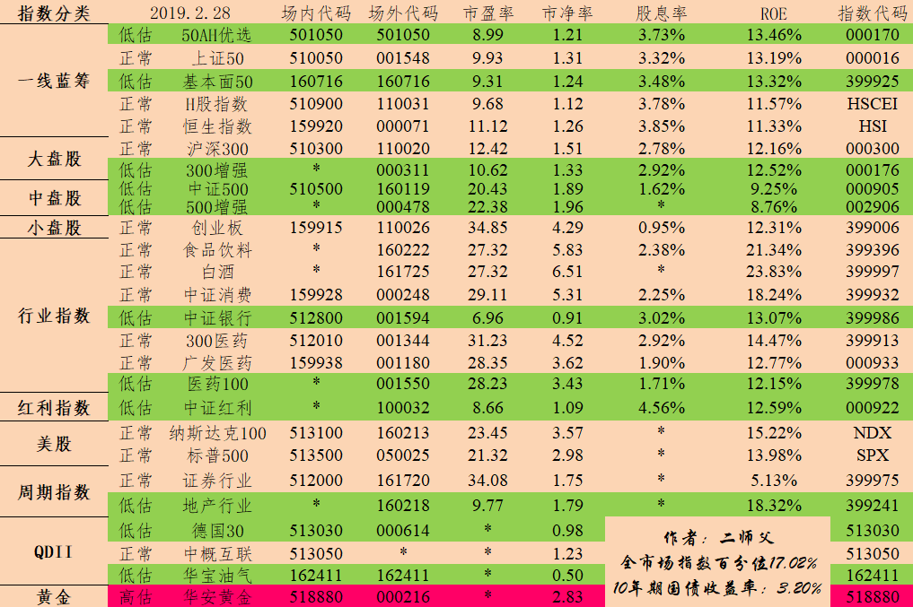

======================================================

_type: q&a
@飘羽[544442542815824]
2019-03-01 04:57:23 Fri  
topic_id: 422224528541218

@飘羽

>  二师父，计算机指数001629现在估值正常了吗？前几天买的，收益5%，是继续持有，还是赎回呢？

@二师父

>  仍旧低估，还可以继续定投一段时间，不过从低位上涨也有30多个点了

阅读[1978]  评论[0]  赞[0] 

======================================================

_type: talk
@二师父[28814221155551]
2019-03-01 05:03:43 Fri  
topic_id: 844445248421522

打卡110天，你坚持做了一件自己热爱的事情吗

<e type="web" href="https://mp.weixin.qq.com/s/Wg85C7F-JYf8AmkmPt_4wA" title="二师父定投打卡第110期" cache="" />

阅读[2014]  评论[0]  赞[0] 

======================================================

_type: q&a
@俗人[844151888542152]
2019-03-01 08:37:20 Fri  
topic_id: 544442541844184

@俗人

>  基金定投和打新股哪一个更挣钱

@二师父

>  基金定投更挣钱的，如果把基金定投比作吃饭，那么港股打新就相当于吃零食

阅读[2087]  评论[3]  赞[0] 

======================================================

_type: talk
@堂吉诃德的小助手[15528821588422]
2019-03-01 08:53:24 Fri  
topic_id: 544442545115514

大家好，新人报道，希望以后理财的路上能同各位一起进步。请多关照！

@二师父 at 2019-03-01 08:53:24 Fri

> 欢迎

----------

阅读[1933]  评论[1]  赞[0] 

======================================================

_type: q&a
@暖心人[844121214481512]
2019-03-01 12:42:19 Fri  
topic_id: 111112414148212

@暖心人

>  二师父在吗？如果我在低估时间定投了，在正常的时候哪怕盈利了也不卖，等高估再出手，这样是不是也可以，就是这样的风险大了很多对吧？@二师父～北京～金融

@二师父

>  没有风险，低估定投的指数基金都非常安全，就是这样做需要经受浮动，如果能够经受住，持有到高估卖出也是很不错的

阅读[1915]  评论[0]  赞[0] 

======================================================

_type: q&a
@不言而喻[111141821182282]
2019-03-01 12:43:39 Fri  
topic_id: 844445441114552

@不言而喻

>  请教二师父，如何判断指数的估值高低？

@二师父

>  按照这个表格后面的估值区间判断，低于低点就是低估，高于高点就是高估

阅读[1988]  评论[0]  赞[0] 

======================================================

_type: talk
@惟子[88481814485542]
2019-03-01 13:09:40 Fri  
topic_id: 111112182111542

二师父<e type="hashtag" hid="281122421221" title="#提问#" /> 请问我为何在蛋卷基金申购德国30（代码000614）前后三次都没有成功呢[疑问]

阅读[1854]  评论[0]  赞[0] 

======================================================

_type: q&a
@蔡蔡蔡[15442451484542]
2019-03-01 15:26:47 Fri  
topic_id: 244445418585441

@蔡蔡蔡

>  二师父，你好。之前看很多公众号所以有跟着买一些基金。但是最近加入星球后，知道自己买的太散了，很多肯定都是重复的。沪深300和中证500.二师父能帮我看一下吗？沪深：易方达沪深300ETF联接，易方达沪深300医药卫生ETF，富国沪深300指数增强，景顺长城沪深300增强。中证500:鹏华中证500指数，信诚中证500，南方中证500量化增强股票A，南方中证500量化增强股份C，南方中证508ETF联接（LOF ）A，建信中证500指数增强，富国中证500指数增强LOF。二师父能帮优化或者建议一下吗？我自己感觉肯定很多重复了。但是也有点云里雾里的。

@二师父

>  300增强和500增强可以都选择富国的，其他的300指数和500指数可以停止了，都是重复的，买一只就行啦

阅读[1964]  评论[3]  赞[0] 

======================================================

_type: q&a
@堂吉诃德的小助手[15528821588422]
2019-03-01 19:02:07 Fri  
topic_id: 544442484885214

@堂吉诃德的小助手

>  二师傅，刚刚拜读了五部定投法，其中对股票选择很有兴趣。能否像评测平安的评估例子那样，按当时股票信息多举几例呢？

@二师父

>  好的哈，后面我可以分享具体的评估方法，然后大家可以自己计算

阅读[1873]  评论[4]  赞[0] 

======================================================

_type: q&a
@凭栏观海[244414845852181]
2019-03-01 21:09:15 Fri  
topic_id: 244445411488851

@凭栏观海

>  民生银行在6元的时候没有买到，现在都6.69元了，想买又有点犹豫，现在这个价位还能介入吗二师父老师

@二师父

>  这个民生银行从估值的角度看，目前可以买，不贵，可是他的盈利能力，和盈利增长率都偏低，不具备牛股特征

阅读[1949]  评论[4]  赞[0] 

======================================================

_type: talk
@二师父[28814221155551]
2019-03-01 21:21:45 Fri  
topic_id: 544442488848844

<e type="hashtag" hid="281158284851" title="#市场分析#" /> 本周的主旋律是涨，再次提醒下，机会是跌出来的，风险是涨出来的

maci指数将提高a股的权重，外资流入对a股短期是利好，眉清目秀的易主席首秀，科创板落地，那些小盘无价值的股票被消灭之后，a股会有一个长牛

别问我怎么判断的，纯属算命，如果大盘再上涨鳄鱼计划就停止，增量资金买入货币基金，既然是鳄鱼，就只在最佳机会张开嘴。

阅读[1896]  评论[0]  赞[0] 

+++++++++++++++++++++++++++++++++++++++++++++++++++++

图片：
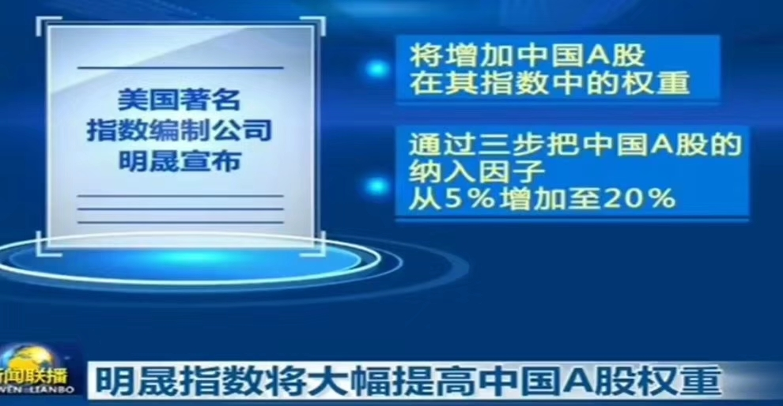

======================================================

_type: talk
@二师父[28814221155551]
2019-03-02 04:36:18 Sat  
topic_id: 422224142441528

<e type="hashtag" hid="481211145528" title="#指数估值#" /> 银行进入正常估值了，可以收割利润。

@海盗 at 2019-03-02 04:36:18 Sat

> [强]我们都一样[奸笑]

----------

@二师父 at 2019-03-02 04:36:18 Sat

> 宽基是最佳的

----------

@蒋 at 2019-03-02 04:36:18 Sat

> 这么涨，会没有多少低估的品种了

----------

@二师父 at 2019-03-02 04:36:18 Sat

> 不用怕，记住市场一定会给我们机会，你看股市涨的很好，我们追踪的黄金和债券却下降了

----------

@蒋 at 2019-03-02 04:36:18 Sat

> 估值表没看见债券，黄金现在是高估。个人认为现在配置大基建方面的行业基金是不是可以。因为按现在的经济环境，还是要政府加大投资

----------

@二师父 at 2019-03-02 04:36:18 Sat

> 国债收益率就是衡量债券的指标，地产指数有配置

----------

@蒋 at 2019-03-02 04:36:18 Sat

> 国债的收益率下降，是不是意味着全市场的平均利润率下降，利润率下降，生意就难做了，既然生意不好做那股市也就不会好到哪里去。是不是这个道理。

----------

阅读[1788]  评论[13]  赞[0] 

+++++++++++++++++++++++++++++++++++++++++++++++++++++

图片：
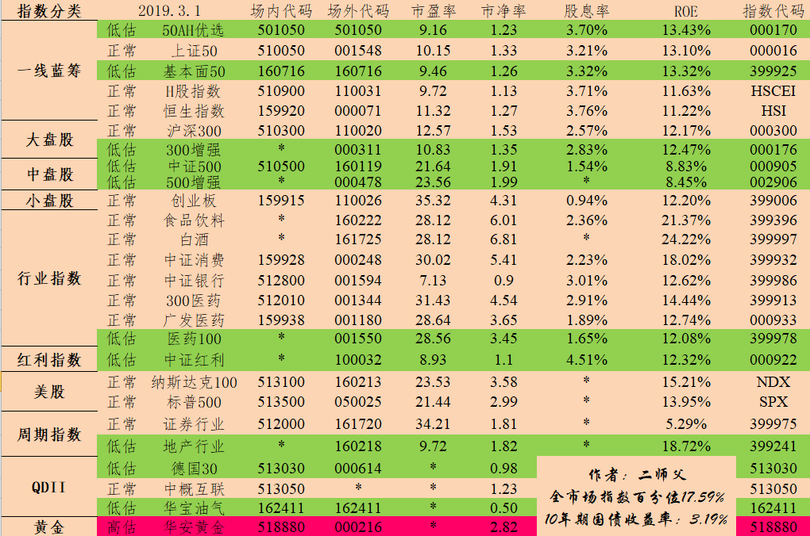

======================================================

_type: talk
@二师父[28814221155551]
2019-03-02 04:36:39 Sat  
topic_id: 544442824228584

<e type="hashtag" hid="481152241228" title="#MSCI指数#" />

@海盗 at 2019-03-02 04:36:39 Sat

> 谢谢二师父的分享🙏

----------

@Claire at 2019-03-02 04:36:39 Sat

> 在市场环境发生变化的时候，二师父总会给我们指引方向。谢谢二师父[咖啡]

----------

@二师父 at 2019-03-02 04:36:39 Sat

> 不客气，不管怎么变，我们做好自己就可以啦

----------

@老丁 at 2019-03-02 04:36:39 Sat

> 你好，二师父，你文章中说的你的估值预设了更高的安全边界，是否可以讲讲如何设定安全边界的操作呢？也就是说是否有什么流程形的方式可以来做这个事情？谢谢

----------

@二师父 at 2019-03-02 04:36:39 Sat

> 举个生活中的例子，车速80迈比较高，但是也不至于太快，如果控制车速在80迈以下就安全，投资类似，价格贵了就不安全了，控制在一个安全范围内，比如你设定大盘在2800点以下投资a股绝对安全，很多种设置标准

----------

阅读[5576]  评论[5]  赞[0] 

+++++++++++++++++++++++++++++++++++++++++++++++++++++

文件：
2019-03-02 04:36:27 Sat
文件大小：[23401]
28844541248281-外资涌入A股，对我们的定投有何影响.docx

======================================================

_type: q&a
@往事随风[48515148521428]
2019-03-02 10:22:03 Sat  
topic_id: 422224142424818

@往事随风

>  二师父您好！请问现在中概互联还可以继续定投吗？场外的话易方达中概互联联接和交银中证海外互联网指数哪个更好一些？

@二师父

>  我很早就投中概互联了，目前正常估值不适合定投，场外是易方达中概互联基金好一些的

阅读[1765]  评论[0]  赞[0] 

======================================================

_type: talk
@二师父[28814221155551]
2019-03-02 11:02:32 Sat  
topic_id: 544442828254484

<e type="hashtag" hid="825224481212" title="#周末答疑之股权投资#" /> 股权投资有两种渠道，一是配置指数，通过购买指数基金配置股权，具体的定投哲学和交易系统已经建立，大家根据我的五步定投法参照估值表定投即可，一定要实践，在实践中发现问题解决问题，越早开始教的学费越少，我是大学开始投资的，那时候资金少，本金连现在盈亏多都没有，所以亏了也没事，所以一定要趁早开始，这样会少教学费

另外，通过购买股票配置股权，二师父的选股原则非常严格，考虑roe指标和每股收益率指标，这样有可能错过一些好的股票，但是宁可错过也别过错，现在市场回暖，肯定有亲戚又来推荐股票了，你要独立判断，无法判断价值就看净资产收益率和每股收益率是否有20个点，没有就别碰了

然后再看基本面，结合20日均线法则买入，最后设定止损点，这样就安全了，切记不要等股票亏损50个点了再来止损，股票投资不可逆势加仓

最后提醒一句，股票投资比指数复杂，如果你没有自己的一套系统，别人推荐任何股票都别买，这里风险很高，请记住投资第一要义是避免亏损，不是赚钱

@归去来兮 at 2019-03-02 11:02:32 Sat

> 股票不像指数那样，股票跌多了补仓会心慌，怕公司基本面恶化或有什么不知道的消息，怕踩雷，指数不用担心个股基本面风险问题。

----------

@二师父 at 2019-03-02 11:02:32 Sat

> 所以股票不建议逆势投资，设定止损点

----------

@堂吉诃德的小助手 at 2019-03-02 11:02:32 Sat

> 二师傅有空的话可以找两个具体股分析一下吗？好想学学如何选股！五部定投里的一个平安例子不足于看清楚。

----------

@低吟浅唱 at 2019-03-02 11:02:32 Sat

> 二师父这篇文章水平很高哈～虽然简短，却道出了投资的真谛～

----------

@二师父 at 2019-03-02 11:02:32 Sat

> 好的，还是建议学好定投，先把基础打扎实

----------

@二师父 at 2019-03-02 11:02:32 Sat

> 请多指教

----------

@堂吉诃德的小助手 at 2019-03-02 11:02:32 Sat

> 这个我多说几句。我之前是炒股，通过公众号认识二师傅，其实提到配置一些股票类的公众号也有，要么不建议，要么不告诉方法。我比较认同二师傅看法，先找先赢，再求多赢，大部分资金我已经投到指数基金里了，但作为老股民，我个人认为股票还是可以配置一部分，只是知识有限，不太清楚如何分析个股投资价值，虽说才开始学习，但总归学比不学好。跟对人有人指点比自己瞎琢磨强。所以不止要求一次二师傅指点一些股票知识，没想到两次都被二师傅回复。感觉进这个星球挺值的。另只是希望不忙的时候分析一二，星主忙，也没义务处理我的疑问。再次感谢！

----------

@二师父 at 2019-03-02 11:02:32 Sat

> 好的，大家的提出的建议只要合理我大部分会采纳，后面会逐步分享我的股票分析方法，把我的思路和买卖原则传授给大家

----------

阅读[1924]  评论[8]  赞[0] 

======================================================

_type: talk
@陈[844415515418422]
2019-03-02 11:17:35 Sat  
topic_id: 111112828282882

二师父，您好！如果现在开始学习定投的新人，还有那些基金可以建立底仓？

@与光线赛跑 at 2019-03-02 11:17:35 Sat

> 同问

----------

@二师父 at 2019-03-02 11:17:35 Sat

> 之前没投的话建议中证500

----------

@丸子妈 at 2019-03-02 11:17:35 Sat

> 中证500指数，很多基金公司都有，那怎么判断选择？

----------

@二师父 at 2019-03-02 11:17:35 Sat

> 选择费率低，跟踪误差较小的

----------

阅读[1787]  评论[5]  赞[0] 

======================================================

_type: talk
@与光线赛跑[544854251224214]
2019-03-02 11:34:39 Sat  
topic_id: 244445151852441

大家好，新人报道，希望以后理财的路上能同各位一起进步。请多关照！

@Franky at 2019-03-02 11:34:39 Sat

> 加油，好好学习哈

----------

阅读[1851]  评论[1]  赞[0] 

======================================================

_type: q&a
@低吟浅唱[111182514481482]
2019-03-02 11:39:50 Sat  
topic_id: 111112828522282

@低吟浅唱

>  二师傅你好，2月份股票的收益虽然跑赢了大多数股民，但还是跑输了沪深300，我现在想买入并持有300ETF和500ETF，，300的估值并不低，500ETF怎么样呢～

@二师父

>  500etf的估值仍旧很低，可以购买，股票很多跑不过指数，我买的消费ETF和券商ETF收益率秒杀了很多股票

阅读[2052]  评论[4]  赞[0] 

======================================================

_type: q&a
@聪明的笨蛋[544858411212244]
2019-03-02 11:46:42 Sat  
topic_id: 111112828511882

@聪明的笨蛋

>  星球快到期会有提醒到期信号吗？

@二师父

>  会的啊，提前一个月提示，我记得你才加入不久吧

阅读[2141]  评论[1]  赞[0] 

======================================================

_type: q&a
@归去来兮[111851181241512]
2019-03-02 12:27:34 Sat  
topic_id: 544442828521484

@归去来兮

>  二师父，我帮别人打理了两个场内账户，资金也不多，也就六七万左右，想买点什么组合相对比较稳健，放几个月大概率能有比较不错收益也不用操太多心的？我的主要精力还得放在自己的账户上。二师父有什么组合的建议？谢谢！

@二师父

>  货币基金比较稳健，稳定收益，帮别人理财可累心了，指数波动性也大的不知对方是否能承受

阅读[2153]  评论[8]  赞[0] 

======================================================

_type: q&a
@幻水[881185412112]
2019-03-02 17:19:56 Sat  
topic_id: 244445182888281

@幻水

>  有一个私募经理名董宝珍，他以前重仓茅台赚了很多钱，他现在是重仓银行股，请问谁知道他重仓的是哪一个银行股啊？

@二师父

>  兴业爆发了

阅读[1973]  评论[0]  赞[0] 

======================================================

_type: talk
@Eric[48548828828848]
2019-03-02 21:25:57 Sat  
topic_id: 244445184252541

拉了400多期中正红利周定投得净值与持仓成本的曲线图，最后发现当定投饭一定期数后，成本的变化非常小，但份额却在增加。

@二师父 at 2019-03-02 21:25:57 Sat

> 最近价格没跌下去了，后面会越来越平华

----------

@归去来兮 at 2019-03-02 21:25:57 Sat

> 在高位卖出部分才能让成本明显下降

----------

阅读[1616]  评论[3]  赞[0] 

+++++++++++++++++++++++++++++++++++++++++++++++++++++

图片：
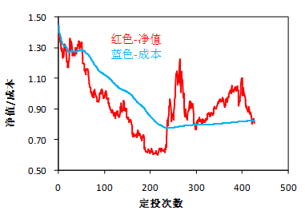

======================================================

_type: talk
@二师父[28814221155551]
2019-03-03 04:12:12 Sun  
topic_id: 422224158588858

<e type="hashtag" hid="454552155218" title="#如何建立底仓#" /> 只适合刚开始定投的朋友

@与光线赛跑 at 2019-03-03 04:12:12 Sun

> 学习了

----------

@凭栏观海 at 2019-03-03 04:12:12 Sun

> 全面配置，低估定投，正常收割，高估卖本[强]

----------

阅读[5194]  评论[2]  赞[0] 

+++++++++++++++++++++++++++++++++++++++++++++++++++++

文件：
2019-03-03 04:11:47 Sun
文件大小：[23560]
88844512511452-刚开始定投，如何建立底仓.docx

======================================================

_type: talk
@二师父[28814221155551]
2019-03-03 04:14:56 Sun  
topic_id: 544442851515244

<e type="hashtag" hid="454841141288" title="#均线偏离表#" /> 如今市场一直大涨，除了华宝油气，其他的可以停止均线定投策略

@聪明的笨蛋 at 2019-03-03 04:14:56 Sun

> 支付宝里的慧定投也是按均线定投多少，那意思是不是也该停止了

----------

@二师父 at 2019-03-03 04:14:56 Sun

> 只要低估就可以定投，均线策略只是一种辅助

----------

阅读[1695]  评论[2]  赞[0] 

+++++++++++++++++++++++++++++++++++++++++++++++++++++

图片：
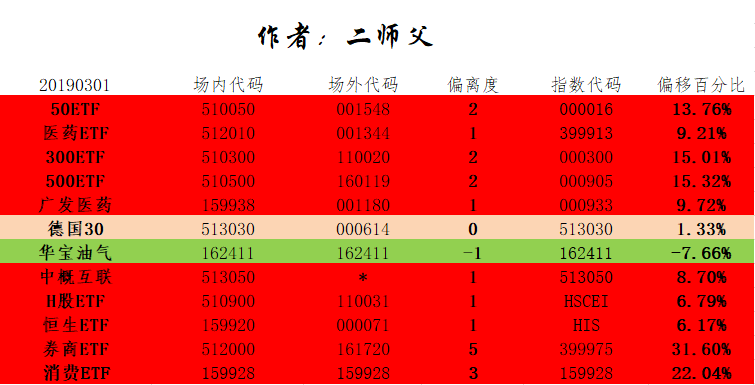

======================================================

_type: q&a
@zxc[51145258542214]
2019-03-03 09:54:07 Sun  
topic_id: 244445128424181

@zxc

>  二师父，中证500和500增强现在定投哪个会更好点，目前都是低估，但是看您每次都是推荐500，是这个目前更具投资价值吗，现在这两个还适合建底仓吧

@二师父

>  都可以，中证500是纯被动指数，500增强不是完全被动的指数，这两个我都有投资的，如果中证500不低估了，500增强低估，可以用500增强替代

阅读[1537]  评论[0]  赞[0] 

======================================================

_type: q&a
@低吟浅唱[111182514481482]
2019-03-03 09:55:19 Sun  
topic_id: 844445128112142

@低吟浅唱

>  二师父，我咨询下，我定投了一年半的证券指数和创业板指数，现在盈利比较大了～后市是按照以前的计划坚持按月定投（慧定投），还是停止定投呢～它们目前已经不在低估了～

@二师父

>  不低估了就停止定投，等低估了继续，这是我的策略

阅读[1611]  评论[3]  赞[0] 

======================================================

_type: talk
@二师父[28814221155551]
2019-03-03 10:19:08 Sun  
topic_id: 844445122881182

A股近些年分红最多的股票

@二徒弟 at 2019-03-03 10:19:08 Sun

> 现在买进工商银行拿个两三年，只要不是2018，大概率都是赚钱了，分红都够了

----------

@Claire at 2019-03-03 10:19:08 Sun

> 请教二师父，现在可以进中国银行吗，准备长期持有[微笑]

----------

@二师父 at 2019-03-03 10:19:08 Sun

> 我是趋势交易，建议看看我的股票五步交易法，不然上涨容易拿不住，下跌容易死捂

----------

@Claire at 2019-03-03 10:19:08 Sun

> 明白了，谢谢二师父[咖啡]

----------

阅读[1672]  评论[4]  赞[0] 

+++++++++++++++++++++++++++++++++++++++++++++++++++++

图片：
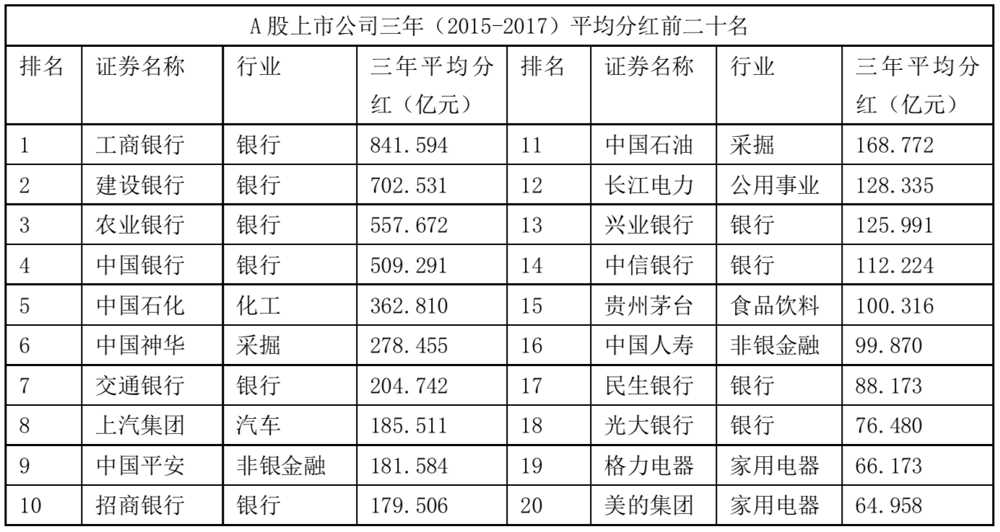

======================================================

_type: q&a
@聪明的笨蛋[544858411212244]
2019-03-03 10:30:03 Sun  
topic_id: 544442855118454

@聪明的笨蛋

>  中证500和500增强可同时持有，不重叠吗？

@二师父

>  有重叠的，选择一个就行，当一个低估一个没有低估是可以替代的，就跟50ah和沪深300一个道理

阅读[1826]  评论[0]  赞[0] 

======================================================

_type: q&a
@niwota[422255254814458]
2019-03-03 12:44:39 Sun  
topic_id: 111112841224112

@niwota

>  请问二师父，我想在PE  PB越跌时买入的比例越多，并且结合一次性买入。在投资前想先测试下，哪里有智能些的定投计算器呢。
>  一般都是简单的按时间分期买入。

@二师父

>  智投星和果仁网

阅读[1742]  评论[0]  赞[0] 

======================================================

_type: q&a
@LookGod[15142444258282]
2019-03-03 14:04:21 Sun  
topic_id: 544442854522854

@LookGod

>  今天去中国证券监督管理委员会的网站上查了下公募基金销售机构，，没有发现蛋卷啊，，，。😳😳

@二师父

>  这是提供支付结算服务的

阅读[1771]  评论[7]  赞[0] 

======================================================

_type: talk
@水墨青花[48812451215118]
2019-03-03 14:27:46 Sun  
topic_id: 544442854582144

估值表在哪里看最新的呢

@二师父 at 2019-03-03 14:27:46 Sun

> 每天都发布的

----------

阅读[1600]  评论[1]  赞[0] 

======================================================

_type: q&a
@冉冉[88445118854412]
2019-03-03 15:04:29 Sun  
topic_id: 544442854412144

@冉冉

>  二师傅，我想在蚂蚁财富购买基金，不知安全性如何？它是使用余额宝的金额购买还是使用链接的银行卡里的金额购买？赎回时，赎回时资金进余额宝还是进银行卡？

@二师父

>  这个安全性挺好的，支付宝有一款保险可以保证资金损失赔付，钱既可以进余额宝，也可以进银行卡，和支付宝绑定的银行卡一致

阅读[1763]  评论[11]  赞[0] 

======================================================

_type: talk
@堂吉诃德的小助手[15528821588422]
2019-03-03 15:18:58 Sun  
topic_id: 244445124414221

二师傅，这个每股利润和每股收益增长率是从哪里找的呢？还是自己通过年报算出来的呢？我在手机同花顺里找不到每股利润！

@半路出家滚雪球 at 2019-03-03 15:18:58 Sun

> 股票软件F10，财务数据里面有的

----------

@堂吉诃德的小助手 at 2019-03-03 15:18:58 Sun

> 手机软件没有吧？手机软件不能看？

----------

@半路出家滚雪球 at 2019-03-03 15:18:58 Sun

> 有的，自己找找。

----------

阅读[1811]  评论[3]  赞[0] 

+++++++++++++++++++++++++++++++++++++++++++++++++++++

图片：
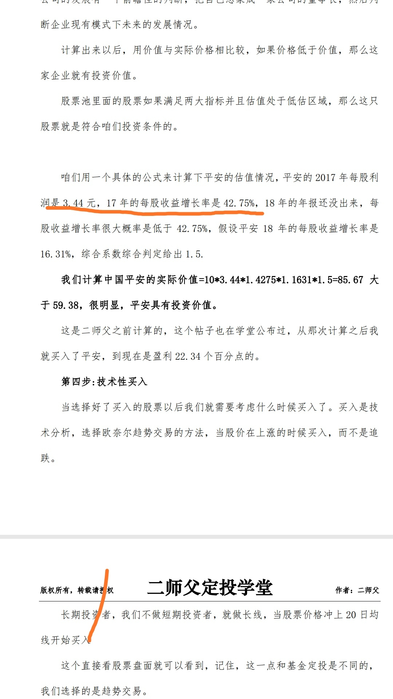

======================================================

_type: talk
@二师父[28814221155551]
2019-03-03 15:48:53 Sun  
topic_id: 111112841855412

买基金后都能收到基金公司的短信。申购赎回基金公司都有短信提示。平台倒了也能从基金公司找回来。

阅读[1805]  评论[0]  赞[0] 

======================================================

@二师父[28814221155551]
2019-03-03 15:56:47 Sun  
topic_id: 111112841855282

>  @二师父
>  

阅读[1912]  评论[1]  赞[0] 

======================================================

_type: q&a
@冉冉[88445118854412]
2019-03-03 15:57:16 Sun  
topic_id: 244445124184821

@冉冉

>  请问二师傅，华宝油气我看不到实时交易估值，它是在美股市场交易的吗？看了看天天基金的估值，周五的时候只能看见2月27日的，本想买，没下手，今天看已是3月1日，我挺想配置点，不知现在开始定投合适吗？

@二师父

>  低于0.56就可以逐步定投，这是周期指数，别重仓就行

阅读[2000]  评论[7]  赞[0] 

======================================================

_type: talk
@二师父[28814221155551]
2019-03-03 16:20:51 Sun  
topic_id: 844445124148142

传递知识要站在读者的角度考虑，可能你知道很多知识，关于定投的，可是大部分中国人，尤其60到70后并不知道什么是基金，可以在哪里购买，风险如何

未来我的目标就是普及基金让没有接触过股权投资的人都能够接受

阅读[1940]  评论[0]  赞[0] 

======================================================

_type: talk
@堂吉诃德的小助手[15528821588422]
2019-03-03 16:41:03 Sun  
topic_id: 422224124282528

为何我查的跟老师分析的数据不一样啊？莫非我查的不对？

阅读[1930]  评论[0]  赞[0] 

+++++++++++++++++++++++++++++++++++++++++++++++++++++

图片：
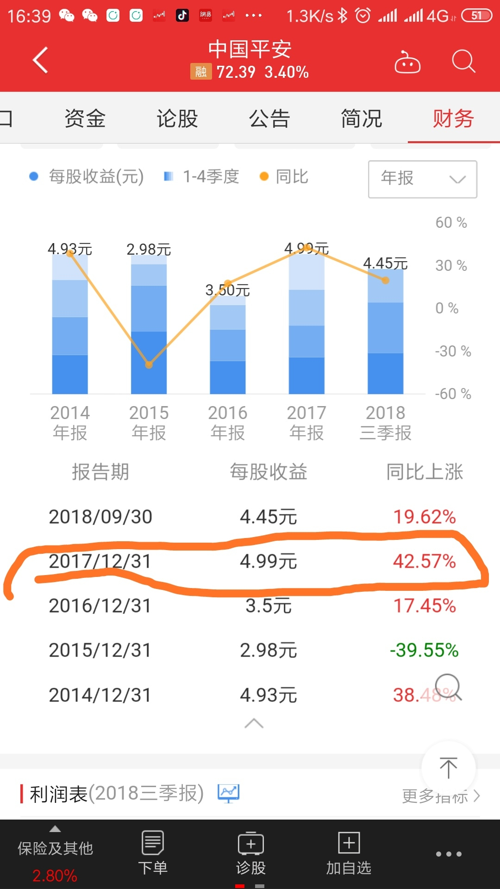

======================================================

_type: q&a
@凭栏观海[244414845852181]
2019-03-03 17:21:46 Sun  
topic_id: 244445145481551

@凭栏观海

>  双汇发展这只股票值得长期持有吗？现在的估值是否可以买入？

@二师父

>  这个我晚上计算一下

阅读[2050]  评论[3]  赞[0] 

======================================================

_type: q&a
@阳光大男孩[422182554548428]
2019-03-03 17:26:27 Sun  
topic_id: 244445145425221

@阳光大男孩

>  1、  阈值是怎么计算的，是根据历史波动范围，人为估算的吗？还是根据分布概率计算的，如正态分布。
>  2、  阈值是追踪pe的吗？有些行业pb会不会更适合？
>  3、  阈值是不断调整的吗
>  4、  追踪指数的选择范围是什么？是wind上的所有指数，还是你在蓝筹、大盘、中盘、小盘、红利、行业、海外这7大类型？
>  5、  追踪指数的筛选标准都有哪些？年化收益率，最大回撤，还有其他的吗？

@二师父

>  结合四个估值指标历史走势计算的
>  追踪的有市盈率，市净率，股息率
>  阈值会变化的，尤其是指数调仓以后
>  这9大类基本把万得涵盖了，因为持仓股票会有重合，选择的指数符合能够涵盖各个行业的股票就行
>  选择注重全覆盖，历史收益率，收益稳定性，指数持仓股票为好行业，好公司，以价值为最高尺度

阅读[2044]  评论[1]  赞[0] 

======================================================

_type: q&a
@空瓶子[88282241812242]
2019-03-03 17:44:17 Sun  
topic_id: 111112812815182

@空瓶子

>  二师父，银行ETF有分红的吗

@二师父

>  有分红的

阅读[2069]  评论[3]  赞[0] 

======================================================

@二师父[28814221155551]
2019-03-03 19:08:48 Sun  
topic_id: 244445148518141

>  @二师父
>  

阅读[2075]  评论[3]  赞[0] 

======================================================

_type: q&a
@波[28855811142441]
2019-03-03 22:35:33 Sun  
topic_id: 544442841551824

@波

>  请教二师父，如果到了熊市极度低迷期成交量萎缩很小时候，我把一定金额的多年都长期不用闲置资金比如十万元买入场内的中指500ETF指数等，然后过一段时间，它涨了，就卖出涨的那一部分，它跌了，就买入跌掉的那一部分，使市值始终保持在这个固定金额十万元。这样的操作好不好？

@二师父

>  也可以，适合震荡市场，如果一直震荡最后肯定投入多于10万了

阅读[1931]  评论[1]  赞[0] 

======================================================

_type: q&a
@凭栏观海[244414845852181]
2019-03-03 22:37:05 Sun  
topic_id: 244445148448181

@凭栏观海

>  老师，请问目前兴全可转债的估值，现在可以投资吗？因为老师的估值表里没有这个基金，心里没有把握。

@二师父

>  我的可转债选的安信可转债基金，兴全定投也可以的

阅读[2087]  评论[0]  赞[0] 

======================================================

_type: q&a
@Demon[422184182112828]
2019-03-03 22:38:35 Sun  
topic_id: 111112815181812

@Demon

>  二师父，不同基金有对应的低估阈值，例如中证500指数阈值是25，这个值会随着指数点位大小的变化而变化吗？这个值是由国家机构发布还是其他机构计算得出的啊？

@二师父

>  阈值会随着股市和经济的整体发展以及指数调仓而变化，这个是我计算出来的，每次调整的话我都会公布的

阅读[2157]  评论[7]  赞[0] 

======================================================

_type: q&a
@小眼静🎀[844121141821482]
2019-03-03 22:39:54 Sun  
topic_id: 544442841822884

@小眼静🎀

>  二师父，我上月7号定投了兴全沪深300，请问是否还有必要50ah？我想再配置中证500，请问是搭配50ah还是继续持有兴全沪深300比较好？

@二师父

>  沪深300纯被动指数目前是正常估值的，建议50ah替代，配置50ah和中证500两个指数

阅读[2196]  评论[1]  赞[0] 

======================================================

_type: q&a
@蝙蝠侠大战超人[48522585242588]
2019-03-03 22:43:56 Sun  
topic_id: 844445148152482

@蝙蝠侠大战超人

>  二师父你说过创业板指数，医药板块指数，银行指数都已经正常估值了，我现在是停止定投等待低估值比较好还是逐步减少定投金额好一点？前提我可以接受一段时间的跌。本人情况：本人接触基金定投时间没有超过3个月，可以接受一段时间亏损，想长期定投基金穿过至少一个牛熊周期，想把定投作为长期理财的一部分。都说定投15%以上就可以考虑卖出。目前本人情况：除了定投了50AH和中证500以外，融通创业板指数A/B，目前也就投了三期，本金6000，目前有1000盈利，有没有必要把盈利那部分卖了？天弘中证100医药指数A投入本金7000，盈利700，同样有没有必要卖了盈利部分？天弘中证银行指数A也差不多这个情况

@二师父

>  如果有盈利正常估值是卖出利润的，按照你说的情况，如果不着急用钱，可以连续5到10年定投，那么不用考虑估值，直接高位少投，低位多投，我测算过，即使什么策略都不用，无脑定投年化收益率也有13个百分点，你可以一直定投，然后牛市高点一次清仓换成债券基金
>  
>  当然如果按照低估定投策略收益率是比一直定投好的，唯一的问题一直等待机会很多资金闲置，看你怎么选择

阅读[2376]  评论[2]  赞[0] 

======================================================

_type: q&a
@聪明的笨蛋[544858411212244]
2019-03-03 22:45:35 Sun  
topic_id: 422224125852128

@聪明的笨蛋

>  未加入学堂之前不懂得基金成本，在低估时买了两只C类基金。进入学堂后知道了基金成本是怎么回事。那现在是该卖出还是继续持有？求建议？

@二师父

>  可以持有，等市场高位逐步卖出，c类管理费高，但是申购赎回费率很低，有的直接没有

阅读[2565]  评论[0]  赞[0] 

======================================================

_type: talk
@二师父[28814221155551]
2019-03-04 04:57:30 Mon  
topic_id: 244445115518111

<e type="hashtag" hid="454551422118" title="#基金和股票的区别#" /> 最近比较忙，保证文章的正常更新，关于中国银行和双汇的股票估值计算明天分析了，周末加班，无法抽空，我会挤出时间帮大家分析的，答应大家的事情一定会做到。毕竟做公众号和知识星球赚不到多少钱，我暂时无法放弃自己待遇还不错的工作全职来教授基金定投知识。关于鳄鱼计划的文档内容我已经放到置顶文章里面了，大家自己查阅即可。

@凭栏观海 at 2019-03-04 04:57:30 Mon

> 感谢老师

----------

@冉冉 at 2019-03-04 04:57:30 Mon

> 师傅辛苦了

----------

@惟子 at 2019-03-04 04:57:30 Mon

> 谢谢二师父

----------

@海盗 at 2019-03-04 04:57:30 Mon

> 二师父辛苦了。

----------

@聪明的笨蛋 at 2019-03-04 04:57:30 Mon

> 辛苦了

----------

@Nienie💝 at 2019-03-04 04:57:30 Mon

> 二师父的金句好多

----------

@陈 at 2019-03-04 04:57:30 Mon

> 谢谢二师父！

----------

@根号2 at 2019-03-04 04:57:30 Mon

> [玫瑰]努力的人

----------

阅读[6177]  评论[9]  赞[0] 

+++++++++++++++++++++++++++++++++++++++++++++++++++++

文件：
2019-03-04 04:54:11 Mon
文件大小：[24368]
51144284541554-定投基金与投资股票的区别.docx

======================================================

_type: talk
@二师父[28814221155551]
2019-03-04 09:32:10 Mon  
topic_id: 111112882884242

<e type="hashtag" hid="142448285212" title="#卖出提示#" /> 银行进入正常估值区域，卖出利润部分，也可以不卖，一直持有到牛市高点，看个人投资风格

置顶文章一定要仔细看，里面的附件也是，不能只看表象哈

@凭栏观海 at 2019-03-04 09:32:10 Mon

> 收到

----------

@蒋 at 2019-03-04 09:32:10 Mon

> 我是在场内买的银行ETF，还没到10个点，不卖

----------

@Claire at 2019-03-04 09:32:10 Mon

> 收到了，谢谢二师父的提醒，辛苦你了

----------

@shi at 2019-03-04 09:32:10 Mon

> 我的盈利15%了，但是由于没建立底仓，仓位太轻。
继续智能自动定投。

----------

@Zyxj at 2019-03-04 09:32:10 Mon

> 我的仓位很低，暂时不卖，等着高估再收割。谢谢二师父提醒，您辛苦了！

----------

@自由飞翔 at 2019-03-04 09:32:10 Mon

> 我的仓位也很低，暂时不卖，等着高估再收割。谢谢二师父提醒，您辛苦了！

----------

阅读[2337]  评论[6]  赞[0] 

======================================================

_type: q&a
@顾。[51558482245254]
2019-03-04 10:47:40 Mon  
topic_id: 111112885445142

@顾。

>  二师父，从去年中旬开始跟你定投的，有个问题不太明白：
>  去年那会儿3000多点的，你的估值表里还是一片绿色，大部分是低估。现在也才3000多，怎么大部分就都进入正常估值了？

@二师父

>  没有大部分都进入正常估值啊，还有很多低估的，目前主要是蓝筹涨幅好，而且随着企业盈利增长股票估值是不断下移的，你可以对比下现在和之前的估值表，那时候很多品种还没有纳入估值表

阅读[2300]  评论[0]  赞[0] 

======================================================

_type: talk
@飞的那个飞[48584811554158]
2019-03-04 11:29:06 Mon  
topic_id: 422224118144428

以前基本面60 不知道现在是不是低估

@飞的那个飞 at 2019-03-04 11:29:06 Mon

> 以前买的基本面60现在浮盈还可以追一点吗？

----------

阅读[2092]  评论[1]  赞[0] 

======================================================

_type: q&a
@小明[544828524525514]
2019-03-04 12:05:03 Mon  
topic_id: 844445118484452

@小明

>  老师您好，您之前发布的网格里，中概互联到1.24应该卖出一格，请问在现在的市场条件下，是否应该严格按照网格卖出了呢？还是锁仓等待牛市呢？

@二师父

>  现在没有低位震荡了，可以一直持有，暂停网格交易

阅读[2319]  评论[1]  赞[0] 

======================================================

_type: q&a
@niwota[422255254814458]
2019-03-04 12:05:19 Mon  
topic_id: 111112885118582

@niwota

>  二师父，看了您的定投五步法，学到了很多。您说的按浮亏百分比进行修正加仓系数，您知道哪平台可以有这样自动定投的设置嘛？ 免去了人为的因素。

@二师父

>  蛋卷可以

阅读[2367]  评论[5]  赞[0] 

======================================================

_type: q&a
@冉冉[88445118854412]
2019-03-04 17:26:28 Mon  
topic_id: 544442888822184

@冉冉

>  请问二师傅，国投瑞银沪深300金融地产ETF 161211能分析一下有没有定投的价值？

@二师父

>  可以投资的，与50ah的投资价值很类似

阅读[2051]  评论[2]  赞[0] 

======================================================

_type: talk
@凭栏观海[244414845852181]
2019-03-04 18:14:58 Mon  
topic_id: 244448555121811

建议二师父出版文集或者在喜马拉雅听里面做讲座

@二师父 at 2019-03-04 18:14:58 Mon

> 好的，谢谢建议，会逐步开始，精力有限无法一下子全部展开

----------

阅读[2061]  评论[1]  赞[0] 

======================================================

_type: q&a
@低吟浅唱[111182514481482]
2019-03-04 21:47:01 Mon  
topic_id: 544441224141824

@低吟浅唱

>  二师父，我想咨询下科技股有没有相关的指数基金呢～中证TMT有ETF嘛～

@二师父

>  你是要ETF还是场外基金，场外有景顺的，场内你搜索中证TMT相关代码就行，今年涨幅不错

阅读[1916]  评论[0]  赞[0] 

======================================================

_type: q&a
@开卷沐春意[422214414858458]
2019-03-04 22:44:11 Mon  
topic_id: 422228441485228

@开卷沐春意

>  二师傅您好，我上周买了长城军工 601606，成本16.790,周五卖出100股，今天盈利一万多元，我没有卖出利润部分，，看看你的新手定投收割利润方法，我也不知道接下来该如何收割这支股票的利润，还望您多多指教，有劳您了。

@二师父

>  股票投资我不是用的利润收割，都是一次买入一次卖出，我看了看这个股票已经涨了很多，我是股票上穿20日均线买入，然后跌破20日均线卖出，或者达到预期收益卖出，全部是一次操作，均线可以20日也可以30日，一个参考

阅读[1969]  评论[0]  赞[0] 

======================================================

_type: q&a
@凭栏观海[244414845852181]
2019-03-04 22:54:21 Mon  
topic_id: 544441228115284

@凭栏观海

>  听说医药100也进入正常估值了，可惜可惜，还没有买够呢

@二师父

>  还有机会的，准备好资金

阅读[2150]  评论[0]  赞[0] 

======================================================

_type: q&a
@J[28281541518551]
2019-03-05 03:26:29 Tue  
topic_id: 244448551124211

@J

>  二师父您好，目前仓位只有1/3，请问3000点以上应该建底仓至1/2，还是持币等待低估时机再入场？

@二师父

>  继续定投就好啦，不用管那么多，别让市场上涨打乱了自己的定投节奏

阅读[2025]  评论[0]  赞[0] 

======================================================

_type: talk
@二师父[28814221155551]
2019-03-05 05:23:52 Tue  
topic_id: 844448585541112

<e type="hashtag" hid="481211145528" title="#指数估值#" /> 黄金进入正常估值了，等待低估继续买入

@暖心人 at 2019-03-05 05:23:52 Tue

> 国债上涨了呢

----------

@二师父 at 2019-03-05 05:23:52 Tue

> 是这样的，你说是国债收益率上涨吧，国债收益率＝收益除以国债价格，国债是下跌，因此收益率上涨

----------

阅读[2055]  评论[2]  赞[0] 

+++++++++++++++++++++++++++++++++++++++++++++++++++++

图片：
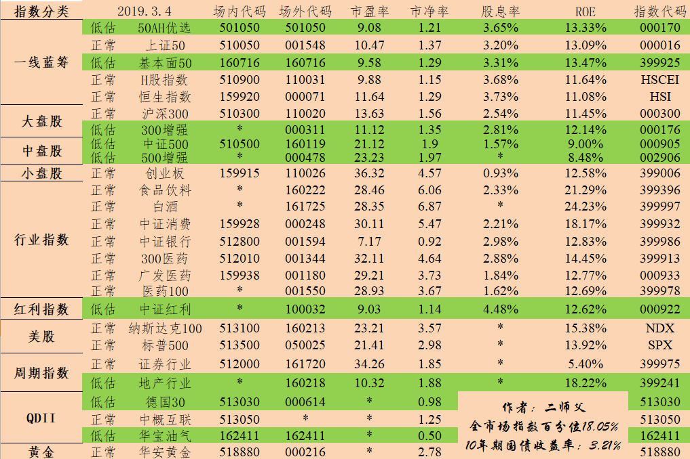

======================================================

_type: talk
@二师父[28814221155551]
2019-03-05 05:25:29 Tue  
topic_id: 422228484414458

<e type="hashtag" hid="881251425252" title="#鳄鱼计划#" /> 机会不佳的时候，逐步停止，后面可能会华宝油气，德国30买入，看具体情况，如果A股继续涨，A股指数的鳄鱼计划买入肯定是不加了。每周四定投实盘继续

@海盗 at 2019-03-05 05:25:29 Tue

> [玫瑰][玫瑰]

----------

@今晚吃手抓，谁给点大* at 2019-03-05 05:25:29 Tue

> 二师父有没有购买黄金的基金

----------

@二师父 at 2019-03-05 05:25:29 Tue

> 有啊，在估值表最后一栏就是

----------

@今晚吃手抓，谁给点大* at 2019-03-05 05:25:29 Tue

> 哦，哦[抱拳]

----------

@蒋 at 2019-03-05 05:25:29 Tue

> 我昨天买入华宝油气

----------

阅读[5678]  评论[5]  赞[0] 

+++++++++++++++++++++++++++++++++++++++++++++++++++++

文件：
2019-03-05 05:24:30 Tue
文件大小：[24403]
51144121185854-大盘突破3000点，我们的鳄鱼计划也逐步停止了.docx

======================================================

_type: q&a
@飞的那个飞[48584811554158]
2019-03-05 10:36:35 Tue  
topic_id: 844448585811142

@飞的那个飞

>  以前买的基本面60现在浮盈还可以追一点吗？

@二师父

>  目前仍旧低估，可以正常定投，定投没事

阅读[1919]  评论[1]  赞[0] 

======================================================

_type: q&a
@J[28281541518551]
2019-03-05 10:37:30 Tue  
topic_id: 544441215545224

@J

>  早上好，请问二师父，A股大涨一个月，春节后买入的纯债基金却都在下跌，我现在应该赎回还是继续持有这部分债基呢？

@二师父

>  应该赎回了，股市继续涨，纯债基金还会进一步下跌的

阅读[1998]  评论[0]  赞[0] 

======================================================

_type: q&a
@凭栏观海[244414845852181]
2019-03-05 10:42:38 Tue  
topic_id: 422228485255548

@凭栏观海

>  老师，有时间分析一下双汇发展，现在可以入手吗？

@二师父

>  您好，我会分析的哈，最近一直比较忙，分析股票需要阅读财务报表，查阅数据，计算，需要时间，我有时间会分析发到群里的，您也可以按照我给出的公式自己计算下哈

阅读[2156]  评论[5]  赞[0] 

======================================================

_type: q&a
@程洋[28258521545511]
2019-03-05 11:34:25 Tue  
topic_id: 244448584248511

@程洋

>  基金000478可不可以买?

@二师父

>  建信中证500增强，追踪的500增强指数，是低估，可以购买的

阅读[2067]  评论[4]  赞[0] 

======================================================

_type: talk
@生活（袁）[844411812115152]
2019-03-05 14:03:19 Tue  
topic_id: 544441218551414

二师傅你好，你之前推荐的易方达安心回报债A，今年已经涨了很多了现在还适合入手吗，定投呢还是一次买入好一些。

@二师父 at 2019-03-05 14:03:19 Tue

> 现在已经不太适合了，定投还是可以，不过金额也别太大了

----------

阅读[1782]  评论[1]  赞[0] 

======================================================

_type: q&a
@堂吉诃德的小助手[15528821588422]
2019-03-05 21:30:27 Tue  
topic_id: 422228855525128

@堂吉诃德的小助手

>  请问二师傅。能不能介绍几本如何给股票股价估值的书？刚刚学了如何看财报，想学习下股票如何估值的书！

@二师父

>  看一下，财务报表分析与股票估值，巴菲特的估值逻辑。很多种方法，我是目前用的是企业未来现金流折现法

阅读[1610]  评论[0]  赞[0] 

======================================================

_type: q&a
@开卷沐春意[422214414858458]
2019-03-05 21:33:06 Tue  
topic_id: 422228852285558

@开卷沐春意

>  王老师，明天开始定投500EFT可不可以？现在定投的方法是什么？我觉得估值有一点高了。不知道怎么办。

@二师父

>  是不是弄错人了？中证500指数场内的定投已经暂停了，场外的继续在定投，如果你觉得高了，也可以停止投资或者减少定投份额

阅读[1672]  评论[5]  赞[0] 

======================================================

_type: q&a
@开卷沐春意[422214414858458]
2019-03-05 21:33:55 Tue  
topic_id: 844448824484542

@开卷沐春意

>  明给我推荐现在定投最好的基金和方法，好不好？有劳您了。

@二师父

>  现在都涨的挺高了，推荐50ah和中证500，定投份额减半，还是每周四定投

阅读[1693]  评论[0]  赞[0] 

======================================================

_type: talk
@Audrey[15284421255842]
2019-03-05 21:39:37 Tue  
topic_id: 544441154818554

二师傅 好 现在300价值还是低估吗

@二师父 at 2019-03-05 21:39:37 Tue

> 还是低估的，马上进入正常估值了

----------

阅读[1588]  评论[1]  赞[0] 

======================================================

_type: talk
@二师父[28814221155551]
2019-03-06 00:17:20 Wed  
topic_id: 111115515488452

<e type="hashtag" hid="142511181542" title="#周二荐书#" /> 推荐褚时健传，最开始知道褚老是看到了王石介绍，说他是褚老的粉丝，然后我就慢慢了解到这个属牛的传奇人物，哀牢山上，一个70多岁的老爷爷在为自己的褚橙事业默默奋斗着，畅谈6年以后褚橙销往中国各地的情景，你多少岁，何必说来不及呢？

很多人缺乏耐心，工作如此，生活如此，投资也如此，大盘上涨就担心来不及，入手晚了，别怕，现在入场就是最好的时机，赚不到钱就赚知识，赚不到知识赚经历，赚不到经历就赚阅历，当你的知识有了，经历有了，阅历也丰富了，你在这个市场不可能赚不到钱

@波 at 2019-03-06 00:17:20 Wed

> 金玉良言！

----------

@粥小宇 at 2019-03-06 00:17:20 Wed

> 我也是从王石的文章知道的褚老，对了他其实属兔，但总对外说自己属牛，属于那种牛脾气，认准了就去做不撞南墙不回头。

----------

@二师父 at 2019-03-06 00:17:20 Wed

> 对，也特别固执，太刚强可能一生坎坷

----------

阅读[1540]  评论[3]  赞[0] 

+++++++++++++++++++++++++++++++++++++++++++++++++++++

图片：

======================================================

_type: talk
@一切随缘[244145248112411]
2019-03-06 01:52:51 Wed  
topic_id: 544441141828854

<e type="hashtag" hid="481211145528" title="#指数估值#" /> 想问一下，债券基金有没有估值？

@二师父 at 2019-03-06 01:52:51 Wed

> 债券基金的估值根据国债收益率来的，国债收益率高于3.8个百分点债券基金基本处于低估状态，现在处于正常偏高的状态

----------

阅读[1483]  评论[1]  赞[0] 

======================================================

_type: q&a
@光少[244124552511141]
2019-03-06 03:22:40 Wed  
topic_id: 244448821541511

@光少

>  二师父你好！现在110022，000311到了什么估值了？

@二师父

>  易方达消费，这是一只主动基金，基金经理萧楠，业绩非常不错，可以参考中证消费的估值，目前很多消费股票处于正常估值，如果投资这只基金建议趋势交易，上穿20日或者30日均线买入，下跌20日或者30日均线卖出，定投选择中证消费，白酒或者食品饮料即可。必须消费行业是定投的最佳行业指数，等待下一次低估的时候可以重仓定投。
>  
>  第二只，景顺长城沪深300增强指数跟踪的是估值表里面的沪深300增强指数，这个指数根据估值表显示，目前是绿色，低于最低阈值，是处于低估状态的，也可以定投。
>  
>  总结，110022不适合定投，000311适合定投。

阅读[1708]  评论[1]  赞[0] 

======================================================

_type: q&a
@家树[544854851425424]
2019-03-06 03:25:27 Wed  
topic_id: 544441158281214

@家树

>  新能源汽车指数160225，是否低估？是否适合买？

@二师父

>  国泰国证新能源汽车指数目前是低估的，可以定投，二师父之前文章分析过这个基金的投资价值。
>  
>  还是建议先配置二师父估值表里面的指数，那些是最具有价值的，二师父的很多基金消费，券商，银行等都涨的不错了。学会精简投资。

阅读[1666]  评论[0]  赞[0] 

======================================================

_type: q&a
@理财小小白[15154448181122]
2019-03-06 03:26:29 Wed  
topic_id: 111115515121252

@理财小小白

>  二师父，想问一下你的低估定投实盘操作在哪个平台上可以看到呢？怎么查找，谢谢

@二师父

>  直接在星球搜索定投实盘就能够看到了，我每周四下午三点收盘之前也会公布的。可以公众号关注知识星球，这样二师父每次发消息系统就会提醒你的。

阅读[1810]  评论[0]  赞[0] 

======================================================

_type: q&a
@往事随风[48515148521428]
2019-03-06 03:32:17 Wed  
topic_id: 422228828184488

@往事随风

>  二师父您好！请问华宝油气这么大的波动率适不适合长期定投？当然也要及时止盈。都说投指数就是投国运，那请问您如何看油气行业？它会一直这样波动下去吗？

@二师父

>  华宝油气是QDII指数基金，他成立于2011年9月29日，是国内首只，目前唯一一只专注美国石油天然气上游领域投资的基金。
>  
>  在国内无法直接投资原油，原油期货的投资门槛非常之高。对于普通投资者来说风险太大。
>  
>  那么华宝油气为什么能够和原油价格挂钩呢？这得从华宝油气的指数基金编制方法说起，华宝油气指数基金是完全跟踪复制标普石油天然气上游股票指数。而华宝油气指数基金复制的这个指数的持仓股票主要是海外上市油气公司。这些油气公司的股价涨跌与原油具有极大的相关性，因此给大家提供了低成本，低门槛投资原油的的机会。
>  
>  二师父的投资哲学是基于自下而上的投资哲学。我们不从国际大势来分析原油的涨跌，还是采用投资指数基金的基本策略，低估买入，正常持有到高估分批卖出。
>  
>  目前华宝油气指数基金的净值大约是0.5元，属于低估范围，这个可以参考估值表的阈值。18年5月份因为叙利亚战争和国际局势不稳定，原油供应不足，那时候油价不断飙升，最高价格到达了0.72，现在油价降了，是个好机会买入。
>  
>  这个是大宗商品，与国运没有关系，而与石油供应量的关系很大，强周期指数必然会波动异常大，所以建议轻仓。

阅读[1984]  评论[1]  赞[0] 

======================================================

_type: q&a
@往事随风[48515148521428]
2019-03-06 03:34:39 Wed  
topic_id: 422228828184858

@往事随风

>  请问二师父，证券指数适不适合长期定投？因为资金有限，想长期定投一两支波动大的基金，不知证券和油气是否合适？盼回复！

@二师父

>  适合啊，二师父估值表的基金都是非常适合定投的，券商目前已经上涨了50多个百分点，如果想要定投的话，油气可以现在开始，券商等待低估以后可以再次入手定投

阅读[1996]  评论[0]  赞[0] 

======================================================

_type: q&a
@一切随缘[244145248112411]
2019-03-06 03:43:41 Wed  
topic_id: 844448848182842

@一切随缘

>  请问买基金买场内，还是场外，有什么优劣吗？

@二师父

>  1、场外基金申购
>  
>  场外基金申购是在基金代销公司申购基金。这种是相当于我们和基金公司交易，每天交易日三点之前只要我们从基金公司申购了基金，那么第二天就会以前一天收盘的基金净值确认咱们的申购份额。场外基金规模在一亿以上的流动性都非常好，不用担心卖不出去的情况。
>  
>  场外基金申购适合刚开始学习定投的朋友，操作简单，方便，在二师父公众号二师父定投后台回复场外会有场外基金的注册渠道。扫描二维码注册即可进行定投。
>  关于场外基金的安全性，很多人现在不敢在蛋卷这样的代销平台购买基金，因为怕平台倒闭自己的资金白白损失，这是错误的想法。
>  
>  因为所有的基金募集的资金都是通过第三方银行托管的，所以我们投资的资金这些基金代销公司根本无法接触到，都是存在银行里面，退一万步讲，即使基金代销公司倒闭了，银行也会把我们的资金按照当前基金净值折算给我们，所以不用担心平台的安全问题。另外，像蛋卷是雪球旗下品牌，安全性还是很高的。
>  
>  另外给大家说说场外基金申购的费率，场外基金申购总共包括四个方面的费率，二师父以易方达上证50指数基金A为例讲解一下。
>  
>  第一是申购费，买入金额小于100万申购费率是0.15%，
>  
>  第二部分费率是基金托管费，就是基金公司把资金交给银行托管需要上交给银行的费用，易方达上证50指数基金A的托管费率是0.2%，
>  
>  第三部分是基金管理费，易方达上证50指数基金A的托管费率是1.2%.第四部分是基金的赎回费率。当持有七天以内赎回费率是1.5%，持有时间7到365天赎回费率是0.5%，持有时间365天到730天赎回费率是0.25%。很多基金新手初次购买基金的时候并不知道基金还有这些费用。对于指数基金来讲，这些费率相对于主动基金是较低的，所以定投指数基金费率很划算。
>  
>  不过不同指数基金费率不同，我们定投的时候要选择相对费率低的指数基金定投。对于c类指数基金，通常情况下，免申购和赎回费，但是管理费和托管费高，适合短期定投，对于a类指数基金，收取申购和赎回费，但是管理费和托管费低，适合长期定投。
>  二师父低估定投策略选择的是中长期定投，所以我们选择A类指数基金定投，这样费率更低。
>  
>  2、场内基金买入
>  
>  场内基金购买是定投者开通股票账户然后在场内和其他交易者进行交易的定投操作。
>  场内交易是以当下实时价格成交，类似于股票交易，不过场内定投基金费率较低，在二师父公众号二师父定投后台回复场内会获取基金万0.6佣金开户渠道，可以省下不少手续费。华泰二师父这里是万一免五的费率，也是非常低的。
>  
>  场内定投和场外定投都是不错的选择，最好都开个户，然后操作下看自己喜欢哪种操作平台的风格在固定一个交易平台。
>  
>  场内基金定投注意事项：
>  
>  场外申购价格是以每日三点收盘价格成交的，然而场内基金购买成交价格是时刻变化的，而且因为购买的人场内疯抢会导致基金高溢价。所以在定投场内指数基金的时候需要避免高溢价的品种。
>  
>  什么是折价，什么是溢价。用公式说明最简单。
>  
>  （基金价格-基金净值）/基金净值*100%=折价率或者溢价率
>  
>  什么是基金价格和基金净值呢？
>  
>  对于新手来讲，在基金平台申购基金，成交价是每日下午三点基金公司的收盘价格，这个价格是基金净值。
>  
>  那么什么是基金价格呢？
>  
>  在场内购买基金时候，市场每时每刻都会出一个报价，这个报价就是基金价格。
>  
>  如果基金价格大于基金净值那么该基金就产生了溢价，溢价的含义是基金价格高于基金净值，如果基金价格低于基金净值就是折价，折价的含义是基金价格低于基金净值。购买场内基金避免高溢价品种即可。

阅读[2179]  评论[3]  赞[0] 

======================================================

_type: talk
@二师父[28814221155551]
2019-03-06 03:46:08 Wed  
topic_id: 244448848111111

<e type="hashtag" hid="881288554512" title="#基金分析#" /> 准备写一个连载，分析二师父估值表里面的所有基金，帮助大家夯实基础，对自己投资的标的会更加有信心。为了更好地回答问题，二师父一天会选择一个固定的时间来帮助大家解答，这样相互节省时间，如果问题紧急的话记得艾特我。

@路 at 2019-03-06 03:46:08 Wed

> 赞,可以系统的学习下!

----------

@何优 at 2019-03-06 03:46:08 Wed

> 谢谢老师分享

----------

阅读[5685]  评论[2]  赞[0] 

+++++++++++++++++++++++++++++++++++++++++++++++++++++

文件：
2019-03-06 03:44:40 Wed
文件大小：[47246]
51144125442824-上证50指数投资价值分析.docx

======================================================

_type: talk
@二师父[28814221155551]
2019-03-06 03:47:36 Wed  
topic_id: 544441145222224

<e type="hashtag" hid="481211145528" title="#指数估值#" /> 黄金和债券的估值不断下移，市场总是不会缺投资机会的，记得准备好资金。之前还有人跟二师父杠，说黄金以后一定涨，涨不涨谁也没法预测，还是固守自己的能力圈吧

@冉冉 at 2019-03-06 03:47:36 Wed

> 二师傅，您估值表中没有债券的估值啊

----------

@二师父 at 2019-03-06 03:47:36 Wed

> 10年期国债收益率就是

----------

@冉冉 at 2019-03-06 03:47:36 Wed

> 债券投资二师傅有推荐的指数代码吗？

----------

@二师父 at 2019-03-06 03:47:36 Wed

> 7-10.国开债券

----------

@一切随缘 at 2019-03-06 03:47:36 Wed

> 二师父，别的估值表，中证红利都是正常。你这张是低估，什么原因了？

----------

@二师父 at 2019-03-06 03:47:36 Wed

> 你在哪查的数据啊，可靠吗

----------

@一切随缘 at 2019-03-06 03:47:36 Wed

> 刚刚在雪球上看的3月6日，低估值指数。上面中证500也正常估值。

----------

@二师父 at 2019-03-06 03:47:36 Wed

> 雪球你参考他的数据也行，我目前计算是低估的

----------

阅读[2295]  评论[8]  赞[0] 

+++++++++++++++++++++++++++++++++++++++++++++++++++++

图片：
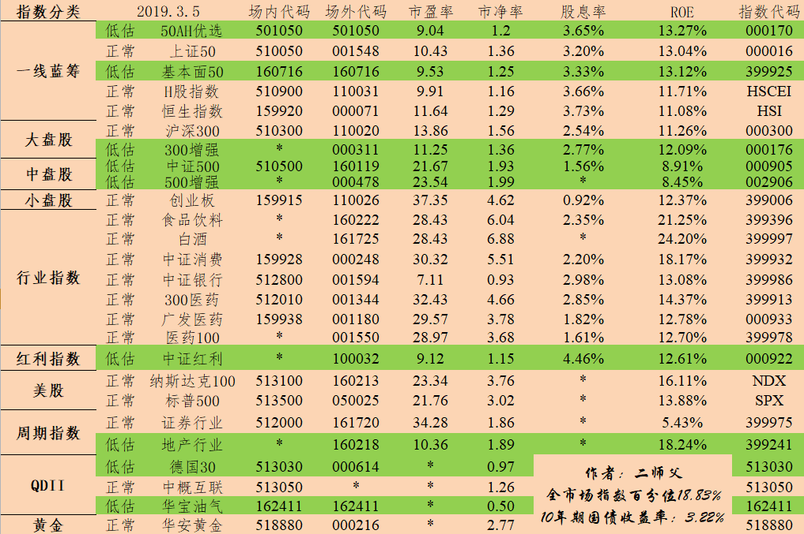

======================================================

_type: talk
@二师父[28814221155551]
2019-03-06 04:16:09 Wed  
topic_id: 244448842555181

<e type="hashtag" hid="825221424182" title="#中国银行和双汇发展#" /> 读者让分析下中国银行和双汇发展，二师父看了看两只股票的基本面，不具备牛股特征，盈利增长率很慢，我们投资股票还是向牛股看起，如果只是取得市场平均收益率，指数投资就行了。

另外股票的交易方法二师父不是逆势加仓，也不是越跌越买，劣质股票真的会跌破1元。你看20日均线，双汇是下探的，中国银行已经超过20日均线很多了。不适合买入，如果选择逆势加仓，中国银行的价值和中证银行指数的价值差不多，没必要再逆势加仓让自己担惊受怕。当然，中国银行目前的估值很低，破净，动态市盈率6倍多，入手安全性有保障的。

股票只分析，不推荐，更不建议购买，谨慎投资。

@Claire at 2019-03-06 04:16:09 Wed

> 收到了，谢谢二师父，辛苦您了[咖啡]

----------

阅读[2393]  评论[1]  赞[0] 

+++++++++++++++++++++++++++++++++++++++++++++++++++++

图片：
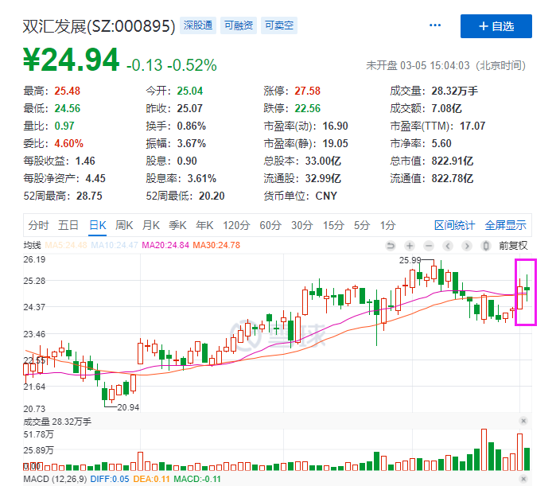
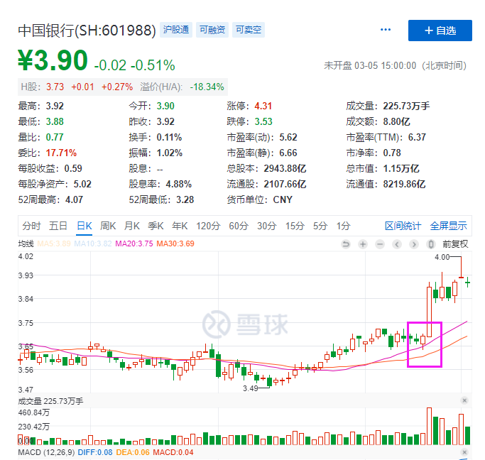

======================================================

_type: talk
@二师父[28814221155551]
2019-03-06 09:47:41 Wed  
topic_id: 544441145858824

面对外行指挥内行，面对给自己穿小鞋的上司，却不得不唯唯诺诺，你对自己的工作满意吗（感兴趣吗）？你有“世界那么大，好想去看看”的冲动吗？
当财务状况捉襟见肘时，我们身上捆绑了太多的束缚。也许有一份你更感兴趣的事业摆在你面前，但是你没办法抓住，因为家中还有嗷嗷待哺的婴孩，你的财富蓄水池中蓄水不够，进水管就像直接安装在排水管上，哪怕只是断开很短的时间，也会有被扼住喉咙的窒息感。
我身边有许多同事，他们在自己不喜欢、不擅长的工作上干耗着。他们机械地忙碌着，不是团队中的活力细胞，而更像细胞的化石——燃料。人很难在自己不感兴趣的事业中获得成功，即使成功也得不到成就感。由于缺乏进取的欲望，往往是得过且过，度日如年。即便如此，他们还必须时刻操心着，如何端稳手中的饭碗。
网络上有一个笑话，却道出了人生的辛酸。
问：“养羊为了什么？”
答：“为了卖钱。”
问：“卖钱了以后干什么？”
答：“娶媳妇儿。”
问：“娶媳妇儿了以后干什么？”
答：“生娃。”
问：“生了娃可以干什么？”
答：“放羊。”
“为了吃饭而劳作，因为不劳作就没饭吃。”看到这里你或许更加明白，为何说许多人日复一日地充当着燃料，被动地驱动自己，燃烧自己。
财务自由也好，财富小康也好，并不是为财富本身，而是为了让自己的精神不受财富的束缚。而要追求精神自由，我们可以从慢慢买资产开始。

阅读[2136]  评论[0]  赞[0] 

======================================================

_type: talk
@知南茶暖🍹[88214115882222]
2019-03-06 11:01:49 Wed  
topic_id: 844448815544112

二师父，长江电力适合长期持有吗？谢谢！

@Franky at 2019-03-06 11:01:49 Wed

> 可以的，这个股票把分红写入了公司的章程，每年稳定分红，你可以当成债券投资，不过这个股票的波动比较稳定，牛市当中表现不算太靓丽。

----------

@知南茶暖🍹 at 2019-03-06 11:01:49 Wed

> 谢谢你的建议[玫瑰]

----------

阅读[1970]  评论[2]  赞[0] 

======================================================

_type: q&a
@居少慧[844121114822212]
2019-03-06 11:44:03 Wed  
topic_id: 844448815255182

@居少慧

>  请问中证500现在定投适合建仓吗？

@二师父

>  可以

阅读[2170]  评论[0]  赞[0] 

======================================================

_type: talk
@二师父[28814221155551]
2019-03-06 13:30:46 Wed  
topic_id: 422228818442118

<e type="hashtag" hid="881251425252" title="#鳄鱼计划#" /> A股全面暴涨，享受上涨收割利润的同时布局德国股市，买入德国30一份，实现全球配置，最近德国30一直比较稳，没有大涨，也没有大跌。

@老宋 at 2019-03-06 13:30:46 Wed

> 二师傅一份具体是多少？

----------

@韬韬 at 2019-03-06 13:30:46 Wed

> 紧跟二师父脚步，0.978买入德国30一份

----------

@niwota at 2019-03-06 13:30:46 Wed

> 您认为现在德国 低估了，可以问问您低估是用什么判断标准嘛？

----------

@今晚吃手抓，谁给点大* at 2019-03-06 13:30:46 Wed

> 紧跟二师父步伐，增加德国30定投

----------

@勤能行之 at 2019-03-06 13:30:46 Wed

> 紧跟二师父步伐，增加德国30定投

----------

@冉冉 at 2019-03-06 13:30:46 Wed

> 今天场外也适合定投德国30吗？

----------

@艾琪（王钥） at 2019-03-06 13:30:46 Wed

> 支付宝和微信上都没有德国30卖

----------

@二师父 at 2019-03-06 13:30:46 Wed

> 把资金分一下，目前用总资金除以50，得到每一份的份额，一年定投可以拉

----------

阅读[2162]  评论[31]  赞[0] 

======================================================

_type: q&a
@屿[544828111824514]
2019-03-06 15:39:02 Wed  
topic_id: 844448818584822

@屿

>  请问一下二师父，兴全商业模式优选混合163415现在估值正常吗？可以继续定投吗？

@二师父

>  这个主动基金暂时还没法估值，一般估值是指数基金估值

阅读[1879]  评论[0]  赞[0] 

======================================================

_type: q&a
@shi[15551458885282]
2019-03-06 15:51:28 Wed  
topic_id: 544441181155584

@shi

>  二师父，目前理财有个困惑：
>  1. 近期股市上涨，股票和基金也综合浮涨了20%。
>  2. 但是，用于投资的金额还是比较少，只占总资产的10%，其中股票基金只占一半。
>  所以综合下来：总资产收益也就1%。
>  3. 家庭总资产中，90%是房子（负债20%），其中北京的就够我们小三口和父母自住（不创造收益，随着孩子长大，估计还得改善）；老家父母的房子（拆迁房）基本空置，我们偶尔回去住住，父母租出去一套，也刚好贴补他们每年的人情往来费用。
>  4.不过，观看自己的资产走势，其实每次跳跃都是在买房子之后，只是在北京买房都是刚需自住。
>  
>  困惑：这房子是不是真的资产？（有人说自住不算资产）
>  如果是资产，有没有办法增值？

@二师父

>  资产是能够给你带来稳定现金流的，钱进入你的口袋，如果只有一套房子自主，不能出售，不能出租，而且每月有房贷，钱出去你的口袋，这就是负债。
>  
>  就是因为这个原因，我买了一套房子以后，准备延迟北京买房，因为一旦首付150出去了，接着每月就是1万得月供，这会影响我股权投资和以后的创业选择。
>  
>  现在房产的投资价值很低了，抵御通货膨胀可以，09年，16年暴涨都是政策导致的，先高位接盘，然后锁住流动性，现在在涨已经没有多少人能够接盘了，换房除外，尤其是18年毕业的95后，除非他家里能够给他支援，否则3年之内很少有人能凑到200左右的首付
>  
>  房产成为资产，最好的就是一套房子做民宿，带来稳定现金流。没有其他方法。

阅读[2038]  评论[7]  赞[0] 

======================================================

_type: q&a
@王秦川[844151411882412]
2019-03-06 15:52:20 Wed  
topic_id: 544441181811814

@王秦川

>  二师父：医学100，现在盈利20%，可以收割盈利了吗？上证指数已经3100，谢谢🙏

@二师父

>  可以了，医药100已经正常估值了，卖出利润即可。

阅读[2068]  评论[5]  赞[0] 

======================================================

_type: q&a
@背心[51441214442224]
2019-03-06 16:03:31 Wed  
topic_id: 844448818184242

@背心

>  师傅能讲讲国债和股市的关系吗？

@二师父

>  国债收益率等于收益除以国债价格，国债收益率升高的时候，国债价格下降，当股市上涨，资金涌入股市，债市低迷，国债价格下降，国债收益率升高，也就是国债收益率越高，国债越有投资价值

阅读[2091]  评论[0]  赞[0] 

======================================================

_type: q&a
@晨[51411182152424]
2019-03-06 16:10:31 Wed  
topic_id: 422228818111288

@晨

>  二师父好，请问股债均配这个策略与低估定投策略有什么异同吗？从较长时期看（5-10年），哪种策略更有优势？谢谢。

@二师父

>  股债平衡讲的是资产配置，我们的定投策略只有低估定投和均线定投，只要严格按照低估的原则低位勇敢加仓，这个收益率肯定在每年15个百分点以上，股债平衡是熊市股市低迷，股票便宜，多买指数基金，牛市债市低迷，债券便宜，多买债券基金

阅读[2278]  评论[5]  赞[0] 

======================================================

_type: q&a
@凭栏观海[244414845852181]
2019-03-06 16:46:05 Wed  
topic_id: 844448812521482

@凭栏观海

>  长信可转债和兴全可转债那个更适合定投

@二师父

>  安心回报债，我投的，目前可转债基金已经不适合定投了

阅读[2380]  评论[1]  赞[0] 

======================================================

_type: talk
@曲辉[28484555188121]
2019-03-06 17:07:44 Wed  
topic_id: 244448812815451

二师父，华宝油气现在可以买吗？

阅读[2176]  评论[0]  赞[0] 

======================================================

@二师父[28814221155551]
2019-03-06 18:45:11 Wed  
topic_id: 111115584412242

>  @二师父
>  

阅读[2352]  评论[0]  赞[0] 

======================================================

_type: q&a
@Garylee[15484122122442]
2019-03-06 18:45:37 Wed  
topic_id: 244448811285841

@Garylee

>  二师父好，五步定投法中提到收割利润，那么如何收割利润呢？是拿利润部分除以净值，得出需要卖的份数吗？

@二师父

>  对的，用利润倒推出份额

阅读[2462]  评论[1]  赞[0] 

======================================================

_type: q&a
@土木工程部[51514112455814]
2019-03-06 20:05:23 Wed  
topic_id: 844448811182122

@土木工程部

>  老师我中签啦，第一次中

@二师父

>  恭喜啊，坐等发奖

阅读[2467]  评论[10]  赞[0] 

======================================================

_type: q&a
@冉冉[88445118854412]
2019-03-06 20:06:27 Wed  
topic_id: 244448811122551

@冉冉

>  请问二师傅，如果中美贸易谈判达成中方对美开放金融服务业，会对A股会造成怎样的影响？

@二师父

>  会让外资涌入，这样a股会更加理性，不会再像现在这样暴涨暴跌

阅读[2446]  评论[0]  赞[0] 

======================================================

_type: q&a
@聪明的笨蛋[544858411212244]
2019-03-06 21:00:40 Wed  
topic_id: 544441522124254

@聪明的笨蛋

>  为什么大家周定投都设在周4，有什么说法吗？

@二师父

>  因为我设定在周四了，所以大家的实盘也在周四，根据历史数据回测，周四下跌的概率是最大的，当然长期看影响不大，你可以设定在周一二三五都可以

阅读[2545]  评论[3]  赞[0] 

======================================================

_type: talk
@二师父[28814221155551]
2019-03-07 03:52:19 Thu  
topic_id: 422228542288528

<e type="hashtag" hid="142425814852" title="#定投风险#" /> 时刻警示自己，免得犯错误，最近星球提问比较多，大家可以相互解答，交流，切磋，共同进步

阅读[5571]  评论[0]  赞[1] 

+++++++++++++++++++++++++++++++++++++++++++++++++++++

文件：
2019-03-07 03:51:58 Thu
文件大小：[25045]
88844885241412-基金定投的风险.docx

======================================================

_type: talk
@二师父[28814221155551]
2019-03-07 03:53:37 Thu  
topic_id: 544441524411544

<e type="hashtag" hid="481211145528" title="#指数估值#" /> 大家参考一个平台的就可以，每个平台数据不同，看多了容易迷惑自己。低估定投，没毛病的，别担心，估值表里面的每一个品种都是我自己会投资的，我不会拿自己的钱开玩笑。

@飞的那个飞 at 2019-03-07 03:53:37 Thu

> 正常估值的好多了！是不是不能定投正常估值的

----------

@二师父 at 2019-03-07 03:53:37 Thu

> 对，低估定投表里面的基金

----------

@艾琪（王钥） at 2019-03-07 03:53:37 Thu

> 跟着二师父学习了，二师父整理的低估基金我基本都跟着定投了，我一月份定投的沪深300指数C，现在持有收益率16.27%，看二师父估值表属于正常估值，我现在应该是继续定投还是应该减半定投还是卖出呢？

----------

@二师父 at 2019-03-07 03:53:37 Thu

> 卖出利润部分就可以了

----------

@艾琪（王钥） at 2019-03-07 03:53:37 Thu

> 好的，谢谢二师父指点

----------

@汉尼拔 at 2019-03-07 03:53:37 Thu

> 二师傅，新手定投绿色区域的场外代码还是，最后边的指数代码

----------

@二师父 at 2019-03-07 03:53:37 Thu

> 场内和场外是基金代码，定投这个，后面的是指数代码

----------

阅读[2292]  评论[7]  赞[0] 

+++++++++++++++++++++++++++++++++++++++++++++++++++++

图片：

======================================================

_type: q&a
@陈Being[28845245224851]
2019-03-07 09:18:09 Thu  
topic_id: 844448251818542

@陈Being

>  二师傅，请问对于表格中的低估指数可以继续保持定投，只是需要降低定投的金额，与之前比较。

@二师父

>  可以

阅读[2207]  评论[0]  赞[0] 

======================================================

_type: talk
@二师父[28814221155551]
2019-03-07 09:42:15 Thu  
topic_id: 111115428154212

<e type="hashtag" hid="881422852442" title="#定投实盘#" /> 买了德国30和50ah各0.5份。场外定投，说说份数，假设一次定投一份1000元，那么当低估区快进入正常就买0.5份，500元。

份数设定没有固定模式，你能保证下跌不断加仓就可以了，我场内一份的金额是场外一份金额的三倍

@半路出家滚雪球 at 2019-03-07 09:42:15 Thu

> 德国30基金和指数的拟合度似乎比跟踪国内指数的基金差很多，对定投评估会不会有很大的影响？

----------

@二师父 at 2019-03-07 09:42:15 Thu

> 跟踪误差都会有的，这个还是比较吻合，不用担心

----------

@冉冉 at 2019-03-07 09:42:15 Thu

> 二师傅，蚂蚁定投德国30，扣款成功，系统回复到3月11日才能确认，那是按哪天进行核算的，怎么这么长时间呢？

----------

@二师父 at 2019-03-07 09:42:15 Thu

> 还是按照当日，我场内是及时成交的

----------

@勤能行之 at 2019-03-07 09:42:15 Thu

> 看到啦

----------

@勤能行之 at 2019-03-07 09:42:15 Thu

> 场内一份的金额是场外一份金额的三倍，这个是什么原理呀

----------

@二师父 at 2019-03-07 09:42:15 Thu

> 场内本身就买的多，因为买入的费率便宜

----------

阅读[2178]  评论[7]  赞[0] 

======================================================

_type: q&a
@J[28281541518551]
2019-03-07 09:43:44 Thu  
topic_id: 544441528411514

@J

>  二师父早上好，我是新加入的球友，看了你估值表300增和500增强目前是低估，那请问富国沪深300增强和富国中证500增强目前是低估还是正常？

@二师父

>  是低估的，估值是看指数，指数低估，对应的基金就低估

阅读[2312]  评论[5]  赞[0] 

======================================================

_type: q&a
@汉尼拔[552144155244]
2019-03-07 10:07:15 Thu  
topic_id: 422228541185518

@汉尼拔

>  二师父你好，我是新手在蚂蚁定期5只鸡，在200-500金额之间，我现在每次定投都要看情况修改金额，如何设置定期不定额，我看app上面没有啊。

@二师父

>  里面有个慧定投，设置下就可以。蛋卷或者天天也可以的

阅读[2375]  评论[4]  赞[0] 

======================================================

_type: q&a
@云淡风清[48512211522128]
2019-03-07 12:15:31 Thu  
topic_id: 111115452444422

@云淡风清

>  基金估值进入正常卖出利润怎么操作？基金金公司显示是卖出份数。

@二师父

>  用利润除以净值得到卖出份数

阅读[2173]  评论[3]  赞[0] 

======================================================

_type: q&a
@背心[51441214442224]
2019-03-07 12:15:48 Thu  
topic_id: 844448285425422

@背心

>  师傅证券已经盈利百分之五十了，是不是可以卖了，但是你说现在没有高估，不知道怎么操作

@二师父

>  卖出利润就行了

阅读[2345]  评论[0]  赞[0] 

======================================================

_type: q&a
@暖心人[844121214481512]
2019-03-07 13:41:07 Thu  
topic_id: 244448251525251

@暖心人

>  二师父好！请教下 中证红利和红利机会有什么区别啊

@二师父

>  红利机会指数是选择沪深A股里面股息率高的股票作为成分股。这是必要条件。
>  
>  除此以外，红利机会指数在选择成分股的时候还有三个苛刻的要求，一是样本股过去三年的盈利必须保持净增长，二是过去一年样本股净利润必须为正，三是，单只股票的占比不能够超过百分之三，单一行业的股票占比不能够超过百分之三十三。
>  
>  条件一保证了样本股背后对应的公司盈利稳定增长，这就是所说的成长性企业，根据欧奈尔的选股策略，这种盈利稳定增长的股票很有可能就是未来的大牛股，既然红利机会指数里面有这种股票，那么以后股票翻倍的可能性就非常大。大家应该都知道市值等于市盈率乘以盈利。也就是常见的公式p=pe*e.选择盈利净增长的股票会让股票价格提高不是因为市盈率的提高，而是因为盈利的增长，这样可以去除那些分红高但是盈利走低的弱势企业。条件二净利润为正，公司总是保证有利润，这就排除了那些亏损的企业，这也是选股时候最需要考虑的一个基本面指标。条件三行业均分保证分散风险。
>  
>  中证红利，按照一定规则剔除垃圾股票，完了再把这些股票根据日成交额排名剔除排名靠后的百分之二十的股票，再把剩余股票按照股息率排名，选取股息率高的品种
>  
>  中证红利选股和红利机会都是高股息，红利机会的行业覆盖面更广，中证红利更加集中

阅读[2302]  评论[0]  赞[0] 

======================================================

_type: talk
@二徒弟[111188488282522]
2019-03-07 14:22:59 Thu  
topic_id: 244448284522581

证券不要命了

阅读[1983]  评论[0]  赞[0] 

======================================================

_type: talk
@Steven Zha*[142428111482]
2019-03-07 14:31:41 Thu  
topic_id: 422228582425428

二师父你好，我想请问，我在香港购买了一支基金，投资的是美国科技股票。这只基金我从去年6月持有到现在，收益6%。看您的估值总结，美股已经处于正常水平。这样的话，也是按照您的方法，卖出利润但坚持定投？还是保留仓位继续定投不卖出呢？

@二师父 at 2019-03-07 14:31:41 Thu

> 卖出利润就行

----------

阅读[1993]  评论[1]  赞[0] 

======================================================

_type: talk
@二师父[28814221155551]
2019-03-07 14:38:12 Thu  
topic_id: 111115451554582

<e type="hashtag" hid="142448285212" title="#卖出提示#" /> 券商盈利50个点了，继续收割一部分利润，务必记住别清仓，别清仓，因为大牛市到来，券商十几个涨停板都很正常

@自由飞翔 at 2019-03-07 14:38:12 Thu

> 券商好疯狂，我将利润全收割了[微笑]

----------

@老宋 at 2019-03-07 14:38:12 Thu

> 半仓了

----------

阅读[2242]  评论[2]  赞[0] 

+++++++++++++++++++++++++++++++++++++++++++++++++++++

图片：
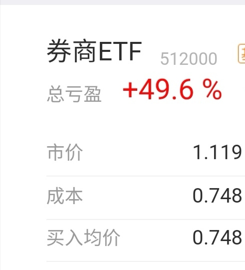

======================================================

_type: q&a
@victoria[15455121858422]
2019-03-07 15:02:01 Thu  
topic_id: 544441514145114

@victoria

>  二师父你的消费还卖了吗

@二师父

>  卖了一次没卖了，看情况继续涨再卖

阅读[2210]  评论[0]  赞[0] 

======================================================

_type: q&a
@victoria[15455121858422]
2019-03-07 15:04:22 Thu  
topic_id: 844448284842242

@victoria

>  这几天消费有点下跌，我不知怎么办才好

@二师父

>  我是持有的，在正常估值时候不断上涨才收割利润

阅读[2323]  评论[1]  赞[0] 

======================================================

_type: talk
@.Five[15451258412542]
2019-03-07 15:36:40 Thu  
topic_id: 544441514582824

不知道可不可以发言~

阅读[2306]  评论[0]  赞[0] 

+++++++++++++++++++++++++++++++++++++++++++++++++++++

图片：

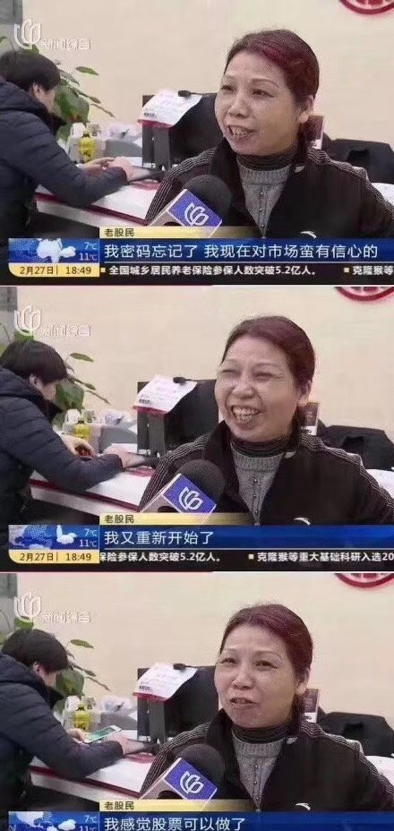
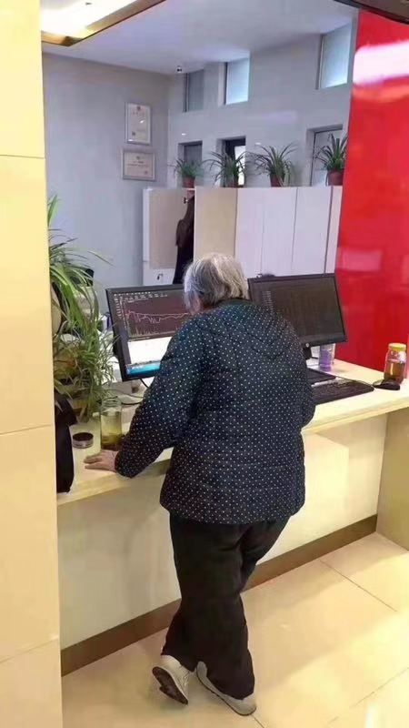

======================================================

_type: q&a
@Nienie💝[244122251284851]
2019-03-07 16:13:33 Thu  
topic_id: 244448284211411

@Nienie💝

>  二师父，您的十六字定投方针。全面配置，低估定投，正常收割，高估卖本。我有两个问题：
>  1、低估定投，是指严格执行定投么？傻瓜定投或者智能定投均可，即便上涨，只要在低估范围内就还要坚持买入。还是说涨的太厉害，就算低估也要停一停呢？另外，在低估范围内，是不是不需要收割利润，就是不出只入。
>  2、正常收割，是指估值进入正常以后停止定投，然后熊10，牛20来收割利润。可是每次收割之后，利润率好像就不一样了，是不是得自己计算。另外，如果本身持仓不多，如果收割后仓位太低，是不是不收割也行。正常估值的时候肯定不能再投入对吧。另外，如果在正常范围内，收割是不是也需要严格执行，差一点儿都不建议动呀。

@二师父

>  1、在低估区域定投都是安全的，只是投多投少的问题，什么策略不用管。要记住，低估区域内，跌的越狠，加仓越多。在低估区域内不用收割利润，除了极端情况，比如A股和日本股市一样。20年不涨，一直震荡，这个时候就别管是否正常估值了，可以采用网格交易随着市场的震荡挣钱。按照目前A股的发展未来肯定会有牛市的，所以网格交易和均线策略买入或者卖出只是一种辅助手段。
>  
>  2、投资讲究模糊的正确，而且要根据实际情况来，我说了收割利润和高估逐步清仓是为了防范风险和回撤，因为股市不仅有投资价值，也有投机价值，所以股票和指数基金的上涨除了公司本身价值的增长以为还有市场非理性因素，所以要及时减仓。
>  
>  这就涉及到仓位管理，让自己处于一个舒服的状态，倘若大盘上涨你还后悔自己的基金买少了，根本不担心利润回撤，那么就不用卖出。
>  
>  投资不是数学问题，而是哲学，心理学问题，把握住大的方向，跟随大的趋势，你就会胜利，不用太纠结是11个点还是10个点收割，对整体投资收益影响不大的

阅读[2589]  评论[5]  赞[0] 

======================================================

_type: q&a
@勤能行之[481211221828]
2019-03-07 16:27:28 Thu  
topic_id: 111115451821112

@勤能行之

>  怎么没有看到师傅今天发实盘啊

@二师父

>  我发了啊，没收到吗，我检查下

阅读[2521]  评论[5]  赞[0] 

======================================================

_type: q&a
@暖心人[844121214481512]
2019-03-07 18:05:33 Thu  
topic_id: 111115451815552

@暖心人

>  二师父好，我们没有研究加拿大的指数吗

@二师父

>  加拿大指数从a股账户暂时无法购买，需要开通美股账户，暂时没有研究

阅读[2448]  评论[0]  赞[0] 

======================================================

_type: talk
@二师父[28814221155551]
2019-03-07 18:18:28 Thu  
topic_id: 422228581545148

<e type="hashtag" hid="225245584441" title="#女神节日快乐#" /> 今天女生节，明天女神节，祝各位女神节日快乐，二师父给各位女神发红包啦，打开支付宝，红包，输入我就是女神呀，你就是二师父的女神了，愿你们永葆青春，生活幸福美满！

@屿 at 2019-03-07 18:18:28 Thu

> 谢谢二师父[愉快]

----------

@顾。 at 2019-03-07 18:18:28 Thu

> 谢谢二师父！

----------

@YtingLi at 2019-03-07 18:18:28 Thu

> 谢谢师父

----------

@徐美芳 at 2019-03-07 18:18:28 Thu

> 谢谢二师傅

----------

@娥姐姐 at 2019-03-07 18:18:28 Thu

> 谢谢二师父

----------

@Ivy Quan at 2019-03-07 18:18:28 Thu

> 谢谢～

----------

@小牧童 at 2019-03-07 18:18:28 Thu

> 谢谢二师父[愉快]

----------

@艾琪（王钥） at 2019-03-07 18:18:28 Thu

> 虽然没有抢到，但是还是谢谢二师父

----------

阅读[5603]  评论[19]  赞[0] 

+++++++++++++++++++++++++++++++++++++++++++++++++++++

图片：

======================================================

_type: talk
@丸子妈[28512522184441]
2019-03-07 18:46:47 Thu  
topic_id: 111115458122442

#提问:二师父，主动型基金，比如混合基金，除了看持仓股票，基金经理，规模，第三方评级，还需要注意什么？

@二师父 at 2019-03-07 18:46:47 Thu

> 还有基金经理的持仓风格，是否频繁换仓，基金公司的名气，过往的收益率

----------

阅读[2407]  评论[1]  赞[0] 

======================================================

_type: talk
@树叶[544811512145144]
2019-03-07 19:25:50 Thu  
topic_id: 422228581252218

<e type="hashtag" hid="225245584441" title="#女神节日快乐#" /> 谢谢二师父

@Zyxj at 2019-03-07 19:25:50 Thu

> 谢谢二师父

----------

@小米兔 at 2019-03-07 19:25:50 Thu

> 谢谢二师父[玫瑰]

----------

阅读[2398]  评论[2]  赞[0] 

======================================================

_type: q&a
@EZ[111182528154512]
2019-03-07 21:21:01 Thu  
topic_id: 244448228141221

@EZ

>  二师父，您好！去年大盘在探底的过程中，一直犹豫选择那只基金入手，在选基的迷茫中，突然看到了您在天天基金里发布的定投指南，突然使我茅塞顿开，立马上车了上证50、沪深300增强、中证500和中证银行4只基金。现在也跟投快半年了，整体浮盈在15%左右，感谢您的指路。
>  最近看到您发布的指数估值中50、300和银行均已到正常水平，按照建议已停止了定投，仅剩500继续定投。目前500的估值还是偏低，而且我之前也没建立底仓，请问这些多出来的定投资金放是否可以考虑加到500上？或者德国30？
>  另外考虑全面配置的策略，当前推荐的几只QDII基金中仅有德国30为低估，二师父是否可以考虑多分析几只QDII指数基金？

@二师父

>  德国30和华宝油气都是低估的啊，如果增量资金多的话可以考虑定投多加点，不过我们逆向投资都是在下跌多加，上涨就少投，目前我发现就5只QDII基金比较有价值，你可以推荐几只我分析下

阅读[2594]  评论[0]  赞[0] 

======================================================

_type: talk
@Steven Zha*[142428111482]
2019-03-07 23:27:18 Thu  
topic_id: 244448224558281

二师父您好，我想请问，通常情况下，股市和债市之间的关系如何呢？
我是这样理解的，请您指正：股市的特点是快涨快跌，他是赚钱的好工具，而债市的特点是涨跌缓慢，但是安全性比较高，波动小。股市和债市的关系正好相反，当股市处于牛市的时候，资金就会冲入股市，离开债市，这样债市就会下跌。而当股市，转为熊市时，资金没了去路，就要找一个相对安全，而又能有少少收益的地方，这样资金就到达了债市，债市就会升高。请问，可以这样理解嘛？

@海盗 at 2019-03-07 23:27:18 Thu

> 温馨提示，点击提问按钮，再写提问的问题，二师父才可以再第一时间收到您的提问。

----------

阅读[2362]  评论[1]  赞[0] 

======================================================

_type: talk
@二师父[28814221155551]
2019-03-08 04:10:06 Fri  
topic_id: 111115441482822

<e type="hashtag" hid="481211145528" title="#指数估值#" />

阅读[5579]  评论[0]  赞[0] 

+++++++++++++++++++++++++++++++++++++++++++++++++++++

图片：
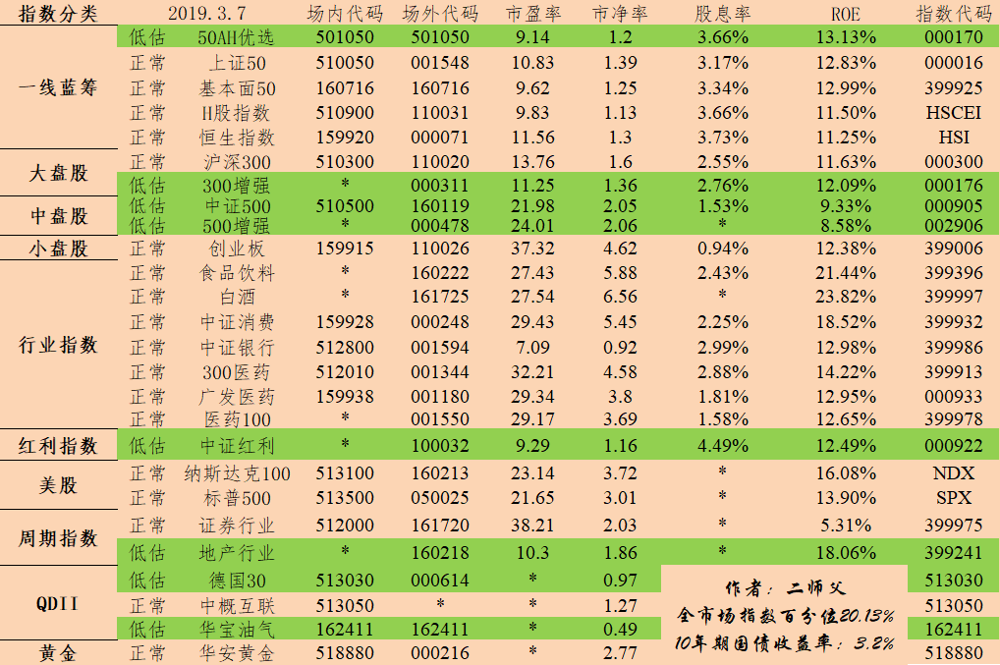

======================================================

_type: talk
@二师父[28814221155551]
2019-03-08 04:10:59 Fri  
topic_id: 844448224215152

<e type="hashtag" hid="225245851881" title="#关于卖出#" /> 盈利了怎么卖出也是一门学问

@海盗 at 2019-03-08 04:10:59 Fri

> [玫瑰][玫瑰][玫瑰]

----------

@niwota at 2019-03-08 04:10:59 Fri

> 看到师父起床好早，为您点赞[强][强]。
涨了以后收割利润 与 一直持有到高估后卖出 哪个收益高呢，有办法测试嘛？
收割利润的方法都有什么好处呢？您可以帮助讲解一下嘛？ 谢谢[咖啡][啤酒]

----------

@凭栏观海 at 2019-03-08 04:10:59 Fri

> 关键是谁也不知道什么时候是高点

----------

@二师父 at 2019-03-08 04:10:59 Fri

> 收割利润会好点，因为a股不是慢牛，总是暴涨暴跌的

----------

@小牧童 at 2019-03-08 04:10:59 Fri

> 二师父，你好！国债收益率曲线在哪个平台上看的比较好？我看到的和你不一样，请教一下，谢谢

----------

@二师父 at 2019-03-08 04:10:59 Fri

> 看10年期国债收益率

----------

@小牧童 at 2019-03-08 04:10:59 Fri

> 嗯，就是哪里能比较好的找到历史收益率曲线，有些平台找不到呢或者比较零散的！

----------

@二师父 at 2019-03-08 04:10:59 Fri

> 华尔街见闻，中证指数官网

----------

阅读[6142]  评论[9]  赞[0] 

+++++++++++++++++++++++++++++++++++++++++++++++++++++

文件：
2019-03-08 04:10:40 Fri
文件大小：[73130]
51144111848214-券商上涨50个百分点，我们的定投该怎么办.docx

======================================================

_type: q&a
@小明[544828524525514]
2019-03-08 10:09:56 Fri  
topic_id: 544441554148514

@小明

>  有点失眠，看了看基金收益，发现好奇怪呢，同是场外500指数，昨天500低波动003318收益率是2.08%，500指数A 000962是1.24%，500增强161017是0.22%。差别太大了。那么是否说明这个500增强有问题呢？同一指数我们在选择时应该注意什么呢？

@二师父

>  持仓股票风格不一样，最近蓝筹还没有妖股涨的好，不能仅看天或者一个星期的收益，我们得把时间拉长了看
>  
>  同一类别指数选择一个就行，持仓股票大部分类似，有时候这只涨幅多点，有时候那只涨幅多点，一天收益率不能说明啥

阅读[2641]  评论[1]  赞[0] 

======================================================

_type: q&a
@20181108……[51511128814554]
2019-03-08 10:28:38 Fri  
topic_id: 544441558228544

@20181108……

>  二师父你好，请教一下500ETF和500低波区别。

@二师父

>  500低波动是中证500的策略指数，从500里面选择波动率较低的股票作为持仓股票，也有一定的超额收益

阅读[2535]  评论[2]  赞[0] 

======================================================

_type: q&a
@Steven Zha*[142428111482]
2019-03-08 10:29:01 Fri  
topic_id: 244448221588111

@Steven Zha*

>  二师父您好，我想请问，通常情况下，股市和债市之间的关系如何呢？
>  我是这样理解的，请您指正：股市的特点是快涨快跌，他是赚钱的好工具，而债市的特点是涨跌缓慢，但是安全性比较高，波动小。股市和债市的关系正好相反，当股市处于牛市的时候，资金就会冲入股市，离开债市，这样债市就会下跌。而当股市，转为熊市时，资金没了去路，就要找一个相对安全，而又能有少少收益的地方，这样资金就到达了债市，债市就会升高。请问，可以这样理解嘛？

@二师父

>  对，就是这样理解，这是股债轮动

阅读[2656]  评论[0]  赞[0] 

======================================================

_type: q&a
@hi小鱼小鱼[244145218488421]
2019-03-08 10:30:01 Fri  
topic_id: 422228528815858

@hi小鱼小鱼

>  二师父，你好！最近一直在看你写的文章，从天天到星球，真的受益颇多。每个月工资节余不多那就从每天记账开始吧，这说简单也简单，难在持之以恒，既然开了就要坚持下去，把生活理清楚了理财就顺利多了吧。如果现在开始定投晚不晚，在低估区选择两个定投，哪两个搭配会比较合适些呢？盼回复！

@二师父

>  目前选择中证500和50ah比较好

阅读[2754]  评论[0]  赞[0] 

======================================================

_type: talk
@门萨🐨[51411455828824]
2019-03-08 10:59:09 Fri  
topic_id: 844448248484822

去年因为想学新媒体运营跟了师父
接触到长线投资
投资自己投资生活
每天保持1-2万字的阅读量
为了跟上时代，不固步自封
认同师父的理念从基础学起
小资金建仓，坚持定投
放开思维，步入未知领域
体会到万事开头难的真理
跨出第一步，后面会越走越顺
一般不轻易推荐
真的觉得有价值才愿意推荐
Ps㊗大家女神节快乐！[玫瑰]

@二师父 at 2019-03-08 10:59:09 Fri

> 你要超越我了

----------

@门萨🐨 at 2019-03-08 10:59:09 Fri

> [捂脸]

----------

阅读[2816]  评论[2]  赞[0] 

+++++++++++++++++++++++++++++++++++++++++++++++++++++

图片：

======================================================

_type: q&a
@guoqiuhong[51285485422424]
2019-03-08 11:31:32 Fri  
topic_id: 422228528215458

@guoqiuhong

>  请问今天是不是适合指数类基金补仓

@二师父

>  定投即可，不用看单日涨跌

阅读[2848]  评论[0]  赞[0] 

======================================================

_type: q&a
@往事随风[48515148521428]
2019-03-08 14:02:39 Fri  
topic_id: 244448242445181

@往事随风

>  二师父您好！今年证券长这么多，好多人都去追了，请问我们是不是可以去投一些被大家冷落的指数呢？比如中小板，这几年跌得够多，它与创业板哪个投资价值更大一些？

@二师父

>  价值都不大，科创板可以关注下，等到创业板低估投一点，因为盘子小，很容易被炒起来

阅读[2680]  评论[3]  赞[0] 

======================================================

_type: q&a
@陈Being[28845245224851]
2019-03-08 22:26:24 Fri  
topic_id: 844448244884842

@陈Being

>  二师傅，请问根据这个图上面的数据如何计算得出我的实际投入成本是多少，持仓收益率，和持有收益率分别有什么不同。

@二师父

>  （最新净值-持有单价）*持有份额=利润。你得总金额减去利润就是从成本
>  
>  持仓收益率是指从你自购买基金或者股票的那一天开始,到你所看到的那天为止,你的基金的总收益除以你得投资金额
>  
>  持有期收益率是指买入基金持有一段时间以后卖出，这期间股息分红和净值上涨合起来的资金占总投入资金的比率

阅读[2507]  评论[0]  赞[0] 

======================================================

_type: q&a
@程洋[28258521545511]
2019-03-08 22:45:50 Fri  
topic_id: 422228514115148

@程洋

>  二师父你好!基金的PE历史百分位在哪儿查?

@二师父

>  且慢，集思录，理杏仁都有的，参考下就可以，指导投资的意义不是很大，注意区分他的PE历史百分位的时间区间的选择，这个区间的选择对百分位值的影响比较大。

阅读[2499]  评论[2]  赞[0] 

======================================================

_type: q&a
@好运玲玲[244188585541521]
2019-03-08 22:51:10 Fri  
topic_id: 111115485452412

@好运玲玲

>  二师父您好！我的中证500建了底仓，目前盈利6000，但是中证500还在低估，这个利润是不是不要收割？

@二师父

>  这个看你得具体仓位，如果你得仓位很重可以收割，如果仓位很轻，那么这就没有必要，目前中证500仍旧低估，可以定投

阅读[2577]  评论[0]  赞[0] 

======================================================

_type: talk
@二师父[28814221155551]
2019-03-09 04:08:45 Sat  
topic_id: 422228511285258

<e type="hashtag" hid="481211145528" title="#指数估值#" /> 又有新的品种低估了，市场总是不缺机会的

阅读[5605]  评论[0]  赞[0] 

+++++++++++++++++++++++++++++++++++++++++++++++++++++

图片：
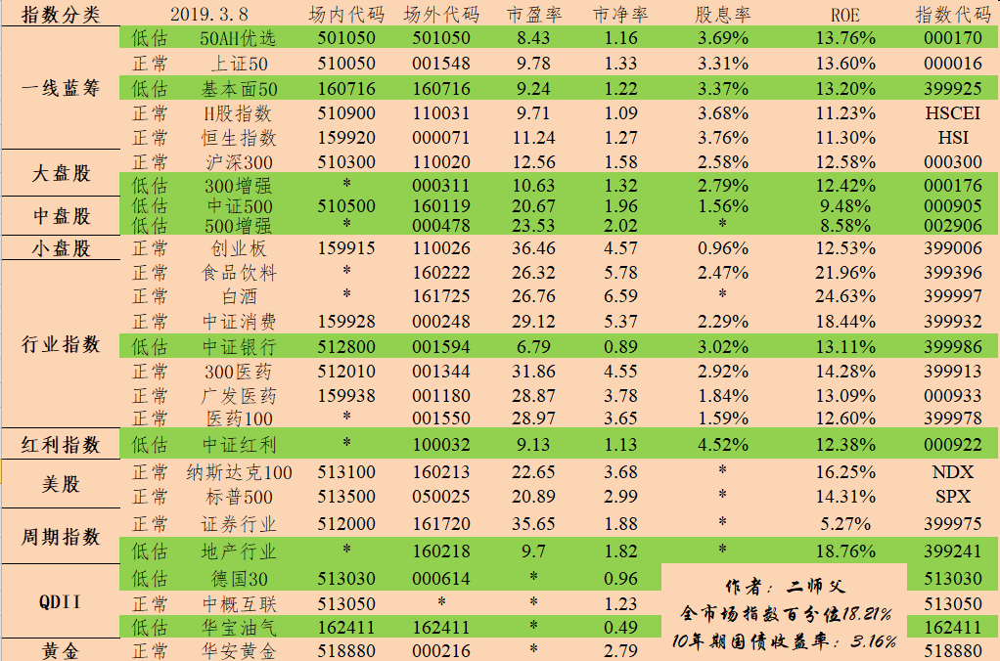

======================================================

_type: talk
@二师父[28814221155551]
2019-03-09 04:09:56 Sat  
topic_id: 244448211482421

<e type="hashtag" hid="281158284851" title="#市场分析#" /> 机会是跌出来的，之前说资金多的朋友，机会来了

@波 at 2019-03-09 04:09:56 Sat

> 二师父关于20190308暴跌的分析如及时雨，给焦虑的投基人理清了思路，阐明了当前的股市现状，很有参考价值。

----------

@波 at 2019-03-09 04:09:56 Sat

> 如果说20190308的暴跌是熊市的一轮超级反弹的转折和结束，那么大概率股市会在近期再次下探，低估值的指数基金会更多更低估，我们可以增加低估指基的买入量，越跌越买。

----------

@波 at 2019-03-09 04:09:56 Sat

> 如果说20190308暴跌是牛市初期的短暂停歇和中途洗盘，连续大涨多日，多头也需要稍事休息，整装旗鼓，积蓄力量，过不多久再次发力上攻，那么我们也要稳住阵脚，千万不要在这次洗盘时把以前在低位买入的廉价筹码轻易卖出，而是持有待涨，仓位重的只能卖出利润部分。持有到基金估值高时再卖，那时大概率是牛市中后期了。

----------

阅读[6009]  评论[3]  赞[0] 

+++++++++++++++++++++++++++++++++++++++++++++++++++++

文件：
2019-03-09 04:09:26 Sat
文件大小：[25155]
48822881141888-关于周五暴跌的几点看法.docx

======================================================

_type: q&a
@林西瓜🍉[28855581582851]
2019-03-09 09:33:48 Sat  
topic_id: 422228244821228

@林西瓜🍉

>  二师父，场内基金交易要收的费用主要有哪些？经常听说可取消5元限制，这个5元只的是什么呢？

@二师父

>  5元是佣金费用，包括买入卖出费用，5元佣金费用，股票的话有印花税。二师父渠道注册的可以免除5元佣金费用，只收买入和卖出费用

阅读[2488]  评论[4]  赞[0] 

======================================================

_type: q&a
@上上签[244184512458541]
2019-03-09 10:32:47 Sat  
topic_id: 544441422584544

@上上签

>  二师傅，我是一个资金量不稳定的人，且现在坚持定投300增强，500增强，中证红利增强，现在采取定期不定额，我想问一下，我最近想到的一种切换策略，假如市场发生反复震荡，就使用不定期定额的方法，如果转变成单边上涨或者下跌，切换定期不定额的这种切换，怎么样呢？
>  因为不管是什么策略，都是买入低估指数，我相信终有一天最上涨的，越跌越买，正常估值收割利润，高估逐步卖出本金。

@二师父

>  可以啊，我的鳄鱼计划就是不定期不定额，还有网格交易

阅读[2543]  评论[2]  赞[0] 

======================================================

_type: q&a
@顾。[51558482245254]
2019-03-09 10:54:08 Sat  
topic_id: 111115122152122

@顾。

>  二师父，请问
>  1、场内可以自动定投吗？我记得你以前好像提到过可以的，但是翻了半天没翻到之前的记录，所以再问一下。麻烦二师父了！
>  2、如果可以的话，是否也是支付宝平台那样可以设置慧定投，自动高少低多？
>  3、场内价格时刻在变化，场外是统一3点收盘价，那如果场内自动定投是统一什么时候买入呢？

@二师父

>  1，可以的，我这有注册渠道
>  2，做不到
>  3，时间自己选择，自动定投建议场外，场内有时候有溢价

阅读[2504]  评论[10]  赞[0] 

======================================================

_type: q&a
@山人[88812842582212]
2019-03-09 15:42:20 Sat  
topic_id: 111115125112122

@山人

>  二师父你好，我想问下我场外购买的基金赎回费率是怎么算的，比如说某一基金我已经持有超过一年了，但是一直在定投，那我清仓的话赎回费率是按持有一年的费率来算呢还是按最近定投购买持有的时间来算。

@二师父

>  一年前买的按照一年的费率计算，现在买的，按照累计时间计算，逐步卖出的时候系统会最先卖出最早买入的基金

阅读[2300]  评论[0]  赞[0] 

======================================================

_type: q&a
@暖心人[844121214481512]
2019-03-09 15:57:48 Sat  
topic_id: 111182255414122

@暖心人

>  二师父，科创版来了，有这方面的基金或者指数吗

@二师父

>  现在已经可以开沪A科创板股东账户，股票购买可以了，后面指数也会逐步发布

阅读[2330]  评论[0]  赞[0] 

======================================================

_type: q&a
@王秦川[844151411882412]
2019-03-09 22:29:18 Sat  
topic_id: 422214485182888

@王秦川

>  二师父，你好，科创版来了，对我们投资港股的恒生指数基金有影响吗？

@二师父

>  对港股没啥影响，等港股进入低估仍旧可以定投，恒生指数是很有价值的

阅读[2162]  评论[1]  赞[0] 

======================================================

_type: talk
@二师父[28814221155551]
2019-03-10 04:23:55 Sun  
topic_id: 244415525184551

<e type="hashtag" hid="454841141288" title="#均线偏离表#" />

@007 at 2019-03-10 04:23:55 Sun

> 这个怎么看？

----------

@海盗 at 2019-03-10 04:23:55 Sun

> 搜索均线偏离，以前二师父讲过，请参考20181104

----------

@007 at 2019-03-10 04:23:55 Sun

> 多谢

----------

@007 at 2019-03-10 04:23:55 Sun

> 这个表负值越大越值得投资正值越大越接近卖出对吗？但中证500目前估值很低啊怎么理解？求助

----------

@二师父 at 2019-03-10 04:23:55 Sun

> 两个策略不同，低估定投策略长期定投，均线定投是建立在震荡市场的短期定投，来回买入卖出应对震荡市的波动。

----------

阅读[5111]  评论[5]  赞[0] 

+++++++++++++++++++++++++++++++++++++++++++++++++++++

图片：
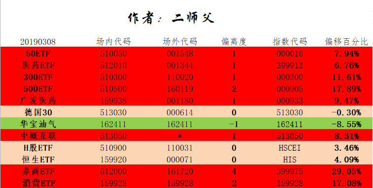

======================================================

_type: talk
@二师父[28814221155551]
2019-03-10 04:25:08 Sun  
topic_id: 422214454182488

<e type="hashtag" hid="281158284851" title="#市场分析#" /> 有精力的朋友可以自己分析，没有精力的话按照估值表定投即可

@老丁 at 2019-03-10 04:25:08 Sun

> 你好，这篇文章很有启发，读完以后有几个疑问想请教你，

1、所谓的安全边界，这个是因人的个人承担能力而定的，还是说有比较公认的说法？也就是说，A,B两个人，A可以承担 20%的下跌，B可以承担40%，那么A的安全边际是在20%以内，B是在40%以内？还是说有比较统一的说法，30%以内设定临界点？

2、同一个指数PE,PB这些参数的安全边际设定是否是相同的，如果同时以下浮20%以内作为PB,PE的安全边际值？还是说要针对PE,PB参数的不同含义，设定不同的安全边界值呢？

3、深证综指的市盈率，这个指标，适用于判断深市的吗？还是用于判断整个A股的？如果是判断整体A股的话，适用成立的逻辑是什么？是不是也可以用“上证市盈率”来辅助判断呢？或者说为什么不用“上证市盈率”来辅助判断呢？

谢谢

----------

@二师父 at 2019-03-10 04:25:08 Sun

> 1、个人情况不同，资金量1000万和资金量100万的选手必然设定的不同，资金量越大，越要注重风险防控。
2、不能单一地看这个指标，你还得看持仓股票的成长能力，盈利能力，类似高ROE品种匹配更好的盈利水平，不能够一刀切，具体指数具体分析
3、判断是深圳市场的，上证综合指数就是上证市盈率，有用的

----------

@老丁 at 2019-03-10 04:25:08 Sun

> 谢谢

----------

阅读[6108]  评论[3]  赞[0] 

+++++++++++++++++++++++++++++++++++++++++++++++++++++

文件：
2019-03-10 04:24:43 Sun
文件大小：[25306]
88844825414582-忘记毛衣战，从微观指标分析市场.docx

======================================================

_type: talk
@007[51511545424824]
2019-03-10 11:04:10 Sun  
topic_id: 244415522588521

<e type="hashtag" hid="881251425252" title="#鳄鱼计划#" /> 定投实盘在哪里看？

@海盗 at 2019-03-10 11:04:10 Sun

> 别急，二师父是每周四场外定投，会在学堂公布的

----------

@海盗 at 2019-03-10 11:04:10 Sun

> 鳄鱼计划是不定期不定额，到时候如果有鳄鱼计划二师父也会在学堂公布的

----------

@007 at 2019-03-10 11:04:10 Sun

> 非常感谢

----------

阅读[1917]  评论[3]  赞[0] 

======================================================

_type: talk
@007[51511545424824]
2019-03-10 11:15:22 Sun  
topic_id: 544482255251114

<e type="hashtag" hid="881422852442" title="#定投实盘#" /> 在哪看定投实盘蛋卷吗？没找到谁指点一下[抱拳][抱拳]

@天机 at 2019-03-10 11:15:22 Sun

> 实盘在哪里呢？

----------

阅读[2002]  评论[1]  赞[0] 

======================================================

_type: q&a
@007[51511545424824]
2019-03-10 11:55:29 Sun  
topic_id: 422214458858528

@007

>  二师父我新来的请问科创板又降门槛了这样对创业板及中小板是否会有影响对中证500有影响吗？

@二师父

>  对创业板和中小板会有影响，会让他们估值进一步下移，对中证500没有影响

阅读[2152]  评论[0]  赞[0] 

======================================================

_type: q&a
@韬[48882284221858]
2019-03-10 11:56:35 Sun  
topic_id: 422214458151228

@韬

>  大神，阿牛管家的基金怎么看，可以继续定投么

@二师父

>  建议自己配置哈，阿牛取出资金特别慢，而且手续费高

阅读[2220]  评论[4]  赞[0] 

======================================================

_type: talk
@归去来兮[111851181241512]
2019-03-10 12:11:47 Sun  
topic_id: 844415522841452

科创板开始耍流氓，降门槛了，好多都是创业亏损股，100个里能出来几个优秀的公司？创业成功的几率太低。

@归去来兮 at 2019-03-10 12:11:47 Sun

> 打打新股还行，直接参与还是算了。

----------

阅读[2118]  评论[1]  赞[0] 

======================================================

_type: q&a
@斜杠青年[544458515512454]
2019-03-10 12:35:38 Sun  
topic_id: 544482255142284

@斜杠青年

>  二师父，你好，刚关注你的星球，老实讲，18年开始定投过，但是由于资金问题清理了，现在手头有两万左右存量资金短期不会用，如果现在开始布局建立底仓，二师父有什么建议！比如仓位选择和定投频率等

@二师父

>  两万分成两年定投即可，目前还是需要通过工作提高收入，保证投资资金充裕，这样基数大，才能有更多的收益，现阶段主要学习吧，从50ah指数和中证500指数开始定投入手，然后总结经验

阅读[2364]  评论[0]  赞[0] 

======================================================

_type: talk
@二师父[28814221155551]
2019-03-10 13:35:32 Sun  
topic_id: 544482255411244

<e type="hashtag" hid="281181228851" title="#周末答疑#" /> 最近一周加入星球的朋友比较多，很多问题二师父统一说下

1、刚加入怎么学习，这个问题本来是学校老师教会你得，可是中学大学我们学会最多的是怎么却应付考试，却没有学会如何学习，如何获取信息，如何生存。那二师父说下，从星球的置顶文章开始，阅读，每一个文字阅读一遍，每一个卡片看一遍，上面的每一个字阅读一遍，获取信息，然后根据二师父的建议全部实践一遍，实践过程中的问题用个小本本或者便签记录下来，带着问题阅读二师父往期的文章，这是学习的方法，自学能力没有的话，可能需要重新培养，这在中学教育中就需要掌握的。

2、如果目前推荐两个指数，该怎么定投。目前沪深300正常估值。推荐两个指数就是50ah和中证500，把资金量分成1到2年来定投，在定投的过程中总结。

3、资金怎么分配，有10万资金，分两年，定投两只分成200份数，一周一只500元。如果分一年，分数是100份，一周一只定投1000元。每周定投的话一年投50次，两只基金就是100次。

4、估值表和均线偏离表的区别，估值表的含义是价格与价值的对比，价格低于价值就是低估。均线偏离表是衡量指数短期走势，价格偏离均线以下是负偏离，代表指数最近下跌，短期可投资。均线偏离和低估表可以结合使用，在低估区域内，均线偏离越大，投入金额越多，一定要活学活用，别机械的照搬照套。

如果暂时无法理解，就按照五步定投法里面的五步低估定投即可，不用再看其他的了。

5、关于资产全球配置，这个是一定需要的，可能你现在资金不够，只有几万的资金，不过一定需要用发展的眼光看待问题，用富人思维去思考问题，未来的几十年光阴里你的财富肯定是增加的，当你得资金量超过千万级别的时候，风险防控就成为了投资者中最为重要的事情，风险防控主要是两方面：高安全边际，全面配置。

大家思考问题不用非黑即白，学会把自己已有的经验和知识先抛开，站在别人的角度思考一个观点是否正确，否则很容易先入为主，自以为是。一个阅历丰富的人很少批判和诋毁，如果有反对也是建设性的意见，当你去过世界上100个国家以后，你就会发现，世界之大，和而不同，学会包容。

6、说一点跟投资无关的事情，付出思维，不求回报的付出，人生没有白走的路，没有白付出的心血，一定会在未来的某一个节点给你回馈，即使没有，付出多了，你也会发现给与比索取更让人愉悦。

@乖子 at 2019-03-10 13:35:32 Sun

> 最近学习了很多，很感谢二师父，我还想请问您能推荐基金入门或理财的小白级书籍吗

----------

@光少 at 2019-03-10 13:35:32 Sun

> 看了二师父理财经验收获很大，是该从新配置一下自己的理财。

----------

@二师父 at 2019-03-10 13:35:32 Sun

> 我的五步定投法，小狗钱钱，理财不用懂太多

----------

@乖子 at 2019-03-10 13:35:32 Sun

> 好的好的，多谢二师父

----------

阅读[6353]  评论[4]  赞[1] 

======================================================

_type: q&a
@小牧童[28484254825881]
2019-03-10 21:40:51 Sun  
topic_id: 544482242514254

@小牧童

>  二师父，您好，一个8岁，一个4岁，两个小女孩有什么保险推荐？意外医疗重疾都需要配置吗？还有父母57岁和61岁有什么推荐的保险吗？谢谢！

@二师父

>  四岁的小孩可以配置一个重疾，一个意外险。8岁的孩子配置一个重疾险就好。医疗不用，小病家庭能够支付起，这部分钱可以用来加强孩子的营养和锻炼，保证一个好的身体。慧馨安少儿重大疾病险比较不错。
>  
>  慧馨安少儿重大疾病险保额最高80万，当身患疾病时候完全够用，比一般的返还型保险性价比高10倍。
>  
>  责任范围包含50种重疾，如果得了8种少儿易发重疾（白血病、严重脊髓灰质炎、严重幼年类风湿性关节炎、重症手足口病、疾病或意外所致智力障碍、严重原发性心肌病、严重瑞氏综合征、溶血性尿毒综合症），那么保额将会翻倍。
>  
>  这8种疾病有些是疫苗预防的范围，如果正常接种疫苗，发生几率非常小，可是对于白血病可以说是孩子的恶魔，如果不行患上这种病，对于普通家庭无异于是毁灭性的打击，这个时候慧鑫安的作用就显现出来了。
>  
>  对于可选的轻症及豁免保障，算是比较人性化了，而且选择轻症增加的保费不多，所以还是选上的好，毕竟一旦发现责任范围内的35种轻症，就可以豁免后续保费，而合同继续生效，这一条简直是良心条款。
>  
>  健康告知稍微严格，比如是否有过拒保或者索赔，体检异常，和特定的疾病等等。
>  也就是说有以上几种情况，保险公司可以拒保。不过只要身体健康的宝宝，一般都可以投保。另外，这款产品有智能核保的功能，比如健康告知有不符合的部分，可以通过进一步的提问筛选，有些轻微的问题仍然是可以投保的。若不符合投保规定，你也会被告知。我的公众号二师父定投里面定投福利一栏里面有一件购买保险，可以在这里看到智能核保功能，购买之前先给孩子做一个全面的体检，然后利用智能核保功能看看是否符合要求。
>  
>  总体来讲慧馨安少儿重疾（2018plus）算是市面上性价比最高的一款产品。我贴上了链接你可以具体了解下。<e type="web" href="https://cps.qixin18.com/m/lhz1029368/product/detail-2178-2735.html" title="产品详情-慧馨安少儿定期重大疾病保险-2018版Plus" cache="" />
>  
>  父母年纪超过60岁购买保险的性价比已经不是很高，因为重疾要求比较严格，一般到了年纪的父母身体多少会有一些毛病，我最近也在给我父母看保险，不过市场上的重疾险他们都不符合要求，准备放弃为他们购买保险了，后面我准备在看看其他的险种。如果你说的这两个岁数的老年人身体健康的话，推荐一款。
>  
>  瑞泰瑞盈，他的最大特色是可投保年龄最高达70岁。而以前性价比高的康惠保则只能够限定到55岁，对于年岁已高的父母是不适合康惠保的，可是非常适合瑞泰瑞盈。另外健康告知轻松，瑞泰瑞盈的6条健康告知，没有特别严格的地方。
>  
>  瑞泰瑞盈的优势在于如果重疾加轻症的话费率低于康惠保，而且投保年龄高达70岁，适合保终身。瑞泰瑞盈的购买链接我也贴一下/pages/middle/middle?id=1029368&path=/product/product&planId=127509&productId=103572，还有一款是和康惠保对标的，保70岁的康惠保，专门为老年人设计的
>  
>  之前学堂的朋友问过一个问题，为什么网上购买保险没有平安这种大公司的品种，担心后期的核保问题，这个大家不用担心，保险行业是有保监会监管的，网上的保险品种便宜一点，安全性也是有保障的，对于平安这种公司属于业内龙头公司，所以他们更多是线下，我也认识平安的经纪人，如果你只想购买大公司的保险，我也可以给你介绍。建议网上购买就可以了，不放心可以申请纸质保单。

阅读[2111]  评论[4]  赞[0] 

======================================================

_type: q&a
@二徒弟[111188488282522]
2019-03-10 21:50:32 Sun  
topic_id: 422214428888288

@二徒弟

>  师父说明天开始给价值300建立底仓开始定投合适吗？价值300的属性是怎么样的呢

@二师父

>  沪深300价值指数是沪深300的策略指数，相对上证综指的超额收益比较可观。通过对目前国内股票市场不同指数序列的风险收益特征分析，沪深300价值指数相对于其它主要指数具有更高的年化收益率和相对较高的风险调整后收益。
>  
>  优势如下：
>  
>  　　一、高盈利低估值的财务特征沪深300价值指数样本股无论是在熊市还是牛市都具有相对较低的市盈率、市净率和市现率，具有很好的投资价值。从市场的长期表现看，低市盈率、低市净率的价值股长期可以跑赢市场。最低的市现率不仅表明沪深300价值指数的上市公司每股现金增加额越多，经营压力最小，还意味着在运行资本方面其具有最好的增加效率。
>  
>  　　二、市场表现与同期沪深两地重要指数相比，沪深300价值指数具有明显良好的市场走势表现。不管是在强势市场环境还是弱势市场环境中，沪深300价值指数表现一直可圈可点，超额累计收益率明显，均超越了其余常用的基准指数。
>  
>  　　三、风险收益特征从收益率角度来分析，沪深300价值指数体现了更为优秀的风险收益特征。
>  
>  目前沪深300价值也是处于低估状态，可以定投，为什么一直想要建立底仓呢？建议定投就好，用耐心定投帮助自己长期持有。

阅读[2298]  评论[2]  赞[0] 

======================================================

_type: talk
@二师父[28814221155551]
2019-03-10 22:03:33 Sun  
topic_id: 422214428222428

给大家上传一份估值数据，有大家关心的历史百分位，仅供参考，二师父并未用历史百分位来进行估值。历史区间不容易把握。

@雨的依恋 at 2019-03-10 22:03:33 Sun

> 看不懂[捂脸]

----------

@二师父 at 2019-03-10 22:03:33 Sun

> 看我的估值表即可，比较简单

----------

@雨的依恋 at 2019-03-10 22:03:33 Sun

> 嗯嗯，对于小白来说，那比较清楚，投标绿色低估的[偷笑]

----------

阅读[2473]  评论[3]  赞[0] 

+++++++++++++++++++++++++++++++++++++++++++++++++++++

文件：
2019-03-10 22:03:14 Sun
文件大小：[261545]
15511541111412-二师父定投学堂估值数据.pdf

======================================================

_type: talk
@二师父[28814221155551]
2019-03-10 22:44:57 Sun  
topic_id: 844415542588442

<e type="hashtag" hid="454225521118" title="#股票投资的peg估值法则#" /> 对高市盈率高增长的公司进行估值。
可以利用PEG算法，因为成长性更好的公司可以匹配更高的市盈率：根据历史的净利润进行线性回归来，预测未来的净利润增速，非简单复合增长率。

PEG：在PE估值的基础上发展起来的，它弥补了PE对企业动态成长性估计的不足。
市盈率较低，增长速度又较高的公司，PEG往往会比较低。
PEG = 滚动市盈率PE / （净利润增速 * 100）。
PEG >= 20时，显示为20。
低估PEG区间： 0 < PEG < 1.1，高估PEG区间：PEG > 1.2。

举个例子：恒瑞医药，滚动市盈率PE：63.15，依据最近3年净利润， 线性回归预测未来的净利润增速为：13.75%， PEG为：4.59，严重高估

我们股票估值的方法就是两种，一是未来现金流折现法则，另外是PEG，掌握这两种估值方法在结合均线买入卖出法则投资股票就能够盈利了。

在低估值的时候买入高ROE，高每股收益增长率的股票，持有到止损点、止盈点，或者股票价格跌破20日，30日，60日均线时候卖出。

可是我的股票收益率并不如基金，平安的价格已经快下跌破20日均线了，准备清仓，获利20个点。股票我不会逆势加仓的。20日均线还算是中短期，如果是长期投资，可以在跌破30日或者60日均线卖出。

@归去来兮 at 2019-03-10 22:44:57 Sun

> 可是平安你看从2018.7-2018.10，从53.7涨到69，但是频繁的来回穿越20天线，如果以20天线为依据操作就会频繁的被两边挨巴掌，这可怎么办？

----------

@二师父 at 2019-03-10 22:44:57 Sun

> 怎么会两边挨巴掌，我这次是从刚进入20日均线买入的，然后进入之后就一直涨，现在下跌了，要穿破20日均线我依然盈利啊，而且并没有两边开会突破20日均线

----------

@归去来兮 at 2019-03-10 22:44:57 Sun

> 这次上涨比较快，所以20天线趋势比较清晰，但是你看2018.7-2018.10那一波，是不是回调经常破20天线？经常围着20天线震荡，最终也涨了不少。

----------

@二师父 at 2019-03-10 22:44:57 Sun

> 你看的是5日均线，不是20日均线，还有一点，我的股票投资是趋势交易，市场行情好才买，整个18年我的股票基本是空仓的，如果熊市我只会定投，拜托不要总找极端情况

----------

阅读[5948]  评论[4]  赞[0] 

+++++++++++++++++++++++++++++++++++++++++++++++++++++

图片：
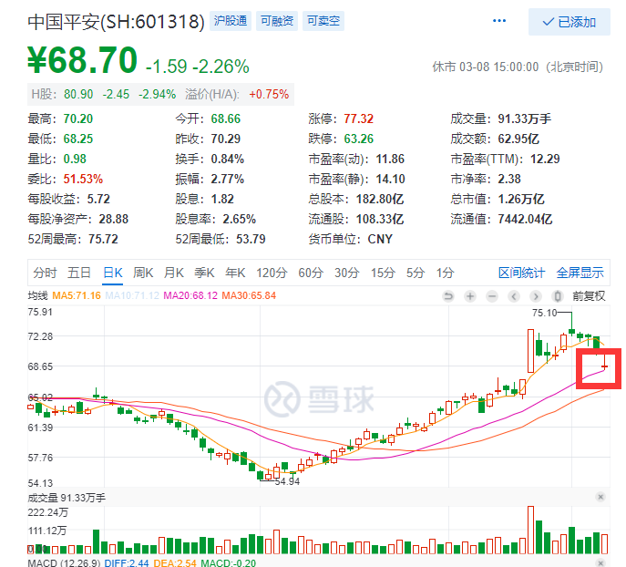

======================================================

_type: talk
@郭明伟[15414525851242]
2019-03-11 00:46:22 Mon  
topic_id: 111182218552242

很喜欢二师父的一句话：模糊的正确。市场是无法预测的，但能从趋势上进行判断，把握机会，坚持定投😊

阅读[2130]  评论[0]  赞[0] 

======================================================

_type: talk
@二师父[28814221155551]
2019-03-11 02:51:04 Mon  
topic_id: 244415541285181

<e type="hashtag" hid="142522424182" title="#定投策略#" /> 两种定投策略的区别，介绍的比较清楚了，大家仔细领会指数估值表和均线偏离表的异同，灵活运用。

阅读[6443]  评论[0]  赞[0] 

+++++++++++++++++++++++++++++++++++++++++++++++++++++

文件：
2019-03-11 02:50:19 Mon
文件大小：[571361]
28844824112541-低估定投和均线定投策略的区别.pdf

======================================================

_type: q&a
@棉花蒋[15142212842242]
2019-03-11 04:15:38 Mon  
topic_id: 111182218528882

@棉花蒋

>  您好！二师傅！！我能不能理解为您场外周四的基金定投是长期投资的计划，主要参考估值表，场内的鳄鱼计划是比较短期的赚取波段的计划，主要参考均线偏离表，然后两者的每份金额是不是相同？按900份分割得到每支基金每份的金额？谢谢二师傅！！

@二师父

>  周四的低估定投策略是按照五步定投法来操作的，16字方针，全面配置，低估定投，正常收割，高估卖本，这个介绍过了。长期持有到牛市。
>  
>  鳄鱼计划不仅仅是短期波段，看时机，如果大盘一路上涨也是长期持有，如果大盘震荡，结合均线做网格。短期和长期结合，如果牛市确立，也是长期持有到牛市高估。
>  
>  每份金额可以不同，看你得投资需求而定投，假设投资3年，一次投6只基金，需要900份，假设投资3年，一次投资2只基金，只需要300份。

阅读[2405]  评论[3]  赞[0] 

======================================================

_type: q&a
@未来已来[88885151118482]
2019-03-11 04:22:55 Mon  
topic_id: 244415541225551

@未来已来

>  新加入的学员，想问问二师父，现在的华宝油气适合建仓买入吗？？

@二师父

>  华宝油气是QDII指数基金，他成立于2011年9月29日，是国内首只，目前唯一一只专注美国石油天然气上游领域投资的基金。
>  
>  在国内无法直接投资原油，原油期货的投资门槛非常之高，而且波动幅度异常大，对于普通投资者来说风险太大。所以华宝油气的投资价值很高。
>  
>  华宝油气的涨跌适合原油价格挂钩的，他是完全跟踪复制标普石油天然气上游股票指数。而华宝油气指数基金复制的这个指数的持仓股票主要是海外上市油气公司。这些油气公司的股价涨跌与原油具有极大的相关性，因此油气指数的涨跌和原油基金的涨跌类似。
>  
>  目前华宝油气指数基金的净值大约是0.49元，属于低估值范围。二师父是18年5月把这个指数加入估值表的，当时华宝油气的净值是0.7元，我们没有投资，现在机会来了可以开始定投
>  
>  当然现在有风险，华宝油气的历史最大下跌幅度目前是40到55个百分点，所以不要轻易建立底仓，开始定投即可。是一个比较不错的标的，注意，周期指数，不要重仓。

阅读[2579]  评论[2]  赞[0] 

======================================================

_type: q&a
@Della🌻🌴明[422155212484558]
2019-03-11 10:17:22 Mon  
topic_id: 422214421121818

@Della🌻🌴明

>  二师父，音频文件在哪里呀？想上班路上听着学习

@二师父

>  置顶文章有优惠链接

阅读[2190]  评论[0]  赞[0] 

======================================================

_type: q&a
@路人甲[28445218525481]
2019-03-11 10:26:53 Mon  
topic_id: 422214414442458

@路人甲

>  老师你好今天的转债有价值吗？

@二师父

>  这个可转债打新中签可以卖出

阅读[2330]  评论[1]  赞[0] 

======================================================

_type: talk
@二师父[28814221155551]
2019-03-11 10:32:13 Mon  
topic_id: 244415515158221

<e type="hashtag" hid="881251425252" title="#鳄鱼计划#" /> 买入华宝油气一份，卖出500ETF一份，中证500目前涨幅不错，价值回归从来不会缺席，即使整体股市不涨我们也能够赚到钱，这是指数定投的魔力。祝大家都盈利。

@冉冉 at 2019-03-11 10:32:13 Mon

> 请问二师傅，场外华宝油气今天也能买吗？

----------

@二师父 at 2019-03-11 10:32:13 Mon

> 可以，建议场内买

----------

@丸子妈 at 2019-03-11 10:32:13 Mon

> 场内代码是多少

----------

@上上签 at 2019-03-11 10:32:13 Mon

> 162411

----------

@上上签 at 2019-03-11 10:32:13 Mon

> 估值图和均线图里面都有代码

----------

@乖子 at 2019-03-11 10:32:13 Mon

> 请问二师傅您鳄鱼计划的一份和场外定投的一份金额是一样的吧？谢谢

----------

@二师父 at 2019-03-11 10:32:13 Mon

> 这个你根据自己的资金量情况来定了，我场内一份大概是场外一份资金的3倍

----------

@Audrey at 2019-03-11 10:32:13 Mon

> 中证500要开始收割利润了吗

----------

阅读[2443]  评论[21]  赞[0] 

======================================================

_type: talk
@二师父[28814221155551]
2019-03-11 14:34:18 Mon  
topic_id: 844415514181452

<e type="hashtag" hid="552445445814" title="#保险配置#" /> <e type="web" href="https://cps.qixin18.com/m/lhz1029368/media-16387.html" title="二师父精选保险" cache="" />，整理了下精选的保险配置，儿童重疾险慧鑫安是非常不错的，成人重疾险我还在必选一种，等我自己购买了你再来参照我的，保险购买一定不能再跟基金购买一样开超市了，基金买了不好可以卖，保险买的不好就没招了。一定要慎重选择。

老年人可以选择安享一生，有病也可以的。主要还是给25到45岁的配置，尤其男性，病不起，需要给家庭有一个保障。

基本的框架就是这样的，基金，保险和股票的体系基本建立，后面就是建立港股打新和信用卡，房子以及贷款体系了。信用卡助理玩的不错，大家可以和他交流，我主要是基金这块，每个人擅长的不一样。

港股打新打了一个开元的，结果首日破发，亏了点，港股打新有亏有赚，这一点不同于基金定投，希望大家明白赚钱的逻辑。中国平安今天不涨不跌，没有触发跌破20日均线的条件，还是持有，股票总体来讲是长期持有的。以后准备更长期持有，选择30日均线作为买入卖出的信号线。

@归去来兮 at 2019-03-11 14:34:18 Mon

> 重疾险我研究好久了，定期到70岁的性价比最高的应该就是康惠保旗舰版，30万保额就差不多了。这个钱就准备是白扔的，所以买太多没必要，省下钱来做定投，保到终身太贵了。就是一份保障，还是要好好锻炼身体，注意养生最要紧！

----------

@归去来兮 at 2019-03-11 14:34:18 Mon

> 我给我儿子在28号下线前买了守卫者1号50万保终身的，这个在多次赔付型里应该是性价比最高的，就因为太便宜了所以下线了。孩子年纪小买的性价比高，保费便宜，就买点好的。我们成人的太贵了。

----------

@二师父 at 2019-03-11 14:34:18 Mon

> 成人必须优先配置的

----------

@半路出家滚雪球 at 2019-03-11 14:34:18 Mon

> 成人重疾我喜欢瑞泰瑞盈，消费型，可选缴费时间长，健康告知宽松。

----------

@韬韬 at 2019-03-11 14:34:18 Mon

> 最近也在找重疾险，市场上品种太多，保险条例中好多专业术语也看不太懂，期望二师父推荐个成人的重疾险。

----------

@二师父 at 2019-03-11 14:34:18 Mon

> 我买了以后推荐给你

----------

@归去来兮 at 2019-03-11 14:34:18 Mon

> 我准备配置一个康惠保旗舰版30万保到70岁的，比较来比较去价格差不多是最便宜的了，而且轻症还可以赔三次，和其他保一次的价格都差不多，另外我买了支付宝好医保，医疗费报销没问题，重疾险是用来收入补偿的。

----------

@Nienie💝 at 2019-03-11 14:34:18 Mon

> 保险我研究了一些，可惜没时间跟大家探讨。以后有机会吧。不过过了30真的应该早考虑保险，因为你不知道意外和明天哪个先来（我深有感触）

----------

阅读[2171]  评论[8]  赞[0] 

======================================================

_type: q&a
@Siller[244184228451851]
2019-03-11 15:13:19 Mon  
topic_id: 244415514148151

@Siller

>  二师父，请问通过你的优惠开户渠道，华泰，广发，华宝的场内基金佣金分别是多少？都是免五的吗？

@二师父

>  华泰和华宝，万1，广发万0.6，都免五

阅读[2151]  评论[10]  赞[0] 

======================================================

_type: q&a
@Steven Zha*[142428111482]
2019-03-11 15:58:33 Mon  
topic_id: 422214411825118

@Steven Zha*

>  二师父您好，关于债市和股市之间的相关性，我想请教一下。我是这样理解，请您指正：正常情况下，资金会在债市和股市之间流动，如果资金从债市流入股市，结果就是股市走牛，债市下跌。但是像这次A股上涨，二师父分析是外资的原因，因此债市资金并没有冲入A股。所以，这轮A股即使是暴跌，也不会对债市产生太大影响。请问，上述理解有无问题呢？

@二师父

>  有问题，股市暴跌得看资金流入哪里，而且影响也不是股市一个因素，综合考虑吧，目前还没暴跌啊

阅读[2155]  评论[0]  赞[0] 

======================================================

_type: q&a
@凯[244415182418811]
2019-03-11 19:04:53 Mon  
topic_id: 244415855281211

@凯

>  二师父我以前在华泰开过户，佣金万2，加你的渠道能降为万1吗

@二师父

>  开过了就得销户，或者开广发的

阅读[2020]  评论[2]  赞[0] 

======================================================

_type: q&a
@龘何亮龘[28814214225141]
2019-03-11 19:17:47 Mon  
topic_id: 544482288442184

@龘何亮龘

>  二师父，您好，上次在公众号提问过关于股息率的问题，你的回答我没太理解明白。所以想再问一下。基本概念不需要解释了 ，都能百度到。我的问题是1.股息是不是分派股和现金分红两种？2.为什么一个红利基金每年股息率有3个多点，没有派股或分红的体现呢？3.基金净值的提升和股息再投入有关系吗？

@二师父

>  1，可以获取现金分红，也可以购买份额，2，这个看具体公司背后的经营情况，他们自己选择的，3，净值提升和股息分红有关系

阅读[2086]  评论[1]  赞[0] 

======================================================

_type: q&a
@林西瓜🍉[28855581582851]
2019-03-11 20:38:38 Mon  
topic_id: 844415852224812

@林西瓜🍉

>  二师父，龙头指数现在的估值可以吗？

@二师父

>  你说的是哪个龙头指数呢

阅读[2114]  评论[3]  赞[0] 

======================================================

_type: talk
@二师父[28814221155551]
2019-03-11 21:05:01 Mon  
topic_id: 544482125485124

<e type="hashtag" hid="142511142112" title="#格局重塑#" /> 马尔科姆·格拉德威尔（《异类》这本书的作者）讲了一个自己母亲和外婆的故事。

他的母亲乔伊丝小时候生活在牙买加中部的一个小镇上，在初中升高中的时候，她通过了考试，但没有拿到奖学金。

乔伊丝家里所有的积蓄拿出来也只够她高中第一年的费用，乔伊丝的父亲虽然饱读诗书，很有修养，但在思考了一晚上之后，第二天只能对女儿说：“我们家里已经没钱了”，然后扭头回到了他的书房。

但是乔伊丝的母亲却不顾困难，依然坚持送她上高中，之后要上大学的时候，她母亲甚至走到邻村，跟做生意的中国人借到了一笔钱，让乔伊丝离开牙买加去往英国读大学。

后来乔伊丝嫁给了一个英国数学家，之后移居加拿大，而他们的儿子马尔科姆·格拉德威尔则在2005年被《时代周刊》评为全球最有影响力的100位人物之一。

面对上不上学这件事，乔伊丝的母亲站在了更高的视角来看待这个问题，找到了一个战略性的人生方向，从而排除万难，改变了乔伊丝的命运。如果一个人因为生活环境的局限而又无法提高自己的眼界和高度，就会失去格局，变得狭隘。

我大学是助学贷款完成的，即使在那时候我还会每个月从自己的兼职收入和生活费里面拿出500元进行理财，现在看500元对我没什么，可是当时对我来说确实是一大笔钱。

你不能够用自己的现在去判断自己的未来，即使那时候我是一个没有什么收入的学生，可是我对未来的期待也是富足的状态，当时还没有想过财务自由。现在我的月收入已经比大学四年贷款总和还多。这个时候我考虑的就已经不是富足了，而是尽可能多地传递自己学到的知识和理念，帮助更多的人变得富有。

格局一方面和自己所处的位置和环境有关系，另一方面和自己看待问题的广度和长远有关系。

不要总觉得自己越收入3000元，以后一辈子就这么过去了，放长远看，把当下应对生活柴米油盐的事情转换成为自己10年或者20年以后的事业做准备上，包括读书，学习，主动社交，提升自己的素养，品格，学识，这才是有格局的人做的事情。

人无远虑，必有近忧，不要被眼前的小事困住了。

@艾琪（王钥） at 2019-03-11 21:05:01 Mon

> 👍 ，理财要先从思维上改变

----------

阅读[2188]  评论[1]  赞[0] 

======================================================

_type: q&a
@聪明的笨蛋[544858411212244]
2019-03-11 21:11:17 Mon  
topic_id: 422214845515888

@聪明的笨蛋

>  二师傅听您的课听到：低估指数那么多，为什么您只选2只的时候，有点搞不明白。例如：估值表里行业指数里的6只基金全部低估，是不是选最低估的那2只就可以了？还是优先选消费，医疗或者银行？

@二师父

>  是结合自己的仓位以及低估状态来选择，如果仓位低，指数低估越严重，成长性越好，就首选多投这样

阅读[2296]  评论[3]  赞[0] 

======================================================

_type: talk
@曲辉[28484555188121]
2019-03-11 21:26:33 Mon  
topic_id: 422214845181588

华宝油气场内和场外基金净值和每天涨跌怎么差这么多？3月8号场内的净值0.492，跌1.2％。场外的净值0.473，跌3.27％。

@Siller at 2019-03-11 21:26:33 Mon

> 场内现在溢价很多

----------

@曲辉 at 2019-03-11 21:26:33 Mon

> 这样还是买场外合算。

----------

阅读[2123]  评论[2]  赞[0] 

======================================================

_type: talk
@二师父[28814221155551]
2019-03-11 22:40:25 Mon  
topic_id: 544482124582114

<e type="hashtag" hid="825442152822" title="#指数代码#" /> 把我的鳄鱼计划和定投实盘的代码公布了一下，目前低估实盘有一个债券基金，一个可转债基金，一个黄金基金，这在场内定投实盘里面没有，因为我的场内实盘是收益最大化，不做风险防控，我自己也能够经受住回撤。

如果资金不足，就精选两只定投就可以了

@宋航 at 2019-03-11 22:40:25 Mon

> 这些在场外可以做定投吗？

----------

@二师父 at 2019-03-11 22:40:25 Mon

> 可以，场外代码我也放上去了，低估实盘是有的

----------

@宋航 at 2019-03-11 22:40:25 Mon

> 好的。谢谢二师父

----------

@凯 at 2019-03-11 22:40:25 Mon

> 中证白酒代码应该是中证消费的

----------

@二师父 at 2019-03-11 22:40:25 Mon

> 这个观察还是很细致的，我是把场外的消费用白酒替代了，更加集中，消费和白酒有比较多重合

----------

@凯 at 2019-03-11 22:40:25 Mon

> 明白了，好像没有50ah呢

----------

@二师父 at 2019-03-11 22:40:25 Mon

> 场外有银行，也把这个替代了，集中持有行业指数基金

----------

@归去来兮 at 2019-03-11 22:40:25 Mon

> 白酒不是高估了吗？还能定投？

----------

阅读[2348]  评论[29]  赞[0] 

+++++++++++++++++++++++++++++++++++++++++++++++++++++

图片：

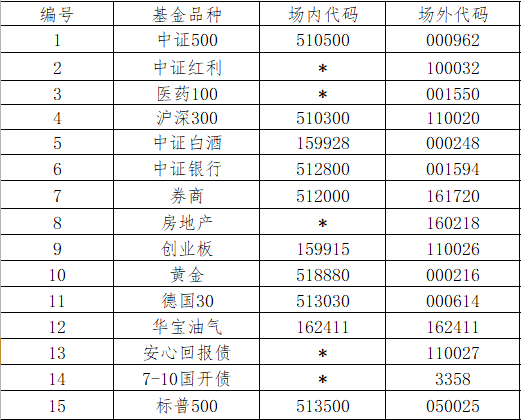

======================================================

_type: talk
@二师父[28814221155551]
2019-03-12 04:38:05 Tue  
topic_id: 544482128422854

<e type="hashtag" hid="481211145528" title="#指数估值#" /> 指数估值表，增加了债券指数基金的估值

@王斯王 at 2019-03-12 04:38:05 Tue

> 500增强怎么没了？

----------

@聪明的笨蛋 at 2019-03-12 04:38:05 Tue

> 二师傅起的真早[玫瑰]

----------

@二师父 at 2019-03-12 04:38:05 Tue

> 精简了，中证500就不错，500增强的估值稍微比中证500高一点

----------

@自由飞翔 at 2019-03-12 04:38:05 Tue

> 好的，我也很关注500增强[微笑]

----------

@自由飞翔 at 2019-03-12 04:38:05 Tue

> 师父，我手上500增强仓位比较重，关于这指数之前发布的估值区间有调整不？还得持续关注呢

----------

@二师父 at 2019-03-12 04:38:05 Tue

> 没调整，参考500指数就可以，如果仓位特别重可以买点利润，最近涨的不错

----------

@自由飞翔 at 2019-03-12 04:38:05 Tue

> 好的，谢谢师父[抱拳][抱拳]

----------

阅读[5722]  评论[7]  赞[0] 

+++++++++++++++++++++++++++++++++++++++++++++++++++++

图片：

======================================================

_type: talk
@二师父[28814221155551]
2019-03-12 04:42:14 Tue  
topic_id: 111182528125252

<e type="hashtag" hid="142114852552" title="#浮盈如何定投#" /> 关于定投，需要长期坚持的一个过程，本身定投定期扣款就自带长期持有属性

@海盗 at 2019-03-12 04:42:14 Tue

> 谢谢二师父的分享[玫瑰][玫瑰]

----------

阅读[6040]  评论[1]  赞[0] 

+++++++++++++++++++++++++++++++++++++++++++++++++++++

文件：
2019-03-12 04:41:38 Tue
文件大小：[41024]
15511512458242-定投浮盈，也要坚持低估扣款.docx

======================================================

_type: talk
@Demon[422184182112828]
2019-03-12 08:26:57 Tue  
topic_id: 111182555144412

<e type="hashtag" hid="142114852552" title="#浮盈如何定投#" /> 二师父，有个问题，就是说3500点就很多基金停止，这个相对于过去是高估，但是对于未来不是不一定，要是指数到10000，3500不也是低估吗？

@海盗 at 2019-03-12 08:26:57 Tue

> 问的很好，坐等二师父回话[抠鼻]

----------

@二师父 at 2019-03-12 08:26:57 Tue

> 这个我说最近一段时间，长期需要看全市场指数的市盈率，这个是在一定范围内浮动的

----------

阅读[1981]  评论[2]  赞[0] 

======================================================

_type: q&a
@远熹[544814518545554]
2019-03-12 10:13:28 Tue  
topic_id: 244415882844841

@远熹

>  二师父，我有个问题，我现在都是用蚂蚁投场外，这段时间有几只可以收割利润了，但是我今天选赎回，第二天才完成交易，那如果第二天跌了的话，岂不是会亏，从这个角度来说，是不是定投选择场内比较好

@二师父

>  不是，今天三点之前卖出，最后成交价格是今天的

阅读[2084]  评论[1]  赞[0] 

======================================================

_type: q&a
@victoria[15455121858422]
2019-03-12 10:59:08 Tue  
topic_id: 422214885218188

@victoria

>  二师父券商目前点位（PB）属于什么情况，还可以再买入吗

@二师父

>  正常估值，不适合了

阅读[2185]  评论[0]  赞[0] 

======================================================

_type: q&a
@元亨[48551521514458]
2019-03-12 11:29:43 Tue  
topic_id: 111182551255222

@元亨

>  你好二师父，中证500目前还可以买吗

@二师父

>  可以买，现在仍旧低估，低估的基金都可以买

阅读[2205]  评论[3]  赞[0] 

======================================================

_type: q&a
@上上签[244184512458541]
2019-03-12 12:07:02 Tue  
topic_id: 544482114152224

@上上签

>  二师傅，你之前微信公众号发一篇文章，算大概溢价率的，溢价率=(当前基金价格-昨日收盘基金净值)/昨日收盘基金净值-当日涨跌幅
>  可是我现在用这个公式计算华宝汽油，发现和雪球显示的差别很大，（0.491－0.488）/（0.488－0.61%）＝0.00618，是不是我那里计算或者理解错了，还有雪球显示错了呢

@二师父

>  雪球显示有问题

阅读[2328]  评论[2]  赞[0] 

======================================================

_type: q&a
@J[28281541518551]
2019-03-12 12:30:18 Tue  
topic_id: 422214882811418

@J

>  师父你好，可以把目前鳄鱼计划的持仓公布一下吗？鳄鱼计划是每周定投还是不定期买入吗？是每周什么时候更新？请详细说明一下，方便跟投～谢谢您

@二师父

>  每周不定期买入，现在基本停止了，昨天卖了一份500，持仓现在11只基金，在我昨天发布的表格里面有，仓位由高到低，更新你关注下星球，不定期，去年买的多，今年已经没有特别好的机会了，搜索鳄鱼计划可以看到

阅读[2208]  评论[3]  赞[0] 

======================================================

_type: q&a
@wenkyliu[544842588821214]
2019-03-12 12:34:24 Tue  
topic_id: 422214882544288

@wenkyliu

>  请问现在开始定投 指数基金按照什么频率比较好 日定 周定还是月定？如果可投资金是20万 按照一份多少比较合适？

@二师父

>  一份2000比较合适，选择周定投

阅读[2278]  评论[3]  赞[0] 

======================================================

_type: talk
@二师父[28814221155551]
2019-03-12 12:50:02 Tue  
topic_id: 244415884241111

<e type="hashtag" hid="142511181542" title="#周二荐书#" /> 现在每天都在看着市场表演，大多数人冲进来开户，建立底仓，历史是如此的相似

人性我改变不了，我就静静地看着历史重演，牛市适合学习，稀缺，我们是如何陷入贫穷和忙碌的，穷人心态导致忙碌，越忙碌越穷，这本书对改变思维模式很有帮助

发觉很多人思维有问题，最近开户多，我搞了个免费星球，发给别人，有的人看都没看就说我骗钱，有意思了，这就跟大妈看到股票说是赌博一样，思维认知跟不上去，最终还是个穷，越努力越失败

@斜杠青年 at 2019-03-12 12:50:02 Tue

> 深表同意，思维决定高度！越读书越通透！

----------

@杜志彪 at 2019-03-12 12:50:02 Tue

> 随它吧[呲牙]

----------

@小牧童 at 2019-03-12 12:50:02 Tue

> 志趣相投才是交流的基础，知识传播也需要有基础，我也推荐二师父的平台给几个朋友，后来问他们学的怎么样，有没有关注？说最近比较忙，😄，在我们身边让别人理财说多了还以为跟我有利益关系，所以不是特别好的关系一般不推荐，有些即使推荐了以为我跟卖保险差不多，比较尴尬，只跟懂的人交流就行了，其实二师父的星球已经是良心价了。

----------

@二师父 at 2019-03-12 12:50:02 Tue

> 有缘人自会相遇，谢谢支持哈

----------

@小牧童 at 2019-03-12 12:50:02 Tue

> 以后随着理财意识越来越普及，二师父就不用这么苦口婆心了[偷笑]

----------

@二师父 at 2019-03-12 12:50:02 Tue

> 任重道远啊

----------

@小牧童 at 2019-03-12 12:50:02 Tue

> [偷笑][偷笑][偷笑]

----------

阅读[2402]  评论[7]  赞[0] 

======================================================

_type: q&a
@珅爹[15451242541142]
2019-03-12 12:58:58 Tue  
topic_id: 244415884214581

@珅爹

>  老师，您好。
>  我现在空仓，没有投资，是马上进一大笔底仓，然后再定投？
>  还是先开始定投？场内怎么买法？比例怎么摄制？

@二师父

>  大笔底仓不合适，买3成底仓就可以了，其余的定投，场内的话购买选择3到6只即可，目前很多基金正常估值了，参考我的估值表定投就行了，如果没有开户的话需要先开通股票账户才能购买

阅读[2463]  评论[5]  赞[0] 

======================================================

_type: q&a
@光明无顶[51184452185224]
2019-03-12 13:16:43 Tue  
topic_id: 844415884484822

@光明无顶

>  师傅好，初学定投，每周定投的指数基数量是按照种类各选一只(大概五六种)，还是只选一两个？谢谢

@二师父

>  初学的话就选择两三只回撤不大的，后面入门之后就逐步加大配置，学会自己配置全球市场指数基金

阅读[2480]  评论[1]  赞[0] 

======================================================

_type: q&a
@丁咚[51445121522854]
2019-03-12 14:04:56 Tue  
topic_id: 544482114852814

@丁咚

>  二师傅，请问500增强000478，为什么不在指数估值表内了？还建议持有吗？

@二师父

>  这个仍旧持有的，两个指数本来就是可替代，中证500，费率偏低一些，之前就换了，500增强我是继续持有到高估的

阅读[2451]  评论[2]  赞[0] 

======================================================

_type: talk
@二师父[28814221155551]
2019-03-12 15:19:57 Tue  
topic_id: 544482151222284

<e type="hashtag" hid="225444554151" title="#学会取舍#" /> 取舍主要是在思维上想清楚，不然的话，你身体做了取舍，痛苦仍然是双份的，你创业辛苦时，就想着可以去体制内混一混；你在体制内，不那么如意，手头有时比较紧，又以为自己创业可以发财。你老梦想着自己在另一领域是天才。这是取舍之前定位不清楚的后果。

你的定位是什么？定位清楚了，就容易聚焦，就不会摇摆，怨气也小。

人有两种工作状态，一是雇佣他人，自我雇佣，你是雇主；二是被他人雇佣，你是雇员。体制内工作属于后一种，只不过雇主特殊，是政府。

被人雇佣，一生的总收入，大致可以算出来，仔细经营，不犯大的错误，中位的生活水准是有的，即使是在一线城市，也能有套房子（还可以不停置换升级）,无法多奢侈，但人格建设得好，顾家、宽容、温和，则幸福也是大概率事件。

你如果想发大财，人生定位是财务自由，只能当雇主，雇佣自己，或者雇佣更多人。这是有数据支持的规律，再多苦头也得吃。

德国在财富理论领域最著名的学者之一沃尔夫冈·劳特巴赫调查了中产阶层（中位数净值为16万欧元）、富裕人士（75万欧元）、高净值人士（340万欧元）、德国最富有的100人（15亿欧元）以及全世界最富有的100人（105亿欧元）后发现，德国64.5%的高净值人士是企业家。“实证研究表明，只有那些自雇人士才能获得财富。没有多少证据证明财富能通过为雇主工作来创造。”98%的德国最富有的100人和95.2%的全世界最富有的100人是企业家。

劳特巴赫得出的结论是：“企业家精神是创造巨额财富的必要前提。”

一个人既要体制的好处，又要市场的好处，定位都不准，显然不可能有企业家精神，连职业的忠诚度都没有，即使能捞到一点蝇头小利，人家也评价你气质猥琐，并非没有成本的。

企业家精神，只能从完全的自我负责开始。

@丸子妈 at 2019-03-12 15:19:57 Tue

> 定位

----------

@璐老诗 at 2019-03-12 15:19:57 Tue

> 非常有道理 我现在就在体制内 常吃着碗里的望着锅里的

----------

@二师父 at 2019-03-12 15:19:57 Tue

> 哈哈，那你挣得不少

----------

@晨 at 2019-03-12 15:19:57 Tue

> 感觉二师父每天都在努力超越自己。学习了。

----------

@璐老诗 at 2019-03-12 15:19:57 Tue

> 跟着您在学习 资本小 赚经验😄

----------

@丸子妈 at 2019-03-12 15:19:57 Tue

> 优秀的人都很努力

----------

@晨 at 2019-03-12 15:19:57 Tue

> 是的，每天都能体验不同的风景，成长最重要。

----------

@二师父 at 2019-03-12 15:19:57 Tue

> 改变思维观念，没钱不可怕，就怕思维局限

----------

阅读[2380]  评论[9]  赞[0] 

======================================================

_type: q&a
@Huan泳[15548455488882]
2019-03-12 15:51:21 Tue  
topic_id: 422214858848428

@Huan泳

>  老师！为什么定投一般都是推荐华宝油气？南方原油，嘉实原油之类的不好吗？

@二师父

>  也可以的啊，他们的基金规模小点，优选吧，选择一个就行了

阅读[2412]  评论[0]  赞[0] 

======================================================

_type: q&a
@四月天[822552518422]
2019-03-12 17:43:33 Tue  
topic_id: 844415828145112

@四月天

>  老师，现在可以开始定投券商指数基金吗？

@二师父

>  券商现在比较贵了不适合

阅读[2274]  评论[0]  赞[0] 

======================================================

_type: q&a
@风信子[544458822111224]
2019-03-12 19:15:06 Tue  
topic_id: 422214855852588

@风信子

>  二师父，你好。中证500场外定投是160119还是000962？

@二师父

>  都可以，这两个没啥区别

阅读[2257]  评论[2]  赞[0] 

======================================================

_type: q&a
@竹露清响[15115485845882]
2019-03-12 19:53:48 Tue  
topic_id: 244415822248181

@竹露清响

>  二师父，300增强现在还是低估？可以周定投么？

@二师父

>  估值表低估的指数都可以周定投

阅读[2320]  评论[0]  赞[0] 

======================================================

_type: q&a
@素华[244148855215111]
2019-03-12 20:41:12 Tue  
topic_id: 544482155824554

@素华

>  师父问个小白问题，支付宝卖出如何只卖利润部分？卖出界面只能卖份额

@二师父

>  我在五步定投法里面讲过了，用盈利除以当前净值，就是你卖出的份额

阅读[2322]  评论[1]  赞[0] 

======================================================

_type: talk
@二师父[28814221155551]
2019-03-12 21:29:01 Tue  
topic_id: 422214852451428

<e type="hashtag" hid="142111251812" title="#职场#" /> 1、要分清工作和职业

工作是谋生的手段，一个单位给你一份工作，你完成任务，它付你工资，就两清了。

职业是我们一辈子要从事的事业，比如你的目标是当建筑设计大师，那你就应该为此做一个长远规划。

当你在某个公司工作几年后，发现已经学不到什么新东西时，就应该为职业发展果断跳槽，去另一家公司学习新理念新东西。

2、不要坐以待毙

当你发现公司衰落已无可挽回时，就应该果断辞职，寻找下家。不要因为离家近而舍不得，不要因为同事好而舍不得

你越是拖延，损失就会越大。这很残酷，但却是最佳选择。

阅读[2429]  评论[0]  赞[0] 

======================================================

_type: q&a
@冬夫[15122585122182]
2019-03-12 22:06:18 Tue  
topic_id: 544482154145244

@冬夫

>  二师父怎么没见音频链接？

@二师父

>  <e type="web" href="https://open.lizhiweike.com/oauth2/authorize?client_id=weike-html5-frontend&response_type=cookie&redirect_uri=https%3A%2F%2Fm.lizhiweike.com%2Fchannel2%2F355516%3Fdiscount_code%3D12436844%26y%3D1%26from_old_channel%3D1" title="荔枝微课" cache="" />，点击这个可以领取60元优惠券

阅读[2380]  评论[0]  赞[0] 

======================================================

_type: q&a
@珅爹[15451242541142]
2019-03-12 22:22:13 Tue  
topic_id: 844415845542142

@珅爹

>  请教何时卖出的问题，您提到，在熊市里，有10%浮盈就要卖10%的利润，那稳健投资账户里剩下的钱还加仓不加仓了？您不是说过定投不间断吗？熊市正是买入机会。如果加仓卖出干嘛呢？还有，牛市有50%盈利卖出50%，卖出后还加仓吗？接着涨5%就卖出一部分，账户上看 ，浮盈50%卖出全部仓位50%，剩下持仓会显示浮盈为100%了，下次怎么判断又涨了5%？

@二师父

>  这个，熊市卖出是卖出正常估值指数的利润，现在大盘点位不高，可是券商白酒指数不低，需要卖出利润，利润卖出正常估值的指数就别买了，牛市分步卖出直接就别买了，等待下一次机会，否则就会买到最高点

阅读[2502]  评论[1]  赞[0] 

======================================================

_type: talk
@二师父[28814221155551]
2019-03-12 23:05:58 Tue  
topic_id: 244415845452511

你若计较，处处都是羁绊

你若释怀，眼见都是晴天

电影《28 岁未成年》有这样一个片段：男主茅亮的 iPad 被女友弄丢了，那上面有下午开会的设计图纸，他必须要把 iPad 找回来。

通过定位，他发现 iPad 落到一个肉贩那里。为了赎回原本属于自己的 iPad，身上只有 1500 块的茅亮，希望这位大哥可以便宜一点。

这位猪肉大哥同意了，但随即却在 iPad 上砍了一刀。还说，这下值这个价钱了。

这样的操作也是令人始料未及，该是多么计较的人才能做出这事，令人反感。

凡事计较的人，为了眼前的得失而争个斤斤一二，这样的人格局也大不了。

金星说过：

你越包容，你自己的生活越好过，你越计较，自己的空间越小。

现实中，有人置身云上，有人身处泥潭，这就是差别。

凡事计较的结果，可能最后什么也得不到。曾经听过一个这样的故事，有一个人很意外地获得了一颗饱满硕大的珍珠，但是他并不开心，因为这颗珍珠上有一个微小的斑点。

每当他在欣赏这颗珍珠的时候，一看到这个斑点，心情立马变色，他很想要把斑点剔除。

当他把斑点的地方磨掉一层，发现斑点还在，他并不死心，继续打磨一层又一层，直到最后斑点终于磨掉了，珍珠也被毁于一旦。

格局小的人，为眼前的小事计较，而看不到计较背后的大局，最后反而损失惨重。

奉劝大家：凡事别计较，眼光放长远，才会活得大气，才能成大事。

@冉冉 at 2019-03-12 23:05:58 Tue

> 金句啊，人生哲理即如是。收藏了

----------

阅读[2535]  评论[1]  赞[1] 

======================================================

_type: q&a
@唐僧[28482288811141]
2019-03-13 04:14:31 Wed  
topic_id: 111182515282252

@唐僧

>  二师父，您好。华宝油气最近价格不错，打算建7层左右底仓，然后做网格交易，你觉得如何?

@二师父

>  这个可以做网格交易，但是华宝油气是强周期指数，不建议如此重的底仓，假如遇到暴跌可能承受不了，回撤40个点如果能够接受的话是可以的，一般人承受不了，所以轻仓。

阅读[2545]  评论[0]  赞[0] 

======================================================

_type: talk
@二师父[28814221155551]
2019-03-13 04:17:35 Wed  
topic_id: 244415848814141

<e type="hashtag" hid="481211145528" title="#指数估值#" />

@陈 at 2019-03-13 04:17:35 Wed

> 二师父，这次估值表里怎么没有中证500指数增强？

----------

@二师父 at 2019-03-13 04:17:35 Wed

> 参考中证500，我在精简指数

----------

阅读[2580]  评论[2]  赞[0] 

+++++++++++++++++++++++++++++++++++++++++++++++++++++

图片：
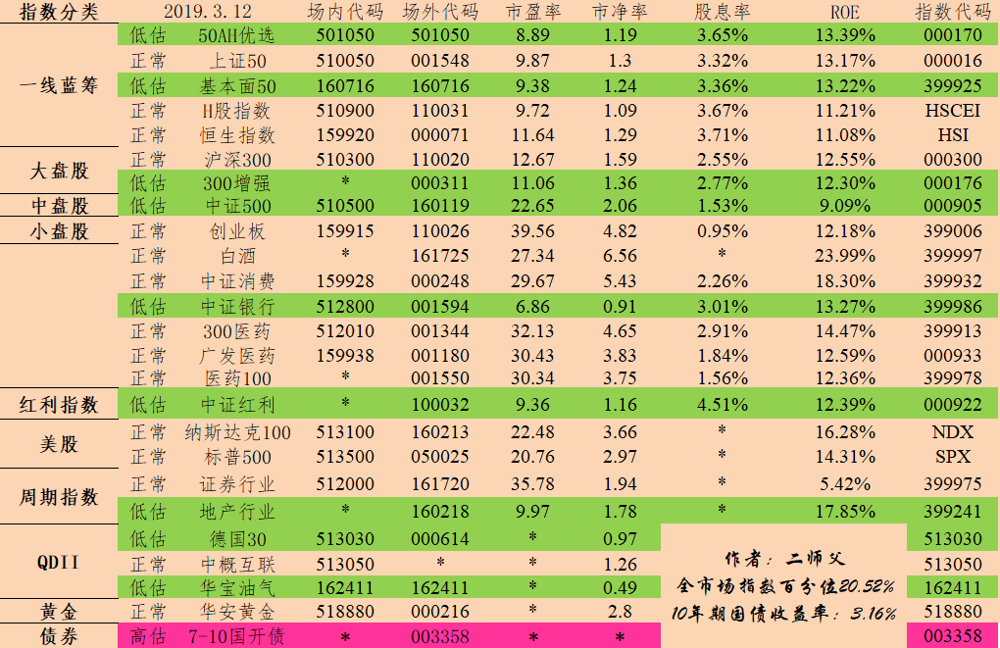

======================================================

_type: talk
@二师父[28814221155551]
2019-03-13 04:19:23 Wed  
topic_id: 844415848814112

<e type="hashtag" hid="552444258154" title="#勿追涨#" /> 定投即可，不要追涨

@四月天 at 2019-03-13 04:19:23 Wed

> 说的太好了

----------

@艾琪（王钥） at 2019-03-13 04:19:23 Wed

> 理财先从改变思维开始

----------

@西男 at 2019-03-13 04:19:23 Wed

> 师父，句句说到心坎上了！

----------

@自由飞翔 at 2019-03-13 04:19:23 Wed

> 关于延迟这例子，我用来测测孩子[微笑]

----------

阅读[6587]  评论[4]  赞[0] 

+++++++++++++++++++++++++++++++++++++++++++++++++++++

文件：
2019-03-13 04:18:50 Wed
文件大小：[190119]
51144144458584-A股用背影告诉你，不必追.docx

======================================================

_type: talk
@guoqiuhong[51285485422424]
2019-03-13 05:46:49 Wed  
topic_id: 844415848251142

请问投资了300价值还需要投资300增强吗？两者区别是什么，300价值还处于低谷，需要定投吗？

@丸子妈 at 2019-03-13 05:46:49 Wed

> 低估值的，应该都可以投

----------

@Franky at 2019-03-13 05:46:49 Wed

> 没必要两个都投，还不如直接选择300价值投两份！300价值里面的100只成分股就是在沪深300里面挑选出来的，选择因子是评分最高的100只股票，选择300价值就可以了，长期来看对沪深300有超额收益。

----------

@guoqiuhong at 2019-03-13 05:46:49 Wed

> 谢谢

----------

阅读[2672]  评论[3]  赞[0] 

======================================================

@二师父[28814221155551]
2019-03-13 09:13:10 Wed  
topic_id: 422214828582588

>  @二师父
>  

阅读[2666]  评论[5]  赞[0] 

======================================================

_type: q&a
@海盗[48248118584848]
2019-03-13 09:14:10 Wed  
topic_id: 111182515458252

@海盗

>  当前证券指数的市净率最大下跌幅度是45个百分点，指数单边最大下跌幅度是65个百分点。
>  还请二师父详细指教一下，怎样看这个图？谢谢

@二师父

>  这个图就是市净率的整体走势图，纵坐标是市净率

阅读[2978]  评论[2]  赞[0] 

======================================================

_type: q&a
@珅爹[15451242541142]
2019-03-13 12:21:36 Wed  
topic_id: 244415841411511

@珅爹

>  华东医药可以买入定投吗？现在

@二师父

>  这个不适合定投，股票不是采用的定投策略，我用的趋势交易

阅读[2781]  评论[0]  赞[0] 

======================================================

_type: q&a
@汉尼拔[552144155244]
2019-03-13 12:22:36 Wed  
topic_id: 844415841148842

@汉尼拔

>  二师父好，请问有新手买股票开户方面的文章么？

@二师父

>  这个我有福利注册渠道，买股票广发的费率是最低的，你在文章置顶区域扫描二维码注册就可以了，按照提示一步步操作

阅读[2852]  评论[1]  赞[0] 

======================================================

_type: q&a
@光明无顶[51184452185224]
2019-03-13 12:45:08 Wed  
topic_id: 244415815512581

@光明无顶

>  师傅您好，创业板ETF联接指数基金已有10%获益，当下收割利润合不合适？谢谢

@二师父

>  适合，按照我们的原则，低估定投，正常估值收割利润，现在创业板估值正常，非常适合收割利润

阅读[2967]  评论[4]  赞[0] 

======================================================

_type: talk
@二师父[28814221155551]
2019-03-13 13:11:19 Wed  
topic_id: 844415815818222

<e type="hashtag" hid="142111555452" title="#事业很重要#" /> 一个人天天盯着股市，每天都要耗掉几个小时，他不可能把本职工作做好，基本都采取应付、糊弄的态度。这样很难得到同事的尊重，机会也少。一个人无论选择了什么职业，他没了责任心和进取心，颓废而消极，他的气场就让人不舒服。曹德旺的自传里，写到不少他尊重的官员，都是所谓吃体制饭的，但是为了拉他这个企业家去投资，为了当地的经济和就业，非常勤奋，非常投入，用自己的品行感动了企业家。抱着混的态度，达不到这个境界。

我们日常接触一个人，不太关心他的信仰、他的观念，但会通过他的工作态度与能力给他打分，因为这才与我们的利益相关，一个敬业的人，必然得到尊重，而一个混的人，令人厌烦。在任何一个领域，都将分出等级，混的人，总是要沉下去的。

阅读[3008]  评论[0]  赞[0] 

======================================================

_type: q&a
@가존보[111855585454522]
2019-03-13 14:39:44 Wed  
topic_id: 844415815145212

@가존보

>  二师父，问一下中证大农业和中证传媒属于低估吗？

@二师父

>  中证大农业不低估，中证传媒低估，传媒是周期指数，如果定投要轻仓

阅读[2948]  评论[5]  赞[0] 

======================================================

_type: q&a
@林西瓜🍉[28855581582851]
2019-03-13 14:46:32 Wed  
topic_id: 844415815141822

@林西瓜🍉

>  二师父，请问为什么有的指数成立的时间比较晚，但可以选择的多年前的基点，但又没有数据的？比如中证1000，以 2004 年 12 月 31 日为基日，但各平台的估值数据是从2014年开始的，那之前10年的数据呢？

@二师父

>  这属于平台统计数据残缺，需要到万得或者同花顺这些专业平台看数据，如果这些也没有那基本上数据就缺失了

阅读[3017]  评论[0]  赞[0] 

======================================================

_type: q&a
@林西瓜🍉[28855581582851]
2019-03-13 17:48:33 Wed  
topic_id: 111182585184412

@林西瓜🍉

>  二师父，之前看到有基金经理管理某只基金期间，收益是-12121212.12%，具体数字不记得，印象就是一串长数字，但真的会亏损这么多吗？还是我记错了？

@二师父

>  哪个基金我去看看

阅读[3015]  评论[2]  赞[0] 

======================================================

_type: q&a
@小牧童[28484254825881]
2019-03-13 19:40:32 Wed  
topic_id: 422214511412488

@小牧童

>  二师父，您好，我想问一下下图的百分位是用什么公式算出来的？我算来算去不一样！请教一下！谢谢！

@二师父

>  这是百分位数计算方法，系统将整个区间的数据排列取中位数，百分位是50%，然后看当前值所处百分位

阅读[2991]  评论[3]  赞[0] 

======================================================

_type: q&a
@聪明的笨蛋[544858411212244]
2019-03-13 21:30:01 Wed  
topic_id: 422214511115818

@聪明的笨蛋

>  华宝油气现在低估，想场内配置点。但用您的溢价公式计算了下，现在溢价1.6个百分点。请教一下，那现在还适合场内定投吗，还是我计算错了？

@二师父

>  这个数据不准的，因为ipov没有实际公布

阅读[2885]  评论[3]  赞[0] 

======================================================

_type: talk
@🐰Mandy[244148854285821]
2019-03-13 23:04:13 Wed  
topic_id: 422214244211158

你好，想问下今天刚建仓富国中证500增强定投，这个基金怎么样？现在时机合适吗？另外怎么加微信群

@二师父 at 2019-03-13 23:04:13 Wed

> 这个目前低估，适合定投，可以选择中证500被动指数

----------

@天机 at 2019-03-13 23:04:13 Wed

> 同问，微信群在哪里？

----------

阅读[2621]  评论[2]  赞[0] 

======================================================

_type: talk
@二师父[28814221155551]
2019-03-14 01:25:55 Thu  
topic_id: 244415454522121

<e type="hashtag" hid="225444812511" title="#选择基金#" /> 有很多人选择基金不会，还在靠别人喊单操作，多学习吧，这样才能少交学费给市场

阅读[6577]  评论[0]  赞[0] 

+++++++++++++++++++++++++++++++++++++++++++++++++++++

文件：
2019-03-14 01:25:17 Thu
文件大小：[25410]
51144182125584-如何选择一只好的指数基金进行定投.docx

======================================================

_type: talk
@二师父[28814221155551]
2019-03-14 01:27:49 Thu  
topic_id: 244415454524521

<e type="hashtag" hid="481211145528" title="#指数估值#" /> 估值表仍旧无变化，后面300增强也会被去掉，只专注纯被动的指数基金。今天有点累，每天重复回答太多问题，得想个办法解决，不然会被消耗完，没时间读书学习提升自己就容易退步。

@Winnie at 2019-03-14 01:27:49 Thu

> 二师父已经很有耐心了，我每次来逛逛看到有相同的提问都会心疼二师父一下，期待你找到好的解决方法

----------

@杜志彪 at 2019-03-14 01:27:49 Thu

> 时刻盯着确实很累，简单的问题大家一起来帮着回答，师父给把关就好了，还有就是可以每天定时回答问题，比如每天分两个或三个时段集中提问，有个别着急的可以采用付费提问方法，不知师父认为可行[得意]

----------

@门萨🐨 at 2019-03-14 01:27:49 Thu

> 只能选择回答了

----------

@二师父 at 2019-03-14 01:27:49 Thu

> 好

----------

@二师父 at 2019-03-14 01:27:49 Thu

> 对，找个时间集中回答

----------

@二师父 at 2019-03-14 01:27:49 Thu

> 集中回答

----------

@归去来兮 at 2019-03-14 01:27:49 Thu

> 以后做大了可以配个助手，另外做个置顶贴，把相同的问题都贴上去让他们自己看。告诉他们在哪里。

----------

@二师父 at 2019-03-14 01:27:49 Thu

> 这个可以

----------

阅读[6795]  评论[22]  赞[0] 

+++++++++++++++++++++++++++++++++++++++++++++++++++++

图片：
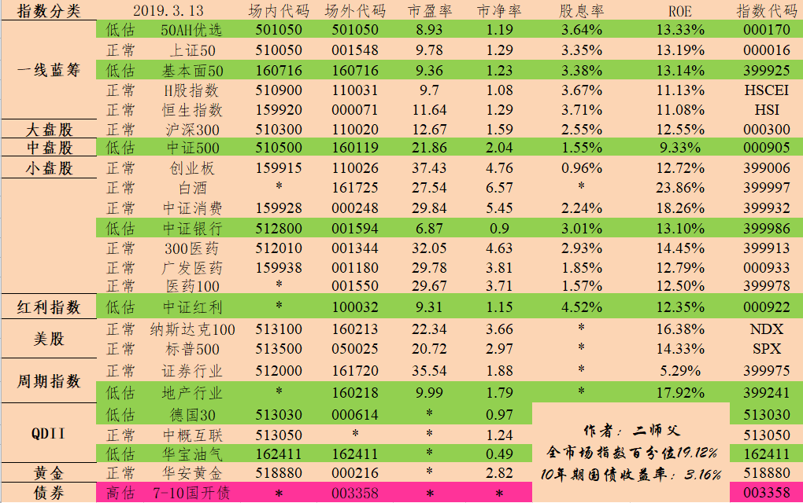

======================================================

_type: talk
@二师父[28814221155551]
2019-03-14 09:58:14 Thu  
topic_id: 544482428124854

<e type="hashtag" hid="225848111481" title="#港股打新#" /> 今天豆盟涨了60多个点，盈利，前几天开元亏了十几个点，亏损。港股打新适合能够接受亏损的朋友，在选股基础上靠港股上涨的概率取胜，大多数朋友不适合，因为人都无法接受亏损

尝试下也好，让自己拿得起，放得下，能行能输，这种人心胸豁达，做投资更容易成功

@惟子 at 2019-03-14 09:58:14 Thu

> 做的拼团，有盈有亏，也不错[强]

----------

@가존보 at 2019-03-14 09:58:14 Thu

> 二师父，打新港股，着重看新股公司的基本面以及行业属性吗？

----------

@二师父 at 2019-03-14 09:58:14 Thu

> 看下招股说明书，看他们过往业绩，还有价格，一般选择低价的

----------

@가존보 at 2019-03-14 09:58:14 Thu

> 好的。

----------

@가존보 at 2019-03-14 09:58:14 Thu

> 拼团具体是怎么操作？

----------

@二徒弟 at 2019-03-14 09:58:14 Thu

> 我还是不会玩这个[大哭]

----------

@二师父 at 2019-03-14 09:58:14 Thu

> 扫描置顶文章二维码

----------

@二师父 at 2019-03-14 09:58:14 Thu

> 扫描二维码购买才行

----------

阅读[2676]  评论[11]  赞[0] 

======================================================

_type: talk
@二师父[28814221155551]
2019-03-14 10:21:07 Thu  
topic_id: 544482428528284

<e type="hashtag" hid="881422852442" title="#定投实盘#" /> 买了中证500指数，地产指数，红利指数各一份，代码之前发过，大家记得做笔记，不会每次发同样的内容

大家有没有发现定投的一个魔力，只要坚持扣款，从3300开始定投，指数在下面玩了一圈，涨到3000我们都盈利了，这就是定投的妙处

如果一直涨，我们的定投会一直处于盈利状态，只不过比一次买入收获小点罢了

这样看，无论涨跌，定投都是稳赚不赔的投资。关于股票投资，未必有基金挣得多，我之前持有两只股票，一个腾讯，一个平安，腾讯已经止赢，平安仍旧持有，盈利20多个点比定投有的指数低

指数还是不错的，很多人只看到妖股涨停，却忽略了风险，这是最忌讳的，一次巨亏可能就让你无法翻身，学会稳健投资最重要了

以后实盘放到精华里面，便于大家查找。

@victoria at 2019-03-14 10:21:07 Thu

> 中证500选南方的还是天泓的

----------

@二师父 at 2019-03-14 10:21:07 Thu

> 这两个没啥区别，一样的，任意选择其中一个

----------

@victoria at 2019-03-14 10:21:07 Thu

> 好

----------

@汉尼拔 at 2019-03-14 10:21:07 Thu

> 二师父，002906投这个中正500也行吧，跟你代码的一回事吧

----------

@二师父 at 2019-03-14 10:21:07 Thu

> 那是500增强，追踪500增强指数，和中证500代码类似

----------

@艾琪（王钥） at 2019-03-14 10:21:07 Thu

> 跟着买了地产、红利、50ah、德国30、华宝油气，手里还有沪深300、景顺长城新兴成长混合，一锅乱炖，二师父，我需要精简一下不？

----------

@竹露清响 at 2019-03-14 10:21:07 Thu

> 请问以后每次买入基金都会有提示吗？

----------

@二师父 at 2019-03-14 10:21:07 Thu

> 把股票基金和混合基金先停了

----------

阅读[6706]  评论[13]  赞[0] 

======================================================

_type: q&a
@Steven Zha*[142428111482]
2019-03-14 14:19:55 Thu  
topic_id: 422214285445558

@Steven Zha*

>  二师父您好，我有两个问题：
>  1. 今天估值表，没有提到沪深300增强000311，请问，它还适合定投吗？
>  2. 请问 沪深300 和 沪深300增强，他们的区别在哪里？

@二师父

>  适合定投，沪深300纯被动指数，300增强部分被动，部分主动，建议纯被动指数

阅读[2333]  评论[4]  赞[0] 

======================================================

_type: q&a
@咪呐[544841255481544]
2019-03-14 14:20:12 Thu  
topic_id: 544482415158814

@咪呐

>  油气现在是低估状态，可以开始定投吗？要怎么安排定投频率比较好，是一周一次吗？还是手动定投

@二师父

>  可以定投，选择每周四固定

阅读[2484]  评论[4]  赞[0] 

======================================================

_type: q&a
@蹦哒农夫[422128284451258]
2019-03-14 15:55:07 Thu  
topic_id: 244415484525211

@蹦哒农夫

>  各指数低估PE阀值数据怎么来的，在哪里如何知道某个指数被低估的程度。

@二师父

>  看这个阈值表，最近有更新的话我会重新发布到星球

阅读[2400]  评论[5]  赞[0] 

======================================================

_type: talk
@二师父[28814221155551]
2019-03-14 16:02:26 Thu  
topic_id: 844415484514552

<e type="hashtag" hid="225444218141" title="#关于问答的说明#" /> 现在评论区的留言比较多，大家评论和发表的内容可能回复会有遗漏，如果评论或者发表的内容没有被及时回复，大家点击提问按钮向我提问即可

阅读[2376]  评论[0]  赞[0] 

+++++++++++++++++++++++++++++++++++++++++++++++++++++

图片：

======================================================

_type: q&a
@竹露清响[15115485845882]
2019-03-14 16:50:26 Thu  
topic_id: 244415484258551

@竹露清响

>  二师父不是建议投纯被动指数吗，请问中证红利怎么投的是富国的红利指数增强呢？

@二师父

>  中证红利指数有三个公司，万家，大成，富国三家公司。富国现在规模39亿，大成2亿，这两家都是可以的，我选择富国之前是因为他规模大，流动性好，另外两只成立初规模都不咋滴，你也可以选择大成中证红利纯被动指数

阅读[2450]  评论[12]  赞[0] 

======================================================

_type: talk
@光明无顶[51184452185224]
2019-03-14 20:46:24 Thu  
topic_id: 111182145548242

咨询下，大家重疾险和寿险都买的啥？感觉种类很多，不知道哪个性价比高？大家有没有推荐的[抱拳]

@斜杠青年 at 2019-03-14 20:46:24 Thu

> 没有性价比最高的，只有最适合自己的！

----------

@S& at 2019-03-14 20:46:24 Thu

> 人人安康，百万医疗不错

----------

@光明无顶 at 2019-03-14 20:46:24 Thu

> 虽然有个人差别，但是也存在普适性的产品吧

----------

@光明无顶 at 2019-03-14 20:46:24 Thu

> 嗯嗯，谢谢你

----------

@速。冻 at 2019-03-14 20:46:24 Thu

> 应该要看你的预算，才能看出哪个适合你

----------

阅读[2061]  评论[5]  赞[0] 

======================================================

_type: talk
@斜杠青年[544458515512454]
2019-03-14 22:17:28 Thu  
topic_id: 244415422584241

最近开始系统学习理财，也在二师父星球看了很多，突然有点小感悟，不是说驱动宏观经济的三驾马车是投资，消费，出口嘛！其实驱动个人成长也有三驾马车，工作，生活，投资。工作给你持续的净现金流，投资让你的资产不贬值，生活让你有目标有动力，以更好的状态去完成上述两件事。

阅读[2161]  评论[0]  赞[0] 

======================================================

_type: q&a
@紫色天使[844124551411152]
2019-03-15 01:56:19 Fri  
topic_id: 422214255452158

@紫色天使

>  二师父你好，目前中证500低估，支付宝上面显示南方中证500量化增强股票C(002907)这支基金极度低估，低于历史93%的时间，请教二师父适合买入吗？

@二师父

>  这只基金是低估的，中证500和中证500增强目前都是低估的，二者持仓股票类似。适合定投，我目前定投有中证500。
>  
>  我看这只基金的规模不是很大，你可以对比下建信中证500增强，富国中证500增强，南方中证500增强，选择一只基金规模相对较大的基金定投

阅读[2265]  评论[1]  赞[0] 

======================================================

_type: q&a
@俗人[844151888542152]
2019-03-15 01:57:25 Fri  
topic_id: 422214255422218

@俗人

>  我想把沪深300转换到医药100上去， 因为我看沪深300历史最高点才5400多， 现在 是3700点；感觉没医药100增长空间大

@二师父

>  这个没有问题的，沪深300属于稳健的大盘指数，医药100是中小盘医药股指数，但是一医药100目前正常估值，等待医药100指数进入低估区域时候开始定投比较好

阅读[2242]  评论[0]  赞[0] 

======================================================

_type: q&a
@李依祚[844148481122152]
2019-03-15 01:58:20 Fri  
topic_id: 422214255281858

@李依祚

>  师傅您好，为什么你把定投日期定为一周一次，而且是周四呢？可不可以把这笔钱分成五份，改成每天一投，或者集中起来一月一投？

@二师父

>  这个我在课程里面讲过了，周四容易发生国债逆回购，资金涌出股市导致市场下跌，符合我们越跌越买的原则。定投可以日定投，周定投，月定投，看自己的习惯和精力。

阅读[2322]  评论[1]  赞[0] 

======================================================

_type: talk
@二师父[28814221155551]
2019-03-15 02:00:48 Fri  
topic_id: 844415424841242

<e type="hashtag" hid="225444441821" title="#市场机会#" /> 大盘跌破3000点定投机会就逐步显现，二师父列举了实际的例子，大家可以看看

@珅爹 at 2019-03-15 02:00:48 Fri

> 师傅，您好，其中我有些疑惑，为啥投入额度是200 400 700 1100…，这个数列不是等差数列，也不是等比数列啊，还有，我是场内投，必须是一手，100份的倍数，应该如何处理？固定周四投吗？我的打算是每周一次 看当天是绿是红，绿的就投，红的等待周四斟酌后买入，不行周五必须买。请指点迷津。[抱拳]

----------

@二师父 at 2019-03-15 02:00:48 Fri

> 绿色低估才能购买，周几买这个无所谓的

----------

@珅爹 at 2019-03-15 02:00:48 Fri

> 是的，但估值下降时增量定投的额度是怎么计算的呢？

----------

@二师父 at 2019-03-15 02:00:48 Fri

> 这个自己根据资金量加仓，详细地加仓数量增加看我的新五步定投法

----------

@Rose at 2019-03-15 02:00:48 Fri

> 谢谢老师

----------

@孙健 at 2019-03-15 02:00:48 Fri

> "有没有很震惊。在不考虑中证500估值的情况下，采用高位多投，低位少投的方法，即使没有牛市，我们的收益率仍旧可以达到12到15个百分点。"请问老师，您是否笔误？应该是“高位少投，低位多投”？谢谢

----------

@二师父 at 2019-03-15 02:00:48 Fri

> 嗯嗯，谢谢指正，是高位少投

----------

阅读[6354]  评论[7]  赞[0] 

+++++++++++++++++++++++++++++++++++++++++++++++++++++

文件：
2019-03-15 02:00:06 Fri
文件大小：[49306]
88818158825422-大盘跌破3000点，定投的机会又来了.docx

======================================================

_type: talk
@二师父[28814221155551]
2019-03-15 02:01:37 Fri  
topic_id: 111182141518482

<e type="hashtag" hid="481211145528" title="#指数估值#" /> 新的估值表，阈值稍有变化，注意债券的估值数据，是反过来的。

@Sunflower at 2019-03-15 02:01:37 Fri

> 那现在可以开始定投买入了对吧[呲牙]

----------

@Sunflower at 2019-03-15 02:01:37 Fri

> 您好，这个轻仓就可以吧？

----------

@二师父 at 2019-03-15 02:01:37 Fri

> 低估的都可以买

----------

@涓涓 at 2019-03-15 02:01:37 Fri

> 老师，请问沪深300增强是否已正常估值？是否要结束定投？

----------

@二师父 at 2019-03-15 02:01:37 Fri

> 可以停止，换成50ah和中证500，50ah持仓股票里面有沪深300的持仓股票，包含关系

----------

@涓涓 at 2019-03-15 02:01:37 Fri

> 谢谢老师指导

----------

@斜杠青年 at 2019-03-15 02:01:37 Fri

> 二师父，你说债券的估值数据是反过来的，怎么理解？

----------

@二师父 at 2019-03-15 02:01:37 Fri

> 国债逆回购收益率低于3.2个点，高估

----------

阅读[6345]  评论[8]  赞[0] 

+++++++++++++++++++++++++++++++++++++++++++++++++++++

图片：
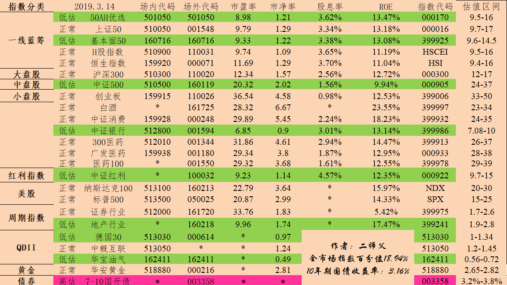

======================================================

_type: talk
@咪呐[544841255481544]
2019-03-15 06:50:59 Fri  
topic_id: 244415424452151

老师，您说新手必备的是沪深300，中证500，消费指数，医药指数，地产指数，券商指数。前四个指数放心定投，后面两个指数轻仓定投。请问这6个基金应该如何安排投入的比例呢？

@王雷 at 2019-03-15 06:50:59 Fri

> 消费，医药，券商都估值正常了

----------

@凭栏观海 at 2019-03-15 06:50:59 Fri

> 目前券商指数、医药指数、沪深300、消费指数的估值都正常了，只适合持有，不宜买入了

----------

阅读[2418]  评论[2]  赞[0] 

======================================================

_type: q&a
@元亨[48551521514458]
2019-03-15 07:27:08 Fri  
topic_id: 844415424218542

@元亨

>  你好，请问新的估值表中估值区间是什么意思怎么看懂，谢谢啦！

@二师父

>  低于阈值区间最低点表示这个基金低估，高于阈值区间最高点表示这个基金高估

阅读[2503]  评论[6]  赞[0] 

======================================================

_type: q&a
@开卷沐春意[422214414858458]
2019-03-15 07:28:26 Fri  
topic_id: 422214252512518

@开卷沐春意

>  二师傅您好，我想定投510500,场内基金，按照你的 3000点定投模拟分析，是一周一次还是一月一次？

@二师父

>  我们都是一周定投一次，一般选择每周四定投，模拟分析只是大概的金额，您可以按照自己的实际金额选择

阅读[2556]  评论[0]  赞[0] 

======================================================

_type: talk
@二师父[28814221155551]
2019-03-15 08:18:44 Fri  
topic_id: 244415445228581

<e type="hashtag" hid="454222214158" title="#巴菲特#" /> 低调，朴素，简约。这种生活态度的人才是真正富有

@ajingge at 2019-03-15 08:18:44 Fri

> 师傅每天休息的时间太少了吧？睡的那么晚，早上还起的早[抱拳]

----------

@💗朵儿studio * at 2019-03-15 08:18:44 Fri

> 简单  传统  节俭

----------

阅读[2587]  评论[2]  赞[0] 

+++++++++++++++++++++++++++++++++++++++++++++++++++++

图片：
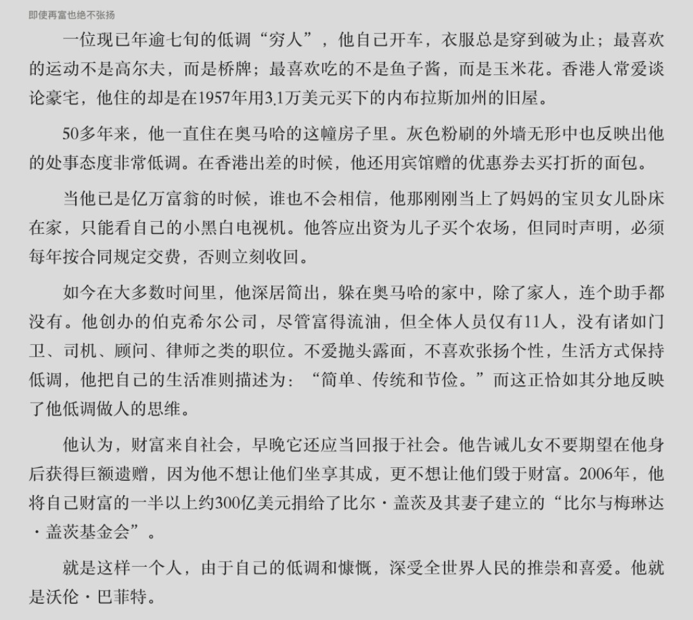

======================================================

_type: q&a
@.Five[15451258412542]
2019-03-15 08:59:16 Fri  
topic_id: 244415445442221

@.Five

>  二师傅您好，我现在手头闲置资金大约有70w，基金该如何进行建仓补仓，是一次多打底仓还是轻仓分批进行补仓呢？之前做股票采用121建仓，感觉在基金上面不是特别好使，期待二师傅的回答~

@二师父

>  轻仓分批次补仓是最好的，长期市场走牛，可是短期波动谁也不确定，可以分批次定投，涨跌无惧，也很安稳

阅读[2672]  评论[1]  赞[0] 

======================================================

@二师父[28814221155551]
2019-03-15 12:29:15 Fri  
topic_id: 544482445142244

>  @二师父
>  

阅读[2478]  评论[0]  赞[0] 

======================================================

_type: talk
@二师父[28814221155551]
2019-03-15 12:41:41 Fri  
topic_id: 544482445185284

<e type="hashtag" hid="825444158112" title="#房市#" /> 1、利率是影响房价最重要的因素，2016年和2017年虽然香港楼市调控很严，但没有刹住香港房价上涨的快车，直至2018年利率全面上升楼市才感受到明显的压力，这说明利率上调带来的买房成本上升比行政手段更有威力。

2、内地一二线楼市和香港楼市有相似之处，比如香港房价过去3次短期拐点分别是在1997年的东南亚经济危机，1998年的国际金融危机以及2018年的密集加息潮期间。同样，这些年份也是内地房价的低点。

更为重要的是，内地本轮房地产调控是从2016年开始的，在2016年-2018年这段时间里调控政策+房贷利率上升最终让内地房价在2018年有下跌压力。香港楼市也是在2016年-2018年迎来楼市调控+房贷利率上升组合拳。如今香港房价率先回暖对内地楼市有一定的指示意义。

现在，内地房贷利率开始见顶回落，而房地产相关税费也有局部降低的迹象，这对降低买房成本有很大的好处，在这样的大背影下，2019年的楼市虽然不意味着反转，但大概率会比2018年温暖很多。

房价一直在说降，一二线目前是被政策组合拳按住了，但是他按不住刚性需求，改善需求，企图房价大跌，就是YY。

@天机 at 2019-03-15 12:41:41 Fri

> 也就是说，商品房投资收益从长远来看，可以跑赢任何指数？

----------

@涓涓 at 2019-03-15 12:41:41 Fri

> 刚需最明智的选择还是尽早上车

----------

@二师父 at 2019-03-15 12:41:41 Fri

> 怎么得出这个结论的呢，现在m2增速是8个点，前10年都是15到30个点，货币由增量到存量，这是不利于房产发展的，过去10年长期持有房子收益率高于指数，未来长期持有指数收益率高于房产

----------

阅读[2548]  评论[3]  赞[0] 

======================================================

@二师父[28814221155551]
2019-03-15 15:20:49 Fri  
topic_id: 111182118844442

>  @二师父
>  

阅读[2364]  评论[3]  赞[0] 

======================================================

_type: talk
@二师父[28814221155551]
2019-03-15 19:46:14 Fri  
topic_id: 422214218858418

<e type="hashtag" hid="281158284851" title="#市场分析#" /> 沪指最近一周在坐过山车，反复在3000点上下震荡，截至3月15日下午三点报收3021.75。这是一个比较有投资价值的点位，我们知道，沪指涨到3500点到4000点是很轻松的事情，牛市来了的话，会更高，所以仓位不足的投资者在这个时候不用恐惧，对于估值表里面低估的指数基金仍旧可以定投。

那么对于有些觉得仓位轻的读者，一直在追着我问建立底仓合不合适，二师父觉得这个问题问你最知道答案了，比如中证500你建立了4成底仓，然后他从现在开始单边下跌35个百分点你能否接受。投资首先要看到风险，然后预测收益，尤其是资金规模百万的朋友，一次巨亏就给你带来巨大损失了。

市场无法预测，所以不要企图抄底大赚一笔，就二师父了解，散户很少有能够经理35个百分点以上的浮亏，承受不了这个压力。

另外随着市场回暖，券商业绩普遍大幅度改善。随着政治局会议将金融工作的重点由防风险转变为制度改革、平衡发展和风险两者的关系，自上而下传达出积极信号。科创板作为资本市场改革的试验田，推进顺利且迅速，多家券商目前已开通科创板预约功能。科创板将主要增厚券商的投行收入，同时利好直投的业绩兑现。券商指数就是这样，牛周期来的时候很快就上来了。当市场走弱的时候跌的也很恐怖。

科创板是个投资机会，我们等待科创板基金发行可以上个车，有老大背书不会那么轻易凉了。下周的机会仍旧在于宽基50ah和中证500.行业指数主要是地产，其他的基本都正常估值了。

油气的价格不高，定投可以，但是从布伦特原油的价格看，还远远没有到达底部，不要一次买入过多。

@齐俊波 at 2019-03-15 19:46:14 Fri

> 说得够直白了[微笑][微笑]

----------

阅读[2213]  评论[1]  赞[0] 

======================================================

_type: talk
@土木工程部[51514112455814]
2019-03-15 20:18:23 Fri  
topic_id: 844415418228542

<e type="hashtag" hid="281158284851" title="#市场分析#" /> 二师父，券商指数已经涨了50%，科创板推出，券商还有一波是吗[微笑]

阅读[2038]  评论[0]  赞[0] 

======================================================

_type: talk
@二师父[28814221155551]
2019-03-16 02:25:30 Sat  
topic_id: 844415411482422

<e type="hashtag" hid="481211145528" title="#指数估值#" /> 估值表低估的都可以定投，关于投资哪支基金真的不用纠结。只要保证基金规模不低于1亿，没有清盘风险就好。再重申一句，买好的不入买的好。

学习一定要跟着老师的思路走，虽然我不是老师，但是你可以站在我的肩膀上，这样你会看的更远。既然前人总结出来的理论直接用就行了，如果都需要我们自己摸索真的会浪费掉很多时间。

关于小白如何入门，建议大家把知识星球以前的精华好好看看，然后五步定投法读5遍，做笔记，写出自己的心得，学习真的是需要花点功夫的，最后再看看我的基金入门课程，建立整体的投资系统。这样基本就入门了。学会学习，学会自己给自己充电，我可以给你传授知识，但是领悟需要你自己亲自去做。

如果真的没有时间，就把五步定投法看懂就行了，然后知道定投赚钱原理就可以啦，这本来也不是很复杂。大家周末愉快。

@冉冉 at 2019-03-16 02:25:30 Sat

> 谢谢二师傅耐心的教导。最近又仔细读了精华里的文章，有些体悟了，跟紧师傅的步伐，克服犹豫，坚定定投。

----------

@今晚吃手抓，谁给点大* at 2019-03-16 02:25:30 Sat

> 二师父，估值表中，为什么没了之前的几只增强基金，如此，不方便实时了解已经定投的基金状况啊，建议增加上去[抱拳]

----------

@二师父 at 2019-03-16 02:25:30 Sat

> 也就是两个增强基金，沪深300和中证500，参考他们被动指数的估值来定投也是可以的

----------

@新的开始 at 2019-03-16 02:25:30 Sat

> 知道赚钱原理，跟老师走，这样很省心、很简单[呲牙]

----------

阅读[5861]  评论[4]  赞[0] 

+++++++++++++++++++++++++++++++++++++++++++++++++++++

图片：
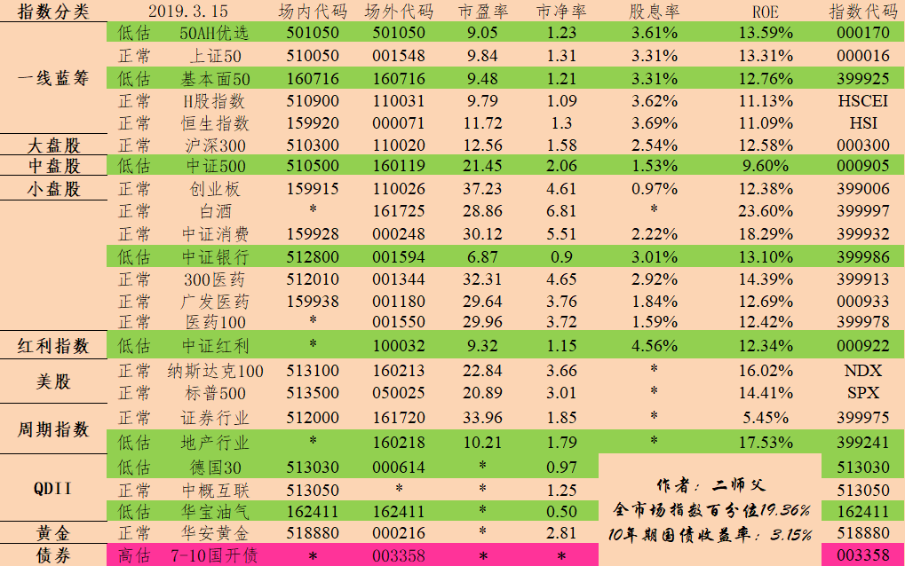

======================================================

_type: talk
@二师父[28814221155551]
2019-03-16 02:27:11 Sat  
topic_id: 244415411482441

<e type="hashtag" hid="552448221884" title="#怎么分步加仓#" />机会都是跌出来的，上涨的时候二师父不会喊大家加仓。一旦暴跌，我会大力加仓，所以再机会没有的时候备好子弹，等到机会来的时候，大举买入吧。

@聪明的笨蛋 at 2019-03-16 02:27:11 Sat

> 二师傅早点休息吧[玫瑰]

----------

@二师父 at 2019-03-16 02:27:11 Sat

> 马上了[呲牙]

----------

阅读[6075]  评论[2]  赞[0] 

+++++++++++++++++++++++++++++++++++++++++++++++++++++

文件：
2019-03-16 02:26:22 Sat
文件大小：[212813]
28818151548141-定投指数基金过程中如何加倍定投.docx

======================================================

_type: talk
@二师父[28814221155551]
2019-03-16 03:00:59 Sat  
topic_id: 844415411425582

<e type="hashtag" hid="225441552521" title="#精选两款重疾险#" />最近我准备配置重疾险，经过初步优化，挑选出两款性价比较高的重疾险，星悦和康惠保旗舰版，后面我会在这两款中挑选一款，保额大概设置35到50万，这样万一患病了差不多这笔资金够我的治疗，另外我手头的资金够我的房贷和爸妈晚年的生活，凡事做最坏的打算，做最好的准备，这样意外来的时候不至于懵逼。

产品链接附上，大家可以了解下，星悦<e type="web" href="https://cps.qixin18.com/lhz1029368/product/detail-103840-128117.html" title="齐欣云服-行业保险专+" cache="" />。康惠保旗舰版，<e type="web" href="https://cps.qixin18.com/lhz1029368/product/detail-103691-127786.html" title="齐欣云服-行业保险专+" cache="" />

@海盗 at 2019-03-16 03:00:59 Sat

> 二师父，问一下，这是消费型保险吗？

----------

@二师父 at 2019-03-16 03:00:59 Sat

> 对的，就是生病了赔付型

----------

@韬韬 at 2019-03-16 03:00:59 Sat

> 特疾有没有必要带上？

----------

@小溪医生 at 2019-03-16 03:00:59 Sat

> 二师父，这个保险第三方代理平台是您的吗？在这个平台就可以买吗？

----------

@归去来兮 at 2019-03-16 03:00:59 Sat

> 如果保终身建议达尔文一号，保额和现金价值会增长，保定期建议康乐一生c。我原来也想买康惠保旗舰版，价格相对最便宜，咨询我的保险顾问说百年保险的康惠保旗舰版的中症赔付要求高，一般人都达不到（他的中症比如脑中风在别人家是按轻症标准，更容易达到），很多人出险要么是轻症，要么是重症，很少能达到中症标准的，他们的理赔案例几乎没见过有几个中症的。百年和复兴都是他们的合作伙伴，所以不存在利益倾向。他自己买的是康乐一生c的，我给儿子买了守卫者1号，我和我老婆买了达尔文1号互保。
 达尔文一号现金价值一直在增长，有一方得轻症双方都可以豁免保费，现金价值能一路增长超过保费，也就是有病的话就有保障，没病的话也能当一份养老储蓄，感觉怎么算都不亏，另外复星集团旗下医疗资源很多，30万以上长期险就可以安排有绿色通道安排专家就诊，也是一个优势。现在买达尔文互保的还可以赠送一年药神1号保险，可以报销百万抗癌靶向药，以后也只能复兴的长期保险客户才能购买。 供参考。

----------

@归去来兮 at 2019-03-16 03:00:59 Sat

> 所以中症更多的是一个噱头不实用，达到百年的中症很难了。

----------

@二师父 at 2019-03-16 03:00:59 Sat

> 有必要，尤其是高发特疾

----------

@二师父 at 2019-03-16 03:00:59 Sat

> 这是齐欣云服下的惠泽保险，有保障的，我是从这里购买的，如果有需要可以直接点击链接购买

----------

阅读[2151]  评论[11]  赞[0] 

======================================================

_type: talk
@丸子妈[28512522184441]
2019-03-16 06:53:05 Sat  
topic_id: 244415411122581

#提问#判断国防指数是低估值还是高估值，可以在哪个平台看？如果投资这类型基金，需要注意什么？

@二徒弟 at 2019-03-16 06:53:05 Sat

> 嗯，看来你是军嫂

----------

阅读[2019]  评论[1]  赞[0] 

======================================================

_type: q&a
@茹[244148584245521]
2019-03-16 12:35:57 Sat  
topic_id: 544482821128184

@茹

>  现在定投500.是每期扣相同的钱，还是低位多投，高位少投好？

@二师父

>  低位多投资高位少投好

阅读[2024]  评论[0]  赞[0] 

======================================================

_type: q&a
@家树[544854851425424]
2019-03-16 14:22:46 Sat  
topic_id: 844415154581882

@家树

>  为什么要推荐华宝油气？为什么它低估? 感觉它跑不赢国际油价。我查了一下，2014年12月12日国际油价也大约58元/桶，华宝油气为0.78元/份。2017年12月22日国际油价也大约58元/桶，华宝油气0.59元/份。目前国际油价也大约58元/桶，华宝油气0.5元/份。其间也一直没分红。远远跑输油价，什么原因?  为什么推荐它?

@二师父

>  华宝油气基金的主要投资标旳是海外上市的油气上游公司，为国内投资者提供了低成本、低门槛的全球优质上游资源公司的投资机会。油气上游公司股价可完全传导油气价格上涨，因此与原油价格走势呈很高的相关性。自2015年以来截至2018年12月31日，SPSIOP指数与油价的相关性约为0.7。
>  
>  华宝油气是投资海外的被动型指数QDII基金，同时也是在深交所挂牌上市的LOF（上市型开放式基金，Listed Open-Ended Fund）。他又以下价值
>  
>  （1）分享原油价格上涨收益。
>  华宝油气跟踪的标普石油天然气上游股票指数（SPSIOP），自2015年以来截至2018年12月31日，SPSIOP指数与油价的相关性约为0.7。
>  （2）作为资产配置的一部分，分散风险。
>  首先，油气作为大宗商品，提供了分散投资的新方向，而国内目前上市的期货品种中尚缺原油期货；其次，华宝油气的投资标的与全球主要股指相关性较低
>  （3）他是周期性品种，不能用平均收益率的思维来衡量价值，券商指数从15年高点到现在还是浮亏的，远远跑输沪深300指数，可是如果我们从去年8月的底部开始定投券商指数，现在很多的盈利都在50个百分点以上了。这就是在周期指数的价值。
>  你还是没明白我反复强调的一句话，买好的不入买的好。

阅读[2025]  评论[2]  赞[0] 

======================================================

_type: talk
@二师父[28814221155551]
2019-03-16 15:52:33 Sat  
topic_id: 422214142144128

<e type="hashtag" hid="454221481158" title="#周末答疑和总理讲话#" /> 1、今年下决心要进行更大规模的减税降费。把增值税和单位社保缴费率降下来，减税降费红利近两万亿元。这可以说是应对当前经济下行压力的一个十分重要的关键性举措。

2、今年的高校毕业生又达834万，比去年还多，创历史新高。我们还要确保不出现零就业家庭，对那些容纳劳动力比较多的企业要给政策优惠支持。我们还要推动创新创业创造，用好大众创业、万众创新平台，来提供更多的就业岗位。就业好不好，这本身也是经济好不好的一个重要体现。

3、一是把高血压、糖尿病等慢性病患者的门诊用药，纳入医保，给予50%的报销，这将惠及我国4亿高血压、糖尿病患者。我到基层去调研，有一些人告诉我，他们得了这类慢性病，每天都不能断药，负担很重，有的把养老金相当一部分用来买药，我们要努力解决这方面的问题。

二是要降低大病保险的起付线，提升大病保险的报销标准。现在近14亿人都进入大病保险了，要让更多的人、上千万的人能够直接受益，因为我们这个大病保险是有倍数效应的。要看到，我们的医保虽然覆盖全民，但是水平不高，尤其是农民人均年收入不到1.5万元，遇到大病靠自己扛是很难的。所以政府和社会要共同出力，缓解这个民生之痛。没有健康就没有幸福。谢谢。

每天新闻联播的内容里面就蕴含了发家致富的信息。

另外关于读者提问，定投主要问题在于选择什么基金，选择月定投和周定投上，建议大家看看我的五步定投法以后再提问，这些我再新版五步定投法都讲过啦。

至于是全面配置还是只投资沪深300和中证500，二师父建议还是学会全面配置，因为你不能用你得现在去判断未来，现在你得资金可能就几十万，可是10年后你得资金就会有几百万，资金量越大风险防控就越发重要，这时候就要全面配置了。再资金量不足的时候就做好这个方面的学习，扎实定投理论基础。

@ajingge at 2019-03-16 15:52:33 Sat

> 是不是牛市短期比较困难，要抓紧按照师傅低估表进行定投[呲牙]

----------

@二师父 at 2019-03-16 15:52:33 Sat

> 哈哈，牛市在怀疑中就来了

----------

阅读[2019]  评论[2]  赞[0] 

======================================================

_type: talk
@一切随缘[244145248112411]
2019-03-16 18:02:48 Sat  
topic_id: 111182828518282

<e type="hashtag" hid="481211145528" title="#指数估值#" /> 二师父，现在债券高估了。债券基金不能买了？

@速。冻 at 2019-03-16 18:02:48 Sat

> 可转债基金可以买吧

----------

阅读[1837]  评论[1]  赞[0] 

======================================================

_type: q&a
@披褐怀玉，抱元守一。[15412554441882]
2019-03-16 22:47:37 Sat  
topic_id: 244415151124811

@披褐怀玉，抱元守一。

>  请问二师傅，地产行业160218，在您的估值表中还是低估的，现在大慨在历史的百分位是多少？可以多投点吗？

@二师父

>  地产行业也是周期指数，目前虽然低估，市净率历史百分位15%，可以多投点，但是总仓位不要太重

阅读[1807]  评论[0]  赞[0] 

======================================================

_type: q&a
@家树[544854851425424]
2019-03-16 22:55:58 Sat  
topic_id: 244415185258121

@家树

>  二师傅，刚看到睿远基金旗下首只基金21日首发，由大佬傅鹏博掌管，过往业绩好。是否值得参与？

@二师父

>  新发的基金我都不考虑，基金持仓是什么都不知道。不要相信所谓的大佬，为啥他不再去年股市低迷的时候发布基金，因为没人买，而在现在市场回暖时候发布，因为买的人多。
>  
>  不要迷信任何大V，我曾经买过一只大佬的主动基金，确实很厉害，结果大佬跳槽了，然后这只主动基金业绩就一落千丈。
>  
>  所以，不建议投资。

阅读[1886]  评论[2]  赞[0] 

======================================================

_type: q&a
@蝙蝠侠大战超人[48522585242588]
2019-03-16 22:56:55 Sat  
topic_id: 844415182854152

@蝙蝠侠大战超人

>  二师父你推荐的华泰证券，开户手机号码要跟绑定的银行卡手机号码一致吗？

@二师父

>  这个不用，我自己的银行卡是之前绑定的，现在注册用的新手机号，完全没有问题，提现，转款购买都没有问题

阅读[2005]  评论[0]  赞[0] 

======================================================

_type: q&a
@輝。灼[28244845454121]
2019-03-16 23:20:56 Sat  
topic_id: 844415182248182

@輝。灼

>  二师父，刚加入星球，干货十足，就是精华里没有分类，看起来有些不方便，比如想重第一贴看，都不知道如何找！可有方法，初来乍到不懂，见谅！

@二师父

>  这是目前星球的一个弊端，相信以后会改的越来越好的，还有一种方法，直接搜索关键词，你想看的内容，比如鳄鱼计划，搜索之后就会出现各种各样的主题，点进去找就行了，需要一个知识的整合能力。

阅读[2062]  评论[2]  赞[0] 

======================================================

_type: talk
@海阔天空[48844585521218]
2019-03-17 00:25:01 Sun  
topic_id: 544482815815514

老师，在哪下载录音？

@海盗 at 2019-03-17 00:25:01 Sun

> 置顶二领取。

----------

阅读[1861]  评论[1]  赞[0] 

======================================================

_type: talk
@二师父[28814221155551]
2019-03-17 04:29:54 Sun  
topic_id: 111182851555442

<e type="hashtag" hid="454841141288" title="#均线偏离表#" /> 均线策略在暴涨的时候现在都红了，也可以按照均线策略，偏离度为正1的时候卖出一份，这是场内定投的操作方法，场外定投利润收割就可以啦。

@林西瓜🍉 at 2019-03-17 04:29:54 Sun

> 二师父，均线表500ETF偏离2，估值表中证500低估，是不是有矛盾？

----------

@齿轮 at 2019-03-17 04:29:54 Sun

> 同问

----------

@二师父 at 2019-03-17 04:29:54 Sun

> 没有矛盾，你是没有搞清楚偏离和低估的概念，低估是在整个指数成立的历史区间，偏离是看价格偏离均线的程度，从15年一直再跌，但是短期中证500一直涨，价格高于90日均线

----------

@天机 at 2019-03-17 04:29:54 Sun

> 均线偏离表，场外的不用看吗？

----------

@二师父 at 2019-03-17 04:29:54 Sun

> 对，场外的就用16字方针，低估买入，正常收割，高估卖本

----------

@元亨 at 2019-03-17 04:29:54 Sun

> 请问二师父，为什么场内与场外有这个区别(均线偏离表)？

----------

@二师父 at 2019-03-17 04:29:54 Sun

> 本来我们是场外进行定投得，用均线定投策略是防止在大熊市震荡区间一直处于浮亏状态，所以我们引用了均线偏离指标，短期买卖在场外会有惩罚性收费，所以假设有短期操作得话就在场内了。但是场内并不是完全得短线，如果出现单边上涨，我们就停止均线策略，一直持有基金到牛市高点，需要灵活应用。

----------

@元亨 at 2019-03-17 04:29:54 Sun

> 清楚了，谢谢师傅

----------

阅读[2144]  评论[8]  赞[0] 

+++++++++++++++++++++++++++++++++++++++++++++++++++++

图片：
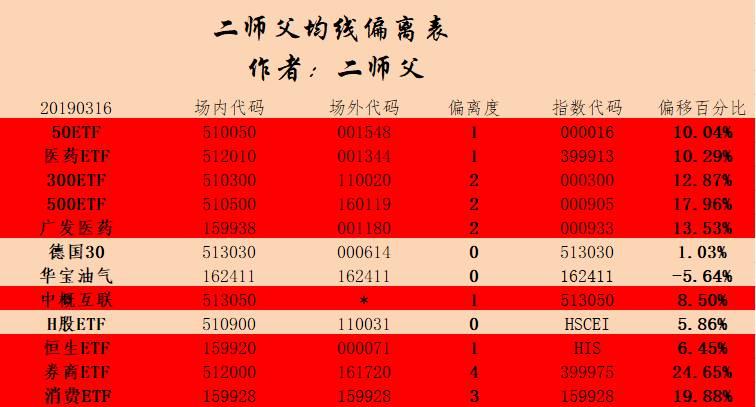

======================================================

_type: talk
@二师父[28814221155551]
2019-03-17 04:31:53 Sun  
topic_id: 111182851555122

<e type="hashtag" hid="481144488858" title="#投资理念#" /> 芒格大师的投资理念和人生智慧值得学习

@海盗 at 2019-03-17 04:31:53 Sun

> 期待那一天，我们还都在这里

----------

@土木工程部 at 2019-03-17 04:31:53 Sun

> 感谢二师父的付出，遇到对的人，做对的事，生活多美好[微笑]

----------

@冉冉 at 2019-03-17 04:31:53 Sun

> 期待那一天

----------

@Rose at 2019-03-17 04:31:53 Sun

> 期待2028年与二师父及大家见面

----------

@自由飞翔 at 2019-03-17 04:31:53 Sun

> 为了2028，[拳头][拳头][拳头][拳头][拳头][拳头]

----------

@Claire at 2019-03-17 04:31:53 Sun

> 相约2028[微笑]

----------

@alicedream* at 2019-03-17 04:31:53 Sun

> 感谢二师父的引领，因为您的乐于付出，才使得我们有机会有信心入场跟随！

----------

阅读[6044]  评论[7]  赞[0] 

+++++++++++++++++++++++++++++++++++++++++++++++++++++

文件：
2019-03-17 04:31:38 Sun
文件大小：[27198]
15585852454882-没有比A股更好的投资市场！芒格震撼演讲：中国的好公司比美国的好公司便宜.docx

======================================================

_type: talk
@二师父[28814221155551]
2019-03-17 04:48:21 Sun  
topic_id: 422214182885158

<e type="hashtag" hid="825441544812" title="#学堂使用指南#" /> 怎么使用星球，最近加入的朋友比较多，大家看一下，比较全面得学习总结方法，不要总是当伸手党，学会自己查阅资料，自己解决问题，当你能够共享得价值越多得时候，你自然就会成为一个有价值的人。

阅读[2427]  评论[0]  赞[0] 

+++++++++++++++++++++++++++++++++++++++++++++++++++++

文件：
2019-03-17 04:48:05 Sun
文件大小：[380474]
28818185284581-二师父定投学堂使用指南.docx

======================================================

_type: q&a
@李依祚[844148481122152]
2019-03-17 09:23:04 Sun  
topic_id: 844415184155212

@李依祚

>  师傅您好，均线偏离表# 均线策略在暴涨的时候现在都红了，偏离度为正，场外定投利润收割后，还要继续定投吗？对于估值表是绿的，是否继续，？

@二师父

>  正常估值收割利润以后就不再定投了，对于低估的基金，不管偏离度为正为负都可以定投，均线偏离表是给场内基金参考的

阅读[2121]  评论[2]  赞[0] 

======================================================

_type: talk
@吕二口[455482422188]
2019-03-17 10:45:52 Sun  
topic_id: 544482818245114

新手一枚，今天看定投文章，有个地方不太明白，比如定投基金上证50已经进入正常区域，是先暂停定投，然后才用利润收割法么？到什么区域再全部卖出呢？

@jiangya at 2019-03-17 10:45:52 Sun

> 正常估值时，停止定投，也不要收割利润。等到高估时再收割利润。

----------

@吕二口 at 2019-03-17 10:45:52 Sun

> 收割完利润后，那其余剩下的本金到一定时机再全部卖出？

----------

@元亨 at 2019-03-17 10:45:52 Sun

> 正常收割利润高估减仓

----------

@元亨 at 2019-03-17 10:45:52 Sun

> 正常高估都停止定投

----------

@上上签 at 2019-03-17 10:45:52 Sun

> 低估买入且定投，正常估值卖出盈利且停止定投，高估逐步清仓卖出本金。

----------

@凭栏观海 at 2019-03-17 10:45:52 Sun

> 正常估值的时候，可以有两种选择，一是持有不卖，二是收割利润。看您对回撤的承受程度。

----------

阅读[1956]  评论[6]  赞[0] 

======================================================

_type: talk
@生活（袁）[844411812115152]
2019-03-17 11:39:32 Sun  
topic_id: 244415181255851

<e type="hashtag" hid="142514455812" title="#领取福利#" />

阅读[1990]  评论[0]  赞[0] 

======================================================

_type: talk
@二师父[28814221155551]
2019-03-17 17:01:43 Sun  
topic_id: 544482855158554

<e type="hashtag" hid="281181228851" title="#周末答疑#" /> 关于答疑说一下，大家的提问二师父在当天基本都挤时间给回答了，但是发言区和评论区的问题一般都有基础好的朋友相互解答了，所以二师父会在周末统一再给大家解答下，可能等的时间长一点。不过这个期间大家也可以自己思考下，只有经过自己思考之后再结合二师父的解答你才会领悟更加透彻，这是学习方法的问题。

关于90日均线怎么看，二师父截图跟大家说，这其实再往期的内容里面讲过了，二师父再讲一下，课程里面关于这些所有的基础知识都有过讲解了，建议好好听一听，我的PPT教案也在进一步完善之中。

那先说第一个问题，均线怎么看，你看我们的图，券商是设置的日线，然后在设置均线那里你可以看到我们设定的90日均线，这个在股票交易APP里面就有的，从图中可以很明显的看到券商现在的价格是都在均线以上的。这就是均线的看法。

关于第二个问题，为什么估值表里面有的基金是低估，但是这个均线偏离表是偏离度为正，而且偏离很多，是不是矛盾了。还是用券商举例子了。有这个疑问的同学显然只能够看到一时的涨跌，不明白咱们的估值是建立在整个历史区间上的。你看我们的券商在19年目前是涨了，但是他仍旧不高，这说明啥，短期上涨不能改变一个指数的估值，均线就是衡量短期指数的涨跌情况，而估值是建立在整体历史上的，所以并没有矛盾的。

阅读[5865]  评论[0]  赞[0] 

+++++++++++++++++++++++++++++++++++++++++++++++++++++

图片：
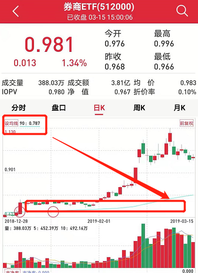
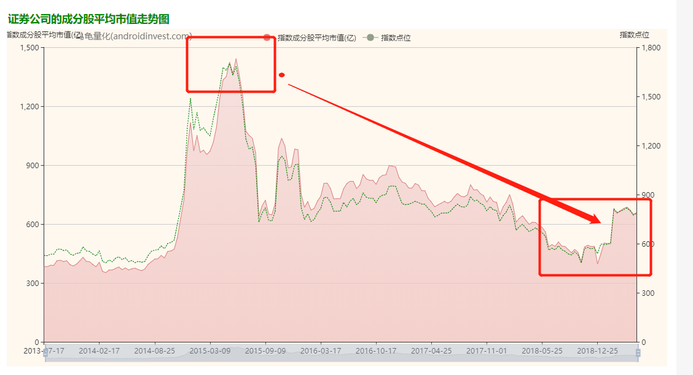

======================================================

_type: q&a
@杨小峰[51514158212424]
2019-03-17 22:57:18 Sun  
topic_id: 111182841842482

@杨小峰

>  二师父，麻烦问问您场外低估定投实盘现在前五大持仓比例大概多少了？

@二师父

>  中证500大概百分之18，中证红利大概百分之15，医药100大概百分之10，50ah大概百分之9，沪深300大概百分之7，仓位不重，之前利润收割医药100和沪深300都收割了。

阅读[1763]  评论[2]  赞[0] 

======================================================

_type: q&a
@Sunflower[244185124281811]
2019-03-17 22:59:49 Sun  
topic_id: 844415124441422

@Sunflower

>  二师父您好，我看到这个养老备用金的基金定投，如果我用这个方法定投标普红利机会指数是不是会更好呢？

@二师父

>  可以的，这是养老定投计划，可以选择标普红利，也可以选择银行指数，中证红利，他们的分红都是很高的。

阅读[1951]  评论[0]  赞[0] 

======================================================

_type: q&a
@茹[244148584245521]
2019-03-17 23:04:11 Sun  
topic_id: 544482854125184

@茹

>  可推荐一个五步法的基金吗？

@二师父

>  首先推选沪深300和中证500，沪深300选择易方达沪深300ETF链接，这个基金费率全市场最低，中证500就选择南方或者天弘中证500，二师父在课程里面已经推荐了7只适合新手定投的指数基金，我把图片附上，目前只有银行和中证500低估，所以选择这两只定投是不错的。

阅读[1938]  评论[1]  赞[0] 

======================================================

_type: q&a
@爱华[844445144558182]
2019-03-17 23:07:04 Sun  
topic_id: 544482854252584

@爱华

>  二师父好，请问怎么能知道"基本面"变好呀？期待您的回复

@二师父

>  这个问题太大了，一个企业的基本面有很多指标，我们通常看财务报表去衡量，主要有利润，每股收益增长率，ROE，应收账款，现金流的稳定性。营业收入是否稳定增长，企业是否依旧具有宽阔的护城河，当一个企业的护城河宽阔的话他的基本面就好，比如腾讯的微信自带的流量就是很宽的护城河，还有营业收入，这也是一个重要指标，只要一个企业的发展越来越好，就是基本面良好

阅读[1919]  评论[1]  赞[0] 

======================================================

_type: q&a
@未来已来[88885151118482]
2019-03-17 23:09:34 Sun  
topic_id: 844415122152182

@未来已来

>  师傅我买了环保指数:
>  在场外买的广发环保ETF连接A（3.15）是0.6032
>  而我在场内买512580（3.15）为什么是0.809
>  这个应该不是折溢价吧。

@二师父

>  场外和场内本来就不一样的，场内是实时价格，场外是基金的净值，折溢价可以在万得看，你用指数得价格和他得IPOV实时净值比较就能够看出是折价还是溢价，当价格高于IPOV就是溢价，你这和场外得ETF链接比较是不对得。

阅读[1997]  评论[0]  赞[0] 

======================================================

_type: q&a
@心斋[544845214152284]
2019-03-17 23:10:59 Sun  
topic_id: 844415122152822

@心斋

>  二师父，请教个问题，定投在周四扣款，但周一假如基金明显下跌，要不要临时加买?还是等周四?谢谢

@二师父

>  定投最好不要看短期涨跌，没有意义，如果在低估区域内出现暴跌，比如周一一天跌了5个百分点，这时候可以手动加仓，在低点积累份额，但是不要总是频繁看到下跌就加仓，容易在单边下跌得熊市把子弹迅速打完得。

阅读[2172]  评论[1]  赞[0] 

======================================================

_type: q&a
@蝙蝠侠大战超人[48522585242588]
2019-03-17 23:14:10 Sun  
topic_id: 844415122511452

@蝙蝠侠大战超人

>  二师父，今天开了上海深圳股票账户，想问一下新手初期最近买什么股票练练手比较好？

@二师父

>  新手不建议股票投资，如果想学习股票投资得话，建议先夯实理论基础。
>  
>  第一看看我的五步定投法，然后按照我的五步定投法选择5只股票纳入股票池，接着当股票得价格符合我们设定得高于20日或者30日均线的买入法则的话开始买入，初始资金就投资1到2万，学习。
>  
>  然后设定止损位，并且在股票从高位回落跌破20日或者30日均线然后卖出。
>  
>  切记没有搞清楚股票投资的风向，没有建立自己的交易原则，就不要进入市场。要么不投资，要么买入一只股票就要保证未来百分之90的概率是盈利的，只有这样我们的账户次啊会不断增值，否则很容易亏损。

阅读[2316]  评论[0]  赞[0] 

======================================================

_type: q&a
@元亨[48551521514458]
2019-03-17 23:27:40 Sun  
topic_id: 844415181212442

@元亨

>  请问二师父，均线偏离表是给场内做波段的吗？而场外是长期持有？

@二师父

>  二师父场内鳄鱼计划是一个主动择时得定投系统，启动的前提条件是万得全A历史市盈率百分位低于百分之20，各大指数都处于非常低估得状态。
>  
>  在这个条件下，我们要保证指数的估值是处于中等偏下。一般全市场A股指数市盈率低于19倍，市场上很多指数基本都是低估的了。
>  
>  所以这时候保证指数估值处于中等偏下就比较容易了。然后我们挑选估值较低的指数根据均线来买入。我们均线设置偏离度，当均线负偏离度为1的时候一次买入一份，当均线偏离度为2的时候一次买入1.5或者2份，以此类推。
>  
>  实现越跌越买。这是均线策略的买入方法。卖出则是在0偏离度的时候收割利润，这个也可以不卖，在正1偏离度的时候卖出1份，在正2偏离度的时候卖出1.5份或者2份。
>  
>  二师父回测过这种策略，如果用这种策略定投风险点在于回撤较大。所以我们在低估区域内利用均线定投策略，这样就能够实现在低估暴跌时候积累更多的份额，当指数上涨我们也能够赚的更多。这种策略适合熊市震荡区域，如果一直上涨，那么就没必要根据均线偏离一直卖出了，持有到牛市高点卖出即可。
>  
>  场内并不是做短期，我们所有的投资都是中长期投资，除非一种极端情况，股市一直不涨，就只能够采用均线定投策略了。任何策略都需要灵活运用。

阅读[2401]  评论[0]  赞[0] 

======================================================

_type: q&a
@珅爹[15451242541142]
2019-03-18 02:08:12 Mon  
topic_id: 244418548541511

@珅爹

>  请问场内基金定投的加倍定投应该怎么做？因为场内买入必须是100的整数倍。假如场内基金均值低估了，可以定投买入，但是偏离度是红色告警， 那是应该卖出还是继续买？

@二师父

>  直接多买100股就行了。如果低估，而且场外红色预警，该基金仓位很重，盈利很多，市场处于震荡区域，可以卖，反之可以持有不动或者买入，均线只是一个补充，从大的投资分野角度看以估值为指标

阅读[2269]  评论[1]  赞[0] 

======================================================

_type: talk
@二师父[28814221155551]
2019-03-18 03:42:37 Mon  
topic_id: 244418548154841

<e type="hashtag" hid="454221815558" title="#定投理念普及#" /> 只要认真学习，大家都能够入门的。

@What if at 2019-03-18 03:42:37 Mon

> 好几年前就想着要理财了，但不知道从哪儿着手。前两年误入歧途，小绵羊炒外汇，结果可想而知，可谓输得血本无归啊。现在30+了，还得从头再来，跟着二师父，好好学习。

----------

@二师父 at 2019-03-18 03:42:37 Mon

> 没事，还可以继续，要走正规渠道理财

----------

阅读[6278]  评论[2]  赞[0] 

+++++++++++++++++++++++++++++++++++++++++++++++++++++

文件：
2019-03-18 03:42:17 Mon
文件大小：[26094]
48818188585158-零基础小白也能够通过指数基金定投实现资产增值.docx

======================================================

_type: talk
@二师父[28814221155551]
2019-03-18 03:55:54 Mon  
topic_id: 422218428141518

<e type="hashtag" hid="281181228851" title="#周末答疑#" /> 今天周末，趁着空闲把课程的PPT进一步优化了，然后录制了几节。这门课程录制花费了很大的精力，只希望打造完毕之后，大家通过一门课程就可以建立定投系统，不会再重复提问基础性的问题了。

场内和场外的区别：说的简单点，场内的优点1、场内定投是在证券账户购买，及时成交
2、卖出及时到账，可以立刻取现
3、场内也能够申购货币基金
4、可以进行国债逆回购
5、有溢价和折价，这点需要注意
6、费率低，一次买入卖出只需要万2的手续费，比场外的申购和赎回费低很多

怎么开户：二师父这里有福利开户渠道，在我的微信公众号后台回复：场内或者华泰可以获取低佣金开户渠道。加助理微信ershifuzl也可以。

2、场外基金就是再蛋卷，天天基金这些平台购买，便于操作，其他的没啥了

场外定投是否不用看均线偏离表？对于场外定投，遵循16字方针就可以，均线策略只是再熊市震荡市的一种额外的定投策略，是辅助策略，主要还是看估值进行定投。

国防指数是否低估，这个指数是低估的，不过是周期指数，周期性很强类似钢铁，传媒，需要有长期浮亏的准备。

还有问可创板发布之后和券商又没有利好，这个没法判断，短期我只知道科创办开通账户挺火的，后期创业板可能会受到冲击，至于券商有没有影响无法判断。

本周的问题就是这些了，大家有问题可以发表出来，其他同学帮助解答，也可以提问二师父帮助你解答。学会从一个提问者变成帮助别人回答问题的人，这样你得进步才会大

付出思维，先付出后索取的思维，是二师父一直提倡的，助人者人恒助之。你要相信，只要坚持这样做了，可能再人生道路上几年时间里面并没有回报，甚至还吃亏，不过眼光放长远，你的付出，你对别人的帮助未来都会成倍回馈给你的。

@A凤凰高飞 at 2019-03-18 03:55:54 Mon

> 问一下二师父，从哪里听啊，谢谢

----------

@海盗 at 2019-03-18 03:55:54 Mon

> 置顶二，领取福利[得意]

----------

@A凤凰高飞 at 2019-03-18 03:55:54 Mon

> 谢谢

----------

@孙健 at 2019-03-18 03:55:54 Mon

> 师父，有一个建议。视频更新了能提醒一下是哪一个吗？可以回头去看看，而不是全部重复？更新贴建议置顶

----------

@二师父 at 2019-03-18 03:55:54 Mon

> 好的，第二章里面定投计划更新了，还有第四张估值系统，7.4和7.6，后面我也会再听一遍，课程录制不过关的重新录制，多听一遍也没事，温故而知新，可以为师

----------

阅读[6417]  评论[5]  赞[0] 

======================================================

_type: q&a
@信念[244122818841241]
2019-03-18 10:41:56 Mon  
topic_id: 244418542522441

@信念

>  二师父，基金如何开户，现在费率是多少？和股票开户是两码事吧？

@二师父

>  一样的，都是从优惠渠道扫描二维码开户

阅读[2228]  评论[9]  赞[0] 

======================================================

_type: q&a
@拥抱太阳的风筝[48812454818528]
2019-03-18 10:43:19 Mon  
topic_id: 244418542214411

@拥抱太阳的风筝

>  二师父，看了你《定投指数基金过程中如何加倍定投》的推文，有个疑问，加倍定投金额与三个因素有关，一是基准金额，二是估值高低，二是基金浮亏程度，目前我的蛋卷基金账户已全线飘红，那么我现在如何确定我的定投金额?

@二师父

>  场外定投加仓用里面估值偏离阈值程度的加仓公式，越低估买入越多

阅读[2290]  评论[4]  赞[0] 

======================================================

_type: q&a
@程洋[28258521545511]
2019-03-18 10:47:13 Mon  
topic_id: 244418544851281

@程洋

>  二师父你好!今天还有没有低估，适合定投的。

@二师父

>  有的，50ah和中证500，中证银行是低估的，参考周五的估值表即可

阅读[2392]  评论[3]  赞[0] 

======================================================

_type: talk
@二师父[28814221155551]
2019-03-18 10:57:07 Mon  
topic_id: 844418541115412

<e type="hashtag" hid="825441252412" title="#卖出利润提示#" /> 购买的中证消费盈利40个点了，继续卖出15个点的利润，大家赚钱愉快，仅个人操作，谨慎参考。

@victoria at 2019-03-18 10:57:07 Mon

> 卖出15个点是什么意思

----------

@victoria at 2019-03-18 10:57:07 Mon

> 不是份额吗

----------

@二师父 at 2019-03-18 10:57:07 Mon

> 初始投入金额5万，现在账户6万，卖出1万，用1万除以当前净值等于份额

----------

@冉冉 at 2019-03-18 10:57:07 Mon

> 我没有建仓中证消费，现在能开始定投吗？还是等它低估的时候再开始定投?

----------

@门萨🐨 at 2019-03-18 10:57:07 Mon

> 低估

----------

@冉冉 at 2019-03-18 10:57:07 Mon

> 嗯，还是等低估吧

----------

阅读[6397]  评论[6]  赞[0] 

======================================================

_type: q&a
@程洋[28258521545511]
2019-03-18 12:33:07 Mon  
topic_id: 111185282412842

@程洋

>  二师父你好!我用手机听音频的时候，窗口太小，看不清幻灯片的内容，你能不能把ppt发给我。我的微信15324615022程洋，我加你了，通过一下，好吗?

@二师父

>  好的，已经通过，我发给您

阅读[2424]  评论[6]  赞[0] 

======================================================

_type: q&a
@聪明的笨蛋[544858411212244]
2019-03-18 12:47:51 Mon  
topic_id: 844418515844252

@聪明的笨蛋

>  行业指数中的主要消费指数，白酒指数，食品饮料指数是不是有重叠性。三个指数基金同时低估的话选一只成长性最好的定投就可以了。昰不昰没必要三只同时买？记得好像在精华里看到过，但是找不到了

@二师父

>  是的，有重合的，中证主要消费指数持仓股票分散一些，白酒持仓股票是最集中的，选择一个购买即可

阅读[2482]  评论[0]  赞[0] 

======================================================

_type: q&a
@J[28281541518551]
2019-03-18 14:01:20 Mon  
topic_id: 111185282888482

@J

>  二师父您好，现在华宝油气的均值偏离度是多少？看到估值表写的是-4偏离度，但最后更新是2月27日的，距离现在有一段时间了，如果-4偏离度，是否应该定投买入4份？

@二师父

>  现在是0，那是之前了，2月份油气价格到了0.42，所以偏离度大，目前正常定投即可

阅读[2502]  评论[2]  赞[0] 

======================================================

_type: talk
@二师父[28814221155551]
2019-03-18 14:27:36 Mon  
topic_id: 422218418884248

<e type="hashtag" hid="142511142112" title="#格局重塑#" /> 二师父经常说要做一个有格局的人，那么什么是格局呢？所谓的格局，其实就是你所追求目标的高度，你眼界的广度，你思维的深度，以及你身上所体现出的从容大度。用两个字来说，有格局的人很大气。

我们越来越发现，一个人的格局很大程度上决定了他人生的起点和终点，上限与下限。

既然格局如此重要，怎么去培养呢？

毛泽东来自湘潭农家的普通家庭，父亲是地主，可仍旧在贫穷的韶山冲，之所以能有超越世人的识见与志向，首先归功于年轻时孜孜不倦地学习与看书。

而他看的是什么书呢？研究哲学的，比如《伦理学》；研究历史的，比如《御批历代通鉴辑览》；研究社会的，比如《盛世危言》；研究时事的，比如《新民丛报》……

而现代社会人经常看的什么书呢？比如十年赚十倍，比如手把手教你月入10万，比如如何迅速练成演讲达人。都是一些速成，想要走捷径的书。

总结来看，要成为有格局的人看书必须遵循两点：“知识”与“规律”。知识，是人类文明积累下来的宝贵经验，而规律则教给人如何去发现经验、总结经验、运用经验。

在这些人类文明留下的宝贵财富面前，你读到的每一句话，都将是引导你改变人生格局的力量。

第二，不断地经历和爬升。

读万卷书不够，还得行万里路，一个人经历和阅历的丰富将带给他眼界和思维上的提升，

只是，不管是交际也好，经历也好，都不要只是在同一个层级、同一个圈子里打转，原地高抬腿，看起来每一下都很用力，实际上却毫无进步。一定要去接触高于你圈层的人，你会发现你和他们的差别。

越是有格局，圈层越高的人越是不会计较，越是大气。

人生应该像爬楼梯，每一层的螺旋上升，都会面临新的环境，结识新的朋友，而这又会反过来帮助你继续上升。

第三，不断的总结和反思。

一个人最怕的是，人生早已设限，却不自知。

你以为你整天抱怨只是因为工作不顺，你以为情绪失控只是因为那天你心情不好，你以为爱情离你而去只是因为没钱，你以为买不起房只是因为房价太高，你以为摩拜创始人套现15亿只是因为运气好……

所有的自以为是里，都包含着人生失败的种子。

事实上，当你对每一段人生进行总结反思，对每一个看起来自然而然却又难以理解的现象进行分解、剖析的时候，都能得出很多新的、有价值的东西来——特别是，你和同道好友一起分析的时候。

每一次的总结和反思，只要足够深刻、足够深入骨髓，乃至触及灵魂和价值观，都可以是一次浴火重生。

为什么别人总是能够得到别人的帮助，为什么别人总是能够得到命运女神的垂青。

难道只是因为运气吗？还有一点重要的是，你是否拥有格局和率先付出思维以及感恩回馈的心态决定了别人对你的态度。

当你只有10万的时候你能够想象到自己拥有500万的样子，那么就不会过于在意短期几千元的花费，因为你得格局更高，你会更加舍得付出和给与。

尤其对于想成大事的朋友来讲，一定要记住一句话，财散人聚，人聚财聚。

体制内，搞关系，哪个人不是几万几十万的搞。这种人才是成大事的人。大多数人没这个格局，却非要说我没那个命。

阅读[6676]  评论[0]  赞[0] 

======================================================

_type: q&a
@闫军平[422125415521418]
2019-03-18 14:35:23 Mon  
topic_id: 111185285558512

@闫军平

>  老师您好，我是新手，请问你说的新手必投的几个指数基金现在能上车吗？

@二师父

>  中证500和50ah目前可以的

阅读[2716]  评论[3]  赞[0] 

======================================================

_type: talk
@二师父[28814221155551]
2019-03-18 15:11:23 Mon  
topic_id: 422218418524488

身家上百亿美元的对冲基金巨鳄约翰·保尔森，曾经预测到次贷危机，提前做空并赚得盆满钵满。但他随后在做多黄金的过程中，却又亏得头晕脑胀。投资巨鳄尚且如此，更别提普通老百姓了。

切记，投资过程中一定不要预测市场，你可能对一两次，但是错一次就折戟沉沙

阅读[2650]  评论[0]  赞[0] 

======================================================

_type: q&a
@旺锦古法土制红糖 范*[422152185412288]
2019-03-18 15:37:06 Mon  
topic_id: 844418518455482

@旺锦古法土制红糖 范*

>  二师父你好 请问基本面50现在适合建底仓吗，还是定投 谢谢

@二师父

>  目前只适合定投了，快进入正常估值拉

阅读[2723]  评论[6]  赞[0] 

======================================================

_type: talk
@二师父[28814221155551]
2019-03-18 15:40:57 Mon  
topic_id: 422218418245118

<e type="hashtag" hid="142118485552" title="#关于余额宝的转出费率#" /> 从银行卡转入到余额宝的资金可以转出，赎回不用手续费，可是，从其他渠道转入的资金无法转出到卡。整体上余额宝和天天基金，蛋卷基金的费率一致

@上上签 at 2019-03-18 15:40:57 Mon

> 自 2016年10.12日起，从余额转入余额宝的资金只能再转回余额或留在余额宝消费、购买理财等，不能直接操作余额宝转出到卡。

若您看到可转出到卡的金额＜余额宝目前的总金额，请不用担心，可能有以下原因：

1. 有部分资金是自2016.10.12号后从余额转入余额宝的，若您想把这部分资金转到自己的银行卡，建议您可先使用余额宝【转出到余额】，再【提现】到自己的银行卡；

不过需要亲注意的是超过免费提现额度的部分将收取一定的手续费喔，具体以页面提示为准。

2. 有部分资金是不可用的，点击余额宝总金额，进入【明细】页面后点击右上角的【筛选】，选择【冻结】即可查询原因。

温馨提示：
1.转出到卡一天可操作100次，无月累计上限；
2.若提现功能关闭，不能操作转出；
3.若提示网络繁忙，可卸载重装客户端尝试一下；
4.同一身份信息下个人实名账户，每人终身享有2万元免费提现、转账到卡额度，超出后按照0.1%收取服务费，最低0.1元。

----------

@高达无双喝味全 at 2019-03-18 15:40:57 Mon

> 我知道这个可以用买余利宝的方式转出  不收手续费

----------

@爱华 at 2019-03-18 15:40:57 Mon

> 可以用积分换免费提现额度，根据等级不同对应的不同

----------

@二师父 at 2019-03-18 15:40:57 Mon

> 对，从银行卡转入的才可以

----------

@二师父 at 2019-03-18 15:40:57 Mon

> 额度不大

----------

阅读[2844]  评论[5]  赞[0] 

+++++++++++++++++++++++++++++++++++++++++++++++++++++

图片：
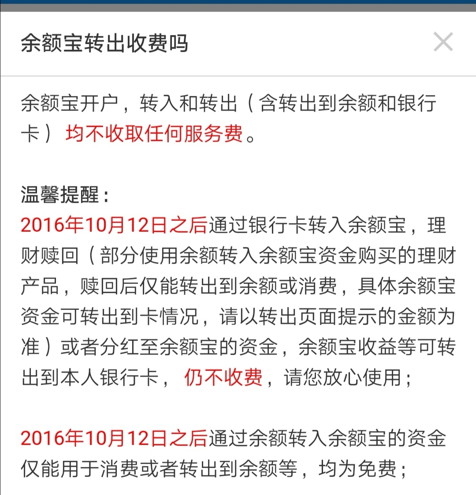

======================================================

_type: q&a
@元亨[48551521514458]
2019-03-18 16:17:19 Mon  
topic_id: 111185285828852

@元亨

>  请问二师父，上证红利现在是否还能建立底仓？

@二师父

>  可以的，目前上证红利的盈利收益率高于10个百分点，处于价值投资区域，适合定投

阅读[2865]  评论[2]  赞[0] 

======================================================

_type: q&a
@程洋[28258521545511]
2019-03-18 18:46:55 Mon  
topic_id: 844418512814412

@程洋

>  二师父，上哪儿找90日均线值呢?

@二师父

>  在股票软件都有的，你看这个图里面的90日均线，就是那条蓝色的线条

阅读[2865]  评论[2]  赞[0] 

======================================================

_type: talk
@陈[844415515418422]
2019-03-18 21:49:18 Mon  
topic_id: 244418855285551

二师父，您好！今天三点前卖出价格是今天的，晚上卖出的就是明天的价格了，对吗？二师父忙，知道的朋友帮忙给回答下也可以！谢谢啦！

@TDG at 2019-03-18 21:49:18 Mon

> 对，三点之后卖出就按下个交易日的净值计算。

----------

@有你真好 at 2019-03-18 21:49:18 Mon

> 场外的话三点之前卖出的都算当天收盘价，三点之后到第二天三点之前算第二天的收盘价。

----------

@陈 at 2019-03-18 21:49:18 Mon

> 谢谢大家！

----------

阅读[2589]  评论[3]  赞[0] 

======================================================

_type: q&a
@Steven Zha*[142428111482]
2019-03-18 23:55:37 Mon  
topic_id: 422218844114488

@Steven Zha*

>  二师父您好，这两天估值表，没看到000311这只，请问，他还适合定投吗？

@二师父

>  目前正常估值，不适合定投了

阅读[2600]  评论[0]  赞[0] 

======================================================

_type: q&a
@海盗[48248118584848]
2019-03-18 23:55:52 Mon  
topic_id: 844418858584542

@海盗

>  二师父，现在学堂很热闹呀！现在一起的小伙伴有多少了？

@二师父

>  有800多人了

阅读[2764]  评论[0]  赞[0] 

======================================================

_type: talk
@二师父[28814221155551]
2019-03-19 02:15:13 Tue  
topic_id: 244418854818181

<e type="hashtag" hid="481211145528" title="#指数估值#" /> 有的基金要进入正常估值了，有的要高估了，大家珍惜低估定投的机会。

如果不会使用均线偏离表，那么就严格遵循低估定投的方法即可。

@今晚吃手抓，谁给点大* at 2019-03-19 02:15:13 Tue

> 二师父，目前300增强处于正常估值，是不是该由50ah代替？还有能不能分析下关注旅游行业的指数基金，从有关报道了解到，它是目前还没有涨的行业！谢谢🙏

----------

@天机 at 2019-03-19 02:15:13 Tue

> 表后的估值区间是市盈率还是市净率的区间？

----------

@二师父 at 2019-03-19 02:15:13 Tue

> 对的，正常估值就停止定投

----------

@二师父 at 2019-03-19 02:15:13 Tue

> 盈利稳定的是市盈率

----------

阅读[2886]  评论[4]  赞[0] 

+++++++++++++++++++++++++++++++++++++++++++++++++++++

图片：
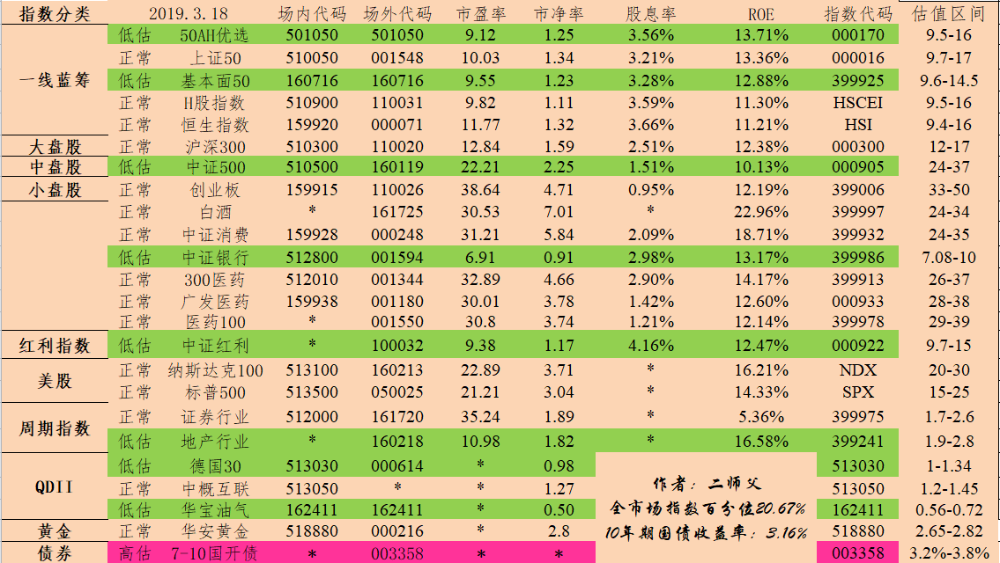

======================================================

_type: talk
@二师父[28814221155551]
2019-03-19 02:20:50 Tue  
topic_id: 844418854812512

<e type="hashtag" hid="454221284528" title="#估值指标#" /> 分享一个非常重要的估值指标，ROE。大家注意再估值的时候灵活运用。

阅读[7797]  评论[0]  赞[0] 

+++++++++++++++++++++++++++++++++++++++++++++++++++++

文件：
2019-03-19 02:19:57 Tue
文件大小：[448365]
48818181825118-ROE！给股票和基金估值都必须重视的指标.pdf

======================================================

_type: talk
@二师父[28814221155551]
2019-03-19 02:40:51 Tue  
topic_id: 844418854814142

<e type="hashtag" hid="225441485241" title="#上证50和50AH的比较#" /> 提问：二师父，请问一下，50AH策略比上证50的好，为什么华夏上证50AH优选指数A(501050）与多只上证50指数相比，业绩表现都不如后者，那是不是直接选上证50会更好呢？
————————————————————————————————————————————

解答：你是如何看出50AH的业绩不如上证50的呢，投资分析的时候需要有数据支撑。我来计算下，你看看我的数据跟你得是否有出入。

上证综合指数，我查阅了下，他再2014年1.9日的指数点位是1081，再2019年3.18日的指数点位是2815，增长率是1.61倍，那么15年的年化平均收益率是6.8%。算上了复合收益率的。

对于50AH优选指数，2017年1月25日的数据显示指数点位是4396，2019年3月25日的数据显示指数点位是5189，增长率18%，年化复合周一率是9%

因为9%大于6.8%,所以50AH指数的成长性比上证50是要好的。他比上证50的缺点在于策略指数的管理费用高一点。至于指数持仓股票的价值，因为50AH指数有A股和港股选择时候的折价规则，所以他更有价值。

@niwota at 2019-03-19 02:40:51 Tue

> 您好，上证50指数15年增长1.61倍，年化收益率6.8% 怎么计算的呢？
是应该等于1.068^15？  还是1.068^14？

----------

@二师父 at 2019-03-19 02:40:51 Tue

> 是2.61倍，15次方

----------

阅读[7967]  评论[2]  赞[0] 

======================================================

_type: talk
@二师父[28814221155551]
2019-03-19 03:06:21 Tue  
topic_id: 544481124522554

<e type="hashtag" hid="142542121552" title="#周二读书#" /> 学习无论是对于投资胜利，事业成功，家庭幸福都是非常重要的。二师父的文章属于浅显易懂的，这对于投资入门来讲是很好的事情，那么当看了二师父的文章，听了二师父的课程入门以后，就该去读一些经典的投资书籍，这样不仅能够提高自己的投资水平和对资本市场的认识，同时也能够增加自己的人生智慧。

以前二师父都是直接推荐一本书了事，最后二师父发现只有少部分的自律读者能够真正地沉下心来学习，提高自己。那么在今后二师父就带着大家一起读书，帮助大家更进一步地提高投资水平，如果在这个过程中你有疑问可以和其他读者一起探讨，这样整个星球的朋友的水平就提高了。我们都会是资本市场的胜利者。

今天开始读的书是《巴菲特和索罗斯的投资习惯》。推荐这本书的原因在于呢，今天一个读者告诉我他的基金仍旧亏损50多个百分点，二师父立刻知道原因了，就问他，是不是在15年高位或者07年高位买入了。结果他告诉二师父这两个点都买入了。

对于一个稍有常识的人就知道，在股市高位要么不要买入，假设在高位做趋势交易追高的话也要设置止损点，哪能够让资金被套住这么多年呢，算上通货膨胀和货币贬值，那两笔投资的亏损已经远远高于50个百分点了。

所以二师父觉得自己很有必要去普及证券投资知识，将更好的投资理念普及给大家。也许就能够让一个家庭免除几十万的亏损，让一个家庭的财务状况更加健康，这是一件有意义的事情。好了开始读书。

《巴菲特和索罗斯的投资习惯》被誉为投资市场的圣经。作者是马克泰尔。他经过比较巴菲特和索罗斯的投资方法虽然不同，但是他俩的投资习惯却非常相近。作者惊奇的发现，在美国成功的投资者，比如林奇，邓普顿，格雷厄姆，费雪等都和巴菲特的投资习惯相同。

所以，决定投资成败的一个关键因素是投资习惯。我们来学习学习两位投资大师的投资习惯，然后再定投实践的过程中也要养成这些习惯。

1、他俩再投资的过程中首先看重的不是挣钱，而是不赔钱。这一点大多数读者做不到。我从最近咨询我投资的火热程度就知道，大多数人来到市场首先想的不是如何避免亏钱，而是如何大赚一笔，那结果可想而知，只看到利润没看到风险最后肯定就落入危险的境地，比如最近很多人再问的问题就是建立底仓合不合适，这完全就是怕错过行情准备大捞一笔。

2、他们不预测市场，很多读者又不是这样，总是猜测市场的涨跌，即使预测成功十次那么只有一次没有对，你就会犯巨大的错误，所以不要预测。

先分享这两个投资习惯，大家注意一定要养成。不要将追求收益放在第一位，要想着自己这样投资是否又亏损的风险，第二不要预测市场，那是神做的事情。

@海盗 at 2019-03-19 03:06:21 Tue

> [玫瑰][玫瑰][玫瑰]

----------

@乖子 at 2019-03-19 03:06:21 Tue

> 好棒哦，太辛苦您了

----------

@齐俊波 at 2019-03-19 03:06:21 Tue

> 说得太好了，之前有一位高手也曾经告诫我：“不要尝试走在行情的前面。” 又说：“行情是走出来的，不是预测出来的。”

----------

@蹦哒农夫 at 2019-03-19 03:06:21 Tue

> 二师父讲的很好，可是我觉得暂时A股政策市的成分还很大，我觉得宏观政策市场导向还是要预测分析的，跟美股不太一样。个人观点，呵呵😊

----------

阅读[8146]  评论[4]  赞[0] 

======================================================

_type: q&a
@💗朵儿studio *[111844511822152]
2019-03-19 10:08:52 Tue  
topic_id: 544481124428454

@💗朵儿studio *

>  师父，基本面50目前快进入正常估值了，继续定投还是收割利润，持有本金继续投资？

@二师父

>  进入正常估值以后就停止投资收割利润

阅读[2949]  评论[3]  赞[0] 

======================================================

_type: q&a
@鸿何服饰[15442528284822]
2019-03-19 10:11:30 Tue  
topic_id: 244418854115281

@鸿何服饰

>  请问华宝标普红利机会市盈率在那里查看，我暂在蛋卷基金估值排行中查看，不知道数字标准不标准。

@二师父

>  这个在中证指数官网可以查阅到

阅读[3018]  评论[0]  赞[0] 

======================================================

_type: q&a
@冉冉[88445118854412]
2019-03-19 10:12:22 Tue  
topic_id: 422218841544888

@冉冉

>  请问二师傅，中证消费即将高估，那么，中证全指可选消费处于低估，能定投吗?

@二师父

>  可选消费目前是正常估值，不适合定投

阅读[3069]  评论[0]  赞[0] 

======================================================

_type: q&a
@J[28281541518551]
2019-03-19 10:13:09 Tue  
topic_id: 844418851448842

@J

>  二师父，指数上涨很多，目前很多指数都进入正常估值，请问现在地产行业基金适合建底仓2-3成吗？

@二师父

>  地产行业指数是周期性指数，不适合在当前位置建立底仓，定投即可

阅读[3206]  评论[2]  赞[0] 

======================================================

_type: talk
@西男[844148822182252]
2019-03-19 11:57:29 Tue  
topic_id: 544481112542524

提问：二师父，为何都找不到50ah的估值数据呢？都只有中证50的，没有50ah的。我从《指数估值和财务数据的查询方法》里面介绍的渠道都过了一遍。。。

@Zyxj at 2019-03-19 11:57:29 Tue

> 同问！

----------

@元亨 at 2019-03-19 11:57:29 Tue

> 可以参照50ETF

----------

@二师父 at 2019-03-19 11:57:29 Tue

> 这个在wind金融终端有，毕竟是免费查询平台，所以数据不全

----------

@小婧鱼一笑奈何 at 2019-03-19 11:57:29 Tue

> 我今天刚刚用wind excel插件拉日度50ah的滚动市盈率数据 确实也没拉到 其他指数有数据

----------

@二师父 at 2019-03-19 11:57:29 Tue

> 你把界面截图我看看

----------

@小婧鱼一笑奈何 at 2019-03-19 11:57:29 Tue

> 我明早到单位发上来 现在不在单位了

----------

@二师父 at 2019-03-19 11:57:29 Tue

> 这是一个平台的，大部分是有的

----------

@小婧鱼一笑奈何 at 2019-03-19 11:57:29 Tue

> 请教师傅，这是从wind终端哪个界面点进去的？

----------

阅读[3098]  评论[11]  赞[0] 

======================================================

_type: q&a
@一切随缘[244145248112411]
2019-03-19 13:20:31 Tue  
topic_id: 544481115541524

@一切随缘

>  中证红利定投了2月，到现在也没搞清楚他算是大盘，还是中盘？

@二师父

>  这个属于大盘红利指数，标普红利指数属于中盘红利指数

阅读[3264]  评论[0]  赞[0] 

======================================================

_type: q&a
@元亨[48551521514458]
2019-03-19 14:23:45 Tue  
topic_id: 844418882124112

@元亨

>  请问二师父，中证500几时到正常估值？

@二师父

>  24倍市盈率正常估值

阅读[3197]  评论[0]  赞[0] 

======================================================

_type: q&a
@🐰Mandy[244148854285821]
2019-03-19 14:59:51 Tue  
topic_id: 844418884548522

@🐰Mandy

>  二师父，中证500增强(161017)怎么没有看到估值表？

@二师父

>  500增强的估值参考中证500即可

阅读[3287]  评论[0]  赞[0] 

======================================================

_type: q&a
@冉冉[88445118854412]
2019-03-19 18:35:15 Tue  
topic_id: 844418881815242

@冉冉

>  请问二师傅，目前我在15年高点买入的工银互联网加001409已换了基金经理，现价在0.32元，不知下一步该怎样操作，是割肉赎回还是等待科创板给该基金带来利好，附上该基金持仓股，烦请二师傅给与分析，谢谢。

@二师父

>  15年买的大概率是亏的，选个时机卖了吧

阅读[3155]  评论[0]  赞[0] 

======================================================

_type: q&a
@黄巧[844145518844422]
2019-03-19 19:29:53 Tue  
topic_id: 544481118452254

@黄巧

>  资本配置里面说基金配置的时候按照估值和成长性进行定投，基金的成长性怎么看？

@二师父

>  看股票的盈利增速，高成长股票盈利增速快

阅读[3141]  评论[3]  赞[0] 

======================================================

_type: talk
@二师父[28814221155551]
2019-03-19 20:12:45 Tue  
topic_id: 244418881121881

<e type="hashtag" hid="825418285242" title="#宏观经济#" /> 北大光华管理学院，”光华思想力“研究报告指出。预估2019年GDP增长目标在6.0%-6.5%之间，实际增长率为6.3%，人均GDP将超一万美元。经济增速放缓对应股票收益率也会降低。

●政府将主要运用积极的财政政策应对经济下行压力。企业减税降费将迅速落地，基建投资将超三万亿。基础设施建设仍旧是主流。

●货币政策有望适度宽松，全年料降准2点。但基准利率不会下调，央行更多利用结构性工具调节流动性。宽松得货币政策有利于房市。

●中美有望达成临时关税安排，CNY-USD汇率大概率保7。但中美长期竞争加剧，会有频繁摩擦与冲突。

●生育率低迷，政府有望全面放开生育限制。人口红利消退倒逼制造业升级，持续提高全要素生产率。

@光明无顶 at 2019-03-19 20:12:45 Tue

> 总结：经济总体向上（投资有收益），基建板块，房地产板块，智能制造业板块有投资前景。

----------

阅读[3233]  评论[1]  赞[0] 

======================================================

_type: q&a
@小眼静🎀[844121141821482]
2019-03-19 20:49:17 Tue  
topic_id: 111185542221542

@小眼静🎀

>  二师父，请问做定投计划的时候参考的价格能否是场外指数基金的净值？

@二师父

>  可以，参考场外净值和场内价格都一样的，如果估值看下市盈率和市净率指标

阅读[3220]  评论[0]  赞[0] 

======================================================

_type: talk
@二师父[28814221155551]
2019-03-20 00:42:08 Wed  
topic_id: 111185541545282

<e type="hashtag" hid="454218581518" title="#算估值#" /> 中国平安保险(集团)股份有限公司为经营区域覆盖全国,以保险业务为核心,以统一的品牌向客户提供包括保险、银行、证券、信托等多元化金融服务的全国领先的综合性金融服务集团.公司拥有约20万名寿险销售员及超过4万名正式雇员,各级各类分支机构及营销服务部门约3000个,向3000多万名个人客户及约200万名公司客户提供多元化金融服务.根据中国保险年鉴的统计,按保费收入来衡量,平安寿险为中国第二大寿险公司,平安产险为中国第三大产险公司.2009年6月中国平安与深发展有股权合作意向,2012年4月，深发展获得中国银监会关于深圳发展银行吸收合并原平安银行的批复，并于6月12日完成原平安银行工商注销，于7月27日深发展正式更名为“平安银行股份有限公司”。

1、未来现金流折现法，这是巴菲特的估值思想 

非高杠杆企业未来价值=市盈率*每股利润*（1+第一年每股收益增长率）*（1+第二年每股收益增长率）*综合性系数

中国平安的未来价值=10*3.44*1.4275*1.1631*1.5=85.67.>75.35元
从这个计算可以看出是处于低估状态的。

2、PEG估值方法，这是彼得林奇创造的指标

PEG：在PE估值的基础上发展起来的，它弥补了PE对企业动态成长性估计的不足。市盈率较低，增长速度又较高的公司，PEG往往会比较低。PEG = 滚动市盈率PE / （净利润增速 * 100）。

市盈率 12.82，预测未来的净利润增速14.92%

PEG=0.86<1.1,处于低估区域

这两种方法都是预测未来的利润增长率，这个是不确定因素，所以估值也是估算。
那看看买入点，我是在上次在击穿20日均线买入的，当时价格59元，我们的卖出条件是当股价跌破20日或者30日均线的时候。

你看中国平安在这个位置，假设跌破了20日均线，我们卖出盈利也有18个点。如果继续长期持有，未来会更高。所以这种策略做趋势投资完全可以。

中国平安目前低估，仍旧持有。股票我是不会给大家推荐的，因为买股票通常出现这种情况，一只股票10元买了，15元卖了，很多人在20元的时候又买，最终被套。

股票A股大部分股票你如果长期持有收益率是很好的，只不过，很多人拿不住。这就是不建议普通投资者投资股票的原因。如果你基金定投已经完全掌握，没有知识漏洞，也可以学习股权配置，会加深你对资本市场的认识。

@斜杠青年 at 2019-03-20 00:42:08 Wed

> 二师父，你这个用未来现金流估值，取的是哪几年的数据？

----------

@光少 at 2019-03-20 00:42:08 Wed

> 二师父，怎样看击穿20日均线点开始买入呢？

----------

@二师父 at 2019-03-20 00:42:08 Wed

> 3年

----------

@二师父 at 2019-03-20 00:42:08 Wed

> 看图中的箭头

----------

@斜杠青年 at 2019-03-20 00:42:08 Wed

> 二师父，还有几个问题想请教一下：
1.我查了平安的年报，你这个3.44对应的是2016年度稀释后的每股净利润（这个没错吧）.
2.你这个估值的时间节点是在18年年初做的吗？
3.这个42.75%我没找到，用15年的数据对比也没算出来

----------

@二师父 at 2019-03-20 00:42:08 Wed

> 在19年做的这个，百分之42.75是17年的净利润增长率

----------

@堂吉诃德的小助手 at 2019-03-20 00:42:08 Wed

> 预计未来净利润增速14.92%这个数据在哪里找的？

----------

@二师父 at 2019-03-20 00:42:08 Wed

> 这个是根据过去的利润预测的

----------

阅读[7914]  评论[8]  赞[0] 

+++++++++++++++++++++++++++++++++++++++++++++++++++++

图片：
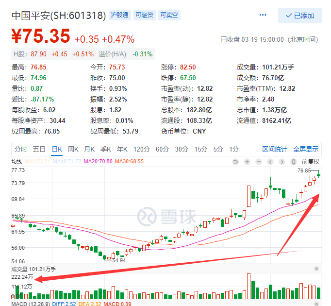

======================================================

_type: talk
@二师父[28814221155551]
2019-03-20 03:31:56 Wed  
topic_id: 244418824811121

<e type="hashtag" hid="552114551414" title="#估值数据#" /> 星球第一次购买原价，购买以后到达星球使用最后一日，第一次续费9折优惠加二师父微信ershifudt，微信付费以后邀请进入。第二次续费可享受7折优惠，第三次续费可享受5折优惠，连续三次续费后可永久5折优惠。 指数估值表：绿色低估，橙色正常，红色高估。如何使用指数估值表可以看看置顶文章五步定投法。新手投资者大盘中盘轮动配置，再加上两个优质行业指数就行啦。价值投资类书籍。
复制这段内容后打开百度网盘手机App，操作更方便哦 链接:<e type="web" href="https://pan.baidu.com/s/1zNsUQ6-a1ApwMXQYMqP_-Q" title="https://pan.baidu.com/s/1zNsUQ6-a1ApwMXQYMqP_-Q" /> 提取码:hk55

@珅爹 at 2019-03-20 03:31:56 Wed

> 这是升级版的估值表吗？请问。

----------

@二师父 at 2019-03-20 03:31:56 Wed

> 是的啊，以后估值数据就在这里公布

----------

@珅爹 at 2019-03-20 03:31:56 Wed

> 好像跟微信公众号公布的没太大区别

----------

@二师父 at 2019-03-20 03:31:56 Wed

> 你仔细看

----------

@光少 at 2019-03-20 03:31:56 Wed

> 二师父，沪深300增强是到了正常估值了吗？明天还可以继续定投吗

----------

@二师父 at 2019-03-20 03:31:56 Wed

> 沪深300增强可以暂停了，参考每天的沪深300估值，今晚公布估值表，如果50ah低估，明天可以用50ah替代沪深300

----------

@光少 at 2019-03-20 03:31:56 Wed

> 谢谢二师父

----------

@*🐵 🐶 翩翩* at 2019-03-20 03:31:56 Wed

> 请问正常估值区间表没有么

----------

阅读[379706]  评论[133]  赞[2] 

+++++++++++++++++++++++++++++++++++++++++++++++++++++

图片：
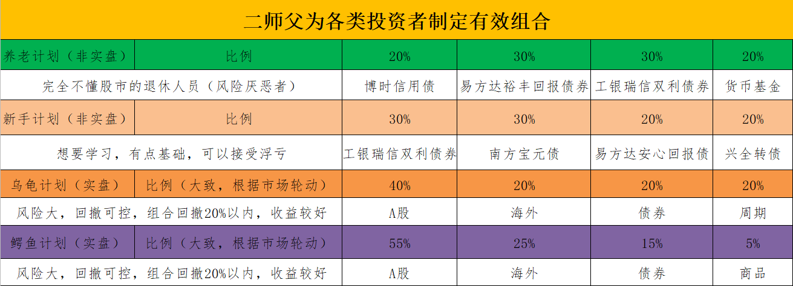
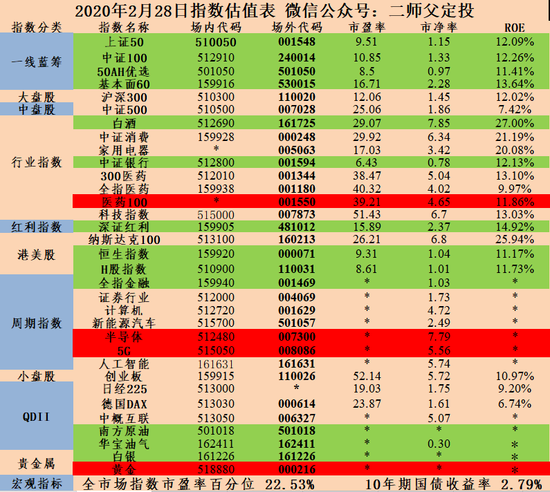
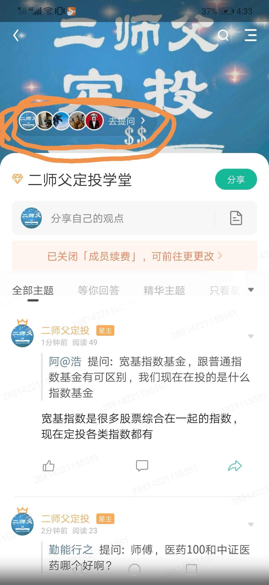

+++++++++++++++++++++++++++++++++++++++++++++++++++++

文件：
2019-12-13 13:36:41 Fri
文件大小：[847054]
51514285588824-二师父为基金投资者打造的五步定投法（3.0）.pdf

======================================================

_type: talk
@二师父[28814221155551]
2019-03-20 03:43:58 Wed  
topic_id: 244418824255881

<e type="hashtag" hid="552481552484" title="#指数选择#" /> 3100点，哪些指数适合定投，二师父用市盈率百分位和巴菲特指标分析了下，当前位置定投仍旧比较安全，只是相对于2600点的定投可能收益率更低一些。

@竹露清响 at 2019-03-20 03:43:58 Wed

> 请教二师父，是否目前可以定投并重仓的前五个指数可以先建底仓再定投，后三个指数不用建仓直接定投即可？谢谢！

----------

@冉冉 at 2019-03-20 03:43:58 Wed

> 今日进来没有看见估值表，有些不习惯。二师傅说打算进一步深造读书，那么弱弱的问一句，估值表以后二师傅还会发吗？

----------

@二师父 at 2019-03-20 03:43:58 Wed

> 都定投，目前就别建底仓了

----------

@二师父 at 2019-03-20 03:43:58 Wed

> 再置顶文章第一条

----------

@冉冉 at 2019-03-20 03:43:58 Wed

> 看见了，谢谢二师傅，辛苦啦

----------

@竹露清响 at 2019-03-20 03:43:58 Wed

> 可是我看到支付宝上显示的中证银行指数怎么是高估的啊？

----------

@二师父 at 2019-03-20 03:43:58 Wed

> 我不知道他们怎么算出银行高估了，有问题

----------

@天机 at 2019-03-20 03:43:58 Wed

> 二师傅要重返校园吗？跟我今年计划一样

----------

阅读[8276]  评论[17]  赞[0] 

+++++++++++++++++++++++++++++++++++++++++++++++++++++

文件：
2019-03-20 03:42:27 Wed
文件大小：[25540]
48818155215248-3100点，还有哪些基金适合定投.docx

======================================================

_type: q&a
@凭栏观海[244414845852181]
2019-03-20 04:20:09 Wed  
topic_id: 544481154521544

@凭栏观海

>  请问老师，现在红利机会估值正常了吗？是否暂停定投？

@二师父

>  这个已经正常估值，可以按照五步定投法里面的利润收割法则收割利润了

阅读[3488]  评论[5]  赞[0] 

======================================================

_type: talk
@二师父[28814221155551]
2019-03-20 09:37:13 Wed  
topic_id: 422218828445488

估值表大家看置顶文章第一条

@20181108…… at 2019-03-20 09:37:13 Wed

> 师父辛苦了

----------

@蹦哒农夫 at 2019-03-20 09:37:13 Wed

> 辛苦

----------

@海盗 at 2019-03-20 09:37:13 Wed

> 收到

----------

@冉冉 at 2019-03-20 09:37:13 Wed

> 看到了，二师傅辛苦啦

----------

阅读[3289]  评论[4]  赞[0] 

======================================================

_type: q&a
@J[28281541518551]
2019-03-20 12:42:42 Wed  
topic_id: 244418842885411

@J

>  场外有一笔赎回债基的增量资金，请问二师父，这笔资金现在适合一次性买入低估的组合潜伏至正常估值或高估吗

@二师父

>  如果能接受30多个点的浮亏就可以

阅读[3148]  评论[2]  赞[0] 

======================================================

_type: q&a
@旺锦古法土制红糖 范*[422152185412288]
2019-03-20 12:43:16 Wed  
topic_id: 244418842821811

@旺锦古法土制红糖 范*

>  二师父你好 指数基金你是用什么工具算估值的 我用的是理杏仁网 但是 有些指数代码 上面没有 有没有更全面的工具 谢谢

@二师父

>  wind最全面，我这里有购买渠道

阅读[3243]  评论[5]  赞[0] 

======================================================

_type: q&a
@聪明的笨蛋[544858411212244]
2019-03-20 12:43:36 Wed  
topic_id: 844418842825122

@聪明的笨蛋

>  场内购买委拖方式用限价委拖好还是五档最优限价委拖好

@二师父

>  我用的限价委托

阅读[3302]  评论[0]  赞[0] 

======================================================

_type: q&a
@sun[15481522845412]
2019-03-20 15:52:44 Wed  
topic_id: 111185511544812

@sun

>  请问二师父，黄金指数低估值和高估值分别是多少？

@二师父

>  高估区域和和正常估值区域的指标是2.82，目前处于界限点

阅读[3152]  评论[2]  赞[0] 

======================================================

_type: q&a
@珅爹[15451242541142]
2019-03-20 16:43:39 Wed  
topic_id: 111185582555582

@珅爹

>  师傅，我眼睛不好，想下载精华区的文章放大看，不知道有没有办法？

@二师父

>  可以，去网页端，登陆知识星球，然后找到相关文件，点击下载就可以啦，文件也可以打印出来

阅读[3208]  评论[0]  赞[0] 

======================================================

_type: q&a
@小牧童[28484254825881]
2019-03-20 19:26:51 Wed  
topic_id: 544481182524254

@小牧童

>  二师父，您好！您之前回答说可转债价格全面突破100元可定义牛市，那现在可以根据牛市利润割吗？

@二师父

>  我看了看，对于众兴转债，模塑转债，这些价格仍旧没有到达，全面牛市还没有到来，正常收割利润就可以的

阅读[3189]  评论[0]  赞[0] 

======================================================

_type: q&a
@小婧鱼一笑奈何[422182221414418]
2019-03-20 19:28:33 Wed  
topic_id: 244418818544851

@小婧鱼一笑奈何

>  二师父，向你请教：你在文中举例说，定投6只基金指数。这个是指持仓最多就是6只基金，如果我要开始定投不是这6只基金当中的一只，那么我要先在合适的时点清盘6只中的一只（已经高估）再投新的那只。还是说实际持仓可以有8只基金（不同时点入场），假设这8只基金都是低估的，然后就在这8只基金中每周选6只最优的定投，另外两只，暂时不定投。

@二师父

>  我定投了有15只基金，这个看自己的资金量来确定，每次选择两到3只低估的基金定投即可

阅读[3321]  评论[3]  赞[0] 

======================================================

_type: talk
@二师父[28814221155551]
2019-03-20 23:17:51 Wed  
topic_id: 544481188512854

<e type="hashtag" hid="454218224558" title="#理财就是理生活#" /> 一个有外孙的读者，通过自律打卡不仅财务更健康，心态更平和，幸福指数也提高了。理财就是理生活，我们投资理财的目的最终都是让生活更加幸福。切记要有自己的爱好和独立空间，不要成为任何人的依附，这样独立而自由，平静而优雅，会获得更多的尊重，也能从心底感受到生活的幸福。希望大家都能够通过定投实现人生的自由和幸福。

阅读[3133]  评论[0]  赞[0] 

+++++++++++++++++++++++++++++++++++++++++++++++++++++

图片：
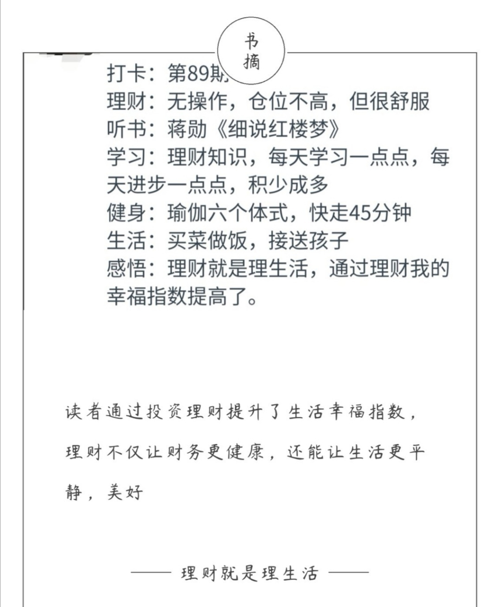

======================================================

_type: talk
@二师父[28814221155551]
2019-03-21 04:35:11 Thu  
topic_id: 422218544422148

<e type="hashtag" hid="454218222518" title="#债券基金#" /> 债券基金的正确投资方式，以后估值表就看置顶文章第一篇，方便快捷

@💗朵儿studio * at 2019-03-21 04:35:11 Thu

> 师父，债基适合定投吗？

----------

@二师父 at 2019-03-21 04:35:11 Thu

> 现在不适合了，文章有讲

----------

@Philip🎭 Y at 2019-03-21 04:35:11 Thu

> 二师父，文章中的广发和博时有代号吗？如何看他是不是全债基金啊？谢谢！

----------

@二师父 at 2019-03-21 04:35:11 Thu

> 直接搜索广发纯债和博时信用债就有，持有全部是债券就是纯债

----------

阅读[8133]  评论[4]  赞[0] 

+++++++++++++++++++++++++++++++++++++++++++++++++++++

文件：
2019-03-21 04:34:28 Thu
文件大小：[119430]
28818121828511-债券基金投资的正确方式.docx

======================================================

_type: q&a
@孙平[48548211154218]
2019-03-21 10:13:20 Thu  
topic_id: 844418255854122

@孙平

>  二师父，向你请教:请问分级基金定投风险大吗？

@二师父

>  分级基金的母基金低估投入没啥风险

阅读[3050]  评论[0]  赞[0] 

======================================================

@二师父[28814221155551]
2019-03-21 10:15:13 Thu  
topic_id: 422218544542548

>  @二师父
>  

阅读[3233]  评论[0]  赞[0] 

======================================================

_type: q&a
@Steven Zha*[142428111482]
2019-03-21 10:48:42 Thu  
topic_id: 422218548551188

@Steven Zha*

>  二师父您好，我想问，按照您的利润收割法，取出鸡蛋，留着“鸡”。但是，这个利润收割，一般设置盈利多少开始收割呢？是一次性收割，还是分批收割？

@二师父

>  一次在正常估值盈利10个点就可以收割了，每多盈利10个点收割利润一次

阅读[3260]  评论[0]  赞[0] 

======================================================

_type: q&a
@J[28281541518551]
2019-03-21 11:08:04 Thu  
topic_id: 422218548221488

@J

>  二师父，请教两个问题：1. 去年3200点左右买入的富国天惠，目前浮亏7%，上投港股通红利低波（005051）目前盈利5%，这两个基金目前是高估吗？是逢高卖出还是继续持有？2. 现在定投低估值指基，选择周定投还是日定投更好？

@二师父

>  都是混合基金，建议卖了定投指数基金，混合基金我用的趋势交易加均线买入法，这种操作类似股票的五步交易法则，你可以看看星球置顶文章。定投是周定投比日定投要好的

阅读[3280]  评论[5]  赞[0] 

======================================================

_type: talk
@二师父[28814221155551]
2019-03-21 11:30:52 Thu  
topic_id: 844418254241512

<e type="hashtag" hid="825418122552" title="#周四场外低估定投实盘#" /> 每周四定投风雨无阻，50ah买入一份，地产指数买入一份，德国30买入0.5份。资金不足的朋友可以停止定投，定投不看涨跌，只看估值，资金多的话更要多多积累

@醉流雨 at 2019-03-21 11:30:52 Thu

> 一份是多少呢，？师父

----------

@晋·Garran at 2019-03-21 11:30:52 Thu

> 二师父，场外其他品种不买入了吗？[害羞]

----------

@hi小鱼小鱼 at 2019-03-21 11:30:52 Thu

> 二师父，您好！按估值表，沪深300已停止定投，目前就50ah和中证500，想再增加一两个定投，银行/红利/地产哪个合适些，现在不适合建仓了吧，谢谢！

----------

@自由飞翔 at 2019-03-21 11:30:52 Thu

> 定投继续：50ah，中证红利，中证500，中证银行，地产指数，华宝油气各0.5份。

----------

@光少 at 2019-03-21 11:30:52 Thu

> 收到，谢谢

----------

@二师父 at 2019-03-21 11:30:52 Thu

> 根据你的资金量分配，如何分配我在五步定投法和课程里面有讲，保证有足够的资金加仓就行

----------

@二师父 at 2019-03-21 11:30:52 Thu

> 低估买的，一次选2到3只，这样在熊市不会一下子把钱用完

----------

@二师父 at 2019-03-21 11:30:52 Thu

> 红利和地产都可以的

----------

阅读[3458]  评论[22]  赞[0] 

======================================================

_type: q&a
@闫军平[422125415521418]
2019-03-21 13:31:06 Thu  
topic_id: 111185428548222

@闫军平

>  请问二师父，我可以看到你的实盘操作吗？

@二师父

>  定投实盘今天发布了，请看精华内容

阅读[3172]  评论[0]  赞[0] 

======================================================

_type: q&a
@珅爹[15451242541142]
2019-03-21 14:42:43 Thu  
topic_id: 422218541544548

@珅爹

>  师傅，上次说过可以根据偏离度估值加倍加仓，但这两天没给那张表，我们自己可以计算吗？数据有没有第三方网站提供？

@二师父

>  嗯嗯，每周末发布的，这个可以自己计算，用指数基金的价格减去90日均线的价格得到一个值，然后除以90日均线的价格，就是均线偏离的百分比，偏离百分比6到12个点偏离度是1，偏离百分比12到18个百分点偏离度是2

阅读[3119]  评论[7]  赞[0] 

======================================================

_type: talk
@二师父[28814221155551]
2019-03-21 15:48:11 Thu  
topic_id: 544481512281544

<e type="hashtag" hid="225418148181" title="#前端收费和后端收费#" /> 在基金份额认购上存在两种收费模式：前端收费模式和后端收费模式。前端收费模式是指在认购基金份额时就支付认购费用的付费模式；后端收费模式是指在认购基金份额时不收费，在赎回基金份额时才支付认购费用的收费模式。后端收费模式设计的目的是为鼓励投资者能够长期持有基金，因为后端收费的认购费率一般会随着投资时间的延长而递减，甚至不再收取认购费用。

阅读[3186]  评论[0]  赞[0] 

======================================================

_type: q&a
@醉流雨[422151445242248]
2019-03-21 16:48:16 Thu  
topic_id: 844418285211152

@醉流雨

>  师父，我问下，那个稳健资产的货币基金买哪一款合适，？是第二天就能赎回的么，？

@二师父

>  南方天天利B不错，这个是T加2，买入之后第三天可以赎回

阅读[3216]  评论[1]  赞[0] 

======================================================

_type: talk
@二师父[28814221155551]
2019-03-22 03:08:36 Fri  
topic_id: 111185144215282

<e type="hashtag" hid="481144488858" title="#投资理念#" /> 主动基金其实也有投资价值，不过投资方式和指数基金不同，建议新手投资者从指数基金定投开始入门，学有余力的朋友可以学习股票投资

@归去来兮 at 2019-03-22 03:08:36 Fri

> 投资主动基金有点像投资股票，不太适合定投，但好的主动基金涨的也是很猛，可以像股票一样设置止盈止损，但如果换基金经理了，就要小心一些。

----------

阅读[7506]  评论[1]  赞[0] 

+++++++++++++++++++++++++++++++++++++++++++++++++++++

文件：
2019-03-22 03:07:40 Fri
文件大小：[24429]
28818142884141-睿远成长价值混合遭哄抢，我为何如此淡定.docx

======================================================

_type: q&a
@旺锦古法土制红糖 范*[422152185412288]
2019-03-22 11:29:37 Fri  
topic_id: 844418424542522

@旺锦古法土制红糖 范*

>  二师父你好 我一般查基金都是在天天基金网  但是天天价基金网上都是场外基金多 请问 哪个网站场内基金多一点 谢谢

@二师父

>  置顶文章有福利注册渠道，可以了解下，两个都是低佣金

阅读[2617]  评论[1]  赞[0] 

======================================================

_type: talk
@陈[844415515418422]
2019-03-22 14:50:49 Fri  
topic_id: 422218228185288

各位亲，一直买的中证500指数增强，没有买中证500。现在继续定投500增强一样的吗？还有一直定投50ah还用买基本面50吗？都是一线蓝筹，是不定投一个就可以了？

@孙健 at 2019-03-22 14:50:49 Fri

> 看资金量

----------

@陈 at 2019-03-22 14:50:49 Fri

> 不明白什么意思？是资金允许都买吗？

----------

阅读[2381]  评论[2]  赞[0] 

======================================================

_type: q&a
@天机[51285245588584]
2019-03-22 16:52:13 Fri  
topic_id: 422218251551528

@天机

>  二师父，有一个问题，我打了只新债（可转债），要是我中签后，后悔了不买了，算不算我违约，对方会不会上门强行收钱。

@二师父

>  在没中签之前可以撤单

阅读[2451]  评论[2]  赞[0] 

======================================================

_type: q&a
@小牧童[28484254825881]
2019-03-22 16:52:26 Fri  
topic_id: 111185115825442

@小牧童

>  二师父，您好，您说估值表每个指数连载分析，上次分析了上证50和50Ah，请问下一个啥时候分析下？😄

@二师父

>  好的，最近写起来

阅读[2591]  评论[3]  赞[0] 

======================================================

_type: talk
@二师父[28814221155551]
2019-03-22 18:42:20 Fri  
topic_id: 844418444518452

<e type="hashtag" hid="552485112284" title="#周五市场分析#" /> 本周没啥大事，很多主动公募基金从这个点位开始募集，趋势投资可上，价值投资就不用管了

二师父没有严格的限定自己是趋势投资还是价值投资，只要能赚钱就可以，关于未来市场如何我真的没法预测

可是有一点可以确认的是，在安全边际以内的基金是值得定投的，也就是估值表绿色的。不用看他涨了多少，指数点位永远是波动上升，永远记住估值思维

我们定投的油气指数已经盈利，但仍旧处于低估值，该不该卖，结合你自己的仓位，你的投资收益率决定，二师父的操作仅仅是匹配我自己的资金量的，可以跟随，但最好做自己的

大家周末愉快，每次周末很多朋友都开始来咨询二师父关于投资的事，说明大家都是中产或者工薪，平时努力上班，周末努力学习，坚持努力学习，未来肯定给你带来很多很多回报。

@丸子妈 at 2019-03-22 18:42:20 Fri

> 跟着二师父有肉吃[呲牙]

----------

@冉冉 at 2019-03-22 18:42:20 Fri

> 二师傅，目前是可以进行大资金买入，不论是主动基金还是指数基金?

----------

@二师父 at 2019-03-22 18:42:20 Fri

> 宰羊杀牛

----------

@二师父 at 2019-03-22 18:42:20 Fri

> 如果你能忍受30多个点的回撤，这个很适合

----------

@胡一彬 at 2019-03-22 18:42:20 Fri

> 二师傅，我看估值表里面油气0.56才进入正常估值的呀，场内现在0.52已经进入正常估值了吗？

----------

@二师父 at 2019-03-22 18:42:20 Fri

> 没有啊，仍旧低估

----------

@ajingge at 2019-03-22 18:42:20 Fri

> 那倒数第二段第一句怎么理解[撇嘴]

----------

@二师父 at 2019-03-22 18:42:20 Fri

> 已经修正，抱歉，打错了，估值表里面显示的低估，目前是低估

----------

阅读[6909]  评论[12]  赞[0] 

======================================================

_type: talk
@二师父[28814221155551]
2019-03-22 19:19:38 Fri  
topic_id: 244418444812441

<e type="hashtag" hid="225412885221" title="#科创板#" /> 证券时报报道，上交所披露9家科创板受理企业，以上公司涉及的A股影子股共约20只。具体名单如下：晶晨半导体涉新湖中宝、TCL集团、创维数字、泰达股份；睿创微纳涉中国核建、安徽水利、康缘药业；天奈科技涉新宙邦、康力电梯、大港股份；江苏北人涉联明股份、小商品城、软控股份；利元亨涉TCL集团、宁德时代；宁波容百涉兆驰股份、长江传媒、卓翼科技、海通证券、森霸传感；安瀚科技涉新华保险、新希望。

@二师父 at 2019-03-22 19:19:38 Fri

> 可能会影响创业板

----------

阅读[2425]  评论[2]  赞[0] 

======================================================

_type: q&a
@康[48581124158228]
2019-03-22 19:31:43 Fri  
topic_id: 544481444185814

@康

>  请问华宝油气进入高估了吗？

@二师父

>  没有，仍旧低估

阅读[2604]  评论[0]  赞[0] 

======================================================

_type: talk
@二师父[28814221155551]
2019-03-23 04:12:13 Sat  
topic_id: 844418412551512

<e type="hashtag" hid="552485154144" title="#指数投资价值分析#" /> 继续之前的指数投资价值分析，我们定投的中概互联指数为什么选择，估值表里面的每一只指数都是精选的，不是说随便就搞几个指数一凑就成了指数估值表，大家可以站在我的肩膀上，然后再去自己探索。

需要提醒的是，后面关于这个指数估值表里面的基金二师父会进一步精简，保证是精华的精华。大道至简，这是我所崇尚的。

阅读[6969]  评论[0]  赞[0] 

+++++++++++++++++++++++++++++++++++++++++++++++++++++

图片：

+++++++++++++++++++++++++++++++++++++++++++++++++++++

文件：
2019-03-23 04:09:46 Sat
文件大小：[42558]
28818144152821-基金投资价值分析之中概互联网.docx

======================================================

_type: q&a
@田维海[422144441542418]
2019-03-23 08:03:14 Sat  
topic_id: 422218215482288

@田维海

>  师傅，在A股由于牛市暴涨暴跌，投资红利基金，不如中证500，创业板涨幅大，收益高，对吗？

@二师父

>  这个你用博格公式计算就知道拉，而且你这个判断逻辑是啥呢？就因为指数波动？企业盈利增速和分红呢

阅读[2390]  评论[1]  赞[0] 

======================================================

_type: q&a
@旺锦古法土制红糖 范*[422152185412288]
2019-03-23 10:13:04 Sat  
topic_id: 422218215814148

@旺锦古法土制红糖 范*

>  你好 博格公式怎么计算

@二师父

>  课程有，参照公式p等于pb*b

阅读[2189]  评论[1]  赞[0] 

======================================================

@二师父[28814221155551]
2019-03-23 10:15:29 Sat  
topic_id: 844418412154852

>  @二师父
>  

阅读[2320]  评论[1]  赞[0] 

======================================================

_type: q&a
@俗人[844151888542152]
2019-03-23 10:18:51 Sat  
topic_id: 111185184842822

@俗人

>  华宝标普汽油（001481）怎么看不到跟踪标的

@二师父

>  看估值表指数代码162411就是

阅读[2439]  评论[0]  赞[0] 

======================================================

_type: talk
@二师父[28814221155551]
2019-03-23 10:47:27 Sat  
topic_id: 544481488415484

<e type="hashtag" hid="825412285852" title="#500强企业的没落#" /> 02年评选的500强企业三分之二没落，没有不衰败的企业，而指数却永葆常青，这是指数最大的优势

<e type="web" href="http://scholarsupdate.hi2net.com/news.asp?NewsID=23145" title="刘斌：为什么登上中国500强的企业有2/3不再辉煌？！+-+学人动向+-+科技动向+-+美国华裔教授..." />

阅读[2445]  评论[0]  赞[0] 

======================================================

_type: q&a
@MR.江[88212218814112]
2019-03-23 12:32:10 Sat  
topic_id: 844418155585552

@MR.江

>  您好，刚才付费加入了，有定投相关学习课程吗

@二师父

>  有的，学堂学员有优惠链接

阅读[2420]  评论[6]  赞[0] 

======================================================

_type: q&a
@心斋[544845214152284]
2019-03-23 12:43:49 Sat  
topic_id: 244418155858441

@心斋

>  二师父，我2016年给儿子（今年21岁）买了人寿的瑞鑫分红险和防癌险，每年保费1.5万，保障很低，要交10年，今年第四年我一直没交，到月底就到了60天的宽限期，目前退的话损失3万元，我个人想法是不管从保障还是理财角度讲，益处退应该大于留，但还是有点犹豫，想听听二师父的意见，谢谢!

@二师父

>  分红险可以退了，这个就是大坑，防癌险可以留着，这个是成人必备保障，然后配置一款重疾，康惠保或者星悦，基本就足够了。一年几千元保费足够

阅读[2510]  评论[4]  赞[0] 

======================================================

_type: q&a
@素华[244148855215111]
2019-03-23 13:58:38 Sat  
topic_id: 844418155245222

@素华

>  师父，华宝油气如何查看实时涨跌，怎么实现跌时多买？

@二师父

>  股票账户输入代码就能查阅

阅读[2424]  评论[1]  赞[0] 

======================================================

_type: talk
@二师父[28814221155551]
2019-03-23 14:41:01 Sat  
topic_id: 844418155442242

<e type="hashtag" hid="454215581518" title="#通州购房资格#" />

@TIME at 2019-03-23 14:41:01 Sat

> 基本锁死市场了。

----------

@S& at 2019-03-23 14:41:01 Sat

> 看来京藉户口还是有用的。。。

----------

阅读[2561]  评论[2]  赞[0] 

+++++++++++++++++++++++++++++++++++++++++++++++++++++

图片：
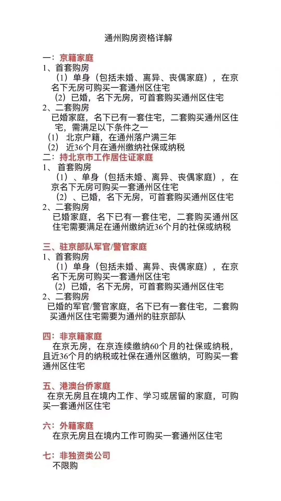

======================================================

_type: talk
@NF-Hansan[111848818214582]
2019-03-23 16:50:36 Sat  
topic_id: 244418158825451

<e type="hashtag" hid="454215581518" title="#通州购房资格#" /> 60个月，人生有几个60个月[尴尬]

@二师父 at 2019-03-23 16:50:36 Sat

> 锁死交易

----------

@NF-Hansan at 2019-03-23 16:50:36 Sat

> 锁死没市场，无涨跌，政治正确[偷笑]

----------

阅读[2394]  评论[2]  赞[0] 

======================================================

_type: q&a
@天涯海角[28885848182211]
2019-03-23 19:30:54 Sat  
topic_id: 422218148185488

@天涯海角

>  我刚加入，现在能学习课程吗？

@二师父

>  置顶文章有课程优惠链接

阅读[2587]  评论[0]  赞[0] 

======================================================

_type: talk
@毛太史[844118585542442]
2019-03-23 21:06:08 Sat  
topic_id: 544481824841854

怎么进微信vip群？

阅读[2340]  评论[0]  赞[0] 

======================================================

_type: q&a
@冬夫[15122585122182]
2019-03-23 23:17:13 Sat  
topic_id: 422218141241228

@冬夫

>  二师父好，本人今年43岁了，男性，身体还算健康，收入也相对稳定，但随着年龄增大，感觉单位缴纳五险一金保障不那么强，商业保险什么也没买，市场上保险种类太多，不知买什么好，请二师父推荐一二个适合我这年龄的商业险！

@二师父

>  推荐康惠保旗舰版和星悦，这个二维码是我做的一个最优保险配置，后面我会逐步精简优化分析

阅读[2552]  评论[0]  赞[0] 

======================================================

_type: talk
@二师父[28814221155551]
2019-03-24 03:48:24 Sun  
topic_id: 111185852425852

<e type="hashtag" hid="552485548284" title="#家庭资产配置#" /> 大类家庭资产配置，有恒产者有恒心，大家还有配置什么资产呢。和大家一起分享啊

@光明无顶 at 2019-03-24 03:48:24 Sun

> 防癌险其实要求挺高，稍微有点结节，囊肿之类的就不能买了，建议越早买越好，等到五十岁之后身体都会有这样那样毛病。

----------

@光明无顶 at 2019-03-24 03:48:24 Sun

> 另外，二师父您说的深度回调是到多少点以下啊？才接触指数基金定投，来不及建低仓[调皮]

----------

@二师父 at 2019-03-24 03:48:24 Sun

> 目前仍旧可以定投，15个百分点就算深度回调了

----------

@光明无顶 at 2019-03-24 03:48:24 Sun

> 😂回到2600点左右的机会不知道有多少，不过也没事，跟着二师父坚持定投就行，边投边学[抱拳]

----------

@天机 at 2019-03-24 03:48:24 Sun

> 15%大约是2600多点，有点难度哟

----------

@孙健 at 2019-03-24 03:48:24 Sun

> 就怕到了2600点，你不敢买了

----------

@光明无顶 at 2019-03-24 03:48:24 Sun

> 敢不敢买看你赚钱能力以及这部分资金占总收入的比例，我还是比较理性的，也有这个魄力[奸笑]

----------

@A0洪氏日杂批发 at 2019-03-24 03:48:24 Sun

> 房子买了，今年装修入住，一家人买了平安福，剩下的只有跟二师父定投了

----------

阅读[6994]  评论[8]  赞[0] 

+++++++++++++++++++++++++++++++++++++++++++++++++++++

文件：
2019-03-24 03:48:06 Sun
文件大小：[65778]
28818118488541-如何从家庭资产配置的角度管理财富.docx

======================================================

_type: q&a
@康[48581124158228]
2019-03-24 08:09:58 Sun  
topic_id: 244418185488811

@康

>  二师傅，你好，我想问一下，行业指数基金该怎样投？假如我每月有20000闲钱，宽指数投资多少？行业指数指数投资多少？谢谢

@二师父

>  新手宽基为主，比例宽基比行业4比1

阅读[2418]  评论[0]  赞[0] 

======================================================

_type: q&a
@康[48581124158228]
2019-03-24 08:10:22 Sun  
topic_id: 422218184288528

@康

>  你好，我还想问华宝油气这只指数基金怎么样？值得投资吗？

@二师父

>  值得投资，以前回答过相关问题

阅读[2499]  评论[0]  赞[0] 

======================================================

@二师父[28814221155551]
2019-03-24 08:38:41 Sun  
topic_id: 844418185412142

>  @二师父
>  

阅读[2643]  评论[0]  赞[0] 

======================================================

@二师父[28814221155551]
2019-03-24 09:15:45 Sun  
topic_id: 422218184114118

>  @二师父
>  

阅读[2663]  评论[2]  赞[0] 

======================================================

_type: q&a
@LaoYan[844448554448122]
2019-03-24 09:48:01 Sun  
topic_id: 844418188582452

@LaoYan

>  二师父您好，科创板就要上市了，哪些行业会受益？可以定投哪类指数基金？谢谢！

@二师父

>  高新科技行业会受益，可以定投科创板基金

阅读[2800]  评论[5]  赞[0] 

======================================================

_type: q&a
@于磊[48522822121558]
2019-03-24 17:38:07 Sun  
topic_id: 422218181241118

@于磊

>  请问每一大类的指数（蓝筹、大盘等），是怎么测算估值是高、正常、低？

@二师父

>  根据阈值表里面的数据，低于阈值低点就低估

阅读[2694]  评论[1]  赞[0] 

======================================================

_type: talk
@门萨🐨[51411455828824]
2019-03-24 20:51:10 Sun  
topic_id: 422218155888158

今日健身打卡[呲牙]
喜欢健身的朋友一起来

@二师父 at 2019-03-24 20:51:10 Sun

> 非常棒

----------

阅读[2555]  评论[1]  赞[1] 

+++++++++++++++++++++++++++++++++++++++++++++++++++++

图片：
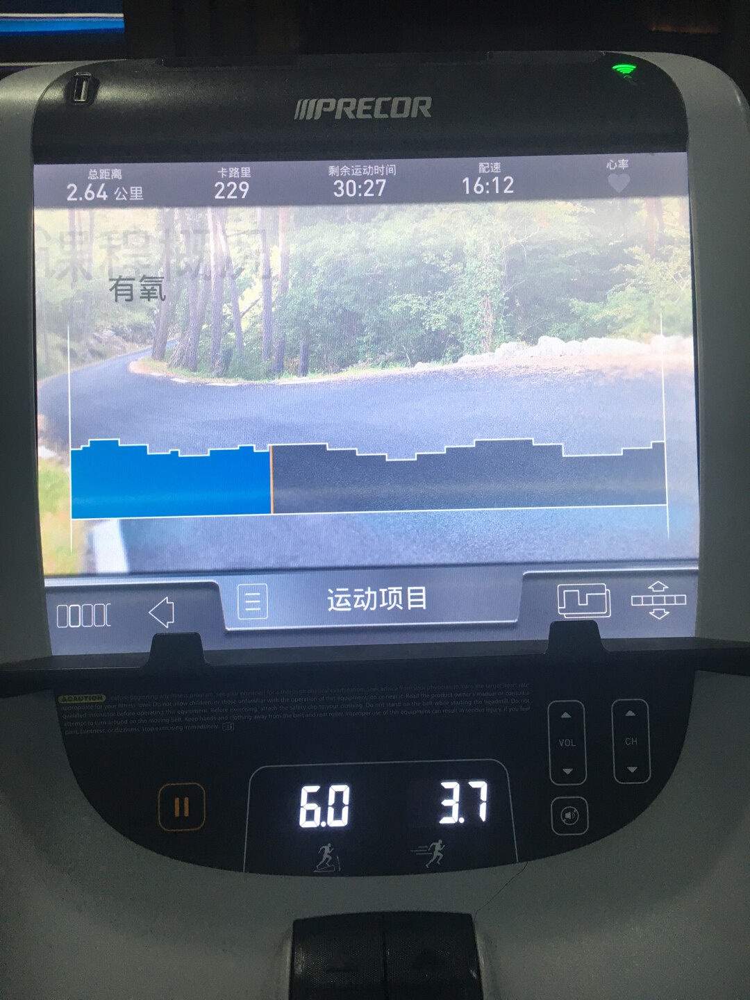

======================================================

_type: talk
@门萨🐨[51411455828824]
2019-03-24 21:19:14 Sun  
topic_id: 844418122281252

1：房产价值不低于90万，或者一手车产价值不低于25万
2：社保公积金基数不低于1万
3：社保公积金基数不低于6000，且本科学历
4：985和211的本科学历，或者国内所有大学的研究生及以上学历
5：本科女性，名下有房贷，或者有15万及以上车贷（身份证出生日期为84及84年以后）
满足以上任何一个条件，可办理民生精英白金信用卡，5至15万

玩卡的朋友，最近民生大额卡还挺好办的，首次开卡免年费，次年20万积分抵免费，资金党走起来

阅读[2629]  评论[0]  赞[0] 

+++++++++++++++++++++++++++++++++++++++++++++++++++++

图片：

======================================================

_type: q&a
@What if[844142851244552]
2019-03-24 21:54:37 Sun  
topic_id: 244418122218411

@What if

>  二师父，计算当日买入金额里面的低估阀值PE1在哪里能查得到啊？另外，天天基金的智能定投，指的是普通定投，即约定每周同一天自动扣款定投的意思吗？

@二师父

>  这个我的估值表里面有，最后一栏，不定期公布，一般不会有大的变动，当变动以后我会公布出来，是的，自动扣款，建议自己每次买入一下，操作不超过3分钟，有利于自己感受市场涨跌，培养自己忍受浮亏的心理素质

阅读[2630]  评论[1]  赞[0] 

======================================================

_type: talk
@二师父[28814221155551]
2019-03-25 02:40:46 Mon  
topic_id: 844418124124182

<e type="hashtag" hid="825412412212" title="#可转债打新#" /> 可转债打新，一次赚几百块，值得拥有，虽然中签率低，不过一般都能盈利，对股票账户的市值也没有要求

@Sunflower at 2019-03-25 02:40:46 Mon

> 二师父您好，请问用广发易淘金低佣金是从您这里注册吗？没看到注册二维码

----------

@二师父 at 2019-03-25 02:40:46 Mon

> 就这个，别改营业部，费率很低

----------

@Sunflower at 2019-03-25 02:40:46 Mon

> 好的谢谢，需要存入1万资金吗？

----------

@二师父 at 2019-03-25 02:40:46 Mon

> 这个不用，没有要求

----------

@Sunflower at 2019-03-25 02:40:46 Mon

> 好的谢谢，辛苦您了，早些休息吧[呲牙]

----------

@安好 at 2019-03-25 02:40:46 Mon

> 最近中了20张苏银和10张亨通，这么容易中，我都担心会破发。

----------

@二师父 at 2019-03-25 02:40:46 Mon

> 容易中破发率高一点

----------

@安好 at 2019-03-25 02:40:46 Mon

> 二师父，如果破发除了直接割肉肉卖掉。还有其他的处理方法吗，比如你前面提到的什么兑换成股票或者是什么的尼！

----------

阅读[6990]  评论[14]  赞[0] 

+++++++++++++++++++++++++++++++++++++++++++++++++++++

文件：
2019-03-25 02:40:14 Mon
文件大小：[204638]
88818112448242-可转债打新，二师父带你蓐羊毛.docx

======================================================

_type: talk
@二师父[28814221155551]
2019-03-25 02:49:24 Mon  
topic_id: 844418124121852

<e type="hashtag" hid="281181228851" title="#周末答疑#" /> 最近周末挺忙的，一直在学习，导致现在已经停更了读书号，全新学习投资知识，包括证券从业资格考试的知识，做更加专业的财商教育者。

定投问题之场内场外账户，蛋卷，天天，天弘等第三方平台都是场外，华泰，广发，海通，华宝等证券账户是场内，我的课程和以前文章都又讲，暂时没时间学习课程的话看我往期文章，稍后我会把往期文章整理放在置顶文章，帮助大家更好地学习。

定投之中概互联，目前位置是正常，如果你能够经受较大回撤，也可以现在定投，建议新手投资者严格按照估值表设定的安全边际定投，这样大跌的时候不适于恐慌。

场内账户和场外账户是否只开一个，完全可以，二师父是为了分开记录投资收益率所以分开，但是记住场外定投申购7天以内不要卖出，会强制收手续费的。

关于定投决定收益率的因素，真的和选择什么关系不大，二师父估值表里面的基金都是不错的标的，只要坚持下来肯定就能盈利。

今天助理给我分享了她蛋卷的收益，大概有15个点，只要去年跟着我坚持下来的现在盈利基本在15个点以上的。关键在于什么，你敢加仓，你敢再自己老婆跟你吵架的时候，还能够理性的跟他分析自己的投资哲学，理念和系统。这是最难的。

@幽幽菊花茶 at 2019-03-25 02:49:24 Mon

> 感觉像二师父自己的经历一样[憨笑]

----------

@二师父 at 2019-03-25 02:49:24 Mon

> 😁😁

----------

阅读[2566]  评论[2]  赞[0] 

======================================================

_type: talk
@二师父[28814221155551]
2019-03-25 04:20:11 Mon  
topic_id: 844418121585482

<e type="hashtag" hid="225412412211" title="#可转债上市信息#" />  万达信息(300168)近日发布公告称，公司发行可转换公司债券将于2019年3月25日上市。

据了解，本次发行可转债每张面值100元人民币，发行量为1200万张，按票面金额平价发行，于深圳证券交易所发行，募集资金总额为12亿元。

公告显示，原股东优先配售490.94万张，占本次发行总量的40.91%。网上投资者最终缴款认购的数量为60.04万张，即6004.27万元，占本次发行总量的5%。

网下投资者最终缴款认购的数量为648.2万张，即6.48亿元，占本次发行总量的54.02%。

因此，主承销商包销金额合计为81.22万元，包销比例为0.07%。

据了解，可转换公司债券上市时间：2019年3月25日，本次发行的可转债简称为“万信转2”，债券代码为“123021”。转股日期即2019年9月9日至2025年3月3日。

@光明无顶 at 2019-03-25 04:20:11 Mon

> 二师父买了多少[呲牙]

----------

阅读[2751]  评论[1]  赞[0] 

======================================================

_type: q&a
@LaoYan[844448554448122]
2019-03-25 11:19:47 Mon  
topic_id: 544481858522144

@LaoYan

>  二师父您好，一直在关注您，想问问行业指数中，有色指数哪个好，值得定投？谢谢！

@二师父

>  就800有色规模大一点，其他规模都很小，我没投这个

阅读[2438]  评论[0]  赞[0] 

======================================================

_type: q&a
@Alex[28518858851111]
2019-03-25 11:21:02 Mon  
topic_id: 844418148255822

@Alex

>  请问二师父，科创板马上就要开了，开板初期会不会迎来一波行情？那么想要买个会在科创板打新的基金，那么在现存的开放式基金里有没有好的选择？谢谢！

@二师父

>  在科创板打新的基金是啥意思？

阅读[2458]  评论[1]  赞[0] 

======================================================

_type: q&a
@林西瓜🍉[28855581582851]
2019-03-25 12:26:48 Mon  
topic_id: 422218128124588

@林西瓜🍉

>  二师父，为什么 可买是0的？

@二师父

>  这个还未开售呢，你去场外看

阅读[2778]  评论[1]  赞[0] 

======================================================

_type: q&a
@一切随缘[244145248112411]
2019-03-25 14:35:46 Mon  
topic_id: 844418142114212

@一切随缘

>  全指金融现在低估吗？在二师父低估表中看那一项？

@二师父

>  这个我没有追踪，目前正常估值

阅读[2486]  评论[0]  赞[0] 

======================================================

_type: q&a
@가존보[111855585454522]
2019-03-25 14:36:12 Mon  
topic_id: 844418144825242

@가존보

>  二师父，中概互联场内基金晚上申购划算吗？

@二师父

>  只能在开盘时间交易啊，场外目前不建议

阅读[2581]  评论[4]  赞[0] 

======================================================

_type: q&a
@往事随风[48515148521428]
2019-03-25 14:40:48 Mon  
topic_id: 244418144822421

@往事随风

>  二师父您好！我观察到地产指数波动较大，您建议定投吗？推荐哪一个？招商地产怎么样？

@二师父

>  估值表有推荐，这个指数不错，周期性指数，我投的国泰国证，轻仓即可，和券商指数一样

阅读[2652]  评论[3]  赞[0] 

======================================================

_type: talk
@二师父[28814221155551]
2019-03-25 15:33:05 Mon  
topic_id: 111185811488112

<e type="hashtag" hid="142511142112" title="#格局重塑#" /> 认知高度决定了格局，很多偏见也源于认知不足，巨大的痛苦源于认知与现实的差距

改变认知一定要破除固有的思维模式，这个是最难的，养成了几十年的思维惯性一下子想改变太难

最好的办法是找一个比自己思维认知高一级的人，然后学习他的思维，不断学习，不断向上寻找

今天股市跌了，不要着急，我们已经盈利了而且收割了一部分利润，如果在重回2500只是给我们加仓的机会罢了

关于股票投资，有人做趋势，有人逆势加仓，无所谓对错，看你的性格适合哪种了

@安好 at 2019-03-25 15:33:05 Mon

> 看到绿油油很开心，下来点再下来点，我好上车哈😄，谁让我才刚刚认识二师父尼！[偷笑][偷笑][偷笑][偷笑][偷笑]

----------

@二师父 at 2019-03-25 15:33:05 Mon

> 逆向投资已经领悟

----------

@安好 at 2019-03-25 15:33:05 Mon

> 二师父教得好😊

----------

@云淡风轻 at 2019-03-25 15:33:05 Mon

> 上周实操收割部分利润，虽然不多就几千块[偷笑]，下跌再准备加仓[愉快]

----------

@二师父 at 2019-03-25 15:33:05 Mon

> 这是苍蝇肉，加够仓位牛市来了就多了

----------

阅读[2724]  评论[5]  赞[0] 

======================================================

_type: talk
@二师父[28814221155551]
2019-03-25 23:00:21 Mon  
topic_id: 111185884182242

<e type="hashtag" hid="454212448518" title="#可转债上市日期#" /> 可转债在申购有几个时间点需要大家注意下，一是中签日，二是上市日，三是转股起始日，中签日是从申购的第二天算的，加入你3月25日申购，那么中签日是3月27日，上市日一般在中签日一个月以内，上市首日就可以卖出的，转股起始日是你可以将可转债转换成股票的日子

这三个时间点需要注意区分下

阅读[2441]  评论[0]  赞[0] 

+++++++++++++++++++++++++++++++++++++++++++++++++++++

图片：
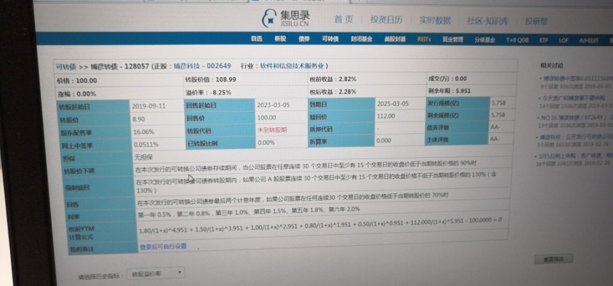

======================================================

_type: q&a
@冬夫[15122585122182]
2019-03-25 23:06:47 Mon  
topic_id: 244418112418241

@冬夫

>  二师父好，您推荐康惠保与星悦进二维码看了，问题是怎么买？网上直接买？有限制条件么？怎么个理赔法？这是哪家公司产品？对不起，我是一个保险小白

@二师父

>  通过这个渠道可以购买啊，对健康有限制，你去看看健康告知有没有不允许购买的疾病情况，需要身体健康，理赔到时候找保险公司，你索要下纸质保单，保险公司里面写的有，不放心可以阅读下保险条款，都是正规公司，还有人讲保险公司倒闭怎么办，这个不用担心，保险公司不允许申请破产，只能资产重组，多了解吧，这也是投资，需要全方位了解之后做决策的

阅读[2462]  评论[0]  赞[0] 

======================================================

_type: q&a
@宁静致远[111815225552422]
2019-03-26 02:35:32 Tue  
topic_id: 111185881254452

@宁静致远

>  老师您好！为什么我在东方财富股票账户里买的华夏上证50AH优选指数A，在账户里看不到呢。手机短信提示已经成功确认。再有手机短信为什么提示西藏东方财富网的呢？谢谢

@二师父

>  这个是lof基金，既可以在场外申购，也可以在股票账户购买，按照t加1确认，估计明天就能看到了

阅读[2457]  评论[0]  赞[0] 

======================================================

_type: talk
@二师父[28814221155551]
2019-03-26 02:38:53 Tue  
topic_id: 422215844841428

<e type="hashtag" hid="281158284851" title="#市场分析#" /> 大致判断了下，不预测，但是周期需要把握，顺着周期走，才能够致富。

@西男 at 2019-03-26 02:38:53 Tue

> 师傅，不太明白这句话：“中概互联里面大多是美股，而且属于科技互联网行业，油气属于和大宗商品的相关性很强，假设真的出现美国经济衰退的情况，这两个指数可以上起来，目前估值并不高。”是说这两个目前估值不高，美国经济衰退的话会这两只会首先进入低估区？

----------

@二师父 at 2019-03-26 02:38:53 Tue

> 对，油气本来就低估

----------

@晋·Garran at 2019-03-26 02:38:53 Tue

> 二师父，五只行业股票在哪儿查看呢？

----------

@二师父 at 2019-03-26 02:38:53 Tue

> 股票购买风险较大，不推荐

----------

阅读[6861]  评论[4]  赞[0] 

+++++++++++++++++++++++++++++++++++++++++++++++++++++

文件：
2019-03-26 02:38:07 Tue
文件大小：[51910]
88812555481142-美国国债收益率倒挂，美股下跌，A股跟跌，我们的定投机会又来了.docx

======================================================

_type: talk
@二师父[28814221155551]
2019-03-26 03:23:32 Tue  
topic_id: 111184522552282

<e type="hashtag" hid="142511181542" title="#周二荐书#" /> 每周二推荐一本书，还是继续读《巴菲特与索罗斯的投资习惯》，第一个习惯是避免本金的永久损失，投资的第一原则是先生存，然后才是赚钱。

乔治索罗斯生于匈牙利，恰逢第二次世界大战，匈牙利遭到了纳粹的入侵。

当希特勒退守到匈牙利的时候，很多人认为纳粹就要完蛋了，所以并不相信纳粹会伤害他们，也不相信奥辛勒集中营的事件，但是索罗斯的爸爸不这样认为。

他为了防范即将发生的风险，提前变卖了所有的家产，然后给家人购买了假的证件，最后改名在夹缝中求生存，结果他们躲过了最难熬的那段日子，活下来了。

索罗斯对这段往事记忆深刻，在他的投资体系中也就将保住本金作为第一原则。

在我们的系统中，因为设定了高的安全边际，加上指数的永续性，所以不会存在本金永久损失的可能，这是安全的系统，如果你自己做配置和投资，记住，在交易系统里面就要设置很好的安全屏障，避免本金的永久损失，这比发财重要。

以后周二还是推荐书籍为主，拆书和读书就放到读书号里面，通过读书增长见识，提升认知，过上自由而幸福的生活。

很多人之所以痛苦就是认知和现实的偏差，改变之道就是增加阅读和阅历。

@蒲公英 at 2019-03-26 03:23:32 Tue

> 请问读书号在哪里啊？

----------

@二师父 at 2019-03-26 03:23:32 Tue

> 这个，刚开始分享

----------

@蒲公英 at 2019-03-26 03:23:32 Tue

> 好的

----------

阅读[6850]  评论[3]  赞[0] 

======================================================

@二师父[28814221155551]
2019-03-26 10:26:04 Tue  
topic_id: 244412858581881

>  @二师父
>  

阅读[2554]  评论[0]  赞[0] 

======================================================

_type: talk
@二师父[28814221155551]
2019-03-26 11:22:32 Tue  
topic_id: 544485121851814

<e type="hashtag" hid="881251425252" title="#鳄鱼计划#" /> 500etf卖一份，广发医药卖3份，沪深300卖一份，场内网格交易控制回撤。个人操作，谨慎参考

@毛毛宇 at 2019-03-26 11:22:32 Tue

> 是啊，同样是低估，没什么场内的要卖掉，场外的不卖呢？

----------

@二师父 at 2019-03-26 11:22:32 Tue

> 听下我的课程，鳄鱼计划交易遵循的策略

----------

@二师父 at 2019-03-26 11:22:32 Tue

> 交易策略不同，听下我的课程吧

----------

@珅爹 at 2019-03-26 11:22:32 Tue

> 在哪看啊，一直没找到

----------

@二师父 at 2019-03-26 11:22:32 Tue

> 在置顶第二篇文章，如何使用星球，关于两个实盘的说明

----------

阅读[6604]  评论[6]  赞[0] 

======================================================

_type: q&a
@Siller[244184228451851]
2019-03-26 11:32:44 Tue  
topic_id: 422215848822528

@Siller

>  二师父，请问广发证券怎么开通场外转托管？

@二师父

>  你是转场内还是转场外，转场内天天基金直接转就可以了，转场外点击开放式基金，其他，场外，就有对应的场外基金公司了

阅读[2438]  评论[1]  赞[0] 

======================================================

_type: talk
@二师父[28814221155551]
2019-03-26 11:45:16 Tue  
topic_id: 844412852522182

<e type="hashtag" hid="825412412212" title="#可转债打新#" /> 申购中装转债，广发和华泰都打，数量可以多填一点，一般最多中一签

关于鳄鱼计划卖出500，为什么，二师父在文章鳄鱼计划和场外实盘多次提到过，基金定投入门与实战课程也讲过，鳄鱼计划运用三大定投策略结合，择时买卖，不是固守。新手就用低估定投策略

再一次印证，痛苦源于认知和现实偏差，认知不足源于思维局限。

@安好 at 2019-03-26 11:45:16 Tue

> 二师父，你的意思是这个中装转债很硬挺，信用评级很高是吗？最近我是中债专业户了，早上看到又中了10张招路转债！😂

----------

@二师父 at 2019-03-26 11:45:16 Tue

> 我没有说这个意思嘞，一个人一般最多中10张，打着中签之后上市了首日卖出

----------

@安好 at 2019-03-26 11:45:16 Tue

> 嗯嗯，知道了谢谢二师父！看来我是那个不一般滴人了哈😄 。

----------

@二师父 at 2019-03-26 11:45:16 Tue

> 你中了多少，一手就是10张啊

----------

@安好 at 2019-03-26 11:45:16 Tue

> 苏银中了20张，亨通中了10张，今天招路又中了10张，我这还不是每个都去申购，你说我这是不是中奖率也太高了点哈😄 ！还有二师父，这个上市日卖出我可以在集合竞价的时候卖掉对吧，那我填什么价格才可以直接顺利卖出尼！

----------

@二师父 at 2019-03-26 11:45:16 Tue

> 就系统委托价格可以，中奖率确实高，看情况，有的也会破发

----------

阅读[2461]  评论[6]  赞[0] 

======================================================

_type: q&a
@J[28281541518551]
2019-03-26 13:17:04 Tue  
topic_id: 422215841412848

@J

>  二师父您好，请问房地产行业有成本更低的指数基金可替代吗？国泰房地产分级的管理费很高，分级指数以后会逐渐停售，这样对定投会不会影响长期收益？

@二师父

>  这个问题挺好，我在找一下，母鸡没有影响，这个指数目前场内规模也很小，我再对比下同类的优质指数基金选择一下

阅读[2433]  评论[1]  赞[0] 

======================================================

_type: q&a
@居少慧[844121114822212]
2019-03-26 14:20:49 Tue  
topic_id: 111184528442152

@居少慧

>  二师父，请问今天低估指数能合适加仓吗？

@二师父

>  适合，低估的都可以加仓，已经跌破3000点了

阅读[2394]  评论[2]  赞[0] 

======================================================

_type: q&a
@가존보[111855585454522]
2019-03-26 15:16:46 Tue  
topic_id: 111184528158222

@가존보

>  二师父，银华日利货币基金套利的主要依据什么套利呀？

@二师父

>  一二级市场套利是机构玩的，散户资金量不足

阅读[2268]  评论[0]  赞[0] 

======================================================

_type: q&a
@安好[422152158554888]
2019-03-26 15:20:09 Tue  
topic_id: 422215841145228

@安好

>  二师父，富国沪深300指数增强现在可以开启定投吗？想知道估值位置！谢谢！

@二师父

>  低估，可以开始定投了，参考沪深300。今天跌了不少，市场总会给我们机会，备足资金就好

阅读[2449]  评论[2]  赞[0] 

======================================================

_type: q&a
@韬[48882284221858]
2019-03-26 15:24:36 Tue  
topic_id: 111184528821442

@韬

>  老师，鳄鱼计划在哪可以学

@二师父

>  今天发了一车，你看看置顶文章鳄鱼计划和场外定投的区别

阅读[2624]  评论[0]  赞[0] 

======================================================

_type: talk
@NF-Hansan[111848818214582]
2019-03-26 15:25:18 Tue  
topic_id: 244412851142481

3月份入市，盈利不多，这两天下来中证500、地产、医药还在+数，所以把-数的50、50AH、中证银行趁机补了下仓

阅读[2472]  评论[0]  赞[0] 

======================================================

_type: q&a
@天赋吉运[88248848112582]
2019-03-26 18:49:04 Tue  
topic_id: 844412888585552

@天赋吉运

>  老师，微信交流群号是多少？

@二师父

>  我的微信ershifudt

阅读[2503]  评论[0]  赞[0] 

======================================================

_type: q&a
@志亮[422125851552828]
2019-03-26 19:02:11 Tue  
topic_id: 544485111218244

@志亮

>  二师父，我现在定投军工可以吗，我看了下军工好像也是低估区吧？

@二师父

>  军工还没到低估，是个周期指数，定投的话别重仓

阅读[2601]  评论[1]  赞[0] 

======================================================

_type: q&a
@*🐵 🐶 翩翩*[244148855241521]
2019-03-26 19:44:50 Tue  
topic_id: 111184555548212

@*🐵 🐶 翩翩*

>  请问广发基金开户万0.5佣金，单笔交易最低收费多少呢

@二师父

>  单笔最低0.1元

阅读[2607]  评论[4]  赞[0] 

======================================================

_type: q&a
@garn[28242844818451]
2019-03-26 20:13:43 Tue  
topic_id: 422215888822518

@garn

>  请问今天我在二师父推荐的广发开户了，那个优惠费率是不是要等回访后才能优惠，之前都要按2.5？还有怎样可以查这个费率？这个有免交易5元的优惠吗？

@二师父

>  免5，选择一个后面会调整，去电脑端可以查交割单

阅读[2597]  评论[1]  赞[0] 

======================================================

_type: q&a
@*🐵 🐶 翩翩*[244148855241521]
2019-03-26 21:39:11 Tue  
topic_id: 244412884454521

@*🐵 🐶 翩翩*

>  请问二师父有没有一个香港银行卡的申请攻略呢？

@二师父

>  有的，你扫描港股开户二维码，里面有一栏香港卡办卡

阅读[2482]  评论[0]  赞[0] 

======================================================

_type: q&a
@乖子[28441841181151]
2019-03-26 22:09:28 Tue  
topic_id: 111184551182222

@乖子

>  我的华泰账户是万6，不免5，我怎么退掉通过您的链接申请呢？里面的钱不用动吧？

@二师父

>  这个得销户了，建议可以开广发，你这费率太高

阅读[2501]  评论[2]  赞[0] 

======================================================

@二师父[28814221155551]
2019-03-26 22:40:32 Tue  
topic_id: 244412881548841

>  @二师父
>  

阅读[2498]  评论[9]  赞[0] 

======================================================

@二师父[28814221155551]
2019-03-26 23:46:11 Tue  
topic_id: 244412881251521

>  @二师父
>  

阅读[2617]  评论[0]  赞[0] 

======================================================

_type: talk
@二师父[28814221155551]
2019-03-27 04:55:20 Wed  
topic_id: 422215854488528

<e type="hashtag" hid="454212858218" title="#投资系统#" /> 你建立好自己的交易系统了吗

阅读[6657]  评论[0]  赞[0] 

+++++++++++++++++++++++++++++++++++++++++++++++++++++

文件：
2019-03-27 04:54:51 Wed
文件大小：[23649]
51185225245514-你建立好自己的投资系统了吗.docx

======================================================

_type: talk
@007[51511545424824]
2019-03-27 07:18:46 Wed  
topic_id: 422215854854248

请问二师傅现在适合买可转债基金吗？

@旺锦古法土制红糖 范* at 2019-03-27 07:18:46 Wed

> 不适合 现在价格都挺高的 一般能找到面值100以下的可以买

----------

阅读[2190]  评论[1]  赞[0] 

======================================================

_type: q&a
@蝙蝠侠大战超人[48522585242588]
2019-03-27 09:19:39 Wed  
topic_id: 544485118842114

@蝙蝠侠大战超人

>  债券打新出现这个问题是什么原因？

@二师父

>  可以申购的，我刚买，你进入可转债申购区域来进行申购

阅读[2532]  评论[0]  赞[0] 

======================================================

_type: q&a
@披褐怀玉，抱元守一。[15412554441882]
2019-03-27 09:23:41 Wed  
topic_id: 844412825218152

@披褐怀玉，抱元守一。

>  二师傅，这两天市场下跌了，国泰国证医药卫生行业指数160219这只基金低估吗？可以用全脂医药的估值做参考吗？我想在这只医药基金上也定投一点，不知性价比高否？请指导。

@二师父

>  这只基金重仓了比较优质的医药股票，就用国证医药指数，不用参考全指医药的估值，去理杏仁查阅国证医药指数的估值，那里有的

阅读[2570]  评论[0]  赞[0] 

======================================================

_type: q&a
@披褐怀玉，抱元守一。[15412554441882]
2019-03-27 09:26:00 Wed  
topic_id: 544485152581844

@披褐怀玉，抱元守一。

>  二师傅好！地产行业目前投资的性价比如何？目前的估值是低估还是极低估？请指导。

@二师父

>  地产行业目前低估的呢，挺有价值的，对标优质的地产行业例如万科。需要注意的是周期指数，不要重仓

阅读[2608]  评论[0]  赞[0] 

======================================================

_type: q&a
@李依祚[844148481122152]
2019-03-27 09:26:54 Wed  
topic_id: 111184542112552

@李依祚

>  师傅您好，看今天的估值表目前110031，001550低估，可以开始定投了吗？

@二师父

>  低估的可以，估值表里面都是优质指数，低估的都可以定投

阅读[2712]  评论[0]  赞[0] 

======================================================

@二师父[28814221155551]
2019-03-27 09:30:42 Wed  
topic_id: 111184544418152

>  @二师父
>  

阅读[2799]  评论[0]  赞[0] 

======================================================

_type: talk
@二师父[28814221155551]
2019-03-27 09:34:42 Wed  
topic_id: 422215855248858

<e type="hashtag" hid="142181548282" title="#债券打新#" /> 盲打启明发债，大丰发债，有破发的可能，今年小牛市可以盲打，在破发情况严重需要打信用等级高的，至于可转债价格在100元以下，那是购买可转债时候，不是打新要求

阅读[2819]  评论[0]  赞[0] 

======================================================

_type: q&a
@德仁则昌[28281148422521]
2019-03-27 13:00:18 Wed  
topic_id: 544485154148554

@德仁则昌

>  二师傅，请问用不同app申购新债，能不能同时中签。

@二师父

>  不行，一个app只能中一签

阅读[5255]  评论[1]  赞[0] 

======================================================

_type: q&a
@赵欣[51512588218554]
2019-03-27 13:00:59 Wed  
topic_id: 111184541125212

@赵欣

>  请问今日申购可转债，提示沪市上限1000股10万元，深市上限10000股100万元，这样有没有问题，为什么两个不一样？

@二师父

>  规定啊，哈国债逆回购时候两市的起点也不同

阅读[5352]  评论[0]  赞[0] 

======================================================

_type: talk
@门萨🐨[51411455828824]
2019-03-27 13:10:01 Wed  
topic_id: 244412824114821

撸卡的朋友看过来！
亲测，好用

<e type="web" href="https://mp.weixin.qq.com/s/G2gxZ9f1F4PBCkYg8NCi1g" title="2.5折，60元买233元必胜客" cache="" />

@门萨🐨 at 2019-03-27 13:10:01 Wed

> 银行卡注意只留60，每个网点可能活动产品不同，限周三，先买9元外卖券，每个券都选上！

----------

阅读[5296]  评论[1]  赞[0] 

======================================================

_type: talk
@门萨🐨[51411455828824]
2019-03-27 19:55:29 Wed  
topic_id: 422215825142228

<e type="hashtag" hid="552118584454" title="#今日打卡#" /> 
跑步机3㎞
半圆机600步
爱健身的大家坚持！
和定投一样💪

阅读[5229]  评论[0]  赞[0] 

+++++++++++++++++++++++++++++++++++++++++++++++++++++

图片：
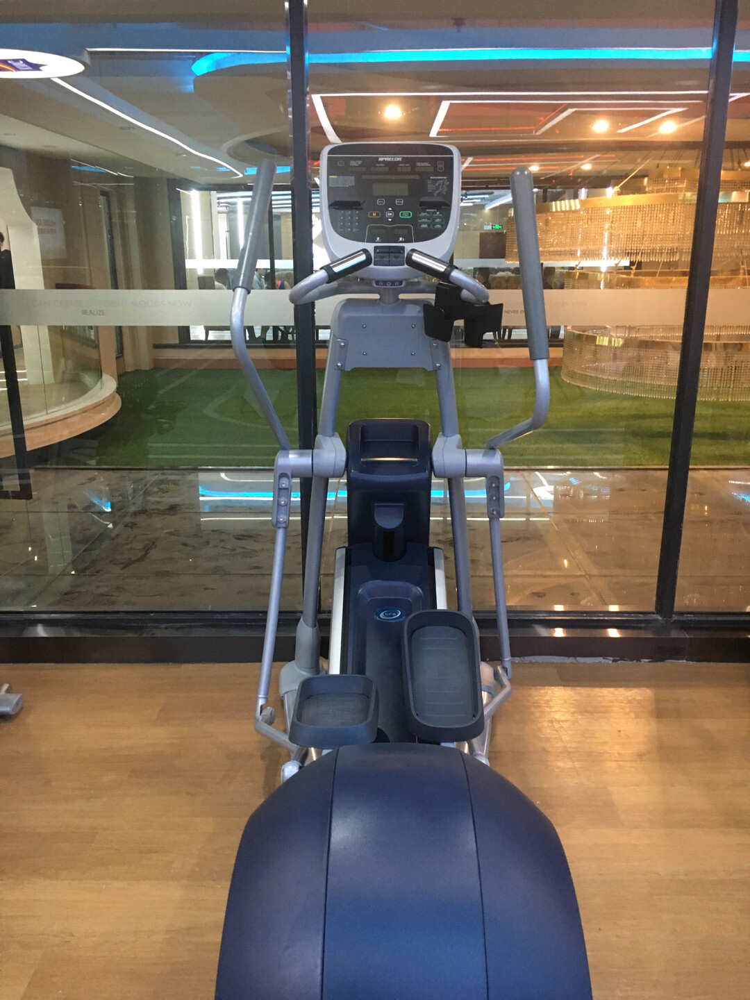

======================================================

_type: q&a
@凭栏观海[244414845852181]
2019-03-27 21:50:55 Wed  
topic_id: 244412842125121

@凭栏观海

>  请问老师，我目前定投建信中证500增强，还有必要再追加一个香港中小盘吗？两者的性价比那个更高些呢？

@二师父

>  可以增加一个恒生国企指数，香港大盘，小盘股风险大

阅读[5299]  评论[4]  赞[0] 

======================================================

_type: q&a
@Sunflower[244185124281811]
2019-03-27 21:52:12 Wed  
topic_id: 111184511425512

@Sunflower

>  二师父您好，恒瑞医药每年都会送股，现在是否适合买入然后长期持有呢？

@二师父

>  这个公司很有价值，估值不低，现在买的话只能做趋势投资，设定止损点，长期持有不止损需要经受较大程度浮动，不知是否能承受

阅读[5328]  评论[9]  赞[0] 

======================================================

_type: q&a
@汉尼拔[552144155244]
2019-03-27 22:48:58 Wed  
topic_id: 422215822115458

@汉尼拔

>  二师父，请问华宝油气和德国30看哪个股票啊，代码是多少，我想看实时跌涨情况。

@二师父

>  置顶第一篇文章有指数代码

阅读[5261]  评论[0]  赞[0] 

======================================================

_type: q&a
@光明无顶[51184452185224]
2019-03-28 01:24:10 Thu  
topic_id: 544485148248554

@光明无顶

>  二师父好，持有的一支科伦药业已经有40%收益，但是另一支海翔药业目前亏损50%，是把科伦药业卖了继续布局海翔药业还是如何？

@二师父

>  你看看我的五步趋势交易法，股票投资两种模式趋势和逆势，如果你能准确判断基本面就逆势，我的股票投资止损点10，已经腰斩没啥办法
>  
>  假设你同时开两家工厂，一家每年盈利100万，一家每年亏损80万，这时候资金不足需要关闭一家，你怎么办

阅读[5195]  评论[1]  赞[0] 

======================================================

_type: q&a
@海马[15158245825242]
2019-03-28 08:52:53 Thu  
topic_id: 422215815458588

@海马

>  二师父：为什么很多第三方平台的指数估值都不同？比如说中证红利在你的估值里是低估，在蛋卷基金里就显示中估？

@二师父

>  安全边际不同，中证红利怎么可能不低估

阅读[5259]  评论[4]  赞[0] 

======================================================

_type: talk
@二师父[28814221155551]
2019-03-28 09:40:56 Thu  
topic_id: 111184584414222

<e type="hashtag" hid="881422852442" title="#定投实盘#" /> 50ah优选买入一份，中证500买入0.5份，定投坚持下去即可，长期看仍旧很便宜。

@珅爹 at 2019-03-28 09:40:56 Thu

> 怎么今天没公布估值表呢？师傅

----------

@聪明的笨蛋 at 2019-03-28 09:40:56 Thu

> 置顶第一条就是

----------

阅读[9127]  评论[2]  赞[0] 

======================================================

_type: talk
@汉尼拔[552144155244]
2019-03-28 11:00:47 Thu  
topic_id: 422215812458528

1. 腾讯回应撤销企鹅影视：仅限内部称谓变化，对外业务不受影响

2.《成都晚报》宣布3月30日起休刊，转型运营新媒体业务 

3. 全国首个区块链公证摇号系统在苏州上线应用

4. 苏宁小店社区拼团业务苏小团将在6月底完成招募10万名团长计划

5. 微信公号直播工具大范围开放内测资格，目前仅支持IOS端开播

6. 网易起诉抖音侵害作品信息网络传播权

7. 阿里健康、支付宝联合武汉市中心医院打造的“未来医院”正式上线

8. 去哪儿网、飞猪回应北京消协报告：不存在“大数据杀熟”行为

9. 重症医疗资金网络互助平台「水滴互助」获B轮5亿元融资

10. 医药新零售企业「叮当快药」获6亿元B轮融资

阅读[5079]  评论[0]  赞[0] 

======================================================

_type: q&a
@冉冉[88445118854412]
2019-03-28 19:12:30 Thu  
topic_id: 544485185158814

@冉冉

>  请问二师傅，4月1日起，宁波、浙江、四川、陕西、山东、北京发行地方政府债，请问目前可以投资购买吗？

@二师父

>  5年期的票面利率3.28%，跑不赢通货膨胀，不建议投资

阅读[4909]  评论[0]  赞[0] 

======================================================

_type: q&a
@芥末[111885444524442]
2019-03-28 19:13:43 Thu  
topic_id: 544485185858124

@芥末

>  关于利润收割，看到二师父的其中一篇文章里说，刚进入正常估值时，有几个点的利润就卖出几个点，为什么不等到10％的时候再收割呢？是为了减轻心理压力还是规避什么风险？请大家帮我答疑，谢谢各位。

@二师父

>  一般我们在低估定投的指数基金进入正常估值的时候利润率会超过10个点，所以就把这些已经得到的利润全部卖出了

阅读[5083]  评论[0]  赞[0] 

======================================================

_type: q&a
@田星[422128841211518]
2019-03-28 19:14:43 Thu  
topic_id: 244412814585851

@田星

>  二师父，低估指数有好五六个，为什么每次定投只选择两三个？把资金平均分散在五六个低估指数不好吗？

@二师父

>  我都有投资的啊，不过目前医药，消费，沪深300等几个基金进入正常估值，所以需要等待重新进入低估再定投

阅读[5115]  评论[0]  赞[0] 

======================================================

_type: q&a
@ ———[28221548282281]
2019-03-28 19:15:32 Thu  
topic_id: 111184422428852

@ ———

>  二师父  我在评论区看到你说你在定投十二只基金  每周四你只选了几只  其他的投了吗?

@二师父

>  都投了，除了美股一直没有低估没投资外，其他的都投了，包括黄金，你可以看往期实盘

阅读[5324]  评论[6]  赞[0] 

======================================================

_type: q&a
@小明[544828524525514]
2019-03-28 19:23:32 Thu  
topic_id: 244412255425851

@小明

>  老师您好，分众传媒怎么样呢？您有关注吗？

@二师父

>  17年还可以，等18年年报出来了如果仍旧利润增长率在20个点以上可以做趋势交易

阅读[5409]  评论[0]  赞[0] 

======================================================

_type: q&a
@凯[244415182418811]
2019-03-28 19:46:54 Thu  
topic_id: 544485525421854

@凯

>  师父，请问券商已经调整近一个月了，以前没有买入过，是否可以轻仓参与

@二师父

>  还不行，目前没有到低估区域

阅读[5494]  评论[7]  赞[0] 

======================================================

_type: q&a
@爱华[844445144558182]
2019-03-28 21:48:13 Thu  
topic_id: 422215541158258

@爱华

>  二师父好，请问军工大概多少钱时可以入手呀？谢谢 : ）

@二师父

>  没投资这个指数了，不看好他的价值

阅读[5439]  评论[1]  赞[0] 

======================================================

_type: talk
@二师父[28814221155551]
2019-03-29 04:12:59 Fri  
topic_id: 244412288254151

<e type="hashtag" hid="552112844884" title="#指数分析#" /> 我们投资的指数肯定会越来越完善而且越来越精简，正1和负1之间的差别是2.学会精简，节省精力。大家根据需要配置，不用每个都配，按照自己的计划来，这样你才能够形成自己独立的系统。我的仅供参考

@小糊涂 at 2019-03-29 04:12:59 Fri

> 师父，才入门。资金40万定投，目前如何组合好呢？

----------

@云淡风轻 at 2019-03-29 04:12:59 Fri

> 去年3月份的时候在师父定投低估表里看到有基本面120投了几次，后来不知道为什么低估表里看不到了，就不投了[捂脸]

----------

@小牧童 at 2019-03-29 04:12:59 Fri

> 二师父，您好，算年化复合收益率的公式是怎么样的？谢谢[愉快]

----------

@二师父 at 2019-03-29 04:12:59 Fri

> 50ah加中证500

----------

@二师父 at 2019-03-29 04:12:59 Fri

> (1+r)的n次方

----------

@小牧童 at 2019-03-29 04:12:59 Fri

> 基本面60是（1+7）的17次方吗，我数学比较差[偷笑]

----------

@二师父 at 2019-03-29 04:12:59 Fri

> 不是啊，r代表增速，基本面60是13，后面是n，指数16，代表16年

----------

阅读[9732]  评论[7]  赞[0] 

+++++++++++++++++++++++++++++++++++++++++++++++++++++

文件：
2019-03-29 04:11:42 Fri
文件大小：[61222]
48815488815528-基本面60替换估值表里面的基本面50.docx

======================================================

_type: talk
@田维海[422144441542418]
2019-03-29 06:04:31 Fri  
topic_id: 844412288225852

<e type="hashtag" hid="454212212518" title="#恒瑞医药的估值#" /> 各位师兄，第一个计算式能解释一下吗？

阅读[5380]  评论[0]  赞[0] 

======================================================

_type: talk
@路[544488411248524]
2019-03-29 07:32:33 Fri  
topic_id: 422215588255818

老师好！基本面60的估值区别是多少？

@路 at 2019-03-29 07:32:33 Fri

> 区间…

----------

@芥末 at 2019-03-29 07:32:33 Fri

> 18-28，置顶估值表里，二师父标注的有

----------

@路 at 2019-03-29 07:32:33 Fri

> 谢！

----------

阅读[5507]  评论[3]  赞[0] 

======================================================

_type: talk
@宋晓洋[422251821454588]
2019-03-29 09:20:19 Fri  
topic_id: 111184451821282

央广网财经消息3月28日，东莞市公安局发布情况通报，3月27日，东莞团贷网互联网科技服务有限公司（简称“团贷网”）实际控制人唐某、张某主动向东莞市公安局投案。东莞市公安局已对“团贷网”涉嫌非法吸收公众存款案立案侦查，并依法对“团贷网”实际控制人唐某、张某采取刑事强制措施。目前，案件正在依法侦办中。

@云淡风轻 at 2019-03-29 09:20:19 Fri

> 买理财产品不如跟着二师父买基金呀[愉快]

----------

@宋晓洋 at 2019-03-29 09:20:19 Fri

> 😜 在定投的路上，鸡蛋不放同一个篮子，理财也买，但没做P2P。

----------

阅读[5496]  评论[2]  赞[0] 

======================================================

_type: q&a
@陈齐新[244118251815551]
2019-03-29 10:06:13 Fri  
topic_id: 844412288154442

@陈齐新

>  二师傅，定投你估值表中的低估指数，是否建议趁它低估先买入一定的底仓，然后再按计划定投？或者，因为无法暂时不知它接下来浮亏的程度，只定投，之后再追低逐渐加仓？

@二师父

>  定投即可，真的到底部了可以一次多买点

阅读[5918]  评论[1]  赞[0] 

======================================================

_type: q&a
@醉流雨[422151445242248]
2019-03-29 10:07:04 Fri  
topic_id: 244412284242421

@醉流雨

>  如果现在最低就只是3000附近波动了，我一次性补满8层仓位如何。剩下2层在低位加仓，超过3000就不买，你看如何，？

@二师父

>  你怎么知道只在3000点左右波动？如果大跌能承受吗

阅读[6104]  评论[2]  赞[0] 

======================================================

_type: q&a
@珅爹[15451242541142]
2019-03-29 10:07:54 Fri  
topic_id: 544485514412184

@珅爹

>  师傅您好，您最近教打新债，但我听朋友说他试过新债上市当天破发的情况亏钱走了。这种情况多见吗？

@二师父

>  熊市挺多，也可以放着当债券

阅读[6206]  评论[0]  赞[0] 

======================================================

_type: talk
@凭栏观海[244414845852181]
2019-03-29 10:25:14 Fri  
topic_id: 422215581828488

越来越觉得在股票市场，随机漫步理论还是值得我们遵守的一个理论。

阅读[5841]  评论[0]  赞[0] 

======================================================

_type: q&a
@幻水[881185412112]
2019-03-29 10:27:35 Fri  
topic_id: 244412281845141

@幻水

>  你好，我想问一下，场内的券商ETF，除了我现在已经知道的三个，还有可以做场内交易的券商ETF基金吗？
>  目前我已知3个做场内交易的券商ETF基金
>  编号1：512000，券商ETF
>  编号2：512880，证券ETF
>  编号3：512900，证券基金
>  除了这三个，还有其他券商ETF基金吗？

@二师父

>  2可以，3不行，几百万的成交额，流动性不好

阅读[6418]  评论[0]  赞[0] 

======================================================

_type: q&a
@victoria[15455121858422]
2019-03-29 11:56:58 Fri  
topic_id: 544485518528214

@victoria

>  二师父中证500怎么一直涨不上去啊

@二师父

>  从低点到现在已经涨了30多个点了，你说是没有进入正常估值区域吧，因为前几年中小盘杀估值，所以跌了特别多，会涨上去的

阅读[7523]  评论[0]  赞[0] 

======================================================

_type: talk
@二师父[28814221155551]
2019-03-29 12:06:25 Fri  
topic_id: 544485518881524

<e type="hashtag" hid="881251425252" title="#鳄鱼计划#" /> 场内卖出消费一份，卖出华宝油气一份，收割利润的感觉真好，大家仓位不足的话可以继续持有，油气没有进入正常估值，类似做网格。

@光明无顶 at 2019-03-29 12:06:25 Fri

> 德国30呢

----------

@二师父 at 2019-03-29 12:06:25 Fri

> 我还没盈利呢

----------

@尤加利树 at 2019-03-29 12:06:25 Fri

> 华宝油气我一直按鳄鱼计划跟的场外，需要跟卖吗

----------

@二师父 at 2019-03-29 12:06:25 Fri

> 可以不用，到0.56卖出利润

----------

阅读[11437]  评论[4]  赞[0] 

======================================================

_type: q&a
@光少[244124552511141]
2019-03-29 12:09:03 Fri  
topic_id: 422215581118588

@光少

>  二师父，000311今天涨的不错，按照沪深300的估值，需要卖出半仓吗？

@二师父

>  半仓就太多了，卖出盈利部分即可，没有到达高估切记不要卖出本金，未来会涨上去的

阅读[7795]  评论[3]  赞[0] 

======================================================

_type: q&a
@[51415884112814]
2019-03-29 12:46:33 Fri  
topic_id: 422215554424848

@

>  请问严格按照低估定投计划，年收益率能达到15%吗？

@二师父

>  可以的

阅读[8530]  评论[0]  赞[0] 

======================================================

_type: q&a
@旺锦古法土制红糖 范*[422152185412288]
2019-03-29 12:46:58 Fri  
topic_id: 244412225548851

@旺锦古法土制红糖 范*

>  二师父 你的QQ邮箱是多少
>  我要交作业

@二师父

>  我看到了，你可以发到星球大家一起讨论

阅读[8596]  评论[0]  赞[0] 

======================================================

_type: talk
@旺锦古法土制红糖 范*[422152185412288]
2019-03-29 12:52:16 Fri  
topic_id: 422215554822418

@旺锦古法土制红糖 范* at 2019-03-29 12:52:16 Fri

> 这个是我个人的学习总结 和计划 有兴趣的小伙伴可以看看

----------

阅读[9072]  评论[1]  赞[0] 

+++++++++++++++++++++++++++++++++++++++++++++++++++++

文件：
2019-03-29 12:52:16 Fri
文件大小：[14405]
28812584281811-基金入门课的总结和个人的定投计划.docx

======================================================

_type: q&a
@旺锦古法土制红糖 范*[422152185412288]
2019-03-29 13:09:35 Fri  
topic_id: 244412225811511

@旺锦古法土制红糖 范*

>  二师父 基本面60代替基本面50意识 就是 基本面停止定投 目前 保持持有状态 等到定投日到来 就直接定投基本面60是这个意识吧

@二师父

>  看自己的配置，如果你没有选择这个指数可以不用投

阅读[9424]  评论[0]  赞[0] 

======================================================

_type: q&a
@元亨[48551521514458]
2019-03-29 13:58:17 Fri  
topic_id: 844412225481812

@元亨

>  请问二师父TCL的估值怎么计算？

@二师父

>  还是运用现金流折现法，这个在五步定投法有

阅读[9416]  评论[4]  赞[0] 

======================================================

_type: talk
@小糊涂[51441514412544]
2019-03-29 14:17:33 Fri  
topic_id: 111184442182242

<e type="hashtag" hid="881251425252" title="#鳄鱼计划#" />   请问鳄鱼计划在哪里看啊？课程在哪里听呢，求指点

@二师父 at 2019-03-29 14:17:33 Fri

> 往期精华，置顶文章福利

----------

阅读[8931]  评论[1]  赞[0] 

======================================================

_type: q&a
@小牧童[28484254825881]
2019-03-29 18:41:45 Fri  
topic_id: 844412224242122

@小牧童

>  1:医药类设置的高低估值更严格？2:有一部分高低估值比理杏仁更宽松。3:上证50比沪深300股息率高为什么上证50的低估值还更严格？（不是说股息率越高估值越低吗？）4:下图是我自己的估值分析，不知道这样对不对？请指教，谢谢！

@二师父

>  除了考虑股息率，还有盈利增长率，50指数银行股重仓拉低了市盈率，有很多指数的成立初期市盈率虚高，比如沪深300的50多倍市盈率很难再看到了，百分位估值有一定局限

阅读[9650]  评论[2]  赞[0] 

======================================================

