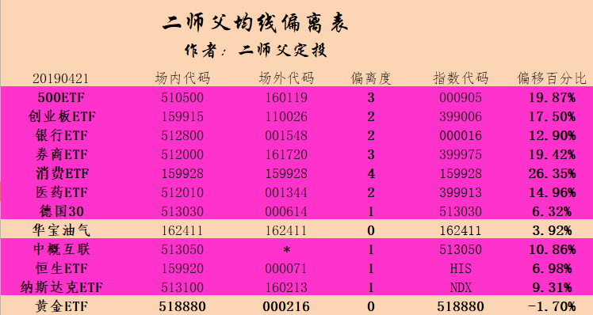

_type: talk
@天机[51285245588584]
2019-04-11 09:02:55 Thu  
topic_id: 422215221558588

可以发布消息了吗？

阅读[2910]  评论[0]  赞[0] 

======================================================

_type: q&a
@一心一意[844421848411122]
2019-04-11 09:20:48 Thu  
topic_id: 844412444884812

@一心一意

>  哪里可以看到老师的实盘

@二师父

>  搜索实盘或者鳄鱼计划就能看到我往期所有的定投实盘了

阅读[3146]  评论[1]  赞[0] 

======================================================

_type: q&a
@醉流雨[422151445242248]
2019-04-11 09:37:59 Thu  
topic_id: 544485481422514

@醉流雨

>  华宝油气现在可以定投么，？

@二师父

>  可以，低估定投的16字方针，低估定投，目前低估可以定投

阅读[3248]  评论[2]  赞[0] 

======================================================

_type: q&a
@毅[48544881484228]
2019-04-11 09:38:13 Thu  
topic_id: 844412418485522

@毅

>  可以使用了吗

@二师父

>  可以了今天修复完毕

阅读[3328]  评论[1]  赞[0] 

======================================================

_type: talk
@工具栏[244121288541111]
2019-04-11 09:42:01 Thu  
topic_id: 244412412585241

今天的鳄鱼计划发布在哪里啊？

阅读[3194]  评论[0]  赞[0] 

======================================================

_type: q&a
@毅[48544881484228]
2019-04-11 10:31:48 Thu  
topic_id: 544485485242414

@毅

>  中证100，这个指数师父觉得怎么样，这个指数应该是沪深双市场，大蓝筹指数吧，可以用来替代上证50吗

@二师父

>  可以的，里面持有中国平安，贵州茅台，招商银行，兴业银行，都是和沪深300上证50重合比较大，不过上证50是沪市蓝筹股，中证100沪深股票都有

阅读[3466]  评论[0]  赞[0] 

======================================================

_type: talk
@二师父[28814221155551]
2019-04-11 10:38:11 Thu  
topic_id: 422215212424248

<e type="hashtag" hid="552511812284" title="#场外低估定投实盘#" /> 买入50ah优选指数0.5份，已经没有特别好的买入机会了，所有的定投都减额。

对于高估的指数基金记得逐步卖出，买入不是为了终身持有，而是为了获利。如果你仓位不重，现金流增量大，可以少买点。

但对于高估的指数基金不能不减仓

@🍑L.mo🍑 at 2019-04-11 10:38:11 Thu

> 华宝油气还可以继续买入吗

----------

@蓝魔森林 at 2019-04-11 10:38:11 Thu

> 少买是指怎么个少买呀，是指一年内，50份，每份相应的减少额度吗？谢谢

----------

@victoria at 2019-04-11 10:38:11 Thu

> 这个表里没有高估的显示，除了黄金，二师父哪些到高估了

----------

@蓝魔森林 at 2019-04-11 10:38:11 Thu

> 广发中证养老财产，现在是个正常估值吗？值得继续定吗？ 谢谢

----------

@🍑L.mo🍑 at 2019-04-11 10:38:11 Thu

> 中欧医疗健康混合现在还可以继续买吗

----------

@Nancy at 2019-04-11 10:38:11 Thu

> 请问二师父，德国30不在实盘了么？看着还是低估呢

----------

@嘻嘻 at 2019-04-11 10:38:11 Thu

> 华宝油气还可以继续买不

----------

@二师父 at 2019-04-11 10:38:11 Thu

> 可以

----------

阅读[6407]  评论[21]  赞[0] 

+++++++++++++++++++++++++++++++++++++++++++++++++++++

图片：

======================================================

_type: talk
@二师父[28814221155551]
2019-04-11 11:07:31 Thu  
topic_id: 844412414224422

1

@cotton at 2019-04-11 11:07:31 Thu

> [呲牙]

----------

阅读[3784]  评论[1]  赞[0] 

======================================================

_type: talk
@门萨🐨[51411455828824]
2019-04-11 11:38:56 Thu  
topic_id: 844412155218442

星球好了吗？

阅读[3778]  评论[0]  赞[0] 

======================================================

_type: q&a
@凭栏观海[244414845852181]
2019-04-11 12:45:29 Thu  
topic_id: 244412414484511

@凭栏观海

>  兴业可转债现在还可以定投吗？

@二师父

>  兴全可转债还是兴业可转债，如果是可转债基金的话目前都不适合定投了

阅读[3949]  评论[1]  赞[0] 

======================================================

_type: talk
@冉冉[88445118854412]
2019-04-11 15:01:39 Thu  
topic_id: 544485825814514

4月11日，第三次打卡。
理财:今日周四，定投50AH  0.5份
学习:星球恢复正常，在星球学习二师傅文章，看参考消息及环球日报
健身:踢毽子30分钟
生活感悟:人生，没有白走的路，每一步都算数，无论我们之前或者现在经历过多少挫折，遇到多少艰难险阻，
相信峰回路转，会有柳暗花明的时候。

阅读[3516]  评论[0]  赞[0] 

======================================================

_type: q&a
@鸿何服饰[15442528284822]
2019-04-11 16:01:40 Thu  
topic_id: 422215145515218

@鸿何服饰

>  二师父您好，本人定投为自己存养老金，所以定投以红利基金为主，首选华宝标普红利机会，考虑它是中盘股基金，想配一个大盘股基金，现在在中证红利与深红利纠结，不知到底选择那一个？希望二师父给一个宝贵的建议！

@二师父

>  大盘选择沪深300和50ah，红利基金不用配置那么多。其他的基金也有分红的，基金分红并不是额外分钱给你

阅读[3850]  评论[3]  赞[0] 

======================================================

@二师父[28814221155551]
2019-04-12 01:16:35 Fri  
topic_id: 844412188412242

>  @二师父
>  

阅读[3416]  评论[2]  赞[0] 

======================================================

@二师父[28814221155551]
2019-04-12 01:21:20 Fri  
topic_id: 244412125228411

>  @二师父
>  

阅读[3578]  评论[5]  赞[0] 

======================================================

_type: q&a
@一切随缘[244145248112411]
2019-04-12 01:24:36 Fri  
topic_id: 422215154144218

@一切随缘

>  我买了一阵子，广发中证全指金融地产。这个基金在那查看估值？它属于那类基金？想问下二叔父，这是大盘，还是沪深300，一个类型？

@二师父

>  这个指数主要是金融、银行、保险、地产行业，目前处于正常偏低估值，可以定投。和沪深300一个类型，属于大盘指数基金，细分的话是金融行业指数基金。可以从理杏仁，果仁，且慢等平台来查阅估值数据。

阅读[3724]  评论[0]  赞[0] 

======================================================

_type: talk
@二师父[28814221155551]
2019-04-12 04:07:36 Fri  
topic_id: 844412125111252

<e type="hashtag" hid="142825445412" title="#北上资金抛售白马消费股票#" /> 北上资金很有代表性，既然如此操作，会对市场有一定影响，我们还是专注打造诺亚方舟

@海上 at 2019-04-12 04:07:36 Fri

> 现在沪深300的估值正常，原来的定投是不是终止，还是在正常估值区间的高位终止，在高估时，分批卖出。

----------

@上上签 at 2019-04-12 04:07:36 Fri

> 低估买入且定投，正常割盈且不定投，高估卖本且不定投，

----------

@sun at 2019-04-12 04:07:36 Fri

> 消费指数很难再次去低估了吧

----------

@二师父 at 2019-04-12 04:07:36 Fri

> 精华问答，实盘记录，每日分享，有很大区别的

----------

@亦青 at 2019-04-12 04:07:36 Fri

> 我都还没收割利润就跌了怎么办？今天要割么？

----------

@二师父 at 2019-04-12 04:07:36 Fri

> 有利润就可以收割

----------

@victoria at 2019-04-12 04:07:36 Fri

> 二师父你收割利润了吗？只看到你定投的操作，在星球上没怎么看到你收割利润的操作呢

----------

阅读[6491]  评论[15]  赞[0] 

+++++++++++++++++++++++++++++++++++++++++++++++++++++

文件：
2019-04-12 04:06:34 Fri
文件大小：[193267]
51185522841524-五粮液遭大甩卖，北上资金显示出调仓新思路，坐等布局白酒消费的机会到来.docx

======================================================

_type: talk
@二师父[28814221155551]
2019-04-12 12:30:53 Fri  
topic_id: 544485842222484

<e type="hashtag" hid="454148288258" title="#认真阅读二师父发的每一个字#" /> 不管是买入还是卖出我都有公布的，有人问星球和公众号有啥区别，最大的区别在于时效性。及时信息我在星球公布，学会获取信息，很多人阅读理解时候容易跳过，这样特别容易漏掉重要信息，建议逐字阅读，阅读能力和理解能力是最重要的学习能力

@梧桐 at 2019-04-12 12:30:53 Fri

> 我理解的是盈利20个点，卖出的也是20个点啊

----------

@亦青 at 2019-04-12 12:30:53 Fri

> 怎么去筛这些主题啊？还有，二师父想问一下像这样定投怎么看自己的年化收益率？

----------

@二师父 at 2019-04-12 12:30:53 Fri

> 我是卖出记录的，每次卖出记录自己的利润，然后结束了用利润除以投资金额

----------

@胡醒醒 at 2019-04-12 12:30:53 Fri

> 同问

----------

@二师父 at 2019-04-12 12:30:53 Fri

> 对的啊，投入1万，盈利20个点，卖出2000元

----------

阅读[3597]  评论[5]  赞[0] 

+++++++++++++++++++++++++++++++++++++++++++++++++++++

图片：

======================================================

_type: talk
@陈[844415515418422]
2019-04-12 14:45:11 Fri  
topic_id: 844412142844242

二师父，请问蛋卷基金里总资产里金额，还包括卖掉的金额吗？卖之前没看金额，卖了一万多利润，现在搞不懂总资产还包括这一万多吗？

@二师父 at 2019-04-12 14:45:11 Fri

> 卖出就到现金宝了

----------

@陈 at 2019-04-12 14:45:11 Fri

> 我卖出到银行卡里了。所以我不清楚，是不是总资产还包括我卖掉的呢？

----------

@二师父 at 2019-04-12 14:45:11 Fri

> 那不包含

----------

阅读[3251]  评论[3]  赞[0] 

======================================================

_type: q&a
@江南蚕园（郑婷）[48281815141548]
2019-04-12 21:08:36 Fri  
topic_id: 844412141812522

@江南蚕园（郑婷）

>  二师父，你觉得中国平安现在还能买吗？

@二师父

>  不推荐股票哈，平安是很有价值，但是同一只股票不同人买了盈亏也不同，跟股票没关系

阅读[3264]  评论[0]  赞[0] 

======================================================

_type: q&a
@TDG[88855524248842]
2019-04-13 00:57:45 Sat  
topic_id: 244412118185581

@TDG

>  记得二师父之前在一篇文章说过，真正想要做好投资，有超常收益的话，没到大牛市高估都不要卖，就是说当前指数进入正常估值也不要利润收割，持有到牛市再卖？

@二师父

>  不要卖出本金，本金持有到大牛市，这样吃到整个牛市的涨幅，实际情况是a股有时候短期暴涨暴跌，这是我们收割利润的原因

阅读[3339]  评论[4]  赞[0] 

======================================================

_type: talk
@二师父[28814221155551]
2019-04-13 04:47:40 Sat  
topic_id: 844412112821582

<e type="hashtag" hid="552821852424" title="#对不确定性的忍耐能力#" /> 学会忍耐不确定性，我发现，越是局限在小圈子不拥抱变化的人学习能力越弱，越是把收入增长寄托到别人身上，财富在自身。获取之道便是努力地求变。

@粥小宇 at 2019-04-13 04:47:40 Sat

> 我妹劝我毕业回家一个月也有一万多又轻松的时候，我想的就是回去能看到天花板，在外面虽然累点但是自己的天花板不知道在哪，还是想拥抱下不确定性搏一搏

----------

@二师父 at 2019-04-13 04:47:40 Sat

> 各有利弊吧，小城市生活轻松，大城市资源信息多，会让人眼界更加开阔。差距在缩小

----------

阅读[3594]  评论[2]  赞[0] 

+++++++++++++++++++++++++++++++++++++++++++++++++++++

文件：
2019-04-13 04:46:10 Sat
文件大小：[19118]
51185525582514-增强自己对不确定性的耐受能力，不仅能够提高你的收益率，而且让你活得更潇洒.docx

======================================================

_type: q&a
@J[28281541518551]
2019-04-13 10:22:02 Sat  
topic_id: 422215115552218

@J

>  星球终于恢复正常使用了，来鼓个掌滴～ 除了跟着二师父实盘定投，也看好5G和科创板的到来，请问师父，天弘中证计算机指数和天弘中证电子指数这两个基金目前是低估吗？值得布局吗？

@二师父

>  目前估值已经不低了，不建议此刻布局

阅读[3387]  评论[0]  赞[0] 

======================================================

_type: talk
@二师父[28814221155551]
2019-04-13 14:58:28 Sat  
topic_id: 111181222882152

<e type="hashtag" hid="142825811122" title="#定投周报#" /> 每天的提问我是手机回答的，所以回答比较粗略，以后大家的提问不是很紧急的话我会统一晚上用网页端电脑输入解答。如果紧急问题给我打赏个1块钱，我手机立刻简单回复你。然后每周末整理更新完善问答，帮助大家更好地学习。不知道这样是否可行。另外公众号的内容准备只在公众号发布，星球的内容仅在星球发布，做好区分，听听大家的建议。

@凯 at 2019-04-13 14:58:28 Sat

> 分开好

----------

@光明无顶 at 2019-04-13 14:58:28 Sat

> 支持

----------

@胡醒醒 at 2019-04-13 14:58:28 Sat

> 微信比较容易查看历史记录，星球主要靠搜索，内容分开发布并且告诉大家两边分别是什么内容，怎么查阅信息最好啦[呲牙]

----------

@二师父 at 2019-04-13 14:58:28 Sat

> 微信主要是投资普及，星球就是深化

----------

@胡醒醒 at 2019-04-13 14:58:28 Sat

> 好滴，谢谢[愉快]

----------

@丸子妈 at 2019-04-13 14:58:28 Sat

> 分开好

----------

阅读[5772]  评论[6]  赞[0] 

+++++++++++++++++++++++++++++++++++++++++++++++++++++

文件：
2019-04-13 14:56:05 Sat
文件大小：[847821]
88812251212512-二师父定投周报4.13.pdf

======================================================

_type: talk
@二师父[28814221155551]
2019-04-14 04:14:44 Sun  
topic_id: 844414585288252

<e type="hashtag" hid="281181228851" title="#周末答疑#" /> 关于估值，很多人一直没有明白估值方法，最简单的是一种盈利收益率法则，其次难点的是博格公式市盈率法则，合起来的收益率大于20到23个百分点就是低估值得投资的，这也是相对估值法。估值是一个系统，需要整体考虑，切记不可仅看市盈率或者市净率，阈值估值只是简化的，真正的估值还是得根据估值系统，盈利收益率或者博格公式。

阅读[3078]  评论[0]  赞[0] 

======================================================

_type: q&a
@j[15522428212422]
2019-04-14 15:02:50 Sun  
topic_id: 111181254552152

@j

>  二师父，德国30的市盈率和市净率在哪里可以查到？

@二师父

>  这个在万得股票全球股指可以查阅到的

阅读[2914]  评论[0]  赞[0] 

======================================================

_type: q&a
@蓝魔森林[28888244485121]
2019-04-15 01:24:39 Mon  
topic_id: 844414825812582

@蓝魔森林

>  二师傅你好，想问两个问题
>  1.一般仓位多少算是重仓呢？
>  2.现在收割利润之后，利润是回仓补充未来弹药还是不再算作投资拿走？
>  谢谢

@二师父

>  1、一般仓位7到10成属于重仓，仓位是你投资的指数基金占总资金的比例。假设你有100万资金，投资的指数基金有70万，那么你的仓位就是7成，投资的指数基金有100万，那么你的仓位就是10成。注意我们说的债券指数基金也属于指数基金的范围之内的。
>  
>  2、利润收割之后买入货币基金，可以实现年化3.5个百分点的收益率。然后等待机会买入其他低估的A股指数基金，美股指数基金，德国30指数基金，大宗商品指数基金。

阅读[2723]  评论[6]  赞[0] 

======================================================

_type: talk
@二师父[28814221155551]
2019-04-15 01:35:36 Mon  
topic_id: 422212852251848

<e type="hashtag" hid="142824558542" title="#是否一定要低估定投#" />关于提问二师父说明一下：如果是发言或者评论区提问我会单独把有价值的问题摘出来然后发表的形式解答，不会直接解答，这样更加有利于更多读者接受到知识。经济学就是资源配置最优化的，希望你能够理解，这也是我一直不太喜欢微信提问的原因。如果评论区的提问二师父已经回答过很多次了，那么请自行寻找往期问答来找答案。另外回答时间均在北京时间0点到4点之间，白天不会解答非紧急问题，这样我的答案会更加完整，也会更详细。 

 陌路花 ： 师父，正常估值就要停止定投吗?如果仓位很低呢，也要停止吗?

用沪深300做一个傻瓜定投的模拟，假设每月定投等额资金。根据回测，从2005到2015年每年的收益率是如图所示，见文末的文章。

假设一个傻瓜从2007年入市，那时候正好是牛市，很多指数基金高估，但是他还是冲进去了，一直定投到2015年。你可以看看他8年不间断定投的总收益率为200.63%，年平均收益率为13%，这是定投复合年化收益率，不是平均年化收益率。

这个策略告诉我们，利用最笨的定投策略也可以实现年化13个点的收益率，所以仓位不重的时候在正常偏低估值定投也是可以的，唯一需要注意的事，必须坚持下去，并学会及时收割利润。

阅读[2879]  评论[0]  赞[0] 

+++++++++++++++++++++++++++++++++++++++++++++++++++++

图片：

======================================================

_type: talk
@二师父[28814221155551]
2019-04-15 03:21:39 Mon  
topic_id: 544484154444514

<e type="hashtag" hid="552825118544" title="#实盘说明#" /> 更新了鳄鱼计划和定投实盘的代码，主要有一些代码只在星球公布，对于油气这种明显波动太大，不适合新手，那么就不再公众号发了，我们定投还是有的。还有均线偏离策略也只在星球发了。因为很多人问我偏离表是不是错了，把偏离表当成估值表了，不愿意学习的人就用最简单的策略，这种熊市震荡做T策略只适合愿意付出学习的朋友。

之前有的基金慢慢清掉了。至于怎么卖，盈利逐步卖就行，很多人太贪心，一方面怕不卖跌了，又怕卖了涨了。这就无解了，有赚的不就行了吗？

这篇文章置顶也会发布的，大家不要再问我代码是什么，实盘代码和这个估值表里面代码都公布啦，自己对着软件输入就行。

@海上 at 2019-04-15 03:21:39 Mon

> 安心回报债什么时候买入卖出?

----------

@Shine at 2019-04-15 03:21:39 Mon

> 师父，安心债现在适合定投吗？

----------

@心韵 at 2019-04-15 03:21:39 Mon

> 二师父好：弱弱的问一下，文中说的，“万得全A历史全市场市盈率A百分位低于20%”，对应的指标是不是估值表中的“全市场指数百分位”估值指标？

----------

@丸子妈 at 2019-04-15 03:21:39 Mon

> 按照你写的，是不是现在情况鳄鱼计划，就是买入，不考虑卖出？

----------

@二师父 at 2019-04-15 03:21:39 Mon

> 是的

----------

@二师父 at 2019-04-15 03:21:39 Mon

> 没有啊，现在做T也行，单边下跌就一直买

----------

阅读[5340]  评论[6]  赞[0] 

+++++++++++++++++++++++++++++++++++++++++++++++++++++

文件：
2019-04-15 03:21:20 Mon
文件大小：[380296]
88812288444212-关于二师父场外定投实盘和场内鳄鱼计划的说明.pdf

======================================================

_type: talk
@二师父[28814221155551]
2019-04-15 10:33:23 Mon  
topic_id: 111181512228112

<e type="hashtag" hid="825412412212" title="#可转债打新#" />
今天一只可转债上市，中装转债上市，打中了的朋友，可以卖出。卖出策略要注意了，不要恋战，首日盈利即可卖出，亏损了也要卖，当然亏损的可转债可以当做债券持有，下有保底

今天有两个新债：创维转债和核能转债。打新的朋友可以关注下，牛市打新破发率较低。2A级别以上的可转债在牛市可以盲打，3A级别以上的债券在熊市可以盲打

创维转债质量一般，可以不用申购，不过打新风险不大，核能转债是AAA级转债，3A级债券风险几乎为零，顶格申购

明天上市迪森转债和亨通转债，中签的朋友记得卖出。

@心韵 at 2019-04-15 10:33:23 Mon

> 同学们好：可转债打新，AA评级在哪里可以查到？谢谢！

----------

@上上签 at 2019-04-15 10:33:23 Mon

> 可以下载“集思录”APP，里面可以查看的

----------

@凤凰涅槃 at 2019-04-15 10:33:23 Mon

> 谢谢二师父提醒

----------

@心韵 at 2019-04-15 10:33:23 Mon

> 好的，谢谢！

----------

@光明无顶 at 2019-04-15 10:33:23 Mon

> 二师父，没有打过可转债，这个可转债如何评价能不能打？谢谢

----------

@What if at 2019-04-15 10:33:23 Mon

> 现在是熊牛市未知的情况，打哪一类型的啊？

----------

阅读[5194]  评论[6]  赞[1] 

======================================================

_type: talk
@二师父[28814221155551]
2019-04-15 11:02:34 Mon  
topic_id: 422212824888118

<e type="hashtag" hid="142511142112" title="#格局重塑#" /> 如果你做的事情对10年以后的你有益，那么就是格局大处着眼。

有人抱怨996，我是7117，做事业和打工两码事，如果你的工作是你的兴趣，你的使命，你的事业，那么你就不会抱怨。如果想发展事业为主，可以晚点结婚。

@丸子妈 at 2019-04-15 11:02:34 Mon

> 996对于有孩子的来说，不太合适

----------

@S& at 2019-04-15 11:02:34 Mon

> 855的赚的也少

----------

阅读[2763]  评论[2]  赞[0] 

======================================================

_type: talk
@二师父[28814221155551]
2019-04-15 20:37:18 Mon  
topic_id: 244414841158281

<e type="hashtag" hid="825152222152" title="#可转债定投的正确姿势#" /> 可转债基金定投是否可以？二师父答，可以。

主要有兴全可转债基金和安心回报可转债基金。怎么定投，怎么卖出？

这个估值没法量化，我还在探索量化可转债基金的量化估值模式。当前的定投参考主要是可转债的价格，如果集思录上的可转债价格有3到5成以上低于100元，那么可以逐步定投，如果9成以上高于100元，那么可以逐步收割利润，如果可转债价格5成以上高于120元，可以逐步卖出本金

因为可转债下有保底的属性，所以定投这个基金比指数基金更加安全。不用担心。

阅读[2299]  评论[0]  赞[0] 

======================================================

_type: q&a
@冉冉[88445118854412]
2019-04-15 20:42:12 Mon  
topic_id: 844414845455882

@冉冉

>  今天又读了一遍五步定投法，请问
>  1、正常估值利润达20%第一次收割后市场下跌再继续定投时本金如何计算呢？是按第一次的本金加新增定投本金计算吗？
>  2、再次收割的时候是按正常估值时利润达到40％收割吗？

@二师父

>  1、增加了都放在货币基金里面，如果增量资金不用自动转为存量资金。
>  
>  2、没有啊，如果重回低估再次收割还是到达10或者20个百分点进行收割利润

阅读[2471]  评论[4]  赞[0] 

======================================================

@二师父[28814221155551]
2019-04-15 20:49:48 Mon  
topic_id: 422212825251518

>  @二师父
>  

阅读[2550]  评论[4]  赞[0] 

======================================================

_type: q&a
@陌路花[844114852118822]
2019-04-15 21:08:50 Mon  
topic_id: 544484148442514

@陌路花

>  老师，定投小白一个，想定投师父推荐的上证50AH，请问需要"底仓+定投"吗?如果要建底仓，几层比较适合呢?

@二师父

>  目前的点位是不需要的。50AH 不是极度低估。
>  
>  1、底仓是熊市底部区域建立的
>  
>  二师父曾经介绍网格交易策略的时候告诉过大家，在指数处于非常低估的区域内，先建立一部分底仓，然后根据指数基金价格的涨跌进行减仓和加仓。
>  
>  建立底仓是有条件的，这个条件并不是我们假设市场会涨起来，也不是投资专家预测市场会涨起来，而是指数基金的价格非常便宜，用相对专业的话讲是指数基金处于比较低估的区域内。
>  
>  既然如此，那么现在就不是建立底仓的好时机，从18年底部涨到现在很多指数的位置并不是处于非常低估的区域了。所以目前50ah正常定投就好，等极度低估再建立底仓。
>  
>  2、定投的本质在于耐心和坚持
>  
>  投资方法千万种，既然选择了定投，就要摒弃一夜暴富的想法。而将投资收益时间拉长至5到10年。利用一整轮牛熊真正实现财务的指数式增长。请务必记住，市场先生是非理性的，投资者大多是追涨杀跌的，不用担心没有定投的机会，比如16年的港股指数，18年的A股指数，油气指数等等，都是历史上绝佳的机会。
>  
>  投资首先要避免亏损，其次才是获胜。假设你从此刻定投，当指数上涨的时候，你能够盈利，只不过是收益变得少了点。假设你从此刻定投，当指数下跌的时候，你也不至于恐惧，因为定投可以拉低成本。
>  
>  相反，如果建立底仓，指数下跌回撤呢？大多数人是受不了亏损的，人性使然。18年开始跟着二师父定投的朋友现在仍在的并不是很多。所以谨记，投资市场是剩者为王。不要总是想着错过行情，小白首先想的是如何避免亏损，如何获得小的盈利，在市场活的久。
>  
>  3、定投最重要的是克服自己恐惧与贪婪的心魔
>  
>  二师父相信，在投资过程中，每位朋友可能都会有以下的两种感觉：当定投的指数暴涨时候，非常懊悔当时买少了；当定投的指数暴跌时候，又开始懊悔当时买早了。
>  
>  人都有趋利避害的心理，这是人类的天性。这种本性体现在投资过程中就是常见的贪婪和恐惧。恐惧源于未知，贪婪源于不知足。要想克服两大心魔，必须学会永远谦虚地学习投资知识，学习指数基金的本质，盈利原理，定投风险，定投系统，当你对这些有了全面的了解之后，你自然不会恐惧。另外就要学会知足。知止而后有定，定而后能静，静而后能安，安而后能虑，虑而后能得。知足常乐，也更容易理性地面对疯狂牛市。
>  
>  定投更多的是个人心性地修炼，历事炼心，当心性超脱入定，定投也是必胜的。
>  
>  别建立底仓，慢慢定投，感受复利的魔力。

阅读[2648]  评论[6]  赞[0] 

======================================================

_type: q&a
@古月[422118152414828]
2019-04-16 04:14:55 Tue  
topic_id: 111181585828152

@古月

>  你好二师傅，如果在低估值定投一只基金，到了正常估值停止定投。假设此时净值1.1，平均净值1，已有10个点的利润。科学的做法是卖出这10点的利润呢，还是再等涨一部分后再卖出利润比较合理？

@二师父

>  利润收割法。当我们定投的标的处于低估区域时候是不用收割利润的。还是拿中证500举例子，假如现在中证500的市盈率在24倍以下，你就一直坚持定投，市盈率低多投，市盈率高少投。当然即使低估你也有可能浮盈。比如你在18倍市盈率买入了很多份额，现在中证500的市盈率涨到了23，他仍然处于低估，但是你的浮盈可能达到了百分之20多。这个时候要不要卖呢？
>  
>  二师父的答案是，别卖。有的同学可能会问，如果盈利这么多不卖的话又跌回去了怎么办呢？二师父告诉你，无论是做人，干事业还是投资基金，目光都要放长远。我们得有大胸怀，这样才能担得起巨大的财富。百分之20多点的浮盈算得上什么呢？处于市场低估区域就得积累份额。别忘了，指数基金是有周期性的，将来一定会高估，只要持有，未来到达牛市的时候一个月甚至一个星期都有可能给你带来百分之20的收益。继续分析，既然牛市能够涨那么多，为啥还要收割利润，而不是到达牛市最高点一起卖出，这样不就获得最好的利润呢？
>  
>  有的同学问过二师父这个问题，二师父解释下。
>  
>  第一，你不知道高点在哪里，大盘到底是5000点是顶点还是6000点是顶点，你知道吗？专家知道吗？大神知道吗？都没人知道，所以企图卖在最高点其实就是一种奢望，是不可能事件。
>  
>  第二，是由中国股市的大涨大跌的特性决定的，说的具体点，是由中国人想要快速致富的投机心理决定的。在中国，无论是中产阶级，还是农村贫民，都渴望致富，渴望发财，因此无论是在平时的生活还是在基金投资过程中，很多人投机，不断地买入卖出企图获得暴利。这样最终结果就是中国股市就像过山车一样上上下下波动巨大。倘若咱们获利百分之50而且处于正常估值区域没有收割利润，最终可能由于大部分人投机抛售股票或者基金导致大盘跳水，最终咱们的利润又全部化为乌有，所以利润收割是非常必要的。
>  
>  这个问题就是涉及到利润收割，怎么收割，具体再说下，不要教条，我说10个点收割，不是说一定要10个点，你11个点收割，12个点收割也可以的。这就涉及到学习的能力了。到点了就卖呗。盈利了都舍不得卖是贪婪，如果10个点不收割，涨到高估也不收割，很多人甚至还加仓，那么就危险了。
>  
>  我的回答没有标准答案，答案靠你自己思考，我会把判断方法和思维方法告诉你。这是你大学缺的课程，学习和自学能力的问题。

阅读[2507]  评论[3]  赞[0] 

======================================================

_type: q&a
@Nienie💝[244122251284851]
2019-04-16 04:18:04 Tue  
topic_id: 244414812482411

@Nienie💝

>  二师父，不好意思，我有个私人请教。家里老人想给孩子每月存几百元做储蓄，等孩子长大使用，存款期最少10年。为了抵消通货膨胀，，我建议了基金定投。但是现在的问题是，最基础的中证500，沪深300都属于正常估值，又想赶紧把钱定下来。我在纠结，我是应该先选两个低估的定投，然后只要正常了就再换低估的别的定投呢？还是就选这两个最基础的，无论高低还是正常，就那样固定着投就行。我看您好多次在别的人的回答里提到傻瓜定投也有10以上的收益，没必要来回换呀。因为是父母的钱，也是父母对孩子的心意，所以有些纠结。

@二师父

>  可以的，我制定了一个优化的定投策略，你加上债券基金定投，实现股债轮动。
>  
>  很多人想要给孩子定投一笔教育基金或者给自己定投一笔养老基金，长达20年的定投周期，不想择时定投。那么二师父给大家设计一款优化的傻瓜定投策略。
>  
>  选择3只基金，沪深300指数基金，中证500指数基金，债券指数基金。当沪深300指数基金处于正常或者低估的区域，一直定投，直到债券基金低估，停止沪深300指数基金和中证500指数基金的定投，将沪深300和中证500指数基金卖出的份额投资到债券指数基金，不断地轮动投资，实现资金流动到低估的资产。只要债券基金高估和正常估值时候就一直定投沪深300指数基金和中证500指数基金。
>  
>  等到自己需要钱的时候再拿出来用。这种策略的好处就是股债轮动配置，而且长期持有优质的800只股票，我们可以享受到企业上涨的盈利。对于长达20年定投周期的资金，可以使用这个策略的。
>  
>  可以多跟父母普及理财知识，学堂有几个60多岁的朋友还在学习定投，学到老活到老。我认为老年人学习的意义不在于基金真的让你赚了多少钱，而是在这个过程你的生活会更加积极。否则老年时光会很孤独。
>  
>  大家都一起来学习吧。少而好学，如日出之阳;壮而好学，如日中之光;老而好学，如炳烛之明

阅读[2679]  评论[5]  赞[1] 

======================================================

_type: talk
@二师父[28814221155551]
2019-04-16 04:23:40 Tue  
topic_id: 422212812414258

<e type="hashtag" hid="225152242211" title="#优化的傻瓜定投策略#" /> 适合不想操心的定投朋友，文字还是发一下，有的读者喜欢阅读纸质版的。

@背心 at 2019-04-16 04:23:40 Tue

> 师傅是早起，还是没有睡觉 注意休息

----------

@丸子妈 at 2019-04-16 04:23:40 Tue

> 估计是早起

----------

@亦青 at 2019-04-16 04:23:40 Tue

> 债券基金可以关注哪个啊？

----------

@飞的那个飞 at 2019-04-16 04:23:40 Tue

> 债券指数基金就是表里最下边那个吗

----------

阅读[2774]  评论[4]  赞[0] 

+++++++++++++++++++++++++++++++++++++++++++++++++++++

文件：
2019-04-16 04:23:01 Tue
文件大小：[24141]
28812225528881-定投一定要在低估区域才可以吗.docx

======================================================

_type: talk
@二师父[28814221155551]
2019-04-16 04:47:22 Tue  
topic_id: 544484184282844

<e type="hashtag" hid="825152242482" title="#讲估值#" />怎么给主动基金估值，大家还是有很多喜欢投资主动基金的，主动基金二师父建议趋势交易，不要定投。如何给指数基金估值呢？选择参考相应指数的估值情况。

比如易方达消费股票基金，他的持仓股票类似中证消费，一般可以采取消费指数低估，他也是低估的状态，估值本来就是估算，有一个大体的范围就好拉。

@丸子妈 at 2019-04-16 04:47:22 Tue

> 趋势交易是什么意思

----------

@陌路花 at 2019-04-16 04:47:22 Tue

> 请问老师，易消基目前是低估吗?趋势交易怎么看趋势?

----------

阅读[2828]  评论[2]  赞[0] 

======================================================

_type: talk
@勤能行之[481211221828]
2019-04-16 08:53:38 Tue  
topic_id: 111181581141842

好久没上星球了，先赞后看。

阅读[2516]  评论[0]  赞[0] 

======================================================

_type: talk
@小牧童[28484254825881]
2019-04-16 09:07:30 Tue  
topic_id: 422212812182188

二师父，您好，可转债打新的评级在哪里查看呢？谢谢

@Nienie💝 at 2019-04-16 09:07:30 Tue

> 集思录

----------

@小牧童 at 2019-04-16 09:07:30 Tue

> 打新的评级在里面找不到

----------

@上上签 at 2019-04-16 09:07:30 Tue

> 

----------

@小牧童 at 2019-04-16 09:07:30 Tue

> 谢谢！[愉快]

----------

阅读[2611]  评论[4]  赞[0] 

======================================================

_type: talk
@二师父[28814221155551]
2019-04-16 10:08:02 Tue  
topic_id: 111181588524582

<e type="hashtag" hid="881251425252" title="#鳄鱼计划#" /> 场内卖出华宝油气一份，盈利9个点，赚个100多。大家记住，场内定投盈利就可以分批卖，我也不知道市场接下来是跌是涨，只要有波动就能挣钱，即使一直不涨。

关于代码，见置顶文章实盘说明，里面标注了，需要自己看

@TDG at 2019-04-16 10:08:02 Tue

> 请问二师父，华宝油气场内和场外卖出策略一样吗？目前油气不是还在低估，为什么卖出呢？[疑问]

----------

@乖子 at 2019-04-16 10:08:02 Tue

> 收到

----------

阅读[4978]  评论[2]  赞[0] 

======================================================

_type: talk
@冉冉[88445118854412]
2019-04-16 10:48:29 Tue  
topic_id: 111181425458182

二师傅，每日估值表在星球还发布吗？

@二师父 at 2019-04-16 10:48:29 Tue

> 置顶文章

----------

阅读[2490]  评论[1]  赞[0] 

======================================================

_type: q&a
@往事随风[48515148521428]
2019-04-16 12:40:08 Tue  
topic_id: 111181581451522

@往事随风

>  请问二师父：您今天发表的优化的傻瓜定投策略，如果看债券是否低估呢？一般估值表里都没有。还有，请问沪深300与中证500的比例如何确定？是否可以谁低估就多投一些？谢谢！

@二师父

>  债券基金的估值看国债收益率，国债收益率高于3.65%到3.8%为低估。推荐的有博时信用债，7-10国开债，广发纯债等等。300和500的比例不用看，直接设定初始定投金额，然后再偏离阈值越远定投的份额越多。

阅读[2590]  评论[0]  赞[0] 

======================================================

_type: talk
@二师父[28814221155551]
2019-04-16 12:44:46 Tue  
topic_id: 844414252521542

<e type="hashtag" hid="142824144542" title="#债券基金的投资#" /> 债券基金投资分为纯债基金、可转债基金、海外收益债基金等，纯债的估值看国债收益率，国债收益率高于3.65%到3.8%为低估。推荐的有博时信用债，7-10国开债，广发纯债、招商产业债、易方达信用债等等。

可以这样讲，当上证综合指数处于高估区域的时候，债券就低估了，我们收割的利润可以逐步转移到债券基金里面。这就是股债轮动策略。选择一只纯债基金即可，不用贪多，所有债券基金的估值是近似的。

@路 at 2019-04-16 12:44:46 Tue

> 老师，国债收益率指的是十年期国债收益率？

----------

@二师父 at 2019-04-16 12:44:46 Tue

> 是

----------

阅读[2588]  评论[2]  赞[0] 

======================================================

_type: talk
@二师父[28814221155551]
2019-04-16 16:37:06 Tue  
topic_id: 422212584282158

<e type="hashtag" hid="552825441424" title="#可交换债券#" /> 打新有可转换债券打新和可交换债券打新。

可转换债券是公司自己发行的可转债，对应的股票是他们自己的上市公司，债券持有人按照发行约定的价格将债券转换成这家公司的股票

可交换债券EB是上市公司持有者将上市公司的股票抵押给机构发行可交换债券，注意持有者并非一定是上市公司

可转债发行的目的为了融资，促进转股同时上市公司会想办法让股价涨，可交换债就是一种减持股票的手段，防止直接卖股价受到冲击，所以这种可交换债的上涨动力比可转换债券低一些

如果打新的话建议可转债打新即可

阅读[2312]  评论[0]  赞[0] 

======================================================

_type: talk
@A0洪氏日杂批发[544885222181514]
2019-04-16 19:53:20 Tue  
topic_id: 111181454585842

<e type="hashtag" hid="552825441424" title="#可交换债券#" /> 今天又中了核能转债一签，希望发点小财

阅读[2158]  评论[0]  赞[0] 

======================================================

_type: talk
@二师父[28814221155551]
2019-04-16 23:00:44 Tue  
topic_id: 111181442282522

<e type="hashtag" hid="825152414512" title="#主动基金趋势交易和估值方法#" /> 主动基金适合趋势交易，什么是趋势交易：在股票价格运动当中，如果其包含的波峰和波谷都相应的高于前一个波峰和波谷，那么就称为上涨趋势;相反的，如果其包含的波峰和波谷都低于前一个波峰和波谷，那么就称为下跌趋势;如果后面的波峰与波谷都基本与前面的波峰和波谷持平的话，那么成为振荡趋势，或者横盘趋势，或者无趋势。

我们进行主动基金的趋势交易就是要抓住上涨趋势来获取利润。

投资主动基金分为三步：选择基金，估值，买入和卖出。

一、如何选择一支优秀的主动基金。

1、	优秀的基金公司。

背靠大树好乘凉，优秀基金公司有着优秀的基金管理团队，而优秀基金公司投资研究团队的强大实力是基金产品最大的质量保证。根据二师父查阅相关资料对比以下12家基金公司是非常优秀的。易方达、建信、广发、工银瑞信、鹏华、南方、嘉实、汇添富、富国、银华、华安、兴全。主动基金可以从这12家选择

2、	优秀的基金经理

基金经理是基金管理人委托来管理基金的。挑选的基金经理至少经历过一轮牛熊，而且是35岁以上有着丰富投资经验的投资人，芒格说过，40岁之前很难有价值投资。另外要否定掉做短线的基金经理，如果基金的尺长股票一直变动，那么这个基金经理喜欢做投机，不要考虑。

一定记住，如果基金经理更换，基金走势发生变化，记得止盈，基金经理对基金的影响非常大。

3、	晨星评级

晨星是世界著名的基金评级机构。基金评级必须是晨星五星级，否则不予考虑。

4、	持仓股票的基本面
这个大致了解就好，股票看是成长股还是价值股还是二者对半。基金经理会考虑，如果不会分析，抱住基金经理大腿就好。分析股票基本面主要从市盈率，净资产收益率还有每股收益增长率来分析。
5、	基金规模

基金规模太小，有清盘风险，建议投资基金规模1到5亿亿以上。

二、估值

主动基金的估值我是参考相关指数基金的，比如易方达消费股票基金属于主动基金，类似中证消费，我用中证消费的估值代替，目前是正常偏高。

三、买入和卖出

直接看20日均线，上穿20日均线，中线走牛，买入。
跌破20日均线，中线走弱，卖出。这样可以获得不错的收益率
需要注意一点的是，主动基金不适合逆势加仓，和股票投资一样，止损点位再8%到12%。

@Tom at 2019-04-16 23:00:44 Tue

> 请问为什么有的基金可以看到和股票一样的k线图（详细的曲线，日线），有的则没有？

----------

@Tom at 2019-04-16 23:00:44 Tue

> 如图

----------

@Tom at 2019-04-16 23:00:44 Tue

> 如果只有图一这种，如何看，或者如何计算20日线的走势呢

----------

@二师父 at 2019-04-16 23:00:44 Tue

> 都可以的啊，你去万得设置一下

----------

@Sophie🌸乐桃 at 2019-04-16 23:00:44 Tue

> 请问二师父怎么设定看基金的K线图

----------

@二师父 at 2019-04-16 23:00:44 Tue

> 在万得看

----------

阅读[4376]  评论[6]  赞[0] 

======================================================

_type: talk
@二师父[28814221155551]
2019-04-16 23:06:48 Tue  
topic_id: 844414225514152

<e type="hashtag" hid="142824181542" title="#债券基金和股债轮动策略#" /> 债券基金投资分为纯债基金、可转债基金、海外收益债基金等，纯债的估值看国债收益率，国债收益率高于3.65%到3.8%为低估。推荐的有博时信用债，7-10国开债，广发纯债、招商产业债、易方达信用债等等。

可以这样讲，当上证综合指数处于高估区域的时候，债券就低估了，我们收割的利润可以逐步转移到债券基金里面。这就是股债轮动策略。选择一只纯债基金即可，不用贪多，所有债券基金的估值是近似的。 

关于学堂的很多问题，二师父建议大家多阅读学习，把很多阅读学习之后再来提问，还有课程上的讲解，很多问题都说过很多次了。需要自己去学习的哈，我告诉你答案这种是最糟糕的学习方法，对你没有帮助的。

@胜 at 2019-04-16 23:06:48 Tue

> 我选了3只，历史成绩5-8，希望不要出现债熊

----------

阅读[2298]  评论[1]  赞[0] 

======================================================

_type: q&a
@李震笛[422112248211828]
2019-04-16 23:10:02 Tue  
topic_id: 244414282454881

@李震笛

>  二师傅，我是新入小白一个，看了一些指数基金的投资资料，也尝试了一些定投，有点疑惑：现在指数慢慢走高，原先低估值的指数慢慢走到正常，是不是再拉升，对于定投的收益就会逐步减少？这种情况下，如果想继续过得不错的收益，是不是要随着波动频繁操作才可行？另外，希望能加入微信群

@二师父

>  价值投资不要频繁操作。
>  
>  定投指数基金靠什么盈利，不是靠你预测市场算命，不是靠你有种优选选到了绝世暴涨指数。
>  
>  指数定投盈利最重要的三点分别是1、仓位控制2、资产配置3、高度自律
>  
>  二师父说了很多次啦，如果你目前的仓位让你极度不舒服，那么定投的仓位需要改变。以晚上能睡好觉为宜。这些不断问市场走势的朋友晚上肯定是睡不好的。因为他总在想，明天是不是还要涨，我是不是得早点起来加仓啊。
>  
>  很多道理太简单了，以至于被所有人忽略。我们总是看不来最浅显，最容易被人明白的道理。
>  
>  第二是资产配置，二师父讲究全球资产配置，买入的有美股指数，有香港指数还有A股指数，德股指数。这样就能够实现对冲，不可能所有的指数都一起暴跌，这样就能够在暴跌的时候控制回撤。
>  
>  最后一点，高度自律，严格按照策略定投，低估定投，正常收割利润，高估卖出本金，这样肯定能够盈利，当市场没有机会的时候就等待。
>  
>  无论是定投还是趋势交易，最忌讳的就是频繁操作。

阅读[2421]  评论[0]  赞[0] 

======================================================

_type: q&a
@醉流雨[422151445242248]
2019-04-16 23:11:16 Tue  
topic_id: 844414252822512

@醉流雨

>  二师父，我请问下。目前就在3100点的位置满仓买入低估的指数基金。中间不做任何操作。只等待牛市5000多再卖出，可行么，？

@二师父

>  如果你能接受百分之50左右的回撤，这样可以的，但是相信我。实际定投的过程中，是人在操作，只要是人，必然恐惧，必然贪婪。人都一样，我们都没有啥不同。

阅读[2351]  评论[0]  赞[0] 

======================================================

_type: talk
@二师父[28814221155551]
2019-04-16 23:20:55 Tue  
topic_id: 244414225885481

<e type="hashtag" hid="454145211858" title="#可转债打新的正确姿势#" /> 可转债打新无需市值，中签之前无需资金，破发率极低，大牛市基本没有破发，也是一个不错的投资渠道，把可转债打新的全部知识给大家普及下

1、什么是可转债打新

可转债打新和股票打新是一个概念，很多上市企业借助发售可转债来进行融资，你出钱从他那里购买可转债，他给你一张有价凭证，投资者既可以持有可转债获取债券利息，又可以转换成股票持股增值。

公司通过一个低价格的利息就轻松把资金融过来了，当你购买可转债以后他还会想一系列办法让你转股，这样相当于他零成本融资。

熊市适合购买可转债，因为有保底利息，而且可以转换成股票，牛市适合打新可转债，中签以后卖出，蓐点羊毛，一个账户大概可以赚80快左右。

从整体可转债打新的角度看，在牛市新转债很难出现“破发”的情况，也就是打新出现亏损。但熊市也会有破发的情况

2、具体怎么操作

二师父这里的广发和华泰可转债打新都是免五元的。可以同时进行，增加中签率，一个人最多开三个账户，大神往往十几个账户。

一般每天新债和新股发行时系统会自动通知，直接盲打即可，新股申购需要几十万市值，新债申购不用市值，可以信用打新，中签以后才会扣款。

开户渠道在置顶文章。

如果我们2019年4月16日申购（T日），打开账户找到想要申购的可转债，填入数量，提交申购就完成了交易。一般一个人只能够中一签，也就是1000元。等可转债上市以后会涨到1100元左右。

然后在2019年4月18日（T+2日）打开账户看看账户有没有增加新债券，如果有的话就代表中签了。然后记得账户要有充足的资金。

可转债上市当天一般会涨10%左右，所以上市当天卖出即可，能挣个100来块左右。如果亏损了可以当作债券持有，也可以卖出，我不恋战，都是卖出的。

3、可转债打新需要注意的问题

首先是证券账户只能够申购一次，申购以后就不能撤单了。如果你多次申购同一可转债，后面的会视为无效操作。

其次，对于网上信用申购却不缴纳款项的投资者将会给与惩罚。

中签了千万得去缴款，要是在12个月内出现3次违约，未来半年内将被取消申购资格，连打新股的资格也会被取消。

另外可交换债券带EB的不建议打新，这种价值没有可转债好。

熊市申购可转债在3A以上即可，牛市申购可转债在2A以上即可，没有特别要求，这样打基本能盈利。另外同一身份证只能够申购一次，如果你要多次申购的话需要用亲人的身份证开户了。

@理财小小白 at 2019-04-16 23:20:55 Tue

> 二师父，你这上面介绍了纯债基参看的估值方法，那么可转债呢，估值是否也是参考十年期国债收益率进行定投？

----------

@二师父 at 2019-04-16 23:20:55 Tue

> 这个不能，参考可转债的价格，大部分低于100可以定投

----------

@理财小小白 at 2019-04-16 23:20:55 Tue

> 可转债的价格怎么查看呢？谢谢

----------

阅读[2493]  评论[3]  赞[0] 

======================================================

_type: q&a
@萧竹[15425244124542]
2019-04-17 00:25:54 Wed  
topic_id: 111181458154242

@萧竹

>  二师父，今天中了两支可转债，核能和创维，明天需要补足资金，是吧！

@二师父

>  账户有几千元资金就够了

阅读[2522]  评论[0]  赞[0] 

======================================================

_type: talk
@二师父[28814221155551]
2019-04-17 01:14:32 Wed  
topic_id: 111181442144152

<e type="hashtag" hid="454145144588" title="#华宝油气为什么卖出#" /> 指数估值表：绿色品种放心地定投，橙色适合收割利润，红色适合卖出本金。不知道如何使用指数估值表可以看看置顶文章五步定投法。如果没有低估的品种了，可以一直定投宽基指数到债券基金低估，然后定投债券基金。

均线偏离表：鳄鱼计划参考指标，在低估或者正常估值区域内，均线偏离表绿色得买入，橙色得持有，红色得逐步卖出。类似做T，适合熊市震荡市场。 

关于这两个策略在课程里面都有详细讲解，还是先需要自己先学习，很多时候我们首先遵循低估定投的策略，然后再低估区域内结合均线。如果均线偏离度为正，卖出。

有的读者经常纠结细节问题，这是好事，细节决定成败，也是坏事，格局决定高度。

如果你死扣细节，现在华宝油气均线偏离差是3%，不足一个偏离度，有的人说，二师父你这没有一个偏离度，不能卖。

我就问问，投资为了什么，不就是赚钱吗？油气一直在之前低估时候我们积累了便宜的股份，现在盈利卖出一份收割利润不是挺好吗？

记住，所有的投资策略都是为了盈利服务的，如果策略不能让我们盈利，就不要用。管他什么策略，能够让我们盈利的就是好的。

我知道，改变认知太困难，很多人一生都固执己见，所以越努力越失败。

阅读[4956]  评论[0]  赞[0] 

======================================================

_type: talk
@二师父[28814221155551]
2019-04-17 01:55:02 Wed  
topic_id: 544484552442214

<e type="hashtag" hid="142824822442" title="#地产基金折价问题#" /> 地产指数基金是一只分级基金，有的人担心下折，我解释下。

所谓下折，是指当分级基金B份额的净值下跌到某个价格（比如0.25元）时，为了保护A份额持有人利益，基金公司按照合同约定对分级基金进行向下折算，折算完成后，A份额和B份额的净值重新回归初始净值1元，A份额持有人将获得母基份额，B份额持有人的份额将按照一定比例缩减。下折时母基金、A份额、B份额的折算如下：

B份额净值归1，份额减少。如1000份净值为0.25元的B份额，折算后成为250份净值为1元的B份额。值得注意的是，折算是按照B份额的净值结算，而非交易价格。实际过程中B份额的交易价格往往高于净值，引发投资者更大的损失。

A份额折算为与B份额相等的份额，剩余的份额折算成净值为1元的母基金。如1000份A份额，折算后成为250份A份额，其余750份将按净值转换为母基金。实际过程中A份额的交易价格往往在0.8元附近，故通常在预计触发下折时买A份额将获得不错收益。

母基金净值归1，份额减少。如1000份净值为0.65元的母基金，折算为650份净值为1元的母基金。总体来讲折算以后会重新分配价格和份额，总资产不变的，投资母鸡不会有损失

阅读[2615]  评论[0]  赞[0] 

======================================================

_type: q&a
@志亮[422125851552828]
2019-04-17 09:19:45 Wed  
topic_id: 111181442452582

@志亮

>  二师父，我是一个新人近来学炒股，而且经常换股那种大起大跌的确刺激，但我现在每天晩上都睡不着觉，还要每天都盯盘，经常患得患失的，以前基金定投没出现这种问题的，我应该怎么办，是否我不适合炒股？

@二师父

>  你好啊不是股票的问题哈，是仓位太重，把股票仓位降到你能睡的着的过程，请问四个账户是否都有准备资金

阅读[2296]  评论[2]  赞[0] 

======================================================

_type: q&a
@今晚吃手抓，谁给点大*[48281242854828]
2019-04-17 09:20:17 Wed  
topic_id: 422212554524248

@今晚吃手抓，谁给点大*

>  二师父，估值表中为何没了德国30和华宝油气，我一直在定投啊，

@二师父

>  有的啊，置顶文章第一篇，你仔细看

阅读[2430]  评论[0]  赞[0] 

======================================================

_type: q&a
@胜[551545818124]
2019-04-17 09:24:45 Wed  
topic_id: 544484552841814

@胜

>  我选了南方金利，诺安纯债等5只场内债基作为和指数基的互补，您觉得债市总体如何，不会大熊吧？

@二师父

>  债券基金投资分为纯债基金、可转债基金、海外收益债基金等，纯债的估值看国债收益率，国债收益率高于3.65%到3.8%为低估。推荐的有博时信用债，7-10国开债，广发纯债、招商产业债、易方达信用债等等。
>  
>  可以这样讲，当上证综合指数处于高估区域的时候，债券就低估了，我们收割的利润可以逐步转移到债券基金里面。这就是股债轮动策略。选择一只纯债基金即可，不用贪多，所有债券基金的估值是近似的。
>  
>  不用选择那么多，就用一只即可，当股市大牛，债券市场就会大熊了，肯定会大跌的

阅读[2552]  评论[0]  赞[0] 

======================================================

_type: q&a
@胜[551545818124]
2019-04-17 09:29:59 Wed  
topic_id: 244414225118551

@胜

>  可否多给几个债基的估值？

@二师父

>  所有的债券基金都是一个估值原理，这在之前的债券知识分享中解答过了

阅读[2621]  评论[4]  赞[0] 

======================================================

_type: talk
@不再YY的猪[422118542885848]
2019-04-17 09:34:26 Wed  
topic_id: 844414224214842

请问有最新的估值表么？

@黑夜DE彩虹 at 2019-04-17 09:34:26 Wed

> 刚进来，也找不到最新的估值表

----------

@黑夜DE彩虹 at 2019-04-17 09:34:26 Wed

> 置顶的就是

----------

@二师父 at 2019-04-17 09:34:26 Wed

> 置顶第一篇

----------

@不再YY的猪 at 2019-04-17 09:34:26 Wed

> 点进去看发现是最新的，标题那得日期建议更新下。谢谢

----------

@二师父 at 2019-04-17 09:34:26 Wed

> 那是系统定的，改不了

----------

阅读[2523]  评论[5]  赞[0] 

======================================================

_type: talk
@二师父[28814221155551]
2019-04-17 09:51:52 Wed  
topic_id: 844414224484512

<e type="hashtag" hid="825412412212" title="#可转债打新#" /> 中了两只，岱勒转债可卖，盈利几十元，亚太转债可打，预计价格在105元左右

@惟子 at 2019-04-17 09:51:52 Wed

> 二师父好手气[强]

----------

@A0洪氏日杂批发 at 2019-04-17 09:51:52 Wed

> 中了，还没有交易过

----------

@A0洪氏日杂批发 at 2019-04-17 09:51:52 Wed

> 今天有转债上市交易的吗？

----------

@安好 at 2019-04-17 09:51:52 Wed

> 我也中了核能[愉快]

----------

@lxj at 2019-04-17 09:51:52 Wed

> 我也中了好几只了，还没开始交易。

----------

@wenkyliu at 2019-04-17 09:51:52 Wed

> 请问在哪里可以查到中签的可转债什么时候上市

----------

@龘何亮龘 at 2019-04-17 09:51:52 Wed

> 同问在哪里可以查到中签的可转债什么时候上市

----------

@二师父 at 2019-04-17 09:51:52 Wed

> 有的，黛勒转债

----------

阅读[2760]  评论[12]  赞[0] 

+++++++++++++++++++++++++++++++++++++++++++++++++++++

图片：

======================================================

_type: talk
@二师父[28814221155551]
2019-04-17 10:37:33 Wed  
topic_id: 422212551485888

<e type="hashtag" hid="454145122428" title="#估值表说明#" /> 置顶文章第一篇是估值表，每次修改，所以文章日期不变，但是表格已经更新了，所以是最新的估值表

惯性思维很可怕，学会用理性数据分析去代替感性思维

@A0洪氏日杂批发 at 2019-04-17 10:37:33 Wed

> 老师，改一下日期行吗，看起来舒服些

----------

@二师父 at 2019-04-17 10:37:33 Wed

> 改了，估值表里面

----------

@山山 at 2019-04-17 10:37:33 Wed

> 老师，估值表里的估值区间没有了

----------

@二师父 at 2019-04-17 10:37:33 Wed

> 变动的话会公布出来

----------

阅读[2844]  评论[4]  赞[0] 

======================================================

_type: talk
@梧桐[844118451242512]
2019-04-17 14:33:47 Wed  
topic_id: 244414245814811

请教一下，德国30场外和场内价格差得这么多，不明白为什么，操作时买哪个都可以吗。

阅读[2560]  评论[0]  赞[0] 

======================================================

_type: q&a
@JOY[111881481812422]
2019-04-17 14:46:21 Wed  
topic_id: 844414245545812

@JOY

>  二师傅，刚开始学习定投，你见谅，问题比较多。现在这个阶段还适合入场么？能入的话，还是按6种，3年，50份的方式来分割资金么？要是资金10～20万也是这种分割方式么？是您标绿的就能买入吗？还是这会儿适合买债基了呢？

@二师父

>  你问的问题我都在星球回答过，目前分成1年定投差不多，多少资金都是这样，配好四个账户

阅读[2797]  评论[5]  赞[0] 

======================================================

_type: talk
@飞的那个飞[48584811554158]
2019-04-17 15:29:37 Wed  
topic_id: 111181412154112

老师啥是债券指数基金！是不是表最后的那一个基金？

@飞的那个飞 at 2019-04-17 15:29:37 Wed

> 明白了

----------

@二师父 at 2019-04-17 15:29:37 Wed

> 对的，很多债券基金，我们投资长债基金

----------

阅读[2608]  评论[2]  赞[0] 

======================================================

_type: q&a
@J[28281541518551]
2019-04-17 15:53:26 Wed  
topic_id: 244414245422121

@J

>  师父，请问德国dax进入正常估值了吗？看你最新的估值表绿色栏里没有德国指数了。那明天周四要暂停定投吗？

@二师父

>  可以暂停了，已经正常估值，不过刚进入正常估值，定投一期也没事

阅读[2790]  评论[3]  赞[0] 

======================================================

_type: talk
@丸子妈[28512522184441]
2019-04-17 20:00:01 Wed  
topic_id: 422212521814158

#提问二师父:偏股型基金定投，如何加仓减仓操作？是参考均线投资法吗？

@二师父 at 2019-04-17 20:00:01 Wed

> 对的，长期持有到高位逐步减仓，或者跌破20日均线卖出

----------

@丸子妈 at 2019-04-17 20:00:01 Wed

> 20日均线在哪看？是股票基金，还是没找到

----------

@二师父 at 2019-04-17 20:00:01 Wed

> 万得

----------

阅读[2573]  评论[3]  赞[0] 

======================================================

_type: talk
@丸子妈[28512522184441]
2019-04-17 21:06:06 Wed  
topic_id: 244414241142421

#提问:二师父，兴全合润这个分级基金，开始折算，调整成净值1元，份额会增加，目前盈利18%，我之前是定投的，后面是继续持有，还是卖出比较好？

阅读[2768]  评论[0]  赞[0] 

======================================================

_type: talk
@二师父[28814221155551]
2019-04-18 03:20:41 Thu  
topic_id: 111181481224182

<e type="hashtag" hid="454142454488" title="#投资理财的三个境界#" /> 财务保障，财务安全，财务自由。你到达了哪个阶段，有没有财务自由呢

@A0洪氏日杂批发 at 2019-04-18 03:20:41 Thu

> 还有18年退休，跟二师父定投18年，希望自己财务自由

----------

@A0洪氏日杂批发 at 2019-04-18 03:20:41 Thu

> 小目标，500万，三、四线城市日子好过了，可惜家里有两个建设银行，消钱的爷

----------

@二师父 at 2019-04-18 03:20:41 Thu

> 哈哈哈，你是提款机

----------

@彩色 at 2019-04-18 03:20:41 Thu

> 我家也是两个提款机，没啥。

----------

@二师父 at 2019-04-18 03:20:41 Thu

> 提款机给我来一台

----------

@彩色 at 2019-04-18 03:20:41 Thu

> 木问题，哈哈哈

----------

阅读[2687]  评论[6]  赞[0] 

+++++++++++++++++++++++++++++++++++++++++++++++++++++

文件：
2019-04-18 03:19:08 Thu
文件大小：[331707]
51185558181854-投资理财需要逐步实现的三个段位.pdf

======================================================

_type: talk
@二师父[28814221155551]
2019-04-18 03:21:33 Thu  
topic_id: 844414214552412

<e type="hashtag" hid="481211145528" title="#指数估值#" /> 绿色低估定投即可。我发觉很多人的投资疑问源于认知不够，需要慢慢跟上我的认知，不然你会很痛苦，也无法进步。

阅读[5035]  评论[0]  赞[0] 

+++++++++++++++++++++++++++++++++++++++++++++++++++++

图片：

======================================================

_type: q&a
@陌路花[844114852118822]
2019-04-18 03:24:17 Thu  
topic_id: 544484585154114

@陌路花

>  师父，本人小白一个，变学边思考，水平低，提问题可能比较低端，请海涵。上证50ah和上证50的成分股相差不大，天天基金网显示上证50估值现在是比较高，师父这个表显示上证50ah还是低估，这两个指数有联系吗?我在天天没找到上证50ah的估值情况。

@二师父

>  上证50指数持仓股票选择的是沪市A股中规模大、流动性好的50只股票，都是在上海证券交易所上市的最具影响力的龙头公司。
>  
>  持仓股票主要是银行、证券保险地产消费等股票。前10大持仓分别是中国平安、贵州茅台、招商银行、兴业银行、中信证券、交通银行、伊利股份、民生银行、恒瑞医药、农业银行。都是龙头优质企业。其中金融服务业和必须消费业是跨越经济周期的行业，值得投资。我们分析指数一定要好好看看持仓股票，根据马太效应，强者恒强，规模大的龙头公司更加容易融资，垄断发展资源，形成宽阔的护城河。
>  
>  50AH指数的持仓股票和上证50的一样。如果上证50AH指数里面的持仓股票只是在上交所和港交所上市的A股，那么A股为上证50AH指数的成分股；如果上证50AH优选指数里面的持仓股票既在大陆上市，也在港交所上市，那么A、H股中价格相对较低的股票被选作持仓股票。
>  
>  因为上证50AH优选指数选择持仓股票有A、H股折价因素，所以上证50AH优选指数会获得在上证50指数基础上的额外回报。投资收益过去50AH 是优于上证50的

阅读[2950]  评论[2]  赞[0] 

======================================================

_type: talk
@二师父[28814221155551]
2019-04-18 10:21:37 Thu  
topic_id: 544484588528184

<e type="hashtag" hid="825151412182" title="#收益来自长期持有#" /> 场内鳄鱼计划的收益率，还是比较可观的，鳄鱼计划的资金利用率较低，很长时间没有操作，但是市场大底部时候要敢于重仓，这和定投思维有小小的差别，总之还是逆向，任何模型都有他适用的方法

坚持不断优化策略，不断防范市场风险，投资水平才能提高

@飞的那个飞 at 2019-04-18 10:21:37 Thu

> 500etf好高啊

----------

@victoria at 2019-04-18 10:21:37 Thu

> 你这500etf是在什么点位买的，收益竟然这么高[发呆]

----------

@victoria at 2019-04-18 10:21:37 Thu

> 二师父是定投高手👐

----------

@凯 at 2019-04-18 10:21:37 Thu

> 500师父收割过，所以收益高

----------

@丸子妈 at 2019-04-18 10:21:37 Thu

> 101，太厉害了

----------

阅读[2633]  评论[5]  赞[0] 

+++++++++++++++++++++++++++++++++++++++++++++++++++++

图片：

======================================================

_type: q&a
@李震笛[422112248211828]
2019-04-18 10:25:58 Thu  
topic_id: 111181488588812

@李震笛

>  二师傅，50AH优选，就只有华夏那那一只501050吧？另外，这两天都在微跌，是不是可以增加投入数量？

@二师父

>  对，场外的50ah，不要仅看一天两天，从底部看看已经涨了不少，我们投资一定要有长线思维，要看5年左右的情况，至少，一定要有大视野，正常定投即可

阅读[2655]  评论[0]  赞[0] 

======================================================

_type: talk
@二师父[28814221155551]
2019-04-18 10:32:12 Thu  
topic_id: 844414158255542

<e type="hashtag" hid="552828484224" title="#可转债打新提醒#" /> 永鼎、雅化转债，今天可以查看是否中签。

如果中签了，账户里有资金，一只1000元，证券账户有资金就行，他会自动扣

今天大丰转债上市，首日卖出，不要恋战，提高资金利用率

@Claire at 2019-04-18 10:32:12 Thu

> 谢谢师父的提醒，很贴心[愉快]

----------

@龘何亮龘 at 2019-04-18 10:32:12 Thu

> 二师父，集思录看中签的可转债什么时候上市是不是要交费的啊？我都找不到在哪里看呢？

----------

@二师父 at 2019-04-18 10:32:12 Thu

> 不用啊，在新可转债那里

----------

阅读[2623]  评论[3]  赞[0] 

======================================================

_type: q&a
@宁静致远[111815225552422]
2019-04-18 10:33:29 Thu  
topic_id: 111181825585242

@宁静致远

>  @定投专家~二师父 老师，a股宽基指数是哪一个，沪深300不是宽基吗

@二师父

>  是啊，沪深300和中证500都是，建议你详细的听一遍课程，优惠链接在置顶第三篇文章，我已经详细讲了各大类指数的分类

阅读[2754]  评论[0]  赞[0] 

======================================================

_type: talk
@工具栏[244121288541111]
2019-04-18 12:23:09 Thu  
topic_id: 111181824214282

今天的鳄鱼计划呢

@二师父 at 2019-04-18 12:23:09 Thu

> 没有，这个是不定期的

----------

@青青竹 at 2019-04-18 12:23:09 Thu

> 小白弱弱问一句，鳄鱼计划是个啥？

----------

@工具栏 at 2019-04-18 12:23:09 Thu

> 你多看几天就知道了[调皮]

----------

@青青竹 at 2019-04-18 12:23:09 Thu

> 谢谢啦[呲牙]

----------

阅读[2510]  评论[4]  赞[0] 

======================================================

_type: talk
@二师父[28814221155551]
2019-04-18 16:04:11 Thu  
topic_id: 544484824524144

<e type="hashtag" hid="225151151881" title="#可转债上市查询#" /> 可转债上市查询渠道，用网页集思录，有的需要付费才能看到，天下没有免费的午餐

阅读[2360]  评论[0]  赞[0] 

+++++++++++++++++++++++++++++++++++++++++++++++++++++

图片：

======================================================

_type: talk
@007[51511545424824]
2019-04-18 16:49:55 Thu  
topic_id: 244414154481811

<e type="hashtag" hid="225151151881" title="#可转债上市查询#" />为何要查询上市时间 ？

@龘何亮龘 at 2019-04-18 16:49:55 Thu

> 上市当天就卖啊

----------

阅读[2297]  评论[1]  赞[0] 

======================================================

_type: q&a
@青青竹[244114421452441]
2019-04-18 18:09:34 Thu  
topic_id: 544484812585414

@青青竹

>  二师傅，我是刚刚加入的小白，因为在天天基金上看到您的文章，觉得您的投资理念和方法值得我学习，就在微信搜到了您，看到有知识星球的学习课程，想跟您学习，去年在其他公众号学习过基础理财课，开始买基金和定投，现在已经有了还不错的收获，现在大盘震荡，不知道该怎么进行了，是把基金卖出一部分？再增两只定投吗？

@二师父

>  可以按照五步定投法收割一部分利润，现在的指数点位不高也不低，所以需要把快要进入高估的消费指数卖出一部分利润，怎么收割看五步定投法，但是切记不要全部卖出，记住，中长期持有是利润来源
>  
>  卖出的资金怎么办呢？买入其他低估的指数，后面大盘继续上涨预计到3600点左右债券基金也会低估，市场总会有机会。

阅读[2423]  评论[6]  赞[0] 

======================================================

_type: q&a
@陌路花[844114852118822]
2019-04-18 18:10:06 Thu  
topic_id: 111181852122822

@陌路花

>  师父，上证50AH暂停申购和暂停赎回，我才定投了一期。请问基金暂停开放，是出于什么目的呢

@二师父

>  复活节港股未开放，节日过后就可以申购拉

阅读[2534]  评论[4]  赞[0] 

======================================================

_type: talk
@青青竹[244114421452441]
2019-04-18 18:10:21 Thu  
topic_id: 844414185458122

<e type="hashtag" hid="142514455812" title="#领取福利#" />

@二师父 at 2019-04-18 18:10:21 Thu

> <e type="web" href="https://open.lizhiweike.com/oauth2/authorize?client_id=weike-html5-frontend&response_type=cookie&redirect_uri=https%3A%2F%2Fm.lizhiweike.com%2Fchannel2%2F355516%3Fdiscount_code%3D15295966%26y%3D1%26from_old_channel%3D1" title="荔枝微课" cache="" />，这个

----------

阅读[2510]  评论[1]  赞[0] 

======================================================

_type: talk
@二师父[28814221155551]
2019-04-18 18:59:47 Thu  
topic_id: 844414185188142

<e type="hashtag" hid="825285182482" title="#学习定投的方法#" /> 很多朋友开始接触定投感觉晚了，其实大可不必啊，摩西奶奶70多岁了还在学习画画，人生没有太晚的开始。

不过学习任何一门技能都需要时间，做成任何一件事情也需要时间，比如考大学，你需要花大概12年，比如追一个女孩，你不可能一表白她就同意，比如孕育一个生命，都得9.10个月，这些都有一个过程

我鼓励大家提问，认为发问甚至质疑有助于我们找到真理，不过不鼓励为了快速掌握一些东西而提问，那是急躁，是想不劳而获

学习本来是一个艰难的过程，但是当我们认真钻研把自己一直以来错误的认知给纠正过来的时候那就是一件非常快乐的事。

课程就在后面，学习这件事，我可以给你传授，可以给你方法，但是领悟得靠自己啦

<e type="web" href="https://open.lizhiweike.com/oauth2/authorize?client_id=weike-html5-frontend&response_type=cookie&redirect_uri=https%3A%2F%2Fm.lizhiweike.com%2Fchannel2%2F355516%3Fdiscount_code%3D15295966%26y%3D1%26from_old_channel%3D1" title="荔枝微课" cache="" />

阅读[4921]  评论[0]  赞[0] 

======================================================

_type: q&a
@不一样（）[844184424455242]
2019-04-18 19:52:57 Thu  
topic_id: 422212188444458

@不一样（）

>  请问二师傅鄂鱼计划在哪公布！

@二师父

>  就在星球不定期公布，操作比较少

阅读[2585]  评论[0]  赞[0] 

======================================================

_type: q&a
@小牧童[28484254825881]
2019-04-18 19:53:39 Thu  
topic_id: 244414188581521

@小牧童

>  二师父，您好，关于约翰伯格的估值法，盈利稳定和不稳定的两种增长率能否说的再细化一点，最好举个例子谢谢！

@二师父

>  我在课程举了中证500和中证红利的例子，然后计算出来了

阅读[2716]  评论[3]  赞[0] 

======================================================

_type: q&a
@乖子[28441841181151]
2019-04-18 21:30:28 Thu  
topic_id: 422212188284548

@乖子

>  请问这里的加仓系数是按浮亏来定的，那如果我定投的这个指数盈利，那每次定投是不是要减仓投入呢（比如我盈利5%，所以系数B为0.5）？谢谢。

@二师父

>  整体思路是上涨减额定投，下跌加大定投额度

阅读[2783]  评论[0]  赞[0] 

======================================================

_type: talk
@二师父[28814221155551]
2019-04-19 03:56:10 Fri  
topic_id: 844414181418882

<e type="hashtag" hid="481211145528" title="#指数估值#" /> 中证红利进入低估，黄金进一步下跌，大家在看估值表的时候不要仅看一天的涨跌，要看整个历史区间，视野得大。

市场总会有机会得，耐心等待哈。

@彩色 at 2019-04-19 03:56:10 Fri

> 坐等黄金，我老公专门负责黄金板块[呲牙][呲牙][呲牙][呲牙]

----------

@Audrey at 2019-04-19 03:56:10 Fri

> 德国30这么快就正常啦？

----------

@二师父 at 2019-04-19 03:56:10 Fri

> 正常了

----------

@杨帆@洋洋-招财猫 at 2019-04-19 03:56:10 Fri

> 可以定投还是一次买入呢

----------

@二师父 at 2019-04-19 03:56:10 Fri

> 定投的哈

----------

@一无所有 at 2019-04-19 03:56:10 Fri

> 二师父，下午好！表上的估值区间是正常区间还是低估区间?

----------

@二师父 at 2019-04-19 03:56:10 Fri

> 是正常区间

----------

@shi at 2019-04-19 03:56:10 Fri

> 哇，消费快红了呀:-)

----------

阅读[4881]  评论[8]  赞[0] 

+++++++++++++++++++++++++++++++++++++++++++++++++++++

图片：

======================================================

_type: talk
@二师父[28814221155551]
2019-04-19 04:01:03 Fri  
topic_id: 244414181418821

<e type="hashtag" hid="552828858184" title="#定投得有效性#" /> 这是完整版

@JOY at 2019-04-19 04:01:03 Fri

> 学习啦～任何时候都要踏踏实实，路得一步步来走，饭得一口口来吃[愉快]

----------

@元亨 at 2019-04-19 04:01:03 Fri

> 慢既是快，少既是多

----------

阅读[2844]  评论[2]  赞[0] 

+++++++++++++++++++++++++++++++++++++++++++++++++++++

文件：
2019-04-19 04:00:37 Fri
文件大小：[112581]
15584414115182-定投真的可以实现年化百分之15的收益率吗.docx

======================================================

_type: q&a
@平安幸福[244124188281811]
2019-04-19 09:44:59 Fri  
topic_id: 422212154488428

@平安幸福

>  二师父，中证红利也属于周期性指数吗？

@二师父

>  这个是红利指数，比较稳定，分红也稳定

阅读[2451]  评论[0]  赞[0] 

======================================================

_type: q&a
@刘哲[555148585214]
2019-04-19 09:47:43 Fri  
topic_id: 244414125842181

@刘哲

>  二师父，您对洛阳钼业长期价值怎么看？谢谢

@二师父

>  低于5元的股票不考虑

阅读[2477]  评论[0]  赞[0] 

======================================================

_type: q&a
@007[51511545424824]
2019-04-19 09:48:24 Fri  
topic_id: 422212154528858

@007

>  请问二师傅永鼎发债打新后何时卖出在哪里看？广发证券的

@二师父

>  在集思录，可转债上市，上市以后就可以卖出

阅读[2629]  评论[0]  赞[0] 

======================================================

_type: q&a
@🍑L.mo🍑[111885844824822]
2019-04-19 10:35:53 Fri  
topic_id: 111181845255142

@🍑L.mo🍑

>  黄金类指数现在适合买入吗

@二师父

>  低估买入哈，目前没有低估，可以等等，黄金波动小，定投现在也是可以的

阅读[2696]  评论[0]  赞[0] 

======================================================

_type: q&a
@杨帆@洋洋-招财猫[844121251545412]
2019-04-19 11:24:19 Fri  
topic_id: 422212158458128

@杨帆@洋洋-招财猫

>  请问二师傅，我们定投的时候后面有ABC选哪个好呢

@二师父

>  长期定投选择a类指数基金，这种管理费更低

阅读[2759]  评论[0]  赞[0] 

======================================================

_type: talk
@二师父[28814221155551]
2019-04-19 13:07:52 Fri  
topic_id: 244414122582181

<e type="hashtag" hid="142852258522" title="#可转债打新提示#" /> 打新，一心转债可打

精测转债上市，可以卖出了

@龘何亮龘 at 2019-04-19 13:07:52 Fri

> 这个太贴心了 赞一个

----------

@Claire at 2019-04-19 13:07:52 Fri

> 跟着师父打新[微笑]

----------

阅读[2793]  评论[2]  赞[0] 

======================================================

_type: talk
@二师父[28814221155551]
2019-04-19 13:32:27 Fri  
topic_id: 544484855241144

<e type="hashtag" hid="825185581842" title="#记账#" /> 电子记账880天，我的财务净收入，现金流，资产越来越清晰，理财第一步学会记账。然后开源节流

@小涛@我的四季生活 at 2019-04-19 13:32:27 Fri

> 什么软件喔

----------

@小涛@我的四季生活 at 2019-04-19 13:32:27 Fri

> 我觉得支付宝软件里的记账还是不太方便因为出金方式有很多

----------

@乖子 at 2019-04-19 13:32:27 Fri

> 好厉害啊，坚持这么久

----------

@陌路花 at 2019-04-19 13:32:27 Fri

> 专付宝和微信每月也有账单，是不是也可以呢

----------

@土木工程部 at 2019-04-19 13:32:27 Fri

> 什么软件

----------

@夏萍 at 2019-04-19 13:32:27 Fri

> 随手记吧

----------

@二师父 at 2019-04-19 13:32:27 Fri

> 随手记

----------

@二师父 at 2019-04-19 13:32:27 Fri

> 可以的啊

----------

阅读[2912]  评论[9]  赞[0] 

+++++++++++++++++++++++++++++++++++++++++++++++++++++

图片：

======================================================

_type: q&a
@凭栏观海[244414845852181]
2019-04-19 14:15:25 Fri  
topic_id: 844414124148422

@凭栏观海

>  老师，现在中证500又进入低估，我以前定投的是000478建信中证500增强，是继续定投这个呢还是160119南方中证500ETF链接呢？

@二师父

>  换成南方中证500etf链接，这个基金费率低，以前的500增强逐步上涨卖出利润即可，不用清仓

阅读[3029]  评论[4]  赞[0] 

======================================================

_type: q&a
@J[28281541518551]
2019-04-19 15:45:32 Fri  
topic_id: 422212151548428

@J

>  每天都会关注师父的文章更新，收获很多正念，个人觉得最重要的还是在投资的路上找到价值观一致的人一起坚持下去共同成长，让耐心与知识逐步变现。所以也特别想知道二师父在基金定投的路上走过几年了？

@二师父

>  投资8年了，基金定投近7年

阅读[3083]  评论[0]  赞[0] 

======================================================

_type: q&a
@路[544488411248524]
2019-04-19 16:20:16 Fri  
topic_id: 844414121285212

@路

>  老师你好，中证100投资哪支指数基金好？

@二师父

>  华宝中证100指数比较好，费率不高，而且规模适中

阅读[3169]  评论[7]  赞[0] 

======================================================

_type: q&a
@Joey [422115481514888]
2019-04-19 22:42:08 Fri  
topic_id: 544484841222214

@Joey 

>  师傅 164906目前是高估的吗？

@二师父

>  目前还没有，是正常估值的，如果定投了可以收割利润

阅读[2930]  评论[0]  赞[0] 

======================================================

_type: talk
@二师父[28814221155551]
2019-04-20 03:40:20 Sat  
topic_id: 244414144448881

<e type="hashtag" hid="825185512812" title="#指数估值，消费高估#" /> 1、绿色低估适合定投，橙色正常适合收割利润，红色高估适合卖出本金

2、证券、地产属于周期行业指数，不宜重仓；创业板、纳斯达克波动大，不宜重仓。

@门萨🐨 at 2019-04-20 03:40:20 Sat

> 高估开始。每上涨10%，卖出全部的20％，操作上记录现在的净值，等到净值上涨10%开始卖？

----------

@二师父 at 2019-04-20 03:40:20 Sat

> 是的，一次可以卖出百分之20也可以百分之10

----------

@西锦巴乌 at 2019-04-20 03:40:20 Sat

> 师父好！目前指数还没到3300点中证消费就已进入高估那假如指数到5000点时它高估到什么程度？！假如按10%收割本金和利润的话是否能实现100%收益？

----------

@二师父 at 2019-04-20 03:40:20 Sat

> 非常高估的位置，这是消费指数，比较特殊，穿越牛熊，我说的方法只是针对投资新手，这样实现100个点的收益率没有问题，很多人已经盈利50个点了

----------

@三峡情 at 2019-04-20 03:40:20 Sat

> 请教二师父，每上涨10％怎么理解？指的是市盈率还是消费指数大盘？

----------

@二师父 at 2019-04-20 03:40:20 Sat

> 消费基金净值

----------

@青青竹 at 2019-04-20 03:40:20 Sat

> 二师傅，我这两天读五步定投法，关于怎么收割不太明白，说低估和正常估值的时候，收割盈利部分，高估的时候收割本金，我看了下盈利和本金是在分不出来的啊，就是可赎回份额[囧]

----------

@二师父 at 2019-04-20 03:40:20 Sat

> 本金投入的时候记录

----------

阅读[5065]  评论[10]  赞[0] 

+++++++++++++++++++++++++++++++++++++++++++++++++++++

图片：

======================================================

_type: talk
@二师父[28814221155551]
2019-04-20 08:39:05 Sat  
topic_id: 422212121415818

<e type="hashtag" hid="825185828552" title="#为什么这次和之前写的不一样#" /> 关于高估卖出，这次写的和之前不一样，为什么，因为读者水平提高了，我们应对策略换一换，但背后本质没有任何区别

学习有一个过程，氧化还原反应在初中不叫氧化还原反应，而叫置换反应，你难道说初中老师水平不行，教错了

不能，确切地说是你的知识储备太少，老师只能从元素的活性角度来教你判断，那个时候如果就讲化学价格升降，你会很痛苦

所以，知识的学习有一个过程，背书的人学校考试很行，毕业了都混不好，学会思考事物背后的本质，学会思考，不要死背书，会阻碍你的发展

@元亨 at 2019-04-20 08:39:05 Sat

> 与时俱进

----------

阅读[2824]  评论[1]  赞[0] 

======================================================

@二师父[28814221155551]
2019-04-20 13:16:43 Sat  
topic_id: 111181882558122

>  @二师父
>  

阅读[2928]  评论[1]  赞[0] 

======================================================

_type: q&a
@胡醒醒[28881248811141]
2019-04-20 14:06:42 Sat  
topic_id: 544484882511144

@胡醒醒

>  二师父，请问很多指数都有分指数A和指数C，两种基金买入卖出手续费不同，规模有些差异，其他几乎一样，不知道为什么要这么设置？我们应该买哪个？买便宜的吗？为什么要设置这两种呢？

@二师父

>  费率不同，长期投资买a，管理费低

阅读[2945]  评论[0]  赞[0] 

======================================================

_type: talk
@丁彩霞，阳光眼镜店，*[544881885221414]
2019-04-20 14:38:28 Sat  
topic_id: 244414115218481

<e type="hashtag" hid="825285182482" title="#学习定投的方法#" /> 二师父，我最近投的是易方达上证50，涨得还可以，我是定投，也是小白，不知道这支基金怎么样？

@二师父 at 2019-04-20 14:38:28 Sat

> 可以的，不过已经正常估值了

----------

阅读[2891]  评论[1]  赞[0] 

======================================================

_type: talk
@二师父[28814221155551]
2019-04-21 03:23:52 Sun  
topic_id: 244411558288121

<e type="hashtag" hid="142852424552" title="#指数价值分析#" /> 白酒指数投资价值分析

@志亮 at 2019-04-21 03:23:52 Sun

> 二师父说的很对，白酒是不错，但现在的确高位了。[呲牙]

----------

@Tom at 2019-04-21 03:23:52 Sun

> 看了国泰国政食品饮料行业前十大持仓中有一半是白酒股，请问是不是也要停止定投了？等它跌了再加仓？

----------

@二师父 at 2019-04-21 03:23:52 Sun

> 停止，也快高估了

----------

@Tom at 2019-04-21 03:23:52 Sun

> 好的，谢谢

----------

阅读[4840]  评论[4]  赞[0] 

+++++++++++++++++++++++++++++++++++++++++++++++++++++

文件：
2019-04-21 03:23:39 Sun
文件大小：[135250]
88812212518122-暴涨60%的白酒指数具有投资价值吗？——再好的投资品种也要低估开始定投.docx

======================================================

_type: q&a
@一无所有[244112224815551]
2019-04-21 06:34:47 Sun  
topic_id: 244411558222221

@一无所有

>  二师父，早上好！请问南方中证500，定投场内基金好，还是场外基金好，它们有何区别？

@二师父

>  场内好，费率低，交易快，提现及时到账

阅读[2832]  评论[0]  赞[0] 

======================================================

_type: q&a
@TDG[88855524248842]
2019-04-21 12:44:11 Sun  
topic_id: 544488225185444

@TDG

>  请问二师父，501021和501303这两支基金的区别在哪里，目前的估值如何？好像501303估值更低点，现在可以定投吗？

@二师父

>  帮忙把基金名称附上，不要感觉，做出判断要么用逻辑，要么用数据

阅读[2617]  评论[2]  赞[0] 

======================================================

_type: q&a
@青青竹[244114421452441]
2019-04-21 12:46:27 Sun  
topic_id: 422211445528188

@青青竹

>  二师傅，我目前刚刚开始三个定投：交银阿尔法，景顺300增强，汇丰晋信大盘A，这两天看您估值表是只有指数类的，300已经进入正常估值了，那么我该怎么操作？是不是应该把这几个停了？换成50AH和中证500？

@二师父

>  选择我估值表低估的定投，正常停止定投，专注在自己的能力圈之内，如果连基金价值和买入策略都没弄懂就不要投资，不熟不做，不懂不投

阅读[2767]  评论[2]  赞[0] 

======================================================

_type: q&a
@自然而然[111141552242552]
2019-04-21 14:23:52 Sun  
topic_id: 111188221251442

@自然而然

>  请问二师傅，可交换债应该是不建议打新吧。为什么我看集思录上的可交换债评级都是AA＋或者AAA?

@二师父

>  你这比较对象不对，同样一个人，你把他放到清华排a，你把他放普通大学，就排aaa，这个排名意义不一样

阅读[2788]  评论[1]  赞[0] 

======================================================

_type: q&a
@J[28281541518551]
2019-04-21 15:14:21 Sun  
topic_id: 844411554542182

@J

>  师父，请问在基金卖出策略里，是一进入高估就卖出本金的10%，还是说等净值比高估区域的最低阀值高出10%的时候，才卖出本金10%？

@二师父

>  差别不大，抓住核心，高估区域减仓，与市场反过来，我是到高估区域就会先卖出

阅读[2966]  评论[1]  赞[0] 

======================================================

_type: q&a
@Mark[88444888141812]
2019-04-21 19:58:42 Sun  
topic_id: 844411585428152

@Mark

>  请问二师父，基金怎么看是不是在合理估值范围？交银阿尔法519712估值合理吗？

@二师父

>  对于指数基金，就用两种方法计算估值，格雷厄姆的盈利收益率和博格公式，对于蓝筹股指数，盈利收益率高于百分之10表示低估，对于博格公式，计算得到预计年化收益率百分之20到百分之25以上为低估。
>  
>  常见的宽基指数，可以参考我估值表的阈值来确定是否低估
>  
>  对于股票基金，估值参考相应指数基金，或者单个股票计算，利用peg估值法则，如果大部分股票peg小于1.则是低估的

阅读[2784]  评论[0]  赞[0] 

======================================================

_type: q&a
@陌路花[844114852118822]
2019-04-21 20:24:51 Sun  
topic_id: 244411588555281

@陌路花

>  师父，今日反复学习你的五步定投法，定投你表中的绿色低估指数基金，然后采取十六字方针，是不是只要有闲散资金+时间成本，一定可以获取10%左右的回报。感觉这是躺着挣钱呵。
>  我有个小小疑问，如果某一指数，定投几期就高估了，是不是也必须停止定投?

@二师父

>  如果只想获取百分之10左右的回报，那么无脑定投就可以实现，如果按照低估定投策略可以获得15个点左右的收益率，高估的话肯定是要停止的

阅读[2848]  评论[2]  赞[0] 

======================================================

_type: talk
@二师父[28814221155551]
2019-04-21 21:38:17 Sun  
topic_id: 544488211558444

<e type="hashtag" hid="142825811122" title="#定投周报#" /> 每周定投周报，学堂问答精选，大家很多疑惑在这里面都可以找到，建议先学习课程建立整体系统和枝干，然后再开枝散叶，去解决具体问题，否则你永远无法形成体系

阅读[5154]  评论[0]  赞[0] 

+++++++++++++++++++++++++++++++++++++++++++++++++++++

文件：
2019-04-21 21:37:17 Sun
文件大小：[946567]
48815515114848-二师父定投周报4.21.pdf

======================================================

_type: q&a
@天佑中华[15514114885142]
2019-04-21 23:20:11 Sun  
topic_id: 244411588112141

@天佑中华

>  您好二师父，蛋卷中能否用货币基金中的钱用于定投，像天天基金一样。

@二师父

>  现金宝里面的是可以的

阅读[2920]  评论[0]  赞[0] 

======================================================

_type: talk
@二师父[28814221155551]
2019-04-22 03:06:59 Mon  
topic_id: 111188254181452

<e type="hashtag" hid="142852152842" title="#300医药指数投资价值分析#" /> 医药属于第二梯队行业，估值表里面的基金都分析一遍，每一只基金都是优选出来的，都有其必备的道理。计划纳入人工智能指数，还在研究中。

阅读[5212]  评论[0]  赞[0] 

+++++++++++++++++++++++++++++++++++++++++++++++++++++

文件：
2019-04-22 03:05:44 Mon
文件大小：[321900]
28812214288121-医药股里面的龙头股指数——300医药投资价值分析.docx

======================================================

_type: talk
@二师父[28814221155551]
2019-04-22 03:08:03 Mon  
topic_id: 422211485212588

<e type="hashtag" hid="454841141288" title="#均线偏离表#" /> 以后均线偏离表只在星球公布，大家可以参考均线策略定投，灵活运用，建立多元化的投资模型

阅读[3030]  评论[0]  赞[0] 

+++++++++++++++++++++++++++++++++++++++++++++++++++++

图片：

======================================================

_type: talk
@工具栏[244121288541111]
2019-04-22 08:07:04 Mon  
topic_id: 844411584528522

定投为什么分为场内和场外呢，我觉得直接都定投在场内不也一样吗？

@二师父 at 2019-04-22 08:07:04 Mon

> 看两个实盘说明，置顶文章

----------

阅读[2761]  评论[1]  赞[0] 

======================================================

_type: talk
@二师父[28814221155551]
2019-04-22 10:56:57 Mon  
topic_id: 422211454224488

<e type="hashtag" hid="825412412212" title="#可转债打新#" /> 百姓转债上市，打中了的可以卖出了。

@杜志彪 at 2019-04-22 10:56:57 Mon

> 开盘就买了97.75超预期[得意]

----------

@惟子 at 2019-04-22 10:56:57 Mon

> 二师父，费心

----------

@杜志彪 at 2019-04-22 10:56:57 Mon

> 开盘109.88成交，盈利97.75超出预期。

----------

@二师父 at 2019-04-22 10:56:57 Mon

> 看到你们赚了我也开心

----------

@20181108…… at 2019-04-22 10:56:57 Mon

> 谢谢二师父，赚了100[呲牙]

----------

@二师父 at 2019-04-22 10:56:57 Mon

> 开户即可

----------

阅读[2716]  评论[7]  赞[0] 

======================================================

_type: talk
@二师父[28814221155551]
2019-04-22 11:04:32 Mon  
topic_id: 544488252448524

很多人投资说感觉咋样，投资不是恋爱，不能感觉，一定要学习逻辑思考和数据分析

@Sophie🌸乐桃 at 2019-04-22 11:04:32 Mon

> 投资不是恋爱，师父说话真逗[偷笑]

----------

@二师父 at 2019-04-22 11:04:32 Mon

> 啊哈

----------

阅读[2733]  评论[2]  赞[0] 

======================================================

_type: talk
@二师父[28814221155551]
2019-04-22 11:21:46 Mon  
topic_id: 544488252841414

<e type="hashtag" hid="454184255588" title="#鳄鱼计划+格局重塑#" /> 卖出华宝油气一份，盈利11个点，投资模型有很多，学会灵活运用，这样亏钱都很难，遵守纪律可能让你赚的少一点，但一定会一直赚

不要嫉恶如仇，容恕生命中的每一个人，经历了他所经历的事，也许你也一样，天道轮回，恶人自有归途，机关算尽太聪明，反误了卿卿性命

@乖子 at 2019-04-22 11:21:46 Mon

> 二师父，你每次买入卖出会不会列个表记录下？如果有列表，表里有哪些内容啊，我现在只记录盈利的金额，感觉不够系统。谢谢

----------

@二师父 at 2019-04-22 11:21:46 Mon

> 我买入卖出没有记录，会有一个整体总结，持有的金额和比例，盈利情况，算出整体盈利

----------

@光明无顶 at 2019-04-22 11:21:46 Mon

> 华宝油气现在处于低估，为什么要卖？

----------

@二师父 at 2019-04-22 11:21:46 Mon

> 看课程里面的均线定投策略

----------

阅读[5174]  评论[4]  赞[0] 

======================================================

_type: q&a
@凭栏观海[244414845852181]
2019-04-22 11:41:54 Mon  
topic_id: 422211458444428

@凭栏观海

>  易方达中证500降低费用后，对比南方中证500，那个定投更合适?

@二师父

>  是易方达了，他们能做到更低，这也就是我们投资品种会有变化的原因，世界在变，投资品种在进化，如果固守，那就被淘汰了

阅读[3015]  评论[1]  赞[0] 

======================================================

_type: talk
@二师父[28814221155551]
2019-04-22 11:47:58 Mon  
topic_id: 544488251228814

<e type="hashtag" hid="225185422141" title="#基金费率#" /> 有人提到了易方达基金公司大将指数基金费率，如果他降了，那么就会和现在的市场费率最低的易方达沪深300的费率一样，所以后面我们会改成投资易方达

世界在变，每时每刻，所以我们也需要变化和拥抱新事物，包括自己的投资策略，自己的学习方法，选择的投资品种，等等。总有人人为啥基金品种和之前不同了，投资策略也变了，基金课程也贵了

因为一切都在变，记得通州10年前房价2000没人买，现在6万买不到，凡事趁早，你等等可能一个机会就没了

@Tom at 2019-04-22 11:47:58 Mon

> 这个好像才刚刚开始建仓是吗？

----------

@二师父 at 2019-04-22 11:47:58 Mon

> 刚准备

----------

@工具栏 at 2019-04-22 11:47:58 Mon

> 要把原先的要把南方中证的卖掉吗

----------

@二师父 at 2019-04-22 11:47:58 Mon

> 不用

----------

@二师父 at 2019-04-22 11:47:58 Mon

> 没有，下跌多，估值不低

----------

@雨的依恋 at 2019-04-22 11:47:58 Mon

> 看你们讨论，今天买了点，007028是这个吗？

----------

@汉尼拔 at 2019-04-22 11:47:58 Mon

> 易方达中正500现在能定投么

----------

阅读[3138]  评论[10]  赞[0] 

======================================================

_type: q&a
@J[28281541518551]
2019-04-22 13:53:23 Mon  
topic_id: 544488251442424

@J

>  师父您好，建议置顶文章加多#实盘定投和#鳄鱼计划的两个交易记录表，这样可以方便回看更多历史记录。现在都只能查找关键词，星球平台的搜索结果显示不是很有系统性。谢谢

@二师父

>  一次最多公布9个往期的文档，你可以自己记录下，置顶文章定投学习指南里面有公众号文章汇总，往期的实盘都有

阅读[3001]  评论[2]  赞[0] 

======================================================

_type: q&a
@暖心人[844121214481512]
2019-04-22 15:09:05 Mon  
topic_id: 111188244242242

@暖心人

>  老师，501050怎么暂停申购了，何时才能开放啊

@二师父

>  因为复活节，港股休市，节日过了就开放了

阅读[2938]  评论[3]  赞[0] 

======================================================

_type: q&a
@Tom[51452428251484]
2019-04-22 21:13:32 Mon  
topic_id: 244411545515281

@Tom

>  请问师傅对于日本的ETF是否有过研究，今天看到有要互通ETF的新闻

@二师父

>  这个暂时没研究过，后面有好的机会会公布

阅读[2673]  评论[1]  赞[0] 

======================================================

_type: q&a
@JOY[111881481812422]
2019-04-22 21:13:56 Mon  
topic_id: 111188248828412

@JOY

>  小白请教下二师傅或是知道的大神，浦发的新开户，给调整成现在这样的账户佣金:股票万1.5（5元起），场内基金万0.6，债券回购5折，债券买卖5折，可转债百万分之5(沪市)、十万分之5(深市)。这个是不是优惠了？

@二师父

>  对，扫描置顶文章二维码即可

阅读[2842]  评论[2]  赞[0] 

======================================================

_type: q&a
@가존보[111855585454522]
2019-04-22 21:14:41 Mon  
topic_id: 111188248141552

@가존보

>  二师父，问一下场内etf基金套利怎么操作呀？

@二师父

>  在一级市场买入，在二级市场赎回，一般得机构玩，金额太大

阅读[2972]  评论[1]  赞[0] 

======================================================

_type: talk
@丁彩霞，阳光眼镜店，*[544881885221414]
2019-04-22 21:36:31 Mon  
topic_id: 422211424225818

二师父，基金在正常估值了，是卖出，还是继续定投？

@二师父 at 2019-04-22 21:36:31 Mon

> 收割利润，看五步定投法

----------

阅读[2904]  评论[1]  赞[0] 

======================================================

_type: q&a
@起风了[244112514554821]
2019-04-22 22:16:00 Mon  
topic_id: 422211424251118

@起风了

>  二师父晚上好！课程8.3不知道别的同学怎样？这节课我是什么也听不清楚，声音非常轻且声调也不稳，音量调到最大听起来也很费劲。

@二师父

>  好的👌这节课程我重新录制一遍，课程有任何问题都可以提出来，会不断优化

阅读[3024]  评论[6]  赞[0] 

======================================================

_type: talk
@二师父[28814221155551]
2019-04-23 04:04:39 Tue  
topic_id: 244411844442811

<e type="hashtag" hid="481211145528" title="#指数估值#" /> 排版变了下，下面都是鳄鱼计划的标的，仅在星球公布了，对于油气这种指数新手还是较难把握。

对了，布置一个作业，大家研究下人工智能指数的投资价值，发布到星球，然后二师父再根据大家的分析汇总给出答案，这样可以带动读者思考，否则一直都是我一个人表演了，你很少独立思考。

@A0洪氏日杂批发 at 2019-04-23 04:04:39 Tue

> 我昨天就准备问二师父，人工智能指数，昨天也定投了融通人工智能指数161631，因为看到一篇文章，IBM量子计算机取得重大突破，联想到科幻片，人工智能以后大有作为，不会估值，感觉在低估值

----------

@二师父 at 2019-04-23 04:04:39 Tue

> 又在感觉

----------

@陌路花 at 2019-04-23 04:04:39 Tue

> 师父，中证500不用改成易方达中证500吗？

----------

@二师父 at 2019-04-23 04:04:39 Tue

> 目前暂时不用，等费率将下来

----------

@门萨🐨 at 2019-04-23 04:04:39 Tue

> 这就是喂饭了[呲牙]

----------

@二师父 at 2019-04-23 04:04:39 Tue

> 哈哈

----------

@光少 at 2019-04-23 04:04:39 Tue

> 又出现好多低估值了

----------

阅读[2935]  评论[7]  赞[0] 

+++++++++++++++++++++++++++++++++++++++++++++++++++++

图片：

======================================================

_type: talk
@二师父[28814221155551]
2019-04-23 04:06:29 Tue  
topic_id: 544488144445524

<e type="hashtag" hid="552812841424" title="#地产指数的分析#" />目前低估，是值得定投的

阅读[5591]  评论[0]  赞[0] 

+++++++++++++++++++++++++++++++++++++++++++++++++++++

文件：
2019-04-23 04:06:22 Tue
文件大小：[256582]
15584125422142-房地产的风向标——地产指数的投资价值分析.docx

======================================================

_type: q&a
@一无所有[244112224815551]
2019-04-23 09:00:05 Tue  
topic_id: 422211822221248

@一无所有

>  二师父，早上好！请问一下在哪里听课?这几天我一直没找到

@二师父

>  置顶文章第三篇领取课程优惠券

阅读[2958]  评论[0]  赞[0] 

======================================================

_type: q&a
@西男[844148822182252]
2019-04-23 09:49:41 Tue  
topic_id: 844411841445542

@西男

>  师父，同样是501050的50AH优选基金，场内的昨天的净值比4.19跌了一点几个点，场外的净值却持平，没有变化呢？

@二师父

>  昨天港股休市了啊，把你看的截图我看一下

阅读[2936]  评论[3]  赞[0] 

======================================================

_type: q&a
@Demon[422184182112828]
2019-04-23 11:05:59 Tue  
topic_id: 111188582255142

@Demon

>  二师父，定投到后期原来的定投金额很难起到拉低价格的作用了，这种情况下跌了能不能配合单笔加仓呢(我计划是按持有金额的比例单笔加仓)？

@二师父

>  估值低可以单笔加仓，下跌不代表便宜

阅读[2866]  评论[0]  赞[0] 

======================================================

_type: q&a
@Joey [422115481514888]
2019-04-23 12:47:15 Tue  
topic_id: 111188582122422

@Joey 

>  师傅 博时信用债券C现在还适合买入吗

@二师父

>  目前不行了，还需要等一段时间的，债券估值并不低

阅读[2709]  评论[3]  赞[0] 

======================================================

_type: q&a
@白开水[48812258518128]
2019-04-23 13:28:36 Tue  
topic_id: 544488182855554

@白开水

>  二师傅你好，中证500和银行目前可以加仓吗？我是按月买入固定金额，每月20几号买入

@二师父

>  可以的，定投没事，目前都是低估的，不过最大跌幅有50个点

阅读[2824]  评论[4]  赞[0] 

======================================================

_type: q&a
@雷[111888548181442]
2019-04-23 14:31:30 Tue  
topic_id: 422211815251588

@雷

>  二师父你好，现在出了科创板的基金了，不知现在入场好不好？能否推荐一只不错的科创板基金？谢谢

@二师父

>  现在刚开始发行，只能认购，我看好科创板基金，但是不买新基金

阅读[2742]  评论[0]  赞[0] 

======================================================

_type: q&a
@海马[15158245825242]
2019-04-23 14:31:58 Tue  
topic_id: 544488185814854

@海马

>  二师父你怎么看最近发行的科创板的基金？

@二师父

>  看好，等开放申购以后可以逐步布局

阅读[2815]  评论[2]  赞[0] 

======================================================

_type: q&a
@陈Being[28845245224851]
2019-04-23 14:57:49 Tue  
topic_id: 111188581222252

@陈Being

>  请问这个华宝智投是华宝证券的APP吗，这个新手收益安全性如何？

@二师父

>  这是华宝固定收益品种，安全

阅读[2925]  评论[0]  赞[0] 

======================================================

_type: talk
@二师父[28814221155551]
2019-04-23 15:00:26 Tue  
topic_id: 844411814542482

<e type="hashtag" hid="552811242524" title="#科创板基金#" /> 科创板基金了解一下，等放开申购了可以逐步布局…

@lxj at 2019-04-23 15:00:26 Tue

> 怎么都是混合型基金？

----------

@Sunflower at 2019-04-23 15:00:26 Tue

> 开放式好还是封闭式好呢？

----------

@二师父 at 2019-04-23 15:00:26 Tue

> 开放式流动性好

----------

阅读[3148]  评论[3]  赞[0] 

+++++++++++++++++++++++++++++++++++++++++++++++++++++

图片：

======================================================

_type: q&a
@乖子[28441841181151]
2019-04-23 22:41:41 Tue  
topic_id: 244411258188241

@乖子

>  二师父，您好，我想问除了存量资金，很多人每月还有增量资金，但之前的每份额根据存量资金和定投年份算好了，那这个增量资金我是先存起来过一段时间（比如半年或一年）再投到存量资金中，再重新计算定投每份额？谢谢。

@二师父

>  对的，之前那个版本的五步定投法是属于保守的，如果你的增量资金三到五年不用，那么也要放到投资资金里面的

阅读[2950]  评论[1]  赞[0] 

======================================================

_type: talk
@陈[844415515418422]
2019-04-24 00:16:47 Wed  
topic_id: 244411252484511

二师父，为什么我每次打开第一个置顶的估值表打开都是三月二十号的？

@王大球遛弯儿 at 2019-04-24 00:16:47 Wed

> 帖子是3月20号，里面的估值表是新的[奸笑]

----------

@二师父 at 2019-04-24 00:16:47 Wed

> 你看估值表的日期，那个是系统自定的，修改日期不变

----------

阅读[2762]  评论[2]  赞[0] 

+++++++++++++++++++++++++++++++++++++++++++++++++++++

图片：

======================================================

_type: talk
@二师父[28814221155551]
2019-04-24 02:57:58 Wed  
topic_id: 244411252145211

<e type="hashtag" hid="825188852442" title="#估值表#" />

@龘何亮龘 at 2019-04-24 02:57:58 Wed

> 二师父，最近能放一张带估值阈值的估值表吗？我收藏一下。前面的都错过了

----------

@二师父 at 2019-04-24 02:57:58 Wed

> 好的

----------

@龘何亮龘 at 2019-04-24 02:57:58 Wed

> 谢谢二师父

----------

阅读[2975]  评论[3]  赞[0] 

+++++++++++++++++++++++++++++++++++++++++++++++++++++

图片：

======================================================

_type: talk
@二师父[28814221155551]
2019-04-24 02:58:28 Wed  
topic_id: 111188424812122

<e type="hashtag" hid="225245851881" title="#关于卖出#" />

阅读[3069]  评论[0]  赞[0] 

+++++++++++++++++++++++++++++++++++++++++++++++++++++

文件：
2019-04-24 02:58:27 Wed
文件大小：[25343]
51185425882584-消费指数基金高估——高估的指数基金卖出了继续上涨怎么办.docx

======================================================

_type: q&a
@不再YY的猪[422118542885848]
2019-04-24 03:05:24 Wed  
topic_id: 422211545412548

@不再YY的猪

>  请问场外基金也是周四定投吗？我在天天基金设置定投，周四提交申请，一般周五甚至下周一才能确认份额

@二师父

>  是的，这个是因为基金t加1.或者t加2,所以确认延迟，但是是以周四收盘价格成交的

阅读[3070]  评论[0]  赞[0] 

======================================================

_type: talk
@二师父[28814221155551]
2019-04-24 10:55:56 Wed  
topic_id: 244411288581511

<e type="hashtag" hid="552145455184" title="#可转债#" /> 参林、海环，未来、亚药、启明转债这5只可转债上市，中签的朋友记得卖出哈

@二师父 at 2019-04-24 10:55:56 Wed

> 没有

----------

@杜志彪 at 2019-04-24 10:55:56 Wed

> 与二师父分享快乐，今天卖出2个可转债，一个盈利62元，一个盈利118，明天还有交换债上市，这个中签率高点，预期能赚就行😁

----------

@凯 at 2019-04-24 10:55:56 Wed

> 已薅羊毛，谢谢师父

----------

@心韵 at 2019-04-24 10:55:56 Wed

> 今天卖出2个可转债，一个盈利70，一个盈利200。唯一的一次打新卖出，跟着师傅有肉吃。

----------

@二师父 at 2019-04-24 10:55:56 Wed

> 恭喜

----------

@二师父 at 2019-04-24 10:55:56 Wed

> 恭喜

----------

@上上签 at 2019-04-24 10:55:56 Wed

> 感谢二师傅，已薅羊毛[玫瑰][玫瑰][玫瑰]

----------

阅读[2923]  评论[13]  赞[0] 

======================================================

_type: talk
@西锦巴乌[88448285428482]
2019-04-24 11:40:45 Wed  
topic_id: 544488511181454

<e type="hashtag" hid="552812841424" title="#地产指数的分析#" /> 师父好！请问文中的市净率和股息率的图表从哪儿得到？谢谢

@二师父 at 2019-04-24 11:40:45 Wed

> 理杏仁，果仁

----------

@西锦巴乌 at 2019-04-24 11:40:45 Wed

> 谢谢

----------

阅读[2808]  评论[2]  赞[0] 

======================================================

_type: talk
@陈[844415515418422]
2019-04-24 15:31:10 Wed  
topic_id: 544488515414184

二师父，可转债打新，一个人如何开三个户？是不一个人中签一次就不能再申购了？

@上上签 at 2019-04-24 15:31:10 Wed

> 一个身份证，三个户，可以开通不同的证券账号，比如广发，华泰这些券商，A股可转债打新，不管是多个账号还是一个账号，中签概率都是一样的，如果想增加中签率，可以用家人的身份证开户申购

----------

@陈 at 2019-04-24 15:31:10 Wed

> 谢谢啦[愉快]

----------

阅读[2587]  评论[2]  赞[0] 

======================================================

_type: q&a
@点点金光卢爸爸[48251155858288]
2019-04-25 00:50:18 Thu  
topic_id: 544488555152144

@点点金光卢爸爸

>  低估，正常，收割，高估，四个纬度，估计是按照历史PE百分位确定，定位线大概是25%，50%，75%。这种评估方法，比较有效，可操作性强，好方法，厉害👍🏻。

@二师父

>  有自己的系统就行，然后再系统里面灵活运用各种策略

阅读[2391]  评论[1]  赞[0] 

======================================================

_type: talk
@二师父[28814221155551]
2019-04-25 04:34:37 Thu  
topic_id: 422211555515118

<e type="hashtag" hid="481211145528" title="#指数估值#" />

@三峡情 at 2019-04-25 04:34:37 Thu

> 二师父地产行业图上估值是看市净率吗？为什么

----------

@门萨🐨 at 2019-04-25 04:34:37 Thu

> 能买的终于多点了

----------

@二师父 at 2019-04-25 04:34:37 Thu

> 周期指数市盈率失效

----------

@二师父 at 2019-04-25 04:34:37 Thu

> 哈哈

----------

阅读[2449]  评论[4]  赞[0] 

+++++++++++++++++++++++++++++++++++++++++++++++++++++

图片：

======================================================

_type: talk
@二师父[28814221155551]
2019-04-25 04:36:04 Thu  
topic_id: 422211555512448

<e type="hashtag" hid="454188554158" title="#新基金怎么办#" />

阅读[4837]  评论[0]  赞[0] 

+++++++++++++++++++++++++++++++++++++++++++++++++++++

文件：
2019-04-25 04:36:03 Thu
文件大小：[25283]
15584152825142-日本ETF和科创板基金都要来了，你准备买了吗？.docx

======================================================

_type: q&a
@平安幸福[244124188281811]
2019-04-25 09:39:13 Thu  
topic_id: 544488555425214

@平安幸福

>  二师父，基本面60比50ah如何？值得重仓定投吗？

@二师父

>  一个沪市蓝筹，一个深市蓝筹，风格不同

阅读[2327]  评论[0]  赞[0] 

======================================================

_type: q&a
@青青竹[244114421452441]
2019-04-25 09:40:09 Thu  
topic_id: 111188448585222

@青青竹

>  二师傅，这几天学习您的文章，投什么讲定投指数基金，沪深300和中证500配合着买，现在中证500低估可以定投，那么沪深300正常，还要不要和中证500一起定投？

@二师父

>  低估定投，非低估暂时就不要定投了

阅读[2410]  评论[0]  赞[0] 

======================================================

_type: q&a
@TDG[88855524248842]
2019-04-25 09:40:44 Thu  
topic_id: 544488558441284

@TDG

>  请问二师父，明天核建转债上市，适合持有还是卖出呢？原因是什么？谢谢！

@二师父

>  卖出，打新债新股首日上市都卖出

阅读[2409]  评论[0]  赞[0] 

======================================================

_type: q&a
@J[28281541518551]
2019-04-25 09:41:28 Thu  
topic_id: 544488542228224

@J

>  师父早上好！我之前没投过地产行业的周期指数，请问您周四实盘定投的买入或卖出份数是按什么标准来计算？

@二师父

>  按照投资期限，比如有50万分成多长时间投资完毕

阅读[2634]  评论[5]  赞[0] 

======================================================

_type: talk
@陈[844415515418422]
2019-04-25 09:59:38 Thu  
topic_id: 422211524841888

二师父，您好！最近好多指数基金有时候正常，有时候又低估了。这个时候能否停着定投，每次看您的估值手动买入？手续费是一样的吗？

@二师父 at 2019-04-25 09:59:38 Thu

> 手续费一样的，资金不够可停止

----------

@木公先生 at 2019-04-25 09:59:38 Thu

> 低估就相当于降价了，价格低于价值，买了更划算，进入低估就应该买。自动和手动的费率是一样的。

----------

@陈 at 2019-04-25 09:59:38 Thu

> 谢谢亲[愉快]

----------

阅读[2530]  评论[3]  赞[0] 

======================================================

_type: talk
@杜志彪[544454124115854]
2019-04-25 10:17:33 Thu  
topic_id: 244411245258251

交换债以后要慎重申购，开盘卖出盈利1.8元，符合预期没赔[呲牙]

@知南茶暖🍹 at 2019-04-25 10:17:33 Thu

> 都不知道今日上市。。。亏了

----------

@Zyxj at 2019-04-25 10:17:33 Thu

> 我也亏了，不知道今天上市。

----------

@杜志彪 at 2019-04-25 10:17:33 Thu

> 主要是中了4个签，中签率很高，所以预期不赔就行，开盘一看101赶紧就买了。

----------

@知南茶暖🍹 at 2019-04-25 10:17:33 Thu

> 卖了吗

----------

@Zyxj at 2019-04-25 10:17:33 Thu

> 还没

----------

@元亨 at 2019-04-25 10:17:33 Thu

> 亏1.55元每股卖出

----------

阅读[2605]  评论[6]  赞[0] 

======================================================

_type: talk
@二师父[28814221155551]
2019-04-25 10:20:26 Thu  
topic_id: 244411245254821

<e type="hashtag" hid="881422852442" title="#定投实盘#" /> 50ah和基本面60各买入0.5份，关于份数给大家再说下，这个自己计算，你计划投资几年，然后分配一下，周定投一年大概需要100份，然后用100乘以投资年数。

这个就是期限配对问题，保守的把年限拉长，激进的把年限缩短，然后开始分配。投资讲究模糊的正确，把握这一点即可。

目前机会还行，不适合加倍买入，减额定投即可。

@木公先生 at 2019-04-25 10:20:26 Thu

> 为二师父补充一下，怕有人看不懂，周定投，每只基金一年50份。

----------

@速。冻 at 2019-04-25 10:20:26 Thu

> 一年内一周一份总共是50份，有时候是2份一周，也可能是半份

----------

@A0洪氏日杂批发 at 2019-04-25 10:20:26 Thu

> 大家每个月也有工资收入，要把份数分那么细吗？

----------

@阳光橙 at 2019-04-25 10:20:26 Thu

> 场内交易，最少买100。资金量小的话，50份，每份再减半就很难买了

----------

@JOY at 2019-04-25 10:20:26 Thu

> 那请问一般同时投几只基金呢？

----------

@JOY at 2019-04-25 10:20:26 Thu

> 如果有好多低估的话

----------

@二师父 at 2019-04-25 10:20:26 Thu

> 一般两到三只，这个看资金量的多少

----------

@JOY at 2019-04-25 10:20:26 Thu

> 谢谢，之前看到绿的一下都买了，捂脸～最近有些停了，有些减量了。

----------

阅读[5273]  评论[8]  赞[0] 

======================================================

_type: q&a
@背心[51441214442224]
2019-04-25 10:42:05 Thu  
topic_id: 244411245284841

@背心

>  师傅您买的场内还是场外的

@二师父

>  定投实盘是场外，鳄鱼计划场内

阅读[2833]  评论[2]  赞[0] 

======================================================

_type: q&a
@ ———[28221548282281]
2019-04-25 11:59:01 Thu  
topic_id: 244411245118211

@ ———

>  二师父  我想问  华宝油气  德国30怎么不在估值表了？现在是低估还是正常估值?

@二师父

>  在估值表，你仔细看看

阅读[2845]  评论[0]  赞[0] 

======================================================

@二师父[28814221155551]
2019-04-25 12:41:38 Thu  
topic_id: 422211528841228

>  @二师父
>  

阅读[2912]  评论[0]  赞[0] 

======================================================

_type: q&a
@李震笛[422112248211828]
2019-04-25 14:32:35 Thu  
topic_id: 111188415551222

@李震笛

>  二师傅，我想问问，理杏仁里对于每支具体基金的数据，对于我们操作基金的具体点有什么帮助吗？因为您给的每个指数估值不涉及具体基金，比如只有沪深300指数的估值，而追踪这个指数的基金种类很多，我们怎么知道具体怎么买哪一只会比较合理呢？

@二师父

>  参考我的估值表即可，在置顶第二篇文章，有实盘指数基金代码，可以看看
>  
>  我们估值是给具体指数估值，选择基金就选择基金公司规模大，基金费率低，跟踪误差小的

阅读[2733]  评论[0]  赞[0] 

======================================================

_type: q&a
@Demon[422184182112828]
2019-04-25 16:27:14 Thu  
topic_id: 244411244485541

@Demon

>  二师父，你有听过萧碧燕吗？她的理念你觉得怎么样？

@二师父

>  听过，但没有了解过她的理念，我的系统自己用了很好

阅读[2600]  评论[0]  赞[0] 

======================================================

_type: q&a
@黄巧[844145518844422]
2019-04-25 16:27:40 Thu  
topic_id: 422211522121518

@黄巧

>  二师父，万得全a指数市盈率在哪里可以查的呢？

@二师父

>  在万得股票或者wind资讯

阅读[2726]  评论[0]  赞[0] 

======================================================

_type: q&a
@点点金光卢爸爸[48251155858288]
2019-04-25 21:09:01 Thu  
topic_id: 111188418215512

@点点金光卢爸爸

>  二师父好，请问每个指数ROE是以年报计算的吗，如果是的，那么变动频率是否有点少。

@二师父

>  不是采用年报的，是企业过去一年的数据

阅读[2595]  评论[1]  赞[0] 

======================================================

_type: q&a
@齐俊波[244148555125181]
2019-04-25 21:21:07 Thu  
topic_id: 111188482458182

@齐俊波

>  师父，今天中证500和沪深300跌幅都不小， 我一直在坚持定投，今天可以加倍吗？

@二师父

>  沪深300还没进入低估值，不建议加倍，你看虽然跌了很多，但是跟去年的相比，还是有几十个点的涨幅，加倍的时候我会提醒的

阅读[2692]  评论[0]  赞[0] 

======================================================

_type: q&a
@Demon[422184182112828]
2019-04-26 00:33:02 Fri  
topic_id: 544488584251484

@Demon

>  二师父好。我今天听了为什么每次都是挑几个买的课程。其中涉及到轮动、仓位和更低估值。我想问的是在仓位都不大的时候每次单纯考虑哪几个基金的估值更低可以吗？因为行业或者风格轮动很难把握。

@二师父

>  这个也可以的，不过单就a股指数而言，大部分是同涨同跌的

阅读[2569]  评论[0]  赞[0] 

======================================================

_type: talk
@二师父[28814221155551]
2019-04-26 05:40:55 Fri  
topic_id: 544488584545444

<e type="hashtag" hid="481211145528" title="#指数估值#" />

@A0洪氏日杂批发 at 2019-04-26 05:40:55 Fri

> 估值表怎么又发这里了？？？

----------

@二师父 at 2019-04-26 05:40:55 Fri

> 没啥区别吧

----------

@A0洪氏日杂批发 at 2019-04-26 05:40:55 Fri

> 我觉得固定一个地方好些

----------

@志亮 at 2019-04-26 05:40:55 Fri

> 二师父，请问买低估还是买后期趋势？比如5g概念的电子计算机基金，现在虽然𣎴是低估，但5g后期我又看好，是否可以开始定投？

----------

@二师父 at 2019-04-26 05:40:55 Fri

> 趋势交易设定止损位置

----------

@J at 2019-04-26 05:40:55 Fri

> 我也有相同的想法

----------

@志亮 at 2019-04-26 05:40:55 Fri

> 好的，明白了，感谢二师父的回答[微笑]

----------

@J at 2019-04-26 05:40:55 Fri

> 请教师父，目前高估的指数基金是适合卖出到货币基金还是直接转入到低估的中证500？近日大跌了很多，请问现在是好的时机吗

----------

阅读[4864]  评论[10]  赞[0] 

+++++++++++++++++++++++++++++++++++++++++++++++++++++

图片：

======================================================

_type: talk
@二师父[28814221155551]
2019-04-26 05:41:54 Fri  
topic_id: 422211512525218

<e type="hashtag" hid="552811242524" title="#科创板基金#" />

@Yanzhen at 2019-04-26 05:41:54 Fri

> 下跌我也兴奋，可是您现在是减额定投，我还得学会等待啊[呲牙]

----------

阅读[2696]  评论[1]  赞[0] 

+++++++++++++++++++++++++++++++++++++++++++++++++++++

文件：
2019-04-26 05:41:53 Fri
文件大小：[24557]
88812488144252-科创板的前世今生，你了解吗.docx

======================================================

_type: talk
@工具栏[244121288541111]
2019-04-26 08:40:41 Fri  
topic_id: 844411211584512

二师父  500和300现在是不是在易方达买了？

@元亨 at 2019-04-26 08:40:41 Fri

> 费率有优势

----------

阅读[2479]  评论[1]  赞[0] 

======================================================

_type: talk
@黑夜DE彩虹[28281541155841]
2019-04-26 09:42:54 Fri  
topic_id: 844411211251422

师父，问个问题，估值表中有中证红利，以后能加上上证红利的估值吗？还是这两个一样的，上证红利值得投资吗现在？

@元亨 at 2019-04-26 09:42:54 Fri

> 低估可以买入

----------

阅读[2425]  评论[1]  赞[0] 

======================================================

_type: q&a
@呼唤旷野[48828482412888]
2019-04-26 10:23:57 Fri  
topic_id: 844411211254452

@呼唤旷野

>  请问现在这个点位加倍定投是否合适？

@二师父

>  不同基金估值是不同的，基本没有可以加倍定投的

阅读[2671]  评论[0]  赞[0] 

======================================================

@二师父[28814221155551]
2019-04-26 10:24:27 Fri  
topic_id: 844411211422812

>  @二师父
>  

阅读[2716]  评论[0]  赞[0] 

======================================================

_type: q&a
@TDG[88855524248842]
2019-04-26 10:50:11 Fri  
topic_id: 544488588811144

@TDG

>  二师父，您说的科创板投资其中一个途径是买科创板基金，之前我了解过战略配售基金可以优先参与科创板打新，而且下有保底，请问您对这个基金的了解是怎样的？值得投资吗？还是作为理财基金就可以？

@二师父

>  战略配售和打新是两个概念，你弄混淆了。打新的规则是有破发的可能性，逐步像成熟市场港股靠拢，不在和a股打新一样无风险

阅读[2725]  评论[2]  赞[0] 

======================================================

_type: talk
@二师父[28814221155551]
2019-04-26 11:08:59 Fri  
topic_id: 244411455545181

<e type="hashtag" hid="881251425252" title="#鳄鱼计划#" /> 买入银行ETF一份，场内一份金额比场外大，这个每个人根据实际情况来。目前银行ETF价格并没有到达，极端底部，仅是个人投资，请勿跟投

@Claire at 2019-04-26 11:08:59 Fri

> 师父鳄鱼买入计划又起动了[鼓掌]，跟随场內买入银行ETF一份。[愉快]

----------

阅读[2794]  评论[1]  赞[0] 

======================================================

_type: talk
@二师父[28814221155551]
2019-04-26 11:09:37 Fri  
topic_id: 544488422241244

<e type="hashtag" hid="881251425252" title="#鳄鱼计划#" /> 买入银行ETF一份，场内一份金额比场外大，这个每个人根据实际情况来。目前银行ETF价格并没有到达，极端底部，仅是个人投资，请勿跟投

@cotton at 2019-04-26 11:09:37 Fri

> 买的是中证银行吗

----------

@二师父 at 2019-04-26 11:09:37 Fri

> 场外中证银行，场内银行etf，在置顶文章有代码

----------

@cotton at 2019-04-26 11:09:37 Fri

> [憨笑][憨笑][悠闲][悠闲]

----------

@清晨 at 2019-04-26 11:09:37 Fri

> 开张第一笔

----------

@背心 at 2019-04-26 11:09:37 Fri

> 一份都是多少钱呀

----------

@二师父 at 2019-04-26 11:09:37 Fri

> 这个根据你自己的资金计算

----------

阅读[2827]  评论[7]  赞[0] 

======================================================

_type: q&a
@凯[244415182418811]
2019-04-26 11:10:38 Fri  
topic_id: 544488588845124

@凯

>  500股指期货放开是不是利空500指数

@二师父

>  未来估值会下移，估值期货出来了的话对他不一定仅仅利空

阅读[2948]  评论[0]  赞[0] 

======================================================

_type: q&a
@J[28281541518551]
2019-04-26 12:43:28 Fri  
topic_id: 544488421888144

@J

>  请教师父，目前高估的指数基金是适合卖出到货币基金还是直接转入到低估的中证500？近日大跌了很多，请问现在是好的时机吗？另外，趋势交易设定多少止损位为宜？

@二师父

>  不用全部卖出，股票趋势交易我的止损点位是8到12.个百分点

阅读[2934]  评论[7]  赞[0] 

======================================================

_type: q&a
@J[28281541518551]
2019-04-26 16:02:03 Fri  
topic_id: 844411452821552

@J

>  师父，今天鳄鱼计划选择了中证银行的原因可以说一下吗？低估表里500、50AH等都是低估，请问为什么选行业指数做T？

@二师父

>  500仓位不轻，而且目前没有银行低估，50ah也可以，不过没有在鳄鱼计划估值表里面。
>  
>  另外选择行业指数中长期投资，并没有做T

阅读[2560]  评论[3]  赞[0] 

======================================================

_type: q&a
@雷[111888548181442]
2019-04-26 16:02:55 Fri  
topic_id: 244411454554851

@雷

>  二师父，问下TMT基金前景怎样？值不值得重仓定投？

@二师父

>  投资价值很好，但是tmt切记不要重仓，不能作为主流配置

阅读[2627]  评论[0]  赞[0] 

======================================================

_type: q&a
@芥末[111885444524442]
2019-04-26 16:03:46 Fri  
topic_id: 422211242484218

@芥末

>  二师父这两天为什么500eft跌了这么多？原来挣的都赔进去了

@二师父

>  新的年报逐步出来了，他的盈利能力都是逐步下降的

阅读[2670]  评论[0]  赞[0] 

======================================================

_type: q&a
@Tom[51452428251484]
2019-04-26 16:05:03 Fri  
topic_id: 544488424218184

@Tom

>  请问师傅，我已有160119（南方中证500）3/14号买入的，到现在共分4次买的，合计金额在34000，看到有易方达中证500（007028），是不是换到易方达比较好？（手续等费用低，但是刚建仓，但这几天又是大调整利于它建仓，南方中证买了一个多月，是不是要换易方达的？谢谢

@二师父

>  南方的费率也是很低了，这个差别不大，不用换，主要后面定投控制下500的仓位，他的盈利是在下降

阅读[2841]  评论[10]  赞[0] 

======================================================

_type: talk
@二师父[28814221155551]
2019-04-26 16:13:35 Fri  
topic_id: 422211242852148

<e type="hashtag" hid="454188124548" title="#关于下跌#" /> 机会是跌出来的，跌破3000点继续全力开火，不要在乎一时的收益，长期看总是上涨的。如果你担心回撤，那就及时减仓了。每人的性格不同，按照自己舒服的方式投资就好

@元亨 at 2019-04-26 16:13:35 Fri

> 一一直在等待这个机会

----------

@彩色 at 2019-04-26 16:13:35 Fri

> 哈哈哈。还有增量资金。大跌大跌吧[色][色][色]

----------

阅读[2848]  评论[2]  赞[0] 

======================================================

_type: talk
@陈Being[28845245224851]
2019-04-26 16:19:15 Fri  
topic_id: 844411454842552

<e type="hashtag" hid="454188124548" title="#关于下跌#" /> 二师父，盈利能力强是否可看ROE.，净资产收益率越大表示企业盈利水平越高。

@.Five at 2019-04-26 16:19:15 Fri

> 

----------

@木公先生 at 2019-04-26 16:19:15 Fri

> 应考虑是否为周期性行业（处于高峰还是低谷），以免误判；净资产（股东权益）近期有没有变化，也就是分子没变的情况下分母有没有变化

----------

阅读[2839]  评论[2]  赞[0] 

======================================================

_type: talk
@二师父[28814221155551]
2019-04-27 03:56:29 Sat  
topic_id: 422211285552848

<e type="hashtag" hid="481211145528" title="#指数估值#" />

@背心 at 2019-04-27 03:56:29 Sat

> 师傅说的太好了，就看个人的执行你能力了，谢谢。我是 2800 2400点过来的，见证了太多，感激能够遇见你，要不谁会说这么多。良心呀

----------

@背心 at 2019-04-27 03:56:29 Sat

> 证券利润已经收割，谢谢，

----------

@ajingge at 2019-04-27 03:56:29 Sat

> 师傅中证500这几天跌了，怎么估值上来了[撇嘴]

----------

@彩色 at 2019-04-27 03:56:29 Sat

> 同问，我也觉得奇怪

----------

@二师父 at 2019-04-27 03:56:29 Sat

> 盈利能力下降了

----------

@二师父 at 2019-04-27 03:56:29 Sat

> 没有的

----------

@ajingge at 2019-04-27 03:56:29 Sat

> 了解了，谢谢。差距不是太大，从投资上长远看没太多影响

----------

阅读[4919]  评论[13]  赞[0] 

+++++++++++++++++++++++++++++++++++++++++++++++++++++

图片：

======================================================

_type: talk
@二师父[28814221155551]
2019-04-27 03:57:39 Sat  
topic_id: 844411482224852

<e type="hashtag" hid="552811885414" title="#大跌是机会#" />

@JOY at 2019-04-27 03:57:39 Sat

> 二师傅辛苦啦～

----------

@土木工程部 at 2019-04-27 03:57:39 Sat

> 师父，我满仓了，继续下跌我想分批减仓了[微笑]

----------

@海盗 at 2019-04-27 03:57:39 Sat

> [机智]看样子是没有好好学习啊你

----------

@凤凰涅槃 at 2019-04-27 03:57:39 Sat

> 二师父看到你的操作思路，估计气得吹胡子瞪眼哩

----------

@A0洪氏日杂批发 at 2019-04-27 03:57:39 Sat

> 逆向思维，赞一个[偷笑][偷笑][偷笑]

----------

@土木工程部 at 2019-04-27 03:57:39 Sat

> 谢谢兄弟姐妹们关心，那我就满仓死扛吗，回调到哪里也是未知，低点就没钱补仓，很被动，我现在基金还是有15%浮盈，股票格力电器回调16个点也有20个点浮盈在，大家现在仓位几层[疑问]

----------

@自由飞翔 at 2019-04-27 03:57:39 Sat

> 准备好了[呲牙][呲牙]

----------

@光少 at 2019-04-27 03:57:39 Sat

> 你属于赌博投资啊[微笑]，没错盈利了也是大赚，但是亏了也是大亏损的。你还是要认真看看二师傅的五步定投方法和收割利润法。至于股票现在满仓，我个人认为可能过早了，虽然从熊市低部开始投入到A股3200是长了不少，但在波动调整时，就没有加仓机会了。当然也要看个人的资金面承受能力，短期投资快进快出是可以的，但也要注意风险把控。

----------

阅读[5140]  评论[10]  赞[0] 

+++++++++++++++++++++++++++++++++++++++++++++++++++++

文件：
2019-04-27 03:57:39 Sat
文件大小：[25131]
88812125851812-每一次大跌都是市场给与我们的机会.docx

======================================================

_type: q&a
@背心[51441214442224]
2019-04-27 08:57:18 Sat  
topic_id: 844411482241542

@背心

>  师傅你说定投实盘场外基金就可以，那我看你微信公众号里面的定投真的可以实现年化百分之15的收益率吗
>  
>  文章，怎么是场内，谢谢

@二师父

>  不知道你在表达什么

阅读[2704]  评论[3]  赞[0] 

======================================================

_type: q&a
@Steven Zha*[142428111482]
2019-04-27 12:36:38 Sat  
topic_id: 544488852582824

@Steven Zha*

>  二师父您好，我想请问下关于新興市場债券的问题。现在，中国国债比较高，美国国债相对便宜。我看到，新兴市场的债券价格正在下跌，请问，现在适合持有吗？（新興市場：阿根廷 巴西 墨西哥 印尼 印度 泰国 哥伦比亚 等）因为我的渠道有限，想请二师父指点

@二师父

>  债券这个品种本来就是抵御风险的品种，收益率不高，如果配置的话只建议美国债券和中国债券

阅读[2658]  评论[0]  赞[0] 

======================================================

_type: q&a
@潜龙[244145114188851]
2019-04-27 18:41:31 Sat  
topic_id: 544488855251454

@潜龙

>  二师父，五一可以做国债逆回购吗？什么时候做国债逆回购好啊？

@二师父

>  节假日之前都可以做，过节以后卖出

阅读[2500]  评论[10]  赞[0] 

======================================================

_type: q&a
@J[28281541518551]
2019-04-27 18:43:19 Sat  
topic_id: 244411128141451

@J

>  师父，这两天大跌看到中证500刚回到低估区域，但还没两天就又重回正常区域了，我有个假设：随着越来越多人开始有指数投资的意识，基本都长期配置300、500的宽基，那以后会不会很难再低估了呢？

@二师父

>  这个估计你很难看到，美国投资指数基金的比例很高，他也是在低估，高估，正常波动，只是成熟国家市场的波动没有a股这么大

阅读[2561]  评论[4]  赞[0] 

======================================================

_type: q&a
@mommybug[244115184545221]
2019-04-27 19:47:40 Sat  
topic_id: 544488855281414

@mommybug

>  老师，中证500现在进入正常估值，是不是暂停对它的定投？等低估时再开始？

@二师父

>  对的，正常估值就停止定投

阅读[2521]  评论[0]  赞[0] 

======================================================

_type: q&a
@陌路花[844114852118822]
2019-04-27 19:48:21 Sat  
topic_id: 844411122848452

@陌路花

>  师父，为何天天基金网上显示中证500是显著低估，您这儿是正常估值，不知所措了呢

@二师父

>  不用不知所措，估值也要考虑指数的成长性和盈利能力

阅读[2686]  评论[0]  赞[0] 

======================================================

_type: talk
@二师父[28814221155551]
2019-04-27 22:40:23 Sat  
topic_id: 844411121441182

<e type="hashtag" hid="142854522452" title="#估值阈值只是防范风险的#" /> 大家投资过程中要明白，估值只是控制下跌的，股票真正的增长还是看盈利，所以我的阈值设定有参考盈利增长，如果无脑定投，直接低估买入即可，如果想知道股票为什么价格爆发，要从盈利的角度考虑，这是巴菲特遇到芒格以后思维的转变

阅读[2626]  评论[0]  赞[0] 

======================================================

_type: talk
@二师父[28814221155551]
2019-04-28 04:04:48 Sun  
topic_id: 844411145221512

<e type="hashtag" hid="825182852482" title="#估值表扩容#" /> 逐步停止中证红利和沪深300的定投，减仓，将资金集中到优质蓝筹和成长股指数，分析了深证红利和深证100的价值。

很开心，我已经找到了一件不计较回报、不计较付出的一件事——教育。现在是业余做，后面我攒够6年不工作、也不靠投资收入也能很滋润生活6年的资金，我就出来专心做，不为其他，就是热爱。

有的时候，千金难买我愿意。就跟有的读者投资一个品种，可能他并不是想挣钱，就是想想接触新事物，人之一生总有几件事是自己不求回报去做的。没想到毕业之后还能找到这么一件事。感谢混沌大学的李善友老师启发了我。

余生就做好这一件事——教育，就够了。

@cotton at 2019-04-28 04:04:48 Sun

> 二师父。。我刚把你说的这两个定投全部停止了。

----------

@二师父 at 2019-04-28 04:04:48 Sun

> 嗯嗯，记得盈利逐步卖出

----------

@枫叶 at 2019-04-28 04:04:48 Sun

> 这两种基金要逐步清仓吗

----------

@二师父 at 2019-04-28 04:04:48 Sun

> 目前红利低估，可以持有到正常盈利逐步减仓

----------

@秦楚之子 at 2019-04-28 04:04:48 Sun

> 定投方面的教育？

----------

@二师父 at 2019-04-28 04:04:48 Sun

> 现在做的

----------

阅读[5027]  评论[6]  赞[0] 

+++++++++++++++++++++++++++++++++++++++++++++++++++++

文件：
2019-04-28 04:00:52 Sun
文件大小：[24542]
88812128828882-深证红利和深证100哪个更适合作为深市的蓝筹指数进行投资.docx

======================================================

_type: talk
@二师父[28814221155551]
2019-04-28 04:13:46 Sun  
topic_id: 422211124551828

<e type="hashtag" hid="552815125414" title="#第5期定投周报#" />

阅读[5149]  评论[0]  赞[0] 

+++++++++++++++++++++++++++++++++++++++++++++++++++++

文件：
2019-04-28 04:13:30 Sun
文件大小：[749884]
48815158858828-二师父定投周报4.27.pdf

======================================================

_type: talk
@丁彩霞，阳光眼镜店，*[544881885221414]
2019-04-28 10:10:32 Sun  
topic_id: 422211128822218

二师父，景顺长城新兴成长混合，这个基金怎么样？

@旺锦古法土制红糖 范* at 2019-04-28 10:10:32 Sun

> 你可以去天天基金网 查它的相关信息 比如基金成立年限 该基金的规模大不大 还有基金经理是否经常跟换 还有从名字上看 它是混合基金 你要看它都混合了什么 还有混合基金就是主动基金 它能否赚钱还要看基金经理的能力的 最后你要是学过二师父的课程的话 主动基金最好不要投 还是投指数基金吧

----------

@丁彩霞，阳光眼镜店，* at 2019-04-28 10:10:32 Sun

> 谢谢

----------

阅读[2322]  评论[2]  赞[0] 

======================================================

_type: q&a
@冉冉[88445118854412]
2019-04-28 10:49:56 Sun  
topic_id: 111188815245542

@冉冉

>  二师傅，今日读了您的微信文章《深证红利和深证100哪个更适合作为深市蓝筹指数进行定投》，文中说将资金集中到蓝筹股指数、成长股指数。
>  1、文中提到，上证交易所里面的蓝筹股指数已确认，能否告知上证蓝筹股指数相应的场外指数基金代码吗？
>  2、文中通过对比分析，得到深证红利是具成长性的蓝筹股指数，二师傅能告知相应的场外指数基金代码吗？深证红利能否放入估值表中？烦您解答，谢谢！

@二师父

>  1，上交所是上证50的相关指数
>  
>  2，后面会加入估值表的

阅读[2526]  评论[1]  赞[0] 

======================================================

_type: talk
@黄巧[844145518844422]
2019-04-28 11:15:20 Sun  
topic_id: 844411148481422

二师父，基本面60和中证银行的安全阀值是多少？谢谢啦[微笑]

@龘何亮龘 at 2019-04-28 11:15:20 Sun

> 看这个图

----------

@黄巧 at 2019-04-28 11:15:20 Sun

> 谢谢

----------

阅读[2452]  评论[2]  赞[0] 

======================================================

_type: q&a
@张[422128452514248]
2019-04-28 15:27:15 Sun  
topic_id: 844411148154252

@张

>  估值表里4月19日中证500还是低估，为什么跌了6点后的4月26日，反而正常了吗

@二师父

>  估值不能看指数点位，这个原因我也在今天的文章里面详细说过了，因为盈利下降，估值上移

阅读[2538]  评论[0]  赞[0] 

======================================================

_type: q&a
@美美[48224811151218]
2019-04-28 15:28:31 Sun  
topic_id: 544488848128184

@美美

>  二师傅：我以前在银行做的两只定投基金，由于盈利不多，已经赎回来了，能不能买一支盈利好点的基金，你给推荐一下。🙏

@二师父

>  你的定投思维体系还没有建立，建议选择蓝筹指数，50ah和基本面60，这两个一起定投，等消费低估了也可以选择的，稳健为主

阅读[2764]  评论[2]  赞[0] 

======================================================

_type: q&a
@空瓶子[88282241812242]
2019-04-28 15:35:01 Sun  
topic_id: 844411141245142

@空瓶子

>  二师父，我现在入场做定投。起步是晚了吗？还是等等呢？有好的场内推荐吗

@二师父

>  你很早就进入定投了吧，去年是好时机啊，场内代码的见置顶第二篇文章，定投实盘代码都有的哈

阅读[2866]  评论[2]  赞[0] 

======================================================

_type: q&a
@凯[244415182418811]
2019-04-28 19:14:07 Sun  
topic_id: 422211114551888

@凯

>  师父现在投资三四线城市门市店是否合适

@二师父

>  你这个问题太大，门店的位置，面积，人口流动情况，一手还是二手，自己做生意还是出租，这让人如何决定

阅读[2826]  评论[2]  赞[0] 

======================================================

_type: talk
@二师父[28814221155551]
2019-04-29 05:22:26 Mon  
topic_id: 422211111421818

<e type="hashtag" hid="142444828582" title="#定投总结#" />

阅读[5069]  评论[0]  赞[0] 

+++++++++++++++++++++++++++++++++++++++++++++++++++++

文件：
2019-04-29 05:22:17 Mon
文件大小：[23030]
15584848154122-涨跌是股市的常态，4月定投总结.docx

======================================================

_type: q&a
@J[28281541518551]
2019-04-29 05:25:53 Mon  
topic_id: 844411118881142

@J

>  请教师父两个问题：1.进入高估区域，卖出10%本金，如果尚未全部卖出便又跌回正常区域，这个时候应该停止卖出还是一次性沽清？2.已经定投50AH和持有沪深300，还有必要同时定投中证银行和国证地产吗？都是大盘股重复率高吗？

@二师父

>  这个问题比较好。关于卖出没有定论，进入高估区域重回低估分情况，如果是到达牛市顶点回落之前需要全部清仓，这里说的牛市是指07年和15年这种疯狂牛市，类似目前指数从3300点回落消费指数回到正常估值不用卖，长期看这种盈利也是增长的，但是疯狂牛市整体高估就不同了，有泡沫需要尽早清仓
>  
>  地产可以加入，银行不用了，重复较多。

阅读[2773]  评论[0]  赞[0] 

======================================================

@二师父[28814221155551]
2019-04-29 10:51:12 Mon  
topic_id: 844411111512152

>  @二师父
>  

阅读[2394]  评论[0]  赞[0] 

======================================================

_type: q&a
@凯[244415182418811]
2019-04-29 10:51:50 Mon  
topic_id: 244155555881151

@凯

>  师父现在是不是适合减持500指数，转移到蓝筹

@二师父

>  如果仓位重而且盈利可以减持，亏损了就不用

阅读[2489]  评论[6]  赞[0] 

======================================================

_type: q&a
@醉流雨[422151445242248]
2019-04-29 11:27:39 Mon  
topic_id: 844155552821552

@醉流雨

>  这种情况这只基金今天的涨跌算收益么，？

@二师父

>  算收益的

阅读[2579]  评论[0]  赞[0] 

======================================================

_type: talk
@二师父[28814221155551]
2019-04-29 11:33:05 Mon  
topic_id: 844155552815812

<e type="hashtag" hid="142858251812" title="#指数价值#" /> 500的价值进一步下降，19年第一季度报表出来了，顺鑫农业，广联达，生物股份作为中证500的重仓股，盈利全面下降，大部分为负，如果中证500重仓且盈利在10个点以上，建议减持，这是比较危险的信号

股市涨，盈利还降低，只能说是被炒起来的，没有基本面支撑。如果是浮亏就不用卖了，定投止赢不止损。

相反，人工只能指数的价值越来越大，大家可以重点关注，要知道，基金涨跌本质还是股票，股票本质是企业，垃圾企业当然要敬而远之

@🍑L.mo🍑 at 2019-04-29 11:33:05 Mon

> 500亏损一个点可以卖出止损吗

----------

@二师父 at 2019-04-29 11:33:05 Mon

> 定投不用止损，这个放心，永远盈利卖出，只要在低估区域买入就没事

----------

@丸子妈 at 2019-04-29 11:33:05 Mon

> 那定投仓位少的，可以继续定投吗？还是换其他指数？

----------

@二师父 at 2019-04-29 11:33:05 Mon

> 目前500正常估值，低估也可以继续定投的

----------

@丸子妈 at 2019-04-29 11:33:05 Mon

> 好的

----------

@金晓 at 2019-04-29 11:33:05 Mon

> 500增强也和500一样减持吗？

----------

@二师父 at 2019-04-29 11:33:05 Mon

> 对，如果盈利的话减持

----------

@蓝色流星 at 2019-04-29 11:33:05 Mon

> 仓位较低需要减持吗？

----------

阅读[5090]  评论[18]  赞[0] 

======================================================

_type: q&a
@波波[51541154455544]
2019-04-29 11:41:23 Mon  
topic_id: 844155552814112

@波波

>  师傅，券商要减持？

@二师父

>  之前盈利了都是收割利润的，如果大盘继续跌券商是无法幸免的

阅读[2579]  评论[0]  赞[0] 

======================================================

_type: q&a
@小牧童[28484254825881]
2019-04-29 16:07:18 Mon  
topic_id: 111822221114252

@小牧童

>  二师父，您好，可以把沪深300排除吗？300涨幅慢了一点，直接用50Ah 基本面60，深证红利代替蓝筹还有加一个中证银行

@二师父

>  可以的，300我也不准备投资了，50和银行选择一个。深红利和60选择一个即可，分别是沪市和深市的蓝筹指数

阅读[2260]  评论[7]  赞[0] 

======================================================

_type: q&a
@奔波儿霸🐟🐠🐬🐳🐋💦[544884444514584]
2019-04-29 18:10:50 Mon  
topic_id: 844155554121422

@奔波儿霸🐟🐠🐬🐳🐋💦

>  今天股市的下跌和6只科创基金的认购有关系吗？这6只基金二师父是否纳入考虑范围？看这6只基金经理的资历，感觉不是很稳啊，如果推荐的话，可以关注哪个？

@二师父

>  有关系，股市涨跌是很多基金的合力，新基金我都不推荐的，专注自己能力圈

阅读[2141]  评论[0]  赞[0] 

======================================================

_type: q&a
@shi[15551458885282]
2019-04-29 18:14:40 Mon  
topic_id: 422144442122118

@shi

>  二师父，最近感觉物价要涨。
>  想买入一些商品类的基金作为防御，比如金属类：国泰国证有色金属160221。
>  您看怎么样？

@二师父

>  紫金矿业不是矿业集团吗？

阅读[2216]  评论[0]  赞[0] 

======================================================

_type: q&a
@杜志彪[544454124115854]
2019-04-29 18:14:59 Mon  
topic_id: 544822228258544

@杜志彪

>  麻烦问一下二师父510500估值还是25—37吗？

@二师父

>  低估阈值24了

阅读[2276]  评论[0]  赞[0] 

======================================================

_type: q&a
@陈Being[28845245224851]
2019-04-29 18:59:02 Mon  
topic_id: 844155551245812

@陈Being

>  二师父，请问深证红利和基本面60有什么不同。深证红利与中证红利有重叠的地方吗？

@二师父

>  持仓股票不同

阅读[2216]  评论[0]  赞[0] 

======================================================

_type: q&a
@银河系[111814581215452]
2019-04-29 18:59:50 Mon  
topic_id: 844155551285122

@银河系

>  二师傅你好，看完五步定投法收获良多，有个疑问请教下，防守账户购买余额宝，稳健账户买指数基金，进取账户买股票。那不购买债券吗？

@二师父

>  指数基金卖出，债券低估的话这笔资金就买债券基金

阅读[2339]  评论[0]  赞[0] 

======================================================

_type: talk
@杜志彪[544454124115854]
2019-04-29 20:00:10 Mon  
topic_id: 844155588214542

查了一下场内人工智能161631，麻烦问一下二师父目前他的估值水平处于什么位置？

阅读[2265]  评论[0]  赞[0] 

======================================================

_type: q&a
@李震笛[422112248211828]
2019-04-29 20:30:45 Mon  
topic_id: 844155588245812

@李震笛

>  二师傅好！看您前面说的，50和银行指数选一个，是因为两个的股票都差不多吗？我看您给得估值，银行的市盈率要低很多，是不是银行指数更具有投资潜力？

@二师父

>  因为里面银行股重合，50里面是金融地产股，所以市盈率高一点，估值不能仅仅对比市盈率的

阅读[2424]  评论[0]  赞[0] 

======================================================

@二师父[28814221155551]
2019-04-29 20:31:46 Mon  
topic_id: 844155588242412

>  @二师父
>  

阅读[2516]  评论[0]  赞[0] 

======================================================

_type: q&a
@가존보[111855585454522]
2019-04-29 20:32:13 Mon  
topic_id: 422144488225458

@가존보

>  中证500亏损，卖出还是不卖出纠结。

@二师父

>  不用纠结，定投止赢不止损，亏了可以继续加仓

阅读[2607]  评论[1]  赞[0] 

======================================================

_type: talk
@二师父[28814221155551]
2019-04-29 20:33:59 Mon  
topic_id: 244155588414441

<e type="hashtag" hid="552112255524" title="#答疑#" /> 统一说下，最近中证500的股票季报都出来，盈利普遍下降，所以估值上移动，大家不用担心，我们是在低估区域买入的，如果目前盈利可以减仓，如果亏损继续拿着，未来肯定会涨起来的，定投指数基金一定记住不要再亏损的时候卖出

@丁彩霞，阳光眼镜店，* at 2019-04-29 20:33:59 Mon

> 二师父，增强型指数基金，值得买吗？其中增强对收益影响大吗？富国中证红利指数增强，可以买吗？

----------

@二师父 at 2019-04-29 20:33:59 Mon

> 可以买

----------

@凭栏观海 at 2019-04-29 20:33:59 Mon

> 金玉良言！

----------

@凭栏观海 at 2019-04-29 20:33:59 Mon

> 文章都是干货！

----------

@凭栏观海 at 2019-04-29 20:33:59 Mon

> 超过中国99.99%的大V

----------

@凭栏观海 at 2019-04-29 20:33:59 Mon

> 精简版的场外定投基金，更是精品中的精品

----------

@丁彩霞，阳光眼镜店，* at 2019-04-29 20:33:59 Mon

> [强][强][强]

----------

阅读[2680]  评论[7]  赞[0] 

======================================================

_type: q&a
@枫叶[88444421411582]
2019-04-29 22:23:46 Mon  
topic_id: 111822254211142

@枫叶

>  二师傅你好关于投入成本比如说投入了3万，收了6000的利润后又下跌到低估开始定投，把6000又投了回去，这样成本算3万还是3.6万

@二师父

>  算3万啊，不都赎回一次了嘛

阅读[2535]  评论[4]  赞[0] 

======================================================

_type: q&a
@好运玲玲[244188585541521]
2019-04-29 22:24:51 Mon  
topic_id: 111822254511422

@好运玲玲

>  二师父您好！认识您之前的前几天定投了易方达上证50指数a，认识您后定投了50ah，两只一直在定投，我想选一只定投，停止易方达50定投，但看到易方达50的收益率明显是高于50ah的，想请二师父分析一下易方达上证50指数a这只基金是否可以继续定投。

@二师父

>  为什么最近50ah收益不如50呢，因为最近港股跌的多，长期看50ah收益率是高于上证50的，目前上证50正常估值

阅读[2640]  评论[0]  赞[0] 

======================================================

_type: talk
@二师父[28814221155551]
2019-04-29 22:38:40 Mon  
topic_id: 544822215581524

<e type="hashtag" hid="142858555852" title="#定投实盘代码精选#" />为了帮助大家更集中投资，后面定投实盘代码精选6只，最有价值的A股蓝筹指数，最有价值的A股行业指数，最有价值的港美股指数，集中投资，其余投资的如果盈利可以逐步减仓，如果没有盈利可以继续定投直到盈利。定投止盈不止损。

对于中证500，深红利，恒生指数，等等都放在鳄鱼计划实盘里面。这也是我自己的全面配置投资。全面配置还是需要的。另外财报看盈利下降这对投资有一定影响，但大家切记一点，任何低估指数只要坚持定投，最终一定盈利，只是多少的问题，大家不用过于担心。

@victoria at 2019-04-29 22:38:40 Mon

> 现在这8只都可以开始定投了吗

----------

@二师父 at 2019-04-29 22:38:40 Mon

> 不是的哈，只有估值表低估才可以定投的，很多正常估值了

----------

@victoria at 2019-04-29 22:38:40 Mon

> 👌

----------

@马晓勇 at 2019-04-29 22:38:40 Mon

> 场内场外代码是啥意思[呲牙]

----------

@秦风殇韵（刘豫斌） at 2019-04-29 22:38:40 Mon

> 这只是集中关注吧，不全是目前低估的吧

----------

@二师父 at 2019-04-29 22:38:40 Mon

> 场内是股票账户购买的代码，场外是基金平台购买的

----------

@二师父 at 2019-04-29 22:38:40 Mon

> 对的，低估与否看估值表

----------

@马晓勇 at 2019-04-29 22:38:40 Mon

> 谢谢二师父

----------

阅读[2859]  评论[26]  赞[0] 

+++++++++++++++++++++++++++++++++++++++++++++++++++++

图片：

======================================================

_type: talk
@二师父[28814221155551]
2019-04-29 22:58:35 Mon  
topic_id: 844155582488422

<e type="hashtag" hid="454181885458" title="#频繁买卖怎么算成本和收益率#" /> 很简单的问题大家都给弄复杂了，如果你投资，总共20万，先把这20万买入货币基金，然后投资指数基金，无论买入卖出多少次都是20万得成本，然后每次卖出你用随手记记录你的盈利资金，当一轮牛熊结束以后你把所有的收益加起来就是盈利，用盈利除以成本20万就是收益率，不要考虑在指数基金的买入和卖出，你就20万，这就是成本，如果多了10万再买入货币基金，那么成本就是30万，换个思路去想问题，我们鳄鱼计划买入和卖出比较频繁的，这样才能够记录下来

@剑伟 at 2019-04-29 22:58:35 Mon

> 货币基金的购买渠道，例如支付宝的余额宝、券商App中的货币基金，还有天天基金和蛋卷这类基金App，哪一种更值得购买？

----------

@二师父 at 2019-04-29 22:58:35 Mon

> 货币基金南方天天利b推荐，现在收益率都降了

----------

@剑伟 at 2019-04-29 22:58:35 Mon

> 目前好像没有开放申购

----------

阅读[2698]  评论[3]  赞[0] 

======================================================

_type: talk
@二师父[28814221155551]
2019-04-30 03:54:58 Tue  
topic_id: 244155584814211

<e type="hashtag" hid="481211145528" title="#指数估值#" />

@A0洪氏日杂批发 at 2019-04-30 03:54:58 Tue

> 这周没有星期四，还要定投吗？

----------

@二师父 at 2019-04-30 03:54:58 Tue

> 顺延

----------

阅读[2644]  评论[2]  赞[0] 

+++++++++++++++++++++++++++++++++++++++++++++++++++++

图片：

======================================================

_type: talk
@二师父[28814221155551]
2019-04-30 03:57:09 Tue  
topic_id: 544822214184454

<e type="hashtag" hid="825181825252" title="#月度计划#" /> 下月计划，实盘继续精简，鳄鱼计划实行全面配置，大家参考低估实盘即可。鳄鱼计划适合学有余力的朋友

@A0洪氏日杂批发 at 2019-04-30 03:57:09 Tue

> 祝老师CFA顺利通过

----------

@麻烦得很 at 2019-04-30 03:57:09 Tue

> 祝考试顺利

----------

@清晨 at 2019-04-30 03:57:09 Tue

> 考试顺利！

----------

@上上签 at 2019-04-30 03:57:09 Tue

> 祝二师傅，考试顺利[玫瑰][玫瑰]

----------

@冉冉 at 2019-04-30 03:57:09 Tue

> 二师傅逢考必过

----------

@四月天 at 2019-04-30 03:57:09 Tue

> 老师，鳄鱼计划会实盘吗？

----------

@Claire at 2019-04-30 03:57:09 Tue

> 祝师父顺利通过考试[玫瑰]

----------

@Zyxj at 2019-04-30 03:57:09 Tue

> 祝老师老师顺利！

----------

阅读[2743]  评论[11]  赞[0] 

+++++++++++++++++++++++++++++++++++++++++++++++++++++

文件：
2019-04-30 03:56:21 Tue
文件大小：[23888]
51185844821544-一季度的季报逐步公布，对我们五月的定投有何影响.docx

======================================================

_type: talk
@杜志彪[544454124115854]
2019-04-30 09:58:37 Tue  
topic_id: 111822245225112

卖出现代转债，盈利42.95。大家有可转债别忘卖出。

阅读[2248]  评论[0]  赞[0] 

======================================================

@二师父[28814221155551]
2019-04-30 10:31:22 Tue  
topic_id: 244155525422281

>  @二师父
>  

阅读[2475]  评论[0]  赞[0] 

======================================================

_type: q&a
@刘国明 电动*[844122888518812]
2019-04-30 10:32:41 Tue  
topic_id: 111822245221422

@刘国明 电动*

>  二师父好我是新来的，开不打一季度报告

@二师父

>  你试试电脑端

阅读[2587]  评论[0]  赞[0] 

======================================================

_type: talk
@二师父[28814221155551]
2019-04-30 10:45:05 Tue  
topic_id: 844155528824482

<e type="hashtag" hid="825412412212" title="#可转债打新#" />上市首日记得及时卖出，卖出果断，不要拖，很多卖出不及时由盈利就变为亏损了

@麻烦得很 at 2019-04-30 10:45:05 Tue

> 鼎胜开盘就是亏的啊[撇嘴][撇嘴]

----------

@元亨 at 2019-04-30 10:45:05 Tue

> 现代转债刚卖

----------

阅读[2649]  评论[2]  赞[0] 

======================================================

_type: talk
@丸子妈[28512522184441]
2019-04-30 10:54:23 Tue  
topic_id: 244155528288411

#提问#二师父:之前定投盈利达到正常估值，没有收割，前几天下跌了些，今天有些回升，是不是还可以收割利润？

@杜志彪 at 2019-04-30 10:54:23 Tue

> 达到正常估值后，盈利达到10%，我是收割浮盈的，保留本金不动。

----------

@丸子妈 at 2019-04-30 10:54:23 Tue

> 我之前预期收益是15%-20%，有一只超过15没卖。

----------

阅读[2808]  评论[2]  赞[0] 

======================================================

_type: q&a
@小牧童[28484254825881]
2019-04-30 12:31:42 Tue  
topic_id: 844155528414552

@小牧童

>  二师父，您好，地产行业常用估值指标的历史数据在哪里可以查询？谢谢！

@二师父

>  wind，中证官网，果仁

阅读[2891]  评论[0]  赞[0] 

======================================================

_type: q&a
@刘国明 电动*[844122888518812]
2019-04-30 12:47:03 Tue  
topic_id: 244155522585521

@刘国明 电动*

>  二师父好怎么看不到你的定投实盘？
>  华气油宝今天买场内的可以吗？
>  我0.5的场外有3万还持有没卖想到0.65在卖好吗？

@二师父

>  可以买，这个波动很大，周期也强，目前历史最大跌幅在45个百分点以内，控制好仓位就好

阅读[3119]  评论[2]  赞[0] 

======================================================

@二师父[28814221155551]
2019-04-30 14:24:10 Tue  
topic_id: 544822255544814

>  @二师父
>  

阅读[3212]  评论[3]  赞[0] 

======================================================

_type: q&a
@[123456789*[111828182412112]
2019-04-30 15:16:46 Tue  
topic_id: 422144455188888

@[123456789*

>  二师父 目前震荡行情 该怎么处理盈利回撤的问题？

@二师父

>  收割利润，有利润就及时卖出，然后跌下去了继续加仓

阅读[3256]  评论[12]  赞[0] 

======================================================

