_type: q&a
@蓝色流星[544481821228184]
2019-05-01 00:58:47 Wed  
topic_id: 111822215284542

@蓝色流星

>  二师父，请问一下，你场外定投的品种最短定投了多长时间完成一轮收割或者清仓？多重的仓位到达了收割盈利点位开始停止定投开始减仓？

@二师父

>  最短也有半年，只要到了收割点，整体仓位60个点以上就收割

阅读[2893]  评论[0]  赞[0] 

======================================================

_type: talk
@二师父[28814221155551]
2019-05-01 03:22:14 Wed  
topic_id: 544822245218424

<e type="hashtag" hid="481211145528" title="#指数估值#" />

阅读[3149]  评论[0]  赞[0] 

+++++++++++++++++++++++++++++++++++++++++++++++++++++

图片：
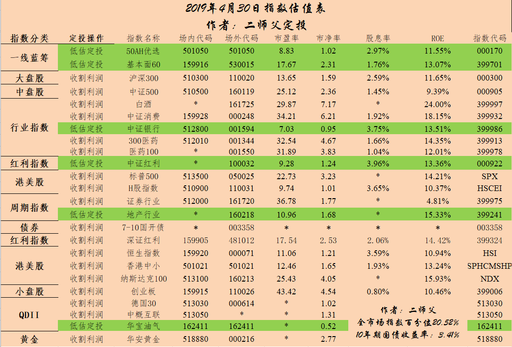

======================================================

_type: talk
@二师父[28814221155551]
2019-05-01 03:27:10 Wed  
topic_id: 844155542581442

<e type="hashtag" hid="225181221421" title="#香港中小指数价值#" />

阅读[5483]  评论[0]  赞[0] 

+++++++++++++++++++++++++++++++++++++++++++++++++++++

文件：
2019-05-01 03:24:43 Wed
文件大小：[87200]
48815115852288-香港中小指数投资价值分析.docx

======================================================

_type: talk
@二师父[28814221155551]
2019-05-01 15:36:55 Wed  
topic_id: 422144414542188

<e type="hashtag" hid="825181212512" title="#关于中证500是否能加仓#" /> 目前因为500的持仓股票盈利下降，所以估值上移，成为正常估值，有得读者目前处于浮亏状态，问是否能加仓，建议等待低估继续定投。

如果一定要定投，也是可以的，一直加仓到底部形成微笑曲线也没有风险。

买指数忘记成本，从估值的角度看指数基金是否能够购买

阅读[5295]  评论[0]  赞[0] 

======================================================

_type: talk
@二师父[28814221155551]
2019-05-02 02:37:21 Thu  
topic_id: 244155514124551

中证500的进一步讲解，大家看文章先理解下，如果还有疑问我再针对性讲解，文中说的其实已经很明白了。

@芥末 at 2019-05-02 02:37:21 Thu

> 这篇文章讲的很详细了，如果坚信500未来一定会盈利的话，手里子弹也充裕的话，浮亏还是要加仓。

----------

@秦风殇韵（刘豫斌） at 2019-05-02 02:37:21 Thu

> 讲得真好，这种触及本质的讲解更具学习价值！

----------

@胡醒醒 at 2019-05-02 02:37:21 Thu

> 真的👍

----------

@凭栏观海 at 2019-05-02 02:37:21 Thu

> 非常好

----------

@心韵 at 2019-05-02 02:37:21 Thu

> 很详细，很好

----------

阅读[5102]  评论[5]  赞[0] 

+++++++++++++++++++++++++++++++++++++++++++++++++++++

文件：
2019-05-02 02:36:47 Thu
文件大小：[23874]
15584884885482-中证500持仓股票盈利下降，还可以定投吗.docx

======================================================

_type: q&a
@罗红涛[841555828481212]
2019-05-02 09:33:45 Thu  
topic_id: 844155511824112

@罗红涛

>  在哪里学习定投技术

@二师父

>  知识星球往期精华可以学习下

阅读[2589]  评论[0]  赞[0] 

======================================================

_type: q&a
@奔波儿霸🐟🐠🐬🐳🐋💦[544884444514584]
2019-05-02 13:51:44 Thu  
topic_id: 244155511215551

@奔波儿霸🐟🐠🐬🐳🐋💦

>  手里有30个左右是用于线下生意用，每次收益2500左右，这个收益全部用来跟师父定投了，生意周转周期最短三天最长两周，平均每月1.5次。但是要求资金到位的及时性，晚到一天都不行。想请师父给算算这个收益如何，在安全的前提下是否值得翻倍投入。另外由于这些资金要求及时性，不敢买定期，现在只能买活期T0类的产品，有什么推荐吗？

@二师父

>  活期买微信理财通的，可以直接赎回，不然货币基金都有赎回时间的

阅读[2450]  评论[5]  赞[0] 

======================================================

_type: q&a
@罗红涛[841555828481212]
2019-05-02 14:40:50 Thu  
topic_id: 844155855851242

@罗红涛

>  怎么加入群 另外怎么加二师傅的微信

@二师父

>  在置顶文章有微信

阅读[2472]  评论[0]  赞[0] 

======================================================

_type: talk
@二师父[28814221155551]
2019-05-03 02:30:15 Fri  
topic_id: 422142288224858

<e type="hashtag" hid="552818824554" title="#选择低估定投的原因#" /> 这是指数投资必须遵循的原则，只要遵循这个原则以及用好四个账户，你的投资就很安全

@麻烦得很 at 2019-05-03 02:30:15 Fri

> 二师父注意休息，身体才是一切的基础

----------

@秦风殇韵（刘豫斌） at 2019-05-03 02:30:15 Fri

> 安全边界是巴菲特一直秉持的投资理念，传自格雷厄姆。

----------

阅读[4473]  评论[2]  赞[0] 

+++++++++++++++++++++++++++++++++++++++++++++++++++++

文件：
2019-05-03 02:29:27 Fri
文件大小：[23835]
88812114218152-投资大师格雷厄姆告诉你为什么要在低估区域内定投.docx

======================================================

_type: q&a
@张雪[422151524141228]
2019-05-03 08:33:01 Fri  
topic_id: 111821155884822

@张雪

>  您好，我是刚加入的新手，想问一下，您配套指数代码的基金，购买的渠道是哪个app,开户优惠怎么享用？想跟着您的步伐操作和学习

@二师父

>  置顶第二篇文章有场内和场外开户福利，可以看一下，场外直接开就好，场内开了需要等客户经理联系你确认调整佣金以后5到7天生效

阅读[2050]  评论[0]  赞[0] 

======================================================

_type: q&a
@杜志彪[544454124115854]
2019-05-03 08:34:04 Fri  
topic_id: 544824415258824

@杜志彪

>  您好二师傅想借鉴一下，这次您减仓500ETF的本金比例是多少？

@二师父

>  减仓了百分之30的500etf，盈利一些

阅读[2149]  评论[4]  赞[0] 

======================================================

_type: talk
@勤能行之[481211221828]
2019-05-03 10:11:13 Fri  
topic_id: 544824415521844

放假了、也旅游回来了，这几天就好好看看二师父的文章。好久没有认真学习了。

阅读[1976]  评论[0]  赞[0] 

======================================================

@二师父[28814221155551]
2019-05-03 12:00:31 Fri  
topic_id: 844154482484482

>  @二师父
>  

阅读[2090]  评论[0]  赞[0] 

======================================================

_type: q&a
@Jason.Yin[841555855888812]
2019-05-03 19:58:53 Fri  
topic_id: 244154482484421

@Jason.Yin

>  二师父，我看有的app上有市盈率TTM，市盈率(动)，市盈率（静），这个有什么区别，怎么参考，参考哪个指标啊？

@二师父

>  1.静态市盈率
>  
>  静态市盈率=当前的总市值/上一年的净利润，是通常所指的市盈率，但因为过去的数值并不能充分说明未来，而投资股票更多的是看企业未来发展，给投资者的决策也带来了不少的盲点和误区。
>  
>  比方现在算中证500的静态市盈率，就是市值除以中证500在2018的净利润
>  
>  2.动态市盈率
>  
>  
>  以未来一年的预测净利润作为分母来进行计算
>  
>  3.滚动市盈率
>  
>  它的计算分母是最近四个季度（仍以一年为周期）的净利润之和。
>  
>  取中证500，2018年第二季度、第三季度、第四季度和2019年第一季度的净利润数据加总作为分母
>  
>  一般采用滚动市盈率，及时性强。

阅读[1983]  评论[0]  赞[0] 

======================================================

@二师父[28814221155551]
2019-05-03 19:59:50 Fri  
topic_id: 422142254881188

>  @二师父
>  

阅读[2076]  评论[1]  赞[0] 

======================================================

_type: talk
@二师父[28814221155551]
2019-05-03 20:02:53 Fri  
topic_id: 244154425414181

<e type="hashtag" hid="142858845452" title="#关于选择基金#" /> 新手刚第一次接触定投建议50ah和基本面60，利用场外定投即可，然后在定投的过程中结合五步定投法完善自己的投资系统和配置组合，一定要在实践中学习领悟，这样进步才快。

要想进步更快的话，每天把自己对定投的领悟和思考发布到星球，只有经过自己讲出来而且能让别人也明白的东西才算是真的懂了

@剑伟 at 2019-05-03 20:02:53 Fri

> 赞成，只有通过自己讲出来，别人能听懂了理解了，才是真的进步了。

----------

@奔波儿霸🐟🐠🐬🐳🐋💦 at 2019-05-03 20:02:53 Fri

> 我也是刚加入队伍没几天的新手，通过这几天的翻阅，初步总结就是这几点：1.要学习并掌握基本知识，比如低估高估的标准以及不同类型的基金采用的判断指标也不同。2.要自律不盲目，坚持低估定投正常取利高估逐步卖出的原则。3.打碎脑子里的幻想，要把控好安全边际，对自己或是全家的资产负责，合理的配置非常重要。4.如果不是专职搞金融还是应该多在本职工作或本职生意上下功夫，没进项拿什么理财。以上是入队10的一点体会，不足之处请指正。

----------

@二师父 at 2019-05-03 20:02:53 Fri

> 可以通过分享在自己专业领域建立影响力

----------

@奔波儿霸🐟🐠🐬🐳🐋💦 at 2019-05-03 20:02:53 Fri

> 我是计算机专业毕业，现在在能源行业扛把子的投资公司做信息工作，计划接下来利用现有之便，研究研究it和能源，我这10天下来的收获已然成为我们单位的基金大腿了……

----------

@二师父 at 2019-05-03 20:02:53 Fri

> 进步神速

----------

@留影 at 2019-05-03 20:02:53 Fri

> 低估高估的标准以及不同类型的基金采用的判断指标也不同，这个在哪个文章里有，急需的知识

----------

@奔波儿霸🐟🐠🐬🐳🐋💦 at 2019-05-03 20:02:53 Fri

> 我是翻的精华帖拢的

----------

@二师父 at 2019-05-03 20:02:53 Fri

> 阈值我今晚发布下，一般更新之后会贴出来

----------

阅读[2181]  评论[9]  赞[0] 

======================================================

_type: talk
@彩色[48415121851218]
2019-05-03 20:48:50 Fri  
topic_id: 111821142842882

休假期间才有时间学习，不知二师父方便时是否可以帮忙解答下？我看估值表上的 50ah当前市盈率是8.83，我进果仁网看到的加权市盈率是12.32？是不是我选择的指标有问题呢？谢谢。还是我选择的估值查询网站有问题呢？二师父是否能指点下？

@彩色 at 2019-05-03 20:48:50 Fri

> 我貌似搞明白了，因为2019年1季度净利润出来后，PE-TTM更新了，由于净利润增速下滑，使得PE-TTM上升，因此50ah已进入正常估值，应停止定投。类似于中证500的估值上移。不知是否正确？

----------

阅读[2174]  评论[1]  赞[0] 

+++++++++++++++++++++++++++++++++++++++++++++++++++++

图片：
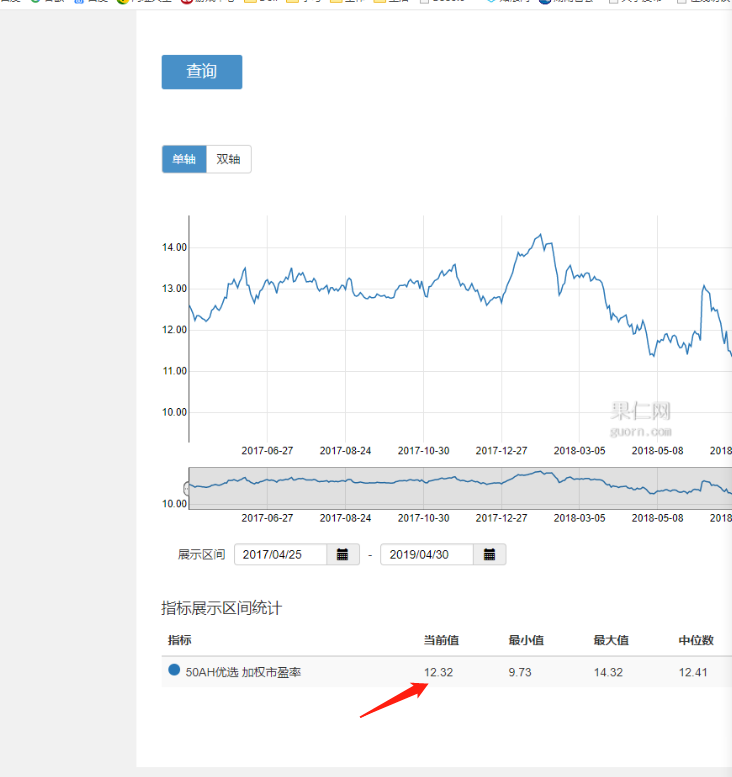

======================================================

_type: q&a
@志亮[422125851552828]
2019-05-04 00:25:45 Sat  
topic_id: 422142258814428

@志亮

>  二师父，听某位大v说，科创版开始后，创业板也会受影响而上涨，请问是否会这样？现在是否要开始布局创业版基金了?

@二师父

>  我们投资永远根据估值来，这样更安全，这种预测市场的做法适合趋势交易
>  
>  还有一个问题，创业板和科创板同属一种类型的基金，资金都涌入到科创板基金里面了，对创业板不是利空吗

阅读[2090]  评论[3]  赞[0] 

======================================================

_type: q&a
@彩色[48415121851218]
2019-05-04 02:34:12 Sat  
topic_id: 844154428188822

@彩色

>  休假期间才有时间学习，不知二师父方便时是否可以帮忙解答下？我看估值表上的 50ah当前市盈率是8.83，我进果仁网看到的加权市盈率是12.32？是不是我选择的指标有问题呢？谢谢。还是我选择的估值查询网站有问题呢？二师父是否能指点下？

@二师父

>  数据有少许误差是正常的，因为每个网站统计的数据都会有些出入，而且采用静态市盈率，动态市盈率，滚动市盈率三个指标计算所得到的数据都是不同的

阅读[2116]  评论[1]  赞[0] 

======================================================

_type: talk
@二师父[28814221155551]
2019-05-04 03:43:57 Sat  
topic_id: 244154428122441

<e type="hashtag" hid="225125552211" title="#新手怎么入门#" /> 新手怎么入门，学习有一个积累和领悟的过程，慢慢就懂了，不要着急。再这个过程中可以多输出，多分享。

@木子李 at 2019-05-04 03:43:57 Sat

> 师傅，之前定投PPT里是建议新手，沪深300中证500，是不是新手在不同的时间点进入，购买的指数基金还是略有区别的，还是要看当时的哪个品种低估较好？而不是一成不变的？

----------

@二师父 at 2019-05-04 03:43:57 Sat

> 是的啊，股市每天都在变化，而且估值也在变化，现在中证500是正常估值了，学会灵活运用投资知识，而不能死守教条

----------

@木子李 at 2019-05-04 03:43:57 Sat

> 悲催的是，刚买好中证500就估值正常啦。那是不是要停止定投，待低估时在开始定投，？还要不要买你的新建议？新手有一种跟不上节奏的感觉

----------

@二师父 at 2019-05-04 03:43:57 Sat

> 投资本来就是变化的，没有一成不变的，坚持低估买入就可以

----------

@木子李 at 2019-05-04 03:43:57 Sat

> 谢谢师傅，边实践边总结

----------

阅读[4424]  评论[5]  赞[0] 

+++++++++++++++++++++++++++++++++++++++++++++++++++++

文件：
2019-05-04 03:43:24 Sat
文件大小：[23396]
28814555114881-新手入门定投的正确姿势.docx

======================================================

_type: q&a
@Tom[51452428251484]
2019-05-04 10:44:31 Sat  
topic_id: 422142258128528

@Tom

>  请问师傅，现在保险行业估值处于什么区间？是否可以投167301（方正富邦中证保险主题）？

@二师父

>  目前保险行业指数处于正常估值，不适合买入了

阅读[1975]  评论[0]  赞[0] 

======================================================

_type: q&a
@开卷沐春意[422214414858458]
2019-05-04 10:49:55 Sat  
topic_id: 544824454452154

@开卷沐春意

>  二师傅，从中证银行和50AH里各选一只还是选一只

@二师父

>  各选择一只即可，你可以看到这两只基金的持仓股票有重合的地方

阅读[2041]  评论[0]  赞[0] 

======================================================

_type: q&a
@曾来[841555815828282]
2019-05-04 10:52:16 Sat  
topic_id: 244154424428581

@曾来

>  师父，这是我最近的操作，收割了一部分利润，中间还投了一部分，我感觉这几只是否能精简一下，再引入几只别的可投标的？现在不知如何选择取舍，师父帮我分析一下这里边是否重复性很大，合并几只？谢谢

@二师父

>  消费增长分级和食品饮料重合了，另外混合基金建议全部替换成指数基金，我推荐的6只优选指数基金可以纳入进来

阅读[2266]  评论[1]  赞[0] 

======================================================

_type: talk
@杜志彪[544454124115854]
2019-05-04 11:11:11 Sat  
topic_id: 422142251541548

4个月投资总结：选定十只定投品种，50AH，基本面60，300ETF，500ETF，白酒，消费，人工智能，中概互联，香港中小，标普500，尽量在场内定投，好处进出资金方便，目前5层仓位定投，4层仓位股票，定投资金主要仓位目前集中在50AH，300ETF，500ETF，此外计划每年增加定投3万资金，从五月开始每月定投2500（这个资金需要在上面十只定投品种中选择，根据目前情况只能投到低估的50AH和基本面60中），股票方面不会再增持了，以后会保留3层仓位（目前持有水井坊，海天味业，中国平安，华兰生物，上海机场，招商银行，美亚光电，中国电影），以上总结投资计划如有不足，希望二师父和各位朋友多多指教。

阅读[2319]  评论[0]  赞[0] 

======================================================

_type: q&a
@一剪梅[844115184528882]
2019-05-04 12:33:36 Sat  
topic_id: 844154421848512

@一剪梅

>  师父，我之前有开户买中证500+沪深300，发现中证500在低估值范围内，不过沪深300估值高了，那么还继续定投吗？

@二师父

>  估值正常就不用定投了，目前根据我们的数据中证500也在正常估值范围内

阅读[2345]  评论[5]  赞[0] 

======================================================

_type: q&a
@彩色[48415121851218]
2019-05-04 12:35:59 Sat  
topic_id: 844154421228842

@彩色

>  求问二师父我们的估值表中的估值数据是用的哪个网站的呢？我貌似搞明白了，因为50ah的成分股2019年1季度净利润出来后，PE-TTM更新了，由于净利润增速下滑，使得PE-TTM上升，因此50ah已进入正常估值，应停止定投。类似于中证500的估值上移。不知是否正确？

@二师父

>  50ah是正常估值的，盈利增速需要看具体股票，有的增长有的下降，估值数据用的wind

阅读[2364]  评论[0]  赞[0] 

======================================================

_type: talk
@二师父[28814221155551]
2019-05-04 16:07:53 Sat  
topic_id: 544824442148524

投资切忌人云亦云，盲目轻信他人。而对于定投来说，投资者需要对自己的投资偏好、基金的行业和风格有独立、自主、清晰、明确的判断。不要他人说这个行业前景好，那个板块估值低就频繁地切换投资标的，一来他人的理财方式不一定适合你，二来达不到持续定投的分摊效应，还有可能支付高额的手续费。科学的定投要详尽地调查渠道背景，谨慎分辨投资标的，细心规划资金配置，灵活进行退场再投，千万不要只靠他人的一家之言做定投，那样会悔不当初。

阅读[2248]  评论[0]  赞[0] 

======================================================

_type: q&a
@小小鸟[111885884481252]
2019-05-04 16:28:17 Sat  
topic_id: 544824442145184

@小小鸟

>  请问二师傅，股指期货放开对基金定投有影响吗？

@二师父

>  没有影响的，抓住定投的本质，只要在低估区域定投，长期坚持3到5年都能盈利，跟外部没有多大关系

阅读[2344]  评论[0]  赞[0] 

======================================================

@二师父[28814221155551]
2019-05-04 23:52:43 Sat  
topic_id: 244154442181421

>  @二师父
>  

阅读[2344]  评论[0]  赞[0] 

======================================================

_type: talk
@二师父[28814221155551]
2019-05-05 04:22:39 Sun  
topic_id: 544824448288524

<e type="hashtag" hid="142842212282" title="#定投中的变与不变#" /> 抓住本质

阅读[4501]  评论[0]  赞[0] 

+++++++++++++++++++++++++++++++++++++++++++++++++++++

文件：
2019-05-05 04:22:24 Sun
文件大小：[22881]
51184221852114-定投中的变与不变.docx

======================================================

_type: talk
@二师父[28814221155551]
2019-05-05 04:29:45 Sun  
topic_id: 844154441855842

定投周报，每周精华内容

阅读[4791]  评论[0]  赞[0] 

+++++++++++++++++++++++++++++++++++++++++++++++++++++

文件：
2019-05-05 04:29:34 Sun
文件大小：[278917]
28814558125881-二师父定投周报5.4.docx

======================================================

_type: talk
@黑夜DE彩虹[28281541155841]
2019-05-05 10:57:37 Sun  
topic_id: 244154415852141

师父您好，请问，对于美国的指数，标普500和纳斯达克100定投，如果采用低估定投的话，目前，美国市场一直是慢牛，而且大部分时间是正常估值，这个应该怎么能合适的开始定投这两个指数基金呢？

@杜志彪 at 2019-05-05 10:57:37 Sun

> 等待，机会总是留给有准备的人。

----------

@Franky at 2019-05-05 10:57:37 Sun

> 调整一下安全边际

----------

@银河系 at 2019-05-05 10:57:37 Sun

> 等待低估了在入场

----------

@凭栏观海 at 2019-05-05 10:57:37 Sun

> 等待

----------

@黑夜DE彩虹 at 2019-05-05 10:57:37 Sun

> 美股市场一直是慢牛的状态，低估不容易出现吧

----------

@剑伟 at 2019-05-05 10:57:37 Sun

> 正常估值可以持有，并且配合五步定投法中的没浮盈10%就收割的策略。

----------

@黑夜DE彩虹 at 2019-05-05 10:57:37 Sun

> 我还没开始定投，本想定投这两个呢，但是，现在是正常估值，不敢出手

----------

@剑伟 at 2019-05-05 10:57:37 Sun

> 二师父的核心策略，低估定投，正常估值耐心等待。

----------

阅读[2331]  评论[8]  赞[0] 

======================================================

_type: talk
@云起[244111151554141]
2019-05-05 13:02:10 Sun  
topic_id: 544824485181554

二师父好我是新来的，我原来定投富国300和建信500都是增强的，现在估值正常了我想减半定投。在另加入50AH优选(501050)和基本面60（530015)二师父您看可以吗，是不是互相有重复。

@银河系 at 2019-05-05 13:02:10 Sun

> 前者是大盘股和中盘股代表，估值正常了就暂定定投；后者是一线蓝筹，有部分重合才对，但继续定投不影响才对

----------

@凭栏观海 at 2019-05-05 13:02:10 Sun

> 最好按照二师父所说，目前只定投50AH和基本面60

----------

@剑伟 at 2019-05-05 13:02:10 Sun

> 50AH是上证50支，基本面60是深市60支。分属于两个市场的一线蓝筹。

----------

阅读[2519]  评论[3]  赞[0] 

======================================================

_type: talk
@奇迹相伴[422118428544848]
2019-05-05 20:59:12 Sun  
topic_id: 244154411228151

什么是定投5步法？

@志亮 at 2019-05-05 20:59:12 Sun

> 二师父新手教程里就有说到

----------

@剑伟 at 2019-05-05 20:59:12 Sun

> 置顶第二遍文章，里面有PDF可以下载。

----------

阅读[2257]  评论[2]  赞[0] 

======================================================

_type: q&a
@奇迹相伴[422118428544848]
2019-05-05 21:30:42 Sun  
topic_id: 422142211551548

@奇迹相伴

>  50ah  和本面60是基金代码是多少呀

@二师父

>  置顶第二篇文章里面有pdf文档公布了的

阅读[2350]  评论[0]  赞[0] 

======================================================

@二师父[28814221155551]
2019-05-05 21:31:37 Sun  
topic_id: 844154158881512

>  @二师父
>  

阅读[2505]  评论[3]  赞[0] 

======================================================

_type: q&a
@李震笛[422112248211828]
2019-05-05 22:02:47 Sun  
topic_id: 244154158848121

@李震笛

>  二师父，如果今年上半年如果会出现指数的底部，现在手上的指数基金是不是等到盈利就应该全部清仓。等待明显往下走的时候，再慢慢进去？

@二师父

>  这个没法预测今年是否出现底部，按照当前的进度正常定投即可，有利润就可以收割，预测常常被打脸

阅读[2459]  评论[2]  赞[0] 

======================================================

_type: q&a
@志亮[422125851552828]
2019-05-06 00:55:30 Mon  
topic_id: 111821824258482

@志亮

>  二师父，本人身体不太好现在只有副职业而没去上班了，由于时间比较多，关于那个定投我是否可以手动来定投，我是打算𣎴定期不定额来定投可以不，就是上涨不加仓，只会根据下跌的幅度来加仓，就是合起来跌2个百分点以内不加仓，超过就加一次仓，若下跌超过4个百分点就加双倍，请问我这样的加仓合理不？是否要有什么要改进的地方？我总认为手动加仓会比自动定投好，因为我感到自动定投太死板了。

@二师父

>  可以手动加仓的，只看下跌幅度加仓是类似我们的网格交易，这种没问题，但需要有很多的补仓资金，还有一种是均线偏离策略，根据均线偏离程度来计算加仓的多少，本质都是一样的
>  
>  第三种是根据估值指标，用阈值除以当前市盈率得到加仓的倍数再乘以一个系数
>  
>  怎样加都可以，都是逆向思维投资

阅读[2343]  评论[5]  赞[0] 

======================================================

_type: q&a
@奇迹相伴[422118428544848]
2019-05-06 00:56:25 Mon  
topic_id: 244154152825541

@奇迹相伴

>  为什么天天基金里面买基金有申购费率和认购费率两个费率，而蚂蚁财富让只有申购费率呀？

@二师父

>  认购是对封闭式基金，申购是对开放式基金的

阅读[2458]  评论[2]  赞[0] 

======================================================

_type: talk
@二师父[28814221155551]
2019-05-06 03:23:00 Mon  
topic_id: 244154152211481

<e type="hashtag" hid="142842581142" title="#中证传媒#" /> 有投资的吧，之前有过提示，后来进入的朋友可以再看看

阅读[4779]  评论[0]  赞[0] 

+++++++++++++++++++++++++++++++++++++++++++++++++++++

文件：
2019-05-06 03:22:19 Mon
文件大小：[167272]
51184224115824-中证传媒指数盈利进一步下滑，周期指数投资需要慎重.docx

======================================================

_type: talk
@杜志彪[544454124115854]
2019-05-06 10:55:15 Mon  
topic_id: 244154185152111

1.投资中最重要的三件事：保本、保本、保本。

2.有跨越七尺栏杆的能力，但只找三尺的跨越。

3.如果在能力圈内找不到投资机会，我们不会轻易扩大能力圈，而是继续等待。

@杜志彪 at 2019-05-06 10:55:15 Mon

> 等待是投资者最需要过的一关，相信会有低估的那一天，我的十个基金定投，我继续等。

----------

@剑伟 at 2019-05-06 10:55:15 Mon

> 老师傅🐂🍺

----------

阅读[1971]  评论[2]  赞[0] 

======================================================

@二师父[28814221155551]
2019-05-06 11:54:24 Mon  
topic_id: 844154154488542

>  @二师父
>  

阅读[1862]  评论[0]  赞[0] 

======================================================

_type: q&a
@涓涓[111815125145522]
2019-05-06 11:54:48 Mon  
topic_id: 422142142254888

@涓涓

>  二师父：今天大盘下跌，看着跌破3000点了，可以加仓吗？

@二师父

>  可以的，加仓我们定投的宽基指数

阅读[2017]  评论[2]  赞[0] 

======================================================

_type: q&a
@彩色[48415121851218]
2019-05-06 11:55:56 Mon  
topic_id: 111821821141482

@彩色

>  @二师父～北京～金融 哈哈 三千点以下了，求问二师父今天可以加仓一成仓位不？上周五刚赎回了两成中证500 沪深300和中证红利的部分仓位。现在想加仓基本面60。与上证50实现风险对冲

@二师父

>  可以的，建议定投，基本面60还有比较大的跌幅，加仓一成继续定投有充裕资金也没事

阅读[2120]  评论[1]  赞[0] 

======================================================

_type: q&a
@蓝魔森林[28888244485121]
2019-05-06 12:02:02 Mon  
topic_id: 422142142228448

@蓝魔森林

>  几个小时前收到了美国要对中国加征关税的负面消息，股市很大概率要回撤，是不是可以先暂时所有定投以观察行情走势情况？谢谢

@二师父

>  回撤刚好是定投的机会啊，一步步加仓到市场底部，上涨就能赚钱了

阅读[2313]  评论[2]  赞[0] 

======================================================

_type: q&a
@Tom[51452428251484]
2019-05-06 12:02:58 Mon  
topic_id: 544824811114214

@Tom

>  师父好，今天这个情况，低估表中的可以加仓吗

@二师父

>  可以加仓，我已经买了

阅读[2320]  评论[0]  赞[0] 

======================================================

_type: q&a
@志亮[422125851552828]
2019-05-06 12:04:02 Mon  
topic_id: 244154188824141

@志亮

>  二师父，今天股市跌的太厉害了，是否熊市又要来了？一些股票和基金是否要清仓一部分？

@二师父

>  股票如果跌破20日均线可以清仓，没有的话可以卖出一部分落袋为安，低估的指数基金继续定投，逆势加仓没问题

阅读[2465]  评论[2]  赞[0] 

======================================================

_type: q&a
@xyh[244142851552841]
2019-05-06 12:30:24 Mon  
topic_id: 544824811144244

@xyh

>  二师父，我有创业板和计算机指数、中证证券各两成，算上今天的都差不多跌了10%了，可以加仓吗，还有三成的中证500，现在是正常估值，是继续定投到止损还是持有不动

@二师父

>  不用止损，创业板和券商仍旧很贵的，不建议加仓，中证500可以继续持有

阅读[2280]  评论[0]  赞[0] 

======================================================

_type: q&a
@旺锦古法土制红糖 范*[422152185412288]
2019-05-06 12:30:44 Mon  
topic_id: 544824811144824

@旺锦古法土制红糖 范*

>  二师父 今天中证500可否定投

@二师父

>  可以的，不要定投太多这个指数

阅读[2329]  评论[1]  赞[0] 

======================================================

_type: q&a
@J[28281541518551]
2019-05-06 12:31:23 Mon  
topic_id: 844154188815182

@J

>  二师父好，今天大跌反而有点小开心😄 你也启动鳄鱼计划了，我们场外可以用C类跟投鳄鱼计划吗？请指导

@二师父

>  也可以的，就是费率高点，其他差别也不大

阅读[2674]  评论[2]  赞[0] 

======================================================

_type: q&a
@奔波儿霸🐟🐠🐬🐳🐋💦[544884444514584]
2019-05-06 12:41:23 Mon  
topic_id: 844154188221552

@奔波儿霸🐟🐠🐬🐳🐋💦

>  因为刚开始玩没建仓过，今天这个情况，按照一个月的定投份额对4月30号表中绿色部分买一轮当建仓了合适不？

@二师父

>  不用全部买，银行，50ah和基本面60这三个可以

阅读[2642]  评论[2]  赞[0] 

======================================================

_type: talk
@二师父[28814221155551]
2019-05-06 13:31:11 Mon  
topic_id: 544824811825144

一夜回到解放前，a股的实际情况告诉我们，一直持有到牛市高点是不现实的，所以我们需要利润收割和根据均线进行波段操作

@阳光橙 at 2019-05-06 13:31:11 Mon

> 请问二师父，牛市今年不会来了吗？我们继续低估定投呗，打光子弹再卧倒

----------

@门萨🐨 at 2019-05-06 13:31:11 Mon

> 挺好的呀！

----------

@归去来兮 at 2019-05-06 13:31:11 Mon

> 下次一定要收割利润了

----------

@归去来兮 at 2019-05-06 13:31:11 Mon

> 辛苦四月是为何，不如川普一推特

----------

@陈 at 2019-05-06 13:31:11 Mon

> 还好，严格按照二师父的收割利润了！
机会是跌出来的！

----------

@shi at 2019-05-06 13:31:11 Mon

> 500的盈利从20%多变为了13%，今天之后估计个位数了。
看来仓位小也得收割点利润:-)

----------

@二师父 at 2019-05-06 13:31:11 Mon

> 继续定投了，牛市预计明年来

----------

@爱华 at 2019-05-06 13:31:11 Mon

> 经历一下利润回吐也不是不好[偷笑]锻炼一下心脏[偷

----------

阅读[2628]  评论[10]  赞[0] 

======================================================

_type: talk
@Eric[48548828828848]
2019-05-06 14:12:39 Mon  
topic_id: 422142185454558

他强由他强，清风拂山冈。他横任他横，明月照大江。

阅读[2311]  评论[0]  赞[0] 

======================================================

_type: talk
@Nancy[28245584485581]
2019-05-06 14:34:06 Mon  
topic_id: 544824815118484

请问各位同学，我的广发证券是很早就开了一个，不知道如何查佣金是多少呢？有知道的同学能否告知一下怎么查询？

@Zyxj at 2019-05-06 14:34:06 Mon

> 查资金流水。

----------

@宁静致远 at 2019-05-06 14:34:06 Mon

> 查交割记录，可以看到佣金和税金

----------

@JOY at 2019-05-06 14:34:06 Mon

> 可以问APP里面的人工客服，应该能帮你查

----------

@Nancy at 2019-05-06 14:34:06 Mon

> 资金流水貌似看不到佣金[撇嘴][撇嘴]

----------

@Nancy at 2019-05-06 14:34:06 Mon

> 能请教一下交割记录在广发APP里面怎么查么？我在APP和电脑端都没查到，多谢！

----------

@Nancy at 2019-05-06 14:34:06 Mon

> 人工客服不能查，已经问过啦

----------

阅读[2227]  评论[6]  赞[0] 

======================================================

_type: talk
@上上签[244184512458541]
2019-05-06 15:59:50 Mon  
topic_id: 844154182155152

别人恐惧时我贪婪，机会总是留给有准备的人

阅读[2117]  评论[0]  赞[0] 

======================================================

_type: q&a
@Tom[51452428251484]
2019-05-06 16:08:16 Mon  
topic_id: 111821854224222

@Tom

>  师父，请问300价值，50ah，基本面60，中证红利，中证银行，标普红利机会，这几个之间有哪几个重叠度高的？，这几个都是低估，如何选择，谢谢

@二师父

>  300和50，60，银行有重合，买入50ah加基本面60，红利任意选择一只即可

阅读[2203]  评论[8]  赞[0] 

======================================================

_type: q&a
@李震笛[422112248211828]
2019-05-06 16:09:09 Mon  
topic_id: 544824815228154

@李震笛

>  今天跌的真疯狂，估计收市以后很多指数就进入低估值了吧？现在想加仓买进新的品种。二师父，想问问，您觉得现在是基本面60好，还是上证红利好？

@二师父

>  差不多，各有利弊，一个是沪市蓝筹一个是深市的

阅读[2352]  评论[0]  赞[0] 

======================================================

_type: q&a
@杜志彪[544454124115854]
2019-05-06 16:11:17 Mon  
topic_id: 844154182212882

@杜志彪

>  二师父您中国平安股价已低于20天均价，清仓了吗？

@二师父

>  平安已经卖了，及时获利了结，中期看是要下跌，股票我操作比较灵活

阅读[2377]  评论[3]  赞[0] 

======================================================

_type: q&a
@志亮[422125851552828]
2019-05-06 16:37:57 Mon  
topic_id: 844154182122222

@志亮

>  二师父，很后悔没早点研究你那个卖出定论教程，我的中证500在盈利了10多个点的时候没实出，现在𣎴知道卖出还是持有好，目前是三层仓位。

@二师父

>  亏损就别卖了，500如果继续跌我还会加仓的

阅读[2509]  评论[4]  赞[0] 

======================================================

_type: q&a
@海〔纳百川〕[422111285141888]
2019-05-06 16:39:14 Mon  
topic_id: 422142185152428

@海〔纳百川〕

>  二师父，问一问，估值表每天都在星球内更新吗？去哪里看呢？今天的没有看到。

@二师父

>  每天星球都会发布的，一般是晚上公布，看星球消息就可以了

阅读[2703]  评论[5]  赞[0] 

======================================================

_type: q&a
@奇迹相伴[422118428544848]
2019-05-06 18:55:04 Mon  
topic_id: 422142181155228

@奇迹相伴

>  你说的50跟60都是场内的吗？

@二师父

>  50ah场内场外都有的，是lof基金。基本面60是场外基金，在场外申购

阅读[2737]  评论[3]  赞[0] 

======================================================

_type: q&a
@一剪梅[844115184528882]
2019-05-06 18:57:05 Mon  
topic_id: 544824818858484

@一剪梅

>  师父，场内基金对我们新手可以买吗？

@二师父

>  可以买的，很多人把场内基金想的太复杂，其实很简单的，自己开通一个股票账户实践操作一下很多问题都没了，想，永远都是各种问题，只有实践和学习才能解决问题的，资金量在1万以上都可以实践下，一次也就几百元

阅读[2751]  评论[5]  赞[0] 

======================================================

_type: q&a
@🐰Mandy[244148854285821]
2019-05-06 18:58:30 Mon  
topic_id: 244154125544841

@🐰Mandy

>  你好，二师父，由于中证500开始定投时间才不到两个月，但看估值表是建议收割利润，但现在利润还是负数，是继续持有吗？

@二师父

>  如果是亏损的就继续持有，等待低估加仓，或者盈利了开始收割，定投止赢不止损的，永远不在亏损卖出

阅读[2908]  评论[1]  赞[0] 

======================================================

_type: talk
@二师父[28814221155551]
2019-05-06 19:03:07 Mon  
topic_id: 844154125822812

<e type="hashtag" hid="142842125852" title="#建立底仓#" /> 今天大盘跌到2900，如果明天继续下跌，可以建立两层底仓，然后继续定投，这才是比较好的定投时机，后面场内可以利用网格交易策略或者均线定投策略，3000点以下，估值表里面低估的指数基金可以放心大胆地加仓，不用担心和恐惧，未来一定盈利

@惟子 at 2019-05-06 19:03:07 Mon

> 哈，机会总是跌出来的

----------

@陈 at 2019-05-06 19:03:07 Mon

> 正要问这个问题，二师父就发出来了！[呲牙]

----------

@梧桐 at 2019-05-06 19:03:07 Mon

> 但不明白的是，记得今天二师父讲过基本面60还会有比较大的跌幅

----------

@二师父 at 2019-05-06 19:03:07 Mon

> 这是相对18年底部讲的

----------

@秦风殇韵（刘豫斌） at 2019-05-06 19:03:07 Mon

> 两层底仓就是20%仓位的意思吧

----------

@二师父 at 2019-05-06 19:03:07 Mon

> 对的

----------

@奔波儿霸🐟🐠🐬🐳🐋💦 at 2019-05-06 19:03:07 Mon

> 如果明天接着下跌，按照总投额的20%，把估值表里绿色的投一遍，二师父说的是这个意思吧

----------

@乖子 at 2019-05-06 19:03:07 Mon

> 谢谢二师父指点

----------

阅读[3075]  评论[15]  赞[0] 

======================================================

_type: q&a
@一剪梅[844115184528882]
2019-05-06 20:00:35 Mon  
topic_id: 111821842445442

@一剪梅

>  师父，我搜到了鳄鱼计划中的基金，我要怎么买，买低估值的两支还是要多买几支？也是和场外基金一样一个月定投一样钱数吗

@二师父

>  定投啊，鳄鱼计划里面的都买，每次我会买两到三只，这个你自己计算定投金额，我的鳄鱼计划的一次定投份额是场外的3倍

阅读[2942]  评论[2]  赞[0] 

======================================================

_type: talk
@二师父[28814221155551]
2019-05-06 22:46:06 Mon  
topic_id: 111821845118842

<e type="hashtag" hid="225125488281" title="#关于学习#" /> 建议大家把精华和置顶文章都读一遍了再提问。实在精力不足要把置顶读完，我可以传授知识，但是知识被你领悟和掌握需要自己去学习和思考，这个过程我没法帮你

阅读[2596]  评论[0]  赞[0] 

======================================================

_type: talk
@二师父[28814221155551]
2019-05-06 22:46:12 Mon  
topic_id: 544824851448854

<e type="hashtag" hid="225125488281" title="#关于学习#" /> 建议大家把精华和置顶文章都读一遍了再提问。实在精力不足要把置顶读完，我可以传授知识，但是知识被你领悟和掌握需要自己去学习和思考，这个过程我没法帮你

阅读[2679]  评论[0]  赞[0] 

======================================================

_type: q&a
@One[422118584812518]
2019-05-07 00:29:32 Tue  
topic_id: 544824855241884

@One

>  二师父，不知道您对新债申购了不了解，明天的大业转债有前途吗

@二师父

>  最近牛转熊，建议等等再打新债

阅读[2715]  评论[0]  赞[0] 

======================================================

_type: talk
@二师父[28814221155551]
2019-05-07 03:48:36 Tue  
topic_id: 544824858282424

<e type="hashtag" hid="225125481411" title="#利润收割#" />

@志亮 at 2019-05-07 03:48:36 Tue

> 听君一席话 胜读十年书，看了二师父的文章，我醒悟了，是呀，我们只要抓住一年的一二次机会就够了，之前的我投资股票太重视每次的得失了，过程不重要，结果才重要呀，感谢二师父，受到了你的启发，我终于可以建立自己投资股票的交易系统了，输的几万本金就当交学费算了，想通这些我现在心情好多了。[微笑]

----------

@志亮 at 2019-05-07 03:48:36 Tue

> 上面的说错了，应该是几年一二次机会，毕竟牛市需要几年时间[呲牙]

----------

@奔波儿霸🐟🐠🐬🐳🐋💦 at 2019-05-07 03:48:36 Tue

> 有二师父耳提面命，很棒。

----------

@💗朵儿studio * at 2019-05-07 03:48:36 Tue

> 二师父的知识让我们学会的不仅仅是投资理财，更是一种人生理念，如何做还要靠自己领悟。

----------

@二师父 at 2019-05-07 03:48:36 Tue

> 慢慢来

----------

@志亮 at 2019-05-07 03:48:36 Tue

> 说的对哦，他的人生理念值得我们学习的。

----------

@齐俊波 at 2019-05-07 03:48:36 Tue

> 二师父，您一般累计多少点收割一次利润？我们常常在盈利还没有达到20%的时候，都经历几次回撤了。收割的频次，有没有什么讲究？

----------

@二师父 at 2019-05-07 03:48:36 Tue

> 至少10个点，太多没必要，而且看你基金的实际情况决定卖出多少，比如之前传媒我就是直接清仓，中证500我一次就卖的比较多，基金不好就多卖点，不是机械操作

----------

阅读[4865]  评论[9]  赞[0] 

+++++++++++++++++++++++++++++++++++++++++++++++++++++

文件：
2019-05-07 03:47:15 Tue
文件大小：[23728]
48812488844188-今日份暴跌，利润收割大法成功保住了我们的胜利果实.docx

======================================================

_type: talk
@二师父[28814221155551]
2019-05-07 04:05:52 Tue  
topic_id: 422142151418158

根据均线偏离表没有特别要加仓的，淡定的等待机会

@一无所有 at 2019-05-07 04:05:52 Tue

> 二师父，早上好！我是一投资小白，请问一下如何根据均线偏移表来确定是否加仓？

----------

@陈 at 2019-05-07 04:05:52 Tue

> 看置顶文章。在自己舍得份额基础上-1加一倍，-2加1.5倍，以此类推！

----------

@一无所有 at 2019-05-07 04:05:52 Tue

> 谢谢啦！陈

----------

@奔波儿霸🐟🐠🐬🐳🐋💦 at 2019-05-07 04:05:52 Tue

> 真遗憾，竟然木有可以加仓的。

----------

@二师父 at 2019-05-07 04:05:52 Tue

> 这是从均线偏离度来看，从估值角度看仍旧可以加仓，投资策略灵活运用

----------

@奔波儿霸🐟🐠🐬🐳🐋💦 at 2019-05-07 04:05:52 Tue

> 关于50AH和基本面60用不用再看下今天的形式再建仓？今天要是升回去了还值得对这两个建仓吗？

----------

@rtdmm小米 at 2019-05-07 04:05:52 Tue

> 二师父，早上好，如果每天的估值表和均线偏离表放在一起就更好了，方便比较，一目了然

----------

@二师父 at 2019-05-07 04:05:52 Tue

> 主要参考估值表定投就行，均线偏离表是看是否需要额外补仓

----------

阅读[2813]  评论[8]  赞[0] 

+++++++++++++++++++++++++++++++++++++++++++++++++++++

图片：
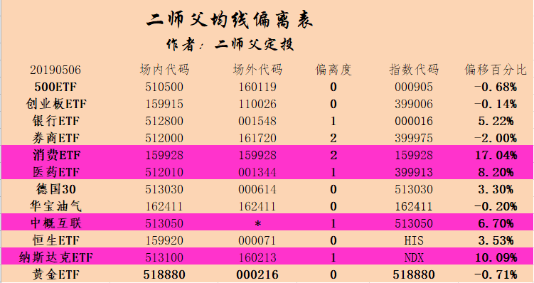

======================================================

_type: talk
@志亮[422125851552828]
2019-05-07 09:59:09 Tue  
topic_id: 844154145258222

昨天清仓股票，今天就大涨，股市太让人郁闷了😒。

@乖子 at 2019-05-07 09:59:09 Tue

> 晕

----------

@上上签 at 2019-05-07 09:59:09 Tue

> 追涨杀跌，很常见的散户行为，哎，但是如果是看了二师傅文章，还这样，那就很不应该了

----------

@志亮 at 2019-05-07 09:59:09 Tue

> 是呀，股市就是一个让人看清自己的人，看来我会受影响，就是道行还不到家呀。

----------

阅读[2175]  评论[3]  赞[0] 

======================================================

@二师父[28814221155551]
2019-05-07 10:10:26 Tue  
topic_id: 422142151182548

>  @二师父
>  

阅读[2284]  评论[0]  赞[0] 

======================================================

_type: q&a
@海〔纳百川〕[422111285141888]
2019-05-07 10:10:40 Tue  
topic_id: 422142151111528

@海〔纳百川〕

>  二师父，请问一下，您买的是哪些货币基金？我想跟买一点。

@二师父

>  南方天天利B

阅读[2297]  评论[0]  赞[0] 

======================================================

_type: q&a
@Steven Zha*[142428111482]
2019-05-07 10:11:22 Tue  
topic_id: 111821812224552

@Steven Zha*

>  二师父，您好，想请问，基本面50 160716还适合定投吗？之前看您的估值表有这只基金，现在取消了。。。特来询问下

@二师父

>  可以定投的，也是很有价值的一只基金，只是学会取舍和精简很重要

阅读[2577]  评论[0]  赞[0] 

======================================================

@二师父[28814221155551]
2019-05-07 10:12:36 Tue  
topic_id: 422142124411458

>  @二师父
>  

阅读[2631]  评论[0]  赞[0] 

======================================================

_type: q&a
@杜志彪[544454124115854]
2019-05-07 10:14:12 Tue  
topic_id: 422142124811458

@杜志彪

>  二师父我对中国平安还是有疑问，您卖出后是等待合理估值（低估）再买入，还有一种情况没有低估但是重新站上20天均线您是否买回。

@二师父

>  这个看情况了，主要不是看技术指标，而是看财务报表预测未来盈利增速，如果未来盈利增速好，peg低，增长能够远远超过高估值，就买

阅读[2777]  评论[1]  赞[0] 

======================================================

_type: q&a
@呼唤旷野[48828482412888]
2019-05-07 10:37:34 Tue  
topic_id: 544824842455514

@呼唤旷野

>  昨天补得少了，感觉自己亏了一个亿，想请问老师，接下来的这段时间还是正常定投低估指数吗？还是静静等待机会？有没有可以加倍或者重仓的推荐？谢谢指教

@二师父

>  定投就好，未来无法预测，加倍定投选择50ah和基本面60

阅读[2720]  评论[0]  赞[0] 

======================================================

@二师父[28814221155551]
2019-05-07 10:54:24 Tue  
topic_id: 111821812111452

>  @二师父
>  

阅读[2726]  评论[0]  赞[0] 

======================================================

_type: q&a
@留影[88844882545182]
2019-05-07 10:55:44 Tue  
topic_id: 422142124221548

@留影

>  请问师父，如何确定一个基金的估值处于高估还是低估，您是如何量化的，如果有相关的帖子发布麻烦分享一下链接，没有找到。

@二师父

>  根据低估和高估阈值来确定，实际估值需要结合6大估值指标，不是说市盈率越低她就一定越低估

阅读[3054]  评论[0]  赞[0] 

======================================================

_type: talk
@陈[844415515418422]
2019-05-07 11:09:47 Tue  
topic_id: 244154145118541

二师父，招商券商分级参考那个估值？现在是低估吗？

@二师父 at 2019-05-07 11:09:47 Tue

> 参考券商估值，是低估的

----------

阅读[2922]  评论[1]  赞[0] 

======================================================

_type: talk
@杨光霞[544885445288584]
2019-05-07 11:51:25 Tue  
topic_id: 544824841118184

请问二师傅，定投中证红利和中证银行二选一，没必要都定投吧

@二师父 at 2019-05-07 11:51:25 Tue

> 精简可以只选择一个，红利机会也不错

----------

@S.H. at 2019-05-07 11:51:25 Tue

> 烦请师傅告知红利机会的场内代码？🙏🙏

----------

@二师父 at 2019-05-07 11:51:25 Tue

> 501029

----------

@杨光霞 at 2019-05-07 11:51:25 Tue

> 谢谢师傅

----------

阅读[3037]  评论[4]  赞[0] 

======================================================

_type: talk
@留影[88844882545182]
2019-05-07 12:13:53 Tue  
topic_id: 844154144585512

进了星球之后，想要听课，还是要继续收费，是么？

@二师父 at 2019-05-07 12:13:53 Tue

> 这是课程优惠券

----------

阅读[3132]  评论[1]  赞[0] 

======================================================

_type: q&a
@旺锦古法土制红糖 范*[422152185412288]
2019-05-07 13:12:06 Tue  
topic_id: 422142122828448

@旺锦古法土制红糖 范*

>  二师父 我之前打中一支 明泰转债 今天上市了 问题是亏损了20多 我是继续持有 等它赚了再卖 还是现在就卖呢

@二师父

>  我不论盈亏都是卖出的，可以继续投资其他品种，如果你不求高收益率，当债券持有也行

阅读[3219]  评论[1]  赞[0] 

======================================================

_type: q&a
@🍑L.mo🍑[111885844824822]
2019-05-07 13:55:55 Tue  
topic_id: 844154144818482

@🍑L.mo🍑

>  001629，现在适合买吗

@二师父

>  定投可以的

阅读[3177]  评论[0]  赞[0] 

======================================================

_type: talk
@二师父[28814221155551]
2019-05-07 14:11:32 Tue  
topic_id: 111821811128882

<e type="hashtag" hid="225125182251" title="#估值和阈值#" /> 这是估值表和阈值区间，大家可以根据估值数据偏离阈值的程度加仓。

最近熊市来了，可转债打新收益不太好，只打三A级债券

@乖子 at 2019-05-07 14:11:32 Tue

> 谢谢二师父

----------

@留影 at 2019-05-07 14:11:32 Tue

> 感谢分享

----------

阅读[3261]  评论[2]  赞[0] 

+++++++++++++++++++++++++++++++++++++++++++++++++++++

图片：
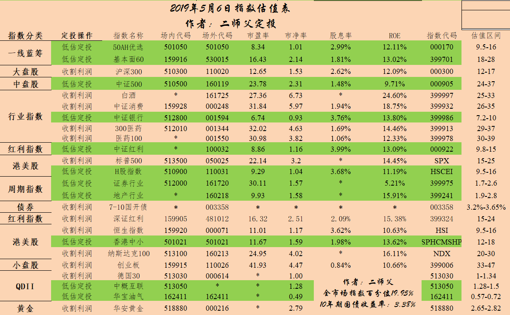

======================================================

_type: q&a
@J[28281541518551]
2019-05-07 14:38:31 Tue  
topic_id: 844154144484882

@J

>  师父，你好，根据均线偏离度现在银行是+1，请问为什么鳄鱼计划您昨天还买入一份银行呢？不是应该卖出一份吗？

@二师父

>  均线偏离表只是一个辅助参考的数据，最主要的是参考估值表，只要低估加仓定投是可以的
>  
>  估值是整体的价值衡量尺度，而均线偏离表是衡量最近一段时间的涨跌，在基金很便宜的时候上涨偏离度会成为正的，可是基金仍旧低估的

阅读[3186]  评论[5]  赞[0] 

======================================================

_type: talk
@二师父[28814221155551]
2019-05-07 14:49:58 Tue  
topic_id: 844154144125152

<e type="hashtag" hid="552852815854" title="#恒生国企、50ah、香港中小有无重合#" /> 基本没有，香港中小都是在香港上市的公司，融创中国、蒙牛乳业、万洲国际、石药集团、舜宇光学科技、海螺创业等等。50ah和恒生国企里面既有在香港上市的企业，也有在大陆上市的企业。重合度不大。如果恒生国企指数基金进入低估区域，可以用这个来作为港股指数的投资品种，他的价值比香港中小还是大一些的。因为中小盘股票容易出老千股，风险比香港大盘恒生、恒生国企指数大一些。

@J at 2019-05-07 14:49:58 Tue

> 师父，H股指数和50AH哪个投资价值更大一些？更低估一下？

----------

@二师父 at 2019-05-07 14:49:58 Tue

> 都很有价值啊，持仓股票也不同

----------

@J at 2019-05-07 14:49:58 Tue

> [OK][强] 师父，您的鳄鱼计划和实盘定投相互会有重复的指基吗？

----------

@二师父 at 2019-05-07 14:49:58 Tue

> 有的，银行和50ah就是重复的

----------

阅读[3174]  评论[4]  赞[0] 

======================================================

_type: talk
@二师父[28814221155551]
2019-05-07 15:01:41 Tue  
topic_id: 844154144148412

<e type="hashtag" hid="225125184141" title="#关于基金哪个更低估#" />如果用相对估值法，只能够同类基金比较，比如中证500和500低波动有比较的意义，可是你比较恒生指数和上证50指数哪个更加低估意义不大

比如文科生考了650分，理科生考了690分，你觉得他俩成绩谁更好

估值比较也需要在相同条件的，比如行业，选股规则，股票的盈利情况等等，不是说市盈率越低就越有价值。

估值的本质还是价格和成长性的结合体。

阅读[3397]  评论[0]  赞[0] 

======================================================

_type: talk
@二师父[28814221155551]
2019-05-08 04:02:19 Wed  
topic_id: 844151511884152

<e type="hashtag" hid="481211145528" title="#指数估值#" /> 基金估值，仅供参考，并不是每个低估的都要定投，学会自己选择适合自己的基金定投。

阅读[4643]  评论[0]  赞[0] 

+++++++++++++++++++++++++++++++++++++++++++++++++++++

图片：
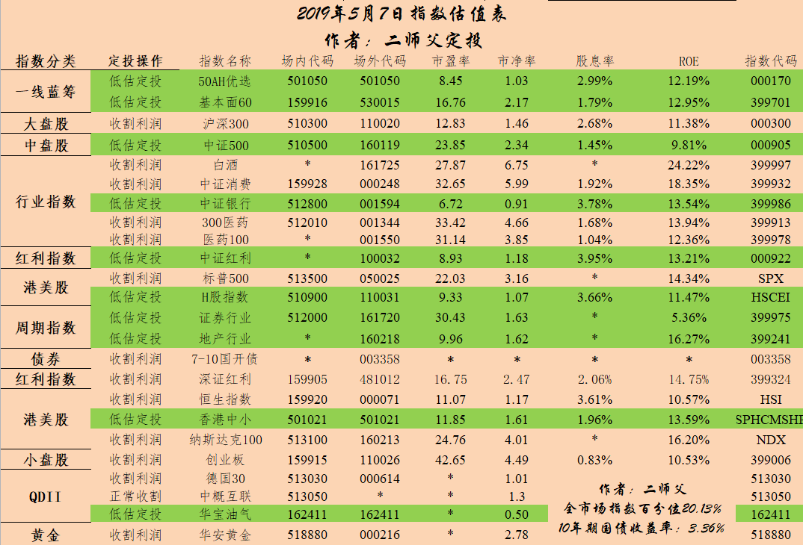

======================================================

_type: talk
@二师父[28814221155551]
2019-05-08 04:03:07 Wed  
topic_id: 544828288114824

<e type="hashtag" hid="825128581482" title="#构建自己的定投组合#" />

@乖子 at 2019-05-08 04:03:07 Wed

> 谢谢二师父苦口婆心的指点

----------

@乖子 at 2019-05-08 04:03:07 Wed

> 注意休息，劳逸结合[玫瑰]

----------

@齐俊波 at 2019-05-08 04:03:07 Wed

> 二师父辛苦了。要注意身体。

----------

@海盗 at 2019-05-08 04:03:07 Wed

> 坚持是一种精神[拳头]

----------

@二师父 at 2019-05-08 04:03:07 Wed

> 谢谢哈，休息真的很必要

----------

@奔波儿霸🐟🐠🐬🐳🐋💦 at 2019-05-08 04:03:07 Wed

> 这篇文章来的很及时

----------

阅读[4734]  评论[7]  赞[0] 

+++++++++++++++++++++++++++++++++++++++++++++++++++++

文件：
2019-05-08 04:02:46 Wed
文件大小：[25016]
28814581225251-如何选择指数基金构建自己的定投组合.docx

======================================================

_type: talk
@rtdmm小米[422188284881148]
2019-05-08 07:58:31 Wed  
topic_id: 544828288422824

<e type="hashtag" hid="825128581482" title="#构建自己的定投组合#" /> 二师父辛苦了，二师父是夜猫子?注意身体，

阅读[2619]  评论[0]  赞[0] 

======================================================

_type: q&a
@凭栏观海[244414845852181]
2019-05-08 08:49:51 Wed  
topic_id: 422141412858418

@凭栏观海

>  请问老师，目前H股指数和50AH那个更有投资价值？谢谢

@二师父

>  当前50ah指数更有投资价值，有a，h股折价超额收益。
>  
>  这两个指数持仓股票不同，投资港股的话h股指数更好，应该是拿香港中小和h股对比，这两个都是港股指数

阅读[2652]  评论[0]  赞[0] 

======================================================

_type: q&a
@凭栏观海[244414845852181]
2019-05-08 08:51:06 Wed  
topic_id: 111828281144542

@凭栏观海

>  二师父最近似有不再投资沪深300之意，那么请问老师，50AH+基本面60的组合是否要好过单独投资沪深300?

@二师父

>  是要好过单独投资沪深300，持股更加集中，而且沪市和深市蓝筹并不是同时进入低估的，分别投入针对性更强

阅读[2861]  评论[1]  赞[0] 

======================================================

_type: talk
@二师父[28814221155551]
2019-05-08 09:52:33 Wed  
topic_id: 244151858148221

<e type="hashtag" hid="881251425252" title="#鳄鱼计划#" /> 买入银行，券商，中概互联各一份。券商和中概互联的波动较大，谨慎投资。

投资指数逆向交易即可。3000点以下低估的指数可以放心购买。场内长期投资和短期网格结合。

可转债今天可以卖出核能，大概赚18。见好就收，不要恋战。

@杜志彪 at 2019-05-08 09:52:33 Wed

> 我开盘也加仓券商了。

----------

@别皱眉头 at 2019-05-08 09:52:33 Wed

> 二师父，网格卖出的时候，也会公布吧？

----------

@二师父 at 2019-05-08 09:52:33 Wed

> 会的

----------

@别皱眉头 at 2019-05-08 09:52:33 Wed

> 太棒了，我刚刚加入进来，赶紧买了鳄鱼计划昨天提到的三只指数基金

----------

阅读[2807]  评论[4]  赞[0] 

======================================================

_type: talk
@杜志彪[544454124115854]
2019-05-08 09:55:43 Wed  
topic_id: 422141848121528

刚想起来有个企业债上市，刚卖了，盈利16元，大家有的别忘了。

阅读[2860]  评论[0]  赞[0] 

======================================================

_type: q&a
@Corey[422111288445858]
2019-05-08 09:57:14 Wed  
topic_id: 244151858148521

@Corey

>  二师父，这个大跌之势，是不是预示着熊市来临啊

@二师父

>  信号显示短期熊市是来了，至于后续走势我也没法预测

阅读[3022]  评论[8]  赞[0] 

======================================================

_type: talk
@志亮[422125851552828]
2019-05-08 13:27:05 Wed  
topic_id: 111828521444442

那大家预测今天是涨还是跌[呲牙]，厉害的二师父昨天也预测错了。

阅读[2602]  评论[1]  赞[0] 

======================================================

_type: q&a
@J[28281541518551]
2019-05-08 16:00:35 Wed  
topic_id: 422141842448548

@J

>  师父你好，问题1:为什么均线偏离表里没有地产指数的偏离度？问题2:根据低估阀值如何计算每周实盘定投的份数？例如，华宝油气的估值区间是0.57-0.72，市净率之前一直在0.53左右，我就定投一份，这周市净率已跌至0.49了，加仓的公式应如何算？请师父指导。

@二师父

>  因为地产指数的场内基金的成交额特别小，不建议投资场内的地产指数，建议投资场外的，所以就没有算这个
>  
>  这个你用阈值除以当前的市盈率再乘以一个系数就得到了需要加仓的金额了，系数自己设定即可，一般股市点位越低，系数越大。
>  
>  另外油气的阈值是他的净值，不是市净率，按照我说的公式或者均线偏离度加仓都是可以的
>  
>  需要注意的是，这是个周期指数，不要重仓

阅读[2410]  评论[1]  赞[0] 

======================================================

_type: q&a
@静水流深[844418144841822]
2019-05-08 16:01:59 Wed  
topic_id: 111828521528822

@静水流深

>  512800今天可入吗，是低估吗?

@二师父

>  是低估的啊，我的鳄鱼计划已经买了

阅读[2377]  评论[0]  赞[0] 

======================================================

_type: q&a
@S.H.[844148451558452]
2019-05-08 16:03:44 Wed  
topic_id: 111828521442252

@S.H.

>  正在定投建仓中，请教师傅：都在低估中的中证红利、红利机会选哪个好呢？

@二师父

>  这两个都不错的红利指数，中证红利偏大盘红利，红利机会偏中盘红利，两个风格不同，任意选择一只定投即可

阅读[2597]  评论[3]  赞[0] 

======================================================

_type: q&a
@Claire[244151258154481]
2019-05-08 16:05:32 Wed  
topic_id: 844151854148512

@Claire

>  师父你好，请问基本面60可以买场内的159916吗？

@二师父

>  这个场内的基金成交额特别小，有流动性风险，建议申购场外的或者用场内的深证红利替代，现在深证红利是正常估值，可以等等

阅读[2676]  评论[1]  赞[0] 

======================================================

_type: q&a
@J[28281541518551]
2019-05-08 20:06:38 Wed  
topic_id: 544828111248184

@J

>  师父，在您的答复基础上问一下，为什么油气阀值是它的净值而不是市净率或市盈率？

@二师父

>  这个没有市盈率的，你也可以用布油的价格给他估值

阅读[2419]  评论[0]  赞[0] 

======================================================

_type: q&a
@冉冉[88445118854412]
2019-05-08 20:10:05 Wed  
topic_id: 844151888184522

@冉冉

>  请问二师傅，501016（国泰中证申万证券行业指数）能给具体分析一下，它可以代替招商证券161720 进行定投吗？估值可以参考招商证券161720吗？

@二师父

>  这个估值是券商指数估值，不是具体基金的估值，一个指数估值情况适用于所有券商指数基金。
>  
>  国泰的券商指数基金比招商证券费率更低，就是规模小一些，10亿也没有清盘风险，这两只基金定投都是适合的

阅读[2686]  评论[3]  赞[0] 

======================================================

_type: q&a
@彩虹[544884214814214]
2019-05-08 20:17:31 Wed  
topic_id: 244151888145181

@彩虹

>  请问二师傅，用广发购买场内基金，闲置的钱通过广发买哪款产品？

@二师父

>  003474，这个流动性比较好

阅读[2750]  评论[2]  赞[0] 

======================================================

_type: q&a
@彩色[48415121851218]
2019-05-08 20:18:06 Wed  
topic_id: 844151882544122

@彩色

>  二师父，啊呀，我的基本面60一成仓位都是买的场内额，需要调整为场外吗？

@二师父

>  都可以的，以后定投基本面60建议场外，或者用深红利替代

阅读[2852]  评论[0]  赞[0] 

======================================================

_type: q&a
@小牧童[28484254825881]
2019-05-08 20:24:52 Wed  
topic_id: 544828111224424

@小牧童

>  二师父，您好，香港中小的数据在哪里可以查询到？谢谢！

@二师父

>  <e type="web" href="https://www.hsi.com.hk/eng" title="Hang+Seng+Indexes" cache="" />，这个网站

阅读[2980]  评论[0]  赞[0] 

======================================================

_type: talk
@志亮[422125851552828]
2019-05-08 22:50:59 Wed  
topic_id: 244151881114211

捉醒大家一下，永远不要预测市场或想凭感觉运气来投资[微笑]。

@奔波儿霸🐟🐠🐬🐳🐋💦 at 2019-05-08 22:50:59 Wed

> 如果真有把握，请马上去彩票站。

----------

@志亮 at 2019-05-08 22:50:59 Wed

> 任何时候你觉得有把握时，就是亏损的时候[微笑]

----------

阅读[2731]  评论[2]  赞[0] 

======================================================

_type: talk
@陈[844415515418422]
2019-05-08 23:38:43 Wed  
topic_id: 844151825821252

二师父，刚在文章中咨询您高股息率！你说四倍以上算高股息率！我看我们的估值表里基本都在四以内，没有以上的，是不就选择相对高的？还是我理解错了？

@二师父 at 2019-05-08 23:38:43 Wed

> 我说4以上的算高，意味着这是绝佳投资时机，大盘重回2500能看到的，高股息策略也是可以的

----------

阅读[2764]  评论[1]  赞[0] 

======================================================

_type: talk
@二师父[28814221155551]
2019-05-08 23:56:15 Wed  
topic_id: 244151825225451

<e type="hashtag" hid="142845511412" title="#关于股市大跌#" /> 最近又要开打了，也就是5月10号，经历过08年，15年，18年暴跌的朋友可能很淡定

但是刚接触定投的朋友一定会恐慌，第一次总是会有各种怀疑，也许晚上还睡不好

所以二师父提醒下，不用担心，之前后悔买少的人，现在抓住机会了，按照纪律定投，不要等待大盘上涨以后又后悔。

指数投资特别安全，只要用三到五年不用的资金定投，在目前点位逐步定投的二师父实盘里面低估的指数基金，未来要是亏了，我可以赔给你。

当别人恐惧的时候我们要淡定，祝大家发财

@奔波儿霸🐟🐠🐬🐳🐋💦 at 2019-05-08 23:56:15 Wed

> 股民现在看到消息的估计脑袋要炸了，我倒是挺开心，作为刚入圈的小基民，能赶上这么个好时候很兴奋呐。五一开始投的，基本操作已经了解掌握了，资金也都到位了，就等师父发信号啦！[呲牙]

----------

@niwota at 2019-05-08 23:56:15 Wed

> 良心贴，点赞！不过该恐慌的淡定不了，能淡定的不会恐慌。

----------

@志亮 at 2019-05-08 23:56:15 Wed

> 我是2月26号进基市的，4月份进的股市，但我很幸运认识了二师父，现在我对下跌已经很谈定了[微笑]

----------

@二师父 at 2019-05-08 23:56:15 Wed

> 希望能保持下去

----------

@凭栏观海 at 2019-05-08 23:56:15 Wed

> 霸气[强]

----------

@一剪梅 at 2019-05-08 23:56:15 Wed

> 有二师父这个老师指点与实践教学，内心真的很淡定，因为有方向

----------

@心韵 at 2019-05-08 23:56:15 Wed

> 在师傅不厌其烦的指点和安抚下，不淡定都不行。

----------

@陌路花 at 2019-05-08 23:56:15 Wed

> 师父最后一句话好可爱[愉快]

----------

阅读[4737]  评论[9]  赞[1] 

======================================================

_type: talk
@二师父[28814221155551]
2019-05-09 02:41:29 Thu  
topic_id: 544828152821254

<e type="hashtag" hid="825128815252" title="#怎么把握接下来的机会#" /> 机会是留给有准备的人的

@乖子 at 2019-05-09 02:41:29 Thu

> 全是干货，对我们非常有帮助

----------

@Yanzhen at 2019-05-09 02:41:29 Thu

> 精彩[强][强][强]

----------

@新的开始 at 2019-05-09 02:41:29 Thu

> 师父太辛苦了，一天才睡几小时，保重身体

----------

阅读[4809]  评论[3]  赞[0] 

+++++++++++++++++++++++++++++++++++++++++++++++++++++

文件：
2019-05-09 02:41:25 Thu
文件大小：[24578]
51184252818184-跌破2900，请务必保持淡定，因为捡钱的时刻即将到来.docx

======================================================

_type: talk
@二师父[28814221155551]
2019-05-09 02:42:54 Thu  
topic_id: 111828542825212

<e type="hashtag" hid="481211145528" title="#指数估值#" />

@Yanzhen at 2019-05-09 02:42:54 Thu

> 辛苦了

----------

@自由飞翔 at 2019-05-09 02:42:54 Thu

> 奢望中证消费能进入低估[色]

----------

@jorfy at 2019-05-09 02:42:54 Thu

> 每天都在关注消费，期待啊

----------

@自由飞翔 at 2019-05-09 02:42:54 Thu

> [偷笑][偷笑][偷笑]

----------

@rtdmm小米 at 2019-05-09 02:42:54 Thu

> 请教二师父，中证消费在低估状态的时间段非常短，大概10天左右，那在低估时间里可以天天买吗？或者一次性建仓，然后就持有到高估再卖[呲牙][呲牙]

----------

@二师父 at 2019-05-09 02:42:54 Thu

> 你看的只是18年的情况，也有长期处于低估的，如果资金充裕可以这样操作

----------

阅读[3076]  评论[6]  赞[0] 

+++++++++++++++++++++++++++++++++++++++++++++++++++++

图片：
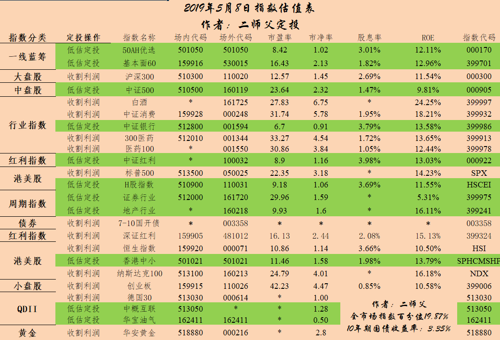

======================================================

_type: talk
@二师父[28814221155551]
2019-05-09 03:02:08 Thu  
topic_id: 244151825152411

<e type="hashtag" hid="142845582452" title="#场内和场外定投介绍#" /> 里面有二师父的代码，我就是根据里面的代码买的，可以保存，这样就不用每次问我代码是什么了。

@凭栏观海 at 2019-05-09 03:02:08 Thu

> 谢谢

----------

@jorfy at 2019-05-09 03:02:08 Thu

> 二师父，消费投场外场内有什么差别吗？

----------

@陈 at 2019-05-09 03:02:08 Thu

> 二师父，110031易方达H？就是恒生国企？

----------

@陈 at 2019-05-09 03:02:08 Thu

> 我看您把场外品种和之前比减了不少！是有重叠股票了还是品种不易太多？

----------

@二师父 at 2019-05-09 03:02:08 Thu

> 场内费率低，交易快

----------

@二师父 at 2019-05-09 03:02:08 Thu

> 对的

----------

@二师父 at 2019-05-09 03:02:08 Thu

> 新手不适合太多，就做几只定投也能取得不错的收益率

----------

阅读[5117]  评论[7]  赞[0] 

+++++++++++++++++++++++++++++++++++++++++++++++++++++

文件：
2019-05-09 03:01:26 Thu
文件大小：[434080]
51184252818524-关于二师父场外定投实盘和场内鳄鱼计划的说明.pdf

======================================================

_type: q&a
@秦风殇韵（刘豫斌）[241555548554841]
2019-05-09 10:35:40 Thu  
topic_id: 244151828458521

@秦风殇韵（刘豫斌）

>  二师父你好，我是4月底才开始跟您学习定投的，才两轮投完就赶上这轮行情，因为还在建仓，截止昨天仓位刚刚一层半，想问一下，如何在这轮行情中很好的建仓才能不错过？

@二师父

>  定投就好啊，不要总怕错过，投资最重要的事情是怎样避免犯错。机会总是有的

阅读[2728]  评论[3]  赞[0] 

======================================================

_type: q&a
@一剪梅[844115184528882]
2019-05-09 10:41:30 Thu  
topic_id: 422141858124858

@一剪梅

>  师父，您估值表有券商指数吗？现在的券商指数可以定投吗？

@二师父

>  建议您好好看看估值表啊，这个是有的，新手不建议定投这个指数

阅读[2786]  评论[0]  赞[0] 

======================================================

@二师父[28814221155551]
2019-05-09 10:44:40 Thu  
topic_id: 844151822841552

>  @二师父
>  

阅读[2920]  评论[7]  赞[0] 

======================================================

_type: talk
@二师父[28814221155551]
2019-05-09 10:49:54 Thu  
topic_id: 244151822285441

<e type="hashtag" hid="825224541552" title="#低估定投实盘#" /> 买入50ah一份，基本面60一份，券商指数0.5份。不要总想着怕错过了，跌势刚刚开始，慢慢定投，宁可错过，也别过错。

记住，现金为王，最怕的不是错过了机会，而是仓位过重最后承受不了暴跌的压力。

保持耐心，一点一滴积累吧。场外代码更加集中，主要是为新手投资者考虑的，以前的中证500和地产仍旧可以定投的，只要是估值表里面低估的基金，都是非常具有投资价值的

@三峡情 at 2019-05-09 10:49:54 Thu

> 跟买[微笑]

----------

@J at 2019-05-09 10:49:54 Thu

> 师父，华宝油气也仍然适合定投吗？

----------

@二师父 at 2019-05-09 10:49:54 Thu

> 适合的

----------

@J at 2019-05-09 10:49:54 Thu

> 谢谢[微笑]

----------

@Tom at 2019-05-09 10:49:54 Thu

> 师父，今天你买的50ah 和基本面60，券商0.5份是场内还是场外

----------

@二师父 at 2019-05-09 10:49:54 Thu

> 低估定投实盘是场外，鳄鱼计划是场内

----------

@奔波儿霸🐟🐠🐬🐳🐋💦 at 2019-05-09 10:49:54 Thu

> 遵守纪律，保持耐心，说半份就半份。这才刚刚开始。

----------

@上上签 at 2019-05-09 10:49:54 Thu

> 当初刚刚理解指数型定投理念的时候，那时候刚刚开始每周四定投，大部分都是照抄二师傅的答案，打卡也快三个月了，每日一篇二师傅文章，星球学习，图书馆看书。现在二师傅低估定投实盘，我不在盲目照抄，但也看看实盘算作参考，我选择时，学会了兼顾组合平衡性，因为承受的风险不一样，我在选择基金种类也有一定改变，感谢二师傅[玫瑰][玫瑰][玫瑰]

----------

阅读[4934]  评论[9]  赞[0] 

======================================================

_type: talk
@二师父[28814221155551]
2019-05-09 11:30:44 Thu  
topic_id: 422141851855248

<e type="hashtag" hid="825412412212" title="#可转债打新#" /> 熊市可转债打新破发的概率较大，建议只打三a级别以上的，我目前是暂停打新了

@别皱眉头 at 2019-05-09 11:30:44 Thu

> 我是在行情好的时候打新的，可是等到上市的时候就赶上行情不好了。。中的三只全是破发。。。

----------

@二师父 at 2019-05-09 11:30:44 Thu

> 没事，及时卖出，投资指数基金，破发亏损也就几十元

----------

@别皱眉头 at 2019-05-09 11:30:44 Thu

> 破发的我都没卖……要卖掉吗？还是不急着用那个钱，可以放着？

----------

@二师父 at 2019-05-09 11:30:44 Thu

> 可以当做债券持有，我都是上市卖出

----------

@别皱眉头 at 2019-05-09 11:30:44 Thu

> 好的，了解了，谢谢二师父

----------

@元亨 at 2019-05-09 11:30:44 Thu

> 我也是

----------

@别皱眉头 at 2019-05-09 11:30:44 Thu

> 我破发的都没卖，那个钱不急着用就没卖，现在其中一只，今天回到100了，卖了

----------

@元亨 at 2019-05-09 11:30:44 Thu

> 中四只，亏两只，

----------

阅读[2852]  评论[10]  赞[0] 

======================================================

_type: q&a
@J[28281541518551]
2019-05-09 11:35:34 Thu  
topic_id: 111828548544842

@J

>  回看2013-2019年的地产指数，目前的净值还可能出现较大跌幅，师父我们可否等待继续下跌至¥0.9后再接着定投？

@二师父

>  也可以的，这是个周期指数，可以等等，一般最大跌幅控制在50个点以内，通过定投摊低成本。

阅读[2931]  评论[7]  赞[0] 

======================================================

_type: talk
@留影[88844882545182]
2019-05-09 11:40:44 Thu  
topic_id: 544828158512544

请问，实盘定投中没有公布定投额的几周，比如2018年9月中旬 ，请问是因为无暇分享，还是当时处于其他考虑没有定投。

阅读[2802]  评论[0]  赞[0] 

======================================================

_type: q&a
@别皱眉头[244148458815141]
2019-05-09 12:59:47 Thu  
topic_id: 111828548421122

@别皱眉头

>  二师父，我没有做场外定投，想跟投您的鳄鱼计划，在哪里可以看到鳄鱼计划呢

@二师父

>  在星球搜索鳄鱼计划就能看到了

阅读[2929]  评论[0]  赞[0] 

======================================================

_type: talk
@心韵[111188428225412]
2019-05-09 13:04:58 Thu  
topic_id: 844151821118242

师傅：我记得，你发过一个18年的公众号原创目录表。记得是星球不能用时在朋友圈发的，当时没收藏。现在看不到了。能再发一下吗？

@二师父 at 2019-05-09 13:04:58 Thu

> 在星球置顶第二篇文章有个新手入门文章汇总链接，原创文章记录也有

----------

@心韵 at 2019-05-09 13:04:58 Thu

> 汇总连接打开显示，参数错误

----------

阅读[2871]  评论[2]  赞[0] 

======================================================

_type: q&a
@J[28281541518551]
2019-05-09 13:47:15 Thu  
topic_id: 244151845855581

@J

>  这是帮亲戚问的，我向他介绍了二师父的定投理念，我说现在油气和地产都有定投，他说自己资金不够，想从这里面只挑一只，问二师父选哪只做场外定投更好？

@二师父

>  新手建议两只宽基指数，50ah和基本面60.周期指数的波动太大了。地产风险小一点，如果资金不足配置周期指数，目前券商是首选

阅读[2991]  评论[7]  赞[0] 

======================================================

_type: talk
@志亮[422125851552828]
2019-05-09 13:56:35 Thu  
topic_id: 544828142158154

大家说今天加仓好，还是让它明天再跌一次加仓好？

@知南茶暖🍹 at 2019-05-09 13:56:35 Thu

> 确定明天跌吗

----------

@志亮 at 2019-05-09 13:56:35 Thu

> 跌的机会大吧[呲牙]

----------

@志亮 at 2019-05-09 13:56:35 Thu

> 等跌到2800再加仓？

----------

@上上签 at 2019-05-09 13:56:35 Thu

> 预测市场，短期涨跌是不可控制的，基金定投，涨了开心，跌了也开心

----------

@志亮 at 2019-05-09 13:56:35 Thu

> 也对，预测经常被打脸的[呲牙]

----------

@J at 2019-05-09 13:56:35 Thu

> 2800再加[微笑]

----------

@TIME at 2019-05-09 13:56:35 Thu

> 任何人都预测不了这个市场。

----------

@爱华 at 2019-05-09 13:56:35 Thu

> 那要是之后还跌呢？会不会又要等到2700,2600...
嗯嗯， 定。 投。

----------

阅读[3010]  评论[9]  赞[0] 

======================================================

_type: talk
@蝙蝠侠大战超人[48522585242588]
2019-05-09 14:19:23 Thu  
topic_id: 844151845221512

二师父，请问一下目前券商指数是处在合理低估期吗？现在几轮暴跌后，适合定投券商指数吗？

阅读[2902]  评论[0]  赞[0] 

======================================================

_type: q&a
@S.H.[844148451558452]
2019-05-09 14:31:30 Thu  
topic_id: 244151845222841

@S.H.

>  请教师傅：券商512000在场内定投，可以吗？

@二师父

>  可以定投的，我今天刚投券商啊

阅读[3182]  评论[3]  赞[0] 

======================================================

_type: q&a
@TDG[88855524248842]
2019-05-09 16:15:08 Thu  
topic_id: 844151845445242

@TDG

>  请问二师父，中概互联定投场内好还是场外好？

@二师父

>  场内好，场外规模太小

阅读[3087]  评论[0]  赞[0] 

======================================================

_type: talk
@007[51511545424824]
2019-05-09 16:15:09 Thu  
topic_id: 844151848821482

二师傅请问券商指数场外定投代码多少？

@三峡情 at 2019-05-09 16:15:09 Thu

> 你看一下二师父发的估值表

----------

阅读[3165]  评论[1]  赞[0] 

======================================================

_type: q&a
@JOY[111881481812422]
2019-05-09 16:15:55 Thu  
topic_id: 244151845185811

@JOY

>  师傅，请问，要是现在按1年1只100份来分，然后跌的时候按您说的加仓系数来加仓，一直跌，跌得厉害的话，不算后期增量的资金，光100份，到后面会不会不够呀？

@二师父

>  没有关系，跌倒2500以下买完了，没钱就可以停止定投了，一只基金100份完全足够的

阅读[3336]  评论[2]  赞[0] 

======================================================

@二师父[28814221155551]
2019-05-09 16:16:26 Thu  
topic_id: 244151845181251

>  @二师父
>  

阅读[3528]  评论[6]  赞[0] 

======================================================

_type: talk
@二师父[28814221155551]
2019-05-09 20:29:12 Thu  
topic_id: 422141821555488

<e type="hashtag" hid="281158848541" title="#货币基金#" /> 这几只都还行，蛋卷上可以看到，还有南方天天利b，广发的搜索页面如下

@陌路花 at 2019-05-09 20:29:12 Thu

> 这年化率是变动的，也许明天就会低到3点以下

----------

@二师父 at 2019-05-09 20:29:12 Thu

> 看万分收益，稳定的

----------

@陌路花 at 2019-05-09 20:29:12 Thu

> 我看余额宝万分收益都是变的哎，今天七毛，昨天六毛，也许明天八毛，货币不都这样吗?[疑问]

----------

@二师父 at 2019-05-09 20:29:12 Thu

> 7以上的

----------

阅读[3463]  评论[4]  赞[0] 

+++++++++++++++++++++++++++++++++++++++++++++++++++++

图片：
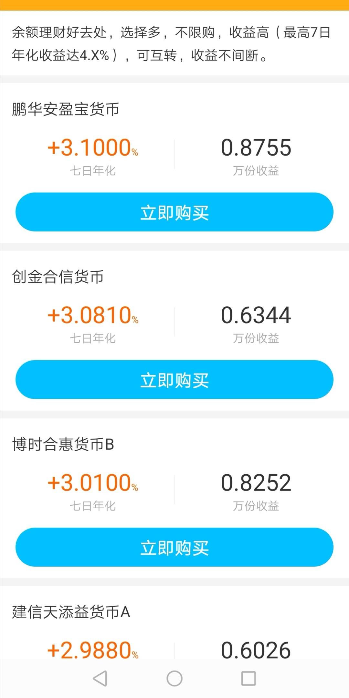

======================================================

_type: talk
@亦青[844412185888452]
2019-05-09 20:37:15 Thu  
topic_id: 422141821525458

最近的估值表哪里看啊？我看置顶的是3月的

@一阵风 at 2019-05-09 20:37:15 Thu

> 仔细看估值表的日期[呲牙][呲牙]

----------

@亦青 at 2019-05-09 20:37:15 Thu

> [尴尬][微笑][微笑]

----------

阅读[3412]  评论[2]  赞[0] 

======================================================

_type: q&a
@nana[48222415211188]
2019-05-09 23:13:29 Thu  
topic_id: 844151815421452

@nana

>  二师父，您的课程在哪儿收听？我没有找到，请指教。谢谢🙏

@二师父

>  荔枝微课app，置顶第三篇文章有优惠券

阅读[3376]  评论[0]  赞[0] 

======================================================

_type: talk
@二师父[28814221155551]
2019-05-10 02:33:03 Fri  
topic_id: 844151814541142

<e type="hashtag" hid="481211145528" title="#指数估值#" />

@爱华 at 2019-05-10 02:33:03 Fri

> 好久不见这么绿啦[呲牙][呲牙][呲牙]

----------

@秦风殇韵（刘豫斌） at 2019-05-10 02:33:03 Fri

> 欣欣向荣

----------

阅读[3370]  评论[2]  赞[0] 

+++++++++++++++++++++++++++++++++++++++++++++++++++++

图片：
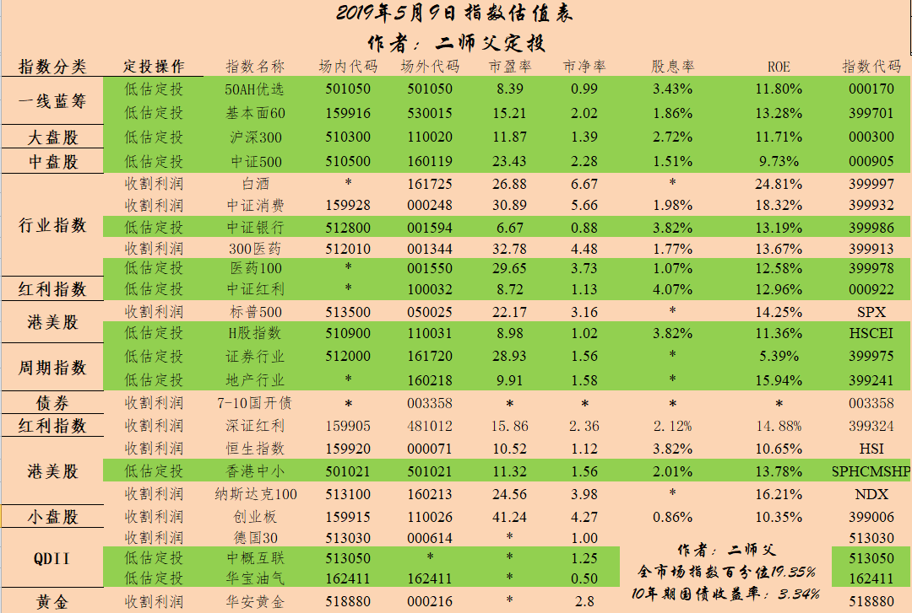

======================================================

_type: talk
@二师父[28814221155551]
2019-05-10 02:34:09 Fri  
topic_id: 844151814515552

<e type="hashtag" hid="552854155124" title="#底部还没有到来#" /> 一般我公众号读者的数目增长停滞就代表铁底已经确认，可以抄底了，现在还早啊，慢慢定投吧

@S.H. at 2019-05-10 02:34:09 Fri

> 二师傅的指标独特而有魅力[呲牙][强]

----------

@简史 at 2019-05-10 02:34:09 Fri

> 太形象了[呲牙]

----------

@元亨 at 2019-05-10 02:34:09 Fri

> 等待你的铲底集结号！

----------

阅读[5275]  评论[3]  赞[0] 

+++++++++++++++++++++++++++++++++++++++++++++++++++++

文件：
2019-05-10 02:33:25 Fri
文件大小：[24418]
48812451481288-市场会继续跌，定投的指数基金请不要清仓.docx

======================================================

_type: talk
@志亮[422125851552828]
2019-05-10 10:00:28 Fri  
topic_id: 544828188414444

唉，A股果然是暴涨暴跌预测不了，昨天没加仓又吃亏了，以后我还是按自己节奏定投好了[撇嘴]

@A0洪氏日杂批发 at 2019-05-10 10:00:28 Fri

> [坏笑][坏笑][坏笑]，说不定，上午拉高出货，下午又跌呢

----------

@杜志彪 at 2019-05-10 10:00:28 Fri

> 谈不上吃亏，我们赚的是慢钱，不要太在意短期波动。

----------

@蒲公英 at 2019-05-10 10:00:28 Fri

> 所以按二师傅的每周四定投还是挺好的

----------

@志亮 at 2019-05-10 10:00:28 Fri

> 你说的也对，今天涨了明天又跌了其实是一样的[微笑]

----------

@元亨 at 2019-05-10 10:00:28 Fri

> 跟不上大A股的节奏！

----------

阅读[3090]  评论[5]  赞[0] 

======================================================

_type: q&a
@珅爹[15451242541142]
2019-05-10 10:17:38 Fri  
topic_id: 844151814858282

@珅爹

>  您好，我最近看有些分析说中证500虽然价格下跌了，但由于部分股票盈利能力下跌，市盈率变化了，价值也变低了，两相抵消反而处在非低估值区了，不知您怎么看？

@二师父

>  估值是上移动了，目前处于低估区域和正常估值临界点

阅读[3211]  评论[0]  赞[0] 

======================================================

_type: talk
@A0洪氏日杂批发[544885222181514]
2019-05-10 10:34:10 Fri  
topic_id: 111828588811822

非3A转债不打新了，好不容易中的签，还亏本，想赚点小钱，确实难，第一次玩可转债打新，学费也交了，知识也涨了[尴尬][尴尬][尴尬]

@二师父 at 2019-05-10 10:34:10 Fri

> 学费是不可避免的哈

----------

@杜志彪 at 2019-05-10 10:34:10 Fri

> 今天我最后一个转债上市，也是唯一一个亏损的，早上卖出亏损46元，中了8个总体盈利。

----------

阅读[3104]  评论[2]  赞[0] 

======================================================

_type: talk
@二师父[28814221155551]
2019-05-10 10:50:00 Fri  
topic_id: 244151255585511

<e type="hashtag" hid="881251425252" title="#鳄鱼计划#" /> 清仓德国30，盈利4个点，显然目前a股更有投资价值，市场短期涨跌不好预测，韭菜经常发现市场和自己作对，买了就跌，卖了就涨，解决办法就是定投，永远在盈利的时候卖出。

@NF-Hansan at 2019-05-10 10:50:00 Fri

> 清，收益还未到2个点[偷笑]

----------

@顾屹峰 at 2019-05-10 10:50:00 Fri

> 跟

----------

@二师父 at 2019-05-10 10:50:00 Fri

> 仅为个人操作，大家根据实际情况来

----------

@凯 at 2019-05-10 10:50:00 Fri

> 两周前清了

----------

@呼唤旷野 at 2019-05-10 10:50:00 Fri

> 这只鸡我还亏着是不是还要继续拿着？

----------

@光少 at 2019-05-10 10:50:00 Fri

> 收到

----------

@cotton at 2019-05-10 10:50:00 Fri

> 我不亏不赚，这只，可以清吗

----------

@上上签 at 2019-05-10 10:50:00 Fri

> 指数型基金止盈不止亏

----------

阅读[3302]  评论[20]  赞[0] 

======================================================

_type: q&a
@CKSJ[225812851221]
2019-05-10 11:22:13 Fri  
topic_id: 111828425851282

@CKSJ

>  二师父能否给一个香港市场的etf 估值表，在港有一点资金，不知道怎么买

@二师父

>  我是通过恒生指数和恒生国企指数，还有香港中小购买港股的，目前国企和香港中小低估

阅读[3322]  评论[4]  赞[0] 

======================================================

_type: q&a
@一剪梅[844115184528882]
2019-05-10 15:25:13 Fri  
topic_id: 244151254455451

@一剪梅

>  师父，我一个朋友想参与您这边学习是不是直接128买入进星球学习即可？

@二师父

>  是的，欢迎加入一起学习进步，你也可以邀请你的朋友，你可以获取一定的奖励，点击任意一篇文章的分享按钮

阅读[2962]  评论[1]  赞[0] 

======================================================

_type: talk
@二师父[28814221155551]
2019-05-10 15:29:33 Fri  
topic_id: 844151254425852

<e type="hashtag" hid="454152551188" title="#如何应对暴涨暴跌的a股#" /> 长期定投加短期网格交易结合，这样一直能赚，在底部区域做网格万一发生暴跌就一直加仓。

a股特色定投策略，你值得拥有

@知南茶暖🍹 at 2019-05-10 15:29:33 Fri

> 二师父，做网格是用华宝挂单自动买卖吗

----------

@二师父 at 2019-05-10 15:29:33 Fri

> 我自己买的

----------

阅读[3028]  评论[2]  赞[0] 

======================================================

_type: q&a
@彩色[48415121851218]
2019-05-10 16:44:15 Fri  
topic_id: 844151254112442

@彩色

>  二师父，我买的深60确实发生了大幅跑输指数的问题，这是不是就是流动性风险？

@二师父

>  这只基金之前场内有溢价，到现在溢价率都还有百分之0.5，说明实际价格是高于基金净值的，流动性一方面，成交额少，资金涌入少，自然流动性差

阅读[3120]  评论[1]  赞[0] 

======================================================

_type: q&a
@陌路花[844114852118822]
2019-05-10 19:14:40 Fri  
topic_id: 544828511221484

@陌路花

>  师父，由于闲钱有限，且投资小白一枚，全面配置不能。现在只定投两支:上证50AH+基本面60，可以不?

@二师父

>  可以的，这两只分别是沪市蓝筹股指数和深市蓝筹股指数

阅读[3030]  评论[0]  赞[0] 

======================================================

_type: talk
@杨光霞[544885445288584]
2019-05-10 21:33:52 Fri  
topic_id: 422141585424188

请教二师傅，今天沪深三百开始变绿了，是现在就开始定投还是再等等呢

@二师父 at 2019-05-10 21:33:52 Fri

> 可以定投，我晚上看看估值

----------

@杨光霞 at 2019-05-10 21:33:52 Fri

> 好的，谢谢师傅！

----------

阅读[2796]  评论[2]  赞[0] 

======================================================

_type: q&a
@西男[844148822182252]
2019-05-10 23:17:27 Fri  
topic_id: 844151282158212

@西男

>  师父，有没有比较好的做指数基金投资策略收益情况数据回测的软件或者网站推荐啊？跪求！

@二师父

>  智投星，晨星，果仁，我主要用智投星，都比较不错，可以自己设定策略回测定投收益率

阅读[2917]  评论[1]  赞[0] 

======================================================

_type: talk
@二师父[28814221155551]
2019-05-11 02:06:31 Sat  
topic_id: 111828451584182

<e type="hashtag" hid="481211145528" title="#指数估值#" /> 估值表里面低估的指数都可以定投，需要注意的风险是周期指数周期性强，不适合重仓，创业板和纳斯达克波动大，不适合新手。油气波动也很大，不适合重仓。A股、港股蓝筹指数基金，宽基指数基金，优质行业指数基金都是可以重仓的。

如果不会选择，二师父推荐50AH加基本面60.

@丸子妈 at 2019-05-11 02:06:31 Sat

> 推荐的这两个都是一线蓝筹，会不会有重合？

----------

阅读[4549]  评论[1]  赞[0] 

+++++++++++++++++++++++++++++++++++++++++++++++++++++

图片：
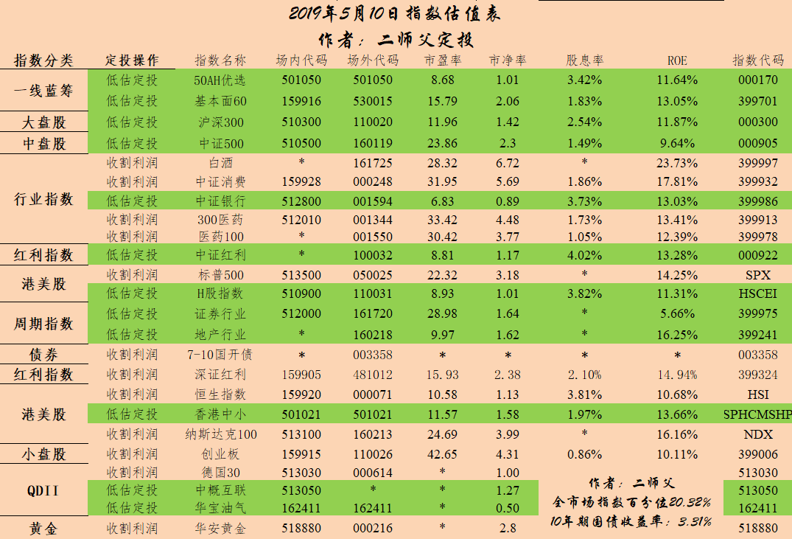

======================================================

_type: talk
@二师父[28814221155551]
2019-05-11 02:10:36 Sat  
topic_id: 244151284812121

<e type="hashtag" hid="552854442154" title="#必须消费行业#" /> 很多读者比较关注必须消费行业，这个指数值得重仓，等待低估可以一次多投入几份，放在前三大重仓位置完全可以。

@陈 at 2019-05-11 02:10:36 Sat

> 二师父，中证消费算不算必须消费？

----------

@一剪梅 at 2019-05-11 02:10:36 Sat

> 师父，中证白酒是不是在您估值表里的白酒啊？

----------

@二师父 at 2019-05-11 02:10:36 Sat

> 必须消费和可选消费都有

----------

@二师父 at 2019-05-11 02:10:36 Sat

> 是的啊

----------

@Tom at 2019-05-11 02:10:36 Sat

> 师父，是不是000248（汇添富中证主要消费）和161725（招商中证白酒）和160225（国泰食品饮料）里持有一个就可以了？

----------

@二师父 at 2019-05-11 02:10:36 Sat

> 对，这是同类基金，白酒最集中，中证消费分散一些

----------

阅读[4820]  评论[6]  赞[0] 

+++++++++++++++++++++++++++++++++++++++++++++++++++++

文件：
2019-05-11 02:09:41 Sat
文件大小：[23396]
51184242415424-必须消费行业指数——最有价值的一只行业指数.docx

======================================================

_type: q&a
@风清月淡[422112212222128]
2019-05-11 08:12:26 Sat  
topic_id: 544828552128844

@风清月淡

>  二师父，你好！货币基金可以不用赎回直接转换到指数基金吗？

@二师父

>  可以的，天天基金和蛋卷基金都能实现这种功能

阅读[2813]  评论[0]  赞[0] 

======================================================

_type: q&a
@小眼静🎀[844121141821482]
2019-05-11 09:21:04 Sat  
topic_id: 422141554222588

@小眼静🎀

>  二师父，目前持有50ah和中证500还有中证银行，都是轻仓，目前资金不足的情况下怎么办？需要调仓吗

@二师父

>  不用调仓，目前都不贵，停止其中两只定投，50ah和银行的持仓股票类似，选择一只定投即可，中证500可以暂停

阅读[2811]  评论[3]  赞[0] 

======================================================

_type: talk
@二师父[28814221155551]
2019-05-11 10:01:32 Sat  
topic_id: 422141558444528

<e type="hashtag" hid="142841111442" title="#避免垃圾股票#" /> 乐视网正式暂停上市了。

投机乐视的单车变废铁了

乐视是创业板股票，创业板公司暂停上市有几条规则：

说连续三年亏损;
最近一年净资产是负，也就是资不抵债；
欺诈；
财报造假还拒不改正；
等等...

很多人喜欢炒作低价垃圾股，以前还可以，现在无异于扔钱，价值投资首先买的股票要有价值

有朋友买了st股票，现在卖不出去，亏了几万元。很焦虑

怎么办，买入一定要慎重，不知道能不能赚先在星球问一问，不耻下问是好习惯，买入的好坏直接决定了亏损还是盈利

哎，很多人宁可亏几万，也不愿交几十元学费，没有付出心态的人迟早会被动挨打

股票投资不是不行，关键得有一套系统，比如碰到股票卖不出去怎么办？想清楚了再投资，单车变废铁容易，废铁变单车太难啊

@三峡情 at 2019-05-11 10:01:32 Sat

> 学习了！二师父苦口婆心

----------

@陌路花 at 2019-05-11 10:01:32 Sat

> 不懂不投，是我的第一原则。投资的钱可是我辛辛苦苦赚来的呀。

----------

@Joey  at 2019-05-11 10:01:32 Sat

> 2015年稀里糊涂的在手机上下了个天天基金，稀里糊涂的把辛苦积攒的工资投进去 也不懂的分批定投  当时以为买基金就是理财 理财就是为资金增值 结果稀里糊涂的赶上股市高点大调整 短短时间亏了七八万 几年再也不敢买基金了 想想不懂真的不能瞎投的   今年开始跟着师傅学习理财知识之后再定投 心理有底多了  想着当时的自己真是愚不可及 白上这么多年学[尴尬]

----------

阅读[2899]  评论[3]  赞[0] 

======================================================

_type: talk
@树叶[544811512145144]
2019-05-11 12:11:28 Sat  
topic_id: 244151228448211

阅读[4601]  评论[0]  赞[0] 

+++++++++++++++++++++++++++++++++++++++++++++++++++++

文件：
2019-05-11 12:11:20 Sat
文件大小：[292090]
28814542422841-二师父定投周报5.11.docx

======================================================

_type: q&a
@奇迹相伴[422118428544848]
2019-05-11 14:44:22 Sat  
topic_id: 544828555128544

@奇迹相伴

>  师傅，我现在定投场外的50  60 和中正红利还有500
>  场内定投石油和证券etf可以吗？

@二师父

>  这个可以的，石油不要重仓

阅读[2708]  评论[1]  赞[0] 

======================================================

@二师父[28814221155551]
2019-05-11 18:52:37 Sat  
topic_id: 844151445552152

>  @二师父
>  

阅读[2766]  评论[0]  赞[0] 

======================================================

_type: q&a
@四月天[822552518422]
2019-05-11 21:42:57 Sat  
topic_id: 244151445145281

@四月天

>  二师父，你好。我想学习华宝油气的网格交易，在哪里看？谢谢。

@二师父

>  搜索网格交易，以前文章有，课程也有。先建立一部分底仓，然后根据上涨或者下跌的网格来卖出或者买入

阅读[2655]  评论[0]  赞[0] 

======================================================

@二师父[28814221155551]
2019-05-11 22:48:14 Sat  
topic_id: 544828441185484

>  @二师父
>  

阅读[2894]  评论[0]  赞[0] 

======================================================

_type: talk
@二师父[28814221155551]
2019-05-12 02:30:54 Sun  
topic_id: 422141222218828

<e type="hashtag" hid="142841885482" title="#母亲节快乐#" /> 祝愿各位母亲节日快乐，小红包奉上，愿你们的孩子都能茁壮成长，成人成材。

@爱华 at 2019-05-12 02:30:54 Sun

> 谢谢二师父[愉快]

----------

@舒拉的姐姐 at 2019-05-12 02:30:54 Sun

> 谢谢二师父的红包[微笑]

----------

@树叶 at 2019-05-12 02:30:54 Sun

> 谢谢师父

----------

@好运玲玲 at 2019-05-12 02:30:54 Sun

> 谢谢二师父的红包！

----------

@自由飞翔 at 2019-05-12 02:30:54 Sun

> 谢谢师父，也祝福师父妈妈及天下所有母亲节日快乐🎉🎉🎉

----------

@阿莲 at 2019-05-12 02:30:54 Sun

> 谢谢二师傅的红包😜

----------

@程瑾 at 2019-05-12 02:30:54 Sun

> 谢谢。

----------

@木子李 at 2019-05-12 02:30:54 Sun

> 谢谢二师父，跟着二师父做一个有财商的母亲[胜利]

----------

阅读[2833]  评论[10]  赞[0] 

+++++++++++++++++++++++++++++++++++++++++++++++++++++

图片：

======================================================

_type: talk
@二师父[28814221155551]
2019-05-12 02:39:24 Sun  
topic_id: 544828444481584

<e type="hashtag" hid="552854881584" title="#利用市场先生#" /> 利用市场先生为我们赚钱，3000点以下可以做网格，收割利润没有必要，大盘会涨到3500，牛市也会如期而至，既然是3到5年不用的钱，那就耐心等待价值回归甚至价格超越价值。市场先生会帮助我们的。

阅读[2918]  评论[0]  赞[0] 

+++++++++++++++++++++++++++++++++++++++++++++++++++++

文件：
2019-05-12 02:38:21 Sun
文件大小：[24045]
51184244821544-利用非理性的市场先生为我们赚取超额收益.docx

======================================================

_type: talk
@海盗[48248118584848]
2019-05-12 08:20:23 Sun  
topic_id: 844151441888212

刚刚续费成功，时间不知不觉快一年了，感谢二师父

@海盗 at 2019-05-12 08:20:23 Sun

> 一年到期了，学费一年一交

----------

@小牧童 at 2019-05-12 08:20:23 Sun

> 哪里可以看出来快到了，我忘记多久到期了

----------

@海盗 at 2019-05-12 08:20:23 Sun

> 这个不要紧，快到期了，提前两个月就会提示的。

----------

@小牧童 at 2019-05-12 08:20:23 Sun

> 好的[愉快][愉快][愉快]

----------

@菜菜 at 2019-05-12 08:20:23 Sun

> 现在多少钱？有没有优惠？

----------

@海盗 at 2019-05-12 08:20:23 Sun

> 续费9.2折

----------

@二师父 at 2019-05-12 08:20:23 Sun

> 感谢支持

----------

阅读[3104]  评论[9]  赞[1] 

======================================================

_type: talk
@别皱眉头[244148458815141]
2019-05-12 10:26:22 Sun  
topic_id: 844151441155182

<e type="hashtag" hid="825818842822" title="#网格交易#" /> 想问大家在设置网格交易的时候，是每天都去设置一下吗？有没有方便的方法？就是把价格都设置好了，就不用烦了

@树叶 at 2019-05-12 10:26:22 Sun

> 我是用exceI设置好

----------

@别皱眉头 at 2019-05-12 10:26:22 Sun

> 然后呢？每天看一下有没有到买卖价格？

----------

@树叶 at 2019-05-12 10:26:22 Sun

> 道理是这样的，其实没那么快，如果不放心就每天看

----------

@别皱眉头 at 2019-05-12 10:26:22 Sun

> 噢噢，好呢

----------

@知南茶暖🍹 at 2019-05-12 10:26:22 Sun

> 华宝证券自动挂单买卖

----------

@别皱眉头 at 2019-05-12 10:26:22 Sun

> 我试了，条件单，最多只能挂20单

----------

@知南茶暖🍹 at 2019-05-12 10:26:22 Sun

> 你要买很多啊😂

----------

阅读[3046]  评论[7]  赞[0] 

======================================================

_type: q&a
@志亮[422125851552828]
2019-05-12 13:27:12 Sun  
topic_id: 544828482152214

@志亮

>  二师父，蚂蚁财富有一个慧定位，我看了下是根据均线来自动调整金额定设的，那么慧定投是否比一般定投更好？它适合所有指数基金吗？

@二师父

>  适合啊，这种策略就类似我们的均线定投策略，根据均线偏离度来加仓和减仓，收益率很不错的，可以搜索下均线偏离策略

阅读[3403]  评论[1]  赞[0] 

======================================================

_type: talk
@二师父[28814221155551]
2019-05-12 14:41:14 Sun  
topic_id: 244151418588441

<e type="hashtag" hid="281181228851" title="#周末答疑#" /> 关于网格交易，估值表里面任何一只基金都是适合网格交易的，怎么操作，见课程或者搜索以前的文章。

为什么做网格交易，因为a股经常在熊市底部区间震荡，一会涨一会跌，这就导致我们如果不及时卖出的话容易利润回吐。

但是全部卖出又有踏空风险，所以在低估区域对于看好的基金在场内建立一部分底仓，假设建立底仓价格5元，基金价格从5元基础上每下跌几个百分点加仓一次，基金价格从5元基础上每上涨几个百分点就卖出一次。

这样实现了反复的盈利，如果发现大盘成为单边上涨趋势就可以停止网格交易

第二是关于基金的配置，之前我的配置比较分散，现在集中一些了，降低了中证500的仓位，在2月份全部清仓了传媒指数，因为他们的盈利都比较糟糕

很多人讲中小板涨幅不错，这个其实是可以配置，但关键问题在于你从投资企业的角度看，这些中小企业股票虽然涨幅好，不过股票质量不高，所以投机可以买这些指数基金

投资的话建议优质蓝筹指数基金加优质行业指数基金。

阅读[5306]  评论[0]  赞[0] 

======================================================

_type: talk
@二师父[28814221155551]
2019-05-12 14:49:14 Sun  
topic_id: 111828185258522

<e type="hashtag" hid="825121551122" title="#网格交易记录表#" />文件是我之前做网格得记录表，之前一建立底仓市场就猛涨，所以没有机会加仓，大家自己改动下底仓价格，然后每次加仓或者减仓得价格就自动公式出来了。

底仓自己设定就好，注意保证加仓资金得充足性，目前低估得指数基金基本都是可以做网格交易得

@明天会更好 at 2019-05-12 14:49:14 Sun

> 二师父您好，假设我们在0.883的位置买入一定仓位的银行，假如指数一路上涨到1.06，我们一边上涨一边卖，那到1.06的时候不是全买完了嘛，如果再上涨那不就踏空了嘛。

----------

@Siller at 2019-05-12 14:49:14 Sun

> 各种策略灵活运用哦，网格策略在低估的震荡行情里很好用的，比如华宝油气，如果自己把握不好，怕踏空的话，坚持低估定投就好了，也可以获取不错的收益。

----------

@秦风殇韵（刘豫斌） at 2019-05-12 14:49:14 Sun

> 请问二师父，底仓价格您是依据哪个指标推算出来的呢？

----------

@二师父 at 2019-05-12 14:49:14 Sun

> 在历史底部建立的，上次是在万得全a市盈率百分位15个点建立的，这种机会很少

指数进入低估区域再跌10到20个点都可以建立底仓，非常安全，刚进入低估区也可以建立1成底仓，这个都是自己决定的

----------

@秦风殇韵（刘豫斌） at 2019-05-12 14:49:14 Sun

> 收到，谢谢

----------

@西锦巴乌 at 2019-05-12 14:49:14 Sun

> 师父好！你表格中底仓10是金额还是份数，每次加仓的1.2   1.4---是份数还是金额？谢谢！

----------

@二师父 at 2019-05-12 14:49:14 Sun

> 10份，你按比例折算下

----------

@海〔纳百川〕 at 2019-05-12 14:49:14 Sun

> 二师父，1.2+1.4+1.6+1.8+2=8，还有2份是准备留着吗？

----------

阅读[3481]  评论[12]  赞[0] 

+++++++++++++++++++++++++++++++++++++++++++++++++++++

文件：
2019-05-12 14:49:09 Sun
文件大小：[33574]
51184248111284-网格（场内）.xlsx

======================================================

_type: talk
@二师父[28814221155551]
2019-05-12 14:53:00 Sun  
topic_id: 111828185242112

<e type="hashtag" hid="454841141288" title="#均线偏离表#" /> 这是均线偏离表，大家可以自己计算，偏离差等于（当前基金价格---90日均线价格）/90日均线价格，然后根据偏离差定偏离度。这种交易策略也是类似网格得，当处于负偏离度和负偏离差基本都是可以加仓得。我们设定得是均线偏离度为-1开始买入。

@CKSJ at 2019-05-12 14:53:00 Sun

> 对于港股也适用吗？

----------

@二师父 at 2019-05-12 14:53:00 Sun

> 港股震荡的时候适用的

----------

@rtdmm小米 at 2019-05-12 14:53:00 Sun

> 请问二师父，多少偏离差为一偏离度，谢谢

----------

@二师父 at 2019-05-12 14:53:00 Sun

> 负6到12个百分点

----------

阅读[3572]  评论[4]  赞[0] 

+++++++++++++++++++++++++++++++++++++++++++++++++++++

文件：
2019-05-12 14:51:11 Sun
文件大小：[22395]
51184248111114-二师父均线偏离表5月.xlsx

======================================================

_type: talk
@二师父[28814221155551]
2019-05-13 03:20:35 Mon  
topic_id: 422141145811458

<e type="hashtag" hid="825818842822" title="#网格交易#" /> 应对熊市的法宝，网格交易。多策略结合。只要保证低估区域内定投，风险都是很低的。波动不是风险，其实是超额收益的源泉。美股长牛市场并没有A股波动给投资者带来的收益大。只是大部分人不会买入，所以亏损了的。

@海〔纳百川〕 at 2019-05-13 03:20:35 Mon

> 请问二师父，50ah和基本面60已经到了网格交易建仓低的时候了吗？

----------

@二师父 at 2019-05-13 03:20:35 Mon

> 新手建议定投

----------

@海〔纳百川〕 at 2019-05-13 03:20:35 Mon

> 好的好的

----------

阅读[4957]  评论[3]  赞[0] 

+++++++++++++++++++++++++++++++++++++++++++++++++++++

文件：
2019-05-13 03:18:57 Mon
文件大小：[170329]
51184285241184-应对熊市震荡的法宝——网格交易法.docx

======================================================

_type: talk
@二师父[28814221155551]
2019-05-13 03:45:03 Mon  
topic_id: 544828825522584

<e type="hashtag" hid="454841141288" title="#均线偏离表#" /> 表中绿色为负偏离度指数，可以逐步定投。橙色是0偏离度，适合持有或者逐步收割利润，红色的话就是正偏离度，适合逐步卖出。

当然，选择一种策略定投也是很好的，均线定投策略二师父经过回测了，收益率是高于低估定投的，而且中短期投资者，投资时间大概是0.5到2年甚至更短，低估定投的投资时间大概是3到6年。

目前还没有跌的特别狠，所以策略没有显示可以买入的，低估定投即可。EXCEL已经发布，可以自己计算

@孙健 at 2019-05-13 03:45:03 Mon

> 请二师父介绍下均线策略和网格策略的应用条件。现在都适合使用么？

----------

@孙健 at 2019-05-13 03:45:03 Mon

> 券商的偏离百分比是0.33%，那偏离度应该是0吧？表中银行和券商的偏离度有误

----------

@二师父 at 2019-05-13 03:45:03 Mon

> 对的，写错了，现在都适用

----------

阅读[3288]  评论[3]  赞[0] 

+++++++++++++++++++++++++++++++++++++++++++++++++++++

图片：
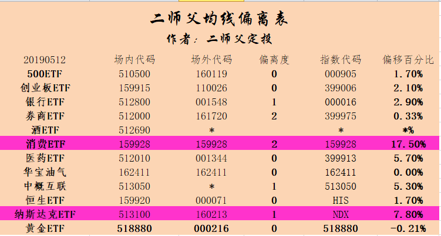

======================================================

_type: q&a
@冯林锋[841551141441422]
2019-05-13 08:54:39 Mon  
topic_id: 844151152141582

@冯林锋

>  知识星球有电胸版本吗

@二师父

>  有的，搜索网格交易

阅读[3128]  评论[0]  赞[0] 

======================================================

_type: q&a
@J[28281541518551]
2019-05-13 11:16:07 Mon  
topic_id: 544828828248454

@J

>  师父，您好，今天鳄鱼计划中的三个基金买入单价能否告知一下？因为我们是场外C跟投的，所以想对比下三点前的价格进行调整买入

@二师父

>  场外买入看收盘价格，这个不用太在意，拉长时间周期来看的话一天涨跌其实很小的，场外定投不要买中概互联

阅读[3021]  评论[2]  赞[0] 

======================================================

_type: q&a
@J[28281541518551]
2019-05-13 12:57:09 Mon  
topic_id: 244151151885151

@J

>  另外，场外跟投您的鳄鱼计划是选择C还是A类合适？鳄鱼计划一般的投资周期是多长时间？属于中短期还是长期？请师父在指点一下，我们最近也在不断学习和优化自己的投资组合。几个月以来，感恩有老师的耐心指导和陪伴！

@二师父

>  场外不用跟投鳄鱼计划，标的和场内差不多了也不建议跟投。
>  
>  你可以看看置顶文章鳄鱼计划和定投实盘的区别，c类基金适合短期定投，a类基金适合长期定投

阅读[2930]  评论[6]  赞[0] 

======================================================

_type: q&a
@汉尼拔[552144155244]
2019-05-13 14:27:37 Mon  
topic_id: 422141188144848

@汉尼拔

>  二师父你好，目前我是一个it行业的工作者，再过2年就30岁了，感觉以后怕没工作了一无所有。去年就一直在考虑副业但是想了好长时间不知道副业干什么合适，一点思路和源头都没有。感觉自己目标很迷茫。希望二师父能指点一下，圈里的有在做什么副业的么？可以说一说我好参考下！谢谢

@二师父

>  关于如何建立副业，打造个人品牌后面我会开课程讲
>  
>  未来再也没有所谓稳定的工作，稳定的工资正在拖垮年轻人，像温水煮青蛙。所以你已经有了这个意识，那么就超越同龄人了。
>  
>  与其说开展副业倒不如讲打造个人品牌，扩大个人影响力。有个著名的1000理论，先找到你的专业优势和你的兴趣所在
>  
>  每个人都有自己擅长的东西，比如你是编程，那么在编程这个领域找一个小点，钻进去，不断钻研的过程不断输出，坚持输入大于输出
>  
>  然后大概3到5年的时间你就能够成为这个细分领域比较有话语权的人，再找到1000个愿意为你付费的朋友，那么由著名的1000个铁杆粉丝理论，你基本可以算是有入门级别的影响力了
>  
>  后面就是持续的学习思考链接，最终影响力会成为指数级别暴涨
>  
>  最难的是头三年，很多人没法坚持，但是如果你有决心就坚持下去，总有一天会有成效，正如我们基金定投一样的，有一天牛市到来，3到5年的付出会迅速得到回报

阅读[4704]  评论[2]  赞[0] 

======================================================

_type: q&a
@王秦川[844151411882412]
2019-05-13 14:28:52 Mon  
topic_id: 111828855851822

@王秦川

>  二师父你好，为什么今天场外不能购买中概互联？

@二师父

>  因为他的规模还不够大，刚募集，等以后成立时间长了他就能够场外申购了

阅读[2834]  评论[0]  赞[0] 

======================================================

_type: q&a
@王秦川[844151411882412]
2019-05-13 14:39:08 Mon  
topic_id: 844151188122122

@王秦川

>  谢谢二师父，我以前场外买了点，今天想再买点，但今天显示不能购买？为什么？

@二师父

>  里面有腾讯这类港股股票，今天港股休市了，等开市了就可以买

阅读[2908]  评论[1]  赞[0] 

======================================================

_type: q&a
@小文文[88282424182882]
2019-05-13 14:39:29 Mon  
topic_id: 544828811858154

@小文文

>  二师父您好，中概互联可以用网格策略吗

@二师父

>  可以啊，我今天文章中提到过这个基金

阅读[3150]  评论[0]  赞[0] 

======================================================

_type: q&a
@奔波儿霸🐟🐠🐬🐳🐋💦[544884444514584]
2019-05-13 14:57:15 Mon  
topic_id: 422141185454828

@奔波儿霸🐟🐠🐬🐳🐋💦

>  想开场内华泰参与师父的鳄鱼计划，通过师父的链接已经开完了，默认是万3，请问佣金调整需要我主动打电话找客服去调还是等着自动调啊？

@二师父

>  基金经理会给你打电话的

阅读[3163]  评论[14]  赞[0] 

======================================================

_type: q&a
@One[422118584812518]
2019-05-13 15:01:13 Mon  
topic_id: 422141185452818

@One

>  二师父，您好，请问广发的优惠开户还有吗，做华泰开户的时候发现开过户，目前休眠状态，还得先去销户。

@二师父

>  有的，置顶文章就是

阅读[3199]  评论[1]  赞[0] 

======================================================

_type: q&a
@凭栏观海[244414845852181]
2019-05-13 19:08:18 Mon  
topic_id: 244151182142141

@凭栏观海

>  请问老师，501069华宝标普中国A股质量价值指数基金现在低估吗?是否值得长期定投？

@二师父

>  这只基金规模只有4500万，低于1亿的有清盘风险，不建议投资

阅读[3073]  评论[1]  赞[0] 

======================================================

_type: q&a
@rtdmm小米[422188284881148]
2019-05-13 20:34:35 Mon  
topic_id: 111828842488482

@rtdmm小米

>  请问二师父，能否将估值表里的市盈率，市净率等指标的高低阀值标出来

@二师父

>  好的，今晚发出来记得保存一下

阅读[3058]  评论[1]  赞[0] 

======================================================

_type: q&a
@志亮[422125851552828]
2019-05-13 21:18:45 Mon  
topic_id: 422141154211858

@志亮

>  二师父，请问广发开户是否要是首次开户才有优惠？我现在已有一个证券账户，再次开广发还有优惠不？广发和华泰那个更优惠？

@二师父

>  这两个差不多，广发金额达到一定程度可以申请免5，如果已经开过了需要销户才可以的

阅读[3080]  评论[2]  赞[0] 

======================================================

_type: talk
@二师父[28814221155551]
2019-05-13 22:36:59 Mon  
topic_id: 544828851541824

<e type="hashtag" hid="454151551448" title="#实盘指数的配置逻辑#" /> 经常有读者问为什么定投实盘要选择那几只基金。

今天说下配置逻辑。50AH优选和中证银行，分别对标沪市蓝筹股指数，当然中证银行里面有部分是深市的股票，不用太纠结这种问题，经常讲格局要大，从总体看还是沪市银行股票多。如果你觉得不好，那么也可以用场内50ETF替代。

基本面60和深证红利。分别是深市蓝筹股指数，为什么场内不投资基本面60呢，因为规模太小，而深证红利场内和场外投资都可以。只要流动性没有问题，二师父推荐的基金场内和场外都可以定投的。

这是最有价值的两只A股宽基指数。值得配置

然后我把低估实盘里面的创业板和中证500给去掉了。因为两者盈利都不太好，但是我在场内鳄鱼计划加了中证500和创业板，因为有投机价值，任何一个指数只要记住，买的足够便宜，肯定能够赚钱，只是赚多赚少的问题了。因为盘子越小，越容易被炒作，越容易上涨，当然，凡事有两面，上涨快，下跌必然也快。创业板从15年到现在都跌惨了。因此不太好把握，在低估实盘里我就没有公布。

二师父最开始做记录只是自己的实盘记录，其实不喜欢大家完全跟投，这样不利于你投资水平的提高，但是最后发现有的读者根本没有学习投资理财的需求和时间，他本身很忙，专业的事情交给专业人做。二师父后面公布定投实盘还是会更加精细化，这样有助于大家理解。但是鳄鱼计划就是个人操作，谨慎参考，不要盲目跟投。

紧接着是两只最有价值的行业指数，白酒指数和医药100指数。剩余是两只周期指数，券商指数和地产指数，最有价值的两只周期指数。传媒指数，环保指数，军工指数均不在能力圈范围之内，放弃，其实投资10万到5个周期指数，不如一次10万重仓券商指数。两只基金的投资价值已经分析过。A股就选择这6只指数。

剩下的就是一只美股指数加一只港股指数，标普500指数和恒生指数，最有价值的港美股指数。

所以综合上面的总结：二师父场外投资就是沪市蓝筹，深市蓝筹，消费和医药指数，券商和地产指数，港美股指数。投资好这8个指数，未来收益率肯定是很好的。

至于我自己投资的人工智能指数等等均具有不确定性，不是最基本的指数，以后只在鳄鱼计划操作。场内定投实盘就用最简单的指数基金进行投资获取最大的收益率

@于磊 at 2019-05-13 22:36:59 Mon

> 医药300和医药100选择哪个较好呢

----------

@二师父 at 2019-05-13 22:36:59 Mon

> 都可以，300医药偏大盘，医药100偏中小盘

----------

@大兵 at 2019-05-13 22:36:59 Mon

> 师父，因为手中有个股上海银行，场内鳄鱼计划准备分步买入券商，中概互联，50EFT，比例2：2：3，可以吗？也即是用上证50代替中证银行，或者50AH代替中证银行。谢谢！

----------

@二师父 at 2019-05-13 22:36:59 Mon

> 可以的

----------

@王雷 at 2019-05-13 22:36:59 Mon

> 二师父那之前买了那么多的中证500就放着还是换别的？

----------

@王雷 at 2019-05-13 22:36:59 Mon

> 还有沪深300

----------

@二师父 at 2019-05-13 22:36:59 Mon

> 之前减仓了一些，等待正常估值继续减，仍旧有持有的，目前低估持有就好，如果是在18年底部买的，现在还是盈利的

----------

阅读[5132]  评论[7]  赞[0] 

======================================================

_type: talk
@二师父[28814221155551]
2019-05-14 02:01:00 Tue  
topic_id: 244151122251221

<e type="hashtag" hid="481211145528" title="#指数估值#" /> 指数估值表，阈值在后面，记得保存，我一般是更新以后公布出来的。

@Claire at 2019-05-14 02:01:00 Tue

> 师父你好，请问广发医药现在低估吗？

----------

@二师父 at 2019-05-14 02:01:00 Tue

> 是的，医药100的估值和广发医药类似

----------

@Claire at 2019-05-14 02:01:00 Tue

> 谢谢师父[咖啡]

----------

阅读[4985]  评论[3]  赞[0] 

+++++++++++++++++++++++++++++++++++++++++++++++++++++

图片：

======================================================

_type: talk
@二师父[28814221155551]
2019-05-14 02:05:10 Tue  
topic_id: 544828855528454

<e type="hashtag" hid="825121242442" title="#关于估值过程中需要注意的问题#" /> 低市盈率陷阱需要注意拉

@三峡情 at 2019-05-14 02:05:10 Tue

> 好的，可惜这些方法我都不会计算

----------

@老丁 at 2019-05-14 02:05:10 Tue

> 二师父，能不能把文章中的这些方法讲细一点，配合案例讲讲每个方法如何在实际中运用的，谢谢

----------

@二师父 at 2019-05-14 02:05:10 Tue

> 好的

----------

@老丁 at 2019-05-14 02:05:10 Tue

> 谢谢，另外想问一下，那些指数的PEG的数据哪些地方可以查到呢？

----------

@二师父 at 2019-05-14 02:05:10 Tue

> 这个只能计算，目前还没找到查阅的地方呢

----------

阅读[5183]  评论[5]  赞[0] 

+++++++++++++++++++++++++++++++++++++++++++++++++++++

文件：
2019-05-14 02:03:52 Tue
文件大小：[170254]
15581281185142-警惕估值过程中的低市盈率陷阱.docx

======================================================

_type: talk
@彩虹[544884214814214]
2019-05-14 09:04:46 Tue  
topic_id: 544828858881544

二师父，我想选一只基金定投，做为专门给父母存的钱。想选一只红利基金，是否合适？您建议选哪款呢？

@彩虹 at 2019-05-14 09:04:46 Tue

> 二师父？？求解[抱拳][抱拳]

----------

阅读[2821]  评论[1]  赞[0] 

======================================================

_type: q&a
@陈Being[28845245224851]
2019-05-14 09:18:34 Tue  
topic_id: 422141151288848

@陈Being

>  二师父，现在中证500的peg是多少，如何知道每个指数的g值。从而算出peg。

@二师父

>  0.93，通过股票的peg算出加权平均，股票的g是未来盈利增长率预测，根据过去三年的进行线性平均预测

阅读[3105]  评论[0]  赞[0] 

======================================================

_type: q&a
@J[28281541518551]
2019-05-14 09:32:19 Tue  
topic_id: 844151145582212

@J

>  师父，我们也赞成把每期估值表模式固定下来，除了日期等基本信息，建议也保留估值区间，这样每次查看起来都会很有系统性，不需要再往回查询。谢谢您！

@二师父

>  好的哈，总是想不断优化把最好的拿出来，一成不变就意味着退步啊

阅读[3167]  评论[17]  赞[0] 

======================================================

@二师父[28814221155551]
2019-05-14 09:53:28 Tue  
topic_id: 544828842111144

>  @二师父
>  

阅读[3195]  评论[0]  赞[0] 

======================================================

_type: q&a
@醉流雨[422151445242248]
2019-05-14 10:19:58 Tue  
topic_id: 844151145248482

@醉流雨

>  请问师父，目前2850这个点位。多少仓位合适，？

@二师父

>  6到7成仓位

阅读[3305]  评论[0]  赞[0] 

======================================================

_type: talk
@二师父[28814221155551]
2019-05-14 10:33:22 Tue  
topic_id: 111828812148182

就问你服不服，A股专治各种不服

@凯 at 2019-05-14 10:33:22 Tue

> 服

----------

@J at 2019-05-14 10:33:22 Tue

> +1

----------

阅读[3487]  评论[2]  赞[0] 

+++++++++++++++++++++++++++++++++++++++++++++++++++++

图片：
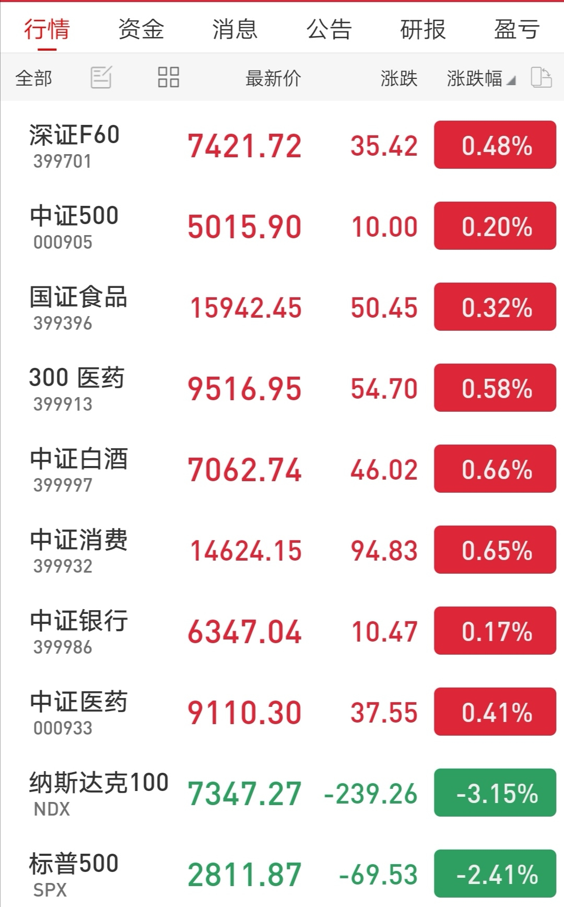

======================================================

_type: talk
@彩虹[544884214814214]
2019-05-14 10:35:43 Tue  
topic_id: 422141124228528

二师父，求解。我想选一只基金定投，做为专门给父母存的钱。想选一只红利基金，是否合适？您建议选哪款呢？

阅读[3556]  评论[0]  赞[0] 

======================================================

_type: q&a
@王雷[51452418141424]
2019-05-14 11:41:49 Tue  
topic_id: 422141124114548

@王雷

>  二师父您说的场外那八支基金能说一下配比比例吗？谢谢！

@二师父

>  您是指我的比例还是配置比例，配置的话券商和地产保证在总投资的百分之20以下，其他的当低估都可以不断定投的，估值越低仓位越重

阅读[3545]  评论[3]  赞[0] 

======================================================

_type: talk
@彩虹[544884214814214]
2019-05-14 13:15:20 Tue  
topic_id: 844151148411182

二师父能看见我的问题吗？为啥不回答我[大哭]

@啊哦呃伊唔คิดถ* at 2019-05-14 13:15:20 Tue

> 用提问的方式吧

----------

阅读[3379]  评论[1]  赞[0] 

======================================================

_type: q&a
@J[28281541518551]
2019-05-14 13:28:18 Tue  
topic_id: 111828815825412

@J

>  师父，目前2850-2900区间，配置多少成仓位合适？

@二师父

>  6到7成，根据自己存量资金情况来，每月结余多的话可以更高一点

阅读[3806]  评论[2]  赞[0] 

======================================================

_type: q&a
@西男[844148822182252]
2019-05-14 18:46:12 Tue  
topic_id: 544828844842814

@西男

>  师傅，用智星投做回测遇到疑问，请教。
>  回测中证红利100032过去三年定投，按照您给的正常估值区间为9.8-15，低估入高估才出来测，结果只有2019年1月有一次低于9.8买入。但是根据您的估值表，这个指数近期有好多次低估，应该有好几次的定投记录。为何用智星投测的会有如何大的差别？怎么办？

@二师父

>  那是因为这个软件录入的中证红利的市盈率比较高，你可以提高市盈率再测试一下结果

阅读[3425]  评论[0]  赞[0] 

======================================================

_type: q&a
@红苹果[28488511551521]
2019-05-14 18:46:53 Tue  
topic_id: 111828818281842

@红苹果

>  我以前在华泰证券开过户，股票交易手续费是万三，现在想要重新开要先销证劵户吧

@二师父

>  对的，也可以先开一个广发的

阅读[3533]  评论[0]  赞[0] 

======================================================

_type: q&a
@一剪梅[844115184528882]
2019-05-14 18:47:13 Tue  
topic_id: 111828882524422

@一剪梅

>  师父，医药现在也可以定投了吧？

@二师父

>  医药100是可以的，沪深300医药暂时还不行

阅读[3686]  评论[0]  赞[0] 

======================================================

_type: talk
@二师父[28814221155551]
2019-05-14 20:51:17 Tue  
topic_id: 422141114114458

<e type="hashtag" hid="825121411222" title="#定投实盘公布模板意见征询#" /> 以后准备用这种方式公布定投的场外实盘，便于大家参考，定投的金额，比例都是变化的，大家自己设定金额，类似我们之前的份数，比例固定，然后算出需要买入的金额。欢迎大家给出意见和建议。

@麻烦得很 at 2019-05-14 20:51:17 Tue

> 0.2指的是2份吗？

----------

@二师父 at 2019-05-14 20:51:17 Tue

> 指的是比例，该基金买入在总体的比例

----------

@J at 2019-05-14 20:51:17 Tue

> 建议师父比例用百分号表示这样不容易和金额搞混。以后都是按实际比例来买入吗？以前是按等分100份里面的一份、两份...来买的，以后我们要换成新的方式吗？

----------

@二师父 at 2019-05-14 20:51:17 Tue

> 总体的4000相当于两份金额，总资金的两份，然后在这个基础上把他分配到各个基金上，以前的份数仍旧适用，不过以前是单个基金的买入份数，现在从整体计算份数

----------

@三峡情 at 2019-05-14 20:51:17 Tue

> 二师父组合，好，这样更直观，方便操作

----------

@20181108…… at 2019-05-14 20:51:17 Tue

> 场内50AH不能投吗？

----------

@二师父 at 2019-05-14 20:51:17 Tue

> 是lof基金，在场内申赎，和场外差不多

----------

@20181108…… at 2019-05-14 20:51:17 Tue

> 谢谢二师父

----------

阅读[5900]  评论[41]  赞[0] 

+++++++++++++++++++++++++++++++++++++++++++++++++++++

图片：
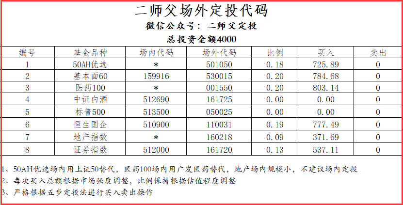

======================================================

_type: talk
@二师父[28814221155551]
2019-05-15 02:18:40 Wed  
topic_id: 244151114118411

<e type="hashtag" hid="481211145528" title="#指数估值#" /> 排版有所更改，大家有好的建议可以提出来，我们一起成长进步。

@凭栏观海 at 2019-05-15 02:18:40 Wed

> 建议把H股指数和香港中小放在一起

----------

@陈 at 2019-05-15 02:18:40 Wed

> 二师父，估值区间是什么？作用是什么？市盈率吗？

----------

@西锦巴乌 at 2019-05-15 02:18:40 Wed

> 建议把二个港美股合并在一起，然后按照顺序：一线蓝筹/大盘股/中盘股/小盘股/红利/行业指数/周期指数/港美股/qdii/债券/黄金/宏观指标这样比较顺点，尽属个人观点

----------

@二师父 at 2019-05-15 02:18:40 Wed

> 市盈率和市净率

----------

阅读[3365]  评论[4]  赞[0] 

+++++++++++++++++++++++++++++++++++++++++++++++++++++

图片：
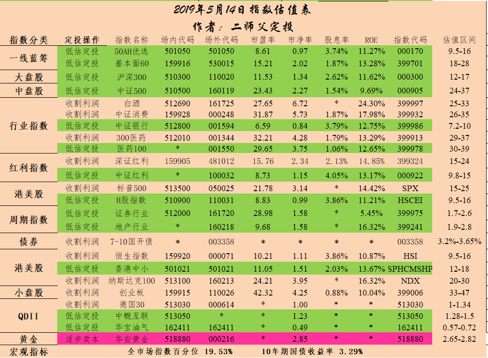

======================================================

_type: talk
@二师父[28814221155551]
2019-05-15 02:21:36 Wed  
topic_id: 111828881885812

<e type="hashtag" hid="142848852442" title="#应对熊市#" /> 如果与勤奋和耐心为友，你将与所罗门比肩

@黄巧 at 2019-05-15 02:21:36 Wed

> 二师父这是早起了还是没有睡呀

----------

@背心 at 2019-05-15 02:21:36 Wed

> 没睡

----------

@木公先生 at 2019-05-15 02:21:36 Wed

> 二师父注意休息，熬夜伤身！

----------

@海盗 at 2019-05-15 02:21:36 Wed

> 忙忙碌碌的每一天，其实只有深夜才能静下心来思考和写作

----------

@J at 2019-05-15 02:21:36 Wed

> 师父应该常居在国外吧，有时差。一个自律的人不会让自己每天熬夜的

----------

阅读[3539]  评论[5]  赞[1] 

+++++++++++++++++++++++++++++++++++++++++++++++++++++

文件：
2019-05-15 02:21:05 Wed
文件大小：[170502]
48812545841418-2019年股市由亢奋变为低迷，你该这样应对.docx

======================================================

_type: q&a
@海马[15158245825242]
2019-05-15 11:27:44 Wed  
topic_id: 244151111858281

@海马

>  二师父，我可以用汇添富中证医药ETF联接A代替天弘中证医药100吗？

@二师父

>  不建议，3月份才募集，目前基金规模不明

阅读[3001]  评论[0]  赞[0] 

======================================================

_type: q&a
@不再YY的猪[422118542885848]
2019-05-15 11:29:48 Wed  
topic_id: 422141111225428

@不再YY的猪

>  二师傅您好，关于仓位控制，上周2850-2900的时候，您说可以建立2成底仓，现在大盘在同样的位置，看到您回答别人问题说仓位控制在6-7成，是否矛盾，2成仓位的需要补仓么？

@二师父

>  这个不矛盾，底仓是没有定投过的朋友一次性买入建立的，通过定投达到的7成仓位和一次性买入达到的7成仓位完全不同，前者已经锻炼了你的耐心和承受波动的能力

阅读[3173]  评论[0]  赞[0] 

======================================================

_type: q&a
@路璐[118252212154812]
2019-05-15 11:34:29 Wed  
topic_id: 244185552822881

@路璐

>  老师，想要系统学习投资相关知识，应该怎么学习呢？有推荐书目么？个人相较音频课程，更喜欢文字材料~而且，投资和对于经济形势的了解有很大关系，那么平时应该多关注哪些平台的新闻呢？本人工作不忙，想利用剩余时间学习一些相关知识，之前一直有投资实操，但因为心态不好，导致现在依旧被套…越来越觉得学习专业知识，弄懂投资系统的重要性，望指点~

@二师父

>  你的认知有问题，投资收益跟经济形势没有啥关系，需要改变认知
>  
>  其次音频是比较好的学习模式，如果想看文字学习材料学习，置顶文章里面的五步定投法足够了，读懂读通基本能够初步建立投资的系统

阅读[3218]  评论[0]  赞[0] 

======================================================

_type: talk
@二师父[28814221155551]
2019-05-15 11:40:23 Wed  
topic_id: 244185552214111

课程模板固定了，购买过课程需要新模板的可以联系我

@木公先生 at 2019-05-15 11:40:23 Wed

> 二师父，我想要新模板的课程，提供邮箱给你吗？

----------

@紫色天使 at 2019-05-15 11:40:23 Wed

> 二师父，我也想要新模版的课程，我的邮箱641552178@qq.com

----------

@二师父 at 2019-05-15 11:40:23 Wed

> 加微信ershifudt

----------

@二师父 at 2019-05-15 11:40:23 Wed

> 加微信ershifudt

----------

阅读[3378]  评论[4]  赞[0] 

+++++++++++++++++++++++++++++++++++++++++++++++++++++

图片：
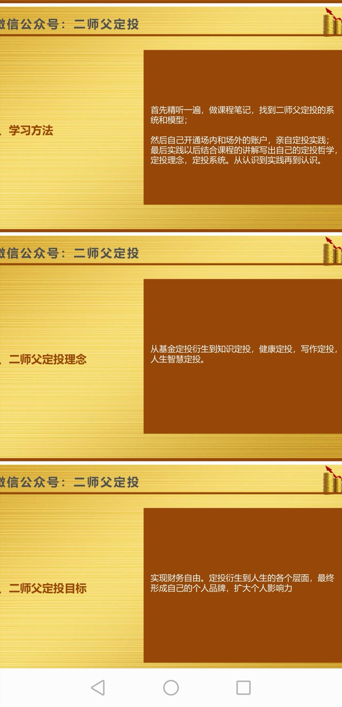

======================================================

_type: talk
@杨光霞[544885445288584]
2019-05-15 11:50:28 Wed  
topic_id: 111852224128412

二师傅你好！去年开始一直定投中欧医疗混合c，现在还有4千多点，是都可以用这个代替中证医药100

@二师父 at 2019-05-15 11:50:28 Wed

> 换成指数基金好一些

----------

@杨光霞 at 2019-05-15 11:50:28 Wed

> 好的，得转换一下

----------

阅读[3455]  评论[2]  赞[0] 

======================================================

_type: q&a
@幻水[881185412112]
2019-05-15 12:42:01 Wed  
topic_id: 544812225852854

@幻水

>  你好，请问你怎么看比特币？你觉得比特币是一种可以配置的金融资产吗？请问比特币的价格还会创历史新高吗？

@二师父

>  这是个投机品种，我看不懂投资逻辑，没有投资，一些朋友17年赚了不少，18年亏了，19年又赚了，投机可以，不适合投资
>  
>  至于能不能涨，要是能预测的话我就买了

阅读[3501]  评论[1]  赞[0] 

======================================================

_type: q&a
@Joey [422115481514888]
2019-05-15 14:31:47 Wed  
topic_id: 544812224415114

@Joey 

>  师傅 我仓位比较重 有没有必要今天减点仓啊

@二师父

>  如果下跌心理压力较大，承受不了，且对于浮盈指数可以减仓一些的，保证自己能承受波动

阅读[3400]  评论[1]  赞[0] 

======================================================

_type: q&a
@nana[48222415211188]
2019-05-15 16:20:42 Wed  
topic_id: 111852228425242

@nana

>  师傅：我前期定投基本面60是选择的场内基金，可以吗？

@二师父

>  也可以，建议是投资场外的，因为场内规模小，流动性可能有问题

阅读[3294]  评论[1]  赞[0] 

======================================================

@二师父[28814221155551]
2019-05-15 16:53:34 Wed  
topic_id: 111852228121522

>  @二师父
>  

阅读[3379]  评论[0]  赞[0] 

======================================================

_type: talk
@奇迹相伴[422118428544848]
2019-05-15 20:00:44 Wed  
topic_id: 544812115185154

<e type="hashtag" hid="825121242442" title="#关于估值过程中需要注意的问题#" /> 适合重仓的有哪些指数？

阅读[3144]  评论[0]  赞[0] 

======================================================

_type: talk
@二师父[28814221155551]
2019-05-16 03:16:36 Thu  
topic_id: 844185825184842

<e type="hashtag" hid="481211145528" title="#指数估值#" /> 选择估值表中低估的指数基金优化配置

阅读[3244]  评论[0]  赞[0] 

+++++++++++++++++++++++++++++++++++++++++++++++++++++

图片：
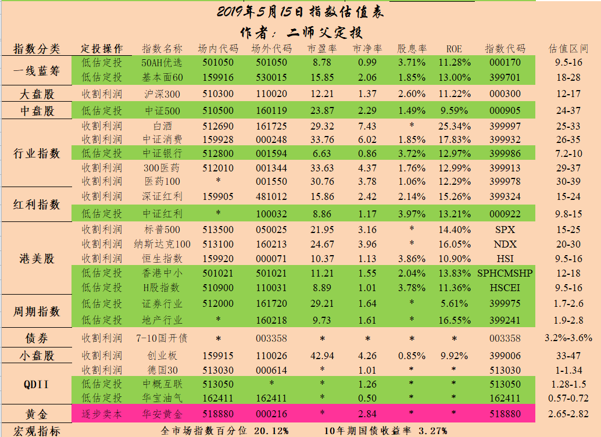

======================================================

_type: talk
@二师父[28814221155551]
2019-05-16 03:18:00 Thu  
topic_id: 544812152814144

<e type="hashtag" hid="552842241814" title="#海外收益债券基金#" />

@不再YY的猪 at 2019-05-16 03:18:00 Thu

> 汇率低于6.4，同时美债收益率高于2.7，这样的时机估计要等好几年？请教下二师傅，手里有美元现汇，该如何投资呢

----------

@二师父 at 2019-05-16 03:18:00 Thu

> 那就等待吧，总会有机会的。美元现汇金额大吗，小额可以港美股打新，大额可以找个机会换过来，破7挺难的，当然不排除这种可能性

----------

@小文文 at 2019-05-16 03:18:00 Thu

> 美国10年期国债收益率在哪里看呢

----------

@二师父 at 2019-05-16 03:18:00 Thu

> 以后估值表增加一列

----------

阅读[5260]  评论[4]  赞[0] 

+++++++++++++++++++++++++++++++++++++++++++++++++++++

文件：
2019-05-16 03:17:28 Thu
文件大小：[229607]
15581452114122-美元兑人民币汇率升至6.9，二师父手把手教你如何利用基金配置美元资产.docx

======================================================

_type: talk
@二师父[28814221155551]
2019-05-16 03:32:53 Thu  
topic_id: 244185825184221

<e type="hashtag" hid="142812215812" title="#周四定投实盘#" /> 周四定投实盘，已经买入了，会按照今天收盘价格成交。

我特别不喜欢设置这种表格，盲目的跟随只会让大家变懒。当然这复合人性，微信正是抓住这一点所以用户才那么多。

买入份额大家自己计算，一份在分配到各个基金上。至于持仓比例，等我有时间再发布，最近实在太忙。一周上班七天，晚上时不时加班，我都有点敬佩自己了。

@王雷 at 2019-05-16 03:32:53 Thu

> 谢谢二师父，辛苦了！

----------

@王雷 at 2019-05-16 03:32:53 Thu

> 二师父定投盘加了恒生国企。估值表没有。估值表是恒生指数。

----------

@Claire at 2019-05-16 03:32:53 Thu

> 估值表里是H股指数[微笑]

----------

@丸子妈 at 2019-05-16 03:32:53 Thu

> 为什么场内50ah用上证50代替?场内不是也有50ah吗？

----------

@海〔纳百川〕 at 2019-05-16 03:32:53 Thu

> 场内50ah资金流动性小

----------

@海马 at 2019-05-16 03:32:53 Thu

> 二师父，今天一份买入了五只基金吗？

----------

@奔波儿霸🐟🐠🐬🐳🐋💦 at 2019-05-16 03:32:53 Thu

> 今天的这一份，应该是总份数的一份，按比例分别买了五只。

----------

@海马 at 2019-05-16 03:32:53 Thu

> 好的谢谢

----------

阅读[5619]  评论[20]  赞[0] 

+++++++++++++++++++++++++++++++++++++++++++++++++++++

图片：
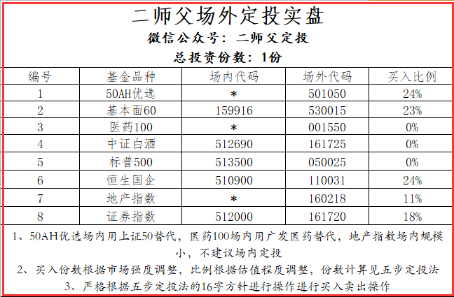

======================================================

_type: talk
@杜志彪[544454124115854]
2019-05-16 10:11:08 Thu  
topic_id: 844185822515822

刚刚场内定投了一份人工智能，目前依据年线上扬停止定投，这是我的年线微笑定投法[偷笑]，二师父您给把把关，看行吗[呲牙]

@杜志彪 at 2019-05-16 10:11:08 Thu

> 方法很简单，就是年线掉头向下开始定投，上扬停止定投，上扬期间收割每个10%利润。

----------

@杜志彪 at 2019-05-16 10:11:08 Thu

> 底线是60分钟线掉头向下卖出本金。

----------

@rtdmm小米 at 2019-05-16 10:11:08 Thu

> 好久买一次呢

----------

@杜志彪 at 2019-05-16 10:11:08 Thu

> 这个就看自己资金情况了，我也是每周四定投。

----------

@J at 2019-05-16 10:11:08 Thu

> 请问这种定投方法平均年收益率大概多少？为什么底线是60分钟线而不是年线？

----------

@rtdmm小米 at 2019-05-16 10:11:08 Thu

> 60分钟线是指年线的60分钟线？

----------

@杜志彪 at 2019-05-16 10:11:08 Thu

> 日线周期的，年线也是在日线周期下的，最主要是进出要一直，只看年线也行（可以过滤掉其它均线，只保留250年线）。
我也是在小资金实验阶段，需要验证，不过周期挺长，主要是二师父还没涉及到这个人工智能，我也是特别看好未来发展，所以根据均线经验试一下，不是成熟的策略。

----------

@rtdmm小米 at 2019-05-16 10:11:08 Thu

> 谢谢分享

----------

阅读[3075]  评论[11]  赞[0] 

======================================================

_type: talk
@勤能行之[481211221828]
2019-05-16 10:17:05 Thu  
topic_id: 544812155288554

我都没看懂师傅今天的实盘买了啥，哪位小伙伴能讲解一下吗，谢谢啦。

@杜志彪 at 2019-05-16 10:17:05 Thu

> 看右侧0%就是没买。

----------

@勤能行之 at 2019-05-16 10:17:05 Thu

> 好的，谢谢你。[强][咖啡]

----------

@二师父 at 2019-05-16 10:17:05 Thu

> 看右侧的比例，一份是总资金分配的份额，然后用比例分配

----------

阅读[3148]  评论[3]  赞[0] 

======================================================

_type: q&a
@冯林锋[841551141441422]
2019-05-16 11:08:11 Thu  
topic_id: 422184858414448

@冯林锋

>  同一板块，场内基金和场外基金涨跌幅度是一样的吗？

@二师父

>  涨跌幅度会有一些差别的，看板块涨跌幅的话用股票软件即可，比方我们的华泰证券使用的涨乐财富通

阅读[3121]  评论[0]  赞[0] 

======================================================

_type: q&a
@J[28281541518551]
2019-05-16 11:12:25 Thu  
topic_id: 844185822225122

@J

>  师父，是不是3000点以下都是安全的？如果仓位没达到一半，2900左右是否也可再建一两层仓位？

@二师父

>  低估优质宽基和行业指数，可以用长期不用的资金建立底仓

阅读[3178]  评论[2]  赞[0] 

======================================================

_type: talk
@二师父[28814221155551]
2019-05-16 11:16:53 Thu  
topic_id: 111852544142512

<e type="hashtag" hid="552842114844" title="#操作说明#" /> 今天卖了创维转债，亏了1.4元，可转债打新暂时停止

关于实盘怎么看，里面一份是总资金的份额，然后买入比例是这一份的比例。这样就比较明白了，只要低估的指数就开始买，主要是为了读者更好的参考。一切都是在不断创新的过程中，只有这样才能不断进步

鳄鱼计划的公布方式还是和以前一样

阅读[3230]  评论[0]  赞[0] 

======================================================

_type: talk
@二师父[28814221155551]
2019-05-16 12:39:15 Thu  
topic_id: 244185824858521

大家邀请朋友可以通过分享有赏按钮，这样你和朋友都可以得到返现

@凤凰涅槃 at 2019-05-16 12:39:15 Thu

> 师父您一天的时间是有48小时嘛[偷笑]

----------

@二师父 at 2019-05-16 12:39:15 Thu

> 可以过成48

----------

阅读[3284]  评论[2]  赞[0] 

+++++++++++++++++++++++++++++++++++++++++++++++++++++

图片：
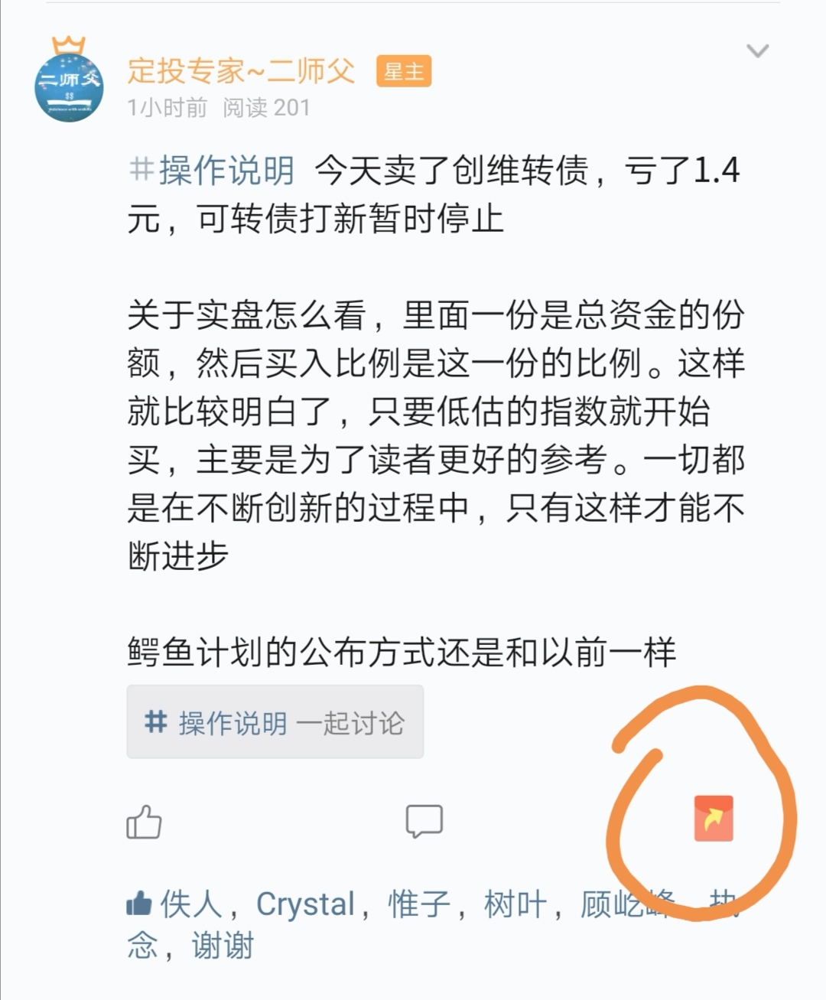

======================================================

_type: q&a
@阿莲[241555141242181]
2019-05-16 14:57:43 Thu  
topic_id: 844185845241522

@阿莲

>  二师父目前中证红利还有投资价值吗？

@二师父

>  非常有投资价值哈，低估值高股息是应该重点关注的投资品种，只是为了简化投资标的所以目前实盘没加入了，自己可以配置

阅读[3069]  评论[1]  赞[0] 

======================================================

_type: q&a
@西锦巴乌[88448285428482]
2019-05-16 15:33:33 Thu  
topic_id: 844185845211112

@西锦巴乌

>  师父好！请问要把2只基金比如中证红利和上证红利在某个时段的净值走势图放在同一个图中要用什么软件？谢谢！

@二师父

>  智投星

阅读[3141]  评论[0]  赞[0] 

======================================================

_type: q&a
@凭栏观海[244414845852181]
2019-05-16 19:07:07 Thu  
topic_id: 844185848811582

@凭栏观海

>  请问老师，中概互联目前估值，值得定投吗？

@二师父

>  非常值得定投，我场内投资的有这个指数，腾讯，阿里巴巴，美团这些股票都是重仓

阅读[3469]  评论[5]  赞[0] 

======================================================

@二师父[28814221155551]
2019-05-16 19:20:41 Thu  
topic_id: 544812141522514

>  @二师父
>  

阅读[3538]  评论[5]  赞[0] 

======================================================

_type: q&a
@J[28281541518551]
2019-05-16 22:02:53 Thu  
topic_id: 544812148511844

@J

>  师父，请问交银中证海外互联网指数值得投资吗？是否可进行场外定投代替中概互联？

@二师父

>  交银施罗德这个基金的价值没有中概互联高，如果没有场内账户第二选择可以是交银这个基金

阅读[3333]  评论[5]  赞[0] 

======================================================

_type: q&a
@光少[244124552511141]
2019-05-16 22:25:56 Thu  
topic_id: 111852518441252

@光少

>  二师父：易方达消费行业股票（110022）可以查到它的估值价值吗？现在属于什么估值？

@二师父

>  我在万得搜索这是个指数不是股票，利用中证消费的估值即可，正常偏高估值，快进入高估了

阅读[3408]  评论[3]  赞[0] 

======================================================

_type: talk
@二师父[28814221155551]
2019-05-16 22:33:30 Thu  
topic_id: 422184821222288

<e type="hashtag" hid="142812422222" title="#中概互联#" /> 场外可以选择这个，不过规模太小，有清盘风险，所以不建议投资场外

大家对投资有任何疑问都可以提出来，我讲的不一定对，一起把最有价值的投资理念探讨出来，并且找到最佳的投资品种，这才是星球存在的意义

@优哉游哉 at 2019-05-16 22:33:30 Thu

> 可以买这个呀

----------

@二师父 at 2019-05-16 22:33:30 Thu

> 这个价值没有中概互联高

----------

@奔波儿霸🐟🐠🐬🐳🐋💦 at 2019-05-16 22:33:30 Thu

> 刚开始的时候，不知道要有选择，当时就按绿色都投了，现在看就这么地吧，控制在10%左右。

----------

@不言而喻 at 2019-05-16 22:33:30 Thu

> 清盘了会损失本金吗

----------

@二师父 at 2019-05-16 22:33:30 Thu

> 不会，基金公司会按照当前净值把资金折算给你

----------

阅读[3542]  评论[5]  赞[0] 

+++++++++++++++++++++++++++++++++++++++++++++++++++++

图片：
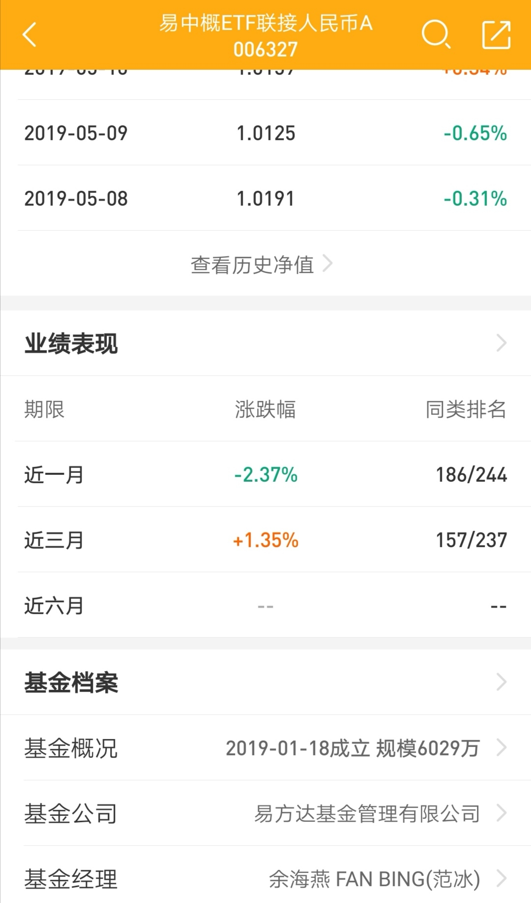

======================================================

_type: talk
@二师父[28814221155551]
2019-05-17 03:39:10 Fri  
topic_id: 844185815458122

<e type="hashtag" hid="481211145528" title="#指数估值#" /> 估值表每日更新，参考进行定投和配置，后面我把鳄鱼计划也量化，大家就可以更好地投资了。

@聪明的笨蛋 at 2019-05-17 03:39:10 Fri

> 估值表没内容呀，你们的有吗

----------

@聪明的笨蛋 at 2019-05-17 03:39:10 Fri

> 

----------

@冉冉 at 2019-05-17 03:39:10 Fri

> 我也看不见估值表

----------

@冉冉 at 2019-05-17 03:39:10 Fri

> 估值表没有内容

----------

@rtdmm小米 at 2019-05-17 03:39:10 Fri

> 空白的估值表

----------

@Claire at 2019-05-17 03:39:10 Fri

> 师父，估值表打不开呢[微笑]

----------

@门萨🐨 at 2019-05-17 03:39:10 Fri

> 已经好了

----------

@rtdmm小米 at 2019-05-17 03:39:10 Fri

> 怎么同15号的一样的？

----------

阅读[5515]  评论[13]  赞[0] 

+++++++++++++++++++++++++++++++++++++++++++++++++++++

图片：
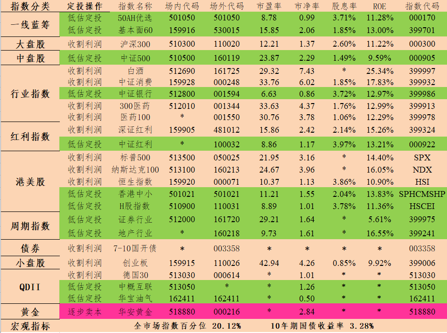

======================================================

_type: q&a
@小白老赵[244148555454141]
2019-05-17 10:03:27 Fri  
topic_id: 244185818582211

@小白老赵

>  请教师父，黄金现在应该买吗？定投还是多买一些？好像大家都看好黄金，为什么你的估值表显示要卖本？谢谢

@二师父

>  判断一个品种不是说大家看好你再买，黄金去年我们配置过，如果持有到现在有10个点的收益率，在别人不看好的时候购买
>  
>  当大多数人看好一个投资品种的时候，他就已经很贵了

阅读[3163]  评论[0]  赞[1] 

======================================================

_type: q&a
@一剪梅[844115184528882]
2019-05-17 10:03:45 Fri  
topic_id: 844185818881552

@一剪梅

>  师父，中概互联和华宝油气在场外可以投吗？还是在鳄鱼计划中投的呢

@二师父

>  我是场内定投的

阅读[3241]  评论[0]  赞[0] 

======================================================

_type: q&a
@芥末[111885444524442]
2019-05-17 10:05:48 Fri  
topic_id: 111852585125152

@芥末

>  二师父，恒生国企你是场内场外都有配置吗？他是更适合场内做网格还是场外定投呢？

@二师父

>  场内不是说就做网格，这个看市场环境，震荡市场才适合做网格交易，恒生国企我只在场外有配置了，场内投的是恒生etf

阅读[3364]  评论[0]  赞[0] 

======================================================

_type: talk
@二师父[28814221155551]
2019-05-17 12:35:24 Fri  
topic_id: 111852588441882

<e type="hashtag" hid="481211145528" title="#指数估值#" /> 估值表更新，最近网络不好，昨天更新有误，带来不便，请谅解。

@凭栏观海 at 2019-05-17 12:35:24 Fri

> 辛苦啦

----------

@庆余年 at 2019-05-17 12:35:24 Fri

> 中证500正常了？

----------

@rtdmm小米 at 2019-05-17 12:35:24 Fri

> 好安静！

----------

@rtdmm小米 at 2019-05-17 12:35:24 Fri

> 请问二师父，今天鳄鱼计划出动？

----------

@曾来 at 2019-05-17 12:35:24 Fri

> 昨天定投了，今天手动追加

----------

阅读[5255]  评论[6]  赞[0] 

+++++++++++++++++++++++++++++++++++++++++++++++++++++

图片：
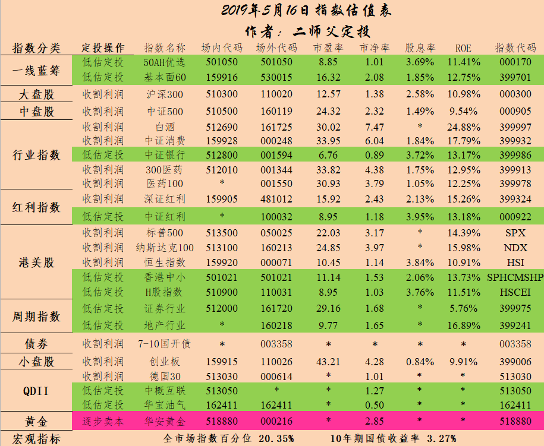

======================================================

_type: talk
@海盗[48248118584848]
2019-05-17 16:28:04 Fri  
topic_id: 111852424488542

5月17日最新偏离表

@王雷 at 2019-05-17 16:28:04 Fri

> 券商偏离那么多。该多买点

----------

@YtingLi at 2019-05-17 16:28:04 Fri

> 你好，偏离表格是在哪查到的，谢谢

----------

阅读[2838]  评论[2]  赞[0] 

+++++++++++++++++++++++++++++++++++++++++++++++++++++

图片：
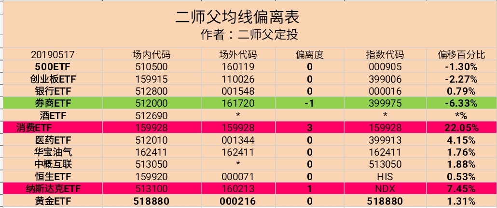

======================================================

_type: q&a
@J[28281541518551]
2019-05-17 19:45:06 Fri  
topic_id: 544812188845454

@J

>  师父你好，H股与华夏AH相比，哪个更好？已定投50AH的还有必要配置H股吗

@二师父

>  有必要，h股里面的股票有的50ah没有，侧重点不同，大部分是在香港上市的内地优质公司

阅读[2707]  评论[0]  赞[0] 

======================================================

_type: q&a
@JOY[111881481812422]
2019-05-17 19:46:18 Fri  
topic_id: 422184544582288

@JOY

>  师父，要是大盘继续下跌到2800左右，建1～2层仓底的话，目前是不是选AH50，基本面60比较合适？您还有别的推荐吗？选场外还是场内呢？场内我看上证50有3个，是选510800吗？基本面60有盘面大些的可以替代的吗？

@二师父

>  选场外定投即可，代码我在置顶文章鳄鱼计划和定投实盘区别里面公布啦，基本面60可以用深证红利替代的

阅读[2777]  评论[1]  赞[0] 

======================================================

_type: q&a
@堂吉诃德的小助手[15528821588422]
2019-05-17 19:48:38 Fri  
topic_id: 244185254811221

@堂吉诃德的小助手

>  我想问下，未来大概率钱会贬值，如果说现在买房，虽然房价很贵，但如果未来钱不值钱了，像委内瑞拉，如果现在贷款100万，当钱不值钱的时候不是很容易还清贷款了吗？莫非经济越差房贷越容易还？这件事想了很久，不知道这个思路有没有问题呢？

@二师父

>  这是极端情况，发生突发性的危机导致国家货币恶性贬值，资产是唯一能保值的，你要知道当你的房贷贬值了，你的手里的100万也只变成了1万，购买力极度下降

阅读[2822]  评论[2]  赞[0] 

======================================================

_type: q&a
@Shitou_li[15155885518252]
2019-05-18 02:43:40 Sat  
topic_id: 422184541285188

@Shitou_li

>  二师傅，您好！最近想归集基金，优化组合！特意又学习了下，选了以下标的，请二师傅指正：沪深300，中正500，标普500，纳指etf，红利etf，医药etf，消费etf，证券etf，恒指etf，债券（还没选好标的，请师傅推荐下）根据相应估值轮动配置。

@二师父

>  标的不错和我的配置差不多，场内300etf我用银行etf和深圳红利替代的

阅读[2567]  评论[2]  赞[0] 

======================================================

_type: q&a
@往事随风[48515148521428]
2019-05-18 02:45:28 Sat  
topic_id: 422184584445888

@往事随风

>  二师父你好！请问证券保险跟证券指数比较，哪个定投更好一些？

@二师父

>  选择证券指数好一些的，更加集中，保险有单独的指数，不过保险指数盈利比证券稳定，证券是强周期指数

阅读[2645]  评论[0]  赞[0] 

======================================================

_type: talk
@二师父[28814221155551]
2019-05-18 03:53:52 Sat  
topic_id: 244185288411581

<e type="hashtag" hid="481211145528" title="#指数估值#" /> 指数估值，暴跌之下，券商偏离度开始负数1了，可以多加点仓位

@新的开始 at 2019-05-18 03:53:52 Sat

> 师父辛苦了[玫瑰][玫瑰][玫瑰]

----------

@One at 2019-05-18 03:53:52 Sat

> 昨天已经加过了

----------

阅读[2708]  评论[3]  赞[0] 

+++++++++++++++++++++++++++++++++++++++++++++++++++++

图片：
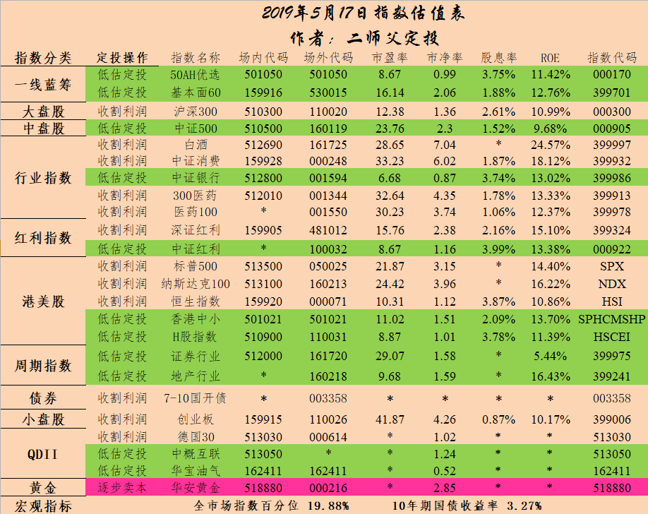

======================================================

_type: talk
@二师父[28814221155551]
2019-05-18 03:54:51 Sat  
topic_id: 422184588211458

<e type="hashtag" hid="142814582842" title="#定投常见错误认知#" /> 需要避免这些定投常见的错误认知

阅读[4898]  评论[0]  赞[0] 

+++++++++++++++++++++++++++++++++++++++++++++++++++++

文件：
2019-05-18 03:54:28 Sat
文件大小：[169939]
51184552148184-定投过程中常见的错误认知.docx

======================================================

_type: q&a
@冯林锋[841551141441422]
2019-05-18 10:43:26 Sat  
topic_id: 111852454425582

@冯林锋

>  二师父，现在劵商板块偏离负1，按照鳄鱼计划，比如我有10万资金准备开始买，是不是现在可以一次性买1万。

@二师父

>  不是，仍旧是一份一份买，鳄鱼计划必须保证资金充裕，这是我额外加仓，新手建议参考低估实盘即可

阅读[2825]  评论[2]  赞[0] 

======================================================

_type: q&a
@Joey [422115481514888]
2019-05-18 10:44:08 Sat  
topic_id: 111852454418812

@Joey 

>  师傅 现在债券基金有没有到配置的时机呢 到了适合配置的时候 你提示大家一下哦

@二师父

>  没有的呢，我估值表有，现在债券正常估值，看估值来定投即可

阅读[2907]  评论[0]  赞[0] 

======================================================

_type: q&a
@J[28281541518551]
2019-05-18 15:38:29 Sat  
topic_id: 544812514855444

@J

>  师父，周末好，刚看到券商偏离度-1，下周操作上请问是按鳄鱼计划不定期加仓一份呢，还是放到周四定投呢？

@二师父

>  都可以，我鳄鱼计划和场外定投分开的

阅读[2802]  评论[9]  赞[0] 

======================================================

_type: q&a
@玉玲[841585548222412]
2019-05-18 19:16:28 Sat  
topic_id: 111852458525582

@玉玲

>  我是投资小白，新手入门的知识都看了一遍，其他的还在学习中，有些不太懂，请教下二师父:1、中证500我看您的评估表是低估，目前市盈率23点多，可是您的其他文章里说目前是正常估值，这个怎么理解？或者要等到它市盈率达到多少阈值再投呢？2、网格交易策略为何不适合场外，是因为不足7天赎回手续费贵么，那如果场外操作不是很频繁也是可以使用这策略？3、因为我定投金额少，准备两万的，每个月计划一千，跌的多再补些。这样的话是不是选两个基金就够了，还是多分散几个？小金额还需要进场内么？
>   
>  最后还是想请二师父指点，目前看的是中证红利和50ah优选，不知道合适么？问题好多，还在努力学习中，争取以后独立思考。

@二师父

>  1，这个市盈率每个交易日都是变化的，所以这几天低估，过几天可能就是正常估值了
>  
>  2，如果场外操作不频繁也可以使用网格交易策略
>  
>  3，如果只有2万，选择两只基金定投即可，就选择50ah和基本面60

阅读[2648]  评论[1]  赞[0] 

======================================================

_type: q&a
@冯林锋[841551141441422]
2019-05-18 19:19:49 Sat  
topic_id: 244185281854121

@冯林锋

>  二师父，现在券商板块已经低估了，下周一开始如何用网格交易布局，底仓如何建立

@二师父

>  券商周期指数，建立一成底仓即可

阅读[2852]  评论[8]  赞[0] 

======================================================

_type: talk
@树叶[544811512145144]
2019-05-18 19:31:45 Sat  
topic_id: 244185228228111

<e type="hashtag" hid="142825811122" title="#定投周报#" /> 定投周报第8期

阅读[4912]  评论[0]  赞[0] 

+++++++++++++++++++++++++++++++++++++++++++++++++++++

文件：
2019-05-18 19:31:30 Sat
文件大小：[321026]
15581445288452-二师父定投周报5.18.docx

======================================================

_type: talk
@二师父[28814221155551]
2019-05-18 22:57:17 Sat  
topic_id: 111852444584522

<e type="hashtag" hid="281181228851" title="#周末答疑#" /> 需不需要建立底仓，按照市场给与的机会，A股总是牛短熊长，所以我们有很长的时间在低估区域积累股份。这样的话就是不用建立底仓的，除非做网格交易，否则不用总是担心会错过建仓机会。

最基本的配置是哪些，二师父已经公布了，如果你想要自己配置，可以查阅基金里面的股票，如果50%以上的股票充合，那么这类基金就不要重复配置了。

把二师父实盘的基金配置好就足够，学会集中投资。

阅读[4818]  评论[0]  赞[0] 

======================================================

_type: q&a
@One[422118584812518]
2019-05-18 22:59:50 Sat  
topic_id: 422184555824288

@One

>  二师傅，晚上好，请问场外购买的基金，怎么方便的看当前的净值和盈亏，我用的是蛋卷，好像都延迟好几天？如果一只基金同时有场内和场外的基金，他们的净值值是否比例关系？比如510500(500etf)和160119(南方中证500etf连接)。

@二师父

>  没有比例关系，净值每天收盘就会公布的啊，是成交确认延迟，但是每天净值收盘都会公布的

阅读[2807]  评论[1]  赞[0] 

======================================================

_type: talk
@二师父[28814221155551]
2019-05-19 01:35:17 Sun  
topic_id: 244185222124511

<e type="hashtag" hid="825142222522" title="#定投过程中的下跌#" /> 指数基金定投过程中越买越跌怎么办，不要恐惧，低估区域内，越跌越买，直到买到最低点的价位。

@凭栏观海 at 2019-05-19 01:35:17 Sun

> 信心来源

----------

阅读[5022]  评论[1]  赞[0] 

+++++++++++++++++++++++++++++++++++++++++++++++++++++

文件：
2019-05-19 01:34:32 Sun
文件大小：[170029]
48812558542458-指数基金定投的过程中越买越跌怎么办.docx

======================================================

@二师父[28814221155551]
2019-05-19 19:18:43 Sun  
topic_id: 844185248218822

>  @二师父
>  

阅读[2393]  评论[0]  赞[0] 

======================================================

_type: q&a
@恋尘[51558584455824]
2019-05-19 19:23:07 Sun  
topic_id: 544812545221554

@恋尘

>  师父，我一直都在场外定投，最近想研究下场内的网格交易，观看了你的网格，但我有个问题就是场内的买一卖一都是什么意思，我想用委托也不会求个教学。

@二师父

>  你看这个交易界面的图，采用限价委托买入的形式，价格我一般用系统自动设定的，如果设定一个价格，到达了这个价格就会自动成交，否则交易失败
>  
>  买入数量自己设定，必须是100的整数倍，然后点击买入即可

阅读[2533]  评论[5]  赞[0] 

======================================================

_type: q&a
@鲤鱼[422111845251448]
2019-05-19 19:23:25 Sun  
topic_id: 422184525824448

@鲤鱼

>  今天下午华泰客服经理回访说佣金调整到万分之一，但是没说免5，是不是免5需要什么要求？？比如账户资金需要多少，还是其他什么要求？？

@二师父

>  基金都是免五的，如果你不放心可以给基金经理打个电话确认下

阅读[2734]  评论[2]  赞[0] 

======================================================

_type: q&a
@空瓶子[88282241812242]
2019-05-19 20:05:43 Sun  
topic_id: 111852414128852

@空瓶子

>  二师父，我想问您个问题。定投是不是集中一点好。我已经定投50etf了。是不是专注这个就好。毕竟低估的很多。

@二师父

>  对的，资金不多投这一个也可以的，优质的沪市蓝筹股指数基金

阅读[2687]  评论[2]  赞[0] 

======================================================

_type: q&a
@小牧童[28484254825881]
2019-05-19 20:07:49 Sun  
topic_id: 544812545412844

@小牧童

>  师父，最近有没有书推荐！

@二师父

>  有的啊，最近我在读书圈读的一本书，买入，持有，富有，一名金牛基金经理的投资之路，作者和我的理念很相似，纯价值投资者，值得一读

阅读[2776]  评论[10]  赞[0] 

======================================================

_type: talk
@二师父[28814221155551]
2019-05-20 03:49:35 Mon  
topic_id: 544812581221884

<e type="hashtag" hid="825818842822" title="#网格交易#" />为什么当前市场网格交易适合。

阅读[4799]  评论[0]  赞[0] 

+++++++++++++++++++++++++++++++++++++++++++++++++++++

文件：
2019-05-20 03:49:04 Mon
文件大小：[304622]
28814221558541-当前市场环境，网格交易法正合适.docx

======================================================

_type: talk
@二师父[28814221155551]
2019-05-20 04:32:09 Mon  
topic_id: 422184518442888

又涨了，继续

@小涛@我的四季生活 at 2019-05-20 04:32:09 Mon

> 昨天又买了点币幸好人民币涨了

----------

阅读[2874]  评论[2]  赞[0] 

+++++++++++++++++++++++++++++++++++++++++++++++++++++

图片：
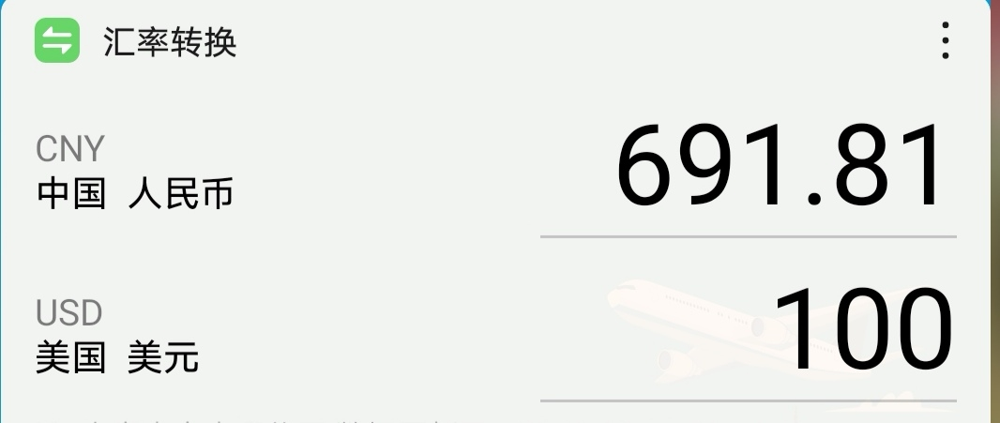

======================================================

_type: talk
@不再YY的猪[422118542885848]
2019-05-20 08:48:05 Mon  
topic_id: 111852485484182

<e type="hashtag" hid="881251425252" title="#鳄鱼计划#" /> 请问鳄鱼计划的实盘和历史操作在哪里查询呢？

@Zyxj at 2019-05-20 08:48:05 Mon

> 搜索鳄鱼计划。

----------

@不再YY的猪 at 2019-05-20 08:48:05 Mon

> 搜索出来结果比较乱，怎么可以只看二师傅的历史操作呢？

----------

@Zyxj at 2019-05-20 08:48:05 Mon

> 搜索，标签，鳄鱼计划。

----------

阅读[2857]  评论[3]  赞[0] 

======================================================

_type: q&a
@雷[111888548181442]
2019-05-20 12:04:58 Mon  
topic_id: 111852188122152

@雷

>  师傅，你好，看到你说的网格交易法，交易是不是在当天15点前几分钟买入，卖出？现在震荡是不是也适合股票交易？

@二师父

>  股票不要做网格交易，风险太大，我是场内交易的
>  
>  委托一个价格及时成交，不用等到下午三点

阅读[2757]  评论[8]  赞[0] 

======================================================

_type: q&a
@J[28281541518551]
2019-05-20 14:59:02 Mon  
topic_id: 844185155818182

@J

>  师父 免5账户是华宝、广发还是华泰？

@二师父

>  基金这三个账户都免5的，股票华宝和广发免

阅读[2381]  评论[6]  赞[0] 

======================================================

_type: q&a
@夏日荷花[28888284252421]
2019-05-20 15:00:08 Mon  
topic_id: 844185155241822

@夏日荷花

>  二师父，您好！我想一次性买入易债券基金，持有时间大概两个月到半年吧。但由于我个人原因，只能在股票账户内买，不知买A类还是C类更合适呢?谢谢！

@二师父

>  目前国债收益率偏低，股市持续走弱，债券基金当前不适合买入，场内优质的etf基金是不错的选择

阅读[2451]  评论[0]  赞[0] 

======================================================

_type: q&a
@西锦巴乌[88448285428482]
2019-05-20 15:37:09 Mon  
topic_id: 111852822821812

@西锦巴乌

>  师父好！易方达中小盘混合110011的估值能否参照消费或白酒的估值？我看它持有的前10大股票中白酒占比高于30%，家电医药占比25%左右，谢谢！

@二师父

>  这个不能，用估值指标市盈率，市净率，股息率估值即可

阅读[2428]  评论[2]  赞[0] 

======================================================

_type: talk
@二师父[28814221155551]
2019-05-20 17:02:28 Mon  
topic_id: 244185152145421

<e type="hashtag" hid="225142148481" title="#场内定投和场外定投的区别#" /> 场内定投和场外定投都是指数基金定投的渠道

场外定投基金费率有管理费，托管费，申购费和赎回费，申购和赎回是代销平台收取，管理费是基金公司收，托管费是银行收

场内定投费率是买入和卖出费率，托管费和管理费，买入和卖出一般是万3，最低五元佣金，通过二师父的福利渠道可以万1，不用最低五元佣金

场外定投是以收盘的价格成交，场内定投及时成交，卖出及时到账，比如今天买的券商，买了之后继续上涨，我们在场内买入就能享受到这部分上涨的收益

@Yanzhen at 2019-05-20 17:02:28 Mon

> 师傅的福利渠道到哪找?

----------

@二师父 at 2019-05-20 17:02:28 Mon

> 置顶文章有链接

----------

@玉玲 at 2019-05-20 17:02:28 Mon

> 请问场内基金交易量达到多少，表示流动性可以？华泰的单笔交易费用最低是0.1元？除了万得全，天天基金上每个场内基金也有折价或溢价率，也是一样的么？

----------

@二师父 at 2019-05-20 17:02:28 Mon

> 1000万以上是可以的，只有场内基金有折价和溢价，最低0.1

----------

阅读[2443]  评论[4]  赞[0] 

======================================================

_type: q&a
@首尔航仔Eric[244114888181111]
2019-05-20 18:37:54 Mon  
topic_id: 544812824115514

@首尔航仔Eric

>  二师父 你发的那个每天低估值表里面， 我想知道在天天基金里面买的话是搜场外代码是吗？ 比方说530015 是建信深证基本面60ETF联接A， 场外代码501050 的话是华夏上证50AH优选指数A 对吗

@二师父

>  是的，天天，蛋卷，蚂蚁都是场外定投，对应的代码是场外基金

阅读[2381]  评论[0]  赞[0] 

======================================================

_type: q&a
@龘何亮龘[28814214225141]
2019-05-20 19:24:32 Mon  
topic_id: 422184142554458

@龘何亮龘

>  二师父，我想使用华宝的预订价委托功能，但是我现在用的是华泰的，请问需要重新到华宝开户吗？还是需要其他操作？

@二师父

>  嗯，需要在华宝开户的

阅读[2384]  评论[1]  赞[0] 

======================================================

_type: q&a
@J[28281541518551]
2019-05-20 23:20:07 Mon  
topic_id: 844185151855442

@J

>  大家开免5优惠的场内账号是选华宝、广发还是华泰的？哪个app的交易功能和用户体验更好？我也打算开一个，因之前没用过场内的，特向师父和大家请教一下经验，谢谢！

@二师父

>  我基金用的华泰，股票用的广发

阅读[2278]  评论[2]  赞[0] 

======================================================

_type: talk
@二师父[28814221155551]
2019-05-21 03:14:38 Tue  
topic_id: 844185185812122

<e type="hashtag" hid="481211145528" title="#指数估值#" /> 估值表，最近大跌，机会还不错，淡定定投，二师父说过，市场最不缺的就是机会

@海〔纳百川〕 at 2019-05-21 03:14:38 Tue

> 二师父，现在可以在场外重仓中证银行(场外代码 001594) 吗？

----------

@二师父 at 2019-05-21 03:14:38 Tue

> 没有问题，场内和场外都是追踪的同一个指数

----------

阅读[4287]  评论[2]  赞[0] 

+++++++++++++++++++++++++++++++++++++++++++++++++++++

图片：
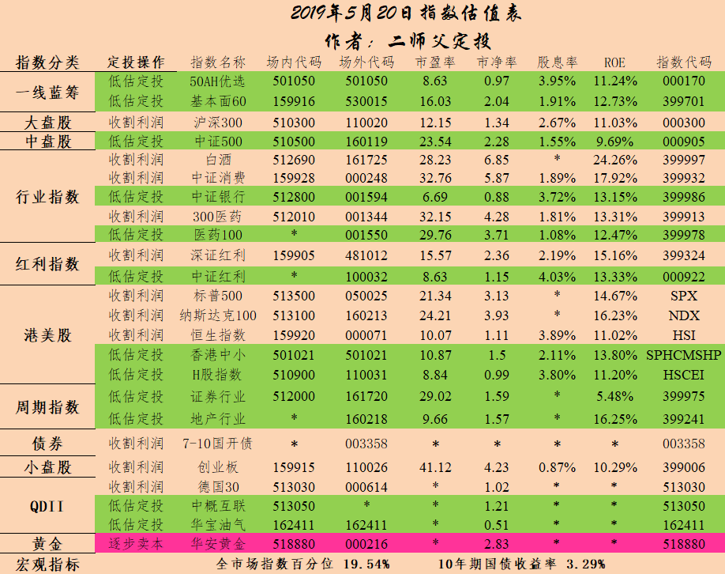

======================================================

_type: talk
@二师父[28814221155551]
2019-05-21 03:15:54 Tue  
topic_id: 244185185812121

<e type="hashtag" hid="142811222242" title="#从估值分析指数的投资价值#" /> 投资切记不要看涨跌，我们要指数的估值，这是最重要的投资原则。

@陌路花 at 2019-05-21 03:15:54 Tue

> 谢谢二师父耐心指导，理解原理之后，更有信心去坚持定投。

----------

阅读[4620]  评论[1]  赞[0] 

+++++++++++++++++++++++++++++++++++++++++++++++++++++

文件：
2019-05-21 03:15:13 Tue
文件大小：[170812]
15581412125182-从估值角度分析当前指数的投资价值.docx

======================================================

_type: q&a
@李依祚[844148481122152]
2019-05-21 08:28:19 Tue  
topic_id: 111852854522122

@李依祚

>  师傅你好，华宝香港大盘目前估值水平如何？它与国企指数和恒生指数相比有什么优劣？

@二师父

>  目前处于低估水平，类似于恒生国企指数，大部分是在港上市的中国企业

阅读[2382]  评论[0]  赞[0] 

======================================================

_type: q&a
@冉冉[88445118854412]
2019-05-21 09:11:19 Tue  
topic_id: 544812815421244

@冉冉

>  请问二师傅，广发基金因未及时披露重仓违规股康美药业相关信息而存信用公正、透明等信用打脸危机，这对持有广发医药基金的投资者有什么影响，下一步基金若下跌，是减仓还是加仓？

@二师父

>  这个是基金报告中的错误的，本来这个康美药业被调查，报告中却称没有这样的事情，对投资者没有啥影响的康美一只股票无法影响整体的指数的价值的及时康美退市，回来还会有新的医药股票替换他

阅读[2313]  评论[0]  赞[0] 

======================================================

_type: q&a
@One[422118584812518]
2019-05-21 09:14:26 Tue  
topic_id: 544812815442524

@One

>  二师父，早上好，关注您之前投了一点中证环保，现在浮亏11%，目前是否还在低估区间？这种周期指数把握不准，心里有点慌，是否继续投

@二师父

>  建议停止定投，这个指数的价值不大，定投优质的宽基和行业指数即可，然后轻仓周期指数建议券商和地产

阅读[2345]  评论[1]  赞[0] 

======================================================

_type: q&a
@SUN666[15488552825152]
2019-05-21 09:25:28 Tue  
topic_id: 244185182128811

@SUN666

>  师傅你好，我想问一下有没有定投成本计算的软件或者excel？

@二师父

>  xirr年化收益率计算器

阅读[2386]  评论[0]  赞[0] 

======================================================

_type: q&a
@陈Being[28845245224851]
2019-05-21 09:26:20 Tue  
topic_id: 422184185158248

@陈Being

>  二师傅，我之前一直定投的是160717这个H股指数，请问与你估值表中的110031的是否持仓股都基本一样

@二师父

>  一样的，追踪的都是同一个指数，只是不同基金公司募集的品种罢了

阅读[2472]  评论[0]  赞[0] 

======================================================

_type: talk
@奔波儿霸🐟🐠🐬🐳🐋💦[544884444514584]
2019-05-21 10:04:38 Tue  
topic_id: 244185184512151

新手刚开好华泰，请问鳄鱼计划是在图里的地方买吗？我看价格实时在变，买的时候需要找低价的时候买还是无所谓？

@聪明的笨蛋 at 2019-05-21 10:04:38 Tue

> 和买股票一样，委拖一个价格

----------

@奔波儿霸🐟🐠🐬🐳🐋💦 at 2019-05-21 10:04:38 Tue

> 场内的中概互联今天可以买点吗

----------

阅读[2436]  评论[2]  赞[0] 

+++++++++++++++++++++++++++++++++++++++++++++++++++++

图片：
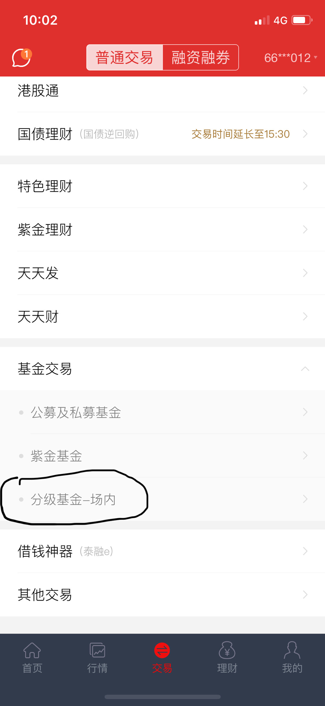

======================================================

_type: q&a
@平安是福[118222545154542]
2019-05-21 10:30:25 Tue  
topic_id: 844185184828582

@平安是福

>  师傅你好：场内中概互联跌了不少，今天能加仓吗？

@二师父

>  可以加仓，这只基金本身低估，然后再低估区域又大跌，是很好的机会

阅读[2542]  评论[1]  赞[0] 

======================================================

_type: q&a
@罗大发[421484455521228]
2019-05-21 10:31:03 Tue  
topic_id: 111852854888282

@罗大发

>  师父您好，新手小白想您看看我的计划合适吗？5W，计划三年，定投50AH，中证500，医药100，中证红利，每周四每个指数83.25¥，每周共333¥。

@二师父

>  这个策略没有问题的，建议把时间用来提高定投资金量上

阅读[2636]  评论[4]  赞[0] 

======================================================

_type: q&a
@J[28281541518551]
2019-05-21 12:46:46 Tue  
topic_id: 544812818225584

@J

>  师父你好，现在开始场外定投中概互联可以吗？配置按每周1份买入，偏离度到-2时改为每周1.5份买入，一共100份。请师父把把关。

@二师父

>  可以的，中概互联已经比较便宜了，建议定投场内的中概互联基金，场外的中概互联规模不够1亿，流动性不好

阅读[2471]  评论[4]  赞[0] 

======================================================

_type: q&a
@平安是福[118222545154542]
2019-05-21 15:33:49 Tue  
topic_id: 422184181515148

@平安是福

>  你好师父：以前定投了白银161226基金，现被套，那现在处于什么位置？是低估还是高估区？谢谢！

@二师父

>  目前正常估值，可以暂停定投

阅读[2190]  评论[0]  赞[0] 

======================================================

_type: q&a
@黄巧[844145518844422]
2019-05-21 17:45:12 Tue  
topic_id: 244185122855811

@黄巧

>  弱弱的问一下，怎么看出基本面60是低估的？是有什么硬性的指标吗还是什么？

@二师父

>  看基本面60的市盈率，低于18倍市盈率低估

阅读[2303]  评论[6]  赞[0] 

======================================================

_type: q&a
@冯林锋[841551141441422]
2019-05-21 20:52:12 Tue  
topic_id: 544812854558144

@冯林锋

>  二师父，华宝油气能在网络交易中建底仓吗

@二师父

>  可以的，0.5元可以建立一成底仓

阅读[2142]  评论[2]  赞[0] 

======================================================

_type: talk
@二师父[28814221155551]
2019-05-21 21:08:34 Tue  
topic_id: 111852841158522

<e type="hashtag" hid="825144888822" title="#牛股的特征#" /> 二师父是选择成长股投资的，牛股的重要特征体现在每股收益增长率，用会计语言描述就是扣非每股利润增长率，看看一只牛股五粮液，过去两年每股收益增长率分别为百分之42，百分之36，远高于平均水平，大家选股也要将每股收益增长率作为第一要素，你去看看你的亏损股票必定每股收益增长率不高

@奔波儿霸🐟🐠🐬🐳🐋💦 at 2019-05-21 21:08:34 Tue

> 请教师父，在哪儿可以看到ROE和这个每股收益率呢？还有平均线。

----------

@二师父 at 2019-05-21 21:08:34 Tue

> 股票软件和企业财务报表

----------

@Audrey at 2019-05-21 21:08:34 Tue

> 股票软件好像只能看到这只股票的 看不到行业平均值吧 平均值是需要自己计算吗

----------

@二师父 at 2019-05-21 21:08:34 Tue

> 只需要看个股就行了

----------

阅读[2161]  评论[4]  赞[0] 

======================================================

_type: talk
@闲云[48522815485458]
2019-05-21 22:45:27 Tue  
topic_id: 111852812851152

二师父，入门课程在哪里？

@上上签 at 2019-05-21 22:45:27 Tue

> 顶置第二篇有链接

----------

@二师父 at 2019-05-21 22:45:27 Tue

> 置顶第三篇文章

----------

阅读[2016]  评论[2]  赞[0] 

======================================================

_type: talk
@珅爹[15451242541142]
2019-05-22 00:44:42 Wed  
topic_id: 422184128511548

请问基金估值过高卖出本金是连本带利全卖出？还是只卖本？

@二师父 at 2019-05-22 00:44:42 Wed

> 都卖，比如你本金加利润1万，一次卖出20个点就是2000

----------

阅读[1992]  评论[1]  赞[0] 

======================================================

_type: talk
@二师父[28814221155551]
2019-05-22 03:21:38 Wed  
topic_id: 111852815181522

<e type="hashtag" hid="481211145528" title="#指数估值#" /> 指数估值表，中证500和医药100进入正常估值，其他的可以继续定投，后面我会制作实盘操作表和网格交易表格供大家参考

@李依祚 at 2019-05-22 03:21:38 Wed

> 我跟你一样的情况

----------

@二师父 at 2019-05-22 03:21:38 Wed

> 盈利下降导致的，不用太担心

----------

@凭栏观海 at 2019-05-22 03:21:38 Wed

> 感谢

----------

@丸子妈 at 2019-05-22 03:21:38 Wed

> 期待网格表

----------

阅读[4260]  评论[7]  赞[0] 

+++++++++++++++++++++++++++++++++++++++++++++++++++++

图片：
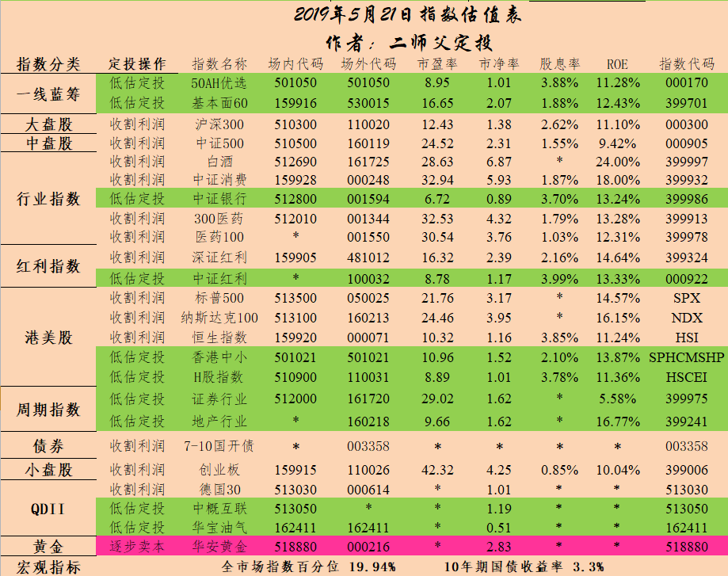

======================================================

_type: talk
@二师父[28814221155551]
2019-05-22 03:27:44 Wed  
topic_id: 422184128212858

中概互联场内溢价较高，买入需要注意，避免高溢价

@三峡情 at 2019-05-22 03:27:44 Wed

> 请问二师父溢价怎么看啊？

----------

@二师父 at 2019-05-22 03:27:44 Wed

> 看折价率

----------

@别皱眉头 at 2019-05-22 03:27:44 Wed

> 😂没看懂，现在不是低于净值吗？

----------

@二师父 at 2019-05-22 03:27:44 Wed

> IPOV是实时净值

----------

@别皱眉头 at 2019-05-22 03:27:44 Wed

> 噢噢，原来是这样

----------

@不再YY的猪 at 2019-05-22 03:27:44 Wed

> 同问，有的地方写的折价率，有的写溢价率，正负都搞混了，究竟该怎么看？

----------

@二师父 at 2019-05-22 03:27:44 Wed

> 折价率为正就是溢价

----------

@三峡情 at 2019-05-22 03:27:44 Wed

> 哦，学习了！

----------

阅读[2420]  评论[10]  赞[0] 

+++++++++++++++++++++++++++++++++++++++++++++++++++++

图片：
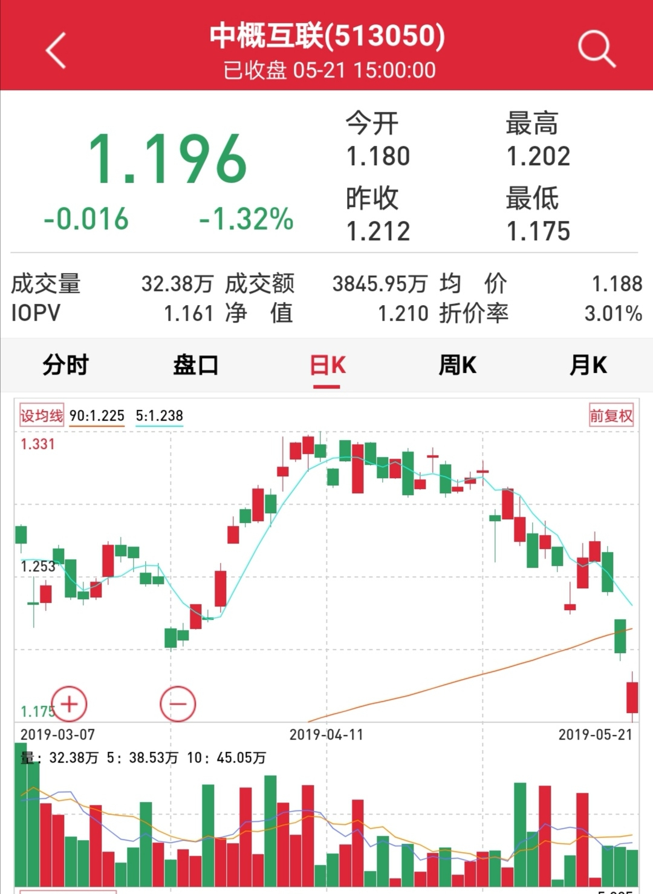

======================================================

_type: talk
@二师父[28814221155551]
2019-05-22 03:28:22 Wed  
topic_id: 844185148414822

<e type="hashtag" hid="454122811888" title="#指数基金定投的盈利来源#" /> 找到基金的盈利点，然后进行定投

阅读[4790]  评论[0]  赞[0] 

+++++++++++++++++++++++++++++++++++++++++++++++++++++

文件：
2019-05-22 03:28:01 Wed
文件大小：[170075]
48812522214188-我们投资指数基金盈利究竟来源于哪里.docx

======================================================

_type: q&a
@妖孽[544888148518184]
2019-05-22 08:04:29 Wed  
topic_id: 244185148414481

@妖孽

>  请问二师父上证50  50ah  基本面60，这3只关联性强？3选一选哪个比较优秀，

@二师父

>  50和50ah相关性强，和基本面60相关性不强，一般同时定投50ah和基本面60

阅读[2445]  评论[2]  赞[0] 

======================================================

_type: q&a
@程大圣[118255212158112]
2019-05-22 08:07:14 Wed  
topic_id: 422184128125858

@程大圣

>  请问二师傅，现在开始定投，准备定投券商和50ah，中证红利或者银行，资金10万左右，应该分多少份合适？50份还是150份呢？

@二师父

>  50份可以了，定投一年，然后资金完毕就锁仓，已经熊了4年，预计未来1到2年牛市会来

阅读[2447]  评论[0]  赞[0] 

======================================================

_type: q&a
@冯林锋[841551141441422]
2019-05-22 08:08:39 Wed  
topic_id: 844185142588212

@冯林锋

>  二师父，鳄鱼计划是每周限价买入，还是按场内申购买入

@二师父

>  场外定投是每周四买入，鳄鱼计划是不定期择时买入的

阅读[2460]  评论[3]  赞[0] 

======================================================

_type: q&a
@陈Being[28845245224851]
2019-05-22 08:09:49 Wed  
topic_id: 544812845258114

@陈Being

>  二师父，请问如何看你发的这个图的场内溢价，什么叫溢价，什么叫折价

@二师父

>  溢价是基金价格高于净值，折价是基金价格低于净值。看折价率就可以啦

阅读[2558]  评论[2]  赞[0] 

======================================================

_type: talk
@姥姥不疼. 爷爷不爱[48544481458248]
2019-05-22 08:43:12 Wed  
topic_id: 244185142844211

请教二师父，折价率若是负数（如，中证银行），代表买入便宜，反之，代表溢价，买入贵，对么🙏🙏

@奔波儿霸🐟🐠🐬🐳🐋💦 at 2019-05-22 08:43:12 Wed

> 同问哈

----------

@聪明的笨蛋 at 2019-05-22 08:43:12 Wed

> 对的

----------

阅读[2536]  评论[2]  赞[0] 

======================================================

_type: q&a
@空瓶子[88282241812242]
2019-05-22 09:02:52 Wed  
topic_id: 244185142855541

@空瓶子

>  二师父，50eft现在估值还是低估吗？谢谢

@二师父

>  低估的

阅读[2596]  评论[0]  赞[0] 

======================================================

_type: q&a
@J[28281541518551]
2019-05-22 09:48:34 Wed  
topic_id: 544812845442144

@J

>  师父你好，现在均线偏离表上都没有负偏离，是否代表鳄鱼计划不能买入？按纪律操作，则必定要负1偏离才可以开始买入，这样理解正确吗

@二师父

>  这是之前的，券商是负偏离，我这个安全边际很大，之后调整下，在低估值区域内，偏离度为负是可以买的

阅读[2670]  评论[5]  赞[0] 

======================================================

_type: q&a
@JOY[111881481812422]
2019-05-22 17:20:33 Wed  
topic_id: 422184114554148

@JOY

>  师父，定投除了周四固定的买入；低估的基金，别的时间跌得厉害是否也可以额外买入呀？

@二师父

>  可以额外补仓的，但是需要注意一个问题，很多人一直加仓导致还没有到底部，仓位过重，即使额外买入也要把握节奏

阅读[2227]  评论[4]  赞[0] 

======================================================

_type: q&a
@妖孽[544888148518184]
2019-05-22 20:30:57 Wed  
topic_id: 422184111584548

@妖孽

>  二师父您好，请问我目前已在定投 300 500 创业板 红利 银行 证劵 医药 计算机  暂停了消费行业。看您的标 50AH 基本面60很好，持有的会不会太多了，还有没有必要在加入这两个定投？

@二师父

>  没有必要了，你定投的沪深300相当于是50ah和基本面60的集合，不用再增加了，把资金加到这已经配置的指数即可

阅读[2162]  评论[1]  赞[0] 

======================================================

_type: q&a
@知南茶暖🍹[88214115882222]
2019-05-22 22:41:08 Wed  
topic_id: 844188555858452

@知南茶暖🍹

>  如果只定投两三只基金，选哪几只好？

@二师父

>  场外选择基本面60和50AH，场内选择银行ETF和深红利

阅读[2072]  评论[0]  赞[0] 

======================================================

_type: talk
@二师父[28814221155551]
2019-05-23 02:57:59 Thu  
topic_id: 544811221212214

<e type="hashtag" hid="481211145528" title="#指数估值#" /> 新版估值表说明，低估定投实盘参考指数估值表即可。低估定投，正常持有，高估卖本。<e type="hashtag" hid="481211145528" title="#指数估值#" /> 

鳄鱼计划参考估值表和均线偏离表，均线偏离表和估值表同时为绿色表示可以买入，如果两者只有一方显示卖出，可以收割利润，也可以等待指数估值进入正常再卖。但是估值表和均线偏离表同时显示卖出就要卖出本金了。

策略灵活运用，偏离差=（基金价格——90日均线价格）/90日均线价格，当负1偏离度买入0.5份，负2偏离度买入1份，负3偏离度买入1.5份，依次类推，将鳄鱼计划量化。

@门萨🐨 at 2019-05-23 02:57:59 Thu

> 这样好！完美结合

----------

@门萨🐨 at 2019-05-23 02:57:59 Thu

> 德国30没了

----------

@二师父 at 2019-05-23 02:57:59 Thu

> 之前提示过卖出啦

----------

@门萨🐨 at 2019-05-23 02:57:59 Thu

> 表里也不列啦

----------

@二师父 at 2019-05-23 02:57:59 Thu

> 嗯嗯，集中投资最有价值的

----------

@cotton at 2019-05-23 02:57:59 Thu

> 师傅，德国30现在不赚不亏，你建议卖出。是否过几天小涨一点再卖呢

----------

@二师父 at 2019-05-23 02:57:59 Thu

> 可以的，目前德国30不贵，可以继续持有

----------

阅读[2078]  评论[7]  赞[0] 

+++++++++++++++++++++++++++++++++++++++++++++++++++++

图片：
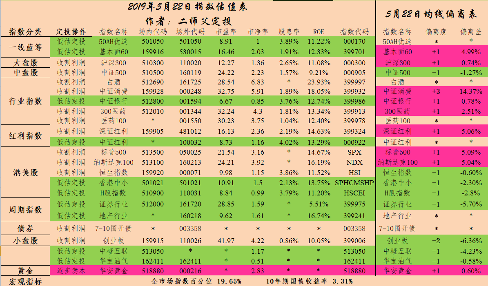

======================================================

_type: talk
@二师父[28814221155551]
2019-05-23 03:00:17 Thu  
topic_id: 244188558585511

<e type="hashtag" hid="881422852442" title="#定投实盘#" /> 本期定投实盘如下，绿色为买入的基金，买入比例详见表格。总份数一份

@麻烦得很 at 2019-05-23 03:00:17 Thu

> 请问二师父，是今天（周四）的计划吗？

----------

@不再YY的猪 at 2019-05-23 03:00:17 Thu

> 买入比例如何计算可以说明下么？

----------

@芥末 at 2019-05-23 03:00:17 Thu

> 把自己的资金按比例分配到几种基金中就可以了

----------

@不再YY的猪 at 2019-05-23 03:00:17 Thu

> 谢谢，我是问如何通过估值确定各基金的买入比例

----------

@芥末 at 2019-05-23 03:00:17 Thu

> 这个还是请二师傅解答吧！[微笑]

----------

@二师父 at 2019-05-23 03:00:17 Thu

> 是的哈

----------

@陈 at 2019-05-23 03:00:17 Thu

> 二师父，您定投按比例，就是固定每周四投，但是不是用蛋卷设置定投模式，而是固定在周四按份额比例自己买入，对吗？

----------

@二师父 at 2019-05-23 03:00:17 Thu

> 对的，用的天天基金自己买入，按照我的比例，时间固定，每周四雷打不动，除非没有低估的了

----------

阅读[4198]  评论[10]  赞[0] 

+++++++++++++++++++++++++++++++++++++++++++++++++++++

图片：
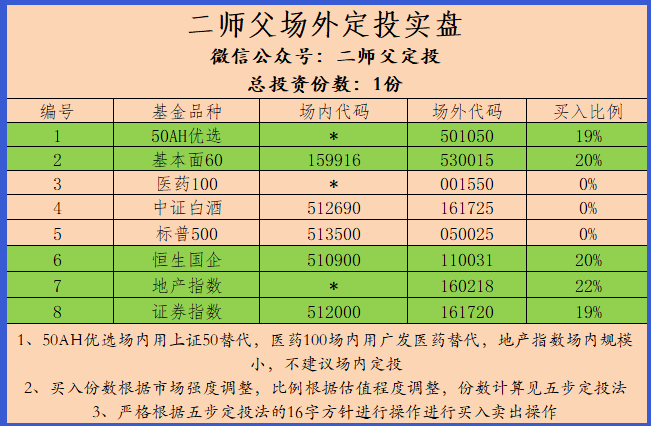

======================================================

_type: talk
@二师父[28814221155551]
2019-05-23 03:01:58 Thu  
topic_id: 844188558585822

<e type="hashtag" hid="825818842822" title="#网格交易#" /> 网格交易策略，可以开通华宝账户挂单自动进行交易，不用盯盘

@别皱眉头 at 2019-05-23 03:01:58 Thu

> 二师父，这里边一共五只指数基金，如果都用华宝证券app设置条件单，可以用吗？可以设置这么多吗？

----------

@二师父 at 2019-05-23 03:01:58 Thu

> 30个足够了

----------

@冯林锋 at 2019-05-23 03:01:58 Thu

> 二师父，按表格显示的话，网格交易按20份买，现在是不是要建10份㡳仓

----------

@二师父 at 2019-05-23 03:01:58 Thu

> 对的，也要考虑你的资金压力

----------

@冯林锋 at 2019-05-23 03:01:58 Thu

> 👌

----------

@小牧童 at 2019-05-23 03:01:58 Thu

> 二师父，按低估指数的价格下跌10-20%建立底仓，我想问一下，因为以前没有记录，怎么估计低谷阈值相应指数的价格

----------

@二师父 at 2019-05-23 03:01:58 Thu

> 大概就行，一般进入低估区指数最大历史下跌幅度在50个点以内

----------

@小牧童 at 2019-05-23 03:01:58 Thu

> 我可以用最近日期历史上的低谷阈值市盈率的对应那天的价格再下跌10-20%可以吗

----------

阅读[2225]  评论[10]  赞[0] 

+++++++++++++++++++++++++++++++++++++++++++++++++++++

文件：
2019-05-23 03:01:53 Thu
文件大小：[240850]
28814215842511-二师父网格交易策略和交易记录表.docx

======================================================

_type: q&a
@潜龙[244145114188851]
2019-05-23 03:03:12 Thu  
topic_id: 422188444588558

@潜龙

>  用50AH和基本面60能和债基做轮动吗？

@二师父

>  可以的，就利用这三只基金定投也是很不错的组合，在指数基金低估的时候投资这两只，在债券基金低估的时候投资纯债基金

阅读[2197]  评论[0]  赞[0] 

======================================================

_type: q&a
@J[28281541518551]
2019-05-23 08:49:54 Thu  
topic_id: 111855225514252

@J

>  师父你好，华宝油气、券商除了做鳄鱼计划，目前是否也同时适合场外定投？

@二师父

>  适合的，估值表的基金都是适合定投的优质指数基金，无论场外定投还是场内定投都适合

阅读[2012]  评论[0]  赞[0] 

======================================================

_type: q&a
@Ouou[28888812152121]
2019-05-23 08:50:45 Thu  
topic_id: 244188554855811

@Ouou

>  老师，深红利现在的估值是低估还是高估？

@二师父

>  目前估值表是橙色，正常估值

阅读[2121]  评论[0]  赞[0] 

======================================================

_type: q&a
@凭栏观海[244414845852181]
2019-05-23 09:37:39 Thu  
topic_id: 844188554212452

@凭栏观海

>  请问老师，我已经定投了50AH,还有必要定投恒生国企吗？二者重复大不大？

@二师父

>  可以定投的，二者重合不大，腾讯就不在50ah的持仓里面，你可以下载持仓股票对比下

阅读[2163]  评论[1]  赞[0] 

======================================================

_type: talk
@二师父[28814221155551]
2019-05-23 10:23:08 Thu  
topic_id: 844188554148542

<e type="hashtag" hid="881251425252" title="#鳄鱼计划#" /> 中概互联，银行基金各买入0.5份，当别人恐惧的时候你要淡定，读者中又有开始恐惧的了，之前3200点一直追着我问可不可以建立底仓的朋友，出来吧，可以建了

@胡一彬 at 2019-05-23 10:23:08 Thu

> 这个位置可以建几层底仓呢

----------

@二师父 at 2019-05-23 10:23:08 Thu

> 3层

----------

@胡一彬 at 2019-05-23 10:23:08 Thu

> 好的，谢谢二师傅

----------

@程大圣 at 2019-05-23 10:23:08 Thu

> 场外中证银行也可以直接买入3成建仓么？

----------

@Claire at 2019-05-23 10:23:08 Thu

> 谢谢师父[微笑]

----------

@二师父 at 2019-05-23 10:23:08 Thu

> 可以的

----------

@程大圣 at 2019-05-23 10:23:08 Thu

> 谢谢二师傅

----------

@自由飞翔 at 2019-05-23 10:23:08 Thu

> 师父，因为建仓时间不一致，我的中概互联跌幅为3.5%，银行跌幅不到1个点，都还没到4个点，这情况，是否可灵活操控成跌幅4个点时买入一份，跌幅2个点时买入0.5份呀？还是遵循4个点的涨跌规则较好？

----------

阅读[4277]  评论[21]  赞[0] 

======================================================

_type: q&a
@好运玲玲[244188585541521]
2019-05-23 11:27:18 Thu  
topic_id: 244188551818881

@好运玲玲

>  二师父您好！我的场内基金是在华泰证券买的，这个页面看不到LOPV，也看不到折价率，我不知道在这个页面怎么看是否溢价？请二师父指点！

@二师父

>  去万得股票app查阅

阅读[2071]  评论[0]  赞[0] 

======================================================

@二师父[28814221155551]
2019-05-23 12:45:06 Thu  
topic_id: 111855228111882

>  @二师父
>  

阅读[2063]  评论[0]  赞[0] 

======================================================

_type: talk
@二师父[28814221155551]
2019-05-23 13:11:00 Thu  
topic_id: 544811228885124

<e type="hashtag" hid="142812422222" title="#中概互联#" /> 6月份，中概互联跟踪的指数中国互联网50，会进行一次成分股调整，调整之后，腾讯、阿里的权重各自会进一步提升，百度逐渐没落了，现在bat就剩at了

这就是指数的好处，万年常青，目前中概互联不贵了，可以入手，唯一需要防范的风险是里面有一些美股，现在美股还是处于正常估值区域

阅读[2068]  评论[0]  赞[0] 

======================================================

_type: talk
@若水三千[48548544448258]
2019-05-23 13:20:02 Thu  
topic_id: 544811212222484

师傅：您为什么不看好环保指数基金，能说说原因吗？我一直持有中证环保指数基金。

阅读[1996]  评论[0]  赞[0] 

======================================================

_type: talk
@若水三千[48548544448258]
2019-05-23 13:20:02 Thu  
topic_id: 111855252222822

师傅：您为什么不看好环保指数基金，能说说原因吗？我一直持有中证环保指数基金。

@若水三千 at 2019-05-23 13:20:02 Thu

> 不好意思，由于网络切换，内容被重发。

----------

@二师父 at 2019-05-23 13:20:02 Thu

> 周期指数，盈利差，而且周期反转时间不确定

----------

@若水三千 at 2019-05-23 13:20:02 Thu

> 谢谢老师

----------

阅读[2114]  评论[3]  赞[0] 

======================================================

_type: q&a
@风清月淡[422112212222128]
2019-05-23 13:54:01 Thu  
topic_id: 422188484414858

@风清月淡

>  二师傅，你好！闲散资金买了货币基金，如果需要买其他股票基金的时候，可以从货币基金赎回来当天3点前买入股票基金吗？

@二师父

>  可以的啊，不过要提前赎回才行啊，如果及时到账的需要买及时到账的货币基金，对于南方天天利b这样的，当天赎回是无法到账

阅读[2086]  评论[0]  赞[0] 

======================================================

_type: q&a
@美美[48224811151218]
2019-05-23 13:54:31 Thu  
topic_id: 544811212122514

@美美

>  二师父好！上证50ah定投选智能定投还是选普通定投

@二师父

>  手动定投即可，如果你没时间操作就选择蛋卷的智能定投

阅读[2192]  评论[0]  赞[0] 

======================================================

_type: q&a
@美美[48224811151218]
2019-05-23 14:26:43 Thu  
topic_id: 244188585824811

@美美

>  我就是在蛋卷里开的户，也有时间操作，但不知道怎么选

@二师父

>  选择智能定投

阅读[2324]  评论[0]  赞[0] 

======================================================

_type: talk
@海盗[48248118584848]
2019-05-23 16:17:54 Thu  
topic_id: 844188582451522

最新偏离表

@小小鸟 at 2019-05-23 16:17:54 Thu

> 感谢分享

----------

@小小鸟 at 2019-05-23 16:17:54 Thu

> 感谢分享

----------

@陈 at 2019-05-23 16:17:54 Thu

> 中概互联偏离度-2为什么二师父鳄鱼计划买入0.5份？不是1.5或者2？
中证银行+1为什么也买入0.5份？

----------

@海盗 at 2019-05-23 16:17:54 Thu

> 低估定投和偏离度网格交易是相互参考的。

----------

@海盗 at 2019-05-23 16:17:54 Thu

> 另外偏离度是建立在低估的基础上的，指数基金不低估，偏离度的意义就不大。

----------

@上上签 at 2019-05-23 16:17:54 Thu

> 感谢分享

----------

@龘何亮龘 at 2019-05-23 16:17:54 Thu

> 请问海盗 ，偏离度表和网格交易能结合使用吗？

----------

@海盗 at 2019-05-23 16:17:54 Thu

> 当然可以，偏离度表就是网格交易其中的一种。不过请记住一点，网格交易一定要建立在低估的基础上

----------

阅读[2310]  评论[17]  赞[0] 

+++++++++++++++++++++++++++++++++++++++++++++++++++++

图片：

======================================================

_type: talk
@梧桐[844118451242512]
2019-05-23 16:32:16 Thu  
topic_id: 844188582411582

二师父，我看估值表，券商5月6号才进入低估的，价格在0.86元，如果建立底仓的话从0.86元下跌15%才合适，为何您的券商建底仓的价格为0.85元呢。

@速。冻 at 2019-05-23 16:32:16 Thu

> 不看价格，看估值

----------

阅读[2280]  评论[1]  赞[0] 

======================================================

_type: q&a
@YtingLi[51518115412454]
2019-05-23 16:55:11 Thu  
topic_id: 844188582154252

@YtingLi

>  师父、看了新的偏离度表，是把幅度调到4%了吧，谢谢

@二师父

>  还是6个点啊，每下跌4个点加仓是网格交易策略

阅读[2500]  评论[0]  赞[0] 

======================================================

_type: talk
@首尔航仔Eric[244114888181111]
2019-05-23 17:34:51 Thu  
topic_id: 244188584524811

二师父，天天基金里面的货币基金都是不能当天赎回的吗

@JOY at 2019-05-23 17:34:51 Thu

> APP的问题可以问APP的客服，有人工的

----------

阅读[2360]  评论[2]  赞[0] 

======================================================

_type: talk
@首尔航仔Eric[244114888181111]
2019-05-23 17:40:50 Thu  
topic_id: 244188584545421

二师父 对于 新手 可支配资产 用于定投的资金和货币资金的 2:8 配比合适吗，还有就是 如果定投开始 一般3年的话， 是不是要把未来3年的可预计收入金额也都考虑进去 分成156份这样子？如果是每周定投一次的话

@Claire at 2019-05-23 17:40:50 Thu

> 采用提问的方式，师父才能看到哦。

----------

阅读[2438]  评论[1]  赞[0] 

======================================================

_type: talk
@二师父[28814221155551]
2019-05-23 19:25:00 Thu  
topic_id: 544811214428154

<e type="hashtag" hid="825144418522" title="#关于鳄鱼计划#" /> 鳄鱼计划参考估值表和均线偏离表，均线偏离表和估值表同时为绿色表示可以买入，如果两者只有一方显示卖出，可以收割利润，也可以等待指数估值进入正常再卖。但是估值表和均线偏离表同时显示卖出就要卖出本金了。

策略灵活运用，偏离差=（基金价格——90日均线价格）/90日均线价格，当偏离差为负百分之6到0现在设定是负1偏离度，一次类推。当负1偏离度买入0.5份，负2偏离度买入1份，负3偏离度买入1.5份，依次类推，将鳄鱼计划量化。

每天数据都有变化，可能昨天偏离度是负1，今天变成负2了，所以会有些差别，而且我们主要看估值来定投，均线偏离表只是一个补充

估值为低估，偏离为正，可以定投，但是反过来，估值正常，偏离为负我们是不会定投的，这一点得明白。

阅读[2586]  评论[0]  赞[0] 

======================================================

_type: q&a
@shi[15551458885282]
2019-05-23 22:08:01 Thu  
topic_id: 544811214854554

@shi

>  二师父，您好，咨询一个定投扣款的问题。
>  我一直在蛋卷定投，每周四进行。
>  今天由于卡中余额不够，定投失败了几个。
>  今天后来往卡里面转了一些钱，是否明天就重新自动扣款？

@二师父

>  这个你和蛋卷的客服经理确认下哈，一般从下个交易日补扣，我都是自己手动扣款的

阅读[2272]  评论[2]  赞[0] 

======================================================

_type: q&a
@J[28281541518551]
2019-05-23 22:12:15 Thu  
topic_id: 111855258125412

@J

>  师父好，两个问题请教：1. 日定投比周定投，长期下来效果如何？一般每年5、6月市场都最低迷，现在场外定投如果开启日定投可否积累更多份额？2. 当估值呈绿色，偏离值为正，此时基金呈浮亏状态，这样的情况下应该如何操作？

@二师父

>  1，长期看日定投和周定投收益率一样，如果估值比正常偏离很多，任何时候都可以加倍定投的
>  
>  2，低估的时候偏离为正，可以继续定投，我们定投主要参考指数估值表，只要低估就可以定投，均线偏离表只是额外补仓指标

阅读[2368]  评论[4]  赞[0] 

======================================================

_type: talk
@二师父[28814221155551]
2019-05-23 23:01:22 Thu  
topic_id: 111855245441842

每个人心的不同，就是他内心力量的不同。作为投资人，若想在正确的时间、地点，选择正确的投资标的，归根结底还要靠人，靠人的心灵修炼。

定投就是一场心灵修炼。

@陌路花 at 2019-05-23 23:01:22 Thu

> 沉着气，笑看它跌

----------

阅读[2274]  评论[1]  赞[0] 

======================================================

_type: talk
@二师父[28814221155551]
2019-05-24 02:28:58 Fri  
topic_id: 244188522584421

<e type="hashtag" hid="552114551414" title="#估值数据#" /> 指数估值表：绿色品种放心地定投就好，橙色适合收割利润，红色适合卖出本金。不知道如何使用指数估值表可以看看置顶文章五步定投法。如果没有低估的品种了，可以一直定投宽基指数到债券基金低估，然后定投债券基金。

鳄鱼计划参考估值表和均线偏离表，均线偏离表和估值表同时为绿色表示可以买入，如果两者只有一方显示卖出，可以收割利润，也可以等待指数估值进入正常再卖。但是估值表和均线偏离表同时显示卖出就要卖出本金了。

策略灵活运用，偏离差=（基金价格——90日均线价格）/90日均价格，当负1偏离度买入0.5份，负2偏离度买入1份，负3偏离度买入1.5份，依次类推，将鳄鱼计划量化。

@龘何亮龘 at 2019-05-24 02:28:58 Fri

> 二师父现在的偏离度标准变了吗？以前-6-6之间是0、6-12是1、现在6.12%变成2?

----------

@龘何亮龘 at 2019-05-24 02:28:58 Fri

> 好吧 刚才看了一下前面的文章，确实是变了，现在没有0这个偏离度了。

----------

@二师父 at 2019-05-24 02:28:58 Fri

> 调整了

----------

@青青竹 at 2019-05-24 02:28:58 Fri

> 师傅，看这个估值表和均线偏离表，基本面60和中证银行都是估值表显示绿色显示可以买，均线偏离显示红色，显示可以卖，应该怎么操作？

----------

@二师父 at 2019-05-24 02:28:58 Fri

> 看估值表即可

----------

阅读[2300]  评论[5]  赞[0] 

+++++++++++++++++++++++++++++++++++++++++++++++++++++

图片：
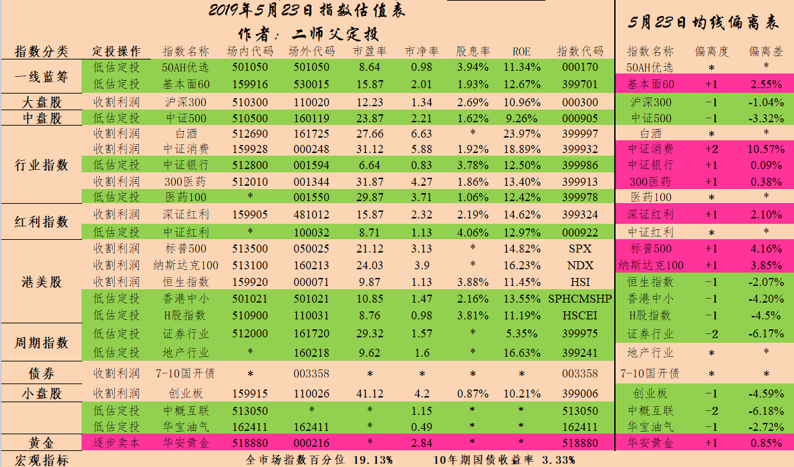

======================================================

_type: talk
@二师父[28814221155551]
2019-05-24 02:30:04 Fri  
topic_id: 844188522584442

<e type="hashtag" hid="552844858824" title="#定投中不变的东西#" />

阅读[4386]  评论[0]  赞[0] 

+++++++++++++++++++++++++++++++++++++++++++++++++++++

文件：
2019-05-24 02:29:55 Fri
文件大小：[171876]
28814211825481-找到定投中不变的东西然后用一生去坚守.docx

======================================================

_type: q&a
@妖孽[544888148518184]
2019-05-24 06:19:43 Fri  
topic_id: 844188522525222

@妖孽

>  请问二师父，市面上估值表有很多，数据各不相同，天天基金 蚂蚁财富 二师父......那么哪家的估值更适合参考呢！谢谢。

@二师父

>  我的估值表最值得参考，其次可以看看理杏仁的数据

阅读[2403]  评论[8]  赞[0] 

======================================================

_type: q&a
@J[28281541518551]
2019-05-24 09:10:45 Fri  
topic_id: 111855244555812

@J

>  我想问问大家都是从哪里第一次接触到二师父的文章和公众号的？从哪里来到这个知识星球的？佛度众生，聚到一起的都是有缘人，希望一起定投下去数月后能见到下一波3500点

@二师父

>  如果你想问我问题可以点击提问按钮，大家一起讨论的话就点发表按钮，不然大家看不到哈

阅读[2273]  评论[9]  赞[0] 

======================================================

_type: q&a
@寻道人[51452125525484]
2019-05-24 09:14:55 Fri  
topic_id: 544811255558824

@寻道人

>  老师好，可以谈谈你对散户操作期权的看法吗？

@二师父

>  股票投资赚钱了吗？没有谁能通过做空自己的国家成为富翁

阅读[2319]  评论[0]  赞[0] 

======================================================

_type: talk
@二师父[28814221155551]
2019-05-24 09:37:06 Fri  
topic_id: 844188524585852

<e type="hashtag" hid="881251425252" title="#鳄鱼计划#" /> 买入华宝油气1份，周期指数，慎重投资，成交价格0.482

鳄鱼计划加仓方法，首先保证低估，有这个指标就行。只要进入低估一次可买0.5份

然后是结合均线，偏离度为负1，一次可以买入0.5份，偏离度为2，一次可以买入1份。这个都可以灵活设置变动的

油气目前偏离度负1，我想有的读者可能又问，为啥买入1份不是0.5份，没有必要纠结这个得，0.5和1本身差别就不大

@ajingge at 2019-05-24 09:37:06 Fri

> 刚想咨询师傅油气师傅可以加仓[呲牙]

----------

@蛋孩 at 2019-05-24 09:37:06 Fri

> 现在熊市，华宝油气多数都是溢价。

----------

阅读[4510]  评论[2]  赞[0] 

======================================================

_type: q&a
@闫军平[422125415521418]
2019-05-24 09:42:52 Fri  
topic_id: 244188524551511

@闫军平

>  请问，大家的中概互联基金是在哪里买的？我在天天基金里和华泰涨乐财付通里怎么买不到？

@二师父

>  在场内股票账户，场外的中概互联基金规模太小，不建议定投

阅读[2400]  评论[2]  赞[0] 

======================================================

_type: talk
@二师父[28814221155551]
2019-05-24 09:45:04 Fri  
topic_id: 544811254252584

星球有发表按钮和提问按钮，如果想和大家一起讨论问题，或者分享投资心得，点击发表即可，如果点击提问按钮就只有我能看到了，大部分问题大家讨论下就有答案啦

@J at 2019-05-24 09:45:04 Fri

> [呲牙]原来这样，刚才习惯性点了向二师父提问的按钮。

----------

阅读[2529]  评论[1]  赞[0] 

+++++++++++++++++++++++++++++++++++++++++++++++++++++

图片：

======================================================

_type: talk
@李依祚[844148481122152]
2019-05-24 10:08:07 Fri  
topic_id: 111855241545242

师傅你好，我的500已经浮亏12%了，是持有还是补仓啊

@聪明的笨蛋 at 2019-05-24 10:08:07 Fri

> 仓位很重？

----------

@聪明的笨蛋 at 2019-05-24 10:08:07 Fri

> 500是一季盈利下降导致估值上移，可以听下二师傅的课你就明白了

----------

@李依祚 at 2019-05-24 10:08:07 Fri

> 总投资的40%

----------

@李依祚 at 2019-05-24 10:08:07 Fri

> 我知道是盈利能力下降了，所以纠结，不想要他了

----------

@聪明的笨蛋 at 2019-05-24 10:08:07 Fri

> 

----------

@海盗 at 2019-05-24 10:08:07 Fri

> 这位同学，看来是刚过来的呀。指数基金是止盈不止损的，现在这样的情况，也就是低估的时候，考虑的只有持有或者加仓。你是把方向给做反了。没事的时候多看看二师父以前的文章，学习好了再投资也不迟。

----------

@李依祚 at 2019-05-24 10:08:07 Fri

> 批评得对，瞬间不纠结了

----------

@海盗 at 2019-05-24 10:08:07 Fri

> 批评可谈不上，相互交流，共同进步

----------

阅读[2462]  评论[8]  赞[0] 

======================================================

_type: talk
@李依祚[844148481122152]
2019-05-24 10:15:27 Fri  
topic_id: 422188452828828

可不可以把未来盈利能力下降的500，（目前浮亏），换成银行或50AH

@聪明的笨蛋 at 2019-05-24 10:15:27 Fri

> 银行和50AH选一个就行，成份股重叠，银行现在估值低，市净都跌破1了

----------

@李依祚 at 2019-05-24 10:15:27 Fri

> 想再听听师傅的意见

----------

阅读[2629]  评论[2]  赞[0] 

======================================================

_type: q&a
@梧桐[844118451242512]
2019-05-24 10:25:23 Fri  
topic_id: 544811254248524

@梧桐

>  二师父，华宝开户是默认工商银行吗？

@二师父

>  那是广发的，可以跳过后面自己绑定

阅读[2824]  评论[0]  赞[0] 

======================================================

_type: q&a
@J[28281541518551]
2019-05-24 10:27:13 Fri  
topic_id: 111855241511852

@J

>  师父我想问一下，在偏离表为绿色时，加仓的频率应该如何控制？比如，今天-1，5天后变了-2，10天后又变回-1，这样一月里加仓频率应怎么量化？

@二师父

>  在指数基金低估区域内，负1一次买0.5份，负2一次买一份，负3一次买1.5份，这适合鳄鱼计划

阅读[2911]  评论[4]  赞[0] 

======================================================

_type: talk
@杨光霞[544885445288584]
2019-05-24 11:17:00 Fri  
topic_id: 111855241144552

请问师傅，中概互联买不了场内，场外用哪个代替较好？

@海盗 at 2019-05-24 11:17:00 Fri

> 蛋卷基金，二师父那里有开户渠道

----------

@杨光霞 at 2019-05-24 11:17:00 Fri

> 我必须要下载蛋卷基金，我现在用的天天基金

----------

@海盗 at 2019-05-24 11:17:00 Fri

> 天天基金也可以

----------

@青青竹 at 2019-05-24 11:17:00 Fri

> 蛋卷基金比天天基金好用，还是费用低？我也是在天天基金买

----------

@杨光霞 at 2019-05-24 11:17:00 Fri

> 可是天天基金如何买呢？中概互联，谢谢回复！

----------

@海盗 at 2019-05-24 11:17:00 Fri

> 中概互联只能场内买，天天基金、蛋卷基金、蚂蚁财富，都是场外。广发易淘金属于场内。

----------

@海盗 at 2019-05-24 11:17:00 Fri

> 场外的费用都差不多，只不过有的平台，个别基金不能买

----------

@杨光霞 at 2019-05-24 11:17:00 Fri

> 那场外的有可代替的吗？场内如何操作的，不懂呢，让你见笑了

----------

阅读[2838]  评论[14]  赞[0] 

======================================================

_type: q&a
@李依祚[844148481122152]
2019-05-24 11:45:33 Fri  
topic_id: 544811254588814

@李依祚

>  师傅你好，可不可以把未来盈利能力下降的500，（目前浮亏12%）仓位比较重，不赎回，直接做基金转换，换成其他低估品种

@二师父

>  这和卖出本质没有啥区别，可以等待大盘3000点以上减仓，那时候肯定盈利了，如果仓位过重可以转移下

阅读[2972]  评论[5]  赞[0] 

======================================================

_type: talk
@龘何亮龘[28814214225141]
2019-05-24 12:10:12 Fri  
topic_id: 111855512852412

我觉得我没太理解二师父之前的网格交易，买入没问题，每次比底仓跌4%、8%、12%......买入一次，但是卖出好像不太理解，为什么是比底仓涨4%、8%......卖出呢？不应该是比买入价高4%或8%卖出吗？如图所示。

@三峡情 at 2019-05-24 12:10:12 Fri

> 我认为二师父的意思是，在从正常进入低估值再下降10到15％建立底仓，也就是大概设置一个中间价，高了就卖，低了就买，这样可以在股市波动的时候赚点差价。

----------

@自由飞翔 at 2019-05-24 12:10:12 Fri

> 是比买入价每高4%卖出一份

----------

@杜志彪 at 2019-05-24 12:10:12 Fri

> 应该是在开始建立价格的基础上，每上涨4%卖出一份，我认为这个和市场震荡幅度有关，如果你判断窄幅震荡，可以依据买入价格上浮止盈，根据自身情况而定，我由于一份投入不多，所以还是依据开始建立网格时的价格进行4%的收割。

----------

阅读[2931]  评论[3]  赞[0] 

+++++++++++++++++++++++++++++++++++++++++++++++++++++

图片：
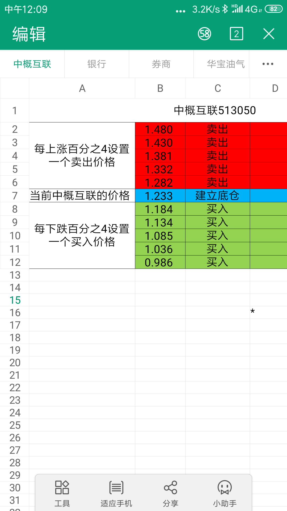

======================================================

_type: talk
@海盗[48248118584848]
2019-05-24 16:02:34 Fri  
topic_id: 544811141888284

均线偏离表，纯手工打造，欢迎同学们检查。

@海盗 at 2019-05-24 16:02:34 Fri

> 5月24日最新偏离表。

----------

@静默 at 2019-05-24 16:02:34 Fri

> 厉害[强]

----------

@白开水 at 2019-05-24 16:02:34 Fri

> 辛苦

----------

@小小鸟 at 2019-05-24 16:02:34 Fri

> 谢谢

----------

@rtdmm小米 at 2019-05-24 16:02:34 Fri

> 海盗，你的偏离度1度=？

----------

@冉冉 at 2019-05-24 16:02:34 Fri

> 谢谢海盗同学分享

----------

@J at 2019-05-24 16:02:34 Fri

> 谢谢中国好同学

----------

@J at 2019-05-24 16:02:34 Fri

> 请问同一只指数基金场外和场内的偏离度相同吗？

----------

阅读[2773]  评论[12]  赞[0] 

+++++++++++++++++++++++++++++++++++++++++++++++++++++

图片：
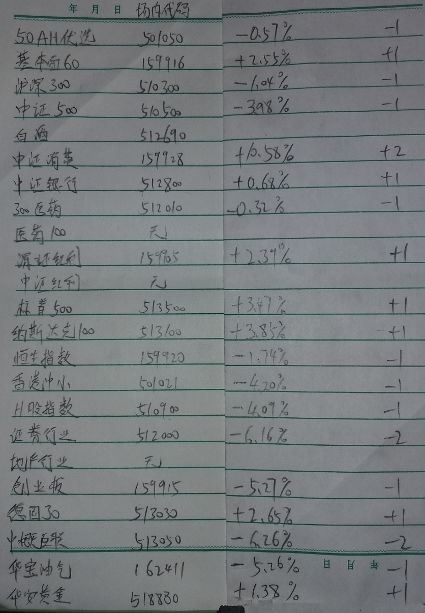

======================================================

_type: talk
@二师父[28814221155551]
2019-05-24 16:22:44 Fri  
topic_id: 844188842515412

定投止赢不止损，只要低估买入二师父估值表的指数基金，长期持有一定能赚钱，耐心是很重要的

@妖孽 at 2019-05-24 16:22:44 Fri

> 买了师父估值表以为的咋办……富国新能源汽车，100%低估时候入的，现在96%低估 还亏15%， 还要坚持定投？

----------

@二师父 at 2019-05-24 16:22:44 Fri

> 资金充裕可以继续

----------

@勤能行之 at 2019-05-24 16:22:44 Fri

> 汽车行业最近好像利润下滑挺大的。

----------

阅读[2754]  评论[3]  赞[0] 

======================================================

_type: q&a
@罗大发[421484455521228]
2019-05-24 17:22:49 Fri  
topic_id: 422188825415188

@罗大发

>  二师父，您总说周四定投，资金部分涌出股市，一般跌的概率大一些，可是我们就算周四场外三点前智能定投，买入的也是周五的价格，这个没关系吗？

@二师父

>  周四三点之前买入是以周四三点前收盘价格成交

阅读[2817]  评论[4]  赞[0] 

======================================================

_type: talk
@二师父[28814221155551]
2019-05-24 19:29:54 Fri  
topic_id: 111855511222212

在生活的大多数领域，更加努力是一个好建议。但是，在金融市场，更加努力并不意味着做得更好。事实上，更加努力可能是跑输市场的最为容易的方式之一。追求每个短期的高收益，与接受市场变化、保持较低成本、按规矩行事相比较，极有可能得到更坏的结果。在很多专业领域，可以假设最熟练的人水平最高。在专业运动领域，这一点基本正确。但是，不仅是最熟练，还需要最为努力。

可是在金融领域不一样，长期啥也不干的人收益比每天买入看盘分析的人收益高的多

学会让自己闲下来，少操作

@奔波儿霸🐟🐠🐬🐳🐋💦 at 2019-05-24 19:29:54 Fri

> 一顿操作猛如虎，不如清闲把钱数！

----------

阅读[2714]  评论[1]  赞[0] 

======================================================

_type: q&a
@勤能行之[481211221828]
2019-05-24 22:14:07 Fri  
topic_id: 544811182245114

@勤能行之

>  师傅，A股市场的整体市盈率和市净率在哪里，可以查到呀

@二师父

>  普通投资者在理杏仁网络查阅即可，一次一块钱，一年也才365

阅读[2716]  评论[0]  赞[0] 

======================================================

_type: talk
@二师父[28814221155551]
2019-05-25 03:12:07 Sat  
topic_id: 544811181258554

<e type="hashtag" hid="142818252842" title="#银行都有信用风险，指数安全吗#" /> 包商银行有信用风险，定投银行个股也需要避免，那么指数基金安全吗

阅读[4842]  评论[0]  赞[0] 

+++++++++++++++++++++++++++++++++++++++++++++++++++++

文件：
2019-05-25 03:11:45 Sat
文件大小：[171748]
15581124521842-罕见！全国排名第37位的包商银行将被中行和银保监会接管.docx

======================================================

_type: talk
@二师父[28814221155551]
2019-05-25 03:14:37 Sat  
topic_id: 844188818521212

<e type="hashtag" hid="481211145528" title="#指数估值#" />  指数估值表：绿色品种放心地定投就好，橙色适合收割利润，红色适合卖出本金。不知道如何使用指数估值表可以看看置顶文章五步定投法。如果没有低估的品种了，可以一直定投宽基指数到债券基金低估，然后定投债券基金。

鳄鱼计划参考估值表和均线偏离表，均线偏离表和估值表同时为绿色表示可以买入，如果两者只有一方显示卖出，可以收割利润，也可以等待指数估值进入正常再卖。但是估值表和均线偏离表同时显示卖出就要卖出本金了。

策略灵活运用，偏离差=（基金价格——90日均线价格）/90日均线价格，均线偏离差为负6到0为负1偏离度，当偏离差为负12到负6为负2偏离度。当负1偏离度买入0.5份，负2偏离度买入1份，负3偏离度买入1.5份，依次类推，将鳄鱼计划量化。

@妖孽 at 2019-05-25 03:14:37 Sat

> 二师父 这些低估的标 你都有投？，这么多 生活还能维持呀！

----------

@妖孽 at 2019-05-25 03:14:37 Sat

> 计算机指值得拥有？

----------

@二师父 at 2019-05-25 03:14:37 Sat

> 有些没有投资，香港中小没有投，其他的低估的投资了，努力工作多挣钱，生活不是问题，我食住行都是公司的

----------

@妖孽 at 2019-05-25 03:14:37 Sat

> 不休息的？半夜还这么努力

----------

@姥姥不疼. 爷爷不爱 at 2019-05-25 03:14:37 Sat

> 请教师父：表内的偏离表的意思是这样么：如中证500为-1，表是5月24日公布的，就是到5月27日周一时，除正常定投中证500外（俺定的是日投），再另外买入0.5份么，是这样操作么🙏🙏

----------

@冯林锋 at 2019-05-25 03:14:37 Sat

> 二师父，鳄鱼计划中，比如券商指数，偏离度为负2，应该买入两份，全部计划50份完成。那上次网格交易中，券商指数己建10份底仓，每跌4％再买入1份，全部20份完成。是不是有矛盾？

----------

@二师父 at 2019-05-25 03:14:37 Sat

> 不是，那只是参考，可以买也可以不买

----------

@二师父 at 2019-05-25 03:14:37 Sat

> 只参考一个策略

----------

阅读[3037]  评论[18]  赞[0] 

+++++++++++++++++++++++++++++++++++++++++++++++++++++

图片：
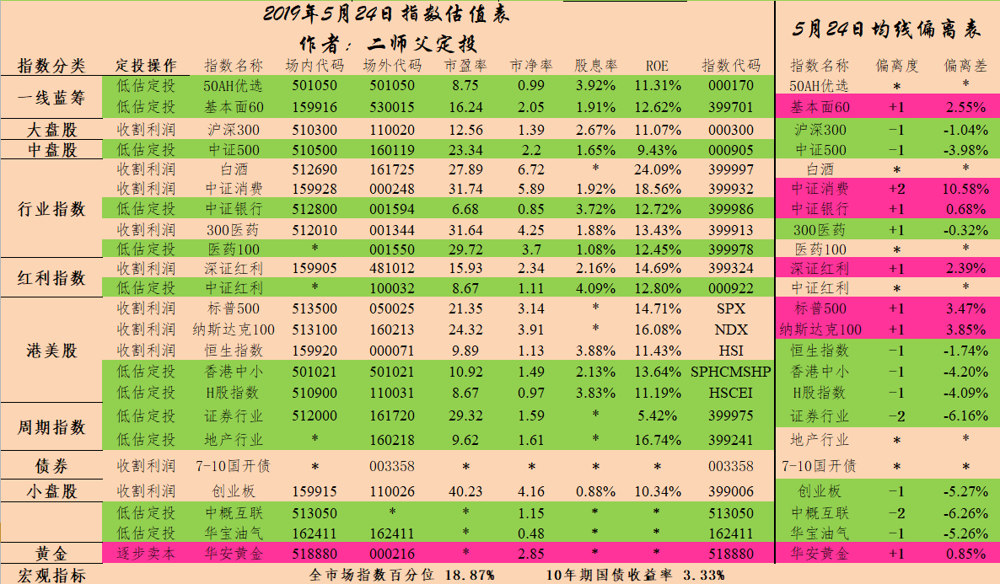

======================================================

_type: talk
@彩色[48415121851218]
2019-05-25 11:14:43 Sat  
topic_id: 244188812514541

求问二师父：上证50ah和h股指数很多成分股重合，在已经配置了上证50ah的基础上需要再配置h股指数不？其意义是什么呢？谢谢

@上上签 at 2019-05-25 11:14:43 Sat

> 上证50AH和H股指数，重合度不大，之前二师傅说过，所以也可以配置一些H股指数

----------

@彩色 at 2019-05-25 11:14:43 Sat

> 好的，找到答案了，谢谢

----------

阅读[2625]  评论[2]  赞[0] 

======================================================

_type: talk
@树叶[544811512145144]
2019-05-25 11:48:30 Sat  
topic_id: 844188812888242

<e type="hashtag" hid="142825811122" title="#定投周报#" /> 二师父定投周报第9期

@一阵风 at 2019-05-25 11:48:30 Sat

> 师傅，以后能不能在周报的文件题目上加上第几期，几个字。

----------

@一阵风 at 2019-05-25 11:48:30 Sat

> 

----------

@树叶 at 2019-05-25 11:48:30 Sat

> 好的，谢谢您。

----------

阅读[2919]  评论[3]  赞[1] 

+++++++++++++++++++++++++++++++++++++++++++++++++++++

文件：
2019-05-25 11:48:17 Sat
文件大小：[295682]
15581124445852-二师父定投周报5.25.docx

======================================================

_type: q&a
@常空[841585484584422]
2019-05-25 20:32:11 Sat  
topic_id: 844188255455482

@常空

>  师父在哪回复场外一折开户呀

@二师父

>  星球置顶第二篇文章有开户链接，或者在微信公众号二师父定投后台回复场外

阅读[2696]  评论[0]  赞[0] 

======================================================

_type: q&a
@J[28281541518551]
2019-05-25 22:24:57 Sat  
topic_id: 422188548451288

@J

>  师父您好，用均线偏离策略是每周一次定投还是偏离值变动一次投一次？我在您的方法里还没找到关于投资频率的答案，对此仍有不解的地方，请教师父解答一下。谢谢

@二师父

>  这个频率自定，主要参考低估定投即可，用这个策略足以取得较高的收益率，场内鳄鱼计划结合低估表，均线表择时买入，操作比较灵活，整体位置低频率高点，没有固定的哈，新手可以不用看这个

阅读[2648]  评论[0]  赞[0] 

======================================================

_type: talk
@二师父[28814221155551]
2019-05-25 22:32:41 Sat  
topic_id: 111855425544452

<e type="hashtag" hid="225141854241" title="#关于低估定投策略和均线定投策略#" /> 新手看估值表每周四定投即可，场内鳄鱼计划会结合均线定投策略，频率不固定，纯属二师父自己额外补仓计划，每次选择最低估而且偏离度较大的基金补仓，偶尔会在短期卖出应对震荡市，操作灵活，大家可以学习这个思路，没必要完全参考

包括网格交易策略也一样，没有时间的可以不看，最简单的策略就是最好用的，我们定投的核心还是利用低估定投策略进行定投，长期持有到大牛市的到来

@晨 at 2019-05-25 22:32:41 Sat

> 低估定投策略+均线定投策略统筹操作，岂不完美？

----------

@二师父 at 2019-05-25 22:32:41 Sat

> 鳄鱼计划就是三大策略结合

----------

@晨 at 2019-05-25 22:32:41 Sat

> 确实是极其用心之作。

----------

@志亮 at 2019-05-25 22:32:41 Sat

> 二师父自创的交易系统果然实用，什么时候也能出个股票的交易系统就好了？我一直在研究这个问题，短线、中线、均线或长线价值投资，我一直不知道用那一种方法好，还有一些基本面东西还没完全弄懂，近来正在学习一本价值投资的书，希望有帮助吧。[微笑]

----------

@二师父 at 2019-05-25 22:32:41 Sat

> 已经出了，近2个月公布吧

----------

@志亮 at 2019-05-25 22:32:41 Sat

> [强]二师父太棒了

----------

阅读[5065]  评论[6]  赞[0] 

======================================================

_type: q&a
@J[28281541518551]
2019-05-25 23:12:27 Sat  
topic_id: 544811521158154

@J

>  师父，请问场内定投的指数基金，和场外的一样需要收取每年的管理费和托管费吗？

@二师父

>  收取的，一个是基金公司收，一个是银行收，场内每天会从基金净值里面扣除

阅读[2792]  评论[3]  赞[0] 

======================================================

_type: q&a
@.Five[15451258412542]
2019-05-25 23:14:04 Sat  
topic_id: 844188258842412

@.Five

>  二师父您好，目前华宝油气已经占总仓位的四分之一，之后的定投是否还需加大它的比例或者转为投入其他标的呢~

@二师父

>  不要重仓这个指数，周期指数有很长的周期性，可能很久涨不上来，建议以a股优质宽基和行业指数为主，我的每周四定投实盘里面的基金，除了券商和地产都符合这个要求

阅读[2874]  评论[3]  赞[0] 

======================================================

_type: talk
@二师父[28814221155551]
2019-05-26 04:07:29 Sun  
topic_id: 111855421412522

<e type="hashtag" hid="552112844884" title="#指数分析#" /> 关于中证500指数的进一步分析，大家可以学习下这种分析思路

@妖孽 at 2019-05-26 04:07:29 Sun

> 好文章点赞 很快吧……Biuuuu就到位了

----------

@二师父 at 2019-05-26 04:07:29 Sun

> 牛

----------

@妖孽 at 2019-05-26 04:07:29 Sun

> 二师父您好在海外的吧！

----------

@niwota at 2019-05-26 04:07:29 Sun

> 我觉得是 有成就的人 多数起得早[调皮]

----------

@niwota at 2019-05-26 04:07:29 Sun

> 问二师父2个问题。
1  中证500PE前3次都到了80倍，随着投资者越来越理智，其估值应会下降趋势。问题是这种下降会是有个缓慢的过程，还是一步到位呢？
2  由上个问题引申出，指数定投您觉得是用侧重 量化的方法好呢，还是侧重 价值低估的方法好呢？

----------

@二师父 at 2019-05-26 04:07:29 Sun

> 1，会是一个比较缓慢的过程，随着盈利的增长逐步下移动，但是中国股民的投机心理短期改正不过来，所以近十几年指数的估值还是会在估值中枢的两侧摆动过度

2，量化就是定投的金额数量化，我们低估定投本身就是根据估值指标的量化投资

----------

@niwota at 2019-05-26 04:07:29 Sun

> 我觉得二师父是有早起的好习惯。你也很早，我稍逊一点也自己知足了：）

----------

阅读[5185]  评论[7]  赞[0] 

+++++++++++++++++++++++++++++++++++++++++++++++++++++

文件：
2019-05-26 04:06:59 Sun
文件大小：[297993]
88814454888412-解密！中证500盈利一直下降，是否还有投资价值.docx

======================================================

_type: talk
@二师父[28814221155551]
2019-05-26 15:21:10 Sun  
topic_id: 844188285241222

<e type="hashtag" hid="225141822811" title="#怎么自己查阅数据#" />很多读者不满足二师父估值表里面的指数，想要自己钻研指数投资，推荐几个好点的数据平台，对于机构的话用choice和wind数据，都是不错的选择。那么对于散户可能一年利润还没有购买数据的费用高，所以二师父推荐几个散户适合的平台，购买数据也便宜。

果仁和理杏仁二师父比较常用，可以包年，也可以免费试用一些数据。我得数据不是从一个平台来的，有的平台计算规则没有公布，和实际计算有误差，所以我是自己调整的。

俗话说，兼听则明，偏听则暗，无论是二师父公布的估值数据还是官网查询的，大家都要多思考：这个数据是不是有问题，学会用怀疑的眼光独立思考。

这样投资才会更加谨慎，我们定投的资金才会更加安全。

有兴趣的朋友自己钻研，我把界面图显示了。果仁可以做回测，智投星也可以做回测。

我得策略都是做过回测的，比如90日均线定投，我回测收益率高达40个百分点，缺点是回撤特别大。因此，我建议新手不要用均线策略，先低估定投感受市场的疯狂。

A股一会涨一会跌，很多人承受不了浮亏最终定投就不了了之了。记住要做好四个账户的资金准备。尤其是防守账户，我为什么淡定，因为我得日用账户资金有，防守账户资金充足，还有增量资金，万一存量资金投资完了，机会很好，我可以用增量资金，还可以调出防守账户的资金。

这就是资金分配的好处，可以帮助我们抵御大熊市。大家有没有感受到呢，凡是往最坏处想，往最好的地方准备

@志亮 at 2019-05-26 15:21:10 Sun

> 我就是新手，一时冲动买了东方财富的choice.但发现功能强大到我𣎴会用呀[难过]

----------

@海盗 at 2019-05-26 15:21:10 Sun

> 要学会先学习再投资

----------

@二师父 at 2019-05-26 15:21:10 Sun

> 这个不至于吧

----------

@孙健 at 2019-05-26 15:21:10 Sun

> “90日均线定投，我回测收益率高达40个百分点，缺点是回撤特别大。”请问回撤最大多少？

----------

@二师父 at 2019-05-26 15:21:10 Sun

> 40多个点

----------

@孙健 at 2019-05-26 15:21:10 Sun

> 回撤40多个点，坚持定投的化就是15-20个点，还能承受

----------

@二师父 at 2019-05-26 15:21:10 Sun

> 我说的采用定投的回撤

----------

阅读[2824]  评论[7]  赞[0] 

+++++++++++++++++++++++++++++++++++++++++++++++++++++

图片：

======================================================

_type: talk
@二师父[28814221155551]
2019-05-27 05:10:03 Mon  
topic_id: 111855458811582

<e type="hashtag" hid="881288554512" title="#基金分析#" /> 华宝油气指数基金投资价值分析，可以利用网格交易，周期指数，新手就不建议投资了

@志亮 at 2019-05-27 05:10:03 Mon

> 保守比激进好。[微笑]

----------

@凭栏观海 at 2019-05-27 05:10:03 Mon

> 非常赞同！

----------

@堂吉诃德的小助手 at 2019-05-27 05:10:03 Mon

> 华宝油气的网格交易适合场内买还是支付宝呢？

----------

@二师父 at 2019-05-27 05:10:03 Mon

> 场内

----------

@堂吉诃德的小助手 at 2019-05-27 05:10:03 Mon

> 场内手续费会不会高啊？我用的东吴和山西证券

----------

阅读[4885]  评论[5]  赞[0] 

+++++++++++++++++++++++++++++++++++++++++++++++++++++

文件：
2019-05-27 05:09:35 Mon
文件大小：[23385]
88814485481182-剖析！华宝油气指数基金的投资价值和投资方法.docx

======================================================

_type: talk
@程大圣[118255212158112]
2019-05-27 07:07:16 Mon  
topic_id: 244188225554111

请问二师傅，对于我们场外低估定投和场内网格交易，分红方式该如何选择？

@海盗 at 2019-05-27 07:07:16 Mon

> 尽管选择红利再投资，不需要手续费。不过我们投资是按低估高估正常的逻辑来投资的，红利再投资和我们的风格不一样，所以果断放弃。

----------

@上上签 at 2019-05-27 07:07:16 Mon

> 一般情况下，低估，选择红利在定投。正常估值时，选择现金分红。

----------

@程大圣 at 2019-05-27 07:07:16 Mon

> 谢谢回答

----------

阅读[2405]  评论[3]  赞[0] 

======================================================

_type: q&a
@美美[48224811151218]
2019-05-27 09:57:10 Mon  
topic_id: 844188225528482

@美美

>  二师父好！我做了50ah周定投，设置的是智能定投，如果是到了高估值是我该怎么操作？

@二师父

>  停止定投，逐步按照比例进行卖出

阅读[2397]  评论[0]  赞[0] 

======================================================

@二师父[28814221155551]
2019-05-27 10:02:31 Mon  
topic_id: 244188228184811

>  @二师父
>  

阅读[2453]  评论[0]  赞[0] 

======================================================

_type: talk
@二师父[28814221155551]
2019-05-27 10:24:05 Mon  
topic_id: 244188222422511

<e type="hashtag" hid="225141228451" title="#往期精华汇总#" /> <e type="web" href="https://mp.weixin.qq.com/mp/homepage?__biz=MzA4MzE3OTcxMg==&hid=5&sn=00acd7f21e3e517750d956151c9eb8cb&scene=18#wechat_redirect" title="http://mp.weixin.qq.com/mp/homepage?__biz=MzA4MzE3..." />，把以前的精华和文章整理了，大家点击链接就能够获取

@秦楚之子 at 2019-05-27 10:24:05 Mon

> 这样也好，便于查阅。

----------

阅读[2382]  评论[1]  赞[0] 

======================================================

@二师父[28814221155551]
2019-05-27 10:47:54 Mon  
topic_id: 544811555815154

>  @二师父
>  

阅读[2448]  评论[6]  赞[0] 

======================================================

_type: q&a
@Joey [422115481514888]
2019-05-27 10:49:46 Mon  
topic_id: 422188555182418

@Joey 

>  师傅 中国互联现在有什么问题吗 怎么一直跌啊

@二师父

>  没啥问题，里面都是港美股，因为没有跌停机制所以下跌也多，是很好的投资机会，16年也遭遇了港股暴跌的行情，那时候机会就很好
>  
>  定投就需要跌的多点我们可以用更便宜的成本积累筹码

阅读[2564]  评论[2]  赞[0] 

======================================================

_type: q&a
@海马[15158245825242]
2019-05-27 11:05:30 Mon  
topic_id: 244188222115841

@海马

>  二师父，现在可以建低估的基金30%的仓位吧

@二师父

>  可以呀

阅读[2574]  评论[0]  赞[0] 

======================================================

_type: talk
@杜志彪[544454124115854]
2019-05-27 11:36:05 Mon  
topic_id: 422188552845848

根据均线偏离度，早上买了一份中概互联。

@蔡蔡蔡 at 2019-05-27 11:36:05 Mon

> 请问你在哪里买的，为什么我蚂蚁聚宝和蛋卷都没找到

----------

@杜志彪 at 2019-05-27 11:36:05 Mon

> 应该是场内的513050，你可以看师父估值表，里边有。

----------

阅读[2569]  评论[2]  赞[0] 

======================================================

_type: q&a
@海马[15158245825242]
2019-05-27 12:10:44 Mon  
topic_id: 844188224545512

@海马

>  二师父160218  110031  161720  530015  501050平均分配建仓库吗

@二师父

>  建议以后提问标出基金名称，按照估值程度分配比例

阅读[2661]  评论[1]  赞[0] 

======================================================

_type: q&a
@J[28281541518551]
2019-05-27 13:27:45 Mon  
topic_id: 244188224225111

@J

>  请问通过二师父链接开通华宝证券账户是哪个营业部的？请告诉一下联系电话谢谢

@二师父

>  客户经理在星球，上海浦电路营业部，0755-86523845

阅读[2643]  评论[9]  赞[0] 

======================================================

_type: talk
@二师父[28814221155551]
2019-05-27 13:37:28 Mon  
topic_id: 244188224121841

为何要恐惧呢

@凭栏观海 at 2019-05-27 13:37:28 Mon

> 一图定心神

----------

@程大圣 at 2019-05-27 13:37:28 Mon

> 这只股票是不是也可以少量持仓[偷笑]

----------

@二师父 at 2019-05-27 13:37:28 Mon

> 这个是对应的油气基金

----------

阅读[2718]  评论[3]  赞[0] 

+++++++++++++++++++++++++++++++++++++++++++++++++++++

图片：
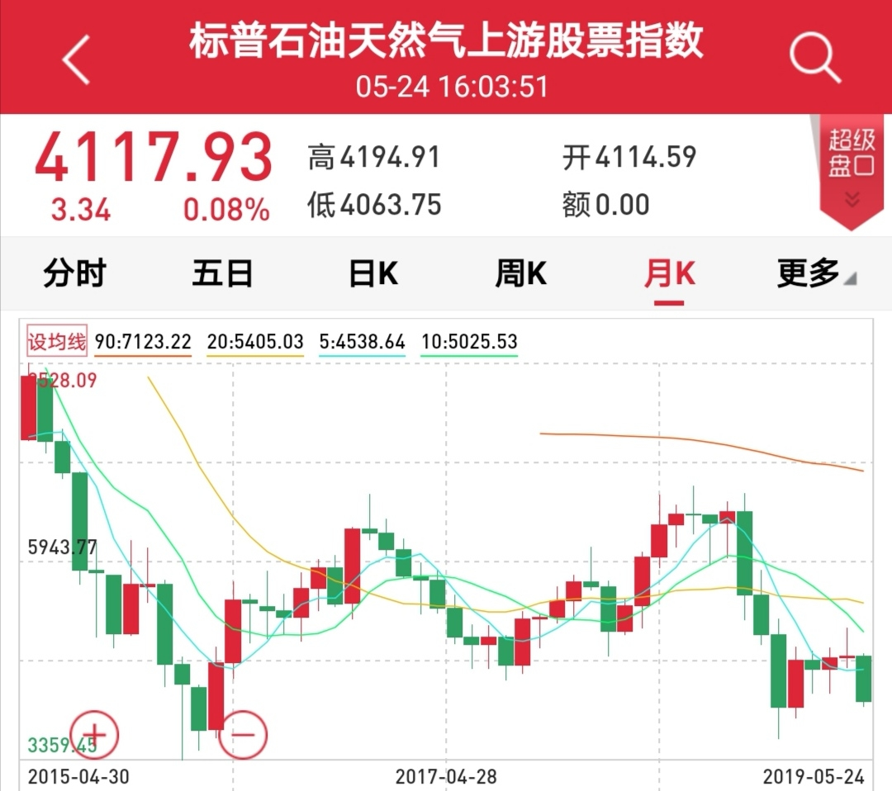

======================================================

_type: q&a
@程瑾[28212185412181]
2019-05-27 16:46:29 Mon  
topic_id: 844188248245142

@程瑾

>  请问华泰证券的客户经理联系方式，谢谢。

@二师父

>  用我的链接注册之后下载涨乐财付通，点击我的，个人信息，里面有基金经理的详细信息哈

阅读[2520]  评论[1]  赞[0] 

======================================================

_type: talk
@海盗[48248118584848]
2019-05-27 19:26:25 Mon  
topic_id: 844188242844842

5月27日最新偏离表

@海盗 at 2019-05-27 19:26:25 Mon

> 右下角是个-1

----------

@梧桐 at 2019-05-27 19:26:25 Mon

> 海盗辛苦了

----------

@聪明的笨蛋 at 2019-05-27 19:26:25 Mon

> *是同上一样吗它？

----------

@三峡情 at 2019-05-27 19:26:25 Mon

> 太好啦，这样以后就方便多了，辛苦辛苦！

----------

@西锦巴乌 at 2019-05-27 19:26:25 Mon

> 你好！请问偏离百分比为一2%，_4.34%偏离度怎么为_1%？之前师父不是以偏离百分比4为一个偏离度吗？

----------

@海盗 at 2019-05-27 19:26:25 Mon

> 不是的，有的基金没有场内的，所以无法算偏离度

----------

@海盗 at 2019-05-27 19:26:25 Mon

> 这里的的偏离度，是按每百分之六为一个偏离度

----------

@杜志彪 at 2019-05-27 19:26:25 Mon

> 这样会把我宠坏的，本来偏离度看跌多了，自己还算一下的，这下可好每天都给算好了，感谢学堂，感谢大家为学堂的贡献。

----------

阅读[2472]  评论[10]  赞[0] 

+++++++++++++++++++++++++++++++++++++++++++++++++++++

图片：
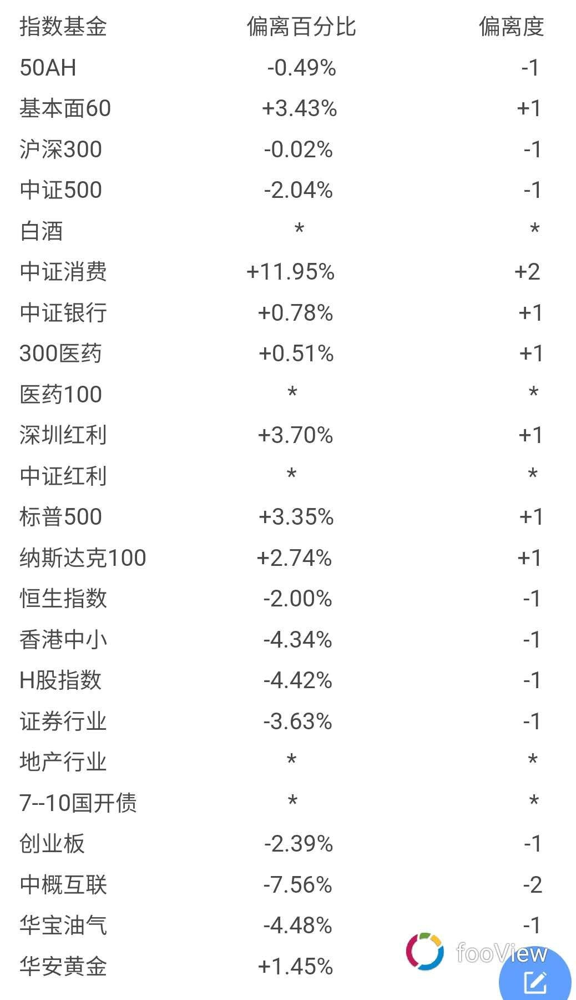

======================================================

_type: talk
@海盗[48248118584848]
2019-05-27 19:43:29 Mon  
topic_id: 422188525811188

大家好，我今天刚刚成为二师父的助教。感谢二师父对我的认可，以后更得加倍学习，不能辜负二师父对我的希望。大家有什么问题可以向我提问。[握手]相互交流，共同进步。

@志亮 at 2019-05-27 19:43:29 Mon

> 不错哦[强]

----------

@丸子妈 at 2019-05-27 19:43:29 Mon

> 好棒

----------

@陈 at 2019-05-27 19:43:29 Mon

> 棒棒哒！

----------

@老宋 at 2019-05-27 19:43:29 Mon

> 改ID

----------

@拥抱太阳的风筝 at 2019-05-27 19:43:29 Mon

> 祝贺

----------

@上上签 at 2019-05-27 19:43:29 Mon

> 恭喜

----------

@Claire at 2019-05-27 19:43:29 Mon

> 恭喜哟[鼓掌]

----------

@新的开始 at 2019-05-27 19:43:29 Mon

> 祝贺！壮大了师父的队伍。一些问题可以直接找助教了[呲牙]

----------

阅读[2500]  评论[11]  赞[0] 

======================================================

_type: talk
@二师父[28814221155551]
2019-05-28 05:04:04 Tue  
topic_id: 544811582824244

<e type="hashtag" hid="481211145528" title="#指数估值#" /> 指数估值表：绿色品种放心地定投就好，橙色适合收割利润，红色适合卖出本金。不知道如何使用指数估值表可以看看置顶文章五步定投法。如果没有低估的品种了，可以一直定投宽基指数到债券基金低估，然后定投债券基金。

鳄鱼计划参考估值表和均线偏离表，均线偏离表和估值表同时为绿色表示可以买入，如果两者只有一方显示卖出，可以收割利润，也可以等待指数估值进入正常再卖。但是估值表和均线偏离表同时显示卖出就要卖出本金了。

策略灵活运用，偏离差=（基金价格——90日均线价格）/90日均线价格，均线偏离差为负6到0为负1偏离度，当偏离差为负12到负6为负2偏离度。当负1偏离度买入0.5份，负2偏离度买入1份，负3偏离度买入1.5份，依次类推，将鳄鱼计划量化。

买入时期不固定，鳄鱼计划本来是二师父自己的加仓计划，很多读者不知道为什么买，所以我把交易进一步量化，一次买入一份不少，你觉得少可以把一份金额由1000变成5000.总之鳄鱼计划操作少，争取收益最大化，一出手就有确定性的高额利润。

新手参考定投实盘即可，这也是二师父实盘投资的，参考估值表定投。

任何策略都不要死板机械地使用，多策略灵活，有时间多听听课程吧

阅读[2494]  评论[0]  赞[0] 

+++++++++++++++++++++++++++++++++++++++++++++++++++++

图片：
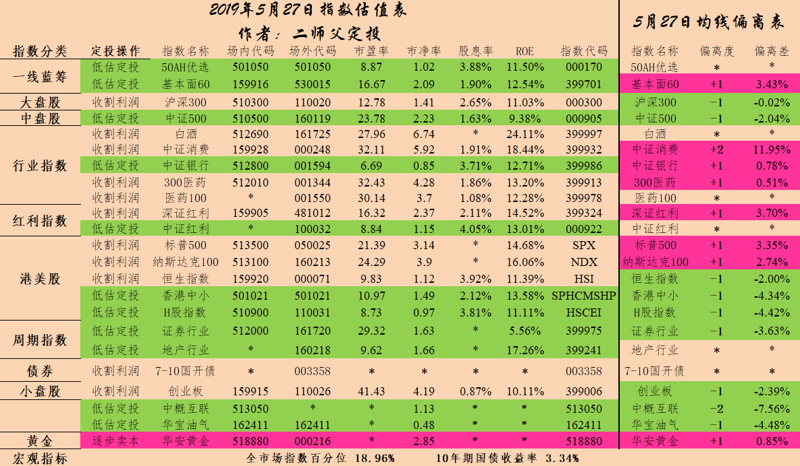

======================================================

_type: talk
@二师父[28814221155551]
2019-05-28 05:05:10 Tue  
topic_id: 844188215154852

<e type="hashtag" hid="881288554512" title="#基金分析#" /> 中概互联大家特别关注，有投资的吧，当别人恐惧的时候我们保持淡定就好啦

@妖孽 at 2019-05-28 05:05:10 Tue

> 请问二师父这基金场内交易规则是T+2？，费率多少。

----------

@麻烦得很 at 2019-05-28 05:05:10 Tue

> 请问二师父，广发、华泰都是万1.5免五吗？有没有资金量要求？谢谢。

----------

@Zyxj at 2019-05-28 05:05:10 Tue

> 场内中概互联是t+0。

----------

@蔡蔡蔡 at 2019-05-28 05:05:10 Tue

> 请问这个为啥我蚂蚁聚宝不能买，蛋卷也没搜到

----------

@二师父 at 2019-05-28 05:05:10 Tue

> 通过我的渠道费率基本在万1.5以下

----------

@二师父 at 2019-05-28 05:05:10 Tue

> 蚂蚁没这个基金

----------

@二师父 at 2019-05-28 05:05:10 Tue

> 没有，基金都免5，广发0.6，华泰1，华宝1.5

----------

@蔡蔡蔡 at 2019-05-28 05:05:10 Tue

> 蛋卷也没找到[大哭]

----------

阅读[4954]  评论[12]  赞[0] 

+++++++++++++++++++++++++++++++++++++++++++++++++++++

文件：
2019-05-28 05:04:29 Tue
文件大小：[165925]
51184415425814-中概互联网指数基金，我等了好久，你终于跌下来了.docx

======================================================

@二师父[28814221155551]
2019-05-28 09:24:22 Tue  
topic_id: 422188518445488

>  @二师父
>  

阅读[2367]  评论[0]  赞[0] 

======================================================

_type: q&a
@J[28281541518551]
2019-05-28 09:25:21 Tue  
topic_id: 544811581112444

@J

>  二师父好，试了一下华宝的网格交易模拟条件单，仍有些地方不懂，为什么系统发生跳价会产生多笔高买低卖？这是否代表策略会失效？怎样能确保交易按网格条件执行？您能跟我们普及一下场内交易软件的使用吗？之前一直只买场外，对于场内是小白，因为想跟着老师学习鳄鱼计划。或者方便截图说明交易条件单的设置吗？感谢！

@二师父

>  我会录制一个交易视频操作方法，到时候发给大家

阅读[2590]  评论[3]  赞[0] 

======================================================

_type: talk
@rtdmm小米[422188284881148]
2019-05-28 11:12:24 Tue  
topic_id: 544811585541514

有海盗助教，二师傅没那么辛苦了！

阅读[2423]  评论[0]  赞[0] 

======================================================

_type: talk
@李依祚[844148481122152]
2019-05-28 11:39:19 Tue  
topic_id: 244188212485151

之前好像记得师傅说过，没有场内账户的话，可以在场外用164906交银中证海外互联网指数代替中概互联

阅读[2406]  评论[0]  赞[0] 

======================================================

_type: talk
@二师父[28814221155551]
2019-05-28 12:33:50 Tue  
topic_id: 244188211224241

建议大家提问可以把自己的投资年限，基础大概说下，这样我可以回答的更有针对性

@四月天 at 2019-05-28 12:33:50 Tue

> 基金投资半年，股票2个月[微笑]

----------

@志亮 at 2019-05-28 12:33:50 Tue

> 基金投资3个月，股票投资一个半月，目前基金亏损2万，股票亏损6万多。

----------

@路 at 2019-05-28 12:33:50 Tue

> 在3100点时开始基金投资，现在亏6.38%

----------

@J at 2019-05-28 12:33:50 Tue

> 长线、短线配合，未熟悉场内操作前暂时只场外定投，只做能力圈范围内的事。计划投资1-2年，一边跟师父学习场内鳄鱼计划，2年后估计那时候牛市就要来了。[呲牙]

----------

@二师父 at 2019-05-28 12:33:50 Tue

> 非常不错

----------

@二师父 at 2019-05-28 12:33:50 Tue

> 股票先建立交易系统

----------

@志亮 at 2019-05-28 12:33:50 Tue

> 是呀，没什么交易，乱折腾所以亏损，目前不敢乱来了，但又怕忍不住[捂脸]

----------

@raochangan at 2019-05-28 12:33:50 Tue

> 大多数是可爱的大白和小白，[愉快]真正接触证券超过半年了，指数和股票从一月开始投，重仓了双汇和红利ETF，然后四月份跟着师傅学定投，要稳，要保守一点，觉得一切还来得及

----------

阅读[2484]  评论[19]  赞[0] 

======================================================

_type: q&a
@驼驼夫[244151825154221]
2019-05-28 12:53:54 Tue  
topic_id: 111855484158412

@驼驼夫

>  ①均线偏离度策略是否需要建立底仓，如何建立？
>  ②是按周买吗？以南方中证500ETF（2017.11.16~2019.2.11）,这段期间都是均线以下，共有452天，约65周，如果是以3年划分资金份数的话，共150份，那么这样的话这段期间才投了65份资金，资金利用率是否低？这个地方很多细节我都不懂，听了课看了星球的相关内容，还是很模糊。

@二师父

>  1，任何定投建立在长达10年周期基础上，都是不需要建立底仓的，除非到达历史底部区域，比如16年港股指数跌到6倍市盈率，去年a股跌到底部区域，这时候可以建立底仓
>  
>  2，低估定投策略，均线定投策略，均线定投策略我是统一在场内进行定投的，用了一个账户，如果采用均线定投策略，不用担心资金利用率不足的问题，因为偏离度5到6，我们会一次加仓2.5份或者3份
>  
>  关于分配定投份数，与你定投周期和预期每次投入份数有关，每月投，一年12份，每次投入份数根据偏离度定，保守点设为1.5，那就是18份。
>  
>  激进的投资者可以缩小投资份数，投完了就锁仓，保守的投资者要尽可能增大投资份数，资金利用不足不要紧，牛市来了可以利用趋势交易买股票，可是一旦所有资金被套大多数人是受不了的

阅读[4867]  评论[1]  赞[0] 

======================================================

_type: q&a
@가존보[111855585454522]
2019-05-28 13:01:59 Tue  
topic_id: 544811588182184

@가존보

>  二师父，封闭式基金折价率在多少的时候基本可以入手呀？

@二师父

>  主要看封闭基金的价值，价值高，有折价率都可以入手

阅读[2481]  评论[2]  赞[0] 

======================================================

_type: q&a
@J[28281541518551]
2019-05-28 13:03:49 Tue  
topic_id: 244188211814141

@J

>  请帮忙看看以下计划给我把把关。平日上班期间不能看盘，故选择场外定投，配置了少数周期指数，主要是中概互联、华宝油气和券商，各占总资金量的10%，具体操作为每日定额定投，按偏离度达到-2加仓1份，偏离度为正暂停定投。偏离度为+2则开始卖出1份，以此类推。不知这样是否可行？如有不足请师父指正。

@二师父

>  策略没有问题，再加一个条件，要在指数低估区域来执行这个策略，然后控制下仓位就没有问题啦

阅读[2599]  评论[4]  赞[0] 

======================================================

@二师父[28814221155551]
2019-05-28 13:40:10 Tue  
topic_id: 844188211424852

>  @二师父
>  

阅读[2594]  评论[2]  赞[0] 

======================================================

_type: q&a
@陈Being[28845245224851]
2019-05-28 14:54:40 Tue  
topic_id: 422188244854258

@陈Being

>  二师父，请问如何查看到场外ETF联接基金对应的场内持股成份股的内容包括哪些

@二师父

>  看对应的指数即可，这是重仓指数基金的基金，比如沪深300链接，直接看沪深300持仓，一样的

阅读[2514]  评论[0]  赞[0] 

======================================================

_type: talk
@海盗[48248118584848]
2019-05-28 17:46:54 Tue  
topic_id: 244188458881421

5月28日最新偏离表

@冉冉 at 2019-05-28 17:46:54 Tue

> 海盗助理辛苦了

----------

@冉冉 at 2019-05-28 17:46:54 Tue

> 为什么没有中证红利和医药100的偏离值呢？

----------

@海盗 at 2019-05-28 17:46:54 Tue

> 因为中证红利和医药100没有对应的场内基金，均线偏离度只有场内基金才有的

----------

@冉冉 at 2019-05-28 17:46:54 Tue

> 谢谢您及时的回复

----------

@海盗 at 2019-05-28 17:46:54 Tue

> 不客气

----------

@杜志彪 at 2019-05-28 17:46:54 Tue

> 这个必须給赞[强][强][强]

----------

@rtdmm小米 at 2019-05-28 17:46:54 Tue

> 海盗辛苦了！

----------

@rtdmm小米 at 2019-05-28 17:46:54 Tue

> 海盗助理，要是把代码加进去就完美了[调皮][调皮][偷笑][偷笑]

----------

阅读[2508]  评论[9]  赞[0] 

+++++++++++++++++++++++++++++++++++++++++++++++++++++

图片：
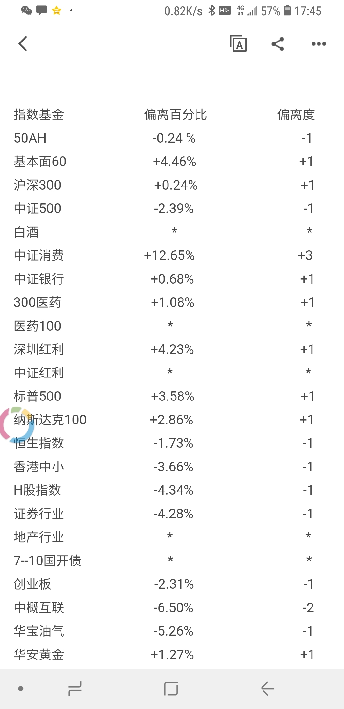

======================================================

@二师父[28814221155551]
2019-05-28 21:51:36 Tue  
topic_id: 422188242252818

>  @二师父
>  

阅读[2416]  评论[0]  赞[0] 

======================================================

_type: talk
@二师父[28814221155551]
2019-05-28 22:58:31 Tue  
topic_id: 111855128122122

中证传媒成了这个德性，新手一定避免重仓周期指数，周期指数我只投券商和地产，也是轻仓

@奔波儿霸🐟🐠🐬🐳🐋💦 at 2019-05-28 22:58:31 Tue

> 券商和地产在鳄鱼计划里还是在场外？

----------

@二师父 at 2019-05-28 22:58:31 Tue

> 这个场外每周都有买啊。。。。

----------

@小牧童 at 2019-05-28 22:58:31 Tue

> 二师父，您好，回顾之前中证传媒跌幅涨幅及时间，这次中证传媒跌了有4年，下跌空间是有限了，可以买在差不多较低位置了，时间也不会太久了吧，根据上一波上涨也是跟着15年牛市涨了一把，我们预计未来1年左右牛市会到来，只要坚持住，这一波上涨空间也不会小了可以这样理解吗

----------

@二师父 at 2019-05-28 22:58:31 Tue

> 传媒业和广告业务，影视等很多业务挂钩，广告业务，影视业务等很多业务能不能兴盛无法预测

我们推结论有演绎法和归纳法，归纳法是用经验总结未来，有缺陷

假设你总结过去每次牛市传媒知识都涨，那么这次牛市传媒指数也涨，这就是归纳法，有没有可能，过去5次牛市传媒涨，这次不涨呢？有可能的，这时候归纳法失效，因为没有逻辑说牛市来传媒就一定要涨，而且你的条件是15年牛市

至于我说牛市一年到来这也是归纳法推出的结论，有没有可能不来呢，有可能，比如你看看曾经辉煌的日本股市和现在低迷的日本股市，这就是黑天鹅，所以投资需要考虑黑天鹅来了怎么办

最好的办法就是轻仓定投传媒，或者直接避免

----------

@cotton at 2019-05-28 22:58:31 Tue

> 师父，中证传媒我一共买了3000块。现在要全部卖掉吗

----------

@小牧童 at 2019-05-28 22:58:31 Tue

> 受教了，从全方位考虑任何问题！谢谢师父！

----------

@二师父 at 2019-05-28 22:58:31 Tue

> 是在低估区域买的吧，如果是，可以拿着等盈利了在卖，你这仓位不重没事

----------

@cotton at 2019-05-28 22:58:31 Tue

> 是低估买的。好的。我放着

----------

阅读[2406]  评论[8]  赞[0] 

+++++++++++++++++++++++++++++++++++++++++++++++++++++

图片：
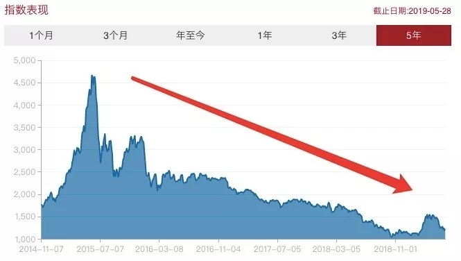

======================================================

_type: talk
@门萨🐨[51411455828824]
2019-05-28 23:00:42 Tue  
topic_id: 244188451452851

二师父小助理萨萨来报道
这两个月没在定投圈活跃
但是也没闲着
跑去玩信用卡了
玩卡的好盆友们欢迎交流[坏笑]

@奔波儿霸🐟🐠🐬🐳🐋💦 at 2019-05-28 23:00:42 Tue

> 易卡续命俩月，哈哈。

----------

@门萨🐨 at 2019-05-28 23:00:42 Tue

> 行家

----------

@liao at 2019-05-28 23:00:42 Tue

> 大神带我飞

----------

@门萨🐨 at 2019-05-28 23:00:42 Tue

> 说出你的梦想😅

----------

@liao at 2019-05-28 23:00:42 Tue

> 玩信用卡有什么套路吗[奸笑][奸笑]

----------

@门萨🐨 at 2019-05-28 23:00:42 Tue

> 你想玩资金党还是羊毛党

----------

@liao at 2019-05-28 23:00:42 Tue

> 先羊毛，再资金

----------

@liao at 2019-05-28 23:00:42 Tue

> [奸笑][奸笑]

----------

阅读[2605]  评论[20]  赞[0] 

======================================================

@二师父[28814221155551]
2019-05-29 00:39:23 Wed  
topic_id: 422188241154488

>  @二师父
>  

阅读[2474]  评论[0]  赞[0] 

======================================================

_type: talk
@二师父[28814221155551]
2019-05-29 05:23:07 Wed  
topic_id: 244188485882121

<e type="hashtag" hid="481211145528" title="#指数估值#" /> 低估定投，没有大的变化，加倍定投就不必了，明天我把18年底部的一张图给大家，真的到底部了我会说的，还没有到超级底部，不要急着加倍

@victoria at 2019-05-29 05:23:07 Wed

> 谢谢二师父，有你真好[呲牙]

----------

@三峡情 at 2019-05-29 05:23:07 Wed

> 谢谢二师父！有你真好！

----------

@俗人 at 2019-05-29 05:23:07 Wed

> 2400点的时候还不算超级低？[发呆]

----------

@丸子妈 at 2019-05-29 05:23:07 Wed

> 谢谢二师父，有你真好[呲牙]

----------

@二师父 at 2019-05-29 05:23:07 Wed

> 算啊

----------

@二师父 at 2019-05-29 05:23:07 Wed

> 感谢您的支持

----------

@二师父 at 2019-05-29 05:23:07 Wed

> 谢谢您的支持

----------

@二师父 at 2019-05-29 05:23:07 Wed

> 😃😃

----------

阅读[2401]  评论[9]  赞[0] 

+++++++++++++++++++++++++++++++++++++++++++++++++++++

图片：
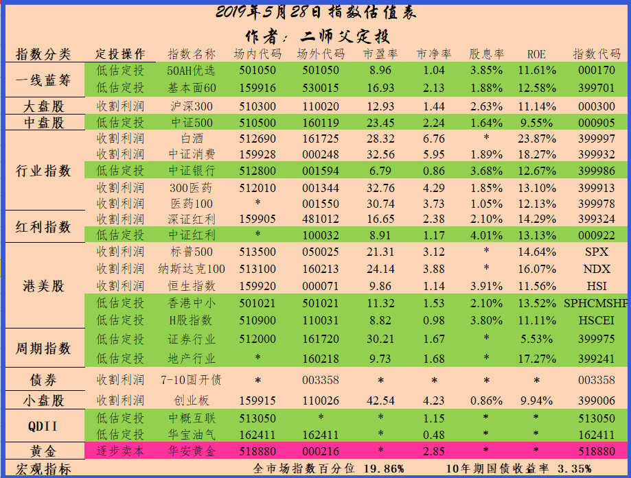

======================================================

_type: talk
@二师父[28814221155551]
2019-05-29 05:24:01 Wed  
topic_id: 244188485882111

<e type="hashtag" hid="552881548484" title="#学会资金配置#" />

@妖孽 at 2019-05-29 05:24:01 Wed

> 明天讲讲贪婪[呲牙]，大盘3200 不买总感觉错过很多。食品饮料这么好，一直高估。不买又难受。可是一买，就揪心。

----------

@闲云 at 2019-05-29 05:24:01 Wed

> 易方达50和二师父这个50AH有什么不同？

----------

@闲云 at 2019-05-29 05:24:01 Wed

> 目前定投易50

----------

@三峡情 at 2019-05-29 05:24:01 Wed

> 我也是这样，3200点赚钱了每天都想买点什么，看来看去没啥可买的，幸好大盘很快跌了，经过这一次，下次手应该不会痒了哈哈

----------

@二师父 at 2019-05-29 05:24:01 Wed

> 主要是a，h股折价轮动选股，这样的话50ah有超额收益

----------

@光年之外的饭团 at 2019-05-29 05:24:01 Wed

> 定投金额少的话是不是就在场外就行了

----------

@二师父 at 2019-05-29 05:24:01 Wed

> 是的

----------

阅读[4806]  评论[7]  赞[0] 

+++++++++++++++++++++++++++++++++++++++++++++++++++++

文件：
2019-05-29 05:23:37 Wed
文件大小：[172080]
88814425155122-你定投指数基金会担心吗？大概率是这个原因.docx

======================================================

_type: q&a
@林荫[15115451828452]
2019-05-29 10:36:43 Wed  
topic_id: 422188284881518

@林荫

>  我是刚进来的新手，有经历过股票和定投好些年，但是经验还是很浅。想系统的学习基金定投，请问你所讲的基本方法在哪有一个完整版吗？

@二师父

>  置顶文章五步定投法是低估定投策略完整版，第二基金定投入门与实战课程有低估定投策略，均线偏离策略，网格交易策略完整版

阅读[2287]  评论[1]  赞[0] 

======================================================

_type: talk
@九天[548228524258514]
2019-05-29 10:42:57 Wed  
topic_id: 422188182824828

昨天看到中概互联涨得挺多，今天跌下来了，就赶紧1.128的价格买了。

@杜志彪 at 2019-05-29 10:42:57 Wed

> 还是淡定点，有原则的买入才好，除非你子弹无线多。

----------

@九天 at 2019-05-29 10:42:57 Wed

> 嗯嗯，我会注意的，谢谢提醒！

----------

阅读[2268]  评论[2]  赞[0] 

======================================================

@二师父[28814221155551]
2019-05-29 12:40:03 Wed  
topic_id: 544811814482854

>  @二师父
>  

阅读[2316]  评论[3]  赞[0] 

======================================================

@二师父[28814221155551]
2019-05-29 16:18:38 Wed  
topic_id: 544811818214544

>  @二师父
>  

阅读[2169]  评论[0]  赞[0] 

======================================================

_type: q&a
@Joey [422115481514888]
2019-05-29 19:10:32 Wed  
topic_id: 244188125554221

@Joey 

>  师傅 你觉得现在的华东医药还能算白马股吗

@二师父

>  华东医药营收最近三年一直是正增长的，10个点以上。归属母公司净利润增长率均在20个点以上
>  
>  扣非peg0.65，目前仍旧属于白马股的范畴

阅读[2099]  评论[0]  赞[0] 

======================================================

@二师父[28814221155551]
2019-05-29 19:11:39 Wed  
topic_id: 422188154428258

>  @二师父
>  

阅读[2184]  评论[0]  赞[0] 

======================================================

_type: q&a
@别皱眉头[244148458815141]
2019-05-29 19:13:10 Wed  
topic_id: 544811852244124

@别皱眉头

>  二师父，我有个疑问，有点钻牛角尖了。想利用折价率提高场内低估定投的投资收益率，是不是应该以折价率为基准，即便处于低估，并且均线偏离表偏离度也为负数，但折价率不满足条件，是不是也不要买入？

@二师父

>  看情况，比如指数价格为4元，有1个点的溢价，比指数价格为5元，没有溢价的投资价值要高的

阅读[2306]  评论[1]  赞[0] 

======================================================

_type: q&a
@空瓶子[88282241812242]
2019-05-29 19:15:59 Wed  
topic_id: 422188154544228

@空瓶子

>  二师父，我觉得网格交易就得选低估波动大的。我理解对吗？这样才能有套利的机会。想问二师父您觉得哪些适合场内网格交易呢

@二师父

>  场内适合网格交易的品种我选择了5个，银行，深红利，券商油气，中概互联。
>  
>  波动大既要跌的多，也要涨的多，这样收益率会更好

阅读[2350]  评论[0]  赞[0] 

======================================================

_type: q&a
@徐美芳[51112822252224]
2019-05-29 19:40:33 Wed  
topic_id: 844188122222112

@徐美芳

>  二师傅，最近准备给孩子买份保险，不知道有没有性价比好的儿童保险推荐？

@二师父

>  孩子保险，如果追求保障全面，可以选择瑞泰人寿的晴天保保，如果孩子早产，体重低，胎龄小于37周，体重低于2.5千克，可以选择慧鑫安2018，如果选择费用低的，国华人寿的成人及儿童重疾可以。
>  
>  如果孩子患过病理性黄疸，在治愈半年以后而且没有并发症可以买瑞泰瑞盈，和谐慧鑫安2018，百年康惠保旗舰版
>  
>  如果孩子患了手足口病，治愈了满三月，无并发症可以买慧鑫安
>  
>  总结，首选是慧鑫安，康惠保旗舰版，瑞泰瑞盈，通过下方二维码可以对以上产品进行人工核保，确保是否满足健康告知要求

阅读[4703]  评论[4]  赞[0] 

======================================================

_type: talk
@二师父[28814221155551]
2019-05-30 01:39:22 Thu  
topic_id: 111855848414142

<e type="hashtag" hid="481211145528" title="#指数估值#" />

阅读[2116]  评论[0]  赞[0] 

+++++++++++++++++++++++++++++++++++++++++++++++++++++

图片：
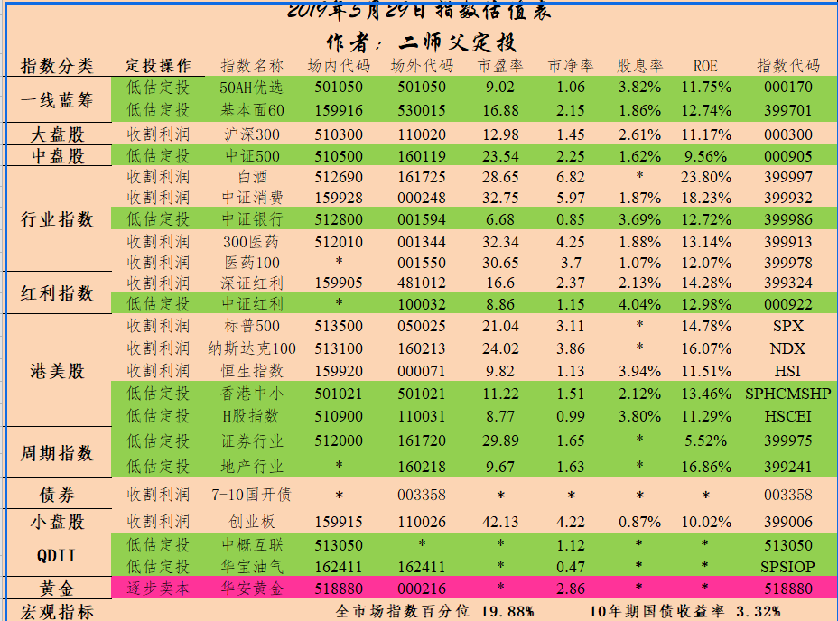

======================================================

_type: talk
@二师父[28814221155551]
2019-05-30 01:45:26 Thu  
topic_id: 244188121244451

<e type="hashtag" hid="454118144158" title="#定投实盘189期#" /> 配置逻辑分析了。很多读者关心一个问题，买入的比例怎么确定。

客观因素：根据估值阈值来定投，我们50AH的低估阈值是9.5倍市盈率，当前市盈率是9.02倍，那么买入的权重就是1.05，根据这个方法把所有指数需要买入的权重计算出来，然后算出加权平均的比例，就得到了每个指数需要的比例。

主观因素：这个就是二师父自己设定了，无法量化。你看地产指数和券商指数的加权买入比重不低，可是买入比例很低，因为这两个是周期指数，所以我在他们权重的基础上分别乘以了0.5和0.7的系数。这是主观因素。

还有如果其中的港股或者美股指数跌到历史底部区域我也会给与1.5甚至2倍的系数。

这都是根据整体市场综合判断的，分析方法就是这样，具体操作有时间的可以做个EXCEL分析，没时间的直接按照我得比例来，我就是这样买的

今天三点之前在场外申购都会以3点收盘价格成交的

@闲云 at 2019-05-30 01:45:26 Thu

> 收割利润的指数就暂时不投了？

----------

@闲云 at 2019-05-30 01:45:26 Thu

> 定投选择红利再投资吗？

----------

@乖子 at 2019-05-30 01:45:26 Thu

> 二师父太用心了，跟着你学习绝对没错

----------

@海盗 at 2019-05-30 01:45:26 Thu

> 我没选择红利再投资，因为资金是自己的，再投哪个自己得看估值。

----------

@二师父 at 2019-05-30 01:45:26 Thu

> 不用了

----------

@二师父 at 2019-05-30 01:45:26 Thu

> 谢谢支持

----------

@二师父 at 2019-05-30 01:45:26 Thu

> 当前可以红利在投资，如果高估只能现金分红了

----------

@大兵 at 2019-05-30 01:45:26 Thu

> 想知道是如何判断万得全A市盈率百分位是多少处于什么百分位？再就是，如何计算定投总额一份是多少钱，之前都是每周对应一份，从现在开始把剩下的金额一共分成多少份？谢谢！

----------

阅读[4926]  评论[12]  赞[0] 

+++++++++++++++++++++++++++++++++++++++++++++++++++++

图片：

+++++++++++++++++++++++++++++++++++++++++++++++++++++

文件：
2019-05-30 01:40:20 Thu
文件大小：[213414]
88814422512112-189期低估定投实盘暨配置逻辑解析5.30.docx

======================================================

_type: talk
@二师父[28814221155551]
2019-05-30 03:18:34 Thu  
topic_id: 111855848485142

<e type="hashtag" hid="225118158551" title="#网格交易介绍#" /> 这是华宝两篇关于网格交易的文章，可以看看怎么设置

@麻烦得很 at 2019-05-30 03:18:34 Thu

> 请问二师父，是不是只有华宝才有这个网格交易工具呢？因为工作关系，有时候可能两三天都不能用手机。另外，由于资金量比较小，所以特别关心免五，是只有基金免五还是股票也免五？谢谢

----------

@rtdmm小米 at 2019-05-30 03:18:34 Thu

> 请问二师父，可以按照阀值设置网格吗？比如白酒设置市盈率25-33为箱体，在这个估值区间做网格交易，可行吗？

----------

@程大圣 at 2019-05-30 03:18:34 Thu

> 华宝好像都免5，广发基金免5，股票10万以上免5，广发调整佣金比较慢

----------

@二师父 at 2019-05-30 03:18:34 Thu

> 没有问题啊

----------

@二师父 at 2019-05-30 03:18:34 Thu

> 在正常估值区间不行哈，因为从正常估值到底部还有很大跌幅，单边下跌很多人受不了

----------

@rtdmm小米 at 2019-05-30 03:18:34 Thu

> 好的，谢谢二师父

----------

@麻烦得很 at 2019-05-30 03:18:34 Thu

> 谢谢

----------

阅读[2450]  评论[7]  赞[0] 

+++++++++++++++++++++++++++++++++++++++++++++++++++++

文件：
2019-05-30 03:18:33 Thu
文件大小：[676554]
15581144288582-网格交易策略大全.docx

2019-05-30 03:18:33 Thu
文件大小：[478275]
28814422511841-网格工具使用详解.docx

======================================================

_type: talk
@二师父[28814221155551]
2019-05-30 03:34:12 Thu  
topic_id: 244188121218151

<e type="web" href="https://mp.weixin.qq.com/s/iktPZH_VOslkBfTjXGYqtw" title="网格交易策略详解和交易记录表" cache="" />，网格交易详解，这是我自己写的，别的写的太冗余，视频自动挂单记录稍后穿，正在审核中

<e type="web" href="https://mp.weixin.qq.com/s/iktPZH_VOslkBfTjXGYqtw" title="网格交易策略详解和交易记录表" cache="" />

@小小鸟 at 2019-05-30 03:34:12 Thu

> 二师父辛苦了

----------

@程大圣 at 2019-05-30 03:34:12 Thu

> 请问二师父，网格策略中卖出1份是按照一份基准金额卖还是一份基准金额的鼓数卖？或者按照一份基准金额除以当前净值的股数卖呢？

----------

@二师父 at 2019-05-30 03:34:12 Thu

> 按照一份的金额买和卖

----------

@陈 at 2019-05-30 03:34:12 Thu

> 二师父，下跌每次买入递增20份？是指这个基金一共就计划在二十份吗？

----------

@二师父 at 2019-05-30 03:34:12 Thu

> 没说啊，一次增加0.2，1，1.2，1.4，你再看看表格吧

----------

@陈 at 2019-05-30 03:34:12 Thu

> 二师父，是写的总共20份。我意思，鳄鱼计划这些基金就各计划二十份吗？

----------

@二师父 at 2019-05-30 03:34:12 Thu

> 这个是网格策略，不是鳄鱼计划，鳄鱼计划我用的均线加低估策略

网格策略总共一只基金30份够了

----------

阅读[2413]  评论[7]  赞[0] 

======================================================

_type: talk
@海盗[48248118584848]
2019-05-30 08:20:07 Thu  
topic_id: 422188128241248

<e type="hashtag" hid="225118152481" title="#指数基金均线偏离表#" /> 5月30日

@20181108…… at 2019-05-30 08:20:07 Thu

> 辛苦了

----------

@空瓶子 at 2019-05-30 08:20:07 Thu

> 有个疑问？就是中概互联昨天偏离度-2。并且昨天还跌了2个点。怎么今天偏离度-1了？

----------

@海盗 at 2019-05-30 08:20:07 Thu

> 首先肯定这位同学的认真。不过，这个我也发现了，做的时候我也特地做了两遍。均线偏离度就是和90日均线做对比的。而90日均线也会随着时间和点位在变动。

----------

@空瓶子 at 2019-05-30 08:20:07 Thu

> [呲牙]谢谢，我也是想到这个

----------

@龘何亮龘 at 2019-05-30 08:20:07 Thu

> 我现在8143看90日均线是1.23，和前几天一样还没变，是不是开盘后数据才能更新？

----------

@龘何亮龘 at 2019-05-30 08:20:07 Thu

> 8.43

----------

@杜志彪 at 2019-05-30 08:20:07 Thu

> 按昨天收盘应该是-8.4，坐等低于-12[呲牙]

----------

@小小鸟 at 2019-05-30 08:20:07 Thu

> 感谢海盗助教

----------

阅读[2516]  评论[9]  赞[0] 

+++++++++++++++++++++++++++++++++++++++++++++++++++++

图片：
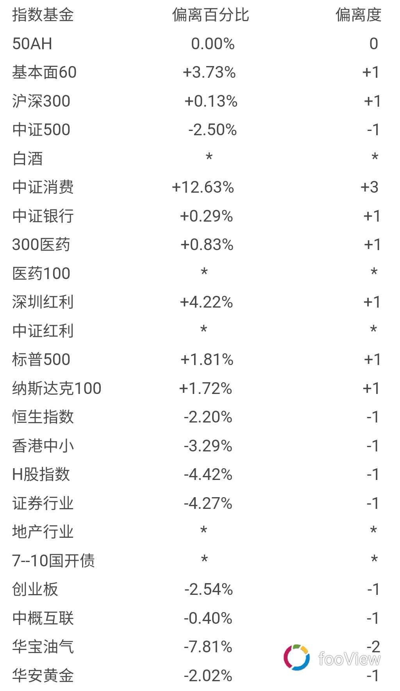

======================================================

_type: q&a
@罗大发[421484455521228]
2019-05-30 09:46:41 Thu  
topic_id: 422188128182888

@罗大发

>  师父，我买的场外基本面60，成本单价1.9707，5月29日净值2.0202，显示当天日收益是负的，请问这是怎么回事？

@二师父

>  有啥问题？你的持仓收益率2.51个百分点，用2.0202减去1.9707除以1.9707就是你的持仓收益率，当日收益率是与昨日比较的哈

阅读[2398]  评论[2]  赞[0] 

======================================================

_type: talk
@二师父[28814221155551]
2019-05-30 11:00:56 Thu  
topic_id: 244188142448251

<e type="hashtag" hid="552825118544" title="#实盘说明#" /> 今天我在天天基金又开了一个实盘记录交易，下周公开，到时候大家关注下二师父低估定投，就可以一键购买啦，不用每次输入五只基金定投实在麻烦，天天基金福利注册渠道点击这个链接就行啦

这个实盘基础金额2000元，一份2000元，作为参考。大家根据实际来。

<e type="web" href="https://mp.weixin.qq.com/s/2gs4nTPew4OqR6iNMKOvJg" title="天天基金福利注册渠道及申购步骤" cache="" />

@麻烦得很 at 2019-05-30 11:00:56 Thu

> 以前就有了东方财富账号的怎么办？

----------

@谢谢 at 2019-05-30 11:00:56 Thu

> 师傅，我现在定投了50AH与基本面60，如果想与你的组合跟投会不会重复了，怎么操作合适呢？

----------

@志亮 at 2019-05-30 11:00:56 Thu

> 天天基金就是东方财富的号呀

----------

@麻烦得很 at 2019-05-30 11:00:56 Thu

> 你是没明白，二师父说他的福利开户，但是我已经有了，还可不可以？

----------

@王秦川 at 2019-05-30 11:00:56 Thu

> 越来越方便了，可以专心做好本职工作。

----------

@乖子 at 2019-05-30 11:00:56 Thu

> 这样最好

----------

@潜龙 at 2019-05-30 11:00:56 Thu

> 在天天基金里看吗？

----------

@彩虹 at 2019-05-30 11:00:56 Thu

> 二师傅怎么不在蛋卷基金弄个投资组合，我们跟投，很方便

----------

阅读[2356]  评论[17]  赞[0] 

+++++++++++++++++++++++++++++++++++++++++++++++++++++

图片：
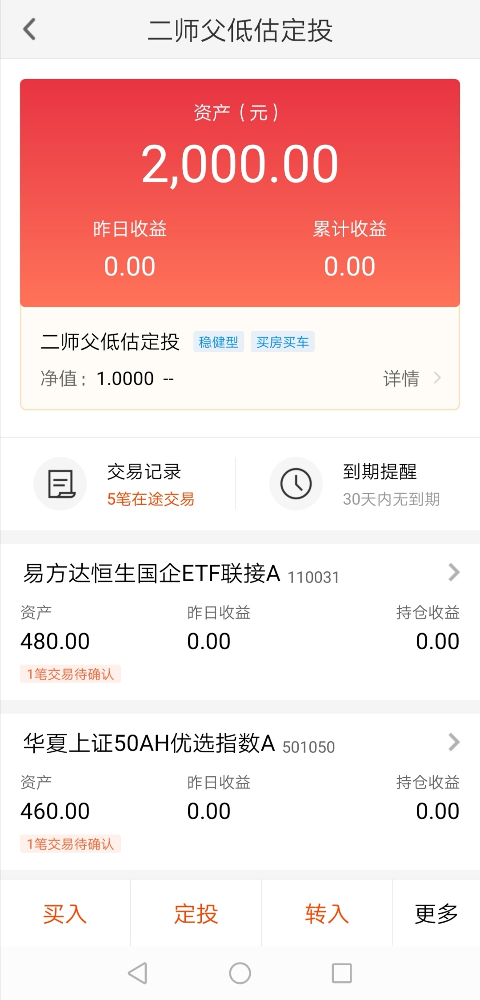

======================================================

_type: q&a
@雪莲[421485848588118]
2019-05-30 12:37:27 Thu  
topic_id: 111855814182552

@雪莲

>  师傅，我买的南方中证500ETF联接目前仓位有点重，想减点仓可收益率还负了3个点我不知该怎么办好？请师傅指点。

@二师父

>  停止定投，等盈利了再减仓，目前股市整体低位，不要卖，耐心持有

阅读[2188]  评论[0]  赞[0] 

======================================================

@二师父[28814221155551]
2019-05-30 12:39:28 Thu  
topic_id: 111855811225212

>  @二师父
>  

阅读[2218]  评论[0]  赞[0] 

======================================================

_type: q&a
@Claire[244151258154481]
2019-05-30 12:40:27 Thu  
topic_id: 844188144554552

@Claire

>  师父，你好！请问50ah和上证50的估值是一样的吗？另外恒生国企可以场内投吗？

@二师父

>  不是完全一样，可以参考50ah的，大致相同。场内恒生国企可以投资，h股etf就是场内恒生国企

阅读[2299]  评论[1]  赞[0] 

======================================================

_type: talk
@二师父[28814221155551]
2019-05-30 13:31:30 Thu  
topic_id: 244188144244121

这是网格记录表，大家参考即可，操作简单，不用一直公布买入和卖出到达价位就买和卖，具体说明看前一篇关于网格的文章

@J at 2019-05-30 13:31:30 Thu

> 师父，理论上可行，实际上如果价格不到达以上每一档的标准，误差范围多少可以操作？另外，在底仓以下的区间，你现在调整至不止20份了？

----------

@二师父 at 2019-05-30 13:31:30 Thu

> 30份，这个比较保守，你可以自行设置

----------

@J at 2019-05-30 13:31:30 Thu

> 算上底仓，每只基金分为一共31份

----------

@二师父 at 2019-05-30 13:31:30 Thu

> 对的，我后面写一个更详细的讲解这样设置的逻辑

----------

@J at 2019-05-30 13:31:30 Thu

> 好的 师父真是诲人不倦，谢谢

----------

@大兵 at 2019-05-30 13:31:30 Thu

> 师父，场内F60和深红利感觉重合度比较高呀，都是制造业，为啥两个都要场内定投？

----------

@大兵 at 2019-05-30 13:31:30 Thu

> 再就是，场内购买了中概，券商，华宝油气，上证50，想增加银行eft ，如何？

----------

@二师父 at 2019-05-30 13:31:30 Thu

> 银行我鳄鱼计划一直投啊，深红利我在场内买，基本面60场内没买，你把以前文章看看再提问吧

----------

阅读[2341]  评论[11]  赞[0] 

+++++++++++++++++++++++++++++++++++++++++++++++++++++

图片：
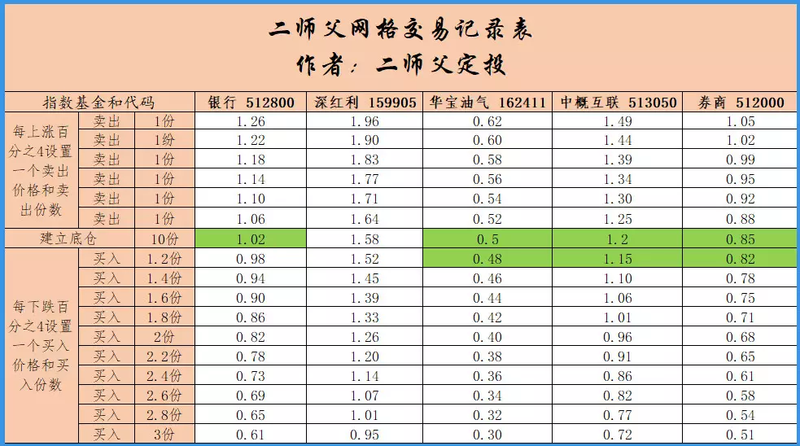

======================================================

_type: q&a
@S.H.[844148451558452]
2019-05-30 22:45:27 Thu  
topic_id: 422188115255888

@S.H.

>  请教师父：我刚刚定投了红利机会不久，发现您最新的估值表没有它啦？是估值高了？同时注意到上证红利、中证红利也进入低估区了，这三只该选哪个好呢？

@二师父

>  红利机会目前还是处于低估区域的，这三只同时进入低估区域，选择中证红利好一些，分红稳定
>  
>  这三只的区别在于中证红利和上证红利属于大盘股红利指数，标普红利机会属于中盘股红利指数，如果蓝筹指数涨的多，那么上证红利和中证红利表现好，如果中盘指数涨的多，那么红利机会涨的多

阅读[1724]  评论[1]  赞[0] 

======================================================

_type: talk
@二师父[28814221155551]
2019-05-31 05:17:40 Fri  
topic_id: 844182555825482

<e type="hashtag" hid="825118144122" title="#五步定投法最新版#" /> 这是最新的五步定投法，更新了建立副业的思维认知，投资标的，定投买入比例计算方法等很多内容。我觉得比书好，很多新手要二师父推荐定投书籍，我觉得没有我得五步定投法清晰

也有出版社邀请我出书，不过我写的文章都是按照自己的想法写，出版社总是为了销量让我按照他们的意愿来，所以就谈不拢。本来工作就是非自愿做的，我发展一项属于自己的事业，就像按照自己的想法做。

今天写五步定投法花费了6个小时，估值表更新暂停一天，请谅解，精力有限。

@艾琪（王钥） at 2019-05-31 05:17:40 Fri

> 非常好的一篇文章，理财思路越来越清晰了，值得收藏起来慢慢学习

----------

@rtdmm小米 at 2019-05-31 05:17:40 Fri

> 珍藏版

----------

@彩色 at 2019-05-31 05:17:40 Fri

> 精华中的精华，在学习中

----------

@闲云 at 2019-05-31 05:17:40 Fri

> 二师父是二十多岁吗？前途不可限量啊

----------

@波 at 2019-05-31 05:17:40 Fri

> 二师父辛苦了![咖啡]

----------

阅读[4161]  评论[6]  赞[1] 

+++++++++++++++++++++++++++++++++++++++++++++++++++++

文件：
2019-05-31 05:14:55 Fri
文件大小：[871566]
28814445558451-根据低估定投策略制定的五步定投法（2.0）.pdf

======================================================

_type: q&a
@妖孽[544888148518184]
2019-05-31 05:45:52 Fri  
topic_id: 422185444882218

@妖孽

>  我有这么一个顾虑，万一将来的某一天二师父断更了，我们这群跟着你走过来的粉丝何去何从，根据您的估值表投资的标，其它平台没有，我们就失去了参考，那将会导致恐慌 迷茫......

@二师父

>  我俩比比看，是你先停止定投还是我先停止更文哈。我这么多年写日记没有断过，更文了一年多了，过年也不间断，除非意外。相反之前说能忍受浮亏跟着二师父一起定投的朋友是越来越少啊，所以你还是先考虑考虑自己怎么坚持吧，目前我是边工作边更新基本日更，时间都是挤出来的，等哪天我离开公司自己做的话时间就更难断了
>  
>  第二，黑天鹅出现怎么办，多学习二师父传递的基本理念，学会自己配置和定投，我的每篇文章不仅有结论，更有原理和方法，多学习自己就能定投，这个不是股票投资，基金定投人人都可以掌握

阅读[1812]  评论[6]  赞[0] 

======================================================

_type: talk
@rtdmm小米[422188284881148]
2019-05-31 08:43:53 Fri  
topic_id: 544815222824184

全部是精华，值得定期温习的干货，二师父太细心了，这简直是为小白准备的详细理财操作流程，谢谢二师父，辛苦了！

阅读[1662]  评论[0]  赞[0] 

======================================================

_type: talk
@杜志彪[544454124115854]
2019-05-31 09:02:59 Fri  
topic_id: 544815221222184

海盗坚持住，今天偏离度有点晚，还没发出来[得意]

@海盗 at 2019-05-31 09:02:59 Fri

> 二师父说了，均线偏离度，变化不是太大，一个星期做个两三次就行。

----------

@杜志彪 at 2019-05-31 09:02:59 Fri

> 好滴😊 ，辛苦了

----------

阅读[1727]  评论[2]  赞[0] 

======================================================

_type: q&a
@田维海[422144441542418]
2019-05-31 10:19:55 Fri  
topic_id: 422185444828228

@田维海

>  师傅，基金季报年报在哪里看到？

@二师父

>  基金公司官网

阅读[1714]  评论[2]  赞[0] 

======================================================

_type: q&a
@聪明的笨蛋[544858411212244]
2019-05-31 10:58:22 Fri  
topic_id: 544815222141244

@聪明的笨蛋

>  二师傅我一想买你推荐的康惠保重疾险，但是买保险需要用身份证银行卡录入审核的，没在网上买过保险，网上昰怎样审核的。其次购买了重疾加特疾需要再买医疗险吗？

@二师父

>  直接输入身份证和银行卡就行啦，医疗险是不限疾病的，如果你没有医保卡可以购买，一般大型企业都有医保卡，去医院看病拿医保卡可以报销的

阅读[1751]  评论[11]  赞[0] 

======================================================

@二师父[28814221155551]
2019-05-31 10:58:55 Fri  
topic_id: 844182558458852

>  @二师父
>  

阅读[1886]  评论[1]  赞[0] 

======================================================

_type: q&a
@青鸟飞鱼、此生不换[844111545424582]
2019-05-31 11:56:51 Fri  
topic_id: 422185445454248

@青鸟飞鱼、此生不换

>  二师父你好，我开通了华泰证券要买场内基金，软件哪个是买场内基金的？

@二师父

>  直接搜索场内代码，然后输入购买的数量，点击购买即可，那些都不是的

阅读[1898]  评论[0]  赞[0] 

======================================================

_type: talk
@二师父[28814221155551]
2019-05-31 12:06:11 Fri  
topic_id: 244182552518481

<e type="hashtag" hid="142884244242" title="#关于网格交易和均线策略#" /> 昨天分享了低估定投策略，今天分享网格策略和均线策略。二师父鳄鱼计划就是利用均线策略加低估策略进行定投的，只是里面综合因素多，所以并不是说均线偏离为负就定投，大家要明白一个道理，投资成败和你策略有关系，但关键是克服内心恐惧的，很多人又不敢买了，人性都是一样的，所以策略只是术，投资之道在于对自己的理解以及对人性弱点的克服

其次网格策略加低估策略的这个没有那么复杂，二师父把买入卖出标准都写出来了，大家按照价格操作即可

@J at 2019-05-31 12:06:11 Fri

> 网格策略和均线策略二选一即可？

----------

@二师父 at 2019-05-31 12:06:11 Fri

> 对的，场内用一个即可，均线策略相当移动的网格

----------

@J at 2019-05-31 12:06:11 Fri

> 师父，可以写一篇文比较一下网格交易和均线偏离两个策略的优劣吗？个人觉得目前来看网格交易清晰一些，可操作性强一些？不知对不对，期待你的专业分析

----------

@二师父 at 2019-05-31 12:06:11 Fri

> 都很容易操作的，均线策略收益更好，因为指数价格是不断上移动的，均线也是移动的

还有就是网格的底仓价格也是变动的，这就需要调整，难点在这里，相比较而言均线策略更容易，因为偏离差数据固定

----------

阅读[1891]  评论[4]  赞[0] 

======================================================

_type: talk
@二师父[28814221155551]
2019-05-31 12:07:37 Fri  
topic_id: 544815225285824

<e type="hashtag" hid="881251425252" title="#鳄鱼计划#" /> 买入华宝油气一份，价格大概0.462，周期指数波动大记得不要重仓，适合做波段

阅读[4356]  评论[0]  赞[0] 

======================================================

_type: q&a
@彼得.帕克[844412441225142]
2019-05-31 13:15:17 Fri  
topic_id: 111854221814552

@彼得.帕克

>  二师傅，看了您的五步定投，目前我有20万稳健资金，如何建仓，一年期是否太长，没有建好仓牛市就来了呢？

@二师父

>  不长，如果没有建好仓牛市来了可以利用趋势交易投资股票，可是半年资金用完牛市没来，就会焦虑恐惧彷徨怀疑，紧接着卧倒装死割肉止损
>  
>  投资需要保守，安全第一

阅读[1923]  评论[0]  赞[0] 

======================================================

@二师父[28814221155551]
2019-05-31 13:17:00 Fri  
topic_id: 544815224884244

>  @二师父
>  

阅读[1917]  评论[0]  赞[0] 

======================================================

_type: talk
@二师父[28814221155551]
2019-05-31 13:17:28 Fri  
topic_id: 544815228248544

华泰新开户都可以购买两款新客产品，即新手理财和惠理财：
ü	新手理财（6.0%,14天，5万定额）
ü	惠理财（6.08%，35天，1000元-5000元）

阅读[2103]  评论[0]  赞[0] 

======================================================

@二师父[28814221155551]
2019-05-31 14:07:20 Fri  
topic_id: 111854228554852

>  @二师父
>  

阅读[2047]  评论[0]  赞[0] 

======================================================

_type: talk
@程大圣[118255212158112]
2019-05-31 14:37:58 Fri  
topic_id: 544815228555154

求一个最近最新的二师父推荐的这些指数基金阈值区间表

@20181108…… at 2019-05-31 14:37:58 Fri

> 

----------

@程大圣 at 2019-05-31 14:37:58 Fri

> 感谢

----------

阅读[2087]  评论[2]  赞[0] 

======================================================

_type: q&a
@幻水[881185412112]
2019-05-31 15:14:55 Fri  
topic_id: 111854228554812

@幻水

>  有人说：低波动策略有个Bug，您怎么看？
>  具体Bug如下：
>  
>  从海外经验看，低波动指数大概率会有超额收益，但这个策略，在国内是否有效，还需要观察。
>  
>  另外，低波动策略有个Bug，就是庄股或者高度控盘的股票，波动其实是非常低的，这类股票，易被选成成分股。上海莱士就曾是某低波动指数的第二大成分股。

@二师父

>  对的，这确实是一个bug，不过我们可以这样应对，选择多策略波动指数，比如红利低波动指数，选择高股息率，低波动率的指数
>  
>  这样就可以避免了，你的提问都还是很有价值的

阅读[2105]  评论[0]  赞[0] 

======================================================

_type: q&a
@平安是福[118222545154542]
2019-05-31 15:15:29 Fri  
topic_id: 111854228452522

@平安是福

>  师父，华泰开户扫置顶二维码就可以吗，费率多少啊

@二师父

>  对的，费率私信我，我发给你，这个免5比市场低

阅读[2233]  评论[1]  赞[0] 

======================================================

@二师父[28814221155551]
2019-05-31 15:17:09 Fri  
topic_id: 244182551224251

>  @二师父
>  

阅读[2345]  评论[0]  赞[0] 

======================================================

@二师父[28814221155551]
2019-05-31 19:32:26 Fri  
topic_id: 244182551152251

>  @二师父
>  

阅读[2208]  评论[0]  赞[0] 

======================================================

_type: q&a
@开卷沐春意[422214414858458]
2019-05-31 19:33:29 Fri  
topic_id: 422185484528518

@开卷沐春意

>  二师傅您好，我的手机号码换了，易淘金账号不记得了，我如何能上去广发易淘金？

@二师父

>  你用手机加密码登陆，然后换绑手机即可

阅读[2252]  评论[1]  赞[0] 

======================================================

_type: q&a
@开卷沐春意[422214414858458]
2019-05-31 21:39:00 Fri  
topic_id: 844182588821182

@开卷沐春意

>  怎么办，二师傅，我上不去呀

@二师父

>  你微信多少

阅读[2204]  评论[0]  赞[0] 

======================================================

